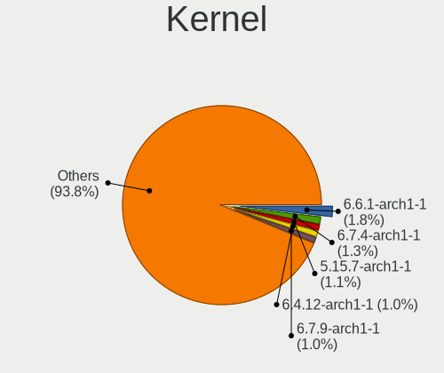
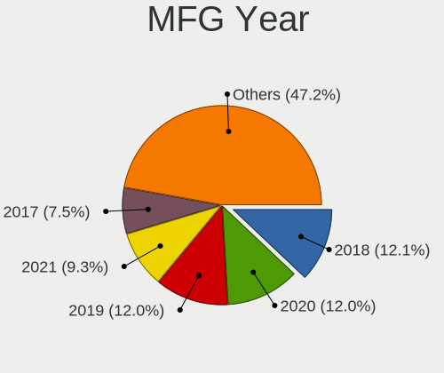
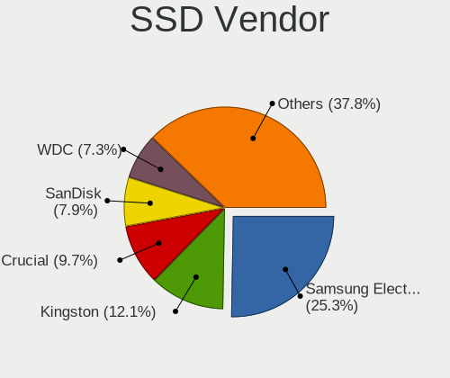
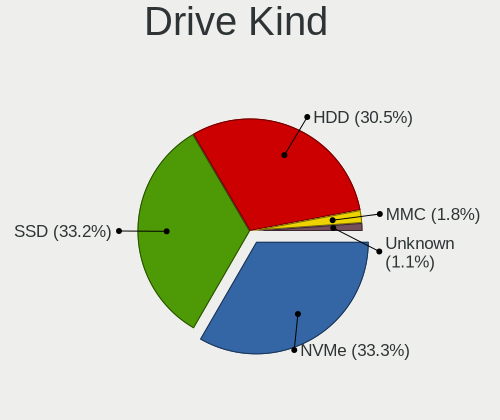
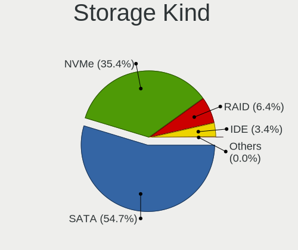
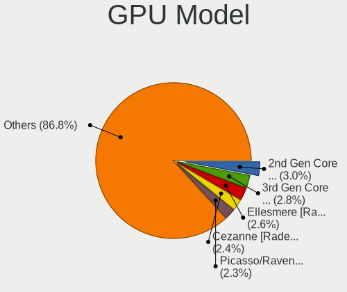
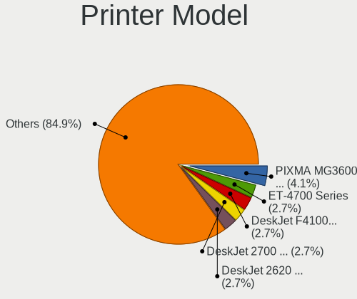
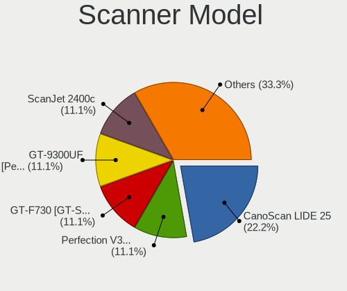

ArcoLinux - Tested Hardware & Statistics
----------------------------------------

A project to collect tested hardware configurations for ArcoLinux.

Anyone can contribute to this report by the [hw-probe](https://github.com/linuxhw/hw-probe) tool:

    sudo -E hw-probe -all -upload

Please contribute! Especially if your hardware is rare.

This is a report for all computer types. See also reports for [desktops](/Dist/ArcoLinux/Desktop/README.md) and [notebooks](/Dist/ArcoLinux/Notebook/README.md).

Contents
--------

* [ Test Cases ](#test-cases)

* [ System ](#system)
  - [ OS                       ](#os)
  - [ OS Family                ](#os-family)
  - [ Kernel                   ](#kernel)
  - [ Kernel Family            ](#kernel-family)
  - [ Kernel Major Ver.        ](#kernel-major-ver)
  - [ Arch                     ](#arch)
  - [ DE                       ](#de)
  - [ Display Server           ](#display-server)
  - [ Display Manager          ](#display-manager)
  - [ OS Lang                  ](#os-lang)
  - [ Boot Mode                ](#boot-mode)
  - [ Filesystem               ](#filesystem)
  - [ Part. scheme             ](#part-scheme)
  - [ Dual Boot with Linux/BSD ](#dual-boot-with-linuxbsd)
  - [ Dual Boot (Win)          ](#dual-boot-win)

* [ Board ](#board)
  - [ Vendor                   ](#vendor)
  - [ Model                    ](#model)
  - [ Model Family             ](#model-family)
  - [ MFG Year                 ](#mfg-year)
  - [ Form Factor              ](#form-factor)
  - [ Secure Boot              ](#secure-boot)
  - [ Coreboot                 ](#coreboot)
  - [ RAM Size                 ](#ram-size)
  - [ RAM Used                 ](#ram-used)
  - [ Total Drives             ](#total-drives)
  - [ Has CD-ROM               ](#has-cd-rom)
  - [ Has Ethernet             ](#has-ethernet)
  - [ Has WiFi                 ](#has-wifi)
  - [ Has Bluetooth            ](#has-bluetooth)

* [ Location ](#location)
  - [ Country                  ](#country)
  - [ City                     ](#city)

* [ Drives ](#drives)
  - [ Drive Vendor             ](#drive-vendor)
  - [ Drive Model              ](#drive-model)
  - [ HDD Vendor               ](#hdd-vendor)
  - [ SSD Vendor               ](#ssd-vendor)
  - [ Drive Kind               ](#drive-kind)
  - [ Drive Connector          ](#drive-connector)
  - [ Drive Size               ](#drive-size)
  - [ Space Total              ](#space-total)
  - [ Space Used               ](#space-used)
  - [ Malfunc. Drives          ](#malfunc-drives)
  - [ Malfunc. Drive Vendor    ](#malfunc-drive-vendor)
  - [ Malfunc. HDD Vendor      ](#malfunc-hdd-vendor)
  - [ Malfunc. Drive Kind      ](#malfunc-drive-kind)
  - [ Failed Drives            ](#failed-drives)
  - [ Failed Drive Vendor      ](#failed-drive-vendor)
  - [ Drive Status             ](#drive-status)

* [ Storage controller ](#storage-controller)
  - [ Storage Vendor           ](#storage-vendor)
  - [ Storage Model            ](#storage-model)
  - [ Storage Kind             ](#storage-kind)

* [ Processor ](#processor)
  - [ CPU Vendor               ](#cpu-vendor)
  - [ CPU Model                ](#cpu-model)
  - [ CPU Model Family         ](#cpu-model-family)
  - [ CPU Cores                ](#cpu-cores)
  - [ CPU Sockets              ](#cpu-sockets)
  - [ CPU Threads              ](#cpu-threads)
  - [ CPU Op-Modes             ](#cpu-op-modes)
  - [ CPU Microcode            ](#cpu-microcode)
  - [ CPU Microarch            ](#cpu-microarch)

* [ Graphics ](#graphics)
  - [ GPU Vendor               ](#gpu-vendor)
  - [ GPU Model                ](#gpu-model)
  - [ GPU Combo                ](#gpu-combo)
  - [ GPU Driver               ](#gpu-driver)
  - [ GPU Memory               ](#gpu-memory)

* [ Monitor ](#monitor)
  - [ Monitor Vendor           ](#monitor-vendor)
  - [ Monitor Model            ](#monitor-model)
  - [ Monitor Resolution       ](#monitor-resolution)
  - [ Monitor Diagonal         ](#monitor-diagonal)
  - [ Monitor Width            ](#monitor-width)
  - [ Aspect Ratio             ](#aspect-ratio)
  - [ Monitor Area             ](#monitor-area)
  - [ Pixel Density            ](#pixel-density)
  - [ Multiple Monitors        ](#multiple-monitors)

* [ Network ](#network)
  - [ Net Controller Vendor    ](#net-controller-vendor)
  - [ Net Controller Model     ](#net-controller-model)
  - [ Wireless Vendor          ](#wireless-vendor)
  - [ Wireless Model           ](#wireless-model)
  - [ Ethernet Vendor          ](#ethernet-vendor)
  - [ Ethernet Model           ](#ethernet-model)
  - [ Net Controller Kind      ](#net-controller-kind)
  - [ Used Controller          ](#used-controller)
  - [ NICs                     ](#nics)
  - [ IPv6                     ](#ipv6)

* [ Bluetooth ](#bluetooth)
  - [ Bluetooth Vendor         ](#bluetooth-vendor)
  - [ Bluetooth Model          ](#bluetooth-model)

* [ Sound ](#sound)
  - [ Sound Vendor             ](#sound-vendor)
  - [ Sound Model              ](#sound-model)

* [ Memory ](#memory)
  - [ Memory Vendor            ](#memory-vendor)
  - [ Memory Model             ](#memory-model)
  - [ Memory Kind              ](#memory-kind)
  - [ Memory Form Factor       ](#memory-form-factor)
  - [ Memory Size              ](#memory-size)
  - [ Memory Speed             ](#memory-speed)

* [ Printers & scanners ](#printers--scanners)
  - [ Printer Vendor           ](#printer-vendor)
  - [ Printer Model            ](#printer-model)
  - [ Scanner Vendor           ](#scanner-vendor)
  - [ Scanner Model            ](#scanner-model)

* [ Camera ](#camera)
  - [ Camera Vendor            ](#camera-vendor)
  - [ Camera Model             ](#camera-model)

* [ Security ](#security)
  - [ Fingerprint Vendor       ](#fingerprint-vendor)
  - [ Fingerprint Model        ](#fingerprint-model)
  - [ Chipcard Vendor          ](#chipcard-vendor)
  - [ Chipcard Model           ](#chipcard-model)

* [ Unsupported ](#unsupported)
  - [ Unsupported Devices      ](#unsupported-devices)
  - [ Unsupported Device Types ](#unsupported-device-types)

Test Cases
----------

Total: 4048

| Vendor        | Model                       | Form-Factor | Probe                                                      | Date         |
|---------------|-----------------------------|-------------|------------------------------------------------------------|--------------|
| Intel         | NUC13ANBi3 N13056-202       | Mini pc     | [3548282229](https://linux-hardware.org/?probe=3548282229) | Feb 02, 2024 |
| Acer          | Aspire VN7-592G             | Notebook    | [95f618bdeb](https://linux-hardware.org/?probe=95f618bdeb) | Feb 02, 2024 |
| Acer          | Swift SF314-56              | Notebook    | [159a1c3a0f](https://linux-hardware.org/?probe=159a1c3a0f) | Feb 02, 2024 |
| MSI           | B550 GAMING GEN3            | Desktop     | [e0f8f7bf56](https://linux-hardware.org/?probe=e0f8f7bf56) | Feb 01, 2024 |
| Dell          | XPS 15 9560                 | Notebook    | [63fe6fecb5](https://linux-hardware.org/?probe=63fe6fecb5) | Feb 01, 2024 |
| Dell          | XPS 15 9560                 | Notebook    | [0b1c1e6784](https://linux-hardware.org/?probe=0b1c1e6784) | Feb 01, 2024 |
| Google        | Phaser360                   | Notebook    | [3347aeb232](https://linux-hardware.org/?probe=3347aeb232) | Feb 01, 2024 |
| HP            | 8053                        | Desktop     | [d4cc3a7d7d](https://linux-hardware.org/?probe=d4cc3a7d7d) | Jan 31, 2024 |
| Apple         | MacBookPro11,1              | Notebook    | [3f6fe6218f](https://linux-hardware.org/?probe=3f6fe6218f) | Jan 31, 2024 |
| ASUSTek       | TUF Gaming FX505GD_FX505... | Notebook    | [9c0cf210c3](https://linux-hardware.org/?probe=9c0cf210c3) | Jan 31, 2024 |
| Dell          | Inspiron 5584               | Notebook    | [abcbc837ce](https://linux-hardware.org/?probe=abcbc837ce) | Jan 31, 2024 |
| Intel         | NUC13ANBi3 N13056-202       | Mini pc     | [c669f94b18](https://linux-hardware.org/?probe=c669f94b18) | Jan 31, 2024 |
| Dell          | System XPS L502X            | Notebook    | [71f31deb29](https://linux-hardware.org/?probe=71f31deb29) | Jan 31, 2024 |
| Lenovo        | ThinkPad T450s 20BWS0PJ0... | Notebook    | [96795f523b](https://linux-hardware.org/?probe=96795f523b) | Jan 31, 2024 |
| Lenovo        | ThinkPad X1 Carbon 6th (... | Notebook    | [14b81c317f](https://linux-hardware.org/?probe=14b81c317f) | Jan 31, 2024 |
| Samsung       | 530U3BI/530U4BI/530U4BH     | Notebook    | [e26a562041](https://linux-hardware.org/?probe=e26a562041) | Jan 30, 2024 |
| HP            | 802F                        | Desktop     | [7d597a977d](https://linux-hardware.org/?probe=7d597a977d) | Jan 30, 2024 |
| Dell          | Inspiron N5040              | Notebook    | [c2bf038df9](https://linux-hardware.org/?probe=c2bf038df9) | Jan 30, 2024 |
| Gigabyte      | Z790 AORUS PRO X            | Desktop     | [37a5bccc7c](https://linux-hardware.org/?probe=37a5bccc7c) | Jan 30, 2024 |
| HP            | 8053                        | Desktop     | [7cba6dd60f](https://linux-hardware.org/?probe=7cba6dd60f) | Jan 30, 2024 |
| Lenovo        | ThinkPad T14 Gen 2i 20W1... | Notebook    | [b82e78486b](https://linux-hardware.org/?probe=b82e78486b) | Jan 29, 2024 |
| MSI           | PRO Z690-A WIFI DDR4        | Desktop     | [e88b2c35d9](https://linux-hardware.org/?probe=e88b2c35d9) | Jan 29, 2024 |
| Microsoft     | Surface Laptop Go           | Tablet      | [ff1e51ae39](https://linux-hardware.org/?probe=ff1e51ae39) | Jan 29, 2024 |
| Lenovo        | ThinkPad T420 4236MBU       | Notebook    | [5c6ee280df](https://linux-hardware.org/?probe=5c6ee280df) | Jan 29, 2024 |
| Dell          | 03NVJ6 A03                  | Desktop     | [2ad42e2ce5](https://linux-hardware.org/?probe=2ad42e2ce5) | Jan 29, 2024 |
| INET          | Z12B                        | Mini pc     | [8774ecf990](https://linux-hardware.org/?probe=8774ecf990) | Jan 29, 2024 |
| Intel         | NUC13ANBi3 N13056-202       | Mini pc     | [c65c16626f](https://linux-hardware.org/?probe=c65c16626f) | Jan 28, 2024 |
| HP            | Pavilion Laptop 14-dv1xx... | Notebook    | [21e149d013](https://linux-hardware.org/?probe=21e149d013) | Jan 28, 2024 |
| Microsoft     | Surface Laptop Go           | Tablet      | [8f701e4c52](https://linux-hardware.org/?probe=8f701e4c52) | Jan 28, 2024 |
| HP            | Spectre x360 Convertible    | Convertible | [1f9569693a](https://linux-hardware.org/?probe=1f9569693a) | Jan 28, 2024 |
| Lenovo        | G575 4383                   | Notebook    | [47bcf0e076](https://linux-hardware.org/?probe=47bcf0e076) | Jan 28, 2024 |
| MouseCompu... | N150RF1                     | Notebook    | [bec3d3ee65](https://linux-hardware.org/?probe=bec3d3ee65) | Jan 28, 2024 |
| NEC Comput... | PC-VK27MXZCG                | Notebook    | [3ff2676eeb](https://linux-hardware.org/?probe=3ff2676eeb) | Jan 27, 2024 |
| Lenovo        | ThinkPad T430 2349IF8       | Notebook    | [bff9fcd796](https://linux-hardware.org/?probe=bff9fcd796) | Jan 27, 2024 |
| NVN-ED01      | Unknown                     | Notebook    | [d97aa8bd00](https://linux-hardware.org/?probe=d97aa8bd00) | Jan 27, 2024 |
| Dell          | Latitude 7490               | Notebook    | [45fb7c05de](https://linux-hardware.org/?probe=45fb7c05de) | Jan 26, 2024 |
| Dell          | Latitude E6420              | Notebook    | [9252f1e34b](https://linux-hardware.org/?probe=9252f1e34b) | Jan 26, 2024 |
| HP            | OMEN by Laptop 15-dc1xxx    | Notebook    | [d125100a68](https://linux-hardware.org/?probe=d125100a68) | Jan 26, 2024 |
| Gigabyte      | B550 AORUS ELITE AX V2      | Desktop     | [29cc3e58d3](https://linux-hardware.org/?probe=29cc3e58d3) | Jan 26, 2024 |
| Dell          | Latitude 5500               | Notebook    | [870e89a969](https://linux-hardware.org/?probe=870e89a969) | Jan 26, 2024 |
| INET          | Z12B                        | Mini pc     | [e8ac9877be](https://linux-hardware.org/?probe=e8ac9877be) | Jan 26, 2024 |
| Gigabyte      | B550 AORUS ELITE AX V2      | Desktop     | [25ca4f9198](https://linux-hardware.org/?probe=25ca4f9198) | Jan 26, 2024 |
| Lenovo        | ThinkPad T15p Gen 3 21DA... | Notebook    | [71d4ea662d](https://linux-hardware.org/?probe=71d4ea662d) | Jan 25, 2024 |
| Apple         | Mac-F2208EC8                | Mini pc     | [fff575809c](https://linux-hardware.org/?probe=fff575809c) | Jan 25, 2024 |
| Dell          | Inspiron N5040              | Notebook    | [5f3ab77ee2](https://linux-hardware.org/?probe=5f3ab77ee2) | Jan 25, 2024 |
| ASUSTek       | ASUS TUF Gaming A15 FA50... | Notebook    | [54f3192aa0](https://linux-hardware.org/?probe=54f3192aa0) | Jan 25, 2024 |
| Gigabyte      | Z390 UD V2                  | Desktop     | [43e8fec21d](https://linux-hardware.org/?probe=43e8fec21d) | Jan 25, 2024 |
| Lenovo        | ThinkPad X250 20CM004XUK    | Notebook    | [a1e8059fd3](https://linux-hardware.org/?probe=a1e8059fd3) | Jan 25, 2024 |
| MSI           | Z490-A PRO                  | Desktop     | [682c9a3d4b](https://linux-hardware.org/?probe=682c9a3d4b) | Jan 25, 2024 |
| Dell          | 0HD5W2 A01                  | Desktop     | [5c9b7ff711](https://linux-hardware.org/?probe=5c9b7ff711) | Jan 24, 2024 |
| Dell          | Inspiron 3501               | Notebook    | [2b4a8624c9](https://linux-hardware.org/?probe=2b4a8624c9) | Jan 24, 2024 |
| ASRock        | Z370 Extreme4               | Desktop     | [1f8f4bbd8a](https://linux-hardware.org/?probe=1f8f4bbd8a) | Jan 24, 2024 |
| Lenovo        | IdeaPad Gaming 3 15ACH6 ... | Notebook    | [11f654a03a](https://linux-hardware.org/?probe=11f654a03a) | Jan 24, 2024 |
| Intel         | X79 (INTEL Xeon E5/Corei... | Desktop     | [f19c285018](https://linux-hardware.org/?probe=f19c285018) | Jan 24, 2024 |
| HP            | 21D0                        | Desktop     | [b9cb80ae88](https://linux-hardware.org/?probe=b9cb80ae88) | Jan 23, 2024 |
| Dell          | 0VTJVC A00                  | Desktop     | [634478296d](https://linux-hardware.org/?probe=634478296d) | Jan 23, 2024 |
| ASUSTek       | G750JW                      | Notebook    | [2b196e9839](https://linux-hardware.org/?probe=2b196e9839) | Jan 23, 2024 |
| Acer          | Aspire E5-575G              | Notebook    | [326dd5b81f](https://linux-hardware.org/?probe=326dd5b81f) | Jan 23, 2024 |
| ASUSTek       | PRIME Z490-V                | Desktop     | [fe2523751b](https://linux-hardware.org/?probe=fe2523751b) | Jan 23, 2024 |
| Lenovo        | ThinkPad X250 20CLS60800    | Notebook    | [37338c49f8](https://linux-hardware.org/?probe=37338c49f8) | Jan 23, 2024 |
| Gigabyte      | Z270-Gaming 3               | Desktop     | [3977f0ba53](https://linux-hardware.org/?probe=3977f0ba53) | Jan 23, 2024 |
| Gigabyte      | X570 GAMING X               | Desktop     | [a2f925963a](https://linux-hardware.org/?probe=a2f925963a) | Jan 22, 2024 |
| Lenovo        | G400 20235                  | Notebook    | [2097e4f7e6](https://linux-hardware.org/?probe=2097e4f7e6) | Jan 22, 2024 |
| HP            | Folio 13                    | Notebook    | [a4be721bb8](https://linux-hardware.org/?probe=a4be721bb8) | Jan 22, 2024 |
| Dell          | 0VTJVC A00                  | Desktop     | [006ea19b6d](https://linux-hardware.org/?probe=006ea19b6d) | Jan 21, 2024 |
| Dell          | Inspiron 5759               | Notebook    | [98f9721572](https://linux-hardware.org/?probe=98f9721572) | Jan 21, 2024 |
| Acer          | Aspire V5-573G              | Notebook    | [3863fd85b0](https://linux-hardware.org/?probe=3863fd85b0) | Jan 21, 2024 |
| ASUSTek       | ASUS TUF Dash F15 FX516P... | Notebook    | [830a57d6bc](https://linux-hardware.org/?probe=830a57d6bc) | Jan 21, 2024 |
| ASUSTek       | PRIME B550M-A               | Desktop     | [2a8652365f](https://linux-hardware.org/?probe=2a8652365f) | Jan 21, 2024 |
| ASUSTek       | P8Z77-V PRO                 | Desktop     | [5c7cfc2209](https://linux-hardware.org/?probe=5c7cfc2209) | Jan 20, 2024 |
| MSI           | Z270 GAMING M5              | Desktop     | [e8e8d1eac7](https://linux-hardware.org/?probe=e8e8d1eac7) | Jan 20, 2024 |
| ASUSTek       | ROG Maximus XI HERO         | Desktop     | [d10d02479b](https://linux-hardware.org/?probe=d10d02479b) | Jan 19, 2024 |
| Acer          | Aspire V3-772G              | Notebook    | [3a9c2b29e1](https://linux-hardware.org/?probe=3a9c2b29e1) | Jan 19, 2024 |
| Dell          | Latitude E7470              | Notebook    | [ea12dbebde](https://linux-hardware.org/?probe=ea12dbebde) | Jan 19, 2024 |
| Gigabyte      | A520M K V2                  | Desktop     | [65409c0132](https://linux-hardware.org/?probe=65409c0132) | Jan 19, 2024 |
| HP            | OMEN by Laptop 17-an0xx     | Notebook    | [4ac008d4c9](https://linux-hardware.org/?probe=4ac008d4c9) | Jan 19, 2024 |
| Dell          | 0HD5W2 A01                  | Desktop     | [bca96a52c9](https://linux-hardware.org/?probe=bca96a52c9) | Jan 19, 2024 |
| HP            | Pavilion Gaming Laptop 1... | Notebook    | [363f712134](https://linux-hardware.org/?probe=363f712134) | Jan 19, 2024 |
| Toshiba       | Satellite L855              | Notebook    | [f5e7545a1e](https://linux-hardware.org/?probe=f5e7545a1e) | Jan 19, 2024 |
| Dell          | Latitude E6230              | Notebook    | [421a0c04cf](https://linux-hardware.org/?probe=421a0c04cf) | Jan 19, 2024 |
| MSI           | PRO B650M-P                 | Desktop     | [1dbda223dd](https://linux-hardware.org/?probe=1dbda223dd) | Jan 19, 2024 |
| HP            | Pavilion dv7                | Notebook    | [da67ecc7a4](https://linux-hardware.org/?probe=da67ecc7a4) | Jan 18, 2024 |
| MSI           | Z170A KRAIT GAMING          | Desktop     | [a07bb34929](https://linux-hardware.org/?probe=a07bb34929) | Jan 18, 2024 |
| Dynabook      | Satellite Pro L50-G-193     | Notebook    | [516bbcf7a3](https://linux-hardware.org/?probe=516bbcf7a3) | Jan 18, 2024 |
| Lenovo        | Yoga C740-14IML 81TC        | Convertible | [2d7ec11caa](https://linux-hardware.org/?probe=2d7ec11caa) | Jan 18, 2024 |
| Dell          | Latitude E6230              | Notebook    | [c5602b88c7](https://linux-hardware.org/?probe=c5602b88c7) | Jan 18, 2024 |
| Gigabyte      | H310M DS2 x.x               | Desktop     | [dcbb993ea5](https://linux-hardware.org/?probe=dcbb993ea5) | Jan 18, 2024 |
| Dell          | Latitude 5500               | Notebook    | [eb9de73fa4](https://linux-hardware.org/?probe=eb9de73fa4) | Jan 18, 2024 |
| MSI           | A320M-A PRO                 | Desktop     | [f118f7960d](https://linux-hardware.org/?probe=f118f7960d) | Jan 18, 2024 |
| MSI           | Cyborg 15 A13VE             | Notebook    | [f3c3be32d9](https://linux-hardware.org/?probe=f3c3be32d9) | Jan 17, 2024 |
| PC Special... | GK5NPFO                     | Notebook    | [f7eda564b1](https://linux-hardware.org/?probe=f7eda564b1) | Jan 17, 2024 |
| Lenovo        | MIIX 520-12IKB 20M3         | Tablet      | [7b3ac920a3](https://linux-hardware.org/?probe=7b3ac920a3) | Jan 17, 2024 |
| Lenovo        | 3106 SDK0J40697 WIN 3305... | Desktop     | [8c0d4eb1d6](https://linux-hardware.org/?probe=8c0d4eb1d6) | Jan 17, 2024 |
| CompuLab      | fitlet                      | Mini pc     | [a6df4bd2f7](https://linux-hardware.org/?probe=a6df4bd2f7) | Jan 17, 2024 |
| ASUSTek       | P8Z77-V PRO                 | Desktop     | [53e10082bf](https://linux-hardware.org/?probe=53e10082bf) | Jan 17, 2024 |
| ASUSTek       | VivoBook_ASUSLaptop M650... | Notebook    | [5ea527f9cc](https://linux-hardware.org/?probe=5ea527f9cc) | Jan 16, 2024 |
| ASUSTek       | VivoBook_ASUSLaptop M650... | Notebook    | [3c8a40dcc2](https://linux-hardware.org/?probe=3c8a40dcc2) | Jan 16, 2024 |
| Acer          | Aspire V5-573G              | Notebook    | [bc839ed2af](https://linux-hardware.org/?probe=bc839ed2af) | Jan 16, 2024 |
| ASRock        | A320M-HDV R3.0              | Desktop     | [de188c28b4](https://linux-hardware.org/?probe=de188c28b4) | Jan 16, 2024 |
| Acer          | Predator G9-592             | Notebook    | [67dd34e639](https://linux-hardware.org/?probe=67dd34e639) | Jan 16, 2024 |
| HP            | ProBook 650 G1              | Notebook    | [58cacbd716](https://linux-hardware.org/?probe=58cacbd716) | Jan 16, 2024 |
| HP            | 15                          | Notebook    | [705c7a2afb](https://linux-hardware.org/?probe=705c7a2afb) | Jan 16, 2024 |
| Dell          | Inspiron 5584               | Notebook    | [c3e4b3f1c1](https://linux-hardware.org/?probe=c3e4b3f1c1) | Jan 15, 2024 |
| Lenovo        | ThinkPad T420 4180PV4       | Notebook    | [3277e75c3e](https://linux-hardware.org/?probe=3277e75c3e) | Jan 15, 2024 |
| HP            | ZBook 15 G2                 | Notebook    | [cb33073a09](https://linux-hardware.org/?probe=cb33073a09) | Jan 15, 2024 |
| MSI           | MPG Z690 EDGE WIFI DDR4     | Desktop     | [d7031bc588](https://linux-hardware.org/?probe=d7031bc588) | Jan 15, 2024 |
| HP            | 15                          | Notebook    | [56d635ce44](https://linux-hardware.org/?probe=56d635ce44) | Jan 15, 2024 |
| Dell          | Latitude 7490               | Notebook    | [843789296a](https://linux-hardware.org/?probe=843789296a) | Jan 15, 2024 |
| Dell          | Latitude E6420              | Notebook    | [efb55d1bbf](https://linux-hardware.org/?probe=efb55d1bbf) | Jan 15, 2024 |
| ASUSTek       | Z170 PRO GAMING/AURA        | Desktop     | [64034e1d83](https://linux-hardware.org/?probe=64034e1d83) | Jan 15, 2024 |
| ASUSTek       | Z170 PRO GAMING/AURA        | Desktop     | [37525c1fc4](https://linux-hardware.org/?probe=37525c1fc4) | Jan 15, 2024 |
| Dell          | Inspiron 14 7425 2-in-1     | Convertible | [f0fc87612d](https://linux-hardware.org/?probe=f0fc87612d) | Jan 14, 2024 |
| ASUSTek       | GR8                         | Notebook    | [e78c544c31](https://linux-hardware.org/?probe=e78c544c31) | Jan 14, 2024 |
| MSI           | MPG X570 GAMING PLUS        | Desktop     | [48662f6676](https://linux-hardware.org/?probe=48662f6676) | Jan 14, 2024 |
| HP            | 802F                        | Desktop     | [c1c2cf68cf](https://linux-hardware.org/?probe=c1c2cf68cf) | Jan 13, 2024 |
| ASUSTek       | PRIME H510M-E               | Desktop     | [8d2d7ea755](https://linux-hardware.org/?probe=8d2d7ea755) | Jan 13, 2024 |
| Lenovo        | ThinkPad T410 25184QG       | Notebook    | [8e0a17e735](https://linux-hardware.org/?probe=8e0a17e735) | Jan 12, 2024 |
| MSI           | PRO Z690-A WIFI DDR4        | Desktop     | [eac19e51a1](https://linux-hardware.org/?probe=eac19e51a1) | Jan 12, 2024 |
| HP            | Folio 13                    | Notebook    | [c2c19d8d51](https://linux-hardware.org/?probe=c2c19d8d51) | Jan 11, 2024 |
| MSI           | MAG X570 TOMAHAWK WIFI      | Desktop     | [ae6f35c2d9](https://linux-hardware.org/?probe=ae6f35c2d9) | Jan 11, 2024 |
| HP            | EliteBook 8470p             | Notebook    | [4ed2b7527c](https://linux-hardware.org/?probe=4ed2b7527c) | Jan 11, 2024 |
| HP            | 886C                        | Desktop     | [2a05d09b63](https://linux-hardware.org/?probe=2a05d09b63) | Jan 11, 2024 |
| Dell          | Precision 7720              | Notebook    | [7466090144](https://linux-hardware.org/?probe=7466090144) | Jan 11, 2024 |
| ASRock        | B550M Pro4                  | Desktop     | [5a91b2f042](https://linux-hardware.org/?probe=5a91b2f042) | Jan 11, 2024 |
| Dell          | Latitude 7490               | Notebook    | [d0865ba916](https://linux-hardware.org/?probe=d0865ba916) | Jan 11, 2024 |
| ELUKTRONIC... | PROMETHEUS                  | Notebook    | [9932f1d1ae](https://linux-hardware.org/?probe=9932f1d1ae) | Jan 11, 2024 |
| HP            | 2B2C                        | Desktop     | [6e5219edb5](https://linux-hardware.org/?probe=6e5219edb5) | Jan 11, 2024 |
| HP            | Spectre x360 Convertible    | Convertible | [dc62544c24](https://linux-hardware.org/?probe=dc62544c24) | Jan 11, 2024 |
| Lenovo        | ThinkPad W540 20BHS0620V    | Notebook    | [b29d25d277](https://linux-hardware.org/?probe=b29d25d277) | Jan 11, 2024 |
| Lenovo        | IdeaPad 310-15ISK 80SM      | Notebook    | [8494044b32](https://linux-hardware.org/?probe=8494044b32) | Jan 11, 2024 |
| Alienware     | x14                         | Notebook    | [e23304d0f5](https://linux-hardware.org/?probe=e23304d0f5) | Jan 10, 2024 |
| Fujitsu       | D3220-A1 S26361-D3220-A1    | Desktop     | [13954507ba](https://linux-hardware.org/?probe=13954507ba) | Jan 10, 2024 |
| Supermicro    | X10DRL-i                    | Desktop     | [874482c96c](https://linux-hardware.org/?probe=874482c96c) | Jan 10, 2024 |
| Lenovo        | ThinkBook 15 G3 ACL 21A4    | Notebook    | [8b0f459852](https://linux-hardware.org/?probe=8b0f459852) | Jan 10, 2024 |
| Dell          | 0YXT71 A01                  | Desktop     | [e50164b814](https://linux-hardware.org/?probe=e50164b814) | Jan 10, 2024 |
| HP            | Pavilion Gaming Laptop 1... | Notebook    | [54f475b387](https://linux-hardware.org/?probe=54f475b387) | Jan 10, 2024 |
| BESSTAR Te... | DMAF5 V1.0                  | Desktop     | [c34b89590f](https://linux-hardware.org/?probe=c34b89590f) | Jan 10, 2024 |
| Lenovo        | ThinkPad T430 2349IF8       | Notebook    | [b06e8d13c5](https://linux-hardware.org/?probe=b06e8d13c5) | Jan 10, 2024 |
| HP            | ProBook 440 G5              | Notebook    | [d7c1f42897](https://linux-hardware.org/?probe=d7c1f42897) | Jan 10, 2024 |
| Supermicro    | X10DRL-i                    | Desktop     | [d51207de50](https://linux-hardware.org/?probe=d51207de50) | Jan 09, 2024 |
| MSI           | MAG X570 TOMAHAWK WIFI      | Desktop     | [d7fb6a77ce](https://linux-hardware.org/?probe=d7fb6a77ce) | Jan 09, 2024 |
| Acer          | Aspire XC-605               | Desktop     | [45cfea1b20](https://linux-hardware.org/?probe=45cfea1b20) | Jan 08, 2024 |
| Lenovo        | MIIX 520-12IKB 20M3         | Tablet      | [9d75a6f8e8](https://linux-hardware.org/?probe=9d75a6f8e8) | Jan 08, 2024 |
| MSI           | 2A78h                       | Desktop     | [dfa343a5d1](https://linux-hardware.org/?probe=dfa343a5d1) | Jan 08, 2024 |
| ASUSTek       | Unknown                     | Notebook    | [1a45402238](https://linux-hardware.org/?probe=1a45402238) | Jan 08, 2024 |
| Dell          | Inspiron 5515               | Notebook    | [ced5a24737](https://linux-hardware.org/?probe=ced5a24737) | Jan 08, 2024 |
| MSI           | MPG B550 GAMING PLUS        | Desktop     | [fab97aa087](https://linux-hardware.org/?probe=fab97aa087) | Jan 07, 2024 |
| ASUSTek       | N550JK                      | Notebook    | [5fe8e3ca15](https://linux-hardware.org/?probe=5fe8e3ca15) | Jan 07, 2024 |
| Digitek       | Z156                        | Notebook    | [db1140fc17](https://linux-hardware.org/?probe=db1140fc17) | Jan 07, 2024 |
| ASUSTek       | P5KPL-AM SE                 | Desktop     | [3d05259dfb](https://linux-hardware.org/?probe=3d05259dfb) | Jan 07, 2024 |
| ASUSTek       | TUF B450M-PLUS GAMING       | Desktop     | [1db7814b85](https://linux-hardware.org/?probe=1db7814b85) | Jan 07, 2024 |
| MSI           | Z390-A PRO                  | Desktop     | [27f18dc1f7](https://linux-hardware.org/?probe=27f18dc1f7) | Jan 07, 2024 |
| ASRock        | X670E Taichi Carrara        | Desktop     | [f827ab96ab](https://linux-hardware.org/?probe=f827ab96ab) | Jan 07, 2024 |
| Gigabyte      | B450 AORUS ELITE            | Desktop     | [3d68a9a838](https://linux-hardware.org/?probe=3d68a9a838) | Jan 06, 2024 |
| Apple         | MacBookPro9,2               | Notebook    | [6da32d0976](https://linux-hardware.org/?probe=6da32d0976) | Jan 06, 2024 |
| Dell          | Inspiron 5515               | Notebook    | [32aeaa1e64](https://linux-hardware.org/?probe=32aeaa1e64) | Jan 06, 2024 |
| ASUSTek       | ROG STRIX X570-E GAMING     | Desktop     | [9e618c21fe](https://linux-hardware.org/?probe=9e618c21fe) | Jan 05, 2024 |
| Dell          | Inspiron 3593               | Notebook    | [e82da0cd29](https://linux-hardware.org/?probe=e82da0cd29) | Jan 05, 2024 |
| ASRock        | Z370 Extreme4               | Desktop     | [0726856482](https://linux-hardware.org/?probe=0726856482) | Jan 05, 2024 |
| ASUSTek       | TUF Gaming FX504GD_FX80G... | Notebook    | [d8162d1873](https://linux-hardware.org/?probe=d8162d1873) | Jan 04, 2024 |
| ASUSTek       | STRIX Z270H GAMING          | Desktop     | [9085f69422](https://linux-hardware.org/?probe=9085f69422) | Jan 04, 2024 |
| ASRock        | B550M Pro4                  | Desktop     | [0009b1d1c0](https://linux-hardware.org/?probe=0009b1d1c0) | Jan 04, 2024 |
| ASUSTek       | P5KPL-AM SE                 | Desktop     | [34a39f9113](https://linux-hardware.org/?probe=34a39f9113) | Jan 04, 2024 |
| HP            | 83E1                        | Desktop     | [9006156354](https://linux-hardware.org/?probe=9006156354) | Jan 04, 2024 |
| HP            | 2B2C                        | Desktop     | [5ac47f9e43](https://linux-hardware.org/?probe=5ac47f9e43) | Jan 04, 2024 |
| ASUSTek       | ZenBook UX425EA_UX425EA     | Notebook    | [a7dd37b5a2](https://linux-hardware.org/?probe=a7dd37b5a2) | Jan 04, 2024 |
| Acer          | Aspire A315-23              | Notebook    | [68f433dca5](https://linux-hardware.org/?probe=68f433dca5) | Jan 04, 2024 |
| MSI           | B250M BAZOOKA               | Desktop     | [f38a6dd3e9](https://linux-hardware.org/?probe=f38a6dd3e9) | Jan 04, 2024 |
| Apple         | Mac-F65AE981FFA204ED Mac... | Mini pc     | [833dc60681](https://linux-hardware.org/?probe=833dc60681) | Jan 04, 2024 |
| ASUSTek       | TUF Z390-PRO GAMING         | Desktop     | [e44e9a6818](https://linux-hardware.org/?probe=e44e9a6818) | Jan 03, 2024 |
| Unknown       | Unknown                     | Notebook    | [6133ac662c](https://linux-hardware.org/?probe=6133ac662c) | Jan 03, 2024 |
| HP            | Pavilion Laptop 14-dv1xx... | Notebook    | [0b2828413f](https://linux-hardware.org/?probe=0b2828413f) | Jan 03, 2024 |
| Dell          | Inspiron 5759               | Notebook    | [7a2faac571](https://linux-hardware.org/?probe=7a2faac571) | Jan 03, 2024 |
| HP            | 8433 11                     | Desktop     | [7cb531e95b](https://linux-hardware.org/?probe=7cb531e95b) | Jan 02, 2024 |
| Lenovo        | ThinkPad T520 4242RM9       | Notebook    | [92458baf9f](https://linux-hardware.org/?probe=92458baf9f) | Jan 02, 2024 |
| Unknown       | Unknown                     | Notebook    | [6519663043](https://linux-hardware.org/?probe=6519663043) | Jan 02, 2024 |
| HP            | 886C                        | Desktop     | [790d8f5734](https://linux-hardware.org/?probe=790d8f5734) | Jan 02, 2024 |
| ASUSTek       | VivoBook_ASUSLaptop X515... | Notebook    | [700ae279ed](https://linux-hardware.org/?probe=700ae279ed) | Jan 02, 2024 |
| HP            | 0A54h                       | Desktop     | [6db4931db4](https://linux-hardware.org/?probe=6db4931db4) | Jan 02, 2024 |
| HP            | 0A54h                       | Desktop     | [cbf6bc2e02](https://linux-hardware.org/?probe=cbf6bc2e02) | Jan 02, 2024 |
| ASUSTek       | ROG Strix G513RW_G513RW     | Notebook    | [7fbbe32bb5](https://linux-hardware.org/?probe=7fbbe32bb5) | Jan 02, 2024 |
| Lenovo        | Legion Y545 81Q6            | Notebook    | [954ab5a643](https://linux-hardware.org/?probe=954ab5a643) | Jan 02, 2024 |
| HP            | 886C                        | Desktop     | [d076e5b70a](https://linux-hardware.org/?probe=d076e5b70a) | Jan 01, 2024 |
| HP            | Pavilion Notebook           | Notebook    | [a7ff16d496](https://linux-hardware.org/?probe=a7ff16d496) | Jan 01, 2024 |
| HP            | 18E7                        | Desktop     | [cf9a9bbe99](https://linux-hardware.org/?probe=cf9a9bbe99) | Jan 01, 2024 |
| ASRock        | Z690M Phantom Gaming 4      | Desktop     | [9b11da6c92](https://linux-hardware.org/?probe=9b11da6c92) | Jan 01, 2024 |
| ASRock        | B450 Gaming K4              | Desktop     | [082442f033](https://linux-hardware.org/?probe=082442f033) | Jan 01, 2024 |
| ASUSTek       | TUF Gaming B550-PLUS        | Desktop     | [4b8ffea2ef](https://linux-hardware.org/?probe=4b8ffea2ef) | Jan 01, 2024 |
| Acer          | Aspire E1-531               | Notebook    | [6c2a4cd173](https://linux-hardware.org/?probe=6c2a4cd173) | Jan 01, 2024 |
| Gigabyte      | Z390 UD V2                  | Desktop     | [c7c5239d23](https://linux-hardware.org/?probe=c7c5239d23) | Dec 31, 2023 |
| Gigabyte      | X570S AORUS MASTER          | Desktop     | [cc1f8b0b86](https://linux-hardware.org/?probe=cc1f8b0b86) | Dec 31, 2023 |
| Dell          | Inspiron 3521               | Notebook    | [7de98bea51](https://linux-hardware.org/?probe=7de98bea51) | Dec 31, 2023 |
| Lenovo        | Legion Y545 81Q6            | Notebook    | [a91810bda7](https://linux-hardware.org/?probe=a91810bda7) | Dec 31, 2023 |
| ASUSTek       | PRIME A520M-K               | Desktop     | [7baccc479c](https://linux-hardware.org/?probe=7baccc479c) | Dec 31, 2023 |
| ASRock        | X570 Extreme4               | Desktop     | [13312e6a34](https://linux-hardware.org/?probe=13312e6a34) | Dec 30, 2023 |
| Lenovo        | IdeaPad 320-15IKB 81BT      | Notebook    | [136a9fa2b5](https://linux-hardware.org/?probe=136a9fa2b5) | Dec 30, 2023 |
| ASRock        | B450 Gaming K4              | Desktop     | [8651fcb2dc](https://linux-hardware.org/?probe=8651fcb2dc) | Dec 30, 2023 |
| ASRock        | H410M/ac                    | Desktop     | [7d74a172c8](https://linux-hardware.org/?probe=7d74a172c8) | Dec 30, 2023 |
| MSI           | MS-B9311                    | Desktop     | [47bab5481d](https://linux-hardware.org/?probe=47bab5481d) | Dec 30, 2023 |
| MSI           | Z590-A PRO                  | Desktop     | [f6eb92aa92](https://linux-hardware.org/?probe=f6eb92aa92) | Dec 30, 2023 |
| Unknown       | Unknown                     | Notebook    | [e67f78cf16](https://linux-hardware.org/?probe=e67f78cf16) | Dec 30, 2023 |
| Dell          | 03NVJ6 A03                  | Desktop     | [a87a530d24](https://linux-hardware.org/?probe=a87a530d24) | Dec 30, 2023 |
| Acer          | WMCP78M                     | Desktop     | [1384395472](https://linux-hardware.org/?probe=1384395472) | Dec 29, 2023 |
| Dell          | 0HD5W2 A01                  | Desktop     | [91ac22ebca](https://linux-hardware.org/?probe=91ac22ebca) | Dec 29, 2023 |
| Acer          | Aspire E5-573G              | Notebook    | [0c4a68d81f](https://linux-hardware.org/?probe=0c4a68d81f) | Dec 29, 2023 |
| Acer          | Aspire E5-573G              | Notebook    | [210403cf9d](https://linux-hardware.org/?probe=210403cf9d) | Dec 29, 2023 |
| ASRock        | Z370 Extreme4               | Desktop     | [97e413d4b8](https://linux-hardware.org/?probe=97e413d4b8) | Dec 29, 2023 |
| Gigabyte      | X570 GAMING X               | Desktop     | [617d953e8f](https://linux-hardware.org/?probe=617d953e8f) | Dec 29, 2023 |
| Dell          | Inspiron 5759               | Notebook    | [9586fa7d24](https://linux-hardware.org/?probe=9586fa7d24) | Dec 29, 2023 |
| Gigabyte      | X570 GAMING X               | Desktop     | [587d9f4fcb](https://linux-hardware.org/?probe=587d9f4fcb) | Dec 29, 2023 |
| Acer          | Aspire F5-571               | Notebook    | [d28fac242c](https://linux-hardware.org/?probe=d28fac242c) | Dec 29, 2023 |
| MSI           | B450 TOMAHAWK MAX           | Desktop     | [656b1b3ae1](https://linux-hardware.org/?probe=656b1b3ae1) | Dec 29, 2023 |
| Gigabyte      | H77-D3H                     | Desktop     | [2fe4c01bc1](https://linux-hardware.org/?probe=2fe4c01bc1) | Dec 28, 2023 |
| ASUSTek       | TUF Gaming B660M-PLUS WI... | Desktop     | [adcd184722](https://linux-hardware.org/?probe=adcd184722) | Dec 28, 2023 |
| Dell          | Inspiron 7720               | Notebook    | [965fc7c4a3](https://linux-hardware.org/?probe=965fc7c4a3) | Dec 28, 2023 |
| ASUSTek       | ROG Strix G531GT_G531GT     | Notebook    | [3a0b2d2a21](https://linux-hardware.org/?probe=3a0b2d2a21) | Dec 28, 2023 |
| ASUSTek       | PRIME X570-P                | Desktop     | [29084d784b](https://linux-hardware.org/?probe=29084d784b) | Dec 28, 2023 |
| ASUSTek       | P8Z77-V LE                  | Desktop     | [da06397f0e](https://linux-hardware.org/?probe=da06397f0e) | Dec 27, 2023 |
| MSI           | B450M PRO-M2                | Desktop     | [5b0afba8bf](https://linux-hardware.org/?probe=5b0afba8bf) | Dec 27, 2023 |
| Lenovo        | ThinkPad T410 2522AC1       | Notebook    | [f745deb3d7](https://linux-hardware.org/?probe=f745deb3d7) | Dec 27, 2023 |
| ASUSTek       | VivoBook_ASUSLaptop K340... | Notebook    | [1fc3f917f2](https://linux-hardware.org/?probe=1fc3f917f2) | Dec 27, 2023 |
| HP            | 85A1                        | All in one  | [95e55a3834](https://linux-hardware.org/?probe=95e55a3834) | Dec 27, 2023 |
| Gigabyte      | AB350N-Gaming WIFI-CF       | Desktop     | [fccf2df94e](https://linux-hardware.org/?probe=fccf2df94e) | Dec 27, 2023 |
| Lenovo        | IdeaPad Y700-17ISK 80Q0     | Notebook    | [925fd30c8a](https://linux-hardware.org/?probe=925fd30c8a) | Dec 27, 2023 |
| Gigabyte      | A320M-DS2-CF                | Desktop     | [a0ef6497e0](https://linux-hardware.org/?probe=a0ef6497e0) | Dec 26, 2023 |
| ASUSTek       | G750JM                      | Notebook    | [fcda025864](https://linux-hardware.org/?probe=fcda025864) | Dec 26, 2023 |
| Dell          | 03NVJ6 A03                  | Desktop     | [b6056625fc](https://linux-hardware.org/?probe=b6056625fc) | Dec 26, 2023 |
| HP            | ENVY x360 Convertible PC    | Convertible | [34f28d3f25](https://linux-hardware.org/?probe=34f28d3f25) | Dec 26, 2023 |
| Dell          | Latitude E6420              | Notebook    | [3a25e340a8](https://linux-hardware.org/?probe=3a25e340a8) | Dec 26, 2023 |
| HP            | ENVY x360 Convertible PC    | Convertible | [f71e7911ca](https://linux-hardware.org/?probe=f71e7911ca) | Dec 26, 2023 |
| Gigabyte      | H310M DS2 x.x               | Desktop     | [47c95a8cc5](https://linux-hardware.org/?probe=47c95a8cc5) | Dec 26, 2023 |
| Intel         | NUC13ANBi3 N13056-202       | Mini pc     | [59f36992aa](https://linux-hardware.org/?probe=59f36992aa) | Dec 25, 2023 |
| Unknown       | Unknown                     | Desktop     | [750b06a365](https://linux-hardware.org/?probe=750b06a365) | Dec 24, 2023 |
| Unknown       | Unknown                     | Notebook    | [a013d585d9](https://linux-hardware.org/?probe=a013d585d9) | Dec 24, 2023 |
| ASUSTek       | G750JM                      | Notebook    | [e53cfaf52c](https://linux-hardware.org/?probe=e53cfaf52c) | Dec 24, 2023 |
| Gigabyte      | X670 GAMING X AX            | Desktop     | [4452cd4a25](https://linux-hardware.org/?probe=4452cd4a25) | Dec 24, 2023 |
| Packard Be... | EasyNote TE11HC             | Notebook    | [2c88ade0b2](https://linux-hardware.org/?probe=2c88ade0b2) | Dec 23, 2023 |
| Lenovo        | ThinkPad T420 4178AFU       | Notebook    | [67caa6c117](https://linux-hardware.org/?probe=67caa6c117) | Dec 23, 2023 |
| System76      | Gazelle                     | Notebook    | [2b9bce59e7](https://linux-hardware.org/?probe=2b9bce59e7) | Dec 23, 2023 |
| Acer          | H81-M1                      | Desktop     | [e9fd2a5dc4](https://linux-hardware.org/?probe=e9fd2a5dc4) | Dec 23, 2023 |
| MSI           | PRO H410M-B                 | Desktop     | [28d6a6092b](https://linux-hardware.org/?probe=28d6a6092b) | Dec 23, 2023 |
| Lenovo        | ThinkPad 13 2nd Gen 20J2... | Notebook    | [30446f4198](https://linux-hardware.org/?probe=30446f4198) | Dec 23, 2023 |
| MSI           | B450M PRO-VDH MAX           | Desktop     | [851dce0b14](https://linux-hardware.org/?probe=851dce0b14) | Dec 22, 2023 |
| Acer          | Aspire E5-576               | Notebook    | [e40f16f86b](https://linux-hardware.org/?probe=e40f16f86b) | Dec 22, 2023 |
| HP            | Pavilion Laptop 14-dv1xx... | Notebook    | [7148cd104d](https://linux-hardware.org/?probe=7148cd104d) | Dec 22, 2023 |
| ASUSTek       | N551VW                      | Notebook    | [f73a190483](https://linux-hardware.org/?probe=f73a190483) | Dec 22, 2023 |
| ASUSTek       | N551VW                      | Notebook    | [467015083e](https://linux-hardware.org/?probe=467015083e) | Dec 22, 2023 |
| MACHINIST     | X99-RS9 V2.0                | Desktop     | [e0cd6655cb](https://linux-hardware.org/?probe=e0cd6655cb) | Dec 22, 2023 |
| Gigabyte      | X570 AORUS PRO WIFI         | Desktop     | [119a1632aa](https://linux-hardware.org/?probe=119a1632aa) | Dec 21, 2023 |
| Lenovo        | ThinkPad T440 20B6005BUS    | Notebook    | [d699475273](https://linux-hardware.org/?probe=d699475273) | Dec 21, 2023 |
| Lenovo        | ThinkPad T440 20B70048US    | Notebook    | [f937778ee0](https://linux-hardware.org/?probe=f937778ee0) | Dec 21, 2023 |
| ASUSTek       | Z87-PRO                     | Desktop     | [1c5b8cb7de](https://linux-hardware.org/?probe=1c5b8cb7de) | Dec 21, 2023 |
| Razer         | Blade 15 (2022) - RZ09-0... | Notebook    | [4e4e1e2329](https://linux-hardware.org/?probe=4e4e1e2329) | Dec 21, 2023 |
| Lenovo        | ThinkPad T550 20CJS1MW00    | Notebook    | [f5bb1db361](https://linux-hardware.org/?probe=f5bb1db361) | Dec 21, 2023 |
| Lenovo        | ThinkPad T440 20B6005BUS    | Notebook    | [bf412b1477](https://linux-hardware.org/?probe=bf412b1477) | Dec 20, 2023 |
| Lenovo        | ThinkPad T440 20B70048US    | Notebook    | [d6a79599da](https://linux-hardware.org/?probe=d6a79599da) | Dec 20, 2023 |
| Gigabyte      | Z690 AORUS XTREME           | Desktop     | [c721656dbe](https://linux-hardware.org/?probe=c721656dbe) | Dec 20, 2023 |
| MSI           | A78M-E45                    | Desktop     | [6d11f72d41](https://linux-hardware.org/?probe=6d11f72d41) | Dec 20, 2023 |
| Lenovo        | ThinkBook 16 G4+ IAP 21C... | Notebook    | [adb83b1dca](https://linux-hardware.org/?probe=adb83b1dca) | Dec 20, 2023 |
| Lenovo        | ThinkPad T550 20CJS1MW00    | Notebook    | [e6bc9160c8](https://linux-hardware.org/?probe=e6bc9160c8) | Dec 20, 2023 |
| ASUSTek       | ROG Flow Z13 GZ301ZE_GZ3... | Tablet      | [b89f7b2b47](https://linux-hardware.org/?probe=b89f7b2b47) | Dec 20, 2023 |
| MSI           | Alpha 17 C7VF               | Notebook    | [34b3014f66](https://linux-hardware.org/?probe=34b3014f66) | Dec 19, 2023 |
| ASUSTek       | SABERTOOTH Z170 MARK 1      | Desktop     | [4ea2f3364d](https://linux-hardware.org/?probe=4ea2f3364d) | Dec 19, 2023 |
| ASUSTek       | TUF Gaming B550M-E          | Desktop     | [3dee3cb4bf](https://linux-hardware.org/?probe=3dee3cb4bf) | Dec 19, 2023 |
| Lenovo        | IdeaPad 330-15ARR 81D2      | Notebook    | [2b7ff14fc2](https://linux-hardware.org/?probe=2b7ff14fc2) | Dec 19, 2023 |
| ASUSTek       | ROG STRIX X570-E GAMING     | Desktop     | [18cb796b47](https://linux-hardware.org/?probe=18cb796b47) | Dec 19, 2023 |
| HP            | 250 G6 Notebook PC          | Notebook    | [552bc11608](https://linux-hardware.org/?probe=552bc11608) | Dec 19, 2023 |
| Win elemen... | M600                        | Desktop     | [0d0f7a6719](https://linux-hardware.org/?probe=0d0f7a6719) | Dec 19, 2023 |
| Unknown       | HX90                        | Desktop     | [2bf61c79c6](https://linux-hardware.org/?probe=2bf61c79c6) | Dec 18, 2023 |
| MSI           | MAG B550 TOMAHAWK           | Desktop     | [38b0463b4a](https://linux-hardware.org/?probe=38b0463b4a) | Dec 18, 2023 |
| ASUSTek       | WS X299 SAGE                | Desktop     | [cc5a70ea88](https://linux-hardware.org/?probe=cc5a70ea88) | Dec 18, 2023 |
| Lenovo        | Legion 5 15IMH6 82NL        | Notebook    | [e54630a5d8](https://linux-hardware.org/?probe=e54630a5d8) | Dec 18, 2023 |
| ASUSTek       | ROG Strix G713PV_G713PV     | Notebook    | [8596edc762](https://linux-hardware.org/?probe=8596edc762) | Dec 18, 2023 |
| ASUSTek       | ROG CROSSHAIR VIII DARK ... | Desktop     | [ce269919cd](https://linux-hardware.org/?probe=ce269919cd) | Dec 18, 2023 |
| ASUSTek       | ROG STRIX B550-F GAMING     | Desktop     | [bd0bcd2eba](https://linux-hardware.org/?probe=bd0bcd2eba) | Dec 18, 2023 |
| ASUSTek       | ROG STRIX Z390-E GAMING     | Desktop     | [a62323f9e3](https://linux-hardware.org/?probe=a62323f9e3) | Dec 18, 2023 |
| MSI           | MAG B550M BAZOOKA           | Desktop     | [474668dbec](https://linux-hardware.org/?probe=474668dbec) | Dec 18, 2023 |
| ASUSTek       | WS X299 SAGE                | Desktop     | [6e76ff78f6](https://linux-hardware.org/?probe=6e76ff78f6) | Dec 18, 2023 |
| MSI           | X470 GAMING PRO             | Desktop     | [64d4715e81](https://linux-hardware.org/?probe=64d4715e81) | Dec 18, 2023 |
| AZW           | SER                         | Mini pc     | [2768e13f4c](https://linux-hardware.org/?probe=2768e13f4c) | Dec 18, 2023 |
| ASUSTek       | X99-WS/IPMI                 | Desktop     | [d6ddc6fdde](https://linux-hardware.org/?probe=d6ddc6fdde) | Dec 18, 2023 |
| HP            | 18E7                        | Desktop     | [20a3bd6bee](https://linux-hardware.org/?probe=20a3bd6bee) | Dec 17, 2023 |
| Lenovo        | IdeaPad 110-15ACL 80TJ      | Notebook    | [cb94175bab](https://linux-hardware.org/?probe=cb94175bab) | Dec 17, 2023 |
| ASRock        | X670E Taichi Carrara        | Desktop     | [2d0eb33a7a](https://linux-hardware.org/?probe=2d0eb33a7a) | Dec 17, 2023 |
| Dell          | Inspiron 3580               | Notebook    | [1daafa6278](https://linux-hardware.org/?probe=1daafa6278) | Dec 17, 2023 |
| Lenovo        | ThinkPad X220 4286AQ7       | Notebook    | [ffea6e3dbe](https://linux-hardware.org/?probe=ffea6e3dbe) | Dec 17, 2023 |
| Lenovo        | ThinkPad X220 4286AQ7       | Notebook    | [a09d44706c](https://linux-hardware.org/?probe=a09d44706c) | Dec 17, 2023 |
| ASUSTek       | P8Z77-V LE                  | Desktop     | [1c2f8035bb](https://linux-hardware.org/?probe=1c2f8035bb) | Dec 17, 2023 |
| ASUSTek       | ROG STRIX B550-E GAMING     | Desktop     | [316b12645c](https://linux-hardware.org/?probe=316b12645c) | Dec 17, 2023 |
| Toshiba       | Satellite C50-A-1HF         | Notebook    | [ac7985ff69](https://linux-hardware.org/?probe=ac7985ff69) | Dec 17, 2023 |
| Dell          | Inspiron 3580               | Notebook    | [16097eb9c4](https://linux-hardware.org/?probe=16097eb9c4) | Dec 17, 2023 |
| Lenovo        | ThinkPad P43s 20RH0021MX    | Notebook    | [c95903375b](https://linux-hardware.org/?probe=c95903375b) | Dec 17, 2023 |
| HP            | EliteBook 8460p             | Notebook    | [9105f33be2](https://linux-hardware.org/?probe=9105f33be2) | Dec 16, 2023 |
| HUAWEI        | NBLB-WAX9N                  | Notebook    | [f64fa9a501](https://linux-hardware.org/?probe=f64fa9a501) | Dec 16, 2023 |
| ASUSTek       | ROG STRIX X670E-F GAMING... | Desktop     | [36f9f51f5d](https://linux-hardware.org/?probe=36f9f51f5d) | Dec 16, 2023 |
| Apple         | MacBookAir6,2               | Notebook    | [d1d3bc7a1c](https://linux-hardware.org/?probe=d1d3bc7a1c) | Dec 16, 2023 |
| ASUSTek       | Zenbook UM6702RC_RM6702R... | Notebook    | [c3c947f23f](https://linux-hardware.org/?probe=c3c947f23f) | Dec 16, 2023 |
| Lenovo        | G50-30 80G0                 | Notebook    | [f210e0dd64](https://linux-hardware.org/?probe=f210e0dd64) | Dec 16, 2023 |
| Dell          | Inspiron 3583               | Notebook    | [890cf9cc41](https://linux-hardware.org/?probe=890cf9cc41) | Dec 16, 2023 |
| ASUSTek       | TUF Gaming B550M-E          | Desktop     | [7866cd7449](https://linux-hardware.org/?probe=7866cd7449) | Dec 16, 2023 |
| HP            | G60                         | Notebook    | [9fabfc936c](https://linux-hardware.org/?probe=9fabfc936c) | Dec 16, 2023 |
| ASUSTek       | ROG STRIX B550-E GAMING     | Desktop     | [ec182b1b52](https://linux-hardware.org/?probe=ec182b1b52) | Dec 16, 2023 |
| HP            | ENVY x360 Convertible 15... | Convertible | [b761d5e550](https://linux-hardware.org/?probe=b761d5e550) | Dec 15, 2023 |
| ASUSTek       | VivoBook_ASUSLaptop M650... | Notebook    | [6d72d7366b](https://linux-hardware.org/?probe=6d72d7366b) | Dec 15, 2023 |
| Lenovo        | ThinkPad 13 2nd Gen 20J2... | Notebook    | [de6ccbb0bc](https://linux-hardware.org/?probe=de6ccbb0bc) | Dec 15, 2023 |
| Acer          | Aspire E5-411G              | Notebook    | [f4af1a07e3](https://linux-hardware.org/?probe=f4af1a07e3) | Dec 15, 2023 |
| HP            | 18E7                        | Desktop     | [5923f47c4b](https://linux-hardware.org/?probe=5923f47c4b) | Dec 15, 2023 |
| Unknown       | Unknown                     | Notebook    | [071d7464d1](https://linux-hardware.org/?probe=071d7464d1) | Dec 15, 2023 |
| Dell          | Inspiron 5759               | Notebook    | [9caa48ce75](https://linux-hardware.org/?probe=9caa48ce75) | Dec 14, 2023 |
| ASUSTek       | ROG STRIX B550-E GAMING     | Desktop     | [39f4b40998](https://linux-hardware.org/?probe=39f4b40998) | Dec 14, 2023 |
| Dell          | 0TTDMJ A00                  | Desktop     | [66477630d7](https://linux-hardware.org/?probe=66477630d7) | Dec 14, 2023 |
| MSI           | GS66 Stealth 10SE           | Notebook    | [7f045bdc89](https://linux-hardware.org/?probe=7f045bdc89) | Dec 14, 2023 |
| ASUSTek       | Z87-PRO                     | Desktop     | [5ea78096f6](https://linux-hardware.org/?probe=5ea78096f6) | Dec 14, 2023 |
| HP            | 1495                        | Desktop     | [e187132e56](https://linux-hardware.org/?probe=e187132e56) | Dec 14, 2023 |
| ASRock        | A300M-STX                   | Desktop     | [f6f4e86ea3](https://linux-hardware.org/?probe=f6f4e86ea3) | Dec 13, 2023 |
| HP            | 1495                        | Desktop     | [7c74116b39](https://linux-hardware.org/?probe=7c74116b39) | Dec 13, 2023 |
| AZW           | SER                         | Mini pc     | [e114084bcd](https://linux-hardware.org/?probe=e114084bcd) | Dec 13, 2023 |
| Acer          | Nitro AN515-55              | Notebook    | [656732b40e](https://linux-hardware.org/?probe=656732b40e) | Dec 12, 2023 |
| Lenovo        | IdeaPad 320-14IKB 80XK      | Notebook    | [df2900565f](https://linux-hardware.org/?probe=df2900565f) | Dec 12, 2023 |
| Gigabyte      | B450M DS3H WIFI-CF          | Desktop     | [f34c061189](https://linux-hardware.org/?probe=f34c061189) | Dec 12, 2023 |
| Lenovo        | ThinkPad T480s 20L8S5LK0... | Notebook    | [e8ebbc8111](https://linux-hardware.org/?probe=e8ebbc8111) | Dec 12, 2023 |
| Gigabyte      | Z97X-UD5H                   | Desktop     | [b42f33ca53](https://linux-hardware.org/?probe=b42f33ca53) | Dec 12, 2023 |
| Lenovo        | IdeaPad 5 Pro 14ACN6 82L... | Notebook    | [11ae906f6f](https://linux-hardware.org/?probe=11ae906f6f) | Dec 11, 2023 |
| Acer          | H81-M1                      | Desktop     | [c6f5b1d841](https://linux-hardware.org/?probe=c6f5b1d841) | Dec 11, 2023 |
| NVN-ED01      | Unknown                     | Notebook    | [3705f36f2b](https://linux-hardware.org/?probe=3705f36f2b) | Dec 11, 2023 |
| AZW           | SER V1.0                    | Mini pc     | [4afc28a0da](https://linux-hardware.org/?probe=4afc28a0da) | Dec 11, 2023 |
| ASUSTek       | PRIME H310M-R R2.0          | Desktop     | [fc475e4cd3](https://linux-hardware.org/?probe=fc475e4cd3) | Dec 11, 2023 |
| Apple         | MacBookAir7,1               | Notebook    | [b6d0160123](https://linux-hardware.org/?probe=b6d0160123) | Dec 11, 2023 |
| ASUSTek       | ROG Strix G513RW_G513RW     | Notebook    | [f24c11f324](https://linux-hardware.org/?probe=f24c11f324) | Dec 11, 2023 |
| ASUSTek       | Q304UAK                     | Convertible | [7c98d7ffe7](https://linux-hardware.org/?probe=7c98d7ffe7) | Dec 11, 2023 |
| HP            | 1850                        | Desktop     | [903e4b5eb1](https://linux-hardware.org/?probe=903e4b5eb1) | Dec 11, 2023 |
| ASUSTek       | PRIME B250M-A               | Desktop     | [43516f3ae9](https://linux-hardware.org/?probe=43516f3ae9) | Dec 10, 2023 |
| Gigabyte      | AB350M-DS3H V2-CF           | Desktop     | [66edf53f93](https://linux-hardware.org/?probe=66edf53f93) | Dec 10, 2023 |
| HP            | Pavilion Notebook           | Notebook    | [0e463b364d](https://linux-hardware.org/?probe=0e463b364d) | Dec 10, 2023 |
| Acer          | Nitro AN515-55              | Notebook    | [367489ed4f](https://linux-hardware.org/?probe=367489ed4f) | Dec 10, 2023 |
| Dell          | Inspiron 15-3552            | Notebook    | [39d34daca5](https://linux-hardware.org/?probe=39d34daca5) | Dec 10, 2023 |
| Acer          | Spin SP513-51               | Convertible | [654c8b4199](https://linux-hardware.org/?probe=654c8b4199) | Dec 10, 2023 |
| Lenovo        | ThinkPad X1 Carbon Gen 8... | Notebook    | [60b75920a4](https://linux-hardware.org/?probe=60b75920a4) | Dec 10, 2023 |
| MSI           | CR610M                      | Notebook    | [f182f4595a](https://linux-hardware.org/?probe=f182f4595a) | Dec 10, 2023 |
| Dell          | Inspiron 3580               | Notebook    | [47f1e44c7d](https://linux-hardware.org/?probe=47f1e44c7d) | Dec 09, 2023 |
| Acer          | Aspire E5-411G              | Notebook    | [72c0c4e3a0](https://linux-hardware.org/?probe=72c0c4e3a0) | Dec 09, 2023 |
| Dell          | 0F373D A00                  | Desktop     | [cf693d5429](https://linux-hardware.org/?probe=cf693d5429) | Dec 09, 2023 |
| MSI           | A520M PRO-VH                | Desktop     | [96475c0e77](https://linux-hardware.org/?probe=96475c0e77) | Dec 08, 2023 |
| ASRock        | X670E Taichi Carrara        | Desktop     | [9050f85bc9](https://linux-hardware.org/?probe=9050f85bc9) | Dec 08, 2023 |
| HP            | Pavilion Gaming Laptop 1... | Notebook    | [69e785cddb](https://linux-hardware.org/?probe=69e785cddb) | Dec 07, 2023 |
| Acer          | H81-M1                      | Desktop     | [76ff7a29ae](https://linux-hardware.org/?probe=76ff7a29ae) | Dec 07, 2023 |
| MSI           | Z97 PC Mate                 | Desktop     | [23a0828c28](https://linux-hardware.org/?probe=23a0828c28) | Dec 07, 2023 |
| ASUSTek       | PRIME A520M-K               | Desktop     | [a6f429594d](https://linux-hardware.org/?probe=a6f429594d) | Dec 07, 2023 |
| Lenovo        | Win8 Pro DPK TPG            | Desktop     | [5183612439](https://linux-hardware.org/?probe=5183612439) | Dec 07, 2023 |
| HP            | Laptop 15-fd0xxx            | Notebook    | [6bdc66013b](https://linux-hardware.org/?probe=6bdc66013b) | Dec 07, 2023 |
| Positivo B... | VJFE59F11X-B1011H           | Notebook    | [2f497e2103](https://linux-hardware.org/?probe=2f497e2103) | Dec 06, 2023 |
| HP            | 2AFB                        | Desktop     | [a91d9cd265](https://linux-hardware.org/?probe=a91d9cd265) | Dec 06, 2023 |
| ASUSTek       | PRIME B550M-A AC            | Desktop     | [9b36560b08](https://linux-hardware.org/?probe=9b36560b08) | Dec 06, 2023 |
| Lenovo        | IdeaPad 330-15ARR 81D2      | Notebook    | [20c7a1d11b](https://linux-hardware.org/?probe=20c7a1d11b) | Dec 06, 2023 |
| HP            | Pavilion Notebook           | Notebook    | [e36be09527](https://linux-hardware.org/?probe=e36be09527) | Dec 06, 2023 |
| Lenovo        | Legion Y540-17IRH 81Q4      | Notebook    | [3c1c6e89b6](https://linux-hardware.org/?probe=3c1c6e89b6) | Dec 06, 2023 |
| Gigabyte      | B550 AORUS MASTER           | Desktop     | [d52d7379c3](https://linux-hardware.org/?probe=d52d7379c3) | Dec 06, 2023 |
| Gigabyte      | B550 AORUS ELITE AX V2      | Desktop     | [54d3b585e6](https://linux-hardware.org/?probe=54d3b585e6) | Dec 05, 2023 |
| Gigabyte      | Z390 UD V2                  | Desktop     | [2d85fb4799](https://linux-hardware.org/?probe=2d85fb4799) | Dec 05, 2023 |
| Gigabyte      | H370M DS3H-CF               | Desktop     | [332f084cba](https://linux-hardware.org/?probe=332f084cba) | Dec 05, 2023 |
| HP            | EliteBook 2740p             | Notebook    | [796859e80e](https://linux-hardware.org/?probe=796859e80e) | Dec 05, 2023 |
| Lenovo        | ThinkPad 13 2nd Gen 20J2... | Notebook    | [c0cd3f5ac1](https://linux-hardware.org/?probe=c0cd3f5ac1) | Dec 05, 2023 |
| HP            | 2B0D A01                    | All in one  | [6e5c0e0326](https://linux-hardware.org/?probe=6e5c0e0326) | Dec 05, 2023 |
| ASUSTek       | PRIME B350-PLUS             | Desktop     | [a635fe86e0](https://linux-hardware.org/?probe=a635fe86e0) | Dec 04, 2023 |
| Dell          | Inspiron 5584               | Notebook    | [d077f362ea](https://linux-hardware.org/?probe=d077f362ea) | Dec 04, 2023 |
| MSI           | Z590-A PRO                  | Desktop     | [4298ef81a3](https://linux-hardware.org/?probe=4298ef81a3) | Dec 04, 2023 |
| Dell          | Latitude E6230              | Notebook    | [c1e6d37718](https://linux-hardware.org/?probe=c1e6d37718) | Dec 04, 2023 |
| ASUSTek       | Z87-PRO                     | Desktop     | [a6cce7762e](https://linux-hardware.org/?probe=a6cce7762e) | Dec 04, 2023 |
| Acer          | Aspire A317-53              | Notebook    | [2bd5efd212](https://linux-hardware.org/?probe=2bd5efd212) | Dec 04, 2023 |
| Unknown       | Unknown                     | Notebook    | [a74febcadd](https://linux-hardware.org/?probe=a74febcadd) | Dec 04, 2023 |
| ASUSTek       | VivoBook_ASUSLaptop X512... | Notebook    | [1c72ad4560](https://linux-hardware.org/?probe=1c72ad4560) | Dec 04, 2023 |
| Lenovo        | SHARKBAY NOK                | Desktop     | [4c8abee905](https://linux-hardware.org/?probe=4c8abee905) | Dec 03, 2023 |
| ASUSTek       | VivoBook_ASUSLaptop M650... | Notebook    | [8463f6c28f](https://linux-hardware.org/?probe=8463f6c28f) | Dec 03, 2023 |
| MSI           | B450M MORTAR                | Desktop     | [5e8bdafa0a](https://linux-hardware.org/?probe=5e8bdafa0a) | Dec 03, 2023 |
| Lenovo        | IdeaPad Gaming 3 15ACH6 ... | Notebook    | [3753de5af1](https://linux-hardware.org/?probe=3753de5af1) | Dec 03, 2023 |
| Lenovo        | ThinkPad E585 20KV0010US    | Notebook    | [521b65ac7a](https://linux-hardware.org/?probe=521b65ac7a) | Dec 03, 2023 |
| ASUSTek       | PRIME B350-PLUS             | Desktop     | [931c17aeb7](https://linux-hardware.org/?probe=931c17aeb7) | Dec 02, 2023 |
| ASUSTek       | Zenbook UM6702RC_RM6702R... | Notebook    | [54bfb4d865](https://linux-hardware.org/?probe=54bfb4d865) | Dec 02, 2023 |
| MSI           | B460M PRO-VDH WIFI          | Desktop     | [d2ec06fb3c](https://linux-hardware.org/?probe=d2ec06fb3c) | Dec 02, 2023 |
| HP            | EliteBook 2740p             | Notebook    | [d6e3212623](https://linux-hardware.org/?probe=d6e3212623) | Dec 02, 2023 |
| ASUSTek       | ROG STRIX Z790-F GAMING ... | Desktop     | [305a40c9b7](https://linux-hardware.org/?probe=305a40c9b7) | Dec 02, 2023 |
| ASUSTek       | TUF B450M-PRO GAMING        | Desktop     | [6d97271c61](https://linux-hardware.org/?probe=6d97271c61) | Dec 02, 2023 |
| ASUSTek       | TUF B450M-PRO GAMING        | Desktop     | [0cff3cecd5](https://linux-hardware.org/?probe=0cff3cecd5) | Dec 02, 2023 |
| Apple         | MacBookPro11,1              | Notebook    | [bb033837d5](https://linux-hardware.org/?probe=bb033837d5) | Dec 02, 2023 |
| Dell          | Inspiron 7591 2n1           | Convertible | [7ed25c67ba](https://linux-hardware.org/?probe=7ed25c67ba) | Dec 01, 2023 |
| Acer          | Aspire A317-53              | Notebook    | [3c418227c7](https://linux-hardware.org/?probe=3c418227c7) | Dec 01, 2023 |
| MSI           | Modern 14 B4MW              | Notebook    | [487fe9610f](https://linux-hardware.org/?probe=487fe9610f) | Nov 30, 2023 |
| ASUSTek       | PRIME B450M-A               | Desktop     | [9fee8c35c3](https://linux-hardware.org/?probe=9fee8c35c3) | Nov 30, 2023 |
| ASUSTek       | PRIME B450M-A               | Desktop     | [a27577cb3a](https://linux-hardware.org/?probe=a27577cb3a) | Nov 30, 2023 |
| ASUSTek       | TUF Gaming FX705DU_FX705... | Notebook    | [c781f63b2a](https://linux-hardware.org/?probe=c781f63b2a) | Nov 30, 2023 |
| MSI           | CR610M                      | Notebook    | [35d23c9d26](https://linux-hardware.org/?probe=35d23c9d26) | Nov 30, 2023 |
| Lenovo        | ThinkPad T480s 20L8SA3Q0... | Notebook    | [94a4aacf4f](https://linux-hardware.org/?probe=94a4aacf4f) | Nov 29, 2023 |
| ASUSTek       | VivoBook_ASUSLaptop K540... | Notebook    | [fc00682f42](https://linux-hardware.org/?probe=fc00682f42) | Nov 29, 2023 |
| Intel         | NUC11PHBi7 M26151-405       | Mini pc     | [ae68cd33fb](https://linux-hardware.org/?probe=ae68cd33fb) | Nov 29, 2023 |
| Lenovo        | Legion 7 16ITHg6 82K6       | Notebook    | [ce91016387](https://linux-hardware.org/?probe=ce91016387) | Nov 29, 2023 |
| ASUSTek       | ROG STRIX Z790-F GAMING ... | Desktop     | [fc8b74d0f9](https://linux-hardware.org/?probe=fc8b74d0f9) | Nov 29, 2023 |
| HUAWEI        | NBLB-WAX9N                  | Notebook    | [a638d25ff0](https://linux-hardware.org/?probe=a638d25ff0) | Nov 28, 2023 |
| Lenovo        | IdeaPad 330-15IGM 81D1      | Notebook    | [64b58279b2](https://linux-hardware.org/?probe=64b58279b2) | Nov 28, 2023 |
| MSI           | X470 GAMING PLUS            | Desktop     | [5030903de4](https://linux-hardware.org/?probe=5030903de4) | Nov 28, 2023 |
| MSI           | Prestige 14H B12UCX         | Notebook    | [d7c4903da6](https://linux-hardware.org/?probe=d7c4903da6) | Nov 28, 2023 |
| ASUSTek       | K55VD                       | Notebook    | [711f565945](https://linux-hardware.org/?probe=711f565945) | Nov 28, 2023 |
| Lenovo        | ThinkPad T540p 20BE00AKZ... | Notebook    | [16a605c091](https://linux-hardware.org/?probe=16a605c091) | Nov 28, 2023 |
| Dell          | Latitude 7490               | Notebook    | [4d59532412](https://linux-hardware.org/?probe=4d59532412) | Nov 27, 2023 |
| Acer          | Aspire M5400                | Desktop     | [f0e15f3802](https://linux-hardware.org/?probe=f0e15f3802) | Nov 27, 2023 |
| ASUSTek       | X79-DELUXE                  | Desktop     | [b89bce359a](https://linux-hardware.org/?probe=b89bce359a) | Nov 27, 2023 |
| HP            | ProBook 650 G1              | Notebook    | [22a88185d6](https://linux-hardware.org/?probe=22a88185d6) | Nov 26, 2023 |
| ASUSTek       | TUF Gaming Z690-PLUS WIF... | Desktop     | [7406ad3cc2](https://linux-hardware.org/?probe=7406ad3cc2) | Nov 26, 2023 |
| ASRock        | B450M Steel Legend          | Desktop     | [b0f55cc692](https://linux-hardware.org/?probe=b0f55cc692) | Nov 26, 2023 |
| Dell          | 0V8WGR A01                  | Desktop     | [b44e627796](https://linux-hardware.org/?probe=b44e627796) | Nov 26, 2023 |
| ASUSTek       | GL552VX                     | Notebook    | [42271c5724](https://linux-hardware.org/?probe=42271c5724) | Nov 26, 2023 |
| HP            | 2000                        | Notebook    | [a9e55a3aac](https://linux-hardware.org/?probe=a9e55a3aac) | Nov 26, 2023 |
| HP            | 1497                        | Desktop     | [1cbc2dbbc9](https://linux-hardware.org/?probe=1cbc2dbbc9) | Nov 26, 2023 |
| Google        | Droid                       | Notebook    | [f0bc6c8af1](https://linux-hardware.org/?probe=f0bc6c8af1) | Nov 25, 2023 |
| MSI           | Prestige 14H B12UCX         | Notebook    | [6034c0b26d](https://linux-hardware.org/?probe=6034c0b26d) | Nov 25, 2023 |
| Lenovo        | ThinkPad T470p 20J6000TA... | Notebook    | [0bccb463ab](https://linux-hardware.org/?probe=0bccb463ab) | Nov 25, 2023 |
| Lenovo        | IdeaPad Y700-17ISK 80Q0     | Notebook    | [be0df0a38d](https://linux-hardware.org/?probe=be0df0a38d) | Nov 25, 2023 |
| ASUSTek       | VivoBook_ASUSLaptop X515... | Notebook    | [e39da12205](https://linux-hardware.org/?probe=e39da12205) | Nov 24, 2023 |
| Dell          | XPS 15 9560                 | Notebook    | [a2313adb82](https://linux-hardware.org/?probe=a2313adb82) | Nov 24, 2023 |
| Dell          | Latitude E5450              | Notebook    | [1a04febc14](https://linux-hardware.org/?probe=1a04febc14) | Nov 24, 2023 |
| Intel         | NUC11PHBi7 M26151-405       | Mini pc     | [cb4bc04f74](https://linux-hardware.org/?probe=cb4bc04f74) | Nov 24, 2023 |
| ASUSTek       | PRIME Z490-A                | Desktop     | [d1462624ea](https://linux-hardware.org/?probe=d1462624ea) | Nov 24, 2023 |
| NZXT          | N7 B550                     | Desktop     | [eda34615ff](https://linux-hardware.org/?probe=eda34615ff) | Nov 24, 2023 |
| MSI           | GF65 Thin 10UE              | Notebook    | [1eb750acac](https://linux-hardware.org/?probe=1eb750acac) | Nov 23, 2023 |
| Lenovo        | MAHOBAY NOK                 | Desktop     | [cb6301a778](https://linux-hardware.org/?probe=cb6301a778) | Nov 23, 2023 |
| BESSTAR Te... | UM700                       | Desktop     | [2be2b94342](https://linux-hardware.org/?probe=2be2b94342) | Nov 23, 2023 |
| MSI           | Prestige 15 A10SC           | Notebook    | [3b9404eda4](https://linux-hardware.org/?probe=3b9404eda4) | Nov 23, 2023 |
| Dell          | Latitude E5450              | Notebook    | [173c3b97bb](https://linux-hardware.org/?probe=173c3b97bb) | Nov 23, 2023 |
| Lenovo        | Z50-75 80EC                 | Notebook    | [8470d1677a](https://linux-hardware.org/?probe=8470d1677a) | Nov 22, 2023 |
| ASUSTek       | ROG CROSSHAIR VIII HERO     | Desktop     | [abb0181b70](https://linux-hardware.org/?probe=abb0181b70) | Nov 22, 2023 |
| ASUSTek       | X542URR                     | Notebook    | [7fb275b8f2](https://linux-hardware.org/?probe=7fb275b8f2) | Nov 22, 2023 |
| HP            | 18E7                        | Desktop     | [594059fee8](https://linux-hardware.org/?probe=594059fee8) | Nov 21, 2023 |
| HP            | EliteBook 840 G8 Noteboo... | Notebook    | [3b815bebf3](https://linux-hardware.org/?probe=3b815bebf3) | Nov 21, 2023 |
| ASUSTek       | TUF Gaming B550M-E          | Desktop     | [420d9baddf](https://linux-hardware.org/?probe=420d9baddf) | Nov 21, 2023 |
| MSI           | MAG X570 TOMAHAWK WIFI      | Desktop     | [42064a20b4](https://linux-hardware.org/?probe=42064a20b4) | Nov 21, 2023 |
| Shenzhen M... | F7BFC                       | Desktop     | [bd7cd76d26](https://linux-hardware.org/?probe=bd7cd76d26) | Nov 20, 2023 |
| MACHINIST     | X99-RS9 V2.0                | Desktop     | [6e05364421](https://linux-hardware.org/?probe=6e05364421) | Nov 20, 2023 |
| Lenovo        | ThinkPad T540p 20BFS5DV0... | Notebook    | [99ea5fbbc2](https://linux-hardware.org/?probe=99ea5fbbc2) | Nov 20, 2023 |
| Dell          | 0KV62T A00                  | Desktop     | [72b1a867da](https://linux-hardware.org/?probe=72b1a867da) | Nov 20, 2023 |
| Dell          | Inspiron 5584               | Notebook    | [9e43d7f684](https://linux-hardware.org/?probe=9e43d7f684) | Nov 20, 2023 |
| Acer          | Predator PO3-630            | Desktop     | [8919926380](https://linux-hardware.org/?probe=8919926380) | Nov 20, 2023 |
| MSI           | CR610M                      | Notebook    | [66ca456fa1](https://linux-hardware.org/?probe=66ca456fa1) | Nov 19, 2023 |
| Apple         | MacBookPro11,1              | Notebook    | [2018ab1ad9](https://linux-hardware.org/?probe=2018ab1ad9) | Nov 19, 2023 |
| MACHENIKE     | L16W                        | Notebook    | [7c881a79a6](https://linux-hardware.org/?probe=7c881a79a6) | Nov 19, 2023 |
| ASRock        | B450 Pro4                   | Desktop     | [cfc45028e8](https://linux-hardware.org/?probe=cfc45028e8) | Nov 19, 2023 |
| Lenovo        | ThinkPad T510 4314RBS       | Notebook    | [883b10d260](https://linux-hardware.org/?probe=883b10d260) | Nov 19, 2023 |
| ASUSTek       | VivoBook_ASUSLaptop X515... | Notebook    | [9073144bc1](https://linux-hardware.org/?probe=9073144bc1) | Nov 19, 2023 |
| Acer          | Aspire E1-532G              | Notebook    | [986077984e](https://linux-hardware.org/?probe=986077984e) | Nov 18, 2023 |
| Dell          | Precision M6800             | Notebook    | [14dc3b5711](https://linux-hardware.org/?probe=14dc3b5711) | Nov 18, 2023 |
| MSI           | MAG X570 TOMAHAWK WIFI      | Desktop     | [41a350bfbd](https://linux-hardware.org/?probe=41a350bfbd) | Nov 18, 2023 |
| ASUSTek       | H110M-A                     | Desktop     | [79a1012336](https://linux-hardware.org/?probe=79a1012336) | Nov 18, 2023 |
| Lenovo        | ThinkPad T550 20CJS1MW00    | Notebook    | [ea53f8ef4f](https://linux-hardware.org/?probe=ea53f8ef4f) | Nov 18, 2023 |
| MACHINIST     | X99-RS9 V2.0                | Desktop     | [eeef8f244c](https://linux-hardware.org/?probe=eeef8f244c) | Nov 18, 2023 |
| Lenovo        | Y520-15IKBN 80WK            | Notebook    | [60a416739f](https://linux-hardware.org/?probe=60a416739f) | Nov 17, 2023 |
| Monster       | ABRA A5 V17.2               | Notebook    | [130ef88703](https://linux-hardware.org/?probe=130ef88703) | Nov 17, 2023 |
| ASUSTek       | VivoBook_ASUSLaptop M650... | Notebook    | [55df37c5d0](https://linux-hardware.org/?probe=55df37c5d0) | Nov 17, 2023 |
| Monster       | ABRA A5 V17.2               | Notebook    | [76653a926b](https://linux-hardware.org/?probe=76653a926b) | Nov 17, 2023 |
| MSI           | B550-A PRO                  | Desktop     | [a7467830d5](https://linux-hardware.org/?probe=a7467830d5) | Nov 17, 2023 |
| Acer          | Nitro N50-610               | Desktop     | [648f624587](https://linux-hardware.org/?probe=648f624587) | Nov 16, 2023 |
| Dell          | 500                         | Notebook    | [9a40219351](https://linux-hardware.org/?probe=9a40219351) | Nov 16, 2023 |
| MSI           | MAG X570 TOMAHAWK WIFI      | Desktop     | [b33b5da196](https://linux-hardware.org/?probe=b33b5da196) | Nov 16, 2023 |
| Lenovo        | Legion R9000P2021H 82JQ     | Notebook    | [6de33389c6](https://linux-hardware.org/?probe=6de33389c6) | Nov 16, 2023 |
| Apple         | MacBookAir5,1               | Notebook    | [c431e70be5](https://linux-hardware.org/?probe=c431e70be5) | Nov 16, 2023 |
| Dell          | Vostro 16 5630              | Notebook    | [5716490407](https://linux-hardware.org/?probe=5716490407) | Nov 16, 2023 |
| ASUSTek       | PRIME B450M-GAMING/BR       | Desktop     | [adaa2215c6](https://linux-hardware.org/?probe=adaa2215c6) | Nov 15, 2023 |
| Intel         | B75                         | Desktop     | [b05bcd24eb](https://linux-hardware.org/?probe=b05bcd24eb) | Nov 15, 2023 |
| ASUSTek       | TUF Gaming B550M-E          | Desktop     | [9d8548f39a](https://linux-hardware.org/?probe=9d8548f39a) | Nov 15, 2023 |
| ASUSTek       | VivoBook_ASUSLaptop X515... | Notebook    | [4e7f0bb4bc](https://linux-hardware.org/?probe=4e7f0bb4bc) | Nov 14, 2023 |
| Lenovo        | ThinkBook 13s-IML 20RR      | Notebook    | [551661ff00](https://linux-hardware.org/?probe=551661ff00) | Nov 14, 2023 |
| MSI           | GS66 Stealth 10SF           | Notebook    | [99b8a18021](https://linux-hardware.org/?probe=99b8a18021) | Nov 14, 2023 |
| HP            | Pavilion g6                 | Notebook    | [1598948ed4](https://linux-hardware.org/?probe=1598948ed4) | Nov 14, 2023 |
| Dell          | Latitude 5490               | Notebook    | [ed244b0d48](https://linux-hardware.org/?probe=ed244b0d48) | Nov 13, 2023 |
| HP            | 2000                        | Notebook    | [70a37e88d6](https://linux-hardware.org/?probe=70a37e88d6) | Nov 13, 2023 |
| ASUSTek       | TUF Gaming B550M-E          | Desktop     | [36763f453f](https://linux-hardware.org/?probe=36763f453f) | Nov 13, 2023 |
| Lenovo        | ThinkPad T550 20CJS1MW00    | Notebook    | [ac6e58c0eb](https://linux-hardware.org/?probe=ac6e58c0eb) | Nov 13, 2023 |
| ASUSTek       | VivoBook_ASUSLaptop X712... | Notebook    | [6b6cc6823a](https://linux-hardware.org/?probe=6b6cc6823a) | Nov 13, 2023 |
| Fujitsu       | LIFEBOOK U759               | Notebook    | [5b992613d3](https://linux-hardware.org/?probe=5b992613d3) | Nov 13, 2023 |
| HP            | OMEN Laptop 15-en1xxx       | Notebook    | [c7be71a544](https://linux-hardware.org/?probe=c7be71a544) | Nov 13, 2023 |
| COM1          | NBINF-X5-9G5                | Notebook    | [4e24a48715](https://linux-hardware.org/?probe=4e24a48715) | Nov 13, 2023 |
| Gigabyte      | H410M H V3                  | Desktop     | [6a15b4fb46](https://linux-hardware.org/?probe=6a15b4fb46) | Nov 13, 2023 |
| Shenzhen M... | F7BFC                       | Desktop     | [b375ae991a](https://linux-hardware.org/?probe=b375ae991a) | Nov 12, 2023 |
| Lenovo        | ThinkPad L540 20AUS11P00    | Notebook    | [593d2114d9](https://linux-hardware.org/?probe=593d2114d9) | Nov 12, 2023 |
| ASUSTek       | VivoBook_ASUSLaptop TP42... | Convertible | [d9dde0a949](https://linux-hardware.org/?probe=d9dde0a949) | Nov 12, 2023 |
| Gigabyte      | 970A-DS3P FX                | Desktop     | [269c0ca349](https://linux-hardware.org/?probe=269c0ca349) | Nov 12, 2023 |
| Gigabyte      | AB350M-DS3H V2-CF           | Desktop     | [64b6fe3b3a](https://linux-hardware.org/?probe=64b6fe3b3a) | Nov 11, 2023 |
| Dell          | 09KPNV A00                  | Desktop     | [231b7871d0](https://linux-hardware.org/?probe=231b7871d0) | Nov 11, 2023 |
| Dell          | Latitude E6230              | Notebook    | [b497378ab3](https://linux-hardware.org/?probe=b497378ab3) | Nov 11, 2023 |
| Lenovo        | Legion Y545 81Q6            | Notebook    | [f254d9deef](https://linux-hardware.org/?probe=f254d9deef) | Nov 11, 2023 |
| ASUSTek       | PRIME A520M-K               | Desktop     | [8e450b21e1](https://linux-hardware.org/?probe=8e450b21e1) | Nov 10, 2023 |
| MSI           | Prestige 15 A10SC           | Notebook    | [e2f423f938](https://linux-hardware.org/?probe=e2f423f938) | Nov 10, 2023 |
| Gigabyte      | Z390 UD V2                  | Desktop     | [2106c14823](https://linux-hardware.org/?probe=2106c14823) | Nov 10, 2023 |
| ASUSTek       | TUF B450M-PRO GAMING        | Desktop     | [1f65a38863](https://linux-hardware.org/?probe=1f65a38863) | Nov 09, 2023 |
| HP            | ProBook 450 G7              | Notebook    | [32fe1a3fd3](https://linux-hardware.org/?probe=32fe1a3fd3) | Nov 09, 2023 |
| HUAWEI        | KPL-W0X                     | Notebook    | [2e06b9e7ff](https://linux-hardware.org/?probe=2e06b9e7ff) | Nov 09, 2023 |
| Dell          | XPS 15 9560                 | Notebook    | [f107797037](https://linux-hardware.org/?probe=f107797037) | Nov 09, 2023 |
| Gigabyte      | Z390 UD V2                  | Desktop     | [7cdb83cd7a](https://linux-hardware.org/?probe=7cdb83cd7a) | Nov 09, 2023 |
| HP            | 802F                        | Desktop     | [e5d90a5987](https://linux-hardware.org/?probe=e5d90a5987) | Nov 09, 2023 |
| ASRock        | Z77 Extreme4                | Desktop     | [ebe40897c3](https://linux-hardware.org/?probe=ebe40897c3) | Nov 08, 2023 |
| Lenovo        | IdeaPad 330-15IGM 81D1      | Notebook    | [27fda59de0](https://linux-hardware.org/?probe=27fda59de0) | Nov 08, 2023 |
| ASUSTek       | TUF B450M-PRO GAMING        | Desktop     | [6970492955](https://linux-hardware.org/?probe=6970492955) | Nov 08, 2023 |
| ASRock        | Z690 Extreme                | Desktop     | [6377c6ca79](https://linux-hardware.org/?probe=6377c6ca79) | Nov 08, 2023 |
| HP            | Laptop 14s-dq2xxx           | Notebook    | [6bc6e8bb07](https://linux-hardware.org/?probe=6bc6e8bb07) | Nov 08, 2023 |
| ASRock        | B450M-HDV R4.0              | Desktop     | [c019f410aa](https://linux-hardware.org/?probe=c019f410aa) | Nov 08, 2023 |
| Gigabyte      | Z690 UD DDR4                | Desktop     | [ef9e91fdbf](https://linux-hardware.org/?probe=ef9e91fdbf) | Nov 08, 2023 |
| Dell          | XPS 15 9560                 | Notebook    | [7e3747e291](https://linux-hardware.org/?probe=7e3747e291) | Nov 07, 2023 |
| MACHINIST     | X99-RS9 V2.0                | Desktop     | [84527b43d1](https://linux-hardware.org/?probe=84527b43d1) | Nov 07, 2023 |
| ASUSTek       | G750JS                      | Notebook    | [b64eb3798d](https://linux-hardware.org/?probe=b64eb3798d) | Nov 07, 2023 |
| MSI           | A78M-E45                    | Desktop     | [920763b803](https://linux-hardware.org/?probe=920763b803) | Nov 07, 2023 |
| Dell          | G3 3779                     | Notebook    | [74ef4d1941](https://linux-hardware.org/?probe=74ef4d1941) | Nov 06, 2023 |
| Lenovo        | 310B SDK0J40700 WIN 3258... | Mini pc     | [cf7e8006d1](https://linux-hardware.org/?probe=cf7e8006d1) | Nov 06, 2023 |
| HP            | Laptop 15s-eq2xxx           | Notebook    | [b63a038c08](https://linux-hardware.org/?probe=b63a038c08) | Nov 06, 2023 |
| HP            | ProBook 650 G1              | Notebook    | [e56fc59b28](https://linux-hardware.org/?probe=e56fc59b28) | Nov 06, 2023 |
| Lenovo        | 3743 SDK0T76463 WIN 3422... | Desktop     | [ce42858c1f](https://linux-hardware.org/?probe=ce42858c1f) | Nov 06, 2023 |
| Gigabyte      | AB350M-DS3H V2-CF           | Desktop     | [99a6c38b5d](https://linux-hardware.org/?probe=99a6c38b5d) | Nov 05, 2023 |
| ASUSTek       | ROG STRIX B550-F GAMING     | Desktop     | [8ee603dbfc](https://linux-hardware.org/?probe=8ee603dbfc) | Nov 05, 2023 |
| Dell          | 048DY8 A01                  | Desktop     | [2ef39546ef](https://linux-hardware.org/?probe=2ef39546ef) | Nov 05, 2023 |
| Unknown       | Unknown                     | Notebook    | [f90d872043](https://linux-hardware.org/?probe=f90d872043) | Nov 05, 2023 |
| Lenovo        | ThinkPad X250 20CM001UUK    | Notebook    | [b0fd9fa3c0](https://linux-hardware.org/?probe=b0fd9fa3c0) | Nov 05, 2023 |
| Gigabyte      | AB350M-DS3H V2-CF           | Desktop     | [c520e5a3b2](https://linux-hardware.org/?probe=c520e5a3b2) | Nov 05, 2023 |
| ASUSTek       | PRIME A520M-K               | Desktop     | [907a7f6dd8](https://linux-hardware.org/?probe=907a7f6dd8) | Nov 05, 2023 |
| MSI           | MPG X570 GAMING PLUS        | Desktop     | [20ffbbc165](https://linux-hardware.org/?probe=20ffbbc165) | Nov 04, 2023 |
| HP            | Laptop 15s-eq2xxx           | Notebook    | [6fcd2a768b](https://linux-hardware.org/?probe=6fcd2a768b) | Nov 04, 2023 |
| Lenovo        | Legion Y545 81Q6            | Notebook    | [c2fa613f00](https://linux-hardware.org/?probe=c2fa613f00) | Nov 04, 2023 |
| Lenovo        | IdeaPad 330-15IGM 81D1      | Notebook    | [afbfce6e52](https://linux-hardware.org/?probe=afbfce6e52) | Nov 04, 2023 |
| MSI           | GF75 Thin 9SC               | Notebook    | [2aceaf7016](https://linux-hardware.org/?probe=2aceaf7016) | Nov 03, 2023 |
| Acer          | Aspire 5750                 | Notebook    | [429b14ee32](https://linux-hardware.org/?probe=429b14ee32) | Nov 03, 2023 |
| Apple         | MacBookPro6,2               | Notebook    | [8ee912a147](https://linux-hardware.org/?probe=8ee912a147) | Nov 02, 2023 |
| HP            | EliteBook 860 16 inch G9... | Notebook    | [5c564324e2](https://linux-hardware.org/?probe=5c564324e2) | Nov 02, 2023 |
| Acer          | Swift SF314-55G             | Notebook    | [fee0e3c809](https://linux-hardware.org/?probe=fee0e3c809) | Nov 02, 2023 |
| Lenovo        | IdeaPad Y700-17ISK 80Q0     | Notebook    | [59d963de5b](https://linux-hardware.org/?probe=59d963de5b) | Nov 02, 2023 |
| Dell          | Latitude 5480               | Notebook    | [a88b4082b9](https://linux-hardware.org/?probe=a88b4082b9) | Nov 02, 2023 |
| Dell          | XPS L521X                   | Notebook    | [d3df01b854](https://linux-hardware.org/?probe=d3df01b854) | Nov 02, 2023 |
| ASUSTek       | Maximus VII HERO            | Desktop     | [a60f1d4a52](https://linux-hardware.org/?probe=a60f1d4a52) | Nov 01, 2023 |
| Razer         | Blade                       | Notebook    | [e9ad529ed4](https://linux-hardware.org/?probe=e9ad529ed4) | Nov 01, 2023 |
| ASUSTek       | X541UAK                     | Notebook    | [d4630a5c8b](https://linux-hardware.org/?probe=d4630a5c8b) | Nov 01, 2023 |
| Dell          | Latitude E6420              | Notebook    | [e5581c3920](https://linux-hardware.org/?probe=e5581c3920) | Nov 01, 2023 |
| ASRock        | B250M Pro4                  | Desktop     | [399fe59760](https://linux-hardware.org/?probe=399fe59760) | Nov 01, 2023 |
| Fujitsu       | D4017-A1 S26361-D4017-A1... | Desktop     | [939aebfa68](https://linux-hardware.org/?probe=939aebfa68) | Nov 01, 2023 |
| HP            | 2B01                        | Desktop     | [a345333330](https://linux-hardware.org/?probe=a345333330) | Oct 31, 2023 |
| Gigabyte      | B450M DS3H WIFI V2-CF       | Desktop     | [ac2f19109e](https://linux-hardware.org/?probe=ac2f19109e) | Oct 31, 2023 |
| HP            | 2B01                        | Desktop     | [b3a75824f5](https://linux-hardware.org/?probe=b3a75824f5) | Oct 31, 2023 |
| MACHINIST     | X99-RS9 V2.0                | Desktop     | [d735ec288c](https://linux-hardware.org/?probe=d735ec288c) | Oct 31, 2023 |
| HP            | Laptop 15-bw0xx             | Notebook    | [517f8861a6](https://linux-hardware.org/?probe=517f8861a6) | Oct 31, 2023 |
| Toshiba       | Satellite C55-C             | Notebook    | [859d23eed0](https://linux-hardware.org/?probe=859d23eed0) | Oct 31, 2023 |
| ASUSTek       | ROG STRIX B560-G GAMING ... | Desktop     | [4e5ba58b35](https://linux-hardware.org/?probe=4e5ba58b35) | Oct 30, 2023 |
| MSI           | PRO Z690-A WIFI DDR4        | Desktop     | [23fdd2c31d](https://linux-hardware.org/?probe=23fdd2c31d) | Oct 30, 2023 |
| Dell          | XPS L521X                   | Notebook    | [959fc8cb2d](https://linux-hardware.org/?probe=959fc8cb2d) | Oct 29, 2023 |
| ASUSTek       | Vivobook ASUSLaptop TP34... | Convertible | [74a1a56aff](https://linux-hardware.org/?probe=74a1a56aff) | Oct 29, 2023 |
| Lenovo        | ThinkPad P53 20QN0050RT     | Notebook    | [179f2c7971](https://linux-hardware.org/?probe=179f2c7971) | Oct 29, 2023 |
| ASUSTek       | G750JM                      | Notebook    | [01e0620386](https://linux-hardware.org/?probe=01e0620386) | Oct 29, 2023 |
| Dell          | 0T1D10 A01                  | Desktop     | [1b0a34d774](https://linux-hardware.org/?probe=1b0a34d774) | Oct 29, 2023 |
| HP            | Laptop 15-bw0xx             | Notebook    | [8ec254a9a6](https://linux-hardware.org/?probe=8ec254a9a6) | Oct 29, 2023 |
| MSI           | X570-A PRO                  | Desktop     | [b6f56d4f6c](https://linux-hardware.org/?probe=b6f56d4f6c) | Oct 29, 2023 |
| HP            | Laptop 17-by2xxx            | Notebook    | [573a17cea0](https://linux-hardware.org/?probe=573a17cea0) | Oct 28, 2023 |
| Intel         | B75                         | Desktop     | [7b6b287377](https://linux-hardware.org/?probe=7b6b287377) | Oct 28, 2023 |
| Dell          | XPS L412Z                   | Notebook    | [3c2afbb9c4](https://linux-hardware.org/?probe=3c2afbb9c4) | Oct 28, 2023 |
| Lenovo        | ThinkPad T480 20L5000AIX    | Notebook    | [65b2874cbb](https://linux-hardware.org/?probe=65b2874cbb) | Oct 28, 2023 |
| Dell          | XPS 15 9560                 | Notebook    | [69a0449eee](https://linux-hardware.org/?probe=69a0449eee) | Oct 28, 2023 |
| Win elemen... | M600                        | Desktop     | [6a027c490c](https://linux-hardware.org/?probe=6a027c490c) | Oct 28, 2023 |
| ASRock        | X670E Taichi Carrara        | Desktop     | [2ff3541961](https://linux-hardware.org/?probe=2ff3541961) | Oct 28, 2023 |
| Lenovo        | ThinkPad E490 20N80006UE    | Notebook    | [4bb8e497d3](https://linux-hardware.org/?probe=4bb8e497d3) | Oct 28, 2023 |
| HP            | Pavilion Gaming Laptop 1... | Notebook    | [c25324c2a2](https://linux-hardware.org/?probe=c25324c2a2) | Oct 28, 2023 |
| Acer          | Aspire E5-411G              | Notebook    | [220dddac59](https://linux-hardware.org/?probe=220dddac59) | Oct 28, 2023 |
| Lenovo        | ThinkPad L540 20AUS11P00    | Notebook    | [d59d45eb50](https://linux-hardware.org/?probe=d59d45eb50) | Oct 27, 2023 |
| HP            | 250 G5 Notebook PC          | Notebook    | [bc710e10c6](https://linux-hardware.org/?probe=bc710e10c6) | Oct 27, 2023 |
| HP            | 2B0A                        | All in one  | [e60260d9b2](https://linux-hardware.org/?probe=e60260d9b2) | Oct 26, 2023 |
| Gigabyte      | X570 GAMING X               | Desktop     | [b65f692868](https://linux-hardware.org/?probe=b65f692868) | Oct 26, 2023 |
| HP            | Pavilion g7                 | Notebook    | [aca57140b6](https://linux-hardware.org/?probe=aca57140b6) | Oct 26, 2023 |
| HP            | Presario CQ56               | Notebook    | [10dbf7856b](https://linux-hardware.org/?probe=10dbf7856b) | Oct 26, 2023 |
| HP            | Laptop 15-da0xxx            | Notebook    | [6c18f4a4ef](https://linux-hardware.org/?probe=6c18f4a4ef) | Oct 25, 2023 |
| Gigabyte      | 990FXA-UD3                  | Desktop     | [f4f26b1c2a](https://linux-hardware.org/?probe=f4f26b1c2a) | Oct 25, 2023 |
| ASUSTek       | X555UB                      | Notebook    | [f501faa5ac](https://linux-hardware.org/?probe=f501faa5ac) | Oct 25, 2023 |
| MSI           | Prestige 15 A10SC           | Notebook    | [796a2f6a53](https://linux-hardware.org/?probe=796a2f6a53) | Oct 25, 2023 |
| Gigabyte      | B550M DS3H                  | Desktop     | [a70d4b8a0d](https://linux-hardware.org/?probe=a70d4b8a0d) | Oct 25, 2023 |
| ASUSTek       | ROG STRIX B650E-F GAMING... | Desktop     | [4e7be30b13](https://linux-hardware.org/?probe=4e7be30b13) | Oct 25, 2023 |
| ASUSTek       | ZenBook Pro Duo UX582ZM_... | Notebook    | [1ce9a81d10](https://linux-hardware.org/?probe=1ce9a81d10) | Oct 25, 2023 |
| Samsung       | 270E5J/2570EJ               | Notebook    | [94f358053d](https://linux-hardware.org/?probe=94f358053d) | Oct 24, 2023 |
| Lenovo        | IdeaPad 3 15ITL05 81X8      | Notebook    | [5d05be46df](https://linux-hardware.org/?probe=5d05be46df) | Oct 24, 2023 |
| Lenovo        | IdeaPad Y700-17ISK 80Q0     | Notebook    | [a71b3ca73a](https://linux-hardware.org/?probe=a71b3ca73a) | Oct 24, 2023 |
| Lenovo        | Legion 5 15ACH6A 82NW       | Notebook    | [8764daeeab](https://linux-hardware.org/?probe=8764daeeab) | Oct 24, 2023 |
| Gigabyte      | B450M DS3H V2               | Desktop     | [f99b06d89a](https://linux-hardware.org/?probe=f99b06d89a) | Oct 24, 2023 |
| Acer          | Veriton N4640G              | Desktop     | [ccba40d7a9](https://linux-hardware.org/?probe=ccba40d7a9) | Oct 24, 2023 |
| Gigabyte      | B550 AORUS ELITE V2         | Desktop     | [3daca4912e](https://linux-hardware.org/?probe=3daca4912e) | Oct 24, 2023 |
| ASUSTek       | ASUS TUF Gaming A15 FA50... | Notebook    | [b838b1d016](https://linux-hardware.org/?probe=b838b1d016) | Oct 23, 2023 |
| Gigabyte      | B550 AORUS MASTER           | Desktop     | [a9dd51be33](https://linux-hardware.org/?probe=a9dd51be33) | Oct 23, 2023 |
| Intel         | HM570                       | Desktop     | [5dba972342](https://linux-hardware.org/?probe=5dba972342) | Oct 23, 2023 |
| AMI           | Intel                       | Desktop     | [5e579268b6](https://linux-hardware.org/?probe=5e579268b6) | Oct 23, 2023 |
| Gigabyte      | 990FXA-UD3                  | Desktop     | [f134292e10](https://linux-hardware.org/?probe=f134292e10) | Oct 23, 2023 |
| HP            | Folio 13                    | Notebook    | [b7ed500d93](https://linux-hardware.org/?probe=b7ed500d93) | Oct 22, 2023 |
| Intel         | B75                         | Desktop     | [96f9a95f89](https://linux-hardware.org/?probe=96f9a95f89) | Oct 22, 2023 |
| ASUSTek       | X550JX                      | Notebook    | [b1a9053ac6](https://linux-hardware.org/?probe=b1a9053ac6) | Oct 22, 2023 |
| Gigabyte      | B85N PHOENIX-CF             | Desktop     | [a64a820d24](https://linux-hardware.org/?probe=a64a820d24) | Oct 22, 2023 |
| ASUSTek       | ProArt Z690-CREATOR WIFI    | Desktop     | [38d48bd5b5](https://linux-hardware.org/?probe=38d48bd5b5) | Oct 22, 2023 |
| Acer          | Veriton S2680G              | Desktop     | [da6ff1f2f3](https://linux-hardware.org/?probe=da6ff1f2f3) | Oct 22, 2023 |
| ASUSTek       | N552VW                      | Notebook    | [dd755eb3a0](https://linux-hardware.org/?probe=dd755eb3a0) | Oct 22, 2023 |
| ASUSTek       | N552VW                      | Notebook    | [c511cce283](https://linux-hardware.org/?probe=c511cce283) | Oct 22, 2023 |
| ASRock        | B650M PG Riptide            | Desktop     | [218908299a](https://linux-hardware.org/?probe=218908299a) | Oct 21, 2023 |
| ASUSTek       | PRIME H270-PRO              | Desktop     | [3b1d62c873](https://linux-hardware.org/?probe=3b1d62c873) | Oct 21, 2023 |
| Lenovo        | IdeaPad 5 Pro 14ARH7 82S... | Notebook    | [943199c6c3](https://linux-hardware.org/?probe=943199c6c3) | Oct 21, 2023 |
| Dell          | Precision 7530              | Notebook    | [9cdabb5579](https://linux-hardware.org/?probe=9cdabb5579) | Oct 21, 2023 |
| ASUSTek       | P8Z68-V GEN3                | Desktop     | [3216d9052a](https://linux-hardware.org/?probe=3216d9052a) | Oct 21, 2023 |
| Gigabyte      | H410M H V3                  | Desktop     | [0b9affbbb3](https://linux-hardware.org/?probe=0b9affbbb3) | Oct 21, 2023 |
| HP            | Folio 13                    | Notebook    | [99ff48ac3f](https://linux-hardware.org/?probe=99ff48ac3f) | Oct 20, 2023 |
| Lenovo        | IdeaPad 3 15ITL05 81X8      | Notebook    | [150e0ba56b](https://linux-hardware.org/?probe=150e0ba56b) | Oct 20, 2023 |
| HP            | 3397                        | Desktop     | [d826d02943](https://linux-hardware.org/?probe=d826d02943) | Oct 20, 2023 |
| Acer          | Aspire E5-411G              | Notebook    | [fe4a9ec4d0](https://linux-hardware.org/?probe=fe4a9ec4d0) | Oct 20, 2023 |
| Dell          | Latitude E6430s             | Notebook    | [ce1c3a6c86](https://linux-hardware.org/?probe=ce1c3a6c86) | Oct 20, 2023 |
| ASUSTek       | T101HA                      | Tablet      | [2315267395](https://linux-hardware.org/?probe=2315267395) | Oct 20, 2023 |
| Dell          | Inspiron 5759               | Notebook    | [43a57d26c9](https://linux-hardware.org/?probe=43a57d26c9) | Oct 20, 2023 |
| Apple         | MacBookAir6,2               | Notebook    | [6a3e8e996e](https://linux-hardware.org/?probe=6a3e8e996e) | Oct 20, 2023 |
| Lenovo        | XiaoXin Air 15IKBR 81GY     | Notebook    | [755849af68](https://linux-hardware.org/?probe=755849af68) | Oct 20, 2023 |
| ASUSTek       | VivoBook_ASUSLaptop X515... | Notebook    | [7e7c4e7110](https://linux-hardware.org/?probe=7e7c4e7110) | Oct 19, 2023 |
| Acer          | Predator PO3-620            | Desktop     | [db0c739e61](https://linux-hardware.org/?probe=db0c739e61) | Oct 19, 2023 |
| HP            | Pavilion Laptop 15-cs3xx... | Notebook    | [231faaeea5](https://linux-hardware.org/?probe=231faaeea5) | Oct 19, 2023 |
| HP            | OMEN by Gaming Laptop 16... | Notebook    | [d906262d01](https://linux-hardware.org/?probe=d906262d01) | Oct 18, 2023 |
| ASUSTek       | ASUS TUF Gaming A15 FA50... | Notebook    | [5bf3d1073e](https://linux-hardware.org/?probe=5bf3d1073e) | Oct 18, 2023 |
| ASUSTek       | ROG STRIX X370-F GAMING     | Desktop     | [3e5a5380d7](https://linux-hardware.org/?probe=3e5a5380d7) | Oct 18, 2023 |
| ASUSTek       | G750JM                      | Notebook    | [0f5885bc27](https://linux-hardware.org/?probe=0f5885bc27) | Oct 17, 2023 |
| ASUSTek       | T101HA                      | Tablet      | [4e07ff33bd](https://linux-hardware.org/?probe=4e07ff33bd) | Oct 17, 2023 |
| ASUSTek       | X556UQK                     | Notebook    | [c430358d6a](https://linux-hardware.org/?probe=c430358d6a) | Oct 17, 2023 |
| Lenovo        | Flex 2-15 20405             | Notebook    | [8dcfce6520](https://linux-hardware.org/?probe=8dcfce6520) | Oct 17, 2023 |
| Dell          | Vostro 3550                 | Notebook    | [25ba718720](https://linux-hardware.org/?probe=25ba718720) | Oct 16, 2023 |
| ASRock        | B550M-ITX/ac                | Desktop     | [83cb446c19](https://linux-hardware.org/?probe=83cb446c19) | Oct 16, 2023 |
| BANGHO        | MAX G0101                   | Notebook    | [b0adb13b97](https://linux-hardware.org/?probe=b0adb13b97) | Oct 16, 2023 |
| Razer         | Book 13 - RZ09-0357         | Notebook    | [0a1c9e7aae](https://linux-hardware.org/?probe=0a1c9e7aae) | Oct 15, 2023 |
| Dell          | 00F82W A00                  | Desktop     | [410900bf0d](https://linux-hardware.org/?probe=410900bf0d) | Oct 15, 2023 |
| MSI           | MPG Z490 GAMING EDGE WIF... | Desktop     | [9065a343c2](https://linux-hardware.org/?probe=9065a343c2) | Oct 15, 2023 |
| Lenovo        | ThinkPad X230 232578G       | Notebook    | [80bd4e2684](https://linux-hardware.org/?probe=80bd4e2684) | Oct 15, 2023 |
| Lenovo        | ThinkPad T480 20L5000AIX    | Notebook    | [c7b57a58b7](https://linux-hardware.org/?probe=c7b57a58b7) | Oct 15, 2023 |
| ASUSTek       | ROG Maximus X HERO          | Desktop     | [cdd65525cc](https://linux-hardware.org/?probe=cdd65525cc) | Oct 15, 2023 |
| Unknown       | Unknown                     | Desktop     | [23768d9009](https://linux-hardware.org/?probe=23768d9009) | Oct 15, 2023 |
| Dell          | G3 3579                     | Notebook    | [20cb75e8b8](https://linux-hardware.org/?probe=20cb75e8b8) | Oct 15, 2023 |
| Lenovo        | IdeaPad S145-15API 81V7     | Notebook    | [c12987d53a](https://linux-hardware.org/?probe=c12987d53a) | Oct 15, 2023 |
| ASUSTek       | ROG STRIX B560-I GAMING ... | Desktop     | [79a68614cb](https://linux-hardware.org/?probe=79a68614cb) | Oct 15, 2023 |
| ASUSTek       | VivoBook_ASUSLaptop X571... | Notebook    | [73f73df16b](https://linux-hardware.org/?probe=73f73df16b) | Oct 14, 2023 |
| MACHINIST     | X99-RS9 V2.0                | Desktop     | [42e5a09fe2](https://linux-hardware.org/?probe=42e5a09fe2) | Oct 14, 2023 |
| Gigabyte      | B650 AORUS ELITE AX         | Desktop     | [e3a01650f1](https://linux-hardware.org/?probe=e3a01650f1) | Oct 14, 2023 |
| Lenovo        | IdeaPad 330-15IGM 81D1      | Notebook    | [c46d5e3dfd](https://linux-hardware.org/?probe=c46d5e3dfd) | Oct 13, 2023 |
| HP            | 18E7                        | Desktop     | [855ab006c1](https://linux-hardware.org/?probe=855ab006c1) | Oct 13, 2023 |
| Gigabyte      | B450 AORUS ELITE            | Desktop     | [8d41cb80bf](https://linux-hardware.org/?probe=8d41cb80bf) | Oct 13, 2023 |
| Gigabyte      | B450 AORUS ELITE            | Desktop     | [339d1c4a25](https://linux-hardware.org/?probe=339d1c4a25) | Oct 13, 2023 |
| Lenovo        | IdeaPad L340-15IRH Gamin... | Notebook    | [4d434ee41b](https://linux-hardware.org/?probe=4d434ee41b) | Oct 12, 2023 |
| Lenovo        | ThinkPad X1 Carbon 6th 2... | Notebook    | [f767f8dd4d](https://linux-hardware.org/?probe=f767f8dd4d) | Oct 12, 2023 |
| Lenovo        | IdeaPad 320-14IKB 80XK      | Notebook    | [ae56dcb316](https://linux-hardware.org/?probe=ae56dcb316) | Oct 12, 2023 |
| Apple         | MacBookPro10,2              | Notebook    | [3c84d02367](https://linux-hardware.org/?probe=3c84d02367) | Oct 12, 2023 |
| Dell          | 03NVJ6 A02                  | Desktop     | [0f40b40836](https://linux-hardware.org/?probe=0f40b40836) | Oct 11, 2023 |
| Apple         | Mac-35C5E08120C7EEAF Mac... | Mini pc     | [c6eeac6337](https://linux-hardware.org/?probe=c6eeac6337) | Oct 11, 2023 |
| Gigabyte      | AB350M-DS3H V2-CF           | Desktop     | [89ae9695ef](https://linux-hardware.org/?probe=89ae9695ef) | Oct 11, 2023 |
| HP            | Notebook                    | Notebook    | [bb5bc1259a](https://linux-hardware.org/?probe=bb5bc1259a) | Oct 11, 2023 |
| BESSTAR Te... | X400                        | Notebook    | [c955c44ef3](https://linux-hardware.org/?probe=c955c44ef3) | Oct 10, 2023 |
| Dell          | 00F82W A00                  | Desktop     | [75fd02b856](https://linux-hardware.org/?probe=75fd02b856) | Oct 10, 2023 |
| Dell          | 03NVJ6 A02                  | Desktop     | [8f7a44301e](https://linux-hardware.org/?probe=8f7a44301e) | Oct 10, 2023 |
| Lenovo        | ThinkPad L540 20AUS11P00    | Notebook    | [ec64651cec](https://linux-hardware.org/?probe=ec64651cec) | Oct 10, 2023 |
| Dell          | Inspiron 5759               | Notebook    | [be8f18157d](https://linux-hardware.org/?probe=be8f18157d) | Oct 10, 2023 |
| HP            | Presario CQ56               | Notebook    | [d554bda407](https://linux-hardware.org/?probe=d554bda407) | Oct 09, 2023 |
| ASUSTek       | K52JB                       | Notebook    | [a2a5c14c8a](https://linux-hardware.org/?probe=a2a5c14c8a) | Oct 09, 2023 |
| ASUSTek       | K52JB                       | Notebook    | [b3fd22ad8e](https://linux-hardware.org/?probe=b3fd22ad8e) | Oct 08, 2023 |
| Lenovo        | ThinkPad T490 20N3SDGJ02    | Notebook    | [43f05c011e](https://linux-hardware.org/?probe=43f05c011e) | Oct 08, 2023 |
| Extra Terr... | Unknown                     | Notebook    | [505b2e0823](https://linux-hardware.org/?probe=505b2e0823) | Oct 08, 2023 |
| Gigabyte      | H87N-WIFI                   | Desktop     | [f010d626da](https://linux-hardware.org/?probe=f010d626da) | Oct 08, 2023 |
| HP            | Folio 13                    | Notebook    | [f4ed29d660](https://linux-hardware.org/?probe=f4ed29d660) | Oct 08, 2023 |
| Unknown       | Unknown                     | Notebook    | [3f4a876b18](https://linux-hardware.org/?probe=3f4a876b18) | Oct 08, 2023 |
| ASUSTek       | Strix 17 GL703GE            | Notebook    | [d036c55336](https://linux-hardware.org/?probe=d036c55336) | Oct 07, 2023 |
| Lenovo        | IdeaPad Y700-15ISK 80NV     | Notebook    | [c9d4efa819](https://linux-hardware.org/?probe=c9d4efa819) | Oct 07, 2023 |
| Samsung       | 950QED                      | Convertible | [739568d199](https://linux-hardware.org/?probe=739568d199) | Oct 07, 2023 |
| ASUSTek       | ROG Strix G513QY            | Notebook    | [084087e7bb](https://linux-hardware.org/?probe=084087e7bb) | Oct 07, 2023 |
| Intel         | NUC7i5BNB J31144-310        | Mini pc     | [67df4157ef](https://linux-hardware.org/?probe=67df4157ef) | Oct 06, 2023 |
| Dell          | 0WWJRX A00                  | Desktop     | [331ecd3ee8](https://linux-hardware.org/?probe=331ecd3ee8) | Oct 06, 2023 |
| Apple         | MacBookAir6,2               | Notebook    | [a716f2a182](https://linux-hardware.org/?probe=a716f2a182) | Oct 06, 2023 |
| Gigabyte      | H81M-H                      | Desktop     | [97dca67f82](https://linux-hardware.org/?probe=97dca67f82) | Oct 06, 2023 |
| ASUSTek       | ROG Strix G513RC_G513RC     | Notebook    | [8619f7e43e](https://linux-hardware.org/?probe=8619f7e43e) | Oct 06, 2023 |
| ASUSTek       | ROG Strix G513RC_G513RC     | Notebook    | [0a18c0ff5d](https://linux-hardware.org/?probe=0a18c0ff5d) | Oct 06, 2023 |
| Lenovo        | ThinkPad 3354DSG            | Notebook    | [4eb8d1761d](https://linux-hardware.org/?probe=4eb8d1761d) | Oct 06, 2023 |
| Lenovo        | 3135 SDK0J40697 WIN 3305... | Mini pc     | [096ea265ea](https://linux-hardware.org/?probe=096ea265ea) | Oct 05, 2023 |
| Lenovo        | ThinkPad T430 2349IF8       | Notebook    | [0b0a1ecd08](https://linux-hardware.org/?probe=0b0a1ecd08) | Oct 05, 2023 |
| Lenovo        | 3135 SDK0J40697 WIN 3305... | Mini pc     | [e9195a4ac8](https://linux-hardware.org/?probe=e9195a4ac8) | Oct 05, 2023 |
| Lenovo        | ThinkPad T480 20L50010US    | Notebook    | [e7940adc14](https://linux-hardware.org/?probe=e7940adc14) | Oct 05, 2023 |
| Lenovo        | ThinkPad X220 4291C84       | Notebook    | [92cc269d09](https://linux-hardware.org/?probe=92cc269d09) | Oct 05, 2023 |
| Lenovo        | IdeaPad 3 15ITL05 81X8      | Notebook    | [dbb516ab07](https://linux-hardware.org/?probe=dbb516ab07) | Oct 05, 2023 |
| HP            | 2B0D A01                    | All in one  | [28b1dc9b84](https://linux-hardware.org/?probe=28b1dc9b84) | Oct 05, 2023 |
| Dell          | XPS 15 9560                 | Notebook    | [381be666c0](https://linux-hardware.org/?probe=381be666c0) | Oct 04, 2023 |
| ASUSTek       | TUF Gaming B450M-PRO II     | Desktop     | [1deaeb248b](https://linux-hardware.org/?probe=1deaeb248b) | Oct 04, 2023 |
| Lenovo        | ThinkPad L380 Yoga 20M70... | Convertible | [0c33815641](https://linux-hardware.org/?probe=0c33815641) | Oct 04, 2023 |
| ASUSTek       | N551JW                      | Notebook    | [680e68d0c8](https://linux-hardware.org/?probe=680e68d0c8) | Oct 04, 2023 |
| Samsung       | 550P5C/550P7C               | Notebook    | [edbf3959ab](https://linux-hardware.org/?probe=edbf3959ab) | Oct 04, 2023 |
| Acer          | Nitro N50-600 V:1.1         | Desktop     | [8959fc9294](https://linux-hardware.org/?probe=8959fc9294) | Oct 03, 2023 |
| Unknown       | Unknown                     | Notebook    | [b3a1f027db](https://linux-hardware.org/?probe=b3a1f027db) | Oct 03, 2023 |
| MSI           | Z590-A PRO                  | Desktop     | [373685317f](https://linux-hardware.org/?probe=373685317f) | Oct 03, 2023 |
| Lenovo        | ThinkPad T490 20N3SDGJ02    | Notebook    | [57b94fa258](https://linux-hardware.org/?probe=57b94fa258) | Oct 02, 2023 |
| HP            | 87D6 SMVB                   | Desktop     | [ac72ba77a1](https://linux-hardware.org/?probe=ac72ba77a1) | Oct 02, 2023 |
| Lenovo        | IdeaPad 330-15IGM 81D1      | Notebook    | [7d748e38fb](https://linux-hardware.org/?probe=7d748e38fb) | Oct 02, 2023 |
| Samsung       | 750XED                      | Notebook    | [33e2bf8845](https://linux-hardware.org/?probe=33e2bf8845) | Oct 02, 2023 |
| EXPER         | H61H2-MV                    | Desktop     | [5cd287a613](https://linux-hardware.org/?probe=5cd287a613) | Oct 01, 2023 |
| EXPER         | H61H2-MV                    | Desktop     | [7b50b9b997](https://linux-hardware.org/?probe=7b50b9b997) | Oct 01, 2023 |
| Lenovo        | IdeaPad 3 14ITL6 82H7       | Notebook    | [25211e6ce1](https://linux-hardware.org/?probe=25211e6ce1) | Oct 01, 2023 |
| MACHINIST     | X99-RS9 V2.0                | Desktop     | [27e61d282f](https://linux-hardware.org/?probe=27e61d282f) | Oct 01, 2023 |
| Acer          | Aspire SW5-173              | Notebook    | [b990067acf](https://linux-hardware.org/?probe=b990067acf) | Oct 01, 2023 |
| Lenovo        | IdeaPad 330-15ARR 81D2      | Notebook    | [5d6364a866](https://linux-hardware.org/?probe=5d6364a866) | Oct 01, 2023 |
| HP            | Pavilion Laptop 14-dv1xx... | Notebook    | [085fbda5a6](https://linux-hardware.org/?probe=085fbda5a6) | Sep 30, 2023 |
| Lenovo        | IdeaPad S145-15AST 81N3     | Notebook    | [4575deef12](https://linux-hardware.org/?probe=4575deef12) | Sep 30, 2023 |
| Lenovo        | ThinkPad T440 20B7S1K400    | Notebook    | [fd03530876](https://linux-hardware.org/?probe=fd03530876) | Sep 30, 2023 |
| ASRock        | A320M-DGS                   | Desktop     | [63aafe31f1](https://linux-hardware.org/?probe=63aafe31f1) | Sep 30, 2023 |
| Acer          | Aspire E5-411G              | Notebook    | [80ac43658d](https://linux-hardware.org/?probe=80ac43658d) | Sep 30, 2023 |
| Dell          | 0YXT71 A02                  | Desktop     | [6bc3385414](https://linux-hardware.org/?probe=6bc3385414) | Sep 30, 2023 |
| Gigabyte      | Z87X-UD3H-CF                | Desktop     | [7f47d1f656](https://linux-hardware.org/?probe=7f47d1f656) | Sep 30, 2023 |
| Medion        | MS-7667                     | Desktop     | [a91527e825](https://linux-hardware.org/?probe=a91527e825) | Sep 30, 2023 |
| Gigabyte      | X399 DESIGNARE EX-CF        | Desktop     | [4835df59b1](https://linux-hardware.org/?probe=4835df59b1) | Sep 30, 2023 |
| Dell          | Latitude 3301               | Notebook    | [3859ed5445](https://linux-hardware.org/?probe=3859ed5445) | Sep 29, 2023 |
| ASRock        | Z490 Phantom Gaming 4       | Desktop     | [6fc3fe7a63](https://linux-hardware.org/?probe=6fc3fe7a63) | Sep 29, 2023 |
| Lenovo        | ThinkPad X260 20F5S2WY00    | Notebook    | [6a18fb9b21](https://linux-hardware.org/?probe=6a18fb9b21) | Sep 29, 2023 |
| Acer          | Nitro AN515-55              | Notebook    | [e6d8dfa4a1](https://linux-hardware.org/?probe=e6d8dfa4a1) | Sep 29, 2023 |
| Dell          | XPS 15 9560                 | Notebook    | [cb2cbda84d](https://linux-hardware.org/?probe=cb2cbda84d) | Sep 28, 2023 |
| MACHINIST     | X99-RS9 V2.0                | Desktop     | [51272b2713](https://linux-hardware.org/?probe=51272b2713) | Sep 28, 2023 |
| MACHINIST     | X99-RS9 V2.0                | Desktop     | [1509f60079](https://linux-hardware.org/?probe=1509f60079) | Sep 28, 2023 |
| Apple         | MacBookPro9,1               | Notebook    | [555dfa4f2e](https://linux-hardware.org/?probe=555dfa4f2e) | Sep 28, 2023 |
| HP            | EliteBook 850 G1            | Notebook    | [35f0e18f04](https://linux-hardware.org/?probe=35f0e18f04) | Sep 28, 2023 |
| Acer          | Aspire E5-411G              | Notebook    | [eeb582da25](https://linux-hardware.org/?probe=eeb582da25) | Sep 28, 2023 |
| ASUSTek       | K45VM                       | Notebook    | [6c167e69a4](https://linux-hardware.org/?probe=6c167e69a4) | Sep 28, 2023 |
| ASUSTek       | ROG STRIX Z590-E GAMING ... | Desktop     | [797275028d](https://linux-hardware.org/?probe=797275028d) | Sep 28, 2023 |
| HP            | ElitePad 1000 G2            | Notebook    | [a53de5d0bd](https://linux-hardware.org/?probe=a53de5d0bd) | Sep 27, 2023 |
| ASUSTek       | ASUS TUF Gaming A15 FA50... | Notebook    | [8c585051a3](https://linux-hardware.org/?probe=8c585051a3) | Sep 27, 2023 |
| Lenovo        | ThinkPad X1 Carbon 6th 2... | Notebook    | [fb82c6e942](https://linux-hardware.org/?probe=fb82c6e942) | Sep 27, 2023 |
| HP            | EliteBook x360 1020 G2      | Convertible | [7b6ee612cf](https://linux-hardware.org/?probe=7b6ee612cf) | Sep 27, 2023 |
| ASUSTek       | N551JW                      | Notebook    | [8c38084e7e](https://linux-hardware.org/?probe=8c38084e7e) | Sep 27, 2023 |
| ASUSTek       | VivoBook_ASUS Laptop E41... | Notebook    | [d14e65fadf](https://linux-hardware.org/?probe=d14e65fadf) | Sep 26, 2023 |
| ASUSTek       | VivoBook_ASUS Laptop E41... | Notebook    | [1c764be0e3](https://linux-hardware.org/?probe=1c764be0e3) | Sep 26, 2023 |
| ASUSTek       | X555UB                      | Notebook    | [8496a9f79f](https://linux-hardware.org/?probe=8496a9f79f) | Sep 26, 2023 |
| ASUSTek       | PRIME B550M-A               | Desktop     | [1476ba44bb](https://linux-hardware.org/?probe=1476ba44bb) | Sep 26, 2023 |
| HP            | Folio 13                    | Notebook    | [a5a1ae29a7](https://linux-hardware.org/?probe=a5a1ae29a7) | Sep 26, 2023 |
| ASUSTek       | K52JB                       | Notebook    | [7524eea19f](https://linux-hardware.org/?probe=7524eea19f) | Sep 26, 2023 |
| MSI           | MAG B550 TOMAHAWK           | Desktop     | [3420c7e013](https://linux-hardware.org/?probe=3420c7e013) | Sep 25, 2023 |
| Acer          | Aspire E5-575G              | Notebook    | [48fb2a7ee3](https://linux-hardware.org/?probe=48fb2a7ee3) | Sep 25, 2023 |
| HP            | ElitePad 1000 G2            | Notebook    | [5e1dcb7163](https://linux-hardware.org/?probe=5e1dcb7163) | Sep 24, 2023 |
| Razer         | Blade                       | Notebook    | [b3b2eb7db8](https://linux-hardware.org/?probe=b3b2eb7db8) | Sep 24, 2023 |
| Lenovo        | IdeaPad Y700-15ISK 80NV     | Notebook    | [e6bd73a6e1](https://linux-hardware.org/?probe=e6bd73a6e1) | Sep 24, 2023 |
| ASUSTek       | VivoBook_ASUS Laptop E41... | Notebook    | [575df2588e](https://linux-hardware.org/?probe=575df2588e) | Sep 23, 2023 |
| Lenovo        | IdeaPadFlex 5-1570 81CA     | Convertible | [6514ebc367](https://linux-hardware.org/?probe=6514ebc367) | Sep 23, 2023 |
| Unknown       | Unknown                     | Notebook    | [539887ee9a](https://linux-hardware.org/?probe=539887ee9a) | Sep 23, 2023 |
| ASUSTek       | VivoBook_ASUS Laptop E41... | Notebook    | [d6943b89de](https://linux-hardware.org/?probe=d6943b89de) | Sep 23, 2023 |
| ASUSTek       | ROG Zephyrus G14 GA401IV... | Notebook    | [1af364233f](https://linux-hardware.org/?probe=1af364233f) | Sep 23, 2023 |
| Lenovo        | 3717 SDK0J40700 WIN 3258... | Desktop     | [1f76bcf230](https://linux-hardware.org/?probe=1f76bcf230) | Sep 23, 2023 |
| Lenovo        | 3717 SDK0J40700 WIN 3258... | Desktop     | [0fb4baf82b](https://linux-hardware.org/?probe=0fb4baf82b) | Sep 23, 2023 |
| HP            | ProBook 450 G1              | Notebook    | [feffc725af](https://linux-hardware.org/?probe=feffc725af) | Sep 23, 2023 |
| MSI           | CR610M                      | Notebook    | [5a9d9ba5ae](https://linux-hardware.org/?probe=5a9d9ba5ae) | Sep 22, 2023 |
| HP            | Folio 13                    | Notebook    | [66f8752b64](https://linux-hardware.org/?probe=66f8752b64) | Sep 22, 2023 |
| Dell          | XPS 15 9560                 | Notebook    | [a437fe8bcf](https://linux-hardware.org/?probe=a437fe8bcf) | Sep 21, 2023 |
| Lenovo        | ThinkPad T420 4178AFU       | Notebook    | [adee486a15](https://linux-hardware.org/?probe=adee486a15) | Sep 21, 2023 |
| Lenovo        | IdeaPad 3 15ABA7 82RN       | Notebook    | [65044021bd](https://linux-hardware.org/?probe=65044021bd) | Sep 21, 2023 |
| Monster       | ABRA A7 V11.3               | Notebook    | [7d1ed0e1c5](https://linux-hardware.org/?probe=7d1ed0e1c5) | Sep 21, 2023 |
| HP            | Pavilion Notebook           | Notebook    | [a085f48523](https://linux-hardware.org/?probe=a085f48523) | Sep 20, 2023 |
| Lenovo        | ThinkPad E15 Gen 2 20TD0... | Notebook    | [4d1743c405](https://linux-hardware.org/?probe=4d1743c405) | Sep 20, 2023 |
| MSI           | Z270 GAMING M5              | Desktop     | [005d3394c9](https://linux-hardware.org/?probe=005d3394c9) | Sep 20, 2023 |
| ASUSTek       | Q170M2                      | Desktop     | [962ed87784](https://linux-hardware.org/?probe=962ed87784) | Sep 20, 2023 |
| ASUSTek       | Z170 PRO GAMING             | Desktop     | [96a7016b7e](https://linux-hardware.org/?probe=96a7016b7e) | Sep 19, 2023 |
| ASUSTek       | Pro WS WRX80E-SAGE SE WI... | Desktop     | [20eef756df](https://linux-hardware.org/?probe=20eef756df) | Sep 19, 2023 |
| ASUSTek       | ROG CROSSHAIR VIII HERO     | Desktop     | [1f26ced12d](https://linux-hardware.org/?probe=1f26ced12d) | Sep 19, 2023 |
| Gigabyte      | X570 AORUS MASTER           | Desktop     | [bf29b07e79](https://linux-hardware.org/?probe=bf29b07e79) | Sep 19, 2023 |
| Lenovo        | ThinkPad T420 4178AFU       | Notebook    | [65da9aa0c6](https://linux-hardware.org/?probe=65da9aa0c6) | Sep 19, 2023 |
| Dell          | XPS 15 9560                 | Notebook    | [28d0c94948](https://linux-hardware.org/?probe=28d0c94948) | Sep 19, 2023 |
| Lenovo        | E41-25 81FS                 | Notebook    | [6233a0f825](https://linux-hardware.org/?probe=6233a0f825) | Sep 19, 2023 |
| Lenovo        | ThinkPad X1 Carbon Gen 1... | Notebook    | [987e4c193b](https://linux-hardware.org/?probe=987e4c193b) | Sep 19, 2023 |
| ASUSTek       | ROG STRIX Z590-E GAMING ... | Desktop     | [9d59b2b43d](https://linux-hardware.org/?probe=9d59b2b43d) | Sep 19, 2023 |
| Acer          | Aspire E5-575G              | Notebook    | [0f0607d7e4](https://linux-hardware.org/?probe=0f0607d7e4) | Sep 18, 2023 |
| ASRock        | B450M Pro4                  | Desktop     | [87f5275af6](https://linux-hardware.org/?probe=87f5275af6) | Sep 18, 2023 |
| Dell          | XPS 15 9510                 | Notebook    | [5701fbde3e](https://linux-hardware.org/?probe=5701fbde3e) | Sep 18, 2023 |
| Gigabyte      | H310M S2                    | Desktop     | [f6a841ea3d](https://linux-hardware.org/?probe=f6a841ea3d) | Sep 18, 2023 |
| Dell          | XPS 15 9510                 | Notebook    | [514a5308f2](https://linux-hardware.org/?probe=514a5308f2) | Sep 18, 2023 |
| Gigabyte      | Z270-Gaming 3               | Desktop     | [9e795a05f1](https://linux-hardware.org/?probe=9e795a05f1) | Sep 18, 2023 |
| Gigabyte      | B450M DS3H WIFI-CF          | Desktop     | [9f3bdc24af](https://linux-hardware.org/?probe=9f3bdc24af) | Sep 18, 2023 |
| HP            | Pavilion Laptop 14-dv1xx... | Notebook    | [178981670d](https://linux-hardware.org/?probe=178981670d) | Sep 17, 2023 |
| MACHINIST     | X99-RS9 V2.0                | Desktop     | [1875fb96e5](https://linux-hardware.org/?probe=1875fb96e5) | Sep 17, 2023 |
| Dell          | Latitude 5421               | Notebook    | [a42c87b953](https://linux-hardware.org/?probe=a42c87b953) | Sep 17, 2023 |
| Acer          | Nitro AN515-51              | Notebook    | [09a7651061](https://linux-hardware.org/?probe=09a7651061) | Sep 17, 2023 |
| Unknown       | Unknown                     | Notebook    | [5e399c56a0](https://linux-hardware.org/?probe=5e399c56a0) | Sep 16, 2023 |
| Chuwi         | GemiBook Pro                | Notebook    | [add3c0be93](https://linux-hardware.org/?probe=add3c0be93) | Sep 15, 2023 |
| Dell          | 0VTJVC A00                  | Desktop     | [8a404c05c2](https://linux-hardware.org/?probe=8a404c05c2) | Sep 15, 2023 |
| HP            | ENVY x360 Convertible 15... | Convertible | [1a4ae657dd](https://linux-hardware.org/?probe=1a4ae657dd) | Sep 15, 2023 |
| Gigabyte      | X670 AORUS ELITE AX         | Desktop     | [f15272f431](https://linux-hardware.org/?probe=f15272f431) | Sep 15, 2023 |
| Positivo      | POS-RIB360EE 11144907       | Desktop     | [8c1887fa93](https://linux-hardware.org/?probe=8c1887fa93) | Sep 15, 2023 |
| Dell          | XPS 15 9560                 | Notebook    | [c1f02dd477](https://linux-hardware.org/?probe=c1f02dd477) | Sep 15, 2023 |
| Lenovo        | IdeaPad Y700-17ISK 80Q0     | Notebook    | [2d0ccc33ef](https://linux-hardware.org/?probe=2d0ccc33ef) | Sep 15, 2023 |
| ASUSTek       | ROG STRIX Z790-E GAMING ... | Desktop     | [c3e468a36f](https://linux-hardware.org/?probe=c3e468a36f) | Sep 15, 2023 |
| Lenovo        | IdeaPad 330-15IGM 81D1      | Notebook    | [5e93e7c587](https://linux-hardware.org/?probe=5e93e7c587) | Sep 14, 2023 |
| Dell          | Inspiron 3593               | Notebook    | [04d9ccd10f](https://linux-hardware.org/?probe=04d9ccd10f) | Sep 14, 2023 |
| HP            | EliteBook x360 1040 G7 N... | Convertible | [7baf2aedfc](https://linux-hardware.org/?probe=7baf2aedfc) | Sep 14, 2023 |
| A-DATA Tec... | XENIAXe15TI5G11GXELX        | Notebook    | [6c2fdbd791](https://linux-hardware.org/?probe=6c2fdbd791) | Sep 14, 2023 |
| HP            | Folio 13                    | Notebook    | [9ed048b9e4](https://linux-hardware.org/?probe=9ed048b9e4) | Sep 14, 2023 |
| Lenovo        | ThinkPad T480 20L6S1FU00    | Notebook    | [d0e8034434](https://linux-hardware.org/?probe=d0e8034434) | Sep 14, 2023 |
| ASUSTek       | PRIME Z370-A                | Desktop     | [8b7e93cd9d](https://linux-hardware.org/?probe=8b7e93cd9d) | Sep 14, 2023 |
| Chuwi         | GemiBook Pro                | Notebook    | [9b982600ce](https://linux-hardware.org/?probe=9b982600ce) | Sep 14, 2023 |
| ASUSTek       | GL753VD                     | Notebook    | [7bf98a1052](https://linux-hardware.org/?probe=7bf98a1052) | Sep 13, 2023 |
| ASUSTek       | ROG STRIX Z590-E GAMING ... | Desktop     | [28116ad85d](https://linux-hardware.org/?probe=28116ad85d) | Sep 13, 2023 |
| ASUSTek       | VivoBook_ASUSLaptop X515... | Notebook    | [675582a822](https://linux-hardware.org/?probe=675582a822) | Sep 12, 2023 |
| Gigabyte      | EP45-UD3LR                  | Desktop     | [7dc196091d](https://linux-hardware.org/?probe=7dc196091d) | Sep 12, 2023 |
| Dell          | Precision 7520              | Notebook    | [803e67f286](https://linux-hardware.org/?probe=803e67f286) | Sep 12, 2023 |
| ASUSTek       | ROG CROSSHAIR VIII HERO     | Desktop     | [e12c2067df](https://linux-hardware.org/?probe=e12c2067df) | Sep 11, 2023 |
| Dell          | Inspiron 7577               | Notebook    | [aabd401f54](https://linux-hardware.org/?probe=aabd401f54) | Sep 11, 2023 |
| MSI           | B450M BAZOOKA V2            | Desktop     | [a98de00f8f](https://linux-hardware.org/?probe=a98de00f8f) | Sep 11, 2023 |
| ASUSTek       | ASUS TUF Gaming F15 FX50... | Notebook    | [7809da04f1](https://linux-hardware.org/?probe=7809da04f1) | Sep 10, 2023 |
| Acer          | Aspire E5-411G              | Notebook    | [16c285bb07](https://linux-hardware.org/?probe=16c285bb07) | Sep 10, 2023 |
| Acer          | Predator PH315-54           | Notebook    | [2088909e8a](https://linux-hardware.org/?probe=2088909e8a) | Sep 10, 2023 |
| ASRock        | B450M Pro4                  | Desktop     | [b52a6f9b59](https://linux-hardware.org/?probe=b52a6f9b59) | Sep 10, 2023 |
| ASUSTek       | ROG Strix G531GT_G531GT     | Notebook    | [1285b4583d](https://linux-hardware.org/?probe=1285b4583d) | Sep 10, 2023 |
| Intel         | NUC8CYB J69922-405          | Mini pc     | [00ad48fba7](https://linux-hardware.org/?probe=00ad48fba7) | Sep 10, 2023 |
| Lenovo        | ThinkPad X1 Carbon 6th 2... | Notebook    | [36c9a9e4d4](https://linux-hardware.org/?probe=36c9a9e4d4) | Sep 10, 2023 |
| Gigabyte      | X570 GAMING X               | Desktop     | [8e988d79b7](https://linux-hardware.org/?probe=8e988d79b7) | Sep 09, 2023 |
| BESSTAR Te... | UM700                       | Desktop     | [a93bb80cb8](https://linux-hardware.org/?probe=a93bb80cb8) | Sep 09, 2023 |
| Samsung       | RV413/RV513                 | Notebook    | [c59551fc6f](https://linux-hardware.org/?probe=c59551fc6f) | Sep 09, 2023 |
| Gigabyte      | H61M-S1                     | Desktop     | [c0bbe7d2b4](https://linux-hardware.org/?probe=c0bbe7d2b4) | Sep 09, 2023 |
| ASUSTek       | G750JW                      | Notebook    | [2e81baa143](https://linux-hardware.org/?probe=2e81baa143) | Sep 09, 2023 |
| ASUSTek       | P8H61-M LX2 R2.0            | Desktop     | [9d0bacfabd](https://linux-hardware.org/?probe=9d0bacfabd) | Sep 09, 2023 |
| Gigabyte      | X570 AORUS MASTER           | Desktop     | [6ed0b47516](https://linux-hardware.org/?probe=6ed0b47516) | Sep 08, 2023 |
| BESSTAR Te... | HX90                        | Desktop     | [f8c66085b0](https://linux-hardware.org/?probe=f8c66085b0) | Sep 08, 2023 |
| Apple         | MacBookPro11,2              | Notebook    | [d6cfec3d58](https://linux-hardware.org/?probe=d6cfec3d58) | Sep 08, 2023 |
| Gigabyte      | Z390 UD V2                  | Desktop     | [598ed8c100](https://linux-hardware.org/?probe=598ed8c100) | Sep 08, 2023 |
| Huanan        | X99-F8 GAMING V5.0          | Desktop     | [6dbe579385](https://linux-hardware.org/?probe=6dbe579385) | Sep 08, 2023 |
| ASUSTek       | X541UVK                     | Notebook    | [425b748769](https://linux-hardware.org/?probe=425b748769) | Sep 08, 2023 |
| MACHINIST     | X99-RS9 V2.0                | Desktop     | [8fc5475fd3](https://linux-hardware.org/?probe=8fc5475fd3) | Sep 08, 2023 |
| Lenovo        | IdeaPad 330-15IGM 81D1      | Notebook    | [8d183a9972](https://linux-hardware.org/?probe=8d183a9972) | Sep 08, 2023 |
| ASUSTek       | PRIME H270-PLUS             | Desktop     | [721c2adc46](https://linux-hardware.org/?probe=721c2adc46) | Sep 07, 2023 |
| Apple         | MacBookPro11,2              | Notebook    | [654a62e050](https://linux-hardware.org/?probe=654a62e050) | Sep 07, 2023 |
| BESSTAR Te... | UM700                       | Desktop     | [d635105967](https://linux-hardware.org/?probe=d635105967) | Sep 07, 2023 |
| ASRock        | B450M Pro4                  | Desktop     | [bedbf331b0](https://linux-hardware.org/?probe=bedbf331b0) | Sep 07, 2023 |
| ASUSTek       | VivoBook_ASUSLaptop X515... | Notebook    | [4fd02051b6](https://linux-hardware.org/?probe=4fd02051b6) | Sep 07, 2023 |
| Lenovo        | IdeaPad Y700-17ISK 80Q0     | Notebook    | [2385447c50](https://linux-hardware.org/?probe=2385447c50) | Sep 07, 2023 |
| Huanan        | X99-F8 GAMING V5.0          | Desktop     | [a4624a95da](https://linux-hardware.org/?probe=a4624a95da) | Sep 07, 2023 |
| Dell          | Latitude E5450              | Notebook    | [a705913b6e](https://linux-hardware.org/?probe=a705913b6e) | Sep 07, 2023 |
| Lenovo        | ThinkPad X1 Carbon Gen 1... | Notebook    | [8c22ca23f2](https://linux-hardware.org/?probe=8c22ca23f2) | Sep 07, 2023 |
| Lenovo        | ThinkPad T480 20L6S1FU00    | Notebook    | [f24dc99222](https://linux-hardware.org/?probe=f24dc99222) | Sep 06, 2023 |
| Gigabyte      | B550 AORUS ELITE V2         | Desktop     | [c890510220](https://linux-hardware.org/?probe=c890510220) | Sep 06, 2023 |
| Lenovo        | 3717 SDK0J40700 WIN 3258... | Desktop     | [e47f10b579](https://linux-hardware.org/?probe=e47f10b579) | Sep 06, 2023 |
| Lenovo        | 3717 SDK0J40700 WIN 3258... | Desktop     | [d1cf42c68c](https://linux-hardware.org/?probe=d1cf42c68c) | Sep 06, 2023 |
| ASUSTek       | ROG STRIX Z790-E GAMING ... | Desktop     | [4d1ca2eb79](https://linux-hardware.org/?probe=4d1ca2eb79) | Sep 06, 2023 |
| Gigabyte      | X570 AORUS ELITE            | Desktop     | [995b1f100d](https://linux-hardware.org/?probe=995b1f100d) | Sep 06, 2023 |
| ASUSTek       | ROG Zephyrus G14 GA401QC... | Notebook    | [a1c2c12b6f](https://linux-hardware.org/?probe=a1c2c12b6f) | Sep 06, 2023 |
| HP            | Laptop 15-dy1xxx            | Notebook    | [99dd75f86a](https://linux-hardware.org/?probe=99dd75f86a) | Sep 05, 2023 |
| ASRock        | B450M Pro4                  | Desktop     | [cdabed6210](https://linux-hardware.org/?probe=cdabed6210) | Sep 05, 2023 |
| Acer          | Aspire E5-575G              | Notebook    | [054c5e3dc5](https://linux-hardware.org/?probe=054c5e3dc5) | Sep 05, 2023 |
| Dynabook      | Satellite Pro L50-G-193     | Notebook    | [6ab6bec7be](https://linux-hardware.org/?probe=6ab6bec7be) | Sep 05, 2023 |
| ASRock        | X670E Steel Legend          | Desktop     | [8bca1f8244](https://linux-hardware.org/?probe=8bca1f8244) | Sep 05, 2023 |
| ASUSTek       | P8Z77-V LE                  | Desktop     | [e48cab52a7](https://linux-hardware.org/?probe=e48cab52a7) | Sep 05, 2023 |
| Dell          | Inspiron 7560               | Notebook    | [dc22012520](https://linux-hardware.org/?probe=dc22012520) | Sep 05, 2023 |
| Gigabyte      | X299 AORUS Ultra Gaming-... | Desktop     | [77c07d0f70](https://linux-hardware.org/?probe=77c07d0f70) | Sep 05, 2023 |
| Gigabyte      | X299 AORUS Ultra Gaming-... | Desktop     | [a0aaf4be5d](https://linux-hardware.org/?probe=a0aaf4be5d) | Sep 05, 2023 |
| Lenovo        | ThinkPad T470 W10DG 20JN... | Notebook    | [e65692f205](https://linux-hardware.org/?probe=e65692f205) | Sep 05, 2023 |
| Apple         | MacBookPro9,2               | Notebook    | [106e2d1e98](https://linux-hardware.org/?probe=106e2d1e98) | Sep 04, 2023 |
| HP            | ProBook x360 435 G8 Note... | Convertible | [5a9932b3b8](https://linux-hardware.org/?probe=5a9932b3b8) | Sep 04, 2023 |
| HP            | ProBook x360 435 G8 Note... | Convertible | [def3f0d266](https://linux-hardware.org/?probe=def3f0d266) | Sep 04, 2023 |
| Gigabyte      | X470 AORUS GAMING 7 WIFI... | Desktop     | [a28ca9b2fb](https://linux-hardware.org/?probe=a28ca9b2fb) | Sep 04, 2023 |
| HP            | Pavilion g7                 | Notebook    | [a2a69279d6](https://linux-hardware.org/?probe=a2a69279d6) | Sep 04, 2023 |
| Dell          | Inspiron 5759               | Notebook    | [8a8a236a44](https://linux-hardware.org/?probe=8a8a236a44) | Sep 04, 2023 |
| AZW           | MINI S                      | Desktop     | [331702f893](https://linux-hardware.org/?probe=331702f893) | Sep 04, 2023 |
| Lenovo        | ThinkPad W541 20EGS24300    | Notebook    | [a28d4357d8](https://linux-hardware.org/?probe=a28d4357d8) | Sep 03, 2023 |
| HP            | Folio 13                    | Notebook    | [d5844cc9e8](https://linux-hardware.org/?probe=d5844cc9e8) | Sep 03, 2023 |
| Lenovo        | ThinkPad E490 20N9001RBR    | Notebook    | [b9de538f7e](https://linux-hardware.org/?probe=b9de538f7e) | Sep 03, 2023 |
| HP            | OMEN by Laptop 17-an0xx     | Notebook    | [884eaad43c](https://linux-hardware.org/?probe=884eaad43c) | Sep 03, 2023 |
| IP3 Tech      | rev1.0                      | All in one  | [d2c6f51ff8](https://linux-hardware.org/?probe=d2c6f51ff8) | Sep 03, 2023 |
| Acer          | Nitro N50-600 V:1.1         | Desktop     | [d15e4d0045](https://linux-hardware.org/?probe=d15e4d0045) | Sep 03, 2023 |
| Gigabyte      | B550M DS3H                  | Desktop     | [e05acf231c](https://linux-hardware.org/?probe=e05acf231c) | Sep 03, 2023 |
| Lenovo        | ThinkPad X230 23252SG       | Notebook    | [78c449e398](https://linux-hardware.org/?probe=78c449e398) | Sep 03, 2023 |
| Lenovo        | ThinkPad X230 23252SG       | Notebook    | [7f25cc995d](https://linux-hardware.org/?probe=7f25cc995d) | Sep 03, 2023 |
| HP            | OMEN Laptop 15-en0xxx       | Notebook    | [47ef8122dc](https://linux-hardware.org/?probe=47ef8122dc) | Sep 03, 2023 |
| Dell          | G3 3779                     | Notebook    | [56fa43078f](https://linux-hardware.org/?probe=56fa43078f) | Sep 02, 2023 |
| Gigabyte      | B450M DS3H WIFI-CF          | Desktop     | [9f8e38af3e](https://linux-hardware.org/?probe=9f8e38af3e) | Sep 02, 2023 |
| ASUSTek       | P8H61-M LX3 R2.0            | Desktop     | [59014a9e20](https://linux-hardware.org/?probe=59014a9e20) | Sep 02, 2023 |
| Lenovo        | IdeaPad 5 15ARE05 81YQ      | Notebook    | [19e076e3e1](https://linux-hardware.org/?probe=19e076e3e1) | Sep 01, 2023 |
| Shenzhen M... | F6BFC                       | Desktop     | [4b8aead223](https://linux-hardware.org/?probe=4b8aead223) | Sep 01, 2023 |
| HP            | 250 G5 Notebook PC          | Notebook    | [773143cf61](https://linux-hardware.org/?probe=773143cf61) | Sep 01, 2023 |
| Lenovo        | ThinkPad T430 2349IF8       | Notebook    | [b52faa8776](https://linux-hardware.org/?probe=b52faa8776) | Sep 01, 2023 |
| Lenovo        | IdeaPadFlex 5 14ARE05 81... | Convertible | [5f50ef24fe](https://linux-hardware.org/?probe=5f50ef24fe) | Sep 01, 2023 |
| Intel         | NUC7i3BNB J22859-310        | Mini pc     | [cd552285b0](https://linux-hardware.org/?probe=cd552285b0) | Sep 01, 2023 |
| HP            | ZBook Firefly 15 G7 Mobi... | Notebook    | [ad4df3d293](https://linux-hardware.org/?probe=ad4df3d293) | Aug 31, 2023 |
| Dell          | XPS 15 9560                 | Notebook    | [cef6754cd9](https://linux-hardware.org/?probe=cef6754cd9) | Aug 31, 2023 |
| Acer          | Aspire E5-411G              | Notebook    | [13ec5c53cf](https://linux-hardware.org/?probe=13ec5c53cf) | Aug 31, 2023 |
| Lenovo        | Legion Y920-17IKB Laptop... | Notebook    | [5976d2d9e9](https://linux-hardware.org/?probe=5976d2d9e9) | Aug 31, 2023 |
| MSI           | MPG B550 GAMING PLUS        | Desktop     | [a829cc0dce](https://linux-hardware.org/?probe=a829cc0dce) | Aug 31, 2023 |
| ASUSTek       | X541UAK                     | Notebook    | [c75a044974](https://linux-hardware.org/?probe=c75a044974) | Aug 30, 2023 |
| Positivo      | POS-RIB360EE 11144907       | Desktop     | [ebcd50f639](https://linux-hardware.org/?probe=ebcd50f639) | Aug 30, 2023 |
| Lenovo        | IdeaPad S145-15IWL 81MV     | Notebook    | [885c22f859](https://linux-hardware.org/?probe=885c22f859) | Aug 30, 2023 |
| Dell          | XPS 15 9560                 | Notebook    | [a31df2b8fe](https://linux-hardware.org/?probe=a31df2b8fe) | Aug 30, 2023 |
| HP            | 802F                        | Desktop     | [7d065f8fd1](https://linux-hardware.org/?probe=7d065f8fd1) | Aug 30, 2023 |
| Lenovo        | ThinkPad A475 20KMS0K20S    | Notebook    | [2685098cd9](https://linux-hardware.org/?probe=2685098cd9) | Aug 29, 2023 |
| ASUSTek       | G750JM                      | Notebook    | [ca4dd5a11e](https://linux-hardware.org/?probe=ca4dd5a11e) | Aug 29, 2023 |
| Positivo      | POS-RIB360EE 11144907       | Desktop     | [c392d83e8e](https://linux-hardware.org/?probe=c392d83e8e) | Aug 29, 2023 |
| Dell          | 0V8WGR A01                  | Desktop     | [9e5ed52b45](https://linux-hardware.org/?probe=9e5ed52b45) | Aug 29, 2023 |
| Lenovo        | Y50-70 20378                | Notebook    | [5a20b8cd20](https://linux-hardware.org/?probe=5a20b8cd20) | Aug 29, 2023 |
| ASUSTek       | PRIME B350-PLUS             | Desktop     | [708fc220a9](https://linux-hardware.org/?probe=708fc220a9) | Aug 29, 2023 |
| Dell          | 096JG8 A01                  | Desktop     | [0789880eae](https://linux-hardware.org/?probe=0789880eae) | Aug 29, 2023 |
| Lenovo        | Legion 5 15ACH6 82JW        | Notebook    | [265430a40c](https://linux-hardware.org/?probe=265430a40c) | Aug 29, 2023 |
| ASRock        | X670E Steel Legend          | Desktop     | [6bd291c8b0](https://linux-hardware.org/?probe=6bd291c8b0) | Aug 29, 2023 |
| Lenovo        | ThinkPad T470s W10DG 20J... | Notebook    | [0f3d530e12](https://linux-hardware.org/?probe=0f3d530e12) | Aug 29, 2023 |
| AMI           | Cherry Trail CR             | Mini pc     | [e27639a1f9](https://linux-hardware.org/?probe=e27639a1f9) | Aug 29, 2023 |
| HP            | 8061                        | Desktop     | [31a0fa50a3](https://linux-hardware.org/?probe=31a0fa50a3) | Aug 29, 2023 |
| Lenovo        | Legion 5 Pro 16ITH6 82JF    | Notebook    | [0ccccd5c9d](https://linux-hardware.org/?probe=0ccccd5c9d) | Aug 28, 2023 |
| Lenovo        | 3717 SDK0J40700 WIN 3258... | Desktop     | [5df3abe62e](https://linux-hardware.org/?probe=5df3abe62e) | Aug 28, 2023 |
| ASUSTek       | Vivobook ASUSLaptop TP34... | Convertible | [3c5aa8e05a](https://linux-hardware.org/?probe=3c5aa8e05a) | Aug 28, 2023 |
| Dell          | Inspiron 3580               | Notebook    | [0cda85fdd1](https://linux-hardware.org/?probe=0cda85fdd1) | Aug 28, 2023 |
| Acer          | Aspire M3470                | Desktop     | [60d18d6d6e](https://linux-hardware.org/?probe=60d18d6d6e) | Aug 28, 2023 |
| Unknown       | Unknown                     | Desktop     | [269a4ac17d](https://linux-hardware.org/?probe=269a4ac17d) | Aug 28, 2023 |
| Lenovo        | ThinkPad X220 4291C84       | Notebook    | [623b0f76d1](https://linux-hardware.org/?probe=623b0f76d1) | Aug 28, 2023 |
| ASUSTek       | VivoBook_ASUSLaptop X515... | Notebook    | [8b82375189](https://linux-hardware.org/?probe=8b82375189) | Aug 27, 2023 |
| ASUSTek       | ASUS TUF Gaming A17 FA70... | Notebook    | [90474aa183](https://linux-hardware.org/?probe=90474aa183) | Aug 27, 2023 |
| Samsung       | R530/R730/R540              | Notebook    | [1112486ef3](https://linux-hardware.org/?probe=1112486ef3) | Aug 27, 2023 |
| Apple         | MacBookPro9,2               | Notebook    | [f1422f4092](https://linux-hardware.org/?probe=f1422f4092) | Aug 27, 2023 |
| Samsung       | R530/R730/R540              | Notebook    | [99e5a7a753](https://linux-hardware.org/?probe=99e5a7a753) | Aug 27, 2023 |
| Lenovo        | ThinkPad T430 2349IF8       | Notebook    | [8c616e6421](https://linux-hardware.org/?probe=8c616e6421) | Aug 27, 2023 |
| Gigabyte      | X570 AORUS MASTER           | Desktop     | [8ee512db27](https://linux-hardware.org/?probe=8ee512db27) | Aug 27, 2023 |
| Acer          | Aspire M3470                | Desktop     | [7e6d230bf5](https://linux-hardware.org/?probe=7e6d230bf5) | Aug 27, 2023 |
| ASRock        | X570 Phantom Gaming 4S      | Desktop     | [1be18fe99f](https://linux-hardware.org/?probe=1be18fe99f) | Aug 27, 2023 |
| Lenovo        | 3717 SDK0J40700 WIN 3258... | Desktop     | [512429f429](https://linux-hardware.org/?probe=512429f429) | Aug 27, 2023 |
| Dell          | Inspiron 5558               | Notebook    | [bf1d0a62ed](https://linux-hardware.org/?probe=bf1d0a62ed) | Aug 26, 2023 |
| MSI           | GL73 8RC                    | Notebook    | [5ca33a6111](https://linux-hardware.org/?probe=5ca33a6111) | Aug 26, 2023 |
| Acer          | Predator G9-793             | Notebook    | [531f857477](https://linux-hardware.org/?probe=531f857477) | Aug 26, 2023 |
| HP            | 802F                        | Desktop     | [6759058353](https://linux-hardware.org/?probe=6759058353) | Aug 25, 2023 |
| Dell          | 0658N7 A01                  | Server      | [0b0ac21b18](https://linux-hardware.org/?probe=0b0ac21b18) | Aug 25, 2023 |
| ASUSTek       | ROG Strix G532LWS_G532LW... | Notebook    | [d28f06dcc5](https://linux-hardware.org/?probe=d28f06dcc5) | Aug 25, 2023 |
| System76      | Gazelle                     | Notebook    | [ee67365e0c](https://linux-hardware.org/?probe=ee67365e0c) | Aug 24, 2023 |
| Lenovo        | IdeaPad 110-17ACL 80UM      | Notebook    | [aa3157f519](https://linux-hardware.org/?probe=aa3157f519) | Aug 24, 2023 |
| Lenovo        | IdeaPad 110-17ACL 80UM      | Notebook    | [8d3738c790](https://linux-hardware.org/?probe=8d3738c790) | Aug 24, 2023 |
| HP            | Pavilion Laptop 14-dv1xx... | Notebook    | [7fdfaacf03](https://linux-hardware.org/?probe=7fdfaacf03) | Aug 24, 2023 |
| AZW           | SER                         | Mini pc     | [309bc27af7](https://linux-hardware.org/?probe=309bc27af7) | Aug 24, 2023 |
| Gigabyte      | A520M S2H                   | Desktop     | [3898bac5d4](https://linux-hardware.org/?probe=3898bac5d4) | Aug 24, 2023 |
| Intel         | NUC7i7DNB J83500-204        | Mini pc     | [de9c4fce3c](https://linux-hardware.org/?probe=de9c4fce3c) | Aug 24, 2023 |
| ASUSTek       | Q170M2                      | Desktop     | [a3de2e9813](https://linux-hardware.org/?probe=a3de2e9813) | Aug 23, 2023 |
| Lenovo        | ThinkPad T470 W10DG 20JN... | Notebook    | [68d3bc88e4](https://linux-hardware.org/?probe=68d3bc88e4) | Aug 23, 2023 |
| Lenovo        | ThinkBook 15 G3 ACL 21A4    | Notebook    | [6fa7d1e35d](https://linux-hardware.org/?probe=6fa7d1e35d) | Aug 23, 2023 |
| Gigabyte      | X570 AORUS MASTER           | Desktop     | [799390e547](https://linux-hardware.org/?probe=799390e547) | Aug 23, 2023 |
| Dell          | 0D6H9T A00                  | Desktop     | [81b8c378f7](https://linux-hardware.org/?probe=81b8c378f7) | Aug 23, 2023 |
| Dell          | G3 3579                     | Notebook    | [49b4227da5](https://linux-hardware.org/?probe=49b4227da5) | Aug 22, 2023 |
| Dell          | Inspiron 5759               | Notebook    | [353c7bca5a](https://linux-hardware.org/?probe=353c7bca5a) | Aug 22, 2023 |
| ASUSTek       | P5Q-E                       | Desktop     | [39fa23e4b7](https://linux-hardware.org/?probe=39fa23e4b7) | Aug 22, 2023 |
| MSI           | B450 TOMAHAWK MAX           | Desktop     | [b4133748fc](https://linux-hardware.org/?probe=b4133748fc) | Aug 21, 2023 |
| Gigabyte      | H61M-S2PV                   | Desktop     | [2e06223da9](https://linux-hardware.org/?probe=2e06223da9) | Aug 21, 2023 |
| AZW           | SER V1.0                    | Mini pc     | [9d07a3d5c7](https://linux-hardware.org/?probe=9d07a3d5c7) | Aug 21, 2023 |
| HP            | ENVY x360 Convertible 15... | Convertible | [2a468a2183](https://linux-hardware.org/?probe=2a468a2183) | Aug 21, 2023 |
| ASUSTek       | K53E                        | Notebook    | [9cce7a150e](https://linux-hardware.org/?probe=9cce7a150e) | Aug 21, 2023 |
| Lenovo        | IdeaPad 3 15IAU7 82RK       | Notebook    | [e6dceda4bc](https://linux-hardware.org/?probe=e6dceda4bc) | Aug 21, 2023 |
| Dell          | Inspiron 15 7000 Gaming     | Notebook    | [8be90f267b](https://linux-hardware.org/?probe=8be90f267b) | Aug 20, 2023 |
| ASUSTek       | X541UAK                     | Notebook    | [048ca1ce02](https://linux-hardware.org/?probe=048ca1ce02) | Aug 20, 2023 |
| Dell          | System XPS L502X            | Notebook    | [e85150614a](https://linux-hardware.org/?probe=e85150614a) | Aug 20, 2023 |
| Acer          | TravelMate P645-S           | Notebook    | [658d88e2a5](https://linux-hardware.org/?probe=658d88e2a5) | Aug 20, 2023 |
| ASUSTek       | ROG STRIX X470-I GAMING     | Desktop     | [dedf0b23a3](https://linux-hardware.org/?probe=dedf0b23a3) | Aug 19, 2023 |
| Lenovo        | ThinkPad T440p 20AN007BI... | Notebook    | [498c86055c](https://linux-hardware.org/?probe=498c86055c) | Aug 19, 2023 |
| Dell          | G15 5511                    | Notebook    | [8032cca2b5](https://linux-hardware.org/?probe=8032cca2b5) | Aug 19, 2023 |
| ASRock        | B250M-HDV                   | Desktop     | [d7805c8232](https://linux-hardware.org/?probe=d7805c8232) | Aug 19, 2023 |
| Lenovo        | ThinkPad T440p 20AN007BI... | Notebook    | [7a389ac976](https://linux-hardware.org/?probe=7a389ac976) | Aug 19, 2023 |
| Gigabyte      | Z390 UD V2                  | Desktop     | [9f5242decc](https://linux-hardware.org/?probe=9f5242decc) | Aug 19, 2023 |
| MSI           | MPG X570 GAMING EDGE WIF... | Desktop     | [d8de59f346](https://linux-hardware.org/?probe=d8de59f346) | Aug 19, 2023 |
| Dell          | XPS L521X                   | Notebook    | [fdd6adb89a](https://linux-hardware.org/?probe=fdd6adb89a) | Aug 18, 2023 |
| Toshiba       | Satellite L55-B             | Notebook    | [4b2bcc2231](https://linux-hardware.org/?probe=4b2bcc2231) | Aug 18, 2023 |
| HP            | Laptop 17-cp0xxx            | Notebook    | [3c8853c045](https://linux-hardware.org/?probe=3c8853c045) | Aug 18, 2023 |
| HP            | Laptop 17-cp0xxx            | Notebook    | [beddeba8b6](https://linux-hardware.org/?probe=beddeba8b6) | Aug 18, 2023 |
| MSI           | Indio                       | Desktop     | [162ed509d4](https://linux-hardware.org/?probe=162ed509d4) | Aug 18, 2023 |
| MSI           | Z97 PC Mate                 | Desktop     | [bee6142eee](https://linux-hardware.org/?probe=bee6142eee) | Aug 17, 2023 |
| MSI           | Z77A-G45                    | Desktop     | [b72192373b](https://linux-hardware.org/?probe=b72192373b) | Aug 17, 2023 |
| Dell          | G3 3579                     | Notebook    | [567acf505b](https://linux-hardware.org/?probe=567acf505b) | Aug 17, 2023 |
| Gigabyte      | Z390 AORUS PRO-CF           | Desktop     | [8478931432](https://linux-hardware.org/?probe=8478931432) | Aug 17, 2023 |
| Razer         | Blade 14 - RZ09-0370        | Notebook    | [3f0a5a32cf](https://linux-hardware.org/?probe=3f0a5a32cf) | Aug 17, 2023 |
| Chuwi         | GemiBook Pro                | Notebook    | [6a2e05ff64](https://linux-hardware.org/?probe=6a2e05ff64) | Aug 17, 2023 |
| Lenovo        | IdeaPad Y700-17ISK 80Q0     | Notebook    | [0ba07cce6b](https://linux-hardware.org/?probe=0ba07cce6b) | Aug 17, 2023 |
| Lenovo        | IdeaPad Y700-17ISK 80Q0     | Notebook    | [06aebc0204](https://linux-hardware.org/?probe=06aebc0204) | Aug 17, 2023 |
| Gigabyte      | Z390 UD V2                  | Desktop     | [79d8f79efe](https://linux-hardware.org/?probe=79d8f79efe) | Aug 17, 2023 |
| ASUSTek       | GL552JX                     | Notebook    | [9594a231bd](https://linux-hardware.org/?probe=9594a231bd) | Aug 16, 2023 |
| Dell          | Inspiron 7370               | Notebook    | [2676762739](https://linux-hardware.org/?probe=2676762739) | Aug 16, 2023 |
| HP            | Pavilion Laptop 14-dv1xx... | Notebook    | [bf65b5fe16](https://linux-hardware.org/?probe=bf65b5fe16) | Aug 16, 2023 |
| ASUSTek       | TUF Gaming B450M-PRO II     | Desktop     | [122b800eae](https://linux-hardware.org/?probe=122b800eae) | Aug 16, 2023 |
| HP            | EliteBook 2740p             | Notebook    | [b288a65e53](https://linux-hardware.org/?probe=b288a65e53) | Aug 16, 2023 |
| ASRock        | B360M Pro4                  | Desktop     | [948ab98a6f](https://linux-hardware.org/?probe=948ab98a6f) | Aug 15, 2023 |
| Razer         | Blade 14 - RZ09-0370        | Notebook    | [fc92556049](https://linux-hardware.org/?probe=fc92556049) | Aug 15, 2023 |
| Lenovo        | ThinkPad T490 20N2004EGE    | Notebook    | [11552492c0](https://linux-hardware.org/?probe=11552492c0) | Aug 15, 2023 |
| Samsung       | 355V4C/355V4X/355V5C/355... | Notebook    | [2ac8f6838a](https://linux-hardware.org/?probe=2ac8f6838a) | Aug 15, 2023 |
| ASUSTek       | PRIME A320M-K               | Desktop     | [b53cba2654](https://linux-hardware.org/?probe=b53cba2654) | Aug 15, 2023 |
| MSI           | X470 GAMING PLUS MAX        | Desktop     | [64a1b8ad5d](https://linux-hardware.org/?probe=64a1b8ad5d) | Aug 14, 2023 |
| HP            | ZBook Firefly 14 inch G8... | Notebook    | [65f7a020fe](https://linux-hardware.org/?probe=65f7a020fe) | Aug 14, 2023 |
| Toshiba       | Satellite Pro C50-A-1E6     | Notebook    | [fe4612b027](https://linux-hardware.org/?probe=fe4612b027) | Aug 14, 2023 |
| Gigabyte      | X299 AORUS Ultra Gaming ... | Desktop     | [5a3c9080d8](https://linux-hardware.org/?probe=5a3c9080d8) | Aug 14, 2023 |
| MSI           | X470 GAMING PLUS MAX        | Desktop     | [9d7d216fc0](https://linux-hardware.org/?probe=9d7d216fc0) | Aug 14, 2023 |
| Lenovo        | 30BC SDK0J40697 WIN 3305... | Desktop     | [da00873a9d](https://linux-hardware.org/?probe=da00873a9d) | Aug 14, 2023 |
| ASUSTek       | H110M-C/BR                  | Desktop     | [e6da28e1fb](https://linux-hardware.org/?probe=e6da28e1fb) | Aug 14, 2023 |
| Sony          | SVE1712W1EB                 | Notebook    | [a65f824e07](https://linux-hardware.org/?probe=a65f824e07) | Aug 14, 2023 |
| Sony          | SVE1712W1EB                 | Notebook    | [2da924ecb2](https://linux-hardware.org/?probe=2da924ecb2) | Aug 13, 2023 |
| Notebook      | N141CU                      | Notebook    | [06c2f33fb5](https://linux-hardware.org/?probe=06c2f33fb5) | Aug 13, 2023 |
| ASUSTek       | CROSSHAIR VI HERO           | Desktop     | [c28cbbd2a1](https://linux-hardware.org/?probe=c28cbbd2a1) | Aug 13, 2023 |
| Monster       | ABRA A5 V17.2               | Notebook    | [0049202ca7](https://linux-hardware.org/?probe=0049202ca7) | Aug 13, 2023 |
| ASUSTek       | CROSSHAIR VI HERO           | Desktop     | [6d1e3a24e8](https://linux-hardware.org/?probe=6d1e3a24e8) | Aug 13, 2023 |
| Dell          | XPS 15 9560                 | Notebook    | [2461c78ff0](https://linux-hardware.org/?probe=2461c78ff0) | Aug 13, 2023 |
| Intel         | NUC7JYB J67967-404          | Mini pc     | [3d99363ed5](https://linux-hardware.org/?probe=3d99363ed5) | Aug 13, 2023 |
| HP            | Folio 13                    | Notebook    | [62fcebde8c](https://linux-hardware.org/?probe=62fcebde8c) | Aug 13, 2023 |
| Lenovo        | ThinkPad P53s 20N6S00B00    | Notebook    | [3170e56ed1](https://linux-hardware.org/?probe=3170e56ed1) | Aug 13, 2023 |
| MSI           | Z97 GAMING 7                | Desktop     | [8414f16824](https://linux-hardware.org/?probe=8414f16824) | Aug 12, 2023 |
| MSI           | MAG B550M MORTAR WIFI       | Desktop     | [b6b99bf7bd](https://linux-hardware.org/?probe=b6b99bf7bd) | Aug 12, 2023 |
| MSI           | X470 GAMING PLUS MAX        | Desktop     | [3ea3856297](https://linux-hardware.org/?probe=3ea3856297) | Aug 12, 2023 |
| Sony          | SVE1712W1EB                 | Notebook    | [e65db8d147](https://linux-hardware.org/?probe=e65db8d147) | Aug 12, 2023 |
| HP            | Pavilion Laptop 14-dv1xx... | Notebook    | [72899a615b](https://linux-hardware.org/?probe=72899a615b) | Aug 12, 2023 |
| ASUSTek       | TUF Gaming X570-PLUS        | Desktop     | [d387c8fec5](https://linux-hardware.org/?probe=d387c8fec5) | Aug 11, 2023 |
| Unknown       | Unknown                     | Notebook    | [c90f282238](https://linux-hardware.org/?probe=c90f282238) | Aug 11, 2023 |
| Sony          | SVE1712W1EB                 | Notebook    | [6f323e0954](https://linux-hardware.org/?probe=6f323e0954) | Aug 11, 2023 |
| Unknown       | Unknown                     | Desktop     | [a9f30f8dd0](https://linux-hardware.org/?probe=a9f30f8dd0) | Aug 11, 2023 |
| HP            | 158A                        | Desktop     | [96e7fa3b8f](https://linux-hardware.org/?probe=96e7fa3b8f) | Aug 11, 2023 |
| ASUSTek       | ROG Strix G513QY            | Notebook    | [eacd0cc54d](https://linux-hardware.org/?probe=eacd0cc54d) | Aug 11, 2023 |
| HP            | Pavilion Laptop 14-dv1xx... | Notebook    | [c083cb5f2f](https://linux-hardware.org/?probe=c083cb5f2f) | Aug 11, 2023 |
| HP            | Pavilion Notebook           | Notebook    | [980f6773f8](https://linux-hardware.org/?probe=980f6773f8) | Aug 10, 2023 |

...

See full list of test cases in the file [Test_Cases.md](</Dist/ArcoLinux/All/Test_Cases.md>).

System
------

OS
--

Installed operating systems

| Name                  | Computers | Percent |
|-----------------------|-----------|---------|
| ArcoLinux Rolling     | 2377      | 92.06%  |
| ArcoLinux             | 157       | 6.08%   |
| ArcoLinux 20.6.5      | 11        | 0.43%   |
| ArcoLinux 20.7.5      | 8         | 0.31%   |
| ArcoLinux 20.3.4      | 4         | 0.15%   |
| ArcoLinux 20.3.3      | 3         | 0.12%   |
| ArcoLinux 20.2.12     | 3         | 0.12%   |
| ArcoLinux 19.12.15    | 3         | 0.12%   |
| ArcoLinux 19.07.11    | 3         | 0.12%   |
| ArcoLinux 20.1.4      | 2         | 0.08%   |
| ArcoLinux 19.02.4     | 2         | 0.08%   |
| ArcoLinux I3-v19.02.4 | 1         | 0.04%   |
| ArcoLinux 6.9.2       | 1         | 0.04%   |
| ArcoLinux 6.9.1       | 1         | 0.04%   |
| ArcoLinux 20.5.7      | 1         | 0.04%   |
| ArcoLinux 20.5.2      | 1         | 0.04%   |
| ArcoLinux 20.4.11     | 1         | 0.04%   |
| ArcoLinux 20.2.9      | 1         | 0.04%   |
| ArcoLinux 19.11.3     | 1         | 0.04%   |
| ArcoLinux 19.03.3     | 1         | 0.04%   |

OS Family
---------

OS without a version

| Name      | Computers | Percent |
|-----------|-----------|---------|
| ArcoLinux | 2556      | 100%    |

Kernel
------

Version of the Linux kernel

| Version           | Computers | Percent |
|-------------------|-----------|---------|
| 6.6.1-arch1-1     | 67        | 2.06%   |
| 5.15.7-arch1-1    | 48        | 1.48%   |
| 6.4.12-arch1-1    | 46        | 1.42%   |
| 6.3.8-arch1-1     | 40        | 1.23%   |
| 5.15.10-arch1-1   | 40        | 1.23%   |
| 5.13.13-arch1-1   | 38        | 1.17%   |
| 6.6.8-arch1-1     | 33        | 1.02%   |
| 6.5.8-arch1-1     | 32        | 0.98%   |
| 6.5.9-arch2-1     | 31        | 0.95%   |
| 6.4.11-arch1-1    | 31        | 0.95%   |
| 6.3.9-arch1-1     | 30        | 0.92%   |
| 6.2.11-arch1-1    | 29        | 0.89%   |
| 6.3.2-arch1-1     | 26        | 0.8%    |
| 5.16.11-arch1-1   | 26        | 0.8%    |
| 5.14.14-arch1-1   | 26        | 0.8%    |
| 6.5.3-arch1-1     | 25        | 0.77%   |
| 6.2.8-arch1-1     | 23        | 0.71%   |
| 6.6.7-arch1-1     | 22        | 0.68%   |
| 6.5.5-arch1-1     | 22        | 0.68%   |
| 5.13.12-arch1-1   | 22        | 0.68%   |
| 6.3.3-arch1-1     | 21        | 0.65%   |
| 5.14.12-arch1-1   | 21        | 0.65%   |
| 6.6.3-arch1-1     | 20        | 0.62%   |
| 6.5.7-arch1-1     | 20        | 0.62%   |
| 6.4.10-arch1-1    | 20        | 0.62%   |
| 6.1.12-arch1-1    | 20        | 0.62%   |
| 6.4.11-arch2-1    | 19        | 0.58%   |
| 6.3.7-arch1-1     | 19        | 0.58%   |
| 5.17.1-arch1-1    | 18        | 0.55%   |
| 6.6.2-arch1-1     | 17        | 0.52%   |
| 6.3.5-arch1-1     | 17        | 0.52%   |
| 6.7.0-arch3-1     | 16        | 0.49%   |
| 6.4.12-zen1-1-zen | 16        | 0.49%   |
| 5.8.14-arch1-1    | 16        | 0.49%   |
| 5.12.13-arch1-2   | 16        | 0.49%   |
| 6.3.6-arch1-1     | 15        | 0.46%   |
| 6.3.4-arch1-1     | 15        | 0.46%   |
| 5.9.14-arch1-1    | 15        | 0.46%   |
| 5.19.13-arch1-1   | 15        | 0.46%   |
| 5.16.2-arch1-1    | 15        | 0.46%   |

Kernel Family
-------------

Linux kernel without a distro release

| Version | Computers | Percent |
|---------|-----------|---------|
| 6.6.1   | 70        | 2.16%   |
| 6.4.12  | 62        | 1.91%   |
| 5.15.7  | 59        | 1.82%   |
| 6.3.8   | 56        | 1.72%   |
| 6.4.11  | 55        | 1.69%   |
| 6.6.8   | 43        | 1.32%   |
| 5.15.10 | 42        | 1.29%   |
| 5.13.13 | 38        | 1.17%   |
| 6.5.3   | 37        | 1.14%   |
| 6.5.9   | 36        | 1.11%   |
| 6.3.2   | 35        | 1.08%   |
| 6.5.8   | 34        | 1.05%   |
| 6.3.9   | 34        | 1.05%   |
| 6.5.5   | 33        | 1.02%   |
| 6.3.1   | 33        | 1.02%   |
| 6.2.11  | 33        | 1.02%   |
| 6.6.7   | 32        | 0.99%   |
| 6.3.3   | 29        | 0.89%   |
| 5.16.11 | 29        | 0.89%   |
| 6.1.12  | 28        | 0.86%   |
| 6.5.7   | 26        | 0.8%    |
| 6.2.8   | 26        | 0.8%    |
| 5.14.14 | 26        | 0.8%    |
| 6.3.5   | 25        | 0.77%   |
| 6.0.2   | 25        | 0.77%   |
| 5.17.1  | 25        | 0.77%   |
| 6.4.2   | 24        | 0.74%   |
| 5.14.12 | 24        | 0.74%   |
| 5.13.12 | 24        | 0.74%   |
| 6.4.3   | 23        | 0.71%   |
| 6.7.0   | 22        | 0.68%   |
| 6.4.10  | 22        | 0.68%   |
| 6.3.7   | 22        | 0.68%   |
| 6.3.4   | 22        | 0.68%   |
| 6.2.10  | 22        | 0.68%   |
| 6.6.3   | 20        | 0.62%   |
| 6.4.7   | 20        | 0.62%   |
| 6.0.8   | 19        | 0.58%   |
| 5.9.14  | 19        | 0.58%   |
| 5.16.2  | 19        | 0.58%   |

Kernel Major Ver.
-----------------

Linux kernel major version

| Version  | Computers | Percent |
|----------|-----------|---------|
| 5.15     | 302       | 9.78%   |
| 6.1      | 270       | 8.74%   |
| 6.3      | 262       | 8.48%   |
| 6.4      | 250       | 8.09%   |
| 6.6      | 238       | 7.7%    |
| 5.10     | 214       | 6.93%   |
| 6.5      | 192       | 6.22%   |
| 6.2      | 150       | 4.86%   |
| 5.16     | 133       | 4.31%   |
| 5.14     | 131       | 4.24%   |
| 6.0      | 122       | 3.95%   |
| 5.13     | 111       | 3.59%   |
| 5.9      | 109       | 3.53%   |
| 5.12     | 107       | 3.46%   |
| 5.17     | 92        | 2.98%   |
| 5.18     | 88        | 2.85%   |
| 5.11     | 77        | 2.49%   |
| 5.19     | 72        | 2.33%   |
| 5.4      | 60        | 1.94%   |
| 6.7      | 37        | 1.2%    |
| 5.8      | 34        | 1.1%    |
| 5.6      | 7         | 0.23%   |
| 5.7      | 6         | 0.19%   |
| 5.5      | 5         | 0.16%   |
| 5.3      | 3         | 0.1%    |
| 5.0      | 3         | 0.1%    |
| 6.3.3    | 2         | 0.06%   |
| 5.15.96  | 2         | 0.06%   |
| 4.19     | 2         | 0.06%   |
| 6.5.2    | 1         | 0.03%   |
| 6.3.0    | 1         | 0.03%   |
| 6.2.0    | 1         | 0.03%   |
| 5.2      | 1         | 0.03%   |
| 5.15.107 | 1         | 0.03%   |
| 4.20     | 1         | 0.03%   |
| 4.18     | 1         | 0.03%   |
| 4.17     | 1         | 0.03%   |

Arch
----

OS architecture (x86_64, i586, etc.)

| Name   | Computers | Percent |
|--------|-----------|---------|
| x86_64 | 2556      | 100%    |

DE
--

Desktop Environment

| Name           | Computers | Percent |
|----------------|-----------|---------|
| XFCE           | 928       | 33.47%  |
| KDE5           | 570       | 20.56%  |
| GNOME          | 199       | 7.18%   |
| i3             | 188       | 6.78%   |
| awesome        | 121       | 4.36%   |
| qtile          | 83        | 2.99%   |
| Cinnamon       | 79        | 2.85%   |
| X-Cinnamon     | 70        | 2.52%   |
| bspwm          | 67        | 2.42%   |
| Hyprland       | 65        | 2.34%   |
| xmonad         | 53        | 1.91%   |
| Deepin         | 47        | 1.69%   |
| DWM            | 45        | 1.62%   |
| Budgie         | 34        | 1.23%   |
| LeftWM         | 33        | 1.19%   |
| Unknown        | 32        | 1.15%   |
| KDE            | 25        | 0.9%    |
| LXQt           | 22        | 0.79%   |
| MATE           | 20        | 0.72%   |
| chadwm         | 20        | 0.72%   |
| herbstluftwm   | 13        | 0.47%   |
| i3-with-shmlog | 12        | 0.43%   |
| sway           | 9         | 0.32%   |
| Cutefish       | 5         | 0.18%   |
| wayfire        | 4         | 0.14%   |
| ICEWM          | 4         | 0.14%   |
| Unity          | 3         | 0.11%   |
| spectrwm       | 3         | 0.11%   |
| openbox        | 3         | 0.11%   |
| Hypr           | 3         | 0.11%   |
| cwm            | 3         | 0.11%   |
| GNOME Classic  | 2         | 0.07%   |
| dusk           | 2         | 0.07%   |
| XFCE:GNOME:    | 1         | 0.04%   |
| river          | 1         | 0.04%   |
| Pantheon       | 1         | 0.04%   |
| LXDE           | 1         | 0.04%   |
| jwm            | 1         | 0.04%   |
| dwm-sc         | 1         | 0.04%   |

Display Server
--------------

X11 or Wayland

| Name    | Computers | Percent |
|---------|-----------|---------|
| X11     | 2295      | 87.63%  |
| Wayland | 185       | 7.06%   |
| Tty     | 107       | 4.09%   |
| Unknown | 32        | 1.22%   |

Display Manager
---------------

SDDM, LightDM, etc.

| Name    | Computers | Percent |
|---------|-----------|---------|
| SDDM    | 1662      | 61.28%  |
| LightDM | 466       | 17.18%  |
| TDM     | 295       | 10.88%  |
| Unknown | 199       | 7.34%   |
| GDM     | 68        | 2.51%   |
| Ly      | 10        | 0.37%   |
| LXDM    | 10        | 0.37%   |
| XDM     | 1         | 0.04%   |
| SLiM    | 1         | 0.04%   |

OS Lang
-------

Language

| Lang    | Computers | Percent |
|---------|-----------|---------|
| en_US   | 1411      | 54.35%  |
| en_GB   | 206       | 7.94%   |
| de_DE   | 125       | 4.82%   |
| en_CA   | 89        | 3.43%   |
| C       | 78        | 3%      |
| en_IN   | 58        | 2.23%   |
| ru_RU   | 57        | 2.2%    |
| fr_FR   | 50        | 1.93%   |
| en_AU   | 50        | 1.93%   |
| pt_BR   | 45        | 1.73%   |
| es_ES   | 42        | 1.62%   |
| it_IT   | 35        | 1.35%   |
| es_MX   | 24        | 0.92%   |
| pl_PL   | 22        | 0.85%   |
| en_ZA   | 22        | 0.85%   |
| hu_HU   | 18        | 0.69%   |
| tr_TR   | 16        | 0.62%   |
| es_AR   | 16        | 0.62%   |
| sv_SE   | 14        | 0.54%   |
| Unknown | 14        | 0.54%   |
| zh_CN   | 12        | 0.46%   |
| nl_NL   | 11        | 0.42%   |
| en_PH   | 9         | 0.35%   |
| en_IE   | 9         | 0.35%   |
| nl_BE   | 8         | 0.31%   |
| fr_CA   | 8         | 0.31%   |
| en_DK   | 8         | 0.31%   |
| pt_PT   | 7         | 0.27%   |
| ja_JP   | 7         | 0.27%   |
| fi_FI   | 7         | 0.27%   |
| en_IL   | 7         | 0.27%   |
| de_AT   | 7         | 0.27%   |
| ru_UA   | 6         | 0.23%   |
| en_SG   | 6         | 0.23%   |
| de_CH   | 5         | 0.19%   |
| da_DK   | 5         | 0.19%   |
| uk_UA   | 4         | 0.15%   |
| nb_NO   | 4         | 0.15%   |
| fr_BE   | 4         | 0.15%   |
| es_CO   | 4         | 0.15%   |

Boot Mode
---------

EFI or BIOS

| Mode | Computers | Percent |
|------|-----------|---------|
| EFI  | 1935      | 74.71%  |
| BIOS | 655       | 25.29%  |

Filesystem
----------

Type of filesystem

| Type     | Computers | Percent |
|----------|-----------|---------|
| Ext4     | 1842      | 70.04%  |
| Btrfs    | 577       | 21.94%  |
| Overlay  | 145       | 5.51%   |
| Xfs      | 29        | 1.1%    |
| F2fs     | 21        | 0.8%    |
| Unknown  | 9         | 0.34%   |
| Reiserfs | 3         | 0.11%   |
| Jfs      | 3         | 0.11%   |
| Tmpfs    | 1         | 0.04%   |

Part. scheme
------------

Scheme of partitioning

| Type    | Computers | Percent |
|---------|-----------|---------|
| GPT     | 2059      | 79.22%  |
| MBR     | 353       | 13.58%  |
| Unknown | 187       | 7.2%    |

Dual Boot with Linux/BSD
------------------------

Hosting more than one Linux/BSD

| Dual boot | Computers | Percent |
|-----------|-----------|---------|
| No        | 1945      | 73.04%  |
| Yes       | 718       | 26.96%  |

Dual Boot (Win)
---------------

Hosting Linux and Windows

| Dual boot | Computers | Percent |
|-----------|-----------|---------|
| No        | 1527      | 58.6%   |
| Yes       | 1079      | 41.4%   |

Board
-----

Vendor
------

Motherboard manufacturer

| Name                | Computers | Percent |
|---------------------|-----------|---------|
| ASUSTek Computer    | 518       | 20.27%  |
| Lenovo              | 432       | 16.9%   |
| Hewlett-Packard     | 285       | 11.15%  |
| Dell                | 276       | 10.8%   |
| Gigabyte Technology | 206       | 8.06%   |
| MSI                 | 202       | 7.9%    |
| Acer                | 110       | 4.3%    |
| ASRock              | 101       | 3.95%   |
| Apple               | 62        | 2.43%   |
| Intel               | 29        | 1.13%   |
| Toshiba             | 27        | 1.06%   |
| Unknown             | 23        | 0.9%    |
| Supermicro          | 19        | 0.74%   |
| Samsung Electronics | 19        | 0.74%   |
| HUAWEI              | 14        | 0.55%   |
| Fujitsu             | 13        | 0.51%   |
| System76            | 12        | 0.47%   |
| Sony                | 12        | 0.47%   |
| Razer               | 12        | 0.47%   |
| Medion              | 11        | 0.43%   |
| AZW                 | 10        | 0.39%   |
| Alienware           | 10        | 0.39%   |
| TUXEDO              | 7         | 0.27%   |
| Timi                | 7         | 0.27%   |
| Notebook            | 7         | 0.27%   |
| Chuwi               | 7         | 0.27%   |
| Google              | 6         | 0.23%   |
| BESSTAR Tech        | 6         | 0.23%   |
| Packard Bell        | 5         | 0.2%    |
| Microsoft           | 5         | 0.2%    |
| Pegatron            | 4         | 0.16%   |
| Monster             | 4         | 0.16%   |
| Foxconn             | 4         | 0.16%   |
| Biostar             | 4         | 0.16%   |
| ZOTAC               | 3         | 0.12%   |
| Schenker            | 3         | 0.12%   |
| LG Electronics      | 3         | 0.12%   |
| Huanan              | 3         | 0.12%   |
| ELUKTRONICS         | 3         | 0.12%   |
| Casper              | 3         | 0.12%   |

Model
-----

Motherboard model

| Name                         | Computers | Percent |
|------------------------------|-----------|---------|
| Unknown                      | 31        | 1.21%   |
| ASUS All Series              | 21        | 0.82%   |
| ASUS TUF Gaming X570-PLUS    | 19        | 0.74%   |
| ASUS ROG STRIX B550-F GAMING | 13        | 0.51%   |
| MSI MS-7C37                  | 12        | 0.47%   |
| ASUS PRIME X570-P            | 11        | 0.43%   |
| Supermicro SYS-5019A-FTN4    | 10        | 0.39%   |
| MSI MS-7C91                  | 9         | 0.35%   |
| MSI MS-7B79                  | 9         | 0.35%   |
| HP Pavilion Notebook         | 9         | 0.35%   |
| MSI MS-7C02                  | 8         | 0.31%   |
| MSI MS-7B89                  | 8         | 0.31%   |
| Dell OptiPlex 7010           | 8         | 0.31%   |
| ASUS PRIME X470-PRO          | 8         | 0.31%   |
| MSI MS-7A38                  | 7         | 0.27%   |
| HP Notebook                  | 7         | 0.27%   |
| Gigabyte X570 AORUS MASTER   | 7         | 0.27%   |
| ASUS PRIME A320M-K           | 7         | 0.27%   |
| MSI MS-7C56                  | 6         | 0.23%   |
| HP Laptop 15s-eq2xxx         | 6         | 0.23%   |
| Gigabyte X570 GAMING X       | 6         | 0.23%   |
| Gigabyte X570 AORUS ELITE    | 6         | 0.23%   |
| Gigabyte B450 AORUS ELITE    | 6         | 0.23%   |
| Dell OptiPlex 9010           | 6         | 0.23%   |
| AZW SER                      | 6         | 0.23%   |
| ASUS ROG CROSSHAIR VIII HERO | 6         | 0.23%   |
| ASUS PRIME B450M-A           | 6         | 0.23%   |
| ASRock B450M Pro4            | 6         | 0.23%   |
| Razer Blade                  | 5         | 0.2%    |
| MSI MS-7C95                  | 5         | 0.2%    |
| MSI MS-7B86                  | 5         | 0.2%    |
| MSI MS-7971                  | 5         | 0.2%    |
| HP ProDesk 600 G1 SFF        | 5         | 0.2%    |
| HP Laptop 15-da0xxx          | 5         | 0.2%    |
| Gigabyte X570 AORUS PRO WIFI | 5         | 0.2%    |
| Gigabyte B450M DS3H V2       | 5         | 0.2%    |
| Dell XPS 15 9560             | 5         | 0.2%    |
| Dell OptiPlex 9020           | 5         | 0.2%    |
| ASUS Z170 PRO GAMING         | 5         | 0.2%    |
| ASUS ROG STRIX X570-E GAMING | 5         | 0.2%    |

Model Family
------------

Motherboard model prefix

| Name               | Computers | Percent |
|--------------------|-----------|---------|
| Lenovo ThinkPad    | 206       | 8.06%   |
| ASUS ROG           | 94        | 3.68%   |
| ASUS PRIME         | 90        | 3.52%   |
| Lenovo IdeaPad     | 86        | 3.36%   |
| Dell Inspiron      | 81        | 3.17%   |
| Dell Latitude      | 63        | 2.46%   |
| Acer Aspire        | 63        | 2.46%   |
| ASUS TUF           | 61        | 2.39%   |
| HP Pavilion        | 54        | 2.11%   |
| Dell OptiPlex      | 44        | 1.72%   |
| ASUS VivoBook      | 44        | 1.72%   |
| Lenovo Legion      | 37        | 1.45%   |
| HP Laptop          | 37        | 1.45%   |
| Dell XPS           | 34        | 1.33%   |
| HP EliteBook       | 32        | 1.25%   |
| Unknown            | 31        | 1.21%   |
| Gigabyte X570      | 27        | 1.06%   |
| Dell Precision     | 24        | 0.94%   |
| Toshiba Satellite  | 23        | 0.9%    |
| HP ENVY            | 22        | 0.86%   |
| ASUS All           | 21        | 0.82%   |
| Lenovo ThinkCentre | 20        | 0.78%   |
| Lenovo Yoga        | 17        | 0.67%   |
| Acer Nitro         | 16        | 0.63%   |
| HP OMEN            | 15        | 0.59%   |
| Gigabyte B450M     | 15        | 0.59%   |
| Dell Vostro        | 14        | 0.55%   |
| ASUS ASUS          | 14        | 0.55%   |
| HP Compaq          | 13        | 0.51%   |
| MSI MS-7C37        | 12        | 0.47%   |
| HP EliteDesk       | 12        | 0.47%   |
| Gigabyte B450      | 12        | 0.47%   |
| ASUS Zenbook       | 12        | 0.47%   |
| ASRock B450M       | 12        | 0.47%   |
| Acer Predator      | 12        | 0.47%   |
| Razer Blade        | 11        | 0.43%   |
| HP ProDesk         | 11        | 0.43%   |
| HP ProBook         | 11        | 0.43%   |
| Gigabyte B550      | 11        | 0.43%   |
| Apple MacBookPro11 | 11        | 0.43%   |

MFG Year
--------

Motherboard manufacture year

| Year    | Computers | Percent |
|---------|-----------|---------|
| 2020    | 324       | 12.68%  |
| 2018    | 320       | 12.52%  |
| 2019    | 317       | 12.4%   |
| 2021    | 233       | 9.12%   |
| 2017    | 206       | 8.06%   |
| 2013    | 162       | 6.34%   |
| 2012    | 147       | 5.75%   |
| 2016    | 144       | 5.63%   |
| 2015    | 131       | 5.13%   |
| 2011    | 131       | 5.13%   |
| 2014    | 122       | 4.77%   |
| 2022    | 112       | 4.38%   |
| 2010    | 78        | 3.05%   |
| 2023    | 41        | 1.6%    |
| 2008    | 35        | 1.37%   |
| 2009    | 31        | 1.21%   |
| 2007    | 13        | 0.51%   |
| 2006    | 6         | 0.23%   |
| 2005    | 1         | 0.04%   |
| 2004    | 1         | 0.04%   |
| Unknown | 1         | 0.04%   |

Form Factor
-----------

Physical design of the computer

| Name        | Computers | Percent |
|-------------|-----------|---------|
| Notebook    | 1322      | 51.72%  |
| Desktop     | 1089      | 42.61%  |
| Convertible | 59        | 2.31%   |
| Mini pc     | 43        | 1.68%   |
| All in one  | 24        | 0.94%   |
| Tablet      | 12        | 0.47%   |
| Server      | 6         | 0.23%   |
| Stick pc    | 1         | 0.04%   |

Secure Boot
-----------

Enabled or disabled

| State    | Computers | Percent |
|----------|-----------|---------|
| Disabled | 2553      | 99.88%  |
| Enabled  | 3         | 0.12%   |

Coreboot
--------

Have coreboot on board

| Used | Computers | Percent |
|------|-----------|---------|
| No   | 2544      | 99.53%  |
| Yes  | 12        | 0.47%   |

RAM Size
--------

Total RAM memory

| Size in GB      | Computers | Percent |
|-----------------|-----------|---------|
| 16.01-24.0      | 690       | 26.62%  |
| 4.01-8.0        | 584       | 22.53%  |
| 32.01-64.0      | 433       | 16.71%  |
| 8.01-16.0       | 430       | 16.59%  |
| 3.01-4.0        | 226       | 8.72%   |
| 64.01-256.0     | 121       | 4.67%   |
| 24.01-32.0      | 70        | 2.7%    |
| 1.01-2.0        | 24        | 0.93%   |
| 2.01-3.0        | 12        | 0.46%   |
| More than 256.0 | 1         | 0.04%   |
| Unknown         | 1         | 0.04%   |

RAM Used
--------

Used RAM memory

| Used GB    | Computers | Percent |
|------------|-----------|---------|
| 1.01-2.0   | 932       | 31.83%  |
| 2.01-3.0   | 722       | 24.66%  |
| 4.01-8.0   | 462       | 15.78%  |
| 3.01-4.0   | 425       | 14.52%  |
| 0.51-1.0   | 207       | 7.07%   |
| 8.01-16.0  | 135       | 4.61%   |
| 0.01-0.5   | 29        | 0.99%   |
| 16.01-24.0 | 12        | 0.41%   |
| 24.01-32.0 | 2         | 0.07%   |
| 32.01-64.0 | 1         | 0.03%   |
| Unknown    | 1         | 0.03%   |

Total Drives
------------

Number of drives on board

| Drives | Computers | Percent |
|--------|-----------|---------|
| 1      | 1220      | 45.78%  |
| 2      | 783       | 29.38%  |
| 3      | 321       | 12.05%  |
| 4      | 168       | 6.3%    |
| 5      | 89        | 3.34%   |
| 6      | 40        | 1.5%    |
| 7      | 17        | 0.64%   |
| 0      | 8         | 0.3%    |
| 8      | 6         | 0.23%   |
| 9      | 5         | 0.19%   |
| 11     | 3         | 0.11%   |
| 10     | 2         | 0.08%   |
| 21     | 1         | 0.04%   |
| 19     | 1         | 0.04%   |
| 13     | 1         | 0.04%   |

Has CD-ROM
----------

Has CD-ROM on board

| Presented | Computers | Percent |
|-----------|-----------|---------|
| No        | 1932      | 75.03%  |
| Yes       | 643       | 24.97%  |

Has Ethernet
------------

Has Ethernet on board

| Presented | Computers | Percent |
|-----------|-----------|---------|
| Yes       | 2242      | 87.34%  |
| No        | 325       | 12.66%  |

Has WiFi
--------

Has WiFi module

| Presented | Computers | Percent |
|-----------|-----------|---------|
| Yes       | 1965      | 76.49%  |
| No        | 604       | 23.51%  |

Has Bluetooth
-------------

Has Bluetooth module

| Presented | Computers | Percent |
|-----------|-----------|---------|
| Yes       | 1799      | 69.33%  |
| No        | 796       | 30.67%  |

Location
--------

Country
-------

Geographic location (country)

| Country      | Computers | Percent |
|--------------|-----------|---------|
| USA          | 570       | 22.15%  |
| Germany      | 200       | 7.77%   |
| UK           | 150       | 5.83%   |
| Canada       | 121       | 4.7%    |
| India        | 92        | 3.58%   |
| Brazil       | 90        | 3.5%    |
| France       | 74        | 2.88%   |
| Russia       | 73        | 2.84%   |
| Spain        | 68        | 2.64%   |
| Italy        | 59        | 2.29%   |
| Australia    | 57        | 2.22%   |
| Belgium      | 55        | 2.14%   |
| Netherlands  | 49        | 1.9%    |
| Turkey       | 46        | 1.79%   |
| Poland       | 45        | 1.75%   |
| Sweden       | 44        | 1.71%   |
| Mexico       | 40        | 1.55%   |
| Romania      | 32        | 1.24%   |
| Hungary      | 29        | 1.13%   |
| Argentina    | 29        | 1.13%   |
| Norway       | 25        | 0.97%   |
| Switzerland  | 24        | 0.93%   |
| Portugal     | 24        | 0.93%   |
| Indonesia    | 24        | 0.93%   |
| South Africa | 23        | 0.89%   |
| Finland      | 23        | 0.89%   |
| Ukraine      | 21        | 0.82%   |
| Austria      | 21        | 0.82%   |
| Greece       | 20        | 0.78%   |
| Bulgaria     | 20        | 0.78%   |
| Czechia      | 17        | 0.66%   |
| China        | 17        | 0.66%   |
| Egypt        | 15        | 0.58%   |
| Denmark      | 15        | 0.58%   |
| Philippines  | 14        | 0.54%   |
| Colombia     | 14        | 0.54%   |
| Serbia       | 13        | 0.51%   |
| Malaysia     | 13        | 0.51%   |
| Japan        | 13        | 0.51%   |
| Bangladesh   | 13        | 0.51%   |

City
----

Geographic location (city)

| City              | Computers | Percent |
|-------------------|-----------|---------|
| Berlin            | 26        | 0.94%   |
| Sydney            | 25        | 0.91%   |
| Istanbul          | 19        | 0.69%   |
| Toronto           | 18        | 0.65%   |
| Moscow            | 17        | 0.62%   |
| Madrid            | 17        | 0.62%   |
| Durham            | 17        | 0.62%   |
| Warsaw            | 14        | 0.51%   |
| Paris             | 14        | 0.51%   |
| Helsinki          | 14        | 0.51%   |
| Vienna            | 13        | 0.47%   |
| Sao Paulo         | 13        | 0.47%   |
| New York          | 13        | 0.47%   |
| Amsterdam         | 13        | 0.47%   |
| Atlanta           | 12        | 0.44%   |
| Stockholm         | 11        | 0.4%    |
| Sofia             | 11        | 0.4%    |
| Pune              | 11        | 0.4%    |
| Lier              | 11        | 0.4%    |
| Houston           | 11        | 0.4%    |
| Budapest          | 11        | 0.4%    |
| Rio de Janeiro    | 10        | 0.36%   |
| Oslo              | 10        | 0.36%   |
| Los Angeles       | 10        | 0.36%   |
| London            | 10        | 0.36%   |
| Frankfurt am Main | 10        | 0.36%   |
| Bucharest         | 10        | 0.36%   |
| Brisbane          | 10        | 0.36%   |
| Bengaluru         | 10        | 0.36%   |
| Barcelona         | 10        | 0.36%   |
| Zurich            | 9         | 0.33%   |
| Singapore         | 9         | 0.33%   |
| Portland          | 9         | 0.33%   |
| Melbourne         | 9         | 0.33%   |
| Dallas            | 9         | 0.33%   |
| Chicago           | 9         | 0.33%   |
| Athens            | 9         | 0.33%   |
| Tehran            | 8         | 0.29%   |
| St Petersburg     | 8         | 0.29%   |
| Prague            | 8         | 0.29%   |

Drives
------

Drive Vendor
------------

Hard drive vendors

| Vendor                      | Computers | Drives | Percent |
|-----------------------------|-----------|--------|---------|
| Samsung Electronics         | 816       | 1445   | 18.28%  |
| WDC                         | 637       | 1076   | 14.27%  |
| Seagate                     | 554       | 862    | 12.41%  |
| Sandisk                     | 265       | 342    | 5.94%   |
| Toshiba                     | 252       | 332    | 5.65%   |
| Kingston                    | 239       | 368    | 5.35%   |
| Crucial                     | 174       | 255    | 3.9%    |
| SK hynix                    | 116       | 152    | 2.6%    |
| Intel                       | 115       | 171    | 2.58%   |
| Unknown                     | 88        | 127    | 1.97%   |
| Hitachi                     | 85        | 105    | 1.9%    |
| Phison Electronics          | 71        | 109    | 1.59%   |
| A-DATA Technology           | 69        | 88     | 1.55%   |
| Micron Technology           | 66        | 78     | 1.48%   |
| HGST                        | 59        | 87     | 1.32%   |
| Micron/Crucial Technology   | 48        | 68     | 1.08%   |
| Silicon Motion              | 40        | 52     | 0.9%    |
| Apple                       | 39        | 57     | 0.87%   |
| China                       | 37        | 55     | 0.83%   |
| PNY                         | 36        | 51     | 0.81%   |
| Kingston Technology Company | 35        | 50     | 0.78%   |
| KIOXIA                      | 33        | 41     | 0.74%   |
| Phison                      | 29        | 46     | 0.65%   |
| JMicron Technology          | 28        | 31     | 0.63%   |
| SPCC                        | 26        | 32     | 0.58%   |
| Corsair                     | 20        | 38     | 0.45%   |
| ADATA Technology            | 19        | 21     | 0.43%   |
| LITEON                      | 18        | 23     | 0.4%    |
| Hewlett-Packard             | 17        | 22     | 0.38%   |
| SABRENT                     | 16        | 20     | 0.36%   |
| Realtek Semiconductor       | 16        | 20     | 0.36%   |
| Patriot                     | 15        | 25     | 0.34%   |
| MAXIO Technology (Hangzhou) | 15        | 19     | 0.34%   |
| Transcend                   | 14        | 18     | 0.31%   |
| Gigabyte Technology         | 14        | 18     | 0.31%   |
| Plextor                     | 13        | 15     | 0.29%   |
| OCZ                         | 13        | 16     | 0.29%   |
| Intenso                     | 12        | 19     | 0.27%   |
| XPG                         | 11        | 14     | 0.25%   |
| LITEONIT                    | 11        | 11     | 0.25%   |

Drive Model
-----------

Hard drive models

| Model                                                 | Computers | Percent |
|-------------------------------------------------------|-----------|---------|
| Samsung NVMe SSD Controller SM981/PM981/PM983 1TB     | 127       | 2.51%   |
| Samsung NVMe SSD Controller PM9A1/PM9A3/980PRO 2TB    | 67        | 1.32%   |
| Samsung SSD 860 EVO 500GB                             | 60        | 1.18%   |
| Kingston SA400S37240G 240GB SSD                       | 55        | 1.09%   |
| Seagate ST1000LM035-1RK172 1TB                        | 51        | 1.01%   |
| Samsung SSD 850 EVO 250GB                             | 45        | 0.89%   |
| Samsung SSD 860 EVO 1TB                               | 39        | 0.77%   |
| Crucial CT1000MX500SSD1 1TB                           | 39        | 0.77%   |
| Kingston SA400S37480G 480GB SSD                       | 37        | 0.73%   |
| Toshiba MQ01ABD100 1TB                                | 35        | 0.69%   |
| Seagate ST1000DM010-2EP102 1TB                        | 34        | 0.67%   |
| Micron/Crucial P2 NVMe PCIe SSD 1TB                   | 34        | 0.67%   |
| WDC WD10EZEX-08WN4A0 1TB                              | 31        | 0.61%   |
| Seagate ST2000DM008-2FR102 2TB                        | 31        | 0.61%   |
| Samsung SSD 850 EVO 500GB                             | 31        | 0.61%   |
| Sandisk WD Blue SN550 NVMe SSD 512GB                  | 30        | 0.59%   |
| Seagate ST1000LM024 HN-M101MBB 1TB                    | 28        | 0.55%   |
| Samsung NVMe SSD Controller SM961/PM961/SM963 256GB   | 28        | 0.55%   |
| Phison E12 NVMe Controller 1TB                        | 27        | 0.53%   |
| Samsung SSD 860 EVO 250GB                             | 25        | 0.49%   |
| Samsung SSD 870 EVO 1TB                               | 24        | 0.47%   |
| Silicon Motion SM2263EN/SM2263XT SSD Controller 128GB | 23        | 0.45%   |
| Samsung SSD 970 EVO Plus 500GB                        | 23        | 0.45%   |
| Samsung SSD 970 EVO Plus 1TB                          | 23        | 0.45%   |
| Toshiba MQ04ABF100 1TB                                | 22        | 0.43%   |
| Sandisk WD Black SN750 / PC SN730 NVMe SSD 512GB      | 22        | 0.43%   |
| Kingston SA400S37120G 120GB SSD                       | 22        | 0.43%   |
| Crucial CT500MX500SSD1 500GB                          | 22        | 0.43%   |
| Unknown SD/MMC/MS PRO 256GB                           | 21        | 0.41%   |
| Toshiba DT01ACA100 1TB                                | 21        | 0.41%   |
| Phison E16 PCIe4 NVMe Controller 2TB                  | 20        | 0.39%   |
| Seagate ST2000DM001-1ER164 2TB                        | 19        | 0.37%   |
| WDC WDS240G2G0A-00JH30 240GB SSD                      | 18        | 0.36%   |
| JMicron Generic 8GB                                   | 18        | 0.36%   |
| HGST HTS721010A9E630 1TB                              | 18        | 0.36%   |
| Crucial CT240BX500SSD1 240GB                          | 18        | 0.36%   |
| WDC WDS500G2B0A-00SM50 500GB SSD                      | 17        | 0.34%   |
| Toshiba HDWD110 1TB                                   | 17        | 0.34%   |
| Seagate Expansion 1TB                                 | 17        | 0.34%   |
| Samsung SSD 980 1TB                                   | 17        | 0.34%   |

HDD Vendor
----------

Hard disk drive vendors

| Vendor              | Computers | Drives | Percent |
|---------------------|-----------|--------|---------|
| Seagate             | 538       | 825    | 36.13%  |
| WDC                 | 464       | 790    | 31.16%  |
| Toshiba             | 181       | 241    | 12.16%  |
| Hitachi             | 85        | 105    | 5.71%   |
| HGST                | 58        | 85     | 3.9%    |
| Samsung Electronics | 48        | 74     | 3.22%   |
| Unknown             | 23        | 31     | 1.54%   |
| JMicron Technology  | 19        | 21     | 1.28%   |
| Apple               | 12        | 20     | 0.81%   |
| TO Exter            | 6         | 6      | 0.4%    |
| Maxtor              | 6         | 9      | 0.4%    |
| ASMT                | 6         | 10     | 0.4%    |
| External            | 5         | 9      | 0.34%   |
| SSK                 | 4         | 4      | 0.27%   |
| Hewlett-Packard     | 4         | 5      | 0.27%   |
| Fujitsu             | 4         | 5      | 0.27%   |
| USB3.0              | 2         | 2      | 0.13%   |
| LaCie               | 2         | 2      | 0.13%   |
| Intenso             | 2         | 2      | 0.13%   |
| Inateck             | 2         | 2      | 0.13%   |
| Fantom              | 2         | 5      | 0.13%   |
| ASMedia             | 2         | 3      | 0.13%   |
| WD MediaMax         | 1         | 1      | 0.07%   |
| TDAS                | 1         | 4      | 0.07%   |
| StoreJet            | 1         | 1      | 0.07%   |
| RSH-319             | 1         | 1      | 0.07%   |
| Min Yi U            | 1         | 1      | 0.07%   |
| Mercury             | 1         | 1      | 0.07%   |
| Maxone              | 1         | 1      | 0.07%   |
| KESU                | 1         | 1      | 0.07%   |
| HGST HUS            | 1         | 1      | 0.07%   |
| HGST HTS            | 1         | 1      | 0.07%   |
| H/W                 | 1         | 12     | 0.07%   |
| ExcelStor           | 1         | 2      | 0.07%   |
| CSD                 | 1         | 1      | 0.07%   |
| Unknown             | 1         | 1      | 0.07%   |

SSD Vendor
----------

Solid state drive vendors

| Vendor              | Computers | Drives | Percent |
|---------------------|-----------|--------|---------|
| Samsung Electronics | 428       | 720    | 26.53%  |
| Kingston            | 185       | 271    | 11.47%  |
| Crucial             | 157       | 224    | 9.73%   |
| WDC                 | 132       | 192    | 8.18%   |
| SanDisk             | 126       | 155    | 7.81%   |
| A-DATA Technology   | 51        | 68     | 3.16%   |
| China               | 37        | 55     | 2.29%   |
| PNY                 | 35        | 47     | 2.17%   |
| SK hynix            | 32        | 50     | 1.98%   |
| Intel               | 29        | 39     | 1.8%    |
| Toshiba             | 27        | 36     | 1.67%   |
| Micron Technology   | 25        | 29     | 1.55%   |
| Apple               | 24        | 28     | 1.49%   |
| SPCC                | 22        | 26     | 1.36%   |
| Patriot             | 15        | 25     | 0.93%   |
| LITEON              | 15        | 20     | 0.93%   |
| Transcend           | 13        | 17     | 0.81%   |
| SABRENT             | 13        | 16     | 0.81%   |
| OCZ                 | 13        | 16     | 0.81%   |
| Plextor             | 11        | 13     | 0.68%   |
| LITEONIT            | 11        | 11     | 0.68%   |
| Team                | 10        | 11     | 0.62%   |
| Intenso             | 10        | 17     | 0.62%   |
| Hewlett-Packard     | 10        | 14     | 0.62%   |
| Corsair             | 9         | 19     | 0.56%   |
| Lexar               | 8         | 8      | 0.5%    |
| Gigabyte Technology | 8         | 9      | 0.5%    |
| Seagate             | 7         | 11     | 0.43%   |
| KingSpec            | 7         | 8      | 0.43%   |
| GOODRAM             | 7         | 11     | 0.43%   |
| Mushkin             | 5         | 8      | 0.31%   |
| Apacer              | 5         | 5      | 0.31%   |
| Unknown             | 5         | 5      | 0.31%   |
| Verbatim            | 4         | 5      | 0.25%   |
| Netac               | 4         | 5      | 0.25%   |
| HS-SSD-C100         | 4         | 5      | 0.25%   |
| Acer                | 4         | 4      | 0.25%   |
| XrayDisk            | 3         | 4      | 0.19%   |
| Unknown             | 3         | 3      | 0.19%   |
| T-FORCE             | 3         | 3      | 0.19%   |

Drive Kind
----------

HDD or SSD

| Kind    | Computers | Drives | Percent |
|---------|-----------|--------|---------|
| SSD     | 1305      | 2346   | 33.94%  |
| HDD     | 1223      | 2285   | 31.81%  |
| NVMe    | 1217      | 1988   | 31.65%  |
| MMC     | 62        | 86     | 1.61%   |
| Unknown | 38        | 55     | 0.99%   |

Drive Connector
---------------

SATA, SAS, NVMe, etc.

| Type | Computers | Drives | Percent |
|------|-----------|--------|---------|
| SATA | 1877      | 4308   | 55.17%  |
| NVMe | 1216      | 1978   | 35.74%  |
| SAS  | 247       | 388    | 7.26%   |
| MMC  | 62        | 86     | 1.82%   |

Drive Size
----------

Size of hard drive

| Size in TB | Computers | Drives | Percent |
|------------|-----------|--------|---------|
| 0.01-0.5   | 1320      | 2348   | 48.35%  |
| 0.51-1.0   | 932       | 1442   | 34.14%  |
| 1.01-2.0   | 283       | 498    | 10.37%  |
| 3.01-4.0   | 86        | 142    | 3.15%   |
| 4.01-10.0  | 55        | 115    | 2.01%   |
| 2.01-3.0   | 48        | 75     | 1.76%   |
| 10.01-20.0 | 6         | 11     | 0.22%   |

Space Total
-----------

Amount of disk space available on the file system

| Size in GB     | Computers | Percent |
|----------------|-----------|---------|
| 101-250        | 563       | 20.35%  |
| 251-500        | 555       | 20.07%  |
| 501-1000       | 435       | 15.73%  |
| More than 3000 | 352       | 12.73%  |
| 1001-2000      | 345       | 12.47%  |
| 2001-3000      | 122       | 4.41%   |
| 1-20           | 122       | 4.41%   |
| Unknown        | 119       | 4.3%    |
| 51-100         | 106       | 3.83%   |
| 21-50          | 47        | 1.7%    |

Space Used
----------

Amount of used disk space

| Used GB        | Computers | Percent |
|----------------|-----------|---------|
| 1-20           | 740       | 25.49%  |
| 21-50          | 515       | 17.74%  |
| 101-250        | 438       | 15.09%  |
| 51-100         | 320       | 11.02%  |
| 251-500        | 273       | 9.4%    |
| 501-1000       | 227       | 7.82%   |
| 1001-2000      | 137       | 4.72%   |
| Unknown        | 119       | 4.1%    |
| More than 3000 | 79        | 2.72%   |
| 2001-3000      | 53        | 1.83%   |
| 0              | 2         | 0.07%   |

Malfunc. Drives
---------------

Drive models with a malfunction

| Model                                                         | Computers | Drives | Percent |
|---------------------------------------------------------------|-----------|--------|---------|
| Seagate ST1000LM024 HN-M101MBB 1TB                            | 14        | 14     | 2.52%   |
| Toshiba MQ01ABD100 1TB                                        | 12        | 19     | 2.16%   |
| Seagate ST1000LM035-1RK172 1TB                                | 10        | 11     | 1.8%    |
| Samsung Electronics SSD 870 EVO 1TB                           | 9         | 15     | 1.62%   |
| Toshiba MQ01ABF050 500GB                                      | 7         | 9      | 1.26%   |
| Seagate ST9320325AS 320GB                                     | 6         | 8      | 1.08%   |
| Seagate ST500LT012-1DG142 500GB                               | 6         | 6      | 1.08%   |
| Seagate ST3500413AS 500GB                                     | 6         | 7      | 1.08%   |
| Seagate ST1000DM003-1CH162 1TB                                | 6         | 9      | 1.08%   |
| SanDisk SSD PLUS 1000GB                                       | 6         | 7      | 1.08%   |
| Samsung Electronics NVMe SSD Controller SM981/PM981/PM983 1TB | 6         | 7      | 1.08%   |
| Seagate ST31000528AS 1TB                                      | 5         | 5      | 0.9%    |
| Seagate ST1000DM003-9YN162 1TB                                | 5         | 5      | 0.9%    |
| Hitachi HTS547575A9E384 752GB                                 | 5         | 5      | 0.9%    |
| HGST HTS721010A9E630 1TB                                      | 5         | 6      | 0.9%    |
| WDC WDS240G2G0A-00JH30 240GB SSD                              | 4         | 4      | 0.72%   |
| WDC WD20EARS-00MVWB0 2TB                                      | 4         | 8      | 0.72%   |
| Seagate ST9500325AS 500GB                                     | 4         | 6      | 0.72%   |
| Seagate ST3500312CS 500GB                                     | 4         | 6      | 0.72%   |
| Seagate ST2000DM008-2FR102 2TB                                | 4         | 7      | 0.72%   |
| Seagate ST2000DM001-1ER164 2TB                                | 4         | 10     | 0.72%   |
| Hitachi HDS721010CLA332 1TB                                   | 4         | 6      | 0.72%   |
| Toshiba DT01ACA100 1TB                                        | 3         | 5      | 0.54%   |
| SK hynix PC711 HFS512GDE9X073N 512GB                          | 3         | 3      | 0.54%   |
| Seagate ST500LM021-1KJ152 500GB                               | 3         | 3      | 0.54%   |
| Seagate ST500DM002-1BD142 500GB                               | 3         | 3      | 0.54%   |
| Seagate ST31000524AS 1TB                                      | 3         | 3      | 0.54%   |
| Seagate ST1000LM049-2GH172 1TB                                | 3         | 3      | 0.54%   |
| Seagate ST1000LM014-1EJ164 1TB                                | 3         | 3      | 0.54%   |
| Seagate ST1000DM010-2EP102 1TB                                | 3         | 4      | 0.54%   |
| Samsung Electronics SSD 850 EVO 250GB                         | 3         | 4      | 0.54%   |
| Maxtor STM3250310AS 250GB                                     | 3         | 5      | 0.54%   |
| Hitachi HDS721050CLA662 500GB                                 | 3         | 4      | 0.54%   |
| HGST HTS725050A7E630 500GB                                    | 3         | 4      | 0.54%   |
| HGST HTS541010A9E680 1TB                                      | 3         | 5      | 0.54%   |
| Apple HDD HTS545050A7E362 500GB                               | 3         | 3      | 0.54%   |
| WDC WDS500G1X0E-00AFY0 500GB                                  | 2         | 2      | 0.36%   |
| WDC WD6400AAKS-22A7B2 640GB                                   | 2         | 4      | 0.36%   |
| WDC WD5000AAKX-75U6AA0 500GB                                  | 2         | 3      | 0.36%   |
| WDC WD5000AAKX-603CA0 500GB                                   | 2         | 6      | 0.36%   |

Malfunc. Drive Vendor
---------------------

Vendors of faulty drives

| Vendor                      | Computers | Drives | Percent |
|-----------------------------|-----------|--------|---------|
| Seagate                     | 139       | 179    | 26.18%  |
| WDC                         | 122       | 190    | 22.98%  |
| Samsung Electronics         | 45        | 65     | 8.47%   |
| Toshiba                     | 41        | 56     | 7.72%   |
| Hitachi                     | 31        | 38     | 5.84%   |
| HGST                        | 20        | 34     | 3.77%   |
| SanDisk                     | 17        | 20     | 3.2%    |
| Intel                       | 14        | 22     | 2.64%   |
| Kingston                    | 11        | 17     | 2.07%   |
| Crucial                     | 10        | 13     | 1.88%   |
| SK hynix                    | 9         | 10     | 1.69%   |
| A-DATA Technology           | 6         | 9      | 1.13%   |
| Micron Technology           | 5         | 8      | 0.94%   |
| Maxtor                      | 5         | 8      | 0.94%   |
| Corsair                     | 5         | 15     | 0.94%   |
| Hewlett-Packard             | 4         | 4      | 0.75%   |
| Apple                       | 4         | 4      | 0.75%   |
| Transcend                   | 3         | 3      | 0.56%   |
| China                       | 3         | 4      | 0.56%   |
| USB3.0                      | 2         | 3      | 0.38%   |
| Realtek Semiconductor       | 2         | 2      | 0.38%   |
| Micron/Crucial Technology   | 2         | 4      | 0.38%   |
| LITEONIT                    | 2         | 2      | 0.38%   |
| Inateck                     | 2         | 2      | 0.38%   |
| Fujitsu                     | 2         | 3      | 0.38%   |
| Drevo                       | 2         | 2      | 0.38%   |
| Colorful                    | 2         | 4      | 0.38%   |
| ASMedia                     | 2         | 3      | 0.38%   |
| Unknown                     | 2         | 2      | 0.38%   |
| XPG                         | 1         | 1      | 0.19%   |
| Team                        | 1         | 1      | 0.19%   |
| Super Talent                | 1         | 1      | 0.19%   |
| SSSTC                       | 1         | 1      | 0.19%   |
| SPCC                        | 1         | 1      | 0.19%   |
| Silicon Motion              | 1         | 1      | 0.19%   |
| Ramsta                      | 1         | 1      | 0.19%   |
| Plextor                     | 1         | 1      | 0.19%   |
| Patriot                     | 1         | 1      | 0.19%   |
| Mushkin                     | 1         | 1      | 0.19%   |
| MAXIO Technology (Hangzhou) | 1         | 1      | 0.19%   |

Malfunc. HDD Vendor
-------------------

Vendors of faulty HDD drives

| Vendor              | Computers | Drives | Percent |
|---------------------|-----------|--------|---------|
| Seagate             | 139       | 179    | 36.87%  |
| WDC                 | 114       | 179    | 30.24%  |
| Toshiba             | 37        | 51     | 9.81%   |
| Hitachi             | 31        | 38     | 8.22%   |
| HGST                | 20        | 34     | 5.31%   |
| Samsung Electronics | 14        | 18     | 3.71%   |
| Maxtor              | 5         | 8      | 1.33%   |
| Apple               | 4         | 4      | 1.06%   |
| Inateck             | 2         | 2      | 0.53%   |
| Hewlett-Packard     | 2         | 2      | 0.53%   |
| Fujitsu             | 2         | 3      | 0.53%   |
| ASMedia             | 2         | 3      | 0.53%   |
| LaCie               | 1         | 1      | 0.27%   |
| JMicron Technology  | 1         | 1      | 0.27%   |
| HGST HTS            | 1         | 1      | 0.27%   |
| CSD                 | 1         | 1      | 0.27%   |
| Unknown             | 1         | 1      | 0.27%   |

Malfunc. Drive Kind
-------------------

Kinds of faulty drives

| Kind | Computers | Drives | Percent |
|------|-----------|--------|---------|
| HDD  | 347       | 526    | 69.54%  |
| SSD  | 119       | 173    | 23.85%  |
| NVMe | 33        | 44     | 6.61%   |

Failed Drives
-------------

Failed drive models

| Model                                            | Computers | Drives | Percent |
|--------------------------------------------------|-----------|--------|---------|
| Samsung Electronics SSD 980 1TB                  | 2         | 2      | 12.5%   |
| WDC WD5000AAKX-001CA0 500GB                      | 1         | 1      | 6.25%   |
| WDC WD10SPZX-21Z10T0 1TB                         | 1         | 1      | 6.25%   |
| Toshiba XG6 NVMe SSD Controller 256GB            | 1         | 1      | 6.25%   |
| Seagate ST9320325AS 320GB                        | 1         | 1      | 6.25%   |
| Seagate ST91000430AS 1TB                         | 1         | 1      | 6.25%   |
| Seagate ST3500410AS 500GB                        | 1         | 1      | 6.25%   |
| Seagate ST32000641AS 2TB                         | 1         | 2      | 6.25%   |
| Seagate ST31500341AS 1TB                         | 1         | 1      | 6.25%   |
| Seagate ST2000DL001-9VT156 2TB                   | 1         | 1      | 6.25%   |
| Seagate ST1000LM024 HN-M101MBB 1TB               | 1         | 1      | 6.25%   |
| Samsung Electronics SSD 980 500GB                | 1         | 1      | 6.25%   |
| Samsung Electronics MZ7TY128HDHP-000L1 128GB SSD | 1         | 1      | 6.25%   |
| HGST HTS721010A9E630 1TB                         | 1         | 1      | 6.25%   |
| HGST HTS545050A7E680 500GB                       | 1         | 1      | 6.25%   |

Failed Drive Vendor
-------------------

Failed drive vendors

| Vendor              | Computers | Drives | Percent |
|---------------------|-----------|--------|---------|
| Seagate             | 6         | 8      | 40%     |
| Samsung Electronics | 4         | 4      | 26.67%  |
| WDC                 | 2         | 2      | 13.33%  |
| HGST                | 2         | 2      | 13.33%  |
| Toshiba             | 1         | 1      | 6.67%   |

Drive Status
------------

Number of failed and malfunc. drives

| Status   | Computers | Drives | Percent |
|----------|-----------|--------|---------|
| Works    | 2150      | 5132   | 69.13%  |
| Malfunc  | 482       | 743    | 15.5%   |
| Detected | 463       | 868    | 14.89%  |
| Failed   | 15        | 17     | 0.48%   |

Storage controller
------------------

Storage Vendor
--------------

Storage controller vendors

| Vendor                           | Computers | Percent |
|----------------------------------|-----------|---------|
| Intel                            | 1589      | 42.6%   |
| AMD                              | 667       | 17.88%  |
| Samsung Electronics              | 461       | 12.36%  |
| SanDisk                          | 208       | 5.58%   |
| Phison Electronics               | 115       | 3.08%   |
| Kingston Technology Company      | 95        | 2.55%   |
| SK hynix                         | 85        | 2.28%   |
| Micron/Crucial Technology        | 67        | 1.8%    |
| ASMedia Technology               | 67        | 1.8%    |
| Silicon Motion                   | 46        | 1.23%   |
| Micron Technology                | 43        | 1.15%   |
| Toshiba America Info Systems     | 41        | 1.1%    |
| KIOXIA                           | 38        | 1.02%   |
| ADATA Technology                 | 37        | 0.99%   |
| Marvell Technology Group         | 36        | 0.97%   |
| Realtek Semiconductor            | 23        | 0.62%   |
| Nvidia                           | 17        | 0.46%   |
| MAXIO Technology (Hangzhou)      | 15        | 0.4%    |
| Seagate Technology               | 12        | 0.32%   |
| JMicron Technology               | 11        | 0.29%   |
| Union Memory (Shenzhen)          | 9         | 0.24%   |
| Lite-On Technology               | 7         | 0.19%   |
| Shenzhen Longsys Electronics     | 5         | 0.13%   |
| INNOGRIT                         | 5         | 0.13%   |
| Apple                            | 4         | 0.11%   |
| Solid State Storage Technology   | 3         | 0.08%   |
| LSI Logic / Symbios Logic        | 3         | 0.08%   |
| Lenovo                           | 3         | 0.08%   |
| VIA Technologies                 | 2         | 0.05%   |
| Silicon Image                    | 2         | 0.05%   |
| Netac Technology                 | 2         | 0.05%   |
| Broadcom / LSI                   | 2         | 0.05%   |
| Biwin Storage Technology         | 2         | 0.05%   |
| Adaptec                          | 2         | 0.05%   |
| Yangtze Memory Technologies      | 1         | 0.03%   |
| TenaFe                           | 1         | 0.03%   |
| Silicon Integrated Systems [SiS] | 1         | 0.03%   |
| Hewlett-Packard                  | 1         | 0.03%   |
| Enmotus                          | 1         | 0.03%   |
| Beijing Starblaze Technology     | 1         | 0.03%   |

Storage Model
-------------

Storage controller models

| Model                                                                          | Computers | Percent |
|--------------------------------------------------------------------------------|-----------|---------|
| AMD FCH SATA Controller [AHCI mode]                                            | 462       | 11.15%  |
| Samsung NVMe SSD Controller SM981/PM981/PM983                                  | 240       | 5.79%   |
| Intel Sunrise Point-LP SATA Controller [AHCI mode]                             | 141       | 3.4%    |
| AMD 400 Series Chipset SATA Controller                                         | 141       | 3.4%    |
| Intel 8 Series/C220 Series Chipset Family 6-port SATA Controller 1 [AHCI mode] | 117       | 2.82%   |
| Intel 82801 Mobile SATA Controller [RAID mode]                                 | 106       | 2.56%   |
| AMD 500 Series Chipset SATA Controller                                         | 93        | 2.25%   |
| Intel Q170/Q150/B150/H170/H110/Z170/CM236 Chipset SATA Controller [AHCI Mode]  | 83        | 2%      |
| Intel 7 Series Chipset Family 6-port SATA Controller [AHCI mode]               | 81        | 1.96%   |
| Samsung NVMe SSD Controller PM9A1/PM9A3/980PRO                                 | 80        | 1.93%   |
| Samsung NVMe SSD Controller 980 (DRAM-less)                                    | 78        | 1.88%   |
| Intel 200 Series PCH SATA controller [AHCI mode]                               | 78        | 1.88%   |
| Intel 6 Series/C200 Series Chipset Family 6 port Mobile SATA AHCI Controller   | 72        | 1.74%   |
| ASMedia ASM1061/ASM1062 Serial ATA Controller                                  | 65        | 1.57%   |
| Intel Cannon Lake Mobile PCH SATA AHCI Controller                              | 61        | 1.47%   |
| Intel Cannon Lake PCH SATA AHCI Controller                                     | 60        | 1.45%   |
| Phison E12 NVMe Controller                                                     | 56        | 1.35%   |
| SanDisk Ultra 3D / WD Blue SN550 NVMe SSD                                      | 53        | 1.28%   |
| Samsung NVMe SSD Controller SM961/PM961/SM963                                  | 53        | 1.28%   |
| Intel 7 Series/C210 Series Chipset Family 6-port SATA Controller [AHCI mode]   | 51        | 1.23%   |
| Intel Volume Management Device NVMe RAID Controller                            | 48        | 1.16%   |
| Intel 8 Series SATA Controller 1 [AHCI mode]                                   | 47        | 1.13%   |
| SanDisk Extreme Pro / WD Black SN750 / PC SN730 / Red SN700 NVMe SSD           | 46        | 1.11%   |
| Intel HM170/QM170 Chipset SATA Controller [AHCI Mode]                          | 44        | 1.06%   |
| Intel Wildcat Point-LP SATA Controller [AHCI Mode]                             | 43        | 1.04%   |
| Intel SATA Controller [RAID mode]                                              | 42        | 1.01%   |
| SK hynix Gold P31/BC711/PC711 NVMe Solid State Drive                           | 41        | 0.99%   |
| Micron/Crucial P2 [Nick P2] / P3 / P3 Plus NVMe PCIe SSD (DRAM-less)           | 39        | 0.94%   |
| Intel Comet Lake SATA AHCI Controller                                          | 37        | 0.89%   |
| Intel 6 Series/C200 Series Chipset Family 6 port Desktop SATA AHCI Controller  | 37        | 0.89%   |
| Intel SSD 660P Series                                                          | 36        | 0.87%   |
| Phison E16 PCIe4 NVMe Controller                                               | 35        | 0.85%   |
| Silicon Motion SM2263EN/SM2263XT (DRAM-less) NVMe SSD Controllers              | 34        | 0.82%   |
| Intel 400 Series Chipset Family SATA AHCI Controller                           | 33        | 0.8%    |
| AMD SB7x0/SB8x0/SB9x0 IDE Controller                                           | 30        | 0.72%   |
| KIOXIA NVMe SSD Controller BG4 (DRAM-less)                                     | 29        | 0.7%    |
| AMD SB7x0/SB8x0/SB9x0 SATA Controller [AHCI mode]                              | 28        | 0.68%   |
| ADATA XPG SX8200 Pro PCIe Gen3x4 M.2 2280 Solid State Drive                    | 28        | 0.68%   |
| Kingston Company A2000 NVMe SSD SM2263EN                                       | 26        | 0.63%   |
| Intel 5 Series/3400 Series Chipset 4 port SATA AHCI Controller                 | 26        | 0.63%   |

Storage Kind
------------

Kind of storage controller (IDE, SATA, NVMe, SAS, ...)

| Kind | Computers | Percent |
|------|-----------|---------|
| SATA | 1995      | 55.96%  |
| NVMe | 1217      | 34.14%  |
| RAID | 219       | 6.14%   |
| IDE  | 127       | 3.56%   |
| SAS  | 5         | 0.14%   |
| SCSI | 2         | 0.06%   |

Processor
---------

CPU Vendor
----------

Processor vendors

| Vendor  | Computers | Percent |
|---------|-----------|---------|
| Intel   | 1772      | 69.33%  |
| AMD     | 783       | 30.63%  |
| Unknown | 1         | 0.04%   |

CPU Model
---------

Processor models

| Model                                         | Computers | Percent |
|-----------------------------------------------|-----------|---------|
| AMD Ryzen 5 3600 6-Core Processor             | 46        | 1.79%   |
| Intel Core i5-7200U CPU @ 2.50GHz             | 33        | 1.29%   |
| Intel Core i7-7700HQ CPU @ 2.80GHz            | 31        | 1.21%   |
| Intel Core i5-8250U CPU @ 1.60GHz             | 31        | 1.21%   |
| Intel Core i7-8750H CPU @ 2.20GHz             | 30        | 1.17%   |
| Intel Core i7-9750H CPU @ 2.60GHz             | 29        | 1.13%   |
| AMD Ryzen 7 3700X 8-Core Processor            | 28        | 1.09%   |
| Intel Core i7-8550U CPU @ 1.80GHz             | 27        | 1.05%   |
| AMD Ryzen 7 5800X 8-Core Processor            | 26        | 1.01%   |
| AMD Ryzen 5 5600X 6-Core Processor            | 25        | 0.98%   |
| AMD Ryzen 9 3900X 12-Core Processor           | 24        | 0.94%   |
| Intel Core i7-10750H CPU @ 2.60GHz            | 23        | 0.9%    |
| AMD Ryzen 9 5900X 12-Core Processor           | 23        | 0.9%    |
| Intel 11th Gen Core i7-1165G7 @ 2.80GHz       | 21        | 0.82%   |
| AMD Ryzen 7 5800H with Radeon Graphics        | 21        | 0.82%   |
| AMD Ryzen 7 2700X Eight-Core Processor        | 21        | 0.82%   |
| Intel Core i5-8265U CPU @ 1.60GHz             | 20        | 0.78%   |
| Intel Core i5-2520M CPU @ 2.50GHz             | 20        | 0.78%   |
| Intel 11th Gen Core i5-1135G7 @ 2.40GHz       | 20        | 0.78%   |
| AMD Ryzen 5 5600G with Radeon Graphics        | 20        | 0.78%   |
| Intel Core i7-8565U CPU @ 1.80GHz             | 18        | 0.7%    |
| AMD Ryzen 9 5950X 16-Core Processor           | 18        | 0.7%    |
| AMD Ryzen 7 4800H with Radeon Graphics        | 18        | 0.7%    |
| AMD Ryzen 5 2600 Six-Core Processor           | 18        | 0.7%    |
| Intel Core i7-3770 CPU @ 3.40GHz              | 17        | 0.66%   |
| Intel Core i5-6300U CPU @ 2.40GHz             | 17        | 0.66%   |
| Intel Core i5-10210U CPU @ 1.60GHz            | 16        | 0.62%   |
| AMD Ryzen 7 5700U with Radeon Graphics        | 16        | 0.62%   |
| AMD Ryzen 7 5700G with Radeon Graphics        | 16        | 0.62%   |
| Intel Core i7-7700K CPU @ 4.20GHz             | 15        | 0.59%   |
| Intel Core i5-5200U CPU @ 2.20GHz             | 15        | 0.59%   |
| Intel Core i7-6500U CPU @ 2.50GHz             | 14        | 0.55%   |
| Intel Core i7-10510U CPU @ 1.80GHz            | 14        | 0.55%   |
| Intel Core i5-6500 CPU @ 3.20GHz              | 14        | 0.55%   |
| AMD Ryzen 5 5500U with Radeon Graphics        | 14        | 0.55%   |
| AMD Ryzen 5 3500U with Radeon Vega Mobile Gfx | 14        | 0.55%   |
| Intel Core i7-7500U CPU @ 2.70GHz             | 13        | 0.51%   |
| Intel Core i7-6700K CPU @ 4.00GHz             | 13        | 0.51%   |
| Intel Core i7-4790 CPU @ 3.60GHz              | 13        | 0.51%   |
| AMD Ryzen 5 3600X 6-Core Processor            | 13        | 0.51%   |

CPU Model Family
----------------

Processor model prefix

| Model                   | Computers | Percent |
|-------------------------|-----------|---------|
| Intel Core i5           | 598       | 23.34%  |
| Intel Core i7           | 576       | 22.48%  |
| AMD Ryzen 5             | 259       | 10.11%  |
| AMD Ryzen 7             | 220       | 8.59%   |
| Other                   | 175       | 6.83%   |
| Intel Core i3           | 140       | 5.46%   |
| AMD Ryzen 9             | 103       | 4.02%   |
| Intel Celeron           | 59        | 2.3%    |
| Intel Xeon              | 56        | 2.19%   |
| Intel Pentium           | 54        | 2.11%   |
| AMD Ryzen 3             | 47        | 1.83%   |
| Intel Core 2 Duo        | 33        | 1.29%   |
| Intel Core i9           | 30        | 1.17%   |
| Intel Atom              | 25        | 0.98%   |
| AMD FX                  | 25        | 0.98%   |
| AMD A6                  | 17        | 0.66%   |
| AMD A10                 | 14        | 0.55%   |
| Intel Pentium Dual-Core | 10        | 0.39%   |
| AMD Ryzen 7 PRO         | 10        | 0.39%   |
| AMD A8                  | 9         | 0.35%   |
| AMD Ryzen Threadripper  | 8         | 0.31%   |
| AMD Phenom II X4        | 7         | 0.27%   |
| AMD A4                  | 7         | 0.27%   |
| AMD A12                 | 6         | 0.23%   |
| Intel Pentium Silver    | 5         | 0.2%    |
| Intel Pentium Dual      | 5         | 0.2%    |
| Intel Core 2 Quad       | 5         | 0.2%    |
| AMD Ryzen 5 PRO         | 5         | 0.2%    |
| AMD E2                  | 5         | 0.2%    |
| AMD E1                  | 5         | 0.2%    |
| AMD Athlon              | 5         | 0.2%    |
| Intel Core 2            | 4         | 0.16%   |
| AMD Athlon 64 X2        | 4         | 0.16%   |
| Intel Xeon Silver       | 3         | 0.12%   |
| Intel Core m3           | 3         | 0.12%   |
| AMD Phenom II X6        | 3         | 0.12%   |
| AMD Athlon II X2        | 3         | 0.12%   |
| Intel Pentium Gold      | 2         | 0.08%   |
| Intel Genuine           | 2         | 0.08%   |
| AMD Turion II Dual-Core | 2         | 0.08%   |

CPU Cores
---------

Number of processor cores

| Number  | Computers | Percent |
|---------|-----------|---------|
| 4       | 897       | 34.98%  |
| 2       | 724       | 28.24%  |
| 6       | 417       | 16.26%  |
| 8       | 324       | 12.64%  |
| 12      | 75        | 2.93%   |
| 16      | 39        | 1.52%   |
| 10      | 29        | 1.13%   |
| 14      | 19        | 0.74%   |
| 1       | 15        | 0.59%   |
| 3       | 12        | 0.47%   |
| 24      | 7         | 0.27%   |
| 18      | 2         | 0.08%   |
| 40      | 1         | 0.04%   |
| 32      | 1         | 0.04%   |
| 20      | 1         | 0.04%   |
| Unknown | 1         | 0.04%   |

CPU Sockets
-----------

Number of sockets

| Number  | Computers | Percent |
|---------|-----------|---------|
| 1       | 2550      | 99.73%  |
| 2       | 6         | 0.23%   |
| Unknown | 1         | 0.04%   |

CPU Threads
-----------

Threads per core (Hyper-Threading)

| Number  | Computers | Percent |
|---------|-----------|---------|
| 2       | 2037      | 79.63%  |
| 1       | 520       | 20.33%  |
| Unknown | 1         | 0.04%   |

CPU Op-Modes
------------

CPU Operation Modes (32-bit, 64-bit)

| Op mode        | Computers | Percent |
|----------------|-----------|---------|
| 32-bit, 64-bit | 2549      | 99.73%  |
| Unknown        | 7         | 0.27%   |

CPU Microcode
-------------

Microcode number

| Number     | Computers | Percent |
|------------|-----------|---------|
| Unknown    | 855       | 31.93%  |
| 0x306c3    | 96        | 3.58%   |
| 0x906ea    | 91        | 3.4%    |
| 0x306a9    | 90        | 3.36%   |
| 0x08701021 | 87        | 3.25%   |
| 0x206a7    | 84        | 3.14%   |
| 0x906e9    | 65        | 2.43%   |
| 0x806ea    | 54        | 2.02%   |
| 0x806e9    | 51        | 1.9%    |
| 0x0a50000c | 50        | 1.87%   |
| 0x0800820d | 50        | 1.87%   |
| 0x506e3    | 49        | 1.83%   |
| 0x406e3    | 44        | 1.64%   |
| 0x08108109 | 41        | 1.53%   |
| 0x0a201016 | 39        | 1.46%   |
| 0x806c1    | 38        | 1.42%   |
| 0x08600106 | 38        | 1.42%   |
| 0x806ec    | 35        | 1.31%   |
| 0x40651    | 34        | 1.27%   |
| 0x306d4    | 29        | 1.08%   |
| 0x0a50000d | 27        | 1.01%   |
| 0x08108102 | 27        | 1.01%   |
| 0x08701013 | 26        | 0.97%   |
| 0xa0652    | 25        | 0.93%   |
| 0x08608103 | 25        | 0.93%   |
| 0x20655    | 24        | 0.9%    |
| 0x1067a    | 22        | 0.82%   |
| 0x0a201009 | 22        | 0.82%   |
| 0x0a20120a | 19        | 0.71%   |
| 0x706e5    | 16        | 0.6%    |
| 0xa0655    | 15        | 0.56%   |
| 0x08600104 | 15        | 0.56%   |
| 0x0810100b | 15        | 0.56%   |
| 0x0a601203 | 14        | 0.52%   |
| 0x08101016 | 14        | 0.52%   |
| 0x806d1    | 13        | 0.49%   |
| 0x08701030 | 13        | 0.49%   |
| 0x06006705 | 13        | 0.49%   |
| 0xa0653    | 12        | 0.45%   |
| 0x806eb    | 12        | 0.45%   |

CPU Microarch
-------------

Microarchitecture

| Name             | Computers | Percent |
|------------------|-----------|---------|
| KabyLake         | 527       | 20.55%  |
| Haswell          | 231       | 9.01%   |
| Zen 2            | 204       | 7.96%   |
| Zen 3            | 197       | 7.68%   |
| IvyBridge        | 171       | 6.67%   |
| Skylake          | 157       | 6.12%   |
| Zen+             | 132       | 5.15%   |
| SandyBridge      | 129       | 5.03%   |
| CometLake        | 88        | 3.43%   |
| Unknown          | 74        | 2.89%   |
| Alderlake Hybrid | 68        | 2.65%   |
| TigerLake        | 62        | 2.42%   |
| Zen              | 58        | 2.26%   |
| Broadwell        | 57        | 2.22%   |
| IceLake          | 52        | 2.03%   |
| Westmere         | 50        | 1.95%   |
| Penryn           | 44        | 1.72%   |
| Silvermont       | 39        | 1.52%   |
| Excavator        | 36        | 1.4%    |
| Piledriver       | 33        | 1.29%   |
| Goldmont plus    | 25        | 0.98%   |
| K10              | 19        | 0.74%   |
| Goldmont         | 19        | 0.74%   |
| Nehalem          | 18        | 0.7%    |
| Core             | 17        | 0.66%   |
| Steamroller      | 10        | 0.39%   |
| Tremont          | 7         | 0.27%   |
| Puma             | 7         | 0.27%   |
| K8 Hammer        | 6         | 0.23%   |
| Jaguar           | 6         | 0.23%   |
| Bobcat           | 6         | 0.23%   |
| K10 Llano        | 3         | 0.12%   |
| Gracemont        | 3         | 0.12%   |
| Bulldozer        | 3         | 0.12%   |
| Bonnell          | 3         | 0.12%   |
| NetBurst         | 1         | 0.04%   |
| K8 & K10 hybrid  | 1         | 0.04%   |
| CannonLake       | 1         | 0.04%   |

Graphics
--------

GPU Vendor
----------

Vendors of graphics cards

| Vendor                     | Computers | Percent |
|----------------------------|-----------|---------|
| Intel                      | 1355      | 43.07%  |
| Nvidia                     | 1028      | 32.68%  |
| AMD                        | 744       | 23.65%  |
| ASPEED Technology          | 16        | 0.51%   |
| Matrox Electronics Systems | 2         | 0.06%   |
| ATI Technologies           | 1         | 0.03%   |

GPU Model
---------

Graphics card models

| Model                                                                       | Computers | Percent |
|-----------------------------------------------------------------------------|-----------|---------|
| Intel 2nd Generation Core Processor Family Integrated Graphics Controller   | 100       | 3.1%    |
| AMD Ellesmere [Radeon RX 470/480/570/570X/580/580X/590]                     | 90        | 2.79%   |
| Intel 3rd Gen Core processor Graphics Controller                            | 83        | 2.57%   |
| Intel CoffeeLake-H GT2 [UHD Graphics 630]                                   | 77        | 2.39%   |
| Intel UHD Graphics 620                                                      | 76        | 2.36%   |
| AMD Picasso/Raven 2 [Radeon Vega Series / Radeon Vega Mobile Series]        | 74        | 2.29%   |
| AMD Cezanne [Radeon Vega Series / Radeon Vega Mobile Series]                | 72        | 2.23%   |
| Intel HD Graphics 620                                                       | 70        | 2.17%   |
| AMD Renoir [Radeon RX Vega 6 (Ryzen 4000/5000 Mobile Series)]               | 62        | 1.92%   |
| Intel HD Graphics 630                                                       | 60        | 1.86%   |
| Intel Haswell-ULT Integrated Graphics Controller                            | 59        | 1.83%   |
| Intel Skylake GT2 [HD Graphics 520]                                         | 57        | 1.77%   |
| Intel 4th Gen Core Processor Integrated Graphics Controller                 | 56        | 1.74%   |
| Intel HD Graphics 530                                                       | 55        | 1.71%   |
| Intel TigerLake-LP GT2 [Iris Xe Graphics]                                   | 53        | 1.64%   |
| Intel Xeon E3-1200 v3/4th Gen Core Processor Integrated Graphics Controller | 46        | 1.43%   |
| Intel HD Graphics 5500                                                      | 45        | 1.4%    |
| Intel WhiskeyLake-U GT2 [UHD Graphics 620]                                  | 44        | 1.36%   |
| Nvidia TU117M [GeForce GTX 1650 Mobile / Max-Q]                             | 39        | 1.21%   |
| Intel CoffeeLake-S GT2 [UHD Graphics 630]                                   | 39        | 1.21%   |
| Intel CometLake-H GT2 [UHD Graphics]                                        | 37        | 1.15%   |
| Intel Core Processor Integrated Graphics Controller                         | 36        | 1.12%   |
| Intel CometLake-U GT2 [UHD Graphics]                                        | 36        | 1.12%   |
| Nvidia GP106 [GeForce GTX 1060 6GB]                                         | 33        | 1.02%   |
| AMD Lucienne                                                                | 32        | 0.99%   |
| Nvidia GP107M [GeForce GTX 1050 Mobile]                                     | 31        | 0.96%   |
| AMD Raven Ridge [Radeon Vega Series / Radeon Vega Mobile Series]            | 30        | 0.93%   |
| AMD Navi 10 [Radeon RX 5600 OEM/5600 XT / 5700/5700 XT]                     | 29        | 0.9%    |
| Intel Xeon E3-1200 v2/3rd Gen Core processor Graphics Controller            | 28        | 0.87%   |
| AMD Navi 21 [Radeon RX 6800/6800 XT / 6900 XT]                              | 24        | 0.74%   |
| Nvidia TU106M [GeForce RTX 2060 Mobile]                                     | 22        | 0.68%   |
| Nvidia GP102 [GeForce GTX 1080 Ti]                                          | 22        | 0.68%   |
| Nvidia GA106M [GeForce RTX 3060 Mobile / Max-Q]                             | 21        | 0.65%   |
| AMD Stoney [Radeon R2/R3/R4/R5 Graphics]                                    | 21        | 0.65%   |
| Nvidia GP104 [GeForce GTX 1070]                                             | 20        | 0.62%   |
| Intel GeminiLake [UHD Graphics 600]                                         | 20        | 0.62%   |
| Intel Atom Processor Z36xxx/Z37xxx Series Graphics & Display                | 20        | 0.62%   |
| Intel Alder Lake-P GT2 [Iris Xe Graphics]                                   | 20        | 0.62%   |
| AMD Navi 23 [Radeon RX 6600/6600 XT/6600M]                                  | 20        | 0.62%   |
| Nvidia GP107M [GeForce GTX 1050 Ti Mobile]                                  | 19        | 0.59%   |

GPU Combo
---------

Combinations of graphics cards

| Name           | Computers | Percent |
|----------------|-----------|---------|
| 1 x Intel      | 836       | 32.39%  |
| 1 x AMD        | 572       | 22.16%  |
| 1 x Nvidia     | 532       | 20.61%  |
| Intel + Nvidia | 425       | 16.47%  |
| AMD + Nvidia   | 69        | 2.67%   |
| Intel + AMD    | 59        | 2.29%   |
| 2 x AMD        | 48        | 1.86%   |
| 1 x ASPEED     | 14        | 0.54%   |
| 2 x Intel      | 13        | 0.5%    |
| 2 x Nvidia     | 6         | 0.23%   |
| Other          | 3         | 0.12%   |
| 1 x Matrox     | 2         | 0.08%   |
| AMD + ASPEED   | 2         | 0.08%   |

GPU Driver
----------

Free vs proprietary

| Driver      | Computers | Percent |
|-------------|-----------|---------|
| Free        | 1817      | 69.97%  |
| Proprietary | 722       | 27.8%   |
| Unknown     | 58        | 2.23%   |

GPU Memory
----------

Total video memory

| Size in GB | Computers | Percent |
|------------|-----------|---------|
| Unknown    | 1320      | 50.27%  |
| 7.01-8.0   | 254       | 9.67%   |
| 1.01-2.0   | 244       | 9.29%   |
| 0.01-0.5   | 228       | 8.68%   |
| 3.01-4.0   | 197       | 7.5%    |
| 5.01-6.0   | 116       | 4.42%   |
| 0.51-1.0   | 111       | 4.23%   |
| 8.01-16.0  | 110       | 4.19%   |
| 2.01-3.0   | 28        | 1.07%   |
| 16.01-24.0 | 15        | 0.57%   |
| 4.01-5.0   | 3         | 0.11%   |

Monitor
-------

Monitor Vendor
--------------

Monitor vendors

| Vendor                  | Computers | Percent |
|-------------------------|-----------|---------|
| Samsung Electronics     | 345       | 11.38%  |
| AU Optronics            | 299       | 9.86%   |
| LG Display              | 258       | 8.51%   |
| BOE                     | 244       | 8.05%   |
| Chimei Innolux          | 233       | 7.69%   |
| Dell                    | 211       | 6.96%   |
| Goldstar                | 207       | 6.83%   |
| Acer                    | 113       | 3.73%   |
| AOC                     | 93        | 3.07%   |
| Hewlett-Packard         | 92        | 3.04%   |
| BenQ                    | 84        | 2.77%   |
| Ancor Communications    | 83        | 2.74%   |
| Sharp                   | 55        | 1.81%   |
| Philips                 | 54        | 1.78%   |
| Apple                   | 49        | 1.62%   |
| Lenovo                  | 46        | 1.52%   |
| ASUSTek Computer        | 43        | 1.42%   |
| ViewSonic               | 34        | 1.12%   |
| PANDA                   | 34        | 1.12%   |
| Unknown                 | 30        | 0.99%   |
| Sony                    | 28        | 0.92%   |
| Iiyama                  | 28        | 0.92%   |
| MSI                     | 25        | 0.82%   |
| Chi Mei Optoelectronics | 20        | 0.66%   |
| CSO                     | 19        | 0.63%   |
| Eizo                    | 17        | 0.56%   |
| Vizio                   | 16        | 0.53%   |
| Sceptre Tech            | 16        | 0.53%   |
| LG Electronics          | 16        | 0.53%   |
| Gigabyte Technology     | 15        | 0.49%   |
| InfoVision              | 14        | 0.46%   |
| Toshiba                 | 10        | 0.33%   |
| Panasonic               | 10        | 0.33%   |
| HannStar                | 10        | 0.33%   |
| Unknown                 | 9         | 0.3%    |
| Vestel Elektronik       | 7         | 0.23%   |
| MStar                   | 5         | 0.16%   |
| VIE                     | 4         | 0.13%   |
| MiTAC                   | 4         | 0.13%   |
| Microstep               | 4         | 0.13%   |

Monitor Model
-------------

Monitor models

| Model                                                                 | Computers | Percent |
|-----------------------------------------------------------------------|-----------|---------|
| Unknown LCD Monitor FFFF 2288x1287 2550x2550mm 142.0-inch             | 20        | 0.63%   |
| Goldstar FULL HD GSM5B55 1920x1080 480x270mm 21.7-inch                | 17        | 0.54%   |
| AU Optronics LCD Monitor AUO38ED 1920x1080 344x193mm 15.5-inch        | 16        | 0.51%   |
| Chimei Innolux LCD Monitor CMN15F5 1920x1080 344x193mm 15.5-inch      | 14        | 0.44%   |
| Goldstar ULTRAWIDE GSM59F1 2560x1080 673x284mm 28.8-inch              | 12        | 0.38%   |
| Samsung Electronics C27F390 SAM0D32 1920x1080 598x336mm 27.0-inch     | 10        | 0.32%   |
| Goldstar HDR WFHD GSM7714 2560x1080 798x334mm 34.1-inch               | 10        | 0.32%   |
| AU Optronics LCD Monitor AUO21ED 1920x1080 344x193mm 15.5-inch        | 10        | 0.32%   |
| Samsung Electronics LCD Monitor SEC5441 1366x768 344x194mm 15.5-inch  | 9         | 0.28%   |
| Samsung Electronics C24F390 SAM0D2C 1920x1080 521x293mm 23.5-inch     | 9         | 0.28%   |
| PANDA LCD Monitor NCP004D 1920x1080 344x194mm 15.5-inch               | 9         | 0.28%   |
| PANDA LCD Monitor NCP002D 1920x1080 344x194mm 15.5-inch               | 9         | 0.28%   |
| Dell SE2416H DELD081 1920x1080 527x296mm 23.8-inch                    | 9         | 0.28%   |
| Chimei Innolux LCD Monitor CMN1738 1920x1080 381x214mm 17.2-inch      | 9         | 0.28%   |
| Chimei Innolux LCD Monitor CMN14D4 1920x1080 309x173mm 13.9-inch      | 9         | 0.28%   |
| BOE LCD Monitor BOE0812 1920x1080 344x194mm 15.5-inch                 | 9         | 0.28%   |
| Unknown                                                               | 9         | 0.28%   |
| LG Display LCD Monitor LGD02D8 1366x768 277x156mm 12.5-inch           | 8         | 0.25%   |
| Goldstar IPS FULLHD GSM5AB8 1920x1080 480x270mm 21.7-inch             | 8         | 0.25%   |
| Chimei Innolux LCD Monitor CMN15E8 1920x1080 344x193mm 15.5-inch      | 8         | 0.25%   |
| Chimei Innolux LCD Monitor CMN15DB 1366x768 344x193mm 15.5-inch       | 8         | 0.25%   |
| AU Optronics LCD Monitor AUO70EC 1366x768 344x193mm 15.5-inch         | 8         | 0.25%   |
| AU Optronics LCD Monitor AUO403D 1920x1080 309x174mm 14.0-inch        | 8         | 0.25%   |
| Vestel Elektronik 32FHD_LCD_TV VES3700 1920x1080 700x400mm 31.7-inch  | 7         | 0.22%   |
| Samsung Electronics S24F350 SAM0D20 1920x1080 521x293mm 23.5-inch     | 7         | 0.22%   |
| LG Display LCD Monitor LGD053F 1920x1080 344x194mm 15.5-inch          | 7         | 0.22%   |
| LG Display LCD Monitor LGD0521 1920x1080 309x174mm 14.0-inch          | 7         | 0.22%   |
| LG Display LCD Monitor LGD02DC 1366x768 344x194mm 15.5-inch           | 7         | 0.22%   |
| Chimei Innolux LCD Monitor CMN1521 1920x1080 344x193mm 15.5-inch      | 7         | 0.22%   |
| BOE LCD Monitor BOE0747 1920x1080 345x195mm 15.6-inch                 | 7         | 0.22%   |
| BOE LCD Monitor BOE0672 1366x768 344x194mm 15.5-inch                  | 7         | 0.22%   |
| AU Optronics LCD Monitor AUO133D 1920x1080 309x173mm 13.9-inch        | 7         | 0.22%   |
| AU Optronics LCD Monitor AUO106C 1366x768 276x155mm 12.5-inch         | 7         | 0.22%   |
| Apple Color LCD APP9CC7 1280x800 286x179mm 13.3-inch                  | 7         | 0.22%   |
| AOC 24G2W1G4 AOC2402 1920x1080 527x296mm 23.8-inch                    | 7         | 0.22%   |
| Ancor Communications ROG PG279Q ACI27EC 2560x1440 598x336mm 27.0-inch | 7         | 0.22%   |
| LG Display LCD Monitor LGD0563 1920x1080 344x194mm 15.5-inch          | 6         | 0.19%   |
| LG Display LCD Monitor LGD046F 1920x1080 345x194mm 15.6-inch          | 6         | 0.19%   |
| Goldstar Ultra HD GSM5B09 3840x2160 600x340mm 27.2-inch               | 6         | 0.19%   |
| Goldstar TV SSCR2 GSMC0C8 3840x2160                                   | 6         | 0.19%   |

Monitor Resolution
------------------

Monitor screen resolution

| Resolution         | Computers | Percent |
|--------------------|-----------|---------|
| 1920x1080 (FHD)    | 1401      | 49.05%  |
| 1366x768 (WXGA)    | 386       | 13.52%  |
| 2560x1440 (QHD)    | 238       | 8.33%   |
| 3840x2160 (4K)     | 215       | 7.53%   |
| 1600x900 (HD+)     | 84        | 2.94%   |
| 2560x1080          | 55        | 1.93%   |
| 1920x1200 (WUXGA)  | 54        | 1.89%   |
| 1680x1050 (WSXGA+) | 48        | 1.68%   |
| 1440x900 (WXGA+)   | 47        | 1.65%   |
| 3440x1440          | 41        | 1.44%   |
| 1280x1024 (SXGA)   | 39        | 1.37%   |
| 1280x800 (WXGA)    | 31        | 1.09%   |
| Unknown            | 25        | 0.88%   |
| 2560x1600          | 23        | 0.81%   |
| 3840x1080          | 22        | 0.77%   |
| 2880x1800          | 21        | 0.74%   |
| 2288x1287          | 21        | 0.74%   |
| 1360x768           | 17        | 0.6%    |
| 2160x1440          | 11        | 0.39%   |
| 1920x540           | 11        | 0.39%   |
| 3840x2400          | 7         | 0.25%   |
| 1600x1200          | 7         | 0.25%   |
| 3840x1600          | 6         | 0.21%   |
| 3200x1800 (QHD+)   | 6         | 0.21%   |
| 2944x1080          | 2         | 0.07%   |
| 2736x1824          | 2         | 0.07%   |
| 2160x1350          | 2         | 0.07%   |
| 2048x1152          | 2         | 0.07%   |
| 1024x768 (XGA)     | 2         | 0.07%   |
| 1024x600           | 2         | 0.07%   |
| 7280x1440          | 1         | 0.04%   |
| 6400x1440          | 1         | 0.04%   |
| 5760x2160          | 1         | 0.04%   |
| 5520x1080          | 1         | 0.04%   |
| 5360x1440          | 1         | 0.04%   |
| 5120x1440          | 1         | 0.04%   |
| 480x1920           | 1         | 0.04%   |
| 4480x1440          | 1         | 0.04%   |
| 4480x1080          | 1         | 0.04%   |
| 4096x2160          | 1         | 0.04%   |

Monitor Diagonal
----------------

Diagonal size in inches

| Inches  | Computers | Percent |
|---------|-----------|---------|
| 15      | 715       | 23.66%  |
| 27      | 304       | 10.06%  |
| 24      | 270       | 8.93%   |
| 14      | 216       | 7.15%   |
| 13      | 201       | 6.65%   |
| 23      | 188       | 6.22%   |
| 21      | 179       | 5.92%   |
| 17      | 146       | 4.83%   |
| 31      | 124       | 4.1%    |
| Unknown | 96        | 3.18%   |
| 34      | 79        | 2.61%   |
| 12      | 52        | 1.72%   |
| 19      | 51        | 1.69%   |
| 18      | 44        | 1.46%   |
| 22      | 36        | 1.19%   |
| 40      | 28        | 0.93%   |
| 20      | 27        | 0.89%   |
| 84      | 26        | 0.86%   |
| 32      | 23        | 0.76%   |
| 54      | 22        | 0.73%   |
| 16      | 22        | 0.73%   |
| 72      | 21        | 0.69%   |
| 142     | 20        | 0.66%   |
| 25      | 13        | 0.43%   |
| 11      | 13        | 0.43%   |
| 28      | 12        | 0.4%    |
| 26      | 10        | 0.33%   |
| 49      | 9         | 0.3%    |
| 48      | 8         | 0.26%   |
| 52      | 7         | 0.23%   |
| 42      | 7         | 0.23%   |
| 29      | 6         | 0.2%    |
| 10      | 6         | 0.2%    |
| 65      | 5         | 0.17%   |
| 39      | 5         | 0.17%   |
| 37      | 5         | 0.17%   |
| 74      | 3         | 0.1%    |
| 46      | 3         | 0.1%    |
| 35      | 3         | 0.1%    |
| 86      | 2         | 0.07%   |

Monitor Width
-------------

Physical width

| Width in mm    | Computers | Percent |
|----------------|-----------|---------|
| 301-350        | 1049      | 35.57%  |
| 501-600        | 696       | 23.6%   |
| 401-500        | 308       | 10.44%  |
| 201-300        | 178       | 6.04%   |
| 601-700        | 173       | 5.87%   |
| 351-400        | 159       | 5.39%   |
| 701-800        | 105       | 3.56%   |
| Unknown        | 96        | 3.26%   |
| 1001-1500      | 60        | 2.03%   |
| 1501-2000      | 51        | 1.73%   |
| 801-900        | 43        | 1.46%   |
| More than 2000 | 20        | 0.68%   |
| 901-1000       | 11        | 0.37%   |

Aspect Ratio
------------

Proportional relationship between the width and the height

| Ratio   | Computers | Percent |
|---------|-----------|---------|
| 16/9    | 2109      | 79.41%  |
| 16/10   | 248       | 9.34%   |
| 21/9    | 99        | 3.73%   |
| Unknown | 76        | 2.86%   |
| 5/4     | 36        | 1.36%   |
| 3/2     | 26        | 0.98%   |
| 1.00    | 20        | 0.75%   |
| 4/3     | 15        | 0.56%   |
| 32/9    | 14        | 0.53%   |
| 6/5     | 6         | 0.23%   |
| 2.00    | 2         | 0.08%   |
| 0.56    | 2         | 0.08%   |
| 3.40    | 1         | 0.04%   |
| 0.80    | 1         | 0.04%   |
| 0.25    | 1         | 0.04%   |

Monitor Area
------------

Area in inch

| Area in inch | Computers | Percent |
|----------------|-----------|---------|
| 101-110        | 705       | 23.66%  |
| 201-250        | 551       | 18.49%  |
| 81-90          | 338       | 11.34%  |
| 301-350        | 310       | 10.4%   |
| 351-500        | 236       | 7.92%   |
| 121-130        | 119       | 3.99%   |
| 151-200        | 116       | 3.89%   |
| More than 1000 | 108       | 3.62%   |
| Unknown        | 96        | 3.22%   |
| 251-300        | 92        | 3.09%   |
| 71-80          | 78        | 2.62%   |
| 501-1000       | 65        | 2.18%   |
| 141-150        | 58        | 1.95%   |
| 61-70          | 47        | 1.58%   |
| 111-120        | 19        | 0.64%   |
| 51-60          | 15        | 0.5%    |
| 91-100         | 12        | 0.4%    |
| 131-140        | 10        | 0.34%   |
| 41-50          | 5         | 0.17%   |

Pixel Density
-------------

Pixels per inch

| Density       | Computers | Percent |
|---------------|-----------|---------|
| 51-100        | 939       | 32.84%  |
| 121-160       | 840       | 29.38%  |
| 101-120       | 676       | 23.64%  |
| 161-240       | 159       | 5.56%   |
| Unknown       | 96        | 3.36%   |
| 1-50          | 89        | 3.11%   |
| More than 240 | 60        | 2.1%    |

Multiple Monitors
-----------------

Total monitors connected

| Total | Computers | Percent |
|-------|-----------|---------|
| 1     | 1927      | 73.27%  |
| 2     | 562       | 21.37%  |
| 3     | 69        | 2.62%   |
| 0     | 67        | 2.55%   |
| 4     | 5         | 0.19%   |

Network
-------

Net Controller Vendor
---------------------

Controller vendors

| Vendor                            | Computers | Percent |
|-----------------------------------|-----------|---------|
| Realtek Semiconductor             | 1445      | 38.08%  |
| Intel                             | 1434      | 37.79%  |
| Qualcomm Atheros                  | 358       | 9.43%   |
| Broadcom                          | 135       | 3.56%   |
| MediaTek                          | 68        | 1.79%   |
| TP-Link                           | 40        | 1.05%   |
| Ralink Technology                 | 35        | 0.92%   |
| Broadcom Limited                  | 33        | 0.87%   |
| ASIX Electronics                  | 17        | 0.45%   |
| Marvell Technology Group          | 15        | 0.4%    |
| Sierra Wireless                   | 13        | 0.34%   |
| Nvidia                            | 13        | 0.34%   |
| Microsoft                         | 13        | 0.34%   |
| Samsung Electronics               | 12        | 0.32%   |
| Ralink                            | 12        | 0.32%   |
| DisplayLink                       | 10        | 0.26%   |
| Aquantia                          | 10        | 0.26%   |
| Ericsson Business Mobile Networks | 9         | 0.24%   |
| Dell                              | 9         | 0.24%   |
| Qualcomm                          | 7         | 0.18%   |
| NetGear                           | 7         | 0.18%   |
| Lenovo                            | 7         | 0.18%   |
| D-Link System                     | 7         | 0.18%   |
| Xiaomi                            | 6         | 0.16%   |
| Qualcomm Atheros Communications   | 5         | 0.13%   |
| Huawei Technologies               | 5         | 0.13%   |
| Fibocom                           | 5         | 0.13%   |
| JMicron Technology                | 4         | 0.11%   |
| Insyde Software                   | 4         | 0.11%   |
| Hewlett-Packard                   | 4         | 0.11%   |
| D-Link                            | 4         | 0.11%   |
| ASUSTek Computer                  | 4         | 0.11%   |
| T & A Mobile Phones               | 3         | 0.08%   |
| Edimax Technology                 | 3         | 0.08%   |
| Tenda                             | 2         | 0.05%   |
| Oculus VR                         | 2         | 0.05%   |
| Motorola PCS                      | 2         | 0.05%   |
| Microchip Technology              | 2         | 0.05%   |
| InterBiometrics                   | 2         | 0.05%   |
| ICS Advent                        | 2         | 0.05%   |

Net Controller Model
--------------------

Controller models

| Model                                                                  | Computers | Percent |
|------------------------------------------------------------------------|-----------|---------|
| Realtek RTL8111/8168/8211/8411 PCI Express Gigabit Ethernet Controller | 1041      | 22.9%   |
| Intel Wi-Fi 6 AX200                                                    | 199       | 4.38%   |
| Realtek RTL810xE PCI Express Fast Ethernet controller                  | 121       | 2.66%   |
| Intel I211 Gigabit Network Connection                                  | 109       | 2.4%    |
| Realtek RTL8125 2.5GbE Controller                                      | 96        | 2.11%   |
| Intel Wireless 8265 / 8275                                             | 95        | 2.09%   |
| Intel 82579LM Gigabit Network Connection (Lewisville)                  | 89        | 1.96%   |
| Qualcomm Atheros QCA9377 802.11ac Wireless Network Adapter             | 84        | 1.85%   |
| Intel Cannon Lake PCH CNVi WiFi                                        | 71        | 1.56%   |
| Realtek RTL8821CE 802.11ac PCIe Wireless Network Adapter               | 69        | 1.52%   |
| Intel Wireless 7260                                                    | 66        | 1.45%   |
| Realtek RTL8153 Gigabit Ethernet Adapter                               | 62        | 1.36%   |
| Intel Ethernet Connection (2) I219-V                                   | 60        | 1.32%   |
| Intel Ethernet Controller I225-V                                       | 59        | 1.3%    |
| Intel Wireless 7265                                                    | 57        | 1.25%   |
| Qualcomm Atheros QCA6174 802.11ac Wireless Network Adapter             | 53        | 1.17%   |
| Intel Wireless 8260                                                    | 52        | 1.14%   |
| Intel Dual Band Wireless-AC 3168NGW [Stone Peak]                       | 52        | 1.14%   |
| Intel Ethernet Connection I217-LM                                      | 50        | 1.1%    |
| Intel Wi-Fi 6 AX201                                                    | 47        | 1.03%   |
| Intel Comet Lake PCH CNVi WiFi                                         | 44        | 0.97%   |
| Realtek RTL8822CE 802.11ac PCIe Wireless Network Adapter               | 43        | 0.95%   |
| Qualcomm Atheros AR9485 Wireless Network Adapter                       | 42        | 0.92%   |
| Intel Ethernet Connection (7) I219-V                                   | 42        | 0.92%   |
| Qualcomm Atheros QCA9565 / AR9565 Wireless Network Adapter             | 41        | 0.9%    |
| Intel Wi-Fi 5(802.11ac) Wireless-AC 9x6x [Thunder Peak]                | 41        | 0.9%    |
| Intel Centrino Advanced-N 6205 [Taylor Peak]                           | 41        | 0.9%    |
| Intel Wireless 3165                                                    | 36        | 0.79%   |
| Intel Wi-Fi 6E(802.11ax) AX210/AX1675* 2x2 [Typhoon Peak]              | 30        | 0.66%   |
| Intel Comet Lake PCH-LP CNVi WiFi                                      | 30        | 0.66%   |
| Intel Cannon Point-LP CNVi [Wireless-AC]                               | 30        | 0.66%   |
| MediaTek MT7921 802.11ax PCI Express Wireless Network Adapter          | 29        | 0.64%   |
| Intel Alder Lake-P PCH CNVi WiFi                                       | 27        | 0.59%   |
| Intel Ethernet Connection (2) I219-LM                                  | 24        | 0.53%   |
| Qualcomm Atheros AR9285 Wireless Network Adapter (PCI-Express)         | 23        | 0.51%   |
| Intel Ethernet Connection (4) I219-LM                                  | 23        | 0.51%   |
| Realtek RTL8723BE PCIe Wireless Network Adapter                        | 21        | 0.46%   |
| Intel Wireless 3160                                                    | 21        | 0.46%   |
| Intel Ethernet Connection I218-LM                                      | 21        | 0.46%   |
| Intel Ethernet Connection I217-V                                       | 21        | 0.46%   |

Wireless Vendor
---------------

Wireless vendors

| Vendor                                | Computers | Percent |
|---------------------------------------|-----------|---------|
| Intel                                 | 1107      | 53.74%  |
| Realtek Semiconductor                 | 323       | 15.68%  |
| Qualcomm Atheros                      | 282       | 13.69%  |
| Broadcom                              | 99        | 4.81%   |
| MediaTek                              | 64        | 3.11%   |
| TP-Link                               | 37        | 1.8%    |
| Ralink Technology                     | 35        | 1.7%    |
| Broadcom Limited                      | 24        | 1.17%   |
| Sierra Wireless                       | 13        | 0.63%   |
| Microsoft                             | 13        | 0.63%   |
| Ralink                                | 12        | 0.58%   |
| NetGear                               | 7         | 0.34%   |
| Qualcomm Atheros Communications       | 5         | 0.24%   |
| Fibocom                               | 5         | 0.24%   |
| Dell                                  | 5         | 0.24%   |
| D-Link System                         | 4         | 0.19%   |
| D-Link                                | 4         | 0.19%   |
| ASUSTek Computer                      | 4         | 0.19%   |
| Marvell Technology Group              | 3         | 0.15%   |
| Edimax Technology                     | 3         | 0.15%   |
| Tenda                                 | 2         | 0.1%    |
| Hewlett-Packard                       | 2         | 0.1%    |
| Ericsson Business Mobile Networks     | 2         | 0.1%    |
| Xiaomi                                | 1         | 0.05%   |
| Ovislink                              | 1         | 0.05%   |
| IMC Networks                          | 1         | 0.05%   |
| CyberTAN Technology                   | 1         | 0.05%   |
| 802.11g Adapter [Linksys WUSB54GC v3] | 1         | 0.05%   |

Wireless Model
--------------

Wireless models

| Model                                                                | Computers | Percent |
|----------------------------------------------------------------------|-----------|---------|
| Intel Wi-Fi 6 AX200                                                  | 199       | 9.6%    |
| Intel Wireless 8265 / 8275                                           | 95        | 4.58%   |
| Qualcomm Atheros QCA9377 802.11ac Wireless Network Adapter           | 84        | 4.05%   |
| Intel Cannon Lake PCH CNVi WiFi                                      | 71        | 3.43%   |
| Realtek RTL8821CE 802.11ac PCIe Wireless Network Adapter             | 69        | 3.33%   |
| Intel Wireless 7260                                                  | 66        | 3.19%   |
| Intel Wireless 7265                                                  | 57        | 2.75%   |
| Qualcomm Atheros QCA6174 802.11ac Wireless Network Adapter           | 53        | 2.56%   |
| Intel Wireless 8260                                                  | 52        | 2.51%   |
| Intel Dual Band Wireless-AC 3168NGW [Stone Peak]                     | 52        | 2.51%   |
| Intel Wi-Fi 6 AX201                                                  | 47        | 2.27%   |
| Intel Comet Lake PCH CNVi WiFi                                       | 44        | 2.12%   |
| Realtek RTL8822CE 802.11ac PCIe Wireless Network Adapter             | 43        | 2.08%   |
| Qualcomm Atheros AR9485 Wireless Network Adapter                     | 42        | 2.03%   |
| Qualcomm Atheros QCA9565 / AR9565 Wireless Network Adapter           | 41        | 1.98%   |
| Intel Wi-Fi 5(802.11ac) Wireless-AC 9x6x [Thunder Peak]              | 41        | 1.98%   |
| Intel Centrino Advanced-N 6205 [Taylor Peak]                         | 41        | 1.98%   |
| Intel Wireless 3165                                                  | 36        | 1.74%   |
| Intel Wi-Fi 6E(802.11ax) AX210/AX1675* 2x2 [Typhoon Peak]            | 30        | 1.45%   |
| Intel Comet Lake PCH-LP CNVi WiFi                                    | 30        | 1.45%   |
| Intel Cannon Point-LP CNVi [Wireless-AC]                             | 30        | 1.45%   |
| MediaTek MT7921 802.11ax PCI Express Wireless Network Adapter        | 29        | 1.4%    |
| Intel Alder Lake-P PCH CNVi WiFi                                     | 27        | 1.3%    |
| Qualcomm Atheros AR9285 Wireless Network Adapter (PCI-Express)       | 23        | 1.11%   |
| Realtek RTL8723BE PCIe Wireless Network Adapter                      | 21        | 1.01%   |
| Intel Wireless 3160                                                  | 21        | 1.01%   |
| Broadcom BCM4360 802.11ac Dual Band Wireless Network Adapter         | 21        | 1.01%   |
| Realtek RTL8188EUS 802.11n Wireless Network Adapter                  | 20        | 0.97%   |
| Intel Tiger Lake PCH CNVi WiFi                                       | 20        | 0.97%   |
| Ralink MT7601U Wireless Adapter                                      | 19        | 0.92%   |
| Realtek RTL8822BE 802.11a/b/g/n/ac WiFi adapter                      | 17        | 0.82%   |
| Qualcomm Atheros AR9462 Wireless Network Adapter                     | 17        | 0.82%   |
| Intel Centrino Ultimate-N 6300                                       | 17        | 0.82%   |
| Broadcom Limited BCM4360 802.11ac Dual Band Wireless Network Adapter | 17        | 0.82%   |
| Realtek 802.11ac NIC                                                 | 16        | 0.77%   |
| MediaTek MT7922 802.11ax PCI Express Wireless Network Adapter        | 16        | 0.77%   |
| MediaTek MT7921K (RZ608) Wi-Fi 6E 80MHz                              | 16        | 0.77%   |
| Intel Dual Band Wireless-AC 3165 Plus Bluetooth                      | 16        | 0.77%   |
| Realtek RTL8821AE 802.11ac PCIe Wireless Network Adapter             | 15        | 0.72%   |
| Intel Centrino Advanced-N 6200                                       | 15        | 0.72%   |

Ethernet Vendor
---------------

Ethernet vendors

| Vendor                                 | Computers | Percent |
|----------------------------------------|-----------|---------|
| Realtek Semiconductor                  | 1326      | 55.76%  |
| Intel                                  | 742       | 31.2%   |
| Qualcomm Atheros                       | 106       | 4.46%   |
| Broadcom                               | 61        | 2.57%   |
| ASIX Electronics                       | 17        | 0.71%   |
| Nvidia                                 | 13        | 0.55%   |
| Samsung Electronics                    | 12        | 0.5%    |
| Marvell Technology Group               | 12        | 0.5%    |
| DisplayLink                            | 10        | 0.42%   |
| Aquantia                               | 10        | 0.42%   |
| Broadcom Limited                       | 9         | 0.38%   |
| Qualcomm                               | 7         | 0.29%   |
| Lenovo                                 | 6         | 0.25%   |
| Xiaomi                                 | 5         | 0.21%   |
| JMicron Technology                     | 4         | 0.17%   |
| Insyde Software                        | 4         | 0.17%   |
| TP-Link                                | 3         | 0.13%   |
| T & A Mobile Phones                    | 3         | 0.13%   |
| MediaTek                               | 3         | 0.13%   |
| Huawei Technologies                    | 3         | 0.13%   |
| D-Link System                          | 3         | 0.13%   |
| Motorola PCS                           | 2         | 0.08%   |
| ICS Advent                             | 2         | 0.08%   |
| Emulex                                 | 2         | 0.08%   |
| VIA Technologies                       | 1         | 0.04%   |
| Sony Ericsson Mobile Communications AB | 1         | 0.04%   |
| Solarflare Communications              | 1         | 0.04%   |
| Silicon Integrated Systems [SiS]       | 1         | 0.04%   |
| QLogic                                 | 1         | 0.04%   |
| OPPO Electronics                       | 1         | 0.04%   |
| Novatel Wireless                       | 1         | 0.04%   |
| Microchip Technology                   | 1         | 0.04%   |
| Mellanox Technologies                  | 1         | 0.04%   |
| HTC (High Tech Computer)               | 1         | 0.04%   |
| Google                                 | 1         | 0.04%   |
| Apple                                  | 1         | 0.04%   |
| 3Com                                   | 1         | 0.04%   |

Ethernet Model
--------------

Ethernet models

| Model                                                                  | Computers | Percent |
|------------------------------------------------------------------------|-----------|---------|
| Realtek RTL8111/8168/8211/8411 PCI Express Gigabit Ethernet Controller | 1041      | 42.63%  |
| Realtek RTL810xE PCI Express Fast Ethernet controller                  | 121       | 4.95%   |
| Intel I211 Gigabit Network Connection                                  | 109       | 4.46%   |
| Realtek RTL8125 2.5GbE Controller                                      | 96        | 3.93%   |
| Intel 82579LM Gigabit Network Connection (Lewisville)                  | 89        | 3.64%   |
| Realtek RTL8153 Gigabit Ethernet Adapter                               | 62        | 2.54%   |
| Intel Ethernet Connection (2) I219-V                                   | 60        | 2.46%   |
| Intel Ethernet Controller I225-V                                       | 59        | 2.42%   |
| Intel Ethernet Connection I217-LM                                      | 50        | 2.05%   |
| Intel Ethernet Connection (7) I219-V                                   | 42        | 1.72%   |
| Intel Ethernet Connection (2) I219-LM                                  | 24        | 0.98%   |
| Intel Ethernet Connection (4) I219-LM                                  | 23        | 0.94%   |
| Intel Ethernet Connection I218-LM                                      | 21        | 0.86%   |
| Intel Ethernet Connection I217-V                                       | 21        | 0.86%   |
| Intel Ethernet Connection (3) I218-LM                                  | 21        | 0.86%   |
| Intel Ethernet Connection I219-LM                                      | 19        | 0.78%   |
| Intel Ethernet Connection (4) I219-V                                   | 18        | 0.74%   |
| Intel 82577LM Gigabit Network Connection                               | 17        | 0.7%    |
| Qualcomm Atheros Killer E220x Gigabit Ethernet Controller              | 16        | 0.66%   |
| Qualcomm Atheros AR8151 v2.0 Gigabit Ethernet                          | 16        | 0.66%   |
| Intel 82579V Gigabit Network Connection                                | 16        | 0.66%   |
| Intel I210 Gigabit Network Connection                                  | 15        | 0.61%   |
| ASIX AX88179 Gigabit Ethernet                                          | 15        | 0.61%   |
| Qualcomm Atheros QCA8171 Gigabit Ethernet                              | 14        | 0.57%   |
| Qualcomm Atheros Killer E2500 Gigabit Ethernet Controller              | 14        | 0.57%   |
| Intel Ethernet Connection (7) I219-LM                                  | 13        | 0.53%   |
| Realtek Killer E2600 GbE Controller                                    | 12        | 0.49%   |
| Broadcom NetXtreme BCM57765 Gigabit Ethernet PCIe                      | 12        | 0.49%   |
| Qualcomm Atheros Killer E2400 Gigabit Ethernet Controller              | 11        | 0.45%   |
| Intel Ethernet Connection (5) I219-LM                                  | 11        | 0.45%   |
| Intel Ethernet Connection X553 1GbE                                    | 10        | 0.41%   |
| Intel Ethernet Connection (6) I219-V                                   | 10        | 0.41%   |
| Intel Ethernet Connection (2) I218-V                                   | 10        | 0.41%   |
| Broadcom NetXtreme BCM57766 Gigabit Ethernet PCIe                      | 10        | 0.41%   |
| Samsung Galaxy series, misc. (tethering mode)                          | 8         | 0.33%   |
| Qualcomm Atheros AR8161 Gigabit Ethernet                               | 8         | 0.33%   |
| Qualcomm Atheros AR8131 Gigabit Ethernet                               | 8         | 0.33%   |
| Intel Ethernet Connection I219-V                                       | 8         | 0.33%   |
| Intel Ethernet Connection (12) I219-V                                  | 7         | 0.29%   |
| Broadcom NetXtreme BCM5764M Gigabit Ethernet PCIe                      | 7         | 0.29%   |

Net Controller Kind
-------------------

Ethernet, WiFi or modem

| Kind     | Computers | Percent |
|----------|-----------|---------|
| Ethernet | 2237      | 52.82%  |
| WiFi     | 1966      | 46.42%  |
| Modem    | 28        | 0.66%   |
| Unknown  | 4         | 0.09%   |

Used Controller
---------------

Currently used network controller

| Kind     | Computers | Percent |
|----------|-----------|---------|
| WiFi     | 1473      | 54.72%  |
| Ethernet | 1219      | 45.28%  |

NICs
----

Total network controllers on board

| Total | Computers | Percent |
|-------|-----------|---------|
| 2     | 1444      | 56.23%  |
| 1     | 1005      | 39.14%  |
| 3     | 80        | 3.12%   |
| 4     | 21        | 0.82%   |
| 0     | 13        | 0.51%   |
| 5     | 3         | 0.12%   |
| 9     | 1         | 0.04%   |
| 6     | 1         | 0.04%   |

IPv6
----

IPv6 vs IPv4

| Used | Computers | Percent |
|------|-----------|---------|
| No   | 1922      | 73.39%  |
| Yes  | 697       | 26.61%  |

Bluetooth
---------

Bluetooth Vendor
----------------

Controller vendors

| Vendor                          | Computers | Percent |
|---------------------------------|-----------|---------|
| Intel                           | 963       | 52.83%  |
| Realtek Semiconductor           | 180       | 9.87%   |
| Qualcomm Atheros Communications | 124       | 6.8%    |
| Cambridge Silicon Radio         | 107       | 5.87%   |
| IMC Networks                    | 88        | 4.83%   |
| Broadcom                        | 69        | 3.78%   |
| Apple                           | 63        | 3.46%   |
| Lite-On Technology              | 46        | 2.52%   |
| ASUSTek Computer                | 46        | 2.52%   |
| Foxconn / Hon Hai               | 45        | 2.47%   |
| MediaTek                        | 23        | 1.26%   |
| Dell                            | 12        | 0.66%   |
| TP-Link                         | 11        | 0.6%    |
| Toshiba                         | 7         | 0.38%   |
| Realtek                         | 7         | 0.38%   |
| Hewlett-Packard                 | 4         | 0.22%   |
| Belkin Components               | 4         | 0.22%   |
| Ralink                          | 3         | 0.16%   |
| Edimax Technology               | 3         | 0.16%   |
| Dynex                           | 3         | 0.16%   |
| Ralink Technology               | 2         | 0.11%   |
| Marvell Semiconductor           | 2         | 0.11%   |
| HTC (High Tech Computer)        | 2         | 0.11%   |
| Actions                         | 2         | 0.11%   |
| SINO WEALTH                     | 1         | 0.05%   |
| Opticis                         | 1         | 0.05%   |
| Integrated System Solution      | 1         | 0.05%   |
| Foxconn International           | 1         | 0.05%   |
| Creative Technology             | 1         | 0.05%   |
| Chicony Electronics             | 1         | 0.05%   |
| Unknown                         | 1         | 0.05%   |

Bluetooth Model
---------------

Controller models

| Model                                               | Computers | Percent |
|-----------------------------------------------------|-----------|---------|
| Intel Bluetooth wireless interface                  | 316       | 17.32%  |
| Intel AX200 Bluetooth                               | 193       | 10.58%  |
| Intel AX201 Bluetooth                               | 143       | 7.84%   |
| Intel Bluetooth 9460/9560 Jefferson Peak (JfP)      | 129       | 7.07%   |
| Realtek Bluetooth Radio                             | 123       | 6.74%   |
| Cambridge Silicon Radio Bluetooth Dongle (HCI mode) | 107       | 5.86%   |
| Qualcomm Atheros  Bluetooth Device                  | 79        | 4.33%   |
| Intel Wireless-AC 3168 Bluetooth                    | 51        | 2.79%   |
| Realtek  Bluetooth 4.2 Adapter                      | 43        | 2.36%   |
| Intel Wireless-AC 9260 Bluetooth Adapter            | 42        | 2.3%    |
| Intel Bluetooth Device                              | 38        | 2.08%   |
| Apple Bluetooth Host Controller                     | 34        | 1.86%   |
| IMC Networks Bluetooth Radio                        | 31        | 1.7%    |
| Intel AX210 Bluetooth                               | 27        | 1.48%   |
| Intel Centrino Bluetooth Wireless Transceiver       | 24        | 1.32%   |
| Broadcom BCM2045B (BDC-2.1)                         | 23        | 1.26%   |
| MediaTek Wireless_Device                            | 22        | 1.21%   |
| Apple Bluetooth USB Host Controller                 | 22        | 1.21%   |
| IMC Networks Wireless_Device                        | 21        | 1.15%   |
| IMC Networks Bluetooth Device                       | 21        | 1.15%   |
| Lite-On Bluetooth Device                            | 17        | 0.93%   |
| ASUS Broadcom BCM20702A0 Bluetooth                  | 17        | 0.93%   |
| Foxconn / Hon Hai Wireless_Device                   | 16        | 0.88%   |
| Qualcomm Atheros QCA61x4 Bluetooth 4.0              | 15        | 0.82%   |
| Qualcomm Atheros AR3012 Bluetooth 4.0               | 15        | 0.82%   |
| Lite-On Qualcomm Atheros QCA9377 Bluetooth          | 15        | 0.82%   |
| Broadcom BCM20702A0 Bluetooth 4.0                   | 15        | 0.82%   |
| ASUS ASUS USB-BT500                                 | 14        | 0.77%   |
| Foxconn / Hon Hai Bluetooth Device                  | 13        | 0.71%   |
| TP-Link UB500 Adapter                               | 11        | 0.6%    |
| Broadcom BCM20702 Bluetooth 4.0 [ThinkPad]          | 8         | 0.44%   |
| Realtek RTL8822BE Bluetooth 4.2 Adapter             | 7         | 0.38%   |
| Realtek Bluetooth Radio                             | 7         | 0.38%   |
| Dell BCM20702A0 Bluetooth Module                    | 7         | 0.38%   |
| Apple Built-in Bluetooth 2.0+EDR HCI                | 7         | 0.38%   |
| IMC Networks BCM20702A0                             | 6         | 0.33%   |
| Realtek RTL8723B Bluetooth                          | 5         | 0.27%   |
| Qualcomm Atheros Bluetooth USB Host Controller      | 5         | 0.27%   |
| Broadcom HP Portable Bumble Bee                     | 5         | 0.27%   |
| Toshiba Bluetooth Device                            | 4         | 0.22%   |

Sound
-----

Sound Vendor
------------

Sound card vendors

| Vendor                               | Computers | Percent |
|--------------------------------------|-----------|---------|
| Intel                                | 1722      | 42.62%  |
| AMD                                  | 909       | 22.5%   |
| Nvidia                               | 814       | 20.15%  |
| C-Media Electronics                  | 82        | 2.03%   |
| Logitech                             | 58        | 1.44%   |
| Texas Instruments                    | 36        | 0.89%   |
| Kingston Technology                  | 30        | 0.74%   |
| JMTek                                | 26        | 0.64%   |
| Razer USA                            | 23        | 0.57%   |
| Focusrite-Novation                   | 22        | 0.54%   |
| ASUSTek Computer                     | 18        | 0.45%   |
| Corsair                              | 17        | 0.42%   |
| SteelSeries ApS                      | 15        | 0.37%   |
| Creative Technology                  | 15        | 0.37%   |
| Realtek Semiconductor                | 14        | 0.35%   |
| Generalplus Technology               | 13        | 0.32%   |
| Creative Labs                        | 13        | 0.32%   |
| Lenovo                               | 9         | 0.22%   |
| GN Netcom                            | 9         | 0.22%   |
| BEHRINGER International              | 9         | 0.22%   |
| RODE Microphones                     | 8         | 0.2%    |
| Samson Technologies                  | 7         | 0.17%   |
| DSEA A/S                             | 7         | 0.17%   |
| Sony                                 | 6         | 0.15%   |
| SAVITECH                             | 6         | 0.15%   |
| PreSonus Audio Electronics           | 6         | 0.15%   |
| Blue Microphones                     | 6         | 0.15%   |
| Yamaha                               | 5         | 0.12%   |
| XMOS                                 | 5         | 0.12%   |
| Thesycon Systemsoftware & Consulting | 5         | 0.12%   |
| Sennheiser Communications            | 4         | 0.1%    |
| Plantronics                          | 4         | 0.1%    |
| Native Instruments                   | 4         | 0.1%    |
| Hewlett-Packard                      | 4         | 0.1%    |
| BR23                                 | 4         | 0.1%    |
| VIA Technologies                     | 3         | 0.07%   |
| Mark of the Unicorn                  | 3         | 0.07%   |
| KTMicro                              | 3         | 0.07%   |
| Giga-Byte Technology                 | 3         | 0.07%   |
| FiiO Electronics Technology          | 3         | 0.07%   |

Sound Model
-----------

Sound card models

| Model                                                                      | Computers | Percent |
|----------------------------------------------------------------------------|-----------|---------|
| AMD Family 17h/19h HD Audio Controller                                     | 330       | 6.85%   |
| AMD Starship/Matisse HD Audio Controller                                   | 229       | 4.75%   |
| Intel Sunrise Point-LP HD Audio                                            | 217       | 4.5%    |
| Intel 7 Series/C216 Chipset Family High Definition Audio Controller        | 157       | 3.26%   |
| AMD Renoir Radeon High Definition Audio Controller                         | 157       | 3.26%   |
| Intel Cannon Lake PCH cAVS                                                 | 154       | 3.2%    |
| Intel 8 Series/C220 Series Chipset High Definition Audio Controller        | 137       | 2.84%   |
| Intel 6 Series/C200 Series Chipset Family High Definition Audio Controller | 132       | 2.74%   |
| Intel Xeon E3-1200 v3/4th Gen Core Processor HD Audio Controller           | 101       | 2.1%    |
| AMD Raven/Raven2/Fenghuang HDMI/DP Audio Controller                        | 95        | 1.97%   |
| AMD Ellesmere HDMI Audio [Radeon RX 470/480 / 570/580/590]                 | 94        | 1.95%   |
| Intel 100 Series/C230 Series Chipset Family HD Audio Controller            | 93        | 1.93%   |
| Intel 200 Series PCH HD Audio                                              | 79        | 1.64%   |
| AMD Family 17h (Models 00h-0fh) HD Audio Controller                        | 74        | 1.54%   |
| AMD Navi 21/23 HDMI/DP Audio Controller                                    | 71        | 1.47%   |
| Nvidia TU106 High Definition Audio Controller                              | 70        | 1.45%   |
| Nvidia TU116 High Definition Audio Controller                              | 69        | 1.43%   |
| Nvidia GP107GL High Definition Audio Controller                            | 63        | 1.31%   |
| Intel Tiger Lake-LP Smart Sound Technology Audio Controller                | 62        | 1.29%   |
| Nvidia GP106 High Definition Audio Controller                              | 61        | 1.27%   |
| Nvidia TU107 GeForce GTX 1650 High Definition Audio Controller             | 59        | 1.22%   |
| Intel Haswell-ULT HD Audio Controller                                      | 59        | 1.22%   |
| Intel 8 Series HD Audio Controller                                         | 59        | 1.22%   |
| Intel Comet Lake PCH cAVS                                                  | 57        | 1.18%   |
| Intel 5 Series/3400 Series Chipset High Definition Audio                   | 57        | 1.18%   |
| Nvidia GP104 High Definition Audio Controller                              | 55        | 1.14%   |
| Nvidia GA104 High Definition Audio Controller                              | 54        | 1.12%   |
| Intel Wildcat Point-LP High Definition Audio Controller                    | 53        | 1.1%    |
| Intel Broadwell-U Audio Controller                                         | 53        | 1.1%    |
| Intel Cannon Point-LP High Definition Audio Controller                     | 51        | 1.06%   |
| Intel CM238 HD Audio Controller                                            | 46        | 0.95%   |
| AMD SBx00 Azalia (Intel HDA)                                               | 42        | 0.87%   |
| Intel Comet Lake PCH-LP cAVS                                               | 40        | 0.83%   |
| AMD Navi 10 HDMI Audio                                                     | 40        | 0.83%   |
| AMD FCH Azalia Controller                                                  | 39        | 0.81%   |
| Nvidia TU104 HD Audio Controller                                           | 38        | 0.79%   |
| Nvidia GA106 High Definition Audio Controller                              | 38        | 0.79%   |
| AMD Family 15h (Models 60h-6fh) Audio Controller                           | 36        | 0.75%   |
| Nvidia Audio device                                                        | 34        | 0.71%   |
| Intel Alder Lake PCH-P High Definition Audio Controller                    | 34        | 0.71%   |

Memory
------

Memory Vendor
-------------

Memory module vendors

| Vendor                       | Computers | Percent |
|------------------------------|-----------|---------|
| Samsung Electronics          | 594       | 21.06%  |
| SK hynix                     | 478       | 16.94%  |
| Kingston                     | 307       | 10.88%  |
| Micron Technology            | 273       | 9.68%   |
| Corsair                      | 260       | 9.22%   |
| Crucial                      | 203       | 7.2%    |
| G.Skill                      | 165       | 5.85%   |
| Unknown                      | 138       | 4.89%   |
| A-DATA Technology            | 64        | 2.27%   |
| Ramaxel Technology           | 44        | 1.56%   |
| Team                         | 37        | 1.31%   |
| Nanya Technology             | 26        | 0.92%   |
| Elpida                       | 24        | 0.85%   |
| Patriot                      | 19        | 0.67%   |
| Unknown                      | 16        | 0.57%   |
| Unknown (ABCD)               | 13        | 0.46%   |
| GOODRAM                      | 10        | 0.35%   |
| Apacer                       | 10        | 0.35%   |
| PNY                          | 7         | 0.25%   |
| Neo Forza                    | 7         | 0.25%   |
| Avant                        | 7         | 0.25%   |
| Silicon Power                | 6         | 0.21%   |
| ASint Technology             | 6         | 0.21%   |
| Transcend                    | 5         | 0.18%   |
| Timetec                      | 5         | 0.18%   |
| Smart                        | 5         | 0.18%   |
| Goldkey                      | 5         | 0.18%   |
| AMD                          | 5         | 0.18%   |
| Sesame                       | 4         | 0.14%   |
| Patriot Memory (PDP Systems) | 4         | 0.14%   |
| Kingmax                      | 3         | 0.11%   |
| Golden Empire                | 3         | 0.11%   |
| CSX                          | 3         | 0.11%   |
| Unknown (0x0B5E)             | 2         | 0.07%   |
| Unifosa                      | 2         | 0.07%   |
| Teikon                       | 2         | 0.07%   |
| Smart Brazil                 | 2         | 0.07%   |
| SHARETRONIC                  | 2         | 0.07%   |
| Lexar                        | 2         | 0.07%   |
| Kllisre                      | 2         | 0.07%   |

Memory Model
------------

Memory module models

| Model                                                               | Computers | Percent |
|---------------------------------------------------------------------|-----------|---------|
| SK hynix RAM HMA81GS6AFR8N-UH 8GB SODIMM DDR4 2667MT/s              | 27        | 0.89%   |
| Samsung RAM M471A1K43CB1-CTD 8GB SODIMM DDR4 2667MT/s               | 26        | 0.86%   |
| Samsung RAM M471A5244CB0-CRC 4GB SODIMM DDR4 2667MT/s               | 25        | 0.82%   |
| Corsair RAM CMK16GX4M2B3200C16 8GB DIMM DDR4 3600MT/s               | 25        | 0.82%   |
| Samsung RAM M471A1K43DB1-CWE 8GB SODIMM DDR4 3200MT/s               | 24        | 0.79%   |
| Samsung RAM M471A1K43CB1-CRC 8GB SODIMM DDR4 2667MT/s               | 23        | 0.76%   |
| SK hynix RAM HMT451S6BFR8A-PB 4GB SODIMM DDR3 1600MT/s              | 22        | 0.72%   |
| SK hynix RAM HMT41GS6BFR8A-PB 8GB SODIMM DDR3 1600MT/s              | 22        | 0.72%   |
| Samsung RAM M471A5244CB0-CTD 4096MB SODIMM DDR4 3266MT/s            | 21        | 0.69%   |
| Samsung RAM M471A1K43DB1-CTD 8GB SODIMM DDR4 2667MT/s               | 21        | 0.69%   |
| Samsung RAM M471A1G44AB0-CWE 8GB SODIMM DDR4 3200MT/s               | 20        | 0.66%   |
| Corsair RAM CMK16GX4M2B3000C15 8GB DIMM DDR4 3533MT/s               | 18        | 0.59%   |
| Samsung RAM M471A1K43BB1-CRC 8GB SODIMM DDR4 2667MT/s               | 17        | 0.56%   |
| Samsung RAM M471B1G73DB0-YK0 8GB SODIMM DDR3 1600MT/s               | 16        | 0.53%   |
| Samsung RAM M471A5244CB0-CWE 4GB SODIMM DDR4 3200MT/s               | 16        | 0.53%   |
| Micron RAM 8ATF1G64HZ-3G2J1 8GB SODIMM DDR4 3200MT/s                | 16        | 0.53%   |
| Unknown                                                             | 16        | 0.53%   |
| SK hynix RAM HMT351S6CFR8C-PB 4GB SODIMM DDR3 1600MT/s              | 15        | 0.49%   |
| Samsung RAM M471B1G73QH0-YK0 8GB SODIMM DDR3 1600MT/s               | 15        | 0.49%   |
| SK hynix RAM HMA81GS6DJR8N-XN 8GB SODIMM DDR4 3200MT/s              | 14        | 0.46%   |
| Samsung RAM M471B5273DH0-CH9 4GB SODIMM DDR3 1334MT/s               | 14        | 0.46%   |
| Samsung RAM M471B5173EB0-YK0 4GB SODIMM DDR3 1600MT/s               | 14        | 0.46%   |
| Samsung RAM M471B5173DB0-YK0 4GB SODIMM DDR3 1600MT/s               | 13        | 0.43%   |
| G.Skill RAM F4-3000C16-8GISB 8192MB DIMM DDR4 3200MT/s              | 13        | 0.43%   |
| SK hynix RAM HMAA1GS6CJR6N-XN 8GB SODIMM DDR4 3200MT/s              | 12        | 0.39%   |
| SK hynix RAM HMA851S6DJR6N-XN 4GB SODIMM DDR4 3200MT/s              | 12        | 0.39%   |
| SK hynix RAM HMA82GR7DJR8N-XN 16384MB DIMM DDR4 3200MT/s            | 12        | 0.39%   |
| SK hynix RAM HMA81GS6JJR8N-VK 8GB SODIMM DDR4 2667MT/s              | 12        | 0.39%   |
| Samsung RAM M471B5173QH0-YK0 4096MB SODIMM DDR3 1600MT/s            | 12        | 0.39%   |
| Micron RAM 4ATF51264HZ-2G6E1 4GB SODIMM DDR4 2667MT/s               | 11        | 0.36%   |
| Corsair RAM CMK32GX4M2B3200C16 16GB DIMM DDR4 3800MT/s              | 11        | 0.36%   |
| Samsung RAM M471B1G73EB0-YK0 8GB SODIMM DDR3 1600MT/s               | 10        | 0.33%   |
| Samsung RAM M471A1K43EB1-CWE 8GB SODIMM DDR4 3200MT/s               | 10        | 0.33%   |
| Samsung RAM M471A1G44AB0-CWE 8GB Row Of Chips DDR4 3200MT/s         | 10        | 0.33%   |
| Samsung RAM M471A1G43DB0-CPB 8GB SODIMM DDR4 3200MT/s               | 10        | 0.33%   |
| Micron RAM 16KTF1G64HZ-1G6E1 8GB SODIMM DDR3 1600MT/s               | 10        | 0.33%   |
| Kingston RAM KHX2666C16/8G 8GB DIMM DDR4 3466MT/s                   | 10        | 0.33%   |
| Unknown (ABCD) RAM 123456789012345678 2048MB SODIMM LPDDR4 2400MT/s | 9         | 0.3%    |
| Team RAM TEAMGROUP-UD4-3000 8GB DIMM DDR4 3200MT/s                  | 9         | 0.3%    |
| SK hynix RAM Module 4GB SODIMM DDR3 1600MT/s                        | 9         | 0.3%    |

Memory Kind
-----------

Memory module kinds

| Kind    | Computers | Percent |
|---------|-----------|---------|
| DDR4    | 1433      | 59.66%  |
| DDR3    | 692       | 28.81%  |
| DDR5    | 58        | 2.41%   |
| LPDDR4  | 56        | 2.33%   |
| LPDDR3  | 44        | 1.83%   |
| Unknown | 34        | 1.42%   |
| SDRAM   | 31        | 1.29%   |
| DDR2    | 31        | 1.29%   |
| LPDDR5  | 18        | 0.75%   |
| DDR     | 3         | 0.12%   |
| DRAM    | 2         | 0.08%   |

Memory Form Factor
------------------

Physical design of the memory module

| Name         | Computers | Percent |
|--------------|-----------|---------|
| SODIMM       | 1282      | 53.24%  |
| DIMM         | 976       | 40.53%  |
| Row Of Chips | 133       | 5.52%   |
| Chip         | 11        | 0.46%   |
| RIMM         | 3         | 0.12%   |
| Unknown      | 3         | 0.12%   |

Memory Size
-----------

Memory module size

| Size  | Computers | Percent |
|-------|-----------|---------|
| 8192  | 1184      | 44.76%  |
| 4096  | 640       | 24.2%   |
| 16384 | 496       | 18.75%  |
| 2048  | 169       | 6.39%   |
| 32768 | 125       | 4.73%   |
| 1024  | 24        | 0.91%   |
| 49152 | 2         | 0.08%   |
| 512   | 2         | 0.08%   |
| 12288 | 1         | 0.04%   |
| 64    | 1         | 0.04%   |
| 16    | 1         | 0.04%   |

Memory Speed
------------

Memory module speed

| Speed   | Computers | Percent |
|---------|-----------|---------|
| 1600    | 492       | 18.45%  |
| 3200    | 476       | 17.85%  |
| 2667    | 431       | 16.16%  |
| 2400    | 210       | 7.87%   |
| 3600    | 122       | 4.57%   |
| 2133    | 119       | 4.46%   |
| 1333    | 117       | 4.39%   |
| 1334    | 51        | 1.91%   |
| 3733    | 42        | 1.57%   |
| 1867    | 40        | 1.5%    |
| 3800    | 36        | 1.35%   |
| 4800    | 34        | 1.27%   |
| 3000    | 31        | 1.16%   |
| 3400    | 26        | 0.97%   |
| 3266    | 26        | 0.97%   |
| 1067    | 24        | 0.9%    |
| 4267    | 22        | 0.82%   |
| 800     | 22        | 0.82%   |
| 2666    | 21        | 0.79%   |
| 1866    | 20        | 0.75%   |
| 667     | 19        | 0.71%   |
| Unknown | 19        | 0.71%   |
| 6400    | 18        | 0.67%   |
| 3533    | 18        | 0.67%   |
| 1800    | 18        | 0.67%   |
| 2933    | 16        | 0.6%    |
| 3866    | 15        | 0.56%   |
| 3466    | 14        | 0.52%   |
| 3666    | 12        | 0.45%   |
| 2800    | 12        | 0.45%   |
| 4199    | 9         | 0.34%   |
| 8400    | 7         | 0.26%   |
| 6000    | 7         | 0.26%   |
| 5200    | 7         | 0.26%   |
| 3534    | 7         | 0.26%   |
| 3334    | 7         | 0.26%   |
| 2048    | 7         | 0.26%   |
| 2000    | 7         | 0.26%   |
| 2465    | 6         | 0.22%   |
| 1648    | 6         | 0.22%   |

Printers & scanners
-------------------

Printer Vendor
--------------

Printer device vendors

| Vendor                | Computers | Percent |
|-----------------------|-----------|---------|
| Hewlett-Packard       | 22        | 37.29%  |
| Brother Industries    | 19        | 32.2%   |
| Canon                 | 6         | 10.17%  |
| Seiko Epson           | 5         | 8.47%   |
| Samsung Electronics   | 2         | 3.39%   |
| MIIIW                 | 1         | 1.69%   |
| Lexmark International | 1         | 1.69%   |
| Kyocera               | 1         | 1.69%   |
| Gprinter              | 1         | 1.69%   |
| Dymo-CoStar           | 1         | 1.69%   |

Printer Model
-------------

Printer device models

| Model                                  | Computers | Percent |
|----------------------------------------|-----------|---------|
| Canon PIXMA MG3600 Series              | 3         | 5%      |
| Seiko Epson ET-4700 Series             | 2         | 3.33%   |
| HP DeskJet F4100 Printer series        | 2         | 3.33%   |
| HP DeskJet 2600 series                 | 2         | 3.33%   |
| Brother Printer                        | 2         | 3.33%   |
| Brother DCP-7055 scanner/printer       | 2         | 3.33%   |
| Seiko Epson XP-240 Series              | 1         | 1.67%   |
| Seiko Epson XP-2100 Series             | 1         | 1.67%   |
| Seiko Epson L3150 Series               | 1         | 1.67%   |
| Samsung SCX-3400 Series                | 1         | 1.67%   |
| Samsung SCX-3200 Series                | 1         | 1.67%   |
| MIIIW MW Keyboard Air Mini             | 1         | 1.67%   |
| Lexmark International B2236dw          | 1         | 1.67%   |
| Kyocera UTAX_TA LP 3240_LP 4240        | 1         | 1.67%   |
| HP PSC 1400                            | 1         | 1.67%   |
| HP OfficeJet Pro 8020 series           | 1         | 1.67%   |
| HP OfficeJet Pro 6960                  | 1         | 1.67%   |
| HP OfficeJet 5200 series               | 1         | 1.67%   |
| HP OfficeJet 4650 series               | 1         | 1.67%   |
| HP LaserJet Professional P1102w        | 1         | 1.67%   |
| HP LaserJet P1005                      | 1         | 1.67%   |
| HP LaserJet M203-M206                  | 1         | 1.67%   |
| HP LaserJet 3050                       | 1         | 1.67%   |
| HP LaserJet 1020                       | 1         | 1.67%   |
| HP LaserJet 1015                       | 1         | 1.67%   |
| HP Ink Tank 110 series                 | 1         | 1.67%   |
| HP ENVY 6400 series                    | 1         | 1.67%   |
| HP ENVY 4500 series                    | 1         | 1.67%   |
| HP DeskJet F2492 All-in-One            | 1         | 1.67%   |
| HP Deskjet 4640 series                 | 1         | 1.67%   |
| HP DeskJet 3700 series                 | 1         | 1.67%   |
| HP DeskJet 2700 series                 | 1         | 1.67%   |
| HP Deskjet 1050 J410                   | 1         | 1.67%   |
| Gprinter GP-58                         | 1         | 1.67%   |
| Dymo-CoStar DYMO LabelWriter 450 Turbo | 1         | 1.67%   |
| Canon TS5100 series                    | 1         | 1.67%   |
| Canon G2000 series                     | 1         | 1.67%   |
| Canon CanoScan LiDE 300                | 1         | 1.67%   |
| Brother MFC-L3770CDW series            | 1         | 1.67%   |
| Brother MFC-L3750CDW                   | 1         | 1.67%   |

Scanner Vendor
--------------

Scanner device vendors

| Vendor          | Computers | Percent |
|-----------------|-----------|---------|
| Seiko Epson     | 2         | 40%     |
| Hewlett-Packard | 2         | 40%     |
| Canon           | 1         | 20%     |

Scanner Model
-------------

Scanner device models

| Model                                                   | Computers | Percent |
|---------------------------------------------------------|-----------|---------|
| Seiko Epson GT-F730 [GT-S630/Perfection V33/V330 Photo] | 1         | 20%     |
| Seiko Epson GT-9300UF [Perfection 2400 PHOTO]           | 1         | 20%     |
| HP ScanJet 2400c                                        | 1         | 20%     |
| HP ScanJet 2200c                                        | 1         | 20%     |
| Canon CanoScan LiDE 200                                 | 1         | 20%     |

Camera
------

Camera Vendor
-------------

Camera device vendors

| Vendor                                 | Computers | Percent |
|----------------------------------------|-----------|---------|
| Chicony Electronics                    | 341       | 21.72%  |
| IMC Networks                           | 179       | 11.4%   |
| Microdia                               | 124       | 7.9%    |
| Logitech                               | 123       | 7.83%   |
| Realtek Semiconductor                  | 110       | 7.01%   |
| Bison Electronics                      | 101       | 6.43%   |
| Sunplus Innovation Technology          | 81        | 5.16%   |
| Quanta                                 | 67        | 4.27%   |
| Apple                                  | 50        | 3.18%   |
| Cheng Uei Precision Industry (Foxlink) | 43        | 2.74%   |
| Acer                                   | 37        | 2.36%   |
| Syntek                                 | 34        | 2.17%   |
| Lite-On Technology                     | 32        | 2.04%   |
| Suyin                                  | 28        | 1.78%   |
| Luxvisions Innotech Limited            | 21        | 1.34%   |
| Sonix Technology                       | 18        | 1.15%   |
| Samsung Electronics                    | 17        | 1.08%   |
| Microsoft                              | 15        | 0.96%   |
| Silicon Motion                         | 14        | 0.89%   |
| Lenovo                                 | 13        | 0.83%   |
| Generalplus Technology                 | 9         | 0.57%   |
| Alcor Micro                            | 8         | 0.51%   |
| Razer USA                              | 6         | 0.38%   |
| Primax Electronics                     | 6         | 0.38%   |
| KYE Systems (Mouse Systems)            | 5         | 0.32%   |
| Hewlett-Packard                        | 5         | 0.32%   |
| GEMBIRD                                | 5         | 0.32%   |
| Creative Technology                    | 5         | 0.32%   |
| Z-Star Microelectronics                | 4         | 0.25%   |
| Importek                               | 4         | 0.25%   |
| Google                                 | 4         | 0.25%   |
| ARC International                      | 4         | 0.25%   |
| WaveRider Communications               | 3         | 0.19%   |
| USB Camera                             | 3         | 0.19%   |
| Ricoh                                  | 3         | 0.19%   |
| MacroSilicon                           | 3         | 0.19%   |
| SunplusIT                              | 2         | 0.13%   |
| Sunplus Technology                     | 2         | 0.13%   |
| Ruision                                | 2         | 0.13%   |
| OPPO Electronics                       | 2         | 0.13%   |

Camera Model
------------

Camera device models

| Model                                               | Computers | Percent |
|-----------------------------------------------------|-----------|---------|
| Chicony Integrated Camera                           | 88        | 5.58%   |
| IMC Networks Integrated Camera                      | 54        | 3.43%   |
| Microdia Integrated_Webcam_HD                       | 48        | 3.05%   |
| IMC Networks USB2.0 HD UVC WebCam                   | 47        | 2.98%   |
| Realtek Integrated_Webcam_HD                        | 45        | 2.86%   |
| Chicony HD WebCam                                   | 43        | 2.73%   |
| Bison Integrated Camera                             | 34        | 2.16%   |
| IMC Networks USB2.0 VGA UVC WebCam                  | 27        | 1.71%   |
| Logitech Webcam C270                                | 26        | 1.65%   |
| Logitech HD Pro Webcam C920                         | 26        | 1.65%   |
| Sunplus Integrated_Webcam_HD                        | 24        | 1.52%   |
| Lite-On Integrated Camera                           | 22        | 1.4%    |
| Syntek Integrated Camera                            | 21        | 1.33%   |
| Apple iPhone 5/5C/5S/6/SE/7/8/X/XR                  | 19        | 1.21%   |
| Logitech C922 Pro Stream Webcam                     | 18        | 1.14%   |
| Samsung Galaxy series, misc. (MTP mode)             | 17        | 1.08%   |
| Chicony HP Wide Vision HD Camera                    | 14        | 0.89%   |
| Quanta HP TrueVision HD Camera                      | 13        | 0.82%   |
| Microdia USB 2.0 Camera                             | 13        | 0.82%   |
| Chicony USB2.0 VGA UVC WebCam                       | 13        | 0.82%   |
| Bison EasyCamera                                    | 13        | 0.82%   |
| Quanta HD User Facing                               | 12        | 0.76%   |
| Chicony USB2.0 Camera                               | 12        | 0.76%   |
| Chicony Integrated Camera (1280x720@30)             | 12        | 0.76%   |
| Chicony EasyCamera                                  | 12        | 0.76%   |
| Apple Built-in iSight                               | 12        | 0.76%   |
| Microdia Integrated Webcam                          | 11        | 0.7%    |
| Chicony HP Truevision HD camera                     | 11        | 0.7%    |
| Chicony HP Truevision HD                            | 11        | 0.7%    |
| Sonix USB2.0 HD UVC WebCam                          | 10        | 0.63%   |
| Quanta HD Webcam                                    | 10        | 0.63%   |
| Chicony HP HD Camera                                | 10        | 0.63%   |
| Luxvisions Innotech Limited HP TrueVision HD Camera | 9         | 0.57%   |
| Chicony USB2.0 HD UVC WebCam                        | 9         | 0.57%   |
| Chicony HD User Facing                              | 9         | 0.57%   |
| Bison Lenovo EasyCamera                             | 9         | 0.57%   |
| Bison BisonCam,NB Pro                               | 9         | 0.57%   |
| Apple FaceTime HD Camera (Built-in)                 | 9         | 0.57%   |
| Apple FaceTime HD Camera                            | 9         | 0.57%   |
| Acer SunplusIT Integrated Camera                    | 9         | 0.57%   |

Security
--------

Fingerprint Vendor
------------------

Fingerprint sensor vendors

| Vendor                             | Computers | Percent |
|------------------------------------|-----------|---------|
| Validity Sensors                   | 94        | 36.43%  |
| Synaptics                          | 72        | 27.91%  |
| Shenzhen Goodix Technology         | 36        | 13.95%  |
| Elan Microelectronics              | 17        | 6.59%   |
| Upek                               | 15        | 5.81%   |
| LighTuning Technology              | 13        | 5.04%   |
| AuthenTec                          | 6         | 2.33%   |
| Realtek USB2.0 Finger Print Bridge | 3         | 1.16%   |
| STMicroelectronics                 | 1         | 0.39%   |
| DigitalPersona                     | 1         | 0.39%   |

Fingerprint Model
-----------------

Fingerprint sensor models

| Model                                                                      | Computers | Percent |
|----------------------------------------------------------------------------|-----------|---------|
| Validity Sensors VFS 5011 fingerprint sensor                               | 24        | 9.3%    |
| Synaptics Prometheus MIS Touch Fingerprint Reader                          | 24        | 9.3%    |
| Shenzhen Goodix  FingerPrint Device                                        | 18        | 6.98%   |
| Synaptics Metallica MIS Touch Fingerprint Reader                           | 16        | 6.2%    |
| Upek Biometric Touchchip/Touchstrip Fingerprint Sensor                     | 15        | 5.81%   |
| Validity Sensors VFS495 Fingerprint Reader                                 | 14        | 5.43%   |
| Validity Sensors Synaptics WBDI                                            | 13        | 5.04%   |
| Shenzhen Goodix Fingerprint Reader                                         | 11        | 4.26%   |
| Elan ELAN:Fingerprint                                                      | 10        | 3.88%   |
| LighTuning EgisTec Touch Fingerprint Sensor                                | 9         | 3.49%   |
| Validity Sensors VFS5011 Fingerprint Reader                                | 7         | 2.71%   |
| Validity Sensors Swipe Fingerprint Sensor                                  | 7         | 2.71%   |
| Synaptics  WBDI                                                            | 7         | 2.71%   |
| Shenzhen Goodix FingerPrint                                                | 7         | 2.71%   |
| Validity Sensors VFS471 Fingerprint Reader                                 | 6         | 2.33%   |
| Validity Sensors Fingerprint scanner                                       | 5         | 1.94%   |
| Elan ELAN:ARM-M4                                                           | 5         | 1.94%   |
| Synaptics Metallica MOH Touch Fingerprint Reader                           | 4         | 1.55%   |
| Validity Sensors VFS7500 Touch Fingerprint Sensor                          | 3         | 1.16%   |
| Validity Sensors VFS491                                                    | 3         | 1.16%   |
| Validity Sensors Synaptics VFS7552 Touch Fingerprint Sensor with PurePrint | 3         | 1.16%   |
| Synaptics WBDI                                                             | 3         | 1.16%   |
| Synaptics UWP WBDI                                                         | 3         | 1.16%   |
| Synaptics  FS7604 Touch Fingerprint Sensor with PurePrint                  | 3         | 1.16%   |
| Synaptics FS7604 Touch Fingerprint Sensor with PurePrint                   | 3         | 1.16%   |
| Realtek USB2.0 Finger Print Bridge FocalTech Fingerprint Device            | 3         | 1.16%   |
| Validity Sensors VFS7552 Touch Fingerprint Sensor                          | 2         | 0.78%   |
| Validity Sensors VFS451 Fingerprint Reader                                 | 2         | 0.78%   |
| Validity Sensors VFS Fingerprint sensor                                    | 2         | 0.78%   |
| Synaptics WBDI Fingerprint Reader USB 102                                  | 2         | 0.78%   |
| Synaptics WBDI Device                                                      | 2         | 0.78%   |
| LighTuning ES603 Swipe Fingerprint Sensor                                  | 2         | 0.78%   |
| Elan fingerprint sensor [FeinTech FPS00200]                                | 2         | 0.78%   |
| AuthenTec AES1600                                                          | 2         | 0.78%   |
| Validity Sensors VFS301 Fingerprint Reader                                 | 1         | 0.39%   |
| Validity Sensors VFS101 Fingerprint Reader                                 | 1         | 0.39%   |
| Validity Sensors Synaptics VFS7552 Touch Fingerprint Sensor                | 1         | 0.39%   |
| Synaptics WBDI Fingerprint Reader USB 086                                  | 1         | 0.39%   |
| Synaptics UWP WBDI Device                                                  | 1         | 0.39%   |
| Synaptics TouchPad                                                         | 1         | 0.39%   |

Chipcard Vendor
---------------

Chipcard module vendors

| Vendor                | Computers | Percent |
|-----------------------|-----------|---------|
| Alcor Micro           | 53        | 44.17%  |
| Broadcom              | 42        | 35%     |
| O2 Micro              | 6         | 5%      |
| Upek                  | 5         | 4.17%   |
| Lenovo                | 5         | 4.17%   |
| OmniKey               | 2         | 1.67%   |
| Gemalto (was Gemplus) | 2         | 1.67%   |
| Yubico.com            | 1         | 0.83%   |
| SCM Microsystems      | 1         | 0.83%   |
| Clay Logic            | 1         | 0.83%   |
| Cherry                | 1         | 0.83%   |
| Aladdin R.D.          | 1         | 0.83%   |

Chipcard Model
--------------

Chipcard module models

| Model                                                                        | Computers | Percent |
|------------------------------------------------------------------------------|-----------|---------|
| Alcor Micro AU9540 Smartcard Reader                                          | 53        | 44.17%  |
| Broadcom 5880                                                                | 19        | 15.83%  |
| Broadcom BCM5880 Secure Applications Processor                               | 9         | 7.5%    |
| Broadcom 58200                                                               | 7         | 5.83%   |
| Broadcom BCM5880 Secure Applications Processor with fingerprint swipe sensor | 6         | 5%      |
| Upek TouchChip Fingerprint Coprocessor (WBF advanced mode)                   | 5         | 4.17%   |
| O2 Micro OZ776 CCID Smartcard Reader                                         | 5         | 4.17%   |
| Lenovo Integrated Smart Card Reader                                          | 5         | 4.17%   |
| Gemalto (was Gemplus) GemPC Twin SmartCard Reader                            | 2         | 1.67%   |
| Yubico.com Yubikey NEO(-N) OTP+CCID                                          | 1         | 0.83%   |
| SCM Microsystems SCR3500 A Contact Reader                                    | 1         | 0.83%   |
| OmniKey CardMan 1021                                                         | 1         | 0.83%   |
| OmniKey 3x21 Smart Card Reader                                               | 1         | 0.83%   |
| O2 Micro Oz776 SmartCard Reader                                              | 1         | 0.83%   |
| Clay Logic Nitrokey Pro                                                      | 1         | 0.83%   |
| Cherry Smart Card Reader USB                                                 | 1         | 0.83%   |
| Broadcom BCM5880 Secure Applications Processor with fingerprint touch sensor | 1         | 0.83%   |
| Aladdin R.D. JaCarta LT                                                      | 1         | 0.83%   |

Unsupported
-----------

Unsupported Devices
-------------------

Total unsupported devices on board

| Total | Computers | Percent |
|-------|-----------|---------|
| 0     | 1937      | 74.07%  |
| 1     | 550       | 21.03%  |
| 2     | 117       | 4.47%   |
| 3     | 6         | 0.23%   |
| 4     | 5         | 0.19%   |

Unsupported Device Types
------------------------

Types of unsupported devices

| Type                     | Computers | Percent |
|--------------------------|-----------|---------|
| Fingerprint reader       | 258       | 32.7%   |
| Graphics card            | 198       | 25.1%   |
| Chipcard                 | 115       | 14.58%  |
| Net/wireless             | 66        | 8.37%   |
| Multimedia controller    | 38        | 4.82%   |
| Camera                   | 33        | 4.18%   |
| Unassigned class         | 20        | 2.53%   |
| Communication controller | 18        | 2.28%   |
| Bluetooth                | 12        | 1.52%   |
| Network                  | 6         | 0.76%   |
| Net/ethernet             | 6         | 0.76%   |
| Card reader              | 6         | 0.76%   |
| Sound                    | 3         | 0.38%   |
| Storage/nvme             | 2         | 0.25%   |
| Storage                  | 2         | 0.25%   |
| Modem                    | 2         | 0.25%   |
| Dvb card                 | 2         | 0.25%   |
| Wireless                 | 1         | 0.13%   |
| Storage/raid             | 1         | 0.13%   |

