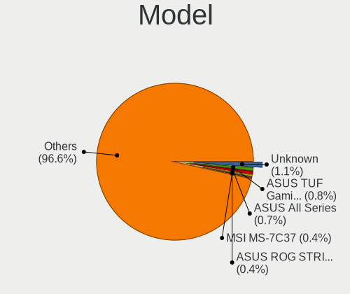
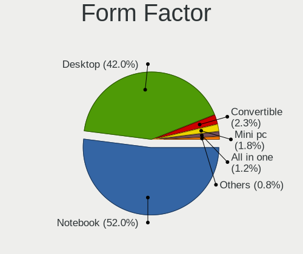
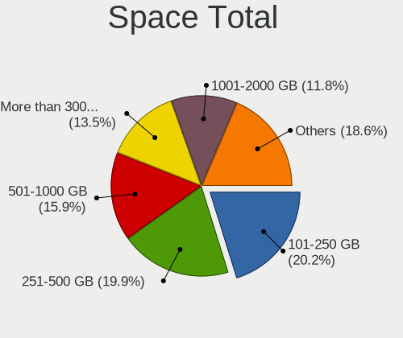
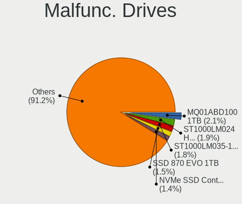
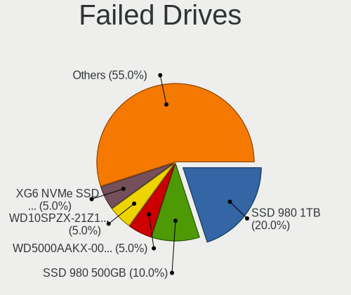
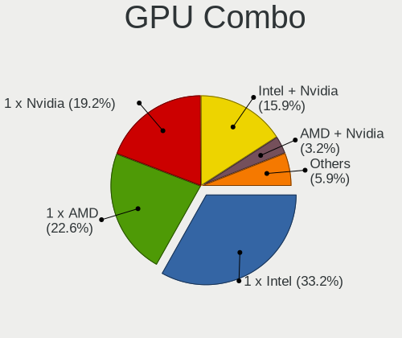
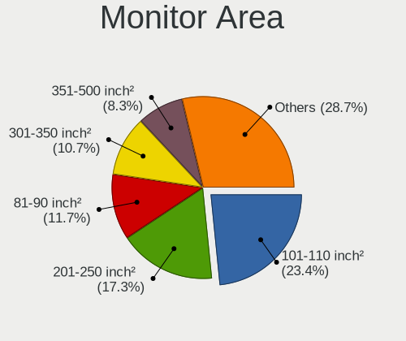
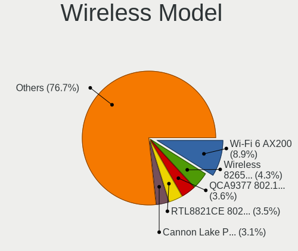
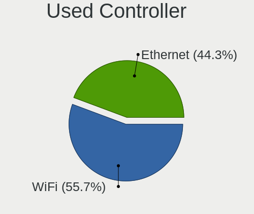
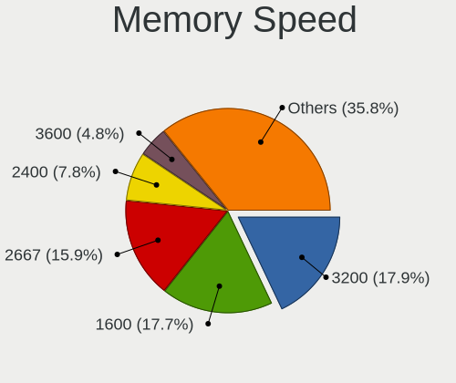

ArcoLinux - Tested Hardware & Statistics
----------------------------------------

A project to collect tested hardware configurations for ArcoLinux.

Anyone can contribute to this report by the [hw-probe](https://github.com/linuxhw/hw-probe) tool:

    sudo -E hw-probe -all -upload

Please contribute! Especially if your hardware is rare.

This is a report for all computer types. See also reports for [desktops](/Dist/ArcoLinux/Desktop/README.md) and [notebooks](/Dist/ArcoLinux/Notebook/README.md).

Contents
--------

* [ Test Cases ](#test-cases)

* [ System ](#system)
  - [ OS                       ](#os)
  - [ OS Family                ](#os-family)
  - [ Kernel                   ](#kernel)
  - [ Kernel Family            ](#kernel-family)
  - [ Kernel Major Ver.        ](#kernel-major-ver)
  - [ Arch                     ](#arch)
  - [ DE                       ](#de)
  - [ Display Server           ](#display-server)
  - [ Display Manager          ](#display-manager)
  - [ OS Lang                  ](#os-lang)
  - [ Boot Mode                ](#boot-mode)
  - [ Filesystem               ](#filesystem)
  - [ Part. scheme             ](#part-scheme)
  - [ Dual Boot with Linux/BSD ](#dual-boot-with-linuxbsd)
  - [ Dual Boot (Win)          ](#dual-boot-win)

* [ Board ](#board)
  - [ Vendor                   ](#vendor)
  - [ Model                    ](#model)
  - [ Model Family             ](#model-family)
  - [ MFG Year                 ](#mfg-year)
  - [ Form Factor              ](#form-factor)
  - [ Secure Boot              ](#secure-boot)
  - [ Coreboot                 ](#coreboot)
  - [ RAM Size                 ](#ram-size)
  - [ RAM Used                 ](#ram-used)
  - [ Total Drives             ](#total-drives)
  - [ Has CD-ROM               ](#has-cd-rom)
  - [ Has Ethernet             ](#has-ethernet)
  - [ Has WiFi                 ](#has-wifi)
  - [ Has Bluetooth            ](#has-bluetooth)

* [ Location ](#location)
  - [ Country                  ](#country)
  - [ City                     ](#city)

* [ Drives ](#drives)
  - [ Drive Vendor             ](#drive-vendor)
  - [ Drive Model              ](#drive-model)
  - [ HDD Vendor               ](#hdd-vendor)
  - [ SSD Vendor               ](#ssd-vendor)
  - [ Drive Kind               ](#drive-kind)
  - [ Drive Connector          ](#drive-connector)
  - [ Drive Size               ](#drive-size)
  - [ Space Total              ](#space-total)
  - [ Space Used               ](#space-used)
  - [ Malfunc. Drives          ](#malfunc-drives)
  - [ Malfunc. Drive Vendor    ](#malfunc-drive-vendor)
  - [ Malfunc. HDD Vendor      ](#malfunc-hdd-vendor)
  - [ Malfunc. Drive Kind      ](#malfunc-drive-kind)
  - [ Failed Drives            ](#failed-drives)
  - [ Failed Drive Vendor      ](#failed-drive-vendor)
  - [ Drive Status             ](#drive-status)

* [ Storage controller ](#storage-controller)
  - [ Storage Vendor           ](#storage-vendor)
  - [ Storage Model            ](#storage-model)
  - [ Storage Kind             ](#storage-kind)

* [ Processor ](#processor)
  - [ CPU Vendor               ](#cpu-vendor)
  - [ CPU Model                ](#cpu-model)
  - [ CPU Model Family         ](#cpu-model-family)
  - [ CPU Cores                ](#cpu-cores)
  - [ CPU Sockets              ](#cpu-sockets)
  - [ CPU Threads              ](#cpu-threads)
  - [ CPU Op-Modes             ](#cpu-op-modes)
  - [ CPU Microcode            ](#cpu-microcode)
  - [ CPU Microarch            ](#cpu-microarch)

* [ Graphics ](#graphics)
  - [ GPU Vendor               ](#gpu-vendor)
  - [ GPU Model                ](#gpu-model)
  - [ GPU Combo                ](#gpu-combo)
  - [ GPU Driver               ](#gpu-driver)
  - [ GPU Memory               ](#gpu-memory)

* [ Monitor ](#monitor)
  - [ Monitor Vendor           ](#monitor-vendor)
  - [ Monitor Model            ](#monitor-model)
  - [ Monitor Resolution       ](#monitor-resolution)
  - [ Monitor Diagonal         ](#monitor-diagonal)
  - [ Monitor Width            ](#monitor-width)
  - [ Aspect Ratio             ](#aspect-ratio)
  - [ Monitor Area             ](#monitor-area)
  - [ Pixel Density            ](#pixel-density)
  - [ Multiple Monitors        ](#multiple-monitors)

* [ Network ](#network)
  - [ Net Controller Vendor    ](#net-controller-vendor)
  - [ Net Controller Model     ](#net-controller-model)
  - [ Wireless Vendor          ](#wireless-vendor)
  - [ Wireless Model           ](#wireless-model)
  - [ Ethernet Vendor          ](#ethernet-vendor)
  - [ Ethernet Model           ](#ethernet-model)
  - [ Net Controller Kind      ](#net-controller-kind)
  - [ Used Controller          ](#used-controller)
  - [ NICs                     ](#nics)
  - [ IPv6                     ](#ipv6)

* [ Bluetooth ](#bluetooth)
  - [ Bluetooth Vendor         ](#bluetooth-vendor)
  - [ Bluetooth Model          ](#bluetooth-model)

* [ Sound ](#sound)
  - [ Sound Vendor             ](#sound-vendor)
  - [ Sound Model              ](#sound-model)

* [ Memory ](#memory)
  - [ Memory Vendor            ](#memory-vendor)
  - [ Memory Model             ](#memory-model)
  - [ Memory Kind              ](#memory-kind)
  - [ Memory Form Factor       ](#memory-form-factor)
  - [ Memory Size              ](#memory-size)
  - [ Memory Speed             ](#memory-speed)

* [ Printers & scanners ](#printers--scanners)
  - [ Printer Vendor           ](#printer-vendor)
  - [ Printer Model            ](#printer-model)
  - [ Scanner Vendor           ](#scanner-vendor)
  - [ Scanner Model            ](#scanner-model)

* [ Camera ](#camera)
  - [ Camera Vendor            ](#camera-vendor)
  - [ Camera Model             ](#camera-model)

* [ Security ](#security)
  - [ Fingerprint Vendor       ](#fingerprint-vendor)
  - [ Fingerprint Model        ](#fingerprint-model)
  - [ Chipcard Vendor          ](#chipcard-vendor)
  - [ Chipcard Model           ](#chipcard-model)

* [ Unsupported ](#unsupported)
  - [ Unsupported Devices      ](#unsupported-devices)
  - [ Unsupported Device Types ](#unsupported-device-types)

Test Cases
----------

Total: 4592

| Vendor        | Model                       | Form-Factor | Probe                                                      | Date         |
|---------------|-----------------------------|-------------|------------------------------------------------------------|--------------|
| Lenovo        | ThinkPad T470 20HES18C00    | Notebook    | [a2d8841244](https://linux-hardware.org/?probe=a2d8841244) | May 08, 2024 |
| Lenovo        | ThinkPad X240 20AMA0W706    | Notebook    | [ed0902f81c](https://linux-hardware.org/?probe=ed0902f81c) | May 08, 2024 |
| Gigabyte      | B650 AORUS ELITE AX V2      | Desktop     | [cb100ba8bc](https://linux-hardware.org/?probe=cb100ba8bc) | May 08, 2024 |
| Acer          | Aspire 5720                 | Notebook    | [0a218dfdfe](https://linux-hardware.org/?probe=0a218dfdfe) | May 08, 2024 |
| EVOC          | P7xxTM1                     | Notebook    | [7c15b2991c](https://linux-hardware.org/?probe=7c15b2991c) | May 08, 2024 |
| Dell          | XPS 15 9530                 | Notebook    | [5aee2550ce](https://linux-hardware.org/?probe=5aee2550ce) | May 08, 2024 |
| Lenovo        | B50-30 80ES                 | Notebook    | [c19f3dfc3a](https://linux-hardware.org/?probe=c19f3dfc3a) | May 07, 2024 |
| ASUSTek       | ROG STRIX X570-E GAMING ... | Desktop     | [6b97d23143](https://linux-hardware.org/?probe=6b97d23143) | May 07, 2024 |
| Apple         | MacBookAir7,2               | Notebook    | [de2ed6e188](https://linux-hardware.org/?probe=de2ed6e188) | May 07, 2024 |
| Dell          | 0V8DVD A01                  | All in one  | [2018075583](https://linux-hardware.org/?probe=2018075583) | May 07, 2024 |
| Gigabyte      | H81M-H                      | Desktop     | [5ea3b70747](https://linux-hardware.org/?probe=5ea3b70747) | May 06, 2024 |
| Framework     | Laptop 16 (AMD Ryzen 704... | Notebook    | [3679c79ac4](https://linux-hardware.org/?probe=3679c79ac4) | May 06, 2024 |
| Unknown       | Unknown                     | Notebook    | [a857b08dd7](https://linux-hardware.org/?probe=a857b08dd7) | May 06, 2024 |
| Acer          | Lars                        | Notebook    | [6ec82dab78](https://linux-hardware.org/?probe=6ec82dab78) | May 05, 2024 |
| ASUSTek       | PRIME B450-PLUS             | Desktop     | [4c7d6f1e6a](https://linux-hardware.org/?probe=4c7d6f1e6a) | May 05, 2024 |
| Dell          | Latitude 5410               | Notebook    | [8302f81328](https://linux-hardware.org/?probe=8302f81328) | May 04, 2024 |
| Dell          | 03NVJ6 A03                  | Desktop     | [fd0f0fad2d](https://linux-hardware.org/?probe=fd0f0fad2d) | May 04, 2024 |
| ASUSTek       | ROG STRIX X570-E GAMING ... | Desktop     | [9ca1c7c92f](https://linux-hardware.org/?probe=9ca1c7c92f) | May 04, 2024 |
| Gigabyte      | Z690 AORUS ELITE DDR4       | Desktop     | [055f5e4645](https://linux-hardware.org/?probe=055f5e4645) | May 04, 2024 |
| Gigabyte      | B365M H                     | Desktop     | [26c29ceb49](https://linux-hardware.org/?probe=26c29ceb49) | May 04, 2024 |
| MSI           | Z97 PC Mate                 | Desktop     | [277b1dc273](https://linux-hardware.org/?probe=277b1dc273) | May 04, 2024 |
| Dell          | 0C2XKD A01                  | Desktop     | [a246668749](https://linux-hardware.org/?probe=a246668749) | May 04, 2024 |
| Acer          | Aspire A315-56              | Notebook    | [b7341e861f](https://linux-hardware.org/?probe=b7341e861f) | May 03, 2024 |
| HP            | 83F0                        | Desktop     | [896e46f757](https://linux-hardware.org/?probe=896e46f757) | May 03, 2024 |
| Acer          | Swift SFG14-72              | Notebook    | [00c7e89498](https://linux-hardware.org/?probe=00c7e89498) | May 03, 2024 |
| Gigabyte      | Z690 AORUS ELITE DDR4       | Desktop     | [82d8781e9b](https://linux-hardware.org/?probe=82d8781e9b) | May 03, 2024 |
| Lenovo        | Yoga 720-15IKB 80X7         | Convertible | [9b4c380b5e](https://linux-hardware.org/?probe=9b4c380b5e) | May 03, 2024 |
| MSI           | MAG B460M MORTAR            | Desktop     | [4c66dab9c1](https://linux-hardware.org/?probe=4c66dab9c1) | May 03, 2024 |
| Apple         | MacBookPro11,1              | Notebook    | [a493ee87d2](https://linux-hardware.org/?probe=a493ee87d2) | May 02, 2024 |
| ASRock        | FM2A88X Extreme4+           | Desktop     | [64005c86c7](https://linux-hardware.org/?probe=64005c86c7) | May 02, 2024 |
| Lenovo        | ThinkPad X1 Carbon 6th 2... | Notebook    | [e02873ea23](https://linux-hardware.org/?probe=e02873ea23) | May 02, 2024 |
| Intel         | H55                         | Desktop     | [b7cf243933](https://linux-hardware.org/?probe=b7cf243933) | May 02, 2024 |
| American M... | E5 Ver:3.2S                 | Desktop     | [748bf7d3e8](https://linux-hardware.org/?probe=748bf7d3e8) | May 01, 2024 |
| Acer          | Aspire SW5-173              | Notebook    | [e72a0709d4](https://linux-hardware.org/?probe=e72a0709d4) | May 01, 2024 |
| ECT           | Unknown                     | Notebook    | [0ebb9fcdd0](https://linux-hardware.org/?probe=0ebb9fcdd0) | May 01, 2024 |
| ASUSTek       | VivoBook_ASUSLaptop X512... | Notebook    | [ad08810e0e](https://linux-hardware.org/?probe=ad08810e0e) | May 01, 2024 |
| Lenovo        | IdeaPad Y700-17ISK 80Q0     | Notebook    | [6df35e20b1](https://linux-hardware.org/?probe=6df35e20b1) | May 01, 2024 |
| Dell          | 00F82W A00                  | Desktop     | [850344d254](https://linux-hardware.org/?probe=850344d254) | Apr 30, 2024 |
| Intel         | H61S                        | Desktop     | [6b425a599b](https://linux-hardware.org/?probe=6b425a599b) | Apr 30, 2024 |
| Acer          | H81-M1                      | Desktop     | [cf0c78b108](https://linux-hardware.org/?probe=cf0c78b108) | Apr 30, 2024 |
| Pegatron      | NARRA3                      | Desktop     | [ca94843c0a](https://linux-hardware.org/?probe=ca94843c0a) | Apr 29, 2024 |
| ASRock        | A320M/ac                    | Desktop     | [aeafdb6795](https://linux-hardware.org/?probe=aeafdb6795) | Apr 29, 2024 |
| Lenovo        | ThinkPad T430 2349IF8       | Notebook    | [d4d6667b5e](https://linux-hardware.org/?probe=d4d6667b5e) | Apr 29, 2024 |
| Dell          | G7 7588                     | Notebook    | [9745a22fe0](https://linux-hardware.org/?probe=9745a22fe0) | Apr 28, 2024 |
| HP            | 3029h                       | Desktop     | [1ae766a3ba](https://linux-hardware.org/?probe=1ae766a3ba) | Apr 28, 2024 |
| Lenovo        | Slim Pro 7 14ARP8 83AX      | Notebook    | [15fdd20de0](https://linux-hardware.org/?probe=15fdd20de0) | Apr 28, 2024 |
| Apple         | Mac-F42386C8 PVT            | All in one  | [16169fa717](https://linux-hardware.org/?probe=16169fa717) | Apr 28, 2024 |
| Dell          | 0WWJRX A01                  | Desktop     | [21af8ccdc8](https://linux-hardware.org/?probe=21af8ccdc8) | Apr 27, 2024 |
| MSI           | H310M PRO-M2 PLUS           | Desktop     | [5004ab8c5b](https://linux-hardware.org/?probe=5004ab8c5b) | Apr 27, 2024 |
| Dell          | 0HD5W2 A01                  | Desktop     | [21e5ae7f3e](https://linux-hardware.org/?probe=21e5ae7f3e) | Apr 27, 2024 |
| Dell          | Latitude E7450              | Notebook    | [eb354c66fa](https://linux-hardware.org/?probe=eb354c66fa) | Apr 27, 2024 |
| Dell          | XPS 15 9560                 | Notebook    | [85005d847f](https://linux-hardware.org/?probe=85005d847f) | Apr 27, 2024 |
| Dell          | Latitude 5300               | Notebook    | [dfae5f452a](https://linux-hardware.org/?probe=dfae5f452a) | Apr 27, 2024 |
| Lenovo        | IdeaPad 320-14IKB 80XK      | Notebook    | [4324e618e8](https://linux-hardware.org/?probe=4324e618e8) | Apr 27, 2024 |
| Lenovo        | ThinkPad E15 Gen 2 20T80... | Notebook    | [0ff3e84a1c](https://linux-hardware.org/?probe=0ff3e84a1c) | Apr 27, 2024 |
| Dell          | Inspiron 3558               | Notebook    | [1fe97163aa](https://linux-hardware.org/?probe=1fe97163aa) | Apr 26, 2024 |
| Unknown       | Unknown                     | Notebook    | [a1db5a84e2](https://linux-hardware.org/?probe=a1db5a84e2) | Apr 26, 2024 |
| Acer          | Aspire XC-605               | Desktop     | [d1ebb51ac8](https://linux-hardware.org/?probe=d1ebb51ac8) | Apr 25, 2024 |
| HP            | 2B36                        | Desktop     | [d52be34009](https://linux-hardware.org/?probe=d52be34009) | Apr 25, 2024 |
| Sony          | SVF1521X1RB                 | Notebook    | [49942872ab](https://linux-hardware.org/?probe=49942872ab) | Apr 25, 2024 |
| Dell          | 02YYK5 A01                  | Desktop     | [9850b81106](https://linux-hardware.org/?probe=9850b81106) | Apr 25, 2024 |
| Dell          | Inspiron 3501               | Notebook    | [7260ec24ee](https://linux-hardware.org/?probe=7260ec24ee) | Apr 25, 2024 |
| Apple         | MacBookPro11,1              | Notebook    | [b27f71816a](https://linux-hardware.org/?probe=b27f71816a) | Apr 24, 2024 |
| Lenovo        | Legion 5 15ACH6A 82NW       | Notebook    | [dc86ce5b59](https://linux-hardware.org/?probe=dc86ce5b59) | Apr 24, 2024 |
| MSI           | Z97 PC Mate                 | Desktop     | [1d5f001265](https://linux-hardware.org/?probe=1d5f001265) | Apr 24, 2024 |
| Lenovo        | ThinkPad X1 Carbon 3448A... | Notebook    | [280fa2d735](https://linux-hardware.org/?probe=280fa2d735) | Apr 24, 2024 |
| ASUSTek       | ROG Strix G513QM_G513QM     | Notebook    | [7bb8c6f187](https://linux-hardware.org/?probe=7bb8c6f187) | Apr 24, 2024 |
| HP            | Laptop 17z-ca100            | Notebook    | [80cb3eace6](https://linux-hardware.org/?probe=80cb3eace6) | Apr 23, 2024 |
| Gigabyte      | A320M-S2H-CF                | Desktop     | [488c5e3d42](https://linux-hardware.org/?probe=488c5e3d42) | Apr 23, 2024 |
| Apple         | MacBookPro10,1              | Notebook    | [6c32f9323b](https://linux-hardware.org/?probe=6c32f9323b) | Apr 23, 2024 |
| Apple         | Mac-942B5BF58194151B        | All in one  | [28cc5a5993](https://linux-hardware.org/?probe=28cc5a5993) | Apr 23, 2024 |
| Microsoft     | Surface Pro 9               | Tablet      | [d3bf170f28](https://linux-hardware.org/?probe=d3bf170f28) | Apr 22, 2024 |
| ASUSTek       | TUF Gaming X570-PRO         | Desktop     | [c2d77decab](https://linux-hardware.org/?probe=c2d77decab) | Apr 22, 2024 |
| INET          | Z12B                        | Mini pc     | [5fbb33ad1d](https://linux-hardware.org/?probe=5fbb33ad1d) | Apr 22, 2024 |
| ASUSTek       | ROG Strix G513QM_G513QM     | Notebook    | [3b1f047a27](https://linux-hardware.org/?probe=3b1f047a27) | Apr 22, 2024 |
| Microsoft     | Surface Pro                 | Tablet      | [8e6a73d201](https://linux-hardware.org/?probe=8e6a73d201) | Apr 22, 2024 |
| MSI           | B450 GAMING PLUS MAX        | Desktop     | [7d3fad530f](https://linux-hardware.org/?probe=7d3fad530f) | Apr 22, 2024 |
| HP            | 802F                        | Desktop     | [8a38f4d001](https://linux-hardware.org/?probe=8a38f4d001) | Apr 21, 2024 |
| Gigabyte      | Z68MA-D2H-B3                | Desktop     | [d9d4c8fda0](https://linux-hardware.org/?probe=d9d4c8fda0) | Apr 21, 2024 |
| Dell          | Latitude E5400              | Notebook    | [fba5edc10c](https://linux-hardware.org/?probe=fba5edc10c) | Apr 21, 2024 |
| Notebook      | NP5x_NP6x_NP7xPNP           | Notebook    | [16b4e64118](https://linux-hardware.org/?probe=16b4e64118) | Apr 21, 2024 |
| HP            | Presario CQ56               | Notebook    | [80adb74ef1](https://linux-hardware.org/?probe=80adb74ef1) | Apr 21, 2024 |
| HP            | 2B36                        | Desktop     | [4b5101fd25](https://linux-hardware.org/?probe=4b5101fd25) | Apr 21, 2024 |
| Dell          | 00F82W A00                  | Desktop     | [8d86d9c0a6](https://linux-hardware.org/?probe=8d86d9c0a6) | Apr 21, 2024 |
| HP            | 802F                        | Desktop     | [cb7a0fabc8](https://linux-hardware.org/?probe=cb7a0fabc8) | Apr 21, 2024 |
| MSI           | A320M PRO-VD/S              | Desktop     | [1c4a853ae2](https://linux-hardware.org/?probe=1c4a853ae2) | Apr 21, 2024 |
| Gigabyte      | Z270X-Gaming 5              | Desktop     | [eb8b3c8970](https://linux-hardware.org/?probe=eb8b3c8970) | Apr 21, 2024 |
| ASRock        | A320M-HDV                   | Desktop     | [5b29bd1ecf](https://linux-hardware.org/?probe=5b29bd1ecf) | Apr 21, 2024 |
| Gigabyte      | B550 GAMING X V2            | Desktop     | [713e7bdc86](https://linux-hardware.org/?probe=713e7bdc86) | Apr 20, 2024 |
| Gigabyte      | B550 GAMING X V2            | Desktop     | [24e31227a4](https://linux-hardware.org/?probe=24e31227a4) | Apr 20, 2024 |
| Gigabyte      | B550 AORUS PRO V2           | Desktop     | [4eade3ca4d](https://linux-hardware.org/?probe=4eade3ca4d) | Apr 20, 2024 |
| Acer          | Enduro EUN314-51W           | Notebook    | [7a57f25e0e](https://linux-hardware.org/?probe=7a57f25e0e) | Apr 20, 2024 |
| HP            | 18E7                        | Desktop     | [1d707ddc17](https://linux-hardware.org/?probe=1d707ddc17) | Apr 20, 2024 |
| Gigabyte      | Z390 DESIGNARE-CF           | Desktop     | [19d3a51e2c](https://linux-hardware.org/?probe=19d3a51e2c) | Apr 20, 2024 |
| Lenovo        | IdeaPad 330-15ICH 81FK      | Notebook    | [d96460dbea](https://linux-hardware.org/?probe=d96460dbea) | Apr 20, 2024 |
| MSI           | B450 GAMING PLUS MAX        | Desktop     | [f83f880363](https://linux-hardware.org/?probe=f83f880363) | Apr 20, 2024 |
| Unknown       | Unknown                     | Desktop     | [bda99e9656](https://linux-hardware.org/?probe=bda99e9656) | Apr 20, 2024 |
| Unknown       | Unknown                     | Desktop     | [4f687b566d](https://linux-hardware.org/?probe=4f687b566d) | Apr 20, 2024 |
| Acer          | Aspire A314-22              | Notebook    | [cb041e53b1](https://linux-hardware.org/?probe=cb041e53b1) | Apr 20, 2024 |
| Dell          | Precision 7720              | Notebook    | [53cebf5b16](https://linux-hardware.org/?probe=53cebf5b16) | Apr 20, 2024 |
| Dell          | Inspiron 3542               | Notebook    | [290ea848f0](https://linux-hardware.org/?probe=290ea848f0) | Apr 19, 2024 |
| Dell          | Vostro 3580                 | Notebook    | [af4cc3e115](https://linux-hardware.org/?probe=af4cc3e115) | Apr 19, 2024 |
| Dell          | Vostro 3580                 | Notebook    | [aa8437e096](https://linux-hardware.org/?probe=aa8437e096) | Apr 19, 2024 |
| ASUSTek       | D425MC                      | Desktop     | [7be445a3bf](https://linux-hardware.org/?probe=7be445a3bf) | Apr 19, 2024 |
| HP            | Victus by Gaming Laptop ... | Notebook    | [326cc8c1ea](https://linux-hardware.org/?probe=326cc8c1ea) | Apr 19, 2024 |
| ASUSTek       | M4A88TD-V EVO/USB3          | Desktop     | [5378e196b0](https://linux-hardware.org/?probe=5378e196b0) | Apr 19, 2024 |
| Lenovo        | IdeaPad Y700-17ISK 80Q0     | Notebook    | [5acad8a956](https://linux-hardware.org/?probe=5acad8a956) | Apr 19, 2024 |
| ASUSTek       | PRIME Z370-A                | Desktop     | [3c0df82050](https://linux-hardware.org/?probe=3c0df82050) | Apr 19, 2024 |
| DFI           | HD101-H81D                  | Desktop     | [a6b195fbc8](https://linux-hardware.org/?probe=a6b195fbc8) | Apr 18, 2024 |
| Acer          | Aspire XC-605               | Desktop     | [d9014cb8e6](https://linux-hardware.org/?probe=d9014cb8e6) | Apr 18, 2024 |
| Unknown       | Unknown                     | Desktop     | [8424abb1e7](https://linux-hardware.org/?probe=8424abb1e7) | Apr 18, 2024 |
| ASRock        | B450 Pro4                   | Desktop     | [78d6c9eb2c](https://linux-hardware.org/?probe=78d6c9eb2c) | Apr 18, 2024 |
| Fujitsu       | D3403-A1 S26361-D3403-A1    | Desktop     | [05c7db4b10](https://linux-hardware.org/?probe=05c7db4b10) | Apr 18, 2024 |
| Dell          | 0V8F20 A01                  | Desktop     | [5b99cd208d](https://linux-hardware.org/?probe=5b99cd208d) | Apr 17, 2024 |
| Sony          | SVF1521X1RB                 | Notebook    | [9e0873ff32](https://linux-hardware.org/?probe=9e0873ff32) | Apr 17, 2024 |
| Shenzhen M... | F7BFC                       | Desktop     | [f95926a55e](https://linux-hardware.org/?probe=f95926a55e) | Apr 17, 2024 |
| Lenovo        | 36EB NOK                    | Desktop     | [c83418c56a](https://linux-hardware.org/?probe=c83418c56a) | Apr 17, 2024 |
| ASUSTek       | TUF Gaming X570-PRO         | Desktop     | [86e82df824](https://linux-hardware.org/?probe=86e82df824) | Apr 17, 2024 |
| Lenovo        | IdeaPad S340-15IWL 81N8     | Notebook    | [f61bc8b75c](https://linux-hardware.org/?probe=f61bc8b75c) | Apr 17, 2024 |
| Biostar       | H61MLC                      | Desktop     | [8f70d8bdb9](https://linux-hardware.org/?probe=8f70d8bdb9) | Apr 16, 2024 |
| Acer          | H81-M1                      | Desktop     | [1c508f5a38](https://linux-hardware.org/?probe=1c508f5a38) | Apr 16, 2024 |
| ASUSTek       | TUF B450-PLUS GAMING        | Desktop     | [a9de65b3dc](https://linux-hardware.org/?probe=a9de65b3dc) | Apr 16, 2024 |
| MSI           | PRO B650-S WIFI             | Desktop     | [580df50da1](https://linux-hardware.org/?probe=580df50da1) | Apr 16, 2024 |
| Lenovo        | IdeaPad 3 17IML05 81WC      | Notebook    | [2667935967](https://linux-hardware.org/?probe=2667935967) | Apr 16, 2024 |
| HP            | EliteBook 840 G8 Noteboo... | Notebook    | [546afe3c79](https://linux-hardware.org/?probe=546afe3c79) | Apr 15, 2024 |
| HP            | OMEN Laptop 15-en1001np ... | Notebook    | [a9e386b4a8](https://linux-hardware.org/?probe=a9e386b4a8) | Apr 15, 2024 |
| ASUSTek       | PRIME Z370-A                | Desktop     | [a8d2383fa0](https://linux-hardware.org/?probe=a8d2383fa0) | Apr 15, 2024 |
| ASUSTek       | PRIME Z490-A                | Desktop     | [154867d800](https://linux-hardware.org/?probe=154867d800) | Apr 14, 2024 |
| HP            | Pavilion Gaming Laptop 1... | Notebook    | [16d5936653](https://linux-hardware.org/?probe=16d5936653) | Apr 14, 2024 |
| Dell          | G7 7588                     | Notebook    | [06f5f64e59](https://linux-hardware.org/?probe=06f5f64e59) | Apr 14, 2024 |
| ASUSTek       | VivoBook_ASUSLaptop X571... | Notebook    | [c88e8fcf4f](https://linux-hardware.org/?probe=c88e8fcf4f) | Apr 14, 2024 |
| Dell          | Inspiron 3721               | Notebook    | [49aec34132](https://linux-hardware.org/?probe=49aec34132) | Apr 13, 2024 |
| MSI           | MPG B550 GAMING CARBON W... | Desktop     | [20e54ade99](https://linux-hardware.org/?probe=20e54ade99) | Apr 13, 2024 |
| ASUSTek       | TUF Gaming X570-PLUS        | Desktop     | [b8f62dc34c](https://linux-hardware.org/?probe=b8f62dc34c) | Apr 13, 2024 |
| ASUSTek       | X550JX                      | Notebook    | [10e9087348](https://linux-hardware.org/?probe=10e9087348) | Apr 13, 2024 |
| HP            | Folio 13                    | Notebook    | [2112e4d193](https://linux-hardware.org/?probe=2112e4d193) | Apr 13, 2024 |
| MSI           | GP63 Leopard 8RE            | Notebook    | [31525e1fa0](https://linux-hardware.org/?probe=31525e1fa0) | Apr 13, 2024 |
| MSI           | B450M-A PRO MAX             | Desktop     | [705cf8272f](https://linux-hardware.org/?probe=705cf8272f) | Apr 12, 2024 |
| MSI           | B450M-A PRO MAX             | Desktop     | [94b1f5a4cd](https://linux-hardware.org/?probe=94b1f5a4cd) | Apr 12, 2024 |
| BESSTAR Te... | X400                        | Notebook    | [0701fdbfed](https://linux-hardware.org/?probe=0701fdbfed) | Apr 12, 2024 |
| HP            | 3397                        | Desktop     | [31cfb1bfb0](https://linux-hardware.org/?probe=31cfb1bfb0) | Apr 12, 2024 |
| Packard Be... | EasyNote LM98               | Notebook    | [e5f560059b](https://linux-hardware.org/?probe=e5f560059b) | Apr 12, 2024 |
| Lenovo        | IdeaPad 110-14IBR 80UJ      | Notebook    | [ed5c941b3f](https://linux-hardware.org/?probe=ed5c941b3f) | Apr 12, 2024 |
| Dell          | Inspiron 3501               | Notebook    | [d688f191c9](https://linux-hardware.org/?probe=d688f191c9) | Apr 12, 2024 |
| ASUSTek       | PRIME Z490-A                | Desktop     | [bc81c86e6b](https://linux-hardware.org/?probe=bc81c86e6b) | Apr 12, 2024 |
| Toshiba       | Satellite M645              | Notebook    | [f5c39a1c49](https://linux-hardware.org/?probe=f5c39a1c49) | Apr 12, 2024 |
| HP            | 89E9 0100                   | All in one  | [9fbed368d0](https://linux-hardware.org/?probe=9fbed368d0) | Apr 12, 2024 |
| Lenovo        | G40-30 80FY                 | Notebook    | [d1d8e1d51f](https://linux-hardware.org/?probe=d1d8e1d51f) | Apr 11, 2024 |
| Lenovo        | ThinkBook 15 G2 ITL 20VE    | Notebook    | [78ca9d448c](https://linux-hardware.org/?probe=78ca9d448c) | Apr 11, 2024 |
| Lenovo        | ThinkPad T580 20L9CTO1WW    | Notebook    | [f9b6443292](https://linux-hardware.org/?probe=f9b6443292) | Apr 11, 2024 |
| Acer          | Enduro EUN314-51W           | Notebook    | [fa7d224ee9](https://linux-hardware.org/?probe=fa7d224ee9) | Apr 11, 2024 |
| MSI           | A320M PRO-VD/S              | Desktop     | [fad7dacfc2](https://linux-hardware.org/?probe=fad7dacfc2) | Apr 10, 2024 |
| ASUSTek       | STRIX Z270H GAMING          | Desktop     | [4586d481ed](https://linux-hardware.org/?probe=4586d481ed) | Apr 10, 2024 |
| Shenzhen M... | F7BFC                       | Desktop     | [94ccbc78f1](https://linux-hardware.org/?probe=94ccbc78f1) | Apr 10, 2024 |
| ASRock        | Z370 Extreme4               | Desktop     | [89b87e5d2e](https://linux-hardware.org/?probe=89b87e5d2e) | Apr 10, 2024 |
| HP            | ZBook 15 G5                 | Notebook    | [d8a1d4fd64](https://linux-hardware.org/?probe=d8a1d4fd64) | Apr 10, 2024 |
| MSI           | B450M MORTAR MAX            | Desktop     | [2a497ea609](https://linux-hardware.org/?probe=2a497ea609) | Apr 10, 2024 |
| Dell          | Latitude E6420              | Notebook    | [649e8a4cae](https://linux-hardware.org/?probe=649e8a4cae) | Apr 10, 2024 |
| Dell          | Latitude E5430 non-vPro     | Notebook    | [e324b97ac4](https://linux-hardware.org/?probe=e324b97ac4) | Apr 10, 2024 |
| Acer          | Spin SP111-32N              | Convertible | [f671b9f63f](https://linux-hardware.org/?probe=f671b9f63f) | Apr 09, 2024 |
| Lenovo        | Yoga 720-15IKB 80X7         | Convertible | [6e77d63a6b](https://linux-hardware.org/?probe=6e77d63a6b) | Apr 09, 2024 |
| Apple         | MacBookPro9,2               | Notebook    | [3fe67822d2](https://linux-hardware.org/?probe=3fe67822d2) | Apr 09, 2024 |
| MSI           | MS-B090                     | All in one  | [d014604e20](https://linux-hardware.org/?probe=d014604e20) | Apr 09, 2024 |
| HP            | ProBook 455 G2              | Notebook    | [431349da41](https://linux-hardware.org/?probe=431349da41) | Apr 08, 2024 |
| ASRock        | B450M Pro4                  | Desktop     | [c6e809a3fa](https://linux-hardware.org/?probe=c6e809a3fa) | Apr 08, 2024 |
| ASUSTek       | TUF Gaming B650M-PLUS WI... | Desktop     | [75f2fd247a](https://linux-hardware.org/?probe=75f2fd247a) | Apr 08, 2024 |
| Lenovo        | ThinkPad T490 20N2005VMX    | Notebook    | [543136ea4b](https://linux-hardware.org/?probe=543136ea4b) | Apr 08, 2024 |
| INET          | Z12B                        | Mini pc     | [a2bbb45d11](https://linux-hardware.org/?probe=a2bbb45d11) | Apr 08, 2024 |
| Intel         | NUC13ANBi3 N13056-202       | Mini pc     | [a7956a190e](https://linux-hardware.org/?probe=a7956a190e) | Apr 07, 2024 |
| Dell          | Latitude 7490               | Notebook    | [92f94355fe](https://linux-hardware.org/?probe=92f94355fe) | Apr 07, 2024 |
| Gigabyte      | GA-880GM-UD2H               | Desktop     | [8bd7df2e63](https://linux-hardware.org/?probe=8bd7df2e63) | Apr 07, 2024 |
| Dell          | Latitude E5430 non-vPro     | Notebook    | [f5ade4bf16](https://linux-hardware.org/?probe=f5ade4bf16) | Apr 07, 2024 |
| AZW           | SER V1                      | Desktop     | [399ba2c254](https://linux-hardware.org/?probe=399ba2c254) | Apr 07, 2024 |
| Gigabyte      | F2A88XN-WIFI                | Desktop     | [0795129140](https://linux-hardware.org/?probe=0795129140) | Apr 07, 2024 |
| Dell          | Latitude E5430 non-vPro     | Notebook    | [8fa8b6b410](https://linux-hardware.org/?probe=8fa8b6b410) | Apr 06, 2024 |
| MSI           | MAG B550 TOMAHAWK           | Desktop     | [354d98798a](https://linux-hardware.org/?probe=354d98798a) | Apr 06, 2024 |
| Intel         | NUC13ANBi3 N13056-202       | Mini pc     | [2d4548ff88](https://linux-hardware.org/?probe=2d4548ff88) | Apr 06, 2024 |
| Lenovo        | ThinkPad T430 2349IF8       | Notebook    | [fcdfc53b39](https://linux-hardware.org/?probe=fcdfc53b39) | Apr 06, 2024 |
| Lenovo        | IdeaPad 1 14ADA05 82GW      | Notebook    | [b743bdc5b7](https://linux-hardware.org/?probe=b743bdc5b7) | Apr 06, 2024 |
| HP            | 255 G7 Notebook PC          | Notebook    | [5afefafcfb](https://linux-hardware.org/?probe=5afefafcfb) | Apr 06, 2024 |
| Dell          | G7 7588                     | Notebook    | [8753ea1302](https://linux-hardware.org/?probe=8753ea1302) | Apr 05, 2024 |
| System76      | Gazelle                     | Notebook    | [f241f8c75f](https://linux-hardware.org/?probe=f241f8c75f) | Apr 05, 2024 |
| Dell          | Latitude 7490               | Notebook    | [2d5616d182](https://linux-hardware.org/?probe=2d5616d182) | Apr 05, 2024 |
| HP            | Laptop 15s-eq2xxx           | Notebook    | [b0435cb369](https://linux-hardware.org/?probe=b0435cb369) | Apr 05, 2024 |
| HP            | Pavilion Laptop 14-dv1xx... | Notebook    | [f9add792f1](https://linux-hardware.org/?probe=f9add792f1) | Apr 05, 2024 |
| Toshiba       | Satellite P55W-C            | Notebook    | [f7991fe43c](https://linux-hardware.org/?probe=f7991fe43c) | Apr 05, 2024 |
| MSI           | B450M PRO-VDH               | Desktop     | [967dca41d6](https://linux-hardware.org/?probe=967dca41d6) | Apr 05, 2024 |
| Dell          | 0C1GJ7 A00                  | All in one  | [f501017a54](https://linux-hardware.org/?probe=f501017a54) | Apr 04, 2024 |
| Lenovo        | G40-30 80FY                 | Notebook    | [216b899f97](https://linux-hardware.org/?probe=216b899f97) | Apr 04, 2024 |
| Shenzhen M... | F7BFC                       | Desktop     | [bbe75de967](https://linux-hardware.org/?probe=bbe75de967) | Apr 04, 2024 |
| Dell          | Inspiron 3721               | Notebook    | [bea7567e40](https://linux-hardware.org/?probe=bea7567e40) | Apr 04, 2024 |
| MSI           | B450M-A PRO MAX             | Desktop     | [c139fcd8d6](https://linux-hardware.org/?probe=c139fcd8d6) | Apr 04, 2024 |
| HP            | Pavilion g7                 | Notebook    | [e030bcc388](https://linux-hardware.org/?probe=e030bcc388) | Apr 04, 2024 |
| HUAWEI        | KPL-W0X                     | Notebook    | [4b06cf61b5](https://linux-hardware.org/?probe=4b06cf61b5) | Apr 04, 2024 |
| Dell          | System XPS L502X            | Notebook    | [50a066426a](https://linux-hardware.org/?probe=50a066426a) | Apr 04, 2024 |
| Gigabyte      | B450M DS3H-CF               | Desktop     | [97239eebc7](https://linux-hardware.org/?probe=97239eebc7) | Apr 03, 2024 |
| Lenovo        | IdeaPad 1 14ADA05 82GW      | Notebook    | [91906af7e3](https://linux-hardware.org/?probe=91906af7e3) | Apr 03, 2024 |
| HP            | 21D0                        | Desktop     | [8097b780d4](https://linux-hardware.org/?probe=8097b780d4) | Apr 03, 2024 |
| Dell          | Latitude 7490               | Notebook    | [6ae13d56ab](https://linux-hardware.org/?probe=6ae13d56ab) | Apr 03, 2024 |
| Lenovo        | IdeaPad Slim 1-11AST-05 ... | Notebook    | [26bfbd7911](https://linux-hardware.org/?probe=26bfbd7911) | Apr 03, 2024 |
| MSI           | MPG X570 GAMING PRO CARB... | Desktop     | [a00d3e21e2](https://linux-hardware.org/?probe=a00d3e21e2) | Apr 03, 2024 |
| Intel         | B75                         | Desktop     | [b090c94f7f](https://linux-hardware.org/?probe=b090c94f7f) | Apr 02, 2024 |
| Lenovo        | ThinkPad T540p 20BFS06B0... | Notebook    | [290e63ab76](https://linux-hardware.org/?probe=290e63ab76) | Apr 01, 2024 |
| ASRock        | B760M Steel Legend WiFi     | Desktop     | [73bcf62b59](https://linux-hardware.org/?probe=73bcf62b59) | Apr 01, 2024 |
| ECS           | A960M-M3                    | Desktop     | [dce366554b](https://linux-hardware.org/?probe=dce366554b) | Apr 01, 2024 |
| HP            | Pavilion Laptop 15-eh0xx... | Notebook    | [d028b72b84](https://linux-hardware.org/?probe=d028b72b84) | Apr 01, 2024 |
| ASUSTek       | N53SV                       | Notebook    | [12ab7fe764](https://linux-hardware.org/?probe=12ab7fe764) | Apr 01, 2024 |
| Razer         | Blade                       | Notebook    | [ba8e740196](https://linux-hardware.org/?probe=ba8e740196) | Apr 01, 2024 |
| Gigabyte      | X570 AORUS ELITE            | Desktop     | [cf3a89d3d4](https://linux-hardware.org/?probe=cf3a89d3d4) | Apr 01, 2024 |
| HP            | Pavilion Laptop 15-eh0xx... | Notebook    | [2c3e57a75a](https://linux-hardware.org/?probe=2c3e57a75a) | Apr 01, 2024 |
| Lenovo        | ThinkPad T540p 20BFS06B0... | Notebook    | [83f55034f4](https://linux-hardware.org/?probe=83f55034f4) | Apr 01, 2024 |
| Dell          | XPS 15 9560                 | Notebook    | [5ea1dc6342](https://linux-hardware.org/?probe=5ea1dc6342) | Mar 31, 2024 |
| ASUSTek       | UX410UQK                    | Notebook    | [9b11a1c1ad](https://linux-hardware.org/?probe=9b11a1c1ad) | Mar 31, 2024 |
| ASUSTek       | TUF Gaming FX505DT_FX505... | Notebook    | [64599c7737](https://linux-hardware.org/?probe=64599c7737) | Mar 31, 2024 |
| Lenovo        | ThinkBook 14 G2 ITL 20VD    | Notebook    | [301f4fbe0a](https://linux-hardware.org/?probe=301f4fbe0a) | Mar 31, 2024 |
| HUAWEI        | NBLB-WAX9N                  | Notebook    | [0ccf6a99da](https://linux-hardware.org/?probe=0ccf6a99da) | Mar 31, 2024 |
| Samsung       | 270E5G/270E5U               | Notebook    | [f29778819d](https://linux-hardware.org/?probe=f29778819d) | Mar 31, 2024 |
| ASUSTek       | TUF Gaming FX505DT_FX505... | Notebook    | [2e8a52ef75](https://linux-hardware.org/?probe=2e8a52ef75) | Mar 31, 2024 |
| MSI           | PRO B550M-P GEN3            | Desktop     | [79c408e0e7](https://linux-hardware.org/?probe=79c408e0e7) | Mar 30, 2024 |
| Dell          | Latitude 5480               | Notebook    | [3f70b3cbd6](https://linux-hardware.org/?probe=3f70b3cbd6) | Mar 30, 2024 |
| INET          | Z12B                        | Mini pc     | [cf42a56819](https://linux-hardware.org/?probe=cf42a56819) | Mar 30, 2024 |
| Unknown       | Unknown                     | Notebook    | [393d39e7a2](https://linux-hardware.org/?probe=393d39e7a2) | Mar 30, 2024 |
| ASUSTek       | Unknown                     | Notebook    | [f0d50801ff](https://linux-hardware.org/?probe=f0d50801ff) | Mar 30, 2024 |
| Gigabyte      | H55M-S2V                    | Desktop     | [b6b0564fdc](https://linux-hardware.org/?probe=b6b0564fdc) | Mar 29, 2024 |
| Apple         | Mac-8ED6AF5B48C039E1 Mac... | Mini pc     | [65af639a04](https://linux-hardware.org/?probe=65af639a04) | Mar 29, 2024 |
| Fujitsu       | LIFEBOOK E558               | Notebook    | [7c2ec1d730](https://linux-hardware.org/?probe=7c2ec1d730) | Mar 29, 2024 |
| Acer          | Aspire A515-43              | Notebook    | [caa01a6b16](https://linux-hardware.org/?probe=caa01a6b16) | Mar 29, 2024 |
| Apple         | Mac-8ED6AF5B48C039E1 Mac... | Mini pc     | [d896a5b7b8](https://linux-hardware.org/?probe=d896a5b7b8) | Mar 29, 2024 |
| Lenovo        | Yoga Slim 7 Pro 14ACH5 O... | Notebook    | [859b028e32](https://linux-hardware.org/?probe=859b028e32) | Mar 29, 2024 |
| ASUSTek       | TUF Gaming FX505DY_FX505... | Notebook    | [55f0862220](https://linux-hardware.org/?probe=55f0862220) | Mar 29, 2024 |
| ASRock        | Z390 Phantom Gaming 4-CB    | Desktop     | [fca7774b11](https://linux-hardware.org/?probe=fca7774b11) | Mar 29, 2024 |
| Gigabyte      | AB350M-DS3H V2-CF           | Desktop     | [fd22085109](https://linux-hardware.org/?probe=fd22085109) | Mar 29, 2024 |
| Lenovo        | ThinkPad T480s 20L8SBK60... | Notebook    | [26a17a556d](https://linux-hardware.org/?probe=26a17a556d) | Mar 29, 2024 |
| ROMBICA       | myBook Eclipse              | Notebook    | [c5d773bb0f](https://linux-hardware.org/?probe=c5d773bb0f) | Mar 28, 2024 |
| HP            | 85A1                        | All in one  | [deab701b6f](https://linux-hardware.org/?probe=deab701b6f) | Mar 28, 2024 |
| Lenovo        | ThinkPad T530 24295L4       | Notebook    | [bc2f245e57](https://linux-hardware.org/?probe=bc2f245e57) | Mar 28, 2024 |
| Lenovo        | ThinkPad E15 Gen 3 20YGC... | Notebook    | [2129863d24](https://linux-hardware.org/?probe=2129863d24) | Mar 28, 2024 |
| Lenovo        | ThinkPad W541 20EGS24300    | Notebook    | [b9b3f86a33](https://linux-hardware.org/?probe=b9b3f86a33) | Mar 27, 2024 |
| HP            | Laptop 15-bs0xx             | Notebook    | [1a7dc6f9b7](https://linux-hardware.org/?probe=1a7dc6f9b7) | Mar 27, 2024 |
| Foxconn       | 2A8C                        | Desktop     | [7160e6163b](https://linux-hardware.org/?probe=7160e6163b) | Mar 27, 2024 |
| Huanan        | X79 ZHIZUN V7.1             | Desktop     | [f2b2f4d41d](https://linux-hardware.org/?probe=f2b2f4d41d) | Mar 27, 2024 |
| Gigabyte      | Z97P-D3                     | Desktop     | [269ee0ed72](https://linux-hardware.org/?probe=269ee0ed72) | Mar 26, 2024 |
| ASUSTek       | Unknown                     | Notebook    | [c405404136](https://linux-hardware.org/?probe=c405404136) | Mar 26, 2024 |
| Dell          | Latitude 5500               | Notebook    | [01e740ac1e](https://linux-hardware.org/?probe=01e740ac1e) | Mar 26, 2024 |
| Gigabyte      | 970A-DS3P                   | Desktop     | [23122d3ad4](https://linux-hardware.org/?probe=23122d3ad4) | Mar 26, 2024 |
| ASUSTek       | V222FA                      | All in one  | [2b67657736](https://linux-hardware.org/?probe=2b67657736) | Mar 25, 2024 |
| ASUSTek       | PRIME Z490-A                | Desktop     | [da725303e1](https://linux-hardware.org/?probe=da725303e1) | Mar 25, 2024 |
| ASUSTek       | K75VM                       | Notebook    | [cfa470267d](https://linux-hardware.org/?probe=cfa470267d) | Mar 25, 2024 |
| Lenovo        | Legion 7 16ACHg6 82N6       | Notebook    | [77bfcb26fe](https://linux-hardware.org/?probe=77bfcb26fe) | Mar 25, 2024 |
| Gigabyte      | Z390 DESIGNARE-CF           | Desktop     | [8bcc48c4f8](https://linux-hardware.org/?probe=8bcc48c4f8) | Mar 25, 2024 |
| HP            | Folio 13                    | Notebook    | [982ad443c6](https://linux-hardware.org/?probe=982ad443c6) | Mar 25, 2024 |
| ASUSTek       | ZenBook UX534FTC_UX534FT    | Notebook    | [a99d39c0b4](https://linux-hardware.org/?probe=a99d39c0b4) | Mar 24, 2024 |
| HP            | Pavilion Laptop 15-cw0xx... | Notebook    | [430f425f2c](https://linux-hardware.org/?probe=430f425f2c) | Mar 24, 2024 |
| Lenovo        | ThinkPad T470p 20J7A004L... | Notebook    | [7aa99b8f2b](https://linux-hardware.org/?probe=7aa99b8f2b) | Mar 24, 2024 |
| Packard Be... | EasyNote ENTG71BM           | Notebook    | [5084e58bdf](https://linux-hardware.org/?probe=5084e58bdf) | Mar 24, 2024 |
| Gigabyte      | X570 AORUS PRO WIFI         | Desktop     | [302c96a79d](https://linux-hardware.org/?probe=302c96a79d) | Mar 24, 2024 |
| MSI           | MPG B550 GAMING CARBON W... | Desktop     | [633d507169](https://linux-hardware.org/?probe=633d507169) | Mar 24, 2024 |
| Gigabyte      | Z790 AORUS PRO X            | Desktop     | [74e95f0015](https://linux-hardware.org/?probe=74e95f0015) | Mar 24, 2024 |
| Lenovo        | Legion Y920-17IKB Laptop... | Notebook    | [90a6a2cc72](https://linux-hardware.org/?probe=90a6a2cc72) | Mar 24, 2024 |
| HP            | 250 G8 Notebook PC          | Notebook    | [d0c0e017d3](https://linux-hardware.org/?probe=d0c0e017d3) | Mar 23, 2024 |
| HP            | ZBook 17                    | Notebook    | [02d8d9dcf1](https://linux-hardware.org/?probe=02d8d9dcf1) | Mar 23, 2024 |
| Lenovo        | 0B98401 PRO                 | Desktop     | [5059aeedf0](https://linux-hardware.org/?probe=5059aeedf0) | Mar 23, 2024 |
| Acer          | Aspire V5-573G              | Notebook    | [0ffca5c7aa](https://linux-hardware.org/?probe=0ffca5c7aa) | Mar 23, 2024 |
| MSI           | CR610M                      | Notebook    | [7b139fb61c](https://linux-hardware.org/?probe=7b139fb61c) | Mar 23, 2024 |
| Lenovo        | V130-15IKB 81HN             | Notebook    | [ed5ffee126](https://linux-hardware.org/?probe=ed5ffee126) | Mar 23, 2024 |
| ASUSTek       | TUF Gaming B550M-PLUS WI... | Desktop     | [e71e7c70d9](https://linux-hardware.org/?probe=e71e7c70d9) | Mar 23, 2024 |
| MSI           | X399 GAMING PRO CARBON A... | Desktop     | [7c0f257328](https://linux-hardware.org/?probe=7c0f257328) | Mar 22, 2024 |
| ASUSTek       | PRIME Z490-A                | Desktop     | [1af97a5f24](https://linux-hardware.org/?probe=1af97a5f24) | Mar 22, 2024 |
| ASUSTek       | P8Z77-V LE                  | Desktop     | [2eef0cba83](https://linux-hardware.org/?probe=2eef0cba83) | Mar 22, 2024 |
| Dell          | Latitude 5400               | Notebook    | [041cf3061b](https://linux-hardware.org/?probe=041cf3061b) | Mar 22, 2024 |
| ASUSTek       | H110M-A                     | Desktop     | [fc2fe23179](https://linux-hardware.org/?probe=fc2fe23179) | Mar 22, 2024 |
| ASRock        | FM2A75M Pro4+               | Desktop     | [52f8addde4](https://linux-hardware.org/?probe=52f8addde4) | Mar 22, 2024 |
| ASUSTek       | TUF Gaming B550-PLUS WIF... | Desktop     | [0c346bdf70](https://linux-hardware.org/?probe=0c346bdf70) | Mar 21, 2024 |
| Acer          | Lars                        | Notebook    | [6e1b695926](https://linux-hardware.org/?probe=6e1b695926) | Mar 21, 2024 |
| Dell          | Latitude 5400               | Notebook    | [b387cc5494](https://linux-hardware.org/?probe=b387cc5494) | Mar 21, 2024 |
| Lenovo        | IdeaPad 3 15ARE05 81W4      | Notebook    | [71e6476160](https://linux-hardware.org/?probe=71e6476160) | Mar 21, 2024 |
| Lenovo        | 0B98401 PRO                 | Desktop     | [8b49c50089](https://linux-hardware.org/?probe=8b49c50089) | Mar 21, 2024 |
| Apple         | MacBookPro6,1               | Notebook    | [a993d0d4bc](https://linux-hardware.org/?probe=a993d0d4bc) | Mar 21, 2024 |
| ASUSTek       | ROG STRIX Z370-E GAMING     | Desktop     | [c47be99616](https://linux-hardware.org/?probe=c47be99616) | Mar 20, 2024 |
| Lenovo        | SHARKBAY 31900059 STD       | All in one  | [db9bb64be9](https://linux-hardware.org/?probe=db9bb64be9) | Mar 20, 2024 |
| ASRock        | X670E Taichi                | Desktop     | [9478d158a1](https://linux-hardware.org/?probe=9478d158a1) | Mar 20, 2024 |
| ASUSTek       | Vivobook ASUSLaptop TP34... | Convertible | [13aa36af3e](https://linux-hardware.org/?probe=13aa36af3e) | Mar 20, 2024 |
| Lenovo        | IdeaPad S145-15IWL 81MV     | Notebook    | [f8fa83eaf5](https://linux-hardware.org/?probe=f8fa83eaf5) | Mar 20, 2024 |
| ASUSTek       | PRIME X570-P                | Desktop     | [1f7d74bee8](https://linux-hardware.org/?probe=1f7d74bee8) | Mar 20, 2024 |
| ASUSTek       | VivoBook_ASUSLaptop X512... | Notebook    | [eb3211feaf](https://linux-hardware.org/?probe=eb3211feaf) | Mar 20, 2024 |
| ASUSTek       | B85M-E                      | Desktop     | [e3a6512d0c](https://linux-hardware.org/?probe=e3a6512d0c) | Mar 20, 2024 |
| Dell          | Latitude 7290               | Notebook    | [060d4f8054](https://linux-hardware.org/?probe=060d4f8054) | Mar 20, 2024 |
| ASRock        | B450M Pro4                  | Desktop     | [bdd0b87420](https://linux-hardware.org/?probe=bdd0b87420) | Mar 19, 2024 |
| ASUSTek       | VivoBook_ASUSLaptop X510... | Notebook    | [a051b39e29](https://linux-hardware.org/?probe=a051b39e29) | Mar 19, 2024 |
| Gigabyte      | B450 AORUS ELITE            | Desktop     | [9010c8e968](https://linux-hardware.org/?probe=9010c8e968) | Mar 19, 2024 |
| HP            | Pavilion Notebook           | Notebook    | [25ea07c0ef](https://linux-hardware.org/?probe=25ea07c0ef) | Mar 19, 2024 |
| Lenovo        | IdeaPad Slim 3 15IAN8 82... | Notebook    | [60437d07d3](https://linux-hardware.org/?probe=60437d07d3) | Mar 19, 2024 |
| ASUSTek       | ROG STRIX B450-F GAMING ... | Desktop     | [5fba7feb6c](https://linux-hardware.org/?probe=5fba7feb6c) | Mar 18, 2024 |
| ASUSTek       | PRIME Z370-A                | Desktop     | [c9aab7c5fe](https://linux-hardware.org/?probe=c9aab7c5fe) | Mar 18, 2024 |
| ASUSTek       | ROG Strix G513QE_G513QE     | Notebook    | [1a65c1c7d8](https://linux-hardware.org/?probe=1a65c1c7d8) | Mar 18, 2024 |
| Lenovo        | IdeaPad Gaming 3 15IHU6 ... | Notebook    | [0622336d7e](https://linux-hardware.org/?probe=0622336d7e) | Mar 18, 2024 |
| Lenovo        | IdeaPad Slim 3 15IAN8 82... | Notebook    | [9ef0fec665](https://linux-hardware.org/?probe=9ef0fec665) | Mar 18, 2024 |
| HP            | Laptop 15s-eq2xxx           | Notebook    | [e24d05dacc](https://linux-hardware.org/?probe=e24d05dacc) | Mar 18, 2024 |
| MSI           | H310M PRO-VDH PLUS          | Desktop     | [99e78f54fd](https://linux-hardware.org/?probe=99e78f54fd) | Mar 18, 2024 |
| Lenovo        | ThinkPad T430 2349CV8       | Notebook    | [c720271bc9](https://linux-hardware.org/?probe=c720271bc9) | Mar 18, 2024 |
| ASUSTek       | ASUS TUF Gaming A15 FA50... | Notebook    | [b62cd0cdeb](https://linux-hardware.org/?probe=b62cd0cdeb) | Mar 17, 2024 |
| ASUSTek       | PRIME B660M-A AC D4         | Desktop     | [cd6abd6c87](https://linux-hardware.org/?probe=cd6abd6c87) | Mar 17, 2024 |
| HP            | Pavilion g7                 | Notebook    | [afec7e4e8d](https://linux-hardware.org/?probe=afec7e4e8d) | Mar 17, 2024 |
| HP            | Laptop 15s-eq2xxx           | Notebook    | [dbbfda791c](https://linux-hardware.org/?probe=dbbfda791c) | Mar 17, 2024 |
| Dell          | Latitude E6420              | Notebook    | [e764a6c5f4](https://linux-hardware.org/?probe=e764a6c5f4) | Mar 17, 2024 |
| Gigabyte      | X570 AORUS MASTER           | Desktop     | [ee3281cbda](https://linux-hardware.org/?probe=ee3281cbda) | Mar 17, 2024 |
| Acer          | Swift SF314-41G             | Notebook    | [22ac3144fc](https://linux-hardware.org/?probe=22ac3144fc) | Mar 17, 2024 |
| MSI           | MAG B550M BAZOOKA           | Desktop     | [6f59b5bfa1](https://linux-hardware.org/?probe=6f59b5bfa1) | Mar 17, 2024 |
| Lenovo        | 310B SDK0J40697 WIN 3305... | Desktop     | [2f763edf96](https://linux-hardware.org/?probe=2f763edf96) | Mar 16, 2024 |
| ASUSTek       | TUF Z390-PLUS GAMING        | Desktop     | [5912d4041d](https://linux-hardware.org/?probe=5912d4041d) | Mar 16, 2024 |
| ASUSTek       | VivoBook_ASUSLaptop X515... | Notebook    | [e0ee84189e](https://linux-hardware.org/?probe=e0ee84189e) | Mar 16, 2024 |
| Dell          | Latitude E7440              | Notebook    | [b84556c723](https://linux-hardware.org/?probe=b84556c723) | Mar 16, 2024 |
| AZW           | SEi                         | Notebook    | [943616dbd5](https://linux-hardware.org/?probe=943616dbd5) | Mar 16, 2024 |
| Acer          | Predator G3-710             | Desktop     | [81423396ff](https://linux-hardware.org/?probe=81423396ff) | Mar 16, 2024 |
| Dell          | Inspiron N5040              | Notebook    | [53966580b8](https://linux-hardware.org/?probe=53966580b8) | Mar 16, 2024 |
| Gigabyte      | Z390 UD V2                  | Desktop     | [cc72fc2c00](https://linux-hardware.org/?probe=cc72fc2c00) | Mar 16, 2024 |
| Acer          | Predator G3-710             | Desktop     | [4a28c9273f](https://linux-hardware.org/?probe=4a28c9273f) | Mar 16, 2024 |
| ASUSTek       | M5A97 R2.0                  | Desktop     | [75f598474b](https://linux-hardware.org/?probe=75f598474b) | Mar 16, 2024 |
| ASUSTek       | GL10DH                      | Desktop     | [924e2c2170](https://linux-hardware.org/?probe=924e2c2170) | Mar 16, 2024 |
| Sony          | VPCEH30EB                   | Notebook    | [5fcc8ea369](https://linux-hardware.org/?probe=5fcc8ea369) | Mar 16, 2024 |
| ASRock        | H310M-HDV                   | Desktop     | [4e2f714f49](https://linux-hardware.org/?probe=4e2f714f49) | Mar 16, 2024 |
| Lenovo        | ThinkPad T470 20HES23B0U    | Notebook    | [6b7342964b](https://linux-hardware.org/?probe=6b7342964b) | Mar 16, 2024 |
| Dell          | Inspiron 3521               | Notebook    | [0845e63785](https://linux-hardware.org/?probe=0845e63785) | Mar 15, 2024 |
| Shenzhen M... | CSL VenomBox HS v1.0        | Mini pc     | [1309b81f4e](https://linux-hardware.org/?probe=1309b81f4e) | Mar 15, 2024 |
| DFI           | HD101-H81D                  | Desktop     | [e8136a2ba9](https://linux-hardware.org/?probe=e8136a2ba9) | Mar 15, 2024 |
| Shenzhen M... | CSL VenomBox HS v1.0        | Mini pc     | [ccdf3c6dbd](https://linux-hardware.org/?probe=ccdf3c6dbd) | Mar 15, 2024 |
| ASRock        | H310M-HDV                   | Desktop     | [8d62cae785](https://linux-hardware.org/?probe=8d62cae785) | Mar 15, 2024 |
| ASUSTek       | TUF Gaming FX504GE_FX80G... | Notebook    | [33e7a03f71](https://linux-hardware.org/?probe=33e7a03f71) | Mar 15, 2024 |
| HP            | Pavilion Laptop 14-bf0xx    | Notebook    | [7ded8b5e80](https://linux-hardware.org/?probe=7ded8b5e80) | Mar 15, 2024 |
| ASUSTek       | PRIME B550M-A AC            | Desktop     | [45edcadc55](https://linux-hardware.org/?probe=45edcadc55) | Mar 15, 2024 |
| Gigabyte      | A320M-S2H-CF                | Desktop     | [ea5a34f828](https://linux-hardware.org/?probe=ea5a34f828) | Mar 15, 2024 |
| Acer          | Spin SP111-32N              | Convertible | [93a804d71e](https://linux-hardware.org/?probe=93a804d71e) | Mar 14, 2024 |
| Dell          | Latitude E6430              | Notebook    | [54e9652592](https://linux-hardware.org/?probe=54e9652592) | Mar 14, 2024 |
| Gigabyte      | A320M-S2H-CF                | Desktop     | [b9dc85b113](https://linux-hardware.org/?probe=b9dc85b113) | Mar 14, 2024 |
| Dell          | Inspiron 1545               | Notebook    | [300de7108e](https://linux-hardware.org/?probe=300de7108e) | Mar 14, 2024 |
| HP            | 85A1                        | All in one  | [23b0f94f99](https://linux-hardware.org/?probe=23b0f94f99) | Mar 14, 2024 |
| Dell          | Inspiron 3521               | Notebook    | [8ac504cf90](https://linux-hardware.org/?probe=8ac504cf90) | Mar 14, 2024 |
| Dell          | Inspiron 5759               | Notebook    | [74d556a193](https://linux-hardware.org/?probe=74d556a193) | Mar 14, 2024 |
| Apple         | MacBookAir6,1               | Notebook    | [8575151105](https://linux-hardware.org/?probe=8575151105) | Mar 14, 2024 |
| ASUSTek       | TUF Gaming H670-PRO WIFI... | Desktop     | [9caab49bca](https://linux-hardware.org/?probe=9caab49bca) | Mar 14, 2024 |
| ASUSTek       | TUF Gaming B650M-PLUS WI... | Desktop     | [40f761e062](https://linux-hardware.org/?probe=40f761e062) | Mar 14, 2024 |
| Lenovo        | ThinkPad X1 Carbon 6th 2... | Notebook    | [869127a088](https://linux-hardware.org/?probe=869127a088) | Mar 13, 2024 |
| Lenovo        | Legion 5 15ARH05H 82B1      | Notebook    | [703f7f40a4](https://linux-hardware.org/?probe=703f7f40a4) | Mar 13, 2024 |
| ASUSTek       | Z170 PRO GAMING             | Desktop     | [6bea275119](https://linux-hardware.org/?probe=6bea275119) | Mar 12, 2024 |
| Apple         | MacBookPro9,2               | Notebook    | [add6eef34a](https://linux-hardware.org/?probe=add6eef34a) | Mar 12, 2024 |
| Unknown       | Unknown                     | Notebook    | [1a12cdf91f](https://linux-hardware.org/?probe=1a12cdf91f) | Mar 12, 2024 |
| Lenovo        | ThinkPad T560 20FH001RUS    | Notebook    | [1c869b5e2e](https://linux-hardware.org/?probe=1c869b5e2e) | Mar 12, 2024 |
| Dell          | XPS 13 9310                 | Notebook    | [4eefa9994a](https://linux-hardware.org/?probe=4eefa9994a) | Mar 12, 2024 |
| ASUSTek       | K55VD                       | Notebook    | [01c2033137](https://linux-hardware.org/?probe=01c2033137) | Mar 12, 2024 |
| Dell          | G15 5515                    | Notebook    | [527be515b4](https://linux-hardware.org/?probe=527be515b4) | Mar 12, 2024 |
| HP            | 829E                        | Mini pc     | [1f89450455](https://linux-hardware.org/?probe=1f89450455) | Mar 11, 2024 |
| Lenovo        | 30BC SDK0J40697 WIN 3305... | Desktop     | [cb4201e540](https://linux-hardware.org/?probe=cb4201e540) | Mar 11, 2024 |
| MSI           | H310M PRO-VH                | Desktop     | [47509ee75f](https://linux-hardware.org/?probe=47509ee75f) | Mar 11, 2024 |
| Dell          | XPS 13 9310                 | Notebook    | [27d2d8b15a](https://linux-hardware.org/?probe=27d2d8b15a) | Mar 11, 2024 |
| MSI           | X470 GAMING PRO CARBON      | Desktop     | [459312f8b8](https://linux-hardware.org/?probe=459312f8b8) | Mar 10, 2024 |
| Chuwi         | GemiBook Pro                | Notebook    | [a8eb8bc1dc](https://linux-hardware.org/?probe=a8eb8bc1dc) | Mar 10, 2024 |
| Acer          | Spin SP513-51               | Convertible | [aa91c4ca61](https://linux-hardware.org/?probe=aa91c4ca61) | Mar 10, 2024 |
| HP            | ZBook 17                    | Notebook    | [9535fdaf2b](https://linux-hardware.org/?probe=9535fdaf2b) | Mar 10, 2024 |
| Acer          | Spin SP513-51               | Convertible | [ca5d296c1a](https://linux-hardware.org/?probe=ca5d296c1a) | Mar 10, 2024 |
| Gigabyte      | B550 AORUS MASTER           | Desktop     | [706768c42a](https://linux-hardware.org/?probe=706768c42a) | Mar 10, 2024 |
| Lenovo        | Legion 5 15ARH05H 82B1      | Notebook    | [bd9aa2f5e6](https://linux-hardware.org/?probe=bd9aa2f5e6) | Mar 10, 2024 |
| Gigabyte      | X570 GAMING X               | Desktop     | [2239cf5983](https://linux-hardware.org/?probe=2239cf5983) | Mar 10, 2024 |
| MSI           | B450M-A PRO MAX             | Desktop     | [5c9ff73ab5](https://linux-hardware.org/?probe=5c9ff73ab5) | Mar 09, 2024 |
| Gigabyte      | AB350M-DS3H V2-CF           | Desktop     | [45c9891fb0](https://linux-hardware.org/?probe=45c9891fb0) | Mar 09, 2024 |
| HP            | ProBook 440 G8 Notebook ... | Notebook    | [0339864371](https://linux-hardware.org/?probe=0339864371) | Mar 09, 2024 |
| Gigabyte      | B550 AORUS ELITE AX V2      | Desktop     | [db5efc9462](https://linux-hardware.org/?probe=db5efc9462) | Mar 09, 2024 |
| Acer          | Nitro AN515-52              | Notebook    | [edd6400e24](https://linux-hardware.org/?probe=edd6400e24) | Mar 08, 2024 |
| HP            | Pavilion Notebook           | Notebook    | [9659d66a4e](https://linux-hardware.org/?probe=9659d66a4e) | Mar 08, 2024 |
| ASUSTek       | P8Z77-V LE                  | Desktop     | [c12bbfb9c1](https://linux-hardware.org/?probe=c12bbfb9c1) | Mar 08, 2024 |
| Dell          | Latitude 7490               | Notebook    | [1e93b05356](https://linux-hardware.org/?probe=1e93b05356) | Mar 07, 2024 |
| Lenovo        | ThinkPad T430 2349IF8       | Notebook    | [142d320b69](https://linux-hardware.org/?probe=142d320b69) | Mar 07, 2024 |
| ASUSTek       | ROG STRIX X670E-F GAMING... | Desktop     | [dd3df4cff2](https://linux-hardware.org/?probe=dd3df4cff2) | Mar 07, 2024 |
| Lenovo        | ThinkPad X1 Carbon 3448A... | Notebook    | [e50b713b59](https://linux-hardware.org/?probe=e50b713b59) | Mar 07, 2024 |
| ASUSTek       | N55SF                       | Notebook    | [9579229ce6](https://linux-hardware.org/?probe=9579229ce6) | Mar 06, 2024 |
| Lenovo        | ThinkPad T420s 4174PEG      | Notebook    | [c4f7f598f1](https://linux-hardware.org/?probe=c4f7f598f1) | Mar 06, 2024 |
| Google        | Swanky                      | Notebook    | [9701795e01](https://linux-hardware.org/?probe=9701795e01) | Mar 06, 2024 |
| ASUSTek       | H81M-E                      | Desktop     | [17ef9e97c9](https://linux-hardware.org/?probe=17ef9e97c9) | Mar 06, 2024 |
| Gigabyte      | H110M-DS2-CF                | Desktop     | [363dfceefd](https://linux-hardware.org/?probe=363dfceefd) | Mar 06, 2024 |
| Framework     | Laptop 13 (AMD Ryzen 704... | Notebook    | [334c4ee786](https://linux-hardware.org/?probe=334c4ee786) | Mar 05, 2024 |
| ASUSTek       | VivoBook_ASUSLaptop TP41... | Convertible | [a162f6b8c8](https://linux-hardware.org/?probe=a162f6b8c8) | Mar 05, 2024 |
| ASUSTek       | Z170 PRO GAMING             | Desktop     | [544a3548cc](https://linux-hardware.org/?probe=544a3548cc) | Mar 05, 2024 |
| Acer          | Aspire V3-771               | Notebook    | [d15c551c88](https://linux-hardware.org/?probe=d15c551c88) | Mar 04, 2024 |
| ASUSTek       | PRO A520M-C                 | Desktop     | [394fa5ec3f](https://linux-hardware.org/?probe=394fa5ec3f) | Mar 04, 2024 |
| ASRock        | Z370 Pro4                   | Desktop     | [a234df2002](https://linux-hardware.org/?probe=a234df2002) | Mar 04, 2024 |
| MSI           | H110M PRO-VH PLUS           | Desktop     | [5a814bda6b](https://linux-hardware.org/?probe=5a814bda6b) | Mar 04, 2024 |
| Apple         | Mac-F221BEC8                | Desktop     | [abdf139678](https://linux-hardware.org/?probe=abdf139678) | Mar 04, 2024 |
| Lenovo        | ThinkPad X220 Tablet 429... | Notebook    | [4250cb552f](https://linux-hardware.org/?probe=4250cb552f) | Mar 04, 2024 |
| ASRock        | B450M Pro4                  | Desktop     | [95f6ca3672](https://linux-hardware.org/?probe=95f6ca3672) | Mar 04, 2024 |
| ASUSTek       | ROG STRIX X570-I GAMING     | Desktop     | [c247d9c586](https://linux-hardware.org/?probe=c247d9c586) | Mar 04, 2024 |
| Lenovo        | ThinkBook 14 G2 ITL 20VD    | Notebook    | [58f62d0638](https://linux-hardware.org/?probe=58f62d0638) | Mar 04, 2024 |
| Dell          | Inspiron 7537               | Notebook    | [f1e729e18f](https://linux-hardware.org/?probe=f1e729e18f) | Mar 04, 2024 |
| Dell          | 0VTJVC A00                  | Desktop     | [b4cd6d805c](https://linux-hardware.org/?probe=b4cd6d805c) | Mar 04, 2024 |
| MSI           | X399 GAMING PRO CARBON A... | Desktop     | [608e1e507e](https://linux-hardware.org/?probe=608e1e507e) | Mar 04, 2024 |
| MSI           | Prestige 15 A10SC           | Notebook    | [f95e0198ba](https://linux-hardware.org/?probe=f95e0198ba) | Mar 04, 2024 |
| ASUSTek       | PRIME B360M-A               | Desktop     | [12cb401e25](https://linux-hardware.org/?probe=12cb401e25) | Mar 03, 2024 |
| Dell          | Inspiron 3521               | Notebook    | [0d094fad30](https://linux-hardware.org/?probe=0d094fad30) | Mar 03, 2024 |
| Dell          | Precision 7530              | Notebook    | [ecf957d523](https://linux-hardware.org/?probe=ecf957d523) | Mar 02, 2024 |
| Dell          | Precision 7530              | Notebook    | [5b034a7781](https://linux-hardware.org/?probe=5b034a7781) | Mar 02, 2024 |
| ASUSTek       | PRIME B550-PLUS             | Desktop     | [c4d1b90289](https://linux-hardware.org/?probe=c4d1b90289) | Mar 02, 2024 |
| ASUSTek       | ROG Maximus Z790 HERO       | Desktop     | [d674e2f295](https://linux-hardware.org/?probe=d674e2f295) | Mar 02, 2024 |
| Lenovo        | ThinkPad X1 Carbon 6th 2... | Notebook    | [17e31be3a7](https://linux-hardware.org/?probe=17e31be3a7) | Mar 02, 2024 |
| ASUSTek       | PRIME B360M-A               | Desktop     | [db88ff40ea](https://linux-hardware.org/?probe=db88ff40ea) | Mar 02, 2024 |
| ASUSTek       | P8Z77-V DELUXE              | Desktop     | [57bd82edb2](https://linux-hardware.org/?probe=57bd82edb2) | Mar 01, 2024 |
| Lenovo        | ThinkPad T420 4178AFU       | Notebook    | [3bb84aa7d8](https://linux-hardware.org/?probe=3bb84aa7d8) | Mar 01, 2024 |
| HP            | Folio 13                    | Notebook    | [4d66cbd88e](https://linux-hardware.org/?probe=4d66cbd88e) | Mar 01, 2024 |
| Dell          | Inspiron 3521               | Notebook    | [652d1e1c73](https://linux-hardware.org/?probe=652d1e1c73) | Mar 01, 2024 |
| Samsung       | R530/R730/R540              | Notebook    | [083c87c94b](https://linux-hardware.org/?probe=083c87c94b) | Mar 01, 2024 |
| HP            | ENVY x360 Convertible 15... | Convertible | [037a1403df](https://linux-hardware.org/?probe=037a1403df) | Mar 01, 2024 |
| IceWhale T... | ZimaBoard 432 ZMB           | Desktop     | [e901d6e9d1](https://linux-hardware.org/?probe=e901d6e9d1) | Mar 01, 2024 |
| ASUSTek       | P8Z77-V DELUXE              | Desktop     | [695266922d](https://linux-hardware.org/?probe=695266922d) | Feb 29, 2024 |
| HP            | ENVY 17                     | Notebook    | [32a7be64a9](https://linux-hardware.org/?probe=32a7be64a9) | Feb 29, 2024 |
| Gigabyte      | X670E AORUS XTREME          | Desktop     | [94090f0c82](https://linux-hardware.org/?probe=94090f0c82) | Feb 29, 2024 |
| HP            | Pavilion Laptop 14-bf0xx    | Notebook    | [7a9345dd2c](https://linux-hardware.org/?probe=7a9345dd2c) | Feb 28, 2024 |
| NZXT          | N7 Z790                     | Desktop     | [983e6338eb](https://linux-hardware.org/?probe=983e6338eb) | Feb 28, 2024 |
| Fujitsu       | D3183-A1 S26361-D3183-A1    | Desktop     | [bd84816ed8](https://linux-hardware.org/?probe=bd84816ed8) | Feb 28, 2024 |
| INET          | Z12B                        | Mini pc     | [5f20adc2d7](https://linux-hardware.org/?probe=5f20adc2d7) | Feb 28, 2024 |
| Dell          | XPS 15 9560                 | Notebook    | [e02e7cc773](https://linux-hardware.org/?probe=e02e7cc773) | Feb 27, 2024 |
| Shenzhen M... | F7BFC                       | Desktop     | [a3c3fa8741](https://linux-hardware.org/?probe=a3c3fa8741) | Feb 27, 2024 |
| HP            | Laptop 14-dq2xxx            | Notebook    | [674ebb13a0](https://linux-hardware.org/?probe=674ebb13a0) | Feb 26, 2024 |
| Lenovo        | ThinkPad X240 20AMS00J00    | Notebook    | [1a95b4d8e6](https://linux-hardware.org/?probe=1a95b4d8e6) | Feb 26, 2024 |
| Gigabyte      | H61MS                       | Desktop     | [734eead932](https://linux-hardware.org/?probe=734eead932) | Feb 26, 2024 |
| Unknown       | Unknown                     | Notebook    | [5f71daec56](https://linux-hardware.org/?probe=5f71daec56) | Feb 26, 2024 |
| HP            | ENVY 17                     | Notebook    | [c930c13a73](https://linux-hardware.org/?probe=c930c13a73) | Feb 26, 2024 |
| MSI           | B360 GAMING PLUS            | Desktop     | [40619e4cc4](https://linux-hardware.org/?probe=40619e4cc4) | Feb 26, 2024 |
| MSI           | B360 GAMING PLUS            | Desktop     | [e3fe48b63c](https://linux-hardware.org/?probe=e3fe48b63c) | Feb 26, 2024 |
| ASUSTek       | VivoBook_ASUSLaptop X760... | Notebook    | [f5ff681189](https://linux-hardware.org/?probe=f5ff681189) | Feb 26, 2024 |
| Lenovo        | ThinkPad L412 44034KG       | Notebook    | [93c5498399](https://linux-hardware.org/?probe=93c5498399) | Feb 25, 2024 |
| Apple         | MacBookPro10,1              | Notebook    | [8b83e774a1](https://linux-hardware.org/?probe=8b83e774a1) | Feb 25, 2024 |
| Gigabyte      | H61MS                       | Desktop     | [34e5453caa](https://linux-hardware.org/?probe=34e5453caa) | Feb 25, 2024 |
| Gigabyte      | X570 AORUS PRO WIFI         | Desktop     | [48aeafb576](https://linux-hardware.org/?probe=48aeafb576) | Feb 25, 2024 |
| Gigabyte      | B450M DS3H V2               | Desktop     | [969b42aca3](https://linux-hardware.org/?probe=969b42aca3) | Feb 24, 2024 |
| Notebook      | NS5x_NS7xAU                 | Notebook    | [31d4a61486](https://linux-hardware.org/?probe=31d4a61486) | Feb 24, 2024 |
| Lenovo        | IdeaPad 330-15ARR 81D2      | Notebook    | [b34b8567f2](https://linux-hardware.org/?probe=b34b8567f2) | Feb 24, 2024 |
| Acer          | TravelMate P249-G2-M        | Notebook    | [09fc7e1bb9](https://linux-hardware.org/?probe=09fc7e1bb9) | Feb 24, 2024 |
| Apple         | Mac-F2268DC8                | All in one  | [67b969d75d](https://linux-hardware.org/?probe=67b969d75d) | Feb 24, 2024 |
| ASUSTek       | PRIME X670-P                | Desktop     | [02f31414e9](https://linux-hardware.org/?probe=02f31414e9) | Feb 24, 2024 |
| Dell          | Latitude E6420              | Notebook    | [e267e0446b](https://linux-hardware.org/?probe=e267e0446b) | Feb 23, 2024 |
| ASUSTek       | Z10PA-D8 Series             | Desktop     | [83933addae](https://linux-hardware.org/?probe=83933addae) | Feb 23, 2024 |
| HP            | Laptop 15-da0xxx            | Notebook    | [a0de591588](https://linux-hardware.org/?probe=a0de591588) | Feb 23, 2024 |
| Gigabyte      | H410M H V3                  | Desktop     | [d5aad61582](https://linux-hardware.org/?probe=d5aad61582) | Feb 23, 2024 |
| ASUSTek       | ROG STRIX X670E-F GAMING... | Desktop     | [322513c6ae](https://linux-hardware.org/?probe=322513c6ae) | Feb 23, 2024 |
| Dell          | Latitude E5450              | Notebook    | [22c2a25444](https://linux-hardware.org/?probe=22c2a25444) | Feb 22, 2024 |
| Gigabyte      | AERO 15-SA                  | Notebook    | [4c3f5dd106](https://linux-hardware.org/?probe=4c3f5dd106) | Feb 22, 2024 |
| ASUSTek       | PRIME X670-P                | Desktop     | [d5a3258e39](https://linux-hardware.org/?probe=d5a3258e39) | Feb 22, 2024 |
| Gigabyte      | B450M DS3H-CF               | Desktop     | [a7511eee63](https://linux-hardware.org/?probe=a7511eee63) | Feb 21, 2024 |
| ASUSTek       | TUF Gaming B650M-PLUS WI... | Desktop     | [cc638a70e5](https://linux-hardware.org/?probe=cc638a70e5) | Feb 21, 2024 |
| Intel         | NUC13ANBi3 N13056-202       | Mini pc     | [7f4ef71a84](https://linux-hardware.org/?probe=7f4ef71a84) | Feb 20, 2024 |
| HP            | 1998                        | Desktop     | [ea2b04fb8f](https://linux-hardware.org/?probe=ea2b04fb8f) | Feb 20, 2024 |
| HP            | 18E7                        | Desktop     | [bb8f095490](https://linux-hardware.org/?probe=bb8f095490) | Feb 20, 2024 |
| HP            | 21D0                        | Desktop     | [a19cdbd10a](https://linux-hardware.org/?probe=a19cdbd10a) | Feb 20, 2024 |
| Gigabyte      | B550M DS3H                  | Desktop     | [38bfeafdc6](https://linux-hardware.org/?probe=38bfeafdc6) | Feb 20, 2024 |
| ASUSTek       | ASUS TUF Dash F15 FX517Z... | Notebook    | [82828b68cb](https://linux-hardware.org/?probe=82828b68cb) | Feb 20, 2024 |
| Gigabyte      | B450 AORUS PRO WIFI-CF      | Desktop     | [fc618dfd9e](https://linux-hardware.org/?probe=fc618dfd9e) | Feb 20, 2024 |
| ASRock        | B550M-ITX/ac                | Desktop     | [2504d0d667](https://linux-hardware.org/?probe=2504d0d667) | Feb 20, 2024 |
| HP            | Pavilion Laptop 14-dv1xx... | Notebook    | [bb645eacf5](https://linux-hardware.org/?probe=bb645eacf5) | Feb 19, 2024 |
| Acer          | Aspire M3-581T              | Notebook    | [5d8055a703](https://linux-hardware.org/?probe=5d8055a703) | Feb 19, 2024 |
| HP            | 550                         | Notebook    | [760294d146](https://linux-hardware.org/?probe=760294d146) | Feb 19, 2024 |
| ASUSTek       | UX410UAK                    | Notebook    | [b34fa8ceef](https://linux-hardware.org/?probe=b34fa8ceef) | Feb 18, 2024 |
| HP            | ProBook 455 G2              | Notebook    | [b2e3117bf6](https://linux-hardware.org/?probe=b2e3117bf6) | Feb 18, 2024 |
| EVOC          | P7xxTM1                     | Notebook    | [480360fcfd](https://linux-hardware.org/?probe=480360fcfd) | Feb 18, 2024 |
| Intel         | NUC5i5RYB H40999-504        | Mini pc     | [502944b2e0](https://linux-hardware.org/?probe=502944b2e0) | Feb 18, 2024 |
| ASUSTek       | VivoBook_ASUSLaptop X515... | Notebook    | [6fc33ea456](https://linux-hardware.org/?probe=6fc33ea456) | Feb 18, 2024 |
| ASUSTek       | Zenbook UX7602ZM            | Notebook    | [028ccb5c8e](https://linux-hardware.org/?probe=028ccb5c8e) | Feb 18, 2024 |
| ASUSTek       | Zenbook UX7602ZM            | Notebook    | [7c0887ee84](https://linux-hardware.org/?probe=7c0887ee84) | Feb 18, 2024 |
| Gigabyte      | Z270-Gaming K3              | Desktop     | [03e4b54d18](https://linux-hardware.org/?probe=03e4b54d18) | Feb 18, 2024 |
| Lenovo        | 3106 SDK0J40697 WIN 3305... | Desktop     | [4bca7ee01c](https://linux-hardware.org/?probe=4bca7ee01c) | Feb 17, 2024 |
| Dell          | Latitude 7490               | Notebook    | [e3b1db18e1](https://linux-hardware.org/?probe=e3b1db18e1) | Feb 17, 2024 |
| Acer          | Nitro AN515-55              | Notebook    | [5b9d9efd21](https://linux-hardware.org/?probe=5b9d9efd21) | Feb 17, 2024 |
| Lenovo        | ThinkPad X260 20F5S2WY00    | Notebook    | [80ba65bf79](https://linux-hardware.org/?probe=80ba65bf79) | Feb 17, 2024 |
| Lenovo        | IdeaPad S340-15API 81NC     | Notebook    | [0139d27bce](https://linux-hardware.org/?probe=0139d27bce) | Feb 17, 2024 |
| Gigabyte      | B560 HD3                    | Desktop     | [471e56fa2c](https://linux-hardware.org/?probe=471e56fa2c) | Feb 16, 2024 |
| HP            | Pavilion Laptop 14-dv1xx... | Notebook    | [d394cbccba](https://linux-hardware.org/?probe=d394cbccba) | Feb 16, 2024 |
| Alienware     | x15 R1                      | Notebook    | [6f611e556e](https://linux-hardware.org/?probe=6f611e556e) | Feb 16, 2024 |
| Gigabyte      | Z790 AORUS PRO X            | Desktop     | [1036cc6203](https://linux-hardware.org/?probe=1036cc6203) | Feb 16, 2024 |
| Lenovo        | Win8 Pro DPK TPG            | Desktop     | [ad824cd065](https://linux-hardware.org/?probe=ad824cd065) | Feb 16, 2024 |
| MSI           | B85M-E45                    | Desktop     | [e1ea6178f0](https://linux-hardware.org/?probe=e1ea6178f0) | Feb 14, 2024 |
| Lenovo        | IdeaPadFlex 5 14ARE05 81... | Convertible | [aa4201874d](https://linux-hardware.org/?probe=aa4201874d) | Feb 14, 2024 |
| HP            | 18E7                        | Desktop     | [b6da2159e6](https://linux-hardware.org/?probe=b6da2159e6) | Feb 14, 2024 |
| MSI           | MAG B550 TOMAHAWK           | Desktop     | [cd8c907b9a](https://linux-hardware.org/?probe=cd8c907b9a) | Feb 14, 2024 |
| MSI           | Alpha 15 A3DD               | Notebook    | [4a98f29767](https://linux-hardware.org/?probe=4a98f29767) | Feb 14, 2024 |
| MSI           | PRO B650-P WIFI             | Desktop     | [572a664a23](https://linux-hardware.org/?probe=572a664a23) | Feb 14, 2024 |
| ASUSTek       | TUF Gaming X570-PLUS        | Desktop     | [c8f0cd8bd8](https://linux-hardware.org/?probe=c8f0cd8bd8) | Feb 14, 2024 |
| Lenovo        | Win8 Pro DPK TPG            | Desktop     | [60e638856c](https://linux-hardware.org/?probe=60e638856c) | Feb 14, 2024 |
| Intel         | B75                         | Desktop     | [cbd278dc3e](https://linux-hardware.org/?probe=cbd278dc3e) | Feb 13, 2024 |
| Monster       | ABRA A7 V13.2               | Notebook    | [43b70d4c02](https://linux-hardware.org/?probe=43b70d4c02) | Feb 13, 2024 |
| HP            | 245 G7                      | Notebook    | [6a17d5afe5](https://linux-hardware.org/?probe=6a17d5afe5) | Feb 13, 2024 |
| Dell          | Inspiron 5759               | Notebook    | [be690bbd3b](https://linux-hardware.org/?probe=be690bbd3b) | Feb 13, 2024 |
| Google        | Phaser360                   | Notebook    | [1674a78c3f](https://linux-hardware.org/?probe=1674a78c3f) | Feb 13, 2024 |
| ASUSTek       | TUF Gaming X570-PLUS        | Desktop     | [fd137bafb9](https://linux-hardware.org/?probe=fd137bafb9) | Feb 13, 2024 |
| MSI           | CR610M                      | Notebook    | [cc4ca57086](https://linux-hardware.org/?probe=cc4ca57086) | Feb 13, 2024 |
| Lenovo        | ThinkPad Edge E535 3260E... | Notebook    | [96f9c6c61c](https://linux-hardware.org/?probe=96f9c6c61c) | Feb 13, 2024 |
| Lenovo        | 0B98401 PRO                 | Desktop     | [e3ad18986b](https://linux-hardware.org/?probe=e3ad18986b) | Feb 12, 2024 |
| MSI           | CX62 6QD                    | Notebook    | [5dacc0d109](https://linux-hardware.org/?probe=5dacc0d109) | Feb 12, 2024 |
| AZW           | SER V2.0                    | Mini pc     | [8dfa626edc](https://linux-hardware.org/?probe=8dfa626edc) | Feb 12, 2024 |
| Apple         | MacBookPro11,1              | Notebook    | [e74eab29ce](https://linux-hardware.org/?probe=e74eab29ce) | Feb 12, 2024 |
| Apple         | Mac-BE088AF8C5EB4FA2 iMa... | All in one  | [8ce1a27362](https://linux-hardware.org/?probe=8ce1a27362) | Feb 11, 2024 |
| ASRock        | B650 PG Lightning           | Desktop     | [a3c86997db](https://linux-hardware.org/?probe=a3c86997db) | Feb 11, 2024 |
| Dell          | XPS 15 9560                 | Notebook    | [da13abd112](https://linux-hardware.org/?probe=da13abd112) | Feb 11, 2024 |
| HP            | Pavilion Laptop 14-dv1xx... | Notebook    | [f3fc087084](https://linux-hardware.org/?probe=f3fc087084) | Feb 11, 2024 |
| Gigabyte      | X570 AORUS MASTER           | Desktop     | [ece84ea9af](https://linux-hardware.org/?probe=ece84ea9af) | Feb 11, 2024 |
| HUAWEI        | HLYL-WXX9                   | Notebook    | [5e13ca0714](https://linux-hardware.org/?probe=5e13ca0714) | Feb 11, 2024 |
| Lenovo        | ThinkPad E570 20H50067AD    | Notebook    | [a51f602de8](https://linux-hardware.org/?probe=a51f602de8) | Feb 11, 2024 |
| Fujitsu       | D3221-A1 S26361-D3221-A1    | Desktop     | [a43d95d0c8](https://linux-hardware.org/?probe=a43d95d0c8) | Feb 10, 2024 |
| ASUSTek       | G750JM                      | Notebook    | [91c1ae83cb](https://linux-hardware.org/?probe=91c1ae83cb) | Feb 10, 2024 |
| ASUSTek       | WS X299 SAGE                | Desktop     | [efa41f50a4](https://linux-hardware.org/?probe=efa41f50a4) | Feb 10, 2024 |
| ASUSTek       | X551CA                      | Notebook    | [73861da234](https://linux-hardware.org/?probe=73861da234) | Feb 10, 2024 |
| MSI           | Cyborg 15 A13VE             | Notebook    | [e184a37581](https://linux-hardware.org/?probe=e184a37581) | Feb 10, 2024 |
| Gigabyte      | B560M AORUS PRO AX          | Desktop     | [cff5a68e2f](https://linux-hardware.org/?probe=cff5a68e2f) | Feb 10, 2024 |
| ASUSTek       | X550CL                      | Notebook    | [e62088b6e2](https://linux-hardware.org/?probe=e62088b6e2) | Feb 10, 2024 |
| Apple         | MacBookPro13,2              | Notebook    | [0609e5ac67](https://linux-hardware.org/?probe=0609e5ac67) | Feb 09, 2024 |
| Lenovo        | ThinkPad T430 2349IF8       | Notebook    | [78dead6681](https://linux-hardware.org/?probe=78dead6681) | Feb 09, 2024 |
| Lenovo        | IdeaPad 330-15ARR 81D2      | Notebook    | [03ca7a3858](https://linux-hardware.org/?probe=03ca7a3858) | Feb 08, 2024 |
| HP            | 8951                        | Desktop     | [f66c879001](https://linux-hardware.org/?probe=f66c879001) | Feb 08, 2024 |
| Lenovo        | ThinkPad E570 20H50067AD    | Notebook    | [2752e93d4b](https://linux-hardware.org/?probe=2752e93d4b) | Feb 08, 2024 |
| MSI           | G41M-P23                    | Desktop     | [4fb4d1fcac](https://linux-hardware.org/?probe=4fb4d1fcac) | Feb 08, 2024 |
| Gigabyte      | X570 AORUS ELITE            | Desktop     | [6600be95fb](https://linux-hardware.org/?probe=6600be95fb) | Feb 08, 2024 |
| ASUSTek       | N56VZ                       | Notebook    | [444b0eb50f](https://linux-hardware.org/?probe=444b0eb50f) | Feb 07, 2024 |
| Dell          | Latitude 5520               | Notebook    | [5b443acbc7](https://linux-hardware.org/?probe=5b443acbc7) | Feb 07, 2024 |
| Gigabyte      | Z390 UD V2                  | Desktop     | [1538e99333](https://linux-hardware.org/?probe=1538e99333) | Feb 07, 2024 |
| Dell          | 0VFD52 A00                  | Desktop     | [cc2714d2cf](https://linux-hardware.org/?probe=cc2714d2cf) | Feb 07, 2024 |
| Panasonic     | CF-54-2                     | Notebook    | [760f8bf710](https://linux-hardware.org/?probe=760f8bf710) | Feb 07, 2024 |
| Dell          | 0N4YC8 A00                  | Desktop     | [fa06b6e98c](https://linux-hardware.org/?probe=fa06b6e98c) | Feb 06, 2024 |
| ASUSTek       | VivoBook_ASUSLaptop X515... | Notebook    | [51c0983be8](https://linux-hardware.org/?probe=51c0983be8) | Feb 06, 2024 |
| IBM           | 01GR489 0C                  | Server      | [8f78b06549](https://linux-hardware.org/?probe=8f78b06549) | Feb 06, 2024 |
| Acer          | Spin SP513-51               | Convertible | [4aa2979cc9](https://linux-hardware.org/?probe=4aa2979cc9) | Feb 06, 2024 |
| ASUSTek       | ROG STRIX Z790-I GAMING ... | Desktop     | [b34e94536e](https://linux-hardware.org/?probe=b34e94536e) | Feb 05, 2024 |
| INET          | Z12B                        | Mini pc     | [a2ae7f50a8](https://linux-hardware.org/?probe=a2ae7f50a8) | Feb 05, 2024 |
| ASUSTek       | ROG Maximus X HERO          | Desktop     | [d27ab1996f](https://linux-hardware.org/?probe=d27ab1996f) | Feb 05, 2024 |
| Microsoft     | Surface Laptop Go           | Tablet      | [5c49dd4b32](https://linux-hardware.org/?probe=5c49dd4b32) | Feb 05, 2024 |
| Biostar       | B450NH                      | Desktop     | [79535237f8](https://linux-hardware.org/?probe=79535237f8) | Feb 05, 2024 |
| ASUSTek       | ASUS TUF Gaming F15 FX50... | Notebook    | [9bef173f6d](https://linux-hardware.org/?probe=9bef173f6d) | Feb 04, 2024 |
| MSI           | MEG X570 ACE                | Desktop     | [c2fe3b7022](https://linux-hardware.org/?probe=c2fe3b7022) | Feb 04, 2024 |
| MECHREVO      | S1 WHL Series               | Notebook    | [58e40c11b0](https://linux-hardware.org/?probe=58e40c11b0) | Feb 04, 2024 |
| ASUSTek       | ROG STRIX Z790-I GAMING ... | Desktop     | [abdae6d53a](https://linux-hardware.org/?probe=abdae6d53a) | Feb 04, 2024 |
| HP            | Folio 13                    | Notebook    | [cc970233dd](https://linux-hardware.org/?probe=cc970233dd) | Feb 04, 2024 |
| HP            | Folio 13                    | Notebook    | [45eb01868c](https://linux-hardware.org/?probe=45eb01868c) | Feb 04, 2024 |
| HP            | 8053                        | Desktop     | [15b30efc20](https://linux-hardware.org/?probe=15b30efc20) | Feb 04, 2024 |
| MSI           | Cyborg 15 A13VE             | Notebook    | [36562c10c0](https://linux-hardware.org/?probe=36562c10c0) | Feb 04, 2024 |
| ASUSTek       | ROG Maximus X HERO          | Desktop     | [17b58ae7c8](https://linux-hardware.org/?probe=17b58ae7c8) | Feb 03, 2024 |
| Huanan        | B85-ITX V2.2                | Desktop     | [dc62daa01b](https://linux-hardware.org/?probe=dc62daa01b) | Feb 03, 2024 |
| HP            | ENVY 17                     | Notebook    | [264910460b](https://linux-hardware.org/?probe=264910460b) | Feb 03, 2024 |
| Lenovo        | ThinkPad X1 Carbon 7th 2... | Notebook    | [93b394b268](https://linux-hardware.org/?probe=93b394b268) | Feb 03, 2024 |
| HP            | ENVY 17                     | Notebook    | [24d1f741f5](https://linux-hardware.org/?probe=24d1f741f5) | Feb 02, 2024 |
| ASUSTek       | TUF Gaming X570-PLUS        | Desktop     | [f4791a454c](https://linux-hardware.org/?probe=f4791a454c) | Feb 02, 2024 |
| Intel         | NUC13ANBi3 N13056-202       | Mini pc     | [3548282229](https://linux-hardware.org/?probe=3548282229) | Feb 02, 2024 |
| Acer          | Aspire VN7-592G             | Notebook    | [95f618bdeb](https://linux-hardware.org/?probe=95f618bdeb) | Feb 02, 2024 |
| Acer          | Swift SF314-56              | Notebook    | [159a1c3a0f](https://linux-hardware.org/?probe=159a1c3a0f) | Feb 02, 2024 |
| MSI           | B550 GAMING GEN3            | Desktop     | [e0f8f7bf56](https://linux-hardware.org/?probe=e0f8f7bf56) | Feb 01, 2024 |
| Dell          | XPS 15 9560                 | Notebook    | [63fe6fecb5](https://linux-hardware.org/?probe=63fe6fecb5) | Feb 01, 2024 |
| Dell          | XPS 15 9560                 | Notebook    | [0b1c1e6784](https://linux-hardware.org/?probe=0b1c1e6784) | Feb 01, 2024 |
| Google        | Phaser360                   | Notebook    | [3347aeb232](https://linux-hardware.org/?probe=3347aeb232) | Feb 01, 2024 |
| HP            | 8053                        | Desktop     | [d4cc3a7d7d](https://linux-hardware.org/?probe=d4cc3a7d7d) | Jan 31, 2024 |
| Apple         | MacBookPro11,1              | Notebook    | [3f6fe6218f](https://linux-hardware.org/?probe=3f6fe6218f) | Jan 31, 2024 |
| ASUSTek       | TUF Gaming FX505GD_FX505... | Notebook    | [9c0cf210c3](https://linux-hardware.org/?probe=9c0cf210c3) | Jan 31, 2024 |
| Dell          | Inspiron 5584               | Notebook    | [abcbc837ce](https://linux-hardware.org/?probe=abcbc837ce) | Jan 31, 2024 |
| Intel         | NUC13ANBi3 N13056-202       | Mini pc     | [c669f94b18](https://linux-hardware.org/?probe=c669f94b18) | Jan 31, 2024 |
| Dell          | System XPS L502X            | Notebook    | [71f31deb29](https://linux-hardware.org/?probe=71f31deb29) | Jan 31, 2024 |
| Lenovo        | ThinkPad T450s 20BWS0PJ0... | Notebook    | [96795f523b](https://linux-hardware.org/?probe=96795f523b) | Jan 31, 2024 |
| Lenovo        | ThinkPad X1 Carbon 6th (... | Notebook    | [14b81c317f](https://linux-hardware.org/?probe=14b81c317f) | Jan 31, 2024 |
| Samsung       | 530U3BI/530U4BI/530U4BH     | Notebook    | [e26a562041](https://linux-hardware.org/?probe=e26a562041) | Jan 30, 2024 |
| HP            | 802F                        | Desktop     | [7d597a977d](https://linux-hardware.org/?probe=7d597a977d) | Jan 30, 2024 |
| Dell          | Inspiron N5040              | Notebook    | [c2bf038df9](https://linux-hardware.org/?probe=c2bf038df9) | Jan 30, 2024 |
| Gigabyte      | Z790 AORUS PRO X            | Desktop     | [37a5bccc7c](https://linux-hardware.org/?probe=37a5bccc7c) | Jan 30, 2024 |
| HP            | 8053                        | Desktop     | [7cba6dd60f](https://linux-hardware.org/?probe=7cba6dd60f) | Jan 30, 2024 |
| Lenovo        | ThinkPad T14 Gen 2i 20W1... | Notebook    | [b82e78486b](https://linux-hardware.org/?probe=b82e78486b) | Jan 29, 2024 |
| MSI           | PRO Z690-A WIFI DDR4        | Desktop     | [e88b2c35d9](https://linux-hardware.org/?probe=e88b2c35d9) | Jan 29, 2024 |
| Microsoft     | Surface Laptop Go           | Tablet      | [ff1e51ae39](https://linux-hardware.org/?probe=ff1e51ae39) | Jan 29, 2024 |
| Lenovo        | ThinkPad T420 4236MBU       | Notebook    | [5c6ee280df](https://linux-hardware.org/?probe=5c6ee280df) | Jan 29, 2024 |
| Dell          | 03NVJ6 A03                  | Desktop     | [2ad42e2ce5](https://linux-hardware.org/?probe=2ad42e2ce5) | Jan 29, 2024 |
| INET          | Z12B                        | Mini pc     | [8774ecf990](https://linux-hardware.org/?probe=8774ecf990) | Jan 29, 2024 |
| Intel         | NUC13ANBi3 N13056-202       | Mini pc     | [c65c16626f](https://linux-hardware.org/?probe=c65c16626f) | Jan 28, 2024 |
| HP            | Pavilion Laptop 14-dv1xx... | Notebook    | [21e149d013](https://linux-hardware.org/?probe=21e149d013) | Jan 28, 2024 |
| Microsoft     | Surface Laptop Go           | Tablet      | [8f701e4c52](https://linux-hardware.org/?probe=8f701e4c52) | Jan 28, 2024 |
| HP            | Spectre x360 Convertible    | Convertible | [1f9569693a](https://linux-hardware.org/?probe=1f9569693a) | Jan 28, 2024 |
| Lenovo        | G575 4383                   | Notebook    | [47bcf0e076](https://linux-hardware.org/?probe=47bcf0e076) | Jan 28, 2024 |
| MouseCompu... | N150RF1                     | Notebook    | [bec3d3ee65](https://linux-hardware.org/?probe=bec3d3ee65) | Jan 28, 2024 |
| NEC Comput... | PC-VK27MXZCG                | Notebook    | [3ff2676eeb](https://linux-hardware.org/?probe=3ff2676eeb) | Jan 27, 2024 |
| Lenovo        | ThinkPad T430 2349IF8       | Notebook    | [bff9fcd796](https://linux-hardware.org/?probe=bff9fcd796) | Jan 27, 2024 |
| NVN-ED01      | Unknown                     | Notebook    | [d97aa8bd00](https://linux-hardware.org/?probe=d97aa8bd00) | Jan 27, 2024 |
| Dell          | Latitude 7490               | Notebook    | [45fb7c05de](https://linux-hardware.org/?probe=45fb7c05de) | Jan 26, 2024 |
| Dell          | Latitude E6420              | Notebook    | [9252f1e34b](https://linux-hardware.org/?probe=9252f1e34b) | Jan 26, 2024 |
| HP            | OMEN by Laptop 15-dc1xxx    | Notebook    | [d125100a68](https://linux-hardware.org/?probe=d125100a68) | Jan 26, 2024 |
| Gigabyte      | B550 AORUS ELITE AX V2      | Desktop     | [29cc3e58d3](https://linux-hardware.org/?probe=29cc3e58d3) | Jan 26, 2024 |
| Dell          | Latitude 5500               | Notebook    | [870e89a969](https://linux-hardware.org/?probe=870e89a969) | Jan 26, 2024 |
| INET          | Z12B                        | Mini pc     | [e8ac9877be](https://linux-hardware.org/?probe=e8ac9877be) | Jan 26, 2024 |
| Gigabyte      | B550 AORUS ELITE AX V2      | Desktop     | [25ca4f9198](https://linux-hardware.org/?probe=25ca4f9198) | Jan 26, 2024 |
| Lenovo        | ThinkPad T15p Gen 3 21DA... | Notebook    | [71d4ea662d](https://linux-hardware.org/?probe=71d4ea662d) | Jan 25, 2024 |
| Apple         | Mac-F2208EC8                | Mini pc     | [fff575809c](https://linux-hardware.org/?probe=fff575809c) | Jan 25, 2024 |
| Dell          | Inspiron N5040              | Notebook    | [5f3ab77ee2](https://linux-hardware.org/?probe=5f3ab77ee2) | Jan 25, 2024 |
| ASUSTek       | ASUS TUF Gaming A15 FA50... | Notebook    | [54f3192aa0](https://linux-hardware.org/?probe=54f3192aa0) | Jan 25, 2024 |
| Gigabyte      | Z390 UD V2                  | Desktop     | [43e8fec21d](https://linux-hardware.org/?probe=43e8fec21d) | Jan 25, 2024 |
| Lenovo        | ThinkPad X250 20CM004XUK    | Notebook    | [a1e8059fd3](https://linux-hardware.org/?probe=a1e8059fd3) | Jan 25, 2024 |
| MSI           | Z490-A PRO                  | Desktop     | [682c9a3d4b](https://linux-hardware.org/?probe=682c9a3d4b) | Jan 25, 2024 |
| Dell          | 0HD5W2 A01                  | Desktop     | [5c9b7ff711](https://linux-hardware.org/?probe=5c9b7ff711) | Jan 24, 2024 |
| Dell          | Inspiron 3501               | Notebook    | [2b4a8624c9](https://linux-hardware.org/?probe=2b4a8624c9) | Jan 24, 2024 |
| ASRock        | Z370 Extreme4               | Desktop     | [1f8f4bbd8a](https://linux-hardware.org/?probe=1f8f4bbd8a) | Jan 24, 2024 |
| Lenovo        | IdeaPad Gaming 3 15ACH6 ... | Notebook    | [11f654a03a](https://linux-hardware.org/?probe=11f654a03a) | Jan 24, 2024 |
| Intel         | X79 (INTEL Xeon E5/Corei... | Desktop     | [f19c285018](https://linux-hardware.org/?probe=f19c285018) | Jan 24, 2024 |
| HP            | 21D0                        | Desktop     | [b9cb80ae88](https://linux-hardware.org/?probe=b9cb80ae88) | Jan 23, 2024 |
| Dell          | 0VTJVC A00                  | Desktop     | [634478296d](https://linux-hardware.org/?probe=634478296d) | Jan 23, 2024 |
| ASUSTek       | G750JW                      | Notebook    | [2b196e9839](https://linux-hardware.org/?probe=2b196e9839) | Jan 23, 2024 |
| Acer          | Aspire E5-575G              | Notebook    | [326dd5b81f](https://linux-hardware.org/?probe=326dd5b81f) | Jan 23, 2024 |
| ASUSTek       | PRIME Z490-V                | Desktop     | [fe2523751b](https://linux-hardware.org/?probe=fe2523751b) | Jan 23, 2024 |
| Lenovo        | ThinkPad X250 20CLS60800    | Notebook    | [37338c49f8](https://linux-hardware.org/?probe=37338c49f8) | Jan 23, 2024 |
| Gigabyte      | Z270-Gaming 3               | Desktop     | [3977f0ba53](https://linux-hardware.org/?probe=3977f0ba53) | Jan 23, 2024 |
| Gigabyte      | X570 GAMING X               | Desktop     | [a2f925963a](https://linux-hardware.org/?probe=a2f925963a) | Jan 22, 2024 |
| Lenovo        | G400 20235                  | Notebook    | [2097e4f7e6](https://linux-hardware.org/?probe=2097e4f7e6) | Jan 22, 2024 |
| HP            | Folio 13                    | Notebook    | [a4be721bb8](https://linux-hardware.org/?probe=a4be721bb8) | Jan 22, 2024 |
| Dell          | 0VTJVC A00                  | Desktop     | [006ea19b6d](https://linux-hardware.org/?probe=006ea19b6d) | Jan 21, 2024 |
| Dell          | Inspiron 5759               | Notebook    | [98f9721572](https://linux-hardware.org/?probe=98f9721572) | Jan 21, 2024 |
| Acer          | Aspire V5-573G              | Notebook    | [3863fd85b0](https://linux-hardware.org/?probe=3863fd85b0) | Jan 21, 2024 |
| ASUSTek       | ASUS TUF Dash F15 FX516P... | Notebook    | [830a57d6bc](https://linux-hardware.org/?probe=830a57d6bc) | Jan 21, 2024 |
| ASUSTek       | PRIME B550M-A               | Desktop     | [2a8652365f](https://linux-hardware.org/?probe=2a8652365f) | Jan 21, 2024 |
| ASUSTek       | P8Z77-V PRO                 | Desktop     | [5c7cfc2209](https://linux-hardware.org/?probe=5c7cfc2209) | Jan 20, 2024 |
| MSI           | Z270 GAMING M5              | Desktop     | [e8e8d1eac7](https://linux-hardware.org/?probe=e8e8d1eac7) | Jan 20, 2024 |
| ASUSTek       | ROG Maximus XI HERO         | Desktop     | [d10d02479b](https://linux-hardware.org/?probe=d10d02479b) | Jan 19, 2024 |
| Acer          | Aspire V3-772G              | Notebook    | [3a9c2b29e1](https://linux-hardware.org/?probe=3a9c2b29e1) | Jan 19, 2024 |
| Dell          | Latitude E7470              | Notebook    | [ea12dbebde](https://linux-hardware.org/?probe=ea12dbebde) | Jan 19, 2024 |
| Gigabyte      | A520M K V2                  | Desktop     | [65409c0132](https://linux-hardware.org/?probe=65409c0132) | Jan 19, 2024 |
| HP            | OMEN by Laptop 17-an0xx     | Notebook    | [4ac008d4c9](https://linux-hardware.org/?probe=4ac008d4c9) | Jan 19, 2024 |
| Dell          | 0HD5W2 A01                  | Desktop     | [bca96a52c9](https://linux-hardware.org/?probe=bca96a52c9) | Jan 19, 2024 |
| HP            | Pavilion Gaming Laptop 1... | Notebook    | [363f712134](https://linux-hardware.org/?probe=363f712134) | Jan 19, 2024 |
| Toshiba       | Satellite L855              | Notebook    | [f5e7545a1e](https://linux-hardware.org/?probe=f5e7545a1e) | Jan 19, 2024 |
| Dell          | Latitude E6230              | Notebook    | [421a0c04cf](https://linux-hardware.org/?probe=421a0c04cf) | Jan 19, 2024 |
| MSI           | PRO B650M-P                 | Desktop     | [1dbda223dd](https://linux-hardware.org/?probe=1dbda223dd) | Jan 19, 2024 |
| HP            | Pavilion dv7                | Notebook    | [da67ecc7a4](https://linux-hardware.org/?probe=da67ecc7a4) | Jan 18, 2024 |
| MSI           | Z170A KRAIT GAMING          | Desktop     | [a07bb34929](https://linux-hardware.org/?probe=a07bb34929) | Jan 18, 2024 |
| Dynabook      | Satellite Pro L50-G-193     | Notebook    | [516bbcf7a3](https://linux-hardware.org/?probe=516bbcf7a3) | Jan 18, 2024 |
| Lenovo        | Yoga C740-14IML 81TC        | Convertible | [2d7ec11caa](https://linux-hardware.org/?probe=2d7ec11caa) | Jan 18, 2024 |
| Dell          | Latitude E6230              | Notebook    | [c5602b88c7](https://linux-hardware.org/?probe=c5602b88c7) | Jan 18, 2024 |
| Gigabyte      | H310M DS2 x.x               | Desktop     | [dcbb993ea5](https://linux-hardware.org/?probe=dcbb993ea5) | Jan 18, 2024 |
| Dell          | Latitude 5500               | Notebook    | [eb9de73fa4](https://linux-hardware.org/?probe=eb9de73fa4) | Jan 18, 2024 |
| MSI           | A320M-A PRO                 | Desktop     | [f118f7960d](https://linux-hardware.org/?probe=f118f7960d) | Jan 18, 2024 |
| MSI           | Cyborg 15 A13VE             | Notebook    | [f3c3be32d9](https://linux-hardware.org/?probe=f3c3be32d9) | Jan 17, 2024 |
| PC Special... | GK5NPFO                     | Notebook    | [f7eda564b1](https://linux-hardware.org/?probe=f7eda564b1) | Jan 17, 2024 |
| Lenovo        | MIIX 520-12IKB 20M3         | Tablet      | [7b3ac920a3](https://linux-hardware.org/?probe=7b3ac920a3) | Jan 17, 2024 |
| Lenovo        | 3106 SDK0J40697 WIN 3305... | Desktop     | [8c0d4eb1d6](https://linux-hardware.org/?probe=8c0d4eb1d6) | Jan 17, 2024 |
| CompuLab      | fitlet                      | Mini pc     | [a6df4bd2f7](https://linux-hardware.org/?probe=a6df4bd2f7) | Jan 17, 2024 |
| ASUSTek       | P8Z77-V PRO                 | Desktop     | [53e10082bf](https://linux-hardware.org/?probe=53e10082bf) | Jan 17, 2024 |
| ASUSTek       | VivoBook_ASUSLaptop M650... | Notebook    | [5ea527f9cc](https://linux-hardware.org/?probe=5ea527f9cc) | Jan 16, 2024 |
| ASUSTek       | VivoBook_ASUSLaptop M650... | Notebook    | [3c8a40dcc2](https://linux-hardware.org/?probe=3c8a40dcc2) | Jan 16, 2024 |
| Acer          | Aspire V5-573G              | Notebook    | [bc839ed2af](https://linux-hardware.org/?probe=bc839ed2af) | Jan 16, 2024 |
| ASRock        | A320M-HDV R3.0              | Desktop     | [de188c28b4](https://linux-hardware.org/?probe=de188c28b4) | Jan 16, 2024 |
| Acer          | Predator G9-592             | Notebook    | [67dd34e639](https://linux-hardware.org/?probe=67dd34e639) | Jan 16, 2024 |
| HP            | ProBook 650 G1              | Notebook    | [58cacbd716](https://linux-hardware.org/?probe=58cacbd716) | Jan 16, 2024 |
| HP            | 15                          | Notebook    | [705c7a2afb](https://linux-hardware.org/?probe=705c7a2afb) | Jan 16, 2024 |
| Dell          | Inspiron 5584               | Notebook    | [c3e4b3f1c1](https://linux-hardware.org/?probe=c3e4b3f1c1) | Jan 15, 2024 |
| Lenovo        | ThinkPad T420 4180PV4       | Notebook    | [3277e75c3e](https://linux-hardware.org/?probe=3277e75c3e) | Jan 15, 2024 |
| HP            | ZBook 15 G2                 | Notebook    | [cb33073a09](https://linux-hardware.org/?probe=cb33073a09) | Jan 15, 2024 |
| MSI           | MPG Z690 EDGE WIFI DDR4     | Desktop     | [d7031bc588](https://linux-hardware.org/?probe=d7031bc588) | Jan 15, 2024 |
| HP            | 15                          | Notebook    | [56d635ce44](https://linux-hardware.org/?probe=56d635ce44) | Jan 15, 2024 |
| Dell          | Latitude 7490               | Notebook    | [843789296a](https://linux-hardware.org/?probe=843789296a) | Jan 15, 2024 |
| Dell          | Latitude E6420              | Notebook    | [efb55d1bbf](https://linux-hardware.org/?probe=efb55d1bbf) | Jan 15, 2024 |
| ASUSTek       | Z170 PRO GAMING/AURA        | Desktop     | [64034e1d83](https://linux-hardware.org/?probe=64034e1d83) | Jan 15, 2024 |
| ASUSTek       | Z170 PRO GAMING/AURA        | Desktop     | [37525c1fc4](https://linux-hardware.org/?probe=37525c1fc4) | Jan 15, 2024 |
| Dell          | Inspiron 14 7425 2-in-1     | Convertible | [f0fc87612d](https://linux-hardware.org/?probe=f0fc87612d) | Jan 14, 2024 |
| ASUSTek       | GR8                         | Notebook    | [e78c544c31](https://linux-hardware.org/?probe=e78c544c31) | Jan 14, 2024 |
| MSI           | MPG X570 GAMING PLUS        | Desktop     | [48662f6676](https://linux-hardware.org/?probe=48662f6676) | Jan 14, 2024 |
| HP            | 802F                        | Desktop     | [c1c2cf68cf](https://linux-hardware.org/?probe=c1c2cf68cf) | Jan 13, 2024 |
| ASUSTek       | PRIME H510M-E               | Desktop     | [8d2d7ea755](https://linux-hardware.org/?probe=8d2d7ea755) | Jan 13, 2024 |
| Lenovo        | ThinkPad T410 25184QG       | Notebook    | [8e0a17e735](https://linux-hardware.org/?probe=8e0a17e735) | Jan 12, 2024 |
| MSI           | PRO Z690-A WIFI DDR4        | Desktop     | [eac19e51a1](https://linux-hardware.org/?probe=eac19e51a1) | Jan 12, 2024 |
| HP            | Folio 13                    | Notebook    | [c2c19d8d51](https://linux-hardware.org/?probe=c2c19d8d51) | Jan 11, 2024 |
| MSI           | MAG X570 TOMAHAWK WIFI      | Desktop     | [ae6f35c2d9](https://linux-hardware.org/?probe=ae6f35c2d9) | Jan 11, 2024 |
| HP            | EliteBook 8470p             | Notebook    | [4ed2b7527c](https://linux-hardware.org/?probe=4ed2b7527c) | Jan 11, 2024 |
| HP            | 886C                        | Desktop     | [2a05d09b63](https://linux-hardware.org/?probe=2a05d09b63) | Jan 11, 2024 |
| Dell          | Precision 7720              | Notebook    | [7466090144](https://linux-hardware.org/?probe=7466090144) | Jan 11, 2024 |
| ASRock        | B550M Pro4                  | Desktop     | [5a91b2f042](https://linux-hardware.org/?probe=5a91b2f042) | Jan 11, 2024 |
| Dell          | Latitude 7490               | Notebook    | [d0865ba916](https://linux-hardware.org/?probe=d0865ba916) | Jan 11, 2024 |
| ELUKTRONIC... | PROMETHEUS                  | Notebook    | [9932f1d1ae](https://linux-hardware.org/?probe=9932f1d1ae) | Jan 11, 2024 |
| HP            | 2B2C                        | Desktop     | [6e5219edb5](https://linux-hardware.org/?probe=6e5219edb5) | Jan 11, 2024 |
| HP            | Spectre x360 Convertible    | Convertible | [dc62544c24](https://linux-hardware.org/?probe=dc62544c24) | Jan 11, 2024 |
| Lenovo        | ThinkPad W540 20BHS0620V    | Notebook    | [b29d25d277](https://linux-hardware.org/?probe=b29d25d277) | Jan 11, 2024 |
| Lenovo        | IdeaPad 310-15ISK 80SM      | Notebook    | [8494044b32](https://linux-hardware.org/?probe=8494044b32) | Jan 11, 2024 |
| Alienware     | x14                         | Notebook    | [e23304d0f5](https://linux-hardware.org/?probe=e23304d0f5) | Jan 10, 2024 |
| Fujitsu       | D3220-A1 S26361-D3220-A1    | Desktop     | [13954507ba](https://linux-hardware.org/?probe=13954507ba) | Jan 10, 2024 |
| Supermicro    | X10DRL-i                    | Desktop     | [874482c96c](https://linux-hardware.org/?probe=874482c96c) | Jan 10, 2024 |
| Lenovo        | ThinkBook 15 G3 ACL 21A4    | Notebook    | [8b0f459852](https://linux-hardware.org/?probe=8b0f459852) | Jan 10, 2024 |
| Dell          | 0YXT71 A01                  | Desktop     | [e50164b814](https://linux-hardware.org/?probe=e50164b814) | Jan 10, 2024 |
| HP            | Pavilion Gaming Laptop 1... | Notebook    | [54f475b387](https://linux-hardware.org/?probe=54f475b387) | Jan 10, 2024 |
| BESSTAR Te... | DMAF5 V1.0                  | Desktop     | [c34b89590f](https://linux-hardware.org/?probe=c34b89590f) | Jan 10, 2024 |
| Lenovo        | ThinkPad T430 2349IF8       | Notebook    | [b06e8d13c5](https://linux-hardware.org/?probe=b06e8d13c5) | Jan 10, 2024 |
| HP            | ProBook 440 G5              | Notebook    | [d7c1f42897](https://linux-hardware.org/?probe=d7c1f42897) | Jan 10, 2024 |
| Supermicro    | X10DRL-i                    | Desktop     | [d51207de50](https://linux-hardware.org/?probe=d51207de50) | Jan 09, 2024 |
| MSI           | MAG X570 TOMAHAWK WIFI      | Desktop     | [d7fb6a77ce](https://linux-hardware.org/?probe=d7fb6a77ce) | Jan 09, 2024 |
| Acer          | Aspire XC-605               | Desktop     | [45cfea1b20](https://linux-hardware.org/?probe=45cfea1b20) | Jan 08, 2024 |
| Lenovo        | MIIX 520-12IKB 20M3         | Tablet      | [9d75a6f8e8](https://linux-hardware.org/?probe=9d75a6f8e8) | Jan 08, 2024 |
| MSI           | 2A78h                       | Desktop     | [dfa343a5d1](https://linux-hardware.org/?probe=dfa343a5d1) | Jan 08, 2024 |
| ASUSTek       | Unknown                     | Notebook    | [1a45402238](https://linux-hardware.org/?probe=1a45402238) | Jan 08, 2024 |
| Dell          | Inspiron 5515               | Notebook    | [ced5a24737](https://linux-hardware.org/?probe=ced5a24737) | Jan 08, 2024 |
| MSI           | MPG B550 GAMING PLUS        | Desktop     | [fab97aa087](https://linux-hardware.org/?probe=fab97aa087) | Jan 07, 2024 |
| ASUSTek       | N550JK                      | Notebook    | [5fe8e3ca15](https://linux-hardware.org/?probe=5fe8e3ca15) | Jan 07, 2024 |
| Digitek       | Z156                        | Notebook    | [db1140fc17](https://linux-hardware.org/?probe=db1140fc17) | Jan 07, 2024 |
| ASUSTek       | P5KPL-AM SE                 | Desktop     | [3d05259dfb](https://linux-hardware.org/?probe=3d05259dfb) | Jan 07, 2024 |
| ASUSTek       | TUF B450M-PLUS GAMING       | Desktop     | [1db7814b85](https://linux-hardware.org/?probe=1db7814b85) | Jan 07, 2024 |
| MSI           | Z390-A PRO                  | Desktop     | [27f18dc1f7](https://linux-hardware.org/?probe=27f18dc1f7) | Jan 07, 2024 |
| ASRock        | X670E Taichi Carrara        | Desktop     | [f827ab96ab](https://linux-hardware.org/?probe=f827ab96ab) | Jan 07, 2024 |
| Gigabyte      | B450 AORUS ELITE            | Desktop     | [3d68a9a838](https://linux-hardware.org/?probe=3d68a9a838) | Jan 06, 2024 |
| Apple         | MacBookPro9,2               | Notebook    | [6da32d0976](https://linux-hardware.org/?probe=6da32d0976) | Jan 06, 2024 |
| Dell          | Inspiron 5515               | Notebook    | [32aeaa1e64](https://linux-hardware.org/?probe=32aeaa1e64) | Jan 06, 2024 |
| ASUSTek       | ROG STRIX X570-E GAMING     | Desktop     | [9e618c21fe](https://linux-hardware.org/?probe=9e618c21fe) | Jan 05, 2024 |
| Dell          | Inspiron 3593               | Notebook    | [e82da0cd29](https://linux-hardware.org/?probe=e82da0cd29) | Jan 05, 2024 |
| ASRock        | Z370 Extreme4               | Desktop     | [0726856482](https://linux-hardware.org/?probe=0726856482) | Jan 05, 2024 |
| ASUSTek       | TUF Gaming FX504GD_FX80G... | Notebook    | [d8162d1873](https://linux-hardware.org/?probe=d8162d1873) | Jan 04, 2024 |
| ASUSTek       | STRIX Z270H GAMING          | Desktop     | [9085f69422](https://linux-hardware.org/?probe=9085f69422) | Jan 04, 2024 |
| ASRock        | B550M Pro4                  | Desktop     | [0009b1d1c0](https://linux-hardware.org/?probe=0009b1d1c0) | Jan 04, 2024 |
| ASUSTek       | P5KPL-AM SE                 | Desktop     | [34a39f9113](https://linux-hardware.org/?probe=34a39f9113) | Jan 04, 2024 |
| HP            | 83E1                        | Desktop     | [9006156354](https://linux-hardware.org/?probe=9006156354) | Jan 04, 2024 |
| HP            | 2B2C                        | Desktop     | [5ac47f9e43](https://linux-hardware.org/?probe=5ac47f9e43) | Jan 04, 2024 |
| ASUSTek       | ZenBook UX425EA_UX425EA     | Notebook    | [a7dd37b5a2](https://linux-hardware.org/?probe=a7dd37b5a2) | Jan 04, 2024 |
| Acer          | Aspire A315-23              | Notebook    | [68f433dca5](https://linux-hardware.org/?probe=68f433dca5) | Jan 04, 2024 |
| MSI           | B250M BAZOOKA               | Desktop     | [f38a6dd3e9](https://linux-hardware.org/?probe=f38a6dd3e9) | Jan 04, 2024 |
| Apple         | Mac-F65AE981FFA204ED Mac... | Mini pc     | [833dc60681](https://linux-hardware.org/?probe=833dc60681) | Jan 04, 2024 |
| ASUSTek       | TUF Z390-PRO GAMING         | Desktop     | [e44e9a6818](https://linux-hardware.org/?probe=e44e9a6818) | Jan 03, 2024 |
| Unknown       | Unknown                     | Notebook    | [6133ac662c](https://linux-hardware.org/?probe=6133ac662c) | Jan 03, 2024 |
| HP            | Pavilion Laptop 14-dv1xx... | Notebook    | [0b2828413f](https://linux-hardware.org/?probe=0b2828413f) | Jan 03, 2024 |
| Dell          | Inspiron 5759               | Notebook    | [7a2faac571](https://linux-hardware.org/?probe=7a2faac571) | Jan 03, 2024 |
| HP            | 8433 11                     | Desktop     | [7cb531e95b](https://linux-hardware.org/?probe=7cb531e95b) | Jan 02, 2024 |
| Lenovo        | ThinkPad T520 4242RM9       | Notebook    | [92458baf9f](https://linux-hardware.org/?probe=92458baf9f) | Jan 02, 2024 |
| Unknown       | Unknown                     | Notebook    | [6519663043](https://linux-hardware.org/?probe=6519663043) | Jan 02, 2024 |
| HP            | 886C                        | Desktop     | [790d8f5734](https://linux-hardware.org/?probe=790d8f5734) | Jan 02, 2024 |
| ASUSTek       | VivoBook_ASUSLaptop X515... | Notebook    | [700ae279ed](https://linux-hardware.org/?probe=700ae279ed) | Jan 02, 2024 |
| HP            | 0A54h                       | Desktop     | [6db4931db4](https://linux-hardware.org/?probe=6db4931db4) | Jan 02, 2024 |
| HP            | 0A54h                       | Desktop     | [cbf6bc2e02](https://linux-hardware.org/?probe=cbf6bc2e02) | Jan 02, 2024 |
| ASUSTek       | ROG Strix G513RW_G513RW     | Notebook    | [7fbbe32bb5](https://linux-hardware.org/?probe=7fbbe32bb5) | Jan 02, 2024 |
| Lenovo        | Legion Y545 81Q6            | Notebook    | [954ab5a643](https://linux-hardware.org/?probe=954ab5a643) | Jan 02, 2024 |
| HP            | 886C                        | Desktop     | [d076e5b70a](https://linux-hardware.org/?probe=d076e5b70a) | Jan 01, 2024 |
| HP            | Pavilion Notebook           | Notebook    | [a7ff16d496](https://linux-hardware.org/?probe=a7ff16d496) | Jan 01, 2024 |
| HP            | 18E7                        | Desktop     | [cf9a9bbe99](https://linux-hardware.org/?probe=cf9a9bbe99) | Jan 01, 2024 |
| ASRock        | Z690M Phantom Gaming 4      | Desktop     | [9b11da6c92](https://linux-hardware.org/?probe=9b11da6c92) | Jan 01, 2024 |
| ASRock        | B450 Gaming K4              | Desktop     | [082442f033](https://linux-hardware.org/?probe=082442f033) | Jan 01, 2024 |
| ASUSTek       | TUF Gaming B550-PLUS        | Desktop     | [4b8ffea2ef](https://linux-hardware.org/?probe=4b8ffea2ef) | Jan 01, 2024 |
| Acer          | Aspire E1-531               | Notebook    | [6c2a4cd173](https://linux-hardware.org/?probe=6c2a4cd173) | Jan 01, 2024 |
| Gigabyte      | Z390 UD V2                  | Desktop     | [c7c5239d23](https://linux-hardware.org/?probe=c7c5239d23) | Dec 31, 2023 |
| Gigabyte      | X570S AORUS MASTER          | Desktop     | [cc1f8b0b86](https://linux-hardware.org/?probe=cc1f8b0b86) | Dec 31, 2023 |
| Dell          | Inspiron 3521               | Notebook    | [7de98bea51](https://linux-hardware.org/?probe=7de98bea51) | Dec 31, 2023 |
| Lenovo        | Legion Y545 81Q6            | Notebook    | [a91810bda7](https://linux-hardware.org/?probe=a91810bda7) | Dec 31, 2023 |
| ASUSTek       | PRIME A520M-K               | Desktop     | [7baccc479c](https://linux-hardware.org/?probe=7baccc479c) | Dec 31, 2023 |
| ASRock        | X570 Extreme4               | Desktop     | [13312e6a34](https://linux-hardware.org/?probe=13312e6a34) | Dec 30, 2023 |
| Lenovo        | IdeaPad 320-15IKB 81BT      | Notebook    | [136a9fa2b5](https://linux-hardware.org/?probe=136a9fa2b5) | Dec 30, 2023 |
| ASRock        | B450 Gaming K4              | Desktop     | [8651fcb2dc](https://linux-hardware.org/?probe=8651fcb2dc) | Dec 30, 2023 |
| ASRock        | H410M/ac                    | Desktop     | [7d74a172c8](https://linux-hardware.org/?probe=7d74a172c8) | Dec 30, 2023 |
| MSI           | MS-B9311                    | Desktop     | [47bab5481d](https://linux-hardware.org/?probe=47bab5481d) | Dec 30, 2023 |
| MSI           | Z590-A PRO                  | Desktop     | [f6eb92aa92](https://linux-hardware.org/?probe=f6eb92aa92) | Dec 30, 2023 |
| Unknown       | Unknown                     | Notebook    | [e67f78cf16](https://linux-hardware.org/?probe=e67f78cf16) | Dec 30, 2023 |
| Dell          | 03NVJ6 A03                  | Desktop     | [a87a530d24](https://linux-hardware.org/?probe=a87a530d24) | Dec 30, 2023 |
| Acer          | WMCP78M                     | Desktop     | [1384395472](https://linux-hardware.org/?probe=1384395472) | Dec 29, 2023 |
| Dell          | 0HD5W2 A01                  | Desktop     | [91ac22ebca](https://linux-hardware.org/?probe=91ac22ebca) | Dec 29, 2023 |
| Acer          | Aspire E5-573G              | Notebook    | [0c4a68d81f](https://linux-hardware.org/?probe=0c4a68d81f) | Dec 29, 2023 |
| Acer          | Aspire E5-573G              | Notebook    | [210403cf9d](https://linux-hardware.org/?probe=210403cf9d) | Dec 29, 2023 |
| ASRock        | Z370 Extreme4               | Desktop     | [97e413d4b8](https://linux-hardware.org/?probe=97e413d4b8) | Dec 29, 2023 |
| Gigabyte      | X570 GAMING X               | Desktop     | [617d953e8f](https://linux-hardware.org/?probe=617d953e8f) | Dec 29, 2023 |
| Dell          | Inspiron 5759               | Notebook    | [9586fa7d24](https://linux-hardware.org/?probe=9586fa7d24) | Dec 29, 2023 |
| Gigabyte      | X570 GAMING X               | Desktop     | [587d9f4fcb](https://linux-hardware.org/?probe=587d9f4fcb) | Dec 29, 2023 |
| Acer          | Aspire F5-571               | Notebook    | [d28fac242c](https://linux-hardware.org/?probe=d28fac242c) | Dec 29, 2023 |
| MSI           | B450 TOMAHAWK MAX           | Desktop     | [656b1b3ae1](https://linux-hardware.org/?probe=656b1b3ae1) | Dec 29, 2023 |
| Gigabyte      | H77-D3H                     | Desktop     | [2fe4c01bc1](https://linux-hardware.org/?probe=2fe4c01bc1) | Dec 28, 2023 |
| ASUSTek       | TUF Gaming B660M-PLUS WI... | Desktop     | [adcd184722](https://linux-hardware.org/?probe=adcd184722) | Dec 28, 2023 |
| Dell          | Inspiron 7720               | Notebook    | [965fc7c4a3](https://linux-hardware.org/?probe=965fc7c4a3) | Dec 28, 2023 |
| ASUSTek       | ROG Strix G531GT_G531GT     | Notebook    | [3a0b2d2a21](https://linux-hardware.org/?probe=3a0b2d2a21) | Dec 28, 2023 |
| ASUSTek       | PRIME X570-P                | Desktop     | [29084d784b](https://linux-hardware.org/?probe=29084d784b) | Dec 28, 2023 |
| ASUSTek       | P8Z77-V LE                  | Desktop     | [da06397f0e](https://linux-hardware.org/?probe=da06397f0e) | Dec 27, 2023 |
| MSI           | B450M PRO-M2                | Desktop     | [5b0afba8bf](https://linux-hardware.org/?probe=5b0afba8bf) | Dec 27, 2023 |
| Lenovo        | ThinkPad T410 2522AC1       | Notebook    | [f745deb3d7](https://linux-hardware.org/?probe=f745deb3d7) | Dec 27, 2023 |
| ASUSTek       | VivoBook_ASUSLaptop K340... | Notebook    | [1fc3f917f2](https://linux-hardware.org/?probe=1fc3f917f2) | Dec 27, 2023 |
| HP            | 85A1                        | All in one  | [95e55a3834](https://linux-hardware.org/?probe=95e55a3834) | Dec 27, 2023 |
| Gigabyte      | AB350N-Gaming WIFI-CF       | Desktop     | [fccf2df94e](https://linux-hardware.org/?probe=fccf2df94e) | Dec 27, 2023 |
| Lenovo        | IdeaPad Y700-17ISK 80Q0     | Notebook    | [925fd30c8a](https://linux-hardware.org/?probe=925fd30c8a) | Dec 27, 2023 |
| Gigabyte      | A320M-DS2-CF                | Desktop     | [a0ef6497e0](https://linux-hardware.org/?probe=a0ef6497e0) | Dec 26, 2023 |
| ASUSTek       | G750JM                      | Notebook    | [fcda025864](https://linux-hardware.org/?probe=fcda025864) | Dec 26, 2023 |
| Dell          | 03NVJ6 A03                  | Desktop     | [b6056625fc](https://linux-hardware.org/?probe=b6056625fc) | Dec 26, 2023 |
| HP            | ENVY x360 Convertible PC    | Convertible | [34f28d3f25](https://linux-hardware.org/?probe=34f28d3f25) | Dec 26, 2023 |
| Dell          | Latitude E6420              | Notebook    | [3a25e340a8](https://linux-hardware.org/?probe=3a25e340a8) | Dec 26, 2023 |
| HP            | ENVY x360 Convertible PC    | Convertible | [f71e7911ca](https://linux-hardware.org/?probe=f71e7911ca) | Dec 26, 2023 |
| Gigabyte      | H310M DS2 x.x               | Desktop     | [47c95a8cc5](https://linux-hardware.org/?probe=47c95a8cc5) | Dec 26, 2023 |
| Intel         | NUC13ANBi3 N13056-202       | Mini pc     | [59f36992aa](https://linux-hardware.org/?probe=59f36992aa) | Dec 25, 2023 |
| Unknown       | Unknown                     | Desktop     | [750b06a365](https://linux-hardware.org/?probe=750b06a365) | Dec 24, 2023 |
| Unknown       | Unknown                     | Notebook    | [a013d585d9](https://linux-hardware.org/?probe=a013d585d9) | Dec 24, 2023 |
| ASUSTek       | G750JM                      | Notebook    | [e53cfaf52c](https://linux-hardware.org/?probe=e53cfaf52c) | Dec 24, 2023 |
| Gigabyte      | X670 GAMING X AX            | Desktop     | [4452cd4a25](https://linux-hardware.org/?probe=4452cd4a25) | Dec 24, 2023 |
| Packard Be... | EasyNote TE11HC             | Notebook    | [2c88ade0b2](https://linux-hardware.org/?probe=2c88ade0b2) | Dec 23, 2023 |
| Lenovo        | ThinkPad T420 4178AFU       | Notebook    | [67caa6c117](https://linux-hardware.org/?probe=67caa6c117) | Dec 23, 2023 |
| System76      | Gazelle                     | Notebook    | [2b9bce59e7](https://linux-hardware.org/?probe=2b9bce59e7) | Dec 23, 2023 |
| Acer          | H81-M1                      | Desktop     | [e9fd2a5dc4](https://linux-hardware.org/?probe=e9fd2a5dc4) | Dec 23, 2023 |
| MSI           | PRO H410M-B                 | Desktop     | [28d6a6092b](https://linux-hardware.org/?probe=28d6a6092b) | Dec 23, 2023 |
| Lenovo        | ThinkPad 13 2nd Gen 20J2... | Notebook    | [30446f4198](https://linux-hardware.org/?probe=30446f4198) | Dec 23, 2023 |
| MSI           | B450M PRO-VDH MAX           | Desktop     | [851dce0b14](https://linux-hardware.org/?probe=851dce0b14) | Dec 22, 2023 |
| Acer          | Aspire E5-576               | Notebook    | [e40f16f86b](https://linux-hardware.org/?probe=e40f16f86b) | Dec 22, 2023 |
| HP            | Pavilion Laptop 14-dv1xx... | Notebook    | [7148cd104d](https://linux-hardware.org/?probe=7148cd104d) | Dec 22, 2023 |
| ASUSTek       | N551VW                      | Notebook    | [f73a190483](https://linux-hardware.org/?probe=f73a190483) | Dec 22, 2023 |
| ASUSTek       | N551VW                      | Notebook    | [467015083e](https://linux-hardware.org/?probe=467015083e) | Dec 22, 2023 |
| MACHINIST     | X99-RS9 V2.0                | Desktop     | [e0cd6655cb](https://linux-hardware.org/?probe=e0cd6655cb) | Dec 22, 2023 |
| Gigabyte      | X570 AORUS PRO WIFI         | Desktop     | [119a1632aa](https://linux-hardware.org/?probe=119a1632aa) | Dec 21, 2023 |
| Lenovo        | ThinkPad T440 20B6005BUS    | Notebook    | [d699475273](https://linux-hardware.org/?probe=d699475273) | Dec 21, 2023 |
| Lenovo        | ThinkPad T440 20B70048US    | Notebook    | [f937778ee0](https://linux-hardware.org/?probe=f937778ee0) | Dec 21, 2023 |
| ASUSTek       | Z87-PRO                     | Desktop     | [1c5b8cb7de](https://linux-hardware.org/?probe=1c5b8cb7de) | Dec 21, 2023 |
| Razer         | Blade 15 (2022) - RZ09-0... | Notebook    | [4e4e1e2329](https://linux-hardware.org/?probe=4e4e1e2329) | Dec 21, 2023 |
| Lenovo        | ThinkPad T550 20CJS1MW00    | Notebook    | [f5bb1db361](https://linux-hardware.org/?probe=f5bb1db361) | Dec 21, 2023 |
| Lenovo        | ThinkPad T440 20B6005BUS    | Notebook    | [bf412b1477](https://linux-hardware.org/?probe=bf412b1477) | Dec 20, 2023 |
| Lenovo        | ThinkPad T440 20B70048US    | Notebook    | [d6a79599da](https://linux-hardware.org/?probe=d6a79599da) | Dec 20, 2023 |
| Gigabyte      | Z690 AORUS XTREME           | Desktop     | [c721656dbe](https://linux-hardware.org/?probe=c721656dbe) | Dec 20, 2023 |
| MSI           | A78M-E45                    | Desktop     | [6d11f72d41](https://linux-hardware.org/?probe=6d11f72d41) | Dec 20, 2023 |
| Lenovo        | ThinkBook 16 G4+ IAP 21C... | Notebook    | [adb83b1dca](https://linux-hardware.org/?probe=adb83b1dca) | Dec 20, 2023 |
| Lenovo        | ThinkPad T550 20CJS1MW00    | Notebook    | [e6bc9160c8](https://linux-hardware.org/?probe=e6bc9160c8) | Dec 20, 2023 |
| ASUSTek       | ROG Flow Z13 GZ301ZE_GZ3... | Tablet      | [b89f7b2b47](https://linux-hardware.org/?probe=b89f7b2b47) | Dec 20, 2023 |
| MSI           | Alpha 17 C7VF               | Notebook    | [34b3014f66](https://linux-hardware.org/?probe=34b3014f66) | Dec 19, 2023 |
| ASUSTek       | SABERTOOTH Z170 MARK 1      | Desktop     | [4ea2f3364d](https://linux-hardware.org/?probe=4ea2f3364d) | Dec 19, 2023 |
| ASUSTek       | TUF Gaming B550M-E          | Desktop     | [3dee3cb4bf](https://linux-hardware.org/?probe=3dee3cb4bf) | Dec 19, 2023 |
| Lenovo        | IdeaPad 330-15ARR 81D2      | Notebook    | [2b7ff14fc2](https://linux-hardware.org/?probe=2b7ff14fc2) | Dec 19, 2023 |
| ASUSTek       | ROG STRIX X570-E GAMING     | Desktop     | [18cb796b47](https://linux-hardware.org/?probe=18cb796b47) | Dec 19, 2023 |
| HP            | 250 G6 Notebook PC          | Notebook    | [552bc11608](https://linux-hardware.org/?probe=552bc11608) | Dec 19, 2023 |
| Win elemen... | M600                        | Desktop     | [0d0f7a6719](https://linux-hardware.org/?probe=0d0f7a6719) | Dec 19, 2023 |
| Unknown       | HX90                        | Desktop     | [2bf61c79c6](https://linux-hardware.org/?probe=2bf61c79c6) | Dec 18, 2023 |
| MSI           | MAG B550 TOMAHAWK           | Desktop     | [38b0463b4a](https://linux-hardware.org/?probe=38b0463b4a) | Dec 18, 2023 |
| ASUSTek       | WS X299 SAGE                | Desktop     | [cc5a70ea88](https://linux-hardware.org/?probe=cc5a70ea88) | Dec 18, 2023 |
| Lenovo        | Legion 5 15IMH6 82NL        | Notebook    | [e54630a5d8](https://linux-hardware.org/?probe=e54630a5d8) | Dec 18, 2023 |
| ASUSTek       | ROG Strix G713PV_G713PV     | Notebook    | [8596edc762](https://linux-hardware.org/?probe=8596edc762) | Dec 18, 2023 |
| ASUSTek       | ROG CROSSHAIR VIII DARK ... | Desktop     | [ce269919cd](https://linux-hardware.org/?probe=ce269919cd) | Dec 18, 2023 |
| ASUSTek       | ROG STRIX B550-F GAMING     | Desktop     | [bd0bcd2eba](https://linux-hardware.org/?probe=bd0bcd2eba) | Dec 18, 2023 |
| ASUSTek       | ROG STRIX Z390-E GAMING     | Desktop     | [a62323f9e3](https://linux-hardware.org/?probe=a62323f9e3) | Dec 18, 2023 |
| MSI           | MAG B550M BAZOOKA           | Desktop     | [474668dbec](https://linux-hardware.org/?probe=474668dbec) | Dec 18, 2023 |
| ASUSTek       | WS X299 SAGE                | Desktop     | [6e76ff78f6](https://linux-hardware.org/?probe=6e76ff78f6) | Dec 18, 2023 |
| MSI           | X470 GAMING PRO             | Desktop     | [64d4715e81](https://linux-hardware.org/?probe=64d4715e81) | Dec 18, 2023 |
| AZW           | SER                         | Mini pc     | [2768e13f4c](https://linux-hardware.org/?probe=2768e13f4c) | Dec 18, 2023 |
| ASUSTek       | X99-WS/IPMI                 | Desktop     | [d6ddc6fdde](https://linux-hardware.org/?probe=d6ddc6fdde) | Dec 18, 2023 |
| HP            | 18E7                        | Desktop     | [20a3bd6bee](https://linux-hardware.org/?probe=20a3bd6bee) | Dec 17, 2023 |
| Lenovo        | IdeaPad 110-15ACL 80TJ      | Notebook    | [cb94175bab](https://linux-hardware.org/?probe=cb94175bab) | Dec 17, 2023 |
| ASRock        | X670E Taichi Carrara        | Desktop     | [2d0eb33a7a](https://linux-hardware.org/?probe=2d0eb33a7a) | Dec 17, 2023 |
| Dell          | Inspiron 3580               | Notebook    | [1daafa6278](https://linux-hardware.org/?probe=1daafa6278) | Dec 17, 2023 |
| Lenovo        | ThinkPad X220 4286AQ7       | Notebook    | [ffea6e3dbe](https://linux-hardware.org/?probe=ffea6e3dbe) | Dec 17, 2023 |
| Lenovo        | ThinkPad X220 4286AQ7       | Notebook    | [a09d44706c](https://linux-hardware.org/?probe=a09d44706c) | Dec 17, 2023 |
| ASUSTek       | P8Z77-V LE                  | Desktop     | [1c2f8035bb](https://linux-hardware.org/?probe=1c2f8035bb) | Dec 17, 2023 |
| ASUSTek       | ROG STRIX B550-E GAMING     | Desktop     | [316b12645c](https://linux-hardware.org/?probe=316b12645c) | Dec 17, 2023 |
| Toshiba       | Satellite C50-A-1HF         | Notebook    | [ac7985ff69](https://linux-hardware.org/?probe=ac7985ff69) | Dec 17, 2023 |
| Dell          | Inspiron 3580               | Notebook    | [16097eb9c4](https://linux-hardware.org/?probe=16097eb9c4) | Dec 17, 2023 |
| Lenovo        | ThinkPad P43s 20RH0021MX    | Notebook    | [c95903375b](https://linux-hardware.org/?probe=c95903375b) | Dec 17, 2023 |
| HP            | EliteBook 8460p             | Notebook    | [9105f33be2](https://linux-hardware.org/?probe=9105f33be2) | Dec 16, 2023 |
| HUAWEI        | NBLB-WAX9N                  | Notebook    | [f64fa9a501](https://linux-hardware.org/?probe=f64fa9a501) | Dec 16, 2023 |
| ASUSTek       | ROG STRIX X670E-F GAMING... | Desktop     | [36f9f51f5d](https://linux-hardware.org/?probe=36f9f51f5d) | Dec 16, 2023 |
| Apple         | MacBookAir6,2               | Notebook    | [d1d3bc7a1c](https://linux-hardware.org/?probe=d1d3bc7a1c) | Dec 16, 2023 |
| ASUSTek       | Zenbook UM6702RC_RM6702R... | Notebook    | [c3c947f23f](https://linux-hardware.org/?probe=c3c947f23f) | Dec 16, 2023 |
| Lenovo        | G50-30 80G0                 | Notebook    | [f210e0dd64](https://linux-hardware.org/?probe=f210e0dd64) | Dec 16, 2023 |
| Dell          | Inspiron 3583               | Notebook    | [890cf9cc41](https://linux-hardware.org/?probe=890cf9cc41) | Dec 16, 2023 |
| ASUSTek       | TUF Gaming B550M-E          | Desktop     | [7866cd7449](https://linux-hardware.org/?probe=7866cd7449) | Dec 16, 2023 |
| HP            | G60                         | Notebook    | [9fabfc936c](https://linux-hardware.org/?probe=9fabfc936c) | Dec 16, 2023 |
| ASUSTek       | ROG STRIX B550-E GAMING     | Desktop     | [ec182b1b52](https://linux-hardware.org/?probe=ec182b1b52) | Dec 16, 2023 |
| HP            | ENVY x360 Convertible 15... | Convertible | [b761d5e550](https://linux-hardware.org/?probe=b761d5e550) | Dec 15, 2023 |
| ASUSTek       | VivoBook_ASUSLaptop M650... | Notebook    | [6d72d7366b](https://linux-hardware.org/?probe=6d72d7366b) | Dec 15, 2023 |
| Lenovo        | ThinkPad 13 2nd Gen 20J2... | Notebook    | [de6ccbb0bc](https://linux-hardware.org/?probe=de6ccbb0bc) | Dec 15, 2023 |
| Acer          | Aspire E5-411G              | Notebook    | [f4af1a07e3](https://linux-hardware.org/?probe=f4af1a07e3) | Dec 15, 2023 |
| HP            | 18E7                        | Desktop     | [5923f47c4b](https://linux-hardware.org/?probe=5923f47c4b) | Dec 15, 2023 |
| Unknown       | Unknown                     | Notebook    | [071d7464d1](https://linux-hardware.org/?probe=071d7464d1) | Dec 15, 2023 |
| Dell          | Inspiron 5759               | Notebook    | [9caa48ce75](https://linux-hardware.org/?probe=9caa48ce75) | Dec 14, 2023 |
| ASUSTek       | ROG STRIX B550-E GAMING     | Desktop     | [39f4b40998](https://linux-hardware.org/?probe=39f4b40998) | Dec 14, 2023 |
| Dell          | 0TTDMJ A00                  | Desktop     | [66477630d7](https://linux-hardware.org/?probe=66477630d7) | Dec 14, 2023 |
| MSI           | GS66 Stealth 10SE           | Notebook    | [7f045bdc89](https://linux-hardware.org/?probe=7f045bdc89) | Dec 14, 2023 |
| ASUSTek       | Z87-PRO                     | Desktop     | [5ea78096f6](https://linux-hardware.org/?probe=5ea78096f6) | Dec 14, 2023 |
| HP            | 1495                        | Desktop     | [e187132e56](https://linux-hardware.org/?probe=e187132e56) | Dec 14, 2023 |
| ASRock        | A300M-STX                   | Desktop     | [f6f4e86ea3](https://linux-hardware.org/?probe=f6f4e86ea3) | Dec 13, 2023 |
| HP            | 1495                        | Desktop     | [7c74116b39](https://linux-hardware.org/?probe=7c74116b39) | Dec 13, 2023 |
| AZW           | SER                         | Mini pc     | [e114084bcd](https://linux-hardware.org/?probe=e114084bcd) | Dec 13, 2023 |
| Acer          | Nitro AN515-55              | Notebook    | [656732b40e](https://linux-hardware.org/?probe=656732b40e) | Dec 12, 2023 |
| Lenovo        | IdeaPad 320-14IKB 80XK      | Notebook    | [df2900565f](https://linux-hardware.org/?probe=df2900565f) | Dec 12, 2023 |
| Gigabyte      | B450M DS3H WIFI-CF          | Desktop     | [f34c061189](https://linux-hardware.org/?probe=f34c061189) | Dec 12, 2023 |
| Lenovo        | ThinkPad T480s 20L8S5LK0... | Notebook    | [e8ebbc8111](https://linux-hardware.org/?probe=e8ebbc8111) | Dec 12, 2023 |
| Gigabyte      | Z97X-UD5H                   | Desktop     | [b42f33ca53](https://linux-hardware.org/?probe=b42f33ca53) | Dec 12, 2023 |
| Lenovo        | IdeaPad 5 Pro 14ACN6 82L... | Notebook    | [11ae906f6f](https://linux-hardware.org/?probe=11ae906f6f) | Dec 11, 2023 |
| Acer          | H81-M1                      | Desktop     | [c6f5b1d841](https://linux-hardware.org/?probe=c6f5b1d841) | Dec 11, 2023 |
| NVN-ED01      | Unknown                     | Notebook    | [3705f36f2b](https://linux-hardware.org/?probe=3705f36f2b) | Dec 11, 2023 |
| AZW           | SER V1.0                    | Mini pc     | [4afc28a0da](https://linux-hardware.org/?probe=4afc28a0da) | Dec 11, 2023 |
| ASUSTek       | PRIME H310M-R R2.0          | Desktop     | [fc475e4cd3](https://linux-hardware.org/?probe=fc475e4cd3) | Dec 11, 2023 |
| Apple         | MacBookAir7,1               | Notebook    | [b6d0160123](https://linux-hardware.org/?probe=b6d0160123) | Dec 11, 2023 |
| ASUSTek       | ROG Strix G513RW_G513RW     | Notebook    | [f24c11f324](https://linux-hardware.org/?probe=f24c11f324) | Dec 11, 2023 |
| ASUSTek       | Q304UAK                     | Convertible | [7c98d7ffe7](https://linux-hardware.org/?probe=7c98d7ffe7) | Dec 11, 2023 |
| HP            | 1850                        | Desktop     | [903e4b5eb1](https://linux-hardware.org/?probe=903e4b5eb1) | Dec 11, 2023 |
| ASUSTek       | PRIME B250M-A               | Desktop     | [43516f3ae9](https://linux-hardware.org/?probe=43516f3ae9) | Dec 10, 2023 |
| Gigabyte      | AB350M-DS3H V2-CF           | Desktop     | [66edf53f93](https://linux-hardware.org/?probe=66edf53f93) | Dec 10, 2023 |
| HP            | Pavilion Notebook           | Notebook    | [0e463b364d](https://linux-hardware.org/?probe=0e463b364d) | Dec 10, 2023 |
| Acer          | Nitro AN515-55              | Notebook    | [367489ed4f](https://linux-hardware.org/?probe=367489ed4f) | Dec 10, 2023 |
| Dell          | Inspiron 15-3552            | Notebook    | [39d34daca5](https://linux-hardware.org/?probe=39d34daca5) | Dec 10, 2023 |
| Acer          | Spin SP513-51               | Convertible | [654c8b4199](https://linux-hardware.org/?probe=654c8b4199) | Dec 10, 2023 |
| Lenovo        | ThinkPad X1 Carbon Gen 8... | Notebook    | [60b75920a4](https://linux-hardware.org/?probe=60b75920a4) | Dec 10, 2023 |
| MSI           | CR610M                      | Notebook    | [f182f4595a](https://linux-hardware.org/?probe=f182f4595a) | Dec 10, 2023 |
| Dell          | Inspiron 3580               | Notebook    | [47f1e44c7d](https://linux-hardware.org/?probe=47f1e44c7d) | Dec 09, 2023 |
| Acer          | Aspire E5-411G              | Notebook    | [72c0c4e3a0](https://linux-hardware.org/?probe=72c0c4e3a0) | Dec 09, 2023 |
| Dell          | 0F373D A00                  | Desktop     | [cf693d5429](https://linux-hardware.org/?probe=cf693d5429) | Dec 09, 2023 |
| MSI           | A520M PRO-VH                | Desktop     | [96475c0e77](https://linux-hardware.org/?probe=96475c0e77) | Dec 08, 2023 |
| ASRock        | X670E Taichi Carrara        | Desktop     | [9050f85bc9](https://linux-hardware.org/?probe=9050f85bc9) | Dec 08, 2023 |
| HP            | Pavilion Gaming Laptop 1... | Notebook    | [69e785cddb](https://linux-hardware.org/?probe=69e785cddb) | Dec 07, 2023 |
| Acer          | H81-M1                      | Desktop     | [76ff7a29ae](https://linux-hardware.org/?probe=76ff7a29ae) | Dec 07, 2023 |
| MSI           | Z97 PC Mate                 | Desktop     | [23a0828c28](https://linux-hardware.org/?probe=23a0828c28) | Dec 07, 2023 |
| ASUSTek       | PRIME A520M-K               | Desktop     | [a6f429594d](https://linux-hardware.org/?probe=a6f429594d) | Dec 07, 2023 |
| Lenovo        | Win8 Pro DPK TPG            | Desktop     | [5183612439](https://linux-hardware.org/?probe=5183612439) | Dec 07, 2023 |
| HP            | Laptop 15-fd0xxx            | Notebook    | [6bdc66013b](https://linux-hardware.org/?probe=6bdc66013b) | Dec 07, 2023 |
| Positivo B... | VJFE59F11X-B1011H           | Notebook    | [2f497e2103](https://linux-hardware.org/?probe=2f497e2103) | Dec 06, 2023 |
| HP            | 2AFB                        | Desktop     | [a91d9cd265](https://linux-hardware.org/?probe=a91d9cd265) | Dec 06, 2023 |
| ASUSTek       | PRIME B550M-A AC            | Desktop     | [9b36560b08](https://linux-hardware.org/?probe=9b36560b08) | Dec 06, 2023 |
| Lenovo        | IdeaPad 330-15ARR 81D2      | Notebook    | [20c7a1d11b](https://linux-hardware.org/?probe=20c7a1d11b) | Dec 06, 2023 |
| HP            | Pavilion Notebook           | Notebook    | [e36be09527](https://linux-hardware.org/?probe=e36be09527) | Dec 06, 2023 |
| Lenovo        | Legion Y540-17IRH 81Q4      | Notebook    | [3c1c6e89b6](https://linux-hardware.org/?probe=3c1c6e89b6) | Dec 06, 2023 |
| Gigabyte      | B550 AORUS MASTER           | Desktop     | [d52d7379c3](https://linux-hardware.org/?probe=d52d7379c3) | Dec 06, 2023 |
| Gigabyte      | B550 AORUS ELITE AX V2      | Desktop     | [54d3b585e6](https://linux-hardware.org/?probe=54d3b585e6) | Dec 05, 2023 |
| Gigabyte      | Z390 UD V2                  | Desktop     | [2d85fb4799](https://linux-hardware.org/?probe=2d85fb4799) | Dec 05, 2023 |
| Gigabyte      | H370M DS3H-CF               | Desktop     | [332f084cba](https://linux-hardware.org/?probe=332f084cba) | Dec 05, 2023 |
| HP            | EliteBook 2740p             | Notebook    | [796859e80e](https://linux-hardware.org/?probe=796859e80e) | Dec 05, 2023 |
| Lenovo        | ThinkPad 13 2nd Gen 20J2... | Notebook    | [c0cd3f5ac1](https://linux-hardware.org/?probe=c0cd3f5ac1) | Dec 05, 2023 |
| HP            | 2B0D A01                    | All in one  | [6e5c0e0326](https://linux-hardware.org/?probe=6e5c0e0326) | Dec 05, 2023 |
| ASUSTek       | PRIME B350-PLUS             | Desktop     | [a635fe86e0](https://linux-hardware.org/?probe=a635fe86e0) | Dec 04, 2023 |
| Dell          | Inspiron 5584               | Notebook    | [d077f362ea](https://linux-hardware.org/?probe=d077f362ea) | Dec 04, 2023 |
| MSI           | Z590-A PRO                  | Desktop     | [4298ef81a3](https://linux-hardware.org/?probe=4298ef81a3) | Dec 04, 2023 |
| Dell          | Latitude E6230              | Notebook    | [c1e6d37718](https://linux-hardware.org/?probe=c1e6d37718) | Dec 04, 2023 |
| ASUSTek       | Z87-PRO                     | Desktop     | [a6cce7762e](https://linux-hardware.org/?probe=a6cce7762e) | Dec 04, 2023 |
| Acer          | Aspire A317-53              | Notebook    | [2bd5efd212](https://linux-hardware.org/?probe=2bd5efd212) | Dec 04, 2023 |
| Unknown       | Unknown                     | Notebook    | [a74febcadd](https://linux-hardware.org/?probe=a74febcadd) | Dec 04, 2023 |
| ASUSTek       | VivoBook_ASUSLaptop X512... | Notebook    | [1c72ad4560](https://linux-hardware.org/?probe=1c72ad4560) | Dec 04, 2023 |
| Lenovo        | SHARKBAY NOK                | Desktop     | [4c8abee905](https://linux-hardware.org/?probe=4c8abee905) | Dec 03, 2023 |
| ASUSTek       | VivoBook_ASUSLaptop M650... | Notebook    | [8463f6c28f](https://linux-hardware.org/?probe=8463f6c28f) | Dec 03, 2023 |
| MSI           | B450M MORTAR                | Desktop     | [5e8bdafa0a](https://linux-hardware.org/?probe=5e8bdafa0a) | Dec 03, 2023 |
| Lenovo        | IdeaPad Gaming 3 15ACH6 ... | Notebook    | [3753de5af1](https://linux-hardware.org/?probe=3753de5af1) | Dec 03, 2023 |
| Lenovo        | ThinkPad E585 20KV0010US    | Notebook    | [521b65ac7a](https://linux-hardware.org/?probe=521b65ac7a) | Dec 03, 2023 |
| ASUSTek       | PRIME B350-PLUS             | Desktop     | [931c17aeb7](https://linux-hardware.org/?probe=931c17aeb7) | Dec 02, 2023 |
| ASUSTek       | Zenbook UM6702RC_RM6702R... | Notebook    | [54bfb4d865](https://linux-hardware.org/?probe=54bfb4d865) | Dec 02, 2023 |
| MSI           | B460M PRO-VDH WIFI          | Desktop     | [d2ec06fb3c](https://linux-hardware.org/?probe=d2ec06fb3c) | Dec 02, 2023 |
| HP            | EliteBook 2740p             | Notebook    | [d6e3212623](https://linux-hardware.org/?probe=d6e3212623) | Dec 02, 2023 |
| ASUSTek       | ROG STRIX Z790-F GAMING ... | Desktop     | [305a40c9b7](https://linux-hardware.org/?probe=305a40c9b7) | Dec 02, 2023 |
| ASUSTek       | TUF B450M-PRO GAMING        | Desktop     | [6d97271c61](https://linux-hardware.org/?probe=6d97271c61) | Dec 02, 2023 |
| ASUSTek       | TUF B450M-PRO GAMING        | Desktop     | [0cff3cecd5](https://linux-hardware.org/?probe=0cff3cecd5) | Dec 02, 2023 |
| Apple         | MacBookPro11,1              | Notebook    | [bb033837d5](https://linux-hardware.org/?probe=bb033837d5) | Dec 02, 2023 |
| Dell          | Inspiron 7591 2n1           | Convertible | [7ed25c67ba](https://linux-hardware.org/?probe=7ed25c67ba) | Dec 01, 2023 |
| Acer          | Aspire A317-53              | Notebook    | [3c418227c7](https://linux-hardware.org/?probe=3c418227c7) | Dec 01, 2023 |
| MSI           | Modern 14 B4MW              | Notebook    | [487fe9610f](https://linux-hardware.org/?probe=487fe9610f) | Nov 30, 2023 |
| ASUSTek       | PRIME B450M-A               | Desktop     | [9fee8c35c3](https://linux-hardware.org/?probe=9fee8c35c3) | Nov 30, 2023 |
| ASUSTek       | PRIME B450M-A               | Desktop     | [a27577cb3a](https://linux-hardware.org/?probe=a27577cb3a) | Nov 30, 2023 |
| ASUSTek       | TUF Gaming FX705DU_FX705... | Notebook    | [c781f63b2a](https://linux-hardware.org/?probe=c781f63b2a) | Nov 30, 2023 |
| MSI           | CR610M                      | Notebook    | [35d23c9d26](https://linux-hardware.org/?probe=35d23c9d26) | Nov 30, 2023 |
| Lenovo        | ThinkPad T480s 20L8SA3Q0... | Notebook    | [94a4aacf4f](https://linux-hardware.org/?probe=94a4aacf4f) | Nov 29, 2023 |
| ASUSTek       | VivoBook_ASUSLaptop K540... | Notebook    | [fc00682f42](https://linux-hardware.org/?probe=fc00682f42) | Nov 29, 2023 |
| Intel         | NUC11PHBi7 M26151-405       | Mini pc     | [ae68cd33fb](https://linux-hardware.org/?probe=ae68cd33fb) | Nov 29, 2023 |
| Lenovo        | Legion 7 16ITHg6 82K6       | Notebook    | [ce91016387](https://linux-hardware.org/?probe=ce91016387) | Nov 29, 2023 |
| ASUSTek       | ROG STRIX Z790-F GAMING ... | Desktop     | [fc8b74d0f9](https://linux-hardware.org/?probe=fc8b74d0f9) | Nov 29, 2023 |
| HUAWEI        | NBLB-WAX9N                  | Notebook    | [a638d25ff0](https://linux-hardware.org/?probe=a638d25ff0) | Nov 28, 2023 |
| Lenovo        | IdeaPad 330-15IGM 81D1      | Notebook    | [64b58279b2](https://linux-hardware.org/?probe=64b58279b2) | Nov 28, 2023 |
| MSI           | X470 GAMING PLUS            | Desktop     | [5030903de4](https://linux-hardware.org/?probe=5030903de4) | Nov 28, 2023 |
| MSI           | Prestige 14H B12UCX         | Notebook    | [d7c4903da6](https://linux-hardware.org/?probe=d7c4903da6) | Nov 28, 2023 |
| ASUSTek       | K55VD                       | Notebook    | [711f565945](https://linux-hardware.org/?probe=711f565945) | Nov 28, 2023 |
| Lenovo        | ThinkPad T540p 20BE00AKZ... | Notebook    | [16a605c091](https://linux-hardware.org/?probe=16a605c091) | Nov 28, 2023 |
| Dell          | Latitude 7490               | Notebook    | [4d59532412](https://linux-hardware.org/?probe=4d59532412) | Nov 27, 2023 |
| Acer          | Aspire M5400                | Desktop     | [f0e15f3802](https://linux-hardware.org/?probe=f0e15f3802) | Nov 27, 2023 |
| ASUSTek       | X79-DELUXE                  | Desktop     | [b89bce359a](https://linux-hardware.org/?probe=b89bce359a) | Nov 27, 2023 |
| HP            | ProBook 650 G1              | Notebook    | [22a88185d6](https://linux-hardware.org/?probe=22a88185d6) | Nov 26, 2023 |
| ASUSTek       | TUF Gaming Z690-PLUS WIF... | Desktop     | [7406ad3cc2](https://linux-hardware.org/?probe=7406ad3cc2) | Nov 26, 2023 |
| ASRock        | B450M Steel Legend          | Desktop     | [b0f55cc692](https://linux-hardware.org/?probe=b0f55cc692) | Nov 26, 2023 |
| Dell          | 0V8WGR A01                  | Desktop     | [b44e627796](https://linux-hardware.org/?probe=b44e627796) | Nov 26, 2023 |
| ASUSTek       | GL552VX                     | Notebook    | [42271c5724](https://linux-hardware.org/?probe=42271c5724) | Nov 26, 2023 |
| HP            | 2000                        | Notebook    | [a9e55a3aac](https://linux-hardware.org/?probe=a9e55a3aac) | Nov 26, 2023 |
| HP            | 1497                        | Desktop     | [1cbc2dbbc9](https://linux-hardware.org/?probe=1cbc2dbbc9) | Nov 26, 2023 |
| Google        | Droid                       | Notebook    | [f0bc6c8af1](https://linux-hardware.org/?probe=f0bc6c8af1) | Nov 25, 2023 |
| MSI           | Prestige 14H B12UCX         | Notebook    | [6034c0b26d](https://linux-hardware.org/?probe=6034c0b26d) | Nov 25, 2023 |
| Lenovo        | ThinkPad T470p 20J6000TA... | Notebook    | [0bccb463ab](https://linux-hardware.org/?probe=0bccb463ab) | Nov 25, 2023 |
| Lenovo        | IdeaPad Y700-17ISK 80Q0     | Notebook    | [be0df0a38d](https://linux-hardware.org/?probe=be0df0a38d) | Nov 25, 2023 |
| ASUSTek       | VivoBook_ASUSLaptop X515... | Notebook    | [e39da12205](https://linux-hardware.org/?probe=e39da12205) | Nov 24, 2023 |
| Dell          | XPS 15 9560                 | Notebook    | [a2313adb82](https://linux-hardware.org/?probe=a2313adb82) | Nov 24, 2023 |
| Dell          | Latitude E5450              | Notebook    | [1a04febc14](https://linux-hardware.org/?probe=1a04febc14) | Nov 24, 2023 |
| Intel         | NUC11PHBi7 M26151-405       | Mini pc     | [cb4bc04f74](https://linux-hardware.org/?probe=cb4bc04f74) | Nov 24, 2023 |
| ASUSTek       | PRIME Z490-A                | Desktop     | [d1462624ea](https://linux-hardware.org/?probe=d1462624ea) | Nov 24, 2023 |
| NZXT          | N7 B550                     | Desktop     | [eda34615ff](https://linux-hardware.org/?probe=eda34615ff) | Nov 24, 2023 |
| MSI           | GF65 Thin 10UE              | Notebook    | [1eb750acac](https://linux-hardware.org/?probe=1eb750acac) | Nov 23, 2023 |
| Lenovo        | MAHOBAY NOK                 | Desktop     | [cb6301a778](https://linux-hardware.org/?probe=cb6301a778) | Nov 23, 2023 |
| BESSTAR Te... | UM700                       | Desktop     | [2be2b94342](https://linux-hardware.org/?probe=2be2b94342) | Nov 23, 2023 |
| MSI           | Prestige 15 A10SC           | Notebook    | [3b9404eda4](https://linux-hardware.org/?probe=3b9404eda4) | Nov 23, 2023 |
| Dell          | Latitude E5450              | Notebook    | [173c3b97bb](https://linux-hardware.org/?probe=173c3b97bb) | Nov 23, 2023 |
| Lenovo        | Z50-75 80EC                 | Notebook    | [8470d1677a](https://linux-hardware.org/?probe=8470d1677a) | Nov 22, 2023 |
| ASUSTek       | ROG CROSSHAIR VIII HERO     | Desktop     | [abb0181b70](https://linux-hardware.org/?probe=abb0181b70) | Nov 22, 2023 |
| ASUSTek       | X542URR                     | Notebook    | [7fb275b8f2](https://linux-hardware.org/?probe=7fb275b8f2) | Nov 22, 2023 |
| HP            | 18E7                        | Desktop     | [594059fee8](https://linux-hardware.org/?probe=594059fee8) | Nov 21, 2023 |
| HP            | EliteBook 840 G8 Noteboo... | Notebook    | [3b815bebf3](https://linux-hardware.org/?probe=3b815bebf3) | Nov 21, 2023 |
| ASUSTek       | TUF Gaming B550M-E          | Desktop     | [420d9baddf](https://linux-hardware.org/?probe=420d9baddf) | Nov 21, 2023 |
| MSI           | MAG X570 TOMAHAWK WIFI      | Desktop     | [42064a20b4](https://linux-hardware.org/?probe=42064a20b4) | Nov 21, 2023 |
| Shenzhen M... | F7BFC                       | Desktop     | [bd7cd76d26](https://linux-hardware.org/?probe=bd7cd76d26) | Nov 20, 2023 |
| MACHINIST     | X99-RS9 V2.0                | Desktop     | [6e05364421](https://linux-hardware.org/?probe=6e05364421) | Nov 20, 2023 |
| Lenovo        | ThinkPad T540p 20BFS5DV0... | Notebook    | [99ea5fbbc2](https://linux-hardware.org/?probe=99ea5fbbc2) | Nov 20, 2023 |
| Dell          | 0KV62T A00                  | Desktop     | [72b1a867da](https://linux-hardware.org/?probe=72b1a867da) | Nov 20, 2023 |
| Dell          | Inspiron 5584               | Notebook    | [9e43d7f684](https://linux-hardware.org/?probe=9e43d7f684) | Nov 20, 2023 |
| Acer          | Predator PO3-630            | Desktop     | [8919926380](https://linux-hardware.org/?probe=8919926380) | Nov 20, 2023 |
| MSI           | CR610M                      | Notebook    | [66ca456fa1](https://linux-hardware.org/?probe=66ca456fa1) | Nov 19, 2023 |
| Apple         | MacBookPro11,1              | Notebook    | [2018ab1ad9](https://linux-hardware.org/?probe=2018ab1ad9) | Nov 19, 2023 |
| MACHENIKE     | L16W                        | Notebook    | [7c881a79a6](https://linux-hardware.org/?probe=7c881a79a6) | Nov 19, 2023 |
| ASRock        | B450 Pro4                   | Desktop     | [cfc45028e8](https://linux-hardware.org/?probe=cfc45028e8) | Nov 19, 2023 |
| Lenovo        | ThinkPad T510 4314RBS       | Notebook    | [883b10d260](https://linux-hardware.org/?probe=883b10d260) | Nov 19, 2023 |
| ASUSTek       | VivoBook_ASUSLaptop X515... | Notebook    | [9073144bc1](https://linux-hardware.org/?probe=9073144bc1) | Nov 19, 2023 |
| Acer          | Aspire E1-532G              | Notebook    | [986077984e](https://linux-hardware.org/?probe=986077984e) | Nov 18, 2023 |
| Dell          | Precision M6800             | Notebook    | [14dc3b5711](https://linux-hardware.org/?probe=14dc3b5711) | Nov 18, 2023 |
| MSI           | MAG X570 TOMAHAWK WIFI      | Desktop     | [41a350bfbd](https://linux-hardware.org/?probe=41a350bfbd) | Nov 18, 2023 |
| ASUSTek       | H110M-A                     | Desktop     | [79a1012336](https://linux-hardware.org/?probe=79a1012336) | Nov 18, 2023 |
| Lenovo        | ThinkPad T550 20CJS1MW00    | Notebook    | [ea53f8ef4f](https://linux-hardware.org/?probe=ea53f8ef4f) | Nov 18, 2023 |
| MACHINIST     | X99-RS9 V2.0                | Desktop     | [eeef8f244c](https://linux-hardware.org/?probe=eeef8f244c) | Nov 18, 2023 |
| Lenovo        | Y520-15IKBN 80WK            | Notebook    | [60a416739f](https://linux-hardware.org/?probe=60a416739f) | Nov 17, 2023 |
| Monster       | ABRA A5 V17.2               | Notebook    | [130ef88703](https://linux-hardware.org/?probe=130ef88703) | Nov 17, 2023 |
| ASUSTek       | VivoBook_ASUSLaptop M650... | Notebook    | [55df37c5d0](https://linux-hardware.org/?probe=55df37c5d0) | Nov 17, 2023 |
| Monster       | ABRA A5 V17.2               | Notebook    | [76653a926b](https://linux-hardware.org/?probe=76653a926b) | Nov 17, 2023 |
| MSI           | B550-A PRO                  | Desktop     | [a7467830d5](https://linux-hardware.org/?probe=a7467830d5) | Nov 17, 2023 |

...

See full list of test cases in the file [Test_Cases.md](</Dist/ArcoLinux/All/Test_Cases.md>).

System
------

OS
--

Installed operating systems

| Name                  | Computers | Percent |
|-----------------------|-----------|---------|
| ArcoLinux Rolling     | 2678      | 92.66%  |
| ArcoLinux             | 164       | 5.67%   |
| ArcoLinux 20.6.5      | 11        | 0.38%   |
| ArcoLinux 20.7.5      | 8         | 0.28%   |
| ArcoLinux 20.3.4      | 4         | 0.14%   |
| ArcoLinux 20.3.3      | 3         | 0.1%    |
| ArcoLinux 20.2.12     | 3         | 0.1%    |
| ArcoLinux 19.12.15    | 3         | 0.1%    |
| ArcoLinux 19.07.11    | 3         | 0.1%    |
| ArcoLinux 20.1.4      | 2         | 0.07%   |
| ArcoLinux 19.02.4     | 2         | 0.07%   |
| ArcoLinux I3-v19.02.4 | 1         | 0.03%   |
| ArcoLinux 6.9.2       | 1         | 0.03%   |
| ArcoLinux 6.9.1       | 1         | 0.03%   |
| ArcoLinux 20.5.7      | 1         | 0.03%   |
| ArcoLinux 20.5.2      | 1         | 0.03%   |
| ArcoLinux 20.4.11     | 1         | 0.03%   |
| ArcoLinux 20.2.9      | 1         | 0.03%   |
| ArcoLinux 19.11.3     | 1         | 0.03%   |
| ArcoLinux 19.03.3     | 1         | 0.03%   |

OS Family
---------

OS without a version

| Name      | Computers | Percent |
|-----------|-----------|---------|
| ArcoLinux | 2862      | 100%    |

Kernel
------

Version of the Linux kernel

| Version           | Computers | Percent |
|-------------------|-----------|---------|
| 6.6.1-arch1-1     | 76        | 2.06%   |
| 5.15.7-arch1-1    | 47        | 1.27%   |
| 6.7.4-arch1-1     | 46        | 1.24%   |
| 6.4.12-arch1-1    | 46        | 1.24%   |
| 6.3.8-arch1-1     | 40        | 1.08%   |
| 5.15.10-arch1-1   | 38        | 1.03%   |
| 5.13.13-arch1-1   | 38        | 1.03%   |
| 6.7.0-arch3-1     | 37        | 1%      |
| 6.7.9-arch1-1     | 36        | 0.97%   |
| 6.6.8-arch1-1     | 35        | 0.95%   |
| 6.5.9-arch2-1     | 32        | 0.87%   |
| 6.8.1-arch1-1     | 31        | 0.84%   |
| 6.5.8-arch1-1     | 31        | 0.84%   |
| 6.4.11-arch1-1    | 31        | 0.84%   |
| 6.3.9-arch1-1     | 30        | 0.81%   |
| 6.2.11-arch1-1    | 29        | 0.78%   |
| 6.8.2-arch2-1     | 27        | 0.73%   |
| 6.3.2-arch1-1     | 26        | 0.7%    |
| 5.16.11-arch1-1   | 26        | 0.7%    |
| 5.14.14-arch1-1   | 26        | 0.7%    |
| 6.5.3-arch1-1     | 25        | 0.68%   |
| 6.2.8-arch1-1     | 25        | 0.68%   |
| 6.6.7-arch1-1     | 22        | 0.6%    |
| 6.5.5-arch1-1     | 22        | 0.6%    |
| 5.13.12-arch1-1   | 22        | 0.6%    |
| 6.3.3-arch1-1     | 21        | 0.57%   |
| 5.14.12-arch1-1   | 21        | 0.57%   |
| 6.5.7-arch1-1     | 20        | 0.54%   |
| 6.4.10-arch1-1    | 20        | 0.54%   |
| 6.1.12-arch1-1    | 20        | 0.54%   |
| 6.8.7-arch1-1     | 19        | 0.51%   |
| 6.6.3-arch1-1     | 19        | 0.51%   |
| 6.4.11-arch2-1    | 19        | 0.51%   |
| 6.3.7-arch1-1     | 19        | 0.51%   |
| 6.6.2-arch1-1     | 18        | 0.49%   |
| 5.17.1-arch1-1    | 18        | 0.49%   |
| 6.4.12-zen1-1-zen | 17        | 0.46%   |
| 6.3.5-arch1-1     | 17        | 0.46%   |
| 6.7.8-arch1-1     | 16        | 0.43%   |
| 6.3.6-arch1-1     | 16        | 0.43%   |

Kernel Family
-------------

Linux kernel without a distro release

| Version | Computers | Percent |
|---------|-----------|---------|
| 6.6.1   | 79        | 2.14%   |
| 6.4.12  | 62        | 1.68%   |
| 5.15.7  | 59        | 1.6%    |
| 6.3.8   | 57        | 1.54%   |
| 6.7.4   | 55        | 1.49%   |
| 6.4.11  | 55        | 1.49%   |
| 6.7.9   | 45        | 1.22%   |
| 6.7.0   | 45        | 1.22%   |
| 6.6.8   | 45        | 1.22%   |
| 6.8.2   | 41        | 1.11%   |
| 6.8.7   | 40        | 1.08%   |
| 5.15.10 | 40        | 1.08%   |
| 5.13.13 | 38        | 1.03%   |
| 6.5.9   | 37        | 1%      |
| 6.5.3   | 37        | 1%      |
| 6.3.2   | 35        | 0.95%   |
| 6.8.1   | 34        | 0.92%   |
| 6.3.9   | 34        | 0.92%   |
| 6.5.8   | 33        | 0.89%   |
| 6.5.5   | 33        | 0.89%   |
| 6.3.1   | 33        | 0.89%   |
| 6.2.11  | 33        | 0.89%   |
| 6.6.7   | 31        | 0.84%   |
| 6.3.3   | 29        | 0.78%   |
| 5.16.11 | 29        | 0.78%   |
| 6.2.8   | 28        | 0.76%   |
| 6.1.12  | 28        | 0.76%   |
| 6.5.7   | 26        | 0.7%    |
| 5.14.14 | 26        | 0.7%    |
| 6.3.5   | 25        | 0.68%   |
| 6.0.2   | 25        | 0.68%   |
| 5.17.1  | 25        | 0.68%   |
| 6.4.2   | 24        | 0.65%   |
| 5.14.12 | 24        | 0.65%   |
| 5.13.12 | 24        | 0.65%   |
| 6.4.3   | 23        | 0.62%   |
| 6.2.10  | 23        | 0.62%   |
| 6.4.10  | 22        | 0.6%    |
| 6.3.7   | 22        | 0.6%    |
| 6.3.4   | 22        | 0.6%    |

Kernel Major Ver.
-----------------

Linux kernel major version

| Version  | Computers | Percent |
|----------|-----------|---------|
| 5.15     | 301       | 8.59%   |
| 6.6      | 284       | 8.11%   |
| 6.1      | 273       | 7.79%   |
| 6.3      | 263       | 7.51%   |
| 6.4      | 251       | 7.16%   |
| 6.7      | 233       | 6.65%   |
| 5.10     | 215       | 6.14%   |
| 6.5      | 193       | 5.51%   |
| 6.8      | 167       | 4.77%   |
| 6.2      | 151       | 4.31%   |
| 5.16     | 133       | 3.8%    |
| 5.14     | 131       | 3.74%   |
| 6.0      | 122       | 3.48%   |
| 5.13     | 112       | 3.2%    |
| 5.9      | 109       | 3.11%   |
| 5.12     | 105       | 3%      |
| 5.17     | 92        | 2.63%   |
| 5.18     | 88        | 2.51%   |
| 5.11     | 78        | 2.23%   |
| 5.19     | 72        | 2.05%   |
| 5.4      | 59        | 1.68%   |
| 5.8      | 34        | 0.97%   |
| 5.6      | 7         | 0.2%    |
| 5.7      | 6         | 0.17%   |
| 5.5      | 5         | 0.14%   |
| 5.3      | 3         | 0.09%   |
| 5.0      | 3         | 0.09%   |
| 6.3.3    | 2         | 0.06%   |
| 5.15.96  | 2         | 0.06%   |
| 4.19     | 2         | 0.06%   |
| 6.5.2    | 1         | 0.03%   |
| 6.3.0    | 1         | 0.03%   |
| 6.2.0    | 1         | 0.03%   |
| 5.2      | 1         | 0.03%   |
| 5.15.107 | 1         | 0.03%   |
| 4.20     | 1         | 0.03%   |
| 4.18     | 1         | 0.03%   |
| 4.17     | 1         | 0.03%   |

Arch
----

OS architecture (x86_64, i586, etc.)

| Name   | Computers | Percent |
|--------|-----------|---------|
| x86_64 | 2862      | 100%    |

DE
--

Desktop Environment

| Name           | Computers | Percent |
|----------------|-----------|---------|
| XFCE           | 1062      | 33.74%  |
| KDE5           | 603       | 19.16%  |
| GNOME          | 253       | 8.04%   |
| i3             | 204       | 6.48%   |
| awesome        | 127       | 4.03%   |
| Cinnamon       | 101       | 3.21%   |
| qtile          | 86        | 2.73%   |
| X-Cinnamon     | 74        | 2.35%   |
| Hyprland       | 74        | 2.35%   |
| bspwm          | 72        | 2.29%   |
| xmonad         | 56        | 1.78%   |
| Deepin         | 55        | 1.75%   |
| Unknown        | 55        | 1.75%   |
| dwm            | 45        | 1.43%   |
| Budgie         | 38        | 1.21%   |
| LeftWM         | 32        | 1.02%   |
| LXQt           | 30        | 0.95%   |
| KDE            | 29        | 0.92%   |
| KDE6           | 28        | 0.89%   |
| MATE           | 26        | 0.83%   |
| chadwm         | 22        | 0.7%    |
| herbstluftwm   | 14        | 0.44%   |
| i3-with-shmlog | 12        | 0.38%   |
| sway           | 11        | 0.35%   |
| Cutefish       | 5         | 0.16%   |
| wayfire        | 4         | 0.13%   |
| ICEWM          | 4         | 0.13%   |
| Unity          | 3         | 0.1%    |
| spectrwm       | 3         | 0.1%    |
| openbox        | 3         | 0.1%    |
| Hypr           | 3         | 0.1%    |
| cwm            | 3         | 0.1%    |
| GNOME Classic  | 2         | 0.06%   |
| dusk           | 2         | 0.06%   |
| XFCE:GNOME:    | 1         | 0.03%   |
| river          | 1         | 0.03%   |
| Pantheon       | 1         | 0.03%   |
| LXDE           | 1         | 0.03%   |
| jwm            | 1         | 0.03%   |
| dwm-sc         | 1         | 0.03%   |

Display Server
--------------

X11 or Wayland

| Name    | Computers | Percent |
|---------|-----------|---------|
| X11     | 2534      | 85.69%  |
| Wayland | 270       | 9.13%   |
| Tty     | 109       | 3.69%   |
| Unknown | 44        | 1.49%   |

Display Manager
---------------

SDDM, LightDM, etc.

| Name    | Computers | Percent |
|---------|-----------|---------|
| SDDM    | 1924      | 63.29%  |
| LightDM | 515       | 16.94%  |
| TDM     | 295       | 9.7%    |
| Unknown | 207       | 6.81%   |
| GDM     | 76        | 2.5%    |
| LXDM    | 11        | 0.36%   |
| Ly      | 10        | 0.33%   |
| XDM     | 1         | 0.03%   |
| SLiM    | 1         | 0.03%   |

OS Lang
-------

Language

| Lang    | Computers | Percent |
|---------|-----------|---------|
| en_US   | 1558      | 53.45%  |
| en_GB   | 230       | 7.89%   |
| de_DE   | 142       | 4.87%   |
| en_CA   | 98        | 3.36%   |
| C       | 97        | 3.33%   |
| ru_RU   | 71        | 2.44%   |
| en_IN   | 66        | 2.26%   |
| fr_FR   | 59        | 2.02%   |
| pt_BR   | 54        | 1.85%   |
| en_AU   | 54        | 1.85%   |
| es_ES   | 49        | 1.68%   |
| it_IT   | 41        | 1.41%   |
| pl_PL   | 30        | 1.03%   |
| es_MX   | 29        | 0.99%   |
| en_ZA   | 25        | 0.86%   |
| tr_TR   | 22        | 0.75%   |
| hu_HU   | 20        | 0.69%   |
| es_AR   | 19        | 0.65%   |
| sv_SE   | 15        | 0.51%   |
| Unknown | 15        | 0.51%   |
| zh_CN   | 12        | 0.41%   |
| nl_NL   | 12        | 0.41%   |
| fr_CA   | 9         | 0.31%   |
| en_PH   | 9         | 0.31%   |
| en_IE   | 9         | 0.31%   |
| nl_BE   | 8         | 0.27%   |
| ja_JP   | 8         | 0.27%   |
| en_DK   | 8         | 0.27%   |
| de_AT   | 8         | 0.27%   |
| pt_PT   | 7         | 0.24%   |
| fi_FI   | 7         | 0.24%   |
| en_IL   | 7         | 0.24%   |
| da_DK   | 7         | 0.24%   |
| uk_UA   | 6         | 0.21%   |
| ru_UA   | 6         | 0.21%   |
| en_SG   | 6         | 0.21%   |
| de_CH   | 6         | 0.21%   |
| es_CO   | 5         | 0.17%   |
| cs_CZ   | 5         | 0.17%   |
| nb_NO   | 4         | 0.14%   |

Boot Mode
---------

EFI or BIOS

| Mode | Computers | Percent |
|------|-----------|---------|
| EFI  | 2188      | 75.32%  |
| BIOS | 717       | 24.68%  |

Filesystem
----------

Type of filesystem

| Type     | Computers | Percent |
|----------|-----------|---------|
| Ext4     | 2051      | 69.2%   |
| Btrfs    | 675       | 22.77%  |
| Overlay  | 163       | 5.5%    |
| Xfs      | 31        | 1.05%   |
| F2fs     | 27        | 0.91%   |
| Unknown  | 9         | 0.3%    |
| Jfs      | 4         | 0.13%   |
| Reiserfs | 3         | 0.1%    |
| Tmpfs    | 1         | 0.03%   |

Part. scheme
------------

Scheme of partitioning

| Type    | Computers | Percent |
|---------|-----------|---------|
| GPT     | 2331      | 79.99%  |
| MBR     | 389       | 13.35%  |
| Unknown | 194       | 6.66%   |

Dual Boot with Linux/BSD
------------------------

Hosting more than one Linux/BSD

| Dual boot | Computers | Percent |
|-----------|-----------|---------|
| No        | 2174      | 72.81%  |
| Yes       | 812       | 27.19%  |

Dual Boot (Win)
---------------

Hosting Linux and Windows

| Dual boot | Computers | Percent |
|-----------|-----------|---------|
| No        | 1704      | 58.32%  |
| Yes       | 1218      | 41.68%  |

Board
-----

Vendor
------

Motherboard manufacturer

| Name                                 | Computers | Percent |
|--------------------------------------|-----------|---------|
| ASUSTek Computer                     | 572       | 19.99%  |
| Lenovo                               | 482       | 16.84%  |
| Hewlett-Packard                      | 312       | 10.9%   |
| Dell                                 | 308       | 10.76%  |
| Gigabyte Technology                  | 235       | 8.21%   |
| MSI                                  | 228       | 7.97%   |
| Acer                                 | 126       | 4.4%    |
| ASRock                               | 112       | 3.91%   |
| Apple                                | 75        | 2.62%   |
| Intel                                | 31        | 1.08%   |
| Toshiba                              | 29        | 1.01%   |
| Unknown                              | 25        | 0.87%   |
| Samsung Electronics                  | 20        | 0.7%    |
| Supermicro                           | 19        | 0.66%   |
| Fujitsu                              | 17        | 0.59%   |
| HUAWEI                               | 15        | 0.52%   |
| Sony                                 | 14        | 0.49%   |
| System76                             | 13        | 0.45%   |
| Razer                                | 13        | 0.45%   |
| AZW                                  | 13        | 0.45%   |
| Medion                               | 11        | 0.38%   |
| Alienware                            | 11        | 0.38%   |
| Notebook                             | 9         | 0.31%   |
| TUXEDO                               | 7         | 0.24%   |
| Timi                                 | 7         | 0.24%   |
| Packard Bell                         | 7         | 0.24%   |
| Microsoft                            | 7         | 0.24%   |
| Google                               | 7         | 0.24%   |
| Chuwi                                | 7         | 0.24%   |
| Biostar                              | 6         | 0.21%   |
| BESSTAR Tech                         | 6         | 0.21%   |
| Pegatron                             | 5         | 0.17%   |
| Monster                              | 5         | 0.17%   |
| Huanan                               | 5         | 0.17%   |
| Foxconn                              | 5         | 0.17%   |
| ZOTAC                                | 3         | 0.1%    |
| Shenzhen Meigao Electronic Equipment | 3         | 0.1%    |
| Schenker                             | 3         | 0.1%    |
| LG Electronics                       | 3         | 0.1%    |
| Framework                            | 3         | 0.1%    |

Model
-----

Motherboard model

| Name                         | Computers | Percent |
|------------------------------|-----------|---------|
| Unknown                      | 34        | 1.19%   |
| ASUS TUF Gaming X570-PLUS    | 22        | 0.77%   |
| ASUS All Series              | 22        | 0.77%   |
| ASUS ROG STRIX B550-F GAMING | 13        | 0.45%   |
| MSI MS-7C37                  | 12        | 0.42%   |
| ASUS PRIME X570-P            | 12        | 0.42%   |
| Supermicro SYS-5019A-FTN4    | 10        | 0.35%   |
| MSI MS-7C91                  | 10        | 0.35%   |
| MSI MS-7B89                  | 9         | 0.31%   |
| MSI MS-7B79                  | 9         | 0.31%   |
| HP Pavilion Notebook         | 9         | 0.31%   |
| MSI MS-7C02                  | 8         | 0.28%   |
| MSI MS-7A38                  | 8         | 0.28%   |
| Gigabyte X570 AORUS MASTER   | 8         | 0.28%   |
| Gigabyte X570 AORUS ELITE    | 8         | 0.28%   |
| Dell OptiPlex 7010           | 8         | 0.28%   |
| AZW SER                      | 8         | 0.28%   |
| ASUS PRIME X470-PRO          | 8         | 0.28%   |
| HP Notebook                  | 7         | 0.24%   |
| HP Laptop 15s-eq2xxx         | 7         | 0.24%   |
| Gigabyte X570 GAMING X       | 7         | 0.24%   |
| Gigabyte B450 AORUS ELITE    | 7         | 0.24%   |
| ASUS PRIME A320M-K           | 7         | 0.24%   |
| Razer Blade                  | 6         | 0.21%   |
| MSI MS-7C56                  | 6         | 0.21%   |
| MSI MS-7B86                  | 6         | 0.21%   |
| Gigabyte B450M DS3H V2       | 6         | 0.21%   |
| Dell OptiPlex 9020           | 6         | 0.21%   |
| Dell OptiPlex 9010           | 6         | 0.21%   |
| ASUS Z170 PRO GAMING         | 6         | 0.21%   |
| ASUS ROG CROSSHAIR VIII HERO | 6         | 0.21%   |
| ASUS PRIME B450M-A           | 6         | 0.21%   |
| ASRock B450M Pro4            | 6         | 0.21%   |
| Apple MacBookPro9,2          | 6         | 0.21%   |
| MSI MS-7C95                  | 5         | 0.17%   |
| MSI MS-7971                  | 5         | 0.17%   |
| HP ProDesk 600 G1 SFF        | 5         | 0.17%   |
| HP Laptop 15-da0xxx          | 5         | 0.17%   |
| Gigabyte X570 AORUS PRO WIFI | 5         | 0.17%   |
| Dell XPS 15 9560             | 5         | 0.17%   |

Model Family
------------

Motherboard model prefix

| Name               | Computers | Percent |
|--------------------|-----------|---------|
| Lenovo ThinkPad    | 228       | 7.97%   |
| ASUS ROG           | 102       | 3.56%   |
| ASUS PRIME         | 96        | 3.35%   |
| Lenovo IdeaPad     | 95        | 3.32%   |
| Dell Inspiron      | 87        | 3.04%   |
| Dell Latitude      | 74        | 2.59%   |
| ASUS TUF           | 74        | 2.59%   |
| Acer Aspire        | 69        | 2.41%   |
| HP Pavilion        | 59        | 2.06%   |
| Dell OptiPlex      | 50        | 1.75%   |
| ASUS VivoBook      | 50        | 1.75%   |
| HP Laptop          | 41        | 1.43%   |
| Lenovo Legion      | 40        | 1.4%    |
| Dell XPS           | 36        | 1.26%   |
| Unknown            | 34        | 1.19%   |
| HP EliteBook       | 33        | 1.15%   |
| Gigabyte X570      | 31        | 1.08%   |
| Toshiba Satellite  | 25        | 0.87%   |
| Dell Precision     | 25        | 0.87%   |
| Lenovo ThinkCentre | 24        | 0.84%   |
| HP ENVY            | 23        | 0.8%    |
| ASUS All           | 22        | 0.77%   |
| Lenovo Yoga        | 19        | 0.66%   |
| Gigabyte B450M     | 17        | 0.59%   |
| Dell Vostro        | 17        | 0.59%   |
| ASUS ASUS          | 17        | 0.59%   |
| Acer Nitro         | 17        | 0.59%   |
| HP OMEN            | 16        | 0.56%   |
| HP Compaq          | 14        | 0.49%   |
| Gigabyte B450      | 14        | 0.49%   |
| HP ProDesk         | 13        | 0.45%   |
| HP ProBook         | 13        | 0.45%   |
| HP EliteDesk       | 13        | 0.45%   |
| ASUS Zenbook       | 13        | 0.45%   |
| Acer Predator      | 13        | 0.45%   |
| Razer Blade        | 12        | 0.42%   |
| MSI MS-7C37        | 12        | 0.42%   |
| HP ZBook           | 12        | 0.42%   |
| Gigabyte B550      | 12        | 0.42%   |
| ASRock B450M       | 12        | 0.42%   |

MFG Year
--------

Motherboard manufacture year

| Year    | Computers | Percent |
|---------|-----------|---------|
| 2018    | 355       | 12.4%   |
| 2020    | 353       | 12.33%  |
| 2019    | 352       | 12.3%   |
| 2021    | 260       | 9.08%   |
| 2017    | 226       | 7.9%    |
| 2013    | 181       | 6.32%   |
| 2012    | 176       | 6.15%   |
| 2016    | 154       | 5.38%   |
| 2015    | 144       | 5.03%   |
| 2011    | 141       | 4.93%   |
| 2014    | 137       | 4.79%   |
| 2022    | 135       | 4.72%   |
| 2010    | 90        | 3.14%   |
| 2023    | 60        | 2.1%    |
| 2008    | 41        | 1.43%   |
| 2009    | 32        | 1.12%   |
| 2007    | 15        | 0.52%   |
| 2006    | 6         | 0.21%   |
| 2024    | 1         | 0.03%   |
| 2005    | 1         | 0.03%   |
| 2004    | 1         | 0.03%   |
| Unknown | 1         | 0.03%   |

Form Factor
-----------

Physical design of the computer

| Name        | Computers | Percent |
|-------------|-----------|---------|
| Notebook    | 1474      | 51.5%   |
| Desktop     | 1219      | 42.59%  |
| Convertible | 65        | 2.27%   |
| Mini pc     | 48        | 1.68%   |
| All in one  | 34        | 1.19%   |
| Tablet      | 14        | 0.49%   |
| Server      | 7         | 0.24%   |
| Stick pc    | 1         | 0.03%   |

Secure Boot
-----------

Enabled or disabled

| State    | Computers | Percent |
|----------|-----------|---------|
| Disabled | 2860      | 99.9%   |
| Enabled  | 3         | 0.1%    |

Coreboot
--------

Have coreboot on board

| Used | Computers | Percent |
|------|-----------|---------|
| No   | 2847      | 99.48%  |
| Yes  | 15        | 0.52%   |

RAM Size
--------

Total RAM memory

| Size in GB      | Computers | Percent |
|-----------------|-----------|---------|
| 16.01-24.0      | 762       | 26.22%  |
| 4.01-8.0        | 643       | 22.13%  |
| 32.01-64.0      | 492       | 16.93%  |
| 8.01-16.0       | 491       | 16.9%   |
| 3.01-4.0        | 260       | 8.95%   |
| 64.01-256.0     | 132       | 4.54%   |
| 24.01-32.0      | 84        | 2.89%   |
| 1.01-2.0        | 25        | 0.86%   |
| 2.01-3.0        | 14        | 0.48%   |
| More than 256.0 | 2         | 0.07%   |
| Unknown         | 1         | 0.03%   |

RAM Used
--------

Used RAM memory

| Used GB     | Computers | Percent |
|-------------|-----------|---------|
| 1.01-2.0    | 1053      | 32.01%  |
| 2.01-3.0    | 793       | 24.1%   |
| 4.01-8.0    | 531       | 16.14%  |
| 3.01-4.0    | 486       | 14.77%  |
| 0.51-1.0    | 227       | 6.9%    |
| 8.01-16.0   | 151       | 4.59%   |
| 0.01-0.5    | 29        | 0.88%   |
| 16.01-24.0  | 14        | 0.43%   |
| 24.01-32.0  | 3         | 0.09%   |
| 32.01-64.0  | 1         | 0.03%   |
| 64.01-256.0 | 1         | 0.03%   |
| Unknown     | 1         | 0.03%   |

Total Drives
------------

Number of drives on board

| Drives | Computers | Percent |
|--------|-----------|---------|
| 1      | 1377      | 46.07%  |
| 2      | 870       | 29.11%  |
| 3      | 365       | 12.21%  |
| 4      | 186       | 6.22%   |
| 5      | 98        | 3.28%   |
| 6      | 43        | 1.44%   |
| 7      | 19        | 0.64%   |
| 0      | 9         | 0.3%    |
| 8      | 7         | 0.23%   |
| 9      | 6         | 0.2%    |
| 11     | 3         | 0.1%    |
| 10     | 2         | 0.07%   |
| 21     | 1         | 0.03%   |
| 20     | 1         | 0.03%   |
| 19     | 1         | 0.03%   |
| 13     | 1         | 0.03%   |

Has CD-ROM
----------

Has CD-ROM on board

| Presented | Computers | Percent |
|-----------|-----------|---------|
| No        | 2164      | 75.01%  |
| Yes       | 721       | 24.99%  |

Has Ethernet
------------

Has Ethernet on board

| Presented | Computers | Percent |
|-----------|-----------|---------|
| Yes       | 2505      | 87.07%  |
| No        | 372       | 12.93%  |

Has WiFi
--------

Has WiFi module

| Presented | Computers | Percent |
|-----------|-----------|---------|
| Yes       | 2210      | 76.76%  |
| No        | 669       | 23.24%  |

Has Bluetooth
-------------

Has Bluetooth module

| Presented | Computers | Percent |
|-----------|-----------|---------|
| Yes       | 2027      | 69.75%  |
| No        | 879       | 30.25%  |

Location
--------

Country
-------

Geographic location (country)

| Country      | Computers | Percent |
|--------------|-----------|---------|
| USA          | 638       | 22.14%  |
| Germany      | 233       | 8.08%   |
| UK           | 168       | 5.83%   |
| Canada       | 131       | 4.55%   |
| India        | 103       | 3.57%   |
| Brazil       | 102       | 3.54%   |
| Russia       | 89        | 3.09%   |
| France       | 82        | 2.85%   |
| Spain        | 74        | 2.57%   |
| Italy        | 66        | 2.29%   |
| Australia    | 64        | 2.22%   |
| Belgium      | 56        | 1.94%   |
| Turkey       | 54        | 1.87%   |
| Netherlands  | 53        | 1.84%   |
| Sweden       | 52        | 1.8%    |
| Poland       | 51        | 1.77%   |
| Mexico       | 46        | 1.6%    |
| Hungary      | 34        | 1.18%   |
| Argentina    | 34        | 1.18%   |
| Romania      | 32        | 1.11%   |
| Norway       | 27        | 0.94%   |
| Indonesia    | 27        | 0.94%   |
| Switzerland  | 26        | 0.9%    |
| South Africa | 26        | 0.9%    |
| Ukraine      | 24        | 0.83%   |
| Portugal     | 24        | 0.83%   |
| Austria      | 24        | 0.83%   |
| Finland      | 23        | 0.8%    |
| Greece       | 21        | 0.73%   |
| Czechia      | 21        | 0.73%   |
| Bulgaria     | 21        | 0.73%   |
| China        | 18        | 0.62%   |
| Denmark      | 17        | 0.59%   |
| Colombia     | 17        | 0.59%   |
| Egypt        | 16        | 0.56%   |
| Vietnam      | 15        | 0.52%   |
| Philippines  | 14        | 0.49%   |
| Malaysia     | 14        | 0.49%   |
| Serbia       | 13        | 0.45%   |
| Japan        | 13        | 0.45%   |

City
----

Geographic location (city)

| City              | Computers | Percent |
|-------------------|-----------|---------|
| Berlin            | 33        | 1.06%   |
| Sydney            | 25        | 0.8%    |
| Istanbul          | 22        | 0.71%   |
| Moscow            | 21        | 0.68%   |
| Toronto           | 20        | 0.64%   |
| Madrid            | 18        | 0.58%   |
| Durham            | 17        | 0.55%   |
| Amsterdam         | 16        | 0.52%   |
| Warsaw            | 15        | 0.48%   |
| Vienna            | 15        | 0.48%   |
| New York          | 15        | 0.48%   |
| Sao Paulo         | 14        | 0.45%   |
| Paris             | 14        | 0.45%   |
| Helsinki          | 14        | 0.45%   |
| Bengaluru         | 14        | 0.45%   |
| Stockholm         | 13        | 0.42%   |
| Los Angeles       | 13        | 0.42%   |
| Budapest          | 13        | 0.42%   |
| Oslo              | 12        | 0.39%   |
| Melbourne         | 12        | 0.39%   |
| Houston           | 12        | 0.39%   |
| Atlanta           | 12        | 0.39%   |
| Tehran            | 11        | 0.35%   |
| Sofia             | 11        | 0.35%   |
| Pune              | 11        | 0.35%   |
| Lier              | 11        | 0.35%   |
| Athens            | 11        | 0.35%   |
| Rio de Janeiro    | 10        | 0.32%   |
| Prague            | 10        | 0.32%   |
| London            | 10        | 0.32%   |
| Hamburg           | 10        | 0.32%   |
| Frankfurt am Main | 10        | 0.32%   |
| Dallas            | 10        | 0.32%   |
| Chicago           | 10        | 0.32%   |
| Bucharest         | 10        | 0.32%   |
| Brisbane          | 10        | 0.32%   |
| Barcelona         | 10        | 0.32%   |
| Zurich            | 9         | 0.29%   |
| St Petersburg     | 9         | 0.29%   |
| Singapore         | 9         | 0.29%   |

Drives
------

Drive Vendor
------------

Hard drive vendors

| Vendor                      | Computers | Drives | Percent |
|-----------------------------|-----------|--------|---------|
| Samsung Electronics         | 901       | 1625   | 18.08%  |
| WDC                         | 688       | 1186   | 13.81%  |
| Seagate                     | 612       | 969    | 12.28%  |
| Sandisk                     | 309       | 411    | 6.2%    |
| Toshiba                     | 272       | 369    | 5.46%   |
| Kingston                    | 270       | 425    | 5.42%   |
| Crucial                     | 190       | 281    | 3.81%   |
| SK hynix                    | 129       | 170    | 2.59%   |
| Intel                       | 128       | 191    | 2.57%   |
| Unknown                     | 105       | 152    | 2.11%   |
| Hitachi                     | 93        | 118    | 1.87%   |
| Phison Electronics          | 79        | 124    | 1.59%   |
| Micron Technology           | 75        | 88     | 1.51%   |
| A-DATA Technology           | 75        | 98     | 1.51%   |
| HGST                        | 66        | 101    | 1.32%   |
| Micron/Crucial Technology   | 63        | 90     | 1.26%   |
| Silicon Motion              | 47        | 69     | 0.94%   |
| Kingston Technology Company | 44        | 67     | 0.88%   |
| China                       | 44        | 63     | 0.88%   |
| Apple                       | 43        | 66     | 0.86%   |
| PNY                         | 39        | 56     | 0.78%   |
| KIOXIA                      | 36        | 48     | 0.72%   |
| JMicron Technology          | 32        | 35     | 0.64%   |
| SPCC                        | 29        | 36     | 0.58%   |
| Phison                      | 29        | 46     | 0.58%   |
| Corsair                     | 21        | 39     | 0.42%   |
| ADATA Technology            | 21        | 24     | 0.42%   |
| Patriot                     | 20        | 30     | 0.4%    |
| MAXIO Technology (Hangzhou) | 20        | 25     | 0.4%    |
| LITEON                      | 20        | 25     | 0.4%    |
| Realtek Semiconductor       | 19        | 24     | 0.38%   |
| SABRENT                     | 18        | 22     | 0.36%   |
| Hewlett-Packard             | 18        | 27     | 0.36%   |
| Transcend                   | 16        | 20     | 0.32%   |
| OCZ                         | 16        | 20     | 0.32%   |
| Plextor                     | 15        | 19     | 0.3%    |
| Intenso                     | 15        | 24     | 0.3%    |
| Gigabyte Technology         | 14        | 18     | 0.28%   |
| LITEONIT                    | 13        | 13     | 0.26%   |
| Team                        | 12        | 13     | 0.24%   |

Drive Model
-----------

Hard drive models

| Model                                                 | Computers | Percent |
|-------------------------------------------------------|-----------|---------|
| Samsung NVMe SSD Controller SM981/PM981/PM983 1TB     | 141       | 2.49%   |
| Samsung NVMe SSD Controller PM9A1/PM9A3/980PRO 1TB    | 79        | 1.4%    |
| Samsung SSD 860 EVO 500GB                             | 63        | 1.11%   |
| Kingston SA400S37240G 240GB SSD                       | 62        | 1.1%    |
| Seagate ST1000LM035-1RK172 1TB                        | 57        | 1.01%   |
| Samsung SSD 850 EVO 250GB                             | 49        | 0.87%   |
| Samsung SSD 860 EVO 1TB                               | 43        | 0.76%   |
| Micron/Crucial P2 NVMe PCIe SSD 4TB                   | 42        | 0.74%   |
| Kingston SA400S37480G 480GB SSD                       | 42        | 0.74%   |
| Crucial CT1000MX500SSD1 1TB                           | 42        | 0.74%   |
| Seagate ST1000DM010-2EP102 1TB                        | 37        | 0.65%   |
| Sandisk WD Blue SN550 NVMe SSD 2TB                    | 37        | 0.65%   |
| Toshiba MQ01ABD100 1TB                                | 36        | 0.64%   |
| Seagate ST2000DM008-2FR102 2TB                        | 35        | 0.62%   |
| Samsung SSD 850 EVO 500GB                             | 35        | 0.62%   |
| WDC WD10EZEX-08WN4A0 1TB                              | 33        | 0.58%   |
| Samsung NVMe SSD Controller SM961/PM961/SM963 1TB     | 32        | 0.57%   |
| Seagate ST1000LM024 HN-M101MBB 1TB                    | 31        | 0.55%   |
| Samsung SSD 870 EVO 1TB                               | 31        | 0.55%   |
| Phison E12 NVMe Controller 2TB                        | 31        | 0.55%   |
| Silicon Motion SM2263EN/SM2263XT SSD Controller 256GB | 29        | 0.51%   |
| Samsung SSD 860 EVO 250GB                             | 28        | 0.49%   |
| Kingston SA400S37120G 120GB SSD                       | 27        | 0.48%   |
| Toshiba DT01ACA100 1TB                                | 24        | 0.42%   |
| Sandisk WD Black SN750 / PC SN730 NVMe SSD 512GB      | 24        | 0.42%   |
| Crucial CT500MX500SSD1 500GB                          | 24        | 0.42%   |
| Unknown SD/MMC/MS PRO 128GB                           | 23        | 0.41%   |
| Toshiba MQ04ABF100 1TB                                | 23        | 0.41%   |
| Samsung SSD 970 EVO Plus 500GB                        | 23        | 0.41%   |
| Samsung SSD 970 EVO Plus 1TB                          | 23        | 0.41%   |
| Samsung SSD 980 1TB                                   | 22        | 0.39%   |
| Phison E16 PCIe4 NVMe Controller 1TB                  | 22        | 0.39%   |
| JMicron Generic 320GB                                 | 21        | 0.37%   |
| WDC WDS240G2G0A-00JH30 240GB SSD                      | 20        | 0.35%   |
| Seagate ST2000DM001-1ER164 2TB                        | 19        | 0.34%   |
| HGST HTS721010A9E630 1TB                              | 19        | 0.34%   |
| Crucial CT240BX500SSD1 240GB                          | 19        | 0.34%   |
| WDC WDS500G2B0A-00SM50 500GB SSD                      | 18        | 0.32%   |
| Seagate ST4000DM004-2CV104 4TB                        | 18        | 0.32%   |
| Seagate Expansion 2TB                                 | 18        | 0.32%   |

HDD Vendor
----------

Hard disk drive vendors

| Vendor              | Computers | Drives | Percent |
|---------------------|-----------|--------|---------|
| Seagate             | 595       | 927    | 36.06%  |
| WDC                 | 510       | 884    | 30.91%  |
| Toshiba             | 196       | 267    | 11.88%  |
| Hitachi             | 93        | 118    | 5.64%   |
| HGST                | 64        | 97     | 3.88%   |
| Samsung Electronics | 57        | 85     | 3.45%   |
| Unknown             | 25        | 33     | 1.52%   |
| JMicron Technology  | 22        | 24     | 1.33%   |
| SABRENT             | 14        | 17     | 0.85%   |
| Apple               | 12        | 21     | 0.73%   |
| Fujitsu             | 7         | 8      | 0.42%   |
| ASMT                | 7         | 11     | 0.42%   |
| TO Exter            | 6         | 6      | 0.36%   |
| Maxtor              | 6         | 9      | 0.36%   |
| Hewlett-Packard     | 5         | 8      | 0.3%    |
| Intenso             | 3         | 3      | 0.18%   |
| ASMedia             | 3         | 4      | 0.18%   |
| USB3.0              | 2         | 2      | 0.12%   |
| LaCie               | 2         | 2      | 0.12%   |
| Inateck             | 2         | 2      | 0.12%   |
| Fantom              | 2         | 5      | 0.12%   |
| WD MediaMax         | 1         | 1      | 0.06%   |
| TDAS                | 1         | 4      | 0.06%   |
| RSH-319             | 1         | 1      | 0.06%   |
| Min Yi U            | 1         | 1      | 0.06%   |
| Mercury             | 1         | 1      | 0.06%   |
| Maxone              | 1         | 1      | 0.06%   |
| KESU                | 1         | 1      | 0.06%   |
| IBM-ESXS            | 1         | 2      | 0.06%   |
| HGST HUS            | 1         | 1      | 0.06%   |
| HGST HTS            | 1         | 1      | 0.06%   |
| H/W                 | 1         | 12     | 0.06%   |
| External            | 1         | 1      | 0.06%   |
| ExcelStor           | 1         | 2      | 0.06%   |
| CSD                 | 1         | 1      | 0.06%   |
| ASUSTOR             | 1         | 1      | 0.06%   |
| ACASIS              | 1         | 1      | 0.06%   |
| Unknown             | 1         | 1      | 0.06%   |

SSD Vendor
----------

Solid state drive vendors

| Vendor              | Computers | Drives | Percent |
|---------------------|-----------|--------|---------|
| Samsung Electronics | 459       | 797    | 25.86%  |
| Kingston            | 211       | 311    | 11.89%  |
| Crucial             | 173       | 250    | 9.75%   |
| SanDisk             | 141       | 179    | 7.94%   |
| WDC                 | 138       | 207    | 7.77%   |
| A-DATA Technology   | 57        | 78     | 3.21%   |
| China               | 44        | 63     | 2.48%   |
| PNY                 | 38        | 52     | 2.14%   |
| SK hynix            | 35        | 54     | 1.97%   |
| Intel               | 32        | 46     | 1.8%    |
| Toshiba             | 28        | 38     | 1.58%   |
| Micron Technology   | 28        | 32     | 1.58%   |
| Apple               | 27        | 34     | 1.52%   |
| SPCC                | 25        | 30     | 1.41%   |
| Patriot             | 20        | 30     | 1.13%   |
| LITEON              | 17        | 22     | 0.96%   |
| OCZ                 | 16        | 20     | 0.9%    |
| Transcend           | 14        | 18     | 0.79%   |
| Plextor             | 13        | 17     | 0.73%   |
| LITEONIT            | 13        | 13     | 0.73%   |
| Team                | 12        | 13     | 0.68%   |
| Intenso             | 12        | 21     | 0.68%   |
| Hewlett-Packard     | 11        | 16     | 0.62%   |
| GOODRAM             | 10        | 14     | 0.56%   |
| Corsair             | 10        | 20     | 0.56%   |
| KingSpec            | 9         | 12     | 0.51%   |
| Lexar               | 8         | 8      | 0.45%   |
| Gigabyte Technology | 8         | 9      | 0.45%   |
| Seagate             | 7         | 13     | 0.39%   |
| Unknown             | 7         | 7      | 0.39%   |
| Netac               | 5         | 9      | 0.28%   |
| Mushkin             | 5         | 8      | 0.28%   |
| External            | 5         | 9      | 0.28%   |
| Apacer              | 5         | 5      | 0.28%   |
| Verbatim            | 4         | 7      | 0.23%   |
| SSK                 | 4         | 4      | 0.23%   |
| HS-SSD-C100         | 4         | 5      | 0.23%   |
| Acer                | 4         | 4      | 0.23%   |
| XrayDisk            | 3         | 4      | 0.17%   |
| USB3.0              | 3         | 4      | 0.17%   |

Drive Kind
----------

HDD or SSD

| Kind    | Computers | Drives | Percent |
|---------|-----------|--------|---------|
| SSD     | 1435      | 2636   | 33.45%  |
| NVMe    | 1379      | 2296   | 32.14%  |
| HDD     | 1354      | 2566   | 31.56%  |
| MMC     | 73        | 104    | 1.7%    |
| Unknown | 49        | 68     | 1.14%   |

Drive Connector
---------------

SATA, SAS, NVMe, etc.

| Type | Computers | Drives | Percent |
|------|-----------|--------|---------|
| SATA | 2075      | 4837   | 54.28%  |
| NVMe | 1377      | 2276   | 36.02%  |
| SAS  | 298       | 453    | 7.79%   |
| MMC  | 73        | 104    | 1.91%   |

Drive Size
----------

Size of hard drive

| Size in TB | Computers | Drives | Percent |
|------------|-----------|--------|---------|
| 0.01-0.5   | 1465      | 2639   | 48.33%  |
| 0.51-1.0   | 1023      | 1607   | 33.75%  |
| 1.01-2.0   | 316       | 564    | 10.43%  |
| 3.01-4.0   | 98        | 158    | 3.23%   |
| 4.01-10.0  | 57        | 124    | 1.88%   |
| 2.01-3.0   | 54        | 83     | 1.78%   |
| 10.01-20.0 | 18        | 27     | 0.59%   |

Space Total
-----------

Amount of disk space available on the file system

| Size in GB     | Computers | Percent |
|----------------|-----------|---------|
| 101-250        | 632       | 20.28%  |
| 251-500        | 625       | 20.05%  |
| 501-1000       | 493       | 15.82%  |
| More than 3000 | 408       | 13.09%  |
| 1001-2000      | 383       | 12.29%  |
| 1-20           | 144       | 4.62%   |
| 2001-3000      | 134       | 4.3%    |
| Unknown        | 132       | 4.23%   |
| 51-100         | 114       | 3.66%   |
| 21-50          | 52        | 1.67%   |

Space Used
----------

Amount of used disk space

| Used GB        | Computers | Percent |
|----------------|-----------|---------|
| 1-20           | 830       | 25.34%  |
| 21-50          | 591       | 18.05%  |
| 101-250        | 489       | 14.93%  |
| 51-100         | 371       | 11.33%  |
| 251-500        | 307       | 9.37%   |
| 501-1000       | 256       | 7.82%   |
| 1001-2000      | 146       | 4.46%   |
| Unknown        | 132       | 4.03%   |
| More than 3000 | 88        | 2.69%   |
| 2001-3000      | 62        | 1.89%   |
| 0              | 3         | 0.09%   |

Malfunc. Drives
---------------

Drive models with a malfunction

| Model                                                         | Computers | Drives | Percent |
|---------------------------------------------------------------|-----------|--------|---------|
| Seagate ST1000LM024 HN-M101MBB 1TB                            | 14        | 14     | 2.24%   |
| Seagate ST1000LM035-1RK172 1TB                                | 13        | 14     | 2.08%   |
| Toshiba MQ01ABD100 1TB                                        | 12        | 22     | 1.92%   |
| Samsung Electronics SSD 870 EVO 1TB                           | 10        | 19     | 1.6%    |
| Samsung Electronics NVMe SSD Controller SM981/PM981/PM983 1TB | 8         | 9      | 1.28%   |
| Toshiba MQ01ABF050 500GB                                      | 7         | 11     | 1.12%   |
| Seagate ST500LT012-1DG142 500GB                               | 7         | 7      | 1.12%   |
| Seagate ST1000DM003-9YN162 1TB                                | 7         | 7      | 1.12%   |
| Seagate ST9320325AS 320GB                                     | 6         | 8      | 0.96%   |
| Seagate ST3500413AS 500GB                                     | 6         | 7      | 0.96%   |
| Seagate ST31000528AS 1TB                                      | 6         | 6      | 0.96%   |
| Seagate ST1000DM003-1CH162 1TB                                | 6         | 10     | 0.96%   |
| SanDisk SSD PLUS 1000GB                                       | 6         | 8      | 0.96%   |
| Seagate ST9500325AS 500GB                                     | 5         | 9      | 0.8%    |
| Hitachi HTS547575A9E384 752GB                                 | 5         | 5      | 0.8%    |
| HGST HTS721010A9E630 1TB                                      | 5         | 8      | 0.8%    |
| HGST HTS541010A9E680 1TB                                      | 5         | 8      | 0.8%    |
| WDC WDS240G2G0A-00JH30 240GB SSD                              | 4         | 4      | 0.64%   |
| WDC WD20EARS-00MVWB0 2TB                                      | 4         | 8      | 0.64%   |
| Toshiba DT01ACA100 1TB                                        | 4         | 7      | 0.64%   |
| Seagate ST3500312CS 500GB                                     | 4         | 6      | 0.64%   |
| Seagate ST31000524AS 1TB                                      | 4         | 5      | 0.64%   |
| Seagate ST2000DM008-2FR102 2TB                                | 4         | 7      | 0.64%   |
| Seagate ST2000DM001-1ER164 2TB                                | 4         | 10     | 0.64%   |
| Hitachi HDS721010CLA332 1TB                                   | 4         | 6      | 0.64%   |
| WDC WD5000AAKX-75U6AA0 500GB                                  | 3         | 4      | 0.48%   |
| WDC WD30EFRX-68EUZN0 3TB                                      | 3         | 5      | 0.48%   |
| SK hynix PC711 HFS512GDE9X073N 512GB                          | 3         | 3      | 0.48%   |
| Seagate ST500LM021-1KJ152 500GB                               | 3         | 3      | 0.48%   |
| Seagate ST500DM002-1BD142 500GB                               | 3         | 4      | 0.48%   |
| Seagate ST1000LM049-2GH172 1TB                                | 3         | 3      | 0.48%   |
| Seagate ST1000LM014-1EJ164 1TB                                | 3         | 3      | 0.48%   |
| Seagate ST1000DM010-2EP102 1TB                                | 3         | 4      | 0.48%   |
| Samsung Electronics SSD 850 EVO 250GB                         | 3         | 4      | 0.48%   |
| Micron/Crucial Technology P1 NVMe PCIe SSD 1TB                | 3         | 5      | 0.48%   |
| Micron Technology 1100_MTFDDAV256TBN 256GB SSD                | 3         | 3      | 0.48%   |
| Maxtor STM3250310AS 250GB                                     | 3         | 5      | 0.48%   |
| Kingston SA400S37480G 480GB SSD                               | 3         | 4      | 0.48%   |
| Kingston SA400S37120G 120GB SSD                               | 3         | 5      | 0.48%   |
| Hitachi HDS721050CLA662 500GB                                 | 3         | 4      | 0.48%   |

Malfunc. Drive Vendor
---------------------

Vendors of faulty drives

| Vendor                      | Computers | Drives | Percent |
|-----------------------------|-----------|--------|---------|
| Seagate                     | 154       | 202    | 25.71%  |
| WDC                         | 137       | 211    | 22.87%  |
| Samsung Electronics         | 53        | 76     | 8.85%   |
| Toshiba                     | 47        | 70     | 7.85%   |
| Hitachi                     | 34        | 43     | 5.68%   |
| HGST                        | 22        | 40     | 3.67%   |
| SanDisk                     | 17        | 25     | 2.84%   |
| Kingston                    | 14        | 20     | 2.34%   |
| Intel                       | 14        | 25     | 2.34%   |
| SK hynix                    | 12        | 14     | 2%      |
| Crucial                     | 12        | 17     | 2%      |
| Micron Technology           | 7         | 10     | 1.17%   |
| A-DATA Technology           | 7         | 10     | 1.17%   |
| Maxtor                      | 5         | 8      | 0.83%   |
| Corsair                     | 5         | 15     | 0.83%   |
| Hewlett-Packard             | 4         | 4      | 0.67%   |
| China                       | 4         | 5      | 0.67%   |
| Apple                       | 4         | 4      | 0.67%   |
| Transcend                   | 3         | 3      | 0.5%    |
| Micron/Crucial Technology   | 3         | 5      | 0.5%    |
| Fujitsu                     | 3         | 4      | 0.5%    |
| ASMedia                     | 3         | 4      | 0.5%    |
| USB3.0                      | 2         | 3      | 0.33%   |
| Silicon Motion              | 2         | 3      | 0.33%   |
| Realtek Semiconductor       | 2         | 2      | 0.33%   |
| LITEONIT                    | 2         | 2      | 0.33%   |
| Inateck                     | 2         | 2      | 0.33%   |
| Drevo                       | 2         | 2      | 0.33%   |
| Colorful                    | 2         | 4      | 0.33%   |
| Unknown                     | 2         | 2      | 0.33%   |
| XPG                         | 1         | 1      | 0.17%   |
| Team                        | 1         | 1      | 0.17%   |
| Super Talent                | 1         | 1      | 0.17%   |
| SSSTC                       | 1         | 1      | 0.17%   |
| SPCC                        | 1         | 1      | 0.17%   |
| Ramsta                      | 1         | 2      | 0.17%   |
| Plextor                     | 1         | 1      | 0.17%   |
| Patriot                     | 1         | 1      | 0.17%   |
| Mushkin                     | 1         | 1      | 0.17%   |
| MAXIO Technology (Hangzhou) | 1         | 1      | 0.17%   |

Malfunc. HDD Vendor
-------------------

Vendors of faulty HDD drives

| Vendor              | Computers | Drives | Percent |
|---------------------|-----------|--------|---------|
| Seagate             | 154       | 202    | 36.41%  |
| WDC                 | 128       | 199    | 30.26%  |
| Toshiba             | 43        | 64     | 10.17%  |
| Hitachi             | 34        | 43     | 8.04%   |
| HGST                | 22        | 40     | 5.2%    |
| Samsung Electronics | 17        | 21     | 4.02%   |
| Maxtor              | 5         | 8      | 1.18%   |
| Apple               | 4         | 4      | 0.95%   |
| Fujitsu             | 3         | 4      | 0.71%   |
| ASMedia             | 3         | 4      | 0.71%   |
| Inateck             | 2         | 2      | 0.47%   |
| Hewlett-Packard     | 2         | 2      | 0.47%   |
| LaCie               | 1         | 1      | 0.24%   |
| JMicron Technology  | 1         | 1      | 0.24%   |
| HGST HTS            | 1         | 1      | 0.24%   |
| CSD                 | 1         | 1      | 0.24%   |
| ASMT                | 1         | 1      | 0.24%   |
| Unknown             | 1         | 1      | 0.24%   |

Malfunc. Drive Kind
-------------------

Kinds of faulty drives

| Kind | Computers | Drives | Percent |
|------|-----------|--------|---------|
| HDD  | 389       | 599    | 69.22%  |
| SSD  | 134       | 204    | 23.84%  |
| NVMe | 39        | 52     | 6.94%   |

Failed Drives
-------------

Failed drive models

| Model                                            | Computers | Drives | Percent |
|--------------------------------------------------|-----------|--------|---------|
| Samsung Electronics SSD 980 1TB                  | 2         | 2      | 12.5%   |
| WDC WD5000AAKX-001CA0 500GB                      | 1         | 1      | 6.25%   |
| WDC WD10SPZX-21Z10T0 1TB                         | 1         | 1      | 6.25%   |
| Toshiba XG6 NVMe SSD Controller 1024GB           | 1         | 1      | 6.25%   |
| Seagate ST9320325AS 320GB                        | 1         | 1      | 6.25%   |
| Seagate ST91000430AS 1TB                         | 1         | 1      | 6.25%   |
| Seagate ST3500410AS 500GB                        | 1         | 1      | 6.25%   |
| Seagate ST32000641AS 2TB                         | 1         | 2      | 6.25%   |
| Seagate ST31500341AS 1TB                         | 1         | 1      | 6.25%   |
| Seagate ST2000DL001-9VT156 2TB                   | 1         | 1      | 6.25%   |
| Seagate ST1000LM024 HN-M101MBB 1TB               | 1         | 1      | 6.25%   |
| Samsung Electronics SSD 980 500GB                | 1         | 1      | 6.25%   |
| Samsung Electronics MZ7TY128HDHP-000L1 128GB SSD | 1         | 1      | 6.25%   |
| HGST HTS721010A9E630 1TB                         | 1         | 1      | 6.25%   |
| HGST HTS545050A7E680 500GB                       | 1         | 1      | 6.25%   |

Failed Drive Vendor
-------------------

Failed drive vendors

| Vendor              | Computers | Drives | Percent |
|---------------------|-----------|--------|---------|
| Seagate             | 6         | 8      | 40%     |
| Samsung Electronics | 4         | 4      | 26.67%  |
| WDC                 | 2         | 2      | 13.33%  |
| HGST                | 2         | 2      | 13.33%  |
| Toshiba             | 1         | 1      | 6.67%   |

Drive Status
------------

Number of failed and malfunc. drives

| Status   | Computers | Drives | Percent |
|----------|-----------|--------|---------|
| Works    | 2421      | 5842   | 69.25%  |
| Malfunc  | 543       | 855    | 15.53%  |
| Detected | 517       | 956    | 14.79%  |
| Failed   | 15        | 17     | 0.43%   |

Storage controller
------------------

Storage Vendor
--------------

Storage controller vendors

| Vendor                           | Computers | Percent |
|----------------------------------|-----------|---------|
| Intel                            | 1768      | 42.35%  |
| AMD                              | 747       | 17.89%  |
| Samsung Electronics              | 515       | 12.34%  |
| SanDisk                          | 240       | 5.75%   |
| Phison Electronics               | 122       | 2.92%   |
| Kingston Technology Company      | 109       | 2.61%   |
| SK hynix                         | 95        | 2.28%   |
| Micron/Crucial Technology        | 82        | 1.96%   |
| ASMedia Technology               | 73        | 1.75%   |
| Silicon Motion                   | 53        | 1.27%   |
| Micron Technology                | 49        | 1.17%   |
| Toshiba America Info Systems     | 46        | 1.1%    |
| KIOXIA                           | 41        | 0.98%   |
| ADATA Technology                 | 39        | 0.93%   |
| Marvell Technology Group         | 36        | 0.86%   |
| Realtek Semiconductor            | 26        | 0.62%   |
| MAXIO Technology (Hangzhou)      | 20        | 0.48%   |
| Nvidia                           | 19        | 0.46%   |
| Seagate Technology               | 12        | 0.29%   |
| JMicron Technology               | 11        | 0.26%   |
| Union Memory (Shenzhen)          | 10        | 0.24%   |
| Shenzhen Longsys Electronics     | 8         | 0.19%   |
| Lite-On Technology               | 7         | 0.17%   |
| INNOGRIT                         | 7         | 0.17%   |
| Apple                            | 5         | 0.12%   |
| LSI Logic / Symbios Logic        | 4         | 0.1%    |
| VIA Technologies                 | 3         | 0.07%   |
| Solid State Storage Technology   | 3         | 0.07%   |
| Lenovo                           | 3         | 0.07%   |
| Broadcom / LSI                   | 3         | 0.07%   |
| Biwin Storage Technology         | 3         | 0.07%   |
| Adaptec                          | 3         | 0.07%   |
| Silicon Image                    | 2         | 0.05%   |
| Netac Technology                 | 2         | 0.05%   |
| Yangtze Memory Technologies      | 1         | 0.02%   |
| Transcend                        | 1         | 0.02%   |
| TenaFe                           | 1         | 0.02%   |
| Silicon Integrated Systems [SiS] | 1         | 0.02%   |
| O2 Micro                         | 1         | 0.02%   |
| Jiangsu Huacun Elec.             | 1         | 0.02%   |

Storage Model
-------------

Storage controller models

| Model                                                                          | Computers | Percent |
|--------------------------------------------------------------------------------|-----------|---------|
| AMD FCH SATA Controller [AHCI mode]                                            | 510       | 10.98%  |
| Samsung NVMe SSD Controller SM981/PM981/PM983                                  | 254       | 5.47%   |
| Intel Sunrise Point-LP SATA Controller [AHCI mode]                             | 153       | 3.3%    |
| AMD 400 Series Chipset SATA Controller                                         | 153       | 3.3%    |
| Intel 8 Series/C220 Series Chipset Family 6-port SATA Controller 1 [AHCI mode] | 130       | 2.8%    |
| Intel 82801 Mobile SATA Controller [RAID mode]                                 | 113       | 2.43%   |
| AMD 500 Series Chipset SATA Controller                                         | 103       | 2.22%   |
| Intel 7 Series Chipset Family 6-port SATA Controller [AHCI mode]               | 97        | 2.09%   |
| Samsung NVMe SSD Controller 980 (DRAM-less)                                    | 94        | 2.02%   |
| Intel Q170/Q150/B150/H170/H110/Z170/CM236 Chipset SATA Controller [AHCI Mode]  | 92        | 1.98%   |
| Samsung NVMe SSD Controller PM9A1/PM9A3/980PRO                                 | 91        | 1.96%   |
| Intel 200 Series PCH SATA controller [AHCI mode]                               | 89        | 1.92%   |
| Intel 6 Series/C200 Series Chipset Family 6 port Mobile SATA AHCI Controller   | 78        | 1.68%   |
| Intel Cannon Lake PCH SATA AHCI Controller                                     | 69        | 1.49%   |
| ASMedia ASM1061/ASM1062 Serial ATA Controller                                  | 69        | 1.49%   |
| Intel Cannon Lake Mobile PCH SATA AHCI Controller                              | 65        | 1.4%    |
| SanDisk Ultra 3D / WD Blue SN550 NVMe SSD                                      | 60        | 1.29%   |
| Phison E12 NVMe Controller                                                     | 59        | 1.27%   |
| Samsung NVMe SSD Controller SM961/PM961/SM963                                  | 57        | 1.23%   |
| Intel Volume Management Device NVMe RAID Controller                            | 57        | 1.23%   |
| Intel 7 Series/C210 Series Chipset Family 6-port SATA Controller [AHCI mode]   | 53        | 1.14%   |
| Intel 8 Series SATA Controller 1 [AHCI mode]                                   | 51        | 1.1%    |
| SK hynix Gold P31/BC711/PC711 NVMe Solid State Drive                           | 49        | 1.06%   |
| SanDisk Extreme Pro / WD Black SN750 / PC SN730 / Red SN700 NVMe SSD           | 48        | 1.03%   |
| Intel SATA Controller [RAID mode]                                              | 48        | 1.03%   |
| Micron/Crucial P2 [Nick P2] / P3 / P3 Plus NVMe PCIe SSD (DRAM-less)           | 47        | 1.01%   |
| Intel HM170/QM170 Chipset SATA Controller [AHCI Mode]                          | 46        | 0.99%   |
| Intel Wildcat Point-LP SATA Controller [AHCI Mode]                             | 45        | 0.97%   |
| Intel 6 Series/C200 Series Chipset Family 6 port Desktop SATA AHCI Controller  | 42        | 0.9%    |
| Silicon Motion SM2263EN/SM2263XT (DRAM-less) NVMe SSD Controllers              | 40        | 0.86%   |
| Intel SSD 660P Series                                                          | 39        | 0.84%   |
| Intel Comet Lake SATA AHCI Controller                                          | 39        | 0.84%   |
| Phison E16 PCIe4 NVMe Controller                                               | 37        | 0.8%    |
| Intel 400 Series Chipset Family SATA AHCI Controller                           | 36        | 0.78%   |
| AMD SB7x0/SB8x0/SB9x0 IDE Controller                                           | 34        | 0.73%   |
| KIOXIA NVMe SSD Controller BG4 (DRAM-less)                                     | 31        | 0.67%   |
| AMD SB7x0/SB8x0/SB9x0 SATA Controller [AHCI mode]                              | 31        | 0.67%   |
| Intel Tiger Lake-LP SATA Controller                                            | 30        | 0.65%   |
| Intel 5 Series/3400 Series Chipset 4 port SATA AHCI Controller                 | 30        | 0.65%   |
| Kingston Company A2000 NVMe SSD SM2263EN                                       | 28        | 0.6%    |

Storage Kind
------------

Kind of storage controller (IDE, SATA, NVMe, SAS, ...)

| Kind | Computers | Percent |
|------|-----------|---------|
| SATA | 2225      | 55.53%  |
| NVMe | 1378      | 34.39%  |
| RAID | 248       | 6.19%   |
| IDE  | 148       | 3.69%   |
| SAS  | 6         | 0.15%   |
| SCSI | 2         | 0.05%   |

Processor
---------

CPU Vendor
----------

Processor vendors

| Vendor  | Computers | Percent |
|---------|-----------|---------|
| Intel   | 1976      | 69.04%  |
| AMD     | 885       | 30.92%  |
| Unknown | 1         | 0.03%   |

CPU Model
---------

Processor models

| Model                                         | Computers | Percent |
|-----------------------------------------------|-----------|---------|
| AMD Ryzen 5 3600 6-Core Processor             | 49        | 1.71%   |
| Intel Core i5-7200U CPU @ 2.50GHz             | 39        | 1.36%   |
| Intel Core i5-8250U CPU @ 1.60GHz             | 34        | 1.18%   |
| Intel Core i7-8750H CPU @ 2.20GHz             | 33        | 1.15%   |
| Intel Core i7-7700HQ CPU @ 2.80GHz            | 33        | 1.15%   |
| AMD Ryzen 7 3700X 8-Core Processor            | 30        | 1.05%   |
| Intel Core i7-9750H CPU @ 2.60GHz             | 29        | 1.01%   |
| Intel Core i7-8550U CPU @ 1.80GHz             | 28        | 0.98%   |
| AMD Ryzen 5 5600X 6-Core Processor            | 28        | 0.98%   |
| AMD Ryzen 9 5900X 12-Core Processor           | 27        | 0.94%   |
| AMD Ryzen 7 5800X 8-Core Processor            | 26        | 0.91%   |
| AMD Ryzen 7 5800H with Radeon Graphics        | 26        | 0.91%   |
| AMD Ryzen 9 3900X 12-Core Processor           | 25        | 0.87%   |
| Intel 11th Gen Core i5-1135G7 @ 2.40GHz       | 24        | 0.84%   |
| Intel Core i7-10750H CPU @ 2.60GHz            | 23        | 0.8%    |
| Intel Core i5-8265U CPU @ 1.60GHz             | 23        | 0.8%    |
| Intel 11th Gen Core i7-1165G7 @ 2.80GHz       | 23        | 0.8%    |
| AMD Ryzen 7 2700X Eight-Core Processor        | 22        | 0.77%   |
| AMD Ryzen 5 5600G with Radeon Graphics        | 21        | 0.73%   |
| AMD Ryzen 5 2600 Six-Core Processor           | 21        | 0.73%   |
| Intel Core i5-2520M CPU @ 2.50GHz             | 20        | 0.7%    |
| Intel Core i7-8565U CPU @ 1.80GHz             | 19        | 0.66%   |
| Intel Core i5-6300U CPU @ 2.40GHz             | 19        | 0.66%   |
| AMD Ryzen 7 5700G with Radeon Graphics        | 19        | 0.66%   |
| AMD Ryzen 7 4800H with Radeon Graphics        | 19        | 0.66%   |
| Intel Core i7-7700K CPU @ 4.20GHz             | 18        | 0.63%   |
| AMD Ryzen 9 5950X 16-Core Processor           | 18        | 0.63%   |
| AMD Ryzen 7 5700U with Radeon Graphics        | 18        | 0.63%   |
| AMD Ryzen 5 3500U with Radeon Vega Mobile Gfx | 18        | 0.63%   |
| Intel Core i7-3770 CPU @ 3.40GHz              | 17        | 0.59%   |
| Intel Core i7-10510U CPU @ 1.80GHz            | 17        | 0.59%   |
| Intel Core i5-10210U CPU @ 1.60GHz            | 17        | 0.59%   |
| Intel Core i7-8700 CPU @ 3.20GHz              | 15        | 0.52%   |
| Intel Core i7-7500U CPU @ 2.70GHz             | 15        | 0.52%   |
| Intel Core i5-5200U CPU @ 2.20GHz             | 15        | 0.52%   |
| AMD Ryzen 7 3800X 8-Core Processor            | 15        | 0.52%   |
| Intel Core i7-6500U CPU @ 2.50GHz             | 14        | 0.49%   |
| Intel Core i7-4790 CPU @ 3.60GHz              | 14        | 0.49%   |
| Intel Core i5-8300H CPU @ 2.30GHz             | 14        | 0.49%   |
| Intel Core i5-6500 CPU @ 3.20GHz              | 14        | 0.49%   |

CPU Model Family
----------------

Processor model prefix

| Model                   | Computers | Percent |
|-------------------------|-----------|---------|
| Intel Core i5           | 669       | 23.33%  |
| Intel Core i7           | 630       | 21.97%  |
| AMD Ryzen 5             | 293       | 10.22%  |
| AMD Ryzen 7             | 253       | 8.82%   |
| Other                   | 206       | 7.18%   |
| Intel Core i3           | 156       | 5.44%   |
| AMD Ryzen 9             | 114       | 3.97%   |
| Intel Celeron           | 71        | 2.48%   |
| Intel Xeon              | 63        | 2.2%    |
| Intel Pentium           | 59        | 2.06%   |
| AMD Ryzen 3             | 52        | 1.81%   |
| Intel Core 2 Duo        | 39        | 1.36%   |
| Intel Core i9           | 30        | 1.05%   |
| AMD FX                  | 27        | 0.94%   |
| Intel Atom              | 25        | 0.87%   |
| AMD A6                  | 18        | 0.63%   |
| AMD A10                 | 16        | 0.56%   |
| Intel Pentium Dual-Core | 11        | 0.38%   |
| AMD A8                  | 11        | 0.38%   |
| AMD Ryzen 7 PRO         | 10        | 0.35%   |
| AMD Ryzen Threadripper  | 9         | 0.31%   |
| AMD A4                  | 9         | 0.31%   |
| AMD Phenom II X4        | 7         | 0.24%   |
| AMD A12                 | 7         | 0.24%   |
| AMD Athlon II X2        | 6         | 0.21%   |
| Intel Pentium Silver    | 5         | 0.17%   |
| Intel Pentium Dual      | 5         | 0.17%   |
| Intel Core 2 Quad       | 5         | 0.17%   |
| Intel Core 2            | 5         | 0.17%   |
| AMD Ryzen 5 PRO         | 5         | 0.17%   |
| AMD E2                  | 5         | 0.17%   |
| AMD E1                  | 5         | 0.17%   |
| AMD Athlon              | 5         | 0.17%   |
| AMD Phenom II X6        | 4         | 0.14%   |
| AMD Athlon 64 X2        | 4         | 0.14%   |
| Intel Xeon Silver       | 3         | 0.1%    |
| Intel Core m3           | 3         | 0.1%    |
| AMD E                   | 3         | 0.1%    |
| Intel Pentium Gold      | 2         | 0.07%   |
| Intel Genuine           | 2         | 0.07%   |

CPU Cores
---------

Number of processor cores

| Number  | Computers | Percent |
|---------|-----------|---------|
| 4       | 992       | 34.56%  |
| 2       | 818       | 28.5%   |
| 6       | 462       | 16.1%   |
| 8       | 367       | 12.79%  |
| 12      | 83        | 2.89%   |
| 16      | 45        | 1.57%   |
| 10      | 33        | 1.15%   |
| 14      | 24        | 0.84%   |
| 1       | 17        | 0.59%   |
| 3       | 12        | 0.42%   |
| 24      | 9         | 0.31%   |
| 40      | 2         | 0.07%   |
| 20      | 2         | 0.07%   |
| 18      | 2         | 0.07%   |
| 32      | 1         | 0.03%   |
| Unknown | 1         | 0.03%   |

CPU Sockets
-----------

Number of sockets

| Number  | Computers | Percent |
|---------|-----------|---------|
| 1       | 2852      | 99.62%  |
| 2       | 10        | 0.35%   |
| Unknown | 1         | 0.03%   |

CPU Threads
-----------

Threads per core (Hyper-Threading)

| Number  | Computers | Percent |
|---------|-----------|---------|
| 2       | 2275      | 79.41%  |
| 1       | 589       | 20.56%  |
| Unknown | 1         | 0.03%   |

CPU Op-Modes
------------

CPU Operation Modes (32-bit, 64-bit)

| Op mode        | Computers | Percent |
|----------------|-----------|---------|
| 32-bit, 64-bit | 2855      | 99.76%  |
| Unknown        | 7         | 0.24%   |

CPU Microcode
-------------

Microcode number

| Number     | Computers | Percent |
|------------|-----------|---------|
| Unknown    | 1179      | 39.08%  |
| 0x306c3    | 97        | 3.22%   |
| 0x906ea    | 91        | 3.02%   |
| 0x306a9    | 90        | 2.98%   |
| 0x08701021 | 87        | 2.88%   |
| 0x206a7    | 84        | 2.78%   |
| 0x906e9    | 65        | 2.15%   |
| 0x806ea    | 54        | 1.79%   |
| 0x806e9    | 51        | 1.69%   |
| 0x0a50000c | 51        | 1.69%   |
| 0x0800820d | 51        | 1.69%   |
| 0x506e3    | 49        | 1.62%   |
| 0x406e3    | 44        | 1.46%   |
| 0x08108109 | 41        | 1.36%   |
| 0x0a201016 | 39        | 1.29%   |
| 0x806c1    | 38        | 1.26%   |
| 0x08600106 | 38        | 1.26%   |
| 0x806ec    | 35        | 1.16%   |
| 0x40651    | 34        | 1.13%   |
| 0x306d4    | 29        | 0.96%   |
| 0x0a50000d | 29        | 0.96%   |
| 0x08701013 | 27        | 0.89%   |
| 0x08108102 | 27        | 0.89%   |
| 0xa0652    | 25        | 0.83%   |
| 0x08608103 | 25        | 0.83%   |
| 0x20655    | 24        | 0.8%    |
| 0x1067a    | 22        | 0.73%   |
| 0x0a201009 | 22        | 0.73%   |
| 0x0a20120a | 19        | 0.63%   |
| 0x706e5    | 16        | 0.53%   |
| 0x0810100b | 16        | 0.53%   |
| 0xa0655    | 15        | 0.5%    |
| 0x08600104 | 15        | 0.5%    |
| 0x0a601203 | 14        | 0.46%   |
| 0x08101016 | 14        | 0.46%   |
| 0x806d1    | 13        | 0.43%   |
| 0x08701030 | 13        | 0.43%   |
| 0x06006705 | 13        | 0.43%   |
| 0xa0653    | 12        | 0.4%    |
| 0x806eb    | 12        | 0.4%    |

CPU Microarch
-------------

Microarchitecture

| Name              | Computers | Percent |
|-------------------|-----------|---------|
| KabyLake          | 588       | 20.49%  |
| Haswell           | 256       | 8.92%   |
| Zen 2             | 225       | 7.84%   |
| Zen 3             | 224       | 7.8%    |
| IvyBridge         | 193       | 6.72%   |
| Skylake           | 170       | 5.92%   |
| Zen+              | 148       | 5.16%   |
| SandyBridge       | 143       | 4.98%   |
| CometLake         | 93        | 3.24%   |
| Unknown           | 92        | 3.21%   |
| Alderlake Hybrid  | 84        | 2.93%   |
| TigerLake         | 73        | 2.54%   |
| Zen               | 63        | 2.2%    |
| Broadwell         | 62        | 2.16%   |
| Icelake           | 56        | 1.95%   |
| Westmere          | 55        | 1.92%   |
| Penryn            | 51        | 1.78%   |
| Silvermont        | 44        | 1.53%   |
| Excavator         | 39        | 1.36%   |
| Piledriver        | 38        | 1.32%   |
| Goldmont plus     | 27        | 0.94%   |
| K10               | 24        | 0.84%   |
| Goldmont          | 21        | 0.73%   |
| Core              | 20        | 0.7%    |
| Nehalem           | 19        | 0.66%   |
| Steamroller       | 12        | 0.42%   |
| Tremont           | 7         | 0.24%   |
| Puma              | 7         | 0.24%   |
| Bobcat            | 7         | 0.24%   |
| K8 Hammer         | 6         | 0.21%   |
| Jaguar            | 6         | 0.21%   |
| Gracemont         | 4         | 0.14%   |
| K10 Llano         | 3         | 0.1%    |
| Bulldozer         | 3         | 0.1%    |
| Bonnell           | 3         | 0.1%    |
| NetBurst          | 1         | 0.03%   |
| Meteorlake Hybrid | 1         | 0.03%   |
| K8 & K10 hybrid   | 1         | 0.03%   |
| CannonLake        | 1         | 0.03%   |

Graphics
--------

GPU Vendor
----------

Vendors of graphics cards

| Vendor                     | Computers | Percent |
|----------------------------|-----------|---------|
| Intel                      | 1518      | 43.15%  |
| Nvidia                     | 1137      | 32.32%  |
| AMD                        | 842       | 23.93%  |
| ASPEED Technology          | 17        | 0.48%   |
| Matrox Electronics Systems | 3         | 0.09%   |
| ATI Technologies           | 1         | 0.03%   |

GPU Model
---------

Graphics card models

| Model                                                                       | Computers | Percent |
|-----------------------------------------------------------------------------|-----------|---------|
| Intel 2nd Generation Core Processor Family Integrated Graphics Controller   | 109       | 3.01%   |
| Intel 3rd Gen Core processor Graphics Controller                            | 101       | 2.79%   |
| AMD Ellesmere [Radeon RX 470/480/570/570X/580/580X/590]                     | 100       | 2.77%   |
| AMD Picasso/Raven 2 [Radeon Vega Series / Radeon Vega Mobile Series]        | 85        | 2.35%   |
| AMD Cezanne [Radeon Vega Series / Radeon Vega Mobile Series]                | 84        | 2.32%   |
| Intel UHD Graphics 620                                                      | 82        | 2.27%   |
| Intel CoffeeLake-H GT2 [UHD Graphics 630]                                   | 82        | 2.27%   |
| Intel HD Graphics 620                                                       | 81        | 2.24%   |
| AMD Renoir [Radeon RX Vega 6 (Ryzen 4000/5000 Mobile Series)]               | 70        | 1.94%   |
| Intel HD Graphics 630                                                       | 68        | 1.88%   |
| Intel Haswell-ULT Integrated Graphics Controller                            | 65        | 1.8%    |
| Intel TigerLake-LP GT2 [Iris Xe Graphics]                                   | 60        | 1.66%   |
| Intel Skylake GT2 [HD Graphics 520]                                         | 60        | 1.66%   |
| Intel HD Graphics 530                                                       | 59        | 1.63%   |
| Intel 4th Gen Core Processor Integrated Graphics Controller                 | 59        | 1.63%   |
| Intel Xeon E3-1200 v3/4th Gen Core Processor Integrated Graphics Controller | 56        | 1.55%   |
| Intel WhiskeyLake-U GT2 [UHD Graphics 620]                                  | 49        | 1.36%   |
| Intel HD Graphics 5500                                                      | 47        | 1.3%    |
| Intel CoffeeLake-S GT2 [UHD Graphics 630]                                   | 45        | 1.24%   |
| Nvidia TU117M [GeForce GTX 1650 Mobile / Max-Q]                             | 44        | 1.22%   |
| Intel CometLake-U GT2 [UHD Graphics]                                        | 42        | 1.16%   |
| Intel Core Processor Integrated Graphics Controller                         | 40        | 1.11%   |
| Intel CometLake-H GT2 [UHD Graphics]                                        | 40        | 1.11%   |
| Nvidia GP106 [GeForce GTX 1060 6GB]                                         | 36        | 1%      |
| AMD Lucienne                                                                | 35        | 0.97%   |
| AMD Navi 10 [Radeon RX 5600 OEM/5600 XT / 5700/5700 XT]                     | 33        | 0.91%   |
| Nvidia GP107M [GeForce GTX 1050 Mobile]                                     | 32        | 0.88%   |
| Intel Xeon E3-1200 v2/3rd Gen Core processor Graphics Controller            | 31        | 0.86%   |
| AMD Raven Ridge [Radeon Vega Series / Radeon Vega Mobile Series]            | 31        | 0.86%   |
| AMD Navi 21 [Radeon RX 6800/6800 XT / 6900 XT]                              | 28        | 0.77%   |
| Nvidia GP107 [GeForce GTX 1050 Ti]                                          | 24        | 0.66%   |
| Nvidia GA106M [GeForce RTX 3060 Mobile / Max-Q]                             | 24        | 0.66%   |
| Intel Atom Processor Z36xxx/Z37xxx Series Graphics & Display                | 24        | 0.66%   |
| AMD Navi 23 [Radeon RX 6600/6600 XT/6600M]                                  | 24        | 0.66%   |
| Nvidia GP104 [GeForce GTX 1070]                                             | 23        | 0.64%   |
| Nvidia GP102 [GeForce GTX 1080 Ti]                                          | 23        | 0.64%   |
| AMD Stoney [Radeon R2/R3/R4/R5 Graphics]                                    | 23        | 0.64%   |
| AMD Raphael                                                                 | 23        | 0.64%   |
| AMD Navi 22 [Radeon RX 6700/6700 XT/6750 XT / 6800M/6850M XT]               | 23        | 0.64%   |
| Nvidia TU106M [GeForce RTX 2060 Mobile]                                     | 22        | 0.61%   |

GPU Combo
---------

Combinations of graphics cards

| Name           | Computers | Percent |
|----------------|-----------|---------|
| 1 x Intel      | 940       | 32.51%  |
| 1 x AMD        | 642       | 22.21%  |
| 1 x Nvidia     | 579       | 20.03%  |
| Intel + Nvidia | 475       | 16.43%  |
| AMD + Nvidia   | 80        | 2.77%   |
| 2 x AMD        | 62        | 2.14%   |
| Intel + AMD    | 62        | 2.14%   |
| 2 x Intel      | 19        | 0.66%   |
| 1 x ASPEED     | 14        | 0.48%   |
| 2 x Nvidia     | 9         | 0.31%   |
| Other          | 3         | 0.1%    |
| 1 x Matrox     | 3         | 0.1%    |
| AMD + ASPEED   | 3         | 0.1%    |

GPU Driver
----------

Free vs proprietary

| Driver      | Computers | Percent |
|-------------|-----------|---------|
| Free        | 2039      | 70%     |
| Proprietary | 805       | 27.63%  |
| Unknown     | 69        | 2.37%   |

GPU Memory
----------

Total video memory

| Size in GB | Computers | Percent |
|------------|-----------|---------|
| Unknown    | 1482      | 50.31%  |
| 7.01-8.0   | 293       | 9.95%   |
| 1.01-2.0   | 269       | 9.13%   |
| 0.01-0.5   | 253       | 8.59%   |
| 3.01-4.0   | 217       | 7.37%   |
| 8.01-16.0  | 129       | 4.38%   |
| 5.01-6.0   | 126       | 4.28%   |
| 0.51-1.0   | 124       | 4.21%   |
| 2.01-3.0   | 29        | 0.98%   |
| 16.01-24.0 | 21        | 0.71%   |
| 4.01-5.0   | 3         | 0.1%    |

Monitor
-------

Monitor Vendor
--------------

Monitor vendors

| Vendor                  | Computers | Percent |
|-------------------------|-----------|---------|
| Samsung Electronics     | 395       | 11.65%  |
| AU Optronics            | 332       | 9.79%   |
| LG Display              | 280       | 8.26%   |
| BOE                     | 271       | 7.99%   |
| Chimei Innolux          | 262       | 7.73%   |
| Dell                    | 239       | 7.05%   |
| Goldstar                | 228       | 6.72%   |
| Acer                    | 128       | 3.77%   |
| AOC                     | 106       | 3.13%   |
| Hewlett-Packard         | 103       | 3.04%   |
| BenQ                    | 91        | 2.68%   |
| Ancor Communications    | 89        | 2.62%   |
| Philips                 | 62        | 1.83%   |
| Apple                   | 60        | 1.77%   |
| Sharp                   | 59        | 1.74%   |
| Lenovo                  | 54        | 1.59%   |
| ASUSTek Computer        | 49        | 1.45%   |
| PANDA                   | 42        | 1.24%   |
| ViewSonic               | 37        | 1.09%   |
| Unknown                 | 35        | 1.03%   |
| Iiyama                  | 32        | 0.94%   |
| Sony                    | 29        | 0.86%   |
| MSI                     | 28        | 0.83%   |
| Chi Mei Optoelectronics | 24        | 0.71%   |
| Gigabyte Technology     | 19        | 0.56%   |
| CSO                     | 19        | 0.56%   |
| Sceptre Tech            | 18        | 0.53%   |
| Eizo                    | 18        | 0.53%   |
| Vizio                   | 17        | 0.5%    |
| LG Electronics          | 16        | 0.47%   |
| InfoVision              | 16        | 0.47%   |
| Toshiba                 | 14        | 0.41%   |
| Panasonic               | 10        | 0.29%   |
| HannStar                | 10        | 0.29%   |
| Unknown                 | 9         | 0.27%   |
| Vestel Elektronik       | 7         | 0.21%   |
| Insignia                | 7         | 0.21%   |
| MStar                   | 5         | 0.15%   |
| HUAWEI                  | 5         | 0.15%   |
| HKC                     | 5         | 0.15%   |

Monitor Model
-------------

Monitor models

| Model                                                                | Computers | Percent |
|----------------------------------------------------------------------|-----------|---------|
| Unknown LCD Monitor FFFF 2288x1287 2550x2550mm 142.0-inch            | 25        | 0.71%   |
| Goldstar FULL HD GSM5B55 1920x1080 480x270mm 21.7-inch               | 20        | 0.57%   |
| Samsung Electronics C27F390 SAM0D32 1920x1080 598x336mm 27.0-inch    | 16        | 0.45%   |
| AU Optronics LCD Monitor AUO38ED 1920x1080 344x193mm 15.5-inch       | 16        | 0.45%   |
| Chimei Innolux LCD Monitor CMN15F5 1920x1080 344x193mm 15.5-inch     | 15        | 0.42%   |
| PANDA LCD Monitor NCP004D 1920x1080 344x194mm 15.5-inch              | 12        | 0.34%   |
| Goldstar ULTRAWIDE GSM59F1 2560x1080 673x284mm 28.8-inch             | 12        | 0.34%   |
| Chimei Innolux LCD Monitor CMN14D4 1920x1080 309x173mm 13.9-inch     | 12        | 0.34%   |
| Samsung Electronics LCD Monitor SEC5441 1366x768 344x194mm 15.5-inch | 11        | 0.31%   |
| Samsung Electronics C24F390 SAM0D2C 1920x1080 521x293mm 23.5-inch    | 11        | 0.31%   |
| BOE LCD Monitor BOE0812 1920x1080 344x194mm 15.5-inch                | 11        | 0.31%   |
| PANDA LCD Monitor NCP002D 1920x1080 344x194mm 15.5-inch              | 10        | 0.28%   |
| Goldstar HDR WFHD GSM7714 2560x1080 798x334mm 34.1-inch              | 10        | 0.28%   |
| AU Optronics LCD Monitor AUO21ED 1920x1080 344x193mm 15.5-inch       | 10        | 0.28%   |
| LG Display LCD Monitor LGD02D8 1366x768 277x156mm 12.5-inch          | 9         | 0.25%   |
| Dell SE2416H DELD081 1920x1080 527x296mm 23.8-inch                   | 9         | 0.25%   |
| Chimei Innolux LCD Monitor CMN1738 1920x1080 381x214mm 17.2-inch     | 9         | 0.25%   |
| Chimei Innolux LCD Monitor CMN15DB 1366x768 344x193mm 15.5-inch      | 9         | 0.25%   |
| Unknown                                                              | 9         | 0.25%   |
| LG Display LCD Monitor LGD02DC 1366x768 344x194mm 15.5-inch          | 8         | 0.23%   |
| Goldstar IPS FULLHD GSM5AB8 1920x1080 480x270mm 21.7-inch            | 8         | 0.23%   |
| Chimei Innolux LCD Monitor CMN15E8 1920x1080 344x193mm 15.5-inch     | 8         | 0.23%   |
| Chimei Innolux LCD Monitor CMN1521 1920x1080 344x193mm 15.5-inch     | 8         | 0.23%   |
| BOE LCD Monitor BOE0747 1920x1080 344x194mm 15.5-inch                | 8         | 0.23%   |
| AU Optronics LCD Monitor AUO70EC 1366x768 344x193mm 15.5-inch        | 8         | 0.23%   |
| AU Optronics LCD Monitor AUO403D 1920x1080 309x174mm 14.0-inch       | 8         | 0.23%   |
| AU Optronics LCD Monitor AUO133D 1920x1080 309x173mm 13.9-inch       | 8         | 0.23%   |
| AU Optronics LCD Monitor AUO106C 1366x768 277x156mm 12.5-inch        | 8         | 0.23%   |
| Apple Color LCD APP9CC7 1280x800 286x179mm 13.3-inch                 | 8         | 0.23%   |
| Vestel Elektronik 22W_LCD_TV VES3700 1920x540                        | 7         | 0.2%    |
| Samsung Electronics S24F350 SAM0D20 1920x1080 521x293mm 23.5-inch    | 7         | 0.2%    |
| LG Display LCD Monitor LGD053F 1920x1080 344x194mm 15.5-inch         | 7         | 0.2%    |
| LG Display LCD Monitor LGD0521 1920x1080 309x174mm 14.0-inch         | 7         | 0.2%    |
| LG Display LCD Monitor LGD046F 1920x1080 340x190mm 15.3-inch         | 7         | 0.2%    |
| Goldstar TV SSCR2 GSMC0C8 3840x2160                                  | 7         | 0.2%    |
| Chimei Innolux LCD Monitor CMN15D5 1920x1080 344x193mm 15.5-inch     | 7         | 0.2%    |
| Chimei Innolux LCD Monitor CMN15CA 1366x768 344x193mm 15.5-inch      | 7         | 0.2%    |
| BOE LCD Monitor BOE0672 1366x768 344x194mm 15.5-inch                 | 7         | 0.2%    |
| AU Optronics LCD Monitor AUO313C 1366x768 309x173mm 13.9-inch        | 7         | 0.2%    |
| AOC 27G2WG3- AOC2702 1920x1080 600x340mm 27.2-inch                   | 7         | 0.2%    |

Monitor Resolution
------------------

Monitor screen resolution

| Resolution         | Computers | Percent |
|--------------------|-----------|---------|
| 1920x1080 (FHD)    | 1570      | 49.08%  |
| 1366x768 (WXGA)    | 433       | 13.54%  |
| 2560x1440 (QHD)    | 258       | 8.07%   |
| 3840x2160 (4K)     | 246       | 7.69%   |
| 1600x900 (HD+)     | 99        | 3.09%   |
| 2560x1080          | 61        | 1.91%   |
| 1920x1200 (WUXGA)  | 57        | 1.78%   |
| 1680x1050 (WSXGA+) | 56        | 1.75%   |
| 1440x900 (WXGA+)   | 54        | 1.69%   |
| 1280x1024 (SXGA)   | 44        | 1.38%   |
| 3440x1440          | 43        | 1.34%   |
| 1280x800 (WXGA)    | 34        | 1.06%   |
| 2560x1600          | 27        | 0.84%   |
| 2880x1800          | 26        | 0.81%   |
| 2288x1287          | 26        | 0.81%   |
| Unknown            | 26        | 0.81%   |
| 3840x1080          | 22        | 0.69%   |
| 1360x768           | 20        | 0.63%   |
| 2160x1440          | 11        | 0.34%   |
| 1920x540           | 11        | 0.34%   |
| 3840x2400          | 8         | 0.25%   |
| 1600x1200          | 8         | 0.25%   |
| 3840x1600          | 6         | 0.19%   |
| 3200x1800 (QHD+)   | 6         | 0.19%   |
| 2736x1824          | 3         | 0.09%   |
| 5760x2160          | 2         | 0.06%   |
| 3456x2160          | 2         | 0.06%   |
| 3200x2000          | 2         | 0.06%   |
| 2944x1080          | 2         | 0.06%   |
| 2256x1504          | 2         | 0.06%   |
| 2160x1350          | 2         | 0.06%   |
| 2048x1152          | 2         | 0.06%   |
| 1024x768 (XGA)     | 2         | 0.06%   |
| 1024x600           | 2         | 0.06%   |
| 7280x1440          | 1         | 0.03%   |
| 6400x1440          | 1         | 0.03%   |
| 5520x1080          | 1         | 0.03%   |
| 5360x1440          | 1         | 0.03%   |
| 5120x1440          | 1         | 0.03%   |
| 480x1920           | 1         | 0.03%   |

Monitor Diagonal
----------------

Diagonal size in inches

| Inches  | Computers | Percent |
|---------|-----------|---------|
| 15      | 794       | 23.47%  |
| 27      | 344       | 10.17%  |
| 24      | 309       | 9.13%   |
| 14      | 236       | 6.98%   |
| 13      | 231       | 6.83%   |
| 23      | 208       | 6.15%   |
| 21      | 198       | 5.85%   |
| 17      | 164       | 4.85%   |
| 31      | 133       | 3.93%   |
| Unknown | 101       | 2.99%   |
| 34      | 83        | 2.45%   |
| 19      | 59        | 1.74%   |
| 12      | 56        | 1.66%   |
| 18      | 50        | 1.48%   |
| 22      | 40        | 1.18%   |
| 40      | 36        | 1.06%   |
| 20      | 34        | 1.01%   |
| 84      | 29        | 0.86%   |
| 16      | 28        | 0.83%   |
| 54      | 26        | 0.77%   |
| 142     | 25        | 0.74%   |
| 32      | 25        | 0.74%   |
| 72      | 23        | 0.68%   |
| 28      | 15        | 0.44%   |
| 11      | 15        | 0.44%   |
| 25      | 13        | 0.38%   |
| 26      | 12        | 0.35%   |
| 49      | 9         | 0.27%   |
| 48      | 9         | 0.27%   |
| 42      | 9         | 0.27%   |
| 65      | 8         | 0.24%   |
| 52      | 8         | 0.24%   |
| 29      | 7         | 0.21%   |
| 74      | 6         | 0.18%   |
| 10      | 6         | 0.18%   |
| 39      | 5         | 0.15%   |
| 37      | 5         | 0.15%   |
| 46      | 4         | 0.12%   |
| 35      | 3         | 0.09%   |
| 86      | 2         | 0.06%   |

Monitor Width
-------------

Physical width

| Width in mm    | Computers | Percent |
|----------------|-----------|---------|
| 301-350        | 1172      | 35.6%   |
| 501-600        | 780       | 23.69%  |
| 401-500        | 345       | 10.48%  |
| 201-300        | 194       | 5.89%   |
| 601-700        | 191       | 5.8%    |
| 351-400        | 180       | 5.47%   |
| 701-800        | 110       | 3.34%   |
| Unknown        | 101       | 3.07%   |
| 1001-1500      | 70        | 2.13%   |
| 1501-2000      | 59        | 1.79%   |
| 801-900        | 52        | 1.58%   |
| More than 2000 | 25        | 0.76%   |
| 901-1000       | 13        | 0.39%   |

Aspect Ratio
------------

Proportional relationship between the width and the height

| Ratio   | Computers | Percent |
|---------|-----------|---------|
| 16/9    | 2363      | 79.51%  |
| 16/10   | 284       | 9.56%   |
| 21/9    | 107       | 3.6%    |
| Unknown | 79        | 2.66%   |
| 5/4     | 41        | 1.38%   |
| 3/2     | 29        | 0.98%   |
| 1.00    | 25        | 0.84%   |
| 4/3     | 17        | 0.57%   |
| 32/9    | 14        | 0.47%   |
| 6/5     | 6         | 0.2%    |
| 2.00    | 2         | 0.07%   |
| 0.56    | 2         | 0.07%   |
| 3.40    | 1         | 0.03%   |
| 0.80    | 1         | 0.03%   |
| 0.25    | 1         | 0.03%   |

Monitor Area
------------

Area in inch

| Area in inch | Computers | Percent |
|----------------|-----------|---------|
| 101-110        | 785       | 23.55%  |
| 201-250        | 611       | 18.33%  |
| 81-90          | 380       | 11.4%   |
| 301-350        | 353       | 10.59%  |
| 351-500        | 251       | 7.53%   |
| 151-200        | 134       | 4.02%   |
| 121-130        | 132       | 3.96%   |
| More than 1000 | 130       | 3.9%    |
| 251-300        | 106       | 3.18%   |
| Unknown        | 101       | 3.03%   |
| 71-80          | 85        | 2.55%   |
| 501-1000       | 76        | 2.28%   |
| 141-150        | 67        | 2.01%   |
| 61-70          | 50        | 1.5%    |
| 111-120        | 23        | 0.69%   |
| 51-60          | 17        | 0.51%   |
| 91-100         | 14        | 0.42%   |
| 131-140        | 13        | 0.39%   |
| 41-50          | 5         | 0.15%   |

Pixel Density
-------------

Pixels per inch

| Density       | Computers | Percent |
|---------------|-----------|---------|
| 51-100        | 1067      | 33.32%  |
| 121-160       | 932       | 29.11%  |
| 101-120       | 751       | 23.45%  |
| 161-240       | 175       | 5.47%   |
| 1-50          | 107       | 3.34%   |
| Unknown       | 101       | 3.15%   |
| More than 240 | 69        | 2.15%   |

Multiple Monitors
-----------------

Total monitors connected

| Total | Computers | Percent |
|-------|-----------|---------|
| 1     | 2178      | 73.91%  |
| 2     | 620       | 21.04%  |
| 3     | 74        | 2.51%   |
| 0     | 69        | 2.34%   |
| 4     | 6         | 0.2%    |

Network
-------

Net Controller Vendor
---------------------

Controller vendors

| Vendor                            | Computers | Percent |
|-----------------------------------|-----------|---------|
| Realtek Semiconductor             | 1626      | 38.22%  |
| Intel                             | 1585      | 37.26%  |
| Qualcomm Atheros                  | 401       | 9.43%   |
| Broadcom                          | 153       | 3.6%    |
| MediaTek                          | 89        | 2.09%   |
| TP-Link                           | 43        | 1.01%   |
| Broadcom Limited                  | 43        | 1.01%   |
| Ralink Technology                 | 40        | 0.94%   |
| Marvell Technology Group          | 18        | 0.42%   |
| ASIX Electronics                  | 18        | 0.42%   |
| Sierra Wireless                   | 15        | 0.35%   |
| Nvidia                            | 15        | 0.35%   |
| Samsung Electronics               | 14        | 0.33%   |
| Ralink                            | 13        | 0.31%   |
| Microsoft                         | 13        | 0.31%   |
| Aquantia                          | 12        | 0.28%   |
| Ericsson Business Mobile Networks | 10        | 0.24%   |
| DisplayLink                       | 10        | 0.24%   |
| Dell                              | 9         | 0.21%   |
| Qualcomm                          | 7         | 0.16%   |
| NetGear                           | 7         | 0.16%   |
| Lenovo                            | 7         | 0.16%   |
| D-Link System                     | 7         | 0.16%   |
| D-Link                            | 7         | 0.16%   |
| Xiaomi                            | 6         | 0.14%   |
| Qualcomm Atheros Communications   | 6         | 0.14%   |
| ASUSTek Computer                  | 6         | 0.14%   |
| Huawei Technologies               | 5         | 0.12%   |
| FIBOCOM                           | 5         | 0.12%   |
| JMicron Technology                | 4         | 0.09%   |
| Insyde Software                   | 4         | 0.09%   |
| Hewlett-Packard                   | 4         | 0.09%   |
| Edimax Technology                 | 4         | 0.09%   |
| T & A Mobile Phones               | 3         | 0.07%   |
| OPPO Electronics                  | 3         | 0.07%   |
| Motorola PCS                      | 3         | 0.07%   |
| Tenda                             | 2         | 0.05%   |
| Oculus VR                         | 2         | 0.05%   |
| Microchip Technology              | 2         | 0.05%   |
| InterBiometrics                   | 2         | 0.05%   |

Net Controller Model
--------------------

Controller models

| Model                                                                  | Computers | Percent |
|------------------------------------------------------------------------|-----------|---------|
| Realtek RTL8111/8168/8211/8411 PCI Express Gigabit Ethernet Controller | 1162      | 22.83%  |
| Intel Wi-Fi 6 AX200                                                    | 218       | 4.28%   |
| Realtek RTL810xE PCI Express Fast Ethernet controller                  | 133       | 2.61%   |
| Intel I211 Gigabit Network Connection                                  | 119       | 2.34%   |
| Realtek RTL8125 2.5GbE Controller                                      | 118       | 2.32%   |
| Intel Wireless 8265 / 8275                                             | 105       | 2.06%   |
| Intel 82579LM Gigabit Network Connection (Lewisville)                  | 96        | 1.89%   |
| Qualcomm Atheros QCA9377 802.11ac Wireless Network Adapter             | 93        | 1.83%   |
| Realtek RTL8821CE 802.11ac PCIe Wireless Network Adapter               | 80        | 1.57%   |
| Intel Cannon Lake PCH CNVi WiFi                                        | 77        | 1.51%   |
| Intel Wireless 7260                                                    | 71        | 1.4%    |
| Realtek RTL8153 Gigabit Ethernet Adapter                               | 69        | 1.36%   |
| Intel Wireless 7265                                                    | 69        | 1.36%   |
| Intel Ethernet Connection (2) I219-V                                   | 65        | 1.28%   |
| Intel Ethernet Controller I225-V                                       | 63        | 1.24%   |
| Intel Wireless 8260                                                    | 58        | 1.14%   |
| Qualcomm Atheros QCA6174 802.11ac Wireless Network Adapter             | 57        | 1.12%   |
| Intel Ethernet Connection I217-LM                                      | 57        | 1.12%   |
| Intel Dual Band Wireless-AC 3168NGW [Stone Peak]                       | 55        | 1.08%   |
| Intel Wi-Fi 6 AX201                                                    | 53        | 1.04%   |
| Realtek RTL8822CE 802.11ac PCIe Wireless Network Adapter               | 51        | 1%      |
| Qualcomm Atheros QCA9565 / AR9565 Wireless Network Adapter             | 50        | 0.98%   |
| Intel Ethernet Connection (7) I219-V                                   | 47        | 0.92%   |
| Intel Wi-Fi 5(802.11ac) Wireless-AC 9x6x [Thunder Peak]                | 46        | 0.9%    |
| Intel Comet Lake PCH CNVi WiFi                                         | 46        | 0.9%    |
| Intel Centrino Advanced-N 6205 [Taylor Peak]                           | 46        | 0.9%    |
| Qualcomm Atheros AR9485 Wireless Network Adapter                       | 45        | 0.88%   |
| MediaTek MT7921 802.11ax PCI Express Wireless Network Adapter          | 39        | 0.77%   |
| Intel Wireless 3165                                                    | 38        | 0.75%   |
| Intel Wi-Fi 6E(802.11ax) AX210/AX1675* 2x2 [Typhoon Peak]              | 36        | 0.71%   |
| Intel Comet Lake PCH-LP CNVi WiFi                                      | 35        | 0.69%   |
| Intel Cannon Point-LP CNVi [Wireless-AC]                               | 33        | 0.65%   |
| Intel Alder Lake-P PCH CNVi WiFi                                       | 30        | 0.59%   |
| Intel Ethernet Connection (4) I219-LM                                  | 28        | 0.55%   |
| Qualcomm Atheros AR9285 Wireless Network Adapter (PCI-Express)         | 27        | 0.53%   |
| Intel Ethernet Connection (2) I219-LM                                  | 26        | 0.51%   |
| Intel Ethernet Connection I218-LM                                      | 23        | 0.45%   |
| Realtek RTL8723BE PCIe Wireless Network Adapter                        | 22        | 0.43%   |
| Realtek RTL8188EUS 802.11n Wireless Network Adapter                    | 22        | 0.43%   |
| MediaTek MT7922 802.11ax PCI Express Wireless Network Adapter          | 22        | 0.43%   |

Wireless Vendor
---------------

Wireless vendors

| Vendor                                | Computers | Percent |
|---------------------------------------|-----------|---------|
| Intel                                 | 1228      | 53%     |
| Realtek Semiconductor                 | 368       | 15.88%  |
| Qualcomm Atheros                      | 316       | 13.64%  |
| Broadcom                              | 111       | 4.79%   |
| MediaTek                              | 84        | 3.63%   |
| Ralink Technology                     | 40        | 1.73%   |
| TP-Link                               | 39        | 1.68%   |
| Broadcom Limited                      | 32        | 1.38%   |
| Sierra Wireless                       | 15        | 0.65%   |
| Ralink                                | 13        | 0.56%   |
| Microsoft                             | 13        | 0.56%   |
| NetGear                               | 7         | 0.3%    |
| D-Link                                | 7         | 0.3%    |
| Qualcomm Atheros Communications       | 6         | 0.26%   |
| ASUSTek Computer                      | 6         | 0.26%   |
| FIBOCOM                               | 5         | 0.22%   |
| Dell                                  | 5         | 0.22%   |
| Marvell Technology Group              | 4         | 0.17%   |
| Edimax Technology                     | 4         | 0.17%   |
| D-Link System                         | 4         | 0.17%   |
| Tenda                                 | 2         | 0.09%   |
| Hewlett-Packard                       | 2         | 0.09%   |
| Xiaomi                                | 1         | 0.04%   |
| Qualcomm Technologies                 | 1         | 0.04%   |
| Ovislink                              | 1         | 0.04%   |
| IMC Networks                          | 1         | 0.04%   |
| CyberTAN Technology                   | 1         | 0.04%   |
| 802.11g Adapter [Linksys WUSB54GC v3] | 1         | 0.04%   |

Wireless Model
--------------

Wireless models

| Model                                                                | Computers | Percent |
|----------------------------------------------------------------------|-----------|---------|
| Intel Wi-Fi 6 AX200                                                  | 218       | 9.36%   |
| Intel Wireless 8265 / 8275                                           | 105       | 4.51%   |
| Qualcomm Atheros QCA9377 802.11ac Wireless Network Adapter           | 93        | 3.99%   |
| Realtek RTL8821CE 802.11ac PCIe Wireless Network Adapter             | 80        | 3.43%   |
| Intel Cannon Lake PCH CNVi WiFi                                      | 77        | 3.31%   |
| Intel Wireless 7260                                                  | 71        | 3.05%   |
| Intel Wireless 7265                                                  | 69        | 2.96%   |
| Intel Wireless 8260                                                  | 58        | 2.49%   |
| Qualcomm Atheros QCA6174 802.11ac Wireless Network Adapter           | 57        | 2.45%   |
| Intel Dual Band Wireless-AC 3168NGW [Stone Peak]                     | 55        | 2.36%   |
| Intel Wi-Fi 6 AX201                                                  | 53        | 2.28%   |
| Realtek RTL8822CE 802.11ac PCIe Wireless Network Adapter             | 51        | 2.19%   |
| Qualcomm Atheros QCA9565 / AR9565 Wireless Network Adapter           | 50        | 2.15%   |
| Intel Wi-Fi 5(802.11ac) Wireless-AC 9x6x [Thunder Peak]              | 46        | 1.98%   |
| Intel Comet Lake PCH CNVi WiFi                                       | 46        | 1.98%   |
| Intel Centrino Advanced-N 6205 [Taylor Peak]                         | 46        | 1.98%   |
| Qualcomm Atheros AR9485 Wireless Network Adapter                     | 45        | 1.93%   |
| MediaTek MT7921 802.11ax PCI Express Wireless Network Adapter        | 39        | 1.67%   |
| Intel Wireless 3165                                                  | 38        | 1.63%   |
| Intel Wi-Fi 6E(802.11ax) AX210/AX1675* 2x2 [Typhoon Peak]            | 36        | 1.55%   |
| Intel Comet Lake PCH-LP CNVi WiFi                                    | 35        | 1.5%    |
| Intel Cannon Point-LP CNVi [Wireless-AC]                             | 33        | 1.42%   |
| Intel Alder Lake-P PCH CNVi WiFi                                     | 30        | 1.29%   |
| Qualcomm Atheros AR9285 Wireless Network Adapter (PCI-Express)       | 27        | 1.16%   |
| Realtek RTL8723BE PCIe Wireless Network Adapter                      | 22        | 0.94%   |
| Realtek RTL8188EUS 802.11n Wireless Network Adapter                  | 22        | 0.94%   |
| MediaTek MT7922 802.11ax PCI Express Wireless Network Adapter        | 22        | 0.94%   |
| Intel Wireless 3160                                                  | 22        | 0.94%   |
| Broadcom BCM4360 802.11ac Dual Band Wireless Network Adapter         | 22        | 0.94%   |
| Intel Tiger Lake PCH CNVi WiFi                                       | 21        | 0.9%    |
| Ralink MT7601U Wireless Adapter                                      | 20        | 0.86%   |
| Broadcom Limited BCM4360 802.11ac Dual Band Wireless Network Adapter | 20        | 0.86%   |
| Realtek RTL8822BE 802.11a/b/g/n/ac WiFi adapter                      | 19        | 0.82%   |
| MediaTek MT7921K (RZ608) Wi-Fi 6E 80MHz                              | 19        | 0.82%   |
| Realtek 802.11ac NIC                                                 | 18        | 0.77%   |
| Qualcomm Atheros AR9462 Wireless Network Adapter                     | 18        | 0.77%   |
| Intel Centrino Ultimate-N 6300                                       | 18        | 0.77%   |
| Intel Dual Band Wireless-AC 3165 Plus Bluetooth                      | 17        | 0.73%   |
| Realtek RTL8852AE 802.11ax PCIe Wireless Network Adapter             | 16        | 0.69%   |
| Realtek RTL8821AE 802.11ac PCIe Wireless Network Adapter             | 16        | 0.69%   |

Ethernet Vendor
---------------

Ethernet vendors

| Vendor                                 | Computers | Percent |
|----------------------------------------|-----------|---------|
| Realtek Semiconductor                  | 1489      | 56.1%   |
| Intel                                  | 820       | 30.9%   |
| Qualcomm Atheros                       | 115       | 4.33%   |
| Broadcom                               | 71        | 2.68%   |
| ASIX Electronics                       | 18        | 0.68%   |
| Nvidia                                 | 15        | 0.57%   |
| Samsung Electronics                    | 14        | 0.53%   |
| Marvell Technology Group               | 14        | 0.53%   |
| Aquantia                               | 12        | 0.45%   |
| Broadcom Limited                       | 11        | 0.41%   |
| DisplayLink                            | 10        | 0.38%   |
| Qualcomm                               | 7         | 0.26%   |
| Lenovo                                 | 6         | 0.23%   |
| Xiaomi                                 | 5         | 0.19%   |
| TP-Link                                | 4         | 0.15%   |
| JMicron Technology                     | 4         | 0.15%   |
| Insyde Software                        | 4         | 0.15%   |
| T & A Mobile Phones                    | 3         | 0.11%   |
| OPPO Electronics                       | 3         | 0.11%   |
| MediaTek                               | 3         | 0.11%   |
| Huawei Technologies                    | 3         | 0.11%   |
| D-Link System                          | 3         | 0.11%   |
| Motorola PCS                           | 2         | 0.08%   |
| ICS Advent                             | 2         | 0.08%   |
| Emulex                                 | 2         | 0.08%   |
| vivo                                   | 1         | 0.04%   |
| VIA Technologies                       | 1         | 0.04%   |
| Sony Ericsson Mobile Communications AB | 1         | 0.04%   |
| Solarflare Communications              | 1         | 0.04%   |
| Silicon Integrated Systems [SiS]       | 1         | 0.04%   |
| QLogic                                 | 1         | 0.04%   |
| Novatel Wireless                       | 1         | 0.04%   |
| Microchip Technology                   | 1         | 0.04%   |
| Mellanox Technologies                  | 1         | 0.04%   |
| IBM                                    | 1         | 0.04%   |
| HTC (High Tech Computer)               | 1         | 0.04%   |
| Google                                 | 1         | 0.04%   |
| Apple                                  | 1         | 0.04%   |
| 3Com                                   | 1         | 0.04%   |

Ethernet Model
--------------

Ethernet models

| Model                                                                  | Computers | Percent |
|------------------------------------------------------------------------|-----------|---------|
| Realtek RTL8111/8168/8211/8411 PCI Express Gigabit Ethernet Controller | 1162      | 42.67%  |
| Realtek RTL810xE PCI Express Fast Ethernet controller                  | 133       | 4.88%   |
| Intel I211 Gigabit Network Connection                                  | 119       | 4.37%   |
| Realtek RTL8125 2.5GbE Controller                                      | 118       | 4.33%   |
| Intel 82579LM Gigabit Network Connection (Lewisville)                  | 96        | 3.53%   |
| Realtek RTL8153 Gigabit Ethernet Adapter                               | 69        | 2.53%   |
| Intel Ethernet Connection (2) I219-V                                   | 65        | 2.39%   |
| Intel Ethernet Controller I225-V                                       | 63        | 2.31%   |
| Intel Ethernet Connection I217-LM                                      | 57        | 2.09%   |
| Intel Ethernet Connection (7) I219-V                                   | 47        | 1.73%   |
| Intel Ethernet Connection (4) I219-LM                                  | 28        | 1.03%   |
| Intel Ethernet Connection (2) I219-LM                                  | 26        | 0.95%   |
| Intel Ethernet Connection I218-LM                                      | 23        | 0.84%   |
| Intel Ethernet Connection I217-V                                       | 22        | 0.81%   |
| Intel Ethernet Connection (4) I219-V                                   | 22        | 0.81%   |
| Intel Ethernet Connection (3) I218-LM                                  | 22        | 0.81%   |
| Intel Ethernet Connection I219-LM                                      | 21        | 0.77%   |
| Qualcomm Atheros QCA8171 Gigabit Ethernet                              | 17        | 0.62%   |
| Qualcomm Atheros Killer E2500 Gigabit Ethernet Controller              | 17        | 0.62%   |
| Qualcomm Atheros AR8151 v2.0 Gigabit Ethernet                          | 17        | 0.62%   |
| Intel I210 Gigabit Network Connection                                  | 17        | 0.62%   |
| Intel 82577LM Gigabit Network Connection                               | 17        | 0.62%   |
| Qualcomm Atheros Killer E220x Gigabit Ethernet Controller              | 16        | 0.59%   |
| Intel 82579V Gigabit Network Connection                                | 16        | 0.59%   |
| ASIX AX88179 Gigabit Ethernet                                          | 16        | 0.59%   |
| Broadcom NetXtreme BCM57765 Gigabit Ethernet PCIe                      | 15        | 0.55%   |
| Realtek Killer E2600 GbE Controller                                    | 14        | 0.51%   |
| Intel Ethernet Connection (7) I219-LM                                  | 14        | 0.51%   |
| Intel Ethernet Connection (5) I219-LM                                  | 13        | 0.48%   |
| Qualcomm Atheros Killer E2400 Gigabit Ethernet Controller              | 12        | 0.44%   |
| Intel Ethernet Connection (6) I219-V                                   | 11        | 0.4%    |
| Broadcom NetXtreme BCM57766 Gigabit Ethernet PCIe                      | 11        | 0.4%    |
| Intel Ethernet Connection X553 1GbE                                    | 10        | 0.37%   |
| Intel Ethernet Connection (2) I218-V                                   | 10        | 0.37%   |
| Samsung Galaxy series, misc. (tethering mode)                          | 9         | 0.33%   |
| Qualcomm Atheros AR8161 Gigabit Ethernet                               | 9         | 0.33%   |
| Qualcomm Atheros AR8131 Gigabit Ethernet                               | 8         | 0.29%   |
| Intel Ethernet Connection I219-V                                       | 8         | 0.29%   |
| Broadcom NetXtreme BCM5764M Gigabit Ethernet PCIe                      | 8         | 0.29%   |
| Realtek Killer E3000 2.5GbE Controller                                 | 7         | 0.26%   |

Net Controller Kind
-------------------

Ethernet, WiFi or modem

| Kind     | Computers | Percent |
|----------|-----------|---------|
| Ethernet | 2499      | 52.64%  |
| WiFi     | 2211      | 46.58%  |
| Modem    | 32        | 0.67%   |
| Unknown  | 5         | 0.11%   |

Used Controller
---------------

Currently used network controller

| Kind     | Computers | Percent |
|----------|-----------|---------|
| WiFi     | 1661      | 55.22%  |
| Ethernet | 1347      | 44.78%  |

NICs
----

Total network controllers on board

| Total | Computers | Percent |
|-------|-----------|---------|
| 2     | 1630      | 56.7%   |
| 1     | 1116      | 38.82%  |
| 3     | 87        | 3.03%   |
| 4     | 22        | 0.77%   |
| 0     | 14        | 0.49%   |
| 5     | 4         | 0.14%   |
| 9     | 1         | 0.03%   |
| 6     | 1         | 0.03%   |

IPv6
----

IPv6 vs IPv4

| Used | Computers | Percent |
|------|-----------|---------|
| No   | 2131      | 72.58%  |
| Yes  | 805       | 27.42%  |

Bluetooth
---------

Bluetooth Vendor
----------------

Controller vendors

| Vendor                          | Computers | Percent |
|---------------------------------|-----------|---------|
| Intel                           | 1072      | 52.06%  |
| Realtek Semiconductor           | 203       | 9.86%   |
| Qualcomm Atheros Communications | 142       | 6.9%    |
| Cambridge Silicon Radio         | 118       | 5.73%   |
| IMC Networks                    | 104       | 5.05%   |
| Broadcom                        | 78        | 3.79%   |
| Apple                           | 76        | 3.69%   |
| Foxconn / Hon Hai               | 52        | 2.53%   |
| Lite-On Technology              | 51        | 2.48%   |
| ASUSTek Computer                | 49        | 2.38%   |
| MediaTek                        | 32        | 1.55%   |
| TP-Link                         | 18        | 0.87%   |
| Dell                            | 13        | 0.63%   |
| Realtek                         | 10        | 0.49%   |
| Toshiba                         | 7         | 0.34%   |
| Hewlett-Packard                 | 5         | 0.24%   |
| Belkin Components               | 4         | 0.19%   |
| Ralink                          | 3         | 0.15%   |
| Marvell Semiconductor           | 3         | 0.15%   |
| Edimax Technology               | 3         | 0.15%   |
| Dynex                           | 3         | 0.15%   |
| Ralink Technology               | 2         | 0.1%    |
| HTC (High Tech Computer)        | 2         | 0.1%    |
| Actions                         | 2         | 0.1%    |
| SINO WEALTH                     | 1         | 0.05%   |
| Opticis                         | 1         | 0.05%   |
| Integrated System Solution      | 1         | 0.05%   |
| Foxconn International           | 1         | 0.05%   |
| Creative Technology             | 1         | 0.05%   |
| Chicony Electronics             | 1         | 0.05%   |
| Unknown                         | 1         | 0.05%   |

Bluetooth Model
---------------

Controller models

| Model                                               | Computers | Percent |
|-----------------------------------------------------|-----------|---------|
| Intel AX200 Bluetooth                               | 212       | 10.29%  |
| Intel Bluetooth wireless interface                  | 199       | 9.66%   |
| Intel AX201 Bluetooth                               | 157       | 7.62%   |
| Intel Bluetooth Device                              | 153       | 7.42%   |
| Intel Bluetooth 9460/9560 Jefferson Peak (JfP)      | 143       | 6.94%   |
| Realtek Bluetooth Radio                             | 121       | 5.87%   |
| Cambridge Silicon Radio Bluetooth Dongle (HCI mode) | 118       | 5.73%   |
| Qualcomm Atheros  Bluetooth Device                  | 89        | 4.32%   |
| Intel Wireless-AC 3168 Bluetooth                    | 54        | 2.62%   |
| Intel Wireless-AC 9260 Bluetooth Adapter            | 47        | 2.28%   |
| Realtek  Bluetooth 4.2 Adapter                      | 43        | 2.09%   |
| IMC Networks Bluetooth Radio                        | 39        | 1.89%   |
| Apple Bluetooth Host Controller                     | 38        | 1.84%   |
| Intel AX211 Bluetooth                               | 36        | 1.75%   |
| Intel AX210 Bluetooth                               | 33        | 1.6%    |
| MediaTek Wireless_Device                            | 31        | 1.5%    |
| IMC Networks Wireless_Device                        | 29        | 1.41%   |
| Intel Centrino Bluetooth Wireless Transceiver       | 27        | 1.31%   |
| Apple Bluetooth USB Host Controller                 | 27        | 1.31%   |
| Broadcom BCM2045B (BDC-2.1)                         | 26        | 1.26%   |
| IMC Networks Bluetooth Device                       | 20        | 0.97%   |
| Lite-On Bluetooth Device                            | 19        | 0.92%   |
| TP-Link UB500 Adapter                               | 18        | 0.87%   |
| Qualcomm Atheros AR3012 Bluetooth 4.0               | 18        | 0.87%   |
| Lite-On Qualcomm Atheros QCA9377 Bluetooth          | 18        | 0.87%   |
| ASUS Broadcom BCM20702A0 Bluetooth                  | 17        | 0.82%   |
| Qualcomm Atheros QCA61x4 Bluetooth 4.0              | 16        | 0.78%   |
| ASUS ASUS USB-BT500                                 | 16        | 0.78%   |
| Realtek 802.11ac WLAN Adapter                       | 15        | 0.73%   |
| Broadcom BCM20702A0 Bluetooth 4.0                   | 15        | 0.73%   |
| Foxconn / Hon Hai Bluetooth Device                  | 14        | 0.68%   |
| Intel Centrino Advanced-N 6230 Bluetooth adapter    | 11        | 0.53%   |
| Foxconn / Hon Hai Wireless_Device                   | 11        | 0.53%   |
| Broadcom BCM20702 Bluetooth 4.0 [ThinkPad]          | 11        | 0.53%   |
| Realtek RTL8821A Bluetooth                          | 10        | 0.49%   |
| Realtek Bluetooth Radio                             | 10        | 0.49%   |
| Foxconn / Hon Hai MediaTek Bluetooth Adapter        | 10        | 0.49%   |
| Apple Built-in Bluetooth 2.0+EDR HCI                | 10        | 0.49%   |
| Dell BCM20702A0 Bluetooth Module                    | 8         | 0.39%   |
| Realtek RTL8822BE Bluetooth 4.2 Adapter             | 7         | 0.34%   |

Sound
-----

Sound Vendor
------------

Sound card vendors

| Vendor                               | Computers | Percent |
|--------------------------------------|-----------|---------|
| Intel                                | 1923      | 42.77%  |
| AMD                                  | 1022      | 22.73%  |
| Nvidia                               | 901       | 20.04%  |
| C-Media Electronics                  | 92        | 2.05%   |
| Logitech                             | 62        | 1.38%   |
| Texas Instruments                    | 37        | 0.82%   |
| Kingston Technology                  | 31        | 0.69%   |
| JMTek                                | 28        | 0.62%   |
| Razer USA                            | 25        | 0.56%   |
| Focusrite-Novation                   | 23        | 0.51%   |
| ASUSTek Computer                     | 20        | 0.44%   |
| Corsair                              | 18        | 0.4%    |
| Creative Technology                  | 17        | 0.38%   |
| SteelSeries ApS                      | 15        | 0.33%   |
| Realtek Semiconductor                | 15        | 0.33%   |
| Generalplus Technology               | 15        | 0.33%   |
| Creative Labs                        | 14        | 0.31%   |
| DSEA A/S                             | 11        | 0.24%   |
| Lenovo                               | 9         | 0.2%    |
| GN Netcom                            | 9         | 0.2%    |
| BEHRINGER International              | 9         | 0.2%    |
| RODE Microphones                     | 8         | 0.18%   |
| Sony                                 | 7         | 0.16%   |
| Samson Technologies                  | 7         | 0.16%   |
| Hewlett-Packard                      | 7         | 0.16%   |
| SAVITECH                             | 6         | 0.13%   |
| PreSonus Audio Electronics           | 6         | 0.13%   |
| Blue Microphones                     | 6         | 0.13%   |
| Yamaha                               | 5         | 0.11%   |
| XMOS                                 | 5         | 0.11%   |
| Thesycon Systemsoftware & Consulting | 5         | 0.11%   |
| Audio-Technica                       | 5         | 0.11%   |
| Astro Gaming                         | 5         | 0.11%   |
| Plantronics                          | 4         | 0.09%   |
| Native Instruments                   | 4         | 0.09%   |
| M-Audio                              | 4         | 0.09%   |
| BR25                                 | 4         | 0.09%   |
| ASRock                               | 4         | 0.09%   |
| VIA Technologies                     | 3         | 0.07%   |
| Mark of the Unicorn                  | 3         | 0.07%   |

Sound Model
-----------

Sound card models

| Model                                                                      | Computers | Percent |
|----------------------------------------------------------------------------|-----------|---------|
| AMD Family 17h/19h HD Audio Controller                                     | 386       | 7.15%   |
| AMD Starship/Matisse HD Audio Controller                                   | 251       | 4.65%   |
| Intel Sunrise Point-LP HD Audio                                            | 239       | 4.43%   |
| AMD Renoir Radeon High Definition Audio Controller                         | 178       | 3.3%    |
| Intel 7 Series/C216 Chipset Family High Definition Audio Controller        | 177       | 3.28%   |
| Intel Cannon Lake PCH cAVS                                                 | 169       | 3.13%   |
| Intel 8 Series/C220 Series Chipset High Definition Audio Controller        | 154       | 2.85%   |
| Intel 6 Series/C200 Series Chipset Family High Definition Audio Controller | 145       | 2.69%   |
| Intel Xeon E3-1200 v3/4th Gen Core Processor HD Audio Controller           | 116       | 2.15%   |
| AMD Raven/Raven2/Fenghuang HDMI/DP Audio Controller                        | 105       | 1.95%   |
| AMD Ellesmere HDMI Audio [Radeon RX 470/480 / 570/580/590]                 | 104       | 1.93%   |
| Intel 100 Series/C230 Series Chipset Family HD Audio Controller            | 103       | 1.91%   |
| Intel 200 Series PCH HD Audio                                              | 90        | 1.67%   |
| AMD Navi 21/23 HDMI/DP Audio Controller                                    | 87        | 1.61%   |
| AMD Family 17h (Models 00h-0fh) HD Audio Controller                        | 81        | 1.5%    |
| Nvidia TU106 High Definition Audio Controller                              | 73        | 1.35%   |
| Intel Tiger Lake-LP Smart Sound Technology Audio Controller                | 73        | 1.35%   |
| Nvidia TU116 High Definition Audio Controller                              | 72        | 1.33%   |
| Nvidia GP107GL High Definition Audio Controller                            | 71        | 1.32%   |
| Nvidia TU107 GeForce GTX 1650 High Definition Audio Controller             | 68        | 1.26%   |
| Nvidia GP106 High Definition Audio Controller                              | 66        | 1.22%   |
| Intel Haswell-ULT HD Audio Controller                                      | 65        | 1.2%    |
| Intel 8 Series HD Audio Controller                                         | 65        | 1.2%    |
| Nvidia GA104 High Definition Audio Controller                              | 62        | 1.15%   |
| Intel 5 Series/3400 Series Chipset High Definition Audio                   | 62        | 1.15%   |
| Nvidia GP104 High Definition Audio Controller                              | 61        | 1.13%   |
| Intel Comet Lake PCH cAVS                                                  | 60        | 1.11%   |
| Intel Cannon Point-LP High Definition Audio Controller                     | 58        | 1.08%   |
| Intel Wildcat Point-LP High Definition Audio Controller                    | 57        | 1.06%   |
| Intel Broadwell-U Audio Controller                                         | 57        | 1.06%   |
| Intel CM238 HD Audio Controller                                            | 49        | 0.91%   |
| AMD SBx00 Azalia (Intel HDA)                                               | 49        | 0.91%   |
| Intel Comet Lake PCH-LP cAVS                                               | 46        | 0.85%   |
| AMD Navi 10 HDMI Audio                                                     | 46        | 0.85%   |
| Nvidia GA106 High Definition Audio Controller                              | 45        | 0.83%   |
| AMD FCH Azalia Controller                                                  | 44        | 0.82%   |
| Nvidia Audio device                                                        | 42        | 0.78%   |
| Nvidia TU104 HD Audio Controller                                           | 41        | 0.76%   |
| AMD Rembrandt Radeon High Definition Audio Controller                      | 39        | 0.72%   |
| AMD Family 15h (Models 60h-6fh) Audio Controller                           | 39        | 0.72%   |

Memory
------

Memory Vendor
-------------

Memory module vendors

| Vendor                       | Computers | Percent |
|------------------------------|-----------|---------|
| Samsung Electronics          | 679       | 21.27%  |
| SK hynix                     | 539       | 16.88%  |
| Kingston                     | 354       | 11.09%  |
| Micron Technology            | 304       | 9.52%   |
| Corsair                      | 283       | 8.86%   |
| Crucial                      | 225       | 7.05%   |
| G.Skill                      | 186       | 5.83%   |
| Unknown                      | 158       | 4.95%   |
| A-DATA Technology            | 75        | 2.35%   |
| Ramaxel Technology           | 53        | 1.66%   |
| Team                         | 46        | 1.44%   |
| Nanya Technology             | 29        | 0.91%   |
| Elpida                       | 26        | 0.81%   |
| Patriot                      | 20        | 0.63%   |
| Unknown                      | 20        | 0.63%   |
| Unknown (ABCD)               | 16        | 0.5%    |
| Apacer                       | 12        | 0.38%   |
| GOODRAM                      | 10        | 0.31%   |
| Neo Forza                    | 9         | 0.28%   |
| PNY                          | 8         | 0.25%   |
| Transcend                    | 7         | 0.22%   |
| Timetec                      | 7         | 0.22%   |
| Silicon Power                | 7         | 0.22%   |
| Avant                        | 7         | 0.22%   |
| Smart                        | 6         | 0.19%   |
| ASint Technology             | 6         | 0.19%   |
| Patriot Memory (PDP Systems) | 5         | 0.16%   |
| Goldkey                      | 5         | 0.16%   |
| AMD                          | 5         | 0.16%   |
| Sesame                       | 4         | 0.13%   |
| Kingmax                      | 4         | 0.13%   |
| Golden Empire                | 3         | 0.09%   |
| CSX                          | 3         | 0.09%   |
| Asgard                       | 3         | 0.09%   |
| Unknown (0x0B5E)             | 2         | 0.06%   |
| Unifosa                      | 2         | 0.06%   |
| Teikon                       | 2         | 0.06%   |
| Smart Brazil                 | 2         | 0.06%   |
| SHARETRONIC                  | 2         | 0.06%   |
| Magnum Tech                  | 2         | 0.06%   |

Memory Model
------------

Memory module models

| Model                                                       | Computers | Percent |
|-------------------------------------------------------------|-----------|---------|
| Samsung RAM M471A1K43CB1-CTD 8GB SODIMM DDR4 2667MT/s       | 30        | 0.87%   |
| SK hynix RAM HMA81GS6AFR8N-UH 8GB SODIMM DDR4 2667MT/s      | 28        | 0.81%   |
| Corsair RAM CMK16GX4M2B3200C16 8GB DIMM DDR4 3600MT/s       | 28        | 0.81%   |
| Samsung RAM M471A1K43DB1-CTD 8GB SODIMM DDR4 2667MT/s       | 26        | 0.75%   |
| Samsung RAM M471A5244CB0-CTD 4GB SODIMM DDR4 3266MT/s       | 25        | 0.73%   |
| Samsung RAM M471A5244CB0-CRC 4GB SODIMM DDR4 2667MT/s       | 25        | 0.73%   |
| Samsung RAM M471A1G44AB0-CWE 8192MB SODIMM DDR4 3200MT/s    | 25        | 0.73%   |
| SK hynix RAM HMT41GS6BFR8A-PB 8GB SODIMM DDR3 1600MT/s      | 24        | 0.7%    |
| Samsung RAM M471A1K43DB1-CWE 8GB SODIMM DDR4 3200MT/s       | 24        | 0.7%    |
| Samsung RAM M471A1K43CB1-CRC 8GB SODIMM DDR4 2667MT/s       | 24        | 0.7%    |
| SK hynix RAM HMT451S6BFR8A-PB 4GB SODIMM DDR3 1600MT/s      | 22        | 0.64%   |
| Samsung RAM M471B1G73DB0-YK0 8GB SODIMM DDR3 1600MT/s       | 21        | 0.61%   |
| Unknown                                                     | 20        | 0.58%   |
| Samsung RAM M471A5244CB0-CWE 4GB SODIMM DDR4 3200MT/s       | 19        | 0.55%   |
| Samsung RAM M471A1K43BB1-CRC 8192MB SODIMM DDR4 2667MT/s    | 19        | 0.55%   |
| Corsair RAM CMK16GX4M2B3000C15 8GB DIMM DDR4 3600MT/s       | 18        | 0.52%   |
| SK hynix RAM HMT351S6CFR8C-PB 4GB SODIMM DDR3 1600MT/s      | 17        | 0.49%   |
| Micron RAM 8ATF1G64HZ-3G2J1 8GB SODIMM DDR4 3200MT/s        | 17        | 0.49%   |
| G.Skill RAM F4-3000C16-8GISB 8192MB DIMM DDR4 3200MT/s      | 17        | 0.49%   |
| SK hynix RAM HMAA1GS6CJR6N-XN 8GB SODIMM DDR4 3200MT/s      | 16        | 0.46%   |
| Samsung RAM M471B5173EB0-YK0 4GB SODIMM DDR3 1600MT/s       | 16        | 0.46%   |
| Samsung RAM M471B5273DH0-CH9 4GB SODIMM DDR3 1334MT/s       | 15        | 0.44%   |
| Samsung RAM M471B5173DB0-YK0 4GB SODIMM DDR3 1600MT/s       | 15        | 0.44%   |
| Samsung RAM M471B1G73QH0-YK0 8GB SODIMM DDR3 1600MT/s       | 15        | 0.44%   |
| SK hynix RAM HMA81GS6JJR8N-VK 8GB SODIMM DDR4 2667MT/s      | 13        | 0.38%   |
| SK hynix RAM HMA81GS6CJR8N-VK 8GB SODIMM DDR4 2667MT/s      | 13        | 0.38%   |
| Samsung RAM M471B5173QH0-YK0 4GB SODIMM DDR3 1600MT/s       | 13        | 0.38%   |
| Samsung RAM M471A1G44AB0-CWE 8GB Row Of Chips DDR4 3200MT/s | 13        | 0.38%   |
| SK hynix RAM HMA851S6DJR6N-XN 4GB SODIMM DDR4 3200MT/s      | 12        | 0.35%   |
| SK hynix RAM HMA82GR7DJR8N-XN 16384MB DIMM DDR4 3200MT/s    | 12        | 0.35%   |
| Samsung RAM M471B1G73EB0-YK0 8GB SODIMM DDR3 1600MT/s       | 12        | 0.35%   |
| Micron RAM 4ATF51264HZ-2G6E1 4GB SODIMM DDR4 2667MT/s       | 12        | 0.35%   |
| SK hynix RAM HMA81GS6DJR8N-XN 8192MB SODIMM DDR4 3200MT/s   | 11        | 0.32%   |
| Samsung RAM M471A1K43EB1-CWE 8GB SODIMM DDR4 3200MT/s       | 11        | 0.32%   |
| Corsair RAM CMK32GX4M2B3200C16 16GB DIMM DDR4 3800MT/s      | 11        | 0.32%   |
| SK hynix RAM Module 4GB SODIMM DDR3 1600MT/s                | 10        | 0.29%   |
| SK hynix RAM HMT41GS6AFR8A-PB 8GB SODIMM DDR3 1600MT/s      | 10        | 0.29%   |
| SK hynix RAM HMA41GS6AFR8N-TF 8GB SODIMM DDR4 2667MT/s      | 10        | 0.29%   |
| Samsung RAM M471A5244CB0-CWE 4GB Row Of Chips DDR4 3200MT/s | 10        | 0.29%   |
| Samsung RAM M471A2K43CB1-CRC 16GB SODIMM DDR4 2667MT/s      | 10        | 0.29%   |

Memory Kind
-----------

Memory module kinds

| Kind    | Computers | Percent |
|---------|-----------|---------|
| DDR4    | 1596      | 58.85%  |
| DDR3    | 778       | 28.69%  |
| DDR5    | 81        | 2.99%   |
| LPDDR4  | 63        | 2.32%   |
| LPDDR3  | 50        | 1.84%   |
| SDRAM   | 39        | 1.44%   |
| Unknown | 39        | 1.44%   |
| DDR2    | 36        | 1.33%   |
| LPDDR5  | 22        | 0.81%   |
| DRAM    | 4         | 0.15%   |
| DDR     | 4         | 0.15%   |

Memory Form Factor
------------------

Physical design of the memory module

| Name         | Computers | Percent |
|--------------|-----------|---------|
| SODIMM       | 1442      | 53.09%  |
| DIMM         | 1101      | 40.54%  |
| Row Of Chips | 153       | 5.63%   |
| Chip         | 13        | 0.48%   |
| Unknown      | 4         | 0.15%   |
| RIMM         | 3         | 0.11%   |

Memory Size
-----------

Memory module size

| Size  | Computers | Percent |
|-------|-----------|---------|
| 8192  | 1316      | 43.97%  |
| 4096  | 710       | 23.72%  |
| 16384 | 592       | 19.78%  |
| 2048  | 196       | 6.55%   |
| 32768 | 142       | 4.74%   |
| 1024  | 28        | 0.94%   |
| 49152 | 4         | 0.13%   |
| 512   | 2         | 0.07%   |
| 12288 | 1         | 0.03%   |
| 64    | 1         | 0.03%   |
| 16    | 1         | 0.03%   |

Memory Speed
------------

Memory module speed

| Speed   | Computers | Percent |
|---------|-----------|---------|
| 1600    | 556       | 18.48%  |
| 3200    | 540       | 17.95%  |
| 2667    | 479       | 15.92%  |
| 2400    | 236       | 7.84%   |
| 3600    | 146       | 4.85%   |
| 1333    | 132       | 4.39%   |
| 2133    | 129       | 4.29%   |
| 1334    | 58        | 1.93%   |
| 3733    | 51        | 1.69%   |
| 4800    | 42        | 1.4%    |
| 1867    | 42        | 1.4%    |
| 3800    | 37        | 1.23%   |
| 3000    | 34        | 1.13%   |
| 3266    | 32        | 1.06%   |
| 3400    | 31        | 1.03%   |
| 1067    | 26        | 0.86%   |
| 800     | 26        | 0.86%   |
| 4267    | 23        | 0.76%   |
| 2666    | 23        | 0.76%   |
| 1866    | 23        | 0.76%   |
| 6400    | 22        | 0.73%   |
| 1800    | 21        | 0.7%    |
| 667     | 21        | 0.7%    |
| Unknown | 21        | 0.7%    |
| 3866    | 20        | 0.66%   |
| 2933    | 16        | 0.53%   |
| 3666    | 15        | 0.5%    |
| 3466    | 14        | 0.47%   |
| 2800    | 14        | 0.47%   |
| 6000    | 13        | 0.43%   |
| 2048    | 11        | 0.37%   |
| 4199    | 10        | 0.33%   |
| 5600    | 9         | 0.3%    |
| 5200    | 9         | 0.3%    |
| 3534    | 9         | 0.3%    |
| 8400    | 8         | 0.27%   |
| 4000    | 8         | 0.27%   |
| 2000    | 8         | 0.27%   |
| 3334    | 7         | 0.23%   |
| 2465    | 7         | 0.23%   |

Printers & scanners
-------------------

Printer Vendor
--------------

Printer device vendors

| Vendor                | Computers | Percent |
|-----------------------|-----------|---------|
| Hewlett-Packard       | 23        | 35.94%  |
| Brother Industries    | 21        | 32.81%  |
| Canon                 | 6         | 9.38%   |
| Seiko Epson           | 5         | 7.81%   |
| Samsung Electronics   | 2         | 3.13%   |
| Ricoh                 | 1         | 1.56%   |
| Prolific Technology   | 1         | 1.56%   |
| MIIIW                 | 1         | 1.56%   |
| Lexmark International | 1         | 1.56%   |
| Kyocera               | 1         | 1.56%   |
| Gprinter              | 1         | 1.56%   |
| Dymo-CoStar           | 1         | 1.56%   |

Printer Model
-------------

Printer device models

| Model                                  | Computers | Percent |
|----------------------------------------|-----------|---------|
| Canon PIXMA MG3600 Series              | 3         | 4.62%   |
| Seiko Epson ET-4700 Series             | 2         | 3.08%   |
| HP DeskJet F4100 Printer series        | 2         | 3.08%   |
| HP DeskJet 2700 series                 | 2         | 3.08%   |
| HP DeskJet 2600 series                 | 2         | 3.08%   |
| Brother Printer                        | 2         | 3.08%   |
| Brother MFC-J6545DW                    | 2         | 3.08%   |
| Brother DCP-7055 scanner/printer       | 2         | 3.08%   |
| Seiko Epson XP-240 Series              | 1         | 1.54%   |
| Seiko Epson XP-2100 Series             | 1         | 1.54%   |
| Seiko Epson ET-2710 Series             | 1         | 1.54%   |
| Samsung SCX-3400 Series                | 1         | 1.54%   |
| Samsung SCX-3200 Series                | 1         | 1.54%   |
| Ricoh RICOH SP 211                     | 1         | 1.54%   |
| Prolific PL2305 Parallel Port          | 1         | 1.54%   |
| MIIIW MW Keyboard Air Mini             | 1         | 1.54%   |
| Lexmark International B2236dw          | 1         | 1.54%   |
| Kyocera UTAX_TA LP 3240_LP 4240        | 1         | 1.54%   |
| HP PSC 1400                            | 1         | 1.54%   |
| HP OfficeJet Pro 8020 series           | 1         | 1.54%   |
| HP OfficeJet Pro 6960                  | 1         | 1.54%   |
| HP OfficeJet 5200 series               | 1         | 1.54%   |
| HP OfficeJet 4650 series               | 1         | 1.54%   |
| HP LaserJet Professional P1102w        | 1         | 1.54%   |
| HP LaserJet P1005                      | 1         | 1.54%   |
| HP LaserJet M203-M206                  | 1         | 1.54%   |
| HP LaserJet 3050                       | 1         | 1.54%   |
| HP LaserJet 1020                       | 1         | 1.54%   |
| HP LaserJet 1015                       | 1         | 1.54%   |
| HP Ink Tank 110 series                 | 1         | 1.54%   |
| HP ENVY 6400 series                    | 1         | 1.54%   |
| HP ENVY 4500 series                    | 1         | 1.54%   |
| HP DeskJet F2492 All-in-One            | 1         | 1.54%   |
| HP Deskjet 4640 series                 | 1         | 1.54%   |
| HP DeskJet 3700 series                 | 1         | 1.54%   |
| HP Deskjet 1050 J410                   | 1         | 1.54%   |
| Gprinter GP-58                         | 1         | 1.54%   |
| Dymo-CoStar DYMO LabelWriter 450 Turbo | 1         | 1.54%   |
| Canon TS5100 series                    | 1         | 1.54%   |
| Canon LiDE 300                         | 1         | 1.54%   |

Scanner Vendor
--------------

Scanner device vendors

| Vendor          | Computers | Percent |
|-----------------|-----------|---------|
| Seiko Epson     | 2         | 33.33%  |
| Hewlett-Packard | 2         | 33.33%  |
| Canon           | 2         | 33.33%  |

Scanner Model
-------------

Scanner device models

| Model                                                   | Computers | Percent |
|---------------------------------------------------------|-----------|---------|
| Seiko Epson GT-F730 [GT-S630/Perfection V33/V330 Photo] | 1         | 16.67%  |
| Seiko Epson GT-9300UF [Perfection 2400 PHOTO]           | 1         | 16.67%  |
| HP ScanJet 2400c                                        | 1         | 16.67%  |
| HP ScanJet 2200c                                        | 1         | 16.67%  |
| Canon CanoScan LIDE 25                                  | 1         | 16.67%  |
| Canon CanoScan LiDE 200                                 | 1         | 16.67%  |

Camera
------

Camera Vendor
-------------

Camera device vendors

| Vendor                                 | Computers | Percent |
|----------------------------------------|-----------|---------|
| Chicony Electronics                    | 382       | 22%     |
| IMC Networks                           | 197       | 11.35%  |
| Microdia                               | 143       | 8.24%   |
| Logitech                               | 132       | 7.6%    |
| Realtek Semiconductor                  | 122       | 7.03%   |
| Bison Electronics                      | 117       | 6.74%   |
| Sunplus Innovation Technology          | 88        | 5.07%   |
| Quanta                                 | 77        | 4.44%   |
| Apple                                  | 59        | 3.4%    |
| Cheng Uei Precision Industry (Foxlink) | 45        | 2.59%   |
| Syntek                                 | 38        | 2.19%   |
| Acer                                   | 35        | 2.02%   |
| Lite-On Technology                     | 34        | 1.96%   |
| Suyin                                  | 29        | 1.67%   |
| Luxvisions Innotech Limited            | 26        | 1.5%    |
| Sonix Technology                       | 20        | 1.15%   |
| Samsung Electronics                    | 19        | 1.09%   |
| Silicon Motion                         | 15        | 0.86%   |
| Microsoft                              | 15        | 0.86%   |
| Lenovo                                 | 13        | 0.75%   |
| Alcor Micro                            | 10        | 0.58%   |
| Generalplus Technology                 | 9         | 0.52%   |
| Razer USA                              | 7         | 0.4%    |
| Primax Electronics                     | 6         | 0.35%   |
| ARC International                      | 6         | 0.35%   |
| KYE Systems (Mouse Systems)            | 5         | 0.29%   |
| Hewlett-Packard                        | 5         | 0.29%   |
| GEMBIRD                                | 5         | 0.29%   |
| Creative Technology                    | 5         | 0.29%   |
| Z-Star Microelectronics                | 4         | 0.23%   |
| Importek                               | 4         | 0.23%   |
| Google                                 | 4         | 0.23%   |
| WaveRider Communications               | 3         | 0.17%   |
| Sunplus IT                             | 3         | 0.17%   |
| Ricoh                                  | 3         | 0.17%   |
| OPPO Electronics                       | 3         | 0.17%   |
| MacroSilicon                           | 3         | 0.17%   |
| icSpring                               | 3         | 0.17%   |
| SunplusIT                              | 2         | 0.12%   |
| Sunplus Technology                     | 2         | 0.12%   |

Camera Model
------------

Camera device models

| Model                                               | Computers | Percent |
|-----------------------------------------------------|-----------|---------|
| Chicony Integrated Camera                           | 97        | 5.56%   |
| IMC Networks Integrated Camera                      | 59        | 3.38%   |
| IMC Networks USB2.0 HD UVC WebCam                   | 55        | 3.15%   |
| Microdia Integrated_Webcam_HD                       | 54        | 3.1%    |
| Realtek Integrated_Webcam_HD                        | 47        | 2.69%   |
| Chicony HD WebCam                                   | 42        | 2.41%   |
| Bison Integrated Camera                             | 38        | 2.18%   |
| Logitech HD Pro Webcam C920                         | 29        | 1.66%   |
| Sunplus Integrated_Webcam_HD                        | 27        | 1.55%   |
| IMC Networks USB2.0 VGA UVC WebCam                  | 27        | 1.55%   |
| Logitech Webcam C270                                | 26        | 1.49%   |
| Syntek Integrated Camera                            | 24        | 1.38%   |
| Lite-On Integrated Camera                           | 23        | 1.32%   |
| Apple iPhone 5/5C/5S/6/SE/7/8/X                     | 20        | 1.15%   |
| Samsung Galaxy series, misc. (MTP mode)             | 19        | 1.09%   |
| Logitech C922 Pro Stream Webcam                     | 18        | 1.03%   |
| Microdia USB 2.0 Camera                             | 16        | 0.92%   |
| Chicony USB2.0 Camera                               | 15        | 0.86%   |
| Chicony HP Wide Vision HD Camera                    | 15        | 0.86%   |
| Chicony EasyCamera                                  | 15        | 0.86%   |
| Bison EasyCamera                                    | 15        | 0.86%   |
| Apple Built-in iSight                               | 15        | 0.86%   |
| Quanta HP TrueVision HD Camera                      | 14        | 0.8%    |
| Quanta HD User Facing                               | 14        | 0.8%    |
| Chicony USB2.0 VGA UVC WebCam                       | 14        | 0.8%    |
| Bison HD Webcam                                     | 14        | 0.8%    |
| Acer Integrated Camera                              | 14        | 0.8%    |
| Chicony Integrated Camera (1280x720@30)             | 13        | 0.75%   |
| Apple FaceTime HD Camera (Built-in)                 | 13        | 0.75%   |
| Sonix USB2.0 HD UVC WebCam                          | 12        | 0.69%   |
| Microdia Integrated Webcam                          | 12        | 0.69%   |
| Chicony HP TrueVision HD Camera                     | 12        | 0.69%   |
| Luxvisions Innotech Limited HP TrueVision HD Camera | 11        | 0.63%   |
| Chicony HP Truevision HD                            | 11        | 0.63%   |
| Chicony HP HD Camera                                | 11        | 0.63%   |
| Bison BisonCam,NB Pro                               | 11        | 0.63%   |
| Quanta HD Webcam                                    | 10        | 0.57%   |
| Chicony USB2.0 HD UVC WebCam                        | 10        | 0.57%   |
| Chicony TOSHIBA Web Camera - HD                     | 10        | 0.57%   |
| Chicony HD User Facing                              | 10        | 0.57%   |

Security
--------

Fingerprint Vendor
------------------

Fingerprint sensor vendors

| Vendor                             | Computers | Percent |
|------------------------------------|-----------|---------|
| Validity Sensors                   | 101       | 34.83%  |
| Synaptics                          | 80        | 27.59%  |
| Shenzhen Goodix Technology         | 40        | 13.79%  |
| Elan Microelectronics              | 22        | 7.59%   |
| Upek                               | 19        | 6.55%   |
| LighTuning Technology              | 15        | 5.17%   |
| AuthenTec                          | 7         | 2.41%   |
| Realtek USB2.0 Finger Print Bridge | 3         | 1.03%   |
| STMicroelectronics                 | 1         | 0.34%   |
| Next Biometrics                    | 1         | 0.34%   |
| DigitalPersona                     | 1         | 0.34%   |

Fingerprint Model
-----------------

Fingerprint sensor models

| Model                                                                      | Computers | Percent |
|----------------------------------------------------------------------------|-----------|---------|
| Validity Sensors VFS 5011 fingerprint sensor                               | 26        | 8.97%   |
| Synaptics Prometheus MIS Touch Fingerprint Reader                          | 26        | 8.97%   |
| Shenzhen Goodix  FingerPrint Device                                        | 20        | 6.9%    |
| Upek Biometric Touchchip/Touchstrip Fingerprint Sensor                     | 18        | 6.21%   |
| Synaptics Metallica MIS Touch Fingerprint Reader                           | 18        | 6.21%   |
| Validity Sensors VFS495 Fingerprint Reader                                 | 15        | 5.17%   |
| Validity Sensors Synaptics WBDI                                            | 15        | 5.17%   |
| Shenzhen Goodix Fingerprint Reader                                         | 12        | 4.14%   |
| Elan ELAN:Fingerprint                                                      | 12        | 4.14%   |
| LighTuning EgisTec Touch Fingerprint Sensor                                | 11        | 3.79%   |
| Validity Sensors Swipe Fingerprint Sensor                                  | 8         | 2.76%   |
| Synaptics  WBDI                                                            | 8         | 2.76%   |
| Shenzhen Goodix FingerPrint                                                | 8         | 2.76%   |
| Validity Sensors VFS5011 Fingerprint Reader                                | 7         | 2.41%   |
| Elan ELAN:ARM-M4                                                           | 7         | 2.41%   |
| Validity Sensors VFS471 Fingerprint Reader                                 | 6         | 2.07%   |
| Validity Sensors Fingerprint scanner                                       | 5         | 1.72%   |
| Validity Sensors Synaptics VFS7552 Touch Fingerprint Sensor with PurePrint | 4         | 1.38%   |
| Synaptics WBDI                                                             | 4         | 1.38%   |
| Synaptics Metallica MOH Touch Fingerprint Reader                           | 4         | 1.38%   |
| Synaptics FS7604 Touch Fingerprint Sensor with PurePrint                   | 4         | 1.38%   |
| Validity Sensors VFS7500 Touch Fingerprint Sensor                          | 3         | 1.03%   |
| Validity Sensors VFS491                                                    | 3         | 1.03%   |
| Synaptics WBDI Device                                                      | 3         | 1.03%   |
| Synaptics UWP WBDI                                                         | 3         | 1.03%   |
| Synaptics  FS7604 Touch Fingerprint Sensor with PurePrint                  | 3         | 1.03%   |
| Realtek USB2.0 Finger Print Bridge FocalTech Fingerprint Device            | 3         | 1.03%   |
| Elan fingerprint sensor [FeinTech FPS00200]                                | 3         | 1.03%   |
| Validity Sensors VFS7552 Touch Fingerprint Sensor                          | 2         | 0.69%   |
| Validity Sensors VFS451 Fingerprint Reader                                 | 2         | 0.69%   |
| Validity Sensors VFS Fingerprint sensor                                    | 2         | 0.69%   |
| Synaptics WBDI Fingerprint Reader USB 102                                  | 2         | 0.69%   |
| LighTuning ES603 Swipe Fingerprint Sensor                                  | 2         | 0.69%   |
| AuthenTec Fingerprint Sensor                                               | 2         | 0.69%   |
| AuthenTec AES1600                                                          | 2         | 0.69%   |
| Validity Sensors VFS301 Fingerprint Reader                                 | 1         | 0.34%   |
| Validity Sensors VFS101 Fingerprint Reader                                 | 1         | 0.34%   |
| Validity Sensors Synaptics VFS7552 Touch Fingerprint Sensor                | 1         | 0.34%   |
| Upek TCS5B Fingerprint sensor                                              | 1         | 0.34%   |
| Synaptics WBDI Fingerprint Reader USB 086                                  | 1         | 0.34%   |

Chipcard Vendor
---------------

Chipcard module vendors

| Vendor                | Computers | Percent |
|-----------------------|-----------|---------|
| Alcor Micro           | 55        | 41.35%  |
| Broadcom              | 50        | 37.59%  |
| O2 Micro              | 7         | 5.26%   |
| Upek                  | 6         | 4.51%   |
| Lenovo                | 6         | 4.51%   |
| OmniKey               | 2         | 1.5%    |
| Gemalto (was Gemplus) | 2         | 1.5%    |
| Yubico.com            | 1         | 0.75%   |
| SCM Microsystems      | 1         | 0.75%   |
| Clay Logic            | 1         | 0.75%   |
| Cherry                | 1         | 0.75%   |
| Aladdin R.D.          | 1         | 0.75%   |

Chipcard Model
--------------

Chipcard module models

| Model                                                                        | Computers | Percent |
|------------------------------------------------------------------------------|-----------|---------|
| Alcor Micro AU9540 Smartcard Reader                                          | 55        | 41.35%  |
| Broadcom 5880                                                                | 22        | 16.54%  |
| Broadcom 58200                                                               | 10        | 7.52%   |
| Broadcom BCM5880 Secure Applications Processor                               | 9         | 6.77%   |
| Broadcom BCM5880 Secure Applications Processor with fingerprint swipe sensor | 8         | 6.02%   |
| Upek TouchChip Fingerprint Coprocessor (WBF advanced mode)                   | 6         | 4.51%   |
| O2 Micro OZ776 CCID Smartcard Reader                                         | 6         | 4.51%   |
| Lenovo Integrated Smart Card Reader                                          | 6         | 4.51%   |
| Gemalto (was Gemplus) GemPC Twin SmartCard Reader                            | 2         | 1.5%    |
| Yubico.com Yubikey NEO(-N) OTP+CCID                                          | 1         | 0.75%   |
| SCM Microsystems SCR3500 A Contact Reader                                    | 1         | 0.75%   |
| OmniKey CardMan 1021                                                         | 1         | 0.75%   |
| OmniKey 3x21 Smart Card Reader                                               | 1         | 0.75%   |
| O2 Micro Oz776 SmartCard Reader                                              | 1         | 0.75%   |
| Clay Logic Nitrokey Pro                                                      | 1         | 0.75%   |
| Cherry Smart Card Reader USB                                                 | 1         | 0.75%   |
| Broadcom BCM5880 Secure Applications Processor with fingerprint touch sensor | 1         | 0.75%   |
| Aladdin R.D. JaCarta LT                                                      | 1         | 0.75%   |

Unsupported
-----------

Unsupported Devices
-------------------

Total unsupported devices on board

| Total | Computers | Percent |
|-------|-----------|---------|
| 0     | 2179      | 74.32%  |
| 1     | 613       | 20.91%  |
| 2     | 127       | 4.33%   |
| 3     | 7         | 0.24%   |
| 4     | 6         | 0.2%    |

Unsupported Device Types
------------------------

Types of unsupported devices

| Type                     | Computers | Percent |
|--------------------------|-----------|---------|
| Fingerprint reader       | 290       | 33.11%  |
| Graphics card            | 221       | 25.23%  |
| Chipcard                 | 127       | 14.5%   |
| Net/wireless             | 70        | 7.99%   |
| Multimedia controller    | 42        | 4.79%   |
| Camera                   | 34        | 3.88%   |
| Unassigned class         | 21        | 2.4%    |
| Communication controller | 20        | 2.28%   |
| Bluetooth                | 12        | 1.37%   |
| Net/ethernet             | 10        | 1.14%   |
| Network                  | 7         | 0.8%    |
| Card reader              | 7         | 0.8%    |
| Sound                    | 4         | 0.46%   |
| Storage/raid             | 2         | 0.23%   |
| Storage/nvme             | 2         | 0.23%   |
| Storage                  | 2         | 0.23%   |
| Modem                    | 2         | 0.23%   |
| Dvb card                 | 2         | 0.23%   |
| Wireless                 | 1         | 0.11%   |

