ArcoLinux - Tested Hardware & Statistics (Desktops)
---------------------------------------------------

A project to collect tested hardware configurations for ArcoLinux.

Anyone can contribute to this report by the [hw-probe](https://github.com/linuxhw/hw-probe) tool:

    sudo -E hw-probe -all -upload

Please contribute! Especially if your hardware is rare.

Contents
--------

* [ Test Cases ](#test-cases)

* [ System ](#system)
  - [ OS                       ](#os)
  - [ OS Family                ](#os-family)
  - [ Kernel                   ](#kernel)
  - [ Kernel Family            ](#kernel-family)
  - [ Kernel Major Ver.        ](#kernel-major-ver)
  - [ Arch                     ](#arch)
  - [ DE                       ](#de)
  - [ Display Server           ](#display-server)
  - [ Display Manager          ](#display-manager)
  - [ OS Lang                  ](#os-lang)
  - [ Boot Mode                ](#boot-mode)
  - [ Filesystem               ](#filesystem)
  - [ Part. scheme             ](#part-scheme)
  - [ Dual Boot with Linux/BSD ](#dual-boot-with-linuxbsd)
  - [ Dual Boot (Win)          ](#dual-boot-win)

* [ Board ](#board)
  - [ Vendor                   ](#vendor)
  - [ Model                    ](#model)
  - [ Model Family             ](#model-family)
  - [ MFG Year                 ](#mfg-year)
  - [ Form Factor              ](#form-factor)
  - [ Secure Boot              ](#secure-boot)
  - [ Coreboot                 ](#coreboot)
  - [ RAM Size                 ](#ram-size)
  - [ RAM Used                 ](#ram-used)
  - [ Total Drives             ](#total-drives)
  - [ Has CD-ROM               ](#has-cd-rom)
  - [ Has Ethernet             ](#has-ethernet)
  - [ Has WiFi                 ](#has-wifi)
  - [ Has Bluetooth            ](#has-bluetooth)

* [ Location ](#location)
  - [ Country                  ](#country)
  - [ City                     ](#city)

* [ Drives ](#drives)
  - [ Drive Vendor             ](#drive-vendor)
  - [ Drive Model              ](#drive-model)
  - [ HDD Vendor               ](#hdd-vendor)
  - [ SSD Vendor               ](#ssd-vendor)
  - [ Drive Kind               ](#drive-kind)
  - [ Drive Connector          ](#drive-connector)
  - [ Drive Size               ](#drive-size)
  - [ Space Total              ](#space-total)
  - [ Space Used               ](#space-used)
  - [ Malfunc. Drives          ](#malfunc-drives)
  - [ Malfunc. Drive Vendor    ](#malfunc-drive-vendor)
  - [ Malfunc. HDD Vendor      ](#malfunc-hdd-vendor)
  - [ Malfunc. Drive Kind      ](#malfunc-drive-kind)
  - [ Failed Drives            ](#failed-drives)
  - [ Failed Drive Vendor      ](#failed-drive-vendor)
  - [ Drive Status             ](#drive-status)

* [ Storage controller ](#storage-controller)
  - [ Storage Vendor           ](#storage-vendor)
  - [ Storage Model            ](#storage-model)
  - [ Storage Kind             ](#storage-kind)

* [ Processor ](#processor)
  - [ CPU Vendor               ](#cpu-vendor)
  - [ CPU Model                ](#cpu-model)
  - [ CPU Model Family         ](#cpu-model-family)
  - [ CPU Cores                ](#cpu-cores)
  - [ CPU Sockets              ](#cpu-sockets)
  - [ CPU Threads              ](#cpu-threads)
  - [ CPU Op-Modes             ](#cpu-op-modes)
  - [ CPU Microcode            ](#cpu-microcode)
  - [ CPU Microarch            ](#cpu-microarch)

* [ Graphics ](#graphics)
  - [ GPU Vendor               ](#gpu-vendor)
  - [ GPU Model                ](#gpu-model)
  - [ GPU Combo                ](#gpu-combo)
  - [ GPU Driver               ](#gpu-driver)
  - [ GPU Memory               ](#gpu-memory)

* [ Monitor ](#monitor)
  - [ Monitor Vendor           ](#monitor-vendor)
  - [ Monitor Model            ](#monitor-model)
  - [ Monitor Resolution       ](#monitor-resolution)
  - [ Monitor Diagonal         ](#monitor-diagonal)
  - [ Monitor Width            ](#monitor-width)
  - [ Aspect Ratio             ](#aspect-ratio)
  - [ Monitor Area             ](#monitor-area)
  - [ Pixel Density            ](#pixel-density)
  - [ Multiple Monitors        ](#multiple-monitors)

* [ Network ](#network)
  - [ Net Controller Vendor    ](#net-controller-vendor)
  - [ Net Controller Model     ](#net-controller-model)
  - [ Wireless Vendor          ](#wireless-vendor)
  - [ Wireless Model           ](#wireless-model)
  - [ Ethernet Vendor          ](#ethernet-vendor)
  - [ Ethernet Model           ](#ethernet-model)
  - [ Net Controller Kind      ](#net-controller-kind)
  - [ Used Controller          ](#used-controller)
  - [ NICs                     ](#nics)
  - [ IPv6                     ](#ipv6)

* [ Bluetooth ](#bluetooth)
  - [ Bluetooth Vendor         ](#bluetooth-vendor)
  - [ Bluetooth Model          ](#bluetooth-model)

* [ Sound ](#sound)
  - [ Sound Vendor             ](#sound-vendor)
  - [ Sound Model              ](#sound-model)

* [ Memory ](#memory)
  - [ Memory Vendor            ](#memory-vendor)
  - [ Memory Model             ](#memory-model)
  - [ Memory Kind              ](#memory-kind)
  - [ Memory Form Factor       ](#memory-form-factor)
  - [ Memory Size              ](#memory-size)
  - [ Memory Speed             ](#memory-speed)

* [ Printers & scanners ](#printers--scanners)
  - [ Printer Vendor           ](#printer-vendor)
  - [ Printer Model            ](#printer-model)
  - [ Scanner Vendor           ](#scanner-vendor)
  - [ Scanner Model            ](#scanner-model)

* [ Camera ](#camera)
  - [ Camera Vendor            ](#camera-vendor)
  - [ Camera Model             ](#camera-model)

* [ Security ](#security)
  - [ Fingerprint Vendor       ](#fingerprint-vendor)
  - [ Fingerprint Model        ](#fingerprint-model)
  - [ Chipcard Vendor          ](#chipcard-vendor)
  - [ Chipcard Model           ](#chipcard-model)

* [ Unsupported ](#unsupported)
  - [ Unsupported Devices      ](#unsupported-devices)
  - [ Unsupported Device Types ](#unsupported-device-types)

Test Cases
----------

Total: 2523

| Vendor        | Model                       | Probe                                                      | Date         |
|---------------|-----------------------------|------------------------------------------------------------|--------------|
| ASRock        | H61M-GS                     | [521d424360](https://linux-hardware.org/?probe=521d424360) | Dec 27, 2025 |
| MSI           | B550 GAMING GEN3            | [2fa1c00aa8](https://linux-hardware.org/?probe=2fa1c00aa8) | Oct 16, 2025 |
| Gigabyte      | B650 AORUS ELITE AX         | [cc6f8ef2fb](https://linux-hardware.org/?probe=cc6f8ef2fb) | Oct 10, 2025 |
| Dell          | 0FDY5C A00                  | [b5d202f5ce](https://linux-hardware.org/?probe=b5d202f5ce) | Sep 26, 2025 |
| ASUSTek       | ROG STRIX B550-E GAMING     | [87f4ad54bc](https://linux-hardware.org/?probe=87f4ad54bc) | Aug 02, 2025 |
| AMI           | Intel                       | [6aae0dd6d9](https://linux-hardware.org/?probe=6aae0dd6d9) | Jul 29, 2025 |
| Lenovo        | 3141 SDK0J40697 WIN 3305... | [10520d7997](https://linux-hardware.org/?probe=10520d7997) | Jul 22, 2025 |
| MSI           | MAG Z790 TOMAHAWK WIFI      | [526db62031](https://linux-hardware.org/?probe=526db62031) | Jul 13, 2025 |
| MSI           | X470 GAMING PLUS MAX        | [695eb01bde](https://linux-hardware.org/?probe=695eb01bde) | Jun 28, 2025 |
| MSI           | X470 GAMING PLUS MAX        | [8544b90850](https://linux-hardware.org/?probe=8544b90850) | Jun 21, 2025 |
| ASRock        | X399 Professional Gaming    | [2ce6ffbe80](https://linux-hardware.org/?probe=2ce6ffbe80) | Jun 15, 2025 |
| Gigabyte      | B450M K-CF                  | [6cccc94600](https://linux-hardware.org/?probe=6cccc94600) | Jun 06, 2025 |
| Gigabyte      | B450M DS3H WIFI-CF          | [07529bb539](https://linux-hardware.org/?probe=07529bb539) | May 27, 2025 |
| ASUSTek       | ROG STRIX B550-E GAMING     | [81be4bd497](https://linux-hardware.org/?probe=81be4bd497) | May 22, 2025 |
| ASUSTek       | ROG STRIX H370-I GAMING     | [087b5ed281](https://linux-hardware.org/?probe=087b5ed281) | May 05, 2025 |
| Gigabyte      | GA-78LMT-USB3 SEx           | [8052f7d32d](https://linux-hardware.org/?probe=8052f7d32d) | Apr 21, 2025 |
| ASUSTek       | PRIME B550M-K               | [e4a293e128](https://linux-hardware.org/?probe=e4a293e128) | Apr 13, 2025 |
| GMKtec        | NucBox K6                   | [b02362f06b](https://linux-hardware.org/?probe=b02362f06b) | Apr 11, 2025 |
| Dell          | 0F373D A00                  | [7d207a85eb](https://linux-hardware.org/?probe=7d207a85eb) | Apr 10, 2025 |
| MSI           | B550 GAMING GEN3            | [27f0cf3a8a](https://linux-hardware.org/?probe=27f0cf3a8a) | Apr 09, 2025 |
| ASUSTek       | TUF B450M-PLUS GAMING       | [e82dfc20f3](https://linux-hardware.org/?probe=e82dfc20f3) | Apr 07, 2025 |
| ASUSTek       | TUF B450M-PLUS GAMING       | [1abb86996a](https://linux-hardware.org/?probe=1abb86996a) | Apr 07, 2025 |
| Biostar       | H510MHP                     | [e051c845c3](https://linux-hardware.org/?probe=e051c845c3) | Apr 05, 2025 |
| ASUSTek       | PRIME X670-P                | [19d379b8c8](https://linux-hardware.org/?probe=19d379b8c8) | Apr 05, 2025 |
| ASRock        | X670E Pro RS                | [a1a01534ab](https://linux-hardware.org/?probe=a1a01534ab) | Apr 05, 2025 |
| ASUSTek       | PRIME Z490-A                | [5dd3148b4b](https://linux-hardware.org/?probe=5dd3148b4b) | Apr 03, 2025 |
| Lenovo        | 1030 SDK0E50510 WIN 2625... | [38f566e4f0](https://linux-hardware.org/?probe=38f566e4f0) | Apr 03, 2025 |
| ASRock        | X670E Steel Legend          | [9447cb0f2a](https://linux-hardware.org/?probe=9447cb0f2a) | Apr 02, 2025 |
| ASRock        | B650E Taichi                | [28f93a232e](https://linux-hardware.org/?probe=28f93a232e) | Apr 01, 2025 |
| ASUSTek       | P8Z77-I DELUXE              | [825a196f9d](https://linux-hardware.org/?probe=825a196f9d) | Apr 01, 2025 |
| ASUSTek       | ROG STRIX B450-I GAMING     | [8bcae72bba](https://linux-hardware.org/?probe=8bcae72bba) | Mar 31, 2025 |
| ASUSTek       | ROG STRIX B450-I GAMING     | [55a3fa1097](https://linux-hardware.org/?probe=55a3fa1097) | Mar 31, 2025 |
| ASUSTek       | PRIME B550-PLUS             | [3cc87fb8f6](https://linux-hardware.org/?probe=3cc87fb8f6) | Mar 31, 2025 |
| ASUSTek       | ROG STRIX X570-E GAMING ... | [2aa1e87522](https://linux-hardware.org/?probe=2aa1e87522) | Mar 30, 2025 |
| ASUSTek       | TUF B450-PLUS GAMING        | [9195d41e65](https://linux-hardware.org/?probe=9195d41e65) | Mar 29, 2025 |
| Dell          | 088DT1 A01                  | [fe2a7f9be0](https://linux-hardware.org/?probe=fe2a7f9be0) | Mar 29, 2025 |
| MSI           | B550 GAMING GEN3            | [c6e2cb2799](https://linux-hardware.org/?probe=c6e2cb2799) | Mar 28, 2025 |
| MSI           | B550 GAMING GEN3            | [a66131d341](https://linux-hardware.org/?probe=a66131d341) | Mar 28, 2025 |
| ASUSTek       | TUF Gaming B650-PLUS WIF... | [cdb8b96838](https://linux-hardware.org/?probe=cdb8b96838) | Mar 27, 2025 |
| ASUSTek       | TUF Gaming B650-PLUS WIF... | [f54e810176](https://linux-hardware.org/?probe=f54e810176) | Mar 26, 2025 |
| Gigabyte      | X570S AORUS ELITE AX        | [289b91cb86](https://linux-hardware.org/?probe=289b91cb86) | Mar 25, 2025 |
| Gigabyte      | X670 AORUS ELITE AX         | [dc324d113a](https://linux-hardware.org/?probe=dc324d113a) | Mar 24, 2025 |
| ASUSTek       | PRIME Z490-A                | [814fcf30d5](https://linux-hardware.org/?probe=814fcf30d5) | Mar 23, 2025 |
| HP            | 198E                        | [a202419cda](https://linux-hardware.org/?probe=a202419cda) | Mar 23, 2025 |
| ASUSTek       | X99-WS/IPMI                 | [f620b4f120](https://linux-hardware.org/?probe=f620b4f120) | Mar 22, 2025 |
| Dell          | 06D7TR A00                  | [06b95e1e51](https://linux-hardware.org/?probe=06b95e1e51) | Mar 20, 2025 |
| ASUSTek       | ROG STRIX B360-H GAMING     | [3bf0934a76](https://linux-hardware.org/?probe=3bf0934a76) | Mar 19, 2025 |
| Unknown       | Unknown                     | [89058ced85](https://linux-hardware.org/?probe=89058ced85) | Mar 18, 2025 |
| MSI           | A320M-A PRO                 | [8dabcd96d7](https://linux-hardware.org/?probe=8dabcd96d7) | Mar 17, 2025 |
| Dell          | 088DT1 A01                  | [033c6a91aa](https://linux-hardware.org/?probe=033c6a91aa) | Mar 17, 2025 |
| MSI           | MAG Z790 TOMAHAWK WIFI      | [adf8127953](https://linux-hardware.org/?probe=adf8127953) | Mar 16, 2025 |
| Gigabyte      | X570 AORUS ELITE            | [0d55994111](https://linux-hardware.org/?probe=0d55994111) | Mar 16, 2025 |
| Foxconn       | H61MXL/H61MXL-K             | [0f3b3dfcde](https://linux-hardware.org/?probe=0f3b3dfcde) | Mar 15, 2025 |
| ASUSTek       | Z87M-PLUS                   | [dcc104f665](https://linux-hardware.org/?probe=dcc104f665) | Mar 15, 2025 |
| ASUSTek       | ROG STRIX Z790-F GAMING ... | [2072e15acd](https://linux-hardware.org/?probe=2072e15acd) | Mar 15, 2025 |
| MSI           | MPG B550 GAMING PLUS        | [b9fb312752](https://linux-hardware.org/?probe=b9fb312752) | Mar 15, 2025 |
| ASRock        | X670E Pro RS                | [e9840d94fb](https://linux-hardware.org/?probe=e9840d94fb) | Mar 14, 2025 |
| Dell          | 0GXM1W A00                  | [d85cc99932](https://linux-hardware.org/?probe=d85cc99932) | Mar 14, 2025 |
| GEEKOM        | A7                          | [dabaf57100](https://linux-hardware.org/?probe=dabaf57100) | Mar 13, 2025 |
| ASUSTek       | PRIME Z390-A                | [6b1d963582](https://linux-hardware.org/?probe=6b1d963582) | Mar 12, 2025 |
| MSI           | MPG B550 GAMING PLUS        | [e81cd86156](https://linux-hardware.org/?probe=e81cd86156) | Mar 11, 2025 |
| ASUSTek       | PRIME X570-P                | [936e2fcc46](https://linux-hardware.org/?probe=936e2fcc46) | Mar 11, 2025 |
| Unknown       | Unknown                     | [24f0a3f2a2](https://linux-hardware.org/?probe=24f0a3f2a2) | Mar 10, 2025 |
| Gigabyte      | Z270X-Gaming 7              | [bc6fcc8ead](https://linux-hardware.org/?probe=bc6fcc8ead) | Mar 10, 2025 |
| ASUSTek       | ROG STRIX X570-E GAMING ... | [fc10c934ba](https://linux-hardware.org/?probe=fc10c934ba) | Mar 10, 2025 |
| ASUSTek       | PRIME B550M-K               | [538f730a90](https://linux-hardware.org/?probe=538f730a90) | Mar 09, 2025 |
| ASUSTek       | PRIME B350-PLUS             | [3885debd65](https://linux-hardware.org/?probe=3885debd65) | Mar 09, 2025 |
| MSI           | B360M MORTAR                | [66147aa173](https://linux-hardware.org/?probe=66147aa173) | Mar 08, 2025 |
| HP            | 158B                        | [b9e8156dd2](https://linux-hardware.org/?probe=b9e8156dd2) | Mar 08, 2025 |
| HP            | 83E0                        | [5bb782a467](https://linux-hardware.org/?probe=5bb782a467) | Mar 06, 2025 |
| Gigabyte      | Z270XP-SLI-CF               | [f8fcd6abc9](https://linux-hardware.org/?probe=f8fcd6abc9) | Mar 06, 2025 |
| GMKtec        | NucBox K11                  | [5903756b61](https://linux-hardware.org/?probe=5903756b61) | Mar 05, 2025 |
| Dell          | 0HD5W2 A01                  | [647028af99](https://linux-hardware.org/?probe=647028af99) | Mar 05, 2025 |
| ASUSTek       | TUF Gaming X670E-PLUS WI... | [4b62a38e62](https://linux-hardware.org/?probe=4b62a38e62) | Mar 05, 2025 |
| ASUSTek       | TUF Gaming X670E-PLUS WI... | [3c2f5fd411](https://linux-hardware.org/?probe=3c2f5fd411) | Mar 04, 2025 |
| ASUSTek       | ROG Maximus XI HERO         | [bf44afd61f](https://linux-hardware.org/?probe=bf44afd61f) | Mar 04, 2025 |
| ASRock        | FM2A68M-DG3+                | [15f49e6842](https://linux-hardware.org/?probe=15f49e6842) | Mar 04, 2025 |
| ASRock        | B85M Pro4                   | [52e9f4581e](https://linux-hardware.org/?probe=52e9f4581e) | Mar 03, 2025 |
| ASUSTek       | PRIME Z270-AR               | [8bad70161e](https://linux-hardware.org/?probe=8bad70161e) | Mar 03, 2025 |
| MSI           | B650 GAMING PLUS WIFI       | [d71aaad27a](https://linux-hardware.org/?probe=d71aaad27a) | Mar 02, 2025 |
| ASUSTek       | ROG CROSSHAIR VIII HERO     | [895d2c2bdc](https://linux-hardware.org/?probe=895d2c2bdc) | Mar 02, 2025 |
| Gigabyte      | Z370P D3-CF                 | [a7045484c2](https://linux-hardware.org/?probe=a7045484c2) | Mar 01, 2025 |
| MSI           | B550 GAMING GEN3            | [77de9679c7](https://linux-hardware.org/?probe=77de9679c7) | Feb 28, 2025 |
| ASUSTek       | TUF Gaming B650M-PLUS WI... | [4529bb2d21](https://linux-hardware.org/?probe=4529bb2d21) | Feb 27, 2025 |
| MSI           | B650 GAMING PLUS WIFI       | [ea67c70d16](https://linux-hardware.org/?probe=ea67c70d16) | Feb 27, 2025 |
| MSI           | Z590-A PRO                  | [98e0cf9f2a](https://linux-hardware.org/?probe=98e0cf9f2a) | Feb 26, 2025 |
| MSI           | B150M PRO-VDH               | [bb06e412c8](https://linux-hardware.org/?probe=bb06e412c8) | Feb 24, 2025 |
| HP            | 802F                        | [4e8e61b80d](https://linux-hardware.org/?probe=4e8e61b80d) | Feb 23, 2025 |
| MSI           | B550-A PRO                  | [5b509f15af](https://linux-hardware.org/?probe=5b509f15af) | Feb 22, 2025 |
| MSI           | B550-A PRO                  | [809d44836e](https://linux-hardware.org/?probe=809d44836e) | Feb 22, 2025 |
| HP            | 802F                        | [6c1bb43f14](https://linux-hardware.org/?probe=6c1bb43f14) | Feb 22, 2025 |
| ASUSTek       | ROG STRIX X570-E GAMING ... | [94859a90e8](https://linux-hardware.org/?probe=94859a90e8) | Feb 21, 2025 |
| MSI           | B360M MORTAR                | [ddfea5a74a](https://linux-hardware.org/?probe=ddfea5a74a) | Feb 21, 2025 |
| ASUSTek       | ROG STRIX Z790-F GAMING ... | [e650ed771d](https://linux-hardware.org/?probe=e650ed771d) | Feb 20, 2025 |
| MSI           | B450M-A PRO MAX II          | [eb9049f574](https://linux-hardware.org/?probe=eb9049f574) | Feb 17, 2025 |
| ASRock        | X670E Steel Legend          | [0d38da77aa](https://linux-hardware.org/?probe=0d38da77aa) | Feb 17, 2025 |
| HP            | 8768 A                      | [73c332a9f9](https://linux-hardware.org/?probe=73c332a9f9) | Feb 16, 2025 |
| ASUSTek       | P8Z77-V LE                  | [5bda524629](https://linux-hardware.org/?probe=5bda524629) | Feb 16, 2025 |
| HP            | 8768 A                      | [57c7d21faf](https://linux-hardware.org/?probe=57c7d21faf) | Feb 16, 2025 |
| ASUSTek       | PRIME Z490-A                | [5f2bff9f9a](https://linux-hardware.org/?probe=5f2bff9f9a) | Feb 16, 2025 |
| ASUSTek       | P8Z77-V LE                  | [178e6d2515](https://linux-hardware.org/?probe=178e6d2515) | Feb 16, 2025 |
| ASUSTek       | PRIME Z490-A                | [ae65d066ab](https://linux-hardware.org/?probe=ae65d066ab) | Feb 16, 2025 |
| MSI           | B250M PRO-VH                | [697bccac44](https://linux-hardware.org/?probe=697bccac44) | Feb 15, 2025 |
| ASRock        | X570 Phantom Gaming 4S      | [11669d975b](https://linux-hardware.org/?probe=11669d975b) | Feb 13, 2025 |
| ASUSTek       | TUF Gaming B450M-PRO II     | [fe79ced8b3](https://linux-hardware.org/?probe=fe79ced8b3) | Feb 11, 2025 |
| MSI           | B450M MORTAR MAX            | [800c031892](https://linux-hardware.org/?probe=800c031892) | Feb 10, 2025 |
| MSI           | MAG X570S TOMAHAWK MAX W... | [330bfbf410](https://linux-hardware.org/?probe=330bfbf410) | Feb 09, 2025 |
| ASUSTek       | K30BF_M32BF_A_F_K31BF_6     | [6522b51945](https://linux-hardware.org/?probe=6522b51945) | Feb 07, 2025 |
| Pegatron      | NARRA3                      | [945ef8d6f9](https://linux-hardware.org/?probe=945ef8d6f9) | Feb 06, 2025 |
| ASUSTek       | H110M-A                     | [fa0d11f9a4](https://linux-hardware.org/?probe=fa0d11f9a4) | Feb 06, 2025 |
| MSI           | A520M-A PRO                 | [f5091a94a5](https://linux-hardware.org/?probe=f5091a94a5) | Feb 05, 2025 |
| ASUSTek       | TUF Gaming B550M-PLUS WI... | [a76c895b1b](https://linux-hardware.org/?probe=a76c895b1b) | Feb 05, 2025 |
| ASUSTek       | ROG STRIX X570-F GAMING     | [4b6fa7e9a3](https://linux-hardware.org/?probe=4b6fa7e9a3) | Feb 04, 2025 |
| MSI           | MAG Z790 TOMAHAWK WIFI      | [0074296ede](https://linux-hardware.org/?probe=0074296ede) | Feb 02, 2025 |
| ASRock        | B450M Pro4                  | [4de1dded28](https://linux-hardware.org/?probe=4de1dded28) | Feb 01, 2025 |
| GMKtec        | NucBox K8 Plus              | [c72a7308d6](https://linux-hardware.org/?probe=c72a7308d6) | Feb 01, 2025 |
| ASRock        | B250M Pro4                  | [e1f65c93b8](https://linux-hardware.org/?probe=e1f65c93b8) | Feb 01, 2025 |
| MSI           | A320M PRO-VD/S              | [3bdbc2bac4](https://linux-hardware.org/?probe=3bdbc2bac4) | Feb 01, 2025 |
| ASUSTek       | TUF Gaming Z690-PLUS WIF... | [6cdf3062d3](https://linux-hardware.org/?probe=6cdf3062d3) | Jan 31, 2025 |
| MSI           | MPG Z490 GAMING EDGE WIF... | [c050572126](https://linux-hardware.org/?probe=c050572126) | Jan 30, 2025 |
| ASRock        | 4X4-5000 Series             | [24e5f53cd4](https://linux-hardware.org/?probe=24e5f53cd4) | Jan 29, 2025 |
| Lenovo        | 3148 SDK0J40700 WIN 3258... | [f8deef2d07](https://linux-hardware.org/?probe=f8deef2d07) | Jan 29, 2025 |
| ASRock        | B650E Taichi                | [dd5025643f](https://linux-hardware.org/?probe=dd5025643f) | Jan 29, 2025 |
| ASUSTek       | STRIX Z270F GAMING          | [2a57973707](https://linux-hardware.org/?probe=2a57973707) | Jan 28, 2025 |
| ASRock        | B560 Pro4                   | [666c4d8985](https://linux-hardware.org/?probe=666c4d8985) | Jan 26, 2025 |
| Dell          | 042P49 A01                  | [bb6cfe120d](https://linux-hardware.org/?probe=bb6cfe120d) | Jan 25, 2025 |
| Lenovo        | 3148 SDK0J40700 WIN 3258... | [09299ed5a7](https://linux-hardware.org/?probe=09299ed5a7) | Jan 24, 2025 |
| ASUSTek       | STRIX Z270H GAMING          | [06c8adb507](https://linux-hardware.org/?probe=06c8adb507) | Jan 24, 2025 |
| ASRock        | B550M Steel Legend          | [afd443d422](https://linux-hardware.org/?probe=afd443d422) | Jan 24, 2025 |
| Acer          | Veriton N4640G              | [d396800493](https://linux-hardware.org/?probe=d396800493) | Jan 23, 2025 |
| ASUSTek       | TUF Gaming B550M-PLUS WI... | [b360368fc2](https://linux-hardware.org/?probe=b360368fc2) | Jan 23, 2025 |
| Gigabyte      | Z87-HD3                     | [9a6161c165](https://linux-hardware.org/?probe=9a6161c165) | Jan 21, 2025 |
| Dell          | 042P49 A01                  | [b2ea41551c](https://linux-hardware.org/?probe=b2ea41551c) | Jan 21, 2025 |
| ASRock        | X570M Pro4                  | [210765a0cb](https://linux-hardware.org/?probe=210765a0cb) | Jan 21, 2025 |
| MSI           | 970 GAMING                  | [f77e8c35a0](https://linux-hardware.org/?probe=f77e8c35a0) | Jan 20, 2025 |
| MSI           | 970 GAMING                  | [c79f894303](https://linux-hardware.org/?probe=c79f894303) | Jan 20, 2025 |
| ASUSTek       | P8H61-M LE/CSM              | [65545dd9b3](https://linux-hardware.org/?probe=65545dd9b3) | Jan 20, 2025 |
| ASUSTek       | TUF Gaming B450M-PLUS II    | [80ba6f9ed7](https://linux-hardware.org/?probe=80ba6f9ed7) | Jan 19, 2025 |
| MSI           | 970 GAMING                  | [da23b54698](https://linux-hardware.org/?probe=da23b54698) | Jan 19, 2025 |
| ASUSTek       | PRIME B660-PLUS D4          | [91ce13c6b2](https://linux-hardware.org/?probe=91ce13c6b2) | Jan 19, 2025 |
| Dell          | OptiPlex 980                | [07e3a490b2](https://linux-hardware.org/?probe=07e3a490b2) | Jan 17, 2025 |
| MSI           | B550 GAMING GEN3            | [b33d3cc212](https://linux-hardware.org/?probe=b33d3cc212) | Jan 15, 2025 |
| Gigabyte      | F2A58M-HD2                  | [d8c6145fcb](https://linux-hardware.org/?probe=d8c6145fcb) | Jan 15, 2025 |
| ASUSTek       | STRIX Z270H GAMING          | [561bce1352](https://linux-hardware.org/?probe=561bce1352) | Jan 14, 2025 |
| ASUSTek       | PRIME Z490-A                | [21f59a7753](https://linux-hardware.org/?probe=21f59a7753) | Jan 13, 2025 |
| ASUSTek       | ROG STRIX X570-E GAMING ... | [be56231779](https://linux-hardware.org/?probe=be56231779) | Jan 11, 2025 |
| ASUSTek       | ROG STRIX X570-E GAMING ... | [00a9ed7c6f](https://linux-hardware.org/?probe=00a9ed7c6f) | Jan 11, 2025 |
| Fujitsu       | D3233-A1 S26361-D3233-A1    | [45d83b933e](https://linux-hardware.org/?probe=45d83b933e) | Jan 09, 2025 |
| ASUSTek       | PRIME Z490-A                | [70826c83bc](https://linux-hardware.org/?probe=70826c83bc) | Jan 09, 2025 |
| ASUSTek       | B150M-C                     | [6a8e9db888](https://linux-hardware.org/?probe=6a8e9db888) | Jan 09, 2025 |
| MSI           | B550 GAMING GEN3            | [bd2305955c](https://linux-hardware.org/?probe=bd2305955c) | Jan 07, 2025 |
| ASUSTek       | ROG STRIX B650E-F GAMING... | [f66034865a](https://linux-hardware.org/?probe=f66034865a) | Jan 05, 2025 |
| Lenovo        | MAHOBAY NOK                 | [a9123709a5](https://linux-hardware.org/?probe=a9123709a5) | Jan 05, 2025 |
| ASRock        | 4X4-5000 Series             | [1ff935c41c](https://linux-hardware.org/?probe=1ff935c41c) | Jan 03, 2025 |
| ASRock        | 4X4-5000 Series             | [559f6b8201](https://linux-hardware.org/?probe=559f6b8201) | Jan 03, 2025 |
| ASRock        | H510M-HDV/M.2 SE            | [cd15dad76b](https://linux-hardware.org/?probe=cd15dad76b) | Jan 02, 2025 |
| Dell          | 0M3F6C A01                  | [480dd5a7e1](https://linux-hardware.org/?probe=480dd5a7e1) | Dec 31, 2024 |
| HP            | 3029h                       | [8fb8a4860d](https://linux-hardware.org/?probe=8fb8a4860d) | Dec 31, 2024 |
| Dell          | 0M3F6C A01                  | [2a62b1ff44](https://linux-hardware.org/?probe=2a62b1ff44) | Dec 31, 2024 |
| ASUSTek       | TUF Gaming X570-PLUS        | [aea33edd13](https://linux-hardware.org/?probe=aea33edd13) | Dec 31, 2024 |
| ASRock        | AB350M Pro4                 | [1abbc80099](https://linux-hardware.org/?probe=1abbc80099) | Dec 30, 2024 |
| MSI           | Z97-G43 GAMING              | [28be42de72](https://linux-hardware.org/?probe=28be42de72) | Dec 28, 2024 |
| ASUSTek       | TUF B450-PLUS GAMING        | [6e1325a330](https://linux-hardware.org/?probe=6e1325a330) | Dec 22, 2024 |
| Intel         | X99                         | [4018709a31](https://linux-hardware.org/?probe=4018709a31) | Dec 22, 2024 |
| Gigabyte      | X570S AORUS ELITE AX        | [28facab032](https://linux-hardware.org/?probe=28facab032) | Dec 21, 2024 |
| Biostar       | H510MHP                     | [344aa9c0da](https://linux-hardware.org/?probe=344aa9c0da) | Dec 21, 2024 |
| Gigabyte      | B550 AORUS ELITE AX V2      | [7519002463](https://linux-hardware.org/?probe=7519002463) | Dec 21, 2024 |
| Gigabyte      | B550 AORUS ELITE AX V2      | [ec4fbed784](https://linux-hardware.org/?probe=ec4fbed784) | Dec 21, 2024 |
| ASUSTek       | P8Z77-V LE PLUS             | [25d5764264](https://linux-hardware.org/?probe=25d5764264) | Dec 21, 2024 |
| ASUSTek       | PRIME H310M-R R2.0          | [a50b7373f6](https://linux-hardware.org/?probe=a50b7373f6) | Dec 21, 2024 |
| Gigabyte      | X570S AORUS ELITE AX        | [5ecba07bcb](https://linux-hardware.org/?probe=5ecba07bcb) | Dec 21, 2024 |
| MSI           | B550 GAMING GEN3            | [2cb901e525](https://linux-hardware.org/?probe=2cb901e525) | Dec 20, 2024 |
| ASUSTek       | ROG STRIX X870E-E GAMING... | [73af2fce67](https://linux-hardware.org/?probe=73af2fce67) | Dec 20, 2024 |
| MSI           | MAG Z790 TOMAHAWK WIFI      | [54970d3023](https://linux-hardware.org/?probe=54970d3023) | Dec 20, 2024 |
| Shenzhen M... | F7BFC                       | [20a921dcdd](https://linux-hardware.org/?probe=20a921dcdd) | Dec 18, 2024 |
| Biostar       | IH61MF-Q5                   | [4ff0b038b3](https://linux-hardware.org/?probe=4ff0b038b3) | Dec 15, 2024 |
| Gigabyte      | B550M AORUS ELITE           | [37def171f5](https://linux-hardware.org/?probe=37def171f5) | Dec 14, 2024 |
| HP            | 8053                        | [b9284c32ad](https://linux-hardware.org/?probe=b9284c32ad) | Dec 11, 2024 |
| HP            | 8053                        | [0f305b9d7f](https://linux-hardware.org/?probe=0f305b9d7f) | Dec 11, 2024 |
| Gigabyte      | B650 UD AC-Y1               | [c21b83dc80](https://linux-hardware.org/?probe=c21b83dc80) | Dec 09, 2024 |
| Gigabyte      | AB350M-DS3H V2-CF           | [53d86bd60f](https://linux-hardware.org/?probe=53d86bd60f) | Dec 09, 2024 |
| ASUSTek       | PRIME Z490-A                | [d45c582a18](https://linux-hardware.org/?probe=d45c582a18) | Dec 07, 2024 |
| ASUSTek       | ROG STRIX B450-F GAMING ... | [7e5c438d1a](https://linux-hardware.org/?probe=7e5c438d1a) | Dec 05, 2024 |
| Lenovo        | 318E SDK0T76530 WIN 3556... | [fc10338586](https://linux-hardware.org/?probe=fc10338586) | Dec 04, 2024 |
| Lenovo        | 318E SDK0T76530 WIN 3556... | [3970b3f161](https://linux-hardware.org/?probe=3970b3f161) | Dec 04, 2024 |
| ASUSTek       | ROG STRIX X870E-E GAMING... | [6a87bc023b](https://linux-hardware.org/?probe=6a87bc023b) | Dec 02, 2024 |
| Lenovo        | NOK                         | [1181589067](https://linux-hardware.org/?probe=1181589067) | Dec 01, 2024 |
| MSI           | Z97 PC Mate                 | [767c9d535d](https://linux-hardware.org/?probe=767c9d535d) | Nov 30, 2024 |
| ASUSTek       | PRIME Z490-A                | [80d6c8ab76](https://linux-hardware.org/?probe=80d6c8ab76) | Nov 30, 2024 |
| Gigabyte      | Z270X-Gaming 7              | [47e2ee96e9](https://linux-hardware.org/?probe=47e2ee96e9) | Nov 30, 2024 |
| ASUSTek       | ROG STRIX X570-E GAMING ... | [03b7e73d38](https://linux-hardware.org/?probe=03b7e73d38) | Nov 29, 2024 |
| Gigabyte      | B450 AORUS ELITE            | [cd2b9033b8](https://linux-hardware.org/?probe=cd2b9033b8) | Nov 28, 2024 |
| Medion        | H81H3-EM2 H81EM2W08.309     | [16fb8ac1cf](https://linux-hardware.org/?probe=16fb8ac1cf) | Nov 27, 2024 |
| HP            | 8951                        | [742889b10a](https://linux-hardware.org/?probe=742889b10a) | Nov 27, 2024 |
| ASRock        | A300M-STX                   | [07fe25b59a](https://linux-hardware.org/?probe=07fe25b59a) | Nov 25, 2024 |
| ASRock        | J3355B-ITX                  | [a518434234](https://linux-hardware.org/?probe=a518434234) | Nov 25, 2024 |
| JGINYUE       | X99-D8 Server V1.0          | [3f50efb197](https://linux-hardware.org/?probe=3f50efb197) | Nov 24, 2024 |
| Dell          | 0M3F6C A01                  | [0fa1bd4afb](https://linux-hardware.org/?probe=0fa1bd4afb) | Nov 23, 2024 |
| Gigabyte      | Z390 AORUS MASTER-CF        | [a6c7dc11fa](https://linux-hardware.org/?probe=a6c7dc11fa) | Nov 22, 2024 |
| ASUSTek       | ROG STRIX X570-E GAMING ... | [37b4074a42](https://linux-hardware.org/?probe=37b4074a42) | Nov 21, 2024 |
| ASUSTek       | TUF Gaming B450M-PLUS II    | [22fd04f7ee](https://linux-hardware.org/?probe=22fd04f7ee) | Nov 17, 2024 |
| ECS           | H110M4-C43                  | [f68d39f617](https://linux-hardware.org/?probe=f68d39f617) | Nov 17, 2024 |
| ASUSTek       | A88X-PLUS/USB               | [1971287fa0](https://linux-hardware.org/?probe=1971287fa0) | Nov 17, 2024 |
| Gigabyte      | X670 AORUS ELITE AX         | [2c760ab64f](https://linux-hardware.org/?probe=2c760ab64f) | Nov 17, 2024 |
| ASUSTek       | TUF B450M-PLUS GAMING       | [ad30ba36ce](https://linux-hardware.org/?probe=ad30ba36ce) | Nov 16, 2024 |
| Lenovo        | 30BC SDK0J40697 WIN 3305... | [976962bd2c](https://linux-hardware.org/?probe=976962bd2c) | Nov 15, 2024 |
| ASUSTek       | PRIME Z690-A                | [bd4c200cbb](https://linux-hardware.org/?probe=bd4c200cbb) | Nov 15, 2024 |
| ECS           | H110M4-C43                  | [83e2429bf4](https://linux-hardware.org/?probe=83e2429bf4) | Nov 14, 2024 |
| ASRock        | X600M-STX                   | [c16fbb9c2c](https://linux-hardware.org/?probe=c16fbb9c2c) | Nov 13, 2024 |
| Dell          | 02YYK5 A01                  | [d14a8b1c68](https://linux-hardware.org/?probe=d14a8b1c68) | Nov 11, 2024 |
| ASUSTek       | PRIME B760M-A AX            | [1af3427ba7](https://linux-hardware.org/?probe=1af3427ba7) | Nov 10, 2024 |
| ASUSTek       | PRIME A520M-K               | [f33ffb3943](https://linux-hardware.org/?probe=f33ffb3943) | Nov 09, 2024 |
| ASRock        | X670E Taichi Carrara        | [a3df47c0e2](https://linux-hardware.org/?probe=a3df47c0e2) | Nov 08, 2024 |
| ASUSTek       | TUF Gaming X570-PLUS        | [25543c5070](https://linux-hardware.org/?probe=25543c5070) | Nov 08, 2024 |
| Gigabyte      | Z370P D3-CF                 | [d05ecd9f91](https://linux-hardware.org/?probe=d05ecd9f91) | Nov 08, 2024 |
| MSI           | B550 GAMING GEN3            | [db705d3a4b](https://linux-hardware.org/?probe=db705d3a4b) | Nov 07, 2024 |
| MSI           | B550 GAMING GEN3            | [0c1e400e1f](https://linux-hardware.org/?probe=0c1e400e1f) | Nov 07, 2024 |
| Gigabyte      | Z790 AORUS ELITE AX-W       | [1533a22e66](https://linux-hardware.org/?probe=1533a22e66) | Nov 06, 2024 |
| Dell          | 0VTJVC A00                  | [e95dd1e5ab](https://linux-hardware.org/?probe=e95dd1e5ab) | Nov 05, 2024 |
| MSI           | B550-A PRO                  | [b04dd94b4f](https://linux-hardware.org/?probe=b04dd94b4f) | Nov 04, 2024 |
| ASRock        | B450M Pro4-F                | [62ad9febaa](https://linux-hardware.org/?probe=62ad9febaa) | Nov 04, 2024 |
| Dell          | 0VTJVC A00                  | [01b2ef1315](https://linux-hardware.org/?probe=01b2ef1315) | Nov 03, 2024 |
| MSI           | MAG B550 TOMAHAWK           | [be82de4944](https://linux-hardware.org/?probe=be82de4944) | Nov 01, 2024 |
| Lenovo        | ThinkCentre M81 M 5049-Y... | [e6e78d2a35](https://linux-hardware.org/?probe=e6e78d2a35) | Oct 30, 2024 |
| ASRock        | A320M-HDV                   | [605574a95c](https://linux-hardware.org/?probe=605574a95c) | Oct 29, 2024 |
| MSI           | H410M PRO-VH                | [11a6d15fa6](https://linux-hardware.org/?probe=11a6d15fa6) | Oct 29, 2024 |
| MSI           | Z370 GAMING M5              | [40c5892fdd](https://linux-hardware.org/?probe=40c5892fdd) | Oct 29, 2024 |
| ASRock        | A320M-HDV                   | [1afede481b](https://linux-hardware.org/?probe=1afede481b) | Oct 29, 2024 |
| Gigabyte      | H170N-WIFI-CF               | [3648083e1b](https://linux-hardware.org/?probe=3648083e1b) | Oct 28, 2024 |
| Gigabyte      | B550 AORUS ELITE V2         | [35db8c4932](https://linux-hardware.org/?probe=35db8c4932) | Oct 28, 2024 |
| Acer          | Predator G3-605             | [82a4e8511c](https://linux-hardware.org/?probe=82a4e8511c) | Oct 28, 2024 |
| ASUSTek       | ROG STRIX B450-F GAMING     | [3f0aba2e5b](https://linux-hardware.org/?probe=3f0aba2e5b) | Oct 28, 2024 |
| Unknown       | Unknown                     | [eb20d7508d](https://linux-hardware.org/?probe=eb20d7508d) | Oct 25, 2024 |
| ASRock        | H510M-HDV/M.2 SE            | [632d66a3f3](https://linux-hardware.org/?probe=632d66a3f3) | Oct 23, 2024 |
| ASUSTek       | Z170 PRO GAMING             | [82324c101a](https://linux-hardware.org/?probe=82324c101a) | Oct 22, 2024 |
| ASRock        | B450 Steel Legend           | [ca46c5b67a](https://linux-hardware.org/?probe=ca46c5b67a) | Oct 22, 2024 |
| Gigabyte      | B550M AORUS ELITE           | [258537d343](https://linux-hardware.org/?probe=258537d343) | Oct 22, 2024 |
| MSI           | MPG Z390 GAMING PRO CARB... | [945da5a2f2](https://linux-hardware.org/?probe=945da5a2f2) | Oct 21, 2024 |
| Gigabyte      | B550 AORUS ELITE V2         | [0f3d9053e1](https://linux-hardware.org/?probe=0f3d9053e1) | Oct 21, 2024 |
| Gigabyte      | B365 M AORUS ELITE-CF       | [1b092c455a](https://linux-hardware.org/?probe=1b092c455a) | Oct 20, 2024 |
| Gigabyte      | B365 M AORUS ELITE-CF       | [c3ac26fbb4](https://linux-hardware.org/?probe=c3ac26fbb4) | Oct 20, 2024 |
| Gigabyte      | Z490 AORUS PRO AX           | [a6733a4c0c](https://linux-hardware.org/?probe=a6733a4c0c) | Oct 20, 2024 |
| Gigabyte      | Z490 AORUS PRO AX           | [d0a34284ae](https://linux-hardware.org/?probe=d0a34284ae) | Oct 20, 2024 |
| ASUSTek       | ROG STRIX B650E-F GAMING... | [454576f29c](https://linux-hardware.org/?probe=454576f29c) | Oct 19, 2024 |
| ASUSTek       | ROG CROSSHAIR VIII HERO     | [1fb4ba033c](https://linux-hardware.org/?probe=1fb4ba033c) | Oct 19, 2024 |
| ASUSTek       | TUF Gaming X570-PLUS        | [abab79db3c](https://linux-hardware.org/?probe=abab79db3c) | Oct 19, 2024 |
| ASUSTek       | PRIME X570-PRO              | [e6d3630bb4](https://linux-hardware.org/?probe=e6d3630bb4) | Oct 19, 2024 |
| ASUSTek       | PRIME Z370-P                | [57d65c1142](https://linux-hardware.org/?probe=57d65c1142) | Oct 19, 2024 |
| ASRock        | B250M Pro4                  | [d920080f25](https://linux-hardware.org/?probe=d920080f25) | Oct 19, 2024 |
| ASRock        | B250M Pro4                  | [29b043cb95](https://linux-hardware.org/?probe=29b043cb95) | Oct 19, 2024 |
| Gigabyte      | X570 AORUS MASTER           | [0be150631e](https://linux-hardware.org/?probe=0be150631e) | Oct 19, 2024 |
| ASUSTek       | PRIME Z490-A                | [385b656d3b](https://linux-hardware.org/?probe=385b656d3b) | Oct 19, 2024 |
| MSI           | MPG X570 GAMING PLUS        | [23b3c6dbf9](https://linux-hardware.org/?probe=23b3c6dbf9) | Oct 18, 2024 |
| Gigabyte      | B650 EAGLE AX               | [c3b6e7482d](https://linux-hardware.org/?probe=c3b6e7482d) | Oct 15, 2024 |
| ASUSTek       | PRIME B450M-A II            | [38ada20a08](https://linux-hardware.org/?probe=38ada20a08) | Oct 13, 2024 |
| ASUSTek       | PRIME B450M-GAMING/BR       | [ee6df68e2a](https://linux-hardware.org/?probe=ee6df68e2a) | Oct 13, 2024 |
| AZW           | SER V1                      | [b309637493](https://linux-hardware.org/?probe=b309637493) | Oct 11, 2024 |
| ASUSTek       | TUF Gaming X670E-PLUS WI... | [67a788fa83](https://linux-hardware.org/?probe=67a788fa83) | Oct 10, 2024 |
| AZW           | SER V1                      | [7ccd942fc1](https://linux-hardware.org/?probe=7ccd942fc1) | Oct 10, 2024 |
| HP            | 802F                        | [2678cdc4b4](https://linux-hardware.org/?probe=2678cdc4b4) | Oct 10, 2024 |
| Gigabyte      | Z370P D3-CF                 | [527a8fe27c](https://linux-hardware.org/?probe=527a8fe27c) | Oct 09, 2024 |
| Fujitsu       | D3500-A1 S26361-D3500-A1    | [0261150227](https://linux-hardware.org/?probe=0261150227) | Oct 09, 2024 |
| Fujitsu       | D3500-A1 S26361-D3500-A1    | [52e52f0167](https://linux-hardware.org/?probe=52e52f0167) | Oct 09, 2024 |
| ASUSTek       | ROG STRIX B550-I GAMING     | [bfa8131b20](https://linux-hardware.org/?probe=bfa8131b20) | Oct 09, 2024 |
| ASUSTek       | ROG STRIX Z690-F GAMING ... | [a0ce848ae5](https://linux-hardware.org/?probe=a0ce848ae5) | Oct 07, 2024 |
| Gigabyte      | Z370 AORUS Gaming 7         | [094b929092](https://linux-hardware.org/?probe=094b929092) | Oct 03, 2024 |
| ASUSTek       | H81M-C                      | [226c453497](https://linux-hardware.org/?probe=226c453497) | Oct 01, 2024 |
| Gigabyte      | Z690 AERO G DDR4            | [5133bf5060](https://linux-hardware.org/?probe=5133bf5060) | Oct 01, 2024 |
| ASUSTek       | ROG STRIX Z690-F GAMING ... | [693a1a45df](https://linux-hardware.org/?probe=693a1a45df) | Oct 01, 2024 |
| MSI           | X99A GODLIKE GAMING CARB... | [832c7301cc](https://linux-hardware.org/?probe=832c7301cc) | Sep 29, 2024 |
| MSI           | B550-A PRO                  | [a0c44a617b](https://linux-hardware.org/?probe=a0c44a617b) | Sep 28, 2024 |
| HP            | 1998                        | [86b5dfa46a](https://linux-hardware.org/?probe=86b5dfa46a) | Sep 27, 2024 |
| HP            | 1998                        | [a270bc41e8](https://linux-hardware.org/?probe=a270bc41e8) | Sep 27, 2024 |
| Lenovo        | MAHOBAY NO DPK              | [123ae02ef6](https://linux-hardware.org/?probe=123ae02ef6) | Sep 26, 2024 |
| ASRock        | B250M Pro4                  | [28552e8c78](https://linux-hardware.org/?probe=28552e8c78) | Sep 26, 2024 |
| MSI           | A320M PRO-VD/S              | [40cd5165c5](https://linux-hardware.org/?probe=40cd5165c5) | Sep 25, 2024 |
| MSI           | H110M PRO-VD                | [ddad48a432](https://linux-hardware.org/?probe=ddad48a432) | Sep 25, 2024 |
| ASRock        | X670E Taichi                | [5482e0ffdf](https://linux-hardware.org/?probe=5482e0ffdf) | Sep 23, 2024 |
| Gigabyte      | B450M H                     | [eaf773b0b3](https://linux-hardware.org/?probe=eaf773b0b3) | Sep 23, 2024 |
| Huanan        | X99-F8                      | [ba69d58749](https://linux-hardware.org/?probe=ba69d58749) | Sep 22, 2024 |
| Gigabyte      | Z490 AORUS PRO AX           | [2e4e4f181f](https://linux-hardware.org/?probe=2e4e4f181f) | Sep 21, 2024 |
| HP            | 802F                        | [8f5648baef](https://linux-hardware.org/?probe=8f5648baef) | Sep 20, 2024 |
| Gigabyte      | Z490 AORUS PRO AX           | [ce54b5370d](https://linux-hardware.org/?probe=ce54b5370d) | Sep 20, 2024 |
| Dell          | 0Y2MRG A00                  | [0f13438fec](https://linux-hardware.org/?probe=0f13438fec) | Sep 18, 2024 |
| ASUSTek       | ROG STRIX Z690-I GAMING ... | [949b1d1d9e](https://linux-hardware.org/?probe=949b1d1d9e) | Sep 16, 2024 |
| Gigabyte      | B650 AORUS ELITE AX         | [556862a19d](https://linux-hardware.org/?probe=556862a19d) | Sep 15, 2024 |
| ASRock        | Z370 Extreme4               | [53e502252c](https://linux-hardware.org/?probe=53e502252c) | Sep 14, 2024 |
| Acer          | Predator G3-605             | [0986180fe7](https://linux-hardware.org/?probe=0986180fe7) | Sep 14, 2024 |
| ASRock        | FM2A68M-DG3+                | [cac90131df](https://linux-hardware.org/?probe=cac90131df) | Sep 13, 2024 |
| MSI           | B450 GAMING PLUS MAX        | [200d1008af](https://linux-hardware.org/?probe=200d1008af) | Sep 12, 2024 |
| ASRock        | FM2A68M-DG3+                | [47ced3aae0](https://linux-hardware.org/?probe=47ced3aae0) | Sep 12, 2024 |
| MSI           | MAG B550M MORTAR            | [f1283f35a2](https://linux-hardware.org/?probe=f1283f35a2) | Sep 12, 2024 |
| ASRock        | H170M Pro4                  | [f263cf1630](https://linux-hardware.org/?probe=f263cf1630) | Sep 11, 2024 |
| Dell          | 0M3F6C A01                  | [11ec44761a](https://linux-hardware.org/?probe=11ec44761a) | Sep 11, 2024 |
| Dell          | 0M3F6C A01                  | [305e71b5c8](https://linux-hardware.org/?probe=305e71b5c8) | Sep 10, 2024 |
| ASUSTek       | H110M-CS                    | [90196d4184](https://linux-hardware.org/?probe=90196d4184) | Sep 09, 2024 |
| AZW           | GK mini                     | [51bb1a46f8](https://linux-hardware.org/?probe=51bb1a46f8) | Sep 09, 2024 |
| ASUSTek       | PRIME B450-PLUS             | [06f24cf1fb](https://linux-hardware.org/?probe=06f24cf1fb) | Sep 08, 2024 |
| MSI           | MPG B550 GAMING PLUS        | [7a7eff6254](https://linux-hardware.org/?probe=7a7eff6254) | Sep 06, 2024 |
| Dell          | 0P301D A02                  | [3643e9b293](https://linux-hardware.org/?probe=3643e9b293) | Sep 06, 2024 |
| Dell          | 0P301D A02                  | [a37947e498](https://linux-hardware.org/?probe=a37947e498) | Sep 06, 2024 |
| MSI           | B85-G43                     | [1e054befbc](https://linux-hardware.org/?probe=1e054befbc) | Sep 04, 2024 |
| HP            | 1850                        | [29a0446b30](https://linux-hardware.org/?probe=29a0446b30) | Sep 04, 2024 |
| ASRock        | H170M Pro4                  | [1846c4eb3f](https://linux-hardware.org/?probe=1846c4eb3f) | Sep 03, 2024 |
| Dell          | 0GDG8Y A00                  | [aceed32f04](https://linux-hardware.org/?probe=aceed32f04) | Sep 03, 2024 |
| ASUSTek       | ROG STRIX Z690-I GAMING ... | [d42f118891](https://linux-hardware.org/?probe=d42f118891) | Sep 03, 2024 |
| ASRock        | H170M Pro4                  | [6e1160875e](https://linux-hardware.org/?probe=6e1160875e) | Sep 02, 2024 |
| Lenovo        | 3111 SDK0J40697 WIN 3305... | [c74b9009e8](https://linux-hardware.org/?probe=c74b9009e8) | Aug 31, 2024 |
| Huanan        | X99-F8                      | [d930095522](https://linux-hardware.org/?probe=d930095522) | Aug 31, 2024 |
| Gigabyte      | B450 AORUS PRO-CF           | [8eb3f4820f](https://linux-hardware.org/?probe=8eb3f4820f) | Aug 31, 2024 |
| Gigabyte      | B450 AORUS PRO-CF           | [a09a263f48](https://linux-hardware.org/?probe=a09a263f48) | Aug 31, 2024 |
| HP            | 1850                        | [497427a54f](https://linux-hardware.org/?probe=497427a54f) | Aug 31, 2024 |
| HP            | 8053                        | [ddd7e6112f](https://linux-hardware.org/?probe=ddd7e6112f) | Aug 29, 2024 |
| Gigabyte      | H410M H                     | [3910ecd921](https://linux-hardware.org/?probe=3910ecd921) | Aug 28, 2024 |
| ASUSTek       | M5A97 LE R2.0               | [5fbbe46a7d](https://linux-hardware.org/?probe=5fbbe46a7d) | Aug 28, 2024 |
| Dell          | 084J0R A00                  | [6e7707b22d](https://linux-hardware.org/?probe=6e7707b22d) | Aug 27, 2024 |
| ASUSTek       | TUF Gaming X670E-PLUS WI... | [fcb0a29b79](https://linux-hardware.org/?probe=fcb0a29b79) | Aug 27, 2024 |
| ASRock        | H170M Pro4                  | [503ee7ab5d](https://linux-hardware.org/?probe=503ee7ab5d) | Aug 27, 2024 |
| ASRock        | A320M-ITX                   | [72cbd14652](https://linux-hardware.org/?probe=72cbd14652) | Aug 27, 2024 |
| Unknown       | Unknown                     | [0f53ca6134](https://linux-hardware.org/?probe=0f53ca6134) | Aug 26, 2024 |
| ASRock        | A320M-HDV                   | [561ae6416f](https://linux-hardware.org/?probe=561ae6416f) | Aug 26, 2024 |
| ASRock        | B450M Pro4                  | [a7ac33ab5c](https://linux-hardware.org/?probe=a7ac33ab5c) | Aug 25, 2024 |
| Gigabyte      | B450 GAMING X               | [587cdb384a](https://linux-hardware.org/?probe=587cdb384a) | Aug 25, 2024 |
| ASRock        | B250M Pro4                  | [97a7b1d3c7](https://linux-hardware.org/?probe=97a7b1d3c7) | Aug 25, 2024 |
| ASRock        | A320M-HDV                   | [4a207d02b6](https://linux-hardware.org/?probe=4a207d02b6) | Aug 25, 2024 |
| ASRock        | Z77 Extreme4-M              | [cebaebc39f](https://linux-hardware.org/?probe=cebaebc39f) | Aug 23, 2024 |
| ASUSTek       | PRIME Z690-A                | [b70e5b3f1b](https://linux-hardware.org/?probe=b70e5b3f1b) | Aug 23, 2024 |
| ASRock        | B250M Pro4                  | [e58fd49e45](https://linux-hardware.org/?probe=e58fd49e45) | Aug 23, 2024 |
| MSI           | A320M-A PRO MAX             | [90fe53af7c](https://linux-hardware.org/?probe=90fe53af7c) | Aug 22, 2024 |
| MSI           | B650 GAMING PLUS WIFI       | [1f1b69b92e](https://linux-hardware.org/?probe=1f1b69b92e) | Aug 22, 2024 |
| ASRock        | Z77 Extreme4-M              | [aa44dc61f4](https://linux-hardware.org/?probe=aa44dc61f4) | Aug 21, 2024 |
| HP            | 8053                        | [7332af6a12](https://linux-hardware.org/?probe=7332af6a12) | Aug 20, 2024 |
| Huanan        | X99-F8                      | [72a72ff695](https://linux-hardware.org/?probe=72a72ff695) | Aug 20, 2024 |
| MSI           | X470 GAMING PLUS MAX        | [19620ec0f0](https://linux-hardware.org/?probe=19620ec0f0) | Aug 20, 2024 |
| Dell          | 0XHGV1 A00                  | [0cf3db71c9](https://linux-hardware.org/?probe=0cf3db71c9) | Aug 20, 2024 |
| ASRock        | A300M-STX                   | [c5cef03388](https://linux-hardware.org/?probe=c5cef03388) | Aug 18, 2024 |
| Lenovo        | 3098 SDK0E50510 WIN         | [01ce9d6528](https://linux-hardware.org/?probe=01ce9d6528) | Aug 16, 2024 |
| MSI           | MAG B550 TOMAHAWK           | [c30422de88](https://linux-hardware.org/?probe=c30422de88) | Aug 15, 2024 |
| Lenovo        | 3176 NOK                    | [0589f04596](https://linux-hardware.org/?probe=0589f04596) | Aug 15, 2024 |
| HP            | 1850                        | [d54e50f3b1](https://linux-hardware.org/?probe=d54e50f3b1) | Aug 14, 2024 |
| ASUSTek       | TUF Gaming X570-PLUS        | [a25f1be119](https://linux-hardware.org/?probe=a25f1be119) | Aug 13, 2024 |
| HP            | 8053                        | [247a2a52da](https://linux-hardware.org/?probe=247a2a52da) | Aug 13, 2024 |
| HP            | 2B2C                        | [5cfdd8de1c](https://linux-hardware.org/?probe=5cfdd8de1c) | Aug 12, 2024 |
| Acer          | Predator G3-710             | [4fe7b89bee](https://linux-hardware.org/?probe=4fe7b89bee) | Aug 12, 2024 |
| Intel         | Unknown                     | [c358a45a87](https://linux-hardware.org/?probe=c358a45a87) | Aug 12, 2024 |
| Medion        | MS-7616                     | [b9f5b7b663](https://linux-hardware.org/?probe=b9f5b7b663) | Aug 11, 2024 |
| Gigabyte      | B650M AORUS ELITE AX        | [995cc2755c](https://linux-hardware.org/?probe=995cc2755c) | Aug 09, 2024 |
| ASRock        | H510M-HDV/M.2 SE            | [b2182890a9](https://linux-hardware.org/?probe=b2182890a9) | Aug 09, 2024 |
| MSI           | MAG X570S TOMAHAWK MAX W... | [f2d62223f1](https://linux-hardware.org/?probe=f2d62223f1) | Aug 07, 2024 |
| Dell          | 0U880P A00                  | [d1579704bc](https://linux-hardware.org/?probe=d1579704bc) | Aug 07, 2024 |
| MSI           | B350 KRAIT GAMING           | [0ffaa166a9](https://linux-hardware.org/?probe=0ffaa166a9) | Aug 05, 2024 |
| Lenovo        | SKYBAY SDK0J40705 WIN 34... | [a449eca4ed](https://linux-hardware.org/?probe=a449eca4ed) | Aug 04, 2024 |
| Gigabyte      | Z390 DESIGNARE-CF           | [d6fda43aa3](https://linux-hardware.org/?probe=d6fda43aa3) | Aug 04, 2024 |
| Dell          | 0M3F6C A01                  | [727f97a807](https://linux-hardware.org/?probe=727f97a807) | Aug 04, 2024 |
| MSI           | B450 TOMAHAWK               | [fe6df07eaa](https://linux-hardware.org/?probe=fe6df07eaa) | Aug 03, 2024 |
| Lenovo        | ThinkStation D20 4155K4U    | [db60503231](https://linux-hardware.org/?probe=db60503231) | Aug 03, 2024 |
| Gigabyte      | B650M AORUS ELITE AX        | [afeb78c7e9](https://linux-hardware.org/?probe=afeb78c7e9) | Aug 02, 2024 |
| ASRock        | J4105-ITX                   | [1dc3e6bb80](https://linux-hardware.org/?probe=1dc3e6bb80) | Aug 02, 2024 |
| ASUSTek       | TUF Gaming B550M-PLUS       | [9923acf6c3](https://linux-hardware.org/?probe=9923acf6c3) | Aug 01, 2024 |
| Gigabyte      | H67MA-D2H-B3                | [dcd172f513](https://linux-hardware.org/?probe=dcd172f513) | Aug 01, 2024 |
| Gigabyte      | X570 AORUS ELITE            | [2556f53227](https://linux-hardware.org/?probe=2556f53227) | Jul 31, 2024 |
| Gigabyte      | B550 AORUS PRO V2           | [6b88264648](https://linux-hardware.org/?probe=6b88264648) | Jul 31, 2024 |
| ASUSTek       | TUF Gaming B550M-PLUS       | [15d02e4b03](https://linux-hardware.org/?probe=15d02e4b03) | Jul 31, 2024 |
| ASUSTek       | P5KPL-AM SE                 | [2c61d4cf7a](https://linux-hardware.org/?probe=2c61d4cf7a) | Jul 29, 2024 |
| Lenovo        | SKYBAY SDK0J40705 WIN 34... | [b6be1e68b7](https://linux-hardware.org/?probe=b6be1e68b7) | Jul 29, 2024 |
| MSI           | H61M-P31/W8                 | [bf715c4bd6](https://linux-hardware.org/?probe=bf715c4bd6) | Jul 28, 2024 |
| HP            | 8767 A                      | [d377d98814](https://linux-hardware.org/?probe=d377d98814) | Jul 26, 2024 |
| MSI           | Z370 GAMING PRO CARBON      | [e3c3a39169](https://linux-hardware.org/?probe=e3c3a39169) | Jul 25, 2024 |
| Gigabyte      | B450M S2H                   | [0a7d9da06c](https://linux-hardware.org/?probe=0a7d9da06c) | Jul 25, 2024 |
| Gigabyte      | X670 AORUS ELITE AX         | [be11148fa0](https://linux-hardware.org/?probe=be11148fa0) | Jul 25, 2024 |
| Gigabyte      | Z87X-UD3H-CF                | [6d14b0b8cd](https://linux-hardware.org/?probe=6d14b0b8cd) | Jul 24, 2024 |
| BESSTAR Te... | UM300 V1.0                  | [d089d6eb60](https://linux-hardware.org/?probe=d089d6eb60) | Jul 24, 2024 |
| ECS           | H110M4-C43                  | [c480519fab](https://linux-hardware.org/?probe=c480519fab) | Jul 23, 2024 |
| Gigabyte      | TRX40 AORUS PRO WIFI        | [58536682ec](https://linux-hardware.org/?probe=58536682ec) | Jul 22, 2024 |
| Gigabyte      | X99-SLI-CF                  | [7d9f8adaca](https://linux-hardware.org/?probe=7d9f8adaca) | Jul 22, 2024 |
| ASUSTek       | TUF Gaming Z790-PLUS WIF... | [15d7334bb1](https://linux-hardware.org/?probe=15d7334bb1) | Jul 20, 2024 |
| HP            | 1850                        | [41ee740278](https://linux-hardware.org/?probe=41ee740278) | Jul 20, 2024 |
| Gigabyte      | X670E AORUS XTREME          | [d20c9376fa](https://linux-hardware.org/?probe=d20c9376fa) | Jul 19, 2024 |
| HP            | 8053                        | [228dd5d88a](https://linux-hardware.org/?probe=228dd5d88a) | Jul 18, 2024 |
| BESSTAR Te... | UM300 V1.0                  | [234d4729df](https://linux-hardware.org/?probe=234d4729df) | Jul 16, 2024 |
| Gigabyte      | H97-D3H-CF                  | [ea9ae29548](https://linux-hardware.org/?probe=ea9ae29548) | Jul 14, 2024 |
| MSI           | MS-B9221                    | [6def5391ec](https://linux-hardware.org/?probe=6def5391ec) | Jul 14, 2024 |
| Gigabyte      | B450M DS3H-CF               | [14c7e380fc](https://linux-hardware.org/?probe=14c7e380fc) | Jul 13, 2024 |
| Gigabyte      | X570 AORUS PRO WIFI         | [c5bbc1d2a2](https://linux-hardware.org/?probe=c5bbc1d2a2) | Jul 12, 2024 |
| HP            | 8906 SMVB                   | [909f552c4d](https://linux-hardware.org/?probe=909f552c4d) | Jul 11, 2024 |
| ASUSTek       | ROG STRIX X570-E GAMING ... | [25d0c0cc2d](https://linux-hardware.org/?probe=25d0c0cc2d) | Jul 11, 2024 |
| ECS           | H110M4-C43                  | [15fb98442e](https://linux-hardware.org/?probe=15fb98442e) | Jul 09, 2024 |
| HP            | 158B                        | [882b1d95b2](https://linux-hardware.org/?probe=882b1d95b2) | Jul 09, 2024 |
| HP            | 802F                        | [287eec5051](https://linux-hardware.org/?probe=287eec5051) | Jul 08, 2024 |
| HP            | 89D8 SMVB                   | [5409aa4c40](https://linux-hardware.org/?probe=5409aa4c40) | Jul 08, 2024 |
| ASUSTek       | ROG STRIX X570-E GAMING ... | [d83f32d474](https://linux-hardware.org/?probe=d83f32d474) | Jul 07, 2024 |
| ASRock        | B450 Pro4                   | [b8abc7e257](https://linux-hardware.org/?probe=b8abc7e257) | Jul 07, 2024 |
| Gigabyte      | P67A-UD3P-B3                | [626f3d11a6](https://linux-hardware.org/?probe=626f3d11a6) | Jul 06, 2024 |
| Gigabyte      | B360M D3H-CF                | [0aa2ba0ae2](https://linux-hardware.org/?probe=0aa2ba0ae2) | Jul 06, 2024 |
| Dell          | 08HPGT A01                  | [d912c22e0f](https://linux-hardware.org/?probe=d912c22e0f) | Jul 06, 2024 |
| Gigabyte      | Z77X-D3H                    | [727dc315dd](https://linux-hardware.org/?probe=727dc315dd) | Jul 05, 2024 |
| ASUSTek       | ROG CROSSHAIR X670E HERO    | [a603c07b6d](https://linux-hardware.org/?probe=a603c07b6d) | Jul 04, 2024 |
| ASUSTek       | PRIME Z490-A                | [f767f8d3ba](https://linux-hardware.org/?probe=f767f8d3ba) | Jul 04, 2024 |
| Intel         | CRESCENTBAY                 | [1d5bcb33a2](https://linux-hardware.org/?probe=1d5bcb33a2) | Jul 04, 2024 |
| Gigabyte      | Z370P D3-CF                 | [c82073c3ef](https://linux-hardware.org/?probe=c82073c3ef) | Jul 02, 2024 |
| ASUSTek       | ROG STRIX X570-E GAMING ... | [daf68f5aca](https://linux-hardware.org/?probe=daf68f5aca) | Jul 02, 2024 |
| ASRock        | X570 Taichi Razer Editio... | [22926e0513](https://linux-hardware.org/?probe=22926e0513) | Jul 02, 2024 |
| HP            | 1495                        | [cd196863f3](https://linux-hardware.org/?probe=cd196863f3) | Jul 02, 2024 |
| Gigabyte      | B550 AORUS MASTER           | [269dcf91b7](https://linux-hardware.org/?probe=269dcf91b7) | Jul 01, 2024 |
| MSI           | X470 GAMING PLUS MAX        | [7c6efb1095](https://linux-hardware.org/?probe=7c6efb1095) | Jun 30, 2024 |
| Shenzhen M... | F7BFC                       | [e893cc7e62](https://linux-hardware.org/?probe=e893cc7e62) | Jun 29, 2024 |
| ASUSTek       | ROG STRIX B450-F GAMING     | [b23ddd687d](https://linux-hardware.org/?probe=b23ddd687d) | Jun 29, 2024 |
| Medion        | MAG Z390M MORTAR            | [01f25763d5](https://linux-hardware.org/?probe=01f25763d5) | Jun 29, 2024 |
| Unknown       | Unknown                     | [03cb959918](https://linux-hardware.org/?probe=03cb959918) | Jun 29, 2024 |
| ASRock        | X370M Pro4                  | [65e29ff944](https://linux-hardware.org/?probe=65e29ff944) | Jun 29, 2024 |
| MSI           | A320M PRO-VD/S              | [4c9657cf8f](https://linux-hardware.org/?probe=4c9657cf8f) | Jun 27, 2024 |
| HP            | 2B2C                        | [c370ca2da9](https://linux-hardware.org/?probe=c370ca2da9) | Jun 26, 2024 |
| HP            | 8053                        | [882315caa6](https://linux-hardware.org/?probe=882315caa6) | Jun 26, 2024 |
| ASUSTek       | TUF B450-PLUS GAMING        | [34712a7961](https://linux-hardware.org/?probe=34712a7961) | Jun 25, 2024 |
| ASUSTek       | PRIME A520M-K               | [b2f4ec3a3a](https://linux-hardware.org/?probe=b2f4ec3a3a) | Jun 25, 2024 |
| Gigabyte      | X570 GAMING X               | [51ebd1fdae](https://linux-hardware.org/?probe=51ebd1fdae) | Jun 24, 2024 |
| ASRock        | X670E Pro RS                | [42bb8b9dc7](https://linux-hardware.org/?probe=42bb8b9dc7) | Jun 24, 2024 |
| Unknown       | Unknown                     | [b72fca7306](https://linux-hardware.org/?probe=b72fca7306) | Jun 24, 2024 |
| Lenovo        | SKYBAY SDK0J40705 WIN 34... | [a3be576623](https://linux-hardware.org/?probe=a3be576623) | Jun 23, 2024 |
| ASUSTek       | PRIME Z490-A                | [de8abf8320](https://linux-hardware.org/?probe=de8abf8320) | Jun 23, 2024 |
| Acer          | Aspire MC605 v1.0           | [412057df6b](https://linux-hardware.org/?probe=412057df6b) | Jun 23, 2024 |
| Gigabyte      | Z690 AORUS ELITE DDR4       | [b4f3cb7cb2](https://linux-hardware.org/?probe=b4f3cb7cb2) | Jun 21, 2024 |
| Gigabyte      | B550 AORUS ELITE AX V2      | [3b3002d062](https://linux-hardware.org/?probe=3b3002d062) | Jun 21, 2024 |
| MSI           | MAG B650M MORTAR WIFI       | [b39784c8de](https://linux-hardware.org/?probe=b39784c8de) | Jun 21, 2024 |
| Gigabyte      | B550 AORUS ELITE AX V2      | [3047e08dec](https://linux-hardware.org/?probe=3047e08dec) | Jun 21, 2024 |
| ASUSTek       | H61M-A/BR                   | [824457dc95](https://linux-hardware.org/?probe=824457dc95) | Jun 20, 2024 |
| ASUSTek       | Z97-A                       | [29ecbc5589](https://linux-hardware.org/?probe=29ecbc5589) | Jun 20, 2024 |
| ASUSTek       | ROG STRIX B450-F GAMING     | [7bd5c92807](https://linux-hardware.org/?probe=7bd5c92807) | Jun 20, 2024 |
| Acer          | Aspire XC-605               | [0823e1deb1](https://linux-hardware.org/?probe=0823e1deb1) | Jun 17, 2024 |
| ASUSTek       | TUF Gaming X570-PLUS        | [dd1e4ad6a1](https://linux-hardware.org/?probe=dd1e4ad6a1) | Jun 16, 2024 |
| Gigabyte      | X570 AORUS ELITE            | [8051e15b02](https://linux-hardware.org/?probe=8051e15b02) | Jun 16, 2024 |
| ASUSTek       | Maximus VII HERO            | [aba1c7e44f](https://linux-hardware.org/?probe=aba1c7e44f) | Jun 16, 2024 |
| ASUSTek       | Maximus VII HERO            | [2c9d74b7d3](https://linux-hardware.org/?probe=2c9d74b7d3) | Jun 16, 2024 |
| Gigabyte      | X570 AORUS MASTER           | [d15c410d9d](https://linux-hardware.org/?probe=d15c410d9d) | Jun 15, 2024 |
| MSI           | B350 TOMAHAWK               | [1e0d37ab0f](https://linux-hardware.org/?probe=1e0d37ab0f) | Jun 14, 2024 |
| ASUSTek       | PRIME H510M-A WIFI          | [60f09523bd](https://linux-hardware.org/?probe=60f09523bd) | Jun 13, 2024 |
| Biostar       | H510MHP                     | [80bd5a6ab1](https://linux-hardware.org/?probe=80bd5a6ab1) | Jun 09, 2024 |
| ASRock        | H510M-HDV/M.2 SE            | [8211ffc9b9](https://linux-hardware.org/?probe=8211ffc9b9) | Jun 07, 2024 |
| ASUSTek       | ROG STRIX Z370-E GAMING     | [2611518af0](https://linux-hardware.org/?probe=2611518af0) | Jun 06, 2024 |
| ASUSTek       | H81M-E                      | [d1313b1f24](https://linux-hardware.org/?probe=d1313b1f24) | Jun 06, 2024 |
| Acer          | Aspire XC-605               | [0333530a8b](https://linux-hardware.org/?probe=0333530a8b) | Jun 05, 2024 |
| MSI           | Z97 PC Mate                 | [1ff6721cbc](https://linux-hardware.org/?probe=1ff6721cbc) | Jun 05, 2024 |
| ASUSTek       | H81M-E                      | [860b682ea7](https://linux-hardware.org/?probe=860b682ea7) | Jun 03, 2024 |
| Lenovo        | 3716 SDK0J40709 WIN 3259... | [ccaf5aa9c4](https://linux-hardware.org/?probe=ccaf5aa9c4) | Jun 02, 2024 |
| Dell          | 0WR7PY A01                  | [ee5484cf0b](https://linux-hardware.org/?probe=ee5484cf0b) | Jun 02, 2024 |
| MSI           | PRO B660M-A WIFI DDR4       | [f3cc621f63](https://linux-hardware.org/?probe=f3cc621f63) | Jun 01, 2024 |
| ASUSTek       | A88XM-E/USB                 | [f3bc277c6b](https://linux-hardware.org/?probe=f3bc277c6b) | May 29, 2024 |
| ASUSTek       | PRIME A520M-K               | [dc62a04668](https://linux-hardware.org/?probe=dc62a04668) | May 29, 2024 |
| ASRock        | A320M/ac                    | [c75b099b4f](https://linux-hardware.org/?probe=c75b099b4f) | May 27, 2024 |
| ASUSTek       | A88XM-E/USB                 | [7872140812](https://linux-hardware.org/?probe=7872140812) | May 27, 2024 |
| MSI           | X99A GODLIKE GAMING CARB... | [b93de9cc86](https://linux-hardware.org/?probe=b93de9cc86) | May 27, 2024 |
| ASUSTek       | TUF Gaming B550-PLUS        | [911c4c5beb](https://linux-hardware.org/?probe=911c4c5beb) | May 26, 2024 |
| MSI           | B450M-A PRO MAX             | [18e7ec53a7](https://linux-hardware.org/?probe=18e7ec53a7) | May 26, 2024 |
| MSI           | MEG X570 ACE                | [dc6d05d734](https://linux-hardware.org/?probe=dc6d05d734) | May 26, 2024 |
| Gigabyte      | Z590 UD AC                  | [46e41cfcd5](https://linux-hardware.org/?probe=46e41cfcd5) | May 23, 2024 |
| ASUSTek       | ROG STRIX B450-F GAMING     | [c2cb0c1b2a](https://linux-hardware.org/?probe=c2cb0c1b2a) | May 23, 2024 |
| ASRock        | B450 Pro4                   | [d67cb5d7ec](https://linux-hardware.org/?probe=d67cb5d7ec) | May 23, 2024 |
| ASUSTek       | TUF Gaming X570-PRO WIFI... | [a15056ed04](https://linux-hardware.org/?probe=a15056ed04) | May 22, 2024 |
| Gigabyte      | X570 AORUS MASTER           | [eaf9fa8e3b](https://linux-hardware.org/?probe=eaf9fa8e3b) | May 22, 2024 |
| Gigabyte      | B550 AORUS PRO V2           | [ceff35c915](https://linux-hardware.org/?probe=ceff35c915) | May 22, 2024 |
| ASRock        | B450 Pro4                   | [e572246965](https://linux-hardware.org/?probe=e572246965) | May 22, 2024 |
| Gigabyte      | X570 AORUS MASTER           | [5d83ab9730](https://linux-hardware.org/?probe=5d83ab9730) | May 22, 2024 |
| Biostar       | A10N-9630E                  | [581dcc6f2e](https://linux-hardware.org/?probe=581dcc6f2e) | May 22, 2024 |
| Lenovo        | Win8 Pro DPK TPG            | [57f0c1332e](https://linux-hardware.org/?probe=57f0c1332e) | May 22, 2024 |
| SYWZ          | S210H Series                | [dd23648417](https://linux-hardware.org/?probe=dd23648417) | May 21, 2024 |
| Gigabyte      | X570 GAMING X               | [801ac614fb](https://linux-hardware.org/?probe=801ac614fb) | May 20, 2024 |
| ASUSTek       | PRIME H510M-A WIFI          | [3417586e6c](https://linux-hardware.org/?probe=3417586e6c) | May 20, 2024 |
| Gigabyte      | Z370 AORUS Ultra Gaming-... | [b772ef73f7](https://linux-hardware.org/?probe=b772ef73f7) | May 19, 2024 |
| Dell          | 0HD5W2 A01                  | [2e183ea08a](https://linux-hardware.org/?probe=2e183ea08a) | May 18, 2024 |
| ASUSTek       | M5A97 R2.0                  | [68583d84cf](https://linux-hardware.org/?probe=68583d84cf) | May 18, 2024 |
| ASUSTek       | ROG STRIX X570-E GAMING ... | [e4cffb0ae3](https://linux-hardware.org/?probe=e4cffb0ae3) | May 18, 2024 |
| HP            | 802E                        | [0bbef6be9a](https://linux-hardware.org/?probe=0bbef6be9a) | May 18, 2024 |
| Intel         | X99                         | [b2a18ce6a9](https://linux-hardware.org/?probe=b2a18ce6a9) | May 17, 2024 |
| Unknown       | HX90                        | [1a1ccc00aa](https://linux-hardware.org/?probe=1a1ccc00aa) | May 17, 2024 |
| MSI           | Z97 PC Mate                 | [60672407b2](https://linux-hardware.org/?probe=60672407b2) | May 15, 2024 |
| MSI           | A320M-A PRO MAX             | [052d7d9fb4](https://linux-hardware.org/?probe=052d7d9fb4) | May 15, 2024 |
| ASUSTek       | H110M-A                     | [16c08bf32a](https://linux-hardware.org/?probe=16c08bf32a) | May 14, 2024 |
| Intel         | B75                         | [c896322be3](https://linux-hardware.org/?probe=c896322be3) | May 14, 2024 |
| ASUSTek       | STRIX Z270H GAMING          | [d03fc6ca71](https://linux-hardware.org/?probe=d03fc6ca71) | May 14, 2024 |
| Dell          | 0C2KJT A00                  | [2f12b92881](https://linux-hardware.org/?probe=2f12b92881) | May 14, 2024 |
| Gigabyte      | B550M DS3H AC               | [8957a41459](https://linux-hardware.org/?probe=8957a41459) | May 12, 2024 |
| ASRock        | B550M Pro4                  | [9a65b78ec1](https://linux-hardware.org/?probe=9a65b78ec1) | May 11, 2024 |
| Gigabyte      | Z690 AORUS ELITE DDR4       | [826c438407](https://linux-hardware.org/?probe=826c438407) | May 10, 2024 |
| ASUSTek       | PRIME B550M-A WIFI II       | [65b8f85c07](https://linux-hardware.org/?probe=65b8f85c07) | May 09, 2024 |
| Gigabyte      | B650 AORUS ELITE AX V2      | [cb100ba8bc](https://linux-hardware.org/?probe=cb100ba8bc) | May 08, 2024 |
| ASUSTek       | ROG STRIX X570-E GAMING ... | [6b97d23143](https://linux-hardware.org/?probe=6b97d23143) | May 07, 2024 |
| Gigabyte      | H81M-H                      | [5ea3b70747](https://linux-hardware.org/?probe=5ea3b70747) | May 06, 2024 |
| ASUSTek       | PRIME B450-PLUS             | [4c7d6f1e6a](https://linux-hardware.org/?probe=4c7d6f1e6a) | May 05, 2024 |
| Dell          | 03NVJ6 A03                  | [fd0f0fad2d](https://linux-hardware.org/?probe=fd0f0fad2d) | May 04, 2024 |
| ASUSTek       | ROG STRIX X570-E GAMING ... | [9ca1c7c92f](https://linux-hardware.org/?probe=9ca1c7c92f) | May 04, 2024 |
| Gigabyte      | Z690 AORUS ELITE DDR4       | [055f5e4645](https://linux-hardware.org/?probe=055f5e4645) | May 04, 2024 |
| Gigabyte      | B365M H                     | [26c29ceb49](https://linux-hardware.org/?probe=26c29ceb49) | May 04, 2024 |
| MSI           | Z97 PC Mate                 | [277b1dc273](https://linux-hardware.org/?probe=277b1dc273) | May 04, 2024 |
| Dell          | 0C2XKD A01                  | [a246668749](https://linux-hardware.org/?probe=a246668749) | May 04, 2024 |
| HP            | 83F0                        | [896e46f757](https://linux-hardware.org/?probe=896e46f757) | May 03, 2024 |
| Gigabyte      | Z690 AORUS ELITE DDR4       | [82d8781e9b](https://linux-hardware.org/?probe=82d8781e9b) | May 03, 2024 |
| MSI           | MAG B460M MORTAR            | [4c66dab9c1](https://linux-hardware.org/?probe=4c66dab9c1) | May 03, 2024 |
| ASRock        | FM2A88X Extreme4+           | [64005c86c7](https://linux-hardware.org/?probe=64005c86c7) | May 02, 2024 |
| Intel         | H55                         | [b7cf243933](https://linux-hardware.org/?probe=b7cf243933) | May 02, 2024 |
| American M... | E5 Ver:3.2S                 | [748bf7d3e8](https://linux-hardware.org/?probe=748bf7d3e8) | May 01, 2024 |
| Dell          | 00F82W A00                  | [850344d254](https://linux-hardware.org/?probe=850344d254) | Apr 30, 2024 |
| Intel         | H61S                        | [6b425a599b](https://linux-hardware.org/?probe=6b425a599b) | Apr 30, 2024 |
| Acer          | H81-M1                      | [cf0c78b108](https://linux-hardware.org/?probe=cf0c78b108) | Apr 30, 2024 |
| Pegatron      | NARRA3                      | [ca94843c0a](https://linux-hardware.org/?probe=ca94843c0a) | Apr 29, 2024 |
| ASRock        | A320M/ac                    | [aeafdb6795](https://linux-hardware.org/?probe=aeafdb6795) | Apr 29, 2024 |
| HP            | 3029h                       | [1ae766a3ba](https://linux-hardware.org/?probe=1ae766a3ba) | Apr 28, 2024 |
| Dell          | 0WWJRX A01                  | [21af8ccdc8](https://linux-hardware.org/?probe=21af8ccdc8) | Apr 27, 2024 |
| MSI           | H310M PRO-M2 PLUS           | [5004ab8c5b](https://linux-hardware.org/?probe=5004ab8c5b) | Apr 27, 2024 |
| Dell          | 0HD5W2 A01                  | [21e5ae7f3e](https://linux-hardware.org/?probe=21e5ae7f3e) | Apr 27, 2024 |
| Acer          | Aspire XC-605               | [d1ebb51ac8](https://linux-hardware.org/?probe=d1ebb51ac8) | Apr 25, 2024 |
| HP            | 2B36                        | [d52be34009](https://linux-hardware.org/?probe=d52be34009) | Apr 25, 2024 |
| Dell          | 02YYK5 A01                  | [9850b81106](https://linux-hardware.org/?probe=9850b81106) | Apr 25, 2024 |
| MSI           | Z97 PC Mate                 | [1d5f001265](https://linux-hardware.org/?probe=1d5f001265) | Apr 24, 2024 |
| Gigabyte      | A320M-S2H-CF                | [488c5e3d42](https://linux-hardware.org/?probe=488c5e3d42) | Apr 23, 2024 |
| ASUSTek       | TUF Gaming X570-PRO         | [c2d77decab](https://linux-hardware.org/?probe=c2d77decab) | Apr 22, 2024 |
| MSI           | B450 GAMING PLUS MAX        | [7d3fad530f](https://linux-hardware.org/?probe=7d3fad530f) | Apr 22, 2024 |
| HP            | 802F                        | [8a38f4d001](https://linux-hardware.org/?probe=8a38f4d001) | Apr 21, 2024 |
| Gigabyte      | Z68MA-D2H-B3                | [d9d4c8fda0](https://linux-hardware.org/?probe=d9d4c8fda0) | Apr 21, 2024 |
| HP            | 2B36                        | [4b5101fd25](https://linux-hardware.org/?probe=4b5101fd25) | Apr 21, 2024 |
| Dell          | 00F82W A00                  | [8d86d9c0a6](https://linux-hardware.org/?probe=8d86d9c0a6) | Apr 21, 2024 |
| HP            | 802F                        | [cb7a0fabc8](https://linux-hardware.org/?probe=cb7a0fabc8) | Apr 21, 2024 |
| MSI           | A320M PRO-VD/S              | [1c4a853ae2](https://linux-hardware.org/?probe=1c4a853ae2) | Apr 21, 2024 |
| Gigabyte      | Z270X-Gaming 5              | [eb8b3c8970](https://linux-hardware.org/?probe=eb8b3c8970) | Apr 21, 2024 |
| ASRock        | A320M-HDV                   | [5b29bd1ecf](https://linux-hardware.org/?probe=5b29bd1ecf) | Apr 21, 2024 |
| Gigabyte      | B550 GAMING X V2            | [713e7bdc86](https://linux-hardware.org/?probe=713e7bdc86) | Apr 20, 2024 |
| Gigabyte      | B550 GAMING X V2            | [24e31227a4](https://linux-hardware.org/?probe=24e31227a4) | Apr 20, 2024 |
| Gigabyte      | B550 AORUS PRO V2           | [4eade3ca4d](https://linux-hardware.org/?probe=4eade3ca4d) | Apr 20, 2024 |
| HP            | 18E7                        | [1d707ddc17](https://linux-hardware.org/?probe=1d707ddc17) | Apr 20, 2024 |
| Gigabyte      | Z390 DESIGNARE-CF           | [19d3a51e2c](https://linux-hardware.org/?probe=19d3a51e2c) | Apr 20, 2024 |
| MSI           | B450 GAMING PLUS MAX        | [f83f880363](https://linux-hardware.org/?probe=f83f880363) | Apr 20, 2024 |
| Unknown       | Unknown                     | [bda99e9656](https://linux-hardware.org/?probe=bda99e9656) | Apr 20, 2024 |
| Unknown       | Unknown                     | [4f687b566d](https://linux-hardware.org/?probe=4f687b566d) | Apr 20, 2024 |
| ASUSTek       | D425MC                      | [7be445a3bf](https://linux-hardware.org/?probe=7be445a3bf) | Apr 19, 2024 |
| ASUSTek       | M4A88TD-V EVO/USB3          | [5378e196b0](https://linux-hardware.org/?probe=5378e196b0) | Apr 19, 2024 |
| ASUSTek       | PRIME Z370-A                | [3c0df82050](https://linux-hardware.org/?probe=3c0df82050) | Apr 19, 2024 |
| DFI           | HD101-H81D                  | [a6b195fbc8](https://linux-hardware.org/?probe=a6b195fbc8) | Apr 18, 2024 |
| Acer          | Aspire XC-605               | [d9014cb8e6](https://linux-hardware.org/?probe=d9014cb8e6) | Apr 18, 2024 |
| Unknown       | Unknown                     | [8424abb1e7](https://linux-hardware.org/?probe=8424abb1e7) | Apr 18, 2024 |
| ASRock        | B450 Pro4                   | [78d6c9eb2c](https://linux-hardware.org/?probe=78d6c9eb2c) | Apr 18, 2024 |
| Fujitsu       | D3403-A1 S26361-D3403-A1    | [05c7db4b10](https://linux-hardware.org/?probe=05c7db4b10) | Apr 18, 2024 |
| Dell          | 0V8F20 A01                  | [5b99cd208d](https://linux-hardware.org/?probe=5b99cd208d) | Apr 17, 2024 |
| Shenzhen M... | F7BFC                       | [f95926a55e](https://linux-hardware.org/?probe=f95926a55e) | Apr 17, 2024 |
| Lenovo        | 36EB NOK                    | [c83418c56a](https://linux-hardware.org/?probe=c83418c56a) | Apr 17, 2024 |
| ASUSTek       | TUF Gaming X570-PRO         | [86e82df824](https://linux-hardware.org/?probe=86e82df824) | Apr 17, 2024 |
| Biostar       | H61MLC                      | [8f70d8bdb9](https://linux-hardware.org/?probe=8f70d8bdb9) | Apr 16, 2024 |
| Acer          | H81-M1                      | [1c508f5a38](https://linux-hardware.org/?probe=1c508f5a38) | Apr 16, 2024 |
| ASUSTek       | TUF B450-PLUS GAMING        | [a9de65b3dc](https://linux-hardware.org/?probe=a9de65b3dc) | Apr 16, 2024 |
| MSI           | PRO B650-S WIFI             | [580df50da1](https://linux-hardware.org/?probe=580df50da1) | Apr 16, 2024 |
| ASUSTek       | PRIME Z370-A                | [a8d2383fa0](https://linux-hardware.org/?probe=a8d2383fa0) | Apr 15, 2024 |
| ASUSTek       | PRIME Z490-A                | [154867d800](https://linux-hardware.org/?probe=154867d800) | Apr 14, 2024 |
| MSI           | MPG B550 GAMING CARBON W... | [20e54ade99](https://linux-hardware.org/?probe=20e54ade99) | Apr 13, 2024 |
| ASUSTek       | TUF Gaming X570-PLUS        | [b8f62dc34c](https://linux-hardware.org/?probe=b8f62dc34c) | Apr 13, 2024 |
| MSI           | B450M-A PRO MAX             | [705cf8272f](https://linux-hardware.org/?probe=705cf8272f) | Apr 12, 2024 |
| MSI           | B450M-A PRO MAX             | [94b1f5a4cd](https://linux-hardware.org/?probe=94b1f5a4cd) | Apr 12, 2024 |
| HP            | 3397                        | [31cfb1bfb0](https://linux-hardware.org/?probe=31cfb1bfb0) | Apr 12, 2024 |
| ASUSTek       | PRIME Z490-A                | [bc81c86e6b](https://linux-hardware.org/?probe=bc81c86e6b) | Apr 12, 2024 |
| MSI           | A320M PRO-VD/S              | [fad7dacfc2](https://linux-hardware.org/?probe=fad7dacfc2) | Apr 10, 2024 |
| ASUSTek       | STRIX Z270H GAMING          | [4586d481ed](https://linux-hardware.org/?probe=4586d481ed) | Apr 10, 2024 |
| Shenzhen M... | F7BFC                       | [94ccbc78f1](https://linux-hardware.org/?probe=94ccbc78f1) | Apr 10, 2024 |
| ASRock        | Z370 Extreme4               | [89b87e5d2e](https://linux-hardware.org/?probe=89b87e5d2e) | Apr 10, 2024 |
| MSI           | B450M MORTAR MAX            | [2a497ea609](https://linux-hardware.org/?probe=2a497ea609) | Apr 10, 2024 |
| ASRock        | B450M Pro4                  | [c6e809a3fa](https://linux-hardware.org/?probe=c6e809a3fa) | Apr 08, 2024 |
| ASUSTek       | TUF Gaming B650M-PLUS WI... | [75f2fd247a](https://linux-hardware.org/?probe=75f2fd247a) | Apr 08, 2024 |
| Gigabyte      | GA-880GM-UD2H               | [8bd7df2e63](https://linux-hardware.org/?probe=8bd7df2e63) | Apr 07, 2024 |
| AZW           | SER V1                      | [399ba2c254](https://linux-hardware.org/?probe=399ba2c254) | Apr 07, 2024 |
| Gigabyte      | F2A88XN-WIFI                | [0795129140](https://linux-hardware.org/?probe=0795129140) | Apr 07, 2024 |
| MSI           | MAG B550 TOMAHAWK           | [354d98798a](https://linux-hardware.org/?probe=354d98798a) | Apr 06, 2024 |
| MSI           | B450M PRO-VDH               | [967dca41d6](https://linux-hardware.org/?probe=967dca41d6) | Apr 05, 2024 |
| Shenzhen M... | F7BFC                       | [bbe75de967](https://linux-hardware.org/?probe=bbe75de967) | Apr 04, 2024 |
| MSI           | B450M-A PRO MAX             | [c139fcd8d6](https://linux-hardware.org/?probe=c139fcd8d6) | Apr 04, 2024 |
| Gigabyte      | B450M DS3H-CF               | [97239eebc7](https://linux-hardware.org/?probe=97239eebc7) | Apr 03, 2024 |
| HP            | 21D0                        | [8097b780d4](https://linux-hardware.org/?probe=8097b780d4) | Apr 03, 2024 |
| MSI           | MPG X570 GAMING PRO CARB... | [a00d3e21e2](https://linux-hardware.org/?probe=a00d3e21e2) | Apr 03, 2024 |
| Intel         | B75                         | [b090c94f7f](https://linux-hardware.org/?probe=b090c94f7f) | Apr 02, 2024 |
| ASRock        | B760M Steel Legend WiFi     | [73bcf62b59](https://linux-hardware.org/?probe=73bcf62b59) | Apr 01, 2024 |
| ECS           | A960M-M3                    | [dce366554b](https://linux-hardware.org/?probe=dce366554b) | Apr 01, 2024 |
| Gigabyte      | X570 AORUS ELITE            | [cf3a89d3d4](https://linux-hardware.org/?probe=cf3a89d3d4) | Apr 01, 2024 |
| MSI           | PRO B550M-P GEN3            | [79c408e0e7](https://linux-hardware.org/?probe=79c408e0e7) | Mar 30, 2024 |
| ASUSTek       | ROG STRIX B650E-F GAMING... | [f0d50801ff](https://linux-hardware.org/?probe=f0d50801ff) | Mar 30, 2024 |
| Gigabyte      | H55M-S2V                    | [b6b0564fdc](https://linux-hardware.org/?probe=b6b0564fdc) | Mar 29, 2024 |
| ASRock        | Z390 Phantom Gaming 4-CB    | [fca7774b11](https://linux-hardware.org/?probe=fca7774b11) | Mar 29, 2024 |
| Gigabyte      | AB350M-DS3H V2-CF           | [fd22085109](https://linux-hardware.org/?probe=fd22085109) | Mar 29, 2024 |
| Foxconn       | 2A8C                        | [7160e6163b](https://linux-hardware.org/?probe=7160e6163b) | Mar 27, 2024 |
| Huanan        | X79 ZHIZUN V7.1             | [f2b2f4d41d](https://linux-hardware.org/?probe=f2b2f4d41d) | Mar 27, 2024 |
| Gigabyte      | Z97P-D3                     | [269ee0ed72](https://linux-hardware.org/?probe=269ee0ed72) | Mar 26, 2024 |
| ASUSTek       | ROG STRIX B650E-F GAMING... | [c405404136](https://linux-hardware.org/?probe=c405404136) | Mar 26, 2024 |
| Gigabyte      | 970A-DS3P                   | [23122d3ad4](https://linux-hardware.org/?probe=23122d3ad4) | Mar 26, 2024 |
| ASUSTek       | PRIME Z490-A                | [da725303e1](https://linux-hardware.org/?probe=da725303e1) | Mar 25, 2024 |
| Gigabyte      | Z390 DESIGNARE-CF           | [8bcc48c4f8](https://linux-hardware.org/?probe=8bcc48c4f8) | Mar 25, 2024 |
| Gigabyte      | X570 AORUS PRO WIFI         | [302c96a79d](https://linux-hardware.org/?probe=302c96a79d) | Mar 24, 2024 |
| MSI           | MPG B550 GAMING CARBON W... | [633d507169](https://linux-hardware.org/?probe=633d507169) | Mar 24, 2024 |
| Gigabyte      | Z790 AORUS PRO X            | [74e95f0015](https://linux-hardware.org/?probe=74e95f0015) | Mar 24, 2024 |
| Lenovo        | 0B98401 PRO                 | [5059aeedf0](https://linux-hardware.org/?probe=5059aeedf0) | Mar 23, 2024 |
| ASUSTek       | TUF Gaming B550M-PLUS WI... | [e71e7c70d9](https://linux-hardware.org/?probe=e71e7c70d9) | Mar 23, 2024 |
| MSI           | X399 GAMING PRO CARBON A... | [7c0f257328](https://linux-hardware.org/?probe=7c0f257328) | Mar 22, 2024 |
| ASUSTek       | PRIME Z490-A                | [1af97a5f24](https://linux-hardware.org/?probe=1af97a5f24) | Mar 22, 2024 |
| ASUSTek       | P8Z77-V LE                  | [2eef0cba83](https://linux-hardware.org/?probe=2eef0cba83) | Mar 22, 2024 |
| ASUSTek       | H110M-A                     | [fc2fe23179](https://linux-hardware.org/?probe=fc2fe23179) | Mar 22, 2024 |
| ASRock        | FM2A75M Pro4+               | [52f8addde4](https://linux-hardware.org/?probe=52f8addde4) | Mar 22, 2024 |
| ASUSTek       | TUF Gaming B550-PLUS WIF... | [0c346bdf70](https://linux-hardware.org/?probe=0c346bdf70) | Mar 21, 2024 |
| Lenovo        | 0B98401 PRO                 | [8b49c50089](https://linux-hardware.org/?probe=8b49c50089) | Mar 21, 2024 |
| ASUSTek       | ROG STRIX Z370-E GAMING     | [c47be99616](https://linux-hardware.org/?probe=c47be99616) | Mar 20, 2024 |
| ASRock        | X670E Taichi                | [9478d158a1](https://linux-hardware.org/?probe=9478d158a1) | Mar 20, 2024 |
| ASUSTek       | PRIME X570-P                | [1f7d74bee8](https://linux-hardware.org/?probe=1f7d74bee8) | Mar 20, 2024 |
| ASUSTek       | B85M-E                      | [e3a6512d0c](https://linux-hardware.org/?probe=e3a6512d0c) | Mar 20, 2024 |
| ASRock        | B450M Pro4                  | [bdd0b87420](https://linux-hardware.org/?probe=bdd0b87420) | Mar 19, 2024 |
| Gigabyte      | B450 AORUS ELITE            | [9010c8e968](https://linux-hardware.org/?probe=9010c8e968) | Mar 19, 2024 |
| ASUSTek       | ROG STRIX B450-F GAMING ... | [5fba7feb6c](https://linux-hardware.org/?probe=5fba7feb6c) | Mar 18, 2024 |
| ASUSTek       | PRIME Z370-A                | [c9aab7c5fe](https://linux-hardware.org/?probe=c9aab7c5fe) | Mar 18, 2024 |
| MSI           | H310M PRO-VDH PLUS          | [99e78f54fd](https://linux-hardware.org/?probe=99e78f54fd) | Mar 18, 2024 |
| ASUSTek       | PRIME B660M-A AC D4         | [cd6abd6c87](https://linux-hardware.org/?probe=cd6abd6c87) | Mar 17, 2024 |
| Gigabyte      | X570 AORUS MASTER           | [ee3281cbda](https://linux-hardware.org/?probe=ee3281cbda) | Mar 17, 2024 |
| MSI           | MAG B550M BAZOOKA           | [6f59b5bfa1](https://linux-hardware.org/?probe=6f59b5bfa1) | Mar 17, 2024 |
| Lenovo        | 310B SDK0J40697 WIN 3305... | [2f763edf96](https://linux-hardware.org/?probe=2f763edf96) | Mar 16, 2024 |
| ASUSTek       | TUF Z390-PLUS GAMING        | [5912d4041d](https://linux-hardware.org/?probe=5912d4041d) | Mar 16, 2024 |
| Acer          | Predator G3-710             | [81423396ff](https://linux-hardware.org/?probe=81423396ff) | Mar 16, 2024 |
| Gigabyte      | Z390 UD V2                  | [cc72fc2c00](https://linux-hardware.org/?probe=cc72fc2c00) | Mar 16, 2024 |
| Acer          | Predator G3-710             | [4a28c9273f](https://linux-hardware.org/?probe=4a28c9273f) | Mar 16, 2024 |
| ASUSTek       | M5A97 R2.0                  | [75f598474b](https://linux-hardware.org/?probe=75f598474b) | Mar 16, 2024 |
| ASUSTek       | GL10DH                      | [924e2c2170](https://linux-hardware.org/?probe=924e2c2170) | Mar 16, 2024 |
| ASRock        | H310M-HDV                   | [4e2f714f49](https://linux-hardware.org/?probe=4e2f714f49) | Mar 16, 2024 |
| DFI           | HD101-H81D                  | [e8136a2ba9](https://linux-hardware.org/?probe=e8136a2ba9) | Mar 15, 2024 |
| ASRock        | H310M-HDV                   | [8d62cae785](https://linux-hardware.org/?probe=8d62cae785) | Mar 15, 2024 |
| ASUSTek       | PRIME B550M-A AC            | [45edcadc55](https://linux-hardware.org/?probe=45edcadc55) | Mar 15, 2024 |
| Gigabyte      | A320M-S2H-CF                | [ea5a34f828](https://linux-hardware.org/?probe=ea5a34f828) | Mar 15, 2024 |
| Gigabyte      | A320M-S2H-CF                | [b9dc85b113](https://linux-hardware.org/?probe=b9dc85b113) | Mar 14, 2024 |
| ASUSTek       | TUF Gaming H670-PRO WIFI... | [9caab49bca](https://linux-hardware.org/?probe=9caab49bca) | Mar 14, 2024 |
| ASUSTek       | TUF Gaming B650M-PLUS WI... | [40f761e062](https://linux-hardware.org/?probe=40f761e062) | Mar 14, 2024 |
| ASUSTek       | Z170 PRO GAMING             | [6bea275119](https://linux-hardware.org/?probe=6bea275119) | Mar 12, 2024 |
| Lenovo        | 30BC SDK0J40697 WIN 3305... | [cb4201e540](https://linux-hardware.org/?probe=cb4201e540) | Mar 11, 2024 |
| MSI           | H310M PRO-VH                | [47509ee75f](https://linux-hardware.org/?probe=47509ee75f) | Mar 11, 2024 |
| MSI           | X470 GAMING PRO CARBON      | [459312f8b8](https://linux-hardware.org/?probe=459312f8b8) | Mar 10, 2024 |
| Gigabyte      | B550 AORUS MASTER           | [706768c42a](https://linux-hardware.org/?probe=706768c42a) | Mar 10, 2024 |
| Gigabyte      | X570 GAMING X               | [2239cf5983](https://linux-hardware.org/?probe=2239cf5983) | Mar 10, 2024 |
| MSI           | B450M-A PRO MAX             | [5c9ff73ab5](https://linux-hardware.org/?probe=5c9ff73ab5) | Mar 09, 2024 |
| Gigabyte      | AB350M-DS3H V2-CF           | [45c9891fb0](https://linux-hardware.org/?probe=45c9891fb0) | Mar 09, 2024 |
| Gigabyte      | B550 AORUS ELITE AX V2      | [db5efc9462](https://linux-hardware.org/?probe=db5efc9462) | Mar 09, 2024 |
| ASUSTek       | P8Z77-V LE                  | [c12bbfb9c1](https://linux-hardware.org/?probe=c12bbfb9c1) | Mar 08, 2024 |
| ASUSTek       | ROG STRIX X670E-F GAMING... | [dd3df4cff2](https://linux-hardware.org/?probe=dd3df4cff2) | Mar 07, 2024 |
| ASUSTek       | H81M-E                      | [17ef9e97c9](https://linux-hardware.org/?probe=17ef9e97c9) | Mar 06, 2024 |
| Gigabyte      | H110M-DS2-CF                | [363dfceefd](https://linux-hardware.org/?probe=363dfceefd) | Mar 06, 2024 |
| ASUSTek       | Z170 PRO GAMING             | [544a3548cc](https://linux-hardware.org/?probe=544a3548cc) | Mar 05, 2024 |
| ASUSTek       | PRO A520M-C                 | [394fa5ec3f](https://linux-hardware.org/?probe=394fa5ec3f) | Mar 04, 2024 |
| ASRock        | Z370 Pro4                   | [a234df2002](https://linux-hardware.org/?probe=a234df2002) | Mar 04, 2024 |
| MSI           | H110M PRO-VH PLUS           | [5a814bda6b](https://linux-hardware.org/?probe=5a814bda6b) | Mar 04, 2024 |
| Apple         | Mac-F221BEC8                | [abdf139678](https://linux-hardware.org/?probe=abdf139678) | Mar 04, 2024 |
| ASRock        | B450M Pro4                  | [95f6ca3672](https://linux-hardware.org/?probe=95f6ca3672) | Mar 04, 2024 |
| ASUSTek       | ROG STRIX X570-I GAMING     | [c247d9c586](https://linux-hardware.org/?probe=c247d9c586) | Mar 04, 2024 |
| Dell          | 0VTJVC A00                  | [b4cd6d805c](https://linux-hardware.org/?probe=b4cd6d805c) | Mar 04, 2024 |
| MSI           | X399 GAMING PRO CARBON A... | [608e1e507e](https://linux-hardware.org/?probe=608e1e507e) | Mar 04, 2024 |
| ASUSTek       | PRIME B360M-A               | [12cb401e25](https://linux-hardware.org/?probe=12cb401e25) | Mar 03, 2024 |
| ASUSTek       | PRIME B550-PLUS             | [c4d1b90289](https://linux-hardware.org/?probe=c4d1b90289) | Mar 02, 2024 |
| ASUSTek       | ROG Maximus Z790 HERO       | [d674e2f295](https://linux-hardware.org/?probe=d674e2f295) | Mar 02, 2024 |
| ASUSTek       | PRIME B360M-A               | [db88ff40ea](https://linux-hardware.org/?probe=db88ff40ea) | Mar 02, 2024 |
| ASUSTek       | P8Z77-V DELUXE              | [57bd82edb2](https://linux-hardware.org/?probe=57bd82edb2) | Mar 01, 2024 |
| IceWhale T... | ZimaBoard 432 ZMB           | [e901d6e9d1](https://linux-hardware.org/?probe=e901d6e9d1) | Mar 01, 2024 |
| ASUSTek       | P8Z77-V DELUXE              | [695266922d](https://linux-hardware.org/?probe=695266922d) | Feb 29, 2024 |
| Gigabyte      | X670E AORUS XTREME          | [94090f0c82](https://linux-hardware.org/?probe=94090f0c82) | Feb 29, 2024 |
| NZXT          | N7 Z790                     | [983e6338eb](https://linux-hardware.org/?probe=983e6338eb) | Feb 28, 2024 |
| Fujitsu       | D3183-A1 S26361-D3183-A1    | [bd84816ed8](https://linux-hardware.org/?probe=bd84816ed8) | Feb 28, 2024 |
| Shenzhen M... | F7BFC                       | [a3c3fa8741](https://linux-hardware.org/?probe=a3c3fa8741) | Feb 27, 2024 |
| Gigabyte      | H61MS                       | [734eead932](https://linux-hardware.org/?probe=734eead932) | Feb 26, 2024 |
| MSI           | B360 GAMING PLUS            | [40619e4cc4](https://linux-hardware.org/?probe=40619e4cc4) | Feb 26, 2024 |
| MSI           | B360 GAMING PLUS            | [e3fe48b63c](https://linux-hardware.org/?probe=e3fe48b63c) | Feb 26, 2024 |
| Gigabyte      | H61MS                       | [34e5453caa](https://linux-hardware.org/?probe=34e5453caa) | Feb 25, 2024 |
| Gigabyte      | X570 AORUS PRO WIFI         | [48aeafb576](https://linux-hardware.org/?probe=48aeafb576) | Feb 25, 2024 |
| Gigabyte      | B450M DS3H V2               | [969b42aca3](https://linux-hardware.org/?probe=969b42aca3) | Feb 24, 2024 |
| ASUSTek       | PRIME X670-P                | [02f31414e9](https://linux-hardware.org/?probe=02f31414e9) | Feb 24, 2024 |
| ASUSTek       | Z10PA-D8 Series             | [83933addae](https://linux-hardware.org/?probe=83933addae) | Feb 23, 2024 |
| Gigabyte      | H410M H V3                  | [d5aad61582](https://linux-hardware.org/?probe=d5aad61582) | Feb 23, 2024 |
| ASUSTek       | ROG STRIX X670E-F GAMING... | [322513c6ae](https://linux-hardware.org/?probe=322513c6ae) | Feb 23, 2024 |
| ASUSTek       | PRIME X670-P                | [d5a3258e39](https://linux-hardware.org/?probe=d5a3258e39) | Feb 22, 2024 |
| Gigabyte      | B450M DS3H-CF               | [a7511eee63](https://linux-hardware.org/?probe=a7511eee63) | Feb 21, 2024 |
| ASUSTek       | TUF Gaming B650M-PLUS WI... | [cc638a70e5](https://linux-hardware.org/?probe=cc638a70e5) | Feb 21, 2024 |
| HP            | 1998                        | [ea2b04fb8f](https://linux-hardware.org/?probe=ea2b04fb8f) | Feb 20, 2024 |
| HP            | 18E7                        | [bb8f095490](https://linux-hardware.org/?probe=bb8f095490) | Feb 20, 2024 |
| HP            | 21D0                        | [a19cdbd10a](https://linux-hardware.org/?probe=a19cdbd10a) | Feb 20, 2024 |
| Gigabyte      | B550M DS3H                  | [38bfeafdc6](https://linux-hardware.org/?probe=38bfeafdc6) | Feb 20, 2024 |
| Gigabyte      | B450 AORUS PRO WIFI-CF      | [fc618dfd9e](https://linux-hardware.org/?probe=fc618dfd9e) | Feb 20, 2024 |
| ASRock        | B550M-ITX/ac                | [2504d0d667](https://linux-hardware.org/?probe=2504d0d667) | Feb 20, 2024 |
| Gigabyte      | Z270-Gaming K3              | [03e4b54d18](https://linux-hardware.org/?probe=03e4b54d18) | Feb 18, 2024 |
| Lenovo        | 3106 SDK0J40697 WIN 3305... | [4bca7ee01c](https://linux-hardware.org/?probe=4bca7ee01c) | Feb 17, 2024 |
| Gigabyte      | B560 HD3                    | [471e56fa2c](https://linux-hardware.org/?probe=471e56fa2c) | Feb 16, 2024 |
| Gigabyte      | Z790 AORUS PRO X            | [1036cc6203](https://linux-hardware.org/?probe=1036cc6203) | Feb 16, 2024 |
| Lenovo        | Win8 Pro DPK TPG            | [ad824cd065](https://linux-hardware.org/?probe=ad824cd065) | Feb 16, 2024 |
| MSI           | B85M-E45                    | [e1ea6178f0](https://linux-hardware.org/?probe=e1ea6178f0) | Feb 14, 2024 |
| HP            | 18E7                        | [b6da2159e6](https://linux-hardware.org/?probe=b6da2159e6) | Feb 14, 2024 |
| MSI           | MAG B550 TOMAHAWK           | [cd8c907b9a](https://linux-hardware.org/?probe=cd8c907b9a) | Feb 14, 2024 |
| MSI           | PRO B650-P WIFI             | [572a664a23](https://linux-hardware.org/?probe=572a664a23) | Feb 14, 2024 |
| ASUSTek       | TUF Gaming X570-PLUS        | [c8f0cd8bd8](https://linux-hardware.org/?probe=c8f0cd8bd8) | Feb 14, 2024 |
| Lenovo        | Win8 Pro DPK TPG            | [60e638856c](https://linux-hardware.org/?probe=60e638856c) | Feb 14, 2024 |
| Intel         | B75                         | [cbd278dc3e](https://linux-hardware.org/?probe=cbd278dc3e) | Feb 13, 2024 |
| ASUSTek       | TUF Gaming X570-PLUS        | [fd137bafb9](https://linux-hardware.org/?probe=fd137bafb9) | Feb 13, 2024 |
| Lenovo        | 0B98401 PRO                 | [e3ad18986b](https://linux-hardware.org/?probe=e3ad18986b) | Feb 12, 2024 |
| ASRock        | B650 PG Lightning           | [a3c86997db](https://linux-hardware.org/?probe=a3c86997db) | Feb 11, 2024 |
| Gigabyte      | X570 AORUS MASTER           | [ece84ea9af](https://linux-hardware.org/?probe=ece84ea9af) | Feb 11, 2024 |
| Fujitsu       | D3221-A1 S26361-D3221-A1    | [a43d95d0c8](https://linux-hardware.org/?probe=a43d95d0c8) | Feb 10, 2024 |
| ASUSTek       | WS X299 SAGE                | [efa41f50a4](https://linux-hardware.org/?probe=efa41f50a4) | Feb 10, 2024 |
| Gigabyte      | B560M AORUS PRO AX          | [cff5a68e2f](https://linux-hardware.org/?probe=cff5a68e2f) | Feb 10, 2024 |
| HP            | 8951                        | [f66c879001](https://linux-hardware.org/?probe=f66c879001) | Feb 08, 2024 |
| MSI           | G41M-P23                    | [4fb4d1fcac](https://linux-hardware.org/?probe=4fb4d1fcac) | Feb 08, 2024 |
| Gigabyte      | X570 AORUS ELITE            | [6600be95fb](https://linux-hardware.org/?probe=6600be95fb) | Feb 08, 2024 |
| Gigabyte      | Z390 UD V2                  | [1538e99333](https://linux-hardware.org/?probe=1538e99333) | Feb 07, 2024 |
| Dell          | 0VFD52 A00                  | [cc2714d2cf](https://linux-hardware.org/?probe=cc2714d2cf) | Feb 07, 2024 |
| Dell          | 0N4YC8 A00                  | [fa06b6e98c](https://linux-hardware.org/?probe=fa06b6e98c) | Feb 06, 2024 |
| ASUSTek       | ROG STRIX Z790-I GAMING ... | [b34e94536e](https://linux-hardware.org/?probe=b34e94536e) | Feb 05, 2024 |
| ASUSTek       | ROG Maximus X HERO          | [d27ab1996f](https://linux-hardware.org/?probe=d27ab1996f) | Feb 05, 2024 |
| Biostar       | B450NH                      | [79535237f8](https://linux-hardware.org/?probe=79535237f8) | Feb 05, 2024 |
| MSI           | MEG X570 ACE                | [c2fe3b7022](https://linux-hardware.org/?probe=c2fe3b7022) | Feb 04, 2024 |
| ASUSTek       | ROG STRIX Z790-I GAMING ... | [abdae6d53a](https://linux-hardware.org/?probe=abdae6d53a) | Feb 04, 2024 |
| HP            | 8053                        | [15b30efc20](https://linux-hardware.org/?probe=15b30efc20) | Feb 04, 2024 |
| ASUSTek       | ROG Maximus X HERO          | [17b58ae7c8](https://linux-hardware.org/?probe=17b58ae7c8) | Feb 03, 2024 |
| Huanan        | B85-ITX V2.2                | [dc62daa01b](https://linux-hardware.org/?probe=dc62daa01b) | Feb 03, 2024 |
| ASUSTek       | TUF Gaming X570-PLUS        | [f4791a454c](https://linux-hardware.org/?probe=f4791a454c) | Feb 02, 2024 |
| MSI           | B550 GAMING GEN3            | [e0f8f7bf56](https://linux-hardware.org/?probe=e0f8f7bf56) | Feb 01, 2024 |
| HP            | 8053                        | [d4cc3a7d7d](https://linux-hardware.org/?probe=d4cc3a7d7d) | Jan 31, 2024 |
| HP            | 802F                        | [7d597a977d](https://linux-hardware.org/?probe=7d597a977d) | Jan 30, 2024 |
| Gigabyte      | Z790 AORUS PRO X            | [37a5bccc7c](https://linux-hardware.org/?probe=37a5bccc7c) | Jan 30, 2024 |
| HP            | 8053                        | [7cba6dd60f](https://linux-hardware.org/?probe=7cba6dd60f) | Jan 30, 2024 |
| MSI           | PRO Z690-A WIFI DDR4        | [e88b2c35d9](https://linux-hardware.org/?probe=e88b2c35d9) | Jan 29, 2024 |
| Dell          | 03NVJ6 A03                  | [2ad42e2ce5](https://linux-hardware.org/?probe=2ad42e2ce5) | Jan 29, 2024 |
| Gigabyte      | B550 AORUS ELITE AX V2      | [29cc3e58d3](https://linux-hardware.org/?probe=29cc3e58d3) | Jan 26, 2024 |
| Gigabyte      | B550 AORUS ELITE AX V2      | [25ca4f9198](https://linux-hardware.org/?probe=25ca4f9198) | Jan 26, 2024 |
| Gigabyte      | Z390 UD V2                  | [43e8fec21d](https://linux-hardware.org/?probe=43e8fec21d) | Jan 25, 2024 |
| MSI           | Z490-A PRO                  | [682c9a3d4b](https://linux-hardware.org/?probe=682c9a3d4b) | Jan 25, 2024 |
| Dell          | 0HD5W2 A01                  | [5c9b7ff711](https://linux-hardware.org/?probe=5c9b7ff711) | Jan 24, 2024 |
| ASRock        | Z370 Extreme4               | [1f8f4bbd8a](https://linux-hardware.org/?probe=1f8f4bbd8a) | Jan 24, 2024 |
| Intel         | X79 (INTEL Xeon E5/Corei... | [f19c285018](https://linux-hardware.org/?probe=f19c285018) | Jan 24, 2024 |
| HP            | 21D0                        | [b9cb80ae88](https://linux-hardware.org/?probe=b9cb80ae88) | Jan 23, 2024 |
| Dell          | 0VTJVC A00                  | [634478296d](https://linux-hardware.org/?probe=634478296d) | Jan 23, 2024 |
| ASUSTek       | PRIME Z490-V                | [fe2523751b](https://linux-hardware.org/?probe=fe2523751b) | Jan 23, 2024 |
| Gigabyte      | Z270-Gaming 3               | [3977f0ba53](https://linux-hardware.org/?probe=3977f0ba53) | Jan 23, 2024 |
| Gigabyte      | X570 GAMING X               | [a2f925963a](https://linux-hardware.org/?probe=a2f925963a) | Jan 22, 2024 |
| Dell          | 0VTJVC A00                  | [006ea19b6d](https://linux-hardware.org/?probe=006ea19b6d) | Jan 21, 2024 |
| ASUSTek       | PRIME B550M-A               | [2a8652365f](https://linux-hardware.org/?probe=2a8652365f) | Jan 21, 2024 |
| ASUSTek       | P8Z77-V PRO                 | [5c7cfc2209](https://linux-hardware.org/?probe=5c7cfc2209) | Jan 20, 2024 |
| MSI           | Z270 GAMING M5              | [e8e8d1eac7](https://linux-hardware.org/?probe=e8e8d1eac7) | Jan 20, 2024 |
| ASUSTek       | ROG Maximus XI HERO         | [d10d02479b](https://linux-hardware.org/?probe=d10d02479b) | Jan 19, 2024 |
| Gigabyte      | A520M K V2                  | [65409c0132](https://linux-hardware.org/?probe=65409c0132) | Jan 19, 2024 |
| Dell          | 0HD5W2 A01                  | [bca96a52c9](https://linux-hardware.org/?probe=bca96a52c9) | Jan 19, 2024 |
| MSI           | PRO B650M-P                 | [1dbda223dd](https://linux-hardware.org/?probe=1dbda223dd) | Jan 19, 2024 |
| MSI           | Z170A KRAIT GAMING          | [a07bb34929](https://linux-hardware.org/?probe=a07bb34929) | Jan 18, 2024 |
| Gigabyte      | H310M DS2 x.x               | [dcbb993ea5](https://linux-hardware.org/?probe=dcbb993ea5) | Jan 18, 2024 |
| MSI           | A320M-A PRO                 | [f118f7960d](https://linux-hardware.org/?probe=f118f7960d) | Jan 18, 2024 |
| Lenovo        | 3106 SDK0J40697 WIN 3305... | [8c0d4eb1d6](https://linux-hardware.org/?probe=8c0d4eb1d6) | Jan 17, 2024 |
| ASUSTek       | P8Z77-V PRO                 | [53e10082bf](https://linux-hardware.org/?probe=53e10082bf) | Jan 17, 2024 |
| ASRock        | A320M-HDV R3.0              | [de188c28b4](https://linux-hardware.org/?probe=de188c28b4) | Jan 16, 2024 |
| MSI           | MPG Z690 EDGE WIFI DDR4     | [d7031bc588](https://linux-hardware.org/?probe=d7031bc588) | Jan 15, 2024 |
| ASUSTek       | Z170 PRO GAMING/AURA        | [64034e1d83](https://linux-hardware.org/?probe=64034e1d83) | Jan 15, 2024 |
| ASUSTek       | Z170 PRO GAMING/AURA        | [37525c1fc4](https://linux-hardware.org/?probe=37525c1fc4) | Jan 15, 2024 |
| MSI           | MPG X570 GAMING PLUS        | [48662f6676](https://linux-hardware.org/?probe=48662f6676) | Jan 14, 2024 |
| HP            | 802F                        | [c1c2cf68cf](https://linux-hardware.org/?probe=c1c2cf68cf) | Jan 13, 2024 |
| ASUSTek       | PRIME H510M-E               | [8d2d7ea755](https://linux-hardware.org/?probe=8d2d7ea755) | Jan 13, 2024 |
| MSI           | PRO Z690-A WIFI DDR4        | [eac19e51a1](https://linux-hardware.org/?probe=eac19e51a1) | Jan 12, 2024 |
| MSI           | MAG X570 TOMAHAWK WIFI      | [ae6f35c2d9](https://linux-hardware.org/?probe=ae6f35c2d9) | Jan 11, 2024 |
| HP            | 886C                        | [2a05d09b63](https://linux-hardware.org/?probe=2a05d09b63) | Jan 11, 2024 |
| ASRock        | B550M Pro4                  | [5a91b2f042](https://linux-hardware.org/?probe=5a91b2f042) | Jan 11, 2024 |
| HP            | 2B2C                        | [6e5219edb5](https://linux-hardware.org/?probe=6e5219edb5) | Jan 11, 2024 |
| Fujitsu       | D3220-A1 S26361-D3220-A1    | [13954507ba](https://linux-hardware.org/?probe=13954507ba) | Jan 10, 2024 |
| Supermicro    | X10DRL-i                    | [874482c96c](https://linux-hardware.org/?probe=874482c96c) | Jan 10, 2024 |
| Dell          | 0YXT71 A01                  | [e50164b814](https://linux-hardware.org/?probe=e50164b814) | Jan 10, 2024 |
| BESSTAR Te... | DMAF5 V1.0                  | [c34b89590f](https://linux-hardware.org/?probe=c34b89590f) | Jan 10, 2024 |
| Supermicro    | X10DRL-i                    | [d51207de50](https://linux-hardware.org/?probe=d51207de50) | Jan 09, 2024 |
| MSI           | MAG X570 TOMAHAWK WIFI      | [d7fb6a77ce](https://linux-hardware.org/?probe=d7fb6a77ce) | Jan 09, 2024 |
| Acer          | Aspire XC-605               | [45cfea1b20](https://linux-hardware.org/?probe=45cfea1b20) | Jan 08, 2024 |
| MSI           | 2A78h                       | [dfa343a5d1](https://linux-hardware.org/?probe=dfa343a5d1) | Jan 08, 2024 |
| ASUSTek       | ROG STRIX B650E-F GAMING... | [1a45402238](https://linux-hardware.org/?probe=1a45402238) | Jan 08, 2024 |
| MSI           | MPG B550 GAMING PLUS        | [fab97aa087](https://linux-hardware.org/?probe=fab97aa087) | Jan 07, 2024 |
| ASUSTek       | P5KPL-AM SE                 | [3d05259dfb](https://linux-hardware.org/?probe=3d05259dfb) | Jan 07, 2024 |
| ASUSTek       | TUF B450M-PLUS GAMING       | [1db7814b85](https://linux-hardware.org/?probe=1db7814b85) | Jan 07, 2024 |
| MSI           | Z390-A PRO                  | [27f18dc1f7](https://linux-hardware.org/?probe=27f18dc1f7) | Jan 07, 2024 |
| ASRock        | X670E Taichi Carrara        | [f827ab96ab](https://linux-hardware.org/?probe=f827ab96ab) | Jan 07, 2024 |
| Gigabyte      | B450 AORUS ELITE            | [3d68a9a838](https://linux-hardware.org/?probe=3d68a9a838) | Jan 06, 2024 |
| ASUSTek       | ROG STRIX X570-E GAMING     | [9e618c21fe](https://linux-hardware.org/?probe=9e618c21fe) | Jan 05, 2024 |
| ASRock        | Z370 Extreme4               | [0726856482](https://linux-hardware.org/?probe=0726856482) | Jan 05, 2024 |
| ASUSTek       | STRIX Z270H GAMING          | [9085f69422](https://linux-hardware.org/?probe=9085f69422) | Jan 04, 2024 |
| ASRock        | B550M Pro4                  | [0009b1d1c0](https://linux-hardware.org/?probe=0009b1d1c0) | Jan 04, 2024 |
| ASUSTek       | P5KPL-AM SE                 | [34a39f9113](https://linux-hardware.org/?probe=34a39f9113) | Jan 04, 2024 |
| HP            | 83E1                        | [9006156354](https://linux-hardware.org/?probe=9006156354) | Jan 04, 2024 |
| HP            | 2B2C                        | [5ac47f9e43](https://linux-hardware.org/?probe=5ac47f9e43) | Jan 04, 2024 |
| MSI           | B250M BAZOOKA               | [f38a6dd3e9](https://linux-hardware.org/?probe=f38a6dd3e9) | Jan 04, 2024 |
| ASUSTek       | TUF Z390-PRO GAMING         | [e44e9a6818](https://linux-hardware.org/?probe=e44e9a6818) | Jan 03, 2024 |
| HP            | 8433 11                     | [7cb531e95b](https://linux-hardware.org/?probe=7cb531e95b) | Jan 02, 2024 |
| HP            | 886C                        | [790d8f5734](https://linux-hardware.org/?probe=790d8f5734) | Jan 02, 2024 |
| HP            | 0A54h                       | [6db4931db4](https://linux-hardware.org/?probe=6db4931db4) | Jan 02, 2024 |
| HP            | 0A54h                       | [cbf6bc2e02](https://linux-hardware.org/?probe=cbf6bc2e02) | Jan 02, 2024 |
| HP            | 886C                        | [d076e5b70a](https://linux-hardware.org/?probe=d076e5b70a) | Jan 01, 2024 |
| HP            | 18E7                        | [cf9a9bbe99](https://linux-hardware.org/?probe=cf9a9bbe99) | Jan 01, 2024 |
| ASRock        | Z690M Phantom Gaming 4      | [9b11da6c92](https://linux-hardware.org/?probe=9b11da6c92) | Jan 01, 2024 |
| ASRock        | B450 Gaming K4              | [082442f033](https://linux-hardware.org/?probe=082442f033) | Jan 01, 2024 |
| ASUSTek       | TUF Gaming B550-PLUS        | [4b8ffea2ef](https://linux-hardware.org/?probe=4b8ffea2ef) | Jan 01, 2024 |
| Gigabyte      | Z390 UD V2                  | [c7c5239d23](https://linux-hardware.org/?probe=c7c5239d23) | Dec 31, 2023 |
| Gigabyte      | X570S AORUS MASTER          | [cc1f8b0b86](https://linux-hardware.org/?probe=cc1f8b0b86) | Dec 31, 2023 |
| ASUSTek       | PRIME A520M-K               | [7baccc479c](https://linux-hardware.org/?probe=7baccc479c) | Dec 31, 2023 |
| ASRock        | X570 Extreme4               | [13312e6a34](https://linux-hardware.org/?probe=13312e6a34) | Dec 30, 2023 |
| ASRock        | B450 Gaming K4              | [8651fcb2dc](https://linux-hardware.org/?probe=8651fcb2dc) | Dec 30, 2023 |
| ASRock        | H410M/ac                    | [7d74a172c8](https://linux-hardware.org/?probe=7d74a172c8) | Dec 30, 2023 |
| MSI           | MS-B9311                    | [47bab5481d](https://linux-hardware.org/?probe=47bab5481d) | Dec 30, 2023 |
| MSI           | Z590-A PRO                  | [f6eb92aa92](https://linux-hardware.org/?probe=f6eb92aa92) | Dec 30, 2023 |
| Dell          | 03NVJ6 A03                  | [a87a530d24](https://linux-hardware.org/?probe=a87a530d24) | Dec 30, 2023 |
| Acer          | WMCP78M                     | [1384395472](https://linux-hardware.org/?probe=1384395472) | Dec 29, 2023 |
| Dell          | 0HD5W2 A01                  | [91ac22ebca](https://linux-hardware.org/?probe=91ac22ebca) | Dec 29, 2023 |
| ASRock        | Z370 Extreme4               | [97e413d4b8](https://linux-hardware.org/?probe=97e413d4b8) | Dec 29, 2023 |
| Gigabyte      | X570 GAMING X               | [617d953e8f](https://linux-hardware.org/?probe=617d953e8f) | Dec 29, 2023 |
| Gigabyte      | X570 GAMING X               | [587d9f4fcb](https://linux-hardware.org/?probe=587d9f4fcb) | Dec 29, 2023 |
| MSI           | B450 TOMAHAWK MAX           | [656b1b3ae1](https://linux-hardware.org/?probe=656b1b3ae1) | Dec 29, 2023 |
| Gigabyte      | H77-D3H                     | [2fe4c01bc1](https://linux-hardware.org/?probe=2fe4c01bc1) | Dec 28, 2023 |
| ASUSTek       | TUF Gaming B660M-PLUS WI... | [adcd184722](https://linux-hardware.org/?probe=adcd184722) | Dec 28, 2023 |
| ASUSTek       | PRIME X570-P                | [29084d784b](https://linux-hardware.org/?probe=29084d784b) | Dec 28, 2023 |
| ASUSTek       | P8Z77-V LE                  | [da06397f0e](https://linux-hardware.org/?probe=da06397f0e) | Dec 27, 2023 |
| MSI           | B450M PRO-M2                | [5b0afba8bf](https://linux-hardware.org/?probe=5b0afba8bf) | Dec 27, 2023 |
| Gigabyte      | AB350N-Gaming WIFI-CF       | [fccf2df94e](https://linux-hardware.org/?probe=fccf2df94e) | Dec 27, 2023 |
| Gigabyte      | A320M-DS2-CF                | [a0ef6497e0](https://linux-hardware.org/?probe=a0ef6497e0) | Dec 26, 2023 |
| Dell          | 03NVJ6 A03                  | [b6056625fc](https://linux-hardware.org/?probe=b6056625fc) | Dec 26, 2023 |
| Gigabyte      | H310M DS2 x.x               | [47c95a8cc5](https://linux-hardware.org/?probe=47c95a8cc5) | Dec 26, 2023 |
| Unknown       | Unknown                     | [750b06a365](https://linux-hardware.org/?probe=750b06a365) | Dec 24, 2023 |
| Gigabyte      | X670 GAMING X AX            | [4452cd4a25](https://linux-hardware.org/?probe=4452cd4a25) | Dec 24, 2023 |
| Acer          | H81-M1                      | [e9fd2a5dc4](https://linux-hardware.org/?probe=e9fd2a5dc4) | Dec 23, 2023 |
| MSI           | PRO H410M-B                 | [28d6a6092b](https://linux-hardware.org/?probe=28d6a6092b) | Dec 23, 2023 |
| MSI           | B450M PRO-VDH MAX           | [851dce0b14](https://linux-hardware.org/?probe=851dce0b14) | Dec 22, 2023 |
| MACHINIST     | X99-RS9 V2.0                | [e0cd6655cb](https://linux-hardware.org/?probe=e0cd6655cb) | Dec 22, 2023 |
| Gigabyte      | X570 AORUS PRO WIFI         | [119a1632aa](https://linux-hardware.org/?probe=119a1632aa) | Dec 21, 2023 |
| ASUSTek       | Z87-PRO                     | [1c5b8cb7de](https://linux-hardware.org/?probe=1c5b8cb7de) | Dec 21, 2023 |
| Gigabyte      | Z690 AORUS XTREME           | [c721656dbe](https://linux-hardware.org/?probe=c721656dbe) | Dec 20, 2023 |
| MSI           | A78M-E45                    | [6d11f72d41](https://linux-hardware.org/?probe=6d11f72d41) | Dec 20, 2023 |
| ASUSTek       | SABERTOOTH Z170 MARK 1      | [4ea2f3364d](https://linux-hardware.org/?probe=4ea2f3364d) | Dec 19, 2023 |
| ASUSTek       | TUF Gaming B550M-E          | [3dee3cb4bf](https://linux-hardware.org/?probe=3dee3cb4bf) | Dec 19, 2023 |
| ASUSTek       | ROG STRIX X570-E GAMING     | [18cb796b47](https://linux-hardware.org/?probe=18cb796b47) | Dec 19, 2023 |
| Win elemen... | M600                        | [0d0f7a6719](https://linux-hardware.org/?probe=0d0f7a6719) | Dec 19, 2023 |
| Unknown       | HX90                        | [2bf61c79c6](https://linux-hardware.org/?probe=2bf61c79c6) | Dec 18, 2023 |
| MSI           | MAG B550 TOMAHAWK           | [38b0463b4a](https://linux-hardware.org/?probe=38b0463b4a) | Dec 18, 2023 |
| ASUSTek       | WS X299 SAGE                | [cc5a70ea88](https://linux-hardware.org/?probe=cc5a70ea88) | Dec 18, 2023 |
| ASUSTek       | ROG CROSSHAIR VIII DARK ... | [ce269919cd](https://linux-hardware.org/?probe=ce269919cd) | Dec 18, 2023 |
| ASUSTek       | ROG STRIX B550-F GAMING     | [bd0bcd2eba](https://linux-hardware.org/?probe=bd0bcd2eba) | Dec 18, 2023 |
| ASUSTek       | ROG STRIX Z390-E GAMING     | [a62323f9e3](https://linux-hardware.org/?probe=a62323f9e3) | Dec 18, 2023 |
| MSI           | MAG B550M BAZOOKA           | [474668dbec](https://linux-hardware.org/?probe=474668dbec) | Dec 18, 2023 |
| ASUSTek       | WS X299 SAGE                | [6e76ff78f6](https://linux-hardware.org/?probe=6e76ff78f6) | Dec 18, 2023 |
| MSI           | X470 GAMING PRO             | [64d4715e81](https://linux-hardware.org/?probe=64d4715e81) | Dec 18, 2023 |
| ASUSTek       | X99-WS/IPMI                 | [d6ddc6fdde](https://linux-hardware.org/?probe=d6ddc6fdde) | Dec 18, 2023 |
| HP            | 18E7                        | [20a3bd6bee](https://linux-hardware.org/?probe=20a3bd6bee) | Dec 17, 2023 |
| ASRock        | X670E Taichi Carrara        | [2d0eb33a7a](https://linux-hardware.org/?probe=2d0eb33a7a) | Dec 17, 2023 |
| ASUSTek       | P8Z77-V LE                  | [1c2f8035bb](https://linux-hardware.org/?probe=1c2f8035bb) | Dec 17, 2023 |
| ASUSTek       | ROG STRIX B550-E GAMING     | [316b12645c](https://linux-hardware.org/?probe=316b12645c) | Dec 17, 2023 |
| ASUSTek       | ROG STRIX X670E-F GAMING... | [36f9f51f5d](https://linux-hardware.org/?probe=36f9f51f5d) | Dec 16, 2023 |
| ASUSTek       | TUF Gaming B550M-E          | [7866cd7449](https://linux-hardware.org/?probe=7866cd7449) | Dec 16, 2023 |
| ASUSTek       | ROG STRIX B550-E GAMING     | [ec182b1b52](https://linux-hardware.org/?probe=ec182b1b52) | Dec 16, 2023 |
| HP            | 18E7                        | [5923f47c4b](https://linux-hardware.org/?probe=5923f47c4b) | Dec 15, 2023 |
| ASUSTek       | ROG STRIX B550-E GAMING     | [39f4b40998](https://linux-hardware.org/?probe=39f4b40998) | Dec 14, 2023 |
| Dell          | 0TTDMJ A00                  | [66477630d7](https://linux-hardware.org/?probe=66477630d7) | Dec 14, 2023 |
| ASUSTek       | Z87-PRO                     | [5ea78096f6](https://linux-hardware.org/?probe=5ea78096f6) | Dec 14, 2023 |
| HP            | 1495                        | [e187132e56](https://linux-hardware.org/?probe=e187132e56) | Dec 14, 2023 |
| ASRock        | A300M-STX                   | [f6f4e86ea3](https://linux-hardware.org/?probe=f6f4e86ea3) | Dec 13, 2023 |
| HP            | 1495                        | [7c74116b39](https://linux-hardware.org/?probe=7c74116b39) | Dec 13, 2023 |
| Gigabyte      | B450M DS3H WIFI-CF          | [f34c061189](https://linux-hardware.org/?probe=f34c061189) | Dec 12, 2023 |
| Gigabyte      | Z97X-UD5H                   | [b42f33ca53](https://linux-hardware.org/?probe=b42f33ca53) | Dec 12, 2023 |
| Acer          | H81-M1                      | [c6f5b1d841](https://linux-hardware.org/?probe=c6f5b1d841) | Dec 11, 2023 |
| ASUSTek       | PRIME H310M-R R2.0          | [fc475e4cd3](https://linux-hardware.org/?probe=fc475e4cd3) | Dec 11, 2023 |
| HP            | 1850                        | [903e4b5eb1](https://linux-hardware.org/?probe=903e4b5eb1) | Dec 11, 2023 |
| ASUSTek       | PRIME B250M-A               | [43516f3ae9](https://linux-hardware.org/?probe=43516f3ae9) | Dec 10, 2023 |
| Gigabyte      | AB350M-DS3H V2-CF           | [66edf53f93](https://linux-hardware.org/?probe=66edf53f93) | Dec 10, 2023 |
| Dell          | 0F373D A00                  | [cf693d5429](https://linux-hardware.org/?probe=cf693d5429) | Dec 09, 2023 |
| MSI           | A520M PRO-VH                | [96475c0e77](https://linux-hardware.org/?probe=96475c0e77) | Dec 08, 2023 |
| ASRock        | X670E Taichi Carrara        | [9050f85bc9](https://linux-hardware.org/?probe=9050f85bc9) | Dec 08, 2023 |
| Acer          | H81-M1                      | [76ff7a29ae](https://linux-hardware.org/?probe=76ff7a29ae) | Dec 07, 2023 |
| MSI           | Z97 PC Mate                 | [23a0828c28](https://linux-hardware.org/?probe=23a0828c28) | Dec 07, 2023 |
| ASUSTek       | PRIME A520M-K               | [a6f429594d](https://linux-hardware.org/?probe=a6f429594d) | Dec 07, 2023 |
| Lenovo        | Win8 Pro DPK TPG            | [5183612439](https://linux-hardware.org/?probe=5183612439) | Dec 07, 2023 |
| HP            | 2AFB                        | [a91d9cd265](https://linux-hardware.org/?probe=a91d9cd265) | Dec 06, 2023 |
| ASUSTek       | PRIME B550M-A AC            | [9b36560b08](https://linux-hardware.org/?probe=9b36560b08) | Dec 06, 2023 |
| Gigabyte      | B550 AORUS MASTER           | [d52d7379c3](https://linux-hardware.org/?probe=d52d7379c3) | Dec 06, 2023 |
| Gigabyte      | B550 AORUS ELITE AX V2      | [54d3b585e6](https://linux-hardware.org/?probe=54d3b585e6) | Dec 05, 2023 |
| Gigabyte      | Z390 UD V2                  | [2d85fb4799](https://linux-hardware.org/?probe=2d85fb4799) | Dec 05, 2023 |
| Gigabyte      | H370M DS3H-CF               | [332f084cba](https://linux-hardware.org/?probe=332f084cba) | Dec 05, 2023 |
| ASUSTek       | PRIME B350-PLUS             | [a635fe86e0](https://linux-hardware.org/?probe=a635fe86e0) | Dec 04, 2023 |
| MSI           | Z590-A PRO                  | [4298ef81a3](https://linux-hardware.org/?probe=4298ef81a3) | Dec 04, 2023 |
| ASUSTek       | Z87-PRO                     | [a6cce7762e](https://linux-hardware.org/?probe=a6cce7762e) | Dec 04, 2023 |
| Lenovo        | SHARKBAY NOK                | [4c8abee905](https://linux-hardware.org/?probe=4c8abee905) | Dec 03, 2023 |
| MSI           | B450M MORTAR                | [5e8bdafa0a](https://linux-hardware.org/?probe=5e8bdafa0a) | Dec 03, 2023 |
| ASUSTek       | PRIME B350-PLUS             | [931c17aeb7](https://linux-hardware.org/?probe=931c17aeb7) | Dec 02, 2023 |
| MSI           | B460M PRO-VDH WIFI          | [d2ec06fb3c](https://linux-hardware.org/?probe=d2ec06fb3c) | Dec 02, 2023 |
| ASUSTek       | ROG STRIX Z790-F GAMING ... | [305a40c9b7](https://linux-hardware.org/?probe=305a40c9b7) | Dec 02, 2023 |
| ASUSTek       | TUF B450M-PRO GAMING        | [6d97271c61](https://linux-hardware.org/?probe=6d97271c61) | Dec 02, 2023 |
| ASUSTek       | TUF B450M-PRO GAMING        | [0cff3cecd5](https://linux-hardware.org/?probe=0cff3cecd5) | Dec 02, 2023 |
| ASUSTek       | PRIME B450M-A               | [9fee8c35c3](https://linux-hardware.org/?probe=9fee8c35c3) | Nov 30, 2023 |
| ASUSTek       | PRIME B450M-A               | [a27577cb3a](https://linux-hardware.org/?probe=a27577cb3a) | Nov 30, 2023 |
| ASUSTek       | ROG STRIX Z790-F GAMING ... | [fc8b74d0f9](https://linux-hardware.org/?probe=fc8b74d0f9) | Nov 29, 2023 |
| MSI           | X470 GAMING PLUS            | [5030903de4](https://linux-hardware.org/?probe=5030903de4) | Nov 28, 2023 |
| Acer          | Aspire M5400                | [f0e15f3802](https://linux-hardware.org/?probe=f0e15f3802) | Nov 27, 2023 |
| ASUSTek       | X79-DELUXE                  | [b89bce359a](https://linux-hardware.org/?probe=b89bce359a) | Nov 27, 2023 |
| ASUSTek       | TUF Gaming Z690-PLUS WIF... | [7406ad3cc2](https://linux-hardware.org/?probe=7406ad3cc2) | Nov 26, 2023 |
| ASRock        | B450M Steel Legend          | [b0f55cc692](https://linux-hardware.org/?probe=b0f55cc692) | Nov 26, 2023 |
| Dell          | 0V8WGR A01                  | [b44e627796](https://linux-hardware.org/?probe=b44e627796) | Nov 26, 2023 |
| HP            | 1497                        | [1cbc2dbbc9](https://linux-hardware.org/?probe=1cbc2dbbc9) | Nov 26, 2023 |
| ASUSTek       | PRIME Z490-A                | [d1462624ea](https://linux-hardware.org/?probe=d1462624ea) | Nov 24, 2023 |
| NZXT          | N7 B550                     | [eda34615ff](https://linux-hardware.org/?probe=eda34615ff) | Nov 24, 2023 |
| Lenovo        | MAHOBAY NOK                 | [cb6301a778](https://linux-hardware.org/?probe=cb6301a778) | Nov 23, 2023 |
| BESSTAR Te... | UM700                       | [2be2b94342](https://linux-hardware.org/?probe=2be2b94342) | Nov 23, 2023 |
| ASUSTek       | ROG CROSSHAIR VIII HERO     | [abb0181b70](https://linux-hardware.org/?probe=abb0181b70) | Nov 22, 2023 |
| HP            | 18E7                        | [594059fee8](https://linux-hardware.org/?probe=594059fee8) | Nov 21, 2023 |
| ASUSTek       | TUF Gaming B550M-E          | [420d9baddf](https://linux-hardware.org/?probe=420d9baddf) | Nov 21, 2023 |
| MSI           | MAG X570 TOMAHAWK WIFI      | [42064a20b4](https://linux-hardware.org/?probe=42064a20b4) | Nov 21, 2023 |
| Shenzhen M... | F7BFC                       | [bd7cd76d26](https://linux-hardware.org/?probe=bd7cd76d26) | Nov 20, 2023 |
| MACHINIST     | X99-RS9 V2.0                | [6e05364421](https://linux-hardware.org/?probe=6e05364421) | Nov 20, 2023 |
| Dell          | 0KV62T A00                  | [72b1a867da](https://linux-hardware.org/?probe=72b1a867da) | Nov 20, 2023 |
| Acer          | Predator PO3-630            | [8919926380](https://linux-hardware.org/?probe=8919926380) | Nov 20, 2023 |
| ASRock        | B450 Pro4                   | [cfc45028e8](https://linux-hardware.org/?probe=cfc45028e8) | Nov 19, 2023 |
| MSI           | MAG X570 TOMAHAWK WIFI      | [41a350bfbd](https://linux-hardware.org/?probe=41a350bfbd) | Nov 18, 2023 |
| ASUSTek       | H110M-A                     | [79a1012336](https://linux-hardware.org/?probe=79a1012336) | Nov 18, 2023 |
| MACHINIST     | X99-RS9 V2.0                | [eeef8f244c](https://linux-hardware.org/?probe=eeef8f244c) | Nov 18, 2023 |
| MSI           | B550-A PRO                  | [a7467830d5](https://linux-hardware.org/?probe=a7467830d5) | Nov 17, 2023 |
| Acer          | Nitro N50-610               | [648f624587](https://linux-hardware.org/?probe=648f624587) | Nov 16, 2023 |
| MSI           | MAG X570 TOMAHAWK WIFI      | [b33b5da196](https://linux-hardware.org/?probe=b33b5da196) | Nov 16, 2023 |
| ASUSTek       | PRIME B450M-GAMING/BR       | [adaa2215c6](https://linux-hardware.org/?probe=adaa2215c6) | Nov 15, 2023 |
| Intel         | B75                         | [b05bcd24eb](https://linux-hardware.org/?probe=b05bcd24eb) | Nov 15, 2023 |
| ASUSTek       | TUF Gaming B550M-E          | [9d8548f39a](https://linux-hardware.org/?probe=9d8548f39a) | Nov 15, 2023 |
| ASUSTek       | TUF Gaming B550M-E          | [36763f453f](https://linux-hardware.org/?probe=36763f453f) | Nov 13, 2023 |
| Gigabyte      | H410M H V3                  | [6a15b4fb46](https://linux-hardware.org/?probe=6a15b4fb46) | Nov 13, 2023 |
| Shenzhen M... | F7BFC                       | [b375ae991a](https://linux-hardware.org/?probe=b375ae991a) | Nov 12, 2023 |
| Gigabyte      | 970A-DS3P FX                | [269c0ca349](https://linux-hardware.org/?probe=269c0ca349) | Nov 12, 2023 |
| Gigabyte      | AB350M-DS3H V2-CF           | [64b6fe3b3a](https://linux-hardware.org/?probe=64b6fe3b3a) | Nov 11, 2023 |
| Dell          | 09KPNV A00                  | [231b7871d0](https://linux-hardware.org/?probe=231b7871d0) | Nov 11, 2023 |
| ASUSTek       | PRIME A520M-K               | [8e450b21e1](https://linux-hardware.org/?probe=8e450b21e1) | Nov 10, 2023 |
| Gigabyte      | Z390 UD V2                  | [2106c14823](https://linux-hardware.org/?probe=2106c14823) | Nov 10, 2023 |
| ASUSTek       | TUF B450M-PRO GAMING        | [1f65a38863](https://linux-hardware.org/?probe=1f65a38863) | Nov 09, 2023 |
| Gigabyte      | Z390 UD V2                  | [7cdb83cd7a](https://linux-hardware.org/?probe=7cdb83cd7a) | Nov 09, 2023 |
| HP            | 802F                        | [e5d90a5987](https://linux-hardware.org/?probe=e5d90a5987) | Nov 09, 2023 |
| ASRock        | Z77 Extreme4                | [ebe40897c3](https://linux-hardware.org/?probe=ebe40897c3) | Nov 08, 2023 |
| ASUSTek       | TUF B450M-PRO GAMING        | [6970492955](https://linux-hardware.org/?probe=6970492955) | Nov 08, 2023 |
| ASRock        | Z690 Extreme                | [6377c6ca79](https://linux-hardware.org/?probe=6377c6ca79) | Nov 08, 2023 |
| ASRock        | B450M-HDV R4.0              | [c019f410aa](https://linux-hardware.org/?probe=c019f410aa) | Nov 08, 2023 |
| Gigabyte      | Z690 UD DDR4                | [ef9e91fdbf](https://linux-hardware.org/?probe=ef9e91fdbf) | Nov 08, 2023 |
| MACHINIST     | X99-RS9 V2.0                | [84527b43d1](https://linux-hardware.org/?probe=84527b43d1) | Nov 07, 2023 |
| MSI           | A78M-E45                    | [920763b803](https://linux-hardware.org/?probe=920763b803) | Nov 07, 2023 |
| Lenovo        | 3743 SDK0T76463 WIN 3422... | [ce42858c1f](https://linux-hardware.org/?probe=ce42858c1f) | Nov 06, 2023 |
| Gigabyte      | AB350M-DS3H V2-CF           | [99a6c38b5d](https://linux-hardware.org/?probe=99a6c38b5d) | Nov 05, 2023 |
| ASUSTek       | ROG STRIX B550-F GAMING     | [8ee603dbfc](https://linux-hardware.org/?probe=8ee603dbfc) | Nov 05, 2023 |
| Dell          | 048DY8 A01                  | [2ef39546ef](https://linux-hardware.org/?probe=2ef39546ef) | Nov 05, 2023 |
| Gigabyte      | AB350M-DS3H V2-CF           | [c520e5a3b2](https://linux-hardware.org/?probe=c520e5a3b2) | Nov 05, 2023 |
| ASUSTek       | PRIME A520M-K               | [907a7f6dd8](https://linux-hardware.org/?probe=907a7f6dd8) | Nov 05, 2023 |
| MSI           | MPG X570 GAMING PLUS        | [20ffbbc165](https://linux-hardware.org/?probe=20ffbbc165) | Nov 04, 2023 |
| ASUSTek       | Maximus VII HERO            | [a60f1d4a52](https://linux-hardware.org/?probe=a60f1d4a52) | Nov 01, 2023 |
| ASRock        | B250M Pro4                  | [399fe59760](https://linux-hardware.org/?probe=399fe59760) | Nov 01, 2023 |
| Fujitsu       | D4017-A1 S26361-D4017-A1... | [939aebfa68](https://linux-hardware.org/?probe=939aebfa68) | Nov 01, 2023 |
| HP            | 2B01                        | [a345333330](https://linux-hardware.org/?probe=a345333330) | Oct 31, 2023 |
| Gigabyte      | B450M DS3H WIFI V2-CF       | [ac2f19109e](https://linux-hardware.org/?probe=ac2f19109e) | Oct 31, 2023 |
| HP            | 2B01                        | [b3a75824f5](https://linux-hardware.org/?probe=b3a75824f5) | Oct 31, 2023 |
| MACHINIST     | X99-RS9 V2.0                | [d735ec288c](https://linux-hardware.org/?probe=d735ec288c) | Oct 31, 2023 |
| ASUSTek       | ROG STRIX B560-G GAMING ... | [4e5ba58b35](https://linux-hardware.org/?probe=4e5ba58b35) | Oct 30, 2023 |
| MSI           | PRO Z690-A WIFI DDR4        | [23fdd2c31d](https://linux-hardware.org/?probe=23fdd2c31d) | Oct 30, 2023 |
| Dell          | 0T1D10 A01                  | [1b0a34d774](https://linux-hardware.org/?probe=1b0a34d774) | Oct 29, 2023 |
| MSI           | X570-A PRO                  | [b6f56d4f6c](https://linux-hardware.org/?probe=b6f56d4f6c) | Oct 29, 2023 |
| Intel         | B75                         | [7b6b287377](https://linux-hardware.org/?probe=7b6b287377) | Oct 28, 2023 |
| Win elemen... | M600                        | [6a027c490c](https://linux-hardware.org/?probe=6a027c490c) | Oct 28, 2023 |
| ASRock        | X670E Taichi Carrara        | [2ff3541961](https://linux-hardware.org/?probe=2ff3541961) | Oct 28, 2023 |
| Gigabyte      | X570 GAMING X               | [b65f692868](https://linux-hardware.org/?probe=b65f692868) | Oct 26, 2023 |
| Gigabyte      | 990FXA-UD3                  | [f4f26b1c2a](https://linux-hardware.org/?probe=f4f26b1c2a) | Oct 25, 2023 |
| Gigabyte      | B550M DS3H                  | [a70d4b8a0d](https://linux-hardware.org/?probe=a70d4b8a0d) | Oct 25, 2023 |
| ASUSTek       | ROG STRIX B650E-F GAMING... | [4e7be30b13](https://linux-hardware.org/?probe=4e7be30b13) | Oct 25, 2023 |
| Gigabyte      | B450M DS3H V2               | [f99b06d89a](https://linux-hardware.org/?probe=f99b06d89a) | Oct 24, 2023 |
| Acer          | Veriton N4640G              | [ccba40d7a9](https://linux-hardware.org/?probe=ccba40d7a9) | Oct 24, 2023 |
| Gigabyte      | B550 AORUS ELITE V2         | [3daca4912e](https://linux-hardware.org/?probe=3daca4912e) | Oct 24, 2023 |
| Gigabyte      | B550 AORUS MASTER           | [a9dd51be33](https://linux-hardware.org/?probe=a9dd51be33) | Oct 23, 2023 |
| Intel         | HM570                       | [5dba972342](https://linux-hardware.org/?probe=5dba972342) | Oct 23, 2023 |
| AMI           | Intel                       | [5e579268b6](https://linux-hardware.org/?probe=5e579268b6) | Oct 23, 2023 |
| Gigabyte      | 990FXA-UD3                  | [f134292e10](https://linux-hardware.org/?probe=f134292e10) | Oct 23, 2023 |
| Intel         | B75                         | [96f9a95f89](https://linux-hardware.org/?probe=96f9a95f89) | Oct 22, 2023 |
| Gigabyte      | B85N PHOENIX-CF             | [a64a820d24](https://linux-hardware.org/?probe=a64a820d24) | Oct 22, 2023 |
| ASUSTek       | ProArt Z690-CREATOR WIFI    | [38d48bd5b5](https://linux-hardware.org/?probe=38d48bd5b5) | Oct 22, 2023 |
| Acer          | Veriton S2680G              | [da6ff1f2f3](https://linux-hardware.org/?probe=da6ff1f2f3) | Oct 22, 2023 |
| ASRock        | B650M PG Riptide            | [218908299a](https://linux-hardware.org/?probe=218908299a) | Oct 21, 2023 |
| ASUSTek       | PRIME H270-PRO              | [3b1d62c873](https://linux-hardware.org/?probe=3b1d62c873) | Oct 21, 2023 |
| ASUSTek       | P8Z68-V GEN3                | [3216d9052a](https://linux-hardware.org/?probe=3216d9052a) | Oct 21, 2023 |
| Gigabyte      | H410M H V3                  | [0b9affbbb3](https://linux-hardware.org/?probe=0b9affbbb3) | Oct 21, 2023 |
| HP            | 3397                        | [d826d02943](https://linux-hardware.org/?probe=d826d02943) | Oct 20, 2023 |
| Acer          | Predator PO3-620            | [db0c739e61](https://linux-hardware.org/?probe=db0c739e61) | Oct 19, 2023 |
| ASUSTek       | ROG STRIX X370-F GAMING     | [3e5a5380d7](https://linux-hardware.org/?probe=3e5a5380d7) | Oct 18, 2023 |
| ASRock        | B550M-ITX/ac                | [83cb446c19](https://linux-hardware.org/?probe=83cb446c19) | Oct 16, 2023 |
| Dell          | 00F82W A00                  | [410900bf0d](https://linux-hardware.org/?probe=410900bf0d) | Oct 15, 2023 |
| MSI           | MPG Z490 GAMING EDGE WIF... | [9065a343c2](https://linux-hardware.org/?probe=9065a343c2) | Oct 15, 2023 |
| ASUSTek       | ROG Maximus X HERO          | [cdd65525cc](https://linux-hardware.org/?probe=cdd65525cc) | Oct 15, 2023 |
| Unknown       | Unknown                     | [23768d9009](https://linux-hardware.org/?probe=23768d9009) | Oct 15, 2023 |
| ASUSTek       | ROG STRIX B560-I GAMING ... | [79a68614cb](https://linux-hardware.org/?probe=79a68614cb) | Oct 15, 2023 |
| MACHINIST     | X99-RS9 V2.0                | [42e5a09fe2](https://linux-hardware.org/?probe=42e5a09fe2) | Oct 14, 2023 |
| Gigabyte      | B650 AORUS ELITE AX         | [e3a01650f1](https://linux-hardware.org/?probe=e3a01650f1) | Oct 14, 2023 |
| HP            | 18E7                        | [855ab006c1](https://linux-hardware.org/?probe=855ab006c1) | Oct 13, 2023 |
| Gigabyte      | B450 AORUS ELITE            | [8d41cb80bf](https://linux-hardware.org/?probe=8d41cb80bf) | Oct 13, 2023 |
| Gigabyte      | B450 AORUS ELITE            | [339d1c4a25](https://linux-hardware.org/?probe=339d1c4a25) | Oct 13, 2023 |
| Dell          | 03NVJ6 A02                  | [0f40b40836](https://linux-hardware.org/?probe=0f40b40836) | Oct 11, 2023 |
| Gigabyte      | AB350M-DS3H V2-CF           | [89ae9695ef](https://linux-hardware.org/?probe=89ae9695ef) | Oct 11, 2023 |
| Dell          | 00F82W A00                  | [75fd02b856](https://linux-hardware.org/?probe=75fd02b856) | Oct 10, 2023 |
| Dell          | 03NVJ6 A02                  | [8f7a44301e](https://linux-hardware.org/?probe=8f7a44301e) | Oct 10, 2023 |
| Gigabyte      | H87N-WIFI                   | [f010d626da](https://linux-hardware.org/?probe=f010d626da) | Oct 08, 2023 |
| Dell          | 0WWJRX A00                  | [331ecd3ee8](https://linux-hardware.org/?probe=331ecd3ee8) | Oct 06, 2023 |
| Gigabyte      | H81M-H                      | [97dca67f82](https://linux-hardware.org/?probe=97dca67f82) | Oct 06, 2023 |
| ASUSTek       | TUF Gaming B450M-PRO II     | [1deaeb248b](https://linux-hardware.org/?probe=1deaeb248b) | Oct 04, 2023 |
| Acer          | Nitro N50-600 V:1.1         | [8959fc9294](https://linux-hardware.org/?probe=8959fc9294) | Oct 03, 2023 |
| MSI           | Z590-A PRO                  | [373685317f](https://linux-hardware.org/?probe=373685317f) | Oct 03, 2023 |
| HP            | 87D6 SMVB                   | [ac72ba77a1](https://linux-hardware.org/?probe=ac72ba77a1) | Oct 02, 2023 |
| EXPER         | H61H2-MV                    | [5cd287a613](https://linux-hardware.org/?probe=5cd287a613) | Oct 01, 2023 |
| EXPER         | H61H2-MV                    | [7b50b9b997](https://linux-hardware.org/?probe=7b50b9b997) | Oct 01, 2023 |
| MACHINIST     | X99-RS9 V2.0                | [27e61d282f](https://linux-hardware.org/?probe=27e61d282f) | Oct 01, 2023 |

...

See full list of test cases in the file [Test_Cases.md](</Dist/ArcoLinux/Desktop/Test_Cases.md>).

System
------

OS
--

Installed operating systems

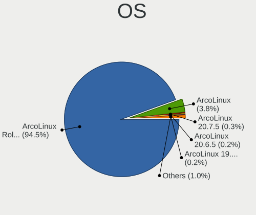

| Name               | Desktops | Percent |
|--------------------|----------|---------|
| ArcoLinux Rolling  | 1408     | 94.5%   |
| ArcoLinux          | 57       | 3.83%   |
| ArcoLinux 20.7.5   | 4        | 0.27%   |
| ArcoLinux 20.6.5   | 3        | 0.2%    |
| ArcoLinux 19.12.15 | 3        | 0.2%    |
| ArcoLinux 20.3.4   | 2        | 0.13%   |
| ArcoLinux 20.2.12  | 2        | 0.13%   |
| ArcoLinux 19.07.11 | 2        | 0.13%   |
| ArcoLinux 6.9.1    | 1        | 0.07%   |
| ArcoLinux 20.5.7   | 1        | 0.07%   |
| ArcoLinux 20.5.2   | 1        | 0.07%   |
| ArcoLinux 20.4.11  | 1        | 0.07%   |
| ArcoLinux 20.3.3   | 1        | 0.07%   |
| ArcoLinux 20.2.9   | 1        | 0.07%   |
| ArcoLinux 20.1.4   | 1        | 0.07%   |
| ArcoLinux 19.11.3  | 1        | 0.07%   |
| ArcoLinux 19.02.4  | 1        | 0.07%   |

OS Family
---------

OS without a version

| Name      | Desktops | Percent |
|-----------|----------|---------|
| ArcoLinux | 1478     | 100%    |

Kernel
------

Version of the Linux kernel

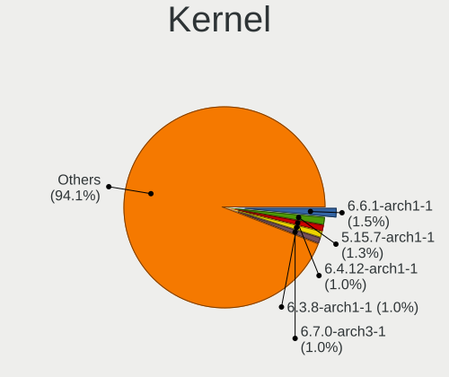

| Version            | Desktops | Percent |
|--------------------|----------|---------|
| 6.6.1-arch1-1      | 31       | 1.52%   |
| 5.15.7-arch1-1     | 26       | 1.28%   |
| 6.4.12-arch1-1     | 21       | 1.03%   |
| 6.3.8-arch1-1      | 21       | 1.03%   |
| 6.7.0-arch3-1      | 20       | 0.98%   |
| 6.8.1-arch1-1      | 19       | 0.93%   |
| 6.7.9-arch1-1      | 18       | 0.89%   |
| 5.16.11-arch1-1    | 18       | 0.89%   |
| 5.15.10-arch1-1    | 18       | 0.89%   |
| 5.13.13-arch1-1    | 18       | 0.89%   |
| 6.7.4-arch1-1      | 17       | 0.84%   |
| 6.3.9-arch1-1      | 17       | 0.84%   |
| 6.6.8-arch1-1      | 15       | 0.74%   |
| 6.2.11-arch1-1     | 15       | 0.74%   |
| 5.8.14-arch1-1     | 14       | 0.69%   |
| 6.8.7-arch1-1      | 13       | 0.64%   |
| 6.3.2-arch1-1      | 13       | 0.64%   |
| 6.2.8-arch1-1      | 13       | 0.64%   |
| 6.6.2-arch1-1      | 11       | 0.54%   |
| 6.5.9-arch2-1      | 11       | 0.54%   |
| 6.5.8-arch1-1      | 11       | 0.54%   |
| 6.4.11-arch1-1     | 11       | 0.54%   |
| 6.3.3-arch1-1      | 11       | 0.54%   |
| 5.14.14-arch1-1    | 11       | 0.54%   |
| 6.8.5-arch1-1      | 10       | 0.49%   |
| 6.6.7-arch1-1      | 10       | 0.49%   |
| 6.5.7-arch1-1      | 10       | 0.49%   |
| 6.4.10-arch1-1     | 10       | 0.49%   |
| 5.9.14-arch1-1     | 10       | 0.49%   |
| 6.9.5-zen1-1-zen   | 9        | 0.44%   |
| 6.5.3-arch1-1      | 9        | 0.44%   |
| 6.3.1-arch1-1      | 9        | 0.44%   |
| 6.10.4-1-cachyos   | 9        | 0.44%   |
| 6.10.10-arch1-1    | 9        | 0.44%   |
| 6.9.4-1-cachyos    | 8        | 0.39%   |
| 6.8.2-arch2-1      | 8        | 0.39%   |
| 6.7.8-arch1-1      | 8        | 0.39%   |
| 6.6.10-arch1-1     | 8        | 0.39%   |
| 6.12.10-arch1-1    | 8        | 0.39%   |
| 6.10.10-zen1-1-zen | 8        | 0.39%   |

Kernel Family
-------------

Linux kernel without a distro release

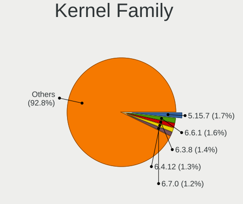

| Version | Desktops | Percent |
|---------|----------|---------|
| 5.15.7  | 34       | 1.67%   |
| 6.6.1   | 32       | 1.58%   |
| 6.3.8   | 28       | 1.38%   |
| 6.4.12  | 27       | 1.33%   |
| 6.7.0   | 25       | 1.23%   |
| 6.8.1   | 22       | 1.08%   |
| 6.7.9   | 22       | 1.08%   |
| 6.8.7   | 21       | 1.03%   |
| 6.7.4   | 21       | 1.03%   |
| 6.3.9   | 21       | 1.03%   |
| 5.16.11 | 20       | 0.99%   |
| 5.15.10 | 20       | 0.99%   |
| 6.8.9   | 18       | 0.89%   |
| 6.8.5   | 18       | 0.89%   |
| 6.6.8   | 18       | 0.89%   |
| 6.3.2   | 18       | 0.89%   |
| 6.10.10 | 18       | 0.89%   |
| 5.13.13 | 18       | 0.89%   |
| 6.4.11  | 17       | 0.84%   |
| 6.2.11  | 17       | 0.84%   |
| 6.3.3   | 16       | 0.79%   |
| 6.3.1   | 16       | 0.79%   |
| 6.9.1   | 15       | 0.74%   |
| 6.6.7   | 15       | 0.74%   |
| 6.5.3   | 15       | 0.74%   |
| 6.2.8   | 14       | 0.69%   |
| 6.13.5  | 14       | 0.69%   |
| 6.1.12  | 14       | 0.69%   |
| 6.0.2   | 14       | 0.69%   |
| 5.8.14  | 14       | 0.69%   |
| 6.9.5   | 13       | 0.64%   |
| 6.5.9   | 13       | 0.64%   |
| 6.5.8   | 13       | 0.64%   |
| 6.10.4  | 13       | 0.64%   |
| 6.7.6   | 12       | 0.59%   |
| 6.5.7   | 12       | 0.59%   |
| 6.4.2   | 12       | 0.59%   |
| 6.4.1   | 12       | 0.59%   |
| 5.15.4  | 12       | 0.59%   |
| 6.9.7   | 11       | 0.54%   |

Kernel Major Ver.
-----------------

Linux kernel major version

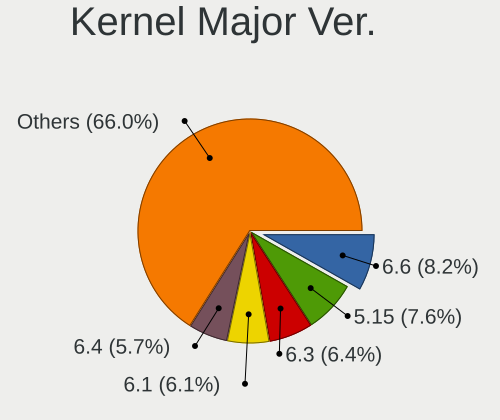

| Version  | Desktops | Percent |
|----------|----------|---------|
| 6.6      | 158      | 8.2%    |
| 5.15     | 147      | 7.63%   |
| 6.3      | 123      | 6.39%   |
| 6.1      | 117      | 6.07%   |
| 6.4      | 109      | 5.66%   |
| 6.7      | 100      | 5.19%   |
| 6.8      | 98       | 5.09%   |
| 5.10     | 83       | 4.31%   |
| 6.2      | 77       | 4%      |
| 6.5      | 75       | 3.89%   |
| 6.9      | 70       | 3.63%   |
| 6.10     | 65       | 3.37%   |
| 5.16     | 62       | 3.22%   |
| 6.12     | 60       | 3.12%   |
| 6.0      | 60       | 3.12%   |
| 5.14     | 57       | 2.96%   |
| 6.13     | 52       | 2.7%    |
| 6.11     | 50       | 2.6%    |
| 5.9      | 49       | 2.54%   |
| 5.12     | 44       | 2.28%   |
| 5.13     | 43       | 2.23%   |
| 5.18     | 41       | 2.13%   |
| 5.11     | 41       | 2.13%   |
| 5.17     | 38       | 1.97%   |
| 5.19     | 34       | 1.77%   |
| 5.8      | 28       | 1.45%   |
| 5.4      | 21       | 1.09%   |
| 5.6      | 5        | 0.26%   |
| 6.14     | 3        | 0.16%   |
| 5.3      | 3        | 0.16%   |
| 5.7      | 2        | 0.1%    |
| 5.5      | 2        | 0.1%    |
| 5.15.96  | 2        | 0.1%    |
| 4.19     | 2        | 0.1%    |
| 6.3.3    | 1        | 0.05%   |
| 6.2.0    | 1        | 0.05%   |
| 5.15.107 | 1        | 0.05%   |
| 5.0      | 1        | 0.05%   |
| 4.17     | 1        | 0.05%   |

Arch
----

OS architecture (x86_64, i586, etc.)

| Name   | Desktops | Percent |
|--------|----------|---------|
| x86_64 | 1478     | 100%    |

DE
--

Desktop Environment

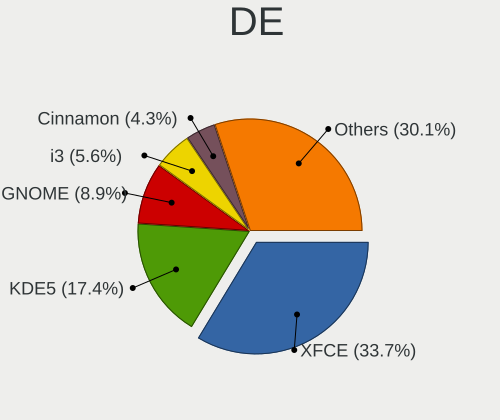

| Name           | Desktops | Percent |
|----------------|----------|---------|
| XFCE           | 567      | 33.67%  |
| KDE5           | 293      | 17.4%   |
| GNOME          | 150      | 8.91%   |
| i3             | 94       | 5.58%   |
| Cinnamon       | 73       | 4.33%   |
| Unknown        | 67       | 3.98%   |
| awesome        | 61       | 3.62%   |
| KDE6           | 44       | 2.61%   |
| Hyprland       | 41       | 2.43%   |
| X-Cinnamon     | 37       | 2.2%    |
| qtile          | 35       | 2.08%   |
| bspwm          | 27       | 1.6%    |
| Budgie         | 26       | 1.54%   |
| Deepin         | 23       | 1.37%   |
| xmonad         | 22       | 1.31%   |
| LXQt           | 19       | 1.13%   |
| LeftWM         | 16       | 0.95%   |
| MATE           | 14       | 0.83%   |
| KDE            | 14       | 0.83%   |
| DWM            | 14       | 0.83%   |
| chadwm         | 14       | 0.83%   |
| i3-with-shmlog | 5        | 0.3%    |
| herbstluftwm   | 5        | 0.3%    |
| wayfire        | 4        | 0.24%   |
| sway           | 4        | 0.24%   |
| Cutefish       | 4        | 0.24%   |
| openbox        | 2        | 0.12%   |
| Unity          | 1        | 0.06%   |
| niri           | 1        | 0.06%   |
| LXDE           | 1        | 0.06%   |
| ICEWM          | 1        | 0.06%   |
| Hypr           | 1        | 0.06%   |
| GNOME Classic  | 1        | 0.06%   |
| dusk           | 1        | 0.06%   |
| dk             | 1        | 0.06%   |
| COSMIC         | 1        | 0.06%   |

Display Server
--------------

X11 or Wayland

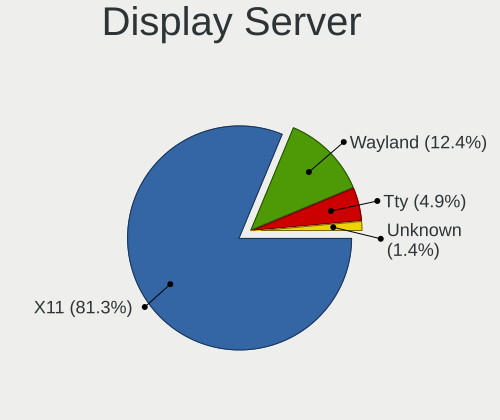

| Name    | Desktops | Percent |
|---------|----------|---------|
| X11     | 1254     | 81.27%  |
| Wayland | 192      | 12.44%  |
| Tty     | 75       | 4.86%   |
| Unknown | 22       | 1.43%   |

Display Manager
---------------

SDDM, LightDM, etc.

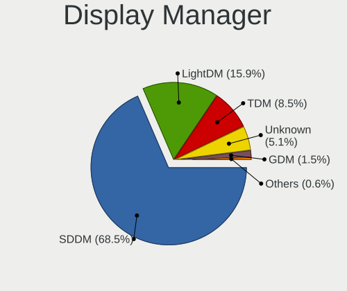

| Name    | Desktops | Percent |
|---------|----------|---------|
| SDDM    | 1078     | 68.53%  |
| LightDM | 250      | 15.89%  |
| TDM     | 133      | 8.46%   |
| Unknown | 80       | 5.09%   |
| GDM     | 23       | 1.46%   |
| Ly      | 6        | 0.38%   |
| LXDM    | 3        | 0.19%   |

OS Lang
-------

Language

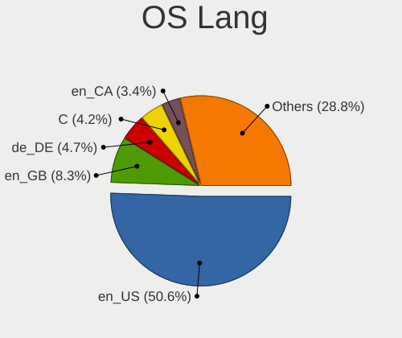

| Lang    | Desktops | Percent |
|---------|----------|---------|
| en_US   | 763      | 50.56%  |
| en_GB   | 126      | 8.35%   |
| de_DE   | 71       | 4.71%   |
| C       | 64       | 4.24%   |
| en_CA   | 51       | 3.38%   |
| ru_RU   | 44       | 2.92%   |
| pt_BR   | 36       | 2.39%   |
| fr_FR   | 34       | 2.25%   |
| en_AU   | 34       | 2.25%   |
| es_ES   | 32       | 2.12%   |
| it_IT   | 25       | 1.66%   |
| en_IN   | 25       | 1.66%   |
| es_AR   | 16       | 1.06%   |
| hu_HU   | 14       | 0.93%   |
| es_MX   | 14       | 0.93%   |
| en_ZA   | 13       | 0.86%   |
| sv_SE   | 11       | 0.73%   |
| tr_TR   | 10       | 0.66%   |
| nl_NL   | 9        | 0.6%    |
| pl_PL   | 8        | 0.53%   |
| Unknown | 7        | 0.46%   |
| zh_CN   | 5        | 0.33%   |
| pt_PT   | 5        | 0.33%   |
| nl_BE   | 5        | 0.33%   |
| fr_CA   | 5        | 0.33%   |
| fi_FI   | 5        | 0.33%   |
| en_DK   | 5        | 0.33%   |
| de_AT   | 5        | 0.33%   |
| en_IE   | 4        | 0.27%   |
| da_DK   | 4        | 0.27%   |
| cs_CZ   | 4        | 0.27%   |
| nb_NO   | 3        | 0.2%    |
| ja_JP   | 3        | 0.2%    |
| es_UY   | 3        | 0.2%    |
| es_CO   | 3        | 0.2%    |
| en_PH   | 3        | 0.2%    |
| en_IL   | 3        | 0.2%    |
| de_CH   | 3        | 0.2%    |
| uk_UA   | 2        | 0.13%   |
| ru_UA   | 2        | 0.13%   |

Boot Mode
---------

EFI or BIOS

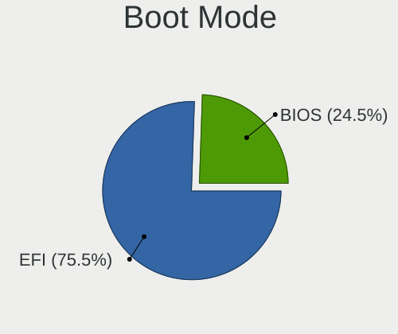

| Mode | Desktops | Percent |
|------|----------|---------|
| EFI  | 1136     | 75.53%  |
| BIOS | 368      | 24.47%  |

Filesystem
----------

Type of filesystem

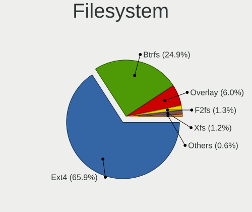

| Type     | Desktops | Percent |
|----------|----------|---------|
| Ext4     | 1026     | 65.85%  |
| Btrfs    | 388      | 24.9%   |
| Overlay  | 94       | 6.03%   |
| F2fs     | 21       | 1.35%   |
| Xfs      | 19       | 1.22%   |
| Unknown  | 7        | 0.45%   |
| Reiserfs | 2        | 0.13%   |
| Jfs      | 1        | 0.06%   |

Part. scheme
------------

Scheme of partitioning

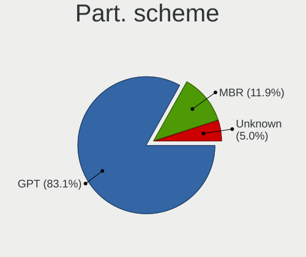

| Type    | Desktops | Percent |
|---------|----------|---------|
| GPT     | 1248     | 83.14%  |
| MBR     | 178      | 11.86%  |
| Unknown | 75       | 5%      |

Dual Boot with Linux/BSD
------------------------

Hosting more than one Linux/BSD

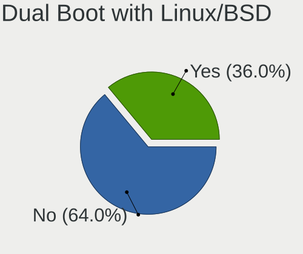

| Dual boot | Desktops | Percent |
|-----------|----------|---------|
| No        | 1002     | 63.98%  |
| Yes       | 564      | 36.02%  |

Dual Boot (Win)
---------------

Hosting Linux and Windows

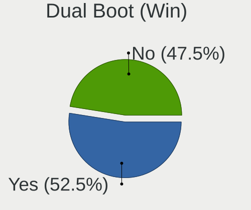

| Dual boot | Desktops | Percent |
|-----------|----------|---------|
| Yes       | 805      | 52.51%  |
| No        | 728      | 47.49%  |

Board
-----

Vendor
------

Motherboard manufacturer

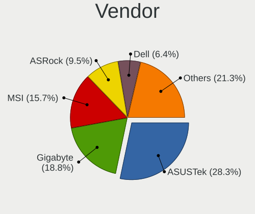

| Name                                 | Desktops | Percent |
|--------------------------------------|----------|---------|
| ASUSTek Computer                     | 418      | 28.28%  |
| Gigabyte Technology                  | 278      | 18.81%  |
| MSI                                  | 232      | 15.7%   |
| ASRock                               | 141      | 9.54%   |
| Dell                                 | 94       | 6.36%   |
| Hewlett-Packard                      | 82       | 5.55%   |
| Lenovo                               | 48       | 3.25%   |
| Acer                                 | 23       | 1.56%   |
| Intel                                | 22       | 1.49%   |
| Unknown                              | 22       | 1.49%   |
| Supermicro                           | 15       | 1.01%   |
| Fujitsu                              | 10       | 0.68%   |
| Biostar                              | 10       | 0.68%   |
| Medion                               | 7        | 0.47%   |
| Huanan                               | 6        | 0.41%   |
| Foxconn                              | 6        | 0.41%   |
| BESSTAR Tech                         | 6        | 0.41%   |
| Shenzhen Meigao Electronic Equipment | 4        | 0.27%   |
| Pegatron                             | 4        | 0.27%   |
| AZW                                  | 4        | 0.27%   |
| Apple                                | 4        | 0.27%   |
| SYWZ                                 | 3        | 0.2%    |
| GMKtec                               | 3        | 0.2%    |
| ECS                                  | 3        | 0.2%    |
| Alienware                            | 3        | 0.2%    |
| Packard Bell                         | 2        | 0.14%   |
| NZXT                                 | 2        | 0.14%   |
| MACHINIST                            | 2        | 0.14%   |
| Win element                          | 1        | 0.07%   |
| VS Company                           | 1        | 0.07%   |
| SZMZ                                 | 1        | 0.07%   |
| System76                             | 1        | 0.07%   |
| SiS Technology                       | 1        | 0.07%   |
| Shuttle                              | 1        | 0.07%   |
| Seeed Studio                         | 1        | 0.07%   |
| Proline                              | 1        | 0.07%   |
| Positivo                             | 1        | 0.07%   |
| PLEXHD                               | 1        | 0.07%   |
| Maibenben                            | 1        | 0.07%   |
| Kllisre                              | 1        | 0.07%   |

Model
-----

Motherboard model

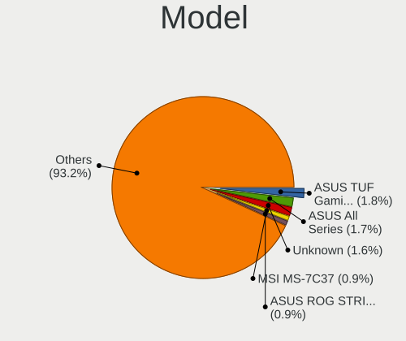

| Name                         | Desktops | Percent |
|------------------------------|----------|---------|
| ASUS TUF Gaming X570-PLUS    | 26       | 1.76%   |
| ASUS All Series              | 25       | 1.69%   |
| Unknown                      | 24       | 1.62%   |
| MSI MS-7C37                  | 13       | 0.88%   |
| ASUS ROG STRIX B550-F GAMING | 13       | 0.88%   |
| ASUS PRIME X570-P            | 13       | 0.88%   |
| MSI MS-7C91                  | 11       | 0.74%   |
| MSI MS-7C56                  | 11       | 0.74%   |
| MSI MS-7B79                  | 11       | 0.74%   |
| Gigabyte X570 AORUS ELITE    | 11       | 0.74%   |
| Supermicro SYS-5019A-FTN4    | 10       | 0.68%   |
| MSI MS-7B89                  | 10       | 0.68%   |
| Dell OptiPlex 7010           | 10       | 0.68%   |
| MSI MS-7C02                  | 9        | 0.61%   |
| Gigabyte X570 AORUS MASTER   | 9        | 0.61%   |
| MSI MS-7B86                  | 8        | 0.54%   |
| MSI MS-7A38                  | 8        | 0.54%   |
| Gigabyte B450 AORUS ELITE    | 8        | 0.54%   |
| ASUS ROG STRIX B450-F GAMING | 8        | 0.54%   |
| ASUS ROG CROSSHAIR VIII HERO | 8        | 0.54%   |
| ASUS PRIME X470-PRO          | 8        | 0.54%   |
| Gigabyte X570 GAMING X       | 7        | 0.47%   |
| ASUS Z170 PRO GAMING         | 7        | 0.47%   |
| ASUS PRIME A320M-K           | 7        | 0.47%   |
| ASRock B450M Pro4            | 7        | 0.47%   |
| Gigabyte X570 AORUS PRO WIFI | 6        | 0.41%   |
| Gigabyte B450M DS3H V2       | 6        | 0.41%   |
| Dell OptiPlex 9020           | 6        | 0.41%   |
| Dell OptiPlex 9010           | 6        | 0.41%   |
| ASUS PRIME B450M-A           | 6        | 0.41%   |
| MSI MS-7C95                  | 5        | 0.34%   |
| MSI MS-7C35                  | 5        | 0.34%   |
| MSI MS-7971                  | 5        | 0.34%   |
| HP ProDesk 600 G1 SFF        | 5        | 0.34%   |
| ASUS TUF Gaming B550-PLUS    | 5        | 0.34%   |
| ASUS ROG STRIX X570-E GAMING | 5        | 0.34%   |
| ASUS M5A78L-M/USB3           | 5        | 0.34%   |
| ASRock B450 Pro4             | 5        | 0.34%   |
| MSI MS-7C52                  | 4        | 0.27%   |
| MSI MS-7B98                  | 4        | 0.27%   |

Model Family
------------

Motherboard model prefix

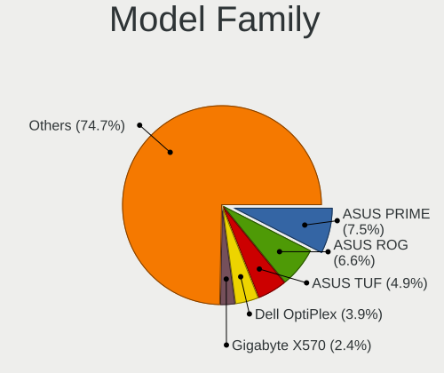

| Name                      | Desktops | Percent |
|---------------------------|----------|---------|
| ASUS PRIME                | 111      | 7.51%   |
| ASUS ROG                  | 98       | 6.63%   |
| ASUS TUF                  | 72       | 4.87%   |
| Dell OptiPlex             | 57       | 3.86%   |
| Gigabyte X570             | 36       | 2.44%   |
| Lenovo ThinkCentre        | 29       | 1.96%   |
| ASUS All                  | 25       | 1.69%   |
| Unknown                   | 24       | 1.62%   |
| Gigabyte B450M            | 22       | 1.49%   |
| Gigabyte B450             | 17       | 1.15%   |
| HP EliteDesk              | 14       | 0.95%   |
| HP Compaq                 | 14       | 0.95%   |
| Gigabyte B550             | 14       | 0.95%   |
| ASRock B450M              | 14       | 0.95%   |
| MSI MS-7C37               | 13       | 0.88%   |
| HP ProDesk                | 13       | 0.88%   |
| Dell Inspiron             | 12       | 0.81%   |
| MSI MS-7C91               | 11       | 0.74%   |
| MSI MS-7C56               | 11       | 0.74%   |
| MSI MS-7B79               | 11       | 0.74%   |
| Supermicro SYS-5019A-FTN4 | 10       | 0.68%   |
| MSI MS-7B89               | 10       | 0.68%   |
| Dell Vostro               | 10       | 0.68%   |
| ASUS P8Z77-V              | 10       | 0.68%   |
| MSI MS-7C02               | 9        | 0.61%   |
| ASRock B450               | 9        | 0.61%   |
| Acer Aspire               | 9        | 0.61%   |
| MSI MS-7B86               | 8        | 0.54%   |
| MSI MS-7A38               | 8        | 0.54%   |
| Lenovo IdeaCentre         | 8        | 0.54%   |
| HP Pavilion               | 8        | 0.54%   |
| Gigabyte Z390             | 8        | 0.54%   |
| Fujitsu ESPRIMO           | 8        | 0.54%   |
| Dell Precision            | 8        | 0.54%   |
| ASUS Z170                 | 8        | 0.54%   |
| ASUS P8H61-M              | 8        | 0.54%   |
| ASRock X670E              | 8        | 0.54%   |
| Acer Predator             | 8        | 0.54%   |
| Gigabyte B550M            | 7        | 0.47%   |
| ASUS STRIX                | 7        | 0.47%   |

MFG Year
--------

Motherboard manufacture year

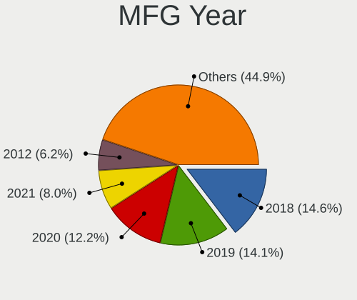

| Year    | Desktops | Percent |
|---------|----------|---------|
| 2018    | 216      | 14.61%  |
| 2019    | 208      | 14.07%  |
| 2020    | 181      | 12.25%  |
| 2021    | 118      | 7.98%   |
| 2012    | 92       | 6.22%   |
| 2022    | 88       | 5.95%   |
| 2013    | 87       | 5.89%   |
| 2017    | 83       | 5.62%   |
| 2016    | 79       | 5.35%   |
| 2015    | 73       | 4.94%   |
| 2014    | 67       | 4.53%   |
| 2011    | 55       | 3.72%   |
| 2023    | 38       | 2.57%   |
| 2010    | 32       | 2.17%   |
| 2009    | 21       | 1.42%   |
| 2008    | 14       | 0.95%   |
| 2024    | 10       | 0.68%   |
| 2007    | 8        | 0.54%   |
| 2006    | 5        | 0.34%   |
| 2005    | 1        | 0.07%   |
| 2004    | 1        | 0.07%   |
| Unknown | 1        | 0.07%   |

Form Factor
-----------

Physical design of the computer

| Name    | Desktops | Percent |
|---------|----------|---------|
| Desktop | 1478     | 100%    |

Secure Boot
-----------

Enabled or disabled

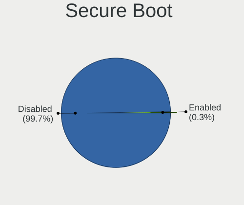

| State    | Desktops | Percent |
|----------|----------|---------|
| Disabled | 1475     | 99.73%  |
| Enabled  | 4        | 0.27%   |

Coreboot
--------

Have coreboot on board

| Used | Desktops | Percent |
|------|----------|---------|
| No   | 1477     | 99.93%  |
| Yes  | 1        | 0.07%   |

RAM Size
--------

Total RAM memory

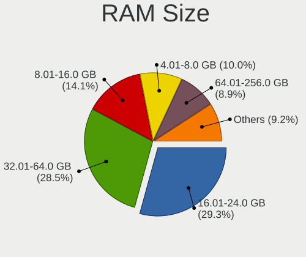

| Size in GB      | Desktops | Percent |
|-----------------|----------|---------|
| 16.01-24.0      | 444      | 29.27%  |
| 32.01-64.0      | 433      | 28.54%  |
| 8.01-16.0       | 214      | 14.11%  |
| 4.01-8.0        | 152      | 10.02%  |
| 64.01-256.0     | 135      | 8.9%    |
| 24.01-32.0      | 66       | 4.35%   |
| 3.01-4.0        | 63       | 4.15%   |
| 1.01-2.0        | 4        | 0.26%   |
| 2.01-3.0        | 3        | 0.2%    |
| More than 256.0 | 2        | 0.13%   |
| Unknown         | 1        | 0.07%   |

RAM Used
--------

Used RAM memory

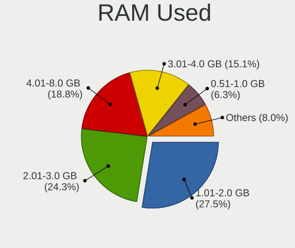

| Used GB     | Desktops | Percent |
|-------------|----------|---------|
| 1.01-2.0    | 488      | 27.54%  |
| 2.01-3.0    | 431      | 24.32%  |
| 4.01-8.0    | 333      | 18.79%  |
| 3.01-4.0    | 267      | 15.07%  |
| 0.51-1.0    | 111      | 6.26%   |
| 8.01-16.0   | 101      | 5.7%    |
| 16.01-24.0  | 17       | 0.96%   |
| 0.01-0.5    | 17       | 0.96%   |
| 32.01-64.0  | 2        | 0.11%   |
| 24.01-32.0  | 2        | 0.11%   |
| 64.01-256.0 | 2        | 0.11%   |
| Unknown     | 1        | 0.06%   |

Total Drives
------------

Number of drives on board

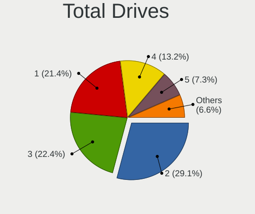

| Drives | Desktops | Percent |
|--------|----------|---------|
| 2      | 462      | 29.15%  |
| 3      | 355      | 22.4%   |
| 1      | 339      | 21.39%  |
| 4      | 210      | 13.25%  |
| 5      | 115      | 7.26%   |
| 6      | 47       | 2.97%   |
| 7      | 22       | 1.39%   |
| 8      | 11       | 0.69%   |
| 9      | 7        | 0.44%   |
| 0      | 6        | 0.38%   |
| 11     | 3        | 0.19%   |
| 10     | 2        | 0.13%   |
| 21     | 1        | 0.06%   |
| 20     | 1        | 0.06%   |
| 19     | 1        | 0.06%   |
| 14     | 1        | 0.06%   |
| 13     | 1        | 0.06%   |
| 12     | 1        | 0.06%   |

Has CD-ROM
----------

Has CD-ROM on board

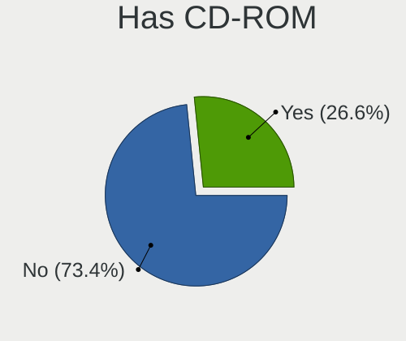

| Presented | Desktops | Percent |
|-----------|----------|---------|
| No        | 1101     | 73.4%   |
| Yes       | 399      | 26.6%   |

Has Ethernet
------------

Has Ethernet on board

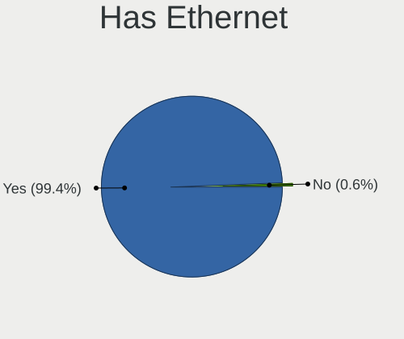

| Presented | Desktops | Percent |
|-----------|----------|---------|
| Yes       | 1469     | 99.39%  |
| No        | 9        | 0.61%   |

Has WiFi
--------

Has WiFi module

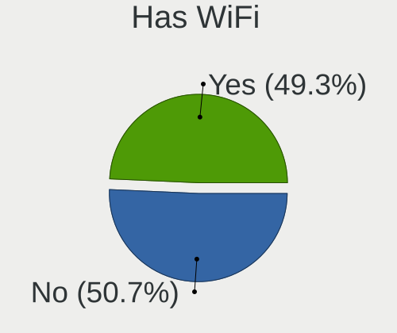

| Presented | Desktops | Percent |
|-----------|----------|---------|
| No        | 761      | 50.7%   |
| Yes       | 740      | 49.3%   |

Has Bluetooth
-------------

Has Bluetooth module

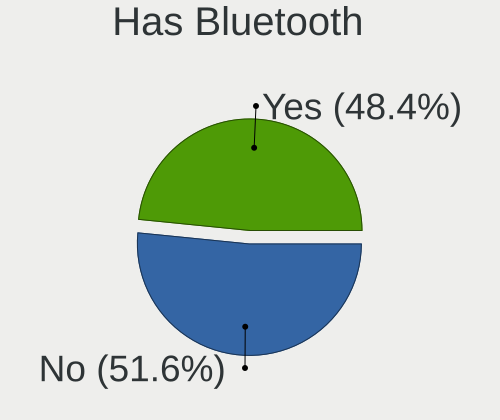

| Presented | Desktops | Percent |
|-----------|----------|---------|
| No        | 782      | 51.58%  |
| Yes       | 734      | 48.42%  |

Location
--------

Country
-------

Geographic location (country)

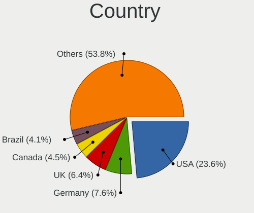

| Country      | Desktops | Percent |
|--------------|----------|---------|
| USA          | 352      | 23.59%  |
| Germany      | 114      | 7.64%   |
| UK           | 96       | 6.43%   |
| Canada       | 67       | 4.49%   |
| Brazil       | 61       | 4.09%   |
| Russia       | 50       | 3.35%   |
| Spain        | 40       | 2.68%   |
| France       | 39       | 2.61%   |
| India        | 37       | 2.48%   |
| Australia    | 37       | 2.48%   |
| Sweden       | 35       | 2.35%   |
| Italy        | 31       | 2.08%   |
| Belgium      | 30       | 2.01%   |
| Argentina    | 28       | 1.88%   |
| Netherlands  | 27       | 1.81%   |
| Mexico       | 26       | 1.74%   |
| Poland       | 21       | 1.41%   |
| Hungary      | 21       | 1.41%   |
| Turkey       | 19       | 1.27%   |
| Portugal     | 16       | 1.07%   |
| Austria      | 15       | 1.01%   |
| Switzerland  | 13       | 0.87%   |
| South Africa | 13       | 0.87%   |
| Romania      | 13       | 0.87%   |
| Norway       | 13       | 0.87%   |
| Bulgaria     | 12       | 0.8%    |
| Finland      | 11       | 0.74%   |
| Denmark      | 11       | 0.74%   |
| Ireland      | 10       | 0.67%   |
| Czechia      | 10       | 0.67%   |
| Ukraine      | 9        | 0.6%    |
| Indonesia    | 9        | 0.6%    |
| Greece       | 9        | 0.6%    |
| Egypt        | 9        | 0.6%    |
| Colombia     | 9        | 0.6%    |
| Uruguay      | 8        | 0.54%   |
| Slovenia     | 8        | 0.54%   |
| Serbia       | 8        | 0.54%   |
| Malaysia     | 7        | 0.47%   |
| Vietnam      | 6        | 0.4%    |

City
----

Geographic location (city)

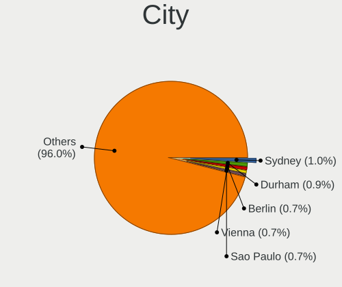

| City              | Desktops | Percent |
|-------------------|----------|---------|
| Sydney            | 16       | 0.99%   |
| Durham            | 14       | 0.87%   |
| Berlin            | 12       | 0.74%   |
| Vienna            | 11       | 0.68%   |
| Sao Paulo         | 11       | 0.68%   |
| Istanbul          | 11       | 0.68%   |
| Warsaw            | 9        | 0.56%   |
| Moscow            | 9        | 0.56%   |
| Helsinki          | 9        | 0.56%   |
| Atlanta           | 9        | 0.56%   |
| Amsterdam         | 9        | 0.56%   |
| Toronto           | 8        | 0.5%    |
| Stockholm         | 8        | 0.5%    |
| Montevideo        | 8        | 0.5%    |
| London            | 8        | 0.5%    |
| Sofia             | 7        | 0.43%   |
| New York          | 7        | 0.43%   |
| Madrid            | 7        | 0.43%   |
| Lier              | 7        | 0.43%   |
| Dallas            | 7        | 0.43%   |
| Chicago           | 7        | 0.43%   |
| Budapest          | 7        | 0.43%   |
| Las Vegas         | 6        | 0.37%   |
| Frankfurt am Main | 6        | 0.37%   |
| Denver            | 6        | 0.37%   |
| Cairo             | 6        | 0.37%   |
| Bucharest         | 6        | 0.37%   |
| Birmingham        | 6        | 0.37%   |
| Zurich            | 5        | 0.31%   |
| Zapopan           | 5        | 0.31%   |
| Wilrijk           | 5        | 0.31%   |
| Spokane           | 5        | 0.31%   |
| Portland          | 5        | 0.31%   |
| Perth             | 5        | 0.31%   |
| Oslo              | 5        | 0.31%   |
| Nairobi           | 5        | 0.31%   |
| Montreal          | 5        | 0.31%   |
| Melbourne         | 5        | 0.31%   |
| Hyderabad         | 5        | 0.31%   |
| Houston           | 5        | 0.31%   |

Drives
------

Drive Vendor
------------

Hard drive vendors

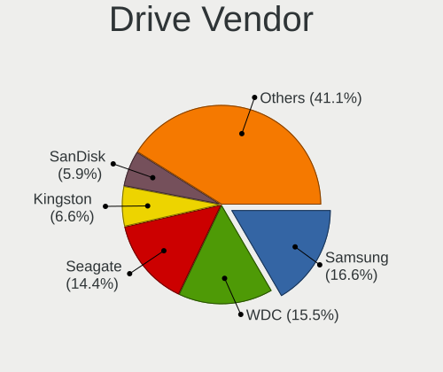

| Vendor                      | Desktops | Drives | Percent |
|-----------------------------|----------|--------|---------|
| Samsung Electronics         | 559      | 1235   | 16.6%   |
| WDC                         | 521      | 993    | 15.47%  |
| Seagate                     | 484      | 841    | 14.37%  |
| Kingston                    | 221      | 372    | 6.56%   |
| SanDisk                     | 198      | 290    | 5.88%   |
| Toshiba                     | 158      | 218    | 4.69%   |
| Crucial                     | 147      | 231    | 4.36%   |
| Phison Electronics          | 83       | 135    | 2.46%   |
| Hitachi                     | 70       | 105    | 2.08%   |
| A-DATA Technology           | 66       | 88     | 1.96%   |
| Micron/Crucial Technology   | 61       | 95     | 1.81%   |
| Intel                       | 45       | 69     | 1.34%   |
| Silicon Motion              | 42       | 60     | 1.25%   |
| China                       | 39       | 62     | 1.16%   |
| Kingston Technology Company | 36       | 49     | 1.07%   |
| SK hynix                    | 30       | 49     | 0.89%   |
| Unknown                     | 26       | 40     | 0.77%   |
| SPCC                        | 26       | 32     | 0.77%   |
| HGST                        | 26       | 48     | 0.77%   |
| PNY                         | 25       | 40     | 0.74%   |
| MAXIO Technology (Hangzhou) | 24       | 41     | 0.71%   |
| ADATA Technology            | 21       | 25     | 0.62%   |
| Phison                      | 20       | 34     | 0.59%   |
| Patriot                     | 18       | 27     | 0.53%   |
| Corsair                     | 17       | 36     | 0.5%    |
| JMicron Technology          | 16       | 19     | 0.48%   |
| SABRENT                     | 15       | 20     | 0.45%   |
| Realtek Semiconductor       | 15       | 20     | 0.45%   |
| Hewlett-Packard             | 15       | 23     | 0.45%   |
| Micron Technology           | 14       | 19     | 0.42%   |
| Gigabyte Technology         | 14       | 17     | 0.42%   |
| Intenso                     | 13       | 17     | 0.39%   |
| Transcend                   | 12       | 16     | 0.36%   |
| OCZ                         | 12       | 17     | 0.36%   |
| Plextor                     | 11       | 13     | 0.33%   |
| XPG                         | 10       | 13     | 0.3%    |
| ASMT                        | 10       | 15     | 0.3%    |
| Lexar                       | 9        | 9      | 0.27%   |
| KIOXIA                      | 9        | 12     | 0.27%   |
| Team                        | 8        | 16     | 0.24%   |

Drive Model
-----------

Hard drive models

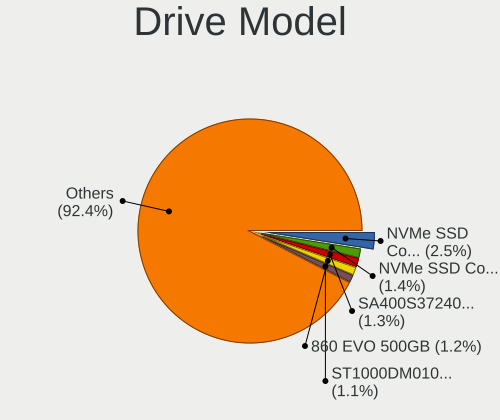

| Model                                                 | Desktops | Percent |
|-------------------------------------------------------|----------|---------|
| Samsung NVMe SSD Controller SM981/PM981/PM983 1TB     | 101      | 2.5%    |
| Samsung NVMe SSD Controller PM9A1/PM9A3/980PRO 1TB    | 56       | 1.39%   |
| Kingston SA400S37240G 240GB SSD                       | 54       | 1.34%   |
| Samsung SSD 860 EVO 500GB                             | 49       | 1.21%   |
| Seagate ST1000DM010-2EP102 1TB                        | 45       | 1.11%   |
| Seagate ST2000DM008-2FR102 2TB                        | 40       | 0.99%   |
| WDC WD10EZEX-08WN4A0 1TB                              | 38       | 0.94%   |
| Samsung SSD 850 EVO 250GB                             | 38       | 0.94%   |
| Samsung SSD 850 EVO 500GB                             | 36       | 0.89%   |
| Micron/Crucial P2 NVMe PCIe SSD 2TB                   | 35       | 0.87%   |
| Samsung SSD 860 EVO 1TB                               | 34       | 0.84%   |
| Kingston SA400S37480G 480GB SSD                       | 33       | 0.82%   |
| Phison E12 NVMe Controller 1TB                        | 32       | 0.79%   |
| Toshiba DT01ACA100 1TB                                | 30       | 0.74%   |
| Samsung SSD 870 EVO 1TB                               | 27       | 0.67%   |
| Crucial CT1000MX500SSD1 1TB                           | 27       | 0.67%   |
| Silicon Motion SM2263EN/SM2263XT SSD Controller 512GB | 26       | 0.64%   |
| Seagate ST4000DM004-2CV104 4TB                        | 26       | 0.64%   |
| Samsung SSD 860 EVO 250GB                             | 25       | 0.62%   |
| Samsung NVMe SSD Controller SM961/PM961/SM963 1024GB  | 25       | 0.62%   |
| Crucial CT500MX500SSD1 500GB                          | 25       | 0.62%   |
| Seagate ST1000DM003-1CH162 1TB                        | 24       | 0.59%   |
| Kingston SA400S37120G 120GB SSD                       | 23       | 0.57%   |
| Samsung SSD 980 1TB                                   | 22       | 0.54%   |
| Toshiba HDWD110 1TB                                   | 20       | 0.5%    |
| Samsung SSD 970 EVO Plus 500GB                        | 20       | 0.5%    |
| Phison E16 PCIe4 NVMe Controller 1TB                  | 20       | 0.5%    |
| Seagate ST2000DM001-1ER164 2TB                        | 19       | 0.47%   |
| Crucial CT240BX500SSD1 240GB                          | 19       | 0.47%   |
| Sandisk WD Blue SN550 NVMe SSD 1024GB                 | 18       | 0.45%   |
| Seagate ST500DM002-1BD142 500GB                       | 17       | 0.42%   |
| Phison PS5013 E13 NVMe Controller 500GB               | 17       | 0.42%   |
| MAXIO (Hangzhou) NVMe SSD Controller MAP1202 2TB      | 17       | 0.42%   |
| WDC WDS240G2G0A-00JH30 240GB SSD                      | 16       | 0.4%    |
| Seagate ST1000DM003-1ER162 1TB                        | 16       | 0.4%    |
| Sandisk WD Black SN850 1TB                            | 16       | 0.4%    |
| Samsung SSD 870 QVO 1TB                               | 16       | 0.4%    |
| Samsung SSD 970 EVO Plus 1TB                          | 15       | 0.37%   |
| Unknown SD/MMC/MS PRO 2GB                             | 14       | 0.35%   |
| Sandisk WD Black 2018/SN750 / PC SN720 NVMe SSD 512GB | 14       | 0.35%   |

HDD Vendor
----------

Hard disk drive vendors

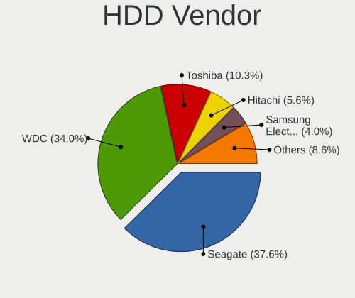

| Vendor              | Desktops | Drives | Percent |
|---------------------|----------|--------|---------|
| Seagate             | 473      | 809    | 37.6%   |
| WDC                 | 428      | 790    | 34.02%  |
| Toshiba             | 129      | 180    | 10.25%  |
| Hitachi             | 70       | 105    | 5.56%   |
| Samsung Electronics | 50       | 75     | 3.97%   |
| HGST                | 24       | 44     | 1.91%   |
| Unknown             | 16       | 25     | 1.27%   |
| JMicron Technology  | 11       | 11     | 0.87%   |
| Maxtor              | 7        | 10     | 0.56%   |
| Hewlett-Packard     | 5        | 7      | 0.4%    |
| Fujitsu             | 5        | 6      | 0.4%    |
| External            | 5        | 9      | 0.4%    |
| ASMT                | 5        | 9      | 0.4%    |
| TO Exter            | 4        | 4      | 0.32%   |
| ASMedia             | 4        | 5      | 0.32%   |
| USB3.0              | 3        | 3      | 0.24%   |
| SSK                 | 3        | 3      | 0.24%   |
| Intenso             | 2        | 2      | 0.16%   |
| Inateck             | 2        | 2      | 0.16%   |
| WD MediaMax         | 1        | 1      | 0.08%   |
| TDAS                | 1        | 4      | 0.08%   |
| SABRENT             | 1        | 1      | 0.08%   |
| RSH-319             | 1        | 1      | 0.08%   |
| Min Yi U            | 1        | 1      | 0.08%   |
| Maxone              | 1        | 1      | 0.08%   |
| HGST HUS            | 1        | 1      | 0.08%   |
| HGST HTS            | 1        | 1      | 0.08%   |
| H/W                 | 1        | 12     | 0.08%   |
| ExcelStor           | 1        | 2      | 0.08%   |
| CSD                 | 1        | 1      | 0.08%   |
| Unknown             | 1        | 1      | 0.08%   |

SSD Vendor
----------

Solid state drive vendors

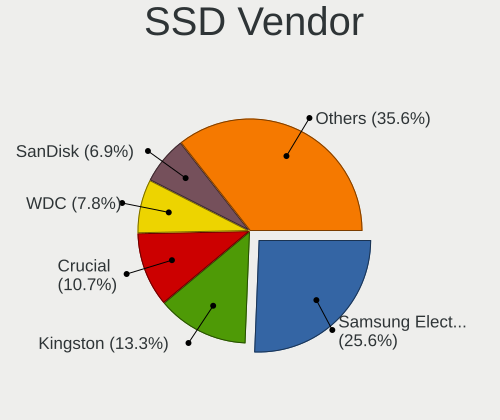

| Vendor              | Desktops | Drives | Percent |
|---------------------|----------|--------|---------|
| Samsung Electronics | 322      | 639    | 25.64%  |
| Kingston            | 167      | 250    | 13.3%   |
| Crucial             | 135      | 210    | 10.75%  |
| WDC                 | 98       | 160    | 7.8%    |
| SanDisk             | 87       | 119    | 6.93%   |
| A-DATA Technology   | 55       | 75     | 4.38%   |
| China               | 39       | 62     | 3.11%   |
| PNY                 | 25       | 38     | 1.99%   |
| SPCC                | 21       | 25     | 1.67%   |
| Patriot             | 18       | 27     | 1.43%   |
| Intel               | 17       | 19     | 1.35%   |
| SK hynix            | 15       | 31     | 1.19%   |
| Toshiba             | 13       | 19     | 1.04%   |
| OCZ                 | 12       | 17     | 0.96%   |
| SABRENT             | 11       | 15     | 0.88%   |
| Intenso             | 11       | 15     | 0.88%   |
| Transcend           | 10       | 14     | 0.8%    |
| Gigabyte Technology | 10       | 11     | 0.8%    |
| Plextor             | 9        | 11     | 0.72%   |
| Lexar               | 9        | 9      | 0.72%   |
| Corsair             | 9        | 20     | 0.72%   |
| Team                | 8        | 16     | 0.64%   |
| Hewlett-Packard     | 8        | 13     | 0.64%   |
| Micron Technology   | 7        | 11     | 0.56%   |
| Apacer              | 7        | 7      | 0.56%   |
| LITEON              | 6        | 9      | 0.48%   |
| KingSpec            | 6        | 9      | 0.48%   |
| T-FORCE             | 5        | 5      | 0.4%    |
| GOODRAM             | 5        | 5      | 0.4%    |
| Unknown             | 5        | 5      | 0.4%    |
| LITEONIT            | 4        | 4      | 0.32%   |
| HS-SSD-C100         | 4        | 4      | 0.32%   |
| Fanxiang            | 4        | 4      | 0.32%   |
| Acer                | 4        | 4      | 0.32%   |
| XrayDisk            | 3        | 4      | 0.24%   |
| Vaseky              | 3        | 5      | 0.24%   |
| Seagate             | 3        | 7      | 0.24%   |
| Netac               | 3        | 3      | 0.24%   |
| Mushkin             | 3        | 7      | 0.24%   |
| Leven               | 3        | 3      | 0.24%   |

Drive Kind
----------

HDD or SSD

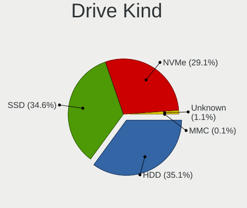

| Kind    | Desktops | Drives | Percent |
|---------|----------|--------|---------|
| HDD     | 949      | 2126   | 35.07%  |
| SSD     | 937      | 2007   | 34.63%  |
| NVMe    | 788      | 1583   | 29.12%  |
| Unknown | 30       | 44     | 1.11%   |
| MMC     | 2        | 2      | 0.07%   |

Drive Connector
---------------

SATA, SAS, NVMe, etc.

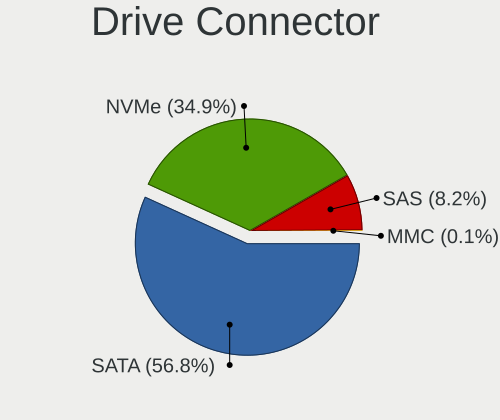

| Type | Desktops | Drives | Percent |
|------|----------|--------|---------|
| SATA | 1278     | 3881   | 56.8%   |
| NVMe | 786      | 1569   | 34.93%  |
| SAS  | 184      | 310    | 8.18%   |
| MMC  | 2        | 2      | 0.09%   |

Drive Size
----------

Size of hard drive

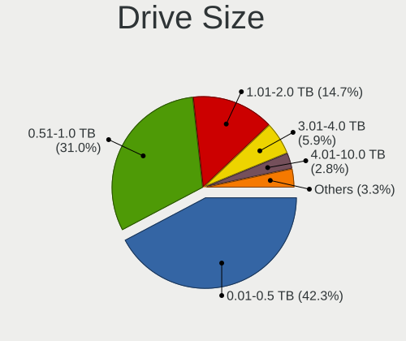

| Size in TB | Desktops | Drives | Percent |
|------------|----------|--------|---------|
| 0.01-0.5   | 910      | 1923   | 42.27%  |
| 0.51-1.0   | 667      | 1158   | 30.98%  |
| 1.01-2.0   | 316      | 583    | 14.68%  |
| 3.01-4.0   | 127      | 208    | 5.9%    |
| 4.01-10.0  | 61       | 143    | 2.83%   |
| 2.01-3.0   | 58       | 93     | 2.69%   |
| 10.01-20.0 | 14       | 25     | 0.65%   |

Space Total
-----------

Amount of disk space available on the file system

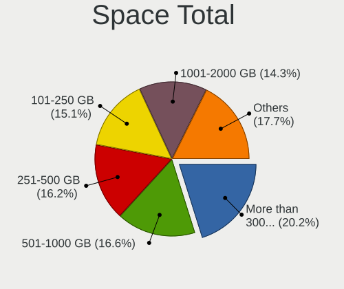

| Size in GB     | Desktops | Percent |
|----------------|----------|---------|
| More than 3000 | 331      | 20.16%  |
| 501-1000       | 273      | 16.63%  |
| 251-500        | 266      | 16.2%   |
| 101-250        | 248      | 15.1%   |
| 1001-2000      | 234      | 14.25%  |
| 2001-3000      | 110      | 6.7%    |
| 1-20           | 74       | 4.51%   |
| Unknown        | 46       | 2.8%    |
| 51-100         | 44       | 2.68%   |
| 21-50          | 16       | 0.97%   |

Space Used
----------

Amount of used disk space

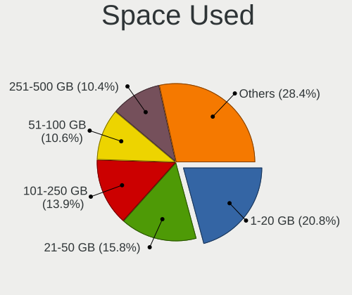

| Used GB        | Desktops | Percent |
|----------------|----------|---------|
| 1-20           | 366      | 20.82%  |
| 21-50          | 278      | 15.81%  |
| 101-250        | 244      | 13.88%  |
| 51-100         | 187      | 10.64%  |
| 251-500        | 183      | 10.41%  |
| 501-1000       | 170      | 9.67%   |
| 1001-2000      | 131      | 7.45%   |
| More than 3000 | 89       | 5.06%   |
| 2001-3000      | 63       | 3.58%   |
| Unknown        | 46       | 2.62%   |
| 0              | 1        | 0.06%   |

Malfunc. Drives
---------------

Drive models with a malfunction

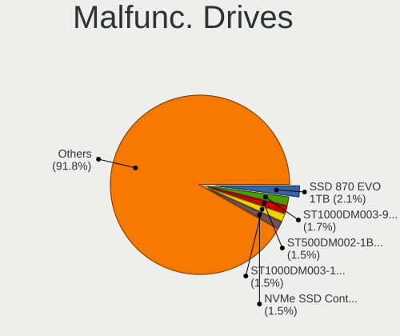

| Model                                                         | Desktops | Drives | Percent |
|---------------------------------------------------------------|----------|--------|---------|
| Samsung Electronics SSD 870 EVO 1TB                           | 10       | 17     | 2.1%    |
| Seagate ST1000DM003-9YN162 1TB                                | 8        | 10     | 1.68%   |
| Seagate ST500DM002-1BD142 500GB                               | 7        | 8      | 1.47%   |
| Seagate ST1000DM003-1CH162 1TB                                | 7        | 11     | 1.47%   |
| Samsung Electronics NVMe SSD Controller SM981/PM981/PM983 1TB | 7        | 8      | 1.47%   |
| WDC WD20EARS-00MVWB0 2TB                                      | 6        | 11     | 1.26%   |
| Seagate ST3500413AS 500GB                                     | 6        | 7      | 1.26%   |
| Seagate ST31000528AS 1TB                                      | 6        | 6      | 1.26%   |
| Seagate ST2000DM008-2FR102 2TB                                | 6        | 12     | 1.26%   |
| Toshiba DT01ACA100 1TB                                        | 5        | 8      | 1.05%   |
| Seagate ST31000524AS 1TB                                      | 5        | 6      | 1.05%   |
| Kingston SA400S37480G 480GB SSD                               | 5        | 6      | 1.05%   |
| WDC WD20EARX-00PASB0 2TB                                      | 4        | 7      | 0.84%   |
| Toshiba MQ01ABD100 1TB                                        | 4        | 6      | 0.84%   |
| Toshiba DT01ACA200 2TB                                        | 4        | 5      | 0.84%   |
| Seagate ST3500312CS 500GB                                     | 4        | 9      | 0.84%   |
| Seagate ST2000DM001-1ER164 2TB                                | 4        | 11     | 0.84%   |
| Seagate ST1000LM024 HN-M101MBB 1TB                            | 4        | 4      | 0.84%   |
| Seagate ST1000DM010-2EP102 1TB                                | 4        | 5      | 0.84%   |
| SanDisk SSD PLUS 1000GB                                       | 4        | 6      | 0.84%   |
| Hitachi HDS721010CLA332 1TB                                   | 4        | 6      | 0.84%   |
| WDC WD5000AAKX-60U6AA0 500GB                                  | 3        | 4      | 0.63%   |
| WDC WD5000AAKX-001CA0 500GB                                   | 3        | 4      | 0.63%   |
| WDC WD3200AAJS-22L7A0 320GB                                   | 3        | 3      | 0.63%   |
| WDC WD30EFRX-68EUZN0 3TB                                      | 3        | 5      | 0.63%   |
| WDC WD10EZEX-08WN4A0 1TB                                      | 3        | 3      | 0.63%   |
| Seagate ST3500418AS 500GB                                     | 3        | 4      | 0.63%   |
| Seagate ST1000DM003-1ER162 1TB                                | 3        | 4      | 0.63%   |
| Samsung Electronics SSD 850 EVO 250GB                         | 3        | 4      | 0.63%   |
| Maxtor STM3250310AS 250GB                                     | 3        | 5      | 0.63%   |
| Kingston SV300S37A120G 120GB SSD                              | 3        | 3      | 0.63%   |
| Hitachi HDS721050CLA662 500GB                                 | 3        | 4      | 0.63%   |
| Hitachi HDP725050GLA360 500GB                                 | 3        | 6      | 0.63%   |
| ASMedia AS2115 500GB                                          | 3        | 4      | 0.63%   |
| WDC WDS500G1X0E-00AFY0 500GB                                  | 2        | 2      | 0.42%   |
| WDC WDS240G2G0A-00JH30 240GB SSD                              | 2        | 2      | 0.42%   |
| WDC WD6400AAKS-22A7B2 640GB                                   | 2        | 4      | 0.42%   |
| WDC WD5000AAKX-75U6AA0 500GB                                  | 2        | 3      | 0.42%   |
| WDC WD5000AAKX-753CA1 500GB                                   | 2        | 2      | 0.42%   |
| WDC WD5000AAKX-603CA0 500GB                                   | 2        | 6      | 0.42%   |

Malfunc. Drive Vendor
---------------------

Vendors of faulty drives

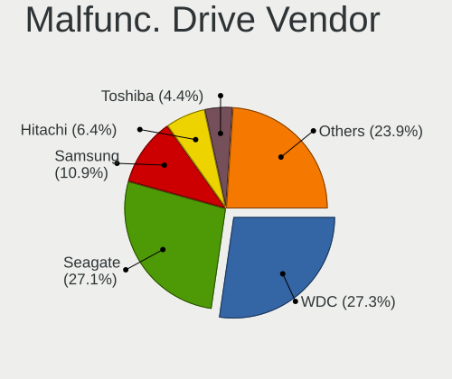

| Vendor                      | Desktops | Drives | Percent |
|-----------------------------|----------|--------|---------|
| WDC                         | 123      | 196    | 27.27%  |
| Seagate                     | 122      | 176    | 27.05%  |
| Samsung Electronics         | 49       | 69     | 10.86%  |
| Hitachi                     | 29       | 39     | 6.43%   |
| Toshiba                     | 20       | 27     | 4.43%   |
| Kingston                    | 12       | 15     | 2.66%   |
| SanDisk                     | 11       | 18     | 2.44%   |
| Crucial                     | 9        | 14     | 2%      |
| Intel                       | 8        | 12     | 1.77%   |
| HGST                        | 6        | 13     | 1.33%   |
| Hewlett-Packard             | 6        | 6      | 1.33%   |
| A-DATA Technology           | 6        | 9      | 1.33%   |
| Maxtor                      | 5        | 8      | 1.11%   |
| Corsair                     | 4        | 14     | 0.89%   |
| Transcend                   | 3        | 3      | 0.67%   |
| Micron Technology           | 3        | 6      | 0.67%   |
| Fujitsu                     | 3        | 4      | 0.67%   |
| China                       | 3        | 4      | 0.67%   |
| ASMedia                     | 3        | 4      | 0.67%   |
| SK hynix                    | 2        | 2      | 0.44%   |
| Silicon Motion              | 2        | 3      | 0.44%   |
| Inateck                     | 2        | 2      | 0.44%   |
| Drevo                       | 2        | 2      | 0.44%   |
| XPG                         | 1        | 1      | 0.22%   |
| USB3.0                      | 1        | 1      | 0.22%   |
| Super Talent                | 1        | 1      | 0.22%   |
| SPCC                        | 1        | 1      | 0.22%   |
| Realtek Semiconductor       | 1        | 1      | 0.22%   |
| Ramsta                      | 1        | 4      | 0.22%   |
| Plextor                     | 1        | 1      | 0.22%   |
| Patriot                     | 1        | 1      | 0.22%   |
| Micron/Crucial Technology   | 1        | 2      | 0.22%   |
| MAXIO Technology (Hangzhou) | 1        | 1      | 0.22%   |
| KingSpec                    | 1        | 1      | 0.22%   |
| JMicron Technology          | 1        | 1      | 0.22%   |
| HS-SSD-C100                 | 1        | 1      | 0.22%   |
| HGST HTS                    | 1        | 1      | 0.22%   |
| CSD                         | 1        | 1      | 0.22%   |
| Colorful                    | 1        | 1      | 0.22%   |
| ASMT                        | 1        | 1      | 0.22%   |

Malfunc. HDD Vendor
-------------------

Vendors of faulty HDD drives

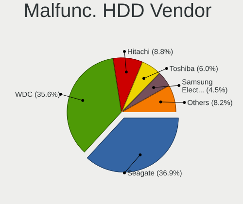

| Vendor              | Desktops | Drives | Percent |
|---------------------|----------|--------|---------|
| Seagate             | 122      | 176    | 36.86%  |
| WDC                 | 118      | 187    | 35.65%  |
| Hitachi             | 29       | 39     | 8.76%   |
| Toshiba             | 20       | 27     | 6.04%   |
| Samsung Electronics | 15       | 19     | 4.53%   |
| HGST                | 6        | 13     | 1.81%   |
| Maxtor              | 5        | 8      | 1.51%   |
| Hewlett-Packard     | 3        | 3      | 0.91%   |
| Fujitsu             | 3        | 4      | 0.91%   |
| ASMedia             | 3        | 4      | 0.91%   |
| Inateck             | 2        | 2      | 0.6%    |
| USB3.0              | 1        | 1      | 0.3%    |
| JMicron Technology  | 1        | 1      | 0.3%    |
| HGST HTS            | 1        | 1      | 0.3%    |
| CSD                 | 1        | 1      | 0.3%    |
| Unknown             | 1        | 1      | 0.3%    |

Malfunc. Drive Kind
-------------------

Kinds of faulty drives

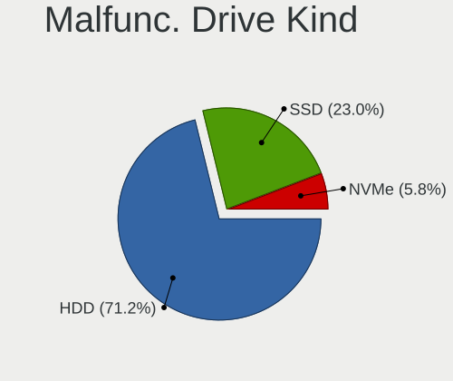

| Kind | Desktops | Drives | Percent |
|------|----------|--------|---------|
| HDD  | 294      | 487    | 71.19%  |
| SSD  | 95       | 144    | 23%     |
| NVMe | 24       | 37     | 5.81%   |

Failed Drives
-------------

Failed drive models

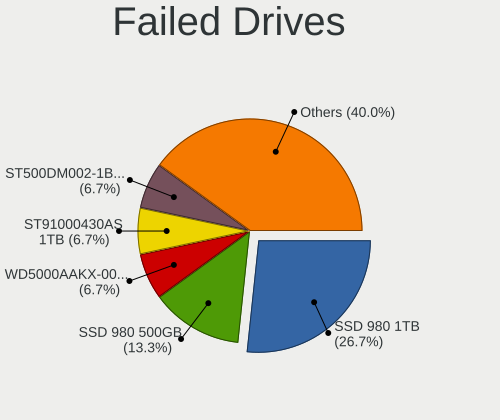

| Model                                            | Desktops | Drives | Percent |
|--------------------------------------------------|----------|--------|---------|
| Samsung Electronics SSD 980 1TB                  | 4        | 4      | 26.67%  |
| Samsung Electronics SSD 980 500GB                | 2        | 2      | 13.33%  |
| WDC WD5000AAKX-001CA0 500GB                      | 1        | 1      | 6.67%   |
| Seagate ST91000430AS 1TB                         | 1        | 1      | 6.67%   |
| Seagate ST500DM002-1BD142 500GB                  | 1        | 1      | 6.67%   |
| Seagate ST3500410AS 500GB                        | 1        | 1      | 6.67%   |
| Seagate ST32000641AS 2TB                         | 1        | 2      | 6.67%   |
| Seagate ST31500341AS 1TB                         | 1        | 1      | 6.67%   |
| Seagate ST1000LM024 HN-M101MBB 1TB               | 1        | 1      | 6.67%   |
| Samsung Electronics MZ7TY128HDHP-000L1 128GB SSD | 1        | 1      | 6.67%   |
| Corsair Neutron XT SSD 240GB                     | 1        | 1      | 6.67%   |

Failed Drive Vendor
-------------------

Failed drive vendors

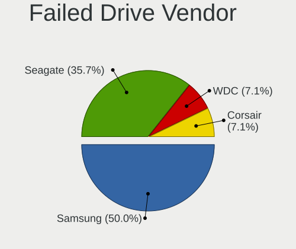

| Vendor              | Desktops | Drives | Percent |
|---------------------|----------|--------|---------|
| Samsung Electronics | 7        | 7      | 50%     |
| Seagate             | 5        | 7      | 35.71%  |
| WDC                 | 1        | 1      | 7.14%   |
| Corsair             | 1        | 1      | 7.14%   |

Drive Status
------------

Number of failed and malfunc. drives

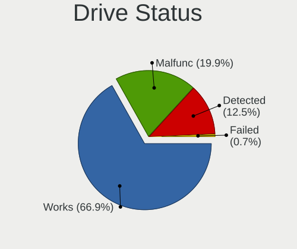

| Status   | Desktops | Drives | Percent |
|----------|----------|--------|---------|
| Works    | 1320     | 4495   | 66.87%  |
| Malfunc  | 393      | 668    | 19.91%  |
| Detected | 247      | 583    | 12.51%  |
| Failed   | 14       | 16     | 0.71%   |

Storage controller
------------------

Storage Vendor
--------------

Storage controller vendors

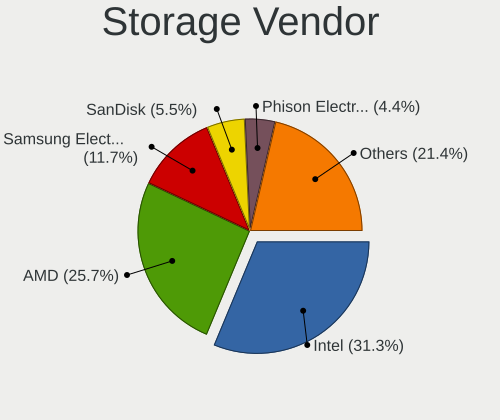

| Vendor                           | Desktops | Percent |
|----------------------------------|----------|---------|
| Intel                            | 808      | 31.28%  |
| AMD                              | 665      | 25.75%  |
| Samsung Electronics              | 303      | 11.73%  |
| SanDisk                          | 142      | 5.5%    |
| Phison Electronics               | 113      | 4.37%   |
| Kingston Technology Company      | 99       | 3.83%   |
| ASMedia Technology               | 89       | 3.45%   |
| Micron/Crucial Technology        | 74       | 2.86%   |
| Silicon Motion                   | 44       | 1.7%    |
| ADATA Technology                 | 34       | 1.32%   |
| Marvell Technology Group         | 32       | 1.24%   |
| MAXIO Technology (Hangzhou)      | 24       | 0.93%   |
| Realtek Semiconductor            | 22       | 0.85%   |
| Toshiba America Info Systems     | 16       | 0.62%   |
| SK hynix                         | 16       | 0.62%   |
| Seagate Technology               | 13       | 0.5%    |
| JMicron Technology               | 11       | 0.43%   |
| Shenzhen Longsys Electronics     | 9        | 0.35%   |
| Nvidia                           | 9        | 0.35%   |
| Micron Technology                | 9        | 0.35%   |
| KIOXIA                           | 9        | 0.35%   |
| INNOGRIT                         | 9        | 0.35%   |
| LSI Logic / Symbios Logic        | 4        | 0.15%   |
| Lite-On Technology               | 4        | 0.15%   |
| Broadcom / LSI                   | 4        | 0.15%   |
| Biwin Storage Technology         | 4        | 0.15%   |
| VIA Technologies                 | 3        | 0.12%   |
| Silicon Image                    | 2        | 0.08%   |
| Netac Technology                 | 2        | 0.08%   |
| Adaptec                          | 2        | 0.08%   |
| Union Memory (Shenzhen)          | 1        | 0.04%   |
| Transcend                        | 1        | 0.04%   |
| Solidigm                         | 1        | 0.04%   |
| Solid State Storage Technology   | 1        | 0.04%   |
| Silicon Integrated Systems [SiS] | 1        | 0.04%   |
| Hewlett-Packard                  | 1        | 0.04%   |
| Enmotus                          | 1        | 0.04%   |
| Beijing Starblaze Technology     | 1        | 0.04%   |

Storage Model
-------------

Storage controller models

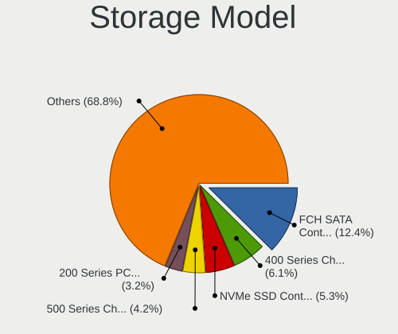

| Model                                                                                   | Desktops | Percent |
|-----------------------------------------------------------------------------------------|----------|---------|
| AMD FCH SATA Controller [AHCI mode]                                                     | 375      | 12.4%   |
| AMD 400 Series Chipset SATA Controller                                                  | 184      | 6.09%   |
| Samsung NVMe SSD Controller SM981/PM981/PM983                                           | 161      | 5.33%   |
| AMD 500 Series Chipset SATA Controller                                                  | 126      | 4.17%   |
| Intel 200 Series PCH SATA controller [AHCI mode]                                        | 98       | 3.24%   |
| ASMedia ASM1061/ASM1062 Serial ATA Controller                                           | 85       | 2.81%   |
| Intel 8 Series/C220 Series Chipset Family 6-port SATA Controller 1 [AHCI mode]          | 83       | 2.75%   |
| Intel Q170/Q150/B150/H170/H110/Z170/CM236 Chipset SATA Controller [AHCI Mode]           | 82       | 2.71%   |
| Intel Cannon Lake PCH SATA AHCI Controller                                              | 77       | 2.55%   |
| Samsung NVMe SSD Controller PM9A1/PM9A3/980PRO                                          | 66       | 2.18%   |
| Intel 7 Series/C210 Series Chipset Family 6-port SATA Controller [AHCI mode]            | 60       | 1.98%   |
| Phison E12 NVMe Controller                                                              | 52       | 1.72%   |
| Intel SATA Controller [RAID mode]                                                       | 51       | 1.69%   |
| Intel 6 Series/C200 Series Chipset Family 6 port Desktop SATA AHCI Controller           | 50       | 1.65%   |
| AMD 600 Series Chipset SATA Controller                                                  | 47       | 1.55%   |
| Micron/Crucial P2 [Nick P2] / P3 / P3 Plus NVMe PCIe SSD (DRAM-less)                    | 39       | 1.29%   |
| Samsung NVMe SSD Controller SM961/PM961/SM963                                           | 38       | 1.26%   |
| Samsung NVMe SSD Controller 980 (DRAM-less)                                             | 37       | 1.22%   |
| Silicon Motion SM2263EN/SM2263XT (DRAM-less) NVMe SSD Controllers                       | 33       | 1.09%   |
| Intel Alder Lake-S PCH SATA Controller [AHCI Mode]                                      | 33       | 1.09%   |
| AMD SB7x0/SB8x0/SB9x0 IDE Controller                                                    | 33       | 1.09%   |
| Phison E16 PCIe4 NVMe Controller                                                        | 32       | 1.06%   |
| SanDisk Ultra 3D / WD PC SN530, IX SN530, Blue SN550 NVMe SSD (DRAM-less)               | 28       | 0.93%   |
| AMD SB7x0/SB8x0/SB9x0 SATA Controller [AHCI mode]                                       | 27       | 0.89%   |
| Kingston Company KC3000/FURY Renegade NVMe SSD [E18]                                    | 26       | 0.86%   |
| Intel 500 Series Chipset Family SATA AHCI Controller                                    | 26       | 0.86%   |
| AMD A320 Chipset SATA Controller [AHCI mode]                                            | 26       | 0.86%   |
| ADATA XPG SX8200 Pro PCIe Gen3x4 M.2 2280 Solid State Drive                             | 25       | 0.83%   |
| Intel 9 Series Chipset Family SATA Controller [AHCI Mode]                               | 23       | 0.76%   |
| Kingston Company A2000 NVMe SSD [SM2263EN]                                              | 22       | 0.73%   |
| Intel 6 Series/C200 Series Chipset Family Desktop SATA Controller (IDE mode, ports 4-5) | 22       | 0.73%   |
| Intel 6 Series/C200 Series Chipset Family Desktop SATA Controller (IDE mode, ports 0-3) | 22       | 0.73%   |
| AMD SB7x0/SB8x0/SB9x0 SATA Controller [IDE mode]                                        | 22       | 0.73%   |
| AMD 300 Series Chipset SATA Controller                                                  | 22       | 0.73%   |
| SanDisk WD PC SN810 / Black SN850 NVMe SSD                                              | 20       | 0.66%   |
| Intel SSD 660P Series                                                                   | 20       | 0.66%   |
| SanDisk Extreme Pro / WD Black SN750 / PC SN730 / Red SN700 NVMe SSD                    | 19       | 0.63%   |
| SanDisk Extreme Pro / WD Black 2018/SN750/PC SN720 NVMe SSD                             | 19       | 0.63%   |
| SanDisk Ultra 3D / WD Blue SN570 NVMe SSD (DRAM-less)                                   | 18       | 0.6%    |
| Phison PS5013-E13 PCIe3 NVMe Controller (DRAM-less)                                     | 18       | 0.6%    |

Storage Kind
------------

Kind of storage controller (IDE, SATA, NVMe, SAS, ...)

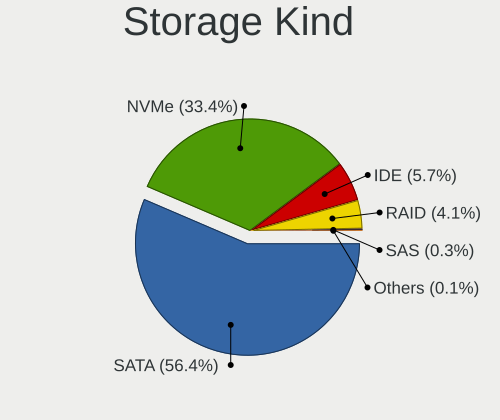

| Kind | Desktops | Percent |
|------|----------|---------|
| SATA | 1331     | 56.45%  |
| NVMe | 787      | 33.38%  |
| IDE  | 135      | 5.73%   |
| RAID | 97       | 4.11%   |
| SAS  | 6        | 0.25%   |
| SCSI | 2        | 0.08%   |

Processor
---------

CPU Vendor
----------

Processor vendors

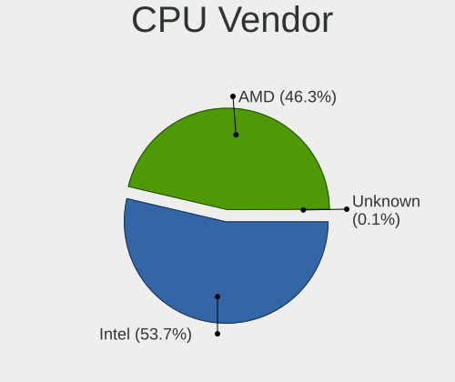

| Vendor  | Desktops | Percent |
|---------|----------|---------|
| Intel   | 793      | 53.65%  |
| AMD     | 684      | 46.28%  |
| Unknown | 1        | 0.07%   |

CPU Model
---------

Processor models

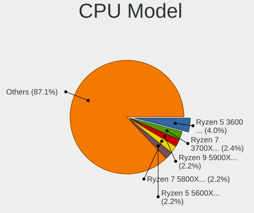

| Model                                       | Desktops | Percent |
|---------------------------------------------|----------|---------|
| AMD Ryzen 5 3600 6-Core Processor           | 60       | 4.03%   |
| AMD Ryzen 7 3700X 8-Core Processor          | 36       | 2.42%   |
| AMD Ryzen 9 5900X 12-Core Processor         | 32       | 2.15%   |
| AMD Ryzen 7 5800X 8-Core Processor          | 32       | 2.15%   |
| AMD Ryzen 5 5600X 6-Core Processor          | 32       | 2.15%   |
| AMD Ryzen 9 3900X 12-Core Processor         | 29       | 1.95%   |
| AMD Ryzen 7 2700X Eight-Core Processor      | 28       | 1.88%   |
| AMD Ryzen 5 5600G with Radeon Graphics      | 25       | 1.68%   |
| AMD Ryzen 5 2600 Six-Core Processor         | 23       | 1.55%   |
| AMD Ryzen 7 5700G with Radeon Graphics      | 22       | 1.48%   |
| Intel Core i7-3770 CPU @ 3.40GHz            | 21       | 1.41%   |
| Intel Core i7-7700K CPU @ 4.20GHz           | 20       | 1.34%   |
| AMD Ryzen 9 5950X 16-Core Processor         | 20       | 1.34%   |
| AMD Ryzen 7 3800X 8-Core Processor          | 17       | 1.14%   |
| Intel Core i7-8700 CPU @ 3.20GHz            | 16       | 1.08%   |
| Intel Core i5-6500 CPU @ 3.20GHz            | 16       | 1.08%   |
| Intel Core i7-8700K CPU @ 3.70GHz           | 15       | 1.01%   |
| Intel Core i7-4790 CPU @ 3.60GHz            | 15       | 1.01%   |
| Intel Core i7-7700 CPU @ 3.60GHz            | 14       | 0.94%   |
| Intel Core i7-6700K CPU @ 4.00GHz           | 14       | 0.94%   |
| Intel Core i5-8400 CPU @ 2.80GHz            | 14       | 0.94%   |
| AMD Ryzen 5 3400G with Radeon Vega Graphics | 14       | 0.94%   |
| Intel Core i7-4790K CPU @ 4.00GHz           | 13       | 0.87%   |
| Intel Core i5-10400F CPU @ 2.90GHz          | 13       | 0.87%   |
| AMD Ryzen 5 3600X 6-Core Processor          | 13       | 0.87%   |
| AMD Ryzen 3 2200G with Radeon Vega Graphics | 13       | 0.87%   |
| Intel Core i5-4590 CPU @ 3.30GHz            | 12       | 0.81%   |
| Intel Core i5-3470 CPU @ 3.20GHz            | 12       | 0.81%   |
| AMD Ryzen 5 1600 Six-Core Processor         | 12       | 0.81%   |
| Intel Core i7-6700 CPU @ 3.40GHz            | 11       | 0.74%   |
| Intel Core i7-3770K CPU @ 3.50GHz           | 11       | 0.74%   |
| Intel Core i5-2400 CPU @ 3.10GHz            | 11       | 0.74%   |
| AMD Ryzen 7 5700X 8-Core Processor          | 11       | 0.74%   |
| AMD Ryzen 5 2600X Six-Core Processor        | 11       | 0.74%   |
| Intel Core i5-9400F CPU @ 2.90GHz           | 10       | 0.67%   |
| Intel Core i5-3570 CPU @ 3.40GHz            | 10       | 0.67%   |
| Intel Atom CPU C3758 @ 2.20GHz              | 10       | 0.67%   |
| AMD Ryzen 5 2400G with Radeon Vega Graphics | 10       | 0.67%   |
| Intel Core i9-9900K CPU @ 3.60GHz           | 9        | 0.61%   |
| Intel Core i7-9700K CPU @ 3.60GHz           | 9        | 0.61%   |

CPU Model Family
----------------

Processor model prefix

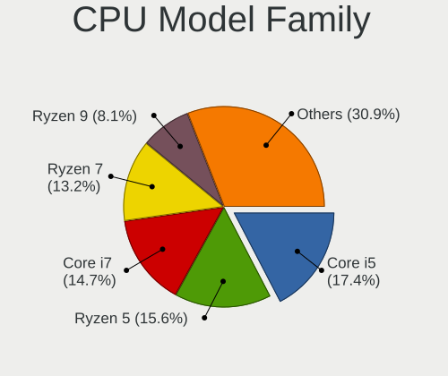

| Model                   | Desktops | Percent |
|-------------------------|----------|---------|
| Intel Core i5           | 258      | 17.37%  |
| AMD Ryzen 5             | 232      | 15.62%  |
| Intel Core i7           | 219      | 14.75%  |
| AMD Ryzen 7             | 196      | 13.2%   |
| AMD Ryzen 9             | 121      | 8.15%   |
| Other                   | 69       | 4.65%   |
| Intel Core i3           | 67       | 4.51%   |
| Intel Xeon              | 63       | 4.24%   |
| AMD FX                  | 31       | 2.09%   |
| AMD Ryzen 3             | 30       | 2.02%   |
| Intel Pentium           | 26       | 1.75%   |
| Intel Core i9           | 26       | 1.75%   |
| Intel Celeron           | 19       | 1.28%   |
| AMD A10                 | 13       | 0.88%   |
| Intel Core 2 Duo        | 12       | 0.81%   |
| Intel Atom              | 12       | 0.81%   |
| AMD Ryzen Threadripper  | 10       | 0.67%   |
| AMD Phenom II X4        | 7        | 0.47%   |
| AMD Athlon II X2        | 7        | 0.47%   |
| Intel Pentium Dual-Core | 6        | 0.4%    |
| Intel Pentium Gold      | 5        | 0.34%   |
| Intel Core 2 Quad       | 5        | 0.34%   |
| AMD Athlon              | 5        | 0.34%   |
| AMD A8                  | 5        | 0.34%   |
| AMD A6                  | 5        | 0.34%   |
| AMD A4                  | 5        | 0.34%   |
| Intel Pentium Dual      | 4        | 0.27%   |
| AMD Phenom II X6        | 4        | 0.27%   |
| AMD Athlon 64 X2        | 4        | 0.27%   |
| Intel Genuine           | 2        | 0.13%   |
| Intel Core 2            | 2        | 0.13%   |
| AMD Ryzen 7 PRO         | 2        | 0.13%   |
| AMD Ryzen 5 PRO         | 2        | 0.13%   |
| AMD Ryzen 3 PRO         | 2        | 0.13%   |
| AMD Phenom              | 2        | 0.13%   |
| Intel Pentium 4         | 1        | 0.07%   |
| AMD E2                  | 1        | 0.07%   |
| AMD E1                  | 1        | 0.07%   |
| AMD Athlon X4           | 1        | 0.07%   |
| AMD Athlon II X4        | 1        | 0.07%   |

CPU Cores
---------

Number of processor cores

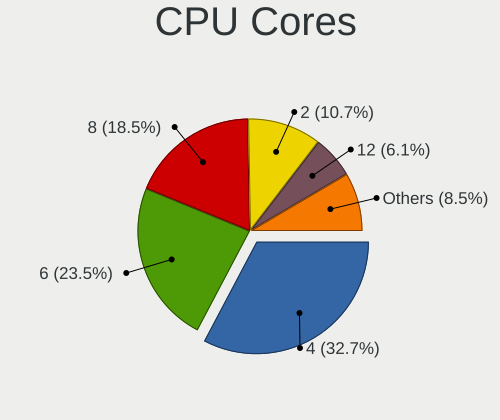

| Number  | Desktops | Percent |
|---------|----------|---------|
| 4       | 487      | 32.73%  |
| 6       | 349      | 23.45%  |
| 8       | 276      | 18.55%  |
| 2       | 159      | 10.69%  |
| 12      | 91       | 6.12%   |
| 16      | 55       | 3.7%    |
| 10      | 23       | 1.55%   |
| 24      | 13       | 0.87%   |
| 3       | 13       | 0.87%   |
| 1       | 9        | 0.6%    |
| 14      | 4        | 0.27%   |
| 20      | 3        | 0.2%    |
| 40      | 2        | 0.13%   |
| 18      | 2        | 0.13%   |
| 32      | 1        | 0.07%   |
| Unknown | 1        | 0.07%   |

CPU Sockets
-----------

Number of sockets

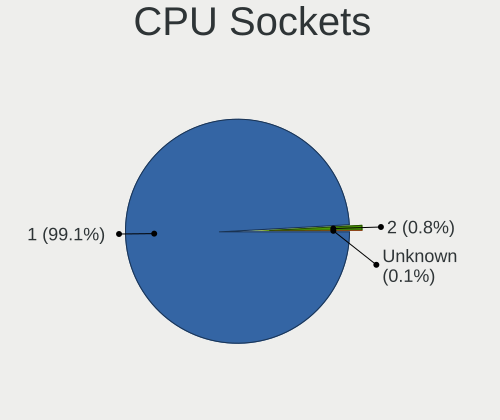

| Number  | Desktops | Percent |
|---------|----------|---------|
| 1       | 1466     | 99.12%  |
| 2       | 12       | 0.81%   |
| Unknown | 1        | 0.07%   |

CPU Threads
-----------

Threads per core (Hyper-Threading)

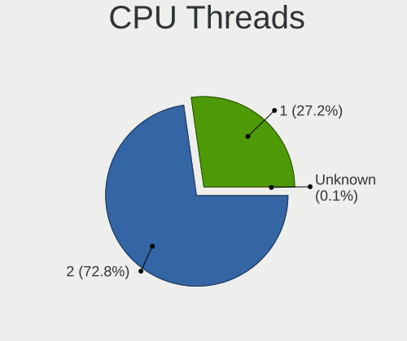

| Number  | Desktops | Percent |
|---------|----------|---------|
| 2       | 1080     | 72.78%  |
| 1       | 403      | 27.16%  |
| Unknown | 1        | 0.07%   |

CPU Op-Modes
------------

CPU Operation Modes (32-bit, 64-bit)

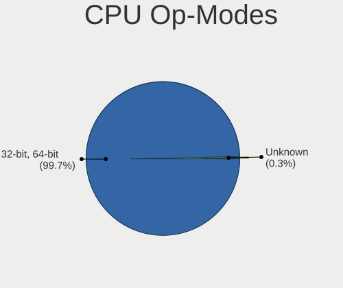

| Op mode        | Desktops | Percent |
|----------------|----------|---------|
| 32-bit, 64-bit | 1473     | 99.66%  |
| Unknown        | 5        | 0.34%   |

CPU Microcode
-------------

Microcode number

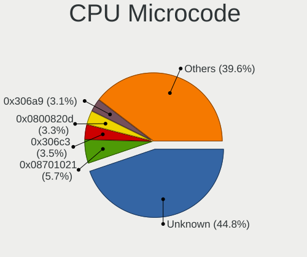

| Number     | Desktops | Percent |
|------------|----------|---------|
| Unknown    | 711      | 44.77%  |
| 0x08701021 | 90       | 5.67%   |
| 0x306c3    | 56       | 3.53%   |
| 0x0800820d | 53       | 3.34%   |
| 0x306a9    | 49       | 3.09%   |
| 0x506e3    | 41       | 2.58%   |
| 0x0a201016 | 39       | 2.46%   |
| 0x906ea    | 38       | 2.39%   |
| 0x906e9    | 36       | 2.27%   |
| 0x08701013 | 27       | 1.7%    |
| 0x206a7    | 26       | 1.64%   |
| 0x0a201009 | 22       | 1.39%   |
| 0x0a50000c | 19       | 1.2%    |
| 0x0a20120a | 19       | 1.2%    |
| 0x0a50000d | 18       | 1.13%   |
| 0x08701030 | 17       | 1.07%   |
| 0x08108109 | 17       | 1.07%   |
| 0x08101016 | 14       | 0.88%   |
| 0xa0655    | 13       | 0.82%   |
| 0xa0653    | 12       | 0.76%   |
| 0x0a601203 | 12       | 0.76%   |
| 0x906ec    | 10       | 0.63%   |
| 0x506f1    | 10       | 0.63%   |
| 0x306f2    | 10       | 0.63%   |
| 0x1067a    | 10       | 0.63%   |
| 0x08001138 | 10       | 0.63%   |
| 0x08001137 | 9        | 0.57%   |
| 0x06000852 | 9        | 0.57%   |
| 0x90672    | 8        | 0.5%    |
| 0x0a601206 | 8        | 0.5%    |
| 0x06000822 | 8        | 0.5%    |
| 0x906ed    | 7        | 0.44%   |
| 0x906eb    | 6        | 0.38%   |
| 0x0a201205 | 6        | 0.38%   |
| 0x0a201025 | 6        | 0.38%   |
| 0x08108102 | 6        | 0.38%   |
| 0xa0671    | 5        | 0.31%   |
| 0x6fd      | 5        | 0.31%   |
| 0x106e5    | 5        | 0.31%   |
| 0x0810100b | 5        | 0.31%   |

CPU Microarch
-------------

Microarchitecture

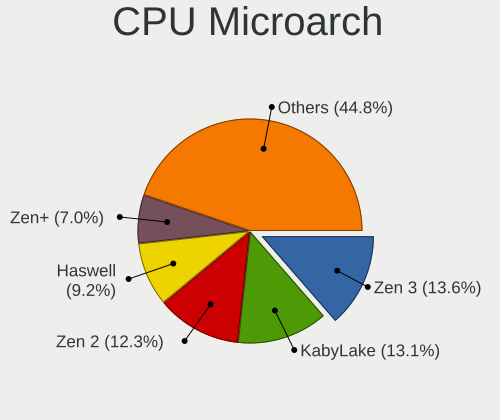

| Name             | Desktops | Percent |
|------------------|----------|---------|
| Zen 3            | 202      | 13.6%   |
| KabyLake         | 195      | 13.13%  |
| Zen 2            | 182      | 12.26%  |
| Haswell          | 137      | 9.23%   |
| Zen+             | 104      | 7%      |
| IvyBridge        | 100      | 6.73%   |
| Skylake          | 83       | 5.59%   |
| Unknown          | 65       | 4.38%   |
| SandyBridge      | 58       | 3.91%   |
| CometLake        | 56       | 3.77%   |
| Zen              | 52       | 3.5%    |
| Alderlake Hybrid | 48       | 3.23%   |
| Piledriver       | 35       | 2.36%   |
| Penryn           | 23       | 1.55%   |
| K10              | 22       | 1.48%   |
| Goldmont         | 16       | 1.08%   |
| Steamroller      | 14       | 0.94%   |
| Nehalem          | 14       | 0.94%   |
| Icelake          | 14       | 0.94%   |
| Westmere         | 10       | 0.67%   |
| Core             | 9        | 0.61%   |
| Broadwell        | 8        | 0.54%   |
| K8 Hammer        | 6        | 0.4%    |
| Goldmont plus    | 6        | 0.4%    |
| Silvermont       | 5        | 0.34%   |
| Gracemont        | 5        | 0.34%   |
| Excavator        | 4        | 0.27%   |
| Bulldozer        | 4        | 0.27%   |
| Tremont          | 2        | 0.13%   |
| K10 Llano        | 2        | 0.13%   |
| Jaguar           | 2        | 0.13%   |
| NetBurst         | 1        | 0.07%   |
| Bobcat           | 1        | 0.07%   |

Graphics
--------

GPU Vendor
----------

Vendors of graphics cards

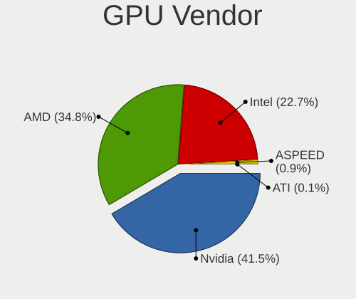

| Vendor            | Desktops | Percent |
|-------------------|----------|---------|
| Nvidia            | 670      | 41.51%  |
| AMD               | 561      | 34.76%  |
| Intel             | 367      | 22.74%  |
| ASPEED Technology | 15       | 0.93%   |
| ATI Technologies  | 1        | 0.06%   |

GPU Model
---------

Graphics card models

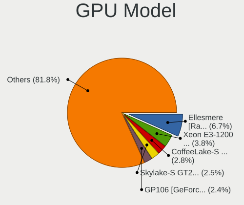

| Model                                                                       | Desktops | Percent |
|-----------------------------------------------------------------------------|----------|---------|
| AMD Ellesmere [Radeon RX 470/480/570/570X/580/580X/590]                     | 113      | 6.7%    |
| Intel Xeon E3-1200 v3/4th Gen Core Processor Integrated Graphics Controller | 64       | 3.8%    |
| Intel CoffeeLake-S GT2 [UHD Graphics 630]                                   | 47       | 2.79%   |
| Intel Skylake-S GT2 [HD Graphics 530]                                       | 42       | 2.49%   |
| Nvidia GP106 [GeForce GTX 1060 6GB]                                         | 41       | 2.43%   |
| AMD Cezanne [Radeon Vega Series / Radeon Vega Mobile Series]                | 40       | 2.37%   |
| Intel Xeon E3-1200 v2/3rd Gen Core processor Graphics Controller            | 37       | 2.19%   |
| AMD Navi 21 [Radeon RX 6800/6800 XT / 6900 XT]                              | 35       | 2.08%   |
| AMD Navi 10 [Radeon RX 5600 OEM/5600 XT / 5700/5700 XT]                     | 35       | 2.08%   |
| AMD Raphael                                                                 | 33       | 1.96%   |
| Intel Kaby Lake-S GT2 [HD Graphics 630]                                     | 30       | 1.78%   |
| Nvidia GP107 [GeForce GTX 1050 Ti]                                          | 29       | 1.72%   |
| Nvidia GP104 [GeForce GTX 1070]                                             | 28       | 1.66%   |
| Intel 2nd Generation Core Processor Family Integrated Graphics Controller   | 28       | 1.66%   |
| AMD Navi 23 [Radeon RX 6600/6600 XT/6600M]                                  | 28       | 1.66%   |
| AMD Picasso/Raven 2 [Radeon Vega Series / Radeon Vega Mobile Series]        | 26       | 1.54%   |
| AMD Navi 22 [Radeon RX 6700/6700 XT/6750 XT / 6800M/6850M XT]               | 25       | 1.48%   |
| Nvidia TU117 [GeForce GTX 1650]                                             | 24       | 1.42%   |
| Nvidia GP102 [GeForce GTX 1080 Ti]                                          | 24       | 1.42%   |
| AMD Navi 31 [Radeon RX 7900 XT/7900 XTX/7900 GRE/7900M]                     | 23       | 1.36%   |
| Nvidia GM206 [GeForce GTX 960]                                              | 22       | 1.3%    |
| Nvidia TU116 [GeForce GTX 1660 SUPER]                                       | 21       | 1.25%   |
| Nvidia GK208B [GeForce GT 710]                                              | 20       | 1.19%   |
| Nvidia GA104 [GeForce RTX 3070]                                             | 20       | 1.19%   |
| Nvidia GP104 [GeForce GTX 1080]                                             | 19       | 1.13%   |
| Nvidia GA106 [GeForce RTX 3060 Lite Hash Rate]                              | 19       | 1.13%   |
| Nvidia TU104 [GeForce RTX 2070 SUPER]                                       | 18       | 1.07%   |
| AMD Raven Ridge [Radeon Vega Series / Radeon Vega Mobile Series]            | 18       | 1.07%   |
| Nvidia GM204 [GeForce GTX 970]                                              | 17       | 1.01%   |
| Intel IvyBridge GT2 [HD Graphics 4000]                                      | 17       | 1.01%   |
| Intel CometLake-S GT2 [UHD Graphics 630]                                    | 16       | 0.95%   |
| Nvidia TU106 [GeForce RTX 2060 Rev. A]                                      | 15       | 0.89%   |
| Nvidia GP108 [GeForce GT 1030]                                              | 15       | 0.89%   |
| ASPEED Technology ASPEED Graphics Family                                    | 15       | 0.89%   |
| Nvidia GM107 [GeForce GTX 750 Ti]                                           | 14       | 0.83%   |
| Nvidia TU116 [GeForce GTX 1660 Ti]                                          | 13       | 0.77%   |
| Nvidia TU116 [GeForce GTX 1650 SUPER]                                       | 13       | 0.77%   |
| Nvidia GP106 [GeForce GTX 1060 3GB]                                         | 13       | 0.77%   |
| AMD Navi 14 [Radeon RX 5500/5500M / Pro 5500M]                              | 13       | 0.77%   |
| Nvidia TU106 [GeForce RTX 2070]                                             | 12       | 0.71%   |

GPU Combo
---------

Combinations of graphics cards

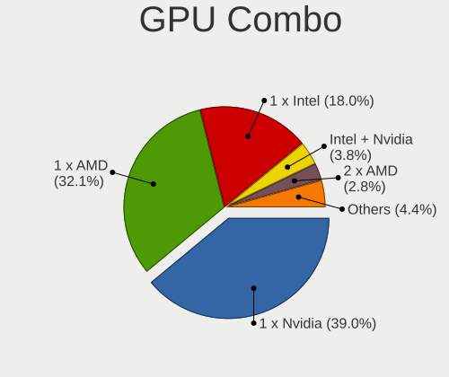

| Name           | Desktops | Percent |
|----------------|----------|---------|
| 1 x Nvidia     | 588      | 38.97%  |
| 1 x AMD        | 485      | 32.14%  |
| 1 x Intel      | 271      | 17.96%  |
| Intel + Nvidia | 57       | 3.78%   |
| 2 x AMD        | 42       | 2.78%   |
| AMD + Nvidia   | 23       | 1.52%   |
| Intel + AMD    | 14       | 0.93%   |
| 1 x ASPEED     | 12       | 0.8%    |
| 2 x Nvidia     | 7        | 0.46%   |
| 2 x Intel      | 4        | 0.27%   |
| Other          | 3        | 0.2%    |
| AMD + ASPEED   | 3        | 0.2%    |

GPU Driver
----------

Free vs proprietary

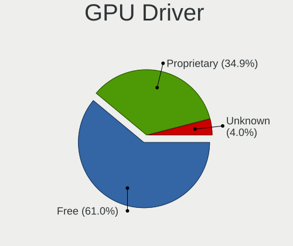

| Driver      | Desktops | Percent |
|-------------|----------|---------|
| Free        | 922      | 61.02%  |
| Proprietary | 528      | 34.94%  |
| Unknown     | 61       | 4.04%   |

GPU Memory
----------

Total video memory

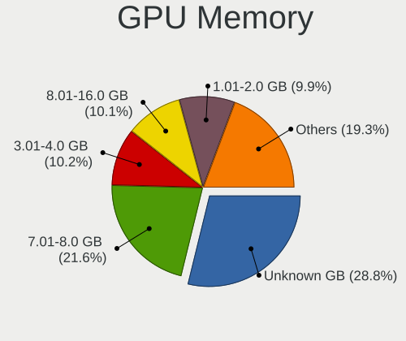

| Size in GB | Desktops | Percent |
|------------|----------|---------|
| Unknown    | 443      | 28.82%  |
| 7.01-8.0   | 332      | 21.6%   |
| 3.01-4.0   | 157      | 10.21%  |
| 8.01-16.0  | 156      | 10.15%  |
| 1.01-2.0   | 152      | 9.89%   |
| 5.01-6.0   | 97       | 6.31%   |
| 0.01-0.5   | 73       | 4.75%   |
| 0.51-1.0   | 67       | 4.36%   |
| 16.01-24.0 | 33       | 2.15%   |
| 2.01-3.0   | 24       | 1.56%   |
| 4.01-5.0   | 3        | 0.2%    |

Monitor
-------

Monitor Vendor
--------------

Monitor vendors

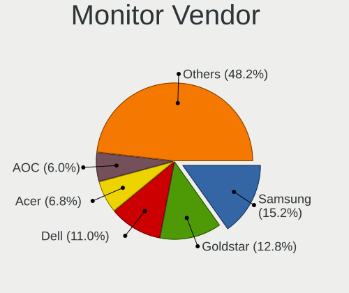

| Vendor               | Desktops | Percent |
|----------------------|----------|---------|
| Samsung Electronics  | 272      | 15.19%  |
| Goldstar             | 230      | 12.84%  |
| Dell                 | 197      | 11%     |
| Acer                 | 121      | 6.76%   |
| AOC                  | 108      | 6.03%   |
| Hewlett-Packard      | 92       | 5.14%   |
| Ancor Communications | 90       | 5.03%   |
| BenQ                 | 87       | 4.86%   |
| Philips              | 61       | 3.41%   |
| ASUSTek Computer     | 48       | 2.68%   |
| Unknown              | 44       | 2.46%   |
| ViewSonic            | 36       | 2.01%   |
| MSI                  | 31       | 1.73%   |
| Sony                 | 27       | 1.51%   |
| Lenovo               | 27       | 1.51%   |
| Iiyama               | 25       | 1.4%    |
| Gigabyte Technology  | 24       | 1.34%   |
| Sceptre Tech         | 20       | 1.12%   |
| Vizio                | 18       | 1.01%   |
| LG Electronics       | 15       | 0.84%   |
| Eizo                 | 15       | 0.84%   |
| Toshiba              | 11       | 0.61%   |
| Vestel Elektronik    | 9        | 0.5%    |
| Unknown (XXX)        | 7        | 0.39%   |
| Denver               | 7        | 0.39%   |
| Mi                   | 6        | 0.34%   |
| HannStar             | 6        | 0.34%   |
| Unknown              | 6        | 0.34%   |
| Panasonic            | 5        | 0.28%   |
| Wacom                | 4        | 0.22%   |
| VIE                  | 4        | 0.22%   |
| Pixio                | 4        | 0.22%   |
| MiTAC                | 4        | 0.22%   |
| Microstep            | 4        | 0.22%   |
| HKC                  | 4        | 0.22%   |
| Viotek               | 3        | 0.17%   |
| Sharp                | 3        | 0.17%   |
| ONN                  | 3        | 0.17%   |
| NEC Computers        | 3        | 0.17%   |
| MStar                | 3        | 0.17%   |

Monitor Model
-------------

Monitor models

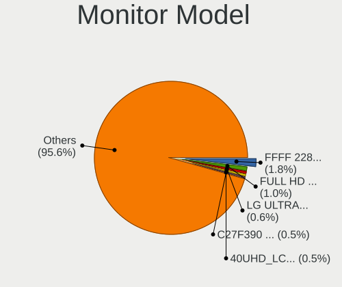

| Model                                                                 | Desktops | Percent |
|-----------------------------------------------------------------------|----------|---------|
| Unknown LCD Monitor FFFF 2288x1287 2550x2550mm 142.0-inch             | 35       | 1.8%    |
| Goldstar FULL HD GSM5B55 1920x1080 480x270mm 21.7-inch                | 19       | 0.98%   |
| Goldstar LG ULTRAWIDE GSM59F1 2560x1080 670x280mm 28.6-inch           | 12       | 0.62%   |
| Samsung Electronics C27F390 SAM0D32 1920x1080 598x336mm 27.0-inch     | 10       | 0.51%   |
| Vestel Elektronik 40UHD_LCD_TV VES3700 3840x2160 880x500mm 39.8-inch  | 9        | 0.46%   |
| Goldstar LG TV SSCR2 GSMC0C8 3840x2160                                | 9        | 0.46%   |
| Dell SE2416H DELD081 1920x1080 527x296mm 23.8-inch                    | 9        | 0.46%   |
| Goldstar HDR WFHD GSM7714 2560x1080 798x334mm 34.1-inch               | 8        | 0.41%   |
| Samsung Electronics S24F350 SAM0D20 1920x1080 521x293mm 23.5-inch     | 7        | 0.36%   |
| Samsung Electronics C24F390 SAM0D2C 1920x1080 521x293mm 23.5-inch     | 7        | 0.36%   |
| Goldstar LG IPS FULLHD GSM5AB8 1920x1080 480x270mm 21.7-inch          | 7        | 0.36%   |
| AOC 27E2G5 AOC2702 1920x1080 600x340mm 27.2-inch                      | 7        | 0.36%   |
| Ancor Communications ROG PG279Q ACI27EC 2560x1440 598x336mm 27.0-inch | 7        | 0.36%   |
| Ancor Communications ASUS VS228 ACI22FD 1920x1080 476x268mm 21.5-inch | 7        | 0.36%   |
| Dell P2419H DELD0DA 1920x1080 527x296mm 23.8-inch                     | 6        | 0.31%   |
| Unknown                                                               | 6        | 0.31%   |
| Toshiba TV TSB0206 1920x1080                                          | 5        | 0.26%   |
| Samsung Electronics U32R59x SAM0F96 3840x2160 697x392mm 31.5-inch     | 5        | 0.26%   |
| Samsung Electronics U32J59x SAM0F35 3840x2160 697x392mm 31.5-inch     | 5        | 0.26%   |
| Philips PHL 223V5 PHLC0CF 1920x1080 477x268mm 21.5-inch               | 5        | 0.26%   |
| Goldstar 27GL850 GSM5B7F 2560x1440 597x336mm 27.0-inch                | 5        | 0.26%   |
| BenQ GW2780 BNQ78E6 1920x1080 598x336mm 27.0-inch                     | 5        | 0.26%   |
| AOC 24G2W1G3 AOC2402 1920x1080 527x296mm 23.8-inch                    | 5        | 0.26%   |
| AOC 24B1W1 AOC2401 1920x1080 527x296mm 23.8-inch                      | 5        | 0.26%   |
| Sceptre Tech Sceptre F27 SPT0AD7 1920x1080 600x330mm 27.0-inch        | 4        | 0.21%   |
| Sceptre Tech Sceptre F24 SPT09AB 1920x1080 530x290mm 23.8-inch        | 4        | 0.21%   |
| Samsung Electronics U28E590 SAM0C4D 3840x2160 607x345mm 27.5-inch     | 4        | 0.21%   |
| Panasonic TV MEIA296 1920x1080 698x392mm 31.5-inch                    | 4        | 0.21%   |
| MSI Optix MAG27CQ MSI1462 2560x1440 597x336mm 27.0-inch               | 4        | 0.21%   |
| Goldstar ULTRAWIDE GSM76FE 2560x1080 798x334mm 34.1-inch              | 4        | 0.21%   |
| Goldstar ULTRAWIDE GSM76FD 2560x1080 531x298mm 24.0-inch              | 4        | 0.21%   |
| Goldstar ULTRAGEAR GSM5BD3 2560x1440 697x392mm 31.5-inch              | 4        | 0.21%   |
| Goldstar Ultra HD GSM5B09 3840x2160 600x340mm 27.2-inch               | 4        | 0.21%   |
| Goldstar IPS FULLHD GSM5AB7 1920x1080 480x270mm 21.7-inch             | 4        | 0.21%   |
| Goldstar IPS FULLHD GSM5AB6 1920x1080 480x270mm 21.7-inch             | 4        | 0.21%   |
| Goldstar HDR 4K GSM7707 3840x2160 600x340mm 27.2-inch                 | 4        | 0.21%   |
| Goldstar HDR 4K GSM7706 3840x2160 600x340mm 27.2-inch                 | 4        | 0.21%   |
| Goldstar FULL HD GSM5ABB 1920x1080 480x270mm 21.7-inch                | 4        | 0.21%   |
| Dell U2312HM DEL4072 1920x1080 510x287mm 23.0-inch                    | 4        | 0.21%   |
| Dell SE2717H/HX DELD0A1 1920x1080 598x336mm 27.0-inch                 | 4        | 0.21%   |

Monitor Resolution
------------------

Monitor screen resolution

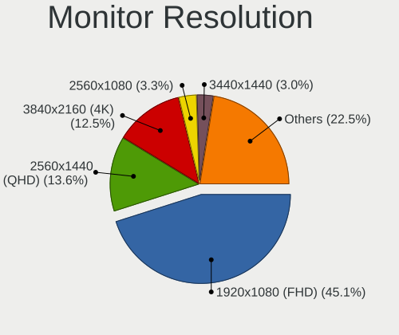

| Resolution         | Desktops | Percent |
|--------------------|----------|---------|
| 1920x1080 (FHD)    | 771      | 45.09%  |
| 2560x1440 (QHD)    | 233      | 13.63%  |
| 3840x2160 (4K)     | 214      | 12.51%  |
| 2560x1080          | 56       | 3.27%   |
| 3440x1440          | 52       | 3.04%   |
| 1680x1050 (WSXGA+) | 51       | 2.98%   |
| 1366x768 (WXGA)    | 44       | 2.57%   |
| 1280x1024 (SXGA)   | 41       | 2.4%    |
| 1440x900 (WXGA+)   | 38       | 2.22%   |
| 2288x1287          | 36       | 2.11%   |
| 1920x1200 (WUXGA)  | 33       | 1.93%   |
| 1600x900 (HD+)     | 29       | 1.7%    |
| Unknown            | 25       | 1.46%   |
| 3840x1080          | 24       | 1.4%    |
| 1360x768           | 14       | 0.82%   |
| 1920x540           | 10       | 0.58%   |
| 1600x1200          | 8        | 0.47%   |
| 3840x1600          | 6        | 0.35%   |
| 2048x1152          | 3        | 0.18%   |
| 5760x2160          | 2        | 0.12%   |
| 2944x1080          | 2        | 0.12%   |
| 1280x720 (HD)      | 2        | 0.12%   |
| 6400x1440          | 1        | 0.06%   |
| 5520x1080          | 1        | 0.06%   |
| 5360x1440          | 1        | 0.06%   |
| 5120x1440          | 1        | 0.06%   |
| 480x1920           | 1        | 0.06%   |
| 4480x1440          | 1        | 0.06%   |
| 4480x1080          | 1        | 0.06%   |
| 3840x2524          | 1        | 0.06%   |
| 3840x1200          | 1        | 0.06%   |
| 3520x1080          | 1        | 0.06%   |
| 3360x1080          | 1        | 0.06%   |
| 3286x1080          | 1        | 0.06%   |
| 3280x1080          | 1        | 0.06%   |
| 2560x1600          | 1        | 0.06%   |
| 1400x1050          | 1        | 0.06%   |
| 1024x768 (XGA)     | 1        | 0.06%   |

Monitor Diagonal
----------------

Diagonal size in inches

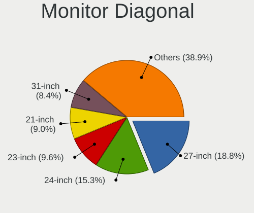

| Inches  | Desktops | Percent |
|---------|----------|---------|
| 27      | 338      | 18.82%  |
| 24      | 275      | 15.31%  |
| 23      | 173      | 9.63%   |
| 21      | 162      | 9.02%   |
| 31      | 150      | 8.35%   |
| Unknown | 88       | 4.9%    |
| 34      | 82       | 4.57%   |
| 19      | 60       | 3.34%   |
| 18      | 42       | 2.34%   |
| 22      | 37       | 2.06%   |
| 20      | 36       | 2%      |
| 142     | 35       | 1.95%   |
| 84      | 30       | 1.67%   |
| 40      | 30       | 1.67%   |
| 72      | 27       | 1.5%    |
| 32      | 26       | 1.45%   |
| 17      | 24       | 1.34%   |
| 54      | 23       | 1.28%   |
| 28      | 18       | 1%      |
| 63      | 13       | 0.72%   |
| 25      | 12       | 0.67%   |
| 49      | 11       | 0.61%   |
| 26      | 10       | 0.56%   |
| 15      | 9        | 0.5%    |
| 65      | 8        | 0.45%   |
| 42      | 8        | 0.45%   |
| 48      | 7        | 0.39%   |
| 29      | 7        | 0.39%   |
| 74      | 6        | 0.33%   |
| 52      | 6        | 0.33%   |
| 37      | 5        | 0.28%   |
| 46      | 4        | 0.22%   |
| 43      | 4        | 0.22%   |
| 36      | 4        | 0.22%   |
| 35      | 4        | 0.22%   |
| 41      | 3        | 0.17%   |
| 33      | 3        | 0.17%   |
| 13      | 3        | 0.17%   |
| 75      | 2        | 0.11%   |
| 60      | 2        | 0.11%   |

Monitor Width
-------------

Physical width

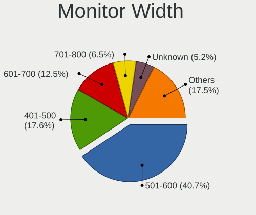

| Width in mm    | Desktops | Percent |
|----------------|----------|---------|
| 501-600        | 692      | 40.71%  |
| 401-500        | 299      | 17.59%  |
| 601-700        | 212      | 12.47%  |
| 701-800        | 111      | 6.53%   |
| Unknown        | 88       | 5.18%   |
| 1001-1500      | 77       | 4.53%   |
| 1501-2000      | 63       | 3.71%   |
| 801-900        | 45       | 2.65%   |
| More than 2000 | 35       | 2.06%   |
| 301-350        | 32       | 1.88%   |
| 351-400        | 24       | 1.41%   |
| 901-1000       | 15       | 0.88%   |
| 201-300        | 7        | 0.41%   |

Aspect Ratio
------------

Proportional relationship between the width and the height

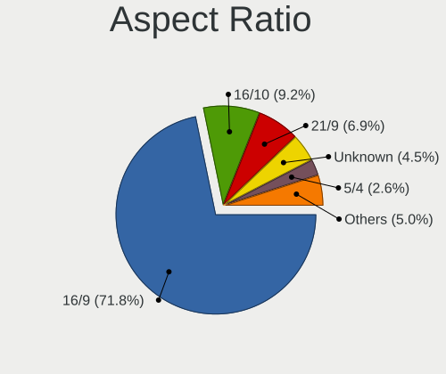

| Ratio   | Desktops | Percent |
|---------|----------|---------|
| 16/9    | 1125     | 71.79%  |
| 16/10   | 144      | 9.19%   |
| 21/9    | 108      | 6.89%   |
| Unknown | 71       | 4.53%   |
| 5/4     | 41       | 2.62%   |
| 1.00    | 35       | 2.23%   |
| 32/9    | 17       | 1.08%   |
| 4/3     | 15       | 0.96%   |
| 3/2     | 4        | 0.26%   |
| 6/5     | 3        | 0.19%   |
| 2.70    | 1        | 0.06%   |
| 2.00    | 1        | 0.06%   |
| 0.80    | 1        | 0.06%   |
| 0.25    | 1        | 0.06%   |

Monitor Area
------------

Area in inch²

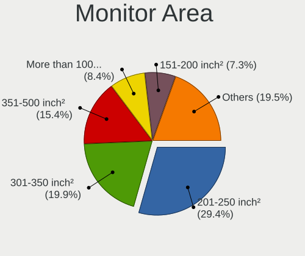

| Area in inch² | Desktops | Percent |
|----------------|----------|---------|
| 201-250        | 512      | 29.39%  |
| 301-350        | 347      | 19.92%  |
| 351-500        | 269      | 15.44%  |
| More than 1000 | 147      | 8.44%   |
| 151-200        | 127      | 7.29%   |
| 251-300        | 103      | 5.91%   |
| Unknown        | 88       | 5.05%   |
| 501-1000       | 76       | 4.36%   |
| 141-150        | 57       | 3.27%   |
| 101-110        | 9        | 0.52%   |
| 71-80          | 4        | 0.23%   |
| 131-140        | 2        | 0.11%   |
| 121-130        | 1        | 0.06%   |

Pixel Density
-------------

Pixels per inch

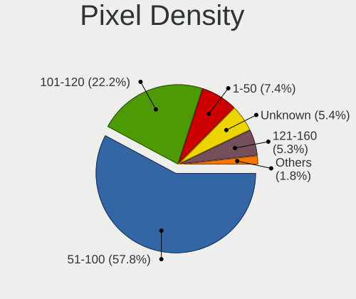

| Density | Desktops | Percent |
|---------|----------|---------|
| 51-100  | 934      | 57.83%  |
| 101-120 | 358      | 22.17%  |
| 1-50    | 120      | 7.43%   |
| Unknown | 88       | 5.45%   |
| 121-160 | 86       | 5.33%   |
| 161-240 | 29       | 1.8%    |

Multiple Monitors
-----------------

Total monitors connected

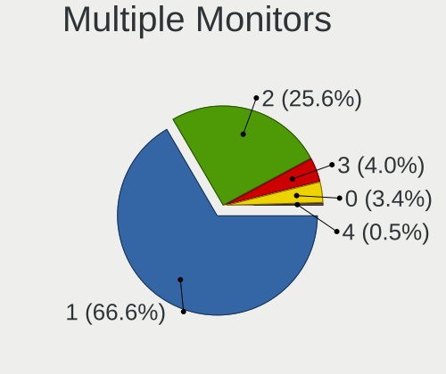

| Total | Desktops | Percent |
|-------|----------|---------|
| 1     | 1027     | 66.6%   |
| 2     | 394      | 25.55%  |
| 3     | 61       | 3.96%   |
| 0     | 53       | 3.44%   |
| 4     | 7        | 0.45%   |

Network
-------

Net Controller Vendor
---------------------

Controller vendors

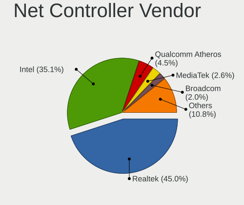

| Vendor                                 | Desktops | Percent |
|----------------------------------------|----------|---------|
| Realtek Semiconductor                  | 947      | 45.01%  |
| Intel                                  | 738      | 35.08%  |
| Qualcomm Atheros                       | 95       | 4.52%   |
| MediaTek                               | 55       | 2.61%   |
| Broadcom                               | 42       | 2%      |
| TP-Link                                | 34       | 1.62%   |
| Ralink Technology                      | 34       | 1.62%   |
| Aquantia                               | 15       | 0.71%   |
| Microsoft                              | 13       | 0.62%   |
| Broadcom Limited                       | 10       | 0.48%   |
| Samsung Electronics                    | 8        | 0.38%   |
| Nvidia                                 | 8        | 0.38%   |
| D-Link System                          | 7        | 0.33%   |
| ASIX Electronics                       | 6        | 0.29%   |
| Qualcomm Atheros Communications        | 5        | 0.24%   |
| NetGear                                | 5        | 0.24%   |
| Marvell Technology Group               | 5        | 0.24%   |
| D-Link                                 | 5        | 0.24%   |
| Ralink                                 | 4        | 0.19%   |
| Qualcomm                               | 4        | 0.19%   |
| Edimax Technology                      | 4        | 0.19%   |
| ASUSTek Computer                       | 4        | 0.19%   |
| T & A Mobile Phones                    | 3        | 0.14%   |
| Motorola PCS                           | 3        | 0.14%   |
| Mellanox Technologies                  | 3        | 0.14%   |
| Huawei Technologies                    | 3        | 0.14%   |
| Tenda                                  | 2        | 0.1%    |
| Solarflare Communications              | 2        | 0.1%    |
| OPPO Electronics                       | 2        | 0.1%    |
| Oculus VR                              | 2        | 0.1%    |
| Microchip Technology                   | 2        | 0.1%    |
| Lenovo                                 | 2        | 0.1%    |
| Insyde Software                        | 2        | 0.1%    |
| Emulex                                 | 2        | 0.1%    |
| DisplayLink                            | 2        | 0.1%    |
| Belkin Components                      | 2        | 0.1%    |
| Xiaomi                                 | 1        | 0.05%   |
| VIA Technologies                       | 1        | 0.05%   |
| Sony Ericsson Mobile Communications AB | 1        | 0.05%   |
| Silicon Integrated Systems [SiS]       | 1        | 0.05%   |

Net Controller Model
--------------------

Controller models

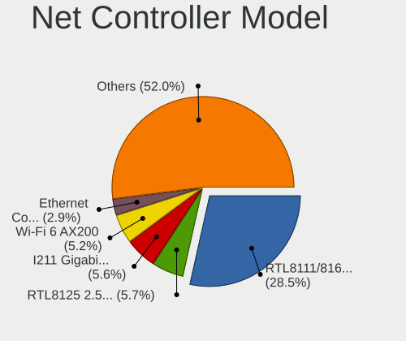

| Model                                                                  | Desktops | Percent |
|------------------------------------------------------------------------|----------|---------|
| Realtek RTL8111/8168/8211/8411 PCI Express Gigabit Ethernet Controller | 705      | 28.5%   |
| Realtek RTL8125 2.5GbE Controller                                      | 142      | 5.74%   |
| Intel I211 Gigabit Network Connection                                  | 139      | 5.62%   |
| Intel Wi-Fi 6 AX200                                                    | 129      | 5.21%   |
| Intel Ethernet Connection (2) I219-V                                   | 72       | 2.91%   |
| Intel Ethernet Controller I225-V                                       | 70       | 2.83%   |
| Intel Ethernet Connection (7) I219-V                                   | 49       | 1.98%   |
| Intel 82579LM Gigabit Network Connection (Lewisville)                  | 47       | 1.9%    |
| Intel Dual Band Wireless-AC 3168NGW [Stone Peak]                       | 43       | 1.74%   |
| Intel Wi-Fi 6E(802.11ax) AX210/AX1675* 2x2 [Typhoon Peak]              | 36       | 1.46%   |
| Intel Wi-Fi 5(802.11ac) Wireless-AC 9x6x [Thunder Peak]                | 32       | 1.29%   |
| Intel Ethernet Connection I217-LM                                      | 30       | 1.21%   |
| Realtek RTL810xE PCI Express Fast Ethernet controller                  | 26       | 1.05%   |
| Realtek RTL8821CE 802.11ac PCIe Wireless Network Adapter               | 25       | 1.01%   |
| MediaTek MT7922 802.11ax PCI Express Wireless Network Adapter          | 22       | 0.89%   |
| MediaTek MT7921K (RZ608) Wi-Fi 6E 80MHz                                | 22       | 0.89%   |
| Realtek 802.11ac NIC                                                   | 21       | 0.85%   |
| Intel Ethernet Connection I217-V                                       | 21       | 0.85%   |
| Realtek RTL8188EUS 802.11n Wireless Network Adapter                    | 20       | 0.81%   |
| Intel Ethernet Connection (2) I219-LM                                  | 20       | 0.81%   |
| Realtek RTL88x2bu [AC1200 Techkey]                                     | 17       | 0.69%   |
| Intel Cannon Lake PCH CNVi WiFi                                        | 17       | 0.69%   |
| Intel 82579V Gigabit Network Connection                                | 17       | 0.69%   |
| Realtek RTL8153 Gigabit Ethernet Adapter                               | 16       | 0.65%   |
| Ralink MT7601U Wireless Adapter                                        | 16       | 0.65%   |
| Intel Ethernet Controller I226-V                                       | 15       | 0.61%   |
| Intel Wireless 7265                                                    | 14       | 0.57%   |
| Broadcom BCM4360 802.11ac Dual Band Wireless Network Adapter           | 14       | 0.57%   |
| Qualcomm Atheros Killer E220x Gigabit Ethernet Controller              | 13       | 0.53%   |
| Intel I210 Gigabit Network Connection                                  | 13       | 0.53%   |
| Qualcomm Atheros Killer E2500 Gigabit Ethernet Controller              | 12       | 0.49%   |
| Intel Ethernet Connection (2) I218-V                                   | 12       | 0.49%   |
| Intel Alder Lake-S PCH CNVi WiFi                                       | 12       | 0.49%   |
| Intel 700 Series Chipset CNVi WiFi                                     | 12       | 0.49%   |
| Qualcomm Atheros AR9485 Wireless Network Adapter                       | 11       | 0.44%   |
| Intel Wireless 7260                                                    | 11       | 0.44%   |
| Realtek RTL8192EE PCIe Wireless Network Adapter                        | 10       | 0.4%    |
| Ralink RT2870/RT3070 Wireless Adapter                                  | 10       | 0.4%    |
| Intel Ethernet Connection X553 1GbE                                    | 10       | 0.4%    |
| Realtek RTL8192EU 802.11b/g/n WLAN Adapter                             | 9        | 0.36%   |

Wireless Vendor
---------------

Wireless vendors

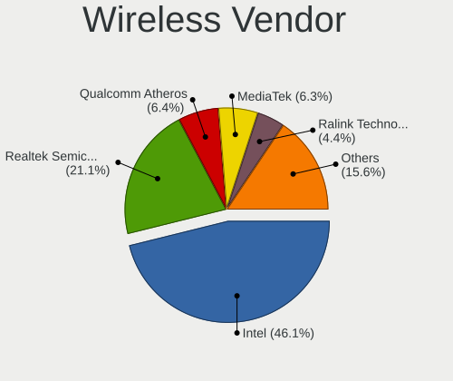

| Vendor                                | Desktops | Percent |
|---------------------------------------|----------|---------|
| Intel                                 | 358      | 46.13%  |
| Realtek Semiconductor                 | 164      | 21.13%  |
| Qualcomm Atheros                      | 50       | 6.44%   |
| MediaTek                              | 49       | 6.31%   |
| Ralink Technology                     | 34       | 4.38%   |
| TP-Link                               | 33       | 4.25%   |
| Broadcom                              | 30       | 3.87%   |
| Microsoft                             | 13       | 1.68%   |
| Qualcomm Atheros Communications       | 5        | 0.64%   |
| NetGear                               | 5        | 0.64%   |
| D-Link                                | 5        | 0.64%   |
| Ralink                                | 4        | 0.52%   |
| Edimax Technology                     | 4        | 0.52%   |
| D-Link System                         | 4        | 0.52%   |
| Broadcom Limited                      | 4        | 0.52%   |
| ASUSTek Computer                      | 4        | 0.52%   |
| Tenda                                 | 2        | 0.26%   |
| Belkin Components                     | 2        | 0.26%   |
| Xiaomi                                | 1        | 0.13%   |
| Ovislink                              | 1        | 0.13%   |
| Marvell Technology Group              | 1        | 0.13%   |
| IMC Networks                          | 1        | 0.13%   |
| CyberTAN Technology                   | 1        | 0.13%   |
| 802.11g Adapter [Linksys WUSB54GC v3] | 1        | 0.13%   |

Wireless Model
--------------

Wireless models

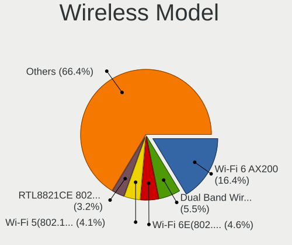

| Model                                                                | Desktops | Percent |
|----------------------------------------------------------------------|----------|---------|
| Intel Wi-Fi 6 AX200                                                  | 129      | 16.37%  |
| Intel Dual Band Wireless-AC 3168NGW [Stone Peak]                     | 43       | 5.46%   |
| Intel Wi-Fi 6E(802.11ax) AX210/AX1675* 2x2 [Typhoon Peak]            | 36       | 4.57%   |
| Intel Wi-Fi 5(802.11ac) Wireless-AC 9x6x [Thunder Peak]              | 32       | 4.06%   |
| Realtek RTL8821CE 802.11ac PCIe Wireless Network Adapter             | 25       | 3.17%   |
| MediaTek MT7921K (RZ608) Wi-Fi 6E 80MHz                              | 22       | 2.79%   |
| Realtek 802.11ac NIC                                                 | 21       | 2.66%   |
| Realtek RTL8188EUS 802.11n Wireless Network Adapter                  | 20       | 2.54%   |
| MediaTek MT7922 802.11ax PCI Express Wireless Network Adapter        | 20       | 2.54%   |
| Realtek RTL88x2bu [AC1200 Techkey]                                   | 17       | 2.16%   |
| Intel Cannon Lake PCH CNVi WiFi                                      | 17       | 2.16%   |
| Ralink MT7601U Wireless Adapter                                      | 16       | 2.03%   |
| Intel Wireless 7265                                                  | 14       | 1.78%   |
| Broadcom BCM4360 802.11ac Dual Band Wireless Network Adapter         | 14       | 1.78%   |
| Intel 700 Series Chipset CNVi WiFi                                   | 12       | 1.52%   |
| Qualcomm Atheros AR9485 Wireless Network Adapter                     | 11       | 1.4%    |
| Intel Wireless 7260                                                  | 11       | 1.4%    |
| Realtek RTL8192EE PCIe Wireless Network Adapter                      | 10       | 1.27%   |
| Ralink RT2870/RT3070 Wireless Adapter                                | 10       | 1.27%   |
| Intel Alder Lake-S PCH CNVi WiFi                                     | 10       | 1.27%   |
| Realtek RTL8192EU 802.11b/g/n WLAN Adapter                           | 9        | 1.14%   |
| Realtek RTL8188FTV 802.11b/g/n 1T1R 2.4G WLAN Adapter                | 9        | 1.14%   |
| Qualcomm Atheros QCA9565 / AR9565 Wireless Network Adapter           | 9        | 1.14%   |
| Intel Wireless 8265 / 8275                                           | 9        | 1.14%   |
| Intel Wireless 8260                                                  | 9        | 1.14%   |
| Intel Wireless 3165                                                  | 9        | 1.14%   |
| Intel Tiger Lake PCH CNVi WiFi                                       | 9        | 1.14%   |
| Intel Comet Lake PCH CNVi WiFi                                       | 8        | 1.02%   |
| TP-Link AC600 wireless Realtek RTL8811AU [Archer T2U Nano]           | 7        | 0.89%   |
| Realtek RTL8188EE Wireless Network Adapter                           | 7        | 0.89%   |
| Qualcomm Atheros AR93xx Wireless Network Adapter                     | 7        | 0.89%   |
| TP-Link TL-WN722N v2/v3 [Realtek RTL8188EUS]                         | 6        | 0.76%   |
| Realtek RTL8822CE 802.11ac PCIe Wireless Network Adapter             | 6        | 0.76%   |
| Realtek RTL8822BE 802.11a/b/g/n/ac WiFi adapter                      | 6        | 0.76%   |
| Realtek RTL8812AE 802.11ac PCIe Wireless Network Adapter             | 6        | 0.76%   |
| Broadcom BCM43228 802.11a/b/g/n                                      | 6        | 0.76%   |
| TP-Link TL-WN823N v2/v3 [Realtek RTL8192EU]                          | 5        | 0.63%   |
| Qualcomm Atheros AR9462 Wireless Network Adapter                     | 5        | 0.63%   |
| Microsoft Xbox Wireless Adapter for Windows                          | 5        | 0.63%   |
| MediaTek MT7921 802.11ax PCIe Wireless Network Adapter [Filogic 330] | 5        | 0.63%   |

Ethernet Vendor
---------------

Ethernet vendors

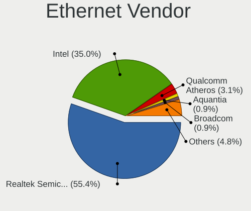

| Vendor                                 | Desktops | Percent |
|----------------------------------------|----------|---------|
| Realtek Semiconductor                  | 889      | 55.39%  |
| Intel                                  | 561      | 34.95%  |
| Qualcomm Atheros                       | 49       | 3.05%   |
| Aquantia                               | 15       | 0.93%   |
| Broadcom                               | 14       | 0.87%   |
| Samsung Electronics                    | 8        | 0.5%    |
| Nvidia                                 | 8        | 0.5%    |
| Broadcom Limited                       | 6        | 0.37%   |
| ASIX Electronics                       | 6        | 0.37%   |
| Qualcomm                               | 4        | 0.25%   |
| Marvell Technology Group               | 4        | 0.25%   |
| T & A Mobile Phones                    | 3        | 0.19%   |
| Motorola PCS                           | 3        | 0.19%   |
| Mellanox Technologies                  | 3        | 0.19%   |
| MediaTek                               | 3        | 0.19%   |
| Huawei Technologies                    | 3        | 0.19%   |
| D-Link System                          | 3        | 0.19%   |
| Solarflare Communications              | 2        | 0.12%   |
| OPPO Electronics                       | 2        | 0.12%   |
| Lenovo                                 | 2        | 0.12%   |
| Insyde Software                        | 2        | 0.12%   |
| Emulex                                 | 2        | 0.12%   |
| DisplayLink                            | 2        | 0.12%   |
| VIA Technologies                       | 1        | 0.06%   |
| TP-Link                                | 1        | 0.06%   |
| Sony Ericsson Mobile Communications AB | 1        | 0.06%   |
| Silicon Integrated Systems [SiS]       | 1        | 0.06%   |
| Research In Motion                     | 1        | 0.06%   |
| QLogic                                 | 1        | 0.06%   |
| OnePlus Technology (Shenzhen)          | 1        | 0.06%   |
| ICS Advent                             | 1        | 0.06%   |
| HTC (High Tech Computer)               | 1        | 0.06%   |
| Apple                                  | 1        | 0.06%   |
| 3Com                                   | 1        | 0.06%   |

Ethernet Model
--------------

Ethernet models

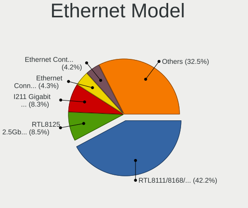

| Model                                                                          | Desktops | Percent |
|--------------------------------------------------------------------------------|----------|---------|
| Realtek RTL8111/8168/8211/8411 PCI Express Gigabit Ethernet Controller         | 705      | 42.22%  |
| Realtek RTL8125 2.5GbE Controller                                              | 142      | 8.5%    |
| Intel I211 Gigabit Network Connection                                          | 139      | 8.32%   |
| Intel Ethernet Connection (2) I219-V                                           | 72       | 4.31%   |
| Intel Ethernet Controller I225-V                                               | 70       | 4.19%   |
| Intel Ethernet Connection (7) I219-V                                           | 49       | 2.93%   |
| Intel 82579LM Gigabit Network Connection (Lewisville)                          | 47       | 2.81%   |
| Intel Ethernet Connection I217-LM                                              | 30       | 1.8%    |
| Realtek RTL810xE PCI Express Fast Ethernet controller                          | 26       | 1.56%   |
| Intel Ethernet Connection I217-V                                               | 21       | 1.26%   |
| Intel Ethernet Connection (2) I219-LM                                          | 20       | 1.2%    |
| Intel 82579V Gigabit Network Connection                                        | 17       | 1.02%   |
| Realtek RTL8153 Gigabit Ethernet Adapter                                       | 16       | 0.96%   |
| Intel Ethernet Controller I226-V                                               | 15       | 0.9%    |
| Qualcomm Atheros Killer E220x Gigabit Ethernet Controller                      | 13       | 0.78%   |
| Intel I210 Gigabit Network Connection                                          | 13       | 0.78%   |
| Qualcomm Atheros Killer E2500 Gigabit Ethernet Controller                      | 12       | 0.72%   |
| Intel Ethernet Connection (2) I218-V                                           | 12       | 0.72%   |
| Intel Ethernet Connection X553 1GbE                                            | 10       | 0.6%    |
| Intel Ethernet Connection (14) I219-V                                          | 8        | 0.48%   |
| Intel Ethernet Connection (12) I219-V                                          | 8        | 0.48%   |
| Aquantia AQtion AQC107 NBase-T/IEEE 802.3an Ethernet Controller [Atlantic 10G] | 8        | 0.48%   |
| Samsung Galaxy series, misc. (tethering mode)                                  | 7        | 0.42%   |
| Qualcomm Atheros Killer E2400 Gigabit Ethernet Controller                      | 7        | 0.42%   |
| Realtek RTL8111/8168/8411 PCI Express Gigabit Ethernet Controller              | 6        | 0.36%   |
| Realtek Killer E3000 2.5GbE Controller                                         | 6        | 0.36%   |
| Intel 82574L Gigabit Network Connection                                        | 6        | 0.36%   |
| Nvidia MCP61 Ethernet                                                          | 5        | 0.3%    |
| Intel Ethernet Connection (7) I219-LM                                          | 5        | 0.3%    |
| Intel Ethernet Connection (5) I219-LM                                          | 5        | 0.3%    |
| Intel 82567LM-3 Gigabit Network Connection                                     | 5        | 0.3%    |
| ASIX AX88179 Gigabit Ethernet                                                  | 5        | 0.3%    |
| Realtek Killer E2600 GbE Controller                                            | 4        | 0.24%   |
| Qualcomm Atheros QCA8171 Gigabit Ethernet                                      | 4        | 0.24%   |
| Qualcomm Atheros AR8161 Gigabit Ethernet                                       | 4        | 0.24%   |
| Qualcomm Atheros AR8151 v2.0 Gigabit Ethernet                                  | 4        | 0.24%   |
| Intel Ethernet Controller X550                                                 | 4        | 0.24%   |
| Intel Ethernet Connection (5) I219-V                                           | 4        | 0.24%   |
| Intel Ethernet Connection (17) I219-V                                          | 4        | 0.24%   |
| Intel 82576 Gigabit Network Connection                                         | 4        | 0.24%   |

Net Controller Kind
-------------------

Ethernet, WiFi or modem

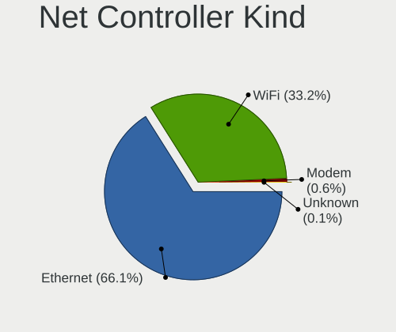

| Kind     | Desktops | Percent |
|----------|----------|---------|
| Ethernet | 1469     | 66.05%  |
| WiFi     | 739      | 33.23%  |
| Modem    | 13       | 0.58%   |
| Unknown  | 3        | 0.13%   |

Used Controller
---------------

Currently used network controller

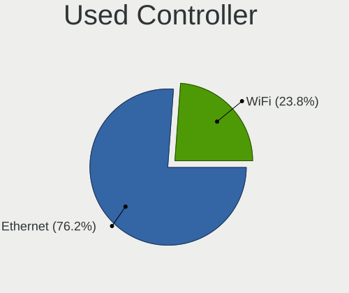

| Kind     | Desktops | Percent |
|----------|----------|---------|
| Ethernet | 1176     | 76.17%  |
| WiFi     | 368      | 23.83%  |

NICs
----

Total network controllers on board

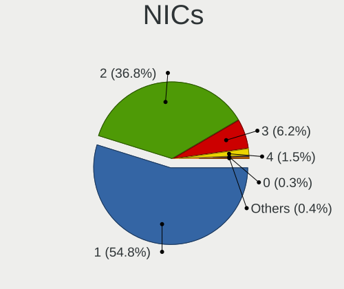

| Total | Desktops | Percent |
|-------|----------|---------|
| 1     | 820      | 54.81%  |
| 2     | 550      | 36.76%  |
| 3     | 93       | 6.22%   |
| 4     | 23       | 1.54%   |
| 0     | 4        | 0.27%   |
| 5     | 3        | 0.2%    |
| 6     | 2        | 0.13%   |
| 9     | 1        | 0.07%   |

IPv6
----

IPv6 vs IPv4

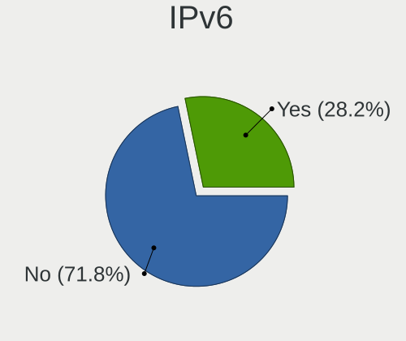

| Used | Desktops | Percent |
|------|----------|---------|
| No   | 1093     | 71.77%  |
| Yes  | 430      | 28.23%  |

Bluetooth
---------

Bluetooth Vendor
----------------

Controller vendors

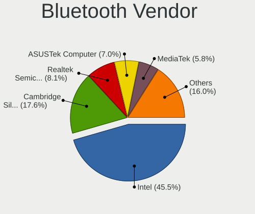

| Vendor                          | Desktops | Percent |
|---------------------------------|----------|---------|
| Intel                           | 347      | 45.54%  |
| Cambridge Silicon Radio         | 134      | 17.59%  |
| Realtek Semiconductor           | 62       | 8.14%   |
| ASUSTek Computer                | 53       | 6.96%   |
| MediaTek                        | 44       | 5.77%   |
| TP-Link                         | 27       | 3.54%   |
| Broadcom                        | 20       | 2.62%   |
| IMC Networks                    | 17       | 2.23%   |
| Qualcomm Atheros Communications | 16       | 2.1%    |
| Apple                           | 11       | 1.44%   |
| Foxconn / Hon Hai               | 6        | 0.79%   |
| Edimax Technology               | 4        | 0.52%   |
| Belkin Components               | 4        | 0.52%   |
| Realtek                         | 3        | 0.39%   |
| Actions                         | 3        | 0.39%   |
| Lite-On Technology              | 2        | 0.26%   |
| HTC (High Tech Computer)        | 2        | 0.26%   |
| Unknown                         | 2        | 0.26%   |
| SINO WEALTH                     | 1        | 0.13%   |
| Kensington                      | 1        | 0.13%   |
| Integrated System Solution      | 1        | 0.13%   |
| Dynex                           | 1        | 0.13%   |
| Creative Technology             | 1        | 0.13%   |

Bluetooth Model
---------------

Controller models

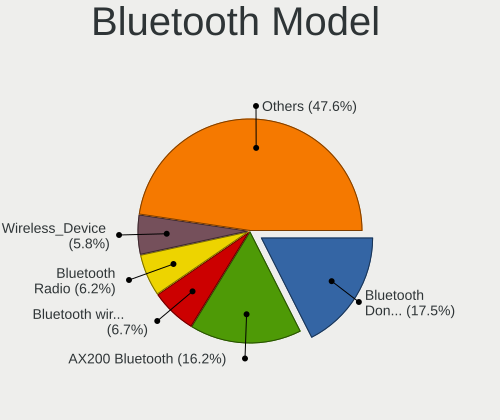

| Model                                                                | Desktops | Percent |
|----------------------------------------------------------------------|----------|---------|
| Cambridge Silicon Radio Bluetooth Dongle (HCI mode)                  | 134      | 17.54%  |
| Intel AX200 Bluetooth                                                | 124      | 16.23%  |
| Intel Bluetooth wireless interface                                   | 51       | 6.68%   |
| Realtek Bluetooth Radio                                              | 47       | 6.15%   |
| MediaTek Wireless_Device                                             | 44       | 5.76%   |
| Intel Wireless-AC 3168 Bluetooth                                     | 43       | 5.63%   |
| Intel Wireless-AC 9260 Bluetooth Adapter                             | 33       | 4.32%   |
| Intel AX210 Bluetooth                                                | 32       | 4.19%   |
| TP-Link TP-T@- UB500 Adapter                                         | 27       | 3.53%   |
| Intel Bluetooth 9460/9560 Jefferson Peak (JfP)                       | 23       | 3.01%   |
| Intel AX201 Bluetooth                                                | 23       | 3.01%   |
| ASUS ASUS USB-BT500                                                  | 21       | 2.75%   |
| ASUS Broadcom BCM20702A0 Bluetooth                                   | 17       | 2.23%   |
| Intel Bluetooth Device                                               | 14       | 1.83%   |
| Realtek  Bluetooth 4.2 Adapter                                       | 11       | 1.44%   |
| Qualcomm Atheros  Bluetooth Device                                   | 11       | 1.44%   |
| Broadcom BCM20702A0 Bluetooth 4.0                                    | 11       | 1.44%   |
| IMC Networks Bluetooth Radio                                         | 9        | 1.18%   |
| IMC Networks Wireless_Device                                         | 6        | 0.79%   |
| Foxconn / Hon Hai Wireless_Device                                    | 6        | 0.79%   |
| ASUS BCM20702A0                                                      | 5        | 0.65%   |
| Apple Bluetooth Host Controller                                      | 5        | 0.65%   |
| Belkin Components F8T065BF Mini Bluetooth 4.0 Adapter                | 4        | 0.52%   |
| ASUS Bluetooth Radio                                                 | 4        | 0.52%   |
| Apple Bluetooth USB Host Controller                                  | 4        | 0.52%   |
| Realtek Bluetooth Radio                                              | 3        | 0.39%   |
| Intel Centrino Bluetooth Wireless Transceiver                        | 3        | 0.39%   |
| Edimax Bluetooth Device                                              | 3        | 0.39%   |
| Broadcom BCM2045 Bluetooth                                           | 3        | 0.39%   |
| ASUS Bluetooth Adapter                                               | 3        | 0.39%   |
| Actions general adapter                                              | 3        | 0.39%   |
| Realtek Bluetooth 5.3 Radio                                          | 2        | 0.26%   |
| Qualcomm Atheros Bluetooth USB Host Controller                       | 2        | 0.26%   |
| Qualcomm Atheros AR9462 Bluetooth                                    | 2        | 0.26%   |
| HTC (High Tech Computer) Vive Hub Bluetooth 4.1 (Broadcom BCM920703) | 2        | 0.26%   |
| Broadcom HP Portable Bumble Bee                                      | 2        | 0.26%   |
| Broadcom BCM92046DG-CL1ROM Bluetooth 2.1 Adapter                     | 2        | 0.26%   |
| ASUS Qualcomm Bluetooth 4.1                                          | 2        | 0.26%   |
| ASUS Broadcom BCM20702 Single-Chip Bluetooth 4.0 + LE                | 2        | 0.26%   |
| Apple Built-in Bluetooth 2.0+EDR HCI                                 | 2        | 0.26%   |

Sound
-----

Sound Vendor
------------

Sound card vendors

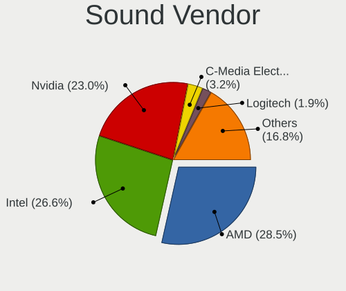

| Vendor                                       | Desktops | Percent |
|----------------------------------------------|----------|---------|
| AMD                                          | 820      | 28.51%  |
| Intel                                        | 764      | 26.56%  |
| Nvidia                                       | 662      | 23.02%  |
| C-Media Electronics                          | 91       | 3.16%   |
| Logitech                                     | 55       | 1.91%   |
| Texas Instruments                            | 33       | 1.15%   |
| Kingston Technology                          | 33       | 1.15%   |
| JMTek                                        | 27       | 0.94%   |
| Razer USA                                    | 26       | 0.9%    |
| Focusrite-Novation                           | 23       | 0.8%    |
| ASUSTek Computer                             | 22       | 0.76%   |
| Creative Labs                                | 20       | 0.7%    |
| SteelSeries ApS                              | 18       | 0.63%   |
| Creative Technology                          | 16       | 0.56%   |
| Generalplus Technology                       | 15       | 0.52%   |
| Corsair                                      | 15       | 0.52%   |
| DSEA A/S                                     | 11       | 0.38%   |
| Realtek Semiconductor                        | 10       | 0.35%   |
| RODE Microphones                             | 9        | 0.31%   |
| BEHRINGER International                      | 8        | 0.28%   |
| Thesycon Systemsoftware & Consulting         | 7        | 0.24%   |
| Micro Star International                     | 7        | 0.24%   |
| Astro Gaming                                 | 7        | 0.24%   |
| SAVITECH                                     | 6        | 0.21%   |
| Hewlett-Packard                              | 6        | 0.21%   |
| Blue Microphones                             | 6        | 0.21%   |
| Zoran Co. Personal Media Division (Nogatech) | 5        | 0.17%   |
| Yamaha                                       | 5        | 0.17%   |
| XMOS                                         | 5        | 0.17%   |
| Sony                                         | 5        | 0.17%   |
| Samson Technologies                          | 5        | 0.17%   |
| PreSonus Audio Electronics                   | 5        | 0.17%   |
| Audio-Technica                               | 5        | 0.17%   |
| ASRock                                       | 5        | 0.17%   |
| M-Audio                                      | 4        | 0.14%   |
| KTMicro                                      | 4        | 0.14%   |
| Jieli Technology                             | 4        | 0.14%   |
| GN Netcom                                    | 4        | 0.14%   |
| Giga-Byte Technology                         | 4        | 0.14%   |
| FiiO Electronics Technology                  | 4        | 0.14%   |

Sound Model
-----------

Sound card models

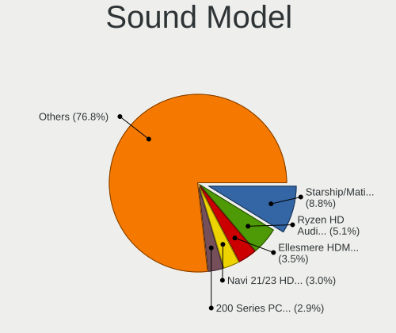

| Model                                                                      | Desktops | Percent |
|----------------------------------------------------------------------------|----------|---------|
| AMD Starship/Matisse HD Audio Controller                                   | 300      | 8.77%   |
| AMD Ryzen HD Audio Controller                                              | 173      | 5.06%   |
| AMD Ellesmere HDMI Audio [Radeon RX 470/480 / 570/580/590]                 | 120      | 3.51%   |
| AMD Navi 21/23 HDMI/DP Audio Controller                                    | 103      | 3.01%   |
| Intel 200 Series PCH HD Audio                                              | 98       | 2.87%   |
| AMD Family 17h (Models 00h-0fh) HD Audio Controller                        | 96       | 2.81%   |
| Intel 8 Series/C220 Series Chipset High Definition Audio Controller        | 92       | 2.69%   |
| Intel 100 Series/C230 Series Chipset Family HD Audio Controller            | 86       | 2.51%   |
| Intel Cannon Lake PCH cAVS                                                 | 81       | 2.37%   |
| Intel 6 Series/C200 Series Chipset Family High Definition Audio Controller | 77       | 2.25%   |
| Intel Xeon E3-1200 v3/4th Gen Core Processor HD Audio Controller           | 68       | 1.99%   |
| Intel 7 Series/C216 Chipset Family High Definition Audio Controller        | 67       | 1.96%   |
| AMD Renoir/Cezanne HDMI/DP Audio Controller                                | 64       | 1.87%   |
| Nvidia TU116 High Definition Audio Controller                              | 59       | 1.73%   |
| Nvidia GP106 High Definition Audio Controller                              | 57       | 1.67%   |
| Nvidia GP104 High Definition Audio Controller                              | 57       | 1.67%   |
| Nvidia GA104 High Definition Audio Controller                              | 55       | 1.61%   |
| Nvidia TU106 High Definition Audio Controller                              | 47       | 1.37%   |
| AMD SBx00 Azalia (Intel HDA)                                               | 47       | 1.37%   |
| AMD Radeon High Definition Audio Controller                                | 47       | 1.37%   |
| AMD Navi 10 HDMI Audio                                                     | 47       | 1.37%   |
| AMD Raven/Raven2/Fenghuang HDMI/DP Audio Controller                        | 43       | 1.26%   |
| Nvidia GP107GL High Definition Audio Controller                            | 42       | 1.23%   |
| Nvidia TU104 HD Audio Controller                                           | 39       | 1.14%   |
| Nvidia GA106 High Definition Audio Controller                              | 34       | 0.99%   |
| Nvidia GA102 High Definition Audio Controller                              | 32       | 0.94%   |
| Intel Alder Lake-S HD Audio Controller                                     | 32       | 0.94%   |
| AMD Navi 31 HDMI/DP Audio                                                  | 32       | 0.94%   |
| AMD Baffin HDMI/DP Audio [Radeon RX 550 640SP / RX 560/560X]               | 31       | 0.91%   |
| AMD Oland/Hainan/Cape Verde/Pitcairn HDMI Audio [Radeon HD 7000 Series]    | 29       | 0.85%   |
| Nvidia TU107 GeForce GTX 1650 High Definition Audio Controller             | 26       | 0.76%   |
| Nvidia GM107 High Definition Audio Controller [GeForce 940MX]              | 25       | 0.73%   |
| AMD FCH Azalia Controller                                                  | 25       | 0.73%   |
| Nvidia GP102 HDMI Audio Controller                                         | 24       | 0.7%    |
| Nvidia GM206 High Definition Audio Controller                              | 24       | 0.7%    |
| Intel 9 Series Chipset Family HD Audio Controller                          | 24       | 0.7%    |
| Texas Instruments PCM2902 Audio Codec                                      | 23       | 0.67%   |
| Nvidia GK208 HDMI/DP Audio Controller                                      | 23       | 0.67%   |
| C-Media Electronics USB Audio Device                                       | 23       | 0.67%   |
| Nvidia GM204 High Definition Audio Controller                              | 22       | 0.64%   |

Memory
------

Memory Vendor
-------------

Memory module vendors

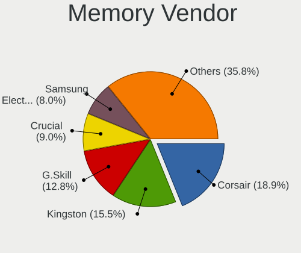

| Vendor                       | Desktops | Percent |
|------------------------------|----------|---------|
| Corsair                      | 307      | 18.86%  |
| Kingston                     | 252      | 15.48%  |
| G.Skill                      | 209      | 12.84%  |
| Crucial                      | 147      | 9.03%   |
| Samsung Electronics          | 130      | 7.99%   |
| SK hynix                     | 126      | 7.74%   |
| Unknown                      | 107      | 6.57%   |
| Micron Technology            | 67       | 4.12%   |
| A-DATA Technology            | 52       | 3.19%   |
| Team                         | 46       | 2.83%   |
| Unknown                      | 20       | 1.23%   |
| Patriot                      | 16       | 0.98%   |
| Ramaxel Technology           | 14       | 0.86%   |
| Nanya Technology             | 11       | 0.68%   |
| PNY                          | 6        | 0.37%   |
| Unknown (ABCD)               | 5        | 0.31%   |
| Silicon Power                | 5        | 0.31%   |
| Neo Forza                    | 5        | 0.31%   |
| GOODRAM                      | 5        | 0.31%   |
| Patriot Memory (PDP Systems) | 4        | 0.25%   |
| Kingmax                      | 4        | 0.25%   |
| Goldkey                      | 4        | 0.25%   |
| Elpida                       | 4        | 0.25%   |
| Atermiter                    | 4        | 0.25%   |
| Asgard                       | 4        | 0.25%   |
| Apacer                       | 4        | 0.25%   |
| AMD                          | 4        | 0.25%   |
| Transcend                    | 3        | 0.18%   |
| Timetec                      | 3        | 0.18%   |
| Patriot Memory               | 3        | 0.18%   |
| Lexar                        | 3        | 0.18%   |
| GeIL                         | 3        | 0.18%   |
| Unifosa                      | 2        | 0.12%   |
| Thermaltake                  | 2        | 0.12%   |
| Smart                        | 2        | 0.12%   |
| Sesame                       | 2        | 0.12%   |
| Kllisre                      | 2        | 0.12%   |
| Hikvision                    | 2        | 0.12%   |
| Golden Empire                | 2        | 0.12%   |
| Avant                        | 2        | 0.12%   |

Memory Model
------------

Memory module models

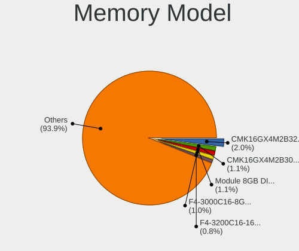

| Model                                                   | Desktops | Percent |
|---------------------------------------------------------|----------|---------|
| Corsair RAM CMK16GX4M2B3200C16 8GB DIMM DDR4 3600MT/s   | 35       | 1.97%   |
| Corsair RAM CMK16GX4M2B3000C15 8GB DIMM DDR4 3600MT/s   | 20       | 1.12%   |
| Unknown                                                 | 20       | 1.12%   |
| G.Skill RAM F4-3000C16-8GISB 8GB DIMM DDR4 3200MT/s     | 18       | 1.01%   |
| G.Skill RAM F4-3200C16-16GVK 16GB DIMM DDR4 3600MT/s    | 15       | 0.84%   |
| G.Skill RAM F4-3200C16-8GVKB 8GB DIMM DDR4 4000MT/s     | 14       | 0.79%   |
| Corsair RAM CMK32GX4M2B3200C16 16GB DIMM DDR4 3800MT/s  | 13       | 0.73%   |
| Corsair RAM CMK32GX4M2E3200C16 16GB DIMM DDR4 3600MT/s  | 12       | 0.67%   |
| Kingston RAM KHX2666C16/8G 8GiB DIMM DDR4 3466MT/s      | 11       | 0.62%   |
| Team RAM TEAMGROUP-UD4-3200 8GB DIMM DDR4 3733MT/s      | 10       | 0.56%   |
| Team RAM TEAMGROUP-UD4-3000 8GB DIMM DDR4 3200MT/s      | 10       | 0.56%   |
| SK hynix RAM HMA82GR7DJR8N-XN 16GB DIMM DDR4 3200MT/s   | 10       | 0.56%   |
| Kingston RAM KHX3200C16D4/8GX 8GB DIMM DDR4 3733MT/s    | 10       | 0.56%   |
| Kingston RAM KHX2400C15/8G 8GB DIMM DDR4 3400MT/s       | 10       | 0.56%   |
| Corsair RAM CMW16GX4M2C3200C16 8GB DIMM DDR4 3733MT/s   | 10       | 0.56%   |
| SK hynix RAM HMT451U6AFR8C-PB 4GB DIMM DDR3 1600MT/s    | 9        | 0.51%   |
| Samsung RAM M378B5173DB0-CK0 4096MB DIMM DDR3 1600MT/s  | 9        | 0.51%   |
| Micron RAM 8JTF51264AZ-1G6E1 4GB DIMM DDR3 1600MT/s     | 9        | 0.51%   |
| G.Skill RAM F4-3600C16-16GTZNC 16GiB DIMM DDR4 3600MT/s | 9        | 0.51%   |
| SK hynix RAM HMT451U6BFR8A-PB 4GB DIMM DDR3 1600MT/s    | 8        | 0.45%   |
| G.Skill RAM F4-3200C16-8GTZR 8GB DIMM DDR4 3200MT/s     | 8        | 0.45%   |
| SK hynix RAM HMA81GU6AFR8N-UH 8GB DIMM DDR4 2400MT/s    | 7        | 0.39%   |
| SK hynix RAM HMA41GU6AFR8N-TF 8GB DIMM DDR4 2465MT/s    | 7        | 0.39%   |
| Kingston RAM KHX3200C16D4/16GX 16GB DIMM DDR4 3600MT/s  | 7        | 0.39%   |
| Kingston RAM KHX1866C10D3/8G 8GB DIMM DDR3 1867MT/s     | 7        | 0.39%   |
| Kingston RAM KF3200C16D4/16GX 16GB DIMM DDR4 3733MT/s   | 7        | 0.39%   |
| G.Skill RAM F4-3600C16-16GVKC 16GB DIMM DDR4 3866MT/s   | 7        | 0.39%   |
| Corsair RAM CMW32GX4M2C3200C16 16GB DIMM DDR4 3400MT/s  | 7        | 0.39%   |
| Corsair RAM CMK32GX4M2D3600C18 16GB DIMM DDR4 3800MT/s  | 7        | 0.39%   |
| Corsair RAM CMK16GX4M2D3600C18 8GB DIMM DDR4 4000MT/s   | 7        | 0.39%   |
| A-DATA RAM DDR4 3200 16GB DIMM DDR4 3600MT/s            | 7        | 0.39%   |
| A-DATA RAM DDR4 3000 8GB DIMM DDR4 3600MT/s             | 7        | 0.39%   |
| Unknown RAM Module 8GB DIMM DDR3 1333MT/s               | 6        | 0.34%   |
| Unknown RAM Module 4GB DIMM 1600MT/s                    | 6        | 0.34%   |
| Unknown RAM Module 4GB DIMM 1333MT/s                    | 6        | 0.34%   |
| Team RAM TEAMGROUP-UD4-3600 16GB DIMM DDR4 3600MT/s     | 6        | 0.34%   |
| Team RAM TEAMGROUP-UD4-3200 8GB DIMM DDR4 3800MT/s      | 6        | 0.34%   |
| Samsung RAM M378B5173QH0-CK0 4GB DIMM DDR3              | 6        | 0.34%   |
| Samsung RAM M378B1G73QH0-CK0 8GB DIMM DDR3 1600MT/s     | 6        | 0.34%   |
| Kingston RAM KF3600C16D4/16GX 16GB DIMM DDR4 3800MT/s   | 6        | 0.34%   |

Memory Kind
-----------

Memory module kinds

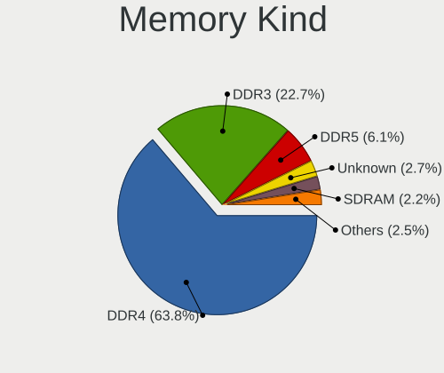

| Kind    | Desktops | Percent |
|---------|----------|---------|
| DDR4    | 909      | 63.79%  |
| DDR3    | 324      | 22.74%  |
| DDR5    | 87       | 6.11%   |
| Unknown | 38       | 2.67%   |
| SDRAM   | 31       | 2.18%   |
| DDR2    | 20       | 1.4%    |
| LPDDR4  | 5        | 0.35%   |
| LPDDR5  | 4        | 0.28%   |
| DRAM    | 4        | 0.28%   |
| DDR     | 3        | 0.21%   |

Memory Form Factor
------------------

Physical design of the memory module

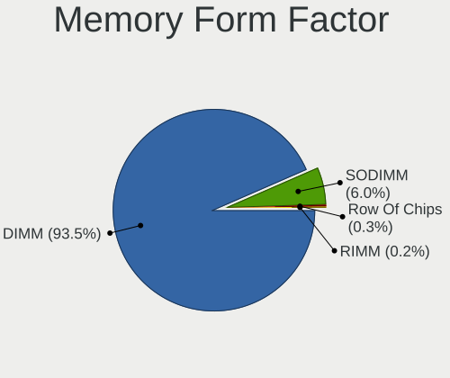

| Name         | Desktops | Percent |
|--------------|----------|---------|
| DIMM         | 1314     | 93.46%  |
| SODIMM       | 85       | 6.05%   |
| Row Of Chips | 4        | 0.28%   |
| RIMM         | 3        | 0.21%   |

Memory Size
-----------

Memory module size

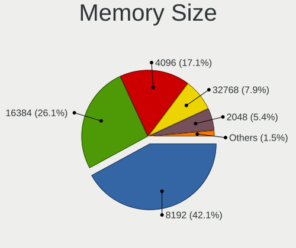

| Size  | Desktops | Percent |
|-------|----------|---------|
| 8192  | 652      | 42.06%  |
| 16384 | 404      | 26.06%  |
| 4096  | 265      | 17.1%   |
| 32768 | 122      | 7.87%   |
| 2048  | 84       | 5.42%   |
| 1024  | 13       | 0.84%   |
| 49152 | 4        | 0.26%   |
| 24576 | 3        | 0.19%   |
| 512   | 2        | 0.13%   |
| 16    | 1        | 0.06%   |

Memory Speed
------------

Memory module speed

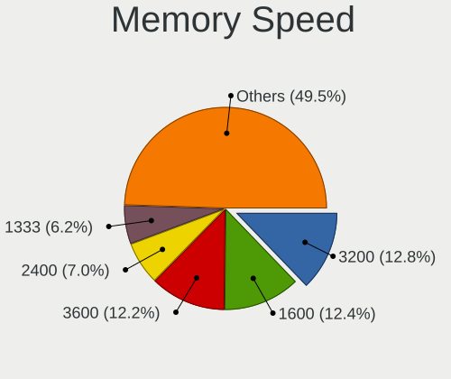

| Speed   | Desktops | Percent |
|---------|----------|---------|
| 3200    | 208      | 12.8%   |
| 1600    | 201      | 12.37%  |
| 3600    | 198      | 12.18%  |
| 2400    | 113      | 6.95%   |
| 1333    | 101      | 6.22%   |
| 2667    | 100      | 6.15%   |
| 2133    | 65       | 4%      |
| 3800    | 55       | 3.38%   |
| 3733    | 53       | 3.26%   |
| 3000    | 38       | 2.34%   |
| 3400    | 36       | 2.22%   |
| 4000    | 32       | 1.97%   |
| 1866    | 28       | 1.72%   |
| 6000    | 27       | 1.66%   |
| 2666    | 24       | 1.48%   |
| 1867    | 22       | 1.35%   |
| 3466    | 21       | 1.29%   |
| 1800    | 21       | 1.29%   |
| 800     | 19       | 1.17%   |
| 3866    | 18       | 1.11%   |
| 4800    | 16       | 0.98%   |
| 2800    | 15       | 0.92%   |
| 5600    | 14       | 0.86%   |
| 2933    | 13       | 0.8%    |
| 667     | 11       | 0.68%   |
| 3266    | 10       | 0.62%   |
| Unknown | 10       | 0.62%   |
| 6400    | 8        | 0.49%   |
| 3334    | 8        | 0.49%   |
| 2000    | 8        | 0.49%   |
| 4333    | 7        | 0.43%   |
| 3666    | 7        | 0.43%   |
| 3066    | 7        | 0.43%   |
| 2465    | 7        | 0.43%   |
| 1648    | 7        | 0.43%   |
| 5200    | 6        | 0.37%   |
| 1067    | 6        | 0.37%   |
| 1066    | 6        | 0.37%   |
| 6200    | 5        | 0.31%   |
| 5800    | 5        | 0.31%   |

Printers & scanners
-------------------

Printer Vendor
--------------

Printer device vendors

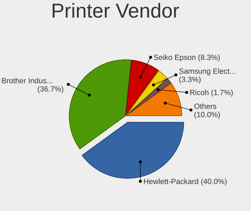

| Vendor                | Desktops | Percent |
|-----------------------|----------|---------|
| Hewlett-Packard       | 24       | 40%     |
| Brother Industries    | 22       | 36.67%  |
| Seiko Epson           | 5        | 8.33%   |
| Samsung Electronics   | 2        | 3.33%   |
| Ricoh                 | 1        | 1.67%   |
| Prolific Technology   | 1        | 1.67%   |
| Lexmark International | 1        | 1.67%   |
| Kyocera               | 1        | 1.67%   |
| Gprinter              | 1        | 1.67%   |
| Dymo-CoStar           | 1        | 1.67%   |
| Canon                 | 1        | 1.67%   |

Printer Model
-------------

Printer device models

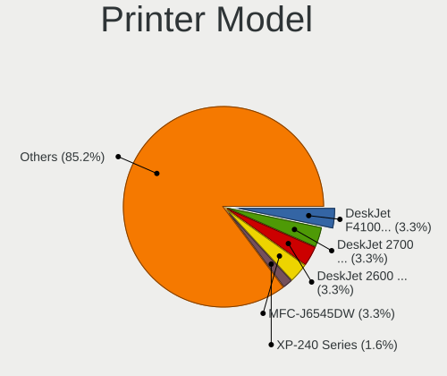

| Model                                  | Desktops | Percent |
|----------------------------------------|----------|---------|
| HP DeskJet F4100 Printer series        | 2        | 3.28%   |
| HP DeskJet 2700 series                 | 2        | 3.28%   |
| HP DeskJet 2600 series                 | 2        | 3.28%   |
| Brother MFC-J6545DW                    | 2        | 3.28%   |
| Seiko Epson XP-240 Series              | 1        | 1.64%   |
| Seiko Epson XP-2100 Series             | 1        | 1.64%   |
| Seiko Epson WF-2870 Series             | 1        | 1.64%   |
| Seiko Epson L6270 Series               | 1        | 1.64%   |
| Seiko Epson ET-2710 Series             | 1        | 1.64%   |
| Samsung SCX-3400 Series                | 1        | 1.64%   |
| Samsung SCX-3200 Series                | 1        | 1.64%   |
| Ricoh SP 211                           | 1        | 1.64%   |
| Prolific PL2305 Parallel Port          | 1        | 1.64%   |
| Lexmark International B2236dw          | 1        | 1.64%   |
| Kyocera UTAX_TA LP 3240_LP 4240        | 1        | 1.64%   |
| HP Smart Tank Plus 550 series          | 1        | 1.64%   |
| HP OfficeJet Pro 6960                  | 1        | 1.64%   |
| HP OfficeJet 5200 series               | 1        | 1.64%   |
| HP OfficeJet 4650 series               | 1        | 1.64%   |
| HP LaserJet Professional P1102w        | 1        | 1.64%   |
| HP LaserJet P1005                      | 1        | 1.64%   |
| HP LaserJet M203-M206                  | 1        | 1.64%   |
| HP LaserJet 3050                       | 1        | 1.64%   |
| HP LaserJet 1020                       | 1        | 1.64%   |
| HP LaserJet 1015                       | 1        | 1.64%   |
| HP Ink Tank Wireless 410 series        | 1        | 1.64%   |
| HP Ink Tank 110 series                 | 1        | 1.64%   |
| HP ENVY 6400 series                    | 1        | 1.64%   |
| HP ENVY 5000 series                    | 1        | 1.64%   |
| HP ENVY 4500 series                    | 1        | 1.64%   |
| HP DeskJet F2492 All-in-One            | 1        | 1.64%   |
| HP Deskjet 4640 series                 | 1        | 1.64%   |
| HP DeskJet 3700 series                 | 1        | 1.64%   |
| HP Deskjet 1050 J410                   | 1        | 1.64%   |
| Gprinter GP-58                         | 1        | 1.64%   |
| Dymo-CoStar DYMO LabelWriter 450 Turbo | 1        | 1.64%   |
| Canon TS5100 series                    | 1        | 1.64%   |
| Brother Printer                        | 1        | 1.64%   |
| Brother MFC-L3750CDW                   | 1        | 1.64%   |
| Brother MFC-J497DW                     | 1        | 1.64%   |

Scanner Vendor
--------------

Scanner device vendors

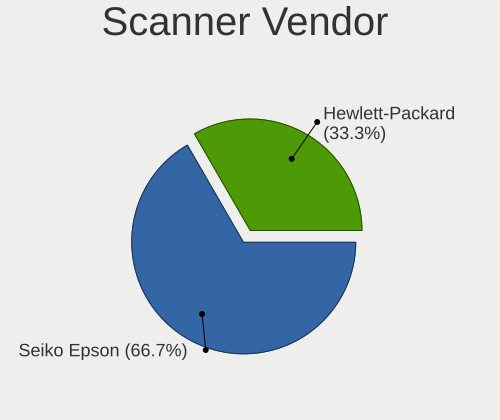

| Vendor          | Desktops | Percent |
|-----------------|----------|---------|
| Canon           | 4        | 44.44%  |
| Seiko Epson     | 3        | 33.33%  |
| Hewlett-Packard | 2        | 22.22%  |

Scanner Model
-------------

Scanner device models

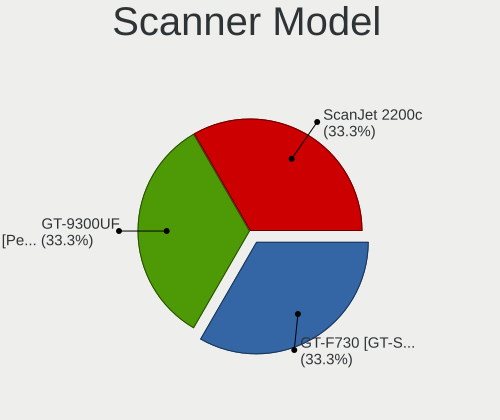

| Model                                                   | Desktops | Percent |
|---------------------------------------------------------|----------|---------|
| Canon CanoScan LIDE 25                                  | 2        | 22.22%  |
| Seiko Epson Perfection V37/V370                         | 1        | 11.11%  |
| Seiko Epson GT-F730 [GT-S630/Perfection V33/V330 Photo] | 1        | 11.11%  |
| Seiko Epson GT-9300UF [Perfection 2400 PHOTO]           | 1        | 11.11%  |
| HP ScanJet 2400c                                        | 1        | 11.11%  |
| HP ScanJet 2200c                                        | 1        | 11.11%  |
| Canon CanoScan N1240U/LiDE 30                           | 1        | 11.11%  |
| Canon CanoScan LiDE 200                                 | 1        | 11.11%  |

Camera
------

Camera Vendor
-------------

Camera device vendors

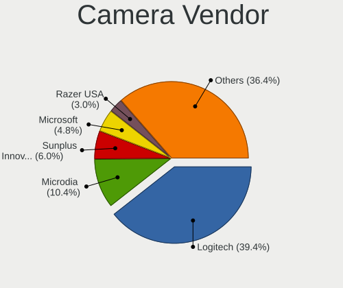

| Vendor                                            | Desktops | Percent |
|---------------------------------------------------|----------|---------|
| Logitech                                          | 132      | 39.4%   |
| Microdia                                          | 35       | 10.45%  |
| Sunplus Innovation Technology                     | 20       | 5.97%   |
| Microsoft                                         | 16       | 4.78%   |
| Razer USA                                         | 10       | 2.99%   |
| Apple                                             | 10       | 2.99%   |
| Realtek Semiconductor                             | 9        | 2.69%   |
| Generalplus Technology                            | 8        | 2.39%   |
| Samsung Electronics                               | 7        | 2.09%   |
| ARC International                                 | 6        | 1.79%   |
| KYE Systems (Mouse Systems)                       | 5        | 1.49%   |
| Hewlett-Packard                                   | 5        | 1.49%   |
| GEMBIRD                                           | 5        | 1.49%   |
| Sonix Technology                                  | 4        | 1.19%   |
| MacroSilicon                                      | 4        | 1.19%   |
| Creative Technology                               | 4        | 1.19%   |
| Z-Star Microelectronics                           | 3        | 0.9%    |
| Lenovo                                            | 3        | 0.9%    |
| Cubeternet                                        | 3        | 0.9%    |
| YGTek                                             | 2        | 0.6%    |
| WaveRider Communications                          | 2        | 0.6%    |
| Valve Software                                    | 2        | 0.6%    |
| Sunplus IT                                        | 2        | 0.6%    |
| Ruision                                           | 2        | 0.6%    |
| Jieli Technology                                  | 2        | 0.6%    |
| Elgato Systems                                    | 2        | 0.6%    |
| Chicony Electronics                               | 2        | 0.6%    |
| AVerMedia Technologies                            | 2        | 0.6%    |
| ANYKA                                             | 2        | 0.6%    |
| webcam                                            | 1        | 0.3%    |
| vivo                                              | 1        | 0.3%    |
| Unknown                                           | 1        | 0.3%    |
| Suyin                                             | 1        | 0.3%    |
| SunplusIT                                         | 1        | 0.3%    |
| STMicroelectronics Imaging Division (VLSI Vision) | 1        | 0.3%    |
| Silicon Motion                                    | 1        | 0.3%    |
| Owl Labs                                          | 1        | 0.3%    |
| OPPO Electronics                                  | 1        | 0.3%    |
| OmniVision Technologies                           | 1        | 0.3%    |
| Motorola PCS                                      | 1        | 0.3%    |

Camera Model
------------

Camera device models

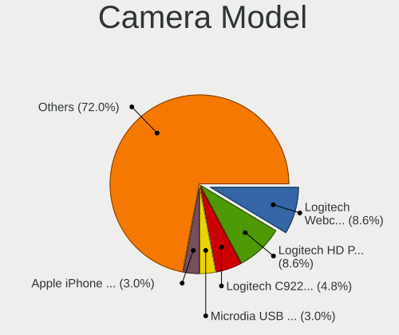

| Model                                                 | Desktops | Percent |
|-------------------------------------------------------|----------|---------|
| Logitech Webcam C270                                  | 29       | 8.63%   |
| Logitech HD Pro Webcam C920                           | 29       | 8.63%   |
| Logitech C922 Pro Stream Webcam                       | 16       | 4.76%   |
| Microdia USB 2.0 Camera                               | 10       | 2.98%   |
| Apple iPhone 5/5C/5S/6/SE/7/8/X                       | 10       | 2.98%   |
| Microsoft LifeCam HD-3000                             | 9        | 2.68%   |
| Sunplus Integrated Camera                             | 7        | 2.08%   |
| Samsung Galaxy series, misc. (MTP mode)               | 7        | 2.08%   |
| Razer USA Gaming Webcam [Kiyo]                        | 7        | 2.08%   |
| Microdia Camera                                       | 7        | 2.08%   |
| Logitech C920 PRO HD Webcam                           | 7        | 2.08%   |
| Sunplus Full HD webcam                                | 6        | 1.79%   |
| Logitech Webcam C310                                  | 6        | 1.79%   |
| ARC International Camera                              | 6        | 1.79%   |
| Microsoft LifeCam Cinema                              | 5        | 1.49%   |
| Logitech Webcam C930e                                 | 5        | 1.49%   |
| Logitech Logitech Webcam C925e                        | 5        | 1.49%   |
| Logitech HD Webcam C615                               | 5        | 1.49%   |
| Logitech BRIO Ultra HD Webcam                         | 5        | 1.49%   |
| Generalplus GENERAL WEBCAM                            | 5        | 1.49%   |
| Microdia Webcam Vitade AF                             | 4        | 1.19%   |
| Microdia Integrated Camera                            | 4        | 1.19%   |
| MacroSilicon USB Video                                | 4        | 1.19%   |
| KYE Systems (Mouse Systems) USB 2.0 HD1080P PC Camera | 4        | 1.19%   |
| Sunplus USB 2.0 Camera                                | 3        | 0.89%   |
| Realtek Thronmax Stream Go Pro Webcam                 | 3        | 0.89%   |
| Realtek FULL HD 1080P Webcam                          | 3        | 0.89%   |
| Razer USA Razer Kiyo Pro                              | 3        | 0.89%   |
| Microdia CyberTrack H7                                | 3        | 0.89%   |
| Logitech StreamCam                                    | 3        | 0.89%   |
| HP Webcam HD 2300                                     | 3        | 0.89%   |
| GEMBIRD USB2.0 PC CAMERA                              | 3        | 0.89%   |
| Creative Live! Cam Sync HD [VF0770]                   | 3        | 0.89%   |
| Z-Star Venus USB2.0 Camera                            | 2        | 0.6%    |
| YGTek Webcam                                          | 2        | 0.6%    |
| Valve Software 3D Camera                              | 2        | 0.6%    |
| Sunplus IT PC Camera                                  | 2        | 0.6%    |
| Ruision UVC Camera                                    | 2        | 0.6%    |
| Microdia Sonix USB 2.0 Camera                         | 2        | 0.6%    |
| Microdia Camera Webcam KBM! WE400                     | 2        | 0.6%    |

Security
--------

Fingerprint Vendor
------------------

Fingerprint sensor vendors

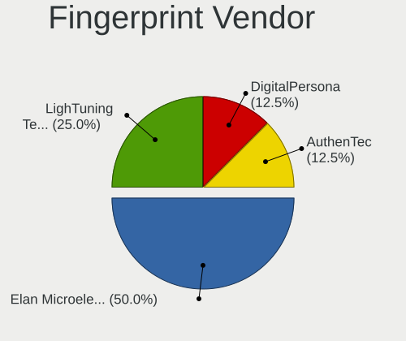

| Vendor                | Desktops | Percent |
|-----------------------|----------|---------|
| Elan Microelectronics | 4        | 50%     |
| LighTuning Technology | 2        | 25%     |
| DigitalPersona        | 1        | 12.5%   |
| AuthenTec             | 1        | 12.5%   |

Fingerprint Model
-----------------

Fingerprint sensor models

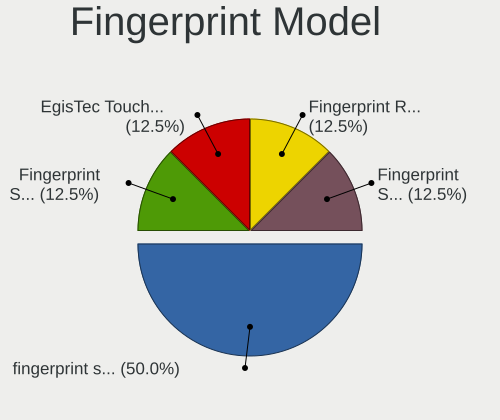

| Model                                       | Desktops | Percent |
|---------------------------------------------|----------|---------|
| Elan fingerprint sensor [FeinTech FPS00200] | 4        | 50%     |
| LighTuning Fingerprint Sensor               | 1        | 12.5%   |
| LighTuning EgisTec Touch Fingerprint Sensor | 1        | 12.5%   |
| DigitalPersona Fingerprint Reader           | 1        | 12.5%   |
| AuthenTec Fingerprint Sensor                | 1        | 12.5%   |

Chipcard Vendor
---------------

Chipcard module vendors

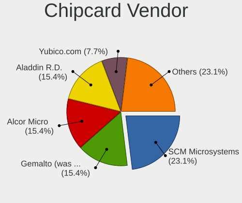

| Vendor                | Desktops | Percent |
|-----------------------|----------|---------|
| SCM Microsystems      | 3        | 23.08%  |
| Gemalto (was Gemplus) | 2        | 15.38%  |
| Alcor Micro           | 2        | 15.38%  |
| Aladdin R.D.          | 2        | 15.38%  |
| Yubico.com            | 1        | 7.69%   |
| OmniKey               | 1        | 7.69%   |
| Clay Logic            | 1        | 7.69%   |
| CHERRY                | 1        | 7.69%   |

Chipcard Model
--------------

Chipcard module models

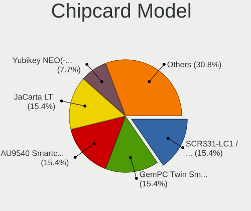

| Model                                                  | Desktops | Percent |
|--------------------------------------------------------|----------|---------|
| SCM Microsystems SCR331-LC1 / SCR3310 SmartCard Reader | 2        | 15.38%  |
| Gemalto (was Gemplus) GemPC Twin SmartCard Reader      | 2        | 15.38%  |
| Alcor Micro AU9540 Smartcard Reader                    | 2        | 15.38%  |
| Aladdin R.D. JaCarta LT                                | 2        | 15.38%  |
| Yubico.com Yubikey NEO(-N) OTP+CCID                    | 1        | 7.69%   |
| SCM Microsystems SCR3500 A Contact Reader              | 1        | 7.69%   |
| OmniKey CardMan 1021                                   | 1        | 7.69%   |
| Clay Logic Nitrokey Pro                                | 1        | 7.69%   |
| CHERRY Smart Card Reader USB                           | 1        | 7.69%   |

Unsupported
-----------

Unsupported Devices
-------------------

Total unsupported devices on board

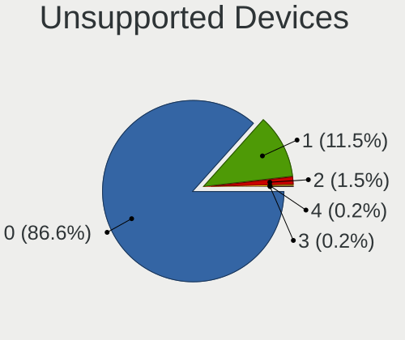

| Total | Desktops | Percent |
|-------|----------|---------|
| 0     | 1313     | 86.61%  |
| 1     | 175      | 11.54%  |
| 2     | 22       | 1.45%   |
| 4     | 3        | 0.2%    |
| 3     | 3        | 0.2%    |

Unsupported Device Types
------------------------

Types of unsupported devices

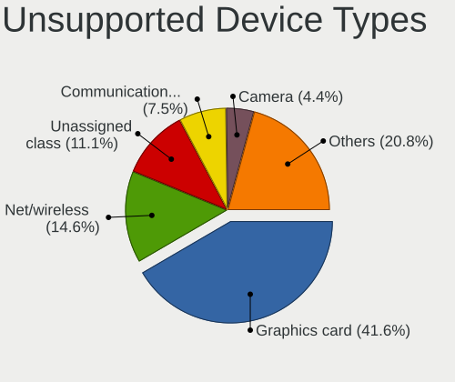

| Type                     | Desktops | Percent |
|--------------------------|----------|---------|
| Graphics card            | 94       | 41.59%  |
| Net/wireless             | 33       | 14.6%   |
| Unassigned class         | 25       | 11.06%  |
| Communication controller | 17       | 7.52%   |
| Camera                   | 10       | 4.42%   |
| Fingerprint reader       | 8        | 3.54%   |
| Chipcard                 | 8        | 3.54%   |
| Sound                    | 6        | 2.65%   |
| Bluetooth                | 6        | 2.65%   |
| Net/ethernet             | 4        | 1.77%   |
| Network                  | 3        | 1.33%   |
| Multimedia controller    | 3        | 1.33%   |
| Card reader              | 3        | 1.33%   |
| Storage/raid             | 2        | 0.88%   |
| Modem                    | 2        | 0.88%   |
| Storage/nvme             | 1        | 0.44%   |
| Dvb card                 | 1        | 0.44%   |

