ArcoLinux - Tested Hardware & Statistics (Desktops)
---------------------------------------------------

A project to collect tested hardware configurations for ArcoLinux.

Anyone can contribute to this report by the [hw-probe](https://github.com/linuxhw/hw-probe) tool:

    sudo -E hw-probe -all -upload

Please contribute! Especially if your hardware is rare.

Contents
--------

* [ Test Cases ](#test-cases)

* [ System ](#system)
  - [ OS                       ](#os)
  - [ OS Family                ](#os-family)
  - [ Kernel                   ](#kernel)
  - [ Kernel Family            ](#kernel-family)
  - [ Kernel Major Ver.        ](#kernel-major-ver)
  - [ Arch                     ](#arch)
  - [ DE                       ](#de)
  - [ Display Server           ](#display-server)
  - [ Display Manager          ](#display-manager)
  - [ OS Lang                  ](#os-lang)
  - [ Boot Mode                ](#boot-mode)
  - [ Filesystem               ](#filesystem)
  - [ Part. scheme             ](#part-scheme)
  - [ Dual Boot with Linux/BSD ](#dual-boot-with-linuxbsd)
  - [ Dual Boot (Win)          ](#dual-boot-win)

* [ Board ](#board)
  - [ Vendor                   ](#vendor)
  - [ Model                    ](#model)
  - [ Model Family             ](#model-family)
  - [ MFG Year                 ](#mfg-year)
  - [ Form Factor              ](#form-factor)
  - [ Secure Boot              ](#secure-boot)
  - [ Coreboot                 ](#coreboot)
  - [ RAM Size                 ](#ram-size)
  - [ RAM Used                 ](#ram-used)
  - [ Total Drives             ](#total-drives)
  - [ Has CD-ROM               ](#has-cd-rom)
  - [ Has Ethernet             ](#has-ethernet)
  - [ Has WiFi                 ](#has-wifi)
  - [ Has Bluetooth            ](#has-bluetooth)

* [ Location ](#location)
  - [ Country                  ](#country)
  - [ City                     ](#city)

* [ Drives ](#drives)
  - [ Drive Vendor             ](#drive-vendor)
  - [ Drive Model              ](#drive-model)
  - [ HDD Vendor               ](#hdd-vendor)
  - [ SSD Vendor               ](#ssd-vendor)
  - [ Drive Kind               ](#drive-kind)
  - [ Drive Connector          ](#drive-connector)
  - [ Drive Size               ](#drive-size)
  - [ Space Total              ](#space-total)
  - [ Space Used               ](#space-used)
  - [ Malfunc. Drives          ](#malfunc-drives)
  - [ Malfunc. Drive Vendor    ](#malfunc-drive-vendor)
  - [ Malfunc. HDD Vendor      ](#malfunc-hdd-vendor)
  - [ Malfunc. Drive Kind      ](#malfunc-drive-kind)
  - [ Failed Drives            ](#failed-drives)
  - [ Failed Drive Vendor      ](#failed-drive-vendor)
  - [ Drive Status             ](#drive-status)

* [ Storage controller ](#storage-controller)
  - [ Storage Vendor           ](#storage-vendor)
  - [ Storage Model            ](#storage-model)
  - [ Storage Kind             ](#storage-kind)

* [ Processor ](#processor)
  - [ CPU Vendor               ](#cpu-vendor)
  - [ CPU Model                ](#cpu-model)
  - [ CPU Model Family         ](#cpu-model-family)
  - [ CPU Cores                ](#cpu-cores)
  - [ CPU Sockets              ](#cpu-sockets)
  - [ CPU Threads              ](#cpu-threads)
  - [ CPU Op-Modes             ](#cpu-op-modes)
  - [ CPU Microcode            ](#cpu-microcode)
  - [ CPU Microarch            ](#cpu-microarch)

* [ Graphics ](#graphics)
  - [ GPU Vendor               ](#gpu-vendor)
  - [ GPU Model                ](#gpu-model)
  - [ GPU Combo                ](#gpu-combo)
  - [ GPU Driver               ](#gpu-driver)
  - [ GPU Memory               ](#gpu-memory)

* [ Monitor ](#monitor)
  - [ Monitor Vendor           ](#monitor-vendor)
  - [ Monitor Model            ](#monitor-model)
  - [ Monitor Resolution       ](#monitor-resolution)
  - [ Monitor Diagonal         ](#monitor-diagonal)
  - [ Monitor Width            ](#monitor-width)
  - [ Aspect Ratio             ](#aspect-ratio)
  - [ Monitor Area             ](#monitor-area)
  - [ Pixel Density            ](#pixel-density)
  - [ Multiple Monitors        ](#multiple-monitors)

* [ Network ](#network)
  - [ Net Controller Vendor    ](#net-controller-vendor)
  - [ Net Controller Model     ](#net-controller-model)
  - [ Wireless Vendor          ](#wireless-vendor)
  - [ Wireless Model           ](#wireless-model)
  - [ Ethernet Vendor          ](#ethernet-vendor)
  - [ Ethernet Model           ](#ethernet-model)
  - [ Net Controller Kind      ](#net-controller-kind)
  - [ Used Controller          ](#used-controller)
  - [ NICs                     ](#nics)
  - [ IPv6                     ](#ipv6)

* [ Bluetooth ](#bluetooth)
  - [ Bluetooth Vendor         ](#bluetooth-vendor)
  - [ Bluetooth Model          ](#bluetooth-model)

* [ Sound ](#sound)
  - [ Sound Vendor             ](#sound-vendor)
  - [ Sound Model              ](#sound-model)

* [ Memory ](#memory)
  - [ Memory Vendor            ](#memory-vendor)
  - [ Memory Model             ](#memory-model)
  - [ Memory Kind              ](#memory-kind)
  - [ Memory Form Factor       ](#memory-form-factor)
  - [ Memory Size              ](#memory-size)
  - [ Memory Speed             ](#memory-speed)

* [ Printers & scanners ](#printers--scanners)
  - [ Printer Vendor           ](#printer-vendor)
  - [ Printer Model            ](#printer-model)
  - [ Scanner Vendor           ](#scanner-vendor)
  - [ Scanner Model            ](#scanner-model)

* [ Camera ](#camera)
  - [ Camera Vendor            ](#camera-vendor)
  - [ Camera Model             ](#camera-model)

* [ Security ](#security)
  - [ Fingerprint Vendor       ](#fingerprint-vendor)
  - [ Fingerprint Model        ](#fingerprint-model)
  - [ Chipcard Vendor          ](#chipcard-vendor)
  - [ Chipcard Model           ](#chipcard-model)

* [ Unsupported ](#unsupported)
  - [ Unsupported Devices      ](#unsupported-devices)
  - [ Unsupported Device Types ](#unsupported-device-types)

Test Cases
----------

Total: 1226

| Vendor        | Model                       | Probe                                                      | Date         |
|---------------|-----------------------------|------------------------------------------------------------|--------------|
| ASUSTek       | ROG STRIX B550-F GAMING ... | [7ab0866235](https://linux-hardware.org/?probe=7ab0866235) | Jun 10, 2023 |
| MSI           | MS-B9321                    | [a7a878dbe6](https://linux-hardware.org/?probe=a7a878dbe6) | Jun 10, 2023 |
| ASUSTek       | TUF Gaming X570-PLUS        | [0eae3567d9](https://linux-hardware.org/?probe=0eae3567d9) | Jun 10, 2023 |
| ASRock        | B550AM Gaming               | [eca79c3bbb](https://linux-hardware.org/?probe=eca79c3bbb) | Jun 10, 2023 |
| ASUSTek       | ROG STRIX X670E-E GAMING... | [5446a0003e](https://linux-hardware.org/?probe=5446a0003e) | Jun 10, 2023 |
| ASRock        | B360M Pro4                  | [9b52b20f3e](https://linux-hardware.org/?probe=9b52b20f3e) | Jun 09, 2023 |
| Gigabyte      | X470 AORUS ULTRA GAMING-... | [73bc5d84c9](https://linux-hardware.org/?probe=73bc5d84c9) | Jun 07, 2023 |
| Dell          | 06D7TR A01                  | [8db1a8c132](https://linux-hardware.org/?probe=8db1a8c132) | Jun 06, 2023 |
| HP            | 8053                        | [29a84ce224](https://linux-hardware.org/?probe=29a84ce224) | Jun 06, 2023 |
| Win elemen... | M600                        | [360ab80d9b](https://linux-hardware.org/?probe=360ab80d9b) | Jun 06, 2023 |
| Dell          | 0HD5W2 A01                  | [917462f8c8](https://linux-hardware.org/?probe=917462f8c8) | Jun 05, 2023 |
| Dell          | 042P49 A01                  | [50f682ce84](https://linux-hardware.org/?probe=50f682ce84) | Jun 04, 2023 |
| SYWZ          | S200 Series                 | [577c490fb7](https://linux-hardware.org/?probe=577c490fb7) | Jun 04, 2023 |
| ASUSTek       | P8Z77-V LE                  | [9a66179aaf](https://linux-hardware.org/?probe=9a66179aaf) | Jun 04, 2023 |
| Gigabyte      | Z77X-UD5H                   | [b0efe96508](https://linux-hardware.org/?probe=b0efe96508) | Jun 04, 2023 |
| MSI           | B460M PRO-VDH WIFI          | [b92c18e955](https://linux-hardware.org/?probe=b92c18e955) | Jun 03, 2023 |
| MSI           | H310M PRO-VD PLUS           | [5ee3eec233](https://linux-hardware.org/?probe=5ee3eec233) | Jun 03, 2023 |
| ASRock        | AB350M Pro4                 | [30a95a3f53](https://linux-hardware.org/?probe=30a95a3f53) | Jun 03, 2023 |
| Positivo      | POS-RIB360EE 11144907       | [7837922f5b](https://linux-hardware.org/?probe=7837922f5b) | Jun 02, 2023 |
| Positivo      | POS-RIB360EE 11144907       | [b4ba7702cb](https://linux-hardware.org/?probe=b4ba7702cb) | Jun 02, 2023 |
| ASUSTek       | ROG CROSSHAIR VIII IMPAC... | [c9e073b763](https://linux-hardware.org/?probe=c9e073b763) | Jun 02, 2023 |
| ASUSTek       | Z97-K                       | [1bd92e67d7](https://linux-hardware.org/?probe=1bd92e67d7) | Jun 01, 2023 |
| ASUSTek       | PRIME TRX40-PRO             | [6b3efa1ef7](https://linux-hardware.org/?probe=6b3efa1ef7) | May 31, 2023 |
| ASUSTek       | ROG CROSSHAIR VIII IMPAC... | [270fcf5e69](https://linux-hardware.org/?probe=270fcf5e69) | May 31, 2023 |
| Gigabyte      | X570 AORUS MASTER           | [79de4bed98](https://linux-hardware.org/?probe=79de4bed98) | May 31, 2023 |
| ASUSTek       | PRIME Z390-A                | [9131b2b568](https://linux-hardware.org/?probe=9131b2b568) | May 31, 2023 |
| Lenovo        | 30BC SDK0J40697 WIN 3305... | [6dbaa9e2ff](https://linux-hardware.org/?probe=6dbaa9e2ff) | May 30, 2023 |
| Gigabyte      | Z270X-Gaming 7              | [4ed64d3d45](https://linux-hardware.org/?probe=4ed64d3d45) | May 30, 2023 |
| Dell          | 002KVM A01                  | [09d2d63c82](https://linux-hardware.org/?probe=09d2d63c82) | May 30, 2023 |
| ASUSTek       | M5A97 EVO R2.0              | [8e0413af72](https://linux-hardware.org/?probe=8e0413af72) | May 30, 2023 |
| MSI           | B460M PRO-VDH WIFI          | [9171b7f0f0](https://linux-hardware.org/?probe=9171b7f0f0) | May 29, 2023 |
| ASRock        | H87M Pro4                   | [efd2db0783](https://linux-hardware.org/?probe=efd2db0783) | May 27, 2023 |
| ASUSTek       | A88X-PRO                    | [b5fd752412](https://linux-hardware.org/?probe=b5fd752412) | May 27, 2023 |
| ASUSTek       | PRIME Z370-P                | [07ecf79e17](https://linux-hardware.org/?probe=07ecf79e17) | May 26, 2023 |
| ASUSTek       | ROG STRIX Z390-E GAMING     | [3392305134](https://linux-hardware.org/?probe=3392305134) | May 26, 2023 |
| HP            | 8437                        | [c1c9154683](https://linux-hardware.org/?probe=c1c9154683) | May 26, 2023 |
| Gigabyte      | MFLP5IP-00                  | [52e1964d2c](https://linux-hardware.org/?probe=52e1964d2c) | May 25, 2023 |
| ASUSTek       | PRIME X299-A                | [e52868c107](https://linux-hardware.org/?probe=e52868c107) | May 25, 2023 |
| ASUSTek       | PRIME Z370-A                | [1387725836](https://linux-hardware.org/?probe=1387725836) | May 24, 2023 |
| ASUSTek       | PRIME Z370-A                | [c309714d15](https://linux-hardware.org/?probe=c309714d15) | May 23, 2023 |
| MSI           | Z590-A PRO                  | [627afe1447](https://linux-hardware.org/?probe=627afe1447) | May 23, 2023 |
| MSI           | MAG B550M BAZOOKA           | [3d594ff1da](https://linux-hardware.org/?probe=3d594ff1da) | May 23, 2023 |
| ASUSTek       | P5Q-PRO                     | [87b976a24c](https://linux-hardware.org/?probe=87b976a24c) | May 22, 2023 |
| ASUSTek       | ROG STRIX X670E-I GAMING... | [a1fb857bcc](https://linux-hardware.org/?probe=a1fb857bcc) | May 22, 2023 |
| HP            | 8599                        | [2e9caaf13a](https://linux-hardware.org/?probe=2e9caaf13a) | May 22, 2023 |
| ASUSTek       | PRIME A320M-K               | [ab21a2a608](https://linux-hardware.org/?probe=ab21a2a608) | May 22, 2023 |
| Lenovo        | 30D0 SDK0J40705 WIN 3425... | [5534aabaf1](https://linux-hardware.org/?probe=5534aabaf1) | May 21, 2023 |
| MSI           | B450M PRO-VDH MAX           | [cf10c1fb13](https://linux-hardware.org/?probe=cf10c1fb13) | May 21, 2023 |
| Gigabyte      | B450M H                     | [9db5706bfc](https://linux-hardware.org/?probe=9db5706bfc) | May 21, 2023 |
| MSI           | A320M-HDV R4.0              | [e7a27c7429](https://linux-hardware.org/?probe=e7a27c7429) | May 21, 2023 |
| MSI           | 970 GAMING                  | [222ebac915](https://linux-hardware.org/?probe=222ebac915) | May 21, 2023 |
| MSI           | B450M-A PRO MAX             | [bc16fc021e](https://linux-hardware.org/?probe=bc16fc021e) | May 21, 2023 |
| Gigabyte      | Z490I AORUS ULTRA           | [14e978a000](https://linux-hardware.org/?probe=14e978a000) | May 20, 2023 |
| HP            | 8433 11                     | [5d9e3a1dcc](https://linux-hardware.org/?probe=5d9e3a1dcc) | May 20, 2023 |
| MSI           | MEG X570 UNIFY              | [b001b01a08](https://linux-hardware.org/?probe=b001b01a08) | May 19, 2023 |
| MSI           | 970 GAMING                  | [dde73bc060](https://linux-hardware.org/?probe=dde73bc060) | May 18, 2023 |
| MSI           | B450M-A PRO MAX             | [763654d8fc](https://linux-hardware.org/?probe=763654d8fc) | May 18, 2023 |
| HP            | 339A                        | [44a6e1f861](https://linux-hardware.org/?probe=44a6e1f861) | May 17, 2023 |
| ASUSTek       | ROG STRIX B560-G GAMING ... | [7f3487434e](https://linux-hardware.org/?probe=7f3487434e) | May 17, 2023 |
| Gigabyte      | B450 AORUS ELITE            | [7957c81218](https://linux-hardware.org/?probe=7957c81218) | May 17, 2023 |
| Gigabyte      | B450 AORUS ELITE            | [1aedc7da48](https://linux-hardware.org/?probe=1aedc7da48) | May 17, 2023 |
| MSI           | Z590-A PRO                  | [0c26a47ae5](https://linux-hardware.org/?probe=0c26a47ae5) | May 17, 2023 |
| ASUSTek       | TUF Gaming B550-PLUS        | [e31c83db5e](https://linux-hardware.org/?probe=e31c83db5e) | May 16, 2023 |
| ASUSTek       | PRIME B550-PLUS             | [d9b18c7990](https://linux-hardware.org/?probe=d9b18c7990) | May 16, 2023 |
| ASRock        | A300M-STX                   | [b06c75ac5e](https://linux-hardware.org/?probe=b06c75ac5e) | May 16, 2023 |
| Dell          | 0NKW6Y A02                  | [8c10a0ad96](https://linux-hardware.org/?probe=8c10a0ad96) | May 16, 2023 |
| Dell          | 0NKW6Y A02                  | [be5ad76a6e](https://linux-hardware.org/?probe=be5ad76a6e) | May 16, 2023 |
| Google        | Sumo                        | [1455a81901](https://linux-hardware.org/?probe=1455a81901) | May 15, 2023 |
| BESSTAR Te... | DMAF5 V1.0                  | [53f395d7fa](https://linux-hardware.org/?probe=53f395d7fa) | May 15, 2023 |
| ASUSTek       | ROG STRIX X470-I GAMING     | [9beabf1347](https://linux-hardware.org/?probe=9beabf1347) | May 15, 2023 |
| Unknown       | HX90                        | [85edf2e24e](https://linux-hardware.org/?probe=85edf2e24e) | May 14, 2023 |
| Dell          | 0M017G A00                  | [5bd115a1b4](https://linux-hardware.org/?probe=5bd115a1b4) | May 14, 2023 |
| ASUSTek       | ROG STRIX B450-F GAMING ... | [49a47c559e](https://linux-hardware.org/?probe=49a47c559e) | May 14, 2023 |
| ASUSTek       | ROG STRIX B450-F GAMING ... | [91986cf051](https://linux-hardware.org/?probe=91986cf051) | May 14, 2023 |
| ASUSTek       | PRIME Z490-A                | [ced38114fc](https://linux-hardware.org/?probe=ced38114fc) | May 14, 2023 |
| MSI           | MAG B560M MORTAR            | [1556b05d13](https://linux-hardware.org/?probe=1556b05d13) | May 14, 2023 |
| Dell          | 0M017G A00                  | [5e7cf34522](https://linux-hardware.org/?probe=5e7cf34522) | May 14, 2023 |
| MSI           | A320M-HDV R4.0              | [748e0f187f](https://linux-hardware.org/?probe=748e0f187f) | May 14, 2023 |
| MSI           | B450M PRO-VDH MAX           | [677e681a2d](https://linux-hardware.org/?probe=677e681a2d) | May 13, 2023 |
| ASUSTek       | PRIME Z490-A                | [4bde221d90](https://linux-hardware.org/?probe=4bde221d90) | May 13, 2023 |
| MSI           | H310M PRO-VD PLUS           | [71f2dc616d](https://linux-hardware.org/?probe=71f2dc616d) | May 12, 2023 |
| MSI           | MAG B550 TOMAHAWK           | [82f01de919](https://linux-hardware.org/?probe=82f01de919) | May 12, 2023 |
| ASUSTek       | PRIME Z490-A                | [c0841ef7e1](https://linux-hardware.org/?probe=c0841ef7e1) | May 12, 2023 |
| ASUSTek       | STRIX Z270H GAMING          | [ed18615cb3](https://linux-hardware.org/?probe=ed18615cb3) | May 11, 2023 |
| ASRock        | Z370 Extreme4               | [bdd9bcedf5](https://linux-hardware.org/?probe=bdd9bcedf5) | May 11, 2023 |
| ASUSTek       | TUF Gaming H670-PRO WIFI... | [0b4b06b5fa](https://linux-hardware.org/?probe=0b4b06b5fa) | May 10, 2023 |
| Fujitsu       | D3600-A1 S26361-D3600-A1    | [b65333ae05](https://linux-hardware.org/?probe=b65333ae05) | May 10, 2023 |
| Lenovo        | 36EB SDK0K17763 WIN 1801... | [4d68e2912b](https://linux-hardware.org/?probe=4d68e2912b) | May 10, 2023 |
| ASUSTek       | PRIME Z490-A                | [9ce4debe84](https://linux-hardware.org/?probe=9ce4debe84) | May 09, 2023 |
| ASRock        | H310CM-HG4                  | [756ed502db](https://linux-hardware.org/?probe=756ed502db) | May 09, 2023 |
| Gigabyte      | X570S AORUS ELITE AX        | [13bace1181](https://linux-hardware.org/?probe=13bace1181) | May 09, 2023 |
| ASUSTek       | ROG STRIX B450-F GAMING ... | [a4f7fc7b31](https://linux-hardware.org/?probe=a4f7fc7b31) | May 08, 2023 |
| ASUSTek       | TUF Gaming X570-PLUS        | [d055c2e022](https://linux-hardware.org/?probe=d055c2e022) | May 08, 2023 |
| Gigabyte      | Z390 I AORUS PRO WIFI-CF    | [dbeb828b17](https://linux-hardware.org/?probe=dbeb828b17) | May 07, 2023 |
| ASUSTek       | PRIME B550-PLUS             | [d58e08c9ab](https://linux-hardware.org/?probe=d58e08c9ab) | May 07, 2023 |
| ASUSTek       | PRIME Z490-A                | [1eddb3203a](https://linux-hardware.org/?probe=1eddb3203a) | May 06, 2023 |
| ASUSTek       | A88X-PRO                    | [faabff7b74](https://linux-hardware.org/?probe=faabff7b74) | May 06, 2023 |
| ASRock        | B250M-HDV                   | [d905babc43](https://linux-hardware.org/?probe=d905babc43) | May 06, 2023 |
| ASUSTek       | ROG STRIX B550-F GAMING     | [1143344e93](https://linux-hardware.org/?probe=1143344e93) | May 06, 2023 |
| ASUSTek       | PRIME Z590-P WIFI           | [5d12a9965b](https://linux-hardware.org/?probe=5d12a9965b) | May 06, 2023 |
| ASRock        | B250M-HDV                   | [bb7835495e](https://linux-hardware.org/?probe=bb7835495e) | May 06, 2023 |
| ASUSTek       | PRIME Z490-A                | [6a54ace5f8](https://linux-hardware.org/?probe=6a54ace5f8) | May 06, 2023 |
| ASRock        | H370 Pro4                   | [afffccef92](https://linux-hardware.org/?probe=afffccef92) | May 05, 2023 |
| ASUSTek       | PRIME X570-P                | [e28a5499a4](https://linux-hardware.org/?probe=e28a5499a4) | May 05, 2023 |
| Gigabyte      | 2AC8                        | [4f5b51c45e](https://linux-hardware.org/?probe=4f5b51c45e) | May 04, 2023 |
| Intel         | DG43GT AAE62768-300         | [e0f10df0f9](https://linux-hardware.org/?probe=e0f10df0f9) | May 03, 2023 |
| ASUSTek       | PRIME Z590-P WIFI           | [8b4f50125b](https://linux-hardware.org/?probe=8b4f50125b) | May 02, 2023 |
| Gigabyte      | Z97X-UD3H-CF                | [e5051f5355](https://linux-hardware.org/?probe=e5051f5355) | May 02, 2023 |
| ASUSTek       | TUF Gaming B460M-PLUS       | [8cb7a3612c](https://linux-hardware.org/?probe=8cb7a3612c) | Apr 30, 2023 |
| ASUSTek       | ROG STRIX B450-F GAMING ... | [f0a784354c](https://linux-hardware.org/?probe=f0a784354c) | Apr 30, 2023 |
| ASUSTek       | ROG STRIX B450-F GAMING ... | [332a777929](https://linux-hardware.org/?probe=332a777929) | Apr 30, 2023 |
| ASUSTek       | ROG STRIX B560-I GAMING ... | [fa805f77f7](https://linux-hardware.org/?probe=fa805f77f7) | Apr 29, 2023 |
| MSI           | Z270 GAMING PRO CARBON      | [852dac1035](https://linux-hardware.org/?probe=852dac1035) | Apr 28, 2023 |
| MSI           | MAG B550 TOMAHAWK           | [19c2a17ec5](https://linux-hardware.org/?probe=19c2a17ec5) | Apr 27, 2023 |
| Gigabyte      | X570S AERO G                | [cde129cf45](https://linux-hardware.org/?probe=cde129cf45) | Apr 26, 2023 |
| ASUSTek       | ROG CROSSHAIR VIII HERO     | [9824006277](https://linux-hardware.org/?probe=9824006277) | Apr 26, 2023 |
| HP            | 18E7                        | [26ca79a633](https://linux-hardware.org/?probe=26ca79a633) | Apr 26, 2023 |
| MSI           | B450M MORTAR MAX            | [856de630ec](https://linux-hardware.org/?probe=856de630ec) | Apr 25, 2023 |
| ASUSTek       | PRIME X470-PRO              | [962bffed9f](https://linux-hardware.org/?probe=962bffed9f) | Apr 25, 2023 |
| Unknown       | Unknown                     | [a2c2f1f536](https://linux-hardware.org/?probe=a2c2f1f536) | Apr 25, 2023 |
| Dell          | 0PC5F7 A02                  | [c897ecd954](https://linux-hardware.org/?probe=c897ecd954) | Apr 25, 2023 |
| Gigabyte      | Z270X-Gaming 7              | [8a600077f6](https://linux-hardware.org/?probe=8a600077f6) | Apr 25, 2023 |
| ASUSTek       | PRIME Z490-A                | [cb64c7f963](https://linux-hardware.org/?probe=cb64c7f963) | Apr 25, 2023 |
| ASRock        | Z690 Extreme                | [3767d30290](https://linux-hardware.org/?probe=3767d30290) | Apr 25, 2023 |
| MSI           | MAG B550 TOMAHAWK           | [df85ceaa6b](https://linux-hardware.org/?probe=df85ceaa6b) | Apr 24, 2023 |
| MSI           | H310M PRO-VD PLUS           | [6a6beb844d](https://linux-hardware.org/?probe=6a6beb844d) | Apr 23, 2023 |
| MSI           | H310M PRO-VD PLUS           | [66d61baf71](https://linux-hardware.org/?probe=66d61baf71) | Apr 23, 2023 |
| ASUSTek       | ROG STRIX B450-F GAMING ... | [03bcaf6334](https://linux-hardware.org/?probe=03bcaf6334) | Apr 21, 2023 |
| ASUSTek       | PRIME A320M-K               | [880ee85934](https://linux-hardware.org/?probe=880ee85934) | Apr 21, 2023 |
| Gigabyte      | B550M DS3H AC               | [d48ffa8191](https://linux-hardware.org/?probe=d48ffa8191) | Apr 21, 2023 |
| ASUSTek       | PRIME A320M-K               | [d8025962bf](https://linux-hardware.org/?probe=d8025962bf) | Apr 20, 2023 |
| MSI           | MEG Z490 UNIFY              | [bebc7ec91b](https://linux-hardware.org/?probe=bebc7ec91b) | Apr 19, 2023 |
| ASUSTek       | PRIME B350-PLUS             | [ec0b554256](https://linux-hardware.org/?probe=ec0b554256) | Apr 19, 2023 |
| ASUSTek       | PRIME Z390-P                | [fdb308cd9f](https://linux-hardware.org/?probe=fdb308cd9f) | Apr 19, 2023 |
| ASUSTek       | STRIX Z270H GAMING          | [e3ebb38e6b](https://linux-hardware.org/?probe=e3ebb38e6b) | Apr 19, 2023 |
| ASUSTek       | PRIME X570-P                | [512bad7a33](https://linux-hardware.org/?probe=512bad7a33) | Apr 19, 2023 |
| ASUSTek       | ROG STRIX B450-F GAMING ... | [323dc7fa4b](https://linux-hardware.org/?probe=323dc7fa4b) | Apr 18, 2023 |
| Unknown       | Unknown                     | [3738d57a9c](https://linux-hardware.org/?probe=3738d57a9c) | Apr 15, 2023 |
| MSI           | MAG B550 TOMAHAWK           | [615a9d3871](https://linux-hardware.org/?probe=615a9d3871) | Apr 12, 2023 |
| Gigabyte      | B450 AORUS ELITE            | [ef5829077e](https://linux-hardware.org/?probe=ef5829077e) | Apr 11, 2023 |
| Gigabyte      | B450 AORUS ELITE            | [e0e2242a64](https://linux-hardware.org/?probe=e0e2242a64) | Apr 11, 2023 |
| Gigabyte      | X299 AORUS Ultra Gaming ... | [415b7ce80b](https://linux-hardware.org/?probe=415b7ce80b) | Apr 10, 2023 |
| BESSTAR Te... | HX90                        | [2639d597e8](https://linux-hardware.org/?probe=2639d597e8) | Apr 10, 2023 |
| Gigabyte      | X570 AORUS ELITE            | [fa729987de](https://linux-hardware.org/?probe=fa729987de) | Apr 09, 2023 |
| ASUSTek       | PRIME H310M-R R2.0          | [ca9fe9c7f1](https://linux-hardware.org/?probe=ca9fe9c7f1) | Apr 09, 2023 |
| ASUSTek       | ROG CROSSHAIR VIII IMPAC... | [c2e1cb3f46](https://linux-hardware.org/?probe=c2e1cb3f46) | Apr 09, 2023 |
| ASUSTek       | PRIME H310M-R R2.0          | [2acb260eb1](https://linux-hardware.org/?probe=2acb260eb1) | Apr 07, 2023 |
| Gigabyte      | B550 AORUS PRO AC           | [cd157a6ebf](https://linux-hardware.org/?probe=cd157a6ebf) | Apr 06, 2023 |
| ASUSTek       | PRIME Z490-A                | [00fef3bb7b](https://linux-hardware.org/?probe=00fef3bb7b) | Apr 06, 2023 |
| Biostar       | TZ77B                       | [c5d5603dc4](https://linux-hardware.org/?probe=c5d5603dc4) | Apr 05, 2023 |
| Gigabyte      | B85M-D3H                    | [b9e77efbb1](https://linux-hardware.org/?probe=b9e77efbb1) | Apr 05, 2023 |
| ASUSTek       | PRIME B550M-A AC            | [2cc7a15de5](https://linux-hardware.org/?probe=2cc7a15de5) | Apr 01, 2023 |
| ASUSTek       | ROG STRIX B560-I GAMING ... | [0ff3ab318e](https://linux-hardware.org/?probe=0ff3ab318e) | Mar 31, 2023 |
| ASRock        | B450M Pro4                  | [dbe7f7ac9b](https://linux-hardware.org/?probe=dbe7f7ac9b) | Mar 31, 2023 |
| ASUSTek       | ROG STRIX B450-F GAMING     | [09679af7dc](https://linux-hardware.org/?probe=09679af7dc) | Mar 31, 2023 |
| ASUSTek       | ROG STRIX B450-F GAMING     | [1e78d2454c](https://linux-hardware.org/?probe=1e78d2454c) | Mar 31, 2023 |
| ASUSTek       | PRIME B650-PLUS             | [01492665ee](https://linux-hardware.org/?probe=01492665ee) | Mar 31, 2023 |
| MSI           | B450 TOMAHAWK MAX           | [0b4fae8189](https://linux-hardware.org/?probe=0b4fae8189) | Mar 31, 2023 |
| MSI           | B450 TOMAHAWK MAX           | [13acfd725a](https://linux-hardware.org/?probe=13acfd725a) | Mar 31, 2023 |
| ASUSTek       | ROG CROSSHAIR VIII EXTRE... | [514d8ed8d6](https://linux-hardware.org/?probe=514d8ed8d6) | Mar 30, 2023 |
| HP            | 8399                        | [d8c0ad05f5](https://linux-hardware.org/?probe=d8c0ad05f5) | Mar 30, 2023 |
| ASUSTek       | TUF Gaming X570-PLUS        | [a1d2ac5e6e](https://linux-hardware.org/?probe=a1d2ac5e6e) | Mar 30, 2023 |
| ASUSTek       | Q170M2                      | [8808e457a1](https://linux-hardware.org/?probe=8808e457a1) | Mar 29, 2023 |
| ASUSTek       | TUF Z390-PRO GAMING         | [5ac9dd16da](https://linux-hardware.org/?probe=5ac9dd16da) | Mar 28, 2023 |
| Dell          | 0W2F8G A02                  | [511510b501](https://linux-hardware.org/?probe=511510b501) | Mar 27, 2023 |
| ASRock        | B250M-HDV                   | [af90cee242](https://linux-hardware.org/?probe=af90cee242) | Mar 27, 2023 |
| ASUSTek       | X79-DELUXE                  | [da016d15c7](https://linux-hardware.org/?probe=da016d15c7) | Mar 27, 2023 |
| ASUSTek       | PRIME H610M-K D4            | [f1ed5dd70d](https://linux-hardware.org/?probe=f1ed5dd70d) | Mar 26, 2023 |
| ASUSTek       | PRIME B250M-A               | [3772f7397b](https://linux-hardware.org/?probe=3772f7397b) | Mar 26, 2023 |
| ASUSTek       | PRIME B250M-A               | [915cac124b](https://linux-hardware.org/?probe=915cac124b) | Mar 26, 2023 |
| Dell          | 0T1D10 A01                  | [6c4d5eee3f](https://linux-hardware.org/?probe=6c4d5eee3f) | Mar 25, 2023 |
| ASRock        | Z370M Pro4                  | [765602e7bf](https://linux-hardware.org/?probe=765602e7bf) | Mar 24, 2023 |
| MSI           | A320M-HDV R4.0              | [a04e0acbcf](https://linux-hardware.org/?probe=a04e0acbcf) | Mar 23, 2023 |
| ASUSTek       | ROG STRIX X570-I GAMING     | [5b6af55009](https://linux-hardware.org/?probe=5b6af55009) | Mar 23, 2023 |
| HP            | 828A                        | [cce5214801](https://linux-hardware.org/?probe=cce5214801) | Mar 22, 2023 |
| Gigabyte      | GA-78LMT-USB3 SEx           | [7c770db7fd](https://linux-hardware.org/?probe=7c770db7fd) | Mar 18, 2023 |
| HP            | 18E8                        | [bf7c3c9080](https://linux-hardware.org/?probe=bf7c3c9080) | Mar 18, 2023 |
| ASUSTek       | PRIME X570-P                | [8681f176da](https://linux-hardware.org/?probe=8681f176da) | Mar 17, 2023 |
| Unknown       | Unknown                     | [70a1f8041b](https://linux-hardware.org/?probe=70a1f8041b) | Mar 17, 2023 |
| ASRock        | 970 Extreme4                | [42391e1ac6](https://linux-hardware.org/?probe=42391e1ac6) | Mar 16, 2023 |
| Lenovo        | 36EB NOK                    | [b6d8243d49](https://linux-hardware.org/?probe=b6d8243d49) | Mar 15, 2023 |
| HP            | 828A                        | [9d6df1b56e](https://linux-hardware.org/?probe=9d6df1b56e) | Mar 15, 2023 |
| ASUSTek       | PRIME B660M-K D4            | [77b68431f7](https://linux-hardware.org/?probe=77b68431f7) | Mar 14, 2023 |
| Gigabyte      | B450M DS3H WIFI-CF          | [b94932937e](https://linux-hardware.org/?probe=b94932937e) | Mar 14, 2023 |
| Dell          | 08NPPY A00                  | [b17210218f](https://linux-hardware.org/?probe=b17210218f) | Mar 11, 2023 |
| Gigabyte      | H61MS                       | [bdf01893f8](https://linux-hardware.org/?probe=bdf01893f8) | Mar 10, 2023 |
| Gigabyte      | H61MS                       | [24444c6d30](https://linux-hardware.org/?probe=24444c6d30) | Mar 08, 2023 |
| MSI           | MPG Z390 GAMING PLUS        | [f500d72edd](https://linux-hardware.org/?probe=f500d72edd) | Mar 08, 2023 |
| HP            | 8055                        | [0b9ddd5940](https://linux-hardware.org/?probe=0b9ddd5940) | Mar 07, 2023 |
| ASUSTek       | ROG STRIX B550-F GAMING     | [4d15122995](https://linux-hardware.org/?probe=4d15122995) | Mar 07, 2023 |
| ASUSTek       | ROG STRIX B550-F GAMING     | [cc6e719e99](https://linux-hardware.org/?probe=cc6e719e99) | Mar 07, 2023 |
| Huanan        | X79-ZD3 INTEL (INTEL Xeo... | [0e00a19a03](https://linux-hardware.org/?probe=0e00a19a03) | Mar 07, 2023 |
| ASUSTek       | STRIX Z270H GAMING          | [8f08518290](https://linux-hardware.org/?probe=8f08518290) | Mar 06, 2023 |
| ASUSTek       | P8Z77-V LE                  | [819f8b1cad](https://linux-hardware.org/?probe=819f8b1cad) | Mar 06, 2023 |
| ASUSTek       | ROG STRIX B550-F GAMING     | [8814af9b71](https://linux-hardware.org/?probe=8814af9b71) | Mar 05, 2023 |
| ASUSTek       | PRIME Z490-A                | [e560390e4f](https://linux-hardware.org/?probe=e560390e4f) | Mar 05, 2023 |
| Gigabyte      | X570 AORUS ELITE            | [3d1560d3d1](https://linux-hardware.org/?probe=3d1560d3d1) | Mar 05, 2023 |
| ASUSTek       | STRIX Z270H GAMING          | [c2f98c3014](https://linux-hardware.org/?probe=c2f98c3014) | Mar 05, 2023 |
| ASUSTek       | PRIME A320M-K               | [f163816260](https://linux-hardware.org/?probe=f163816260) | Mar 04, 2023 |
| Gigabyte      | B560M DS3H                  | [5523730c91](https://linux-hardware.org/?probe=5523730c91) | Mar 04, 2023 |
| Gigabyte      | B550 AORUS PRO V2           | [422fa2cf16](https://linux-hardware.org/?probe=422fa2cf16) | Mar 02, 2023 |
| ASUSTek       | PRIME Z490-A                | [f441cc82e4](https://linux-hardware.org/?probe=f441cc82e4) | Mar 01, 2023 |
| Gigabyte      | H61MS                       | [ecdef0f6db](https://linux-hardware.org/?probe=ecdef0f6db) | Mar 01, 2023 |
| ASUSTek       | BT6130                      | [db5b346bd5](https://linux-hardware.org/?probe=db5b346bd5) | Feb 28, 2023 |
| Gigabyte      | H61MS                       | [166a6bbb4b](https://linux-hardware.org/?probe=166a6bbb4b) | Feb 28, 2023 |
| ASUSTek       | Z10PE-D16 WS                | [dd74cb518b](https://linux-hardware.org/?probe=dd74cb518b) | Feb 27, 2023 |
| Gigabyte      | Z270XP-SLI-CF               | [677e93841e](https://linux-hardware.org/?probe=677e93841e) | Feb 27, 2023 |
| ASUSTek       | PRIME Z490-A                | [068ad292bd](https://linux-hardware.org/?probe=068ad292bd) | Feb 27, 2023 |
| Gigabyte      | X99-UD4P-CF                 | [b78a53985a](https://linux-hardware.org/?probe=b78a53985a) | Feb 26, 2023 |
| MSI           | Z97-G43 GAMING              | [b13f16cb2f](https://linux-hardware.org/?probe=b13f16cb2f) | Feb 26, 2023 |
| ASUSTek       | PRIME Z490-A                | [267da4138c](https://linux-hardware.org/?probe=267da4138c) | Feb 26, 2023 |
| ASUSTek       | PRIME Z490-A                | [de7aec7f12](https://linux-hardware.org/?probe=de7aec7f12) | Feb 26, 2023 |
| ASUSTek       | PRIME A320M-K               | [8a2a361aff](https://linux-hardware.org/?probe=8a2a361aff) | Feb 26, 2023 |
| Gigabyte      | B85N PHOENIX                | [5fe00f35c4](https://linux-hardware.org/?probe=5fe00f35c4) | Feb 25, 2023 |
| Dell          | 0MM599                      | [00304aefe6](https://linux-hardware.org/?probe=00304aefe6) | Feb 24, 2023 |
| AZW           | GTR V02                     | [c8d4bfd6e3](https://linux-hardware.org/?probe=c8d4bfd6e3) | Feb 23, 2023 |
| ASUSTek       | B85M-E/BR                   | [e60b570c27](https://linux-hardware.org/?probe=e60b570c27) | Feb 23, 2023 |
| ASUSTek       | STRIX Z270H GAMING          | [950130a7b4](https://linux-hardware.org/?probe=950130a7b4) | Feb 23, 2023 |
| Lenovo        | 36EB NOK                    | [019ad99dd4](https://linux-hardware.org/?probe=019ad99dd4) | Feb 22, 2023 |
| ASUSTek       | TUF Gaming H670-PRO WIFI... | [d8b3285c55](https://linux-hardware.org/?probe=d8b3285c55) | Feb 21, 2023 |
| MSI           | Z77A-GD65                   | [b5aebe4c92](https://linux-hardware.org/?probe=b5aebe4c92) | Feb 21, 2023 |
| ASUSTek       | M32CD_A_F_K20CD_K31CD       | [accbe9322f](https://linux-hardware.org/?probe=accbe9322f) | Feb 20, 2023 |
| Gigabyte      | X570 AORUS PRO WIFI         | [f8a26128a4](https://linux-hardware.org/?probe=f8a26128a4) | Feb 20, 2023 |
| MSI           | MPG X570 GAMING EDGE WIF... | [1263eaf1f9](https://linux-hardware.org/?probe=1263eaf1f9) | Feb 19, 2023 |
| HP            | 8053                        | [e495e287bc](https://linux-hardware.org/?probe=e495e287bc) | Feb 18, 2023 |
| ASRock        | B250M-HDV                   | [f36e84dcaf](https://linux-hardware.org/?probe=f36e84dcaf) | Feb 16, 2023 |
| ASRock        | Z690 Steel Legend           | [6935bc6a6e](https://linux-hardware.org/?probe=6935bc6a6e) | Feb 13, 2023 |
| ASUSTek       | BM6630_BM6330_BP6230        | [abe1e578c0](https://linux-hardware.org/?probe=abe1e578c0) | Feb 12, 2023 |
| Gigabyte      | B450 AORUS ELITE            | [cbf6311f2c](https://linux-hardware.org/?probe=cbf6311f2c) | Feb 12, 2023 |
| ASUSTek       | Z97-PRO GAMER               | [19547b9a43](https://linux-hardware.org/?probe=19547b9a43) | Feb 12, 2023 |
| Gigabyte      | GA-78LMT-USB3 SEx           | [4344acac5e](https://linux-hardware.org/?probe=4344acac5e) | Feb 11, 2023 |
| Gigabyte      | B450 AORUS ELITE            | [a545753206](https://linux-hardware.org/?probe=a545753206) | Feb 10, 2023 |
| Gigabyte      | B450 AORUS ELITE            | [c7de2e3ca2](https://linux-hardware.org/?probe=c7de2e3ca2) | Feb 10, 2023 |
| ASUSTek       | TUF Gaming B450M-PLUS II    | [5fe8eef781](https://linux-hardware.org/?probe=5fe8eef781) | Feb 09, 2023 |
| Gigabyte      | B450 AORUS ELITE            | [47c66d7783](https://linux-hardware.org/?probe=47c66d7783) | Feb 08, 2023 |
| Quanta        | 2AF5 011                    | [e62b8a3165](https://linux-hardware.org/?probe=e62b8a3165) | Feb 07, 2023 |
| MSI           | MPG Z790 CARBON WIFI        | [a4b17f9deb](https://linux-hardware.org/?probe=a4b17f9deb) | Feb 04, 2023 |
| Unknown       | HX90                        | [60ade05817](https://linux-hardware.org/?probe=60ade05817) | Feb 03, 2023 |
| MSI           | MPG Z790 CARBON WIFI        | [395e2c6424](https://linux-hardware.org/?probe=395e2c6424) | Feb 03, 2023 |
| Acer          | WMCP78M                     | [cd9dccabaf](https://linux-hardware.org/?probe=cd9dccabaf) | Feb 03, 2023 |
| ASUSTek       | B85M-G                      | [de152b340c](https://linux-hardware.org/?probe=de152b340c) | Feb 01, 2023 |
| ASRock        | B250M-HDV                   | [a2ff80e7dd](https://linux-hardware.org/?probe=a2ff80e7dd) | Feb 01, 2023 |
| Dell          | 00V62H A01                  | [d7b81788e7](https://linux-hardware.org/?probe=d7b81788e7) | Feb 01, 2023 |
| MSI           | A320M-A PRO MAX             | [5abc8dccdb](https://linux-hardware.org/?probe=5abc8dccdb) | Jan 31, 2023 |
| SYWZ          | S210H Series                | [4d1018a808](https://linux-hardware.org/?probe=4d1018a808) | Jan 29, 2023 |
| HP            | 8053                        | [88120ce3f4](https://linux-hardware.org/?probe=88120ce3f4) | Jan 28, 2023 |
| ASUSTek       | Z170-K                      | [2cf59bd38d](https://linux-hardware.org/?probe=2cf59bd38d) | Jan 26, 2023 |
| ASUSTek       | PRIME Z490-A                | [85ad9c7e62](https://linux-hardware.org/?probe=85ad9c7e62) | Jan 25, 2023 |
| ASRock        | B250M-HDV                   | [5b2fd24ed7](https://linux-hardware.org/?probe=5b2fd24ed7) | Jan 24, 2023 |
| ASUSTek       | M32CD_A_F_K20CD_K31CD       | [d0f4730f71](https://linux-hardware.org/?probe=d0f4730f71) | Jan 23, 2023 |
| HP            | 8750                        | [e8b02ffbb5](https://linux-hardware.org/?probe=e8b02ffbb5) | Jan 23, 2023 |
| ASRock        | B250M-HDV                   | [acf0fd5893](https://linux-hardware.org/?probe=acf0fd5893) | Jan 20, 2023 |
| Gigabyte      | Z390 I AORUS PRO WIFI-CF    | [0f21d67175](https://linux-hardware.org/?probe=0f21d67175) | Jan 20, 2023 |
| Acer          | Predator G3-710             | [c7f97640a5](https://linux-hardware.org/?probe=c7f97640a5) | Jan 19, 2023 |
| AZW           | GTR V02                     | [524948189b](https://linux-hardware.org/?probe=524948189b) | Jan 19, 2023 |
| Gigabyte      | Z270XP-SLI-CF               | [b6a8598370](https://linux-hardware.org/?probe=b6a8598370) | Jan 19, 2023 |
| Kllisre       | X99-B5 V1.1                 | [e221c08388](https://linux-hardware.org/?probe=e221c08388) | Jan 18, 2023 |
| Kllisre       | X99-B5 V1.1                 | [d2bb65ed09](https://linux-hardware.org/?probe=d2bb65ed09) | Jan 18, 2023 |
| Dell          | 0HHV7N A00                  | [8e4a061e95](https://linux-hardware.org/?probe=8e4a061e95) | Jan 16, 2023 |
| Gigabyte      | GA-78LMT-USB3 SEx           | [60a0157a51](https://linux-hardware.org/?probe=60a0157a51) | Jan 16, 2023 |
| ASUSTek       | PRIME Z490-A                | [9fe6c51640](https://linux-hardware.org/?probe=9fe6c51640) | Jan 15, 2023 |
| ASUSTek       | TUF Gaming B450M-PLUS II    | [d569a3f698](https://linux-hardware.org/?probe=d569a3f698) | Jan 15, 2023 |
| Gigabyte      | Z370 AORUS Gaming 7         | [dd5156dd62](https://linux-hardware.org/?probe=dd5156dd62) | Jan 14, 2023 |
| ASUSTek       | TUF Gaming X570-PLUS        | [4f439c171e](https://linux-hardware.org/?probe=4f439c171e) | Jan 14, 2023 |
| HP            | 886C                        | [3f75def118](https://linux-hardware.org/?probe=3f75def118) | Jan 13, 2023 |
| Gigabyte      | GA-78LMT-USB3 SEx           | [7c62282370](https://linux-hardware.org/?probe=7c62282370) | Jan 12, 2023 |
| AZW           | GTR V02                     | [cde45335ab](https://linux-hardware.org/?probe=cde45335ab) | Jan 12, 2023 |
| ASUSTek       | ROG STRIX Z690-F GAMING ... | [2dadad3f74](https://linux-hardware.org/?probe=2dadad3f74) | Jan 12, 2023 |
| Gigabyte      | GA-78LMT-USB3 SEx           | [71c61d98b9](https://linux-hardware.org/?probe=71c61d98b9) | Jan 10, 2023 |
| Gigabyte      | H61MS                       | [4e7660a1e0](https://linux-hardware.org/?probe=4e7660a1e0) | Jan 10, 2023 |
| ASUSTek       | ROG STRIX Z690-F GAMING ... | [46ae333889](https://linux-hardware.org/?probe=46ae333889) | Jan 09, 2023 |
| ASUSTek       | P8Z77-V LX                  | [bdc427771d](https://linux-hardware.org/?probe=bdc427771d) | Jan 08, 2023 |
| ASRock        | B250M-HDV                   | [ebf4546adf](https://linux-hardware.org/?probe=ebf4546adf) | Jan 08, 2023 |
| HP            | 2B2C                        | [1a74d92aaf](https://linux-hardware.org/?probe=1a74d92aaf) | Jan 08, 2023 |
| ASUSTek       | TUF Gaming X570-PLUS        | [6f2c3e2284](https://linux-hardware.org/?probe=6f2c3e2284) | Jan 08, 2023 |
| ASRock        | B450 Pro4                   | [16c789a53c](https://linux-hardware.org/?probe=16c789a53c) | Jan 07, 2023 |
| Gigabyte      | B450M DS3H V2               | [ef473bb212](https://linux-hardware.org/?probe=ef473bb212) | Jan 07, 2023 |
| ASRock        | B450 Pro4                   | [a7fbae334f](https://linux-hardware.org/?probe=a7fbae334f) | Jan 07, 2023 |
| Gigabyte      | B450M DS3H WIFI-CF          | [e9f54fc1f0](https://linux-hardware.org/?probe=e9f54fc1f0) | Jan 07, 2023 |
| ASRock        | Z77 Extreme4                | [67b5b9902a](https://linux-hardware.org/?probe=67b5b9902a) | Jan 06, 2023 |
| Gigabyte      | P55-USB3                    | [7c741c709a](https://linux-hardware.org/?probe=7c741c709a) | Jan 06, 2023 |
| Gigabyte      | Z390 UD                     | [74859544a4](https://linux-hardware.org/?probe=74859544a4) | Jan 06, 2023 |
| MSI           | A320M-HDV R4.0              | [922a46c59e](https://linux-hardware.org/?probe=922a46c59e) | Jan 06, 2023 |
| ASRock        | B450 Pro4                   | [42ee9415a1](https://linux-hardware.org/?probe=42ee9415a1) | Jan 06, 2023 |
| ASUSTek       | PRIME Z490-A                | [458cb8c4de](https://linux-hardware.org/?probe=458cb8c4de) | Jan 06, 2023 |
| ASUSTek       | PRIME Z490-A                | [a84d0d7b42](https://linux-hardware.org/?probe=a84d0d7b42) | Jan 06, 2023 |
| ASRock        | Z77 Extreme4                | [8027cc9eeb](https://linux-hardware.org/?probe=8027cc9eeb) | Jan 04, 2023 |
| ASUSTek       | ROG CROSSHAIR VIII DARK ... | [113e1b51b7](https://linux-hardware.org/?probe=113e1b51b7) | Jan 04, 2023 |
| MACHINIST     | X79 V2.82H                  | [e6028c8640](https://linux-hardware.org/?probe=e6028c8640) | Jan 04, 2023 |
| MSI           | Z590-A PRO                  | [b55d0dfc1e](https://linux-hardware.org/?probe=b55d0dfc1e) | Jan 03, 2023 |
| Gigabyte      | B550 AORUS MASTER           | [2ec9ac6337](https://linux-hardware.org/?probe=2ec9ac6337) | Jan 03, 2023 |
| ASRock        | B250M-HDV                   | [0229b8166f](https://linux-hardware.org/?probe=0229b8166f) | Jan 02, 2023 |
| ASUSTek       | K30AD_M31AD_M51AD_M32AD     | [5749628668](https://linux-hardware.org/?probe=5749628668) | Jan 01, 2023 |
| MSI           | Z590-A PRO                  | [63adf72d53](https://linux-hardware.org/?probe=63adf72d53) | Jan 01, 2023 |
| MSI           | MPG Z490 GAMING EDGE WIF... | [056ae8185c](https://linux-hardware.org/?probe=056ae8185c) | Dec 30, 2022 |
| Gigabyte      | Z490I AORUS ULTRA           | [6cf8d26754](https://linux-hardware.org/?probe=6cf8d26754) | Dec 30, 2022 |
| ASUSTek       | PRIME X570-P                | [33fd3ed258](https://linux-hardware.org/?probe=33fd3ed258) | Dec 29, 2022 |
| ASUSTek       | ROG STRIX X670E-I GAMING... | [338e7b0029](https://linux-hardware.org/?probe=338e7b0029) | Dec 28, 2022 |
| ASUSTek       | ROG STRIX B550-F GAMING ... | [dc6cc81a73](https://linux-hardware.org/?probe=dc6cc81a73) | Dec 24, 2022 |
| MSI           | Z170-A PRO                  | [3948dcc7ef](https://linux-hardware.org/?probe=3948dcc7ef) | Dec 23, 2022 |
| ASUSTek       | PRIME A320M-K               | [bc1c9956b3](https://linux-hardware.org/?probe=bc1c9956b3) | Dec 23, 2022 |
| Gigabyte      | Z490I AORUS ULTRA           | [de140c1edd](https://linux-hardware.org/?probe=de140c1edd) | Dec 22, 2022 |
| ASUSTek       | PRIME Z490-A                | [59d46f37db](https://linux-hardware.org/?probe=59d46f37db) | Dec 22, 2022 |
| ASUSTek       | VANGUARD B85                | [73560a1b6a](https://linux-hardware.org/?probe=73560a1b6a) | Dec 21, 2022 |
| Gigabyte      | B650 AORUS ELITE AX         | [58da003de3](https://linux-hardware.org/?probe=58da003de3) | Dec 21, 2022 |
| MSI           | X470 GAMING PLUS MAX        | [e2942bceb2](https://linux-hardware.org/?probe=e2942bceb2) | Dec 20, 2022 |
| Dell          | 088DT1 A01                  | [911e6f6d33](https://linux-hardware.org/?probe=911e6f6d33) | Dec 18, 2022 |
| ASUSTek       | PRIME A320M-K               | [7adfddc31e](https://linux-hardware.org/?probe=7adfddc31e) | Dec 16, 2022 |
| Gigabyte      | B650 AORUS ELITE AX         | [adb08a48f3](https://linux-hardware.org/?probe=adb08a48f3) | Dec 15, 2022 |
| Gigabyte      | X570 AORUS PRO WIFI         | [535643e246](https://linux-hardware.org/?probe=535643e246) | Dec 15, 2022 |
| ASRock        | B250M-HDV                   | [20c4b98c2c](https://linux-hardware.org/?probe=20c4b98c2c) | Dec 14, 2022 |
| Gigabyte      | X570 AORUS MASTER           | [5a9654c743](https://linux-hardware.org/?probe=5a9654c743) | Dec 13, 2022 |
| ASUSTek       | PRIME B450M-K               | [2212bad256](https://linux-hardware.org/?probe=2212bad256) | Dec 12, 2022 |
| ASUSTek       | PRIME B450M-K               | [20cb7a525a](https://linux-hardware.org/?probe=20cb7a525a) | Dec 12, 2022 |
| Lenovo        | ThinkCentre M58 6258D3G     | [1613228bb2](https://linux-hardware.org/?probe=1613228bb2) | Dec 08, 2022 |
| Lenovo        | ThinkCentre M58 6258D3G     | [04a09baf04](https://linux-hardware.org/?probe=04a09baf04) | Dec 08, 2022 |
| ASRock        | B250M-HDV                   | [e7495f12e4](https://linux-hardware.org/?probe=e7495f12e4) | Dec 08, 2022 |
| ASUSTek       | PRIME Z490-A                | [7ba193202d](https://linux-hardware.org/?probe=7ba193202d) | Dec 08, 2022 |
| Gigabyte      | 970A-UD3P                   | [4a41ed7fae](https://linux-hardware.org/?probe=4a41ed7fae) | Dec 07, 2022 |
| ASUSTek       | ROG STRIX B550-I GAMING     | [3a91c2e245](https://linux-hardware.org/?probe=3a91c2e245) | Dec 07, 2022 |
| Acer          | Aspire XC-780               | [b385e11c00](https://linux-hardware.org/?probe=b385e11c00) | Dec 01, 2022 |
| MSI           | B460M PRO-VDH WIFI          | [3b7321ba87](https://linux-hardware.org/?probe=3b7321ba87) | Dec 01, 2022 |
| HP            | 8876 11                     | [babda62ffa](https://linux-hardware.org/?probe=babda62ffa) | Nov 29, 2022 |
| Gigabyte      | Z690 AORUS ELITE AX         | [3ba81fa674](https://linux-hardware.org/?probe=3ba81fa674) | Nov 28, 2022 |
| MSI           | B460M PRO-VDH WIFI          | [da2828f715](https://linux-hardware.org/?probe=da2828f715) | Nov 28, 2022 |
| ASUSTek       | TUF Gaming X570-PLUS        | [7cb4ad7428](https://linux-hardware.org/?probe=7cb4ad7428) | Nov 27, 2022 |
| HP            | 18E7                        | [5a5c2667a5](https://linux-hardware.org/?probe=5a5c2667a5) | Nov 26, 2022 |
| Gigabyte      | Z87X-SLI                    | [19719414c0](https://linux-hardware.org/?probe=19719414c0) | Nov 24, 2022 |
| HP            | 8750                        | [b1ac308187](https://linux-hardware.org/?probe=b1ac308187) | Nov 24, 2022 |
| ASUSTek       | PRIME B450M-A               | [69d71bba75](https://linux-hardware.org/?probe=69d71bba75) | Nov 23, 2022 |
| ASUSTek       | PRIME A320M-K               | [9a74fdb05b](https://linux-hardware.org/?probe=9a74fdb05b) | Nov 22, 2022 |
| Dell          | 08NPPY A00                  | [24fb42db2b](https://linux-hardware.org/?probe=24fb42db2b) | Nov 21, 2022 |
| ASUSTek       | STRIX Z270H GAMING          | [d7ee80553a](https://linux-hardware.org/?probe=d7ee80553a) | Nov 20, 2022 |
| ASUSTek       | P8Z77-V LE                  | [f55a45b87f](https://linux-hardware.org/?probe=f55a45b87f) | Nov 20, 2022 |
| MSI           | X570-A PRO                  | [912f6ac7a3](https://linux-hardware.org/?probe=912f6ac7a3) | Nov 20, 2022 |
| ASUSTek       | P8Z77-V LE                  | [e3d6c78ed4](https://linux-hardware.org/?probe=e3d6c78ed4) | Nov 20, 2022 |
| ASUSTek       | P5K                         | [44b338a17d](https://linux-hardware.org/?probe=44b338a17d) | Nov 19, 2022 |
| HP            | 2B2C                        | [91862a2497](https://linux-hardware.org/?probe=91862a2497) | Nov 19, 2022 |
| ASUSTek       | PRIME A320M-K               | [41266bf8f0](https://linux-hardware.org/?probe=41266bf8f0) | Nov 18, 2022 |
| ASUSTek       | H110M-A                     | [abbaaa8589](https://linux-hardware.org/?probe=abbaaa8589) | Nov 17, 2022 |
| ASUSTek       | H110M-A                     | [33a412b9d5](https://linux-hardware.org/?probe=33a412b9d5) | Nov 17, 2022 |
| ASUSTek       | PRIME X470-PRO              | [882e91c53a](https://linux-hardware.org/?probe=882e91c53a) | Nov 16, 2022 |
| ASUSTek       | PRIME X470-PRO              | [83c0e1f2a1](https://linux-hardware.org/?probe=83c0e1f2a1) | Nov 16, 2022 |
| MSI           | B450M MORTAR MAX            | [2ea755455d](https://linux-hardware.org/?probe=2ea755455d) | Nov 16, 2022 |
| ASRock        | B250M-HDV                   | [30916d8420](https://linux-hardware.org/?probe=30916d8420) | Nov 16, 2022 |
| HP            | 2B2C                        | [2eb8311f18](https://linux-hardware.org/?probe=2eb8311f18) | Nov 16, 2022 |
| ASUSTek       | STRIX Z270H GAMING          | [c9876aa0fd](https://linux-hardware.org/?probe=c9876aa0fd) | Nov 16, 2022 |
| ASUSTek       | PRIME A320M-K               | [9a7cae7b96](https://linux-hardware.org/?probe=9a7cae7b96) | Nov 15, 2022 |
| Acer          | Predator G3-710             | [4be3a9e016](https://linux-hardware.org/?probe=4be3a9e016) | Nov 13, 2022 |
| ASUSTek       | P8H61-M LX3 PLUS R2.0       | [e7820d3dfb](https://linux-hardware.org/?probe=e7820d3dfb) | Nov 13, 2022 |
| Alienware     | 0TYR0X A00                  | [01dbd42727](https://linux-hardware.org/?probe=01dbd42727) | Nov 10, 2022 |
| Alienware     | 0TYR0X A00                  | [dde7e92189](https://linux-hardware.org/?probe=dde7e92189) | Nov 10, 2022 |
| MSI           | MAG B550 TOMAHAWK           | [bf5e7a39a0](https://linux-hardware.org/?probe=bf5e7a39a0) | Nov 09, 2022 |
| MSI           | H110M PRO-VH PLUS           | [533c6216c7](https://linux-hardware.org/?probe=533c6216c7) | Nov 08, 2022 |
| MSI           | A320M-HDV R4.0              | [78196c6656](https://linux-hardware.org/?probe=78196c6656) | Nov 05, 2022 |
| ASUSTek       | PRIME A520M-K               | [52c7829518](https://linux-hardware.org/?probe=52c7829518) | Nov 05, 2022 |
| HP            | 8768 A                      | [adc86e7963](https://linux-hardware.org/?probe=adc86e7963) | Nov 04, 2022 |
| Gigabyte      | B85M-D3H                    | [6491b1d525](https://linux-hardware.org/?probe=6491b1d525) | Nov 04, 2022 |
| ASUSTek       | PRIME Z690-A                | [e7254fb467](https://linux-hardware.org/?probe=e7254fb467) | Nov 04, 2022 |
| MSI           | Z170M MORTAR                | [041dbc2c18](https://linux-hardware.org/?probe=041dbc2c18) | Oct 31, 2022 |
| ASRock        | B450M Pro4-F R2.0           | [5fb37123e0](https://linux-hardware.org/?probe=5fb37123e0) | Oct 30, 2022 |
| ASRock        | Z690 Steel Legend           | [cbfd203fd4](https://linux-hardware.org/?probe=cbfd203fd4) | Oct 29, 2022 |
| Lenovo        | 3717 SDK0J40709 WIN 3259... | [39d64a1014](https://linux-hardware.org/?probe=39d64a1014) | Oct 29, 2022 |
| ASUSTek       | ROG CROSSHAIR VIII HERO     | [865ff52614](https://linux-hardware.org/?probe=865ff52614) | Oct 27, 2022 |
| ASUSTek       | ROG CROSSHAIR VIII HERO     | [4411ceb907](https://linux-hardware.org/?probe=4411ceb907) | Oct 27, 2022 |
| MSI           | B550M PRO-VDH WIFI          | [696c30d8c3](https://linux-hardware.org/?probe=696c30d8c3) | Oct 25, 2022 |
| ASUSTek       | PRIME Z490-A                | [76fa0d836f](https://linux-hardware.org/?probe=76fa0d836f) | Oct 25, 2022 |
| HP            | 1589                        | [ad8920e059](https://linux-hardware.org/?probe=ad8920e059) | Oct 25, 2022 |
| Lenovo        | 30D2 SDK0J40697 WIN 3305... | [839e67703e](https://linux-hardware.org/?probe=839e67703e) | Oct 23, 2022 |
| MSI           | B450M MORTAR MAX            | [02643d35a4](https://linux-hardware.org/?probe=02643d35a4) | Oct 20, 2022 |
| ASUSTek       | P8Z77-V DELUXE              | [2a207c39d4](https://linux-hardware.org/?probe=2a207c39d4) | Oct 19, 2022 |
| HP            | 3397                        | [b32a50dc29](https://linux-hardware.org/?probe=b32a50dc29) | Oct 19, 2022 |
| Gigabyte      | P55-USB3                    | [6f441865a9](https://linux-hardware.org/?probe=6f441865a9) | Oct 19, 2022 |
| ASUSTek       | ROG CROSSHAIR VII HERO      | [3c91e0c6ec](https://linux-hardware.org/?probe=3c91e0c6ec) | Oct 19, 2022 |
| MSI           | MPG X570 GAMING PLUS        | [fc51a7c9dc](https://linux-hardware.org/?probe=fc51a7c9dc) | Oct 18, 2022 |
| Gigabyte      | X570 AORUS ELITE            | [e8828a135a](https://linux-hardware.org/?probe=e8828a135a) | Oct 18, 2022 |
| Gigabyte      | X570 AORUS ELITE            | [30dfac67f5](https://linux-hardware.org/?probe=30dfac67f5) | Oct 18, 2022 |
| Gigabyte      | X570 AORUS MASTER           | [fc0a9a6b24](https://linux-hardware.org/?probe=fc0a9a6b24) | Oct 18, 2022 |
| HP            | 18E7                        | [db33d9c2c2](https://linux-hardware.org/?probe=db33d9c2c2) | Oct 18, 2022 |
| ASRock        | H310M-STX                   | [56f9a169fa](https://linux-hardware.org/?probe=56f9a169fa) | Oct 18, 2022 |
| Gigabyte      | B360M DS3H                  | [ca57bb441c](https://linux-hardware.org/?probe=ca57bb441c) | Oct 18, 2022 |
| HP            | 8399                        | [2637ec62e5](https://linux-hardware.org/?probe=2637ec62e5) | Oct 18, 2022 |
| Dell          | 0T10XW A02                  | [04bef71f33](https://linux-hardware.org/?probe=04bef71f33) | Oct 18, 2022 |
| ASUSTek       | PRIME Z490-A                | [9d471dbf37](https://linux-hardware.org/?probe=9d471dbf37) | Oct 18, 2022 |
| HP            | 2B36                        | [b4e2f30d82](https://linux-hardware.org/?probe=b4e2f30d82) | Oct 17, 2022 |
| Gigabyte      | X570 AORUS PRO WIFI         | [b140bed0ec](https://linux-hardware.org/?probe=b140bed0ec) | Oct 17, 2022 |
| ASUSTek       | TUF Gaming B560M-PLUS       | [4ab8d609e7](https://linux-hardware.org/?probe=4ab8d609e7) | Oct 16, 2022 |
| Acer          | Predator G3-710             | [289b6c8a18](https://linux-hardware.org/?probe=289b6c8a18) | Oct 16, 2022 |
| ASUSTek       | TUF Gaming B560M-PLUS       | [8781d340f7](https://linux-hardware.org/?probe=8781d340f7) | Oct 16, 2022 |
| Gigabyte      | B360M D3H-CF                | [ad1d808caa](https://linux-hardware.org/?probe=ad1d808caa) | Oct 14, 2022 |
| ASRock        | B250M-HDV                   | [478ba58d34](https://linux-hardware.org/?probe=478ba58d34) | Oct 13, 2022 |
| ASUSTek       | Q87M-E                      | [79f94ede46](https://linux-hardware.org/?probe=79f94ede46) | Oct 11, 2022 |
| MSI           | B450 GAMING PRO CARBON A... | [8e93637f42](https://linux-hardware.org/?probe=8e93637f42) | Oct 11, 2022 |
| ASUSTek       | ROG STRIX Z390-F GAMING     | [3341f329c9](https://linux-hardware.org/?probe=3341f329c9) | Oct 11, 2022 |
| Gigabyte      | X570 AORUS MASTER           | [aa7d067a6f](https://linux-hardware.org/?probe=aa7d067a6f) | Oct 11, 2022 |
| ASUSTek       | P8Z77-V DELUXE              | [1a8e6d1061](https://linux-hardware.org/?probe=1a8e6d1061) | Oct 10, 2022 |
| ASUSTek       | PRIME H270-PRO              | [b98f2dc115](https://linux-hardware.org/?probe=b98f2dc115) | Oct 08, 2022 |
| ASUSTek       | M4A785TD-V EVO              | [c7ae238295](https://linux-hardware.org/?probe=c7ae238295) | Oct 07, 2022 |
| ASUSTek       | ROG STRIX B365-F GAMING     | [c5cc32bb50](https://linux-hardware.org/?probe=c5cc32bb50) | Oct 05, 2022 |
| Gigabyte      | X570 AORUS PRO WIFI         | [4a364c0802](https://linux-hardware.org/?probe=4a364c0802) | Oct 04, 2022 |
| Casper        | C15B                        | [be4c7469a6](https://linux-hardware.org/?probe=be4c7469a6) | Oct 01, 2022 |
| ASRock        | H87M Pro4                   | [bf8e635afa](https://linux-hardware.org/?probe=bf8e635afa) | Oct 01, 2022 |
| ASRock        | X300M-STX                   | [f6e2c51367](https://linux-hardware.org/?probe=f6e2c51367) | Sep 30, 2022 |
| ASRock        | H87M Pro4                   | [f8bb8b6de8](https://linux-hardware.org/?probe=f8bb8b6de8) | Sep 30, 2022 |
| Gigabyte      | P55-USB3                    | [adf7389f06](https://linux-hardware.org/?probe=adf7389f06) | Sep 30, 2022 |
| Gigabyte      | Z390 UD                     | [afe1282d38](https://linux-hardware.org/?probe=afe1282d38) | Sep 29, 2022 |
| ASRock        | B250M-HDV                   | [b248539946](https://linux-hardware.org/?probe=b248539946) | Sep 29, 2022 |
| HP            | 2B2C                        | [df8a8ec9bc](https://linux-hardware.org/?probe=df8a8ec9bc) | Sep 29, 2022 |
| ASUSTek       | PRIME Z390-A                | [37a7291916](https://linux-hardware.org/?probe=37a7291916) | Sep 29, 2022 |
| ASRock        | B450 Pro4                   | [ecdbe4f54f](https://linux-hardware.org/?probe=ecdbe4f54f) | Sep 28, 2022 |
| ASUSTek       | P8H61-M LE/CSM              | [45031620df](https://linux-hardware.org/?probe=45031620df) | Sep 27, 2022 |
| Gigabyte      | Z97-D3H-CF                  | [59d0400171](https://linux-hardware.org/?probe=59d0400171) | Sep 24, 2022 |
| Gigabyte      | A320M-S2H V2-CF             | [71766e04c0](https://linux-hardware.org/?probe=71766e04c0) | Sep 23, 2022 |
| ASUSTek       | ROG Maximus X HERO          | [3666836ba0](https://linux-hardware.org/?probe=3666836ba0) | Sep 23, 2022 |
| ASUSTek       | Maximus IX HERO             | [6cb872fe4a](https://linux-hardware.org/?probe=6cb872fe4a) | Sep 22, 2022 |
| Gigabyte      | X570 GAMING X               | [832a8d1947](https://linux-hardware.org/?probe=832a8d1947) | Sep 22, 2022 |
| ASUSTek       | TUF Gaming X570-PLUS        | [a06139b33d](https://linux-hardware.org/?probe=a06139b33d) | Sep 17, 2022 |
| ASUSTek       | ROG STRIX B550-F GAMING     | [82ec942b27](https://linux-hardware.org/?probe=82ec942b27) | Sep 17, 2022 |
| Packard Be... | IMEDIA S3850                | [1fd4536a73](https://linux-hardware.org/?probe=1fd4536a73) | Sep 16, 2022 |
| Gigabyte      | X570S AERO G                | [37681cbc64](https://linux-hardware.org/?probe=37681cbc64) | Sep 11, 2022 |
| ASUSTek       | TUF Gaming X570-PLUS        | [a677e67805](https://linux-hardware.org/?probe=a677e67805) | Sep 06, 2022 |
| Acer          | Predator G3-710             | [b14bf667d5](https://linux-hardware.org/?probe=b14bf667d5) | Aug 30, 2022 |
| Gigabyte      | B450 AORUS M                | [86a305b6e7](https://linux-hardware.org/?probe=86a305b6e7) | Aug 26, 2022 |
| ASRock        | B550M Pro4                  | [21157a31fe](https://linux-hardware.org/?probe=21157a31fe) | Aug 26, 2022 |
| Gigabyte      | B365 M AORUS ELITE-CF       | [05a337504b](https://linux-hardware.org/?probe=05a337504b) | Aug 25, 2022 |
| Gigabyte      | F2A68HM-DS2                 | [a6d3642195](https://linux-hardware.org/?probe=a6d3642195) | Aug 24, 2022 |
| HP            | 212B                        | [ba5bf87e58](https://linux-hardware.org/?probe=ba5bf87e58) | Aug 21, 2022 |
| Gigabyte      | Z390 AORUS ELITE-CF         | [ba3fb2513f](https://linux-hardware.org/?probe=ba3fb2513f) | Aug 21, 2022 |
| Gigabyte      | Z390 AORUS ELITE-CF         | [7ee8720a43](https://linux-hardware.org/?probe=7ee8720a43) | Aug 21, 2022 |
| HP            | 83EF                        | [6f964c19c3](https://linux-hardware.org/?probe=6f964c19c3) | Aug 21, 2022 |
| MSI           | B550M PRO-VDH WIFI          | [2a32a11841](https://linux-hardware.org/?probe=2a32a11841) | Aug 20, 2022 |
| Gigabyte      | B550M AORUS PRO             | [ea53a9b42b](https://linux-hardware.org/?probe=ea53a9b42b) | Aug 16, 2022 |
| ASUSTek       | PRIME X570-P                | [d193a200da](https://linux-hardware.org/?probe=d193a200da) | Aug 16, 2022 |
| Dell          | 09KPNV A01                  | [d6e920456d](https://linux-hardware.org/?probe=d6e920456d) | Aug 16, 2022 |
| Gigabyte      | B450M H                     | [a16dfdfe7b](https://linux-hardware.org/?probe=a16dfdfe7b) | Aug 15, 2022 |
| Dell          | 09KPNV A01                  | [abf9c78bdd](https://linux-hardware.org/?probe=abf9c78bdd) | Aug 15, 2022 |
| ASUSTek       | TUF Gaming X570-PLUS        | [cba8c9f4ac](https://linux-hardware.org/?probe=cba8c9f4ac) | Aug 10, 2022 |
| ASUSTek       | TUF Gaming X570-PLUS        | [55430614f9](https://linux-hardware.org/?probe=55430614f9) | Aug 10, 2022 |
| Gigabyte      | F2A68HM-DS2                 | [93bd067b5d](https://linux-hardware.org/?probe=93bd067b5d) | Aug 09, 2022 |
| Dell          | 0M9KCM A00                  | [b303a37caf](https://linux-hardware.org/?probe=b303a37caf) | Aug 05, 2022 |
| Gigabyte      | H87-HD3                     | [afc72e5375](https://linux-hardware.org/?probe=afc72e5375) | Aug 04, 2022 |
| Gigabyte      | Z690 UD DDR4                | [3225b48633](https://linux-hardware.org/?probe=3225b48633) | Aug 03, 2022 |
| MSI           | A320M-HDV R4.0              | [76a5116e6f](https://linux-hardware.org/?probe=76a5116e6f) | Aug 03, 2022 |
| MSI           | A320M-HDV R4.0              | [d5d6bd6478](https://linux-hardware.org/?probe=d5d6bd6478) | Aug 03, 2022 |
| ASUSTek       | Z170-A                      | [5f41623898](https://linux-hardware.org/?probe=5f41623898) | Aug 01, 2022 |
| ASUSTek       | ROG STRIX B550-F GAMING     | [5a31407c67](https://linux-hardware.org/?probe=5a31407c67) | Jul 31, 2022 |
| Biostar       | J3060NH                     | [64ac6dadf2](https://linux-hardware.org/?probe=64ac6dadf2) | Jul 30, 2022 |
| MSI           | B550M PRO-VDH WIFI          | [7c72a6289c](https://linux-hardware.org/?probe=7c72a6289c) | Jul 27, 2022 |
| ASUSTek       | ROG CROSSHAIR VIII HERO     | [987aa33ced](https://linux-hardware.org/?probe=987aa33ced) | Jul 25, 2022 |
| Biostar       | J3060NH                     | [37eb1606ef](https://linux-hardware.org/?probe=37eb1606ef) | Jul 25, 2022 |
| HP            | 3397                        | [017afa048c](https://linux-hardware.org/?probe=017afa048c) | Jul 20, 2022 |
| Biostar       | J3060NH                     | [ba16aba804](https://linux-hardware.org/?probe=ba16aba804) | Jul 20, 2022 |
| ASRock        | FM2A58M-VG3+ R2.0           | [04affeedf7](https://linux-hardware.org/?probe=04affeedf7) | Jul 18, 2022 |
| Lenovo        | 30D2 SDK0J40697 WIN 3305... | [bafb527de8](https://linux-hardware.org/?probe=bafb527de8) | Jul 17, 2022 |
| ASUSTek       | EX-B150M-V3                 | [f8585ad958](https://linux-hardware.org/?probe=f8585ad958) | Jul 17, 2022 |
| ASUSTek       | EX-B150M-V3                 | [f2372286e0](https://linux-hardware.org/?probe=f2372286e0) | Jul 17, 2022 |
| ASRock        | Z170 Gaming K4              | [a1bf65c2d7](https://linux-hardware.org/?probe=a1bf65c2d7) | Jul 12, 2022 |
| MSI           | Z390-A PRO                  | [f3a1f552c8](https://linux-hardware.org/?probe=f3a1f552c8) | Jul 09, 2022 |
| Gigabyte      | X570 AORUS PRO WIFI         | [fb5a2ac873](https://linux-hardware.org/?probe=fb5a2ac873) | Jul 09, 2022 |
| HP            | 3397                        | [5f251b624d](https://linux-hardware.org/?probe=5f251b624d) | Jul 07, 2022 |
| ASRock        | B550M Pro4                  | [532bbca1f1](https://linux-hardware.org/?probe=532bbca1f1) | Jul 06, 2022 |
| Biostar       | J3060NH                     | [313e87f523](https://linux-hardware.org/?probe=313e87f523) | Jul 02, 2022 |
| Gigabyte      | B450M S2H                   | [63da8fa3b9](https://linux-hardware.org/?probe=63da8fa3b9) | Jul 02, 2022 |
| Supermicro    | A2SAN-E-WOHSA               | [f8d0b19c1e](https://linux-hardware.org/?probe=f8d0b19c1e) | Jul 01, 2022 |
| MSI           | MEG X570 UNIFY              | [0fbd5ca967](https://linux-hardware.org/?probe=0fbd5ca967) | Jun 29, 2022 |
| MSI           | MAG X570 TOMAHAWK WIFI      | [cf7b4fb7e1](https://linux-hardware.org/?probe=cf7b4fb7e1) | Jun 29, 2022 |
| Biostar       | J3060NH                     | [6cefe763b7](https://linux-hardware.org/?probe=6cefe763b7) | Jun 28, 2022 |
| ASUSTek       | PRIME A320M-K               | [af267c59cd](https://linux-hardware.org/?probe=af267c59cd) | Jun 28, 2022 |
| MSI           | B450-A PRO MAX              | [23b355d820](https://linux-hardware.org/?probe=23b355d820) | Jun 27, 2022 |
| MSI           | B250 GAMING M3              | [b294a7b0b1](https://linux-hardware.org/?probe=b294a7b0b1) | Jun 26, 2022 |
| ASUSTek       | TUF Gaming B550M-E WIFI     | [e3fcc67ecc](https://linux-hardware.org/?probe=e3fcc67ecc) | Jun 26, 2022 |
| Dell          | 0VHWTR A02                  | [d8f9374e6c](https://linux-hardware.org/?probe=d8f9374e6c) | Jun 22, 2022 |
| Dell          | 0VHWTR A02                  | [00495646c1](https://linux-hardware.org/?probe=00495646c1) | Jun 22, 2022 |
| Gigabyte      | X570 AORUS PRO WIFI         | [518331cc83](https://linux-hardware.org/?probe=518331cc83) | Jun 21, 2022 |
| ASRock        | X299 Taichi CLX             | [ee5ad45d8b](https://linux-hardware.org/?probe=ee5ad45d8b) | Jun 21, 2022 |
| Dell          | 0F896N A02                  | [223cbe95f4](https://linux-hardware.org/?probe=223cbe95f4) | Jun 20, 2022 |
| ASRock        | Z370 Extreme4               | [c971857c53](https://linux-hardware.org/?probe=c971857c53) | Jun 20, 2022 |
| MSI           | A320M PRO-M2                | [8ffdebb12e](https://linux-hardware.org/?probe=8ffdebb12e) | Jun 20, 2022 |
| MSI           | X570-A PRO                  | [3ac49a6b54](https://linux-hardware.org/?probe=3ac49a6b54) | Jun 19, 2022 |
| PLEXHD        | X79 Turbo                   | [b93749f5e0](https://linux-hardware.org/?probe=b93749f5e0) | Jun 19, 2022 |
| ASUSTek       | PRIME Z490-A                | [17e0b3e4c0](https://linux-hardware.org/?probe=17e0b3e4c0) | Jun 19, 2022 |
| Dell          | 0VHWTR A02                  | [208e447fe1](https://linux-hardware.org/?probe=208e447fe1) | Jun 17, 2022 |
| Gigabyte      | H87-HD3                     | [b018aaf572](https://linux-hardware.org/?probe=b018aaf572) | Jun 15, 2022 |
| MSI           | Z390-A PRO                  | [3074e50dff](https://linux-hardware.org/?probe=3074e50dff) | Jun 15, 2022 |
| ASRock        | X299 Taichi CLX             | [d349f8b0f5](https://linux-hardware.org/?probe=d349f8b0f5) | Jun 15, 2022 |
| Gigabyte      | AB350N-Gaming WIFI-CF       | [ee0fb46764](https://linux-hardware.org/?probe=ee0fb46764) | Jun 08, 2022 |
| Gigabyte      | Z370XP SLI-CF               | [23191e0c1d](https://linux-hardware.org/?probe=23191e0c1d) | Jun 07, 2022 |
| Gigabyte      | B550 AORUS ELITE V2         | [8f5dae3cd7](https://linux-hardware.org/?probe=8f5dae3cd7) | Jun 06, 2022 |
| ASUSTek       | M5A78L-M LX PLUS            | [b3a7546aa9](https://linux-hardware.org/?probe=b3a7546aa9) | Jun 06, 2022 |
| MSI           | H81M-P33                    | [b48f5d554f](https://linux-hardware.org/?probe=b48f5d554f) | Jun 05, 2022 |
| Dell          | 05XGC8 A01                  | [2a1316250b](https://linux-hardware.org/?probe=2a1316250b) | Jun 05, 2022 |
| Dell          | 0WR7PY A01                  | [dc7a83708a](https://linux-hardware.org/?probe=dc7a83708a) | Jun 04, 2022 |
| Biostar       | J3060NH                     | [e2d33f6c66](https://linux-hardware.org/?probe=e2d33f6c66) | May 31, 2022 |
| Gigabyte      | H110N-CF                    | [3a0b00c45d](https://linux-hardware.org/?probe=3a0b00c45d) | May 30, 2022 |
| Biostar       | J3060NH                     | [2c67e6fc81](https://linux-hardware.org/?probe=2c67e6fc81) | May 28, 2022 |
| Gigabyte      | X570 AORUS MASTER           | [c025e27a90](https://linux-hardware.org/?probe=c025e27a90) | May 27, 2022 |
| ASUSTek       | PRIME H310M-R R2.0          | [a434348da9](https://linux-hardware.org/?probe=a434348da9) | May 26, 2022 |
| Dell          | 0RY007                      | [2d0a227175](https://linux-hardware.org/?probe=2d0a227175) | May 26, 2022 |
| Dell          | 0YJPT1 A00                  | [f4afc8ed1d](https://linux-hardware.org/?probe=f4afc8ed1d) | May 25, 2022 |
| ASUSTek       | PRIME Z490-A                | [6e5dd6f76f](https://linux-hardware.org/?probe=6e5dd6f76f) | May 25, 2022 |
| MSI           | MAG B550 TOMAHAWK           | [5c9c033d2f](https://linux-hardware.org/?probe=5c9c033d2f) | May 24, 2022 |
| ASUSTek       | PRIME Z490-A                | [d1ca28a2fb](https://linux-hardware.org/?probe=d1ca28a2fb) | May 21, 2022 |
| Gigabyte      | A520 AORUS ELITE            | [2fdd079ebc](https://linux-hardware.org/?probe=2fdd079ebc) | May 21, 2022 |
| Gigabyte      | X570 AORUS MASTER           | [1609781085](https://linux-hardware.org/?probe=1609781085) | May 20, 2022 |
| MSI           | B460M-A PRO                 | [2f1ec161d1](https://linux-hardware.org/?probe=2f1ec161d1) | May 20, 2022 |
| Gigabyte      | B550 GAMING X V2            | [371eb0d1b7](https://linux-hardware.org/?probe=371eb0d1b7) | May 19, 2022 |
| ASUSTek       | P8Z68-V                     | [c3438d922b](https://linux-hardware.org/?probe=c3438d922b) | May 19, 2022 |
| Supermicro    | X12SCZ-TLN4FA               | [d29a88fa1f](https://linux-hardware.org/?probe=d29a88fa1f) | May 18, 2022 |
| Supermicro    | X12SCZ-TLN4FA               | [d87dcc4dff](https://linux-hardware.org/?probe=d87dcc4dff) | May 18, 2022 |
| HP            | 2B36                        | [390784f8e5](https://linux-hardware.org/?probe=390784f8e5) | May 15, 2022 |
| MSI           | B350M MORTAR                | [459e7e3586](https://linux-hardware.org/?probe=459e7e3586) | May 15, 2022 |
| Biostar       | J3060NH                     | [09900d1cf6](https://linux-hardware.org/?probe=09900d1cf6) | May 14, 2022 |
| Gigabyte      | X570 AORUS MASTER           | [2342a9d519](https://linux-hardware.org/?probe=2342a9d519) | May 12, 2022 |
| ASUSTek       | Z170 PRO GAMING             | [2484d9989f](https://linux-hardware.org/?probe=2484d9989f) | May 12, 2022 |
| Gigabyte      | A520M H                     | [d3088d7665](https://linux-hardware.org/?probe=d3088d7665) | May 11, 2022 |
| Acer          | Predator G3-605             | [fb7a7e74d1](https://linux-hardware.org/?probe=fb7a7e74d1) | May 11, 2022 |
| ASRock        | B550 Phantom Gaming 4/ac    | [6a69aab6ee](https://linux-hardware.org/?probe=6a69aab6ee) | May 11, 2022 |
| MSI           | MPG X570 GAMING EDGE WIF... | [08deba5f5f](https://linux-hardware.org/?probe=08deba5f5f) | May 11, 2022 |
| Gigabyte      | X570 AORUS PRO WIFI         | [e45fa22892](https://linux-hardware.org/?probe=e45fa22892) | May 11, 2022 |
| MSI           | X570-A PRO                  | [34a59f46c4](https://linux-hardware.org/?probe=34a59f46c4) | May 10, 2022 |
| MSI           | B460M-A PRO                 | [29c0818bcd](https://linux-hardware.org/?probe=29c0818bcd) | May 08, 2022 |
| Acer          | WMCP78M                     | [bb0d37a6b8](https://linux-hardware.org/?probe=bb0d37a6b8) | May 08, 2022 |
| MSI           | A320M-HDV R4.0              | [837a74d32f](https://linux-hardware.org/?probe=837a74d32f) | May 08, 2022 |
| Gigabyte      | B550 AORUS PRO V2           | [feaa2cb9fb](https://linux-hardware.org/?probe=feaa2cb9fb) | May 06, 2022 |
| MSI           | A320M-HDV R4.0              | [43b827546c](https://linux-hardware.org/?probe=43b827546c) | May 06, 2022 |
| ASUSTek       | PRIME B250M-PLUS            | [6f9cfe324a](https://linux-hardware.org/?probe=6f9cfe324a) | May 05, 2022 |
| Gigabyte      | GA-M55PLUS-S3G              | [ff948aad6c](https://linux-hardware.org/?probe=ff948aad6c) | May 05, 2022 |
| ASRock        | FM2A78M Pro4+               | [7a00557ba5](https://linux-hardware.org/?probe=7a00557ba5) | May 05, 2022 |
| ASUSTek       | ROG STRIX B550-A GAMING     | [297dca51b9](https://linux-hardware.org/?probe=297dca51b9) | Apr 30, 2022 |
| Gigabyte      | B365M H                     | [6755ed2aa6](https://linux-hardware.org/?probe=6755ed2aa6) | Apr 29, 2022 |
| MSI           | B450M PRO-VDH MAX           | [2514409f18](https://linux-hardware.org/?probe=2514409f18) | Apr 28, 2022 |
| ASUSTek       | Z87-PLUS                    | [3b25bc9d0d](https://linux-hardware.org/?probe=3b25bc9d0d) | Apr 27, 2022 |
| Dell          | 0J3C2F A02                  | [833d1610d5](https://linux-hardware.org/?probe=833d1610d5) | Apr 25, 2022 |
| HP            | 2B47                        | [3805de3dc4](https://linux-hardware.org/?probe=3805de3dc4) | Apr 25, 2022 |
| ASUSTek       | Z87-PLUS                    | [cdc3ddaa2d](https://linux-hardware.org/?probe=cdc3ddaa2d) | Apr 22, 2022 |
| ASUSTek       | H87-PRO                     | [aa1df63f27](https://linux-hardware.org/?probe=aa1df63f27) | Apr 20, 2022 |
| Dell          | 0N4YC8 A00                  | [32cc2a24ac](https://linux-hardware.org/?probe=32cc2a24ac) | Apr 20, 2022 |
| HP            | 2B2C                        | [195e5473e9](https://linux-hardware.org/?probe=195e5473e9) | Apr 20, 2022 |
| ASUSTek       | ROG CROSSHAIR VIII HERO     | [4a4df2dc70](https://linux-hardware.org/?probe=4a4df2dc70) | Apr 20, 2022 |
| Pegatron      | 2AC3                        | [771e8a4439](https://linux-hardware.org/?probe=771e8a4439) | Apr 18, 2022 |
| Dell          | 0N4YC8 A00                  | [b4ea114ce4](https://linux-hardware.org/?probe=b4ea114ce4) | Apr 17, 2022 |
| Gigabyte      | B550 AORUS MASTER           | [9ba73648b1](https://linux-hardware.org/?probe=9ba73648b1) | Apr 16, 2022 |
| HP            | 2B2C                        | [f88798fff2](https://linux-hardware.org/?probe=f88798fff2) | Apr 15, 2022 |
| Dell          | 00V62H A00                  | [499a00bcf8](https://linux-hardware.org/?probe=499a00bcf8) | Apr 15, 2022 |
| ASRock        | TRX40 Taichi                | [7ce5e071a2](https://linux-hardware.org/?probe=7ce5e071a2) | Apr 13, 2022 |
| ASUSTek       | M51BC                       | [4c52c99ee9](https://linux-hardware.org/?probe=4c52c99ee9) | Apr 12, 2022 |
| ASUSTek       | M51BC                       | [162850d6b3](https://linux-hardware.org/?probe=162850d6b3) | Apr 12, 2022 |
| Gigabyte      | B450 AORUS ELITE            | [5738641fc9](https://linux-hardware.org/?probe=5738641fc9) | Apr 11, 2022 |
| Unknown       | Unknown                     | [c6577346b8](https://linux-hardware.org/?probe=c6577346b8) | Apr 11, 2022 |
| Dell          | 0N4YC8 A00                  | [c32c875fc6](https://linux-hardware.org/?probe=c32c875fc6) | Apr 10, 2022 |
| ASUSTek       | ROG STRIX B550-A GAMING     | [36b98241e2](https://linux-hardware.org/?probe=36b98241e2) | Apr 10, 2022 |
| ASUSTek       | TUF Gaming X570-PLUS        | [d03632cea9](https://linux-hardware.org/?probe=d03632cea9) | Apr 10, 2022 |
| Unknown       | Unknown                     | [73abf1d6fd](https://linux-hardware.org/?probe=73abf1d6fd) | Apr 08, 2022 |
| Supermicro    | A2SDi-8C-HLN4F              | [7d87907153](https://linux-hardware.org/?probe=7d87907153) | Apr 07, 2022 |
| Supermicro    | A2SDi-8C-HLN4F              | [41fc926d28](https://linux-hardware.org/?probe=41fc926d28) | Apr 07, 2022 |
| Supermicro    | A2SDi-8C-HLN4F              | [586edef1b9](https://linux-hardware.org/?probe=586edef1b9) | Apr 07, 2022 |
| Supermicro    | A2SDi-8C-HLN4F              | [bb881ed0ee](https://linux-hardware.org/?probe=bb881ed0ee) | Apr 07, 2022 |
| ASUSTek       | ROG STRIX B450-F GAMING ... | [5370b9e906](https://linux-hardware.org/?probe=5370b9e906) | Apr 07, 2022 |
| MSI           | Z390-A PRO                  | [4e232c446f](https://linux-hardware.org/?probe=4e232c446f) | Apr 06, 2022 |
| Supermicro    | A2SDi-8C-HLN4F              | [30591629c3](https://linux-hardware.org/?probe=30591629c3) | Apr 05, 2022 |
| Supermicro    | A2SDi-8C-HLN4F              | [8181b0cd19](https://linux-hardware.org/?probe=8181b0cd19) | Apr 05, 2022 |
| Supermicro    | A2SDi-8C-HLN4F              | [dd1fef9175](https://linux-hardware.org/?probe=dd1fef9175) | Apr 05, 2022 |
| Supermicro    | A2SDi-8C-HLN4F              | [fe7fdad91b](https://linux-hardware.org/?probe=fe7fdad91b) | Apr 04, 2022 |
| Supermicro    | A2SDi-8C-HLN4F              | [a26b03795a](https://linux-hardware.org/?probe=a26b03795a) | Apr 04, 2022 |
| Supermicro    | A2SDi-8C-HLN4F              | [d467a8e89f](https://linux-hardware.org/?probe=d467a8e89f) | Apr 04, 2022 |
| Supermicro    | A2SDi-8C-HLN4F              | [5cfb35fb9e](https://linux-hardware.org/?probe=5cfb35fb9e) | Apr 04, 2022 |
| Lenovo        | SHARKBAY SDK0J40705 WIN     | [374819f582](https://linux-hardware.org/?probe=374819f582) | Apr 04, 2022 |
| Gigabyte      | AB350N-Gaming WIFI-CF       | [2c39a577ac](https://linux-hardware.org/?probe=2c39a577ac) | Apr 04, 2022 |
| Gigabyte      | Z270-Gaming K3              | [492c2c7bf4](https://linux-hardware.org/?probe=492c2c7bf4) | Apr 03, 2022 |
| Gigabyte      | Z270-Gaming K3              | [97969b1325](https://linux-hardware.org/?probe=97969b1325) | Apr 03, 2022 |
| Acer          | WMCP78M                     | [7c9d2a802f](https://linux-hardware.org/?probe=7c9d2a802f) | Apr 03, 2022 |
| Unknown       | Unknown                     | [14a3433a91](https://linux-hardware.org/?probe=14a3433a91) | Apr 03, 2022 |
| ASUSTek       | TUF B450M-PLUS GAMING       | [a4228141cb](https://linux-hardware.org/?probe=a4228141cb) | Apr 02, 2022 |
| Unknown       | Unknown                     | [9ea14bf201](https://linux-hardware.org/?probe=9ea14bf201) | Apr 02, 2022 |
| ASRock        | B450M Steel Legend          | [097d78d0b6](https://linux-hardware.org/?probe=097d78d0b6) | Mar 31, 2022 |
| Supermicro    | A2SAN-E-WOHSA               | [f74de3797f](https://linux-hardware.org/?probe=f74de3797f) | Mar 31, 2022 |
| Supermicro    | A2SDi-8C-HLN4F              | [44eafd5b02](https://linux-hardware.org/?probe=44eafd5b02) | Mar 31, 2022 |
| Intel         | Unknown                     | [4689fbf7e1](https://linux-hardware.org/?probe=4689fbf7e1) | Mar 31, 2022 |
| Acer          | Predator G3-710             | [d8d0331e9e](https://linux-hardware.org/?probe=d8d0331e9e) | Mar 30, 2022 |
| MSI           | B450-A PRO                  | [e33537863b](https://linux-hardware.org/?probe=e33537863b) | Mar 28, 2022 |
| ASUSTek       | PRIME X570-P                | [d72468b304](https://linux-hardware.org/?probe=d72468b304) | Mar 27, 2022 |
| MSI           | Z390-A PRO                  | [1f36f7eada](https://linux-hardware.org/?probe=1f36f7eada) | Mar 27, 2022 |
| MSI           | H170 GAMING M3              | [6467169a74](https://linux-hardware.org/?probe=6467169a74) | Mar 26, 2022 |
| MSI           | H170 GAMING M3              | [e1aeadc089](https://linux-hardware.org/?probe=e1aeadc089) | Mar 25, 2022 |
| HP            | 8643 SMVB                   | [170657280c](https://linux-hardware.org/?probe=170657280c) | Mar 25, 2022 |
| ASUSTek       | PRIME B450M-A II            | [672496577e](https://linux-hardware.org/?probe=672496577e) | Mar 21, 2022 |
| Gigabyte      | X570 GAMING X               | [555255cb84](https://linux-hardware.org/?probe=555255cb84) | Mar 19, 2022 |
| ASUSTek       | PRIME Z490-A                | [2692e4dfd1](https://linux-hardware.org/?probe=2692e4dfd1) | Mar 18, 2022 |
| Unknown       | Intel X79                   | [1b92468c15](https://linux-hardware.org/?probe=1b92468c15) | Mar 17, 2022 |
| ASUSTek       | P8Z77-V LE                  | [908e3fe366](https://linux-hardware.org/?probe=908e3fe366) | Mar 16, 2022 |
| ASRock        | Z87 Professional            | [e75eb7a802](https://linux-hardware.org/?probe=e75eb7a802) | Mar 15, 2022 |
| ASRock        | B550 Phantom Gaming 4/ac    | [d7c05bb862](https://linux-hardware.org/?probe=d7c05bb862) | Mar 11, 2022 |
| MSI           | B450M MORTAR MAX            | [e141c99bf2](https://linux-hardware.org/?probe=e141c99bf2) | Mar 09, 2022 |
| Dell          | 02YYK5 A01                  | [dbf296e963](https://linux-hardware.org/?probe=dbf296e963) | Mar 08, 2022 |
| Dell          | 02YYK5 A01                  | [7b670726c4](https://linux-hardware.org/?probe=7b670726c4) | Mar 08, 2022 |
| ASRock        | B450M Steel Legend          | [d772cac60d](https://linux-hardware.org/?probe=d772cac60d) | Mar 07, 2022 |
| Dell          | 055H3G A01                  | [7e00973942](https://linux-hardware.org/?probe=7e00973942) | Mar 06, 2022 |
| ASUSTek       | ROG STRIX B550-F GAMING     | [531e740b37](https://linux-hardware.org/?probe=531e740b37) | Mar 05, 2022 |
| MSI           | Z390-A PRO                  | [d5ab693301](https://linux-hardware.org/?probe=d5ab693301) | Mar 05, 2022 |
| MSI           | B350 GAMING PLUS            | [2383184762](https://linux-hardware.org/?probe=2383184762) | Mar 05, 2022 |
| ASRock        | X399 Taichi                 | [2efd176b6f](https://linux-hardware.org/?probe=2efd176b6f) | Mar 03, 2022 |
| Gigabyte      | A520M H                     | [1b45a09429](https://linux-hardware.org/?probe=1b45a09429) | Mar 03, 2022 |
| ASUSTek       | CM6870                      | [45c8e5fea2](https://linux-hardware.org/?probe=45c8e5fea2) | Mar 01, 2022 |
| Unknown       | Intel X79                   | [6a9245acd2](https://linux-hardware.org/?probe=6a9245acd2) | Feb 27, 2022 |
| Gigabyte      | B550 AORUS MASTER           | [759958a4b0](https://linux-hardware.org/?probe=759958a4b0) | Feb 26, 2022 |
| ASUSTek       | Z170 PRO GAMING             | [52bbb8515e](https://linux-hardware.org/?probe=52bbb8515e) | Feb 23, 2022 |
| ASUSTek       | PRIME X570-P                | [eacd6c646c](https://linux-hardware.org/?probe=eacd6c646c) | Feb 22, 2022 |
| Medion        | MS-7707                     | [2e4723aea4](https://linux-hardware.org/?probe=2e4723aea4) | Feb 22, 2022 |
| ASUSTek       | PRIME X570-P                | [732c7ad77e](https://linux-hardware.org/?probe=732c7ad77e) | Feb 18, 2022 |
| ASUSTek       | ROG STRIX B550-F GAMING     | [1982ff9621](https://linux-hardware.org/?probe=1982ff9621) | Feb 18, 2022 |
| Gigabyte      | B365M H                     | [fec0662c03](https://linux-hardware.org/?probe=fec0662c03) | Feb 16, 2022 |
| ASUSTek       | ROG STRIX B450-F GAMING ... | [1e8c363a67](https://linux-hardware.org/?probe=1e8c363a67) | Feb 16, 2022 |
| ASUSTek       | Z170-A                      | [046f5cdbd7](https://linux-hardware.org/?probe=046f5cdbd7) | Feb 14, 2022 |
| ASUSTek       | ROG Maximus XI FORMULA      | [0ee015dd8e](https://linux-hardware.org/?probe=0ee015dd8e) | Feb 14, 2022 |
| ASUSTek       | STRIX Z270F GAMING          | [0f83b2fd97](https://linux-hardware.org/?probe=0f83b2fd97) | Feb 12, 2022 |
| Gigabyte      | F2A78M-D3H                  | [ca5c3f80ae](https://linux-hardware.org/?probe=ca5c3f80ae) | Feb 11, 2022 |
| ASUSTek       | Z170-A                      | [aa66dba98f](https://linux-hardware.org/?probe=aa66dba98f) | Feb 09, 2022 |
| ASUSTek       | TUF Z390-PRO GAMING         | [de476d2b5a](https://linux-hardware.org/?probe=de476d2b5a) | Feb 08, 2022 |
| ASUSTek       | ROG STRIX X470-F GAMING     | [8a7cf7aca4](https://linux-hardware.org/?probe=8a7cf7aca4) | Feb 07, 2022 |
| Biostar       | J3060NH                     | [b34126597c](https://linux-hardware.org/?probe=b34126597c) | Feb 07, 2022 |
| ASUSTek       | ROG STRIX B550-F GAMING     | [6c3ac00f6a](https://linux-hardware.org/?probe=6c3ac00f6a) | Feb 06, 2022 |
| Dell          | 084J0R A00                  | [70c2ff9419](https://linux-hardware.org/?probe=70c2ff9419) | Feb 06, 2022 |
| ASUSTek       | STRIX Z270F GAMING          | [30bb989cfa](https://linux-hardware.org/?probe=30bb989cfa) | Feb 05, 2022 |
| ASUSTek       | TUF Z390M-PRO GAMING        | [f4a6341837](https://linux-hardware.org/?probe=f4a6341837) | Feb 03, 2022 |
| Gigabyte      | B450M DS3H-CF               | [655eea9ee5](https://linux-hardware.org/?probe=655eea9ee5) | Feb 02, 2022 |
| Gigabyte      | A520M S2H                   | [ccbf2ec4f5](https://linux-hardware.org/?probe=ccbf2ec4f5) | Jan 29, 2022 |
| Gigabyte      | H110M-A-CF                  | [e6a3a69257](https://linux-hardware.org/?probe=e6a3a69257) | Jan 29, 2022 |
| HP            | 1998                        | [4ee1e4fcee](https://linux-hardware.org/?probe=4ee1e4fcee) | Jan 28, 2022 |
| Gigabyte      | B450M DS3H V2               | [efe16c5921](https://linux-hardware.org/?probe=efe16c5921) | Jan 27, 2022 |
| ASUSTek       | ROG STRIX B450-F GAMING ... | [0b57afd8bf](https://linux-hardware.org/?probe=0b57afd8bf) | Jan 26, 2022 |
| Gigabyte      | B550 AORUS PRO V2           | [dfe4dda46b](https://linux-hardware.org/?probe=dfe4dda46b) | Jan 26, 2022 |
| ASRock        | P75 Pro3                    | [76bb99305c](https://linux-hardware.org/?probe=76bb99305c) | Jan 24, 2022 |
| ASUSTek       | ROG STRIX B450-F GAMING ... | [269d1509c2](https://linux-hardware.org/?probe=269d1509c2) | Jan 24, 2022 |
| Gigabyte      | AB350N-Gaming WIFI-CF       | [2dbb65e1bc](https://linux-hardware.org/?probe=2dbb65e1bc) | Jan 24, 2022 |
| Gigabyte      | B450 I AORUS PRO WIFI-CF    | [a2ed61ffcd](https://linux-hardware.org/?probe=a2ed61ffcd) | Jan 24, 2022 |
| Gigabyte      | Z390 AORUS PRO WIFI-CF      | [0d9f79bb17](https://linux-hardware.org/?probe=0d9f79bb17) | Jan 23, 2022 |
| Unknown       | Intel X79                   | [7d1ab99839](https://linux-hardware.org/?probe=7d1ab99839) | Jan 23, 2022 |
| ASRock        | A300M-STX                   | [13de9d767d](https://linux-hardware.org/?probe=13de9d767d) | Jan 21, 2022 |
| MSI           | A320M-HDV R4.0              | [09347426df](https://linux-hardware.org/?probe=09347426df) | Jan 20, 2022 |
| ASUSTek       | PRIME X470-PRO              | [03aa6d19c1](https://linux-hardware.org/?probe=03aa6d19c1) | Jan 18, 2022 |
| ASUSTek       | PRIME B550M-A               | [30edae47a1](https://linux-hardware.org/?probe=30edae47a1) | Jan 17, 2022 |
| Gigabyte      | GA-970A-UD3                 | [b123404920](https://linux-hardware.org/?probe=b123404920) | Jan 17, 2022 |
| MSI           | B450 TOMAHAWK               | [9324cf10f9](https://linux-hardware.org/?probe=9324cf10f9) | Jan 15, 2022 |
| ASUSTek       | PRIME B450M-A               | [f87a30cc1b](https://linux-hardware.org/?probe=f87a30cc1b) | Jan 15, 2022 |
| ASUSTek       | PRIME B450M-A               | [a7e3aee849](https://linux-hardware.org/?probe=a7e3aee849) | Jan 15, 2022 |
| ASUSTek       | P5L8L-SE                    | [459b062c3e](https://linux-hardware.org/?probe=459b062c3e) | Jan 14, 2022 |
| Gigabyte      | P55-USB3                    | [07d50b5a0a](https://linux-hardware.org/?probe=07d50b5a0a) | Jan 14, 2022 |
| HP            | 83E0                        | [4a54d6921c](https://linux-hardware.org/?probe=4a54d6921c) | Jan 13, 2022 |
| Dell          | 05CNYF A01                  | [c197ba435d](https://linux-hardware.org/?probe=c197ba435d) | Jan 09, 2022 |
| MSI           | MEG X570 GODLIKE            | [2e21ca6670](https://linux-hardware.org/?probe=2e21ca6670) | Jan 08, 2022 |
| Gigabyte      | B550 AORUS MASTER           | [c56817a778](https://linux-hardware.org/?probe=c56817a778) | Jan 08, 2022 |
| HP            | 843B                        | [24e5dae02e](https://linux-hardware.org/?probe=24e5dae02e) | Jan 07, 2022 |
| ASUSTek       | ROG STRIX B450-F GAMING ... | [5cec5778a0](https://linux-hardware.org/?probe=5cec5778a0) | Jan 06, 2022 |
| HP            | 82F2 A01                    | [416ee28a87](https://linux-hardware.org/?probe=416ee28a87) | Jan 04, 2022 |
| ASUSTek       | ROG CROSSHAIR VIII HERO     | [e2753ebd08](https://linux-hardware.org/?probe=e2753ebd08) | Jan 04, 2022 |
| Dell          | 0KWVT8 A02                  | [fe5ca696c8](https://linux-hardware.org/?probe=fe5ca696c8) | Jan 04, 2022 |
| ASUSTek       | ROG STRIX B450-F GAMING ... | [3383929020](https://linux-hardware.org/?probe=3383929020) | Jan 03, 2022 |
| VS Company    | MCP61M                      | [8009a6fbdf](https://linux-hardware.org/?probe=8009a6fbdf) | Jan 02, 2022 |
| Lenovo        | ThinkStation S10 6483CTO    | [0d867912a7](https://linux-hardware.org/?probe=0d867912a7) | Jan 01, 2022 |
| MSI           | MPG X570 GAMING PLUS        | [98ed791fc8](https://linux-hardware.org/?probe=98ed791fc8) | Dec 31, 2021 |
| ASUSTek       | ROG STRIX B450-F GAMING ... | [3e3a3df7ce](https://linux-hardware.org/?probe=3e3a3df7ce) | Dec 31, 2021 |
| Gigabyte      | B150-HD3P-CF                | [46c8424272](https://linux-hardware.org/?probe=46c8424272) | Dec 31, 2021 |
| Gigabyte      | Z77X-D3H                    | [44cbef1c02](https://linux-hardware.org/?probe=44cbef1c02) | Dec 30, 2021 |
| Dell          | 0YXT71 A01                  | [1bd919981a](https://linux-hardware.org/?probe=1bd919981a) | Dec 30, 2021 |
| Lenovo        | SHARKBAY NOK                | [7376dd6793](https://linux-hardware.org/?probe=7376dd6793) | Dec 29, 2021 |
| ASUSTek       | TUF Gaming B550-PLUS        | [34c9874e50](https://linux-hardware.org/?probe=34c9874e50) | Dec 27, 2021 |
| ASUSTek       | STRIX Z270H GAMING          | [54774d551c](https://linux-hardware.org/?probe=54774d551c) | Dec 26, 2021 |
| ASUSTek       | PRIME B350-PLUS             | [a3f574b521](https://linux-hardware.org/?probe=a3f574b521) | Dec 26, 2021 |
| MSI           | B450I GAMING PLUS MAX WI... | [9cb5033472](https://linux-hardware.org/?probe=9cb5033472) | Dec 26, 2021 |
| ASUSTek       | ROG STRIX B460-I GAMING     | [258369e6dc](https://linux-hardware.org/?probe=258369e6dc) | Dec 24, 2021 |
| ASUSTek       | ROG STRIX B450-F GAMING     | [d971e22ea1](https://linux-hardware.org/?probe=d971e22ea1) | Dec 24, 2021 |
| ASRock        | 880GM-LE FX                 | [ed79d730cd](https://linux-hardware.org/?probe=ed79d730cd) | Dec 24, 2021 |
| ASUSTek       | CROSSHAIR VI HERO           | [82a81d9287](https://linux-hardware.org/?probe=82a81d9287) | Dec 24, 2021 |
| ASRock        | H310CM-HDV                  | [3b01d877ce](https://linux-hardware.org/?probe=3b01d877ce) | Dec 24, 2021 |
| MSI           | B250M BAZOOKA               | [af10afb79b](https://linux-hardware.org/?probe=af10afb79b) | Dec 23, 2021 |
| Gigabyte      | Z170N-WIFI-CF               | [9bcfc1e034](https://linux-hardware.org/?probe=9bcfc1e034) | Dec 23, 2021 |
| ASUSTek       | CROSSHAIR VI HERO           | [a54f9967ef](https://linux-hardware.org/?probe=a54f9967ef) | Dec 23, 2021 |
| ASUSTek       | CROSSHAIR VI HERO           | [2ca39a2067](https://linux-hardware.org/?probe=2ca39a2067) | Dec 23, 2021 |
| ASUSTek       | Z170 PRO GAMING             | [b73f1f9cb1](https://linux-hardware.org/?probe=b73f1f9cb1) | Dec 23, 2021 |
| Gigabyte      | GA-78LMT-S2P                | [870a0913ee](https://linux-hardware.org/?probe=870a0913ee) | Dec 23, 2021 |
| HP            | 1998                        | [f8e644ed15](https://linux-hardware.org/?probe=f8e644ed15) | Dec 23, 2021 |
| ASUSTek       | ROG STRIX B550-F GAMING     | [d00c0b2ded](https://linux-hardware.org/?probe=d00c0b2ded) | Dec 23, 2021 |
| SYWZ          | S210H Series                | [df3edf9f7b](https://linux-hardware.org/?probe=df3edf9f7b) | Dec 21, 2021 |
| ASUSTek       | ROG STRIX B550-F GAMING     | [7b2a363709](https://linux-hardware.org/?probe=7b2a363709) | Dec 21, 2021 |
| ASUSTek       | ROG STRIX X470-F GAMING     | [8b33da2ce4](https://linux-hardware.org/?probe=8b33da2ce4) | Dec 21, 2021 |
| ASUSTek       | ROG STRIX B550-F GAMING     | [82a9ed12b5](https://linux-hardware.org/?probe=82a9ed12b5) | Dec 19, 2021 |
| Unknown       | Unknown                     | [de9ccde374](https://linux-hardware.org/?probe=de9ccde374) | Dec 18, 2021 |
| ASUSTek       | ROG STRIX X570-I GAMING     | [bee0b80356](https://linux-hardware.org/?probe=bee0b80356) | Dec 18, 2021 |
| ASUSTek       | ROG STRIX X570-I GAMING     | [bc4e465833](https://linux-hardware.org/?probe=bc4e465833) | Dec 18, 2021 |
| ECS           | H61H2-MV                    | [b8967e6235](https://linux-hardware.org/?probe=b8967e6235) | Dec 18, 2021 |
| Gigabyte      | GA-78LMT-S2P                | [082bd4283a](https://linux-hardware.org/?probe=082bd4283a) | Dec 16, 2021 |
| MSI           | MAG B550 TOMAHAWK           | [8b9e71b388](https://linux-hardware.org/?probe=8b9e71b388) | Dec 16, 2021 |
| ASRock        | B450M Steel Legend          | [f9f891f9b2](https://linux-hardware.org/?probe=f9f891f9b2) | Dec 16, 2021 |
| ASUSTek       | ROG STRIX X570-E GAMING     | [e2633be8cd](https://linux-hardware.org/?probe=e2633be8cd) | Dec 16, 2021 |
| ASRock        | B450M Steel Legend          | [9f5ee59afb](https://linux-hardware.org/?probe=9f5ee59afb) | Dec 14, 2021 |
| ASUSTek       | TUF Gaming B550-PRO         | [62f4289baa](https://linux-hardware.org/?probe=62f4289baa) | Dec 14, 2021 |
| ASUSTek       | CM6870                      | [05624c26d2](https://linux-hardware.org/?probe=05624c26d2) | Dec 14, 2021 |
| Foxconn       | 2AB1                        | [d5328cbc95](https://linux-hardware.org/?probe=d5328cbc95) | Dec 14, 2021 |
| Lenovo        | MAHOBAY NO DPK              | [12da1dc78f](https://linux-hardware.org/?probe=12da1dc78f) | Dec 14, 2021 |
| MSI           | MPG X570 GAMING PLUS        | [05db94d8a5](https://linux-hardware.org/?probe=05db94d8a5) | Dec 14, 2021 |
| EVGA          | 141-HW-E877                 | [a9d6f7c590](https://linux-hardware.org/?probe=a9d6f7c590) | Dec 14, 2021 |
| ASUSTek       | P8P67 LE                    | [36ce439bef](https://linux-hardware.org/?probe=36ce439bef) | Dec 14, 2021 |
| MSI           | X470 GAMING PLUS MAX        | [dc12c3cae7](https://linux-hardware.org/?probe=dc12c3cae7) | Dec 14, 2021 |
| HP            | 1587h                       | [b9f599ed03](https://linux-hardware.org/?probe=b9f599ed03) | Dec 13, 2021 |
| MSI           | MPG B550 GAMING EDGE WIF... | [afbed7279a](https://linux-hardware.org/?probe=afbed7279a) | Dec 13, 2021 |
| ECS           | H61H2-MV                    | [b55aea9c38](https://linux-hardware.org/?probe=b55aea9c38) | Dec 13, 2021 |
| ASRock        | AB350 Pro4                  | [ebf80cd948](https://linux-hardware.org/?probe=ebf80cd948) | Dec 13, 2021 |
| ASUSTek       | TUF Z390M-PRO GAMING        | [fd1da12c59](https://linux-hardware.org/?probe=fd1da12c59) | Dec 13, 2021 |
| Acer          | EM61SM/EM61PM               | [2e90062d9a](https://linux-hardware.org/?probe=2e90062d9a) | Dec 12, 2021 |
| Packard Be... | IMEDIA S2185                | [26f91db3d6](https://linux-hardware.org/?probe=26f91db3d6) | Dec 12, 2021 |
| ASUSTek       | PRIME X470-PRO              | [b14b8a40ec](https://linux-hardware.org/?probe=b14b8a40ec) | Dec 12, 2021 |
| Gigabyte      | G41M-Combo                  | [666796bd7e](https://linux-hardware.org/?probe=666796bd7e) | Dec 12, 2021 |
| HP            | 1495                        | [489e740957](https://linux-hardware.org/?probe=489e740957) | Dec 12, 2021 |
| MSI           | B450 GAMING PRO CARBON A... | [981dc4e673](https://linux-hardware.org/?probe=981dc4e673) | Dec 12, 2021 |
| ASUSTek       | PRIME X570-P                | [1812d44a36](https://linux-hardware.org/?probe=1812d44a36) | Dec 12, 2021 |
| Gigabyte      | H81M-S                      | [c11f61f55f](https://linux-hardware.org/?probe=c11f61f55f) | Dec 12, 2021 |
| ASUSTek       | P8H61-M LX                  | [48325242e3](https://linux-hardware.org/?probe=48325242e3) | Dec 12, 2021 |
| ASUSTek       | PRIME B360M-A               | [69ecf03c84](https://linux-hardware.org/?probe=69ecf03c84) | Dec 12, 2021 |
| Gigabyte      | Z77-D3H                     | [f73c5829df](https://linux-hardware.org/?probe=f73c5829df) | Dec 12, 2021 |
| ASUSTek       | ROG STRIX X570-E GAMING     | [a2bfa3a5d3](https://linux-hardware.org/?probe=a2bfa3a5d3) | Dec 12, 2021 |
| MSI           | MAG X570 TOMAHAWK WIFI      | [00b5d9eba5](https://linux-hardware.org/?probe=00b5d9eba5) | Dec 12, 2021 |
| ASUSTek       | PRIME X570-PRO              | [b9eda20029](https://linux-hardware.org/?probe=b9eda20029) | Dec 12, 2021 |
| ASUSTek       | TUF Gaming X570-PLUS        | [ed5c21cccd](https://linux-hardware.org/?probe=ed5c21cccd) | Dec 11, 2021 |
| ASUSTek       | X99-S                       | [df25f864d4](https://linux-hardware.org/?probe=df25f864d4) | Dec 11, 2021 |
| ASUSTek       | ROG STRIX B550-F GAMING     | [330425b3b7](https://linux-hardware.org/?probe=330425b3b7) | Dec 11, 2021 |
| Lenovo        | SHARKBAY NOK                | [882e308c93](https://linux-hardware.org/?probe=882e308c93) | Dec 11, 2021 |
| Dell          | 084J0R A00                  | [dff25b4704](https://linux-hardware.org/?probe=dff25b4704) | Dec 11, 2021 |
| HP            | 8768 A                      | [dddb82f6a8](https://linux-hardware.org/?probe=dddb82f6a8) | Dec 11, 2021 |
| ASUSTek       | CROSSHAIR VI HERO           | [34dacc4911](https://linux-hardware.org/?probe=34dacc4911) | Dec 11, 2021 |
| ASRock        | H310M-STX                   | [96a7160cee](https://linux-hardware.org/?probe=96a7160cee) | Dec 11, 2021 |
| ASUSTek       | PRIME B450M-A II            | [1b3b98bfd7](https://linux-hardware.org/?probe=1b3b98bfd7) | Dec 11, 2021 |
| Gigabyte      | Z97X-Gaming GT              | [efb6380716](https://linux-hardware.org/?probe=efb6380716) | Dec 11, 2021 |
| MSI           | MAG X570 TOMAHAWK WIFI      | [684572bd8a](https://linux-hardware.org/?probe=684572bd8a) | Dec 11, 2021 |
| ASRock        | H310M-STX                   | [f40860a3ed](https://linux-hardware.org/?probe=f40860a3ed) | Dec 11, 2021 |
| Dell          | 0WR7PY A03                  | [1676bf41af](https://linux-hardware.org/?probe=1676bf41af) | Dec 11, 2021 |
| Dell          | 00F82W A01                  | [ecdd032df4](https://linux-hardware.org/?probe=ecdd032df4) | Dec 10, 2021 |
| ASUSTek       | ROG STRIX B450-F GAMING ... | [e7b92397a3](https://linux-hardware.org/?probe=e7b92397a3) | Dec 09, 2021 |
| Gigabyte      | Z370M AORUS Gaming-CF       | [1a64f6d9ca](https://linux-hardware.org/?probe=1a64f6d9ca) | Dec 09, 2021 |
| ASUSTek       | PRIME Z370-P                | [a9cb8442ac](https://linux-hardware.org/?probe=a9cb8442ac) | Dec 08, 2021 |
| ASRock        | B450M Steel Legend          | [b9ebbe30d3](https://linux-hardware.org/?probe=b9ebbe30d3) | Dec 05, 2021 |
| Gigabyte      | B550 AORUS MASTER           | [b25e4ae64c](https://linux-hardware.org/?probe=b25e4ae64c) | Dec 05, 2021 |
| Medion        | B360H4-EM V1.0              | [5f5964c9a4](https://linux-hardware.org/?probe=5f5964c9a4) | Dec 05, 2021 |
| Intel         | DH67BL AAG10189-208         | [8647345ee8](https://linux-hardware.org/?probe=8647345ee8) | Dec 05, 2021 |
| Dell          | 07C0H8 A00                  | [8b0b4e0427](https://linux-hardware.org/?probe=8b0b4e0427) | Dec 04, 2021 |
| Gigabyte      | Z87X-UD3H-CF                | [5efc3e5fc4](https://linux-hardware.org/?probe=5efc3e5fc4) | Dec 03, 2021 |
| MSI           | B450 GAMING PRO CARBON A... | [df01b853dd](https://linux-hardware.org/?probe=df01b853dd) | Dec 03, 2021 |
| ASUSTek       | TUF Z370-PRO GAMING         | [f35a1d4b6f](https://linux-hardware.org/?probe=f35a1d4b6f) | Dec 02, 2021 |
| Gigabyte      | Z270XP-SLI-CF               | [2f4124145a](https://linux-hardware.org/?probe=2f4124145a) | Dec 01, 2021 |
| MSI           | B460M-A PRO                 | [53de3c938f](https://linux-hardware.org/?probe=53de3c938f) | Nov 30, 2021 |
| ASUSTek       | Rampage III GENE            | [8967a333fa](https://linux-hardware.org/?probe=8967a333fa) | Nov 29, 2021 |
| ASUSTek       | ROG STRIX B450-F GAMING ... | [5e6aa10813](https://linux-hardware.org/?probe=5e6aa10813) | Nov 29, 2021 |
| ASUSTek       | TUF Gaming X570-PLUS        | [f5a807ee34](https://linux-hardware.org/?probe=f5a807ee34) | Nov 29, 2021 |
| ASUSTek       | TUF Gaming X570-PLUS        | [43ec4aeaa5](https://linux-hardware.org/?probe=43ec4aeaa5) | Nov 28, 2021 |
| MSI           | B450 GAMING PRO CARBON A... | [73dbadb8f1](https://linux-hardware.org/?probe=73dbadb8f1) | Nov 28, 2021 |
| ASUSTek       | TUF Gaming X570-PLUS        | [77a39f82ff](https://linux-hardware.org/?probe=77a39f82ff) | Nov 28, 2021 |
| MSI           | H110M PRO-VD PLUS           | [e6fd06720f](https://linux-hardware.org/?probe=e6fd06720f) | Nov 28, 2021 |
| ASUSTek       | ROG STRIX B450-F GAMING ... | [be44e9c10b](https://linux-hardware.org/?probe=be44e9c10b) | Nov 28, 2021 |
| ASUSTek       | ROG STRIX B550-F GAMING     | [6591fce926](https://linux-hardware.org/?probe=6591fce926) | Nov 27, 2021 |
| MSI           | B450 GAMING PRO CARBON A... | [2f2ac97b5b](https://linux-hardware.org/?probe=2f2ac97b5b) | Nov 26, 2021 |
| Gigabyte      | H81M-S                      | [3df1e42b0e](https://linux-hardware.org/?probe=3df1e42b0e) | Nov 26, 2021 |
| Dell          | 0H4VK7 A01                  | [83171d6677](https://linux-hardware.org/?probe=83171d6677) | Nov 26, 2021 |
| ASRock        | B450 Gaming K4              | [ba4141a214](https://linux-hardware.org/?probe=ba4141a214) | Nov 26, 2021 |
| ASUSTek       | P8Z68 DELUXE                | [5cdb53e7ae](https://linux-hardware.org/?probe=5cdb53e7ae) | Nov 25, 2021 |
| Gigabyte      | 970A-DS3P                   | [9bc92b5ef9](https://linux-hardware.org/?probe=9bc92b5ef9) | Nov 25, 2021 |
| Gigabyte      | B550I AORUS PRO AX          | [5575758e0a](https://linux-hardware.org/?probe=5575758e0a) | Nov 25, 2021 |
| ASRock        | B450M Pro4                  | [6043e86d2a](https://linux-hardware.org/?probe=6043e86d2a) | Nov 24, 2021 |
| MSI           | MAG B550 TOMAHAWK           | [7d4b6453e9](https://linux-hardware.org/?probe=7d4b6453e9) | Nov 24, 2021 |
| MSI           | B450M MORTAR TITANIUM       | [ce783dccca](https://linux-hardware.org/?probe=ce783dccca) | Nov 24, 2021 |
| MSI           | MAG B550 TOMAHAWK           | [e9b4b7ecba](https://linux-hardware.org/?probe=e9b4b7ecba) | Nov 24, 2021 |
| ASRock        | FM2A78M Pro4+               | [1670e83f4d](https://linux-hardware.org/?probe=1670e83f4d) | Nov 24, 2021 |
| ASUSTek       | PRIME X570-PRO              | [93e8bc8935](https://linux-hardware.org/?probe=93e8bc8935) | Nov 24, 2021 |
| ASUSTek       | ROG STRIX B550-F GAMING     | [1d82d0b32b](https://linux-hardware.org/?probe=1d82d0b32b) | Nov 24, 2021 |
| Gigabyte      | B450M DS3H-CF               | [b9e2d78f66](https://linux-hardware.org/?probe=b9e2d78f66) | Nov 23, 2021 |
| MSI           | MAG B550 TOMAHAWK           | [35063b25d7](https://linux-hardware.org/?probe=35063b25d7) | Nov 23, 2021 |
| ASUSTek       | P8Z77-V LE                  | [6994e8dbb3](https://linux-hardware.org/?probe=6994e8dbb3) | Nov 23, 2021 |
| ASUSTek       | PRIME H310M-K R2.0          | [dba80843bc](https://linux-hardware.org/?probe=dba80843bc) | Nov 23, 2021 |
| ASUSTek       | PRIME Z490-A                | [fbc257563e](https://linux-hardware.org/?probe=fbc257563e) | Nov 22, 2021 |
| ASUSTek       | PRIME H310M-K R2.0          | [47fe68608a](https://linux-hardware.org/?probe=47fe68608a) | Nov 22, 2021 |
| Gigabyte      | X570 AORUS MASTER           | [a95e047ec3](https://linux-hardware.org/?probe=a95e047ec3) | Nov 20, 2021 |
| ASUSTek       | ROG STRIX B550-F GAMING     | [d0581432da](https://linux-hardware.org/?probe=d0581432da) | Nov 20, 2021 |
| HP            | 158B                        | [28d106042e](https://linux-hardware.org/?probe=28d106042e) | Nov 20, 2021 |
| ASUSTek       | Z87-A                       | [906510b2cd](https://linux-hardware.org/?probe=906510b2cd) | Nov 18, 2021 |
| ASUSTek       | ROG STRIX X570-E GAMING     | [c5c112ae1d](https://linux-hardware.org/?probe=c5c112ae1d) | Nov 18, 2021 |
| ASUSTek       | P8Z68-V PRO                 | [223642cd17](https://linux-hardware.org/?probe=223642cd17) | Nov 16, 2021 |
| ASUSTek       | P8Z77-V                     | [5fc521fe4b](https://linux-hardware.org/?probe=5fc521fe4b) | Nov 15, 2021 |
| Acer          | Predator G3-605             | [5cb8f7dfa7](https://linux-hardware.org/?probe=5cb8f7dfa7) | Nov 15, 2021 |
| Gigabyte      | B365M GAMING HD             | [cf60dd841c](https://linux-hardware.org/?probe=cf60dd841c) | Nov 10, 2021 |
| ASRock        | A55M-VS                     | [3e40db1efb](https://linux-hardware.org/?probe=3e40db1efb) | Nov 09, 2021 |
| HP            | 8055                        | [5d16a78abe](https://linux-hardware.org/?probe=5d16a78abe) | Nov 09, 2021 |
| ASRock        | B450M Pro4                  | [b64db5197a](https://linux-hardware.org/?probe=b64db5197a) | Nov 09, 2021 |
| Gigabyte      | F2A68HM-H                   | [77b62d6178](https://linux-hardware.org/?probe=77b62d6178) | Nov 09, 2021 |
| Gigabyte      | B560M DS3H                  | [05314e56c8](https://linux-hardware.org/?probe=05314e56c8) | Nov 07, 2021 |
| ASRock        | B450M Steel Legend          | [42e799bba3](https://linux-hardware.org/?probe=42e799bba3) | Nov 06, 2021 |
| Gigabyte      | X570 AORUS MASTER           | [88d5f57ea9](https://linux-hardware.org/?probe=88d5f57ea9) | Nov 06, 2021 |
| ASRock        | H81M-DG4                    | [33d4154b93](https://linux-hardware.org/?probe=33d4154b93) | Nov 06, 2021 |
| MSI           | B450 TOMAHAWK               | [7e09d7d036](https://linux-hardware.org/?probe=7e09d7d036) | Nov 04, 2021 |
| MSI           | H510M-A PRO                 | [745d661721](https://linux-hardware.org/?probe=745d661721) | Nov 03, 2021 |
| MSI           | Z170-A PRO                  | [77006702f8](https://linux-hardware.org/?probe=77006702f8) | Oct 31, 2021 |
| ASUSTek       | STRIX B250F GAMING          | [381023907e](https://linux-hardware.org/?probe=381023907e) | Oct 31, 2021 |
| Gigabyte      | 945GCM-S2L                  | [35d876d2dc](https://linux-hardware.org/?probe=35d876d2dc) | Oct 30, 2021 |
| ASUSTek       | X99-DELUXE                  | [d3a4772e4e](https://linux-hardware.org/?probe=d3a4772e4e) | Oct 29, 2021 |
| ASRock        | B450M Steel Legend          | [bd63d5e0cb](https://linux-hardware.org/?probe=bd63d5e0cb) | Oct 28, 2021 |
| ASRock        | B360M Performance           | [2ff008a28d](https://linux-hardware.org/?probe=2ff008a28d) | Oct 26, 2021 |
| Gigabyte      | X570 AORUS PRO WIFI         | [c7a0fe2f88](https://linux-hardware.org/?probe=c7a0fe2f88) | Oct 26, 2021 |
| ASUSTek       | ROG STRIX X570-E GAMING     | [d0cb96f5b2](https://linux-hardware.org/?probe=d0cb96f5b2) | Oct 26, 2021 |
| ASUSTek       | ROG CROSSHAIR VIII HERO     | [eaf56ad62b](https://linux-hardware.org/?probe=eaf56ad62b) | Oct 25, 2021 |
| MSI           | B450M MORTAR                | [46651b942b](https://linux-hardware.org/?probe=46651b942b) | Oct 23, 2021 |
| MSI           | Z77A-GD65                   | [5273767a7e](https://linux-hardware.org/?probe=5273767a7e) | Oct 22, 2021 |
| Gigabyte      | H370 AORUS GAMING 3 WIFI... | [94848f2347](https://linux-hardware.org/?probe=94848f2347) | Oct 19, 2021 |
| Gigabyte      | F2A88XM-D3HP                | [08715cfcc4](https://linux-hardware.org/?probe=08715cfcc4) | Oct 18, 2021 |
| MSI           | B150 PC MATE                | [f2e71b602e](https://linux-hardware.org/?probe=f2e71b602e) | Oct 18, 2021 |
| Pegatron      | 2AD4                        | [9e231f71ed](https://linux-hardware.org/?probe=9e231f71ed) | Oct 18, 2021 |
| MSI           | MAG B550 TOMAHAWK           | [3061eaa067](https://linux-hardware.org/?probe=3061eaa067) | Oct 17, 2021 |
| ASUSTek       | PRIME Z490-A                | [274cba3955](https://linux-hardware.org/?probe=274cba3955) | Oct 17, 2021 |
| ASUSTek       | PRIME Z590-A                | [2a03ec745f](https://linux-hardware.org/?probe=2a03ec745f) | Oct 16, 2021 |
| HP            | 8768 A                      | [bd722ad5d5](https://linux-hardware.org/?probe=bd722ad5d5) | Oct 15, 2021 |
| Gigabyte      | B450 AORUS M                | [e025ccbf40](https://linux-hardware.org/?probe=e025ccbf40) | Oct 15, 2021 |
| Dell          | 0RM5DR A00                  | [c35c2fd772](https://linux-hardware.org/?probe=c35c2fd772) | Oct 14, 2021 |
| ASRock        | 4X4-4000 Series             | [fd95402aa1](https://linux-hardware.org/?probe=fd95402aa1) | Oct 14, 2021 |
| ASRock        | 4X4-4000 Series             | [538c0f7723](https://linux-hardware.org/?probe=538c0f7723) | Oct 14, 2021 |
| ASUSTek       | ROG STRIX B450-F GAMING ... | [eb4a97ceef](https://linux-hardware.org/?probe=eb4a97ceef) | Oct 12, 2021 |
| ASUSTek       | B85M-E                      | [d98b27a03c](https://linux-hardware.org/?probe=d98b27a03c) | Oct 11, 2021 |
| ASUSTek       | ROG STRIX X570-E GAMING     | [a94b3893c1](https://linux-hardware.org/?probe=a94b3893c1) | Oct 11, 2021 |
| ASUSTek       | ROG Maximus X HERO          | [70d8ac443f](https://linux-hardware.org/?probe=70d8ac443f) | Oct 11, 2021 |
| ASUSTek       | M4A79XTD EVO                | [fea72dd4e7](https://linux-hardware.org/?probe=fea72dd4e7) | Oct 10, 2021 |
| Gigabyte      | X570 AORUS MASTER           | [e309ba4276](https://linux-hardware.org/?probe=e309ba4276) | Oct 09, 2021 |
| ASUSTek       | STRIX B250F GAMING          | [e4e8fba89b](https://linux-hardware.org/?probe=e4e8fba89b) | Oct 09, 2021 |
| Gigabyte      | Z170-Gaming K3-CF           | [d8a64024f9](https://linux-hardware.org/?probe=d8a64024f9) | Oct 07, 2021 |
| MSI           | B450 TOMAHAWK               | [f50b61b450](https://linux-hardware.org/?probe=f50b61b450) | Oct 06, 2021 |
| Gigabyte      | B450M DS3H V2               | [bd9fe373d2](https://linux-hardware.org/?probe=bd9fe373d2) | Oct 06, 2021 |
| ASUSTek       | STRIX B250F GAMING          | [ceefec9a7f](https://linux-hardware.org/?probe=ceefec9a7f) | Oct 06, 2021 |
| ASRock        | FM2A75M Pro4+               | [d9637236c2](https://linux-hardware.org/?probe=d9637236c2) | Oct 04, 2021 |
| Acer          | Aspire TC-895 V:1.0         | [e5d1cb1742](https://linux-hardware.org/?probe=e5d1cb1742) | Oct 03, 2021 |
| ASUSTek       | ROG STRIX B460-H GAMING     | [9bec53673d](https://linux-hardware.org/?probe=9bec53673d) | Oct 03, 2021 |
| ASUSTek       | TUF Z390M-PRO GAMING        | [1129266f95](https://linux-hardware.org/?probe=1129266f95) | Oct 03, 2021 |
| ASUSTek       | X99-A                       | [8645db4302](https://linux-hardware.org/?probe=8645db4302) | Oct 02, 2021 |
| ASUSTek       | ROG STRIX B550-F GAMING     | [45605570fe](https://linux-hardware.org/?probe=45605570fe) | Sep 29, 2021 |
| ASRock        | FM2A75M Pro4+               | [d0f4eaa9f8](https://linux-hardware.org/?probe=d0f4eaa9f8) | Sep 29, 2021 |
| ASUSTek       | PRIME X370-PRO              | [1121eb673b](https://linux-hardware.org/?probe=1121eb673b) | Sep 27, 2021 |
| ASUSTek       | P8Z77-V LX                  | [e47c168067](https://linux-hardware.org/?probe=e47c168067) | Sep 25, 2021 |
| Gigabyte      | X570 AORUS MASTER           | [434da8cb2d](https://linux-hardware.org/?probe=434da8cb2d) | Sep 24, 2021 |
| ASUSTek       | PRIME X570-P                | [d8d6573dea](https://linux-hardware.org/?probe=d8d6573dea) | Sep 23, 2021 |
| Gigabyte      | H61M-DS2 DVI                | [92e151e105](https://linux-hardware.org/?probe=92e151e105) | Sep 22, 2021 |
| ASRock        | X570 Taichi                 | [72b58edccd](https://linux-hardware.org/?probe=72b58edccd) | Sep 21, 2021 |
| Seeed Stud... | ODYSSEY-X86J41X5 SD-BS-C... | [855a10f536](https://linux-hardware.org/?probe=855a10f536) | Sep 21, 2021 |
| Lenovo        | 36C5 SDK0J40709 WIN 3259... | [49e564cb99](https://linux-hardware.org/?probe=49e564cb99) | Sep 21, 2021 |
| ASUSTek       | ROG STRIX X570-F GAMING     | [bd2cfcf1ee](https://linux-hardware.org/?probe=bd2cfcf1ee) | Sep 20, 2021 |
| Maibenben     | PC34 V1.0                   | [10d3e02dfb](https://linux-hardware.org/?probe=10d3e02dfb) | Sep 19, 2021 |
| MSI           | H510M-A PRO                 | [edb11a70a9](https://linux-hardware.org/?probe=edb11a70a9) | Sep 19, 2021 |
| ASUSTek       | PRIME X570-PRO              | [a73053ecf3](https://linux-hardware.org/?probe=a73053ecf3) | Sep 18, 2021 |
| HP            | 2B47                        | [d065e6065e](https://linux-hardware.org/?probe=d065e6065e) | Sep 18, 2021 |
| Gigabyte      | Z97-HD3                     | [de56866167](https://linux-hardware.org/?probe=de56866167) | Sep 17, 2021 |
| ASUSTek       | M4A79XTD EVO                | [babdb2f68a](https://linux-hardware.org/?probe=babdb2f68a) | Sep 17, 2021 |
| ASUSTek       | Maximus VIII HERO ALPHA     | [086b930d7d](https://linux-hardware.org/?probe=086b930d7d) | Sep 16, 2021 |
| Unknown       | HX90                        | [7a2e84e05d](https://linux-hardware.org/?probe=7a2e84e05d) | Sep 15, 2021 |
| Lenovo        | 36EB NOK                    | [f8c3745c72](https://linux-hardware.org/?probe=f8c3745c72) | Sep 13, 2021 |
| ASUSTek       | ROG STRIX X470-F GAMING     | [9782c3ebac](https://linux-hardware.org/?probe=9782c3ebac) | Sep 13, 2021 |
| ASUSTek       | Maximus VIII HERO ALPHA     | [f7f2edee75](https://linux-hardware.org/?probe=f7f2edee75) | Sep 12, 2021 |
| Gigabyte      | Z97-D3H-CF                  | [7500e17316](https://linux-hardware.org/?probe=7500e17316) | Sep 11, 2021 |
| MSI           | A320M-HDV R4.0              | [bedc045e2c](https://linux-hardware.org/?probe=bedc045e2c) | Sep 11, 2021 |
| ASUSTek       | M2N-E SLI                   | [1cb1281742](https://linux-hardware.org/?probe=1cb1281742) | Sep 10, 2021 |
| ASUSTek       | M4A77T                      | [a013c12dff](https://linux-hardware.org/?probe=a013c12dff) | Sep 09, 2021 |
| Maibenben     | PC34 V1.0                   | [dd82d2282e](https://linux-hardware.org/?probe=dd82d2282e) | Sep 08, 2021 |
| Gigabyte      | B450M DS3H V2               | [70c214c3b6](https://linux-hardware.org/?probe=70c214c3b6) | Sep 07, 2021 |
| ASUSTek       | ROG STRIX X470-F GAMING     | [866150f656](https://linux-hardware.org/?probe=866150f656) | Sep 07, 2021 |
| MSI           | H510M-A PRO                 | [db625f00d5](https://linux-hardware.org/?probe=db625f00d5) | Sep 07, 2021 |
| Gigabyte      | Z170-Gaming K3-CF           | [b094346e99](https://linux-hardware.org/?probe=b094346e99) | Sep 07, 2021 |
| ASUSTek       | STRIX Z270H GAMING          | [8a53d9eccc](https://linux-hardware.org/?probe=8a53d9eccc) | Sep 05, 2021 |
| ASUSTek       | ROG CROSSHAIR VIII HERO     | [9a1ae9ad8d](https://linux-hardware.org/?probe=9a1ae9ad8d) | Sep 05, 2021 |
| Gigabyte      | Z170-Gaming K3-CF           | [f07151c6ac](https://linux-hardware.org/?probe=f07151c6ac) | Sep 04, 2021 |
| Gigabyte      | X570 AORUS PRO WIFI         | [e92353130f](https://linux-hardware.org/?probe=e92353130f) | Sep 04, 2021 |
| Gigabyte      | X570 GAMING X               | [3f152a9790](https://linux-hardware.org/?probe=3f152a9790) | Sep 02, 2021 |
| ASUSTek       | M5A78L-M/USB3               | [61fdddc7a9](https://linux-hardware.org/?probe=61fdddc7a9) | Sep 01, 2021 |
| ASUSTek       | PRIME X570-P                | [f1b601400c](https://linux-hardware.org/?probe=f1b601400c) | Sep 01, 2021 |
| MSI           | MEG X570 ACE                | [f393dc1e30](https://linux-hardware.org/?probe=f393dc1e30) | Sep 01, 2021 |
| ASUSTek       | P8H67                       | [73edbfaf52](https://linux-hardware.org/?probe=73edbfaf52) | Sep 01, 2021 |
| ASUSTek       | P8H67                       | [cefaaa7f19](https://linux-hardware.org/?probe=cefaaa7f19) | Sep 01, 2021 |
| MSI           | MPG B550 GAMING PLUS        | [1167357f4a](https://linux-hardware.org/?probe=1167357f4a) | Aug 30, 2021 |
| Apple         | Mac-F221BEC8                | [ba521aca9f](https://linux-hardware.org/?probe=ba521aca9f) | Aug 29, 2021 |
| Apple         | Mac-F221BEC8                | [81a53f9837](https://linux-hardware.org/?probe=81a53f9837) | Aug 29, 2021 |
| ASUSTek       | Z170-A                      | [03c1787182](https://linux-hardware.org/?probe=03c1787182) | Aug 29, 2021 |
| ASUSTek       | ROG STRIX B550-F GAMING     | [d438e4ea8c](https://linux-hardware.org/?probe=d438e4ea8c) | Aug 29, 2021 |
| ASUSTek       | ROG STRIX B550-F GAMING     | [2263bc71b6](https://linux-hardware.org/?probe=2263bc71b6) | Aug 29, 2021 |
| Gigabyte      | H170-D3HP-CF                | [64087c4ed2](https://linux-hardware.org/?probe=64087c4ed2) | Aug 29, 2021 |
| Gigabyte      | G41M-ES2L                   | [ed21ca940e](https://linux-hardware.org/?probe=ed21ca940e) | Aug 29, 2021 |
| MSI           | H170 GAMING M3              | [7affee0cde](https://linux-hardware.org/?probe=7affee0cde) | Aug 28, 2021 |
| Gigabyte      | H370M D3H-CF                | [4ab2284059](https://linux-hardware.org/?probe=4ab2284059) | Aug 28, 2021 |
| Gigabyte      | TRX40 AORUS PRO WIFI        | [0dc125b1e6](https://linux-hardware.org/?probe=0dc125b1e6) | Aug 27, 2021 |
| Gigabyte      | A520M H                     | [4b126be26e](https://linux-hardware.org/?probe=4b126be26e) | Aug 26, 2021 |
| Gigabyte      | Z77X-D3H                    | [2509d57e06](https://linux-hardware.org/?probe=2509d57e06) | Aug 25, 2021 |
| ASUSTek       | ROG STRIX Z390-E GAMING     | [f4f4a32442](https://linux-hardware.org/?probe=f4f4a32442) | Aug 25, 2021 |
| ASUSTek       | ROG STRIX Z390-E GAMING     | [46e5ae55be](https://linux-hardware.org/?probe=46e5ae55be) | Aug 25, 2021 |
| MSI           | MAG B550 TOMAHAWK           | [6eb4797b58](https://linux-hardware.org/?probe=6eb4797b58) | Aug 23, 2021 |
| ASRock        | X299 Taichi CLX             | [968a7cc18e](https://linux-hardware.org/?probe=968a7cc18e) | Aug 22, 2021 |
| Medion        | B360H4-EM V1.0              | [376acac039](https://linux-hardware.org/?probe=376acac039) | Aug 21, 2021 |
| ASUSTek       | P8P67 LE                    | [a679909847](https://linux-hardware.org/?probe=a679909847) | Aug 20, 2021 |
| MSI           | X470 GAMING M7 AC           | [b2e8193bf3](https://linux-hardware.org/?probe=b2e8193bf3) | Aug 18, 2021 |
| Gigabyte      | GA-870A-USB3                | [f7de5020c6](https://linux-hardware.org/?probe=f7de5020c6) | Aug 16, 2021 |
| Gigabyte      | B365M GAMING HD             | [d920558127](https://linux-hardware.org/?probe=d920558127) | Aug 14, 2021 |
| ASUSTek       | TUF Gaming X570-PLUS        | [1f7bc2a4a6](https://linux-hardware.org/?probe=1f7bc2a4a6) | Aug 13, 2021 |
| Gigabyte      | GA-870A-USB3                | [bb46750dfa](https://linux-hardware.org/?probe=bb46750dfa) | Aug 12, 2021 |
| ASUSTek       | PRIME Z490-A                | [835e8af58f](https://linux-hardware.org/?probe=835e8af58f) | Aug 12, 2021 |
| Intel         | X99                         | [61e528cf30](https://linux-hardware.org/?probe=61e528cf30) | Aug 09, 2021 |
| MSI           | B150 PC MATE                | [ba7d5b0b10](https://linux-hardware.org/?probe=ba7d5b0b10) | Aug 08, 2021 |
| Intel         | X99                         | [5566d7fc66](https://linux-hardware.org/?probe=5566d7fc66) | Aug 07, 2021 |
| Foxconn       | 2AB1                        | [b726ceaba4](https://linux-hardware.org/?probe=b726ceaba4) | Aug 07, 2021 |
| ASUSTek       | TUF Gaming X570-PLUS        | [64dcd58bc3](https://linux-hardware.org/?probe=64dcd58bc3) | Aug 03, 2021 |
| ASUSTek       | Z170 PRO GAMING             | [1e7666d492](https://linux-hardware.org/?probe=1e7666d492) | Aug 03, 2021 |
| Gigabyte      | G31M-ES2L                   | [0e44549ee5](https://linux-hardware.org/?probe=0e44549ee5) | Aug 01, 2021 |
| ASUSTek       | TUF Z370-PLUS GAMING II     | [1219c874c4](https://linux-hardware.org/?probe=1219c874c4) | Jul 30, 2021 |
| Gigabyte      | X570 AORUS MASTER           | [43cbf83241](https://linux-hardware.org/?probe=43cbf83241) | Jul 29, 2021 |
| ASUSTek       | P5Q-E                       | [0904b136a3](https://linux-hardware.org/?probe=0904b136a3) | Jul 29, 2021 |
| ASUSTek       | P5Q-E                       | [35206ac976](https://linux-hardware.org/?probe=35206ac976) | Jul 29, 2021 |
| ASUSTek       | TUF Gaming X570-PLUS        | [3f0188a6fd](https://linux-hardware.org/?probe=3f0188a6fd) | Jul 28, 2021 |
| Gigabyte      | Z97-D3H-CF                  | [69869dec40](https://linux-hardware.org/?probe=69869dec40) | Jul 27, 2021 |
| Gigabyte      | B450 AORUS M                | [41b4ea65d2](https://linux-hardware.org/?probe=41b4ea65d2) | Jul 26, 2021 |
| Gigabyte      | H310M H                     | [c73718bf7a](https://linux-hardware.org/?probe=c73718bf7a) | Jul 23, 2021 |
| Gigabyte      | GA-870A-USB3                | [b39264f1fa](https://linux-hardware.org/?probe=b39264f1fa) | Jul 22, 2021 |
| Gigabyte      | P85-D3                      | [34c0c89c1e](https://linux-hardware.org/?probe=34c0c89c1e) | Jul 21, 2021 |
| ASUSTek       | PRIME A320M-K               | [e6e223209a](https://linux-hardware.org/?probe=e6e223209a) | Jul 20, 2021 |
| ASUSTek       | TUF B360M-PLUS GAMING/BR    | [8b1a8c783b](https://linux-hardware.org/?probe=8b1a8c783b) | Jul 20, 2021 |
| ASUSTek       | TUF B360M-PLUS GAMING/BR    | [eedd331195](https://linux-hardware.org/?probe=eedd331195) | Jul 20, 2021 |
| Dell          | 0HD5W2 A01                  | [ece0155c70](https://linux-hardware.org/?probe=ece0155c70) | Jul 20, 2021 |
| ASUSTek       | PRIME X570-P                | [783a5cafc2](https://linux-hardware.org/?probe=783a5cafc2) | Jul 18, 2021 |
| ASUSTek       | PRIME B250M-K               | [10c0149671](https://linux-hardware.org/?probe=10c0149671) | Jul 17, 2021 |
| ASUSTek       | P8P67 LE                    | [72497bac92](https://linux-hardware.org/?probe=72497bac92) | Jul 12, 2021 |
| Biostar       | TZ68K+                      | [1547ca7da5](https://linux-hardware.org/?probe=1547ca7da5) | Jul 12, 2021 |
| ASUSTek       | PRIME Z490-A                | [7a44c0b8e6](https://linux-hardware.org/?probe=7a44c0b8e6) | Jul 12, 2021 |
| ASUSTek       | TUF Gaming B550M-PLUS       | [af549dc0a9](https://linux-hardware.org/?probe=af549dc0a9) | Jul 12, 2021 |
| Gigabyte      | B365M GAMING HD             | [66cf378cf1](https://linux-hardware.org/?probe=66cf378cf1) | Jul 10, 2021 |
| Gigabyte      | G41M-ES2L                   | [d3e26d256d](https://linux-hardware.org/?probe=d3e26d256d) | Jul 03, 2021 |
| ASRock        | Z370 Killer SLI/ac          | [ff0be1b59c](https://linux-hardware.org/?probe=ff0be1b59c) | Jul 02, 2021 |
| Gigabyte      | X570 AORUS MASTER           | [8cf6670ab0](https://linux-hardware.org/?probe=8cf6670ab0) | Jul 02, 2021 |
| ASUSTek       | P8Z77-V DELUXE              | [c0c53f7ebf](https://linux-hardware.org/?probe=c0c53f7ebf) | Jul 01, 2021 |
| Gigabyte      | B85M-D3H                    | [e79d247254](https://linux-hardware.org/?probe=e79d247254) | Jul 01, 2021 |
| MSI           | B550-A PRO                  | [bbe226bce0](https://linux-hardware.org/?probe=bbe226bce0) | Jun 29, 2021 |
| Gigabyte      | Z97X-Gaming GT              | [ca207b7cd3](https://linux-hardware.org/?probe=ca207b7cd3) | Jun 28, 2021 |
| Gigabyte      | GA-870A-USB3                | [d791d77acc](https://linux-hardware.org/?probe=d791d77acc) | Jun 28, 2021 |
| ASUSTek       | ROG CROSSHAIR VII HERO      | [e6a1412110](https://linux-hardware.org/?probe=e6a1412110) | Jun 28, 2021 |
| ASUSTek       | PRIME Z490-A                | [08c0ec2fb7](https://linux-hardware.org/?probe=08c0ec2fb7) | Jun 27, 2021 |
| MSI           | H110M PRO-VD                | [83b2318c6a](https://linux-hardware.org/?probe=83b2318c6a) | Jun 26, 2021 |
| ASUSTek       | PRIME Z490-A                | [58933ebb06](https://linux-hardware.org/?probe=58933ebb06) | Jun 26, 2021 |
| Gigabyte      | B365M GAMING HD             | [ed911e7e8c](https://linux-hardware.org/?probe=ed911e7e8c) | Jun 26, 2021 |
| MSI           | H110M PRO-VD                | [856b9bc825](https://linux-hardware.org/?probe=856b9bc825) | Jun 24, 2021 |
| MSI           | MPG X570 GAMING EDGE WIF... | [dbc4494db2](https://linux-hardware.org/?probe=dbc4494db2) | Jun 23, 2021 |
| ASRock        | Z170 Gaming K4              | [9604635e51](https://linux-hardware.org/?probe=9604635e51) | Jun 23, 2021 |
| MSI           | B85M-E45                    | [5508d6a84e](https://linux-hardware.org/?probe=5508d6a84e) | Jun 23, 2021 |
| ASRock        | B450 Pro4                   | [0bd06bbe0b](https://linux-hardware.org/?probe=0bd06bbe0b) | Jun 22, 2021 |
| ASRock        | Z170 Gaming K4              | [58070bd585](https://linux-hardware.org/?probe=58070bd585) | Jun 22, 2021 |
| MSI           | X470 GAMING PLUS MAX        | [a347deb07c](https://linux-hardware.org/?probe=a347deb07c) | Jun 22, 2021 |
| Gigabyte      | B365M GAMING HD             | [8785d98b0b](https://linux-hardware.org/?probe=8785d98b0b) | Jun 19, 2021 |
| ASUSTek       | STRIX Z270H GAMING          | [7e2d8c8d09](https://linux-hardware.org/?probe=7e2d8c8d09) | Jun 17, 2021 |
| Intel         | DG31PR AAE58249-306         | [8d9cf5ea94](https://linux-hardware.org/?probe=8d9cf5ea94) | Jun 15, 2021 |
| MSI           | Z97-G45 GAMING              | [2f36a0ce80](https://linux-hardware.org/?probe=2f36a0ce80) | Jun 15, 2021 |
| MSI           | MPG X570 GAMING EDGE WIF... | [42e10b10fd](https://linux-hardware.org/?probe=42e10b10fd) | Jun 15, 2021 |
| MSI           | X570-A PRO                  | [fc9d4907b2](https://linux-hardware.org/?probe=fc9d4907b2) | Jun 13, 2021 |
| ASUSTek       | H81M-K                      | [2aa987fc0d](https://linux-hardware.org/?probe=2aa987fc0d) | Jun 13, 2021 |
| ASUSTek       | D425MC                      | [aa893a2c50](https://linux-hardware.org/?probe=aa893a2c50) | Jun 10, 2021 |
| ASUSTek       | STRIX B250F GAMING          | [172643ea98](https://linux-hardware.org/?probe=172643ea98) | Jun 07, 2021 |
| ASUSTek       | PRIME X570-P                | [587e4453b3](https://linux-hardware.org/?probe=587e4453b3) | Jun 04, 2021 |
| Gigabyte      | X570 I AORUS PRO WIFI       | [db78e09514](https://linux-hardware.org/?probe=db78e09514) | Jun 03, 2021 |
| Gigabyte      | A520M S2H                   | [f10a48e6cf](https://linux-hardware.org/?probe=f10a48e6cf) | Jun 03, 2021 |
| Gigabyte      | A520M S2H                   | [63be8e2205](https://linux-hardware.org/?probe=63be8e2205) | Jun 03, 2021 |
| Gigabyte      | X570 AORUS ELITE WIFI       | [ee0630b07c](https://linux-hardware.org/?probe=ee0630b07c) | Jun 02, 2021 |
| Gigabyte      | B450 AORUS ELITE            | [35c74e640b](https://linux-hardware.org/?probe=35c74e640b) | May 31, 2021 |
| ASUSTek       | M5A97 R2.0                  | [b7175abf98](https://linux-hardware.org/?probe=b7175abf98) | May 29, 2021 |
| ASUSTek       | ROG Maximus X HERO          | [f9358acedf](https://linux-hardware.org/?probe=f9358acedf) | May 27, 2021 |
| Gigabyte      | B550I AORUS PRO AX          | [2a6868991a](https://linux-hardware.org/?probe=2a6868991a) | May 27, 2021 |
| Intel         | H61                         | [3b35e80002](https://linux-hardware.org/?probe=3b35e80002) | May 26, 2021 |
| Gigabyte      | X470 AORUS ULTRA GAMING-... | [e71b786be5](https://linux-hardware.org/?probe=e71b786be5) | May 25, 2021 |
| Huanan        | X99-F8                      | [40e64a9bd9](https://linux-hardware.org/?probe=40e64a9bd9) | May 24, 2021 |
| Huanan        | X99-F8                      | [0158c76f85](https://linux-hardware.org/?probe=0158c76f85) | May 23, 2021 |
| Dell          | 0D02VH A01                  | [e19475cd4c](https://linux-hardware.org/?probe=e19475cd4c) | May 22, 2021 |
| Gigabyte      | B450M DS3H V2               | [a77184c9c7](https://linux-hardware.org/?probe=a77184c9c7) | May 16, 2021 |
| ASUSTek       | PRIME B450-PLUS             | [cf1638450e](https://linux-hardware.org/?probe=cf1638450e) | May 14, 2021 |
| Foxconn       | A85GM                       | [f75d2cd0a7](https://linux-hardware.org/?probe=f75d2cd0a7) | May 14, 2021 |
| MSI           | H81M-P33                    | [ab8a093d72](https://linux-hardware.org/?probe=ab8a093d72) | May 12, 2021 |
| ASUSTek       | TUF X299 MARK 1             | [eb55e9a1cd](https://linux-hardware.org/?probe=eb55e9a1cd) | May 12, 2021 |
| ASUSTek       | TUF X299 MARK 1             | [e1ebffb1f6](https://linux-hardware.org/?probe=e1ebffb1f6) | May 12, 2021 |
| ASUSTek       | Z87-K                       | [6d9e2228c3](https://linux-hardware.org/?probe=6d9e2228c3) | May 05, 2021 |
| ASRock        | Z77 Pro4-M                  | [e9fe60f89a](https://linux-hardware.org/?probe=e9fe60f89a) | May 05, 2021 |
| ASUSTek       | M4A79XTD EVO                | [4bf4556f96](https://linux-hardware.org/?probe=4bf4556f96) | May 03, 2021 |
| ASUSTek       | EX-A320M-GAMING             | [dc100ee99f](https://linux-hardware.org/?probe=dc100ee99f) | May 01, 2021 |
| ASRock        | H110M-HDV R3.0              | [7c6c704c51](https://linux-hardware.org/?probe=7c6c704c51) | Apr 30, 2021 |
| Gigabyte      | B450 AORUS PRO-CF           | [5c21c8e3b5](https://linux-hardware.org/?probe=5c21c8e3b5) | Apr 28, 2021 |
| ASUSTek       | TUF Gaming B550-PLUS        | [47da354af9](https://linux-hardware.org/?probe=47da354af9) | Apr 27, 2021 |
| ASUSTek       | PRIME A320M-K               | [3be3ad06bb](https://linux-hardware.org/?probe=3be3ad06bb) | Apr 26, 2021 |
| ASUSTek       | P7H55-M                     | [f4a2af7fa8](https://linux-hardware.org/?probe=f4a2af7fa8) | Apr 24, 2021 |
| HP            | 83E9                        | [d9a6f8bf8f](https://linux-hardware.org/?probe=d9a6f8bf8f) | Apr 24, 2021 |
| Gigabyte      | H170-D3HP-CF                | [c970ef4e84](https://linux-hardware.org/?probe=c970ef4e84) | Apr 21, 2021 |
| ASRock        | D1800B-ITX                  | [16a33b32ac](https://linux-hardware.org/?probe=16a33b32ac) | Apr 21, 2021 |
| ASUSTek       | ROG STRIX B450-F GAMING     | [d55735e0db](https://linux-hardware.org/?probe=d55735e0db) | Apr 20, 2021 |
| ASUSTek       | P8H61                       | [93671f3ecc](https://linux-hardware.org/?probe=93671f3ecc) | Apr 20, 2021 |
| ASUSTek       | P8H61                       | [9fbf2707b0](https://linux-hardware.org/?probe=9fbf2707b0) | Apr 19, 2021 |
| ASUSTek       | STRIX Z270H GAMING          | [4601ed2bc4](https://linux-hardware.org/?probe=4601ed2bc4) | Apr 19, 2021 |
| ASRock        | B450 Pro4                   | [c642353f62](https://linux-hardware.org/?probe=c642353f62) | Apr 18, 2021 |
| MSI           | B550M PRO-VDH WIFI          | [a66644d8f9](https://linux-hardware.org/?probe=a66644d8f9) | Apr 18, 2021 |
| ASRock        | X99 Professional Gaming ... | [70928b7215](https://linux-hardware.org/?probe=70928b7215) | Apr 16, 2021 |
| MSI           | MPG Z390 GAMING PRO CARB... | [f0a9a9b376](https://linux-hardware.org/?probe=f0a9a9b376) | Apr 15, 2021 |
| Intel         | DN2820FYK H24582-202        | [920e36be7e](https://linux-hardware.org/?probe=920e36be7e) | Apr 14, 2021 |
| HP            | 1850                        | [5129384114](https://linux-hardware.org/?probe=5129384114) | Apr 14, 2021 |

...

See full list of test cases in the file [Test_Cases.md](</Dist/ArcoLinux/Desktop/Test_Cases.md>).

System
------

OS
--

Installed operating systems

| Name               | Desktops | Percent |
|--------------------|----------|---------|
| ArcoLinux Rolling  | 724      | 91.99%  |
| ArcoLinux          | 38       | 4.83%   |
| ArcoLinux 20.7.5   | 4        | 0.51%   |
| ArcoLinux 20.6.5   | 3        | 0.38%   |
| ArcoLinux 19.12.15 | 3        | 0.38%   |
| ArcoLinux 20.3.4   | 2        | 0.25%   |
| ArcoLinux 20.2.12  | 2        | 0.25%   |
| ArcoLinux 19.07.11 | 2        | 0.25%   |
| ArcoLinux 6.9.1    | 1        | 0.13%   |
| ArcoLinux 20.5.7   | 1        | 0.13%   |
| ArcoLinux 20.5.2   | 1        | 0.13%   |
| ArcoLinux 20.4.11  | 1        | 0.13%   |
| ArcoLinux 20.3.3   | 1        | 0.13%   |
| ArcoLinux 20.2.9   | 1        | 0.13%   |
| ArcoLinux 20.1.4   | 1        | 0.13%   |
| ArcoLinux 19.11.3  | 1        | 0.13%   |
| ArcoLinux 19.02.4  | 1        | 0.13%   |

OS Family
---------

OS without a version

| Name      | Desktops | Percent |
|-----------|----------|---------|
| ArcoLinux | 783      | 100%    |

Kernel
------

Version of the Linux kernel

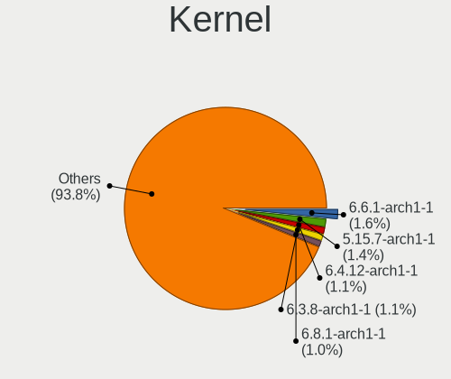

| Version           | Desktops | Percent |
|-------------------|----------|---------|
| 5.15.7-arch1-1    | 26       | 2.58%   |
| 5.15.10-arch1-1   | 19       | 1.89%   |
| 5.13.13-arch1-1   | 18       | 1.79%   |
| 5.16.11-arch1-1   | 17       | 1.69%   |
| 5.8.14-arch1-1    | 14       | 1.39%   |
| 6.3.2-arch1-1     | 13       | 1.29%   |
| 6.2.8-arch1-1     | 11       | 1.09%   |
| 6.2.11-arch1-1    | 11       | 1.09%   |
| 5.14.14-arch1-1   | 11       | 1.09%   |
| 5.9.14-arch1-1    | 10       | 0.99%   |
| 6.3.1-arch1-1     | 9        | 0.89%   |
| 6.1.12-arch1-1    | 8        | 0.79%   |
| 6.0.12-arch1-1    | 8        | 0.79%   |
| 5.19.13-arch1-1   | 8        | 0.79%   |
| 5.15.4-arch1-1    | 8        | 0.79%   |
| 5.9.6-arch1-1     | 7        | 0.7%    |
| 5.8.5-arch1-1     | 7        | 0.7%    |
| 5.15.7-zen1-1-zen | 7        | 0.7%    |
| 5.15.2-arch1-1    | 7        | 0.7%    |
| 5.13.12-arch1-1   | 7        | 0.7%    |
| 5.12.12-arch1-1   | 7        | 0.7%    |
| 5.11.16-arch1-1   | 7        | 0.7%    |
| 6.3.4-arch1-1     | 6        | 0.6%    |
| 6.2.12-zen1-1-zen | 6        | 0.6%    |
| 6.0.9-arch1-1     | 6        | 0.6%    |
| 6.0.8-arch1-1     | 6        | 0.6%    |
| 6.0.2-zen1-1-zen  | 6        | 0.6%    |
| 6.0.2-arch1-1     | 6        | 0.6%    |
| 5.17.9-arch1-1    | 6        | 0.6%    |
| 5.16.2-arch1-1    | 6        | 0.6%    |
| 5.14.16-arch1-1   | 6        | 0.6%    |
| 5.14.12-arch1-1   | 6        | 0.6%    |
| 5.12.15-arch1-1   | 6        | 0.6%    |
| 5.11.6-arch1-1    | 6        | 0.6%    |
| 5.10.84-1-lts     | 6        | 0.6%    |
| 5.10.3-arch1-1    | 6        | 0.6%    |
| 6.3.5-arch1-1     | 5        | 0.5%    |
| 6.3.1-arch2-1     | 5        | 0.5%    |
| 6.1.12-zen1-1-zen | 5        | 0.5%    |
| 5.18.3-arch1-1    | 5        | 0.5%    |

Kernel Family
-------------

Linux kernel without a distro release

| Version | Desktops | Percent |
|---------|----------|---------|
| 5.15.7  | 33       | 3.28%   |
| 5.15.10 | 21       | 2.09%   |
| 5.16.11 | 19       | 1.89%   |
| 6.3.2   | 18       | 1.79%   |
| 5.13.13 | 18       | 1.79%   |
| 6.3.1   | 15       | 1.49%   |
| 6.1.12  | 14       | 1.39%   |
| 6.0.2   | 14       | 1.39%   |
| 5.8.14  | 14       | 1.39%   |
| 6.2.11  | 13       | 1.29%   |
| 6.2.8   | 12       | 1.19%   |
| 5.15.4  | 12       | 1.19%   |
| 5.14.14 | 11       | 1.09%   |
| 6.3.5   | 10       | 0.99%   |
| 6.2.12  | 10       | 0.99%   |
| 6.0.12  | 10       | 0.99%   |
| 5.9.14  | 10       | 0.99%   |
| 5.17.5  | 10       | 0.99%   |
| 6.3.4   | 9        | 0.89%   |
| 6.0.8   | 9        | 0.89%   |
| 5.9.6   | 9        | 0.89%   |
| 5.17.1  | 9        | 0.89%   |
| 5.13.12 | 9        | 0.89%   |
| 6.0.9   | 8        | 0.79%   |
| 5.8.5   | 8        | 0.79%   |
| 5.19.13 | 8        | 0.79%   |
| 5.16.2  | 8        | 0.79%   |
| 5.15.2  | 8        | 0.79%   |
| 5.14.16 | 8        | 0.79%   |
| 5.12.15 | 8        | 0.79%   |
| 5.11.16 | 8        | 0.79%   |
| 6.3.3   | 7        | 0.7%    |
| 6.2.10  | 7        | 0.7%    |
| 5.17.9  | 7        | 0.7%    |
| 5.15.6  | 7        | 0.7%    |
| 5.15.12 | 7        | 0.7%    |
| 5.14.12 | 7        | 0.7%    |
| 5.12.12 | 7        | 0.7%    |
| 6.2.6   | 6        | 0.6%    |
| 6.1.3   | 6        | 0.6%    |

Kernel Major Ver.
-----------------

Linux kernel major version

| Version | Desktops | Percent |
|---------|----------|---------|
| 5.15    | 146      | 15.16%  |
| 5.10    | 83       | 8.62%   |
| 6.1     | 69       | 7.17%   |
| 6.2     | 68       | 7.06%   |
| 6.3     | 61       | 6.33%   |
| 5.16    | 61       | 6.33%   |
| 6.0     | 60       | 6.23%   |
| 5.14    | 57       | 5.92%   |
| 5.9     | 49       | 5.09%   |
| 5.12    | 44       | 4.57%   |
| 5.13    | 43       | 4.47%   |
| 5.18    | 41       | 4.26%   |
| 5.11    | 40       | 4.15%   |
| 5.17    | 38       | 3.95%   |
| 5.19    | 34       | 3.53%   |
| 5.8     | 28       | 2.91%   |
| 5.4     | 22       | 2.28%   |
| 5.6     | 5        | 0.52%   |
| 5.3     | 3        | 0.31%   |
| 5.7     | 2        | 0.21%   |
| 5.5     | 2        | 0.21%   |
| 5.15.96 | 2        | 0.21%   |
| 4.19    | 2        | 0.21%   |
| 6.2.0   | 1        | 0.1%    |
| 5.0     | 1        | 0.1%    |
| 4.17    | 1        | 0.1%    |

Arch
----

OS architecture (x86_64, i586, etc.)

| Name   | Desktops | Percent |
|--------|----------|---------|
| x86_64 | 783      | 100%    |

DE
--

Desktop Environment

| Name           | Desktops | Percent |
|----------------|----------|---------|
| XFCE           | 284      | 33.61%  |
| KDE5           | 180      | 21.3%   |
| i3             | 52       | 6.15%   |
| awesome        | 49       | 5.8%    |
| GNOME          | 44       | 5.21%   |
| X-Cinnamon     | 31       | 3.67%   |
| qtile          | 29       | 3.43%   |
| bspwm          | 23       | 2.72%   |
| xmonad         | 20       | 2.37%   |
| Hyprland       | 18       | 2.13%   |
| Cinnamon       | 17       | 2.01%   |
| LeftWM         | 15       | 1.78%   |
| DWM            | 13       | 1.54%   |
| Unknown        | 13       | 1.54%   |
| KDE            | 10       | 1.18%   |
| LXQt           | 9        | 1.07%   |
| chadwm         | 8        | 0.95%   |
| Deepin         | 7        | 0.83%   |
| MATE           | 4        | 0.47%   |
| herbstluftwm   | 4        | 0.47%   |
| Budgie         | 4        | 0.47%   |
| i3-with-shmlog | 3        | 0.36%   |
| Cutefish       | 3        | 0.36%   |
| openbox        | 2        | 0.24%   |
| Unity          | 1        | 0.12%   |
| ICEWM          | 1        | 0.12%   |
| dusk           | 1        | 0.12%   |

Display Server
--------------

X11 or Wayland

| Name    | Desktops | Percent |
|---------|----------|---------|
| X11     | 691      | 87.03%  |
| Tty     | 61       | 7.68%   |
| Wayland | 35       | 4.41%   |
| Unknown | 7        | 0.88%   |

Display Manager
---------------

SDDM, LightDM, etc.

| Name    | Desktops | Percent |
|---------|----------|---------|
| SDDM    | 495      | 59.35%  |
| TDM     | 133      | 15.95%  |
| LightDM | 133      | 15.95%  |
| Unknown | 60       | 7.19%   |
| GDM     | 10       | 1.2%    |
| Ly      | 3        | 0.36%   |

OS Lang
-------

Language

| Lang    | Desktops | Percent |
|---------|----------|---------|
| en_US   | 436      | 54.77%  |
| en_GB   | 80       | 10.05%  |
| de_DE   | 33       | 4.15%   |
| en_CA   | 27       | 3.39%   |
| en_AU   | 18       | 2.26%   |
| fr_FR   | 17       | 2.14%   |
| es_ES   | 17       | 2.14%   |
| ru_RU   | 16       | 2.01%   |
| C       | 15       | 1.88%   |
| en_IN   | 14       | 1.76%   |
| it_IT   | 9        | 1.13%   |
| pt_BR   | 8        | 1.01%   |
| en_ZA   | 8        | 1.01%   |
| sv_SE   | 7        | 0.88%   |
| pl_PL   | 6        | 0.75%   |
| nl_NL   | 6        | 0.75%   |
| es_AR   | 6        | 0.75%   |
| Unknown | 6        | 0.75%   |
| tr_TR   | 5        | 0.63%   |
| pt_PT   | 5        | 0.63%   |
| hu_HU   | 5        | 0.63%   |
| fi_FI   | 4        | 0.5%    |
| es_MX   | 4        | 0.5%    |
| fr_CA   | 3        | 0.38%   |
| en_IL   | 3        | 0.38%   |
| en_DK   | 3        | 0.38%   |
| zh_CN   | 2        | 0.25%   |
| nl_BE   | 2        | 0.25%   |
| es_CO   | 2        | 0.25%   |
| es_BO   | 2        | 0.25%   |
| en_SG   | 2        | 0.25%   |
| en_IE   | 2        | 0.25%   |
| en_AG   | 2        | 0.25%   |
| de_CH   | 2        | 0.25%   |
| de_AT   | 2        | 0.25%   |
| da_DK   | 2        | 0.25%   |
| uk_UA   | 1        | 0.13%   |
| sl_SI   | 1        | 0.13%   |
| ru_UA   | 1        | 0.13%   |
| nb_NO   | 1        | 0.13%   |

Boot Mode
---------

EFI or BIOS

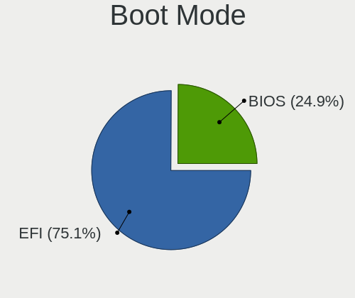

| Mode | Desktops | Percent |
|------|----------|---------|
| EFI  | 575      | 72.69%  |
| BIOS | 216      | 27.31%  |

Filesystem
----------

Type of filesystem

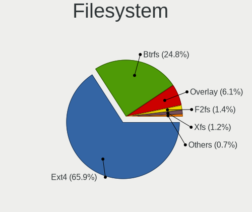

| Type     | Desktops | Percent |
|----------|----------|---------|
| Ext4     | 570      | 70.28%  |
| Btrfs    | 173      | 21.33%  |
| Overlay  | 44       | 5.43%   |
| Xfs      | 10       | 1.23%   |
| F2fs     | 7        | 0.86%   |
| Unknown  | 6        | 0.74%   |
| Reiserfs | 1        | 0.12%   |

Part. scheme
------------

Scheme of partitioning

| Type    | Desktops | Percent |
|---------|----------|---------|
| GPT     | 640      | 80.6%   |
| MBR     | 98       | 12.34%  |
| Unknown | 56       | 7.05%   |

Dual Boot with Linux/BSD
------------------------

Hosting more than one Linux/BSD

| Dual boot | Desktops | Percent |
|-----------|----------|---------|
| No        | 545      | 66.79%  |
| Yes       | 271      | 33.21%  |

Dual Boot (Win)
---------------

Hosting Linux and Windows

| Dual boot | Desktops | Percent |
|-----------|----------|---------|
| Yes       | 404      | 50.69%  |
| No        | 393      | 49.31%  |

Board
-----

Vendor
------

Motherboard manufacturer

| Name                | Desktops | Percent |
|---------------------|----------|---------|
| ASUSTek Computer    | 248      | 31.67%  |
| Gigabyte Technology | 143      | 18.26%  |
| MSI                 | 117      | 14.94%  |
| ASRock              | 71       | 9.07%   |
| Dell                | 50       | 6.39%   |
| Hewlett-Packard     | 49       | 6.26%   |
| Lenovo              | 20       | 2.55%   |
| Supermicro          | 14       | 1.79%   |
| Unknown             | 12       | 1.53%   |
| Intel               | 8        | 1.02%   |
| Acer                | 7        | 0.89%   |
| Pegatron            | 3        | 0.38%   |
| Medion              | 3        | 0.38%   |
| Foxconn             | 3        | 0.38%   |
| Biostar             | 3        | 0.38%   |
| BESSTAR Tech        | 3        | 0.38%   |
| Alienware           | 3        | 0.38%   |
| SYWZ                | 2        | 0.26%   |
| Packard Bell        | 2        | 0.26%   |
| Huanan              | 2        | 0.26%   |
| Fujitsu             | 2        | 0.26%   |
| Apple               | 2        | 0.26%   |
| Win element         | 1        | 0.13%   |
| VS Company          | 1        | 0.13%   |
| System76            | 1        | 0.13%   |
| Shuttle             | 1        | 0.13%   |
| Seeed Studio        | 1        | 0.13%   |
| Proline             | 1        | 0.13%   |
| Positivo            | 1        | 0.13%   |
| PLEXHD              | 1        | 0.13%   |
| Maibenben           | 1        | 0.13%   |
| MACHINIST           | 1        | 0.13%   |
| Kllisre             | 1        | 0.13%   |
| Google              | 1        | 0.13%   |
| EVGA                | 1        | 0.13%   |
| ECS                 | 1        | 0.13%   |
| Casper              | 1        | 0.13%   |
| AZW                 | 1        | 0.13%   |

Model
-----

Motherboard model

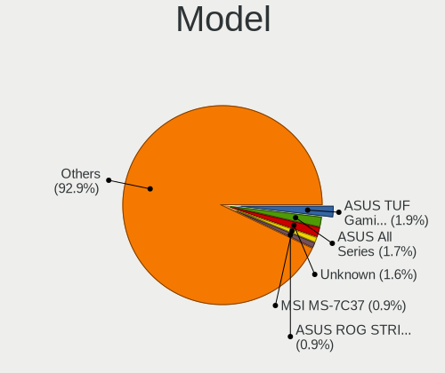

| Name                         | Desktops | Percent |
|------------------------------|----------|---------|
| ASUS TUF Gaming X570-PLUS    | 16       | 2.04%   |
| ASUS All Series              | 16       | 2.04%   |
| Unknown                      | 13       | 1.66%   |
| ASUS ROG STRIX B550-F GAMING | 12       | 1.53%   |
| Supermicro SYS-5019A-FTN4    | 10       | 1.28%   |
| ASUS PRIME X570-P            | 10       | 1.28%   |
| MSI MS-7C37                  | 9        | 1.15%   |
| MSI MS-7C91                  | 8        | 1.02%   |
| ASUS PRIME X470-PRO          | 8        | 1.02%   |
| MSI MS-7B89                  | 7        | 0.89%   |
| MSI MS-7B79                  | 6        | 0.77%   |
| MSI MS-7C95                  | 5        | 0.64%   |
| MSI MS-7A38                  | 5        | 0.64%   |
| MSI MS-7971                  | 5        | 0.64%   |
| Gigabyte X570 AORUS PRO WIFI | 5        | 0.64%   |
| Gigabyte X570 AORUS MASTER   | 5        | 0.64%   |
| Gigabyte B450 AORUS ELITE    | 5        | 0.64%   |
| ASUS ROG CROSSHAIR VIII HERO | 5        | 0.64%   |
| ASUS PRIME B450M-A           | 5        | 0.64%   |
| ASUS PRIME A320M-K           | 5        | 0.64%   |
| ASRock B450M Pro4            | 5        | 0.64%   |
| HP ProDesk 600 G1 SFF        | 4        | 0.51%   |
| Dell OptiPlex 9020           | 4        | 0.51%   |
| Dell OptiPlex 9010           | 4        | 0.51%   |
| Dell OptiPlex 7010           | 4        | 0.51%   |
| ASUS Z170 PRO GAMING         | 4        | 0.51%   |
| ASUS STRIX Z270H GAMING      | 4        | 0.51%   |
| MSI MS-7C35                  | 3        | 0.38%   |
| MSI MS-7C02                  | 3        | 0.38%   |
| MSI MS-7B98                  | 3        | 0.38%   |
| MSI MS-7B86                  | 3        | 0.38%   |
| MSI MS-7B85                  | 3        | 0.38%   |
| MSI MS-7817                  | 3        | 0.38%   |
| HP EliteDesk 800 G1 SFF      | 3        | 0.38%   |
| HP Compaq Elite 8300 SFF     | 3        | 0.38%   |
| Gigabyte X570 GAMING X       | 3        | 0.38%   |
| Gigabyte X570 AORUS ELITE    | 3        | 0.38%   |
| Gigabyte B85M-D3H            | 3        | 0.38%   |
| Gigabyte B450M DS3H V2       | 3        | 0.38%   |
| Gigabyte B450 AORUS M        | 3        | 0.38%   |

Model Family
------------

Motherboard model prefix

| Name                      | Desktops | Percent |
|---------------------------|----------|---------|
| ASUS PRIME                | 69       | 8.81%   |
| ASUS ROG                  | 54       | 6.9%    |
| ASUS TUF                  | 35       | 4.47%   |
| Dell OptiPlex             | 28       | 3.58%   |
| Gigabyte X570             | 19       | 2.43%   |
| ASUS All                  | 16       | 2.04%   |
| Unknown                   | 13       | 1.66%   |
| Lenovo ThinkCentre        | 12       | 1.53%   |
| Gigabyte B450             | 11       | 1.4%    |
| Supermicro SYS-5019A-FTN4 | 10       | 1.28%   |
| MSI MS-7C37               | 9        | 1.15%   |
| HP EliteDesk              | 9        | 1.15%   |
| Gigabyte B450M            | 9        | 1.15%   |
| MSI MS-7C91               | 8        | 1.02%   |
| ASUS P8Z77-V              | 8        | 1.02%   |
| ASRock B450M              | 8        | 1.02%   |
| MSI MS-7B89               | 7        | 0.89%   |
| HP Compaq                 | 7        | 0.89%   |
| Dell Inspiron             | 7        | 0.89%   |
| MSI MS-7B79               | 6        | 0.77%   |
| HP ProDesk                | 6        | 0.77%   |
| ASUS STRIX                | 6        | 0.77%   |
| MSI MS-7C95               | 5        | 0.64%   |
| MSI MS-7A38               | 5        | 0.64%   |
| MSI MS-7971               | 5        | 0.64%   |
| HP Pavilion               | 5        | 0.64%   |
| Gigabyte B550             | 5        | 0.64%   |
| Dell Vostro               | 5        | 0.64%   |
| ASUS P8H61-M              | 5        | 0.64%   |
| Gigabyte Z390             | 4        | 0.51%   |
| Dell XPS                  | 4        | 0.51%   |
| ASUS Z170                 | 4        | 0.51%   |
| ASUS M5A78L-M             | 4        | 0.51%   |
| ASRock B450               | 4        | 0.51%   |
| Acer Aspire               | 4        | 0.51%   |
| MSI MS-7C35               | 3        | 0.38%   |
| MSI MS-7C02               | 3        | 0.38%   |
| MSI MS-7B98               | 3        | 0.38%   |
| MSI MS-7B86               | 3        | 0.38%   |
| MSI MS-7B85               | 3        | 0.38%   |

MFG Year
--------

Motherboard manufacture year

| Year    | Desktops | Percent |
|---------|----------|---------|
| 2019    | 135      | 17.24%  |
| 2018    | 123      | 15.71%  |
| 2020    | 103      | 13.15%  |
| 2017    | 56       | 7.15%   |
| 2021    | 52       | 6.64%   |
| 2013    | 52       | 6.64%   |
| 2012    | 48       | 6.13%   |
| 2015    | 42       | 5.36%   |
| 2014    | 36       | 4.6%    |
| 2016    | 35       | 4.47%   |
| 2011    | 33       | 4.21%   |
| 2022    | 17       | 2.17%   |
| 2010    | 17       | 2.17%   |
| 2009    | 12       | 1.53%   |
| 2008    | 8        | 1.02%   |
| 2007    | 6        | 0.77%   |
| 2006    | 4        | 0.51%   |
| 2023    | 2        | 0.26%   |
| 2005    | 1        | 0.13%   |
| Unknown | 1        | 0.13%   |

Form Factor
-----------

Physical design of the computer

| Name    | Desktops | Percent |
|---------|----------|---------|
| Desktop | 783      | 100%    |

Secure Boot
-----------

Enabled or disabled

| State    | Desktops | Percent |
|----------|----------|---------|
| Disabled | 783      | 100%    |

Coreboot
--------

Have coreboot on board

| Used | Desktops | Percent |
|------|----------|---------|
| No   | 782      | 99.87%  |
| Yes  | 1        | 0.13%   |

RAM Size
--------

Total RAM memory

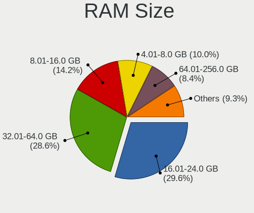

| Size in GB      | Desktops | Percent |
|-----------------|----------|---------|
| 16.01-24.0      | 244      | 30.5%   |
| 32.01-64.0      | 222      | 27.75%  |
| 8.01-16.0       | 126      | 15.75%  |
| 4.01-8.0        | 82       | 10.25%  |
| 64.01-256.0     | 54       | 6.75%   |
| 3.01-4.0        | 34       | 4.25%   |
| 24.01-32.0      | 32       | 4%      |
| 1.01-2.0        | 3        | 0.38%   |
| More than 256.0 | 1        | 0.13%   |
| 2.01-3.0        | 1        | 0.13%   |
| Unknown         | 1        | 0.13%   |

RAM Used
--------

Used RAM memory

| Used GB    | Desktops | Percent |
|------------|----------|---------|
| 2.01-3.0   | 225      | 24.78%  |
| 1.01-2.0   | 219      | 24.12%  |
| 4.01-8.0   | 178      | 19.6%   |
| 3.01-4.0   | 132      | 14.54%  |
| 0.51-1.0   | 76       | 8.37%   |
| 8.01-16.0  | 56       | 6.17%   |
| 0.01-0.5   | 14       | 1.54%   |
| 16.01-24.0 | 7        | 0.77%   |
| Unknown    | 1        | 0.11%   |

Total Drives
------------

Number of drives on board

| Drives | Desktops | Percent |
|--------|----------|---------|
| 2      | 241      | 29.21%  |
| 3      | 187      | 22.67%  |
| 1      | 167      | 20.24%  |
| 4      | 121      | 14.67%  |
| 5      | 60       | 7.27%   |
| 6      | 22       | 2.67%   |
| 7      | 13       | 1.58%   |
| 9      | 5        | 0.61%   |
| 8      | 3        | 0.36%   |
| 0      | 3        | 0.36%   |
| 21     | 1        | 0.12%   |
| 11     | 1        | 0.12%   |
| 10     | 1        | 0.12%   |

Has CD-ROM
----------

Has CD-ROM on board

| Presented | Desktops | Percent |
|-----------|----------|---------|
| No        | 557      | 70.51%  |
| Yes       | 233      | 29.49%  |

Has Ethernet
------------

Has Ethernet on board

| Presented | Desktops | Percent |
|-----------|----------|---------|
| Yes       | 779      | 99.49%  |
| No        | 4        | 0.51%   |

Has WiFi
--------

Has WiFi module

| Presented | Desktops | Percent |
|-----------|----------|---------|
| No        | 421      | 53.56%  |
| Yes       | 365      | 46.44%  |

Has Bluetooth
-------------

Has Bluetooth module

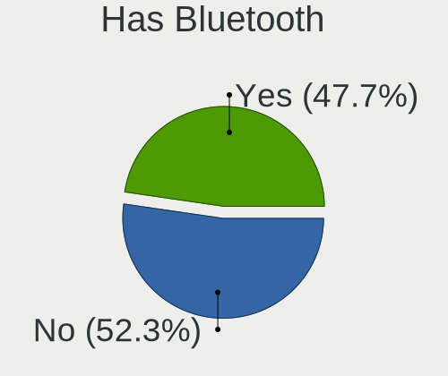

| Presented | Desktops | Percent |
|-----------|----------|---------|
| No        | 442      | 55.25%  |
| Yes       | 358      | 44.75%  |

Location
--------

Country
-------

Geographic location (country)

| Country      | Desktops | Percent |
|--------------|----------|---------|
| USA          | 197      | 25.06%  |
| UK           | 55       | 7%      |
| Germany      | 54       | 6.87%   |
| Canada       | 39       | 4.96%   |
| Brazil       | 23       | 2.93%   |
| Spain        | 22       | 2.8%    |
| France       | 22       | 2.8%    |
| Russia       | 20       | 2.54%   |
| India        | 20       | 2.54%   |
| Australia    | 19       | 2.42%   |
| Netherlands  | 18       | 2.29%   |
| Belgium      | 18       | 2.29%   |
| Sweden       | 16       | 2.04%   |
| Mexico       | 13       | 1.65%   |
| Poland       | 12       | 1.53%   |
| Italy        | 11       | 1.4%    |
| Austria      | 11       | 1.4%    |
| Argentina    | 11       | 1.4%    |
| Portugal     | 10       | 1.27%   |
| Romania      | 9        | 1.15%   |
| Bulgaria     | 9        | 1.15%   |
| Turkey       | 8        | 1.02%   |
| South Africa | 8        | 1.02%   |
| Norway       | 8        | 1.02%   |
| Hungary      | 8        | 1.02%   |
| Finland      | 8        | 1.02%   |
| Switzerland  | 7        | 0.89%   |
| Greece       | 7        | 0.89%   |
| Ukraine      | 6        | 0.76%   |
| Ireland      | 6        | 0.76%   |
| Denmark      | 6        | 0.76%   |
| Colombia     | 6        | 0.76%   |
| Czechia      | 5        | 0.64%   |
| Serbia       | 4        | 0.51%   |
| Malaysia     | 4        | 0.51%   |
| Japan        | 4        | 0.51%   |
| Israel       | 4        | 0.51%   |
| Indonesia    | 4        | 0.51%   |
| Vietnam      | 3        | 0.38%   |
| Slovenia     | 3        | 0.38%   |

City
----

Geographic location (city)

| City                 | Desktops | Percent |
|----------------------|----------|---------|
| Durham               | 14       | 1.67%   |
| Sydney               | 12       | 1.43%   |
| Vienna               | 8        | 0.95%   |
| Berlin               | 8        | 0.95%   |
| Lier                 | 7        | 0.84%   |
| Warsaw               | 6        | 0.72%   |
| Madrid               | 6        | 0.72%   |
| London               | 6        | 0.72%   |
| Wilrijk              | 5        | 0.6%    |
| Toronto              | 5        | 0.6%    |
| Sofia                | 5        | 0.6%    |
| Sao Paulo            | 5        | 0.6%    |
| Portland             | 5        | 0.6%    |
| New York             | 5        | 0.6%    |
| Moscow               | 5        | 0.6%    |
| Istanbul             | 5        | 0.6%    |
| Houston              | 5        | 0.6%    |
| Bucharest            | 5        | 0.6%    |
| Atlanta              | 5        | 0.6%    |
| Shetland Islands     | 4        | 0.48%   |
| Montreal             | 4        | 0.48%   |
| Helsinki             | 4        | 0.48%   |
| Duffel               | 4        | 0.48%   |
| Dublin               | 4        | 0.48%   |
| Chicago              | 4        | 0.48%   |
| Amsterdam            | 4        | 0.48%   |
| Tel Aviv             | 3        | 0.36%   |
| Paris                | 3        | 0.36%   |
| New Delhi            | 3        | 0.36%   |
| Nairobi              | 3        | 0.36%   |
| Milton Keynes        | 3        | 0.36%   |
| Miami                | 3        | 0.36%   |
| Louisville           | 3        | 0.36%   |
| Las Vegas            | 3        | 0.36%   |
| Kuwait City          | 3        | 0.36%   |
| Kirchheim unter Teck | 3        | 0.36%   |
| Johannesburg         | 3        | 0.36%   |
| Haarlem              | 3        | 0.36%   |
| Edmonton             | 3        | 0.36%   |
| Dallas               | 3        | 0.36%   |

Drives
------

Drive Vendor
------------

Hard drive vendors

| Vendor                      | Desktops | Drives | Percent |
|-----------------------------|----------|--------|---------|
| Samsung Electronics         | 325      | 659    | 18.64%  |
| WDC                         | 311      | 566    | 17.83%  |
| Seagate                     | 269      | 441    | 15.42%  |
| Kingston                    | 100      | 141    | 5.73%   |
| Toshiba                     | 88       | 123    | 5.05%   |
| SanDisk                     | 87       | 109    | 4.99%   |
| Crucial                     | 84       | 130    | 4.82%   |
| Hitachi                     | 44       | 54     | 2.52%   |
| A-DATA Technology           | 37       | 48     | 2.12%   |
| Intel                       | 26       | 46     | 1.49%   |
| Phison Electronics          | 24       | 29     | 1.38%   |
| Phison                      | 20       | 34     | 1.15%   |
| Unknown                     | 17       | 25     | 0.97%   |
| Silicon Motion              | 16       | 18     | 0.92%   |
| Micron/Crucial Technology   | 16       | 21     | 0.92%   |
| SPCC                        | 15       | 20     | 0.86%   |
| PNY                         | 15       | 25     | 0.86%   |
| Corsair                     | 14       | 30     | 0.8%    |
| SK hynix                    | 13       | 27     | 0.75%   |
| China                       | 12       | 27     | 0.69%   |
| JMicron Technology          | 11       | 13     | 0.63%   |
| Gigabyte Technology         | 11       | 13     | 0.63%   |
| Patriot                     | 10       | 16     | 0.57%   |
| HGST                        | 10       | 14     | 0.57%   |
| XPG                         | 9        | 12     | 0.52%   |
| Transcend                   | 7        | 11     | 0.4%    |
| Realtek Semiconductor       | 7        | 8      | 0.4%    |
| OCZ                         | 7        | 8      | 0.4%    |
| Hewlett-Packard             | 7        | 7      | 0.4%    |
| ADATA Technology            | 7        | 7      | 0.4%    |
| Kingston Technology Company | 6        | 6      | 0.34%   |
| ASMT                        | 6        | 7      | 0.34%   |
| TO Exter                    | 4        | 4      | 0.23%   |
| Plextor                     | 4        | 4      | 0.23%   |
| Maxtor                      | 4        | 6      | 0.23%   |
| LITEON                      | 4        | 4      | 0.23%   |
| External                    | 4        | 8      | 0.23%   |
| SSK                         | 3        | 3      | 0.17%   |
| SABRENT                     | 3        | 3      | 0.17%   |
| Mushkin                     | 3        | 6      | 0.17%   |

Drive Model
-----------

Hard drive models

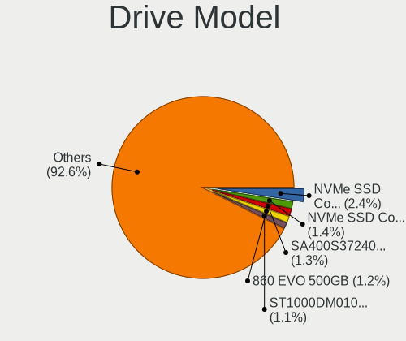

| Model                                               | Desktops | Percent |
|-----------------------------------------------------|----------|---------|
| Samsung NVMe SSD Controller SM981/PM981/PM983 256GB | 40       | 1.88%   |
| Samsung SSD 860 EVO 500GB                           | 35       | 1.64%   |
| Seagate ST1000DM010-2EP102 1TB                      | 26       | 1.22%   |
| Kingston SA400S37240G 240GB SSD                     | 25       | 1.17%   |
| WDC WD10EZEX-08WN4A0 1TB                            | 24       | 1.13%   |
| Seagate ST2000DM008-2FR102 2TB                      | 23       | 1.08%   |
| Samsung SSD 850 EVO 250GB                           | 23       | 1.08%   |
| Samsung SSD 850 EVO 500GB                           | 22       | 1.03%   |
| Samsung NVMe SSD Controller PM9A1/PM9A3/980PRO 1TB  | 22       | 1.03%   |
| Samsung SSD 970 EVO Plus 500GB                      | 20       | 0.94%   |
| Samsung SSD 860 EVO 1TB                             | 20       | 0.94%   |
| Crucial CT1000MX500SSD1 1TB                         | 19       | 0.89%   |
| Samsung SSD 860 EVO 250GB                           | 18       | 0.84%   |
| Seagate ST2000DM001-1ER164 2TB                      | 16       | 0.75%   |
| Samsung SSD 970 EVO Plus 1TB                        | 15       | 0.7%    |
| Kingston SA400S37120G 120GB SSD                     | 14       | 0.66%   |
| Seagate ST1000DM003-1ER162 1TB                      | 13       | 0.61%   |
| Samsung SSD 870 EVO 1TB                             | 13       | 0.61%   |
| Toshiba HDWD110 1TB                                 | 12       | 0.56%   |
| Toshiba DT01ACA100 1TB                              | 12       | 0.56%   |
| Samsung SSD 970 EVO 1TB                             | 12       | 0.56%   |
| Unknown SD/MMC/MS PRO 64GB                          | 11       | 0.52%   |
| Seagate ST4000DM004-2CV104 4TB                      | 11       | 0.52%   |
| Samsung SSD 840 EVO 250GB                           | 11       | 0.52%   |
| Samsung NVMe SSD Controller SM961/PM961/SM963 256GB | 11       | 0.52%   |
| Crucial CT500MX500SSD1 500GB                        | 11       | 0.52%   |
| Crucial CT240BX500SSD1 240GB                        | 11       | 0.52%   |
| WDC WDS240G2G0A-00JH30 240GB SSD                    | 10       | 0.47%   |
| Toshiba KXG60ZNV1T02 1TB                            | 10       | 0.47%   |
| Seagate ST1000DM003-1CH162 1TB                      | 10       | 0.47%   |
| Micron/Crucial P2 NVMe PCIe SSD 1TB                 | 10       | 0.47%   |
| Crucial CT1000P1SSD8 1TB                            | 10       | 0.47%   |
| WDC WD10EZEX-00BN5A0 1TB                            | 9        | 0.42%   |
| Seagate Expansion 1TB                               | 9        | 0.42%   |
| Phison E16 PCIe4 NVMe Controller 1TB                | 9        | 0.42%   |
| WDC WDS500G2B0A-00SM50 500GB SSD                    | 8        | 0.38%   |
| Toshiba DT01ACA200 2TB                              | 8        | 0.38%   |
| Seagate ST31000528AS 1TB                            | 8        | 0.38%   |
| Seagate ST2000DM001-1CH164 2TB                      | 8        | 0.38%   |
| Samsung SSD 870 QVO 1TB                             | 8        | 0.38%   |

HDD Vendor
----------

Hard disk drive vendors

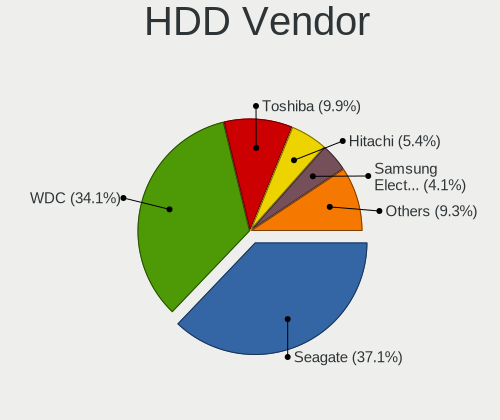

| Vendor              | Desktops | Drives | Percent |
|---------------------|----------|--------|---------|
| Seagate             | 260      | 421    | 36.93%  |
| WDC                 | 250      | 441    | 35.51%  |
| Toshiba             | 66       | 94     | 9.38%   |
| Hitachi             | 44       | 54     | 6.25%   |
| Samsung Electronics | 33       | 41     | 4.69%   |
| Unknown             | 13       | 20     | 1.85%   |
| HGST                | 9        | 12     | 1.28%   |
| Maxtor              | 4        | 6      | 0.57%   |
| External            | 4        | 8      | 0.57%   |
| SSK                 | 3        | 3      | 0.43%   |
| Hewlett-Packard     | 3        | 3      | 0.43%   |
| ASMT                | 2        | 3      | 0.28%   |
| ASMedia             | 2        | 3      | 0.28%   |
| WD MediaMax         | 1        | 1      | 0.14%   |
| USB3.0              | 1        | 1      | 0.14%   |
| RSH-319             | 1        | 1      | 0.14%   |
| JMicron Technology  | 1        | 3      | 0.14%   |
| Inateck             | 1        | 1      | 0.14%   |
| HGST HUS            | 1        | 1      | 0.14%   |
| HGST HTS            | 1        | 1      | 0.14%   |
| H/W                 | 1        | 3      | 0.14%   |
| Fujitsu             | 1        | 1      | 0.14%   |
| ExcelStor           | 1        | 2      | 0.14%   |
| Unknown             | 1        | 1      | 0.14%   |

SSD Vendor
----------

Solid state drive vendors

| Vendor              | Desktops | Drives | Percent |
|---------------------|----------|--------|---------|
| Samsung Electronics | 198      | 354    | 29.46%  |
| Kingston            | 81       | 107    | 12.05%  |
| Crucial             | 72       | 109    | 10.71%  |
| WDC                 | 59       | 83     | 8.78%   |
| SanDisk             | 52       | 62     | 7.74%   |
| A-DATA Technology   | 26       | 35     | 3.87%   |
| PNY                 | 15       | 23     | 2.23%   |
| China               | 12       | 27     | 1.79%   |
| SPCC                | 11       | 14     | 1.64%   |
| Patriot             | 10       | 16     | 1.49%   |
| Toshiba             | 9        | 14     | 1.34%   |
| SK hynix            | 9        | 21     | 1.34%   |
| JMicron Technology  | 8        | 8      | 1.19%   |
| Intel               | 8        | 10     | 1.19%   |
| OCZ                 | 7        | 8      | 1.04%   |
| Gigabyte Technology | 7        | 7      | 1.04%   |
| Transcend           | 6        | 10     | 0.89%   |
| Corsair             | 6        | 14     | 0.89%   |
| TO Exter            | 4        | 4      | 0.6%    |
| ASMT                | 4        | 4      | 0.6%    |
| Mushkin             | 3        | 6      | 0.45%   |
| LITEONIT            | 3        | 3      | 0.45%   |
| LITEON              | 3        | 3      | 0.45%   |
| Leven               | 3        | 3      | 0.45%   |
| Intenso             | 3        | 5      | 0.45%   |
| Hewlett-Packard     | 3        | 3      | 0.45%   |
| GOODRAM             | 3        | 3      | 0.45%   |
| Vaseky              | 2        | 4      | 0.3%    |
| Unknown             | 2        | 2      | 0.3%    |
| Team                | 2        | 3      | 0.3%    |
| Seagate             | 2        | 4      | 0.3%    |
| Plextor             | 2        | 2      | 0.3%    |
| Micron Technology   | 2        | 3      | 0.3%    |
| KingSpec            | 2        | 2      | 0.3%    |
| Hoodisk             | 2        | 2      | 0.3%    |
| Drevo               | 2        | 2      | 0.3%    |
| Apple               | 2        | 2      | 0.3%    |
| Apacer              | 2        | 2      | 0.3%    |
| AMD                 | 2        | 3      | 0.3%    |
| Verbatim            | 1        | 1      | 0.15%   |

Drive Kind
----------

HDD or SSD

| Kind    | Desktops | Drives | Percent |
|---------|----------|--------|---------|
| HDD     | 537      | 1125   | 37.34%  |
| SSD     | 508      | 1012   | 35.33%  |
| NVMe    | 375      | 672    | 26.08%  |
| Unknown | 17       | 22     | 1.18%   |
| MMC     | 1        | 1      | 0.07%   |

Drive Connector
---------------

SATA, SAS, NVMe, etc.

| Type | Desktops | Drives | Percent |
|------|----------|--------|---------|
| SATA | 699      | 2003   | 59.69%  |
| NVMe | 375      | 670    | 32.02%  |
| SAS  | 96       | 158    | 8.2%    |
| MMC  | 1        | 1      | 0.09%   |

Drive Size
----------

Size of hard drive

| Size in TB | Desktops | Drives | Percent |
|------------|----------|--------|---------|
| 0.01-0.5   | 507      | 1028   | 42.64%  |
| 0.51-1.0   | 377      | 591    | 31.71%  |
| 1.01-2.0   | 176      | 298    | 14.8%   |
| 3.01-4.0   | 59       | 89     | 4.96%   |
| 4.01-10.0  | 34       | 71     | 2.86%   |
| 2.01-3.0   | 33       | 53     | 2.78%   |
| 10.01-20.0 | 3        | 7      | 0.25%   |

Space Total
-----------

Amount of disk space available on the file system

| Size in GB     | Desktops | Percent |
|----------------|----------|---------|
| More than 3000 | 160      | 18.78%  |
| 501-1000       | 148      | 17.37%  |
| 251-500        | 134      | 15.73%  |
| 101-250        | 133      | 15.61%  |
| 1001-2000      | 125      | 14.67%  |
| 2001-3000      | 67       | 7.86%   |
| 1-20           | 36       | 4.23%   |
| Unknown        | 25       | 2.93%   |
| 51-100         | 17       | 2%      |
| 21-50          | 7        | 0.82%   |

Space Used
----------

Amount of used disk space

| Used GB        | Desktops | Percent |
|----------------|----------|---------|
| 1-20           | 179      | 20.11%  |
| 21-50          | 132      | 14.83%  |
| 101-250        | 116      | 13.03%  |
| 251-500        | 102      | 11.46%  |
| 501-1000       | 94       | 10.56%  |
| 51-100         | 88       | 9.89%   |
| 1001-2000      | 77       | 8.65%   |
| More than 3000 | 42       | 4.72%   |
| 2001-3000      | 35       | 3.93%   |
| Unknown        | 25       | 2.81%   |

Malfunc. Drives
---------------

Drive models with a malfunction

| Model                                 | Desktops | Drives | Percent |
|---------------------------------------|----------|--------|---------|
| Seagate ST31000528AS 1TB              | 5        | 5      | 2.13%   |
| Samsung Electronics SSD 870 EVO 1TB   | 5        | 6      | 2.13%   |
| Seagate ST1000DM003-9YN162 1TB        | 4        | 4      | 1.7%    |
| Seagate ST1000DM003-1CH162 1TB        | 4        | 4      | 1.7%    |
| Seagate ST3500413AS 500GB             | 3        | 3      | 1.28%   |
| Seagate ST3500312CS 500GB             | 3        | 5      | 1.28%   |
| Seagate ST2000DM001-1ER164 2TB        | 3        | 6      | 1.28%   |
| Hitachi HDS721010CLA332 1TB           | 3        | 4      | 1.28%   |
| WDC WDS500G1X0E-00AFY0 500GB          | 2        | 2      | 0.85%   |
| WDC WD5000AAKX-75U6AA0 500GB          | 2        | 2      | 0.85%   |
| WDC WD5000AAKX-603CA0 500GB           | 2        | 6      | 0.85%   |
| WDC WD5000AAKX-00ERMA0 500GB          | 2        | 2      | 0.85%   |
| WDC WD5000AAKX-001CA0 500GB           | 2        | 3      | 0.85%   |
| WDC WD40EFRX-68N32N0 4TB              | 2        | 6      | 0.85%   |
| WDC WD3200AVJS-63B6A0 320GB           | 2        | 5      | 0.85%   |
| WDC WD20EFRX-68EUZN0 2TB              | 2        | 3      | 0.85%   |
| WDC WD20EARX-00PASB0 2TB              | 2        | 2      | 0.85%   |
| WDC WD20EARS-00MVWB0 2TB              | 2        | 4      | 0.85%   |
| WDC WD2002FAEX-007BA0 2TB             | 2        | 2      | 0.85%   |
| WDC WD10JPVX-22JC3T0 1TB              | 2        | 2      | 0.85%   |
| WDC WD10EZEX-00WN4A0 1TB              | 2        | 2      | 0.85%   |
| WDC WD10EARS-00Y5B1 1TB               | 2        | 5      | 0.85%   |
| WDC WD10EADS-11M2B1 1TB               | 2        | 2      | 0.85%   |
| WDC WD1003FZEX-00K3CA0 1TB            | 2        | 3      | 0.85%   |
| Toshiba MQ01ABD100 1TB                | 2        | 3      | 0.85%   |
| Toshiba DT01ACA100 1TB                | 2        | 4      | 0.85%   |
| Seagate ST9320325AS 320GB             | 2        | 3      | 0.85%   |
| Seagate ST8000DM004-2CX188 8TB        | 2        | 2      | 0.85%   |
| Seagate ST500DM002-1BD142 500GB       | 2        | 2      | 0.85%   |
| Seagate ST3500320AS 500GB             | 2        | 2      | 0.85%   |
| Seagate ST3250310AS 250GB             | 2        | 3      | 0.85%   |
| Seagate ST31000524AS 1TB              | 2        | 2      | 0.85%   |
| Seagate ST3000DM001-1ER166 3TB        | 2        | 3      | 0.85%   |
| Seagate ST2000DM008-2FR102 2TB        | 2        | 4      | 0.85%   |
| Seagate ST1000LM024 HN-M101MBB 1TB    | 2        | 2      | 0.85%   |
| Seagate ST1000DM010-2EP102 1TB        | 2        | 2      | 0.85%   |
| Samsung Electronics SSD 850 EVO 250GB | 2        | 3      | 0.85%   |
| Maxtor STM3250310AS 250GB             | 2        | 3      | 0.85%   |
| Kingston SV300S37A120G 120GB SSD      | 2        | 2      | 0.85%   |
| Hitachi HTS547575A9E384 752GB         | 2        | 2      | 0.85%   |

Malfunc. Drive Vendor
---------------------

Vendors of faulty drives

| Vendor                    | Desktops | Drives | Percent |
|---------------------------|----------|--------|---------|
| WDC                       | 69       | 109    | 31.51%  |
| Seagate                   | 59       | 76     | 26.94%  |
| Samsung Electronics       | 24       | 32     | 10.96%  |
| Hitachi                   | 14       | 18     | 6.39%   |
| Toshiba                   | 7        | 11     | 3.2%    |
| Kingston                  | 5        | 7      | 2.28%   |
| Intel                     | 4        | 7      | 1.83%   |
| Transcend                 | 3        | 3      | 1.37%   |
| SanDisk                   | 3        | 3      | 1.37%   |
| Maxtor                    | 3        | 5      | 1.37%   |
| Hewlett-Packard           | 3        | 3      | 1.37%   |
| Crucial                   | 3        | 3      | 1.37%   |
| Corsair                   | 3        | 11     | 1.37%   |
| A-DATA Technology         | 3        | 3      | 1.37%   |
| Drevo                     | 2        | 2      | 0.91%   |
| China                     | 2        | 3      | 0.91%   |
| ASMedia                   | 2        | 3      | 0.91%   |
| XPG                       | 1        | 1      | 0.46%   |
| SPCC                      | 1        | 1      | 0.46%   |
| Realtek Semiconductor     | 1        | 1      | 0.46%   |
| Patriot                   | 1        | 1      | 0.46%   |
| Micron/Crucial Technology | 1        | 2      | 0.46%   |
| JMicron Technology        | 1        | 1      | 0.46%   |
| Inateck                   | 1        | 1      | 0.46%   |
| HGST HTS                  | 1        | 1      | 0.46%   |
| HGST                      | 1        | 1      | 0.46%   |
| Unknown                   | 1        | 1      | 0.46%   |

Malfunc. HDD Vendor
-------------------

Vendors of faulty HDD drives

| Vendor              | Desktops | Drives | Percent |
|---------------------|----------|--------|---------|
| WDC                 | 67       | 104    | 40.36%  |
| Seagate             | 59       | 76     | 35.54%  |
| Hitachi             | 14       | 18     | 8.43%   |
| Samsung Electronics | 8        | 8      | 4.82%   |
| Toshiba             | 7        | 11     | 4.22%   |
| Maxtor              | 3        | 5      | 1.81%   |
| Hewlett-Packard     | 2        | 2      | 1.2%    |
| ASMedia             | 2        | 3      | 1.2%    |
| Inateck             | 1        | 1      | 0.6%    |
| HGST HTS            | 1        | 1      | 0.6%    |
| HGST                | 1        | 1      | 0.6%    |
| Unknown             | 1        | 1      | 0.6%    |

Malfunc. Drive Kind
-------------------

Kinds of faulty drives

| Kind | Desktops | Drives | Percent |
|------|----------|--------|---------|
| HDD  | 147      | 231    | 73.13%  |
| SSD  | 42       | 58     | 20.9%   |
| NVMe | 12       | 21     | 5.97%   |

Failed Drives
-------------

Failed drive models

| Model                                            | Desktops | Drives | Percent |
|--------------------------------------------------|----------|--------|---------|
| WDC WD5000AAKX-001CA0 500GB                      | 1        | 1      | 20%     |
| Seagate ST32000641AS 2TB                         | 1        | 2      | 20%     |
| Samsung Electronics SSD 980 500GB                | 1        | 1      | 20%     |
| Samsung Electronics SSD 980 1TB                  | 1        | 1      | 20%     |
| Samsung Electronics MZ7TY128HDHP-000L1 128GB SSD | 1        | 1      | 20%     |

Failed Drive Vendor
-------------------

Failed drive vendors

| Vendor              | Desktops | Drives | Percent |
|---------------------|----------|--------|---------|
| Samsung Electronics | 3        | 3      | 60%     |
| WDC                 | 1        | 1      | 20%     |
| Seagate             | 1        | 2      | 20%     |

Drive Status
------------

Number of failed and malfunc. drives

| Status   | Desktops | Drives | Percent |
|----------|----------|--------|---------|
| Works    | 676      | 2149   | 65.38%  |
| Malfunc  | 195      | 310    | 18.86%  |
| Detected | 158      | 367    | 15.28%  |
| Failed   | 5        | 6      | 0.48%   |

Storage controller
------------------

Storage Vendor
--------------

Storage controller vendors

| Vendor                       | Desktops | Percent |
|------------------------------|----------|---------|
| Intel                        | 442      | 33.54%  |
| AMD                          | 343      | 26.02%  |
| Samsung Electronics          | 169      | 12.82%  |
| SanDisk                      | 62       | 4.7%    |
| Phison Electronics           | 56       | 4.25%   |
| ASMedia Technology           | 49       | 3.72%   |
| Micron/Crucial Technology    | 30       | 2.28%   |
| Kingston Technology Company  | 29       | 2.2%    |
| Marvell Technology Group     | 26       | 1.97%   |
| ADATA Technology             | 20       | 1.52%   |
| Silicon Motion               | 18       | 1.37%   |
| Realtek Semiconductor        | 14       | 1.06%   |
| Toshiba America Info Systems | 13       | 0.99%   |
| Seagate Technology           | 10       | 0.76%   |
| JMicron Technology           | 7        | 0.53%   |
| Nvidia                       | 6        | 0.46%   |
| SK hynix                     | 5        | 0.38%   |
| Lite-On Technology           | 3        | 0.23%   |
| VIA Technologies             | 2        | 0.15%   |
| MAXIO Technology (Hangzhou)  | 2        | 0.15%   |
| LSI Logic / Symbios Logic    | 2        | 0.15%   |
| KIOXIA                       | 2        | 0.15%   |
| Broadcom / LSI               | 2        | 0.15%   |
| Union Memory (Shenzhen)      | 1        | 0.08%   |
| Silicon Image                | 1        | 0.08%   |
| Shenzhen Longsys Electronics | 1        | 0.08%   |
| Micron Technology            | 1        | 0.08%   |
| Biwin Storage Technology     | 1        | 0.08%   |
| Adaptec                      | 1        | 0.08%   |

Storage Model
-------------

Storage controller models

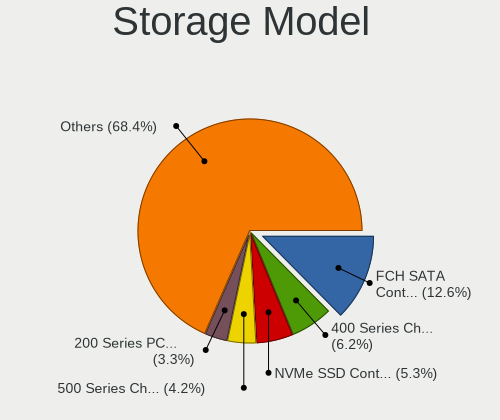

| Model                                                                                   | Desktops | Percent |
|-----------------------------------------------------------------------------------------|----------|---------|
| AMD FCH SATA Controller [AHCI mode]                                                     | 223      | 14.26%  |
| AMD 400 Series Chipset SATA Controller                                                  | 102      | 6.52%   |
| Samsung NVMe SSD Controller SM981/PM981/PM983                                           | 101      | 6.46%   |
| AMD 500 Series Chipset SATA Controller                                                  | 61       | 3.9%    |
| Intel 200 Series PCH SATA controller [AHCI mode]                                        | 59       | 3.77%   |
| Intel Q170/Q150/B150/H170/H110/Z170/CM236 Chipset SATA Controller [AHCI Mode]           | 52       | 3.32%   |
| Intel 8 Series/C220 Series Chipset Family 6-port SATA Controller 1 [AHCI mode]          | 48       | 3.07%   |
| ASMedia ASM1062 Serial ATA Controller                                                   | 47       | 3.01%   |
| Intel Cannon Lake PCH SATA AHCI Controller                                              | 43       | 2.75%   |
| Intel 7 Series/C210 Series Chipset Family 6-port SATA Controller [AHCI mode]            | 38       | 2.43%   |
| Samsung NVMe SSD Controller PM9A1/PM9A3/980PRO                                          | 34       | 2.17%   |
| Phison E12 NVMe Controller                                                              | 30       | 1.92%   |
| Intel SATA Controller [RAID mode]                                                       | 29       | 1.85%   |
| Samsung NVMe SSD Controller SM961/PM961/SM963                                           | 24       | 1.53%   |
| Intel 6 Series/C200 Series Chipset Family 6 port Desktop SATA AHCI Controller           | 23       | 1.47%   |
| AMD SB7x0/SB8x0/SB9x0 IDE Controller                                                    | 22       | 1.41%   |
| Phison E16 PCIe4 NVMe Controller                                                        | 21       | 1.34%   |
| ADATA XPG SX8200 Pro PCIe Gen3x4 M.2 2280 Solid State Drive                             | 20       | 1.28%   |
| SanDisk WD Blue SN550 NVMe SSD                                                          | 17       | 1.09%   |
| AMD SB7x0/SB8x0/SB9x0 SATA Controller [AHCI mode]                                       | 16       | 1.02%   |
| SanDisk WD Black SN750 / PC SN730 NVMe SSD                                              | 14       | 0.9%    |
| Samsung NVMe SSD Controller 980                                                         | 14       | 0.9%    |
| Micron/Crucial P2 NVMe PCIe SSD                                                         | 14       | 0.9%    |
| Kingston Company A2000 NVMe SSD                                                         | 14       | 0.9%    |
| Intel 6 Series/C200 Series Chipset Family Desktop SATA Controller (IDE mode, ports 4-5) | 14       | 0.9%    |
| Intel 6 Series/C200 Series Chipset Family Desktop SATA Controller (IDE mode, ports 0-3) | 14       | 0.9%    |
| Silicon Motion SM2263EN/SM2263XT SSD Controller                                         | 13       | 0.83%   |
| Intel SSD 660P Series                                                                   | 13       | 0.83%   |
| Intel 9 Series Chipset Family SATA Controller [AHCI Mode]                               | 13       | 0.83%   |
| AMD SB7x0/SB8x0/SB9x0 SATA Controller [IDE mode]                                        | 13       | 0.83%   |
| AMD 300 Series Chipset SATA Controller                                                  | 13       | 0.83%   |
| Toshiba America Info Systems XG6 NVMe SSD Controller                                    | 12       | 0.77%   |
| Intel NM10/ICH7 Family SATA Controller [IDE mode]                                       | 11       | 0.7%    |
| SanDisk WD PC SN810 / Black SN850 NVMe SSD                                              | 10       | 0.64%   |
| Intel Atom Processor C3000 Series SATA Controller 1                                     | 10       | 0.64%   |
| Intel Atom Processor C3000 Series SATA Controller 0                                     | 10       | 0.64%   |
| AMD FCH SATA Controller D                                                               | 10       | 0.64%   |
| Micron/Crucial P1 NVMe PCIe SSD                                                         | 9        | 0.58%   |
| Intel C610/X99 series chipset 6-Port SATA Controller [AHCI mode]                        | 9        | 0.58%   |
| Intel Alder Lake-S PCH SATA Controller [AHCI Mode]                                      | 9        | 0.58%   |

Storage Kind
------------

Kind of storage controller (IDE, SATA, NVMe, SAS, ...)

| Kind | Desktops | Percent |
|------|----------|---------|
| SATA | 696      | 57.66%  |
| NVMe | 375      | 31.07%  |
| IDE  | 82       | 6.79%   |
| RAID | 50       | 4.14%   |
| SAS  | 2        | 0.17%   |
| SCSI | 2        | 0.17%   |

Processor
---------

CPU Vendor
----------

Processor vendors

| Vendor  | Desktops | Percent |
|---------|----------|---------|
| Intel   | 433      | 55.3%   |
| AMD     | 349      | 44.57%  |
| Unknown | 1        | 0.13%   |

CPU Model
---------

Processor models

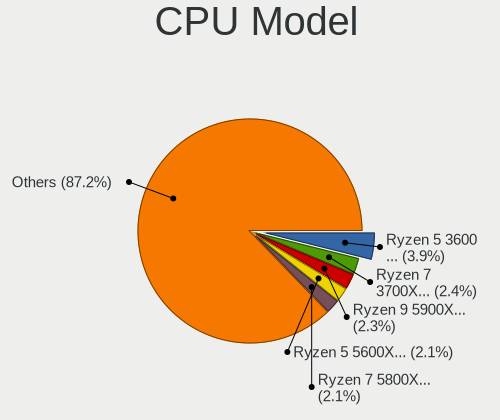

| Model                                       | Desktops | Percent |
|---------------------------------------------|----------|---------|
| AMD Ryzen 5 3600 6-Core Processor           | 33       | 4.19%   |
| AMD Ryzen 7 3700X 8-Core Processor          | 23       | 2.92%   |
| AMD Ryzen 7 5800X 8-Core Processor          | 21       | 2.66%   |
| AMD Ryzen 7 2700X Eight-Core Processor      | 18       | 2.28%   |
| AMD Ryzen 9 5900X 12-Core Processor         | 17       | 2.16%   |
| AMD Ryzen 9 3900X 12-Core Processor         | 17       | 2.16%   |
| AMD Ryzen 5 5600X 6-Core Processor          | 17       | 2.16%   |
| AMD Ryzen 5 2600 Six-Core Processor         | 14       | 1.78%   |
| Intel Core i7-3770 CPU @ 3.40GHz            | 13       | 1.65%   |
| AMD Ryzen 9 5950X 16-Core Processor         | 13       | 1.65%   |
| Intel Core i7-7700K CPU @ 4.20GHz           | 12       | 1.52%   |
| Intel Core i7-4790 CPU @ 3.60GHz            | 12       | 1.52%   |
| Intel Core i5-6500 CPU @ 3.20GHz            | 11       | 1.4%    |
| AMD Ryzen 7 5700G with Radeon Graphics      | 11       | 1.4%    |
| AMD Ryzen 5 3600X 6-Core Processor          | 11       | 1.4%    |
| AMD Ryzen 3 2200G with Radeon Vega Graphics | 11       | 1.4%    |
| Intel Core i7-6700K CPU @ 4.00GHz           | 10       | 1.27%   |
| Intel Atom CPU C3758 @ 2.20GHz              | 10       | 1.27%   |
| Intel Core i7-8700K CPU @ 3.70GHz           | 9        | 1.14%   |
| Intel Core i7-8700 CPU @ 3.20GHz            | 9        | 1.14%   |
| Intel Core i7-7700 CPU @ 3.60GHz            | 9        | 1.14%   |
| Intel Core i7-3770K CPU @ 3.50GHz           | 9        | 1.14%   |
| Intel Core i5-8400 CPU @ 2.80GHz            | 9        | 1.14%   |
| Intel Core i9-9900K CPU @ 3.60GHz           | 8        | 1.02%   |
| Intel Core i5-9400F CPU @ 2.90GHz           | 8        | 1.02%   |
| AMD Ryzen 7 3800X 8-Core Processor          | 8        | 1.02%   |
| AMD Ryzen 5 5600G with Radeon Graphics      | 8        | 1.02%   |
| AMD Ryzen 5 3400G with Radeon Vega Graphics | 8        | 1.02%   |
| Intel Core i5-3470 CPU @ 3.20GHz            | 7        | 0.89%   |
| Intel Core i5-10400F CPU @ 2.90GHz          | 7        | 0.89%   |
| AMD Ryzen 5 2600X Six-Core Processor        | 7        | 0.89%   |
| AMD Ryzen 5 1600 Six-Core Processor         | 7        | 0.89%   |
| Intel Core i7-4790K CPU @ 4.00GHz           | 6        | 0.76%   |
| Intel Core i5-9600K CPU @ 3.70GHz           | 6        | 0.76%   |
| Intel Core i5-6600K CPU @ 3.50GHz           | 6        | 0.76%   |
| Intel Core i5-6400 CPU @ 2.70GHz            | 6        | 0.76%   |
| Intel Core i5-3570 CPU @ 3.40GHz            | 6        | 0.76%   |
| AMD FX-6300 Six-Core Processor              | 6        | 0.76%   |
| Intel Pentium CPU G4560 @ 3.50GHz           | 5        | 0.63%   |
| Intel Core i7-4770 CPU @ 3.40GHz            | 5        | 0.63%   |

CPU Model Family
----------------

Processor model prefix

| Model                   | Desktops | Percent |
|-------------------------|----------|---------|
| Intel Core i5           | 139      | 17.66%  |
| Intel Core i7           | 134      | 17.03%  |
| AMD Ryzen 5             | 117      | 14.87%  |
| AMD Ryzen 7             | 98       | 12.45%  |
| AMD Ryzen 9             | 55       | 6.99%   |
| Intel Xeon              | 35       | 4.45%   |
| Intel Core i3           | 31       | 3.94%   |
| AMD Ryzen 3             | 20       | 2.54%   |
| Other                   | 19       | 2.41%   |
| Intel Core i9           | 19       | 2.41%   |
| AMD FX                  | 19       | 2.41%   |
| Intel Pentium           | 16       | 2.03%   |
| Intel Atom              | 12       | 1.52%   |
| Intel Celeron           | 8        | 1.02%   |
| Intel Core 2 Duo        | 6        | 0.76%   |
| AMD Ryzen Threadripper  | 6        | 0.76%   |
| AMD Phenom II X4        | 6        | 0.76%   |
| AMD A10                 | 6        | 0.76%   |
| Intel Pentium Dual      | 4        | 0.51%   |
| Intel Core 2 Quad       | 4        | 0.51%   |
| AMD A4                  | 4        | 0.51%   |
| AMD Athlon 64 X2        | 3        | 0.38%   |
| AMD Athlon              | 3        | 0.38%   |
| AMD A8                  | 3        | 0.38%   |
| AMD A6                  | 3        | 0.38%   |
| Intel Pentium Gold      | 2        | 0.25%   |
| Intel Pentium Dual-Core | 2        | 0.25%   |
| AMD Phenom II X6        | 2        | 0.25%   |
| AMD Athlon II X2        | 2        | 0.25%   |
| Intel Pentium 4         | 1        | 0.13%   |
| Intel Genuine           | 1        | 0.13%   |
| Intel Core 2            | 1        | 0.13%   |
| AMD Ryzen 7 PRO         | 1        | 0.13%   |
| AMD Ryzen 5 PRO         | 1        | 0.13%   |
| AMD Phenom              | 1        | 0.13%   |
| AMD E2                  | 1        | 0.13%   |
| AMD Athlon II X4        | 1        | 0.13%   |
| AMD Athlon II X3        | 1        | 0.13%   |

CPU Cores
---------

Number of processor cores

| Number  | Desktops | Percent |
|---------|----------|---------|
| 4       | 287      | 36.42%  |
| 6       | 182      | 23.1%   |
| 8       | 145      | 18.4%   |
| 2       | 80       | 10.15%  |
| 12      | 40       | 5.08%   |
| 16      | 23       | 2.92%   |
| 3       | 10       | 1.27%   |
| 10      | 8        | 1.02%   |
| 1       | 7        | 0.89%   |
| 24      | 2        | 0.25%   |
| 40      | 1        | 0.13%   |
| 32      | 1        | 0.13%   |
| 18      | 1        | 0.13%   |
| Unknown | 1        | 0.13%   |

CPU Sockets
-----------

Number of sockets

| Number  | Desktops | Percent |
|---------|----------|---------|
| 1       | 779      | 99.36%  |
| 2       | 4        | 0.51%   |
| Unknown | 1        | 0.13%   |

CPU Threads
-----------

Threads per core (Hyper-Threading)

| Number  | Desktops | Percent |
|---------|----------|---------|
| 2       | 558      | 71.08%  |
| 1       | 226      | 28.79%  |
| Unknown | 1        | 0.13%   |

CPU Op-Modes
------------

CPU Operation Modes (32-bit, 64-bit)

| Op mode        | Desktops | Percent |
|----------------|----------|---------|
| 32-bit, 64-bit | 778      | 99.36%  |
| Unknown        | 5        | 0.64%   |

CPU Microcode
-------------

Microcode number

| Number     | Desktops | Percent |
|------------|----------|---------|
| Unknown    | 135      | 16.58%  |
| 0x08701021 | 71       | 8.72%   |
| 0x306c3    | 53       | 6.51%   |
| 0x306a9    | 47       | 5.77%   |
| 0x0800820d | 41       | 5.04%   |
| 0x506e3    | 39       | 4.79%   |
| 0x906ea    | 37       | 4.55%   |
| 0x0a201016 | 36       | 4.42%   |
| 0x906e9    | 33       | 4.05%   |
| 0x206a7    | 22       | 2.7%    |
| 0x0a201009 | 22       | 2.7%    |
| 0x08701013 | 20       | 2.46%   |
| 0x0a50000c | 13       | 1.6%    |
| 0xa0655    | 12       | 1.47%   |
| 0x08101016 | 12       | 1.47%   |
| 0x506f1    | 10       | 1.23%   |
| 0x08108109 | 10       | 1.23%   |
| 0xa0653    | 9        | 1.11%   |
| 0x906ec    | 9        | 1.11%   |
| 0x1067a    | 9        | 1.11%   |
| 0x306f2    | 8        | 0.98%   |
| 0x08001138 | 8        | 0.98%   |
| 0x906ed    | 7        | 0.86%   |
| 0x0a20120a | 7        | 0.86%   |
| 0x06000852 | 7        | 0.86%   |
| 0x0a50000d | 6        | 0.74%   |
| 0x08001137 | 6        | 0.74%   |
| 0xa0671    | 5        | 0.61%   |
| 0x906eb    | 5        | 0.61%   |
| 0x90672    | 5        | 0.61%   |
| 0x6fd      | 5        | 0.61%   |
| 0x106e5    | 5        | 0.61%   |
| 0x08108102 | 5        | 0.61%   |
| 0x06003106 | 5        | 0.61%   |
| 0x06000822 | 5        | 0.61%   |
| 0x306e4    | 4        | 0.49%   |
| 0x206c2    | 4        | 0.49%   |
| 0x0a601203 | 4        | 0.49%   |
| 0x0a201205 | 4        | 0.49%   |
| 0x0810100b | 4        | 0.49%   |

CPU Microarch
-------------

Microarchitecture

| Name             | Desktops | Percent |
|------------------|----------|---------|
| KabyLake         | 117      | 14.87%  |
| Zen 2            | 102      | 12.96%  |
| Zen 3            | 94       | 11.94%  |
| Haswell          | 74       | 9.4%    |
| Zen+             | 63       | 8.01%   |
| IvyBridge        | 62       | 7.88%   |
| Skylake          | 51       | 6.48%   |
| Zen              | 33       | 4.19%   |
| SandyBridge      | 30       | 3.81%   |
| CometLake        | 25       | 3.18%   |
| Piledriver       | 20       | 2.54%   |
| Goldmont         | 14       | 1.78%   |
| K10              | 13       | 1.65%   |
| Penryn           | 11       | 1.4%    |
| Alderlake Hybrid | 10       | 1.27%   |
| Nehalem          | 9        | 1.14%   |
| Unknown          | 9        | 1.14%   |
| Steamroller      | 8        | 1.02%   |
| Icelake          | 8        | 1.02%   |
| Core             | 8        | 1.02%   |
| Westmere         | 5        | 0.64%   |
| Silvermont       | 4        | 0.51%   |
| K8 Hammer        | 4        | 0.51%   |
| Bulldozer        | 3        | 0.38%   |
| Jaguar           | 2        | 0.25%   |
| Goldmont plus    | 2        | 0.25%   |
| Excavator        | 2        | 0.25%   |
| Broadwell        | 2        | 0.25%   |
| NetBurst         | 1        | 0.13%   |
| K10 Llano        | 1        | 0.13%   |

Graphics
--------

GPU Vendor
----------

Vendors of graphics cards

| Vendor            | Desktops | Percent |
|-------------------|----------|---------|
| Nvidia            | 378      | 44.95%  |
| AMD               | 266      | 31.63%  |
| Intel             | 183      | 21.76%  |
| ASPEED Technology | 13       | 1.55%   |
| ATI Technologies  | 1        | 0.12%   |

GPU Model
---------

Graphics card models

| Model                                                                       | Desktops | Percent |
|-----------------------------------------------------------------------------|----------|---------|
| AMD Ellesmere [Radeon RX 470/480/570/570X/580/580X/590]                     | 64       | 7.41%   |
| Intel Xeon E3-1200 v3/4th Gen Core Processor Integrated Graphics Controller | 32       | 3.7%    |
| Intel CoffeeLake-S GT2 [UHD Graphics 630]                                   | 28       | 3.24%   |
| Nvidia GP106 [GeForce GTX 1060 6GB]                                         | 27       | 3.13%   |
| Intel HD Graphics 530                                                       | 22       | 2.55%   |
| AMD Navi 10 [Radeon RX 5600 OEM/5600 XT / 5700/5700 XT]                     | 21       | 2.43%   |
| AMD Navi 21 [Radeon RX 6800/6800 XT / 6900 XT]                              | 18       | 2.08%   |
| AMD Cezanne [Radeon Vega Series / Radeon Vega Mobile Series]                | 17       | 1.97%   |
| Nvidia GP104 [GeForce GTX 1080]                                             | 16       | 1.85%   |
| Intel Xeon E3-1200 v2/3rd Gen Core processor Graphics Controller            | 16       | 1.85%   |
| Intel HD Graphics 630                                                       | 16       | 1.85%   |
| Nvidia GP104 [GeForce GTX 1070]                                             | 15       | 1.74%   |
| Nvidia GP102 [GeForce GTX 1080 Ti]                                          | 15       | 1.74%   |
| AMD Picasso/Raven 2 [Radeon Vega Series / Radeon Vega Mobile Series]        | 15       | 1.74%   |
| Nvidia GM204 [GeForce GTX 970]                                              | 14       | 1.62%   |
| Nvidia GK208B [GeForce GT 710]                                              | 14       | 1.62%   |
| Nvidia TU117 [GeForce GTX 1650]                                             | 13       | 1.5%    |
| Nvidia GM206 [GeForce GTX 960]                                              | 13       | 1.5%    |
| Intel 2nd Generation Core Processor Family Integrated Graphics Controller   | 13       | 1.5%    |
| ASPEED Technology ASPEED Graphics Family                                    | 13       | 1.5%    |
| Nvidia TU116 [GeForce GTX 1650 SUPER]                                       | 12       | 1.39%   |
| Nvidia GP107 [GeForce GTX 1050 Ti]                                          | 12       | 1.39%   |
| Intel IvyBridge GT2 [HD Graphics 4000]                                      | 12       | 1.39%   |
| AMD Navi 22 [Radeon RX 6700/6700 XT/6750 XT / 6800M/6850M XT]               | 12       | 1.39%   |
| AMD Raven Ridge [Radeon Vega Series / Radeon Vega Mobile Series]            | 11       | 1.27%   |
| Nvidia TU116 [GeForce GTX 1660 SUPER]                                       | 10       | 1.16%   |
| Nvidia GP106 [GeForce GTX 1060 3GB]                                         | 10       | 1.16%   |
| Nvidia GM107 [GeForce GTX 750 Ti]                                           | 10       | 1.16%   |
| Nvidia TU104 [GeForce RTX 2070 SUPER]                                       | 9        | 1.04%   |
| Nvidia TU106 [GeForce RTX 2060 SUPER]                                       | 8        | 0.93%   |
| Nvidia GA104 [GeForce RTX 3070]                                             | 8        | 0.93%   |
| Nvidia GA102 [GeForce RTX 3080 Ti]                                          | 8        | 0.93%   |
| Intel CometLake-S GT2 [UHD Graphics 630]                                    | 8        | 0.93%   |
| AMD Navi 14 [Radeon RX 5500/5500M / Pro 5500M]                              | 8        | 0.93%   |
| AMD Lexa PRO [Radeon 540/540X/550/550X / RX 540X/550/550X]                  | 8        | 0.93%   |
| Nvidia TU116 [GeForce GTX 1660]                                             | 7        | 0.81%   |
| Nvidia TU116 [GeForce GTX 1660 Ti]                                          | 7        | 0.81%   |
| Nvidia GP108 [GeForce GT 1030]                                              | 7        | 0.81%   |
| AMD Navi 23 [Radeon RX 6600/6600 XT/6600M]                                  | 7        | 0.81%   |
| Nvidia TU106 [GeForce RTX 2060 Rev. A]                                      | 6        | 0.69%   |

GPU Combo
---------

Combinations of graphics cards

| Name           | Desktops | Percent |
|----------------|----------|---------|
| 1 x Nvidia     | 351      | 44.1%   |
| 1 x AMD        | 250      | 31.41%  |
| 1 x Intel      | 133      | 16.71%  |
| Intel + Nvidia | 25       | 3.14%   |
| 2 x AMD        | 12       | 1.51%   |
| 1 x ASPEED     | 12       | 1.51%   |
| Other          | 3        | 0.38%   |
| Intel + AMD    | 3        | 0.38%   |
| AMD + Nvidia   | 3        | 0.38%   |
| 2 x Nvidia     | 2        | 0.25%   |
| 2 x Intel      | 1        | 0.13%   |
| AMD + ASPEED   | 1        | 0.13%   |

GPU Driver
----------

Free vs proprietary

| Driver      | Desktops | Percent |
|-------------|----------|---------|
| Free        | 466      | 58.54%  |
| Proprietary | 294      | 36.93%  |
| Unknown     | 36       | 4.52%   |

GPU Memory
----------

Total video memory

| Size in GB | Desktops | Percent |
|------------|----------|---------|
| Unknown    | 244      | 30.2%   |
| 7.01-8.0   | 152      | 18.81%  |
| 3.01-4.0   | 102      | 12.62%  |
| 1.01-2.0   | 88       | 10.89%  |
| 8.01-16.0  | 74       | 9.16%   |
| 5.01-6.0   | 53       | 6.56%   |
| 0.51-1.0   | 36       | 4.46%   |
| 0.01-0.5   | 36       | 4.46%   |
| 2.01-3.0   | 16       | 1.98%   |
| 16.01-24.0 | 5        | 0.62%   |
| 4.01-5.0   | 2        | 0.25%   |

Monitor
-------

Monitor Vendor
--------------

Monitor vendors

| Vendor               | Desktops | Percent |
|----------------------|----------|---------|
| Samsung Electronics  | 144      | 15.86%  |
| Dell                 | 117      | 12.89%  |
| Goldstar             | 105      | 11.56%  |
| Acer                 | 67       | 7.38%   |
| Ancor Communications | 61       | 6.72%   |
| AOC                  | 55       | 6.06%   |
| BenQ                 | 50       | 5.51%   |
| Hewlett-Packard      | 44       | 4.85%   |
| Philips              | 26       | 2.86%   |
| ASUSTek Computer     | 26       | 2.86%   |
| ViewSonic            | 17       | 1.87%   |
| MSI                  | 16       | 1.76%   |
| Sony                 | 15       | 1.65%   |
| Iiyama               | 14       | 1.54%   |
| Eizo                 | 11       | 1.21%   |
| Vizio                | 10       | 1.1%    |
| Unknown              | 10       | 1.1%    |
| Gigabyte Technology  | 8        | 0.88%   |
| LG Electronics       | 7        | 0.77%   |
| Lenovo               | 7        | 0.77%   |
| Toshiba              | 6        | 0.66%   |
| Vestel Elektronik    | 5        | 0.55%   |
| Sceptre Tech         | 5        | 0.55%   |
| Unknown              | 5        | 0.55%   |
| Panasonic            | 4        | 0.44%   |
| Microstep            | 4        | 0.44%   |
| MiTAC                | 3        | 0.33%   |
| Idek Iiyama          | 3        | 0.33%   |
| Denver               | 3        | 0.33%   |
| VIZ                  | 2        | 0.22%   |
| VIE                  | 2        | 0.22%   |
| UTV                  | 2        | 0.22%   |
| Sharp                | 2        | 0.22%   |
| Pixio                | 2        | 0.22%   |
| ONN                  | 2        | 0.22%   |
| NEC Computers        | 2        | 0.22%   |
| MStar                | 2        | 0.22%   |
| Mi                   | 2        | 0.22%   |
| HannStar             | 2        | 0.22%   |
| Compal               | 2        | 0.22%   |

Monitor Model
-------------

Monitor models

| Model                                                                 | Desktops | Percent |
|-----------------------------------------------------------------------|----------|---------|
| Dell SE2416H DELD081 1920x1080 527x296mm 23.8-inch                    | 9        | 0.91%   |
| Goldstar ULTRAWIDE GSM59F1 2560x1080 673x284mm 28.8-inch              | 7        | 0.71%   |
| Goldstar FULL HD GSM5B55 1920x1080 480x270mm 21.7-inch                | 6        | 0.61%   |
| Ancor Communications ROG PG279Q ACI27EC 2560x1440 598x336mm 27.0-inch | 6        | 0.61%   |
| Vestel Elektronik 43UHD_LCD_TV VES3700 3840x2160 950x540mm 43.0-inch  | 5        | 0.51%   |
| Samsung Electronics C24F390 SAM0D2C 1920x1080 521x293mm 23.5-inch     | 5        | 0.51%   |
| Goldstar IPS FULLHD GSM5AB8 1920x1080 480x270mm 21.7-inch             | 5        | 0.51%   |
| Ancor Communications ASUS VS228 ACI22FD 1920x1080 476x268mm 21.5-inch | 5        | 0.51%   |
| Unknown                                                               | 5        | 0.51%   |
| Philips PHL 223V5 PHLC0CF 1920x1080 477x268mm 21.5-inch               | 4        | 0.41%   |
| Panasonic TV MEIA296 3840x2160 708x398mm 32.0-inch                    | 4        | 0.41%   |
| MSI Optix G241VC MSI1462 1920x1080 521x294mm 23.6-inch                | 4        | 0.41%   |
| Goldstar LG TV SSCR2 GSMC0C8 3840x2160                                | 4        | 0.41%   |
| BenQ GC2870 BNQ78DD 1920x1080 621x341mm 27.9-inch                     | 4        | 0.41%   |
| Acer V173 ACR0053 1280x1024 338x270mm 17.0-inch                       | 4        | 0.41%   |
| Sony TV SNYE903 1920x1080                                             | 3        | 0.3%    |
| Samsung Electronics SyncMaster SAM027F 1680x1050 474x296mm 22.0-inch  | 3        | 0.3%    |
| Samsung Electronics S24F350 SAM0D20 1920x1080 521x293mm 23.5-inch     | 3        | 0.3%    |
| Samsung Electronics C49RG9x SAM0F99 3840x1080 1193x336mm 48.8-inch    | 3        | 0.3%    |
| Samsung Electronics C32F391 SAM0D35 1920x1080 698x393mm 31.5-inch     | 3        | 0.3%    |
| Samsung Electronics C27F390 SAM0D32 1920x1080 598x336mm 27.0-inch     | 3        | 0.3%    |
| MiTAC DSGi TV SZM0308 1920x1080 708x398mm 32.0-inch                   | 3        | 0.3%    |
| Goldstar Ultra HD GSM5B09 3840x2160 600x340mm 27.2-inch               | 3        | 0.3%    |
| Goldstar IPS FULLHD GSM5AB7 1920x1080 480x270mm 21.7-inch             | 3        | 0.3%    |
| Goldstar IPS FULLHD GSM5AB6 1920x1080 480x270mm 21.7-inch             | 3        | 0.3%    |
| Goldstar HDR WFHD GSM7714 2560x1080 798x334mm 34.1-inch               | 3        | 0.3%    |
| Goldstar 22MP55 GSM5A26 1920x1080 477x268mm 21.5-inch                 | 3        | 0.3%    |
| Eizo EV2450 ENC2530 1920x1080 528x297mm 23.9-inch                     | 3        | 0.3%    |
| Dell U2412M DELA07A 1920x1200 518x324mm 24.1-inch                     | 3        | 0.3%    |
| Dell SE2717H/HX DELD0A1 1920x1080 598x336mm 27.0-inch                 | 3        | 0.3%    |
| Dell S2716DG DELA0D1 2560x1440 598x336mm 27.0-inch                    | 3        | 0.3%    |
| Dell E2414H DEL4091 1920x1080 531x299mm 24.0-inch                     | 3        | 0.3%    |
| BenQ GW2780 BNQ78E6 1920x1080 600x340mm 27.2-inch                     | 3        | 0.3%    |
| BenQ GW2480 BNQ78E7 1920x1080 527x296mm 23.8-inch                     | 3        | 0.3%    |
| ASUSTek Computer VP249 AUS24AF 1920x1080 527x296mm 23.8-inch          | 3        | 0.3%    |
| AOC Q2963 AOC2963 2560x1080 670x280mm 28.6-inch                       | 3        | 0.3%    |
| AOC 24G2WG3- AOC2402 1920x1080 520x290mm 23.4-inch                    | 3        | 0.3%    |
| AOC 24B1W1 AOC2401 1920x1080 527x296mm 23.8-inch                      | 3        | 0.3%    |
| AOC 2470W AOC2470 1920x1080 521x293mm 23.5-inch                       | 3        | 0.3%    |
| AOC 2369M AOC2369 1920x1080 509x286mm 23.0-inch                       | 3        | 0.3%    |

Monitor Resolution
------------------

Monitor screen resolution

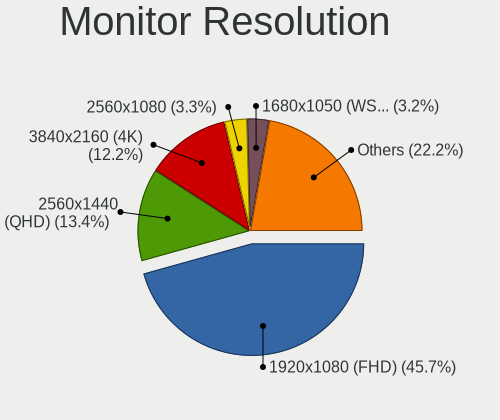

| Resolution         | Desktops | Percent |
|--------------------|----------|---------|
| 1920x1080 (FHD)    | 405      | 46.29%  |
| 2560x1440 (QHD)    | 122      | 13.94%  |
| 3840x2160 (4K)     | 88       | 10.06%  |
| 1680x1050 (WSXGA+) | 29       | 3.31%   |
| 1280x1024 (SXGA)   | 28       | 3.2%    |
| 3440x1440          | 26       | 2.97%   |
| 2560x1080          | 26       | 2.97%   |
| 1366x768 (WXGA)    | 24       | 2.74%   |
| 1920x1200 (WUXGA)  | 22       | 2.51%   |
| 1440x900 (WXGA+)   | 19       | 2.17%   |
| 3840x1080          | 16       | 1.83%   |
| Unknown            | 16       | 1.83%   |
| 1600x900 (HD+)     | 13       | 1.49%   |
| 1360x768           | 10       | 1.14%   |
| 1920x540           | 7        | 0.8%    |
| 1600x1200          | 6        | 0.69%   |
| 3840x1600          | 4        | 0.46%   |
| 2288x1287          | 2        | 0.23%   |
| 2048x1152          | 2        | 0.23%   |
| 6400x1440          | 1        | 0.11%   |
| 5760x2160          | 1        | 0.11%   |
| 5360x1440          | 1        | 0.11%   |
| 480x1920           | 1        | 0.11%   |
| 3840x1200          | 1        | 0.11%   |
| 3520x1080          | 1        | 0.11%   |
| 3286x1080          | 1        | 0.11%   |
| 3280x1080          | 1        | 0.11%   |
| 2944x1080          | 1        | 0.11%   |
| 1400x1050          | 1        | 0.11%   |

Monitor Diagonal
----------------

Diagonal size in inches

| Inches  | Desktops | Percent |
|---------|----------|---------|
| 27      | 171      | 18.94%  |
| 24      | 138      | 15.28%  |
| 23      | 97       | 10.74%  |
| 21      | 93       | 10.3%   |
| 31      | 62       | 6.87%   |
| Unknown | 62       | 6.87%   |
| 34      | 42       | 4.65%   |
| 19      | 31       | 3.43%   |
| 18      | 23       | 2.55%   |
| 22      | 22       | 2.44%   |
| 20      | 19       | 2.1%    |
| 17      | 17       | 1.88%   |
| 84      | 14       | 1.55%   |
| 72      | 14       | 1.55%   |
| 28      | 10       | 1.11%   |
| 40      | 9        | 1%      |
| 25      | 9        | 1%      |
| 54      | 8        | 0.89%   |
| 32      | 8        | 0.89%   |
| 26      | 5        | 0.55%   |
| 48      | 4        | 0.44%   |
| 39      | 4        | 0.44%   |
| 65      | 3        | 0.33%   |
| 52      | 3        | 0.33%   |
| 49      | 3        | 0.33%   |
| 46      | 3        | 0.33%   |
| 43      | 3        | 0.33%   |
| 37      | 3        | 0.33%   |
| 35      | 3        | 0.33%   |
| 15      | 3        | 0.33%   |
| 74      | 2        | 0.22%   |
| 42      | 2        | 0.22%   |
| 36      | 2        | 0.22%   |
| 33      | 2        | 0.22%   |
| 14      | 2        | 0.22%   |
| 142     | 1        | 0.11%   |
| 69      | 1        | 0.11%   |
| 55      | 1        | 0.11%   |
| 50      | 1        | 0.11%   |
| 38      | 1        | 0.11%   |

Monitor Width
-------------

Physical width

| Width in mm    | Desktops | Percent |
|----------------|----------|---------|
| 501-600        | 359      | 41.99%  |
| 401-500        | 167      | 19.53%  |
| 601-700        | 94       | 10.99%  |
| Unknown        | 62       | 7.25%   |
| 701-800        | 54       | 6.32%   |
| 1501-2000      | 30       | 3.51%   |
| 1001-1500      | 26       | 3.04%   |
| 301-350        | 21       | 2.46%   |
| 801-900        | 20       | 2.34%   |
| 351-400        | 13       | 1.52%   |
| 901-1000       | 5        | 0.58%   |
| 201-300        | 3        | 0.35%   |
| More than 2000 | 1        | 0.12%   |

Aspect Ratio
------------

Proportional relationship between the width and the height

| Ratio   | Desktops | Percent |
|---------|----------|---------|
| 16/9    | 561      | 69.69%  |
| 16/10   | 81       | 10.06%  |
| 21/9    | 57       | 7.08%   |
| Unknown | 54       | 6.71%   |
| 5/4     | 28       | 3.48%   |
| 4/3     | 10       | 1.24%   |
| 32/9    | 7        | 0.87%   |
| 6/5     | 2        | 0.25%   |
| 3/2     | 2        | 0.25%   |
| 1.00    | 1        | 0.12%   |
| 0.80    | 1        | 0.12%   |
| 0.25    | 1        | 0.12%   |

Monitor Area
------------

Area in inch

| Area in inch | Desktops | Percent |
|----------------|----------|---------|
| 201-250        | 287      | 32.73%  |
| 301-350        | 173      | 19.73%  |
| 351-500        | 118      | 13.45%  |
| 151-200        | 65       | 7.41%   |
| Unknown        | 62       | 7.07%   |
| 251-300        | 53       | 6.04%   |
| More than 1000 | 47       | 5.36%   |
| 141-150        | 34       | 3.88%   |
| 501-1000       | 32       | 3.65%   |
| 101-110        | 3        | 0.34%   |
| 81-90          | 1        | 0.11%   |
| 131-140        | 1        | 0.11%   |
| 121-130        | 1        | 0.11%   |

Pixel Density
-------------

Pixels per inch

| Density | Desktops | Percent |
|---------|----------|---------|
| 51-100  | 476      | 58.19%  |
| 101-120 | 198      | 24.21%  |
| Unknown | 62       | 7.58%   |
| 1-50    | 37       | 4.52%   |
| 121-160 | 36       | 4.4%    |
| 161-240 | 9        | 1.1%    |

Multiple Monitors
-----------------

Total monitors connected

| Total | Desktops | Percent |
|-------|----------|---------|
| 1     | 528      | 65.75%  |
| 2     | 197      | 24.53%  |
| 0     | 44       | 5.48%   |
| 3     | 30       | 3.74%   |
| 4     | 4        | 0.5%    |

Network
-------

Net Controller Vendor
---------------------

Controller vendors

| Vendor                                 | Desktops | Percent |
|----------------------------------------|----------|---------|
| Realtek Semiconductor                  | 477      | 43.76%  |
| Intel                                  | 412      | 37.8%   |
| Qualcomm Atheros                       | 53       | 4.86%   |
| Broadcom                               | 32       | 2.94%   |
| Ralink Technology                      | 21       | 1.93%   |
| TP-Link                                | 13       | 1.19%   |
| Microsoft                              | 8        | 0.73%   |
| MediaTek                               | 8        | 0.73%   |
| Aquantia                               | 6        | 0.55%   |
| Nvidia                                 | 5        | 0.46%   |
| Qualcomm Atheros Communications        | 4        | 0.37%   |
| Marvell Technology Group               | 4        | 0.37%   |
| D-Link System                          | 4        | 0.37%   |
| Huawei Technologies                    | 3        | 0.28%   |
| D-Link                                 | 3        | 0.28%   |
| Broadcom Limited                       | 3        | 0.28%   |
| ASIX Electronics                       | 3        | 0.28%   |
| Ralink                                 | 2        | 0.18%   |
| Oculus VR                              | 2        | 0.18%   |
| NetGear                                | 2        | 0.18%   |
| Insyde Software                        | 2        | 0.18%   |
| Emulex                                 | 2        | 0.18%   |
| DisplayLink                            | 2        | 0.18%   |
| Sony Ericsson Mobile Communications AB | 1        | 0.09%   |
| Solarflare Communications              | 1        | 0.09%   |
| Seeed Technology                       | 1        | 0.09%   |
| Samsung Electronics                    | 1        | 0.09%   |
| Realtek                                | 1        | 0.09%   |
| Qualcomm                               | 1        | 0.09%   |
| Ovislink                               | 1        | 0.09%   |
| Motorola                               | 1        | 0.09%   |
| Microchip Technology                   | 1        | 0.09%   |
| Lenovo                                 | 1        | 0.09%   |
| InterBiometrics                        | 1        | 0.09%   |
| IMC Networks                           | 1        | 0.09%   |
| ICS Advent                             | 1        | 0.09%   |
| Edimax Technology                      | 1        | 0.09%   |
| CyberTAN Technology                    | 1        | 0.09%   |
| ASUSTek Computer                       | 1        | 0.09%   |
| Arduino SA                             | 1        | 0.09%   |

Net Controller Model
--------------------

Controller models

| Model                                                             | Desktops | Percent |
|-------------------------------------------------------------------|----------|---------|
| Realtek RTL8111/8168/8411 PCI Express Gigabit Ethernet Controller | 382      | 30.1%   |
| Intel I211 Gigabit Network Connection                             | 89       | 7.01%   |
| Intel Wi-Fi 6 AX200                                               | 79       | 6.23%   |
| Realtek RTL8125 2.5GbE Controller                                 | 53       | 4.18%   |
| Intel Ethernet Connection (2) I219-V                              | 49       | 3.86%   |
| Intel Ethernet Controller I225-V                                  | 34       | 2.68%   |
| Intel Dual Band Wireless-AC 3168NGW [Stone Peak]                  | 29       | 2.29%   |
| Intel Ethernet Connection (7) I219-V                              | 28       | 2.21%   |
| Intel 82579LM Gigabit Network Connection (Lewisville)             | 25       | 1.97%   |
| Intel Wireless-AC 9260                                            | 22       | 1.73%   |
| Intel Ethernet Connection I217-LM                                 | 16       | 1.26%   |
| Realtek RTL8188EUS 802.11n Wireless Network Adapter               | 14       | 1.1%    |
| Intel 82579V Gigabit Network Connection                           | 13       | 1.02%   |
| Realtek RTL810xE PCI Express Fast Ethernet controller             | 12       | 0.95%   |
| Intel Ethernet Connection I217-V                                  | 12       | 0.95%   |
| Ralink MT7601U Wireless Adapter                                   | 11       | 0.87%   |
| Broadcom BCM4360 802.11ac Wireless Network Adapter                | 11       | 0.87%   |
| Realtek RTL8821CE 802.11ac PCIe Wireless Network Adapter          | 10       | 0.79%   |
| Qualcomm Atheros Killer E220x Gigabit Ethernet Controller         | 10       | 0.79%   |
| Intel Ethernet Connection X553 1GbE                               | 10       | 0.79%   |
| Intel Ethernet Connection (2) I219-LM                             | 10       | 0.79%   |
| Intel Cannon Lake PCH CNVi WiFi                                   | 9        | 0.71%   |
| Qualcomm Atheros AR9485 Wireless Network Adapter                  | 7        | 0.55%   |
| Intel Wireless 8265 / 8275                                        | 7        | 0.55%   |
| Intel Wireless 7260                                               | 7        | 0.55%   |
| Intel Wireless 3165                                               | 7        | 0.55%   |
| Intel Wi-Fi 6 AX210/AX211/AX411 160MHz                            | 7        | 0.55%   |
| Realtek RTL88x2bu [AC1200 Techkey]                                | 6        | 0.47%   |
| Realtek 802.11ac NIC                                              | 6        | 0.47%   |
| Qualcomm Atheros Killer E2500 Gigabit Ethernet Controller         | 6        | 0.47%   |
| Intel I210 Gigabit Network Connection                             | 6        | 0.47%   |
| Intel Ethernet Connection (2) I218-V                              | 6        | 0.47%   |
| Realtek RTL8188EE Wireless Network Adapter                        | 5        | 0.39%   |
| Realtek RTL8153 Gigabit Ethernet Adapter                          | 5        | 0.39%   |
| Ralink RT2870/RT3070 Wireless Adapter                             | 5        | 0.39%   |
| Qualcomm Atheros QCA9565 / AR9565 Wireless Network Adapter        | 5        | 0.39%   |
| MediaTek MT7921K (RZ608) Wi-Fi 6E 80MHz                           | 5        | 0.39%   |
| Intel Wireless 8260                                               | 5        | 0.39%   |
| Broadcom BCM43228 802.11a/b/g/n                                   | 5        | 0.39%   |
| Realtek RTL8192EE PCIe Wireless Network Adapter                   | 4        | 0.32%   |

Wireless Vendor
---------------

Wireless vendors

| Vendor                                | Desktops | Percent |
|---------------------------------------|----------|---------|
| Intel                                 | 193      | 50.39%  |
| Realtek Semiconductor                 | 69       | 18.02%  |
| Qualcomm Atheros                      | 27       | 7.05%   |
| Broadcom                              | 23       | 6.01%   |
| Ralink Technology                     | 21       | 5.48%   |
| TP-Link                               | 13       | 3.39%   |
| Microsoft                             | 8        | 2.09%   |
| MediaTek                              | 8        | 2.09%   |
| Qualcomm Atheros Communications       | 4        | 1.04%   |
| D-Link                                | 3        | 0.78%   |
| Ralink                                | 2        | 0.52%   |
| NetGear                               | 2        | 0.52%   |
| D-Link System                         | 2        | 0.52%   |
| Realtek                               | 1        | 0.26%   |
| Ovislink                              | 1        | 0.26%   |
| IMC Networks                          | 1        | 0.26%   |
| Edimax Technology                     | 1        | 0.26%   |
| CyberTAN Technology                   | 1        | 0.26%   |
| Broadcom Limited                      | 1        | 0.26%   |
| ASUSTek Computer                      | 1        | 0.26%   |
| 802.11g Adapter [Linksys WUSB54GC v3] | 1        | 0.26%   |

Wireless Model
--------------

Wireless models

| Model                                                         | Desktops | Percent |
|---------------------------------------------------------------|----------|---------|
| Intel Wi-Fi 6 AX200                                           | 79       | 20.31%  |
| Intel Dual Band Wireless-AC 3168NGW [Stone Peak]              | 29       | 7.46%   |
| Intel Wireless-AC 9260                                        | 22       | 5.66%   |
| Realtek RTL8188EUS 802.11n Wireless Network Adapter           | 14       | 3.6%    |
| Ralink MT7601U Wireless Adapter                               | 11       | 2.83%   |
| Broadcom BCM4360 802.11ac Wireless Network Adapter            | 11       | 2.83%   |
| Realtek RTL8821CE 802.11ac PCIe Wireless Network Adapter      | 10       | 2.57%   |
| Intel Cannon Lake PCH CNVi WiFi                               | 9        | 2.31%   |
| Qualcomm Atheros AR9485 Wireless Network Adapter              | 7        | 1.8%    |
| Intel Wireless 8265 / 8275                                    | 7        | 1.8%    |
| Intel Wireless 7260                                           | 7        | 1.8%    |
| Intel Wireless 3165                                           | 7        | 1.8%    |
| Intel Wi-Fi 6 AX210/AX211/AX411 160MHz                        | 7        | 1.8%    |
| Realtek RTL88x2bu [AC1200 Techkey]                            | 6        | 1.54%   |
| Realtek 802.11ac NIC                                          | 6        | 1.54%   |
| Realtek RTL8188EE Wireless Network Adapter                    | 5        | 1.29%   |
| Ralink RT2870/RT3070 Wireless Adapter                         | 5        | 1.29%   |
| Qualcomm Atheros QCA9565 / AR9565 Wireless Network Adapter    | 5        | 1.29%   |
| MediaTek MT7921K (RZ608) Wi-Fi 6E 80MHz                       | 5        | 1.29%   |
| Intel Wireless 8260                                           | 5        | 1.29%   |
| Broadcom BCM43228 802.11a/b/g/n                               | 5        | 1.29%   |
| Realtek RTL8192EE PCIe Wireless Network Adapter               | 4        | 1.03%   |
| Realtek RTL8188FTV 802.11b/g/n 1T1R 2.4G WLAN Adapter         | 4        | 1.03%   |
| Ralink RT5370 Wireless Adapter                                | 4        | 1.03%   |
| Qualcomm Atheros AR9462 Wireless Network Adapter              | 4        | 1.03%   |
| Microsoft XBOX ACC                                            | 4        | 1.03%   |
| Intel Wireless 7265                                           | 4        | 1.03%   |
| Broadcom BCM4352 802.11ac Wireless Network Adapter            | 4        | 1.03%   |
| TP-Link TL-WN823N v2/v3 [Realtek RTL8192EU]                   | 3        | 0.77%   |
| TP-Link TL-WN722N v2/v3 [Realtek RTL8188EUS]                  | 3        | 0.77%   |
| Realtek RTL8822BE 802.11a/b/g/n/ac WiFi adapter               | 3        | 0.77%   |
| Realtek RTL8192CE PCIe Wireless Network Adapter               | 3        | 0.77%   |
| Qualcomm Atheros QCA9377 802.11ac Wireless Network Adapter    | 3        | 0.77%   |
| Qualcomm Atheros QCA6174 802.11ac Wireless Network Adapter    | 3        | 0.77%   |
| Qualcomm Atheros AR9271 802.11n                               | 3        | 0.77%   |
| MediaTek MT7922 802.11ax PCI Express Wireless Network Adapter | 3        | 0.77%   |
| Intel Tiger Lake PCH CNVi WiFi                                | 3        | 0.77%   |
| Intel Comet Lake PCH CNVi WiFi                                | 3        | 0.77%   |
| TP-Link AC600 wireless Realtek RTL8811AU [Archer T2U Nano]    | 2        | 0.51%   |
| Realtek RTL8821AE 802.11ac PCIe Wireless Network Adapter      | 2        | 0.51%   |

Ethernet Vendor
---------------

Ethernet vendors

| Vendor                                 | Desktops | Percent |
|----------------------------------------|----------|---------|
| Realtek Semiconductor                  | 449      | 53.45%  |
| Intel                                  | 314      | 37.38%  |
| Qualcomm Atheros                       | 29       | 3.45%   |
| Broadcom                               | 10       | 1.19%   |
| Aquantia                               | 6        | 0.71%   |
| Nvidia                                 | 5        | 0.6%    |
| Marvell Technology Group               | 4        | 0.48%   |
| Huawei Technologies                    | 3        | 0.36%   |
| ASIX Electronics                       | 3        | 0.36%   |
| Insyde Software                        | 2        | 0.24%   |
| Emulex                                 | 2        | 0.24%   |
| DisplayLink                            | 2        | 0.24%   |
| D-Link System                          | 2        | 0.24%   |
| Broadcom Limited                       | 2        | 0.24%   |
| Sony Ericsson Mobile Communications AB | 1        | 0.12%   |
| Solarflare Communications              | 1        | 0.12%   |
| Samsung Electronics                    | 1        | 0.12%   |
| Qualcomm                               | 1        | 0.12%   |
| Lenovo                                 | 1        | 0.12%   |
| ICS Advent                             | 1        | 0.12%   |
| 3Com                                   | 1        | 0.12%   |

Ethernet Model
--------------

Ethernet models

| Model                                                             | Desktops | Percent |
|-------------------------------------------------------------------|----------|---------|
| Realtek RTL8111/8168/8411 PCI Express Gigabit Ethernet Controller | 382      | 43.76%  |
| Intel I211 Gigabit Network Connection                             | 89       | 10.19%  |
| Realtek RTL8125 2.5GbE Controller                                 | 53       | 6.07%   |
| Intel Ethernet Connection (2) I219-V                              | 49       | 5.61%   |
| Intel Ethernet Controller I225-V                                  | 34       | 3.89%   |
| Intel Ethernet Connection (7) I219-V                              | 28       | 3.21%   |
| Intel 82579LM Gigabit Network Connection (Lewisville)             | 25       | 2.86%   |
| Intel Ethernet Connection I217-LM                                 | 16       | 1.83%   |
| Intel 82579V Gigabit Network Connection                           | 13       | 1.49%   |
| Realtek RTL810xE PCI Express Fast Ethernet controller             | 12       | 1.37%   |
| Intel Ethernet Connection I217-V                                  | 12       | 1.37%   |
| Qualcomm Atheros Killer E220x Gigabit Ethernet Controller         | 10       | 1.15%   |
| Intel Ethernet Connection X553 1GbE                               | 10       | 1.15%   |
| Intel Ethernet Connection (2) I219-LM                             | 10       | 1.15%   |
| Qualcomm Atheros Killer E2500 Gigabit Ethernet Controller         | 6        | 0.69%   |
| Intel I210 Gigabit Network Connection                             | 6        | 0.69%   |
| Intel Ethernet Connection (2) I218-V                              | 6        | 0.69%   |
| Realtek RTL8153 Gigabit Ethernet Adapter                          | 5        | 0.57%   |
| Qualcomm Atheros Killer E2400 Gigabit Ethernet Controller         | 4        | 0.46%   |
| Intel Ethernet Connection (12) I219-V                             | 4        | 0.46%   |
| Realtek RTL-8100/8101L/8139 PCI Fast Ethernet Adapter             | 3        | 0.34%   |
| Qualcomm Atheros AR8161 Gigabit Ethernet                          | 3        | 0.34%   |
| Intel Ethernet Controller X550                                    | 3        | 0.34%   |
| Intel Ethernet Connection (5) I219-LM                             | 3        | 0.34%   |
| Intel Ethernet Connection (11) I219-LM                            | 3        | 0.34%   |
| Intel 82574L Gigabit Network Connection                           | 3        | 0.34%   |
| Huawei ANE-LX1                                                    | 3        | 0.34%   |
| Broadcom NetXtreme BCM5764M Gigabit Ethernet PCIe                 | 3        | 0.34%   |
| ASIX AX88179 Gigabit Ethernet                                     | 3        | 0.34%   |
| Aquantia AQC107 NBase-T/IEEE 802.3bz Ethernet Controller [AQtion] | 3        | 0.34%   |
| Realtek RTL8169 PCI Gigabit Ethernet Controller                   | 2        | 0.23%   |
| Realtek Killer E2600 Gigabit Ethernet Controller                  | 2        | 0.23%   |
| Qualcomm Atheros QCA8171 Gigabit Ethernet                         | 2        | 0.23%   |
| Nvidia MCP61 Ethernet                                             | 2        | 0.23%   |
| Marvell Group 88E8056 PCI-E Gigabit Ethernet Controller           | 2        | 0.23%   |
| Intel Ethernet Connection (7) I219-LM                             | 2        | 0.23%   |
| Intel 82576 Gigabit Network Connection                            | 2        | 0.23%   |
| Intel 82571EB/82571GB Gigabit Ethernet Controller (Copper)        | 2        | 0.23%   |
| Intel 82567V-2 Gigabit Network Connection                         | 2        | 0.23%   |
| Insyde Software RNDIS/Ethernet Gadget                             | 2        | 0.23%   |

Net Controller Kind
-------------------

Ethernet, WiFi or modem

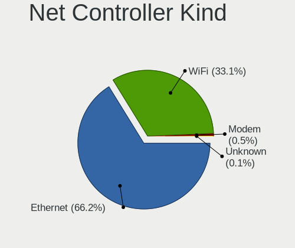

| Kind     | Desktops | Percent |
|----------|----------|---------|
| Ethernet | 779      | 67.74%  |
| WiFi     | 364      | 31.65%  |
| Modem    | 7        | 0.61%   |

Used Controller
---------------

Currently used network controller

| Kind     | Desktops | Percent |
|----------|----------|---------|
| Ethernet | 639      | 78.4%   |
| WiFi     | 176      | 21.6%   |

NICs
----

Total network controllers on board

| Total | Desktops | Percent |
|-------|----------|---------|
| 1     | 446      | 56.6%   |
| 2     | 280      | 35.53%  |
| 3     | 41       | 5.2%    |
| 4     | 17       | 2.16%   |
| 0     | 2        | 0.25%   |
| 9     | 1        | 0.13%   |
| 5     | 1        | 0.13%   |

IPv6
----

IPv6 vs IPv4

| Used | Desktops | Percent |
|------|----------|---------|
| No   | 609      | 75.94%  |
| Yes  | 193      | 24.06%  |

Bluetooth
---------

Bluetooth Vendor
----------------

Controller vendors

| Vendor                          | Desktops | Percent |
|---------------------------------|----------|---------|
| Intel                           | 186      | 50.54%  |
| Cambridge Silicon Radio         | 69       | 18.75%  |
| ASUSTek Computer                | 30       | 8.15%   |
| Realtek Semiconductor           | 27       | 7.34%   |
| Broadcom                        | 13       | 3.53%   |
| Qualcomm Atheros Communications | 11       | 2.99%   |
| MediaTek                        | 6        | 1.63%   |
| Apple                           | 6        | 1.63%   |
| IMC Networks                    | 4        | 1.09%   |
| Belkin Components               | 4        | 1.09%   |
| Edimax Technology               | 3        | 0.82%   |
| TP-Link                         | 2        | 0.54%   |
| HTC (High Tech Computer)        | 2        | 0.54%   |
| Foxconn / Hon Hai               | 2        | 0.54%   |
| SINO WEALTH                     | 1        | 0.27%   |
| Lite-On Technology              | 1        | 0.27%   |
| Dynex                           | 1        | 0.27%   |

Bluetooth Model
---------------

Controller models

| Model                                                                | Desktops | Percent |
|----------------------------------------------------------------------|----------|---------|
| Intel AX200 Bluetooth                                                | 76       | 20.54%  |
| Cambridge Silicon Radio Bluetooth Dongle (HCI mode)                  | 69       | 18.65%  |
| Intel Bluetooth wireless interface                                   | 30       | 8.11%   |
| Intel Wireless-AC 3168 Bluetooth                                     | 29       | 7.84%   |
| Intel Wireless-AC 9260 Bluetooth Adapter                             | 23       | 6.22%   |
| Realtek Bluetooth Radio                                              | 17       | 4.59%   |
| ASUS Broadcom BCM20702A0 Bluetooth                                   | 11       | 2.97%   |
| Intel Bluetooth 9460/9560 Jefferson Peak (JfP)                       | 10       | 2.7%    |
| ASUS ASUS USB-BT500                                                  | 10       | 2.7%    |
| Realtek  Bluetooth 4.2 Adapter                                       | 8        | 2.16%   |
| Intel AX201 Bluetooth                                                | 8        | 2.16%   |
| Broadcom BCM20702A0 Bluetooth 4.0                                    | 8        | 2.16%   |
| Qualcomm Atheros  Bluetooth Device                                   | 7        | 1.89%   |
| MediaTek Wireless_Device                                             | 6        | 1.62%   |
| Intel AX210 Bluetooth                                                | 6        | 1.62%   |
| Belkin Components F8T065BF Mini Bluetooth 4.0 Adapter                | 4        | 1.08%   |
| ASUS BCM20702A0                                                      | 4        | 1.08%   |
| Apple Bluetooth Host Controller                                      | 4        | 1.08%   |
| Edimax Bluetooth Adapter                                             | 3        | 0.81%   |
| TP-Link UB500 Adapter                                                | 2        | 0.54%   |
| Qualcomm Atheros Bluetooth USB Host Controller                       | 2        | 0.54%   |
| Intel Centrino Bluetooth Wireless Transceiver                        | 2        | 0.54%   |
| Intel Bluetooth Device                                               | 2        | 0.54%   |
| IMC Networks Bluetooth Radio                                         | 2        | 0.54%   |
| HTC (High Tech Computer) Vive Hub Bluetooth 4.1 (Broadcom BCM920703) | 2        | 0.54%   |
| Foxconn / Hon Hai Wireless_Device                                    | 2        | 0.54%   |
| Broadcom HP Portable Bumble Bee                                      | 2        | 0.54%   |
| ASUS Qualcomm Bluetooth 4.1                                          | 2        | 0.54%   |
| ASUS Broadcom BCM20702 Single-Chip Bluetooth 4.0 + LE                | 2        | 0.54%   |
| ASUS Bluetooth Adapter                                               | 2        | 0.54%   |
| SINO WEALTH RK Bluetooth Keyboar                                     | 1        | 0.27%   |
| Realtek RTL8821A Bluetooth                                           | 1        | 0.27%   |
| Realtek Bluetooth 5.1 Radio                                          | 1        | 0.27%   |
| Qualcomm Atheros QCA61x4 Bluetooth 4.0                               | 1        | 0.27%   |
| Qualcomm Atheros AR9462 Bluetooth                                    | 1        | 0.27%   |
| Lite-On Bluetooth Device                                             | 1        | 0.27%   |
| IMC Networks Bluetooth Device                                        | 1        | 0.27%   |
| IMC Networks Bluetooth                                               | 1        | 0.27%   |
| Dynex Bluetooth 4.0 Adapter [Broadcom, 1.12, BCM20702A0]             | 1        | 0.27%   |
| Broadcom HP Bluethunder                                              | 1        | 0.27%   |

Sound
-----

Sound Vendor
------------

Sound card vendors

| Vendor                               | Desktops | Percent |
|--------------------------------------|----------|---------|
| AMD                                  | 423      | 27.77%  |
| Intel                                | 410      | 26.92%  |
| Nvidia                               | 371      | 24.36%  |
| C-Media Electronics                  | 51       | 3.35%   |
| Logitech                             | 31       | 2.04%   |
| Kingston Technology                  | 19       | 1.25%   |
| Texas Instruments                    | 16       | 1.05%   |
| JMTek                                | 14       | 0.92%   |
| Focusrite-Novation                   | 14       | 0.92%   |
| Creative Technology                  | 11       | 0.72%   |
| Corsair                              | 11       | 0.72%   |
| Razer USA                            | 10       | 0.66%   |
| Creative Labs                        | 9        | 0.59%   |
| SteelSeries ApS                      | 7        | 0.46%   |
| RODE Microphones                     | 7        | 0.46%   |
| SAVITECH                             | 6        | 0.39%   |
| ASUSTek Computer                     | 6        | 0.39%   |
| Blue Microphones                     | 5        | 0.33%   |
| XMOS                                 | 4        | 0.26%   |
| Thesycon Systemsoftware & Consulting | 4        | 0.26%   |
| Samson Technologies                  | 4        | 0.26%   |
| Realtek Semiconductor                | 4        | 0.26%   |
| PreSonus Audio Electronics           | 4        | 0.26%   |
| Generalplus Technology               | 4        | 0.26%   |
| Yamaha                               | 3        | 0.2%    |
| Sony                                 | 3        | 0.2%    |
| Plantronics                          | 3        | 0.2%    |
| Native Instruments                   | 3        | 0.2%    |
| GN Netcom                            | 3        | 0.2%    |
| FIFINE Microphones                   | 3        | 0.2%    |
| DSEA A/S                             | 3        | 0.2%    |
| BEHRINGER International              | 3        | 0.2%    |
| Audio-Technica                       | 3        | 0.2%    |
| VIA Technologies                     | 2        | 0.13%   |
| Turtle Beach                         | 2        | 0.13%   |
| Sennheiser Communications            | 2        | 0.13%   |
| Project                              | 2        | 0.13%   |
| M-Audio                              | 2        | 0.13%   |
| Hewlett-Packard                      | 2        | 0.13%   |
| Elgato Systems                       | 2        | 0.13%   |

Sound Model
-----------

Sound card models

| Model                                                                      | Desktops | Percent |
|----------------------------------------------------------------------------|----------|---------|
| AMD Starship/Matisse HD Audio Controller                                   | 168      | 9.53%   |
| AMD Ellesmere HDMI Audio [Radeon RX 470/480 / 570/580/590]                 | 63       | 3.57%   |
| AMD Family 17h/19h HD Audio Controller                                     | 62       | 3.52%   |
| Intel 200 Series PCH HD Audio                                              | 60       | 3.4%    |
| AMD Family 17h (Models 00h-0fh) HD Audio Controller                        | 59       | 3.35%   |
| Intel 100 Series/C230 Series Chipset Family HD Audio Controller            | 53       | 3.01%   |
| Intel 8 Series/C220 Series Chipset High Definition Audio Controller        | 51       | 2.89%   |
| Intel Cannon Lake PCH cAVS                                                 | 45       | 2.55%   |
| Intel 7 Series/C216 Chipset Family High Definition Audio Controller        | 45       | 2.55%   |
| AMD Navi 21/23 HDMI/DP Audio Controller                                    | 42       | 2.38%   |
| Intel 6 Series/C200 Series Chipset Family High Definition Audio Controller | 40       | 2.27%   |
| Nvidia GP106 High Definition Audio Controller                              | 39       | 2.21%   |
| Nvidia TU116 High Definition Audio Controller                              | 38       | 2.16%   |
| Nvidia GP104 High Definition Audio Controller                              | 38       | 2.16%   |
| Intel Xeon E3-1200 v3/4th Gen Core Processor HD Audio Controller           | 34       | 1.93%   |
| AMD SBx00 Azalia (Intel HDA)                                               | 28       | 1.59%   |
| AMD Navi 10 HDMI Audio                                                     | 28       | 1.59%   |
| AMD Raven/Raven2/Fenghuang HDMI/DP Audio Controller                        | 25       | 1.42%   |
| Nvidia TU104 HD Audio Controller                                           | 22       | 1.25%   |
| Nvidia GA102 High Definition Audio Controller                              | 22       | 1.25%   |
| AMD Renoir Radeon High Definition Audio Controller                         | 22       | 1.25%   |
| Nvidia GA104 High Definition Audio Controller                              | 21       | 1.19%   |
| Nvidia TU106 High Definition Audio Controller                              | 20       | 1.13%   |
| AMD Oland/Hainan/Cape Verde/Pitcairn HDMI Audio [Radeon HD 7000 Series]    | 20       | 1.13%   |
| AMD Baffin HDMI/DP Audio [Radeon RX 550 640SP / RX 560/560X]               | 20       | 1.13%   |
| Nvidia GP107GL High Definition Audio Controller                            | 19       | 1.08%   |
| Nvidia GM204 High Definition Audio Controller                              | 17       | 0.96%   |
| Nvidia GK208 HDMI/DP Audio Controller                                      | 16       | 0.91%   |
| Nvidia GP102 HDMI Audio Controller                                         | 15       | 0.85%   |
| Nvidia GM206 High Definition Audio Controller                              | 15       | 0.85%   |
| Nvidia GM107 High Definition Audio Controller [GeForce 940MX]              | 15       | 0.85%   |
| Nvidia TU107 GeForce GTX 1650 High Definition Audio Controller             | 14       | 0.79%   |
| AMD FCH Azalia Controller                                                  | 14       | 0.79%   |
| JMTek USB PnP Audio Device                                                 | 13       | 0.74%   |
| Intel Comet Lake PCH-V cAVS                                                | 13       | 0.74%   |
| Intel 9 Series Chipset Family HD Audio Controller                          | 13       | 0.74%   |
| Texas Instruments PCM2902 Audio Codec                                      | 12       | 0.68%   |
| Nvidia GK104 HDMI Audio Controller                                         | 11       | 0.62%   |
| Intel NM10/ICH7 Family High Definition Audio Controller                    | 11       | 0.62%   |
| Intel 82801JI (ICH10 Family) HD Audio Controller                           | 11       | 0.62%   |

Memory
------

Memory Vendor
-------------

Memory module vendors

| Vendor              | Desktops | Percent |
|---------------------|----------|---------|
| Corsair             | 179      | 21.31%  |
| Kingston            | 114      | 13.57%  |
| G.Skill             | 108      | 12.86%  |
| Crucial             | 93       | 11.07%  |
| SK hynix            | 73       | 8.69%   |
| Unknown             | 59       | 7.02%   |
| Samsung Electronics | 59       | 7.02%   |
| Micron Technology   | 34       | 4.05%   |
| Team                | 23       | 2.74%   |
| A-DATA Technology   | 22       | 2.62%   |
| Patriot             | 10       | 1.19%   |
| Ramaxel Technology  | 7        | 0.83%   |
| Nanya Technology    | 7        | 0.83%   |
| Unknown             | 5        | 0.6%    |
| Silicon Power       | 4        | 0.48%   |
| Elpida              | 4        | 0.48%   |
| GOODRAM             | 3        | 0.36%   |
| Unknown (ABCD)      | 2        | 0.24%   |
| Unifosa             | 2        | 0.24%   |
| Transcend           | 2        | 0.24%   |
| PNY                 | 2        | 0.24%   |
| Neo Forza           | 2        | 0.24%   |
| Lexar               | 2        | 0.24%   |
| Kingmax             | 2        | 0.24%   |
| Goldkey             | 2        | 0.24%   |
| GeIL                | 2        | 0.24%   |
| Avant               | 2        | 0.24%   |
| Unknown (0B38)      | 1        | 0.12%   |
| Thermaltake         | 1        | 0.12%   |
| Smart               | 1        | 0.12%   |
| S                   | 1        | 0.12%   |
| Panram              | 1        | 0.12%   |
| OCZ                 | 1        | 0.12%   |
| Lexar Co Limited    | 1        | 0.12%   |
| Innodisk            | 1        | 0.12%   |
| Golden Empire       | 1        | 0.12%   |
| EVGA                | 1        | 0.12%   |
| CSX                 | 1        | 0.12%   |
| Atermiter           | 1        | 0.12%   |
| ASint Technology    | 1        | 0.12%   |

Memory Model
------------

Memory module models

| Model                                                    | Desktops | Percent |
|----------------------------------------------------------|----------|---------|
| Corsair RAM CMK16GX4M2B3200C16 8GB DIMM DDR4 3600MT/s    | 14       | 1.54%   |
| Corsair RAM CMK16GX4M2B3000C15 8GB DIMM DDR4 3533MT/s    | 14       | 1.54%   |
| G.Skill RAM F4-3000C16-8GISB 8192MB DIMM DDR4 3200MT/s   | 11       | 1.21%   |
| SK hynix RAM HMA82GR7DJR8N-XN 16384MB DIMM DDR4 3200MT/s | 10       | 1.1%    |
| Corsair RAM CMK32GX4M2B3200C16 16GB DIMM DDR4 3400MT/s   | 10       | 1.1%    |
| Kingston RAM KHX2666C16/8G 8GB DIMM DDR4 3466MT/s        | 8        | 0.88%   |
| G.Skill RAM F4-3200C16-8GVKB 8GB DIMM DDR4 3866MT/s      | 8        | 0.88%   |
| Micron RAM 8JTF51264AZ-1G6E1 4GB DIMM DDR3 1600MT/s      | 7        | 0.77%   |
| Team RAM TEAMGROUP-UD4-3200 16GB DIMM DDR4 3733MT/s      | 6        | 0.66%   |
| G.Skill RAM F4-3200C16-16GVK 16384MB DIMM DDR4 3600MT/s  | 6        | 0.66%   |
| Corsair RAM CMW16GX4M2C3200C16 8GB DIMM DDR4 3733MT/s    | 6        | 0.66%   |
| Unknown RAM Module 8GB DIMM DDR3 1333MT/s                | 5        | 0.55%   |
| Team RAM TEAMGROUP-UD4-3000 8GB DIMM DDR4 3000MT/s       | 5        | 0.55%   |
| SK hynix RAM HMT451U6AFR8C-PB 4GB DIMM DDR3 1600MT/s     | 5        | 0.55%   |
| SK hynix RAM HMA81GU6AFR8N-UH 8GB DIMM DDR4 2400MT/s     | 5        | 0.55%   |
| SK hynix RAM HMA41GU6AFR8N-TF 8GB DIMM DDR4 2465MT/s     | 5        | 0.55%   |
| Kingston RAM KHX3200C16D4/16GX 16GB DIMM DDR4 3600MT/s   | 5        | 0.55%   |
| Kingston RAM KHX2400C15/8G 8192MB DIMM DDR4 3400MT/s     | 5        | 0.55%   |
| G.Skill RAM F4-3600C16-16GVKC 16GB DIMM DDR4 3866MT/s    | 5        | 0.55%   |
| G.Skill RAM F4-3600C16-16GTZNC 16GB DIMM DDR4 3600MT/s   | 5        | 0.55%   |
| G.Skill RAM F4-3200C16-8GTZR 8GB DIMM DDR4 3200MT/s      | 5        | 0.55%   |
| Corsair RAM CMZ16GX3M2A1600C10 8GB DIMM DDR3 1600MT/s    | 5        | 0.55%   |
| Corsair RAM CMW32GX4M2C3200C16 16GB DIMM DDR4 3200MT/s   | 5        | 0.55%   |
| Corsair RAM CML8GX3M2A1600C9 4GB DIMM DDR3 1867MT/s      | 5        | 0.55%   |
| Corsair RAM CMK32GX4M2E3200C16 16GB DIMM DDR4 3534MT/s   | 5        | 0.55%   |
| Corsair RAM CMK16GX4M2A2666C16 8GB DIMM DDR4 3400MT/s    | 5        | 0.55%   |
| Unknown                                                  | 5        | 0.55%   |
| Unknown RAM Module 4GB DIMM DDR3 1333MT/s                | 4        | 0.44%   |
| Unknown RAM Module 4GB DIMM 1333MT/s                     | 4        | 0.44%   |
| SK hynix RAM HMT451U6BFR8A-PB 4096MB DIMM DDR3 1648MT/s  | 4        | 0.44%   |
| SK hynix RAM HMT351U6EFR8C-PB 4GB DIMM DDR3 1800MT/s     | 4        | 0.44%   |
| Kingston RAM KHX3200C16D4/8GX 8GB DIMM DDR4 3600MT/s     | 4        | 0.44%   |
| Kingston RAM KHX2133C14/8G 8GB DIMM DDR4 2400MT/s        | 4        | 0.44%   |
| Kingston RAM KHX1866C10D3/8G 8GB DIMM DDR3 2133MT/s      | 4        | 0.44%   |
| Corsair RAM CMZ8GX3M2A1600C9 4GB DIMM DDR3 1600MT/s      | 4        | 0.44%   |
| Corsair RAM CMW32GX4M2Z3600C18 16GB DIMM DDR4 3733MT/s   | 4        | 0.44%   |
| Corsair RAM CMW32GX4M2E3200C16 16GB DIMM DDR4 3200MT/s   | 4        | 0.44%   |
| Corsair RAM CMK16GX4M2D3600C18 8GB DIMM DDR4 3600MT/s    | 4        | 0.44%   |
| A-DATA RAM DDR4 3200 8GB DIMM DDR4 3600MT/s              | 4        | 0.44%   |
| Unknown RAM Module 4GB DIMM 1600MT/s                     | 3        | 0.33%   |

Memory Kind
-----------

Memory module kinds

| Kind    | Desktops | Percent |
|---------|----------|---------|
| DDR4    | 485      | 66.17%  |
| DDR3    | 187      | 25.51%  |
| Unknown | 24       | 3.27%   |
| DDR5    | 11       | 1.5%    |
| DDR2    | 11       | 1.5%    |
| SDRAM   | 10       | 1.36%   |
| DDR     | 3        | 0.41%   |
| LPDDR4  | 2        | 0.27%   |

Memory Form Factor
------------------

Physical design of the memory module

| Name   | Desktops | Percent |
|--------|----------|---------|
| DIMM   | 685      | 94.35%  |
| SODIMM | 40       | 5.51%   |
| RIMM   | 1        | 0.14%   |

Memory Size
-----------

Memory module size

| Size  | Desktops | Percent |
|-------|----------|---------|
| 8192  | 360      | 45.17%  |
| 16384 | 190      | 23.84%  |
| 4096  | 152      | 19.07%  |
| 2048  | 47       | 5.9%    |
| 32768 | 40       | 5.02%   |
| 1024  | 7        | 0.88%   |
| 16    | 1        | 0.13%   |

Memory Speed
------------

Memory module speed

| Speed   | Desktops | Percent |
|---------|----------|---------|
| 1600    | 118      | 14.17%  |
| 3200    | 116      | 13.93%  |
| 3600    | 83       | 9.96%   |
| 2400    | 73       | 8.76%   |
| 1333    | 59       | 7.08%   |
| 2667    | 42       | 5.04%   |
| 2133    | 38       | 4.56%   |
| 3733    | 25       | 3%      |
| 3400    | 24       | 2.88%   |
| 3000    | 24       | 2.88%   |
| 1867    | 19       | 2.28%   |
| 3533    | 14       | 1.68%   |
| 3866    | 13       | 1.56%   |
| 3800    | 13       | 1.56%   |
| 2800    | 12       | 1.44%   |
| 1866    | 12       | 1.44%   |
| 3466    | 11       | 1.32%   |
| 2666    | 11       | 1.32%   |
| 800     | 11       | 1.32%   |
| 2933    | 10       | 1.2%    |
| 1800    | 9        | 1.08%   |
| 667     | 7        | 0.84%   |
| 3666    | 6        | 0.72%   |
| 3334    | 6        | 0.72%   |
| 5200    | 5        | 0.6%    |
| 3534    | 5        | 0.6%    |
| 3266    | 5        | 0.6%    |
| 2465    | 5        | 0.6%    |
| 3333    | 4        | 0.48%   |
| 1648    | 4        | 0.48%   |
| 4800    | 3        | 0.36%   |
| 4000    | 3        | 0.36%   |
| 3066    | 3        | 0.36%   |
| 2000    | 3        | 0.36%   |
| 1067    | 3        | 0.36%   |
| 1066    | 3        | 0.36%   |
| 533     | 3        | 0.36%   |
| Unknown | 3        | 0.36%   |
| 5800    | 2        | 0.24%   |
| 2934    | 2        | 0.24%   |

Printers & scanners
-------------------

Printer Vendor
--------------

Printer device vendors

| Vendor              | Desktops | Percent |
|---------------------|----------|---------|
| Hewlett-Packard     | 14       | 40%     |
| Brother Industries  | 14       | 40%     |
| Seiko Epson         | 2        | 5.71%   |
| Samsung Electronics | 2        | 5.71%   |
| Gprinter            | 1        | 2.86%   |
| Dymo-CoStar         | 1        | 2.86%   |
| Canon               | 1        | 2.86%   |

Printer Model
-------------

Printer device models

| Model                                  | Desktops | Percent |
|----------------------------------------|----------|---------|
| HP DeskJet 2600 series                 | 2        | 5.71%   |
| Brother Printer                        | 2        | 5.71%   |
| Seiko Epson XP-2100 Series             | 1        | 2.86%   |
| Seiko Epson ET-2710 Series             | 1        | 2.86%   |
| Samsung SCX-3400 Series                | 1        | 2.86%   |
| Samsung SCX-3200 Series                | 1        | 2.86%   |
| HP OfficeJet Pro 6960                  | 1        | 2.86%   |
| HP OfficeJet 5200 series               | 1        | 2.86%   |
| HP OfficeJet 4650 series               | 1        | 2.86%   |
| HP LaserJet Professional P1102w        | 1        | 2.86%   |
| HP LaserJet P1005                      | 1        | 2.86%   |
| HP LaserJet M203-M206                  | 1        | 2.86%   |
| HP ENVY 4500 series                    | 1        | 2.86%   |
| HP DeskJet F4100 Printer series        | 1        | 2.86%   |
| HP Deskjet 4640 series                 | 1        | 2.86%   |
| HP DeskJet 3700 series                 | 1        | 2.86%   |
| HP DeskJet 2700 series                 | 1        | 2.86%   |
| HP Deskjet 1050 J410                   | 1        | 2.86%   |
| Gprinter GP-58                         | 1        | 2.86%   |
| Dymo-CoStar DYMO LabelWriter 450 Turbo | 1        | 2.86%   |
| Canon TS5100 series                    | 1        | 2.86%   |
| Brother MFC-L3750CDW                   | 1        | 2.86%   |
| Brother MFC-J6545DW                    | 1        | 2.86%   |
| Brother MFC-J497DW                     | 1        | 2.86%   |
| Brother MFC-J485DW                     | 1        | 2.86%   |
| Brother MFC-J450DW                     | 1        | 2.86%   |
| Brother MFC-7460DN                     | 1        | 2.86%   |
| Brother HL-L2300D series               | 1        | 2.86%   |
| Brother HL-3140CW series               | 1        | 2.86%   |
| Brother DCP-L3550CDW                   | 1        | 2.86%   |
| Brother DCP-L2550DW series             | 1        | 2.86%   |
| Brother DCP-7055 scanner/printer       | 1        | 2.86%   |
| Brother DCP-1610W                      | 1        | 2.86%   |

Scanner Vendor
--------------

Scanner device vendors

| Vendor          | Desktops | Percent |
|-----------------|----------|---------|
| Seiko Epson     | 2        | 50%     |
| Hewlett-Packard | 2        | 50%     |

Scanner Model
-------------

Scanner device models

| Model                                                   | Desktops | Percent |
|---------------------------------------------------------|----------|---------|
| Seiko Epson GT-F730 [GT-S630/Perfection V33/V330 Photo] | 1        | 25%     |
| Seiko Epson GT-9300UF [Perfection 2400 PHOTO]           | 1        | 25%     |
| HP ScanJet 2400c                                        | 1        | 25%     |
| HP ScanJet 2200c                                        | 1        | 25%     |

Camera
------

Camera Vendor
-------------

Camera device vendors

| Vendor                                            | Desktops | Percent |
|---------------------------------------------------|----------|---------|
| Logitech                                          | 78       | 43.33%  |
| Microdia                                          | 14       | 7.78%   |
| Sunplus Innovation Technology                     | 10       | 5.56%   |
| Microsoft                                         | 9        | 5%      |
| Realtek Semiconductor                             | 5        | 2.78%   |
| KYE Systems (Mouse Systems)                       | 5        | 2.78%   |
| Apple                                             | 5        | 2.78%   |
| Razer USA                                         | 4        | 2.22%   |
| Hewlett-Packard                                   | 4        | 2.22%   |
| GEMBIRD                                           | 4        | 2.22%   |
| Creative Technology                               | 4        | 2.22%   |
| Samsung Electronics                               | 3        | 1.67%   |
| MacroSilicon                                      | 3        | 1.67%   |
| Z-Star Microelectronics                           | 2        | 1.11%   |
| Ruision                                           | 2        | 1.11%   |
| Generalplus Technology                            | 2        | 1.11%   |
| Chicony Electronics                               | 2        | 1.11%   |
| AVerMedia Technologies                            | 2        | 1.11%   |
| WaveRider Communications                          | 1        | 0.56%   |
| Unknown                                           | 1        | 0.56%   |
| Suyin                                             | 1        | 0.56%   |
| STMicroelectronics Imaging Division (VLSI Vision) | 1        | 0.56%   |
| Sonix Technology                                  | 1        | 0.56%   |
| OPPO Electronics                                  | 1        | 0.56%   |
| OmniVision Technologies                           | 1        | 0.56%   |
| Lenovo                                            | 1        | 0.56%   |
| Jieli Technology                                  | 1        | 0.56%   |
| Jeilin Technology                                 | 1        | 0.56%   |
| Huawei Technologies                               | 1        | 0.56%   |
| Hopewin Electronic Material                       | 1        | 0.56%   |
| Google                                            | 1        | 0.56%   |
| Elgato Systems                                    | 1        | 0.56%   |
| Cheng Uei Precision Industry (Foxlink)            | 1        | 0.56%   |
| Aveo Technology                                   | 1        | 0.56%   |
| Arkmicro Technologies                             | 1        | 0.56%   |
| ARC International                                 | 1        | 0.56%   |
| ANYKA                                             | 1        | 0.56%   |
| Anker                                             | 1        | 0.56%   |
| Amba                                              | 1        | 0.56%   |
| A4Tech                                            | 1        | 0.56%   |

Camera Model
------------

Camera device models

| Model                                    | Desktops | Percent |
|------------------------------------------|----------|---------|
| Logitech HD Pro Webcam C920              | 23       | 12.78%  |
| Logitech Webcam C270                     | 20       | 11.11%  |
| Logitech C922 Pro Stream Webcam          | 9        | 5%      |
| Microsoft LifeCam HD-3000                | 6        | 3.33%   |
| Apple iPhone 5/5C/5S/6/SE/7/8/X          | 5        | 2.78%   |
| Microdia CameraA                         | 4        | 2.22%   |
| Logitech Webcam C310                     | 4        | 2.22%   |
| KYE Systems (Mouse Systems) PC-W3 Camera | 4        | 2.22%   |
| Sunplus FHD Camera Microphone            | 3        | 1.67%   |
| Samsung Galaxy series, misc. (MTP mode)  | 3        | 1.67%   |
| Razer USA Gaming Webcam [Kiyo]           | 3        | 1.67%   |
| Microdia NexiGo HD Webcam                | 3        | 1.67%   |
| MacroSilicon usb video                   | 3        | 1.67%   |
| Logitech Webcam C930e                    | 3        | 1.67%   |
| Logitech Webcam C925e                    | 3        | 1.67%   |
| Logitech HD Webcam C615                  | 3        | 1.67%   |
| HP Webcam HD 2300                        | 3        | 1.67%   |
| GEMBIRD USB2.0 PC CAMERA                 | 3        | 1.67%   |
| Creative Live! Cam Sync HD [VF0770]      | 3        | 1.67%   |
| Sunplus Full HD webcam                   | 2        | 1.11%   |
| Ruision UVC Camera                       | 2        | 1.11%   |
| Realtek FULL HD WEB CAM                  | 2        | 1.11%   |
| Realtek FULL HD 1080P Webcam             | 2        | 1.11%   |
| Microsoft LifeCam Cinema                 | 2        | 1.11%   |
| Microdia USB 2.0 Camera                  | 2        | 1.11%   |
| Microdia Integrated Camera               | 2        | 1.11%   |
| Microdia Camera                          | 2        | 1.11%   |
| Logitech Webcam C110                     | 2        | 1.11%   |
| Logitech HD Webcam C910                  | 2        | 1.11%   |
| Logitech HD Webcam C510                  | 2        | 1.11%   |
| Generalplus GENERAL WEBCAM               | 2        | 1.11%   |
| AVerMedia Live Streamer CAM 313          | 2        | 1.11%   |
| Z-Star Venus USB2.0 Camera               | 1        | 0.56%   |
| Z-Star A4 TECH USB2.0 PC Camera J        | 1        | 0.56%   |
| WaveRider USB 2.0 Camera                 | 1        | 0.56%   |
| Unknown HD camera                        | 1        | 0.56%   |
| Suyin Integrated_Webcam_HD               | 1        | 0.56%   |
| Sunplus Webcam                           | 1        | 0.56%   |
| Sunplus USB 2.0 Camera                   | 1        | 0.56%   |
| Sunplus SPCA2085 PC Camera               | 1        | 0.56%   |

Security
--------

Fingerprint Vendor
------------------

Fingerprint sensor vendors

| Vendor                | Desktops | Percent |
|-----------------------|----------|---------|
| Elan Microelectronics | 2        | 50%     |
| LighTuning Technology | 1        | 25%     |
| DigitalPersona        | 1        | 25%     |

Fingerprint Model
-----------------

Fingerprint sensor models

| Model                                       | Desktops | Percent |
|---------------------------------------------|----------|---------|
| Elan fingerprint sensor [FeinTech FPS00200] | 2        | 50%     |
| LighTuning Fingerprint Sensor               | 1        | 25%     |
| DigitalPersona Fingerprint Reader           | 1        | 25%     |

Chipcard Vendor
---------------

Chipcard module vendors

| Vendor                | Desktops | Percent |
|-----------------------|----------|---------|
| Gemalto (was Gemplus) | 2        | 22.22%  |
| Alcor Micro           | 2        | 22.22%  |
| Yubico.com            | 1        | 11.11%  |
| SCM Microsystems      | 1        | 11.11%  |
| OmniKey               | 1        | 11.11%  |
| Clay Logic            | 1        | 11.11%  |
| Cherry                | 1        | 11.11%  |

Chipcard Model
--------------

Chipcard module models

| Model                                             | Desktops | Percent |
|---------------------------------------------------|----------|---------|
| Gemalto (was Gemplus) GemPC Twin SmartCard Reader | 2        | 22.22%  |
| Alcor Micro AU9540 Smartcard Reader               | 2        | 22.22%  |
| Yubico.com Yubikey NEO(-N) OTP+CCID               | 1        | 11.11%  |
| SCM Microsystems SCR3500 A Contact Reader         | 1        | 11.11%  |
| OmniKey CardMan 1021                              | 1        | 11.11%  |
| Clay Logic Nitrokey Pro                           | 1        | 11.11%  |
| Cherry Smart Card Reader USB                      | 1        | 11.11%  |

Unsupported
-----------

Unsupported Devices
-------------------

Total unsupported devices on board

| Total | Desktops | Percent |
|-------|----------|---------|
| 0     | 677      | 84.52%  |
| 1     | 106      | 13.23%  |
| 2     | 16       | 2%      |
| 4     | 1        | 0.12%   |
| 3     | 1        | 0.12%   |

Unsupported Device Types
------------------------

Types of unsupported devices

| Type                     | Desktops | Percent |
|--------------------------|----------|---------|
| Graphics card            | 59       | 43.7%   |
| Net/wireless             | 21       | 15.56%  |
| Communication controller | 13       | 9.63%   |
| Unassigned class         | 11       | 8.15%   |
| Camera                   | 7        | 5.19%   |
| Chipcard                 | 5        | 3.7%    |
| Bluetooth                | 5        | 3.7%    |
| Fingerprint reader       | 4        | 2.96%   |
| Multimedia controller    | 2        | 1.48%   |
| Modem                    | 2        | 1.48%   |
| Storage/nvme             | 1        | 0.74%   |
| Sound                    | 1        | 0.74%   |
| Network                  | 1        | 0.74%   |
| Net/ethernet             | 1        | 0.74%   |
| Dvb card                 | 1        | 0.74%   |
| Card reader              | 1        | 0.74%   |

