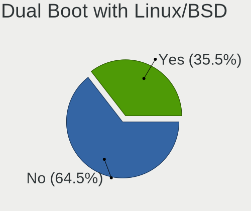
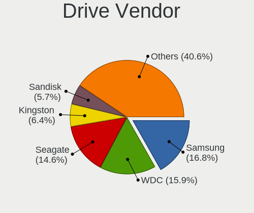
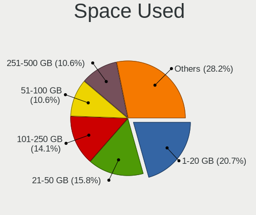
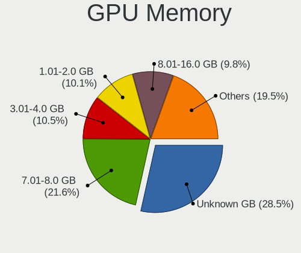
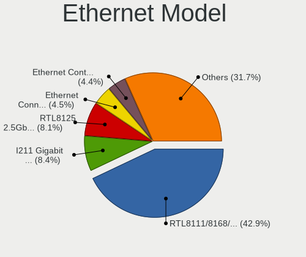

ArcoLinux - Tested Hardware & Statistics (Desktops)
---------------------------------------------------

A project to collect tested hardware configurations for ArcoLinux.

Anyone can contribute to this report by the [hw-probe](https://github.com/linuxhw/hw-probe) tool:

    sudo -E hw-probe -all -upload

Please contribute! Especially if your hardware is rare.

Contents
--------

* [ Test Cases ](#test-cases)

* [ System ](#system)
  - [ OS                       ](#os)
  - [ OS Family                ](#os-family)
  - [ Kernel                   ](#kernel)
  - [ Kernel Family            ](#kernel-family)
  - [ Kernel Major Ver.        ](#kernel-major-ver)
  - [ Arch                     ](#arch)
  - [ DE                       ](#de)
  - [ Display Server           ](#display-server)
  - [ Display Manager          ](#display-manager)
  - [ OS Lang                  ](#os-lang)
  - [ Boot Mode                ](#boot-mode)
  - [ Filesystem               ](#filesystem)
  - [ Part. scheme             ](#part-scheme)
  - [ Dual Boot with Linux/BSD ](#dual-boot-with-linuxbsd)
  - [ Dual Boot (Win)          ](#dual-boot-win)

* [ Board ](#board)
  - [ Vendor                   ](#vendor)
  - [ Model                    ](#model)
  - [ Model Family             ](#model-family)
  - [ MFG Year                 ](#mfg-year)
  - [ Form Factor              ](#form-factor)
  - [ Secure Boot              ](#secure-boot)
  - [ Coreboot                 ](#coreboot)
  - [ RAM Size                 ](#ram-size)
  - [ RAM Used                 ](#ram-used)
  - [ Total Drives             ](#total-drives)
  - [ Has CD-ROM               ](#has-cd-rom)
  - [ Has Ethernet             ](#has-ethernet)
  - [ Has WiFi                 ](#has-wifi)
  - [ Has Bluetooth            ](#has-bluetooth)

* [ Location ](#location)
  - [ Country                  ](#country)
  - [ City                     ](#city)

* [ Drives ](#drives)
  - [ Drive Vendor             ](#drive-vendor)
  - [ Drive Model              ](#drive-model)
  - [ HDD Vendor               ](#hdd-vendor)
  - [ SSD Vendor               ](#ssd-vendor)
  - [ Drive Kind               ](#drive-kind)
  - [ Drive Connector          ](#drive-connector)
  - [ Drive Size               ](#drive-size)
  - [ Space Total              ](#space-total)
  - [ Space Used               ](#space-used)
  - [ Malfunc. Drives          ](#malfunc-drives)
  - [ Malfunc. Drive Vendor    ](#malfunc-drive-vendor)
  - [ Malfunc. HDD Vendor      ](#malfunc-hdd-vendor)
  - [ Malfunc. Drive Kind      ](#malfunc-drive-kind)
  - [ Failed Drives            ](#failed-drives)
  - [ Failed Drive Vendor      ](#failed-drive-vendor)
  - [ Drive Status             ](#drive-status)

* [ Storage controller ](#storage-controller)
  - [ Storage Vendor           ](#storage-vendor)
  - [ Storage Model            ](#storage-model)
  - [ Storage Kind             ](#storage-kind)

* [ Processor ](#processor)
  - [ CPU Vendor               ](#cpu-vendor)
  - [ CPU Model                ](#cpu-model)
  - [ CPU Model Family         ](#cpu-model-family)
  - [ CPU Cores                ](#cpu-cores)
  - [ CPU Sockets              ](#cpu-sockets)
  - [ CPU Threads              ](#cpu-threads)
  - [ CPU Op-Modes             ](#cpu-op-modes)
  - [ CPU Microcode            ](#cpu-microcode)
  - [ CPU Microarch            ](#cpu-microarch)

* [ Graphics ](#graphics)
  - [ GPU Vendor               ](#gpu-vendor)
  - [ GPU Model                ](#gpu-model)
  - [ GPU Combo                ](#gpu-combo)
  - [ GPU Driver               ](#gpu-driver)
  - [ GPU Memory               ](#gpu-memory)

* [ Monitor ](#monitor)
  - [ Monitor Vendor           ](#monitor-vendor)
  - [ Monitor Model            ](#monitor-model)
  - [ Monitor Resolution       ](#monitor-resolution)
  - [ Monitor Diagonal         ](#monitor-diagonal)
  - [ Monitor Width            ](#monitor-width)
  - [ Aspect Ratio             ](#aspect-ratio)
  - [ Monitor Area             ](#monitor-area)
  - [ Pixel Density            ](#pixel-density)
  - [ Multiple Monitors        ](#multiple-monitors)

* [ Network ](#network)
  - [ Net Controller Vendor    ](#net-controller-vendor)
  - [ Net Controller Model     ](#net-controller-model)
  - [ Wireless Vendor          ](#wireless-vendor)
  - [ Wireless Model           ](#wireless-model)
  - [ Ethernet Vendor          ](#ethernet-vendor)
  - [ Ethernet Model           ](#ethernet-model)
  - [ Net Controller Kind      ](#net-controller-kind)
  - [ Used Controller          ](#used-controller)
  - [ NICs                     ](#nics)
  - [ IPv6                     ](#ipv6)

* [ Bluetooth ](#bluetooth)
  - [ Bluetooth Vendor         ](#bluetooth-vendor)
  - [ Bluetooth Model          ](#bluetooth-model)

* [ Sound ](#sound)
  - [ Sound Vendor             ](#sound-vendor)
  - [ Sound Model              ](#sound-model)

* [ Memory ](#memory)
  - [ Memory Vendor            ](#memory-vendor)
  - [ Memory Model             ](#memory-model)
  - [ Memory Kind              ](#memory-kind)
  - [ Memory Form Factor       ](#memory-form-factor)
  - [ Memory Size              ](#memory-size)
  - [ Memory Speed             ](#memory-speed)

* [ Printers & scanners ](#printers--scanners)
  - [ Printer Vendor           ](#printer-vendor)
  - [ Printer Model            ](#printer-model)
  - [ Scanner Vendor           ](#scanner-vendor)
  - [ Scanner Model            ](#scanner-model)

* [ Camera ](#camera)
  - [ Camera Vendor            ](#camera-vendor)
  - [ Camera Model             ](#camera-model)

* [ Security ](#security)
  - [ Fingerprint Vendor       ](#fingerprint-vendor)
  - [ Fingerprint Model        ](#fingerprint-model)
  - [ Chipcard Vendor          ](#chipcard-vendor)
  - [ Chipcard Model           ](#chipcard-model)

* [ Unsupported ](#unsupported)
  - [ Unsupported Devices      ](#unsupported-devices)
  - [ Unsupported Device Types ](#unsupported-device-types)

Test Cases
----------

Total: 1808

| Vendor        | Model                       | Probe                                                      | Date         |
|---------------|-----------------------------|------------------------------------------------------------|--------------|
| MSI           | B550 GAMING GEN3            | [e0f8f7bf56](https://linux-hardware.org/?probe=e0f8f7bf56) | Feb 01, 2024 |
| HP            | 8053                        | [d4cc3a7d7d](https://linux-hardware.org/?probe=d4cc3a7d7d) | Jan 31, 2024 |
| HP            | 802F                        | [7d597a977d](https://linux-hardware.org/?probe=7d597a977d) | Jan 30, 2024 |
| Gigabyte      | Z790 AORUS PRO X            | [37a5bccc7c](https://linux-hardware.org/?probe=37a5bccc7c) | Jan 30, 2024 |
| HP            | 8053                        | [7cba6dd60f](https://linux-hardware.org/?probe=7cba6dd60f) | Jan 30, 2024 |
| MSI           | PRO Z690-A WIFI DDR4        | [e88b2c35d9](https://linux-hardware.org/?probe=e88b2c35d9) | Jan 29, 2024 |
| Dell          | 03NVJ6 A03                  | [2ad42e2ce5](https://linux-hardware.org/?probe=2ad42e2ce5) | Jan 29, 2024 |
| Gigabyte      | B550 AORUS ELITE AX V2      | [29cc3e58d3](https://linux-hardware.org/?probe=29cc3e58d3) | Jan 26, 2024 |
| Gigabyte      | B550 AORUS ELITE AX V2      | [25ca4f9198](https://linux-hardware.org/?probe=25ca4f9198) | Jan 26, 2024 |
| Gigabyte      | Z390 UD V2                  | [43e8fec21d](https://linux-hardware.org/?probe=43e8fec21d) | Jan 25, 2024 |
| MSI           | Z490-A PRO                  | [682c9a3d4b](https://linux-hardware.org/?probe=682c9a3d4b) | Jan 25, 2024 |
| Dell          | 0HD5W2 A01                  | [5c9b7ff711](https://linux-hardware.org/?probe=5c9b7ff711) | Jan 24, 2024 |
| ASRock        | Z370 Extreme4               | [1f8f4bbd8a](https://linux-hardware.org/?probe=1f8f4bbd8a) | Jan 24, 2024 |
| Intel         | X79 (INTEL Xeon E5/Corei... | [f19c285018](https://linux-hardware.org/?probe=f19c285018) | Jan 24, 2024 |
| HP            | 21D0                        | [b9cb80ae88](https://linux-hardware.org/?probe=b9cb80ae88) | Jan 23, 2024 |
| Dell          | 0VTJVC A00                  | [634478296d](https://linux-hardware.org/?probe=634478296d) | Jan 23, 2024 |
| ASUSTek       | PRIME Z490-V                | [fe2523751b](https://linux-hardware.org/?probe=fe2523751b) | Jan 23, 2024 |
| Gigabyte      | Z270-Gaming 3               | [3977f0ba53](https://linux-hardware.org/?probe=3977f0ba53) | Jan 23, 2024 |
| Gigabyte      | X570 GAMING X               | [a2f925963a](https://linux-hardware.org/?probe=a2f925963a) | Jan 22, 2024 |
| Dell          | 0VTJVC A00                  | [006ea19b6d](https://linux-hardware.org/?probe=006ea19b6d) | Jan 21, 2024 |
| ASUSTek       | PRIME B550M-A               | [2a8652365f](https://linux-hardware.org/?probe=2a8652365f) | Jan 21, 2024 |
| ASUSTek       | P8Z77-V PRO                 | [5c7cfc2209](https://linux-hardware.org/?probe=5c7cfc2209) | Jan 20, 2024 |
| MSI           | Z270 GAMING M5              | [e8e8d1eac7](https://linux-hardware.org/?probe=e8e8d1eac7) | Jan 20, 2024 |
| ASUSTek       | ROG Maximus XI HERO         | [d10d02479b](https://linux-hardware.org/?probe=d10d02479b) | Jan 19, 2024 |
| Gigabyte      | A520M K V2                  | [65409c0132](https://linux-hardware.org/?probe=65409c0132) | Jan 19, 2024 |
| Dell          | 0HD5W2 A01                  | [bca96a52c9](https://linux-hardware.org/?probe=bca96a52c9) | Jan 19, 2024 |
| MSI           | PRO B650M-P                 | [1dbda223dd](https://linux-hardware.org/?probe=1dbda223dd) | Jan 19, 2024 |
| MSI           | Z170A KRAIT GAMING          | [a07bb34929](https://linux-hardware.org/?probe=a07bb34929) | Jan 18, 2024 |
| Gigabyte      | H310M DS2 x.x               | [dcbb993ea5](https://linux-hardware.org/?probe=dcbb993ea5) | Jan 18, 2024 |
| MSI           | A320M-A PRO                 | [f118f7960d](https://linux-hardware.org/?probe=f118f7960d) | Jan 18, 2024 |
| Lenovo        | 3106 SDK0J40697 WIN 3305... | [8c0d4eb1d6](https://linux-hardware.org/?probe=8c0d4eb1d6) | Jan 17, 2024 |
| ASUSTek       | P8Z77-V PRO                 | [53e10082bf](https://linux-hardware.org/?probe=53e10082bf) | Jan 17, 2024 |
| ASRock        | A320M-HDV R3.0              | [de188c28b4](https://linux-hardware.org/?probe=de188c28b4) | Jan 16, 2024 |
| MSI           | MPG Z690 EDGE WIFI DDR4     | [d7031bc588](https://linux-hardware.org/?probe=d7031bc588) | Jan 15, 2024 |
| ASUSTek       | Z170 PRO GAMING/AURA        | [64034e1d83](https://linux-hardware.org/?probe=64034e1d83) | Jan 15, 2024 |
| ASUSTek       | Z170 PRO GAMING/AURA        | [37525c1fc4](https://linux-hardware.org/?probe=37525c1fc4) | Jan 15, 2024 |
| MSI           | MPG X570 GAMING PLUS        | [48662f6676](https://linux-hardware.org/?probe=48662f6676) | Jan 14, 2024 |
| HP            | 802F                        | [c1c2cf68cf](https://linux-hardware.org/?probe=c1c2cf68cf) | Jan 13, 2024 |
| ASUSTek       | PRIME H510M-E               | [8d2d7ea755](https://linux-hardware.org/?probe=8d2d7ea755) | Jan 13, 2024 |
| MSI           | PRO Z690-A WIFI DDR4        | [eac19e51a1](https://linux-hardware.org/?probe=eac19e51a1) | Jan 12, 2024 |
| MSI           | MAG X570 TOMAHAWK WIFI      | [ae6f35c2d9](https://linux-hardware.org/?probe=ae6f35c2d9) | Jan 11, 2024 |
| HP            | 886C                        | [2a05d09b63](https://linux-hardware.org/?probe=2a05d09b63) | Jan 11, 2024 |
| ASRock        | B550M Pro4                  | [5a91b2f042](https://linux-hardware.org/?probe=5a91b2f042) | Jan 11, 2024 |
| HP            | 2B2C                        | [6e5219edb5](https://linux-hardware.org/?probe=6e5219edb5) | Jan 11, 2024 |
| Fujitsu       | D3220-A1 S26361-D3220-A1    | [13954507ba](https://linux-hardware.org/?probe=13954507ba) | Jan 10, 2024 |
| Supermicro    | X10DRL-i                    | [874482c96c](https://linux-hardware.org/?probe=874482c96c) | Jan 10, 2024 |
| Dell          | 0YXT71 A01                  | [e50164b814](https://linux-hardware.org/?probe=e50164b814) | Jan 10, 2024 |
| BESSTAR Te... | DMAF5 V1.0                  | [c34b89590f](https://linux-hardware.org/?probe=c34b89590f) | Jan 10, 2024 |
| Supermicro    | X10DRL-i                    | [d51207de50](https://linux-hardware.org/?probe=d51207de50) | Jan 09, 2024 |
| MSI           | MAG X570 TOMAHAWK WIFI      | [d7fb6a77ce](https://linux-hardware.org/?probe=d7fb6a77ce) | Jan 09, 2024 |
| Acer          | Aspire XC-605               | [45cfea1b20](https://linux-hardware.org/?probe=45cfea1b20) | Jan 08, 2024 |
| MSI           | 2A78h                       | [dfa343a5d1](https://linux-hardware.org/?probe=dfa343a5d1) | Jan 08, 2024 |
| MSI           | MPG B550 GAMING PLUS        | [fab97aa087](https://linux-hardware.org/?probe=fab97aa087) | Jan 07, 2024 |
| ASUSTek       | P5KPL-AM SE                 | [3d05259dfb](https://linux-hardware.org/?probe=3d05259dfb) | Jan 07, 2024 |
| ASUSTek       | TUF B450M-PLUS GAMING       | [1db7814b85](https://linux-hardware.org/?probe=1db7814b85) | Jan 07, 2024 |
| MSI           | Z390-A PRO                  | [27f18dc1f7](https://linux-hardware.org/?probe=27f18dc1f7) | Jan 07, 2024 |
| ASRock        | X670E Taichi Carrara        | [f827ab96ab](https://linux-hardware.org/?probe=f827ab96ab) | Jan 07, 2024 |
| Gigabyte      | B450 AORUS ELITE            | [3d68a9a838](https://linux-hardware.org/?probe=3d68a9a838) | Jan 06, 2024 |
| ASUSTek       | ROG STRIX X570-E GAMING     | [9e618c21fe](https://linux-hardware.org/?probe=9e618c21fe) | Jan 05, 2024 |
| ASRock        | Z370 Extreme4               | [0726856482](https://linux-hardware.org/?probe=0726856482) | Jan 05, 2024 |
| ASUSTek       | STRIX Z270H GAMING          | [9085f69422](https://linux-hardware.org/?probe=9085f69422) | Jan 04, 2024 |
| ASRock        | B550M Pro4                  | [0009b1d1c0](https://linux-hardware.org/?probe=0009b1d1c0) | Jan 04, 2024 |
| ASUSTek       | P5KPL-AM SE                 | [34a39f9113](https://linux-hardware.org/?probe=34a39f9113) | Jan 04, 2024 |
| HP            | 83E1                        | [9006156354](https://linux-hardware.org/?probe=9006156354) | Jan 04, 2024 |
| HP            | 2B2C                        | [5ac47f9e43](https://linux-hardware.org/?probe=5ac47f9e43) | Jan 04, 2024 |
| MSI           | B250M BAZOOKA               | [f38a6dd3e9](https://linux-hardware.org/?probe=f38a6dd3e9) | Jan 04, 2024 |
| ASUSTek       | TUF Z390-PRO GAMING         | [e44e9a6818](https://linux-hardware.org/?probe=e44e9a6818) | Jan 03, 2024 |
| HP            | 8433 11                     | [7cb531e95b](https://linux-hardware.org/?probe=7cb531e95b) | Jan 02, 2024 |
| HP            | 886C                        | [790d8f5734](https://linux-hardware.org/?probe=790d8f5734) | Jan 02, 2024 |
| HP            | 0A54h                       | [6db4931db4](https://linux-hardware.org/?probe=6db4931db4) | Jan 02, 2024 |
| HP            | 0A54h                       | [cbf6bc2e02](https://linux-hardware.org/?probe=cbf6bc2e02) | Jan 02, 2024 |
| HP            | 886C                        | [d076e5b70a](https://linux-hardware.org/?probe=d076e5b70a) | Jan 01, 2024 |
| HP            | 18E7                        | [cf9a9bbe99](https://linux-hardware.org/?probe=cf9a9bbe99) | Jan 01, 2024 |
| ASRock        | Z690M Phantom Gaming 4      | [9b11da6c92](https://linux-hardware.org/?probe=9b11da6c92) | Jan 01, 2024 |
| ASRock        | B450 Gaming K4              | [082442f033](https://linux-hardware.org/?probe=082442f033) | Jan 01, 2024 |
| ASUSTek       | TUF Gaming B550-PLUS        | [4b8ffea2ef](https://linux-hardware.org/?probe=4b8ffea2ef) | Jan 01, 2024 |
| Gigabyte      | Z390 UD V2                  | [c7c5239d23](https://linux-hardware.org/?probe=c7c5239d23) | Dec 31, 2023 |
| Gigabyte      | X570S AORUS MASTER          | [cc1f8b0b86](https://linux-hardware.org/?probe=cc1f8b0b86) | Dec 31, 2023 |
| ASUSTek       | PRIME A520M-K               | [7baccc479c](https://linux-hardware.org/?probe=7baccc479c) | Dec 31, 2023 |
| ASRock        | X570 Extreme4               | [13312e6a34](https://linux-hardware.org/?probe=13312e6a34) | Dec 30, 2023 |
| ASRock        | B450 Gaming K4              | [8651fcb2dc](https://linux-hardware.org/?probe=8651fcb2dc) | Dec 30, 2023 |
| ASRock        | H410M/ac                    | [7d74a172c8](https://linux-hardware.org/?probe=7d74a172c8) | Dec 30, 2023 |
| MSI           | MS-B9311                    | [47bab5481d](https://linux-hardware.org/?probe=47bab5481d) | Dec 30, 2023 |
| MSI           | Z590-A PRO                  | [f6eb92aa92](https://linux-hardware.org/?probe=f6eb92aa92) | Dec 30, 2023 |
| Dell          | 03NVJ6 A03                  | [a87a530d24](https://linux-hardware.org/?probe=a87a530d24) | Dec 30, 2023 |
| Acer          | WMCP78M                     | [1384395472](https://linux-hardware.org/?probe=1384395472) | Dec 29, 2023 |
| Dell          | 0HD5W2 A01                  | [91ac22ebca](https://linux-hardware.org/?probe=91ac22ebca) | Dec 29, 2023 |
| ASRock        | Z370 Extreme4               | [97e413d4b8](https://linux-hardware.org/?probe=97e413d4b8) | Dec 29, 2023 |
| Gigabyte      | X570 GAMING X               | [617d953e8f](https://linux-hardware.org/?probe=617d953e8f) | Dec 29, 2023 |
| Gigabyte      | X570 GAMING X               | [587d9f4fcb](https://linux-hardware.org/?probe=587d9f4fcb) | Dec 29, 2023 |
| MSI           | B450 TOMAHAWK MAX           | [656b1b3ae1](https://linux-hardware.org/?probe=656b1b3ae1) | Dec 29, 2023 |
| Gigabyte      | H77-D3H                     | [2fe4c01bc1](https://linux-hardware.org/?probe=2fe4c01bc1) | Dec 28, 2023 |
| ASUSTek       | TUF Gaming B660M-PLUS WI... | [adcd184722](https://linux-hardware.org/?probe=adcd184722) | Dec 28, 2023 |
| ASUSTek       | PRIME X570-P                | [29084d784b](https://linux-hardware.org/?probe=29084d784b) | Dec 28, 2023 |
| ASUSTek       | P8Z77-V LE                  | [da06397f0e](https://linux-hardware.org/?probe=da06397f0e) | Dec 27, 2023 |
| MSI           | B450M PRO-M2                | [5b0afba8bf](https://linux-hardware.org/?probe=5b0afba8bf) | Dec 27, 2023 |
| Gigabyte      | AB350N-Gaming WIFI-CF       | [fccf2df94e](https://linux-hardware.org/?probe=fccf2df94e) | Dec 27, 2023 |
| Gigabyte      | A320M-DS2-CF                | [a0ef6497e0](https://linux-hardware.org/?probe=a0ef6497e0) | Dec 26, 2023 |
| Dell          | 03NVJ6 A03                  | [b6056625fc](https://linux-hardware.org/?probe=b6056625fc) | Dec 26, 2023 |
| Gigabyte      | H310M DS2 x.x               | [47c95a8cc5](https://linux-hardware.org/?probe=47c95a8cc5) | Dec 26, 2023 |
| Unknown       | Unknown                     | [750b06a365](https://linux-hardware.org/?probe=750b06a365) | Dec 24, 2023 |
| Gigabyte      | X670 GAMING X AX            | [4452cd4a25](https://linux-hardware.org/?probe=4452cd4a25) | Dec 24, 2023 |
| Acer          | H81-M1                      | [e9fd2a5dc4](https://linux-hardware.org/?probe=e9fd2a5dc4) | Dec 23, 2023 |
| MSI           | PRO H410M-B                 | [28d6a6092b](https://linux-hardware.org/?probe=28d6a6092b) | Dec 23, 2023 |
| MSI           | B450M PRO-VDH MAX           | [851dce0b14](https://linux-hardware.org/?probe=851dce0b14) | Dec 22, 2023 |
| MACHINIST     | X99-RS9 V2.0                | [e0cd6655cb](https://linux-hardware.org/?probe=e0cd6655cb) | Dec 22, 2023 |
| Gigabyte      | X570 AORUS PRO WIFI         | [119a1632aa](https://linux-hardware.org/?probe=119a1632aa) | Dec 21, 2023 |
| ASUSTek       | Z87-PRO                     | [1c5b8cb7de](https://linux-hardware.org/?probe=1c5b8cb7de) | Dec 21, 2023 |
| Gigabyte      | Z690 AORUS XTREME           | [c721656dbe](https://linux-hardware.org/?probe=c721656dbe) | Dec 20, 2023 |
| MSI           | A78M-E45                    | [6d11f72d41](https://linux-hardware.org/?probe=6d11f72d41) | Dec 20, 2023 |
| ASUSTek       | SABERTOOTH Z170 MARK 1      | [4ea2f3364d](https://linux-hardware.org/?probe=4ea2f3364d) | Dec 19, 2023 |
| ASUSTek       | TUF Gaming B550M-E          | [3dee3cb4bf](https://linux-hardware.org/?probe=3dee3cb4bf) | Dec 19, 2023 |
| ASUSTek       | ROG STRIX X570-E GAMING     | [18cb796b47](https://linux-hardware.org/?probe=18cb796b47) | Dec 19, 2023 |
| Win elemen... | M600                        | [0d0f7a6719](https://linux-hardware.org/?probe=0d0f7a6719) | Dec 19, 2023 |
| Unknown       | HX90                        | [2bf61c79c6](https://linux-hardware.org/?probe=2bf61c79c6) | Dec 18, 2023 |
| MSI           | MAG B550 TOMAHAWK           | [38b0463b4a](https://linux-hardware.org/?probe=38b0463b4a) | Dec 18, 2023 |
| ASUSTek       | WS X299 SAGE                | [cc5a70ea88](https://linux-hardware.org/?probe=cc5a70ea88) | Dec 18, 2023 |
| ASUSTek       | ROG CROSSHAIR VIII DARK ... | [ce269919cd](https://linux-hardware.org/?probe=ce269919cd) | Dec 18, 2023 |
| ASUSTek       | ROG STRIX B550-F GAMING     | [bd0bcd2eba](https://linux-hardware.org/?probe=bd0bcd2eba) | Dec 18, 2023 |
| ASUSTek       | ROG STRIX Z390-E GAMING     | [a62323f9e3](https://linux-hardware.org/?probe=a62323f9e3) | Dec 18, 2023 |
| MSI           | MAG B550M BAZOOKA           | [474668dbec](https://linux-hardware.org/?probe=474668dbec) | Dec 18, 2023 |
| ASUSTek       | WS X299 SAGE                | [6e76ff78f6](https://linux-hardware.org/?probe=6e76ff78f6) | Dec 18, 2023 |
| MSI           | X470 GAMING PRO             | [64d4715e81](https://linux-hardware.org/?probe=64d4715e81) | Dec 18, 2023 |
| ASUSTek       | X99-WS/IPMI                 | [d6ddc6fdde](https://linux-hardware.org/?probe=d6ddc6fdde) | Dec 18, 2023 |
| HP            | 18E7                        | [20a3bd6bee](https://linux-hardware.org/?probe=20a3bd6bee) | Dec 17, 2023 |
| ASRock        | X670E Taichi Carrara        | [2d0eb33a7a](https://linux-hardware.org/?probe=2d0eb33a7a) | Dec 17, 2023 |
| ASUSTek       | P8Z77-V LE                  | [1c2f8035bb](https://linux-hardware.org/?probe=1c2f8035bb) | Dec 17, 2023 |
| ASUSTek       | ROG STRIX B550-E GAMING     | [316b12645c](https://linux-hardware.org/?probe=316b12645c) | Dec 17, 2023 |
| ASUSTek       | ROG STRIX X670E-F GAMING... | [36f9f51f5d](https://linux-hardware.org/?probe=36f9f51f5d) | Dec 16, 2023 |
| ASUSTek       | TUF Gaming B550M-E          | [7866cd7449](https://linux-hardware.org/?probe=7866cd7449) | Dec 16, 2023 |
| ASUSTek       | ROG STRIX B550-E GAMING     | [ec182b1b52](https://linux-hardware.org/?probe=ec182b1b52) | Dec 16, 2023 |
| HP            | 18E7                        | [5923f47c4b](https://linux-hardware.org/?probe=5923f47c4b) | Dec 15, 2023 |
| ASUSTek       | ROG STRIX B550-E GAMING     | [39f4b40998](https://linux-hardware.org/?probe=39f4b40998) | Dec 14, 2023 |
| Dell          | 0TTDMJ A00                  | [66477630d7](https://linux-hardware.org/?probe=66477630d7) | Dec 14, 2023 |
| ASUSTek       | Z87-PRO                     | [5ea78096f6](https://linux-hardware.org/?probe=5ea78096f6) | Dec 14, 2023 |
| HP            | 1495                        | [e187132e56](https://linux-hardware.org/?probe=e187132e56) | Dec 14, 2023 |
| ASRock        | A300M-STX                   | [f6f4e86ea3](https://linux-hardware.org/?probe=f6f4e86ea3) | Dec 13, 2023 |
| HP            | 1495                        | [7c74116b39](https://linux-hardware.org/?probe=7c74116b39) | Dec 13, 2023 |
| Gigabyte      | B450M DS3H WIFI-CF          | [f34c061189](https://linux-hardware.org/?probe=f34c061189) | Dec 12, 2023 |
| Gigabyte      | Z97X-UD5H                   | [b42f33ca53](https://linux-hardware.org/?probe=b42f33ca53) | Dec 12, 2023 |
| Acer          | H81-M1                      | [c6f5b1d841](https://linux-hardware.org/?probe=c6f5b1d841) | Dec 11, 2023 |
| ASUSTek       | PRIME H310M-R R2.0          | [fc475e4cd3](https://linux-hardware.org/?probe=fc475e4cd3) | Dec 11, 2023 |
| HP            | 1850                        | [903e4b5eb1](https://linux-hardware.org/?probe=903e4b5eb1) | Dec 11, 2023 |
| ASUSTek       | PRIME B250M-A               | [43516f3ae9](https://linux-hardware.org/?probe=43516f3ae9) | Dec 10, 2023 |
| Gigabyte      | AB350M-DS3H V2-CF           | [66edf53f93](https://linux-hardware.org/?probe=66edf53f93) | Dec 10, 2023 |
| Dell          | 0F373D A00                  | [cf693d5429](https://linux-hardware.org/?probe=cf693d5429) | Dec 09, 2023 |
| MSI           | A520M PRO-VH                | [96475c0e77](https://linux-hardware.org/?probe=96475c0e77) | Dec 08, 2023 |
| ASRock        | X670E Taichi Carrara        | [9050f85bc9](https://linux-hardware.org/?probe=9050f85bc9) | Dec 08, 2023 |
| Acer          | H81-M1                      | [76ff7a29ae](https://linux-hardware.org/?probe=76ff7a29ae) | Dec 07, 2023 |
| MSI           | Z97 PC Mate                 | [23a0828c28](https://linux-hardware.org/?probe=23a0828c28) | Dec 07, 2023 |
| ASUSTek       | PRIME A520M-K               | [a6f429594d](https://linux-hardware.org/?probe=a6f429594d) | Dec 07, 2023 |
| Lenovo        | Win8 Pro DPK TPG            | [5183612439](https://linux-hardware.org/?probe=5183612439) | Dec 07, 2023 |
| HP            | 2AFB                        | [a91d9cd265](https://linux-hardware.org/?probe=a91d9cd265) | Dec 06, 2023 |
| ASUSTek       | PRIME B550M-A AC            | [9b36560b08](https://linux-hardware.org/?probe=9b36560b08) | Dec 06, 2023 |
| Gigabyte      | B550 AORUS MASTER           | [d52d7379c3](https://linux-hardware.org/?probe=d52d7379c3) | Dec 06, 2023 |
| Gigabyte      | B550 AORUS ELITE AX V2      | [54d3b585e6](https://linux-hardware.org/?probe=54d3b585e6) | Dec 05, 2023 |
| Gigabyte      | Z390 UD V2                  | [2d85fb4799](https://linux-hardware.org/?probe=2d85fb4799) | Dec 05, 2023 |
| Gigabyte      | H370M DS3H-CF               | [332f084cba](https://linux-hardware.org/?probe=332f084cba) | Dec 05, 2023 |
| ASUSTek       | PRIME B350-PLUS             | [a635fe86e0](https://linux-hardware.org/?probe=a635fe86e0) | Dec 04, 2023 |
| MSI           | Z590-A PRO                  | [4298ef81a3](https://linux-hardware.org/?probe=4298ef81a3) | Dec 04, 2023 |
| ASUSTek       | Z87-PRO                     | [a6cce7762e](https://linux-hardware.org/?probe=a6cce7762e) | Dec 04, 2023 |
| Lenovo        | SHARKBAY NOK                | [4c8abee905](https://linux-hardware.org/?probe=4c8abee905) | Dec 03, 2023 |
| MSI           | B450M MORTAR                | [5e8bdafa0a](https://linux-hardware.org/?probe=5e8bdafa0a) | Dec 03, 2023 |
| ASUSTek       | PRIME B350-PLUS             | [931c17aeb7](https://linux-hardware.org/?probe=931c17aeb7) | Dec 02, 2023 |
| MSI           | B460M PRO-VDH WIFI          | [d2ec06fb3c](https://linux-hardware.org/?probe=d2ec06fb3c) | Dec 02, 2023 |
| ASUSTek       | ROG STRIX Z790-F GAMING ... | [305a40c9b7](https://linux-hardware.org/?probe=305a40c9b7) | Dec 02, 2023 |
| ASUSTek       | TUF B450M-PRO GAMING        | [6d97271c61](https://linux-hardware.org/?probe=6d97271c61) | Dec 02, 2023 |
| ASUSTek       | TUF B450M-PRO GAMING        | [0cff3cecd5](https://linux-hardware.org/?probe=0cff3cecd5) | Dec 02, 2023 |
| ASUSTek       | PRIME B450M-A               | [9fee8c35c3](https://linux-hardware.org/?probe=9fee8c35c3) | Nov 30, 2023 |
| ASUSTek       | PRIME B450M-A               | [a27577cb3a](https://linux-hardware.org/?probe=a27577cb3a) | Nov 30, 2023 |
| ASUSTek       | ROG STRIX Z790-F GAMING ... | [fc8b74d0f9](https://linux-hardware.org/?probe=fc8b74d0f9) | Nov 29, 2023 |
| MSI           | X470 GAMING PLUS            | [5030903de4](https://linux-hardware.org/?probe=5030903de4) | Nov 28, 2023 |
| Acer          | Aspire M5400                | [f0e15f3802](https://linux-hardware.org/?probe=f0e15f3802) | Nov 27, 2023 |
| ASUSTek       | X79-DELUXE                  | [b89bce359a](https://linux-hardware.org/?probe=b89bce359a) | Nov 27, 2023 |
| ASUSTek       | TUF Gaming Z690-PLUS WIF... | [7406ad3cc2](https://linux-hardware.org/?probe=7406ad3cc2) | Nov 26, 2023 |
| ASRock        | B450M Steel Legend          | [b0f55cc692](https://linux-hardware.org/?probe=b0f55cc692) | Nov 26, 2023 |
| Dell          | 0V8WGR A01                  | [b44e627796](https://linux-hardware.org/?probe=b44e627796) | Nov 26, 2023 |
| HP            | 1497                        | [1cbc2dbbc9](https://linux-hardware.org/?probe=1cbc2dbbc9) | Nov 26, 2023 |
| ASUSTek       | PRIME Z490-A                | [d1462624ea](https://linux-hardware.org/?probe=d1462624ea) | Nov 24, 2023 |
| NZXT          | N7 B550                     | [eda34615ff](https://linux-hardware.org/?probe=eda34615ff) | Nov 24, 2023 |
| Lenovo        | MAHOBAY NOK                 | [cb6301a778](https://linux-hardware.org/?probe=cb6301a778) | Nov 23, 2023 |
| BESSTAR Te... | UM700                       | [2be2b94342](https://linux-hardware.org/?probe=2be2b94342) | Nov 23, 2023 |
| ASUSTek       | ROG CROSSHAIR VIII HERO     | [abb0181b70](https://linux-hardware.org/?probe=abb0181b70) | Nov 22, 2023 |
| HP            | 18E7                        | [594059fee8](https://linux-hardware.org/?probe=594059fee8) | Nov 21, 2023 |
| ASUSTek       | TUF Gaming B550M-E          | [420d9baddf](https://linux-hardware.org/?probe=420d9baddf) | Nov 21, 2023 |
| MSI           | MAG X570 TOMAHAWK WIFI      | [42064a20b4](https://linux-hardware.org/?probe=42064a20b4) | Nov 21, 2023 |
| Shenzhen M... | F7BFC                       | [bd7cd76d26](https://linux-hardware.org/?probe=bd7cd76d26) | Nov 20, 2023 |
| MACHINIST     | X99-RS9 V2.0                | [6e05364421](https://linux-hardware.org/?probe=6e05364421) | Nov 20, 2023 |
| Dell          | 0KV62T A00                  | [72b1a867da](https://linux-hardware.org/?probe=72b1a867da) | Nov 20, 2023 |
| Acer          | Predator PO3-630            | [8919926380](https://linux-hardware.org/?probe=8919926380) | Nov 20, 2023 |
| ASRock        | B450 Pro4                   | [cfc45028e8](https://linux-hardware.org/?probe=cfc45028e8) | Nov 19, 2023 |
| MSI           | MAG X570 TOMAHAWK WIFI      | [41a350bfbd](https://linux-hardware.org/?probe=41a350bfbd) | Nov 18, 2023 |
| ASUSTek       | H110M-A                     | [79a1012336](https://linux-hardware.org/?probe=79a1012336) | Nov 18, 2023 |
| MACHINIST     | X99-RS9 V2.0                | [eeef8f244c](https://linux-hardware.org/?probe=eeef8f244c) | Nov 18, 2023 |
| MSI           | B550-A PRO                  | [a7467830d5](https://linux-hardware.org/?probe=a7467830d5) | Nov 17, 2023 |
| Acer          | Nitro N50-610               | [648f624587](https://linux-hardware.org/?probe=648f624587) | Nov 16, 2023 |
| MSI           | MAG X570 TOMAHAWK WIFI      | [b33b5da196](https://linux-hardware.org/?probe=b33b5da196) | Nov 16, 2023 |
| ASUSTek       | PRIME B450M-GAMING/BR       | [adaa2215c6](https://linux-hardware.org/?probe=adaa2215c6) | Nov 15, 2023 |
| Intel         | B75                         | [b05bcd24eb](https://linux-hardware.org/?probe=b05bcd24eb) | Nov 15, 2023 |
| ASUSTek       | TUF Gaming B550M-E          | [9d8548f39a](https://linux-hardware.org/?probe=9d8548f39a) | Nov 15, 2023 |
| ASUSTek       | TUF Gaming B550M-E          | [36763f453f](https://linux-hardware.org/?probe=36763f453f) | Nov 13, 2023 |
| Gigabyte      | H410M H V3                  | [6a15b4fb46](https://linux-hardware.org/?probe=6a15b4fb46) | Nov 13, 2023 |
| Shenzhen M... | F7BFC                       | [b375ae991a](https://linux-hardware.org/?probe=b375ae991a) | Nov 12, 2023 |
| Gigabyte      | 970A-DS3P FX                | [269c0ca349](https://linux-hardware.org/?probe=269c0ca349) | Nov 12, 2023 |
| Gigabyte      | AB350M-DS3H V2-CF           | [64b6fe3b3a](https://linux-hardware.org/?probe=64b6fe3b3a) | Nov 11, 2023 |
| Dell          | 09KPNV A00                  | [231b7871d0](https://linux-hardware.org/?probe=231b7871d0) | Nov 11, 2023 |
| ASUSTek       | PRIME A520M-K               | [8e450b21e1](https://linux-hardware.org/?probe=8e450b21e1) | Nov 10, 2023 |
| Gigabyte      | Z390 UD V2                  | [2106c14823](https://linux-hardware.org/?probe=2106c14823) | Nov 10, 2023 |
| ASUSTek       | TUF B450M-PRO GAMING        | [1f65a38863](https://linux-hardware.org/?probe=1f65a38863) | Nov 09, 2023 |
| Gigabyte      | Z390 UD V2                  | [7cdb83cd7a](https://linux-hardware.org/?probe=7cdb83cd7a) | Nov 09, 2023 |
| HP            | 802F                        | [e5d90a5987](https://linux-hardware.org/?probe=e5d90a5987) | Nov 09, 2023 |
| ASRock        | Z77 Extreme4                | [ebe40897c3](https://linux-hardware.org/?probe=ebe40897c3) | Nov 08, 2023 |
| ASUSTek       | TUF B450M-PRO GAMING        | [6970492955](https://linux-hardware.org/?probe=6970492955) | Nov 08, 2023 |
| ASRock        | Z690 Extreme                | [6377c6ca79](https://linux-hardware.org/?probe=6377c6ca79) | Nov 08, 2023 |
| ASRock        | B450M-HDV R4.0              | [c019f410aa](https://linux-hardware.org/?probe=c019f410aa) | Nov 08, 2023 |
| Gigabyte      | Z690 UD DDR4                | [ef9e91fdbf](https://linux-hardware.org/?probe=ef9e91fdbf) | Nov 08, 2023 |
| MACHINIST     | X99-RS9 V2.0                | [84527b43d1](https://linux-hardware.org/?probe=84527b43d1) | Nov 07, 2023 |
| MSI           | A78M-E45                    | [920763b803](https://linux-hardware.org/?probe=920763b803) | Nov 07, 2023 |
| Lenovo        | 3743 SDK0T76463 WIN 3422... | [ce42858c1f](https://linux-hardware.org/?probe=ce42858c1f) | Nov 06, 2023 |
| Gigabyte      | AB350M-DS3H V2-CF           | [99a6c38b5d](https://linux-hardware.org/?probe=99a6c38b5d) | Nov 05, 2023 |
| ASUSTek       | ROG STRIX B550-F GAMING     | [8ee603dbfc](https://linux-hardware.org/?probe=8ee603dbfc) | Nov 05, 2023 |
| Dell          | 048DY8 A01                  | [2ef39546ef](https://linux-hardware.org/?probe=2ef39546ef) | Nov 05, 2023 |
| Gigabyte      | AB350M-DS3H V2-CF           | [c520e5a3b2](https://linux-hardware.org/?probe=c520e5a3b2) | Nov 05, 2023 |
| ASUSTek       | PRIME A520M-K               | [907a7f6dd8](https://linux-hardware.org/?probe=907a7f6dd8) | Nov 05, 2023 |
| MSI           | MPG X570 GAMING PLUS        | [20ffbbc165](https://linux-hardware.org/?probe=20ffbbc165) | Nov 04, 2023 |
| ASUSTek       | Maximus VII HERO            | [a60f1d4a52](https://linux-hardware.org/?probe=a60f1d4a52) | Nov 01, 2023 |
| ASRock        | B250M Pro4                  | [399fe59760](https://linux-hardware.org/?probe=399fe59760) | Nov 01, 2023 |
| Fujitsu       | D4017-A1 S26361-D4017-A1... | [939aebfa68](https://linux-hardware.org/?probe=939aebfa68) | Nov 01, 2023 |
| HP            | 2B01                        | [a345333330](https://linux-hardware.org/?probe=a345333330) | Oct 31, 2023 |
| Gigabyte      | B450M DS3H WIFI V2-CF       | [ac2f19109e](https://linux-hardware.org/?probe=ac2f19109e) | Oct 31, 2023 |
| HP            | 2B01                        | [b3a75824f5](https://linux-hardware.org/?probe=b3a75824f5) | Oct 31, 2023 |
| MACHINIST     | X99-RS9 V2.0                | [d735ec288c](https://linux-hardware.org/?probe=d735ec288c) | Oct 31, 2023 |
| ASUSTek       | ROG STRIX B560-G GAMING ... | [4e5ba58b35](https://linux-hardware.org/?probe=4e5ba58b35) | Oct 30, 2023 |
| MSI           | PRO Z690-A WIFI DDR4        | [23fdd2c31d](https://linux-hardware.org/?probe=23fdd2c31d) | Oct 30, 2023 |
| Dell          | 0T1D10 A01                  | [1b0a34d774](https://linux-hardware.org/?probe=1b0a34d774) | Oct 29, 2023 |
| MSI           | X570-A PRO                  | [b6f56d4f6c](https://linux-hardware.org/?probe=b6f56d4f6c) | Oct 29, 2023 |
| Intel         | B75                         | [7b6b287377](https://linux-hardware.org/?probe=7b6b287377) | Oct 28, 2023 |
| Win elemen... | M600                        | [6a027c490c](https://linux-hardware.org/?probe=6a027c490c) | Oct 28, 2023 |
| ASRock        | X670E Taichi Carrara        | [2ff3541961](https://linux-hardware.org/?probe=2ff3541961) | Oct 28, 2023 |
| Gigabyte      | X570 GAMING X               | [b65f692868](https://linux-hardware.org/?probe=b65f692868) | Oct 26, 2023 |
| Gigabyte      | 990FXA-UD3                  | [f4f26b1c2a](https://linux-hardware.org/?probe=f4f26b1c2a) | Oct 25, 2023 |
| Gigabyte      | B550M DS3H                  | [a70d4b8a0d](https://linux-hardware.org/?probe=a70d4b8a0d) | Oct 25, 2023 |
| ASUSTek       | ROG STRIX B650E-F GAMING... | [4e7be30b13](https://linux-hardware.org/?probe=4e7be30b13) | Oct 25, 2023 |
| Gigabyte      | B450M DS3H V2               | [f99b06d89a](https://linux-hardware.org/?probe=f99b06d89a) | Oct 24, 2023 |
| Acer          | Veriton N4640G              | [ccba40d7a9](https://linux-hardware.org/?probe=ccba40d7a9) | Oct 24, 2023 |
| Gigabyte      | B550 AORUS ELITE V2         | [3daca4912e](https://linux-hardware.org/?probe=3daca4912e) | Oct 24, 2023 |
| Gigabyte      | B550 AORUS MASTER           | [a9dd51be33](https://linux-hardware.org/?probe=a9dd51be33) | Oct 23, 2023 |
| Intel         | HM570                       | [5dba972342](https://linux-hardware.org/?probe=5dba972342) | Oct 23, 2023 |
| AMI           | Intel                       | [5e579268b6](https://linux-hardware.org/?probe=5e579268b6) | Oct 23, 2023 |
| Gigabyte      | 990FXA-UD3                  | [f134292e10](https://linux-hardware.org/?probe=f134292e10) | Oct 23, 2023 |
| Intel         | B75                         | [96f9a95f89](https://linux-hardware.org/?probe=96f9a95f89) | Oct 22, 2023 |
| Gigabyte      | B85N PHOENIX-CF             | [a64a820d24](https://linux-hardware.org/?probe=a64a820d24) | Oct 22, 2023 |
| ASUSTek       | ProArt Z690-CREATOR WIFI    | [38d48bd5b5](https://linux-hardware.org/?probe=38d48bd5b5) | Oct 22, 2023 |
| Acer          | Veriton S2680G              | [da6ff1f2f3](https://linux-hardware.org/?probe=da6ff1f2f3) | Oct 22, 2023 |
| ASRock        | B650M PG Riptide            | [218908299a](https://linux-hardware.org/?probe=218908299a) | Oct 21, 2023 |
| ASUSTek       | PRIME H270-PRO              | [3b1d62c873](https://linux-hardware.org/?probe=3b1d62c873) | Oct 21, 2023 |
| ASUSTek       | P8Z68-V GEN3                | [3216d9052a](https://linux-hardware.org/?probe=3216d9052a) | Oct 21, 2023 |
| Gigabyte      | H410M H V3                  | [0b9affbbb3](https://linux-hardware.org/?probe=0b9affbbb3) | Oct 21, 2023 |
| HP            | 3397                        | [d826d02943](https://linux-hardware.org/?probe=d826d02943) | Oct 20, 2023 |
| Acer          | Predator PO3-620            | [db0c739e61](https://linux-hardware.org/?probe=db0c739e61) | Oct 19, 2023 |
| ASUSTek       | ROG STRIX X370-F GAMING     | [3e5a5380d7](https://linux-hardware.org/?probe=3e5a5380d7) | Oct 18, 2023 |
| ASRock        | B550M-ITX/ac                | [83cb446c19](https://linux-hardware.org/?probe=83cb446c19) | Oct 16, 2023 |
| Dell          | 00F82W A00                  | [410900bf0d](https://linux-hardware.org/?probe=410900bf0d) | Oct 15, 2023 |
| MSI           | MPG Z490 GAMING EDGE WIF... | [9065a343c2](https://linux-hardware.org/?probe=9065a343c2) | Oct 15, 2023 |
| ASUSTek       | ROG Maximus X HERO          | [cdd65525cc](https://linux-hardware.org/?probe=cdd65525cc) | Oct 15, 2023 |
| Unknown       | Unknown                     | [23768d9009](https://linux-hardware.org/?probe=23768d9009) | Oct 15, 2023 |
| ASUSTek       | ROG STRIX B560-I GAMING ... | [79a68614cb](https://linux-hardware.org/?probe=79a68614cb) | Oct 15, 2023 |
| MACHINIST     | X99-RS9 V2.0                | [42e5a09fe2](https://linux-hardware.org/?probe=42e5a09fe2) | Oct 14, 2023 |
| Gigabyte      | B650 AORUS ELITE AX         | [e3a01650f1](https://linux-hardware.org/?probe=e3a01650f1) | Oct 14, 2023 |
| HP            | 18E7                        | [855ab006c1](https://linux-hardware.org/?probe=855ab006c1) | Oct 13, 2023 |
| Gigabyte      | B450 AORUS ELITE            | [8d41cb80bf](https://linux-hardware.org/?probe=8d41cb80bf) | Oct 13, 2023 |
| Gigabyte      | B450 AORUS ELITE            | [339d1c4a25](https://linux-hardware.org/?probe=339d1c4a25) | Oct 13, 2023 |
| Dell          | 03NVJ6 A02                  | [0f40b40836](https://linux-hardware.org/?probe=0f40b40836) | Oct 11, 2023 |
| Gigabyte      | AB350M-DS3H V2-CF           | [89ae9695ef](https://linux-hardware.org/?probe=89ae9695ef) | Oct 11, 2023 |
| Dell          | 00F82W A00                  | [75fd02b856](https://linux-hardware.org/?probe=75fd02b856) | Oct 10, 2023 |
| Dell          | 03NVJ6 A02                  | [8f7a44301e](https://linux-hardware.org/?probe=8f7a44301e) | Oct 10, 2023 |
| Gigabyte      | H87N-WIFI                   | [f010d626da](https://linux-hardware.org/?probe=f010d626da) | Oct 08, 2023 |
| Dell          | 0WWJRX A00                  | [331ecd3ee8](https://linux-hardware.org/?probe=331ecd3ee8) | Oct 06, 2023 |
| Gigabyte      | H81M-H                      | [97dca67f82](https://linux-hardware.org/?probe=97dca67f82) | Oct 06, 2023 |
| ASUSTek       | TUF Gaming B450M-PRO II     | [1deaeb248b](https://linux-hardware.org/?probe=1deaeb248b) | Oct 04, 2023 |
| Acer          | Nitro N50-600 V:1.1         | [8959fc9294](https://linux-hardware.org/?probe=8959fc9294) | Oct 03, 2023 |
| MSI           | Z590-A PRO                  | [373685317f](https://linux-hardware.org/?probe=373685317f) | Oct 03, 2023 |
| HP            | 87D6 SMVB                   | [ac72ba77a1](https://linux-hardware.org/?probe=ac72ba77a1) | Oct 02, 2023 |
| EXPER         | H61H2-MV                    | [5cd287a613](https://linux-hardware.org/?probe=5cd287a613) | Oct 01, 2023 |
| EXPER         | H61H2-MV                    | [7b50b9b997](https://linux-hardware.org/?probe=7b50b9b997) | Oct 01, 2023 |
| MACHINIST     | X99-RS9 V2.0                | [27e61d282f](https://linux-hardware.org/?probe=27e61d282f) | Oct 01, 2023 |
| ASRock        | A320M-DGS                   | [63aafe31f1](https://linux-hardware.org/?probe=63aafe31f1) | Sep 30, 2023 |
| Dell          | 0YXT71 A02                  | [6bc3385414](https://linux-hardware.org/?probe=6bc3385414) | Sep 30, 2023 |
| Gigabyte      | Z87X-UD3H-CF                | [7f47d1f656](https://linux-hardware.org/?probe=7f47d1f656) | Sep 30, 2023 |
| Medion        | MS-7667                     | [a91527e825](https://linux-hardware.org/?probe=a91527e825) | Sep 30, 2023 |
| Gigabyte      | X399 DESIGNARE EX-CF        | [4835df59b1](https://linux-hardware.org/?probe=4835df59b1) | Sep 30, 2023 |
| ASRock        | Z490 Phantom Gaming 4       | [6fc3fe7a63](https://linux-hardware.org/?probe=6fc3fe7a63) | Sep 29, 2023 |
| MACHINIST     | X99-RS9 V2.0                | [51272b2713](https://linux-hardware.org/?probe=51272b2713) | Sep 28, 2023 |
| MACHINIST     | X99-RS9 V2.0                | [1509f60079](https://linux-hardware.org/?probe=1509f60079) | Sep 28, 2023 |
| ASUSTek       | ROG STRIX Z590-E GAMING ... | [797275028d](https://linux-hardware.org/?probe=797275028d) | Sep 28, 2023 |
| ASUSTek       | PRIME B550M-A               | [1476ba44bb](https://linux-hardware.org/?probe=1476ba44bb) | Sep 26, 2023 |
| MSI           | MAG B550 TOMAHAWK           | [3420c7e013](https://linux-hardware.org/?probe=3420c7e013) | Sep 25, 2023 |
| Lenovo        | 3717 SDK0J40700 WIN 3258... | [1f76bcf230](https://linux-hardware.org/?probe=1f76bcf230) | Sep 23, 2023 |
| Lenovo        | 3717 SDK0J40700 WIN 3258... | [0fb4baf82b](https://linux-hardware.org/?probe=0fb4baf82b) | Sep 23, 2023 |
| MSI           | Z270 GAMING M5              | [005d3394c9](https://linux-hardware.org/?probe=005d3394c9) | Sep 20, 2023 |
| ASUSTek       | Q170M2                      | [962ed87784](https://linux-hardware.org/?probe=962ed87784) | Sep 20, 2023 |
| ASUSTek       | Z170 PRO GAMING             | [96a7016b7e](https://linux-hardware.org/?probe=96a7016b7e) | Sep 19, 2023 |
| ASUSTek       | Pro WS WRX80E-SAGE SE WI... | [20eef756df](https://linux-hardware.org/?probe=20eef756df) | Sep 19, 2023 |
| ASUSTek       | ROG CROSSHAIR VIII HERO     | [1f26ced12d](https://linux-hardware.org/?probe=1f26ced12d) | Sep 19, 2023 |
| Gigabyte      | X570 AORUS MASTER           | [bf29b07e79](https://linux-hardware.org/?probe=bf29b07e79) | Sep 19, 2023 |
| ASUSTek       | ROG STRIX Z590-E GAMING ... | [9d59b2b43d](https://linux-hardware.org/?probe=9d59b2b43d) | Sep 19, 2023 |
| ASRock        | B450M Pro4                  | [87f5275af6](https://linux-hardware.org/?probe=87f5275af6) | Sep 18, 2023 |
| Gigabyte      | H310M S2                    | [f6a841ea3d](https://linux-hardware.org/?probe=f6a841ea3d) | Sep 18, 2023 |
| Gigabyte      | Z270-Gaming 3               | [9e795a05f1](https://linux-hardware.org/?probe=9e795a05f1) | Sep 18, 2023 |
| Gigabyte      | B450M DS3H WIFI-CF          | [9f3bdc24af](https://linux-hardware.org/?probe=9f3bdc24af) | Sep 18, 2023 |
| MACHINIST     | X99-RS9 V2.0                | [1875fb96e5](https://linux-hardware.org/?probe=1875fb96e5) | Sep 17, 2023 |
| Dell          | 0VTJVC A00                  | [8a404c05c2](https://linux-hardware.org/?probe=8a404c05c2) | Sep 15, 2023 |
| Gigabyte      | X670 AORUS ELITE AX         | [f15272f431](https://linux-hardware.org/?probe=f15272f431) | Sep 15, 2023 |
| Positivo      | POS-RIB360EE 11144907       | [8c1887fa93](https://linux-hardware.org/?probe=8c1887fa93) | Sep 15, 2023 |
| ASUSTek       | ROG STRIX Z790-E GAMING ... | [c3e468a36f](https://linux-hardware.org/?probe=c3e468a36f) | Sep 15, 2023 |
| ASUSTek       | PRIME Z370-A                | [8b7e93cd9d](https://linux-hardware.org/?probe=8b7e93cd9d) | Sep 14, 2023 |
| ASUSTek       | ROG STRIX Z590-E GAMING ... | [28116ad85d](https://linux-hardware.org/?probe=28116ad85d) | Sep 13, 2023 |
| Gigabyte      | EP45-UD3LR                  | [7dc196091d](https://linux-hardware.org/?probe=7dc196091d) | Sep 12, 2023 |
| ASUSTek       | ROG CROSSHAIR VIII HERO     | [e12c2067df](https://linux-hardware.org/?probe=e12c2067df) | Sep 11, 2023 |
| MSI           | B450M BAZOOKA V2            | [a98de00f8f](https://linux-hardware.org/?probe=a98de00f8f) | Sep 11, 2023 |
| ASRock        | B450M Pro4                  | [b52a6f9b59](https://linux-hardware.org/?probe=b52a6f9b59) | Sep 10, 2023 |
| Gigabyte      | X570 GAMING X               | [8e988d79b7](https://linux-hardware.org/?probe=8e988d79b7) | Sep 09, 2023 |
| BESSTAR Te... | UM700                       | [a93bb80cb8](https://linux-hardware.org/?probe=a93bb80cb8) | Sep 09, 2023 |
| Gigabyte      | H61M-S1                     | [c0bbe7d2b4](https://linux-hardware.org/?probe=c0bbe7d2b4) | Sep 09, 2023 |
| ASUSTek       | P8H61-M LX2 R2.0            | [9d0bacfabd](https://linux-hardware.org/?probe=9d0bacfabd) | Sep 09, 2023 |
| Gigabyte      | X570 AORUS MASTER           | [6ed0b47516](https://linux-hardware.org/?probe=6ed0b47516) | Sep 08, 2023 |
| BESSTAR Te... | HX90                        | [f8c66085b0](https://linux-hardware.org/?probe=f8c66085b0) | Sep 08, 2023 |
| Gigabyte      | Z390 UD V2                  | [598ed8c100](https://linux-hardware.org/?probe=598ed8c100) | Sep 08, 2023 |
| Huanan        | X99-F8 GAMING V5.0          | [6dbe579385](https://linux-hardware.org/?probe=6dbe579385) | Sep 08, 2023 |
| MACHINIST     | X99-RS9 V2.0                | [8fc5475fd3](https://linux-hardware.org/?probe=8fc5475fd3) | Sep 08, 2023 |
| ASUSTek       | PRIME H270-PLUS             | [721c2adc46](https://linux-hardware.org/?probe=721c2adc46) | Sep 07, 2023 |
| BESSTAR Te... | UM700                       | [d635105967](https://linux-hardware.org/?probe=d635105967) | Sep 07, 2023 |
| ASRock        | B450M Pro4                  | [bedbf331b0](https://linux-hardware.org/?probe=bedbf331b0) | Sep 07, 2023 |
| Huanan        | X99-F8 GAMING V5.0          | [a4624a95da](https://linux-hardware.org/?probe=a4624a95da) | Sep 07, 2023 |
| Gigabyte      | B550 AORUS ELITE V2         | [c890510220](https://linux-hardware.org/?probe=c890510220) | Sep 06, 2023 |
| Lenovo        | 3717 SDK0J40700 WIN 3258... | [e47f10b579](https://linux-hardware.org/?probe=e47f10b579) | Sep 06, 2023 |
| Lenovo        | 3717 SDK0J40700 WIN 3258... | [d1cf42c68c](https://linux-hardware.org/?probe=d1cf42c68c) | Sep 06, 2023 |
| ASUSTek       | ROG STRIX Z790-E GAMING ... | [4d1ca2eb79](https://linux-hardware.org/?probe=4d1ca2eb79) | Sep 06, 2023 |
| Gigabyte      | X570 AORUS ELITE            | [995b1f100d](https://linux-hardware.org/?probe=995b1f100d) | Sep 06, 2023 |
| ASRock        | B450M Pro4                  | [cdabed6210](https://linux-hardware.org/?probe=cdabed6210) | Sep 05, 2023 |
| ASRock        | X670E Steel Legend          | [8bca1f8244](https://linux-hardware.org/?probe=8bca1f8244) | Sep 05, 2023 |
| ASUSTek       | P8Z77-V LE                  | [e48cab52a7](https://linux-hardware.org/?probe=e48cab52a7) | Sep 05, 2023 |
| Gigabyte      | X299 AORUS Ultra Gaming-... | [77c07d0f70](https://linux-hardware.org/?probe=77c07d0f70) | Sep 05, 2023 |
| Gigabyte      | X299 AORUS Ultra Gaming-... | [a0aaf4be5d](https://linux-hardware.org/?probe=a0aaf4be5d) | Sep 05, 2023 |
| Gigabyte      | X470 AORUS GAMING 7 WIFI... | [a28ca9b2fb](https://linux-hardware.org/?probe=a28ca9b2fb) | Sep 04, 2023 |
| AZW           | MINI S                      | [331702f893](https://linux-hardware.org/?probe=331702f893) | Sep 04, 2023 |
| Acer          | Nitro N50-600 V:1.1         | [d15e4d0045](https://linux-hardware.org/?probe=d15e4d0045) | Sep 03, 2023 |
| Gigabyte      | B550M DS3H                  | [e05acf231c](https://linux-hardware.org/?probe=e05acf231c) | Sep 03, 2023 |
| Gigabyte      | B450M DS3H WIFI-CF          | [9f8e38af3e](https://linux-hardware.org/?probe=9f8e38af3e) | Sep 02, 2023 |
| ASUSTek       | P8H61-M LX3 R2.0            | [59014a9e20](https://linux-hardware.org/?probe=59014a9e20) | Sep 02, 2023 |
| Shenzhen M... | F6BFC                       | [4b8aead223](https://linux-hardware.org/?probe=4b8aead223) | Sep 01, 2023 |
| MSI           | MPG B550 GAMING PLUS        | [a829cc0dce](https://linux-hardware.org/?probe=a829cc0dce) | Aug 31, 2023 |
| Positivo      | POS-RIB360EE 11144907       | [ebcd50f639](https://linux-hardware.org/?probe=ebcd50f639) | Aug 30, 2023 |
| HP            | 802F                        | [7d065f8fd1](https://linux-hardware.org/?probe=7d065f8fd1) | Aug 30, 2023 |
| Positivo      | POS-RIB360EE 11144907       | [c392d83e8e](https://linux-hardware.org/?probe=c392d83e8e) | Aug 29, 2023 |
| Dell          | 0V8WGR A01                  | [9e5ed52b45](https://linux-hardware.org/?probe=9e5ed52b45) | Aug 29, 2023 |
| ASUSTek       | PRIME B350-PLUS             | [708fc220a9](https://linux-hardware.org/?probe=708fc220a9) | Aug 29, 2023 |
| Dell          | 096JG8 A01                  | [0789880eae](https://linux-hardware.org/?probe=0789880eae) | Aug 29, 2023 |
| ASRock        | X670E Steel Legend          | [6bd291c8b0](https://linux-hardware.org/?probe=6bd291c8b0) | Aug 29, 2023 |
| HP            | 8061                        | [31a0fa50a3](https://linux-hardware.org/?probe=31a0fa50a3) | Aug 29, 2023 |
| Lenovo        | 3717 SDK0J40700 WIN 3258... | [5df3abe62e](https://linux-hardware.org/?probe=5df3abe62e) | Aug 28, 2023 |
| Acer          | Aspire M3470                | [60d18d6d6e](https://linux-hardware.org/?probe=60d18d6d6e) | Aug 28, 2023 |
| Unknown       | Unknown                     | [269a4ac17d](https://linux-hardware.org/?probe=269a4ac17d) | Aug 28, 2023 |
| Gigabyte      | X570 AORUS MASTER           | [8ee512db27](https://linux-hardware.org/?probe=8ee512db27) | Aug 27, 2023 |
| Acer          | Aspire M3470                | [7e6d230bf5](https://linux-hardware.org/?probe=7e6d230bf5) | Aug 27, 2023 |
| ASRock        | X570 Phantom Gaming 4S      | [1be18fe99f](https://linux-hardware.org/?probe=1be18fe99f) | Aug 27, 2023 |
| Lenovo        | 3717 SDK0J40700 WIN 3258... | [512429f429](https://linux-hardware.org/?probe=512429f429) | Aug 27, 2023 |
| HP            | 802F                        | [6759058353](https://linux-hardware.org/?probe=6759058353) | Aug 25, 2023 |
| Gigabyte      | A520M S2H                   | [3898bac5d4](https://linux-hardware.org/?probe=3898bac5d4) | Aug 24, 2023 |
| ASUSTek       | Q170M2                      | [a3de2e9813](https://linux-hardware.org/?probe=a3de2e9813) | Aug 23, 2023 |
| Gigabyte      | X570 AORUS MASTER           | [799390e547](https://linux-hardware.org/?probe=799390e547) | Aug 23, 2023 |
| Dell          | 0D6H9T A00                  | [81b8c378f7](https://linux-hardware.org/?probe=81b8c378f7) | Aug 23, 2023 |
| ASUSTek       | P5Q-E                       | [39fa23e4b7](https://linux-hardware.org/?probe=39fa23e4b7) | Aug 22, 2023 |
| MSI           | B450 TOMAHAWK MAX           | [b4133748fc](https://linux-hardware.org/?probe=b4133748fc) | Aug 21, 2023 |
| Gigabyte      | H61M-S2PV                   | [2e06223da9](https://linux-hardware.org/?probe=2e06223da9) | Aug 21, 2023 |
| ASUSTek       | ROG STRIX X470-I GAMING     | [dedf0b23a3](https://linux-hardware.org/?probe=dedf0b23a3) | Aug 19, 2023 |
| ASRock        | B250M-HDV                   | [d7805c8232](https://linux-hardware.org/?probe=d7805c8232) | Aug 19, 2023 |
| Gigabyte      | Z390 UD V2                  | [9f5242decc](https://linux-hardware.org/?probe=9f5242decc) | Aug 19, 2023 |
| MSI           | MPG X570 GAMING EDGE WIF... | [d8de59f346](https://linux-hardware.org/?probe=d8de59f346) | Aug 19, 2023 |
| MSI           | Indio                       | [162ed509d4](https://linux-hardware.org/?probe=162ed509d4) | Aug 18, 2023 |
| MSI           | Z97 PC Mate                 | [bee6142eee](https://linux-hardware.org/?probe=bee6142eee) | Aug 17, 2023 |
| MSI           | Z77A-G45                    | [b72192373b](https://linux-hardware.org/?probe=b72192373b) | Aug 17, 2023 |
| Gigabyte      | Z390 AORUS PRO-CF           | [8478931432](https://linux-hardware.org/?probe=8478931432) | Aug 17, 2023 |
| Gigabyte      | Z390 UD V2                  | [79d8f79efe](https://linux-hardware.org/?probe=79d8f79efe) | Aug 17, 2023 |
| ASUSTek       | TUF Gaming B450M-PRO II     | [122b800eae](https://linux-hardware.org/?probe=122b800eae) | Aug 16, 2023 |
| ASRock        | B360M Pro4                  | [948ab98a6f](https://linux-hardware.org/?probe=948ab98a6f) | Aug 15, 2023 |
| ASUSTek       | PRIME A320M-K               | [b53cba2654](https://linux-hardware.org/?probe=b53cba2654) | Aug 15, 2023 |
| MSI           | X470 GAMING PLUS MAX        | [64a1b8ad5d](https://linux-hardware.org/?probe=64a1b8ad5d) | Aug 14, 2023 |
| Gigabyte      | X299 AORUS Ultra Gaming ... | [5a3c9080d8](https://linux-hardware.org/?probe=5a3c9080d8) | Aug 14, 2023 |
| MSI           | X470 GAMING PLUS MAX        | [9d7d216fc0](https://linux-hardware.org/?probe=9d7d216fc0) | Aug 14, 2023 |
| Lenovo        | 30BC SDK0J40697 WIN 3305... | [da00873a9d](https://linux-hardware.org/?probe=da00873a9d) | Aug 14, 2023 |
| ASUSTek       | H110M-C/BR                  | [e6da28e1fb](https://linux-hardware.org/?probe=e6da28e1fb) | Aug 14, 2023 |
| ASUSTek       | CROSSHAIR VI HERO           | [c28cbbd2a1](https://linux-hardware.org/?probe=c28cbbd2a1) | Aug 13, 2023 |
| ASUSTek       | CROSSHAIR VI HERO           | [6d1e3a24e8](https://linux-hardware.org/?probe=6d1e3a24e8) | Aug 13, 2023 |
| MSI           | Z97 GAMING 7                | [8414f16824](https://linux-hardware.org/?probe=8414f16824) | Aug 12, 2023 |
| MSI           | MAG B550M MORTAR WIFI       | [b6b99bf7bd](https://linux-hardware.org/?probe=b6b99bf7bd) | Aug 12, 2023 |
| MSI           | X470 GAMING PLUS MAX        | [3ea3856297](https://linux-hardware.org/?probe=3ea3856297) | Aug 12, 2023 |
| ASUSTek       | TUF Gaming X570-PLUS        | [d387c8fec5](https://linux-hardware.org/?probe=d387c8fec5) | Aug 11, 2023 |
| Unknown       | Unknown                     | [a9f30f8dd0](https://linux-hardware.org/?probe=a9f30f8dd0) | Aug 11, 2023 |
| HP            | 158A                        | [96e7fa3b8f](https://linux-hardware.org/?probe=96e7fa3b8f) | Aug 11, 2023 |
| ASUSTek       | ROG STRIX Z690-E GAMING ... | [025afcb20d](https://linux-hardware.org/?probe=025afcb20d) | Aug 10, 2023 |
| ASUSTek       | H87-PRO                     | [817c5f9f93](https://linux-hardware.org/?probe=817c5f9f93) | Aug 09, 2023 |
| ASUSTek       | ROG CROSSHAIR VIII DARK ... | [0cf2ab49c0](https://linux-hardware.org/?probe=0cf2ab49c0) | Aug 09, 2023 |
| SZMZ          | X99M-G2                     | [e22cd6fdac](https://linux-hardware.org/?probe=e22cd6fdac) | Aug 09, 2023 |
| SZMZ          | X99M-G2                     | [2242417727](https://linux-hardware.org/?probe=2242417727) | Aug 09, 2023 |
| Dell          | 073Y7Y A00                  | [cbf4153713](https://linux-hardware.org/?probe=cbf4153713) | Aug 09, 2023 |
| Gigabyte      | H610M S2H DDR4              | [ff4ead4bd3](https://linux-hardware.org/?probe=ff4ead4bd3) | Aug 08, 2023 |
| HP            | 8876 11                     | [059d4c2db2](https://linux-hardware.org/?probe=059d4c2db2) | Aug 07, 2023 |
| HP            | 158A                        | [657812fbbf](https://linux-hardware.org/?probe=657812fbbf) | Aug 07, 2023 |
| ASUSTek       | CROSSHAIR VI HERO           | [51c3d4511a](https://linux-hardware.org/?probe=51c3d4511a) | Aug 07, 2023 |
| ASUSTek       | PRIME H310T R2.0            | [458a26f70c](https://linux-hardware.org/?probe=458a26f70c) | Aug 06, 2023 |
| ASRock        | B460 Phantom Gaming 4       | [5a254fe1d6](https://linux-hardware.org/?probe=5a254fe1d6) | Aug 06, 2023 |
| Lenovo        | 30BC SDK0J40697 WIN 3305... | [f670b492a9](https://linux-hardware.org/?probe=f670b492a9) | Aug 06, 2023 |
| Lenovo        | SDK0E50510 WIN              | [35bb5f3e65](https://linux-hardware.org/?probe=35bb5f3e65) | Aug 06, 2023 |
| ASRock        | Z75 Pro3                    | [597461a5ac](https://linux-hardware.org/?probe=597461a5ac) | Aug 06, 2023 |
| ASUSTek       | PRIME A320M-K               | [48cf16e31d](https://linux-hardware.org/?probe=48cf16e31d) | Aug 06, 2023 |
| ASUSTek       | ROG STRIX X570-E GAMING     | [eb92759c2a](https://linux-hardware.org/?probe=eb92759c2a) | Aug 05, 2023 |
| ASUSTek       | CROSSHAIR VI HERO           | [dd1767aec1](https://linux-hardware.org/?probe=dd1767aec1) | Aug 04, 2023 |
| ASUSTek       | TUF Gaming B560-PLUS WIF... | [af4f153b11](https://linux-hardware.org/?probe=af4f153b11) | Aug 04, 2023 |
| ASRock        | N68-VS3 UCC                 | [c163ae3710](https://linux-hardware.org/?probe=c163ae3710) | Aug 04, 2023 |
| ASUSTek       | ROG Maximus X HERO          | [656e917b79](https://linux-hardware.org/?probe=656e917b79) | Aug 04, 2023 |
| ASUSTek       | M5A78L-M/USB3               | [363bee1696](https://linux-hardware.org/?probe=363bee1696) | Aug 03, 2023 |
| ASUSTek       | TUF Gaming B660-PLUS WIF... | [31d1c3bfbc](https://linux-hardware.org/?probe=31d1c3bfbc) | Aug 03, 2023 |
| HP            | 21D0                        | [44e0cbb52e](https://linux-hardware.org/?probe=44e0cbb52e) | Aug 03, 2023 |
| HP            | 21D0                        | [099fea9193](https://linux-hardware.org/?probe=099fea9193) | Aug 02, 2023 |
| MSI           | H170M PRO-DH                | [e0b553c4dd](https://linux-hardware.org/?probe=e0b553c4dd) | Aug 02, 2023 |
| Gigabyte      | B650I AORUS ULTRA           | [26cca552dd](https://linux-hardware.org/?probe=26cca552dd) | Aug 01, 2023 |
| BESSTAR Te... | DMAF5 V1.0                  | [93c8724c91](https://linux-hardware.org/?probe=93c8724c91) | Jul 31, 2023 |
| Unknown       | HX90                        | [2eba30b5be](https://linux-hardware.org/?probe=2eba30b5be) | Jul 30, 2023 |
| ASUSTek       | CROSSHAIR VI HERO           | [60bf32a368](https://linux-hardware.org/?probe=60bf32a368) | Jul 29, 2023 |
| Dell          | 0KV62T A00                  | [1b9bb7c266](https://linux-hardware.org/?probe=1b9bb7c266) | Jul 29, 2023 |
| ASRock        | B450M/ac                    | [51d9b57967](https://linux-hardware.org/?probe=51d9b57967) | Jul 29, 2023 |
| MSI           | B360M BAZOOKA               | [081608e70c](https://linux-hardware.org/?probe=081608e70c) | Jul 28, 2023 |
| Intel         | HM570                       | [c969a88e87](https://linux-hardware.org/?probe=c969a88e87) | Jul 28, 2023 |
| Apple         | Mac-F60DEB81FF30ACF6 Mac... | [3c0f7ba188](https://linux-hardware.org/?probe=3c0f7ba188) | Jul 27, 2023 |
| ASUSTek       | ROG STRIX B560-G GAMING ... | [d32fa8840b](https://linux-hardware.org/?probe=d32fa8840b) | Jul 27, 2023 |
| Dell          | 00V62H A01                  | [1a6962dc65](https://linux-hardware.org/?probe=1a6962dc65) | Jul 27, 2023 |
| ASUSTek       | CROSSHAIR VI HERO           | [0b04075e09](https://linux-hardware.org/?probe=0b04075e09) | Jul 27, 2023 |
| ASRock        | B360M Pro4                  | [20221ed288](https://linux-hardware.org/?probe=20221ed288) | Jul 27, 2023 |
| Lenovo        | 3743 SDK0J40700 WIN 3258... | [546f011b1a](https://linux-hardware.org/?probe=546f011b1a) | Jul 27, 2023 |
| Gigabyte      | 970A-D3P                    | [fcb6317c1b](https://linux-hardware.org/?probe=fcb6317c1b) | Jul 25, 2023 |
| SiS Techno... | 760                         | [1c5bd52522](https://linux-hardware.org/?probe=1c5bd52522) | Jul 24, 2023 |
| MSI           | B460M PRO-VDH WIFI          | [df1a812c11](https://linux-hardware.org/?probe=df1a812c11) | Jul 24, 2023 |
| Gigabyte      | 970A-D3P                    | [bd66a96c97](https://linux-hardware.org/?probe=bd66a96c97) | Jul 24, 2023 |
| ASUSTek       | CROSSHAIR VI HERO           | [579d5d5771](https://linux-hardware.org/?probe=579d5d5771) | Jul 24, 2023 |
| Gigabyte      | X570 AORUS ELITE            | [ae4343c245](https://linux-hardware.org/?probe=ae4343c245) | Jul 23, 2023 |
| ASUSTek       | TUF Z270 MARK 2             | [b844b9a353](https://linux-hardware.org/?probe=b844b9a353) | Jul 23, 2023 |
| Gigabyte      | B450M S2H                   | [f2f1f87d0c](https://linux-hardware.org/?probe=f2f1f87d0c) | Jul 23, 2023 |
| Dell          | 0KV62T A00                  | [f291f72d81](https://linux-hardware.org/?probe=f291f72d81) | Jul 23, 2023 |
| Gigabyte      | Z390 I AORUS PRO WIFI-CF    | [c4890b8f34](https://linux-hardware.org/?probe=c4890b8f34) | Jul 23, 2023 |
| ASRock        | B250M Pro4                  | [23d73ededd](https://linux-hardware.org/?probe=23d73ededd) | Jul 23, 2023 |
| ASRock        | B550M-HDV                   | [af255054c3](https://linux-hardware.org/?probe=af255054c3) | Jul 22, 2023 |
| ASUSTek       | X99-DELUXE II               | [afc4d3c307](https://linux-hardware.org/?probe=afc4d3c307) | Jul 22, 2023 |
| HP            | 21D0                        | [774375de1f](https://linux-hardware.org/?probe=774375de1f) | Jul 22, 2023 |
| ASUSTek       | Q170M2                      | [f3435d221b](https://linux-hardware.org/?probe=f3435d221b) | Jul 21, 2023 |
| Biostar       | A320MH                      | [5fd84925fd](https://linux-hardware.org/?probe=5fd84925fd) | Jul 20, 2023 |
| ASUSTek       | M5A78L-M/USB3               | [874f8dff98](https://linux-hardware.org/?probe=874f8dff98) | Jul 20, 2023 |
| Gigabyte      | X570 AORUS MASTER           | [d1dee26c33](https://linux-hardware.org/?probe=d1dee26c33) | Jul 20, 2023 |
| ASUSTek       | TUF Gaming X570-PLUS        | [c8fa0f7219](https://linux-hardware.org/?probe=c8fa0f7219) | Jul 19, 2023 |
| ASUSTek       | P8Z77-V PRO                 | [ef3c6c941e](https://linux-hardware.org/?probe=ef3c6c941e) | Jul 18, 2023 |
| MSI           | MAG B550 TOMAHAWK           | [322db1cde6](https://linux-hardware.org/?probe=322db1cde6) | Jul 18, 2023 |
| ASUSTek       | ROG STRIX B550-E GAMING     | [f0ecaa209e](https://linux-hardware.org/?probe=f0ecaa209e) | Jul 18, 2023 |
| ASUSTek       | CROSSHAIR VI HERO           | [553cbdb79d](https://linux-hardware.org/?probe=553cbdb79d) | Jul 17, 2023 |
| MSI           | B450 TOMAHAWK               | [56a9ce9630](https://linux-hardware.org/?probe=56a9ce9630) | Jul 17, 2023 |
| ASRock        | B450M Steel Legend          | [19b39ef686](https://linux-hardware.org/?probe=19b39ef686) | Jul 16, 2023 |
| Fujitsu       | D3222-A1 S26361-D3222-A1    | [61ed023e0c](https://linux-hardware.org/?probe=61ed023e0c) | Jul 16, 2023 |
| HP            | 8053                        | [bcdddcb036](https://linux-hardware.org/?probe=bcdddcb036) | Jul 15, 2023 |
| MSI           | MAG B550 TOMAHAWK           | [0ac2423aa2](https://linux-hardware.org/?probe=0ac2423aa2) | Jul 14, 2023 |
| Gigabyte      | B550 GAMING X               | [67b2bb6155](https://linux-hardware.org/?probe=67b2bb6155) | Jul 14, 2023 |
| ASUSTek       | ROG STRIX X670E-E GAMING... | [91145d3929](https://linux-hardware.org/?probe=91145d3929) | Jul 13, 2023 |
| MSI           | MAG B550 TOMAHAWK           | [2f943c811e](https://linux-hardware.org/?probe=2f943c811e) | Jul 13, 2023 |
| ASUSTek       | PRIME Z490-A                | [b189eebd1c](https://linux-hardware.org/?probe=b189eebd1c) | Jul 13, 2023 |
| ASRock        | B250M-HDV                   | [85d4919b9c](https://linux-hardware.org/?probe=85d4919b9c) | Jul 12, 2023 |
| ASUSTek       | PRIME A320M-K               | [a167d41a74](https://linux-hardware.org/?probe=a167d41a74) | Jul 12, 2023 |
| MSI           | G41M-P33 Combo              | [cc4f862316](https://linux-hardware.org/?probe=cc4f862316) | Jul 11, 2023 |
| HP            | 21D0                        | [a6d51a414c](https://linux-hardware.org/?probe=a6d51a414c) | Jul 11, 2023 |
| MSI           | MS-7309                     | [16f6545b66](https://linux-hardware.org/?probe=16f6545b66) | Jul 10, 2023 |
| ASUSTek       | H87-PRO                     | [ef2ca9e804](https://linux-hardware.org/?probe=ef2ca9e804) | Jul 10, 2023 |
| ASUSTek       | P8Z77-V PRO                 | [3924343595](https://linux-hardware.org/?probe=3924343595) | Jul 10, 2023 |
| Gigabyte      | X79-UD3                     | [61ac758cca](https://linux-hardware.org/?probe=61ac758cca) | Jul 10, 2023 |
| ASRock        | B460M-HDV                   | [7790bc9f7b](https://linux-hardware.org/?probe=7790bc9f7b) | Jul 09, 2023 |
| ASRock        | X570 Taichi                 | [ea2102a05b](https://linux-hardware.org/?probe=ea2102a05b) | Jul 09, 2023 |
| ASRock        | X570 Taichi                 | [655b6ba155](https://linux-hardware.org/?probe=655b6ba155) | Jul 09, 2023 |
| Intel         | H61                         | [11e024727c](https://linux-hardware.org/?probe=11e024727c) | Jul 09, 2023 |
| Unknown       | Unknown                     | [ee4b75fe8e](https://linux-hardware.org/?probe=ee4b75fe8e) | Jul 09, 2023 |
| HP            | 83E2                        | [7764034dad](https://linux-hardware.org/?probe=7764034dad) | Jul 08, 2023 |
| ASUSTek       | PRIME H310T R2.0            | [28b2f72ea7](https://linux-hardware.org/?probe=28b2f72ea7) | Jul 07, 2023 |
| Acer          | Predator G3600              | [79f515acf1](https://linux-hardware.org/?probe=79f515acf1) | Jul 07, 2023 |
| ASUSTek       | PRIME X370-PRO              | [1327d1ff3b](https://linux-hardware.org/?probe=1327d1ff3b) | Jul 07, 2023 |
| ASUSTek       | M5A78L-M/USB3               | [e7a7107e85](https://linux-hardware.org/?probe=e7a7107e85) | Jul 07, 2023 |
| Dell          | 0K240Y A02                  | [7d1d71b0fe](https://linux-hardware.org/?probe=7d1d71b0fe) | Jul 06, 2023 |
| HP            | 8053                        | [66ee68d1ba](https://linux-hardware.org/?probe=66ee68d1ba) | Jul 05, 2023 |
| Gigabyte      | X570 GAMING X               | [56609b5da2](https://linux-hardware.org/?probe=56609b5da2) | Jul 05, 2023 |
| ASUSTek       | ROG STRIX X470-F GAMING     | [cd2c46c45c](https://linux-hardware.org/?probe=cd2c46c45c) | Jul 05, 2023 |
| ASUSTek       | PRIME H310M-E/BR            | [941c70d512](https://linux-hardware.org/?probe=941c70d512) | Jul 04, 2023 |
| Hardkernel    | ODROID-H3                   | [075cc6eb8a](https://linux-hardware.org/?probe=075cc6eb8a) | Jul 04, 2023 |
| ASUSTek       | ROG STRIX X670E-E GAMING... | [bba1bf2655](https://linux-hardware.org/?probe=bba1bf2655) | Jul 04, 2023 |
| Foxconn       | H81MXV/H81MXV-D             | [5920f3fec9](https://linux-hardware.org/?probe=5920f3fec9) | Jul 04, 2023 |
| Chuwi         | RZBOX                       | [78bdc20fe8](https://linux-hardware.org/?probe=78bdc20fe8) | Jul 03, 2023 |
| HP            | 886C                        | [735b488512](https://linux-hardware.org/?probe=735b488512) | Jul 03, 2023 |
| ASUSTek       | ROG STRIX B550-E GAMING     | [b7222ef19f](https://linux-hardware.org/?probe=b7222ef19f) | Jul 03, 2023 |
| Lenovo        | 30BC SDK0J40697 WIN 3305... | [6ce7d33591](https://linux-hardware.org/?probe=6ce7d33591) | Jul 03, 2023 |
| Dell          | 0HD5W2 A01                  | [e3285ce484](https://linux-hardware.org/?probe=e3285ce484) | Jul 02, 2023 |
| ASUSTek       | TUF B450M-PLUS GAMING       | [4f24850748](https://linux-hardware.org/?probe=4f24850748) | Jul 02, 2023 |
| ASUSTek       | ROG CROSSHAIR VIII HERO     | [5a84f67b67](https://linux-hardware.org/?probe=5a84f67b67) | Jul 02, 2023 |
| MSI           | A320M GAMING PRO            | [7bdc183ddc](https://linux-hardware.org/?probe=7bdc183ddc) | Jul 02, 2023 |
| ASUSTek       | PRIME B350-PLUS             | [f22f547276](https://linux-hardware.org/?probe=f22f547276) | Jul 01, 2023 |
| ASUSTek       | PRIME Z490-A                | [d3fb700ff1](https://linux-hardware.org/?probe=d3fb700ff1) | Jul 01, 2023 |
| Gigabyte      | Z77X-D3H                    | [3e1517b7a7](https://linux-hardware.org/?probe=3e1517b7a7) | Jun 30, 2023 |
| MSI           | B450-A PRO MAX              | [69cb8803e1](https://linux-hardware.org/?probe=69cb8803e1) | Jun 29, 2023 |
| Dell          | 0GY6Y8 A02                  | [eb31590a2c](https://linux-hardware.org/?probe=eb31590a2c) | Jun 29, 2023 |
| ASUSTek       | ROG STRIX X470-I GAMING     | [b8194aee09](https://linux-hardware.org/?probe=b8194aee09) | Jun 28, 2023 |
| Gigabyte      | Z490 AORUS MASTER           | [031ec94437](https://linux-hardware.org/?probe=031ec94437) | Jun 28, 2023 |
| ASRock        | Z75 Pro3                    | [cb40f5d060](https://linux-hardware.org/?probe=cb40f5d060) | Jun 28, 2023 |
| ASRock        | Z75 Pro3                    | [13ac46e7fb](https://linux-hardware.org/?probe=13ac46e7fb) | Jun 28, 2023 |
| ASRock        | B460M-HDV                   | [966b21f9af](https://linux-hardware.org/?probe=966b21f9af) | Jun 28, 2023 |
| ASUSTek       | PRIME Z390-P                | [1ef6edecef](https://linux-hardware.org/?probe=1ef6edecef) | Jun 28, 2023 |
| AZW           | GTR V02                     | [d8a1975328](https://linux-hardware.org/?probe=d8a1975328) | Jun 27, 2023 |
| HP            | 2B2C                        | [a8ec805431](https://linux-hardware.org/?probe=a8ec805431) | Jun 27, 2023 |
| ASUSTek       | TUF B450M-PLUS GAMING       | [9e3cbeb0f5](https://linux-hardware.org/?probe=9e3cbeb0f5) | Jun 27, 2023 |
| ASRock        | G31M-S                      | [2437008395](https://linux-hardware.org/?probe=2437008395) | Jun 26, 2023 |
| HP            | 859B                        | [63fdd4ed7e](https://linux-hardware.org/?probe=63fdd4ed7e) | Jun 26, 2023 |
| ASUSTek       | ROG STRIX B450-F GAMING     | [13c7f88d66](https://linux-hardware.org/?probe=13c7f88d66) | Jun 26, 2023 |
| ASUSTek       | PRIME B560M-A AC            | [b598080123](https://linux-hardware.org/?probe=b598080123) | Jun 26, 2023 |
| HP            | 8599                        | [d72522f488](https://linux-hardware.org/?probe=d72522f488) | Jun 26, 2023 |
| Gigabyte      | B450M GAMING                | [bc4e778aa5](https://linux-hardware.org/?probe=bc4e778aa5) | Jun 26, 2023 |
| MSI           | MAG B550M BAZOOKA           | [ad1a470baf](https://linux-hardware.org/?probe=ad1a470baf) | Jun 26, 2023 |
| ASUSTek       | TUF Gaming X570-PLUS        | [3df76bbd0e](https://linux-hardware.org/?probe=3df76bbd0e) | Jun 26, 2023 |
| Gigabyte      | GA-78LMT-S2 sex             | [49172baecf](https://linux-hardware.org/?probe=49172baecf) | Jun 26, 2023 |
| ASUSTek       | ROG STRIX B550-F GAMING ... | [1a21c582de](https://linux-hardware.org/?probe=1a21c582de) | Jun 26, 2023 |
| HP            | 2B2C                        | [3b82186362](https://linux-hardware.org/?probe=3b82186362) | Jun 26, 2023 |
| Intel         | X99H                        | [60f1f4a8ba](https://linux-hardware.org/?probe=60f1f4a8ba) | Jun 25, 2023 |
| ASUSTek       | ROG STRIX X570-E GAMING ... | [62dd78e250](https://linux-hardware.org/?probe=62dd78e250) | Jun 25, 2023 |
| MSI           | MPG B550 GAMING PLUS        | [f84d78f3cf](https://linux-hardware.org/?probe=f84d78f3cf) | Jun 24, 2023 |
| Intel         | H61                         | [0f1d3e1299](https://linux-hardware.org/?probe=0f1d3e1299) | Jun 24, 2023 |
| HP            | 0A54h                       | [7383b90fc8](https://linux-hardware.org/?probe=7383b90fc8) | Jun 24, 2023 |
| ASUSTek       | PRIME Z490-A                | [b7ac1c1ba6](https://linux-hardware.org/?probe=b7ac1c1ba6) | Jun 24, 2023 |
| Gigabyte      | B550 AORUS PRO AC           | [cafe332307](https://linux-hardware.org/?probe=cafe332307) | Jun 24, 2023 |
| HP            | 0A54h                       | [8cf79bc35e](https://linux-hardware.org/?probe=8cf79bc35e) | Jun 23, 2023 |
| MSI           | A320M GAMING PRO            | [70b7839ea8](https://linux-hardware.org/?probe=70b7839ea8) | Jun 23, 2023 |
| ASRock        | B360M Pro4                  | [645a24c7bc](https://linux-hardware.org/?probe=645a24c7bc) | Jun 23, 2023 |
| Hardkernel    | ODROID-H3                   | [7f87bb5b32](https://linux-hardware.org/?probe=7f87bb5b32) | Jun 23, 2023 |
| MSI           | B360M BAZOOKA               | [2807f81cc7](https://linux-hardware.org/?probe=2807f81cc7) | Jun 22, 2023 |
| Dell          | 0HD5W2 A01                  | [bbdbdd30a9](https://linux-hardware.org/?probe=bbdbdd30a9) | Jun 22, 2023 |
| HP            | 2B2C                        | [4303d28839](https://linux-hardware.org/?probe=4303d28839) | Jun 22, 2023 |
| HP            | 802F                        | [da2666b4b8](https://linux-hardware.org/?probe=da2666b4b8) | Jun 22, 2023 |
| Gigabyte      | H87N-WIFI                   | [3d506cafad](https://linux-hardware.org/?probe=3d506cafad) | Jun 22, 2023 |
| Lenovo        | 3730 SDK0T76465 WIN 3422... | [5199a5d1f8](https://linux-hardware.org/?probe=5199a5d1f8) | Jun 22, 2023 |
| Gigabyte      | GA-78LMT-S2 sex             | [198b248306](https://linux-hardware.org/?probe=198b248306) | Jun 22, 2023 |
| MSI           | X99A SLI Krait Edition      | [2e86965134](https://linux-hardware.org/?probe=2e86965134) | Jun 21, 2023 |
| MSI           | MAG B550M BAZOOKA           | [fd3c5ae570](https://linux-hardware.org/?probe=fd3c5ae570) | Jun 21, 2023 |
| HP            | 802F                        | [96b020f763](https://linux-hardware.org/?probe=96b020f763) | Jun 21, 2023 |
| MSI           | MAG B550M BAZOOKA           | [529320d8fe](https://linux-hardware.org/?probe=529320d8fe) | Jun 20, 2023 |
| Gigabyte      | Z97X-Gaming 3               | [b6b7fa0f5d](https://linux-hardware.org/?probe=b6b7fa0f5d) | Jun 19, 2023 |
| MSI           | Z170A GAMING M7             | [49e7c6d51b](https://linux-hardware.org/?probe=49e7c6d51b) | Jun 19, 2023 |
| ASUSTek       | PRIME H510M-E               | [7b370bd18c](https://linux-hardware.org/?probe=7b370bd18c) | Jun 19, 2023 |
| ASRock        | B450 Pro4                   | [3acc831573](https://linux-hardware.org/?probe=3acc831573) | Jun 19, 2023 |
| Gigabyte      | H87N-WIFI                   | [6579287940](https://linux-hardware.org/?probe=6579287940) | Jun 18, 2023 |
| Dell          | 06JWJY A01                  | [2131eadb5b](https://linux-hardware.org/?probe=2131eadb5b) | Jun 18, 2023 |
| Gigabyte      | X79-UD3                     | [8fe751618d](https://linux-hardware.org/?probe=8fe751618d) | Jun 18, 2023 |
| Gigabyte      | X79-UD3                     | [337d8e9d36](https://linux-hardware.org/?probe=337d8e9d36) | Jun 18, 2023 |
| Intel         | H55                         | [d47f462b1a](https://linux-hardware.org/?probe=d47f462b1a) | Jun 17, 2023 |
| HP            | 886C                        | [ef429234c7](https://linux-hardware.org/?probe=ef429234c7) | Jun 16, 2023 |
| Intel         | H55                         | [76c89618f1](https://linux-hardware.org/?probe=76c89618f1) | Jun 16, 2023 |
| MSI           | B360M BAZOOKA               | [4448a99385](https://linux-hardware.org/?probe=4448a99385) | Jun 16, 2023 |
| MSI           | B450 TOMAHAWK               | [16ad11571a](https://linux-hardware.org/?probe=16ad11571a) | Jun 15, 2023 |
| MSI           | MPG Z390 GAMING EDGE AC     | [c612df2e8c](https://linux-hardware.org/?probe=c612df2e8c) | Jun 15, 2023 |
| ASUSTek       | PRIME H310M-E/BR            | [9c446242a8](https://linux-hardware.org/?probe=9c446242a8) | Jun 15, 2023 |
| Intel         | H61                         | [ac2b137243](https://linux-hardware.org/?probe=ac2b137243) | Jun 15, 2023 |
| ASRock        | Z97 Extreme6                | [8f727c50fb](https://linux-hardware.org/?probe=8f727c50fb) | Jun 14, 2023 |
| ASUSTek       | STRIX Z270H GAMING          | [192105166b](https://linux-hardware.org/?probe=192105166b) | Jun 14, 2023 |
| MSI           | B450 TOMAHAWK               | [bd6a04d15d](https://linux-hardware.org/?probe=bd6a04d15d) | Jun 13, 2023 |
| Gigabyte      | B450M DS3H V2               | [c3ec3eaa27](https://linux-hardware.org/?probe=c3ec3eaa27) | Jun 13, 2023 |
| MSI           | B450 TOMAHAWK               | [58235def6c](https://linux-hardware.org/?probe=58235def6c) | Jun 12, 2023 |
| Gigabyte      | X570 AORUS ELITE            | [7be8732d39](https://linux-hardware.org/?probe=7be8732d39) | Jun 12, 2023 |
| ASUSTek       | SABERTOOTH 990FX            | [f92739d54b](https://linux-hardware.org/?probe=f92739d54b) | Jun 11, 2023 |
| ASUSTek       | PRIME A520M-K               | [2fe8080014](https://linux-hardware.org/?probe=2fe8080014) | Jun 11, 2023 |
| MSI           | Z390-A PRO                  | [8a07e36a48](https://linux-hardware.org/?probe=8a07e36a48) | Jun 11, 2023 |
| ASRock        | B360M Pro4                  | [396e828c07](https://linux-hardware.org/?probe=396e828c07) | Jun 11, 2023 |
| ASUSTek       | ROG STRIX B550-F GAMING ... | [864729436a](https://linux-hardware.org/?probe=864729436a) | Jun 11, 2023 |
| ASUSTek       | SABERTOOTH 990FX            | [07dac575d9](https://linux-hardware.org/?probe=07dac575d9) | Jun 10, 2023 |
| ASRock        | B450 Pro4                   | [49ebfc0459](https://linux-hardware.org/?probe=49ebfc0459) | Jun 10, 2023 |
| ASUSTek       | ROG STRIX B550-F GAMING ... | [7ab0866235](https://linux-hardware.org/?probe=7ab0866235) | Jun 10, 2023 |
| MSI           | MS-B9321                    | [a7a878dbe6](https://linux-hardware.org/?probe=a7a878dbe6) | Jun 10, 2023 |
| ASUSTek       | TUF Gaming X570-PLUS        | [0eae3567d9](https://linux-hardware.org/?probe=0eae3567d9) | Jun 10, 2023 |
| ASRock        | B550AM Gaming               | [eca79c3bbb](https://linux-hardware.org/?probe=eca79c3bbb) | Jun 10, 2023 |
| ASUSTek       | ROG STRIX X670E-E GAMING... | [5446a0003e](https://linux-hardware.org/?probe=5446a0003e) | Jun 10, 2023 |
| ASRock        | B360M Pro4                  | [9b52b20f3e](https://linux-hardware.org/?probe=9b52b20f3e) | Jun 09, 2023 |
| Gigabyte      | X470 AORUS ULTRA GAMING-... | [73bc5d84c9](https://linux-hardware.org/?probe=73bc5d84c9) | Jun 07, 2023 |
| Dell          | 06D7TR A01                  | [8db1a8c132](https://linux-hardware.org/?probe=8db1a8c132) | Jun 06, 2023 |
| HP            | 8053                        | [29a84ce224](https://linux-hardware.org/?probe=29a84ce224) | Jun 06, 2023 |
| Win elemen... | M600                        | [360ab80d9b](https://linux-hardware.org/?probe=360ab80d9b) | Jun 06, 2023 |
| Dell          | 0HD5W2 A01                  | [917462f8c8](https://linux-hardware.org/?probe=917462f8c8) | Jun 05, 2023 |
| Dell          | 042P49 A01                  | [50f682ce84](https://linux-hardware.org/?probe=50f682ce84) | Jun 04, 2023 |
| SYWZ          | S200 Series                 | [577c490fb7](https://linux-hardware.org/?probe=577c490fb7) | Jun 04, 2023 |
| ASUSTek       | P8Z77-V LE                  | [9a66179aaf](https://linux-hardware.org/?probe=9a66179aaf) | Jun 04, 2023 |
| Gigabyte      | Z77X-UD5H                   | [b0efe96508](https://linux-hardware.org/?probe=b0efe96508) | Jun 04, 2023 |
| MSI           | B460M PRO-VDH WIFI          | [b92c18e955](https://linux-hardware.org/?probe=b92c18e955) | Jun 03, 2023 |
| MSI           | H310M PRO-VD PLUS           | [5ee3eec233](https://linux-hardware.org/?probe=5ee3eec233) | Jun 03, 2023 |
| ASRock        | AB350M Pro4                 | [30a95a3f53](https://linux-hardware.org/?probe=30a95a3f53) | Jun 03, 2023 |
| Positivo      | POS-RIB360EE 11144907       | [7837922f5b](https://linux-hardware.org/?probe=7837922f5b) | Jun 02, 2023 |
| Positivo      | POS-RIB360EE 11144907       | [b4ba7702cb](https://linux-hardware.org/?probe=b4ba7702cb) | Jun 02, 2023 |
| ASUSTek       | ROG CROSSHAIR VIII IMPAC... | [c9e073b763](https://linux-hardware.org/?probe=c9e073b763) | Jun 02, 2023 |
| ASUSTek       | Z97-K                       | [1bd92e67d7](https://linux-hardware.org/?probe=1bd92e67d7) | Jun 01, 2023 |
| ASUSTek       | PRIME TRX40-PRO             | [6b3efa1ef7](https://linux-hardware.org/?probe=6b3efa1ef7) | May 31, 2023 |
| ASUSTek       | ROG CROSSHAIR VIII IMPAC... | [270fcf5e69](https://linux-hardware.org/?probe=270fcf5e69) | May 31, 2023 |
| Gigabyte      | X570 AORUS MASTER           | [79de4bed98](https://linux-hardware.org/?probe=79de4bed98) | May 31, 2023 |
| ASUSTek       | PRIME Z390-A                | [9131b2b568](https://linux-hardware.org/?probe=9131b2b568) | May 31, 2023 |
| Lenovo        | 30BC SDK0J40697 WIN 3305... | [6dbaa9e2ff](https://linux-hardware.org/?probe=6dbaa9e2ff) | May 30, 2023 |
| Gigabyte      | Z270X-Gaming 7              | [4ed64d3d45](https://linux-hardware.org/?probe=4ed64d3d45) | May 30, 2023 |
| Dell          | 002KVM A01                  | [09d2d63c82](https://linux-hardware.org/?probe=09d2d63c82) | May 30, 2023 |
| ASUSTek       | M5A97 EVO R2.0              | [8e0413af72](https://linux-hardware.org/?probe=8e0413af72) | May 30, 2023 |
| MSI           | B460M PRO-VDH WIFI          | [9171b7f0f0](https://linux-hardware.org/?probe=9171b7f0f0) | May 29, 2023 |
| ASRock        | H87M Pro4                   | [efd2db0783](https://linux-hardware.org/?probe=efd2db0783) | May 27, 2023 |
| ASUSTek       | A88X-PRO                    | [b5fd752412](https://linux-hardware.org/?probe=b5fd752412) | May 27, 2023 |
| ASUSTek       | PRIME Z370-P                | [07ecf79e17](https://linux-hardware.org/?probe=07ecf79e17) | May 26, 2023 |
| ASUSTek       | ROG STRIX Z390-E GAMING     | [3392305134](https://linux-hardware.org/?probe=3392305134) | May 26, 2023 |
| HP            | 8437                        | [c1c9154683](https://linux-hardware.org/?probe=c1c9154683) | May 26, 2023 |
| Gigabyte      | MFLP5IP-00                  | [52e1964d2c](https://linux-hardware.org/?probe=52e1964d2c) | May 25, 2023 |
| ASUSTek       | PRIME X299-A                | [e52868c107](https://linux-hardware.org/?probe=e52868c107) | May 25, 2023 |
| ASUSTek       | PRIME Z370-A                | [1387725836](https://linux-hardware.org/?probe=1387725836) | May 24, 2023 |
| ASUSTek       | PRIME Z370-A                | [c309714d15](https://linux-hardware.org/?probe=c309714d15) | May 23, 2023 |
| MSI           | Z590-A PRO                  | [627afe1447](https://linux-hardware.org/?probe=627afe1447) | May 23, 2023 |
| MSI           | MAG B550M BAZOOKA           | [3d594ff1da](https://linux-hardware.org/?probe=3d594ff1da) | May 23, 2023 |
| ASUSTek       | P5Q-PRO                     | [87b976a24c](https://linux-hardware.org/?probe=87b976a24c) | May 22, 2023 |
| ASUSTek       | ROG STRIX X670E-I GAMING... | [a1fb857bcc](https://linux-hardware.org/?probe=a1fb857bcc) | May 22, 2023 |
| HP            | 8599                        | [2e9caaf13a](https://linux-hardware.org/?probe=2e9caaf13a) | May 22, 2023 |
| ASUSTek       | PRIME A320M-K               | [ab21a2a608](https://linux-hardware.org/?probe=ab21a2a608) | May 22, 2023 |
| Lenovo        | 30D0 SDK0J40705 WIN 3425... | [5534aabaf1](https://linux-hardware.org/?probe=5534aabaf1) | May 21, 2023 |
| MSI           | B450M PRO-VDH MAX           | [cf10c1fb13](https://linux-hardware.org/?probe=cf10c1fb13) | May 21, 2023 |
| Gigabyte      | B450M H                     | [9db5706bfc](https://linux-hardware.org/?probe=9db5706bfc) | May 21, 2023 |
| MSI           | A320M-HDV R4.0              | [e7a27c7429](https://linux-hardware.org/?probe=e7a27c7429) | May 21, 2023 |
| MSI           | 970 GAMING                  | [222ebac915](https://linux-hardware.org/?probe=222ebac915) | May 21, 2023 |
| MSI           | B450M-A PRO MAX             | [bc16fc021e](https://linux-hardware.org/?probe=bc16fc021e) | May 21, 2023 |
| Gigabyte      | Z490I AORUS ULTRA           | [14e978a000](https://linux-hardware.org/?probe=14e978a000) | May 20, 2023 |
| HP            | 8433 11                     | [5d9e3a1dcc](https://linux-hardware.org/?probe=5d9e3a1dcc) | May 20, 2023 |
| MSI           | MEG X570 UNIFY              | [b001b01a08](https://linux-hardware.org/?probe=b001b01a08) | May 19, 2023 |
| MSI           | 970 GAMING                  | [dde73bc060](https://linux-hardware.org/?probe=dde73bc060) | May 18, 2023 |
| MSI           | B450M-A PRO MAX             | [763654d8fc](https://linux-hardware.org/?probe=763654d8fc) | May 18, 2023 |
| HP            | 339A                        | [44a6e1f861](https://linux-hardware.org/?probe=44a6e1f861) | May 17, 2023 |
| ASUSTek       | ROG STRIX B560-G GAMING ... | [7f3487434e](https://linux-hardware.org/?probe=7f3487434e) | May 17, 2023 |
| Gigabyte      | B450 AORUS ELITE            | [7957c81218](https://linux-hardware.org/?probe=7957c81218) | May 17, 2023 |
| Gigabyte      | B450 AORUS ELITE            | [1aedc7da48](https://linux-hardware.org/?probe=1aedc7da48) | May 17, 2023 |
| MSI           | Z590-A PRO                  | [0c26a47ae5](https://linux-hardware.org/?probe=0c26a47ae5) | May 17, 2023 |
| ASUSTek       | TUF Gaming B550-PLUS        | [e31c83db5e](https://linux-hardware.org/?probe=e31c83db5e) | May 16, 2023 |
| ASUSTek       | PRIME B550-PLUS             | [d9b18c7990](https://linux-hardware.org/?probe=d9b18c7990) | May 16, 2023 |
| ASRock        | A300M-STX                   | [b06c75ac5e](https://linux-hardware.org/?probe=b06c75ac5e) | May 16, 2023 |
| Dell          | 0NKW6Y A02                  | [8c10a0ad96](https://linux-hardware.org/?probe=8c10a0ad96) | May 16, 2023 |
| Dell          | 0NKW6Y A02                  | [be5ad76a6e](https://linux-hardware.org/?probe=be5ad76a6e) | May 16, 2023 |
| Google        | Sumo                        | [1455a81901](https://linux-hardware.org/?probe=1455a81901) | May 15, 2023 |
| BESSTAR Te... | DMAF5 V1.0                  | [53f395d7fa](https://linux-hardware.org/?probe=53f395d7fa) | May 15, 2023 |
| ASUSTek       | ROG STRIX X470-I GAMING     | [9beabf1347](https://linux-hardware.org/?probe=9beabf1347) | May 15, 2023 |
| Unknown       | HX90                        | [85edf2e24e](https://linux-hardware.org/?probe=85edf2e24e) | May 14, 2023 |
| Dell          | 0M017G A00                  | [5bd115a1b4](https://linux-hardware.org/?probe=5bd115a1b4) | May 14, 2023 |
| ASUSTek       | ROG STRIX B450-F GAMING ... | [49a47c559e](https://linux-hardware.org/?probe=49a47c559e) | May 14, 2023 |
| ASUSTek       | ROG STRIX B450-F GAMING ... | [91986cf051](https://linux-hardware.org/?probe=91986cf051) | May 14, 2023 |
| ASUSTek       | PRIME Z490-A                | [ced38114fc](https://linux-hardware.org/?probe=ced38114fc) | May 14, 2023 |
| MSI           | MAG B560M MORTAR            | [1556b05d13](https://linux-hardware.org/?probe=1556b05d13) | May 14, 2023 |
| Dell          | 0M017G A00                  | [5e7cf34522](https://linux-hardware.org/?probe=5e7cf34522) | May 14, 2023 |
| MSI           | A320M-HDV R4.0              | [748e0f187f](https://linux-hardware.org/?probe=748e0f187f) | May 14, 2023 |
| MSI           | B450M PRO-VDH MAX           | [677e681a2d](https://linux-hardware.org/?probe=677e681a2d) | May 13, 2023 |
| ASUSTek       | PRIME Z490-A                | [4bde221d90](https://linux-hardware.org/?probe=4bde221d90) | May 13, 2023 |
| MSI           | H310M PRO-VD PLUS           | [71f2dc616d](https://linux-hardware.org/?probe=71f2dc616d) | May 12, 2023 |
| MSI           | MAG B550 TOMAHAWK           | [82f01de919](https://linux-hardware.org/?probe=82f01de919) | May 12, 2023 |
| ASUSTek       | PRIME Z490-A                | [c0841ef7e1](https://linux-hardware.org/?probe=c0841ef7e1) | May 12, 2023 |
| ASUSTek       | STRIX Z270H GAMING          | [ed18615cb3](https://linux-hardware.org/?probe=ed18615cb3) | May 11, 2023 |
| ASRock        | Z370 Extreme4               | [bdd9bcedf5](https://linux-hardware.org/?probe=bdd9bcedf5) | May 11, 2023 |
| ASUSTek       | TUF Gaming H670-PRO WIFI... | [0b4b06b5fa](https://linux-hardware.org/?probe=0b4b06b5fa) | May 10, 2023 |
| Fujitsu       | D3600-A1 S26361-D3600-A1    | [b65333ae05](https://linux-hardware.org/?probe=b65333ae05) | May 10, 2023 |
| Lenovo        | 36EB SDK0K17763 WIN 1801... | [4d68e2912b](https://linux-hardware.org/?probe=4d68e2912b) | May 10, 2023 |
| ASUSTek       | PRIME Z490-A                | [9ce4debe84](https://linux-hardware.org/?probe=9ce4debe84) | May 09, 2023 |
| ASRock        | H310CM-HG4                  | [756ed502db](https://linux-hardware.org/?probe=756ed502db) | May 09, 2023 |
| Gigabyte      | X570S AORUS ELITE AX        | [13bace1181](https://linux-hardware.org/?probe=13bace1181) | May 09, 2023 |
| ASUSTek       | ROG STRIX B450-F GAMING ... | [a4f7fc7b31](https://linux-hardware.org/?probe=a4f7fc7b31) | May 08, 2023 |
| ASUSTek       | TUF Gaming X570-PLUS        | [d055c2e022](https://linux-hardware.org/?probe=d055c2e022) | May 08, 2023 |
| Gigabyte      | Z390 I AORUS PRO WIFI-CF    | [dbeb828b17](https://linux-hardware.org/?probe=dbeb828b17) | May 07, 2023 |
| ASUSTek       | PRIME B550-PLUS             | [d58e08c9ab](https://linux-hardware.org/?probe=d58e08c9ab) | May 07, 2023 |
| ASUSTek       | PRIME Z490-A                | [1eddb3203a](https://linux-hardware.org/?probe=1eddb3203a) | May 06, 2023 |
| ASUSTek       | A88X-PRO                    | [faabff7b74](https://linux-hardware.org/?probe=faabff7b74) | May 06, 2023 |
| ASRock        | B250M-HDV                   | [d905babc43](https://linux-hardware.org/?probe=d905babc43) | May 06, 2023 |
| ASUSTek       | ROG STRIX B550-F GAMING     | [1143344e93](https://linux-hardware.org/?probe=1143344e93) | May 06, 2023 |
| ASUSTek       | PRIME Z590-P WIFI           | [5d12a9965b](https://linux-hardware.org/?probe=5d12a9965b) | May 06, 2023 |
| ASRock        | B250M-HDV                   | [bb7835495e](https://linux-hardware.org/?probe=bb7835495e) | May 06, 2023 |
| ASUSTek       | PRIME Z490-A                | [6a54ace5f8](https://linux-hardware.org/?probe=6a54ace5f8) | May 06, 2023 |
| ASRock        | H370 Pro4                   | [afffccef92](https://linux-hardware.org/?probe=afffccef92) | May 05, 2023 |
| ASUSTek       | PRIME X570-P                | [e28a5499a4](https://linux-hardware.org/?probe=e28a5499a4) | May 05, 2023 |
| Gigabyte      | 2AC8                        | [4f5b51c45e](https://linux-hardware.org/?probe=4f5b51c45e) | May 04, 2023 |
| Intel         | DG43GT AAE62768-300         | [e0f10df0f9](https://linux-hardware.org/?probe=e0f10df0f9) | May 03, 2023 |
| ASUSTek       | PRIME Z590-P WIFI           | [8b4f50125b](https://linux-hardware.org/?probe=8b4f50125b) | May 02, 2023 |
| Gigabyte      | Z97X-UD3H-CF                | [e5051f5355](https://linux-hardware.org/?probe=e5051f5355) | May 02, 2023 |
| ASUSTek       | TUF Gaming B460M-PLUS       | [8cb7a3612c](https://linux-hardware.org/?probe=8cb7a3612c) | Apr 30, 2023 |
| ASUSTek       | ROG STRIX B450-F GAMING ... | [f0a784354c](https://linux-hardware.org/?probe=f0a784354c) | Apr 30, 2023 |
| ASUSTek       | ROG STRIX B450-F GAMING ... | [332a777929](https://linux-hardware.org/?probe=332a777929) | Apr 30, 2023 |
| ASUSTek       | ROG STRIX B560-I GAMING ... | [fa805f77f7](https://linux-hardware.org/?probe=fa805f77f7) | Apr 29, 2023 |
| MSI           | Z270 GAMING PRO CARBON      | [852dac1035](https://linux-hardware.org/?probe=852dac1035) | Apr 28, 2023 |
| MSI           | MAG B550 TOMAHAWK           | [19c2a17ec5](https://linux-hardware.org/?probe=19c2a17ec5) | Apr 27, 2023 |
| Gigabyte      | X570S AERO G                | [cde129cf45](https://linux-hardware.org/?probe=cde129cf45) | Apr 26, 2023 |
| ASUSTek       | ROG CROSSHAIR VIII HERO     | [9824006277](https://linux-hardware.org/?probe=9824006277) | Apr 26, 2023 |
| HP            | 18E7                        | [26ca79a633](https://linux-hardware.org/?probe=26ca79a633) | Apr 26, 2023 |
| MSI           | B450M MORTAR MAX            | [856de630ec](https://linux-hardware.org/?probe=856de630ec) | Apr 25, 2023 |
| ASUSTek       | PRIME X470-PRO              | [962bffed9f](https://linux-hardware.org/?probe=962bffed9f) | Apr 25, 2023 |
| Unknown       | Unknown                     | [a2c2f1f536](https://linux-hardware.org/?probe=a2c2f1f536) | Apr 25, 2023 |
| Dell          | 0PC5F7 A02                  | [c897ecd954](https://linux-hardware.org/?probe=c897ecd954) | Apr 25, 2023 |
| Gigabyte      | Z270X-Gaming 7              | [8a600077f6](https://linux-hardware.org/?probe=8a600077f6) | Apr 25, 2023 |
| ASUSTek       | PRIME Z490-A                | [cb64c7f963](https://linux-hardware.org/?probe=cb64c7f963) | Apr 25, 2023 |
| ASRock        | Z690 Extreme                | [3767d30290](https://linux-hardware.org/?probe=3767d30290) | Apr 25, 2023 |
| MSI           | MAG B550 TOMAHAWK           | [df85ceaa6b](https://linux-hardware.org/?probe=df85ceaa6b) | Apr 24, 2023 |
| MSI           | H310M PRO-VD PLUS           | [6a6beb844d](https://linux-hardware.org/?probe=6a6beb844d) | Apr 23, 2023 |
| MSI           | H310M PRO-VD PLUS           | [66d61baf71](https://linux-hardware.org/?probe=66d61baf71) | Apr 23, 2023 |
| ASUSTek       | ROG STRIX B450-F GAMING ... | [03bcaf6334](https://linux-hardware.org/?probe=03bcaf6334) | Apr 21, 2023 |
| ASUSTek       | PRIME A320M-K               | [880ee85934](https://linux-hardware.org/?probe=880ee85934) | Apr 21, 2023 |
| Gigabyte      | B550M DS3H AC               | [d48ffa8191](https://linux-hardware.org/?probe=d48ffa8191) | Apr 21, 2023 |
| ASUSTek       | PRIME A320M-K               | [d8025962bf](https://linux-hardware.org/?probe=d8025962bf) | Apr 20, 2023 |
| MSI           | MEG Z490 UNIFY              | [bebc7ec91b](https://linux-hardware.org/?probe=bebc7ec91b) | Apr 19, 2023 |
| ASUSTek       | PRIME B350-PLUS             | [ec0b554256](https://linux-hardware.org/?probe=ec0b554256) | Apr 19, 2023 |
| ASUSTek       | PRIME Z390-P                | [fdb308cd9f](https://linux-hardware.org/?probe=fdb308cd9f) | Apr 19, 2023 |
| ASUSTek       | STRIX Z270H GAMING          | [e3ebb38e6b](https://linux-hardware.org/?probe=e3ebb38e6b) | Apr 19, 2023 |
| ASUSTek       | PRIME X570-P                | [512bad7a33](https://linux-hardware.org/?probe=512bad7a33) | Apr 19, 2023 |
| ASUSTek       | ROG STRIX B450-F GAMING ... | [323dc7fa4b](https://linux-hardware.org/?probe=323dc7fa4b) | Apr 18, 2023 |
| Unknown       | Unknown                     | [3738d57a9c](https://linux-hardware.org/?probe=3738d57a9c) | Apr 15, 2023 |
| MSI           | MAG B550 TOMAHAWK           | [615a9d3871](https://linux-hardware.org/?probe=615a9d3871) | Apr 12, 2023 |
| Gigabyte      | B450 AORUS ELITE            | [ef5829077e](https://linux-hardware.org/?probe=ef5829077e) | Apr 11, 2023 |
| Gigabyte      | B450 AORUS ELITE            | [e0e2242a64](https://linux-hardware.org/?probe=e0e2242a64) | Apr 11, 2023 |
| Gigabyte      | X299 AORUS Ultra Gaming ... | [415b7ce80b](https://linux-hardware.org/?probe=415b7ce80b) | Apr 10, 2023 |
| BESSTAR Te... | HX90                        | [2639d597e8](https://linux-hardware.org/?probe=2639d597e8) | Apr 10, 2023 |
| Gigabyte      | X570 AORUS ELITE            | [fa729987de](https://linux-hardware.org/?probe=fa729987de) | Apr 09, 2023 |
| ASUSTek       | PRIME H310M-R R2.0          | [ca9fe9c7f1](https://linux-hardware.org/?probe=ca9fe9c7f1) | Apr 09, 2023 |
| ASUSTek       | ROG CROSSHAIR VIII IMPAC... | [c2e1cb3f46](https://linux-hardware.org/?probe=c2e1cb3f46) | Apr 09, 2023 |
| ASUSTek       | PRIME H310M-R R2.0          | [2acb260eb1](https://linux-hardware.org/?probe=2acb260eb1) | Apr 07, 2023 |
| Gigabyte      | B550 AORUS PRO AC           | [cd157a6ebf](https://linux-hardware.org/?probe=cd157a6ebf) | Apr 06, 2023 |
| ASUSTek       | PRIME Z490-A                | [00fef3bb7b](https://linux-hardware.org/?probe=00fef3bb7b) | Apr 06, 2023 |
| Biostar       | TZ77B                       | [c5d5603dc4](https://linux-hardware.org/?probe=c5d5603dc4) | Apr 05, 2023 |
| Gigabyte      | B85M-D3H                    | [b9e77efbb1](https://linux-hardware.org/?probe=b9e77efbb1) | Apr 05, 2023 |
| ASUSTek       | PRIME B550M-A AC            | [2cc7a15de5](https://linux-hardware.org/?probe=2cc7a15de5) | Apr 01, 2023 |
| ASUSTek       | ROG STRIX B560-I GAMING ... | [0ff3ab318e](https://linux-hardware.org/?probe=0ff3ab318e) | Mar 31, 2023 |
| ASRock        | B450M Pro4                  | [dbe7f7ac9b](https://linux-hardware.org/?probe=dbe7f7ac9b) | Mar 31, 2023 |
| ASUSTek       | ROG STRIX B450-F GAMING     | [09679af7dc](https://linux-hardware.org/?probe=09679af7dc) | Mar 31, 2023 |
| ASUSTek       | ROG STRIX B450-F GAMING     | [1e78d2454c](https://linux-hardware.org/?probe=1e78d2454c) | Mar 31, 2023 |
| ASUSTek       | PRIME B650-PLUS             | [01492665ee](https://linux-hardware.org/?probe=01492665ee) | Mar 31, 2023 |
| MSI           | B450 TOMAHAWK MAX           | [0b4fae8189](https://linux-hardware.org/?probe=0b4fae8189) | Mar 31, 2023 |
| MSI           | B450 TOMAHAWK MAX           | [13acfd725a](https://linux-hardware.org/?probe=13acfd725a) | Mar 31, 2023 |
| ASUSTek       | ROG CROSSHAIR VIII EXTRE... | [514d8ed8d6](https://linux-hardware.org/?probe=514d8ed8d6) | Mar 30, 2023 |
| HP            | 8399                        | [d8c0ad05f5](https://linux-hardware.org/?probe=d8c0ad05f5) | Mar 30, 2023 |
| ASUSTek       | TUF Gaming X570-PLUS        | [a1d2ac5e6e](https://linux-hardware.org/?probe=a1d2ac5e6e) | Mar 30, 2023 |
| ASUSTek       | Q170M2                      | [8808e457a1](https://linux-hardware.org/?probe=8808e457a1) | Mar 29, 2023 |
| ASUSTek       | TUF Z390-PRO GAMING         | [5ac9dd16da](https://linux-hardware.org/?probe=5ac9dd16da) | Mar 28, 2023 |
| Dell          | 0W2F8G A02                  | [511510b501](https://linux-hardware.org/?probe=511510b501) | Mar 27, 2023 |
| ASRock        | B250M-HDV                   | [af90cee242](https://linux-hardware.org/?probe=af90cee242) | Mar 27, 2023 |
| ASUSTek       | X79-DELUXE                  | [da016d15c7](https://linux-hardware.org/?probe=da016d15c7) | Mar 27, 2023 |
| ASUSTek       | PRIME H610M-K D4            | [f1ed5dd70d](https://linux-hardware.org/?probe=f1ed5dd70d) | Mar 26, 2023 |
| ASUSTek       | PRIME B250M-A               | [3772f7397b](https://linux-hardware.org/?probe=3772f7397b) | Mar 26, 2023 |
| ASUSTek       | PRIME B250M-A               | [915cac124b](https://linux-hardware.org/?probe=915cac124b) | Mar 26, 2023 |
| Dell          | 0T1D10 A01                  | [6c4d5eee3f](https://linux-hardware.org/?probe=6c4d5eee3f) | Mar 25, 2023 |
| ASRock        | Z370M Pro4                  | [765602e7bf](https://linux-hardware.org/?probe=765602e7bf) | Mar 24, 2023 |
| MSI           | A320M-HDV R4.0              | [a04e0acbcf](https://linux-hardware.org/?probe=a04e0acbcf) | Mar 23, 2023 |
| ASUSTek       | ROG STRIX X570-I GAMING     | [5b6af55009](https://linux-hardware.org/?probe=5b6af55009) | Mar 23, 2023 |
| HP            | 828A                        | [cce5214801](https://linux-hardware.org/?probe=cce5214801) | Mar 22, 2023 |
| Gigabyte      | GA-78LMT-USB3 SEx           | [7c770db7fd](https://linux-hardware.org/?probe=7c770db7fd) | Mar 18, 2023 |
| HP            | 18E8                        | [bf7c3c9080](https://linux-hardware.org/?probe=bf7c3c9080) | Mar 18, 2023 |
| ASUSTek       | PRIME X570-P                | [8681f176da](https://linux-hardware.org/?probe=8681f176da) | Mar 17, 2023 |
| Unknown       | Unknown                     | [70a1f8041b](https://linux-hardware.org/?probe=70a1f8041b) | Mar 17, 2023 |
| ASRock        | 970 Extreme4                | [42391e1ac6](https://linux-hardware.org/?probe=42391e1ac6) | Mar 16, 2023 |
| Lenovo        | 36EB NOK                    | [b6d8243d49](https://linux-hardware.org/?probe=b6d8243d49) | Mar 15, 2023 |
| HP            | 828A                        | [9d6df1b56e](https://linux-hardware.org/?probe=9d6df1b56e) | Mar 15, 2023 |
| ASUSTek       | PRIME B660M-K D4            | [77b68431f7](https://linux-hardware.org/?probe=77b68431f7) | Mar 14, 2023 |
| Gigabyte      | B450M DS3H WIFI-CF          | [b94932937e](https://linux-hardware.org/?probe=b94932937e) | Mar 14, 2023 |
| Dell          | 08NPPY A00                  | [b17210218f](https://linux-hardware.org/?probe=b17210218f) | Mar 11, 2023 |
| Gigabyte      | H61MS                       | [bdf01893f8](https://linux-hardware.org/?probe=bdf01893f8) | Mar 10, 2023 |
| Gigabyte      | H61MS                       | [24444c6d30](https://linux-hardware.org/?probe=24444c6d30) | Mar 08, 2023 |
| MSI           | MPG Z390 GAMING PLUS        | [f500d72edd](https://linux-hardware.org/?probe=f500d72edd) | Mar 08, 2023 |
| HP            | 8055                        | [0b9ddd5940](https://linux-hardware.org/?probe=0b9ddd5940) | Mar 07, 2023 |
| ASUSTek       | ROG STRIX B550-F GAMING     | [4d15122995](https://linux-hardware.org/?probe=4d15122995) | Mar 07, 2023 |
| ASUSTek       | ROG STRIX B550-F GAMING     | [cc6e719e99](https://linux-hardware.org/?probe=cc6e719e99) | Mar 07, 2023 |
| Huanan        | X79-ZD3 INTEL (INTEL Xeo... | [0e00a19a03](https://linux-hardware.org/?probe=0e00a19a03) | Mar 07, 2023 |
| ASUSTek       | STRIX Z270H GAMING          | [8f08518290](https://linux-hardware.org/?probe=8f08518290) | Mar 06, 2023 |
| ASUSTek       | P8Z77-V LE                  | [819f8b1cad](https://linux-hardware.org/?probe=819f8b1cad) | Mar 06, 2023 |
| ASUSTek       | ROG STRIX B550-F GAMING     | [8814af9b71](https://linux-hardware.org/?probe=8814af9b71) | Mar 05, 2023 |
| ASUSTek       | PRIME Z490-A                | [e560390e4f](https://linux-hardware.org/?probe=e560390e4f) | Mar 05, 2023 |
| Gigabyte      | X570 AORUS ELITE            | [3d1560d3d1](https://linux-hardware.org/?probe=3d1560d3d1) | Mar 05, 2023 |
| ASUSTek       | STRIX Z270H GAMING          | [c2f98c3014](https://linux-hardware.org/?probe=c2f98c3014) | Mar 05, 2023 |
| ASUSTek       | PRIME A320M-K               | [f163816260](https://linux-hardware.org/?probe=f163816260) | Mar 04, 2023 |
| Gigabyte      | B560M DS3H                  | [5523730c91](https://linux-hardware.org/?probe=5523730c91) | Mar 04, 2023 |
| Gigabyte      | B550 AORUS PRO V2           | [422fa2cf16](https://linux-hardware.org/?probe=422fa2cf16) | Mar 02, 2023 |
| ASUSTek       | PRIME Z490-A                | [f441cc82e4](https://linux-hardware.org/?probe=f441cc82e4) | Mar 01, 2023 |
| Gigabyte      | H61MS                       | [ecdef0f6db](https://linux-hardware.org/?probe=ecdef0f6db) | Mar 01, 2023 |
| ASUSTek       | BT6130                      | [db5b346bd5](https://linux-hardware.org/?probe=db5b346bd5) | Feb 28, 2023 |
| Gigabyte      | H61MS                       | [166a6bbb4b](https://linux-hardware.org/?probe=166a6bbb4b) | Feb 28, 2023 |
| ASUSTek       | Z10PE-D16 WS                | [dd74cb518b](https://linux-hardware.org/?probe=dd74cb518b) | Feb 27, 2023 |
| Gigabyte      | Z270XP-SLI-CF               | [677e93841e](https://linux-hardware.org/?probe=677e93841e) | Feb 27, 2023 |
| ASUSTek       | PRIME Z490-A                | [068ad292bd](https://linux-hardware.org/?probe=068ad292bd) | Feb 27, 2023 |
| Gigabyte      | X99-UD4P-CF                 | [b78a53985a](https://linux-hardware.org/?probe=b78a53985a) | Feb 26, 2023 |
| MSI           | Z97-G43 GAMING              | [b13f16cb2f](https://linux-hardware.org/?probe=b13f16cb2f) | Feb 26, 2023 |
| ASUSTek       | PRIME Z490-A                | [267da4138c](https://linux-hardware.org/?probe=267da4138c) | Feb 26, 2023 |
| ASUSTek       | PRIME Z490-A                | [de7aec7f12](https://linux-hardware.org/?probe=de7aec7f12) | Feb 26, 2023 |
| ASUSTek       | PRIME A320M-K               | [8a2a361aff](https://linux-hardware.org/?probe=8a2a361aff) | Feb 26, 2023 |
| Gigabyte      | B85N PHOENIX                | [5fe00f35c4](https://linux-hardware.org/?probe=5fe00f35c4) | Feb 25, 2023 |
| Dell          | 0MM599                      | [00304aefe6](https://linux-hardware.org/?probe=00304aefe6) | Feb 24, 2023 |
| AZW           | GTR V02                     | [c8d4bfd6e3](https://linux-hardware.org/?probe=c8d4bfd6e3) | Feb 23, 2023 |
| ASUSTek       | B85M-E/BR                   | [e60b570c27](https://linux-hardware.org/?probe=e60b570c27) | Feb 23, 2023 |
| ASUSTek       | STRIX Z270H GAMING          | [950130a7b4](https://linux-hardware.org/?probe=950130a7b4) | Feb 23, 2023 |
| Lenovo        | 36EB NOK                    | [019ad99dd4](https://linux-hardware.org/?probe=019ad99dd4) | Feb 22, 2023 |
| ASUSTek       | TUF Gaming H670-PRO WIFI... | [d8b3285c55](https://linux-hardware.org/?probe=d8b3285c55) | Feb 21, 2023 |
| MSI           | Z77A-GD65                   | [b5aebe4c92](https://linux-hardware.org/?probe=b5aebe4c92) | Feb 21, 2023 |
| ASUSTek       | M32CD_A_F_K20CD_K31CD       | [accbe9322f](https://linux-hardware.org/?probe=accbe9322f) | Feb 20, 2023 |
| Gigabyte      | X570 AORUS PRO WIFI         | [f8a26128a4](https://linux-hardware.org/?probe=f8a26128a4) | Feb 20, 2023 |
| MSI           | MPG X570 GAMING EDGE WIF... | [1263eaf1f9](https://linux-hardware.org/?probe=1263eaf1f9) | Feb 19, 2023 |
| HP            | 8053                        | [e495e287bc](https://linux-hardware.org/?probe=e495e287bc) | Feb 18, 2023 |
| ASRock        | B250M-HDV                   | [f36e84dcaf](https://linux-hardware.org/?probe=f36e84dcaf) | Feb 16, 2023 |
| ASRock        | Z690 Steel Legend           | [6935bc6a6e](https://linux-hardware.org/?probe=6935bc6a6e) | Feb 13, 2023 |
| ASUSTek       | BM6630_BM6330_BP6230        | [abe1e578c0](https://linux-hardware.org/?probe=abe1e578c0) | Feb 12, 2023 |
| Gigabyte      | B450 AORUS ELITE            | [cbf6311f2c](https://linux-hardware.org/?probe=cbf6311f2c) | Feb 12, 2023 |
| ASUSTek       | Z97-PRO GAMER               | [19547b9a43](https://linux-hardware.org/?probe=19547b9a43) | Feb 12, 2023 |
| Gigabyte      | GA-78LMT-USB3 SEx           | [4344acac5e](https://linux-hardware.org/?probe=4344acac5e) | Feb 11, 2023 |
| Gigabyte      | B450 AORUS ELITE            | [a545753206](https://linux-hardware.org/?probe=a545753206) | Feb 10, 2023 |
| Gigabyte      | B450 AORUS ELITE            | [c7de2e3ca2](https://linux-hardware.org/?probe=c7de2e3ca2) | Feb 10, 2023 |
| ASUSTek       | TUF Gaming B450M-PLUS II    | [5fe8eef781](https://linux-hardware.org/?probe=5fe8eef781) | Feb 09, 2023 |
| Gigabyte      | B450 AORUS ELITE            | [47c66d7783](https://linux-hardware.org/?probe=47c66d7783) | Feb 08, 2023 |
| Quanta        | 2AF5 011                    | [e62b8a3165](https://linux-hardware.org/?probe=e62b8a3165) | Feb 07, 2023 |
| MSI           | MPG Z790 CARBON WIFI        | [a4b17f9deb](https://linux-hardware.org/?probe=a4b17f9deb) | Feb 04, 2023 |
| Unknown       | HX90                        | [60ade05817](https://linux-hardware.org/?probe=60ade05817) | Feb 03, 2023 |
| MSI           | MPG Z790 CARBON WIFI        | [395e2c6424](https://linux-hardware.org/?probe=395e2c6424) | Feb 03, 2023 |
| Acer          | WMCP78M                     | [cd9dccabaf](https://linux-hardware.org/?probe=cd9dccabaf) | Feb 03, 2023 |
| ASUSTek       | B85M-G                      | [de152b340c](https://linux-hardware.org/?probe=de152b340c) | Feb 01, 2023 |
| ASRock        | B250M-HDV                   | [a2ff80e7dd](https://linux-hardware.org/?probe=a2ff80e7dd) | Feb 01, 2023 |
| Dell          | 00V62H A01                  | [d7b81788e7](https://linux-hardware.org/?probe=d7b81788e7) | Feb 01, 2023 |
| MSI           | A320M-A PRO MAX             | [5abc8dccdb](https://linux-hardware.org/?probe=5abc8dccdb) | Jan 31, 2023 |
| SYWZ          | S210H Series                | [4d1018a808](https://linux-hardware.org/?probe=4d1018a808) | Jan 29, 2023 |
| HP            | 8053                        | [88120ce3f4](https://linux-hardware.org/?probe=88120ce3f4) | Jan 28, 2023 |
| ASUSTek       | Z170-K                      | [2cf59bd38d](https://linux-hardware.org/?probe=2cf59bd38d) | Jan 26, 2023 |
| ASUSTek       | PRIME Z490-A                | [85ad9c7e62](https://linux-hardware.org/?probe=85ad9c7e62) | Jan 25, 2023 |
| ASRock        | B250M-HDV                   | [5b2fd24ed7](https://linux-hardware.org/?probe=5b2fd24ed7) | Jan 24, 2023 |
| ASUSTek       | M32CD_A_F_K20CD_K31CD       | [d0f4730f71](https://linux-hardware.org/?probe=d0f4730f71) | Jan 23, 2023 |
| HP            | 8750                        | [e8b02ffbb5](https://linux-hardware.org/?probe=e8b02ffbb5) | Jan 23, 2023 |
| ASRock        | B250M-HDV                   | [acf0fd5893](https://linux-hardware.org/?probe=acf0fd5893) | Jan 20, 2023 |
| Gigabyte      | Z390 I AORUS PRO WIFI-CF    | [0f21d67175](https://linux-hardware.org/?probe=0f21d67175) | Jan 20, 2023 |
| Acer          | Predator G3-710             | [c7f97640a5](https://linux-hardware.org/?probe=c7f97640a5) | Jan 19, 2023 |
| AZW           | GTR V02                     | [524948189b](https://linux-hardware.org/?probe=524948189b) | Jan 19, 2023 |
| Gigabyte      | Z270XP-SLI-CF               | [b6a8598370](https://linux-hardware.org/?probe=b6a8598370) | Jan 19, 2023 |
| Kllisre       | X99-B5 V1.1                 | [e221c08388](https://linux-hardware.org/?probe=e221c08388) | Jan 18, 2023 |
| Kllisre       | X99-B5 V1.1                 | [d2bb65ed09](https://linux-hardware.org/?probe=d2bb65ed09) | Jan 18, 2023 |
| Dell          | 0HHV7N A00                  | [8e4a061e95](https://linux-hardware.org/?probe=8e4a061e95) | Jan 16, 2023 |
| Gigabyte      | GA-78LMT-USB3 SEx           | [60a0157a51](https://linux-hardware.org/?probe=60a0157a51) | Jan 16, 2023 |
| ASUSTek       | PRIME Z490-A                | [9fe6c51640](https://linux-hardware.org/?probe=9fe6c51640) | Jan 15, 2023 |
| ASUSTek       | TUF Gaming B450M-PLUS II    | [d569a3f698](https://linux-hardware.org/?probe=d569a3f698) | Jan 15, 2023 |
| Gigabyte      | Z370 AORUS Gaming 7         | [dd5156dd62](https://linux-hardware.org/?probe=dd5156dd62) | Jan 14, 2023 |
| ASUSTek       | TUF Gaming X570-PLUS        | [4f439c171e](https://linux-hardware.org/?probe=4f439c171e) | Jan 14, 2023 |
| HP            | 886C                        | [3f75def118](https://linux-hardware.org/?probe=3f75def118) | Jan 13, 2023 |
| Gigabyte      | GA-78LMT-USB3 SEx           | [7c62282370](https://linux-hardware.org/?probe=7c62282370) | Jan 12, 2023 |
| AZW           | GTR V02                     | [cde45335ab](https://linux-hardware.org/?probe=cde45335ab) | Jan 12, 2023 |
| ASUSTek       | ROG STRIX Z690-F GAMING ... | [2dadad3f74](https://linux-hardware.org/?probe=2dadad3f74) | Jan 12, 2023 |
| Gigabyte      | GA-78LMT-USB3 SEx           | [71c61d98b9](https://linux-hardware.org/?probe=71c61d98b9) | Jan 10, 2023 |
| Gigabyte      | H61MS                       | [4e7660a1e0](https://linux-hardware.org/?probe=4e7660a1e0) | Jan 10, 2023 |
| ASUSTek       | ROG STRIX Z690-F GAMING ... | [46ae333889](https://linux-hardware.org/?probe=46ae333889) | Jan 09, 2023 |
| ASUSTek       | P8Z77-V LX                  | [bdc427771d](https://linux-hardware.org/?probe=bdc427771d) | Jan 08, 2023 |
| ASRock        | B250M-HDV                   | [ebf4546adf](https://linux-hardware.org/?probe=ebf4546adf) | Jan 08, 2023 |
| HP            | 2B2C                        | [1a74d92aaf](https://linux-hardware.org/?probe=1a74d92aaf) | Jan 08, 2023 |
| ASUSTek       | TUF Gaming X570-PLUS        | [6f2c3e2284](https://linux-hardware.org/?probe=6f2c3e2284) | Jan 08, 2023 |
| ASRock        | B450 Pro4                   | [16c789a53c](https://linux-hardware.org/?probe=16c789a53c) | Jan 07, 2023 |
| Gigabyte      | B450M DS3H V2               | [ef473bb212](https://linux-hardware.org/?probe=ef473bb212) | Jan 07, 2023 |
| ASRock        | B450 Pro4                   | [a7fbae334f](https://linux-hardware.org/?probe=a7fbae334f) | Jan 07, 2023 |
| Gigabyte      | B450M DS3H WIFI-CF          | [e9f54fc1f0](https://linux-hardware.org/?probe=e9f54fc1f0) | Jan 07, 2023 |
| ASRock        | Z77 Extreme4                | [67b5b9902a](https://linux-hardware.org/?probe=67b5b9902a) | Jan 06, 2023 |
| Gigabyte      | P55-USB3                    | [7c741c709a](https://linux-hardware.org/?probe=7c741c709a) | Jan 06, 2023 |
| Gigabyte      | Z390 UD                     | [74859544a4](https://linux-hardware.org/?probe=74859544a4) | Jan 06, 2023 |
| MSI           | A320M-HDV R4.0              | [922a46c59e](https://linux-hardware.org/?probe=922a46c59e) | Jan 06, 2023 |
| ASRock        | B450 Pro4                   | [42ee9415a1](https://linux-hardware.org/?probe=42ee9415a1) | Jan 06, 2023 |
| ASUSTek       | PRIME Z490-A                | [458cb8c4de](https://linux-hardware.org/?probe=458cb8c4de) | Jan 06, 2023 |
| ASUSTek       | PRIME Z490-A                | [a84d0d7b42](https://linux-hardware.org/?probe=a84d0d7b42) | Jan 06, 2023 |
| ASRock        | Z77 Extreme4                | [8027cc9eeb](https://linux-hardware.org/?probe=8027cc9eeb) | Jan 04, 2023 |
| ASUSTek       | ROG CROSSHAIR VIII DARK ... | [113e1b51b7](https://linux-hardware.org/?probe=113e1b51b7) | Jan 04, 2023 |
| MACHINIST     | X79 V2.82H                  | [e6028c8640](https://linux-hardware.org/?probe=e6028c8640) | Jan 04, 2023 |
| MSI           | Z590-A PRO                  | [b55d0dfc1e](https://linux-hardware.org/?probe=b55d0dfc1e) | Jan 03, 2023 |
| Gigabyte      | B550 AORUS MASTER           | [2ec9ac6337](https://linux-hardware.org/?probe=2ec9ac6337) | Jan 03, 2023 |
| ASRock        | B250M-HDV                   | [0229b8166f](https://linux-hardware.org/?probe=0229b8166f) | Jan 02, 2023 |
| ASUSTek       | K30AD_M31AD_M51AD_M32AD     | [5749628668](https://linux-hardware.org/?probe=5749628668) | Jan 01, 2023 |
| MSI           | Z590-A PRO                  | [63adf72d53](https://linux-hardware.org/?probe=63adf72d53) | Jan 01, 2023 |
| MSI           | MPG Z490 GAMING EDGE WIF... | [056ae8185c](https://linux-hardware.org/?probe=056ae8185c) | Dec 30, 2022 |
| Gigabyte      | Z490I AORUS ULTRA           | [6cf8d26754](https://linux-hardware.org/?probe=6cf8d26754) | Dec 30, 2022 |
| ASUSTek       | PRIME X570-P                | [33fd3ed258](https://linux-hardware.org/?probe=33fd3ed258) | Dec 29, 2022 |
| ASUSTek       | ROG STRIX X670E-I GAMING... | [338e7b0029](https://linux-hardware.org/?probe=338e7b0029) | Dec 28, 2022 |
| ASUSTek       | ROG STRIX B550-F GAMING ... | [dc6cc81a73](https://linux-hardware.org/?probe=dc6cc81a73) | Dec 24, 2022 |
| MSI           | Z170-A PRO                  | [3948dcc7ef](https://linux-hardware.org/?probe=3948dcc7ef) | Dec 23, 2022 |
| ASUSTek       | PRIME A320M-K               | [bc1c9956b3](https://linux-hardware.org/?probe=bc1c9956b3) | Dec 23, 2022 |
| Gigabyte      | Z490I AORUS ULTRA           | [de140c1edd](https://linux-hardware.org/?probe=de140c1edd) | Dec 22, 2022 |
| ASUSTek       | PRIME Z490-A                | [59d46f37db](https://linux-hardware.org/?probe=59d46f37db) | Dec 22, 2022 |
| ASUSTek       | VANGUARD B85                | [73560a1b6a](https://linux-hardware.org/?probe=73560a1b6a) | Dec 21, 2022 |
| Gigabyte      | B650 AORUS ELITE AX         | [58da003de3](https://linux-hardware.org/?probe=58da003de3) | Dec 21, 2022 |
| MSI           | X470 GAMING PLUS MAX        | [e2942bceb2](https://linux-hardware.org/?probe=e2942bceb2) | Dec 20, 2022 |
| Dell          | 088DT1 A01                  | [911e6f6d33](https://linux-hardware.org/?probe=911e6f6d33) | Dec 18, 2022 |
| ASUSTek       | PRIME A320M-K               | [7adfddc31e](https://linux-hardware.org/?probe=7adfddc31e) | Dec 16, 2022 |
| Gigabyte      | B650 AORUS ELITE AX         | [adb08a48f3](https://linux-hardware.org/?probe=adb08a48f3) | Dec 15, 2022 |
| Gigabyte      | X570 AORUS PRO WIFI         | [535643e246](https://linux-hardware.org/?probe=535643e246) | Dec 15, 2022 |
| ASRock        | B250M-HDV                   | [20c4b98c2c](https://linux-hardware.org/?probe=20c4b98c2c) | Dec 14, 2022 |
| Gigabyte      | X570 AORUS MASTER           | [5a9654c743](https://linux-hardware.org/?probe=5a9654c743) | Dec 13, 2022 |
| ASUSTek       | PRIME B450M-K               | [2212bad256](https://linux-hardware.org/?probe=2212bad256) | Dec 12, 2022 |
| ASUSTek       | PRIME B450M-K               | [20cb7a525a](https://linux-hardware.org/?probe=20cb7a525a) | Dec 12, 2022 |
| Lenovo        | ThinkCentre M58 6258D3G     | [1613228bb2](https://linux-hardware.org/?probe=1613228bb2) | Dec 08, 2022 |
| Lenovo        | ThinkCentre M58 6258D3G     | [04a09baf04](https://linux-hardware.org/?probe=04a09baf04) | Dec 08, 2022 |
| ASRock        | B250M-HDV                   | [e7495f12e4](https://linux-hardware.org/?probe=e7495f12e4) | Dec 08, 2022 |
| ASUSTek       | PRIME Z490-A                | [7ba193202d](https://linux-hardware.org/?probe=7ba193202d) | Dec 08, 2022 |
| Gigabyte      | 970A-UD3P                   | [4a41ed7fae](https://linux-hardware.org/?probe=4a41ed7fae) | Dec 07, 2022 |
| ASUSTek       | ROG STRIX B550-I GAMING     | [3a91c2e245](https://linux-hardware.org/?probe=3a91c2e245) | Dec 07, 2022 |
| Acer          | Aspire XC-780               | [b385e11c00](https://linux-hardware.org/?probe=b385e11c00) | Dec 01, 2022 |
| MSI           | B460M PRO-VDH WIFI          | [3b7321ba87](https://linux-hardware.org/?probe=3b7321ba87) | Dec 01, 2022 |
| HP            | 8876 11                     | [babda62ffa](https://linux-hardware.org/?probe=babda62ffa) | Nov 29, 2022 |
| Gigabyte      | Z690 AORUS ELITE AX         | [3ba81fa674](https://linux-hardware.org/?probe=3ba81fa674) | Nov 28, 2022 |
| MSI           | B460M PRO-VDH WIFI          | [da2828f715](https://linux-hardware.org/?probe=da2828f715) | Nov 28, 2022 |
| ASUSTek       | TUF Gaming X570-PLUS        | [7cb4ad7428](https://linux-hardware.org/?probe=7cb4ad7428) | Nov 27, 2022 |
| HP            | 18E7                        | [5a5c2667a5](https://linux-hardware.org/?probe=5a5c2667a5) | Nov 26, 2022 |
| Gigabyte      | Z87X-SLI                    | [19719414c0](https://linux-hardware.org/?probe=19719414c0) | Nov 24, 2022 |
| HP            | 8750                        | [b1ac308187](https://linux-hardware.org/?probe=b1ac308187) | Nov 24, 2022 |
| ASUSTek       | PRIME B450M-A               | [69d71bba75](https://linux-hardware.org/?probe=69d71bba75) | Nov 23, 2022 |
| ASUSTek       | PRIME A320M-K               | [9a74fdb05b](https://linux-hardware.org/?probe=9a74fdb05b) | Nov 22, 2022 |
| Dell          | 08NPPY A00                  | [24fb42db2b](https://linux-hardware.org/?probe=24fb42db2b) | Nov 21, 2022 |
| ASUSTek       | STRIX Z270H GAMING          | [d7ee80553a](https://linux-hardware.org/?probe=d7ee80553a) | Nov 20, 2022 |
| ASUSTek       | P8Z77-V LE                  | [f55a45b87f](https://linux-hardware.org/?probe=f55a45b87f) | Nov 20, 2022 |
| MSI           | X570-A PRO                  | [912f6ac7a3](https://linux-hardware.org/?probe=912f6ac7a3) | Nov 20, 2022 |
| ASUSTek       | P8Z77-V LE                  | [e3d6c78ed4](https://linux-hardware.org/?probe=e3d6c78ed4) | Nov 20, 2022 |
| ASUSTek       | P5K                         | [44b338a17d](https://linux-hardware.org/?probe=44b338a17d) | Nov 19, 2022 |
| HP            | 2B2C                        | [91862a2497](https://linux-hardware.org/?probe=91862a2497) | Nov 19, 2022 |
| ASUSTek       | PRIME A320M-K               | [41266bf8f0](https://linux-hardware.org/?probe=41266bf8f0) | Nov 18, 2022 |
| ASUSTek       | H110M-A                     | [abbaaa8589](https://linux-hardware.org/?probe=abbaaa8589) | Nov 17, 2022 |
| ASUSTek       | H110M-A                     | [33a412b9d5](https://linux-hardware.org/?probe=33a412b9d5) | Nov 17, 2022 |
| ASUSTek       | PRIME X470-PRO              | [882e91c53a](https://linux-hardware.org/?probe=882e91c53a) | Nov 16, 2022 |
| ASUSTek       | PRIME X470-PRO              | [83c0e1f2a1](https://linux-hardware.org/?probe=83c0e1f2a1) | Nov 16, 2022 |
| MSI           | B450M MORTAR MAX            | [2ea755455d](https://linux-hardware.org/?probe=2ea755455d) | Nov 16, 2022 |
| ASRock        | B250M-HDV                   | [30916d8420](https://linux-hardware.org/?probe=30916d8420) | Nov 16, 2022 |
| HP            | 2B2C                        | [2eb8311f18](https://linux-hardware.org/?probe=2eb8311f18) | Nov 16, 2022 |
| ASUSTek       | STRIX Z270H GAMING          | [c9876aa0fd](https://linux-hardware.org/?probe=c9876aa0fd) | Nov 16, 2022 |
| ASUSTek       | PRIME A320M-K               | [9a7cae7b96](https://linux-hardware.org/?probe=9a7cae7b96) | Nov 15, 2022 |
| Acer          | Predator G3-710             | [4be3a9e016](https://linux-hardware.org/?probe=4be3a9e016) | Nov 13, 2022 |
| ASUSTek       | P8H61-M LX3 PLUS R2.0       | [e7820d3dfb](https://linux-hardware.org/?probe=e7820d3dfb) | Nov 13, 2022 |
| Alienware     | 0TYR0X A00                  | [01dbd42727](https://linux-hardware.org/?probe=01dbd42727) | Nov 10, 2022 |
| Alienware     | 0TYR0X A00                  | [dde7e92189](https://linux-hardware.org/?probe=dde7e92189) | Nov 10, 2022 |
| MSI           | MAG B550 TOMAHAWK           | [bf5e7a39a0](https://linux-hardware.org/?probe=bf5e7a39a0) | Nov 09, 2022 |
| MSI           | H110M PRO-VH PLUS           | [533c6216c7](https://linux-hardware.org/?probe=533c6216c7) | Nov 08, 2022 |
| MSI           | A320M-HDV R4.0              | [78196c6656](https://linux-hardware.org/?probe=78196c6656) | Nov 05, 2022 |
| ASUSTek       | PRIME A520M-K               | [52c7829518](https://linux-hardware.org/?probe=52c7829518) | Nov 05, 2022 |
| HP            | 8768 A                      | [adc86e7963](https://linux-hardware.org/?probe=adc86e7963) | Nov 04, 2022 |
| Gigabyte      | B85M-D3H                    | [6491b1d525](https://linux-hardware.org/?probe=6491b1d525) | Nov 04, 2022 |
| ASUSTek       | PRIME Z690-A                | [e7254fb467](https://linux-hardware.org/?probe=e7254fb467) | Nov 04, 2022 |
| MSI           | Z170M MORTAR                | [041dbc2c18](https://linux-hardware.org/?probe=041dbc2c18) | Oct 31, 2022 |
| ASRock        | B450M Pro4-F R2.0           | [5fb37123e0](https://linux-hardware.org/?probe=5fb37123e0) | Oct 30, 2022 |
| ASRock        | Z690 Steel Legend           | [cbfd203fd4](https://linux-hardware.org/?probe=cbfd203fd4) | Oct 29, 2022 |
| Lenovo        | 3717 SDK0J40709 WIN 3259... | [39d64a1014](https://linux-hardware.org/?probe=39d64a1014) | Oct 29, 2022 |
| ASUSTek       | ROG CROSSHAIR VIII HERO     | [865ff52614](https://linux-hardware.org/?probe=865ff52614) | Oct 27, 2022 |
| ASUSTek       | ROG CROSSHAIR VIII HERO     | [4411ceb907](https://linux-hardware.org/?probe=4411ceb907) | Oct 27, 2022 |
| MSI           | B550M PRO-VDH WIFI          | [696c30d8c3](https://linux-hardware.org/?probe=696c30d8c3) | Oct 25, 2022 |
| ASUSTek       | PRIME Z490-A                | [76fa0d836f](https://linux-hardware.org/?probe=76fa0d836f) | Oct 25, 2022 |
| HP            | 1589                        | [ad8920e059](https://linux-hardware.org/?probe=ad8920e059) | Oct 25, 2022 |
| Lenovo        | 30D2 SDK0J40697 WIN 3305... | [839e67703e](https://linux-hardware.org/?probe=839e67703e) | Oct 23, 2022 |
| MSI           | B450M MORTAR MAX            | [02643d35a4](https://linux-hardware.org/?probe=02643d35a4) | Oct 20, 2022 |
| ASUSTek       | P8Z77-V DELUXE              | [2a207c39d4](https://linux-hardware.org/?probe=2a207c39d4) | Oct 19, 2022 |
| HP            | 3397                        | [b32a50dc29](https://linux-hardware.org/?probe=b32a50dc29) | Oct 19, 2022 |
| Gigabyte      | P55-USB3                    | [6f441865a9](https://linux-hardware.org/?probe=6f441865a9) | Oct 19, 2022 |
| ASUSTek       | ROG CROSSHAIR VII HERO      | [3c91e0c6ec](https://linux-hardware.org/?probe=3c91e0c6ec) | Oct 19, 2022 |
| MSI           | MPG X570 GAMING PLUS        | [fc51a7c9dc](https://linux-hardware.org/?probe=fc51a7c9dc) | Oct 18, 2022 |
| Gigabyte      | X570 AORUS ELITE            | [e8828a135a](https://linux-hardware.org/?probe=e8828a135a) | Oct 18, 2022 |
| Gigabyte      | X570 AORUS ELITE            | [30dfac67f5](https://linux-hardware.org/?probe=30dfac67f5) | Oct 18, 2022 |
| Gigabyte      | X570 AORUS MASTER           | [fc0a9a6b24](https://linux-hardware.org/?probe=fc0a9a6b24) | Oct 18, 2022 |
| HP            | 18E7                        | [db33d9c2c2](https://linux-hardware.org/?probe=db33d9c2c2) | Oct 18, 2022 |
| ASRock        | H310M-STX                   | [56f9a169fa](https://linux-hardware.org/?probe=56f9a169fa) | Oct 18, 2022 |
| Gigabyte      | B360M DS3H                  | [ca57bb441c](https://linux-hardware.org/?probe=ca57bb441c) | Oct 18, 2022 |
| HP            | 8399                        | [2637ec62e5](https://linux-hardware.org/?probe=2637ec62e5) | Oct 18, 2022 |
| Dell          | 0T10XW A02                  | [04bef71f33](https://linux-hardware.org/?probe=04bef71f33) | Oct 18, 2022 |
| ASUSTek       | PRIME Z490-A                | [9d471dbf37](https://linux-hardware.org/?probe=9d471dbf37) | Oct 18, 2022 |
| HP            | 2B36                        | [b4e2f30d82](https://linux-hardware.org/?probe=b4e2f30d82) | Oct 17, 2022 |
| Gigabyte      | X570 AORUS PRO WIFI         | [b140bed0ec](https://linux-hardware.org/?probe=b140bed0ec) | Oct 17, 2022 |
| ASUSTek       | TUF Gaming B560M-PLUS       | [4ab8d609e7](https://linux-hardware.org/?probe=4ab8d609e7) | Oct 16, 2022 |
| Acer          | Predator G3-710             | [289b6c8a18](https://linux-hardware.org/?probe=289b6c8a18) | Oct 16, 2022 |
| ASUSTek       | TUF Gaming B560M-PLUS       | [8781d340f7](https://linux-hardware.org/?probe=8781d340f7) | Oct 16, 2022 |
| Gigabyte      | B360M D3H-CF                | [ad1d808caa](https://linux-hardware.org/?probe=ad1d808caa) | Oct 14, 2022 |
| ASRock        | B250M-HDV                   | [478ba58d34](https://linux-hardware.org/?probe=478ba58d34) | Oct 13, 2022 |
| ASUSTek       | Q87M-E                      | [79f94ede46](https://linux-hardware.org/?probe=79f94ede46) | Oct 11, 2022 |
| MSI           | B450 GAMING PRO CARBON A... | [8e93637f42](https://linux-hardware.org/?probe=8e93637f42) | Oct 11, 2022 |
| ASUSTek       | ROG STRIX Z390-F GAMING     | [3341f329c9](https://linux-hardware.org/?probe=3341f329c9) | Oct 11, 2022 |
| Gigabyte      | X570 AORUS MASTER           | [aa7d067a6f](https://linux-hardware.org/?probe=aa7d067a6f) | Oct 11, 2022 |
| ASUSTek       | P8Z77-V DELUXE              | [1a8e6d1061](https://linux-hardware.org/?probe=1a8e6d1061) | Oct 10, 2022 |
| ASUSTek       | PRIME H270-PRO              | [b98f2dc115](https://linux-hardware.org/?probe=b98f2dc115) | Oct 08, 2022 |
| ASUSTek       | M4A785TD-V EVO              | [c7ae238295](https://linux-hardware.org/?probe=c7ae238295) | Oct 07, 2022 |
| ASUSTek       | ROG STRIX B365-F GAMING     | [c5cc32bb50](https://linux-hardware.org/?probe=c5cc32bb50) | Oct 05, 2022 |
| Gigabyte      | X570 AORUS PRO WIFI         | [4a364c0802](https://linux-hardware.org/?probe=4a364c0802) | Oct 04, 2022 |
| Casper        | C15B                        | [be4c7469a6](https://linux-hardware.org/?probe=be4c7469a6) | Oct 01, 2022 |
| ASRock        | H87M Pro4                   | [bf8e635afa](https://linux-hardware.org/?probe=bf8e635afa) | Oct 01, 2022 |
| ASRock        | X300M-STX                   | [f6e2c51367](https://linux-hardware.org/?probe=f6e2c51367) | Sep 30, 2022 |
| ASRock        | H87M Pro4                   | [f8bb8b6de8](https://linux-hardware.org/?probe=f8bb8b6de8) | Sep 30, 2022 |
| Gigabyte      | P55-USB3                    | [adf7389f06](https://linux-hardware.org/?probe=adf7389f06) | Sep 30, 2022 |
| Gigabyte      | Z390 UD                     | [afe1282d38](https://linux-hardware.org/?probe=afe1282d38) | Sep 29, 2022 |
| ASRock        | B250M-HDV                   | [b248539946](https://linux-hardware.org/?probe=b248539946) | Sep 29, 2022 |
| HP            | 2B2C                        | [df8a8ec9bc](https://linux-hardware.org/?probe=df8a8ec9bc) | Sep 29, 2022 |
| ASUSTek       | PRIME Z390-A                | [37a7291916](https://linux-hardware.org/?probe=37a7291916) | Sep 29, 2022 |
| ASRock        | B450 Pro4                   | [ecdbe4f54f](https://linux-hardware.org/?probe=ecdbe4f54f) | Sep 28, 2022 |
| ASUSTek       | P8H61-M LE/CSM              | [45031620df](https://linux-hardware.org/?probe=45031620df) | Sep 27, 2022 |
| Gigabyte      | Z97-D3H-CF                  | [59d0400171](https://linux-hardware.org/?probe=59d0400171) | Sep 24, 2022 |
| Gigabyte      | A320M-S2H V2-CF             | [71766e04c0](https://linux-hardware.org/?probe=71766e04c0) | Sep 23, 2022 |
| ASUSTek       | ROG Maximus X HERO          | [3666836ba0](https://linux-hardware.org/?probe=3666836ba0) | Sep 23, 2022 |
| ASUSTek       | Maximus IX HERO             | [6cb872fe4a](https://linux-hardware.org/?probe=6cb872fe4a) | Sep 22, 2022 |
| Gigabyte      | X570 GAMING X               | [832a8d1947](https://linux-hardware.org/?probe=832a8d1947) | Sep 22, 2022 |
| ASUSTek       | TUF Gaming X570-PLUS        | [a06139b33d](https://linux-hardware.org/?probe=a06139b33d) | Sep 17, 2022 |
| ASUSTek       | ROG STRIX B550-F GAMING     | [82ec942b27](https://linux-hardware.org/?probe=82ec942b27) | Sep 17, 2022 |
| Packard Be... | IMEDIA S3850                | [1fd4536a73](https://linux-hardware.org/?probe=1fd4536a73) | Sep 16, 2022 |

...

See full list of test cases in the file [Test_Cases.md](</Dist/ArcoLinux/Desktop/Test_Cases.md>).

System
------

OS
--

Installed operating systems

| Name               | Desktops | Percent |
|--------------------|----------|---------|
| ArcoLinux Rolling  | 1024     | 93.09%  |
| ArcoLinux          | 51       | 4.64%   |
| ArcoLinux 20.7.5   | 4        | 0.36%   |
| ArcoLinux 20.6.5   | 3        | 0.27%   |
| ArcoLinux 19.12.15 | 3        | 0.27%   |
| ArcoLinux 20.3.4   | 2        | 0.18%   |
| ArcoLinux 20.2.12  | 2        | 0.18%   |
| ArcoLinux 19.07.11 | 2        | 0.18%   |
| ArcoLinux 6.9.1    | 1        | 0.09%   |
| ArcoLinux 20.5.7   | 1        | 0.09%   |
| ArcoLinux 20.5.2   | 1        | 0.09%   |
| ArcoLinux 20.4.11  | 1        | 0.09%   |
| ArcoLinux 20.3.3   | 1        | 0.09%   |
| ArcoLinux 20.2.9   | 1        | 0.09%   |
| ArcoLinux 20.1.4   | 1        | 0.09%   |
| ArcoLinux 19.11.3  | 1        | 0.09%   |
| ArcoLinux 19.02.4  | 1        | 0.09%   |

OS Family
---------

OS without a version

| Name      | Desktops | Percent |
|-----------|----------|---------|
| ArcoLinux | 1089     | 100%    |

Kernel
------

Version of the Linux kernel

| Version           | Desktops | Percent |
|-------------------|----------|---------|
| 6.6.1-arch1-1     | 29       | 2%      |
| 5.15.7-arch1-1    | 26       | 1.8%    |
| 6.4.12-arch1-1    | 21       | 1.45%   |
| 6.3.8-arch1-1     | 21       | 1.45%   |
| 5.15.10-arch1-1   | 19       | 1.31%   |
| 5.16.11-arch1-1   | 18       | 1.24%   |
| 5.13.13-arch1-1   | 18       | 1.24%   |
| 6.3.9-arch1-1     | 17       | 1.17%   |
| 6.2.11-arch1-1    | 15       | 1.04%   |
| 6.6.8-arch1-1     | 14       | 0.97%   |
| 5.8.14-arch1-1    | 14       | 0.97%   |
| 6.3.2-arch1-1     | 13       | 0.9%    |
| 6.6.2-arch1-1     | 11       | 0.76%   |
| 6.3.3-arch1-1     | 11       | 0.76%   |
| 6.2.8-arch1-1     | 11       | 0.76%   |
| 5.14.14-arch1-1   | 11       | 0.76%   |
| 6.6.7-arch1-1     | 10       | 0.69%   |
| 6.5.9-arch2-1     | 10       | 0.69%   |
| 6.5.8-arch1-1     | 10       | 0.69%   |
| 6.5.7-arch1-1     | 10       | 0.69%   |
| 6.4.11-arch1-1    | 10       | 0.69%   |
| 6.4.10-arch1-1    | 10       | 0.69%   |
| 5.9.14-arch1-1    | 10       | 0.69%   |
| 6.3.1-arch1-1     | 9        | 0.62%   |
| 6.6.9-arch1-1     | 8        | 0.55%   |
| 6.5.3-arch1-1     | 8        | 0.55%   |
| 6.1.12-arch1-1    | 8        | 0.55%   |
| 6.0.12-arch1-1    | 8        | 0.55%   |
| 5.19.13-arch1-1   | 8        | 0.55%   |
| 5.15.4-arch1-1    | 8        | 0.55%   |
| 6.6.3-arch1-1     | 7        | 0.48%   |
| 5.9.6-arch1-1     | 7        | 0.48%   |
| 5.8.5-arch1-1     | 7        | 0.48%   |
| 5.15.7-zen1-1-zen | 7        | 0.48%   |
| 5.15.2-arch1-1    | 7        | 0.48%   |
| 5.13.12-arch1-1   | 7        | 0.48%   |
| 5.12.12-arch1-1   | 7        | 0.48%   |
| 5.11.16-arch1-1   | 7        | 0.48%   |
| 6.7.0-arch3-1     | 6        | 0.41%   |
| 6.6.4-arch1-1     | 6        | 0.41%   |

Kernel Family
-------------

Linux kernel without a distro release

| Version | Desktops | Percent |
|---------|----------|---------|
| 5.15.7  | 33       | 2.28%   |
| 6.6.1   | 30       | 2.07%   |
| 6.3.8   | 28       | 1.94%   |
| 6.4.12  | 27       | 1.87%   |
| 6.3.9   | 21       | 1.45%   |
| 5.15.10 | 21       | 1.45%   |
| 5.16.11 | 20       | 1.38%   |
| 6.3.2   | 18       | 1.24%   |
| 5.13.13 | 18       | 1.24%   |
| 6.6.8   | 17       | 1.18%   |
| 6.2.11  | 17       | 1.18%   |
| 6.4.11  | 16       | 1.11%   |
| 6.3.3   | 16       | 1.11%   |
| 6.3.1   | 16       | 1.11%   |
| 6.6.7   | 15       | 1.04%   |
| 6.5.3   | 14       | 0.97%   |
| 6.1.12  | 14       | 0.97%   |
| 6.0.2   | 14       | 0.97%   |
| 5.8.14  | 14       | 0.97%   |
| 6.5.9   | 12       | 0.83%   |
| 6.5.8   | 12       | 0.83%   |
| 6.5.7   | 12       | 0.83%   |
| 6.4.2   | 12       | 0.83%   |
| 6.4.1   | 12       | 0.83%   |
| 6.2.8   | 12       | 0.83%   |
| 5.15.4  | 12       | 0.83%   |
| 6.6.2   | 11       | 0.76%   |
| 6.5.5   | 11       | 0.76%   |
| 6.3.5   | 11       | 0.76%   |
| 5.14.14 | 11       | 0.76%   |
| 6.7.0   | 10       | 0.69%   |
| 6.4.10  | 10       | 0.69%   |
| 6.2.12  | 10       | 0.69%   |
| 6.2.10  | 10       | 0.69%   |
| 6.0.12  | 10       | 0.69%   |
| 5.9.14  | 10       | 0.69%   |
| 5.17.5  | 10       | 0.69%   |
| 6.6.9   | 9        | 0.62%   |
| 6.3.4   | 9        | 0.62%   |
| 6.0.8   | 9        | 0.62%   |

Kernel Major Ver.
-----------------

Linux kernel major version

| Version  | Desktops | Percent |
|----------|----------|---------|
| 5.15     | 147      | 10.68%  |
| 6.3      | 123      | 8.93%   |
| 6.1      | 109      | 7.92%   |
| 6.6      | 108      | 7.84%   |
| 6.4      | 106      | 7.7%    |
| 5.10     | 83       | 6.03%   |
| 6.2      | 76       | 5.52%   |
| 6.5      | 72       | 5.23%   |
| 5.16     | 62       | 4.5%    |
| 6.0      | 60       | 4.36%   |
| 5.14     | 57       | 4.14%   |
| 5.9      | 49       | 3.56%   |
| 5.12     | 44       | 3.2%    |
| 5.13     | 43       | 3.12%   |
| 5.18     | 41       | 2.98%   |
| 5.11     | 40       | 2.9%    |
| 5.17     | 38       | 2.76%   |
| 5.19     | 34       | 2.47%   |
| 5.8      | 28       | 2.03%   |
| 5.4      | 22       | 1.6%    |
| 6.7      | 14       | 1.02%   |
| 5.6      | 5        | 0.36%   |
| 5.3      | 3        | 0.22%   |
| 5.7      | 2        | 0.15%   |
| 5.5      | 2        | 0.15%   |
| 5.15.96  | 2        | 0.15%   |
| 4.19     | 2        | 0.15%   |
| 6.3.3    | 1        | 0.07%   |
| 6.2.0    | 1        | 0.07%   |
| 5.15.107 | 1        | 0.07%   |
| 5.0      | 1        | 0.07%   |
| 4.17     | 1        | 0.07%   |

Arch
----

OS architecture (x86_64, i586, etc.)

| Name   | Desktops | Percent |
|--------|----------|---------|
| x86_64 | 1089     | 100%    |

DE
--

Desktop Environment

| Name           | Desktops | Percent |
|----------------|----------|---------|
| XFCE           | 407      | 33.8%   |
| KDE5           | 265      | 22.01%  |
| GNOME          | 81       | 6.73%   |
| i3             | 73       | 6.06%   |
| awesome        | 53       | 4.4%    |
| Cinnamon       | 42       | 3.49%   |
| X-Cinnamon     | 33       | 2.74%   |
| qtile          | 33       | 2.74%   |
| Hyprland       | 33       | 2.74%   |
| bspwm          | 24       | 1.99%   |
| xmonad         | 20       | 1.66%   |
| Deepin         | 19       | 1.58%   |
| Unknown        | 16       | 1.33%   |
| LeftWM         | 15       | 1.25%   |
| Budgie         | 14       | 1.16%   |
| LXQt           | 13       | 1.08%   |
| dwm            | 13       | 1.08%   |
| KDE            | 10       | 0.83%   |
| chadwm         | 9        | 0.75%   |
| MATE           | 6        | 0.5%    |
| herbstluftwm   | 5        | 0.42%   |
| i3-with-shmlog | 4        | 0.33%   |
| Cutefish       | 4        | 0.33%   |
| wayfire        | 2        | 0.17%   |
| sway           | 2        | 0.17%   |
| openbox        | 2        | 0.17%   |
| Unity          | 1        | 0.08%   |
| LXDE           | 1        | 0.08%   |
| ICEWM          | 1        | 0.08%   |
| Hypr           | 1        | 0.08%   |
| GNOME Classic  | 1        | 0.08%   |
| dusk           | 1        | 0.08%   |

Display Server
--------------

X11 or Wayland

| Name    | Desktops | Percent |
|---------|----------|---------|
| X11     | 963      | 86.06%  |
| Wayland | 73       | 6.52%   |
| Tty     | 71       | 6.34%   |
| Unknown | 12       | 1.07%   |

Display Manager
---------------

SDDM, LightDM, etc.

| Name    | Desktops | Percent |
|---------|----------|---------|
| SDDM    | 735      | 63.36%  |
| LightDM | 192      | 16.55%  |
| TDM     | 133      | 11.47%  |
| Unknown | 73       | 6.29%   |
| GDM     | 20       | 1.72%   |
| Ly      | 5        | 0.43%   |
| LXDM    | 2        | 0.17%   |

OS Lang
-------

Language

| Lang    | Desktops | Percent |
|---------|----------|---------|
| en_US   | 588      | 53.02%  |
| en_GB   | 98       | 8.84%   |
| de_DE   | 43       | 3.88%   |
| C       | 40       | 3.61%   |
| en_CA   | 39       | 3.52%   |
| ru_RU   | 30       | 2.71%   |
| en_AU   | 25       | 2.25%   |
| fr_FR   | 24       | 2.16%   |
| pt_BR   | 23       | 2.07%   |
| es_ES   | 20       | 1.8%    |
| en_IN   | 18       | 1.62%   |
| it_IT   | 17       | 1.53%   |
| en_ZA   | 10       | 0.9%    |
| sv_SE   | 8        | 0.72%   |
| es_MX   | 8        | 0.72%   |
| tr_TR   | 7        | 0.63%   |
| hu_HU   | 7        | 0.63%   |
| es_AR   | 7        | 0.63%   |
| pl_PL   | 6        | 0.54%   |
| nl_NL   | 6        | 0.54%   |
| Unknown | 6        | 0.54%   |
| zh_CN   | 5        | 0.45%   |
| pt_PT   | 5        | 0.45%   |
| fi_FI   | 5        | 0.45%   |
| nl_BE   | 4        | 0.36%   |
| en_DK   | 4        | 0.36%   |
| fr_CA   | 3        | 0.27%   |
| en_IL   | 3        | 0.27%   |
| en_IE   | 3        | 0.27%   |
| da_DK   | 3        | 0.27%   |
| uk_UA   | 2        | 0.18%   |
| ru_UA   | 2        | 0.18%   |
| nb_NO   | 2        | 0.18%   |
| ko_KR   | 2        | 0.18%   |
| ja_JP   | 2        | 0.18%   |
| es_VE   | 2        | 0.18%   |
| es_UY   | 2        | 0.18%   |
| es_CO   | 2        | 0.18%   |
| es_BO   | 2        | 0.18%   |
| en_SG   | 2        | 0.18%   |

Boot Mode
---------

EFI or BIOS

| Mode | Desktops | Percent |
|------|----------|---------|
| EFI  | 814      | 73.6%   |
| BIOS | 292      | 26.4%   |

Filesystem
----------

Type of filesystem

| Type     | Desktops | Percent |
|----------|----------|---------|
| Ext4     | 766      | 67.49%  |
| Btrfs    | 261      | 23%     |
| Overlay  | 71       | 6.26%   |
| Xfs      | 15       | 1.32%   |
| F2fs     | 13       | 1.15%   |
| Unknown  | 7        | 0.62%   |
| Reiserfs | 2        | 0.18%   |

Part. scheme
------------

Scheme of partitioning

| Type    | Desktops | Percent |
|---------|----------|---------|
| GPT     | 905      | 81.61%  |
| MBR     | 135      | 12.17%  |
| Unknown | 69       | 6.22%   |

Dual Boot with Linux/BSD
------------------------

Hosting more than one Linux/BSD

| Dual boot | Desktops | Percent |
|-----------|----------|---------|
| No        | 755      | 65.77%  |
| Yes       | 393      | 34.23%  |

Dual Boot (Win)
---------------

Hosting Linux and Windows

| Dual boot | Desktops | Percent |
|-----------|----------|---------|
| Yes       | 575      | 51.25%  |
| No        | 547      | 48.75%  |

Board
-----

Vendor
------

Motherboard manufacturer

| Name                                 | Desktops | Percent |
|--------------------------------------|----------|---------|
| ASUSTek Computer                     | 323      | 29.66%  |
| Gigabyte Technology                  | 204      | 18.73%  |
| MSI                                  | 166      | 15.24%  |
| ASRock                               | 101      | 9.27%   |
| Dell                                 | 70       | 6.43%   |
| Hewlett-Packard                      | 67       | 6.15%   |
| Lenovo                               | 28       | 2.57%   |
| Acer                                 | 18       | 1.65%   |
| Intel                                | 16       | 1.47%   |
| Unknown                              | 16       | 1.47%   |
| Supermicro                           | 15       | 1.38%   |
| Fujitsu                              | 5        | 0.46%   |
| BESSTAR Tech                         | 5        | 0.46%   |
| Medion                               | 4        | 0.37%   |
| Foxconn                              | 4        | 0.37%   |
| Biostar                              | 4        | 0.37%   |
| Pegatron                             | 3        | 0.28%   |
| Huanan                               | 3        | 0.28%   |
| Apple                                | 3        | 0.28%   |
| Alienware                            | 3        | 0.28%   |
| SYWZ                                 | 2        | 0.18%   |
| Shenzhen Meigao Electronic Equipment | 2        | 0.18%   |
| Packard Bell                         | 2        | 0.18%   |
| MACHINIST                            | 2        | 0.18%   |
| AZW                                  | 2        | 0.18%   |
| Win element                          | 1        | 0.09%   |
| VS Company                           | 1        | 0.09%   |
| SZMZ                                 | 1        | 0.09%   |
| System76                             | 1        | 0.09%   |
| SiS Technology                       | 1        | 0.09%   |
| Shuttle                              | 1        | 0.09%   |
| Seeed Studio                         | 1        | 0.09%   |
| Proline                              | 1        | 0.09%   |
| Positivo                             | 1        | 0.09%   |
| PLEXHD                               | 1        | 0.09%   |
| NZXT                                 | 1        | 0.09%   |
| Maibenben                            | 1        | 0.09%   |
| Kllisre                              | 1        | 0.09%   |
| Hardkernel                           | 1        | 0.09%   |
| Google                               | 1        | 0.09%   |

Model
-----

Motherboard model

| Name                         | Desktops | Percent |
|------------------------------|----------|---------|
| ASUS All Series              | 20       | 1.84%   |
| ASUS TUF Gaming X570-PLUS    | 19       | 1.74%   |
| Unknown                      | 17       | 1.56%   |
| ASUS ROG STRIX B550-F GAMING | 13       | 1.19%   |
| MSI MS-7C37                  | 12       | 1.1%    |
| ASUS PRIME X570-P            | 11       | 1.01%   |
| Supermicro SYS-5019A-FTN4    | 10       | 0.92%   |
| MSI MS-7C91                  | 9        | 0.83%   |
| MSI MS-7B79                  | 9        | 0.83%   |
| MSI MS-7C02                  | 8        | 0.73%   |
| MSI MS-7B89                  | 8        | 0.73%   |
| Dell OptiPlex 7010           | 8        | 0.73%   |
| ASUS PRIME X470-PRO          | 8        | 0.73%   |
| MSI MS-7A38                  | 7        | 0.64%   |
| Gigabyte X570 AORUS MASTER   | 7        | 0.64%   |
| ASUS PRIME A320M-K           | 7        | 0.64%   |
| MSI MS-7C56                  | 6        | 0.55%   |
| Gigabyte X570 GAMING X       | 6        | 0.55%   |
| Gigabyte X570 AORUS ELITE    | 6        | 0.55%   |
| Gigabyte B450 AORUS ELITE    | 6        | 0.55%   |
| Dell OptiPlex 9010           | 6        | 0.55%   |
| ASUS ROG CROSSHAIR VIII HERO | 6        | 0.55%   |
| ASUS PRIME B450M-A           | 6        | 0.55%   |
| ASRock B450M Pro4            | 6        | 0.55%   |
| MSI MS-7C95                  | 5        | 0.46%   |
| MSI MS-7B86                  | 5        | 0.46%   |
| MSI MS-7971                  | 5        | 0.46%   |
| HP ProDesk 600 G1 SFF        | 5        | 0.46%   |
| Gigabyte X570 AORUS PRO WIFI | 5        | 0.46%   |
| Gigabyte B450M DS3H V2       | 5        | 0.46%   |
| Dell OptiPlex 9020           | 5        | 0.46%   |
| ASUS Z170 PRO GAMING         | 5        | 0.46%   |
| ASUS ROG STRIX X570-E GAMING | 5        | 0.46%   |
| ASUS M5A78L-M/USB3           | 5        | 0.46%   |
| MSI MS-7B98                  | 4        | 0.37%   |
| Intel H61                    | 4        | 0.37%   |
| HP Compaq Elite 8300 SFF     | 4        | 0.37%   |
| Dell OptiPlex 7040           | 4        | 0.37%   |
| ASUS TUF Gaming B550-PLUS    | 4        | 0.37%   |
| ASUS STRIX Z270H GAMING      | 4        | 0.37%   |

Model Family
------------

Motherboard model prefix

| Name                      | Desktops | Percent |
|---------------------------|----------|---------|
| ASUS PRIME                | 90       | 8.26%   |
| ASUS ROG                  | 72       | 6.61%   |
| ASUS TUF                  | 49       | 4.5%    |
| Dell OptiPlex             | 44       | 4.04%   |
| Gigabyte X570             | 27       | 2.48%   |
| ASUS All                  | 20       | 1.84%   |
| Unknown                   | 17       | 1.56%   |
| Lenovo ThinkCentre        | 16       | 1.47%   |
| Gigabyte B450M            | 15       | 1.38%   |
| MSI MS-7C37               | 12       | 1.1%    |
| Gigabyte B450             | 12       | 1.1%    |
| ASRock B450M              | 12       | 1.1%    |
| HP ProDesk                | 11       | 1.01%   |
| HP EliteDesk              | 11       | 1.01%   |
| HP Compaq                 | 11       | 1.01%   |
| Gigabyte B550             | 11       | 1.01%   |
| Supermicro SYS-5019A-FTN4 | 10       | 0.92%   |
| MSI MS-7C91               | 9        | 0.83%   |
| MSI MS-7B79               | 9        | 0.83%   |
| ASUS P8Z77-V              | 9        | 0.83%   |
| MSI MS-7C02               | 8        | 0.73%   |
| MSI MS-7B89               | 8        | 0.73%   |
| MSI MS-7A38               | 7        | 0.64%   |
| Dell Precision            | 7        | 0.64%   |
| Dell Inspiron             | 7        | 0.64%   |
| ASUS P8H61-M              | 7        | 0.64%   |
| ASRock B450               | 7        | 0.64%   |
| Acer Aspire               | 7        | 0.64%   |
| MSI MS-7C56               | 6        | 0.55%   |
| Lenovo IdeaCentre         | 6        | 0.55%   |
| HP Pavilion               | 6        | 0.55%   |
| Gigabyte Z390             | 6        | 0.55%   |
| ASUS Z170                 | 6        | 0.55%   |
| ASUS STRIX                | 6        | 0.55%   |
| ASUS M5A78L-M             | 6        | 0.55%   |
| Acer Predator             | 6        | 0.55%   |
| MSI MS-7C95               | 5        | 0.46%   |
| MSI MS-7B86               | 5        | 0.46%   |
| MSI MS-7971               | 5        | 0.46%   |
| Gigabyte A520M            | 5        | 0.46%   |

MFG Year
--------

Motherboard manufacture year

| Year    | Desktops | Percent |
|---------|----------|---------|
| 2018    | 175      | 16.07%  |
| 2019    | 160      | 14.69%  |
| 2020    | 150      | 13.77%  |
| 2021    | 86       | 7.9%    |
| 2017    | 70       | 6.43%   |
| 2013    | 68       | 6.24%   |
| 2012    | 62       | 5.69%   |
| 2016    | 55       | 5.05%   |
| 2014    | 54       | 4.96%   |
| 2015    | 48       | 4.41%   |
| 2011    | 44       | 4.04%   |
| 2022    | 41       | 3.76%   |
| 2010    | 23       | 2.11%   |
| 2009    | 14       | 1.29%   |
| 2023    | 13       | 1.19%   |
| 2008    | 11       | 1.01%   |
| 2007    | 7        | 0.64%   |
| 2006    | 5        | 0.46%   |
| 2005    | 1        | 0.09%   |
| 2004    | 1        | 0.09%   |
| Unknown | 1        | 0.09%   |

Form Factor
-----------

Physical design of the computer

| Name    | Desktops | Percent |
|---------|----------|---------|
| Desktop | 1089     | 100%    |

Secure Boot
-----------

Enabled or disabled

| State    | Desktops | Percent |
|----------|----------|---------|
| Disabled | 1088     | 99.91%  |
| Enabled  | 1        | 0.09%   |

Coreboot
--------

Have coreboot on board

| Used | Desktops | Percent |
|------|----------|---------|
| No   | 1088     | 99.91%  |
| Yes  | 1        | 0.09%   |

RAM Size
--------

Total RAM memory

| Size in GB      | Desktops | Percent |
|-----------------|----------|---------|
| 16.01-24.0      | 338      | 30.37%  |
| 32.01-64.0      | 311      | 27.94%  |
| 8.01-16.0       | 163      | 14.65%  |
| 4.01-8.0        | 104      | 9.34%   |
| 64.01-256.0     | 90       | 8.09%   |
| 24.01-32.0      | 50       | 4.49%   |
| 3.01-4.0        | 49       | 4.4%    |
| 1.01-2.0        | 4        | 0.36%   |
| 2.01-3.0        | 2        | 0.18%   |
| More than 256.0 | 1        | 0.09%   |
| Unknown         | 1        | 0.09%   |

RAM Used
--------

Used RAM memory

| Used GB    | Desktops | Percent |
|------------|----------|---------|
| 1.01-2.0   | 338      | 26.41%  |
| 2.01-3.0   | 313      | 24.45%  |
| 4.01-8.0   | 238      | 18.59%  |
| 3.01-4.0   | 198      | 15.47%  |
| 0.51-1.0   | 89       | 6.95%   |
| 8.01-16.0  | 78       | 6.09%   |
| 0.01-0.5   | 16       | 1.25%   |
| 16.01-24.0 | 7        | 0.55%   |
| 32.01-64.0 | 1        | 0.08%   |
| 24.01-32.0 | 1        | 0.08%   |
| Unknown    | 1        | 0.08%   |

Total Drives
------------

Number of drives on board

| Drives | Desktops | Percent |
|--------|----------|---------|
| 2      | 343      | 29.62%  |
| 3      | 254      | 21.93%  |
| 1      | 241      | 20.81%  |
| 4      | 159      | 13.73%  |
| 5      | 84       | 7.25%   |
| 6      | 37       | 3.2%    |
| 7      | 17       | 1.47%   |
| 8      | 6        | 0.52%   |
| 9      | 5        | 0.43%   |
| 0      | 4        | 0.35%   |
| 11     | 3        | 0.26%   |
| 10     | 2        | 0.17%   |
| 21     | 1        | 0.09%   |
| 19     | 1        | 0.09%   |
| 13     | 1        | 0.09%   |

Has CD-ROM
----------

Has CD-ROM on board

| Presented | Desktops | Percent |
|-----------|----------|---------|
| No        | 797      | 72.32%  |
| Yes       | 305      | 27.68%  |

Has Ethernet
------------

Has Ethernet on board

| Presented | Desktops | Percent |
|-----------|----------|---------|
| Yes       | 1084     | 99.54%  |
| No        | 5        | 0.46%   |

Has WiFi
--------

Has WiFi module

| Presented | Desktops | Percent |
|-----------|----------|---------|
| No        | 576      | 52.32%  |
| Yes       | 525      | 47.68%  |

Has Bluetooth
-------------

Has Bluetooth module

| Presented | Desktops | Percent |
|-----------|----------|---------|
| No        | 596      | 53.41%  |
| Yes       | 520      | 46.59%  |

Location
--------

Country
-------

Geographic location (country)

| Country      | Desktops | Percent |
|--------------|----------|---------|
| USA          | 267      | 24.38%  |
| Germany      | 76       | 6.94%   |
| UK           | 74       | 6.76%   |
| Canada       | 53       | 4.84%   |
| Brazil       | 45       | 4.11%   |
| Russia       | 35       | 3.2%    |
| France       | 31       | 2.83%   |
| Spain        | 28       | 2.56%   |
| Australia    | 28       | 2.56%   |
| India        | 26       | 2.37%   |
| Netherlands  | 23       | 2.1%    |
| Belgium      | 23       | 2.1%    |
| Sweden       | 21       | 1.92%   |
| Italy        | 20       | 1.83%   |
| Mexico       | 19       | 1.74%   |
| Poland       | 17       | 1.55%   |
| Argentina    | 14       | 1.28%   |
| Portugal     | 13       | 1.19%   |
| Turkey       | 12       | 1.1%    |
| Romania      | 12       | 1.1%    |
| Austria      | 12       | 1.1%    |
| Norway       | 11       | 1%      |
| Hungary      | 11       | 1%      |
| Finland      | 11       | 1%      |
| South Africa | 10       | 0.91%   |
| Bulgaria     | 10       | 0.91%   |
| Greece       | 8        | 0.73%   |
| Denmark      | 8        | 0.73%   |
| Ukraine      | 7        | 0.64%   |
| Switzerland  | 7        | 0.64%   |
| Ireland      | 7        | 0.64%   |
| Czechia      | 7        | 0.64%   |
| Colombia     | 7        | 0.64%   |
| Serbia       | 6        | 0.55%   |
| Malaysia     | 6        | 0.55%   |
| Japan        | 6        | 0.55%   |
| Egypt        | 6        | 0.55%   |
| Uruguay      | 5        | 0.46%   |
| Indonesia    | 5        | 0.46%   |
| China        | 5        | 0.46%   |

City
----

Geographic location (city)

| City              | Desktops | Percent |
|-------------------|----------|---------|
| Sydney            | 14       | 1.19%   |
| Durham            | 14       | 1.19%   |
| Vienna            | 9        | 0.76%   |
| Sao Paulo         | 9        | 0.76%   |
| Berlin            | 9        | 0.76%   |
| Atlanta           | 9        | 0.76%   |
| Warsaw            | 8        | 0.68%   |
| Moscow            | 8        | 0.68%   |
| Helsinki          | 8        | 0.68%   |
| Toronto           | 7        | 0.59%   |
| Madrid            | 7        | 0.59%   |
| London            | 7        | 0.59%   |
| Lier              | 7        | 0.59%   |
| Istanbul          | 7        | 0.59%   |
| Amsterdam         | 7        | 0.59%   |
| Sofia             | 6        | 0.51%   |
| Chicago           | 6        | 0.51%   |
| Wilrijk           | 5        | 0.42%   |
| Stockholm         | 5        | 0.42%   |
| Portland          | 5        | 0.42%   |
| New York          | 5        | 0.42%   |
| Montevideo        | 5        | 0.42%   |
| Houston           | 5        | 0.42%   |
| Dublin            | 5        | 0.42%   |
| Dallas            | 5        | 0.42%   |
| Bucharest         | 5        | 0.42%   |
| Zapopan           | 4        | 0.34%   |
| Singapore         | 4        | 0.34%   |
| Shetland Islands  | 4        | 0.34%   |
| Oslo              | 4        | 0.34%   |
| Nairobi           | 4        | 0.34%   |
| Montreal          | 4        | 0.34%   |
| Miami             | 4        | 0.34%   |
| Melbourne         | 4        | 0.34%   |
| Los Angeles       | 4        | 0.34%   |
| Lisbon            | 4        | 0.34%   |
| Jacksonville      | 4        | 0.34%   |
| Guadalajara       | 4        | 0.34%   |
| Frankfurt am Main | 4        | 0.34%   |
| Duffel            | 4        | 0.34%   |

Drives
------

Drive Vendor
------------

Hard drive vendors

| Vendor                      | Desktops | Drives | Percent |
|-----------------------------|----------|--------|---------|
| Samsung Electronics         | 425      | 900    | 17.29%  |
| WDC                         | 418      | 777    | 17.01%  |
| Seagate                     | 370      | 619    | 15.05%  |
| Kingston                    | 146      | 235    | 5.94%   |
| Sandisk                     | 128      | 180    | 5.21%   |
| Toshiba                     | 122      | 172    | 4.96%   |
| Crucial                     | 106      | 167    | 4.31%   |
| Hitachi                     | 57       | 76     | 2.32%   |
| Phison Electronics          | 55       | 88     | 2.24%   |
| A-DATA Technology           | 49       | 65     | 1.99%   |
| Silicon Motion              | 32       | 41     | 1.3%    |
| Micron/Crucial Technology   | 31       | 42     | 1.26%   |
| Intel                       | 30       | 51     | 1.22%   |
| China                       | 25       | 42     | 1.02%   |
| SK hynix                    | 22       | 40     | 0.9%    |
| Unknown                     | 20       | 32     | 0.81%   |
| Phison                      | 20       | 34     | 0.81%   |
| Kingston Technology Company | 20       | 25     | 0.81%   |
| PNY                         | 19       | 30     | 0.77%   |
| SPCC                        | 17       | 23     | 0.69%   |
| HGST                        | 16       | 28     | 0.65%   |
| Corsair                     | 16       | 34     | 0.65%   |
| Patriot                     | 13       | 20     | 0.53%   |
| JMicron Technology          | 13       | 15     | 0.53%   |
| ADATA Technology            | 13       | 14     | 0.53%   |
| Realtek Semiconductor       | 11       | 14     | 0.45%   |
| OCZ                         | 11       | 14     | 0.45%   |
| Hewlett-Packard             | 11       | 15     | 0.45%   |
| Gigabyte Technology         | 11       | 14     | 0.45%   |
| XPG                         | 10       | 13     | 0.41%   |
| SABRENT                     | 10       | 12     | 0.41%   |
| ASMT                        | 9        | 13     | 0.37%   |
| Transcend                   | 8        | 12     | 0.33%   |
| Plextor                     | 8        | 10     | 0.33%   |
| MAXIO Technology (Hangzhou) | 8        | 12     | 0.33%   |
| Maxtor                      | 7        | 10     | 0.28%   |
| Micron Technology           | 5        | 10     | 0.2%    |
| LITEON                      | 5        | 5      | 0.2%    |
| Apacer                      | 5        | 5      | 0.2%    |
| TO Exter                    | 4        | 4      | 0.16%   |

Drive Model
-----------

Hard drive models

| Model                                                 | Desktops | Percent |
|-------------------------------------------------------|----------|---------|
| Samsung NVMe SSD Controller SM981/PM981/PM983 1TB     | 69       | 2.32%   |
| Samsung SSD 860 EVO 500GB                             | 40       | 1.35%   |
| Samsung NVMe SSD Controller PM9A1/PM9A3/980PRO 2TB    | 40       | 1.35%   |
| Kingston SA400S37240G 240GB SSD                       | 36       | 1.21%   |
| Seagate ST1000DM010-2EP102 1TB                        | 34       | 1.15%   |
| Samsung SSD 850 EVO 250GB                             | 33       | 1.11%   |
| WDC WD10EZEX-08WN4A0 1TB                              | 31       | 1.04%   |
| Seagate ST2000DM008-2FR102 2TB                        | 31       | 1.04%   |
| Samsung SSD 860 EVO 1TB                               | 26       | 0.88%   |
| Samsung SSD 850 EVO 500GB                             | 24       | 0.81%   |
| Crucial CT1000MX500SSD1 1TB                           | 23       | 0.77%   |
| Phison E12 NVMe Controller 1TB                        | 22       | 0.74%   |
| Toshiba DT01ACA100 1TB                                | 21       | 0.71%   |
| Micron/Crucial P2 NVMe PCIe SSD 1TB                   | 21       | 0.71%   |
| Samsung SSD 970 EVO Plus 500GB                        | 20       | 0.67%   |
| Samsung SSD 870 EVO 1TB                               | 20       | 0.67%   |
| Silicon Motion SM2263EN/SM2263XT SSD Controller 128GB | 19       | 0.64%   |
| Seagate ST2000DM001-1ER164 2TB                        | 19       | 0.64%   |
| Samsung SSD 860 EVO 250GB                             | 19       | 0.64%   |
| Kingston SA400S37480G 480GB SSD                       | 19       | 0.64%   |
| Samsung NVMe SSD Controller SM961/PM961/SM963 256GB   | 18       | 0.61%   |
| Toshiba HDWD110 1TB                                   | 17       | 0.57%   |
| Kingston SA400S37120G 120GB SSD                       | 17       | 0.57%   |
| Seagate ST1000DM003-1CH162 1TB                        | 16       | 0.54%   |
| Phison E16 PCIe4 NVMe Controller 2TB                  | 16       | 0.54%   |
| Seagate ST4000DM004-2CV104 4TB                        | 15       | 0.51%   |
| Samsung SSD 970 EVO Plus 1TB                          | 15       | 0.51%   |
| Seagate ST1000DM003-1ER162 1TB                        | 14       | 0.47%   |
| Crucial CT500MX500SSD1 500GB                          | 14       | 0.47%   |
| Samsung SSD 980 1TB                                   | 13       | 0.44%   |
| Crucial CT240BX500SSD1 240GB                          | 13       | 0.44%   |
| WDC WDS240G2G0A-00JH30 240GB SSD                      | 12       | 0.4%    |
| Unknown SD/MMC/MS PRO 256GB                           | 12       | 0.4%    |
| Samsung SSD 970 EVO 1TB                               | 12       | 0.4%    |
| Samsung SSD 840 EVO 250GB                             | 12       | 0.4%    |
| WDC WDS500G2B0A-00SM50 500GB SSD                      | 11       | 0.37%   |
| WDC WD10EZEX-00BN5A0 1TB                              | 11       | 0.37%   |
| Seagate ST2000DM001-1CH164 2TB                        | 11       | 0.37%   |
| Seagate Expansion 1TB                                 | 11       | 0.37%   |
| Sandisk WD Blue SN550 NVMe SSD 512GB                  | 11       | 0.37%   |

HDD Vendor
----------

Hard disk drive vendors

| Vendor              | Desktops | Drives | Percent |
|---------------------|----------|--------|---------|
| Seagate             | 360      | 593    | 36.85%  |
| WDC                 | 337      | 607    | 34.49%  |
| Toshiba             | 97       | 139    | 9.93%   |
| Hitachi             | 57       | 76     | 5.83%   |
| Samsung Electronics | 42       | 62     | 4.3%    |
| HGST                | 15       | 26     | 1.54%   |
| Unknown             | 14       | 21     | 1.43%   |
| JMicron Technology  | 11       | 13     | 1.13%   |
| Maxtor              | 6        | 9      | 0.61%   |
| ASMT                | 5        | 9      | 0.51%   |
| TO Exter            | 4        | 4      | 0.41%   |
| External            | 4        | 8      | 0.41%   |
| SSK                 | 3        | 3      | 0.31%   |
| Hewlett-Packard     | 3        | 3      | 0.31%   |
| Fujitsu             | 3        | 4      | 0.31%   |
| Inateck             | 2        | 2      | 0.2%    |
| ASMedia             | 2        | 3      | 0.2%    |
| WD MediaMax         | 1        | 1      | 0.1%    |
| USB3.0              | 1        | 1      | 0.1%    |
| TDAS                | 1        | 4      | 0.1%    |
| RSH-319             | 1        | 1      | 0.1%    |
| Min Yi U            | 1        | 1      | 0.1%    |
| Maxone              | 1        | 1      | 0.1%    |
| HGST HUS            | 1        | 1      | 0.1%    |
| HGST HTS            | 1        | 1      | 0.1%    |
| H/W                 | 1        | 12     | 0.1%    |
| ExcelStor           | 1        | 2      | 0.1%    |
| CSD                 | 1        | 1      | 0.1%    |
| Unknown             | 1        | 1      | 0.1%    |

SSD Vendor
----------

Solid state drive vendors

| Vendor              | Desktops | Drives | Percent |
|---------------------|----------|--------|---------|
| Samsung Electronics | 254      | 468    | 27.64%  |
| Kingston            | 114      | 170    | 12.4%   |
| Crucial             | 94       | 146    | 10.23%  |
| WDC                 | 83       | 128    | 9.03%   |
| SanDisk             | 65       | 84     | 7.07%   |
| A-DATA Technology   | 38       | 52     | 4.13%   |
| China               | 25       | 42     | 2.72%   |
| PNY                 | 19       | 28     | 2.07%   |
| SPCC                | 13       | 17     | 1.41%   |
| SK hynix            | 13       | 28     | 1.41%   |
| Patriot             | 13       | 20     | 1.41%   |
| Toshiba             | 11       | 16     | 1.2%    |
| OCZ                 | 11       | 14     | 1.2%    |
| Intel               | 10       | 12     | 1.09%   |
| Corsair             | 8        | 18     | 0.87%   |
| Transcend           | 7        | 11     | 0.76%   |
| SABRENT             | 7        | 8      | 0.76%   |
| Gigabyte Technology | 7        | 8      | 0.76%   |
| Plextor             | 6        | 8      | 0.65%   |
| Hewlett-Packard     | 6        | 10     | 0.65%   |
| Apacer              | 5        | 5      | 0.54%   |
| Team                | 4        | 5      | 0.44%   |
| LITEON              | 4        | 4      | 0.44%   |
| KingSpec            | 4        | 5      | 0.44%   |
| Intenso             | 4        | 7      | 0.44%   |
| Acer                | 4        | 4      | 0.44%   |
| T-FORCE             | 3        | 3      | 0.33%   |
| Seagate             | 3        | 6      | 0.33%   |
| Mushkin             | 3        | 6      | 0.33%   |
| Micron Technology   | 3        | 7      | 0.33%   |
| LITEONIT            | 3        | 3      | 0.33%   |
| Lexar               | 3        | 3      | 0.33%   |
| Leven               | 3        | 3      | 0.33%   |
| HS-SSD-C100         | 3        | 3      | 0.33%   |
| GOODRAM             | 3        | 3      | 0.33%   |
| AMD                 | 3        | 4      | 0.33%   |
| XrayDisk            | 2        | 3      | 0.22%   |
| Vaseky              | 2        | 4      | 0.22%   |
| Unknown             | 2        | 2      | 0.22%   |
| KingFast            | 2        | 2      | 0.22%   |

Drive Kind
----------

HDD or SSD

| Kind    | Desktops | Drives | Percent |
|---------|----------|--------|---------|
| HDD     | 733      | 1609   | 36.67%  |
| SSD     | 695      | 1434   | 34.77%  |
| NVMe    | 549      | 1047   | 27.46%  |
| Unknown | 21       | 32     | 1.05%   |
| MMC     | 1        | 1      | 0.05%   |

Drive Connector
---------------

SATA, SAS, NVMe, etc.

| Type | Desktops | Drives | Percent |
|------|----------|--------|---------|
| SATA | 963      | 2857   | 58.47%  |
| NVMe | 548      | 1041   | 33.27%  |
| SAS  | 135      | 224    | 8.2%    |
| MMC  | 1        | 1      | 0.06%   |

Drive Size
----------

Size of hard drive

| Size in TB | Desktops | Drives | Percent |
|------------|----------|--------|---------|
| 0.01-0.5   | 687      | 1435   | 42.38%  |
| 0.51-1.0   | 515      | 873    | 31.77%  |
| 1.01-2.0   | 237      | 409    | 14.62%  |
| 3.01-4.0   | 84       | 140    | 5.18%   |
| 2.01-3.0   | 46       | 73     | 2.84%   |
| 4.01-10.0  | 46       | 102    | 2.84%   |
| 10.01-20.0 | 6        | 11     | 0.37%   |

Space Total
-----------

Amount of disk space available on the file system

| Size in GB     | Desktops | Percent |
|----------------|----------|---------|
| More than 3000 | 221      | 18.51%  |
| 501-1000       | 203      | 17%     |
| 251-500        | 199      | 16.67%  |
| 101-250        | 184      | 15.41%  |
| 1001-2000      | 178      | 14.91%  |
| 2001-3000      | 87       | 7.29%   |
| 1-20           | 46       | 3.85%   |
| Unknown        | 40       | 3.35%   |
| 51-100         | 26       | 2.18%   |
| 21-50          | 10       | 0.84%   |

Space Used
----------

Amount of used disk space

| Used GB        | Desktops | Percent |
|----------------|----------|---------|
| 1-20           | 259      | 20.39%  |
| 21-50          | 202      | 15.91%  |
| 101-250        | 176      | 13.86%  |
| 251-500        | 140      | 11.02%  |
| 501-1000       | 128      | 10.08%  |
| 51-100         | 123      | 9.69%   |
| 1001-2000      | 100      | 7.87%   |
| More than 3000 | 55       | 4.33%   |
| 2001-3000      | 47       | 3.7%    |
| Unknown        | 40       | 3.15%   |

Malfunc. Drives
---------------

Drive models with a malfunction

| Model                                                         | Desktops | Drives | Percent |
|---------------------------------------------------------------|----------|--------|---------|
| Samsung Electronics SSD 870 EVO 1TB                           | 8        | 11     | 2.3%    |
| Seagate ST3500413AS 500GB                                     | 6        | 7      | 1.72%   |
| Seagate ST1000DM003-1CH162 1TB                                | 6        | 9      | 1.72%   |
| Seagate ST31000528AS 1TB                                      | 5        | 5      | 1.44%   |
| Seagate ST1000DM003-9YN162 1TB                                | 5        | 5      | 1.44%   |
| WDC WD20EARS-00MVWB0 2TB                                      | 4        | 8      | 1.15%   |
| Seagate ST3500312CS 500GB                                     | 4        | 6      | 1.15%   |
| Seagate ST2000DM008-2FR102 2TB                                | 4        | 7      | 1.15%   |
| Seagate ST2000DM001-1ER164 2TB                                | 4        | 10     | 1.15%   |
| Seagate ST1000LM024 HN-M101MBB 1TB                            | 4        | 4      | 1.15%   |
| Hitachi HDS721010CLA332 1TB                                   | 4        | 6      | 1.15%   |
| Toshiba DT01ACA100 1TB                                        | 3        | 5      | 0.86%   |
| Seagate ST500DM002-1BD142 500GB                               | 3        | 3      | 0.86%   |
| Seagate ST31000524AS 1TB                                      | 3        | 3      | 0.86%   |
| Seagate ST1000DM010-2EP102 1TB                                | 3        | 4      | 0.86%   |
| SanDisk SSD PLUS 1000GB                                       | 3        | 4      | 0.86%   |
| Samsung Electronics SSD 850 EVO 250GB                         | 3        | 4      | 0.86%   |
| Samsung Electronics NVMe SSD Controller SM981/PM981/PM983 1TB | 3        | 3      | 0.86%   |
| Maxtor STM3250310AS 250GB                                     | 3        | 5      | 0.86%   |
| Hitachi HDS721050CLA662 500GB                                 | 3        | 4      | 0.86%   |
| WDC WDS500G1X0E-00AFY0 500GB                                  | 2        | 2      | 0.57%   |
| WDC WDS240G2G0A-00JH30 240GB SSD                              | 2        | 2      | 0.57%   |
| WDC WD6400AAKS-22A7B2 640GB                                   | 2        | 4      | 0.57%   |
| WDC WD5000AAKX-75U6AA0 500GB                                  | 2        | 3      | 0.57%   |
| WDC WD5000AAKX-603CA0 500GB                                   | 2        | 6      | 0.57%   |
| WDC WD5000AAKX-00ERMA0 500GB                                  | 2        | 2      | 0.57%   |
| WDC WD5000AAKX-001CA0 500GB                                   | 2        | 3      | 0.57%   |
| WDC WD40EFRX-68N32N0 4TB                                      | 2        | 6      | 0.57%   |
| WDC WD3200AVJS-63B6A0 320GB                                   | 2        | 5      | 0.57%   |
| WDC WD20EFRX-68EUZN0 2TB                                      | 2        | 3      | 0.57%   |
| WDC WD20EARX-00PASB0 2TB                                      | 2        | 2      | 0.57%   |
| WDC WD2002FAEX-007BA0 2TB                                     | 2        | 3      | 0.57%   |
| WDC WD10JPVX-22JC3T0 1TB                                      | 2        | 2      | 0.57%   |
| WDC WD10EZEX-00WN4A0 1TB                                      | 2        | 2      | 0.57%   |
| WDC WD10EARS-22Y5B1 1TB                                       | 2        | 3      | 0.57%   |
| WDC WD10EARS-00Y5B1 1TB                                       | 2        | 5      | 0.57%   |
| WDC WD10EADS-11M2B1 1TB                                       | 2        | 2      | 0.57%   |
| WDC WD10EADS-114BB1 1TB                                       | 2        | 2      | 0.57%   |
| WDC WD1003FZEX-00MK2A0 1TB                                    | 2        | 2      | 0.57%   |
| WDC WD1003FZEX-00K3CA0 1TB                                    | 2        | 3      | 0.57%   |

Malfunc. Drive Vendor
---------------------

Vendors of faulty drives

| Vendor                      | Desktops | Drives | Percent |
|-----------------------------|----------|--------|---------|
| WDC                         | 90       | 146    | 27.61%  |
| Seagate                     | 89       | 122    | 27.3%   |
| Samsung Electronics         | 37       | 52     | 11.35%  |
| Hitachi                     | 23       | 30     | 7.06%   |
| Toshiba                     | 11       | 17     | 3.37%   |
| SanDisk                     | 7        | 10     | 2.15%   |
| Kingston                    | 6        | 9      | 1.84%   |
| Intel                       | 6        | 9      | 1.84%   |
| Crucial                     | 6        | 9      | 1.84%   |
| Maxtor                      | 5        | 8      | 1.53%   |
| A-DATA Technology           | 5        | 8      | 1.53%   |
| Hewlett-Packard             | 4        | 4      | 1.23%   |
| Corsair                     | 4        | 14     | 1.23%   |
| Transcend                   | 3        | 3      | 0.92%   |
| Inateck                     | 2        | 2      | 0.61%   |
| HGST                        | 2        | 9      | 0.61%   |
| Fujitsu                     | 2        | 3      | 0.61%   |
| Drevo                       | 2        | 2      | 0.61%   |
| China                       | 2        | 3      | 0.61%   |
| ASMedia                     | 2        | 3      | 0.61%   |
| XPG                         | 1        | 1      | 0.31%   |
| USB3.0                      | 1        | 1      | 0.31%   |
| Super Talent                | 1        | 1      | 0.31%   |
| SPCC                        | 1        | 1      | 0.31%   |
| SK hynix                    | 1        | 1      | 0.31%   |
| Silicon Motion              | 1        | 1      | 0.31%   |
| Realtek Semiconductor       | 1        | 1      | 0.31%   |
| Ramsta                      | 1        | 1      | 0.31%   |
| Patriot                     | 1        | 1      | 0.31%   |
| Micron/Crucial Technology   | 1        | 2      | 0.31%   |
| Micron Technology           | 1        | 4      | 0.31%   |
| MAXIO Technology (Hangzhou) | 1        | 1      | 0.31%   |
| JMicron Technology          | 1        | 1      | 0.31%   |
| HS-SSD-C100                 | 1        | 1      | 0.31%   |
| HGST HTS                    | 1        | 1      | 0.31%   |
| CSD                         | 1        | 1      | 0.31%   |
| Colorful                    | 1        | 1      | 0.31%   |
| Unknown                     | 1        | 1      | 0.31%   |

Malfunc. HDD Vendor
-------------------

Vendors of faulty HDD drives

| Vendor              | Desktops | Drives | Percent |
|---------------------|----------|--------|---------|
| Seagate             | 89       | 122    | 36.78%  |
| WDC                 | 87       | 140    | 35.95%  |
| Hitachi             | 23       | 30     | 9.5%    |
| Samsung Electronics | 13       | 17     | 5.37%   |
| Toshiba             | 11       | 17     | 4.55%   |
| Maxtor              | 5        | 8      | 2.07%   |
| Inateck             | 2        | 2      | 0.83%   |
| HGST                | 2        | 9      | 0.83%   |
| Hewlett-Packard     | 2        | 2      | 0.83%   |
| Fujitsu             | 2        | 3      | 0.83%   |
| ASMedia             | 2        | 3      | 0.83%   |
| JMicron Technology  | 1        | 1      | 0.41%   |
| HGST HTS            | 1        | 1      | 0.41%   |
| CSD                 | 1        | 1      | 0.41%   |
| Unknown             | 1        | 1      | 0.41%   |

Malfunc. Drive Kind
-------------------

Kinds of faulty drives

| Kind | Desktops | Drives | Percent |
|------|----------|--------|---------|
| HDD  | 215      | 357    | 71.91%  |
| SSD  | 67       | 102    | 22.41%  |
| NVMe | 17       | 26     | 5.69%   |

Failed Drives
-------------

Failed drive models

| Model                                            | Desktops | Drives | Percent |
|--------------------------------------------------|----------|--------|---------|
| Samsung Electronics SSD 980 1TB                  | 2        | 2      | 20%     |
| WDC WD5000AAKX-001CA0 500GB                      | 1        | 1      | 10%     |
| Seagate ST91000430AS 1TB                         | 1        | 1      | 10%     |
| Seagate ST3500410AS 500GB                        | 1        | 1      | 10%     |
| Seagate ST32000641AS 2TB                         | 1        | 2      | 10%     |
| Seagate ST31500341AS 1TB                         | 1        | 1      | 10%     |
| Seagate ST1000LM024 HN-M101MBB 1TB               | 1        | 1      | 10%     |
| Samsung Electronics SSD 980 500GB                | 1        | 1      | 10%     |
| Samsung Electronics MZ7TY128HDHP-000L1 128GB SSD | 1        | 1      | 10%     |

Failed Drive Vendor
-------------------

Failed drive vendors

| Vendor              | Desktops | Drives | Percent |
|---------------------|----------|--------|---------|
| Seagate             | 4        | 6      | 44.44%  |
| Samsung Electronics | 4        | 4      | 44.44%  |
| WDC                 | 1        | 1      | 11.11%  |

Drive Status
------------

Number of failed and malfunc. drives

| Status   | Desktops | Drives | Percent |
|----------|----------|--------|---------|
| Works    | 957      | 3142   | 65.95%  |
| Malfunc  | 286      | 485    | 19.71%  |
| Detected | 199      | 485    | 13.71%  |
| Failed   | 9        | 11     | 0.62%   |

Storage controller
------------------

Storage Vendor
--------------

Storage controller vendors

| Vendor                           | Desktops | Percent |
|----------------------------------|----------|---------|
| Intel                            | 603      | 32.38%  |
| AMD                              | 483      | 25.94%  |
| Samsung Electronics              | 222      | 11.92%  |
| SanDisk                          | 91       | 4.89%   |
| Phison Electronics               | 86       | 4.62%   |
| ASMedia Technology               | 66       | 3.54%   |
| Kingston Technology Company      | 58       | 3.11%   |
| Micron/Crucial Technology        | 45       | 2.42%   |
| Silicon Motion                   | 34       | 1.83%   |
| Marvell Technology Group         | 29       | 1.56%   |
| ADATA Technology                 | 26       | 1.4%    |
| Realtek Semiconductor            | 18       | 0.97%   |
| Toshiba America Info Systems     | 14       | 0.75%   |
| Seagate Technology               | 12       | 0.64%   |
| JMicron Technology               | 11       | 0.59%   |
| SK hynix                         | 10       | 0.54%   |
| Nvidia                           | 8        | 0.43%   |
| MAXIO Technology (Hangzhou)      | 8        | 0.43%   |
| Shenzhen Longsys Electronics     | 4        | 0.21%   |
| Micron Technology                | 4        | 0.21%   |
| Lite-On Technology               | 4        | 0.21%   |
| KIOXIA                           | 4        | 0.21%   |
| INNOGRIT                         | 4        | 0.21%   |
| LSI Logic / Symbios Logic        | 3        | 0.16%   |
| VIA Technologies                 | 2        | 0.11%   |
| Silicon Image                    | 2        | 0.11%   |
| Broadcom / LSI                   | 2        | 0.11%   |
| Union Memory (Shenzhen)          | 1        | 0.05%   |
| Solid State Storage Technology   | 1        | 0.05%   |
| Silicon Integrated Systems [SiS] | 1        | 0.05%   |
| Netac Technology                 | 1        | 0.05%   |
| Hewlett-Packard                  | 1        | 0.05%   |
| Enmotus                          | 1        | 0.05%   |
| Biwin Storage Technology         | 1        | 0.05%   |
| Beijing Starblaze Technology     | 1        | 0.05%   |
| Adaptec                          | 1        | 0.05%   |

Storage Model
-------------

Storage controller models

| Model                                                                                   | Desktops | Percent |
|-----------------------------------------------------------------------------------------|----------|---------|
| AMD FCH SATA Controller [AHCI mode]                                                     | 286      | 13.05%  |
| AMD 400 Series Chipset SATA Controller                                                  | 140      | 6.39%   |
| Samsung NVMe SSD Controller SM981/PM981/PM983                                           | 129      | 5.89%   |
| AMD 500 Series Chipset SATA Controller                                                  | 93       | 4.24%   |
| Intel 200 Series PCH SATA controller [AHCI mode]                                        | 75       | 3.42%   |
| ASMedia ASM1061/ASM1062 Serial ATA Controller                                           | 64       | 2.92%   |
| Intel Q170/Q150/B150/H170/H110/Z170/CM236 Chipset SATA Controller [AHCI Mode]           | 63       | 2.87%   |
| Intel 8 Series/C220 Series Chipset Family 6-port SATA Controller 1 [AHCI mode]          | 61       | 2.78%   |
| Intel Cannon Lake PCH SATA AHCI Controller                                              | 57       | 2.6%    |
| Samsung NVMe SSD Controller PM9A1/PM9A3/980PRO                                          | 51       | 2.33%   |
| Intel 7 Series/C210 Series Chipset Family 6-port SATA Controller [AHCI mode]            | 51       | 2.33%   |
| Phison E12 NVMe Controller                                                              | 43       | 1.96%   |
| Intel SATA Controller [RAID mode]                                                       | 41       | 1.87%   |
| Intel 6 Series/C200 Series Chipset Family 6 port Desktop SATA AHCI Controller           | 35       | 1.6%    |
| Samsung NVMe SSD Controller SM961/PM961/SM963                                           | 31       | 1.41%   |
| Phison E16 PCIe4 NVMe Controller                                                        | 28       | 1.28%   |
| AMD SB7x0/SB8x0/SB9x0 IDE Controller                                                    | 28       | 1.28%   |
| Silicon Motion SM2263EN/SM2263XT (DRAM-less) NVMe SSD Controllers                       | 26       | 1.19%   |
| Micron/Crucial P2 [Nick P2] / P3 / P3 Plus NVMe PCIe SSD (DRAM-less)                    | 25       | 1.14%   |
| Intel Alder Lake-S PCH SATA Controller [AHCI Mode]                                      | 22       | 1%      |
| AMD SB7x0/SB8x0/SB9x0 SATA Controller [AHCI mode]                                       | 22       | 1%      |
| ADATA XPG SX8200 Pro PCIe Gen3x4 M.2 2280 Solid State Drive                             | 22       | 1%      |
| SanDisk Ultra 3D / WD Blue SN550 NVMe SSD                                               | 21       | 0.96%   |
| Samsung NVMe SSD Controller 980 (DRAM-less)                                             | 21       | 0.96%   |
| Kingston Company A2000 NVMe SSD SM2263EN                                                | 20       | 0.91%   |
| Intel 500 Series Chipset Family SATA AHCI Controller                                    | 20       | 0.91%   |
| Intel 9 Series Chipset Family SATA Controller [AHCI Mode]                               | 18       | 0.82%   |
| AMD FCH SATA Controller D                                                               | 18       | 0.82%   |
| SanDisk Extreme Pro / WD Black SN750 / PC SN730 / Red SN700 NVMe SSD                    | 17       | 0.78%   |
| Intel 6 Series/C200 Series Chipset Family Desktop SATA Controller (IDE mode, ports 4-5) | 17       | 0.78%   |
| Intel 6 Series/C200 Series Chipset Family Desktop SATA Controller (IDE mode, ports 0-3) | 17       | 0.78%   |
| AMD 300 Series Chipset SATA Controller                                                  | 17       | 0.78%   |
| AMD SB7x0/SB8x0/SB9x0 SATA Controller [IDE mode]                                        | 16       | 0.73%   |
| AMD 600 Series Chipset SATA Controller                                                  | 16       | 0.73%   |
| Intel SSD 660P Series                                                                   | 14       | 0.64%   |
| Intel NM10/ICH7 Family SATA Controller [IDE mode]                                       | 14       | 0.64%   |
| Intel Comet Lake SATA AHCI Controller                                                   | 14       | 0.64%   |
| Toshiba America Info Systems XG6 NVMe SSD Controller                                    | 13       | 0.59%   |
| Intel 400 Series Chipset Family SATA AHCI Controller                                    | 13       | 0.59%   |
| SanDisk WD PC SN810 / Black SN850 NVMe SSD                                              | 12       | 0.55%   |

Storage Kind
------------

Kind of storage controller (IDE, SATA, NVMe, SAS, ...)

| Kind | Desktops | Percent |
|------|----------|---------|
| SATA | 974      | 57.09%  |
| NVMe | 549      | 32.18%  |
| IDE  | 106      | 6.21%   |
| RAID | 71       | 4.16%   |
| SAS  | 4        | 0.23%   |
| SCSI | 2        | 0.12%   |

Processor
---------

CPU Vendor
----------

Processor vendors

| Vendor  | Desktops | Percent |
|---------|----------|---------|
| Intel   | 594      | 54.55%  |
| AMD     | 494      | 45.36%  |
| Unknown | 1        | 0.09%   |

CPU Model
---------

Processor models

| Model                                       | Desktops | Percent |
|---------------------------------------------|----------|---------|
| AMD Ryzen 5 3600 6-Core Processor           | 46       | 4.2%    |
| AMD Ryzen 7 3700X 8-Core Processor          | 28       | 2.55%   |
| AMD Ryzen 7 5800X 8-Core Processor          | 26       | 2.37%   |
| AMD Ryzen 5 5600X 6-Core Processor          | 25       | 2.28%   |
| AMD Ryzen 9 3900X 12-Core Processor         | 24       | 2.19%   |
| AMD Ryzen 9 5900X 12-Core Processor         | 23       | 2.1%    |
| AMD Ryzen 7 2700X Eight-Core Processor      | 21       | 1.92%   |
| AMD Ryzen 5 5600G with Radeon Graphics      | 20       | 1.82%   |
| AMD Ryzen 9 5950X 16-Core Processor         | 18       | 1.64%   |
| AMD Ryzen 5 2600 Six-Core Processor         | 18       | 1.64%   |
| Intel Core i7-3770 CPU @ 3.40GHz            | 17       | 1.55%   |
| AMD Ryzen 7 5700G with Radeon Graphics      | 16       | 1.46%   |
| Intel Core i7-7700K CPU @ 4.20GHz           | 15       | 1.37%   |
| Intel Core i5-6500 CPU @ 3.20GHz            | 14       | 1.28%   |
| Intel Core i7-6700K CPU @ 4.00GHz           | 13       | 1.19%   |
| Intel Core i7-4790 CPU @ 3.60GHz            | 13       | 1.19%   |
| AMD Ryzen 5 3600X 6-Core Processor          | 13       | 1.19%   |
| AMD Ryzen 7 3800X 8-Core Processor          | 12       | 1.09%   |
| AMD Ryzen 3 2200G with Radeon Vega Graphics | 12       | 1.09%   |
| Intel Core i7-8700K CPU @ 3.70GHz           | 11       | 1%      |
| Intel Core i7-8700 CPU @ 3.20GHz            | 11       | 1%      |
| Intel Core i7-7700 CPU @ 3.60GHz            | 11       | 1%      |
| Intel Core i5-8400 CPU @ 2.80GHz            | 11       | 1%      |
| AMD Ryzen 5 3400G with Radeon Vega Graphics | 11       | 1%      |
| Intel Core i7-4790K CPU @ 4.00GHz           | 10       | 0.91%   |
| Intel Core i7-3770K CPU @ 3.50GHz           | 10       | 0.91%   |
| Intel Core i5-3570 CPU @ 3.40GHz            | 10       | 0.91%   |
| Intel Core i5-3470 CPU @ 3.20GHz            | 10       | 0.91%   |
| Intel Core i5-10400F CPU @ 2.90GHz          | 10       | 0.91%   |
| Intel Atom CPU C3758 @ 2.20GHz              | 10       | 0.91%   |
| Intel Core i9-9900K CPU @ 3.60GHz           | 9        | 0.82%   |
| Intel Core i5-9400F CPU @ 2.90GHz           | 9        | 0.82%   |
| AMD Ryzen 5 1600 Six-Core Processor         | 9        | 0.82%   |
| Intel Core i7-6700 CPU @ 3.40GHz            | 8        | 0.73%   |
| AMD Ryzen 5 2600X Six-Core Processor        | 8        | 0.73%   |
| AMD FX-6300 Six-Core Processor              | 8        | 0.73%   |
| Intel Core i5-9600K CPU @ 3.70GHz           | 7        | 0.64%   |
| Intel Core i5-2400 CPU @ 3.10GHz            | 7        | 0.64%   |
| AMD Ryzen 5 2400G with Radeon Vega Graphics | 7        | 0.64%   |
| AMD Ryzen 3 3200G with Radeon Vega Graphics | 7        | 0.64%   |

CPU Model Family
----------------

Processor model prefix

| Model                   | Desktops | Percent |
|-------------------------|----------|---------|
| Intel Core i5           | 184      | 16.82%  |
| Intel Core i7           | 174      | 15.9%   |
| AMD Ryzen 5             | 171      | 15.63%  |
| AMD Ryzen 7             | 136      | 12.43%  |
| AMD Ryzen 9             | 83       | 7.59%   |
| Intel Core i3           | 51       | 4.66%   |
| Intel Xeon              | 48       | 4.39%   |
| Other                   | 40       | 3.66%   |
| Intel Core i9           | 25       | 2.29%   |
| AMD Ryzen 3             | 25       | 2.29%   |
| AMD FX                  | 25       | 2.29%   |
| Intel Pentium           | 19       | 1.74%   |
| Intel Celeron           | 12       | 1.1%    |
| Intel Atom              | 12       | 1.1%    |
| Intel Core 2 Duo        | 10       | 0.91%   |
| AMD Ryzen Threadripper  | 8        | 0.73%   |
| AMD Phenom II X4        | 7        | 0.64%   |
| AMD A10                 | 7        | 0.64%   |
| Intel Core 2 Quad       | 5        | 0.46%   |
| AMD Athlon              | 5        | 0.46%   |
| Intel Pentium Dual-Core | 4        | 0.37%   |
| Intel Pentium Dual      | 4        | 0.37%   |
| AMD Athlon 64 X2        | 4        | 0.37%   |
| AMD A8                  | 4        | 0.37%   |
| AMD A6                  | 4        | 0.37%   |
| AMD A4                  | 4        | 0.37%   |
| AMD Phenom II X6        | 3        | 0.27%   |
| AMD Athlon II X2        | 3        | 0.27%   |
| Intel Pentium Gold      | 2        | 0.18%   |
| Intel Genuine           | 2        | 0.18%   |
| Intel Core 2            | 2        | 0.18%   |
| AMD Ryzen 5 PRO         | 2        | 0.18%   |
| Intel Pentium 4         | 1        | 0.09%   |
| AMD Ryzen 7 PRO         | 1        | 0.09%   |
| AMD Phenom              | 1        | 0.09%   |
| AMD E2                  | 1        | 0.09%   |
| AMD E1                  | 1        | 0.09%   |
| AMD Athlon X4           | 1        | 0.09%   |
| AMD Athlon II X4        | 1        | 0.09%   |
| AMD Athlon II X3        | 1        | 0.09%   |

CPU Cores
---------

Number of processor cores

| Number  | Desktops | Percent |
|---------|----------|---------|
| 4       | 379      | 34.58%  |
| 6       | 254      | 23.18%  |
| 8       | 199      | 18.16%  |
| 2       | 115      | 10.49%  |
| 12      | 63       | 5.75%   |
| 16      | 36       | 3.28%   |
| 10      | 18       | 1.64%   |
| 3       | 12       | 1.09%   |
| 1       | 8        | 0.73%   |
| 24      | 6        | 0.55%   |
| 18      | 2        | 0.18%   |
| 40      | 1        | 0.09%   |
| 32      | 1        | 0.09%   |
| 20      | 1        | 0.09%   |
| Unknown | 1        | 0.09%   |

CPU Sockets
-----------

Number of sockets

| Number  | Desktops | Percent |
|---------|----------|---------|
| 1       | 1084     | 99.45%  |
| 2       | 5        | 0.46%   |
| Unknown | 1        | 0.09%   |

CPU Threads
-----------

Threads per core (Hyper-Threading)

| Number  | Desktops | Percent |
|---------|----------|---------|
| 2       | 794      | 72.78%  |
| 1       | 296      | 27.13%  |
| Unknown | 1        | 0.09%   |

CPU Op-Modes
------------

CPU Operation Modes (32-bit, 64-bit)

| Op mode        | Desktops | Percent |
|----------------|----------|---------|
| 32-bit, 64-bit | 1084     | 99.54%  |
| Unknown        | 5        | 0.46%   |

CPU Microcode
-------------

Microcode number

| Number     | Desktops | Percent |
|------------|----------|---------|
| Unknown    | 300      | 26.13%  |
| 0x08701021 | 87       | 7.58%   |
| 0x306c3    | 54       | 4.7%    |
| 0x0800820d | 50       | 4.36%   |
| 0x306a9    | 49       | 4.27%   |
| 0x506e3    | 40       | 3.48%   |
| 0x0a201016 | 39       | 3.4%    |
| 0x906ea    | 38       | 3.31%   |
| 0x906e9    | 36       | 3.14%   |
| 0x206a7    | 25       | 2.18%   |
| 0x08701013 | 25       | 2.18%   |
| 0x0a201009 | 22       | 1.92%   |
| 0x0a50000c | 19       | 1.66%   |
| 0x0a20120a | 19       | 1.66%   |
| 0x08108109 | 17       | 1.48%   |
| 0x0a50000d | 16       | 1.39%   |
| 0x08101016 | 14       | 1.22%   |
| 0xa0655    | 13       | 1.13%   |
| 0x08701030 | 13       | 1.13%   |
| 0xa0653    | 12       | 1.05%   |
| 0x0a601203 | 11       | 0.96%   |
| 0x906ec    | 10       | 0.87%   |
| 0x506f1    | 10       | 0.87%   |
| 0x306f2    | 10       | 0.87%   |
| 0x1067a    | 10       | 0.87%   |
| 0x08001138 | 9        | 0.78%   |
| 0x06000852 | 9        | 0.78%   |
| 0x90672    | 8        | 0.7%    |
| 0x08001137 | 8        | 0.7%    |
| 0x06000822 | 8        | 0.7%    |
| 0x906ed    | 7        | 0.61%   |
| 0x906eb    | 6        | 0.52%   |
| 0x0a201205 | 6        | 0.52%   |
| 0x0a201025 | 6        | 0.52%   |
| 0x08108102 | 6        | 0.52%   |
| 0xa0671    | 5        | 0.44%   |
| 0x6fd      | 5        | 0.44%   |
| 0x106e5    | 5        | 0.44%   |
| 0x0810100b | 5        | 0.44%   |
| 0x06003106 | 5        | 0.44%   |

CPU Microarch
-------------

Microarchitecture

| Name             | Desktops | Percent |
|------------------|----------|---------|
| Zen 3            | 146      | 13.33%  |
| KabyLake         | 146      | 13.33%  |
| Zen 2            | 139      | 12.69%  |
| Haswell          | 101      | 9.22%   |
| Zen+             | 83       | 7.58%   |
| IvyBridge        | 83       | 7.58%   |
| Skylake          | 67       | 6.12%   |
| CometLake        | 44       | 4.02%   |
| Zen              | 42       | 3.84%   |
| SandyBridge      | 41       | 3.74%   |
| Piledriver       | 27       | 2.47%   |
| Alderlake Hybrid | 26       | 2.37%   |
| Unknown          | 22       | 2.01%   |
| Penryn           | 18       | 1.64%   |
| K10              | 16       | 1.46%   |
| Goldmont         | 14       | 1.28%   |
| Icelake          | 12       | 1.1%    |
| Nehalem          | 11       | 1%      |
| Steamroller      | 9        | 0.82%   |
| Core             | 9        | 0.82%   |
| Westmere         | 6        | 0.55%   |
| K8 Hammer        | 6        | 0.55%   |
| Silvermont       | 5        | 0.46%   |
| Broadwell        | 4        | 0.37%   |
| Excavator        | 3        | 0.27%   |
| Bulldozer        | 3        | 0.27%   |
| Tremont          | 2        | 0.18%   |
| K10 Llano        | 2        | 0.18%   |
| Jaguar           | 2        | 0.18%   |
| Gracemont        | 2        | 0.18%   |
| Goldmont plus    | 2        | 0.18%   |
| NetBurst         | 1        | 0.09%   |
| Bobcat           | 1        | 0.09%   |

Graphics
--------

GPU Vendor
----------

Vendors of graphics cards

| Vendor            | Desktops | Percent |
|-------------------|----------|---------|
| Nvidia            | 508      | 43.12%  |
| AMD               | 393      | 33.36%  |
| Intel             | 262      | 22.24%  |
| ASPEED Technology | 14       | 1.19%   |
| ATI Technologies  | 1        | 0.08%   |

GPU Model
---------

Graphics card models

| Model                                                                       | Desktops | Percent |
|-----------------------------------------------------------------------------|----------|---------|
| AMD Ellesmere [Radeon RX 470/480/570/570X/580/580X/590]                     | 85       | 6.97%   |
| Intel Xeon E3-1200 v3/4th Gen Core Processor Integrated Graphics Controller | 45       | 3.69%   |
| Intel CoffeeLake-S GT2 [UHD Graphics 630]                                   | 36       | 2.95%   |
| Nvidia GP106 [GeForce GTX 1060 6GB]                                         | 33       | 2.71%   |
| Intel HD Graphics 530                                                       | 33       | 2.71%   |
| AMD Cezanne [Radeon Vega Series / Radeon Vega Mobile Series]                | 31       | 2.54%   |
| Intel Xeon E3-1200 v2/3rd Gen Core processor Graphics Controller            | 28       | 2.3%    |
| AMD Navi 10 [Radeon RX 5600 OEM/5600 XT / 5700/5700 XT]                     | 28       | 2.3%    |
| AMD Picasso/Raven 2 [Radeon Vega Series / Radeon Vega Mobile Series]        | 24       | 1.97%   |
| AMD Navi 21 [Radeon RX 6800/6800 XT / 6900 XT]                              | 23       | 1.89%   |
| Nvidia GP102 [GeForce GTX 1080 Ti]                                          | 21       | 1.72%   |
| Nvidia GP104 [GeForce GTX 1070]                                             | 20       | 1.64%   |
| Intel HD Graphics 630                                                       | 20       | 1.64%   |
| Nvidia GP107 [GeForce GTX 1050 Ti]                                          | 19       | 1.56%   |
| Nvidia GM206 [GeForce GTX 960]                                              | 19       | 1.56%   |
| Intel 2nd Generation Core Processor Family Integrated Graphics Controller   | 19       | 1.56%   |
| Nvidia TU116 [GeForce GTX 1660 SUPER]                                       | 17       | 1.39%   |
| Nvidia GK208B [GeForce GT 710]                                              | 17       | 1.39%   |
| AMD Navi 23 [Radeon RX 6600/6600 XT/6600M]                                  | 17       | 1.39%   |
| Nvidia TU117 [GeForce GTX 1650]                                             | 16       | 1.31%   |
| Nvidia GP104 [GeForce GTX 1080]                                             | 16       | 1.31%   |
| AMD Navi 22 [Radeon RX 6700/6700 XT/6750 XT / 6800M/6850M XT]               | 16       | 1.31%   |
| AMD Raven Ridge [Radeon Vega Series / Radeon Vega Mobile Series]            | 15       | 1.23%   |
| Nvidia TU104 [GeForce RTX 2070 SUPER]                                       | 14       | 1.15%   |
| Nvidia GM204 [GeForce GTX 970]                                              | 14       | 1.15%   |
| ASPEED Technology ASPEED Graphics Family                                    | 14       | 1.15%   |
| Nvidia TU116 [GeForce GTX 1650 SUPER]                                       | 13       | 1.07%   |
| Nvidia GA106 [GeForce RTX 3060 Lite Hash Rate]                              | 13       | 1.07%   |
| Intel IvyBridge GT2 [HD Graphics 4000]                                      | 13       | 1.07%   |
| Intel CometLake-S GT2 [UHD Graphics 630]                                    | 13       | 1.07%   |
| Nvidia GM107 [GeForce GTX 750 Ti]                                           | 12       | 0.98%   |
| AMD Raphael                                                                 | 12       | 0.98%   |
| AMD Navi 14 [Radeon RX 5500/5500M / Pro 5500M]                              | 12       | 0.98%   |
| Nvidia TU116 [GeForce GTX 1660 Ti]                                          | 11       | 0.9%    |
| Nvidia TU106 [GeForce RTX 2060 Rev. A]                                      | 11       | 0.9%    |
| Nvidia GP106 [GeForce GTX 1060 3GB]                                         | 11       | 0.9%    |
| Nvidia GA104 [GeForce RTX 3070]                                             | 11       | 0.9%    |
| Nvidia TU106 [GeForce RTX 2060 SUPER]                                       | 10       | 0.82%   |
| Nvidia GA104 [GeForce RTX 3060 Ti Lite Hash Rate]                           | 10       | 0.82%   |
| AMD Navi 31 [Radeon RX 7900 XT/7900 XTX/7900M]                              | 10       | 0.82%   |

GPU Combo
---------

Combinations of graphics cards

| Name           | Desktops | Percent |
|----------------|----------|---------|
| 1 x Nvidia     | 460      | 41.4%   |
| 1 x AMD        | 356      | 32.04%  |
| 1 x Intel      | 192      | 17.28%  |
| Intel + Nvidia | 38       | 3.42%   |
| 2 x AMD        | 23       | 2.07%   |
| 1 x ASPEED     | 12       | 1.08%   |
| Intel + AMD    | 9        | 0.81%   |
| AMD + Nvidia   | 9        | 0.81%   |
| 2 x Nvidia     | 5        | 0.45%   |
| Other          | 3        | 0.27%   |
| 2 x Intel      | 2        | 0.18%   |
| AMD + ASPEED   | 2        | 0.18%   |

GPU Driver
----------

Free vs proprietary

| Driver      | Desktops | Percent |
|-------------|----------|---------|
| Free        | 652      | 58.84%  |
| Proprietary | 414      | 37.36%  |
| Unknown     | 42       | 3.79%   |

GPU Memory
----------

Total video memory

| Size in GB | Desktops | Percent |
|------------|----------|---------|
| Unknown    | 322      | 28.6%   |
| 7.01-8.0   | 235      | 20.87%  |
| 3.01-4.0   | 125      | 11.1%   |
| 1.01-2.0   | 120      | 10.66%  |
| 8.01-16.0  | 104      | 9.24%   |
| 5.01-6.0   | 79       | 7.02%   |
| 0.01-0.5   | 54       | 4.8%    |
| 0.51-1.0   | 50       | 4.44%   |
| 2.01-3.0   | 19       | 1.69%   |
| 16.01-24.0 | 15       | 1.33%   |
| 4.01-5.0   | 3        | 0.27%   |

Monitor
-------

Monitor Vendor
--------------

Monitor vendors

| Vendor               | Desktops | Percent |
|----------------------|----------|---------|
| Samsung Electronics  | 207      | 15.91%  |
| Goldstar             | 159      | 12.22%  |
| Dell                 | 147      | 11.3%   |
| Acer                 | 88       | 6.76%   |
| AOC                  | 78       | 6%      |
| Ancor Communications | 75       | 5.76%   |
| BenQ                 | 67       | 5.15%   |
| Hewlett-Packard      | 65       | 5%      |
| Philips              | 42       | 3.23%   |
| ASUSTek Computer     | 35       | 2.69%   |
| ViewSonic            | 28       | 2.15%   |
| Unknown              | 25       | 1.92%   |
| MSI                  | 22       | 1.69%   |
| Sony                 | 20       | 1.54%   |
| Iiyama               | 20       | 1.54%   |
| Lenovo               | 17       | 1.31%   |
| LG Electronics       | 15       | 1.15%   |
| Gigabyte Technology  | 15       | 1.15%   |
| Vizio                | 14       | 1.08%   |
| Eizo                 | 13       | 1%      |
| Sceptre Tech         | 11       | 0.85%   |
| Vestel Elektronik    | 7        | 0.54%   |
| Toshiba              | 7        | 0.54%   |
| HannStar             | 6        | 0.46%   |
| Unknown              | 6        | 0.46%   |
| Panasonic            | 4        | 0.31%   |
| MiTAC                | 4        | 0.31%   |
| Microstep            | 4        | 0.31%   |
| Denver               | 4        | 0.31%   |
| VIE                  | 3        | 0.23%   |
| Unknown (XXX)        | 3        | 0.23%   |
| Sharp                | 3        | 0.23%   |
| Idek Iiyama          | 3        | 0.23%   |
| Wacom                | 2        | 0.15%   |
| VIZ                  | 2        | 0.15%   |
| UTV                  | 2        | 0.15%   |
| SGT                  | 2        | 0.15%   |
| Seiki                | 2        | 0.15%   |
| Sceptre              | 2        | 0.15%   |
| S2-Tek               | 2        | 0.15%   |

Monitor Model
-------------

Monitor models

| Model                                                                 | Desktops | Percent |
|-----------------------------------------------------------------------|----------|---------|
| Unknown LCD Monitor FFFF 2288x1287 2550x2550mm 142.0-inch             | 16       | 1.13%   |
| Goldstar FULL HD GSM5B55 1920x1080 480x270mm 21.7-inch                | 12       | 0.85%   |
| Goldstar ULTRAWIDE GSM59F1 2560x1080 673x284mm 28.8-inch              | 9        | 0.64%   |
| Dell SE2416H DELD081 1920x1080 527x296mm 23.8-inch                    | 9        | 0.64%   |
| Vestel Elektronik 32FHD_LCD_TV VES3700 1920x1080 700x400mm 31.7-inch  | 7        | 0.49%   |
| Goldstar HDR WFHD GSM7714 2560x1080 798x334mm 34.1-inch               | 7        | 0.49%   |
| Samsung Electronics S24F350 SAM0D20 1920x1080 521x293mm 23.5-inch     | 6        | 0.42%   |
| Samsung Electronics C27F390 SAM0D32 1920x1080 598x336mm 27.0-inch     | 6        | 0.42%   |
| Goldstar IPS FULLHD GSM5AB8 1920x1080 480x270mm 21.7-inch             | 6        | 0.42%   |
| AOC Q27G2WG4 AOC2702 2560x1440 600x340mm 27.2-inch                    | 6        | 0.42%   |
| Ancor Communications ROG PG279Q ACI27EC 2560x1440 598x336mm 27.0-inch | 6        | 0.42%   |
| Ancor Communications ASUS VS228 ACI22FD 1920x1080 476x268mm 21.5-inch | 6        | 0.42%   |
| Unknown                                                               | 6        | 0.42%   |
| Samsung Electronics U32R59x SAM0F96 3840x2160 697x392mm 31.5-inch     | 5        | 0.35%   |
| Samsung Electronics U32J59x SAM0F35 3840x2160 697x392mm 31.5-inch     | 5        | 0.35%   |
| Samsung Electronics C24F390 SAM0D2C 1920x1080 521x293mm 23.5-inch     | 5        | 0.35%   |
| Goldstar TV SSCR2 GSMC0C8 3840x2160                                   | 5        | 0.35%   |
| Philips PHL 223V5 PHLC0CF 1920x1080 477x268mm 21.5-inch               | 4        | 0.28%   |
| Panasonic TV MEIA296 3840x2160 698x392mm 31.5-inch                    | 4        | 0.28%   |
| MSI MAG341CQ MSI1462 3440x1440 797x333mm 34.0-inch                    | 4        | 0.28%   |
| Goldstar Ultra HD GSM5B09 3840x2160 600x340mm 27.2-inch               | 4        | 0.28%   |
| Goldstar IPS FULLHD GSM5AB7 1920x1080 480x270mm 21.7-inch             | 4        | 0.28%   |
| Goldstar FULL HD GSM5ABB 1920x1080 480x270mm 21.7-inch                | 4        | 0.28%   |
| BenQ GW2780 BNQ78E6 1920x1080 598x336mm 27.0-inch                     | 4        | 0.28%   |
| BenQ GC2870 BNQ78DD 1920x1080 620x340mm 27.8-inch                     | 4        | 0.28%   |
| ASUSTek Computer VP249 AUS24AF 1920x1080 527x296mm 23.8-inch          | 4        | 0.28%   |
| AOC 24E2W1G5 AOC2402 1920x1080 530x300mm 24.0-inch                    | 4        | 0.28%   |
| Ancor Communications VE248 ACI2494 1920x1080 531x299mm 24.0-inch      | 4        | 0.28%   |
| Ancor Communications ASUS MG28U ACI28A7 3840x2160 621x341mm 27.9-inch | 4        | 0.28%   |
| Acer V173 ACR0053 1280x1024 338x270mm 17.0-inch                       | 4        | 0.28%   |
| Sony TV SNYE903 1920x1080                                             | 3        | 0.21%   |
| Sceptre Tech Sceptre F24 SPT09AB 1920x1080 530x290mm 23.8-inch        | 3        | 0.21%   |
| Samsung Electronics SyncMaster SAM027F 1680x1050 474x296mm 22.0-inch  | 3        | 0.21%   |
| Samsung Electronics S34J55x SAM0F70 3440x1440 797x333mm 34.0-inch     | 3        | 0.21%   |
| Samsung Electronics LCD Monitor SAM0C3C 1366x768 609x347mm 27.6-inch  | 3        | 0.21%   |
| Samsung Electronics LC27T55 SAM701E 1920x1080 609x349mm 27.6-inch     | 3        | 0.21%   |
| Samsung Electronics C49RG9x SAM0F99 3840x1080 1193x336mm 48.8-inch    | 3        | 0.21%   |
| Samsung Electronics C32F391 SAM0D35 1920x1080 698x393mm 31.5-inch     | 3        | 0.21%   |
| MSI G241 MSI3BA4 1920x1080 527x296mm 23.8-inch                        | 3        | 0.21%   |
| MiTAC MTC26T42 SZM0308 1280x720 708x398mm 32.0-inch                   | 3        | 0.21%   |

Monitor Resolution
------------------

Monitor screen resolution

| Resolution         | Desktops | Percent |
|--------------------|----------|---------|
| 1920x1080 (FHD)    | 575      | 45.93%  |
| 2560x1440 (QHD)    | 169      | 13.5%   |
| 3840x2160 (4K)     | 143      | 11.42%  |
| 2560x1080          | 42       | 3.35%   |
| 1680x1050 (WSXGA+) | 40       | 3.19%   |
| 3440x1440          | 34       | 2.72%   |
| 1366x768 (WXGA)    | 33       | 2.64%   |
| 1280x1024 (SXGA)   | 32       | 2.56%   |
| 1920x1200 (WUXGA)  | 26       | 2.08%   |
| 1440x900 (WXGA+)   | 25       | 2%      |
| Unknown            | 24       | 1.92%   |
| 3840x1080          | 20       | 1.6%    |
| 1600x900 (HD+)     | 19       | 1.52%   |
| 2288x1287          | 17       | 1.36%   |
| 1360x768           | 12       | 0.96%   |
| 1920x540           | 8        | 0.64%   |
| 1600x1200          | 7        | 0.56%   |
| 3840x1600          | 5        | 0.4%    |
| 2944x1080          | 2        | 0.16%   |
| 2048x1152          | 2        | 0.16%   |
| 6400x1440          | 1        | 0.08%   |
| 5760x2160          | 1        | 0.08%   |
| 5520x1080          | 1        | 0.08%   |
| 5360x1440          | 1        | 0.08%   |
| 5120x1440          | 1        | 0.08%   |
| 480x1920           | 1        | 0.08%   |
| 4480x1440          | 1        | 0.08%   |
| 4480x1080          | 1        | 0.08%   |
| 3840x2524          | 1        | 0.08%   |
| 3840x1200          | 1        | 0.08%   |
| 3520x1080          | 1        | 0.08%   |
| 3360x1080          | 1        | 0.08%   |
| 3286x1080          | 1        | 0.08%   |
| 3280x1080          | 1        | 0.08%   |
| 2560x1600          | 1        | 0.08%   |
| 1400x1050          | 1        | 0.08%   |
| 1024x768 (XGA)     | 1        | 0.08%   |

Monitor Diagonal
----------------

Diagonal size in inches

| Inches  | Desktops | Percent |
|---------|----------|---------|
| 27      | 236      | 18.14%  |
| 24      | 203      | 15.6%   |
| 21      | 136      | 10.45%  |
| 23      | 124      | 9.53%   |
| 31      | 107      | 8.22%   |
| Unknown | 80       | 6.15%   |
| 34      | 62       | 4.77%   |
| 19      | 39       | 3%      |
| 18      | 32       | 2.46%   |
| 22      | 30       | 2.31%   |
| 20      | 26       | 2%      |
| 84      | 22       | 1.69%   |
| 40      | 20       | 1.54%   |
| 17      | 20       | 1.54%   |
| 72      | 17       | 1.31%   |
| 142     | 16       | 1.23%   |
| 32      | 16       | 1.23%   |
| 54      | 14       | 1.08%   |
| 25      | 12       | 0.92%   |
| 28      | 11       | 0.85%   |
| 49      | 8        | 0.61%   |
| 26      | 8        | 0.61%   |
| 15      | 8        | 0.61%   |
| 48      | 5        | 0.38%   |
| 42      | 5        | 0.38%   |
| 52      | 4        | 0.31%   |
| 39      | 4        | 0.31%   |
| 37      | 4        | 0.31%   |
| 29      | 4        | 0.31%   |
| 65      | 3        | 0.23%   |
| 46      | 3        | 0.23%   |
| 74      | 2        | 0.15%   |
| 60      | 2        | 0.15%   |
| 41      | 2        | 0.15%   |
| 36      | 2        | 0.15%   |
| 35      | 2        | 0.15%   |
| 33      | 2        | 0.15%   |
| 14      | 2        | 0.15%   |
| 75      | 1        | 0.08%   |
| 69      | 1        | 0.08%   |

Monitor Width
-------------

Physical width

| Width in mm    | Desktops | Percent |
|----------------|----------|---------|
| 501-600        | 503      | 40.53%  |
| 401-500        | 238      | 19.18%  |
| 601-700        | 151      | 12.17%  |
| 701-800        | 81       | 6.53%   |
| Unknown        | 80       | 6.45%   |
| 1501-2000      | 42       | 3.38%   |
| 1001-1500      | 41       | 3.3%    |
| 801-900        | 32       | 2.58%   |
| 301-350        | 29       | 2.34%   |
| More than 2000 | 16       | 1.29%   |
| 351-400        | 16       | 1.29%   |
| 901-1000       | 8        | 0.64%   |
| 201-300        | 4        | 0.32%   |

Aspect Ratio
------------

Proportional relationship between the width and the height

| Ratio   | Desktops | Percent |
|---------|----------|---------|
| 16/9    | 812      | 70.86%  |
| 16/10   | 105      | 9.16%   |
| 21/9    | 80       | 6.98%   |
| Unknown | 68       | 5.93%   |
| 5/4     | 32       | 2.79%   |
| 1.00    | 16       | 1.4%    |
| 4/3     | 12       | 1.05%   |
| 32/9    | 11       | 0.96%   |
| 3/2     | 4        | 0.35%   |
| 6/5     | 3        | 0.26%   |
| 2.00    | 1        | 0.09%   |
| 0.80    | 1        | 0.09%   |
| 0.25    | 1        | 0.09%   |

Monitor Area
------------

Area in inch

| Area in inch | Desktops | Percent |
|----------------|----------|---------|
| 201-250        | 400      | 31.7%   |
| 301-350        | 241      | 19.1%   |
| 351-500        | 190      | 15.06%  |
| 151-200        | 89       | 7.05%   |
| More than 1000 | 80       | 6.34%   |
| Unknown        | 80       | 6.34%   |
| 251-300        | 75       | 5.94%   |
| 501-1000       | 51       | 4.04%   |
| 141-150        | 44       | 3.49%   |
| 101-110        | 8        | 0.63%   |
| 81-90          | 1        | 0.08%   |
| 71-80          | 1        | 0.08%   |
| 131-140        | 1        | 0.08%   |
| 121-130        | 1        | 0.08%   |

Pixel Density
-------------

Pixels per inch

| Density | Desktops | Percent |
|---------|----------|---------|
| 51-100  | 674      | 57.61%  |
| 101-120 | 271      | 23.16%  |
| Unknown | 80       | 6.84%   |
| 121-160 | 66       | 5.64%   |
| 1-50    | 62       | 5.3%    |
| 161-240 | 17       | 1.45%   |

Multiple Monitors
-----------------

Total monitors connected

| Total | Desktops | Percent |
|-------|----------|---------|
| 1     | 740      | 65.49%  |
| 2     | 295      | 26.11%  |
| 0     | 51       | 4.51%   |
| 3     | 39       | 3.45%   |
| 4     | 5        | 0.44%   |

Network
-------

Net Controller Vendor
---------------------

Controller vendors

| Vendor                                 | Desktops | Percent |
|----------------------------------------|----------|---------|
| Realtek Semiconductor                  | 674      | 43.85%  |
| Intel                                  | 565      | 36.76%  |
| Qualcomm Atheros                       | 71       | 4.62%   |
| Broadcom                               | 38       | 2.47%   |
| TP-Link                                | 27       | 1.76%   |
| Ralink Technology                      | 27       | 1.76%   |
| MediaTek                               | 24       | 1.56%   |
| Microsoft                              | 9        | 0.59%   |
| Aquantia                               | 9        | 0.59%   |
| Nvidia                                 | 7        | 0.46%   |
| D-Link System                          | 7        | 0.46%   |
| Broadcom Limited                       | 6        | 0.39%   |
| Samsung Electronics                    | 5        | 0.33%   |
| Qualcomm Atheros Communications        | 4        | 0.26%   |
| Qualcomm                               | 4        | 0.26%   |
| NetGear                                | 4        | 0.26%   |
| Marvell Technology Group               | 4        | 0.26%   |
| ASIX Electronics                       | 4        | 0.26%   |
| Huawei Technologies                    | 3        | 0.2%    |
| Edimax Technology                      | 3        | 0.2%    |
| D-Link                                 | 3        | 0.2%    |
| ASUSTek Computer                       | 3        | 0.2%    |
| Tenda                                  | 2        | 0.13%   |
| T & A Mobile Phones                    | 2        | 0.13%   |
| Ralink                                 | 2        | 0.13%   |
| Oculus VR                              | 2        | 0.13%   |
| Lenovo                                 | 2        | 0.13%   |
| Insyde Software                        | 2        | 0.13%   |
| Emulex                                 | 2        | 0.13%   |
| DisplayLink                            | 2        | 0.13%   |
| Xiaomi                                 | 1        | 0.07%   |
| VIA Technologies                       | 1        | 0.07%   |
| Sony Ericsson Mobile Communications AB | 1        | 0.07%   |
| Solarflare Communications              | 1        | 0.07%   |
| Silicon Integrated Systems [SiS]       | 1        | 0.07%   |
| Seeed Technology                       | 1        | 0.07%   |
| QLogic                                 | 1        | 0.07%   |
| Ovislink                               | 1        | 0.07%   |
| Motorola PCS                           | 1        | 0.07%   |
| Motorola                               | 1        | 0.07%   |

Net Controller Model
--------------------

Controller models

| Model                                                                  | Desktops | Percent |
|------------------------------------------------------------------------|----------|---------|
| Realtek RTL8111/8168/8211/8411 PCI Express Gigabit Ethernet Controller | 521      | 28.96%  |
| Intel I211 Gigabit Network Connection                                  | 108      | 6%      |
| Intel Wi-Fi 6 AX200                                                    | 102      | 5.67%   |
| Realtek RTL8125 2.5GbE Controller                                      | 83       | 4.61%   |
| Intel Ethernet Connection (2) I219-V                                   | 59       | 3.28%   |
| Intel Ethernet Controller I225-V                                       | 55       | 3.06%   |
| Intel 82579LM Gigabit Network Connection (Lewisville)                  | 37       | 2.06%   |
| Intel Dual Band Wireless-AC 3168NGW [Stone Peak]                       | 36       | 2%      |
| Intel Ethernet Connection (7) I219-V                                   | 35       | 1.95%   |
| Intel Wi-Fi 5(802.11ac) Wireless-AC 9x6x [Thunder Peak]                | 26       | 1.45%   |
| Intel Ethernet Connection I217-LM                                      | 24       | 1.33%   |
| Intel Wi-Fi 6E(802.11ax) AX210/AX1675* 2x2 [Typhoon Peak]              | 21       | 1.17%   |
| Realtek RTL810xE PCI Express Fast Ethernet controller                  | 20       | 1.11%   |
| Intel Ethernet Connection I217-V                                       | 17       | 0.94%   |
| Realtek RTL8821CE 802.11ac PCIe Wireless Network Adapter               | 16       | 0.89%   |
| Realtek RTL8188EUS 802.11n Wireless Network Adapter                    | 16       | 0.89%   |
| Intel Ethernet Connection (2) I219-LM                                  | 16       | 0.89%   |
| Intel 82579V Gigabit Network Connection                                | 16       | 0.89%   |
| Ralink MT7601U Wireless Adapter                                        | 15       | 0.83%   |
| Realtek 802.11ac NIC                                                   | 13       | 0.72%   |
| Intel Cannon Lake PCH CNVi WiFi                                        | 13       | 0.72%   |
| Broadcom BCM4360 802.11ac Dual Band Wireless Network Adapter           | 13       | 0.72%   |
| Qualcomm Atheros Killer E220x Gigabit Ethernet Controller              | 12       | 0.67%   |
| MediaTek MT7921K (RZ608) Wi-Fi 6E 80MHz                                | 11       | 0.61%   |
| Realtek RTL88x2bu [AC1200 Techkey]                                     | 10       | 0.56%   |
| Realtek RTL8153 Gigabit Ethernet Adapter                               | 10       | 0.56%   |
| Intel I210 Gigabit Network Connection                                  | 10       | 0.56%   |
| Intel Ethernet Connection X553 1GbE                                    | 10       | 0.56%   |
| Qualcomm Atheros AR9485 Wireless Network Adapter                       | 9        | 0.5%    |
| MediaTek MT7922 802.11ax PCI Express Wireless Network Adapter          | 9        | 0.5%    |
| Intel Wireless 7260                                                    | 9        | 0.5%    |
| Intel Ethernet Connection (2) I218-V                                   | 9        | 0.5%    |
| Intel Alder Lake-S PCH CNVi WiFi                                       | 9        | 0.5%    |
| Qualcomm Atheros Killer E2500 Gigabit Ethernet Controller              | 8        | 0.44%   |
| Intel Wireless 8265 / 8275                                             | 8        | 0.44%   |
| Intel Wireless 7265                                                    | 8        | 0.44%   |
| Intel Wireless 3165                                                    | 8        | 0.44%   |
| Realtek RTL8188FTV 802.11b/g/n 1T1R 2.4G WLAN Adapter                  | 7        | 0.39%   |
| Microsoft Xbox Wireless Adapter for Windows                            | 7        | 0.39%   |
| Intel Wireless 8260                                                    | 7        | 0.39%   |

Wireless Vendor
---------------

Wireless vendors

| Vendor                                | Desktops | Percent |
|---------------------------------------|----------|---------|
| Intel                                 | 271      | 48.83%  |
| Realtek Semiconductor                 | 104      | 18.74%  |
| Qualcomm Atheros                      | 37       | 6.67%   |
| TP-Link                               | 27       | 4.86%   |
| Ralink Technology                     | 27       | 4.86%   |
| Broadcom                              | 27       | 4.86%   |
| MediaTek                              | 21       | 3.78%   |
| Microsoft                             | 9        | 1.62%   |
| Qualcomm Atheros Communications       | 4        | 0.72%   |
| NetGear                               | 4        | 0.72%   |
| D-Link System                         | 4        | 0.72%   |
| Edimax Technology                     | 3        | 0.54%   |
| D-Link                                | 3        | 0.54%   |
| ASUSTek Computer                      | 3        | 0.54%   |
| Tenda                                 | 2        | 0.36%   |
| Ralink                                | 2        | 0.36%   |
| Broadcom Limited                      | 2        | 0.36%   |
| Xiaomi                                | 1        | 0.18%   |
| Ovislink                              | 1        | 0.18%   |
| IMC Networks                          | 1        | 0.18%   |
| CyberTAN Technology                   | 1        | 0.18%   |
| 802.11g Adapter [Linksys WUSB54GC v3] | 1        | 0.18%   |

Wireless Model
--------------

Wireless models

| Model                                                         | Desktops | Percent |
|---------------------------------------------------------------|----------|---------|
| Intel Wi-Fi 6 AX200                                           | 102      | 18.12%  |
| Intel Dual Band Wireless-AC 3168NGW [Stone Peak]              | 36       | 6.39%   |
| Intel Wi-Fi 5(802.11ac) Wireless-AC 9x6x [Thunder Peak]       | 26       | 4.62%   |
| Intel Wi-Fi 6E(802.11ax) AX210/AX1675* 2x2 [Typhoon Peak]     | 21       | 3.73%   |
| Realtek RTL8821CE 802.11ac PCIe Wireless Network Adapter      | 16       | 2.84%   |
| Realtek RTL8188EUS 802.11n Wireless Network Adapter           | 16       | 2.84%   |
| Ralink MT7601U Wireless Adapter                               | 15       | 2.66%   |
| Realtek 802.11ac NIC                                          | 13       | 2.31%   |
| Intel Cannon Lake PCH CNVi WiFi                               | 13       | 2.31%   |
| Broadcom BCM4360 802.11ac Dual Band Wireless Network Adapter  | 13       | 2.31%   |
| MediaTek MT7921K (RZ608) Wi-Fi 6E 80MHz                       | 11       | 1.95%   |
| Realtek RTL88x2bu [AC1200 Techkey]                            | 10       | 1.78%   |
| Qualcomm Atheros AR9485 Wireless Network Adapter              | 9        | 1.6%    |
| MediaTek MT7922 802.11ax PCI Express Wireless Network Adapter | 9        | 1.6%    |
| Intel Wireless 7260                                           | 9        | 1.6%    |
| Intel Alder Lake-S PCH CNVi WiFi                              | 9        | 1.6%    |
| Intel Wireless 8265 / 8275                                    | 8        | 1.42%   |
| Intel Wireless 7265                                           | 8        | 1.42%   |
| Intel Wireless 3165                                           | 8        | 1.42%   |
| Realtek RTL8188FTV 802.11b/g/n 1T1R 2.4G WLAN Adapter         | 7        | 1.24%   |
| Microsoft Xbox Wireless Adapter for Windows                   | 7        | 1.24%   |
| Intel Wireless 8260                                           | 7        | 1.24%   |
| Intel Tiger Lake PCH CNVi WiFi                                | 7        | 1.24%   |
| Intel Comet Lake PCH CNVi WiFi                                | 7        | 1.24%   |
| Realtek RTL8192EE PCIe Wireless Network Adapter               | 6        | 1.07%   |
| Realtek RTL8188EE Wireless Network Adapter                    | 6        | 1.07%   |
| TP-Link TL-WN823N v2/v3 [Realtek RTL8192EU]                   | 5        | 0.89%   |
| TP-Link TL-WN722N v2/v3 [Realtek RTL8188EUS]                  | 5        | 0.89%   |
| TP-Link AC600 wireless Realtek RTL8811AU [Archer T2U Nano]    | 5        | 0.89%   |
| Ralink RT2870/RT3070 Wireless Adapter                         | 5        | 0.89%   |
| Qualcomm Atheros QCA9565 / AR9565 Wireless Network Adapter    | 5        | 0.89%   |
| Qualcomm Atheros AR9462 Wireless Network Adapter              | 5        | 0.89%   |
| Qualcomm Atheros AR93xx Wireless Network Adapter              | 5        | 0.89%   |
| Broadcom BCM4352 802.11ac Dual Band Wireless Network Adapter  | 5        | 0.89%   |
| Broadcom BCM43228 802.11a/b/g/n                               | 5        | 0.89%   |
| TP-Link Archer T3U [Realtek RTL8812BU]                        | 4        | 0.71%   |
| Realtek RTL8822BE 802.11a/b/g/n/ac WiFi adapter               | 4        | 0.71%   |
| Realtek RTL8812AE 802.11ac PCIe Wireless Network Adapter      | 4        | 0.71%   |
| Ralink RT5370 Wireless Adapter                                | 4        | 0.71%   |
| Qualcomm Atheros QCA9377 802.11ac Wireless Network Adapter    | 4        | 0.71%   |

Ethernet Vendor
---------------

Ethernet vendors

| Vendor                                 | Desktops | Percent |
|----------------------------------------|----------|---------|
| Realtek Semiconductor                  | 636      | 53.81%  |
| Intel                                  | 431      | 36.46%  |
| Qualcomm Atheros                       | 38       | 3.21%   |
| Broadcom                               | 13       | 1.1%    |
| Aquantia                               | 9        | 0.76%   |
| Nvidia                                 | 7        | 0.59%   |
| Samsung Electronics                    | 5        | 0.42%   |
| Qualcomm                               | 4        | 0.34%   |
| Marvell Technology Group               | 4        | 0.34%   |
| Broadcom Limited                       | 4        | 0.34%   |
| ASIX Electronics                       | 4        | 0.34%   |
| Huawei Technologies                    | 3        | 0.25%   |
| D-Link System                          | 3        | 0.25%   |
| T & A Mobile Phones                    | 2        | 0.17%   |
| Lenovo                                 | 2        | 0.17%   |
| Insyde Software                        | 2        | 0.17%   |
| Emulex                                 | 2        | 0.17%   |
| DisplayLink                            | 2        | 0.17%   |
| VIA Technologies                       | 1        | 0.08%   |
| Sony Ericsson Mobile Communications AB | 1        | 0.08%   |
| Solarflare Communications              | 1        | 0.08%   |
| Silicon Integrated Systems [SiS]       | 1        | 0.08%   |
| QLogic                                 | 1        | 0.08%   |
| Motorola PCS                           | 1        | 0.08%   |
| Mellanox Technologies                  | 1        | 0.08%   |
| MediaTek                               | 1        | 0.08%   |
| ICS Advent                             | 1        | 0.08%   |
| HTC (High Tech Computer)               | 1        | 0.08%   |
| 3Com                                   | 1        | 0.08%   |

Ethernet Model
--------------

Ethernet models

| Model                                                                          | Desktops | Percent |
|--------------------------------------------------------------------------------|----------|---------|
| Realtek RTL8111/8168/8211/8411 PCI Express Gigabit Ethernet Controller         | 521      | 42.46%  |
| Intel I211 Gigabit Network Connection                                          | 108      | 8.8%    |
| Realtek RTL8125 2.5GbE Controller                                              | 83       | 6.76%   |
| Intel Ethernet Connection (2) I219-V                                           | 59       | 4.81%   |
| Intel Ethernet Controller I225-V                                               | 55       | 4.48%   |
| Intel 82579LM Gigabit Network Connection (Lewisville)                          | 37       | 3.02%   |
| Intel Ethernet Connection (7) I219-V                                           | 35       | 2.85%   |
| Intel Ethernet Connection I217-LM                                              | 24       | 1.96%   |
| Realtek RTL810xE PCI Express Fast Ethernet controller                          | 20       | 1.63%   |
| Intel Ethernet Connection I217-V                                               | 17       | 1.39%   |
| Intel Ethernet Connection (2) I219-LM                                          | 16       | 1.3%    |
| Intel 82579V Gigabit Network Connection                                        | 16       | 1.3%    |
| Qualcomm Atheros Killer E220x Gigabit Ethernet Controller                      | 12       | 0.98%   |
| Realtek RTL8153 Gigabit Ethernet Adapter                                       | 10       | 0.81%   |
| Intel I210 Gigabit Network Connection                                          | 10       | 0.81%   |
| Intel Ethernet Connection X553 1GbE                                            | 10       | 0.81%   |
| Intel Ethernet Connection (2) I218-V                                           | 9        | 0.73%   |
| Qualcomm Atheros Killer E2500 Gigabit Ethernet Controller                      | 8        | 0.65%   |
| Intel Ethernet Connection (12) I219-V                                          | 7        | 0.57%   |
| Samsung Galaxy series, misc. (tethering mode)                                  | 5        | 0.41%   |
| Realtek RTL8111/8168/8411 PCI Express Gigabit Ethernet Controller              | 5        | 0.41%   |
| Qualcomm Atheros Killer E2400 Gigabit Ethernet Controller                      | 5        | 0.41%   |
| Realtek Killer E2600 GbE Controller                                            | 4        | 0.33%   |
| Qualcomm Atheros AR8161 Gigabit Ethernet                                       | 4        | 0.33%   |
| Nvidia MCP61 Ethernet                                                          | 4        | 0.33%   |
| Intel Ethernet Controller X550                                                 | 4        | 0.33%   |
| Intel Ethernet Connection (7) I219-LM                                          | 4        | 0.33%   |
| Intel Ethernet Connection (5) I219-LM                                          | 4        | 0.33%   |
| Intel Ethernet Connection (14) I219-V                                          | 4        | 0.33%   |
| Intel 82576 Gigabit Network Connection                                         | 4        | 0.33%   |
| Intel 82574L Gigabit Network Connection                                        | 4        | 0.33%   |
| Intel 82567LM-3 Gigabit Network Connection                                     | 4        | 0.33%   |
| Aquantia AQtion AQC107 NBase-T/IEEE 802.3an Ethernet Controller [Atlantic 10G] | 4        | 0.33%   |
| Realtek RTL-8100/8101L/8139 PCI Fast Ethernet Adapter                          | 3        | 0.24%   |
| Realtek Killer E3000 2.5GbE Controller                                         | 3        | 0.24%   |
| Qualcomm Atheros AR8151 v2.0 Gigabit Ethernet                                  | 3        | 0.24%   |
| Intel Ethernet Controller I226-V                                               | 3        | 0.24%   |
| Intel Ethernet Connection (11) I219-LM                                         | 3        | 0.24%   |
| Huawei STG-LX1                                                                 | 3        | 0.24%   |
| D-Link System DGE-528T Gigabit Ethernet Adapter                                | 3        | 0.24%   |

Net Controller Kind
-------------------

Ethernet, WiFi or modem

| Kind     | Desktops | Percent |
|----------|----------|---------|
| Ethernet | 1084     | 67%     |
| WiFi     | 525      | 32.45%  |
| Modem    | 8        | 0.49%   |
| Unknown  | 1        | 0.06%   |

Used Controller
---------------

Currently used network controller

| Kind     | Desktops | Percent |
|----------|----------|---------|
| Ethernet | 886      | 77.72%  |
| WiFi     | 254      | 22.28%  |

NICs
----

Total network controllers on board

| Total | Desktops | Percent |
|-------|----------|---------|
| 1     | 617      | 56.14%  |
| 2     | 396      | 36.03%  |
| 3     | 60       | 5.46%   |
| 4     | 19       | 1.73%   |
| 0     | 3        | 0.27%   |
| 5     | 2        | 0.18%   |
| 9     | 1        | 0.09%   |
| 6     | 1        | 0.09%   |

IPv6
----

IPv6 vs IPv4

| Used | Desktops | Percent |
|------|----------|---------|
| No   | 822      | 73.33%  |
| Yes  | 299      | 26.67%  |

Bluetooth
---------

Bluetooth Vendor
----------------

Controller vendors

| Vendor                          | Desktops | Percent |
|---------------------------------|----------|---------|
| Intel                           | 262      | 48.97%  |
| Cambridge Silicon Radio         | 98       | 18.32%  |
| Realtek Semiconductor           | 40       | 7.48%   |
| ASUSTek Computer                | 40       | 7.48%   |
| Broadcom                        | 18       | 3.36%   |
| MediaTek                        | 17       | 3.18%   |
| Qualcomm Atheros Communications | 12       | 2.24%   |
| TP-Link                         | 11       | 2.06%   |
| Apple                           | 8        | 1.5%    |
| IMC Networks                    | 7        | 1.31%   |
| Foxconn / Hon Hai               | 4        | 0.75%   |
| Belkin Components               | 4        | 0.75%   |
| Edimax Technology               | 3        | 0.56%   |
| Lite-On Technology              | 2        | 0.37%   |
| HTC (High Tech Computer)        | 2        | 0.37%   |
| SINO WEALTH                     | 1        | 0.19%   |
| Realtek                         | 1        | 0.19%   |
| Integrated System Solution      | 1        | 0.19%   |
| Dynex                           | 1        | 0.19%   |
| Creative Technology             | 1        | 0.19%   |
| Actions                         | 1        | 0.19%   |
| Unknown                         | 1        | 0.19%   |

Bluetooth Model
---------------

Controller models

| Model                                                                | Desktops | Percent |
|----------------------------------------------------------------------|----------|---------|
| Intel AX200 Bluetooth                                                | 99       | 18.44%  |
| Cambridge Silicon Radio Bluetooth Dongle (HCI mode)                  | 98       | 18.25%  |
| Intel Bluetooth wireless interface                                   | 39       | 7.26%   |
| Intel Wireless-AC 3168 Bluetooth                                     | 36       | 6.7%    |
| Realtek Bluetooth Radio                                              | 30       | 5.59%   |
| Intel Wireless-AC 9260 Bluetooth Adapter                             | 27       | 5.03%   |
| Intel AX201 Bluetooth                                                | 20       | 3.72%   |
| Intel AX210 Bluetooth                                                | 19       | 3.54%   |
| MediaTek Wireless_Device                                             | 17       | 3.17%   |
| Intel Bluetooth 9460/9560 Jefferson Peak (JfP)                       | 15       | 2.79%   |
| ASUS Broadcom BCM20702A0 Bluetooth                                   | 15       | 2.79%   |
| ASUS ASUS USB-BT500                                                  | 13       | 2.42%   |
| TP-Link UB500 Adapter                                                | 11       | 2.05%   |
| Broadcom BCM20702A0 Bluetooth 4.0                                    | 11       | 2.05%   |
| Realtek  Bluetooth 4.2 Adapter                                       | 10       | 1.86%   |
| Qualcomm Atheros  Bluetooth Device                                   | 8        | 1.49%   |
| Intel Bluetooth Device                                               | 5        | 0.93%   |
| Apple Bluetooth Host Controller                                      | 5        | 0.93%   |
| IMC Networks Bluetooth Radio                                         | 4        | 0.74%   |
| Foxconn / Hon Hai Wireless_Device                                    | 4        | 0.74%   |
| Belkin Components F8T065BF Mini Bluetooth 4.0 Adapter                | 4        | 0.74%   |
| ASUS BCM20702A0                                                      | 4        | 0.74%   |
| Edimax Bluetooth Adapter                                             | 3        | 0.56%   |
| ASUS Bluetooth Adapter                                               | 3        | 0.56%   |
| Qualcomm Atheros Bluetooth USB Host Controller                       | 2        | 0.37%   |
| Intel Centrino Bluetooth Wireless Transceiver                        | 2        | 0.37%   |
| HTC (High Tech Computer) Vive Hub Bluetooth 4.1 (Broadcom BCM920703) | 2        | 0.37%   |
| Broadcom HP Portable Bumble Bee                                      | 2        | 0.37%   |
| Broadcom BCM2045 Bluetooth                                           | 2        | 0.37%   |
| ASUS Qualcomm Bluetooth 4.1                                          | 2        | 0.37%   |
| ASUS Broadcom BCM20702 Single-Chip Bluetooth 4.0 + LE                | 2        | 0.37%   |
| ASUS Bluetooth Radio                                                 | 2        | 0.37%   |
| Apple Bluetooth USB Host Controller                                  | 2        | 0.37%   |
| SINO WEALTH RK Bluetooth Keyboar                                     | 1        | 0.19%   |
| Realtek Bluetooth Radio                                              | 1        | 0.19%   |
| Qualcomm Atheros QCA61x4 Bluetooth 4.0                               | 1        | 0.19%   |
| Qualcomm Atheros AR9462 Bluetooth                                    | 1        | 0.19%   |
| Lite-On Qualcomm Atheros QCA9377 Bluetooth                           | 1        | 0.19%   |
| Lite-On Bluetooth Device                                             | 1        | 0.19%   |
| Integrated System Solution Bluetooth Device                          | 1        | 0.19%   |

Sound
-----

Sound Vendor
------------

Sound card vendors

| Vendor                               | Desktops | Percent |
|--------------------------------------|----------|---------|
| AMD                                  | 595      | 27.88%  |
| Intel                                | 569      | 26.66%  |
| Nvidia                               | 500      | 23.43%  |
| C-Media Electronics                  | 68       | 3.19%   |
| Logitech                             | 44       | 2.06%   |
| Texas Instruments                    | 29       | 1.36%   |
| Kingston Technology                  | 25       | 1.17%   |
| Razer USA                            | 22       | 1.03%   |
| JMTek                                | 21       | 0.98%   |
| Focusrite-Novation                   | 18       | 0.84%   |
| SteelSeries ApS                      | 14       | 0.66%   |
| Creative Technology                  | 14       | 0.66%   |
| Creative Labs                        | 13       | 0.61%   |
| Corsair                              | 13       | 0.61%   |
| ASUSTek Computer                     | 13       | 0.61%   |
| RODE Microphones                     | 8        | 0.37%   |
| Generalplus Technology               | 8        | 0.37%   |
| Realtek Semiconductor                | 7        | 0.33%   |
| SAVITECH                             | 6        | 0.28%   |
| DSEA A/S                             | 6        | 0.28%   |
| Blue Microphones                     | 6        | 0.28%   |
| BEHRINGER International              | 6        | 0.28%   |
| Thesycon Systemsoftware & Consulting | 5        | 0.23%   |
| Samson Technologies                  | 5        | 0.23%   |
| PreSonus Audio Electronics           | 5        | 0.23%   |
| Yamaha                               | 4        | 0.19%   |
| XMOS                                 | 4        | 0.19%   |
| Sony                                 | 4        | 0.19%   |
| GN Netcom                            | 4        | 0.19%   |
| Sennheiser Communications            | 3        | 0.14%   |
| Plantronics                          | 3        | 0.14%   |
| Native Instruments                   | 3        | 0.14%   |
| KTMicro                              | 3        | 0.14%   |
| Hewlett-Packard                      | 3        | 0.14%   |
| Giga-Byte Technology                 | 3        | 0.14%   |
| FiiO Electronics Technology          | 3        | 0.14%   |
| FIFINE Microphones                   | 3        | 0.14%   |
| BR23                                 | 3        | 0.14%   |
| Audio-Technica                       | 3        | 0.14%   |
| Astro Gaming                         | 3        | 0.14%   |

Sound Model
-----------

Sound card models

| Model                                                                      | Desktops | Percent |
|----------------------------------------------------------------------------|----------|---------|
| AMD Starship/Matisse HD Audio Controller                                   | 228      | 9.13%   |
| AMD Family 17h/19h HD Audio Controller                                     | 108      | 4.33%   |
| AMD Ellesmere HDMI Audio [Radeon RX 470/480 / 570/580/590]                 | 89       | 3.56%   |
| Intel 200 Series PCH HD Audio                                              | 76       | 3.04%   |
| AMD Family 17h (Models 00h-0fh) HD Audio Controller                        | 74       | 2.96%   |
| Intel 8 Series/C220 Series Chipset High Definition Audio Controller        | 68       | 2.72%   |
| Intel 100 Series/C230 Series Chipset Family HD Audio Controller            | 66       | 2.64%   |
| AMD Navi 21/23 HDMI/DP Audio Controller                                    | 63       | 2.52%   |
| Intel Cannon Lake PCH cAVS                                                 | 60       | 2.4%    |
| Intel 7 Series/C216 Chipset Family High Definition Audio Controller        | 58       | 2.32%   |
| Intel 6 Series/C200 Series Chipset Family High Definition Audio Controller | 56       | 2.24%   |
| Nvidia TU116 High Definition Audio Controller                              | 52       | 2.08%   |
| Intel Xeon E3-1200 v3/4th Gen Core Processor HD Audio Controller           | 48       | 1.92%   |
| Nvidia GP106 High Definition Audio Controller                              | 47       | 1.88%   |
| AMD Renoir Radeon High Definition Audio Controller                         | 45       | 1.8%    |
| Nvidia GP104 High Definition Audio Controller                              | 44       | 1.76%   |
| Nvidia GA104 High Definition Audio Controller                              | 40       | 1.6%    |
| AMD Navi 10 HDMI Audio                                                     | 39       | 1.56%   |
| AMD Raven/Raven2/Fenghuang HDMI/DP Audio Controller                        | 38       | 1.52%   |
| AMD SBx00 Azalia (Intel HDA)                                               | 36       | 1.44%   |
| Nvidia TU106 High Definition Audio Controller                              | 35       | 1.4%    |
| Nvidia TU104 HD Audio Controller                                           | 33       | 1.32%   |
| Nvidia GP107GL High Definition Audio Controller                            | 27       | 1.08%   |
| Nvidia GA102 High Definition Audio Controller                              | 27       | 1.08%   |
| AMD Oland/Hainan/Cape Verde/Pitcairn HDMI Audio [Radeon HD 7000 Series]    | 23       | 0.92%   |
| AMD Baffin HDMI/DP Audio [Radeon RX 550 640SP / RX 560/560X]               | 23       | 0.92%   |
| Intel Alder Lake-S HD Audio Controller                                     | 22       | 0.88%   |
| Nvidia GP102 HDMI Audio Controller                                         | 21       | 0.84%   |
| Nvidia GM206 High Definition Audio Controller                              | 21       | 0.84%   |
| Texas Instruments PCM2902 Audio Codec                                      | 20       | 0.8%    |
| Nvidia GM107 High Definition Audio Controller [GeForce 940MX]              | 19       | 0.76%   |
| Nvidia GK208 HDMI/DP Audio Controller                                      | 19       | 0.76%   |
| Intel 9 Series Chipset Family HD Audio Controller                          | 19       | 0.76%   |
| Nvidia GM204 High Definition Audio Controller                              | 18       | 0.72%   |
| Nvidia GA106 High Definition Audio Controller                              | 18       | 0.72%   |
| JMTek USB PnP Audio Device                                                 | 18       | 0.72%   |
| Nvidia TU107 GeForce GTX 1650 High Definition Audio Controller             | 17       | 0.68%   |
| Intel Comet Lake PCH-V cAVS                                                | 17       | 0.68%   |
| AMD FCH Azalia Controller                                                  | 17       | 0.68%   |
| Intel Comet Lake PCH cAVS                                                  | 16       | 0.64%   |

Memory
------

Memory Vendor
-------------

Memory module vendors

| Vendor                       | Desktops | Percent |
|------------------------------|----------|---------|
| Corsair                      | 240      | 20.32%  |
| Kingston                     | 177      | 14.99%  |
| G.Skill                      | 152      | 12.87%  |
| Crucial                      | 118      | 9.99%   |
| SK hynix                     | 93       | 7.87%   |
| Samsung Electronics          | 92       | 7.79%   |
| Unknown                      | 79       | 6.69%   |
| Micron Technology            | 44       | 3.73%   |
| A-DATA Technology            | 37       | 3.13%   |
| Team                         | 30       | 2.54%   |
| Patriot                      | 13       | 1.1%    |
| Nanya Technology             | 10       | 0.85%   |
| Unknown                      | 9        | 0.76%   |
| Ramaxel Technology           | 8        | 0.68%   |
| Silicon Power                | 4        | 0.34%   |
| GOODRAM                      | 4        | 0.34%   |
| Elpida                       | 4        | 0.34%   |
| PNY                          | 3        | 0.25%   |
| Patriot Memory (PDP Systems) | 3        | 0.25%   |
| Neo Forza                    | 3        | 0.25%   |
| Kingmax                      | 3        | 0.25%   |
| Apacer                       | 3        | 0.25%   |
| Unknown (ABCD)               | 2        | 0.17%   |
| Unifosa                      | 2        | 0.17%   |
| Transcend                    | 2        | 0.17%   |
| Sesame                       | 2        | 0.17%   |
| Lexar                        | 2        | 0.17%   |
| Goldkey                      | 2        | 0.17%   |
| Golden Empire                | 2        | 0.17%   |
| GeIL                         | 2        | 0.17%   |
| Avant                        | 2        | 0.17%   |
| AMD                          | 2        | 0.17%   |
| V-Color                      | 1        | 0.08%   |
| Unknown (8AF1)               | 1        | 0.08%   |
| Unknown (89F7)               | 1        | 0.08%   |
| Unknown (0x0DD5)             | 1        | 0.08%   |
| Unknown (0B38)               | 1        | 0.08%   |
| Timetec                      | 1        | 0.08%   |
| Thermaltake                  | 1        | 0.08%   |
| Super Talent                 | 1        | 0.08%   |

Memory Model
------------

Memory module models

| Model                                                    | Desktops | Percent |
|----------------------------------------------------------|----------|---------|
| Corsair RAM CMK16GX4M2B3200C16 8GB DIMM DDR4 3600MT/s    | 25       | 1.94%   |
| Corsair RAM CMK16GX4M2B3000C15 8GB DIMM DDR4 3533MT/s    | 18       | 1.39%   |
| G.Skill RAM F4-3000C16-8GISB 8192MB DIMM DDR4 3200MT/s   | 13       | 1.01%   |
| Corsair RAM CMK32GX4M2B3200C16 16GB DIMM DDR4 3800MT/s   | 11       | 0.85%   |
| SK hynix RAM HMA82GR7DJR8N-XN 16384MB DIMM DDR4 3200MT/s | 10       | 0.77%   |
| Kingston RAM KHX2666C16/8G 8GB DIMM DDR4 3466MT/s        | 10       | 0.77%   |
| Team RAM TEAMGROUP-UD4-3000 8GB DIMM DDR4 3200MT/s       | 9        | 0.7%    |
| G.Skill RAM F4-3200C16-8GVKB 8GB DIMM DDR4 3866MT/s      | 9        | 0.7%    |
| Unknown                                                  | 9        | 0.7%    |
| Micron RAM 8JTF51264AZ-1G6E1 4GB DIMM DDR3 1600MT/s      | 8        | 0.62%   |
| Kingston RAM KHX3200C16D4/8GX 8GB DIMM DDR4 3733MT/s     | 8        | 0.62%   |
| Corsair RAM CMW16GX4M2C3200C16 8GB DIMM DDR4 3733MT/s    | 8        | 0.62%   |
| Team RAM TEAMGROUP-UD4-3200 16GB DIMM DDR4 3733MT/s      | 7        | 0.54%   |
| Kingston RAM KHX3200C16D4/16GX 16GB DIMM DDR4 3600MT/s   | 7        | 0.54%   |
| G.Skill RAM F4-3200C16-8GTZR 8GB DIMM DDR4 3200MT/s      | 7        | 0.54%   |
| G.Skill RAM F4-3200C16-16GVK 16GB DIMM DDR4 3600MT/s     | 7        | 0.54%   |
| Corsair RAM CMK32GX4M2E3200C16 16GB DIMM DDR4 3534MT/s   | 7        | 0.54%   |
| Corsair RAM CMK16GX4M2D3600C18 8GB DIMM DDR4 3600MT/s    | 7        | 0.54%   |
| SK hynix RAM HMT451U6BFR8A-PB 4GB DIMM DDR3 1600MT/s     | 6        | 0.46%   |
| SK hynix RAM HMT451U6AFR8C-PB 4GB DIMM DDR3 1600MT/s     | 6        | 0.46%   |
| SK hynix RAM HMA41GU6AFR8N-TF 8GB DIMM DDR4 2465MT/s     | 6        | 0.46%   |
| Kingston RAM KHX1866C10D3/8G 8GB DIMM DDR3 2133MT/s      | 6        | 0.46%   |
| G.Skill RAM F4-3600C16-16GVKC 16GB DIMM DDR4 3866MT/s    | 6        | 0.46%   |
| Corsair RAM CMK8GX4M1D3000C16 8GB DIMM DDR4 3200MT/s     | 6        | 0.46%   |
| Corsair RAM CMK32GX4M2D3600C18 16GB DIMM DDR4 3800MT/s   | 6        | 0.46%   |
| Unknown RAM Module 8GB DIMM DDR3 1333MT/s                | 5        | 0.39%   |
| Unknown RAM Module 4GB DIMM DDR3 1333MT/s                | 5        | 0.39%   |
| SK hynix RAM HMT351U6EFR8C-PB 4096MB DIMM DDR3 1800MT/s  | 5        | 0.39%   |
| SK hynix RAM HMA81GU6AFR8N-UH 8GB DIMM DDR4 2400MT/s     | 5        | 0.39%   |
| Samsung RAM M378B5173DB0-CK0 4GB DIMM DDR3 1600MT/s      | 5        | 0.39%   |
| Kingston RAM KHX2400C15/8G 8GB DIMM DDR4 3400MT/s        | 5        | 0.39%   |
| Kingston RAM KHX2133C14/8G 8GB DIMM DDR4 2666MT/s        | 5        | 0.39%   |
| G.Skill RAM F4-3600C16-16GTZNC 16GB DIMM DDR4 3600MT/s   | 5        | 0.39%   |
| Crucial RAM BLS4G3D1609DS1S00. 4GB DIMM DDR3 1600MT/s    | 5        | 0.39%   |
| Corsair RAM CMZ16GX3M2A1600C10 8GB DIMM DDR3 1600MT/s    | 5        | 0.39%   |
| Corsair RAM CMW32GX4M2C3200C16 16GB DIMM DDR4 3400MT/s   | 5        | 0.39%   |
| Corsair RAM CML8GX3M2A1600C9 4GB DIMM DDR3 1867MT/s      | 5        | 0.39%   |
| Corsair RAM CMK16GX4M2A2666C16 8GB DIMM DDR4 3400MT/s    | 5        | 0.39%   |
| A-DATA RAM DDR4 3200 8GB DIMM DDR4 3600MT/s              | 5        | 0.39%   |
| A-DATA RAM DDR4 3000 16GB DIMM DDR4 3600MT/s             | 5        | 0.39%   |

Memory Kind
-----------

Memory module kinds

| Kind    | Desktops | Percent |
|---------|----------|---------|
| DDR4    | 684      | 66.15%  |
| DDR3    | 249      | 24.08%  |
| Unknown | 31       | 3%      |
| DDR5    | 30       | 2.9%    |
| SDRAM   | 16       | 1.55%   |
| DDR2    | 16       | 1.55%   |
| DDR     | 3        | 0.29%   |
| LPDDR4  | 2        | 0.19%   |
| DRAM    | 2        | 0.19%   |
| LPDDR5  | 1        | 0.1%    |

Memory Form Factor
------------------

Physical design of the memory module

| Name         | Desktops | Percent |
|--------------|----------|---------|
| DIMM         | 961      | 93.85%  |
| SODIMM       | 59       | 5.76%   |
| RIMM         | 3        | 0.29%   |
| Row Of Chips | 1        | 0.1%    |

Memory Size
-----------

Memory module size

| Size  | Desktops | Percent |
|-------|----------|---------|
| 8192  | 508      | 45%     |
| 16384 | 271      | 24%     |
| 4096  | 201      | 17.8%   |
| 32768 | 72       | 6.38%   |
| 2048  | 62       | 5.49%   |
| 1024  | 10       | 0.89%   |
| 49152 | 2        | 0.18%   |
| 512   | 2        | 0.18%   |
| 16    | 1        | 0.09%   |

Memory Speed
------------

Memory module speed

| Speed   | Desktops | Percent |
|---------|----------|---------|
| 3200    | 178      | 15.08%  |
| 1600    | 150      | 12.71%  |
| 3600    | 121      | 10.25%  |
| 2400    | 87       | 7.37%   |
| 1333    | 75       | 6.36%   |
| 2667    | 71       | 6.02%   |
| 2133    | 50       | 4.24%   |
| 3733    | 39       | 3.31%   |
| 3800    | 36       | 3.05%   |
| 3000    | 30       | 2.54%   |
| 3400    | 25       | 2.12%   |
| 1867    | 21       | 1.78%   |
| 2666    | 20       | 1.69%   |
| 1866    | 19       | 1.61%   |
| 3533    | 18       | 1.53%   |
| 1800    | 18       | 1.53%   |
| 800     | 16       | 1.36%   |
| 3866    | 15       | 1.27%   |
| 3466    | 14       | 1.19%   |
| 2933    | 14       | 1.19%   |
| 3666    | 12       | 1.02%   |
| 2800    | 12       | 1.02%   |
| 4800    | 10       | 0.85%   |
| 667     | 10       | 0.85%   |
| Unknown | 8        | 0.68%   |
| 6000    | 7        | 0.59%   |
| 3534    | 7        | 0.59%   |
| 3334    | 7        | 0.59%   |
| 2000    | 7        | 0.59%   |
| 5200    | 6        | 0.51%   |
| 2465    | 6        | 0.51%   |
| 1648    | 6        | 0.51%   |
| 3266    | 5        | 0.42%   |
| 3066    | 5        | 0.42%   |
| 4000    | 3        | 0.25%   |
| 2733    | 3        | 0.25%   |
| 1067    | 3        | 0.25%   |
| 1066    | 3        | 0.25%   |
| 533     | 3        | 0.25%   |
| 49926   | 2        | 0.17%   |

Printers & scanners
-------------------

Printer Vendor
--------------

Printer device vendors

| Vendor                | Desktops | Percent |
|-----------------------|----------|---------|
| Hewlett-Packard       | 20       | 42.55%  |
| Brother Industries    | 17       | 36.17%  |
| Seiko Epson           | 3        | 6.38%   |
| Samsung Electronics   | 2        | 4.26%   |
| Lexmark International | 1        | 2.13%   |
| Kyocera               | 1        | 2.13%   |
| Gprinter              | 1        | 2.13%   |
| Dymo-CoStar           | 1        | 2.13%   |
| Canon                 | 1        | 2.13%   |

Printer Model
-------------

Printer device models

| Model                                  | Desktops | Percent |
|----------------------------------------|----------|---------|
| HP DeskJet F4100 Printer series        | 2        | 4.17%   |
| HP DeskJet 2600 series                 | 2        | 4.17%   |
| Brother Printer                        | 2        | 4.17%   |
| Seiko Epson XP-240 Series              | 1        | 2.08%   |
| Seiko Epson XP-2100 Series             | 1        | 2.08%   |
| Seiko Epson L3150 Series               | 1        | 2.08%   |
| Samsung SCX-3400 Series                | 1        | 2.08%   |
| Samsung SCX-3200 Series                | 1        | 2.08%   |
| Lexmark International B2236dw          | 1        | 2.08%   |
| Kyocera UTAX_TA LP 3240_LP 4240        | 1        | 2.08%   |
| HP OfficeJet Pro 6960                  | 1        | 2.08%   |
| HP OfficeJet 5200 series               | 1        | 2.08%   |
| HP OfficeJet 4650 series               | 1        | 2.08%   |
| HP LaserJet Professional P1102w        | 1        | 2.08%   |
| HP LaserJet P1005                      | 1        | 2.08%   |
| HP LaserJet M203-M206                  | 1        | 2.08%   |
| HP LaserJet 3050                       | 1        | 2.08%   |
| HP LaserJet 1020                       | 1        | 2.08%   |
| HP LaserJet 1015                       | 1        | 2.08%   |
| HP Ink Tank 110 series                 | 1        | 2.08%   |
| HP ENVY 6400 series                    | 1        | 2.08%   |
| HP ENVY 4500 series                    | 1        | 2.08%   |
| HP DeskJet F2492 All-in-One            | 1        | 2.08%   |
| HP Deskjet 4640 series                 | 1        | 2.08%   |
| HP DeskJet 3700 series                 | 1        | 2.08%   |
| HP DeskJet 2700 series                 | 1        | 2.08%   |
| HP Deskjet 1050 J410                   | 1        | 2.08%   |
| Gprinter GP-58                         | 1        | 2.08%   |
| Dymo-CoStar DYMO LabelWriter 450 Turbo | 1        | 2.08%   |
| Canon TS5100 series                    | 1        | 2.08%   |
| Brother MFC-L3750CDW                   | 1        | 2.08%   |
| Brother MFC-J6545DW                    | 1        | 2.08%   |
| Brother MFC-J497DW                     | 1        | 2.08%   |
| Brother MFC-J485DW                     | 1        | 2.08%   |
| Brother MFC-J450DW                     | 1        | 2.08%   |
| Brother MFC-9325CW                     | 1        | 2.08%   |
| Brother MFC-7460DN                     | 1        | 2.08%   |
| Brother HL-L2300D series               | 1        | 2.08%   |
| Brother HL-3140CW series               | 1        | 2.08%   |
| Brother HL-2240 series                 | 1        | 2.08%   |

Scanner Vendor
--------------

Scanner device vendors

| Vendor          | Desktops | Percent |
|-----------------|----------|---------|
| Seiko Epson     | 2        | 40%     |
| Hewlett-Packard | 2        | 40%     |
| Canon           | 1        | 20%     |

Scanner Model
-------------

Scanner device models

| Model                                                   | Desktops | Percent |
|---------------------------------------------------------|----------|---------|
| Seiko Epson GT-F730 [GT-S630/Perfection V33/V330 Photo] | 1        | 20%     |
| Seiko Epson GT-9300UF [Perfection 2400 PHOTO]           | 1        | 20%     |
| HP ScanJet 2400c                                        | 1        | 20%     |
| HP ScanJet 2200c                                        | 1        | 20%     |
| Canon CanoScan LiDE 200                                 | 1        | 20%     |

Camera
------

Camera Vendor
-------------

Camera device vendors

| Vendor                                            | Desktops | Percent |
|---------------------------------------------------|----------|---------|
| Logitech                                          | 107      | 40.23%  |
| Microdia                                          | 25       | 9.4%    |
| Sunplus Innovation Technology                     | 15       | 5.64%   |
| Microsoft                                         | 13       | 4.89%   |
| Apple                                             | 9        | 3.38%   |
| Realtek Semiconductor                             | 8        | 3.01%   |
| Samsung Electronics                               | 7        | 2.63%   |
| Generalplus Technology                            | 7        | 2.63%   |
| Razer USA                                         | 5        | 1.88%   |
| KYE Systems (Mouse Systems)                       | 5        | 1.88%   |
| Hewlett-Packard                                   | 5        | 1.88%   |
| GEMBIRD                                           | 5        | 1.88%   |
| Creative Technology                               | 4        | 1.5%    |
| Z-Star Microelectronics                           | 3        | 1.13%   |
| Sonix Technology                                  | 3        | 1.13%   |
| MacroSilicon                                      | 3        | 1.13%   |
| ARC International                                 | 3        | 1.13%   |
| WaveRider Communications                          | 2        | 0.75%   |
| Ruision                                           | 2        | 0.75%   |
| Lenovo                                            | 2        | 0.75%   |
| Jieli Technology                                  | 2        | 0.75%   |
| Hopewin Electronic Material                       | 2        | 0.75%   |
| Cubeternet                                        | 2        | 0.75%   |
| Chicony Electronics                               | 2        | 0.75%   |
| AVerMedia Technologies                            | 2        | 0.75%   |
| ANYKA                                             | 2        | 0.75%   |
| YGTek                                             | 1        | 0.38%   |
| webcamvendor                                      | 1        | 0.38%   |
| Valve Software                                    | 1        | 0.38%   |
| Unknown                                           | 1        | 0.38%   |
| Suyin                                             | 1        | 0.38%   |
| STMicroelectronics Imaging Division (VLSI Vision) | 1        | 0.38%   |
| Silicon Motion                                    | 1        | 0.38%   |
| Owl Labs                                          | 1        | 0.38%   |
| OPPO Electronics                                  | 1        | 0.38%   |
| OmniVision Technologies                           | 1        | 0.38%   |
| Jeilin Technology                                 | 1        | 0.38%   |
| Insta360                                          | 1        | 0.38%   |
| Huawei Technologies                               | 1        | 0.38%   |
| Google                                            | 1        | 0.38%   |

Camera Model
------------

Camera device models

| Model                                             | Desktops | Percent |
|---------------------------------------------------|----------|---------|
| Logitech Webcam C270                              | 25       | 9.4%    |
| Logitech HD Pro Webcam C920                       | 23       | 8.65%   |
| Logitech C922 Pro Stream Webcam                   | 16       | 6.02%   |
| Microdia USB 2.0 Camera                           | 11       | 4.14%   |
| Apple iPhone 5/5C/5S/6/SE/7/8/X/XR                | 9        | 3.38%   |
| Samsung Galaxy series, misc. (MTP mode)           | 7        | 2.63%   |
| Microsoft LifeCam HD-3000                         | 7        | 2.63%   |
| Generalplus GENERAL WEBCAM                        | 6        | 2.26%   |
| Logitech C920 PRO HD Webcam                       | 5        | 1.88%   |
| Sunplus FHD Camera Microphone                     | 4        | 1.5%    |
| Microsoft LifeCam Cinema                          | 4        | 1.5%    |
| Microdia Integrated Camera                        | 4        | 1.5%    |
| Logitech Webcam C930e                             | 4        | 1.5%    |
| Logitech Webcam C925e                             | 4        | 1.5%    |
| Logitech Webcam C310                              | 4        | 1.5%    |
| Logitech BRIO Ultra HD Webcam                     | 4        | 1.5%    |
| KYE Systems (Mouse Systems) Genius Webcam         | 4        | 1.5%    |
| Sunplus HD 720P webcam                            | 3        | 1.13%   |
| Realtek Full HD webcam                            | 3        | 1.13%   |
| Razer USA Gaming Webcam [Kiyo]                    | 3        | 1.13%   |
| Microdia Camera                                   | 3        | 1.13%   |
| MacroSilicon USB3. 0 capture                      | 3        | 1.13%   |
| Logitech StreamCam                                | 3        | 1.13%   |
| Logitech HD Webcam C615                           | 3        | 1.13%   |
| HP Webcam HD 2300                                 | 3        | 1.13%   |
| GEMBIRD USB2.0 PC CAMERA                          | 3        | 1.13%   |
| Creative Live! Cam Sync HD [VF0770]               | 3        | 1.13%   |
| ARC International Camera                          | 3        | 1.13%   |
| Z-Star Venus USB2.0 Camera                        | 2        | 0.75%   |
| Sunplus Full HD webcam                            | 2        | 0.75%   |
| Ruision UVC Camera                                | 2        | 0.75%   |
| Realtek NexiGo N660P FHD Webcam                   | 2        | 0.75%   |
| Razer USA Razer Kiyo Pro                          | 2        | 0.75%   |
| Microdia Webcam Vitade AF                         | 2        | 0.75%   |
| Microdia WEBCAM PCYES RAZA FHD-03                 | 2        | 0.75%   |
| Logitech Webcam C110                              | 2        | 0.75%   |
| Logitech HD Webcam C910                           | 2        | 0.75%   |
| Logitech HD Webcam C510                           | 2        | 0.75%   |
| Jieli USB PHY 2.0                                 | 2        | 0.75%   |
| Hopewin Electronic Material Integrated RGB Camera | 2        | 0.75%   |

Security
--------

Fingerprint Vendor
------------------

Fingerprint sensor vendors

| Vendor                | Desktops | Percent |
|-----------------------|----------|---------|
| Elan Microelectronics | 2        | 50%     |
| LighTuning Technology | 1        | 25%     |
| DigitalPersona        | 1        | 25%     |

Fingerprint Model
-----------------

Fingerprint sensor models

| Model                                       | Desktops | Percent |
|---------------------------------------------|----------|---------|
| Elan fingerprint sensor [FeinTech FPS00200] | 2        | 50%     |
| LighTuning Fingerprint Sensor               | 1        | 25%     |
| DigitalPersona Fingerprint Reader           | 1        | 25%     |

Chipcard Vendor
---------------

Chipcard module vendors

| Vendor                | Desktops | Percent |
|-----------------------|----------|---------|
| Gemalto (was Gemplus) | 2        | 20%     |
| Alcor Micro           | 2        | 20%     |
| Yubico.com            | 1        | 10%     |
| SCM Microsystems      | 1        | 10%     |
| OmniKey               | 1        | 10%     |
| Clay Logic            | 1        | 10%     |
| Cherry                | 1        | 10%     |
| Aladdin R.D.          | 1        | 10%     |

Chipcard Model
--------------

Chipcard module models

| Model                                             | Desktops | Percent |
|---------------------------------------------------|----------|---------|
| Gemalto (was Gemplus) GemPC Twin SmartCard Reader | 2        | 20%     |
| Alcor Micro AU9540 Smartcard Reader               | 2        | 20%     |
| Yubico.com Yubikey NEO(-N) OTP+CCID               | 1        | 10%     |
| SCM Microsystems SCR3500 A Contact Reader         | 1        | 10%     |
| OmniKey CardMan 1021                              | 1        | 10%     |
| Clay Logic Nitrokey Pro                           | 1        | 10%     |
| Cherry Smart Card Reader USB                      | 1        | 10%     |
| Aladdin R.D. JaCarta LT                           | 1        | 10%     |

Unsupported
-----------

Unsupported Devices
-------------------

Total unsupported devices on board

| Total | Desktops | Percent |
|-------|----------|---------|
| 0     | 956      | 86.13%  |
| 1     | 134      | 12.07%  |
| 2     | 16       | 1.44%   |
| 4     | 2        | 0.18%   |
| 3     | 2        | 0.18%   |

Unsupported Device Types
------------------------

Types of unsupported devices

| Type                     | Desktops | Percent |
|--------------------------|----------|---------|
| Graphics card            | 72       | 42.6%   |
| Net/wireless             | 29       | 17.16%  |
| Unassigned class         | 17       | 10.06%  |
| Communication controller | 14       | 8.28%   |
| Camera                   | 8        | 4.73%   |
| Bluetooth                | 6        | 3.55%   |
| Chipcard                 | 5        | 2.96%   |
| Fingerprint reader       | 4        | 2.37%   |
| Sound                    | 3        | 1.78%   |
| Net/ethernet             | 2        | 1.18%   |
| Multimedia controller    | 2        | 1.18%   |
| Modem                    | 2        | 1.18%   |
| Storage/raid             | 1        | 0.59%   |
| Storage/nvme             | 1        | 0.59%   |
| Network                  | 1        | 0.59%   |
| Dvb card                 | 1        | 0.59%   |
| Card reader              | 1        | 0.59%   |

