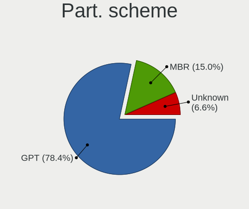
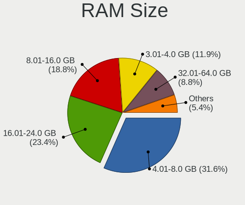
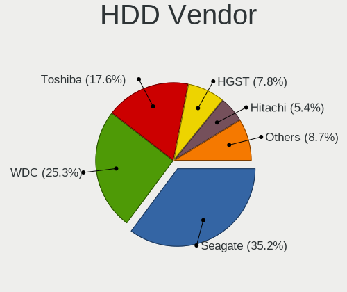
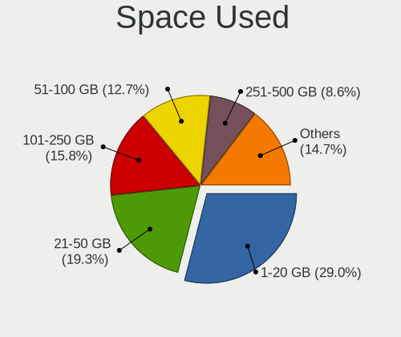
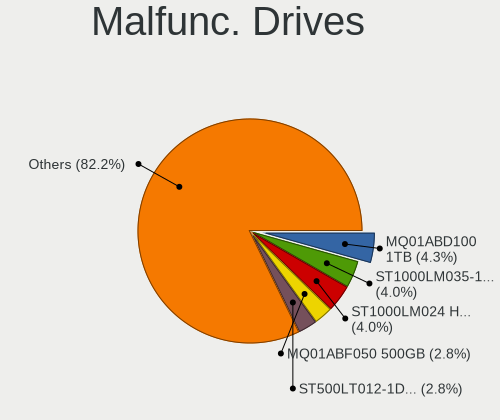
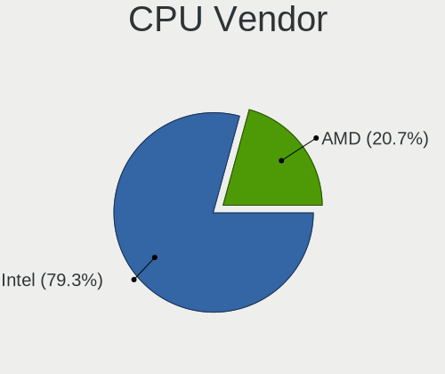
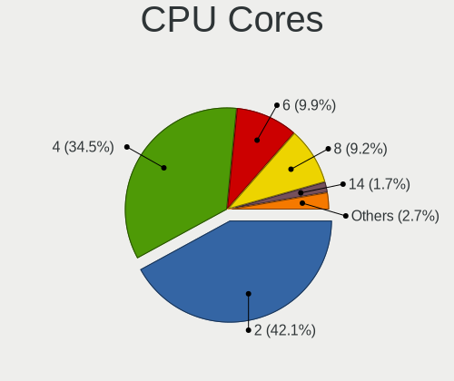
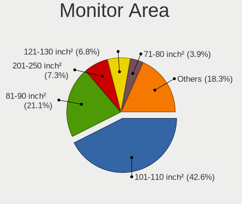
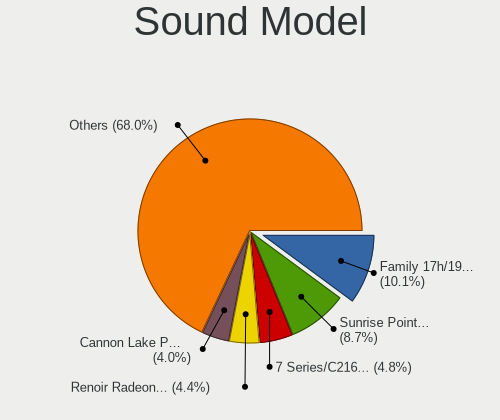
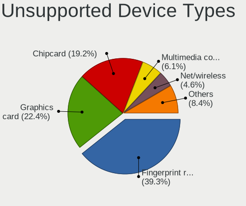

ArcoLinux - Tested Hardware & Statistics (Notebooks)
----------------------------------------------------

A project to collect tested hardware configurations for ArcoLinux.

Anyone can contribute to this report by the [hw-probe](https://github.com/linuxhw/hw-probe) tool:

    sudo -E hw-probe -all -upload

Please contribute! Especially if your hardware is rare.

Contents
--------

* [ Test Cases ](#test-cases)

* [ System ](#system)
  - [ OS                       ](#os)
  - [ OS Family                ](#os-family)
  - [ Kernel                   ](#kernel)
  - [ Kernel Family            ](#kernel-family)
  - [ Kernel Major Ver.        ](#kernel-major-ver)
  - [ Arch                     ](#arch)
  - [ DE                       ](#de)
  - [ Display Server           ](#display-server)
  - [ Display Manager          ](#display-manager)
  - [ OS Lang                  ](#os-lang)
  - [ Boot Mode                ](#boot-mode)
  - [ Filesystem               ](#filesystem)
  - [ Part. scheme             ](#part-scheme)
  - [ Dual Boot with Linux/BSD ](#dual-boot-with-linuxbsd)
  - [ Dual Boot (Win)          ](#dual-boot-win)

* [ Board ](#board)
  - [ Vendor                   ](#vendor)
  - [ Model                    ](#model)
  - [ Model Family             ](#model-family)
  - [ MFG Year                 ](#mfg-year)
  - [ Form Factor              ](#form-factor)
  - [ Secure Boot              ](#secure-boot)
  - [ Coreboot                 ](#coreboot)
  - [ RAM Size                 ](#ram-size)
  - [ RAM Used                 ](#ram-used)
  - [ Total Drives             ](#total-drives)
  - [ Has CD-ROM               ](#has-cd-rom)
  - [ Has Ethernet             ](#has-ethernet)
  - [ Has WiFi                 ](#has-wifi)
  - [ Has Bluetooth            ](#has-bluetooth)

* [ Location ](#location)
  - [ Country                  ](#country)
  - [ City                     ](#city)

* [ Drives ](#drives)
  - [ Drive Vendor             ](#drive-vendor)
  - [ Drive Model              ](#drive-model)
  - [ HDD Vendor               ](#hdd-vendor)
  - [ SSD Vendor               ](#ssd-vendor)
  - [ Drive Kind               ](#drive-kind)
  - [ Drive Connector          ](#drive-connector)
  - [ Drive Size               ](#drive-size)
  - [ Space Total              ](#space-total)
  - [ Space Used               ](#space-used)
  - [ Malfunc. Drives          ](#malfunc-drives)
  - [ Malfunc. Drive Vendor    ](#malfunc-drive-vendor)
  - [ Malfunc. HDD Vendor      ](#malfunc-hdd-vendor)
  - [ Malfunc. Drive Kind      ](#malfunc-drive-kind)
  - [ Failed Drives            ](#failed-drives)
  - [ Failed Drive Vendor      ](#failed-drive-vendor)
  - [ Drive Status             ](#drive-status)

* [ Storage controller ](#storage-controller)
  - [ Storage Vendor           ](#storage-vendor)
  - [ Storage Model            ](#storage-model)
  - [ Storage Kind             ](#storage-kind)

* [ Processor ](#processor)
  - [ CPU Vendor               ](#cpu-vendor)
  - [ CPU Model                ](#cpu-model)
  - [ CPU Model Family         ](#cpu-model-family)
  - [ CPU Cores                ](#cpu-cores)
  - [ CPU Sockets              ](#cpu-sockets)
  - [ CPU Threads              ](#cpu-threads)
  - [ CPU Op-Modes             ](#cpu-op-modes)
  - [ CPU Microcode            ](#cpu-microcode)
  - [ CPU Microarch            ](#cpu-microarch)

* [ Graphics ](#graphics)
  - [ GPU Vendor               ](#gpu-vendor)
  - [ GPU Model                ](#gpu-model)
  - [ GPU Combo                ](#gpu-combo)
  - [ GPU Driver               ](#gpu-driver)
  - [ GPU Memory               ](#gpu-memory)

* [ Monitor ](#monitor)
  - [ Monitor Vendor           ](#monitor-vendor)
  - [ Monitor Model            ](#monitor-model)
  - [ Monitor Resolution       ](#monitor-resolution)
  - [ Monitor Diagonal         ](#monitor-diagonal)
  - [ Monitor Width            ](#monitor-width)
  - [ Aspect Ratio             ](#aspect-ratio)
  - [ Monitor Area             ](#monitor-area)
  - [ Pixel Density            ](#pixel-density)
  - [ Multiple Monitors        ](#multiple-monitors)

* [ Network ](#network)
  - [ Net Controller Vendor    ](#net-controller-vendor)
  - [ Net Controller Model     ](#net-controller-model)
  - [ Wireless Vendor          ](#wireless-vendor)
  - [ Wireless Model           ](#wireless-model)
  - [ Ethernet Vendor          ](#ethernet-vendor)
  - [ Ethernet Model           ](#ethernet-model)
  - [ Net Controller Kind      ](#net-controller-kind)
  - [ Used Controller          ](#used-controller)
  - [ NICs                     ](#nics)
  - [ IPv6                     ](#ipv6)

* [ Bluetooth ](#bluetooth)
  - [ Bluetooth Vendor         ](#bluetooth-vendor)
  - [ Bluetooth Model          ](#bluetooth-model)

* [ Sound ](#sound)
  - [ Sound Vendor             ](#sound-vendor)
  - [ Sound Model              ](#sound-model)

* [ Memory ](#memory)
  - [ Memory Vendor            ](#memory-vendor)
  - [ Memory Model             ](#memory-model)
  - [ Memory Kind              ](#memory-kind)
  - [ Memory Form Factor       ](#memory-form-factor)
  - [ Memory Size              ](#memory-size)
  - [ Memory Speed             ](#memory-speed)

* [ Printers & scanners ](#printers--scanners)
  - [ Printer Vendor           ](#printer-vendor)
  - [ Printer Model            ](#printer-model)
  - [ Scanner Vendor           ](#scanner-vendor)
  - [ Scanner Model            ](#scanner-model)

* [ Camera ](#camera)
  - [ Camera Vendor            ](#camera-vendor)
  - [ Camera Model             ](#camera-model)

* [ Security ](#security)
  - [ Fingerprint Vendor       ](#fingerprint-vendor)
  - [ Fingerprint Model        ](#fingerprint-model)
  - [ Chipcard Vendor          ](#chipcard-vendor)
  - [ Chipcard Model           ](#chipcard-model)

* [ Unsupported ](#unsupported)
  - [ Unsupported Devices      ](#unsupported-devices)
  - [ Unsupported Device Types ](#unsupported-device-types)

Test Cases
----------

Total: 2752

| Vendor        | Model                       | Probe                                                      | Date         |
|---------------|-----------------------------|------------------------------------------------------------|--------------|
| ASUSTek       | K55VD                       | [d0bc9affdb](https://linux-hardware.org/?probe=d0bc9affdb) | Jan 06, 2025 |
| Lenovo        | ThinkPad X395 20NLS0J400    | [7ff6bae738](https://linux-hardware.org/?probe=7ff6bae738) | Jan 06, 2025 |
| Lenovo        | ThinkPad T14 Gen 2i 20W0... | [b228dff2bb](https://linux-hardware.org/?probe=b228dff2bb) | Jan 05, 2025 |
| Lenovo        | ThinkPad T480s 20L8S0230... | [e6a02c7ad9](https://linux-hardware.org/?probe=e6a02c7ad9) | Jan 04, 2025 |
| HP            | Laptop 14s-fq1xxx           | [890bc399f9](https://linux-hardware.org/?probe=890bc399f9) | Jan 03, 2025 |
| Alienware     | m15 Ryzen Ed. R5            | [8aefe7b2c7](https://linux-hardware.org/?probe=8aefe7b2c7) | Jan 01, 2025 |
| ASUSTek       | ASUS TUF Gaming F15 FX50... | [173b640d4f](https://linux-hardware.org/?probe=173b640d4f) | Jan 01, 2025 |
| ASUSTek       | VivoBook_ASUSLaptop X170... | [2b6b95b19f](https://linux-hardware.org/?probe=2b6b95b19f) | Jan 01, 2025 |
| Acer          | Aspire A317-52              | [8a5d9221e7](https://linux-hardware.org/?probe=8a5d9221e7) | Dec 31, 2024 |
| Lenovo        | ThinkPad T560 20FJS1WT00    | [f78acad9fd](https://linux-hardware.org/?probe=f78acad9fd) | Dec 31, 2024 |
| ASUSTek       | Strix 15 GL503GE            | [3cf042bf3f](https://linux-hardware.org/?probe=3cf042bf3f) | Dec 31, 2024 |
| ASUSTek       | VivoBook_ASUSLaptop X170... | [38bd32bd79](https://linux-hardware.org/?probe=38bd32bd79) | Dec 30, 2024 |
| HP            | Pavilion Laptop 14-dv1xx... | [00ff33fe24](https://linux-hardware.org/?probe=00ff33fe24) | Dec 29, 2024 |
| ASUSTek       | VivoBook_ASUSLaptop X170... | [405fb793dc](https://linux-hardware.org/?probe=405fb793dc) | Dec 29, 2024 |
| ASUSTek       | VivoBook 14_ASUS Laptop ... | [29e44582de](https://linux-hardware.org/?probe=29e44582de) | Dec 28, 2024 |
| Notebook      | NH5xAx                      | [02cccce76f](https://linux-hardware.org/?probe=02cccce76f) | Dec 28, 2024 |
| Framework     | Laptop 13 (AMD Ryzen 704... | [c24b7f290f](https://linux-hardware.org/?probe=c24b7f290f) | Dec 27, 2024 |
| HP            | Laptop 14s-fq1xxx           | [efbbc1e8ad](https://linux-hardware.org/?probe=efbbc1e8ad) | Dec 26, 2024 |
| Lenovo        | Legion 5 15ACH6H 82JU       | [e544b8e949](https://linux-hardware.org/?probe=e544b8e949) | Dec 25, 2024 |
| ASUSTek       | ROG Zephyrus G14 GA401IU... | [6a859ac63c](https://linux-hardware.org/?probe=6a859ac63c) | Dec 24, 2024 |
| Lenovo        | ThinkPad T470s W10DG 20J... | [6abe074048](https://linux-hardware.org/?probe=6abe074048) | Dec 21, 2024 |
| HP            | ENVY 15                     | [2bdd1f696d](https://linux-hardware.org/?probe=2bdd1f696d) | Dec 21, 2024 |
| Lenovo        | IdeaPad 330-15ICH 81FK      | [2472f683ab](https://linux-hardware.org/?probe=2472f683ab) | Dec 21, 2024 |
| Lenovo        | ThinkBook 15 G4 IAP 21DJ    | [2f18fb67da](https://linux-hardware.org/?probe=2f18fb67da) | Dec 21, 2024 |
| Chuwi         | CoreBook X                  | [de4d92e726](https://linux-hardware.org/?probe=de4d92e726) | Dec 20, 2024 |
| Lenovo        | ThinkPad W540 20BHS14J0J    | [4bfbb1305a](https://linux-hardware.org/?probe=4bfbb1305a) | Dec 20, 2024 |
| ASUSTek       | X553MA                      | [a2c7b2e72e](https://linux-hardware.org/?probe=a2c7b2e72e) | Dec 20, 2024 |
| Lenovo        | ThinkPad X1 Carbon 6th 2... | [2e97ec9da3](https://linux-hardware.org/?probe=2e97ec9da3) | Dec 19, 2024 |
| HP            | Laptop 14s-fq1xxx           | [85527618fc](https://linux-hardware.org/?probe=85527618fc) | Dec 19, 2024 |
| Samsung       | 905S3G/906S3G/915S3G        | [a31e7950da](https://linux-hardware.org/?probe=a31e7950da) | Dec 19, 2024 |
| ASUSTek       | Zenbook 15 UM3504DA_UM35... | [5ec2022b69](https://linux-hardware.org/?probe=5ec2022b69) | Dec 18, 2024 |
| Samsung       | 905S3G/906S3G/915S3G        | [8bdebb5383](https://linux-hardware.org/?probe=8bdebb5383) | Dec 17, 2024 |
| ASUSTek       | ROG Strix G713PV_G713PV     | [4ec2092033](https://linux-hardware.org/?probe=4ec2092033) | Dec 17, 2024 |
| Chuwi         | CoreBook X                  | [6f354f73aa](https://linux-hardware.org/?probe=6f354f73aa) | Dec 16, 2024 |
| Toshiba       | Satellite C55-B             | [524c33e748](https://linux-hardware.org/?probe=524c33e748) | Dec 16, 2024 |
| ASUSTek       | TUF Gaming FX705DT_FX705... | [a8053e70d7](https://linux-hardware.org/?probe=a8053e70d7) | Dec 16, 2024 |
| ASUSTek       | VivoBook_ASUSLaptop X409... | [98e4e31c99](https://linux-hardware.org/?probe=98e4e31c99) | Dec 15, 2024 |
| ASUSTek       | VivoBook_ASUSLaptop X409... | [8c4e0cc970](https://linux-hardware.org/?probe=8c4e0cc970) | Dec 15, 2024 |
| ASUSTek       | Zenbook UM5401QAB_UM5401... | [80eb154594](https://linux-hardware.org/?probe=80eb154594) | Dec 15, 2024 |
| Lenovo        | ThinkPad A485 20MVS08500    | [64a9a91c57](https://linux-hardware.org/?probe=64a9a91c57) | Dec 14, 2024 |
| Chuwi         | GemiBook Pro                | [a7ba503bce](https://linux-hardware.org/?probe=a7ba503bce) | Dec 13, 2024 |
| Google        | Cyan                        | [07d137b1c9](https://linux-hardware.org/?probe=07d137b1c9) | Dec 13, 2024 |
| Lenovo        | IdeaPad 1 15AMN7 82VG       | [b5eb8e7554](https://linux-hardware.org/?probe=b5eb8e7554) | Dec 13, 2024 |
| Lenovo        | IdeaPad 1 15AMN7 82VG       | [0b9d7716cd](https://linux-hardware.org/?probe=0b9d7716cd) | Dec 13, 2024 |
| Lenovo        | ThinkPad T60 1951FDG        | [9c3c2fb92b](https://linux-hardware.org/?probe=9c3c2fb92b) | Dec 13, 2024 |
| Samsung       | 530U3BI/530U4BI/530U4BH     | [8fab92cc9d](https://linux-hardware.org/?probe=8fab92cc9d) | Dec 12, 2024 |
| MSI           | GS66 Stealth 10SE           | [950033e6a5](https://linux-hardware.org/?probe=950033e6a5) | Dec 12, 2024 |
| Samsung       | 900X3C/900X3D/900X3E/900... | [dba79b373a](https://linux-hardware.org/?probe=dba79b373a) | Dec 12, 2024 |
| ASUSTek       | VivoBook 14_ASUS Laptop ... | [c4f5feb755](https://linux-hardware.org/?probe=c4f5feb755) | Dec 11, 2024 |
| ASUSTek       | X205TA                      | [5bd8e61a56](https://linux-hardware.org/?probe=5bd8e61a56) | Dec 10, 2024 |
| Acer          | Aspire A317-52              | [9523b85250](https://linux-hardware.org/?probe=9523b85250) | Dec 10, 2024 |
| HP            | Laptop 15-dy1xxx            | [d51d33b4aa](https://linux-hardware.org/?probe=d51d33b4aa) | Dec 10, 2024 |
| Dell          | Latitude E7470              | [b683114583](https://linux-hardware.org/?probe=b683114583) | Dec 10, 2024 |
| ASUSTek       | UX305CA                     | [826fafd993](https://linux-hardware.org/?probe=826fafd993) | Dec 09, 2024 |
| Apple         | MacBookAir7,2               | [c4d956f844](https://linux-hardware.org/?probe=c4d956f844) | Dec 09, 2024 |
| Unknown       | Unknown                     | [33643facc4](https://linux-hardware.org/?probe=33643facc4) | Dec 08, 2024 |
| Lenovo        | ThinkPad Edge 031925U       | [41278492e7](https://linux-hardware.org/?probe=41278492e7) | Dec 07, 2024 |
| TUXEDO        | InfinityBook Pro AMD Gen... | [cda9658f32](https://linux-hardware.org/?probe=cda9658f32) | Dec 06, 2024 |
| Lenovo        | ThinkPad T430 2349IF8       | [cb9e678fc7](https://linux-hardware.org/?probe=cb9e678fc7) | Dec 05, 2024 |
| Lenovo        | ThinkPad Edge E540 20C60... | [8270c3a002](https://linux-hardware.org/?probe=8270c3a002) | Dec 05, 2024 |
| HUAWEI        | NBLK-WAX9X                  | [2277464b80](https://linux-hardware.org/?probe=2277464b80) | Dec 04, 2024 |
| Lenovo        | IdeaPad 5 Pro 14ACN6 82L... | [291629dda6](https://linux-hardware.org/?probe=291629dda6) | Dec 03, 2024 |
| Apple         | MacBookAir6,2               | [f880b60a76](https://linux-hardware.org/?probe=f880b60a76) | Dec 03, 2024 |
| Apple         | MacBookAir6,2               | [43eaee20f2](https://linux-hardware.org/?probe=43eaee20f2) | Dec 03, 2024 |
| Chuwi         | GemiBook Pro                | [e556a40293](https://linux-hardware.org/?probe=e556a40293) | Dec 03, 2024 |
| Samsung       | 900X3C/900X3D/900X3E/900... | [33eb230c2a](https://linux-hardware.org/?probe=33eb230c2a) | Dec 03, 2024 |
| ASUSTek       | VivoBook 14_ASUS Laptop ... | [0b71bb31ea](https://linux-hardware.org/?probe=0b71bb31ea) | Dec 03, 2024 |
| ASUSTek       | ASUS TUF Gaming A16 FA60... | [ad86291778](https://linux-hardware.org/?probe=ad86291778) | Dec 02, 2024 |
| ASUSTek       | ASUS TUF Gaming A16 FA60... | [d36311286b](https://linux-hardware.org/?probe=d36311286b) | Dec 02, 2024 |
| Unknown       | Unknown                     | [9eddfe9de4](https://linux-hardware.org/?probe=9eddfe9de4) | Dec 02, 2024 |
| HP            | Pavilion Laptop 14-dv1xx... | [6a5dd9d520](https://linux-hardware.org/?probe=6a5dd9d520) | Dec 01, 2024 |
| Dell          | Inspiron 3542               | [0d619706e0](https://linux-hardware.org/?probe=0d619706e0) | Dec 01, 2024 |
| ASUSTek       | VivoBook 15_ASUS Laptop ... | [c751e5836a](https://linux-hardware.org/?probe=c751e5836a) | Dec 01, 2024 |
| HP            | Victus by Gaming Laptop ... | [b18d4ba53a](https://linux-hardware.org/?probe=b18d4ba53a) | Nov 30, 2024 |
| Dell          | Inspiron 5759               | [fc9f572f22](https://linux-hardware.org/?probe=fc9f572f22) | Nov 30, 2024 |
| HP            | Notebook                    | [7bc5ba9b86](https://linux-hardware.org/?probe=7bc5ba9b86) | Nov 30, 2024 |
| Lenovo        | ThinkPad L470 W10DG 20JV... | [751428f37c](https://linux-hardware.org/?probe=751428f37c) | Nov 29, 2024 |
| Lenovo        | ThinkPad R500 2718W3V       | [3804c95f6f](https://linux-hardware.org/?probe=3804c95f6f) | Nov 29, 2024 |
| Lenovo        | RESCUER R720-15IKBN 80WW    | [0e9a9bef8d](https://linux-hardware.org/?probe=0e9a9bef8d) | Nov 28, 2024 |
| Dell          | Precision 7520              | [414d389f1b](https://linux-hardware.org/?probe=414d389f1b) | Nov 28, 2024 |
| Dell          | Latitude E6320              | [4796ce988e](https://linux-hardware.org/?probe=4796ce988e) | Nov 27, 2024 |
| MSI           | GS43VR 7RE                  | [420a91c666](https://linux-hardware.org/?probe=420a91c666) | Nov 27, 2024 |
| Dell          | Inspiron 5590               | [6849528aa9](https://linux-hardware.org/?probe=6849528aa9) | Nov 27, 2024 |
| Samsung       | 940XGK                      | [2cd0f44890](https://linux-hardware.org/?probe=2cd0f44890) | Nov 26, 2024 |
| Lenovo        | ThinkPad W540 20BHS14J0J    | [5f77ea0b14](https://linux-hardware.org/?probe=5f77ea0b14) | Nov 25, 2024 |
| HP            | Pavilion Laptop 15-cw1xx... | [bd42e89f36](https://linux-hardware.org/?probe=bd42e89f36) | Nov 25, 2024 |
| ASUSTek       | ASUS TUF Gaming A15 FA50... | [e7dd6ffefe](https://linux-hardware.org/?probe=e7dd6ffefe) | Nov 24, 2024 |
| HUAWEI        | NBLK-WAX9X                  | [98d3557c1e](https://linux-hardware.org/?probe=98d3557c1e) | Nov 24, 2024 |
| Schenker      | XMG NEO (TGL/M21)           | [f8ba79bd9c](https://linux-hardware.org/?probe=f8ba79bd9c) | Nov 23, 2024 |
| Lenovo        | ThinkPad W540 20BHS0620V    | [e473ec9a1b](https://linux-hardware.org/?probe=e473ec9a1b) | Nov 23, 2024 |
| Acer          | TMP455-M                    | [2634525f74](https://linux-hardware.org/?probe=2634525f74) | Nov 22, 2024 |
| Acer          | TMP455-M                    | [eb61c20a0f](https://linux-hardware.org/?probe=eb61c20a0f) | Nov 22, 2024 |
| HP            | Pavilion dv7                | [173de4914d](https://linux-hardware.org/?probe=173de4914d) | Nov 20, 2024 |
| ASUSTek       | VivoBook 14_ASUS Laptop ... | [ded486b775](https://linux-hardware.org/?probe=ded486b775) | Nov 18, 2024 |
| Intel Clie... | LAPQC71B                    | [5db38e2711](https://linux-hardware.org/?probe=5db38e2711) | Nov 17, 2024 |
| Dell          | Latitude 5520               | [007adcd9ad](https://linux-hardware.org/?probe=007adcd9ad) | Nov 16, 2024 |
| Acer          | Nitro AN515-46              | [561df0051a](https://linux-hardware.org/?probe=561df0051a) | Nov 15, 2024 |
| Dell          | Latitude E6500              | [db92f98536](https://linux-hardware.org/?probe=db92f98536) | Nov 15, 2024 |
| HP            | Pavilion Laptop 15-cw1xx... | [e89b4f9ddd](https://linux-hardware.org/?probe=e89b4f9ddd) | Nov 15, 2024 |
| Apple         | MacBookAir7,2               | [83ea680cc0](https://linux-hardware.org/?probe=83ea680cc0) | Nov 14, 2024 |
| Lenovo        | ThinkPad W540 20BHS0620V    | [969a725e1e](https://linux-hardware.org/?probe=969a725e1e) | Nov 14, 2024 |
| HP            | Laptop 15-dy2xxx            | [41b2d06822](https://linux-hardware.org/?probe=41b2d06822) | Nov 13, 2024 |
| HP            | EliteBook 850 G5            | [ae3218fa93](https://linux-hardware.org/?probe=ae3218fa93) | Nov 12, 2024 |
| Medion        | P7816                       | [58ec8f58ec](https://linux-hardware.org/?probe=58ec8f58ec) | Nov 12, 2024 |
| Acer          | Nitro AN515-52              | [583860bb6e](https://linux-hardware.org/?probe=583860bb6e) | Nov 12, 2024 |
| Lenovo        | ThinkPad X240 20AMA0W706    | [ccf9df80ca](https://linux-hardware.org/?probe=ccf9df80ca) | Nov 11, 2024 |
| HP            | Pavilion Laptop 15-cw1xx... | [5fb9bf3774](https://linux-hardware.org/?probe=5fb9bf3774) | Nov 11, 2024 |
| HP            | Laptop 17-bs0xx             | [ccf5f021fa](https://linux-hardware.org/?probe=ccf5f021fa) | Nov 11, 2024 |
| ASUSTek       | ASUS TUF Gaming A17 FA70... | [7ed44ec1d3](https://linux-hardware.org/?probe=7ed44ec1d3) | Nov 10, 2024 |
| Lenovo        | ThinkPad S1 Yoga 12 20DL... | [b1bda06aca](https://linux-hardware.org/?probe=b1bda06aca) | Nov 10, 2024 |
| Lenovo        | ThinkPad S1 Yoga 12 20DL... | [913257fc83](https://linux-hardware.org/?probe=913257fc83) | Nov 09, 2024 |
| HP            | Pavilion Laptop 14-dv1xx... | [05c250783f](https://linux-hardware.org/?probe=05c250783f) | Nov 07, 2024 |
| ASUSTek       | VivoBook_ASUSLaptop X409... | [2be2989e95](https://linux-hardware.org/?probe=2be2989e95) | Nov 05, 2024 |
| Unknown       | Unknown                     | [c7f9fb9e1a](https://linux-hardware.org/?probe=c7f9fb9e1a) | Nov 04, 2024 |
| Lenovo        | Legion 5 17IMH05H 81Y8      | [386606f6bd](https://linux-hardware.org/?probe=386606f6bd) | Nov 04, 2024 |
| Valve         | Jupiter                     | [34d06fac26](https://linux-hardware.org/?probe=34d06fac26) | Nov 02, 2024 |
| ASUSTek       | VivoBook 14_ASUS Laptop ... | [5736e11451](https://linux-hardware.org/?probe=5736e11451) | Oct 31, 2024 |
| ASUSTek       | ASUS TUF Gaming F15 FX50... | [c49f5edf81](https://linux-hardware.org/?probe=c49f5edf81) | Oct 31, 2024 |
| Lenovo        | ThinkPad X280 20KESEYC00    | [bc3e6aa2dc](https://linux-hardware.org/?probe=bc3e6aa2dc) | Oct 30, 2024 |
| Lenovo        | ThinkPad T490s 20NYS3L72... | [f8310dbb63](https://linux-hardware.org/?probe=f8310dbb63) | Oct 30, 2024 |
| Lenovo        | Legion Y545 81Q6            | [cbebfa258b](https://linux-hardware.org/?probe=cbebfa258b) | Oct 28, 2024 |
| MSI           | GF63 Thin 11UC              | [6f3cddbb64](https://linux-hardware.org/?probe=6f3cddbb64) | Oct 28, 2024 |
| Lenovo        | ThinkPad T490 20N3SDGJ02    | [5692ef7249](https://linux-hardware.org/?probe=5692ef7249) | Oct 25, 2024 |
| Samsung       | 305V4A/305V5A               | [5c0a3f88cf](https://linux-hardware.org/?probe=5c0a3f88cf) | Oct 24, 2024 |
| Dell          | Latitude E5540              | [da1eff5497](https://linux-hardware.org/?probe=da1eff5497) | Oct 24, 2024 |
| Unknown       | Unknown                     | [af08761713](https://linux-hardware.org/?probe=af08761713) | Oct 24, 2024 |
| HP            | Laptop 15s-eq3xxx           | [7d14ffe3bb](https://linux-hardware.org/?probe=7d14ffe3bb) | Oct 23, 2024 |
| Lenovo        | Legion 5 Pro 16ACH6H 82J... | [0915e50195](https://linux-hardware.org/?probe=0915e50195) | Oct 21, 2024 |
| MSI           | Modern 14 B10MW             | [7f701f4c7e](https://linux-hardware.org/?probe=7f701f4c7e) | Oct 21, 2024 |
| HP            | 255 15.6 inch G9 Noteboo... | [d2070e6e2d](https://linux-hardware.org/?probe=d2070e6e2d) | Oct 20, 2024 |
| HP            | Pavilion Laptop 14-dv1xx... | [8886e7de9c](https://linux-hardware.org/?probe=8886e7de9c) | Oct 20, 2024 |
| Lenovo        | ThinkPad T480 20L5000AIX    | [0013e23e0e](https://linux-hardware.org/?probe=0013e23e0e) | Oct 20, 2024 |
| Apple         | MacBookAir7,2               | [7f72600a21](https://linux-hardware.org/?probe=7f72600a21) | Oct 20, 2024 |
| Samsung       | 530U3BI/530U4BI/530U4BH     | [e041b45976](https://linux-hardware.org/?probe=e041b45976) | Oct 19, 2024 |
| Samsung       | 530U3BI/530U4BI/530U4BH     | [b56d767db4](https://linux-hardware.org/?probe=b56d767db4) | Oct 19, 2024 |
| Acer          | Swift SF314-43              | [f19e331117](https://linux-hardware.org/?probe=f19e331117) | Oct 19, 2024 |
| Lenovo        | Legion 5 15IMH6 82NL        | [7f08763473](https://linux-hardware.org/?probe=7f08763473) | Oct 19, 2024 |
| Lenovo        | Legion 5 15IMH6 82NL        | [f3ed5c74a3](https://linux-hardware.org/?probe=f3ed5c74a3) | Oct 19, 2024 |
| Chuwi         | GemiBook Pro                | [bf00a67abe](https://linux-hardware.org/?probe=bf00a67abe) | Oct 19, 2024 |
| ASUSTek       | ROG Zephyrus G14 GA401QM... | [bfc19a1c40](https://linux-hardware.org/?probe=bfc19a1c40) | Oct 17, 2024 |
| ASUSTek       | ROG Zephyrus G14 GA401QM... | [1c4e2fa10c](https://linux-hardware.org/?probe=1c4e2fa10c) | Oct 17, 2024 |
| Dell          | XPS 15 9530                 | [7cd0767236](https://linux-hardware.org/?probe=7cd0767236) | Oct 16, 2024 |
| MSI           | Katana 15 B13VGK            | [84060518eb](https://linux-hardware.org/?probe=84060518eb) | Oct 16, 2024 |
| Dell          | XPS 13 9380                 | [ab61c7e029](https://linux-hardware.org/?probe=ab61c7e029) | Oct 16, 2024 |
| Chuwi         | GemiBook Pro                | [ffc8702d4a](https://linux-hardware.org/?probe=ffc8702d4a) | Oct 16, 2024 |
| Lenovo        | ThinkPad T470s W10DG 20J... | [2a70c8af1b](https://linux-hardware.org/?probe=2a70c8af1b) | Oct 16, 2024 |
| Dell          | Latitude E6230              | [3f841532de](https://linux-hardware.org/?probe=3f841532de) | Oct 14, 2024 |
| HP            | 250 G8 Notebook PC          | [12e66fbbf2](https://linux-hardware.org/?probe=12e66fbbf2) | Oct 13, 2024 |
| Lenovo        | ThinkPad E14 Gen 5 21JR0... | [ec688a0cae](https://linux-hardware.org/?probe=ec688a0cae) | Oct 13, 2024 |
| Apple         | MacBookAir6,2               | [f2d560b192](https://linux-hardware.org/?probe=f2d560b192) | Oct 12, 2024 |
| Lenovo        | ThinkPad T540p 20BE00AKZ... | [a87a56e961](https://linux-hardware.org/?probe=a87a56e961) | Oct 11, 2024 |
| Dell          | Latitude 5420               | [622540975d](https://linux-hardware.org/?probe=622540975d) | Oct 10, 2024 |
| Lenovo        | IdeaPad Slim 5 16ABR8 82... | [da3ad9fe6c](https://linux-hardware.org/?probe=da3ad9fe6c) | Oct 10, 2024 |
| Lenovo        | ThinkPad T470s W10DG 20J... | [f108ee0d16](https://linux-hardware.org/?probe=f108ee0d16) | Oct 10, 2024 |
| ASUSTek       | X556UQK                     | [b5e78247a7](https://linux-hardware.org/?probe=b5e78247a7) | Oct 09, 2024 |
| ASUSTek       | VivoBook_ASUSLaptop X409... | [b02ac16d4e](https://linux-hardware.org/?probe=b02ac16d4e) | Oct 08, 2024 |
| ASUSTek       | ASUS TUF Dash F15 FX517Z... | [4d89b5ebcb](https://linux-hardware.org/?probe=4d89b5ebcb) | Oct 08, 2024 |
| Framework     | Laptop 16 (AMD Ryzen 704... | [222b41c35d](https://linux-hardware.org/?probe=222b41c35d) | Oct 08, 2024 |
| Lenovo        | ThinkPad L14 Gen 1 20U1S... | [81e045d718](https://linux-hardware.org/?probe=81e045d718) | Oct 07, 2024 |
| Lenovo        | ThinkPad L14 Gen 1 20U1S... | [6d3e3dc090](https://linux-hardware.org/?probe=6d3e3dc090) | Oct 07, 2024 |
| HP            | 250 G8 Notebook PC          | [4068a6c8c4](https://linux-hardware.org/?probe=4068a6c8c4) | Oct 06, 2024 |
| Fujitsu       | LIFEBOOK U729               | [15f399627a](https://linux-hardware.org/?probe=15f399627a) | Oct 06, 2024 |
| Dell          | Inspiron 3551               | [1a59d5c1ee](https://linux-hardware.org/?probe=1a59d5c1ee) | Oct 05, 2024 |
| Dell          | Inspiron 7520               | [b222dbff7d](https://linux-hardware.org/?probe=b222dbff7d) | Oct 04, 2024 |
| Dell          | Latitude 7390               | [89ac346e1f](https://linux-hardware.org/?probe=89ac346e1f) | Oct 04, 2024 |
| Dell          | Precision 7540              | [e77f5beae9](https://linux-hardware.org/?probe=e77f5beae9) | Oct 03, 2024 |
| HP            | Pavilion Laptop 15-cw1xx... | [bdc1ce0ed5](https://linux-hardware.org/?probe=bdc1ce0ed5) | Oct 03, 2024 |
| HP            | Pavilion Laptop 15-cw1xx... | [0fe758dc03](https://linux-hardware.org/?probe=0fe758dc03) | Oct 03, 2024 |
| Lenovo        | Yoga Pro 7 14AHP9 83E3      | [ed0a6b20fe](https://linux-hardware.org/?probe=ed0a6b20fe) | Oct 02, 2024 |
| HP            | EliteBook 8460p             | [2b916500bc](https://linux-hardware.org/?probe=2b916500bc) | Oct 01, 2024 |
| Lenovo        | Yoga Pro 7 14APH8 82Y8      | [1183c6ec8f](https://linux-hardware.org/?probe=1183c6ec8f) | Oct 01, 2024 |
| Dell          | G7 7588                     | [a05740b926](https://linux-hardware.org/?probe=a05740b926) | Oct 01, 2024 |
| Unknown       | Unknown                     | [b2607af0bf](https://linux-hardware.org/?probe=b2607af0bf) | Sep 30, 2024 |
| HP            | Folio 13                    | [83bf0a4e66](https://linux-hardware.org/?probe=83bf0a4e66) | Sep 30, 2024 |
| Dell          | Inspiron 3542               | [1d55438162](https://linux-hardware.org/?probe=1d55438162) | Sep 29, 2024 |
| Acer          | Predator PHN16-71           | [8815e16a5e](https://linux-hardware.org/?probe=8815e16a5e) | Sep 29, 2024 |
| Timi          | Mi NoteBook 14              | [7e9cbce7a8](https://linux-hardware.org/?probe=7e9cbce7a8) | Sep 29, 2024 |
| ASUSTek       | VivoBook 14_ASUS Laptop ... | [ecd54eabf9](https://linux-hardware.org/?probe=ecd54eabf9) | Sep 29, 2024 |
| HP            | OMEN by Laptop 16-b0xxx     | [f726485cd0](https://linux-hardware.org/?probe=f726485cd0) | Sep 29, 2024 |
| Lenovo        | IdeaPad Gaming 3 15IAH7 ... | [2a63def166](https://linux-hardware.org/?probe=2a63def166) | Sep 29, 2024 |
| Dell          | XPS 15 9530                 | [5f718e6c39](https://linux-hardware.org/?probe=5f718e6c39) | Sep 28, 2024 |
| HP            | Laptop 15s-eq2xxx           | [7139de484e](https://linux-hardware.org/?probe=7139de484e) | Sep 27, 2024 |
| Unknown       | Unknown                     | [5c78d4f841](https://linux-hardware.org/?probe=5c78d4f841) | Sep 26, 2024 |
| Lenovo        | V14 G2 ITL 82NM             | [6ca9ff799b](https://linux-hardware.org/?probe=6ca9ff799b) | Sep 26, 2024 |
| Acer          | Aspire A315-24PT            | [793dc850a6](https://linux-hardware.org/?probe=793dc850a6) | Sep 24, 2024 |
| HUAWEI        | NBLK-WAX9X                  | [d94733433a](https://linux-hardware.org/?probe=d94733433a) | Sep 24, 2024 |
| Lenovo        | V14 G2 ITL 82NM             | [33fb3994d7](https://linux-hardware.org/?probe=33fb3994d7) | Sep 24, 2024 |
| Lenovo        | IdeaPad Gaming 3 15ACH6 ... | [c2587deab9](https://linux-hardware.org/?probe=c2587deab9) | Sep 24, 2024 |
| Acidanther... | MacBookPro11,2              | [036522cecc](https://linux-hardware.org/?probe=036522cecc) | Sep 23, 2024 |
| HP            | ProBook 450 G8 Notebook ... | [a676f3fe5f](https://linux-hardware.org/?probe=a676f3fe5f) | Sep 23, 2024 |
| Casper        | NIRVANA NB C500             | [ad7927b7b6](https://linux-hardware.org/?probe=ad7927b7b6) | Sep 23, 2024 |
| ASUSTek       | ASUS Vivobook Pro 15 N65... | [b5b460246c](https://linux-hardware.org/?probe=b5b460246c) | Sep 23, 2024 |
| Lenovo        | Legion Y530-15ICH 81FV      | [ada9824b2e](https://linux-hardware.org/?probe=ada9824b2e) | Sep 22, 2024 |
| Acer          | Swift SF314-43              | [d85acdf3ac](https://linux-hardware.org/?probe=d85acdf3ac) | Sep 22, 2024 |
| Dell          | Latitude 7480               | [88b66b0476](https://linux-hardware.org/?probe=88b66b0476) | Sep 20, 2024 |
| Dell          | Latitude 5510               | [3ab14db3ae](https://linux-hardware.org/?probe=3ab14db3ae) | Sep 19, 2024 |
| Lenovo        | ThinkPad T490 20N3SDGJ02    | [2138db3b36](https://linux-hardware.org/?probe=2138db3b36) | Sep 19, 2024 |
| Acer          | Nitro AN515-58              | [c4d1b20e65](https://linux-hardware.org/?probe=c4d1b20e65) | Sep 17, 2024 |
| HP            | G42                         | [1fa39a4ae1](https://linux-hardware.org/?probe=1fa39a4ae1) | Sep 17, 2024 |
| Acer          | Nitro AN515-58              | [44c005d71d](https://linux-hardware.org/?probe=44c005d71d) | Sep 16, 2024 |
| ASUSTek       | ASUS TUF Gaming F15 FX50... | [20d890925f](https://linux-hardware.org/?probe=20d890925f) | Sep 16, 2024 |
| Fujitsu       | LIFEBOOK U729               | [94bef52ce4](https://linux-hardware.org/?probe=94bef52ce4) | Sep 15, 2024 |
| Lenovo        | ThinkPad T420 4236Y19       | [13fbdbca13](https://linux-hardware.org/?probe=13fbdbca13) | Sep 15, 2024 |
| MECER         | Z140C-Xpr-FPLUS             | [7485697159](https://linux-hardware.org/?probe=7485697159) | Sep 15, 2024 |
| Samsung       | 900X3C/900X3D/900X3E/900... | [c1fca7c250](https://linux-hardware.org/?probe=c1fca7c250) | Sep 15, 2024 |
| Apple         | MacBookAir7,2               | [cb72ac3b7c](https://linux-hardware.org/?probe=cb72ac3b7c) | Sep 15, 2024 |
| Dell          | Precision 3541              | [2ab0c627bf](https://linux-hardware.org/?probe=2ab0c627bf) | Sep 14, 2024 |
| Lenovo        | ThinkPad X1 Extreme 2nd ... | [fe56dbfcd2](https://linux-hardware.org/?probe=fe56dbfcd2) | Sep 14, 2024 |
| MSI           | Bravo 15 A4DDR              | [a07b77e4ed](https://linux-hardware.org/?probe=a07b77e4ed) | Sep 13, 2024 |
| ASUSTek       | ROG Strix G531GU_G531GU     | [8efae527ee](https://linux-hardware.org/?probe=8efae527ee) | Sep 13, 2024 |
| Dell          | Latitude 7490               | [c3088ac0e7](https://linux-hardware.org/?probe=c3088ac0e7) | Sep 12, 2024 |
| Dell          | Latitude 7490               | [354bdc75f3](https://linux-hardware.org/?probe=354bdc75f3) | Sep 12, 2024 |
| Apple         | MacBookAir6,2               | [41e5b4b4a3](https://linux-hardware.org/?probe=41e5b4b4a3) | Sep 11, 2024 |
| Acer          | Nitro AN515-56              | [77aeb8d14e](https://linux-hardware.org/?probe=77aeb8d14e) | Sep 10, 2024 |
| Acer          | Nitro AN515-56              | [722f73a308](https://linux-hardware.org/?probe=722f73a308) | Sep 10, 2024 |
| ASUSTek       | ASUS TUF Gaming F15 FX50... | [4030cf137e](https://linux-hardware.org/?probe=4030cf137e) | Sep 09, 2024 |
| Toshiba       | Satellite P875              | [947e6f3bf9](https://linux-hardware.org/?probe=947e6f3bf9) | Sep 09, 2024 |
| Lenovo        | ThinkPad X390 20Q1SCU200    | [d449445712](https://linux-hardware.org/?probe=d449445712) | Sep 09, 2024 |
| HP            | ProBook 640 G1              | [32f27af720](https://linux-hardware.org/?probe=32f27af720) | Sep 07, 2024 |
| HP            | ZBook 15 G2                 | [144f86e54b](https://linux-hardware.org/?probe=144f86e54b) | Sep 07, 2024 |
| Lenovo        | IdeaPad 330-15IKB 81DE      | [3d987c5904](https://linux-hardware.org/?probe=3d987c5904) | Sep 07, 2024 |
| Lenovo        | IdeaPad 330-15IKB 81DE      | [f27ba0493e](https://linux-hardware.org/?probe=f27ba0493e) | Sep 05, 2024 |
| HP            | Pavilion Laptop 14-dv1xx... | [063e9a37bb](https://linux-hardware.org/?probe=063e9a37bb) | Sep 05, 2024 |
| Samsung       | 900X3C/900X3D/900X3E/900... | [b37cf62016](https://linux-hardware.org/?probe=b37cf62016) | Sep 05, 2024 |
| Apple         | MacBookAir3,1               | [edeb2a22da](https://linux-hardware.org/?probe=edeb2a22da) | Sep 03, 2024 |
| Apple         | MacBookAir3,1               | [5183ec1fdf](https://linux-hardware.org/?probe=5183ec1fdf) | Sep 03, 2024 |
| Lenovo        | Legion 5 Pro 16ACH6H 82J... | [5fece1ca7d](https://linux-hardware.org/?probe=5fece1ca7d) | Sep 03, 2024 |
| ASUSTek       | ASUS TUF Gaming A15 FA50... | [97f086dd12](https://linux-hardware.org/?probe=97f086dd12) | Sep 03, 2024 |
| Dell          | Latitude 5480               | [30fb323c58](https://linux-hardware.org/?probe=30fb323c58) | Sep 01, 2024 |
| ASUSTek       | ASUS TUF Gaming F15 FX50... | [33cb105809](https://linux-hardware.org/?probe=33cb105809) | Aug 31, 2024 |
| Lenovo        | ThinkPad T490 20N3S9UH0L    | [c02f70d601](https://linux-hardware.org/?probe=c02f70d601) | Aug 31, 2024 |
| Dell          | Latitude 3540               | [743cd89273](https://linux-hardware.org/?probe=743cd89273) | Aug 31, 2024 |
| Dell          | Vostro 5481                 | [04820e5465](https://linux-hardware.org/?probe=04820e5465) | Aug 30, 2024 |
| Lenovo        | Legion 5 Pro 16ACH6H 82J... | [7648872630](https://linux-hardware.org/?probe=7648872630) | Aug 30, 2024 |
| Lenovo        | ThinkPad T470s W10DG 20J... | [9b192254cc](https://linux-hardware.org/?probe=9b192254cc) | Aug 30, 2024 |
| HP            | Laptop 17-ca2xxx            | [88aeb5276d](https://linux-hardware.org/?probe=88aeb5276d) | Aug 30, 2024 |
| Apple         | MacBookPro5,5               | [135301e31b](https://linux-hardware.org/?probe=135301e31b) | Aug 29, 2024 |
| ASUSTek       | ASUS TUF Gaming F15 FX50... | [28dd42ce86](https://linux-hardware.org/?probe=28dd42ce86) | Aug 28, 2024 |
| HP            | Pavilion Notebook           | [bc3d3571cf](https://linux-hardware.org/?probe=bc3d3571cf) | Aug 28, 2024 |
| Dell          | Inspiron 3542               | [8662d6d9a4](https://linux-hardware.org/?probe=8662d6d9a4) | Aug 27, 2024 |
| Lenovo        | ThinkPad E14 20RA005UTX     | [11b6cf5667](https://linux-hardware.org/?probe=11b6cf5667) | Aug 27, 2024 |
| Dell          | Inspiron 3542               | [0a52089bbd](https://linux-hardware.org/?probe=0a52089bbd) | Aug 27, 2024 |
| Dell          | XPS 15 9560                 | [4030698d5c](https://linux-hardware.org/?probe=4030698d5c) | Aug 27, 2024 |
| Lenovo        | IdeaPad Gaming 3 15ACH6 ... | [390c79d9e7](https://linux-hardware.org/?probe=390c79d9e7) | Aug 27, 2024 |
| Dell          | Inspiron 16 Plus 7630       | [ba17ccfdcf](https://linux-hardware.org/?probe=ba17ccfdcf) | Aug 27, 2024 |
| ASUSTek       | TUF Gaming FX505DT_FX505... | [279a906ea1](https://linux-hardware.org/?probe=279a906ea1) | Aug 27, 2024 |
| ASUSTek       | TUF Gaming FX505DT_FX505... | [98661fedcc](https://linux-hardware.org/?probe=98661fedcc) | Aug 26, 2024 |
| Lenovo        | ThinkPad T431s 20AA000EM... | [ac07d62bd7](https://linux-hardware.org/?probe=ac07d62bd7) | Aug 26, 2024 |
| Dell          | Inspiron 3551               | [4b2bec1c78](https://linux-hardware.org/?probe=4b2bec1c78) | Aug 26, 2024 |
| HP            | ProBook 450 15.6 inch G1... | [19756dc35b](https://linux-hardware.org/?probe=19756dc35b) | Aug 25, 2024 |
| Lenovo        | ThinkPad X1 Carbon 6th 2... | [d2acc5a68f](https://linux-hardware.org/?probe=d2acc5a68f) | Aug 25, 2024 |
| Dell          | Latitude 3420               | [da748e7b49](https://linux-hardware.org/?probe=da748e7b49) | Aug 25, 2024 |
| HUAWEI        | VLT-WX0                     | [38c3fa484e](https://linux-hardware.org/?probe=38c3fa484e) | Aug 24, 2024 |
| Dell          | Precision 7530              | [67e1c5e840](https://linux-hardware.org/?probe=67e1c5e840) | Aug 24, 2024 |
| Lenovo        | V15 G2 ALC 82KD             | [175d9d895e](https://linux-hardware.org/?probe=175d9d895e) | Aug 23, 2024 |
| HP            | EliteBook 840 G3            | [db9806a453](https://linux-hardware.org/?probe=db9806a453) | Aug 23, 2024 |
| Lenovo        | IdeaPad 520-15IKB 81BF      | [935b5d9511](https://linux-hardware.org/?probe=935b5d9511) | Aug 22, 2024 |
| Lenovo        | ThinkPad T430 2349IF8       | [dc0f500aeb](https://linux-hardware.org/?probe=dc0f500aeb) | Aug 22, 2024 |
| Lenovo        | ThinkPad T470s W10DG 20J... | [a597fbf188](https://linux-hardware.org/?probe=a597fbf188) | Aug 21, 2024 |
| ASUSTek       | ROG Strix G513RW_G513RW     | [add09e061b](https://linux-hardware.org/?probe=add09e061b) | Aug 21, 2024 |
| Apple         | MacBookPro10,2              | [921cf79eb2](https://linux-hardware.org/?probe=921cf79eb2) | Aug 20, 2024 |
| Lenovo        | IdeaPad 1 15ADA7 82R1       | [df1f476ad7](https://linux-hardware.org/?probe=df1f476ad7) | Aug 20, 2024 |
| HP            | EliteBook 850 G8 Noteboo... | [5d03c0ea61](https://linux-hardware.org/?probe=5d03c0ea61) | Aug 19, 2024 |
| MSI           | GF63 Thin 11UC              | [0d829aac0e](https://linux-hardware.org/?probe=0d829aac0e) | Aug 19, 2024 |
| Notebook      | N85_N87HCHN                 | [0f1213f3e0](https://linux-hardware.org/?probe=0f1213f3e0) | Aug 19, 2024 |
| ASUSTek       | VivoBook_ASUSLaptop X515... | [acbbae7427](https://linux-hardware.org/?probe=acbbae7427) | Aug 18, 2024 |
| Lenovo        | ThinkPad P50 20EQS0TM00     | [0d8a3c8037](https://linux-hardware.org/?probe=0d8a3c8037) | Aug 18, 2024 |
| TUXEDO        | InfinityBook S 15/17 Gen... | [7e6f232032](https://linux-hardware.org/?probe=7e6f232032) | Aug 18, 2024 |
| Fujitsu       | LIFEBOOK U729               | [84c5ee6ec3](https://linux-hardware.org/?probe=84c5ee6ec3) | Aug 18, 2024 |
| HP            | Laptop 17-ak0xx             | [9cf5071a77](https://linux-hardware.org/?probe=9cf5071a77) | Aug 17, 2024 |
| Sony          | SVE1511Q1ESI                | [6f96e76030](https://linux-hardware.org/?probe=6f96e76030) | Aug 17, 2024 |
| HP            | Pavilion Laptop 14-dv1xx... | [0d3fd20eba](https://linux-hardware.org/?probe=0d3fd20eba) | Aug 17, 2024 |
| Lenovo        | ThinkPad T490 20N3SDGJ02    | [230480ef42](https://linux-hardware.org/?probe=230480ef42) | Aug 17, 2024 |
| Lenovo        | ThinkPad X1 Carbon 6th 2... | [4e9cb146ce](https://linux-hardware.org/?probe=4e9cb146ce) | Aug 17, 2024 |
| Samsung       | 905S3G/906S3G/915S3G        | [1dce11edb7](https://linux-hardware.org/?probe=1dce11edb7) | Aug 17, 2024 |
| Unknown       | Unknown                     | [8afc1dbdf1](https://linux-hardware.org/?probe=8afc1dbdf1) | Aug 17, 2024 |
| Apple         | MacBookAir6,2               | [ac1f986bef](https://linux-hardware.org/?probe=ac1f986bef) | Aug 17, 2024 |
| Apple         | MacBookAir6,2               | [3100c0b501](https://linux-hardware.org/?probe=3100c0b501) | Aug 17, 2024 |
| Dell          | Vostro 5481                 | [c76a7034cd](https://linux-hardware.org/?probe=c76a7034cd) | Aug 16, 2024 |
| Samsung       | 905S3G/906S3G/915S3G        | [827dae32cf](https://linux-hardware.org/?probe=827dae32cf) | Aug 16, 2024 |
| ASUSTek       | ZenBook UX333FA_UX333FA     | [bae502a4a6](https://linux-hardware.org/?probe=bae502a4a6) | Aug 16, 2024 |
| ASUSTek       | VivoBook_ASUSLaptop X515... | [f12d3b4f89](https://linux-hardware.org/?probe=f12d3b4f89) | Aug 15, 2024 |
| Framework     | Laptop 13 (AMD Ryzen 704... | [848c3baea2](https://linux-hardware.org/?probe=848c3baea2) | Aug 14, 2024 |
| Samsung       | 905S3G/906S3G/915S3G        | [6447512d98](https://linux-hardware.org/?probe=6447512d98) | Aug 13, 2024 |
| Dell          | Precision M4600             | [fee987030c](https://linux-hardware.org/?probe=fee987030c) | Aug 12, 2024 |
| ASUSTek       | G750JM                      | [f7169a12d4](https://linux-hardware.org/?probe=f7169a12d4) | Aug 11, 2024 |
| Dell          | Vostro 15 3515              | [1a4a792879](https://linux-hardware.org/?probe=1a4a792879) | Aug 11, 2024 |
| Dell          | Precision M4600             | [7decf1dba0](https://linux-hardware.org/?probe=7decf1dba0) | Aug 11, 2024 |
| Unknown       | Unknown                     | [4ef8a514bb](https://linux-hardware.org/?probe=4ef8a514bb) | Aug 11, 2024 |
| ASUSTek       | TUF Gaming FX505DT_FX505... | [e6011d2739](https://linux-hardware.org/?probe=e6011d2739) | Aug 10, 2024 |
| ASUSTek       | Vivobook Go E1504FA_E150... | [c60e9bf9c3](https://linux-hardware.org/?probe=c60e9bf9c3) | Aug 10, 2024 |
| ASUSTek       | VivoBook_ASUSLaptop X515... | [ef94c4980f](https://linux-hardware.org/?probe=ef94c4980f) | Aug 10, 2024 |
| HP            | EliteBook 850 G8 Noteboo... | [b006c903a5](https://linux-hardware.org/?probe=b006c903a5) | Aug 09, 2024 |
| HP            | Pavilion Laptop 14-dv1xx... | [b17bc38220](https://linux-hardware.org/?probe=b17bc38220) | Aug 09, 2024 |
| Dell          | Inspiron 15 7000 Gaming     | [b96840ca66](https://linux-hardware.org/?probe=b96840ca66) | Aug 09, 2024 |
| Lenovo        | ThinkPad T430 2349IF8       | [adf8284c15](https://linux-hardware.org/?probe=adf8284c15) | Aug 09, 2024 |
| Acer          | Swift SFG14-63              | [13962c151c](https://linux-hardware.org/?probe=13962c151c) | Aug 09, 2024 |
| Lenovo        | V14 G2 ITL 82NM             | [589642642a](https://linux-hardware.org/?probe=589642642a) | Aug 09, 2024 |
| Lenovo        | ThinkPad T480s 20L8S8MU0... | [39cd01c474](https://linux-hardware.org/?probe=39cd01c474) | Aug 08, 2024 |
| Lenovo        | ThinkPad E14 Gen 5 21JK0... | [096fc9182f](https://linux-hardware.org/?probe=096fc9182f) | Aug 08, 2024 |
| Lenovo        | ThinkPad X1 Carbon Gen 9... | [458556ade2](https://linux-hardware.org/?probe=458556ade2) | Aug 08, 2024 |
| Dell          | Latitude E6540              | [f42bc0d88a](https://linux-hardware.org/?probe=f42bc0d88a) | Aug 08, 2024 |
| Lenovo        | ThinkPad X230 2325YHU       | [fcb28699a1](https://linux-hardware.org/?probe=fcb28699a1) | Aug 08, 2024 |
| Lenovo        | IdeaPad Y700-17ISK 80Q0     | [0b6fcf20b7](https://linux-hardware.org/?probe=0b6fcf20b7) | Aug 07, 2024 |
| Lenovo        | IdeaPad 1 14ADA05 82GW      | [d5c3de32a3](https://linux-hardware.org/?probe=d5c3de32a3) | Aug 06, 2024 |
| Dell          | Latitude 3410               | [4709ba4ef7](https://linux-hardware.org/?probe=4709ba4ef7) | Aug 06, 2024 |
| Chuwi         | GemiBook Pro                | [f20f2b491d](https://linux-hardware.org/?probe=f20f2b491d) | Aug 04, 2024 |
| Apple         | MacBookAir6,2               | [40d6662f45](https://linux-hardware.org/?probe=40d6662f45) | Aug 04, 2024 |
| Unknown       | Unknown                     | [24f692b500](https://linux-hardware.org/?probe=24f692b500) | Aug 04, 2024 |
| Lenovo        | ThinkPad T430 2349IF8       | [a8c595d2ef](https://linux-hardware.org/?probe=a8c595d2ef) | Aug 03, 2024 |
| ASUSTek       | K53E                        | [3a238385b4](https://linux-hardware.org/?probe=3a238385b4) | Aug 03, 2024 |
| Prestigio     | PSB141S01                   | [1e3d3427dc](https://linux-hardware.org/?probe=1e3d3427dc) | Aug 03, 2024 |
| HP            | Notebook                    | [fbe8e7310f](https://linux-hardware.org/?probe=fbe8e7310f) | Aug 03, 2024 |
| Toshiba       | Satellite C50-A-1HF         | [34d6b03cd8](https://linux-hardware.org/?probe=34d6b03cd8) | Aug 01, 2024 |
| Valve         | Jupiter                     | [fda3eb1b69](https://linux-hardware.org/?probe=fda3eb1b69) | Jul 31, 2024 |
| ASUSTek       | ROG Strix G513QM_G513QM     | [322addb26b](https://linux-hardware.org/?probe=322addb26b) | Jul 31, 2024 |
| Dell          | Inspiron 5759               | [3a1815a809](https://linux-hardware.org/?probe=3a1815a809) | Jul 31, 2024 |
| Lenovo        | IdeaPad 5 Pro 14ACN6 82L... | [f4300b5164](https://linux-hardware.org/?probe=f4300b5164) | Jul 30, 2024 |
| Lenovo        | IdeaPad 330-15IKB 81DE      | [a9be31f0e5](https://linux-hardware.org/?probe=a9be31f0e5) | Jul 29, 2024 |
| ASUSTek       | ROG Zephyrus G14 GA401QM... | [93fc33c957](https://linux-hardware.org/?probe=93fc33c957) | Jul 29, 2024 |
| Toshiba       | Satellite C50-A-1HF         | [429d9c2dee](https://linux-hardware.org/?probe=429d9c2dee) | Jul 28, 2024 |
| Lenovo        | ThinkPad X250 20CLS60800    | [856ee29487](https://linux-hardware.org/?probe=856ee29487) | Jul 27, 2024 |
| Lenovo        | V14 G2 ITL 82NM             | [43c3d54837](https://linux-hardware.org/?probe=43c3d54837) | Jul 25, 2024 |
| Acer          | Aspire E5-573G              | [18375f7eda](https://linux-hardware.org/?probe=18375f7eda) | Jul 23, 2024 |
| Lenovo        | IdeaPad 3 15ALC6 82KU       | [d60f72815e](https://linux-hardware.org/?probe=d60f72815e) | Jul 23, 2024 |
| Dell          | Inspiron 7472               | [5124620552](https://linux-hardware.org/?probe=5124620552) | Jul 23, 2024 |
| Dell          | Latitude E6440              | [3440c7ee39](https://linux-hardware.org/?probe=3440c7ee39) | Jul 22, 2024 |
| Apple         | MacBookAir3,1               | [768165c808](https://linux-hardware.org/?probe=768165c808) | Jul 22, 2024 |
| HP            | ProBook 6560b               | [8492f0d6a2](https://linux-hardware.org/?probe=8492f0d6a2) | Jul 22, 2024 |
| HP            | ProBook 6560b               | [cb6317449c](https://linux-hardware.org/?probe=cb6317449c) | Jul 22, 2024 |
| Dell          | Vostro 5620                 | [5ab903f619](https://linux-hardware.org/?probe=5ab903f619) | Jul 20, 2024 |
| HP            | Folio 13                    | [8e2db3f28d](https://linux-hardware.org/?probe=8e2db3f28d) | Jul 20, 2024 |
| Acer          | Aspire F5-572               | [25a7a5ebdd](https://linux-hardware.org/?probe=25a7a5ebdd) | Jul 19, 2024 |
| HP            | Unknown                     | [efa1195831](https://linux-hardware.org/?probe=efa1195831) | Jul 18, 2024 |
| Acer          | Aspire A315-58              | [bd5d5f6b75](https://linux-hardware.org/?probe=bd5d5f6b75) | Jul 17, 2024 |
| Lenovo        | ThinkBook 16 G4+ IAP 21C... | [2bd5211193](https://linux-hardware.org/?probe=2bd5211193) | Jul 17, 2024 |
| HP            | Pavilion Laptop 14-dv1xx... | [537cf590b0](https://linux-hardware.org/?probe=537cf590b0) | Jul 17, 2024 |
| HP            | ENVY 17                     | [c2e6026bc8](https://linux-hardware.org/?probe=c2e6026bc8) | Jul 16, 2024 |
| Acer          | AOD257                      | [c96b02eea6](https://linux-hardware.org/?probe=c96b02eea6) | Jul 16, 2024 |
| Lenovo        | ThinkBook 16 G4+ IAP 21C... | [1a0b5dd4f4](https://linux-hardware.org/?probe=1a0b5dd4f4) | Jul 16, 2024 |
| Lenovo        | ThinkPad X1 Carbon 6th 2... | [bbf6a07635](https://linux-hardware.org/?probe=bbf6a07635) | Jul 16, 2024 |
| HP            | ProBook 440 G5              | [88aa7d03b9](https://linux-hardware.org/?probe=88aa7d03b9) | Jul 14, 2024 |
| HP            | ProBook 440 G5              | [5ca6a9bef8](https://linux-hardware.org/?probe=5ca6a9bef8) | Jul 13, 2024 |
| Apple         | MacBookAir6,2               | [39095eabda](https://linux-hardware.org/?probe=39095eabda) | Jul 13, 2024 |
| Lenovo        | IdeaPad Y700-17ISK 80Q0     | [fc07f7747d](https://linux-hardware.org/?probe=fc07f7747d) | Jul 10, 2024 |
| Apple         | MacBookAir3,1               | [d06d70823a](https://linux-hardware.org/?probe=d06d70823a) | Jul 09, 2024 |
| Lenovo        | Yoga Slim 7 Pro 14ARH7 8... | [0eff33b928](https://linux-hardware.org/?probe=0eff33b928) | Jul 09, 2024 |
| HP            | Folio 13                    | [88f232a268](https://linux-hardware.org/?probe=88f232a268) | Jul 08, 2024 |
| ASUSTek       | ASUS TUF Gaming F15 FX50... | [738373c2bd](https://linux-hardware.org/?probe=738373c2bd) | Jul 08, 2024 |
| Razer         | Blade 16 - RZ09-0483        | [5bb7c7675f](https://linux-hardware.org/?probe=5bb7c7675f) | Jul 08, 2024 |
| Dell          | Inspiron 5567               | [2322ccf135](https://linux-hardware.org/?probe=2322ccf135) | Jul 08, 2024 |
| ASUSTek       | VivoBook_ASUSLaptop X512... | [bc2ad8521d](https://linux-hardware.org/?probe=bc2ad8521d) | Jul 08, 2024 |
| Lenovo        | ThinkPad T430s 2355HFG      | [92d6389375](https://linux-hardware.org/?probe=92d6389375) | Jul 07, 2024 |
| HP            | Pavilion Laptop 14-dv1xx... | [4b9f15c056](https://linux-hardware.org/?probe=4b9f15c056) | Jul 07, 2024 |
| Dell          | G15 Special Edition 5521    | [79c75669bc](https://linux-hardware.org/?probe=79c75669bc) | Jul 06, 2024 |
| Lenovo        | ThinkPad T430s 2355HFG      | [ab1db76346](https://linux-hardware.org/?probe=ab1db76346) | Jul 06, 2024 |
| HP            | Pavilion 15                 | [d5012fb143](https://linux-hardware.org/?probe=d5012fb143) | Jul 05, 2024 |
| Acer          | Aspire A315-21              | [e1efd4702d](https://linux-hardware.org/?probe=e1efd4702d) | Jul 05, 2024 |
| ASUSTek       | ASUS TUF Gaming F15 FX50... | [b5a909722b](https://linux-hardware.org/?probe=b5a909722b) | Jul 04, 2024 |
| Lenovo        | IdeaPad 330-15IKB 81FE      | [2f6141fce5](https://linux-hardware.org/?probe=2f6141fce5) | Jul 04, 2024 |
| Packard Be... | EasyNote ENTG71BM           | [30895ceae1](https://linux-hardware.org/?probe=30895ceae1) | Jul 03, 2024 |
| Dell          | Latitude E5450              | [fa201775ac](https://linux-hardware.org/?probe=fa201775ac) | Jul 02, 2024 |
| ASUSTek       | S551LN                      | [f688204027](https://linux-hardware.org/?probe=f688204027) | Jul 02, 2024 |
| Dell          | Vostro 15-3568              | [63adc91261](https://linux-hardware.org/?probe=63adc91261) | Jul 01, 2024 |
| HP            | Folio 13                    | [04ee1d8480](https://linux-hardware.org/?probe=04ee1d8480) | Jul 01, 2024 |
| Lenovo        | IdeaPad Y700-15ISK 80NV     | [e8b885d16c](https://linux-hardware.org/?probe=e8b885d16c) | Jul 01, 2024 |
| Acer          | Nitro AN16-41               | [96b756fda4](https://linux-hardware.org/?probe=96b756fda4) | Jun 30, 2024 |
| ASUSTek       | TUF Gaming FX505DV_FX505... | [3688917ab8](https://linux-hardware.org/?probe=3688917ab8) | Jun 30, 2024 |
| Dell          | Inspiron N5110              | [6e4a727140](https://linux-hardware.org/?probe=6e4a727140) | Jun 30, 2024 |
| ASUSTek       | ROG Zephyrus G14 GA401QM... | [dcab224dcc](https://linux-hardware.org/?probe=dcab224dcc) | Jun 29, 2024 |
| Acer          | AOD257                      | [be9d7a24d6](https://linux-hardware.org/?probe=be9d7a24d6) | Jun 29, 2024 |
| Toshiba       | Satellite C50-A-1HF         | [464c82e7d2](https://linux-hardware.org/?probe=464c82e7d2) | Jun 29, 2024 |
| Dell          | Latitude E5450              | [8a88a5724d](https://linux-hardware.org/?probe=8a88a5724d) | Jun 29, 2024 |
| ASUSTek       | ASUS TUF Gaming F15 FX50... | [6024f234f9](https://linux-hardware.org/?probe=6024f234f9) | Jun 28, 2024 |
| Lenovo        | IdeaPad Y700-17ISK 80Q0     | [8d9438d6cd](https://linux-hardware.org/?probe=8d9438d6cd) | Jun 28, 2024 |
| Dell          | Precision 3581              | [88ae29c93e](https://linux-hardware.org/?probe=88ae29c93e) | Jun 28, 2024 |
| Lenovo        | ThinkPad T430 2349IF8       | [9cfa79abea](https://linux-hardware.org/?probe=9cfa79abea) | Jun 28, 2024 |
| Acer          | Aspire E5-575G              | [f00a1ad952](https://linux-hardware.org/?probe=f00a1ad952) | Jun 28, 2024 |
| Toshiba       | Satellite C850-B524         | [9b83cfd874](https://linux-hardware.org/?probe=9b83cfd874) | Jun 27, 2024 |
| Acer          | Predator PT316-51s          | [4eaaff5dc9](https://linux-hardware.org/?probe=4eaaff5dc9) | Jun 26, 2024 |
| Lenovo        | ThinkPad X1 Carbon 6th 2... | [13a101288f](https://linux-hardware.org/?probe=13a101288f) | Jun 25, 2024 |
| ASUSTek       | VivoBook_ASUSLaptop X571... | [5e9b93f0ff](https://linux-hardware.org/?probe=5e9b93f0ff) | Jun 25, 2024 |
| Lenovo        | IdeaPad 3 15ITL6 82MD       | [7e56da8bf4](https://linux-hardware.org/?probe=7e56da8bf4) | Jun 24, 2024 |
| Packard Be... | EasyNote LE69KB             | [f35cbc41cb](https://linux-hardware.org/?probe=f35cbc41cb) | Jun 23, 2024 |
| HP            | ENVY 17                     | [4da0c0dfda](https://linux-hardware.org/?probe=4da0c0dfda) | Jun 23, 2024 |
| Packard Be... | EasyNote LE69KB             | [5ecb1a2831](https://linux-hardware.org/?probe=5ecb1a2831) | Jun 23, 2024 |
| Dell          | Latitude E5430 non-vPro     | [4b834151ff](https://linux-hardware.org/?probe=4b834151ff) | Jun 23, 2024 |
| Dell          | Inspiron 5759               | [257ab0a418](https://linux-hardware.org/?probe=257ab0a418) | Jun 22, 2024 |
| MSI           | Bravo 15 A4DDR              | [34de0a9462](https://linux-hardware.org/?probe=34de0a9462) | Jun 22, 2024 |
| Lenovo        | ThinkPad T470s W10DG 20J... | [84a1bae019](https://linux-hardware.org/?probe=84a1bae019) | Jun 22, 2024 |
| Acer          | Predator PT316-51s          | [c6dff2e738](https://linux-hardware.org/?probe=c6dff2e738) | Jun 20, 2024 |
| Acer          | Lars                        | [dce4990fc5](https://linux-hardware.org/?probe=dce4990fc5) | Jun 19, 2024 |
| HP            | Pavilion dv6                | [6d30187c55](https://linux-hardware.org/?probe=6d30187c55) | Jun 19, 2024 |
| Lenovo        | ThinkPad T480 20L5000AIX    | [a680cbc64f](https://linux-hardware.org/?probe=a680cbc64f) | Jun 18, 2024 |
| Jumper        | EZbook                      | [c645f63b1d](https://linux-hardware.org/?probe=c645f63b1d) | Jun 18, 2024 |
| ASUSTek       | TUF Gaming FX505GT_FX505... | [f27eb6502c](https://linux-hardware.org/?probe=f27eb6502c) | Jun 17, 2024 |
| HP            | Laptop 15s-eq2xxx           | [822483ea88](https://linux-hardware.org/?probe=822483ea88) | Jun 14, 2024 |
| ASUSTek       | ROG Zephyrus G14 GA402XV... | [4c1e3978f4](https://linux-hardware.org/?probe=4c1e3978f4) | Jun 14, 2024 |
| Lenovo        | ThinkPad X1 Carbon 3448A... | [990db2a166](https://linux-hardware.org/?probe=990db2a166) | Jun 14, 2024 |
| ASUSTek       | Zenbook UX8402ZE_UX8402Z... | [5541061e08](https://linux-hardware.org/?probe=5541061e08) | Jun 12, 2024 |
| Alienware     | M14xR2                      | [18ff5aad9f](https://linux-hardware.org/?probe=18ff5aad9f) | Jun 12, 2024 |
| ASUSTek       | VivoBook_ASUSLaptop X512... | [e57acd1ee1](https://linux-hardware.org/?probe=e57acd1ee1) | Jun 11, 2024 |
| Lenovo        | ThinkBook 15 G2 ARE 20VG    | [5b1865c7a4](https://linux-hardware.org/?probe=5b1865c7a4) | Jun 11, 2024 |
| System76      | Oryx Pro                    | [62625b4530](https://linux-hardware.org/?probe=62625b4530) | Jun 10, 2024 |
| HP            | EliteBook 840 G3            | [e863d2b8ce](https://linux-hardware.org/?probe=e863d2b8ce) | Jun 08, 2024 |
| Sony          | SVF15212SNW                 | [aabfef4f8c](https://linux-hardware.org/?probe=aabfef4f8c) | Jun 08, 2024 |
| Computer D... | W240EU/W250EUQ/W270EUQ      | [910415248e](https://linux-hardware.org/?probe=910415248e) | Jun 08, 2024 |
| HP            | EliteBook 840 G3            | [92cb83187e](https://linux-hardware.org/?probe=92cb83187e) | Jun 07, 2024 |
| HP            | EliteBook 840 G3            | [d1d6841038](https://linux-hardware.org/?probe=d1d6841038) | Jun 07, 2024 |
| Lenovo        | IdeaPad 320-14IKB 80XK      | [6712e54c02](https://linux-hardware.org/?probe=6712e54c02) | Jun 07, 2024 |
| Lenovo        | ThinkPad E15 20RD0011UK     | [ed554c7b58](https://linux-hardware.org/?probe=ed554c7b58) | Jun 06, 2024 |
| Lenovo        | Yoga Slim 7 Pro 14ACH5 8... | [48e65e34a9](https://linux-hardware.org/?probe=48e65e34a9) | Jun 06, 2024 |
| Lenovo        | IdeaPad Slim 5 16ABR8 82... | [0d35e8cc84](https://linux-hardware.org/?probe=0d35e8cc84) | Jun 05, 2024 |
| Lenovo        | XiaoXinAir 15ITL 2021 82... | [769af1d021](https://linux-hardware.org/?probe=769af1d021) | Jun 05, 2024 |
| ASUSTek       | VivoBook_ASUSLaptop X509... | [827ca372c7](https://linux-hardware.org/?probe=827ca372c7) | Jun 05, 2024 |
| MSI           | GF63 Thin 9SCXR             | [a5ac10b4d5](https://linux-hardware.org/?probe=a5ac10b4d5) | Jun 04, 2024 |
| Lenovo        | Legion 5 15IMH05 82AU       | [574e2fa295](https://linux-hardware.org/?probe=574e2fa295) | Jun 04, 2024 |
| Framework     | Laptop                      | [1a232fe39e](https://linux-hardware.org/?probe=1a232fe39e) | Jun 04, 2024 |
| TUXEDO        | Sirius 16 Gen1              | [b70501d2ed](https://linux-hardware.org/?probe=b70501d2ed) | Jun 02, 2024 |
| Sony          | SVF15212SNW                 | [2a3b5b2492](https://linux-hardware.org/?probe=2a3b5b2492) | Jun 02, 2024 |
| Lenovo        | ThinkPad T470s W10DG 20J... | [bd53a6b27b](https://linux-hardware.org/?probe=bd53a6b27b) | Jun 02, 2024 |
| Lenovo        | Legion Y530-15ICH 81FV      | [ab1fae990c](https://linux-hardware.org/?probe=ab1fae990c) | Jun 02, 2024 |
| Lenovo        | ThinkPad X13 Gen 1 20T20... | [ceb3eb9275](https://linux-hardware.org/?probe=ceb3eb9275) | May 31, 2024 |
| Dell          | Inspiron 3505               | [2db6b3bc8b](https://linux-hardware.org/?probe=2db6b3bc8b) | May 31, 2024 |
| ASUSTek       | ROG Zephyrus M16 GU603ZE... | [ea87d9525c](https://linux-hardware.org/?probe=ea87d9525c) | May 31, 2024 |
| HP            | Pavilion 15                 | [b217cf57f0](https://linux-hardware.org/?probe=b217cf57f0) | May 30, 2024 |
| HP            | EliteBook 840 G1            | [9272513345](https://linux-hardware.org/?probe=9272513345) | May 30, 2024 |
| Google        | Peppy                       | [865fb93195](https://linux-hardware.org/?probe=865fb93195) | May 30, 2024 |
| NEC Comput... | PC-VY25AAZR7                | [4f0ba53785](https://linux-hardware.org/?probe=4f0ba53785) | May 29, 2024 |
| HP            | Laptop 15-db0xxx            | [534f5e8708](https://linux-hardware.org/?probe=534f5e8708) | May 28, 2024 |
| Lenovo        | ThinkPad L490 20Q6S93T00    | [d289a1a217](https://linux-hardware.org/?probe=d289a1a217) | May 28, 2024 |
| ASUSTek       | ASUS TUF Gaming A15 FA50... | [759686893f](https://linux-hardware.org/?probe=759686893f) | May 27, 2024 |
| HP            | Pavilion Laptop 14-dv1xx... | [2e7f40d00f](https://linux-hardware.org/?probe=2e7f40d00f) | May 26, 2024 |
| Lenovo        | Legion Y540-15IRH 81SX      | [58495c89d8](https://linux-hardware.org/?probe=58495c89d8) | May 25, 2024 |
| Unknown       | Unknown                     | [c6e7aa154b](https://linux-hardware.org/?probe=c6e7aa154b) | May 25, 2024 |
| HP            | Pavilion Laptop 15-eh0xx... | [34380f7af8](https://linux-hardware.org/?probe=34380f7af8) | May 25, 2024 |
| ASUSTek       | TUF Gaming FX505DV_FX505... | [4792948fe4](https://linux-hardware.org/?probe=4792948fe4) | May 24, 2024 |
| HP            | Folio 13                    | [1590d35611](https://linux-hardware.org/?probe=1590d35611) | May 23, 2024 |
| Dell          | Inspiron 13 5330            | [bf22ef091a](https://linux-hardware.org/?probe=bf22ef091a) | May 23, 2024 |
| HP            | Pavilion Laptop 14-bk1xx    | [ebaedcc4ab](https://linux-hardware.org/?probe=ebaedcc4ab) | May 23, 2024 |
| Lenovo        | ThinkPad T410 2522AC1       | [14af57730c](https://linux-hardware.org/?probe=14af57730c) | May 22, 2024 |
| Acer          | Aspire ES1-571              | [b817212e79](https://linux-hardware.org/?probe=b817212e79) | May 22, 2024 |
| Acer          | Aspire A315-59              | [73f9290f9b](https://linux-hardware.org/?probe=73f9290f9b) | May 22, 2024 |
| Unknown       | Unknown                     | [c9b4ab2b7c](https://linux-hardware.org/?probe=c9b4ab2b7c) | May 21, 2024 |
| MSI           | Prestige 15 A10SC           | [be65aec8b2](https://linux-hardware.org/?probe=be65aec8b2) | May 20, 2024 |
| HUAWEI        | NBLB-WAX9N                  | [715b80acf5](https://linux-hardware.org/?probe=715b80acf5) | May 20, 2024 |
| Lenovo        | ThinkPad P50 20EQS3X10C     | [2859984d97](https://linux-hardware.org/?probe=2859984d97) | May 19, 2024 |
| Dell          | Inspiron 5468               | [266dc7095b](https://linux-hardware.org/?probe=266dc7095b) | May 19, 2024 |
| Toshiba       | Satellite S55-A             | [e1eb3baa10](https://linux-hardware.org/?probe=e1eb3baa10) | May 18, 2024 |
| Lenovo        | IdeaPad 330-15ICH 81FK      | [55679071f3](https://linux-hardware.org/?probe=55679071f3) | May 18, 2024 |
| Lenovo        | ThinkPad T460 20FMS0Y600    | [f07f2852ab](https://linux-hardware.org/?probe=f07f2852ab) | May 18, 2024 |
| Toshiba       | Satellite C850-B524         | [651d7e556b](https://linux-hardware.org/?probe=651d7e556b) | May 17, 2024 |
| Lenovo        | Yoga Pro 7 14IRH8 82Y7      | [05e6899e5d](https://linux-hardware.org/?probe=05e6899e5d) | May 16, 2024 |
| HP            | Laptop 15-bs0xx             | [a2a1657573](https://linux-hardware.org/?probe=a2a1657573) | May 16, 2024 |
| HP            | EliteBook Folio 1040 G1     | [3d6162a289](https://linux-hardware.org/?probe=3d6162a289) | May 16, 2024 |
| Packard Be... | EasyNote TE11HC             | [d353837417](https://linux-hardware.org/?probe=d353837417) | May 15, 2024 |
| Dell          | Latitude 7490               | [2035401665](https://linux-hardware.org/?probe=2035401665) | May 15, 2024 |
| Lenovo        | ThinkPad T540p 20BE00AKZ... | [d5633e7cde](https://linux-hardware.org/?probe=d5633e7cde) | May 15, 2024 |
| Packard Be... | EasyNote TE11HC             | [f2b539b063](https://linux-hardware.org/?probe=f2b539b063) | May 14, 2024 |
| Lenovo        | ThinkPad E550 20DF0040US    | [840d8d9d03](https://linux-hardware.org/?probe=840d8d9d03) | May 13, 2024 |
| Schenker      | KEY16_17_SKE16_17E19_M19    | [b1d6c02fd6](https://linux-hardware.org/?probe=b1d6c02fd6) | May 12, 2024 |
| Lenovo        | ThinkPad T430 2349IF8       | [80132f1ea4](https://linux-hardware.org/?probe=80132f1ea4) | May 12, 2024 |
| Lenovo        | Legion Y530-15ICH 81FV      | [e3f9b42de5](https://linux-hardware.org/?probe=e3f9b42de5) | May 12, 2024 |
| Dell          | XPS 13 9380                 | [47aec6e343](https://linux-hardware.org/?probe=47aec6e343) | May 11, 2024 |
| HUAWEI        | NBLK-WAX9X                  | [9fd24b64e1](https://linux-hardware.org/?probe=9fd24b64e1) | May 11, 2024 |
| HUAWEI        | NBLK-WAX9X                  | [c3e24c6a8e](https://linux-hardware.org/?probe=c3e24c6a8e) | May 10, 2024 |
| Acer          | Aspire A315-58              | [c91df0ad77](https://linux-hardware.org/?probe=c91df0ad77) | May 10, 2024 |
| Acer          | Aspire E5-411G              | [82675c702e](https://linux-hardware.org/?probe=82675c702e) | May 10, 2024 |
| Sony          | SVD11225CLB                 | [cbc4c57710](https://linux-hardware.org/?probe=cbc4c57710) | May 09, 2024 |
| Lenovo        | ThinkPad T470 20HES18C00    | [a2d8841244](https://linux-hardware.org/?probe=a2d8841244) | May 08, 2024 |
| Lenovo        | ThinkPad X240 20AMA0W706    | [ed0902f81c](https://linux-hardware.org/?probe=ed0902f81c) | May 08, 2024 |
| Acer          | Aspire 5720                 | [0a218dfdfe](https://linux-hardware.org/?probe=0a218dfdfe) | May 08, 2024 |
| EVOC          | P7xxTM1                     | [7c15b2991c](https://linux-hardware.org/?probe=7c15b2991c) | May 08, 2024 |
| Dell          | XPS 15 9530                 | [5aee2550ce](https://linux-hardware.org/?probe=5aee2550ce) | May 08, 2024 |
| Lenovo        | B50-30 80ES                 | [c19f3dfc3a](https://linux-hardware.org/?probe=c19f3dfc3a) | May 07, 2024 |
| Apple         | MacBookAir7,2               | [de2ed6e188](https://linux-hardware.org/?probe=de2ed6e188) | May 07, 2024 |
| Framework     | Laptop 16 (AMD Ryzen 704... | [3679c79ac4](https://linux-hardware.org/?probe=3679c79ac4) | May 06, 2024 |
| Unknown       | Unknown                     | [a857b08dd7](https://linux-hardware.org/?probe=a857b08dd7) | May 06, 2024 |
| Acer          | Lars                        | [6ec82dab78](https://linux-hardware.org/?probe=6ec82dab78) | May 05, 2024 |
| Dell          | Latitude 5410               | [8302f81328](https://linux-hardware.org/?probe=8302f81328) | May 04, 2024 |
| Acer          | Aspire A315-56              | [b7341e861f](https://linux-hardware.org/?probe=b7341e861f) | May 03, 2024 |
| Acer          | Swift SFG14-72              | [00c7e89498](https://linux-hardware.org/?probe=00c7e89498) | May 03, 2024 |
| Apple         | MacBookPro11,1              | [a493ee87d2](https://linux-hardware.org/?probe=a493ee87d2) | May 02, 2024 |
| Lenovo        | ThinkPad X1 Carbon 6th 2... | [e02873ea23](https://linux-hardware.org/?probe=e02873ea23) | May 02, 2024 |
| Acer          | Aspire SW5-173              | [e72a0709d4](https://linux-hardware.org/?probe=e72a0709d4) | May 01, 2024 |
| ECT           | Unknown                     | [0ebb9fcdd0](https://linux-hardware.org/?probe=0ebb9fcdd0) | May 01, 2024 |
| ASUSTek       | VivoBook_ASUSLaptop X512... | [ad08810e0e](https://linux-hardware.org/?probe=ad08810e0e) | May 01, 2024 |
| Lenovo        | IdeaPad Y700-17ISK 80Q0     | [6df35e20b1](https://linux-hardware.org/?probe=6df35e20b1) | May 01, 2024 |
| Lenovo        | ThinkPad T430 2349IF8       | [d4d6667b5e](https://linux-hardware.org/?probe=d4d6667b5e) | Apr 29, 2024 |
| Dell          | G7 7588                     | [9745a22fe0](https://linux-hardware.org/?probe=9745a22fe0) | Apr 28, 2024 |
| Lenovo        | Slim Pro 7 14ARP8 83AX      | [15fdd20de0](https://linux-hardware.org/?probe=15fdd20de0) | Apr 28, 2024 |
| Dell          | Latitude E7450              | [eb354c66fa](https://linux-hardware.org/?probe=eb354c66fa) | Apr 27, 2024 |
| Dell          | XPS 15 9560                 | [85005d847f](https://linux-hardware.org/?probe=85005d847f) | Apr 27, 2024 |
| Dell          | Latitude 5300               | [dfae5f452a](https://linux-hardware.org/?probe=dfae5f452a) | Apr 27, 2024 |
| Lenovo        | IdeaPad 320-14IKB 80XK      | [4324e618e8](https://linux-hardware.org/?probe=4324e618e8) | Apr 27, 2024 |
| Lenovo        | ThinkPad E15 Gen 2 20T80... | [0ff3e84a1c](https://linux-hardware.org/?probe=0ff3e84a1c) | Apr 27, 2024 |
| Dell          | Inspiron 3558               | [1fe97163aa](https://linux-hardware.org/?probe=1fe97163aa) | Apr 26, 2024 |
| Unknown       | Unknown                     | [a1db5a84e2](https://linux-hardware.org/?probe=a1db5a84e2) | Apr 26, 2024 |
| Sony          | SVF1521X1RB                 | [49942872ab](https://linux-hardware.org/?probe=49942872ab) | Apr 25, 2024 |
| Dell          | Inspiron 3501               | [7260ec24ee](https://linux-hardware.org/?probe=7260ec24ee) | Apr 25, 2024 |
| Apple         | MacBookPro11,1              | [b27f71816a](https://linux-hardware.org/?probe=b27f71816a) | Apr 24, 2024 |
| Lenovo        | Legion 5 15ACH6A 82NW       | [dc86ce5b59](https://linux-hardware.org/?probe=dc86ce5b59) | Apr 24, 2024 |
| Lenovo        | ThinkPad X1 Carbon 3448A... | [280fa2d735](https://linux-hardware.org/?probe=280fa2d735) | Apr 24, 2024 |
| ASUSTek       | ROG Strix G513QM_G513QM     | [7bb8c6f187](https://linux-hardware.org/?probe=7bb8c6f187) | Apr 24, 2024 |
| HP            | Laptop 17z-ca100            | [80cb3eace6](https://linux-hardware.org/?probe=80cb3eace6) | Apr 23, 2024 |
| Apple         | MacBookPro10,1              | [6c32f9323b](https://linux-hardware.org/?probe=6c32f9323b) | Apr 23, 2024 |
| ASUSTek       | ROG Strix G513QM_G513QM     | [3b1f047a27](https://linux-hardware.org/?probe=3b1f047a27) | Apr 22, 2024 |
| Dell          | Latitude E5400              | [fba5edc10c](https://linux-hardware.org/?probe=fba5edc10c) | Apr 21, 2024 |
| Notebook      | NP5x_NP6x_NP7xPNP           | [16b4e64118](https://linux-hardware.org/?probe=16b4e64118) | Apr 21, 2024 |
| HP            | Presario CQ56               | [80adb74ef1](https://linux-hardware.org/?probe=80adb74ef1) | Apr 21, 2024 |
| Acer          | Enduro EUN314-51W           | [7a57f25e0e](https://linux-hardware.org/?probe=7a57f25e0e) | Apr 20, 2024 |
| Lenovo        | IdeaPad 330-15ICH 81FK      | [d96460dbea](https://linux-hardware.org/?probe=d96460dbea) | Apr 20, 2024 |
| Acer          | Aspire A314-22              | [cb041e53b1](https://linux-hardware.org/?probe=cb041e53b1) | Apr 20, 2024 |
| Dell          | Precision 7720              | [53cebf5b16](https://linux-hardware.org/?probe=53cebf5b16) | Apr 20, 2024 |
| Dell          | Inspiron 3542               | [290ea848f0](https://linux-hardware.org/?probe=290ea848f0) | Apr 19, 2024 |
| Dell          | Vostro 3580                 | [af4cc3e115](https://linux-hardware.org/?probe=af4cc3e115) | Apr 19, 2024 |
| Dell          | Vostro 3580                 | [aa8437e096](https://linux-hardware.org/?probe=aa8437e096) | Apr 19, 2024 |
| HP            | Victus by Gaming Laptop ... | [326cc8c1ea](https://linux-hardware.org/?probe=326cc8c1ea) | Apr 19, 2024 |
| Lenovo        | IdeaPad Y700-17ISK 80Q0     | [5acad8a956](https://linux-hardware.org/?probe=5acad8a956) | Apr 19, 2024 |
| Sony          | SVF1521X1RB                 | [9e0873ff32](https://linux-hardware.org/?probe=9e0873ff32) | Apr 17, 2024 |
| Lenovo        | IdeaPad S340-15IWL 81N8     | [f61bc8b75c](https://linux-hardware.org/?probe=f61bc8b75c) | Apr 17, 2024 |
| Lenovo        | IdeaPad 3 17IML05 81WC      | [2667935967](https://linux-hardware.org/?probe=2667935967) | Apr 16, 2024 |
| HP            | EliteBook 840 G8 Noteboo... | [546afe3c79](https://linux-hardware.org/?probe=546afe3c79) | Apr 15, 2024 |
| HP            | OMEN Laptop 15-en1001np ... | [a9e386b4a8](https://linux-hardware.org/?probe=a9e386b4a8) | Apr 15, 2024 |
| HP            | Pavilion Gaming Laptop 1... | [16d5936653](https://linux-hardware.org/?probe=16d5936653) | Apr 14, 2024 |
| Dell          | G7 7588                     | [06f5f64e59](https://linux-hardware.org/?probe=06f5f64e59) | Apr 14, 2024 |
| ASUSTek       | VivoBook_ASUSLaptop X571... | [c88e8fcf4f](https://linux-hardware.org/?probe=c88e8fcf4f) | Apr 14, 2024 |
| Dell          | Inspiron 3721               | [49aec34132](https://linux-hardware.org/?probe=49aec34132) | Apr 13, 2024 |
| ASUSTek       | X550JX                      | [10e9087348](https://linux-hardware.org/?probe=10e9087348) | Apr 13, 2024 |
| HP            | Folio 13                    | [2112e4d193](https://linux-hardware.org/?probe=2112e4d193) | Apr 13, 2024 |
| MSI           | GP63 Leopard 8RE            | [31525e1fa0](https://linux-hardware.org/?probe=31525e1fa0) | Apr 13, 2024 |
| BESSTAR Te... | X400                        | [0701fdbfed](https://linux-hardware.org/?probe=0701fdbfed) | Apr 12, 2024 |
| Packard Be... | EasyNote LM98               | [e5f560059b](https://linux-hardware.org/?probe=e5f560059b) | Apr 12, 2024 |
| Lenovo        | IdeaPad 110-14IBR 80UJ      | [ed5c941b3f](https://linux-hardware.org/?probe=ed5c941b3f) | Apr 12, 2024 |
| Dell          | Inspiron 3501               | [d688f191c9](https://linux-hardware.org/?probe=d688f191c9) | Apr 12, 2024 |
| Toshiba       | Satellite M645              | [f5c39a1c49](https://linux-hardware.org/?probe=f5c39a1c49) | Apr 12, 2024 |
| Lenovo        | G40-30 80FY                 | [d1d8e1d51f](https://linux-hardware.org/?probe=d1d8e1d51f) | Apr 11, 2024 |
| Lenovo        | ThinkBook 15 G2 ITL 20VE    | [78ca9d448c](https://linux-hardware.org/?probe=78ca9d448c) | Apr 11, 2024 |
| Lenovo        | ThinkPad T580 20L9CTO1WW    | [f9b6443292](https://linux-hardware.org/?probe=f9b6443292) | Apr 11, 2024 |
| Acer          | Enduro EUN314-51W           | [fa7d224ee9](https://linux-hardware.org/?probe=fa7d224ee9) | Apr 11, 2024 |
| HP            | ZBook 15 G5                 | [d8a1d4fd64](https://linux-hardware.org/?probe=d8a1d4fd64) | Apr 10, 2024 |
| Dell          | Latitude E6420              | [649e8a4cae](https://linux-hardware.org/?probe=649e8a4cae) | Apr 10, 2024 |
| Dell          | Latitude E5430 non-vPro     | [e324b97ac4](https://linux-hardware.org/?probe=e324b97ac4) | Apr 10, 2024 |
| Apple         | MacBookPro9,2               | [3fe67822d2](https://linux-hardware.org/?probe=3fe67822d2) | Apr 09, 2024 |
| HP            | ProBook 455 G2              | [431349da41](https://linux-hardware.org/?probe=431349da41) | Apr 08, 2024 |
| Lenovo        | ThinkPad T490 20N2005VMX    | [543136ea4b](https://linux-hardware.org/?probe=543136ea4b) | Apr 08, 2024 |
| Dell          | Latitude 7490               | [92f94355fe](https://linux-hardware.org/?probe=92f94355fe) | Apr 07, 2024 |
| Dell          | Latitude E5430 non-vPro     | [f5ade4bf16](https://linux-hardware.org/?probe=f5ade4bf16) | Apr 07, 2024 |
| Dell          | Latitude E5430 non-vPro     | [8fa8b6b410](https://linux-hardware.org/?probe=8fa8b6b410) | Apr 06, 2024 |
| Lenovo        | ThinkPad T430 2349IF8       | [fcdfc53b39](https://linux-hardware.org/?probe=fcdfc53b39) | Apr 06, 2024 |
| Lenovo        | IdeaPad 1 14ADA05 82GW      | [b743bdc5b7](https://linux-hardware.org/?probe=b743bdc5b7) | Apr 06, 2024 |
| HP            | 255 G7 Notebook PC          | [5afefafcfb](https://linux-hardware.org/?probe=5afefafcfb) | Apr 06, 2024 |
| Dell          | G7 7588                     | [8753ea1302](https://linux-hardware.org/?probe=8753ea1302) | Apr 05, 2024 |
| System76      | Gazelle                     | [f241f8c75f](https://linux-hardware.org/?probe=f241f8c75f) | Apr 05, 2024 |
| Dell          | Latitude 7490               | [2d5616d182](https://linux-hardware.org/?probe=2d5616d182) | Apr 05, 2024 |
| HP            | Laptop 15s-eq2xxx           | [b0435cb369](https://linux-hardware.org/?probe=b0435cb369) | Apr 05, 2024 |
| HP            | Pavilion Laptop 14-dv1xx... | [f9add792f1](https://linux-hardware.org/?probe=f9add792f1) | Apr 05, 2024 |
| Toshiba       | Satellite P55W-C            | [f7991fe43c](https://linux-hardware.org/?probe=f7991fe43c) | Apr 05, 2024 |
| Lenovo        | G40-30 80FY                 | [216b899f97](https://linux-hardware.org/?probe=216b899f97) | Apr 04, 2024 |
| Dell          | Inspiron 3721               | [bea7567e40](https://linux-hardware.org/?probe=bea7567e40) | Apr 04, 2024 |
| HP            | Pavilion g7                 | [e030bcc388](https://linux-hardware.org/?probe=e030bcc388) | Apr 04, 2024 |
| HUAWEI        | KPL-W0X                     | [4b06cf61b5](https://linux-hardware.org/?probe=4b06cf61b5) | Apr 04, 2024 |
| Dell          | System XPS L502X            | [50a066426a](https://linux-hardware.org/?probe=50a066426a) | Apr 04, 2024 |
| Lenovo        | IdeaPad 1 14ADA05 82GW      | [91906af7e3](https://linux-hardware.org/?probe=91906af7e3) | Apr 03, 2024 |
| Dell          | Latitude 7490               | [6ae13d56ab](https://linux-hardware.org/?probe=6ae13d56ab) | Apr 03, 2024 |
| Lenovo        | IdeaPad Slim 1-11AST-05 ... | [26bfbd7911](https://linux-hardware.org/?probe=26bfbd7911) | Apr 03, 2024 |
| Lenovo        | ThinkPad T540p 20BFS06B0... | [290e63ab76](https://linux-hardware.org/?probe=290e63ab76) | Apr 01, 2024 |
| HP            | Pavilion Laptop 15-eh0xx... | [d028b72b84](https://linux-hardware.org/?probe=d028b72b84) | Apr 01, 2024 |
| ASUSTek       | N53SV                       | [12ab7fe764](https://linux-hardware.org/?probe=12ab7fe764) | Apr 01, 2024 |
| Razer         | Blade                       | [ba8e740196](https://linux-hardware.org/?probe=ba8e740196) | Apr 01, 2024 |
| HP            | Pavilion Laptop 15-eh0xx... | [2c3e57a75a](https://linux-hardware.org/?probe=2c3e57a75a) | Apr 01, 2024 |
| Lenovo        | ThinkPad T540p 20BFS06B0... | [83f55034f4](https://linux-hardware.org/?probe=83f55034f4) | Apr 01, 2024 |
| Dell          | XPS 15 9560                 | [5ea1dc6342](https://linux-hardware.org/?probe=5ea1dc6342) | Mar 31, 2024 |
| ASUSTek       | UX410UQK                    | [9b11a1c1ad](https://linux-hardware.org/?probe=9b11a1c1ad) | Mar 31, 2024 |
| ASUSTek       | TUF Gaming FX505DT_FX505... | [64599c7737](https://linux-hardware.org/?probe=64599c7737) | Mar 31, 2024 |
| Lenovo        | ThinkBook 14 G2 ITL 20VD    | [301f4fbe0a](https://linux-hardware.org/?probe=301f4fbe0a) | Mar 31, 2024 |
| HUAWEI        | NBLB-WAX9N                  | [0ccf6a99da](https://linux-hardware.org/?probe=0ccf6a99da) | Mar 31, 2024 |
| Samsung       | 270E5G/270E5U               | [f29778819d](https://linux-hardware.org/?probe=f29778819d) | Mar 31, 2024 |
| ASUSTek       | TUF Gaming FX505DT_FX505... | [2e8a52ef75](https://linux-hardware.org/?probe=2e8a52ef75) | Mar 31, 2024 |
| Dell          | Latitude 5480               | [3f70b3cbd6](https://linux-hardware.org/?probe=3f70b3cbd6) | Mar 30, 2024 |
| Unknown       | Unknown                     | [393d39e7a2](https://linux-hardware.org/?probe=393d39e7a2) | Mar 30, 2024 |
| Fujitsu       | LIFEBOOK E558               | [7c2ec1d730](https://linux-hardware.org/?probe=7c2ec1d730) | Mar 29, 2024 |
| Acer          | Aspire A515-43              | [caa01a6b16](https://linux-hardware.org/?probe=caa01a6b16) | Mar 29, 2024 |
| Lenovo        | Yoga Slim 7 Pro 14ACH5 O... | [859b028e32](https://linux-hardware.org/?probe=859b028e32) | Mar 29, 2024 |
| ASUSTek       | TUF Gaming FX505DY_FX505... | [55f0862220](https://linux-hardware.org/?probe=55f0862220) | Mar 29, 2024 |
| Lenovo        | ThinkPad T480s 20L8SBK60... | [26a17a556d](https://linux-hardware.org/?probe=26a17a556d) | Mar 29, 2024 |
| ROMBICA       | myBook Eclipse              | [c5d773bb0f](https://linux-hardware.org/?probe=c5d773bb0f) | Mar 28, 2024 |
| Lenovo        | ThinkPad T530 24295L4       | [bc2f245e57](https://linux-hardware.org/?probe=bc2f245e57) | Mar 28, 2024 |
| Lenovo        | ThinkPad E15 Gen 3 20YGC... | [2129863d24](https://linux-hardware.org/?probe=2129863d24) | Mar 28, 2024 |
| Lenovo        | ThinkPad W541 20EGS24300    | [b9b3f86a33](https://linux-hardware.org/?probe=b9b3f86a33) | Mar 27, 2024 |
| HP            | Laptop 15-bs0xx             | [1a7dc6f9b7](https://linux-hardware.org/?probe=1a7dc6f9b7) | Mar 27, 2024 |
| Dell          | Latitude 5500               | [01e740ac1e](https://linux-hardware.org/?probe=01e740ac1e) | Mar 26, 2024 |
| ASUSTek       | K75VM                       | [cfa470267d](https://linux-hardware.org/?probe=cfa470267d) | Mar 25, 2024 |
| Lenovo        | Legion 7 16ACHg6 82N6       | [77bfcb26fe](https://linux-hardware.org/?probe=77bfcb26fe) | Mar 25, 2024 |
| HP            | Folio 13                    | [982ad443c6](https://linux-hardware.org/?probe=982ad443c6) | Mar 25, 2024 |
| ASUSTek       | ZenBook UX534FTC_UX534FT    | [a99d39c0b4](https://linux-hardware.org/?probe=a99d39c0b4) | Mar 24, 2024 |
| HP            | Pavilion Laptop 15-cw0xx... | [430f425f2c](https://linux-hardware.org/?probe=430f425f2c) | Mar 24, 2024 |
| Lenovo        | ThinkPad T470p 20J7A004L... | [7aa99b8f2b](https://linux-hardware.org/?probe=7aa99b8f2b) | Mar 24, 2024 |
| Packard Be... | EasyNote ENTG71BM           | [5084e58bdf](https://linux-hardware.org/?probe=5084e58bdf) | Mar 24, 2024 |
| Lenovo        | Legion Y920-17IKB Laptop... | [90a6a2cc72](https://linux-hardware.org/?probe=90a6a2cc72) | Mar 24, 2024 |
| HP            | 250 G8 Notebook PC          | [d0c0e017d3](https://linux-hardware.org/?probe=d0c0e017d3) | Mar 23, 2024 |
| HP            | ZBook 17                    | [02d8d9dcf1](https://linux-hardware.org/?probe=02d8d9dcf1) | Mar 23, 2024 |
| Acer          | Aspire V5-573G              | [0ffca5c7aa](https://linux-hardware.org/?probe=0ffca5c7aa) | Mar 23, 2024 |
| MSI           | CR610M                      | [7b139fb61c](https://linux-hardware.org/?probe=7b139fb61c) | Mar 23, 2024 |
| Lenovo        | V130-15IKB 81HN             | [ed5ffee126](https://linux-hardware.org/?probe=ed5ffee126) | Mar 23, 2024 |
| Dell          | Latitude 5400               | [041cf3061b](https://linux-hardware.org/?probe=041cf3061b) | Mar 22, 2024 |
| Acer          | Lars                        | [6e1b695926](https://linux-hardware.org/?probe=6e1b695926) | Mar 21, 2024 |
| Dell          | Latitude 5400               | [b387cc5494](https://linux-hardware.org/?probe=b387cc5494) | Mar 21, 2024 |
| Lenovo        | IdeaPad 3 15ARE05 81W4      | [71e6476160](https://linux-hardware.org/?probe=71e6476160) | Mar 21, 2024 |
| Apple         | MacBookPro6,1               | [a993d0d4bc](https://linux-hardware.org/?probe=a993d0d4bc) | Mar 21, 2024 |
| Lenovo        | IdeaPad S145-15IWL 81MV     | [f8fa83eaf5](https://linux-hardware.org/?probe=f8fa83eaf5) | Mar 20, 2024 |
| ASUSTek       | VivoBook_ASUSLaptop X512... | [eb3211feaf](https://linux-hardware.org/?probe=eb3211feaf) | Mar 20, 2024 |
| Dell          | Latitude 7290               | [060d4f8054](https://linux-hardware.org/?probe=060d4f8054) | Mar 20, 2024 |
| ASUSTek       | VivoBook_ASUSLaptop X510... | [a051b39e29](https://linux-hardware.org/?probe=a051b39e29) | Mar 19, 2024 |
| HP            | Pavilion Notebook           | [25ea07c0ef](https://linux-hardware.org/?probe=25ea07c0ef) | Mar 19, 2024 |
| Lenovo        | IdeaPad Slim 3 15IAN8 82... | [60437d07d3](https://linux-hardware.org/?probe=60437d07d3) | Mar 19, 2024 |
| ASUSTek       | ROG Strix G513QE_G513QE     | [1a65c1c7d8](https://linux-hardware.org/?probe=1a65c1c7d8) | Mar 18, 2024 |
| Lenovo        | IdeaPad Gaming 3 15IHU6 ... | [0622336d7e](https://linux-hardware.org/?probe=0622336d7e) | Mar 18, 2024 |
| Lenovo        | IdeaPad Slim 3 15IAN8 82... | [9ef0fec665](https://linux-hardware.org/?probe=9ef0fec665) | Mar 18, 2024 |
| HP            | Laptop 15s-eq2xxx           | [e24d05dacc](https://linux-hardware.org/?probe=e24d05dacc) | Mar 18, 2024 |
| Lenovo        | ThinkPad T430 2349CV8       | [c720271bc9](https://linux-hardware.org/?probe=c720271bc9) | Mar 18, 2024 |
| ASUSTek       | ASUS TUF Gaming A15 FA50... | [b62cd0cdeb](https://linux-hardware.org/?probe=b62cd0cdeb) | Mar 17, 2024 |
| HP            | Pavilion g7                 | [afec7e4e8d](https://linux-hardware.org/?probe=afec7e4e8d) | Mar 17, 2024 |
| HP            | Laptop 15s-eq2xxx           | [dbbfda791c](https://linux-hardware.org/?probe=dbbfda791c) | Mar 17, 2024 |
| Dell          | Latitude E6420              | [e764a6c5f4](https://linux-hardware.org/?probe=e764a6c5f4) | Mar 17, 2024 |
| Acer          | Swift SF314-41G             | [22ac3144fc](https://linux-hardware.org/?probe=22ac3144fc) | Mar 17, 2024 |
| ASUSTek       | VivoBook_ASUSLaptop X515... | [e0ee84189e](https://linux-hardware.org/?probe=e0ee84189e) | Mar 16, 2024 |
| Dell          | Latitude E7440              | [b84556c723](https://linux-hardware.org/?probe=b84556c723) | Mar 16, 2024 |
| AZW           | SEi                         | [943616dbd5](https://linux-hardware.org/?probe=943616dbd5) | Mar 16, 2024 |
| Dell          | Inspiron N5040              | [53966580b8](https://linux-hardware.org/?probe=53966580b8) | Mar 16, 2024 |
| Sony          | VPCEH30EB                   | [5fcc8ea369](https://linux-hardware.org/?probe=5fcc8ea369) | Mar 16, 2024 |
| Lenovo        | ThinkPad T470 20HES23B0U    | [6b7342964b](https://linux-hardware.org/?probe=6b7342964b) | Mar 16, 2024 |
| Dell          | Inspiron 3521               | [0845e63785](https://linux-hardware.org/?probe=0845e63785) | Mar 15, 2024 |
| ASUSTek       | TUF Gaming FX504GE_FX80G... | [33e7a03f71](https://linux-hardware.org/?probe=33e7a03f71) | Mar 15, 2024 |
| HP            | Pavilion Laptop 14-bf0xx    | [7ded8b5e80](https://linux-hardware.org/?probe=7ded8b5e80) | Mar 15, 2024 |
| Dell          | Latitude E6430              | [54e9652592](https://linux-hardware.org/?probe=54e9652592) | Mar 14, 2024 |
| Dell          | Inspiron 1545               | [300de7108e](https://linux-hardware.org/?probe=300de7108e) | Mar 14, 2024 |
| Dell          | Inspiron 3521               | [8ac504cf90](https://linux-hardware.org/?probe=8ac504cf90) | Mar 14, 2024 |
| Dell          | Inspiron 5759               | [74d556a193](https://linux-hardware.org/?probe=74d556a193) | Mar 14, 2024 |
| Apple         | MacBookAir6,1               | [8575151105](https://linux-hardware.org/?probe=8575151105) | Mar 14, 2024 |
| Lenovo        | ThinkPad X1 Carbon 6th 2... | [869127a088](https://linux-hardware.org/?probe=869127a088) | Mar 13, 2024 |
| Lenovo        | Legion 5 15ARH05H 82B1      | [703f7f40a4](https://linux-hardware.org/?probe=703f7f40a4) | Mar 13, 2024 |
| Apple         | MacBookPro9,2               | [add6eef34a](https://linux-hardware.org/?probe=add6eef34a) | Mar 12, 2024 |
| Unknown       | Unknown                     | [1a12cdf91f](https://linux-hardware.org/?probe=1a12cdf91f) | Mar 12, 2024 |
| Lenovo        | ThinkPad T560 20FH001RUS    | [1c869b5e2e](https://linux-hardware.org/?probe=1c869b5e2e) | Mar 12, 2024 |
| Dell          | XPS 13 9310                 | [4eefa9994a](https://linux-hardware.org/?probe=4eefa9994a) | Mar 12, 2024 |
| ASUSTek       | K55VD                       | [01c2033137](https://linux-hardware.org/?probe=01c2033137) | Mar 12, 2024 |
| Dell          | G15 5515                    | [527be515b4](https://linux-hardware.org/?probe=527be515b4) | Mar 12, 2024 |
| Dell          | XPS 13 9310                 | [27d2d8b15a](https://linux-hardware.org/?probe=27d2d8b15a) | Mar 11, 2024 |
| Chuwi         | GemiBook Pro                | [a8eb8bc1dc](https://linux-hardware.org/?probe=a8eb8bc1dc) | Mar 10, 2024 |
| HP            | ZBook 17                    | [9535fdaf2b](https://linux-hardware.org/?probe=9535fdaf2b) | Mar 10, 2024 |
| Lenovo        | Legion 5 15ARH05H 82B1      | [bd9aa2f5e6](https://linux-hardware.org/?probe=bd9aa2f5e6) | Mar 10, 2024 |
| HP            | ProBook 440 G8 Notebook ... | [0339864371](https://linux-hardware.org/?probe=0339864371) | Mar 09, 2024 |
| Acer          | Nitro AN515-52              | [edd6400e24](https://linux-hardware.org/?probe=edd6400e24) | Mar 08, 2024 |
| HP            | Pavilion Notebook           | [9659d66a4e](https://linux-hardware.org/?probe=9659d66a4e) | Mar 08, 2024 |
| Dell          | Latitude 7490               | [1e93b05356](https://linux-hardware.org/?probe=1e93b05356) | Mar 07, 2024 |
| Lenovo        | ThinkPad T430 2349IF8       | [142d320b69](https://linux-hardware.org/?probe=142d320b69) | Mar 07, 2024 |
| Lenovo        | ThinkPad X1 Carbon 3448A... | [e50b713b59](https://linux-hardware.org/?probe=e50b713b59) | Mar 07, 2024 |
| ASUSTek       | N55SF                       | [9579229ce6](https://linux-hardware.org/?probe=9579229ce6) | Mar 06, 2024 |
| Lenovo        | ThinkPad T420s 4174PEG      | [c4f7f598f1](https://linux-hardware.org/?probe=c4f7f598f1) | Mar 06, 2024 |
| Google        | Swanky                      | [9701795e01](https://linux-hardware.org/?probe=9701795e01) | Mar 06, 2024 |
| Framework     | Laptop 13 (AMD Ryzen 704... | [334c4ee786](https://linux-hardware.org/?probe=334c4ee786) | Mar 05, 2024 |
| Acer          | Aspire V3-771               | [d15c551c88](https://linux-hardware.org/?probe=d15c551c88) | Mar 04, 2024 |
| Lenovo        | ThinkPad X220 Tablet 429... | [4250cb552f](https://linux-hardware.org/?probe=4250cb552f) | Mar 04, 2024 |
| Lenovo        | ThinkBook 14 G2 ITL 20VD    | [58f62d0638](https://linux-hardware.org/?probe=58f62d0638) | Mar 04, 2024 |
| Dell          | Inspiron 7537               | [f1e729e18f](https://linux-hardware.org/?probe=f1e729e18f) | Mar 04, 2024 |
| MSI           | Prestige 15 A10SC           | [f95e0198ba](https://linux-hardware.org/?probe=f95e0198ba) | Mar 04, 2024 |
| Dell          | Inspiron 3521               | [0d094fad30](https://linux-hardware.org/?probe=0d094fad30) | Mar 03, 2024 |
| Dell          | Precision 7530              | [ecf957d523](https://linux-hardware.org/?probe=ecf957d523) | Mar 02, 2024 |
| Dell          | Precision 7530              | [5b034a7781](https://linux-hardware.org/?probe=5b034a7781) | Mar 02, 2024 |
| Lenovo        | ThinkPad X1 Carbon 6th 2... | [17e31be3a7](https://linux-hardware.org/?probe=17e31be3a7) | Mar 02, 2024 |
| Lenovo        | ThinkPad T420 4178AFU       | [3bb84aa7d8](https://linux-hardware.org/?probe=3bb84aa7d8) | Mar 01, 2024 |
| HP            | Folio 13                    | [4d66cbd88e](https://linux-hardware.org/?probe=4d66cbd88e) | Mar 01, 2024 |
| Dell          | Inspiron 3521               | [652d1e1c73](https://linux-hardware.org/?probe=652d1e1c73) | Mar 01, 2024 |
| Samsung       | R530/R730/R540              | [083c87c94b](https://linux-hardware.org/?probe=083c87c94b) | Mar 01, 2024 |
| HP            | ENVY 17                     | [32a7be64a9](https://linux-hardware.org/?probe=32a7be64a9) | Feb 29, 2024 |
| HP            | Pavilion Laptop 14-bf0xx    | [7a9345dd2c](https://linux-hardware.org/?probe=7a9345dd2c) | Feb 28, 2024 |
| Dell          | XPS 15 9560                 | [e02e7cc773](https://linux-hardware.org/?probe=e02e7cc773) | Feb 27, 2024 |
| HP            | Laptop 14-dq2xxx            | [674ebb13a0](https://linux-hardware.org/?probe=674ebb13a0) | Feb 26, 2024 |
| Lenovo        | ThinkPad X240 20AMS00J00    | [1a95b4d8e6](https://linux-hardware.org/?probe=1a95b4d8e6) | Feb 26, 2024 |
| Unknown       | Unknown                     | [5f71daec56](https://linux-hardware.org/?probe=5f71daec56) | Feb 26, 2024 |
| HP            | ENVY 17                     | [c930c13a73](https://linux-hardware.org/?probe=c930c13a73) | Feb 26, 2024 |
| ASUSTek       | VivoBook_ASUSLaptop X760... | [f5ff681189](https://linux-hardware.org/?probe=f5ff681189) | Feb 26, 2024 |
| Lenovo        | ThinkPad L412 44034KG       | [93c5498399](https://linux-hardware.org/?probe=93c5498399) | Feb 25, 2024 |
| Apple         | MacBookPro10,1              | [8b83e774a1](https://linux-hardware.org/?probe=8b83e774a1) | Feb 25, 2024 |
| Notebook      | NS5x_NS7xAU                 | [31d4a61486](https://linux-hardware.org/?probe=31d4a61486) | Feb 24, 2024 |
| Lenovo        | IdeaPad 330-15ARR 81D2      | [b34b8567f2](https://linux-hardware.org/?probe=b34b8567f2) | Feb 24, 2024 |
| Acer          | TravelMate P249-G2-M        | [09fc7e1bb9](https://linux-hardware.org/?probe=09fc7e1bb9) | Feb 24, 2024 |
| Dell          | Latitude E6420              | [e267e0446b](https://linux-hardware.org/?probe=e267e0446b) | Feb 23, 2024 |
| HP            | Laptop 15-da0xxx            | [a0de591588](https://linux-hardware.org/?probe=a0de591588) | Feb 23, 2024 |
| Dell          | Latitude E5450              | [22c2a25444](https://linux-hardware.org/?probe=22c2a25444) | Feb 22, 2024 |
| Gigabyte      | AERO 15-SA                  | [4c3f5dd106](https://linux-hardware.org/?probe=4c3f5dd106) | Feb 22, 2024 |
| ASUSTek       | ASUS TUF Dash F15 FX517Z... | [82828b68cb](https://linux-hardware.org/?probe=82828b68cb) | Feb 20, 2024 |
| HP            | Pavilion Laptop 14-dv1xx... | [bb645eacf5](https://linux-hardware.org/?probe=bb645eacf5) | Feb 19, 2024 |
| Acer          | Aspire M3-581T              | [5d8055a703](https://linux-hardware.org/?probe=5d8055a703) | Feb 19, 2024 |
| HP            | 550                         | [760294d146](https://linux-hardware.org/?probe=760294d146) | Feb 19, 2024 |
| ASUSTek       | UX410UAK                    | [b34fa8ceef](https://linux-hardware.org/?probe=b34fa8ceef) | Feb 18, 2024 |
| HP            | ProBook 455 G2              | [b2e3117bf6](https://linux-hardware.org/?probe=b2e3117bf6) | Feb 18, 2024 |
| EVOC          | P7xxTM1                     | [480360fcfd](https://linux-hardware.org/?probe=480360fcfd) | Feb 18, 2024 |
| ASUSTek       | VivoBook_ASUSLaptop X515... | [6fc33ea456](https://linux-hardware.org/?probe=6fc33ea456) | Feb 18, 2024 |
| ASUSTek       | Zenbook UX7602ZM            | [028ccb5c8e](https://linux-hardware.org/?probe=028ccb5c8e) | Feb 18, 2024 |
| ASUSTek       | Zenbook UX7602ZM            | [7c0887ee84](https://linux-hardware.org/?probe=7c0887ee84) | Feb 18, 2024 |
| Dell          | Latitude 7490               | [e3b1db18e1](https://linux-hardware.org/?probe=e3b1db18e1) | Feb 17, 2024 |
| Acer          | Nitro AN515-55              | [5b9d9efd21](https://linux-hardware.org/?probe=5b9d9efd21) | Feb 17, 2024 |
| Lenovo        | ThinkPad X260 20F5S2WY00    | [80ba65bf79](https://linux-hardware.org/?probe=80ba65bf79) | Feb 17, 2024 |
| Lenovo        | IdeaPad S340-15API 81NC     | [0139d27bce](https://linux-hardware.org/?probe=0139d27bce) | Feb 17, 2024 |
| HP            | Pavilion Laptop 14-dv1xx... | [d394cbccba](https://linux-hardware.org/?probe=d394cbccba) | Feb 16, 2024 |
| Alienware     | x15 R1                      | [6f611e556e](https://linux-hardware.org/?probe=6f611e556e) | Feb 16, 2024 |
| MSI           | Alpha 15 A3DD               | [4a98f29767](https://linux-hardware.org/?probe=4a98f29767) | Feb 14, 2024 |
| Monster       | ABRA A7 V13.2               | [43b70d4c02](https://linux-hardware.org/?probe=43b70d4c02) | Feb 13, 2024 |
| HP            | 245 G7                      | [6a17d5afe5](https://linux-hardware.org/?probe=6a17d5afe5) | Feb 13, 2024 |
| Dell          | Inspiron 5759               | [be690bbd3b](https://linux-hardware.org/?probe=be690bbd3b) | Feb 13, 2024 |
| Google        | Phaser360                   | [1674a78c3f](https://linux-hardware.org/?probe=1674a78c3f) | Feb 13, 2024 |
| MSI           | CR610M                      | [cc4ca57086](https://linux-hardware.org/?probe=cc4ca57086) | Feb 13, 2024 |
| Lenovo        | ThinkPad Edge E535 3260E... | [96f9c6c61c](https://linux-hardware.org/?probe=96f9c6c61c) | Feb 13, 2024 |
| MSI           | CX62 6QD                    | [5dacc0d109](https://linux-hardware.org/?probe=5dacc0d109) | Feb 12, 2024 |
| Apple         | MacBookPro11,1              | [e74eab29ce](https://linux-hardware.org/?probe=e74eab29ce) | Feb 12, 2024 |
| Dell          | XPS 15 9560                 | [da13abd112](https://linux-hardware.org/?probe=da13abd112) | Feb 11, 2024 |
| HP            | Pavilion Laptop 14-dv1xx... | [f3fc087084](https://linux-hardware.org/?probe=f3fc087084) | Feb 11, 2024 |
| HUAWEI        | HLYL-WXX9                   | [5e13ca0714](https://linux-hardware.org/?probe=5e13ca0714) | Feb 11, 2024 |
| Lenovo        | ThinkPad E570 20H50067AD    | [a51f602de8](https://linux-hardware.org/?probe=a51f602de8) | Feb 11, 2024 |
| ASUSTek       | G750JM                      | [91c1ae83cb](https://linux-hardware.org/?probe=91c1ae83cb) | Feb 10, 2024 |
| ASUSTek       | X551CA                      | [73861da234](https://linux-hardware.org/?probe=73861da234) | Feb 10, 2024 |
| MSI           | Cyborg 15 A13VE             | [e184a37581](https://linux-hardware.org/?probe=e184a37581) | Feb 10, 2024 |
| ASUSTek       | X550CL                      | [e62088b6e2](https://linux-hardware.org/?probe=e62088b6e2) | Feb 10, 2024 |
| Apple         | MacBookPro13,2              | [0609e5ac67](https://linux-hardware.org/?probe=0609e5ac67) | Feb 09, 2024 |
| Lenovo        | ThinkPad T430 2349IF8       | [78dead6681](https://linux-hardware.org/?probe=78dead6681) | Feb 09, 2024 |
| Lenovo        | IdeaPad 330-15ARR 81D2      | [03ca7a3858](https://linux-hardware.org/?probe=03ca7a3858) | Feb 08, 2024 |
| Lenovo        | ThinkPad E570 20H50067AD    | [2752e93d4b](https://linux-hardware.org/?probe=2752e93d4b) | Feb 08, 2024 |
| ASUSTek       | N56VZ                       | [444b0eb50f](https://linux-hardware.org/?probe=444b0eb50f) | Feb 07, 2024 |
| Dell          | Latitude 5520               | [5b443acbc7](https://linux-hardware.org/?probe=5b443acbc7) | Feb 07, 2024 |
| Panasonic     | CF-54-2                     | [760f8bf710](https://linux-hardware.org/?probe=760f8bf710) | Feb 07, 2024 |
| ASUSTek       | VivoBook_ASUSLaptop X515... | [51c0983be8](https://linux-hardware.org/?probe=51c0983be8) | Feb 06, 2024 |
| ASUSTek       | ASUS TUF Gaming F15 FX50... | [9bef173f6d](https://linux-hardware.org/?probe=9bef173f6d) | Feb 04, 2024 |
| MECHREVO      | S1 WHL Series               | [58e40c11b0](https://linux-hardware.org/?probe=58e40c11b0) | Feb 04, 2024 |
| HP            | Folio 13                    | [cc970233dd](https://linux-hardware.org/?probe=cc970233dd) | Feb 04, 2024 |
| HP            | Folio 13                    | [45eb01868c](https://linux-hardware.org/?probe=45eb01868c) | Feb 04, 2024 |
| MSI           | Cyborg 15 A13VE             | [36562c10c0](https://linux-hardware.org/?probe=36562c10c0) | Feb 04, 2024 |
| HP            | ENVY 17                     | [264910460b](https://linux-hardware.org/?probe=264910460b) | Feb 03, 2024 |
| Lenovo        | ThinkPad X1 Carbon 7th 2... | [93b394b268](https://linux-hardware.org/?probe=93b394b268) | Feb 03, 2024 |
| HP            | ENVY 17                     | [24d1f741f5](https://linux-hardware.org/?probe=24d1f741f5) | Feb 02, 2024 |
| Acer          | Aspire VN7-592G             | [95f618bdeb](https://linux-hardware.org/?probe=95f618bdeb) | Feb 02, 2024 |
| Acer          | Swift SF314-56              | [159a1c3a0f](https://linux-hardware.org/?probe=159a1c3a0f) | Feb 02, 2024 |
| Dell          | XPS 15 9560                 | [63fe6fecb5](https://linux-hardware.org/?probe=63fe6fecb5) | Feb 01, 2024 |
| Dell          | XPS 15 9560                 | [0b1c1e6784](https://linux-hardware.org/?probe=0b1c1e6784) | Feb 01, 2024 |
| Google        | Phaser360                   | [3347aeb232](https://linux-hardware.org/?probe=3347aeb232) | Feb 01, 2024 |
| Apple         | MacBookPro11,1              | [3f6fe6218f](https://linux-hardware.org/?probe=3f6fe6218f) | Jan 31, 2024 |
| ASUSTek       | TUF Gaming FX505GD_FX505... | [9c0cf210c3](https://linux-hardware.org/?probe=9c0cf210c3) | Jan 31, 2024 |
| Dell          | Inspiron 5584               | [abcbc837ce](https://linux-hardware.org/?probe=abcbc837ce) | Jan 31, 2024 |
| Dell          | System XPS L502X            | [71f31deb29](https://linux-hardware.org/?probe=71f31deb29) | Jan 31, 2024 |
| Lenovo        | ThinkPad T450s 20BWS0PJ0... | [96795f523b](https://linux-hardware.org/?probe=96795f523b) | Jan 31, 2024 |
| Lenovo        | ThinkPad X1 Carbon 6th (... | [14b81c317f](https://linux-hardware.org/?probe=14b81c317f) | Jan 31, 2024 |
| Samsung       | 530U3BI/530U4BI/530U4BH     | [e26a562041](https://linux-hardware.org/?probe=e26a562041) | Jan 30, 2024 |
| Dell          | Inspiron N5040              | [c2bf038df9](https://linux-hardware.org/?probe=c2bf038df9) | Jan 30, 2024 |
| Lenovo        | ThinkPad T14 Gen 2i 20W1... | [b82e78486b](https://linux-hardware.org/?probe=b82e78486b) | Jan 29, 2024 |
| Lenovo        | ThinkPad T420 4236MBU       | [5c6ee280df](https://linux-hardware.org/?probe=5c6ee280df) | Jan 29, 2024 |
| HP            | Pavilion Laptop 14-dv1xx... | [21e149d013](https://linux-hardware.org/?probe=21e149d013) | Jan 28, 2024 |
| Lenovo        | G575 4383                   | [47bcf0e076](https://linux-hardware.org/?probe=47bcf0e076) | Jan 28, 2024 |
| MouseCompu... | N150RF1                     | [bec3d3ee65](https://linux-hardware.org/?probe=bec3d3ee65) | Jan 28, 2024 |
| NEC Comput... | PC-VK27MXZCG                | [3ff2676eeb](https://linux-hardware.org/?probe=3ff2676eeb) | Jan 27, 2024 |
| Lenovo        | ThinkPad T430 2349IF8       | [bff9fcd796](https://linux-hardware.org/?probe=bff9fcd796) | Jan 27, 2024 |
| NVN-ED01      | Unknown                     | [d97aa8bd00](https://linux-hardware.org/?probe=d97aa8bd00) | Jan 27, 2024 |
| Dell          | Latitude 7490               | [45fb7c05de](https://linux-hardware.org/?probe=45fb7c05de) | Jan 26, 2024 |
| Dell          | Latitude E6420              | [9252f1e34b](https://linux-hardware.org/?probe=9252f1e34b) | Jan 26, 2024 |
| HP            | OMEN by Laptop 15-dc1xxx    | [d125100a68](https://linux-hardware.org/?probe=d125100a68) | Jan 26, 2024 |
| Dell          | Latitude 5500               | [870e89a969](https://linux-hardware.org/?probe=870e89a969) | Jan 26, 2024 |
| Lenovo        | ThinkPad T15p Gen 3 21DA... | [71d4ea662d](https://linux-hardware.org/?probe=71d4ea662d) | Jan 25, 2024 |
| Dell          | Inspiron N5040              | [5f3ab77ee2](https://linux-hardware.org/?probe=5f3ab77ee2) | Jan 25, 2024 |
| ASUSTek       | ASUS TUF Gaming A15 FA50... | [54f3192aa0](https://linux-hardware.org/?probe=54f3192aa0) | Jan 25, 2024 |
| Lenovo        | ThinkPad X250 20CM004XUK    | [a1e8059fd3](https://linux-hardware.org/?probe=a1e8059fd3) | Jan 25, 2024 |
| Dell          | Inspiron 3501               | [2b4a8624c9](https://linux-hardware.org/?probe=2b4a8624c9) | Jan 24, 2024 |
| Lenovo        | IdeaPad Gaming 3 15ACH6 ... | [11f654a03a](https://linux-hardware.org/?probe=11f654a03a) | Jan 24, 2024 |
| ASUSTek       | G750JW                      | [2b196e9839](https://linux-hardware.org/?probe=2b196e9839) | Jan 23, 2024 |
| Acer          | Aspire E5-575G              | [326dd5b81f](https://linux-hardware.org/?probe=326dd5b81f) | Jan 23, 2024 |
| Lenovo        | ThinkPad X250 20CLS60800    | [37338c49f8](https://linux-hardware.org/?probe=37338c49f8) | Jan 23, 2024 |
| Lenovo        | G400 20235                  | [2097e4f7e6](https://linux-hardware.org/?probe=2097e4f7e6) | Jan 22, 2024 |
| HP            | Folio 13                    | [a4be721bb8](https://linux-hardware.org/?probe=a4be721bb8) | Jan 22, 2024 |
| Dell          | Inspiron 5759               | [98f9721572](https://linux-hardware.org/?probe=98f9721572) | Jan 21, 2024 |
| Acer          | Aspire V5-573G              | [3863fd85b0](https://linux-hardware.org/?probe=3863fd85b0) | Jan 21, 2024 |
| ASUSTek       | ASUS TUF Dash F15 FX516P... | [830a57d6bc](https://linux-hardware.org/?probe=830a57d6bc) | Jan 21, 2024 |
| Acer          | Aspire V3-772G              | [3a9c2b29e1](https://linux-hardware.org/?probe=3a9c2b29e1) | Jan 19, 2024 |
| Dell          | Latitude E7470              | [ea12dbebde](https://linux-hardware.org/?probe=ea12dbebde) | Jan 19, 2024 |
| HP            | OMEN by Laptop 17-an0xx     | [4ac008d4c9](https://linux-hardware.org/?probe=4ac008d4c9) | Jan 19, 2024 |
| HP            | Pavilion Gaming Laptop 1... | [363f712134](https://linux-hardware.org/?probe=363f712134) | Jan 19, 2024 |
| Toshiba       | Satellite L855              | [f5e7545a1e](https://linux-hardware.org/?probe=f5e7545a1e) | Jan 19, 2024 |
| Dell          | Latitude E6230              | [421a0c04cf](https://linux-hardware.org/?probe=421a0c04cf) | Jan 19, 2024 |
| HP            | Pavilion dv7                | [da67ecc7a4](https://linux-hardware.org/?probe=da67ecc7a4) | Jan 18, 2024 |
| Dynabook      | Satellite Pro L50-G-193     | [516bbcf7a3](https://linux-hardware.org/?probe=516bbcf7a3) | Jan 18, 2024 |
| Dell          | Latitude E6230              | [c5602b88c7](https://linux-hardware.org/?probe=c5602b88c7) | Jan 18, 2024 |
| Dell          | Latitude 5500               | [eb9de73fa4](https://linux-hardware.org/?probe=eb9de73fa4) | Jan 18, 2024 |
| MSI           | Cyborg 15 A13VE             | [f3c3be32d9](https://linux-hardware.org/?probe=f3c3be32d9) | Jan 17, 2024 |
| PC Special... | GK5NPFO                     | [f7eda564b1](https://linux-hardware.org/?probe=f7eda564b1) | Jan 17, 2024 |
| ASUSTek       | VivoBook_ASUSLaptop M650... | [5ea527f9cc](https://linux-hardware.org/?probe=5ea527f9cc) | Jan 16, 2024 |
| ASUSTek       | VivoBook_ASUSLaptop M650... | [3c8a40dcc2](https://linux-hardware.org/?probe=3c8a40dcc2) | Jan 16, 2024 |
| Acer          | Aspire V5-573G              | [bc839ed2af](https://linux-hardware.org/?probe=bc839ed2af) | Jan 16, 2024 |
| Acer          | Predator G9-592             | [67dd34e639](https://linux-hardware.org/?probe=67dd34e639) | Jan 16, 2024 |
| HP            | ProBook 650 G1              | [58cacbd716](https://linux-hardware.org/?probe=58cacbd716) | Jan 16, 2024 |
| HP            | 15                          | [705c7a2afb](https://linux-hardware.org/?probe=705c7a2afb) | Jan 16, 2024 |
| Dell          | Inspiron 5584               | [c3e4b3f1c1](https://linux-hardware.org/?probe=c3e4b3f1c1) | Jan 15, 2024 |
| Lenovo        | ThinkPad T420 4180PV4       | [3277e75c3e](https://linux-hardware.org/?probe=3277e75c3e) | Jan 15, 2024 |
| HP            | ZBook 15 G2                 | [cb33073a09](https://linux-hardware.org/?probe=cb33073a09) | Jan 15, 2024 |
| HP            | 15                          | [56d635ce44](https://linux-hardware.org/?probe=56d635ce44) | Jan 15, 2024 |
| Dell          | Latitude 7490               | [843789296a](https://linux-hardware.org/?probe=843789296a) | Jan 15, 2024 |
| Dell          | Latitude E6420              | [efb55d1bbf](https://linux-hardware.org/?probe=efb55d1bbf) | Jan 15, 2024 |
| ASUSTek       | GR8                         | [e78c544c31](https://linux-hardware.org/?probe=e78c544c31) | Jan 14, 2024 |
| Lenovo        | ThinkPad T410 25184QG       | [8e0a17e735](https://linux-hardware.org/?probe=8e0a17e735) | Jan 12, 2024 |
| HP            | Folio 13                    | [c2c19d8d51](https://linux-hardware.org/?probe=c2c19d8d51) | Jan 11, 2024 |
| HP            | EliteBook 8470p             | [4ed2b7527c](https://linux-hardware.org/?probe=4ed2b7527c) | Jan 11, 2024 |
| Dell          | Precision 7720              | [7466090144](https://linux-hardware.org/?probe=7466090144) | Jan 11, 2024 |
| Dell          | Latitude 7490               | [d0865ba916](https://linux-hardware.org/?probe=d0865ba916) | Jan 11, 2024 |
| ELUKTRONIC... | PROMETHEUS                  | [9932f1d1ae](https://linux-hardware.org/?probe=9932f1d1ae) | Jan 11, 2024 |
| Lenovo        | ThinkPad W540 20BHS0620V    | [b29d25d277](https://linux-hardware.org/?probe=b29d25d277) | Jan 11, 2024 |
| Lenovo        | IdeaPad 310-15ISK 80SM      | [8494044b32](https://linux-hardware.org/?probe=8494044b32) | Jan 11, 2024 |
| Alienware     | x14                         | [e23304d0f5](https://linux-hardware.org/?probe=e23304d0f5) | Jan 10, 2024 |
| Lenovo        | ThinkBook 15 G3 ACL 21A4    | [8b0f459852](https://linux-hardware.org/?probe=8b0f459852) | Jan 10, 2024 |
| HP            | Pavilion Gaming Laptop 1... | [54f475b387](https://linux-hardware.org/?probe=54f475b387) | Jan 10, 2024 |
| Lenovo        | ThinkPad T430 2349IF8       | [b06e8d13c5](https://linux-hardware.org/?probe=b06e8d13c5) | Jan 10, 2024 |
| HP            | ProBook 440 G5              | [d7c1f42897](https://linux-hardware.org/?probe=d7c1f42897) | Jan 10, 2024 |
| Dell          | Inspiron 5515               | [ced5a24737](https://linux-hardware.org/?probe=ced5a24737) | Jan 08, 2024 |
| ASUSTek       | N550JK                      | [5fe8e3ca15](https://linux-hardware.org/?probe=5fe8e3ca15) | Jan 07, 2024 |
| Digitek       | Z156                        | [db1140fc17](https://linux-hardware.org/?probe=db1140fc17) | Jan 07, 2024 |
| Apple         | MacBookPro9,2               | [6da32d0976](https://linux-hardware.org/?probe=6da32d0976) | Jan 06, 2024 |
| Dell          | Inspiron 5515               | [32aeaa1e64](https://linux-hardware.org/?probe=32aeaa1e64) | Jan 06, 2024 |
| Dell          | Inspiron 3593               | [e82da0cd29](https://linux-hardware.org/?probe=e82da0cd29) | Jan 05, 2024 |
| ASUSTek       | TUF Gaming FX504GD_FX80G... | [d8162d1873](https://linux-hardware.org/?probe=d8162d1873) | Jan 04, 2024 |
| ASUSTek       | ZenBook UX425EA_UX425EA     | [a7dd37b5a2](https://linux-hardware.org/?probe=a7dd37b5a2) | Jan 04, 2024 |
| Acer          | Aspire A315-23              | [68f433dca5](https://linux-hardware.org/?probe=68f433dca5) | Jan 04, 2024 |
| Unknown       | Unknown                     | [6133ac662c](https://linux-hardware.org/?probe=6133ac662c) | Jan 03, 2024 |
| HP            | Pavilion Laptop 14-dv1xx... | [0b2828413f](https://linux-hardware.org/?probe=0b2828413f) | Jan 03, 2024 |
| Dell          | Inspiron 5759               | [7a2faac571](https://linux-hardware.org/?probe=7a2faac571) | Jan 03, 2024 |
| Lenovo        | ThinkPad T520 4242RM9       | [92458baf9f](https://linux-hardware.org/?probe=92458baf9f) | Jan 02, 2024 |
| Unknown       | Unknown                     | [6519663043](https://linux-hardware.org/?probe=6519663043) | Jan 02, 2024 |
| ASUSTek       | VivoBook_ASUSLaptop X515... | [700ae279ed](https://linux-hardware.org/?probe=700ae279ed) | Jan 02, 2024 |
| ASUSTek       | ROG Strix G513RW_G513RW     | [7fbbe32bb5](https://linux-hardware.org/?probe=7fbbe32bb5) | Jan 02, 2024 |
| Lenovo        | Legion Y545 81Q6            | [954ab5a643](https://linux-hardware.org/?probe=954ab5a643) | Jan 02, 2024 |
| HP            | Pavilion Notebook           | [a7ff16d496](https://linux-hardware.org/?probe=a7ff16d496) | Jan 01, 2024 |
| Acer          | Aspire E1-531               | [6c2a4cd173](https://linux-hardware.org/?probe=6c2a4cd173) | Jan 01, 2024 |
| Dell          | Inspiron 3521               | [7de98bea51](https://linux-hardware.org/?probe=7de98bea51) | Dec 31, 2023 |
| Lenovo        | Legion Y545 81Q6            | [a91810bda7](https://linux-hardware.org/?probe=a91810bda7) | Dec 31, 2023 |
| Lenovo        | IdeaPad 320-15IKB 81BT      | [136a9fa2b5](https://linux-hardware.org/?probe=136a9fa2b5) | Dec 30, 2023 |
| Unknown       | Unknown                     | [e67f78cf16](https://linux-hardware.org/?probe=e67f78cf16) | Dec 30, 2023 |
| Acer          | Aspire E5-573G              | [0c4a68d81f](https://linux-hardware.org/?probe=0c4a68d81f) | Dec 29, 2023 |
| Acer          | Aspire E5-573G              | [210403cf9d](https://linux-hardware.org/?probe=210403cf9d) | Dec 29, 2023 |
| Dell          | Inspiron 5759               | [9586fa7d24](https://linux-hardware.org/?probe=9586fa7d24) | Dec 29, 2023 |
| Acer          | Aspire F5-571               | [d28fac242c](https://linux-hardware.org/?probe=d28fac242c) | Dec 29, 2023 |
| Dell          | Inspiron 7720               | [965fc7c4a3](https://linux-hardware.org/?probe=965fc7c4a3) | Dec 28, 2023 |
| ASUSTek       | ROG Strix G531GT_G531GT     | [3a0b2d2a21](https://linux-hardware.org/?probe=3a0b2d2a21) | Dec 28, 2023 |
| Lenovo        | ThinkPad T410 2522AC1       | [f745deb3d7](https://linux-hardware.org/?probe=f745deb3d7) | Dec 27, 2023 |
| ASUSTek       | VivoBook_ASUSLaptop K340... | [1fc3f917f2](https://linux-hardware.org/?probe=1fc3f917f2) | Dec 27, 2023 |
| Lenovo        | IdeaPad Y700-17ISK 80Q0     | [925fd30c8a](https://linux-hardware.org/?probe=925fd30c8a) | Dec 27, 2023 |
| ASUSTek       | G750JM                      | [fcda025864](https://linux-hardware.org/?probe=fcda025864) | Dec 26, 2023 |
| Dell          | Latitude E6420              | [3a25e340a8](https://linux-hardware.org/?probe=3a25e340a8) | Dec 26, 2023 |
| Unknown       | Unknown                     | [a013d585d9](https://linux-hardware.org/?probe=a013d585d9) | Dec 24, 2023 |
| ASUSTek       | G750JM                      | [e53cfaf52c](https://linux-hardware.org/?probe=e53cfaf52c) | Dec 24, 2023 |
| Packard Be... | EasyNote TE11HC             | [2c88ade0b2](https://linux-hardware.org/?probe=2c88ade0b2) | Dec 23, 2023 |
| Lenovo        | ThinkPad T420 4178AFU       | [67caa6c117](https://linux-hardware.org/?probe=67caa6c117) | Dec 23, 2023 |
| System76      | Gazelle                     | [2b9bce59e7](https://linux-hardware.org/?probe=2b9bce59e7) | Dec 23, 2023 |
| Lenovo        | ThinkPad 13 2nd Gen 20J2... | [30446f4198](https://linux-hardware.org/?probe=30446f4198) | Dec 23, 2023 |
| Acer          | Aspire E5-576               | [e40f16f86b](https://linux-hardware.org/?probe=e40f16f86b) | Dec 22, 2023 |
| HP            | Pavilion Laptop 14-dv1xx... | [7148cd104d](https://linux-hardware.org/?probe=7148cd104d) | Dec 22, 2023 |
| ASUSTek       | N551VW                      | [f73a190483](https://linux-hardware.org/?probe=f73a190483) | Dec 22, 2023 |
| ASUSTek       | N551VW                      | [467015083e](https://linux-hardware.org/?probe=467015083e) | Dec 22, 2023 |
| Lenovo        | ThinkPad T440 20B6005BUS    | [d699475273](https://linux-hardware.org/?probe=d699475273) | Dec 21, 2023 |
| Lenovo        | ThinkPad T440 20B70048US    | [f937778ee0](https://linux-hardware.org/?probe=f937778ee0) | Dec 21, 2023 |
| Razer         | Blade 15 (2022) - RZ09-0... | [4e4e1e2329](https://linux-hardware.org/?probe=4e4e1e2329) | Dec 21, 2023 |
| Lenovo        | ThinkPad T550 20CJS1MW00    | [f5bb1db361](https://linux-hardware.org/?probe=f5bb1db361) | Dec 21, 2023 |
| Lenovo        | ThinkPad T440 20B6005BUS    | [bf412b1477](https://linux-hardware.org/?probe=bf412b1477) | Dec 20, 2023 |
| Lenovo        | ThinkPad T440 20B70048US    | [d6a79599da](https://linux-hardware.org/?probe=d6a79599da) | Dec 20, 2023 |
| Lenovo        | ThinkBook 16 G4+ IAP 21C... | [adb83b1dca](https://linux-hardware.org/?probe=adb83b1dca) | Dec 20, 2023 |
| Lenovo        | ThinkPad T550 20CJS1MW00    | [e6bc9160c8](https://linux-hardware.org/?probe=e6bc9160c8) | Dec 20, 2023 |
| MSI           | Alpha 17 C7VF               | [34b3014f66](https://linux-hardware.org/?probe=34b3014f66) | Dec 19, 2023 |
| Lenovo        | IdeaPad 330-15ARR 81D2      | [2b7ff14fc2](https://linux-hardware.org/?probe=2b7ff14fc2) | Dec 19, 2023 |
| HP            | 250 G6 Notebook PC          | [552bc11608](https://linux-hardware.org/?probe=552bc11608) | Dec 19, 2023 |
| Lenovo        | Legion 5 15IMH6 82NL        | [e54630a5d8](https://linux-hardware.org/?probe=e54630a5d8) | Dec 18, 2023 |
| ASUSTek       | ROG Strix G713PV_G713PV     | [8596edc762](https://linux-hardware.org/?probe=8596edc762) | Dec 18, 2023 |
| Lenovo        | IdeaPad 110-15ACL 80TJ      | [cb94175bab](https://linux-hardware.org/?probe=cb94175bab) | Dec 17, 2023 |
| Dell          | Inspiron 3580               | [1daafa6278](https://linux-hardware.org/?probe=1daafa6278) | Dec 17, 2023 |
| Lenovo        | ThinkPad X220 4286AQ7       | [ffea6e3dbe](https://linux-hardware.org/?probe=ffea6e3dbe) | Dec 17, 2023 |
| Lenovo        | ThinkPad X220 4286AQ7       | [a09d44706c](https://linux-hardware.org/?probe=a09d44706c) | Dec 17, 2023 |
| Toshiba       | Satellite C50-A-1HF         | [ac7985ff69](https://linux-hardware.org/?probe=ac7985ff69) | Dec 17, 2023 |
| Dell          | Inspiron 3580               | [16097eb9c4](https://linux-hardware.org/?probe=16097eb9c4) | Dec 17, 2023 |
| Lenovo        | ThinkPad P43s 20RH0021MX    | [c95903375b](https://linux-hardware.org/?probe=c95903375b) | Dec 17, 2023 |
| HP            | EliteBook 8460p             | [9105f33be2](https://linux-hardware.org/?probe=9105f33be2) | Dec 16, 2023 |
| HUAWEI        | NBLB-WAX9N                  | [f64fa9a501](https://linux-hardware.org/?probe=f64fa9a501) | Dec 16, 2023 |
| Apple         | MacBookAir6,2               | [d1d3bc7a1c](https://linux-hardware.org/?probe=d1d3bc7a1c) | Dec 16, 2023 |
| ASUSTek       | Zenbook UM6702RC_RM6702R... | [c3c947f23f](https://linux-hardware.org/?probe=c3c947f23f) | Dec 16, 2023 |
| Lenovo        | G50-30 80G0                 | [f210e0dd64](https://linux-hardware.org/?probe=f210e0dd64) | Dec 16, 2023 |
| Dell          | Inspiron 3583               | [890cf9cc41](https://linux-hardware.org/?probe=890cf9cc41) | Dec 16, 2023 |
| HP            | G60                         | [9fabfc936c](https://linux-hardware.org/?probe=9fabfc936c) | Dec 16, 2023 |
| ASUSTek       | VivoBook_ASUSLaptop M650... | [6d72d7366b](https://linux-hardware.org/?probe=6d72d7366b) | Dec 15, 2023 |
| Lenovo        | ThinkPad 13 2nd Gen 20J2... | [de6ccbb0bc](https://linux-hardware.org/?probe=de6ccbb0bc) | Dec 15, 2023 |
| Acer          | Aspire E5-411G              | [f4af1a07e3](https://linux-hardware.org/?probe=f4af1a07e3) | Dec 15, 2023 |
| Unknown       | Unknown                     | [071d7464d1](https://linux-hardware.org/?probe=071d7464d1) | Dec 15, 2023 |
| Dell          | Inspiron 5759               | [9caa48ce75](https://linux-hardware.org/?probe=9caa48ce75) | Dec 14, 2023 |
| MSI           | GS66 Stealth 10SE           | [7f045bdc89](https://linux-hardware.org/?probe=7f045bdc89) | Dec 14, 2023 |
| Acer          | Nitro AN515-55              | [656732b40e](https://linux-hardware.org/?probe=656732b40e) | Dec 12, 2023 |
| Lenovo        | IdeaPad 320-14IKB 80XK      | [df2900565f](https://linux-hardware.org/?probe=df2900565f) | Dec 12, 2023 |
| Lenovo        | ThinkPad T480s 20L8S5LK0... | [e8ebbc8111](https://linux-hardware.org/?probe=e8ebbc8111) | Dec 12, 2023 |
| Lenovo        | IdeaPad 5 Pro 14ACN6 82L... | [11ae906f6f](https://linux-hardware.org/?probe=11ae906f6f) | Dec 11, 2023 |
| NVN-ED01      | Unknown                     | [3705f36f2b](https://linux-hardware.org/?probe=3705f36f2b) | Dec 11, 2023 |
| Apple         | MacBookAir7,1               | [b6d0160123](https://linux-hardware.org/?probe=b6d0160123) | Dec 11, 2023 |
| ASUSTek       | ROG Strix G513RW_G513RW     | [f24c11f324](https://linux-hardware.org/?probe=f24c11f324) | Dec 11, 2023 |
| HP            | Pavilion Notebook           | [0e463b364d](https://linux-hardware.org/?probe=0e463b364d) | Dec 10, 2023 |
| Acer          | Nitro AN515-55              | [367489ed4f](https://linux-hardware.org/?probe=367489ed4f) | Dec 10, 2023 |
| Dell          | Inspiron 15-3552            | [39d34daca5](https://linux-hardware.org/?probe=39d34daca5) | Dec 10, 2023 |
| Lenovo        | ThinkPad X1 Carbon Gen 8... | [60b75920a4](https://linux-hardware.org/?probe=60b75920a4) | Dec 10, 2023 |
| MSI           | CR610M                      | [f182f4595a](https://linux-hardware.org/?probe=f182f4595a) | Dec 10, 2023 |
| Dell          | Inspiron 3580               | [47f1e44c7d](https://linux-hardware.org/?probe=47f1e44c7d) | Dec 09, 2023 |
| Acer          | Aspire E5-411G              | [72c0c4e3a0](https://linux-hardware.org/?probe=72c0c4e3a0) | Dec 09, 2023 |
| HP            | Pavilion Gaming Laptop 1... | [69e785cddb](https://linux-hardware.org/?probe=69e785cddb) | Dec 07, 2023 |
| HP            | Laptop 15-fd0xxx            | [6bdc66013b](https://linux-hardware.org/?probe=6bdc66013b) | Dec 07, 2023 |
| Positivo B... | VJFE59F11X-B1011H           | [2f497e2103](https://linux-hardware.org/?probe=2f497e2103) | Dec 06, 2023 |
| Lenovo        | IdeaPad 330-15ARR 81D2      | [20c7a1d11b](https://linux-hardware.org/?probe=20c7a1d11b) | Dec 06, 2023 |
| HP            | Pavilion Notebook           | [e36be09527](https://linux-hardware.org/?probe=e36be09527) | Dec 06, 2023 |
| Lenovo        | Legion Y540-17IRH 81Q4      | [3c1c6e89b6](https://linux-hardware.org/?probe=3c1c6e89b6) | Dec 06, 2023 |
| HP            | EliteBook 2740p             | [796859e80e](https://linux-hardware.org/?probe=796859e80e) | Dec 05, 2023 |
| Lenovo        | ThinkPad 13 2nd Gen 20J2... | [c0cd3f5ac1](https://linux-hardware.org/?probe=c0cd3f5ac1) | Dec 05, 2023 |
| Dell          | Inspiron 5584               | [d077f362ea](https://linux-hardware.org/?probe=d077f362ea) | Dec 04, 2023 |
| Dell          | Latitude E6230              | [c1e6d37718](https://linux-hardware.org/?probe=c1e6d37718) | Dec 04, 2023 |
| Acer          | Aspire A317-53              | [2bd5efd212](https://linux-hardware.org/?probe=2bd5efd212) | Dec 04, 2023 |
| Unknown       | Unknown                     | [a74febcadd](https://linux-hardware.org/?probe=a74febcadd) | Dec 04, 2023 |
| ASUSTek       | VivoBook_ASUSLaptop X512... | [1c72ad4560](https://linux-hardware.org/?probe=1c72ad4560) | Dec 04, 2023 |
| ASUSTek       | VivoBook_ASUSLaptop M650... | [8463f6c28f](https://linux-hardware.org/?probe=8463f6c28f) | Dec 03, 2023 |
| Lenovo        | IdeaPad Gaming 3 15ACH6 ... | [3753de5af1](https://linux-hardware.org/?probe=3753de5af1) | Dec 03, 2023 |
| Lenovo        | ThinkPad E585 20KV0010US    | [521b65ac7a](https://linux-hardware.org/?probe=521b65ac7a) | Dec 03, 2023 |
| ASUSTek       | Zenbook UM6702RC_RM6702R... | [54bfb4d865](https://linux-hardware.org/?probe=54bfb4d865) | Dec 02, 2023 |
| HP            | EliteBook 2740p             | [d6e3212623](https://linux-hardware.org/?probe=d6e3212623) | Dec 02, 2023 |
| Apple         | MacBookPro11,1              | [bb033837d5](https://linux-hardware.org/?probe=bb033837d5) | Dec 02, 2023 |
| Acer          | Aspire A317-53              | [3c418227c7](https://linux-hardware.org/?probe=3c418227c7) | Dec 01, 2023 |
| MSI           | Modern 14 B4MW              | [487fe9610f](https://linux-hardware.org/?probe=487fe9610f) | Nov 30, 2023 |
| ASUSTek       | TUF Gaming FX705DU_FX705... | [c781f63b2a](https://linux-hardware.org/?probe=c781f63b2a) | Nov 30, 2023 |
| MSI           | CR610M                      | [35d23c9d26](https://linux-hardware.org/?probe=35d23c9d26) | Nov 30, 2023 |
| Lenovo        | ThinkPad T480s 20L8SA3Q0... | [94a4aacf4f](https://linux-hardware.org/?probe=94a4aacf4f) | Nov 29, 2023 |
| ASUSTek       | VivoBook_ASUSLaptop K540... | [fc00682f42](https://linux-hardware.org/?probe=fc00682f42) | Nov 29, 2023 |
| Lenovo        | Legion 7 16ITHg6 82K6       | [ce91016387](https://linux-hardware.org/?probe=ce91016387) | Nov 29, 2023 |
| HUAWEI        | NBLB-WAX9N                  | [a638d25ff0](https://linux-hardware.org/?probe=a638d25ff0) | Nov 28, 2023 |
| Lenovo        | IdeaPad 330-15IGM 81D1      | [64b58279b2](https://linux-hardware.org/?probe=64b58279b2) | Nov 28, 2023 |
| MSI           | Prestige 14H B12UCX         | [d7c4903da6](https://linux-hardware.org/?probe=d7c4903da6) | Nov 28, 2023 |
| ASUSTek       | K55VD                       | [711f565945](https://linux-hardware.org/?probe=711f565945) | Nov 28, 2023 |
| Lenovo        | ThinkPad T540p 20BE00AKZ... | [16a605c091](https://linux-hardware.org/?probe=16a605c091) | Nov 28, 2023 |
| Dell          | Latitude 7490               | [4d59532412](https://linux-hardware.org/?probe=4d59532412) | Nov 27, 2023 |
| HP            | ProBook 650 G1              | [22a88185d6](https://linux-hardware.org/?probe=22a88185d6) | Nov 26, 2023 |
| ASUSTek       | GL552VX                     | [42271c5724](https://linux-hardware.org/?probe=42271c5724) | Nov 26, 2023 |
| HP            | 2000                        | [a9e55a3aac](https://linux-hardware.org/?probe=a9e55a3aac) | Nov 26, 2023 |
| Google        | Droid                       | [f0bc6c8af1](https://linux-hardware.org/?probe=f0bc6c8af1) | Nov 25, 2023 |
| MSI           | Prestige 14H B12UCX         | [6034c0b26d](https://linux-hardware.org/?probe=6034c0b26d) | Nov 25, 2023 |
| Lenovo        | ThinkPad T470p 20J6000TA... | [0bccb463ab](https://linux-hardware.org/?probe=0bccb463ab) | Nov 25, 2023 |
| Lenovo        | IdeaPad Y700-17ISK 80Q0     | [be0df0a38d](https://linux-hardware.org/?probe=be0df0a38d) | Nov 25, 2023 |
| ASUSTek       | VivoBook_ASUSLaptop X515... | [e39da12205](https://linux-hardware.org/?probe=e39da12205) | Nov 24, 2023 |
| Dell          | XPS 15 9560                 | [a2313adb82](https://linux-hardware.org/?probe=a2313adb82) | Nov 24, 2023 |
| Dell          | Latitude E5450              | [1a04febc14](https://linux-hardware.org/?probe=1a04febc14) | Nov 24, 2023 |
| MSI           | GF65 Thin 10UE              | [1eb750acac](https://linux-hardware.org/?probe=1eb750acac) | Nov 23, 2023 |
| MSI           | Prestige 15 A10SC           | [3b9404eda4](https://linux-hardware.org/?probe=3b9404eda4) | Nov 23, 2023 |
| Dell          | Latitude E5450              | [173c3b97bb](https://linux-hardware.org/?probe=173c3b97bb) | Nov 23, 2023 |
| Lenovo        | Z50-75 80EC                 | [8470d1677a](https://linux-hardware.org/?probe=8470d1677a) | Nov 22, 2023 |
| ASUSTek       | X542URR                     | [7fb275b8f2](https://linux-hardware.org/?probe=7fb275b8f2) | Nov 22, 2023 |
| HP            | EliteBook 840 G8 Noteboo... | [3b815bebf3](https://linux-hardware.org/?probe=3b815bebf3) | Nov 21, 2023 |
| Lenovo        | ThinkPad T540p 20BFS5DV0... | [99ea5fbbc2](https://linux-hardware.org/?probe=99ea5fbbc2) | Nov 20, 2023 |
| Dell          | Inspiron 5584               | [9e43d7f684](https://linux-hardware.org/?probe=9e43d7f684) | Nov 20, 2023 |
| MSI           | CR610M                      | [66ca456fa1](https://linux-hardware.org/?probe=66ca456fa1) | Nov 19, 2023 |
| Apple         | MacBookPro11,1              | [2018ab1ad9](https://linux-hardware.org/?probe=2018ab1ad9) | Nov 19, 2023 |
| MACHENIKE     | L16W                        | [7c881a79a6](https://linux-hardware.org/?probe=7c881a79a6) | Nov 19, 2023 |
| Lenovo        | ThinkPad T510 4314RBS       | [883b10d260](https://linux-hardware.org/?probe=883b10d260) | Nov 19, 2023 |
| ASUSTek       | VivoBook_ASUSLaptop X515... | [9073144bc1](https://linux-hardware.org/?probe=9073144bc1) | Nov 19, 2023 |
| Acer          | Aspire E1-532G              | [986077984e](https://linux-hardware.org/?probe=986077984e) | Nov 18, 2023 |
| Dell          | Precision M6800             | [14dc3b5711](https://linux-hardware.org/?probe=14dc3b5711) | Nov 18, 2023 |
| Lenovo        | ThinkPad T550 20CJS1MW00    | [ea53f8ef4f](https://linux-hardware.org/?probe=ea53f8ef4f) | Nov 18, 2023 |
| Lenovo        | Y520-15IKBN 80WK            | [60a416739f](https://linux-hardware.org/?probe=60a416739f) | Nov 17, 2023 |
| Monster       | ABRA A5 V17.2               | [130ef88703](https://linux-hardware.org/?probe=130ef88703) | Nov 17, 2023 |
| ASUSTek       | VivoBook_ASUSLaptop M650... | [55df37c5d0](https://linux-hardware.org/?probe=55df37c5d0) | Nov 17, 2023 |
| Monster       | ABRA A5 V17.2               | [76653a926b](https://linux-hardware.org/?probe=76653a926b) | Nov 17, 2023 |
| Dell          | 500                         | [9a40219351](https://linux-hardware.org/?probe=9a40219351) | Nov 16, 2023 |
| Lenovo        | Legion R9000P2021H 82JQ     | [6de33389c6](https://linux-hardware.org/?probe=6de33389c6) | Nov 16, 2023 |
| Apple         | MacBookAir5,1               | [c431e70be5](https://linux-hardware.org/?probe=c431e70be5) | Nov 16, 2023 |
| Dell          | Vostro 16 5630              | [5716490407](https://linux-hardware.org/?probe=5716490407) | Nov 16, 2023 |
| ASUSTek       | VivoBook_ASUSLaptop X515... | [4e7f0bb4bc](https://linux-hardware.org/?probe=4e7f0bb4bc) | Nov 14, 2023 |
| Lenovo        | ThinkBook 13s-IML 20RR      | [551661ff00](https://linux-hardware.org/?probe=551661ff00) | Nov 14, 2023 |
| MSI           | GS66 Stealth 10SF           | [99b8a18021](https://linux-hardware.org/?probe=99b8a18021) | Nov 14, 2023 |
| HP            | Pavilion g6                 | [1598948ed4](https://linux-hardware.org/?probe=1598948ed4) | Nov 14, 2023 |
| Dell          | Latitude 5490               | [ed244b0d48](https://linux-hardware.org/?probe=ed244b0d48) | Nov 13, 2023 |
| HP            | 2000                        | [70a37e88d6](https://linux-hardware.org/?probe=70a37e88d6) | Nov 13, 2023 |
| Lenovo        | ThinkPad T550 20CJS1MW00    | [ac6e58c0eb](https://linux-hardware.org/?probe=ac6e58c0eb) | Nov 13, 2023 |
| ASUSTek       | VivoBook_ASUSLaptop X712... | [6b6cc6823a](https://linux-hardware.org/?probe=6b6cc6823a) | Nov 13, 2023 |
| Fujitsu       | LIFEBOOK U759               | [5b992613d3](https://linux-hardware.org/?probe=5b992613d3) | Nov 13, 2023 |
| HP            | OMEN Laptop 15-en1xxx       | [c7be71a544](https://linux-hardware.org/?probe=c7be71a544) | Nov 13, 2023 |
| COM1          | NBINF-X5-9G5                | [4e24a48715](https://linux-hardware.org/?probe=4e24a48715) | Nov 13, 2023 |
| Lenovo        | ThinkPad L540 20AUS11P00    | [593d2114d9](https://linux-hardware.org/?probe=593d2114d9) | Nov 12, 2023 |
| Dell          | Latitude E6230              | [b497378ab3](https://linux-hardware.org/?probe=b497378ab3) | Nov 11, 2023 |
| Lenovo        | Legion Y545 81Q6            | [f254d9deef](https://linux-hardware.org/?probe=f254d9deef) | Nov 11, 2023 |
| MSI           | Prestige 15 A10SC           | [e2f423f938](https://linux-hardware.org/?probe=e2f423f938) | Nov 10, 2023 |
| HP            | ProBook 450 G7              | [32fe1a3fd3](https://linux-hardware.org/?probe=32fe1a3fd3) | Nov 09, 2023 |
| HUAWEI        | KPL-W0X                     | [2e06b9e7ff](https://linux-hardware.org/?probe=2e06b9e7ff) | Nov 09, 2023 |
| Dell          | XPS 15 9560                 | [f107797037](https://linux-hardware.org/?probe=f107797037) | Nov 09, 2023 |
| Lenovo        | IdeaPad 330-15IGM 81D1      | [27fda59de0](https://linux-hardware.org/?probe=27fda59de0) | Nov 08, 2023 |
| HP            | Laptop 14s-dq2xxx           | [6bc6e8bb07](https://linux-hardware.org/?probe=6bc6e8bb07) | Nov 08, 2023 |
| Dell          | XPS 15 9560                 | [7e3747e291](https://linux-hardware.org/?probe=7e3747e291) | Nov 07, 2023 |
| ASUSTek       | G750JS                      | [b64eb3798d](https://linux-hardware.org/?probe=b64eb3798d) | Nov 07, 2023 |
| Dell          | G3 3779                     | [74ef4d1941](https://linux-hardware.org/?probe=74ef4d1941) | Nov 06, 2023 |
| HP            | Laptop 15s-eq2xxx           | [b63a038c08](https://linux-hardware.org/?probe=b63a038c08) | Nov 06, 2023 |
| HP            | ProBook 650 G1              | [e56fc59b28](https://linux-hardware.org/?probe=e56fc59b28) | Nov 06, 2023 |
| Unknown       | Unknown                     | [f90d872043](https://linux-hardware.org/?probe=f90d872043) | Nov 05, 2023 |

...

See full list of test cases in the file [Test_Cases.md](</Dist/ArcoLinux/Notebook/Test_Cases.md>).

System
------

OS
--

Installed operating systems

| Name                  | Notebooks | Percent |
|-----------------------|-----------|---------|
| ArcoLinux Rolling     | 1622      | 92.69%  |
| ArcoLinux             | 107       | 6.11%   |
| ArcoLinux 20.6.5      | 7         | 0.4%    |
| ArcoLinux 20.7.5      | 4         | 0.23%   |
| ArcoLinux 20.3.4      | 2         | 0.11%   |
| ArcoLinux 20.3.3      | 2         | 0.11%   |
| ArcoLinux I3-v19.02.4 | 1         | 0.06%   |
| ArcoLinux 6.9.2       | 1         | 0.06%   |
| ArcoLinux 20.2.12     | 1         | 0.06%   |
| ArcoLinux 20.1.4      | 1         | 0.06%   |
| ArcoLinux 19.07.11    | 1         | 0.06%   |
| ArcoLinux 19.02.4     | 1         | 0.06%   |

OS Family
---------

OS without a version

| Name      | Notebooks | Percent |
|-----------|-----------|---------|
| ArcoLinux | 1735      | 100%    |

Kernel
------

Version of the Linux kernel

| Version            | Notebooks | Percent |
|--------------------|-----------|---------|
| 6.6.1-arch1-1      | 47        | 2.11%   |
| 6.7.4-arch1-1      | 34        | 1.53%   |
| 6.4.12-arch1-1     | 24        | 1.08%   |
| 6.7.9-arch1-1      | 23        | 1.03%   |
| 6.5.8-arch1-1      | 21        | 0.94%   |
| 6.8.2-arch2-1      | 20        | 0.9%    |
| 6.5.9-arch2-1      | 20        | 0.9%    |
| 5.15.7-arch1-1     | 19        | 0.85%   |
| 5.15.10-arch1-1    | 19        | 0.85%   |
| 6.7.0-arch3-1      | 18        | 0.81%   |
| 6.4.11-arch1-1     | 18        | 0.81%   |
| 5.13.13-arch1-1    | 18        | 0.81%   |
| 6.6.8-arch1-1      | 16        | 0.72%   |
| 6.5.3-arch1-1      | 16        | 0.72%   |
| 6.5.5-arch1-1      | 15        | 0.67%   |
| 6.3.8-arch1-1      | 15        | 0.67%   |
| 6.12.1-zen1-1-zen  | 15        | 0.67%   |
| 6.9.4-1-cachyos    | 14        | 0.63%   |
| 6.2.11-arch1-1     | 14        | 0.63%   |
| 5.14.14-arch1-1    | 14        | 0.63%   |
| 6.8.1-arch1-1      | 13        | 0.58%   |
| 6.3.9-arch1-1      | 13        | 0.58%   |
| 5.13.12-arch1-1    | 13        | 0.58%   |
| 6.9.5-zen1-1-zen   | 12        | 0.54%   |
| 6.6.7-arch1-1      | 12        | 0.54%   |
| 6.3.7-arch1-1      | 12        | 0.54%   |
| 6.3.2-arch1-1      | 12        | 0.54%   |
| 6.2.8-arch1-1      | 12        | 0.54%   |
| 6.10.10-zen1-1-zen | 12        | 0.54%   |
| 6.1.12-arch1-1     | 12        | 0.54%   |
| 5.14.12-arch1-1    | 12        | 0.54%   |
| 6.4.11-arch2-1     | 11        | 0.49%   |
| 6.12.4-zen1-1-zen  | 11        | 0.49%   |
| 6.10.4-1-cachyos   | 11        | 0.49%   |
| 5.17.1-arch1-1     | 11        | 0.49%   |
| 6.6.3-arch1-1      | 10        | 0.45%   |
| 6.5.7-arch1-1      | 10        | 0.45%   |
| 6.4.3-arch1-1      | 10        | 0.45%   |
| 6.3.6-arch1-1      | 10        | 0.45%   |
| 6.3.5-arch1-1      | 10        | 0.45%   |

Kernel Family
-------------

Linux kernel without a distro release

| Version | Notebooks | Percent |
|---------|-----------|---------|
| 6.6.1   | 49        | 2.2%    |
| 6.7.4   | 39        | 1.75%   |
| 6.4.12  | 33        | 1.48%   |
| 6.4.11  | 33        | 1.48%   |
| 6.8.2   | 28        | 1.26%   |
| 6.7.9   | 28        | 1.26%   |
| 6.9.1   | 23        | 1.03%   |
| 6.6.8   | 23        | 1.03%   |
| 6.5.9   | 23        | 1.03%   |
| 6.3.8   | 23        | 1.03%   |
| 5.15.7  | 23        | 1.03%   |
| 6.5.3   | 22        | 0.99%   |
| 6.10.10 | 22        | 0.99%   |
| 6.8.9   | 21        | 0.94%   |
| 6.7.0   | 21        | 0.94%   |
| 6.5.8   | 21        | 0.94%   |
| 6.12.1  | 21        | 0.94%   |
| 6.5.5   | 20        | 0.9%    |
| 6.10.4  | 20        | 0.9%    |
| 6.9.5   | 19        | 0.85%   |
| 5.15.10 | 19        | 0.85%   |
| 6.8.7   | 18        | 0.81%   |
| 5.13.13 | 18        | 0.81%   |
| 6.6.7   | 16        | 0.72%   |
| 6.3.1   | 16        | 0.72%   |
| 6.2.11  | 16        | 0.72%   |
| 6.9.4   | 15        | 0.67%   |
| 6.8.5   | 15        | 0.67%   |
| 6.4.3   | 15        | 0.67%   |
| 6.3.2   | 15        | 0.67%   |
| 6.8.1   | 14        | 0.63%   |
| 6.3.7   | 14        | 0.63%   |
| 6.2.8   | 14        | 0.63%   |
| 6.12.4  | 14        | 0.63%   |
| 6.1.12  | 14        | 0.63%   |
| 5.17.1  | 14        | 0.63%   |
| 5.14.14 | 14        | 0.63%   |
| 6.5.7   | 13        | 0.58%   |
| 6.3.9   | 13        | 0.58%   |
| 6.3.5   | 13        | 0.58%   |

Kernel Major Ver.
-----------------

Linux kernel major version

| Version | Notebooks | Percent |
|---------|-----------|---------|
| 6.6     | 173       | 8.22%   |
| 6.1     | 144       | 6.84%   |
| 5.15    | 141       | 6.7%    |
| 6.7     | 136       | 6.46%   |
| 6.4     | 125       | 5.94%   |
| 5.10    | 125       | 5.94%   |
| 6.3     | 124       | 5.89%   |
| 6.5     | 115       | 5.47%   |
| 6.8     | 111       | 5.28%   |
| 6.9     | 94        | 4.47%   |
| 6.10    | 80        | 3.8%    |
| 6.2     | 70        | 3.33%   |
| 5.16    | 64        | 3.04%   |
| 5.14    | 62        | 2.95%   |
| 5.13    | 62        | 2.95%   |
| 5.9     | 57        | 2.71%   |
| 6.0     | 56        | 2.66%   |
| 6.11    | 55        | 2.61%   |
| 5.12    | 52        | 2.47%   |
| 5.17    | 47        | 2.23%   |
| 5.18    | 45        | 2.14%   |
| 6.12    | 43        | 2.04%   |
| 5.11    | 35        | 1.66%   |
| 5.4     | 33        | 1.57%   |
| 5.19    | 33        | 1.57%   |
| 5.8     | 6         | 0.29%   |
| 5.7     | 4         | 0.19%   |
| 5.5     | 3         | 0.14%   |
| 5.6     | 2         | 0.1%    |
| 6.5.2   | 1         | 0.05%   |
| 6.3.3   | 1         | 0.05%   |
| 6.3.0   | 1         | 0.05%   |
| 5.2     | 1         | 0.05%   |
| 5.0     | 1         | 0.05%   |
| 4.20    | 1         | 0.05%   |
| 4.18    | 1         | 0.05%   |

Arch
----

OS architecture (x86_64, i586, etc.)

| Name   | Notebooks | Percent |
|--------|-----------|---------|
| x86_64 | 1735      | 100%    |

DE
--

Desktop Environment

| Name           | Notebooks | Percent |
|----------------|-----------|---------|
| XFCE           | 645       | 33.97%  |
| KDE5           | 288       | 15.17%  |
| GNOME          | 186       | 9.79%   |
| i3             | 127       | 6.69%   |
| Unknown        | 78        | 4.11%   |
| awesome        | 67        | 3.53%   |
| Cinnamon       | 55        | 2.9%    |
| qtile          | 54        | 2.84%   |
| KDE6           | 43        | 2.26%   |
| bspwm          | 43        | 2.26%   |
| Hyprland       | 42        | 2.21%   |
| X-Cinnamon     | 40        | 2.11%   |
| xmonad         | 31        | 1.63%   |
| DWM            | 30        | 1.58%   |
| Deepin         | 29        | 1.53%   |
| Budgie         | 24        | 1.26%   |
| LeftWM         | 17        | 0.9%    |
| LXQt           | 15        | 0.79%   |
| MATE           | 14        | 0.74%   |
| KDE            | 13        | 0.68%   |
| chadwm         | 12        | 0.63%   |
| herbstluftwm   | 9         | 0.47%   |
| i3-with-shmlog | 7         | 0.37%   |
| sway           | 6         | 0.32%   |
| spectrwm       | 3         | 0.16%   |
| wayfire        | 2         | 0.11%   |
| Unity          | 2         | 0.11%   |
| Openbox        | 2         | 0.11%   |
| ICEWM          | 2         | 0.11%   |
| Hypr           | 2         | 0.11%   |
| cwm            | 2         | 0.11%   |
| XFCE:GNOME:    | 1         | 0.05%   |
| river          | 1         | 0.05%   |
| Pantheon       | 1         | 0.05%   |
| jwm            | 1         | 0.05%   |
| GNOME Classic  | 1         | 0.05%   |
| dwm-sc         | 1         | 0.05%   |
| dusk           | 1         | 0.05%   |
| dk             | 1         | 0.05%   |
| Cutefish       | 1         | 0.05%   |

Display Server
--------------

X11 or Wayland

| Name    | Notebooks | Percent |
|---------|-----------|---------|
| X11     | 1494      | 82.77%  |
| Wayland | 242       | 13.41%  |
| Unknown | 36        | 1.99%   |
| Tty     | 33        | 1.83%   |

Display Manager
---------------

SDDM, LightDM, etc.

| Name    | Notebooks | Percent |
|---------|-----------|---------|
| SDDM    | 1182      | 64.66%  |
| LightDM | 305       | 16.68%  |
| TDM     | 149       | 8.15%   |
| Unknown | 126       | 6.89%   |
| GDM     | 51        | 2.79%   |
| LXDM    | 7         | 0.38%   |
| Ly      | 6         | 0.33%   |
| XDM     | 1         | 0.05%   |
| SLiM    | 1         | 0.05%   |

OS Lang
-------

Language

| Lang    | Notebooks | Percent |
|---------|-----------|---------|
| en_US   | 947       | 53.41%  |
| en_GB   | 125       | 7.05%   |
| de_DE   | 90        | 5.08%   |
| C       | 61        | 3.44%   |
| en_IN   | 55        | 3.1%    |
| en_CA   | 52        | 2.93%   |
| ru_RU   | 41        | 2.31%   |
| fr_FR   | 33        | 1.86%   |
| pt_BR   | 31        | 1.75%   |
| es_ES   | 28        | 1.58%   |
| en_AU   | 25        | 1.41%   |
| pl_PL   | 24        | 1.35%   |
| it_IT   | 24        | 1.35%   |
| es_MX   | 22        | 1.24%   |
| tr_TR   | 16        | 0.9%    |
| hu_HU   | 14        | 0.79%   |
| en_ZA   | 14        | 0.79%   |
| es_AR   | 11        | 0.62%   |
| zh_CN   | 10        | 0.56%   |
| nl_NL   | 8         | 0.45%   |
| en_PH   | 8         | 0.45%   |
| Unknown | 7         | 0.39%   |
| sv_SE   | 6         | 0.34%   |
| en_IE   | 6         | 0.34%   |
| de_AT   | 6         | 0.34%   |
| ru_UA   | 5         | 0.28%   |
| da_DK   | 5         | 0.28%   |
| uk_UA   | 4         | 0.23%   |
| ro_RO   | 4         | 0.23%   |
| nl_BE   | 4         | 0.23%   |
| ja_JP   | 4         | 0.23%   |
| fr_CA   | 4         | 0.23%   |
| fr_BE   | 4         | 0.23%   |
| es_CL   | 4         | 0.23%   |
| en_SG   | 4         | 0.23%   |
| en_IL   | 4         | 0.23%   |
| en_HK   | 4         | 0.23%   |
| en_DK   | 4         | 0.23%   |
| cs_CZ   | 4         | 0.23%   |
| pt_PT   | 3         | 0.17%   |

Boot Mode
---------

EFI or BIOS

| Mode | Notebooks | Percent |
|------|-----------|---------|
| EFI  | 1340      | 76.14%  |
| BIOS | 420       | 23.86%  |

Filesystem
----------

Type of filesystem

| Type     | Notebooks | Percent |
|----------|-----------|---------|
| Ext4     | 1261      | 70.68%  |
| Btrfs    | 394       | 22.09%  |
| Overlay  | 94        | 5.27%   |
| Xfs      | 19        | 1.07%   |
| F2fs     | 10        | 0.56%   |
| Unknown  | 3         | 0.17%   |
| Tmpfs    | 1         | 0.06%   |
| Reiserfs | 1         | 0.06%   |
| Jfs      | 1         | 0.06%   |

Part. scheme
------------

Scheme of partitioning

| Type    | Notebooks | Percent |
|---------|-----------|---------|
| GPT     | 1384      | 78.37%  |
| MBR     | 265       | 15.01%  |
| Unknown | 117       | 6.63%   |

Dual Boot with Linux/BSD
------------------------

Hosting more than one Linux/BSD

| Dual boot | Notebooks | Percent |
|-----------|-----------|---------|
| No        | 1424      | 79.42%  |
| Yes       | 369       | 20.58%  |

Dual Boot (Win)
---------------

Hosting Linux and Windows

| Dual boot | Notebooks | Percent |
|-----------|-----------|---------|
| No        | 1153      | 65.51%  |
| Yes       | 607       | 34.49%  |

Board
-----

Vendor
------

Motherboard manufacturer

| Name                  | Notebooks | Percent |
|-----------------------|-----------|---------|
| Lenovo                | 479       | 27.61%  |
| Dell                  | 262       | 15.1%   |
| ASUSTek Computer      | 246       | 14.18%  |
| Hewlett-Packard       | 244       | 14.06%  |
| Acer                  | 118       | 6.8%    |
| Apple                 | 60        | 3.46%   |
| MSI                   | 43        | 2.48%   |
| Toshiba               | 33        | 1.9%    |
| Samsung Electronics   | 24        | 1.38%   |
| Sony                  | 17        | 0.98%   |
| HUAWEI                | 17        | 0.98%   |
| Razer                 | 14        | 0.81%   |
| System76              | 12        | 0.69%   |
| Notebook              | 11        | 0.63%   |
| TUXEDO                | 10        | 0.58%   |
| Fujitsu               | 10        | 0.58%   |
| Alienware             | 9         | 0.52%   |
| Timi                  | 8         | 0.46%   |
| Packard Bell          | 8         | 0.46%   |
| Google                | 8         | 0.46%   |
| Chuwi                 | 8         | 0.46%   |
| Medion                | 7         | 0.4%    |
| Framework             | 7         | 0.4%    |
| Unknown               | 7         | 0.4%    |
| Schenker              | 5         | 0.29%   |
| Monster               | 5         | 0.29%   |
| NEC Computers         | 3         | 0.17%   |
| LG Electronics        | 3         | 0.17%   |
| Eluktronics           | 3         | 0.17%   |
| Casper                | 3         | 0.17%   |
| AZW                   | 3         | 0.17%   |
| Valve                 | 2         | 0.12%   |
| Teclast               | 2         | 0.12%   |
| Positivo Bahia - VAIO | 2         | 0.12%   |
| Intel Client Systems  | 2         | 0.12%   |
| Gigabyte Technology   | 2         | 0.12%   |
| Xplore                | 1         | 0.06%   |
| UNITCOM               | 1         | 0.06%   |
| TECNO                 | 1         | 0.06%   |
| Standard              | 1         | 0.06%   |

Model
-----

Motherboard model

| Name                                  | Notebooks | Percent |
|---------------------------------------|-----------|---------|
| Unknown                               | 14        | 0.81%   |
| HP Pavilion Notebook                  | 10        | 0.58%   |
| HP Notebook                           | 9         | 0.52%   |
| HP Laptop 15s-eq2xxx                  | 7         | 0.4%    |
| HP EliteBook 840 G3                   | 7         | 0.4%    |
| Apple MacBookAir7,2                   | 7         | 0.4%    |
| Razer Blade                           | 6         | 0.35%   |
| Apple MacBookPro9,2                   | 6         | 0.35%   |
| Apple MacBookAir6,2                   | 6         | 0.35%   |
| Lenovo Legion 5 Pro 16ACH6H 82JQ      | 5         | 0.29%   |
| HP Pavilion dv7                       | 5         | 0.29%   |
| HP Laptop 15-da0xxx                   | 5         | 0.29%   |
| HP EliteBook 8460p                    | 5         | 0.29%   |
| Dell XPS 15 9560                      | 5         | 0.29%   |
| Dell Latitude 5480                    | 5         | 0.29%   |
| Chuwi GemiBook Pro                    | 5         | 0.29%   |
| ASUS TUF Gaming FX505DT_FX505DT       | 5         | 0.29%   |
| Apple MacBookPro11,1                  | 5         | 0.29%   |
| System76 Gazelle                      | 4         | 0.23%   |
| Lenovo V15 G2 ALC 82KD                | 4         | 0.23%   |
| Lenovo Legion Y540-15IRH 81SX         | 4         | 0.23%   |
| Lenovo Legion Y530-15ICH 81FV         | 4         | 0.23%   |
| HUAWEI KLVL-WXX9                      | 4         | 0.23%   |
| HP Pavilion Gaming Laptop 15-ec2xxx   | 4         | 0.23%   |
| HP Pavilion Gaming Laptop 15-ec1xxx   | 4         | 0.23%   |
| HP Laptop 15-bw0xx                    | 4         | 0.23%   |
| HP 255 G7 Notebook PC                 | 4         | 0.23%   |
| Dell XPS 15 9570                      | 4         | 0.23%   |
| Dell Latitude E7440                   | 4         | 0.23%   |
| Dell Latitude E5430 non-vPro          | 4         | 0.23%   |
| Dell Latitude 7490                    | 4         | 0.23%   |
| Dell Latitude 7480                    | 4         | 0.23%   |
| Dell Latitude 3410                    | 4         | 0.23%   |
| Dell Inspiron 3542                    | 4         | 0.23%   |
| Dell Inspiron 15 7000 Gaming          | 4         | 0.23%   |
| ASUS ROG Zephyrus G14 GA401QM_GA401QM | 4         | 0.23%   |
| Apple MacBookPro11,2                  | 4         | 0.23%   |
| Acer Nitro AN515-55                   | 4         | 0.23%   |
| Acer Aspire E5-575G                   | 4         | 0.23%   |
| Acer Aspire E5-573G                   | 4         | 0.23%   |

Model Family
------------

Motherboard model prefix

| Name                  | Notebooks | Percent |
|-----------------------|-----------|---------|
| Lenovo ThinkPad       | 258       | 14.87%  |
| Lenovo IdeaPad        | 108       | 6.22%   |
| Dell Latitude         | 90        | 5.19%   |
| Dell Inspiron         | 83        | 4.78%   |
| Acer Aspire           | 68        | 3.92%   |
| HP Pavilion           | 56        | 3.23%   |
| ASUS VivoBook         | 56        | 3.23%   |
| HP Laptop             | 49        | 2.82%   |
| Lenovo Legion         | 46        | 2.65%   |
| HP EliteBook          | 38        | 2.19%   |
| Dell XPS              | 35        | 2.02%   |
| ASUS ROG              | 30        | 1.73%   |
| Toshiba Satellite     | 29        | 1.67%   |
| Dell Precision        | 24        | 1.38%   |
| ASUS ASUS             | 24        | 1.38%   |
| ASUS TUF              | 19        | 1.1%    |
| Acer Nitro            | 19        | 1.1%    |
| HP ProBook            | 17        | 0.98%   |
| ASUS ZenBook          | 15        | 0.86%   |
| HP OMEN               | 14        | 0.81%   |
| Dell Vostro           | 14        | 0.81%   |
| Unknown               | 14        | 0.81%   |
| Razer Blade           | 13        | 0.75%   |
| Acer Swift            | 13        | 0.75%   |
| Lenovo ThinkBook      | 11        | 0.63%   |
| HP ZBook              | 11        | 0.63%   |
| HP ENVY               | 11        | 0.63%   |
| Apple MacBookPro11    | 11        | 0.63%   |
| Lenovo Yoga           | 10        | 0.58%   |
| Fujitsu LIFEBOOK      | 10        | 0.58%   |
| HP Notebook           | 9         | 0.52%   |
| Apple MacBookAir7     | 9         | 0.52%   |
| Packard Bell EasyNote | 8         | 0.46%   |
| HP 250                | 8         | 0.46%   |
| Acer Predator         | 8         | 0.46%   |
| Framework Laptop      | 7         | 0.4%    |
| Apple MacBookPro9     | 7         | 0.4%    |
| Apple MacBookAir6     | 7         | 0.4%    |
| MSI GS66              | 6         | 0.35%   |
| HP 255                | 6         | 0.35%   |

MFG Year
--------

Motherboard manufacture year

| Year | Notebooks | Percent |
|------|-----------|---------|
| 2020 | 190       | 10.95%  |
| 2021 | 180       | 10.37%  |
| 2019 | 175       | 10.09%  |
| 2018 | 174       | 10.03%  |
| 2017 | 146       | 8.41%   |
| 2013 | 122       | 7.03%   |
| 2012 | 116       | 6.69%   |
| 2011 | 101       | 5.82%   |
| 2016 | 92        | 5.3%    |
| 2014 | 86        | 4.96%   |
| 2022 | 85        | 4.9%    |
| 2015 | 84        | 4.84%   |
| 2010 | 62        | 3.57%   |
| 2023 | 45        | 2.59%   |
| 2008 | 33        | 1.9%    |
| 2009 | 16        | 0.92%   |
| 2024 | 14        | 0.81%   |
| 2007 | 12        | 0.69%   |
| 2006 | 2         | 0.12%   |

Form Factor
-----------

Physical design of the computer

| Name     | Notebooks | Percent |
|----------|-----------|---------|
| Notebook | 1735      | 100%    |

Secure Boot
-----------

Enabled or disabled

| State    | Notebooks | Percent |
|----------|-----------|---------|
| Disabled | 1734      | 99.94%  |
| Enabled  | 1         | 0.06%   |

Coreboot
--------

Have coreboot on board

| Used | Notebooks | Percent |
|------|-----------|---------|
| No   | 1719      | 99.08%  |
| Yes  | 16        | 0.92%   |

RAM Size
--------

Total RAM memory

| Size in GB  | Notebooks | Percent |
|-------------|-----------|---------|
| 4.01-8.0    | 554       | 31.6%   |
| 16.01-24.0  | 411       | 23.45%  |
| 8.01-16.0   | 330       | 18.82%  |
| 3.01-4.0    | 209       | 11.92%  |
| 32.01-64.0  | 155       | 8.84%   |
| 64.01-256.0 | 33        | 1.88%   |
| 24.01-32.0  | 26        | 1.48%   |
| 1.01-2.0    | 21        | 1.2%    |
| 2.01-3.0    | 14        | 0.8%    |

RAM Used
--------

Used RAM memory

| Used GB    | Notebooks | Percent |
|------------|-----------|---------|
| 1.01-2.0   | 699       | 35.41%  |
| 2.01-3.0   | 498       | 25.23%  |
| 3.01-4.0   | 284       | 14.39%  |
| 4.01-8.0   | 266       | 13.48%  |
| 0.51-1.0   | 136       | 6.89%   |
| 8.01-16.0  | 74        | 3.75%   |
| 0.01-0.5   | 11        | 0.56%   |
| 16.01-24.0 | 4         | 0.2%    |
| 24.01-32.0 | 2         | 0.1%    |

Total Drives
------------

Number of drives on board

| Drives | Notebooks | Percent |
|--------|-----------|---------|
| 1      | 1167      | 65.49%  |
| 2      | 523       | 29.35%  |
| 3      | 73        | 4.1%    |
| 4      | 12        | 0.67%   |
| 0      | 5         | 0.28%   |
| 6      | 2         | 0.11%   |

Has CD-ROM
----------

Has CD-ROM on board

| Presented | Notebooks | Percent |
|-----------|-----------|---------|
| No        | 1340      | 76.88%  |
| Yes       | 403       | 23.12%  |

Has Ethernet
------------

Has Ethernet on board

| Presented | Notebooks | Percent |
|-----------|-----------|---------|
| Yes       | 1386      | 79.38%  |
| No        | 360       | 20.62%  |

Has WiFi
--------

Has WiFi module

| Presented | Notebooks | Percent |
|-----------|-----------|---------|
| Yes       | 1704      | 98.21%  |
| No        | 31        | 1.79%   |

Has Bluetooth
-------------

Has Bluetooth module

| Presented | Notebooks | Percent |
|-----------|-----------|---------|
| Yes       | 1527      | 87.26%  |
| No        | 223       | 12.74%  |

Location
--------

Country
-------

Geographic location (country)

| Country      | Notebooks | Percent |
|--------------|-----------|---------|
| USA          | 337       | 19.22%  |
| Germany      | 139       | 7.93%   |
| India        | 88        | 5.02%   |
| UK           | 83        | 4.73%   |
| Canada       | 69        | 3.94%   |
| Brazil       | 59        | 3.37%   |
| France       | 53        | 3.02%   |
| Russia       | 51        | 2.91%   |
| Spain        | 49        | 2.8%    |
| Turkey       | 44        | 2.51%   |
| Italy        | 44        | 2.51%   |
| Poland       | 36        | 2.05%   |
| Belgium      | 34        | 1.94%   |
| Netherlands  | 33        | 1.88%   |
| Australia    | 33        | 1.88%   |
| Sweden       | 28        | 1.6%    |
| Mexico       | 27        | 1.54%   |
| Hungary      | 25        | 1.43%   |
| Romania      | 21        | 1.2%    |
| Indonesia    | 20        | 1.14%   |
| Switzerland  | 18        | 1.03%   |
| Norway       | 18        | 1.03%   |
| China        | 18        | 1.03%   |
| Argentina    | 18        | 1.03%   |
| Ukraine      | 17        | 0.97%   |
| South Africa | 16        | 0.91%   |
| Greece       | 15        | 0.86%   |
| Czechia      | 15        | 0.86%   |
| Portugal     | 13        | 0.74%   |
| Iran         | 13        | 0.74%   |
| Bulgaria     | 13        | 0.74%   |
| Finland      | 12        | 0.68%   |
| Bangladesh   | 12        | 0.68%   |
| Vietnam      | 11        | 0.63%   |
| Philippines  | 11        | 0.63%   |
| Austria      | 11        | 0.63%   |
| Egypt        | 10        | 0.57%   |
| Denmark      | 10        | 0.57%   |
| Colombia     | 10        | 0.57%   |
| Hong Kong    | 9         | 0.51%   |

City
----

Geographic location (city)

| City             | Notebooks | Percent |
|------------------|-----------|---------|
| Berlin           | 23        | 1.21%   |
| Istanbul         | 16        | 0.84%   |
| Toronto          | 13        | 0.68%   |
| Paris            | 13        | 0.68%   |
| Sydney           | 12        | 0.63%   |
| Moscow           | 12        | 0.63%   |
| Madrid           | 12        | 0.63%   |
| Tehran           | 10        | 0.53%   |
| Pune             | 10        | 0.53%   |
| Bengaluru        | 10        | 0.53%   |
| Tallinn          | 9         | 0.47%   |
| Stockholm        | 9         | 0.47%   |
| Prague           | 9         | 0.47%   |
| Los Angeles      | 9         | 0.47%   |
| Hamburg          | 9         | 0.47%   |
| Chennai          | 9         | 0.47%   |
| Charlotte        | 9         | 0.47%   |
| Budapest         | 9         | 0.47%   |
| Athens           | 9         | 0.47%   |
| Rio de Janeiro   | 8         | 0.42%   |
| Melbourne        | 8         | 0.42%   |
| Dhaka            | 8         | 0.42%   |
| Amsterdam        | 8         | 0.42%   |
| Warsaw           | 7         | 0.37%   |
| New York         | 7         | 0.37%   |
| Milan            | 7         | 0.37%   |
| Houston          | 7         | 0.37%   |
| Helsinki         | 7         | 0.37%   |
| Brisbane         | 7         | 0.37%   |
| Belgrade         | 7         | 0.37%   |
| Barcelona        | 7         | 0.37%   |
| St Petersburg    | 6         | 0.32%   |
| Spokane          | 6         | 0.32%   |
| Sofia            | 6         | 0.32%   |
| Seville          | 6         | 0.32%   |
| Oslo             | 6         | 0.32%   |
| Munich           | 6         | 0.32%   |
| Kolkata          | 6         | 0.32%   |
| Izmir            | 6         | 0.32%   |
| Ho Chi Minh City | 6         | 0.32%   |

Drives
------

Drive Vendor
------------

Hard drive vendors

| Vendor                       | Notebooks | Drives | Percent |
|------------------------------|-----------|--------|---------|
| Samsung Electronics          | 450       | 645    | 19.08%  |
| WDC                          | 232       | 321    | 9.83%   |
| Seagate                      | 206       | 271    | 8.73%   |
| Sandisk                      | 189       | 240    | 8.01%   |
| Toshiba                      | 154       | 206    | 6.53%   |
| SK hynix                     | 121       | 153    | 5.13%   |
| Kingston                     | 109       | 160    | 4.62%   |
| Intel                        | 87        | 127    | 3.69%   |
| Unknown                      | 84        | 116    | 3.56%   |
| Micron Technology            | 73        | 86     | 3.09%   |
| Crucial                      | 70        | 96     | 2.97%   |
| HGST                         | 45        | 61     | 1.91%   |
| Apple                        | 40        | 60     | 1.7%    |
| KIOXIA                       | 39        | 59     | 1.65%   |
| Hitachi                      | 31        | 32     | 1.31%   |
| Micron/Crucial Technology    | 23        | 30     | 0.97%   |
| A-DATA Technology            | 22        | 30     | 0.93%   |
| Kingston Technology Company  | 21        | 39     | 0.89%   |
| China                        | 20        | 21     | 0.85%   |
| Phison Electronics           | 19        | 24     | 0.81%   |
| PNY                          | 18        | 22     | 0.76%   |
| JMicron Technology           | 17        | 17     | 0.72%   |
| LITEON                       | 15        | 21     | 0.64%   |
| Silicon Motion               | 12        | 22     | 0.51%   |
| MAXIO Technology (Hangzhou)  | 12        | 13     | 0.51%   |
| ADATA Technology             | 12        | 18     | 0.51%   |
| LITEONIT                     | 11        | 11     | 0.47%   |
| Transcend                    | 10        | 10     | 0.42%   |
| SPCC                         | 10        | 13     | 0.42%   |
| Intenso                      | 9         | 15     | 0.38%   |
| Phison                       | 8         | 10     | 0.34%   |
| Patriot                      | 8         | 11     | 0.34%   |
| Team                         | 7         | 8      | 0.3%    |
| Unknown                      | 7         | 7      | 0.3%    |
| Union Memory (Shenzhen)      | 6         | 6      | 0.25%   |
| Shenzhen Longsys Electronics | 6         | 6      | 0.25%   |
| Realtek Semiconductor        | 6         | 8      | 0.25%   |
| Plextor                      | 6         | 8      | 0.25%   |
| Hewlett-Packard              | 6         | 9      | 0.25%   |
| Lexar                        | 5         | 5      | 0.21%   |

Drive Model
-----------

Hard drive models

| Model                                                 | Notebooks | Percent |
|-------------------------------------------------------|-----------|---------|
| Samsung NVMe SSD Controller SM981/PM981/PM983 512GB   | 67        | 2.73%   |
| Seagate ST1000LM035-1RK172 1TB                        | 58        | 2.36%   |
| Samsung NVMe SSD Controller PM9A1/PM9A3/980PRO 512GB  | 40        | 1.63%   |
| Toshiba MQ01ABD100 1TB                                | 30        | 1.22%   |
| Toshiba MQ04ABF100 1TB                                | 24        | 0.98%   |
| Seagate ST1000LM024 HN-M101MBB 1TB                    | 24        | 0.98%   |
| Sandisk WD Blue SN550 NVMe SSD 256GB                  | 23        | 0.94%   |
| Sandisk WD Black SN750 / PC SN730 NVMe SSD 512GB      | 23        | 0.94%   |
| Kingston SA400S37480G 480GB SSD                       | 22        | 0.9%    |
| Samsung SSD 860 EVO 500GB                             | 21        | 0.86%   |
| Kingston SA400S37240G 240GB SSD                       | 20        | 0.81%   |
| Unknown MMC Card  32GB                                | 15        | 0.61%   |
| Toshiba MQ01ABF050 500GB                              | 15        | 0.61%   |
| Micron/Crucial P2 NVMe PCIe SSD 500GB                 | 15        | 0.61%   |
| HGST HTS721010A9E630 1TB                              | 15        | 0.61%   |
| Unknown MMC Card  64GB                                | 14        | 0.57%   |
| Samsung SSD 860 EVO 1TB                               | 14        | 0.57%   |
| Intel SSD 660P Series 1024GB                          | 14        | 0.57%   |
| Crucial CT1000MX500SSD1 1TB                           | 14        | 0.57%   |
| Intel SSDPEKNU512GZ 512GB                             | 13        | 0.53%   |
| Samsung SSD 850 EVO 250GB                             | 12        | 0.49%   |
| Unknown SD/MMC/MS PRO 128GB                           | 11        | 0.45%   |
| Seagate ST1000LM049-2GH172 1TB                        | 11        | 0.45%   |
| Samsung MZALQ512HBLU-00BL2 512GB                      | 11        | 0.45%   |
| JMicron Generic 500GB                                 | 11        | 0.45%   |
| WDC WD10SPZX-21Z10T0 1TB                              | 10        | 0.41%   |
| Unknown MMC Card  128GB                               | 10        | 0.41%   |
| Seagate ST500LT012-1DG142 500GB                       | 10        | 0.41%   |
| Samsung NVMe SSD Controller SM961/PM961/SM963 256GB   | 10        | 0.41%   |
| MAXIO (Hangzhou) NVMe SSD Controller MAP1202 512GB    | 10        | 0.41%   |
| Crucial CT500MX500SSD1 500GB                          | 10        | 0.41%   |
| Seagate ST1000LM048-2E7172 1TB                        | 9         | 0.37%   |
| Sandisk WD Blue SN500 / PC SN520 NVMe SSD 256GB       | 9         | 0.37%   |
| Sandisk WD Black 2018/SN750 / PC SN720 NVMe SSD 512GB | 9         | 0.37%   |
| Samsung SSD 860 EVO 250GB                             | 9         | 0.37%   |
| Samsung SSD 850 EVO 500GB                             | 9         | 0.37%   |
| Unknown MMC Card  16GB                                | 8         | 0.33%   |
| Silicon Motion SM2263EN/SM2263XT SSD Controller 256GB | 8         | 0.33%   |
| Seagate ST2000LM007-1R8174 2TB                        | 8         | 0.33%   |
| SanDisk SSD PLUS 480GB                                | 8         | 0.33%   |

HDD Vendor
----------

Hard disk drive vendors

| Vendor              | Notebooks | Drives | Percent |
|---------------------|-----------|--------|---------|
| Seagate             | 202       | 263    | 35.19%  |
| WDC                 | 145       | 208    | 25.26%  |
| Toshiba             | 101       | 132    | 17.6%   |
| HGST                | 45        | 61     | 7.84%   |
| Hitachi             | 31        | 32     | 5.4%    |
| Unknown             | 11        | 12     | 1.92%   |
| JMicron Technology  | 11        | 11     | 1.92%   |
| Samsung Electronics | 9         | 13     | 1.57%   |
| Apple               | 4         | 10     | 0.7%    |
| Fujitsu             | 3         | 3      | 0.52%   |
| TO Exter            | 2         | 2      | 0.35%   |
| SABRENT             | 2         | 2      | 0.35%   |
| External            | 2         | 2      | 0.35%   |
| LaCie               | 1         | 1      | 0.17%   |
| KESU                | 1         | 1      | 0.17%   |
| Intenso             | 1         | 1      | 0.17%   |
| Hewlett-Packard     | 1         | 2      | 0.17%   |
| ASUSTOR             | 1         | 1      | 0.17%   |
| ASMT                | 1         | 1      | 0.17%   |

SSD Vendor
----------

Solid state drive vendors

| Vendor              | Notebooks | Drives | Percent |
|---------------------|-----------|--------|---------|
| Samsung Electronics | 195       | 305    | 24.22%  |
| Kingston            | 84        | 120    | 10.43%  |
| SanDisk             | 77        | 91     | 9.57%   |
| Crucial             | 66        | 88     | 8.2%    |
| WDC                 | 51        | 69     | 6.34%   |
| Apple               | 31        | 42     | 3.85%   |
| SK hynix            | 25        | 30     | 3.11%   |
| Toshiba             | 20        | 26     | 2.48%   |
| Micron Technology   | 20        | 20     | 2.48%   |
| Intel               | 20        | 37     | 2.48%   |
| China               | 20        | 21     | 2.48%   |
| PNY                 | 18        | 22     | 2.24%   |
| A-DATA Technology   | 16        | 24     | 1.99%   |
| LITEON              | 13        | 19     | 1.61%   |
| LITEONIT            | 11        | 11     | 1.37%   |
| Transcend           | 10        | 10     | 1.24%   |
| SPCC                | 10        | 13     | 1.24%   |
| Patriot             | 8         | 11     | 0.99%   |
| Intenso             | 8         | 14     | 0.99%   |
| Team                | 7         | 8      | 0.87%   |
| Plextor             | 6         | 8      | 0.75%   |
| Hewlett-Packard     | 5         | 7      | 0.62%   |
| GOODRAM             | 5         | 9      | 0.62%   |
| Lexar               | 4         | 4      | 0.5%    |
| KingSpec            | 4         | 6      | 0.5%    |
| Seagate             | 3         | 4      | 0.37%   |
| Unknown             | 3         | 3      | 0.37%   |
| Zheino              | 2         | 2      | 0.25%   |
| XrayDisk            | 2         | 2      | 0.25%   |
| Verbatim            | 2         | 5      | 0.25%   |
| ValueTech           | 2         | 2      | 0.25%   |
| USB3.0              | 2         | 4      | 0.25%   |
| Unknown             | 2         | 2      | 0.25%   |
| Timetec             | 2         | 2      | 0.25%   |
| OCZ                 | 2         | 2      | 0.25%   |
| Netac               | 2         | 3      | 0.25%   |
| Mushkin             | 2         | 2      | 0.25%   |
| EYOTA               | 2         | 5      | 0.25%   |
| Dogfish             | 2         | 2      | 0.25%   |
| Colorful            | 2         | 5      | 0.25%   |

Drive Kind
----------

HDD or SSD

| Kind    | Notebooks | Drives | Percent |
|---------|-----------|--------|---------|
| NVMe    | 807       | 1194   | 37.41%  |
| SSD     | 707       | 1127   | 32.78%  |
| HDD     | 550       | 758    | 25.5%   |
| MMC     | 71        | 98     | 3.29%   |
| Unknown | 22        | 27     | 1.02%   |

Drive Connector
---------------

SATA, SAS, NVMe, etc.

| Type | Notebooks | Drives | Percent |
|------|-----------|--------|---------|
| SATA | 1058      | 1759   | 51.28%  |
| NVMe | 804       | 1179   | 38.97%  |
| SAS  | 130       | 168    | 6.3%    |
| MMC  | 71        | 98     | 3.44%   |

Drive Size
----------

Size of hard drive

| Size in TB | Notebooks | Drives | Percent |
|------------|-----------|--------|---------|
| 0.01-0.5   | 742       | 1118   | 58.47%  |
| 0.51-1.0   | 455       | 648    | 35.86%  |
| 1.01-2.0   | 56        | 98     | 4.41%   |
| 3.01-4.0   | 12        | 17     | 0.95%   |
| 4.01-10.0  | 4         | 4      | 0.32%   |

Space Total
-----------

Amount of disk space available on the file system

| Size in GB     | Notebooks | Percent |
|----------------|-----------|---------|
| 101-250        | 450       | 23.96%  |
| 251-500        | 428       | 22.79%  |
| 501-1000       | 281       | 14.96%  |
| 1001-2000      | 194       | 10.33%  |
| More than 3000 | 164       | 8.73%   |
| 1-20           | 93        | 4.95%   |
| 51-100         | 92        | 4.9%    |
| Unknown        | 90        | 4.79%   |
| 21-50          | 44        | 2.34%   |
| 2001-3000      | 42        | 2.24%   |

Space Used
----------

Amount of used disk space

| Used GB        | Notebooks | Percent |
|----------------|-----------|---------|
| 1-20           | 571       | 29.01%  |
| 21-50          | 379       | 19.26%  |
| 101-250        | 310       | 15.75%  |
| 51-100         | 250       | 12.7%   |
| 251-500        | 169       | 8.59%   |
| 501-1000       | 117       | 5.95%   |
| Unknown        | 90        | 4.57%   |
| 1001-2000      | 43        | 2.18%   |
| More than 3000 | 26        | 1.32%   |
| 2001-3000      | 10        | 0.51%   |
| 0              | 3         | 0.15%   |

Malfunc. Drives
---------------

Drive models with a malfunction

| Model                                                           | Notebooks | Drives | Percent |
|-----------------------------------------------------------------|-----------|--------|---------|
| Toshiba MQ01ABD100 1TB                                          | 11        | 19     | 4.35%   |
| Seagate ST1000LM035-1RK172 1TB                                  | 10        | 11     | 3.95%   |
| Seagate ST1000LM024 HN-M101MBB 1TB                              | 10        | 10     | 3.95%   |
| Toshiba MQ01ABF050 500GB                                        | 7         | 11     | 2.77%   |
| Seagate ST500LT012-1DG142 500GB                                 | 7         | 8      | 2.77%   |
| Seagate ST9500325AS 500GB                                       | 5         | 9      | 1.98%   |
| Seagate ST9320325AS 320GB                                       | 4         | 5      | 1.58%   |
| SanDisk SSD PLUS 1000GB                                         | 4         | 4      | 1.58%   |
| Hitachi HTS547575A9E384 752GB                                   | 4         | 4      | 1.58%   |
| HGST HTS725050A7E630 500GB                                      | 4         | 5      | 1.58%   |
| HGST HTS721010A9E630 1TB                                        | 4         | 6      | 1.58%   |
| HGST HTS541010A9E680 1TB                                        | 4         | 7      | 1.58%   |
| Toshiba MQ04ABF100 1TB                                          | 3         | 4      | 1.19%   |
| SK hynix PC711 HFS512GDE9X073N 512GB                            | 3         | 3      | 1.19%   |
| Seagate ST9250315AS 250GB                                       | 3         | 3      | 1.19%   |
| Seagate ST500LM021-1KJ152 500GB                                 | 3         | 3      | 1.19%   |
| Seagate ST1000LM049-2GH172 1TB                                  | 3         | 3      | 1.19%   |
| Micron Technology 1100_MTFDDAV256TBN 256GB SSD                  | 3         | 3      | 1.19%   |
| WDC WD5000LPCX-60VHAT0 500GB                                    | 2         | 3      | 0.79%   |
| WDC WD10JPCX-24UE4T0 1TB                                        | 2         | 2      | 0.79%   |
| Toshiba THNSNK256GVN8 M.2 2280 256GB SSD                        | 2         | 3      | 0.79%   |
| Toshiba MK7575GSX 752GB                                         | 2         | 2      | 0.79%   |
| Toshiba MK6475GSX 640GB                                         | 2         | 3      | 0.79%   |
| Seagate ST9750420AS 752GB                                       | 2         | 2      | 0.79%   |
| Seagate ST9500420AS 500GB                                       | 2         | 3      | 0.79%   |
| Seagate ST2000LM003 HN-M201RAD 2TB                              | 2         | 2      | 0.79%   |
| Seagate ST1000LX015-1U7172 1TB                                  | 2         | 2      | 0.79%   |
| Seagate ST1000LM014-1EJ164 1TB                                  | 2         | 2      | 0.79%   |
| SanDisk SSD PLUS 120GB                                          | 2         | 2      | 0.79%   |
| Samsung Electronics NVMe SSD Controller SM981/PM981/PM983 512GB | 2         | 3      | 0.79%   |
| Micron/Crucial Technology P1 NVMe PCIe SSD 1TB                  | 2         | 3      | 0.79%   |
| Kingston SNS4151S316G 16GB SSD                                  | 2         | 2      | 0.79%   |
| HGST HTS545050A7E680 500GB                                      | 2         | 3      | 0.79%   |
| HGST HTS545050A7E380 500GB                                      | 2         | 3      | 0.79%   |
| HGST HTS541075A9E680 752GB                                      | 2         | 3      | 0.79%   |
| China G521N256GB                                                | 2         | 2      | 0.79%   |
| Apple HDD HTS545050A7E362 500GB                                 | 2         | 2      | 0.79%   |
| WDC WDS500G2B0A-00SM50 500GB SSD                                | 1         | 1      | 0.4%    |
| WDC WDS240G2G0B-00EPW0 240GB SSD                                | 1         | 1      | 0.4%    |
| WDC WDS240G2G0A-00JH30 240GB SSD                                | 1         | 1      | 0.4%    |

Malfunc. Drive Vendor
---------------------

Vendors of faulty drives

| Vendor                      | Notebooks | Drives | Percent |
|-----------------------------|-----------|--------|---------|
| Seagate                     | 61        | 72     | 24.3%   |
| WDC                         | 38        | 43     | 15.14%  |
| Toshiba                     | 37        | 53     | 14.74%  |
| HGST                        | 19        | 29     | 7.57%   |
| SanDisk                     | 12        | 14     | 4.78%   |
| Hitachi                     | 11        | 11     | 4.38%   |
| SK hynix                    | 10        | 13     | 3.98%   |
| Samsung Electronics         | 9         | 16     | 3.59%   |
| Intel                       | 8         | 20     | 3.19%   |
| Kingston                    | 7         | 9      | 2.79%   |
| Micron Technology           | 6         | 6      | 2.39%   |
| Crucial                     | 5         | 6      | 1.99%   |
| China                       | 3         | 3      | 1.2%    |
| Micron/Crucial Technology   | 2         | 3      | 0.8%    |
| LITEONIT                    | 2         | 2      | 0.8%    |
| Apple                       | 2         | 2      | 0.8%    |
| A-DATA Technology           | 2         | 2      | 0.8%    |
| USB3.0                      | 1         | 3      | 0.4%    |
| Team                        | 1         | 1      | 0.4%    |
| StoreJet                    | 1         | 1      | 0.4%    |
| SSSTC                       | 1         | 1      | 0.4%    |
| Realtek Semiconductor       | 1         | 1      | 0.4%    |
| Plextor                     | 1         | 1      | 0.4%    |
| Mushkin                     | 1         | 1      | 0.4%    |
| MAXIO Technology (Hangzhou) | 1         | 1      | 0.4%    |
| LITEON                      | 1         | 1      | 0.4%    |
| Lenovo                      | 1         | 1      | 0.4%    |
| LaCie                       | 1         | 1      | 0.4%    |
| Fujitsu                     | 1         | 1      | 0.4%    |
| Corsair                     | 1         | 1      | 0.4%    |
| Colorful                    | 1         | 4      | 0.4%    |
| ASMT                        | 1         | 1      | 0.4%    |
| ADATA Technology            | 1         | 1      | 0.4%    |
| Unknown                     | 1         | 1      | 0.4%    |

Malfunc. HDD Vendor
-------------------

Vendors of faulty HDD drives

| Vendor              | Notebooks | Drives | Percent |
|---------------------|-----------|--------|---------|
| Seagate             | 61        | 72     | 37.42%  |
| WDC                 | 33        | 38     | 20.25%  |
| Toshiba             | 33        | 47     | 20.25%  |
| HGST                | 19        | 29     | 11.66%  |
| Hitachi             | 11        | 11     | 6.75%   |
| Samsung Electronics | 2         | 2      | 1.23%   |
| Apple               | 2         | 2      | 1.23%   |
| LaCie               | 1         | 1      | 0.61%   |
| Fujitsu             | 1         | 1      | 0.61%   |

Malfunc. Drive Kind
-------------------

Kinds of faulty drives

| Kind | Notebooks | Drives | Percent |
|------|-----------|--------|---------|
| HDD  | 160       | 203    | 65.31%  |
| SSD  | 66        | 102    | 26.94%  |
| NVMe | 19        | 21     | 7.76%   |

Failed Drives
-------------

Failed drive models

| Model                                  | Notebooks | Drives | Percent |
|----------------------------------------|-----------|--------|---------|
| WDC WD10SPZX-21Z10T0 1TB               | 1         | 1      | 20%     |
| Toshiba XG6 NVMe SSD Controller 1024GB | 1         | 1      | 20%     |
| Seagate ST9320325AS 320GB              | 1         | 1      | 20%     |
| HGST HTS721010A9E630 1TB               | 1         | 1      | 20%     |
| HGST HTS545050A7E680 500GB             | 1         | 1      | 20%     |

Failed Drive Vendor
-------------------

Failed drive vendors

| Vendor  | Notebooks | Drives | Percent |
|---------|-----------|--------|---------|
| HGST    | 2         | 2      | 40%     |
| WDC     | 1         | 1      | 20%     |
| Toshiba | 1         | 1      | 20%     |
| Seagate | 1         | 1      | 20%     |

Drive Status
------------

Number of failed and malfunc. drives

| Status   | Notebooks | Drives | Percent |
|----------|-----------|--------|---------|
| Works    | 1438      | 2463   | 72.88%  |
| Detected | 289       | 410    | 14.65%  |
| Malfunc  | 241       | 326    | 12.21%  |
| Failed   | 5         | 5      | 0.25%   |

Storage controller
------------------

Storage Vendor
--------------

Storage controller vendors

| Vendor                         | Notebooks | Percent |
|--------------------------------|-----------|---------|
| Intel                          | 1151      | 51.89%  |
| Samsung Electronics            | 275       | 12.4%   |
| AMD                            | 210       | 9.47%   |
| SanDisk                        | 152       | 6.85%   |
| SK hynix                       | 96        | 4.33%   |
| Micron Technology              | 53        | 2.39%   |
| Kingston Technology Company    | 46        | 2.07%   |
| KIOXIA                         | 44        | 1.98%   |
| Toshiba America Info Systems   | 31        | 1.4%    |
| Phison Electronics             | 31        | 1.4%    |
| Micron/Crucial Technology      | 27        | 1.22%   |
| Silicon Motion                 | 15        | 0.68%   |
| ADATA Technology               | 15        | 0.68%   |
| MAXIO Technology (Hangzhou)    | 12        | 0.54%   |
| Union Memory (Shenzhen)        | 10        | 0.45%   |
| Nvidia                         | 8         | 0.36%   |
| Shenzhen Longsys Electronics   | 6         | 0.27%   |
| Realtek Semiconductor          | 6         | 0.27%   |
| Marvell Technology Group       | 6         | 0.27%   |
| Apple                          | 5         | 0.23%   |
| Solid State Storage Technology | 3         | 0.14%   |
| Lenovo                         | 3         | 0.14%   |
| Lite-On Technology             | 2         | 0.09%   |
| Biwin Storage Technology       | 2         | 0.09%   |
| Yangtze Memory Technologies    | 1         | 0.05%   |
| TenaFe                         | 1         | 0.05%   |
| Solidigm                       | 1         | 0.05%   |
| Seagate Technology             | 1         | 0.05%   |
| O2 Micro                       | 1         | 0.05%   |
| Netac Technology               | 1         | 0.05%   |
| Jiangsu Huacun Elec.           | 1         | 0.05%   |
| INNOGRIT                       | 1         | 0.05%   |
| ASMedia Technology             | 1         | 0.05%   |

Storage Model
-------------

Storage controller models

| Model                                                                          | Notebooks | Percent |
|--------------------------------------------------------------------------------|-----------|---------|
| AMD FCH SATA Controller [AHCI mode]                                            | 202       | 8.71%   |
| Intel Sunrise Point-LP SATA Controller [AHCI mode]                             | 156       | 6.73%   |
| Intel 82801 Mobile SATA Controller [RAID mode]                                 | 119       | 5.13%   |
| Samsung NVMe SSD Controller SM981/PM981/PM983                                  | 117       | 5.05%   |
| Intel 7 Series Chipset Family 6-port SATA Controller [AHCI mode]               | 111       | 4.79%   |
| Intel 6 Series/C200 Series Chipset Family 6 port Mobile SATA AHCI Controller   | 85        | 3.67%   |
| Intel Cannon Lake Mobile PCH SATA AHCI Controller                              | 79        | 3.41%   |
| Samsung NVMe SSD Controller 980 (DRAM-less)                                    | 65        | 2.8%    |
| Intel 8 Series/C220 Series Chipset Family 6-port SATA Controller 1 [AHCI mode] | 61        | 2.63%   |
| Intel Volume Management Device NVMe RAID Controller                            | 58        | 2.5%    |
| Intel 8 Series SATA Controller 1 [AHCI mode]                                   | 55        | 2.37%   |
| SK hynix Gold P31/BC711/PC711 NVMe Solid State Drive                           | 51        | 2.2%    |
| Intel HM170/QM170 Chipset SATA Controller [AHCI Mode]                          | 49        | 2.11%   |
| Intel Wildcat Point-LP SATA Controller [AHCI Mode]                             | 46        | 1.98%   |
| Samsung NVMe SSD Controller PM9A1/PM9A3/980PRO                                 | 41        | 1.77%   |
| Intel Tiger Lake-LP SATA Controller                                            | 39        | 1.68%   |
| SanDisk Ultra 3D / WD PC SN530, IX SN530, Blue SN550 NVMe SSD (DRAM-less)      | 36        | 1.55%   |
| SanDisk Extreme Pro / WD Black SN750 / PC SN730 / Red SN700 NVMe SSD           | 33        | 1.42%   |
| KIOXIA NVMe SSD Controller BG4 (DRAM-less)                                     | 32        | 1.38%   |
| Intel 5 Series/3400 Series Chipset 4 port SATA AHCI Controller                 | 32        | 1.38%   |
| Intel 400 Series Chipset Family SATA AHCI Controller                           | 27        | 1.16%   |
| Intel SSD 660P Series                                                          | 23        | 0.99%   |
| Intel Comet Lake SATA AHCI Controller                                          | 22        | 0.95%   |
| Samsung NVMe SSD Controller SM961/PM961/SM963                                  | 21        | 0.91%   |
| Intel Cannon Point-LP SATA Controller [AHCI Mode]                              | 21        | 0.91%   |
| Intel SSD 670p Series [Keystone Harbor]                                        | 20        | 0.86%   |
| Intel 82801IBM/IEM (ICH9M/ICH9M-E) 4 port SATA Controller [AHCI mode]          | 20        | 0.86%   |
| Intel 5 Series/3400 Series Chipset 6 port SATA AHCI Controller                 | 20        | 0.86%   |
| SanDisk WD Black SN770 / PC SN740 256GB / PC SN560 (DRAM-less) NVMe SSD        | 19        | 0.82%   |
| Intel Celeron/Pentium Silver Processor SATA Controller                         | 19        | 0.82%   |
| Intel Q170/Q150/B150/H170/H110/Z170/CM236 Chipset SATA Controller [AHCI Mode]  | 18        | 0.78%   |
| SanDisk WD Blue SN500 / PC SN520 x2 M.2 2280 NVMe SSD                          | 17        | 0.73%   |
| Intel Atom Processor E3800 Series SATA AHCI Controller                         | 16        | 0.69%   |
| Phison E12 NVMe Controller                                                     | 15        | 0.65%   |
| Micron/Crucial P2 [Nick P2] / P3 / P3 Plus NVMe PCIe SSD (DRAM-less)           | 15        | 0.65%   |
| Micron 2200S NVMe SSD [Cassandra]                                              | 14        | 0.6%    |
| SK hynix BC511 NVMe SSD                                                        | 13        | 0.56%   |
| Micron 2210 NVMe SSD [Cobain]                                                  | 13        | 0.56%   |
| Kingston Company A1000/U-SNS8154P3 x2 NVMe SSD                                 | 13        | 0.56%   |
| Silicon Motion SM2263EN/SM2263XT (DRAM-less) NVMe SSD Controllers              | 12        | 0.52%   |

Storage Kind
------------

Kind of storage controller (IDE, SATA, NVMe, SAS, ...)

| Kind | Notebooks | Percent |
|------|-----------|---------|
| SATA | 1182      | 53.65%  |
| NVMe | 806       | 36.59%  |
| RAID | 188       | 8.53%   |
| IDE  | 27        | 1.23%   |

Processor
---------

CPU Vendor
----------

Processor vendors

| Vendor | Notebooks | Percent |
|--------|-----------|---------|
| Intel  | 1375      | 79.25%  |
| AMD    | 360       | 20.75%  |

CPU Model
---------

Processor models

| Model                                         | Notebooks | Percent |
|-----------------------------------------------|-----------|---------|
| Intel Core i7-8750H CPU @ 2.20GHz             | 37        | 2.13%   |
| Intel Core i5-7200U CPU @ 2.50GHz             | 36        | 2.07%   |
| Intel Core i7-9750H CPU @ 2.60GHz             | 34        | 1.96%   |
| Intel Core i7-7700HQ CPU @ 2.80GHz            | 33        | 1.9%    |
| Intel Core i5-8250U CPU @ 1.60GHz             | 32        | 1.84%   |
| Intel Core i7-8550U CPU @ 1.80GHz             | 28        | 1.61%   |
| Intel 11th Gen Core i5-1135G7 @ 2.40GHz       | 28        | 1.61%   |
| Intel Core i7-10750H CPU @ 2.60GHz            | 26        | 1.5%    |
| Intel Core i5-6300U CPU @ 2.40GHz             | 26        | 1.5%    |
| AMD Ryzen 7 5800H with Radeon Graphics        | 26        | 1.5%    |
| Intel Core i5-8265U CPU @ 1.60GHz             | 22        | 1.27%   |
| Intel Core i5-2520M CPU @ 2.50GHz             | 21        | 1.21%   |
| AMD Ryzen 5 3500U with Radeon Vega Mobile Gfx | 21        | 1.21%   |
| Intel 11th Gen Core i7-1165G7 @ 2.80GHz       | 20        | 1.15%   |
| AMD Ryzen 7 4800H with Radeon Graphics        | 20        | 1.15%   |
| Intel Core i5-3210M CPU @ 2.50GHz             | 17        | 0.98%   |
| Intel Core i5-10210U CPU @ 1.60GHz            | 17        | 0.98%   |
| AMD Ryzen 7 5700U with Radeon Graphics        | 17        | 0.98%   |
| Intel Core i7-8565U CPU @ 1.80GHz             | 16        | 0.92%   |
| Intel Core i5-8300H CPU @ 2.30GHz             | 16        | 0.92%   |
| Intel Core i5-5200U CPU @ 2.20GHz             | 16        | 0.92%   |
| Intel Core i5-3320M CPU @ 2.60GHz             | 15        | 0.86%   |
| Intel 12th Gen Core i7-12700H                 | 15        | 0.86%   |
| Intel Core i5-6200U CPU @ 2.30GHz             | 14        | 0.81%   |
| Intel 11th Gen Core i3-1115G4 @ 3.00GHz       | 14        | 0.81%   |
| Intel Core i7-7500U CPU @ 2.70GHz             | 13        | 0.75%   |
| Intel Core i7-6500U CPU @ 2.50GHz             | 13        | 0.75%   |
| Intel Core i7-10510U CPU @ 1.80GHz            | 13        | 0.75%   |
| Intel Celeron CPU N2840 @ 2.16GHz             | 13        | 0.75%   |
| Intel Core i7-6700HQ CPU @ 2.60GHz            | 12        | 0.69%   |
| Intel Core i5-5300U CPU @ 2.30GHz             | 12        | 0.69%   |
| Intel Core i5-3230M CPU @ 2.60GHz             | 12        | 0.69%   |
| Intel 11th Gen Core i7-11800H @ 2.30GHz       | 12        | 0.69%   |
| AMD Ryzen 3 3250U with Radeon Graphics        | 12        | 0.69%   |
| Intel Core i7-8650U CPU @ 1.90GHz             | 11        | 0.63%   |
| Intel Core i5-10300H CPU @ 2.50GHz            | 11        | 0.63%   |
| AMD Ryzen 9 5900HX with Radeon Graphics       | 11        | 0.63%   |
| AMD Ryzen 5 5600H with Radeon Graphics        | 11        | 0.63%   |
| AMD Ryzen 5 5500U with Radeon Graphics        | 11        | 0.63%   |
| AMD Ryzen 5 4600H with Radeon Graphics        | 11        | 0.63%   |

CPU Model Family
----------------

Processor model prefix

| Model                          | Notebooks | Percent |
|--------------------------------|-----------|---------|
| Intel Core i5                  | 486       | 28%     |
| Intel Core i7                  | 452       | 26.04%  |
| Other                          | 182       | 10.48%  |
| AMD Ryzen 7                    | 111       | 6.39%   |
| Intel Core i3                  | 105       | 6.05%   |
| AMD Ryzen 5                    | 99        | 5.7%    |
| Intel Celeron                  | 57        | 3.28%   |
| Intel Pentium                  | 36        | 2.07%   |
| AMD Ryzen 9                    | 32        | 1.84%   |
| Intel Core 2 Duo               | 29        | 1.67%   |
| AMD Ryzen 3                    | 28        | 1.61%   |
| AMD A6                         | 16        | 0.92%   |
| Intel Atom                     | 10        | 0.58%   |
| AMD Ryzen 7 PRO                | 9         | 0.52%   |
| AMD A12                        | 8         | 0.46%   |
| Intel Xeon                     | 7         | 0.4%    |
| AMD A4                         | 7         | 0.4%    |
| AMD A10                        | 7         | 0.4%    |
| Intel Pentium Silver           | 5         | 0.29%   |
| Intel Pentium Dual-Core        | 5         | 0.29%   |
| AMD E2                         | 5         | 0.29%   |
| AMD A8                         | 5         | 0.29%   |
| Intel Core m3                  | 4         | 0.23%   |
| Intel Core i9                  | 4         | 0.23%   |
| Intel Core 2                   | 4         | 0.23%   |
| Intel Core                     | 3         | 0.17%   |
| AMD Ryzen 5 PRO                | 3         | 0.17%   |
| AMD E1                         | 3         | 0.17%   |
| AMD E                          | 3         | 0.17%   |
| AMD Turion II Dual-Core        | 2         | 0.12%   |
| AMD Quad-Core                  | 2         | 0.12%   |
| Intel Pentium Dual             | 1         | 0.06%   |
| Intel Core m7                  | 1         | 0.06%   |
| Intel Core M                   | 1         | 0.06%   |
| AMD Turion X2 Dual-Core Mobile | 1         | 0.06%   |
| AMD Ryzen 3 PRO                | 1         | 0.06%   |
| AMD Athlon II                  | 1         | 0.06%   |
| AMD Athlon                     | 1         | 0.06%   |

CPU Cores
---------

Number of processor cores

| Number | Notebooks | Percent |
|--------|-----------|---------|
| 2      | 730       | 42.05%  |
| 4      | 599       | 34.5%   |
| 6      | 172       | 9.91%   |
| 8      | 159       | 9.16%   |
| 14     | 29        | 1.67%   |
| 12     | 16        | 0.92%   |
| 10     | 15        | 0.86%   |
| 1      | 9         | 0.52%   |
| 16     | 5         | 0.29%   |
| 24     | 2         | 0.12%   |

CPU Sockets
-----------

Number of sockets

| Number | Notebooks | Percent |
|--------|-----------|---------|
| 1      | 1732      | 99.83%  |
| 2      | 3         | 0.17%   |

CPU Threads
-----------

Threads per core (Hyper-Threading)

| Number | Notebooks | Percent |
|--------|-----------|---------|
| 2      | 1498      | 86.34%  |
| 1      | 237       | 13.66%  |

CPU Op-Modes
------------

CPU Operation Modes (32-bit, 64-bit)

| Op mode        | Notebooks | Percent |
|----------------|-----------|---------|
| 32-bit, 64-bit | 1734      | 99.94%  |
| Unknown        | 1         | 0.06%   |

CPU Microcode
-------------

Microcode number

| Number     | Notebooks | Percent |
|------------|-----------|---------|
| Unknown    | 929       | 51.07%  |
| 0x206a7    | 58        | 3.19%   |
| 0x906ea    | 51        | 2.8%    |
| 0x806ea    | 46        | 2.53%   |
| 0x806e9    | 44        | 2.42%   |
| 0x406e3    | 44        | 2.42%   |
| 0x306c3    | 41        | 2.25%   |
| 0x306a9    | 41        | 2.25%   |
| 0x08600106 | 32        | 1.76%   |
| 0x806c1    | 31        | 1.7%    |
| 0x40651    | 31        | 1.7%    |
| 0x0a50000c | 30        | 1.65%   |
| 0x306d4    | 28        | 1.54%   |
| 0x806ec    | 27        | 1.48%   |
| 0xa0652    | 25        | 1.37%   |
| 0x906e9    | 25        | 1.37%   |
| 0x20655    | 23        | 1.26%   |
| 0x08108109 | 23        | 1.26%   |
| 0x08608103 | 21        | 1.15%   |
| 0x08108102 | 21        | 1.15%   |
| 0x706e5    | 14        | 0.77%   |
| 0x806d1    | 13        | 0.71%   |
| 0x06006705 | 12        | 0.66%   |
| 0x0810100b | 11        | 0.6%    |
| 0x806eb    | 10        | 0.55%   |
| 0x30678    | 10        | 0.55%   |
| 0x08600104 | 10        | 0.55%   |
| 0x08600103 | 10        | 0.55%   |
| 0x506e3    | 9         | 0.49%   |
| 0x1067a    | 9         | 0.49%   |
| 0x706a8    | 8         | 0.44%   |
| 0x0a404102 | 8         | 0.44%   |
| 0x20652    | 7         | 0.38%   |
| 0x10676    | 7         | 0.38%   |
| 0x0a50000d | 7         | 0.38%   |
| 0x106e5    | 6         | 0.33%   |
| 0x0600611a | 6         | 0.33%   |
| 0x06006704 | 5         | 0.27%   |
| 0x906a3    | 4         | 0.22%   |
| 0x706a1    | 4         | 0.22%   |

CPU Microarch
-------------

Microarchitecture

| Name              | Notebooks | Percent |
|-------------------|-----------|---------|
| KabyLake          | 420       | 24.18%  |
| Haswell           | 150       | 8.64%   |
| IvyBridge         | 120       | 6.91%   |
| Skylake           | 105       | 6.04%   |
| SandyBridge       | 103       | 5.93%   |
| TigerLake         | 81        | 4.66%   |
| Unknown           | 79        | 4.55%   |
| Zen+              | 68        | 3.91%   |
| Zen 3             | 68        | 3.91%   |
| Zen 2             | 65        | 3.74%   |
| Broadwell         | 62        | 3.57%   |
| Alderlake Hybrid  | 61        | 3.51%   |
| Westmere          | 49        | 2.82%   |
| CometLake         | 48        | 2.76%   |
| IceLake           | 43        | 2.48%   |
| Excavator         | 40        | 2.3%    |
| Silvermont        | 37        | 2.13%   |
| Penryn            | 31        | 1.78%   |
| Goldmont plus     | 21        | 1.21%   |
| Zen               | 18        | 1.04%   |
| Core              | 12        | 0.69%   |
| Puma              | 6         | 0.35%   |
| Piledriver        | 6         | 0.35%   |
| Nehalem           | 6         | 0.35%   |
| Jaguar            | 6         | 0.35%   |
| Bobcat            | 6         | 0.35%   |
| Tremont           | 5         | 0.29%   |
| Goldmont          | 5         | 0.29%   |
| Bonnell           | 4         | 0.23%   |
| K10               | 3         | 0.17%   |
| Steamroller       | 2         | 0.12%   |
| Meteorlake Hybrid | 2         | 0.12%   |
| K10 Llano         | 2         | 0.12%   |
| Gracemont         | 2         | 0.12%   |
| K8 & K10 hybrid   | 1         | 0.06%   |

Graphics
--------

GPU Vendor
----------

Vendors of graphics cards

| Vendor | Notebooks | Percent |
|--------|-----------|---------|
| Intel  | 1298      | 55.23%  |
| Nvidia | 636       | 27.06%  |
| AMD    | 416       | 17.7%   |

GPU Model
---------

Graphics card models

| Model                                                                     | Notebooks | Percent |
|---------------------------------------------------------------------------|-----------|---------|
| Intel 3rd Gen Core processor Graphics Controller                          | 114       | 4.76%   |
| Intel 2nd Generation Core Processor Family Integrated Graphics Controller | 96        | 4.01%   |
| Intel CoffeeLake-H GT2 [UHD Graphics 630]                                 | 94        | 3.92%   |
| Intel UHD Graphics 620                                                    | 83        | 3.46%   |
| Intel HD Graphics 620                                                     | 75        | 3.13%   |
| Intel Haswell-ULT Integrated Graphics Controller                          | 72        | 3%      |
| AMD Picasso/Raven 2 [Radeon Vega Series / Radeon Vega Mobile Series]      | 70        | 2.92%   |
| Intel Skylake GT2 [HD Graphics 520]                                       | 68        | 2.84%   |
| Intel TigerLake-LP GT2 [Iris Xe Graphics]                                 | 66        | 2.75%   |
| Intel 4th Gen Core Processor Integrated Graphics Controller               | 63        | 2.63%   |
| AMD Renoir [Radeon Vega Series / Radeon Vega Mobile Series]               | 57        | 2.38%   |
| AMD Cezanne [Radeon Vega Series / Radeon Vega Mobile Series]              | 55        | 2.29%   |
| Nvidia TU117M [GeForce GTX 1650 Mobile / Max-Q]                           | 53        | 2.21%   |
| Intel WhiskeyLake-U GT2 [UHD Graphics 620]                                | 50        | 2.09%   |
| Intel HD Graphics 5500                                                    | 50        | 2.09%   |
| Intel CometLake-H GT2 [UHD Graphics]                                      | 45        | 1.88%   |
| Intel HD Graphics 630                                                     | 43        | 1.79%   |
| Intel Core Processor Integrated Graphics Controller                       | 41        | 1.71%   |
| Intel CometLake-U GT2 [UHD Graphics]                                      | 40        | 1.67%   |
| Nvidia GP107M [GeForce GTX 1050 Mobile]                                   | 35        | 1.46%   |
| AMD Lucienne                                                              | 33        | 1.38%   |
| Nvidia GA106M [GeForce RTX 3060 Mobile / Max-Q]                           | 32        | 1.34%   |
| AMD Stoney [Radeon R2/R3/R4/R5 Graphics]                                  | 26        | 1.08%   |
| Nvidia TU106M [GeForce RTX 2060 Mobile]                                   | 24        | 1%      |
| Intel Alder Lake-P GT2 [Iris Xe Graphics]                                 | 24        | 1%      |
| Nvidia GP107M [GeForce GTX 1050 Ti Mobile]                                | 23        | 0.96%   |
| Intel HD Graphics 530                                                     | 23        | 0.96%   |
| Intel Atom Processor Z36xxx/Z37xxx Series Graphics & Display              | 23        | 0.96%   |
| Nvidia GA107M [GeForce RTX 3050 Mobile]                                   | 22        | 0.92%   |
| Nvidia TU116M [GeForce GTX 1660 Ti Mobile]                                | 20        | 0.83%   |
| Nvidia GM108M [GeForce 940MX]                                             | 20        | 0.83%   |
| Intel Mobile 4 Series Chipset Integrated Graphics Controller              | 20        | 0.83%   |
| Nvidia GP108M [GeForce MX150]                                             | 19        | 0.79%   |
| Nvidia GF117M [GeForce 610M/710M/810M/820M / GT 620M/625M/630M/720M]      | 19        | 0.79%   |
| Intel TigerLake-H GT1 [UHD Graphics]                                      | 19        | 0.79%   |
| Intel Iris Plus Graphics G1 (Ice Lake)                                    | 17        | 0.71%   |
| Nvidia GP106M [GeForce GTX 1060 Mobile]                                   | 16        | 0.67%   |
| Intel GeminiLake [UHD Graphics 600]                                       | 16        | 0.67%   |
| AMD Raven Ridge [Radeon Vega Series / Radeon Vega Mobile Series]          | 16        | 0.67%   |
| Nvidia TU117M [GeForce GTX 1650 Ti Mobile]                                | 15        | 0.63%   |

GPU Combo
---------

Combinations of graphics cards

| Name           | Notebooks | Percent |
|----------------|-----------|---------|
| 1 x Intel      | 753       | 43.28%  |
| Intel + Nvidia | 472       | 27.13%  |
| 1 x AMD        | 244       | 14.02%  |
| AMD + Nvidia   | 87        | 5%      |
| 1 x Nvidia     | 75        | 4.31%   |
| Intel + AMD    | 54        | 3.1%    |
| 2 x AMD        | 32        | 1.84%   |
| 2 x Intel      | 21        | 1.21%   |
| 2 x Nvidia     | 2         | 0.11%   |

GPU Driver
----------

Free vs proprietary

| Driver      | Notebooks | Percent |
|-------------|-----------|---------|
| Free        | 1342      | 75.69%  |
| Proprietary | 389       | 21.94%  |
| Unknown     | 42        | 2.37%   |

GPU Memory
----------

Total video memory

| Size in GB | Notebooks | Percent |
|------------|-----------|---------|
| Unknown    | 1193      | 67.02%  |
| 0.01-0.5   | 195       | 10.96%  |
| 1.01-2.0   | 158       | 8.88%   |
| 3.01-4.0   | 80        | 4.49%   |
| 0.51-1.0   | 75        | 4.21%   |
| 5.01-6.0   | 43        | 2.42%   |
| 7.01-8.0   | 25        | 1.4%    |
| 8.01-16.0  | 7         | 0.39%   |
| 2.01-3.0   | 4         | 0.22%   |

Monitor
-------

Monitor Vendor
--------------

Monitor vendors

| Vendor                  | Notebooks | Percent |
|-------------------------|-----------|---------|
| AU Optronics            | 372       | 18.03%  |
| BOE                     | 315       | 15.27%  |
| LG Display              | 304       | 14.74%  |
| Chimei Innolux          | 297       | 14.4%   |
| Samsung Electronics     | 169       | 8.19%   |
| Dell                    | 60        | 2.91%   |
| Apple                   | 59        | 2.86%   |
| Sharp                   | 54        | 2.62%   |
| PANDA                   | 51        | 2.47%   |
| Goldstar                | 41        | 1.99%   |
| Lenovo                  | 32        | 1.55%   |
| Hewlett-Packard         | 28        | 1.36%   |
| Chi Mei Optoelectronics | 26        | 1.26%   |
| Acer                    | 22        | 1.07%   |
| CSO                     | 20        | 0.97%   |
| Philips                 | 17        | 0.82%   |
| BenQ                    | 17        | 0.82%   |
| AOC                     | 15        | 0.73%   |
| InfoVision              | 13        | 0.63%   |
| Iiyama                  | 11        | 0.53%   |
| Ancor Communications    | 11        | 0.53%   |
| Sony                    | 8         | 0.39%   |
| ASUSTek Computer        | 8         | 0.39%   |
| Panasonic               | 7         | 0.34%   |
| ViewSonic               | 6         | 0.29%   |
| Unknown                 | 6         | 0.29%   |
| Sceptre Tech            | 5         | 0.24%   |
| LG Philips              | 5         | 0.24%   |
| TMX                     | 4         | 0.19%   |
| HKC                     | 4         | 0.19%   |
| HannStar                | 4         | 0.19%   |
| Fujitsu Siemens         | 4         | 0.19%   |
| Eizo                    | 4         | 0.19%   |
| Vizio                   | 3         | 0.15%   |
| Toshiba                 | 3         | 0.15%   |
| MSI                     | 3         | 0.15%   |
| HUAWEI                  | 3         | 0.15%   |
| Gigabyte Technology     | 3         | 0.15%   |
| Xiaomi                  | 2         | 0.1%    |
| Valve                   | 2         | 0.1%    |

Monitor Model
-------------

Monitor models

| Model                                                                | Notebooks | Percent |
|----------------------------------------------------------------------|-----------|---------|
| AU Optronics LCD Monitor AUO38ED 1920x1080 344x193mm 15.5-inch       | 19        | 0.91%   |
| Chimei Innolux LCD Monitor CMN15F5 1920x1080 344x193mm 15.5-inch     | 16        | 0.77%   |
| PANDA LCD Monitor NCP004D 1920x1080 344x194mm 15.5-inch              | 14        | 0.67%   |
| Samsung Electronics LCD Monitor SEC5441 1280x800 286x179mm 13.3-inch | 13        | 0.63%   |
| Chimei Innolux LCD Monitor CMN14D4 1920x1080 309x173mm 13.9-inch     | 13        | 0.63%   |
| Chimei Innolux LCD Monitor CMN1521 1920x1080 344x193mm 15.5-inch     | 12        | 0.58%   |
| BOE LCD Monitor BOE0812 1920x1080 344x194mm 15.5-inch                | 12        | 0.58%   |
| PANDA LCD Monitor NCP002D 1920x1080 344x194mm 15.5-inch              | 11        | 0.53%   |
| Chimei Innolux LCD Monitor CMN15DB 1366x768 344x193mm 15.5-inch      | 10        | 0.48%   |
| LG Display LCD Monitor LGD05E5 1920x1080 344x194mm 15.5-inch         | 9         | 0.43%   |
| LG Display LCD Monitor LGD02D8 1366x768 277x156mm 12.5-inch          | 9         | 0.43%   |
| Chimei Innolux LCD Monitor CMN1738 1920x1080 381x214mm 17.2-inch     | 9         | 0.43%   |
| AU Optronics LCD Monitor AUO70EC 1366x768 344x193mm 15.5-inch        | 9         | 0.43%   |
| AU Optronics LCD Monitor AUO403D 1920x1080 309x174mm 14.0-inch       | 9         | 0.43%   |
| AU Optronics LCD Monitor AUO21ED 1920x1080 344x193mm 15.5-inch       | 9         | 0.43%   |
| AU Optronics LCD Monitor AUO106C 1366x768 277x156mm 12.5-inch        | 9         | 0.43%   |
| LG Display LCD Monitor LGD0521 1920x1080 309x174mm 14.0-inch         | 8         | 0.38%   |
| LG Display LCD Monitor LGD02DC 1366x768 344x194mm 15.5-inch          | 8         | 0.38%   |
| Chimei Innolux LCD Monitor CMN15E8 1920x1080 344x193mm 15.5-inch     | 8         | 0.38%   |
| Chimei Innolux LCD Monitor CMN14C9 1920x1080 309x173mm 13.9-inch     | 8         | 0.38%   |
| Chimei Innolux LCD Monitor CMN14C3 1366x768 309x173mm 13.9-inch      | 8         | 0.38%   |
| BOE LCD Monitor BOE0747 1920x1080 344x194mm 15.5-inch                | 8         | 0.38%   |
| AU Optronics LCD Monitor AUO313C 1366x768 309x173mm 13.9-inch        | 8         | 0.38%   |
| AU Optronics LCD Monitor AUO26EC 1366x768 344x193mm 15.5-inch        | 8         | 0.38%   |
| AU Optronics LCD Monitor AUO133D 1920x1080 309x173mm 13.9-inch       | 8         | 0.38%   |
| Apple Color LCD APP9CC7 1280x800 286x179mm 13.3-inch                 | 8         | 0.38%   |
| LG Display LCD Monitor LGD0563 1920x1080 344x194mm 15.5-inch         | 7         | 0.34%   |
| LG Display LCD Monitor LGD053F 1920x1080 344x194mm 15.5-inch         | 7         | 0.34%   |
| LG Display LCD Monitor LGD046F 1920x1080 344x194mm 15.5-inch         | 7         | 0.34%   |
| Chimei Innolux LCD Monitor CMN15D5 1920x1080 344x193mm 15.5-inch     | 7         | 0.34%   |
| Chimei Innolux LCD Monitor CMN15CA 1366x768 344x193mm 15.5-inch      | 7         | 0.34%   |
| Chimei Innolux LCD Monitor CMN15C4 1920x1080 344x193mm 15.5-inch     | 7         | 0.34%   |
| Chimei Innolux LCD Monitor CMN14D6 1366x768 309x173mm 13.9-inch      | 7         | 0.34%   |
| BOE LCD Monitor BOE0672 1366x768 344x194mm 15.5-inch                 | 7         | 0.34%   |
| AU Optronics LCD Monitor AUO46EC 1366x768 344x193mm 15.5-inch        | 7         | 0.34%   |
| AU Optronics LCD Monitor AUO243D 1920x1080 309x173mm 13.9-inch       | 7         | 0.34%   |
| Sharp LQ156M1JW03 SHP14C5 1920x1080 344x194mm 15.5-inch              | 6         | 0.29%   |
| PANDA LCD Monitor NCP0036 1920x1080 344x194mm 15.5-inch              | 6         | 0.29%   |
| Panasonic LCD Monitor MEI96A2 2560x1440 309x173mm 13.9-inch          | 6         | 0.29%   |
| LG Display LCD Monitor LGD046D 1920x1080 309x174mm 14.0-inch         | 6         | 0.29%   |

Monitor Resolution
------------------

Monitor screen resolution

| Resolution         | Notebooks | Percent |
|--------------------|-----------|---------|
| 1920x1080 (FHD)    | 963       | 50.47%  |
| 1366x768 (WXGA)    | 449       | 23.53%  |
| 1600x900 (HD+)     | 85        | 4.45%   |
| 2560x1440 (QHD)    | 73        | 3.83%   |
| 3840x2160 (4K)     | 63        | 3.3%    |
| 1280x800 (WXGA)    | 36        | 1.89%   |
| 2560x1600          | 35        | 1.83%   |
| 1920x1200 (WUXGA)  | 33        | 1.73%   |
| 2880x1800          | 30        | 1.57%   |
| 1440x900 (WXGA+)   | 29        | 1.52%   |
| 2160x1440          | 12        | 0.63%   |
| 2560x1080          | 11        | 0.58%   |
| 1680x1050 (WSXGA+) | 11        | 0.58%   |
| 1280x1024 (SXGA)   | 10        | 0.52%   |
| 3840x2400          | 9         | 0.47%   |
| 1360x768           | 7         | 0.37%   |
| 3200x1800 (QHD+)   | 6         | 0.31%   |
| 3440x1440          | 5         | 0.26%   |
| 2288x1287          | 5         | 0.26%   |
| 3456x2160          | 4         | 0.21%   |
| 2256x1504          | 4         | 0.21%   |
| 2240x1400          | 3         | 0.16%   |
| 1024x600           | 3         | 0.16%   |
| 800x1280           | 2         | 0.1%    |
| 3200x2000          | 2         | 0.1%    |
| 1920x540           | 2         | 0.1%    |
| 1024x768 (XGA)     | 2         | 0.1%    |
| 7280x1440          | 1         | 0.05%   |
| 3840x1600          | 1         | 0.05%   |
| 3840x1100          | 1         | 0.05%   |
| 3840x1080          | 1         | 0.05%   |
| 3072x1920          | 1         | 0.05%   |
| 3000x2000          | 1         | 0.05%   |
| 2880x864           | 1         | 0.05%   |
| 2880x1920          | 1         | 0.05%   |
| 2880x1620          | 1         | 0.05%   |
| 2160x1350          | 1         | 0.05%   |
| 1920x550           | 1         | 0.05%   |
| 1280x720 (HD)      | 1         | 0.05%   |
| 1152x864           | 1         | 0.05%   |

Monitor Diagonal
----------------

Diagonal size in inches

| Inches  | Notebooks | Percent |
|---------|-----------|---------|
| 15      | 878       | 42.75%  |
| 14      | 262       | 12.76%  |
| 13      | 257       | 12.51%  |
| 17      | 152       | 7.4%    |
| 24      | 79        | 3.85%   |
| 23      | 61        | 2.97%   |
| 27      | 60        | 2.92%   |
| 12      | 54        | 2.63%   |
| 16      | 40        | 1.95%   |
| 21      | 33        | 1.61%   |
| 31      | 31        | 1.51%   |
| 11      | 19        | 0.93%   |
| 34      | 15        | 0.73%   |
| Unknown | 14        | 0.68%   |
| 19      | 13        | 0.63%   |
| 18      | 11        | 0.54%   |
| 54      | 9         | 0.44%   |
| 32      | 7         | 0.34%   |
| 22      | 7         | 0.34%   |
| 84      | 6         | 0.29%   |
| 40      | 6         | 0.29%   |
| 142     | 5         | 0.24%   |
| 10      | 5         | 0.24%   |
| 72      | 4         | 0.19%   |
| 65      | 3         | 0.15%   |
| 52      | 3         | 0.15%   |
| 48      | 3         | 0.15%   |
| 86      | 2         | 0.1%    |
| 43      | 2         | 0.1%    |
| 26      | 2         | 0.1%    |
| 7       | 2         | 0.1%    |
| 74      | 1         | 0.05%   |
| 49      | 1         | 0.05%   |
| 39      | 1         | 0.05%   |
| 37      | 1         | 0.05%   |
| 35      | 1         | 0.05%   |
| 29      | 1         | 0.05%   |
| 28      | 1         | 0.05%   |
| 25      | 1         | 0.05%   |
| 20      | 1         | 0.05%   |

Monitor Width
-------------

Physical width

| Width in mm    | Notebooks | Percent |
|----------------|-----------|---------|
| 301-350        | 1287      | 63.15%  |
| 201-300        | 198       | 9.72%   |
| 501-600        | 190       | 9.32%   |
| 351-400        | 181       | 8.88%   |
| 401-500        | 60        | 2.94%   |
| 601-700        | 36        | 1.77%   |
| 701-800        | 22        | 1.08%   |
| 1001-1500      | 21        | 1.03%   |
| Unknown        | 14        | 0.69%   |
| 1501-2000      | 11        | 0.54%   |
| 801-900        | 9         | 0.44%   |
| More than 2000 | 5         | 0.25%   |
| 901-1000       | 2         | 0.1%    |
| 1-100          | 2         | 0.1%    |

Aspect Ratio
------------

Proportional relationship between the width and the height

| Ratio   | Notebooks | Percent |
|---------|-----------|---------|
| 16/9    | 1524      | 84.9%   |
| 16/10   | 192       | 10.7%   |
| 3/2     | 26        | 1.45%   |
| 21/9    | 17        | 0.95%   |
| 5/4     | 9         | 0.5%    |
| Unknown | 7         | 0.39%   |
| 1.00    | 5         | 0.28%   |
| 4/3     | 4         | 0.22%   |
| 6/5     | 2         | 0.11%   |
| 32/9    | 2         | 0.11%   |
| 0.67    | 2         | 0.11%   |
| 0.56    | 2         | 0.11%   |
| 3.40    | 1         | 0.06%   |
| 3.33    | 1         | 0.06%   |
| 2.00    | 1         | 0.06%   |

Monitor Area
------------

Area in inch

| Area in inch | Notebooks | Percent |
|----------------|-----------|---------|
| 101-110        | 873       | 42.59%  |
| 81-90          | 433       | 21.12%  |
| 201-250        | 149       | 7.27%   |
| 121-130        | 140       | 6.83%   |
| 71-80          | 79        | 3.85%   |
| 301-350        | 61        | 2.98%   |
| 351-500        | 57        | 2.78%   |
| 61-70          | 50        | 2.44%   |
| More than 1000 | 34        | 1.66%   |
| 111-120        | 34        | 1.66%   |
| 251-300        | 22        | 1.07%   |
| 151-200        | 22        | 1.07%   |
| 51-60          | 21        | 1.02%   |
| 91-100         | 18        | 0.88%   |
| 141-150        | 15        | 0.73%   |
| Unknown        | 14        | 0.68%   |
| 131-140        | 12        | 0.59%   |
| 501-1000       | 10        | 0.49%   |
| 41-50          | 4         | 0.2%    |
| 1-40           | 2         | 0.1%    |

Pixel Density
-------------

Pixels per inch

| Density       | Notebooks | Percent |
|---------------|-----------|---------|
| 121-160       | 962       | 47.74%  |
| 101-120       | 483       | 23.97%  |
| 51-100        | 301       | 14.94%  |
| 161-240       | 162       | 8.04%   |
| More than 240 | 61        | 3.03%   |
| 1-50          | 32        | 1.59%   |
| Unknown       | 14        | 0.69%   |

Multiple Monitors
-----------------

Total monitors connected

| Total | Notebooks | Percent |
|-------|-----------|---------|
| 1     | 1415      | 79.76%  |
| 2     | 313       | 17.64%  |
| 3     | 32        | 1.8%    |
| 0     | 12        | 0.68%   |
| 4     | 2         | 0.11%   |

Network
-------

Net Controller Vendor
---------------------

Controller vendors

| Vendor                                 | Notebooks | Percent |
|----------------------------------------|-----------|---------|
| Intel                                  | 1006      | 37.58%  |
| Realtek Semiconductor                  | 939       | 35.08%  |
| Qualcomm Atheros                       | 333       | 12.44%  |
| Broadcom                               | 106       | 3.96%   |
| MediaTek                               | 73        | 2.73%   |
| Broadcom Limited                       | 38        | 1.42%   |
| Sierra Wireless                        | 16        | 0.6%    |
| ASIX Electronics                       | 16        | 0.6%    |
| TP-Link                                | 14        | 0.52%   |
| Ericsson Business Mobile Networks      | 11        | 0.41%   |
| Dell                                   | 11        | 0.41%   |
| Ralink Technology                      | 10        | 0.37%   |
| Ralink                                 | 10        | 0.37%   |
| Samsung Electronics                    | 9         | 0.34%   |
| Marvell Technology Group               | 9         | 0.34%   |
| DisplayLink                            | 7         | 0.26%   |
| Xiaomi                                 | 5         | 0.19%   |
| Nvidia                                 | 5         | 0.19%   |
| Lenovo                                 | 5         | 0.19%   |
| Hewlett-Packard                        | 5         | 0.19%   |
| NetGear                                | 4         | 0.15%   |
| Microsoft                              | 4         | 0.15%   |
| JMicron Technology                     | 4         | 0.15%   |
| Fibocom                                | 4         | 0.15%   |
| OPPO Electronics                       | 3         | 0.11%   |
| Qualcomm Technologies                  | 2         | 0.07%   |
| Qualcomm Atheros Communications        | 2         | 0.07%   |
| Qualcomm                               | 2         | 0.07%   |
| ICS Advent                             | 2         | 0.07%   |
| Huawei Technologies                    | 2         | 0.07%   |
| Google                                 | 2         | 0.07%   |
| D-Link                                 | 2         | 0.07%   |
| ASUSTek Computer                       | 2         | 0.07%   |
| Apple                                  | 2         | 0.07%   |
| vivo                                   | 1         | 0.04%   |
| U-Blox                                 | 1         | 0.04%   |
| T & A Mobile Phones                    | 1         | 0.04%   |
| Suzhou Motorcomm Electronic Technology | 1         | 0.04%   |
| ROCCAT                                 | 1         | 0.04%   |
| QinHeng Electronics                    | 1         | 0.04%   |

Net Controller Model
--------------------

Controller models

| Model                                                                  | Notebooks | Percent |
|------------------------------------------------------------------------|-----------|---------|
| Realtek RTL8111/8168/8211/8411 PCI Express Gigabit Ethernet Controller | 638       | 19.55%  |
| Realtek RTL810xE PCI Express Fast Ethernet controller                  | 122       | 3.74%   |
| Intel Wi-Fi 6 AX200                                                    | 97        | 2.97%   |
| Intel Wireless 8265 / 8275                                             | 95        | 2.91%   |
| Qualcomm Atheros QCA9377 802.11ac Wireless Network Adapter             | 88        | 2.7%    |
| Realtek RTL8821CE 802.11ac PCIe Wireless Network Adapter               | 69        | 2.11%   |
| Intel Wireless 7260                                                    | 66        | 2.02%   |
| Intel Cannon Lake PCH CNVi WiFi                                        | 66        | 2.02%   |
| Intel 82579LM Gigabit Network Connection (Lewisville)                  | 64        | 1.96%   |
| Realtek RTL8153 Gigabit Ethernet Adapter                               | 60        | 1.84%   |
| Intel Wireless 8260                                                    | 58        | 1.78%   |
| Intel Wi-Fi 6 AX201                                                    | 58        | 1.78%   |
| Realtek RTL8822CE 802.11ac PCIe Wireless Network Adapter               | 54        | 1.65%   |
| Qualcomm Atheros QCA9565 / AR9565 Wireless Network Adapter             | 54        | 1.65%   |
| Intel Wireless 7265                                                    | 53        | 1.62%   |
| Qualcomm Atheros QCA6174 802.11ac Wireless Network Adapter             | 52        | 1.59%   |
| Intel Centrino Advanced-N 6205 [Taylor Peak]                           | 48        | 1.47%   |
| MediaTek MT7921 802.11ax PCI Express Wireless Network Adapter          | 46        | 1.41%   |
| Intel Comet Lake PCH CNVi WiFi                                         | 42        | 1.29%   |
| Qualcomm Atheros AR9485 Wireless Network Adapter                       | 40        | 1.23%   |
| Intel Alder Lake-P PCH CNVi WiFi                                       | 35        | 1.07%   |
| Intel Ethernet Connection (4) I219-LM                                  | 34        | 1.04%   |
| Intel Comet Lake PCH-LP CNVi WiFi                                      | 31        | 0.95%   |
| Intel Cannon Point-LP CNVi [Wireless-AC]                               | 31        | 0.95%   |
| Intel Ethernet Connection I217-LM                                      | 30        | 0.92%   |
| Intel Wireless 3165                                                    | 29        | 0.89%   |
| Intel Ethernet Connection I219-LM                                      | 27        | 0.83%   |
| Intel Ethernet Connection I218-LM                                      | 26        | 0.8%    |
| Qualcomm Atheros AR9285 Wireless Network Adapter (PCI-Express)         | 25        | 0.77%   |
| Realtek RTL8723BE PCIe Wireless Network Adapter                        | 22        | 0.67%   |
| Intel Ethernet Connection (3) I218-LM                                  | 22        | 0.67%   |
| Intel Centrino Ultimate-N 6300                                         | 21        | 0.64%   |
| Broadcom Limited BCM4360 802.11ac Dual Band Wireless Network Adapter   | 21        | 0.64%   |
| Intel Wireless 3160                                                    | 20        | 0.61%   |
| Intel Wi-Fi 5(802.11ac) Wireless-AC 9x6x [Thunder Peak]                | 20        | 0.61%   |
| MediaTek MT7922 802.11ax PCI Express Wireless Network Adapter          | 19        | 0.58%   |
| Intel Ethernet Connection (4) I219-V                                   | 19        | 0.58%   |
| Intel Dual Band Wireless-AC 3165 Plus Bluetooth                        | 19        | 0.58%   |
| Realtek RTL8852AE 802.11ax PCIe Wireless Network Adapter               | 17        | 0.52%   |
| Realtek RTL8723DE Wireless Network Adapter                             | 17        | 0.52%   |

Wireless Vendor
---------------

Wireless vendors

| Vendor                          | Notebooks | Percent |
|---------------------------------|-----------|---------|
| Intel                           | 975       | 54.84%  |
| Qualcomm Atheros                | 282       | 15.86%  |
| Realtek Semiconductor           | 269       | 15.13%  |
| Broadcom                        | 77        | 4.33%   |
| MediaTek                        | 65        | 3.66%   |
| Broadcom Limited                | 32        | 1.8%    |
| Sierra Wireless                 | 16        | 0.9%    |
| TP-Link                         | 11        | 0.62%   |
| Ralink Technology               | 10        | 0.56%   |
| Ralink                          | 10        | 0.56%   |
| Dell                            | 7         | 0.39%   |
| NetGear                         | 4         | 0.22%   |
| Microsoft                       | 4         | 0.22%   |
| Fibocom                         | 4         | 0.22%   |
| Hewlett-Packard                 | 3         | 0.17%   |
| Qualcomm Technologies           | 2         | 0.11%   |
| Qualcomm Atheros Communications | 2         | 0.11%   |
| D-Link                          | 2         | 0.11%   |
| ASUSTek Computer                | 2         | 0.11%   |
| Edimax Technology               | 1         | 0.06%   |

Wireless Model
--------------

Wireless models

| Model                                                                | Notebooks | Percent |
|----------------------------------------------------------------------|-----------|---------|
| Intel Wi-Fi 6 AX200                                                  | 97        | 5.44%   |
| Intel Wireless 8265 / 8275                                           | 95        | 5.33%   |
| Qualcomm Atheros QCA9377 802.11ac Wireless Network Adapter           | 88        | 4.94%   |
| Realtek RTL8821CE 802.11ac PCIe Wireless Network Adapter             | 69        | 3.87%   |
| Intel Wireless 7260                                                  | 66        | 3.7%    |
| Intel Cannon Lake PCH CNVi WiFi                                      | 66        | 3.7%    |
| Intel Wireless 8260                                                  | 58        | 3.25%   |
| Intel Wi-Fi 6 AX201                                                  | 58        | 3.25%   |
| Realtek RTL8822CE 802.11ac PCIe Wireless Network Adapter             | 54        | 3.03%   |
| Qualcomm Atheros QCA9565 / AR9565 Wireless Network Adapter           | 54        | 3.03%   |
| Intel Wireless 7265                                                  | 53        | 2.97%   |
| Qualcomm Atheros QCA6174 802.11ac Wireless Network Adapter           | 52        | 2.92%   |
| Intel Centrino Advanced-N 6205 [Taylor Peak]                         | 48        | 2.69%   |
| MediaTek MT7921 802.11ax PCI Express Wireless Network Adapter        | 46        | 2.58%   |
| Intel Comet Lake PCH CNVi WiFi                                       | 42        | 2.36%   |
| Qualcomm Atheros AR9485 Wireless Network Adapter                     | 40        | 2.24%   |
| Intel Alder Lake-P PCH CNVi WiFi                                     | 35        | 1.96%   |
| Intel Comet Lake PCH-LP CNVi WiFi                                    | 31        | 1.74%   |
| Intel Cannon Point-LP CNVi [Wireless-AC]                             | 31        | 1.74%   |
| Intel Wireless 3165                                                  | 29        | 1.63%   |
| Qualcomm Atheros AR9285 Wireless Network Adapter (PCI-Express)       | 25        | 1.4%    |
| Realtek RTL8723BE PCIe Wireless Network Adapter                      | 22        | 1.23%   |
| Intel Centrino Ultimate-N 6300                                       | 21        | 1.18%   |
| Broadcom Limited BCM4360 802.11ac Dual Band Wireless Network Adapter | 21        | 1.18%   |
| Intel Wireless 3160                                                  | 20        | 1.12%   |
| Intel Wi-Fi 5(802.11ac) Wireless-AC 9x6x [Thunder Peak]              | 20        | 1.12%   |
| Intel Dual Band Wireless-AC 3165 Plus Bluetooth                      | 19        | 1.07%   |
| Realtek RTL8852AE 802.11ax PCIe Wireless Network Adapter             | 17        | 0.95%   |
| Realtek RTL8723DE Wireless Network Adapter                           | 17        | 0.95%   |
| Intel Tiger Lake PCH CNVi WiFi                                       | 17        | 0.95%   |
| Intel Dual Band Wireless-AC 3168NGW [Stone Peak]                     | 17        | 0.95%   |
| Intel Centrino Advanced-N 6235                                       | 17        | 0.95%   |
| Broadcom BCM4313 802.11bgn Wireless Network Adapter                  | 16        | 0.9%    |
| Intel Wi-Fi 6E(802.11ax) AX210/AX1675* 2x2 [Typhoon Peak]            | 15        | 0.84%   |
| Realtek RTL8821AE 802.11ac PCIe Wireless Network Adapter             | 14        | 0.79%   |
| Qualcomm Atheros AR9462 Wireless Network Adapter                     | 14        | 0.79%   |
| Intel Raptor Lake PCH CNVi WiFi                                      | 14        | 0.79%   |
| Intel Centrino Advanced-N 6200                                       | 14        | 0.79%   |
| Realtek RTL8822BE 802.11a/b/g/n/ac WiFi adapter                      | 13        | 0.73%   |
| Realtek RTL8188CE 802.11b/g/n WiFi Adapter                           | 13        | 0.73%   |

Ethernet Vendor
---------------

Ethernet vendors

| Vendor                                 | Notebooks | Percent |
|----------------------------------------|-----------|---------|
| Realtek Semiconductor                  | 846       | 59.2%   |
| Intel                                  | 365       | 25.54%  |
| Qualcomm Atheros                       | 79        | 5.53%   |
| Broadcom                               | 49        | 3.43%   |
| ASIX Electronics                       | 16        | 1.12%   |
| MediaTek                               | 9         | 0.63%   |
| Marvell Technology Group               | 9         | 0.63%   |
| DisplayLink                            | 7         | 0.49%   |
| Broadcom Limited                       | 6         | 0.42%   |
| Xiaomi                                 | 5         | 0.35%   |
| Samsung Electronics                    | 5         | 0.35%   |
| Nvidia                                 | 5         | 0.35%   |
| Lenovo                                 | 4         | 0.28%   |
| JMicron Technology                     | 4         | 0.28%   |
| TP-Link                                | 3         | 0.21%   |
| OPPO Electronics                       | 3         | 0.21%   |
| Qualcomm                               | 2         | 0.14%   |
| ICS Advent                             | 2         | 0.14%   |
| Apple                                  | 2         | 0.14%   |
| vivo                                   | 1         | 0.07%   |
| T & A Mobile Phones                    | 1         | 0.07%   |
| Suzhou Motorcomm Electronic Technology | 1         | 0.07%   |
| QinHeng Electronics                    | 1         | 0.07%   |
| Novatel Wireless                       | 1         | 0.07%   |
| Motorola PCS                           | 1         | 0.07%   |
| Microchip Technology                   | 1         | 0.07%   |
| Google                                 | 1         | 0.07%   |

Ethernet Model
--------------

Ethernet models

| Model                                                                  | Notebooks | Percent |
|------------------------------------------------------------------------|-----------|---------|
| Realtek RTL8111/8168/8211/8411 PCI Express Gigabit Ethernet Controller | 638       | 43.97%  |
| Realtek RTL810xE PCI Express Fast Ethernet controller                  | 122       | 8.41%   |
| Intel 82579LM Gigabit Network Connection (Lewisville)                  | 64        | 4.41%   |
| Realtek RTL8153 Gigabit Ethernet Adapter                               | 60        | 4.14%   |
| Intel Ethernet Connection (4) I219-LM                                  | 34        | 2.34%   |
| Intel Ethernet Connection I217-LM                                      | 30        | 2.07%   |
| Intel Ethernet Connection I219-LM                                      | 27        | 1.86%   |
| Intel Ethernet Connection I218-LM                                      | 26        | 1.79%   |
| Intel Ethernet Connection (3) I218-LM                                  | 22        | 1.52%   |
| Intel Ethernet Connection (4) I219-V                                   | 19        | 1.31%   |
| Realtek Killer E2600 GbE Controller                                    | 17        | 1.17%   |
| Intel 82577LM Gigabit Network Connection                               | 17        | 1.17%   |
| Qualcomm Atheros AR8151 v2.0 Gigabit Ethernet                          | 16        | 1.1%    |
| ASIX AX88179 Gigabit Ethernet                                          | 15        | 1.03%   |
| Qualcomm Atheros QCA8171 Gigabit Ethernet                              | 14        | 0.96%   |
| Realtek RTL8125 2.5GbE Controller                                      | 13        | 0.9%    |
| Intel Ethernet Connection (7) I219-LM                                  | 12        | 0.83%   |
| Broadcom NetXtreme BCM57765 Gigabit Ethernet PCIe                      | 10        | 0.69%   |
| Intel Ethernet Connection (6) I219-V                                   | 9         | 0.62%   |
| Intel Ethernet Connection (6) I219-LM                                  | 9         | 0.62%   |
| Broadcom NetLink BCM57785 Gigabit Ethernet PCIe                        | 9         | 0.62%   |
| Qualcomm Atheros Killer E2500 Gigabit Ethernet Controller              | 8         | 0.55%   |
| Qualcomm Atheros Killer E2400 Gigabit Ethernet Controller              | 8         | 0.55%   |
| Intel Ethernet Connection (16) I219-V                                  | 8         | 0.55%   |
| Broadcom NetXtreme BCM57786 Gigabit Ethernet PCIe                      | 8         | 0.55%   |
| Qualcomm Atheros AR8131 Gigabit Ethernet                               | 7         | 0.48%   |
| MediaTek MT7922 802.11ax PCI Express Wireless Network Adapter          | 7         | 0.48%   |
| Intel Ethernet Connection I219-V                                       | 7         | 0.48%   |
| Intel Ethernet Connection (5) I219-LM                                  | 7         | 0.48%   |
| Intel Ethernet Connection (2) I219-LM                                  | 7         | 0.48%   |
| Realtek RTL8152 Fast Ethernet Adapter                                  | 6         | 0.41%   |
| Qualcomm Atheros AR8162 Fast Ethernet                                  | 6         | 0.41%   |
| Broadcom NetLink BCM57780 Gigabit Ethernet PCIe                        | 6         | 0.41%   |
| Samsung Galaxy series, misc. (tethering mode)                          | 5         | 0.34%   |
| Qualcomm Atheros AR8161 Gigabit Ethernet                               | 5         | 0.34%   |
| Nvidia MCP79 Ethernet                                                  | 5         | 0.34%   |
| Intel Ethernet Connection I217-V                                       | 5         | 0.34%   |
| Intel Ethernet Connection (7) I219-V                                   | 5         | 0.34%   |
| Intel Ethernet Connection (13) I219-V                                  | 5         | 0.34%   |
| Intel Ethernet Connection (10) I219-V                                  | 5         | 0.34%   |

Net Controller Kind
-------------------

Ethernet, WiFi or modem

| Kind     | Notebooks | Percent |
|----------|-----------|---------|
| WiFi     | 1705      | 54.77%  |
| Ethernet | 1379      | 44.3%   |
| Modem    | 28        | 0.9%    |
| Unknown  | 1         | 0.03%   |

Used Controller
---------------

Currently used network controller

| Kind     | Notebooks | Percent |
|----------|-----------|---------|
| WiFi     | 1467      | 80.12%  |
| Ethernet | 364       | 19.88%  |

NICs
----

Total network controllers on board

| Total | Notebooks | Percent |
|-------|-----------|---------|
| 2     | 1271      | 73.21%  |
| 1     | 434       | 25%     |
| 3     | 18        | 1.04%   |
| 0     | 13        | 0.75%   |

IPv6
----

IPv6 vs IPv4

| Used | Notebooks | Percent |
|------|-----------|---------|
| No   | 1269      | 71.21%  |
| Yes  | 513       | 28.79%  |

Bluetooth
---------

Bluetooth Vendor
----------------

Controller vendors

| Vendor                          | Notebooks | Percent |
|---------------------------------|-----------|---------|
| Intel                           | 815       | 53.13%  |
| Realtek Semiconductor           | 170       | 11.08%  |
| Qualcomm Atheros Communications | 136       | 8.87%   |
| IMC Networks                    | 105       | 6.84%   |
| Broadcom                        | 63        | 4.11%   |
| Foxconn / Hon Hai               | 57        | 3.72%   |
| Apple                           | 56        | 3.65%   |
| Lite-On Technology              | 54        | 3.52%   |
| Dell                            | 17        | 1.11%   |
| Cambridge Silicon Radio         | 11        | 0.72%   |
| Realtek                         | 10        | 0.65%   |
| Toshiba                         | 9         | 0.59%   |
| MediaTek                        | 9         | 0.59%   |
| Hewlett-Packard                 | 6         | 0.39%   |
| ASUSTek Computer                | 5         | 0.33%   |
| Ralink                          | 3         | 0.2%    |
| Ralink Technology               | 2         | 0.13%   |
| TP-Link                         | 1         | 0.07%   |
| Opticis                         | 1         | 0.07%   |
| Foxconn International           | 1         | 0.07%   |
| Dynex                           | 1         | 0.07%   |
| Chicony Electronics             | 1         | 0.07%   |
| Actions                         | 1         | 0.07%   |

Bluetooth Model
---------------

Controller models

| Model                                               | Notebooks | Percent |
|-----------------------------------------------------|-----------|---------|
| Intel Bluetooth wireless interface                  | 316       | 20.6%   |
| Intel AX201 Bluetooth                               | 151       | 9.84%   |
| Intel Bluetooth 9460/9560 Jefferson Peak (JfP)      | 127       | 8.28%   |
| Intel AX200 Bluetooth                               | 93        | 6.06%   |
| Realtek Bluetooth Radio                             | 87        | 5.67%   |
| Qualcomm Atheros  Bluetooth Device                  | 81        | 5.28%   |
| Realtek  Bluetooth 4.2 Adapter                      | 42        | 2.74%   |
| IMC Networks Bluetooth Radio                        | 40        | 2.61%   |
| Intel AX211 Bluetooth                               | 36        | 2.35%   |
| IMC Networks Wireless_Device                        | 31        | 2.02%   |
| Intel Centrino Bluetooth Wireless Transceiver       | 29        | 1.89%   |
| Apple Bluetooth Host Controller                     | 29        | 1.89%   |
| Broadcom BCM2045B (BDC-2.1)                         | 27        | 1.76%   |
| Apple Bluetooth USB Host Controller                 | 26        | 1.69%   |
| Qualcomm Atheros AR3012 Bluetooth 4.0               | 22        | 1.43%   |
| Lite-On Bluetooth Device                            | 21        | 1.37%   |
| Intel Wireless-AC 9260 Bluetooth Adapter            | 20        | 1.3%    |
| IMC Networks Bluetooth Device                       | 19        | 1.24%   |
| Realtek 802.11ac WLAN Adapter                       | 17        | 1.11%   |
| Lite-On Qualcomm Atheros QCA9377 Bluetooth          | 17        | 1.11%   |
| Intel Wireless-AC 3168 Bluetooth                    | 16        | 1.04%   |
| Intel AX210 Bluetooth                               | 14        | 0.91%   |
| Foxconn / Hon Hai MediaTek Bluetooth Adapter        | 14        | 0.91%   |
| Foxconn / Hon Hai Bluetooth Device                  | 14        | 0.91%   |
| Intel Centrino Advanced-N 6230 Bluetooth adapter    | 13        | 0.85%   |
| Qualcomm Atheros QCA61x4 Bluetooth 4.0              | 12        | 0.78%   |
| Broadcom BCM20702 Bluetooth 4.0 [ThinkPad]          | 12        | 0.78%   |
| Foxconn / Hon Hai Wireless_Device                   | 11        | 0.72%   |
| Cambridge Silicon Radio Bluetooth Dongle (HCI mode) | 11        | 0.72%   |
| Realtek Bluetooth Radio                             | 10        | 0.65%   |
| Dell BCM20702A0 Bluetooth Module                    | 10        | 0.65%   |
| Realtek RTL8822BE Bluetooth 4.2 Adapter             | 9         | 0.59%   |
| Realtek RTL8821A Bluetooth                          | 9         | 0.59%   |
| MediaTek Wireless_Device                            | 8         | 0.52%   |
| Qualcomm Atheros AR3011 Bluetooth                   | 7         | 0.46%   |
| Qualcomm Atheros AR9462 Bluetooth                   | 6         | 0.39%   |
| IMC Networks BCM20702A0                             | 6         | 0.39%   |
| Toshiba Bluetooth Device                            | 5         | 0.33%   |
| Lite-On Wireless_Device                             | 5         | 0.33%   |
| HP Broadcom 2070 Bluetooth Combo                    | 5         | 0.33%   |

Sound
-----

Sound Vendor
------------

Sound card vendors

| Vendor                                       | Notebooks | Percent |
|----------------------------------------------|-----------|---------|
| Intel                                        | 1360      | 60.39%  |
| Nvidia                                       | 390       | 17.32%  |
| AMD                                          | 375       | 16.65%  |
| Logitech                                     | 14        | 0.62%   |
| C-Media Electronics                          | 12        | 0.53%   |
| Realtek Semiconductor                        | 8         | 0.36%   |
| Texas Instruments                            | 7         | 0.31%   |
| Lenovo                                       | 7         | 0.31%   |
| ASUSTek Computer                             | 6         | 0.27%   |
| GN Netcom                                    | 5         | 0.22%   |
| Corsair                                      | 5         | 0.22%   |
| Kingston Technology                          | 4         | 0.18%   |
| Hewlett-Packard                              | 4         | 0.18%   |
| Generalplus Technology                       | 4         | 0.18%   |
| Samson Technologies                          | 3         | 0.13%   |
| Razer USA                                    | 3         | 0.13%   |
| JMTek                                        | 3         | 0.13%   |
| Focusrite-Novation                           | 3         | 0.13%   |
| BEHRINGER International                      | 3         | 0.13%   |
| TEAC                                         | 2         | 0.09%   |
| Sony                                         | 2         | 0.09%   |
| Plantronics                                  | 2         | 0.09%   |
| Fujitsu                                      | 2         | 0.09%   |
| DSEA A/S                                     | 2         | 0.09%   |
| Creative Technology                          | 2         | 0.09%   |
| Zoran Co. Personal Media Division (Nogatech) | 1         | 0.04%   |
| Yamaha                                       | 1         | 0.04%   |
| Walmart                                      | 1         | 0.04%   |
| VIA Technologies                             | 1         | 0.04%   |
| Trust                                        | 1         | 0.04%   |
| Textech International                        | 1         | 0.04%   |
| SteelSeries ApS                              | 1         | 0.04%   |
| Shure                                        | 1         | 0.04%   |
| Samsung Electronics                          | 1         | 0.04%   |
| RME                                          | 1         | 0.04%   |
| Other World Computing                        | 1         | 0.04%   |
| Nordic Semiconductor ASA                     | 1         | 0.04%   |
| No brand                                     | 1         | 0.04%   |
| Native Instruments                           | 1         | 0.04%   |
| Microchip Technology                         | 1         | 0.04%   |

Sound Model
-----------

Sound card models

| Model                                                                      | Notebooks | Percent |
|----------------------------------------------------------------------------|-----------|---------|
| AMD Family 17h/19h/1ah HD Audio Controller                                 | 279       | 10.11%  |
| Intel Sunrise Point-LP HD Audio                                            | 240       | 8.7%    |
| Intel 7 Series/C216 Chipset Family High Definition Audio Controller        | 133       | 4.82%   |
| AMD Renoir Radeon High Definition Audio Controller                         | 121       | 4.39%   |
| Intel Cannon Lake PCH cAVS                                                 | 110       | 3.99%   |
| Intel 6 Series/C200 Series Chipset Family High Definition Audio Controller | 90        | 3.26%   |
| Intel Tiger Lake-LP Smart Sound Technology Audio Controller                | 81        | 2.94%   |
| Intel 8 Series/C220 Series Chipset High Definition Audio Controller        | 76        | 2.75%   |
| AMD Raven/Raven2/Fenghuang HDMI/DP Audio Controller                        | 73        | 2.65%   |
| Intel Haswell-ULT HD Audio Controller                                      | 72        | 2.61%   |
| Intel 8 Series HD Audio Controller                                         | 72        | 2.61%   |
| Intel Wildcat Point-LP High Definition Audio Controller                    | 62        | 2.25%   |
| Intel Broadwell-U Audio Controller                                         | 62        | 2.25%   |
| Intel Xeon E3-1200 v3/4th Gen Core Processor HD Audio Controller           | 61        | 2.21%   |
| Intel Cannon Point-LP High Definition Audio Controller                     | 56        | 2.03%   |
| Nvidia TU107 GeForce GTX 1650 High Definition Audio Controller             | 55        | 1.99%   |
| Intel 5 Series/3400 Series Chipset High Definition Audio                   | 55        | 1.99%   |
| Intel CM238 HD Audio Controller                                            | 51        | 1.85%   |
| Intel Comet Lake PCH cAVS                                                  | 47        | 1.7%    |
| Intel Alder Lake PCH-P High Definition Audio Controller                    | 44        | 1.59%   |
| Intel Comet Lake PCH-LP cAVS                                               | 42        | 1.52%   |
| Nvidia TU106 High Definition Audio Controller                              | 40        | 1.45%   |
| AMD Family 15h (Models 60h-6fh) Audio Controller                           | 40        | 1.45%   |
| Nvidia GP107GL High Definition Audio Controller                            | 39        | 1.41%   |
| Nvidia GA106 High Definition Audio Controller                              | 31        | 1.12%   |
| AMD Rembrandt Radeon High Definition Audio Controller                      | 29        | 1.05%   |
| Nvidia GA107 High Definition Audio Controller                              | 28        | 1.01%   |
| Intel Ice Lake-LP Smart Sound Technology Audio Controller                  | 26        | 0.94%   |
| Intel 100 Series/C230 Series Chipset Family HD Audio Controller            | 26        | 0.94%   |
| AMD Kabini HDMI/DP Audio                                                   | 26        | 0.94%   |
| AMD High Definition Audio Controller                                       | 26        | 0.94%   |
| AMD FCH Azalia Controller                                                  | 25        | 0.91%   |
| Intel 82801I (ICH9 Family) HD Audio Controller                             | 23        | 0.83%   |
| Nvidia TU116 High Definition Audio Controller                              | 22        | 0.8%    |
| Intel Celeron/Pentium Silver Processor High Definition Audio               | 21        | 0.76%   |
| Nvidia GK107 HDMI Audio Controller                                         | 20        | 0.72%   |
| Nvidia GF108 High Definition Audio Controller                              | 20        | 0.72%   |
| Nvidia GA104 High Definition Audio Controller                              | 20        | 0.72%   |
| Intel Tiger Lake-H HD Audio Controller                                     | 20        | 0.72%   |
| Intel Atom Processor Z36xxx/Z37xxx Series High Definition Audio Controller | 20        | 0.72%   |

Memory
------

Memory Vendor
-------------

Memory module vendors

| Vendor              | Notebooks | Percent |
|---------------------|-----------|---------|
| Samsung Electronics | 603       | 30.12%  |
| SK hynix            | 478       | 23.88%  |
| Micron Technology   | 254       | 12.69%  |
| Kingston            | 173       | 8.64%   |
| Crucial             | 99        | 4.95%   |
| Unknown             | 70        | 3.5%    |
| Ramaxel Technology  | 48        | 2.4%    |
| A-DATA Technology   | 41        | 2.05%   |
| Elpida              | 29        | 1.45%   |
| Corsair             | 24        | 1.2%    |
| Nanya Technology    | 23        | 1.15%   |
| G.Skill             | 15        | 0.75%   |
| Unknown (ABCD)      | 11        | 0.55%   |
| Apacer              | 10        | 0.5%    |
| Team                | 9         | 0.45%   |
| Unknown             | 9         | 0.45%   |
| GOODRAM             | 7         | 0.35%   |
| Transcend           | 6         | 0.3%    |
| Smart               | 6         | 0.3%    |
| Patriot             | 6         | 0.3%    |
| Timetec             | 5         | 0.25%   |
| PNY                 | 5         | 0.25%   |
| Neo Forza           | 5         | 0.25%   |
| Avant               | 5         | 0.25%   |
| ASint Technology    | 5         | 0.25%   |
| Goldkey             | 4         | 0.2%    |
| AMD                 | 4         | 0.2%    |
| Smart Brazil        | 3         | 0.15%   |
| Silicon Power       | 3         | 0.15%   |
| Unknown (0x0B5E)    | 2         | 0.1%    |
| Teikon              | 2         | 0.1%    |
| SHARETRONIC         | 2         | 0.1%    |
| Sesame              | 2         | 0.1%    |
| Lexar               | 2         | 0.1%    |
| Kllisre             | 2         | 0.1%    |
| ff                  | 2         | 0.1%    |
| CSX                 | 2         | 0.1%    |
| 4ea5                | 2         | 0.1%    |
| Unknown (898F)      | 1         | 0.05%   |
| Unknown (0x8634)    | 1         | 0.05%   |

Memory Model
------------

Memory module models

| Model                                                            | Notebooks | Percent |
|------------------------------------------------------------------|-----------|---------|
| Samsung RAM M471A5244CB0-CRC 4GB SODIMM DDR4 2667MT/s            | 29        | 1.36%   |
| Samsung RAM M471A1K43CB1-CTD 8GB SODIMM DDR4 2667MT/s            | 29        | 1.36%   |
| Samsung RAM M471A1G44AB0-CWE 8GB SODIMM DDR4 3200MT/s            | 29        | 1.36%   |
| Samsung RAM M471A5244CB0-CTD 4GB SODIMM DDR4 3266MT/s            | 28        | 1.32%   |
| SK hynix RAM HMA81GS6AFR8N-UH 8GB SODIMM DDR4 2667MT/s           | 26        | 1.22%   |
| Samsung RAM M471A1K43DB1-CWE 8GB SODIMM DDR4 3200MT/s            | 26        | 1.22%   |
| Samsung RAM M471A1K43DB1-CTD 8GB SODIMM DDR4 2667MT/s            | 26        | 1.22%   |
| SK hynix RAM HMT41GS6BFR8A-PB 8GB SODIMM DDR3 1600MT/s           | 25        | 1.18%   |
| Samsung RAM M471B1G73DB0-YK0 8GB SODIMM DDR3 1600MT/s            | 22        | 1.04%   |
| SK hynix RAM HMAA1GS6CJR6N-XN 8GB SODIMM DDR4 3200MT/s           | 21        | 0.99%   |
| Micron RAM 8ATF1G64HZ-3G2J1 8GB SODIMM DDR4 3200MT/s             | 20        | 0.94%   |
| SK hynix RAM HMT351S6CFR8C-PB 4GB SODIMM DDR3 1600MT/s           | 19        | 0.89%   |
| SK hynix RAM HMA81GS6DJR8N-XN 8GB SODIMM DDR4 3200MT/s           | 19        | 0.89%   |
| Samsung RAM M471A5244CB0-CWE 4096MB SODIMM DDR4 3200MT/s         | 19        | 0.89%   |
| Samsung RAM M471A1K43CB1-CRC 8GB SODIMM DDR4 2667MT/s            | 19        | 0.89%   |
| Samsung RAM M471A1K43BB1-CRC 8GB SODIMM DDR4 2667MT/s            | 19        | 0.89%   |
| SK hynix RAM HMT451S6BFR8A-PB 4096MB SODIMM DDR3 1600MT/s        | 17        | 0.8%    |
| Samsung RAM M471B5173EB0-YK0 4GB SODIMM DDR3 1600MT/s            | 17        | 0.8%    |
| SK hynix RAM HMA81GS6JJR8N-VK 8GB SODIMM DDR4 2667MT/s           | 16        | 0.75%   |
| Samsung RAM M471B5273DH0-CH9 4GB SODIMM DDR3 1334MT/s            | 16        | 0.75%   |
| Samsung RAM M471B5173DB0-YK0 4GB SODIMM DDR3 1600MT/s            | 16        | 0.75%   |
| Samsung RAM M471B5173QH0-YK0 4GB SODIMM DDR3 1600MT/s            | 15        | 0.71%   |
| Samsung RAM M471B1G73QH0-YK0 8GB SODIMM DDR3 1600MT/s            | 14        | 0.66%   |
| Samsung RAM M471A1K43EB1-CWE 8GB SODIMM DDR4 3200MT/s            | 14        | 0.66%   |
| Micron RAM 4ATF1G64HZ-3G2E1 8GB SODIMM DDR4 3200MT/s             | 14        | 0.66%   |
| SK hynix RAM HMA81GS6CJR8N-VK 8GB SODIMM DDR4 2667MT/s           | 13        | 0.61%   |
| Samsung RAM M471A1G44AB0-CWE 8GB Row Of Chips DDR4 3200MT/s      | 13        | 0.61%   |
| Micron RAM 4ATF51264HZ-2G6E1 4GB SODIMM DDR4 2667MT/s            | 13        | 0.61%   |
| SK hynix RAM HMA851S6DJR6N-XN 4GB SODIMM DDR4 3200MT/s           | 12        | 0.56%   |
| Samsung RAM M471B1G73EB0-YK0 8GB SODIMM DDR3 1600MT/s            | 12        | 0.56%   |
| Unknown (ABCD) RAM 123456789012345678 2GB SODIMM LPDDR3 2400MT/s | 11        | 0.52%   |
| SK hynix RAM Module 4GB SODIMM DDR3 1600MT/s                     | 11        | 0.52%   |
| SK hynix RAM HMT351S6EFR8A-PB 4GB SODIMM DDR3 1600MT/s           | 11        | 0.52%   |
| SK hynix RAM HMA851S6CJR6N-VK 4GB SODIMM DDR4 2667MT/s           | 11        | 0.52%   |
| SK hynix RAM HMT451S6AFR8A-PB 4GB SODIMM DDR3 1600MT/s           | 10        | 0.47%   |
| SK hynix RAM HMA82GS6AFR8N-UH 16GB SODIMM DDR4 2667MT/s          | 10        | 0.47%   |
| SK hynix RAM HMA41GS6AFR8N-TF 8GB SODIMM DDR4 2667MT/s           | 10        | 0.47%   |
| Samsung RAM M471A5244CB0-CWE 4096MB Row Of Chips DDR4 3200MT/s   | 10        | 0.47%   |
| Samsung RAM M471A2K43CB1-CRC 16GB SODIMM DDR4 2667MT/s           | 10        | 0.47%   |
| Micron RAM 4ATF1G64HZ-3G2E2 8GB SODIMM DDR4 3200MT/s             | 10        | 0.47%   |

Memory Kind
-----------

Memory module kinds

| Kind    | Notebooks | Percent |
|---------|-----------|---------|
| DDR4    | 890       | 54.07%  |
| DDR3    | 533       | 32.38%  |
| LPDDR4  | 53        | 3.22%   |
| DDR5    | 53        | 3.22%   |
| LPDDR3  | 44        | 2.67%   |
| LPDDR5  | 28        | 1.7%    |
| DDR2    | 21        | 1.28%   |
| SDRAM   | 19        | 1.15%   |
| Unknown | 4         | 0.24%   |
| DDR     | 1         | 0.06%   |

Memory Form Factor
------------------

Physical design of the memory module

| Name         | Notebooks | Percent |
|--------------|-----------|---------|
| SODIMM       | 1501      | 90.26%  |
| Row Of Chips | 140       | 8.42%   |
| Chip         | 16        | 0.96%   |
| Unknown      | 4         | 0.24%   |
| DIMM         | 2         | 0.12%   |

Memory Size
-----------

Memory module size

| Size  | Notebooks | Percent |
|-------|-----------|---------|
| 8192  | 786       | 42.67%  |
| 4096  | 525       | 28.5%   |
| 16384 | 316       | 17.16%  |
| 2048  | 130       | 7.06%   |
| 32768 | 65        | 3.53%   |
| 1024  | 18        | 0.98%   |
| 12288 | 1         | 0.05%   |
| 64    | 1         | 0.05%   |

Memory Speed
------------

Memory module speed

| Speed   | Notebooks | Percent |
|---------|-----------|---------|
| 2667    | 425       | 23.51%  |
| 1600    | 409       | 22.62%  |
| 3200    | 382       | 21.13%  |
| 2400    | 147       | 8.13%   |
| 2133    | 78        | 4.31%   |
| 1334    | 67        | 3.71%   |
| 1333    | 46        | 2.54%   |
| 4800    | 34        | 1.88%   |
| 3266    | 28        | 1.55%   |
| 1067    | 24        | 1.33%   |
| 6400    | 21        | 1.16%   |
| 5600    | 19        | 1.05%   |
| 4267    | 18        | 1%      |
| Unknown | 17        | 0.94%   |
| 1867    | 15        | 0.83%   |
| 667     | 11        | 0.61%   |
| 4199    | 10        | 0.55%   |
| 4266    | 8         | 0.44%   |
| 2048    | 8         | 0.44%   |
| 800     | 8         | 0.44%   |
| 8400    | 7         | 0.39%   |
| 975     | 5         | 0.28%   |
| 7500    | 2         | 0.11%   |
| 7467    | 2         | 0.11%   |
| 3733    | 2         | 0.11%   |
| 2933    | 2         | 0.11%   |
| 1866    | 2         | 0.11%   |
| 1639    | 2         | 0.11%   |
| 1066    | 2         | 0.11%   |
| 5500    | 1         | 0.06%   |
| 3000    | 1         | 0.06%   |
| 2267    | 1         | 0.06%   |
| 2134    | 1         | 0.06%   |
| 1776    | 1         | 0.06%   |
| 1200    | 1         | 0.06%   |
| 533     | 1         | 0.06%   |

Printers & scanners
-------------------

Printer Vendor
--------------

Printer device vendors

| Vendor             | Notebooks | Percent |
|--------------------|-----------|---------|
| Canon              | 3         | 42.86%  |
| Seiko Epson        | 1         | 14.29%  |
| MIIIW              | 1         | 14.29%  |
| Hewlett-Packard    | 1         | 14.29%  |
| Brother Industries | 1         | 14.29%  |

Printer Model
-------------

Printer device models

| Model                                  | Notebooks | Percent |
|----------------------------------------|-----------|---------|
| Canon PIXMA MG3600 Series              | 2         | 28.57%  |
| Seiko Epson Stylus NX230/SX235W Series | 1         | 14.29%  |
| MIIIW MW Keyboard Air Mini             | 1         | 14.29%  |
| HP PSC 1400                            | 1         | 14.29%  |
| Canon G2000 series                     | 1         | 14.29%  |
| Brother MFC-L3770CDW                   | 1         | 14.29%  |

Scanner Vendor
--------------

Scanner device vendors

Zero info for selected period =(

Scanner Model
-------------

Scanner device models

Zero info for selected period =(

Camera
------

Camera Vendor
-------------

Camera device vendors

| Vendor                                 | Notebooks | Percent |
|----------------------------------------|-----------|---------|
| Chicony Electronics                    | 411       | 25.77%  |
| IMC Networks                           | 220       | 13.79%  |
| Microdia                               | 127       | 7.96%   |
| Bison Electronics                      | 126       | 7.9%    |
| Realtek Semiconductor                  | 119       | 7.46%   |
| Sunplus Innovation Technology          | 87        | 5.45%   |
| Quanta                                 | 85        | 5.33%   |
| Cheng Uei Precision Industry (Foxlink) | 48        | 3.01%   |
| Syntek                                 | 43        | 2.7%    |
| Apple                                  | 42        | 2.63%   |
| Lite-On Technology                     | 38        | 2.38%   |
| Luxvisions Innotech Limited            | 37        | 2.32%   |
| Acer                                   | 31        | 1.94%   |
| Suyin                                  | 30        | 1.88%   |
| Sonix Technology                       | 21        | 1.32%   |
| Silicon Motion                         | 19        | 1.19%   |
| Logitech                               | 18        | 1.13%   |
| Samsung Electronics                    | 15        | 0.94%   |
| Lenovo                                 | 12        | 0.75%   |
| Alcor Micro                            | 11        | 0.69%   |
| Primax Electronics                     | 6         | 0.38%   |
| Importek                               | 5         | 0.31%   |
| Ricoh                                  | 4         | 0.25%   |
| icSpring                               | 4         | 0.25%   |
| Google                                 | 3         | 0.19%   |
| SunplusIT                              | 2         | 0.13%   |
| Sunplus Technology                     | 2         | 0.13%   |
| Shinetech                              | 2         | 0.13%   |
| OPPO Electronics                       | 2         | 0.13%   |
| Microsoft                              | 2         | 0.13%   |
| Intel                                  | 2         | 0.13%   |
| Generalplus Technology                 | 2         | 0.13%   |
| Unknown                                | 2         | 0.13%   |
| Z-Star Microelectronics                | 1         | 0.06%   |
| WaveRider Communications               | 1         | 0.06%   |
| Van Ooijen Technische Informatica      | 1         | 0.06%   |
| Shine-optics                           | 1         | 0.06%   |
| Magic Control Technology               | 1         | 0.06%   |
| LG Electronics                         | 1         | 0.06%   |
| kingcome                               | 1         | 0.06%   |

Camera Model
------------

Camera device models

| Model                                                | Notebooks | Percent |
|------------------------------------------------------|-----------|---------|
| Chicony Integrated Camera                            | 116       | 7.25%   |
| IMC Networks USB2.0 HD UVC WebCam                    | 64        | 4%      |
| IMC Networks Integrated Camera                       | 64        | 4%      |
| Microdia Integrated_Webcam_HD                        | 62        | 3.87%   |
| Realtek Integrated_Webcam_HD                         | 49        | 3.06%   |
| Chicony HD WebCam                                    | 40        | 2.5%    |
| Bison Integrated Camera                              | 38        | 2.37%   |
| Sunplus Integrated_Webcam_HD                         | 32        | 2%      |
| IMC Networks USB2.0 VGA UVC WebCam                   | 31        | 1.94%   |
| Syntek Integrated Camera                             | 27        | 1.69%   |
| Lite-On Integrated Camera                            | 27        | 1.69%   |
| Sonix USB2.0 HD UVC WebCam                           | 16        | 1%      |
| Quanta HD User Facing                                | 16        | 1%      |
| Bison HD Webcam                                      | 16        | 1%      |
| Samsung Galaxy series, misc. (MTP mode)              | 15        | 0.94%   |
| Luxvisions Innotech Limited HP TrueVision HD Camera  | 15        | 0.94%   |
| Chicony USB2.0 Camera                                | 15        | 0.94%   |
| Bison EasyCamera                                     | 15        | 0.94%   |
| Quanta HP TrueVision HD Camera                       | 14        | 0.87%   |
| Microdia Integrated Webcam                           | 14        | 0.87%   |
| Chicony USB2.0 VGA UVC WebCam                        | 14        | 0.87%   |
| Chicony HP TrueVision HD Camera                      | 14        | 0.87%   |
| Chicony HP TrueVision HD                             | 14        | 0.87%   |
| Sunplus HD WebCam                                    | 13        | 0.81%   |
| Chicony TOSHIBA Web Camera - HD                      | 13        | 0.81%   |
| Chicony EasyCamera                                   | 13        | 0.81%   |
| Bison SunplusIT Integrated Camera                    | 13        | 0.81%   |
| Apple iPhone 5/5C/5S/6/SE/7/8/X/XR                   | 13        | 0.81%   |
| Acer BisonCam,NB Pro                                 | 13        | 0.81%   |
| Chicony Integrated Camera (1280x720@30)              | 12        | 0.75%   |
| Quanta HD Webcam                                     | 11        | 0.69%   |
| Chicony HP Wide Vision HD Camera                     | 11        | 0.69%   |
| Chicony HD User Facing                               | 11        | 0.69%   |
| Apple Built-in iSight                                | 11        | 0.69%   |
| Realtek Integrated Webcam HD                         | 10        | 0.62%   |
| Microdia Laptop_Integrated_Webcam_HD                 | 10        | 0.62%   |
| Chicony HP HD Webcam                                 | 10        | 0.62%   |
| Apple FaceTime HD Camera                             | 10        | 0.62%   |
| Realtek USB Camera                                   | 9         | 0.56%   |
| Luxvisions Innotech Limited HP Wide Vision HD Camera | 9         | 0.56%   |

Security
--------

Fingerprint Vendor
------------------

Fingerprint sensor vendors

| Vendor                             | Notebooks | Percent |
|------------------------------------|-----------|---------|
| Validity Sensors                   | 110       | 38.06%  |
| Synaptics                          | 76        | 26.3%   |
| Shenzhen Goodix Technology         | 38        | 13.15%  |
| Upek                               | 19        | 6.57%   |
| Elan Microelectronics              | 19        | 6.57%   |
| LighTuning Technology              | 14        | 4.84%   |
| AuthenTec                          | 8         | 2.77%   |
| STMicroelectronics                 | 2         | 0.69%   |
| Realtek USB2.0 Finger Print Bridge | 2         | 0.69%   |
| Next Biometrics                    | 1         | 0.35%   |

Fingerprint Model
-----------------

Fingerprint sensor models

| Model                                                                      | Notebooks | Percent |
|----------------------------------------------------------------------------|-----------|---------|
| Synaptics Prometheus MIS Touch Fingerprint Reader                          | 31        | 10.73%  |
| Validity Sensors VFS 5011 fingerprint sensor                               | 28        | 9.69%   |
| Shenzhen Goodix  Fingerprint Device                                        | 24        | 8.3%    |
| Synaptics Metallica MIS Touch Fingerprint Reader                           | 20        | 6.92%   |
| Validity Sensors VFS495 Fingerprint Reader                                 | 19        | 6.57%   |
| Upek Biometric Touchchip/Touchstrip Fingerprint Sensor                     | 18        | 6.23%   |
| Validity Sensors Synaptics WBDI                                            | 15        | 5.19%   |
| LighTuning EgisTec Touch Fingerprint Sensor                                | 10        | 3.46%   |
| Elan ELAN:Fingerprint                                                      | 9         | 3.11%   |
| Validity Sensors VFS5011 Fingerprint Reader                                | 8         | 2.77%   |
| Validity Sensors Swipe Fingerprint Sensor                                  | 8         | 2.77%   |
| Shenzhen Goodix FingerPrint                                                | 8         | 2.77%   |
| Elan ELAN:ARM-M4                                                           | 8         | 2.77%   |
| Validity Sensors VFS471 Fingerprint Reader                                 | 7         | 2.42%   |
| Validity Sensors Fingerprint scanner                                       | 7         | 2.42%   |
| Shenzhen Goodix Fingerprint Reader                                         | 6         | 2.08%   |
| Synaptics Prometheus Fingerprint Reader                                    | 5         | 1.73%   |
| Synaptics FS7604 Touch Fingerprint Sensor with PurePrint                   | 5         | 1.73%   |
| Validity Sensors Synaptics VFS7552 Touch Fingerprint Sensor with PurePrint | 4         | 1.38%   |
| Validity Sensors VFS7500 Touch Fingerprint Sensor                          | 3         | 1.04%   |
| Validity Sensors VFS491                                                    | 3         | 1.04%   |
| Synaptics WBDI Device                                                      | 3         | 1.04%   |
| Synaptics  WBDI                                                            | 3         | 1.04%   |
| Synaptics Metallica MOH Touch Fingerprint Reader                           | 3         | 1.04%   |
| LighTuning ES603 Swipe Fingerprint Sensor                                  | 3         | 1.04%   |
| AuthenTec AES2810                                                          | 3         | 1.04%   |
| Validity Sensors VFS7552 Touch Fingerprint Sensor                          | 2         | 0.69%   |
| Validity Sensors VFS451 Fingerprint Reader                                 | 2         | 0.69%   |
| Validity Sensors VFS Fingerprint sensor                                    | 2         | 0.69%   |
| Synaptics TouchPad                                                         | 2         | 0.69%   |
| Synaptics  FS7604 Touch Fingerprint Sensor with PurePrint                  | 2         | 0.69%   |
| STMicroelectronics Fingerprint Reader                                      | 2         | 0.69%   |
| Realtek USB2.0 Finger Print Bridge FocalTech Fingerprint Device            | 2         | 0.69%   |
| Elan WBF Fingerprint Sensor                                                | 2         | 0.69%   |
| AuthenTec AES1600                                                          | 2         | 0.69%   |
| Validity Sensors VFS301 Fingerprint Reader                                 | 1         | 0.35%   |
| Validity Sensors VFS101 Fingerprint Reader                                 | 1         | 0.35%   |
| Upek TCS5B Fingerprint sensor                                              | 1         | 0.35%   |
| Synaptics WBDI Fingerprint Reader USB 086                                  | 1         | 0.35%   |
| Synaptics UWP WBDI Device                                                  | 1         | 0.35%   |

Chipcard Vendor
---------------

Chipcard module vendors

| Vendor              | Notebooks | Percent |
|---------------------|-----------|---------|
| Broadcom            | 63        | 44.06%  |
| Alcor Micro         | 58        | 40.56%  |
| Upek                | 8         | 5.59%   |
| O2 Micro            | 7         | 4.9%    |
| Lenovo              | 6         | 4.2%    |
| Chicony Electronics | 1         | 0.7%    |

Chipcard Model
--------------

Chipcard module models

| Model                                                                        | Notebooks | Percent |
|------------------------------------------------------------------------------|-----------|---------|
| Alcor Micro AU9540 Smartcard Reader                                          | 58        | 40.56%  |
| Broadcom 5880                                                                | 27        | 18.88%  |
| Broadcom 58200                                                               | 14        | 9.79%   |
| Broadcom BCM5880 Secure Applications Processor                               | 13        | 9.09%   |
| Upek TouchChip Fingerprint Coprocessor (WBF advanced mode)                   | 8         | 5.59%   |
| Broadcom BCM5880 Secure Applications Processor with fingerprint swipe sensor | 8         | 5.59%   |
| O2 Micro OZ776 CCID Smartcard Reader                                         | 6         | 4.2%    |
| Lenovo Integrated Smart Card Reader                                          | 6         | 4.2%    |
| O2 Micro Oz776 SmartCard Reader                                              | 1         | 0.7%    |
| Chicony Electronics HP Skylab USB Smartcard Keyboard                         | 1         | 0.7%    |
| Broadcom BCM5880 Secure Applications Processor with fingerprint touch sensor | 1         | 0.7%    |

Unsupported
-----------

Unsupported Devices
-------------------

Total unsupported devices on board

| Total | Notebooks | Percent |
|-------|-----------|---------|
| 0     | 1156      | 64.87%  |
| 1     | 502       | 28.17%  |
| 2     | 119       | 6.68%   |
| 3     | 4         | 0.22%   |
| 4     | 1         | 0.06%   |

Unsupported Device Types
------------------------

Types of unsupported devices

| Type                  | Notebooks | Percent |
|-----------------------|-----------|---------|
| Fingerprint reader    | 289       | 39.27%  |
| Graphics card         | 165       | 22.42%  |
| Chipcard              | 141       | 19.16%  |
| Multimedia controller | 45        | 6.11%   |
| Net/wireless          | 34        | 4.62%   |
| Camera                | 29        | 3.94%   |
| Net/ethernet          | 9         | 1.22%   |
| Bluetooth             | 9         | 1.22%   |
| Card reader           | 5         | 0.68%   |
| Network               | 4         | 0.54%   |
| Storage               | 3         | 0.41%   |
| Wireless              | 1         | 0.14%   |
| Storage/nvme          | 1         | 0.14%   |
| Dvb card              | 1         | 0.14%   |

