ArcoLinux - Tested Hardware & Statistics (Notebooks)
----------------------------------------------------

A project to collect tested hardware configurations for ArcoLinux.

Anyone can contribute to this report by the [hw-probe](https://github.com/linuxhw/hw-probe) tool:

    sudo -E hw-probe -all -upload

Please contribute! Especially if your hardware is rare.

Contents
--------

* [ Test Cases ](#test-cases)

* [ System ](#system)
  - [ OS                       ](#os)
  - [ OS Family                ](#os-family)
  - [ Kernel                   ](#kernel)
  - [ Kernel Family            ](#kernel-family)
  - [ Kernel Major Ver.        ](#kernel-major-ver)
  - [ Arch                     ](#arch)
  - [ DE                       ](#de)
  - [ Display Server           ](#display-server)
  - [ Display Manager          ](#display-manager)
  - [ OS Lang                  ](#os-lang)
  - [ Boot Mode                ](#boot-mode)
  - [ Filesystem               ](#filesystem)
  - [ Part. scheme             ](#part-scheme)
  - [ Dual Boot with Linux/BSD ](#dual-boot-with-linuxbsd)
  - [ Dual Boot (Win)          ](#dual-boot-win)

* [ Board ](#board)
  - [ Vendor                   ](#vendor)
  - [ Model                    ](#model)
  - [ Model Family             ](#model-family)
  - [ MFG Year                 ](#mfg-year)
  - [ Form Factor              ](#form-factor)
  - [ Secure Boot              ](#secure-boot)
  - [ Coreboot                 ](#coreboot)
  - [ RAM Size                 ](#ram-size)
  - [ RAM Used                 ](#ram-used)
  - [ Total Drives             ](#total-drives)
  - [ Has CD-ROM               ](#has-cd-rom)
  - [ Has Ethernet             ](#has-ethernet)
  - [ Has WiFi                 ](#has-wifi)
  - [ Has Bluetooth            ](#has-bluetooth)

* [ Location ](#location)
  - [ Country                  ](#country)
  - [ City                     ](#city)

* [ Drives ](#drives)
  - [ Drive Vendor             ](#drive-vendor)
  - [ Drive Model              ](#drive-model)
  - [ HDD Vendor               ](#hdd-vendor)
  - [ SSD Vendor               ](#ssd-vendor)
  - [ Drive Kind               ](#drive-kind)
  - [ Drive Connector          ](#drive-connector)
  - [ Drive Size               ](#drive-size)
  - [ Space Total              ](#space-total)
  - [ Space Used               ](#space-used)
  - [ Malfunc. Drives          ](#malfunc-drives)
  - [ Malfunc. Drive Vendor    ](#malfunc-drive-vendor)
  - [ Malfunc. HDD Vendor      ](#malfunc-hdd-vendor)
  - [ Malfunc. Drive Kind      ](#malfunc-drive-kind)
  - [ Failed Drives            ](#failed-drives)
  - [ Failed Drive Vendor      ](#failed-drive-vendor)
  - [ Drive Status             ](#drive-status)

* [ Storage controller ](#storage-controller)
  - [ Storage Vendor           ](#storage-vendor)
  - [ Storage Model            ](#storage-model)
  - [ Storage Kind             ](#storage-kind)

* [ Processor ](#processor)
  - [ CPU Vendor               ](#cpu-vendor)
  - [ CPU Model                ](#cpu-model)
  - [ CPU Model Family         ](#cpu-model-family)
  - [ CPU Cores                ](#cpu-cores)
  - [ CPU Sockets              ](#cpu-sockets)
  - [ CPU Threads              ](#cpu-threads)
  - [ CPU Op-Modes             ](#cpu-op-modes)
  - [ CPU Microcode            ](#cpu-microcode)
  - [ CPU Microarch            ](#cpu-microarch)

* [ Graphics ](#graphics)
  - [ GPU Vendor               ](#gpu-vendor)
  - [ GPU Model                ](#gpu-model)
  - [ GPU Combo                ](#gpu-combo)
  - [ GPU Driver               ](#gpu-driver)
  - [ GPU Memory               ](#gpu-memory)

* [ Monitor ](#monitor)
  - [ Monitor Vendor           ](#monitor-vendor)
  - [ Monitor Model            ](#monitor-model)
  - [ Monitor Resolution       ](#monitor-resolution)
  - [ Monitor Diagonal         ](#monitor-diagonal)
  - [ Monitor Width            ](#monitor-width)
  - [ Aspect Ratio             ](#aspect-ratio)
  - [ Monitor Area             ](#monitor-area)
  - [ Pixel Density            ](#pixel-density)
  - [ Multiple Monitors        ](#multiple-monitors)

* [ Network ](#network)
  - [ Net Controller Vendor    ](#net-controller-vendor)
  - [ Net Controller Model     ](#net-controller-model)
  - [ Wireless Vendor          ](#wireless-vendor)
  - [ Wireless Model           ](#wireless-model)
  - [ Ethernet Vendor          ](#ethernet-vendor)
  - [ Ethernet Model           ](#ethernet-model)
  - [ Net Controller Kind      ](#net-controller-kind)
  - [ Used Controller          ](#used-controller)
  - [ NICs                     ](#nics)
  - [ IPv6                     ](#ipv6)

* [ Bluetooth ](#bluetooth)
  - [ Bluetooth Vendor         ](#bluetooth-vendor)
  - [ Bluetooth Model          ](#bluetooth-model)

* [ Sound ](#sound)
  - [ Sound Vendor             ](#sound-vendor)
  - [ Sound Model              ](#sound-model)

* [ Memory ](#memory)
  - [ Memory Vendor            ](#memory-vendor)
  - [ Memory Model             ](#memory-model)
  - [ Memory Kind              ](#memory-kind)
  - [ Memory Form Factor       ](#memory-form-factor)
  - [ Memory Size              ](#memory-size)
  - [ Memory Speed             ](#memory-speed)

* [ Printers & scanners ](#printers--scanners)
  - [ Printer Vendor           ](#printer-vendor)
  - [ Printer Model            ](#printer-model)
  - [ Scanner Vendor           ](#scanner-vendor)
  - [ Scanner Model            ](#scanner-model)

* [ Camera ](#camera)
  - [ Camera Vendor            ](#camera-vendor)
  - [ Camera Model             ](#camera-model)

* [ Security ](#security)
  - [ Fingerprint Vendor       ](#fingerprint-vendor)
  - [ Fingerprint Model        ](#fingerprint-model)
  - [ Chipcard Vendor          ](#chipcard-vendor)
  - [ Chipcard Model           ](#chipcard-model)

* [ Unsupported ](#unsupported)
  - [ Unsupported Devices      ](#unsupported-devices)
  - [ Unsupported Device Types ](#unsupported-device-types)

Test Cases
----------

Total: 1298

| Vendor        | Model                       | Probe                                                      | Date         |
|---------------|-----------------------------|------------------------------------------------------------|--------------|
| ASUSTek       | VivoBook_ASUSLaptop X515... | [29085f8fb4](https://linux-hardware.org/?probe=29085f8fb4) | Jun 10, 2023 |
| Lenovo        | ThinkPad T440 20B6005RUS    | [e7ea5a9368](https://linux-hardware.org/?probe=e7ea5a9368) | Jun 10, 2023 |
| HP            | Notebook                    | [9487146a2f](https://linux-hardware.org/?probe=9487146a2f) | Jun 09, 2023 |
| Unknown       | Unknown                     | [c5accf4cf8](https://linux-hardware.org/?probe=c5accf4cf8) | Jun 09, 2023 |
| Unknown       | Unknown                     | [45e51a6b5d](https://linux-hardware.org/?probe=45e51a6b5d) | Jun 09, 2023 |
| Acer          | Aspire A517-53              | [c14dcffa32](https://linux-hardware.org/?probe=c14dcffa32) | Jun 08, 2023 |
| Lenovo        | IdeaPad 510-15IKB 80SV      | [3f04b950e8](https://linux-hardware.org/?probe=3f04b950e8) | Jun 08, 2023 |
| Toshiba       | Satellite Pro C50-A-1E6     | [4614addc21](https://linux-hardware.org/?probe=4614addc21) | Jun 08, 2023 |
| Unknown       | Unknown                     | [b7f109f62e](https://linux-hardware.org/?probe=b7f109f62e) | Jun 08, 2023 |
| Dell          | G15 5520                    | [8d48df5869](https://linux-hardware.org/?probe=8d48df5869) | Jun 07, 2023 |
| Lenovo        | ThinkPad X250 20CMCTO1WW    | [281be42f34](https://linux-hardware.org/?probe=281be42f34) | Jun 07, 2023 |
| Lenovo        | G585 20137                  | [6eeacffa3c](https://linux-hardware.org/?probe=6eeacffa3c) | Jun 07, 2023 |
| HP            | Laptop 15s-eq1xxx           | [db91b1b71c](https://linux-hardware.org/?probe=db91b1b71c) | Jun 07, 2023 |
| HP            | Laptop 15s-eq1xxx           | [d2c05f91c4](https://linux-hardware.org/?probe=d2c05f91c4) | Jun 06, 2023 |
| Dell          | Inspiron 5759               | [249f9343d0](https://linux-hardware.org/?probe=249f9343d0) | Jun 06, 2023 |
| ASUSTek       | ROG Zephyrus G14 GA401QM... | [bdfe605b6a](https://linux-hardware.org/?probe=bdfe605b6a) | Jun 06, 2023 |
| HP            | Pavilion Laptop 15-cw0xx... | [a9ea51ea77](https://linux-hardware.org/?probe=a9ea51ea77) | Jun 06, 2023 |
| Dell          | Precision 7510              | [2a465173d3](https://linux-hardware.org/?probe=2a465173d3) | Jun 06, 2023 |
| HP            | ZBook 15 G3                 | [18663e1382](https://linux-hardware.org/?probe=18663e1382) | Jun 05, 2023 |
| HUAWEI        | KLVL-WXX9                   | [38882f47af](https://linux-hardware.org/?probe=38882f47af) | Jun 05, 2023 |
| Toshiba       | Satellite L305              | [c11012336c](https://linux-hardware.org/?probe=c11012336c) | Jun 05, 2023 |
| ASUSTek       | VivoBook_ASUSLaptop X421... | [87b33e1181](https://linux-hardware.org/?probe=87b33e1181) | Jun 04, 2023 |
| Lenovo        | ThinkPad X1 Carbon Gen 1... | [a39c2e8d55](https://linux-hardware.org/?probe=a39c2e8d55) | Jun 04, 2023 |
| Lenovo        | IdeaPad 3 15ITL05 81X8      | [6f8af3d7af](https://linux-hardware.org/?probe=6f8af3d7af) | Jun 03, 2023 |
| Acer          | TravelMate 8572T            | [46920007ed](https://linux-hardware.org/?probe=46920007ed) | Jun 03, 2023 |
| Lenovo        | ThinkPad X230 2325SLU       | [3a1d630346](https://linux-hardware.org/?probe=3a1d630346) | Jun 03, 2023 |
| Lenovo        | Legion 5 15IMH05H 81Y6      | [3de77b392a](https://linux-hardware.org/?probe=3de77b392a) | Jun 02, 2023 |
| Lenovo        | ThinkPad T430 2349GDU       | [ca1bce793b](https://linux-hardware.org/?probe=ca1bce793b) | Jun 01, 2023 |
| ASUSTek       | X550CC                      | [d75bfc397f](https://linux-hardware.org/?probe=d75bfc397f) | Jun 01, 2023 |
| Dell          | Inspiron 5559               | [6c814f5bb5](https://linux-hardware.org/?probe=6c814f5bb5) | May 31, 2023 |
| Lenovo        | Yoga 14sITL 2021 82G2       | [d21f59bea5](https://linux-hardware.org/?probe=d21f59bea5) | May 31, 2023 |
| Acer          | Predator G9-793             | [26ea66d872](https://linux-hardware.org/?probe=26ea66d872) | May 31, 2023 |
| Lenovo        | ThinkPad T430 2349GDU       | [eae4d1e9ba](https://linux-hardware.org/?probe=eae4d1e9ba) | May 31, 2023 |
| Lenovo        | IdeaPad 3 15ITL05 81X8      | [2ad4b7fd55](https://linux-hardware.org/?probe=2ad4b7fd55) | May 30, 2023 |
| ASUSTek       | ZenBook UX425QA_UM425QA     | [5c089f9b06](https://linux-hardware.org/?probe=5c089f9b06) | May 30, 2023 |
| Lenovo        | ThinkPad X260 20F5S6P801    | [8ec80f5e43](https://linux-hardware.org/?probe=8ec80f5e43) | May 30, 2023 |
| Lenovo        | ThinkPad T430 2349GDU       | [829c193554](https://linux-hardware.org/?probe=829c193554) | May 29, 2023 |
| Acer          | Nitro AN515-52              | [b90162f812](https://linux-hardware.org/?probe=b90162f812) | May 29, 2023 |
| Lenovo        | IdeaPad 510-15IKB 80SV      | [1aa973f6bc](https://linux-hardware.org/?probe=1aa973f6bc) | May 28, 2023 |
| Lenovo        | IdeaPad Gaming 3 15IHU6 ... | [77e5b682ff](https://linux-hardware.org/?probe=77e5b682ff) | May 28, 2023 |
| Lenovo        | IdeaPad 310-15IKB 80TV      | [04e50de864](https://linux-hardware.org/?probe=04e50de864) | May 28, 2023 |
| HP            | EliteBook 840 G2            | [519e04a228](https://linux-hardware.org/?probe=519e04a228) | May 27, 2023 |
| ASUSTek       | ASUS TUF Dash F15 FX517Z... | [e92f94ecb3](https://linux-hardware.org/?probe=e92f94ecb3) | May 27, 2023 |
| HP            | OMEN by Laptop 15-ce0xx     | [f7f07e78d5](https://linux-hardware.org/?probe=f7f07e78d5) | May 27, 2023 |
| Acer          | Aspire E5-575G              | [cb642c7b9d](https://linux-hardware.org/?probe=cb642c7b9d) | May 27, 2023 |
| HP            | Laptop 15s-eq2xxx           | [d5d9543a5a](https://linux-hardware.org/?probe=d5d9543a5a) | May 26, 2023 |
| Toshiba       | Satellite C55-A             | [ca130b5f89](https://linux-hardware.org/?probe=ca130b5f89) | May 26, 2023 |
| Lenovo        | IdeaPad Y700-17ISK 80Q0     | [184afbb9c3](https://linux-hardware.org/?probe=184afbb9c3) | May 26, 2023 |
| ASUSTek       | TUF Gaming FX505GD_FX505... | [89b7c17d00](https://linux-hardware.org/?probe=89b7c17d00) | May 26, 2023 |
| ASUSTek       | X751LAB                     | [02b17f35d9](https://linux-hardware.org/?probe=02b17f35d9) | May 26, 2023 |
| Lenovo        | IdeaPad 3 15ITL05 81X8      | [13906a8f3d](https://linux-hardware.org/?probe=13906a8f3d) | May 26, 2023 |
| A14CR         | Unknown                     | [a504061244](https://linux-hardware.org/?probe=a504061244) | May 25, 2023 |
| Dell          | XPS 15 9560                 | [7389c979b6](https://linux-hardware.org/?probe=7389c979b6) | May 25, 2023 |
| Dell          | Precision 7510              | [8c677420fa](https://linux-hardware.org/?probe=8c677420fa) | May 25, 2023 |
| HP            | Laptop 14s-cf2xxx           | [e51dec5daf](https://linux-hardware.org/?probe=e51dec5daf) | May 24, 2023 |
| HP            | ProBook 450 G8 Notebook ... | [a2986e9b7a](https://linux-hardware.org/?probe=a2986e9b7a) | May 23, 2023 |
| Lenovo        | ThinkPad T550 20CJS0S800    | [b7efa91563](https://linux-hardware.org/?probe=b7efa91563) | May 23, 2023 |
| Lenovo        | IdeaPad Y700-17ISK 80Q0     | [e250801798](https://linux-hardware.org/?probe=e250801798) | May 23, 2023 |
| Dell          | Precision 7510              | [15458a1b29](https://linux-hardware.org/?probe=15458a1b29) | May 22, 2023 |
| ASUSTek       | ASUS TUF Dash F15 FX517Z... | [5e89fe1dc9](https://linux-hardware.org/?probe=5e89fe1dc9) | May 22, 2023 |
| Lenovo        | ThinkPad T550 20CJS1V900    | [9bc275ef54](https://linux-hardware.org/?probe=9bc275ef54) | May 22, 2023 |
| Lenovo        | ThinkPad P72 20MBCTO1WW     | [7cba5b3595](https://linux-hardware.org/?probe=7cba5b3595) | May 22, 2023 |
| ASUSTek       | X540SC                      | [240bb6c246](https://linux-hardware.org/?probe=240bb6c246) | May 21, 2023 |
| HP            | Victus by Gaming Laptop ... | [8f2ccf9c6d](https://linux-hardware.org/?probe=8f2ccf9c6d) | May 21, 2023 |
| Lenovo        | ThinkPad T470 W10DG 20JN... | [1fdf5742d0](https://linux-hardware.org/?probe=1fdf5742d0) | May 21, 2023 |
| Lenovo        | ThinkPad T430 2347EA2       | [dc3fdbd5ff](https://linux-hardware.org/?probe=dc3fdbd5ff) | May 20, 2023 |
| Eluktronic... | MAG-15 1660Ti               | [55ced5d6bb](https://linux-hardware.org/?probe=55ced5d6bb) | May 20, 2023 |
| HP            | Pavilion Notebook           | [f76ac6d7b5](https://linux-hardware.org/?probe=f76ac6d7b5) | May 19, 2023 |
| Dell          | Inspiron 5759               | [76592cf444](https://linux-hardware.org/?probe=76592cf444) | May 19, 2023 |
| NEC Comput... | PC-VK26TXZCM                | [064b725160](https://linux-hardware.org/?probe=064b725160) | May 19, 2023 |
| Lenovo        | ThinkPad T430 2347EA2       | [c718a18472](https://linux-hardware.org/?probe=c718a18472) | May 19, 2023 |
| ASUSTek       | Zephyrus M GM501GM          | [bf1eed0e60](https://linux-hardware.org/?probe=bf1eed0e60) | May 18, 2023 |
| Toshiba       | Satellite Pro C50-A-1E6     | [3c8dcfcf15](https://linux-hardware.org/?probe=3c8dcfcf15) | May 18, 2023 |
| HP            | Pavilion 15                 | [fd87e57fc3](https://linux-hardware.org/?probe=fd87e57fc3) | May 18, 2023 |
| TUXEDO        | Pulse 15 Gen2               | [856242dc26](https://linux-hardware.org/?probe=856242dc26) | May 18, 2023 |
| ASUSTek       | VivoBook_ASUSLaptop X515... | [70b4a6b7f7](https://linux-hardware.org/?probe=70b4a6b7f7) | May 18, 2023 |
| ASUSTek       | VivoBook_ASUSLaptop X515... | [e236450e11](https://linux-hardware.org/?probe=e236450e11) | May 17, 2023 |
| Acer          | Predator G9-793             | [1739ea2f45](https://linux-hardware.org/?probe=1739ea2f45) | May 17, 2023 |
| Lenovo        | IdeaPad 3 15ITL05 81X8      | [f4514801d8](https://linux-hardware.org/?probe=f4514801d8) | May 16, 2023 |
| HP            | ENVY dv6                    | [2490803f28](https://linux-hardware.org/?probe=2490803f28) | May 16, 2023 |
| Lenovo        | ThinkPad T440 20B7S1MF0D    | [6173458650](https://linux-hardware.org/?probe=6173458650) | May 16, 2023 |
| Lenovo        | ThinkPad T15p Gen 3 21DA... | [19feb08b89](https://linux-hardware.org/?probe=19feb08b89) | May 15, 2023 |
| ASUSTek       | ROG Zephyrus G14 GA401IV... | [93979d632e](https://linux-hardware.org/?probe=93979d632e) | May 15, 2023 |
| Toshiba       | TECRA Z40-A                 | [55210b06ca](https://linux-hardware.org/?probe=55210b06ca) | May 15, 2023 |
| HP            | EliteBook 8470p             | [f97e4e7fc1](https://linux-hardware.org/?probe=f97e4e7fc1) | May 15, 2023 |
| ASUSTek       | K45VM                       | [eaef457c8a](https://linux-hardware.org/?probe=eaef457c8a) | May 15, 2023 |
| HP            | Pavilion Gaming Laptop 1... | [36df0e0f57](https://linux-hardware.org/?probe=36df0e0f57) | May 14, 2023 |
| ASUSTek       | G752VT                      | [e8459680a4](https://linux-hardware.org/?probe=e8459680a4) | May 14, 2023 |
| HP            | ENVY 15                     | [0d1450cd2d](https://linux-hardware.org/?probe=0d1450cd2d) | May 14, 2023 |
| Dell          | Latitude 5490               | [57e94dd4b7](https://linux-hardware.org/?probe=57e94dd4b7) | May 14, 2023 |
| Fujitsu       | LIFEBOOK E756               | [d0f5ee2781](https://linux-hardware.org/?probe=d0f5ee2781) | May 13, 2023 |
| Lenovo        | IdeaPad Slim 1-14AST-05 ... | [bfb11f92b1](https://linux-hardware.org/?probe=bfb11f92b1) | May 11, 2023 |
| ASUSTek       | X556UQK                     | [12d23bdebb](https://linux-hardware.org/?probe=12d23bdebb) | May 11, 2023 |
| HUAWEI        | NBLK-WAX9X                  | [efc35b1887](https://linux-hardware.org/?probe=efc35b1887) | May 11, 2023 |
| Acer          | Predator G9-793             | [95595808a8](https://linux-hardware.org/?probe=95595808a8) | May 11, 2023 |
| ASUSTek       | UX410UAK                    | [d68a2bc7c0](https://linux-hardware.org/?probe=d68a2bc7c0) | May 10, 2023 |
| Fujitsu       | LIFEBOOK E756               | [90bec72fa7](https://linux-hardware.org/?probe=90bec72fa7) | May 09, 2023 |
| ASUSTek       | ROG Zephyrus M15 GU502LW... | [18b79bbfa4](https://linux-hardware.org/?probe=18b79bbfa4) | May 07, 2023 |
| HP            | Laptop 15-da0xxx            | [6a93900fb9](https://linux-hardware.org/?probe=6a93900fb9) | May 07, 2023 |
| System76      | Oryx Pro                    | [6026e88ad4](https://linux-hardware.org/?probe=6026e88ad4) | May 06, 2023 |
| Dell          | Latitude E5530 non-vPro     | [3bea2bcd99](https://linux-hardware.org/?probe=3bea2bcd99) | May 05, 2023 |
| ASUSTek       | K45VM                       | [09e73cade8](https://linux-hardware.org/?probe=09e73cade8) | May 05, 2023 |
| Lenovo        | ThinkBook 13s-IML 20RR      | [624e1c3f06](https://linux-hardware.org/?probe=624e1c3f06) | May 05, 2023 |
| System76      | Oryx Pro                    | [fe799bc532](https://linux-hardware.org/?probe=fe799bc532) | May 04, 2023 |
| Framework     | Laptop (12th Gen Intel C... | [2509256cea](https://linux-hardware.org/?probe=2509256cea) | May 03, 2023 |
| Framework     | Laptop (12th Gen Intel C... | [3e7b117db0](https://linux-hardware.org/?probe=3e7b117db0) | May 03, 2023 |
| ASUSTek       | VivoBook 15_ASUS Laptop ... | [728b1e3209](https://linux-hardware.org/?probe=728b1e3209) | May 03, 2023 |
| HP            | ZBook Firefly 16 inch G9... | [c20844716d](https://linux-hardware.org/?probe=c20844716d) | May 03, 2023 |
| HP            | Pavilion dv7                | [2b17563b98](https://linux-hardware.org/?probe=2b17563b98) | May 02, 2023 |
| HP            | Pavilion dv7                | [f4f7391b8a](https://linux-hardware.org/?probe=f4f7391b8a) | May 02, 2023 |
| ASUSTek       | VivoBook 15_ASUS Laptop ... | [9a43268d9b](https://linux-hardware.org/?probe=9a43268d9b) | May 02, 2023 |
| HP            | Pavilion Gaming Laptop 1... | [446a548122](https://linux-hardware.org/?probe=446a548122) | Apr 30, 2023 |
| Acer          | Aspire A514-54G             | [adbd990ca2](https://linux-hardware.org/?probe=adbd990ca2) | Apr 29, 2023 |
| Lenovo        | IdeaPad 3 14ITL05 81X7      | [0ea5e1926e](https://linux-hardware.org/?probe=0ea5e1926e) | Apr 29, 2023 |
| Dell          | Inspiron 3558               | [1ef93daf0b](https://linux-hardware.org/?probe=1ef93daf0b) | Apr 28, 2023 |
| Dell          | Latitude E6440              | [d55c77598b](https://linux-hardware.org/?probe=d55c77598b) | Apr 27, 2023 |
| Dell          | Inspiron 3558               | [add3c03eef](https://linux-hardware.org/?probe=add3c03eef) | Apr 26, 2023 |
| System76      | Oryx Pro                    | [298bf97b70](https://linux-hardware.org/?probe=298bf97b70) | Apr 25, 2023 |
| Dell          | Inspiron 5759               | [90fa428095](https://linux-hardware.org/?probe=90fa428095) | Apr 25, 2023 |
| Dell          | Inspiron 5548               | [42908a7ab7](https://linux-hardware.org/?probe=42908a7ab7) | Apr 25, 2023 |
| Lenovo        | Legion Y540-15IRH-PG0 81... | [5b14b21a19](https://linux-hardware.org/?probe=5b14b21a19) | Apr 21, 2023 |
| Acer          | Swift SF114-32              | [7641434e4d](https://linux-hardware.org/?probe=7641434e4d) | Apr 21, 2023 |
| HP            | Pavilion Laptop 15-eh0xx... | [4e69a80310](https://linux-hardware.org/?probe=4e69a80310) | Apr 21, 2023 |
| Packard Be... | EasyNote TSX62HR            | [7e7dbc9acd](https://linux-hardware.org/?probe=7e7dbc9acd) | Apr 21, 2023 |
| ASUSTek       | VivoBook 15_ASUS Laptop ... | [c10e38e18e](https://linux-hardware.org/?probe=c10e38e18e) | Apr 20, 2023 |
| Lenovo        | IdeaPad 3 15ADA05 81W1      | [2afe988f2e](https://linux-hardware.org/?probe=2afe988f2e) | Apr 20, 2023 |
| Lenovo        | Legion 7 16ACHg6 82N6       | [8e02f43636](https://linux-hardware.org/?probe=8e02f43636) | Apr 20, 2023 |
| Acer          | Predator G9-793             | [664d6de816](https://linux-hardware.org/?probe=664d6de816) | Apr 20, 2023 |
| Acer          | Aspire A715-42G             | [46ade409df](https://linux-hardware.org/?probe=46ade409df) | Apr 20, 2023 |
| Lenovo        | IdeaPad 3 14ALC6 82KT       | [6cf066b06b](https://linux-hardware.org/?probe=6cf066b06b) | Apr 19, 2023 |
| ASUSTek       | VivoBook_ASUSLaptop X412... | [618b59dac2](https://linux-hardware.org/?probe=618b59dac2) | Apr 19, 2023 |
| Acer          | Aspire A715-42G             | [954388c5e0](https://linux-hardware.org/?probe=954388c5e0) | Apr 19, 2023 |
| Lenovo        | ThinkPad X1 Extreme Gen ... | [4185aada87](https://linux-hardware.org/?probe=4185aada87) | Apr 19, 2023 |
| Lenovo        | E41-25 81FS                 | [10bfabc1b8](https://linux-hardware.org/?probe=10bfabc1b8) | Apr 18, 2023 |
| HP            | Pavilion Gaming Laptop 1... | [6ce11cef12](https://linux-hardware.org/?probe=6ce11cef12) | Apr 18, 2023 |
| Lenovo        | ThinkPad T14 Gen 1 20UDC... | [efdcb6b99e](https://linux-hardware.org/?probe=efdcb6b99e) | Apr 18, 2023 |
| Dell          | Inspiron 5566               | [3decfdc1f6](https://linux-hardware.org/?probe=3decfdc1f6) | Apr 15, 2023 |
| Acer          | Aspire E5-575G              | [6f8dbb2e8e](https://linux-hardware.org/?probe=6f8dbb2e8e) | Apr 14, 2023 |
| HUAWEI        | NBLB-WAX9N                  | [2e6b5600aa](https://linux-hardware.org/?probe=2e6b5600aa) | Apr 14, 2023 |
| Dell          | Latitude 3590               | [eed6f4df10](https://linux-hardware.org/?probe=eed6f4df10) | Apr 14, 2023 |
| HP            | ENVY 15                     | [5ecc7b36c8](https://linux-hardware.org/?probe=5ecc7b36c8) | Apr 09, 2023 |
| ASUSTek       | Zenbook UX7602ZM            | [aeded4c133](https://linux-hardware.org/?probe=aeded4c133) | Apr 08, 2023 |
| HP            | Pavilion dv4                | [a554538ed8](https://linux-hardware.org/?probe=a554538ed8) | Apr 07, 2023 |
| ASUSTek       | K54C                        | [4f37849c94](https://linux-hardware.org/?probe=4f37849c94) | Apr 07, 2023 |
| Unknown       | Unknown                     | [ebc3f9d008](https://linux-hardware.org/?probe=ebc3f9d008) | Apr 06, 2023 |
| HP            | Pavilion dv7                | [bdb5d286b5](https://linux-hardware.org/?probe=bdb5d286b5) | Apr 06, 2023 |
| Dell          | Latitude 3510               | [e927d04a2d](https://linux-hardware.org/?probe=e927d04a2d) | Apr 06, 2023 |
| Lenovo        | V15 G2 ALC 82KD             | [6eb533f1d7](https://linux-hardware.org/?probe=6eb533f1d7) | Apr 01, 2023 |
| Lenovo        | ThinkPad T490s 20NXS0DS0... | [1228998af5](https://linux-hardware.org/?probe=1228998af5) | Mar 31, 2023 |
| Lenovo        | IdeaPad 5 15ALC05 82LN      | [7554f35f1d](https://linux-hardware.org/?probe=7554f35f1d) | Mar 30, 2023 |
| ASUSTek       | ZenBook UX425QA_UM425QA     | [2f1975360e](https://linux-hardware.org/?probe=2f1975360e) | Mar 28, 2023 |
| Acer          | Aspire E5-411G              | [4ac3cde372](https://linux-hardware.org/?probe=4ac3cde372) | Mar 27, 2023 |
| Lenovo        | V15 G2 ALC 82KD             | [b960038661](https://linux-hardware.org/?probe=b960038661) | Mar 27, 2023 |
| ASUSTek       | X540UP                      | [39802560c1](https://linux-hardware.org/?probe=39802560c1) | Mar 27, 2023 |
| Samsung       | 300E4A/300E5A/300E7A/343... | [1ed601999d](https://linux-hardware.org/?probe=1ed601999d) | Mar 27, 2023 |
| Unknown       | Unknown                     | [1988691e71](https://linux-hardware.org/?probe=1988691e71) | Mar 27, 2023 |
| Unknown       | Unknown                     | [dd081eb573](https://linux-hardware.org/?probe=dd081eb573) | Mar 27, 2023 |
| ASUSTek       | X550LD                      | [6ac498fa82](https://linux-hardware.org/?probe=6ac498fa82) | Mar 26, 2023 |
| Toshiba       | Satellite C50-A510          | [69eb2dad8f](https://linux-hardware.org/?probe=69eb2dad8f) | Mar 26, 2023 |
| Dell          | XPS 13 7390                 | [7c10ad8eb9](https://linux-hardware.org/?probe=7c10ad8eb9) | Mar 26, 2023 |
| MSI           | GT70                        | [8b00b28b12](https://linux-hardware.org/?probe=8b00b28b12) | Mar 26, 2023 |
| Medion        | P7624                       | [fe5c568f41](https://linux-hardware.org/?probe=fe5c568f41) | Mar 26, 2023 |
| LG Electro... | 17Z90P-K.AA78A1             | [22e7978cc8](https://linux-hardware.org/?probe=22e7978cc8) | Mar 26, 2023 |
| Medion        | P7624                       | [778f5948f1](https://linux-hardware.org/?probe=778f5948f1) | Mar 26, 2023 |
| LG Electro... | 17Z90P-K.AA78A1             | [f889f2ddf5](https://linux-hardware.org/?probe=f889f2ddf5) | Mar 26, 2023 |
| Lenovo        | ThinkPad T470 W10DG 20JN... | [513b14ace5](https://linux-hardware.org/?probe=513b14ace5) | Mar 25, 2023 |
| Lenovo        | E41-25 81FS                 | [9d9e4e184f](https://linux-hardware.org/?probe=9d9e4e184f) | Mar 25, 2023 |
| Lenovo        | ThinkPad Edge S430 33643... | [f6b05c3b0b](https://linux-hardware.org/?probe=f6b05c3b0b) | Mar 21, 2023 |
| System76      | Oryx Pro                    | [b784685da3](https://linux-hardware.org/?probe=b784685da3) | Mar 21, 2023 |
| System76      | Pangolin                    | [ee7dd00fbf](https://linux-hardware.org/?probe=ee7dd00fbf) | Mar 19, 2023 |
| Lenovo        | ThinkPad T410 2522AC1       | [49df72f291](https://linux-hardware.org/?probe=49df72f291) | Mar 18, 2023 |
| Lenovo        | ThinkPad T410 2522AC1       | [1f939ee045](https://linux-hardware.org/?probe=1f939ee045) | Mar 18, 2023 |
| Lenovo        | ThinkPad T410 2522AC1       | [5e6e5276e3](https://linux-hardware.org/?probe=5e6e5276e3) | Mar 18, 2023 |
| Chuwi         | HeroBook Air                | [e9d0a5dd9a](https://linux-hardware.org/?probe=e9d0a5dd9a) | Mar 18, 2023 |
| Dell          | Latitude 3410               | [8c71ef60d0](https://linux-hardware.org/?probe=8c71ef60d0) | Mar 18, 2023 |
| Chuwi         | GemiBook Pro                | [7bd3a3e64c](https://linux-hardware.org/?probe=7bd3a3e64c) | Mar 18, 2023 |
| HP            | OMEN by Laptop 15-dc0xxx    | [593bd6b3ac](https://linux-hardware.org/?probe=593bd6b3ac) | Mar 17, 2023 |
| HUAWEI        | KLVL-WXX9                   | [7630033ffb](https://linux-hardware.org/?probe=7630033ffb) | Mar 15, 2023 |
| Acer          | Aspire A715-74G             | [54d17115b9](https://linux-hardware.org/?probe=54d17115b9) | Mar 13, 2023 |
| Acer          | Aspire A715-74G             | [79932e56ad](https://linux-hardware.org/?probe=79932e56ad) | Mar 13, 2023 |
| MSI           | GV62 7RE                    | [1de50d9986](https://linux-hardware.org/?probe=1de50d9986) | Mar 13, 2023 |
| ASUSTek       | ROG Zephyrus Duo 15 SE G... | [ff9cb78f74](https://linux-hardware.org/?probe=ff9cb78f74) | Mar 13, 2023 |
| Acer          | Aspire A515-45              | [1fc9174c06](https://linux-hardware.org/?probe=1fc9174c06) | Mar 11, 2023 |
| Dell          | Inspiron 5420               | [9e6843fe2e](https://linux-hardware.org/?probe=9e6843fe2e) | Mar 10, 2023 |
| Dell          | Inspiron 5420               | [77d13c9c12](https://linux-hardware.org/?probe=77d13c9c12) | Mar 10, 2023 |
| HP            | Laptop 15s-eq2xxx           | [dd06fbb0f9](https://linux-hardware.org/?probe=dd06fbb0f9) | Mar 10, 2023 |
| Chuwi         | GemiBook Pro                | [23a97367b7](https://linux-hardware.org/?probe=23a97367b7) | Mar 09, 2023 |
| Dell          | Inspiron 7737               | [b46bb47333](https://linux-hardware.org/?probe=b46bb47333) | Mar 09, 2023 |
| ASUSTek       | VivoBook_ASUSLaptop M340... | [42e5be35d6](https://linux-hardware.org/?probe=42e5be35d6) | Mar 08, 2023 |
| Lenovo        | Z51-70 80K6                 | [676eaa7960](https://linux-hardware.org/?probe=676eaa7960) | Mar 06, 2023 |
| Dell          | G7 7500                     | [d5abfa6d0d](https://linux-hardware.org/?probe=d5abfa6d0d) | Mar 06, 2023 |
| Lenovo        | IdeaPad S145-15IKB 81XM     | [a6c7741454](https://linux-hardware.org/?probe=a6c7741454) | Mar 06, 2023 |
| Dell          | G7 7500                     | [bfaad602b7](https://linux-hardware.org/?probe=bfaad602b7) | Mar 06, 2023 |
| HP            | Pavilion Laptop 15-eh0xx... | [3e484b7bac](https://linux-hardware.org/?probe=3e484b7bac) | Mar 04, 2023 |
| ASUSTek       | VivoBook_ASUSLaptop X421... | [edf5f00bf8](https://linux-hardware.org/?probe=edf5f00bf8) | Mar 01, 2023 |
| Sony          | VPCEH10EB                   | [9c8bb09559](https://linux-hardware.org/?probe=9c8bb09559) | Mar 01, 2023 |
| TUXEDO        | InfinityBook Pro 14 Gen6    | [eca37862f3](https://linux-hardware.org/?probe=eca37862f3) | Mar 01, 2023 |
| Toshiba       | Satellite C55-A             | [6bd63e7974](https://linux-hardware.org/?probe=6bd63e7974) | Mar 01, 2023 |
| Acer          | Swift SF314-43              | [4f2c05c854](https://linux-hardware.org/?probe=4f2c05c854) | Feb 28, 2023 |
| Lenovo        | ThinkPad L470 20J4003WGE    | [42f6425b2d](https://linux-hardware.org/?probe=42f6425b2d) | Feb 26, 2023 |
| Lenovo        | ThinkPad T460 20FMS35H02    | [a396e54378](https://linux-hardware.org/?probe=a396e54378) | Feb 25, 2023 |
| Lenovo        | Legion 7 16ARHA7 82UH       | [31bd9738ca](https://linux-hardware.org/?probe=31bd9738ca) | Feb 25, 2023 |
| Dell          | XPS 17 9710                 | [4066713adb](https://linux-hardware.org/?probe=4066713adb) | Feb 24, 2023 |
| ASUSTek       | X55VD                       | [6b71d8369a](https://linux-hardware.org/?probe=6b71d8369a) | Feb 21, 2023 |
| Lenovo        | ThinkPad P53 20QNS00X00     | [65f3a9d691](https://linux-hardware.org/?probe=65f3a9d691) | Feb 21, 2023 |
| Lenovo        | ThinkPad L14 Gen 1 20U50... | [88be67bbc1](https://linux-hardware.org/?probe=88be67bbc1) | Feb 21, 2023 |
| Lenovo        | IdeaPad 310-15IKB 80TV      | [28a0794b08](https://linux-hardware.org/?probe=28a0794b08) | Feb 20, 2023 |
| Lenovo        | IdeaPad 310-15IKB 80TV      | [e87f489185](https://linux-hardware.org/?probe=e87f489185) | Feb 20, 2023 |
| Lenovo        | Legion S7 15ACH6 82K8       | [6f65703034](https://linux-hardware.org/?probe=6f65703034) | Feb 19, 2023 |
| HP            | ENVY 15                     | [7d53c3db41](https://linux-hardware.org/?probe=7d53c3db41) | Feb 19, 2023 |
| Lenovo        | ThinkPad P53 20QNS00X00     | [2b1fc8eb09](https://linux-hardware.org/?probe=2b1fc8eb09) | Feb 19, 2023 |
| HP            | ENVY 15                     | [e59ac2cec0](https://linux-hardware.org/?probe=e59ac2cec0) | Feb 17, 2023 |
| Chuwi         | GemiBook Pro                | [af76238a5c](https://linux-hardware.org/?probe=af76238a5c) | Feb 17, 2023 |
| HP            | ZBook Studio G3             | [af86e6cb72](https://linux-hardware.org/?probe=af86e6cb72) | Feb 17, 2023 |
| Acer          | Predator PH315-52           | [480da10129](https://linux-hardware.org/?probe=480da10129) | Feb 12, 2023 |
| ASUSTek       | Zenbook UM3402YA_UM3402Y... | [6047c68386](https://linux-hardware.org/?probe=6047c68386) | Feb 11, 2023 |
| ASUSTek       | ASUS TUF Gaming F15 FX50... | [e4340c10db](https://linux-hardware.org/?probe=e4340c10db) | Feb 10, 2023 |
| System76      | Oryx Pro                    | [20fad7d628](https://linux-hardware.org/?probe=20fad7d628) | Feb 10, 2023 |
| HP            | Pavilion dv7                | [2f694f36cc](https://linux-hardware.org/?probe=2f694f36cc) | Feb 10, 2023 |
| HP            | EliteBook 840 G4            | [a60a4191b8](https://linux-hardware.org/?probe=a60a4191b8) | Feb 10, 2023 |
| Toshiba       | Satellite L70-B             | [f47ccc62c7](https://linux-hardware.org/?probe=f47ccc62c7) | Feb 09, 2023 |
| Toshiba       | Satellite L70-B             | [68ba5288c0](https://linux-hardware.org/?probe=68ba5288c0) | Feb 09, 2023 |
| Acer          | Aspire A515-51              | [d68fb933eb](https://linux-hardware.org/?probe=d68fb933eb) | Feb 09, 2023 |
| Dell          | Inspiron 3558               | [420ccdfca6](https://linux-hardware.org/?probe=420ccdfca6) | Feb 07, 2023 |
| ASUSTek       | ROG Strix G532LWS_G532LW... | [2d40451b53](https://linux-hardware.org/?probe=2d40451b53) | Feb 06, 2023 |
| HP            | OMEN by Laptop 17-cb0xxx    | [a865465884](https://linux-hardware.org/?probe=a865465884) | Feb 04, 2023 |
| Lenovo        | ThinkPad T460 20FMS07000    | [a41f5126d3](https://linux-hardware.org/?probe=a41f5126d3) | Feb 04, 2023 |
| Monster       | TULPAR T5 V20.1             | [b224ac6a46](https://linux-hardware.org/?probe=b224ac6a46) | Feb 03, 2023 |
| Lenovo        | ThinkPad T460 20FMS07000    | [62d193dd49](https://linux-hardware.org/?probe=62d193dd49) | Feb 03, 2023 |
| Lenovo        | ThinkPad T460 20FMS07000    | [181cdf6a58](https://linux-hardware.org/?probe=181cdf6a58) | Feb 03, 2023 |
| MSI           | Raider GE76 12UHS           | [95138f2861](https://linux-hardware.org/?probe=95138f2861) | Jan 26, 2023 |
| HP            | Folio 13                    | [214197bef4](https://linux-hardware.org/?probe=214197bef4) | Jan 25, 2023 |
| Acer          | Aspire A515-52G             | [a95489f0b7](https://linux-hardware.org/?probe=a95489f0b7) | Jan 24, 2023 |
| Chuwi         | GemiBook Pro                | [3c2d563718](https://linux-hardware.org/?probe=3c2d563718) | Jan 23, 2023 |
| Dell          | Inspiron 7472               | [6395ea422c](https://linux-hardware.org/?probe=6395ea422c) | Jan 23, 2023 |
| Lenovo        | IdeaPad 5 15ITL05 82FG      | [66287c2f72](https://linux-hardware.org/?probe=66287c2f72) | Jan 22, 2023 |
| Lenovo        | IdeaPad 5 15ITL05 82FG      | [369b022d8e](https://linux-hardware.org/?probe=369b022d8e) | Jan 22, 2023 |
| Timi          | TM1701                      | [bec2d3a691](https://linux-hardware.org/?probe=bec2d3a691) | Jan 22, 2023 |
| Dell          | Latitude E5400              | [ee6e466820](https://linux-hardware.org/?probe=ee6e466820) | Jan 22, 2023 |
| Dell          | Latitude E5400              | [f61d1e0868](https://linux-hardware.org/?probe=f61d1e0868) | Jan 22, 2023 |
| Dell          | Latitude 7480               | [0d4396d043](https://linux-hardware.org/?probe=0d4396d043) | Jan 21, 2023 |
| ASUSTek       | Zephyrus G GU502DU_GA502... | [ae81429a64](https://linux-hardware.org/?probe=ae81429a64) | Jan 21, 2023 |
| Chuwi         | GemiBook Pro                | [00d43f76e1](https://linux-hardware.org/?probe=00d43f76e1) | Jan 21, 2023 |
| MSI           | GL65 Leopard 10SFK          | [8aa69f1dae](https://linux-hardware.org/?probe=8aa69f1dae) | Jan 20, 2023 |
| Apple         | MacBookPro6,2               | [09dbcb3ae4](https://linux-hardware.org/?probe=09dbcb3ae4) | Jan 20, 2023 |
| MSI           | GL65 Leopard 10SFK          | [0ea710bda6](https://linux-hardware.org/?probe=0ea710bda6) | Jan 20, 2023 |
| Apple         | MacBookPro6,2               | [a929c23a1b](https://linux-hardware.org/?probe=a929c23a1b) | Jan 20, 2023 |
| Acer          | Aspire A715-75G             | [68d2fcbdcf](https://linux-hardware.org/?probe=68d2fcbdcf) | Jan 18, 2023 |
| Alienware     | M17xR4                      | [5cce1e5932](https://linux-hardware.org/?probe=5cce1e5932) | Jan 18, 2023 |
| Toshiba       | Satellite Pro C50-A-1E6     | [0306622813](https://linux-hardware.org/?probe=0306622813) | Jan 18, 2023 |
| ASUSTek       | VivoBook_ASUSLaptop M350... | [84edd23a21](https://linux-hardware.org/?probe=84edd23a21) | Jan 18, 2023 |
| Lenovo        | IdeaPad 5 15ITL05 82FG      | [6643ab6cf1](https://linux-hardware.org/?probe=6643ab6cf1) | Jan 16, 2023 |
| Lenovo        | IdeaPad 5 15ITL05 82FG      | [91fed2c125](https://linux-hardware.org/?probe=91fed2c125) | Jan 16, 2023 |
| Chuwi         | GemiBook Pro                | [37d6076330](https://linux-hardware.org/?probe=37d6076330) | Jan 15, 2023 |
| Lenovo        | ThinkPad E14 Gen 2 20T60... | [2141789e3a](https://linux-hardware.org/?probe=2141789e3a) | Jan 14, 2023 |
| ASUSTek       | ZenBook UX434FAC_UX434FA    | [0ece2f508b](https://linux-hardware.org/?probe=0ece2f508b) | Jan 14, 2023 |
| ASUSTek       | ROG Strix G532LWS_G532LW... | [f34e2c982f](https://linux-hardware.org/?probe=f34e2c982f) | Jan 13, 2023 |
| HP            | Pavilion Gaming Laptop 1... | [e275cc7891](https://linux-hardware.org/?probe=e275cc7891) | Jan 13, 2023 |
| Lenovo        | ThinkPad P1 20MDCTO1WW      | [d859e0ff10](https://linux-hardware.org/?probe=d859e0ff10) | Jan 12, 2023 |
| Lenovo        | IdeaPad 320-15ISK 80XH      | [a786384700](https://linux-hardware.org/?probe=a786384700) | Jan 10, 2023 |
| HP            | ENVY Notebook               | [ff8cd12017](https://linux-hardware.org/?probe=ff8cd12017) | Jan 10, 2023 |
| System76      | Oryx Pro                    | [e3f5a24a6e](https://linux-hardware.org/?probe=e3f5a24a6e) | Jan 09, 2023 |
| HP            | Pavilion Laptop 15-cw0xx... | [2923dcfe6f](https://linux-hardware.org/?probe=2923dcfe6f) | Jan 09, 2023 |
| Dell          | Precision M3800             | [ca9cfa3f5a](https://linux-hardware.org/?probe=ca9cfa3f5a) | Jan 07, 2023 |
| Dell          | Precision M3800             | [454d4b6b55](https://linux-hardware.org/?probe=454d4b6b55) | Jan 07, 2023 |
| Acer          | Predator G9-793             | [5256ec6943](https://linux-hardware.org/?probe=5256ec6943) | Jan 07, 2023 |
| HP            | Pavilion Laptop 15-cw0xx... | [b345c4d626](https://linux-hardware.org/?probe=b345c4d626) | Jan 06, 2023 |
| Lenovo        | IdeaPad 5 14ARE05 81YM      | [9320df061f](https://linux-hardware.org/?probe=9320df061f) | Jan 06, 2023 |
| System76      | Pangolin                    | [823d50a20f](https://linux-hardware.org/?probe=823d50a20f) | Jan 06, 2023 |
| HP            | ENVY 15                     | [e91c6321b3](https://linux-hardware.org/?probe=e91c6321b3) | Jan 04, 2023 |
| Lenovo        | ThinkPad P1 20MDCTO1WW      | [23bfcb7f4c](https://linux-hardware.org/?probe=23bfcb7f4c) | Jan 04, 2023 |
| Chuwi         | GemiBook Pro                | [2ede2771be](https://linux-hardware.org/?probe=2ede2771be) | Jan 03, 2023 |
| Lenovo        | ThinkPad X220 4291QZ1       | [9ba40bc6b5](https://linux-hardware.org/?probe=9ba40bc6b5) | Jan 03, 2023 |
| Chuwi         | GemiBook Pro                | [893d1002f6](https://linux-hardware.org/?probe=893d1002f6) | Jan 02, 2023 |
| Dell          | Precision 7740              | [952da37737](https://linux-hardware.org/?probe=952da37737) | Jan 02, 2023 |
| Lenovo        | ThinkPad X220 4291QZ1       | [31a0bdb593](https://linux-hardware.org/?probe=31a0bdb593) | Jan 02, 2023 |
| Lenovo        | IdeaPad 320-14AST 80XU      | [56e961b0ca](https://linux-hardware.org/?probe=56e961b0ca) | Jan 01, 2023 |
| HP            | Folio 13                    | [9f00cfe432](https://linux-hardware.org/?probe=9f00cfe432) | Dec 31, 2022 |
| HP            | Folio 13                    | [3ed5b405cb](https://linux-hardware.org/?probe=3ed5b405cb) | Dec 31, 2022 |
| HP            | EliteBook 830 G5            | [bdd6f3912d](https://linux-hardware.org/?probe=bdd6f3912d) | Dec 30, 2022 |
| Packard Be... | EasyNote TE69HW             | [9613dfc76b](https://linux-hardware.org/?probe=9613dfc76b) | Dec 28, 2022 |
| MSI           | Raider GE77HX 12UGS         | [9f7185ccd7](https://linux-hardware.org/?probe=9f7185ccd7) | Dec 27, 2022 |
| Dell          | Inspiron 7580               | [eb5b708877](https://linux-hardware.org/?probe=eb5b708877) | Dec 22, 2022 |
| Sony          | SVF15N26CXB                 | [ffc2ea8936](https://linux-hardware.org/?probe=ffc2ea8936) | Dec 22, 2022 |
| Lenovo        | IdeaPad 5 14ALC05 82LM      | [4906017260](https://linux-hardware.org/?probe=4906017260) | Dec 21, 2022 |
| Lenovo        | IdeaPad 5 14ALC05 82LM      | [085b8c23b4](https://linux-hardware.org/?probe=085b8c23b4) | Dec 21, 2022 |
| MSI           | GL75 Leopard 10SDK          | [a269c3ef8a](https://linux-hardware.org/?probe=a269c3ef8a) | Dec 20, 2022 |
| ASUSTek       | X555QA                      | [3a7e8867bd](https://linux-hardware.org/?probe=3a7e8867bd) | Dec 19, 2022 |
| Dell          | Latitude 5580               | [c8b402d4df](https://linux-hardware.org/?probe=c8b402d4df) | Dec 18, 2022 |
| Dell          | Latitude 5580               | [b45e1798cc](https://linux-hardware.org/?probe=b45e1798cc) | Dec 18, 2022 |
| HP            | EliteBook 850 G1            | [d923d3def3](https://linux-hardware.org/?probe=d923d3def3) | Dec 14, 2022 |
| MSI           | GE72VR 6RF                  | [ce2ebf80a1](https://linux-hardware.org/?probe=ce2ebf80a1) | Dec 14, 2022 |
| Lenovo        | Legion 5 15ARH05 82B5       | [f62b69abcb](https://linux-hardware.org/?probe=f62b69abcb) | Dec 14, 2022 |
| Apple         | MacBookAir6,2               | [65bc0e828c](https://linux-hardware.org/?probe=65bc0e828c) | Dec 08, 2022 |
| LG Electro... | C500                        | [078e13cadd](https://linux-hardware.org/?probe=078e13cadd) | Dec 08, 2022 |
| MSI           | GE72VR 6RF                  | [23a83a5e8e](https://linux-hardware.org/?probe=23a83a5e8e) | Dec 06, 2022 |
| ASUSTek       | X556UQK                     | [2f693620e1](https://linux-hardware.org/?probe=2f693620e1) | Dec 06, 2022 |
| Dell          | Inspiron 5502               | [311215d00b](https://linux-hardware.org/?probe=311215d00b) | Dec 05, 2022 |
| ASUSTek       | X550MD                      | [e5058b43c3](https://linux-hardware.org/?probe=e5058b43c3) | Dec 05, 2022 |
| Lenovo        | ThinkPad T14s Gen 2i 20W... | [ac92442dbc](https://linux-hardware.org/?probe=ac92442dbc) | Dec 04, 2022 |
| ASUSTek       | X555QA                      | [677ef3b3f2](https://linux-hardware.org/?probe=677ef3b3f2) | Dec 03, 2022 |
| Lenovo        | ThinkPad X270 20HNS03B00    | [bd40de3011](https://linux-hardware.org/?probe=bd40de3011) | Nov 30, 2022 |
| MSI           | Katana GF76 11UD            | [186950bae6](https://linux-hardware.org/?probe=186950bae6) | Nov 29, 2022 |
| MSI           | Katana GF76 11UD            | [48bb9075a7](https://linux-hardware.org/?probe=48bb9075a7) | Nov 29, 2022 |
| Lenovo        | B51-80 80LM                 | [3c50a742a9](https://linux-hardware.org/?probe=3c50a742a9) | Nov 28, 2022 |
| System76      | Oryx Pro                    | [c7d2918a69](https://linux-hardware.org/?probe=c7d2918a69) | Nov 27, 2022 |
| Lenovo        | ThinkPad X240 20AMA0W706    | [b792955af6](https://linux-hardware.org/?probe=b792955af6) | Nov 27, 2022 |
| Lenovo        | ThinkPad X240 20AMA0W706    | [033e206fab](https://linux-hardware.org/?probe=033e206fab) | Nov 25, 2022 |
| HP            | EliteBook 840 G1            | [1071e10a2c](https://linux-hardware.org/?probe=1071e10a2c) | Nov 23, 2022 |
| HP            | Victus by Laptop 16-e0xx... | [88bbdb925b](https://linux-hardware.org/?probe=88bbdb925b) | Nov 20, 2022 |
| HUAWEI        | KLVL-WXX9                   | [f7ebd3f633](https://linux-hardware.org/?probe=f7ebd3f633) | Nov 20, 2022 |
| Fujitsu       | LIFEBOOK U759               | [945910eb8a](https://linux-hardware.org/?probe=945910eb8a) | Nov 18, 2022 |
| HUAWEI        | HLYL-WXX9                   | [560c24bf74](https://linux-hardware.org/?probe=560c24bf74) | Nov 18, 2022 |
| ASUSTek       | K52Jc                       | [375bc280d3](https://linux-hardware.org/?probe=375bc280d3) | Nov 18, 2022 |
| HP            | 250 G7 Notebook PC          | [10b5bb5eab](https://linux-hardware.org/?probe=10b5bb5eab) | Nov 17, 2022 |
| HP            | 250 G7 Notebook PC          | [c765249482](https://linux-hardware.org/?probe=c765249482) | Nov 17, 2022 |
| Dell          | Vostro 3550                 | [a195c7598f](https://linux-hardware.org/?probe=a195c7598f) | Nov 14, 2022 |
| Dell          | Vostro 3550                 | [2176ff6bc0](https://linux-hardware.org/?probe=2176ff6bc0) | Nov 14, 2022 |
| Toshiba       | Satellite L775              | [a8c9c0ffda](https://linux-hardware.org/?probe=a8c9c0ffda) | Nov 12, 2022 |
| Dell          | Latitude 3380               | [f770a70f68](https://linux-hardware.org/?probe=f770a70f68) | Nov 12, 2022 |
| HP            | EliteBook 840 G2            | [91bdce735b](https://linux-hardware.org/?probe=91bdce735b) | Nov 12, 2022 |
| Dell          | Precision 3571              | [039ece6391](https://linux-hardware.org/?probe=039ece6391) | Nov 10, 2022 |
| CSL-Comput... | R Evolve C14i               | [2a99a4d733](https://linux-hardware.org/?probe=2a99a4d733) | Nov 10, 2022 |
| Dell          | XPS 15 9570                 | [44c3eceeee](https://linux-hardware.org/?probe=44c3eceeee) | Nov 10, 2022 |
| Timi          | RedmiBook Pro 15S           | [02b3508a99](https://linux-hardware.org/?probe=02b3508a99) | Nov 09, 2022 |
| Dell          | Latitude E5470              | [a9c69c7418](https://linux-hardware.org/?probe=a9c69c7418) | Nov 09, 2022 |
| Dell          | Precision 3571              | [d305848533](https://linux-hardware.org/?probe=d305848533) | Nov 08, 2022 |
| Dell          | Precision 3571              | [681a655e1c](https://linux-hardware.org/?probe=681a655e1c) | Nov 08, 2022 |
| HP            | Pavilion dv6                | [f715c6e15c](https://linux-hardware.org/?probe=f715c6e15c) | Nov 07, 2022 |
| HP            | Laptop 15-da0xxx            | [f8d2bbf15a](https://linux-hardware.org/?probe=f8d2bbf15a) | Nov 06, 2022 |
| Lenovo        | ThinkPad T14 Gen 1 20UDC... | [caf9066e2a](https://linux-hardware.org/?probe=caf9066e2a) | Nov 06, 2022 |
| TUXEDO        | Aura 15 Gen2                | [681d0b959b](https://linux-hardware.org/?probe=681d0b959b) | Nov 05, 2022 |
| Alienware     | 14                          | [0c11295ebe](https://linux-hardware.org/?probe=0c11295ebe) | Nov 03, 2022 |
| HP            | EliteBook 840 G2            | [813cfb5bdf](https://linux-hardware.org/?probe=813cfb5bdf) | Nov 03, 2022 |
| HP            | Pavilion Gaming Laptop 1... | [f790aefcad](https://linux-hardware.org/?probe=f790aefcad) | Nov 03, 2022 |
| Acer          | Aspire E1-571               | [d81e8b3ea2](https://linux-hardware.org/?probe=d81e8b3ea2) | Nov 01, 2022 |
| ASUSTek       | Zephyrus S GX531GS_GX531... | [4823244248](https://linux-hardware.org/?probe=4823244248) | Nov 01, 2022 |
| Apple         | MacBookPro9,2               | [69768228d4](https://linux-hardware.org/?probe=69768228d4) | Nov 01, 2022 |
| Dell          | Vostro 3500                 | [a3abf820e1](https://linux-hardware.org/?probe=a3abf820e1) | Oct 31, 2022 |
| Samsung       | 300E4A/300E5A/300E7A/343... | [73aa3e4a7e](https://linux-hardware.org/?probe=73aa3e4a7e) | Oct 30, 2022 |
| Lenovo        | ThinkPad X1 Carbon Gen 1... | [8440ee2b2a](https://linux-hardware.org/?probe=8440ee2b2a) | Oct 29, 2022 |
| HUAWEI        | VLT-WX0                     | [7b414a3c7c](https://linux-hardware.org/?probe=7b414a3c7c) | Oct 29, 2022 |
| Dell          | Inspiron 5590               | [f1a5637218](https://linux-hardware.org/?probe=f1a5637218) | Oct 27, 2022 |
| Dell          | Precision 7530              | [daee9e9524](https://linux-hardware.org/?probe=daee9e9524) | Oct 26, 2022 |
| Dell          | Inspiron 5590               | [802e0f0c61](https://linux-hardware.org/?probe=802e0f0c61) | Oct 24, 2022 |
| NEC Comput... | PC-VK27MXZCG                | [04c88c4087](https://linux-hardware.org/?probe=04c88c4087) | Oct 24, 2022 |
| Dell          | Latitude E6440              | [692b716621](https://linux-hardware.org/?probe=692b716621) | Oct 23, 2022 |
| Lenovo        | ThinkPad X1 Carbon Gen 9... | [c16378c914](https://linux-hardware.org/?probe=c16378c914) | Oct 23, 2022 |
| Lenovo        | ThinkPad Edge S430 33643... | [a73e4a9246](https://linux-hardware.org/?probe=a73e4a9246) | Oct 23, 2022 |
| Toshiba       | Satellite L775              | [180b9ab9ae](https://linux-hardware.org/?probe=180b9ab9ae) | Oct 23, 2022 |
| Lenovo        | ThinkPad X1 Carbon Gen 1... | [3dd060400b](https://linux-hardware.org/?probe=3dd060400b) | Oct 21, 2022 |
| ASUSTek       | TUF Gaming FX505DY_FX505... | [aca44a3eab](https://linux-hardware.org/?probe=aca44a3eab) | Oct 20, 2022 |
| Lenovo        | ThinkPad T450s 20BWA0DW0... | [117e1e8e03](https://linux-hardware.org/?probe=117e1e8e03) | Oct 20, 2022 |
| Acer          | Aspire 7720Z                | [164c89c324](https://linux-hardware.org/?probe=164c89c324) | Oct 20, 2022 |
| HUAWEI        | HLYL-WXX9                   | [6a7e7ac7ce](https://linux-hardware.org/?probe=6a7e7ac7ce) | Oct 19, 2022 |
| TUXEDO        | Aura 15 Gen2                | [f5d5e3fb86](https://linux-hardware.org/?probe=f5d5e3fb86) | Oct 19, 2022 |
| HP            | Pavilion g7                 | [19048aa8f0](https://linux-hardware.org/?probe=19048aa8f0) | Oct 19, 2022 |
| ASUSTek       | VivoBook_ASUSLaptop X530... | [e1a32857ba](https://linux-hardware.org/?probe=e1a32857ba) | Oct 19, 2022 |
| Dell          | Latitude 3380               | [352bedd96b](https://linux-hardware.org/?probe=352bedd96b) | Oct 18, 2022 |
| ASUSTek       | VivoBook_ASUSLaptop X530... | [9357d641ef](https://linux-hardware.org/?probe=9357d641ef) | Oct 18, 2022 |
| Sony          | SVE14A27CXH                 | [85398590ee](https://linux-hardware.org/?probe=85398590ee) | Oct 18, 2022 |
| Sony          | SVE14A27CXH                 | [76a531edcf](https://linux-hardware.org/?probe=76a531edcf) | Oct 18, 2022 |
| LG Electro... | C500                        | [f688cc0536](https://linux-hardware.org/?probe=f688cc0536) | Oct 18, 2022 |
| Dell          | Latitude 3380               | [76a82ca1e6](https://linux-hardware.org/?probe=76a82ca1e6) | Oct 17, 2022 |
| Dell          | Latitude 3380               | [ab6969eabd](https://linux-hardware.org/?probe=ab6969eabd) | Oct 17, 2022 |
| HP            | Laptop 15s-eq2xxx           | [57436f7d31](https://linux-hardware.org/?probe=57436f7d31) | Oct 17, 2022 |
| Dell          | Latitude 3380               | [901d7614e5](https://linux-hardware.org/?probe=901d7614e5) | Oct 17, 2022 |
| Acer          | Aspire 5750G                | [f7e44be1b5](https://linux-hardware.org/?probe=f7e44be1b5) | Oct 17, 2022 |
| Dell          | Latitude 3350               | [4c634a0308](https://linux-hardware.org/?probe=4c634a0308) | Oct 16, 2022 |
| Lenovo        | IdeaPad 320-15ISK 80XH      | [411a334a74](https://linux-hardware.org/?probe=411a334a74) | Oct 16, 2022 |
| Lenovo        | IdeaPad 320-15ISK 80XH      | [d928c22430](https://linux-hardware.org/?probe=d928c22430) | Oct 14, 2022 |
| Schenker      | SLIM_13_14_SSL13_14L18      | [b7bd0894f2](https://linux-hardware.org/?probe=b7bd0894f2) | Oct 13, 2022 |
| Lenovo        | Legion 5 15IMH05H 81Y6      | [11573d282c](https://linux-hardware.org/?probe=11573d282c) | Oct 13, 2022 |
| HP            | Laptop 14s-dk1xxx           | [1eb06e8e12](https://linux-hardware.org/?probe=1eb06e8e12) | Oct 12, 2022 |
| ASUSTek       | X705UDR                     | [5c8601bb4f](https://linux-hardware.org/?probe=5c8601bb4f) | Oct 11, 2022 |
| System76      | Oryx Pro                    | [5e2fd69a86](https://linux-hardware.org/?probe=5e2fd69a86) | Oct 11, 2022 |
| Acer          | Aspire E5-575G              | [ed74f1da66](https://linux-hardware.org/?probe=ed74f1da66) | Oct 10, 2022 |
| HP            | Pavilion Laptop 15-cw0xx... | [593d28a4cf](https://linux-hardware.org/?probe=593d28a4cf) | Oct 08, 2022 |
| Dell          | Inspiron 7559               | [c963b4157a](https://linux-hardware.org/?probe=c963b4157a) | Oct 07, 2022 |
| ASUSTek       | VivoBook_ASUSLaptop X513... | [ae8f71dbd3](https://linux-hardware.org/?probe=ae8f71dbd3) | Oct 06, 2022 |
| ASUSTek       | VivoBook_ASUSLaptop X513... | [d389c9fa00](https://linux-hardware.org/?probe=d389c9fa00) | Oct 05, 2022 |
| MSI           | CR61 3M                     | [496910c25b](https://linux-hardware.org/?probe=496910c25b) | Oct 04, 2022 |
| Lenovo        | ThinkPad Edge 03193UG       | [49afe38831](https://linux-hardware.org/?probe=49afe38831) | Oct 04, 2022 |
| Sony          | SVE14A27CXH                 | [09cb572f35](https://linux-hardware.org/?probe=09cb572f35) | Oct 03, 2022 |
| MSI           | CR61 3M                     | [818a721825](https://linux-hardware.org/?probe=818a721825) | Oct 02, 2022 |
| HUAWEI        | HLYL-WXX9                   | [318010d949](https://linux-hardware.org/?probe=318010d949) | Oct 01, 2022 |
| ASUSTek       | X580VD                      | [e7ef06706d](https://linux-hardware.org/?probe=e7ef06706d) | Sep 30, 2022 |
| Lenovo        | ThinkPad X260 20F5S6P801    | [e948792d3d](https://linux-hardware.org/?probe=e948792d3d) | Sep 30, 2022 |
| TUXEDO        | Aura 15 Gen2                | [e8ebe97f13](https://linux-hardware.org/?probe=e8ebe97f13) | Sep 30, 2022 |
| Positivo B... | VJFE42F11X-XXXXXX           | [fdcdf06f55](https://linux-hardware.org/?probe=fdcdf06f55) | Sep 29, 2022 |
| Dell          | Latitude 3410               | [0f7ad40255](https://linux-hardware.org/?probe=0f7ad40255) | Sep 29, 2022 |
| ASUSTek       | ROG Strix G531GW_G531GW     | [113f7431d5](https://linux-hardware.org/?probe=113f7431d5) | Sep 28, 2022 |
| Lenovo        | Y520-15IKBN 80WK            | [cf8fefa8b5](https://linux-hardware.org/?probe=cf8fefa8b5) | Sep 28, 2022 |
| ASUSTek       | ROG Strix G531GW_G531GW     | [d0f2ed977a](https://linux-hardware.org/?probe=d0f2ed977a) | Sep 28, 2022 |
| Acer          | Aspire A715-75G             | [9489561c26](https://linux-hardware.org/?probe=9489561c26) | Sep 28, 2022 |
| Gigabyte      | AORUS 15P YD                | [61e297be71](https://linux-hardware.org/?probe=61e297be71) | Sep 28, 2022 |
| Lenovo        | ThinkBook 13s-IML 20RR      | [03428c1a17](https://linux-hardware.org/?probe=03428c1a17) | Sep 21, 2022 |
| ASUSTek       | E402BA                      | [e672656164](https://linux-hardware.org/?probe=e672656164) | Sep 10, 2022 |
| Gigabyte      | AERO 15-SA                  | [5ec761c633](https://linux-hardware.org/?probe=5ec761c633) | Sep 09, 2022 |
| ASUSTek       | ZenBook UX331FA_UX331FA     | [a877bbf17d](https://linux-hardware.org/?probe=a877bbf17d) | Sep 09, 2022 |
| Lenovo        | Legion 5 15ARH05 82B5       | [2850ddb81f](https://linux-hardware.org/?probe=2850ddb81f) | Sep 06, 2022 |
| System76      | Oryx Pro                    | [66f701b53f](https://linux-hardware.org/?probe=66f701b53f) | Sep 06, 2022 |
| Lenovo        | Legion 5 15ARH05 82B5       | [c1cc348ec8](https://linux-hardware.org/?probe=c1cc348ec8) | Sep 06, 2022 |
| System76      | Oryx Pro                    | [78adcc218f](https://linux-hardware.org/?probe=78adcc218f) | Sep 04, 2022 |
| System76      | Oryx Pro                    | [0113a2a928](https://linux-hardware.org/?probe=0113a2a928) | Sep 04, 2022 |
| Apple         | MacBookAir7,2               | [73b50385f0](https://linux-hardware.org/?probe=73b50385f0) | Sep 01, 2022 |
| HP            | Pavilion Laptop 15-eh1xx... | [748558225a](https://linux-hardware.org/?probe=748558225a) | Aug 30, 2022 |
| ASUSTek       | ROG Zephyrus G15 GA502IV... | [777f18537c](https://linux-hardware.org/?probe=777f18537c) | Aug 30, 2022 |
| Chuwi         | GemiBook Pro                | [b85d2b0ec5](https://linux-hardware.org/?probe=b85d2b0ec5) | Aug 30, 2022 |
| Shuttle       | DS437                       | [9b866a79d6](https://linux-hardware.org/?probe=9b866a79d6) | Aug 27, 2022 |
| ASUSTek       | N61Jv                       | [a8b586b903](https://linux-hardware.org/?probe=a8b586b903) | Aug 27, 2022 |
| Samsung       | 550XDA                      | [505f5100d0](https://linux-hardware.org/?probe=505f5100d0) | Aug 25, 2022 |
| HP            | ProBook 450 G1              | [986bb07198](https://linux-hardware.org/?probe=986bb07198) | Aug 24, 2022 |
| HP            | ProBook 450 G1              | [c7a1d435fb](https://linux-hardware.org/?probe=c7a1d435fb) | Aug 24, 2022 |
| Chuwi         | GemiBook Pro                | [03ed2d6805](https://linux-hardware.org/?probe=03ed2d6805) | Aug 22, 2022 |
| Unknown       | Unknown                     | [472eb48ecc](https://linux-hardware.org/?probe=472eb48ecc) | Aug 21, 2022 |
| Dell          | Vostro 3400                 | [3b7d550ab9](https://linux-hardware.org/?probe=3b7d550ab9) | Aug 19, 2022 |
| Dell          | Vostro 3400                 | [9b438d4bbf](https://linux-hardware.org/?probe=9b438d4bbf) | Aug 19, 2022 |
| Toshiba       | Satellite P55t-C            | [deac60d261](https://linux-hardware.org/?probe=deac60d261) | Aug 18, 2022 |
| Dell          | Inspiron 5570               | [a6de4113fa](https://linux-hardware.org/?probe=a6de4113fa) | Aug 17, 2022 |
| Dell          | G7 7588                     | [246c96a8ae](https://linux-hardware.org/?probe=246c96a8ae) | Aug 16, 2022 |
| HP            | EliteBook 8540p             | [e2799ec7f9](https://linux-hardware.org/?probe=e2799ec7f9) | Aug 15, 2022 |
| Chuwi         | HeroBook Air                | [dcf4a63c1e](https://linux-hardware.org/?probe=dcf4a63c1e) | Aug 12, 2022 |
| ASUSTek       | VivoBook_ASUS Laptop X50... | [9e77f6044a](https://linux-hardware.org/?probe=9e77f6044a) | Aug 12, 2022 |
| Lenovo        | ThinkPad X240 20AL00BNRT    | [72139648d3](https://linux-hardware.org/?probe=72139648d3) | Aug 10, 2022 |
| Acer          | Aspire E5-575G              | [5ebbabea13](https://linux-hardware.org/?probe=5ebbabea13) | Aug 10, 2022 |
| Lenovo        | ThinkPad T550 20CJS1MW00    | [490109686e](https://linux-hardware.org/?probe=490109686e) | Aug 07, 2022 |
| Lenovo        | Legion 5 15ACH6 82JW        | [cd51b4a39c](https://linux-hardware.org/?probe=cd51b4a39c) | Aug 06, 2022 |
| Xplore        | iX104C5                     | [6ef6194939](https://linux-hardware.org/?probe=6ef6194939) | Aug 06, 2022 |
| Lenovo        | Legion 5 15IMH05H 82CF      | [2f96d2d61a](https://linux-hardware.org/?probe=2f96d2d61a) | Aug 06, 2022 |
| Lenovo        | IdeaPad S340-15API 81NC     | [5ab9ae3992](https://linux-hardware.org/?probe=5ab9ae3992) | Aug 03, 2022 |
| Casper        | C600 NOTEBOOK DISCRETE      | [d3163f70f3](https://linux-hardware.org/?probe=d3163f70f3) | Aug 02, 2022 |
| Sony          | VPCF120FL                   | [75bd2bb218](https://linux-hardware.org/?probe=75bd2bb218) | Aug 02, 2022 |
| Lenovo        | ThinkPad L14 Gen 1 20U6A... | [76d752f0ad](https://linux-hardware.org/?probe=76d752f0ad) | Aug 01, 2022 |
| Dell          | Inspiron 5558               | [2dee8f9fb1](https://linux-hardware.org/?probe=2dee8f9fb1) | Jul 31, 2022 |
| Chuwi         | GemiBook Pro                | [458c2e644f](https://linux-hardware.org/?probe=458c2e644f) | Jul 31, 2022 |
| Dell          | Inspiron 5558               | [06b58ca667](https://linux-hardware.org/?probe=06b58ca667) | Jul 31, 2022 |
| HP            | Pavilion Laptop 15-eh0xx... | [c2bcea4cf1](https://linux-hardware.org/?probe=c2bcea4cf1) | Jul 28, 2022 |
| Chuwi         | GemiBook Pro                | [bfed86a5c4](https://linux-hardware.org/?probe=bfed86a5c4) | Jul 28, 2022 |
| System76      | Oryx Pro                    | [b55d1a9fe5](https://linux-hardware.org/?probe=b55d1a9fe5) | Jul 25, 2022 |
| System76      | Oryx Pro                    | [3b91037c6f](https://linux-hardware.org/?probe=3b91037c6f) | Jul 25, 2022 |
| HP            | Pavilion Notebook           | [437ba53b68](https://linux-hardware.org/?probe=437ba53b68) | Jul 25, 2022 |
| Dell          | Inspiron 14 5401            | [eaf315be72](https://linux-hardware.org/?probe=eaf315be72) | Jul 24, 2022 |
| HP            | Unknown                     | [01622a24ef](https://linux-hardware.org/?probe=01622a24ef) | Jul 17, 2022 |
| Lenovo        | IdeaPad S340-15IWL 81N8     | [3cc4a578df](https://linux-hardware.org/?probe=3cc4a578df) | Jul 17, 2022 |
| HP            | Notebook                    | [e5a1df8ba8](https://linux-hardware.org/?probe=e5a1df8ba8) | Jul 17, 2022 |
| System76      | Oryx Pro                    | [5cac9c78e6](https://linux-hardware.org/?probe=5cac9c78e6) | Jul 16, 2022 |
| System76      | Oryx Pro                    | [7cb7b3fd6a](https://linux-hardware.org/?probe=7cb7b3fd6a) | Jul 14, 2022 |
| Dell          | XPS 17 9710                 | [2438f42e95](https://linux-hardware.org/?probe=2438f42e95) | Jul 13, 2022 |
| Dell          | Vostro 15 3510              | [b44d77c9a0](https://linux-hardware.org/?probe=b44d77c9a0) | Jul 12, 2022 |
| Dell          | Inspiron N5050              | [8002a8ec0f](https://linux-hardware.org/?probe=8002a8ec0f) | Jul 10, 2022 |
| HP            | Laptop 15-da1xxx            | [ec18f88382](https://linux-hardware.org/?probe=ec18f88382) | Jul 07, 2022 |
| ASUSTek       | S551LN                      | [019c2b1194](https://linux-hardware.org/?probe=019c2b1194) | Jul 07, 2022 |
| ASUSTek       | S551LN                      | [1f47ada680](https://linux-hardware.org/?probe=1f47ada680) | Jul 06, 2022 |
| Chuwi         | GemiBook Pro                | [06b9f15824](https://linux-hardware.org/?probe=06b9f15824) | Jul 06, 2022 |
| Acer          | Aspire V5-571G              | [8476e2e1c3](https://linux-hardware.org/?probe=8476e2e1c3) | Jul 06, 2022 |
| Chuwi         | GemiBook Pro                | [ab630b447f](https://linux-hardware.org/?probe=ab630b447f) | Jul 06, 2022 |
| Acer          | Aspire V5-571G              | [add34d1f6a](https://linux-hardware.org/?probe=add34d1f6a) | Jul 05, 2022 |
| ASUSTek       | Zephyrus M GU502GU_GU502... | [1773a0941f](https://linux-hardware.org/?probe=1773a0941f) | Jul 05, 2022 |
| Acer          | Aspire E5-576G              | [74f6e010da](https://linux-hardware.org/?probe=74f6e010da) | Jul 04, 2022 |
| MSI           | GL65 Leopard 10SEK          | [5043bf1cd4](https://linux-hardware.org/?probe=5043bf1cd4) | Jun 29, 2022 |
| Lenovo        | Legion Y540-15IRH 81SX      | [1b5babe2aa](https://linux-hardware.org/?probe=1b5babe2aa) | Jun 29, 2022 |
| System76      | Oryx Pro                    | [7fa7a1ca82](https://linux-hardware.org/?probe=7fa7a1ca82) | Jun 29, 2022 |
| Lenovo        | ThinkPad E15 Gen 2 20T80... | [5ebcb2f152](https://linux-hardware.org/?probe=5ebcb2f152) | Jun 29, 2022 |
| Apple         | MacBookPro5,4               | [66a8fd4642](https://linux-hardware.org/?probe=66a8fd4642) | Jun 28, 2022 |
| Medion        | E7214                       | [439509e70a](https://linux-hardware.org/?probe=439509e70a) | Jun 28, 2022 |
| Toshiba       | Satellite Pro S300          | [09f9ef25cd](https://linux-hardware.org/?probe=09f9ef25cd) | Jun 27, 2022 |
| HP            | EliteBook 840 G3            | [0d16a3f2ce](https://linux-hardware.org/?probe=0d16a3f2ce) | Jun 26, 2022 |
| Intel Clie... | LAPKC71F                    | [11d7e1ecc7](https://linux-hardware.org/?probe=11d7e1ecc7) | Jun 26, 2022 |
| Intel Clie... | LAPKC71F                    | [6452ae1060](https://linux-hardware.org/?probe=6452ae1060) | Jun 26, 2022 |
| ASUSTek       | All Series                  | [19dde83002](https://linux-hardware.org/?probe=19dde83002) | Jun 26, 2022 |
| Acer          | Aspire E1-572G              | [c2fceb2c81](https://linux-hardware.org/?probe=c2fceb2c81) | Jun 24, 2022 |
| Dell          | Inspiron 5459               | [d3a3e2cf32](https://linux-hardware.org/?probe=d3a3e2cf32) | Jun 22, 2022 |
| Acer          | Aspire ES1-571              | [cfbc040f69](https://linux-hardware.org/?probe=cfbc040f69) | Jun 21, 2022 |
| Lenovo        | ThinkPad T420 4236EF4       | [1894bb8853](https://linux-hardware.org/?probe=1894bb8853) | Jun 21, 2022 |
| Lenovo        | ThinkPad T470s 20HGS1D00... | [eacaed715b](https://linux-hardware.org/?probe=eacaed715b) | Jun 21, 2022 |
| System76      | Oryx Pro                    | [c623d50d29](https://linux-hardware.org/?probe=c623d50d29) | Jun 20, 2022 |
| Lenovo        | ThinkPad T420 4180DY4       | [bf292ae80a](https://linux-hardware.org/?probe=bf292ae80a) | Jun 20, 2022 |
| Lenovo        | ThinkPad X1 Carbon 4th 2... | [1cf9eae6e5](https://linux-hardware.org/?probe=1cf9eae6e5) | Jun 20, 2022 |
| Lenovo        | B590 20206                  | [f9eddff413](https://linux-hardware.org/?probe=f9eddff413) | Jun 19, 2022 |
| Schenker      | VISION 15 (SVS15E21)        | [8845a2219f](https://linux-hardware.org/?probe=8845a2219f) | Jun 17, 2022 |
| Notebook      | PA70ES                      | [7024a9dc03](https://linux-hardware.org/?probe=7024a9dc03) | Jun 16, 2022 |
| HP            | ZBook Studio G3             | [0dda22b68b](https://linux-hardware.org/?probe=0dda22b68b) | Jun 12, 2022 |
| System76      | Oryx Pro                    | [8488dcacf9](https://linux-hardware.org/?probe=8488dcacf9) | Jun 11, 2022 |
| Lenovo        | IdeaPad 330-17ICH 81FL      | [5d49ce7763](https://linux-hardware.org/?probe=5d49ce7763) | Jun 10, 2022 |
| Razer         | Blade                       | [2d8524dc81](https://linux-hardware.org/?probe=2d8524dc81) | Jun 10, 2022 |
| HP            | Laptop 14-dk1xxx            | [f895a113f9](https://linux-hardware.org/?probe=f895a113f9) | Jun 09, 2022 |
| HP            | Laptop 14-dk1xxx            | [e29eb57530](https://linux-hardware.org/?probe=e29eb57530) | Jun 09, 2022 |
| Dell          | Latitude 5421               | [24665e8e4b](https://linux-hardware.org/?probe=24665e8e4b) | Jun 08, 2022 |
| HP            | Laptop 15-da1xxx            | [02f5bd70bb](https://linux-hardware.org/?probe=02f5bd70bb) | Jun 07, 2022 |
| ASUSTek       | GL703VD                     | [3a9d836e5e](https://linux-hardware.org/?probe=3a9d836e5e) | Jun 03, 2022 |
| ASUSTek       | GL703VD                     | [531d7297d9](https://linux-hardware.org/?probe=531d7297d9) | Jun 03, 2022 |
| ASUSTek       | ROG Strix G733ZX_G733ZX     | [dca80e1df5](https://linux-hardware.org/?probe=dca80e1df5) | Jun 02, 2022 |
| ASUSTek       | VivoBook_ASUSLaptop X510... | [4b11a98b62](https://linux-hardware.org/?probe=4b11a98b62) | May 31, 2022 |
| Lenovo        | IdeaPad 3 15ITL6 82H8       | [606c1d3f8e](https://linux-hardware.org/?probe=606c1d3f8e) | May 31, 2022 |
| System76      | Oryx Pro                    | [5f84134f5d](https://linux-hardware.org/?probe=5f84134f5d) | May 29, 2022 |
| Toshiba       | Satellite C675              | [72daf96a34](https://linux-hardware.org/?probe=72daf96a34) | May 28, 2022 |
| Unknown       | Unknown                     | [7ca69b6206](https://linux-hardware.org/?probe=7ca69b6206) | May 28, 2022 |
| Lenovo        | IdeaPad 510-15IKB 80SV      | [caaf2a56b6](https://linux-hardware.org/?probe=caaf2a56b6) | May 26, 2022 |
| System76      | Oryx Pro                    | [2652ac64a4](https://linux-hardware.org/?probe=2652ac64a4) | May 25, 2022 |
| Lenovo        | ThinkPad L540 20AV0031GE    | [13f326fc7d](https://linux-hardware.org/?probe=13f326fc7d) | May 25, 2022 |
| ASUSTek       | VivoBook_ASUSLaptop X510... | [7a1059d5cc](https://linux-hardware.org/?probe=7a1059d5cc) | May 25, 2022 |
| Toshiba       | PORTEGE R30-A               | [94cf17bcb6](https://linux-hardware.org/?probe=94cf17bcb6) | May 24, 2022 |
| MSI           | GF75 Thin 9SC               | [49b7f895e9](https://linux-hardware.org/?probe=49b7f895e9) | May 24, 2022 |
| LG Electro... | C500                        | [e59da09f71](https://linux-hardware.org/?probe=e59da09f71) | May 24, 2022 |
| Alienware     | m15 Ryzen Ed. R5            | [f451e1b307](https://linux-hardware.org/?probe=f451e1b307) | May 22, 2022 |
| HP            | Pavilion Notebook           | [f729776db3](https://linux-hardware.org/?probe=f729776db3) | May 21, 2022 |
| Sony          | SVE1712C1EW                 | [9410df7433](https://linux-hardware.org/?probe=9410df7433) | May 20, 2022 |
| ASUSTek       | ROG Strix G513IC_G513IC     | [efd1b236a1](https://linux-hardware.org/?probe=efd1b236a1) | May 20, 2022 |
| HP            | Laptop 15-dy2xxx            | [75ec4a948b](https://linux-hardware.org/?probe=75ec4a948b) | May 18, 2022 |
| Lenovo        | ThinkPad T400 276521G       | [9a2f5118c5](https://linux-hardware.org/?probe=9a2f5118c5) | May 15, 2022 |
| HP            | Folio 13                    | [9c9cd2aa91](https://linux-hardware.org/?probe=9c9cd2aa91) | May 15, 2022 |
| System76      | Oryx Pro                    | [d740686b5e](https://linux-hardware.org/?probe=d740686b5e) | May 14, 2022 |
| Lenovo        | ThinkPad X200 7458WAY       | [1d845e69bd](https://linux-hardware.org/?probe=1d845e69bd) | May 11, 2022 |
| Lenovo        | IdeaPad S510p 20298         | [3780dc0fe5](https://linux-hardware.org/?probe=3780dc0fe5) | May 10, 2022 |
| Lenovo        | IdeaPad S510p 20298         | [09d0c5a57c](https://linux-hardware.org/?probe=09d0c5a57c) | May 10, 2022 |
| Samsung       | 550XDA                      | [d3d7a64817](https://linux-hardware.org/?probe=d3d7a64817) | May 08, 2022 |
| HP            | EliteBook 840 G3            | [ac1853274e](https://linux-hardware.org/?probe=ac1853274e) | May 08, 2022 |
| HP            | 250 G5 Notebook PC          | [a21e01fec5](https://linux-hardware.org/?probe=a21e01fec5) | May 07, 2022 |
| HP            | Laptop 17-cn0xxx            | [eab46c9089](https://linux-hardware.org/?probe=eab46c9089) | May 07, 2022 |
| Lenovo        | ThinkPad T470p 20J7S0BR0... | [ac2c2a5969](https://linux-hardware.org/?probe=ac2c2a5969) | May 06, 2022 |
| Lenovo        | ThinkPad X220 4290LD4       | [0a28279824](https://linux-hardware.org/?probe=0a28279824) | May 05, 2022 |
| ASUSTek       | G752VT                      | [b007cf4ed2](https://linux-hardware.org/?probe=b007cf4ed2) | May 04, 2022 |
| Lenovo        | ThinkPad T14 Gen 2a 20XK... | [744b50ab3b](https://linux-hardware.org/?probe=744b50ab3b) | May 03, 2022 |
| Lenovo        | ThinkPad X13 Gen 1 20UFC... | [3835b6bdb8](https://linux-hardware.org/?probe=3835b6bdb8) | May 03, 2022 |
| ASUSTek       | TUF Gaming FX505GT_FX505... | [90aa5187ab](https://linux-hardware.org/?probe=90aa5187ab) | May 02, 2022 |
| ASUSTek       | VivoBook 15_ASUS Laptop ... | [5c628f1d84](https://linux-hardware.org/?probe=5c628f1d84) | May 01, 2022 |
| Lenovo        | IdeaPad 5 15ARE05 81YQ      | [95ec2ff7d2](https://linux-hardware.org/?probe=95ec2ff7d2) | Apr 30, 2022 |
| ASUSTek       | TUF Gaming FX705GM_FX705... | [3589ada8b3](https://linux-hardware.org/?probe=3589ada8b3) | Apr 30, 2022 |
| Lenovo        | IdeaPad 310-14ISK 80SL      | [a57363e60a](https://linux-hardware.org/?probe=a57363e60a) | Apr 27, 2022 |
| ASUSTek       | VivoBook_ASUSLaptop X512... | [7fc8d31b49](https://linux-hardware.org/?probe=7fc8d31b49) | Apr 24, 2022 |
| Dell          | Latitude 3380               | [2aa3eacaee](https://linux-hardware.org/?probe=2aa3eacaee) | Apr 24, 2022 |
| HP            | Pavilion g7                 | [6bfdb0c3c9](https://linux-hardware.org/?probe=6bfdb0c3c9) | Apr 19, 2022 |
| Lenovo        | IdeaPad 310-15ISK 80SM      | [0579e465d1](https://linux-hardware.org/?probe=0579e465d1) | Apr 19, 2022 |
| HP            | Pavilion g7                 | [97e00013eb](https://linux-hardware.org/?probe=97e00013eb) | Apr 19, 2022 |
| ASUSTek       | G752VSK                     | [4b6d535621](https://linux-hardware.org/?probe=4b6d535621) | Apr 18, 2022 |
| ASUSTek       | G752VSK                     | [dfbc0779e8](https://linux-hardware.org/?probe=dfbc0779e8) | Apr 17, 2022 |
| HP            | EliteBook 820 G3            | [a587867d2e](https://linux-hardware.org/?probe=a587867d2e) | Apr 15, 2022 |
| Dell          | Latitude E7250              | [532fb04297](https://linux-hardware.org/?probe=532fb04297) | Apr 15, 2022 |
| HP            | ProBook 4430s               | [79e30d321b](https://linux-hardware.org/?probe=79e30d321b) | Apr 15, 2022 |
| Lenovo        | IdeaPad 330-15ICH 81FK      | [afe37cb756](https://linux-hardware.org/?probe=afe37cb756) | Apr 14, 2022 |
| Dell          | Latitude E7250              | [a1e63550ab](https://linux-hardware.org/?probe=a1e63550ab) | Apr 14, 2022 |
| Lenovo        | ThinkPad X220 4291IU6       | [a4c2a2bff9](https://linux-hardware.org/?probe=a4c2a2bff9) | Apr 14, 2022 |
| Lenovo        | IdeaPad L340-15IRH Gamin... | [b5375b9ffb](https://linux-hardware.org/?probe=b5375b9ffb) | Apr 13, 2022 |
| Lenovo        | IdeaPad 320-15IKB 80YH      | [85062520f7](https://linux-hardware.org/?probe=85062520f7) | Apr 13, 2022 |
| HP            | Laptop 15s-eq2xxx           | [542c9c6703](https://linux-hardware.org/?probe=542c9c6703) | Apr 11, 2022 |
| HP            | Laptop 15s-gr0xxx           | [36e02535fb](https://linux-hardware.org/?probe=36e02535fb) | Apr 11, 2022 |
| Dell          | Latitude E6230              | [67750bdf0f](https://linux-hardware.org/?probe=67750bdf0f) | Apr 10, 2022 |
| Dell          | Latitude E6230              | [db52ca23d3](https://linux-hardware.org/?probe=db52ca23d3) | Apr 09, 2022 |
| HP            | ProBook 470 G2              | [a6aee71c13](https://linux-hardware.org/?probe=a6aee71c13) | Apr 09, 2022 |
| HP            | ProBook 470 G2              | [1d1cdbd95c](https://linux-hardware.org/?probe=1d1cdbd95c) | Apr 09, 2022 |
| Lenovo        | IdeaPad 320-15IKB 80XL      | [ca558e6708](https://linux-hardware.org/?probe=ca558e6708) | Apr 07, 2022 |
| Dell          | Latitude E6430              | [c974a805b2](https://linux-hardware.org/?probe=c974a805b2) | Apr 05, 2022 |
| Apple         | MacBookPro11,1              | [f41079b495](https://linux-hardware.org/?probe=f41079b495) | Apr 05, 2022 |
| ASUSTek       | TUF Gaming FX705GD_FX705... | [091e8b72d9](https://linux-hardware.org/?probe=091e8b72d9) | Apr 05, 2022 |
| Notebook      | P65_P67RGRERA               | [654f1700c4](https://linux-hardware.org/?probe=654f1700c4) | Apr 04, 2022 |
| Lenovo        | ThinkPad T410 2522AC1       | [b22a799f67](https://linux-hardware.org/?probe=b22a799f67) | Apr 04, 2022 |
| Sony          | SVE1712C1EW                 | [989843d8cf](https://linux-hardware.org/?probe=989843d8cf) | Apr 04, 2022 |
| Dell          | Latitude 5421               | [78ac6f00cd](https://linux-hardware.org/?probe=78ac6f00cd) | Apr 04, 2022 |
| Lenovo        | ThinkPad T480s 20L7001SG... | [440bfc13d9](https://linux-hardware.org/?probe=440bfc13d9) | Apr 03, 2022 |
| Sony          | SVE1712C1EW                 | [5e530d1a32](https://linux-hardware.org/?probe=5e530d1a32) | Apr 03, 2022 |
| Lenovo        | ThinkPad T460 20FMS07000    | [35057588b4](https://linux-hardware.org/?probe=35057588b4) | Apr 03, 2022 |
| Lenovo        | ThinkPad T460 20FMS07000    | [9050980874](https://linux-hardware.org/?probe=9050980874) | Apr 02, 2022 |
| ASUSTek       | TUF Gaming FX705GD_FX705... | [6b00b2928a](https://linux-hardware.org/?probe=6b00b2928a) | Apr 01, 2022 |
| Lenovo        | ThinkBook 15 G2 ITL 20VE    | [8e7fc0aef9](https://linux-hardware.org/?probe=8e7fc0aef9) | Mar 31, 2022 |
| HUAWEI        | KLVL-WXX9                   | [9a18c2ac1c](https://linux-hardware.org/?probe=9a18c2ac1c) | Mar 31, 2022 |
| HUAWEI        | KLVL-WXX9                   | [ceae86aef1](https://linux-hardware.org/?probe=ceae86aef1) | Mar 30, 2022 |
| Lenovo        | B550 20053                  | [e3c65a5e44](https://linux-hardware.org/?probe=e3c65a5e44) | Mar 30, 2022 |
| Lenovo        | ThinkPad T420 4180MBM       | [339d70da8c](https://linux-hardware.org/?probe=339d70da8c) | Mar 30, 2022 |
| Samsung       | 3570R/370R/470R/450R/510... | [799c1dfce8](https://linux-hardware.org/?probe=799c1dfce8) | Mar 26, 2022 |
| HP            | Laptop 15-dw0xxx            | [a2bd44d0a4](https://linux-hardware.org/?probe=a2bd44d0a4) | Mar 25, 2022 |
| Dell          | Inspiron 15 7000 Gaming     | [98b597334b](https://linux-hardware.org/?probe=98b597334b) | Mar 25, 2022 |
| System76      | Oryx Pro                    | [b128755fa4](https://linux-hardware.org/?probe=b128755fa4) | Mar 22, 2022 |
| Lenovo        | ThinkPad X260 20F60086MD    | [828cc46772](https://linux-hardware.org/?probe=828cc46772) | Mar 22, 2022 |
| Dell          | Inspiron 15 7000 Gaming     | [40f5402f5a](https://linux-hardware.org/?probe=40f5402f5a) | Mar 21, 2022 |
| Dell          | Inspiron 15 7000 Gaming     | [92c8ac9161](https://linux-hardware.org/?probe=92c8ac9161) | Mar 21, 2022 |
| ASUSTek       | N550JK                      | [dac9dfc52d](https://linux-hardware.org/?probe=dac9dfc52d) | Mar 20, 2022 |
| Dell          | Inspiron 7520               | [3617d07720](https://linux-hardware.org/?probe=3617d07720) | Mar 20, 2022 |
| Lenovo        | ThinkPad T14 Gen 2a 20XK... | [c0faa2a27b](https://linux-hardware.org/?probe=c0faa2a27b) | Mar 19, 2022 |
| Lenovo        | ThinkPad T460s 20F9S02U0... | [f255ab814c](https://linux-hardware.org/?probe=f255ab814c) | Mar 17, 2022 |
| MSI           | GS66 Stealth 10SE           | [fb8d2216a5](https://linux-hardware.org/?probe=fb8d2216a5) | Mar 17, 2022 |
| Dell          | XPS 13 7390                 | [d0a87aedef](https://linux-hardware.org/?probe=d0a87aedef) | Mar 16, 2022 |
| HP            | Laptop 15-da0xxx            | [51409532cc](https://linux-hardware.org/?probe=51409532cc) | Mar 15, 2022 |
| Acer          | Aspire A515-52G             | [13775d028d](https://linux-hardware.org/?probe=13775d028d) | Mar 15, 2022 |
| Dell          | Precision 7540              | [9d4662756c](https://linux-hardware.org/?probe=9d4662756c) | Mar 15, 2022 |
| ASUSTek       | ROG Strix G513IC_G513IC     | [cb2918a35e](https://linux-hardware.org/?probe=cb2918a35e) | Mar 12, 2022 |
| Dell          | Latitude E7240              | [fed08a1d40](https://linux-hardware.org/?probe=fed08a1d40) | Mar 12, 2022 |
| Lenovo        | ThinkPad X1 Nano Gen 1 2... | [1f4fadbe2e](https://linux-hardware.org/?probe=1f4fadbe2e) | Mar 11, 2022 |
| Lenovo        | ThinkPad T420 4180MBM       | [a83a1ffe1a](https://linux-hardware.org/?probe=a83a1ffe1a) | Mar 09, 2022 |
| System76      | Oryx Pro                    | [d36e30fa5b](https://linux-hardware.org/?probe=d36e30fa5b) | Mar 08, 2022 |
| Sony          | VPCEH25FM                   | [5a60a14cf4](https://linux-hardware.org/?probe=5a60a14cf4) | Mar 07, 2022 |
| Dell          | Precision M4800             | [6bca1ea21f](https://linux-hardware.org/?probe=6bca1ea21f) | Mar 06, 2022 |
| Lenovo        | IdeaPad Gaming 3 15IMH05... | [8dda7f6478](https://linux-hardware.org/?probe=8dda7f6478) | Mar 06, 2022 |
| Lenovo        | Legion 5 Pro 16ACH6H 82J... | [6ba21bc191](https://linux-hardware.org/?probe=6ba21bc191) | Mar 05, 2022 |
| ASUSTek       | ROG Strix G513IC_G513IC     | [ee905a56c9](https://linux-hardware.org/?probe=ee905a56c9) | Mar 02, 2022 |
| Apple         | MacBookPro11,2              | [eb57cef46a](https://linux-hardware.org/?probe=eb57cef46a) | Feb 28, 2022 |
| Dell          | Latitude E5400              | [ab5ce36275](https://linux-hardware.org/?probe=ab5ce36275) | Feb 27, 2022 |
| Dell          | XPS 15 9570                 | [b531665e82](https://linux-hardware.org/?probe=b531665e82) | Feb 27, 2022 |
| HP            | Pavilion Gaming Laptop 1... | [d606848435](https://linux-hardware.org/?probe=d606848435) | Feb 27, 2022 |
| ASUSTek       | ROG Strix G513IC_G513IC     | [36e7b3c4aa](https://linux-hardware.org/?probe=36e7b3c4aa) | Feb 26, 2022 |
| ASUSTek       | VivoBook_ASUSLaptop X509... | [a9bcae50d2](https://linux-hardware.org/?probe=a9bcae50d2) | Feb 26, 2022 |
| ASUSTek       | VivoBook_ASUS Laptop E21... | [270aaf59b6](https://linux-hardware.org/?probe=270aaf59b6) | Feb 25, 2022 |
| Lenovo        | ThinkPad S430 68852BU       | [7d7bb498fe](https://linux-hardware.org/?probe=7d7bb498fe) | Feb 25, 2022 |
| Casper        | C600 NOTEBOOK DISCRETE      | [6423622186](https://linux-hardware.org/?probe=6423622186) | Feb 23, 2022 |
| Casper        | C600 NOTEBOOK DISCRETE      | [9a32d51389](https://linux-hardware.org/?probe=9a32d51389) | Feb 22, 2022 |
| Dell          | Latitude E7240              | [91cc26a6ac](https://linux-hardware.org/?probe=91cc26a6ac) | Feb 22, 2022 |
| Lenovo        | IdeaPad Flex-14API 81SS     | [e24c41d802](https://linux-hardware.org/?probe=e24c41d802) | Feb 21, 2022 |
| HP            | ZBook 15 G5                 | [1947127ef5](https://linux-hardware.org/?probe=1947127ef5) | Feb 21, 2022 |
| Dell          | Inspiron 5567               | [1ba170be6a](https://linux-hardware.org/?probe=1ba170be6a) | Feb 20, 2022 |
| Lenovo        | ThinkPad T14 Gen 1 20UDC... | [fb981fe5b0](https://linux-hardware.org/?probe=fb981fe5b0) | Feb 20, 2022 |
| Dell          | Inspiron 15-3567            | [0fd79af602](https://linux-hardware.org/?probe=0fd79af602) | Feb 19, 2022 |
| ASUSTek       | K54L                        | [5850a8dd22](https://linux-hardware.org/?probe=5850a8dd22) | Feb 19, 2022 |
| Razer         | Blade 15 Base Model (Ear... | [3beffcfd3e](https://linux-hardware.org/?probe=3beffcfd3e) | Feb 19, 2022 |
| Lenovo        | ThinkPad T420 4180DY4       | [88c3891424](https://linux-hardware.org/?probe=88c3891424) | Feb 19, 2022 |
| Lenovo        | ThinkPad X1 Extreme Gen ... | [35ac77d812](https://linux-hardware.org/?probe=35ac77d812) | Feb 17, 2022 |
| ASUSTek       | K53E                        | [929e5d8462](https://linux-hardware.org/?probe=929e5d8462) | Feb 15, 2022 |
| HUAWEI        | KLVL-WXX9                   | [34bd2af067](https://linux-hardware.org/?probe=34bd2af067) | Feb 14, 2022 |
| Lenovo        | ThinkPad R61/R61i 8934A7... | [e60d5e52f2](https://linux-hardware.org/?probe=e60d5e52f2) | Feb 14, 2022 |
| Lenovo        | ThinkPad X1 Carbon 2nd 2... | [ed2717ae86](https://linux-hardware.org/?probe=ed2717ae86) | Feb 14, 2022 |
| ASUSTek       | VivoBook_ASUSLaptop X515... | [b12c01311a](https://linux-hardware.org/?probe=b12c01311a) | Feb 13, 2022 |
| ASUSTek       | VivoBook_ASUSLaptop X515... | [1df0e30fbc](https://linux-hardware.org/?probe=1df0e30fbc) | Feb 13, 2022 |
| HP            | 255 G7 Notebook PC          | [cb0abbfe2d](https://linux-hardware.org/?probe=cb0abbfe2d) | Feb 10, 2022 |
| Lenovo        | V15-IIL 82C5                | [c50b098929](https://linux-hardware.org/?probe=c50b098929) | Feb 10, 2022 |
| Dell          | XPS 15 9570                 | [dbfb51d331](https://linux-hardware.org/?probe=dbfb51d331) | Feb 10, 2022 |
| Lenovo        | ThinkPad W510 4389BB4       | [ecaa14289f](https://linux-hardware.org/?probe=ecaa14289f) | Feb 09, 2022 |
| Compal        | PBL21                       | [7a0b26892e](https://linux-hardware.org/?probe=7a0b26892e) | Feb 09, 2022 |
| Lenovo        | IdeaPad Slim 7 Pro 14IHU... | [e6bc24c5b9](https://linux-hardware.org/?probe=e6bc24c5b9) | Feb 08, 2022 |
| Acer          | Nitro AN515-54              | [8023f7f6d2](https://linux-hardware.org/?probe=8023f7f6d2) | Feb 08, 2022 |
| Acer          | Nitro AN515-54              | [66c6eadf8b](https://linux-hardware.org/?probe=66c6eadf8b) | Feb 08, 2022 |
| HP            | 255 G7 Notebook PC          | [587efdf773](https://linux-hardware.org/?probe=587efdf773) | Feb 06, 2022 |
| Acer          | Aspire A515-41G             | [0785fcc2af](https://linux-hardware.org/?probe=0785fcc2af) | Feb 06, 2022 |
| Fujitsu       | LIFEBOOK E756               | [92c26ed8dc](https://linux-hardware.org/?probe=92c26ed8dc) | Feb 06, 2022 |
| HP            | 255 G7 Notebook PC          | [b8aa657ab7](https://linux-hardware.org/?probe=b8aa657ab7) | Feb 05, 2022 |
| Dell          | Precision 5550              | [2853896d4c](https://linux-hardware.org/?probe=2853896d4c) | Feb 04, 2022 |
| Lenovo        | ThinkPad P14s Gen 2a 21A... | [4a36d79506](https://linux-hardware.org/?probe=4a36d79506) | Feb 04, 2022 |
| Lenovo        | ThinkPad E14 Gen 2 20TA0... | [8aafebe07c](https://linux-hardware.org/?probe=8aafebe07c) | Feb 03, 2022 |
| Notebook      | PA70ES                      | [794ffc9a83](https://linux-hardware.org/?probe=794ffc9a83) | Feb 02, 2022 |
| ASUSTek       | X750LN                      | [94a70cdd5d](https://linux-hardware.org/?probe=94a70cdd5d) | Feb 02, 2022 |
| Dell          | Latitude E5430 non-vPro     | [1c3c43b4ce](https://linux-hardware.org/?probe=1c3c43b4ce) | Feb 02, 2022 |
| Acer          | Aspire V3-771               | [f755eb7a78](https://linux-hardware.org/?probe=f755eb7a78) | Feb 01, 2022 |
| Lenovo        | ThinkPad T440s 20ARS06C0... | [88085159bf](https://linux-hardware.org/?probe=88085159bf) | Jan 31, 2022 |
| Casper        | EXCALIBUR G860              | [e6f107eb25](https://linux-hardware.org/?probe=e6f107eb25) | Jan 30, 2022 |
| Dell          | XPS 15 9500                 | [d2ebf4698b](https://linux-hardware.org/?probe=d2ebf4698b) | Jan 29, 2022 |
| Lenovo        | ThinkPad T14s Gen 1 20T0... | [9a1fb4d53e](https://linux-hardware.org/?probe=9a1fb4d53e) | Jan 29, 2022 |
| Lenovo        | ThinkPad T540p 20BE0086M... | [707a381138](https://linux-hardware.org/?probe=707a381138) | Jan 28, 2022 |
| Dell          | XPS 15 9500                 | [1db87d66c6](https://linux-hardware.org/?probe=1db87d66c6) | Jan 28, 2022 |
| Dell          | Latitude E6510              | [efc619cc61](https://linux-hardware.org/?probe=efc619cc61) | Jan 28, 2022 |
| ASUSTek       | VivoBook_ASUSLaptop X512... | [75082acc94](https://linux-hardware.org/?probe=75082acc94) | Jan 27, 2022 |
| Lenovo        | ThinkPad L460 20FVS0QQ00    | [470cd66ae6](https://linux-hardware.org/?probe=470cd66ae6) | Jan 27, 2022 |
| Dell          | XPS 17 9710                 | [d8e76e70e8](https://linux-hardware.org/?probe=d8e76e70e8) | Jan 26, 2022 |
| ASUSTek       | ROG Zephyrus G15 GA503QM... | [a4172550fa](https://linux-hardware.org/?probe=a4172550fa) | Jan 26, 2022 |
| Casper        | EXCALIBUR G860              | [76a2a4e935](https://linux-hardware.org/?probe=76a2a4e935) | Jan 24, 2022 |
| HP            | ProBook 450 G1              | [269396626c](https://linux-hardware.org/?probe=269396626c) | Jan 23, 2022 |
| Fujitsu       | LIFEBOOK S751               | [22757e0dd9](https://linux-hardware.org/?probe=22757e0dd9) | Jan 23, 2022 |
| ASUSTek       | X580VD                      | [299f1c8cca](https://linux-hardware.org/?probe=299f1c8cca) | Jan 23, 2022 |
| Toshiba       | Satellite L640              | [280b5d9630](https://linux-hardware.org/?probe=280b5d9630) | Jan 22, 2022 |
| Standard      | MB50II                      | [aa719e1665](https://linux-hardware.org/?probe=aa719e1665) | Jan 22, 2022 |
| HUAWEI        | KLVL-WXX9                   | [ae399035f5](https://linux-hardware.org/?probe=ae399035f5) | Jan 21, 2022 |
| Lenovo        | ThinkPad P51 20HJS2JJ01     | [3a0225272f](https://linux-hardware.org/?probe=3a0225272f) | Jan 21, 2022 |
| Lenovo        | Yoga Slim 7 Pro 14ACH5 O... | [4d77516c19](https://linux-hardware.org/?probe=4d77516c19) | Jan 19, 2022 |
| Lenovo        | IdeaPad Y580                | [2a4100e03c](https://linux-hardware.org/?probe=2a4100e03c) | Jan 18, 2022 |
| Dell          | Inspiron 15 7000 Gaming     | [0287de904c](https://linux-hardware.org/?probe=0287de904c) | Jan 18, 2022 |
| HP            | Pavilion Gaming Laptop 1... | [0fddd05eae](https://linux-hardware.org/?probe=0fddd05eae) | Jan 18, 2022 |
| Lenovo        | ThinkPad P15v Gen 1 20TQ... | [6f87d7372b](https://linux-hardware.org/?probe=6f87d7372b) | Jan 18, 2022 |
| Dell          | Latitude 7480               | [526c09a456](https://linux-hardware.org/?probe=526c09a456) | Jan 17, 2022 |
| ASUSTek       | 1001PX                      | [5343777492](https://linux-hardware.org/?probe=5343777492) | Jan 16, 2022 |
| HP            | 250 G7 Notebook PC          | [6da1d84e76](https://linux-hardware.org/?probe=6da1d84e76) | Jan 16, 2022 |
| HP            | ProBook 450 G2              | [7ace73b9e5](https://linux-hardware.org/?probe=7ace73b9e5) | Jan 12, 2022 |
| Lenovo        | ThinkPad T420 4180DY4       | [968c8c3b82](https://linux-hardware.org/?probe=968c8c3b82) | Jan 11, 2022 |
| Samsung       | 350V5C/351V5C/3540VC/344... | [148b934acf](https://linux-hardware.org/?probe=148b934acf) | Jan 09, 2022 |
| Lenovo        | ThinkPad T560 20FH001TUS    | [f8400f7913](https://linux-hardware.org/?probe=f8400f7913) | Jan 09, 2022 |
| Acer          | Aspire A315-21              | [2f505d02d9](https://linux-hardware.org/?probe=2f505d02d9) | Jan 09, 2022 |
| Dell          | Latitude E5430 non-vPro     | [37d39e8efe](https://linux-hardware.org/?probe=37d39e8efe) | Jan 09, 2022 |
| Lenovo        | IdeaPad Yoga 13 20175       | [ad8e8b92cb](https://linux-hardware.org/?probe=ad8e8b92cb) | Jan 08, 2022 |
| Dell          | XPS 13 7390                 | [4026f1e18c](https://linux-hardware.org/?probe=4026f1e18c) | Jan 08, 2022 |
| Acer          | Extensa 5620                | [a10369e225](https://linux-hardware.org/?probe=a10369e225) | Jan 08, 2022 |
| Sony          | VPCEB2B4E                   | [4d3b6ede0c](https://linux-hardware.org/?probe=4d3b6ede0c) | Jan 08, 2022 |
| Lenovo        | ThinkPad T420 4180AJ3       | [d744cfb251](https://linux-hardware.org/?probe=d744cfb251) | Jan 06, 2022 |
| Monster       | ABRA A5 V11.1               | [0cc6ec8af7](https://linux-hardware.org/?probe=0cc6ec8af7) | Jan 03, 2022 |
| Lenovo        | ThinkPad E580 20KS005ASC    | [0a37cdb124](https://linux-hardware.org/?probe=0a37cdb124) | Jan 02, 2022 |
| Lenovo        | ThinkPad X1 Extreme 20MF... | [14ca887c8f](https://linux-hardware.org/?probe=14ca887c8f) | Jan 02, 2022 |
| Dell          | XPS 17 9710                 | [23110f625c](https://linux-hardware.org/?probe=23110f625c) | Dec 31, 2021 |
| Lenovo        | ThinkPad T410 2522AC1       | [0cf80c2ee3](https://linux-hardware.org/?probe=0cf80c2ee3) | Dec 31, 2021 |
| Acer          | Aspire E5-575G              | [f6d8856ace](https://linux-hardware.org/?probe=f6d8856ace) | Dec 30, 2021 |
| Dell          | XPS 13 9370                 | [17548c6fc7](https://linux-hardware.org/?probe=17548c6fc7) | Dec 30, 2021 |
| Lenovo        | ThinkPad T460 20FMS80M0C    | [dfdcb1f759](https://linux-hardware.org/?probe=dfdcb1f759) | Dec 29, 2021 |
| Acer          | Nitro AN715-51              | [c3caffed3c](https://linux-hardware.org/?probe=c3caffed3c) | Dec 29, 2021 |
| ASUSTek       | Zephyrus G GU502DU_GA502... | [4a1c70f95f](https://linux-hardware.org/?probe=4a1c70f95f) | Dec 28, 2021 |
| Dell          | Latitude E4310              | [8b6976bdd2](https://linux-hardware.org/?probe=8b6976bdd2) | Dec 28, 2021 |
| Lenovo        | V14-ADA 82C6                | [3ac88f1f0b](https://linux-hardware.org/?probe=3ac88f1f0b) | Dec 28, 2021 |
| Dell          | Inspiron 5458               | [58bbd792ef](https://linux-hardware.org/?probe=58bbd792ef) | Dec 27, 2021 |
| Acer          | Aspire 4736                 | [128ea022f0](https://linux-hardware.org/?probe=128ea022f0) | Dec 26, 2021 |
| Lenovo        | ThinkPad X200 2024AY7       | [d3c8923c22](https://linux-hardware.org/?probe=d3c8923c22) | Dec 26, 2021 |
| Apple         | MacBookPro8,1               | [21f95ee091](https://linux-hardware.org/?probe=21f95ee091) | Dec 25, 2021 |
| Acer          | Aspire A715-75G             | [65a1aa570a](https://linux-hardware.org/?probe=65a1aa570a) | Dec 25, 2021 |
| Lenovo        | G40-45 80E1                 | [391b2705c1](https://linux-hardware.org/?probe=391b2705c1) | Dec 25, 2021 |
| Lenovo        | ThinkPad X201 3323LWA       | [8910de29bc](https://linux-hardware.org/?probe=8910de29bc) | Dec 25, 2021 |
| Monster       | ABRA A5 V11.1               | [00b9630631](https://linux-hardware.org/?probe=00b9630631) | Dec 24, 2021 |
| Lenovo        | ThinkPad X201 3323LWA       | [7768babe1d](https://linux-hardware.org/?probe=7768babe1d) | Dec 24, 2021 |
| Dell          | Latitude E4310              | [e5b46c1542](https://linux-hardware.org/?probe=e5b46c1542) | Dec 24, 2021 |
| ASUSTek       | X450LD                      | [b5e36a24f9](https://linux-hardware.org/?probe=b5e36a24f9) | Dec 24, 2021 |
| Lenovo        | IdeaPad Yoga 13 20175       | [0c879745b1](https://linux-hardware.org/?probe=0c879745b1) | Dec 24, 2021 |
| Timi          | TM1701                      | [ce3374e321](https://linux-hardware.org/?probe=ce3374e321) | Dec 23, 2021 |
| Dell          | XPS 15 9510                 | [9bd5592765](https://linux-hardware.org/?probe=9bd5592765) | Dec 23, 2021 |
| Medion        | E4213 MD99329               | [8801cfdb2a](https://linux-hardware.org/?probe=8801cfdb2a) | Dec 23, 2021 |
| Teclast       | F15S                        | [8be33fb7e2](https://linux-hardware.org/?probe=8be33fb7e2) | Dec 23, 2021 |
| MSI           | GE72 6QC                    | [8f778b6205](https://linux-hardware.org/?probe=8f778b6205) | Dec 23, 2021 |
| Lenovo        | ThinkPad X220 42912WA       | [c4e472298a](https://linux-hardware.org/?probe=c4e472298a) | Dec 23, 2021 |
| Apple         | MacBookPro8,1               | [8e773bb4e5](https://linux-hardware.org/?probe=8e773bb4e5) | Dec 23, 2021 |
| Dell          | Latitude 3410               | [a0b79031ae](https://linux-hardware.org/?probe=a0b79031ae) | Dec 23, 2021 |
| ASUSTek       | E502NA                      | [66ade120a5](https://linux-hardware.org/?probe=66ade120a5) | Dec 23, 2021 |
| HP            | Laptop 15s-eq2xxx           | [d4fcc94659](https://linux-hardware.org/?probe=d4fcc94659) | Dec 22, 2021 |
| Lenovo        | XiaoXin-15ARE 2020 81YR     | [fabd656de1](https://linux-hardware.org/?probe=fabd656de1) | Dec 21, 2021 |
| Acer          | Aspire A715-75G             | [c349552561](https://linux-hardware.org/?probe=c349552561) | Dec 20, 2021 |
| ASUSTek       | VivoBook_ASUSLaptop X531... | [d347eea0b2](https://linux-hardware.org/?probe=d347eea0b2) | Dec 19, 2021 |
| Apple         | MacBookPro8,1               | [9f084a2062](https://linux-hardware.org/?probe=9f084a2062) | Dec 19, 2021 |
| Acer          | Aspire E5-575G              | [342ba009be](https://linux-hardware.org/?probe=342ba009be) | Dec 19, 2021 |
| Toshiba       | Satellite C50-B             | [9da235adb3](https://linux-hardware.org/?probe=9da235adb3) | Dec 19, 2021 |
| Toshiba       | Satellite C50-B             | [037f47a340](https://linux-hardware.org/?probe=037f47a340) | Dec 19, 2021 |
| Acer          | Aspire F5-573G              | [55e4486324](https://linux-hardware.org/?probe=55e4486324) | Dec 18, 2021 |
| Lenovo        | ThinkPad T430 2349DG5       | [9bd0a6e07d](https://linux-hardware.org/?probe=9bd0a6e07d) | Dec 18, 2021 |
| MSI           | GE72 6QC                    | [1d77c47b4c](https://linux-hardware.org/?probe=1d77c47b4c) | Dec 18, 2021 |
| Acer          | Aspire 5741G                | [702be0b615](https://linux-hardware.org/?probe=702be0b615) | Dec 17, 2021 |
| Acer          | Aspire 5741G                | [60d68b4c13](https://linux-hardware.org/?probe=60d68b4c13) | Dec 17, 2021 |
| Dell          | Inspiron 3505               | [14ffa86838](https://linux-hardware.org/?probe=14ffa86838) | Dec 17, 2021 |
| Lenovo        | IdeaPad S340-14API 81NB     | [8218845f08](https://linux-hardware.org/?probe=8218845f08) | Dec 15, 2021 |
| Lenovo        | IdeaPad 320-15ABR 80XS      | [4c02cd3e26](https://linux-hardware.org/?probe=4c02cd3e26) | Dec 15, 2021 |
| Apple         | MacBookPro11,2              | [9cb226408e](https://linux-hardware.org/?probe=9cb226408e) | Dec 15, 2021 |
| Lenovo        | ThinkPad X250 20CLS2XA00    | [276d570689](https://linux-hardware.org/?probe=276d570689) | Dec 15, 2021 |
| Lenovo        | ThinkPad T540p 20BFS31F0... | [b7b09dcc5e](https://linux-hardware.org/?probe=b7b09dcc5e) | Dec 15, 2021 |
| Lenovo        | ThinkPad W540 20BG0011US    | [ead3a18508](https://linux-hardware.org/?probe=ead3a18508) | Dec 15, 2021 |
| Dell          | Precision M4800             | [90109636fe](https://linux-hardware.org/?probe=90109636fe) | Dec 15, 2021 |
| Dell          | Precision M4800             | [0d1cfc9a0e](https://linux-hardware.org/?probe=0d1cfc9a0e) | Dec 15, 2021 |
| Notebook      | NH5xAx                      | [62f88112f1](https://linux-hardware.org/?probe=62f88112f1) | Dec 14, 2021 |
| Alienware     | 15 R3                       | [6394aa965a](https://linux-hardware.org/?probe=6394aa965a) | Dec 14, 2021 |
| Acer          | Aspire E5-532G              | [8cbbaee4ad](https://linux-hardware.org/?probe=8cbbaee4ad) | Dec 14, 2021 |
| Lenovo        | ThinkPad T410 2522E38       | [5faef7686a](https://linux-hardware.org/?probe=5faef7686a) | Dec 14, 2021 |
| Dell          | Inspiron 15 7000 Gaming     | [ba92d0772e](https://linux-hardware.org/?probe=ba92d0772e) | Dec 14, 2021 |
| HP            | Laptop 15-da0xxx            | [2b3ad3643a](https://linux-hardware.org/?probe=2b3ad3643a) | Dec 14, 2021 |
| Acer          | Extensa 5635ZG              | [d232d67b9e](https://linux-hardware.org/?probe=d232d67b9e) | Dec 13, 2021 |
| ASUSTek       | TUF Gaming FX505DT_FX505... | [5cf5b44fc8](https://linux-hardware.org/?probe=5cf5b44fc8) | Dec 13, 2021 |
| Lenovo        | IdeaPad S340-15IWL 81N8     | [91eeb42bcb](https://linux-hardware.org/?probe=91eeb42bcb) | Dec 13, 2021 |
| Lenovo        | IdeaPad 510-15ISK 80SR      | [ece425bcfc](https://linux-hardware.org/?probe=ece425bcfc) | Dec 12, 2021 |
| Dell          | Precision 5550              | [9e88f6034f](https://linux-hardware.org/?probe=9e88f6034f) | Dec 12, 2021 |
| System76      | Galago Pro                  | [9fe1e9175f](https://linux-hardware.org/?probe=9fe1e9175f) | Dec 12, 2021 |
| Lenovo        | IdeaPad 510S-14ISK 80TK     | [6343dc8a43](https://linux-hardware.org/?probe=6343dc8a43) | Dec 12, 2021 |
| Lenovo        | IdeaPad 310-15IKB 80TV      | [5cd58ae5d9](https://linux-hardware.org/?probe=5cd58ae5d9) | Dec 12, 2021 |
| Apple         | MacBookPro11,5              | [e59e1a3c29](https://linux-hardware.org/?probe=e59e1a3c29) | Dec 12, 2021 |
| Lenovo        | ThinkPad X201 3680KC5       | [64958365b3](https://linux-hardware.org/?probe=64958365b3) | Dec 12, 2021 |
| Lenovo        | Legion 5 Pro 16ACH6H 82J... | [da7c19f0b4](https://linux-hardware.org/?probe=da7c19f0b4) | Dec 12, 2021 |
| Lenovo        | IdeaPad 5 14ARE05 81YM      | [85770fb8f5](https://linux-hardware.org/?probe=85770fb8f5) | Dec 12, 2021 |
| System76      | Darter Pro                  | [2e84db8ffb](https://linux-hardware.org/?probe=2e84db8ffb) | Dec 12, 2021 |
| Dell          | Inspiron 5570               | [1bed203660](https://linux-hardware.org/?probe=1bed203660) | Dec 12, 2021 |
| ASUSTek       | G75VW                       | [4fce5a6b3b](https://linux-hardware.org/?probe=4fce5a6b3b) | Dec 12, 2021 |
| Acer          | Aspire A515-51G             | [dfa992fc24](https://linux-hardware.org/?probe=dfa992fc24) | Dec 12, 2021 |
| Lenovo        | IdeaPad 310-15IKB 80TV      | [15e97e023d](https://linux-hardware.org/?probe=15e97e023d) | Dec 12, 2021 |
| HP            | Pavilion Gaming Laptop 1... | [c5f999eb1e](https://linux-hardware.org/?probe=c5f999eb1e) | Dec 11, 2021 |
| Acer          | Swift SF314-41              | [4e9e6b5c99](https://linux-hardware.org/?probe=4e9e6b5c99) | Dec 11, 2021 |
| Apple         | MacBookPro11,2              | [debd9b86e1](https://linux-hardware.org/?probe=debd9b86e1) | Dec 11, 2021 |
| ASUSTek       | VivoBook S13 X330FA_S330... | [9a01f01187](https://linux-hardware.org/?probe=9a01f01187) | Dec 09, 2021 |
| MSI           | GE63 Raider RGB 8RE         | [8fe2d382de](https://linux-hardware.org/?probe=8fe2d382de) | Dec 08, 2021 |
| Dell          | Inspiron 5468               | [ff0b877d5a](https://linux-hardware.org/?probe=ff0b877d5a) | Dec 08, 2021 |
| Lenovo        | ThinkPad T550 20CJS0S800    | [cf8576527d](https://linux-hardware.org/?probe=cf8576527d) | Dec 07, 2021 |
| Lenovo        | ThinkPad T470 W10DG 20JN... | [ee8b533768](https://linux-hardware.org/?probe=ee8b533768) | Dec 07, 2021 |
| HP            | ENVY Notebook               | [179bd0eae8](https://linux-hardware.org/?probe=179bd0eae8) | Dec 05, 2021 |
| HP            | ENVY Notebook               | [58488b0351](https://linux-hardware.org/?probe=58488b0351) | Dec 05, 2021 |
| Razer         | Blade Stealth               | [03738c7e11](https://linux-hardware.org/?probe=03738c7e11) | Dec 04, 2021 |
| Acer          | Aspire A315-21              | [322f9afcb0](https://linux-hardware.org/?probe=322f9afcb0) | Dec 04, 2021 |
| ASUSTek       | K501UX                      | [3f9b547c57](https://linux-hardware.org/?probe=3f9b547c57) | Dec 04, 2021 |
| HP            | Notebook                    | [9f7082bedb](https://linux-hardware.org/?probe=9f7082bedb) | Dec 03, 2021 |
| Lenovo        | V14-ADA 82C6                | [7fd0e9e7cd](https://linux-hardware.org/?probe=7fd0e9e7cd) | Dec 03, 2021 |
| ASUSTek       | K72Jr                       | [518ee0b884](https://linux-hardware.org/?probe=518ee0b884) | Nov 30, 2021 |
| Dell          | Inspiron 15-3552            | [7fbb6be9e3](https://linux-hardware.org/?probe=7fbb6be9e3) | Nov 30, 2021 |
| ASUSTek       | K72Jr                       | [405b87f8bf](https://linux-hardware.org/?probe=405b87f8bf) | Nov 29, 2021 |
| HP            | Pavilion g7                 | [da6e298046](https://linux-hardware.org/?probe=da6e298046) | Nov 29, 2021 |
| MSI           | Modern 14 B4MW              | [c5c0c4aca3](https://linux-hardware.org/?probe=c5c0c4aca3) | Nov 29, 2021 |
| Apple         | MacBookPro11,2              | [681845a2e3](https://linux-hardware.org/?probe=681845a2e3) | Nov 28, 2021 |
| Apple         | MacBookPro11,2              | [b022b376ee](https://linux-hardware.org/?probe=b022b376ee) | Nov 28, 2021 |
| Dell          | Inspiron 3505               | [d3cfe93dc6](https://linux-hardware.org/?probe=d3cfe93dc6) | Nov 28, 2021 |
| Lenovo        | ThinkPad T440p 20AWS3DD1... | [816aaebc79](https://linux-hardware.org/?probe=816aaebc79) | Nov 27, 2021 |
| HP            | Laptop 15s-eq2xxx           | [3d1d036e1e](https://linux-hardware.org/?probe=3d1d036e1e) | Nov 27, 2021 |
| Lenovo        | ThinkPad T440p 20AWS3DD1... | [162c76040f](https://linux-hardware.org/?probe=162c76040f) | Nov 27, 2021 |
| Lenovo        | V14-ADA 82C6                | [a0f72af8d9](https://linux-hardware.org/?probe=a0f72af8d9) | Nov 26, 2021 |
| ASUSTek       | X556UQK                     | [38ca30691b](https://linux-hardware.org/?probe=38ca30691b) | Nov 26, 2021 |
| HP            | Laptop 15-bw0xx             | [071447b964](https://linux-hardware.org/?probe=071447b964) | Nov 24, 2021 |
| ASUSTek       | VivoBook_ASUSLaptop X712... | [c30cc4860b](https://linux-hardware.org/?probe=c30cc4860b) | Nov 24, 2021 |
| Apple         | MacBookPro10,1              | [27d5b7dc47](https://linux-hardware.org/?probe=27d5b7dc47) | Nov 24, 2021 |
| Lenovo        | ThinkPad E15 Gen 2 20TD0... | [485f0b0858](https://linux-hardware.org/?probe=485f0b0858) | Nov 24, 2021 |
| HP            | Laptop 15s-eq2xxx           | [0110ddef8c](https://linux-hardware.org/?probe=0110ddef8c) | Nov 24, 2021 |
| Lenovo        | IdeaPad 3 14IML05 81WA      | [e215995139](https://linux-hardware.org/?probe=e215995139) | Nov 24, 2021 |
| Lenovo        | Legion 5 15ARH05H 82B1      | [6fb3466f59](https://linux-hardware.org/?probe=6fb3466f59) | Nov 23, 2021 |
| HP            | Laptop 14q-cs0xxx           | [c8edde8f8d](https://linux-hardware.org/?probe=c8edde8f8d) | Nov 23, 2021 |
| Lenovo        | IdeaPad 320-15ISK 80XH      | [81d28ee0b3](https://linux-hardware.org/?probe=81d28ee0b3) | Nov 23, 2021 |
| Dell          | Latitude E5450              | [a1c9396c75](https://linux-hardware.org/?probe=a1c9396c75) | Nov 23, 2021 |
| HP            | EliteBook 840 G1            | [8338e70267](https://linux-hardware.org/?probe=8338e70267) | Nov 22, 2021 |
| Notebook      | NV4XMB,ME,MZ                | [edaff183a5](https://linux-hardware.org/?probe=edaff183a5) | Nov 21, 2021 |
| ASUSTek       | ZenBook UX425JA_UX425JA     | [dcc60be203](https://linux-hardware.org/?probe=dcc60be203) | Nov 20, 2021 |
| HUAWEI        | WRT-WX9                     | [b94e6da627](https://linux-hardware.org/?probe=b94e6da627) | Nov 18, 2021 |
| Dell          | Precision 5550              | [f7853ec2b6](https://linux-hardware.org/?probe=f7853ec2b6) | Nov 18, 2021 |
| Dell          | Inspiron 3558               | [b0f06cc210](https://linux-hardware.org/?probe=b0f06cc210) | Nov 18, 2021 |
| Dell          | Inspiron 3581               | [7025bc6055](https://linux-hardware.org/?probe=7025bc6055) | Nov 16, 2021 |
| Dell          | Inspiron 5579               | [0f7bccdef0](https://linux-hardware.org/?probe=0f7bccdef0) | Nov 15, 2021 |
| ASUSTek       | VivoBook_ASUSLaptop X510... | [ab746b7399](https://linux-hardware.org/?probe=ab746b7399) | Nov 12, 2021 |
| Apple         | MacBook5,1                  | [6ddb5fdd76](https://linux-hardware.org/?probe=6ddb5fdd76) | Nov 12, 2021 |
| HUAWEI        | KPL-W0X                     | [bffba05735](https://linux-hardware.org/?probe=bffba05735) | Nov 08, 2021 |
| ASUSTek       | VivoBook_ASUSLaptop X510... | [258e2f1594](https://linux-hardware.org/?probe=258e2f1594) | Nov 08, 2021 |
| HUAWEI        | KPL-W0X                     | [4a189c2903](https://linux-hardware.org/?probe=4a189c2903) | Nov 07, 2021 |
| Acer          | Swift SF314-41              | [ef268f8220](https://linux-hardware.org/?probe=ef268f8220) | Nov 07, 2021 |
| Dell          | Inspiron 5721               | [d9146c3909](https://linux-hardware.org/?probe=d9146c3909) | Nov 07, 2021 |
| Dell          | Latitude E6440              | [38e3c1e18a](https://linux-hardware.org/?probe=38e3c1e18a) | Nov 06, 2021 |
| Dell          | Precision 7510              | [49f177c1c2](https://linux-hardware.org/?probe=49f177c1c2) | Nov 05, 2021 |
| HP            | 630                         | [f01c95d959](https://linux-hardware.org/?probe=f01c95d959) | Nov 03, 2021 |
| Lenovo        | ThinkPad T550 20CJS0S800    | [000c804ed5](https://linux-hardware.org/?probe=000c804ed5) | Nov 03, 2021 |
| Lenovo        | ThinkPad T470 20HES01100    | [d3c8a48b29](https://linux-hardware.org/?probe=d3c8a48b29) | Nov 03, 2021 |
| Acer          | Aspire ES1-311              | [594175a2ac](https://linux-hardware.org/?probe=594175a2ac) | Nov 01, 2021 |
| Acer          | Nitro AN515-44              | [f581cf8319](https://linux-hardware.org/?probe=f581cf8319) | Nov 01, 2021 |
| Apple         | MacBookPro8,1               | [6e17fb6ea4](https://linux-hardware.org/?probe=6e17fb6ea4) | Oct 31, 2021 |
| HP            | ProBook 450 G3              | [1069b24865](https://linux-hardware.org/?probe=1069b24865) | Oct 31, 2021 |
| HP            | ProBook 450 G3              | [9e32a01dc0](https://linux-hardware.org/?probe=9e32a01dc0) | Oct 31, 2021 |
| Dell          | XPS 13 9343                 | [0d89b6423c](https://linux-hardware.org/?probe=0d89b6423c) | Oct 31, 2021 |
| Razer         | Blade                       | [744799a3c4](https://linux-hardware.org/?probe=744799a3c4) | Oct 28, 2021 |
| Dell          | Latitude E6540              | [298ab39418](https://linux-hardware.org/?probe=298ab39418) | Oct 26, 2021 |
| Lenovo        | ThinkPad X1 Carbon 5th 2... | [2eac1bfc4f](https://linux-hardware.org/?probe=2eac1bfc4f) | Oct 24, 2021 |
| Lenovo        | G50-30 80G0                 | [4e11b29d08](https://linux-hardware.org/?probe=4e11b29d08) | Oct 23, 2021 |
| Acer          | Nitro AN515-54              | [fe7a37dce1](https://linux-hardware.org/?probe=fe7a37dce1) | Oct 22, 2021 |
| ASUSTek       | TUF Gaming FX505DD_FX505... | [456b686d28](https://linux-hardware.org/?probe=456b686d28) | Oct 20, 2021 |
| ASUSTek       | X580VD                      | [aff8edafa4](https://linux-hardware.org/?probe=aff8edafa4) | Oct 20, 2021 |
| ASUSTek       | X555LD                      | [eef17ea12f](https://linux-hardware.org/?probe=eef17ea12f) | Oct 20, 2021 |
| Acer          | Aspire E5-523               | [fb8d7a6a25](https://linux-hardware.org/?probe=fb8d7a6a25) | Oct 18, 2021 |
| Dell          | Latitude E7440              | [98c988645f](https://linux-hardware.org/?probe=98c988645f) | Oct 18, 2021 |
| Acer          | Aspire SW5-173              | [38872d1422](https://linux-hardware.org/?probe=38872d1422) | Oct 17, 2021 |
| HUAWEI        | WRT-WX9                     | [d9cd722532](https://linux-hardware.org/?probe=d9cd722532) | Oct 17, 2021 |
| ASUSTek       | N53Jq                       | [3cd3bb5eae](https://linux-hardware.org/?probe=3cd3bb5eae) | Oct 16, 2021 |
| Dell          | Inspiron 3520               | [56fe4ab8a1](https://linux-hardware.org/?probe=56fe4ab8a1) | Oct 16, 2021 |
| Acer          | Nitro AN515-55              | [9bf062da25](https://linux-hardware.org/?probe=9bf062da25) | Oct 16, 2021 |
| Dell          | Precision M4800             | [87034ed159](https://linux-hardware.org/?probe=87034ed159) | Oct 16, 2021 |
| ASUSTek       | ASUS TUF Gaming A15 FA50... | [8fbafb0d7e](https://linux-hardware.org/?probe=8fbafb0d7e) | Oct 16, 2021 |
| System76      | Pangolin                    | [e4fb2b6b8a](https://linux-hardware.org/?probe=e4fb2b6b8a) | Oct 16, 2021 |
| UNITCOM       | W55xEU                      | [ced300109d](https://linux-hardware.org/?probe=ced300109d) | Oct 15, 2021 |
| Lenovo        | ThinkBook 14-IIL 20SL       | [e16a7eaba9](https://linux-hardware.org/?probe=e16a7eaba9) | Oct 15, 2021 |
| ASUSTek       | VivoBook_ASUS Laptop X51... | [eed2a8b965](https://linux-hardware.org/?probe=eed2a8b965) | Oct 15, 2021 |
| Lenovo        | G50-30 80G0                 | [3d5411b3f0](https://linux-hardware.org/?probe=3d5411b3f0) | Oct 13, 2021 |
| Dell          | Precision 7510              | [800ca77fe7](https://linux-hardware.org/?probe=800ca77fe7) | Oct 13, 2021 |
| Lenovo        | Y520-15IKBN 80WK            | [6bd6fd9002](https://linux-hardware.org/?probe=6bd6fd9002) | Oct 12, 2021 |
| HP            | EliteBook 840 G3            | [b3f6912fdd](https://linux-hardware.org/?probe=b3f6912fdd) | Oct 11, 2021 |
| Lenovo        | ThinkPad E15 20RD0011AU     | [85c8487ca5](https://linux-hardware.org/?probe=85c8487ca5) | Oct 11, 2021 |
| Samsung       | 550P5C/550P7C               | [3c7018cbdf](https://linux-hardware.org/?probe=3c7018cbdf) | Oct 10, 2021 |
| Razer         | Blade Stealth               | [82e8aefe39](https://linux-hardware.org/?probe=82e8aefe39) | Oct 09, 2021 |
| TUXEDO        | Unknown                     | [59193a23d9](https://linux-hardware.org/?probe=59193a23d9) | Oct 08, 2021 |
| MSI           | GE63 Raider RGB 8RE         | [168f21cc93](https://linux-hardware.org/?probe=168f21cc93) | Oct 08, 2021 |
| MSI           | GS66 Stealth 10SFS          | [2ff9b97589](https://linux-hardware.org/?probe=2ff9b97589) | Oct 06, 2021 |
| Alienware     | 17                          | [1a6f72a2fd](https://linux-hardware.org/?probe=1a6f72a2fd) | Oct 02, 2021 |
| Alienware     | 17                          | [fac8c2f153](https://linux-hardware.org/?probe=fac8c2f153) | Oct 02, 2021 |
| Dell          | Latitude 5410               | [6928f4237f](https://linux-hardware.org/?probe=6928f4237f) | Oct 01, 2021 |
| HP            | Pavilion dv6                | [ee806bc406](https://linux-hardware.org/?probe=ee806bc406) | Sep 30, 2021 |
| HP            | Pavilion dv6                | [252520800c](https://linux-hardware.org/?probe=252520800c) | Sep 30, 2021 |
| Chuwi         | GemiBook Pro                | [4ee2cf61ef](https://linux-hardware.org/?probe=4ee2cf61ef) | Sep 29, 2021 |
| Monster       | ABRA A5 V11.1               | [34b6bc562c](https://linux-hardware.org/?probe=34b6bc562c) | Sep 29, 2021 |
| Apple         | MacBookAir7,1               | [4642e930ca](https://linux-hardware.org/?probe=4642e930ca) | Sep 28, 2021 |
| Monster       | ABRA A5 V11.1               | [b70d12e2f5](https://linux-hardware.org/?probe=b70d12e2f5) | Sep 27, 2021 |
| Lenovo        | ThinkPad T470 W10DG 20JN... | [9cd2ba74a0](https://linux-hardware.org/?probe=9cd2ba74a0) | Sep 27, 2021 |
| Timi          | TM1607                      | [aa8b5d346a](https://linux-hardware.org/?probe=aa8b5d346a) | Sep 26, 2021 |
| Lenovo        | ThinkPad T450s 20BWS07N0... | [cb83c57f1c](https://linux-hardware.org/?probe=cb83c57f1c) | Sep 24, 2021 |
| Lenovo        | ThinkPad T480s 20L8S0230... | [04b5e431fe](https://linux-hardware.org/?probe=04b5e431fe) | Sep 24, 2021 |
| Lenovo        | ThinkPad P50 20ENCTO1WW     | [de3b970f84](https://linux-hardware.org/?probe=de3b970f84) | Sep 23, 2021 |
| Lenovo        | ThinkPad P50 20ENCTO1WW     | [7d9277109c](https://linux-hardware.org/?probe=7d9277109c) | Sep 23, 2021 |
| Toshiba       | IS 1442                     | [26b3724f40](https://linux-hardware.org/?probe=26b3724f40) | Sep 22, 2021 |
| Samsung       | QX311/QX411/QX412/QX511     | [9c968d26f7](https://linux-hardware.org/?probe=9c968d26f7) | Sep 21, 2021 |
| ASUSTek       | UX550VE                     | [72925fef5d](https://linux-hardware.org/?probe=72925fef5d) | Sep 21, 2021 |
| Fujitsu       | LIFEBOOK A357               | [2aab2f6ffb](https://linux-hardware.org/?probe=2aab2f6ffb) | Sep 21, 2021 |
| Chuwi         | GemiBook Pro                | [17c3ec978f](https://linux-hardware.org/?probe=17c3ec978f) | Sep 20, 2021 |
| ASUSTek       | X441SA                      | [f107358f2a](https://linux-hardware.org/?probe=f107358f2a) | Sep 20, 2021 |
| HP            | 250 G6 Notebook PC          | [3caff8f18f](https://linux-hardware.org/?probe=3caff8f18f) | Sep 19, 2021 |
| MSI           | GF63 Thin 10SCSR            | [b4b1c2d06c](https://linux-hardware.org/?probe=b4b1c2d06c) | Sep 19, 2021 |
| Dell          | Inspiron 1545               | [45b03d16ce](https://linux-hardware.org/?probe=45b03d16ce) | Sep 18, 2021 |
| ASUSTek       | VivoBook_ASUSLaptop X570... | [caa2e90160](https://linux-hardware.org/?probe=caa2e90160) | Sep 18, 2021 |
| Lenovo        | Legion 5 15ARH05 82B5       | [67449a33dc](https://linux-hardware.org/?probe=67449a33dc) | Sep 18, 2021 |
| ASUSTek       | UX303LN                     | [9c8bb62a98](https://linux-hardware.org/?probe=9c8bb62a98) | Sep 17, 2021 |
| MSI           | GP76 Leopard 10UE           | [547ee4e1ea](https://linux-hardware.org/?probe=547ee4e1ea) | Sep 16, 2021 |
| MSI           | GP76 Leopard 10UE           | [90168ebbeb](https://linux-hardware.org/?probe=90168ebbeb) | Sep 16, 2021 |
| Toshiba       | QOSMIO X75-A                | [8c87a96580](https://linux-hardware.org/?probe=8c87a96580) | Sep 14, 2021 |
| Fujitsu       | LIFEBOOK A357               | [efc14ead6c](https://linux-hardware.org/?probe=efc14ead6c) | Sep 13, 2021 |
| Toshiba       | QOSMIO X75-A                | [7fbbeca526](https://linux-hardware.org/?probe=7fbbeca526) | Sep 13, 2021 |
| LG Electro... | RD590-K.ADJCRE6             | [00da9ca38f](https://linux-hardware.org/?probe=00da9ca38f) | Sep 12, 2021 |
| Lenovo        | ThinkPad T490 20N3S19L00    | [a19eee5494](https://linux-hardware.org/?probe=a19eee5494) | Sep 11, 2021 |
| Fujitsu       | LIFEBOOK A357               | [6a38389900](https://linux-hardware.org/?probe=6a38389900) | Sep 11, 2021 |
| Lenovo        | ThinkPad E14 Gen 2 20T60... | [1240138d48](https://linux-hardware.org/?probe=1240138d48) | Sep 11, 2021 |
| HP            | ZBook Studio G3             | [d239ae254a](https://linux-hardware.org/?probe=d239ae254a) | Sep 09, 2021 |
| Pegatron      | T14AF                       | [46067ec02a](https://linux-hardware.org/?probe=46067ec02a) | Sep 07, 2021 |
| Lenovo        | Legion 5 Pro 16ACH6H 82J... | [00e399c8d4](https://linux-hardware.org/?probe=00e399c8d4) | Sep 07, 2021 |
| Lenovo        | ThinkPad T450s 20BWS04K0... | [3c7ed2f9b7](https://linux-hardware.org/?probe=3c7ed2f9b7) | Sep 06, 2021 |
| Acer          | Aspire 7750G                | [2b645d2c16](https://linux-hardware.org/?probe=2b645d2c16) | Sep 05, 2021 |
| ASUSTek       | X510UA                      | [0a8045cc4f](https://linux-hardware.org/?probe=0a8045cc4f) | Sep 05, 2021 |
| Acer          | Swift SF114-32              | [41a2fef2aa](https://linux-hardware.org/?probe=41a2fef2aa) | Sep 05, 2021 |
| Dell          | XPS 15 9560                 | [4b8701a2b3](https://linux-hardware.org/?probe=4b8701a2b3) | Sep 05, 2021 |
| Dell          | Inspiron 5570               | [ffa40a366f](https://linux-hardware.org/?probe=ffa40a366f) | Sep 05, 2021 |
| HP            | Laptop 15q-bu0xx            | [bc433a2411](https://linux-hardware.org/?probe=bc433a2411) | Sep 04, 2021 |
| Lenovo        | ThinkPad W540 20BHS0LA00    | [d5b967eeee](https://linux-hardware.org/?probe=d5b967eeee) | Sep 04, 2021 |
| Dell          | Latitude E6420              | [0d79becf85](https://linux-hardware.org/?probe=0d79becf85) | Sep 03, 2021 |
| Dell          | XPS 13 9300                 | [9b10289848](https://linux-hardware.org/?probe=9b10289848) | Sep 02, 2021 |
| ASUSTek       | X555QG                      | [14d10602c8](https://linux-hardware.org/?probe=14d10602c8) | Sep 02, 2021 |
| HP            | ENVY Laptop 17-cg0xxx       | [1fd99ca58d](https://linux-hardware.org/?probe=1fd99ca58d) | Sep 02, 2021 |
| Acer          | Aspire 5750                 | [c3ae9f4793](https://linux-hardware.org/?probe=c3ae9f4793) | Sep 01, 2021 |
| Acer          | Nitro AN517-52              | [d534aba928](https://linux-hardware.org/?probe=d534aba928) | Aug 31, 2021 |
| Lenovo        | ThinkPad X1 Carbon Gen 9... | [d40a00437d](https://linux-hardware.org/?probe=d40a00437d) | Aug 30, 2021 |
| Timi          | TM1607                      | [0dcb7e6611](https://linux-hardware.org/?probe=0dcb7e6611) | Aug 30, 2021 |
| ASUSTek       | G750JX                      | [53da9f0547](https://linux-hardware.org/?probe=53da9f0547) | Aug 29, 2021 |
| TUXEDO        | BC1510 1710                 | [9061a72f3a](https://linux-hardware.org/?probe=9061a72f3a) | Aug 29, 2021 |
| HP            | ENVY Laptop 17-cg0xxx       | [14f5f8a179](https://linux-hardware.org/?probe=14f5f8a179) | Aug 28, 2021 |
| Dell          | Inspiron 15-5568            | [81b3e142a3](https://linux-hardware.org/?probe=81b3e142a3) | Aug 28, 2021 |
| Dell          | Inspiron 5579               | [11d1c6d073](https://linux-hardware.org/?probe=11d1c6d073) | Aug 28, 2021 |
| Apple         | MacBookPro11,1              | [0edc78c136](https://linux-hardware.org/?probe=0edc78c136) | Aug 28, 2021 |
| Eluktronic... | MAG-15 2070                 | [28b869ed18](https://linux-hardware.org/?probe=28b869ed18) | Aug 28, 2021 |
| HP            | Pavilion Gaming Laptop 1... | [f6fa665265](https://linux-hardware.org/?probe=f6fa665265) | Aug 27, 2021 |
| Dell          | XPS 15 9500                 | [62f508237e](https://linux-hardware.org/?probe=62f508237e) | Aug 25, 2021 |
| Lenovo        | Legion Y530-15ICH 81FV      | [6ab2831848](https://linux-hardware.org/?probe=6ab2831848) | Aug 25, 2021 |
| HP            | Laptop 15-bw0xx             | [e6c79ed475](https://linux-hardware.org/?probe=e6c79ed475) | Aug 24, 2021 |
| Lenovo        | ThinkPad E14 20RA0016FR     | [94091b0705](https://linux-hardware.org/?probe=94091b0705) | Aug 24, 2021 |
| System76      | Gazelle                     | [b1f5d2f5db](https://linux-hardware.org/?probe=b1f5d2f5db) | Aug 24, 2021 |
| System76      | Gazelle                     | [be7855ec0c](https://linux-hardware.org/?probe=be7855ec0c) | Aug 24, 2021 |
| Fujitsu       | LIFEBOOK E756               | [ad2bc5b140](https://linux-hardware.org/?probe=ad2bc5b140) | Aug 23, 2021 |
| HP            | Laptop 15-da0xxx            | [2aafbc0a72](https://linux-hardware.org/?probe=2aafbc0a72) | Aug 23, 2021 |
| Dell          | Inspiron 5579               | [4e844d3321](https://linux-hardware.org/?probe=4e844d3321) | Aug 22, 2021 |
| HP            | Laptop 15-db0xxx            | [83c1674e38](https://linux-hardware.org/?probe=83c1674e38) | Aug 21, 2021 |
| HP            | Laptop 15-db0xxx            | [6dbfd72cd8](https://linux-hardware.org/?probe=6dbfd72cd8) | Aug 21, 2021 |
| ASUSTek       | X580VD                      | [5df36dba53](https://linux-hardware.org/?probe=5df36dba53) | Aug 21, 2021 |
| Lenovo        | IdeaPad Flex-14API 81SS     | [24bbd4d06f](https://linux-hardware.org/?probe=24bbd4d06f) | Aug 21, 2021 |
| Lenovo        | ThinkPad T510 4384GFG       | [e5d8500e1c](https://linux-hardware.org/?probe=e5d8500e1c) | Aug 21, 2021 |
| Lenovo        | IdeaPad Flex-14API 81SS     | [e7fd668005](https://linux-hardware.org/?probe=e7fd668005) | Aug 21, 2021 |
| Lenovo        | ThinkPad T510 4384GFG       | [67b971a2dd](https://linux-hardware.org/?probe=67b971a2dd) | Aug 21, 2021 |
| Lenovo        | IdeaPad 330-17IKB 81DM      | [e17fcec0b4](https://linux-hardware.org/?probe=e17fcec0b4) | Aug 21, 2021 |
| Dell          | Inspiron 15-5568            | [7fec9a3a5b](https://linux-hardware.org/?probe=7fec9a3a5b) | Aug 21, 2021 |
| Lenovo        | ThinkPad T440 20B70048US    | [14e8d60953](https://linux-hardware.org/?probe=14e8d60953) | Aug 21, 2021 |
| Lenovo        | ThinkPad W541 20EF001TMS    | [bc2879c7e5](https://linux-hardware.org/?probe=bc2879c7e5) | Aug 19, 2021 |
| Lenovo        | ThinkPad T61 7661ZLF        | [d28b77f82f](https://linux-hardware.org/?probe=d28b77f82f) | Aug 19, 2021 |
| Lenovo        | ThinkPad X250 20CLS1LC1K    | [d693db633c](https://linux-hardware.org/?probe=d693db633c) | Aug 18, 2021 |
| Dell          | XPS 15 7590                 | [3d348a9d2a](https://linux-hardware.org/?probe=3d348a9d2a) | Aug 18, 2021 |
| ASUSTek       | X556UA                      | [04710b290b](https://linux-hardware.org/?probe=04710b290b) | Aug 18, 2021 |
| HP            | Pavilion Gaming Laptop 1... | [6339cd2e5b](https://linux-hardware.org/?probe=6339cd2e5b) | Aug 17, 2021 |
| Razer         | Blade                       | [b6bad1f725](https://linux-hardware.org/?probe=b6bad1f725) | Aug 15, 2021 |
| ASUSTek       | VivoBook_ASUSLaptop X515... | [4cfe1daabe](https://linux-hardware.org/?probe=4cfe1daabe) | Aug 14, 2021 |
| ASUSTek       | VivoBook_ASUSLaptop X515... | [1ffa5f6a0e](https://linux-hardware.org/?probe=1ffa5f6a0e) | Aug 14, 2021 |
| ASUSTek       | VivoBook_ASUSLaptop X515... | [d00e9f1724](https://linux-hardware.org/?probe=d00e9f1724) | Aug 14, 2021 |
| ASUSTek       | X580VD                      | [4a86f48291](https://linux-hardware.org/?probe=4a86f48291) | Aug 14, 2021 |
| ASUSTek       | K53SD                       | [865c697e6a](https://linux-hardware.org/?probe=865c697e6a) | Aug 13, 2021 |
| ASUSTek       | X580VD                      | [aeae754f0f](https://linux-hardware.org/?probe=aeae754f0f) | Aug 12, 2021 |
| Lenovo        | ThinkPad P51 20HHCTO1WW     | [e42d32bf2a](https://linux-hardware.org/?probe=e42d32bf2a) | Aug 12, 2021 |
| Acer          | Aspire 7741                 | [9d26562113](https://linux-hardware.org/?probe=9d26562113) | Aug 10, 2021 |
| ASUSTek       | ROG Zephyrus G14 GA401QM... | [1f7bf82ef4](https://linux-hardware.org/?probe=1f7bf82ef4) | Aug 10, 2021 |
| HP            | Laptop 15q-bu1xx            | [5aced87a3f](https://linux-hardware.org/?probe=5aced87a3f) | Aug 09, 2021 |
| Lenovo        | IdeaPad L340-15API 81LW     | [e9d2ccb049](https://linux-hardware.org/?probe=e9d2ccb049) | Aug 09, 2021 |
| Lenovo        | IdeaPad 520-15IKB 81BF      | [d2e64a8d57](https://linux-hardware.org/?probe=d2e64a8d57) | Aug 08, 2021 |
| Dell          | Vostro 3500                 | [5f24fa8f98](https://linux-hardware.org/?probe=5f24fa8f98) | Aug 08, 2021 |
| Dell          | Vostro 3500                 | [51115b9f9f](https://linux-hardware.org/?probe=51115b9f9f) | Aug 08, 2021 |
| Lenovo        | ThinkPad W541 20EF0000US    | [6150ef8ebc](https://linux-hardware.org/?probe=6150ef8ebc) | Aug 07, 2021 |
| MSI           | Modern 14 B4MW              | [76a1354974](https://linux-hardware.org/?probe=76a1354974) | Aug 06, 2021 |
| HP            | Pavilion Gaming Laptop 1... | [268e93bc48](https://linux-hardware.org/?probe=268e93bc48) | Aug 05, 2021 |
| MSI           | Modern 14 B4MW              | [a06e67aa18](https://linux-hardware.org/?probe=a06e67aa18) | Aug 04, 2021 |
| HP            | EliteBook 840 G3            | [c672738a0e](https://linux-hardware.org/?probe=c672738a0e) | Aug 04, 2021 |
| Acer          | Nitro AN515-53              | [baf0ccecb1](https://linux-hardware.org/?probe=baf0ccecb1) | Aug 03, 2021 |
| Lenovo        | IdeaPad 510-15IKB 80SV      | [c434457251](https://linux-hardware.org/?probe=c434457251) | Aug 03, 2021 |
| AZW           | SEi                         | [de596531ae](https://linux-hardware.org/?probe=de596531ae) | Aug 02, 2021 |
| MSI           | Modern 14 B4MW              | [42266d54c2](https://linux-hardware.org/?probe=42266d54c2) | Aug 02, 2021 |
| Lenovo        | ThinkPad X201 3626GWG       | [3709f5744a](https://linux-hardware.org/?probe=3709f5744a) | Aug 01, 2021 |
| Lenovo        | ThinkPad T410s 2924AM7      | [0724f0e60d](https://linux-hardware.org/?probe=0724f0e60d) | Aug 01, 2021 |
| ASUSTek       | E200HA                      | [2b732e43eb](https://linux-hardware.org/?probe=2b732e43eb) | Aug 01, 2021 |
| ASUSTek       | E200HA                      | [68b431bc45](https://linux-hardware.org/?probe=68b431bc45) | Aug 01, 2021 |
| Apple         | MacBookPro9,2               | [a8e52318c8](https://linux-hardware.org/?probe=a8e52318c8) | Aug 01, 2021 |
| Apple         | MacBookPro9,2               | [949e4af6a7](https://linux-hardware.org/?probe=949e4af6a7) | Jul 31, 2021 |
| Lenovo        | ThinkPad X1 Carbon 7th 2... | [730d886e60](https://linux-hardware.org/?probe=730d886e60) | Jul 31, 2021 |
| Lenovo        | IdeaPad 5 14ARE05 81YM      | [65d9b956bc](https://linux-hardware.org/?probe=65d9b956bc) | Jul 30, 2021 |
| Lenovo        | Legion 5 15ACH6H 82JU       | [e84e4c3d4c](https://linux-hardware.org/?probe=e84e4c3d4c) | Jul 30, 2021 |
| Lenovo        | Legion 5 Pro 16ACH6H 82J... | [0e9fd822a6](https://linux-hardware.org/?probe=0e9fd822a6) | Jul 29, 2021 |
| Dell          | Precision 7520              | [bb1844c704](https://linux-hardware.org/?probe=bb1844c704) | Jul 28, 2021 |
| Lenovo        | ThinkPad X1 Carbon 7th 2... | [423bc2b7a1](https://linux-hardware.org/?probe=423bc2b7a1) | Jul 28, 2021 |
| HP            | Compaq Presario CQ40        | [14b629549c](https://linux-hardware.org/?probe=14b629549c) | Jul 27, 2021 |
| HP            | Compaq Presario CQ40        | [b82622eb33](https://linux-hardware.org/?probe=b82622eb33) | Jul 25, 2021 |
| Unknown       | Unknown                     | [1f6b072c8e](https://linux-hardware.org/?probe=1f6b072c8e) | Jul 24, 2021 |
| ASUSTek       | TUF Gaming FX505DT_FX505... | [dd58ecd9c7](https://linux-hardware.org/?probe=dd58ecd9c7) | Jul 23, 2021 |
| Dell          | Latitude 5410               | [cb463b1fc3](https://linux-hardware.org/?probe=cb463b1fc3) | Jul 22, 2021 |
| HP            | Stream Notebook PC 13       | [6631c46029](https://linux-hardware.org/?probe=6631c46029) | Jul 22, 2021 |
| Dell          | Latitude 7370               | [b10d4c18f2](https://linux-hardware.org/?probe=b10d4c18f2) | Jul 19, 2021 |
| Dell          | Vostro 5568                 | [f6fc2c1a8c](https://linux-hardware.org/?probe=f6fc2c1a8c) | Jul 19, 2021 |
| HP            | Laptop 15-da0xxx            | [4cb2daf424](https://linux-hardware.org/?probe=4cb2daf424) | Jul 16, 2021 |
| Lenovo        | Legion 5 15ARH05 82B5       | [be2edf1657](https://linux-hardware.org/?probe=be2edf1657) | Jul 14, 2021 |
| Acer          | Aspire E5-575G              | [672a2b3117](https://linux-hardware.org/?probe=672a2b3117) | Jul 14, 2021 |
| HP            | Notebook                    | [021a011da8](https://linux-hardware.org/?probe=021a011da8) | Jul 13, 2021 |
| ASUSTek       | ROG Strix G712LV_G712LV     | [9779eaca87](https://linux-hardware.org/?probe=9779eaca87) | Jul 11, 2021 |
| Lenovo        | Legion 5 15ARH05 82B5       | [329bbc8c40](https://linux-hardware.org/?probe=329bbc8c40) | Jul 10, 2021 |
| MSI           | GP63 Leopard 8RE            | [2114ad4f9e](https://linux-hardware.org/?probe=2114ad4f9e) | Jul 10, 2021 |
| MSI           | GP63 Leopard 8RE            | [a469d525e3](https://linux-hardware.org/?probe=a469d525e3) | Jul 10, 2021 |
| Fujitsu       | LIFEBOOK S751               | [fc7d66f096](https://linux-hardware.org/?probe=fc7d66f096) | Jul 08, 2021 |
| Dell          | XPS 13 9360                 | [252e038506](https://linux-hardware.org/?probe=252e038506) | Jul 08, 2021 |
| Dell          | XPS 13 9360                 | [bb7d68bae6](https://linux-hardware.org/?probe=bb7d68bae6) | Jul 08, 2021 |
| Fujitsu       | LIFEBOOK T902               | [4ed05b4d7b](https://linux-hardware.org/?probe=4ed05b4d7b) | Jul 07, 2021 |
| Acer          | Aspire E5-573G              | [f1f413aced](https://linux-hardware.org/?probe=f1f413aced) | Jul 07, 2021 |
| ASUSTek       | VivoBook_ASUSLaptop X512... | [6f489566ae](https://linux-hardware.org/?probe=6f489566ae) | Jul 06, 2021 |
| Fujitsu       | LIFEBOOK T902               | [4fb535811d](https://linux-hardware.org/?probe=4fb535811d) | Jul 05, 2021 |
| ASUSTek       | Q550LF                      | [3aafd6f8a6](https://linux-hardware.org/?probe=3aafd6f8a6) | Jul 05, 2021 |
| Dell          | Latitude 7480               | [827e1b8a21](https://linux-hardware.org/?probe=827e1b8a21) | Jul 04, 2021 |
| Fujitsu       | LIFEBOOK T902               | [7e6ee2f561](https://linux-hardware.org/?probe=7e6ee2f561) | Jul 04, 2021 |

...

See full list of test cases in the file [Test_Cases.md](</Dist/ArcoLinux/Notebook/Test_Cases.md>).

System
------

OS
--

Installed operating systems

| Name                  | Notebooks | Percent |
|-----------------------|-----------|---------|
| ArcoLinux Rolling     | 840       | 88.7%   |
| ArcoLinux             | 86        | 9.08%   |
| ArcoLinux 20.6.5      | 7         | 0.74%   |
| ArcoLinux 20.7.5      | 4         | 0.42%   |
| ArcoLinux 20.3.4      | 2         | 0.21%   |
| ArcoLinux 20.3.3      | 2         | 0.21%   |
| ArcoLinux I3-v19.02.4 | 1         | 0.11%   |
| ArcoLinux 6.9.2       | 1         | 0.11%   |
| ArcoLinux 20.2.12     | 1         | 0.11%   |
| ArcoLinux 20.1.4      | 1         | 0.11%   |
| ArcoLinux 19.07.11    | 1         | 0.11%   |
| ArcoLinux 19.02.4     | 1         | 0.11%   |

OS Family
---------

OS without a version

| Name      | Notebooks | Percent |
|-----------|-----------|---------|
| ArcoLinux | 939       | 100%    |

Kernel
------

Version of the Linux kernel

| Version         | Notebooks | Percent |
|-----------------|-----------|---------|
| 5.15.7-arch1-1  | 20        | 1.86%   |
| 5.15.10-arch1-1 | 19        | 1.76%   |
| 5.13.13-arch1-1 | 18        | 1.67%   |
| 5.14.14-arch1-1 | 14        | 1.3%    |
| 6.2.11-arch1-1  | 13        | 1.21%   |
| 5.13.12-arch1-1 | 13        | 1.21%   |
| 6.3.2-arch1-1   | 12        | 1.11%   |
| 6.2.8-arch1-1   | 12        | 1.11%   |
| 6.1.12-arch1-1  | 12        | 1.11%   |
| 5.14.12-arch1-1 | 12        | 1.11%   |
| 5.17.1-arch1-1  | 11        | 1.02%   |
| 5.12.13-arch1-2 | 10        | 0.93%   |
| 6.3.6-arch1-1   | 9         | 0.83%   |
| 6.3.1-arch2-1   | 9         | 0.83%   |
| 5.15.11-arch2-1 | 9         | 0.83%   |
| 6.3.4-arch1-1   | 8         | 0.74%   |
| 6.0.8-arch1-1   | 8         | 0.74%   |
| 5.9.8-arch1-1   | 8         | 0.74%   |
| 5.9.1-arch1-1   | 8         | 0.74%   |
| 5.16.10-arch1-1 | 8         | 0.74%   |
| 5.15.5-arch1-1  | 8         | 0.74%   |
| 5.12.15-arch1-1 | 8         | 0.74%   |
| 5.12.14-arch1-1 | 8         | 0.74%   |
| 6.3.5-arch1-1   | 7         | 0.65%   |
| 5.17.4-arch1-1  | 7         | 0.65%   |
| 5.16.2-arch1-1  | 7         | 0.65%   |
| 5.16.16-arch1-1 | 7         | 0.65%   |
| 5.15.13-arch1-1 | 7         | 0.65%   |
| 5.12.10-arch1-1 | 7         | 0.65%   |
| 6.3.3-arch1-1   | 6         | 0.56%   |
| 6.2.2-arch1-1   | 6         | 0.56%   |
| 6.1.1-arch1-1   | 6         | 0.56%   |
| 6.0.2-arch1-1   | 6         | 0.56%   |
| 6.0.10-arch2-1  | 6         | 0.56%   |
| 5.9.10-arch1-1  | 6         | 0.56%   |
| 5.19.13-arch1-1 | 6         | 0.56%   |
| 5.18.16-arch1-1 | 6         | 0.56%   |
| 5.17.5-arch1-1  | 6         | 0.56%   |
| 5.16.12-arch1-1 | 6         | 0.56%   |
| 5.14.9-arch2-1  | 6         | 0.56%   |

Kernel Family
-------------

Linux kernel without a distro release

| Version | Notebooks | Percent |
|---------|-----------|---------|
| 5.15.7  | 24        | 2.23%   |
| 5.15.10 | 19        | 1.76%   |
| 5.13.13 | 18        | 1.67%   |
| 6.3.2   | 15        | 1.39%   |
| 6.3.1   | 15        | 1.39%   |
| 6.2.8   | 14        | 1.3%    |
| 6.2.11  | 14        | 1.3%    |
| 6.1.12  | 14        | 1.3%    |
| 5.17.1  | 14        | 1.3%    |
| 5.14.14 | 14        | 1.3%    |
| 5.14.12 | 13        | 1.21%   |
| 5.13.12 | 13        | 1.21%   |
| 5.9.8   | 12        | 1.11%   |
| 6.3.6   | 11        | 1.02%   |
| 6.3.4   | 11        | 1.02%   |
| 6.0.2   | 11        | 1.02%   |
| 6.0.8   | 10        | 0.93%   |
| 5.9.1   | 10        | 0.93%   |
| 5.12.13 | 10        | 0.93%   |
| 6.3.5   | 9         | 0.83%   |
| 6.3.3   | 9         | 0.83%   |
| 6.1.1   | 9         | 0.83%   |
| 5.16.2  | 9         | 0.83%   |
| 5.16.10 | 9         | 0.83%   |
| 5.15.5  | 9         | 0.83%   |
| 5.15.11 | 9         | 0.83%   |
| 5.12.15 | 9         | 0.83%   |
| 5.9.14  | 8         | 0.74%   |
| 5.14.9  | 8         | 0.74%   |
| 5.12.14 | 8         | 0.74%   |
| 5.10.16 | 8         | 0.74%   |
| 6.2.2   | 7         | 0.65%   |
| 6.2.10  | 7         | 0.65%   |
| 6.1.6   | 7         | 0.65%   |
| 6.0.7   | 7         | 0.65%   |
| 6.0.10  | 7         | 0.65%   |
| 5.9.6   | 7         | 0.65%   |
| 5.9.10  | 7         | 0.65%   |
| 5.17.5  | 7         | 0.65%   |
| 5.17.4  | 7         | 0.65%   |

Kernel Major Ver.
-----------------

Linux kernel major version

| Version | Notebooks | Percent |
|---------|-----------|---------|
| 5.15    | 140       | 13.49%  |
| 5.10    | 124       | 11.95%  |
| 6.1     | 80        | 7.71%   |
| 6.3     | 66        | 6.36%   |
| 6.2     | 64        | 6.17%   |
| 5.16    | 64        | 6.17%   |
| 5.14    | 62        | 5.97%   |
| 5.13    | 60        | 5.78%   |
| 5.9     | 57        | 5.49%   |
| 6.0     | 56        | 5.39%   |
| 5.12    | 54        | 5.2%    |
| 5.17    | 47        | 4.53%   |
| 5.18    | 43        | 4.14%   |
| 5.11    | 35        | 3.37%   |
| 5.4     | 33        | 3.18%   |
| 5.19    | 33        | 3.18%   |
| 5.8     | 6         | 0.58%   |
| 5.7     | 4         | 0.39%   |
| 5.5     | 3         | 0.29%   |
| 5.6     | 2         | 0.19%   |
| 6.3.0   | 1         | 0.1%    |
| 5.2     | 1         | 0.1%    |
| 5.0     | 1         | 0.1%    |
| 4.20    | 1         | 0.1%    |
| 4.18    | 1         | 0.1%    |

Arch
----

OS architecture (x86_64, i586, etc.)

| Name   | Notebooks | Percent |
|--------|-----------|---------|
| x86_64 | 939       | 100%    |

DE
--

Desktop Environment

| Name           | Notebooks | Percent |
|----------------|-----------|---------|
| XFCE           | 300       | 30.71%  |
| KDE5           | 171       | 17.5%   |
| i3             | 79        | 8.09%   |
| GNOME          | 70        | 7.16%   |
| awesome        | 59        | 6.04%   |
| qtile          | 42        | 4.3%    |
| bspwm          | 38        | 3.89%   |
| X-Cinnamon     | 32        | 3.28%   |
| xmonad         | 28        | 2.87%   |
| DWM            | 28        | 2.87%   |
| Hyprland       | 17        | 1.74%   |
| LeftWM         | 14        | 1.43%   |
| MATE           | 12        | 1.23%   |
| KDE            | 12        | 1.23%   |
| Unknown        | 11        | 1.13%   |
| Deepin         | 10        | 1.02%   |
| Budgie         | 8         | 0.82%   |
| i3-with-shmlog | 7         | 0.72%   |
| herbstluftwm   | 7         | 0.72%   |
| Cinnamon       | 5         | 0.51%   |
| chadwm         | 5         | 0.51%   |
| LXQt           | 4         | 0.41%   |
| sway           | 3         | 0.31%   |
| spectrwm       | 3         | 0.31%   |
| Unity          | 2         | 0.2%    |
| ICEWM          | 2         | 0.2%    |
| cwm            | 2         | 0.2%    |
| openbox        | 1         | 0.1%    |
| jwm            | 1         | 0.1%    |
| GNOME Classic  | 1         | 0.1%    |
| dwm-sc         | 1         | 0.1%    |
| dusk           | 1         | 0.1%    |
| Cutefish       | 1         | 0.1%    |

Display Server
--------------

X11 or Wayland

| Name    | Notebooks | Percent |
|---------|-----------|---------|
| X11     | 863       | 90.75%  |
| Wayland | 54        | 5.68%   |
| Tty     | 31        | 3.26%   |
| Unknown | 3         | 0.32%   |

Display Manager
---------------

SDDM, LightDM, etc.

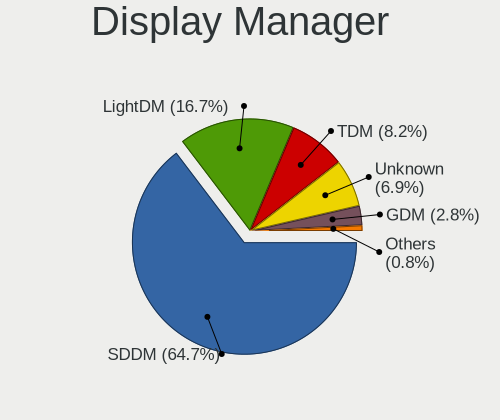

| Name    | Notebooks | Percent |
|---------|-----------|---------|
| SDDM    | 536       | 54.2%   |
| LightDM | 164       | 16.58%  |
| TDM     | 149       | 15.07%  |
| Unknown | 104       | 10.52%  |
| GDM     | 28        | 2.83%   |
| Ly      | 3         | 0.3%    |
| LXDM    | 3         | 0.3%    |
| XDM     | 1         | 0.1%    |
| SLiM    | 1         | 0.1%    |

OS Lang
-------

Language

| Lang    | Notebooks | Percent |
|---------|-----------|---------|
| en_US   | 542       | 56.99%  |
| en_GB   | 66        | 6.94%   |
| de_DE   | 55        | 5.78%   |
| en_IN   | 31        | 3.26%   |
| en_CA   | 31        | 3.26%   |
| fr_FR   | 20        | 2.1%    |
| ru_RU   | 16        | 1.68%   |
| en_AU   | 16        | 1.68%   |
| pt_BR   | 15        | 1.58%   |
| pl_PL   | 11        | 1.16%   |
| es_ES   | 11        | 1.16%   |
| C       | 10        | 1.05%   |
| it_IT   | 7         | 0.74%   |
| hu_HU   | 7         | 0.74%   |
| Unknown | 7         | 0.74%   |
| es_MX   | 6         | 0.63%   |
| es_AR   | 6         | 0.63%   |
| en_ZA   | 6         | 0.63%   |
| tr_TR   | 5         | 0.53%   |
| ru_UA   | 4         | 0.42%   |
| en_PH   | 4         | 0.42%   |
| en_IE   | 4         | 0.42%   |
| zh_CN   | 3         | 0.32%   |
| sv_SE   | 3         | 0.32%   |
| nl_NL   | 3         | 0.32%   |
| nl_BE   | 3         | 0.32%   |
| fr_CA   | 3         | 0.32%   |
| fr_BE   | 3         | 0.32%   |
| es_CL   | 3         | 0.32%   |
| en_SG   | 3         | 0.32%   |
| en_IL   | 3         | 0.32%   |
| en_DK   | 3         | 0.32%   |
| el_GR   | 3         | 0.32%   |
| ro_RO   | 2         | 0.21%   |
| nb_NO   | 2         | 0.21%   |
| ja_JP   | 2         | 0.21%   |
| fi_FI   | 2         | 0.21%   |
| es_CO   | 2         | 0.21%   |
| en_NZ   | 2         | 0.21%   |
| en_HK   | 2         | 0.21%   |

Boot Mode
---------

EFI or BIOS

| Mode | Notebooks | Percent |
|------|-----------|---------|
| EFI  | 674       | 71.32%  |
| BIOS | 271       | 28.68%  |

Filesystem
----------

Type of filesystem

| Type    | Notebooks | Percent |
|---------|-----------|---------|
| Ext4    | 717       | 75.32%  |
| Btrfs   | 176       | 18.49%  |
| Overlay | 41        | 4.31%   |
| Xfs     | 12        | 1.26%   |
| F2fs    | 3         | 0.32%   |
| Tmpfs   | 1         | 0.11%   |
| Jfs     | 1         | 0.11%   |
| Unknown | 1         | 0.11%   |

Part. scheme
------------

Scheme of partitioning

| Type    | Notebooks | Percent |
|---------|-----------|---------|
| GPT     | 690       | 72.78%  |
| MBR     | 162       | 17.09%  |
| Unknown | 96        | 10.13%  |

Dual Boot with Linux/BSD
------------------------

Hosting more than one Linux/BSD

| Dual boot | Notebooks | Percent |
|-----------|-----------|---------|
| No        | 775       | 80.81%  |
| Yes       | 184       | 19.19%  |

Dual Boot (Win)
---------------

Hosting Linux and Windows

| Dual boot | Notebooks | Percent |
|-----------|-----------|---------|
| No        | 627       | 66.42%  |
| Yes       | 317       | 33.58%  |

Board
-----

Vendor
------

Motherboard manufacturer

| Name                  | Notebooks | Percent |
|-----------------------|-----------|---------|
| Lenovo                | 262       | 27.9%   |
| Dell                  | 143       | 15.23%  |
| Hewlett-Packard       | 132       | 14.06%  |
| ASUSTek Computer      | 123       | 13.1%   |
| Acer                  | 69        | 7.35%   |
| Apple                 | 28        | 2.98%   |
| Toshiba               | 23        | 2.45%   |
| MSI                   | 20        | 2.13%   |
| HUAWEI                | 12        | 1.28%   |
| Sony                  | 11        | 1.17%   |
| Samsung Electronics   | 10        | 1.06%   |
| System76              | 9         | 0.96%   |
| TUXEDO                | 7         | 0.75%   |
| Timi                  | 7         | 0.75%   |
| Razer                 | 7         | 0.75%   |
| Fujitsu               | 7         | 0.75%   |
| Notebook              | 6         | 0.64%   |
| Medion                | 6         | 0.64%   |
| Alienware             | 6         | 0.64%   |
| Unknown               | 6         | 0.64%   |
| Chuwi                 | 5         | 0.53%   |
| Schenker              | 3         | 0.32%   |
| LG Electronics        | 3         | 0.32%   |
| Teclast               | 2         | 0.21%   |
| Packard Bell          | 2         | 0.21%   |
| NEC Computers         | 2         | 0.21%   |
| Monster               | 2         | 0.21%   |
| Gigabyte Technology   | 2         | 0.21%   |
| Eluktronics           | 2         | 0.21%   |
| Casper                | 2         | 0.21%   |
| AZW                   | 2         | 0.21%   |
| Xplore                | 1         | 0.11%   |
| UNITCOM               | 1         | 0.11%   |
| Standard              | 1         | 0.11%   |
| SLIMBOOK              | 1         | 0.11%   |
| Shuttle               | 1         | 0.11%   |
| Semp Toshiba          | 1         | 0.11%   |
| Positivo Bahia - VAIO | 1         | 0.11%   |
| Pegatron              | 1         | 0.11%   |
| Intel Client Systems  | 1         | 0.11%   |

Model
-----

Motherboard model

| Name                                 | Notebooks | Percent |
|--------------------------------------|-----------|---------|
| Unknown                              | 9         | 0.96%   |
| HP Pavilion Notebook                 | 7         | 0.75%   |
| HP Notebook                          | 6         | 0.64%   |
| HP Laptop 15s-eq2xxx                 | 5         | 0.53%   |
| Razer Blade                          | 4         | 0.43%   |
| Lenovo Legion 5 Pro 16ACH6H 82JQ     | 4         | 0.43%   |
| HUAWEI KLVL-WXX9                     | 4         | 0.43%   |
| HP Laptop 15-da0xxx                  | 4         | 0.43%   |
| HP EliteBook 840 G3                  | 4         | 0.43%   |
| Dell XPS 15 9570                     | 4         | 0.43%   |
| Acer Aspire E5-575G                  | 4         | 0.43%   |
| Timi TM1607                          | 3         | 0.32%   |
| System76 Pangolin                    | 3         | 0.32%   |
| Lenovo ThinkPad T14 Gen 1 20UDCTO1WW | 3         | 0.32%   |
| Lenovo Legion Y540-15IRH 81SX        | 3         | 0.32%   |
| Lenovo Legion 5 15ARH05 82B5         | 3         | 0.32%   |
| Lenovo IdeaPad 510-15IKB 80SV        | 3         | 0.32%   |
| Lenovo IdeaPad 5 14ARE05 81YM        | 3         | 0.32%   |
| Lenovo IdeaPad 320-15ISK 80XH        | 3         | 0.32%   |
| HP Pavilion Gaming Laptop 15-ec1xxx  | 3         | 0.32%   |
| HP Pavilion Gaming Laptop 15-ec0xxx  | 3         | 0.32%   |
| HP Pavilion dv7                      | 3         | 0.32%   |
| HP ENVY Notebook                     | 3         | 0.32%   |
| HP ENVY 15                           | 3         | 0.32%   |
| HP EliteBook 8460p                   | 3         | 0.32%   |
| HP 255 G7 Notebook PC                | 3         | 0.32%   |
| HP 250 G7 Notebook PC                | 3         | 0.32%   |
| Dell XPS 15 9560                     | 3         | 0.32%   |
| Dell Precision M4800                 | 3         | 0.32%   |
| Dell Latitude E6530                  | 3         | 0.32%   |
| Dell Latitude 7480                   | 3         | 0.32%   |
| Dell Latitude 3410                   | 3         | 0.32%   |
| Dell Inspiron 5570                   | 3         | 0.32%   |
| Dell Inspiron 3558                   | 3         | 0.32%   |
| Dell Inspiron 15 7000 Gaming         | 3         | 0.32%   |
| Chuwi GemiBook Pro                   | 3         | 0.32%   |
| ASUS X556UQK                         | 3         | 0.32%   |
| Apple MacBookPro9,2                  | 3         | 0.32%   |
| Apple MacBookPro8,1                  | 3         | 0.32%   |
| Apple MacBookPro11,2                 | 3         | 0.32%   |

Model Family
------------

Motherboard model prefix

| Name               | Notebooks | Percent |
|--------------------|-----------|---------|
| Lenovo ThinkPad    | 143       | 15.23%  |
| Lenovo IdeaPad     | 60        | 6.39%   |
| Dell Latitude      | 47        | 5.01%   |
| Dell Inspiron      | 47        | 5.01%   |
| Acer Aspire        | 45        | 4.79%   |
| HP Pavilion        | 30        | 3.19%   |
| ASUS VivoBook      | 28        | 2.98%   |
| HP Laptop          | 26        | 2.77%   |
| Lenovo Legion      | 25        | 2.66%   |
| Dell XPS           | 25        | 2.66%   |
| HP EliteBook       | 23        | 2.45%   |
| Toshiba Satellite  | 19        | 2.02%   |
| Dell Precision     | 13        | 1.38%   |
| ASUS ROG           | 13        | 1.38%   |
| HP ENVY            | 10        | 1.06%   |
| Acer Nitro         | 9         | 0.96%   |
| Unknown            | 9         | 0.96%   |
| HP ProBook         | 8         | 0.85%   |
| ASUS TUF           | 8         | 0.85%   |
| Apple MacBookPro11 | 8         | 0.85%   |
| Razer Blade        | 7         | 0.75%   |
| Fujitsu LIFEBOOK   | 7         | 0.75%   |
| Dell Vostro        | 7         | 0.75%   |
| ASUS Zenbook       | 7         | 0.75%   |
| Acer Swift         | 7         | 0.75%   |
| HP Notebook        | 6         | 0.64%   |
| HP 250             | 6         | 0.64%   |
| Lenovo Yoga        | 5         | 0.53%   |
| HP ZBook           | 5         | 0.53%   |
| HP OMEN            | 5         | 0.53%   |
| ASUS Zephyrus      | 5         | 0.53%   |
| HUAWEI KLVL-WXX9   | 4         | 0.43%   |
| HP 255             | 4         | 0.43%   |
| ASUS ASUS          | 4         | 0.43%   |
| Acer Predator      | 4         | 0.43%   |
| Timi TM1607        | 3         | 0.32%   |
| System76 Pangolin  | 3         | 0.32%   |
| Lenovo ThinkBook   | 3         | 0.32%   |
| Chuwi GemiBook     | 3         | 0.32%   |
| ASUS X556UQK       | 3         | 0.32%   |

MFG Year
--------

Motherboard manufacture year

| Year | Notebooks | Percent |
|------|-----------|---------|
| 2020 | 116       | 12.35%  |
| 2019 | 106       | 11.29%  |
| 2018 | 95        | 10.12%  |
| 2017 | 92        | 9.8%    |
| 2021 | 82        | 8.73%   |
| 2016 | 70        | 7.45%   |
| 2013 | 63        | 6.71%   |
| 2011 | 61        | 6.5%    |
| 2015 | 56        | 5.96%   |
| 2012 | 54        | 5.75%   |
| 2010 | 45        | 4.79%   |
| 2014 | 41        | 4.37%   |
| 2022 | 25        | 2.66%   |
| 2008 | 16        | 1.7%    |
| 2009 | 12        | 1.28%   |
| 2007 | 4         | 0.43%   |
| 2006 | 1         | 0.11%   |

Form Factor
-----------

Physical design of the computer

| Name     | Notebooks | Percent |
|----------|-----------|---------|
| Notebook | 939       | 100%    |

Secure Boot
-----------

Enabled or disabled

| State    | Notebooks | Percent |
|----------|-----------|---------|
| Disabled | 938       | 99.89%  |
| Enabled  | 1         | 0.11%   |

Coreboot
--------

Have coreboot on board

| Used | Notebooks | Percent |
|------|-----------|---------|
| No   | 934       | 99.47%  |
| Yes  | 5         | 0.53%   |

RAM Size
--------

Total RAM memory

| Size in GB  | Notebooks | Percent |
|-------------|-----------|---------|
| 4.01-8.0    | 315       | 33.26%  |
| 16.01-24.0  | 218       | 23.02%  |
| 8.01-16.0   | 179       | 18.9%   |
| 3.01-4.0    | 123       | 12.99%  |
| 32.01-64.0  | 69        | 7.29%   |
| 64.01-256.0 | 13        | 1.37%   |
| 1.01-2.0    | 13        | 1.37%   |
| 24.01-32.0  | 11        | 1.16%   |
| 2.01-3.0    | 6         | 0.63%   |

RAM Used
--------

Used RAM memory

| Used GB    | Notebooks | Percent |
|------------|-----------|---------|
| 1.01-2.0   | 330       | 32.32%  |
| 2.01-3.0   | 258       | 25.27%  |
| 3.01-4.0   | 148       | 14.5%   |
| 4.01-8.0   | 143       | 14.01%  |
| 0.51-1.0   | 91        | 8.91%   |
| 8.01-16.0  | 35        | 3.43%   |
| 0.01-0.5   | 12        | 1.18%   |
| 16.01-24.0 | 3         | 0.29%   |
| 24.01-32.0 | 1         | 0.1%    |

Total Drives
------------

Number of drives on board

| Drives | Notebooks | Percent |
|--------|-----------|---------|
| 1      | 636       | 66.67%  |
| 2      | 277       | 29.04%  |
| 3      | 31        | 3.25%   |
| 4      | 5         | 0.52%   |
| 0      | 3         | 0.31%   |
| 6      | 2         | 0.21%   |

Has CD-ROM
----------

Has CD-ROM on board

| Presented | Notebooks | Percent |
|-----------|-----------|---------|
| No        | 697       | 73.99%  |
| Yes       | 245       | 26.01%  |

Has Ethernet
------------

Has Ethernet on board

| Presented | Notebooks | Percent |
|-----------|-----------|---------|
| Yes       | 766       | 81.14%  |
| No        | 178       | 18.86%  |

Has WiFi
--------

Has WiFi module

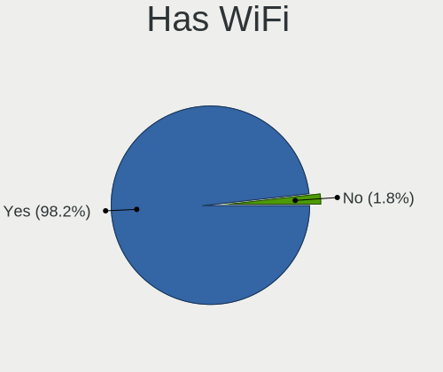

| Presented | Notebooks | Percent |
|-----------|-----------|---------|
| Yes       | 931       | 99.15%  |
| No        | 8         | 0.85%   |

Has Bluetooth
-------------

Has Bluetooth module

| Presented | Notebooks | Percent |
|-----------|-----------|---------|
| Yes       | 813       | 85.94%  |
| No        | 133       | 14.06%  |

Location
--------

Country
-------

Geographic location (country)

| Country      | Notebooks | Percent |
|--------------|-----------|---------|
| USA          | 170       | 17.97%  |
| Germany      | 83        | 8.77%   |
| India        | 50        | 5.29%   |
| UK           | 45        | 4.76%   |
| Canada       | 38        | 4.02%   |
| France       | 32        | 3.38%   |
| Brazil       | 28        | 2.96%   |
| Belgium      | 26        | 2.75%   |
| Russia       | 24        | 2.54%   |
| Turkey       | 23        | 2.43%   |
| Italy        | 23        | 2.43%   |
| Spain        | 21        | 2.22%   |
| Poland       | 21        | 2.22%   |
| Netherlands  | 18        | 1.9%    |
| Australia    | 18        | 1.9%    |
| Sweden       | 16        | 1.69%   |
| Switzerland  | 15        | 1.59%   |
| Hungary      | 14        | 1.48%   |
| Indonesia    | 13        | 1.37%   |
| Ukraine      | 12        | 1.27%   |
| Romania      | 11        | 1.16%   |
| Argentina    | 11        | 1.16%   |
| Greece       | 10        | 1.06%   |
| Bangladesh   | 10        | 1.06%   |
| Norway       | 9         | 0.95%   |
| Mexico       | 9         | 0.95%   |
| Finland      | 8         | 0.85%   |
| China        | 8         | 0.85%   |
| South Africa | 7         | 0.74%   |
| Portugal     | 7         | 0.74%   |
| Egypt        | 7         | 0.74%   |
| Bulgaria     | 7         | 0.74%   |
| Estonia      | 6         | 0.63%   |
| Czechia      | 6         | 0.63%   |
| Colombia     | 6         | 0.63%   |
| Serbia       | 5         | 0.53%   |
| Philippines  | 5         | 0.53%   |
| Malaysia     | 5         | 0.53%   |
| Latvia       | 5         | 0.53%   |
| Ireland      | 5         | 0.53%   |

City
----

Geographic location (city)

| City              | Notebooks | Percent |
|-------------------|-----------|---------|
| Berlin            | 10        | 1.01%   |
| Paris             | 9         | 0.91%   |
| Sydney            | 7         | 0.71%   |
| Moscow            | 7         | 0.71%   |
| Madrid            | 7         | 0.71%   |
| Tallinn           | 6         | 0.61%   |
| Spokane           | 6         | 0.61%   |
| Pune              | 6         | 0.61%   |
| Milan             | 6         | 0.61%   |
| Frankfurt am Main | 6         | 0.61%   |
| Dhaka             | 6         | 0.61%   |
| Ankara            | 6         | 0.61%   |
| Stockholm         | 5         | 0.5%    |
| Houston           | 5         | 0.5%    |
| Helsinki          | 5         | 0.5%    |
| Hamburg           | 5         | 0.5%    |
| Budapest          | 5         | 0.5%    |
| Bergheim          | 5         | 0.5%    |
| Athens            | 5         | 0.5%    |
| Zurich            | 4         | 0.4%    |
| Warsaw            | 4         | 0.4%    |
| Toronto           | 4         | 0.4%    |
| Tehran            | 4         | 0.4%    |
| St Petersburg     | 4         | 0.4%    |
| Seville           | 4         | 0.4%    |
| Scottsdale        | 4         | 0.4%    |
| Rio de Janeiro    | 4         | 0.4%    |
| Ochten            | 4         | 0.4%    |
| New York          | 4         | 0.4%    |
| Mumbai            | 4         | 0.4%    |
| Lier              | 4         | 0.4%    |
| Kolkata           | 4         | 0.4%    |
| Izmir             | 4         | 0.4%    |
| Istanbul          | 4         | 0.4%    |
| Cairo             | 4         | 0.4%    |
| Bursa             | 4         | 0.4%    |
| Brussels          | 4         | 0.4%    |
| Brooklyn          | 4         | 0.4%    |
| Brisbane          | 4         | 0.4%    |
| Bogot           | 4         | 0.4%    |

Drives
------

Drive Vendor
------------

Hard drive vendors

| Vendor                      | Notebooks | Drives | Percent |
|-----------------------------|-----------|--------|---------|
| Samsung Electronics         | 242       | 307    | 19.45%  |
| WDC                         | 157       | 200    | 12.62%  |
| Seagate                     | 139       | 162    | 11.17%  |
| Toshiba                     | 98        | 113    | 7.88%   |
| SanDisk                     | 72        | 88     | 5.79%   |
| SK hynix                    | 67        | 76     | 5.39%   |
| Kingston                    | 54        | 68     | 4.34%   |
| Intel                       | 44        | 55     | 3.54%   |
| Crucial                     | 42        | 55     | 3.38%   |
| Unknown                     | 32        | 46     | 2.57%   |
| Micron Technology           | 31        | 31     | 2.49%   |
| HGST                        | 28        | 35     | 2.25%   |
| KIOXIA                      | 18        | 21     | 1.45%   |
| Hitachi                     | 18        | 19     | 1.45%   |
| Apple                       | 18        | 22     | 1.45%   |
| A-DATA Technology           | 16        | 19     | 1.29%   |
| PNY                         | 11        | 13     | 0.88%   |
| LITEON                      | 11        | 15     | 0.88%   |
| SPCC                        | 8         | 8      | 0.64%   |
| Kingston Technology Company | 8         | 11     | 0.64%   |
| Phison Electronics          | 7         | 8      | 0.56%   |
| Phison                      | 7         | 9      | 0.56%   |
| LITEONIT                    | 7         | 7      | 0.56%   |
| JMicron Technology          | 7         | 7      | 0.56%   |
| Intenso                     | 6         | 7      | 0.48%   |
| China                       | 6         | 6      | 0.48%   |
| Transcend                   | 5         | 5      | 0.4%    |
| Micron/Crucial Technology   | 5         | 9      | 0.4%    |
| Mushkin                     | 4         | 4      | 0.32%   |
| Corsair                     | 4         | 4      | 0.32%   |
| Team                        | 3         | 3      | 0.24%   |
| Plextor                     | 3         | 3      | 0.24%   |
| Lenovo                      | 3         | 4      | 0.24%   |
| KingSpec                    | 3         | 3      | 0.24%   |
| Hewlett-Packard             | 3         | 4      | 0.24%   |
| Union Memory                | 2         | 2      | 0.16%   |
| SSSTC                       | 2         | 2      | 0.16%   |
| Silicon Motion              | 2         | 3      | 0.16%   |
| Realtek Semiconductor       | 2         | 2      | 0.16%   |
| Patriot                     | 2         | 5      | 0.16%   |

Drive Model
-----------

Hard drive models

| Model                                               | Notebooks | Percent |
|-----------------------------------------------------|-----------|---------|
| Seagate ST1000LM035-1RK172 1TB                      | 38        | 2.94%   |
| Samsung NVMe SSD Controller SM981/PM981/PM983 256GB | 24        | 1.85%   |
| Toshiba MQ01ABD100 1TB                              | 21        | 1.62%   |
| Toshiba MQ04ABF100 1TB                              | 19        | 1.47%   |
| Samsung SSD 860 EVO 500GB                           | 18        | 1.39%   |
| Seagate ST1000LM024 HN-M101MBB 1TB                  | 16        | 1.24%   |
| Kingston SA400S37240G 240GB SSD                     | 11        | 0.85%   |
| Samsung NVMe SSD Controller PM9A1/PM9A3/980PRO 1TB  | 10        | 0.77%   |
| Seagate ST1000LM048-2E7172 1TB                      | 9         | 0.7%    |
| Seagate ST1000LM049-2GH172 1TB                      | 8         | 0.62%   |
| Samsung SSD 970 EVO Plus 1TB                        | 8         | 0.62%   |
| Kingston SA400S37480G 480GB SSD                     | 8         | 0.62%   |
| Crucial CT1000MX500SSD1 1TB                         | 8         | 0.62%   |
| Sandisk WD Blue SN550 NVMe SSD 512GB                | 7         | 0.54%   |
| Samsung NVMe SSD Controller SM961/PM961/SM963 256GB | 7         | 0.54%   |
| Intel SSD 660P Series 512GB                         | 7         | 0.54%   |
| HGST HTS721010A9E630 1TB                            | 7         | 0.54%   |
| WDC WD10SPZX-21Z10T0 1TB                            | 6         | 0.46%   |
| Unknown MMC Card  64GB                              | 6         | 0.46%   |
| Toshiba MQ01ABF050 500GB                            | 6         | 0.46%   |
| Seagate ST2000LM007-1R8174 2TB                      | 6         | 0.46%   |
| Sandisk WD Black SN750 / PC SN730 NVMe SSD 256GB    | 6         | 0.46%   |
| Samsung SSD 860 EVO 1TB                             | 6         | 0.46%   |
| Samsung SSD 850 EVO 250GB                           | 6         | 0.46%   |
| JMicron Generic 320GB                               | 6         | 0.46%   |
| WDC WDS500G2B0B-00YS70 500GB SSD                    | 5         | 0.39%   |
| WDC WDS500G2B0A-00SM50 500GB SSD                    | 5         | 0.39%   |
| WDC WD10SPZX-60Z10T0 1TB                            | 5         | 0.39%   |
| Seagate ST500LM012 HN-M500MBB 500GB                 | 5         | 0.39%   |
| Seagate Expansion 1TB                               | 5         | 0.39%   |
| SanDisk SSD PLUS 480GB                              | 5         | 0.39%   |
| Samsung SSD 860 EVO 250GB                           | 5         | 0.39%   |
| Samsung SSD 850 EVO 500GB                           | 5         | 0.39%   |
| Samsung MZVLB512HBJQ-000L7 512GB                    | 5         | 0.39%   |
| Micron 1100_MTFDDAV256TBN 256GB SSD                 | 5         | 0.39%   |
| HGST HTS545050A7E680 500GB                          | 5         | 0.39%   |
| Crucial CT500MX500SSD1 500GB                        | 5         | 0.39%   |
| Apple SSD SM0256F 256GB                             | 5         | 0.39%   |
| WDC WDS240G2G0A-00JH30 240GB SSD                    | 4         | 0.31%   |
| WDC WD10SPZX-08Z10 1TB                              | 4         | 0.31%   |

HDD Vendor
----------

Hard disk drive vendors

| Vendor              | Notebooks | Drives | Percent |
|---------------------|-----------|--------|---------|
| Seagate             | 135       | 155    | 38.68%  |
| WDC                 | 82        | 107    | 23.5%   |
| Toshiba             | 67        | 77     | 19.2%   |
| HGST                | 28        | 35     | 8.02%   |
| Hitachi             | 18        | 19     | 5.16%   |
| Unknown             | 4         | 4      | 1.15%   |
| Samsung Electronics | 3         | 4      | 0.86%   |
| Apple               | 3         | 3      | 0.86%   |
| USB3.0              | 1         | 2      | 0.29%   |
| SSK                 | 1         | 1      | 0.29%   |
| LaCie               | 1         | 1      | 0.29%   |
| KESU                | 1         | 1      | 0.29%   |
| Intenso             | 1         | 1      | 0.29%   |
| Hewlett-Packard     | 1         | 2      | 0.29%   |
| Fujitsu             | 1         | 1      | 0.29%   |
| External            | 1         | 1      | 0.29%   |
| ASMT                | 1         | 1      | 0.29%   |

SSD Vendor
----------

Solid state drive vendors

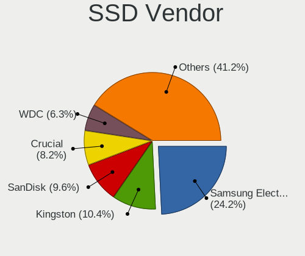

| Vendor              | Notebooks | Drives | Percent |
|---------------------|-----------|--------|---------|
| Samsung Electronics | 115       | 155    | 25.56%  |
| SanDisk             | 45        | 51     | 10%     |
| Kingston            | 40        | 48     | 8.89%   |
| WDC                 | 38        | 49     | 8.44%   |
| Crucial             | 38        | 47     | 8.44%   |
| SK hynix            | 18        | 20     | 4%      |
| Toshiba             | 12        | 14     | 2.67%   |
| Micron Technology   | 12        | 12     | 2.67%   |
| Apple               | 12        | 14     | 2.67%   |
| PNY                 | 11        | 13     | 2.44%   |
| Intel               | 10        | 13     | 2.22%   |
| A-DATA Technology   | 10        | 13     | 2.22%   |
| LITEON              | 9         | 13     | 2%      |
| SPCC                | 8         | 8      | 1.78%   |
| LITEONIT            | 7         | 7      | 1.56%   |
| JMicron Technology  | 6         | 6      | 1.33%   |
| China               | 6         | 6      | 1.33%   |
| Transcend           | 5         | 5      | 1.11%   |
| Intenso             | 5         | 6      | 1.11%   |
| Team                | 3         | 3      | 0.67%   |
| Seagate             | 3         | 4      | 0.67%   |
| Plextor             | 3         | 3      | 0.67%   |
| KingSpec            | 3         | 3      | 0.67%   |
| Patriot             | 2         | 5      | 0.44%   |
| Mushkin             | 2         | 2      | 0.44%   |
| Lexar               | 2         | 2      | 0.44%   |
| Hewlett-Packard     | 2         | 2      | 0.44%   |
| GOODRAM             | 2         | 4      | 0.44%   |
| BIWIN               | 2         | 2      | 0.44%   |
| XrayDisk            | 1         | 1      | 0.22%   |
| W800S               | 1         | 2      | 0.22%   |
| Unknown             | 1         | 1      | 0.22%   |
| SSSTC               | 1         | 1      | 0.22%   |
| ShiJi               | 1         | 1      | 0.22%   |
| SABRENT             | 1         | 1      | 0.22%   |
| Pioneer             | 1         | 1      | 0.22%   |
| OWC                 | 1         | 1      | 0.22%   |
| OCZ                 | 1         | 1      | 0.22%   |
| NGFF                | 1         | 1      | 0.22%   |
| Netac               | 1         | 2      | 0.22%   |

Drive Kind
----------

HDD or SSD

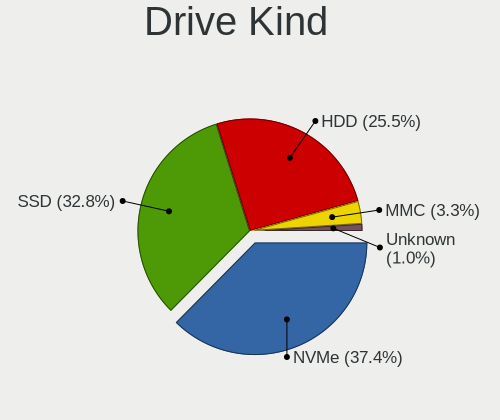

| Kind    | Notebooks | Drives | Percent |
|---------|-----------|--------|---------|
| SSD     | 404       | 554    | 34.74%  |
| NVMe    | 385       | 502    | 33.1%   |
| HDD     | 340       | 415    | 29.23%  |
| MMC     | 28        | 42     | 2.41%   |
| Unknown | 6         | 7      | 0.52%   |

Drive Connector
---------------

SATA, SAS, NVMe, etc.

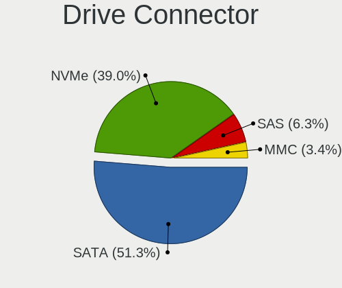

| Type | Notebooks | Drives | Percent |
|------|-----------|--------|---------|
| SATA | 634       | 904    | 57.38%  |
| NVMe | 385       | 499    | 34.84%  |
| SAS  | 58        | 75     | 5.25%   |
| MMC  | 28        | 42     | 2.53%   |

Drive Size
----------

Size of hard drive

| Size in TB | Notebooks | Drives | Percent |
|------------|-----------|--------|---------|
| 0.01-0.5   | 427       | 564    | 57.16%  |
| 0.51-1.0   | 283       | 349    | 37.88%  |
| 1.01-2.0   | 29        | 48     | 3.88%   |
| 4.01-10.0  | 4         | 4      | 0.54%   |
| 3.01-4.0   | 3         | 3      | 0.4%    |
| 10.01-20.0 | 1         | 1      | 0.13%   |

Space Total
-----------

Amount of disk space available on the file system

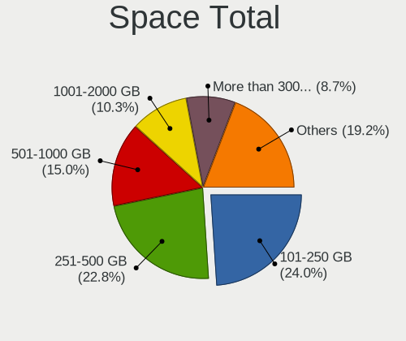

| Size in GB     | Notebooks | Percent |
|----------------|-----------|---------|
| 101-250        | 257       | 26.28%  |
| 251-500        | 222       | 22.7%   |
| 501-1000       | 148       | 15.13%  |
| 1001-2000      | 104       | 10.63%  |
| More than 3000 | 63        | 6.44%   |
| 51-100         | 56        | 5.73%   |
| Unknown        | 55        | 5.62%   |
| 1-20           | 41        | 4.19%   |
| 21-50          | 16        | 1.64%   |
| 2001-3000      | 16        | 1.64%   |

Space Used
----------

Amount of used disk space

| Used GB        | Notebooks | Percent |
|----------------|-----------|---------|
| 1-20           | 285       | 28.16%  |
| 21-50          | 203       | 20.06%  |
| 101-250        | 163       | 16.11%  |
| 51-100         | 128       | 12.65%  |
| 251-500        | 78        | 7.71%   |
| 501-1000       | 62        | 6.13%   |
| Unknown        | 55        | 5.43%   |
| 1001-2000      | 21        | 2.08%   |
| More than 3000 | 14        | 1.38%   |
| 2001-3000      | 2         | 0.2%    |
| 0              | 1         | 0.1%    |

Malfunc. Drives
---------------

Drive models with a malfunction

| Model                                          | Notebooks | Drives | Percent |
|------------------------------------------------|-----------|--------|---------|
| Seagate ST1000LM024 HN-M101MBB 1TB             | 9         | 9      | 6.72%   |
| Toshiba MQ01ABD100 1TB                         | 7         | 8      | 5.22%   |
| Seagate ST1000LM035-1RK172 1TB                 | 7         | 8      | 5.22%   |
| Toshiba MQ01ABF050 500GB                       | 4         | 4      | 2.99%   |
| Seagate ST9320325AS 320GB                      | 3         | 3      | 2.24%   |
| Toshiba MQ04ABF100 1TB                         | 2         | 3      | 1.49%   |
| Seagate ST9500325AS 500GB                      | 2         | 2      | 1.49%   |
| Seagate ST9250315AS 250GB                      | 2         | 2      | 1.49%   |
| Seagate ST500LM021-1KJ152 500GB                | 2         | 2      | 1.49%   |
| Seagate ST1000LX015-1U7172 1TB                 | 2         | 2      | 1.49%   |
| Seagate ST1000LM049-2GH172 1TB                 | 2         | 2      | 1.49%   |
| Seagate ST1000LM014-1EJ164 1TB                 | 2         | 2      | 1.49%   |
| SanDisk SSD PLUS 1000GB                        | 2         | 2      | 1.49%   |
| Micron Technology 1100_MTFDDAV256TBN 256GB SSD | 2         | 2      | 1.49%   |
| Hitachi HTS547575A9E384 752GB                  | 2         | 2      | 1.49%   |
| HGST HTS725050A7E630 500GB                     | 2         | 3      | 1.49%   |
| HGST HTS545050A7E680 500GB                     | 2         | 2      | 1.49%   |
| HGST HTS545050A7E380 500GB                     | 2         | 3      | 1.49%   |
| HGST HTS541075A9E680 752GB                     | 2         | 2      | 1.49%   |
| HGST HTS541010A9E680 1TB                       | 2         | 3      | 1.49%   |
| WDC WD6400BEVT-60A0RT0 640GB                   | 1         | 2      | 0.75%   |
| WDC WD5000LPCX-24C6HT0 500GB                   | 1         | 1      | 0.75%   |
| WDC WD5000L 500GB                              | 1         | 1      | 0.75%   |
| WDC WD5000BPVT-22HXZT1 500GB                   | 1         | 1      | 0.75%   |
| WDC WD5000BPKX-22HPJT0 500GB                   | 1         | 1      | 0.75%   |
| WDC WD3200BPVT-00JJ5T0 320GB                   | 1         | 1      | 0.75%   |
| WDC WD3200BEVT-22ZCT0 320GB                    | 1         | 1      | 0.75%   |
| WDC WD3200BEKT-75PVMT0 320GB                   | 1         | 1      | 0.75%   |
| WDC WD2500BEVT-22A23T0 250GB                   | 1         | 1      | 0.75%   |
| WDC WD2500BEKT-60PVMT0 250GB                   | 1         | 1      | 0.75%   |
| WDC WD10SPZX-24Z10T0 1TB                       | 1         | 1      | 0.75%   |
| WDC WD10SPZX-08Z10 1TB                         | 1         | 1      | 0.75%   |
| WDC WD10JPVT-75A1YT0 1TB                       | 1         | 1      | 0.75%   |
| WDC WD10JPCX-24UE4T0 1TB                       | 1         | 1      | 0.75%   |
| WDC PC SA530 SDASN8Y-256G-1006 256GB           | 1         | 1      | 0.75%   |
| USB3.0 Super Speed 1TB                         | 1         | 2      | 0.75%   |
| Toshiba THNSNK256GVN8 M.2 2280 256GB SSD       | 1         | 1      | 0.75%   |
| Toshiba THNSNK256GCS8 SATA 256GB SSD           | 1         | 1      | 0.75%   |
| Toshiba MQ01ACF050 500GB                       | 1         | 1      | 0.75%   |
| Toshiba MK7575GSX 752GB                        | 1         | 1      | 0.75%   |

Malfunc. Drive Vendor
---------------------

Vendors of faulty drives

| Vendor                    | Notebooks | Drives | Percent |
|---------------------------|-----------|--------|---------|
| Seagate                   | 39        | 43     | 29.32%  |
| Toshiba                   | 21        | 23     | 15.79%  |
| WDC                       | 15        | 16     | 11.28%  |
| HGST                      | 11        | 15     | 8.27%   |
| SanDisk                   | 6         | 6      | 4.51%   |
| Hitachi                   | 6         | 6      | 4.51%   |
| SK hynix                  | 5         | 6      | 3.76%   |
| Intel                     | 5         | 6      | 3.76%   |
| Samsung Electronics       | 4         | 4      | 3.01%   |
| Micron Technology         | 4         | 4      | 3.01%   |
| LITEONIT                  | 2         | 2      | 1.5%    |
| Kingston                  | 2         | 2      | 1.5%    |
| Crucial                   | 2         | 2      | 1.5%    |
| USB3.0                    | 1         | 2      | 0.75%   |
| Team                      | 1         | 1      | 0.75%   |
| SSSTC                     | 1         | 1      | 0.75%   |
| Plextor                   | 1         | 1      | 0.75%   |
| Mushkin                   | 1         | 1      | 0.75%   |
| Micron/Crucial Technology | 1         | 2      | 0.75%   |
| Lenovo                    | 1         | 1      | 0.75%   |
| LaCie                     | 1         | 1      | 0.75%   |
| Corsair                   | 1         | 1      | 0.75%   |
| Apple                     | 1         | 1      | 0.75%   |
| A-DATA Technology         | 1         | 1      | 0.75%   |

Malfunc. HDD Vendor
-------------------

Vendors of faulty HDD drives

| Vendor  | Notebooks | Drives | Percent |
|---------|-----------|--------|---------|
| Seagate | 39        | 43     | 42.39%  |
| Toshiba | 19        | 21     | 20.65%  |
| WDC     | 14        | 15     | 15.22%  |
| HGST    | 11        | 15     | 11.96%  |
| Hitachi | 6         | 6      | 6.52%   |
| USB3.0  | 1         | 2      | 1.09%   |
| LaCie   | 1         | 1      | 1.09%   |
| Apple   | 1         | 1      | 1.09%   |

Malfunc. Drive Kind
-------------------

Kinds of faulty drives

| Kind | Notebooks | Drives | Percent |
|------|-----------|--------|---------|
| HDD  | 92        | 104    | 69.7%   |
| SSD  | 32        | 35     | 24.24%  |
| NVMe | 8         | 9      | 6.06%   |

Failed Drives
-------------

Failed drive models

| Model                      | Notebooks | Drives | Percent |
|----------------------------|-----------|--------|---------|
| WDC WD10SPZX-21Z10T0 1TB   | 1         | 1      | 25%     |
| Seagate ST9320325AS 320GB  | 1         | 1      | 25%     |
| HGST HTS721010A9E630 1TB   | 1         | 1      | 25%     |
| HGST HTS545050A7E680 500GB | 1         | 1      | 25%     |

Failed Drive Vendor
-------------------

Failed drive vendors

| Vendor  | Notebooks | Drives | Percent |
|---------|-----------|--------|---------|
| HGST    | 2         | 2      | 50%     |
| WDC     | 1         | 1      | 25%     |
| Seagate | 1         | 1      | 25%     |

Drive Status
------------

Number of failed and malfunc. drives

| Status   | Notebooks | Drives | Percent |
|----------|-----------|--------|---------|
| Works    | 741       | 1127   | 70.71%  |
| Detected | 173       | 241    | 16.51%  |
| Malfunc  | 130       | 148    | 12.4%   |
| Failed   | 4         | 4      | 0.38%   |

Storage controller
------------------

Storage Vendor
--------------

Storage controller vendors

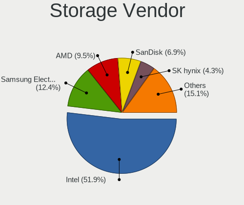

| Vendor                         | Notebooks | Percent |
|--------------------------------|-----------|---------|
| Intel                          | 664       | 56.22%  |
| Samsung Electronics            | 139       | 11.77%  |
| AMD                            | 116       | 9.82%   |
| SanDisk                        | 65        | 5.5%    |
| SK hynix                       | 49        | 4.15%   |
| KIOXIA                         | 23        | 1.95%   |
| Kingston Technology Company    | 22        | 1.86%   |
| Phison Electronics             | 19        | 1.61%   |
| Micron Technology              | 19        | 1.61%   |
| Toshiba America Info Systems   | 16        | 1.35%   |
| Micron/Crucial Technology      | 9         | 0.76%   |
| ADATA Technology               | 7         | 0.59%   |
| Union Memory (Shenzhen)        | 5         | 0.42%   |
| Silicon Motion                 | 5         | 0.42%   |
| Nvidia                         | 5         | 0.42%   |
| Lenovo                         | 3         | 0.25%   |
| Apple                          | 3         | 0.25%   |
| Realtek Semiconductor          | 2         | 0.17%   |
| Marvell Technology Group       | 2         | 0.17%   |
| Lite-On Technology             | 2         | 0.17%   |
| TenaFe                         | 1         | 0.08%   |
| Solid State Storage Technology | 1         | 0.08%   |
| Shenzhen Longsys Electronics   | 1         | 0.08%   |
| Netac Technology               | 1         | 0.08%   |
| INNOGRIT                       | 1         | 0.08%   |
| ASMedia Technology             | 1         | 0.08%   |

Storage Model
-------------

Storage controller models

| Model                                                                            | Notebooks | Percent |
|----------------------------------------------------------------------------------|-----------|---------|
| AMD FCH SATA Controller [AHCI mode]                                              | 112       | 9.15%   |
| Intel Sunrise Point-LP SATA Controller [AHCI mode]                               | 109       | 8.91%   |
| Samsung NVMe SSD Controller SM981/PM981/PM983                                    | 74        | 6.05%   |
| Intel 82801 Mobile SATA Controller [RAID mode]                                   | 66        | 5.39%   |
| Intel 7 Series Chipset Family 6-port SATA Controller [AHCI mode]                 | 56        | 4.58%   |
| Intel 6 Series/C200 Series Chipset Family 6 port Mobile SATA AHCI Controller     | 54        | 4.41%   |
| Intel Cannon Lake Mobile PCH SATA AHCI Controller                                | 49        | 4%      |
| Intel 8 Series/C220 Series Chipset Family 6-port SATA Controller 1 [AHCI mode]   | 34        | 2.78%   |
| Intel Wildcat Point-LP SATA Controller [AHCI Mode]                               | 31        | 2.53%   |
| Intel 8 Series SATA Controller 1 [AHCI mode]                                     | 31        | 2.53%   |
| Intel HM170/QM170 Chipset SATA Controller [AHCI Mode]                            | 27        | 2.21%   |
| SK hynix Gold P31/PC711 NVMe Solid State Drive                                   | 26        | 2.12%   |
| Samsung NVMe SSD Controller 980                                                  | 26        | 2.12%   |
| Intel 5 Series/3400 Series Chipset 4 port SATA AHCI Controller                   | 22        | 1.8%    |
| SanDisk WD Blue SN550 NVMe SSD                                                   | 20        | 1.63%   |
| KIOXIA NVMe SSD Controller BG4                                                   | 20        | 1.63%   |
| Micron NVMe Storage Controller                                                   | 19        | 1.55%   |
| Intel Volume Management Device NVMe RAID Controller                              | 19        | 1.55%   |
| Samsung NVMe SSD Controller SM961/PM961/SM963                                    | 18        | 1.47%   |
| Intel Tiger Lake-LP SATA Controller                                              | 17        | 1.39%   |
| SanDisk WD Black SN750 / PC SN730 NVMe SSD                                       | 16        | 1.31%   |
| Intel SSD 660P Series                                                            | 16        | 1.31%   |
| Intel 5 Series/3400 Series Chipset 6 port SATA AHCI Controller                   | 16        | 1.31%   |
| Intel 400 Series Chipset Family SATA AHCI Controller                             | 14        | 1.14%   |
| Intel Celeron/Pentium Silver Processor SATA Controller                           | 13        | 1.06%   |
| Intel 82801IBM/IEM (ICH9M/ICH9M-E) 4 port SATA Controller [AHCI mode]            | 13        | 1.06%   |
| Intel Cannon Point-LP SATA Controller [AHCI Mode]                                | 12        | 0.98%   |
| Samsung NVMe SSD Controller PM9A1/PM9A3/980PRO                                   | 11        | 0.9%    |
| Kingston Company U-SNS8154P3 NVMe SSD                                            | 11        | 0.9%    |
| Intel Q170/Q150/B150/H170/H110/Z170/CM236 Chipset SATA Controller [AHCI Mode]    | 11        | 0.9%    |
| Intel Comet Lake SATA AHCI Controller                                            | 11        | 0.9%    |
| SanDisk WD Blue SN500 / PC SN520 NVMe SSD                                        | 10        | 0.82%   |
| Phison E12 NVMe Controller                                                       | 9         | 0.74%   |
| Intel Atom Processor E3800 Series SATA AHCI Controller                           | 9         | 0.74%   |
| Intel Non-Volatile memory controller                                             | 8         | 0.65%   |
| SK hynix Non-Volatile memory controller                                          | 7         | 0.57%   |
| SK hynix BC511                                                                   | 7         | 0.57%   |
| Intel Atom/Celeron/Pentium Processor x5-E8000/J3xxx/N3xxx Series SATA Controller | 7         | 0.57%   |
| SK hynix BC501 NVMe Solid State Drive                                            | 6         | 0.49%   |
| Samsung Apple PCIe SSD                                                           | 6         | 0.49%   |

Storage Kind
------------

Kind of storage controller (IDE, SATA, NVMe, SAS, ...)

| Kind | Notebooks | Percent |
|------|-----------|---------|
| SATA | 689       | 58.39%  |
| NVMe | 387       | 32.8%   |
| RAID | 87        | 7.37%   |
| IDE  | 17        | 1.44%   |

Processor
---------

CPU Vendor
----------

Processor vendors

| Vendor | Notebooks | Percent |
|--------|-----------|---------|
| Intel  | 764       | 81.36%  |
| AMD    | 175       | 18.64%  |

CPU Model
---------

Processor models

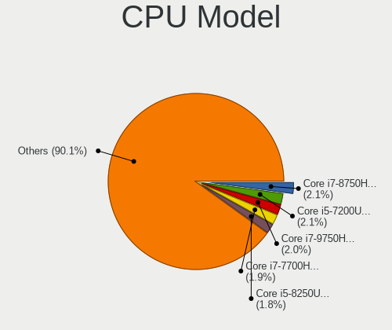

| Model                                         | Notebooks | Percent |
|-----------------------------------------------|-----------|---------|
| Intel Core i5-7200U CPU @ 2.50GHz             | 26        | 2.77%   |
| Intel Core i7-9750H CPU @ 2.60GHz             | 24        | 2.56%   |
| Intel Core i5-8250U CPU @ 1.60GHz             | 24        | 2.56%   |
| Intel Core i7-8750H CPU @ 2.20GHz             | 23        | 2.45%   |
| Intel Core i7-7700HQ CPU @ 2.80GHz            | 22        | 2.34%   |
| Intel Core i7-10750H CPU @ 2.60GHz            | 18        | 1.92%   |
| Intel Core i7-8550U CPU @ 1.80GHz             | 17        | 1.81%   |
| Intel Core i5-2520M CPU @ 2.50GHz             | 14        | 1.49%   |
| Intel Core i5-6300U CPU @ 2.40GHz             | 13        | 1.38%   |
| Intel Core i5-8265U CPU @ 1.60GHz             | 12        | 1.28%   |
| Intel Core i5-6200U CPU @ 2.30GHz             | 12        | 1.28%   |
| AMD Ryzen 7 5800H with Radeon Graphics        | 12        | 1.28%   |
| Intel Core i7-8565U CPU @ 1.80GHz             | 11        | 1.17%   |
| Intel Core i7-6500U CPU @ 2.50GHz             | 11        | 1.17%   |
| Intel Core i5-5200U CPU @ 2.20GHz             | 11        | 1.17%   |
| AMD Ryzen 7 5700U with Radeon Graphics        | 11        | 1.17%   |
| AMD Ryzen 7 4800H with Radeon Graphics        | 11        | 1.17%   |
| Intel Core i5-8300H CPU @ 2.30GHz             | 10        | 1.06%   |
| Intel 11th Gen Core i7-1165G7 @ 2.80GHz       | 10        | 1.06%   |
| Intel 11th Gen Core i5-1135G7 @ 2.40GHz       | 10        | 1.06%   |
| AMD Ryzen 3 3250U with Radeon Graphics        | 10        | 1.06%   |
| Intel Core i7-7500U CPU @ 2.70GHz             | 9         | 0.96%   |
| AMD Ryzen 5 3500U with Radeon Vega Mobile Gfx | 9         | 0.96%   |
| AMD Ryzen 5 2500U with Radeon Vega Mobile Gfx | 9         | 0.96%   |
| Intel Core i5-10210U CPU @ 1.60GHz            | 8         | 0.85%   |
| Intel Core i3-6006U CPU @ 2.00GHz             | 8         | 0.85%   |
| AMD Ryzen 5 5500U with Radeon Graphics        | 8         | 0.85%   |
| Intel Core i5-5300U CPU @ 2.30GHz             | 7         | 0.75%   |
| Intel Core i5-4200U CPU @ 1.60GHz             | 7         | 0.75%   |
| Intel Core i5-3320M CPU @ 2.60GHz             | 7         | 0.75%   |
| Intel Core i5-3210M CPU @ 2.50GHz             | 7         | 0.75%   |
| Intel Core i5-2410M CPU @ 2.30GHz             | 7         | 0.75%   |
| Intel Celeron CPU N2840 @ 2.16GHz             | 7         | 0.75%   |
| Intel Core i7-4500U CPU @ 1.80GHz             | 6         | 0.64%   |
| Intel Core i7-3610QM CPU @ 2.30GHz            | 6         | 0.64%   |
| Intel Core i7-1065G7 CPU @ 1.30GHz            | 6         | 0.64%   |
| Intel Core i7-10510U CPU @ 1.80GHz            | 6         | 0.64%   |
| Intel Core i5-4200M CPU @ 2.50GHz             | 6         | 0.64%   |
| Intel Core i5 CPU M 520 @ 2.40GHz             | 6         | 0.64%   |
| Intel Core i3-2350M CPU @ 2.30GHz             | 6         | 0.64%   |

CPU Model Family
----------------

Processor model prefix

| Model                          | Notebooks | Percent |
|--------------------------------|-----------|---------|
| Intel Core i7                  | 275       | 29.29%  |
| Intel Core i5                  | 275       | 29.29%  |
| Other                          | 64        | 6.82%   |
| Intel Core i3                  | 63        | 6.71%   |
| AMD Ryzen 7                    | 52        | 5.54%   |
| AMD Ryzen 5                    | 47        | 5.01%   |
| Intel Celeron                  | 26        | 2.77%   |
| Intel Pentium                  | 22        | 2.34%   |
| Intel Core 2 Duo               | 19        | 2.02%   |
| AMD Ryzen 3                    | 16        | 1.7%    |
| AMD Ryzen 9                    | 11        | 1.17%   |
| AMD Ryzen 7 PRO                | 8         | 0.85%   |
| AMD A6                         | 8         | 0.85%   |
| Intel Atom                     | 6         | 0.64%   |
| AMD A12                        | 6         | 0.64%   |
| AMD A10                        | 5         | 0.53%   |
| Intel Pentium Silver           | 4         | 0.43%   |
| Intel Pentium Dual-Core        | 4         | 0.43%   |
| Intel Xeon                     | 3         | 0.32%   |
| Intel Core m3                  | 3         | 0.32%   |
| Intel Core i9                  | 3         | 0.32%   |
| AMD A8                         | 3         | 0.32%   |
| AMD A4                         | 3         | 0.32%   |
| Intel Core 2                   | 2         | 0.21%   |
| AMD Ryzen 5 PRO                | 2         | 0.21%   |
| AMD E1                         | 2         | 0.21%   |
| Intel Pentium Dual             | 1         | 0.11%   |
| Intel Core m7                  | 1         | 0.11%   |
| Intel Core M                   | 1         | 0.11%   |
| AMD Turion X2 Dual-Core Mobile | 1         | 0.11%   |
| AMD Turion II Dual-Core        | 1         | 0.11%   |
| AMD E2                         | 1         | 0.11%   |
| AMD Athlon II                  | 1         | 0.11%   |

CPU Cores
---------

Number of processor cores

| Number | Notebooks | Percent |
|--------|-----------|---------|
| 2      | 436       | 46.43%  |
| 4      | 313       | 33.33%  |
| 6      | 96        | 10.22%  |
| 8      | 77        | 8.2%    |
| 14     | 5         | 0.53%   |
| 12     | 4         | 0.43%   |
| 10     | 4         | 0.43%   |
| 1      | 3         | 0.32%   |
| 16     | 1         | 0.11%   |

CPU Sockets
-----------

Number of sockets

| Number | Notebooks | Percent |
|--------|-----------|---------|
| 1      | 939       | 100%    |

CPU Threads
-----------

Threads per core (Hyper-Threading)

| Number | Notebooks | Percent |
|--------|-----------|---------|
| 2      | 807       | 85.94%  |
| 1      | 132       | 14.06%  |

CPU Op-Modes
------------

CPU Operation Modes (32-bit, 64-bit)

| Op mode        | Notebooks | Percent |
|----------------|-----------|---------|
| 32-bit, 64-bit | 938       | 99.89%  |
| Unknown        | 1         | 0.11%   |

CPU Microcode
-------------

Microcode number

| Number     | Notebooks | Percent |
|------------|-----------|---------|
| Unknown    | 215       | 22.26%  |
| 0x206a7    | 53        | 5.49%   |
| 0x906ea    | 50        | 5.18%   |
| 0x806ea    | 43        | 4.45%   |
| 0x406e3    | 43        | 4.45%   |
| 0x806e9    | 41        | 4.24%   |
| 0x306a9    | 37        | 3.83%   |
| 0x306c3    | 36        | 3.73%   |
| 0x40651    | 30        | 3.11%   |
| 0x306d4    | 27        | 2.8%    |
| 0x806ec    | 25        | 2.59%   |
| 0xa0652    | 24        | 2.48%   |
| 0x806c1    | 24        | 2.48%   |
| 0x08600106 | 24        | 2.48%   |
| 0x906e9    | 23        | 2.38%   |
| 0x20655    | 22        | 2.28%   |
| 0x0a50000c | 17        | 1.76%   |
| 0x08108109 | 17        | 1.76%   |
| 0x08108102 | 16        | 1.66%   |
| 0x08608103 | 15        | 1.55%   |
| 0x706e5    | 12        | 1.24%   |
| 0x806eb    | 10        | 1.04%   |
| 0x30678    | 10        | 1.04%   |
| 0x506e3    | 9         | 0.93%   |
| 0x1067a    | 9         | 0.93%   |
| 0x06006705 | 9         | 0.93%   |
| 0x806d1    | 8         | 0.83%   |
| 0x706a8    | 8         | 0.83%   |
| 0x0810100b | 8         | 0.83%   |
| 0x20652    | 7         | 0.72%   |
| 0x10676    | 7         | 0.72%   |
| 0x08600104 | 7         | 0.72%   |
| 0x08600103 | 7         | 0.72%   |
| 0x106e5    | 6         | 0.62%   |
| 0x0600611a | 5         | 0.52%   |
| 0x906a3    | 4         | 0.41%   |
| 0x406c4    | 4         | 0.41%   |
| 0x40661    | 4         | 0.41%   |
| 0x0a50000b | 4         | 0.41%   |
| 0x06006704 | 4         | 0.41%   |

CPU Microarch
-------------

Microarchitecture

| Name             | Notebooks | Percent |
|------------------|-----------|---------|
| KabyLake         | 248       | 26.38%  |
| Haswell          | 84        | 8.94%   |
| Skylake          | 66        | 7.02%   |
| SandyBridge      | 64        | 6.81%   |
| IvyBridge        | 60        | 6.38%   |
| Zen 2            | 42        | 4.47%   |
| Zen+             | 38        | 4.04%   |
| Broadwell        | 36        | 3.83%   |
| Westmere         | 35        | 3.72%   |
| TigerLake        | 33        | 3.51%   |
| CometLake        | 28        | 2.98%   |
| Excavator        | 27        | 2.87%   |
| Zen 3            | 25        | 2.66%   |
| Unknown          | 22        | 2.34%   |
| Silvermont       | 21        | 2.23%   |
| Penryn           | 20        | 2.13%   |
| IceLake          | 20        | 2.13%   |
| Alderlake Hybrid | 15        | 1.6%    |
| Goldmont plus    | 13        | 1.38%   |
| Zen              | 11        | 1.17%   |
| Nehalem          | 6         | 0.64%   |
| Core             | 6         | 0.64%   |
| Puma             | 3         | 0.32%   |
| Piledriver       | 3         | 0.32%   |
| Goldmont         | 3         | 0.32%   |
| Bonnell          | 3         | 0.32%   |
| Tremont          | 2         | 0.21%   |
| K10              | 2         | 0.21%   |
| Jaguar           | 2         | 0.21%   |
| K8 & K10 hybrid  | 1         | 0.11%   |
| Bobcat           | 1         | 0.11%   |

Graphics
--------

GPU Vendor
----------

Vendors of graphics cards

| Vendor | Notebooks | Percent |
|--------|-----------|---------|
| Intel  | 711       | 55.68%  |
| Nvidia | 349       | 27.33%  |
| AMD    | 217       | 16.99%  |

GPU Model
---------

Graphics card models

| Model                                                                                    | Notebooks | Percent |
|------------------------------------------------------------------------------------------|-----------|---------|
| Intel CoffeeLake-H GT2 [UHD Graphics 630]                                                | 59        | 4.54%   |
| Intel 2nd Generation Core Processor Family Integrated Graphics Controller                | 58        | 4.46%   |
| Intel 3rd Gen Core processor Graphics Controller                                         | 57        | 4.38%   |
| Intel HD Graphics 620                                                                    | 50        | 3.85%   |
| Intel UHD Graphics 620                                                                   | 48        | 3.69%   |
| Intel Skylake GT2 [HD Graphics 520]                                                      | 46        | 3.54%   |
| AMD Picasso/Raven 2 [Radeon Vega Series / Radeon Vega Mobile Series]                     | 38        | 2.92%   |
| Intel Haswell-ULT Integrated Graphics Controller                                         | 37        | 2.85%   |
| Intel 4th Gen Core Processor Integrated Graphics Controller                              | 37        | 2.85%   |
| AMD Renoir                                                                               | 37        | 2.85%   |
| Intel HD Graphics 5500                                                                   | 32        | 2.46%   |
| Intel Core Processor Integrated Graphics Controller                                      | 28        | 2.15%   |
| Intel TigerLake-LP GT2 [Iris Xe Graphics]                                                | 27        | 2.08%   |
| Intel HD Graphics 630                                                                    | 27        | 2.08%   |
| Intel CometLake-H GT2 [UHD Graphics]                                                     | 27        | 2.08%   |
| Nvidia GP107M [GeForce GTX 1050 Mobile]                                                  | 24        | 1.85%   |
| Intel WhiskeyLake-U GT2 [UHD Graphics 620]                                               | 24        | 1.85%   |
| AMD Cezanne [Radeon Vega Series / Radeon Vega Mobile Series]                             | 20        | 1.54%   |
| Nvidia TU117M [GeForce GTX 1650 Mobile / Max-Q]                                          | 19        | 1.46%   |
| Intel CometLake-U GT2 [UHD Graphics]                                                     | 19        | 1.46%   |
| AMD Lucienne                                                                             | 19        | 1.46%   |
| Nvidia TU106M [GeForce RTX 2060 Mobile]                                                  | 18        | 1.38%   |
| AMD Stoney [Radeon R2/R3/R4/R5 Graphics]                                                 | 16        | 1.23%   |
| Nvidia GP108M [GeForce MX150]                                                            | 13        | 1%      |
| Nvidia GM108M [GeForce 940MX]                                                            | 13        | 1%      |
| Nvidia GA106M [GeForce RTX 3060 Mobile / Max-Q]                                          | 13        | 1%      |
| Nvidia GP107M [GeForce GTX 1050 Ti Mobile]                                               | 12        | 0.92%   |
| Nvidia GP106M [GeForce GTX 1060 Mobile]                                                  | 12        | 0.92%   |
| Nvidia GF117M [GeForce 610M/710M/810M/820M / GT 620M/625M/630M/720M]                     | 12        | 0.92%   |
| Intel Mobile 4 Series Chipset Integrated Graphics Controller                             | 12        | 0.92%   |
| Intel HD Graphics 530                                                                    | 11        | 0.85%   |
| Intel Atom Processor Z36xxx/Z37xxx Series Graphics & Display                             | 11        | 0.85%   |
| AMD Wani [Radeon R5/R6/R7 Graphics]                                                      | 11        | 0.85%   |
| AMD Sun XT [Radeon HD 8670A/8670M/8690M / R5 M330 / M430 / Radeon 520 Mobile]            | 11        | 0.85%   |
| AMD Raven Ridge [Radeon Vega Series / Radeon Vega Mobile Series]                         | 11        | 0.85%   |
| Nvidia TU116M [GeForce GTX 1660 Ti Mobile]                                               | 10        | 0.77%   |
| Intel Atom/Celeron/Pentium Processor x5-E8000/J3xxx/N3xxx Integrated Graphics Controller | 10        | 0.77%   |
| Nvidia TU117M [GeForce GTX 1650 Ti Mobile]                                               | 9         | 0.69%   |
| Intel GeminiLake [UHD Graphics 600]                                                      | 9         | 0.69%   |
| AMD Topaz XT [Radeon R7 M260/M265 / M340/M360 / M440/M445 / 530/535 / 620/625 Mobile]    | 9         | 0.69%   |

GPU Combo
---------

Combinations of graphics cards

| Name           | Notebooks | Percent |
|----------------|-----------|---------|
| 1 x Intel      | 402       | 42.72%  |
| Intel + Nvidia | 263       | 27.95%  |
| 1 x AMD        | 129       | 13.71%  |
| 1 x Nvidia     | 54        | 5.74%   |
| Intel + AMD    | 42        | 4.46%   |
| AMD + Nvidia   | 31        | 3.29%   |
| 2 x AMD        | 15        | 1.59%   |
| 2 x Intel      | 4         | 0.43%   |
| 2 x Nvidia     | 1         | 0.11%   |

GPU Driver
----------

Free vs proprietary

| Driver      | Notebooks | Percent |
|-------------|-----------|---------|
| Free        | 743       | 78.38%  |
| Proprietary | 195       | 20.57%  |
| Unknown     | 10        | 1.05%   |

GPU Memory
----------

Total video memory

| Size in GB | Notebooks | Percent |
|------------|-----------|---------|
| Unknown    | 643       | 67.54%  |
| 0.01-0.5   | 100       | 10.5%   |
| 1.01-2.0   | 86        | 9.03%   |
| 0.51-1.0   | 45        | 4.73%   |
| 3.01-4.0   | 41        | 4.31%   |
| 5.01-6.0   | 23        | 2.42%   |
| 7.01-8.0   | 7         | 0.74%   |
| 8.01-16.0  | 4         | 0.42%   |
| 2.01-3.0   | 3         | 0.32%   |

Monitor
-------

Monitor Vendor
--------------

Monitor vendors

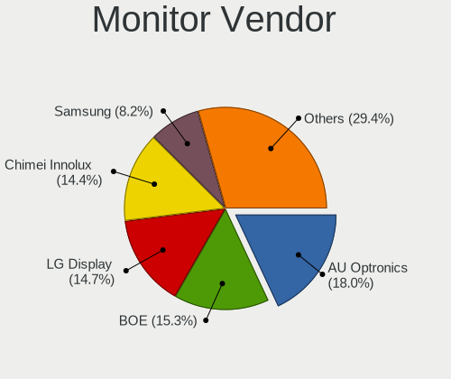

| Vendor                  | Notebooks | Percent |
|-------------------------|-----------|---------|
| LG Display              | 192       | 17.2%   |
| AU Optronics            | 185       | 16.58%  |
| Chimei Innolux          | 157       | 14.07%  |
| BOE                     | 156       | 13.98%  |
| Samsung Electronics     | 85        | 7.62%   |
| Sharp                   | 36        | 3.23%   |
| Dell                    | 36        | 3.23%   |
| Goldstar                | 28        | 2.51%   |
| Apple                   | 26        | 2.33%   |
| PANDA                   | 21        | 1.88%   |
| Lenovo                  | 21        | 1.88%   |
| Chi Mei Optoelectronics | 16        | 1.43%   |
| Hewlett-Packard         | 14        | 1.25%   |
| BenQ                    | 13        | 1.16%   |
| CSO                     | 12        | 1.08%   |
| Acer                    | 11        | 0.99%   |
| Philips                 | 9         | 0.81%   |
| AOC                     | 9         | 0.81%   |
| Sony                    | 6         | 0.54%   |
| Panasonic               | 6         | 0.54%   |
| InfoVision              | 6         | 0.54%   |
| Ancor Communications    | 5         | 0.45%   |
| Iiyama                  | 4         | 0.36%   |
| Eizo                    | 4         | 0.36%   |
| ASUSTek Computer        | 4         | 0.36%   |
| ViewSonic               | 3         | 0.27%   |
| Sceptre Tech            | 3         | 0.27%   |
| LG Philips              | 3         | 0.27%   |
| Fujitsu Siemens         | 3         | 0.27%   |
| Medion                  | 2         | 0.18%   |
| InnoLux Display         | 2         | 0.18%   |
| HannStar                | 2         | 0.18%   |
| CPT                     | 2         | 0.18%   |
| Unknown                 | 2         | 0.18%   |
| WST                     | 1         | 0.09%   |
| Westinghouse            | 1         | 0.09%   |
| Vizio                   | 1         | 0.09%   |
| VIE                     | 1         | 0.09%   |
| Unknown                 | 1         | 0.09%   |
| Toshiba                 | 1         | 0.09%   |

Monitor Model
-------------

Monitor models

| Model                                                                 | Notebooks | Percent |
|-----------------------------------------------------------------------|-----------|---------|
| AU Optronics LCD Monitor AUO38ED 1920x1080 344x193mm 15.5-inch        | 14        | 1.25%   |
| Chimei Innolux LCD Monitor CMN15F5 1920x1080 344x193mm 15.5-inch      | 12        | 1.07%   |
| AU Optronics LCD Monitor AUO21ED 1920x1080 344x194mm 15.5-inch        | 8         | 0.71%   |
| PANDA LCD Monitor NCP002D 1920x1080 344x194mm 15.5-inch               | 7         | 0.63%   |
| LG Display LCD Monitor LGD02DC 1366x768 344x194mm 15.5-inch           | 7         | 0.63%   |
| LG Display LCD Monitor LGD02D8 1366x768 277x156mm 12.5-inch           | 7         | 0.63%   |
| Chimei Innolux LCD Monitor CMN15DB 1366x768 344x193mm 15.5-inch       | 7         | 0.63%   |
| BOE LCD Monitor BOE0812 1920x1080 344x194mm 15.5-inch                 | 7         | 0.63%   |
| AU Optronics LCD Monitor AUO70EC 1366x768 344x193mm 15.5-inch         | 7         | 0.63%   |
| AU Optronics LCD Monitor AUO403D 1920x1080 309x173mm 13.9-inch        | 7         | 0.63%   |
| Samsung Electronics LCD Monitor SEC5441 1280x800 331x207mm 15.4-inch  | 6         | 0.54%   |
| Chimei Innolux LCD Monitor CMN15E8 1920x1080 344x193mm 15.5-inch      | 6         | 0.54%   |
| Chimei Innolux LCD Monitor CMN14D4 1920x1080 309x173mm 13.9-inch      | 6         | 0.54%   |
| BOE LCD Monitor BOE0747 1920x1080 344x194mm 15.5-inch                 | 6         | 0.54%   |
| Panasonic VVX14T092N00 MEI96A2 2256x1504 285x190mm 13.5-inch          | 5         | 0.45%   |
| LG Display LCD Monitor LGD05E5 1920x1080 344x194mm 15.5-inch          | 5         | 0.45%   |
| Goldstar FULL HD GSM5B55 1920x1080 480x270mm 21.7-inch                | 5         | 0.45%   |
| Chimei Innolux LCD Monitor CMN1738 1920x1080 381x214mm 17.2-inch      | 5         | 0.45%   |
| Chimei Innolux LCD Monitor CMN15D5 1920x1080 344x193mm 15.5-inch      | 5         | 0.45%   |
| Chimei Innolux LCD Monitor CMN15CA 1366x768 344x193mm 15.5-inch       | 5         | 0.45%   |
| Chimei Innolux LCD Monitor CMN14C9 1920x1080 309x173mm 13.9-inch      | 5         | 0.45%   |
| BOE LCD Monitor BOE06A4 1366x768 344x194mm 15.5-inch                  | 5         | 0.45%   |
| BOE LCD Monitor BOE0672 1366x768 344x194mm 15.5-inch                  | 5         | 0.45%   |
| AU Optronics LCD Monitor AUO243D 1920x1080 309x173mm 13.9-inch        | 5         | 0.45%   |
| Apple Color LCD APP9CC7 1280x800 286x179mm 13.3-inch                  | 5         | 0.45%   |
| Sharp LCD Monitor SHP14D1 1920x1200 336x210mm 15.6-inch               | 4         | 0.36%   |
| Samsung Electronics C24F390 SAM0D2C 1920x1080 521x293mm 23.5-inch     | 4         | 0.36%   |
| LG Display LCD Monitor LGD0590 1920x1080 344x194mm 15.5-inch          | 4         | 0.36%   |
| LG Display LCD Monitor LGD046F 1920x1080 345x194mm 15.6-inch          | 4         | 0.36%   |
| LG Display LCD Monitor LGD046D 1920x1080 309x174mm 14.0-inch          | 4         | 0.36%   |
| LG Display LCD Monitor LGD033B 1366x768 344x194mm 15.5-inch           | 4         | 0.36%   |
| LG Display LCD Monitor LGD033A 1366x768 344x194mm 15.5-inch           | 4         | 0.36%   |
| AU Optronics LCD Monitor AUO71EC 1366x768 344x193mm 15.5-inch         | 4         | 0.36%   |
| AU Optronics LCD Monitor AUO46EC 1366x768 344x193mm 15.5-inch         | 4         | 0.36%   |
| AU Optronics LCD Monitor AUO313C 1366x768 309x173mm 13.9-inch         | 4         | 0.36%   |
| AU Optronics LCD Monitor AUO213E 1600x900 309x174mm 14.0-inch         | 4         | 0.36%   |
| AU Optronics LCD Monitor AUO106C 1366x768 276x155mm 12.5-inch         | 4         | 0.36%   |
| Sony Nvidia Defaul t Flat Panel MS_0025 1920x1080 360x200mm 16.2-inch | 3         | 0.27%   |
| Sharp LQ156M1JW09 SHP14D3 1920x1080 344x194mm 15.5-inch               | 3         | 0.27%   |
| Sharp LCD Monitor SHP149A 1920x1080 344x194mm 15.5-inch               | 3         | 0.27%   |

Monitor Resolution
------------------

Monitor screen resolution

| Resolution         | Notebooks | Percent |
|--------------------|-----------|---------|
| 1920x1080 (FHD)    | 522       | 50.73%  |
| 1366x768 (WXGA)    | 249       | 24.2%   |
| 1600x900 (HD+)     | 50        | 4.86%   |
| 3840x2160 (4K)     | 38        | 3.69%   |
| 2560x1440 (QHD)    | 30        | 2.92%   |
| 1280x800 (WXGA)    | 24        | 2.33%   |
| 2880x1800          | 14        | 1.36%   |
| 1920x1200 (WUXGA)  | 14        | 1.36%   |
| 1440x900 (WXGA+)   | 14        | 1.36%   |
| 2560x1600          | 10        | 0.97%   |
| 2560x1080          | 9         | 0.87%   |
| 2160x1440          | 9         | 0.87%   |
| 1280x1024 (SXGA)   | 7         | 0.68%   |
| 3840x2400          | 6         | 0.58%   |
| 3200x1800 (QHD+)   | 6         | 0.58%   |
| 1680x1050 (WSXGA+) | 6         | 0.58%   |
| 1360x768           | 4         | 0.39%   |
| 3440x1440          | 3         | 0.29%   |
| 1920x540           | 2         | 0.19%   |
| 1024x600           | 2         | 0.19%   |
| 7280x1440          | 1         | 0.1%    |
| 3840x1600          | 1         | 0.1%    |
| 3840x1100          | 1         | 0.1%    |
| 3840x1080          | 1         | 0.1%    |
| 3200x2000          | 1         | 0.1%    |
| 3000x2000          | 1         | 0.1%    |
| 2256x1504          | 1         | 0.1%    |
| 2160x1350          | 1         | 0.1%    |
| 1024x768 (XGA)     | 1         | 0.1%    |
| Unknown            | 1         | 0.1%    |

Monitor Diagonal
----------------

Diagonal size in inches

| Inches  | Notebooks | Percent |
|---------|-----------|---------|
| 15      | 467       | 42.07%  |
| 14      | 152       | 13.69%  |
| 13      | 132       | 11.89%  |
| 17      | 93        | 8.38%   |
| 24      | 46        | 4.14%   |
| 12      | 34        | 3.06%   |
| 27      | 33        | 2.97%   |
| 23      | 31        | 2.79%   |
| 21      | 26        | 2.34%   |
| 34      | 11        | 0.99%   |
| Unknown | 10        | 0.9%    |
| 16      | 9         | 0.81%   |
| 31      | 8         | 0.72%   |
| 18      | 8         | 0.72%   |
| 11      | 8         | 0.72%   |
| 22      | 6         | 0.54%   |
| 19      | 6         | 0.54%   |
| 32      | 5         | 0.45%   |
| 84      | 3         | 0.27%   |
| 54      | 3         | 0.27%   |
| 10      | 3         | 0.27%   |
| 48      | 2         | 0.18%   |
| 40      | 2         | 0.18%   |
| 26      | 2         | 0.18%   |
| 72      | 1         | 0.09%   |
| 52      | 1         | 0.09%   |
| 49      | 1         | 0.09%   |
| 47      | 1         | 0.09%   |
| 39      | 1         | 0.09%   |
| 37      | 1         | 0.09%   |
| 35      | 1         | 0.09%   |
| 28      | 1         | 0.09%   |
| 25      | 1         | 0.09%   |
| 20      | 1         | 0.09%   |

Monitor Width
-------------

Physical width

| Width in mm | Notebooks | Percent |
|-------------|-----------|---------|
| 301-350     | 682       | 62.06%  |
| 201-300     | 111       | 10.1%   |
| 501-600     | 107       | 9.74%   |
| 351-400     | 102       | 9.28%   |
| 401-500     | 44        | 4%      |
| 701-800     | 16        | 1.46%   |
| 601-700     | 10        | 0.91%   |
| Unknown     | 10        | 0.91%   |
| 1001-1500   | 8         | 0.73%   |
| 801-900     | 5         | 0.45%   |
| 1501-2000   | 4         | 0.36%   |

Aspect Ratio
------------

Proportional relationship between the width and the height

| Ratio   | Notebooks | Percent |
|---------|-----------|---------|
| 16/9    | 832       | 85.95%  |
| 16/10   | 89        | 9.19%   |
| 3/2     | 16        | 1.65%   |
| 21/9    | 13        | 1.34%   |
| Unknown | 7         | 0.72%   |
| 5/4     | 4         | 0.41%   |
| 4/3     | 3         | 0.31%   |
| 6/5     | 2         | 0.21%   |
| 32/9    | 1         | 0.1%    |
| 3.40    | 1         | 0.1%    |

Monitor Area
------------

Area in inch

| Area in inch | Notebooks | Percent |
|----------------|-----------|---------|
| 101-110        | 459       | 41.43%  |
| 81-90          | 237       | 21.39%  |
| 201-250        | 92        | 8.3%    |
| 121-130        | 85        | 7.67%   |
| 71-80          | 47        | 4.24%   |
| 301-350        | 35        | 3.16%   |
| 61-70          | 30        | 2.71%   |
| 351-500        | 27        | 2.44%   |
| 251-300        | 12        | 1.08%   |
| 151-200        | 11        | 0.99%   |
| 141-150        | 11        | 0.99%   |
| More than 1000 | 10        | 0.9%    |
| 51-60          | 10        | 0.9%    |
| 111-120        | 10        | 0.9%    |
| Unknown        | 10        | 0.9%    |
| 91-100         | 8         | 0.72%   |
| 131-140        | 7         | 0.63%   |
| 501-1000       | 5         | 0.45%   |
| 41-50          | 2         | 0.18%   |

Pixel Density
-------------

Pixels per inch

| Density       | Notebooks | Percent |
|---------------|-----------|---------|
| 121-160       | 514       | 47.11%  |
| 101-120       | 280       | 25.66%  |
| 51-100        | 163       | 14.94%  |
| 161-240       | 77        | 7.06%   |
| More than 240 | 37        | 3.39%   |
| 1-50          | 10        | 0.92%   |
| Unknown       | 10        | 0.92%   |

Multiple Monitors
-----------------

Total monitors connected

| Total | Notebooks | Percent |
|-------|-----------|---------|
| 1     | 752       | 78.58%  |
| 2     | 174       | 18.18%  |
| 3     | 19        | 1.99%   |
| 0     | 12        | 1.25%   |

Network
-------

Net Controller Vendor
---------------------

Controller vendors

| Vendor                            | Notebooks | Percent |
|-----------------------------------|-----------|---------|
| Intel                             | 552       | 37.83%  |
| Realtek Semiconductor             | 512       | 35.09%  |
| Qualcomm Atheros                  | 204       | 13.98%  |
| Broadcom                          | 60        | 4.11%   |
| MediaTek                          | 18        | 1.23%   |
| Broadcom Limited                  | 15        | 1.03%   |
| Sierra Wireless                   | 10        | 0.69%   |
| TP-Link                           | 9         | 0.62%   |
| Dell                              | 8         | 0.55%   |
| ASIX Electronics                  | 7         | 0.48%   |
| Samsung Electronics               | 6         | 0.41%   |
| Marvell Technology Group          | 6         | 0.41%   |
| Ralink                            | 5         | 0.34%   |
| Ericsson Business Mobile Networks | 5         | 0.34%   |
| Ralink Technology                 | 4         | 0.27%   |
| Nvidia                            | 4         | 0.27%   |
| Lenovo                            | 4         | 0.27%   |
| Hewlett-Packard                   | 4         | 0.27%   |
| JMicron Technology                | 3         | 0.21%   |
| Fibocom                           | 3         | 0.21%   |
| Xiaomi                            | 2         | 0.14%   |
| NetGear                           | 2         | 0.14%   |
| Huawei Technologies               | 2         | 0.14%   |
| DisplayLink                       | 2         | 0.14%   |
| U-Blox                            | 1         | 0.07%   |
| T & A Mobile Phones               | 1         | 0.07%   |
| ROCCAT                            | 1         | 0.07%   |
| Qualcomm Atheros Communications   | 1         | 0.07%   |
| Qualcomm                          | 1         | 0.07%   |
| Novatel Wireless                  | 1         | 0.07%   |
| Motorola PCS                      | 1         | 0.07%   |
| Microsoft                         | 1         | 0.07%   |
| Google                            | 1         | 0.07%   |
| ASUSTek Computer                  | 1         | 0.07%   |
| Apple                             | 1         | 0.07%   |
| Android                           | 1         | 0.07%   |

Net Controller Model
--------------------

Controller models

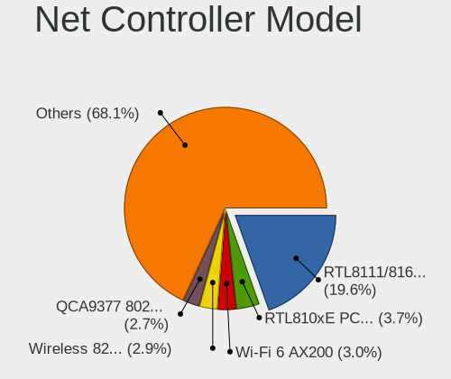

| Model                                                             | Notebooks | Percent |
|-------------------------------------------------------------------|-----------|---------|
| Realtek RTL8111/8168/8411 PCI Express Gigabit Ethernet Controller | 359       | 20.11%  |
| Realtek RTL810xE PCI Express Fast Ethernet controller             | 67        | 3.75%   |
| Qualcomm Atheros QCA9377 802.11ac Wireless Network Adapter        | 62        | 3.47%   |
| Intel Wi-Fi 6 AX200                                               | 62        | 3.47%   |
| Intel Wireless 8265 / 8275                                        | 53        | 2.97%   |
| Intel Cannon Lake PCH CNVi WiFi                                   | 43        | 2.41%   |
| Intel Wireless 7260                                               | 41        | 2.3%    |
| Realtek RTL8821CE 802.11ac PCIe Wireless Network Adapter          | 40        | 2.24%   |
| Intel 82579LM Gigabit Network Connection (Lewisville)             | 36        | 2.02%   |
| Realtek RTL8153 Gigabit Ethernet Adapter                          | 35        | 1.96%   |
| Qualcomm Atheros QCA6174 802.11ac Wireless Network Adapter        | 34        | 1.9%    |
| Intel Wireless 8260                                               | 34        | 1.9%    |
| Intel Centrino Advanced-N 6205 [Taylor Peak]                      | 31        | 1.74%   |
| Qualcomm Atheros QCA9565 / AR9565 Wireless Network Adapter        | 29        | 1.62%   |
| Intel Wireless 7265                                               | 27        | 1.51%   |
| Intel Comet Lake PCH CNVi WiFi                                    | 27        | 1.51%   |
| Realtek RTL8822CE 802.11ac PCIe Wireless Network Adapter          | 25        | 1.4%    |
| Intel Wi-Fi 6 AX201                                               | 25        | 1.4%    |
| Qualcomm Atheros AR9485 Wireless Network Adapter                  | 21        | 1.18%   |
| Intel Wireless 3165                                               | 19        | 1.06%   |
| Intel Ethernet Connection I217-LM                                 | 18        | 1.01%   |
| Realtek RTL8723BE PCIe Wireless Network Adapter                   | 16        | 0.9%    |
| Intel Wireless 3160                                               | 16        | 0.9%    |
| Intel Centrino Ultimate-N 6300                                    | 16        | 0.9%    |
| Intel Ethernet Connection I218-LM                                 | 15        | 0.84%   |
| Qualcomm Atheros AR9285 Wireless Network Adapter (PCI-Express)    | 14        | 0.78%   |
| MediaTek MT7921 802.11ax PCI Express Wireless Network Adapter     | 14        | 0.78%   |
| Intel Ethernet Connection (3) I218-LM                             | 14        | 0.78%   |
| Intel 82577LM Gigabit Network Connection                          | 14        | 0.78%   |
| Intel Ethernet Connection I219-LM                                 | 13        | 0.73%   |
| Intel Comet Lake PCH-LP CNVi WiFi                                 | 13        | 0.73%   |
| Intel Cannon Point-LP CNVi [Wireless-AC]                          | 13        | 0.73%   |
| Realtek RTL8723DE Wireless Network Adapter                        | 12        | 0.67%   |
| Intel Wireless-AC 9260                                            | 12        | 0.67%   |
| Intel Ethernet Connection (4) I219-LM                             | 12        | 0.67%   |
| Intel Centrino Advanced-N 6200                                    | 12        | 0.67%   |
| Qualcomm Atheros AR8151 v2.0 Gigabit Ethernet                     | 11        | 0.62%   |
| Intel Alder Lake-P PCH CNVi WiFi                                  | 11        | 0.62%   |
| Realtek RTL8821AE 802.11ac PCIe Wireless Network Adapter          | 10        | 0.56%   |
| Realtek RTL8188CE 802.11b/g/n WiFi Adapter                        | 10        | 0.56%   |

Wireless Vendor
---------------

Wireless vendors

| Vendor                          | Notebooks | Percent |
|---------------------------------|-----------|---------|
| Intel                           | 537       | 55.42%  |
| Qualcomm Atheros                | 173       | 17.85%  |
| Realtek Semiconductor           | 147       | 15.17%  |
| Broadcom                        | 44        | 4.54%   |
| MediaTek                        | 18        | 1.86%   |
| Broadcom Limited                | 11        | 1.14%   |
| Sierra Wireless                 | 10        | 1.03%   |
| TP-Link                         | 6         | 0.62%   |
| Ralink                          | 5         | 0.52%   |
| Ralink Technology               | 4         | 0.41%   |
| Dell                            | 4         | 0.41%   |
| Fibocom                         | 3         | 0.31%   |
| NetGear                         | 2         | 0.21%   |
| Hewlett-Packard                 | 2         | 0.21%   |
| Qualcomm Atheros Communications | 1         | 0.1%    |
| Microsoft                       | 1         | 0.1%    |
| ASUSTek Computer                | 1         | 0.1%    |

Wireless Model
--------------

Wireless models

| Model                                                          | Notebooks | Percent |
|----------------------------------------------------------------|-----------|---------|
| Qualcomm Atheros QCA9377 802.11ac Wireless Network Adapter     | 62        | 6.38%   |
| Intel Wi-Fi 6 AX200                                            | 62        | 6.38%   |
| Intel Wireless 8265 / 8275                                     | 53        | 5.45%   |
| Intel Cannon Lake PCH CNVi WiFi                                | 43        | 4.42%   |
| Intel Wireless 7260                                            | 41        | 4.22%   |
| Realtek RTL8821CE 802.11ac PCIe Wireless Network Adapter       | 40        | 4.12%   |
| Qualcomm Atheros QCA6174 802.11ac Wireless Network Adapter     | 34        | 3.5%    |
| Intel Wireless 8260                                            | 34        | 3.5%    |
| Intel Centrino Advanced-N 6205 [Taylor Peak]                   | 31        | 3.19%   |
| Qualcomm Atheros QCA9565 / AR9565 Wireless Network Adapter     | 29        | 2.98%   |
| Intel Wireless 7265                                            | 27        | 2.78%   |
| Intel Comet Lake PCH CNVi WiFi                                 | 27        | 2.78%   |
| Realtek RTL8822CE 802.11ac PCIe Wireless Network Adapter       | 25        | 2.57%   |
| Intel Wi-Fi 6 AX201                                            | 25        | 2.57%   |
| Qualcomm Atheros AR9485 Wireless Network Adapter               | 21        | 2.16%   |
| Intel Wireless 3165                                            | 19        | 1.95%   |
| Realtek RTL8723BE PCIe Wireless Network Adapter                | 16        | 1.65%   |
| Intel Wireless 3160                                            | 16        | 1.65%   |
| Intel Centrino Ultimate-N 6300                                 | 16        | 1.65%   |
| Qualcomm Atheros AR9285 Wireless Network Adapter (PCI-Express) | 14        | 1.44%   |
| MediaTek MT7921 802.11ax PCI Express Wireless Network Adapter  | 14        | 1.44%   |
| Intel Comet Lake PCH-LP CNVi WiFi                              | 13        | 1.34%   |
| Intel Cannon Point-LP CNVi [Wireless-AC]                       | 13        | 1.34%   |
| Realtek RTL8723DE Wireless Network Adapter                     | 12        | 1.23%   |
| Intel Wireless-AC 9260                                         | 12        | 1.23%   |
| Intel Centrino Advanced-N 6200                                 | 12        | 1.23%   |
| Intel Alder Lake-P PCH CNVi WiFi                               | 11        | 1.13%   |
| Realtek RTL8821AE 802.11ac PCIe Wireless Network Adapter       | 10        | 1.03%   |
| Realtek RTL8188CE 802.11b/g/n WiFi Adapter                     | 10        | 1.03%   |
| Intel Centrino Advanced-N 6235                                 | 10        | 1.03%   |
| Broadcom BCM4313 802.11bgn Wireless Network Adapter            | 10        | 1.03%   |
| Intel Dual Band Wireless-AC 3168NGW [Stone Peak]               | 9         | 0.93%   |
| Intel Dual Band Wireless-AC 3165 Plus Bluetooth                | 9         | 0.93%   |
| Intel Ice Lake-LP PCH CNVi WiFi                                | 8         | 0.82%   |
| Intel Centrino Wireless-N 2230                                 | 8         | 0.82%   |
| Realtek RTL8852AE 802.11ax PCIe Wireless Network Adapter       | 7         | 0.72%   |
| Intel Tiger Lake PCH CNVi WiFi                                 | 7         | 0.72%   |
| Broadcom BCM4331 802.11a/b/g/n                                 | 7         | 0.72%   |
| Sierra Wireless EM7455                                         | 6         | 0.62%   |
| Realtek RTL8822BE 802.11a/b/g/n/ac WiFi adapter                | 6         | 0.62%   |

Ethernet Vendor
---------------

Ethernet vendors

| Vendor                   | Notebooks | Percent |
|--------------------------|-----------|---------|
| Realtek Semiconductor    | 465       | 59.54%  |
| Intel                    | 193       | 24.71%  |
| Qualcomm Atheros         | 53        | 6.79%   |
| Broadcom                 | 26        | 3.33%   |
| ASIX Electronics         | 7         | 0.9%    |
| Marvell Technology Group | 6         | 0.77%   |
| Nvidia                   | 4         | 0.51%   |
| Broadcom Limited         | 4         | 0.51%   |
| TP-Link                  | 3         | 0.38%   |
| Samsung Electronics      | 3         | 0.38%   |
| Lenovo                   | 3         | 0.38%   |
| JMicron Technology       | 3         | 0.38%   |
| Xiaomi                   | 2         | 0.26%   |
| DisplayLink              | 2         | 0.26%   |
| T & A Mobile Phones      | 1         | 0.13%   |
| Qualcomm                 | 1         | 0.13%   |
| Novatel Wireless         | 1         | 0.13%   |
| Motorola PCS             | 1         | 0.13%   |
| MediaTek                 | 1         | 0.13%   |
| Google                   | 1         | 0.13%   |
| Apple                    | 1         | 0.13%   |

Ethernet Model
--------------

Ethernet models

| Model                                                             | Notebooks | Percent |
|-------------------------------------------------------------------|-----------|---------|
| Realtek RTL8111/8168/8411 PCI Express Gigabit Ethernet Controller | 359       | 45.27%  |
| Realtek RTL810xE PCI Express Fast Ethernet controller             | 67        | 8.45%   |
| Intel 82579LM Gigabit Network Connection (Lewisville)             | 36        | 4.54%   |
| Realtek RTL8153 Gigabit Ethernet Adapter                          | 35        | 4.41%   |
| Intel Ethernet Connection I217-LM                                 | 18        | 2.27%   |
| Intel Ethernet Connection I218-LM                                 | 15        | 1.89%   |
| Intel Ethernet Connection (3) I218-LM                             | 14        | 1.77%   |
| Intel 82577LM Gigabit Network Connection                          | 14        | 1.77%   |
| Intel Ethernet Connection I219-LM                                 | 13        | 1.64%   |
| Intel Ethernet Connection (4) I219-LM                             | 12        | 1.51%   |
| Qualcomm Atheros AR8151 v2.0 Gigabit Ethernet                     | 11        | 1.39%   |
| Intel Ethernet Connection (4) I219-V                              | 10        | 1.26%   |
| Qualcomm Atheros AR8131 Gigabit Ethernet                          | 7         | 0.88%   |
| Qualcomm Atheros QCA8171 Gigabit Ethernet                         | 6         | 0.76%   |
| Intel Ethernet Connection I219-V                                  | 6         | 0.76%   |
| Broadcom NetXtreme BCM57765 Gigabit Ethernet PCIe                 | 6         | 0.76%   |
| ASIX AX88179 Gigabit Ethernet                                     | 6         | 0.76%   |
| Realtek RTL8125 2.5GbE Controller                                 | 5         | 0.63%   |
| Qualcomm Atheros Killer E2400 Gigabit Ethernet Controller         | 5         | 0.63%   |
| Intel Ethernet Connection (7) I219-LM                             | 5         | 0.63%   |
| Intel Ethernet Connection (6) I219-V                              | 5         | 0.63%   |
| Intel Ethernet Connection (2) I219-LM                             | 5         | 0.63%   |
| Realtek Killer E2600 Gigabit Ethernet Controller                  | 4         | 0.5%    |
| Qualcomm Atheros Killer E2500 Gigabit Ethernet Controller         | 4         | 0.5%    |
| Qualcomm Atheros Killer E220x Gigabit Ethernet Controller         | 4         | 0.5%    |
| Qualcomm Atheros AR8161 Gigabit Ethernet                          | 4         | 0.5%    |
| Nvidia MCP79 Ethernet                                             | 4         | 0.5%    |
| Intel Ethernet Connection (7) I219-V                              | 4         | 0.5%    |
| Intel 82567LM Gigabit Network Connection                          | 4         | 0.5%    |
| Broadcom NetLink BCM57785 Gigabit Ethernet PCIe                   | 4         | 0.5%    |
| Broadcom NetLink BCM57780 Gigabit Ethernet PCIe                   | 4         | 0.5%    |
| TP-Link UE300 10/100/1000 LAN (ethernet mode) [Realtek RTL8153]   | 3         | 0.38%   |
| Samsung Galaxy series, misc. (tethering mode)                     | 3         | 0.38%   |
| Qualcomm Atheros QCA8172 Fast Ethernet                            | 3         | 0.38%   |
| Qualcomm Atheros AR8162 Fast Ethernet                             | 3         | 0.38%   |
| Qualcomm Atheros AR8132 Fast Ethernet                             | 3         | 0.38%   |
| Marvell Group 88E8057 PCI-E Gigabit Ethernet Controller           | 3         | 0.38%   |
| JMicron JMC250 PCI Express Gigabit Ethernet Controller            | 3         | 0.38%   |
| Intel Ethernet Connection I217-V                                  | 3         | 0.38%   |
| Intel Ethernet Connection (5) I219-LM                             | 3         | 0.38%   |

Net Controller Kind
-------------------

Ethernet, WiFi or modem

| Kind     | Notebooks | Percent |
|----------|-----------|---------|
| WiFi     | 932       | 54.38%  |
| Ethernet | 762       | 44.46%  |
| Modem    | 18        | 1.05%   |
| Unknown  | 2         | 0.12%   |

Used Controller
---------------

Currently used network controller

| Kind     | Notebooks | Percent |
|----------|-----------|---------|
| WiFi     | 796       | 80.08%  |
| Ethernet | 198       | 19.92%  |

NICs
----

Total network controllers on board

| Total | Notebooks | Percent |
|-------|-----------|---------|
| 2     | 703       | 74.79%  |
| 1     | 218       | 23.19%  |
| 3     | 13        | 1.38%   |
| 0     | 6         | 0.64%   |

IPv6
----

IPv6 vs IPv4

| Used | Notebooks | Percent |
|------|-----------|---------|
| No   | 737       | 77.33%  |
| Yes  | 216       | 22.67%  |

Bluetooth
---------

Bluetooth Vendor
----------------

Controller vendors

| Vendor                          | Notebooks | Percent |
|---------------------------------|-----------|---------|
| Intel                           | 434       | 53.12%  |
| Realtek Semiconductor           | 94        | 11.51%  |
| Qualcomm Atheros Communications | 76        | 9.3%    |
| IMC Networks                    | 49        | 6%      |
| Lite-On Technology              | 37        | 4.53%   |
| Broadcom                        | 37        | 4.53%   |
| Foxconn / Hon Hai               | 25        | 3.06%   |
| Apple                           | 25        | 3.06%   |
| Dell                            | 9         | 1.1%    |
| Toshiba                         | 6         | 0.73%   |
| Realtek                         | 6         | 0.73%   |
| Cambridge Silicon Radio         | 6         | 0.73%   |
| ASUSTek Computer                | 5         | 0.61%   |
| Hewlett-Packard                 | 2         | 0.24%   |
| Ralink Technology               | 1         | 0.12%   |
| Ralink                          | 1         | 0.12%   |
| Opticis                         | 1         | 0.12%   |
| MediaTek                        | 1         | 0.12%   |
| Dynex                           | 1         | 0.12%   |
| Chicony Electronics             | 1         | 0.12%   |

Bluetooth Model
---------------

Controller models

| Model                                                                               | Notebooks | Percent |
|-------------------------------------------------------------------------------------|-----------|---------|
| Intel Bluetooth wireless interface                                                  | 185       | 22.64%  |
| Intel Bluetooth 9460/9560 Jefferson Peak (JfP)                                      | 70        | 8.57%   |
| Intel AX201 Bluetooth                                                               | 67        | 8.2%    |
| Intel AX200 Bluetooth                                                               | 59        | 7.22%   |
| Qualcomm Atheros  Bluetooth Device                                                  | 53        | 6.49%   |
| Realtek Bluetooth Radio                                                             | 51        | 6.24%   |
| Realtek  Bluetooth 4.2 Adapter                                                      | 28        | 3.43%   |
| Apple Bluetooth Host Controller                                                     | 18        | 2.2%    |
| Intel Centrino Bluetooth Wireless Transceiver                                       | 17        | 2.08%   |
| IMC Networks Bluetooth Device                                                       | 17        | 2.08%   |
| Broadcom BCM2045B (BDC-2.1)                                                         | 17        | 2.08%   |
| IMC Networks Bluetooth Radio                                                        | 15        | 1.84%   |
| Intel Bluetooth Device                                                              | 14        | 1.71%   |
| Lite-On Qualcomm Atheros QCA9377 Bluetooth                                          | 13        | 1.59%   |
| Lite-On Bluetooth Device                                                            | 13        | 1.59%   |
| Intel Wireless-AC 9260 Bluetooth Adapter                                            | 12        | 1.47%   |
| Qualcomm Atheros AR3012 Bluetooth 4.0                                               | 9         | 1.1%    |
| Realtek RTL8821A Bluetooth                                                          | 8         | 0.98%   |
| Intel Wireless-AC 3168 Bluetooth                                                    | 8         | 0.98%   |
| IMC Networks Wireless_Device                                                        | 8         | 0.98%   |
| Foxconn / Hon Hai Bluetooth Device                                                  | 8         | 0.98%   |
| Apple Bluetooth USB Host Controller                                                 | 7         | 0.86%   |
| Realtek Bluetooth Radio                                                             | 6         | 0.73%   |
| Dell BCM20702A0 Bluetooth Module                                                    | 6         | 0.73%   |
| Cambridge Silicon Radio Bluetooth Dongle (HCI mode)                                 | 6         | 0.73%   |
| Broadcom BCM20702 Bluetooth 4.0 [ThinkPad]                                          | 6         | 0.73%   |
| Qualcomm Atheros QCA61x4 Bluetooth 4.0                                              | 5         | 0.61%   |
| Foxconn / Hon Hai MediaTek Bluetooth Adapter                                        | 4         | 0.49%   |
| Toshiba Bluetooth Device                                                            | 3         | 0.37%   |
| Realtek RTL8822BE Bluetooth 4.2 Adapter                                             | 3         | 0.37%   |
| Realtek RTL8723B Bluetooth                                                          | 3         | 0.37%   |
| Qualcomm Atheros AR3012 Bluetooth                                                   | 3         | 0.37%   |
| Qualcomm Atheros AR3011 Bluetooth                                                   | 3         | 0.37%   |
| Lite-On Wireless_Device                                                             | 3         | 0.37%   |
| Lite-On Broadcom BCM43142A0 Bluetooth Device                                        | 3         | 0.37%   |
| Lite-On Atheros AR3012 Bluetooth                                                    | 3         | 0.37%   |
| IMC Networks Bluetooth USB Host Controller                                          | 3         | 0.37%   |
| IMC Networks Atheros AR3012 Bluetooth 4.0 Adapter                                   | 3         | 0.37%   |
| Foxconn / Hon Hai Foxconn T77H114 BCM2070 [Single-Chip Bluetooth 2.1 + EDR Adapter] | 3         | 0.37%   |
| Foxconn / Hon Hai Bluetooth USB Host Controller                                     | 3         | 0.37%   |

Sound
-----

Sound Vendor
------------

Sound card vendors

| Vendor                    | Notebooks | Percent |
|---------------------------|-----------|---------|
| Intel                     | 756       | 61.87%  |
| Nvidia                    | 211       | 17.27%  |
| AMD                       | 186       | 15.22%  |
| Logitech                  | 9         | 0.74%   |
| C-Media Electronics       | 6         | 0.49%   |
| Realtek Semiconductor     | 5         | 0.41%   |
| Lenovo                    | 4         | 0.33%   |
| Kingston Technology       | 4         | 0.33%   |
| Generalplus Technology    | 4         | 0.33%   |
| GN Netcom                 | 3         | 0.25%   |
| BEHRINGER International   | 3         | 0.25%   |
| Texas Instruments         | 2         | 0.16%   |
| Samson Technologies       | 2         | 0.16%   |
| Focusrite-Novation        | 2         | 0.16%   |
| Corsair                   | 2         | 0.16%   |
| ASUSTek Computer          | 2         | 0.16%   |
| VIA Technologies          | 1         | 0.08%   |
| SteelSeries ApS           | 1         | 0.08%   |
| Sony                      | 1         | 0.08%   |
| Sennheiser Communications | 1         | 0.08%   |
| Samsung Electronics       | 1         | 0.08%   |
| Razer USA                 | 1         | 0.08%   |
| Plantronics               | 1         | 0.08%   |
| Nordic Semiconductor ASA  | 1         | 0.08%   |
| No brand                  | 1         | 0.08%   |
| Microchip Technology      | 1         | 0.08%   |
| Mark of the Unicorn       | 1         | 0.08%   |
| LG Electronics            | 1         | 0.08%   |
| JMTek                     | 1         | 0.08%   |
| Hewlett-Packard           | 1         | 0.08%   |
| Global Sun Technology     | 1         | 0.08%   |
| Fujitsu                   | 1         | 0.08%   |
| FDUCE PRO AUDIO MADE      | 1         | 0.08%   |
| Dell                      | 1         | 0.08%   |
| BR23                      | 1         | 0.08%   |
| Barco Display Systems     | 1         | 0.08%   |
| Asahi Kasei Microsystems  | 1         | 0.08%   |

Sound Model
-----------

Sound card models

| Model                                                                      | Notebooks | Percent |
|----------------------------------------------------------------------------|-----------|---------|
| Intel Sunrise Point-LP HD Audio                                            | 155       | 10.44%  |
| AMD Family 17h/19h HD Audio Controller                                     | 133       | 8.96%   |
| Intel Cannon Lake PCH cAVS                                                 | 69        | 4.65%   |
| Intel 7 Series/C216 Chipset Family High Definition Audio Controller        | 68        | 4.58%   |
| AMD Renoir Radeon High Definition Audio Controller                         | 64        | 4.31%   |
| Intel 6 Series/C200 Series Chipset Family High Definition Audio Controller | 56        | 3.77%   |
| Intel 8 Series/C220 Series Chipset High Definition Audio Controller        | 46        | 3.1%    |
| AMD Raven/Raven2/Fenghuang HDMI/DP Audio Controller                        | 44        | 2.96%   |
| Intel 5 Series/3400 Series Chipset High Definition Audio                   | 41        | 2.76%   |
| Intel Haswell-ULT HD Audio Controller                                      | 37        | 2.49%   |
| Intel 8 Series HD Audio Controller                                         | 37        | 2.49%   |
| Intel Xeon E3-1200 v3/4th Gen Core Processor HD Audio Controller           | 36        | 2.43%   |
| Intel Wildcat Point-LP High Definition Audio Controller                    | 36        | 2.43%   |
| Intel Broadwell-U Audio Controller                                         | 36        | 2.43%   |
| Intel Tiger Lake-LP Smart Sound Technology Audio Controller                | 33        | 2.22%   |
| Intel CM238 HD Audio Controller                                            | 30        | 2.02%   |
| Nvidia TU107 GeForce GTX 1650 High Definition Audio Controller             | 28        | 1.89%   |
| Intel Comet Lake PCH cAVS                                                  | 28        | 1.89%   |
| Nvidia TU106 High Definition Audio Controller                              | 27        | 1.82%   |
| Nvidia GP107GL High Definition Audio Controller                            | 27        | 1.82%   |
| AMD Family 15h (Models 60h-6fh) Audio Controller                           | 27        | 1.82%   |
| Intel Cannon Point-LP High Definition Audio Controller                     | 26        | 1.75%   |
| Intel Comet Lake PCH-LP cAVS                                               | 20        | 1.35%   |
| AMD Kabini HDMI/DP Audio                                                   | 16        | 1.08%   |
| AMD High Definition Audio Controller                                       | 16        | 1.08%   |
| Intel 82801I (ICH9 Family) HD Audio Controller                             | 15        | 1.01%   |
| Nvidia GF108 High Definition Audio Controller                              | 14        | 0.94%   |
| Intel Alder Lake PCH-P High Definition Audio Controller                    | 14        | 0.94%   |
| Intel 100 Series/C230 Series Chipset Family HD Audio Controller            | 14        | 0.94%   |
| Intel Ice Lake-LP Smart Sound Technology Audio Controller                  | 13        | 0.88%   |
| Intel Celeron/Pentium Silver Processor High Definition Audio               | 13        | 0.88%   |
| Nvidia GP106 High Definition Audio Controller                              | 12        | 0.81%   |
| Nvidia GA106 High Definition Audio Controller                              | 12        | 0.81%   |
| Nvidia TU116 High Definition Audio Controller                              | 11        | 0.74%   |
| Nvidia GK107 HDMI Audio Controller                                         | 11        | 0.74%   |
| Intel Atom Processor Z36xxx/Z37xxx Series High Definition Audio Controller | 11        | 0.74%   |
| Nvidia GA104 High Definition Audio Controller                              | 9         | 0.61%   |
| AMD FCH Azalia Controller                                                  | 9         | 0.61%   |
| Nvidia GM107 High Definition Audio Controller [GeForce 940MX]              | 8         | 0.54%   |
| Intel Tiger Lake-H HD Audio Controller                                     | 8         | 0.54%   |

Memory
------

Memory Vendor
-------------

Memory module vendors

| Vendor                     | Notebooks | Percent |
|----------------------------|-----------|---------|
| Samsung Electronics        | 322       | 31.26%  |
| SK hynix                   | 243       | 23.59%  |
| Micron Technology          | 140       | 13.59%  |
| Kingston                   | 86        | 8.35%   |
| Crucial                    | 52        | 5.05%   |
| Unknown                    | 41        | 3.98%   |
| Ramaxel Technology         | 23        | 2.23%   |
| Elpida                     | 14        | 1.36%   |
| Nanya Technology           | 13        | 1.26%   |
| A-DATA Technology          | 13        | 1.26%   |
| Corsair                    | 8         | 0.78%   |
| Unknown (ABCD)             | 7         | 0.68%   |
| GOODRAM                    | 6         | 0.58%   |
| Team                       | 5         | 0.49%   |
| Patriot                    | 5         | 0.49%   |
| Apacer                     | 5         | 0.49%   |
| G.Skill                    | 4         | 0.39%   |
| Avant                      | 4         | 0.39%   |
| Transcend                  | 3         | 0.29%   |
| Goldkey                    | 3         | 0.29%   |
| ASint Technology           | 3         | 0.29%   |
| Unknown                    | 3         | 0.29%   |
| Teikon                     | 2         | 0.19%   |
| Silicon Power              | 2         | 0.19%   |
| PNY                        | 2         | 0.19%   |
| Neo Forza                  | 2         | 0.19%   |
| CSX                        | 2         | 0.19%   |
| AMD                        | 2         | 0.19%   |
| Unknown (898F)             | 1         | 0.1%    |
| Unknown (0x8634)           | 1         | 0.1%    |
| Unknown (0x8319)           | 1         | 0.1%    |
| Unknown (0x0B5E)           | 1         | 0.1%    |
| Unknown (09D5)             | 1         | 0.1%    |
| Timetec                    | 1         | 0.1%    |
| Smart Brazil               | 1         | 0.1%    |
| Smart                      | 1         | 0.1%    |
| Shenzhen Jinge Information | 1         | 0.1%    |
| Sesame                     | 1         | 0.1%    |
| Saikano                    | 1         | 0.1%    |
| High Bridge                | 1         | 0.1%    |

Memory Model
------------

Memory module models

| Model                                                            | Notebooks | Percent |
|------------------------------------------------------------------|-----------|---------|
| SK hynix RAM HMA81GS6AFR8N-UH 8GB SODIMM DDR4 2667MT/s           | 21        | 1.91%   |
| Samsung RAM M471A5244CB0-CRC 4GB SODIMM DDR4 2667MT/s            | 21        | 1.91%   |
| Samsung RAM M471A5244CB0-CTD 4GB SODIMM DDR4 3266MT/s            | 18        | 1.64%   |
| SK hynix RAM HMT41GS6BFR8A-PB 8GB SODIMM DDR3 1600MT/s           | 17        | 1.55%   |
| Samsung RAM M471A1K43DB1-CWE 8GB SODIMM DDR4 3200MT/s            | 17        | 1.55%   |
| SK hynix RAM HMT451S6BFR8A-PB 4GB SODIMM DDR3 1600MT/s           | 15        | 1.36%   |
| Samsung RAM M471A1K43CB1-CTD 8GB SODIMM DDR4 2667MT/s            | 15        | 1.36%   |
| Samsung RAM M471A1K43CB1-CRC 8GB SODIMM DDR4 2667MT/s            | 15        | 1.36%   |
| Samsung RAM M471A1K43DB1-CTD 8GB SODIMM DDR4 2667MT/s            | 14        | 1.27%   |
| Samsung RAM M471A1K43BB1-CRC 8GB SODIMM DDR4 2667MT/s            | 13        | 1.18%   |
| Samsung RAM M471A1G44AB0-CWE 8GB SODIMM DDR4 3200MT/s            | 12        | 1.09%   |
| SK hynix RAM HMA81GS6DJR8N-XN 8GB SODIMM DDR4 3200MT/s           | 11        | 1%      |
| Samsung RAM M471B5173QH0-YK0 4GB SODIMM DDR3 1600MT/s            | 11        | 1%      |
| Samsung RAM M471B1G73DB0-YK0 8GB SODIMM DDR3 1600MT/s            | 11        | 1%      |
| Samsung RAM M471B5173DB0-YK0 4GB SODIMM DDR3 1600MT/s            | 10        | 0.91%   |
| Samsung RAM M471B1G73QH0-YK0 8GB SODIMM DDR3 1867MT/s            | 10        | 0.91%   |
| Micron RAM 8ATF1G64HZ-3G2J1 8GB SODIMM DDR4 3200MT/s             | 10        | 0.91%   |
| SK hynix RAM HMT351S6CFR8C-PB 4GB SODIMM DDR3 1600MT/s           | 9         | 0.82%   |
| Samsung RAM M471B5173EB0-YK0 4GB SODIMM DDR3 1600MT/s            | 9         | 0.82%   |
| Samsung RAM M471A5244CB0-CWE 4GB SODIMM DDR4 3200MT/s            | 9         | 0.82%   |
| Micron RAM 4ATF51264HZ-2G6E1 4GB SODIMM DDR4 2667MT/s            | 9         | 0.82%   |
| Micron RAM 16KTF1G64HZ-1G6E1 8GB SODIMM DDR3 1600MT/s            | 9         | 0.82%   |
| SK hynix RAM HMT351S6BFR8C-H9 4GB SODIMM DDR3 1334MT/s           | 8         | 0.73%   |
| Unknown (ABCD) RAM 123456789012345678 2GB SODIMM LPDDR4 2400MT/s | 7         | 0.64%   |
| SK hynix RAM HMA82GS6CJR8N-VK 16GB SODIMM DDR4 2667MT/s          | 7         | 0.64%   |
| SK hynix RAM HMA81GS6JJR8N-VK 8GB SODIMM DDR4 2667MT/s           | 7         | 0.64%   |
| Samsung RAM M471B5273DH0-CH9 4GB SODIMM DDR3 1334MT/s            | 7         | 0.64%   |
| Samsung RAM M471A1G44AB0-CWE 8GB Row Of Chips DDR4 3200MT/s      | 7         | 0.64%   |
| SK hynix RAM HMT451S6AFR8A-PB 4GB SODIMM DDR3 1600MT/s           | 6         | 0.55%   |
| SK hynix RAM HMA851S6DJR6N-XN 4GB SODIMM DDR4 3200MT/s           | 6         | 0.55%   |
| SK hynix RAM HMA851S6CJR6N-VK 4GB SODIMM DDR4 2667MT/s           | 6         | 0.55%   |
| SK hynix RAM HMA81GS6CJR8N-VK 8GB SODIMM DDR4 2667MT/s           | 6         | 0.55%   |
| Samsung RAM M471B5773DH0-CH9 2GB SODIMM DDR3 1600MT/s            | 6         | 0.55%   |
| Samsung RAM M471B5273CH0-CH9 4GB SODIMM DDR3 1334MT/s            | 6         | 0.55%   |
| Unknown RAM Module 8GB SODIMM DDR3 1600MT/s                      | 5         | 0.45%   |
| Unknown RAM Module 4GB SODIMM DDR3 1333MT/s                      | 5         | 0.45%   |
| Unknown RAM Module 4GB SODIMM DDR3                               | 5         | 0.45%   |
| SK hynix RAM HMT351S6EFR8C-PB 4GB SODIMM DDR3 1600MT/s           | 5         | 0.45%   |
| SK hynix RAM HMT351S6EFR8A-PB 4GB SODIMM DDR3 1600MT/s           | 5         | 0.45%   |
| SK hynix RAM HMA851S6AFR6N-UH 4GB SODIMM DDR4 2667MT/s           | 5         | 0.45%   |

Memory Kind
-----------

Memory module kinds

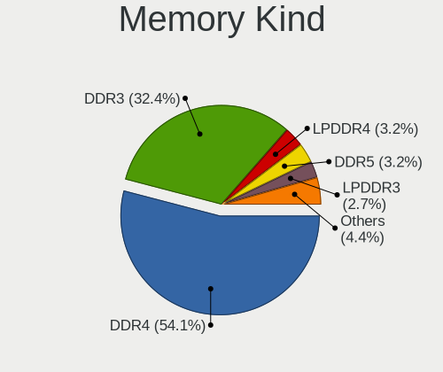

| Kind    | Notebooks | Percent |
|---------|-----------|---------|
| DDR4    | 462       | 54.29%  |
| DDR3    | 294       | 34.55%  |
| LPDDR3  | 30        | 3.53%   |
| LPDDR4  | 29        | 3.41%   |
| DDR2    | 11        | 1.29%   |
| SDRAM   | 10        | 1.18%   |
| DDR5    | 10        | 1.18%   |
| LPDDR5  | 3         | 0.35%   |
| Unknown | 2         | 0.24%   |

Memory Form Factor
------------------

Physical design of the memory module

| Name         | Notebooks | Percent |
|--------------|-----------|---------|
| SODIMM       | 784       | 91.16%  |
| Row Of Chips | 66        | 7.67%   |
| Chip         | 9         | 1.05%   |
| DIMM         | 1         | 0.12%   |

Memory Size
-----------

Memory module size

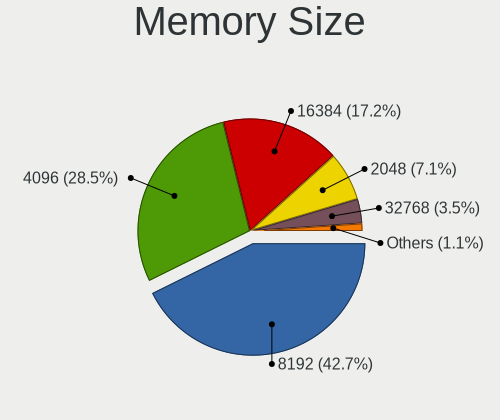

| Size  | Notebooks | Percent |
|-------|-----------|---------|
| 8192  | 399       | 42.31%  |
| 4096  | 318       | 33.72%  |
| 16384 | 126       | 13.36%  |
| 2048  | 67        | 7.1%    |
| 32768 | 24        | 2.55%   |
| 1024  | 8         | 0.85%   |
| 64    | 1         | 0.11%   |

Memory Speed
------------

Memory module speed

| Speed   | Notebooks | Percent |
|---------|-----------|---------|
| 2667    | 235       | 25%     |
| 1600    | 227       | 24.15%  |
| 3200    | 162       | 17.23%  |
| 2400    | 87        | 9.26%   |
| 2133    | 50        | 5.32%   |
| 1334    | 36        | 3.83%   |
| 1333    | 26        | 2.77%   |
| 3266    | 18        | 1.91%   |
| 1067    | 15        | 1.6%    |
| 1867    | 12        | 1.28%   |
| 4800    | 10        | 1.06%   |
| 4267    | 10        | 1.06%   |
| Unknown | 10        | 1.06%   |
| 4199    | 6         | 0.64%   |
| 667     | 6         | 0.64%   |
| 8400    | 5         | 0.53%   |
| 800     | 4         | 0.43%   |
| 6400    | 3         | 0.32%   |
| 4266    | 3         | 0.32%   |
| 2048    | 3         | 0.32%   |
| 975     | 3         | 0.32%   |
| 3733    | 1         | 0.11%   |
| 3000    | 1         | 0.11%   |
| 2933    | 1         | 0.11%   |
| 2134    | 1         | 0.11%   |
| 1866    | 1         | 0.11%   |
| 1776    | 1         | 0.11%   |
| 1639    | 1         | 0.11%   |
| 1066    | 1         | 0.11%   |
| 533     | 1         | 0.11%   |

Printers & scanners
-------------------

Printer Vendor
--------------

Printer device vendors

| Vendor             | Notebooks | Percent |
|--------------------|-----------|---------|
| MIIIW              | 1         | 33.33%  |
| Canon              | 1         | 33.33%  |
| Brother Industries | 1         | 33.33%  |

Printer Model
-------------

Printer device models

| Model                       | Notebooks | Percent |
|-----------------------------|-----------|---------|
| MIIIW MW Keyboard Air Mini  | 1         | 33.33%  |
| Canon G2000 series          | 1         | 33.33%  |
| Brother MFC-L3770CDW series | 1         | 33.33%  |

Scanner Vendor
--------------

Scanner device vendors

Zero info for selected period =(

Scanner Model
-------------

Scanner device models

Zero info for selected period =(

Camera
------

Camera Vendor
-------------

Camera device vendors

| Vendor                                 | Notebooks | Percent |
|----------------------------------------|-----------|---------|
| Chicony Electronics                    | 240       | 27.78%  |
| IMC Networks                           | 118       | 13.66%  |
| Realtek Semiconductor                  | 77        | 8.91%   |
| Microdia                               | 68        | 7.87%   |
| Bison Electronics                      | 49        | 5.67%   |
| Sunplus Innovation Technology          | 46        | 5.32%   |
| Quanta                                 | 38        | 4.4%    |
| Acer                                   | 32        | 3.7%    |
| Cheng Uei Precision Industry (Foxlink) | 30        | 3.47%   |
| Syntek                                 | 23        | 2.66%   |
| Lite-On Technology                     | 23        | 2.66%   |
| Apple                                  | 21        | 2.43%   |
| Suyin                                  | 20        | 2.31%   |
| Luxvisions Innotech Limited            | 12        | 1.39%   |
| Logitech                               | 11        | 1.27%   |
| Lenovo                                 | 9         | 1.04%   |
| Silicon Motion                         | 8         | 0.93%   |
| Primax Electronics                     | 6         | 0.69%   |
| Sonix Technology                       | 5         | 0.58%   |
| Samsung Electronics                    | 4         | 0.46%   |
| Alcor Micro                            | 4         | 0.46%   |
| Ricoh                                  | 3         | 0.35%   |
| Importek                               | 3         | 0.35%   |
| Sunplus Technology                     | 2         | 0.23%   |
| icSpring                               | 2         | 0.23%   |
| Generalplus Technology                 | 2         | 0.23%   |
| WaveRider Communications               | 1         | 0.12%   |
| Microsoft                              | 1         | 0.12%   |
| Magic Control Technology               | 1         | 0.12%   |
| Intel                                  | 1         | 0.12%   |
| Creative Technology                    | 1         | 0.12%   |
| Asuscom Network                        | 1         | 0.12%   |
| ARC International                      | 1         | 0.12%   |
| Anker                                  | 1         | 0.12%   |

Camera Model
------------

Camera device models

| Model                                               | Notebooks | Percent |
|-----------------------------------------------------|-----------|---------|
| Chicony Integrated Camera                           | 64        | 7.36%   |
| IMC Networks Integrated Camera                      | 33        | 3.8%    |
| Microdia Integrated_Webcam_HD                       | 31        | 3.57%   |
| Realtek Integrated_Webcam_HD                        | 30        | 3.45%   |
| Chicony HD WebCam                                   | 28        | 3.22%   |
| IMC Networks USB2.0 HD UVC WebCam                   | 27        | 3.11%   |
| Bison Integrated Camera                             | 20        | 2.3%    |
| IMC Networks USB2.0 VGA UVC WebCam                  | 17        | 1.96%   |
| Sunplus Integrated_Webcam_HD                        | 16        | 1.84%   |
| Syntek Integrated Camera                            | 14        | 1.61%   |
| Lite-On Integrated Camera                           | 14        | 1.61%   |
| Chicony USB2.0 Camera                               | 11        | 1.27%   |
| Chicony USB2.0 VGA UVC WebCam                       | 10        | 1.15%   |
| Chicony HP Truevision HD                            | 10        | 1.15%   |
| Microdia Integrated Webcam                          | 9         | 1.04%   |
| Acer BisonCam,NB Pro                                | 9         | 1.04%   |
| Quanta HD Webcam                                    | 8         | 0.92%   |
| Quanta HD User Facing                               | 8         | 0.92%   |
| Luxvisions Innotech Limited HP TrueVision HD Camera | 8         | 0.92%   |
| Chicony TOSHIBA Web Camera - HD                     | 7         | 0.81%   |
| Chicony HP Wide Vision HD Camera                    | 7         | 0.81%   |
| Chicony HD User Facing                              | 7         | 0.81%   |
| Chicony EasyCamera                                  | 7         | 0.81%   |
| Apple Built-in iSight                               | 7         | 0.81%   |
| Realtek Integrated Webcam HD                        | 6         | 0.69%   |
| Quanta HP TrueVision HD Camera                      | 6         | 0.69%   |
| Microdia Laptop_Integrated_Webcam_HD                | 6         | 0.69%   |
| Lenovo Integrated Webcam [R5U877]                   | 6         | 0.69%   |
| IMC Networks Lenovo EasyCamera                      | 6         | 0.69%   |
| Chicony Integrated Camera (1280x720@30)             | 6         | 0.69%   |
| Chicony HP TrueVision HD Camera                     | 6         | 0.69%   |
| Chicony HP HD Webcam                                | 6         | 0.69%   |
| Chicony HP HD Camera                                | 6         | 0.69%   |
| Apple iPhone 5/5C/5S/6/SE/7/8/X                     | 6         | 0.69%   |
| Apple FaceTime HD Camera                            | 6         | 0.69%   |
| Acer Integrated Camera                              | 6         | 0.69%   |
| Acer HD Webcam                                      | 6         | 0.69%   |
| Acer EasyCamera                                     | 6         | 0.69%   |
| Realtek USB Camera                                  | 5         | 0.58%   |
| IMC Networks VGA UVC WebCam                         | 5         | 0.58%   |

Security
--------

Fingerprint Vendor
------------------

Fingerprint sensor vendors

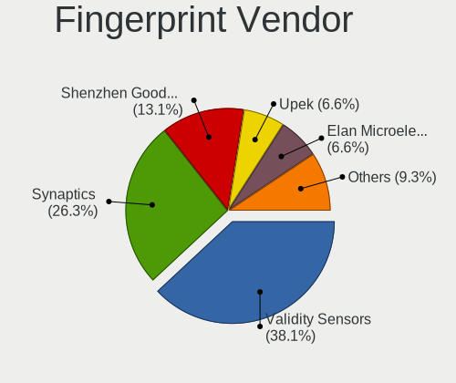

| Vendor                     | Notebooks | Percent |
|----------------------------|-----------|---------|
| Validity Sensors           | 74        | 44.05%  |
| Synaptics                  | 31        | 18.45%  |
| Shenzhen Goodix Technology | 25        | 14.88%  |
| Upek                       | 11        | 6.55%   |
| Elan Microelectronics      | 11        | 6.55%   |
| LighTuning Technology      | 9         | 5.36%   |
| AuthenTec                  | 6         | 3.57%   |
| STMicroelectronics         | 1         | 0.6%    |

Fingerprint Model
-----------------

Fingerprint sensor models

| Model                                                                      | Notebooks | Percent |
|----------------------------------------------------------------------------|-----------|---------|
| Validity Sensors VFS 5011 fingerprint sensor                               | 19        | 11.31%  |
| Synaptics Prometheus MIS Touch Fingerprint Reader                          | 16        | 9.52%   |
| Shenzhen Goodix  Fingerprint Device                                        | 14        | 8.33%   |
| Validity Sensors VFS495 Fingerprint Reader                                 | 12        | 7.14%   |
| Upek Biometric Touchchip/Touchstrip Fingerprint Sensor                     | 11        | 6.55%   |
| Validity Sensors Synaptics WBDI                                            | 9         | 5.36%   |
| Validity Sensors Swipe Fingerprint Sensor                                  | 7         | 4.17%   |
| Synaptics Metallica MIS Touch Fingerprint Reader                           | 7         | 4.17%   |
| Shenzhen Goodix FingerPrint                                                | 7         | 4.17%   |
| LighTuning EgisTec Touch Fingerprint Sensor                                | 7         | 4.17%   |
| Elan ELAN:Fingerprint                                                      | 7         | 4.17%   |
| Validity Sensors VFS5011 Fingerprint Reader                                | 6         | 3.57%   |
| Validity Sensors VFS471 Fingerprint Reader                                 | 5         | 2.98%   |
| Validity Sensors Fingerprint scanner                                       | 5         | 2.98%   |
| Shenzhen Goodix Fingerprint Reader                                         | 4         | 2.38%   |
| Elan ELAN:ARM-M4                                                           | 4         | 2.38%   |
| Validity Sensors VFS7500 Touch Fingerprint Sensor                          | 2         | 1.19%   |
| Validity Sensors VFS491                                                    | 2         | 1.19%   |
| Validity Sensors VFS Fingerprint sensor                                    | 2         | 1.19%   |
| Validity Sensors Synaptics VFS7552 Touch Fingerprint Sensor with PurePrint | 2         | 1.19%   |
| Synaptics WBDI Device                                                      | 2         | 1.19%   |
| Synaptics  WBDI                                                            | 2         | 1.19%   |
| AuthenTec AES1600                                                          | 2         | 1.19%   |
| Validity Sensors VFS7552 Touch Fingerprint Sensor                          | 1         | 0.6%    |
| Validity Sensors VFS451 Fingerprint Reader                                 | 1         | 0.6%    |
| Validity Sensors VFS101 Fingerprint Reader                                 | 1         | 0.6%    |
| Synaptics UWP WBDI Device                                                  | 1         | 0.6%    |
| Synaptics UWP WBDI                                                         | 1         | 0.6%    |
| Synaptics Metallica MOH Touch Fingerprint Reader                           | 1         | 0.6%    |
| Synaptics FS7604 Touch Fingerprint Sensor with PurePrint                   | 1         | 0.6%    |
| STMicroelectronics Fingerprint Reader                                      | 1         | 0.6%    |
| LighTuning Fingerprint Reader                                              | 1         | 0.6%    |
| LighTuning ES603 Swipe Fingerprint Sensor                                  | 1         | 0.6%    |
| AuthenTec Fingerprint Sensor                                               | 1         | 0.6%    |
| AuthenTec AES2810                                                          | 1         | 0.6%    |
| AuthenTec AES2550 Fingerprint Sensor                                       | 1         | 0.6%    |
| AuthenTec AES1660 Fingerprint Sensor                                       | 1         | 0.6%    |

Chipcard Vendor
---------------

Chipcard module vendors

| Vendor      | Notebooks | Percent |
|-------------|-----------|---------|
| Broadcom    | 31        | 41.33%  |
| Alcor Micro | 30        | 40%     |
| O2 Micro    | 6         | 8%      |
| Upek        | 4         | 5.33%   |
| Lenovo      | 4         | 5.33%   |

Chipcard Model
--------------

Chipcard module models

| Model                                                                        | Notebooks | Percent |
|------------------------------------------------------------------------------|-----------|---------|
| Alcor Micro AU9540 Smartcard Reader                                          | 30        | 40%     |
| Broadcom 5880                                                                | 10        | 13.33%  |
| Broadcom BCM5880 Secure Applications Processor                               | 7         | 9.33%   |
| Broadcom 58200                                                               | 7         | 9.33%   |
| Broadcom BCM5880 Secure Applications Processor with fingerprint swipe sensor | 6         | 8%      |
| O2 Micro OZ776 CCID Smartcard Reader                                         | 5         | 6.67%   |
| Upek TouchChip Fingerprint Coprocessor (WBF advanced mode)                   | 4         | 5.33%   |
| Lenovo Integrated Smart Card Reader                                          | 4         | 5.33%   |
| O2 Micro Oz776 SmartCard Reader                                              | 1         | 1.33%   |
| Broadcom BCM5880 Secure Applications Processor with fingerprint touch sensor | 1         | 1.33%   |

Unsupported
-----------

Unsupported Devices
-------------------

Total unsupported devices on board

| Total | Notebooks | Percent |
|-------|-----------|---------|
| 0     | 610       | 63.54%  |
| 1     | 274       | 28.54%  |
| 2     | 72        | 7.5%    |
| 3     | 3         | 0.31%   |
| 4     | 1         | 0.1%    |

Unsupported Device Types
------------------------

Types of unsupported devices

| Type                  | Notebooks | Percent |
|-----------------------|-----------|---------|
| Fingerprint reader    | 168       | 40%     |
| Graphics card         | 95        | 22.62%  |
| Chipcard              | 75        | 17.86%  |
| Net/wireless          | 27        | 6.43%   |
| Multimedia controller | 20        | 4.76%   |
| Camera                | 20        | 4.76%   |
| Bluetooth             | 4         | 0.95%   |
| Net/ethernet          | 3         | 0.71%   |
| Network               | 2         | 0.48%   |
| Card reader           | 2         | 0.48%   |
| Wireless              | 1         | 0.24%   |
| Storage/nvme          | 1         | 0.24%   |
| Storage               | 1         | 0.24%   |
| Dvb card              | 1         | 0.24%   |

