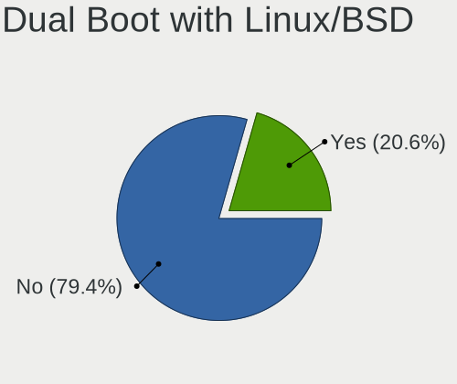
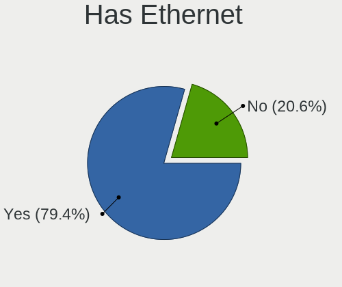
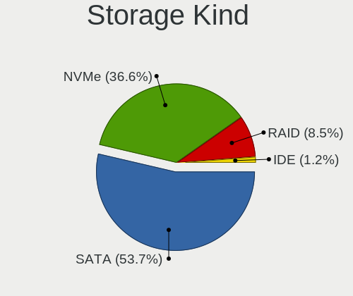
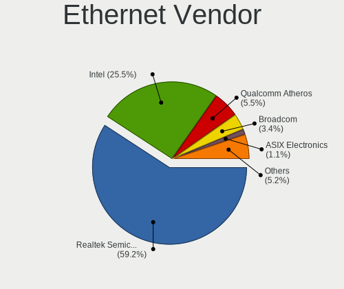
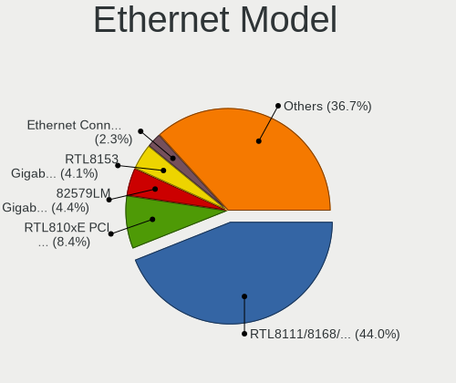
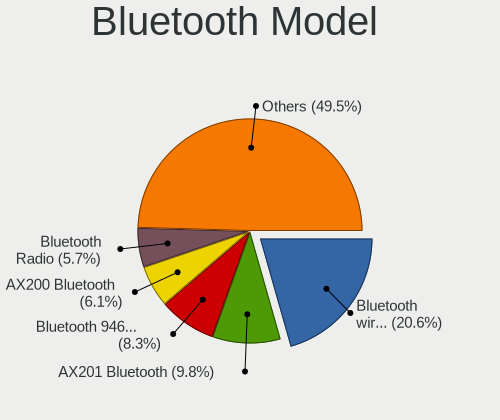
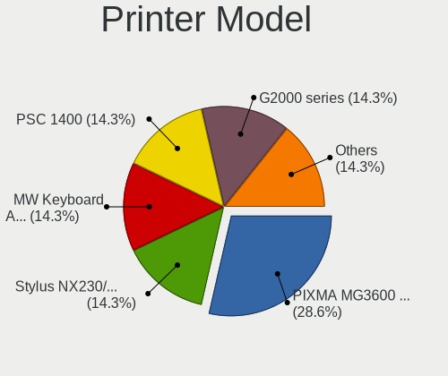
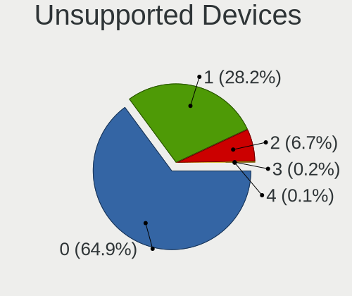

ArcoLinux - Tested Hardware & Statistics (Notebooks)
----------------------------------------------------

A project to collect tested hardware configurations for ArcoLinux.

Anyone can contribute to this report by the [hw-probe](https://github.com/linuxhw/hw-probe) tool:

    sudo -E hw-probe -all -upload

Please contribute! Especially if your hardware is rare.

Contents
--------

* [ Test Cases ](#test-cases)

* [ System ](#system)
  - [ OS                       ](#os)
  - [ OS Family                ](#os-family)
  - [ Kernel                   ](#kernel)
  - [ Kernel Family            ](#kernel-family)
  - [ Kernel Major Ver.        ](#kernel-major-ver)
  - [ Arch                     ](#arch)
  - [ DE                       ](#de)
  - [ Display Server           ](#display-server)
  - [ Display Manager          ](#display-manager)
  - [ OS Lang                  ](#os-lang)
  - [ Boot Mode                ](#boot-mode)
  - [ Filesystem               ](#filesystem)
  - [ Part. scheme             ](#part-scheme)
  - [ Dual Boot with Linux/BSD ](#dual-boot-with-linuxbsd)
  - [ Dual Boot (Win)          ](#dual-boot-win)

* [ Board ](#board)
  - [ Vendor                   ](#vendor)
  - [ Model                    ](#model)
  - [ Model Family             ](#model-family)
  - [ MFG Year                 ](#mfg-year)
  - [ Form Factor              ](#form-factor)
  - [ Secure Boot              ](#secure-boot)
  - [ Coreboot                 ](#coreboot)
  - [ RAM Size                 ](#ram-size)
  - [ RAM Used                 ](#ram-used)
  - [ Total Drives             ](#total-drives)
  - [ Has CD-ROM               ](#has-cd-rom)
  - [ Has Ethernet             ](#has-ethernet)
  - [ Has WiFi                 ](#has-wifi)
  - [ Has Bluetooth            ](#has-bluetooth)

* [ Location ](#location)
  - [ Country                  ](#country)
  - [ City                     ](#city)

* [ Drives ](#drives)
  - [ Drive Vendor             ](#drive-vendor)
  - [ Drive Model              ](#drive-model)
  - [ HDD Vendor               ](#hdd-vendor)
  - [ SSD Vendor               ](#ssd-vendor)
  - [ Drive Kind               ](#drive-kind)
  - [ Drive Connector          ](#drive-connector)
  - [ Drive Size               ](#drive-size)
  - [ Space Total              ](#space-total)
  - [ Space Used               ](#space-used)
  - [ Malfunc. Drives          ](#malfunc-drives)
  - [ Malfunc. Drive Vendor    ](#malfunc-drive-vendor)
  - [ Malfunc. HDD Vendor      ](#malfunc-hdd-vendor)
  - [ Malfunc. Drive Kind      ](#malfunc-drive-kind)
  - [ Failed Drives            ](#failed-drives)
  - [ Failed Drive Vendor      ](#failed-drive-vendor)
  - [ Drive Status             ](#drive-status)

* [ Storage controller ](#storage-controller)
  - [ Storage Vendor           ](#storage-vendor)
  - [ Storage Model            ](#storage-model)
  - [ Storage Kind             ](#storage-kind)

* [ Processor ](#processor)
  - [ CPU Vendor               ](#cpu-vendor)
  - [ CPU Model                ](#cpu-model)
  - [ CPU Model Family         ](#cpu-model-family)
  - [ CPU Cores                ](#cpu-cores)
  - [ CPU Sockets              ](#cpu-sockets)
  - [ CPU Threads              ](#cpu-threads)
  - [ CPU Op-Modes             ](#cpu-op-modes)
  - [ CPU Microcode            ](#cpu-microcode)
  - [ CPU Microarch            ](#cpu-microarch)

* [ Graphics ](#graphics)
  - [ GPU Vendor               ](#gpu-vendor)
  - [ GPU Model                ](#gpu-model)
  - [ GPU Combo                ](#gpu-combo)
  - [ GPU Driver               ](#gpu-driver)
  - [ GPU Memory               ](#gpu-memory)

* [ Monitor ](#monitor)
  - [ Monitor Vendor           ](#monitor-vendor)
  - [ Monitor Model            ](#monitor-model)
  - [ Monitor Resolution       ](#monitor-resolution)
  - [ Monitor Diagonal         ](#monitor-diagonal)
  - [ Monitor Width            ](#monitor-width)
  - [ Aspect Ratio             ](#aspect-ratio)
  - [ Monitor Area             ](#monitor-area)
  - [ Pixel Density            ](#pixel-density)
  - [ Multiple Monitors        ](#multiple-monitors)

* [ Network ](#network)
  - [ Net Controller Vendor    ](#net-controller-vendor)
  - [ Net Controller Model     ](#net-controller-model)
  - [ Wireless Vendor          ](#wireless-vendor)
  - [ Wireless Model           ](#wireless-model)
  - [ Ethernet Vendor          ](#ethernet-vendor)
  - [ Ethernet Model           ](#ethernet-model)
  - [ Net Controller Kind      ](#net-controller-kind)
  - [ Used Controller          ](#used-controller)
  - [ NICs                     ](#nics)
  - [ IPv6                     ](#ipv6)

* [ Bluetooth ](#bluetooth)
  - [ Bluetooth Vendor         ](#bluetooth-vendor)
  - [ Bluetooth Model          ](#bluetooth-model)

* [ Sound ](#sound)
  - [ Sound Vendor             ](#sound-vendor)
  - [ Sound Model              ](#sound-model)

* [ Memory ](#memory)
  - [ Memory Vendor            ](#memory-vendor)
  - [ Memory Model             ](#memory-model)
  - [ Memory Kind              ](#memory-kind)
  - [ Memory Form Factor       ](#memory-form-factor)
  - [ Memory Size              ](#memory-size)
  - [ Memory Speed             ](#memory-speed)

* [ Printers & scanners ](#printers--scanners)
  - [ Printer Vendor           ](#printer-vendor)
  - [ Printer Model            ](#printer-model)
  - [ Scanner Vendor           ](#scanner-vendor)
  - [ Scanner Model            ](#scanner-model)

* [ Camera ](#camera)
  - [ Camera Vendor            ](#camera-vendor)
  - [ Camera Model             ](#camera-model)

* [ Security ](#security)
  - [ Fingerprint Vendor       ](#fingerprint-vendor)
  - [ Fingerprint Model        ](#fingerprint-model)
  - [ Chipcard Vendor          ](#chipcard-vendor)
  - [ Chipcard Model           ](#chipcard-model)

* [ Unsupported ](#unsupported)
  - [ Unsupported Devices      ](#unsupported-devices)
  - [ Unsupported Device Types ](#unsupported-device-types)

Test Cases
----------

Total: 2286

| Vendor        | Model                       | Probe                                                      | Date         |
|---------------|-----------------------------|------------------------------------------------------------|--------------|
| Lenovo        | ThinkPad T470 20HES18C00    | [a2d8841244](https://linux-hardware.org/?probe=a2d8841244) | May 08, 2024 |
| Lenovo        | ThinkPad X240 20AMA0W706    | [ed0902f81c](https://linux-hardware.org/?probe=ed0902f81c) | May 08, 2024 |
| Acer          | Aspire 5720                 | [0a218dfdfe](https://linux-hardware.org/?probe=0a218dfdfe) | May 08, 2024 |
| EVOC          | P7xxTM1                     | [7c15b2991c](https://linux-hardware.org/?probe=7c15b2991c) | May 08, 2024 |
| Dell          | XPS 15 9530                 | [5aee2550ce](https://linux-hardware.org/?probe=5aee2550ce) | May 08, 2024 |
| Lenovo        | B50-30 80ES                 | [c19f3dfc3a](https://linux-hardware.org/?probe=c19f3dfc3a) | May 07, 2024 |
| Apple         | MacBookAir7,2               | [de2ed6e188](https://linux-hardware.org/?probe=de2ed6e188) | May 07, 2024 |
| Framework     | Laptop 16 (AMD Ryzen 704... | [3679c79ac4](https://linux-hardware.org/?probe=3679c79ac4) | May 06, 2024 |
| Unknown       | Unknown                     | [a857b08dd7](https://linux-hardware.org/?probe=a857b08dd7) | May 06, 2024 |
| Acer          | Lars                        | [6ec82dab78](https://linux-hardware.org/?probe=6ec82dab78) | May 05, 2024 |
| Dell          | Latitude 5410               | [8302f81328](https://linux-hardware.org/?probe=8302f81328) | May 04, 2024 |
| Acer          | Aspire A315-56              | [b7341e861f](https://linux-hardware.org/?probe=b7341e861f) | May 03, 2024 |
| Acer          | Swift SFG14-72              | [00c7e89498](https://linux-hardware.org/?probe=00c7e89498) | May 03, 2024 |
| Apple         | MacBookPro11,1              | [a493ee87d2](https://linux-hardware.org/?probe=a493ee87d2) | May 02, 2024 |
| Lenovo        | ThinkPad X1 Carbon 6th 2... | [e02873ea23](https://linux-hardware.org/?probe=e02873ea23) | May 02, 2024 |
| Acer          | Aspire SW5-173              | [e72a0709d4](https://linux-hardware.org/?probe=e72a0709d4) | May 01, 2024 |
| ECT           | Unknown                     | [0ebb9fcdd0](https://linux-hardware.org/?probe=0ebb9fcdd0) | May 01, 2024 |
| ASUSTek       | VivoBook_ASUSLaptop X512... | [ad08810e0e](https://linux-hardware.org/?probe=ad08810e0e) | May 01, 2024 |
| Lenovo        | IdeaPad Y700-17ISK 80Q0     | [6df35e20b1](https://linux-hardware.org/?probe=6df35e20b1) | May 01, 2024 |
| Lenovo        | ThinkPad T430 2349IF8       | [d4d6667b5e](https://linux-hardware.org/?probe=d4d6667b5e) | Apr 29, 2024 |
| Dell          | G7 7588                     | [9745a22fe0](https://linux-hardware.org/?probe=9745a22fe0) | Apr 28, 2024 |
| Lenovo        | Slim Pro 7 14ARP8 83AX      | [15fdd20de0](https://linux-hardware.org/?probe=15fdd20de0) | Apr 28, 2024 |
| Dell          | Latitude E7450              | [eb354c66fa](https://linux-hardware.org/?probe=eb354c66fa) | Apr 27, 2024 |
| Dell          | XPS 15 9560                 | [85005d847f](https://linux-hardware.org/?probe=85005d847f) | Apr 27, 2024 |
| Dell          | Latitude 5300               | [dfae5f452a](https://linux-hardware.org/?probe=dfae5f452a) | Apr 27, 2024 |
| Lenovo        | IdeaPad 320-14IKB 80XK      | [4324e618e8](https://linux-hardware.org/?probe=4324e618e8) | Apr 27, 2024 |
| Lenovo        | ThinkPad E15 Gen 2 20T80... | [0ff3e84a1c](https://linux-hardware.org/?probe=0ff3e84a1c) | Apr 27, 2024 |
| Dell          | Inspiron 3558               | [1fe97163aa](https://linux-hardware.org/?probe=1fe97163aa) | Apr 26, 2024 |
| Unknown       | Unknown                     | [a1db5a84e2](https://linux-hardware.org/?probe=a1db5a84e2) | Apr 26, 2024 |
| Sony          | SVF1521X1RB                 | [49942872ab](https://linux-hardware.org/?probe=49942872ab) | Apr 25, 2024 |
| Dell          | Inspiron 3501               | [7260ec24ee](https://linux-hardware.org/?probe=7260ec24ee) | Apr 25, 2024 |
| Apple         | MacBookPro11,1              | [b27f71816a](https://linux-hardware.org/?probe=b27f71816a) | Apr 24, 2024 |
| Lenovo        | Legion 5 15ACH6A 82NW       | [dc86ce5b59](https://linux-hardware.org/?probe=dc86ce5b59) | Apr 24, 2024 |
| Lenovo        | ThinkPad X1 Carbon 3448A... | [280fa2d735](https://linux-hardware.org/?probe=280fa2d735) | Apr 24, 2024 |
| ASUSTek       | ROG Strix G513QM_G513QM     | [7bb8c6f187](https://linux-hardware.org/?probe=7bb8c6f187) | Apr 24, 2024 |
| HP            | Laptop 17z-ca100            | [80cb3eace6](https://linux-hardware.org/?probe=80cb3eace6) | Apr 23, 2024 |
| Apple         | MacBookPro10,1              | [6c32f9323b](https://linux-hardware.org/?probe=6c32f9323b) | Apr 23, 2024 |
| ASUSTek       | ROG Strix G513QM_G513QM     | [3b1f047a27](https://linux-hardware.org/?probe=3b1f047a27) | Apr 22, 2024 |
| Dell          | Latitude E5400              | [fba5edc10c](https://linux-hardware.org/?probe=fba5edc10c) | Apr 21, 2024 |
| Notebook      | NP5x_NP6x_NP7xPNP           | [16b4e64118](https://linux-hardware.org/?probe=16b4e64118) | Apr 21, 2024 |
| HP            | Presario CQ56               | [80adb74ef1](https://linux-hardware.org/?probe=80adb74ef1) | Apr 21, 2024 |
| Acer          | Enduro EUN314-51W           | [7a57f25e0e](https://linux-hardware.org/?probe=7a57f25e0e) | Apr 20, 2024 |
| Lenovo        | IdeaPad 330-15ICH 81FK      | [d96460dbea](https://linux-hardware.org/?probe=d96460dbea) | Apr 20, 2024 |
| Acer          | Aspire A314-22              | [cb041e53b1](https://linux-hardware.org/?probe=cb041e53b1) | Apr 20, 2024 |
| Dell          | Precision 7720              | [53cebf5b16](https://linux-hardware.org/?probe=53cebf5b16) | Apr 20, 2024 |
| Dell          | Inspiron 3542               | [290ea848f0](https://linux-hardware.org/?probe=290ea848f0) | Apr 19, 2024 |
| Dell          | Vostro 3580                 | [af4cc3e115](https://linux-hardware.org/?probe=af4cc3e115) | Apr 19, 2024 |
| Dell          | Vostro 3580                 | [aa8437e096](https://linux-hardware.org/?probe=aa8437e096) | Apr 19, 2024 |
| HP            | Victus by Gaming Laptop ... | [326cc8c1ea](https://linux-hardware.org/?probe=326cc8c1ea) | Apr 19, 2024 |
| Lenovo        | IdeaPad Y700-17ISK 80Q0     | [5acad8a956](https://linux-hardware.org/?probe=5acad8a956) | Apr 19, 2024 |
| Sony          | SVF1521X1RB                 | [9e0873ff32](https://linux-hardware.org/?probe=9e0873ff32) | Apr 17, 2024 |
| Lenovo        | IdeaPad S340-15IWL 81N8     | [f61bc8b75c](https://linux-hardware.org/?probe=f61bc8b75c) | Apr 17, 2024 |
| Lenovo        | IdeaPad 3 17IML05 81WC      | [2667935967](https://linux-hardware.org/?probe=2667935967) | Apr 16, 2024 |
| HP            | EliteBook 840 G8 Noteboo... | [546afe3c79](https://linux-hardware.org/?probe=546afe3c79) | Apr 15, 2024 |
| HP            | OMEN Laptop 15-en1001np ... | [a9e386b4a8](https://linux-hardware.org/?probe=a9e386b4a8) | Apr 15, 2024 |
| HP            | Pavilion Gaming Laptop 1... | [16d5936653](https://linux-hardware.org/?probe=16d5936653) | Apr 14, 2024 |
| Dell          | G7 7588                     | [06f5f64e59](https://linux-hardware.org/?probe=06f5f64e59) | Apr 14, 2024 |
| ASUSTek       | VivoBook_ASUSLaptop X571... | [c88e8fcf4f](https://linux-hardware.org/?probe=c88e8fcf4f) | Apr 14, 2024 |
| Dell          | Inspiron 3721               | [49aec34132](https://linux-hardware.org/?probe=49aec34132) | Apr 13, 2024 |
| ASUSTek       | X550JX                      | [10e9087348](https://linux-hardware.org/?probe=10e9087348) | Apr 13, 2024 |
| HP            | Folio 13                    | [2112e4d193](https://linux-hardware.org/?probe=2112e4d193) | Apr 13, 2024 |
| MSI           | GP63 Leopard 8RE            | [31525e1fa0](https://linux-hardware.org/?probe=31525e1fa0) | Apr 13, 2024 |
| BESSTAR Te... | X400                        | [0701fdbfed](https://linux-hardware.org/?probe=0701fdbfed) | Apr 12, 2024 |
| Packard Be... | EasyNote LM98               | [e5f560059b](https://linux-hardware.org/?probe=e5f560059b) | Apr 12, 2024 |
| Lenovo        | IdeaPad 110-14IBR 80UJ      | [ed5c941b3f](https://linux-hardware.org/?probe=ed5c941b3f) | Apr 12, 2024 |
| Dell          | Inspiron 3501               | [d688f191c9](https://linux-hardware.org/?probe=d688f191c9) | Apr 12, 2024 |
| Toshiba       | Satellite M645              | [f5c39a1c49](https://linux-hardware.org/?probe=f5c39a1c49) | Apr 12, 2024 |
| Lenovo        | G40-30 80FY                 | [d1d8e1d51f](https://linux-hardware.org/?probe=d1d8e1d51f) | Apr 11, 2024 |
| Lenovo        | ThinkBook 15 G2 ITL 20VE    | [78ca9d448c](https://linux-hardware.org/?probe=78ca9d448c) | Apr 11, 2024 |
| Lenovo        | ThinkPad T580 20L9CTO1WW    | [f9b6443292](https://linux-hardware.org/?probe=f9b6443292) | Apr 11, 2024 |
| Acer          | Enduro EUN314-51W           | [fa7d224ee9](https://linux-hardware.org/?probe=fa7d224ee9) | Apr 11, 2024 |
| HP            | ZBook 15 G5                 | [d8a1d4fd64](https://linux-hardware.org/?probe=d8a1d4fd64) | Apr 10, 2024 |
| Dell          | Latitude E6420              | [649e8a4cae](https://linux-hardware.org/?probe=649e8a4cae) | Apr 10, 2024 |
| Dell          | Latitude E5430 non-vPro     | [e324b97ac4](https://linux-hardware.org/?probe=e324b97ac4) | Apr 10, 2024 |
| Apple         | MacBookPro9,2               | [3fe67822d2](https://linux-hardware.org/?probe=3fe67822d2) | Apr 09, 2024 |
| HP            | ProBook 455 G2              | [431349da41](https://linux-hardware.org/?probe=431349da41) | Apr 08, 2024 |
| Lenovo        | ThinkPad T490 20N2005VMX    | [543136ea4b](https://linux-hardware.org/?probe=543136ea4b) | Apr 08, 2024 |
| Dell          | Latitude 7490               | [92f94355fe](https://linux-hardware.org/?probe=92f94355fe) | Apr 07, 2024 |
| Dell          | Latitude E5430 non-vPro     | [f5ade4bf16](https://linux-hardware.org/?probe=f5ade4bf16) | Apr 07, 2024 |
| Dell          | Latitude E5430 non-vPro     | [8fa8b6b410](https://linux-hardware.org/?probe=8fa8b6b410) | Apr 06, 2024 |
| Lenovo        | ThinkPad T430 2349IF8       | [fcdfc53b39](https://linux-hardware.org/?probe=fcdfc53b39) | Apr 06, 2024 |
| Lenovo        | IdeaPad 1 14ADA05 82GW      | [b743bdc5b7](https://linux-hardware.org/?probe=b743bdc5b7) | Apr 06, 2024 |
| HP            | 255 G7 Notebook PC          | [5afefafcfb](https://linux-hardware.org/?probe=5afefafcfb) | Apr 06, 2024 |
| Dell          | G7 7588                     | [8753ea1302](https://linux-hardware.org/?probe=8753ea1302) | Apr 05, 2024 |
| System76      | Gazelle                     | [f241f8c75f](https://linux-hardware.org/?probe=f241f8c75f) | Apr 05, 2024 |
| Dell          | Latitude 7490               | [2d5616d182](https://linux-hardware.org/?probe=2d5616d182) | Apr 05, 2024 |
| HP            | Laptop 15s-eq2xxx           | [b0435cb369](https://linux-hardware.org/?probe=b0435cb369) | Apr 05, 2024 |
| HP            | Pavilion Laptop 14-dv1xx... | [f9add792f1](https://linux-hardware.org/?probe=f9add792f1) | Apr 05, 2024 |
| Toshiba       | Satellite P55W-C            | [f7991fe43c](https://linux-hardware.org/?probe=f7991fe43c) | Apr 05, 2024 |
| Lenovo        | G40-30 80FY                 | [216b899f97](https://linux-hardware.org/?probe=216b899f97) | Apr 04, 2024 |
| Dell          | Inspiron 3721               | [bea7567e40](https://linux-hardware.org/?probe=bea7567e40) | Apr 04, 2024 |
| HP            | Pavilion g7                 | [e030bcc388](https://linux-hardware.org/?probe=e030bcc388) | Apr 04, 2024 |
| HUAWEI        | KPL-W0X                     | [4b06cf61b5](https://linux-hardware.org/?probe=4b06cf61b5) | Apr 04, 2024 |
| Dell          | System XPS L502X            | [50a066426a](https://linux-hardware.org/?probe=50a066426a) | Apr 04, 2024 |
| Lenovo        | IdeaPad 1 14ADA05 82GW      | [91906af7e3](https://linux-hardware.org/?probe=91906af7e3) | Apr 03, 2024 |
| Dell          | Latitude 7490               | [6ae13d56ab](https://linux-hardware.org/?probe=6ae13d56ab) | Apr 03, 2024 |
| Lenovo        | IdeaPad Slim 1-11AST-05 ... | [26bfbd7911](https://linux-hardware.org/?probe=26bfbd7911) | Apr 03, 2024 |
| Lenovo        | ThinkPad T540p 20BFS06B0... | [290e63ab76](https://linux-hardware.org/?probe=290e63ab76) | Apr 01, 2024 |
| HP            | Pavilion Laptop 15-eh0xx... | [d028b72b84](https://linux-hardware.org/?probe=d028b72b84) | Apr 01, 2024 |
| ASUSTek       | N53SV                       | [12ab7fe764](https://linux-hardware.org/?probe=12ab7fe764) | Apr 01, 2024 |
| Razer         | Blade                       | [ba8e740196](https://linux-hardware.org/?probe=ba8e740196) | Apr 01, 2024 |
| HP            | Pavilion Laptop 15-eh0xx... | [2c3e57a75a](https://linux-hardware.org/?probe=2c3e57a75a) | Apr 01, 2024 |
| Lenovo        | ThinkPad T540p 20BFS06B0... | [83f55034f4](https://linux-hardware.org/?probe=83f55034f4) | Apr 01, 2024 |
| Dell          | XPS 15 9560                 | [5ea1dc6342](https://linux-hardware.org/?probe=5ea1dc6342) | Mar 31, 2024 |
| ASUSTek       | UX410UQK                    | [9b11a1c1ad](https://linux-hardware.org/?probe=9b11a1c1ad) | Mar 31, 2024 |
| ASUSTek       | TUF Gaming FX505DT_FX505... | [64599c7737](https://linux-hardware.org/?probe=64599c7737) | Mar 31, 2024 |
| Lenovo        | ThinkBook 14 G2 ITL 20VD    | [301f4fbe0a](https://linux-hardware.org/?probe=301f4fbe0a) | Mar 31, 2024 |
| HUAWEI        | NBLB-WAX9N                  | [0ccf6a99da](https://linux-hardware.org/?probe=0ccf6a99da) | Mar 31, 2024 |
| Samsung       | 270E5G/270E5U               | [f29778819d](https://linux-hardware.org/?probe=f29778819d) | Mar 31, 2024 |
| ASUSTek       | TUF Gaming FX505DT_FX505... | [2e8a52ef75](https://linux-hardware.org/?probe=2e8a52ef75) | Mar 31, 2024 |
| Dell          | Latitude 5480               | [3f70b3cbd6](https://linux-hardware.org/?probe=3f70b3cbd6) | Mar 30, 2024 |
| Unknown       | Unknown                     | [393d39e7a2](https://linux-hardware.org/?probe=393d39e7a2) | Mar 30, 2024 |
| ASUSTek       | Unknown                     | [f0d50801ff](https://linux-hardware.org/?probe=f0d50801ff) | Mar 30, 2024 |
| Fujitsu       | LIFEBOOK E558               | [7c2ec1d730](https://linux-hardware.org/?probe=7c2ec1d730) | Mar 29, 2024 |
| Acer          | Aspire A515-43              | [caa01a6b16](https://linux-hardware.org/?probe=caa01a6b16) | Mar 29, 2024 |
| Lenovo        | Yoga Slim 7 Pro 14ACH5 O... | [859b028e32](https://linux-hardware.org/?probe=859b028e32) | Mar 29, 2024 |
| ASUSTek       | TUF Gaming FX505DY_FX505... | [55f0862220](https://linux-hardware.org/?probe=55f0862220) | Mar 29, 2024 |
| Lenovo        | ThinkPad T480s 20L8SBK60... | [26a17a556d](https://linux-hardware.org/?probe=26a17a556d) | Mar 29, 2024 |
| ROMBICA       | myBook Eclipse              | [c5d773bb0f](https://linux-hardware.org/?probe=c5d773bb0f) | Mar 28, 2024 |
| Lenovo        | ThinkPad T530 24295L4       | [bc2f245e57](https://linux-hardware.org/?probe=bc2f245e57) | Mar 28, 2024 |
| Lenovo        | ThinkPad E15 Gen 3 20YGC... | [2129863d24](https://linux-hardware.org/?probe=2129863d24) | Mar 28, 2024 |
| Lenovo        | ThinkPad W541 20EGS24300    | [b9b3f86a33](https://linux-hardware.org/?probe=b9b3f86a33) | Mar 27, 2024 |
| HP            | Laptop 15-bs0xx             | [1a7dc6f9b7](https://linux-hardware.org/?probe=1a7dc6f9b7) | Mar 27, 2024 |
| ASUSTek       | Unknown                     | [c405404136](https://linux-hardware.org/?probe=c405404136) | Mar 26, 2024 |
| Dell          | Latitude 5500               | [01e740ac1e](https://linux-hardware.org/?probe=01e740ac1e) | Mar 26, 2024 |
| ASUSTek       | K75VM                       | [cfa470267d](https://linux-hardware.org/?probe=cfa470267d) | Mar 25, 2024 |
| Lenovo        | Legion 7 16ACHg6 82N6       | [77bfcb26fe](https://linux-hardware.org/?probe=77bfcb26fe) | Mar 25, 2024 |
| HP            | Folio 13                    | [982ad443c6](https://linux-hardware.org/?probe=982ad443c6) | Mar 25, 2024 |
| ASUSTek       | ZenBook UX534FTC_UX534FT    | [a99d39c0b4](https://linux-hardware.org/?probe=a99d39c0b4) | Mar 24, 2024 |
| HP            | Pavilion Laptop 15-cw0xx... | [430f425f2c](https://linux-hardware.org/?probe=430f425f2c) | Mar 24, 2024 |
| Lenovo        | ThinkPad T470p 20J7A004L... | [7aa99b8f2b](https://linux-hardware.org/?probe=7aa99b8f2b) | Mar 24, 2024 |
| Packard Be... | EasyNote ENTG71BM           | [5084e58bdf](https://linux-hardware.org/?probe=5084e58bdf) | Mar 24, 2024 |
| Lenovo        | Legion Y920-17IKB Laptop... | [90a6a2cc72](https://linux-hardware.org/?probe=90a6a2cc72) | Mar 24, 2024 |
| HP            | 250 G8 Notebook PC          | [d0c0e017d3](https://linux-hardware.org/?probe=d0c0e017d3) | Mar 23, 2024 |
| HP            | ZBook 17                    | [02d8d9dcf1](https://linux-hardware.org/?probe=02d8d9dcf1) | Mar 23, 2024 |
| Acer          | Aspire V5-573G              | [0ffca5c7aa](https://linux-hardware.org/?probe=0ffca5c7aa) | Mar 23, 2024 |
| MSI           | CR610M                      | [7b139fb61c](https://linux-hardware.org/?probe=7b139fb61c) | Mar 23, 2024 |
| Lenovo        | V130-15IKB 81HN             | [ed5ffee126](https://linux-hardware.org/?probe=ed5ffee126) | Mar 23, 2024 |
| Dell          | Latitude 5400               | [041cf3061b](https://linux-hardware.org/?probe=041cf3061b) | Mar 22, 2024 |
| Acer          | Lars                        | [6e1b695926](https://linux-hardware.org/?probe=6e1b695926) | Mar 21, 2024 |
| Dell          | Latitude 5400               | [b387cc5494](https://linux-hardware.org/?probe=b387cc5494) | Mar 21, 2024 |
| Lenovo        | IdeaPad 3 15ARE05 81W4      | [71e6476160](https://linux-hardware.org/?probe=71e6476160) | Mar 21, 2024 |
| Apple         | MacBookPro6,1               | [a993d0d4bc](https://linux-hardware.org/?probe=a993d0d4bc) | Mar 21, 2024 |
| Lenovo        | IdeaPad S145-15IWL 81MV     | [f8fa83eaf5](https://linux-hardware.org/?probe=f8fa83eaf5) | Mar 20, 2024 |
| ASUSTek       | VivoBook_ASUSLaptop X512... | [eb3211feaf](https://linux-hardware.org/?probe=eb3211feaf) | Mar 20, 2024 |
| Dell          | Latitude 7290               | [060d4f8054](https://linux-hardware.org/?probe=060d4f8054) | Mar 20, 2024 |
| ASUSTek       | VivoBook_ASUSLaptop X510... | [a051b39e29](https://linux-hardware.org/?probe=a051b39e29) | Mar 19, 2024 |
| HP            | Pavilion Notebook           | [25ea07c0ef](https://linux-hardware.org/?probe=25ea07c0ef) | Mar 19, 2024 |
| Lenovo        | IdeaPad Slim 3 15IAN8 82... | [60437d07d3](https://linux-hardware.org/?probe=60437d07d3) | Mar 19, 2024 |
| ASUSTek       | ROG Strix G513QE_G513QE     | [1a65c1c7d8](https://linux-hardware.org/?probe=1a65c1c7d8) | Mar 18, 2024 |
| Lenovo        | IdeaPad Gaming 3 15IHU6 ... | [0622336d7e](https://linux-hardware.org/?probe=0622336d7e) | Mar 18, 2024 |
| Lenovo        | IdeaPad Slim 3 15IAN8 82... | [9ef0fec665](https://linux-hardware.org/?probe=9ef0fec665) | Mar 18, 2024 |
| HP            | Laptop 15s-eq2xxx           | [e24d05dacc](https://linux-hardware.org/?probe=e24d05dacc) | Mar 18, 2024 |
| Lenovo        | ThinkPad T430 2349CV8       | [c720271bc9](https://linux-hardware.org/?probe=c720271bc9) | Mar 18, 2024 |
| ASUSTek       | ASUS TUF Gaming A15 FA50... | [b62cd0cdeb](https://linux-hardware.org/?probe=b62cd0cdeb) | Mar 17, 2024 |
| HP            | Pavilion g7                 | [afec7e4e8d](https://linux-hardware.org/?probe=afec7e4e8d) | Mar 17, 2024 |
| HP            | Laptop 15s-eq2xxx           | [dbbfda791c](https://linux-hardware.org/?probe=dbbfda791c) | Mar 17, 2024 |
| Dell          | Latitude E6420              | [e764a6c5f4](https://linux-hardware.org/?probe=e764a6c5f4) | Mar 17, 2024 |
| Acer          | Swift SF314-41G             | [22ac3144fc](https://linux-hardware.org/?probe=22ac3144fc) | Mar 17, 2024 |
| ASUSTek       | VivoBook_ASUSLaptop X515... | [e0ee84189e](https://linux-hardware.org/?probe=e0ee84189e) | Mar 16, 2024 |
| Dell          | Latitude E7440              | [b84556c723](https://linux-hardware.org/?probe=b84556c723) | Mar 16, 2024 |
| AZW           | SEi                         | [943616dbd5](https://linux-hardware.org/?probe=943616dbd5) | Mar 16, 2024 |
| Dell          | Inspiron N5040              | [53966580b8](https://linux-hardware.org/?probe=53966580b8) | Mar 16, 2024 |
| Sony          | VPCEH30EB                   | [5fcc8ea369](https://linux-hardware.org/?probe=5fcc8ea369) | Mar 16, 2024 |
| Lenovo        | ThinkPad T470 20HES23B0U    | [6b7342964b](https://linux-hardware.org/?probe=6b7342964b) | Mar 16, 2024 |
| Dell          | Inspiron 3521               | [0845e63785](https://linux-hardware.org/?probe=0845e63785) | Mar 15, 2024 |
| ASUSTek       | TUF Gaming FX504GE_FX80G... | [33e7a03f71](https://linux-hardware.org/?probe=33e7a03f71) | Mar 15, 2024 |
| HP            | Pavilion Laptop 14-bf0xx    | [7ded8b5e80](https://linux-hardware.org/?probe=7ded8b5e80) | Mar 15, 2024 |
| Dell          | Latitude E6430              | [54e9652592](https://linux-hardware.org/?probe=54e9652592) | Mar 14, 2024 |
| Dell          | Inspiron 1545               | [300de7108e](https://linux-hardware.org/?probe=300de7108e) | Mar 14, 2024 |
| Dell          | Inspiron 3521               | [8ac504cf90](https://linux-hardware.org/?probe=8ac504cf90) | Mar 14, 2024 |
| Dell          | Inspiron 5759               | [74d556a193](https://linux-hardware.org/?probe=74d556a193) | Mar 14, 2024 |
| Apple         | MacBookAir6,1               | [8575151105](https://linux-hardware.org/?probe=8575151105) | Mar 14, 2024 |
| Lenovo        | ThinkPad X1 Carbon 6th 2... | [869127a088](https://linux-hardware.org/?probe=869127a088) | Mar 13, 2024 |
| Lenovo        | Legion 5 15ARH05H 82B1      | [703f7f40a4](https://linux-hardware.org/?probe=703f7f40a4) | Mar 13, 2024 |
| Apple         | MacBookPro9,2               | [add6eef34a](https://linux-hardware.org/?probe=add6eef34a) | Mar 12, 2024 |
| Unknown       | Unknown                     | [1a12cdf91f](https://linux-hardware.org/?probe=1a12cdf91f) | Mar 12, 2024 |
| Lenovo        | ThinkPad T560 20FH001RUS    | [1c869b5e2e](https://linux-hardware.org/?probe=1c869b5e2e) | Mar 12, 2024 |
| Dell          | XPS 13 9310                 | [4eefa9994a](https://linux-hardware.org/?probe=4eefa9994a) | Mar 12, 2024 |
| ASUSTek       | K55VD                       | [01c2033137](https://linux-hardware.org/?probe=01c2033137) | Mar 12, 2024 |
| Dell          | G15 5515                    | [527be515b4](https://linux-hardware.org/?probe=527be515b4) | Mar 12, 2024 |
| Dell          | XPS 13 9310                 | [27d2d8b15a](https://linux-hardware.org/?probe=27d2d8b15a) | Mar 11, 2024 |
| Chuwi         | GemiBook Pro                | [a8eb8bc1dc](https://linux-hardware.org/?probe=a8eb8bc1dc) | Mar 10, 2024 |
| HP            | ZBook 17                    | [9535fdaf2b](https://linux-hardware.org/?probe=9535fdaf2b) | Mar 10, 2024 |
| Lenovo        | Legion 5 15ARH05H 82B1      | [bd9aa2f5e6](https://linux-hardware.org/?probe=bd9aa2f5e6) | Mar 10, 2024 |
| HP            | ProBook 440 G8 Notebook ... | [0339864371](https://linux-hardware.org/?probe=0339864371) | Mar 09, 2024 |
| Acer          | Nitro AN515-52              | [edd6400e24](https://linux-hardware.org/?probe=edd6400e24) | Mar 08, 2024 |
| HP            | Pavilion Notebook           | [9659d66a4e](https://linux-hardware.org/?probe=9659d66a4e) | Mar 08, 2024 |
| Dell          | Latitude 7490               | [1e93b05356](https://linux-hardware.org/?probe=1e93b05356) | Mar 07, 2024 |
| Lenovo        | ThinkPad T430 2349IF8       | [142d320b69](https://linux-hardware.org/?probe=142d320b69) | Mar 07, 2024 |
| Lenovo        | ThinkPad X1 Carbon 3448A... | [e50b713b59](https://linux-hardware.org/?probe=e50b713b59) | Mar 07, 2024 |
| ASUSTek       | N55SF                       | [9579229ce6](https://linux-hardware.org/?probe=9579229ce6) | Mar 06, 2024 |
| Lenovo        | ThinkPad T420s 4174PEG      | [c4f7f598f1](https://linux-hardware.org/?probe=c4f7f598f1) | Mar 06, 2024 |
| Google        | Swanky                      | [9701795e01](https://linux-hardware.org/?probe=9701795e01) | Mar 06, 2024 |
| Framework     | Laptop 13 (AMD Ryzen 704... | [334c4ee786](https://linux-hardware.org/?probe=334c4ee786) | Mar 05, 2024 |
| Acer          | Aspire V3-771               | [d15c551c88](https://linux-hardware.org/?probe=d15c551c88) | Mar 04, 2024 |
| Lenovo        | ThinkPad X220 Tablet 429... | [4250cb552f](https://linux-hardware.org/?probe=4250cb552f) | Mar 04, 2024 |
| Lenovo        | ThinkBook 14 G2 ITL 20VD    | [58f62d0638](https://linux-hardware.org/?probe=58f62d0638) | Mar 04, 2024 |
| Dell          | Inspiron 7537               | [f1e729e18f](https://linux-hardware.org/?probe=f1e729e18f) | Mar 04, 2024 |
| MSI           | Prestige 15 A10SC           | [f95e0198ba](https://linux-hardware.org/?probe=f95e0198ba) | Mar 04, 2024 |
| Dell          | Inspiron 3521               | [0d094fad30](https://linux-hardware.org/?probe=0d094fad30) | Mar 03, 2024 |
| Dell          | Precision 7530              | [ecf957d523](https://linux-hardware.org/?probe=ecf957d523) | Mar 02, 2024 |
| Dell          | Precision 7530              | [5b034a7781](https://linux-hardware.org/?probe=5b034a7781) | Mar 02, 2024 |
| Lenovo        | ThinkPad X1 Carbon 6th 2... | [17e31be3a7](https://linux-hardware.org/?probe=17e31be3a7) | Mar 02, 2024 |
| Lenovo        | ThinkPad T420 4178AFU       | [3bb84aa7d8](https://linux-hardware.org/?probe=3bb84aa7d8) | Mar 01, 2024 |
| HP            | Folio 13                    | [4d66cbd88e](https://linux-hardware.org/?probe=4d66cbd88e) | Mar 01, 2024 |
| Dell          | Inspiron 3521               | [652d1e1c73](https://linux-hardware.org/?probe=652d1e1c73) | Mar 01, 2024 |
| Samsung       | R530/R730/R540              | [083c87c94b](https://linux-hardware.org/?probe=083c87c94b) | Mar 01, 2024 |
| HP            | ENVY 17                     | [32a7be64a9](https://linux-hardware.org/?probe=32a7be64a9) | Feb 29, 2024 |
| HP            | Pavilion Laptop 14-bf0xx    | [7a9345dd2c](https://linux-hardware.org/?probe=7a9345dd2c) | Feb 28, 2024 |
| Dell          | XPS 15 9560                 | [e02e7cc773](https://linux-hardware.org/?probe=e02e7cc773) | Feb 27, 2024 |
| HP            | Laptop 14-dq2xxx            | [674ebb13a0](https://linux-hardware.org/?probe=674ebb13a0) | Feb 26, 2024 |
| Lenovo        | ThinkPad X240 20AMS00J00    | [1a95b4d8e6](https://linux-hardware.org/?probe=1a95b4d8e6) | Feb 26, 2024 |
| Unknown       | Unknown                     | [5f71daec56](https://linux-hardware.org/?probe=5f71daec56) | Feb 26, 2024 |
| HP            | ENVY 17                     | [c930c13a73](https://linux-hardware.org/?probe=c930c13a73) | Feb 26, 2024 |
| ASUSTek       | VivoBook_ASUSLaptop X760... | [f5ff681189](https://linux-hardware.org/?probe=f5ff681189) | Feb 26, 2024 |
| Lenovo        | ThinkPad L412 44034KG       | [93c5498399](https://linux-hardware.org/?probe=93c5498399) | Feb 25, 2024 |
| Apple         | MacBookPro10,1              | [8b83e774a1](https://linux-hardware.org/?probe=8b83e774a1) | Feb 25, 2024 |
| Notebook      | NS5x_NS7xAU                 | [31d4a61486](https://linux-hardware.org/?probe=31d4a61486) | Feb 24, 2024 |
| Lenovo        | IdeaPad 330-15ARR 81D2      | [b34b8567f2](https://linux-hardware.org/?probe=b34b8567f2) | Feb 24, 2024 |
| Acer          | TravelMate P249-G2-M        | [09fc7e1bb9](https://linux-hardware.org/?probe=09fc7e1bb9) | Feb 24, 2024 |
| Dell          | Latitude E6420              | [e267e0446b](https://linux-hardware.org/?probe=e267e0446b) | Feb 23, 2024 |
| HP            | Laptop 15-da0xxx            | [a0de591588](https://linux-hardware.org/?probe=a0de591588) | Feb 23, 2024 |
| Dell          | Latitude E5450              | [22c2a25444](https://linux-hardware.org/?probe=22c2a25444) | Feb 22, 2024 |
| Gigabyte      | AERO 15-SA                  | [4c3f5dd106](https://linux-hardware.org/?probe=4c3f5dd106) | Feb 22, 2024 |
| ASUSTek       | ASUS TUF Dash F15 FX517Z... | [82828b68cb](https://linux-hardware.org/?probe=82828b68cb) | Feb 20, 2024 |
| HP            | Pavilion Laptop 14-dv1xx... | [bb645eacf5](https://linux-hardware.org/?probe=bb645eacf5) | Feb 19, 2024 |
| Acer          | Aspire M3-581T              | [5d8055a703](https://linux-hardware.org/?probe=5d8055a703) | Feb 19, 2024 |
| HP            | 550                         | [760294d146](https://linux-hardware.org/?probe=760294d146) | Feb 19, 2024 |
| ASUSTek       | UX410UAK                    | [b34fa8ceef](https://linux-hardware.org/?probe=b34fa8ceef) | Feb 18, 2024 |
| HP            | ProBook 455 G2              | [b2e3117bf6](https://linux-hardware.org/?probe=b2e3117bf6) | Feb 18, 2024 |
| EVOC          | P7xxTM1                     | [480360fcfd](https://linux-hardware.org/?probe=480360fcfd) | Feb 18, 2024 |
| ASUSTek       | VivoBook_ASUSLaptop X515... | [6fc33ea456](https://linux-hardware.org/?probe=6fc33ea456) | Feb 18, 2024 |
| ASUSTek       | Zenbook UX7602ZM            | [028ccb5c8e](https://linux-hardware.org/?probe=028ccb5c8e) | Feb 18, 2024 |
| ASUSTek       | Zenbook UX7602ZM            | [7c0887ee84](https://linux-hardware.org/?probe=7c0887ee84) | Feb 18, 2024 |
| Dell          | Latitude 7490               | [e3b1db18e1](https://linux-hardware.org/?probe=e3b1db18e1) | Feb 17, 2024 |
| Acer          | Nitro AN515-55              | [5b9d9efd21](https://linux-hardware.org/?probe=5b9d9efd21) | Feb 17, 2024 |
| Lenovo        | ThinkPad X260 20F5S2WY00    | [80ba65bf79](https://linux-hardware.org/?probe=80ba65bf79) | Feb 17, 2024 |
| Lenovo        | IdeaPad S340-15API 81NC     | [0139d27bce](https://linux-hardware.org/?probe=0139d27bce) | Feb 17, 2024 |
| HP            | Pavilion Laptop 14-dv1xx... | [d394cbccba](https://linux-hardware.org/?probe=d394cbccba) | Feb 16, 2024 |
| Alienware     | x15 R1                      | [6f611e556e](https://linux-hardware.org/?probe=6f611e556e) | Feb 16, 2024 |
| MSI           | Alpha 15 A3DD               | [4a98f29767](https://linux-hardware.org/?probe=4a98f29767) | Feb 14, 2024 |
| Monster       | ABRA A7 V13.2               | [43b70d4c02](https://linux-hardware.org/?probe=43b70d4c02) | Feb 13, 2024 |
| HP            | 245 G7                      | [6a17d5afe5](https://linux-hardware.org/?probe=6a17d5afe5) | Feb 13, 2024 |
| Dell          | Inspiron 5759               | [be690bbd3b](https://linux-hardware.org/?probe=be690bbd3b) | Feb 13, 2024 |
| Google        | Phaser360                   | [1674a78c3f](https://linux-hardware.org/?probe=1674a78c3f) | Feb 13, 2024 |
| MSI           | CR610M                      | [cc4ca57086](https://linux-hardware.org/?probe=cc4ca57086) | Feb 13, 2024 |
| Lenovo        | ThinkPad Edge E535 3260E... | [96f9c6c61c](https://linux-hardware.org/?probe=96f9c6c61c) | Feb 13, 2024 |
| MSI           | CX62 6QD                    | [5dacc0d109](https://linux-hardware.org/?probe=5dacc0d109) | Feb 12, 2024 |
| Apple         | MacBookPro11,1              | [e74eab29ce](https://linux-hardware.org/?probe=e74eab29ce) | Feb 12, 2024 |
| Dell          | XPS 15 9560                 | [da13abd112](https://linux-hardware.org/?probe=da13abd112) | Feb 11, 2024 |
| HP            | Pavilion Laptop 14-dv1xx... | [f3fc087084](https://linux-hardware.org/?probe=f3fc087084) | Feb 11, 2024 |
| HUAWEI        | HLYL-WXX9                   | [5e13ca0714](https://linux-hardware.org/?probe=5e13ca0714) | Feb 11, 2024 |
| Lenovo        | ThinkPad E570 20H50067AD    | [a51f602de8](https://linux-hardware.org/?probe=a51f602de8) | Feb 11, 2024 |
| ASUSTek       | G750JM                      | [91c1ae83cb](https://linux-hardware.org/?probe=91c1ae83cb) | Feb 10, 2024 |
| ASUSTek       | X551CA                      | [73861da234](https://linux-hardware.org/?probe=73861da234) | Feb 10, 2024 |
| MSI           | Cyborg 15 A13VE             | [e184a37581](https://linux-hardware.org/?probe=e184a37581) | Feb 10, 2024 |
| ASUSTek       | X550CL                      | [e62088b6e2](https://linux-hardware.org/?probe=e62088b6e2) | Feb 10, 2024 |
| Apple         | MacBookPro13,2              | [0609e5ac67](https://linux-hardware.org/?probe=0609e5ac67) | Feb 09, 2024 |
| Lenovo        | ThinkPad T430 2349IF8       | [78dead6681](https://linux-hardware.org/?probe=78dead6681) | Feb 09, 2024 |
| Lenovo        | IdeaPad 330-15ARR 81D2      | [03ca7a3858](https://linux-hardware.org/?probe=03ca7a3858) | Feb 08, 2024 |
| Lenovo        | ThinkPad E570 20H50067AD    | [2752e93d4b](https://linux-hardware.org/?probe=2752e93d4b) | Feb 08, 2024 |
| ASUSTek       | N56VZ                       | [444b0eb50f](https://linux-hardware.org/?probe=444b0eb50f) | Feb 07, 2024 |
| Dell          | Latitude 5520               | [5b443acbc7](https://linux-hardware.org/?probe=5b443acbc7) | Feb 07, 2024 |
| Panasonic     | CF-54-2                     | [760f8bf710](https://linux-hardware.org/?probe=760f8bf710) | Feb 07, 2024 |
| ASUSTek       | VivoBook_ASUSLaptop X515... | [51c0983be8](https://linux-hardware.org/?probe=51c0983be8) | Feb 06, 2024 |
| ASUSTek       | ASUS TUF Gaming F15 FX50... | [9bef173f6d](https://linux-hardware.org/?probe=9bef173f6d) | Feb 04, 2024 |
| MECHREVO      | S1 WHL Series               | [58e40c11b0](https://linux-hardware.org/?probe=58e40c11b0) | Feb 04, 2024 |
| HP            | Folio 13                    | [cc970233dd](https://linux-hardware.org/?probe=cc970233dd) | Feb 04, 2024 |
| HP            | Folio 13                    | [45eb01868c](https://linux-hardware.org/?probe=45eb01868c) | Feb 04, 2024 |
| MSI           | Cyborg 15 A13VE             | [36562c10c0](https://linux-hardware.org/?probe=36562c10c0) | Feb 04, 2024 |
| HP            | ENVY 17                     | [264910460b](https://linux-hardware.org/?probe=264910460b) | Feb 03, 2024 |
| Lenovo        | ThinkPad X1 Carbon 7th 2... | [93b394b268](https://linux-hardware.org/?probe=93b394b268) | Feb 03, 2024 |
| HP            | ENVY 17                     | [24d1f741f5](https://linux-hardware.org/?probe=24d1f741f5) | Feb 02, 2024 |
| Acer          | Aspire VN7-592G             | [95f618bdeb](https://linux-hardware.org/?probe=95f618bdeb) | Feb 02, 2024 |
| Acer          | Swift SF314-56              | [159a1c3a0f](https://linux-hardware.org/?probe=159a1c3a0f) | Feb 02, 2024 |
| Dell          | XPS 15 9560                 | [63fe6fecb5](https://linux-hardware.org/?probe=63fe6fecb5) | Feb 01, 2024 |
| Dell          | XPS 15 9560                 | [0b1c1e6784](https://linux-hardware.org/?probe=0b1c1e6784) | Feb 01, 2024 |
| Google        | Phaser360                   | [3347aeb232](https://linux-hardware.org/?probe=3347aeb232) | Feb 01, 2024 |
| Apple         | MacBookPro11,1              | [3f6fe6218f](https://linux-hardware.org/?probe=3f6fe6218f) | Jan 31, 2024 |
| ASUSTek       | TUF Gaming FX505GD_FX505... | [9c0cf210c3](https://linux-hardware.org/?probe=9c0cf210c3) | Jan 31, 2024 |
| Dell          | Inspiron 5584               | [abcbc837ce](https://linux-hardware.org/?probe=abcbc837ce) | Jan 31, 2024 |
| Dell          | System XPS L502X            | [71f31deb29](https://linux-hardware.org/?probe=71f31deb29) | Jan 31, 2024 |
| Lenovo        | ThinkPad T450s 20BWS0PJ0... | [96795f523b](https://linux-hardware.org/?probe=96795f523b) | Jan 31, 2024 |
| Lenovo        | ThinkPad X1 Carbon 6th (... | [14b81c317f](https://linux-hardware.org/?probe=14b81c317f) | Jan 31, 2024 |
| Samsung       | 530U3BI/530U4BI/530U4BH     | [e26a562041](https://linux-hardware.org/?probe=e26a562041) | Jan 30, 2024 |
| Dell          | Inspiron N5040              | [c2bf038df9](https://linux-hardware.org/?probe=c2bf038df9) | Jan 30, 2024 |
| Lenovo        | ThinkPad T14 Gen 2i 20W1... | [b82e78486b](https://linux-hardware.org/?probe=b82e78486b) | Jan 29, 2024 |
| Lenovo        | ThinkPad T420 4236MBU       | [5c6ee280df](https://linux-hardware.org/?probe=5c6ee280df) | Jan 29, 2024 |
| HP            | Pavilion Laptop 14-dv1xx... | [21e149d013](https://linux-hardware.org/?probe=21e149d013) | Jan 28, 2024 |
| Lenovo        | G575 4383                   | [47bcf0e076](https://linux-hardware.org/?probe=47bcf0e076) | Jan 28, 2024 |
| MouseCompu... | N150RF1                     | [bec3d3ee65](https://linux-hardware.org/?probe=bec3d3ee65) | Jan 28, 2024 |
| NEC Comput... | PC-VK27MXZCG                | [3ff2676eeb](https://linux-hardware.org/?probe=3ff2676eeb) | Jan 27, 2024 |
| Lenovo        | ThinkPad T430 2349IF8       | [bff9fcd796](https://linux-hardware.org/?probe=bff9fcd796) | Jan 27, 2024 |
| NVN-ED01      | Unknown                     | [d97aa8bd00](https://linux-hardware.org/?probe=d97aa8bd00) | Jan 27, 2024 |
| Dell          | Latitude 7490               | [45fb7c05de](https://linux-hardware.org/?probe=45fb7c05de) | Jan 26, 2024 |
| Dell          | Latitude E6420              | [9252f1e34b](https://linux-hardware.org/?probe=9252f1e34b) | Jan 26, 2024 |
| HP            | OMEN by Laptop 15-dc1xxx    | [d125100a68](https://linux-hardware.org/?probe=d125100a68) | Jan 26, 2024 |
| Dell          | Latitude 5500               | [870e89a969](https://linux-hardware.org/?probe=870e89a969) | Jan 26, 2024 |
| Lenovo        | ThinkPad T15p Gen 3 21DA... | [71d4ea662d](https://linux-hardware.org/?probe=71d4ea662d) | Jan 25, 2024 |
| Dell          | Inspiron N5040              | [5f3ab77ee2](https://linux-hardware.org/?probe=5f3ab77ee2) | Jan 25, 2024 |
| ASUSTek       | ASUS TUF Gaming A15 FA50... | [54f3192aa0](https://linux-hardware.org/?probe=54f3192aa0) | Jan 25, 2024 |
| Lenovo        | ThinkPad X250 20CM004XUK    | [a1e8059fd3](https://linux-hardware.org/?probe=a1e8059fd3) | Jan 25, 2024 |
| Dell          | Inspiron 3501               | [2b4a8624c9](https://linux-hardware.org/?probe=2b4a8624c9) | Jan 24, 2024 |
| Lenovo        | IdeaPad Gaming 3 15ACH6 ... | [11f654a03a](https://linux-hardware.org/?probe=11f654a03a) | Jan 24, 2024 |
| ASUSTek       | G750JW                      | [2b196e9839](https://linux-hardware.org/?probe=2b196e9839) | Jan 23, 2024 |
| Acer          | Aspire E5-575G              | [326dd5b81f](https://linux-hardware.org/?probe=326dd5b81f) | Jan 23, 2024 |
| Lenovo        | ThinkPad X250 20CLS60800    | [37338c49f8](https://linux-hardware.org/?probe=37338c49f8) | Jan 23, 2024 |
| Lenovo        | G400 20235                  | [2097e4f7e6](https://linux-hardware.org/?probe=2097e4f7e6) | Jan 22, 2024 |
| HP            | Folio 13                    | [a4be721bb8](https://linux-hardware.org/?probe=a4be721bb8) | Jan 22, 2024 |
| Dell          | Inspiron 5759               | [98f9721572](https://linux-hardware.org/?probe=98f9721572) | Jan 21, 2024 |
| Acer          | Aspire V5-573G              | [3863fd85b0](https://linux-hardware.org/?probe=3863fd85b0) | Jan 21, 2024 |
| ASUSTek       | ASUS TUF Dash F15 FX516P... | [830a57d6bc](https://linux-hardware.org/?probe=830a57d6bc) | Jan 21, 2024 |
| Acer          | Aspire V3-772G              | [3a9c2b29e1](https://linux-hardware.org/?probe=3a9c2b29e1) | Jan 19, 2024 |
| Dell          | Latitude E7470              | [ea12dbebde](https://linux-hardware.org/?probe=ea12dbebde) | Jan 19, 2024 |
| HP            | OMEN by Laptop 17-an0xx     | [4ac008d4c9](https://linux-hardware.org/?probe=4ac008d4c9) | Jan 19, 2024 |
| HP            | Pavilion Gaming Laptop 1... | [363f712134](https://linux-hardware.org/?probe=363f712134) | Jan 19, 2024 |
| Toshiba       | Satellite L855              | [f5e7545a1e](https://linux-hardware.org/?probe=f5e7545a1e) | Jan 19, 2024 |
| Dell          | Latitude E6230              | [421a0c04cf](https://linux-hardware.org/?probe=421a0c04cf) | Jan 19, 2024 |
| HP            | Pavilion dv7                | [da67ecc7a4](https://linux-hardware.org/?probe=da67ecc7a4) | Jan 18, 2024 |
| Dynabook      | Satellite Pro L50-G-193     | [516bbcf7a3](https://linux-hardware.org/?probe=516bbcf7a3) | Jan 18, 2024 |
| Dell          | Latitude E6230              | [c5602b88c7](https://linux-hardware.org/?probe=c5602b88c7) | Jan 18, 2024 |
| Dell          | Latitude 5500               | [eb9de73fa4](https://linux-hardware.org/?probe=eb9de73fa4) | Jan 18, 2024 |
| MSI           | Cyborg 15 A13VE             | [f3c3be32d9](https://linux-hardware.org/?probe=f3c3be32d9) | Jan 17, 2024 |
| PC Special... | GK5NPFO                     | [f7eda564b1](https://linux-hardware.org/?probe=f7eda564b1) | Jan 17, 2024 |
| ASUSTek       | VivoBook_ASUSLaptop M650... | [5ea527f9cc](https://linux-hardware.org/?probe=5ea527f9cc) | Jan 16, 2024 |
| ASUSTek       | VivoBook_ASUSLaptop M650... | [3c8a40dcc2](https://linux-hardware.org/?probe=3c8a40dcc2) | Jan 16, 2024 |
| Acer          | Aspire V5-573G              | [bc839ed2af](https://linux-hardware.org/?probe=bc839ed2af) | Jan 16, 2024 |
| Acer          | Predator G9-592             | [67dd34e639](https://linux-hardware.org/?probe=67dd34e639) | Jan 16, 2024 |
| HP            | ProBook 650 G1              | [58cacbd716](https://linux-hardware.org/?probe=58cacbd716) | Jan 16, 2024 |
| HP            | 15                          | [705c7a2afb](https://linux-hardware.org/?probe=705c7a2afb) | Jan 16, 2024 |
| Dell          | Inspiron 5584               | [c3e4b3f1c1](https://linux-hardware.org/?probe=c3e4b3f1c1) | Jan 15, 2024 |
| Lenovo        | ThinkPad T420 4180PV4       | [3277e75c3e](https://linux-hardware.org/?probe=3277e75c3e) | Jan 15, 2024 |
| HP            | ZBook 15 G2                 | [cb33073a09](https://linux-hardware.org/?probe=cb33073a09) | Jan 15, 2024 |
| HP            | 15                          | [56d635ce44](https://linux-hardware.org/?probe=56d635ce44) | Jan 15, 2024 |
| Dell          | Latitude 7490               | [843789296a](https://linux-hardware.org/?probe=843789296a) | Jan 15, 2024 |
| Dell          | Latitude E6420              | [efb55d1bbf](https://linux-hardware.org/?probe=efb55d1bbf) | Jan 15, 2024 |
| ASUSTek       | GR8                         | [e78c544c31](https://linux-hardware.org/?probe=e78c544c31) | Jan 14, 2024 |
| Lenovo        | ThinkPad T410 25184QG       | [8e0a17e735](https://linux-hardware.org/?probe=8e0a17e735) | Jan 12, 2024 |
| HP            | Folio 13                    | [c2c19d8d51](https://linux-hardware.org/?probe=c2c19d8d51) | Jan 11, 2024 |
| HP            | EliteBook 8470p             | [4ed2b7527c](https://linux-hardware.org/?probe=4ed2b7527c) | Jan 11, 2024 |
| Dell          | Precision 7720              | [7466090144](https://linux-hardware.org/?probe=7466090144) | Jan 11, 2024 |
| Dell          | Latitude 7490               | [d0865ba916](https://linux-hardware.org/?probe=d0865ba916) | Jan 11, 2024 |
| ELUKTRONIC... | PROMETHEUS                  | [9932f1d1ae](https://linux-hardware.org/?probe=9932f1d1ae) | Jan 11, 2024 |
| Lenovo        | ThinkPad W540 20BHS0620V    | [b29d25d277](https://linux-hardware.org/?probe=b29d25d277) | Jan 11, 2024 |
| Lenovo        | IdeaPad 310-15ISK 80SM      | [8494044b32](https://linux-hardware.org/?probe=8494044b32) | Jan 11, 2024 |
| Alienware     | x14                         | [e23304d0f5](https://linux-hardware.org/?probe=e23304d0f5) | Jan 10, 2024 |
| Lenovo        | ThinkBook 15 G3 ACL 21A4    | [8b0f459852](https://linux-hardware.org/?probe=8b0f459852) | Jan 10, 2024 |
| HP            | Pavilion Gaming Laptop 1... | [54f475b387](https://linux-hardware.org/?probe=54f475b387) | Jan 10, 2024 |
| Lenovo        | ThinkPad T430 2349IF8       | [b06e8d13c5](https://linux-hardware.org/?probe=b06e8d13c5) | Jan 10, 2024 |
| HP            | ProBook 440 G5              | [d7c1f42897](https://linux-hardware.org/?probe=d7c1f42897) | Jan 10, 2024 |
| ASUSTek       | Unknown                     | [1a45402238](https://linux-hardware.org/?probe=1a45402238) | Jan 08, 2024 |
| Dell          | Inspiron 5515               | [ced5a24737](https://linux-hardware.org/?probe=ced5a24737) | Jan 08, 2024 |
| ASUSTek       | N550JK                      | [5fe8e3ca15](https://linux-hardware.org/?probe=5fe8e3ca15) | Jan 07, 2024 |
| Digitek       | Z156                        | [db1140fc17](https://linux-hardware.org/?probe=db1140fc17) | Jan 07, 2024 |
| Apple         | MacBookPro9,2               | [6da32d0976](https://linux-hardware.org/?probe=6da32d0976) | Jan 06, 2024 |
| Dell          | Inspiron 5515               | [32aeaa1e64](https://linux-hardware.org/?probe=32aeaa1e64) | Jan 06, 2024 |
| Dell          | Inspiron 3593               | [e82da0cd29](https://linux-hardware.org/?probe=e82da0cd29) | Jan 05, 2024 |
| ASUSTek       | TUF Gaming FX504GD_FX80G... | [d8162d1873](https://linux-hardware.org/?probe=d8162d1873) | Jan 04, 2024 |
| ASUSTek       | ZenBook UX425EA_UX425EA     | [a7dd37b5a2](https://linux-hardware.org/?probe=a7dd37b5a2) | Jan 04, 2024 |
| Acer          | Aspire A315-23              | [68f433dca5](https://linux-hardware.org/?probe=68f433dca5) | Jan 04, 2024 |
| Unknown       | Unknown                     | [6133ac662c](https://linux-hardware.org/?probe=6133ac662c) | Jan 03, 2024 |
| HP            | Pavilion Laptop 14-dv1xx... | [0b2828413f](https://linux-hardware.org/?probe=0b2828413f) | Jan 03, 2024 |
| Dell          | Inspiron 5759               | [7a2faac571](https://linux-hardware.org/?probe=7a2faac571) | Jan 03, 2024 |
| Lenovo        | ThinkPad T520 4242RM9       | [92458baf9f](https://linux-hardware.org/?probe=92458baf9f) | Jan 02, 2024 |
| Unknown       | Unknown                     | [6519663043](https://linux-hardware.org/?probe=6519663043) | Jan 02, 2024 |
| ASUSTek       | VivoBook_ASUSLaptop X515... | [700ae279ed](https://linux-hardware.org/?probe=700ae279ed) | Jan 02, 2024 |
| ASUSTek       | ROG Strix G513RW_G513RW     | [7fbbe32bb5](https://linux-hardware.org/?probe=7fbbe32bb5) | Jan 02, 2024 |
| Lenovo        | Legion Y545 81Q6            | [954ab5a643](https://linux-hardware.org/?probe=954ab5a643) | Jan 02, 2024 |
| HP            | Pavilion Notebook           | [a7ff16d496](https://linux-hardware.org/?probe=a7ff16d496) | Jan 01, 2024 |
| Acer          | Aspire E1-531               | [6c2a4cd173](https://linux-hardware.org/?probe=6c2a4cd173) | Jan 01, 2024 |
| Dell          | Inspiron 3521               | [7de98bea51](https://linux-hardware.org/?probe=7de98bea51) | Dec 31, 2023 |
| Lenovo        | Legion Y545 81Q6            | [a91810bda7](https://linux-hardware.org/?probe=a91810bda7) | Dec 31, 2023 |
| Lenovo        | IdeaPad 320-15IKB 81BT      | [136a9fa2b5](https://linux-hardware.org/?probe=136a9fa2b5) | Dec 30, 2023 |
| Unknown       | Unknown                     | [e67f78cf16](https://linux-hardware.org/?probe=e67f78cf16) | Dec 30, 2023 |
| Acer          | Aspire E5-573G              | [0c4a68d81f](https://linux-hardware.org/?probe=0c4a68d81f) | Dec 29, 2023 |
| Acer          | Aspire E5-573G              | [210403cf9d](https://linux-hardware.org/?probe=210403cf9d) | Dec 29, 2023 |
| Dell          | Inspiron 5759               | [9586fa7d24](https://linux-hardware.org/?probe=9586fa7d24) | Dec 29, 2023 |
| Acer          | Aspire F5-571               | [d28fac242c](https://linux-hardware.org/?probe=d28fac242c) | Dec 29, 2023 |
| Dell          | Inspiron 7720               | [965fc7c4a3](https://linux-hardware.org/?probe=965fc7c4a3) | Dec 28, 2023 |
| ASUSTek       | ROG Strix G531GT_G531GT     | [3a0b2d2a21](https://linux-hardware.org/?probe=3a0b2d2a21) | Dec 28, 2023 |
| Lenovo        | ThinkPad T410 2522AC1       | [f745deb3d7](https://linux-hardware.org/?probe=f745deb3d7) | Dec 27, 2023 |
| ASUSTek       | VivoBook_ASUSLaptop K340... | [1fc3f917f2](https://linux-hardware.org/?probe=1fc3f917f2) | Dec 27, 2023 |
| Lenovo        | IdeaPad Y700-17ISK 80Q0     | [925fd30c8a](https://linux-hardware.org/?probe=925fd30c8a) | Dec 27, 2023 |
| ASUSTek       | G750JM                      | [fcda025864](https://linux-hardware.org/?probe=fcda025864) | Dec 26, 2023 |
| Dell          | Latitude E6420              | [3a25e340a8](https://linux-hardware.org/?probe=3a25e340a8) | Dec 26, 2023 |
| Unknown       | Unknown                     | [a013d585d9](https://linux-hardware.org/?probe=a013d585d9) | Dec 24, 2023 |
| ASUSTek       | G750JM                      | [e53cfaf52c](https://linux-hardware.org/?probe=e53cfaf52c) | Dec 24, 2023 |
| Packard Be... | EasyNote TE11HC             | [2c88ade0b2](https://linux-hardware.org/?probe=2c88ade0b2) | Dec 23, 2023 |
| Lenovo        | ThinkPad T420 4178AFU       | [67caa6c117](https://linux-hardware.org/?probe=67caa6c117) | Dec 23, 2023 |
| System76      | Gazelle                     | [2b9bce59e7](https://linux-hardware.org/?probe=2b9bce59e7) | Dec 23, 2023 |
| Lenovo        | ThinkPad 13 2nd Gen 20J2... | [30446f4198](https://linux-hardware.org/?probe=30446f4198) | Dec 23, 2023 |
| Acer          | Aspire E5-576               | [e40f16f86b](https://linux-hardware.org/?probe=e40f16f86b) | Dec 22, 2023 |
| HP            | Pavilion Laptop 14-dv1xx... | [7148cd104d](https://linux-hardware.org/?probe=7148cd104d) | Dec 22, 2023 |
| ASUSTek       | N551VW                      | [f73a190483](https://linux-hardware.org/?probe=f73a190483) | Dec 22, 2023 |
| ASUSTek       | N551VW                      | [467015083e](https://linux-hardware.org/?probe=467015083e) | Dec 22, 2023 |
| Lenovo        | ThinkPad T440 20B6005BUS    | [d699475273](https://linux-hardware.org/?probe=d699475273) | Dec 21, 2023 |
| Lenovo        | ThinkPad T440 20B70048US    | [f937778ee0](https://linux-hardware.org/?probe=f937778ee0) | Dec 21, 2023 |
| Razer         | Blade 15 (2022) - RZ09-0... | [4e4e1e2329](https://linux-hardware.org/?probe=4e4e1e2329) | Dec 21, 2023 |
| Lenovo        | ThinkPad T550 20CJS1MW00    | [f5bb1db361](https://linux-hardware.org/?probe=f5bb1db361) | Dec 21, 2023 |
| Lenovo        | ThinkPad T440 20B6005BUS    | [bf412b1477](https://linux-hardware.org/?probe=bf412b1477) | Dec 20, 2023 |
| Lenovo        | ThinkPad T440 20B70048US    | [d6a79599da](https://linux-hardware.org/?probe=d6a79599da) | Dec 20, 2023 |
| Lenovo        | ThinkBook 16 G4+ IAP 21C... | [adb83b1dca](https://linux-hardware.org/?probe=adb83b1dca) | Dec 20, 2023 |
| Lenovo        | ThinkPad T550 20CJS1MW00    | [e6bc9160c8](https://linux-hardware.org/?probe=e6bc9160c8) | Dec 20, 2023 |
| MSI           | Alpha 17 C7VF               | [34b3014f66](https://linux-hardware.org/?probe=34b3014f66) | Dec 19, 2023 |
| Lenovo        | IdeaPad 330-15ARR 81D2      | [2b7ff14fc2](https://linux-hardware.org/?probe=2b7ff14fc2) | Dec 19, 2023 |
| HP            | 250 G6 Notebook PC          | [552bc11608](https://linux-hardware.org/?probe=552bc11608) | Dec 19, 2023 |
| Lenovo        | Legion 5 15IMH6 82NL        | [e54630a5d8](https://linux-hardware.org/?probe=e54630a5d8) | Dec 18, 2023 |
| ASUSTek       | ROG Strix G713PV_G713PV     | [8596edc762](https://linux-hardware.org/?probe=8596edc762) | Dec 18, 2023 |
| Lenovo        | IdeaPad 110-15ACL 80TJ      | [cb94175bab](https://linux-hardware.org/?probe=cb94175bab) | Dec 17, 2023 |
| Dell          | Inspiron 3580               | [1daafa6278](https://linux-hardware.org/?probe=1daafa6278) | Dec 17, 2023 |
| Lenovo        | ThinkPad X220 4286AQ7       | [ffea6e3dbe](https://linux-hardware.org/?probe=ffea6e3dbe) | Dec 17, 2023 |
| Lenovo        | ThinkPad X220 4286AQ7       | [a09d44706c](https://linux-hardware.org/?probe=a09d44706c) | Dec 17, 2023 |
| Toshiba       | Satellite C50-A-1HF         | [ac7985ff69](https://linux-hardware.org/?probe=ac7985ff69) | Dec 17, 2023 |
| Dell          | Inspiron 3580               | [16097eb9c4](https://linux-hardware.org/?probe=16097eb9c4) | Dec 17, 2023 |
| Lenovo        | ThinkPad P43s 20RH0021MX    | [c95903375b](https://linux-hardware.org/?probe=c95903375b) | Dec 17, 2023 |
| HP            | EliteBook 8460p             | [9105f33be2](https://linux-hardware.org/?probe=9105f33be2) | Dec 16, 2023 |
| HUAWEI        | NBLB-WAX9N                  | [f64fa9a501](https://linux-hardware.org/?probe=f64fa9a501) | Dec 16, 2023 |
| Apple         | MacBookAir6,2               | [d1d3bc7a1c](https://linux-hardware.org/?probe=d1d3bc7a1c) | Dec 16, 2023 |
| ASUSTek       | Zenbook UM6702RC_RM6702R... | [c3c947f23f](https://linux-hardware.org/?probe=c3c947f23f) | Dec 16, 2023 |
| Lenovo        | G50-30 80G0                 | [f210e0dd64](https://linux-hardware.org/?probe=f210e0dd64) | Dec 16, 2023 |
| Dell          | Inspiron 3583               | [890cf9cc41](https://linux-hardware.org/?probe=890cf9cc41) | Dec 16, 2023 |
| HP            | G60                         | [9fabfc936c](https://linux-hardware.org/?probe=9fabfc936c) | Dec 16, 2023 |
| ASUSTek       | VivoBook_ASUSLaptop M650... | [6d72d7366b](https://linux-hardware.org/?probe=6d72d7366b) | Dec 15, 2023 |
| Lenovo        | ThinkPad 13 2nd Gen 20J2... | [de6ccbb0bc](https://linux-hardware.org/?probe=de6ccbb0bc) | Dec 15, 2023 |
| Acer          | Aspire E5-411G              | [f4af1a07e3](https://linux-hardware.org/?probe=f4af1a07e3) | Dec 15, 2023 |
| Unknown       | Unknown                     | [071d7464d1](https://linux-hardware.org/?probe=071d7464d1) | Dec 15, 2023 |
| Dell          | Inspiron 5759               | [9caa48ce75](https://linux-hardware.org/?probe=9caa48ce75) | Dec 14, 2023 |
| MSI           | GS66 Stealth 10SE           | [7f045bdc89](https://linux-hardware.org/?probe=7f045bdc89) | Dec 14, 2023 |
| Acer          | Nitro AN515-55              | [656732b40e](https://linux-hardware.org/?probe=656732b40e) | Dec 12, 2023 |
| Lenovo        | IdeaPad 320-14IKB 80XK      | [df2900565f](https://linux-hardware.org/?probe=df2900565f) | Dec 12, 2023 |
| Lenovo        | ThinkPad T480s 20L8S5LK0... | [e8ebbc8111](https://linux-hardware.org/?probe=e8ebbc8111) | Dec 12, 2023 |
| Lenovo        | IdeaPad 5 Pro 14ACN6 82L... | [11ae906f6f](https://linux-hardware.org/?probe=11ae906f6f) | Dec 11, 2023 |
| NVN-ED01      | Unknown                     | [3705f36f2b](https://linux-hardware.org/?probe=3705f36f2b) | Dec 11, 2023 |
| Apple         | MacBookAir7,1               | [b6d0160123](https://linux-hardware.org/?probe=b6d0160123) | Dec 11, 2023 |
| ASUSTek       | ROG Strix G513RW_G513RW     | [f24c11f324](https://linux-hardware.org/?probe=f24c11f324) | Dec 11, 2023 |
| HP            | Pavilion Notebook           | [0e463b364d](https://linux-hardware.org/?probe=0e463b364d) | Dec 10, 2023 |
| Acer          | Nitro AN515-55              | [367489ed4f](https://linux-hardware.org/?probe=367489ed4f) | Dec 10, 2023 |
| Dell          | Inspiron 15-3552            | [39d34daca5](https://linux-hardware.org/?probe=39d34daca5) | Dec 10, 2023 |
| Lenovo        | ThinkPad X1 Carbon Gen 8... | [60b75920a4](https://linux-hardware.org/?probe=60b75920a4) | Dec 10, 2023 |
| MSI           | CR610M                      | [f182f4595a](https://linux-hardware.org/?probe=f182f4595a) | Dec 10, 2023 |
| Dell          | Inspiron 3580               | [47f1e44c7d](https://linux-hardware.org/?probe=47f1e44c7d) | Dec 09, 2023 |
| Acer          | Aspire E5-411G              | [72c0c4e3a0](https://linux-hardware.org/?probe=72c0c4e3a0) | Dec 09, 2023 |
| HP            | Pavilion Gaming Laptop 1... | [69e785cddb](https://linux-hardware.org/?probe=69e785cddb) | Dec 07, 2023 |
| HP            | Laptop 15-fd0xxx            | [6bdc66013b](https://linux-hardware.org/?probe=6bdc66013b) | Dec 07, 2023 |
| Positivo B... | VJFE59F11X-B1011H           | [2f497e2103](https://linux-hardware.org/?probe=2f497e2103) | Dec 06, 2023 |
| Lenovo        | IdeaPad 330-15ARR 81D2      | [20c7a1d11b](https://linux-hardware.org/?probe=20c7a1d11b) | Dec 06, 2023 |
| HP            | Pavilion Notebook           | [e36be09527](https://linux-hardware.org/?probe=e36be09527) | Dec 06, 2023 |
| Lenovo        | Legion Y540-17IRH 81Q4      | [3c1c6e89b6](https://linux-hardware.org/?probe=3c1c6e89b6) | Dec 06, 2023 |
| HP            | EliteBook 2740p             | [796859e80e](https://linux-hardware.org/?probe=796859e80e) | Dec 05, 2023 |
| Lenovo        | ThinkPad 13 2nd Gen 20J2... | [c0cd3f5ac1](https://linux-hardware.org/?probe=c0cd3f5ac1) | Dec 05, 2023 |
| Dell          | Inspiron 5584               | [d077f362ea](https://linux-hardware.org/?probe=d077f362ea) | Dec 04, 2023 |
| Dell          | Latitude E6230              | [c1e6d37718](https://linux-hardware.org/?probe=c1e6d37718) | Dec 04, 2023 |
| Acer          | Aspire A317-53              | [2bd5efd212](https://linux-hardware.org/?probe=2bd5efd212) | Dec 04, 2023 |
| Unknown       | Unknown                     | [a74febcadd](https://linux-hardware.org/?probe=a74febcadd) | Dec 04, 2023 |
| ASUSTek       | VivoBook_ASUSLaptop X512... | [1c72ad4560](https://linux-hardware.org/?probe=1c72ad4560) | Dec 04, 2023 |
| ASUSTek       | VivoBook_ASUSLaptop M650... | [8463f6c28f](https://linux-hardware.org/?probe=8463f6c28f) | Dec 03, 2023 |
| Lenovo        | IdeaPad Gaming 3 15ACH6 ... | [3753de5af1](https://linux-hardware.org/?probe=3753de5af1) | Dec 03, 2023 |
| Lenovo        | ThinkPad E585 20KV0010US    | [521b65ac7a](https://linux-hardware.org/?probe=521b65ac7a) | Dec 03, 2023 |
| ASUSTek       | Zenbook UM6702RC_RM6702R... | [54bfb4d865](https://linux-hardware.org/?probe=54bfb4d865) | Dec 02, 2023 |
| HP            | EliteBook 2740p             | [d6e3212623](https://linux-hardware.org/?probe=d6e3212623) | Dec 02, 2023 |
| Apple         | MacBookPro11,1              | [bb033837d5](https://linux-hardware.org/?probe=bb033837d5) | Dec 02, 2023 |
| Acer          | Aspire A317-53              | [3c418227c7](https://linux-hardware.org/?probe=3c418227c7) | Dec 01, 2023 |
| MSI           | Modern 14 B4MW              | [487fe9610f](https://linux-hardware.org/?probe=487fe9610f) | Nov 30, 2023 |
| ASUSTek       | TUF Gaming FX705DU_FX705... | [c781f63b2a](https://linux-hardware.org/?probe=c781f63b2a) | Nov 30, 2023 |
| MSI           | CR610M                      | [35d23c9d26](https://linux-hardware.org/?probe=35d23c9d26) | Nov 30, 2023 |
| Lenovo        | ThinkPad T480s 20L8SA3Q0... | [94a4aacf4f](https://linux-hardware.org/?probe=94a4aacf4f) | Nov 29, 2023 |
| ASUSTek       | VivoBook_ASUSLaptop K540... | [fc00682f42](https://linux-hardware.org/?probe=fc00682f42) | Nov 29, 2023 |
| Lenovo        | Legion 7 16ITHg6 82K6       | [ce91016387](https://linux-hardware.org/?probe=ce91016387) | Nov 29, 2023 |
| HUAWEI        | NBLB-WAX9N                  | [a638d25ff0](https://linux-hardware.org/?probe=a638d25ff0) | Nov 28, 2023 |
| Lenovo        | IdeaPad 330-15IGM 81D1      | [64b58279b2](https://linux-hardware.org/?probe=64b58279b2) | Nov 28, 2023 |
| MSI           | Prestige 14H B12UCX         | [d7c4903da6](https://linux-hardware.org/?probe=d7c4903da6) | Nov 28, 2023 |
| ASUSTek       | K55VD                       | [711f565945](https://linux-hardware.org/?probe=711f565945) | Nov 28, 2023 |
| Lenovo        | ThinkPad T540p 20BE00AKZ... | [16a605c091](https://linux-hardware.org/?probe=16a605c091) | Nov 28, 2023 |
| Dell          | Latitude 7490               | [4d59532412](https://linux-hardware.org/?probe=4d59532412) | Nov 27, 2023 |
| HP            | ProBook 650 G1              | [22a88185d6](https://linux-hardware.org/?probe=22a88185d6) | Nov 26, 2023 |
| ASUSTek       | GL552VX                     | [42271c5724](https://linux-hardware.org/?probe=42271c5724) | Nov 26, 2023 |
| HP            | 2000                        | [a9e55a3aac](https://linux-hardware.org/?probe=a9e55a3aac) | Nov 26, 2023 |
| Google        | Droid                       | [f0bc6c8af1](https://linux-hardware.org/?probe=f0bc6c8af1) | Nov 25, 2023 |
| MSI           | Prestige 14H B12UCX         | [6034c0b26d](https://linux-hardware.org/?probe=6034c0b26d) | Nov 25, 2023 |
| Lenovo        | ThinkPad T470p 20J6000TA... | [0bccb463ab](https://linux-hardware.org/?probe=0bccb463ab) | Nov 25, 2023 |
| Lenovo        | IdeaPad Y700-17ISK 80Q0     | [be0df0a38d](https://linux-hardware.org/?probe=be0df0a38d) | Nov 25, 2023 |
| ASUSTek       | VivoBook_ASUSLaptop X515... | [e39da12205](https://linux-hardware.org/?probe=e39da12205) | Nov 24, 2023 |
| Dell          | XPS 15 9560                 | [a2313adb82](https://linux-hardware.org/?probe=a2313adb82) | Nov 24, 2023 |
| Dell          | Latitude E5450              | [1a04febc14](https://linux-hardware.org/?probe=1a04febc14) | Nov 24, 2023 |
| MSI           | GF65 Thin 10UE              | [1eb750acac](https://linux-hardware.org/?probe=1eb750acac) | Nov 23, 2023 |
| MSI           | Prestige 15 A10SC           | [3b9404eda4](https://linux-hardware.org/?probe=3b9404eda4) | Nov 23, 2023 |
| Dell          | Latitude E5450              | [173c3b97bb](https://linux-hardware.org/?probe=173c3b97bb) | Nov 23, 2023 |
| Lenovo        | Z50-75 80EC                 | [8470d1677a](https://linux-hardware.org/?probe=8470d1677a) | Nov 22, 2023 |
| ASUSTek       | X542URR                     | [7fb275b8f2](https://linux-hardware.org/?probe=7fb275b8f2) | Nov 22, 2023 |
| HP            | EliteBook 840 G8 Noteboo... | [3b815bebf3](https://linux-hardware.org/?probe=3b815bebf3) | Nov 21, 2023 |
| Lenovo        | ThinkPad T540p 20BFS5DV0... | [99ea5fbbc2](https://linux-hardware.org/?probe=99ea5fbbc2) | Nov 20, 2023 |
| Dell          | Inspiron 5584               | [9e43d7f684](https://linux-hardware.org/?probe=9e43d7f684) | Nov 20, 2023 |
| MSI           | CR610M                      | [66ca456fa1](https://linux-hardware.org/?probe=66ca456fa1) | Nov 19, 2023 |
| Apple         | MacBookPro11,1              | [2018ab1ad9](https://linux-hardware.org/?probe=2018ab1ad9) | Nov 19, 2023 |
| MACHENIKE     | L16W                        | [7c881a79a6](https://linux-hardware.org/?probe=7c881a79a6) | Nov 19, 2023 |
| Lenovo        | ThinkPad T510 4314RBS       | [883b10d260](https://linux-hardware.org/?probe=883b10d260) | Nov 19, 2023 |
| ASUSTek       | VivoBook_ASUSLaptop X515... | [9073144bc1](https://linux-hardware.org/?probe=9073144bc1) | Nov 19, 2023 |
| Acer          | Aspire E1-532G              | [986077984e](https://linux-hardware.org/?probe=986077984e) | Nov 18, 2023 |
| Dell          | Precision M6800             | [14dc3b5711](https://linux-hardware.org/?probe=14dc3b5711) | Nov 18, 2023 |
| Lenovo        | ThinkPad T550 20CJS1MW00    | [ea53f8ef4f](https://linux-hardware.org/?probe=ea53f8ef4f) | Nov 18, 2023 |
| Lenovo        | Y520-15IKBN 80WK            | [60a416739f](https://linux-hardware.org/?probe=60a416739f) | Nov 17, 2023 |
| Monster       | ABRA A5 V17.2               | [130ef88703](https://linux-hardware.org/?probe=130ef88703) | Nov 17, 2023 |
| ASUSTek       | VivoBook_ASUSLaptop M650... | [55df37c5d0](https://linux-hardware.org/?probe=55df37c5d0) | Nov 17, 2023 |
| Monster       | ABRA A5 V17.2               | [76653a926b](https://linux-hardware.org/?probe=76653a926b) | Nov 17, 2023 |
| Dell          | 500                         | [9a40219351](https://linux-hardware.org/?probe=9a40219351) | Nov 16, 2023 |
| Lenovo        | Legion R9000P2021H 82JQ     | [6de33389c6](https://linux-hardware.org/?probe=6de33389c6) | Nov 16, 2023 |
| Apple         | MacBookAir5,1               | [c431e70be5](https://linux-hardware.org/?probe=c431e70be5) | Nov 16, 2023 |
| Dell          | Vostro 16 5630              | [5716490407](https://linux-hardware.org/?probe=5716490407) | Nov 16, 2023 |
| ASUSTek       | VivoBook_ASUSLaptop X515... | [4e7f0bb4bc](https://linux-hardware.org/?probe=4e7f0bb4bc) | Nov 14, 2023 |
| Lenovo        | ThinkBook 13s-IML 20RR      | [551661ff00](https://linux-hardware.org/?probe=551661ff00) | Nov 14, 2023 |
| MSI           | GS66 Stealth 10SF           | [99b8a18021](https://linux-hardware.org/?probe=99b8a18021) | Nov 14, 2023 |
| HP            | Pavilion g6                 | [1598948ed4](https://linux-hardware.org/?probe=1598948ed4) | Nov 14, 2023 |
| Dell          | Latitude 5490               | [ed244b0d48](https://linux-hardware.org/?probe=ed244b0d48) | Nov 13, 2023 |
| HP            | 2000                        | [70a37e88d6](https://linux-hardware.org/?probe=70a37e88d6) | Nov 13, 2023 |
| Lenovo        | ThinkPad T550 20CJS1MW00    | [ac6e58c0eb](https://linux-hardware.org/?probe=ac6e58c0eb) | Nov 13, 2023 |
| ASUSTek       | VivoBook_ASUSLaptop X712... | [6b6cc6823a](https://linux-hardware.org/?probe=6b6cc6823a) | Nov 13, 2023 |
| Fujitsu       | LIFEBOOK U759               | [5b992613d3](https://linux-hardware.org/?probe=5b992613d3) | Nov 13, 2023 |
| HP            | OMEN Laptop 15-en1xxx       | [c7be71a544](https://linux-hardware.org/?probe=c7be71a544) | Nov 13, 2023 |
| COM1          | NBINF-X5-9G5                | [4e24a48715](https://linux-hardware.org/?probe=4e24a48715) | Nov 13, 2023 |
| Lenovo        | ThinkPad L540 20AUS11P00    | [593d2114d9](https://linux-hardware.org/?probe=593d2114d9) | Nov 12, 2023 |
| Dell          | Latitude E6230              | [b497378ab3](https://linux-hardware.org/?probe=b497378ab3) | Nov 11, 2023 |
| Lenovo        | Legion Y545 81Q6            | [f254d9deef](https://linux-hardware.org/?probe=f254d9deef) | Nov 11, 2023 |
| MSI           | Prestige 15 A10SC           | [e2f423f938](https://linux-hardware.org/?probe=e2f423f938) | Nov 10, 2023 |
| HP            | ProBook 450 G7              | [32fe1a3fd3](https://linux-hardware.org/?probe=32fe1a3fd3) | Nov 09, 2023 |
| HUAWEI        | KPL-W0X                     | [2e06b9e7ff](https://linux-hardware.org/?probe=2e06b9e7ff) | Nov 09, 2023 |
| Dell          | XPS 15 9560                 | [f107797037](https://linux-hardware.org/?probe=f107797037) | Nov 09, 2023 |
| Lenovo        | IdeaPad 330-15IGM 81D1      | [27fda59de0](https://linux-hardware.org/?probe=27fda59de0) | Nov 08, 2023 |
| HP            | Laptop 14s-dq2xxx           | [6bc6e8bb07](https://linux-hardware.org/?probe=6bc6e8bb07) | Nov 08, 2023 |
| Dell          | XPS 15 9560                 | [7e3747e291](https://linux-hardware.org/?probe=7e3747e291) | Nov 07, 2023 |
| ASUSTek       | G750JS                      | [b64eb3798d](https://linux-hardware.org/?probe=b64eb3798d) | Nov 07, 2023 |
| Dell          | G3 3779                     | [74ef4d1941](https://linux-hardware.org/?probe=74ef4d1941) | Nov 06, 2023 |
| HP            | Laptop 15s-eq2xxx           | [b63a038c08](https://linux-hardware.org/?probe=b63a038c08) | Nov 06, 2023 |
| HP            | ProBook 650 G1              | [e56fc59b28](https://linux-hardware.org/?probe=e56fc59b28) | Nov 06, 2023 |
| Unknown       | Unknown                     | [f90d872043](https://linux-hardware.org/?probe=f90d872043) | Nov 05, 2023 |
| Lenovo        | ThinkPad X250 20CM001UUK    | [b0fd9fa3c0](https://linux-hardware.org/?probe=b0fd9fa3c0) | Nov 05, 2023 |
| HP            | Laptop 15s-eq2xxx           | [6fcd2a768b](https://linux-hardware.org/?probe=6fcd2a768b) | Nov 04, 2023 |
| Lenovo        | Legion Y545 81Q6            | [c2fa613f00](https://linux-hardware.org/?probe=c2fa613f00) | Nov 04, 2023 |
| Lenovo        | IdeaPad 330-15IGM 81D1      | [afbfce6e52](https://linux-hardware.org/?probe=afbfce6e52) | Nov 04, 2023 |
| MSI           | GF75 Thin 9SC               | [2aceaf7016](https://linux-hardware.org/?probe=2aceaf7016) | Nov 03, 2023 |
| Acer          | Aspire 5750                 | [429b14ee32](https://linux-hardware.org/?probe=429b14ee32) | Nov 03, 2023 |
| Apple         | MacBookPro6,2               | [8ee912a147](https://linux-hardware.org/?probe=8ee912a147) | Nov 02, 2023 |
| HP            | EliteBook 860 16 inch G9... | [5c564324e2](https://linux-hardware.org/?probe=5c564324e2) | Nov 02, 2023 |
| Acer          | Swift SF314-55G             | [fee0e3c809](https://linux-hardware.org/?probe=fee0e3c809) | Nov 02, 2023 |
| Lenovo        | IdeaPad Y700-17ISK 80Q0     | [59d963de5b](https://linux-hardware.org/?probe=59d963de5b) | Nov 02, 2023 |
| Dell          | Latitude 5480               | [a88b4082b9](https://linux-hardware.org/?probe=a88b4082b9) | Nov 02, 2023 |
| Dell          | XPS L521X                   | [d3df01b854](https://linux-hardware.org/?probe=d3df01b854) | Nov 02, 2023 |
| Razer         | Blade                       | [e9ad529ed4](https://linux-hardware.org/?probe=e9ad529ed4) | Nov 01, 2023 |
| ASUSTek       | X541UAK                     | [d4630a5c8b](https://linux-hardware.org/?probe=d4630a5c8b) | Nov 01, 2023 |
| Dell          | Latitude E6420              | [e5581c3920](https://linux-hardware.org/?probe=e5581c3920) | Nov 01, 2023 |
| HP            | Laptop 15-bw0xx             | [517f8861a6](https://linux-hardware.org/?probe=517f8861a6) | Oct 31, 2023 |
| Toshiba       | Satellite C55-C             | [859d23eed0](https://linux-hardware.org/?probe=859d23eed0) | Oct 31, 2023 |
| Dell          | XPS L521X                   | [959fc8cb2d](https://linux-hardware.org/?probe=959fc8cb2d) | Oct 29, 2023 |
| Lenovo        | ThinkPad P53 20QN0050RT     | [179f2c7971](https://linux-hardware.org/?probe=179f2c7971) | Oct 29, 2023 |
| ASUSTek       | G750JM                      | [01e0620386](https://linux-hardware.org/?probe=01e0620386) | Oct 29, 2023 |
| HP            | Laptop 15-bw0xx             | [8ec254a9a6](https://linux-hardware.org/?probe=8ec254a9a6) | Oct 29, 2023 |
| HP            | Laptop 17-by2xxx            | [573a17cea0](https://linux-hardware.org/?probe=573a17cea0) | Oct 28, 2023 |
| Dell          | XPS L412Z                   | [3c2afbb9c4](https://linux-hardware.org/?probe=3c2afbb9c4) | Oct 28, 2023 |
| Lenovo        | ThinkPad T480 20L5000AIX    | [65b2874cbb](https://linux-hardware.org/?probe=65b2874cbb) | Oct 28, 2023 |
| Dell          | XPS 15 9560                 | [69a0449eee](https://linux-hardware.org/?probe=69a0449eee) | Oct 28, 2023 |
| Lenovo        | ThinkPad E490 20N80006UE    | [4bb8e497d3](https://linux-hardware.org/?probe=4bb8e497d3) | Oct 28, 2023 |
| HP            | Pavilion Gaming Laptop 1... | [c25324c2a2](https://linux-hardware.org/?probe=c25324c2a2) | Oct 28, 2023 |
| Acer          | Aspire E5-411G              | [220dddac59](https://linux-hardware.org/?probe=220dddac59) | Oct 28, 2023 |
| Lenovo        | ThinkPad L540 20AUS11P00    | [d59d45eb50](https://linux-hardware.org/?probe=d59d45eb50) | Oct 27, 2023 |
| HP            | 250 G5 Notebook PC          | [bc710e10c6](https://linux-hardware.org/?probe=bc710e10c6) | Oct 27, 2023 |
| HP            | Pavilion g7                 | [aca57140b6](https://linux-hardware.org/?probe=aca57140b6) | Oct 26, 2023 |
| HP            | Presario CQ56               | [10dbf7856b](https://linux-hardware.org/?probe=10dbf7856b) | Oct 26, 2023 |
| HP            | Laptop 15-da0xxx            | [6c18f4a4ef](https://linux-hardware.org/?probe=6c18f4a4ef) | Oct 25, 2023 |
| ASUSTek       | X555UB                      | [f501faa5ac](https://linux-hardware.org/?probe=f501faa5ac) | Oct 25, 2023 |
| MSI           | Prestige 15 A10SC           | [796a2f6a53](https://linux-hardware.org/?probe=796a2f6a53) | Oct 25, 2023 |
| ASUSTek       | ZenBook Pro Duo UX582ZM_... | [1ce9a81d10](https://linux-hardware.org/?probe=1ce9a81d10) | Oct 25, 2023 |
| Samsung       | 270E5J/2570EJ               | [94f358053d](https://linux-hardware.org/?probe=94f358053d) | Oct 24, 2023 |
| Lenovo        | IdeaPad 3 15ITL05 81X8      | [5d05be46df](https://linux-hardware.org/?probe=5d05be46df) | Oct 24, 2023 |
| Lenovo        | IdeaPad Y700-17ISK 80Q0     | [a71b3ca73a](https://linux-hardware.org/?probe=a71b3ca73a) | Oct 24, 2023 |
| Lenovo        | Legion 5 15ACH6A 82NW       | [8764daeeab](https://linux-hardware.org/?probe=8764daeeab) | Oct 24, 2023 |
| ASUSTek       | ASUS TUF Gaming A15 FA50... | [b838b1d016](https://linux-hardware.org/?probe=b838b1d016) | Oct 23, 2023 |
| HP            | Folio 13                    | [b7ed500d93](https://linux-hardware.org/?probe=b7ed500d93) | Oct 22, 2023 |
| ASUSTek       | X550JX                      | [b1a9053ac6](https://linux-hardware.org/?probe=b1a9053ac6) | Oct 22, 2023 |
| ASUSTek       | N552VW                      | [dd755eb3a0](https://linux-hardware.org/?probe=dd755eb3a0) | Oct 22, 2023 |
| ASUSTek       | N552VW                      | [c511cce283](https://linux-hardware.org/?probe=c511cce283) | Oct 22, 2023 |
| Lenovo        | IdeaPad 5 Pro 14ARH7 82S... | [943199c6c3](https://linux-hardware.org/?probe=943199c6c3) | Oct 21, 2023 |
| Dell          | Precision 7530              | [9cdabb5579](https://linux-hardware.org/?probe=9cdabb5579) | Oct 21, 2023 |
| HP            | Folio 13                    | [99ff48ac3f](https://linux-hardware.org/?probe=99ff48ac3f) | Oct 20, 2023 |
| Lenovo        | IdeaPad 3 15ITL05 81X8      | [150e0ba56b](https://linux-hardware.org/?probe=150e0ba56b) | Oct 20, 2023 |
| Acer          | Aspire E5-411G              | [fe4a9ec4d0](https://linux-hardware.org/?probe=fe4a9ec4d0) | Oct 20, 2023 |
| Dell          | Latitude E6430s             | [ce1c3a6c86](https://linux-hardware.org/?probe=ce1c3a6c86) | Oct 20, 2023 |
| Dell          | Inspiron 5759               | [43a57d26c9](https://linux-hardware.org/?probe=43a57d26c9) | Oct 20, 2023 |
| Apple         | MacBookAir6,2               | [6a3e8e996e](https://linux-hardware.org/?probe=6a3e8e996e) | Oct 20, 2023 |
| Lenovo        | XiaoXin Air 15IKBR 81GY     | [755849af68](https://linux-hardware.org/?probe=755849af68) | Oct 20, 2023 |
| ASUSTek       | VivoBook_ASUSLaptop X515... | [7e7c4e7110](https://linux-hardware.org/?probe=7e7c4e7110) | Oct 19, 2023 |
| HP            | Pavilion Laptop 15-cs3xx... | [231faaeea5](https://linux-hardware.org/?probe=231faaeea5) | Oct 19, 2023 |
| HP            | OMEN by Gaming Laptop 16... | [d906262d01](https://linux-hardware.org/?probe=d906262d01) | Oct 18, 2023 |
| ASUSTek       | ASUS TUF Gaming A15 FA50... | [5bf3d1073e](https://linux-hardware.org/?probe=5bf3d1073e) | Oct 18, 2023 |
| ASUSTek       | G750JM                      | [0f5885bc27](https://linux-hardware.org/?probe=0f5885bc27) | Oct 17, 2023 |
| ASUSTek       | X556UQK                     | [c430358d6a](https://linux-hardware.org/?probe=c430358d6a) | Oct 17, 2023 |
| Lenovo        | Flex 2-15 20405             | [8dcfce6520](https://linux-hardware.org/?probe=8dcfce6520) | Oct 17, 2023 |
| Dell          | Vostro 3550                 | [25ba718720](https://linux-hardware.org/?probe=25ba718720) | Oct 16, 2023 |
| BANGHO        | MAX G0101                   | [b0adb13b97](https://linux-hardware.org/?probe=b0adb13b97) | Oct 16, 2023 |
| Razer         | Book 13 - RZ09-0357         | [0a1c9e7aae](https://linux-hardware.org/?probe=0a1c9e7aae) | Oct 15, 2023 |
| Lenovo        | ThinkPad X230 232578G       | [80bd4e2684](https://linux-hardware.org/?probe=80bd4e2684) | Oct 15, 2023 |
| Lenovo        | ThinkPad T480 20L5000AIX    | [c7b57a58b7](https://linux-hardware.org/?probe=c7b57a58b7) | Oct 15, 2023 |
| Dell          | G3 3579                     | [20cb75e8b8](https://linux-hardware.org/?probe=20cb75e8b8) | Oct 15, 2023 |
| Lenovo        | IdeaPad S145-15API 81V7     | [c12987d53a](https://linux-hardware.org/?probe=c12987d53a) | Oct 15, 2023 |
| ASUSTek       | VivoBook_ASUSLaptop X571... | [73f73df16b](https://linux-hardware.org/?probe=73f73df16b) | Oct 14, 2023 |
| Lenovo        | IdeaPad 330-15IGM 81D1      | [c46d5e3dfd](https://linux-hardware.org/?probe=c46d5e3dfd) | Oct 13, 2023 |
| Lenovo        | IdeaPad L340-15IRH Gamin... | [4d434ee41b](https://linux-hardware.org/?probe=4d434ee41b) | Oct 12, 2023 |
| Lenovo        | ThinkPad X1 Carbon 6th 2... | [f767f8dd4d](https://linux-hardware.org/?probe=f767f8dd4d) | Oct 12, 2023 |
| Lenovo        | IdeaPad 320-14IKB 80XK      | [ae56dcb316](https://linux-hardware.org/?probe=ae56dcb316) | Oct 12, 2023 |
| Apple         | MacBookPro10,2              | [3c84d02367](https://linux-hardware.org/?probe=3c84d02367) | Oct 12, 2023 |
| HP            | Notebook                    | [bb5bc1259a](https://linux-hardware.org/?probe=bb5bc1259a) | Oct 11, 2023 |
| BESSTAR Te... | X400                        | [c955c44ef3](https://linux-hardware.org/?probe=c955c44ef3) | Oct 10, 2023 |
| Lenovo        | ThinkPad L540 20AUS11P00    | [ec64651cec](https://linux-hardware.org/?probe=ec64651cec) | Oct 10, 2023 |
| Dell          | Inspiron 5759               | [be8f18157d](https://linux-hardware.org/?probe=be8f18157d) | Oct 10, 2023 |
| HP            | Presario CQ56               | [d554bda407](https://linux-hardware.org/?probe=d554bda407) | Oct 09, 2023 |
| ASUSTek       | K52JB                       | [a2a5c14c8a](https://linux-hardware.org/?probe=a2a5c14c8a) | Oct 09, 2023 |
| ASUSTek       | K52JB                       | [b3fd22ad8e](https://linux-hardware.org/?probe=b3fd22ad8e) | Oct 08, 2023 |
| Lenovo        | ThinkPad T490 20N3SDGJ02    | [43f05c011e](https://linux-hardware.org/?probe=43f05c011e) | Oct 08, 2023 |
| Extra Terr... | Unknown                     | [505b2e0823](https://linux-hardware.org/?probe=505b2e0823) | Oct 08, 2023 |
| HP            | Folio 13                    | [f4ed29d660](https://linux-hardware.org/?probe=f4ed29d660) | Oct 08, 2023 |
| Unknown       | Unknown                     | [3f4a876b18](https://linux-hardware.org/?probe=3f4a876b18) | Oct 08, 2023 |
| ASUSTek       | Strix 17 GL703GE            | [d036c55336](https://linux-hardware.org/?probe=d036c55336) | Oct 07, 2023 |
| Lenovo        | IdeaPad Y700-15ISK 80NV     | [c9d4efa819](https://linux-hardware.org/?probe=c9d4efa819) | Oct 07, 2023 |
| ASUSTek       | ROG Strix G513QY            | [084087e7bb](https://linux-hardware.org/?probe=084087e7bb) | Oct 07, 2023 |
| Apple         | MacBookAir6,2               | [a716f2a182](https://linux-hardware.org/?probe=a716f2a182) | Oct 06, 2023 |
| ASUSTek       | ROG Strix G513RC_G513RC     | [8619f7e43e](https://linux-hardware.org/?probe=8619f7e43e) | Oct 06, 2023 |
| ASUSTek       | ROG Strix G513RC_G513RC     | [0a18c0ff5d](https://linux-hardware.org/?probe=0a18c0ff5d) | Oct 06, 2023 |
| Lenovo        | ThinkPad 3354DSG            | [4eb8d1761d](https://linux-hardware.org/?probe=4eb8d1761d) | Oct 06, 2023 |
| Lenovo        | ThinkPad T430 2349IF8       | [0b0a1ecd08](https://linux-hardware.org/?probe=0b0a1ecd08) | Oct 05, 2023 |
| Lenovo        | ThinkPad T480 20L50010US    | [e7940adc14](https://linux-hardware.org/?probe=e7940adc14) | Oct 05, 2023 |
| Lenovo        | ThinkPad X220 4291C84       | [92cc269d09](https://linux-hardware.org/?probe=92cc269d09) | Oct 05, 2023 |
| Lenovo        | IdeaPad 3 15ITL05 81X8      | [dbb516ab07](https://linux-hardware.org/?probe=dbb516ab07) | Oct 05, 2023 |
| Dell          | XPS 15 9560                 | [381be666c0](https://linux-hardware.org/?probe=381be666c0) | Oct 04, 2023 |
| ASUSTek       | N551JW                      | [680e68d0c8](https://linux-hardware.org/?probe=680e68d0c8) | Oct 04, 2023 |
| Samsung       | 550P5C/550P7C               | [edbf3959ab](https://linux-hardware.org/?probe=edbf3959ab) | Oct 04, 2023 |
| Unknown       | Unknown                     | [b3a1f027db](https://linux-hardware.org/?probe=b3a1f027db) | Oct 03, 2023 |
| Lenovo        | ThinkPad T490 20N3SDGJ02    | [57b94fa258](https://linux-hardware.org/?probe=57b94fa258) | Oct 02, 2023 |
| Lenovo        | IdeaPad 330-15IGM 81D1      | [7d748e38fb](https://linux-hardware.org/?probe=7d748e38fb) | Oct 02, 2023 |
| Samsung       | 750XED                      | [33e2bf8845](https://linux-hardware.org/?probe=33e2bf8845) | Oct 02, 2023 |
| Lenovo        | IdeaPad 3 14ITL6 82H7       | [25211e6ce1](https://linux-hardware.org/?probe=25211e6ce1) | Oct 01, 2023 |
| Acer          | Aspire SW5-173              | [b990067acf](https://linux-hardware.org/?probe=b990067acf) | Oct 01, 2023 |
| Lenovo        | IdeaPad 330-15ARR 81D2      | [5d6364a866](https://linux-hardware.org/?probe=5d6364a866) | Oct 01, 2023 |
| HP            | Pavilion Laptop 14-dv1xx... | [085fbda5a6](https://linux-hardware.org/?probe=085fbda5a6) | Sep 30, 2023 |
| Lenovo        | IdeaPad S145-15AST 81N3     | [4575deef12](https://linux-hardware.org/?probe=4575deef12) | Sep 30, 2023 |
| Lenovo        | ThinkPad T440 20B7S1K400    | [fd03530876](https://linux-hardware.org/?probe=fd03530876) | Sep 30, 2023 |
| Acer          | Aspire E5-411G              | [80ac43658d](https://linux-hardware.org/?probe=80ac43658d) | Sep 30, 2023 |
| Dell          | Latitude 3301               | [3859ed5445](https://linux-hardware.org/?probe=3859ed5445) | Sep 29, 2023 |
| Lenovo        | ThinkPad X260 20F5S2WY00    | [6a18fb9b21](https://linux-hardware.org/?probe=6a18fb9b21) | Sep 29, 2023 |
| Acer          | Nitro AN515-55              | [e6d8dfa4a1](https://linux-hardware.org/?probe=e6d8dfa4a1) | Sep 29, 2023 |
| Dell          | XPS 15 9560                 | [cb2cbda84d](https://linux-hardware.org/?probe=cb2cbda84d) | Sep 28, 2023 |
| Apple         | MacBookPro9,1               | [555dfa4f2e](https://linux-hardware.org/?probe=555dfa4f2e) | Sep 28, 2023 |
| HP            | EliteBook 850 G1            | [35f0e18f04](https://linux-hardware.org/?probe=35f0e18f04) | Sep 28, 2023 |
| Acer          | Aspire E5-411G              | [eeb582da25](https://linux-hardware.org/?probe=eeb582da25) | Sep 28, 2023 |
| ASUSTek       | K45VM                       | [6c167e69a4](https://linux-hardware.org/?probe=6c167e69a4) | Sep 28, 2023 |
| HP            | ElitePad 1000 G2            | [a53de5d0bd](https://linux-hardware.org/?probe=a53de5d0bd) | Sep 27, 2023 |
| ASUSTek       | ASUS TUF Gaming A15 FA50... | [8c585051a3](https://linux-hardware.org/?probe=8c585051a3) | Sep 27, 2023 |
| Lenovo        | ThinkPad X1 Carbon 6th 2... | [fb82c6e942](https://linux-hardware.org/?probe=fb82c6e942) | Sep 27, 2023 |
| ASUSTek       | N551JW                      | [8c38084e7e](https://linux-hardware.org/?probe=8c38084e7e) | Sep 27, 2023 |
| ASUSTek       | VivoBook_ASUS Laptop E41... | [d14e65fadf](https://linux-hardware.org/?probe=d14e65fadf) | Sep 26, 2023 |
| ASUSTek       | VivoBook_ASUS Laptop E41... | [1c764be0e3](https://linux-hardware.org/?probe=1c764be0e3) | Sep 26, 2023 |
| ASUSTek       | X555UB                      | [8496a9f79f](https://linux-hardware.org/?probe=8496a9f79f) | Sep 26, 2023 |
| HP            | Folio 13                    | [a5a1ae29a7](https://linux-hardware.org/?probe=a5a1ae29a7) | Sep 26, 2023 |
| ASUSTek       | K52JB                       | [7524eea19f](https://linux-hardware.org/?probe=7524eea19f) | Sep 26, 2023 |
| Acer          | Aspire E5-575G              | [48fb2a7ee3](https://linux-hardware.org/?probe=48fb2a7ee3) | Sep 25, 2023 |
| HP            | ElitePad 1000 G2            | [5e1dcb7163](https://linux-hardware.org/?probe=5e1dcb7163) | Sep 24, 2023 |
| Razer         | Blade                       | [b3b2eb7db8](https://linux-hardware.org/?probe=b3b2eb7db8) | Sep 24, 2023 |
| Lenovo        | IdeaPad Y700-15ISK 80NV     | [e6bd73a6e1](https://linux-hardware.org/?probe=e6bd73a6e1) | Sep 24, 2023 |
| ASUSTek       | VivoBook_ASUS Laptop E41... | [575df2588e](https://linux-hardware.org/?probe=575df2588e) | Sep 23, 2023 |
| Unknown       | Unknown                     | [539887ee9a](https://linux-hardware.org/?probe=539887ee9a) | Sep 23, 2023 |
| ASUSTek       | VivoBook_ASUS Laptop E41... | [d6943b89de](https://linux-hardware.org/?probe=d6943b89de) | Sep 23, 2023 |
| ASUSTek       | ROG Zephyrus G14 GA401IV... | [1af364233f](https://linux-hardware.org/?probe=1af364233f) | Sep 23, 2023 |
| HP            | ProBook 450 G1              | [feffc725af](https://linux-hardware.org/?probe=feffc725af) | Sep 23, 2023 |
| MSI           | CR610M                      | [5a9d9ba5ae](https://linux-hardware.org/?probe=5a9d9ba5ae) | Sep 22, 2023 |
| HP            | Folio 13                    | [66f8752b64](https://linux-hardware.org/?probe=66f8752b64) | Sep 22, 2023 |
| Dell          | XPS 15 9560                 | [a437fe8bcf](https://linux-hardware.org/?probe=a437fe8bcf) | Sep 21, 2023 |
| Lenovo        | ThinkPad T420 4178AFU       | [adee486a15](https://linux-hardware.org/?probe=adee486a15) | Sep 21, 2023 |
| Lenovo        | IdeaPad 3 15ABA7 82RN       | [65044021bd](https://linux-hardware.org/?probe=65044021bd) | Sep 21, 2023 |
| Monster       | ABRA A7 V11.3               | [7d1ed0e1c5](https://linux-hardware.org/?probe=7d1ed0e1c5) | Sep 21, 2023 |
| HP            | Pavilion Notebook           | [a085f48523](https://linux-hardware.org/?probe=a085f48523) | Sep 20, 2023 |
| Lenovo        | ThinkPad E15 Gen 2 20TD0... | [4d1743c405](https://linux-hardware.org/?probe=4d1743c405) | Sep 20, 2023 |
| Lenovo        | ThinkPad T420 4178AFU       | [65da9aa0c6](https://linux-hardware.org/?probe=65da9aa0c6) | Sep 19, 2023 |
| Dell          | XPS 15 9560                 | [28d0c94948](https://linux-hardware.org/?probe=28d0c94948) | Sep 19, 2023 |
| Lenovo        | E41-25 81FS                 | [6233a0f825](https://linux-hardware.org/?probe=6233a0f825) | Sep 19, 2023 |
| Lenovo        | ThinkPad X1 Carbon Gen 1... | [987e4c193b](https://linux-hardware.org/?probe=987e4c193b) | Sep 19, 2023 |
| Acer          | Aspire E5-575G              | [0f0607d7e4](https://linux-hardware.org/?probe=0f0607d7e4) | Sep 18, 2023 |
| Dell          | XPS 15 9510                 | [5701fbde3e](https://linux-hardware.org/?probe=5701fbde3e) | Sep 18, 2023 |
| Dell          | XPS 15 9510                 | [514a5308f2](https://linux-hardware.org/?probe=514a5308f2) | Sep 18, 2023 |
| HP            | Pavilion Laptop 14-dv1xx... | [178981670d](https://linux-hardware.org/?probe=178981670d) | Sep 17, 2023 |
| Dell          | Latitude 5421               | [a42c87b953](https://linux-hardware.org/?probe=a42c87b953) | Sep 17, 2023 |
| Acer          | Nitro AN515-51              | [09a7651061](https://linux-hardware.org/?probe=09a7651061) | Sep 17, 2023 |
| Unknown       | Unknown                     | [5e399c56a0](https://linux-hardware.org/?probe=5e399c56a0) | Sep 16, 2023 |
| Chuwi         | GemiBook Pro                | [add3c0be93](https://linux-hardware.org/?probe=add3c0be93) | Sep 15, 2023 |
| Dell          | XPS 15 9560                 | [c1f02dd477](https://linux-hardware.org/?probe=c1f02dd477) | Sep 15, 2023 |
| Lenovo        | IdeaPad Y700-17ISK 80Q0     | [2d0ccc33ef](https://linux-hardware.org/?probe=2d0ccc33ef) | Sep 15, 2023 |
| Lenovo        | IdeaPad 330-15IGM 81D1      | [5e93e7c587](https://linux-hardware.org/?probe=5e93e7c587) | Sep 14, 2023 |
| Dell          | Inspiron 3593               | [04d9ccd10f](https://linux-hardware.org/?probe=04d9ccd10f) | Sep 14, 2023 |
| A-DATA Tec... | XENIAXe15TI5G11GXELX        | [6c2fdbd791](https://linux-hardware.org/?probe=6c2fdbd791) | Sep 14, 2023 |
| HP            | Folio 13                    | [9ed048b9e4](https://linux-hardware.org/?probe=9ed048b9e4) | Sep 14, 2023 |
| Lenovo        | ThinkPad T480 20L6S1FU00    | [d0e8034434](https://linux-hardware.org/?probe=d0e8034434) | Sep 14, 2023 |
| Chuwi         | GemiBook Pro                | [9b982600ce](https://linux-hardware.org/?probe=9b982600ce) | Sep 14, 2023 |
| ASUSTek       | GL753VD                     | [7bf98a1052](https://linux-hardware.org/?probe=7bf98a1052) | Sep 13, 2023 |
| ASUSTek       | VivoBook_ASUSLaptop X515... | [675582a822](https://linux-hardware.org/?probe=675582a822) | Sep 12, 2023 |
| Dell          | Precision 7520              | [803e67f286](https://linux-hardware.org/?probe=803e67f286) | Sep 12, 2023 |
| Dell          | Inspiron 7577               | [aabd401f54](https://linux-hardware.org/?probe=aabd401f54) | Sep 11, 2023 |
| ASUSTek       | ASUS TUF Gaming F15 FX50... | [7809da04f1](https://linux-hardware.org/?probe=7809da04f1) | Sep 10, 2023 |
| Acer          | Aspire E5-411G              | [16c285bb07](https://linux-hardware.org/?probe=16c285bb07) | Sep 10, 2023 |
| Acer          | Predator PH315-54           | [2088909e8a](https://linux-hardware.org/?probe=2088909e8a) | Sep 10, 2023 |
| ASUSTek       | ROG Strix G531GT_G531GT     | [1285b4583d](https://linux-hardware.org/?probe=1285b4583d) | Sep 10, 2023 |
| Lenovo        | ThinkPad X1 Carbon 6th 2... | [36c9a9e4d4](https://linux-hardware.org/?probe=36c9a9e4d4) | Sep 10, 2023 |
| Samsung       | RV413/RV513                 | [c59551fc6f](https://linux-hardware.org/?probe=c59551fc6f) | Sep 09, 2023 |
| ASUSTek       | G750JW                      | [2e81baa143](https://linux-hardware.org/?probe=2e81baa143) | Sep 09, 2023 |
| Apple         | MacBookPro11,2              | [d6cfec3d58](https://linux-hardware.org/?probe=d6cfec3d58) | Sep 08, 2023 |
| ASUSTek       | X541UVK                     | [425b748769](https://linux-hardware.org/?probe=425b748769) | Sep 08, 2023 |
| Lenovo        | IdeaPad 330-15IGM 81D1      | [8d183a9972](https://linux-hardware.org/?probe=8d183a9972) | Sep 08, 2023 |
| Apple         | MacBookPro11,2              | [654a62e050](https://linux-hardware.org/?probe=654a62e050) | Sep 07, 2023 |
| ASUSTek       | VivoBook_ASUSLaptop X515... | [4fd02051b6](https://linux-hardware.org/?probe=4fd02051b6) | Sep 07, 2023 |
| Lenovo        | IdeaPad Y700-17ISK 80Q0     | [2385447c50](https://linux-hardware.org/?probe=2385447c50) | Sep 07, 2023 |
| Dell          | Latitude E5450              | [a705913b6e](https://linux-hardware.org/?probe=a705913b6e) | Sep 07, 2023 |
| Lenovo        | ThinkPad X1 Carbon Gen 1... | [8c22ca23f2](https://linux-hardware.org/?probe=8c22ca23f2) | Sep 07, 2023 |
| Lenovo        | ThinkPad T480 20L6S1FU00    | [f24dc99222](https://linux-hardware.org/?probe=f24dc99222) | Sep 06, 2023 |
| ASUSTek       | ROG Zephyrus G14 GA401QC... | [a1c2c12b6f](https://linux-hardware.org/?probe=a1c2c12b6f) | Sep 06, 2023 |
| HP            | Laptop 15-dy1xxx            | [99dd75f86a](https://linux-hardware.org/?probe=99dd75f86a) | Sep 05, 2023 |
| Acer          | Aspire E5-575G              | [054c5e3dc5](https://linux-hardware.org/?probe=054c5e3dc5) | Sep 05, 2023 |
| Dynabook      | Satellite Pro L50-G-193     | [6ab6bec7be](https://linux-hardware.org/?probe=6ab6bec7be) | Sep 05, 2023 |
| Dell          | Inspiron 7560               | [dc22012520](https://linux-hardware.org/?probe=dc22012520) | Sep 05, 2023 |
| Lenovo        | ThinkPad T470 W10DG 20JN... | [e65692f205](https://linux-hardware.org/?probe=e65692f205) | Sep 05, 2023 |
| Apple         | MacBookPro9,2               | [106e2d1e98](https://linux-hardware.org/?probe=106e2d1e98) | Sep 04, 2023 |
| HP            | Pavilion g7                 | [a2a69279d6](https://linux-hardware.org/?probe=a2a69279d6) | Sep 04, 2023 |
| Dell          | Inspiron 5759               | [8a8a236a44](https://linux-hardware.org/?probe=8a8a236a44) | Sep 04, 2023 |
| Lenovo        | ThinkPad W541 20EGS24300    | [a28d4357d8](https://linux-hardware.org/?probe=a28d4357d8) | Sep 03, 2023 |
| HP            | Folio 13                    | [d5844cc9e8](https://linux-hardware.org/?probe=d5844cc9e8) | Sep 03, 2023 |
| Lenovo        | ThinkPad E490 20N9001RBR    | [b9de538f7e](https://linux-hardware.org/?probe=b9de538f7e) | Sep 03, 2023 |
| HP            | OMEN by Laptop 17-an0xx     | [884eaad43c](https://linux-hardware.org/?probe=884eaad43c) | Sep 03, 2023 |
| Lenovo        | ThinkPad X230 23252SG       | [78c449e398](https://linux-hardware.org/?probe=78c449e398) | Sep 03, 2023 |
| Lenovo        | ThinkPad X230 23252SG       | [7f25cc995d](https://linux-hardware.org/?probe=7f25cc995d) | Sep 03, 2023 |
| HP            | OMEN Laptop 15-en0xxx       | [47ef8122dc](https://linux-hardware.org/?probe=47ef8122dc) | Sep 03, 2023 |
| Dell          | G3 3779                     | [56fa43078f](https://linux-hardware.org/?probe=56fa43078f) | Sep 02, 2023 |
| Lenovo        | IdeaPad 5 15ARE05 81YQ      | [19e076e3e1](https://linux-hardware.org/?probe=19e076e3e1) | Sep 01, 2023 |
| HP            | 250 G5 Notebook PC          | [773143cf61](https://linux-hardware.org/?probe=773143cf61) | Sep 01, 2023 |
| Lenovo        | ThinkPad T430 2349IF8       | [b52faa8776](https://linux-hardware.org/?probe=b52faa8776) | Sep 01, 2023 |
| HP            | ZBook Firefly 15 G7 Mobi... | [ad4df3d293](https://linux-hardware.org/?probe=ad4df3d293) | Aug 31, 2023 |
| Dell          | XPS 15 9560                 | [cef6754cd9](https://linux-hardware.org/?probe=cef6754cd9) | Aug 31, 2023 |
| Acer          | Aspire E5-411G              | [13ec5c53cf](https://linux-hardware.org/?probe=13ec5c53cf) | Aug 31, 2023 |
| Lenovo        | Legion Y920-17IKB Laptop... | [5976d2d9e9](https://linux-hardware.org/?probe=5976d2d9e9) | Aug 31, 2023 |
| ASUSTek       | X541UAK                     | [c75a044974](https://linux-hardware.org/?probe=c75a044974) | Aug 30, 2023 |
| Lenovo        | IdeaPad S145-15IWL 81MV     | [885c22f859](https://linux-hardware.org/?probe=885c22f859) | Aug 30, 2023 |
| Dell          | XPS 15 9560                 | [a31df2b8fe](https://linux-hardware.org/?probe=a31df2b8fe) | Aug 30, 2023 |
| Lenovo        | ThinkPad A475 20KMS0K20S    | [2685098cd9](https://linux-hardware.org/?probe=2685098cd9) | Aug 29, 2023 |
| ASUSTek       | G750JM                      | [ca4dd5a11e](https://linux-hardware.org/?probe=ca4dd5a11e) | Aug 29, 2023 |
| Lenovo        | Y50-70 20378                | [5a20b8cd20](https://linux-hardware.org/?probe=5a20b8cd20) | Aug 29, 2023 |
| Lenovo        | Legion 5 15ACH6 82JW        | [265430a40c](https://linux-hardware.org/?probe=265430a40c) | Aug 29, 2023 |
| Lenovo        | ThinkPad T470s W10DG 20J... | [0f3d530e12](https://linux-hardware.org/?probe=0f3d530e12) | Aug 29, 2023 |
| Lenovo        | Legion 5 Pro 16ITH6 82JF    | [0ccccd5c9d](https://linux-hardware.org/?probe=0ccccd5c9d) | Aug 28, 2023 |
| Dell          | Inspiron 3580               | [0cda85fdd1](https://linux-hardware.org/?probe=0cda85fdd1) | Aug 28, 2023 |
| Lenovo        | ThinkPad X220 4291C84       | [623b0f76d1](https://linux-hardware.org/?probe=623b0f76d1) | Aug 28, 2023 |
| ASUSTek       | VivoBook_ASUSLaptop X515... | [8b82375189](https://linux-hardware.org/?probe=8b82375189) | Aug 27, 2023 |
| ASUSTek       | ASUS TUF Gaming A17 FA70... | [90474aa183](https://linux-hardware.org/?probe=90474aa183) | Aug 27, 2023 |
| Samsung       | R530/R730/R540              | [1112486ef3](https://linux-hardware.org/?probe=1112486ef3) | Aug 27, 2023 |
| Apple         | MacBookPro9,2               | [f1422f4092](https://linux-hardware.org/?probe=f1422f4092) | Aug 27, 2023 |
| Samsung       | R530/R730/R540              | [99e5a7a753](https://linux-hardware.org/?probe=99e5a7a753) | Aug 27, 2023 |
| Lenovo        | ThinkPad T430 2349IF8       | [8c616e6421](https://linux-hardware.org/?probe=8c616e6421) | Aug 27, 2023 |
| Dell          | Inspiron 5558               | [bf1d0a62ed](https://linux-hardware.org/?probe=bf1d0a62ed) | Aug 26, 2023 |
| MSI           | GL73 8RC                    | [5ca33a6111](https://linux-hardware.org/?probe=5ca33a6111) | Aug 26, 2023 |
| Acer          | Predator G9-793             | [531f857477](https://linux-hardware.org/?probe=531f857477) | Aug 26, 2023 |
| ASUSTek       | ROG Strix G532LWS_G532LW... | [d28f06dcc5](https://linux-hardware.org/?probe=d28f06dcc5) | Aug 25, 2023 |
| System76      | Gazelle                     | [ee67365e0c](https://linux-hardware.org/?probe=ee67365e0c) | Aug 24, 2023 |
| Lenovo        | IdeaPad 110-17ACL 80UM      | [aa3157f519](https://linux-hardware.org/?probe=aa3157f519) | Aug 24, 2023 |
| Lenovo        | IdeaPad 110-17ACL 80UM      | [8d3738c790](https://linux-hardware.org/?probe=8d3738c790) | Aug 24, 2023 |
| HP            | Pavilion Laptop 14-dv1xx... | [7fdfaacf03](https://linux-hardware.org/?probe=7fdfaacf03) | Aug 24, 2023 |
| Lenovo        | ThinkPad T470 W10DG 20JN... | [68d3bc88e4](https://linux-hardware.org/?probe=68d3bc88e4) | Aug 23, 2023 |
| Lenovo        | ThinkBook 15 G3 ACL 21A4    | [6fa7d1e35d](https://linux-hardware.org/?probe=6fa7d1e35d) | Aug 23, 2023 |
| Dell          | G3 3579                     | [49b4227da5](https://linux-hardware.org/?probe=49b4227da5) | Aug 22, 2023 |
| Dell          | Inspiron 5759               | [353c7bca5a](https://linux-hardware.org/?probe=353c7bca5a) | Aug 22, 2023 |
| ASUSTek       | K53E                        | [9cce7a150e](https://linux-hardware.org/?probe=9cce7a150e) | Aug 21, 2023 |
| Lenovo        | IdeaPad 3 15IAU7 82RK       | [e6dceda4bc](https://linux-hardware.org/?probe=e6dceda4bc) | Aug 21, 2023 |
| Dell          | Inspiron 15 7000 Gaming     | [8be90f267b](https://linux-hardware.org/?probe=8be90f267b) | Aug 20, 2023 |
| ASUSTek       | X541UAK                     | [048ca1ce02](https://linux-hardware.org/?probe=048ca1ce02) | Aug 20, 2023 |
| Dell          | System XPS L502X            | [e85150614a](https://linux-hardware.org/?probe=e85150614a) | Aug 20, 2023 |
| Acer          | TravelMate P645-S           | [658d88e2a5](https://linux-hardware.org/?probe=658d88e2a5) | Aug 20, 2023 |
| Lenovo        | ThinkPad T440p 20AN007BI... | [498c86055c](https://linux-hardware.org/?probe=498c86055c) | Aug 19, 2023 |
| Dell          | G15 5511                    | [8032cca2b5](https://linux-hardware.org/?probe=8032cca2b5) | Aug 19, 2023 |
| Lenovo        | ThinkPad T440p 20AN007BI... | [7a389ac976](https://linux-hardware.org/?probe=7a389ac976) | Aug 19, 2023 |
| Dell          | XPS L521X                   | [fdd6adb89a](https://linux-hardware.org/?probe=fdd6adb89a) | Aug 18, 2023 |
| Toshiba       | Satellite L55-B             | [4b2bcc2231](https://linux-hardware.org/?probe=4b2bcc2231) | Aug 18, 2023 |
| HP            | Laptop 17-cp0xxx            | [3c8853c045](https://linux-hardware.org/?probe=3c8853c045) | Aug 18, 2023 |
| HP            | Laptop 17-cp0xxx            | [beddeba8b6](https://linux-hardware.org/?probe=beddeba8b6) | Aug 18, 2023 |
| Dell          | G3 3579                     | [567acf505b](https://linux-hardware.org/?probe=567acf505b) | Aug 17, 2023 |
| Razer         | Blade 14 - RZ09-0370        | [3f0a5a32cf](https://linux-hardware.org/?probe=3f0a5a32cf) | Aug 17, 2023 |
| Chuwi         | GemiBook Pro                | [6a2e05ff64](https://linux-hardware.org/?probe=6a2e05ff64) | Aug 17, 2023 |
| Lenovo        | IdeaPad Y700-17ISK 80Q0     | [0ba07cce6b](https://linux-hardware.org/?probe=0ba07cce6b) | Aug 17, 2023 |
| Lenovo        | IdeaPad Y700-17ISK 80Q0     | [06aebc0204](https://linux-hardware.org/?probe=06aebc0204) | Aug 17, 2023 |
| ASUSTek       | GL552JX                     | [9594a231bd](https://linux-hardware.org/?probe=9594a231bd) | Aug 16, 2023 |
| Dell          | Inspiron 7370               | [2676762739](https://linux-hardware.org/?probe=2676762739) | Aug 16, 2023 |
| HP            | Pavilion Laptop 14-dv1xx... | [bf65b5fe16](https://linux-hardware.org/?probe=bf65b5fe16) | Aug 16, 2023 |
| HP            | EliteBook 2740p             | [b288a65e53](https://linux-hardware.org/?probe=b288a65e53) | Aug 16, 2023 |
| Razer         | Blade 14 - RZ09-0370        | [fc92556049](https://linux-hardware.org/?probe=fc92556049) | Aug 15, 2023 |
| Lenovo        | ThinkPad T490 20N2004EGE    | [11552492c0](https://linux-hardware.org/?probe=11552492c0) | Aug 15, 2023 |
| Samsung       | 355V4C/355V4X/355V5C/355... | [2ac8f6838a](https://linux-hardware.org/?probe=2ac8f6838a) | Aug 15, 2023 |
| HP            | ZBook Firefly 14 inch G8... | [65f7a020fe](https://linux-hardware.org/?probe=65f7a020fe) | Aug 14, 2023 |
| Toshiba       | Satellite Pro C50-A-1E6     | [fe4612b027](https://linux-hardware.org/?probe=fe4612b027) | Aug 14, 2023 |
| Sony          | SVE1712W1EB                 | [a65f824e07](https://linux-hardware.org/?probe=a65f824e07) | Aug 14, 2023 |
| Sony          | SVE1712W1EB                 | [2da924ecb2](https://linux-hardware.org/?probe=2da924ecb2) | Aug 13, 2023 |
| Notebook      | N141CU                      | [06c2f33fb5](https://linux-hardware.org/?probe=06c2f33fb5) | Aug 13, 2023 |
| Monster       | ABRA A5 V17.2               | [0049202ca7](https://linux-hardware.org/?probe=0049202ca7) | Aug 13, 2023 |
| Dell          | XPS 15 9560                 | [2461c78ff0](https://linux-hardware.org/?probe=2461c78ff0) | Aug 13, 2023 |
| HP            | Folio 13                    | [62fcebde8c](https://linux-hardware.org/?probe=62fcebde8c) | Aug 13, 2023 |
| Lenovo        | ThinkPad P53s 20N6S00B00    | [3170e56ed1](https://linux-hardware.org/?probe=3170e56ed1) | Aug 13, 2023 |
| Sony          | SVE1712W1EB                 | [e65db8d147](https://linux-hardware.org/?probe=e65db8d147) | Aug 12, 2023 |
| HP            | Pavilion Laptop 14-dv1xx... | [72899a615b](https://linux-hardware.org/?probe=72899a615b) | Aug 12, 2023 |
| Unknown       | Unknown                     | [c90f282238](https://linux-hardware.org/?probe=c90f282238) | Aug 11, 2023 |
| Sony          | SVE1712W1EB                 | [6f323e0954](https://linux-hardware.org/?probe=6f323e0954) | Aug 11, 2023 |
| ASUSTek       | ROG Strix G513QY            | [eacd0cc54d](https://linux-hardware.org/?probe=eacd0cc54d) | Aug 11, 2023 |
| HP            | Pavilion Laptop 14-dv1xx... | [c083cb5f2f](https://linux-hardware.org/?probe=c083cb5f2f) | Aug 11, 2023 |
| HP            | Pavilion Notebook           | [980f6773f8](https://linux-hardware.org/?probe=980f6773f8) | Aug 10, 2023 |
| Lenovo        | ThinkPad P53s 20N6S00B00    | [c76e31ff8e](https://linux-hardware.org/?probe=c76e31ff8e) | Aug 10, 2023 |
| HP            | Folio 13                    | [67121fc711](https://linux-hardware.org/?probe=67121fc711) | Aug 10, 2023 |
| Lenovo        | ThinkPad T410 2522AC1       | [6f422f386f](https://linux-hardware.org/?probe=6f422f386f) | Aug 10, 2023 |
| Apple         | MacBookPro9,2               | [e703bb179f](https://linux-hardware.org/?probe=e703bb179f) | Aug 10, 2023 |
| Acer          | Aspire E5-575G              | [60cfdb5283](https://linux-hardware.org/?probe=60cfdb5283) | Aug 10, 2023 |
| HP            | Folio 13                    | [889aae1772](https://linux-hardware.org/?probe=889aae1772) | Aug 10, 2023 |
| Apple         | MacBookPro12,1              | [12e0dbd72c](https://linux-hardware.org/?probe=12e0dbd72c) | Aug 09, 2023 |
| HP            | Compaq 15                   | [387a3b8af2](https://linux-hardware.org/?probe=387a3b8af2) | Aug 09, 2023 |
| Lenovo        | ThinkPad X240 20AL00C6UK    | [d33c586eab](https://linux-hardware.org/?probe=d33c586eab) | Aug 09, 2023 |
| Dell          | Inspiron 5759               | [d79ab70370](https://linux-hardware.org/?probe=d79ab70370) | Aug 08, 2023 |
| ASUSTek       | VivoBook_ASUSLaptop X515... | [5babb790d3](https://linux-hardware.org/?probe=5babb790d3) | Aug 08, 2023 |
| Dell          | Inspiron 5759               | [e5a8c891d0](https://linux-hardware.org/?probe=e5a8c891d0) | Aug 08, 2023 |
| Toshiba       | Satellite C50-A510          | [335af4e25a](https://linux-hardware.org/?probe=335af4e25a) | Aug 08, 2023 |
| HP            | Victus by Gaming Laptop ... | [3ff7f02af7](https://linux-hardware.org/?probe=3ff7f02af7) | Aug 08, 2023 |
| Insyde        | BayTrail                    | [df18553ec6](https://linux-hardware.org/?probe=df18553ec6) | Aug 07, 2023 |
| HP            | EliteBook 850 G8 Noteboo... | [5e64d2b59e](https://linux-hardware.org/?probe=5e64d2b59e) | Aug 06, 2023 |
| Lenovo        | ThinkPad T420 4180AP3       | [bd989967e7](https://linux-hardware.org/?probe=bd989967e7) | Aug 06, 2023 |
| HP            | Pavilion Laptop 14-dv1xx... | [e815f65a97](https://linux-hardware.org/?probe=e815f65a97) | Aug 05, 2023 |
| Lenovo        | IdeaPad 3 14ITL6 82H7       | [dfc4d46266](https://linux-hardware.org/?probe=dfc4d46266) | Aug 05, 2023 |
| Dell          | G15 5520                    | [baca0d14f5](https://linux-hardware.org/?probe=baca0d14f5) | Aug 05, 2023 |
| HP            | Pavilion g6                 | [fafbd706de](https://linux-hardware.org/?probe=fafbd706de) | Aug 05, 2023 |
| ASUSTek       | VivoBook_ASUSLaptop X515... | [7f601fe313](https://linux-hardware.org/?probe=7f601fe313) | Aug 03, 2023 |
| HP            | Pavilion g7                 | [882d2d9a16](https://linux-hardware.org/?probe=882d2d9a16) | Aug 02, 2023 |
| Lenovo        | IdeaPad 5 Pro 14ACN6 82L... | [75c36d43c3](https://linux-hardware.org/?probe=75c36d43c3) | Aug 02, 2023 |
| Dell          | Inspiron 14 Plus 7420       | [251b811e9b](https://linux-hardware.org/?probe=251b811e9b) | Aug 02, 2023 |
| HP            | Notebook                    | [258f6a82ad](https://linux-hardware.org/?probe=258f6a82ad) | Aug 02, 2023 |
| Chuwi         | GemiBook Pro                | [eb2554dce9](https://linux-hardware.org/?probe=eb2554dce9) | Aug 02, 2023 |
| HP            | Pavilion Laptop 15-cw0xx... | [451bfcf27d](https://linux-hardware.org/?probe=451bfcf27d) | Aug 02, 2023 |
| HP            | ZBook 17 G3                 | [79c3c3612b](https://linux-hardware.org/?probe=79c3c3612b) | Aug 02, 2023 |
| Apple         | MacBookPro9,2               | [19aa30337f](https://linux-hardware.org/?probe=19aa30337f) | Aug 02, 2023 |
| Lenovo        | ThinkBook 15 G4 IAP 21DJ    | [589f0a8599](https://linux-hardware.org/?probe=589f0a8599) | Aug 01, 2023 |
| HP            | EliteBook 850 G8 Noteboo... | [8da287a76b](https://linux-hardware.org/?probe=8da287a76b) | Aug 01, 2023 |
| HP            | EliteBook 850 G8 Noteboo... | [93d193bdbc](https://linux-hardware.org/?probe=93d193bdbc) | Aug 01, 2023 |
| Lenovo        | G580 20150                  | [8aaca0803f](https://linux-hardware.org/?probe=8aaca0803f) | Jul 31, 2023 |
| MSI           | Alpha 15 B5EEK              | [18924cfab7](https://linux-hardware.org/?probe=18924cfab7) | Jul 31, 2023 |
| Samsung       | 535U3C                      | [8d0ebb957a](https://linux-hardware.org/?probe=8d0ebb957a) | Jul 31, 2023 |
| Samsung       | 535U3C                      | [030fc15fac](https://linux-hardware.org/?probe=030fc15fac) | Jul 31, 2023 |
| Dell          | Inspiron 15 7000 Gaming     | [04b1a06dbd](https://linux-hardware.org/?probe=04b1a06dbd) | Jul 30, 2023 |
| Apple         | MacBookPro9,2               | [e66bd4564e](https://linux-hardware.org/?probe=e66bd4564e) | Jul 30, 2023 |
| Apple         | MacBookAir1,1               | [ac140cf8c4](https://linux-hardware.org/?probe=ac140cf8c4) | Jul 30, 2023 |
| HP            | Folio 13                    | [baaa648a4b](https://linux-hardware.org/?probe=baaa648a4b) | Jul 29, 2023 |
| Dell          | Latitude E6230              | [462496c6db](https://linux-hardware.org/?probe=462496c6db) | Jul 29, 2023 |
| HP            | Pavilion Laptop 15-cw0xx... | [fb2ba2d3eb](https://linux-hardware.org/?probe=fb2ba2d3eb) | Jul 29, 2023 |
| Unknown       | Unknown                     | [e8368bcae8](https://linux-hardware.org/?probe=e8368bcae8) | Jul 28, 2023 |
| Dell          | Inspiron 5759               | [32fcc0f81f](https://linux-hardware.org/?probe=32fcc0f81f) | Jul 28, 2023 |
| HP            | Laptop 15-fc0xxx            | [ba305b3271](https://linux-hardware.org/?probe=ba305b3271) | Jul 26, 2023 |
| HP            | Folio 13                    | [a3269c0930](https://linux-hardware.org/?probe=a3269c0930) | Jul 26, 2023 |
| Dell          | G3 3579                     | [b6b50ffa46](https://linux-hardware.org/?probe=b6b50ffa46) | Jul 26, 2023 |
| Lenovo        | IdeaPad 3 14ALC6 82KT       | [24c092f0b0](https://linux-hardware.org/?probe=24c092f0b0) | Jul 26, 2023 |
| Lenovo        | ThinkPad T14 Gen 3 21AHC... | [a5933aa510](https://linux-hardware.org/?probe=a5933aa510) | Jul 26, 2023 |
| Lenovo        | ThinkBook 15 G4 IAP 21DJ    | [74adf4cb3d](https://linux-hardware.org/?probe=74adf4cb3d) | Jul 26, 2023 |
| Lenovo        | Legion R9000X 2021 82HN     | [0079a4e7a0](https://linux-hardware.org/?probe=0079a4e7a0) | Jul 25, 2023 |
| Lenovo        | ThinkPad T14 Gen 3 21AHC... | [7cd1c7cdf2](https://linux-hardware.org/?probe=7cd1c7cdf2) | Jul 25, 2023 |
| HUAWEI        | HLYL-WXX9                   | [7da659326d](https://linux-hardware.org/?probe=7da659326d) | Jul 24, 2023 |
| Dell          | Latitude E6230              | [6f832e0bb3](https://linux-hardware.org/?probe=6f832e0bb3) | Jul 24, 2023 |
| Dell          | Latitude 5410               | [29261ea2bb](https://linux-hardware.org/?probe=29261ea2bb) | Jul 24, 2023 |
| Lenovo        | ThinkPad T480 20L5000BGE    | [f9bd193456](https://linux-hardware.org/?probe=f9bd193456) | Jul 23, 2023 |
| HP            | Pavilion Laptop 14-bf0xx    | [1e169f0ba8](https://linux-hardware.org/?probe=1e169f0ba8) | Jul 23, 2023 |
| Dell          | Latitude 5480               | [0595e16f65](https://linux-hardware.org/?probe=0595e16f65) | Jul 23, 2023 |
| Lenovo        | IdeaPad Y700-17ISK 80Q0     | [be58f943df](https://linux-hardware.org/?probe=be58f943df) | Jul 22, 2023 |
| Dell          | Latitude E7440              | [ffa2aad2b5](https://linux-hardware.org/?probe=ffa2aad2b5) | Jul 21, 2023 |
| Unknown       | Unknown                     | [516853cca9](https://linux-hardware.org/?probe=516853cca9) | Jul 21, 2023 |
| Apple         | MacBookPro9,2               | [dc0a2fb7ef](https://linux-hardware.org/?probe=dc0a2fb7ef) | Jul 20, 2023 |
| Lenovo        | IdeaPad 3 15ITL05 81X8      | [13a6f964eb](https://linux-hardware.org/?probe=13a6f964eb) | Jul 19, 2023 |
| Dell          | Latitude 5580               | [6efcf73621](https://linux-hardware.org/?probe=6efcf73621) | Jul 19, 2023 |
| Lenovo        | ThinkBook 15 G3 ACL 21A4    | [d79851836e](https://linux-hardware.org/?probe=d79851836e) | Jul 19, 2023 |
| HP            | G62                         | [c36d4392da](https://linux-hardware.org/?probe=c36d4392da) | Jul 19, 2023 |
| Lenovo        | ThinkPad T430 2349IF8       | [56e1ff54a3](https://linux-hardware.org/?probe=56e1ff54a3) | Jul 19, 2023 |
| ASUSTek       | ProArt StudioBook W730G5... | [dc091872ec](https://linux-hardware.org/?probe=dc091872ec) | Jul 18, 2023 |
| Google        | Kip                         | [00dd9a1c67](https://linux-hardware.org/?probe=00dd9a1c67) | Jul 18, 2023 |
| Acer          | Aspire E1-531               | [5797e88a56](https://linux-hardware.org/?probe=5797e88a56) | Jul 18, 2023 |
| Dell          | Latitude 5580               | [16f62b67d3](https://linux-hardware.org/?probe=16f62b67d3) | Jul 17, 2023 |
| Google        | Dragonair                   | [11d9394545](https://linux-hardware.org/?probe=11d9394545) | Jul 17, 2023 |
| Apple         | MacBookAir6,2               | [a83e3b42b3](https://linux-hardware.org/?probe=a83e3b42b3) | Jul 17, 2023 |
| Dell          | Inspiron 3580               | [e46543841d](https://linux-hardware.org/?probe=e46543841d) | Jul 16, 2023 |
| Dell          | G15 5520                    | [ed22e67151](https://linux-hardware.org/?probe=ed22e67151) | Jul 16, 2023 |
| Toshiba       | Satellite Pro C50-A-1E6     | [8977d2e0a3](https://linux-hardware.org/?probe=8977d2e0a3) | Jul 16, 2023 |
| Dell          | G3 3779                     | [87b8ecffa4](https://linux-hardware.org/?probe=87b8ecffa4) | Jul 15, 2023 |
| HP            | Laptop 15-bw0xx             | [56448b6dd8](https://linux-hardware.org/?probe=56448b6dd8) | Jul 15, 2023 |
| Apple         | MacBookPro9,2               | [10946f1220](https://linux-hardware.org/?probe=10946f1220) | Jul 15, 2023 |
| Fujitsu       | LIFEBOOK T902               | [064a46bc1d](https://linux-hardware.org/?probe=064a46bc1d) | Jul 14, 2023 |
| ASUSTek       | VivoBook_ASUSLaptop X421... | [f1bbc61bb6](https://linux-hardware.org/?probe=f1bbc61bb6) | Jul 14, 2023 |
| Dell          | Latitude E6230              | [1577fae8ee](https://linux-hardware.org/?probe=1577fae8ee) | Jul 14, 2023 |
| ASUSTek       | ASUS TUF Gaming F15 FX50... | [76513f6a7d](https://linux-hardware.org/?probe=76513f6a7d) | Jul 14, 2023 |
| Lenovo        | Slim 7 16IAH7 82VB          | [7816d37e02](https://linux-hardware.org/?probe=7816d37e02) | Jul 14, 2023 |
| Lenovo        | ThinkPad X280 20KES73S06    | [b301164e01](https://linux-hardware.org/?probe=b301164e01) | Jul 13, 2023 |
| ASUSTek       | N61Jv                       | [fa3485dbc6](https://linux-hardware.org/?probe=fa3485dbc6) | Jul 13, 2023 |
| Unknown       | Unknown                     | [9430a42f8b](https://linux-hardware.org/?probe=9430a42f8b) | Jul 13, 2023 |
| Chuwi         | GemiBook Pro                | [f73994358d](https://linux-hardware.org/?probe=f73994358d) | Jul 13, 2023 |
| Dell          | Inspiron 5759               | [99c9883e16](https://linux-hardware.org/?probe=99c9883e16) | Jul 12, 2023 |
| Lenovo        | IdeaPad 330-15ARR 81D2      | [6e7ff15b27](https://linux-hardware.org/?probe=6e7ff15b27) | Jul 11, 2023 |
| ASUSTek       | Zephyrus M GM501GM          | [72454f0f8e](https://linux-hardware.org/?probe=72454f0f8e) | Jul 11, 2023 |
| Apple         | MacBookAir6,2               | [ea833bb195](https://linux-hardware.org/?probe=ea833bb195) | Jul 11, 2023 |
| HP            | Folio 13                    | [864b74d611](https://linux-hardware.org/?probe=864b74d611) | Jul 11, 2023 |
| Lenovo        | IdeaPad Y700-17ISK 80Q0     | [0549d09ceb](https://linux-hardware.org/?probe=0549d09ceb) | Jul 11, 2023 |
| HP            | Folio 13                    | [35d5a3c2a3](https://linux-hardware.org/?probe=35d5a3c2a3) | Jul 11, 2023 |
| Dell          | Inspiron 7573               | [7cc0dc9187](https://linux-hardware.org/?probe=7cc0dc9187) | Jul 11, 2023 |
| Notebook      | N141CU                      | [6d98546fa9](https://linux-hardware.org/?probe=6d98546fa9) | Jul 09, 2023 |
| Fujitsu       | LIFEBOOK T902               | [e23beb2c2a](https://linux-hardware.org/?probe=e23beb2c2a) | Jul 08, 2023 |
| Dell          | Latitude 3380               | [b4403e7b15](https://linux-hardware.org/?probe=b4403e7b15) | Jul 07, 2023 |
| HP            | Folio 13                    | [dd1a09fa9d](https://linux-hardware.org/?probe=dd1a09fa9d) | Jul 07, 2023 |
| Fujitsu       | LIFEBOOK T902               | [dd071cd632](https://linux-hardware.org/?probe=dd071cd632) | Jul 07, 2023 |
| HP            | Pavilion Sleekbook 14 PC    | [fdb4fd8cb4](https://linux-hardware.org/?probe=fdb4fd8cb4) | Jul 07, 2023 |
| Lenovo        | IdeaPad 5 Pro 14ACN6 82L... | [e6d6494e7a](https://linux-hardware.org/?probe=e6d6494e7a) | Jul 05, 2023 |
| ASUSTek       | VivoBook_ASUSLaptop X515... | [54a88e79d1](https://linux-hardware.org/?probe=54a88e79d1) | Jul 04, 2023 |
| Dell          | Inspiron 5765               | [7d34d64627](https://linux-hardware.org/?probe=7d34d64627) | Jul 04, 2023 |
| ASUSTek       | Zenbook UM3402YA_UM3402Y... | [5d1b3596c1](https://linux-hardware.org/?probe=5d1b3596c1) | Jul 03, 2023 |
| ASUSTek       | Zenbook UM3402YA_UM3402Y... | [3290dd955a](https://linux-hardware.org/?probe=3290dd955a) | Jul 03, 2023 |
| HP            | Folio 13                    | [faf3cb7d1f](https://linux-hardware.org/?probe=faf3cb7d1f) | Jul 03, 2023 |
| HP            | Pavilion Sleekbook 14 PC    | [f78f6977d9](https://linux-hardware.org/?probe=f78f6977d9) | Jul 03, 2023 |
| HP            | Pavilion Sleekbook 14 PC    | [8120591fdf](https://linux-hardware.org/?probe=8120591fdf) | Jul 02, 2023 |
| Lenovo        | IdeaPad 3 15ADA05 81W1      | [f341618e19](https://linux-hardware.org/?probe=f341618e19) | Jul 02, 2023 |
| Lenovo        | ThinkPad X230 232578G       | [80810e133e](https://linux-hardware.org/?probe=80810e133e) | Jul 02, 2023 |
| Lenovo        | ThinkPad X230 232578G       | [48df5942cf](https://linux-hardware.org/?probe=48df5942cf) | Jul 02, 2023 |
| Lenovo        | ThinkPad X1 Carbon 4th 2... | [a559729258](https://linux-hardware.org/?probe=a559729258) | Jul 01, 2023 |
| HP            | Pavilion Laptop 15-cs1xx... | [6c8a67be9e](https://linux-hardware.org/?probe=6c8a67be9e) | Jun 30, 2023 |
| ASUSTek       | ASUS TUF Gaming F15 FX50... | [10467d9f3e](https://linux-hardware.org/?probe=10467d9f3e) | Jun 30, 2023 |
| Acer          | Nitro AN515-52              | [3932620fb9](https://linux-hardware.org/?probe=3932620fb9) | Jun 30, 2023 |
| Acer          | TravelMate 8572T            | [a73fd92e21](https://linux-hardware.org/?probe=a73fd92e21) | Jun 30, 2023 |
| Apple         | MacBookAir7,2               | [98ad52d973](https://linux-hardware.org/?probe=98ad52d973) | Jun 28, 2023 |
| HP            | Pavilion Laptop 15-eh0xx... | [9128946047](https://linux-hardware.org/?probe=9128946047) | Jun 27, 2023 |
| MSI           | Katana GF66 11SC            | [dc32791d25](https://linux-hardware.org/?probe=dc32791d25) | Jun 27, 2023 |
| MSI           | Katana GF66 11SC            | [adf7a275be](https://linux-hardware.org/?probe=adf7a275be) | Jun 27, 2023 |
| HP            | Laptop 15-dy1xxx            | [6958b0e619](https://linux-hardware.org/?probe=6958b0e619) | Jun 27, 2023 |
| Dell          | Latitude E6230              | [b52e22e663](https://linux-hardware.org/?probe=b52e22e663) | Jun 27, 2023 |
| MSI           | GP72MVR 7RGX                | [7fa12ec2d8](https://linux-hardware.org/?probe=7fa12ec2d8) | Jun 26, 2023 |
| Dell          | Inspiron 5567               | [1a5d46559c](https://linux-hardware.org/?probe=1a5d46559c) | Jun 25, 2023 |
| ASUSTek       | TUF Gaming FX505DT_FX505... | [5679200535](https://linux-hardware.org/?probe=5679200535) | Jun 24, 2023 |
| HP            | Pavilion Gaming Laptop 1... | [628fca0448](https://linux-hardware.org/?probe=628fca0448) | Jun 24, 2023 |
| AZW           | GT-R                        | [11f032f354](https://linux-hardware.org/?probe=11f032f354) | Jun 24, 2023 |
| Lenovo        | IdeaPad Gaming 3 15IHU6 ... | [007cf1edce](https://linux-hardware.org/?probe=007cf1edce) | Jun 23, 2023 |
| Dell          | G5 5505                     | [dbe52869d7](https://linux-hardware.org/?probe=dbe52869d7) | Jun 23, 2023 |
| Dell          | Latitude E6420              | [162293d893](https://linux-hardware.org/?probe=162293d893) | Jun 23, 2023 |
| Dell          | G5 5505                     | [f435440e91](https://linux-hardware.org/?probe=f435440e91) | Jun 23, 2023 |
| MSI           | GL73 8RD                    | [2739b46bbe](https://linux-hardware.org/?probe=2739b46bbe) | Jun 23, 2023 |
| Fujitsu       | LIFEBOOK S751               | [70b047f976](https://linux-hardware.org/?probe=70b047f976) | Jun 22, 2023 |
| Sony          | SVE1712C1EW                 | [12f0ee026f](https://linux-hardware.org/?probe=12f0ee026f) | Jun 22, 2023 |
| ASUSTek       | TUF Gaming FX505GD_FX505... | [69dfee1765](https://linux-hardware.org/?probe=69dfee1765) | Jun 22, 2023 |
| Lenovo        | ThinkPad T450 20BUS1BW01    | [6609cc4a31](https://linux-hardware.org/?probe=6609cc4a31) | Jun 22, 2023 |
| HP            | Laptop 14-fq1xxx            | [eba6a24be2](https://linux-hardware.org/?probe=eba6a24be2) | Jun 21, 2023 |
| Emdoor        | AG958                       | [3574f89b15](https://linux-hardware.org/?probe=3574f89b15) | Jun 21, 2023 |
| Lenovo        | Legion 5 Pro 16ARH7H 82R... | [fc06bc7209](https://linux-hardware.org/?probe=fc06bc7209) | Jun 20, 2023 |
| Lenovo        | G585 20137                  | [0a36c0985d](https://linux-hardware.org/?probe=0a36c0985d) | Jun 20, 2023 |
| Lenovo        | G585 20137                  | [0ccace2cfb](https://linux-hardware.org/?probe=0ccace2cfb) | Jun 20, 2023 |
| ASUSTek       | ASUS TUF Dash F15 FX516P... | [3e09affd03](https://linux-hardware.org/?probe=3e09affd03) | Jun 20, 2023 |
| Dell          | Inspiron 3501               | [63381e724a](https://linux-hardware.org/?probe=63381e724a) | Jun 19, 2023 |
| Razer         | Blade Stealth 13 (Early ... | [e3843be450](https://linux-hardware.org/?probe=e3843be450) | Jun 18, 2023 |
| ASUSTek       | G750JM                      | [928b30815b](https://linux-hardware.org/?probe=928b30815b) | Jun 18, 2023 |
| MSI           | GS66 Stealth 10SF           | [8385742d7d](https://linux-hardware.org/?probe=8385742d7d) | Jun 18, 2023 |
| Lenovo        | IdeaPad 5 Pro 14ACN6 82L... | [5c365e154b](https://linux-hardware.org/?probe=5c365e154b) | Jun 17, 2023 |
| ASUSTek       | TUF Gaming FX505DT_FX505... | [4907b6927a](https://linux-hardware.org/?probe=4907b6927a) | Jun 16, 2023 |
| Apple         | MacBookPro9,2               | [1412c501d2](https://linux-hardware.org/?probe=1412c501d2) | Jun 16, 2023 |
| TECNO         | MEGABOOK T1                 | [896d66d33f](https://linux-hardware.org/?probe=896d66d33f) | Jun 16, 2023 |
| TECNO         | MEGABOOK T1                 | [b26c331bfc](https://linux-hardware.org/?probe=b26c331bfc) | Jun 16, 2023 |
| Lenovo        | IdeaPad 110-17ACL 80UM      | [74a69e5cca](https://linux-hardware.org/?probe=74a69e5cca) | Jun 15, 2023 |
| Unknown       | Unknown                     | [bd74568d10](https://linux-hardware.org/?probe=bd74568d10) | Jun 15, 2023 |
| Dell          | Inspiron 15 3511            | [175aa8aae4](https://linux-hardware.org/?probe=175aa8aae4) | Jun 15, 2023 |
| Lenovo        | IdeaPad 1 14ADA05 82GW      | [91af63490c](https://linux-hardware.org/?probe=91af63490c) | Jun 15, 2023 |
| ASUSTek       | X540LA                      | [dba6acd01e](https://linux-hardware.org/?probe=dba6acd01e) | Jun 15, 2023 |
| Acer          | Nitro AN515-44              | [7670492b40](https://linux-hardware.org/?probe=7670492b40) | Jun 15, 2023 |
| Lenovo        | V15 G3 ABA 82TV             | [3dd5692b24](https://linux-hardware.org/?probe=3dd5692b24) | Jun 15, 2023 |
| HP            | Laptop 14-fq1xxx            | [0e499971b7](https://linux-hardware.org/?probe=0e499971b7) | Jun 14, 2023 |
| Lenovo        | V15 G2 ALC 82KD             | [5349772ea1](https://linux-hardware.org/?probe=5349772ea1) | Jun 14, 2023 |
| HP            | Pavilion Laptop 14-bf0xx    | [3a8338d906](https://linux-hardware.org/?probe=3a8338d906) | Jun 13, 2023 |
| Acer          | Aspire E5-575G              | [0b917dc778](https://linux-hardware.org/?probe=0b917dc778) | Jun 13, 2023 |
| ASUSTek       | G750JM                      | [e722fda49e](https://linux-hardware.org/?probe=e722fda49e) | Jun 13, 2023 |
| Apple         | MacBookAir6,2               | [6a1f1e134c](https://linux-hardware.org/?probe=6a1f1e134c) | Jun 13, 2023 |
| Lenovo        | IdeaPad 110-17ACL 80UM      | [93cd1fd89c](https://linux-hardware.org/?probe=93cd1fd89c) | Jun 13, 2023 |
| Lenovo        | IdeaPad 330-14IGM 81D0      | [98a4801b23](https://linux-hardware.org/?probe=98a4801b23) | Jun 12, 2023 |
| Lenovo        | IdeaPad 5 15ITL05 82FG      | [66a01fdc35](https://linux-hardware.org/?probe=66a01fdc35) | Jun 11, 2023 |
| HP            | OMEN by Laptop 15t-en000    | [cdda8d0103](https://linux-hardware.org/?probe=cdda8d0103) | Jun 11, 2023 |
| Lenovo        | E41-25 81FS                 | [a192769f1b](https://linux-hardware.org/?probe=a192769f1b) | Jun 11, 2023 |
| Lenovo        | ThinkPad T15 Gen 2i 20W4... | [d71e612bbb](https://linux-hardware.org/?probe=d71e612bbb) | Jun 11, 2023 |
| HP            | Pavilion g6                 | [7eda1ce433](https://linux-hardware.org/?probe=7eda1ce433) | Jun 11, 2023 |
| HP            | Pavilion g6                 | [4fcc967374](https://linux-hardware.org/?probe=4fcc967374) | Jun 11, 2023 |
| ASUSTek       | VivoBook_ASUSLaptop X515... | [29085f8fb4](https://linux-hardware.org/?probe=29085f8fb4) | Jun 10, 2023 |
| Lenovo        | ThinkPad T440 20B6005RUS    | [e7ea5a9368](https://linux-hardware.org/?probe=e7ea5a9368) | Jun 10, 2023 |
| HP            | Notebook                    | [9487146a2f](https://linux-hardware.org/?probe=9487146a2f) | Jun 09, 2023 |
| Unknown       | Unknown                     | [c5accf4cf8](https://linux-hardware.org/?probe=c5accf4cf8) | Jun 09, 2023 |
| Unknown       | Unknown                     | [45e51a6b5d](https://linux-hardware.org/?probe=45e51a6b5d) | Jun 09, 2023 |
| Acer          | Aspire A517-53              | [c14dcffa32](https://linux-hardware.org/?probe=c14dcffa32) | Jun 08, 2023 |
| Lenovo        | IdeaPad 510-15IKB 80SV      | [3f04b950e8](https://linux-hardware.org/?probe=3f04b950e8) | Jun 08, 2023 |
| Toshiba       | Satellite Pro C50-A-1E6     | [4614addc21](https://linux-hardware.org/?probe=4614addc21) | Jun 08, 2023 |
| Unknown       | Unknown                     | [b7f109f62e](https://linux-hardware.org/?probe=b7f109f62e) | Jun 08, 2023 |
| Dell          | G15 5520                    | [8d48df5869](https://linux-hardware.org/?probe=8d48df5869) | Jun 07, 2023 |
| Lenovo        | ThinkPad X250 20CMCTO1WW    | [281be42f34](https://linux-hardware.org/?probe=281be42f34) | Jun 07, 2023 |
| Lenovo        | G585 20137                  | [6eeacffa3c](https://linux-hardware.org/?probe=6eeacffa3c) | Jun 07, 2023 |
| HP            | Laptop 15s-eq1xxx           | [db91b1b71c](https://linux-hardware.org/?probe=db91b1b71c) | Jun 07, 2023 |

...

See full list of test cases in the file [Test_Cases.md](</Dist/ArcoLinux/Notebook/Test_Cases.md>).

System
------

OS
--

Installed operating systems

| Name                  | Notebooks | Percent |
|-----------------------|-----------|---------|
| ArcoLinux Rolling     | 1368      | 91.87%  |
| ArcoLinux             | 100       | 6.72%   |
| ArcoLinux 20.6.5      | 7         | 0.47%   |
| ArcoLinux 20.7.5      | 4         | 0.27%   |
| ArcoLinux 20.3.4      | 2         | 0.13%   |
| ArcoLinux 20.3.3      | 2         | 0.13%   |
| ArcoLinux I3-v19.02.4 | 1         | 0.07%   |
| ArcoLinux 6.9.2       | 1         | 0.07%   |
| ArcoLinux 20.2.12     | 1         | 0.07%   |
| ArcoLinux 20.1.4      | 1         | 0.07%   |
| ArcoLinux 19.07.11    | 1         | 0.07%   |
| ArcoLinux 19.02.4     | 1         | 0.07%   |

OS Family
---------

OS without a version

| Name      | Notebooks | Percent |
|-----------|-----------|---------|
| ArcoLinux | 1474      | 100%    |

Kernel
------

Version of the Linux kernel

| Version           | Notebooks | Percent |
|-------------------|-----------|---------|
| 6.6.1-arch1-1     | 43        | 2.33%   |
| 6.7.4-arch1-1     | 28        | 1.52%   |
| 6.4.12-arch1-1    | 24        | 1.3%    |
| 6.5.8-arch1-1     | 21        | 1.14%   |
| 6.8.2-arch2-1     | 19        | 1.03%   |
| 6.5.9-arch2-1     | 19        | 1.03%   |
| 5.15.7-arch1-1    | 19        | 1.03%   |
| 5.15.10-arch1-1   | 19        | 1.03%   |
| 6.7.0-arch3-1     | 18        | 0.98%   |
| 5.13.13-arch1-1   | 18        | 0.98%   |
| 6.7.9-arch1-1     | 17        | 0.92%   |
| 6.4.11-arch1-1    | 17        | 0.92%   |
| 6.6.8-arch1-1     | 16        | 0.87%   |
| 6.5.3-arch1-1     | 16        | 0.87%   |
| 6.5.5-arch1-1     | 15        | 0.81%   |
| 6.3.8-arch1-1     | 15        | 0.81%   |
| 6.8.1-arch1-1     | 14        | 0.76%   |
| 6.2.11-arch1-1    | 14        | 0.76%   |
| 5.14.14-arch1-1   | 14        | 0.76%   |
| 6.3.9-arch1-1     | 13        | 0.71%   |
| 5.13.12-arch1-1   | 13        | 0.71%   |
| 6.6.7-arch1-1     | 12        | 0.65%   |
| 6.3.7-arch1-1     | 12        | 0.65%   |
| 6.3.2-arch1-1     | 12        | 0.65%   |
| 6.2.8-arch1-1     | 12        | 0.65%   |
| 6.1.12-arch1-1    | 12        | 0.65%   |
| 5.14.12-arch1-1   | 12        | 0.65%   |
| 6.4.11-arch2-1    | 11        | 0.6%    |
| 5.17.1-arch1-1    | 11        | 0.6%    |
| 6.6.3-arch1-1     | 10        | 0.54%   |
| 6.5.7-arch1-1     | 10        | 0.54%   |
| 6.4.3-arch1-1     | 10        | 0.54%   |
| 6.3.6-arch1-1     | 10        | 0.54%   |
| 6.3.5-arch1-1     | 10        | 0.54%   |
| 5.15.11-arch2-1   | 10        | 0.54%   |
| 6.7.5-arch1-1     | 9         | 0.49%   |
| 6.4.12-zen1-1-zen | 9         | 0.49%   |
| 6.3.4-arch1-1     | 9         | 0.49%   |
| 6.3.3-arch1-1     | 9         | 0.49%   |
| 6.3.1-arch2-1     | 9         | 0.49%   |

Kernel Family
-------------

Linux kernel without a distro release

| Version | Notebooks | Percent |
|---------|-----------|---------|
| 6.6.1   | 45        | 2.44%   |
| 6.7.4   | 33        | 1.79%   |
| 6.4.12  | 33        | 1.79%   |
| 6.4.11  | 32        | 1.74%   |
| 6.8.2   | 27        | 1.47%   |
| 6.3.8   | 23        | 1.25%   |
| 5.15.7  | 23        | 1.25%   |
| 6.7.9   | 22        | 1.19%   |
| 6.6.8   | 22        | 1.19%   |
| 6.5.9   | 22        | 1.19%   |
| 6.7.0   | 21        | 1.14%   |
| 6.5.8   | 21        | 1.14%   |
| 6.5.3   | 21        | 1.14%   |
| 6.5.5   | 20        | 1.09%   |
| 5.15.10 | 19        | 1.03%   |
| 5.13.13 | 18        | 0.98%   |
| 6.8.7   | 16        | 0.87%   |
| 6.6.7   | 16        | 0.87%   |
| 6.3.1   | 16        | 0.87%   |
| 6.2.11  | 16        | 0.87%   |
| 6.4.3   | 15        | 0.81%   |
| 6.3.2   | 15        | 0.81%   |
| 6.8.1   | 14        | 0.76%   |
| 6.3.7   | 14        | 0.76%   |
| 6.2.8   | 14        | 0.76%   |
| 6.1.12  | 14        | 0.76%   |
| 5.17.1  | 14        | 0.76%   |
| 5.14.14 | 14        | 0.76%   |
| 6.5.7   | 13        | 0.71%   |
| 6.3.9   | 13        | 0.71%   |
| 6.3.5   | 13        | 0.71%   |
| 5.14.12 | 13        | 0.71%   |
| 5.13.12 | 13        | 0.71%   |
| 6.3.6   | 12        | 0.65%   |
| 6.3.4   | 12        | 0.65%   |
| 6.3.3   | 12        | 0.65%   |
| 5.9.8   | 12        | 0.65%   |
| 6.7.5   | 11        | 0.6%    |
| 6.7.2   | 11        | 0.6%    |
| 6.6.10  | 11        | 0.6%    |

Kernel Major Ver.
-----------------

Linux kernel major version

| Version | Notebooks | Percent |
|---------|-----------|---------|
| 6.1     | 143       | 8.19%   |
| 5.15    | 141       | 8.07%   |
| 6.6     | 136       | 7.78%   |
| 5.10    | 125       | 7.16%   |
| 6.7     | 124       | 7.1%    |
| 6.3     | 124       | 7.1%    |
| 6.4     | 123       | 7.04%   |
| 6.5     | 112       | 6.41%   |
| 6.8     | 82        | 4.69%   |
| 6.2     | 70        | 4.01%   |
| 5.16    | 64        | 3.66%   |
| 5.14    | 62        | 3.55%   |
| 5.13    | 62        | 3.55%   |
| 5.9     | 57        | 3.26%   |
| 6.0     | 56        | 3.21%   |
| 5.12    | 52        | 2.98%   |
| 5.17    | 47        | 2.69%   |
| 5.18    | 44        | 2.52%   |
| 5.11    | 35        | 2%      |
| 5.4     | 33        | 1.89%   |
| 5.19    | 33        | 1.89%   |
| 5.8     | 6         | 0.34%   |
| 5.7     | 4         | 0.23%   |
| 5.5     | 3         | 0.17%   |
| 5.6     | 2         | 0.11%   |
| 6.5.2   | 1         | 0.06%   |
| 6.3.3   | 1         | 0.06%   |
| 6.3.0   | 1         | 0.06%   |
| 5.2     | 1         | 0.06%   |
| 5.0     | 1         | 0.06%   |
| 4.20    | 1         | 0.06%   |
| 4.18    | 1         | 0.06%   |

Arch
----

OS architecture (x86_64, i586, etc.)

| Name   | Notebooks | Percent |
|--------|-----------|---------|
| x86_64 | 1474      | 100%    |

DE
--

Desktop Environment

| Name           | Notebooks | Percent |
|----------------|-----------|---------|
| XFCE           | 534       | 33.61%  |
| KDE5           | 284       | 17.87%  |
| GNOME          | 136       | 8.56%   |
| i3             | 117       | 7.36%   |
| awesome        | 67        | 4.22%   |
| qtile          | 49        | 3.08%   |
| bspwm          | 43        | 2.71%   |
| X-Cinnamon     | 37        | 2.33%   |
| Cinnamon       | 37        | 2.33%   |
| Hyprland       | 35        | 2.2%    |
| xmonad         | 30        | 1.89%   |
| DWM            | 29        | 1.83%   |
| Unknown        | 27        | 1.7%    |
| Deepin         | 26        | 1.64%   |
| LeftWM         | 16        | 1.01%   |
| Budgie         | 16        | 1.01%   |
| MATE           | 14        | 0.88%   |
| KDE            | 13        | 0.82%   |
| LXQt           | 12        | 0.76%   |
| KDE6           | 11        | 0.69%   |
| chadwm         | 11        | 0.69%   |
| herbstluftwm   | 9         | 0.57%   |
| i3-with-shmlog | 7         | 0.44%   |
| sway           | 6         | 0.38%   |
| spectrwm       | 3         | 0.19%   |
| wayfire        | 2         | 0.13%   |
| Unity          | 2         | 0.13%   |
| ICEWM          | 2         | 0.13%   |
| Hypr           | 2         | 0.13%   |
| cwm            | 2         | 0.13%   |
| XFCE:GNOME:    | 1         | 0.06%   |
| river          | 1         | 0.06%   |
| Pantheon       | 1         | 0.06%   |
| openbox        | 1         | 0.06%   |
| jwm            | 1         | 0.06%   |
| GNOME Classic  | 1         | 0.06%   |
| dwm-sc         | 1         | 0.06%   |
| dusk           | 1         | 0.06%   |
| dk             | 1         | 0.06%   |
| Cutefish       | 1         | 0.06%   |

Display Server
--------------

X11 or Wayland

| Name    | Notebooks | Percent |
|---------|-----------|---------|
| X11     | 1318      | 86.65%  |
| Wayland | 146       | 9.6%    |
| Tty     | 33        | 2.17%   |
| Unknown | 24        | 1.58%   |

Display Manager
---------------

SDDM, LightDM, etc.

| Name    | Notebooks | Percent |
|---------|-----------|---------|
| SDDM    | 965       | 62.02%  |
| LightDM | 259       | 16.65%  |
| TDM     | 149       | 9.58%   |
| Unknown | 119       | 7.65%   |
| GDM     | 50        | 3.21%   |
| LXDM    | 7         | 0.45%   |
| Ly      | 5         | 0.32%   |
| XDM     | 1         | 0.06%   |
| SLiM    | 1         | 0.06%   |

OS Lang
-------

Language

| Lang    | Notebooks | Percent |
|---------|-----------|---------|
| en_US   | 810       | 53.89%  |
| en_GB   | 107       | 7.12%   |
| de_DE   | 82        | 5.46%   |
| C       | 45        | 2.99%   |
| en_CA   | 43        | 2.86%   |
| en_IN   | 42        | 2.79%   |
| ru_RU   | 33        | 2.2%    |
| fr_FR   | 30        | 2%      |
| pt_BR   | 26        | 1.73%   |
| es_ES   | 24        | 1.6%    |
| it_IT   | 22        | 1.46%   |
| en_AU   | 21        | 1.4%    |
| pl_PL   | 20        | 1.33%   |
| es_MX   | 18        | 1.2%    |
| en_ZA   | 13        | 0.86%   |
| tr_TR   | 12        | 0.8%    |
| hu_HU   | 11        | 0.73%   |
| es_AR   | 8         | 0.53%   |
| zh_CN   | 7         | 0.47%   |
| en_PH   | 7         | 0.47%   |
| Unknown | 7         | 0.47%   |
| sv_SE   | 6         | 0.4%    |
| nl_NL   | 6         | 0.4%    |
| en_IE   | 6         | 0.4%    |
| de_AT   | 5         | 0.33%   |
| uk_UA   | 4         | 0.27%   |
| ru_UA   | 4         | 0.27%   |
| nl_BE   | 4         | 0.27%   |
| fr_CA   | 4         | 0.27%   |
| fr_BE   | 4         | 0.27%   |
| es_CL   | 4         | 0.27%   |
| en_SG   | 4         | 0.27%   |
| en_HK   | 4         | 0.27%   |
| cs_CZ   | 4         | 0.27%   |
| ro_RO   | 3         | 0.2%    |
| ja_JP   | 3         | 0.2%    |
| en_IL   | 3         | 0.2%    |
| en_DK   | 3         | 0.2%    |
| el_GR   | 3         | 0.2%    |
| da_DK   | 3         | 0.2%    |

Boot Mode
---------

EFI or BIOS

| Mode | Notebooks | Percent |
|------|-----------|---------|
| EFI  | 1117      | 74.77%  |
| BIOS | 377       | 25.23%  |

Filesystem
----------

Type of filesystem

| Type     | Notebooks | Percent |
|----------|-----------|---------|
| Ext4     | 1076      | 71.21%  |
| Btrfs    | 329       | 21.77%  |
| Overlay  | 79        | 5.23%   |
| Xfs      | 14        | 0.93%   |
| F2fs     | 9         | 0.6%    |
| Tmpfs    | 1         | 0.07%   |
| Reiserfs | 1         | 0.07%   |
| Jfs      | 1         | 0.07%   |
| Unknown  | 1         | 0.07%   |

Part. scheme
------------

Scheme of partitioning

| Type    | Notebooks | Percent |
|---------|-----------|---------|
| GPT     | 1158      | 77.15%  |
| MBR     | 233       | 15.52%  |
| Unknown | 110       | 7.33%   |

Dual Boot with Linux/BSD
------------------------

Hosting more than one Linux/BSD

| Dual boot | Notebooks | Percent |
|-----------|-----------|---------|
| No        | 1210      | 79.55%  |
| Yes       | 311       | 20.45%  |

Dual Boot (Win)
---------------

Hosting Linux and Windows

| Dual boot | Notebooks | Percent |
|-----------|-----------|---------|
| No        | 974       | 65.24%  |
| Yes       | 519       | 34.76%  |

Board
-----

Vendor
------

Motherboard manufacturer

| Name                  | Notebooks | Percent |
|-----------------------|-----------|---------|
| Lenovo                | 413       | 28.02%  |
| Dell                  | 220       | 14.93%  |
| Hewlett-Packard       | 210       | 14.25%  |
| ASUSTek Computer      | 208       | 14.11%  |
| Acer                  | 101       | 6.85%   |
| Apple                 | 50        | 3.39%   |
| MSI                   | 36        | 2.44%   |
| Toshiba               | 29        | 1.97%   |
| Samsung Electronics   | 19        | 1.29%   |
| HUAWEI                | 15        | 1.02%   |
| Sony                  | 14        | 0.95%   |
| Razer                 | 13        | 0.88%   |
| System76              | 12        | 0.81%   |
| Notebook              | 9         | 0.61%   |
| Fujitsu               | 9         | 0.61%   |
| Alienware             | 8         | 0.54%   |
| TUXEDO                | 7         | 0.47%   |
| Timi                  | 7         | 0.47%   |
| Unknown               | 7         | 0.47%   |
| Medion                | 6         | 0.41%   |
| Google                | 6         | 0.41%   |
| Chuwi                 | 6         | 0.41%   |
| Packard Bell          | 5         | 0.34%   |
| Monster               | 5         | 0.34%   |
| Schenker              | 3         | 0.2%    |
| LG Electronics        | 3         | 0.2%    |
| Framework             | 3         | 0.2%    |
| Eluktronics           | 3         | 0.2%    |
| AZW                   | 3         | 0.2%    |
| Teclast               | 2         | 0.14%   |
| Positivo Bahia - VAIO | 2         | 0.14%   |
| NEC Computers         | 2         | 0.14%   |
| Gigabyte Technology   | 2         | 0.14%   |
| Casper                | 2         | 0.14%   |
| Xplore                | 1         | 0.07%   |
| UNITCOM               | 1         | 0.07%   |
| TECNO                 | 1         | 0.07%   |
| Standard              | 1         | 0.07%   |
| SLIMBOOK              | 1         | 0.07%   |
| Shuttle               | 1         | 0.07%   |

Model
-----

Motherboard model

| Name                                 | Notebooks | Percent |
|--------------------------------------|-----------|---------|
| Unknown                              | 14        | 0.95%   |
| HP Pavilion Notebook                 | 9         | 0.61%   |
| HP Notebook                          | 7         | 0.47%   |
| HP Laptop 15s-eq2xxx                 | 7         | 0.47%   |
| Razer Blade                          | 6         | 0.41%   |
| Apple MacBookPro9,2                  | 6         | 0.41%   |
| HP Laptop 15-da0xxx                  | 5         | 0.34%   |
| Dell XPS 15 9560                     | 5         | 0.34%   |
| Apple MacBookPro11,1                 | 5         | 0.34%   |
| System76 Gazelle                     | 4         | 0.27%   |
| Lenovo Legion 5 Pro 16ACH6H 82JQ     | 4         | 0.27%   |
| HUAWEI KLVL-WXX9                     | 4         | 0.27%   |
| HP Pavilion Gaming Laptop 15-ec2xxx  | 4         | 0.27%   |
| HP Pavilion Gaming Laptop 15-ec1xxx  | 4         | 0.27%   |
| HP Pavilion dv7                      | 4         | 0.27%   |
| HP Laptop 15-bw0xx                   | 4         | 0.27%   |
| HP EliteBook 8460p                   | 4         | 0.27%   |
| HP EliteBook 840 G3                  | 4         | 0.27%   |
| HP 255 G7 Notebook PC                | 4         | 0.27%   |
| Dell XPS 15 9570                     | 4         | 0.27%   |
| Dell Latitude E7440                  | 4         | 0.27%   |
| Dell Latitude 5480                   | 4         | 0.27%   |
| Dell Inspiron 15 7000 Gaming         | 4         | 0.27%   |
| Chuwi GemiBook Pro                   | 4         | 0.27%   |
| ASUS TUF Gaming FX505DT_FX505DT      | 4         | 0.27%   |
| Apple MacBookPro11,2                 | 4         | 0.27%   |
| Apple MacBookAir6,2                  | 4         | 0.27%   |
| Acer Nitro AN515-55                  | 4         | 0.27%   |
| Acer Aspire E5-575G                  | 4         | 0.27%   |
| Timi TM1607                          | 3         | 0.2%    |
| System76 Pangolin                    | 3         | 0.2%    |
| Lenovo Y520-15IKBN 80WK              | 3         | 0.2%    |
| Lenovo V15 G2 ALC 82KD               | 3         | 0.2%    |
| Lenovo ThinkPad T14 Gen 1 20UDCTO1WW | 3         | 0.2%    |
| Lenovo Legion Y540-15IRH 81SX        | 3         | 0.2%    |
| Lenovo Legion 5 15ARH05 82B5         | 3         | 0.2%    |
| Lenovo IdeaPad S340-15API 81NC       | 3         | 0.2%    |
| Lenovo IdeaPad S145-15AST 81N3       | 3         | 0.2%    |
| Lenovo IdeaPad 510-15IKB 80SV        | 3         | 0.2%    |
| Lenovo IdeaPad 5 15ARE05 81YQ        | 3         | 0.2%    |

Model Family
------------

Motherboard model prefix

| Name                  | Notebooks | Percent |
|-----------------------|-----------|---------|
| Lenovo ThinkPad       | 223       | 15.13%  |
| Lenovo IdeaPad        | 95        | 6.45%   |
| Dell Latitude         | 74        | 5.02%   |
| Dell Inspiron         | 72        | 4.88%   |
| Acer Aspire           | 61        | 4.14%   |
| HP Pavilion           | 50        | 3.39%   |
| ASUS VivoBook         | 47        | 3.19%   |
| HP Laptop             | 41        | 2.78%   |
| Lenovo Legion         | 38        | 2.58%   |
| Dell XPS              | 32        | 2.17%   |
| HP EliteBook          | 30        | 2.04%   |
| Toshiba Satellite     | 25        | 1.7%    |
| ASUS ROG              | 22        | 1.49%   |
| Dell Precision        | 18        | 1.22%   |
| ASUS ASUS             | 16        | 1.09%   |
| ASUS TUF              | 15        | 1.02%   |
| Acer Nitro            | 15        | 1.02%   |
| Unknown               | 14        | 0.95%   |
| HP OMEN               | 13        | 0.88%   |
| Razer Blade           | 12        | 0.81%   |
| HP ProBook            | 12        | 0.81%   |
| ASUS ZenBook          | 12        | 0.81%   |
| HP ZBook              | 11        | 0.75%   |
| HP ENVY               | 11        | 0.75%   |
| Apple MacBookPro11    | 11        | 0.75%   |
| Acer Swift            | 11        | 0.75%   |
| Dell Vostro           | 10        | 0.68%   |
| Lenovo ThinkBook      | 9         | 0.61%   |
| Fujitsu LIFEBOOK      | 9         | 0.61%   |
| HP 250                | 8         | 0.54%   |
| HP Notebook           | 7         | 0.47%   |
| Apple MacBookPro9     | 7         | 0.47%   |
| Lenovo Yoga           | 6         | 0.41%   |
| Acer Predator         | 6         | 0.41%   |
| Packard Bell EasyNote | 5         | 0.34%   |
| MSI GS66              | 5         | 0.34%   |
| HP 255                | 5         | 0.34%   |
| ASUS Zephyrus         | 5         | 0.34%   |
| Apple MacBookAir7     | 5         | 0.34%   |
| Apple MacBookAir6     | 5         | 0.34%   |

MFG Year
--------

Motherboard manufacture year

| Year | Notebooks | Percent |
|------|-----------|---------|
| 2020 | 167       | 11.33%  |
| 2019 | 151       | 10.24%  |
| 2021 | 149       | 10.11%  |
| 2018 | 148       | 10.04%  |
| 2017 | 130       | 8.82%   |
| 2012 | 104       | 7.06%   |
| 2013 | 103       | 6.99%   |
| 2011 | 91        | 6.17%   |
| 2016 | 81        | 5.5%    |
| 2015 | 79        | 5.36%   |
| 2014 | 71        | 4.82%   |
| 2022 | 65        | 4.41%   |
| 2010 | 58        | 3.93%   |
| 2008 | 27        | 1.83%   |
| 2023 | 26        | 1.76%   |
| 2009 | 14        | 0.95%   |
| 2007 | 8         | 0.54%   |
| 2024 | 1         | 0.07%   |
| 2006 | 1         | 0.07%   |

Form Factor
-----------

Physical design of the computer

| Name     | Notebooks | Percent |
|----------|-----------|---------|
| Notebook | 1474      | 100%    |

Secure Boot
-----------

Enabled or disabled

| State    | Notebooks | Percent |
|----------|-----------|---------|
| Disabled | 1473      | 99.93%  |
| Enabled  | 1         | 0.07%   |

Coreboot
--------

Have coreboot on board

| Used | Notebooks | Percent |
|------|-----------|---------|
| No   | 1460      | 99.05%  |
| Yes  | 14        | 0.95%   |

RAM Size
--------

Total RAM memory

| Size in GB  | Notebooks | Percent |
|-------------|-----------|---------|
| 4.01-8.0    | 479       | 32.21%  |
| 16.01-24.0  | 351       | 23.6%   |
| 8.01-16.0   | 270       | 18.16%  |
| 3.01-4.0    | 183       | 12.31%  |
| 32.01-64.0  | 126       | 8.47%   |
| 64.01-256.0 | 28        | 1.88%   |
| 24.01-32.0  | 21        | 1.41%   |
| 1.01-2.0    | 18        | 1.21%   |
| 2.01-3.0    | 11        | 0.74%   |

RAM Used
--------

Used RAM memory

| Used GB    | Notebooks | Percent |
|------------|-----------|---------|
| 1.01-2.0   | 581       | 35.02%  |
| 2.01-3.0   | 414       | 24.95%  |
| 3.01-4.0   | 238       | 14.35%  |
| 4.01-8.0   | 229       | 13.8%   |
| 0.51-1.0   | 118       | 7.11%   |
| 8.01-16.0  | 62        | 3.74%   |
| 0.01-0.5   | 11        | 0.66%   |
| 16.01-24.0 | 4         | 0.24%   |
| 24.01-32.0 | 2         | 0.12%   |

Total Drives
------------

Number of drives on board

| Drives | Notebooks | Percent |
|--------|-----------|---------|
| 1      | 991       | 65.67%  |
| 2      | 437       | 28.96%  |
| 3      | 65        | 4.31%   |
| 4      | 10        | 0.66%   |
| 0      | 4         | 0.27%   |
| 6      | 2         | 0.13%   |

Has CD-ROM
----------

Has CD-ROM on board

| Presented | Notebooks | Percent |
|-----------|-----------|---------|
| No        | 1117      | 75.47%  |
| Yes       | 363       | 24.53%  |

Has Ethernet
------------

Has Ethernet on board

| Presented | Notebooks | Percent |
|-----------|-----------|---------|
| Yes       | 1185      | 79.8%   |
| No        | 300       | 20.2%   |

Has WiFi
--------

Has WiFi module

| Presented | Notebooks | Percent |
|-----------|-----------|---------|
| Yes       | 1458      | 98.91%  |
| No        | 16        | 1.09%   |

Has Bluetooth
-------------

Has Bluetooth module

| Presented | Notebooks | Percent |
|-----------|-----------|---------|
| Yes       | 1294      | 87.08%  |
| No        | 192       | 12.92%  |

Location
--------

Country
-------

Geographic location (country)

| Country      | Notebooks | Percent |
|--------------|-----------|---------|
| USA          | 278       | 18.7%   |
| Germany      | 128       | 8.61%   |
| UK           | 71        | 4.77%   |
| India        | 71        | 4.77%   |
| Canada       | 58        | 3.9%    |
| Brazil       | 50        | 3.36%   |
| France       | 47        | 3.16%   |
| Russia       | 44        | 2.96%   |
| Spain        | 42        | 2.82%   |
| Italy        | 42        | 2.82%   |
| Turkey       | 38        | 2.56%   |
| Belgium      | 32        | 2.15%   |
| Poland       | 31        | 2.08%   |
| Sweden       | 26        | 1.75%   |
| Netherlands  | 25        | 1.68%   |
| Australia    | 25        | 1.68%   |
| Mexico       | 23        | 1.55%   |
| Romania      | 20        | 1.34%   |
| Hungary      | 20        | 1.34%   |
| Indonesia    | 18        | 1.21%   |
| Ukraine      | 15        | 1.01%   |
| Switzerland  | 15        | 1.01%   |
| South Africa | 14        | 0.94%   |
| Norway       | 14        | 0.94%   |
| Czechia      | 14        | 0.94%   |
| Argentina    | 14        | 0.94%   |
| Greece       | 13        | 0.87%   |
| China        | 13        | 0.87%   |
| Finland      | 11        | 0.74%   |
| Bulgaria     | 11        | 0.74%   |
| Portugal     | 10        | 0.67%   |
| Philippines  | 10        | 0.67%   |
| Iran         | 10        | 0.67%   |
| Egypt        | 10        | 0.67%   |
| Bangladesh   | 10        | 0.67%   |
| Austria      | 10        | 0.67%   |
| Vietnam      | 9         | 0.61%   |
| Hong Kong    | 8         | 0.54%   |
| Colombia     | 8         | 0.54%   |
| Chile        | 8         | 0.54%   |

City
----

Geographic location (city)

| City              | Notebooks | Percent |
|-------------------|-----------|---------|
| Berlin            | 20        | 1.25%   |
| Istanbul          | 13        | 0.81%   |
| Toronto           | 11        | 0.69%   |
| Paris             | 11        | 0.69%   |
| Madrid            | 11        | 0.69%   |
| Moscow            | 10        | 0.62%   |
| Bengaluru         | 9         | 0.56%   |
| Tehran            | 8         | 0.5%    |
| Sydney            | 8         | 0.5%    |
| Pune              | 8         | 0.5%    |
| Prague            | 8         | 0.5%    |
| Hamburg           | 8         | 0.5%    |
| Charlotte         | 8         | 0.5%    |
| Budapest          | 8         | 0.5%    |
| Warsaw            | 7         | 0.44%   |
| Tallinn           | 7         | 0.44%   |
| Stockholm         | 7         | 0.44%   |
| Rio de Janeiro    | 7         | 0.44%   |
| New York          | 7         | 0.44%   |
| Milan             | 7         | 0.44%   |
| Los Angeles       | 7         | 0.44%   |
| Barcelona         | 7         | 0.44%   |
| Athens            | 7         | 0.44%   |
| Amsterdam         | 7         | 0.44%   |
| Spokane           | 6         | 0.37%   |
| Seville           | 6         | 0.37%   |
| Oslo              | 6         | 0.37%   |
| Munich            | 6         | 0.37%   |
| Izmir             | 6         | 0.37%   |
| Houston           | 6         | 0.37%   |
| Helsinki          | 6         | 0.37%   |
| Frankfurt am Main | 6         | 0.37%   |
| Dhaka             | 6         | 0.37%   |
| Chennai           | 6         | 0.37%   |
| Brisbane          | 6         | 0.37%   |
| Bogot           | 6         | 0.37%   |
| Ankara            | 6         | 0.37%   |
| Vienna            | 5         | 0.31%   |
| St Petersburg     | 5         | 0.31%   |
| Sofia             | 5         | 0.31%   |

Drives
------

Drive Vendor
------------

Hard drive vendors

| Vendor                      | Notebooks | Drives | Percent |
|-----------------------------|-----------|--------|---------|
| Samsung Electronics         | 390       | 554    | 19.49%  |
| WDC                         | 215       | 289    | 10.74%  |
| Seagate                     | 186       | 244    | 9.3%    |
| Sandisk                     | 148       | 182    | 7.4%    |
| Toshiba                     | 136       | 180    | 6.8%    |
| SK hynix                    | 96        | 117    | 4.8%    |
| Kingston                    | 94        | 134    | 4.7%    |
| Intel                       | 75        | 107    | 3.75%   |
| Crucial                     | 66        | 88     | 3.3%    |
| Unknown                     | 64        | 90     | 3.2%    |
| Micron Technology           | 60        | 67     | 3%      |
| HGST                        | 42        | 58     | 2.1%    |
| Apple                       | 32        | 48     | 1.6%    |
| KIOXIA                      | 30        | 39     | 1.5%    |
| Hitachi                     | 29        | 30     | 1.45%   |
| A-DATA Technology           | 19        | 23     | 0.95%   |
| PNY                         | 17        | 21     | 0.85%   |
| Micron/Crucial Technology   | 16        | 21     | 0.8%    |
| Kingston Technology Company | 15        | 29     | 0.75%   |
| JMicron Technology          | 15        | 15     | 0.75%   |
| LITEON                      | 14        | 19     | 0.7%    |
| China                       | 14        | 15     | 0.7%    |
| Phison Electronics          | 13        | 15     | 0.65%   |
| Silicon Motion              | 10        | 16     | 0.5%    |
| LITEONIT                    | 10        | 10     | 0.5%    |
| SPCC                        | 9         | 10     | 0.45%   |
| Phison                      | 8         | 10     | 0.4%    |
| MAXIO Technology (Hangzhou) | 8         | 8      | 0.4%    |
| Intenso                     | 7         | 12     | 0.35%   |
| Transcend                   | 6         | 6      | 0.3%    |
| Team                        | 6         | 6      | 0.3%    |
| Realtek Semiconductor       | 6         | 8      | 0.3%    |
| Patriot                     | 6         | 9      | 0.3%    |
| ADATA Technology            | 6         | 7      | 0.3%    |
| Plextor                     | 5         | 7      | 0.25%   |
| Hewlett-Packard             | 5         | 7      | 0.25%   |
| GOODRAM                     | 5         | 9      | 0.25%   |
| Unknown                     | 5         | 5      | 0.25%   |
| Union Memory (Shenzhen)     | 4         | 4      | 0.2%    |
| Mushkin                     | 4         | 4      | 0.2%    |

Drive Model
-----------

Hard drive models

| Model                                              | Notebooks | Percent |
|----------------------------------------------------|-----------|---------|
| Samsung NVMe SSD Controller SM981/PM981/PM983 1TB  | 56        | 2.69%   |
| Seagate ST1000LM035-1RK172 1TB                     | 52        | 2.5%    |
| Samsung NVMe SSD Controller PM9A1/PM9A3/980PRO 1TB | 30        | 1.44%   |
| Toshiba MQ01ABD100 1TB                             | 28        | 1.34%   |
| Seagate ST1000LM024 HN-M101MBB 1TB                 | 23        | 1.1%    |
| Toshiba MQ04ABF100 1TB                             | 20        | 0.96%   |
| Samsung SSD 860 EVO 500GB                          | 20        | 0.96%   |
| Sandisk WD Blue SN550 NVMe SSD 2TB                 | 19        | 0.91%   |
| Kingston SA400S37480G 480GB SSD                    | 19        | 0.91%   |
| Sandisk WD Black SN750 / PC SN730 NVMe SSD 512GB   | 17        | 0.82%   |
| Kingston SA400S37240G 240GB SSD                    | 17        | 0.82%   |
| HGST HTS721010A9E630 1TB                           | 14        | 0.67%   |
| Crucial CT1000MX500SSD1 1TB                        | 13        | 0.62%   |
| Unknown MMC Card  64GB                             | 12        | 0.58%   |
| Toshiba MQ01ABF050 500GB                           | 12        | 0.58%   |
| Samsung SSD 860 EVO 1TB                            | 12        | 0.58%   |
| Samsung SSD 850 EVO 250GB                          | 12        | 0.58%   |
| Intel SSD 660P Series 1024GB                       | 12        | 0.58%   |
| Seagate ST1000LM049-2GH172 1TB                     | 11        | 0.53%   |
| Unknown MMC Card  32GB                             | 10        | 0.48%   |
| Samsung NVMe SSD Controller SM961/PM961/SM963 1TB  | 10        | 0.48%   |
| Micron/Crucial P2 NVMe PCIe SSD 4TB                | 10        | 0.48%   |
| JMicron Generic 320GB                              | 10        | 0.48%   |
| Intel SSDPEKNU512GZ 512GB                          | 10        | 0.48%   |
| Unknown MMC Card  128GB                            | 9         | 0.43%   |
| Seagate ST1000LM048-2E7172 1TB                     | 9         | 0.43%   |
| Samsung MZALQ512HBLU-00BL2 512GB                   | 9         | 0.43%   |
| Crucial CT500MX500SSD1 500GB                       | 9         | 0.43%   |
| WDC WD10SPZX-21Z10T0 1TB                           | 8         | 0.38%   |
| Seagate ST500LT012-1DG142 500GB                    | 8         | 0.38%   |
| SanDisk SSD PLUS 480GB                             | 8         | 0.38%   |
| Samsung SSD 970 EVO Plus 1TB                       | 8         | 0.38%   |
| Micron 1100_MTFDDAV256TBN 256GB SSD                | 8         | 0.38%   |
| Apple SSD SM0256F 256GB                            | 8         | 0.38%   |
| WDC WDS500G2B0A-00SM50 500GB SSD                   | 7         | 0.34%   |
| WDC WD10SPZX-60Z10T0 1TB                           | 7         | 0.34%   |
| Unknown MMC Card  16GB                             | 7         | 0.34%   |
| SK hynix HFM001TD3JX013N 1024GB                    | 7         | 0.34%   |
| Seagate ST2000LM007-1R8174 2TB                     | 7         | 0.34%   |
| Sandisk WD Blue SN500 / PC SN520 NVMe SSD 512GB    | 7         | 0.34%   |

HDD Vendor
----------

Hard disk drive vendors

| Vendor              | Notebooks | Drives | Percent |
|---------------------|-----------|--------|---------|
| Seagate             | 182       | 236    | 35.55%  |
| WDC                 | 130       | 180    | 25.39%  |
| Toshiba             | 88        | 114    | 17.19%  |
| HGST                | 42        | 58     | 8.2%    |
| Hitachi             | 29        | 30     | 5.66%   |
| JMicron Technology  | 10        | 10     | 1.95%   |
| Samsung Electronics | 7         | 11     | 1.37%   |
| Unknown             | 6         | 6      | 1.17%   |
| Apple               | 4         | 10     | 0.78%   |
| Fujitsu             | 3         | 3      | 0.59%   |
| TO Exter            | 2         | 2      | 0.39%   |
| SABRENT             | 2         | 2      | 0.39%   |
| ASMT                | 2         | 2      | 0.39%   |
| LaCie               | 1         | 1      | 0.2%    |
| KESU                | 1         | 1      | 0.2%    |
| Intenso             | 1         | 1      | 0.2%    |
| Hewlett-Packard     | 1         | 2      | 0.2%    |
| ASUSTOR             | 1         | 1      | 0.2%    |

SSD Vendor
----------

Solid state drive vendors

| Vendor              | Notebooks | Drives | Percent |
|---------------------|-----------|--------|---------|
| Samsung Electronics | 171       | 262    | 24.6%   |
| Kingston            | 71        | 98     | 10.22%  |
| SanDisk             | 67        | 78     | 9.64%   |
| Crucial             | 62        | 80     | 8.92%   |
| WDC                 | 49        | 65     | 7.05%   |
| Apple               | 23        | 30     | 3.31%   |
| SK hynix            | 20        | 24     | 2.88%   |
| Micron Technology   | 19        | 19     | 2.73%   |
| Intel               | 18        | 29     | 2.59%   |
| Toshiba             | 17        | 22     | 2.45%   |
| PNY                 | 17        | 21     | 2.45%   |
| China               | 14        | 15     | 2.01%   |
| A-DATA Technology   | 13        | 17     | 1.87%   |
| LITEON              | 12        | 17     | 1.73%   |
| LITEONIT            | 10        | 10     | 1.44%   |
| SPCC                | 9         | 10     | 1.29%   |
| Transcend           | 6         | 6      | 0.86%   |
| Team                | 6         | 6      | 0.86%   |
| Patriot             | 6         | 9      | 0.86%   |
| Intenso             | 6         | 11     | 0.86%   |
| Plextor             | 5         | 7      | 0.72%   |
| GOODRAM             | 5         | 9      | 0.72%   |
| KingSpec            | 4         | 5      | 0.58%   |
| Hewlett-Packard     | 4         | 5      | 0.58%   |
| Seagate             | 3         | 4      | 0.43%   |
| Lexar               | 3         | 3      | 0.43%   |
| Zheino              | 2         | 2      | 0.29%   |
| OCZ                 | 2         | 2      | 0.29%   |
| Netac               | 2         | 3      | 0.29%   |
| Mushkin             | 2         | 2      | 0.29%   |
| EYOTA               | 2         | 5      | 0.29%   |
| External            | 2         | 2      | 0.29%   |
| Dogfish             | 2         | 2      | 0.29%   |
| Colorful            | 2         | 4      | 0.29%   |
| BIWIN               | 2         | 2      | 0.29%   |
| Unknown             | 2         | 2      | 0.29%   |
| XrayDisk            | 1         | 1      | 0.14%   |
| W800S               | 1         | 2      | 0.14%   |
| Verbatim            | 1         | 4      | 0.14%   |
| ValueTech           | 1         | 1      | 0.14%   |

Drive Kind
----------

HDD or SSD

| Kind    | Notebooks | Drives | Percent |
|---------|-----------|--------|---------|
| NVMe    | 659       | 948    | 35.95%  |
| SSD     | 610       | 947    | 33.28%  |
| HDD     | 491       | 670    | 26.79%  |
| MMC     | 56        | 79     | 3.06%   |
| Unknown | 17        | 20     | 0.93%   |

Drive Connector
---------------

SATA, SAS, NVMe, etc.

| Type | Notebooks | Drives | Percent |
|------|-----------|--------|---------|
| SATA | 926       | 1508   | 52.94%  |
| NVMe | 658       | 938    | 37.62%  |
| SAS  | 109       | 139    | 6.23%   |
| MMC  | 56        | 79     | 3.2%    |

Drive Size
----------

Size of hard drive

| Size in TB | Notebooks | Drives | Percent |
|------------|-----------|--------|---------|
| 0.01-0.5   | 647       | 953    | 58.34%  |
| 0.51-1.0   | 409       | 575    | 36.88%  |
| 1.01-2.0   | 42        | 76     | 3.79%   |
| 3.01-4.0   | 7         | 9      | 0.63%   |
| 4.01-10.0  | 3         | 3      | 0.27%   |
| 2.01-3.0   | 1         | 1      | 0.09%   |

Space Total
-----------

Amount of disk space available on the file system

| Size in GB     | Notebooks | Percent |
|----------------|-----------|---------|
| 101-250        | 384       | 24.27%  |
| 251-500        | 362       | 22.88%  |
| 501-1000       | 229       | 14.48%  |
| 1001-2000      | 170       | 10.75%  |
| More than 3000 | 131       | 8.28%   |
| 1-20           | 81        | 5.12%   |
| Unknown        | 80        | 5.06%   |
| 51-100         | 78        | 4.93%   |
| 2001-3000      | 34        | 2.15%   |
| 21-50          | 33        | 2.09%   |

Space Used
----------

Amount of used disk space

| Used GB        | Notebooks | Percent |
|----------------|-----------|---------|
| 1-20           | 471       | 28.55%  |
| 21-50          | 321       | 19.45%  |
| 101-250        | 261       | 15.82%  |
| 51-100         | 209       | 12.67%  |
| 251-500        | 137       | 8.3%    |
| 501-1000       | 103       | 6.24%   |
| Unknown        | 80        | 4.85%   |
| 1001-2000      | 35        | 2.12%   |
| More than 3000 | 24        | 1.45%   |
| 2001-3000      | 7         | 0.42%   |
| 0              | 2         | 0.12%   |

Malfunc. Drives
---------------

Drive models with a malfunction

| Model                                                         | Notebooks | Drives | Percent |
|---------------------------------------------------------------|-----------|--------|---------|
| Toshiba MQ01ABD100 1TB                                        | 10        | 18     | 4.55%   |
| Seagate ST1000LM035-1RK172 1TB                                | 10        | 11     | 4.55%   |
| Seagate ST1000LM024 HN-M101MBB 1TB                            | 10        | 10     | 4.55%   |
| Toshiba MQ01ABF050 500GB                                      | 6         | 10     | 2.73%   |
| Seagate ST500LT012-1DG142 500GB                               | 5         | 5      | 2.27%   |
| Seagate ST9500325AS 500GB                                     | 4         | 8      | 1.82%   |
| Seagate ST9320325AS 320GB                                     | 4         | 5      | 1.82%   |
| HGST HTS721010A9E630 1TB                                      | 4         | 6      | 1.82%   |
| HGST HTS541010A9E680 1TB                                      | 4         | 7      | 1.82%   |
| SK hynix PC711 HFS512GDE9X073N 512GB                          | 3         | 3      | 1.36%   |
| Seagate ST1000LM049-2GH172 1TB                                | 3         | 3      | 1.36%   |
| SanDisk SSD PLUS 1000GB                                       | 3         | 3      | 1.36%   |
| Micron Technology 1100_MTFDDAV256TBN 256GB SSD                | 3         | 3      | 1.36%   |
| Hitachi HTS547575A9E384 752GB                                 | 3         | 3      | 1.36%   |
| HGST HTS725050A7E630 500GB                                    | 3         | 4      | 1.36%   |
| WDC WD10JPCX-24UE4T0 1TB                                      | 2         | 2      | 0.91%   |
| Toshiba THNSNK256GVN8 M.2 2280 256GB SSD                      | 2         | 3      | 0.91%   |
| Toshiba MQ04ABF100 1TB                                        | 2         | 3      | 0.91%   |
| Toshiba MK6475GSX 640GB                                       | 2         | 3      | 0.91%   |
| Seagate ST9750420AS 752GB                                     | 2         | 2      | 0.91%   |
| Seagate ST9500420AS 500GB                                     | 2         | 3      | 0.91%   |
| Seagate ST9250315AS 250GB                                     | 2         | 2      | 0.91%   |
| Seagate ST500LM021-1KJ152 500GB                               | 2         | 2      | 0.91%   |
| Seagate ST1000LX015-1U7172 1TB                                | 2         | 2      | 0.91%   |
| Seagate ST1000LM014-1EJ164 1TB                                | 2         | 2      | 0.91%   |
| SanDisk SSD PLUS 120GB                                        | 2         | 2      | 0.91%   |
| Samsung Electronics NVMe SSD Controller SM981/PM981/PM983 1TB | 2         | 3      | 0.91%   |
| Micron/Crucial Technology P1 NVMe PCIe SSD 1TB                | 2         | 3      | 0.91%   |
| HGST HTS545050A7E680 500GB                                    | 2         | 3      | 0.91%   |
| HGST HTS545050A7E380 500GB                                    | 2         | 3      | 0.91%   |
| HGST HTS541075A9E680 752GB                                    | 2         | 3      | 0.91%   |
| Apple HDD HTS545050A7E362 500GB                               | 2         | 2      | 0.91%   |
| WDC WDS500G2B0A-00SM50 500GB SSD                              | 1         | 1      | 0.45%   |
| WDC WDS240G2G0B-00EPW0 240GB SSD                              | 1         | 1      | 0.45%   |
| WDC WDS240G2G0A-00JH30 240GB SSD                              | 1         | 1      | 0.45%   |
| WDC WD7500BPVT-55HXZT3 752GB                                  | 1         | 1      | 0.45%   |
| WDC WD6400BEVT-60A0RT0 640GB                                  | 1         | 2      | 0.45%   |
| WDC WD5000LPVX-22V0TT0 500GB                                  | 1         | 1      | 0.45%   |
| WDC WD5000LPCX-60VHAT0 500GB                                  | 1         | 1      | 0.45%   |
| WDC WD5000LPCX-24C6HT0 500GB                                  | 1         | 1      | 0.45%   |

Malfunc. Drive Vendor
---------------------

Vendors of faulty drives

| Vendor                    | Notebooks | Drives | Percent |
|---------------------------|-----------|--------|---------|
| Seagate                   | 54        | 64     | 24.77%  |
| WDC                       | 32        | 34     | 14.68%  |
| Toshiba                   | 32        | 48     | 14.68%  |
| HGST                      | 18        | 28     | 8.26%   |
| Sandisk                   | 10        | 11     | 4.59%   |
| SK hynix                  | 9         | 11     | 4.13%   |
| Samsung Electronics       | 9         | 16     | 4.13%   |
| Hitachi                   | 9         | 9      | 4.13%   |
| Intel                     | 8         | 16     | 3.67%   |
| Micron Technology         | 6         | 6      | 2.75%   |
| Crucial                   | 5         | 6      | 2.29%   |
| Kingston                  | 4         | 5      | 1.83%   |
| Micron/Crucial Technology | 2         | 3      | 0.92%   |
| LITEONIT                  | 2         | 2      | 0.92%   |
| Apple                     | 2         | 2      | 0.92%   |
| USB3.0                    | 1         | 2      | 0.46%   |
| Team                      | 1         | 1      | 0.46%   |
| SSSTC                     | 1         | 1      | 0.46%   |
| Realtek Semiconductor     | 1         | 1      | 0.46%   |
| Plextor                   | 1         | 1      | 0.46%   |
| Mushkin                   | 1         | 1      | 0.46%   |
| LITEON                    | 1         | 1      | 0.46%   |
| Lenovo                    | 1         | 1      | 0.46%   |
| LaCie                     | 1         | 1      | 0.46%   |
| Fujitsu                   | 1         | 1      | 0.46%   |
| Corsair                   | 1         | 1      | 0.46%   |
| Colorful                  | 1         | 3      | 0.46%   |
| China                     | 1         | 1      | 0.46%   |
| ASMT                      | 1         | 1      | 0.46%   |
| A-DATA Technology         | 1         | 1      | 0.46%   |
| Unknown                   | 1         | 1      | 0.46%   |

Malfunc. HDD Vendor
-------------------

Vendors of faulty HDD drives

| Vendor              | Notebooks | Drives | Percent |
|---------------------|-----------|--------|---------|
| Seagate             | 54        | 64     | 37.5%   |
| WDC                 | 28        | 30     | 19.44%  |
| Toshiba             | 28        | 42     | 19.44%  |
| HGST                | 18        | 28     | 12.5%   |
| Hitachi             | 9         | 9      | 6.25%   |
| Samsung Electronics | 2         | 2      | 1.39%   |
| Apple               | 2         | 2      | 1.39%   |
| LaCie               | 1         | 1      | 0.69%   |
| Fujitsu             | 1         | 1      | 0.69%   |
| ASMT                | 1         | 1      | 0.69%   |

Malfunc. Drive Kind
-------------------

Kinds of faulty drives

| Kind | Notebooks | Drives | Percent |
|------|-----------|--------|---------|
| HDD  | 141       | 180    | 66.51%  |
| SSD  | 55        | 82     | 25.94%  |
| NVMe | 16        | 18     | 7.55%   |

Failed Drives
-------------

Failed drive models

| Model                                  | Notebooks | Drives | Percent |
|----------------------------------------|-----------|--------|---------|
| WDC WD10SPZX-21Z10T0 1TB               | 1         | 1      | 20%     |
| Toshiba XG6 NVMe SSD Controller 1024GB | 1         | 1      | 20%     |
| Seagate ST9320325AS 320GB              | 1         | 1      | 20%     |
| HGST HTS721010A9E630 1TB               | 1         | 1      | 20%     |
| HGST HTS545050A7E680 500GB             | 1         | 1      | 20%     |

Failed Drive Vendor
-------------------

Failed drive vendors

| Vendor  | Notebooks | Drives | Percent |
|---------|-----------|--------|---------|
| HGST    | 2         | 2      | 40%     |
| WDC     | 1         | 1      | 20%     |
| Toshiba | 1         | 1      | 20%     |
| Seagate | 1         | 1      | 20%     |

Drive Status
------------

Number of failed and malfunc. drives

| Status   | Notebooks | Drives | Percent |
|----------|-----------|--------|---------|
| Works    | 1202      | 2023   | 72.19%  |
| Detected | 250       | 356    | 15.02%  |
| Malfunc  | 208       | 280    | 12.49%  |
| Failed   | 5         | 5      | 0.3%    |

Storage controller
------------------

Storage Vendor
--------------

Storage controller vendors

| Vendor                         | Notebooks | Percent |
|--------------------------------|-----------|---------|
| Intel                          | 994       | 52.96%  |
| Samsung Electronics            | 235       | 12.52%  |
| AMD                            | 186       | 9.91%   |
| SanDisk                        | 120       | 6.39%   |
| SK hynix                       | 76        | 4.05%   |
| Micron Technology              | 41        | 2.18%   |
| Kingston Technology Company    | 38        | 2.02%   |
| KIOXIA                         | 35        | 1.86%   |
| Toshiba America Info Systems   | 29        | 1.55%   |
| Phison Electronics             | 25        | 1.33%   |
| Micron/Crucial Technology      | 20        | 1.07%   |
| Silicon Motion                 | 13        | 0.69%   |
| ADATA Technology               | 10        | 0.53%   |
| Union Memory (Shenzhen)        | 8         | 0.43%   |
| MAXIO Technology (Hangzhou)    | 8         | 0.43%   |
| Realtek Semiconductor          | 6         | 0.32%   |
| Marvell Technology Group       | 6         | 0.32%   |
| Nvidia                         | 5         | 0.27%   |
| Apple                          | 5         | 0.27%   |
| Lenovo                         | 3         | 0.16%   |
| Solid State Storage Technology | 2         | 0.11%   |
| Shenzhen Longsys Electronics   | 2         | 0.11%   |
| Lite-On Technology             | 2         | 0.11%   |
| Yangtze Memory Technologies    | 1         | 0.05%   |
| TenaFe                         | 1         | 0.05%   |
| O2 Micro                       | 1         | 0.05%   |
| Netac Technology               | 1         | 0.05%   |
| Jiangsu Huacun Elec.           | 1         | 0.05%   |
| INNOGRIT                       | 1         | 0.05%   |
| Biwin Storage Technology       | 1         | 0.05%   |
| ASMedia Technology             | 1         | 0.05%   |

Storage Model
-------------

Storage controller models

| Model                                                                          | Notebooks | Percent |
|--------------------------------------------------------------------------------|-----------|---------|
| AMD FCH SATA Controller [AHCI mode]                                            | 177       | 9.05%   |
| Intel Sunrise Point-LP SATA Controller [AHCI mode]                             | 136       | 6.95%   |
| Samsung NVMe SSD Controller SM981/PM981/PM983                                  | 106       | 5.42%   |
| Intel 82801 Mobile SATA Controller [RAID mode]                                 | 105       | 5.37%   |
| Intel 7 Series Chipset Family 6-port SATA Controller [AHCI mode]               | 94        | 4.81%   |
| Intel 6 Series/C200 Series Chipset Family 6 port Mobile SATA AHCI Controller   | 77        | 3.94%   |
| Intel Cannon Lake Mobile PCH SATA AHCI Controller                              | 64        | 3.27%   |
| Intel 8 Series/C220 Series Chipset Family 6-port SATA Controller 1 [AHCI mode] | 57        | 2.91%   |
| Samsung NVMe SSD Controller 980 (DRAM-less)                                    | 55        | 2.81%   |
| Intel HM170/QM170 Chipset SATA Controller [AHCI Mode]                          | 46        | 2.35%   |
| Intel 8 Series SATA Controller 1 [AHCI mode]                                   | 46        | 2.35%   |
| SK hynix Gold P31/BC711/PC711 NVMe Solid State Drive                           | 42        | 2.15%   |
| Intel Wildcat Point-LP SATA Controller [AHCI Mode]                             | 42        | 2.15%   |
| Intel Volume Management Device NVMe RAID Controller                            | 41        | 2.1%    |
| SanDisk Ultra 3D / WD Blue SN550 NVMe SSD                                      | 32        | 1.64%   |
| Samsung NVMe SSD Controller PM9A1/PM9A3/980PRO                                 | 31        | 1.58%   |
| Intel Tiger Lake-LP SATA Controller                                            | 30        | 1.53%   |
| Intel 5 Series/3400 Series Chipset 4 port SATA AHCI Controller                 | 30        | 1.53%   |
| KIOXIA NVMe SSD Controller BG4 (DRAM-less)                                     | 28        | 1.43%   |
| SanDisk Extreme Pro / WD Black SN750 / PC SN730 / Red SN700 NVMe SSD           | 27        | 1.38%   |
| Intel 400 Series Chipset Family SATA AHCI Controller                           | 22        | 1.12%   |
| Samsung NVMe SSD Controller SM961/PM961/SM963                                  | 21        | 1.07%   |
| Intel SSD 660P Series                                                          | 21        | 1.07%   |
| Intel Cannon Point-LP SATA Controller [AHCI Mode]                              | 21        | 1.07%   |
| Intel 5 Series/3400 Series Chipset 6 port SATA AHCI Controller                 | 20        | 1.02%   |
| Intel 82801IBM/IEM (ICH9M/ICH9M-E) 4 port SATA Controller [AHCI mode]          | 18        | 0.92%   |
| Intel Celeron/Pentium Silver Processor SATA Controller                         | 17        | 0.87%   |
| Intel SSD 670p Series [Keystone Harbor]                                        | 16        | 0.82%   |
| Intel Q170/Q150/B150/H170/H110/Z170/CM236 Chipset SATA Controller [AHCI Mode]  | 16        | 0.82%   |
| Intel Comet Lake SATA AHCI Controller                                          | 16        | 0.82%   |
| SanDisk WD Blue SN500 / PC SN520 x2 M.2 2280 NVMe SSD                          | 15        | 0.77%   |
| Intel Atom Processor E3800 Series SATA AHCI Controller                         | 14        | 0.72%   |
| Kingston Company A1000/U-SNS8154P3 x2 NVMe SSD                                 | 12        | 0.61%   |
| SK hynix BC511 NVMe SSD                                                        | 11        | 0.56%   |
| Phison E12 NVMe Controller                                                     | 11        | 0.56%   |
| Micron 2200S NVMe SSD [Cassandra]                                              | 11        | 0.56%   |
| Silicon Motion SM2263EN/SM2263XT (DRAM-less) NVMe SSD Controllers              | 10        | 0.51%   |
| SanDisk WD Black SN770 / PC SN740 256GB / PC SN560 (DRAM-less) NVMe SSD        | 10        | 0.51%   |
| Micron/Crucial P2 [Nick P2] / P3 / P3 Plus NVMe PCIe SSD (DRAM-less)           | 10        | 0.51%   |
| Intel SSD DC P4101/Pro 7600p/760p/E 6100p Series                               | 10        | 0.51%   |

Storage Kind
------------

Kind of storage controller (IDE, SATA, NVMe, SAS, ...)

| Kind | Notebooks | Percent |
|------|-----------|---------|
| SATA | 1026      | 55.04%  |
| NVMe | 660       | 35.41%  |
| RAID | 153       | 8.21%   |
| IDE  | 25        | 1.34%   |

Processor
---------

CPU Vendor
----------

Processor vendors

| Vendor | Notebooks | Percent |
|--------|-----------|---------|
| Intel  | 1179      | 79.99%  |
| AMD    | 295       | 20.01%  |

CPU Model
---------

Processor models

| Model                                         | Notebooks | Percent |
|-----------------------------------------------|-----------|---------|
| Intel Core i5-7200U CPU @ 2.50GHz             | 36        | 2.44%   |
| Intel Core i7-8750H CPU @ 2.20GHz             | 33        | 2.24%   |
| Intel Core i7-7700HQ CPU @ 2.80GHz            | 32        | 2.17%   |
| Intel Core i7-9750H CPU @ 2.60GHz             | 29        | 1.97%   |
| Intel Core i5-8250U CPU @ 1.60GHz             | 29        | 1.97%   |
| Intel Core i7-8550U CPU @ 1.80GHz             | 25        | 1.69%   |
| Intel Core i7-10750H CPU @ 2.60GHz            | 23        | 1.56%   |
| AMD Ryzen 7 5800H with Radeon Graphics        | 23        | 1.56%   |
| Intel 11th Gen Core i5-1135G7 @ 2.40GHz       | 22        | 1.49%   |
| Intel Core i5-8265U CPU @ 1.60GHz             | 21        | 1.42%   |
| Intel Core i5-2520M CPU @ 2.50GHz             | 20        | 1.36%   |
| Intel Core i5-6300U CPU @ 2.40GHz             | 18        | 1.22%   |
| AMD Ryzen 7 4800H with Radeon Graphics        | 18        | 1.22%   |
| AMD Ryzen 5 3500U with Radeon Vega Mobile Gfx | 18        | 1.22%   |
| Intel 11th Gen Core i7-1165G7 @ 2.80GHz       | 17        | 1.15%   |
| Intel Core i7-8565U CPU @ 1.80GHz             | 15        | 1.02%   |
| Intel Core i5-5200U CPU @ 2.20GHz             | 15        | 1.02%   |
| AMD Ryzen 7 5700U with Radeon Graphics        | 15        | 1.02%   |
| Intel Core i5-8300H CPU @ 2.30GHz             | 14        | 0.95%   |
| Intel Core i7-7500U CPU @ 2.70GHz             | 13        | 0.88%   |
| Intel Core i5-3210M CPU @ 2.50GHz             | 13        | 0.88%   |
| Intel Core i5-10210U CPU @ 1.60GHz            | 13        | 0.88%   |
| Intel Core i7-6500U CPU @ 2.50GHz             | 12        | 0.81%   |
| Intel Core i5-6200U CPU @ 2.30GHz             | 12        | 0.81%   |
| Intel Core i5-3320M CPU @ 2.60GHz             | 12        | 0.81%   |
| Intel Celeron CPU N2840 @ 2.16GHz             | 12        | 0.81%   |
| Intel 12th Gen Core i7-12700H                 | 12        | 0.81%   |
| Intel 11th Gen Core i3-1115G4 @ 3.00GHz       | 12        | 0.81%   |
| AMD Ryzen 3 3250U with Radeon Graphics        | 12        | 0.81%   |
| Intel Core i7-6700HQ CPU @ 2.60GHz            | 11        | 0.75%   |
| Intel Core i7-10510U CPU @ 1.80GHz            | 11        | 0.75%   |
| Intel Core i5-5300U CPU @ 2.30GHz             | 11        | 0.75%   |
| AMD Ryzen 5 5500U with Radeon Graphics        | 11        | 0.75%   |
| AMD Ryzen 5 4600H with Radeon Graphics        | 11        | 0.75%   |
| AMD Ryzen 5 2500U with Radeon Vega Mobile Gfx | 11        | 0.75%   |
| Intel Core i5-3230M CPU @ 2.60GHz             | 10        | 0.68%   |
| Intel 11th Gen Core i7-11800H @ 2.30GHz       | 10        | 0.68%   |
| Intel Core i7-3610QM CPU @ 2.30GHz            | 9         | 0.61%   |
| Intel Core i7-1065G7 CPU @ 1.30GHz            | 9         | 0.61%   |
| Intel Core i5-4300U CPU @ 1.90GHz             | 9         | 0.61%   |

CPU Model Family
----------------

Processor model prefix

| Model                          | Notebooks | Percent |
|--------------------------------|-----------|---------|
| Intel Core i5                  | 419       | 28.41%  |
| Intel Core i7                  | 407       | 27.59%  |
| Other                          | 139       | 9.42%   |
| Intel Core i3                  | 89        | 6.03%   |
| AMD Ryzen 7                    | 86        | 5.83%   |
| AMD Ryzen 5                    | 85        | 5.76%   |
| Intel Celeron                  | 47        | 3.19%   |
| Intel Pentium                  | 35        | 2.37%   |
| AMD Ryzen 3                    | 25        | 1.69%   |
| Intel Core 2 Duo               | 23        | 1.56%   |
| AMD Ryzen 9                    | 23        | 1.56%   |
| AMD A6                         | 13        | 0.88%   |
| Intel Atom                     | 8         | 0.54%   |
| AMD Ryzen 7 PRO                | 8         | 0.54%   |
| AMD A12                        | 7         | 0.47%   |
| AMD A10                        | 7         | 0.47%   |
| Intel Xeon                     | 5         | 0.34%   |
| Intel Pentium Dual-Core        | 5         | 0.34%   |
| AMD A8                         | 5         | 0.34%   |
| AMD A4                         | 5         | 0.34%   |
| Intel Pentium Silver           | 4         | 0.27%   |
| AMD E2                         | 4         | 0.27%   |
| Intel Core m3                  | 3         | 0.2%    |
| Intel Core i9                  | 3         | 0.2%    |
| Intel Core 2                   | 3         | 0.2%    |
| AMD E1                         | 3         | 0.2%    |
| AMD E                          | 3         | 0.2%    |
| AMD Turion II Dual-Core        | 2         | 0.14%   |
| AMD Ryzen 5 PRO                | 2         | 0.14%   |
| Intel Pentium Dual             | 1         | 0.07%   |
| Intel Core m7                  | 1         | 0.07%   |
| Intel Core M                   | 1         | 0.07%   |
| Intel Core                     | 1         | 0.07%   |
| AMD Turion X2 Dual-Core Mobile | 1         | 0.07%   |
| AMD Ryzen 3 PRO                | 1         | 0.07%   |
| AMD Athlon II                  | 1         | 0.07%   |

CPU Cores
---------

Number of processor cores

| Number | Notebooks | Percent |
|--------|-----------|---------|
| 2      | 641       | 43.46%  |
| 4      | 505       | 34.24%  |
| 6      | 150       | 10.17%  |
| 8      | 128       | 8.68%   |
| 14     | 20        | 1.36%   |
| 12     | 9         | 0.61%   |
| 10     | 9         | 0.61%   |
| 1      | 8         | 0.54%   |
| 16     | 4         | 0.27%   |
| 24     | 1         | 0.07%   |

CPU Sockets
-----------

Number of sockets

| Number | Notebooks | Percent |
|--------|-----------|---------|
| 1      | 1474      | 100%    |

CPU Threads
-----------

Threads per core (Hyper-Threading)

| Number | Notebooks | Percent |
|--------|-----------|---------|
| 2      | 1270      | 86.16%  |
| 1      | 204       | 13.84%  |

CPU Op-Modes
------------

CPU Operation Modes (32-bit, 64-bit)

| Op mode        | Notebooks | Percent |
|----------------|-----------|---------|
| 32-bit, 64-bit | 1473      | 99.93%  |
| Unknown        | 1         | 0.07%   |

CPU Microcode
-------------

Microcode number

| Number     | Notebooks | Percent |
|------------|-----------|---------|
| Unknown    | 666       | 43.02%  |
| 0x206a7    | 58        | 3.75%   |
| 0x906ea    | 51        | 3.29%   |
| 0x806ea    | 46        | 2.97%   |
| 0x806e9    | 44        | 2.84%   |
| 0x406e3    | 44        | 2.84%   |
| 0x306c3    | 40        | 2.58%   |
| 0x306a9    | 40        | 2.58%   |
| 0x08600106 | 32        | 2.07%   |
| 0x806c1    | 31        | 2%      |
| 0x40651    | 31        | 2%      |
| 0x0a50000c | 29        | 1.87%   |
| 0x306d4    | 28        | 1.81%   |
| 0x806ec    | 27        | 1.74%   |
| 0xa0652    | 25        | 1.61%   |
| 0x906e9    | 25        | 1.61%   |
| 0x20655    | 23        | 1.49%   |
| 0x08108109 | 23        | 1.49%   |
| 0x08608103 | 21        | 1.36%   |
| 0x08108102 | 20        | 1.29%   |
| 0x706e5    | 14        | 0.9%    |
| 0x806d1    | 13        | 0.84%   |
| 0x06006705 | 12        | 0.78%   |
| 0x0810100b | 11        | 0.71%   |
| 0x806eb    | 10        | 0.65%   |
| 0x30678    | 10        | 0.65%   |
| 0x08600104 | 10        | 0.65%   |
| 0x08600103 | 10        | 0.65%   |
| 0x506e3    | 9         | 0.58%   |
| 0x1067a    | 9         | 0.58%   |
| 0x706a8    | 8         | 0.52%   |
| 0x20652    | 7         | 0.45%   |
| 0x10676    | 7         | 0.45%   |
| 0x0a50000d | 7         | 0.45%   |
| 0x0a404102 | 7         | 0.45%   |
| 0x106e5    | 6         | 0.39%   |
| 0x0600611a | 6         | 0.39%   |
| 0x06006704 | 5         | 0.32%   |
| 0x906a3    | 4         | 0.26%   |
| 0x706a1    | 4         | 0.26%   |

CPU Microarch
-------------

Microarchitecture

| Name              | Notebooks | Percent |
|-------------------|-----------|---------|
| KabyLake          | 367       | 24.86%  |
| Haswell           | 132       | 8.94%   |
| IvyBridge         | 103       | 6.98%   |
| SandyBridge       | 91        | 6.17%   |
| Skylake           | 90        | 6.1%    |
| TigerLake         | 65        | 4.4%    |
| Zen 2             | 60        | 4.07%   |
| Zen+              | 56        | 3.79%   |
| Zen 3             | 54        | 3.66%   |
| Broadwell         | 54        | 3.66%   |
| Unknown           | 50        | 3.39%   |
| Westmere          | 47        | 3.18%   |
| CometLake         | 42        | 2.85%   |
| Alderlake Hybrid  | 41        | 2.78%   |
| IceLake           | 39        | 2.64%   |
| Excavator         | 35        | 2.37%   |
| Silvermont        | 32        | 2.17%   |
| Penryn            | 25        | 1.69%   |
| Goldmont plus     | 19        | 1.29%   |
| Zen               | 17        | 1.15%   |
| Core              | 10        | 0.68%   |
| Puma              | 6         | 0.41%   |
| Piledriver        | 6         | 0.41%   |
| Nehalem           | 6         | 0.41%   |
| Bobcat            | 6         | 0.41%   |
| Tremont           | 4         | 0.27%   |
| K10               | 3         | 0.2%    |
| Jaguar            | 3         | 0.2%    |
| Goldmont          | 3         | 0.2%    |
| Bonnell           | 3         | 0.2%    |
| Steamroller       | 2         | 0.14%   |
| Gracemont         | 2         | 0.14%   |
| Meteorlake Hybrid | 1         | 0.07%   |
| K8 & K10 hybrid   | 1         | 0.07%   |
| K10 Llano         | 1         | 0.07%   |

Graphics
--------

GPU Vendor
----------

Vendors of graphics cards

| Vendor | Notebooks | Percent |
|--------|-----------|---------|
| Intel  | 1111      | 55.33%  |
| Nvidia | 553       | 27.54%  |
| AMD    | 344       | 17.13%  |

GPU Model
---------

Graphics card models

| Model                                                                     | Notebooks | Percent |
|---------------------------------------------------------------------------|-----------|---------|
| Intel 3rd Gen Core processor Graphics Controller                          | 98        | 4.77%   |
| Intel 2nd Generation Core Processor Family Integrated Graphics Controller | 85        | 4.14%   |
| Intel CoffeeLake-H GT2 [UHD Graphics 630]                                 | 80        | 3.9%    |
| Intel UHD Graphics 620                                                    | 72        | 3.51%   |
| Intel HD Graphics 620                                                     | 70        | 3.41%   |
| Intel Haswell-ULT Integrated Graphics Controller                          | 60        | 2.92%   |
| Intel 4th Gen Core Processor Integrated Graphics Controller               | 58        | 2.83%   |
| AMD Picasso/Raven 2 [Radeon Vega Series / Radeon Vega Mobile Series]      | 58        | 2.83%   |
| Intel Skylake GT2 [HD Graphics 520]                                       | 56        | 2.73%   |
| AMD Renoir [Radeon RX Vega 6 (Ryzen 4000/5000 Mobile Series)]             | 53        | 2.58%   |
| Intel TigerLake-LP GT2 [Iris Xe Graphics]                                 | 52        | 2.53%   |
| Intel HD Graphics 5500                                                    | 46        | 2.24%   |
| AMD Cezanne [Radeon Vega Series / Radeon Vega Mobile Series]              | 45        | 2.19%   |
| Nvidia TU117M [GeForce GTX 1650 Mobile / Max-Q]                           | 44        | 2.14%   |
| Intel WhiskeyLake-U GT2 [UHD Graphics 620]                                | 42        | 2.05%   |
| Intel CometLake-H GT2 [UHD Graphics]                                      | 40        | 1.95%   |
| Intel HD Graphics 630                                                     | 39        | 1.9%    |
| Intel Core Processor Integrated Graphics Controller                       | 39        | 1.9%    |
| Nvidia GP107M [GeForce GTX 1050 Mobile]                                   | 32        | 1.56%   |
| Intel CometLake-U GT2 [UHD Graphics]                                      | 31        | 1.51%   |
| AMD Lucienne                                                              | 29        | 1.41%   |
| Nvidia GA106M [GeForce RTX 3060 Mobile / Max-Q]                           | 24        | 1.17%   |
| Intel HD Graphics 530                                                     | 22        | 1.07%   |
| AMD Stoney [Radeon R2/R3/R4/R5 Graphics]                                  | 22        | 1.07%   |
| Nvidia TU106M [GeForce RTX 2060 Mobile]                                   | 20        | 0.97%   |
| Nvidia GP107M [GeForce GTX 1050 Ti Mobile]                                | 20        | 0.97%   |
| Nvidia GM108M [GeForce 940MX]                                             | 20        | 0.97%   |
| Nvidia GA107M [GeForce RTX 3050 Mobile]                                   | 20        | 0.97%   |
| Intel Atom Processor Z36xxx/Z37xxx Series Graphics & Display              | 20        | 0.97%   |
| Nvidia GF117M [GeForce 610M/710M/810M/820M / GT 620M/625M/630M/720M]      | 17        | 0.83%   |
| Intel TigerLake-H GT1 [UHD Graphics]                                      | 17        | 0.83%   |
| Intel Mobile 4 Series Chipset Integrated Graphics Controller              | 17        | 0.83%   |
| Intel Alder Lake-P GT2 [Iris Xe Graphics]                                 | 17        | 0.83%   |
| Nvidia TU116M [GeForce GTX 1660 Ti Mobile]                                | 16        | 0.78%   |
| Nvidia GP108M [GeForce MX150]                                             | 16        | 0.78%   |
| Nvidia TU117M [GeForce GTX 1650 Ti Mobile]                                | 15        | 0.73%   |
| Intel GeminiLake [UHD Graphics 600]                                       | 15        | 0.73%   |
| AMD Raven Ridge [Radeon Vega Series / Radeon Vega Mobile Series]          | 15        | 0.73%   |
| Nvidia GP106M [GeForce GTX 1060 Mobile]                                   | 14        | 0.68%   |
| Intel Iris Plus Graphics G1 (Ice Lake)                                    | 14        | 0.68%   |

GPU Combo
---------

Combinations of graphics cards

| Name           | Notebooks | Percent |
|----------------|-----------|---------|
| 1 x Intel      | 631       | 42.75%  |
| Intel + Nvidia | 417       | 28.25%  |
| 1 x AMD        | 198       | 13.41%  |
| 1 x Nvidia     | 67        | 4.54%   |
| AMD + Nvidia   | 67        | 4.54%   |
| Intel + AMD    | 48        | 3.25%   |
| 2 x AMD        | 31        | 2.1%    |
| 2 x Intel      | 15        | 1.02%   |
| 2 x Nvidia     | 2         | 0.14%   |

GPU Driver
----------

Free vs proprietary

| Driver      | Notebooks | Percent |
|-------------|-----------|---------|
| Free        | 1152      | 76.7%   |
| Proprietary | 332       | 22.1%   |
| Unknown     | 18        | 1.2%    |

GPU Memory
----------

Total video memory

| Size in GB | Notebooks | Percent |
|------------|-----------|---------|
| Unknown    | 1013      | 66.91%  |
| 0.01-0.5   | 164       | 10.83%  |
| 1.01-2.0   | 131       | 8.65%   |
| 3.01-4.0   | 73        | 4.82%   |
| 0.51-1.0   | 65        | 4.29%   |
| 5.01-6.0   | 37        | 2.44%   |
| 7.01-8.0   | 22        | 1.45%   |
| 8.01-16.0  | 5         | 0.33%   |
| 2.01-3.0   | 4         | 0.26%   |

Monitor
-------

Monitor Vendor
--------------

Monitor vendors

| Vendor                  | Notebooks | Percent |
|-------------------------|-----------|---------|
| AU Optronics            | 309       | 17.66%  |
| LG Display              | 268       | 15.31%  |
| BOE                     | 257       | 14.69%  |
| Chimei Innolux          | 253       | 14.46%  |
| Samsung Electronics     | 144       | 8.23%   |
| Dell                    | 54        | 3.09%   |
| Sharp                   | 50        | 2.86%   |
| Apple                   | 48        | 2.74%   |
| PANDA                   | 42        | 2.4%    |
| Goldstar                | 38        | 2.17%   |
| Lenovo                  | 29        | 1.66%   |
| Chi Mei Optoelectronics | 24        | 1.37%   |
| Hewlett-Packard         | 20        | 1.14%   |
| Acer                    | 19        | 1.09%   |
| CSO                     | 18        | 1.03%   |
| BenQ                    | 15        | 0.86%   |
| AOC                     | 14        | 0.8%    |
| Philips                 | 12        | 0.69%   |
| InfoVision              | 10        | 0.57%   |
| Ancor Communications    | 10        | 0.57%   |
| Iiyama                  | 9         | 0.51%   |
| Sony                    | 7         | 0.4%    |
| ASUSTek Computer        | 7         | 0.4%    |
| Panasonic               | 6         | 0.34%   |
| Unknown                 | 5         | 0.29%   |
| Sceptre Tech            | 5         | 0.29%   |
| ViewSonic               | 4         | 0.23%   |
| LG Philips              | 4         | 0.23%   |
| HannStar                | 4         | 0.23%   |
| Eizo                    | 4         | 0.23%   |
| Toshiba                 | 3         | 0.17%   |
| TMX                     | 3         | 0.17%   |
| HUAWEI                  | 3         | 0.17%   |
| Fujitsu Siemens         | 3         | 0.17%   |
| Vizio                   | 2         | 0.11%   |
| RGT                     | 2         | 0.11%   |
| MStar                   | 2         | 0.11%   |
| MSI                     | 2         | 0.11%   |
| Mi                      | 2         | 0.11%   |
| Medion                  | 2         | 0.11%   |

Monitor Model
-------------

Monitor models

| Model                                                                | Notebooks | Percent |
|----------------------------------------------------------------------|-----------|---------|
| AU Optronics LCD Monitor AUO38ED 1920x1080 344x193mm 15.5-inch       | 16        | 0.91%   |
| Chimei Innolux LCD Monitor CMN15F5 1920x1080 344x193mm 15.5-inch     | 15        | 0.85%   |
| PANDA LCD Monitor NCP004D 1920x1080 344x194mm 15.5-inch              | 12        | 0.68%   |
| Samsung Electronics LCD Monitor SEC5441 1366x768 344x194mm 15.5-inch | 11        | 0.62%   |
| BOE LCD Monitor BOE0812 1920x1080 344x194mm 15.5-inch                | 11        | 0.62%   |
| PANDA LCD Monitor NCP002D 1920x1080 344x194mm 15.5-inch              | 10        | 0.57%   |
| Chimei Innolux LCD Monitor CMN14D4 1920x1080 309x173mm 13.9-inch     | 10        | 0.57%   |
| LG Display LCD Monitor LGD02D8 1366x768 277x156mm 12.5-inch          | 9         | 0.51%   |
| Chimei Innolux LCD Monitor CMN1738 1920x1080 381x214mm 17.2-inch     | 9         | 0.51%   |
| Chimei Innolux LCD Monitor CMN15DB 1366x768 344x193mm 15.5-inch      | 9         | 0.51%   |
| LG Display LCD Monitor LGD02DC 1366x768 344x194mm 15.5-inch          | 8         | 0.45%   |
| Chimei Innolux LCD Monitor CMN15E8 1920x1080 344x193mm 15.5-inch     | 8         | 0.45%   |
| Chimei Innolux LCD Monitor CMN1521 1920x1080 344x193mm 15.5-inch     | 8         | 0.45%   |
| BOE LCD Monitor BOE0747 1920x1080 344x194mm 15.5-inch                | 8         | 0.45%   |
| AU Optronics LCD Monitor AUO70EC 1366x768 344x193mm 15.5-inch        | 8         | 0.45%   |
| AU Optronics LCD Monitor AUO403D 1920x1080 309x174mm 14.0-inch       | 8         | 0.45%   |
| AU Optronics LCD Monitor AUO21ED 1920x1080 344x193mm 15.5-inch       | 8         | 0.45%   |
| AU Optronics LCD Monitor AUO133D 1920x1080 309x173mm 13.9-inch       | 8         | 0.45%   |
| AU Optronics LCD Monitor AUO106C 1366x768 277x156mm 12.5-inch        | 8         | 0.45%   |
| Apple Color LCD APP9CC7 1280x800 286x179mm 13.3-inch                 | 8         | 0.45%   |
| LG Display LCD Monitor LGD053F 1920x1080 344x194mm 15.5-inch         | 7         | 0.4%    |
| LG Display LCD Monitor LGD0521 1920x1080 309x174mm 14.0-inch         | 7         | 0.4%    |
| LG Display LCD Monitor LGD046F 1920x1080 340x190mm 15.3-inch         | 7         | 0.4%    |
| Chimei Innolux LCD Monitor CMN15D5 1920x1080 344x193mm 15.5-inch     | 7         | 0.4%    |
| Chimei Innolux LCD Monitor CMN15CA 1366x768 344x193mm 15.5-inch      | 7         | 0.4%    |
| BOE LCD Monitor BOE0672 1366x768 344x194mm 15.5-inch                 | 7         | 0.4%    |
| AU Optronics LCD Monitor AUO313C 1366x768 309x173mm 13.9-inch        | 7         | 0.4%    |
| LG Display LCD Monitor LGD05E5 1920x1080 344x194mm 15.5-inch         | 6         | 0.34%   |
| LG Display LCD Monitor LGD0563 1920x1080 344x194mm 15.5-inch         | 6         | 0.34%   |
| Chimei Innolux LCD Monitor CMN14D5 1920x1080 309x173mm 13.9-inch     | 6         | 0.34%   |
| Chimei Innolux LCD Monitor CMN14C9 1920x1080 309x173mm 13.9-inch     | 6         | 0.34%   |
| BOE LCD Monitor BOE06A4 1366x768 344x194mm 15.5-inch                 | 6         | 0.34%   |
| AU Optronics LCD Monitor AUO46EC 1366x768 344x193mm 15.5-inch        | 6         | 0.34%   |
| AU Optronics LCD Monitor AUO26EC 1366x768 344x193mm 15.5-inch        | 6         | 0.34%   |
| AU Optronics LCD Monitor AUO243D 1920x1080 309x173mm 13.9-inch       | 6         | 0.34%   |
| AU Optronics LCD Monitor AUO22EC 1366x768 344x193mm 15.5-inch        | 6         | 0.34%   |
| AU Optronics LCD Monitor AUO213E 1600x900 309x174mm 14.0-inch        | 6         | 0.34%   |
| AU Optronics LCD Monitor AUO103D 1920x1080 309x173mm 13.9-inch       | 6         | 0.34%   |
| Sharp LQ156M1JW03 SHP14C5 1920x1080 344x194mm 15.5-inch              | 5         | 0.28%   |
| PANDA LCD Monitor NCP0036 1920x1080 344x194mm 15.5-inch              | 5         | 0.28%   |

Monitor Resolution
------------------

Monitor screen resolution

| Resolution         | Notebooks | Percent |
|--------------------|-----------|---------|
| 1920x1080 (FHD)    | 829       | 51.14%  |
| 1366x768 (WXGA)    | 393       | 24.24%  |
| 1600x900 (HD+)     | 71        | 4.38%   |
| 2560x1440 (QHD)    | 57        | 3.52%   |
| 3840x2160 (4K)     | 56        | 3.45%   |
| 1280x800 (WXGA)    | 33        | 2.04%   |
| 2880x1800          | 25        | 1.54%   |
| 2560x1600          | 25        | 1.54%   |
| 1920x1200 (WUXGA)  | 23        | 1.42%   |
| 1440x900 (WXGA+)   | 22        | 1.36%   |
| 2560x1080          | 11        | 0.68%   |
| 2160x1440          | 10        | 0.62%   |
| 3840x2400          | 8         | 0.49%   |
| 1680x1050 (WSXGA+) | 8         | 0.49%   |
| 1280x1024 (SXGA)   | 7         | 0.43%   |
| 3200x1800 (QHD+)   | 6         | 0.37%   |
| 1360x768           | 6         | 0.37%   |
| 3440x1440          | 5         | 0.31%   |
| 2288x1287          | 4         | 0.25%   |
| 3456x2160          | 2         | 0.12%   |
| 3200x2000          | 2         | 0.12%   |
| 2256x1504          | 2         | 0.12%   |
| 1920x540           | 2         | 0.12%   |
| 1024x600           | 2         | 0.12%   |
| 7280x1440          | 1         | 0.06%   |
| 3840x1600          | 1         | 0.06%   |
| 3840x1100          | 1         | 0.06%   |
| 3840x1080          | 1         | 0.06%   |
| 3000x2000          | 1         | 0.06%   |
| 2880x1620          | 1         | 0.06%   |
| 2240x1400          | 1         | 0.06%   |
| 2160x1350          | 1         | 0.06%   |
| 1920x550           | 1         | 0.06%   |
| 1152x864           | 1         | 0.06%   |
| 1024x768 (XGA)     | 1         | 0.06%   |
| Unknown            | 1         | 0.06%   |

Monitor Diagonal
----------------

Diagonal size in inches

| Inches  | Notebooks | Percent |
|---------|-----------|---------|
| 15      | 757       | 43.41%  |
| 14      | 222       | 12.73%  |
| 13      | 206       | 11.81%  |
| 17      | 141       | 8.08%   |
| 24      | 65        | 3.73%   |
| 27      | 54        | 3.1%    |
| 23      | 51        | 2.92%   |
| 12      | 50        | 2.87%   |
| 21      | 35        | 2.01%   |
| 16      | 25        | 1.43%   |
| 34      | 15        | 0.86%   |
| 31      | 15        | 0.86%   |
| 11      | 14        | 0.8%    |
| Unknown | 12        | 0.69%   |
| 18      | 11        | 0.63%   |
| 32      | 8         | 0.46%   |
| 19      | 8         | 0.46%   |
| 54      | 7         | 0.4%    |
| 22      | 7         | 0.4%    |
| 40      | 6         | 0.34%   |
| 142     | 4         | 0.23%   |
| 84      | 4         | 0.23%   |
| 10      | 4         | 0.23%   |
| 48      | 3         | 0.17%   |
| 86      | 2         | 0.11%   |
| 72      | 2         | 0.11%   |
| 65      | 2         | 0.11%   |
| 52      | 2         | 0.11%   |
| 26      | 2         | 0.11%   |
| 74      | 1         | 0.06%   |
| 49      | 1         | 0.06%   |
| 43      | 1         | 0.06%   |
| 39      | 1         | 0.06%   |
| 37      | 1         | 0.06%   |
| 35      | 1         | 0.06%   |
| 29      | 1         | 0.06%   |
| 28      | 1         | 0.06%   |
| 25      | 1         | 0.06%   |
| 20      | 1         | 0.06%   |

Monitor Width
-------------

Physical width

| Width in mm    | Notebooks | Percent |
|----------------|-----------|---------|
| 301-350        | 1094      | 63.24%  |
| 501-600        | 163       | 9.42%   |
| 201-300        | 161       | 9.31%   |
| 351-400        | 160       | 9.25%   |
| 401-500        | 59        | 3.41%   |
| 701-800        | 23        | 1.33%   |
| 601-700        | 20        | 1.16%   |
| 1001-1500      | 17        | 0.98%   |
| Unknown        | 12        | 0.69%   |
| 801-900        | 9         | 0.52%   |
| 1501-2000      | 7         | 0.4%    |
| More than 2000 | 4         | 0.23%   |
| 901-1000       | 1         | 0.06%   |

Aspect Ratio
------------

Proportional relationship between the width and the height

| Ratio   | Notebooks | Percent |
|---------|-----------|---------|
| 16/9    | 1310      | 86.07%  |
| 16/10   | 149       | 9.79%   |
| 3/2     | 19        | 1.25%   |
| 21/9    | 17        | 1.12%   |
| Unknown | 7         | 0.46%   |
| 5/4     | 5         | 0.33%   |
| 1.00    | 4         | 0.26%   |
| 4/3     | 3         | 0.2%    |
| 6/5     | 2         | 0.13%   |
| 32/9    | 2         | 0.13%   |
| 0.56    | 2         | 0.13%   |
| 3.40    | 1         | 0.07%   |
| 2.00    | 1         | 0.07%   |

Monitor Area
------------

Area in inch

| Area in inch | Notebooks | Percent |
|----------------|-----------|---------|
| 101-110        | 748       | 43.04%  |
| 81-90          | 363       | 20.89%  |
| 121-130        | 131       | 7.54%   |
| 201-250        | 130       | 7.48%   |
| 71-80          | 62        | 3.57%   |
| 301-350        | 55        | 3.16%   |
| 61-70          | 46        | 2.65%   |
| 351-500        | 42        | 2.42%   |
| More than 1000 | 25        | 1.44%   |
| 111-120        | 22        | 1.27%   |
| 151-200        | 18        | 1.04%   |
| 251-300        | 17        | 0.98%   |
| 51-60          | 16        | 0.92%   |
| 141-150        | 15        | 0.86%   |
| 91-100         | 14        | 0.81%   |
| Unknown        | 12        | 0.69%   |
| 131-140        | 10        | 0.58%   |
| 501-1000       | 9         | 0.52%   |
| 41-50          | 3         | 0.17%   |

Pixel Density
-------------

Pixels per inch

| Density       | Notebooks | Percent |
|---------------|-----------|---------|
| 121-160       | 822       | 48.04%  |
| 101-120       | 428       | 25.01%  |
| 51-100        | 246       | 14.38%  |
| 161-240       | 122       | 7.13%   |
| More than 240 | 56        | 3.27%   |
| 1-50          | 25        | 1.46%   |
| Unknown       | 12        | 0.7%    |

Multiple Monitors
-----------------

Total monitors connected

| Total | Notebooks | Percent |
|-------|-----------|---------|
| 1     | 1196      | 79.42%  |
| 2     | 268       | 17.8%   |
| 3     | 29        | 1.93%   |
| 0     | 12        | 0.8%    |
| 4     | 1         | 0.07%   |

Network
-------

Net Controller Vendor
---------------------

Controller vendors

| Vendor                            | Notebooks | Percent |
|-----------------------------------|-----------|---------|
| Intel                             | 860       | 37.6%   |
| Realtek Semiconductor             | 795       | 34.76%  |
| Qualcomm Atheros                  | 300       | 13.12%  |
| Broadcom                          | 93        | 4.07%   |
| MediaTek                          | 51        | 2.23%   |
| Broadcom Limited                  | 32        | 1.4%    |
| Sierra Wireless                   | 15        | 0.66%   |
| TP-Link                           | 13        | 0.57%   |
| ASIX Electronics                  | 12        | 0.52%   |
| Ralink                            | 10        | 0.44%   |
| Ericsson Business Mobile Networks | 10        | 0.44%   |
| Marvell Technology Group          | 9         | 0.39%   |
| Dell                              | 9         | 0.39%   |
| Samsung Electronics               | 8         | 0.35%   |
| Ralink Technology                 | 7         | 0.31%   |
| DisplayLink                       | 6         | 0.26%   |
| Xiaomi                            | 5         | 0.22%   |
| Lenovo                            | 5         | 0.22%   |
| Nvidia                            | 4         | 0.17%   |
| Microsoft                         | 4         | 0.17%   |
| JMicron Technology                | 4         | 0.17%   |
| Hewlett-Packard                   | 4         | 0.17%   |
| FIBOCOM                           | 4         | 0.17%   |
| NetGear                           | 3         | 0.13%   |
| Qualcomm Atheros Communications   | 2         | 0.09%   |
| Qualcomm                          | 2         | 0.09%   |
| Huawei Technologies               | 2         | 0.09%   |
| D-Link                            | 2         | 0.09%   |
| ASUSTek Computer                  | 2         | 0.09%   |
| vivo                              | 1         | 0.04%   |
| U-Blox                            | 1         | 0.04%   |
| T & A Mobile Phones               | 1         | 0.04%   |
| ROCCAT                            | 1         | 0.04%   |
| Qualcomm Technologies             | 1         | 0.04%   |
| OPPO Electronics                  | 1         | 0.04%   |
| Novatel Wireless                  | 1         | 0.04%   |
| Motorola PCS                      | 1         | 0.04%   |
| Microchip Technology              | 1         | 0.04%   |
| InterBiometrics                   | 1         | 0.04%   |
| ICS Advent                        | 1         | 0.04%   |

Net Controller Model
--------------------

Controller models

| Model                                                                  | Notebooks | Percent |
|------------------------------------------------------------------------|-----------|---------|
| Realtek RTL8111/8168/8211/8411 PCI Express Gigabit Ethernet Controller | 544       | 19.54%  |
| Realtek RTL810xE PCI Express Fast Ethernet controller                  | 109       | 3.92%   |
| Intel Wi-Fi 6 AX200                                                    | 87        | 3.13%   |
| Intel Wireless 8265 / 8275                                             | 86        | 3.09%   |
| Qualcomm Atheros QCA9377 802.11ac Wireless Network Adapter             | 84        | 3.02%   |
| Realtek RTL8821CE 802.11ac PCIe Wireless Network Adapter               | 60        | 2.16%   |
| Intel Wireless 7260                                                    | 60        | 2.16%   |
| Intel Cannon Lake PCH CNVi WiFi                                        | 59        | 2.12%   |
| Intel 82579LM Gigabit Network Connection (Lewisville)                  | 57        | 2.05%   |
| Realtek RTL8153 Gigabit Ethernet Adapter                               | 50        | 1.8%    |
| Intel Wireless 7265                                                    | 49        | 1.76%   |
| Intel Wireless 8260                                                    | 48        | 1.72%   |
| Qualcomm Atheros QCA6174 802.11ac Wireless Network Adapter             | 47        | 1.69%   |
| Intel Wi-Fi 6 AX201                                                    | 46        | 1.65%   |
| Intel Centrino Advanced-N 6205 [Taylor Peak]                           | 45        | 1.62%   |
| Qualcomm Atheros QCA9565 / AR9565 Wireless Network Adapter             | 42        | 1.51%   |
| Realtek RTL8822CE 802.11ac PCIe Wireless Network Adapter               | 40        | 1.44%   |
| Intel Comet Lake PCH CNVi WiFi                                         | 38        | 1.36%   |
| MediaTek MT7921 802.11ax PCI Express Wireless Network Adapter          | 35        | 1.26%   |
| Qualcomm Atheros AR9485 Wireless Network Adapter                       | 34        | 1.22%   |
| Intel Ethernet Connection I217-LM                                      | 28        | 1.01%   |
| Intel Ethernet Connection (4) I219-LM                                  | 27        | 0.97%   |
| Intel Cannon Point-LP CNVi [Wireless-AC]                               | 26        | 0.93%   |
| Intel Alder Lake-P PCH CNVi WiFi                                       | 26        | 0.93%   |
| Qualcomm Atheros AR9285 Wireless Network Adapter (PCI-Express)         | 24        | 0.86%   |
| Intel Wireless 3165                                                    | 24        | 0.86%   |
| Intel Ethernet Connection I218-LM                                      | 23        | 0.83%   |
| Intel Comet Lake PCH-LP CNVi WiFi                                      | 23        | 0.83%   |
| Intel Ethernet Connection (3) I218-LM                                  | 22        | 0.79%   |
| Realtek RTL8723BE PCIe Wireless Network Adapter                        | 21        | 0.75%   |
| Intel Wireless 3160                                                    | 20        | 0.72%   |
| Intel Ethernet Connection I219-LM                                      | 19        | 0.68%   |
| Intel Ethernet Connection (4) I219-V                                   | 18        | 0.65%   |
| Intel Centrino Ultimate-N 6300                                         | 18        | 0.65%   |
| Intel Wi-Fi 5(802.11ac) Wireless-AC 9x6x [Thunder Peak]                | 17        | 0.61%   |
| Intel 82577LM Gigabit Network Connection                               | 17        | 0.61%   |
| Intel Dual Band Wireless-AC 3168NGW [Stone Peak]                       | 16        | 0.57%   |
| Broadcom Limited BCM4360 802.11ac Dual Band Wireless Network Adapter   | 15        | 0.54%   |
| Broadcom BCM4313 802.11bgn Wireless Network Adapter                    | 15        | 0.54%   |
| Realtek RTL8821AE 802.11ac PCIe Wireless Network Adapter               | 14        | 0.5%    |

Wireless Vendor
---------------

Wireless vendors

| Vendor                          | Notebooks | Percent |
|---------------------------------|-----------|---------|
| Intel                           | 834       | 54.72%  |
| Qualcomm Atheros                | 253       | 16.6%   |
| Realtek Semiconductor           | 224       | 14.7%   |
| Broadcom                        | 69        | 4.53%   |
| MediaTek                        | 50        | 3.28%   |
| Broadcom Limited                | 26        | 1.71%   |
| Sierra Wireless                 | 15        | 0.98%   |
| TP-Link                         | 10        | 0.66%   |
| Ralink                          | 10        | 0.66%   |
| Ralink Technology               | 7         | 0.46%   |
| Dell                            | 5         | 0.33%   |
| Microsoft                       | 4         | 0.26%   |
| FIBOCOM                         | 4         | 0.26%   |
| NetGear                         | 3         | 0.2%    |
| Qualcomm Atheros Communications | 2         | 0.13%   |
| Hewlett-Packard                 | 2         | 0.13%   |
| D-Link                          | 2         | 0.13%   |
| ASUSTek Computer                | 2         | 0.13%   |
| Qualcomm Technologies           | 1         | 0.07%   |
| Edimax Technology               | 1         | 0.07%   |

Wireless Model
--------------

Wireless models

| Model                                                                | Notebooks | Percent |
|----------------------------------------------------------------------|-----------|---------|
| Intel Wi-Fi 6 AX200                                                  | 87        | 5.69%   |
| Intel Wireless 8265 / 8275                                           | 86        | 5.63%   |
| Qualcomm Atheros QCA9377 802.11ac Wireless Network Adapter           | 84        | 5.5%    |
| Realtek RTL8821CE 802.11ac PCIe Wireless Network Adapter             | 60        | 3.93%   |
| Intel Wireless 7260                                                  | 60        | 3.93%   |
| Intel Cannon Lake PCH CNVi WiFi                                      | 59        | 3.86%   |
| Intel Wireless 7265                                                  | 49        | 3.21%   |
| Intel Wireless 8260                                                  | 48        | 3.14%   |
| Qualcomm Atheros QCA6174 802.11ac Wireless Network Adapter           | 47        | 3.08%   |
| Intel Wi-Fi 6 AX201                                                  | 46        | 3.01%   |
| Intel Centrino Advanced-N 6205 [Taylor Peak]                         | 45        | 2.95%   |
| Qualcomm Atheros QCA9565 / AR9565 Wireless Network Adapter           | 42        | 2.75%   |
| Realtek RTL8822CE 802.11ac PCIe Wireless Network Adapter             | 40        | 2.62%   |
| Intel Comet Lake PCH CNVi WiFi                                       | 38        | 2.49%   |
| MediaTek MT7921 802.11ax PCI Express Wireless Network Adapter        | 35        | 2.29%   |
| Qualcomm Atheros AR9485 Wireless Network Adapter                     | 34        | 2.23%   |
| Intel Cannon Point-LP CNVi [Wireless-AC]                             | 26        | 1.7%    |
| Intel Alder Lake-P PCH CNVi WiFi                                     | 26        | 1.7%    |
| Qualcomm Atheros AR9285 Wireless Network Adapter (PCI-Express)       | 24        | 1.57%   |
| Intel Wireless 3165                                                  | 24        | 1.57%   |
| Intel Comet Lake PCH-LP CNVi WiFi                                    | 23        | 1.51%   |
| Realtek RTL8723BE PCIe Wireless Network Adapter                      | 21        | 1.37%   |
| Intel Wireless 3160                                                  | 20        | 1.31%   |
| Intel Centrino Ultimate-N 6300                                       | 18        | 1.18%   |
| Intel Wi-Fi 5(802.11ac) Wireless-AC 9x6x [Thunder Peak]              | 17        | 1.11%   |
| Intel Dual Band Wireless-AC 3168NGW [Stone Peak]                     | 16        | 1.05%   |
| Broadcom Limited BCM4360 802.11ac Dual Band Wireless Network Adapter | 15        | 0.98%   |
| Broadcom BCM4313 802.11bgn Wireless Network Adapter                  | 15        | 0.98%   |
| Realtek RTL8821AE 802.11ac PCIe Wireless Network Adapter             | 14        | 0.92%   |
| Realtek RTL8723DE Wireless Network Adapter                           | 14        | 0.92%   |
| Intel Tiger Lake PCH CNVi WiFi                                       | 14        | 0.92%   |
| Intel Dual Band Wireless-AC 3165 Plus Bluetooth                      | 14        | 0.92%   |
| Intel Centrino Advanced-N 6200                                       | 14        | 0.92%   |
| Realtek RTL8852AE 802.11ax PCIe Wireless Network Adapter             | 13        | 0.85%   |
| Qualcomm Atheros AR9462 Wireless Network Adapter                     | 13        | 0.85%   |
| Intel Centrino Advanced-N 6235                                       | 13        | 0.85%   |
| Realtek RTL8188CE 802.11b/g/n WiFi Adapter                           | 12        | 0.79%   |
| Intel Ice Lake-LP PCH CNVi WiFi                                      | 12        | 0.79%   |
| Intel Centrino Wireless-N 2230                                       | 11        | 0.72%   |
| Broadcom BCM4331 802.11a/b/g/n                                       | 11        | 0.72%   |

Ethernet Vendor
---------------

Ethernet vendors

| Vendor                   | Notebooks | Percent |
|--------------------------|-----------|---------|
| Realtek Semiconductor    | 718       | 59%     |
| Intel                    | 311       | 25.55%  |
| Qualcomm Atheros         | 73        | 6%      |
| Broadcom                 | 41        | 3.37%   |
| ASIX Electronics         | 12        | 0.99%   |
| Marvell Technology Group | 9         | 0.74%   |
| Samsung Electronics      | 8         | 0.66%   |
| DisplayLink              | 6         | 0.49%   |
| Broadcom Limited         | 6         | 0.49%   |
| Xiaomi                   | 5         | 0.41%   |
| Nvidia                   | 4         | 0.33%   |
| Lenovo                   | 4         | 0.33%   |
| JMicron Technology       | 4         | 0.33%   |
| TP-Link                  | 3         | 0.25%   |
| Qualcomm                 | 2         | 0.16%   |
| MediaTek                 | 2         | 0.16%   |
| vivo                     | 1         | 0.08%   |
| T & A Mobile Phones      | 1         | 0.08%   |
| OPPO Electronics         | 1         | 0.08%   |
| Novatel Wireless         | 1         | 0.08%   |
| Motorola PCS             | 1         | 0.08%   |
| Microchip Technology     | 1         | 0.08%   |
| ICS Advent               | 1         | 0.08%   |
| Google                   | 1         | 0.08%   |
| Apple                    | 1         | 0.08%   |

Ethernet Model
--------------

Ethernet models

| Model                                                                  | Notebooks | Percent |
|------------------------------------------------------------------------|-----------|---------|
| Realtek RTL8111/8168/8211/8411 PCI Express Gigabit Ethernet Controller | 544       | 44.08%  |
| Realtek RTL810xE PCI Express Fast Ethernet controller                  | 109       | 8.83%   |
| Intel 82579LM Gigabit Network Connection (Lewisville)                  | 57        | 4.62%   |
| Realtek RTL8153 Gigabit Ethernet Adapter                               | 50        | 4.05%   |
| Intel Ethernet Connection I217-LM                                      | 28        | 2.27%   |
| Intel Ethernet Connection (4) I219-LM                                  | 27        | 2.19%   |
| Intel Ethernet Connection I218-LM                                      | 23        | 1.86%   |
| Intel Ethernet Connection (3) I218-LM                                  | 22        | 1.78%   |
| Intel Ethernet Connection I219-LM                                      | 19        | 1.54%   |
| Intel Ethernet Connection (4) I219-V                                   | 18        | 1.46%   |
| Intel 82577LM Gigabit Network Connection                               | 17        | 1.38%   |
| Qualcomm Atheros AR8151 v2.0 Gigabit Ethernet                          | 14        | 1.13%   |
| Qualcomm Atheros QCA8171 Gigabit Ethernet                              | 13        | 1.05%   |
| Realtek RTL8125 2.5GbE Controller                                      | 11        | 0.89%   |
| ASIX AX88179 Gigabit Ethernet                                          | 11        | 0.89%   |
| Realtek Killer E2600 GbE Controller                                    | 10        | 0.81%   |
| Broadcom NetXtreme BCM57765 Gigabit Ethernet PCIe                      | 10        | 0.81%   |
| Intel Ethernet Connection (7) I219-LM                                  | 8         | 0.65%   |
| Intel Ethernet Connection (6) I219-V                                   | 8         | 0.65%   |
| Qualcomm Atheros Killer E2500 Gigabit Ethernet Controller              | 7         | 0.57%   |
| Qualcomm Atheros Killer E2400 Gigabit Ethernet Controller              | 7         | 0.57%   |
| Qualcomm Atheros AR8131 Gigabit Ethernet                               | 7         | 0.57%   |
| Intel Ethernet Connection (5) I219-LM                                  | 7         | 0.57%   |
| Intel Ethernet Connection (16) I219-V                                  | 7         | 0.57%   |
| Broadcom NetLink BCM57785 Gigabit Ethernet PCIe                        | 7         | 0.57%   |
| Intel Ethernet Connection I219-V                                       | 6         | 0.49%   |
| Intel Ethernet Connection (2) I219-LM                                  | 6         | 0.49%   |
| Broadcom NetXtreme BCM57786 Gigabit Ethernet PCIe                      | 6         | 0.49%   |
| Qualcomm Atheros AR8162 Fast Ethernet                                  | 5         | 0.41%   |
| Qualcomm Atheros AR8161 Gigabit Ethernet                               | 5         | 0.41%   |
| Intel Ethernet Connection (7) I219-V                                   | 5         | 0.41%   |
| Intel Ethernet Connection (6) I219-LM                                  | 5         | 0.41%   |
| Broadcom NetLink BCM57780 Gigabit Ethernet PCIe                        | 5         | 0.41%   |
| Samsung GT-I9070 (network tethering, USB debugging enabled)            | 4         | 0.32%   |
| Samsung Galaxy series, misc. (tethering mode)                          | 4         | 0.32%   |
| Qualcomm Atheros QCA8172 Fast Ethernet                                 | 4         | 0.32%   |
| Qualcomm Atheros Killer E220x Gigabit Ethernet Controller              | 4         | 0.32%   |
| Nvidia MCP79 Ethernet                                                  | 4         | 0.32%   |
| Marvell Group 88E8040 PCI-E Fast Ethernet Controller                   | 4         | 0.32%   |
| JMicron JMC250 PCI Express Gigabit Ethernet Controller                 | 4         | 0.32%   |

Net Controller Kind
-------------------

Ethernet, WiFi or modem

| Kind     | Notebooks | Percent |
|----------|-----------|---------|
| WiFi     | 1459      | 54.85%  |
| Ethernet | 1179      | 44.32%  |
| Modem    | 21        | 0.79%   |
| Unknown  | 1         | 0.04%   |

Used Controller
---------------

Currently used network controller

| Kind     | Notebooks | Percent |
|----------|-----------|---------|
| WiFi     | 1249      | 80.48%  |
| Ethernet | 303       | 19.52%  |

NICs
----

Total network controllers on board

| Total | Notebooks | Percent |
|-------|-----------|---------|
| 2     | 1092      | 74.03%  |
| 1     | 356       | 24.14%  |
| 3     | 17        | 1.15%   |
| 0     | 10        | 0.68%   |

IPv6
----

IPv6 vs IPv4

| Used | Notebooks | Percent |
|------|-----------|---------|
| No   | 1095      | 72.66%  |
| Yes  | 412       | 27.34%  |

Bluetooth
---------

Bluetooth Vendor
----------------

Controller vendors

| Vendor                          | Notebooks | Percent |
|---------------------------------|-----------|---------|
| Intel                           | 690       | 53%     |
| Realtek Semiconductor           | 142       | 10.91%  |
| Qualcomm Atheros Communications | 120       | 9.22%   |
| IMC Networks                    | 89        | 6.84%   |
| Broadcom                        | 59        | 4.53%   |
| Lite-On Technology              | 46        | 3.53%   |
| Foxconn / Hon Hai               | 45        | 3.46%   |
| Apple                           | 45        | 3.46%   |
| Dell                            | 13        | 1%      |
| Cambridge Silicon Radio         | 11        | 0.84%   |
| Realtek                         | 8         | 0.61%   |
| Toshiba                         | 7         | 0.54%   |
| MediaTek                        | 6         | 0.46%   |
| Hewlett-Packard                 | 5         | 0.38%   |
| ASUSTek Computer                | 5         | 0.38%   |
| Ralink                          | 3         | 0.23%   |
| Ralink Technology               | 2         | 0.15%   |
| TP-Link                         | 1         | 0.08%   |
| Opticis                         | 1         | 0.08%   |
| Foxconn International           | 1         | 0.08%   |
| Dynex                           | 1         | 0.08%   |
| Chicony Electronics             | 1         | 0.08%   |
| Actions                         | 1         | 0.08%   |

Bluetooth Model
---------------

Controller models

| Model                                               | Notebooks | Percent |
|-----------------------------------------------------|-----------|---------|
| Intel Bluetooth wireless interface                  | 153       | 11.75%  |
| Intel Bluetooth Device                              | 125       | 9.6%    |
| Intel AX201 Bluetooth                               | 119       | 9.14%   |
| Intel Bluetooth 9460/9560 Jefferson Peak (JfP)      | 110       | 8.45%   |
| Intel AX200 Bluetooth                               | 84        | 6.45%   |
| Realtek Bluetooth Radio                             | 80        | 6.14%   |
| Qualcomm Atheros  Bluetooth Device                  | 76        | 5.84%   |
| Realtek  Bluetooth 4.2 Adapter                      | 33        | 2.53%   |
| IMC Networks Bluetooth Radio                        | 32        | 2.46%   |
| Broadcom BCM2045B (BDC-2.1)                         | 26        | 2%      |
| Apple Bluetooth Host Controller                     | 26        | 2%      |
| Intel Centrino Bluetooth Wireless Transceiver       | 24        | 1.84%   |
| Intel AX211 Bluetooth                               | 24        | 1.84%   |
| IMC Networks Wireless_Device                        | 24        | 1.84%   |
| Qualcomm Atheros AR3012 Bluetooth 4.0               | 18        | 1.38%   |
| Lite-On Bluetooth Device                            | 18        | 1.38%   |
| IMC Networks Bluetooth Device                       | 18        | 1.38%   |
| Apple Bluetooth USB Host Controller                 | 18        | 1.38%   |
| Intel Wireless-AC 9260 Bluetooth Adapter            | 17        | 1.31%   |
| Lite-On Qualcomm Atheros QCA9377 Bluetooth          | 15        | 1.15%   |
| Intel Wireless-AC 3168 Bluetooth                    | 15        | 1.15%   |
| Foxconn / Hon Hai Bluetooth Device                  | 13        | 1%      |
| Cambridge Silicon Radio Bluetooth Dongle (HCI mode) | 11        | 0.84%   |
| Broadcom BCM20702 Bluetooth 4.0 [ThinkPad]          | 11        | 0.84%   |
| Qualcomm Atheros QCA61x4 Bluetooth 4.0              | 10        | 0.77%   |
| Intel Centrino Advanced-N 6230 Bluetooth adapter    | 10        | 0.77%   |
| Foxconn / Hon Hai MediaTek Bluetooth Adapter        | 10        | 0.77%   |
| Realtek RTL8821A Bluetooth                          | 9         | 0.69%   |
| Realtek 802.11ac WLAN Adapter                       | 9         | 0.69%   |
| Intel AX210 Bluetooth                               | 9         | 0.69%   |
| Realtek Bluetooth Radio                             | 8         | 0.61%   |
| Dell BCM20702A0 Bluetooth Module                    | 8         | 0.61%   |
| Realtek RTL8822BE Bluetooth 4.2 Adapter             | 6         | 0.46%   |
| Qualcomm Atheros AR3011 Bluetooth                   | 6         | 0.46%   |
| IMC Networks BCM20702A0                             | 6         | 0.46%   |
| Foxconn / Hon Hai Wireless_Device                   | 6         | 0.46%   |
| MediaTek Wireless_Device                            | 5         | 0.38%   |
| Toshiba Bluetooth Device                            | 4         | 0.31%   |
| Realtek RTL8723B Bluetooth                          | 4         | 0.31%   |
| Lite-On Atheros AR3012 Bluetooth                    | 4         | 0.31%   |

Sound
-----

Sound Vendor
------------

Sound card vendors

| Vendor                                       | Notebooks | Percent |
|----------------------------------------------|-----------|---------|
| Intel                                        | 1168      | 60.96%  |
| Nvidia                                       | 328       | 17.12%  |
| AMD                                          | 309       | 16.13%  |
| Logitech                                     | 13        | 0.68%   |
| C-Media Electronics                          | 9         | 0.47%   |
| Lenovo                                       | 7         | 0.37%   |
| Texas Instruments                            | 6         | 0.31%   |
| Realtek Semiconductor                        | 6         | 0.31%   |
| ASUSTek Computer                             | 6         | 0.31%   |
| GN Netcom                                    | 5         | 0.26%   |
| Kingston Technology                          | 4         | 0.21%   |
| Generalplus Technology                       | 4         | 0.21%   |
| Corsair                                      | 4         | 0.21%   |
| JMTek                                        | 3         | 0.16%   |
| Hewlett-Packard                              | 3         | 0.16%   |
| Focusrite-Novation                           | 3         | 0.16%   |
| BEHRINGER International                      | 3         | 0.16%   |
| TEAC                                         | 2         | 0.1%    |
| Samson Technologies                          | 2         | 0.1%    |
| Fujitsu                                      | 2         | 0.1%    |
| DSEA A/S                                     | 2         | 0.1%    |
| Zoran Co. Personal Media Division (Nogatech) | 1         | 0.05%   |
| Yamaha                                       | 1         | 0.05%   |
| VIA Technologies                             | 1         | 0.05%   |
| USB-MIC                                      | 1         | 0.05%   |
| TX                                           | 1         | 0.05%   |
| Trust                                        | 1         | 0.05%   |
| Textech International                        | 1         | 0.05%   |
| SteelSeries ApS                              | 1         | 0.05%   |
| Sony                                         | 1         | 0.05%   |
| Shure                                        | 1         | 0.05%   |
| Samsung Electronics                          | 1         | 0.05%   |
| RME                                          | 1         | 0.05%   |
| Razer USA                                    | 1         | 0.05%   |
| Plantronics                                  | 1         | 0.05%   |
| Other World Computing                        | 1         | 0.05%   |
| Nordic Semiconductor ASA                     | 1         | 0.05%   |
| No brand                                     | 1         | 0.05%   |
| Native Instruments                           | 1         | 0.05%   |
| Microchip Technology                         | 1         | 0.05%   |

Sound Model
-----------

Sound card models

| Model                                                                      | Notebooks | Percent |
|----------------------------------------------------------------------------|-----------|---------|
| AMD Family 17h/19h HD Audio Controller                                     | 226       | 9.65%   |
| Intel Sunrise Point-LP HD Audio                                            | 211       | 9.01%   |
| Intel 7 Series/C216 Chipset Family High Definition Audio Controller        | 114       | 4.87%   |
| AMD Renoir Radeon High Definition Audio Controller                         | 102       | 4.36%   |
| Intel Cannon Lake PCH cAVS                                                 | 94        | 4.01%   |
| Intel 6 Series/C200 Series Chipset Family High Definition Audio Controller | 80        | 3.42%   |
| Intel 8 Series/C220 Series Chipset High Definition Audio Controller        | 70        | 2.99%   |
| Intel Tiger Lake-LP Smart Sound Technology Audio Controller                | 65        | 2.78%   |
| AMD Raven/Raven2/Fenghuang HDMI/DP Audio Controller                        | 63        | 2.69%   |
| Intel Haswell-ULT HD Audio Controller                                      | 60        | 2.56%   |
| Intel 8 Series HD Audio Controller                                         | 60        | 2.56%   |
| Intel Xeon E3-1200 v3/4th Gen Core Processor HD Audio Controller           | 56        | 2.39%   |
| Intel Wildcat Point-LP High Definition Audio Controller                    | 54        | 2.31%   |
| Intel Broadwell-U Audio Controller                                         | 54        | 2.31%   |
| Intel 5 Series/3400 Series Chipset High Definition Audio                   | 53        | 2.26%   |
| Intel Cannon Point-LP High Definition Audio Controller                     | 48        | 2.05%   |
| Intel CM238 HD Audio Controller                                            | 47        | 2.01%   |
| Nvidia TU107 GeForce GTX 1650 High Definition Audio Controller             | 46        | 1.96%   |
| Intel Comet Lake PCH cAVS                                                  | 41        | 1.75%   |
| Nvidia GP107GL High Definition Audio Controller                            | 35        | 1.49%   |
| AMD Family 15h (Models 60h-6fh) Audio Controller                           | 35        | 1.49%   |
| Nvidia TU106 High Definition Audio Controller                              | 33        | 1.41%   |
| Intel Comet Lake PCH-LP cAVS                                               | 33        | 1.41%   |
| Intel Alder Lake PCH-P High Definition Audio Controller                    | 32        | 1.37%   |
| Nvidia Audio device                                                        | 30        | 1.28%   |
| Intel 100 Series/C230 Series Chipset Family HD Audio Controller            | 24        | 1.02%   |
| Nvidia GA106 High Definition Audio Controller                              | 23        | 0.98%   |
| Intel Ice Lake-LP Smart Sound Technology Audio Controller                  | 23        | 0.98%   |
| AMD Kabini HDMI/DP Audio                                                   | 22        | 0.94%   |
| AMD High Definition Audio Controller                                       | 22        | 0.94%   |
| AMD FCH Azalia Controller                                                  | 21        | 0.9%    |
| Intel 82801I (ICH9 Family) HD Audio Controller                             | 20        | 0.85%   |
| Nvidia GF108 High Definition Audio Controller                              | 19        | 0.81%   |
| Intel Celeron/Pentium Silver Processor High Definition Audio               | 19        | 0.81%   |
| Nvidia TU116 High Definition Audio Controller                              | 18        | 0.77%   |
| Intel Atom Processor Z36xxx/Z37xxx Series High Definition Audio Controller | 18        | 0.77%   |
| Nvidia GK107 HDMI Audio Controller                                         | 17        | 0.73%   |
| Intel Tiger Lake-H HD Audio Controller                                     | 17        | 0.73%   |
| Nvidia GP106 High Definition Audio Controller                              | 15        | 0.64%   |
| Nvidia GA104 High Definition Audio Controller                              | 15        | 0.64%   |

Memory
------

Memory Vendor
-------------

Memory module vendors

| Vendor              | Notebooks | Percent |
|---------------------|-----------|---------|
| Samsung Electronics | 517       | 30.74%  |
| SK hynix            | 394       | 23.42%  |
| Micron Technology   | 221       | 13.14%  |
| Kingston            | 146       | 8.68%   |
| Crucial             | 82        | 4.88%   |
| Unknown             | 62        | 3.69%   |
| Ramaxel Technology  | 40        | 2.38%   |
| A-DATA Technology   | 33        | 1.96%   |
| Elpida              | 21        | 1.25%   |
| Corsair             | 19        | 1.13%   |
| Nanya Technology    | 18        | 1.07%   |
| G.Skill             | 11        | 0.65%   |
| Unknown (ABCD)      | 8         | 0.48%   |
| Team                | 8         | 0.48%   |
| Apacer              | 8         | 0.48%   |
| Unknown             | 7         | 0.42%   |
| Patriot             | 6         | 0.36%   |
| GOODRAM             | 6         | 0.36%   |
| Smart               | 5         | 0.3%    |
| Neo Forza           | 5         | 0.3%    |
| ASint Technology    | 5         | 0.3%    |
| Transcend           | 4         | 0.24%   |
| Timetec             | 4         | 0.24%   |
| PNY                 | 4         | 0.24%   |
| Avant               | 4         | 0.24%   |
| Goldkey             | 3         | 0.18%   |
| AMD                 | 3         | 0.18%   |
| Unknown (0x0B5E)    | 2         | 0.12%   |
| Teikon              | 2         | 0.12%   |
| Smart Brazil        | 2         | 0.12%   |
| Silicon Power       | 2         | 0.12%   |
| SHARETRONIC         | 2         | 0.12%   |
| Sesame              | 2         | 0.12%   |
| ff                  | 2         | 0.12%   |
| CSX                 | 2         | 0.12%   |
| 4ea5                | 2         | 0.12%   |
| Unknown (898F)      | 1         | 0.06%   |
| Unknown (0x8634)    | 1         | 0.06%   |
| Unknown (0x8319)    | 1         | 0.06%   |
| Unknown (0E97)      | 1         | 0.06%   |

Memory Model
------------

Memory module models

| Model                                                            | Notebooks | Percent |
|------------------------------------------------------------------|-----------|---------|
| SK hynix RAM HMA81GS6AFR8N-UH 8GB SODIMM DDR4 2667MT/s           | 25        | 1.39%   |
| Samsung RAM M471A1K43CB1-CTD 8GB SODIMM DDR4 2667MT/s            | 25        | 1.39%   |
| Samsung RAM M471A1G44AB0-CWE 8192MB SODIMM DDR4 3200MT/s         | 25        | 1.39%   |
| SK hynix RAM HMT41GS6BFR8A-PB 8GB SODIMM DDR3 1600MT/s           | 24        | 1.34%   |
| Samsung RAM M471A5244CB0-CTD 4GB SODIMM DDR4 3266MT/s            | 24        | 1.34%   |
| Samsung RAM M471A5244CB0-CRC 4GB SODIMM DDR4 2667MT/s            | 24        | 1.34%   |
| Samsung RAM M471A1K43DB1-CTD 8GB SODIMM DDR4 2667MT/s            | 24        | 1.34%   |
| Samsung RAM M471A1K43DB1-CWE 8GB SODIMM DDR4 3200MT/s            | 21        | 1.17%   |
| SK hynix RAM HMT451S6BFR8A-PB 4GB SODIMM DDR3 1600MT/s           | 20        | 1.11%   |
| Samsung RAM M471B1G73DB0-YK0 8GB SODIMM DDR3 1600MT/s            | 19        | 1.06%   |
| Samsung RAM M471A1K43CB1-CRC 8GB SODIMM DDR4 2667MT/s            | 19        | 1.06%   |
| Samsung RAM M471A1K43BB1-CRC 8192MB SODIMM DDR4 2667MT/s         | 19        | 1.06%   |
| Samsung RAM M471A5244CB0-CWE 4GB SODIMM DDR4 3200MT/s            | 18        | 1%      |
| SK hynix RAM HMT351S6CFR8C-PB 4GB SODIMM DDR3 1600MT/s           | 17        | 0.95%   |
| Micron RAM 8ATF1G64HZ-3G2J1 8GB SODIMM DDR4 3200MT/s             | 17        | 0.95%   |
| Samsung RAM M471B5173EB0-YK0 4GB SODIMM DDR3 1600MT/s            | 16        | 0.89%   |
| Samsung RAM M471B5273DH0-CH9 4GB SODIMM DDR3 1334MT/s            | 15        | 0.84%   |
| SK hynix RAM HMAA1GS6CJR6N-XN 8GB SODIMM DDR4 3200MT/s           | 14        | 0.78%   |
| Samsung RAM M471B5173DB0-YK0 4GB SODIMM DDR3 1600MT/s            | 14        | 0.78%   |
| Samsung RAM M471B1G73QH0-YK0 8GB SODIMM DDR3 1600MT/s            | 14        | 0.78%   |
| Samsung RAM M471B5173QH0-YK0 4GB SODIMM DDR3 1600MT/s            | 13        | 0.72%   |
| SK hynix RAM HMA81GS6JJR8N-VK 8GB SODIMM DDR4 2667MT/s           | 12        | 0.67%   |
| SK hynix RAM HMA81GS6CJR8N-VK 8GB SODIMM DDR4 2667MT/s           | 12        | 0.67%   |
| Samsung RAM M471A1G44AB0-CWE 8GB Row Of Chips DDR4 3200MT/s      | 12        | 0.67%   |
| Micron RAM 4ATF51264HZ-2G6E1 4GB SODIMM DDR4 2667MT/s            | 12        | 0.67%   |
| SK hynix RAM HMA851S6DJR6N-XN 4GB SODIMM DDR4 3200MT/s           | 11        | 0.61%   |
| SK hynix RAM HMA81GS6DJR8N-XN 8192MB SODIMM DDR4 3200MT/s        | 11        | 0.61%   |
| Samsung RAM M471B1G73EB0-YK0 8GB SODIMM DDR3 1600MT/s            | 11        | 0.61%   |
| SK hynix RAM HMT41GS6AFR8A-PB 8GB SODIMM DDR3 1600MT/s           | 10        | 0.56%   |
| Samsung RAM M471A1K43EB1-CWE 8GB SODIMM DDR4 3200MT/s            | 10        | 0.56%   |
| Micron RAM 16KTF1G64HZ-1G6E1 8GB SODIMM DDR3 1600MT/s            | 10        | 0.56%   |
| SK hynix RAM HMA82GS6CJR8N-VK 16GB SODIMM DDR4 2667MT/s          | 9         | 0.5%    |
| SK hynix RAM HMA82GS6AFR8N-UH 16GB SODIMM DDR4 2667MT/s          | 9         | 0.5%    |
| Samsung RAM M471B5773DH0-CH9 2GB SODIMM DDR3 1600MT/s            | 9         | 0.5%    |
| Samsung RAM M471B5273CH0-CH9 4GB SODIMM DDR3 1334MT/s            | 9         | 0.5%    |
| Samsung RAM M471A1G43DB0-CPB 8GB SODIMM DDR4 3200MT/s            | 9         | 0.5%    |
| Micron RAM 4ATF1G64HZ-3G2E2 8GB SODIMM DDR4 3200MT/s             | 9         | 0.5%    |
| Unknown (ABCD) RAM 123456789012345678 2GB SODIMM LPDDR4 2400MT/s | 8         | 0.45%   |
| SK hynix RAM HMT351S6BFR8C-H9 4GB SODIMM DDR3 1334MT/s           | 8         | 0.45%   |
| SK hynix RAM HMA41GS6AFR8N-TF 8GB SODIMM DDR4 2667MT/s           | 8         | 0.45%   |

Memory Kind
-----------

Memory module kinds

| Kind    | Notebooks | Percent |
|---------|-----------|---------|
| DDR4    | 748       | 53.97%  |
| DDR3    | 464       | 33.48%  |
| LPDDR4  | 45        | 3.25%   |
| LPDDR3  | 40        | 2.89%   |
| DDR5    | 32        | 2.31%   |
| SDRAM   | 18        | 1.3%    |
| DDR2    | 18        | 1.3%    |
| LPDDR5  | 16        | 1.15%   |
| Unknown | 4         | 0.29%   |
| DDR     | 1         | 0.07%   |

Memory Form Factor
------------------

Physical design of the memory module

| Name         | Notebooks | Percent |
|--------------|-----------|---------|
| SODIMM       | 1265      | 90.1%   |
| Row Of Chips | 119       | 8.48%   |
| Chip         | 13        | 0.93%   |
| Unknown      | 4         | 0.28%   |
| DIMM         | 3         | 0.21%   |

Memory Size
-----------

Memory module size

| Size  | Notebooks | Percent |
|-------|-----------|---------|
| 8192  | 683       | 44.06%  |
| 4096  | 449       | 28.97%  |
| 16384 | 237       | 15.29%  |
| 2048  | 113       | 7.29%   |
| 32768 | 50        | 3.23%   |
| 1024  | 16        | 1.03%   |
| 12288 | 1         | 0.06%   |
| 64    | 1         | 0.06%   |

Memory Speed
------------

Memory module speed

| Speed   | Notebooks | Percent |
|---------|-----------|---------|
| 1600    | 361       | 23.78%  |
| 2667    | 357       | 23.52%  |
| 3200    | 310       | 20.42%  |
| 2400    | 122       | 8.04%   |
| 2133    | 70        | 4.61%   |
| 1334    | 57        | 3.75%   |
| 1333    | 42        | 2.77%   |
| 4800    | 26        | 1.71%   |
| 3266    | 24        | 1.58%   |
| 1067    | 18        | 1.19%   |
| 4267    | 17        | 1.12%   |
| 1867    | 15        | 0.99%   |
| 6400    | 14        | 0.92%   |
| Unknown | 13        | 0.86%   |
| 4199    | 10        | 0.66%   |
| 667     | 10        | 0.66%   |
| 800     | 8         | 0.53%   |
| 2048    | 7         | 0.46%   |
| 8400    | 6         | 0.4%    |
| 5600    | 5         | 0.33%   |
| 4266    | 4         | 0.26%   |
| 975     | 4         | 0.26%   |
| 3733    | 2         | 0.13%   |
| 2933    | 2         | 0.13%   |
| 1866    | 2         | 0.13%   |
| 1639    | 2         | 0.13%   |
| 1066    | 2         | 0.13%   |
| 7467    | 1         | 0.07%   |
| 5500    | 1         | 0.07%   |
| 5200    | 1         | 0.07%   |
| 3000    | 1         | 0.07%   |
| 2134    | 1         | 0.07%   |
| 1776    | 1         | 0.07%   |
| 1200    | 1         | 0.07%   |
| 533     | 1         | 0.07%   |

Printers & scanners
-------------------

Printer Vendor
--------------

Printer device vendors

| Vendor             | Notebooks | Percent |
|--------------------|-----------|---------|
| Canon              | 3         | 50%     |
| MIIIW              | 1         | 16.67%  |
| Hewlett-Packard    | 1         | 16.67%  |
| Brother Industries | 1         | 16.67%  |

Printer Model
-------------

Printer device models

| Model                       | Notebooks | Percent |
|-----------------------------|-----------|---------|
| Canon PIXMA MG3600 Series   | 2         | 33.33%  |
| MIIIW MW Keyboard Air Mini  | 1         | 16.67%  |
| HP PSC 1400                 | 1         | 16.67%  |
| Canon G2000 series          | 1         | 16.67%  |
| Brother MFC-L3770CDW series | 1         | 16.67%  |

Scanner Vendor
--------------

Scanner device vendors

Zero info for selected period =(

Scanner Model
-------------

Scanner device models

Zero info for selected period =(

Camera
------

Camera Vendor
-------------

Camera device vendors

| Vendor                                 | Notebooks | Percent |
|----------------------------------------|-----------|---------|
| Chicony Electronics                    | 354       | 26.16%  |
| IMC Networks                           | 189       | 13.97%  |
| Microdia                               | 108       | 7.98%   |
| Bison Electronics                      | 105       | 7.76%   |
| Realtek Semiconductor                  | 104       | 7.69%   |
| Quanta                                 | 72        | 5.32%   |
| Sunplus Innovation Technology          | 70        | 5.17%   |
| Cheng Uei Precision Industry (Foxlink) | 42        | 3.1%    |
| Apple                                  | 36        | 2.66%   |
| Syntek                                 | 34        | 2.51%   |
| Lite-On Technology                     | 34        | 2.51%   |
| Acer                                   | 34        | 2.51%   |
| Luxvisions Innotech Limited            | 26        | 1.92%   |
| Suyin                                  | 25        | 1.85%   |
| Sonix Technology                       | 16        | 1.18%   |
| Logitech                               | 16        | 1.18%   |
| Silicon Motion                         | 14        | 1.03%   |
| Samsung Electronics                    | 11        | 0.81%   |
| Lenovo                                 | 11        | 0.81%   |
| Alcor Micro                            | 9         | 0.67%   |
| Primax Electronics                     | 6         | 0.44%   |
| Importek                               | 4         | 0.3%    |
| Ricoh                                  | 3         | 0.22%   |
| icSpring                               | 3         | 0.22%   |
| Google                                 | 3         | 0.22%   |
| SunplusIT                              | 2         | 0.15%   |
| Sunplus Technology                     | 2         | 0.15%   |
| OPPO Electronics                       | 2         | 0.15%   |
| Microsoft                              | 2         | 0.15%   |
| Generalplus Technology                 | 2         | 0.15%   |
| Z-Star Microelectronics                | 1         | 0.07%   |
| WaveRider Communications               | 1         | 0.07%   |
| Razer USA                              | 1         | 0.07%   |
| Magic Control Technology               | 1         | 0.07%   |
| Intel                                  | 1         | 0.07%   |
| HTC (High Tech Computer)               | 1         | 0.07%   |
| DX-221107-A                            | 1         | 0.07%   |
| DigiTech                               | 1         | 0.07%   |
| Creative Technology                    | 1         | 0.07%   |
| Asuscom Network                        | 1         | 0.07%   |

Camera Model
------------

Camera device models

| Model                                               | Notebooks | Percent |
|-----------------------------------------------------|-----------|---------|
| Chicony Integrated Camera                           | 93        | 6.84%   |
| IMC Networks Integrated Camera                      | 57        | 4.19%   |
| Microdia Integrated_Webcam_HD                       | 52        | 3.82%   |
| IMC Networks USB2.0 HD UVC WebCam                   | 51        | 3.75%   |
| Realtek Integrated_Webcam_HD                        | 42        | 3.09%   |
| Chicony HD WebCam                                   | 41        | 3.01%   |
| Bison Integrated Camera                             | 30        | 2.21%   |
| Sunplus Integrated_Webcam_HD                        | 27        | 1.99%   |
| IMC Networks USB2.0 VGA UVC WebCam                  | 27        | 1.99%   |
| Lite-On Integrated Camera                           | 23        | 1.69%   |
| Syntek Integrated Camera                            | 20        | 1.47%   |
| Quanta HP TrueVision HD Camera                      | 14        | 1.03%   |
| Quanta HD User Facing                               | 14        | 1.03%   |
| Chicony USB2.0 Camera                               | 14        | 1.03%   |
| Bison HD Webcam                                     | 14        | 1.03%   |
| Acer Integrated Camera                              | 14        | 1.03%   |
| Bison EasyCamera                                    | 13        | 0.96%   |
| Sonix USB2.0 HD UVC WebCam                          | 12        | 0.88%   |
| Microdia Integrated Webcam                          | 12        | 0.88%   |
| Chicony USB2.0 VGA UVC WebCam                       | 12        | 0.88%   |
| Chicony Integrated Camera (1280x720@30)             | 12        | 0.88%   |
| Chicony HP TrueVision HD Camera                     | 12        | 0.88%   |
| Chicony EasyCamera                                  | 12        | 0.88%   |
| Samsung Galaxy series, misc. (MTP mode)             | 11        | 0.81%   |
| Luxvisions Innotech Limited HP TrueVision HD Camera | 11        | 0.81%   |
| Chicony HP Truevision HD                            | 11        | 0.81%   |
| Bison BisonCam,NB Pro                               | 11        | 0.81%   |
| Apple iPhone 5/5C/5S/6/SE/7/8/X                     | 11        | 0.81%   |
| Quanta HD Webcam                                    | 10        | 0.74%   |
| Chicony TOSHIBA Web Camera - HD                     | 10        | 0.74%   |
| Chicony HP Wide Vision HD Camera                    | 10        | 0.74%   |
| Chicony HD User Facing                              | 10        | 0.74%   |
| Bison SunplusIT Integrated Camera                   | 10        | 0.74%   |
| Apple FaceTime HD Camera                            | 10        | 0.74%   |
| Apple Built-in iSight                               | 10        | 0.74%   |
| Realtek Integrated Webcam HD                        | 9         | 0.66%   |
| Chicony USB2.0 HD UVC WebCam                        | 9         | 0.66%   |
| Chicony Lenovo Integrated Camera (0.3MP)            | 9         | 0.66%   |
| Realtek USB Camera                                  | 8         | 0.59%   |
| Microdia Laptop_Integrated_Webcam_HD                | 8         | 0.59%   |

Security
--------

Fingerprint Vendor
------------------

Fingerprint sensor vendors

| Vendor                             | Notebooks | Percent |
|------------------------------------|-----------|---------|
| Validity Sensors                   | 96        | 38.71%  |
| Synaptics                          | 60        | 24.19%  |
| Shenzhen Goodix Technology         | 33        | 13.31%  |
| Upek                               | 19        | 7.66%   |
| Elan Microelectronics              | 17        | 6.85%   |
| LighTuning Technology              | 13        | 5.24%   |
| AuthenTec                          | 6         | 2.42%   |
| Realtek USB2.0 Finger Print Bridge | 2         | 0.81%   |
| STMicroelectronics                 | 1         | 0.4%    |
| Next Biometrics                    | 1         | 0.4%    |

Fingerprint Model
-----------------

Fingerprint sensor models

| Model                                                                      | Notebooks | Percent |
|----------------------------------------------------------------------------|-----------|---------|
| Validity Sensors VFS 5011 fingerprint sensor                               | 26        | 10.48%  |
| Synaptics Prometheus MIS Touch Fingerprint Reader                          | 25        | 10.08%  |
| Shenzhen Goodix  FingerPrint Device                                        | 20        | 8.06%   |
| Upek Biometric Touchchip/Touchstrip Fingerprint Sensor                     | 18        | 7.26%   |
| Synaptics Metallica MIS Touch Fingerprint Reader                           | 18        | 7.26%   |
| Validity Sensors VFS495 Fingerprint Reader                                 | 15        | 6.05%   |
| Validity Sensors Synaptics WBDI                                            | 13        | 5.24%   |
| LighTuning EgisTec Touch Fingerprint Sensor                                | 10        | 4.03%   |
| Elan ELAN:Fingerprint                                                      | 10        | 4.03%   |
| Validity Sensors Swipe Fingerprint Sensor                                  | 8         | 3.23%   |
| Shenzhen Goodix FingerPrint                                                | 8         | 3.23%   |
| Validity Sensors VFS5011 Fingerprint Reader                                | 7         | 2.82%   |
| Elan ELAN:ARM-M4                                                           | 7         | 2.82%   |
| Validity Sensors VFS471 Fingerprint Reader                                 | 6         | 2.42%   |
| Validity Sensors Fingerprint scanner                                       | 5         | 2.02%   |
| Shenzhen Goodix Fingerprint Reader                                         | 5         | 2.02%   |
| Synaptics FS7604 Touch Fingerprint Sensor with PurePrint                   | 4         | 1.61%   |
| Validity Sensors VFS491                                                    | 3         | 1.21%   |
| Validity Sensors Synaptics VFS7552 Touch Fingerprint Sensor with PurePrint | 3         | 1.21%   |
| Synaptics WBDI Device                                                      | 3         | 1.21%   |
| Synaptics Metallica MOH Touch Fingerprint Reader                           | 3         | 1.21%   |
| Validity Sensors VFS7552 Touch Fingerprint Sensor                          | 2         | 0.81%   |
| Validity Sensors VFS7500 Touch Fingerprint Sensor                          | 2         | 0.81%   |
| Validity Sensors VFS451 Fingerprint Reader                                 | 2         | 0.81%   |
| Validity Sensors VFS Fingerprint sensor                                    | 2         | 0.81%   |
| Synaptics  WBDI                                                            | 2         | 0.81%   |
| Synaptics  FS7604 Touch Fingerprint Sensor with PurePrint                  | 2         | 0.81%   |
| Realtek USB2.0 Finger Print Bridge FocalTech Fingerprint Device            | 2         | 0.81%   |
| LighTuning ES603 Swipe Fingerprint Sensor                                  | 2         | 0.81%   |
| AuthenTec AES1600                                                          | 2         | 0.81%   |
| Validity Sensors VFS301 Fingerprint Reader                                 | 1         | 0.4%    |
| Validity Sensors VFS101 Fingerprint Reader                                 | 1         | 0.4%    |
| Upek TCS5B Fingerprint sensor                                              | 1         | 0.4%    |
| Synaptics WBDI Fingerprint Reader USB 086                                  | 1         | 0.4%    |
| Synaptics UWP WBDI Device                                                  | 1         | 0.4%    |
| Synaptics TouchPad                                                         | 1         | 0.4%    |
| STMicroelectronics Fingerprint Reader                                      | 1         | 0.4%    |
| Next Biometrics NB-2020-U Fingerprint Reader                               | 1         | 0.4%    |
| LighTuning Fingerprint Reader                                              | 1         | 0.4%    |
| AuthenTec Fingerprint Sensor                                               | 1         | 0.4%    |

Chipcard Vendor
---------------

Chipcard module vendors

| Vendor      | Notebooks | Percent |
|-------------|-----------|---------|
| Alcor Micro | 52        | 42.98%  |
| Broadcom    | 50        | 41.32%  |
| O2 Micro    | 7         | 5.79%   |
| Upek        | 6         | 4.96%   |
| Lenovo      | 6         | 4.96%   |

Chipcard Model
--------------

Chipcard module models

| Model                                                                        | Notebooks | Percent |
|------------------------------------------------------------------------------|-----------|---------|
| Alcor Micro AU9540 Smartcard Reader                                          | 52        | 42.98%  |
| Broadcom 5880                                                                | 22        | 18.18%  |
| Broadcom 58200                                                               | 10        | 8.26%   |
| Broadcom BCM5880 Secure Applications Processor                               | 9         | 7.44%   |
| Broadcom BCM5880 Secure Applications Processor with fingerprint swipe sensor | 8         | 6.61%   |
| Upek TouchChip Fingerprint Coprocessor (WBF advanced mode)                   | 6         | 4.96%   |
| O2 Micro OZ776 CCID Smartcard Reader                                         | 6         | 4.96%   |
| Lenovo Integrated Smart Card Reader                                          | 6         | 4.96%   |
| O2 Micro Oz776 SmartCard Reader                                              | 1         | 0.83%   |
| Broadcom BCM5880 Secure Applications Processor with fingerprint touch sensor | 1         | 0.83%   |

Unsupported
-----------

Unsupported Devices
-------------------

Total unsupported devices on board

| Total | Notebooks | Percent |
|-------|-----------|---------|
| 0     | 983       | 65.01%  |
| 1     | 425       | 28.11%  |
| 2     | 100       | 6.61%   |
| 3     | 3         | 0.2%    |
| 4     | 1         | 0.07%   |

Unsupported Device Types
------------------------

Types of unsupported devices

| Type                  | Notebooks | Percent |
|-----------------------|-----------|---------|
| Fingerprint reader    | 248       | 39.81%  |
| Graphics card         | 137       | 21.99%  |
| Chipcard              | 120       | 19.26%  |
| Multimedia controller | 35        | 5.62%   |
| Net/wireless          | 33        | 5.3%    |
| Camera                | 24        | 3.85%   |
| Net/ethernet          | 7         | 1.12%   |
| Bluetooth             | 6         | 0.96%   |
| Card reader           | 5         | 0.8%    |
| Network               | 3         | 0.48%   |
| Storage               | 2         | 0.32%   |
| Wireless              | 1         | 0.16%   |
| Storage/nvme          | 1         | 0.16%   |
| Dvb card              | 1         | 0.16%   |

