ArcoLinux - Tested Hardware & Statistics
----------------------------------------

A project to collect tested hardware configurations for ArcoLinux.

Anyone can contribute to this report by the [hw-probe](https://github.com/linuxhw/hw-probe) tool:

    sudo -E hw-probe -all -upload

Please contribute! Especially if your hardware is rare.

This is a report for all computer types. See also reports for [desktops](/Dist/ArcoLinux/Desktop/README.md) and [notebooks](/Dist/ArcoLinux/Notebook/README.md).

Contents
--------

* [ Test Cases ](#test-cases)

* [ System ](#system)
  - [ OS                       ](#os)
  - [ OS Family                ](#os-family)
  - [ Kernel                   ](#kernel)
  - [ Kernel Family            ](#kernel-family)
  - [ Kernel Major Ver.        ](#kernel-major-ver)
  - [ Arch                     ](#arch)
  - [ DE                       ](#de)
  - [ Display Server           ](#display-server)
  - [ Display Manager          ](#display-manager)
  - [ OS Lang                  ](#os-lang)
  - [ Boot Mode                ](#boot-mode)
  - [ Filesystem               ](#filesystem)
  - [ Part. scheme             ](#part-scheme)
  - [ Dual Boot with Linux/BSD ](#dual-boot-with-linuxbsd)
  - [ Dual Boot (Win)          ](#dual-boot-win)

* [ Board ](#board)
  - [ Vendor                   ](#vendor)
  - [ Model                    ](#model)
  - [ Model Family             ](#model-family)
  - [ MFG Year                 ](#mfg-year)
  - [ Form Factor              ](#form-factor)
  - [ Secure Boot              ](#secure-boot)
  - [ Coreboot                 ](#coreboot)
  - [ RAM Size                 ](#ram-size)
  - [ RAM Used                 ](#ram-used)
  - [ Total Drives             ](#total-drives)
  - [ Has CD-ROM               ](#has-cd-rom)
  - [ Has Ethernet             ](#has-ethernet)
  - [ Has WiFi                 ](#has-wifi)
  - [ Has Bluetooth            ](#has-bluetooth)

* [ Location ](#location)
  - [ Country                  ](#country)
  - [ City                     ](#city)

* [ Drives ](#drives)
  - [ Drive Vendor             ](#drive-vendor)
  - [ Drive Model              ](#drive-model)
  - [ HDD Vendor               ](#hdd-vendor)
  - [ SSD Vendor               ](#ssd-vendor)
  - [ Drive Kind               ](#drive-kind)
  - [ Drive Connector          ](#drive-connector)
  - [ Drive Size               ](#drive-size)
  - [ Space Total              ](#space-total)
  - [ Space Used               ](#space-used)
  - [ Malfunc. Drives          ](#malfunc-drives)
  - [ Malfunc. Drive Vendor    ](#malfunc-drive-vendor)
  - [ Malfunc. HDD Vendor      ](#malfunc-hdd-vendor)
  - [ Malfunc. Drive Kind      ](#malfunc-drive-kind)
  - [ Failed Drives            ](#failed-drives)
  - [ Failed Drive Vendor      ](#failed-drive-vendor)
  - [ Drive Status             ](#drive-status)

* [ Storage controller ](#storage-controller)
  - [ Storage Vendor           ](#storage-vendor)
  - [ Storage Model            ](#storage-model)
  - [ Storage Kind             ](#storage-kind)

* [ Processor ](#processor)
  - [ CPU Vendor               ](#cpu-vendor)
  - [ CPU Model                ](#cpu-model)
  - [ CPU Model Family         ](#cpu-model-family)
  - [ CPU Cores                ](#cpu-cores)
  - [ CPU Sockets              ](#cpu-sockets)
  - [ CPU Threads              ](#cpu-threads)
  - [ CPU Op-Modes             ](#cpu-op-modes)
  - [ CPU Microcode            ](#cpu-microcode)
  - [ CPU Microarch            ](#cpu-microarch)

* [ Graphics ](#graphics)
  - [ GPU Vendor               ](#gpu-vendor)
  - [ GPU Model                ](#gpu-model)
  - [ GPU Combo                ](#gpu-combo)
  - [ GPU Driver               ](#gpu-driver)
  - [ GPU Memory               ](#gpu-memory)

* [ Monitor ](#monitor)
  - [ Monitor Vendor           ](#monitor-vendor)
  - [ Monitor Model            ](#monitor-model)
  - [ Monitor Resolution       ](#monitor-resolution)
  - [ Monitor Diagonal         ](#monitor-diagonal)
  - [ Monitor Width            ](#monitor-width)
  - [ Aspect Ratio             ](#aspect-ratio)
  - [ Monitor Area             ](#monitor-area)
  - [ Pixel Density            ](#pixel-density)
  - [ Multiple Monitors        ](#multiple-monitors)

* [ Network ](#network)
  - [ Net Controller Vendor    ](#net-controller-vendor)
  - [ Net Controller Model     ](#net-controller-model)
  - [ Wireless Vendor          ](#wireless-vendor)
  - [ Wireless Model           ](#wireless-model)
  - [ Ethernet Vendor          ](#ethernet-vendor)
  - [ Ethernet Model           ](#ethernet-model)
  - [ Net Controller Kind      ](#net-controller-kind)
  - [ Used Controller          ](#used-controller)
  - [ NICs                     ](#nics)
  - [ IPv6                     ](#ipv6)

* [ Bluetooth ](#bluetooth)
  - [ Bluetooth Vendor         ](#bluetooth-vendor)
  - [ Bluetooth Model          ](#bluetooth-model)

* [ Sound ](#sound)
  - [ Sound Vendor             ](#sound-vendor)
  - [ Sound Model              ](#sound-model)

* [ Memory ](#memory)
  - [ Memory Vendor            ](#memory-vendor)
  - [ Memory Model             ](#memory-model)
  - [ Memory Kind              ](#memory-kind)
  - [ Memory Form Factor       ](#memory-form-factor)
  - [ Memory Size              ](#memory-size)
  - [ Memory Speed             ](#memory-speed)

* [ Printers & scanners ](#printers--scanners)
  - [ Printer Vendor           ](#printer-vendor)
  - [ Printer Model            ](#printer-model)
  - [ Scanner Vendor           ](#scanner-vendor)
  - [ Scanner Model            ](#scanner-model)

* [ Camera ](#camera)
  - [ Camera Vendor            ](#camera-vendor)
  - [ Camera Model             ](#camera-model)

* [ Security ](#security)
  - [ Fingerprint Vendor       ](#fingerprint-vendor)
  - [ Fingerprint Model        ](#fingerprint-model)
  - [ Chipcard Vendor          ](#chipcard-vendor)
  - [ Chipcard Model           ](#chipcard-model)

* [ Unsupported ](#unsupported)
  - [ Unsupported Devices      ](#unsupported-devices)
  - [ Unsupported Device Types ](#unsupported-device-types)

Test Cases
----------

Total: 5815

| Vendor        | Model                       | Form-Factor | Probe                                                      | Date         |
|---------------|-----------------------------|-------------|------------------------------------------------------------|--------------|
| ASRock        | H61M-GS                     | Desktop     | [521d424360](https://linux-hardware.org/?probe=521d424360) | Dec 27, 2025 |
| Lenovo        | ThinkPad R500 27149VG       | Notebook    | [bf9662b30c](https://linux-hardware.org/?probe=bf9662b30c) | Dec 23, 2025 |
| AB8139        | LX15PRO                     | Notebook    | [ac13d665cd](https://linux-hardware.org/?probe=ac13d665cd) | Nov 12, 2025 |
| Acer          | Aspire V3-771               | Notebook    | [5dd53f692d](https://linux-hardware.org/?probe=5dd53f692d) | Oct 16, 2025 |
| MSI           | B550 GAMING GEN3            | Desktop     | [2fa1c00aa8](https://linux-hardware.org/?probe=2fa1c00aa8) | Oct 16, 2025 |
| Dell          | XPS 13 9350                 | Notebook    | [7c34431244](https://linux-hardware.org/?probe=7c34431244) | Oct 10, 2025 |
| Gigabyte      | B650 AORUS ELITE AX         | Desktop     | [cc6f8ef2fb](https://linux-hardware.org/?probe=cc6f8ef2fb) | Oct 10, 2025 |
| Dell          | Inspiron 14-3467            | Notebook    | [542ac3e9c0](https://linux-hardware.org/?probe=542ac3e9c0) | Sep 28, 2025 |
| Dell          | 0FDY5C A00                  | Desktop     | [b5d202f5ce](https://linux-hardware.org/?probe=b5d202f5ce) | Sep 26, 2025 |
| Framework     | Laptop                      | Notebook    | [4bcbff8a66](https://linux-hardware.org/?probe=4bcbff8a66) | Sep 18, 2025 |
| Framework     | Laptop                      | Notebook    | [1c5c3ee82f](https://linux-hardware.org/?probe=1c5c3ee82f) | Sep 18, 2025 |
| Lenovo        | IdeaPadFlex 5 16IAU7 82R... | Convertible | [0f8079b1e4](https://linux-hardware.org/?probe=0f8079b1e4) | Sep 09, 2025 |
| HP            | ProBook 640 G5              | Notebook    | [d00bd3cf1c](https://linux-hardware.org/?probe=d00bd3cf1c) | Sep 06, 2025 |
| ASUSTek       | ASUS Vivobook S 14 S5406... | Notebook    | [fe0a5ce351](https://linux-hardware.org/?probe=fe0a5ce351) | Aug 27, 2025 |
| ASUSTek       | ASUS Vivobook S 14 S5406... | Notebook    | [e728e08d74](https://linux-hardware.org/?probe=e728e08d74) | Aug 25, 2025 |
| HP            | EliteBook 860 16 inch G9... | Notebook    | [86924f23c7](https://linux-hardware.org/?probe=86924f23c7) | Aug 05, 2025 |
| Toshiba       | Satellite C50-A-1HF         | Notebook    | [7e5669c6b8](https://linux-hardware.org/?probe=7e5669c6b8) | Aug 05, 2025 |
| Toshiba       | Satellite L50-C             | Notebook    | [53d3228c60](https://linux-hardware.org/?probe=53d3228c60) | Aug 05, 2025 |
| ASUSTek       | ROG STRIX B550-E GAMING     | Desktop     | [87f4ad54bc](https://linux-hardware.org/?probe=87f4ad54bc) | Aug 02, 2025 |
| Framework     | Laptop                      | Notebook    | [cb91fa649f](https://linux-hardware.org/?probe=cb91fa649f) | Jul 30, 2025 |
| AMI           | Intel                       | Desktop     | [6aae0dd6d9](https://linux-hardware.org/?probe=6aae0dd6d9) | Jul 29, 2025 |
| Acer          | TMP455-M                    | Notebook    | [637efdac8b](https://linux-hardware.org/?probe=637efdac8b) | Jul 25, 2025 |
| Lenovo        | 3141 SDK0J40697 WIN 3305... | Desktop     | [10520d7997](https://linux-hardware.org/?probe=10520d7997) | Jul 22, 2025 |
| Dell          | Latitude E7450              | Notebook    | [b684213cf4](https://linux-hardware.org/?probe=b684213cf4) | Jul 22, 2025 |
| MSI           | MAG Z790 TOMAHAWK WIFI      | Desktop     | [526db62031](https://linux-hardware.org/?probe=526db62031) | Jul 13, 2025 |
| ASUSTek       | ASUS Vivobook S 14 S5406... | Notebook    | [0dba608d7f](https://linux-hardware.org/?probe=0dba608d7f) | Jul 12, 2025 |
| Dell          | Latitude E5540              | Notebook    | [d6157f3592](https://linux-hardware.org/?probe=d6157f3592) | Jul 07, 2025 |
| HP            | Victus by Laptop 16-d0xx... | Notebook    | [bdcf88d83d](https://linux-hardware.org/?probe=bdcf88d83d) | Jun 30, 2025 |
| MSI           | X470 GAMING PLUS MAX        | Desktop     | [695eb01bde](https://linux-hardware.org/?probe=695eb01bde) | Jun 28, 2025 |
| Toshiba       | Satellite C50-A-1HF         | Notebook    | [9ad62202ec](https://linux-hardware.org/?probe=9ad62202ec) | Jun 23, 2025 |
| MSI           | X470 GAMING PLUS MAX        | Desktop     | [8544b90850](https://linux-hardware.org/?probe=8544b90850) | Jun 21, 2025 |
| Acer          | Aspire 7750G                | Notebook    | [fac2978540](https://linux-hardware.org/?probe=fac2978540) | Jun 16, 2025 |
| ASRock        | X399 Professional Gaming    | Desktop     | [2ce6ffbe80](https://linux-hardware.org/?probe=2ce6ffbe80) | Jun 15, 2025 |
| Lenovo        | ThinkPad T480 20L6S0S900    | Notebook    | [fc5ee7ba85](https://linux-hardware.org/?probe=fc5ee7ba85) | Jun 07, 2025 |
| Gigabyte      | B450M K-CF                  | Desktop     | [6cccc94600](https://linux-hardware.org/?probe=6cccc94600) | Jun 06, 2025 |
| Dell          | Inspiron 3501               | Notebook    | [38aefb66d0](https://linux-hardware.org/?probe=38aefb66d0) | Jun 05, 2025 |
| Samsung       | RV411/RV511/E3511/S3511     | Notebook    | [0af80d5dbd](https://linux-hardware.org/?probe=0af80d5dbd) | Jun 03, 2025 |
| Gigabyte      | B450M DS3H WIFI-CF          | Desktop     | [07529bb539](https://linux-hardware.org/?probe=07529bb539) | May 27, 2025 |
| Dell          | Latitude E6510              | Notebook    | [07e3535160](https://linux-hardware.org/?probe=07e3535160) | May 25, 2025 |
| ASUSTek       | ROG STRIX B550-E GAMING     | Desktop     | [81be4bd497](https://linux-hardware.org/?probe=81be4bd497) | May 22, 2025 |
| HP            | ENVY TS 15                  | Notebook    | [1919147fa3](https://linux-hardware.org/?probe=1919147fa3) | May 21, 2025 |
| ASUSTek       | N53SV                       | Notebook    | [344d2b1b0a](https://linux-hardware.org/?probe=344d2b1b0a) | May 10, 2025 |
| Apple         | Mac-65CE76090165799A iMa... | All in one  | [19d687d25c](https://linux-hardware.org/?probe=19d687d25c) | May 07, 2025 |
| HP            | EliteBook 830 G5            | Notebook    | [2fc01adf2e](https://linux-hardware.org/?probe=2fc01adf2e) | May 07, 2025 |
| Dell          | Latitude E7470              | Notebook    | [2a7e20cac1](https://linux-hardware.org/?probe=2a7e20cac1) | May 06, 2025 |
| ASUSTek       | ROG STRIX H370-I GAMING     | Desktop     | [087b5ed281](https://linux-hardware.org/?probe=087b5ed281) | May 05, 2025 |
| Dell          | 05WNJ2 A00                  | Server      | [a37ca57e79](https://linux-hardware.org/?probe=a37ca57e79) | May 03, 2025 |
| HP            | ProBook 6570b               | Notebook    | [e3dfa0fdb3](https://linux-hardware.org/?probe=e3dfa0fdb3) | May 03, 2025 |
| Dell          | Latitude E5440              | Notebook    | [789093a73f](https://linux-hardware.org/?probe=789093a73f) | Apr 28, 2025 |
| Gigabyte      | GA-78LMT-USB3 SEx           | Desktop     | [8052f7d32d](https://linux-hardware.org/?probe=8052f7d32d) | Apr 21, 2025 |
| Lenovo        | G580 20150                  | Notebook    | [9af6bab00b](https://linux-hardware.org/?probe=9af6bab00b) | Apr 20, 2025 |
| ASUSTek       | N551JW                      | Notebook    | [ca5b6cbf4d](https://linux-hardware.org/?probe=ca5b6cbf4d) | Apr 20, 2025 |
| ASUSTek       | G750JW                      | Notebook    | [b21b7fc031](https://linux-hardware.org/?probe=b21b7fc031) | Apr 19, 2025 |
| Framework     | Laptop                      | Notebook    | [cfb4b69358](https://linux-hardware.org/?probe=cfb4b69358) | Apr 18, 2025 |
| HP            | ENVY Notebook               | Notebook    | [e42b9a7abe](https://linux-hardware.org/?probe=e42b9a7abe) | Apr 15, 2025 |
| ASUSTek       | PRIME B550M-K               | Desktop     | [e4a293e128](https://linux-hardware.org/?probe=e4a293e128) | Apr 13, 2025 |
| Unknown       | Unknown                     | Notebook    | [1f36b90b11](https://linux-hardware.org/?probe=1f36b90b11) | Apr 12, 2025 |
| GMKtec        | NucBox K6                   | Desktop     | [b02362f06b](https://linux-hardware.org/?probe=b02362f06b) | Apr 11, 2025 |
| Lenovo        | IdeaPad Gaming 3 16IAH7 ... | Notebook    | [6ec3275999](https://linux-hardware.org/?probe=6ec3275999) | Apr 10, 2025 |
| Dell          | 0F373D A00                  | Desktop     | [7d207a85eb](https://linux-hardware.org/?probe=7d207a85eb) | Apr 10, 2025 |
| MSI           | B550 GAMING GEN3            | Desktop     | [27f0cf3a8a](https://linux-hardware.org/?probe=27f0cf3a8a) | Apr 09, 2025 |
| ASUSTek       | VivoBook_ASUSLaptop X421... | Notebook    | [3a8e076f46](https://linux-hardware.org/?probe=3a8e076f46) | Apr 08, 2025 |
| Lenovo        | ThinkPad T480s 20L8SALP0... | Notebook    | [a0e8ede591](https://linux-hardware.org/?probe=a0e8ede591) | Apr 07, 2025 |
| SHIFT         | SHIFT13mi                   | Tablet      | [3f3a25263d](https://linux-hardware.org/?probe=3f3a25263d) | Apr 07, 2025 |
| ASUSTek       | TUF B450M-PLUS GAMING       | Desktop     | [e82dfc20f3](https://linux-hardware.org/?probe=e82dfc20f3) | Apr 07, 2025 |
| ASUSTek       | TUF B450M-PLUS GAMING       | Desktop     | [1abb86996a](https://linux-hardware.org/?probe=1abb86996a) | Apr 07, 2025 |
| INET          | Z12B                        | Mini pc     | [05ee1a7c86](https://linux-hardware.org/?probe=05ee1a7c86) | Apr 07, 2025 |
| Lenovo        | IdeaPad Gaming 3 16IAH7 ... | Notebook    | [534d4959d5](https://linux-hardware.org/?probe=534d4959d5) | Apr 06, 2025 |
| Biostar       | H510MHP                     | Desktop     | [e051c845c3](https://linux-hardware.org/?probe=e051c845c3) | Apr 05, 2025 |
| Dell          | G15 5511                    | Notebook    | [634d0d2bf4](https://linux-hardware.org/?probe=634d0d2bf4) | Apr 05, 2025 |
| ASUSTek       | PRIME X670-P                | Desktop     | [19d379b8c8](https://linux-hardware.org/?probe=19d379b8c8) | Apr 05, 2025 |
| ASRock        | X670E Pro RS                | Desktop     | [a1a01534ab](https://linux-hardware.org/?probe=a1a01534ab) | Apr 05, 2025 |
| HP            | 250 G6 Notebook PC          | Notebook    | [cb37f58092](https://linux-hardware.org/?probe=cb37f58092) | Apr 04, 2025 |
| ASUSTek       | PRIME Z490-A                | Desktop     | [5dd3148b4b](https://linux-hardware.org/?probe=5dd3148b4b) | Apr 03, 2025 |
| Lenovo        | 1030 SDK0E50510 WIN 2625... | Desktop     | [38f566e4f0](https://linux-hardware.org/?probe=38f566e4f0) | Apr 03, 2025 |
| HP            | Pavilion dv2700             | Notebook    | [7bea98956a](https://linux-hardware.org/?probe=7bea98956a) | Apr 02, 2025 |
| ASRock        | X670E Steel Legend          | Desktop     | [9447cb0f2a](https://linux-hardware.org/?probe=9447cb0f2a) | Apr 02, 2025 |
| GPD           | G1618-04                    | Notebook    | [6c771bead1](https://linux-hardware.org/?probe=6c771bead1) | Apr 02, 2025 |
| Lenovo        | ThinkPad T480s 20L8SALP0... | Notebook    | [4220ed3e8e](https://linux-hardware.org/?probe=4220ed3e8e) | Apr 02, 2025 |
| Unknown       | Unknown                     | Notebook    | [8710d0e369](https://linux-hardware.org/?probe=8710d0e369) | Apr 02, 2025 |
| ASUSTek       | ASUS Vivobook 17 X1704VA... | Notebook    | [1729f31895](https://linux-hardware.org/?probe=1729f31895) | Apr 01, 2025 |
| ASRock        | B650E Taichi                | Desktop     | [28f93a232e](https://linux-hardware.org/?probe=28f93a232e) | Apr 01, 2025 |
| ASUSTek       | P8Z77-I DELUXE              | Desktop     | [825a196f9d](https://linux-hardware.org/?probe=825a196f9d) | Apr 01, 2025 |
| Dell          | Vostro 5481                 | Notebook    | [1967be1565](https://linux-hardware.org/?probe=1967be1565) | Apr 01, 2025 |
| ASUSTek       | ROG STRIX B450-I GAMING     | Desktop     | [8bcae72bba](https://linux-hardware.org/?probe=8bcae72bba) | Mar 31, 2025 |
| ASUSTek       | ROG STRIX B450-I GAMING     | Desktop     | [55a3fa1097](https://linux-hardware.org/?probe=55a3fa1097) | Mar 31, 2025 |
| ASUSTek       | PRIME B550-PLUS             | Desktop     | [3cc87fb8f6](https://linux-hardware.org/?probe=3cc87fb8f6) | Mar 31, 2025 |
| ASUSTek       | VivoBook 14_ASUS Laptop ... | Notebook    | [173cc92490](https://linux-hardware.org/?probe=173cc92490) | Mar 30, 2025 |
| ASUSTek       | VivoBook 14_ASUS Laptop ... | Notebook    | [e100ffcf3e](https://linux-hardware.org/?probe=e100ffcf3e) | Mar 30, 2025 |
| ASUSTek       | ROG STRIX X570-E GAMING ... | Desktop     | [2aa1e87522](https://linux-hardware.org/?probe=2aa1e87522) | Mar 30, 2025 |
| ASUSTek       | ZenBook UX462DA             | Convertible | [528478893a](https://linux-hardware.org/?probe=528478893a) | Mar 29, 2025 |
| ASUSTek       | TUF B450-PLUS GAMING        | Desktop     | [9195d41e65](https://linux-hardware.org/?probe=9195d41e65) | Mar 29, 2025 |
| Dell          | 088DT1 A01                  | Desktop     | [fe2a7f9be0](https://linux-hardware.org/?probe=fe2a7f9be0) | Mar 29, 2025 |
| MSI           | B550 GAMING GEN3            | Desktop     | [c6e2cb2799](https://linux-hardware.org/?probe=c6e2cb2799) | Mar 28, 2025 |
| MSI           | B550 GAMING GEN3            | Desktop     | [a66131d341](https://linux-hardware.org/?probe=a66131d341) | Mar 28, 2025 |
| Lenovo        | IdeaPad L3 15ITL6 82HL      | Notebook    | [4959e6a11c](https://linux-hardware.org/?probe=4959e6a11c) | Mar 28, 2025 |
| ASUSTek       | TUF Gaming B650-PLUS WIF... | Desktop     | [cdb8b96838](https://linux-hardware.org/?probe=cdb8b96838) | Mar 27, 2025 |
| Dell          | Inspiron 5759               | Notebook    | [ec7d0d8222](https://linux-hardware.org/?probe=ec7d0d8222) | Mar 27, 2025 |
| Lenovo        | ThinkPad W530 2447J32       | Notebook    | [99fb92c771](https://linux-hardware.org/?probe=99fb92c771) | Mar 27, 2025 |
| Dynabook      | PORTEGE X30L-J              | Notebook    | [36daa4082f](https://linux-hardware.org/?probe=36daa4082f) | Mar 27, 2025 |
| Microsoft     | Surface Pro                 | Tablet      | [7a4aa60293](https://linux-hardware.org/?probe=7a4aa60293) | Mar 26, 2025 |
| ASUSTek       | TUF Gaming B650-PLUS WIF... | Desktop     | [f54e810176](https://linux-hardware.org/?probe=f54e810176) | Mar 26, 2025 |
| Apple         | MacBookPro11,1              | Notebook    | [6fb4ab957c](https://linux-hardware.org/?probe=6fb4ab957c) | Mar 25, 2025 |
| Gigabyte      | X570S AORUS ELITE AX        | Desktop     | [289b91cb86](https://linux-hardware.org/?probe=289b91cb86) | Mar 25, 2025 |
| Gigabyte      | X670 AORUS ELITE AX         | Desktop     | [dc324d113a](https://linux-hardware.org/?probe=dc324d113a) | Mar 24, 2025 |
| Apple         | MacBookPro11,1              | Notebook    | [3ccda42c81](https://linux-hardware.org/?probe=3ccda42c81) | Mar 24, 2025 |
| ASUSTek       | TUF Gaming FX505DY_FX505... | Notebook    | [b4fe68ef55](https://linux-hardware.org/?probe=b4fe68ef55) | Mar 24, 2025 |
| ASRockRack    | ROME2D16-2T                 | Server      | [188c6ba448](https://linux-hardware.org/?probe=188c6ba448) | Mar 23, 2025 |
| ASUSTek       | PRIME Z490-A                | Desktop     | [814fcf30d5](https://linux-hardware.org/?probe=814fcf30d5) | Mar 23, 2025 |
| Dell          | XPS 15 9530                 | Notebook    | [6e39cb0e4b](https://linux-hardware.org/?probe=6e39cb0e4b) | Mar 23, 2025 |
| HP            | 198E                        | Desktop     | [a202419cda](https://linux-hardware.org/?probe=a202419cda) | Mar 23, 2025 |
| ASUSTek       | X99-WS/IPMI                 | Desktop     | [f620b4f120](https://linux-hardware.org/?probe=f620b4f120) | Mar 22, 2025 |
| Dell          | 06D7TR A00                  | Desktop     | [06b95e1e51](https://linux-hardware.org/?probe=06b95e1e51) | Mar 20, 2025 |
| ASUSTek       | ROG STRIX B360-H GAMING     | Desktop     | [3bf0934a76](https://linux-hardware.org/?probe=3bf0934a76) | Mar 19, 2025 |
| Intel Clie... | LAPQC71B                    | Notebook    | [3fa474756d](https://linux-hardware.org/?probe=3fa474756d) | Mar 19, 2025 |
| Unknown       | Unknown                     | Desktop     | [89058ced85](https://linux-hardware.org/?probe=89058ced85) | Mar 18, 2025 |
| Acer          | AOD257                      | Notebook    | [57f917ff70](https://linux-hardware.org/?probe=57f917ff70) | Mar 17, 2025 |
| MSI           | A320M-A PRO                 | Desktop     | [8dabcd96d7](https://linux-hardware.org/?probe=8dabcd96d7) | Mar 17, 2025 |
| Lenovo        | Legion 5 Pro 16ACH6H 82J... | Notebook    | [743a6b4bb7](https://linux-hardware.org/?probe=743a6b4bb7) | Mar 17, 2025 |
| Dell          | 088DT1 A01                  | Desktop     | [033c6a91aa](https://linux-hardware.org/?probe=033c6a91aa) | Mar 17, 2025 |
| MSI           | MAG Z790 TOMAHAWK WIFI      | Desktop     | [adf8127953](https://linux-hardware.org/?probe=adf8127953) | Mar 16, 2025 |
| HP            | Pavilion dv6                | Notebook    | [7a6ecfe9b0](https://linux-hardware.org/?probe=7a6ecfe9b0) | Mar 16, 2025 |
| Lenovo        | ThinkPad P53 20QQS0JD01     | Notebook    | [e0acd2ee1e](https://linux-hardware.org/?probe=e0acd2ee1e) | Mar 16, 2025 |
| Gigabyte      | X570 AORUS ELITE            | Desktop     | [0d55994111](https://linux-hardware.org/?probe=0d55994111) | Mar 16, 2025 |
| Dell          | Inspiron 3551               | Notebook    | [e6c2366ae7](https://linux-hardware.org/?probe=e6c2366ae7) | Mar 15, 2025 |
| Foxconn       | H61MXL/H61MXL-K             | Desktop     | [0f3b3dfcde](https://linux-hardware.org/?probe=0f3b3dfcde) | Mar 15, 2025 |
| ASUSTek       | Z87M-PLUS                   | Desktop     | [dcc104f665](https://linux-hardware.org/?probe=dcc104f665) | Mar 15, 2025 |
| ASUSTek       | ROG STRIX Z790-F GAMING ... | Desktop     | [2072e15acd](https://linux-hardware.org/?probe=2072e15acd) | Mar 15, 2025 |
| Lenovo        | ThinkBook 16p Gen 2 20YM    | Notebook    | [6f99e89959](https://linux-hardware.org/?probe=6f99e89959) | Mar 15, 2025 |
| Lenovo        | ThinkBook 16p Gen 2 20YM    | Notebook    | [95a27da18b](https://linux-hardware.org/?probe=95a27da18b) | Mar 15, 2025 |
| ASUSTek       | E200HA                      | Notebook    | [12299fdb23](https://linux-hardware.org/?probe=12299fdb23) | Mar 15, 2025 |
| Lenovo        | Legion Y540-17IRH 81Q4      | Notebook    | [c0c6f4cf98](https://linux-hardware.org/?probe=c0c6f4cf98) | Mar 15, 2025 |
| MSI           | MPG B550 GAMING PLUS        | Desktop     | [b9fb312752](https://linux-hardware.org/?probe=b9fb312752) | Mar 15, 2025 |
| ASRock        | X670E Pro RS                | Desktop     | [e9840d94fb](https://linux-hardware.org/?probe=e9840d94fb) | Mar 14, 2025 |
| Dell          | 0GXM1W A00                  | Desktop     | [d85cc99932](https://linux-hardware.org/?probe=d85cc99932) | Mar 14, 2025 |
| Medion        | Major X10                   | Notebook    | [aa90baa3ac](https://linux-hardware.org/?probe=aa90baa3ac) | Mar 13, 2025 |
| ASUSTek       | X550CC                      | Notebook    | [b4e30e1e7b](https://linux-hardware.org/?probe=b4e30e1e7b) | Mar 13, 2025 |
| GEEKOM        | A7                          | Desktop     | [dabaf57100](https://linux-hardware.org/?probe=dabaf57100) | Mar 13, 2025 |
| Apple         | MacBookPro11,3              | Notebook    | [94f3fab760](https://linux-hardware.org/?probe=94f3fab760) | Mar 12, 2025 |
| ASUSTek       | PRIME Z390-A                | Desktop     | [6b1d963582](https://linux-hardware.org/?probe=6b1d963582) | Mar 12, 2025 |
| Lenovo        | 312D SDK0J40697 WIN 3305... | Mini pc     | [acec74ab62](https://linux-hardware.org/?probe=acec74ab62) | Mar 12, 2025 |
| MSI           | CR610M                      | Notebook    | [73bb7f3b08](https://linux-hardware.org/?probe=73bb7f3b08) | Mar 11, 2025 |
| MSI           | MPG B550 GAMING PLUS        | Desktop     | [e81cd86156](https://linux-hardware.org/?probe=e81cd86156) | Mar 11, 2025 |
| ASUSTek       | PRIME X570-P                | Desktop     | [936e2fcc46](https://linux-hardware.org/?probe=936e2fcc46) | Mar 11, 2025 |
| Unknown       | Unknown                     | Desktop     | [24f0a3f2a2](https://linux-hardware.org/?probe=24f0a3f2a2) | Mar 10, 2025 |
| Gigabyte      | Z270X-Gaming 7              | Desktop     | [bc6fcc8ead](https://linux-hardware.org/?probe=bc6fcc8ead) | Mar 10, 2025 |
| Dell          | Precision 7520              | Notebook    | [d906d5089b](https://linux-hardware.org/?probe=d906d5089b) | Mar 10, 2025 |
| ASUSTek       | ROG STRIX X570-E GAMING ... | Desktop     | [fc10c934ba](https://linux-hardware.org/?probe=fc10c934ba) | Mar 10, 2025 |
| Acer          | Aspire E5-575G              | Notebook    | [e2da27ff23](https://linux-hardware.org/?probe=e2da27ff23) | Mar 09, 2025 |
| ASUSTek       | PRIME B550M-K               | Desktop     | [538f730a90](https://linux-hardware.org/?probe=538f730a90) | Mar 09, 2025 |
| ASUSTek       | PRIME B350-PLUS             | Desktop     | [3885debd65](https://linux-hardware.org/?probe=3885debd65) | Mar 09, 2025 |
| Lenovo        | IdeaPad 1 14ADA05 82GW      | Notebook    | [149687e633](https://linux-hardware.org/?probe=149687e633) | Mar 09, 2025 |
| MSI           | B360M MORTAR                | Desktop     | [66147aa173](https://linux-hardware.org/?probe=66147aa173) | Mar 08, 2025 |
| Lenovo        | ThinkPad P53 20QQS0JD01     | Notebook    | [2610793887](https://linux-hardware.org/?probe=2610793887) | Mar 08, 2025 |
| HP            | 158B                        | Desktop     | [b9e8156dd2](https://linux-hardware.org/?probe=b9e8156dd2) | Mar 08, 2025 |
| Lenovo        | ThinkPad Edge E540 20C60... | Notebook    | [9d20a7302b](https://linux-hardware.org/?probe=9d20a7302b) | Mar 07, 2025 |
| Lenovo        | IdeaPad L3 15ITL6 82HL      | Notebook    | [83af6fd310](https://linux-hardware.org/?probe=83af6fd310) | Mar 07, 2025 |
| Intel         | NUC7JYB J67969-403          | Mini pc     | [a9df1c40c0](https://linux-hardware.org/?probe=a9df1c40c0) | Mar 06, 2025 |
| HP            | 83E0                        | Desktop     | [5bb782a467](https://linux-hardware.org/?probe=5bb782a467) | Mar 06, 2025 |
| ASUSTek       | X550CL                      | Notebook    | [d66a15df06](https://linux-hardware.org/?probe=d66a15df06) | Mar 06, 2025 |
| Gigabyte      | Z270XP-SLI-CF               | Desktop     | [f8fcd6abc9](https://linux-hardware.org/?probe=f8fcd6abc9) | Mar 06, 2025 |
| Lenovo        | Yoga Slim 7 Pro 14ARH7 8... | Notebook    | [7c1cb3ddf3](https://linux-hardware.org/?probe=7c1cb3ddf3) | Mar 06, 2025 |
| Acer          | Aspire A315-24PT            | Notebook    | [d823ca14c6](https://linux-hardware.org/?probe=d823ca14c6) | Mar 06, 2025 |
| Acer          | Aspire A315-24PT            | Notebook    | [e88911a6d8](https://linux-hardware.org/?probe=e88911a6d8) | Mar 06, 2025 |
| GMKtec        | NucBox K11                  | Desktop     | [5903756b61](https://linux-hardware.org/?probe=5903756b61) | Mar 05, 2025 |
| Lenovo        | ThinkBook 16p Gen 4 21J8    | Notebook    | [9e079d6752](https://linux-hardware.org/?probe=9e079d6752) | Mar 05, 2025 |
| Lenovo        | ThinkBook 16p Gen 4 21J8    | Notebook    | [11e5772582](https://linux-hardware.org/?probe=11e5772582) | Mar 05, 2025 |
| HP            | Laptop 15s-fq5xxx           | Notebook    | [5ced7d20b5](https://linux-hardware.org/?probe=5ced7d20b5) | Mar 05, 2025 |
| Dell          | 0HD5W2 A01                  | Desktop     | [647028af99](https://linux-hardware.org/?probe=647028af99) | Mar 05, 2025 |
| ASUSTek       | TUF Gaming X670E-PLUS WI... | Desktop     | [4b62a38e62](https://linux-hardware.org/?probe=4b62a38e62) | Mar 05, 2025 |
| ASUSTek       | TUF Gaming X670E-PLUS WI... | Desktop     | [3c2f5fd411](https://linux-hardware.org/?probe=3c2f5fd411) | Mar 04, 2025 |
| ASUSTek       | ROG Maximus XI HERO         | Desktop     | [bf44afd61f](https://linux-hardware.org/?probe=bf44afd61f) | Mar 04, 2025 |
| ASRock        | FM2A68M-DG3+                | Desktop     | [15f49e6842](https://linux-hardware.org/?probe=15f49e6842) | Mar 04, 2025 |
| HP            | ENVY x360 2-in-1 Laptop ... | Convertible | [c62fb4a898](https://linux-hardware.org/?probe=c62fb4a898) | Mar 04, 2025 |
| ASRock        | B85M Pro4                   | Desktop     | [52e9f4581e](https://linux-hardware.org/?probe=52e9f4581e) | Mar 03, 2025 |
| Lenovo        | ThinkBook 16p Gen 4 21J8    | Notebook    | [3dfc7c3829](https://linux-hardware.org/?probe=3dfc7c3829) | Mar 03, 2025 |
| ASUSTek       | PRIME Z270-AR               | Desktop     | [8bad70161e](https://linux-hardware.org/?probe=8bad70161e) | Mar 03, 2025 |
| Lenovo        | ThinkPad X1 Carbon 3rd 2... | Notebook    | [f9242f1f46](https://linux-hardware.org/?probe=f9242f1f46) | Mar 02, 2025 |
| Medion        | Major X10                   | Notebook    | [c77ace2918](https://linux-hardware.org/?probe=c77ace2918) | Mar 02, 2025 |
| MSI           | B650 GAMING PLUS WIFI       | Desktop     | [d71aaad27a](https://linux-hardware.org/?probe=d71aaad27a) | Mar 02, 2025 |
| ASUSTek       | X540LA                      | Notebook    | [8bd93efccc](https://linux-hardware.org/?probe=8bd93efccc) | Mar 02, 2025 |
| ASUSTek       | ROG CROSSHAIR VIII HERO     | Desktop     | [895d2c2bdc](https://linux-hardware.org/?probe=895d2c2bdc) | Mar 02, 2025 |
| Gigabyte      | Z370P D3-CF                 | Desktop     | [a7045484c2](https://linux-hardware.org/?probe=a7045484c2) | Mar 01, 2025 |
| Lenovo        | ThinkPad X260 20F5S6P801    | Notebook    | [838d09ccfe](https://linux-hardware.org/?probe=838d09ccfe) | Mar 01, 2025 |
| ASUSTek       | VivoBook 14_ASUS Laptop ... | Notebook    | [561193906a](https://linux-hardware.org/?probe=561193906a) | Mar 01, 2025 |
| Apple         | MacBookPro11,1              | Notebook    | [0092782ae8](https://linux-hardware.org/?probe=0092782ae8) | Mar 01, 2025 |
| HP            | ENVY x360 Convertible 15... | Convertible | [8ef3d93444](https://linux-hardware.org/?probe=8ef3d93444) | Feb 28, 2025 |
| MSI           | B550 GAMING GEN3            | Desktop     | [77de9679c7](https://linux-hardware.org/?probe=77de9679c7) | Feb 28, 2025 |
| Dell          | Latitude 3140               | Notebook    | [eccfe03659](https://linux-hardware.org/?probe=eccfe03659) | Feb 28, 2025 |
| ASUSTek       | ROG Zephyrus G14 GA401QM... | Notebook    | [a56266db97](https://linux-hardware.org/?probe=a56266db97) | Feb 27, 2025 |
| ASUSTek       | TUF Gaming B650M-PLUS WI... | Desktop     | [4529bb2d21](https://linux-hardware.org/?probe=4529bb2d21) | Feb 27, 2025 |
| MSI           | B650 GAMING PLUS WIFI       | Desktop     | [ea67c70d16](https://linux-hardware.org/?probe=ea67c70d16) | Feb 27, 2025 |
| Lenovo        | ThinkPad T460 20FMS0Y600    | Notebook    | [89bbded935](https://linux-hardware.org/?probe=89bbded935) | Feb 27, 2025 |
| MSI           | Z590-A PRO                  | Desktop     | [98e0cf9f2a](https://linux-hardware.org/?probe=98e0cf9f2a) | Feb 26, 2025 |
| Fujitsu       | LIFEBOOK E554               | Notebook    | [77a7335f6f](https://linux-hardware.org/?probe=77a7335f6f) | Feb 25, 2025 |
| Intel         | NUC13ANBi7 M89645-203       | Mini pc     | [248b0a7f5d](https://linux-hardware.org/?probe=248b0a7f5d) | Feb 25, 2025 |
| Dell          | Latitude E7470              | Notebook    | [aec55db1f2](https://linux-hardware.org/?probe=aec55db1f2) | Feb 25, 2025 |
| ASUSTek       | VivoBook_ASUSLaptop M370... | Notebook    | [d2805a2e48](https://linux-hardware.org/?probe=d2805a2e48) | Feb 25, 2025 |
| Alienware     | 15 R3                       | Notebook    | [e689b6b4f8](https://linux-hardware.org/?probe=e689b6b4f8) | Feb 25, 2025 |
| Lenovo        | Yoga Slim 7 14IMH9 83CV     | Notebook    | [d4f686bd7a](https://linux-hardware.org/?probe=d4f686bd7a) | Feb 24, 2025 |
| MSI           | B150M PRO-VDH               | Desktop     | [bb06e412c8](https://linux-hardware.org/?probe=bb06e412c8) | Feb 24, 2025 |
| Pegatron      | H24Z                        | Notebook    | [7ca6696e41](https://linux-hardware.org/?probe=7ca6696e41) | Feb 23, 2025 |
| HP            | Laptop 15s-eq2xxx           | Notebook    | [f45a4cb88a](https://linux-hardware.org/?probe=f45a4cb88a) | Feb 23, 2025 |
| Intel         | NUC8BEB J72692-303          | Mini pc     | [c46531eb09](https://linux-hardware.org/?probe=c46531eb09) | Feb 23, 2025 |
| HP            | 802F                        | Desktop     | [4e8e61b80d](https://linux-hardware.org/?probe=4e8e61b80d) | Feb 23, 2025 |
| Dell          | Inspiron 3551               | Notebook    | [32946845bb](https://linux-hardware.org/?probe=32946845bb) | Feb 22, 2025 |
| MSI           | B550-A PRO                  | Desktop     | [5b509f15af](https://linux-hardware.org/?probe=5b509f15af) | Feb 22, 2025 |
| MSI           | B550-A PRO                  | Desktop     | [809d44836e](https://linux-hardware.org/?probe=809d44836e) | Feb 22, 2025 |
| HP            | 802F                        | Desktop     | [6c1bb43f14](https://linux-hardware.org/?probe=6c1bb43f14) | Feb 22, 2025 |
| ASUSTek       | ROG STRIX X570-E GAMING ... | Desktop     | [94859a90e8](https://linux-hardware.org/?probe=94859a90e8) | Feb 21, 2025 |
| MSI           | B360M MORTAR                | Desktop     | [ddfea5a74a](https://linux-hardware.org/?probe=ddfea5a74a) | Feb 21, 2025 |
| ASUSTek       | ROG STRIX Z790-F GAMING ... | Desktop     | [e650ed771d](https://linux-hardware.org/?probe=e650ed771d) | Feb 20, 2025 |
| Lenovo        | ThinkPad X1 Yoga 1st 20F... | Convertible | [b9b197648d](https://linux-hardware.org/?probe=b9b197648d) | Feb 20, 2025 |
| Apple         | MacBookPro11,1              | Notebook    | [a76395c032](https://linux-hardware.org/?probe=a76395c032) | Feb 18, 2025 |
| HP            | Laptop 15s-fq5xxx           | Notebook    | [f4cc0c6f35](https://linux-hardware.org/?probe=f4cc0c6f35) | Feb 18, 2025 |
| HP            | Laptop 14s-fq1xxx           | Notebook    | [21d9e78ec1](https://linux-hardware.org/?probe=21d9e78ec1) | Feb 18, 2025 |
| MSI           | B450M-A PRO MAX II          | Desktop     | [eb9049f574](https://linux-hardware.org/?probe=eb9049f574) | Feb 17, 2025 |
| ASRock        | X670E Steel Legend          | Desktop     | [0d38da77aa](https://linux-hardware.org/?probe=0d38da77aa) | Feb 17, 2025 |
| HASEE Comp... | CW65S                       | Notebook    | [2e78146f17](https://linux-hardware.org/?probe=2e78146f17) | Feb 17, 2025 |
| HP            | 15                          | Notebook    | [cca58a8926](https://linux-hardware.org/?probe=cca58a8926) | Feb 17, 2025 |
| Dell          | Latitude 3140               | Notebook    | [17f42651d4](https://linux-hardware.org/?probe=17f42651d4) | Feb 17, 2025 |
| HP            | OMEN by Laptop 16-c0xxx     | Notebook    | [cfc41e0a60](https://linux-hardware.org/?probe=cfc41e0a60) | Feb 16, 2025 |
| System76      | Darter Pro                  | Notebook    | [198935b35a](https://linux-hardware.org/?probe=198935b35a) | Feb 16, 2025 |
| HP            | 8768 A                      | Desktop     | [73c332a9f9](https://linux-hardware.org/?probe=73c332a9f9) | Feb 16, 2025 |
| ASUSTek       | P8Z77-V LE                  | Desktop     | [5bda524629](https://linux-hardware.org/?probe=5bda524629) | Feb 16, 2025 |
| HP            | 8768 A                      | Desktop     | [57c7d21faf](https://linux-hardware.org/?probe=57c7d21faf) | Feb 16, 2025 |
| ASUSTek       | PRIME Z490-A                | Desktop     | [5f2bff9f9a](https://linux-hardware.org/?probe=5f2bff9f9a) | Feb 16, 2025 |
| ASUSTek       | P8Z77-V LE                  | Desktop     | [178e6d2515](https://linux-hardware.org/?probe=178e6d2515) | Feb 16, 2025 |
| ASUSTek       | PRIME Z490-A                | Desktop     | [ae65d066ab](https://linux-hardware.org/?probe=ae65d066ab) | Feb 16, 2025 |
| MSI           | B250M PRO-VH                | Desktop     | [697bccac44](https://linux-hardware.org/?probe=697bccac44) | Feb 15, 2025 |
| AZW           | SER V1.0                    | Mini pc     | [7d0da202a8](https://linux-hardware.org/?probe=7d0da202a8) | Feb 15, 2025 |
| HP            | EliteBook 850 G2            | Notebook    | [dc47e3a8af](https://linux-hardware.org/?probe=dc47e3a8af) | Feb 15, 2025 |
| Dell          | XPS 15 9510                 | Notebook    | [dc70161152](https://linux-hardware.org/?probe=dc70161152) | Feb 14, 2025 |
| F-Plus Mob... | FLAPTOP i                   | Notebook    | [2bdd6cdf80](https://linux-hardware.org/?probe=2bdd6cdf80) | Feb 13, 2025 |
| ASRock        | X570 Phantom Gaming 4S      | Desktop     | [11669d975b](https://linux-hardware.org/?probe=11669d975b) | Feb 13, 2025 |
| ASUSTek       | VivoBook_ASUSLaptop M370... | Notebook    | [3298cc0b6d](https://linux-hardware.org/?probe=3298cc0b6d) | Feb 13, 2025 |
| Lenovo        | ThinkPad T480 20L6SBHF00    | Notebook    | [7a8a141ffe](https://linux-hardware.org/?probe=7a8a141ffe) | Feb 12, 2025 |
| HASEE Comp... | CP65S                       | Notebook    | [711f839879](https://linux-hardware.org/?probe=711f839879) | Feb 12, 2025 |
| ASUSTek       | X450LD                      | Notebook    | [5936a3e6c7](https://linux-hardware.org/?probe=5936a3e6c7) | Feb 12, 2025 |
| Dell          | Precision 5690              | Notebook    | [9e3ab94ff6](https://linux-hardware.org/?probe=9e3ab94ff6) | Feb 12, 2025 |
| Dell          | Inspiron 5759               | Notebook    | [193fe7e5e8](https://linux-hardware.org/?probe=193fe7e5e8) | Feb 11, 2025 |
| ASUSTek       | TUF Gaming B450M-PRO II     | Desktop     | [fe79ced8b3](https://linux-hardware.org/?probe=fe79ced8b3) | Feb 11, 2025 |
| ASUSTek       | Vivobook Go E1504FA_E150... | Notebook    | [bf1b21b4ca](https://linux-hardware.org/?probe=bf1b21b4ca) | Feb 11, 2025 |
| ASUSTek       | Vivobook Go E1504FA_E150... | Notebook    | [bd9b800406](https://linux-hardware.org/?probe=bd9b800406) | Feb 11, 2025 |
| HP            | Pavilion Laptop 15-cw0xx... | Notebook    | [d78d282315](https://linux-hardware.org/?probe=d78d282315) | Feb 10, 2025 |
| MSI           | B450M MORTAR MAX            | Desktop     | [800c031892](https://linux-hardware.org/?probe=800c031892) | Feb 10, 2025 |
| Lenovo        | ThinkPad T470s W10DG 20J... | Notebook    | [72848dd0e2](https://linux-hardware.org/?probe=72848dd0e2) | Feb 09, 2025 |
| Lenovo        | Legion Y540-15IRH-PG0 81... | Notebook    | [b664428e78](https://linux-hardware.org/?probe=b664428e78) | Feb 09, 2025 |
| ASUSTek       | ProArt P16 H7606WI_H7606... | Notebook    | [2ec1c9ba3c](https://linux-hardware.org/?probe=2ec1c9ba3c) | Feb 09, 2025 |
| Lenovo        | ThinkPad W530 2447J32       | Notebook    | [cf2aaaf24b](https://linux-hardware.org/?probe=cf2aaaf24b) | Feb 09, 2025 |
| Timi          | TM1607                      | Notebook    | [704a02d280](https://linux-hardware.org/?probe=704a02d280) | Feb 09, 2025 |
| MSI           | MAG X570S TOMAHAWK MAX W... | Desktop     | [330bfbf410](https://linux-hardware.org/?probe=330bfbf410) | Feb 09, 2025 |
| Lenovo        | ThinkPad P52 20M90017GE     | Notebook    | [4bf7ded05d](https://linux-hardware.org/?probe=4bf7ded05d) | Feb 08, 2025 |
| Apple         | MacBookAir6,2               | Notebook    | [31752f4f72](https://linux-hardware.org/?probe=31752f4f72) | Feb 08, 2025 |
| Dell          | Vostro 3560                 | Notebook    | [d9e21e9777](https://linux-hardware.org/?probe=d9e21e9777) | Feb 08, 2025 |
| Lenovo        | ThinkPad P52 20M90017GE     | Notebook    | [e57e1ac020](https://linux-hardware.org/?probe=e57e1ac020) | Feb 08, 2025 |
| HP            | ZBook 15 G5                 | Notebook    | [2f700c6068](https://linux-hardware.org/?probe=2f700c6068) | Feb 07, 2025 |
| ASUSTek       | K30BF_M32BF_A_F_K31BF_6     | Desktop     | [6522b51945](https://linux-hardware.org/?probe=6522b51945) | Feb 07, 2025 |
| Pegatron      | NARRA3                      | Desktop     | [945ef8d6f9](https://linux-hardware.org/?probe=945ef8d6f9) | Feb 06, 2025 |
| Dell          | Latitude E5540              | Notebook    | [dafcec39ca](https://linux-hardware.org/?probe=dafcec39ca) | Feb 06, 2025 |
| Toshiba       | Satellite C850-B524         | Notebook    | [530ce3e4d0](https://linux-hardware.org/?probe=530ce3e4d0) | Feb 06, 2025 |
| ASUSTek       | H110M-A                     | Desktop     | [fa0d11f9a4](https://linux-hardware.org/?probe=fa0d11f9a4) | Feb 06, 2025 |
| Dell          | Latitude 5421               | Notebook    | [b892ae9848](https://linux-hardware.org/?probe=b892ae9848) | Feb 06, 2025 |
| MSI           | A520M-A PRO                 | Desktop     | [f5091a94a5](https://linux-hardware.org/?probe=f5091a94a5) | Feb 05, 2025 |
| Dell          | XPS 9320                    | Notebook    | [419e37a76d](https://linux-hardware.org/?probe=419e37a76d) | Feb 05, 2025 |
| Acer          | Nitro AN515-45              | Notebook    | [b31af9a956](https://linux-hardware.org/?probe=b31af9a956) | Feb 05, 2025 |
| HP            | OMEN by Laptop 15-dc0xxx    | Notebook    | [7476e2d728](https://linux-hardware.org/?probe=7476e2d728) | Feb 05, 2025 |
| ASUSTek       | TUF Gaming B550M-PLUS WI... | Desktop     | [a76c895b1b](https://linux-hardware.org/?probe=a76c895b1b) | Feb 05, 2025 |
| ASUSTek       | ROG STRIX X570-F GAMING     | Desktop     | [4b6fa7e9a3](https://linux-hardware.org/?probe=4b6fa7e9a3) | Feb 04, 2025 |
| HP            | OMEN by Laptop 16-b0xxx     | Notebook    | [355e6ba0d1](https://linux-hardware.org/?probe=355e6ba0d1) | Feb 04, 2025 |
| Lenovo        | ThinkPad W530 2447J32       | Notebook    | [c3e42dd225](https://linux-hardware.org/?probe=c3e42dd225) | Feb 02, 2025 |
| Dell          | Precision M4600             | Notebook    | [62888308aa](https://linux-hardware.org/?probe=62888308aa) | Feb 02, 2025 |
| TUXEDO        | Pulse 14 Gen1               | Notebook    | [ebefecebad](https://linux-hardware.org/?probe=ebefecebad) | Feb 02, 2025 |
| MSI           | MAG Z790 TOMAHAWK WIFI      | Desktop     | [0074296ede](https://linux-hardware.org/?probe=0074296ede) | Feb 02, 2025 |
| ASRock        | B450M Pro4                  | Desktop     | [4de1dded28](https://linux-hardware.org/?probe=4de1dded28) | Feb 01, 2025 |
| GMKtec        | NucBox K8 Plus              | Desktop     | [c72a7308d6](https://linux-hardware.org/?probe=c72a7308d6) | Feb 01, 2025 |
| ASRock        | B250M Pro4                  | Desktop     | [e1f65c93b8](https://linux-hardware.org/?probe=e1f65c93b8) | Feb 01, 2025 |
| HP            | Pavilion Laptop 14-bf0xx    | Notebook    | [67ee4fb9c1](https://linux-hardware.org/?probe=67ee4fb9c1) | Feb 01, 2025 |
| MSI           | A320M PRO-VD/S              | Desktop     | [3bdbc2bac4](https://linux-hardware.org/?probe=3bdbc2bac4) | Feb 01, 2025 |
| HP            | EliteBook 840 G3            | Notebook    | [051f2e3af5](https://linux-hardware.org/?probe=051f2e3af5) | Feb 01, 2025 |
| ASUSTek       | TUF Gaming Z690-PLUS WIF... | Desktop     | [6cdf3062d3](https://linux-hardware.org/?probe=6cdf3062d3) | Jan 31, 2025 |
| Dell          | Inspiron 7573               | Convertible | [311745fa97](https://linux-hardware.org/?probe=311745fa97) | Jan 31, 2025 |
| Dell          | Inspiron 5537               | Notebook    | [1a53ce7d4b](https://linux-hardware.org/?probe=1a53ce7d4b) | Jan 31, 2025 |
| Dell          | Precision 3590              | Notebook    | [69ce64a8f4](https://linux-hardware.org/?probe=69ce64a8f4) | Jan 30, 2025 |
| MSI           | MPG Z490 GAMING EDGE WIF... | Desktop     | [c050572126](https://linux-hardware.org/?probe=c050572126) | Jan 30, 2025 |
| Acer          | Aspire E5-575G              | Notebook    | [ab6ed34df3](https://linux-hardware.org/?probe=ab6ed34df3) | Jan 29, 2025 |
| ASRock        | 4X4-5000 Series             | Desktop     | [24e5f53cd4](https://linux-hardware.org/?probe=24e5f53cd4) | Jan 29, 2025 |
| Lenovo        | 3148 SDK0J40700 WIN 3258... | Desktop     | [f8deef2d07](https://linux-hardware.org/?probe=f8deef2d07) | Jan 29, 2025 |
| ASRock        | B650E Taichi                | Desktop     | [dd5025643f](https://linux-hardware.org/?probe=dd5025643f) | Jan 29, 2025 |
| Dell          | XPS 15 9560                 | Notebook    | [72f5baf18d](https://linux-hardware.org/?probe=72f5baf18d) | Jan 29, 2025 |
| Dell          | Latitude E6230              | Notebook    | [fb9d765128](https://linux-hardware.org/?probe=fb9d765128) | Jan 29, 2025 |
| ASUSTek       | STRIX Z270F GAMING          | Desktop     | [2a57973707](https://linux-hardware.org/?probe=2a57973707) | Jan 28, 2025 |
| Dell          | Inspiron 7573               | Convertible | [27e44d3dc7](https://linux-hardware.org/?probe=27e44d3dc7) | Jan 27, 2025 |
| Lenovo        | IdeaPad 330-15ICH 81FK      | Notebook    | [0d07a8401b](https://linux-hardware.org/?probe=0d07a8401b) | Jan 27, 2025 |
| Intel         | NUC8BEB J72692-303          | Mini pc     | [0ed4fad141](https://linux-hardware.org/?probe=0ed4fad141) | Jan 27, 2025 |
| HP            | Pavilion Laptop 14-bf0xx    | Notebook    | [c3a1e9b71c](https://linux-hardware.org/?probe=c3a1e9b71c) | Jan 27, 2025 |
| Lenovo        | IdeaPad L3 15ITL6 82HL      | Notebook    | [5d1e386461](https://linux-hardware.org/?probe=5d1e386461) | Jan 26, 2025 |
| ASRock        | B560 Pro4                   | Desktop     | [666c4d8985](https://linux-hardware.org/?probe=666c4d8985) | Jan 26, 2025 |
| Lenovo        | IdeaPad 110-15ISK 80UD      | Notebook    | [15577b4d0a](https://linux-hardware.org/?probe=15577b4d0a) | Jan 26, 2025 |
| Lenovo        | IdeaPad Y700-17ISK 80Q0     | Notebook    | [03f4192a6b](https://linux-hardware.org/?probe=03f4192a6b) | Jan 26, 2025 |
| ASUSTek       | X550LD                      | Notebook    | [2200023394](https://linux-hardware.org/?probe=2200023394) | Jan 26, 2025 |
| HP            | EliteBook 840 G3            | Notebook    | [faf7692b21](https://linux-hardware.org/?probe=faf7692b21) | Jan 26, 2025 |
| HP            | Pavilion Laptop 15-cs3xx... | Notebook    | [043c6bb46b](https://linux-hardware.org/?probe=043c6bb46b) | Jan 26, 2025 |
| HP            | Laptop 14s-fq1xxx           | Notebook    | [ffbacb1705](https://linux-hardware.org/?probe=ffbacb1705) | Jan 26, 2025 |
| HP            | Laptop 15-dy1xxx            | Notebook    | [a7252fddab](https://linux-hardware.org/?probe=a7252fddab) | Jan 26, 2025 |
| HP            | ENVY x360 Convertible 15... | Convertible | [9cfe1c22f9](https://linux-hardware.org/?probe=9cfe1c22f9) | Jan 25, 2025 |
| Dell          | Vostro 5481                 | Notebook    | [5233b68bad](https://linux-hardware.org/?probe=5233b68bad) | Jan 25, 2025 |
| Dell          | 042P49 A01                  | Desktop     | [bb6cfe120d](https://linux-hardware.org/?probe=bb6cfe120d) | Jan 25, 2025 |
| Lenovo        | IdeaPad L3 15ITL6 82HL      | Notebook    | [3d9b3509e4](https://linux-hardware.org/?probe=3d9b3509e4) | Jan 24, 2025 |
| Lenovo        | 3148 SDK0J40700 WIN 3258... | Desktop     | [09299ed5a7](https://linux-hardware.org/?probe=09299ed5a7) | Jan 24, 2025 |
| HP            | Laptop 14s-fq1xxx           | Notebook    | [e0e01ee451](https://linux-hardware.org/?probe=e0e01ee451) | Jan 24, 2025 |
| ASUSTek       | ROG Zephyrus G14 GA402RJ... | Notebook    | [8175781a7c](https://linux-hardware.org/?probe=8175781a7c) | Jan 24, 2025 |
| ASUSTek       | STRIX Z270H GAMING          | Desktop     | [06c8adb507](https://linux-hardware.org/?probe=06c8adb507) | Jan 24, 2025 |
| ASRock        | B550M Steel Legend          | Desktop     | [afd443d422](https://linux-hardware.org/?probe=afd443d422) | Jan 24, 2025 |
| Apple         | MacBookPro11,1              | Notebook    | [daa6286316](https://linux-hardware.org/?probe=daa6286316) | Jan 23, 2025 |
| ASUSTek       | ASUS TUF Gaming F15 FX50... | Notebook    | [56ac01be12](https://linux-hardware.org/?probe=56ac01be12) | Jan 23, 2025 |
| Acer          | Veriton N4640G              | Desktop     | [d396800493](https://linux-hardware.org/?probe=d396800493) | Jan 23, 2025 |
| ASUSTek       | TUF Gaming B550M-PLUS WI... | Desktop     | [b360368fc2](https://linux-hardware.org/?probe=b360368fc2) | Jan 23, 2025 |
| HP            | EliteBook 840 G3            | Notebook    | [32e96cb83e](https://linux-hardware.org/?probe=32e96cb83e) | Jan 22, 2025 |
| Lenovo        | ThinkPad X1 Yoga Gen 7 2... | Convertible | [cbba13fc3d](https://linux-hardware.org/?probe=cbba13fc3d) | Jan 21, 2025 |
| Gigabyte      | Z87-HD3                     | Desktop     | [9a6161c165](https://linux-hardware.org/?probe=9a6161c165) | Jan 21, 2025 |
| Lenovo        | ThinkPad X1 Yoga Gen 6 2... | Convertible | [cddaedd7b8](https://linux-hardware.org/?probe=cddaedd7b8) | Jan 21, 2025 |
| Apple         | Mac-65CE76090165799A iMa... | All in one  | [6f5b07fb30](https://linux-hardware.org/?probe=6f5b07fb30) | Jan 21, 2025 |
| Dell          | 042P49 A01                  | Desktop     | [b2ea41551c](https://linux-hardware.org/?probe=b2ea41551c) | Jan 21, 2025 |
| ASRock        | X570M Pro4                  | Desktop     | [210765a0cb](https://linux-hardware.org/?probe=210765a0cb) | Jan 21, 2025 |
| Toshiba       | Satellite C850-B524         | Notebook    | [51ad6b1b2b](https://linux-hardware.org/?probe=51ad6b1b2b) | Jan 20, 2025 |
| Toshiba       | Satellite C850-B524         | Notebook    | [6908e28a2c](https://linux-hardware.org/?probe=6908e28a2c) | Jan 20, 2025 |
| MSI           | 970 GAMING                  | Desktop     | [f77e8c35a0](https://linux-hardware.org/?probe=f77e8c35a0) | Jan 20, 2025 |
| MSI           | 970 GAMING                  | Desktop     | [c79f894303](https://linux-hardware.org/?probe=c79f894303) | Jan 20, 2025 |
| ASUSTek       | P8H61-M LE/CSM              | Desktop     | [65545dd9b3](https://linux-hardware.org/?probe=65545dd9b3) | Jan 20, 2025 |
| Lenovo        | Legion 5 15IMH6 82NL        | Notebook    | [d14f1009dc](https://linux-hardware.org/?probe=d14f1009dc) | Jan 19, 2025 |
| Dell          | Inspiron 5570               | Notebook    | [b23c36a2d2](https://linux-hardware.org/?probe=b23c36a2d2) | Jan 19, 2025 |
| ASUSTek       | TUF Gaming B450M-PLUS II    | Desktop     | [80ba6f9ed7](https://linux-hardware.org/?probe=80ba6f9ed7) | Jan 19, 2025 |
| MSI           | 970 GAMING                  | Desktop     | [da23b54698](https://linux-hardware.org/?probe=da23b54698) | Jan 19, 2025 |
| ASUSTek       | PRIME B660-PLUS D4          | Desktop     | [91ce13c6b2](https://linux-hardware.org/?probe=91ce13c6b2) | Jan 19, 2025 |
| Lenovo        | ThinkPad T430s 2355HFG      | Notebook    | [afb93f10f2](https://linux-hardware.org/?probe=afb93f10f2) | Jan 18, 2025 |
| Lenovo        | Yoga 7 2-in-1 14IML9 83D... | Convertible | [8b7dbbd8e9](https://linux-hardware.org/?probe=8b7dbbd8e9) | Jan 18, 2025 |
| Dell          | Latitude E7450              | Notebook    | [49833e7730](https://linux-hardware.org/?probe=49833e7730) | Jan 18, 2025 |
| Dell          | OptiPlex 980                | Desktop     | [07e3a490b2](https://linux-hardware.org/?probe=07e3a490b2) | Jan 17, 2025 |
| Lenovo        | ThinkPad T500 2056VPG       | Notebook    | [8ee528a59e](https://linux-hardware.org/?probe=8ee528a59e) | Jan 16, 2025 |
| HP            | ProBook 450 G7              | Notebook    | [aca38a8141](https://linux-hardware.org/?probe=aca38a8141) | Jan 16, 2025 |
| Lenovo        | ThinkPad X13 Gen 1 20UF0... | Notebook    | [33204da26f](https://linux-hardware.org/?probe=33204da26f) | Jan 16, 2025 |
| Dell          | Latitude E6230              | Notebook    | [54310ef62b](https://linux-hardware.org/?probe=54310ef62b) | Jan 15, 2025 |
| Acer          | Aspire A515-43              | Notebook    | [5d1a44b0d3](https://linux-hardware.org/?probe=5d1a44b0d3) | Jan 15, 2025 |
| MSI           | B550 GAMING GEN3            | Desktop     | [b33d3cc212](https://linux-hardware.org/?probe=b33d3cc212) | Jan 15, 2025 |
| Gigabyte      | F2A58M-HD2                  | Desktop     | [d8c6145fcb](https://linux-hardware.org/?probe=d8c6145fcb) | Jan 15, 2025 |
| Dell          | Latitude E5440              | Notebook    | [b64cc36b2c](https://linux-hardware.org/?probe=b64cc36b2c) | Jan 14, 2025 |
| HP            | Pavilion Laptop 15t-eg20... | Notebook    | [7045321fed](https://linux-hardware.org/?probe=7045321fed) | Jan 14, 2025 |
| HP            | Pavilion Laptop 15t-eg20... | Notebook    | [5e34073194](https://linux-hardware.org/?probe=5e34073194) | Jan 14, 2025 |
| ASUSTek       | STRIX Z270H GAMING          | Desktop     | [561bce1352](https://linux-hardware.org/?probe=561bce1352) | Jan 14, 2025 |
| Dell          | Inspiron 15 3530            | Notebook    | [9125ea298b](https://linux-hardware.org/?probe=9125ea298b) | Jan 14, 2025 |
| Lenovo        | IdeaPad 3 14ADA6 82KQ       | Notebook    | [1deca80f53](https://linux-hardware.org/?probe=1deca80f53) | Jan 14, 2025 |
| Dell          | Latitude E5540              | Notebook    | [6b6a8b5bf5](https://linux-hardware.org/?probe=6b6a8b5bf5) | Jan 13, 2025 |
| ASUSTek       | PRIME Z490-A                | Desktop     | [21f59a7753](https://linux-hardware.org/?probe=21f59a7753) | Jan 13, 2025 |
| Lenovo        | IdeaPad 3 17IML05 81WC      | Notebook    | [85fc27bd61](https://linux-hardware.org/?probe=85fc27bd61) | Jan 12, 2025 |
| Dell          | Latitude E6230              | Notebook    | [7a8ea2b83a](https://linux-hardware.org/?probe=7a8ea2b83a) | Jan 12, 2025 |
| Lenovo        | ThinkPad T470 W10DG 20JN... | Notebook    | [5e4bd8261f](https://linux-hardware.org/?probe=5e4bd8261f) | Jan 11, 2025 |
| ASUSTek       | ROG STRIX X570-E GAMING ... | Desktop     | [be56231779](https://linux-hardware.org/?probe=be56231779) | Jan 11, 2025 |
| ASUSTek       | ROG STRIX X570-E GAMING ... | Desktop     | [00a9ed7c6f](https://linux-hardware.org/?probe=00a9ed7c6f) | Jan 11, 2025 |
| AZW           | SER                         | Mini pc     | [5b5b7e8808](https://linux-hardware.org/?probe=5b5b7e8808) | Jan 11, 2025 |
| Dell          | Latitude E6530              | Notebook    | [fec7c399fd](https://linux-hardware.org/?probe=fec7c399fd) | Jan 10, 2025 |
| Fujitsu       | D3233-A1 S26361-D3233-A1    | Desktop     | [45d83b933e](https://linux-hardware.org/?probe=45d83b933e) | Jan 09, 2025 |
| ASUSTek       | PRIME Z490-A                | Desktop     | [70826c83bc](https://linux-hardware.org/?probe=70826c83bc) | Jan 09, 2025 |
| ASUSTek       | B150M-C                     | Desktop     | [6a8e9db888](https://linux-hardware.org/?probe=6a8e9db888) | Jan 09, 2025 |
| HP            | G42                         | Notebook    | [95dd3c1380](https://linux-hardware.org/?probe=95dd3c1380) | Jan 08, 2025 |
| HP            | Laptop 14s-fq1xxx           | Notebook    | [bad464e645](https://linux-hardware.org/?probe=bad464e645) | Jan 08, 2025 |
| Lenovo        | ThinkPad X1 Yoga Gen 6 2... | Convertible | [2e35e5d28e](https://linux-hardware.org/?probe=2e35e5d28e) | Jan 07, 2025 |
| MSI           | B550 GAMING GEN3            | Desktop     | [bd2305955c](https://linux-hardware.org/?probe=bd2305955c) | Jan 07, 2025 |
| HP            | EliteBook 8470p             | Notebook    | [2265fb2c62](https://linux-hardware.org/?probe=2265fb2c62) | Jan 07, 2025 |
| Dell          | XPS 13 7390                 | Notebook    | [9341196018](https://linux-hardware.org/?probe=9341196018) | Jan 06, 2025 |
| ASUSTek       | K55VD                       | Notebook    | [d0bc9affdb](https://linux-hardware.org/?probe=d0bc9affdb) | Jan 06, 2025 |
| Lenovo        | ThinkPad X395 20NLS0J400    | Notebook    | [7ff6bae738](https://linux-hardware.org/?probe=7ff6bae738) | Jan 06, 2025 |
| ASUSTek       | ROG STRIX B650E-F GAMING... | Desktop     | [f66034865a](https://linux-hardware.org/?probe=f66034865a) | Jan 05, 2025 |
| Lenovo        | ThinkPad T14 Gen 2i 20W0... | Notebook    | [b228dff2bb](https://linux-hardware.org/?probe=b228dff2bb) | Jan 05, 2025 |
| Lenovo        | MAHOBAY NOK                 | Desktop     | [a9123709a5](https://linux-hardware.org/?probe=a9123709a5) | Jan 05, 2025 |
| Lenovo        | ThinkPad T480s 20L8S0230... | Notebook    | [e6a02c7ad9](https://linux-hardware.org/?probe=e6a02c7ad9) | Jan 04, 2025 |
| ZOTAC         | ZBOX-ID81                   | Mini pc     | [6c6b63aa60](https://linux-hardware.org/?probe=6c6b63aa60) | Jan 04, 2025 |
| ASUSTek       | VivoBook_ASUSLaptop TP47... | Convertible | [0ec4580ad5](https://linux-hardware.org/?probe=0ec4580ad5) | Jan 04, 2025 |
| ASRock        | 4X4-5000 Series             | Desktop     | [1ff935c41c](https://linux-hardware.org/?probe=1ff935c41c) | Jan 03, 2025 |
| ASRock        | 4X4-5000 Series             | Desktop     | [559f6b8201](https://linux-hardware.org/?probe=559f6b8201) | Jan 03, 2025 |
| HP            | Laptop 14s-fq1xxx           | Notebook    | [890bc399f9](https://linux-hardware.org/?probe=890bc399f9) | Jan 03, 2025 |
| ASRock        | H510M-HDV/M.2 SE            | Desktop     | [cd15dad76b](https://linux-hardware.org/?probe=cd15dad76b) | Jan 02, 2025 |
| Alienware     | m15 Ryzen Ed. R5            | Notebook    | [8aefe7b2c7](https://linux-hardware.org/?probe=8aefe7b2c7) | Jan 01, 2025 |
| ASUSTek       | ASUS TUF Gaming F15 FX50... | Notebook    | [173b640d4f](https://linux-hardware.org/?probe=173b640d4f) | Jan 01, 2025 |
| ASUSTek       | VivoBook_ASUSLaptop X170... | Notebook    | [2b6b95b19f](https://linux-hardware.org/?probe=2b6b95b19f) | Jan 01, 2025 |
| Dell          | 0M3F6C A01                  | Desktop     | [480dd5a7e1](https://linux-hardware.org/?probe=480dd5a7e1) | Dec 31, 2024 |
| HP            | 3029h                       | Desktop     | [8fb8a4860d](https://linux-hardware.org/?probe=8fb8a4860d) | Dec 31, 2024 |
| Dell          | 0M3F6C A01                  | Desktop     | [2a62b1ff44](https://linux-hardware.org/?probe=2a62b1ff44) | Dec 31, 2024 |
| Acer          | Aspire A317-52              | Notebook    | [8a5d9221e7](https://linux-hardware.org/?probe=8a5d9221e7) | Dec 31, 2024 |
| ASUSTek       | TUF Gaming X570-PLUS        | Desktop     | [aea33edd13](https://linux-hardware.org/?probe=aea33edd13) | Dec 31, 2024 |
| Lenovo        | ThinkPad T560 20FJS1WT00    | Notebook    | [f78acad9fd](https://linux-hardware.org/?probe=f78acad9fd) | Dec 31, 2024 |
| ASUSTek       | Strix 15 GL503GE            | Notebook    | [3cf042bf3f](https://linux-hardware.org/?probe=3cf042bf3f) | Dec 31, 2024 |
| Lenovo        | 3111 SDK0J40697 WIN 3305... | Mini pc     | [319daa2c12](https://linux-hardware.org/?probe=319daa2c12) | Dec 30, 2024 |
| ASRock        | AB350M Pro4                 | Desktop     | [1abbc80099](https://linux-hardware.org/?probe=1abbc80099) | Dec 30, 2024 |
| ASUSTek       | VivoBook_ASUSLaptop X170... | Notebook    | [38bd32bd79](https://linux-hardware.org/?probe=38bd32bd79) | Dec 30, 2024 |
| Lenovo        | 3111 SDK0J40697 WIN 3305... | Mini pc     | [f238160729](https://linux-hardware.org/?probe=f238160729) | Dec 30, 2024 |
| HP            | Pavilion Laptop 14-dv1xx... | Notebook    | [00ff33fe24](https://linux-hardware.org/?probe=00ff33fe24) | Dec 29, 2024 |
| ASUSTek       | VivoBook_ASUSLaptop X170... | Notebook    | [405fb793dc](https://linux-hardware.org/?probe=405fb793dc) | Dec 29, 2024 |
| Lenovo        | Yoga C740-14IML 81TC        | Convertible | [9ac85fd3e8](https://linux-hardware.org/?probe=9ac85fd3e8) | Dec 28, 2024 |
| MSI           | Z97-G43 GAMING              | Desktop     | [28be42de72](https://linux-hardware.org/?probe=28be42de72) | Dec 28, 2024 |
| ASUSTek       | VivoBook 14_ASUS Laptop ... | Notebook    | [29e44582de](https://linux-hardware.org/?probe=29e44582de) | Dec 28, 2024 |
| Notebook      | NH5xAx                      | Notebook    | [02cccce76f](https://linux-hardware.org/?probe=02cccce76f) | Dec 28, 2024 |
| Framework     | Laptop 13 (AMD Ryzen 704... | Notebook    | [c24b7f290f](https://linux-hardware.org/?probe=c24b7f290f) | Dec 27, 2024 |
| HP            | Laptop 14s-fq1xxx           | Notebook    | [efbbc1e8ad](https://linux-hardware.org/?probe=efbbc1e8ad) | Dec 26, 2024 |
| Lenovo        | Legion 5 15ACH6H 82JU       | Notebook    | [e544b8e949](https://linux-hardware.org/?probe=e544b8e949) | Dec 25, 2024 |
| ASUSTek       | ROG Zephyrus G14 GA401IU... | Notebook    | [6a859ac63c](https://linux-hardware.org/?probe=6a859ac63c) | Dec 24, 2024 |
| ASUSTek       | TUF B450-PLUS GAMING        | Desktop     | [6e1325a330](https://linux-hardware.org/?probe=6e1325a330) | Dec 22, 2024 |
| Intel         | X99                         | Desktop     | [4018709a31](https://linux-hardware.org/?probe=4018709a31) | Dec 22, 2024 |
| Lenovo        | ThinkPad T470s W10DG 20J... | Notebook    | [6abe074048](https://linux-hardware.org/?probe=6abe074048) | Dec 21, 2024 |
| Gigabyte      | X570S AORUS ELITE AX        | Desktop     | [28facab032](https://linux-hardware.org/?probe=28facab032) | Dec 21, 2024 |
| Biostar       | H510MHP                     | Desktop     | [344aa9c0da](https://linux-hardware.org/?probe=344aa9c0da) | Dec 21, 2024 |
| HP            | ENVY 15                     | Notebook    | [2bdd1f696d](https://linux-hardware.org/?probe=2bdd1f696d) | Dec 21, 2024 |
| Lenovo        | IdeaPad 330-15ICH 81FK      | Notebook    | [2472f683ab](https://linux-hardware.org/?probe=2472f683ab) | Dec 21, 2024 |
| Gigabyte      | B550 AORUS ELITE AX V2      | Desktop     | [7519002463](https://linux-hardware.org/?probe=7519002463) | Dec 21, 2024 |
| Gigabyte      | B550 AORUS ELITE AX V2      | Desktop     | [ec4fbed784](https://linux-hardware.org/?probe=ec4fbed784) | Dec 21, 2024 |
| ASUSTek       | P8Z77-V LE PLUS             | Desktop     | [25d5764264](https://linux-hardware.org/?probe=25d5764264) | Dec 21, 2024 |
| ASUSTek       | PRIME H310M-R R2.0          | Desktop     | [a50b7373f6](https://linux-hardware.org/?probe=a50b7373f6) | Dec 21, 2024 |
| Gigabyte      | X570S AORUS ELITE AX        | Desktop     | [5ecba07bcb](https://linux-hardware.org/?probe=5ecba07bcb) | Dec 21, 2024 |
| Lenovo        | ThinkBook 15 G4 IAP 21DJ    | Notebook    | [2f18fb67da](https://linux-hardware.org/?probe=2f18fb67da) | Dec 21, 2024 |
| Chuwi         | CoreBook X                  | Notebook    | [de4d92e726](https://linux-hardware.org/?probe=de4d92e726) | Dec 20, 2024 |
| MSI           | B550 GAMING GEN3            | Desktop     | [2cb901e525](https://linux-hardware.org/?probe=2cb901e525) | Dec 20, 2024 |
| Lenovo        | ThinkPad W540 20BHS14J0J    | Notebook    | [4bfbb1305a](https://linux-hardware.org/?probe=4bfbb1305a) | Dec 20, 2024 |
| ASUSTek       | X553MA                      | Notebook    | [a2c7b2e72e](https://linux-hardware.org/?probe=a2c7b2e72e) | Dec 20, 2024 |
| ASUSTek       | ROG STRIX X870E-E GAMING... | Desktop     | [73af2fce67](https://linux-hardware.org/?probe=73af2fce67) | Dec 20, 2024 |
| MSI           | MAG Z790 TOMAHAWK WIFI      | Desktop     | [54970d3023](https://linux-hardware.org/?probe=54970d3023) | Dec 20, 2024 |
| Lenovo        | ThinkPad X1 Carbon 6th 2... | Notebook    | [2e97ec9da3](https://linux-hardware.org/?probe=2e97ec9da3) | Dec 19, 2024 |
| HP            | Laptop 14s-fq1xxx           | Notebook    | [85527618fc](https://linux-hardware.org/?probe=85527618fc) | Dec 19, 2024 |
| Lenovo        | 3777 WIN SDK0T76463 3422... | All in one  | [ed33639be3](https://linux-hardware.org/?probe=ed33639be3) | Dec 19, 2024 |
| Samsung       | 905S3G/906S3G/915S3G        | Notebook    | [a31e7950da](https://linux-hardware.org/?probe=a31e7950da) | Dec 19, 2024 |
| Shenzhen M... | F7BFC                       | Desktop     | [20a921dcdd](https://linux-hardware.org/?probe=20a921dcdd) | Dec 18, 2024 |
| ASUSTek       | Zenbook 15 UM3504DA_UM35... | Notebook    | [5ec2022b69](https://linux-hardware.org/?probe=5ec2022b69) | Dec 18, 2024 |
| Samsung       | 905S3G/906S3G/915S3G        | Notebook    | [8bdebb5383](https://linux-hardware.org/?probe=8bdebb5383) | Dec 17, 2024 |
| ASUSTek       | ROG Strix G713PV_G713PV     | Notebook    | [4ec2092033](https://linux-hardware.org/?probe=4ec2092033) | Dec 17, 2024 |
| Chuwi         | CoreBook X                  | Notebook    | [6f354f73aa](https://linux-hardware.org/?probe=6f354f73aa) | Dec 16, 2024 |
| Toshiba       | Satellite C55-B             | Notebook    | [524c33e748](https://linux-hardware.org/?probe=524c33e748) | Dec 16, 2024 |
| ASUSTek       | TUF Gaming FX705DT_FX705... | Notebook    | [a8053e70d7](https://linux-hardware.org/?probe=a8053e70d7) | Dec 16, 2024 |
| Lenovo        | 330B SDK0T76530 WIN 3556... | Mini pc     | [634639adbc](https://linux-hardware.org/?probe=634639adbc) | Dec 15, 2024 |
| Biostar       | IH61MF-Q5                   | Desktop     | [4ff0b038b3](https://linux-hardware.org/?probe=4ff0b038b3) | Dec 15, 2024 |
| ASUSTek       | VivoBook_ASUSLaptop X409... | Notebook    | [98e4e31c99](https://linux-hardware.org/?probe=98e4e31c99) | Dec 15, 2024 |
| ASUSTek       | VivoBook_ASUSLaptop X409... | Notebook    | [8c4e0cc970](https://linux-hardware.org/?probe=8c4e0cc970) | Dec 15, 2024 |
| ASUSTek       | Zenbook UM5401QAB_UM5401... | Notebook    | [80eb154594](https://linux-hardware.org/?probe=80eb154594) | Dec 15, 2024 |
| Gigabyte      | B550M AORUS ELITE           | Desktop     | [37def171f5](https://linux-hardware.org/?probe=37def171f5) | Dec 14, 2024 |
| Intel         | NUC12WSBi3 M36953-303       | Mini pc     | [fb3d972ca7](https://linux-hardware.org/?probe=fb3d972ca7) | Dec 14, 2024 |
| Lenovo        | ThinkPad A485 20MVS08500    | Notebook    | [64a9a91c57](https://linux-hardware.org/?probe=64a9a91c57) | Dec 14, 2024 |
| Chuwi         | GemiBook Pro                | Notebook    | [a7ba503bce](https://linux-hardware.org/?probe=a7ba503bce) | Dec 13, 2024 |
| Google        | Cyan                        | Notebook    | [07d137b1c9](https://linux-hardware.org/?probe=07d137b1c9) | Dec 13, 2024 |
| Lenovo        | IdeaPad 1 15AMN7 82VG       | Notebook    | [b5eb8e7554](https://linux-hardware.org/?probe=b5eb8e7554) | Dec 13, 2024 |
| Lenovo        | IdeaPad 1 15AMN7 82VG       | Notebook    | [0b9d7716cd](https://linux-hardware.org/?probe=0b9d7716cd) | Dec 13, 2024 |
| Lenovo        | ThinkPad T60 1951FDG        | Notebook    | [9c3c2fb92b](https://linux-hardware.org/?probe=9c3c2fb92b) | Dec 13, 2024 |
| Samsung       | 530U3BI/530U4BI/530U4BH     | Notebook    | [8fab92cc9d](https://linux-hardware.org/?probe=8fab92cc9d) | Dec 12, 2024 |
| MSI           | GS66 Stealth 10SE           | Notebook    | [950033e6a5](https://linux-hardware.org/?probe=950033e6a5) | Dec 12, 2024 |
| Samsung       | 900X3C/900X3D/900X3E/900... | Notebook    | [dba79b373a](https://linux-hardware.org/?probe=dba79b373a) | Dec 12, 2024 |
| HP            | 8053                        | Desktop     | [b9284c32ad](https://linux-hardware.org/?probe=b9284c32ad) | Dec 11, 2024 |
| ASUSTek       | VivoBook 14_ASUS Laptop ... | Notebook    | [c4f5feb755](https://linux-hardware.org/?probe=c4f5feb755) | Dec 11, 2024 |
| HP            | 8053                        | Desktop     | [0f305b9d7f](https://linux-hardware.org/?probe=0f305b9d7f) | Dec 11, 2024 |
| ASUSTek       | X205TA                      | Notebook    | [5bd8e61a56](https://linux-hardware.org/?probe=5bd8e61a56) | Dec 10, 2024 |
| Acer          | Aspire A317-52              | Notebook    | [9523b85250](https://linux-hardware.org/?probe=9523b85250) | Dec 10, 2024 |
| HP            | Laptop 15-dy1xxx            | Notebook    | [d51d33b4aa](https://linux-hardware.org/?probe=d51d33b4aa) | Dec 10, 2024 |
| Dell          | Latitude E7470              | Notebook    | [b683114583](https://linux-hardware.org/?probe=b683114583) | Dec 10, 2024 |
| ASUSTek       | UX305CA                     | Notebook    | [826fafd993](https://linux-hardware.org/?probe=826fafd993) | Dec 09, 2024 |
| Apple         | MacBookAir7,2               | Notebook    | [c4d956f844](https://linux-hardware.org/?probe=c4d956f844) | Dec 09, 2024 |
| Gigabyte      | B650 UD AC-Y1               | Desktop     | [c21b83dc80](https://linux-hardware.org/?probe=c21b83dc80) | Dec 09, 2024 |
| Gigabyte      | AB350M-DS3H V2-CF           | Desktop     | [53d86bd60f](https://linux-hardware.org/?probe=53d86bd60f) | Dec 09, 2024 |
| Unknown       | Unknown                     | Notebook    | [33643facc4](https://linux-hardware.org/?probe=33643facc4) | Dec 08, 2024 |
| Lenovo        | ThinkPad Edge 031925U       | Notebook    | [41278492e7](https://linux-hardware.org/?probe=41278492e7) | Dec 07, 2024 |
| ASUSTek       | PRIME Z490-A                | Desktop     | [d45c582a18](https://linux-hardware.org/?probe=d45c582a18) | Dec 07, 2024 |
| TUXEDO        | InfinityBook Pro AMD Gen... | Notebook    | [cda9658f32](https://linux-hardware.org/?probe=cda9658f32) | Dec 06, 2024 |
| Lenovo        | ThinkPad T430 2349IF8       | Notebook    | [cb9e678fc7](https://linux-hardware.org/?probe=cb9e678fc7) | Dec 05, 2024 |
| ASUSTek       | ROG STRIX B450-F GAMING ... | Desktop     | [7e5c438d1a](https://linux-hardware.org/?probe=7e5c438d1a) | Dec 05, 2024 |
| Lenovo        | ThinkPad Edge E540 20C60... | Notebook    | [8270c3a002](https://linux-hardware.org/?probe=8270c3a002) | Dec 05, 2024 |
| Lenovo        | 318E SDK0T76530 WIN 3556... | Desktop     | [fc10338586](https://linux-hardware.org/?probe=fc10338586) | Dec 04, 2024 |
| HUAWEI        | NBLK-WAX9X                  | Notebook    | [2277464b80](https://linux-hardware.org/?probe=2277464b80) | Dec 04, 2024 |
| Lenovo        | 318E SDK0T76530 WIN 3556... | Desktop     | [3970b3f161](https://linux-hardware.org/?probe=3970b3f161) | Dec 04, 2024 |
| Lenovo        | IdeaPad 5 Pro 14ACN6 82L... | Notebook    | [291629dda6](https://linux-hardware.org/?probe=291629dda6) | Dec 03, 2024 |
| Apple         | MacBookAir6,2               | Notebook    | [f880b60a76](https://linux-hardware.org/?probe=f880b60a76) | Dec 03, 2024 |
| Apple         | MacBookAir6,2               | Notebook    | [43eaee20f2](https://linux-hardware.org/?probe=43eaee20f2) | Dec 03, 2024 |
| Chuwi         | GemiBook Pro                | Notebook    | [e556a40293](https://linux-hardware.org/?probe=e556a40293) | Dec 03, 2024 |
| Samsung       | 900X3C/900X3D/900X3E/900... | Notebook    | [33eb230c2a](https://linux-hardware.org/?probe=33eb230c2a) | Dec 03, 2024 |
| ASUSTek       | VivoBook 14_ASUS Laptop ... | Notebook    | [0b71bb31ea](https://linux-hardware.org/?probe=0b71bb31ea) | Dec 03, 2024 |
| ASUSTek       | ASUS TUF Gaming A16 FA60... | Notebook    | [ad86291778](https://linux-hardware.org/?probe=ad86291778) | Dec 02, 2024 |
| ASUSTek       | ASUS TUF Gaming A16 FA60... | Notebook    | [d36311286b](https://linux-hardware.org/?probe=d36311286b) | Dec 02, 2024 |
| ASUSTek       | ROG STRIX X870E-E GAMING... | Desktop     | [6a87bc023b](https://linux-hardware.org/?probe=6a87bc023b) | Dec 02, 2024 |
| Unknown       | Unknown                     | Notebook    | [9eddfe9de4](https://linux-hardware.org/?probe=9eddfe9de4) | Dec 02, 2024 |
| HP            | Pavilion Laptop 14-dv1xx... | Notebook    | [6a5dd9d520](https://linux-hardware.org/?probe=6a5dd9d520) | Dec 01, 2024 |
| Dell          | Inspiron 3542               | Notebook    | [0d619706e0](https://linux-hardware.org/?probe=0d619706e0) | Dec 01, 2024 |
| Lenovo        | NOK                         | Desktop     | [1181589067](https://linux-hardware.org/?probe=1181589067) | Dec 01, 2024 |
| ASUSTek       | VivoBook 15_ASUS Laptop ... | Notebook    | [c751e5836a](https://linux-hardware.org/?probe=c751e5836a) | Dec 01, 2024 |
| HP            | Victus by Gaming Laptop ... | Notebook    | [b18d4ba53a](https://linux-hardware.org/?probe=b18d4ba53a) | Nov 30, 2024 |
| MSI           | Z97 PC Mate                 | Desktop     | [767c9d535d](https://linux-hardware.org/?probe=767c9d535d) | Nov 30, 2024 |
| Dell          | Inspiron 5759               | Notebook    | [fc9f572f22](https://linux-hardware.org/?probe=fc9f572f22) | Nov 30, 2024 |
| HP            | Notebook                    | Notebook    | [7bc5ba9b86](https://linux-hardware.org/?probe=7bc5ba9b86) | Nov 30, 2024 |
| ASUSTek       | PRIME Z490-A                | Desktop     | [80d6c8ab76](https://linux-hardware.org/?probe=80d6c8ab76) | Nov 30, 2024 |
| Gigabyte      | Z270X-Gaming 7              | Desktop     | [47e2ee96e9](https://linux-hardware.org/?probe=47e2ee96e9) | Nov 30, 2024 |
| Lenovo        | ThinkPad L470 W10DG 20JV... | Notebook    | [751428f37c](https://linux-hardware.org/?probe=751428f37c) | Nov 29, 2024 |
| ASUSTek       | ROG STRIX X570-E GAMING ... | Desktop     | [03b7e73d38](https://linux-hardware.org/?probe=03b7e73d38) | Nov 29, 2024 |
| Lenovo        | ThinkPad R500 2718W3V       | Notebook    | [3804c95f6f](https://linux-hardware.org/?probe=3804c95f6f) | Nov 29, 2024 |
| HP            | ENVY x360 Convertible 15... | Convertible | [bebca26775](https://linux-hardware.org/?probe=bebca26775) | Nov 29, 2024 |
| Gigabyte      | B450 AORUS ELITE            | Desktop     | [cd2b9033b8](https://linux-hardware.org/?probe=cd2b9033b8) | Nov 28, 2024 |
| Lenovo        | RESCUER R720-15IKBN 80WW    | Notebook    | [0e9a9bef8d](https://linux-hardware.org/?probe=0e9a9bef8d) | Nov 28, 2024 |
| Dell          | Precision 7520              | Notebook    | [414d389f1b](https://linux-hardware.org/?probe=414d389f1b) | Nov 28, 2024 |
| Medion        | H81H3-EM2 H81EM2W08.309     | Desktop     | [16fb8ac1cf](https://linux-hardware.org/?probe=16fb8ac1cf) | Nov 27, 2024 |
| Dell          | Latitude E6320              | Notebook    | [4796ce988e](https://linux-hardware.org/?probe=4796ce988e) | Nov 27, 2024 |
| HP            | 8951                        | Desktop     | [742889b10a](https://linux-hardware.org/?probe=742889b10a) | Nov 27, 2024 |
| MSI           | GS43VR 7RE                  | Notebook    | [420a91c666](https://linux-hardware.org/?probe=420a91c666) | Nov 27, 2024 |
| Dell          | Inspiron 5590               | Notebook    | [6849528aa9](https://linux-hardware.org/?probe=6849528aa9) | Nov 27, 2024 |
| Samsung       | 940XGK                      | Notebook    | [2cd0f44890](https://linux-hardware.org/?probe=2cd0f44890) | Nov 26, 2024 |
| ASRock        | A300M-STX                   | Desktop     | [07fe25b59a](https://linux-hardware.org/?probe=07fe25b59a) | Nov 25, 2024 |
| Lenovo        | ThinkPad W540 20BHS14J0J    | Notebook    | [5f77ea0b14](https://linux-hardware.org/?probe=5f77ea0b14) | Nov 25, 2024 |
| HP            | Pavilion Laptop 15-cw1xx... | Notebook    | [bd42e89f36](https://linux-hardware.org/?probe=bd42e89f36) | Nov 25, 2024 |
| ASRock        | J3355B-ITX                  | Desktop     | [a518434234](https://linux-hardware.org/?probe=a518434234) | Nov 25, 2024 |
| JGINYUE       | X99-D8 Server V1.0          | Desktop     | [3f50efb197](https://linux-hardware.org/?probe=3f50efb197) | Nov 24, 2024 |
| ASUSTek       | ASUS TUF Gaming A15 FA50... | Notebook    | [e7dd6ffefe](https://linux-hardware.org/?probe=e7dd6ffefe) | Nov 24, 2024 |
| HUAWEI        | NBLK-WAX9X                  | Notebook    | [98d3557c1e](https://linux-hardware.org/?probe=98d3557c1e) | Nov 24, 2024 |
| Schenker      | XMG NEO (TGL/M21)           | Notebook    | [f8ba79bd9c](https://linux-hardware.org/?probe=f8ba79bd9c) | Nov 23, 2024 |
| Lenovo        | ThinkPad W540 20BHS0620V    | Notebook    | [e473ec9a1b](https://linux-hardware.org/?probe=e473ec9a1b) | Nov 23, 2024 |
| Dell          | 0M3F6C A01                  | Desktop     | [0fa1bd4afb](https://linux-hardware.org/?probe=0fa1bd4afb) | Nov 23, 2024 |
| Acer          | TMP455-M                    | Notebook    | [2634525f74](https://linux-hardware.org/?probe=2634525f74) | Nov 22, 2024 |
| Acer          | TMP455-M                    | Notebook    | [eb61c20a0f](https://linux-hardware.org/?probe=eb61c20a0f) | Nov 22, 2024 |
| HP            | 2B0D A01                    | All in one  | [d728d14499](https://linux-hardware.org/?probe=d728d14499) | Nov 22, 2024 |
| Gigabyte      | Z390 AORUS MASTER-CF        | Desktop     | [a6c7dc11fa](https://linux-hardware.org/?probe=a6c7dc11fa) | Nov 22, 2024 |
| ASUSTek       | ROG STRIX X570-E GAMING ... | Desktop     | [37b4074a42](https://linux-hardware.org/?probe=37b4074a42) | Nov 21, 2024 |
| AZW           | GTR V01                     | Mini pc     | [013e6e0944](https://linux-hardware.org/?probe=013e6e0944) | Nov 20, 2024 |
| Microsoft     | Surface Pro 4               | Tablet      | [7c51dc9811](https://linux-hardware.org/?probe=7c51dc9811) | Nov 20, 2024 |
| HP            | Pavilion dv7                | Notebook    | [173de4914d](https://linux-hardware.org/?probe=173de4914d) | Nov 20, 2024 |
| ASUSTek       | VivoBook 14_ASUS Laptop ... | Notebook    | [ded486b775](https://linux-hardware.org/?probe=ded486b775) | Nov 18, 2024 |
| Lenovo        | Yoga C740-14IML 81TC        | Convertible | [44e416674c](https://linux-hardware.org/?probe=44e416674c) | Nov 17, 2024 |
| Intel Clie... | LAPQC71B                    | Notebook    | [5db38e2711](https://linux-hardware.org/?probe=5db38e2711) | Nov 17, 2024 |
| ASUSTek       | TUF Gaming B450M-PLUS II    | Desktop     | [22fd04f7ee](https://linux-hardware.org/?probe=22fd04f7ee) | Nov 17, 2024 |
| ECS           | H110M4-C43                  | Desktop     | [f68d39f617](https://linux-hardware.org/?probe=f68d39f617) | Nov 17, 2024 |
| ASUSTek       | A88X-PLUS/USB               | Desktop     | [1971287fa0](https://linux-hardware.org/?probe=1971287fa0) | Nov 17, 2024 |
| Gigabyte      | X670 AORUS ELITE AX         | Desktop     | [2c760ab64f](https://linux-hardware.org/?probe=2c760ab64f) | Nov 17, 2024 |
| Dell          | Latitude 5520               | Notebook    | [007adcd9ad](https://linux-hardware.org/?probe=007adcd9ad) | Nov 16, 2024 |
| ASUSTek       | TUF B450M-PLUS GAMING       | Desktop     | [ad30ba36ce](https://linux-hardware.org/?probe=ad30ba36ce) | Nov 16, 2024 |
| Lenovo        | 30BC SDK0J40697 WIN 3305... | Desktop     | [976962bd2c](https://linux-hardware.org/?probe=976962bd2c) | Nov 15, 2024 |
| Acer          | Nitro AN515-46              | Notebook    | [561df0051a](https://linux-hardware.org/?probe=561df0051a) | Nov 15, 2024 |
| Dell          | Latitude E6500              | Notebook    | [db92f98536](https://linux-hardware.org/?probe=db92f98536) | Nov 15, 2024 |
| ASUSTek       | PRIME Z690-A                | Desktop     | [bd4c200cbb](https://linux-hardware.org/?probe=bd4c200cbb) | Nov 15, 2024 |
| HP            | Pavilion Laptop 15-cw1xx... | Notebook    | [e89b4f9ddd](https://linux-hardware.org/?probe=e89b4f9ddd) | Nov 15, 2024 |
| Apple         | MacBookAir7,2               | Notebook    | [83ea680cc0](https://linux-hardware.org/?probe=83ea680cc0) | Nov 14, 2024 |
| ECS           | H110M4-C43                  | Desktop     | [83e2429bf4](https://linux-hardware.org/?probe=83e2429bf4) | Nov 14, 2024 |
| Lenovo        | ThinkPad W540 20BHS0620V    | Notebook    | [969a725e1e](https://linux-hardware.org/?probe=969a725e1e) | Nov 14, 2024 |
| ASRock        | X600M-STX                   | Desktop     | [c16fbb9c2c](https://linux-hardware.org/?probe=c16fbb9c2c) | Nov 13, 2024 |
| HP            | Laptop 15-dy2xxx            | Notebook    | [41b2d06822](https://linux-hardware.org/?probe=41b2d06822) | Nov 13, 2024 |
| HP            | 2B0D A01                    | All in one  | [7164f8f49b](https://linux-hardware.org/?probe=7164f8f49b) | Nov 13, 2024 |
| Lenovo        | ThinkPad X1 Yoga Gen 5 2... | Convertible | [e3b498b57a](https://linux-hardware.org/?probe=e3b498b57a) | Nov 12, 2024 |
| HP            | EliteBook 850 G5            | Notebook    | [ae3218fa93](https://linux-hardware.org/?probe=ae3218fa93) | Nov 12, 2024 |
| Medion        | P7816                       | Notebook    | [58ec8f58ec](https://linux-hardware.org/?probe=58ec8f58ec) | Nov 12, 2024 |
| Acer          | Nitro AN515-52              | Notebook    | [583860bb6e](https://linux-hardware.org/?probe=583860bb6e) | Nov 12, 2024 |
| Lenovo        | ThinkPad X240 20AMA0W706    | Notebook    | [ccf9df80ca](https://linux-hardware.org/?probe=ccf9df80ca) | Nov 11, 2024 |
| Dell          | 02YYK5 A01                  | Desktop     | [d14a8b1c68](https://linux-hardware.org/?probe=d14a8b1c68) | Nov 11, 2024 |
| HP            | Pavilion Laptop 15-cw1xx... | Notebook    | [5fb9bf3774](https://linux-hardware.org/?probe=5fb9bf3774) | Nov 11, 2024 |
| HP            | Laptop 17-bs0xx             | Notebook    | [ccf5f021fa](https://linux-hardware.org/?probe=ccf5f021fa) | Nov 11, 2024 |
| ASUSTek       | ASUS TUF Gaming A17 FA70... | Notebook    | [7ed44ec1d3](https://linux-hardware.org/?probe=7ed44ec1d3) | Nov 10, 2024 |
| Lenovo        | ThinkPad S1 Yoga 12 20DL... | Notebook    | [b1bda06aca](https://linux-hardware.org/?probe=b1bda06aca) | Nov 10, 2024 |
| ASUSTek       | PRIME B760M-A AX            | Desktop     | [1af3427ba7](https://linux-hardware.org/?probe=1af3427ba7) | Nov 10, 2024 |
| Lenovo        | ThinkPad S1 Yoga 12 20DL... | Notebook    | [913257fc83](https://linux-hardware.org/?probe=913257fc83) | Nov 09, 2024 |
| ASUSTek       | PRIME A520M-K               | Desktop     | [f33ffb3943](https://linux-hardware.org/?probe=f33ffb3943) | Nov 09, 2024 |
| ASRock        | X670E Taichi Carrara        | Desktop     | [a3df47c0e2](https://linux-hardware.org/?probe=a3df47c0e2) | Nov 08, 2024 |
| ASUSTek       | TUF Gaming X570-PLUS        | Desktop     | [25543c5070](https://linux-hardware.org/?probe=25543c5070) | Nov 08, 2024 |
| Gigabyte      | Z370P D3-CF                 | Desktop     | [d05ecd9f91](https://linux-hardware.org/?probe=d05ecd9f91) | Nov 08, 2024 |
| HP            | Pavilion Laptop 14-dv1xx... | Notebook    | [05c250783f](https://linux-hardware.org/?probe=05c250783f) | Nov 07, 2024 |
| MSI           | B550 GAMING GEN3            | Desktop     | [db705d3a4b](https://linux-hardware.org/?probe=db705d3a4b) | Nov 07, 2024 |
| MSI           | B550 GAMING GEN3            | Desktop     | [0c1e400e1f](https://linux-hardware.org/?probe=0c1e400e1f) | Nov 07, 2024 |
| Gigabyte      | Z790 AORUS ELITE AX-W       | Desktop     | [1533a22e66](https://linux-hardware.org/?probe=1533a22e66) | Nov 06, 2024 |
| Dell          | 0VTJVC A00                  | Desktop     | [e95dd1e5ab](https://linux-hardware.org/?probe=e95dd1e5ab) | Nov 05, 2024 |
| ASUSTek       | VivoBook_ASUSLaptop X409... | Notebook    | [2be2989e95](https://linux-hardware.org/?probe=2be2989e95) | Nov 05, 2024 |
| MSI           | B550-A PRO                  | Desktop     | [b04dd94b4f](https://linux-hardware.org/?probe=b04dd94b4f) | Nov 04, 2024 |
| Unknown       | Unknown                     | Notebook    | [c7f9fb9e1a](https://linux-hardware.org/?probe=c7f9fb9e1a) | Nov 04, 2024 |
| Lenovo        | Legion 5 17IMH05H 81Y8      | Notebook    | [386606f6bd](https://linux-hardware.org/?probe=386606f6bd) | Nov 04, 2024 |
| ASRock        | B450M Pro4-F                | Desktop     | [62ad9febaa](https://linux-hardware.org/?probe=62ad9febaa) | Nov 04, 2024 |
| Dell          | 0VTJVC A00                  | Desktop     | [01b2ef1315](https://linux-hardware.org/?probe=01b2ef1315) | Nov 03, 2024 |
| HP            | Spectre x360 Convertible... | Convertible | [4690d07a14](https://linux-hardware.org/?probe=4690d07a14) | Nov 03, 2024 |
| Valve         | Jupiter                     | Notebook    | [34d06fac26](https://linux-hardware.org/?probe=34d06fac26) | Nov 02, 2024 |
| MSI           | MAG B550 TOMAHAWK           | Desktop     | [be82de4944](https://linux-hardware.org/?probe=be82de4944) | Nov 01, 2024 |
| ASUSTek       | VivoBook 14_ASUS Laptop ... | Notebook    | [5736e11451](https://linux-hardware.org/?probe=5736e11451) | Oct 31, 2024 |
| ASUSTek       | ASUS TUF Gaming F15 FX50... | Notebook    | [c49f5edf81](https://linux-hardware.org/?probe=c49f5edf81) | Oct 31, 2024 |
| Lenovo        | ThinkPad X280 20KESEYC00    | Notebook    | [bc3e6aa2dc](https://linux-hardware.org/?probe=bc3e6aa2dc) | Oct 30, 2024 |
| Lenovo        | ThinkPad T490s 20NYS3L72... | Notebook    | [f8310dbb63](https://linux-hardware.org/?probe=f8310dbb63) | Oct 30, 2024 |
| Lenovo        | ThinkCentre M81 M 5049-Y... | Desktop     | [e6e78d2a35](https://linux-hardware.org/?probe=e6e78d2a35) | Oct 30, 2024 |
| ASRock        | A320M-HDV                   | Desktop     | [605574a95c](https://linux-hardware.org/?probe=605574a95c) | Oct 29, 2024 |
| MSI           | H410M PRO-VH                | Desktop     | [11a6d15fa6](https://linux-hardware.org/?probe=11a6d15fa6) | Oct 29, 2024 |
| MSI           | Z370 GAMING M5              | Desktop     | [40c5892fdd](https://linux-hardware.org/?probe=40c5892fdd) | Oct 29, 2024 |
| ASRock        | A320M-HDV                   | Desktop     | [1afede481b](https://linux-hardware.org/?probe=1afede481b) | Oct 29, 2024 |
| Gigabyte      | H170N-WIFI-CF               | Desktop     | [3648083e1b](https://linux-hardware.org/?probe=3648083e1b) | Oct 28, 2024 |
| Lenovo        | Legion Y545 81Q6            | Notebook    | [cbebfa258b](https://linux-hardware.org/?probe=cbebfa258b) | Oct 28, 2024 |
| Gigabyte      | B550 AORUS ELITE V2         | Desktop     | [35db8c4932](https://linux-hardware.org/?probe=35db8c4932) | Oct 28, 2024 |
| MSI           | GF63 Thin 11UC              | Notebook    | [6f3cddbb64](https://linux-hardware.org/?probe=6f3cddbb64) | Oct 28, 2024 |
| Acer          | Predator G3-605             | Desktop     | [82a4e8511c](https://linux-hardware.org/?probe=82a4e8511c) | Oct 28, 2024 |
| ASUSTek       | ROG STRIX B450-F GAMING     | Desktop     | [3f0aba2e5b](https://linux-hardware.org/?probe=3f0aba2e5b) | Oct 28, 2024 |
| Unknown       | Unknown                     | Desktop     | [eb20d7508d](https://linux-hardware.org/?probe=eb20d7508d) | Oct 25, 2024 |
| Lenovo        | ThinkPad T490 20N3SDGJ02    | Notebook    | [5692ef7249](https://linux-hardware.org/?probe=5692ef7249) | Oct 25, 2024 |
| Samsung       | 305V4A/305V5A               | Notebook    | [5c0a3f88cf](https://linux-hardware.org/?probe=5c0a3f88cf) | Oct 24, 2024 |
| Dell          | Latitude E5540              | Notebook    | [da1eff5497](https://linux-hardware.org/?probe=da1eff5497) | Oct 24, 2024 |
| Unknown       | Unknown                     | Notebook    | [af08761713](https://linux-hardware.org/?probe=af08761713) | Oct 24, 2024 |
| HP            | Laptop 15s-eq3xxx           | Notebook    | [7d14ffe3bb](https://linux-hardware.org/?probe=7d14ffe3bb) | Oct 23, 2024 |
| ASRock        | H510M-HDV/M.2 SE            | Desktop     | [632d66a3f3](https://linux-hardware.org/?probe=632d66a3f3) | Oct 23, 2024 |
| ASUSTek       | Z170 PRO GAMING             | Desktop     | [82324c101a](https://linux-hardware.org/?probe=82324c101a) | Oct 22, 2024 |
| ASRock        | B450 Steel Legend           | Desktop     | [ca46c5b67a](https://linux-hardware.org/?probe=ca46c5b67a) | Oct 22, 2024 |
| Gigabyte      | B550M AORUS ELITE           | Desktop     | [258537d343](https://linux-hardware.org/?probe=258537d343) | Oct 22, 2024 |
| Intel         | NUC8BEB J72692-303          | Mini pc     | [1f2717878d](https://linux-hardware.org/?probe=1f2717878d) | Oct 22, 2024 |
| Dell          | Inspiron 7386               | Convertible | [7c1113ca1e](https://linux-hardware.org/?probe=7c1113ca1e) | Oct 22, 2024 |
| MSI           | MPG Z390 GAMING PRO CARB... | Desktop     | [945da5a2f2](https://linux-hardware.org/?probe=945da5a2f2) | Oct 21, 2024 |
| Gigabyte      | B550 AORUS ELITE V2         | Desktop     | [0f3d9053e1](https://linux-hardware.org/?probe=0f3d9053e1) | Oct 21, 2024 |
| Lenovo        | Legion 5 Pro 16ACH6H 82J... | Notebook    | [0915e50195](https://linux-hardware.org/?probe=0915e50195) | Oct 21, 2024 |
| MSI           | Modern 14 B10MW             | Notebook    | [7f701f4c7e](https://linux-hardware.org/?probe=7f701f4c7e) | Oct 21, 2024 |
| HP            | 255 15.6 inch G9 Noteboo... | Notebook    | [d2070e6e2d](https://linux-hardware.org/?probe=d2070e6e2d) | Oct 20, 2024 |
| Gigabyte      | B365 M AORUS ELITE-CF       | Desktop     | [1b092c455a](https://linux-hardware.org/?probe=1b092c455a) | Oct 20, 2024 |
| Gigabyte      | B365 M AORUS ELITE-CF       | Desktop     | [c3ac26fbb4](https://linux-hardware.org/?probe=c3ac26fbb4) | Oct 20, 2024 |
| HP            | Pavilion Laptop 14-dv1xx... | Notebook    | [8886e7de9c](https://linux-hardware.org/?probe=8886e7de9c) | Oct 20, 2024 |
| Lenovo        | ThinkPad T480 20L5000AIX    | Notebook    | [0013e23e0e](https://linux-hardware.org/?probe=0013e23e0e) | Oct 20, 2024 |
| Gigabyte      | Z490 AORUS PRO AX           | Desktop     | [a6733a4c0c](https://linux-hardware.org/?probe=a6733a4c0c) | Oct 20, 2024 |
| Gigabyte      | Z490 AORUS PRO AX           | Desktop     | [d0a34284ae](https://linux-hardware.org/?probe=d0a34284ae) | Oct 20, 2024 |
| Apple         | MacBookAir7,2               | Notebook    | [7f72600a21](https://linux-hardware.org/?probe=7f72600a21) | Oct 20, 2024 |
| HP            | 86EE                        | All in one  | [b32f215a0e](https://linux-hardware.org/?probe=b32f215a0e) | Oct 19, 2024 |
| ASUSTek       | ROG STRIX B650E-F GAMING... | Desktop     | [454576f29c](https://linux-hardware.org/?probe=454576f29c) | Oct 19, 2024 |
| ASUSTek       | ROG CROSSHAIR VIII HERO     | Desktop     | [1fb4ba033c](https://linux-hardware.org/?probe=1fb4ba033c) | Oct 19, 2024 |
| ASUSTek       | TUF Gaming X570-PLUS        | Desktop     | [abab79db3c](https://linux-hardware.org/?probe=abab79db3c) | Oct 19, 2024 |
| Samsung       | 530U3BI/530U4BI/530U4BH     | Notebook    | [e041b45976](https://linux-hardware.org/?probe=e041b45976) | Oct 19, 2024 |
| Samsung       | 530U3BI/530U4BI/530U4BH     | Notebook    | [b56d767db4](https://linux-hardware.org/?probe=b56d767db4) | Oct 19, 2024 |
| ASUSTek       | PRIME X570-PRO              | Desktop     | [e6d3630bb4](https://linux-hardware.org/?probe=e6d3630bb4) | Oct 19, 2024 |
| Acer          | Swift SF314-43              | Notebook    | [f19e331117](https://linux-hardware.org/?probe=f19e331117) | Oct 19, 2024 |
| ASUSTek       | PRIME Z370-P                | Desktop     | [57d65c1142](https://linux-hardware.org/?probe=57d65c1142) | Oct 19, 2024 |
| Lenovo        | Legion 5 15IMH6 82NL        | Notebook    | [7f08763473](https://linux-hardware.org/?probe=7f08763473) | Oct 19, 2024 |
| Lenovo        | Legion 5 15IMH6 82NL        | Notebook    | [f3ed5c74a3](https://linux-hardware.org/?probe=f3ed5c74a3) | Oct 19, 2024 |
| Chuwi         | GemiBook Pro                | Notebook    | [bf00a67abe](https://linux-hardware.org/?probe=bf00a67abe) | Oct 19, 2024 |
| ASRock        | B250M Pro4                  | Desktop     | [d920080f25](https://linux-hardware.org/?probe=d920080f25) | Oct 19, 2024 |
| ASRock        | B250M Pro4                  | Desktop     | [29b043cb95](https://linux-hardware.org/?probe=29b043cb95) | Oct 19, 2024 |
| Gigabyte      | X570 AORUS MASTER           | Desktop     | [0be150631e](https://linux-hardware.org/?probe=0be150631e) | Oct 19, 2024 |
| ASUSTek       | PRIME Z490-A                | Desktop     | [385b656d3b](https://linux-hardware.org/?probe=385b656d3b) | Oct 19, 2024 |
| MSI           | MPG X570 GAMING PLUS        | Desktop     | [23b3c6dbf9](https://linux-hardware.org/?probe=23b3c6dbf9) | Oct 18, 2024 |
| Lenovo        | ThinkPad X1 Yoga Gen 6 2... | Convertible | [3076359295](https://linux-hardware.org/?probe=3076359295) | Oct 18, 2024 |
| ASUSTek       | ROG Zephyrus G14 GA401QM... | Notebook    | [bfc19a1c40](https://linux-hardware.org/?probe=bfc19a1c40) | Oct 17, 2024 |
| ASUSTek       | ROG Zephyrus G14 GA401QM... | Notebook    | [1c4e2fa10c](https://linux-hardware.org/?probe=1c4e2fa10c) | Oct 17, 2024 |
| Dell          | XPS 15 9530                 | Notebook    | [7cd0767236](https://linux-hardware.org/?probe=7cd0767236) | Oct 16, 2024 |
| MSI           | Katana 15 B13VGK            | Notebook    | [84060518eb](https://linux-hardware.org/?probe=84060518eb) | Oct 16, 2024 |
| Dell          | XPS 13 9380                 | Notebook    | [ab61c7e029](https://linux-hardware.org/?probe=ab61c7e029) | Oct 16, 2024 |
| Chuwi         | GemiBook Pro                | Notebook    | [ffc8702d4a](https://linux-hardware.org/?probe=ffc8702d4a) | Oct 16, 2024 |
| Lenovo        | ThinkPad T470s W10DG 20J... | Notebook    | [2a70c8af1b](https://linux-hardware.org/?probe=2a70c8af1b) | Oct 16, 2024 |
| Gigabyte      | B650 EAGLE AX               | Desktop     | [c3b6e7482d](https://linux-hardware.org/?probe=c3b6e7482d) | Oct 15, 2024 |
| Dell          | Latitude E6230              | Notebook    | [3f841532de](https://linux-hardware.org/?probe=3f841532de) | Oct 14, 2024 |
| HP            | 250 G8 Notebook PC          | Notebook    | [12e66fbbf2](https://linux-hardware.org/?probe=12e66fbbf2) | Oct 13, 2024 |
| Lenovo        | ThinkPad E14 Gen 5 21JR0... | Notebook    | [ec688a0cae](https://linux-hardware.org/?probe=ec688a0cae) | Oct 13, 2024 |
| ASUSTek       | PRIME B450M-A II            | Desktop     | [38ada20a08](https://linux-hardware.org/?probe=38ada20a08) | Oct 13, 2024 |
| ASUSTek       | PRIME B450M-GAMING/BR       | Desktop     | [ee6df68e2a](https://linux-hardware.org/?probe=ee6df68e2a) | Oct 13, 2024 |
| Apple         | MacBookAir6,2               | Notebook    | [f2d560b192](https://linux-hardware.org/?probe=f2d560b192) | Oct 12, 2024 |
| AZW           | SER V1                      | Desktop     | [b309637493](https://linux-hardware.org/?probe=b309637493) | Oct 11, 2024 |
| Lenovo        | ThinkPad T540p 20BE00AKZ... | Notebook    | [a87a56e961](https://linux-hardware.org/?probe=a87a56e961) | Oct 11, 2024 |
| Dell          | Latitude 5420               | Notebook    | [622540975d](https://linux-hardware.org/?probe=622540975d) | Oct 10, 2024 |
| Lenovo        | IdeaPad Slim 5 16ABR8 82... | Notebook    | [da3ad9fe6c](https://linux-hardware.org/?probe=da3ad9fe6c) | Oct 10, 2024 |
| ASUSTek       | TUF Gaming X670E-PLUS WI... | Desktop     | [67a788fa83](https://linux-hardware.org/?probe=67a788fa83) | Oct 10, 2024 |
| Lenovo        | ThinkPad T470s W10DG 20J... | Notebook    | [f108ee0d16](https://linux-hardware.org/?probe=f108ee0d16) | Oct 10, 2024 |
| AZW           | SER V1                      | Desktop     | [7ccd942fc1](https://linux-hardware.org/?probe=7ccd942fc1) | Oct 10, 2024 |
| HP            | 802F                        | Desktop     | [2678cdc4b4](https://linux-hardware.org/?probe=2678cdc4b4) | Oct 10, 2024 |
| ASUSTek       | X556UQK                     | Notebook    | [b5e78247a7](https://linux-hardware.org/?probe=b5e78247a7) | Oct 09, 2024 |
| Gigabyte      | Z370P D3-CF                 | Desktop     | [527a8fe27c](https://linux-hardware.org/?probe=527a8fe27c) | Oct 09, 2024 |
| Fujitsu       | D3500-A1 S26361-D3500-A1    | Desktop     | [0261150227](https://linux-hardware.org/?probe=0261150227) | Oct 09, 2024 |
| Fujitsu       | D3500-A1 S26361-D3500-A1    | Desktop     | [52e52f0167](https://linux-hardware.org/?probe=52e52f0167) | Oct 09, 2024 |
| ASUSTek       | ROG STRIX B550-I GAMING     | Desktop     | [bfa8131b20](https://linux-hardware.org/?probe=bfa8131b20) | Oct 09, 2024 |
| HP            | 2B0D A01                    | All in one  | [e08e3b81b2](https://linux-hardware.org/?probe=e08e3b81b2) | Oct 08, 2024 |
| ASUSTek       | VivoBook_ASUSLaptop X409... | Notebook    | [b02ac16d4e](https://linux-hardware.org/?probe=b02ac16d4e) | Oct 08, 2024 |
| ASUSTek       | ASUS TUF Dash F15 FX517Z... | Notebook    | [4d89b5ebcb](https://linux-hardware.org/?probe=4d89b5ebcb) | Oct 08, 2024 |
| Framework     | Laptop 16 (AMD Ryzen 704... | Notebook    | [222b41c35d](https://linux-hardware.org/?probe=222b41c35d) | Oct 08, 2024 |
| ASUSTek       | ROG STRIX Z690-F GAMING ... | Desktop     | [a0ce848ae5](https://linux-hardware.org/?probe=a0ce848ae5) | Oct 07, 2024 |
| Lenovo        | ThinkPad L14 Gen 1 20U1S... | Notebook    | [81e045d718](https://linux-hardware.org/?probe=81e045d718) | Oct 07, 2024 |
| Lenovo        | ThinkPad L14 Gen 1 20U1S... | Notebook    | [6d3e3dc090](https://linux-hardware.org/?probe=6d3e3dc090) | Oct 07, 2024 |
| HP            | 250 G8 Notebook PC          | Notebook    | [4068a6c8c4](https://linux-hardware.org/?probe=4068a6c8c4) | Oct 06, 2024 |
| Fujitsu       | LIFEBOOK U729               | Notebook    | [15f399627a](https://linux-hardware.org/?probe=15f399627a) | Oct 06, 2024 |
| Dell          | Inspiron 3551               | Notebook    | [1a59d5c1ee](https://linux-hardware.org/?probe=1a59d5c1ee) | Oct 05, 2024 |
| Dell          | Inspiron 7520               | Notebook    | [b222dbff7d](https://linux-hardware.org/?probe=b222dbff7d) | Oct 04, 2024 |
| Dell          | Latitude 7390               | Notebook    | [89ac346e1f](https://linux-hardware.org/?probe=89ac346e1f) | Oct 04, 2024 |
| Dell          | Precision 7540              | Notebook    | [e77f5beae9](https://linux-hardware.org/?probe=e77f5beae9) | Oct 03, 2024 |
| Gigabyte      | Z370 AORUS Gaming 7         | Desktop     | [094b929092](https://linux-hardware.org/?probe=094b929092) | Oct 03, 2024 |
| HP            | Pavilion Laptop 15-cw1xx... | Notebook    | [bdc1ce0ed5](https://linux-hardware.org/?probe=bdc1ce0ed5) | Oct 03, 2024 |
| HP            | Pavilion Laptop 15-cw1xx... | Notebook    | [0fe758dc03](https://linux-hardware.org/?probe=0fe758dc03) | Oct 03, 2024 |
| Lenovo        | Yoga Pro 7 14AHP9 83E3      | Notebook    | [ed0a6b20fe](https://linux-hardware.org/?probe=ed0a6b20fe) | Oct 02, 2024 |
| HP            | EliteBook 8460p             | Notebook    | [2b916500bc](https://linux-hardware.org/?probe=2b916500bc) | Oct 01, 2024 |
| ASUSTek       | H81M-C                      | Desktop     | [226c453497](https://linux-hardware.org/?probe=226c453497) | Oct 01, 2024 |
| Gigabyte      | Z690 AERO G DDR4            | Desktop     | [5133bf5060](https://linux-hardware.org/?probe=5133bf5060) | Oct 01, 2024 |
| ASUSTek       | ROG STRIX Z690-F GAMING ... | Desktop     | [693a1a45df](https://linux-hardware.org/?probe=693a1a45df) | Oct 01, 2024 |
| Lenovo        | Yoga Pro 7 14APH8 82Y8      | Notebook    | [1183c6ec8f](https://linux-hardware.org/?probe=1183c6ec8f) | Oct 01, 2024 |
| Dell          | G7 7588                     | Notebook    | [a05740b926](https://linux-hardware.org/?probe=a05740b926) | Oct 01, 2024 |
| AZW           | SER V1.0                    | Mini pc     | [dd40f4370a](https://linux-hardware.org/?probe=dd40f4370a) | Sep 30, 2024 |
| Unknown       | Unknown                     | Notebook    | [b2607af0bf](https://linux-hardware.org/?probe=b2607af0bf) | Sep 30, 2024 |
| HP            | Folio 13                    | Notebook    | [83bf0a4e66](https://linux-hardware.org/?probe=83bf0a4e66) | Sep 30, 2024 |
| MSI           | X99A GODLIKE GAMING CARB... | Desktop     | [832c7301cc](https://linux-hardware.org/?probe=832c7301cc) | Sep 29, 2024 |
| Dell          | Inspiron 3542               | Notebook    | [1d55438162](https://linux-hardware.org/?probe=1d55438162) | Sep 29, 2024 |
| Acer          | Predator PHN16-71           | Notebook    | [8815e16a5e](https://linux-hardware.org/?probe=8815e16a5e) | Sep 29, 2024 |
| Timi          | Mi NoteBook 14              | Notebook    | [7e9cbce7a8](https://linux-hardware.org/?probe=7e9cbce7a8) | Sep 29, 2024 |
| ASUSTek       | VivoBook 14_ASUS Laptop ... | Notebook    | [ecd54eabf9](https://linux-hardware.org/?probe=ecd54eabf9) | Sep 29, 2024 |
| HP            | OMEN by Laptop 16-b0xxx     | Notebook    | [f726485cd0](https://linux-hardware.org/?probe=f726485cd0) | Sep 29, 2024 |
| Lenovo        | IdeaPad Gaming 3 15IAH7 ... | Notebook    | [2a63def166](https://linux-hardware.org/?probe=2a63def166) | Sep 29, 2024 |
| MSI           | B550-A PRO                  | Desktop     | [a0c44a617b](https://linux-hardware.org/?probe=a0c44a617b) | Sep 28, 2024 |
| Dell          | XPS 15 9530                 | Notebook    | [5f718e6c39](https://linux-hardware.org/?probe=5f718e6c39) | Sep 28, 2024 |
| HP            | 1998                        | Desktop     | [86b5dfa46a](https://linux-hardware.org/?probe=86b5dfa46a) | Sep 27, 2024 |
| HP            | 1998                        | Desktop     | [a270bc41e8](https://linux-hardware.org/?probe=a270bc41e8) | Sep 27, 2024 |
| Acidanther... | Mac-AA95B1DDAB278B95 iMa... | All in one  | [30221d4c1c](https://linux-hardware.org/?probe=30221d4c1c) | Sep 27, 2024 |
| HP            | Laptop 15s-eq2xxx           | Notebook    | [7139de484e](https://linux-hardware.org/?probe=7139de484e) | Sep 27, 2024 |
| Lenovo        | MAHOBAY NO DPK              | Desktop     | [123ae02ef6](https://linux-hardware.org/?probe=123ae02ef6) | Sep 26, 2024 |
| ASRock        | B250M Pro4                  | Desktop     | [28552e8c78](https://linux-hardware.org/?probe=28552e8c78) | Sep 26, 2024 |
| Unknown       | Unknown                     | Notebook    | [5c78d4f841](https://linux-hardware.org/?probe=5c78d4f841) | Sep 26, 2024 |
| Lenovo        | V14 G2 ITL 82NM             | Notebook    | [6ca9ff799b](https://linux-hardware.org/?probe=6ca9ff799b) | Sep 26, 2024 |
| MSI           | A320M PRO-VD/S              | Desktop     | [40cd5165c5](https://linux-hardware.org/?probe=40cd5165c5) | Sep 25, 2024 |
| MSI           | H110M PRO-VD                | Desktop     | [ddad48a432](https://linux-hardware.org/?probe=ddad48a432) | Sep 25, 2024 |
| Shenzhen M... | F7BSD                       | Mini pc     | [0a6ec6959a](https://linux-hardware.org/?probe=0a6ec6959a) | Sep 24, 2024 |
| Acer          | Aspire A315-24PT            | Notebook    | [793dc850a6](https://linux-hardware.org/?probe=793dc850a6) | Sep 24, 2024 |
| HUAWEI        | NBLK-WAX9X                  | Notebook    | [d94733433a](https://linux-hardware.org/?probe=d94733433a) | Sep 24, 2024 |
| Lenovo        | V14 G2 ITL 82NM             | Notebook    | [33fb3994d7](https://linux-hardware.org/?probe=33fb3994d7) | Sep 24, 2024 |
| Lenovo        | IdeaPad Gaming 3 15ACH6 ... | Notebook    | [c2587deab9](https://linux-hardware.org/?probe=c2587deab9) | Sep 24, 2024 |
| Acidanther... | MacBookPro11,2              | Notebook    | [036522cecc](https://linux-hardware.org/?probe=036522cecc) | Sep 23, 2024 |
| HP            | ProBook 450 G8 Notebook ... | Notebook    | [a676f3fe5f](https://linux-hardware.org/?probe=a676f3fe5f) | Sep 23, 2024 |
| Casper        | NIRVANA NB C500             | Notebook    | [ad7927b7b6](https://linux-hardware.org/?probe=ad7927b7b6) | Sep 23, 2024 |
| ASRock        | X670E Taichi                | Desktop     | [5482e0ffdf](https://linux-hardware.org/?probe=5482e0ffdf) | Sep 23, 2024 |
| Gigabyte      | B450M H                     | Desktop     | [eaf773b0b3](https://linux-hardware.org/?probe=eaf773b0b3) | Sep 23, 2024 |
| ASUSTek       | ASUS Vivobook Pro 15 N65... | Notebook    | [b5b460246c](https://linux-hardware.org/?probe=b5b460246c) | Sep 23, 2024 |
| Lenovo        | Legion Y530-15ICH 81FV      | Notebook    | [ada9824b2e](https://linux-hardware.org/?probe=ada9824b2e) | Sep 22, 2024 |
| Acer          | Swift SF314-43              | Notebook    | [d85acdf3ac](https://linux-hardware.org/?probe=d85acdf3ac) | Sep 22, 2024 |
| Huanan        | X99-F8                      | Desktop     | [ba69d58749](https://linux-hardware.org/?probe=ba69d58749) | Sep 22, 2024 |
| Gigabyte      | Z490 AORUS PRO AX           | Desktop     | [2e4e4f181f](https://linux-hardware.org/?probe=2e4e4f181f) | Sep 21, 2024 |
| Dell          | Latitude 7480               | Notebook    | [88b66b0476](https://linux-hardware.org/?probe=88b66b0476) | Sep 20, 2024 |
| HP            | 802F                        | Desktop     | [8f5648baef](https://linux-hardware.org/?probe=8f5648baef) | Sep 20, 2024 |
| Gigabyte      | Z490 AORUS PRO AX           | Desktop     | [ce54b5370d](https://linux-hardware.org/?probe=ce54b5370d) | Sep 20, 2024 |
| Dell          | Latitude 5510               | Notebook    | [3ab14db3ae](https://linux-hardware.org/?probe=3ab14db3ae) | Sep 19, 2024 |
| Lenovo        | ThinkPad T490 20N3SDGJ02    | Notebook    | [2138db3b36](https://linux-hardware.org/?probe=2138db3b36) | Sep 19, 2024 |
| Dell          | 0Y2MRG A00                  | Desktop     | [0f13438fec](https://linux-hardware.org/?probe=0f13438fec) | Sep 18, 2024 |
| Acer          | Nitro AN515-58              | Notebook    | [c4d1b20e65](https://linux-hardware.org/?probe=c4d1b20e65) | Sep 17, 2024 |
| HP            | G42                         | Notebook    | [1fa39a4ae1](https://linux-hardware.org/?probe=1fa39a4ae1) | Sep 17, 2024 |
| Acer          | Nitro AN515-58              | Notebook    | [44c005d71d](https://linux-hardware.org/?probe=44c005d71d) | Sep 16, 2024 |
| ASUSTek       | ASUS TUF Gaming F15 FX50... | Notebook    | [20d890925f](https://linux-hardware.org/?probe=20d890925f) | Sep 16, 2024 |
| ASUSTek       | ROG STRIX Z690-I GAMING ... | Desktop     | [949b1d1d9e](https://linux-hardware.org/?probe=949b1d1d9e) | Sep 16, 2024 |
| Fujitsu       | LIFEBOOK U729               | Notebook    | [94bef52ce4](https://linux-hardware.org/?probe=94bef52ce4) | Sep 15, 2024 |
| Lenovo        | ThinkPad T420 4236Y19       | Notebook    | [13fbdbca13](https://linux-hardware.org/?probe=13fbdbca13) | Sep 15, 2024 |
| MECER         | Z140C-Xpr-FPLUS             | Notebook    | [7485697159](https://linux-hardware.org/?probe=7485697159) | Sep 15, 2024 |
| Samsung       | 900X3C/900X3D/900X3E/900... | Notebook    | [c1fca7c250](https://linux-hardware.org/?probe=c1fca7c250) | Sep 15, 2024 |
| Gigabyte      | B650 AORUS ELITE AX         | Desktop     | [556862a19d](https://linux-hardware.org/?probe=556862a19d) | Sep 15, 2024 |
| Apple         | MacBookAir7,2               | Notebook    | [cb72ac3b7c](https://linux-hardware.org/?probe=cb72ac3b7c) | Sep 15, 2024 |
| Dell          | Precision 3541              | Notebook    | [2ab0c627bf](https://linux-hardware.org/?probe=2ab0c627bf) | Sep 14, 2024 |
| ASRock        | Z370 Extreme4               | Desktop     | [53e502252c](https://linux-hardware.org/?probe=53e502252c) | Sep 14, 2024 |
| Acer          | Predator G3-605             | Desktop     | [0986180fe7](https://linux-hardware.org/?probe=0986180fe7) | Sep 14, 2024 |
| Apple         | Mac-F2238BAE iMac11,3       | All in one  | [510bb09c29](https://linux-hardware.org/?probe=510bb09c29) | Sep 14, 2024 |
| Lenovo        | ThinkPad X1 Extreme 2nd ... | Notebook    | [fe56dbfcd2](https://linux-hardware.org/?probe=fe56dbfcd2) | Sep 14, 2024 |
| MSI           | Bravo 15 A4DDR              | Notebook    | [a07b77e4ed](https://linux-hardware.org/?probe=a07b77e4ed) | Sep 13, 2024 |
| Samsung       | Galaxy TabPro S             | Tablet      | [55967569d3](https://linux-hardware.org/?probe=55967569d3) | Sep 13, 2024 |
| ASUSTek       | ROG Strix G531GU_G531GU     | Notebook    | [8efae527ee](https://linux-hardware.org/?probe=8efae527ee) | Sep 13, 2024 |
| ASRock        | FM2A68M-DG3+                | Desktop     | [cac90131df](https://linux-hardware.org/?probe=cac90131df) | Sep 13, 2024 |
| Dell          | Latitude 7490               | Notebook    | [c3088ac0e7](https://linux-hardware.org/?probe=c3088ac0e7) | Sep 12, 2024 |
| Dell          | Latitude 7490               | Notebook    | [354bdc75f3](https://linux-hardware.org/?probe=354bdc75f3) | Sep 12, 2024 |
| MSI           | B450 GAMING PLUS MAX        | Desktop     | [200d1008af](https://linux-hardware.org/?probe=200d1008af) | Sep 12, 2024 |
| ASRock        | FM2A68M-DG3+                | Desktop     | [47ced3aae0](https://linux-hardware.org/?probe=47ced3aae0) | Sep 12, 2024 |
| MSI           | MAG B550M MORTAR            | Desktop     | [f1283f35a2](https://linux-hardware.org/?probe=f1283f35a2) | Sep 12, 2024 |
| ASRock        | H170M Pro4                  | Desktop     | [f263cf1630](https://linux-hardware.org/?probe=f263cf1630) | Sep 11, 2024 |
| Apple         | MacBookAir6,2               | Notebook    | [41e5b4b4a3](https://linux-hardware.org/?probe=41e5b4b4a3) | Sep 11, 2024 |
| Dell          | 0M3F6C A01                  | Desktop     | [11ec44761a](https://linux-hardware.org/?probe=11ec44761a) | Sep 11, 2024 |
| Acer          | Nitro AN515-56              | Notebook    | [77aeb8d14e](https://linux-hardware.org/?probe=77aeb8d14e) | Sep 10, 2024 |
| Dell          | 0M3F6C A01                  | Desktop     | [305e71b5c8](https://linux-hardware.org/?probe=305e71b5c8) | Sep 10, 2024 |
| Acer          | Nitro AN515-56              | Notebook    | [722f73a308](https://linux-hardware.org/?probe=722f73a308) | Sep 10, 2024 |
| ASUSTek       | H110M-CS                    | Desktop     | [90196d4184](https://linux-hardware.org/?probe=90196d4184) | Sep 09, 2024 |
| ASUSTek       | ASUS TUF Gaming F15 FX50... | Notebook    | [4030cf137e](https://linux-hardware.org/?probe=4030cf137e) | Sep 09, 2024 |
| AZW           | GK mini                     | Desktop     | [51bb1a46f8](https://linux-hardware.org/?probe=51bb1a46f8) | Sep 09, 2024 |
| Toshiba       | Satellite P875              | Notebook    | [947e6f3bf9](https://linux-hardware.org/?probe=947e6f3bf9) | Sep 09, 2024 |
| Lenovo        | ThinkPad X390 20Q1SCU200    | Notebook    | [d449445712](https://linux-hardware.org/?probe=d449445712) | Sep 09, 2024 |
| ASUSTek       | PRIME B450-PLUS             | Desktop     | [06f24cf1fb](https://linux-hardware.org/?probe=06f24cf1fb) | Sep 08, 2024 |
| Intel         | NUC12WSBi5 M46425-304       | Mini pc     | [911423c12e](https://linux-hardware.org/?probe=911423c12e) | Sep 08, 2024 |
| HP            | ProBook 640 G1              | Notebook    | [32f27af720](https://linux-hardware.org/?probe=32f27af720) | Sep 07, 2024 |
| HP            | ZBook 15 G2                 | Notebook    | [144f86e54b](https://linux-hardware.org/?probe=144f86e54b) | Sep 07, 2024 |
| Lenovo        | IdeaPad 330-15IKB 81DE      | Notebook    | [3d987c5904](https://linux-hardware.org/?probe=3d987c5904) | Sep 07, 2024 |
| MSI           | MPG B550 GAMING PLUS        | Desktop     | [7a7eff6254](https://linux-hardware.org/?probe=7a7eff6254) | Sep 06, 2024 |
| Intel         | NUC5i5RYB H40999-504        | Mini pc     | [ba2147836a](https://linux-hardware.org/?probe=ba2147836a) | Sep 06, 2024 |
| Dell          | 0P301D A02                  | Desktop     | [3643e9b293](https://linux-hardware.org/?probe=3643e9b293) | Sep 06, 2024 |
| Dell          | 0P301D A02                  | Desktop     | [a37947e498](https://linux-hardware.org/?probe=a37947e498) | Sep 06, 2024 |
| Lenovo        | IdeaPad 330-15IKB 81DE      | Notebook    | [f27ba0493e](https://linux-hardware.org/?probe=f27ba0493e) | Sep 05, 2024 |
| HP            | ENVY x360 Convertible 15... | Convertible | [eb753d52a6](https://linux-hardware.org/?probe=eb753d52a6) | Sep 05, 2024 |
| HP            | Pavilion Laptop 14-dv1xx... | Notebook    | [063e9a37bb](https://linux-hardware.org/?probe=063e9a37bb) | Sep 05, 2024 |
| Samsung       | 900X3C/900X3D/900X3E/900... | Notebook    | [b37cf62016](https://linux-hardware.org/?probe=b37cf62016) | Sep 05, 2024 |
| MSI           | B85-G43                     | Desktop     | [1e054befbc](https://linux-hardware.org/?probe=1e054befbc) | Sep 04, 2024 |
| HP            | 1850                        | Desktop     | [29a0446b30](https://linux-hardware.org/?probe=29a0446b30) | Sep 04, 2024 |
| Apple         | MacBookAir3,1               | Notebook    | [edeb2a22da](https://linux-hardware.org/?probe=edeb2a22da) | Sep 03, 2024 |
| Apple         | MacBookAir3,1               | Notebook    | [5183ec1fdf](https://linux-hardware.org/?probe=5183ec1fdf) | Sep 03, 2024 |
| Lenovo        | Legion 5 Pro 16ACH6H 82J... | Notebook    | [5fece1ca7d](https://linux-hardware.org/?probe=5fece1ca7d) | Sep 03, 2024 |
| ASRock        | H170M Pro4                  | Desktop     | [1846c4eb3f](https://linux-hardware.org/?probe=1846c4eb3f) | Sep 03, 2024 |
| Dell          | 0GDG8Y A00                  | Desktop     | [aceed32f04](https://linux-hardware.org/?probe=aceed32f04) | Sep 03, 2024 |
| ASUSTek       | ROG STRIX Z690-I GAMING ... | Desktop     | [d42f118891](https://linux-hardware.org/?probe=d42f118891) | Sep 03, 2024 |
| ASUSTek       | ASUS TUF Gaming A15 FA50... | Notebook    | [97f086dd12](https://linux-hardware.org/?probe=97f086dd12) | Sep 03, 2024 |
| ASRock        | H170M Pro4                  | Desktop     | [6e1160875e](https://linux-hardware.org/?probe=6e1160875e) | Sep 02, 2024 |
| Dell          | Latitude 5480               | Notebook    | [30fb323c58](https://linux-hardware.org/?probe=30fb323c58) | Sep 01, 2024 |
| Lenovo        | 3111 SDK0J40697 WIN 3305... | Desktop     | [c74b9009e8](https://linux-hardware.org/?probe=c74b9009e8) | Aug 31, 2024 |
| Huanan        | X99-F8                      | Desktop     | [d930095522](https://linux-hardware.org/?probe=d930095522) | Aug 31, 2024 |
| ASUSTek       | ASUS TUF Gaming F15 FX50... | Notebook    | [33cb105809](https://linux-hardware.org/?probe=33cb105809) | Aug 31, 2024 |
| Gigabyte      | B450 AORUS PRO-CF           | Desktop     | [8eb3f4820f](https://linux-hardware.org/?probe=8eb3f4820f) | Aug 31, 2024 |
| Gigabyte      | B450 AORUS PRO-CF           | Desktop     | [a09a263f48](https://linux-hardware.org/?probe=a09a263f48) | Aug 31, 2024 |
| Lenovo        | ThinkPad T490 20N3S9UH0L    | Notebook    | [c02f70d601](https://linux-hardware.org/?probe=c02f70d601) | Aug 31, 2024 |
| HP            | 1850                        | Desktop     | [497427a54f](https://linux-hardware.org/?probe=497427a54f) | Aug 31, 2024 |
| Dell          | Latitude 3540               | Notebook    | [743cd89273](https://linux-hardware.org/?probe=743cd89273) | Aug 31, 2024 |
| Dell          | Vostro 5481                 | Notebook    | [04820e5465](https://linux-hardware.org/?probe=04820e5465) | Aug 30, 2024 |
| Lenovo        | Legion 5 Pro 16ACH6H 82J... | Notebook    | [7648872630](https://linux-hardware.org/?probe=7648872630) | Aug 30, 2024 |
| Lenovo        | ThinkPad T470s W10DG 20J... | Notebook    | [9b192254cc](https://linux-hardware.org/?probe=9b192254cc) | Aug 30, 2024 |
| HP            | Laptop 17-ca2xxx            | Notebook    | [88aeb5276d](https://linux-hardware.org/?probe=88aeb5276d) | Aug 30, 2024 |
| HP            | 8053                        | Desktop     | [ddd7e6112f](https://linux-hardware.org/?probe=ddd7e6112f) | Aug 29, 2024 |
| Apple         | MacBookPro5,5               | Notebook    | [135301e31b](https://linux-hardware.org/?probe=135301e31b) | Aug 29, 2024 |
| Gigabyte      | H410M H                     | Desktop     | [3910ecd921](https://linux-hardware.org/?probe=3910ecd921) | Aug 28, 2024 |
| ASUSTek       | ASUS TUF Gaming F15 FX50... | Notebook    | [28dd42ce86](https://linux-hardware.org/?probe=28dd42ce86) | Aug 28, 2024 |
| ASUSTek       | M5A97 LE R2.0               | Desktop     | [5fbbe46a7d](https://linux-hardware.org/?probe=5fbbe46a7d) | Aug 28, 2024 |
| HP            | Pavilion Notebook           | Notebook    | [bc3d3571cf](https://linux-hardware.org/?probe=bc3d3571cf) | Aug 28, 2024 |
| Dell          | Inspiron 3542               | Notebook    | [8662d6d9a4](https://linux-hardware.org/?probe=8662d6d9a4) | Aug 27, 2024 |
| Lenovo        | ThinkPad E14 20RA005UTX     | Notebook    | [11b6cf5667](https://linux-hardware.org/?probe=11b6cf5667) | Aug 27, 2024 |
| Dell          | Inspiron 3542               | Notebook    | [0a52089bbd](https://linux-hardware.org/?probe=0a52089bbd) | Aug 27, 2024 |
| Dell          | 084J0R A00                  | Desktop     | [6e7707b22d](https://linux-hardware.org/?probe=6e7707b22d) | Aug 27, 2024 |
| Dell          | XPS 15 9560                 | Notebook    | [4030698d5c](https://linux-hardware.org/?probe=4030698d5c) | Aug 27, 2024 |
| Lenovo        | IdeaPad Gaming 3 15ACH6 ... | Notebook    | [390c79d9e7](https://linux-hardware.org/?probe=390c79d9e7) | Aug 27, 2024 |
| Dell          | Inspiron 16 Plus 7630       | Notebook    | [ba17ccfdcf](https://linux-hardware.org/?probe=ba17ccfdcf) | Aug 27, 2024 |
| ASUSTek       | TUF Gaming X670E-PLUS WI... | Desktop     | [fcb0a29b79](https://linux-hardware.org/?probe=fcb0a29b79) | Aug 27, 2024 |
| ASRock        | H170M Pro4                  | Desktop     | [503ee7ab5d](https://linux-hardware.org/?probe=503ee7ab5d) | Aug 27, 2024 |
| ASRock        | A320M-ITX                   | Desktop     | [72cbd14652](https://linux-hardware.org/?probe=72cbd14652) | Aug 27, 2024 |
| ASUSTek       | TUF Gaming FX505DT_FX505... | Notebook    | [279a906ea1](https://linux-hardware.org/?probe=279a906ea1) | Aug 27, 2024 |
| ASUSTek       | TUF Gaming FX505DT_FX505... | Notebook    | [98661fedcc](https://linux-hardware.org/?probe=98661fedcc) | Aug 26, 2024 |
| Lenovo        | ThinkPad T431s 20AA000EM... | Notebook    | [ac07d62bd7](https://linux-hardware.org/?probe=ac07d62bd7) | Aug 26, 2024 |
| Unknown       | Unknown                     | Desktop     | [0f53ca6134](https://linux-hardware.org/?probe=0f53ca6134) | Aug 26, 2024 |
| Dell          | Inspiron 3551               | Notebook    | [4b2bec1c78](https://linux-hardware.org/?probe=4b2bec1c78) | Aug 26, 2024 |
| ASRock        | A320M-HDV                   | Desktop     | [561ae6416f](https://linux-hardware.org/?probe=561ae6416f) | Aug 26, 2024 |
| Dell          | Inspiron 5491 2n1           | Convertible | [efdba9e0cb](https://linux-hardware.org/?probe=efdba9e0cb) | Aug 25, 2024 |
| ASRock        | B450M Pro4                  | Desktop     | [a7ac33ab5c](https://linux-hardware.org/?probe=a7ac33ab5c) | Aug 25, 2024 |
| Gigabyte      | B450 GAMING X               | Desktop     | [587cdb384a](https://linux-hardware.org/?probe=587cdb384a) | Aug 25, 2024 |
| ASRock        | B250M Pro4                  | Desktop     | [97a7b1d3c7](https://linux-hardware.org/?probe=97a7b1d3c7) | Aug 25, 2024 |
| HP            | ProBook 450 15.6 inch G1... | Notebook    | [19756dc35b](https://linux-hardware.org/?probe=19756dc35b) | Aug 25, 2024 |
| Lenovo        | ThinkPad X1 Carbon 6th 2... | Notebook    | [d2acc5a68f](https://linux-hardware.org/?probe=d2acc5a68f) | Aug 25, 2024 |
| ASRock        | A320M-HDV                   | Desktop     | [4a207d02b6](https://linux-hardware.org/?probe=4a207d02b6) | Aug 25, 2024 |
| Dell          | Latitude 3420               | Notebook    | [da748e7b49](https://linux-hardware.org/?probe=da748e7b49) | Aug 25, 2024 |
| AZW           | SER V1.0                    | Mini pc     | [4715fed7ea](https://linux-hardware.org/?probe=4715fed7ea) | Aug 24, 2024 |
| HUAWEI        | VLT-WX0                     | Notebook    | [38c3fa484e](https://linux-hardware.org/?probe=38c3fa484e) | Aug 24, 2024 |
| Dell          | Precision 7530              | Notebook    | [67e1c5e840](https://linux-hardware.org/?probe=67e1c5e840) | Aug 24, 2024 |
| AZW           | SER V1.0                    | Mini pc     | [27a5a9d60e](https://linux-hardware.org/?probe=27a5a9d60e) | Aug 24, 2024 |
| ASRock        | Z77 Extreme4-M              | Desktop     | [cebaebc39f](https://linux-hardware.org/?probe=cebaebc39f) | Aug 23, 2024 |
| Lenovo        | V15 G2 ALC 82KD             | Notebook    | [175d9d895e](https://linux-hardware.org/?probe=175d9d895e) | Aug 23, 2024 |
| HP            | EliteBook 840 G3            | Notebook    | [db9806a453](https://linux-hardware.org/?probe=db9806a453) | Aug 23, 2024 |
| ASUSTek       | PRIME Z690-A                | Desktop     | [b70e5b3f1b](https://linux-hardware.org/?probe=b70e5b3f1b) | Aug 23, 2024 |
| ASRock        | B250M Pro4                  | Desktop     | [e58fd49e45](https://linux-hardware.org/?probe=e58fd49e45) | Aug 23, 2024 |
| MSI           | A320M-A PRO MAX             | Desktop     | [90fe53af7c](https://linux-hardware.org/?probe=90fe53af7c) | Aug 22, 2024 |
| Lenovo        | IdeaPad 520-15IKB 81BF      | Notebook    | [935b5d9511](https://linux-hardware.org/?probe=935b5d9511) | Aug 22, 2024 |
| Lenovo        | ThinkPad T430 2349IF8       | Notebook    | [dc0f500aeb](https://linux-hardware.org/?probe=dc0f500aeb) | Aug 22, 2024 |
| MSI           | B650 GAMING PLUS WIFI       | Desktop     | [1f1b69b92e](https://linux-hardware.org/?probe=1f1b69b92e) | Aug 22, 2024 |
| Lenovo        | ThinkPad 11e Yoga Gen 6 ... | Convertible | [da8956c0a7](https://linux-hardware.org/?probe=da8956c0a7) | Aug 22, 2024 |
| Lenovo        | SHARKBAY 31900059 STD       | All in one  | [eba82837d7](https://linux-hardware.org/?probe=eba82837d7) | Aug 22, 2024 |
| ASRock        | Z77 Extreme4-M              | Desktop     | [aa44dc61f4](https://linux-hardware.org/?probe=aa44dc61f4) | Aug 21, 2024 |
| Lenovo        | ThinkPad T470s W10DG 20J... | Notebook    | [a597fbf188](https://linux-hardware.org/?probe=a597fbf188) | Aug 21, 2024 |
| ASUSTek       | ROG Strix G513RW_G513RW     | Notebook    | [add09e061b](https://linux-hardware.org/?probe=add09e061b) | Aug 21, 2024 |
| HP            | 8053                        | Desktop     | [7332af6a12](https://linux-hardware.org/?probe=7332af6a12) | Aug 20, 2024 |
| Apple         | MacBookPro10,2              | Notebook    | [921cf79eb2](https://linux-hardware.org/?probe=921cf79eb2) | Aug 20, 2024 |
| Lenovo        | IdeaPad 1 15ADA7 82R1       | Notebook    | [df1f476ad7](https://linux-hardware.org/?probe=df1f476ad7) | Aug 20, 2024 |
| Huanan        | X99-F8                      | Desktop     | [72a72ff695](https://linux-hardware.org/?probe=72a72ff695) | Aug 20, 2024 |
| MSI           | X470 GAMING PLUS MAX        | Desktop     | [19620ec0f0](https://linux-hardware.org/?probe=19620ec0f0) | Aug 20, 2024 |
| Dell          | 0XHGV1 A00                  | Desktop     | [0cf3db71c9](https://linux-hardware.org/?probe=0cf3db71c9) | Aug 20, 2024 |
| HP            | EliteBook 850 G8 Noteboo... | Notebook    | [5d03c0ea61](https://linux-hardware.org/?probe=5d03c0ea61) | Aug 19, 2024 |
| MSI           | GF63 Thin 11UC              | Notebook    | [0d829aac0e](https://linux-hardware.org/?probe=0d829aac0e) | Aug 19, 2024 |
| Notebook      | N85_N87HCHN                 | Notebook    | [0f1213f3e0](https://linux-hardware.org/?probe=0f1213f3e0) | Aug 19, 2024 |
| ASUSTek       | VivoBook_ASUSLaptop X515... | Notebook    | [acbbae7427](https://linux-hardware.org/?probe=acbbae7427) | Aug 18, 2024 |
| Lenovo        | ThinkPad P50 20EQS0TM00     | Notebook    | [0d8a3c8037](https://linux-hardware.org/?probe=0d8a3c8037) | Aug 18, 2024 |
| TUXEDO        | InfinityBook S 15/17 Gen... | Notebook    | [7e6f232032](https://linux-hardware.org/?probe=7e6f232032) | Aug 18, 2024 |
| Fujitsu       | LIFEBOOK U729               | Notebook    | [84c5ee6ec3](https://linux-hardware.org/?probe=84c5ee6ec3) | Aug 18, 2024 |
| ASRock        | A300M-STX                   | Desktop     | [c5cef03388](https://linux-hardware.org/?probe=c5cef03388) | Aug 18, 2024 |
| HP            | Laptop 17-ak0xx             | Notebook    | [9cf5071a77](https://linux-hardware.org/?probe=9cf5071a77) | Aug 17, 2024 |
| Sony          | SVE1511Q1ESI                | Notebook    | [6f96e76030](https://linux-hardware.org/?probe=6f96e76030) | Aug 17, 2024 |
| HP            | Pavilion Laptop 14-dv1xx... | Notebook    | [0d3fd20eba](https://linux-hardware.org/?probe=0d3fd20eba) | Aug 17, 2024 |
| Lenovo        | ThinkPad T490 20N3SDGJ02    | Notebook    | [230480ef42](https://linux-hardware.org/?probe=230480ef42) | Aug 17, 2024 |
| Lenovo        | ThinkPad X1 Carbon 6th 2... | Notebook    | [4e9cb146ce](https://linux-hardware.org/?probe=4e9cb146ce) | Aug 17, 2024 |
| Samsung       | 905S3G/906S3G/915S3G        | Notebook    | [1dce11edb7](https://linux-hardware.org/?probe=1dce11edb7) | Aug 17, 2024 |
| Unknown       | Unknown                     | Notebook    | [8afc1dbdf1](https://linux-hardware.org/?probe=8afc1dbdf1) | Aug 17, 2024 |
| Apple         | MacBookAir6,2               | Notebook    | [ac1f986bef](https://linux-hardware.org/?probe=ac1f986bef) | Aug 17, 2024 |
| Apple         | MacBookAir6,2               | Notebook    | [3100c0b501](https://linux-hardware.org/?probe=3100c0b501) | Aug 17, 2024 |
| Dell          | Vostro 5481                 | Notebook    | [c76a7034cd](https://linux-hardware.org/?probe=c76a7034cd) | Aug 16, 2024 |
| Samsung       | 905S3G/906S3G/915S3G        | Notebook    | [827dae32cf](https://linux-hardware.org/?probe=827dae32cf) | Aug 16, 2024 |
| Lenovo        | 3098 SDK0E50510 WIN         | Desktop     | [01ce9d6528](https://linux-hardware.org/?probe=01ce9d6528) | Aug 16, 2024 |
| ASUSTek       | ZenBook UX333FA_UX333FA     | Notebook    | [bae502a4a6](https://linux-hardware.org/?probe=bae502a4a6) | Aug 16, 2024 |
| ASUSTek       | VivoBook_ASUSLaptop X515... | Notebook    | [f12d3b4f89](https://linux-hardware.org/?probe=f12d3b4f89) | Aug 15, 2024 |
| MSI           | MAG B550 TOMAHAWK           | Desktop     | [c30422de88](https://linux-hardware.org/?probe=c30422de88) | Aug 15, 2024 |
| Lenovo        | 3176 NOK                    | Desktop     | [0589f04596](https://linux-hardware.org/?probe=0589f04596) | Aug 15, 2024 |
| Framework     | Laptop 13 (AMD Ryzen 704... | Notebook    | [848c3baea2](https://linux-hardware.org/?probe=848c3baea2) | Aug 14, 2024 |
| HP            | 1850                        | Desktop     | [d54e50f3b1](https://linux-hardware.org/?probe=d54e50f3b1) | Aug 14, 2024 |
| ASUSTek       | TUF Gaming X570-PLUS        | Desktop     | [a25f1be119](https://linux-hardware.org/?probe=a25f1be119) | Aug 13, 2024 |
| Samsung       | 905S3G/906S3G/915S3G        | Notebook    | [6447512d98](https://linux-hardware.org/?probe=6447512d98) | Aug 13, 2024 |
| HP            | 8053                        | Desktop     | [247a2a52da](https://linux-hardware.org/?probe=247a2a52da) | Aug 13, 2024 |
| HP            | 2B2C                        | Desktop     | [5cfdd8de1c](https://linux-hardware.org/?probe=5cfdd8de1c) | Aug 12, 2024 |
| Acer          | Predator G3-710             | Desktop     | [4fe7b89bee](https://linux-hardware.org/?probe=4fe7b89bee) | Aug 12, 2024 |
| Intel         | Unknown                     | Desktop     | [c358a45a87](https://linux-hardware.org/?probe=c358a45a87) | Aug 12, 2024 |
| Dell          | Precision M4600             | Notebook    | [fee987030c](https://linux-hardware.org/?probe=fee987030c) | Aug 12, 2024 |
| ASUSTek       | G750JM                      | Notebook    | [f7169a12d4](https://linux-hardware.org/?probe=f7169a12d4) | Aug 11, 2024 |
| Dell          | Vostro 15 3515              | Notebook    | [1a4a792879](https://linux-hardware.org/?probe=1a4a792879) | Aug 11, 2024 |
| Medion        | MS-7616                     | Desktop     | [b9f5b7b663](https://linux-hardware.org/?probe=b9f5b7b663) | Aug 11, 2024 |
| Dell          | Precision M4600             | Notebook    | [7decf1dba0](https://linux-hardware.org/?probe=7decf1dba0) | Aug 11, 2024 |
| Unknown       | Unknown                     | Notebook    | [4ef8a514bb](https://linux-hardware.org/?probe=4ef8a514bb) | Aug 11, 2024 |
| ASUSTek       | TUF Gaming FX505DT_FX505... | Notebook    | [e6011d2739](https://linux-hardware.org/?probe=e6011d2739) | Aug 10, 2024 |
| ASUSTek       | Vivobook Go E1504FA_E150... | Notebook    | [c60e9bf9c3](https://linux-hardware.org/?probe=c60e9bf9c3) | Aug 10, 2024 |
| ASUSTek       | VivoBook_ASUSLaptop X515... | Notebook    | [ef94c4980f](https://linux-hardware.org/?probe=ef94c4980f) | Aug 10, 2024 |
| HP            | EliteBook 850 G8 Noteboo... | Notebook    | [b006c903a5](https://linux-hardware.org/?probe=b006c903a5) | Aug 09, 2024 |
| Gigabyte      | B650M AORUS ELITE AX        | Desktop     | [995cc2755c](https://linux-hardware.org/?probe=995cc2755c) | Aug 09, 2024 |
| HP            | Pavilion Laptop 14-dv1xx... | Notebook    | [b17bc38220](https://linux-hardware.org/?probe=b17bc38220) | Aug 09, 2024 |
| Dell          | Inspiron 15 7000 Gaming     | Notebook    | [b96840ca66](https://linux-hardware.org/?probe=b96840ca66) | Aug 09, 2024 |
| Lenovo        | ThinkPad T430 2349IF8       | Notebook    | [adf8284c15](https://linux-hardware.org/?probe=adf8284c15) | Aug 09, 2024 |
| Acer          | Swift SFG14-63              | Notebook    | [13962c151c](https://linux-hardware.org/?probe=13962c151c) | Aug 09, 2024 |
| ASRock        | H510M-HDV/M.2 SE            | Desktop     | [b2182890a9](https://linux-hardware.org/?probe=b2182890a9) | Aug 09, 2024 |
| Lenovo        | V14 G2 ITL 82NM             | Notebook    | [589642642a](https://linux-hardware.org/?probe=589642642a) | Aug 09, 2024 |
| Lenovo        | ThinkPad T480s 20L8S8MU0... | Notebook    | [39cd01c474](https://linux-hardware.org/?probe=39cd01c474) | Aug 08, 2024 |
| Lenovo        | ThinkPad E14 Gen 5 21JK0... | Notebook    | [096fc9182f](https://linux-hardware.org/?probe=096fc9182f) | Aug 08, 2024 |
| Lenovo        | ThinkPad X1 Carbon Gen 9... | Notebook    | [458556ade2](https://linux-hardware.org/?probe=458556ade2) | Aug 08, 2024 |
| Dell          | Latitude E6540              | Notebook    | [f42bc0d88a](https://linux-hardware.org/?probe=f42bc0d88a) | Aug 08, 2024 |
| Lenovo        | ThinkPad X230 2325YHU       | Notebook    | [fcb28699a1](https://linux-hardware.org/?probe=fcb28699a1) | Aug 08, 2024 |
| MSI           | MAG X570S TOMAHAWK MAX W... | Desktop     | [f2d62223f1](https://linux-hardware.org/?probe=f2d62223f1) | Aug 07, 2024 |
| Dell          | 0U880P A00                  | Desktop     | [d1579704bc](https://linux-hardware.org/?probe=d1579704bc) | Aug 07, 2024 |
| Lenovo        | IdeaPad Y700-17ISK 80Q0     | Notebook    | [0b6fcf20b7](https://linux-hardware.org/?probe=0b6fcf20b7) | Aug 07, 2024 |
| Lenovo        | IdeaPad 1 14ADA05 82GW      | Notebook    | [d5c3de32a3](https://linux-hardware.org/?probe=d5c3de32a3) | Aug 06, 2024 |
| Dell          | Latitude 3410               | Notebook    | [4709ba4ef7](https://linux-hardware.org/?probe=4709ba4ef7) | Aug 06, 2024 |
| MSI           | B350 KRAIT GAMING           | Desktop     | [0ffaa166a9](https://linux-hardware.org/?probe=0ffaa166a9) | Aug 05, 2024 |
| Lenovo        | SKYBAY SDK0J40705 WIN 34... | Desktop     | [a449eca4ed](https://linux-hardware.org/?probe=a449eca4ed) | Aug 04, 2024 |
| Chuwi         | GemiBook Pro                | Notebook    | [f20f2b491d](https://linux-hardware.org/?probe=f20f2b491d) | Aug 04, 2024 |
| Apple         | MacBookAir6,2               | Notebook    | [40d6662f45](https://linux-hardware.org/?probe=40d6662f45) | Aug 04, 2024 |
| Gigabyte      | Z390 DESIGNARE-CF           | Desktop     | [d6fda43aa3](https://linux-hardware.org/?probe=d6fda43aa3) | Aug 04, 2024 |
| Unknown       | Unknown                     | Notebook    | [24f692b500](https://linux-hardware.org/?probe=24f692b500) | Aug 04, 2024 |
| Dell          | 0M3F6C A01                  | Desktop     | [727f97a807](https://linux-hardware.org/?probe=727f97a807) | Aug 04, 2024 |
| Lenovo        | ThinkPad T430 2349IF8       | Notebook    | [a8c595d2ef](https://linux-hardware.org/?probe=a8c595d2ef) | Aug 03, 2024 |
| MSI           | B450 TOMAHAWK               | Desktop     | [fe6df07eaa](https://linux-hardware.org/?probe=fe6df07eaa) | Aug 03, 2024 |
| ASUSTek       | K53E                        | Notebook    | [3a238385b4](https://linux-hardware.org/?probe=3a238385b4) | Aug 03, 2024 |
| Lenovo        | ThinkStation D20 4155K4U    | Desktop     | [db60503231](https://linux-hardware.org/?probe=db60503231) | Aug 03, 2024 |
| Prestigio     | PSB141S01                   | Notebook    | [1e3d3427dc](https://linux-hardware.org/?probe=1e3d3427dc) | Aug 03, 2024 |
| HP            | Notebook                    | Notebook    | [fbe8e7310f](https://linux-hardware.org/?probe=fbe8e7310f) | Aug 03, 2024 |
| Gigabyte      | B650M AORUS ELITE AX        | Desktop     | [afeb78c7e9](https://linux-hardware.org/?probe=afeb78c7e9) | Aug 02, 2024 |
| ASRock        | J4105-ITX                   | Desktop     | [1dc3e6bb80](https://linux-hardware.org/?probe=1dc3e6bb80) | Aug 02, 2024 |
| ASUSTek       | TUF Gaming B550M-PLUS       | Desktop     | [9923acf6c3](https://linux-hardware.org/?probe=9923acf6c3) | Aug 01, 2024 |
| Toshiba       | Satellite C50-A-1HF         | Notebook    | [34d6b03cd8](https://linux-hardware.org/?probe=34d6b03cd8) | Aug 01, 2024 |
| Gigabyte      | H67MA-D2H-B3                | Desktop     | [dcd172f513](https://linux-hardware.org/?probe=dcd172f513) | Aug 01, 2024 |
| Valve         | Jupiter                     | Notebook    | [fda3eb1b69](https://linux-hardware.org/?probe=fda3eb1b69) | Jul 31, 2024 |
| ASUSTek       | ROG Strix G513QM_G513QM     | Notebook    | [322addb26b](https://linux-hardware.org/?probe=322addb26b) | Jul 31, 2024 |
| Dell          | Inspiron 5759               | Notebook    | [3a1815a809](https://linux-hardware.org/?probe=3a1815a809) | Jul 31, 2024 |
| Gigabyte      | X570 AORUS ELITE            | Desktop     | [2556f53227](https://linux-hardware.org/?probe=2556f53227) | Jul 31, 2024 |
| Gigabyte      | B550 AORUS PRO V2           | Desktop     | [6b88264648](https://linux-hardware.org/?probe=6b88264648) | Jul 31, 2024 |
| ASUSTek       | TUF Gaming B550M-PLUS       | Desktop     | [15d02e4b03](https://linux-hardware.org/?probe=15d02e4b03) | Jul 31, 2024 |
| Lenovo        | IdeaPad 5 Pro 14ACN6 82L... | Notebook    | [f4300b5164](https://linux-hardware.org/?probe=f4300b5164) | Jul 30, 2024 |
| ASUSTek       | P5KPL-AM SE                 | Desktop     | [2c61d4cf7a](https://linux-hardware.org/?probe=2c61d4cf7a) | Jul 29, 2024 |
| Lenovo        | IdeaPad 330-15IKB 81DE      | Notebook    | [a9be31f0e5](https://linux-hardware.org/?probe=a9be31f0e5) | Jul 29, 2024 |
| Lenovo        | SKYBAY SDK0J40705 WIN 34... | Desktop     | [b6be1e68b7](https://linux-hardware.org/?probe=b6be1e68b7) | Jul 29, 2024 |
| ASUSTek       | ROG Zephyrus G14 GA401QM... | Notebook    | [93fc33c957](https://linux-hardware.org/?probe=93fc33c957) | Jul 29, 2024 |
| MSI           | H61M-P31/W8                 | Desktop     | [bf715c4bd6](https://linux-hardware.org/?probe=bf715c4bd6) | Jul 28, 2024 |
| Toshiba       | Satellite C50-A-1HF         | Notebook    | [429d9c2dee](https://linux-hardware.org/?probe=429d9c2dee) | Jul 28, 2024 |
| Lenovo        | ThinkPad X250 20CLS60800    | Notebook    | [856ee29487](https://linux-hardware.org/?probe=856ee29487) | Jul 27, 2024 |
| ASRockRack    | ROME2D16-2T                 | Server      | [5a5b3cd0e2](https://linux-hardware.org/?probe=5a5b3cd0e2) | Jul 27, 2024 |
| HP            | 8767 A                      | Desktop     | [d377d98814](https://linux-hardware.org/?probe=d377d98814) | Jul 26, 2024 |
| Lenovo        | V14 G2 ITL 82NM             | Notebook    | [43c3d54837](https://linux-hardware.org/?probe=43c3d54837) | Jul 25, 2024 |
| MSI           | Z370 GAMING PRO CARBON      | Desktop     | [e3c3a39169](https://linux-hardware.org/?probe=e3c3a39169) | Jul 25, 2024 |
| Gigabyte      | B450M S2H                   | Desktop     | [0a7d9da06c](https://linux-hardware.org/?probe=0a7d9da06c) | Jul 25, 2024 |
| Gigabyte      | X670 AORUS ELITE AX         | Desktop     | [be11148fa0](https://linux-hardware.org/?probe=be11148fa0) | Jul 25, 2024 |
| Gigabyte      | Z87X-UD3H-CF                | Desktop     | [6d14b0b8cd](https://linux-hardware.org/?probe=6d14b0b8cd) | Jul 24, 2024 |
| BESSTAR Te... | UM300 V1.0                  | Desktop     | [d089d6eb60](https://linux-hardware.org/?probe=d089d6eb60) | Jul 24, 2024 |
| Acer          | Aspire E5-573G              | Notebook    | [18375f7eda](https://linux-hardware.org/?probe=18375f7eda) | Jul 23, 2024 |
| ECS           | H110M4-C43                  | Desktop     | [c480519fab](https://linux-hardware.org/?probe=c480519fab) | Jul 23, 2024 |
| Lenovo        | IdeaPad 3 15ALC6 82KU       | Notebook    | [d60f72815e](https://linux-hardware.org/?probe=d60f72815e) | Jul 23, 2024 |
| Dell          | Inspiron 7472               | Notebook    | [5124620552](https://linux-hardware.org/?probe=5124620552) | Jul 23, 2024 |
| Dell          | Latitude E6440              | Notebook    | [3440c7ee39](https://linux-hardware.org/?probe=3440c7ee39) | Jul 22, 2024 |
| Apple         | MacBookAir3,1               | Notebook    | [768165c808](https://linux-hardware.org/?probe=768165c808) | Jul 22, 2024 |
| Gigabyte      | TRX40 AORUS PRO WIFI        | Desktop     | [58536682ec](https://linux-hardware.org/?probe=58536682ec) | Jul 22, 2024 |
| HP            | ProBook 6560b               | Notebook    | [8492f0d6a2](https://linux-hardware.org/?probe=8492f0d6a2) | Jul 22, 2024 |
| HP            | ProBook 6560b               | Notebook    | [cb6317449c](https://linux-hardware.org/?probe=cb6317449c) | Jul 22, 2024 |
| Gigabyte      | X99-SLI-CF                  | Desktop     | [7d9f8adaca](https://linux-hardware.org/?probe=7d9f8adaca) | Jul 22, 2024 |
| Dell          | Vostro 5620                 | Notebook    | [5ab903f619](https://linux-hardware.org/?probe=5ab903f619) | Jul 20, 2024 |
| ASUSTek       | TUF Gaming Z790-PLUS WIF... | Desktop     | [15d7334bb1](https://linux-hardware.org/?probe=15d7334bb1) | Jul 20, 2024 |
| HP            | 1850                        | Desktop     | [41ee740278](https://linux-hardware.org/?probe=41ee740278) | Jul 20, 2024 |
| HP            | Folio 13                    | Notebook    | [8e2db3f28d](https://linux-hardware.org/?probe=8e2db3f28d) | Jul 20, 2024 |
| Acer          | Aspire F5-572               | Notebook    | [25a7a5ebdd](https://linux-hardware.org/?probe=25a7a5ebdd) | Jul 19, 2024 |
| Gigabyte      | X670E AORUS XTREME          | Desktop     | [d20c9376fa](https://linux-hardware.org/?probe=d20c9376fa) | Jul 19, 2024 |
| HP            | 8053                        | Desktop     | [228dd5d88a](https://linux-hardware.org/?probe=228dd5d88a) | Jul 18, 2024 |
| HP            | Unknown                     | Notebook    | [efa1195831](https://linux-hardware.org/?probe=efa1195831) | Jul 18, 2024 |
| Acer          | Aspire A315-58              | Notebook    | [bd5d5f6b75](https://linux-hardware.org/?probe=bd5d5f6b75) | Jul 17, 2024 |
| Lenovo        | ThinkBook 16 G4+ IAP 21C... | Notebook    | [2bd5211193](https://linux-hardware.org/?probe=2bd5211193) | Jul 17, 2024 |
| HP            | Pavilion Laptop 14-dv1xx... | Notebook    | [537cf590b0](https://linux-hardware.org/?probe=537cf590b0) | Jul 17, 2024 |
| BESSTAR Te... | UM300 V1.0                  | Desktop     | [234d4729df](https://linux-hardware.org/?probe=234d4729df) | Jul 16, 2024 |
| HP            | ENVY 17                     | Notebook    | [c2e6026bc8](https://linux-hardware.org/?probe=c2e6026bc8) | Jul 16, 2024 |
| Acer          | AOD257                      | Notebook    | [c96b02eea6](https://linux-hardware.org/?probe=c96b02eea6) | Jul 16, 2024 |
| Lenovo        | ThinkBook 16 G4+ IAP 21C... | Notebook    | [1a0b5dd4f4](https://linux-hardware.org/?probe=1a0b5dd4f4) | Jul 16, 2024 |
| Lenovo        | ThinkPad X1 Carbon 6th 2... | Notebook    | [bbf6a07635](https://linux-hardware.org/?probe=bbf6a07635) | Jul 16, 2024 |
| Intel         | NUC5i5RYB H40999-504        | Mini pc     | [ef46a1640f](https://linux-hardware.org/?probe=ef46a1640f) | Jul 15, 2024 |
| Gigabyte      | H97-D3H-CF                  | Desktop     | [ea9ae29548](https://linux-hardware.org/?probe=ea9ae29548) | Jul 14, 2024 |
| MSI           | MS-B9221                    | Desktop     | [6def5391ec](https://linux-hardware.org/?probe=6def5391ec) | Jul 14, 2024 |
| HP            | ProBook 440 G5              | Notebook    | [88aa7d03b9](https://linux-hardware.org/?probe=88aa7d03b9) | Jul 14, 2024 |
| HP            | ProBook 440 G5              | Notebook    | [5ca6a9bef8](https://linux-hardware.org/?probe=5ca6a9bef8) | Jul 13, 2024 |
| Apple         | MacBookAir6,2               | Notebook    | [39095eabda](https://linux-hardware.org/?probe=39095eabda) | Jul 13, 2024 |
| Gigabyte      | B450M DS3H-CF               | Desktop     | [14c7e380fc](https://linux-hardware.org/?probe=14c7e380fc) | Jul 13, 2024 |
| Gigabyte      | X570 AORUS PRO WIFI         | Desktop     | [c5bbc1d2a2](https://linux-hardware.org/?probe=c5bbc1d2a2) | Jul 12, 2024 |
| HP            | 8906 SMVB                   | Desktop     | [909f552c4d](https://linux-hardware.org/?probe=909f552c4d) | Jul 11, 2024 |
| ASUSTek       | ROG STRIX X570-E GAMING ... | Desktop     | [25d0c0cc2d](https://linux-hardware.org/?probe=25d0c0cc2d) | Jul 11, 2024 |
| Lenovo        | IdeaPad Y700-17ISK 80Q0     | Notebook    | [fc07f7747d](https://linux-hardware.org/?probe=fc07f7747d) | Jul 10, 2024 |
| Acer          | UI2H                        | All in one  | [bf68d03983](https://linux-hardware.org/?probe=bf68d03983) | Jul 09, 2024 |
| Apple         | MacBookAir3,1               | Notebook    | [d06d70823a](https://linux-hardware.org/?probe=d06d70823a) | Jul 09, 2024 |
| ECS           | H110M4-C43                  | Desktop     | [15fb98442e](https://linux-hardware.org/?probe=15fb98442e) | Jul 09, 2024 |
| Lenovo        | 371F SDK0R32862 WIN 3258... | All in one  | [25969f986d](https://linux-hardware.org/?probe=25969f986d) | Jul 09, 2024 |
| Lenovo        | Yoga Slim 7 Pro 14ARH7 8... | Notebook    | [0eff33b928](https://linux-hardware.org/?probe=0eff33b928) | Jul 09, 2024 |
| HP            | 158B                        | Desktop     | [882b1d95b2](https://linux-hardware.org/?probe=882b1d95b2) | Jul 09, 2024 |
| HP            | Folio 13                    | Notebook    | [88f232a268](https://linux-hardware.org/?probe=88f232a268) | Jul 08, 2024 |
| HP            | 802F                        | Desktop     | [287eec5051](https://linux-hardware.org/?probe=287eec5051) | Jul 08, 2024 |
| ASUSTek       | ASUS TUF Gaming F15 FX50... | Notebook    | [738373c2bd](https://linux-hardware.org/?probe=738373c2bd) | Jul 08, 2024 |
| Razer         | Blade 16 - RZ09-0483        | Notebook    | [5bb7c7675f](https://linux-hardware.org/?probe=5bb7c7675f) | Jul 08, 2024 |
| Dell          | Inspiron 5567               | Notebook    | [2322ccf135](https://linux-hardware.org/?probe=2322ccf135) | Jul 08, 2024 |
| ASUSTek       | VivoBook_ASUSLaptop X512... | Notebook    | [bc2ad8521d](https://linux-hardware.org/?probe=bc2ad8521d) | Jul 08, 2024 |
| HP            | 89D8 SMVB                   | Desktop     | [5409aa4c40](https://linux-hardware.org/?probe=5409aa4c40) | Jul 08, 2024 |
| ASUSTek       | ROG STRIX X570-E GAMING ... | Desktop     | [d83f32d474](https://linux-hardware.org/?probe=d83f32d474) | Jul 07, 2024 |
| ASRock        | B450 Pro4                   | Desktop     | [b8abc7e257](https://linux-hardware.org/?probe=b8abc7e257) | Jul 07, 2024 |

...

See full list of test cases in the file [Test_Cases.md](</Dist/ArcoLinux/All/Test_Cases.md>).

System
------

OS
--

Installed operating systems

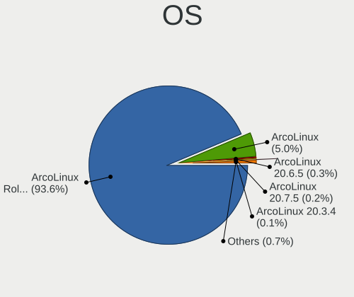

| Name                  | Computers | Percent |
|-----------------------|-----------|---------|
| ArcoLinux Rolling     | 3329      | 93.64%  |
| ArcoLinux             | 178       | 5.01%   |
| ArcoLinux 20.6.5      | 11        | 0.31%   |
| ArcoLinux 20.7.5      | 8         | 0.23%   |
| ArcoLinux 20.3.4      | 4         | 0.11%   |
| ArcoLinux 20.3.3      | 3         | 0.08%   |
| ArcoLinux 20.2.12     | 3         | 0.08%   |
| ArcoLinux 19.12.15    | 3         | 0.08%   |
| ArcoLinux 19.07.11    | 3         | 0.08%   |
| ArcoLinux 20.1.4      | 2         | 0.06%   |
| ArcoLinux 19.02.4     | 2         | 0.06%   |
| ArcoLinux I3-v19.02.4 | 1         | 0.03%   |
| ArcoLinux 6.9.2       | 1         | 0.03%   |
| ArcoLinux 6.9.1       | 1         | 0.03%   |
| ArcoLinux 20.5.7      | 1         | 0.03%   |
| ArcoLinux 20.5.2      | 1         | 0.03%   |
| ArcoLinux 20.4.11     | 1         | 0.03%   |
| ArcoLinux 20.2.9      | 1         | 0.03%   |
| ArcoLinux 19.11.3     | 1         | 0.03%   |
| ArcoLinux 19.03.3     | 1         | 0.03%   |

OS Family
---------

OS without a version

| Name      | Computers | Percent |
|-----------|-----------|---------|
| ArcoLinux | 3525      | 100%    |

Kernel
------

Version of the Linux kernel

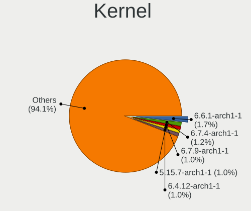

| Version            | Computers | Percent |
|--------------------|-----------|---------|
| 6.6.1-arch1-1      | 80        | 1.7%    |
| 6.7.4-arch1-1      | 58        | 1.23%   |
| 6.7.9-arch1-1      | 47        | 1%      |
| 5.15.7-arch1-1     | 47        | 1%      |
| 6.4.12-arch1-1     | 46        | 0.98%   |
| 6.7.0-arch3-1      | 44        | 0.94%   |
| 6.3.8-arch1-1      | 40        | 0.85%   |
| 5.15.10-arch1-1    | 38        | 0.81%   |
| 5.13.13-arch1-1    | 38        | 0.81%   |
| 6.6.8-arch1-1      | 35        | 0.74%   |
| 6.5.9-arch2-1      | 34        | 0.72%   |
| 6.8.1-arch1-1      | 32        | 0.68%   |
| 6.5.8-arch1-1      | 32        | 0.68%   |
| 6.4.11-arch1-1     | 32        | 0.68%   |
| 6.3.9-arch1-1      | 30        | 0.64%   |
| 6.2.11-arch1-1     | 29        | 0.62%   |
| 6.8.2-arch2-1      | 28        | 0.6%    |
| 6.5.3-arch1-1      | 27        | 0.57%   |
| 6.3.2-arch1-1      | 26        | 0.55%   |
| 5.16.11-arch1-1    | 26        | 0.55%   |
| 5.14.14-arch1-1    | 26        | 0.55%   |
| 6.9.4-1-cachyos    | 25        | 0.53%   |
| 6.2.8-arch1-1      | 25        | 0.53%   |
| 6.9.5-zen1-1-zen   | 23        | 0.49%   |
| 6.10.4-1-cachyos   | 23        | 0.49%   |
| 6.6.7-arch1-1      | 22        | 0.47%   |
| 6.5.5-arch1-1      | 22        | 0.47%   |
| 5.13.12-arch1-1    | 22        | 0.47%   |
| 6.3.3-arch1-1      | 21        | 0.45%   |
| 6.10.10-zen1-1-zen | 21        | 0.45%   |
| 5.14.12-arch1-1    | 21        | 0.45%   |
| 6.8.7-arch1-1      | 20        | 0.43%   |
| 6.5.7-arch1-1      | 20        | 0.43%   |
| 6.4.10-arch1-1     | 20        | 0.43%   |
| 6.12.1-zen1-1-zen  | 20        | 0.43%   |
| 6.10.10-arch1-1    | 20        | 0.43%   |
| 6.1.12-arch1-1     | 20        | 0.43%   |
| 6.6.3-arch1-1      | 19        | 0.4%    |
| 6.4.11-arch2-1     | 19        | 0.4%    |
| 6.3.7-arch1-1      | 19        | 0.4%    |

Kernel Family
-------------

Linux kernel without a distro release

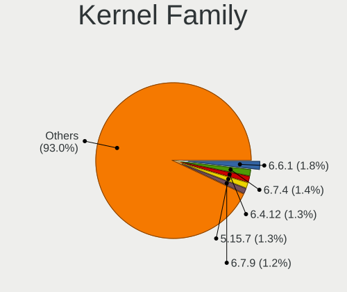

| Version | Computers | Percent |
|---------|-----------|---------|
| 6.6.1   | 84        | 1.79%   |
| 6.7.4   | 67        | 1.43%   |
| 6.4.12  | 62        | 1.32%   |
| 5.15.7  | 59        | 1.26%   |
| 6.7.9   | 57        | 1.21%   |
| 6.3.8   | 57        | 1.21%   |
| 6.4.11  | 56        | 1.19%   |
| 6.7.0   | 52        | 1.11%   |
| 6.6.8   | 46        | 0.98%   |
| 6.9.1   | 42        | 0.89%   |
| 6.8.7   | 42        | 0.89%   |
| 6.8.2   | 42        | 0.89%   |
| 6.10.10 | 42        | 0.89%   |
| 6.8.9   | 41        | 0.87%   |
| 6.5.3   | 40        | 0.85%   |
| 5.15.10 | 40        | 0.85%   |
| 6.5.9   | 39        | 0.83%   |
| 6.10.4  | 38        | 0.81%   |
| 5.13.13 | 38        | 0.81%   |
| 6.9.5   | 37        | 0.79%   |
| 6.8.5   | 37        | 0.79%   |
| 6.8.1   | 36        | 0.77%   |
| 6.3.2   | 35        | 0.74%   |
| 6.5.8   | 34        | 0.72%   |
| 6.3.9   | 34        | 0.72%   |
| 6.5.5   | 33        | 0.7%    |
| 6.3.1   | 33        | 0.7%    |
| 6.2.11  | 33        | 0.7%    |
| 6.6.7   | 31        | 0.66%   |
| 6.3.3   | 29        | 0.62%   |
| 6.12.1  | 29        | 0.62%   |
| 5.16.11 | 29        | 0.62%   |
| 6.2.8   | 28        | 0.6%    |
| 6.1.12  | 28        | 0.6%    |
| 6.9.4   | 27        | 0.57%   |
| 6.13.5  | 27        | 0.57%   |
| 6.5.7   | 26        | 0.55%   |
| 6.11.2  | 26        | 0.55%   |
| 5.14.14 | 26        | 0.55%   |
| 6.3.5   | 25        | 0.53%   |

Kernel Major Ver.
-----------------

Linux kernel major version

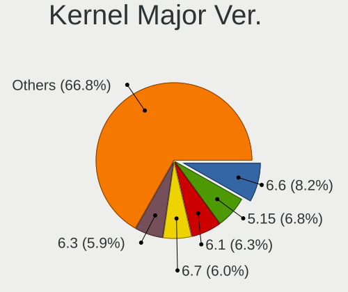

| Version | Computers | Percent |
|---------|-----------|---------|
| 6.6     | 365       | 8.21%   |
| 5.15    | 302       | 6.79%   |
| 6.1     | 282       | 6.34%   |
| 6.7     | 265       | 5.96%   |
| 6.3     | 263       | 5.91%   |
| 6.4     | 254       | 5.71%   |
| 6.8     | 221       | 4.97%   |
| 5.10    | 215       | 4.83%   |
| 6.5     | 201       | 4.52%   |
| 6.9     | 182       | 4.09%   |
| 6.12    | 162       | 3.64%   |
| 6.10    | 157       | 3.53%   |
| 6.2     | 151       | 3.39%   |
| 5.16    | 133       | 2.99%   |
| 5.14    | 131       | 2.95%   |
| 6.11    | 125       | 2.81%   |
| 6.0     | 122       | 2.74%   |
| 6.13    | 115       | 2.59%   |
| 5.13    | 112       | 2.52%   |
| 5.9     | 109       | 2.45%   |
| 5.12    | 105       | 2.36%   |
| 5.17    | 92        | 2.07%   |
| 5.18    | 89        | 2%      |
| 5.11    | 78        | 1.75%   |
| 5.19    | 72        | 1.62%   |
| 5.4     | 59        | 1.33%   |
| 5.8     | 34        | 0.76%   |
| 6.14    | 10        | 0.22%   |
| 5.6     | 7         | 0.16%   |
| 5.7     | 6         | 0.13%   |
| 5.5     | 5         | 0.11%   |
| 5.3     | 3         | 0.07%   |
| 5.0     | 3         | 0.07%   |
| 6.3.3   | 2         | 0.04%   |
| 6.16    | 2         | 0.04%   |
| 6.15    | 2         | 0.04%   |
| 5.15.96 | 2         | 0.04%   |
| 4.19    | 2         | 0.04%   |
| 6.5.2   | 1         | 0.02%   |
| 6.3.0   | 1         | 0.02%   |

Arch
----

OS architecture (x86_64, i586, etc.)

| Name   | Computers | Percent |
|--------|-----------|---------|
| x86_64 | 3525      | 100%    |

DE
--

Desktop Environment

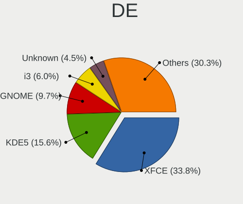

| Name           | Computers | Percent |
|----------------|-----------|---------|
| XFCE           | 1334      | 33.82%  |
| KDE5           | 617       | 15.64%  |
| GNOME          | 384       | 9.74%   |
| i3             | 235       | 5.96%   |
| Unknown        | 178       | 4.51%   |
| Cinnamon       | 144       | 3.65%   |
| awesome        | 133       | 3.37%   |
| KDE6           | 101       | 2.56%   |
| qtile          | 92        | 2.33%   |
| Hyprland       | 88        | 2.23%   |
| X-Cinnamon     | 81        | 2.05%   |
| bspwm          | 73        | 1.85%   |
| Deepin         | 64        | 1.62%   |
| Budgie         | 61        | 1.55%   |
| xmonad         | 57        | 1.45%   |
| DWM            | 48        | 1.22%   |
| LXQt           | 39        | 0.99%   |
| LeftWM         | 36        | 0.91%   |
| KDE            | 32        | 0.81%   |
| MATE           | 31        | 0.79%   |
| chadwm         | 31        | 0.79%   |
| herbstluftwm   | 14        | 0.35%   |
| i3-with-shmlog | 13        | 0.33%   |
| sway           | 12        | 0.3%    |
| wayfire        | 6         | 0.15%   |
| Cutefish       | 5         | 0.13%   |
| Openbox        | 4         | 0.1%    |
| ICEWM          | 4         | 0.1%    |
| Unity          | 3         | 0.08%   |
| spectrwm       | 3         | 0.08%   |
| Hypr           | 3         | 0.08%   |
| cwm            | 3         | 0.08%   |
| Niri           | 2         | 0.05%   |
| GNOME Classic  | 2         | 0.05%   |
| dusk           | 2         | 0.05%   |
| dk             | 2         | 0.05%   |
| XFCE:GNOME:    | 1         | 0.03%   |
| river          | 1         | 0.03%   |
| Pantheon       | 1         | 0.03%   |
| LXDE           | 1         | 0.03%   |

Display Server
--------------

X11 or Wayland

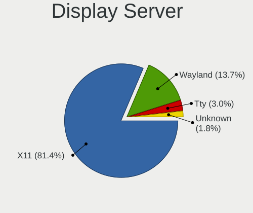

| Name    | Computers | Percent |
|---------|-----------|---------|
| X11     | 2992      | 81.41%  |
| Wayland | 504       | 13.71%  |
| Tty     | 112       | 3.05%   |
| Unknown | 67        | 1.82%   |

Display Manager
---------------

SDDM, LightDM, etc.

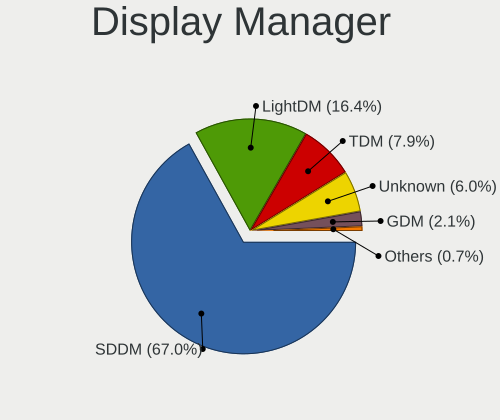

| Name    | Computers | Percent |
|---------|-----------|---------|
| SDDM    | 2502      | 66.95%  |
| LightDM | 612       | 16.38%  |
| TDM     | 295       | 7.89%   |
| Unknown | 223       | 5.97%   |
| GDM     | 80        | 2.14%   |
| Ly      | 12        | 0.32%   |
| LXDM    | 11        | 0.29%   |
| XDM     | 1         | 0.03%   |
| SLiM    | 1         | 0.03%   |

OS Lang
-------

Language

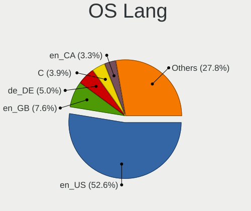

| Lang    | Computers | Percent |
|---------|-----------|---------|
| en_US   | 1893      | 52.55%  |
| en_GB   | 272       | 7.55%   |
| de_DE   | 179       | 4.97%   |
| C       | 139       | 3.86%   |
| en_CA   | 118       | 3.28%   |
| ru_RU   | 92        | 2.55%   |
| en_IN   | 86        | 2.39%   |
| fr_FR   | 70        | 1.94%   |
| pt_BR   | 68        | 1.89%   |
| en_AU   | 66        | 1.83%   |
| es_ES   | 65        | 1.8%    |
| it_IT   | 50        | 1.39%   |
| es_MX   | 43        | 1.19%   |
| pl_PL   | 37        | 1.03%   |
| tr_TR   | 28        | 0.78%   |
| hu_HU   | 28        | 0.78%   |
| es_AR   | 28        | 0.78%   |
| en_ZA   | 28        | 0.78%   |
| sv_SE   | 18        | 0.5%    |
| zh_CN   | 17        | 0.47%   |
| nl_NL   | 17        | 0.47%   |
| Unknown | 15        | 0.42%   |
| en_DK   | 13        | 0.36%   |
| en_PH   | 11        | 0.31%   |
| de_AT   | 11        | 0.31%   |
| fr_CA   | 10        | 0.28%   |
| en_IE   | 10        | 0.28%   |
| nl_BE   | 9         | 0.25%   |
| ja_JP   | 9         | 0.25%   |
| en_IL   | 9         | 0.25%   |
| de_ch   | 9         | 0.25%   |
| da_DK   | 9         | 0.25%   |
| pt_PT   | 8         | 0.22%   |
| fi_FI   | 8         | 0.22%   |
| cs_CZ   | 8         | 0.22%   |
| ru_UA   | 7         | 0.19%   |
| nb_NO   | 7         | 0.19%   |
| uk_UA   | 6         | 0.17%   |
| en_SG   | 6         | 0.17%   |
| fr_BE   | 5         | 0.14%   |

Boot Mode
---------

EFI or BIOS

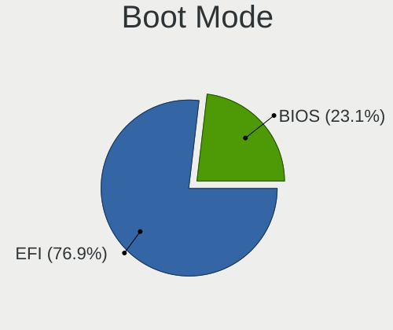

| Mode | Computers | Percent |
|------|-----------|---------|
| EFI  | 2753      | 76.86%  |
| BIOS | 829       | 23.14%  |

Filesystem
----------

Type of filesystem

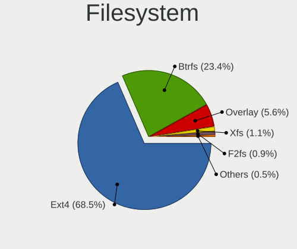

| Type     | Computers | Percent |
|----------|-----------|---------|
| Ext4     | 2512      | 68.52%  |
| Btrfs    | 857       | 23.38%  |
| Overlay  | 204       | 5.56%   |
| Xfs      | 42        | 1.15%   |
| F2fs     | 32        | 0.87%   |
| Unknown  | 11        | 0.3%    |
| Jfs      | 4         | 0.11%   |
| Reiserfs | 3         | 0.08%   |
| Tmpfs    | 1         | 0.03%   |

Part. scheme
------------

Scheme of partitioning

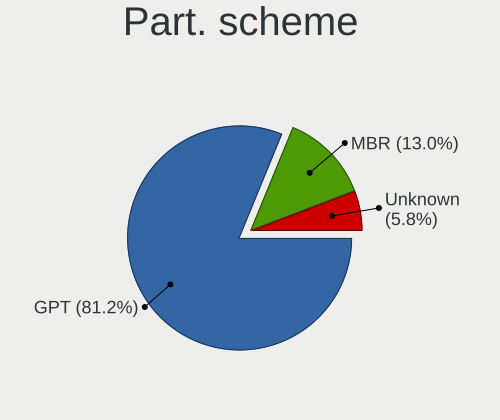

| Type    | Computers | Percent |
|---------|-----------|---------|
| GPT     | 2911      | 81.2%   |
| MBR     | 466       | 13%     |
| Unknown | 208       | 5.8%    |

Dual Boot with Linux/BSD
------------------------

Hosting more than one Linux/BSD

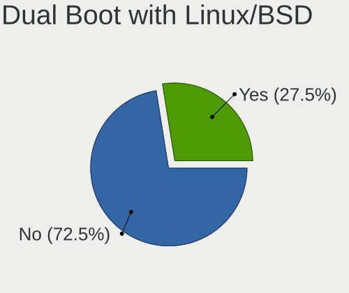

| Dual boot | Computers | Percent |
|-----------|-----------|---------|
| No        | 2670      | 72.48%  |
| Yes       | 1014      | 27.52%  |

Dual Boot (Win)
---------------

Hosting Linux and Windows

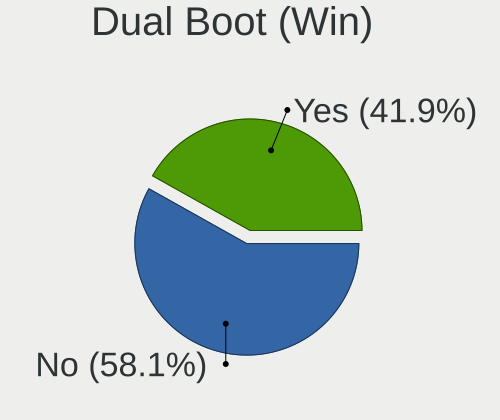

| Dual boot | Computers | Percent |
|-----------|-----------|---------|
| No        | 2098      | 58.13%  |
| Yes       | 1511      | 41.87%  |

Board
-----

Vendor
------

Motherboard manufacturer

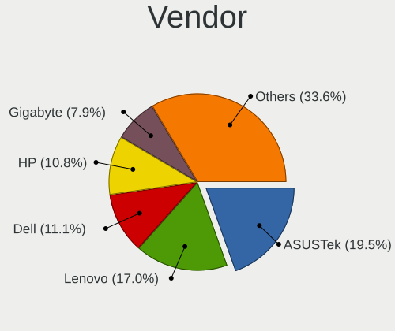

| Name                                 | Computers | Percent |
|--------------------------------------|-----------|---------|
| ASUSTek Computer                     | 689       | 19.55%  |
| Lenovo                               | 600       | 17.02%  |
| Dell                                 | 392       | 11.12%  |
| Hewlett-Packard                      | 381       | 10.81%  |
| Gigabyte Technology                  | 280       | 7.94%   |
| MSI                                  | 278       | 7.89%   |
| Acer                                 | 151       | 4.28%   |
| ASRock                               | 141       | 4%      |
| Apple                                | 89        | 2.52%   |
| Intel                                | 42        | 1.19%   |
| Toshiba                              | 34        | 0.96%   |
| Unknown                              | 30        | 0.85%   |
| Samsung Electronics                  | 26        | 0.74%   |
| Fujitsu                              | 21        | 0.6%    |
| AZW                                  | 20        | 0.57%   |
| Supermicro                           | 19        | 0.54%   |
| Sony                                 | 17        | 0.48%   |
| HUAWEI                               | 17        | 0.48%   |
| Medion                               | 16        | 0.45%   |
| System76                             | 14        | 0.4%    |
| Razer                                | 14        | 0.4%    |
| Alienware                            | 12        | 0.34%   |
| TUXEDO                               | 11        | 0.31%   |
| Notebook                             | 11        | 0.31%   |
| Packard Bell                         | 10        | 0.28%   |
| Microsoft                            | 10        | 0.28%   |
| Biostar                              | 10        | 0.28%   |
| Google                               | 9         | 0.26%   |
| Chuwi                                | 9         | 0.26%   |
| Timi                                 | 8         | 0.23%   |
| Framework                            | 7         | 0.2%    |
| BESSTAR Tech                         | 7         | 0.2%    |
| Shenzhen Meigao Electronic Equipment | 6         | 0.17%   |
| Pegatron                             | 6         | 0.17%   |
| Huanan                               | 6         | 0.17%   |
| Foxconn                              | 6         | 0.17%   |
| Schenker                             | 5         | 0.14%   |
| Monster                              | 5         | 0.14%   |
| ZOTAC                                | 4         | 0.11%   |
| Casper                               | 4         | 0.11%   |

Model
-----

Motherboard model

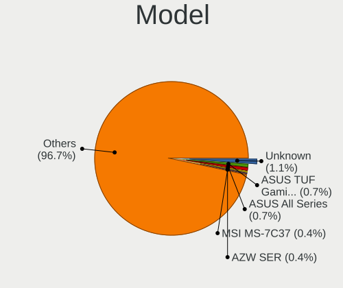

| Name                             | Computers | Percent |
|----------------------------------|-----------|---------|
| Unknown                          | 40        | 1.13%   |
| ASUS TUF Gaming X570-PLUS        | 26        | 0.74%   |
| ASUS All Series                  | 26        | 0.74%   |
| MSI MS-7C37                      | 13        | 0.37%   |
| AZW SER                          | 13        | 0.37%   |
| ASUS ROG STRIX B550-F GAMING     | 13        | 0.37%   |
| ASUS PRIME X570-P                | 13        | 0.37%   |
| MSI MS-7C91                      | 11        | 0.31%   |
| MSI MS-7C56                      | 11        | 0.31%   |
| MSI MS-7B79                      | 11        | 0.31%   |
| Gigabyte X570 AORUS ELITE        | 11        | 0.31%   |
| Supermicro SYS-5019A-FTN4        | 10        | 0.28%   |
| MSI MS-7B89                      | 10        | 0.28%   |
| HP Pavilion Notebook             | 10        | 0.28%   |
| Dell OptiPlex 7010               | 10        | 0.28%   |
| MSI MS-7C02                      | 9         | 0.26%   |
| HP Notebook                      | 9         | 0.26%   |
| Gigabyte X570 AORUS MASTER       | 9         | 0.26%   |
| MSI MS-7B86                      | 8         | 0.23%   |
| MSI MS-7A38                      | 8         | 0.23%   |
| Gigabyte B450 AORUS ELITE        | 8         | 0.23%   |
| ASUS ROG STRIX B450-F GAMING     | 8         | 0.23%   |
| ASUS ROG CROSSHAIR VIII HERO     | 8         | 0.23%   |
| ASUS PRIME X470-PRO              | 8         | 0.23%   |
| HP Laptop 15s-eq2xxx             | 7         | 0.2%    |
| HP EliteBook 840 G3              | 7         | 0.2%    |
| Gigabyte X570 GAMING X           | 7         | 0.2%    |
| ASUS Z170 PRO GAMING             | 7         | 0.2%    |
| ASUS PRIME A320M-K               | 7         | 0.2%    |
| ASRock B450M Pro4                | 7         | 0.2%    |
| Apple MacBookAir7,2              | 7         | 0.2%    |
| Razer Blade                      | 6         | 0.17%   |
| Lenovo Legion 5 Pro 16ACH6H 82JQ | 6         | 0.17%   |
| Gigabyte X570 AORUS PRO WIFI     | 6         | 0.17%   |
| Gigabyte B450M DS3H V2           | 6         | 0.17%   |
| Dell OptiPlex 9020               | 6         | 0.17%   |
| Dell OptiPlex 9010               | 6         | 0.17%   |
| ASUS PRIME B450M-A               | 6         | 0.17%   |
| Apple MacBookPro9,2              | 6         | 0.17%   |
| Apple MacBookPro11,1             | 6         | 0.17%   |

Model Family
------------

Motherboard model prefix

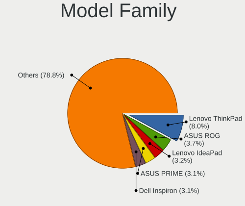

| Name               | Computers | Percent |
|--------------------|-----------|---------|
| Lenovo ThinkPad    | 281       | 7.97%   |
| ASUS ROG           | 132       | 3.74%   |
| Lenovo IdeaPad     | 113       | 3.21%   |
| ASUS PRIME         | 111       | 3.15%   |
| Dell Inspiron      | 109       | 3.09%   |
| Dell Latitude      | 97        | 2.75%   |
| ASUS TUF           | 92        | 2.61%   |
| Acer Aspire        | 81        | 2.3%    |
| HP Pavilion        | 72        | 2.04%   |
| ASUS VivoBook      | 62        | 1.76%   |
| Dell OptiPlex      | 59        | 1.67%   |
| Lenovo Legion      | 51        | 1.45%   |
| HP Laptop          | 51        | 1.45%   |
| Dell XPS           | 44        | 1.25%   |
| HP EliteBook       | 43        | 1.22%   |
| Unknown            | 40        | 1.13%   |
| Gigabyte X570      | 36        | 1.02%   |
| Dell Precision     | 36        | 1.02%   |
| Lenovo ThinkCentre | 35        | 0.99%   |
| Toshiba Satellite  | 30        | 0.85%   |
| HP ENVY            | 29        | 0.82%   |
| Lenovo Yoga        | 27        | 0.77%   |
| ASUS ASUS          | 26        | 0.74%   |
| ASUS All           | 26        | 0.74%   |
| Dell Vostro        | 25        | 0.71%   |
| Gigabyte B450M     | 22        | 0.62%   |
| Acer Nitro         | 22        | 0.62%   |
| HP ProBook         | 21        | 0.6%    |
| HP OMEN            | 19        | 0.54%   |
| Gigabyte B450      | 17        | 0.48%   |
| ASUS ZenBook       | 17        | 0.48%   |
| HP Compaq          | 16        | 0.45%   |
| Acer Predator      | 16        | 0.45%   |
| HP EliteDesk       | 15        | 0.43%   |
| HP ProDesk         | 14        | 0.4%    |
| Gigabyte B550      | 14        | 0.4%    |
| ASRock B450M       | 14        | 0.4%    |
| Razer Blade        | 13        | 0.37%   |
| MSI MS-7C37        | 13        | 0.37%   |
| Lenovo ThinkBook   | 13        | 0.37%   |

MFG Year
--------

Motherboard manufacture year

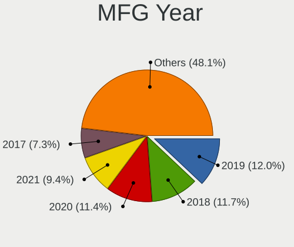

| Year    | Computers | Percent |
|---------|-----------|---------|
| 2019    | 424       | 12.03%  |
| 2018    | 414       | 11.74%  |
| 2020    | 403       | 11.43%  |
| 2021    | 330       | 9.36%   |
| 2017    | 257       | 7.29%   |
| 2012    | 221       | 6.27%   |
| 2013    | 220       | 6.24%   |
| 2022    | 205       | 5.82%   |
| 2016    | 189       | 5.36%   |
| 2015    | 175       | 4.96%   |
| 2014    | 165       | 4.68%   |
| 2011    | 162       | 4.6%    |
| 2023    | 104       | 2.95%   |
| 2010    | 99        | 2.81%   |
| 2008    | 51        | 1.45%   |
| 2009    | 42        | 1.19%   |
| 2024    | 30        | 0.85%   |
| 2007    | 14        | 0.4%    |
| 2006    | 14        | 0.4%    |
| 2025    | 3         | 0.09%   |
| 2005    | 1         | 0.03%   |
| 2004    | 1         | 0.03%   |
| Unknown | 1         | 0.03%   |

Form Factor
-----------

Physical design of the computer

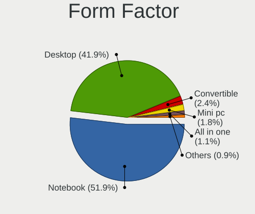

| Name        | Computers | Percent |
|-------------|-----------|---------|
| Notebook    | 1828      | 51.86%  |
| Desktop     | 1478      | 41.93%  |
| Convertible | 85        | 2.41%   |
| Mini pc     | 64        | 1.82%   |
| All in one  | 40        | 1.13%   |
| Tablet      | 20        | 0.57%   |
| Server      | 9         | 0.26%   |
| Stick pc    | 1         | 0.03%   |

Secure Boot
-----------

Enabled or disabled

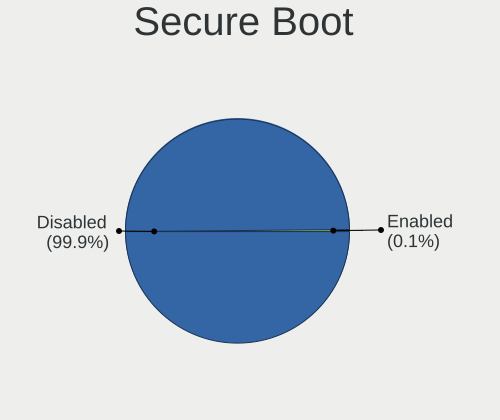

| State    | Computers | Percent |
|----------|-----------|---------|
| Disabled | 3521      | 99.86%  |
| Enabled  | 5         | 0.14%   |

Coreboot
--------

Have coreboot on board

| Used | Computers | Percent |
|------|-----------|---------|
| No   | 3507      | 99.49%  |
| Yes  | 18        | 0.51%   |

RAM Size
--------

Total RAM memory

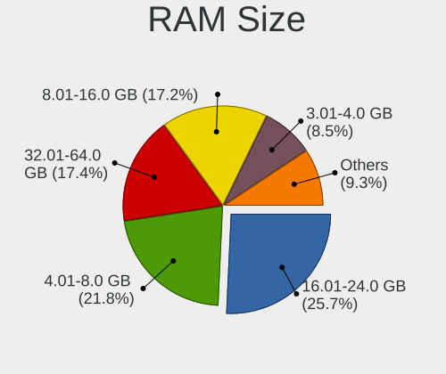

| Size in GB      | Computers | Percent |
|-----------------|-----------|---------|
| 16.01-24.0      | 923       | 25.72%  |
| 4.01-8.0        | 783       | 21.82%  |
| 32.01-64.0      | 626       | 17.45%  |
| 8.01-16.0       | 617       | 17.2%   |
| 3.01-4.0        | 304       | 8.47%   |
| 64.01-256.0     | 181       | 5.04%   |
| 24.01-32.0      | 104       | 2.9%    |
| 1.01-2.0        | 28        | 0.78%   |
| 2.01-3.0        | 18        | 0.5%    |
| More than 256.0 | 3         | 0.08%   |
| Unknown         | 1         | 0.03%   |

RAM Used
--------

Used RAM memory

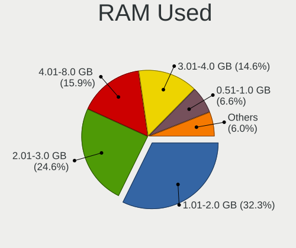

| Used GB         | Computers | Percent |
|-----------------|-----------|---------|
| 1.01-2.0        | 1330      | 32.27%  |
| 2.01-3.0        | 1012      | 24.56%  |
| 4.01-8.0        | 655       | 15.89%  |
| 3.01-4.0        | 603       | 14.63%  |
| 0.51-1.0        | 273       | 6.62%   |
| 8.01-16.0       | 185       | 4.49%   |
| 0.01-0.5        | 29        | 0.7%    |
| 16.01-24.0      | 24        | 0.58%   |
| 24.01-32.0      | 4         | 0.1%    |
| 32.01-64.0      | 2         | 0.05%   |
| 64.01-256.0     | 2         | 0.05%   |
| More than 256.0 | 1         | 0.02%   |
| Unknown         | 1         | 0.02%   |

Total Drives
------------

Number of drives on board

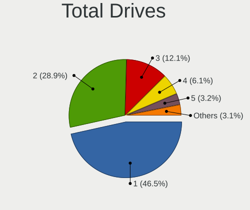

| Drives | Computers | Percent |
|--------|-----------|---------|
| 1      | 1721      | 46.54%  |
| 2      | 1069      | 28.91%  |
| 3      | 448       | 12.11%  |
| 4      | 224       | 6.06%   |
| 5      | 120       | 3.24%   |
| 6      | 51        | 1.38%   |
| 7      | 22        | 0.59%   |
| 8      | 12        | 0.32%   |
| 0      | 12        | 0.32%   |
| 9      | 7         | 0.19%   |
| 11     | 3         | 0.08%   |
| 10     | 2         | 0.05%   |
| 29     | 1         | 0.03%   |
| 21     | 1         | 0.03%   |
| 20     | 1         | 0.03%   |
| 19     | 1         | 0.03%   |
| 14     | 1         | 0.03%   |
| 13     | 1         | 0.03%   |
| 12     | 1         | 0.03%   |

Has CD-ROM
----------

Has CD-ROM on board

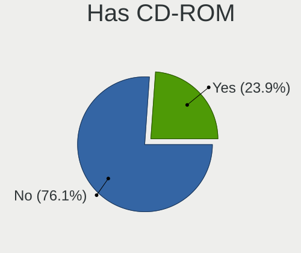

| Presented | Computers | Percent |
|-----------|-----------|---------|
| No        | 2706      | 76.12%  |
| Yes       | 849       | 23.88%  |

Has Ethernet
------------

Has Ethernet on board

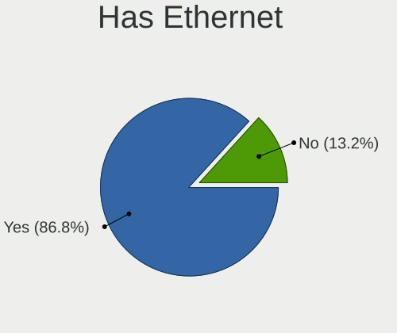

| Presented | Computers | Percent |
|-----------|-----------|---------|
| Yes       | 3071      | 86.75%  |
| No        | 469       | 13.25%  |

Has WiFi
--------

Has WiFi module

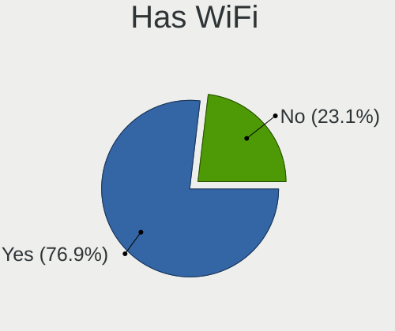

| Presented | Computers | Percent |
|-----------|-----------|---------|
| Yes       | 2728      | 76.87%  |
| No        | 821       | 23.13%  |

Has Bluetooth
-------------

Has Bluetooth module

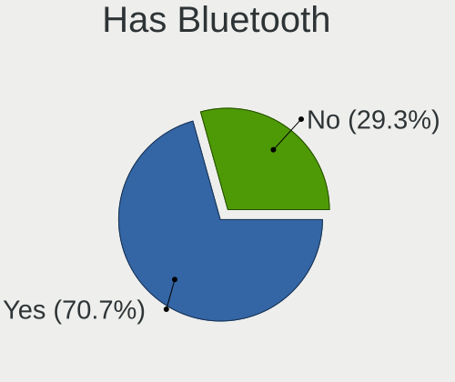

| Presented | Computers | Percent |
|-----------|-----------|---------|
| Yes       | 2532      | 70.69%  |
| No        | 1050      | 29.31%  |

Location
--------

Country
-------

Geographic location (country)

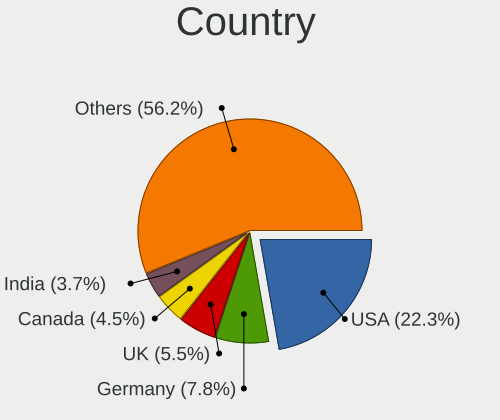

| Country      | Computers | Percent |
|--------------|-----------|---------|
| USA          | 793       | 22.27%  |
| Germany      | 278       | 7.81%   |
| UK           | 197       | 5.53%   |
| Canada       | 159       | 4.47%   |
| India        | 133       | 3.73%   |
| Brazil       | 123       | 3.45%   |
| Russia       | 108       | 3.03%   |
| France       | 96        | 2.7%    |
| Spain        | 95        | 2.67%   |
| Australia    | 79        | 2.22%   |
| Italy        | 77        | 2.16%   |
| Netherlands  | 67        | 1.88%   |
| Turkey       | 66        | 1.85%   |
| Belgium      | 66        | 1.85%   |
| Sweden       | 65        | 1.83%   |
| Poland       | 64        | 1.8%    |
| Mexico       | 61        | 1.71%   |
| Hungary      | 48        | 1.35%   |
| Argentina    | 48        | 1.35%   |
| Switzerland  | 38        | 1.07%   |
| Romania      | 36        | 1.01%   |
| Norway       | 34        | 0.95%   |
| Indonesia    | 33        | 0.93%   |
| Portugal     | 32        | 0.9%    |
| South Africa | 30        | 0.84%   |
| Austria      | 28        | 0.79%   |
| Ukraine      | 26        | 0.73%   |
| Greece       | 26        | 0.73%   |
| Czechia      | 26        | 0.73%   |
| Bulgaria     | 26        | 0.73%   |
| Finland      | 25        | 0.7%    |
| Denmark      | 25        | 0.7%    |
| China        | 25        | 0.7%    |
| Colombia     | 20        | 0.56%   |
| Vietnam      | 19        | 0.53%   |
| Iran         | 19        | 0.53%   |
| Egypt        | 19        | 0.53%   |
| Serbia       | 18        | 0.51%   |
| Philippines  | 17        | 0.48%   |
| Japan        | 15        | 0.42%   |

City
----

Geographic location (city)

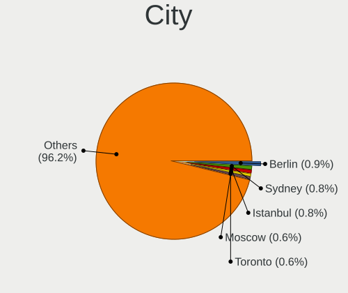

| City              | Computers | Percent |
|-------------------|-----------|---------|
| Berlin            | 36        | 0.93%   |
| Sydney            | 32        | 0.83%   |
| Istanbul          | 30        | 0.78%   |
| Moscow            | 25        | 0.65%   |
| Toronto           | 24        | 0.62%   |
| Amsterdam         | 20        | 0.52%   |
| Madrid            | 19        | 0.49%   |
| Stockholm         | 18        | 0.47%   |
| Durham            | 18        | 0.47%   |
| Budapest          | 18        | 0.47%   |
| Warsaw            | 17        | 0.44%   |
| Vienna            | 17        | 0.44%   |
| Paris             | 17        | 0.44%   |
| New York          | 17        | 0.44%   |
| Melbourne         | 17        | 0.44%   |
| Sao Paulo         | 16        | 0.41%   |
| Helsinki          | 16        | 0.41%   |
| Los Angeles       | 15        | 0.39%   |
| Bengaluru         | 15        | 0.39%   |
| Tehran            | 14        | 0.36%   |
| Pune              | 14        | 0.36%   |
| Houston           | 14        | 0.36%   |
| Dallas            | 14        | 0.36%   |
| Athens            | 14        | 0.36%   |
| Sofia             | 13        | 0.34%   |
| Portland          | 13        | 0.34%   |
| Frankfurt am Main | 13        | 0.34%   |
| Bucharest         | 13        | 0.34%   |
| Brisbane          | 13        | 0.34%   |
| Atlanta           | 13        | 0.34%   |
| Zurich            | 12        | 0.31%   |
| Rio de Janeiro    | 12        | 0.31%   |
| Prague            | 12        | 0.31%   |
| Oslo              | 12        | 0.31%   |
| Hamburg           | 12        | 0.31%   |
| Denver            | 12        | 0.31%   |
| Spokane           | 11        | 0.28%   |
| London            | 11        | 0.28%   |
| Lier              | 11        | 0.28%   |
| Kolkata           | 11        | 0.28%   |

Drives
------

Drive Vendor
------------

Hard drive vendors

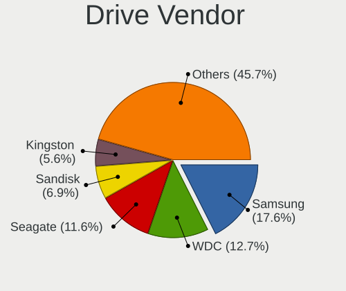

| Vendor                      | Computers | Drives | Percent |
|-----------------------------|-----------|--------|---------|
| Samsung Electronics         | 1083      | 1993   | 17.56%  |
| WDC                         | 783       | 1376   | 12.69%  |
| Seagate                     | 716       | 1170   | 11.61%  |
| Sandisk                     | 425       | 587    | 6.89%   |
| Kingston                    | 345       | 567    | 5.59%   |
| Toshiba                     | 323       | 438    | 5.24%   |
| Crucial                     | 230       | 348    | 3.73%   |
| SK hynix                    | 172       | 228    | 2.79%   |
| Intel                       | 159       | 235    | 2.58%   |
| Unknown                     | 141       | 201    | 2.29%   |
| Phison Electronics          | 112       | 174    | 1.82%   |
| Micron Technology           | 105       | 127    | 1.7%    |
| Hitachi                     | 105       | 141    | 1.7%    |
| A-DATA Technology           | 94        | 126    | 1.52%   |
| Micron/Crucial Technology   | 91        | 138    | 1.48%   |
| HGST                        | 78        | 126    | 1.26%   |
| Kingston Technology Company | 65        | 97     | 1.05%   |
| China                       | 60        | 84     | 0.97%   |
| Silicon Motion              | 54        | 82     | 0.88%   |
| KIOXIA                      | 54        | 79     | 0.88%   |
| Apple                       | 54        | 85     | 0.88%   |
| PNY                         | 47        | 68     | 0.76%   |
| MAXIO Technology (Hangzhou) | 40        | 58     | 0.65%   |
| SPCC                        | 36        | 45     | 0.58%   |
| JMicron Technology          | 36        | 40     | 0.58%   |
| ADATA Technology            | 36        | 46     | 0.58%   |
| Phison                      | 31        | 48     | 0.5%    |
| Patriot                     | 26        | 38     | 0.42%   |
| LITEON                      | 24        | 34     | 0.39%   |
| Intenso                     | 24        | 34     | 0.39%   |
| Transcend                   | 23        | 28     | 0.37%   |
| SABRENT                     | 22        | 29     | 0.36%   |
| Hewlett-Packard             | 22        | 33     | 0.36%   |
| Realtek Semiconductor       | 21        | 28     | 0.34%   |
| Corsair                     | 21        | 40     | 0.34%   |
| Team                        | 17        | 26     | 0.28%   |
| Plextor                     | 17        | 21     | 0.28%   |
| OCZ                         | 17        | 22     | 0.28%   |
| Lexar                       | 17        | 17     | 0.28%   |
| Gigabyte Technology         | 17        | 21     | 0.28%   |

Drive Model
-----------

Hard drive models

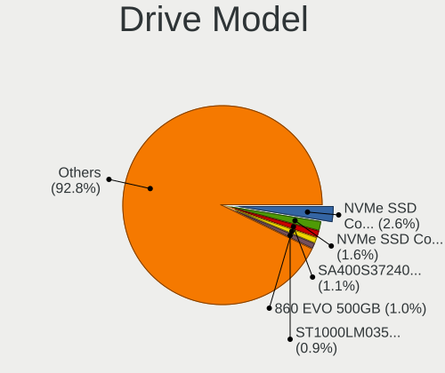

| Model                                                 | Computers | Percent |
|-------------------------------------------------------|-----------|---------|
| Samsung NVMe SSD Controller SM981/PM981/PM983 1TB     | 180       | 2.58%   |
| Samsung NVMe SSD Controller PM9A1/PM9A3/980PRO 1TB    | 108       | 1.55%   |
| Kingston SA400S37240G 240GB SSD                       | 78        | 1.12%   |
| Samsung SSD 860 EVO 500GB                             | 70        | 1.01%   |
| Seagate ST1000LM035-1RK172 1TB                        | 65        | 0.93%   |
| Kingston SA400S37480G 480GB SSD                       | 58        | 0.83%   |
| Micron/Crucial P2 NVMe PCIe SSD 2TB                   | 55        | 0.79%   |
| Samsung SSD 850 EVO 250GB                             | 51        | 0.73%   |
| Samsung SSD 860 EVO 1TB                               | 50        | 0.72%   |
| Sandisk WD Blue SN550 NVMe SSD 1024GB                 | 47        | 0.67%   |
| Samsung SSD 850 EVO 500GB                             | 46        | 0.66%   |
| Crucial CT1000MX500SSD1 1TB                           | 46        | 0.66%   |
| Seagate ST1000DM010-2EP102 1TB                        | 45        | 0.65%   |
| Phison E12 NVMe Controller 1TB                        | 44        | 0.63%   |
| Toshiba MQ01ABD100 1TB                                | 43        | 0.62%   |
| Seagate ST2000DM008-2FR102 2TB                        | 40        | 0.57%   |
| WDC WD10EZEX-08WN4A0 1TB                              | 39        | 0.56%   |
| Samsung NVMe SSD Controller SM961/PM961/SM963 1024GB  | 39        | 0.56%   |
| Crucial CT500MX500SSD1 500GB                          | 37        | 0.53%   |
| Sandisk WD Black SN750 / PC SN730 NVMe SSD 500GB      | 35        | 0.5%    |
| Samsung SSD 860 EVO 250GB                             | 35        | 0.5%    |
| Silicon Motion SM2263EN/SM2263XT SSD Controller 512GB | 34        | 0.49%   |
| Seagate ST1000LM024 HN-M101MBB 1TB                    | 33        | 0.47%   |
| Samsung SSD 870 EVO 1TB                               | 33        | 0.47%   |
| Toshiba DT01ACA100 1TB                                | 30        | 0.43%   |
| MAXIO (Hangzhou) NVMe SSD Controller MAP1202 2TB      | 30        | 0.43%   |
| Intel SSD 660P Series 512GB                           | 30        | 0.43%   |
| Unknown SD/MMC/MS PRO 2GB                             | 29        | 0.42%   |
| Kingston SA400S37120G 120GB SSD                       | 29        | 0.42%   |
| Toshiba MQ04ABF100 1TB                                | 28        | 0.4%    |
| Samsung SSD 980 1TB                                   | 28        | 0.4%    |
| Seagate ST4000DM004-2CV104 4TB                        | 26        | 0.37%   |
| Samsung SSD 870 QVO 1TB                               | 25        | 0.36%   |
| Crucial CT240BX500SSD1 240GB                          | 25        | 0.36%   |
| Seagate ST1000DM003-1CH162 1TB                        | 24        | 0.34%   |
| Sandisk WD Black 2018/SN750 / PC SN720 NVMe SSD 512GB | 24        | 0.34%   |
| Phison PS5013 E13 NVMe Controller 500GB               | 24        | 0.34%   |
| Phison E16 PCIe4 NVMe Controller 1TB                  | 24        | 0.34%   |
| WDC WDS240G2G0A-00JH30 240GB SSD                      | 23        | 0.33%   |
| Samsung SSD 970 EVO Plus 500GB                        | 23        | 0.33%   |

HDD Vendor
----------

Hard disk drive vendors

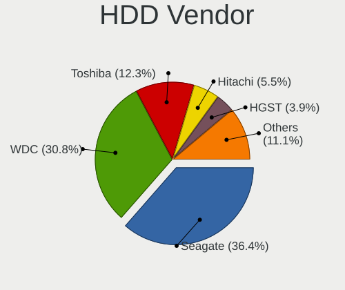

| Vendor              | Computers | Drives | Percent |
|---------------------|-----------|--------|---------|
| Seagate             | 699       | 1126   | 36.44%  |
| WDC                 | 591       | 1047   | 30.81%  |
| Toshiba             | 235       | 319    | 12.25%  |
| Hitachi             | 105       | 141    | 5.47%   |
| HGST                | 75        | 120    | 3.91%   |
| Samsung Electronics | 60        | 91     | 3.13%   |
| Unknown             | 32        | 44     | 1.67%   |
| JMicron Technology  | 23        | 23     | 1.2%    |
| Apple               | 12        | 21     | 0.63%   |
| Fujitsu             | 8         | 9      | 0.42%   |
| USB3.0              | 7         | 10     | 0.36%   |
| Maxtor              | 7         | 10     | 0.36%   |
| External            | 7         | 11     | 0.36%   |
| ASMT                | 7         | 11     | 0.36%   |
| TO Exter            | 6         | 6      | 0.31%   |
| Hewlett-Packard     | 6         | 9      | 0.31%   |
| SSK                 | 4         | 4      | 0.21%   |
| Intenso             | 4         | 4      | 0.21%   |
| ASMedia             | 4         | 5      | 0.21%   |
| SABRENT             | 2         | 2      | 0.1%    |
| LaCie               | 2         | 2      | 0.1%    |
| Inateck             | 2         | 2      | 0.1%    |
| HGST HTS            | 2         | 2      | 0.1%    |
| Fantom              | 2         | 6      | 0.1%    |
| WD MediaMax         | 1         | 1      | 0.05%   |
| TDAS                | 1         | 4      | 0.05%   |
| RSH-319             | 1         | 1      | 0.05%   |
| Min Yi U            | 1         | 1      | 0.05%   |
| Mercury             | 1         | 1      | 0.05%   |
| Maxone              | 1         | 1      | 0.05%   |
| KESU                | 1         | 1      | 0.05%   |
| IBM-ESXS            | 1         | 2      | 0.05%   |
| HGST HUS            | 1         | 1      | 0.05%   |
| H/W                 | 1         | 12     | 0.05%   |
| ExcelStor           | 1         | 2      | 0.05%   |
| CSD                 | 1         | 1      | 0.05%   |
| ASUSTOR             | 1         | 1      | 0.05%   |
| ASMT109x            | 1         | 1      | 0.05%   |
| ACASIS              | 1         | 1      | 0.05%   |
| Unknown             | 1         | 1      | 0.05%   |

SSD Vendor
----------

Solid state drive vendors

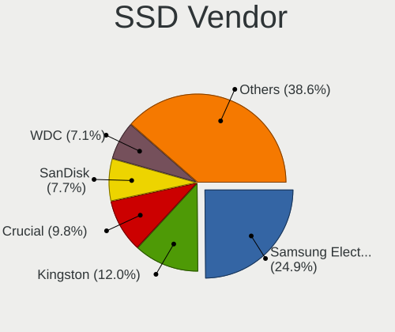

| Vendor              | Computers | Drives | Percent |
|---------------------|-----------|--------|---------|
| Samsung Electronics | 543       | 979    | 24.87%  |
| Kingston            | 262       | 396    | 12%     |
| Crucial             | 213       | 317    | 9.76%   |
| SanDisk             | 169       | 219    | 7.74%   |
| WDC                 | 154       | 234    | 7.05%   |
| A-DATA Technology   | 76        | 106    | 3.48%   |
| China               | 60        | 84     | 2.75%   |
| PNY                 | 46        | 64     | 2.11%   |
| SK hynix            | 41        | 63     | 1.88%   |
| Intel               | 40        | 60     | 1.83%   |
| Apple               | 38        | 53     | 1.74%   |
| Toshiba             | 34        | 46     | 1.56%   |
| Micron Technology   | 34        | 39     | 1.56%   |
| SPCC                | 31        | 38     | 1.42%   |
| Patriot             | 26        | 38     | 1.19%   |
| Transcend           | 21        | 26     | 0.96%   |
| LITEON              | 21        | 31     | 0.96%   |
| Intenso             | 20        | 30     | 0.92%   |
| Team                | 17        | 26     | 0.78%   |
| SABRENT             | 17        | 23     | 0.78%   |
| OCZ                 | 17        | 22     | 0.78%   |
| Plextor             | 15        | 19     | 0.69%   |
| LITEONIT            | 15        | 15     | 0.69%   |
| Lexar               | 15        | 15     | 0.69%   |
| Hewlett-Packard     | 13        | 20     | 0.6%    |
| KingSpec            | 11        | 16     | 0.5%    |
| GOODRAM             | 11        | 19     | 0.5%    |
| Gigabyte Technology | 11        | 12     | 0.5%    |
| Corsair             | 10        | 21     | 0.46%   |
| Unknown             | 9         | 9      | 0.41%   |
| Seagate             | 7         | 13     | 0.32%   |
| Apacer              | 7         | 7      | 0.32%   |
| Netac               | 6         | 12     | 0.27%   |
| Mushkin             | 6         | 10     | 0.27%   |
| Fanxiang            | 6         | 6      | 0.27%   |
| XrayDisk            | 5         | 6      | 0.23%   |
| Verbatim            | 5         | 10     | 0.23%   |
| T-FORCE             | 5         | 5      | 0.23%   |
| HS-SSD-C100         | 5         | 6      | 0.23%   |
| Timetec             | 4         | 5      | 0.18%   |

Drive Kind
----------

HDD or SSD

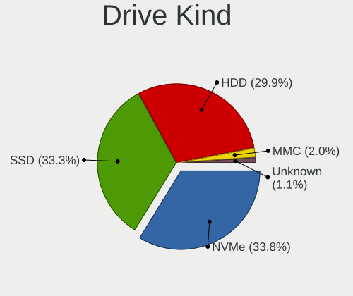

| Kind    | Computers | Drives | Percent |
|---------|-----------|--------|---------|
| NVMe    | 1779      | 3064   | 33.76%  |
| SSD     | 1754      | 3321   | 33.29%  |
| HDD     | 1575      | 3057   | 29.89%  |
| MMC     | 103       | 142    | 1.95%   |
| Unknown | 58        | 78     | 1.1%    |

Drive Connector
---------------

SATA, SAS, NVMe, etc.

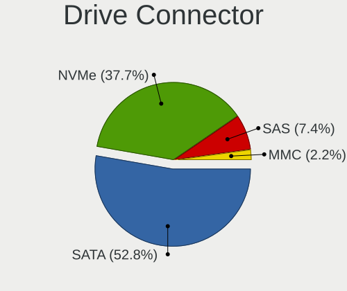

| Type | Computers | Drives | Percent |
|------|-----------|--------|---------|
| SATA | 2484      | 5942   | 52.75%  |
| NVMe | 1775      | 3034   | 37.69%  |
| SAS  | 347       | 544    | 7.37%   |
| MMC  | 103       | 142    | 2.19%   |

Drive Size
----------

Size of hard drive

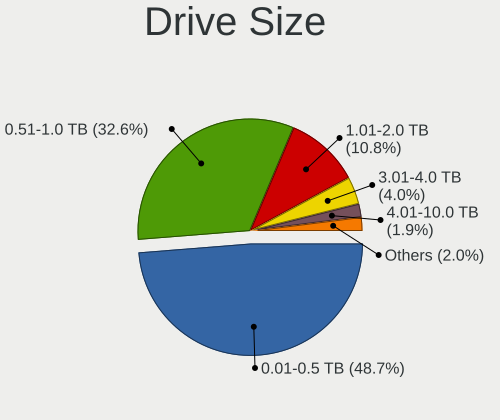

| Size in TB | Computers | Drives | Percent |
|------------|-----------|--------|---------|
| 0.01-0.5   | 1759      | 3235   | 48.74%  |
| 0.51-1.0   | 1177      | 1920   | 32.61%  |
| 1.01-2.0   | 389       | 713    | 10.78%  |
| 3.01-4.0   | 143       | 227    | 3.96%   |
| 4.01-10.0  | 69        | 165    | 1.91%   |
| 2.01-3.0   | 58        | 93     | 1.61%   |
| 10.01-20.0 | 14        | 25     | 0.39%   |

Space Total
-----------

Amount of disk space available on the file system

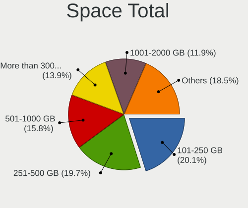

| Size in GB     | Computers | Percent |
|----------------|-----------|---------|
| 101-250        | 781       | 20.13%  |
| 251-500        | 766       | 19.74%  |
| 501-1000       | 614       | 15.82%  |
| More than 3000 | 539       | 13.89%  |
| 1001-2000      | 461       | 11.88%  |
| 1-20           | 181       | 4.66%   |
| 2001-3000      | 167       | 4.3%    |
| Unknown        | 150       | 3.87%   |
| 51-100         | 149       | 3.84%   |
| 21-50          | 72        | 1.86%   |

Space Used
----------

Amount of used disk space

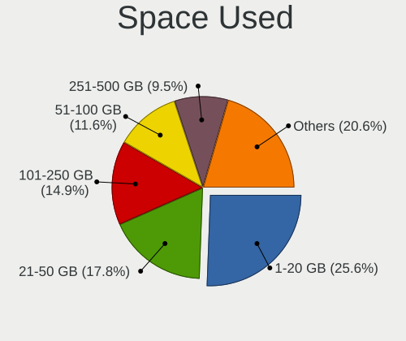

| Used GB        | Computers | Percent |
|----------------|-----------|---------|
| 1-20           | 1051      | 25.59%  |
| 21-50          | 731       | 17.8%   |
| 101-250        | 612       | 14.9%   |
| 51-100         | 478       | 11.64%  |
| 251-500        | 391       | 9.52%   |
| 501-1000       | 309       | 7.52%   |
| 1001-2000      | 186       | 4.53%   |
| Unknown        | 150       | 3.65%   |
| More than 3000 | 120       | 2.92%   |
| 2001-3000      | 75        | 1.83%   |
| 0              | 4         | 0.1%    |

Malfunc. Drives
---------------

Drive models with a malfunction

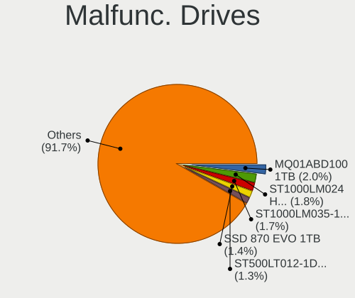

| Model                                                         | Computers | Drives | Percent |
|---------------------------------------------------------------|-----------|--------|---------|
| Toshiba MQ01ABD100 1TB                                        | 15        | 25     | 1.97%   |
| Seagate ST1000LM024 HN-M101MBB 1TB                            | 14        | 15     | 1.83%   |
| Seagate ST1000LM035-1RK172 1TB                                | 13        | 14     | 1.7%    |
| Samsung Electronics SSD 870 EVO 1TB                           | 11        | 24     | 1.44%   |
| Seagate ST500LT012-1DG142 500GB                               | 10        | 12     | 1.31%   |
| Samsung Electronics NVMe SSD Controller SM981/PM981/PM983 1TB | 10        | 12     | 1.31%   |
| Toshiba MQ01ABF050 500GB                                      | 8         | 13     | 1.05%   |
| Seagate ST1000DM003-9YN162 1TB                                | 8         | 10     | 1.05%   |
| SanDisk SSD PLUS 1000GB                                       | 8         | 10     | 1.05%   |
| Seagate ST9320325AS 320GB                                     | 7         | 9      | 0.92%   |
| Seagate ST500DM002-1BD142 500GB                               | 7         | 8      | 0.92%   |
| Seagate ST1000DM003-1CH162 1TB                                | 7         | 11     | 0.92%   |
| HGST HTS721010A9E630 1TB                                      | 7         | 10     | 0.92%   |
| WDC WD20EARS-00MVWB0 2TB                                      | 6         | 11     | 0.79%   |
| Seagate ST9500325AS 500GB                                     | 6         | 12     | 0.79%   |
| Seagate ST3500413AS 500GB                                     | 6         | 7      | 0.79%   |
| Seagate ST31000528AS 1TB                                      | 6         | 6      | 0.79%   |
| Seagate ST2000DM008-2FR102 2TB                                | 6         | 12     | 0.79%   |
| Kingston SA400S37480G 480GB SSD                               | 6         | 7      | 0.79%   |
| Hitachi HTS547575A9E384 752GB                                 | 6         | 6      | 0.79%   |
| Toshiba DT01ACA100 1TB                                        | 5         | 8      | 0.66%   |
| Seagate ST500LM021-1KJ152 500GB                               | 5         | 5      | 0.66%   |
| Seagate ST31000524AS 1TB                                      | 5         | 6      | 0.66%   |
| HGST HTS541010A9E680 1TB                                      | 5         | 8      | 0.66%   |
| WDC WDS240G2G0A-00JH30 240GB SSD                              | 4         | 4      | 0.52%   |
| WDC WD20EARX-00PASB0 2TB                                      | 4         | 7      | 0.52%   |
| Toshiba DT01ACA200 2TB                                        | 4         | 5      | 0.52%   |
| Seagate ST9250315AS 250GB                                     | 4         | 4      | 0.52%   |
| Seagate ST3500312CS 500GB                                     | 4         | 9      | 0.52%   |
| Seagate ST2000DM001-1ER164 2TB                                | 4         | 11     | 0.52%   |
| Seagate ST1000DM010-2EP102 1TB                                | 4         | 5      | 0.52%   |
| Kingston SV300S37A120G 120GB SSD                              | 4         | 4      | 0.52%   |
| Hitachi HDS721010CLA332 1TB                                   | 4         | 6      | 0.52%   |
| HGST HTS725050A7E630 500GB                                    | 4         | 6      | 0.52%   |
| HGST HTS545050A7E380 500GB                                    | 4         | 5      | 0.52%   |
| WDC WD5000AAKX-75U6AA0 500GB                                  | 3         | 4      | 0.39%   |
| WDC WD5000AAKX-60U6AA0 500GB                                  | 3         | 4      | 0.39%   |
| WDC WD5000AAKX-001CA0 500GB                                   | 3         | 4      | 0.39%   |
| WDC WD3200AAJS-22L7A0 320GB                                   | 3         | 3      | 0.39%   |
| WDC WD30EFRX-68EUZN0 3TB                                      | 3         | 5      | 0.39%   |

Malfunc. Drive Vendor
---------------------

Vendors of faulty drives

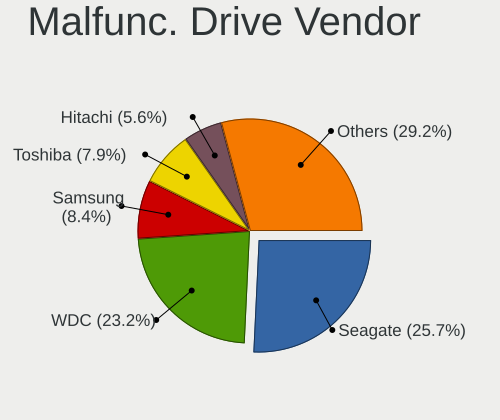

| Vendor                      | Computers | Drives | Percent |
|-----------------------------|-----------|--------|---------|
| Seagate                     | 189       | 258    | 25.75%  |
| WDC                         | 170       | 262    | 23.16%  |
| Samsung Electronics         | 62        | 90     | 8.45%   |
| Toshiba                     | 58        | 82     | 7.9%    |
| Hitachi                     | 41        | 51     | 5.59%   |
| HGST                        | 28        | 47     | 3.81%   |
| SanDisk                     | 23        | 32     | 3.13%   |
| Kingston                    | 22        | 31     | 3%      |
| Intel                       | 16        | 32     | 2.18%   |
| Crucial                     | 14        | 20     | 1.91%   |
| SK hynix                    | 13        | 17     | 1.77%   |
| Micron Technology           | 9         | 12     | 1.23%   |
| A-DATA Technology           | 9         | 12     | 1.23%   |
| Hewlett-Packard             | 6         | 6      | 0.82%   |
| China                       | 6         | 7      | 0.82%   |
| Maxtor                      | 5         | 8      | 0.68%   |
| Corsair                     | 5         | 15     | 0.68%   |
| Fujitsu                     | 4         | 5      | 0.54%   |
| Apple                       | 4         | 4      | 0.54%   |
| Transcend                   | 3         | 3      | 0.41%   |
| Micron/Crucial Technology   | 3         | 5      | 0.41%   |
| ASMedia                     | 3         | 4      | 0.41%   |
| USB3.0                      | 2         | 4      | 0.27%   |
| Silicon Motion              | 2         | 3      | 0.27%   |
| Realtek Semiconductor       | 2         | 2      | 0.27%   |
| Plextor                     | 2         | 2      | 0.27%   |
| MAXIO Technology (Hangzhou) | 2         | 2      | 0.27%   |
| LITEONIT                    | 2         | 2      | 0.27%   |
| LITEON                      | 2         | 2      | 0.27%   |
| Inateck                     | 2         | 2      | 0.27%   |
| Drevo                       | 2         | 2      | 0.27%   |
| Colorful                    | 2         | 5      | 0.27%   |
| ASMT                        | 2         | 2      | 0.27%   |
| Unknown                     | 2         | 2      | 0.27%   |
| XPG                         | 1         | 1      | 0.14%   |
| Team                        | 1         | 1      | 0.14%   |
| Super Talent                | 1         | 1      | 0.14%   |
| StoreJet                    | 1         | 1      | 0.14%   |
| SSSTC                       | 1         | 1      | 0.14%   |
| SPCC                        | 1         | 1      | 0.14%   |

Malfunc. HDD Vendor
-------------------

Vendors of faulty HDD drives

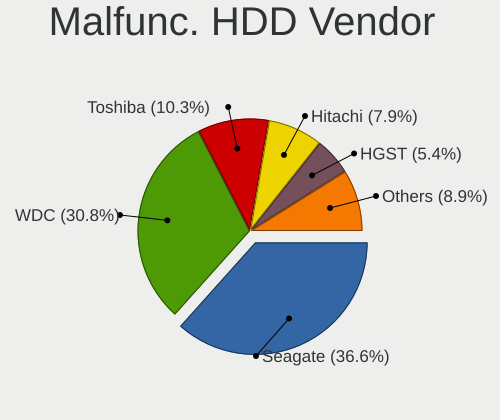

| Vendor              | Computers | Drives | Percent |
|---------------------|-----------|--------|---------|
| Seagate             | 189       | 258    | 36.63%  |
| WDC                 | 159       | 247    | 30.81%  |
| Toshiba             | 53        | 75     | 10.27%  |
| Hitachi             | 41        | 51     | 7.95%   |
| HGST                | 28        | 47     | 5.43%   |
| Samsung Electronics | 17        | 21     | 3.29%   |
| Maxtor              | 5         | 8      | 0.97%   |
| Fujitsu             | 4         | 5      | 0.78%   |
| Apple               | 4         | 4      | 0.78%   |
| Hewlett-Packard     | 3         | 3      | 0.58%   |
| ASMedia             | 3         | 4      | 0.58%   |
| USB3.0              | 2         | 4      | 0.39%   |
| Inateck             | 2         | 2      | 0.39%   |
| LaCie               | 1         | 1      | 0.19%   |
| JMicron Technology  | 1         | 1      | 0.19%   |
| HGST HTS            | 1         | 1      | 0.19%   |
| CSD                 | 1         | 1      | 0.19%   |
| ASMT                | 1         | 1      | 0.19%   |
| Unknown             | 1         | 1      | 0.19%   |

Malfunc. Drive Kind
-------------------

Kinds of faulty drives

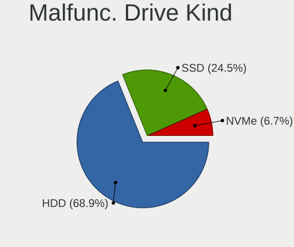

| Kind | Computers | Drives | Percent |
|------|-----------|--------|---------|
| HDD  | 476       | 735    | 68.89%  |
| SSD  | 169       | 257    | 24.46%  |
| NVMe | 46        | 61     | 6.66%   |

Failed Drives
-------------

Failed drive models

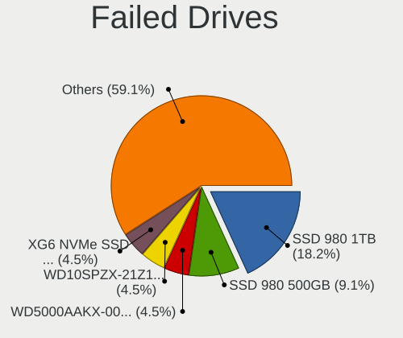

| Model                                            | Computers | Drives | Percent |
|--------------------------------------------------|-----------|--------|---------|
| Samsung Electronics SSD 980 1TB                  | 4         | 4      | 18.18%  |
| Samsung Electronics SSD 980 500GB                | 2         | 2      | 9.09%   |
| WDC WD5000AAKX-001CA0 500GB                      | 1         | 1      | 4.55%   |
| WDC WD10SPZX-21Z10T0 1TB                         | 1         | 1      | 4.55%   |
| Toshiba XG6 NVMe SSD Controller 1024GB           | 1         | 1      | 4.55%   |
| Seagate ST9320325AS 320GB                        | 1         | 1      | 4.55%   |
| Seagate ST91000430AS 1TB                         | 1         | 1      | 4.55%   |
| Seagate ST500DM002-1BD142 500GB                  | 1         | 1      | 4.55%   |
| Seagate ST3500410AS 500GB                        | 1         | 1      | 4.55%   |
| Seagate ST32000641AS 2TB                         | 1         | 2      | 4.55%   |
| Seagate ST31500341AS 1TB                         | 1         | 1      | 4.55%   |
| Seagate ST2000DL001-9VT156 2TB                   | 1         | 1      | 4.55%   |
| Seagate ST1000LM024 HN-M101MBB 1TB               | 1         | 1      | 4.55%   |
| Samsung Electronics MZNTY128HDHP-00000 128GB SSD | 1         | 1      | 4.55%   |
| Samsung Electronics MZ7TY128HDHP-000L1 128GB SSD | 1         | 1      | 4.55%   |
| HGST HTS721010A9E630 1TB                         | 1         | 1      | 4.55%   |
| HGST HTS545050A7E680 500GB                       | 1         | 1      | 4.55%   |
| Corsair Neutron XT SSD 240GB                     | 1         | 1      | 4.55%   |

Failed Drive Vendor
-------------------

Failed drive vendors

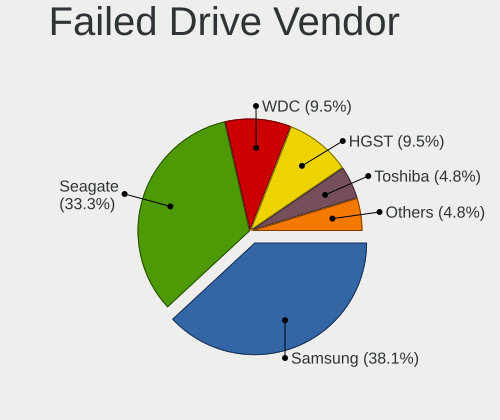

| Vendor              | Computers | Drives | Percent |
|---------------------|-----------|--------|---------|
| Samsung Electronics | 8         | 8      | 38.1%   |
| Seagate             | 7         | 9      | 33.33%  |
| WDC                 | 2         | 2      | 9.52%   |
| HGST                | 2         | 2      | 9.52%   |
| Toshiba             | 1         | 1      | 4.76%   |
| Corsair             | 1         | 1      | 4.76%   |

Drive Status
------------

Number of failed and malfunc. drives

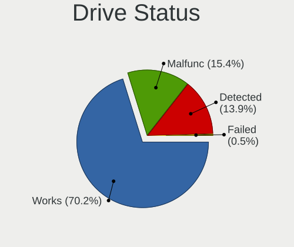

| Status   | Computers | Drives | Percent |
|----------|-----------|--------|---------|
| Works    | 3028      | 7467   | 70.21%  |
| Malfunc  | 664       | 1053   | 15.4%   |
| Detected | 600       | 1119   | 13.91%  |
| Failed   | 21        | 23     | 0.49%   |

Storage controller
------------------

Storage Vendor
--------------

Storage controller vendors

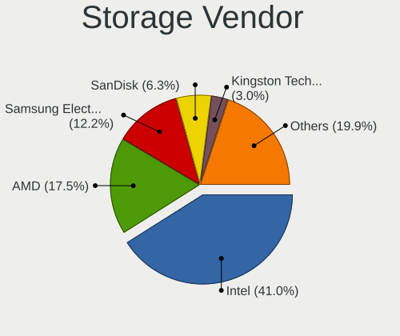

| Vendor                           | Computers | Percent |
|----------------------------------|-----------|---------|
| Intel                            | 2134      | 41.03%  |
| AMD                              | 910       | 17.5%   |
| Samsung Electronics              | 633       | 12.17%  |
| SanDisk                          | 330       | 6.34%   |
| Kingston Technology Company      | 157       | 3.02%   |
| Phison Electronics               | 156       | 3%      |
| SK hynix                         | 132       | 2.54%   |
| Micron/Crucial Technology        | 109       | 2.1%    |
| ASMedia Technology               | 90        | 1.73%   |
| Micron Technology                | 73        | 1.4%    |
| Silicon Motion                   | 60        | 1.15%   |
| KIOXIA                           | 59        | 1.13%   |
| ADATA Technology                 | 53        | 1.02%   |
| Toshiba America Info Systems     | 52        | 1%      |
| MAXIO Technology (Hangzhou)      | 40        | 0.77%   |
| Marvell Technology Group         | 40        | 0.77%   |
| Realtek Semiconductor            | 28        | 0.54%   |
| Nvidia                           | 22        | 0.42%   |
| Shenzhen Longsys Electronics     | 17        | 0.33%   |
| Seagate Technology               | 14        | 0.27%   |
| Union Memory (Shenzhen)          | 13        | 0.25%   |
| JMicron Technology               | 11        | 0.21%   |
| INNOGRIT                         | 10        | 0.19%   |
| Lite-On Technology               | 7         | 0.13%   |
| Biwin Storage Technology         | 6         | 0.12%   |
| Broadcom / LSI                   | 5         | 0.1%    |
| Apple                            | 5         | 0.1%    |
| Solid State Storage Technology   | 4         | 0.08%   |
| LSI Logic / Symbios Logic        | 4         | 0.08%   |
| Adaptec                          | 4         | 0.08%   |
| VIA Technologies                 | 3         | 0.06%   |
| Solidigm                         | 3         | 0.06%   |
| Netac Technology                 | 3         | 0.06%   |
| Lenovo                           | 3         | 0.06%   |
| Silicon Image                    | 2         | 0.04%   |
| Yangtze Memory Technologies      | 1         | 0.02%   |
| Transcend                        | 1         | 0.02%   |
| TenaFe                           | 1         | 0.02%   |
| Silicon Integrated Systems [SiS] | 1         | 0.02%   |
| O2 Micro                         | 1         | 0.02%   |

Storage Model
-------------

Storage controller models

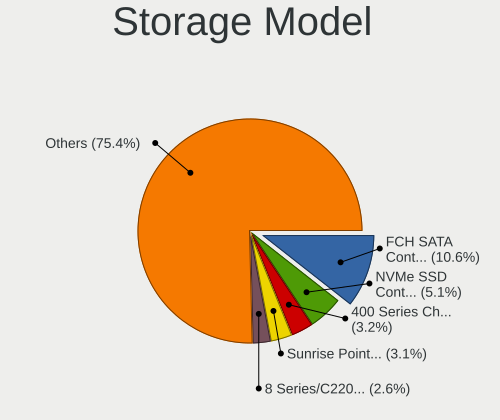

| Model                                                                          | Computers | Percent |
|--------------------------------------------------------------------------------|-----------|---------|
| AMD FCH SATA Controller [AHCI mode]                                            | 612       | 10.6%   |
| Samsung NVMe SSD Controller SM981/PM981/PM983                                  | 293       | 5.07%   |
| AMD 400 Series Chipset SATA Controller                                         | 186       | 3.22%   |
| Intel Sunrise Point-LP SATA Controller [AHCI mode]                             | 181       | 3.13%   |
| Intel 8 Series/C220 Series Chipset Family 6-port SATA Controller 1 [AHCI mode] | 150       | 2.6%    |
| Intel 82801 Mobile SATA Controller [RAID mode]                                 | 134       | 2.32%   |
| AMD 500 Series Chipset SATA Controller                                         | 126       | 2.18%   |
| Samsung NVMe SSD Controller PM9A1/PM9A3/980PRO                                 | 120       | 2.08%   |
| Intel 7 Series Chipset Family 6-port SATA Controller [AHCI mode]               | 119       | 2.06%   |
| Samsung NVMe SSD Controller 980 (DRAM-less)                                    | 114       | 1.97%   |
| Intel Q170/Q150/B150/H170/H110/Z170/CM236 Chipset SATA Controller [AHCI Mode]  | 108       | 1.87%   |
| Intel 200 Series PCH SATA controller [AHCI mode]                               | 104       | 1.8%    |
| Intel 6 Series/C200 Series Chipset Family 6 port Mobile SATA AHCI Controller   | 89        | 1.54%   |
| ASMedia ASM1061/ASM1062 Serial ATA Controller                                  | 86        | 1.49%   |
| Intel Volume Management Device NVMe RAID Controller                            | 85        | 1.47%   |
| Intel Cannon Lake Mobile PCH SATA AHCI Controller                              | 82        | 1.42%   |
| Intel Cannon Lake PCH SATA AHCI Controller                                     | 81        | 1.4%    |
| Phison E12 NVMe Controller                                                     | 72        | 1.25%   |
| SanDisk Ultra 3D / WD PC SN530, IX SN530, Blue SN550 NVMe SSD (DRAM-less)      | 70        | 1.21%   |
| Samsung NVMe SSD Controller SM961/PM961/SM963                                  | 64        | 1.11%   |
| SK hynix Gold P31/BC711/PC711 NVMe Solid State Drive                           | 63        | 1.09%   |
| Intel 8 Series SATA Controller 1 [AHCI mode]                                   | 63        | 1.09%   |
| Intel 7 Series/C210 Series Chipset Family 6-port SATA Controller [AHCI mode]   | 61        | 1.06%   |
| Micron/Crucial P2 [Nick P2] / P3 / P3 Plus NVMe PCIe SSD (DRAM-less)           | 60        | 1.04%   |
| SanDisk Extreme Pro / WD Black SN750 / PC SN730 / Red SN700 NVMe SSD           | 59        | 1.02%   |
| Intel SATA Controller [RAID mode]                                              | 54        | 0.94%   |
| Intel Wildcat Point-LP SATA Controller [AHCI Mode]                             | 53        | 0.92%   |
| Intel 6 Series/C200 Series Chipset Family 6 port Desktop SATA AHCI Controller  | 53        | 0.92%   |
| Intel SSD 660P Series                                                          | 51        | 0.88%   |
| Intel HM170/QM170 Chipset SATA Controller [AHCI Mode]                          | 51        | 0.88%   |
| Intel Comet Lake SATA AHCI Controller                                          | 48        | 0.83%   |
| AMD 600 Series Chipset SATA Controller                                         | 47        | 0.81%   |
| Silicon Motion SM2263EN/SM2263XT (DRAM-less) NVMe SSD Controllers              | 45        | 0.78%   |
| Intel 400 Series Chipset Family SATA AHCI Controller                           | 45        | 0.78%   |
| SanDisk WD SN560/SN740/SN770/SN5000 NVMe SSD                                   | 40        | 0.69%   |
| KIOXIA NVMe SSD Controller BG4 (DRAM-less)                                     | 40        | 0.69%   |
| Intel Tiger Lake-LP SATA Controller                                            | 40        | 0.69%   |
| Phison E16 PCIe4 NVMe Controller                                               | 39        | 0.68%   |
| Intel Alder Lake-S PCH SATA Controller [AHCI Mode]                             | 35        | 0.61%   |
| AMD SB7x0/SB8x0/SB9x0 IDE Controller                                           | 35        | 0.61%   |

Storage Kind
------------

Kind of storage controller (IDE, SATA, NVMe, SAS, ...)

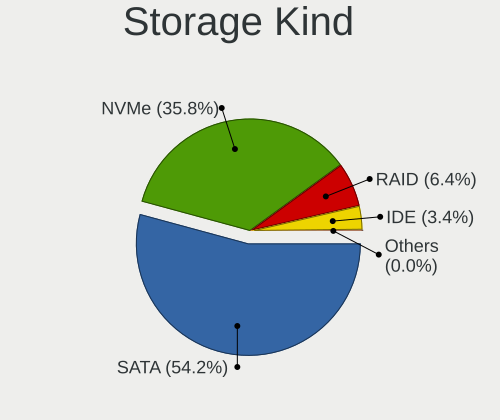

| Kind | Computers | Percent |
|------|-----------|---------|
| SATA | 2692      | 54.22%  |
| NVMe | 1776      | 35.77%  |
| RAID | 318       | 6.4%    |
| IDE  | 170       | 3.42%   |
| SAS  | 7         | 0.14%   |
| SCSI | 2         | 0.04%   |

Processor
---------

CPU Vendor
----------

Processor vendors

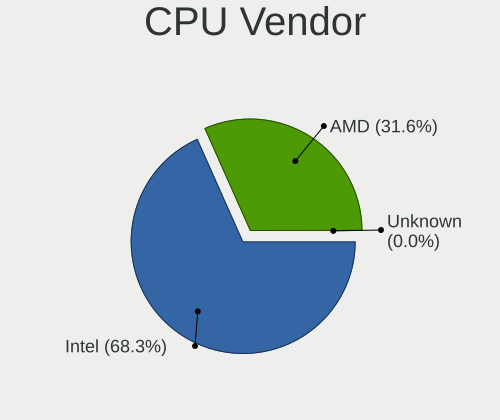

| Vendor  | Computers | Percent |
|---------|-----------|---------|
| Intel   | 2409      | 68.34%  |
| AMD     | 1115      | 31.63%  |
| Unknown | 1         | 0.03%   |

CPU Model
---------

Processor models

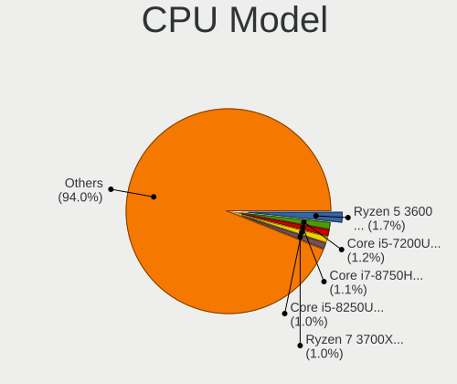

| Model                                         | Computers | Percent |
|-----------------------------------------------|-----------|---------|
| AMD Ryzen 5 3600 6-Core Processor             | 60        | 1.7%    |
| Intel Core i5-7200U CPU @ 2.50GHz             | 41        | 1.16%   |
| Intel Core i7-8750H CPU @ 2.20GHz             | 39        | 1.1%    |
| Intel Core i5-8250U CPU @ 1.60GHz             | 37        | 1.05%   |
| AMD Ryzen 7 3700X 8-Core Processor            | 36        | 1.02%   |
| Intel Core i7-9750H CPU @ 2.60GHz             | 35        | 0.99%   |
| Intel 11th Gen Core i5-1135G7 @ 2.40GHz       | 35        | 0.99%   |
| Intel Core i7-7700HQ CPU @ 2.80GHz            | 34        | 0.96%   |
| Intel Core i7-8550U CPU @ 1.80GHz             | 33        | 0.93%   |
| AMD Ryzen 9 5900X 12-Core Processor           | 32        | 0.91%   |
| AMD Ryzen 7 5800X 8-Core Processor            | 32        | 0.91%   |
| AMD Ryzen 7 5800H with Radeon Graphics        | 32        | 0.91%   |
| AMD Ryzen 5 5600X 6-Core Processor            | 32        | 0.91%   |
| Intel Core i5-6300U CPU @ 2.40GHz             | 29        | 0.82%   |
| AMD Ryzen 9 3900X 12-Core Processor           | 29        | 0.82%   |
| Intel 11th Gen Core i7-1165G7 @ 2.80GHz       | 28        | 0.79%   |
| AMD Ryzen 7 2700X Eight-Core Processor        | 28        | 0.79%   |
| Intel Core i7-10750H CPU @ 2.60GHz            | 26        | 0.74%   |
| AMD Ryzen 5 5600G with Radeon Graphics        | 25        | 0.71%   |
| Intel Core i5-8265U CPU @ 1.60GHz             | 24        | 0.68%   |
| Intel Core i5-10210U CPU @ 1.60GHz            | 23        | 0.65%   |
| AMD Ryzen 5 2600 Six-Core Processor           | 23        | 0.65%   |
| AMD Ryzen 7 5700U with Radeon Graphics        | 22        | 0.62%   |
| AMD Ryzen 7 5700G with Radeon Graphics        | 22        | 0.62%   |
| AMD Ryzen 7 4800H with Radeon Graphics        | 22        | 0.62%   |
| AMD Ryzen 5 3500U with Radeon Vega Mobile Gfx | 22        | 0.62%   |
| Intel Core i7-8565U CPU @ 1.80GHz             | 21        | 0.59%   |
| Intel Core i7-7700K CPU @ 4.20GHz             | 21        | 0.59%   |
| Intel Core i7-3770 CPU @ 3.40GHz              | 21        | 0.59%   |
| Intel Core i5-3210M CPU @ 2.50GHz             | 21        | 0.59%   |
| Intel Core i5-2520M CPU @ 2.50GHz             | 21        | 0.59%   |
| AMD Ryzen 9 5950X 16-Core Processor           | 20        | 0.57%   |
| Intel Core i7-10510U CPU @ 1.80GHz            | 19        | 0.54%   |
| Intel Core i5-6500 CPU @ 3.20GHz              | 18        | 0.51%   |
| Intel Core i7-6500U CPU @ 2.50GHz             | 17        | 0.48%   |
| Intel Core i5-5200U CPU @ 2.20GHz             | 17        | 0.48%   |
| Intel 12th Gen Core i7-12700H                 | 17        | 0.48%   |
| AMD Ryzen 7 3800X 8-Core Processor            | 17        | 0.48%   |
| Intel Core i7-8700K CPU @ 3.70GHz             | 16        | 0.45%   |
| Intel Core i7-8700 CPU @ 3.20GHz              | 16        | 0.45%   |

CPU Model Family
----------------

Processor model prefix

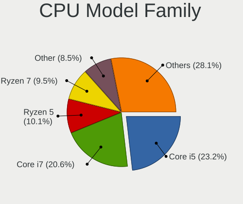

| Model                   | Computers | Percent |
|-------------------------|-----------|---------|
| Intel Core i5           | 819       | 23.18%  |
| Intel Core i7           | 729       | 20.63%  |
| AMD Ryzen 5             | 357       | 10.1%   |
| AMD Ryzen 7             | 335       | 9.48%   |
| Other                   | 299       | 8.46%   |
| Intel Core i3           | 182       | 5.15%   |
| AMD Ryzen 9             | 155       | 4.39%   |
| Intel Celeron           | 85        | 2.41%   |
| Intel Xeon              | 75        | 2.12%   |
| Intel Pentium           | 70        | 1.98%   |
| AMD Ryzen 3             | 59        | 1.67%   |
| Intel Core 2 Duo        | 50        | 1.42%   |
| Intel Core i9           | 32        | 0.91%   |
| AMD FX                  | 31        | 0.88%   |
| Intel Atom              | 28        | 0.79%   |
| AMD A10                 | 22        | 0.62%   |
| AMD A6                  | 21        | 0.59%   |
| AMD Ryzen 7 PRO         | 13        | 0.37%   |
| Intel Pentium Dual-Core | 12        | 0.34%   |
| AMD A8                  | 12        | 0.34%   |
| AMD A4                  | 12        | 0.34%   |
| AMD Ryzen Threadripper  | 10        | 0.28%   |
| Intel Core              | 8         | 0.23%   |
| AMD A12                 | 8         | 0.23%   |
| Intel Pentium Silver    | 7         | 0.2%    |
| AMD Phenom II X4        | 7         | 0.2%    |
| AMD Athlon II X2        | 7         | 0.2%    |
| AMD Athlon              | 7         | 0.2%    |
| Intel Core m3           | 6         | 0.17%   |
| Intel Core 2            | 6         | 0.17%   |
| AMD Ryzen 5 PRO         | 6         | 0.17%   |
| AMD E2                  | 6         | 0.17%   |
| AMD E1                  | 6         | 0.17%   |
| Intel Pentium Gold      | 5         | 0.14%   |
| Intel Pentium Dual      | 5         | 0.14%   |
| Intel Core 2 Quad       | 5         | 0.14%   |
| AMD Phenom II X6        | 4         | 0.11%   |
| AMD Athlon 64 X2        | 4         | 0.11%   |
| Intel Xeon Silver       | 3         | 0.08%   |
| AMD Ryzen 3 PRO         | 3         | 0.08%   |

CPU Cores
---------

Number of processor cores

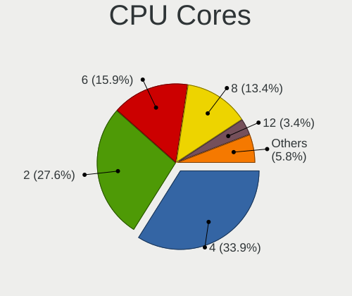

| Number  | Computers | Percent |
|---------|-----------|---------|
| 4       | 1200      | 33.94%  |
| 2       | 976       | 27.6%   |
| 6       | 561       | 15.87%  |
| 8       | 473       | 13.38%  |
| 12      | 120       | 3.39%   |
| 16      | 62        | 1.75%   |
| 10      | 48        | 1.36%   |
| 14      | 39        | 1.1%    |
| 1       | 18        | 0.51%   |
| 24      | 15        | 0.42%   |
| 3       | 13        | 0.37%   |
| 20      | 3         | 0.08%   |
| 40      | 2         | 0.06%   |
| 18      | 2         | 0.06%   |
| 48      | 1         | 0.03%   |
| 36      | 1         | 0.03%   |
| 32      | 1         | 0.03%   |
| Unknown | 1         | 0.03%   |

CPU Sockets
-----------

Number of sockets

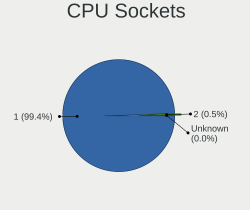

| Number  | Computers | Percent |
|---------|-----------|---------|
| 1       | 3506      | 99.43%  |
| 2       | 19        | 0.54%   |
| Unknown | 1         | 0.03%   |

CPU Threads
-----------

Threads per core (Hyper-Threading)

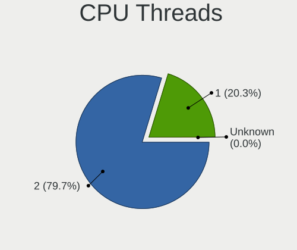

| Number  | Computers | Percent |
|---------|-----------|---------|
| 2       | 2815      | 79.7%   |
| 1       | 716       | 20.27%  |
| Unknown | 1         | 0.03%   |

CPU Op-Modes
------------

CPU Operation Modes (32-bit, 64-bit)

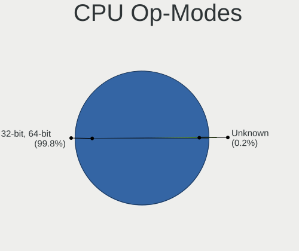

| Op mode        | Computers | Percent |
|----------------|-----------|---------|
| 32-bit, 64-bit | 3518      | 99.8%   |
| Unknown        | 7         | 0.2%    |

CPU Microcode
-------------

Microcode number

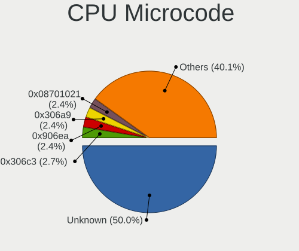

| Number     | Computers | Percent |
|------------|-----------|---------|
| Unknown    | 1867      | 50%     |
| 0x306c3    | 99        | 2.65%   |
| 0x906ea    | 91        | 2.44%   |
| 0x306a9    | 91        | 2.44%   |
| 0x08701021 | 90        | 2.41%   |
| 0x206a7    | 85        | 2.28%   |
| 0x906e9    | 65        | 1.74%   |
| 0x806ea    | 54        | 1.45%   |
| 0x0800820d | 53        | 1.42%   |
| 0x0a50000c | 52        | 1.39%   |
| 0x806e9    | 51        | 1.37%   |
| 0x506e3    | 50        | 1.34%   |
| 0x406e3    | 45        | 1.21%   |
| 0x08108109 | 41        | 1.1%    |
| 0x0a201016 | 39        | 1.04%   |
| 0x806c1    | 38        | 1.02%   |
| 0x08600106 | 38        | 1.02%   |
| 0x806ec    | 35        | 0.94%   |
| 0x40651    | 34        | 0.91%   |
| 0x306d4    | 29        | 0.78%   |
| 0x0a50000d | 29        | 0.78%   |
| 0x08701013 | 28        | 0.75%   |
| 0x08108102 | 28        | 0.75%   |
| 0xa0652    | 25        | 0.67%   |
| 0x08608103 | 25        | 0.67%   |
| 0x20655    | 24        | 0.64%   |
| 0x1067a    | 22        | 0.59%   |
| 0x0a201009 | 22        | 0.59%   |
| 0x0a20120a | 19        | 0.51%   |
| 0x08701030 | 17        | 0.46%   |
| 0x706e5    | 16        | 0.43%   |
| 0x0810100b | 16        | 0.43%   |
| 0xa0655    | 15        | 0.4%    |
| 0x08600104 | 15        | 0.4%    |
| 0x0a601203 | 14        | 0.37%   |
| 0x08101016 | 14        | 0.37%   |
| 0x06006705 | 14        | 0.37%   |
| 0x806d1    | 13        | 0.35%   |
| 0x0a404102 | 13        | 0.35%   |
| 0xa0653    | 12        | 0.32%   |

CPU Microarch
-------------

Microarchitecture

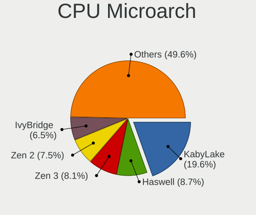

| Name              | Computers | Percent |
|-------------------|-----------|---------|
| KabyLake          | 692       | 19.58%  |
| Haswell           | 306       | 8.66%   |
| Zen 3             | 288       | 8.15%   |
| Zen 2             | 264       | 7.47%   |
| IvyBridge         | 231       | 6.53%   |
| Skylake           | 209       | 5.91%   |
| Zen+              | 178       | 5.04%   |
| SandyBridge       | 169       | 4.78%   |
| Unknown           | 168       | 4.75%   |
| Alderlake Hybrid  | 131       | 3.71%   |
| CometLake         | 111       | 3.14%   |
| TigerLake         | 97        | 2.74%   |
| Broadwell         | 79        | 2.23%   |
| Zen               | 72        | 2.04%   |
| Icelake           | 67        | 1.9%    |
| Westmere          | 61        | 1.73%   |
| Penryn            | 61        | 1.73%   |
| Silvermont        | 51        | 1.44%   |
| Excavator         | 46        | 1.3%    |
| Piledriver        | 43        | 1.22%   |
| Goldmont plus     | 32        | 0.91%   |
| K10               | 25        | 0.71%   |
| Goldmont          | 24        | 0.68%   |
| Core              | 24        | 0.68%   |
| Nehalem           | 22        | 0.62%   |
| Steamroller       | 16        | 0.45%   |
| Jaguar            | 10        | 0.28%   |
| Tremont           | 8         | 0.23%   |
| Gracemont         | 8         | 0.23%   |
| Puma              | 7         | 0.2%    |
| Bobcat            | 7         | 0.2%    |
| Meteorlake Hybrid | 6         | 0.17%   |
| K8 Hammer         | 6         | 0.17%   |
| K10 Llano         | 5         | 0.14%   |
| Bulldozer         | 4         | 0.11%   |
| Bonnell           | 4         | 0.11%   |
| NetBurst          | 1         | 0.03%   |
| K8 & K10 hybrid   | 1         | 0.03%   |
| CannonLake        | 1         | 0.03%   |

Graphics
--------

GPU Vendor
----------

Vendors of graphics cards

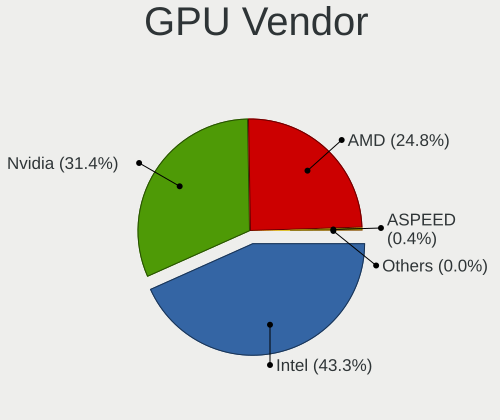

| Vendor                     | Computers | Percent |
|----------------------------|-----------|---------|
| Intel                      | 1874      | 43.31%  |
| Nvidia                     | 1359      | 31.41%  |
| AMD                        | 1073      | 24.8%   |
| ASPEED Technology          | 17        | 0.39%   |
| Matrox Electronics Systems | 3         | 0.07%   |
| ATI Technologies           | 1         | 0.02%   |

GPU Model
---------

Graphics card models

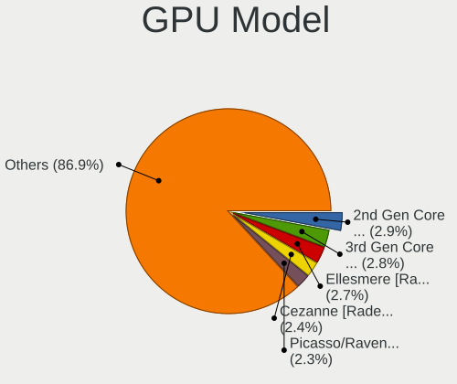

| Model                                                                       | Computers | Percent |
|-----------------------------------------------------------------------------|-----------|---------|
| Intel 2nd Generation Core Processor Family Integrated Graphics Controller   | 130       | 2.92%   |
| Intel 3rd Gen Core processor Graphics Controller                            | 124       | 2.78%   |
| AMD Ellesmere [Radeon RX 470/480/570/570X/580/580X/590]                     | 119       | 2.67%   |
| AMD Cezanne [Radeon Vega Series / Radeon Vega Mobile Series]                | 109       | 2.45%   |
| AMD Picasso/Raven 2 [Radeon Vega Series / Radeon Vega Mobile Series]        | 102       | 2.29%   |
| Intel CoffeeLake-H GT2 [UHD Graphics 630]                                   | 99        | 2.22%   |
| Intel Kaby Lake-R GT2 [UHD Graphics 620]                                    | 98        | 2.2%    |
| Intel Kaby Lake-U GT2 [HD Graphics 620]                                     | 83        | 1.86%   |
| Intel Haswell-ULT Integrated Graphics Controller                            | 83        | 1.86%   |
| Intel TigerLake-LP GT2 [Iris Xe Graphics]                                   | 82        | 1.84%   |
| AMD Renoir [Radeon Vega Series / Radeon Vega Mobile Series]                 | 80        | 1.8%    |
| Intel Skylake-U GT2 [HD Graphics 520]                                       | 79        | 1.77%   |
| Intel Xeon E3-1200 v3/4th Gen Core Processor Integrated Graphics Controller | 66        | 1.48%   |
| Intel 4th Gen Core Processor Integrated Graphics Controller                 | 66        | 1.48%   |
| Intel WhiskeyLake-U GT2 [UHD Graphics 620]                                  | 59        | 1.32%   |
| Intel Broadwell-U GT2 [HD Graphics 5500]                                    | 56        | 1.26%   |
| Nvidia TU117M [GeForce GTX 1650 Mobile / Max-Q]                             | 54        | 1.21%   |
| Intel CometLake-U GT2 [UHD Graphics]                                        | 54        | 1.21%   |
| Intel CoffeeLake-S GT2 [UHD Graphics 630]                                   | 51        | 1.15%   |
| Intel Skylake-S GT2 [HD Graphics 530]                                       | 45        | 1.01%   |
| Intel Kaby Lake-H GT2 [HD Graphics 630]                                     | 45        | 1.01%   |
| Intel Core Processor Integrated Graphics Controller                         | 45        | 1.01%   |
| Intel CometLake-H GT2 [UHD Graphics]                                        | 45        | 1.01%   |
| AMD Lucienne                                                                | 42        | 0.94%   |
| Nvidia GP106 [GeForce GTX 1060 6GB]                                         | 41        | 0.92%   |
| Intel Xeon E3-1200 v2/3rd Gen Core processor Graphics Controller            | 38        | 0.85%   |
| AMD Raphael                                                                 | 37        | 0.83%   |
| Nvidia GP107M [GeForce GTX 1050 Mobile]                                     | 36        | 0.81%   |
| Nvidia GA106M [GeForce RTX 3060 Mobile / Max-Q]                             | 36        | 0.81%   |
| AMD Raven Ridge [Radeon Vega Series / Radeon Vega Mobile Series]            | 36        | 0.81%   |
| AMD Navi 21 [Radeon RX 6800/6800 XT / 6900 XT]                              | 36        | 0.81%   |
| AMD Navi 10 [Radeon RX 5600 OEM/5600 XT / 5700/5700 XT]                     | 36        | 0.81%   |
| Intel Kaby Lake-S GT2 [HD Graphics 630]                                     | 33        | 0.74%   |
| AMD Navi 23 [Radeon RX 6600/6600 XT/6600M]                                  | 33        | 0.74%   |
| Intel Alder Lake-P GT2 [Iris Xe Graphics]                                   | 32        | 0.72%   |
| Nvidia GP107 [GeForce GTX 1050 Ti]                                          | 29        | 0.65%   |
| Nvidia GP104 [GeForce GTX 1070]                                             | 28        | 0.63%   |
| Intel Atom Processor Z36xxx/Z37xxx Series Graphics & Display                | 28        | 0.63%   |
| AMD Stoney [Radeon R2/R3/R4/R5 Graphics]                                    | 28        | 0.63%   |
| AMD Navi 22 [Radeon RX 6700/6700 XT/6750 XT / 6800M/6850M XT]               | 28        | 0.63%   |

GPU Combo
---------

Combinations of graphics cards

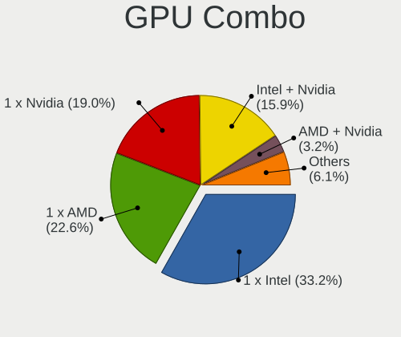

| Name           | Computers | Percent |
|----------------|-----------|---------|
| 1 x Intel      | 1183      | 33.2%   |
| 1 x AMD        | 807       | 22.65%  |
| 1 x Nvidia     | 676       | 18.97%  |
| Intel + Nvidia | 565       | 15.86%  |
| AMD + Nvidia   | 115       | 3.23%   |
| 2 x AMD        | 78        | 2.19%   |
| Intel + AMD    | 77        | 2.16%   |
| 2 x Intel      | 30        | 0.84%   |
| 1 x ASPEED     | 14        | 0.39%   |
| 2 x Nvidia     | 9         | 0.25%   |
| Other          | 3         | 0.08%   |
| 1 x Matrox     | 3         | 0.08%   |
| AMD + ASPEED   | 3         | 0.08%   |

GPU Driver
----------

Free vs proprietary

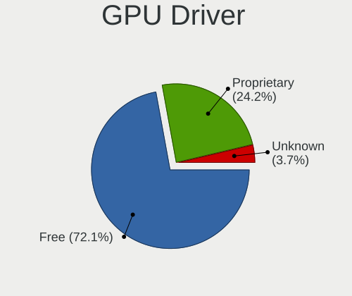

| Driver      | Computers | Percent |
|-------------|-----------|---------|
| Free        | 2598      | 72.13%  |
| Proprietary | 871       | 24.18%  |
| Unknown     | 133       | 3.69%   |

GPU Memory
----------

Total video memory

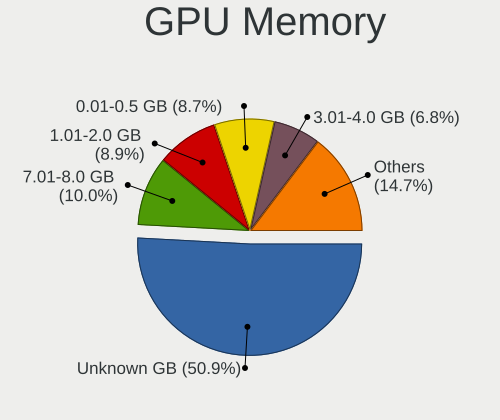

| Size in GB | Computers | Percent |
|------------|-----------|---------|
| Unknown    | 1849      | 50.85%  |
| 7.01-8.0   | 365       | 10.04%  |
| 1.01-2.0   | 325       | 8.94%   |
| 0.01-0.5   | 316       | 8.69%   |
| 3.01-4.0   | 247       | 6.79%   |
| 8.01-16.0  | 165       | 4.54%   |
| 0.51-1.0   | 150       | 4.13%   |
| 5.01-6.0   | 143       | 3.93%   |
| 2.01-3.0   | 39        | 1.07%   |
| 16.01-24.0 | 34        | 0.94%   |
| 4.01-5.0   | 3         | 0.08%   |

Monitor
-------

Monitor Vendor
--------------

Monitor vendors

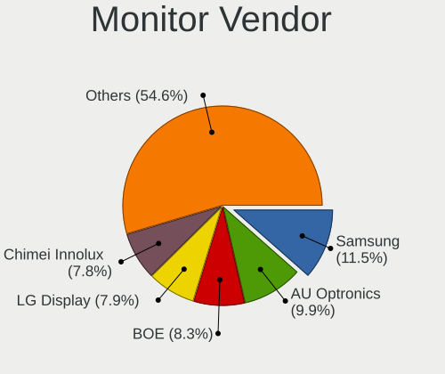

| Vendor                  | Computers | Percent |
|-------------------------|-----------|---------|
| Samsung Electronics     | 484       | 11.51%  |
| AU Optronics            | 416       | 9.89%   |
| BOE                     | 350       | 8.32%   |
| LG Display              | 332       | 7.89%   |
| Chimei Innolux          | 328       | 7.8%    |
| Goldstar                | 286       | 6.8%    |
| Dell                    | 282       | 6.7%    |
| Acer                    | 156       | 3.71%   |
| Hewlett-Packard         | 131       | 3.11%   |
| AOC                     | 130       | 3.09%   |
| BenQ                    | 110       | 2.62%   |
| Ancor Communications    | 101       | 2.4%    |
| Philips                 | 80        | 1.9%    |
| Apple                   | 75        | 1.78%   |
| Sharp                   | 69        | 1.64%   |
| Lenovo                  | 69        | 1.64%   |
| ASUSTek Computer        | 59        | 1.4%    |
| PANDA                   | 53        | 1.26%   |
| Unknown                 | 50        | 1.19%   |
| ViewSonic               | 44        | 1.05%   |
| MSI                     | 39        | 0.93%   |
| Sony                    | 37        | 0.88%   |
| Iiyama                  | 37        | 0.88%   |
| Chi Mei Optoelectronics | 29        | 0.69%   |
| Gigabyte Technology     | 27        | 0.64%   |
| Sceptre Tech            | 25        | 0.59%   |
| Vizio                   | 22        | 0.52%   |
| CSO                     | 22        | 0.52%   |
| Eizo                    | 20        | 0.48%   |
| InfoVision              | 19        | 0.45%   |
| LG Electronics          | 16        | 0.38%   |
| Toshiba                 | 14        | 0.33%   |
| Panasonic               | 14        | 0.33%   |
| HKC                     | 10        | 0.24%   |
| HannStar                | 10        | 0.24%   |
| Vestel Elektronik       | 9         | 0.21%   |
| Unknown (XXX)           | 9         | 0.21%   |
| Unknown                 | 9         | 0.21%   |
| Mi                      | 8         | 0.19%   |
| Insignia                | 8         | 0.19%   |

Monitor Model
-------------

Monitor models

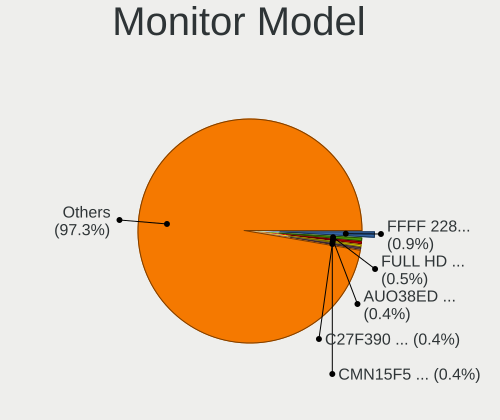

| Model                                                                | Computers | Percent |
|----------------------------------------------------------------------|-----------|---------|
| Unknown LCD Monitor FFFF 2288x1287 2550x2550mm 142.0-inch            | 40        | 0.91%   |
| Goldstar FULL HD GSM5B55 1920x1080 480x270mm 21.7-inch               | 24        | 0.55%   |
| AU Optronics LCD Monitor AUO38ED 1920x1080 344x193mm 15.5-inch       | 19        | 0.43%   |
| Samsung Electronics C27F390 SAM0D32 1920x1080 598x336mm 27.0-inch    | 18        | 0.41%   |
| Chimei Innolux LCD Monitor CMN15F5 1920x1080 344x193mm 15.5-inch     | 17        | 0.39%   |
| Chimei Innolux LCD Monitor CMN14D4 1920x1080 309x173mm 13.9-inch     | 17        | 0.39%   |
| Goldstar LG ULTRAWIDE GSM59F1 2560x1080 670x280mm 28.6-inch          | 15        | 0.34%   |
| PANDA LCD Monitor NCP004D 1920x1080 344x194mm 15.5-inch              | 14        | 0.32%   |
| Samsung Electronics LCD Monitor SEC5441 1280x800 331x207mm 15.4-inch | 13        | 0.3%    |
| AU Optronics LCD Monitor AUO21ED 1920x1080 344x193mm 15.5-inch       | 13        | 0.3%    |
| Goldstar HDR WFHD GSM7714 2560x1080 798x334mm 34.1-inch              | 12        | 0.27%   |
| Chimei Innolux LCD Monitor CMN1521 1920x1080 344x193mm 15.5-inch     | 12        | 0.27%   |
| BOE LCD Monitor BOE0812 1920x1080 344x194mm 15.5-inch                | 12        | 0.27%   |
| Samsung Electronics C24F390 SAM0D2C 1920x1080 521x293mm 23.5-inch    | 11        | 0.25%   |
| PANDA LCD Monitor NCP002D 1920x1080 344x194mm 15.5-inch              | 11        | 0.25%   |
| AOC 24G2W1G3 AOC2402 1920x1080 527x296mm 23.8-inch                   | 11        | 0.25%   |
| Goldstar LG TV SSCR2 GSMC0C8 3840x2160                               | 10        | 0.23%   |
| Chimei Innolux LCD Monitor CMN15E8 1920x1080 344x193mm 15.5-inch     | 10        | 0.23%   |
| Chimei Innolux LCD Monitor CMN15DB 1366x768 344x193mm 15.5-inch      | 10        | 0.23%   |
| Chimei Innolux LCD Monitor CMN14C9 1920x1080 309x173mm 13.9-inch     | 10        | 0.23%   |
| Vestel Elektronik 40UHD_LCD_TV VES3700 3840x2160 880x500mm 39.8-inch | 9         | 0.21%   |
| LG Display LCD Monitor LGD05E5 1920x1080 344x194mm 15.5-inch         | 9         | 0.21%   |
| LG Display LCD Monitor LGD0521 1920x1080 309x174mm 14.0-inch         | 9         | 0.21%   |
| LG Display LCD Monitor LGD02D8 1366x768 277x156mm 12.5-inch          | 9         | 0.21%   |
| Goldstar LG IPS FULLHD GSM5AB8 1920x1080 480x270mm 21.7-inch         | 9         | 0.21%   |
| Dell SE2416H DELD081 1920x1080 527x296mm 23.8-inch                   | 9         | 0.21%   |
| Chimei Innolux LCD Monitor CMN1738 1920x1080 381x214mm 17.2-inch     | 9         | 0.21%   |
| AU Optronics LCD Monitor AUO70EC 1366x768 344x193mm 15.5-inch        | 9         | 0.21%   |
| AU Optronics LCD Monitor AUO403D 1920x1080 309x174mm 14.0-inch       | 9         | 0.21%   |
| AU Optronics LCD Monitor AUO106C 1366x768 276x155mm 12.5-inch        | 9         | 0.21%   |
| Unknown                                                              | 9         | 0.21%   |
| Samsung Electronics S24F350 SAM0D20 1920x1080 521x293mm 23.5-inch    | 8         | 0.18%   |
| LG Display LCD Monitor LGD02DC 1366x768 344x194mm 15.5-inch          | 8         | 0.18%   |
| Chimei Innolux LCD Monitor CMN14C3 1366x768 309x173mm 13.9-inch      | 8         | 0.18%   |
| BOE LCD Monitor BOE0747 1920x1080 344x194mm 15.5-inch                | 8         | 0.18%   |
| BOE LCD Monitor BOE0672 1366x768 344x194mm 15.5-inch                 | 8         | 0.18%   |
| AU Optronics LCD Monitor AUO313C 1366x768 309x173mm 13.9-inch        | 8         | 0.18%   |
| AU Optronics LCD Monitor AUO26EC 1366x768 344x193mm 15.5-inch        | 8         | 0.18%   |
| AU Optronics LCD Monitor AUO133D 1920x1080 309x173mm 13.9-inch       | 8         | 0.18%   |
| AU Optronics LCD Monitor AUO103D 1920x1080 309x173mm 13.9-inch       | 8         | 0.18%   |

Monitor Resolution
------------------

Monitor screen resolution

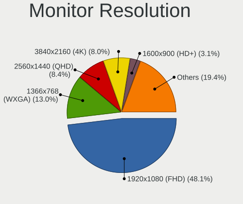

| Resolution         | Computers | Percent |
|--------------------|-----------|---------|
| 1920x1080 (FHD)    | 1903      | 48.12%  |
| 1366x768 (WXGA)    | 515       | 13.02%  |
| 2560x1440 (QHD)    | 332       | 8.39%   |
| 3840x2160 (4K)     | 317       | 8.02%   |
| 1600x900 (HD+)     | 122       | 3.08%   |
| 1920x1200 (WUXGA)  | 83        | 2.1%    |
| 2560x1080          | 73        | 1.85%   |
| 1440x900 (WXGA+)   | 70        | 1.77%   |
| 1680x1050 (WSXGA+) | 66        | 1.67%   |
| 3440x1440          | 60        | 1.52%   |
| 1280x1024 (SXGA)   | 52        | 1.31%   |
| 2560x1600          | 44        | 1.11%   |
| 2288x1287          | 41        | 1.04%   |
| 1280x800 (WXGA)    | 39        | 0.99%   |
| 2880x1800          | 34        | 0.86%   |
| 3840x1080          | 27        | 0.68%   |
| Unknown            | 26        | 0.66%   |
| 1360x768           | 21        | 0.53%   |
| 1920x540           | 14        | 0.35%   |
| 3840x2400          | 13        | 0.33%   |
| 2160x1440          | 13        | 0.33%   |
| 1600x1200          | 8         | 0.2%    |
| 3840x1600          | 7         | 0.18%   |
| 3200x1800 (QHD+)   | 6         | 0.15%   |
| 3456x2160          | 5         | 0.13%   |
| 2880x1920          | 5         | 0.13%   |
| 2256x1504          | 4         | 0.1%    |
| 1280x720 (HD)      | 4         | 0.1%    |
| 2240x1400          | 3         | 0.08%   |
| 2048x1152          | 3         | 0.08%   |
| 1024x768 (XGA)     | 3         | 0.08%   |
| 1024x600           | 3         | 0.08%   |
| 800x1280           | 2         | 0.05%   |
| 5760x2160          | 2         | 0.05%   |
| 3200x2000          | 2         | 0.05%   |
| 3000x2000          | 2         | 0.05%   |
| 2944x1080          | 2         | 0.05%   |
| 2736x1824          | 2         | 0.05%   |
| 2160x1350          | 2         | 0.05%   |
| 1800x1200          | 2         | 0.05%   |

Monitor Diagonal
----------------

Diagonal size in inches

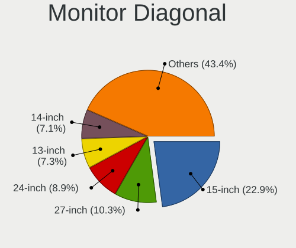

| Inches  | Computers | Percent |
|---------|-----------|---------|
| 15      | 962       | 22.92%  |
| 27      | 433       | 10.32%  |
| 24      | 375       | 8.93%   |
| 13      | 306       | 7.29%   |
| 14      | 299       | 7.12%   |
| 23      | 251       | 5.98%   |
| 21      | 214       | 5.1%    |
| 31      | 191       | 4.55%   |
| 17      | 182       | 4.34%   |
| Unknown | 108       | 2.57%   |
| 34      | 99        | 2.36%   |
| 19      | 79        | 1.88%   |
| 12      | 60        | 1.43%   |
| 18      | 56        | 1.33%   |
| 16      | 54        | 1.29%   |
| 22      | 46        | 1.1%    |
| 40      | 42        | 1%      |
| 142     | 40        | 0.95%   |
| 20      | 40        | 0.95%   |
| 84      | 36        | 0.86%   |
| 54      | 36        | 0.86%   |
| 72      | 34        | 0.81%   |
| 32      | 34        | 0.81%   |
| 11      | 23        | 0.55%   |
| 28      | 20        | 0.48%   |
| 63      | 17        | 0.41%   |
| 26      | 14        | 0.33%   |
| 25      | 14        | 0.33%   |
| 65      | 13        | 0.31%   |
| 49      | 12        | 0.29%   |
| 48      | 12        | 0.29%   |
| 52      | 10        | 0.24%   |
| 42      | 10        | 0.24%   |
| 29      | 10        | 0.24%   |
| 74      | 8         | 0.19%   |
| 43      | 8         | 0.19%   |
| 10      | 8         | 0.19%   |
| 37      | 6         | 0.14%   |
| 36      | 5         | 0.12%   |
| 35      | 5         | 0.12%   |

Monitor Width
-------------

Physical width

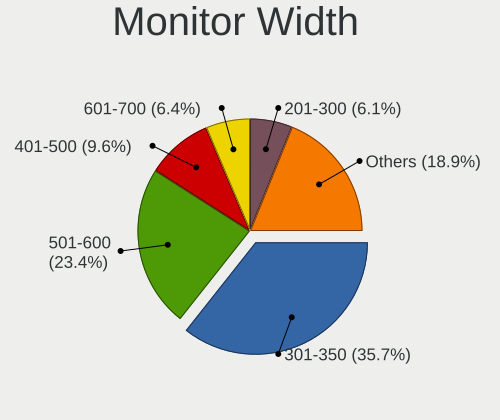

| Width in mm    | Computers | Percent |
|----------------|-----------|---------|
| 301-350        | 1455      | 35.65%  |
| 501-600        | 955       | 23.4%   |
| 401-500        | 390       | 9.56%   |
| 601-700        | 261       | 6.4%    |
| 201-300        | 249       | 6.1%    |
| 351-400        | 214       | 5.24%   |
| 701-800        | 137       | 3.36%   |
| 1001-1500      | 111       | 2.72%   |
| Unknown        | 108       | 2.65%   |
| 1501-2000      | 78        | 1.91%   |
| 801-900        | 60        | 1.47%   |
| More than 2000 | 40        | 0.98%   |
| 901-1000       | 21        | 0.51%   |
| 1-100          | 2         | 0.05%   |

Aspect Ratio
------------

Proportional relationship between the width and the height

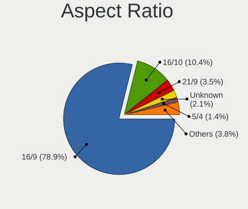

| Ratio   | Computers | Percent |
|---------|-----------|---------|
| 16/9    | 2901      | 78.87%  |
| 16/10   | 382       | 10.39%  |
| 21/9    | 128       | 3.48%   |
| Unknown | 79        | 2.15%   |
| 5/4     | 50        | 1.36%   |
| 3/2     | 40        | 1.09%   |
| 1.00    | 40        | 1.09%   |
| 32/9    | 21        | 0.57%   |
| 4/3     | 20        | 0.54%   |
| 6/5     | 6         | 0.16%   |
| 2.00    | 2         | 0.05%   |
| 0.67    | 2         | 0.05%   |
| 0.56    | 2         | 0.05%   |
| 3.40    | 1         | 0.03%   |
| 3.33    | 1         | 0.03%   |
| 2.70    | 1         | 0.03%   |
| 0.80    | 1         | 0.03%   |
| 0.25    | 1         | 0.03%   |

Monitor Area
------------

Area in inch²

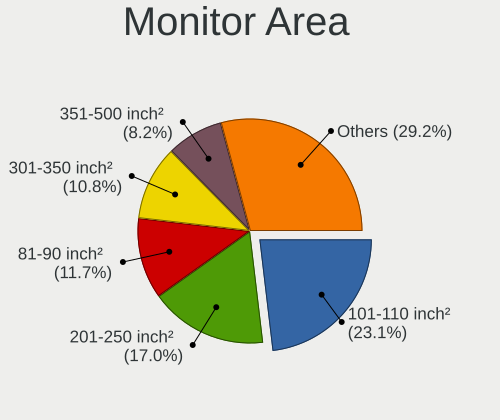

| Area in inch² | Computers | Percent |
|----------------|-----------|---------|
| 101-110        | 957       | 23.13%  |
| 201-250        | 704       | 17.01%  |
| 81-90          | 484       | 11.7%   |
| 301-350        | 446       | 10.78%  |
| 351-500        | 339       | 8.19%   |
| More than 1000 | 196       | 4.74%   |
| 151-200        | 168       | 4.06%   |
| 121-130        | 147       | 3.55%   |
| 251-300        | 134       | 3.24%   |
| 71-80          | 114       | 2.75%   |
| Unknown        | 108       | 2.61%   |
| 501-1000       | 99        | 2.39%   |
| 141-150        | 74        | 1.79%   |
| 61-70          | 55        | 1.33%   |
| 111-120        | 45        | 1.09%   |
| 51-60          | 25        | 0.6%    |
| 91-100         | 19        | 0.46%   |
| 131-140        | 15        | 0.36%   |
| 41-50          | 7         | 0.17%   |
| 1-40           | 2         | 0.05%   |

Pixel Density
-------------

Pixels per inch

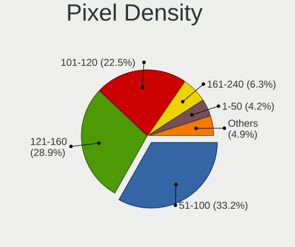

| Density       | Computers | Percent |
|---------------|-----------|---------|
| 51-100        | 1318      | 33.19%  |
| 121-160       | 1146      | 28.86%  |
| 101-120       | 894       | 22.51%  |
| 161-240       | 250       | 6.3%    |
| 1-50          | 167       | 4.21%   |
| Unknown       | 108       | 2.72%   |
| More than 240 | 88        | 2.22%   |

Multiple Monitors
-----------------

Total monitors connected

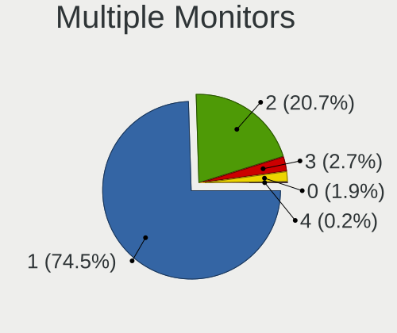

| Total | Computers | Percent |
|-------|-----------|---------|
| 1     | 2712      | 74.51%  |
| 2     | 752       | 20.66%  |
| 3     | 98        | 2.69%   |
| 0     | 69        | 1.9%    |
| 4     | 9         | 0.25%   |

Network
-------

Net Controller Vendor
---------------------

Controller vendors

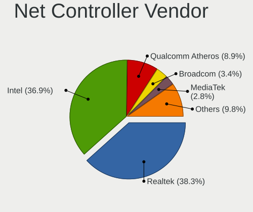

| Vendor                            | Computers | Percent |
|-----------------------------------|-----------|---------|
| Realtek Semiconductor             | 2013      | 38.34%  |
| Intel                             | 1937      | 36.89%  |
| Qualcomm Atheros                  | 465       | 8.86%   |
| Broadcom                          | 178       | 3.39%   |
| MediaTek                          | 145       | 2.76%   |
| TP-Link                           | 53        | 1.01%   |
| Broadcom Limited                  | 52        | 0.99%   |
| Ralink Technology                 | 46        | 0.88%   |
| ASIX Electronics                  | 26        | 0.5%    |
| Marvell Technology Group          | 22        | 0.42%   |
| Sierra Wireless                   | 18        | 0.34%   |
| Microsoft                         | 18        | 0.34%   |
| Samsung Electronics               | 17        | 0.32%   |
| Aquantia                          | 17        | 0.32%   |
| Nvidia                            | 16        | 0.3%    |
| Shenzhen Goodix Technology        | 15        | 0.29%   |
| Ralink                            | 15        | 0.29%   |
| Ericsson Business Mobile Networks | 11        | 0.21%   |
| DisplayLink                       | 11        | 0.21%   |
| Dell                              | 11        | 0.21%   |
| Qualcomm                          | 9         | 0.17%   |
| NetGear                           | 9         | 0.17%   |
| D-Link                            | 9         | 0.17%   |
| Xiaomi                            | 7         | 0.13%   |
| Qualcomm Atheros Communications   | 7         | 0.13%   |
| OPPO Electronics                  | 7         | 0.13%   |
| Lenovo                            | 7         | 0.13%   |
| D-Link System                     | 7         | 0.13%   |
| ASUSTek Computer                  | 6         | 0.11%   |
| Motorola PCS                      | 5         | 0.1%    |
| Huawei Technologies               | 5         | 0.1%    |
| Hewlett-Packard                   | 5         | 0.1%    |
| Fibocom                           | 5         | 0.1%    |
| Edimax Technology                 | 5         | 0.1%    |
| T & A Mobile Phones               | 4         | 0.08%   |
| JMicron Technology                | 4         | 0.08%   |
| Insyde Software                   | 4         | 0.08%   |
| QinHeng Electronics               | 3         | 0.06%   |
| Microchip Technology              | 3         | 0.06%   |
| Mellanox Technologies             | 3         | 0.06%   |

Net Controller Model
--------------------

Controller models

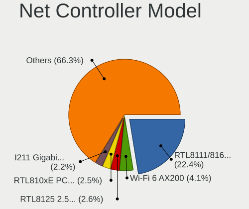

| Model                                                                  | Computers | Percent |
|------------------------------------------------------------------------|-----------|---------|
| Realtek RTL8111/8168/8211/8411 PCI Express Gigabit Ethernet Controller | 1414      | 22.43%  |
| Intel Wi-Fi 6 AX200                                                    | 256       | 4.06%   |
| Realtek RTL8125 2.5GbE Controller                                      | 161       | 2.55%   |
| Realtek RTL810xE PCI Express Fast Ethernet controller                  | 155       | 2.46%   |
| Intel I211 Gigabit Network Connection                                  | 140       | 2.22%   |
| Intel Wireless 8265 / 8275                                             | 121       | 1.92%   |
| Intel 82579LM Gigabit Network Connection (Lewisville)                  | 113       | 1.79%   |
| Qualcomm Atheros QCA9377 802.11ac Wireless Network Adapter             | 99        | 1.57%   |
| Realtek RTL8821CE 802.11ac PCIe Wireless Network Adapter               | 97        | 1.54%   |
| Realtek RTL8153 Gigabit Ethernet Adapter                               | 94        | 1.49%   |
| Intel Cannon Lake PCH CNVi WiFi                                        | 89        | 1.41%   |
| Intel Wireless 7265                                                    | 83        | 1.32%   |
| Intel Wireless 7260                                                    | 80        | 1.27%   |
| Intel Ethernet Controller I225-V                                       | 75        | 1.19%   |
| Realtek RTL8822CE 802.11ac PCIe Wireless Network Adapter               | 74        | 1.17%   |
| Intel Wireless 8260                                                    | 74        | 1.17%   |
| Intel Ethernet Connection (2) I219-V                                   | 74        | 1.17%   |
| Intel Wi-Fi 6 AX201                                                    | 71        | 1.13%   |
| Qualcomm Atheros QCA9565 / AR9565 Wireless Network Adapter             | 66        | 1.05%   |
| Qualcomm Atheros QCA6174 802.11ac Wireless Network Adapter             | 65        | 1.03%   |
| Intel Ethernet Connection I217-LM                                      | 61        | 0.97%   |
| Intel Dual Band Wireless-AC 3168NGW [Stone Peak]                       | 61        | 0.97%   |
| MediaTek MT7921 802.11ax PCIe Wireless Network Adapter [Filogic 330]   | 60        | 0.95%   |
| Intel Ethernet Connection (7) I219-V                                   | 57        | 0.9%    |
| Qualcomm Atheros AR9485 Wireless Network Adapter                       | 56        | 0.89%   |
| Intel Wi-Fi 6E(802.11ax) AX210/AX1675* 2x2 [Typhoon Peak]              | 56        | 0.89%   |
| Intel Wi-Fi 5(802.11ac) Wireless-AC 9x6x [Thunder Peak]                | 53        | 0.84%   |
| Intel Comet Lake PCH CNVi WiFi                                         | 51        | 0.81%   |
| Intel Centrino Advanced-N 6205 [Taylor Peak]                           | 51        | 0.81%   |
| Intel Comet Lake PCH-LP CNVi WiFi                                      | 46        | 0.73%   |
| Intel Wireless 3165                                                    | 45        | 0.71%   |
| MediaTek MT7922 802.11ax PCI Express Wireless Network Adapter          | 43        | 0.68%   |
| Intel Alder Lake-P PCH CNVi WiFi                                       | 43        | 0.68%   |
| Intel Cannon Point-LP CNVi [Wireless-AC]                               | 41        | 0.65%   |
| Intel Ethernet Connection (4) I219-LM                                  | 38        | 0.6%    |
| Intel Ethernet Connection I219-LM                                      | 33        | 0.52%   |
| Qualcomm Atheros AR9285 Wireless Network Adapter (PCI-Express)         | 29        | 0.46%   |
| Intel Ethernet Connection (2) I219-LM                                  | 29        | 0.46%   |
| Intel Tiger Lake PCH CNVi WiFi                                         | 28        | 0.44%   |
| Intel Ethernet Connection I218-LM                                      | 28        | 0.44%   |

Wireless Vendor
---------------

Wireless vendors

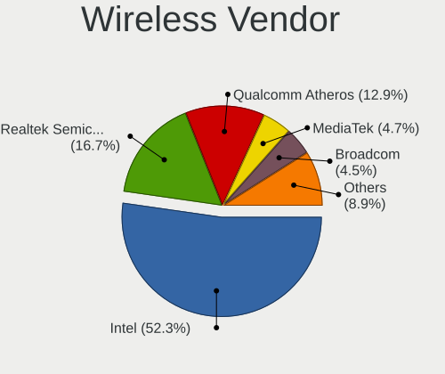

| Vendor                                | Computers | Percent |
|---------------------------------------|-----------|---------|
| Intel                                 | 1491      | 52.26%  |
| Realtek Semiconductor                 | 477       | 16.72%  |
| Qualcomm Atheros                      | 367       | 12.86%  |
| MediaTek                              | 135       | 4.73%   |
| Broadcom                              | 128       | 4.49%   |
| TP-Link                               | 47        | 1.65%   |
| Ralink Technology                     | 46        | 1.61%   |
| Broadcom Limited                      | 40        | 1.4%    |
| Sierra Wireless                       | 18        | 0.63%   |
| Microsoft                             | 17        | 0.6%    |
| Ralink                                | 15        | 0.53%   |
| NetGear                               | 9         | 0.32%   |
| D-Link                                | 9         | 0.32%   |
| Qualcomm Atheros Communications       | 7         | 0.25%   |
| Marvell Technology Group              | 7         | 0.25%   |
| Dell                                  | 7         | 0.25%   |
| ASUSTek Computer                      | 6         | 0.21%   |
| Fibocom                               | 5         | 0.18%   |
| Edimax Technology                     | 5         | 0.18%   |
| D-Link System                         | 4         | 0.14%   |
| Hewlett-Packard                       | 3         | 0.11%   |
| Tenda                                 | 2         | 0.07%   |
| Belkin Components                     | 2         | 0.07%   |
| Xiaomi                                | 1         | 0.04%   |
| Qualcomm Technologies                 | 1         | 0.04%   |
| Ovislink                              | 1         | 0.04%   |
| IMC Networks                          | 1         | 0.04%   |
| CyberTAN Technology                   | 1         | 0.04%   |
| 802.11g Adapter [Linksys WUSB54GC v3] | 1         | 0.04%   |

Wireless Model
--------------

Wireless models

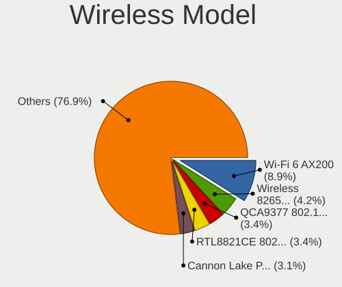

| Model                                                                | Computers | Percent |
|----------------------------------------------------------------------|-----------|---------|
| Intel Wi-Fi 6 AX200                                                  | 256       | 8.92%   |
| Intel Wireless 8265 / 8275                                           | 121       | 4.21%   |
| Qualcomm Atheros QCA9377 802.11ac Wireless Network Adapter           | 99        | 3.45%   |
| Realtek RTL8821CE 802.11ac PCIe Wireless Network Adapter             | 97        | 3.38%   |
| Intel Cannon Lake PCH CNVi WiFi                                      | 89        | 3.1%    |
| Intel Wireless 7265                                                  | 83        | 2.89%   |
| Intel Wireless 7260                                                  | 80        | 2.79%   |
| Realtek RTL8822CE 802.11ac PCIe Wireless Network Adapter             | 74        | 2.58%   |
| Intel Wireless 8260                                                  | 74        | 2.58%   |
| Intel Wi-Fi 6 AX201                                                  | 71        | 2.47%   |
| Qualcomm Atheros QCA9565 / AR9565 Wireless Network Adapter           | 66        | 2.3%    |
| Qualcomm Atheros QCA6174 802.11ac Wireless Network Adapter           | 65        | 2.26%   |
| Intel Dual Band Wireless-AC 3168NGW [Stone Peak]                     | 61        | 2.12%   |
| MediaTek MT7921 802.11ax PCIe Wireless Network Adapter [Filogic 330] | 60        | 2.09%   |
| Qualcomm Atheros AR9485 Wireless Network Adapter                     | 56        | 1.95%   |
| Intel Wi-Fi 6E(802.11ax) AX210/AX1675* 2x2 [Typhoon Peak]            | 56        | 1.95%   |
| Intel Wi-Fi 5(802.11ac) Wireless-AC 9x6x [Thunder Peak]              | 53        | 1.85%   |
| Intel Comet Lake PCH CNVi WiFi                                       | 51        | 1.78%   |
| Intel Centrino Advanced-N 6205 [Taylor Peak]                         | 51        | 1.78%   |
| Intel Comet Lake PCH-LP CNVi WiFi                                    | 46        | 1.6%    |
| Intel Wireless 3165                                                  | 45        | 1.57%   |
| Intel Cannon Point-LP CNVi [Wireless-AC]                             | 41        | 1.43%   |
| MediaTek MT7922 802.11ax PCI Express Wireless Network Adapter        | 38        | 1.32%   |
| Qualcomm Atheros AR9285 Wireless Network Adapter (PCI-Express)       | 29        | 1.01%   |
| Intel Tiger Lake PCH CNVi WiFi                                       | 28        | 0.98%   |
| Intel Alder Lake-P PCH CNVi WiFi                                     | 28        | 0.98%   |
| Broadcom Limited BCM4360 802.11ac Dual Band Wireless Network Adapter | 28        | 0.98%   |
| MediaTek MT7921K (RZ608) Wi-Fi 6E 80MHz                              | 27        | 0.94%   |
| Realtek RTL8822BE 802.11a/b/g/n/ac WiFi adapter                      | 25        | 0.87%   |
| Realtek 802.11ac NIC                                                 | 25        | 0.87%   |
| Intel Dual Band Wireless-AC 3165 Plus Bluetooth                      | 25        | 0.87%   |
| Realtek RTL8188EUS 802.11n Wireless Network Adapter                  | 24        | 0.84%   |
| Ralink MT7601U Wireless Adapter                                      | 24        | 0.84%   |
| Intel Wireless 3160                                                  | 24        | 0.84%   |
| Broadcom BCM4360 802.11ac Dual Band Wireless Network Adapter         | 24        | 0.84%   |
| Realtek RTL8852AE 802.11ax PCIe Wireless Network Adapter             | 23        | 0.8%    |
| Realtek RTL8723BE PCIe Wireless Network Adapter                      | 23        | 0.8%    |
| Realtek RTL88x2bu [AC1200 Techkey]                                   | 21        | 0.73%   |
| Intel Centrino Ultimate-N 6300                                       | 21        | 0.73%   |
| Qualcomm Atheros AR9462 Wireless Network Adapter                     | 20        | 0.7%    |

Ethernet Vendor
---------------

Ethernet vendors

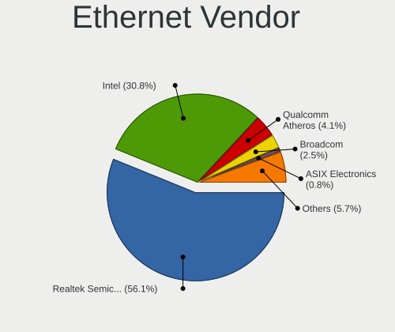

| Vendor                                 | Computers | Percent |
|----------------------------------------|-----------|---------|
| Realtek Semiconductor                  | 1840      | 56.15%  |
| Intel                                  | 1009      | 30.79%  |
| Qualcomm Atheros                       | 133       | 4.06%   |
| Broadcom                               | 83        | 2.53%   |
| ASIX Electronics                       | 26        | 0.79%   |
| Samsung Electronics                    | 17        | 0.52%   |
| Aquantia                               | 17        | 0.52%   |
| Nvidia                                 | 16        | 0.49%   |
| Marvell Technology Group               | 15        | 0.46%   |
| Broadcom Limited                       | 12        | 0.37%   |
| DisplayLink                            | 11        | 0.34%   |
| Qualcomm                               | 9         | 0.27%   |
| MediaTek                               | 9         | 0.27%   |
| OPPO Electronics                       | 7         | 0.21%   |
| Xiaomi                                 | 6         | 0.18%   |
| TP-Link                                | 6         | 0.18%   |
| Lenovo                                 | 6         | 0.18%   |
| Motorola PCS                           | 5         | 0.15%   |
| T & A Mobile Phones                    | 4         | 0.12%   |
| JMicron Technology                     | 4         | 0.12%   |
| Insyde Software                        | 4         | 0.12%   |
| Mellanox Technologies                  | 3         | 0.09%   |
| ICS Advent                             | 3         | 0.09%   |
| Huawei Technologies                    | 3         | 0.09%   |
| D-Link System                          | 3         | 0.09%   |
| Apple                                  | 3         | 0.09%   |
| Solarflare Communications              | 2         | 0.06%   |
| Google                                 | 2         | 0.06%   |
| Emulex                                 | 2         | 0.06%   |
| vivo                                   | 1         | 0.03%   |
| VIA Technologies                       | 1         | 0.03%   |
| Suzhou Motorcomm Electronic Technology | 1         | 0.03%   |
| Sony Ericsson Mobile Communications AB | 1         | 0.03%   |
| Silicon Integrated Systems [SiS]       | 1         | 0.03%   |
| Research In Motion                     | 1         | 0.03%   |
| Qualcomm Technologies                  | 1         | 0.03%   |
| QLogic                                 | 1         | 0.03%   |
| QinHeng Electronics                    | 1         | 0.03%   |
| OnePlus Technology (Shenzhen)          | 1         | 0.03%   |
| Novatel Wireless                       | 1         | 0.03%   |

Ethernet Model
--------------

Ethernet models

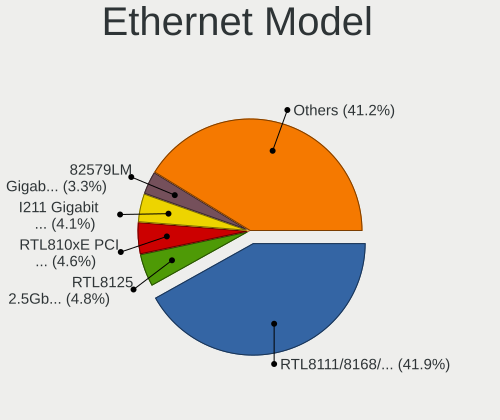

| Model                                                                  | Computers | Percent |
|------------------------------------------------------------------------|-----------|---------|
| Realtek RTL8111/8168/8211/8411 PCI Express Gigabit Ethernet Controller | 1414      | 41.9%   |
| Realtek RTL8125 2.5GbE Controller                                      | 161       | 4.77%   |
| Realtek RTL810xE PCI Express Fast Ethernet controller                  | 155       | 4.59%   |
| Intel I211 Gigabit Network Connection                                  | 140       | 4.15%   |
| Intel 82579LM Gigabit Network Connection (Lewisville)                  | 113       | 3.35%   |
| Realtek RTL8153 Gigabit Ethernet Adapter                               | 94        | 2.79%   |
| Intel Ethernet Controller I225-V                                       | 75        | 2.22%   |
| Intel Ethernet Connection (2) I219-V                                   | 74        | 2.19%   |
| Intel Ethernet Connection I217-LM                                      | 61        | 1.81%   |
| Intel Ethernet Connection (7) I219-V                                   | 57        | 1.69%   |
| Intel Ethernet Connection (4) I219-LM                                  | 38        | 1.13%   |
| Intel Ethernet Connection I219-LM                                      | 33        | 0.98%   |
| Intel Ethernet Connection (2) I219-LM                                  | 29        | 0.86%   |
| Intel Ethernet Connection I218-LM                                      | 28        | 0.83%   |
| Intel Ethernet Connection I217-V                                       | 26        | 0.77%   |
| Intel Ethernet Connection (3) I218-LM                                  | 25        | 0.74%   |
| ASIX AX88179 Gigabit Ethernet                                          | 24        | 0.71%   |
| Intel Ethernet Connection (4) I219-V                                   | 23        | 0.68%   |
| Realtek Killer E2600 GbE Controller                                    | 22        | 0.65%   |
| Qualcomm Atheros AR8151 v2.0 Gigabit Ethernet                          | 22        | 0.65%   |
| Intel Ethernet Connection (7) I219-LM                                  | 22        | 0.65%   |
| Qualcomm Atheros QCA8171 Gigabit Ethernet                              | 20        | 0.59%   |
| Qualcomm Atheros Killer E2500 Gigabit Ethernet Controller              | 20        | 0.59%   |
| Intel 82579V Gigabit Network Connection                                | 19        | 0.56%   |
| Intel I210 Gigabit Network Connection                                  | 18        | 0.53%   |
| Intel 82577LM Gigabit Network Connection                               | 18        | 0.53%   |
| Qualcomm Atheros Killer E220x Gigabit Ethernet Controller              | 17        | 0.5%    |
| Intel Ethernet Controller I226-V                                       | 17        | 0.5%    |
| Qualcomm Atheros Killer E2400 Gigabit Ethernet Controller              | 15        | 0.44%   |
| Intel Ethernet Connection (5) I219-LM                                  | 15        | 0.44%   |
| Intel Alder Lake-P PCH CNVi WiFi                                       | 15        | 0.44%   |
| Broadcom NetXtreme BCM57765 Gigabit Ethernet PCIe                      | 15        | 0.44%   |
| Intel Ethernet Connection (6) I219-V                                   | 13        | 0.39%   |
| Intel Ethernet Connection (2) I218-V                                   | 13        | 0.39%   |
| Samsung Galaxy series, misc. (tethering mode)                          | 12        | 0.36%   |
| Broadcom NetXtreme BCM57766 Gigabit Ethernet PCIe                      | 12        | 0.36%   |
| Realtek RTL8152 Fast Ethernet Adapter                                  | 10        | 0.3%    |
| Intel Ethernet Connection X553 1GbE                                    | 10        | 0.3%    |
| Intel Ethernet Connection (6) I219-LM                                  | 10        | 0.3%    |
| Realtek Killer E3000 2.5GbE Controller                                 | 9         | 0.27%   |

Net Controller Kind
-------------------

Ethernet, WiFi or modem

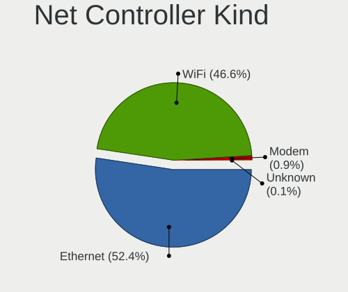

| Kind     | Computers | Percent |
|----------|-----------|---------|
| Ethernet | 3064      | 52.38%  |
| WiFi     | 2728      | 46.63%  |
| Modem    | 54        | 0.92%   |
| Unknown  | 4         | 0.07%   |

Used Controller
---------------

Currently used network controller

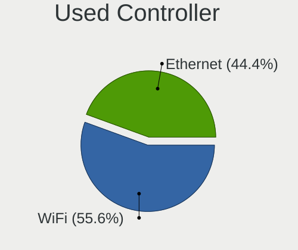

| Kind     | Computers | Percent |
|----------|-----------|---------|
| WiFi     | 2065      | 55.57%  |
| Ethernet | 1651      | 44.43%  |

NICs
----

Total network controllers on board

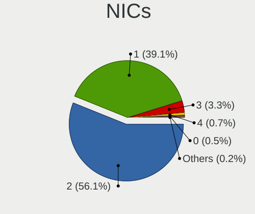

| Total | Computers | Percent |
|-------|-----------|---------|
| 2     | 1989      | 56.09%  |
| 1     | 1387      | 39.11%  |
| 3     | 118       | 3.33%   |
| 4     | 26        | 0.73%   |
| 0     | 19        | 0.54%   |
| 5     | 4         | 0.11%   |
| 6     | 2         | 0.06%   |
| 9     | 1         | 0.03%   |

IPv6
----

IPv6 vs IPv4

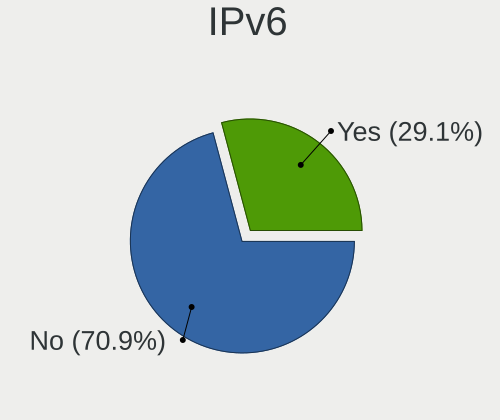

| Used | Computers | Percent |
|------|-----------|---------|
| No   | 2574      | 70.85%  |
| Yes  | 1059      | 29.15%  |

Bluetooth
---------

Bluetooth Vendor
----------------

Controller vendors

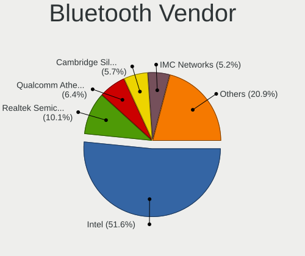

| Vendor                          | Computers | Percent |
|---------------------------------|-----------|---------|
| Intel                           | 1328      | 51.59%  |
| Realtek Semiconductor           | 261       | 10.14%  |
| Qualcomm Atheros Communications | 165       | 6.41%   |
| Cambridge Silicon Radio         | 148       | 5.75%   |
| IMC Networks                    | 134       | 5.21%   |
| Apple                           | 93        | 3.61%   |
| Broadcom                        | 87        | 3.38%   |
| Foxconn / Hon Hai               | 69        | 2.68%   |
| Lite-On Technology              | 64        | 2.49%   |
| ASUSTek Computer                | 59        | 2.29%   |
| MediaTek                        | 56        | 2.18%   |
| TP-Link                         | 28        | 1.09%   |
| Dell                            | 17        | 0.66%   |
| Realtek                         | 13        | 0.51%   |
| Toshiba                         | 9         | 0.35%   |
| Hewlett-Packard                 | 6         | 0.23%   |
| Marvell Semiconductor           | 5         | 0.19%   |
| Edimax Technology               | 4         | 0.16%   |
| Belkin Components               | 4         | 0.16%   |
| Actions                         | 4         | 0.16%   |
| Ralink                          | 3         | 0.12%   |
| Dynex                           | 3         | 0.12%   |
| Ralink Technology               | 2         | 0.08%   |
| HTC (High Tech Computer)        | 2         | 0.08%   |
| Foxconn International           | 2         | 0.08%   |
| Unknown                         | 2         | 0.08%   |
| SINO WEALTH                     | 1         | 0.04%   |
| Opticis                         | 1         | 0.04%   |
| Kensington                      | 1         | 0.04%   |
| Integrated System Solution      | 1         | 0.04%   |
| Creative Technology             | 1         | 0.04%   |
| Chicony Electronics             | 1         | 0.04%   |

Bluetooth Model
---------------

Controller models

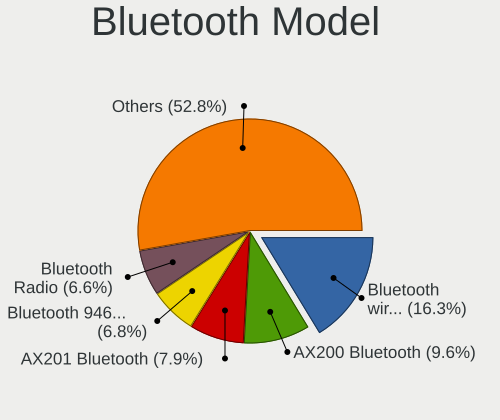

| Model                                               | Computers | Percent |
|-----------------------------------------------------|-----------|---------|
| Intel Bluetooth wireless interface                  | 420       | 16.3%   |
| Intel AX200 Bluetooth                               | 247       | 9.59%   |
| Intel AX201 Bluetooth                               | 204       | 7.92%   |
| Intel Bluetooth 9460/9560 Jefferson Peak (JfP)      | 174       | 6.75%   |
| Realtek Bluetooth Radio                             | 171       | 6.64%   |
| Cambridge Silicon Radio Bluetooth Dongle (HCI mode) | 148       | 5.75%   |
| Qualcomm Atheros  Bluetooth Device                  | 98        | 3.8%    |
| Intel Bluetooth Device                              | 69        | 2.68%   |
| Intel Wireless-AC 3168 Bluetooth                    | 60        | 2.33%   |
| Realtek  Bluetooth 4.2 Adapter                      | 58        | 2.25%   |
| MediaTek Wireless_Device                            | 55        | 2.14%   |
| Intel Wireless-AC 9260 Bluetooth Adapter            | 54        | 2.1%    |
| Intel AX210 Bluetooth                               | 51        | 1.98%   |
| IMC Networks Bluetooth Radio                        | 50        | 1.94%   |
| Apple Bluetooth Host Controller                     | 44        | 1.71%   |
| IMC Networks Wireless_Device                        | 43        | 1.67%   |
| Apple Bluetooth USB Host Controller                 | 37        | 1.44%   |
| Intel Centrino Bluetooth Wireless Transceiver       | 33        | 1.28%   |
| TP-Link TP-T@- UB500 Adapter                        | 28        | 1.09%   |
| Broadcom BCM2045B (BDC-2.1)                         | 27        | 1.05%   |
| Lite-On Bluetooth Device                            | 23        | 0.89%   |
| IMC Networks Bluetooth Device                       | 23        | 0.89%   |
| Qualcomm Atheros AR3012 Bluetooth 4.0               | 22        | 0.85%   |
| ASUS ASUS USB-BT500                                 | 22        | 0.85%   |
| Lite-On Qualcomm Atheros QCA9377 Bluetooth          | 20        | 0.78%   |
| Qualcomm Atheros QCA61x4 Bluetooth 4.0              | 19        | 0.74%   |
| Foxconn / Hon Hai Wireless_Device                   | 19        | 0.74%   |
| ASUS Broadcom BCM20702A0 Bluetooth                  | 19        | 0.74%   |
| Foxconn / Hon Hai MediaTek Bluetooth Adapter        | 16        | 0.62%   |
| Intel Centrino Advanced-N 6230 Bluetooth adapter    | 15        | 0.58%   |
| Foxconn / Hon Hai Bluetooth Device                  | 15        | 0.58%   |
| Broadcom BCM20702A0 Bluetooth 4.0                   | 15        | 0.58%   |
| Realtek Bluetooth Radio                             | 13        | 0.5%    |
| Broadcom BCM20702 Bluetooth 4.0 [ThinkPad]          | 13        | 0.5%    |
| Apple Built-in Bluetooth 2.0+EDR HCI                | 11        | 0.43%   |
| Realtek RTL8822BE Bluetooth 4.2 Adapter             | 10        | 0.39%   |
| Realtek RTL8821A Bluetooth                          | 10        | 0.39%   |
| Dell BCM20702A0 Bluetooth Module                    | 10        | 0.39%   |
| Qualcomm Atheros AR9462 Bluetooth                   | 9         | 0.35%   |
| Qualcomm Atheros AR3011 Bluetooth                   | 7         | 0.27%   |

Sound
-----

Sound Vendor
------------

Sound card vendors

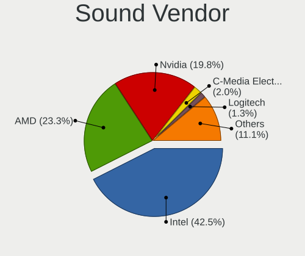

| Vendor                                       | Computers | Percent |
|----------------------------------------------|-----------|---------|
| Intel                                        | 2348      | 42.54%  |
| AMD                                          | 1284      | 23.27%  |
| Nvidia                                       | 1092      | 19.79%  |
| C-Media Electronics                          | 111       | 2.01%   |
| Logitech                                     | 72        | 1.3%    |
| Texas Instruments                            | 41        | 0.74%   |
| Kingston Technology                          | 38        | 0.69%   |
| JMTek                                        | 32        | 0.58%   |
| Razer USA                                    | 31        | 0.56%   |
| ASUSTek Computer                             | 29        | 0.53%   |
| Focusrite-Novation                           | 27        | 0.49%   |
| Generalplus Technology                       | 21        | 0.38%   |
| Realtek Semiconductor                        | 20        | 0.36%   |
| Creative Labs                                | 20        | 0.36%   |
| Corsair                                      | 20        | 0.36%   |
| SteelSeries ApS                              | 19        | 0.34%   |
| Creative Technology                          | 19        | 0.34%   |
| DSEA A/S                                     | 15        | 0.27%   |
| BEHRINGER International                      | 11        | 0.2%    |
| Sony                                         | 10        | 0.18%   |
| Lenovo                                       | 10        | 0.18%   |
| Hewlett-Packard                              | 10        | 0.18%   |
| RODE Microphones                             | 9         | 0.16%   |
| GN Netcom                                    | 9         | 0.16%   |
| Samson Technologies                          | 8         | 0.14%   |
| Thesycon Systemsoftware & Consulting         | 7         | 0.13%   |
| Micro Star International                     | 7         | 0.13%   |
| Astro Gaming                                 | 7         | 0.13%   |
| Zoran Co. Personal Media Division (Nogatech) | 6         | 0.11%   |
| Yamaha                                       | 6         | 0.11%   |
| XMOS                                         | 6         | 0.11%   |
| SAVITECH                                     | 6         | 0.11%   |
| PreSonus Audio Electronics                   | 6         | 0.11%   |
| Jieli Technology                             | 6         | 0.11%   |
| Blue Microphones                             | 6         | 0.11%   |
| Plantronics                                  | 5         | 0.09%   |
| Audio-Technica                               | 5         | 0.09%   |
| ASRock                                       | 5         | 0.09%   |
| VIA Technologies                             | 4         | 0.07%   |
| Native Instruments                           | 4         | 0.07%   |

Sound Model
-----------

Sound card models

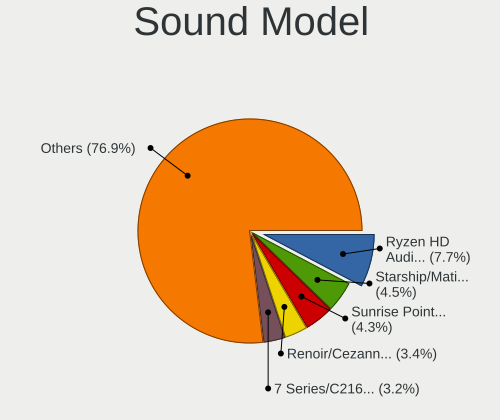

| Model                                                                      | Computers | Percent |
|----------------------------------------------------------------------------|-----------|---------|
| AMD Ryzen HD Audio Controller                                              | 514       | 7.72%   |
| AMD Starship/Matisse HD Audio Controller                                   | 302       | 4.53%   |
| Intel Sunrise Point-LP HD Audio                                            | 286       | 4.29%   |
| AMD Renoir/Cezanne HDMI/DP Audio Controller                                | 225       | 3.38%   |
| Intel 7 Series/C216 Chipset Family High Definition Audio Controller        | 211       | 3.17%   |
| Intel Cannon Lake PCH cAVS                                                 | 202       | 3.03%   |
| Intel 8 Series/C220 Series Chipset High Definition Audio Controller        | 176       | 2.64%   |
| Intel 6 Series/C200 Series Chipset Family High Definition Audio Controller | 173       | 2.6%    |
| Intel Xeon E3-1200 v3/4th Gen Core Processor HD Audio Controller           | 132       | 1.98%   |
| AMD Ellesmere HDMI Audio [Radeon RX 470/480 / 570/580/590]                 | 126       | 1.89%   |
| AMD Raven/Raven2/Fenghuang HDMI/DP Audio Controller                        | 124       | 1.86%   |
| Intel 100 Series/C230 Series Chipset Family HD Audio Controller            | 121       | 1.82%   |
| AMD Navi 21/23 HDMI/DP Audio Controller                                    | 115       | 1.73%   |
| Intel 200 Series PCH HD Audio                                              | 104       | 1.56%   |
| Intel Tiger Lake-LP Smart Sound Technology Audio Controller                | 97        | 1.46%   |
| AMD Family 17h (Models 00h-0fh) HD Audio Controller                        | 96        | 1.44%   |
| Nvidia TU106 High Definition Audio Controller                              | 90        | 1.35%   |
| AMD Radeon High Definition Audio Controller                                | 87        | 1.31%   |
| Nvidia GP107GL High Definition Audio Controller                            | 86        | 1.29%   |
| Intel Haswell-ULT HD Audio Controller                                      | 83        | 1.25%   |
| Nvidia TU107 GeForce GTX 1650 High Definition Audio Controller             | 82        | 1.23%   |
| Intel 8 Series HD Audio Controller                                         | 82        | 1.23%   |
| Nvidia TU116 High Definition Audio Controller                              | 81        | 1.22%   |
| Nvidia GA104 High Definition Audio Controller                              | 77        | 1.16%   |
| Nvidia GP106 High Definition Audio Controller                              | 75        | 1.13%   |
| Intel Wildcat Point-LP High Definition Audio Controller                    | 71        | 1.07%   |
| Intel Broadwell-U Audio Controller                                         | 71        | 1.07%   |
| Nvidia GP104 High Definition Audio Controller                              | 70        | 1.05%   |
| Intel 5 Series/3400 Series Chipset High Definition Audio                   | 70        | 1.05%   |
| Nvidia GA106 High Definition Audio Controller                              | 69        | 1.04%   |
| Intel Cannon Point-LP High Definition Audio Controller                     | 69        | 1.04%   |
| Intel Comet Lake PCH cAVS                                                  | 68        | 1.02%   |
| Intel Comet Lake PCH-LP cAVS                                               | 59        | 0.89%   |
| Intel Alder Lake PCH-P High Definition Audio Controller                    | 59        | 0.89%   |
| AMD FCH Azalia Controller                                                  | 56        | 0.84%   |
| Intel CM238 HD Audio Controller                                            | 54        | 0.81%   |
| AMD SBx00 Azalia (Intel HDA)                                               | 54        | 0.81%   |
| AMD Navi 10 HDMI Audio                                                     | 50        | 0.75%   |
| AMD Family 15h (Models 60h-6fh) Audio Controller                           | 46        | 0.69%   |
| Nvidia TU104 HD Audio Controller                                           | 44        | 0.66%   |

Memory
------

Memory Vendor
-------------

Memory module vendors

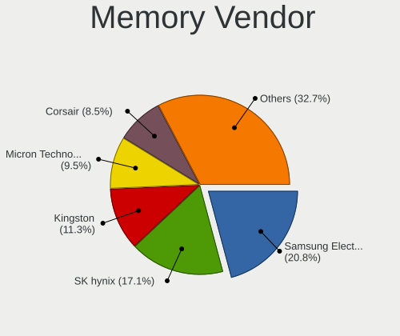

| Vendor                       | Computers | Percent |
|------------------------------|-----------|---------|
| Samsung Electronics          | 829       | 20.84%  |
| SK hynix                     | 682       | 17.15%  |
| Kingston                     | 450       | 11.32%  |
| Micron Technology            | 376       | 9.45%   |
| Corsair                      | 339       | 8.52%   |
| Crucial                      | 275       | 6.91%   |
| G.Skill                      | 229       | 5.76%   |
| Unknown                      | 189       | 4.75%   |
| A-DATA Technology            | 94        | 2.36%   |
| Ramaxel Technology           | 66        | 1.66%   |
| Team                         | 58        | 1.46%   |
| Nanya Technology             | 38        | 0.96%   |
| Elpida                       | 38        | 0.96%   |
| Unknown                      | 37        | 0.93%   |
| Patriot                      | 22        | 0.55%   |
| Unknown (ABCD)               | 19        | 0.48%   |
| Apacer                       | 14        | 0.35%   |
| Timetec                      | 12        | 0.3%    |
| GOODRAM                      | 12        | 0.3%    |
| PNY                          | 11        | 0.28%   |
| Neo Forza                    | 10        | 0.25%   |
| AMD                          | 10        | 0.25%   |
| Transcend                    | 9         | 0.23%   |
| Smart                        | 8         | 0.2%    |
| Silicon Power                | 8         | 0.2%    |
| Goldkey                      | 8         | 0.2%    |
| Avant                        | 8         | 0.2%    |
| ASint Technology             | 6         | 0.15%   |
| Patriot Memory (PDP Systems) | 5         | 0.13%   |
| Lexar                        | 5         | 0.13%   |
| Sesame                       | 4         | 0.1%    |
| Kllisre                      | 4         | 0.1%    |
| Kingmax                      | 4         | 0.1%    |
| Atermiter                    | 4         | 0.1%    |
| Asgard                       | 4         | 0.1%    |
| Teikon                       | 3         | 0.08%   |
| Smart Brazil                 | 3         | 0.08%   |
| Patriot Memory               | 3         | 0.08%   |
| Hikvision                    | 3         | 0.08%   |
| Golden Empire                | 3         | 0.08%   |

Memory Model
------------

Memory module models

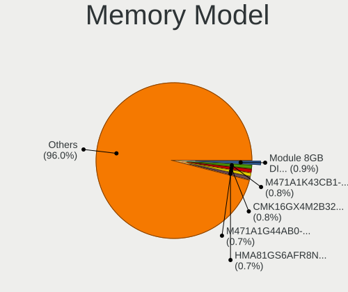

| Model                                                       | Computers | Percent |
|-------------------------------------------------------------|-----------|---------|
| Unknown                                                     | 37        | 0.86%   |
| Samsung RAM M471A1K43CB1-CTD 8GB SODIMM DDR4 3200MT/s       | 36        | 0.84%   |
| Corsair RAM CMK16GX4M2B3200C16 8GB DIMM DDR4 3600MT/s       | 35        | 0.82%   |
| Samsung RAM M471A1G44AB0-CWE 8GiB SODIMM DDR4 3200MT/s      | 32        | 0.75%   |
| SK hynix RAM HMA81GS6AFR8N-UH 8GB SODIMM DDR4 2667MT/s      | 31        | 0.72%   |
| SK hynix RAM HMT451S6BFR8A-PB 4GB SODIMM DDR3 1600MT/s      | 30        | 0.7%    |
| Samsung RAM M471A5244CB0-CTD 4GB SODIMM DDR4 3266MT/s       | 30        | 0.7%    |
| Samsung RAM M471A5244CB0-CRC 4GB SODIMM DDR4 2667MT/s       | 30        | 0.7%    |
| Samsung RAM M471A1K43DB1-CWE 8GB SODIMM DDR4 3200MT/s       | 30        | 0.7%    |
| Samsung RAM M471A1K43DB1-CTD 8GB SODIMM DDR4 2667MT/s       | 28        | 0.65%   |
| Samsung RAM M471B1G73DB0-YK0 8GB SODIMM DDR3 1600MT/s       | 26        | 0.61%   |
| SK hynix RAM HMAA1GS6CJR6N-XN 8GB SODIMM DDR4 3200MT/s      | 25        | 0.58%   |
| Samsung RAM M471A5244CB0-CWE 4GB SODIMM DDR4 3200MT/s       | 24        | 0.56%   |
| Samsung RAM M471A1K43CB1-CRC 8GB SODIMM DDR4 8400MT/s       | 24        | 0.56%   |
| SK hynix RAM HMT41GS6BFR8A-PB 8GB SODIMM DDR3 2667MT/s      | 21        | 0.49%   |
| Samsung RAM M471A1K43BB1-CRC 8GB SODIMM DDR4 2667MT/s       | 21        | 0.49%   |
| Micron RAM 8ATF1G64HZ-3G2J1 8GB SODIMM DDR4 3200MT/s        | 21        | 0.49%   |
| Corsair RAM CMK16GX4M2B3000C15 8GB DIMM DDR4 3600MT/s       | 20        | 0.47%   |
| SK hynix RAM HMA81GS6DJR8N-XN 8GB SODIMM DDR4 3200MT/s      | 19        | 0.44%   |
| Samsung RAM M471B5173DB0-YK0 4GB SODIMM DDR3 1600MT/s       | 18        | 0.42%   |
| G.Skill RAM F4-3000C16-8GISB 8GB DIMM DDR4 3200MT/s         | 18        | 0.42%   |
| SK hynix RAM HMA81GS6JJR8N-VK 8GB SODIMM DDR4 2667MT/s      | 17        | 0.4%    |
| Samsung RAM M471B5173EB0-YK0 4GB SODIMM DDR3 1600MT/s       | 17        | 0.4%    |
| SK hynix RAM HMA81GS6CJR8N-VK 8GB SODIMM DDR4 2667MT/s      | 16        | 0.37%   |
| Samsung RAM M471B5273DH0-CH9 4GB SODIMM DDR3 1600MT/s       | 16        | 0.37%   |
| Samsung RAM M471B5173QH0-YK0 4GB SODIMM DDR3 1600MT/s       | 16        | 0.37%   |
| SK hynix RAM HMT351S6CFR8C-PB 4GB SODIMM DDR3 1600MT/s      | 15        | 0.35%   |
| Samsung RAM M471B1G73QH0-YK0 8GB SODIMM DDR3 1600MT/s       | 15        | 0.35%   |
| Samsung RAM M471B1G73EB0-YK0 8192MB SODIMM DDR3 1600MT/s    | 15        | 0.35%   |
| Samsung RAM M471A1K43EB1-CWE 8GB SODIMM DDR4 3200MT/s       | 15        | 0.35%   |
| G.Skill RAM F4-3200C16-16GVK 16GB DIMM DDR4 3600MT/s        | 15        | 0.35%   |
| SK hynix RAM Module 4GB SODIMM DDR3 1600MT/s                | 14        | 0.33%   |
| Samsung RAM M471A5244CB0-CWE 4GB Row Of Chips DDR4 3200MT/s | 14        | 0.33%   |
| Samsung RAM M471A1G44AB0-CWE 8GB Row Of Chips DDR4 3200MT/s | 14        | 0.33%   |
| Micron RAM 4ATF1G64HZ-3G2E1 8GB SODIMM DDR4 3200MT/s        | 14        | 0.33%   |
| G.Skill RAM F4-3200C16-8GVKB 8GB DIMM DDR4 4000MT/s         | 14        | 0.33%   |
| SK hynix RAM HMT351S6EFR8A-PB 4GB SODIMM DDR3 1600MT/s      | 13        | 0.3%    |
| SK hynix RAM HMA851S6DJR6N-XN 4GB SODIMM DDR4 3200MT/s      | 13        | 0.3%    |
| SK hynix RAM HMA82GS6AFR8N-UH 16GB SODIMM DDR4 2667MT/s     | 13        | 0.3%    |
| Samsung RAM M471A2K43CB1-CRC 16GB SODIMM DDR4 2667MT/s      | 13        | 0.3%    |

Memory Kind
-----------

Memory module kinds

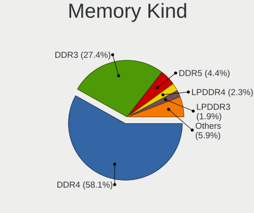

| Kind    | Computers | Percent |
|---------|-----------|---------|
| DDR4    | 1960      | 58.13%  |
| DDR3    | 924       | 27.4%   |
| DDR5    | 150       | 4.45%   |
| LPDDR4  | 77        | 2.28%   |
| LPDDR3  | 63        | 1.87%   |
| SDRAM   | 54        | 1.6%    |
| LPDDR5  | 49        | 1.45%   |
| DDR2    | 43        | 1.28%   |
| Unknown | 42        | 1.25%   |
| DRAM    | 6         | 0.18%   |
| DDR     | 4         | 0.12%   |

Memory Form Factor
------------------

Physical design of the memory module

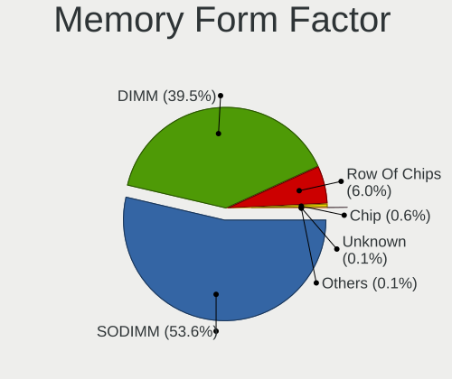

| Name         | Computers | Percent |
|--------------|-----------|---------|
| SODIMM       | 1809      | 53.65%  |
| DIMM         | 1333      | 39.53%  |
| Row Of Chips | 204       | 6.05%   |
| Chip         | 19        | 0.56%   |
| Unknown      | 4         | 0.12%   |
| RIMM         | 3         | 0.09%   |

Memory Size
-----------

Memory module size

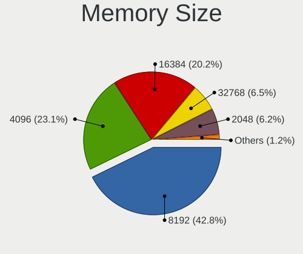

| Size  | Computers | Percent |
|-------|-----------|---------|
| 8192  | 1593      | 42.77%  |
| 4096  | 860       | 23.09%  |
| 16384 | 753       | 20.21%  |
| 32768 | 241       | 6.47%   |
| 2048  | 232       | 6.23%   |
| 1024  | 34        | 0.91%   |
| 49152 | 4         | 0.11%   |
| 24576 | 3         | 0.08%   |
| 512   | 2         | 0.05%   |
| 12288 | 1         | 0.03%   |
| 64    | 1         | 0.03%   |
| 16    | 1         | 0.03%   |

Memory Speed
------------

Memory module speed

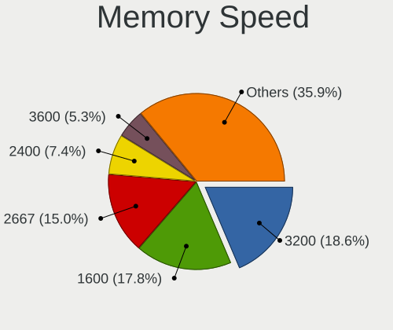

| Speed   | Computers | Percent |
|---------|-----------|---------|
| 3200    | 699       | 18.6%   |
| 1600    | 668       | 17.78%  |
| 2667    | 562       | 14.95%  |
| 2400    | 279       | 7.42%   |
| 3600    | 199       | 5.3%    |
| 2133    | 159       | 4.23%   |
| 1333    | 155       | 4.12%   |
| 3733    | 57        | 1.52%   |
| 4800    | 55        | 1.46%   |
| 3800    | 55        | 1.46%   |
| 1867    | 50        | 1.33%   |
| 1334    | 49        | 1.3%    |
| 3266    | 40        | 1.06%   |
| 3000    | 39        | 1.04%   |
| 6400    | 38        | 1.01%   |
| 5600    | 37        | 0.98%   |
| 3400    | 37        | 0.98%   |
| 1067    | 36        | 0.96%   |
| 4000    | 34        | 0.9%    |
| 8400    | 33        | 0.88%   |
| 1866    | 30        | 0.8%    |
| 4267    | 29        | 0.77%   |
| Unknown | 28        | 0.75%   |
| 6000    | 27        | 0.72%   |
| 800     | 27        | 0.72%   |
| 2666    | 25        | 0.67%   |
| 667     | 23        | 0.61%   |
| 3466    | 21        | 0.56%   |
| 1800    | 21        | 0.56%   |
| 3866    | 18        | 0.48%   |
| 2933    | 15        | 0.4%    |
| 2800    | 15        | 0.4%    |
| 2048    | 14        | 0.37%   |
| 4199    | 13        | 0.35%   |
| 4266    | 11        | 0.29%   |
| 3334    | 8         | 0.21%   |
| 2000    | 8         | 0.21%   |
| 1066    | 8         | 0.21%   |
| 5200    | 7         | 0.19%   |
| 4333    | 7         | 0.19%   |

Printers & scanners
-------------------

Printer Vendor
--------------

Printer device vendors

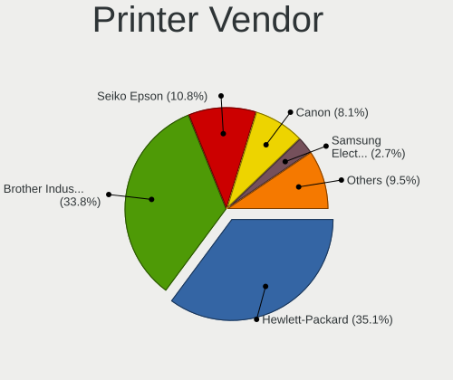

| Vendor                | Computers | Percent |
|-----------------------|-----------|---------|
| Hewlett-Packard       | 26        | 35.14%  |
| Brother Industries    | 25        | 33.78%  |
| Seiko Epson           | 8         | 10.81%  |
| Canon                 | 6         | 8.11%   |
| Samsung Electronics   | 2         | 2.7%    |
| Ricoh                 | 1         | 1.35%   |
| Prolific Technology   | 1         | 1.35%   |
| MIIIW                 | 1         | 1.35%   |
| Lexmark International | 1         | 1.35%   |
| Kyocera               | 1         | 1.35%   |
| Gprinter              | 1         | 1.35%   |
| Dymo-CoStar           | 1         | 1.35%   |

Printer Model
-------------

Printer device models

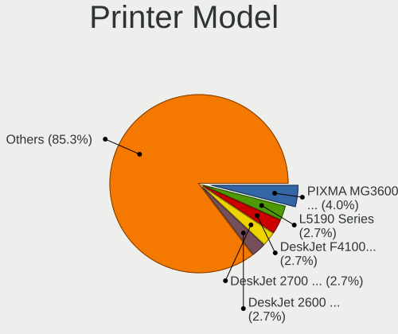

| Model                                  | Computers | Percent |
|----------------------------------------|-----------|---------|
| Canon PIXMA MG3600 Series              | 3         | 4%      |
| Seiko Epson L5190 Series               | 2         | 2.67%   |
| HP DeskJet F4100 Printer series        | 2         | 2.67%   |
| HP DeskJet 2700 series                 | 2         | 2.67%   |
| HP DeskJet 2600 series                 | 2         | 2.67%   |
| Brother MFC-J6545DW                    | 2         | 2.67%   |
| Brother DCP-7055 scanner/printer       | 2         | 2.67%   |
| Seiko Epson XP-240 Series              | 1         | 1.33%   |
| Seiko Epson XP-2100 Series             | 1         | 1.33%   |
| Seiko Epson WF-2870 Series             | 1         | 1.33%   |
| Seiko Epson Stylus NX230/SX235W Series | 1         | 1.33%   |
| Seiko Epson L6270 Series               | 1         | 1.33%   |
| Seiko Epson ET-2710 Series             | 1         | 1.33%   |
| Samsung SCX-3400 Series                | 1         | 1.33%   |
| Samsung SCX-3200 Series                | 1         | 1.33%   |
| Ricoh SP 211                           | 1         | 1.33%   |
| Prolific PL2305 Parallel Port          | 1         | 1.33%   |
| MIIIW MW Keyboard Air Mini             | 1         | 1.33%   |
| Lexmark International B2236dw          | 1         | 1.33%   |
| Kyocera UTAX_TA LP 3240_LP 4240        | 1         | 1.33%   |
| HP Smart Tank Plus 550 series          | 1         | 1.33%   |
| HP PSC 1400                            | 1         | 1.33%   |
| HP OfficeJet Pro 6960                  | 1         | 1.33%   |
| HP OfficeJet 5200 series               | 1         | 1.33%   |
| HP OfficeJet 4650 series               | 1         | 1.33%   |
| HP LaserJet Professional P1102w        | 1         | 1.33%   |
| HP LaserJet P1005                      | 1         | 1.33%   |
| HP LaserJet M203-M206                  | 1         | 1.33%   |
| HP LaserJet 3050                       | 1         | 1.33%   |
| HP LaserJet 1020                       | 1         | 1.33%   |
| HP LaserJet 1015                       | 1         | 1.33%   |
| HP Ink Tank Wireless 410 series        | 1         | 1.33%   |
| HP Ink Tank 110 series                 | 1         | 1.33%   |
| HP HP OfficeJet Pro 8020 series        | 1         | 1.33%   |
| HP ENVY 6400 series                    | 1         | 1.33%   |
| HP ENVY 5000 series                    | 1         | 1.33%   |
| HP ENVY 4500 series                    | 1         | 1.33%   |
| HP DeskJet F2492 All-in-One            | 1         | 1.33%   |
| HP Deskjet 4640 series                 | 1         | 1.33%   |
| HP DeskJet 3700 series                 | 1         | 1.33%   |

Scanner Vendor
--------------

Scanner device vendors

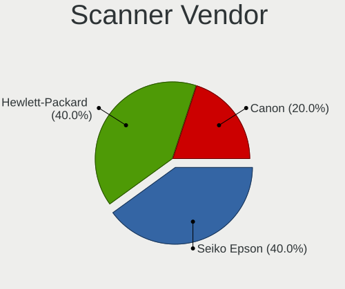

| Vendor          | Computers | Percent |
|-----------------|-----------|---------|
| Canon           | 4         | 44.44%  |
| Seiko Epson     | 3         | 33.33%  |
| Hewlett-Packard | 2         | 22.22%  |

Scanner Model
-------------

Scanner device models

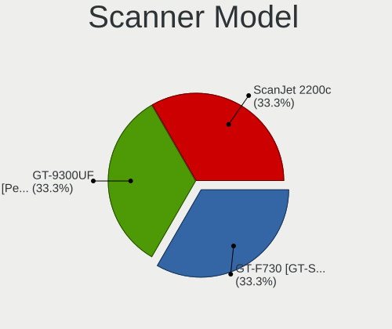

| Model                                                   | Computers | Percent |
|---------------------------------------------------------|-----------|---------|
| Canon CanoScan LIDE 25                                  | 2         | 22.22%  |
| Seiko Epson Perfection V37/V370                         | 1         | 11.11%  |
| Seiko Epson GT-F730 [GT-S630/Perfection V33/V330 Photo] | 1         | 11.11%  |
| Seiko Epson GT-9300UF [Perfection 2400 PHOTO]           | 1         | 11.11%  |
| HP ScanJet 2400c                                        | 1         | 11.11%  |
| HP ScanJet 2200c                                        | 1         | 11.11%  |
| Canon CanoScan N1240U/LiDE 30                           | 1         | 11.11%  |
| Canon CanoScan LiDE 200                                 | 1         | 11.11%  |

Camera
------

Camera Vendor
-------------

Camera device vendors

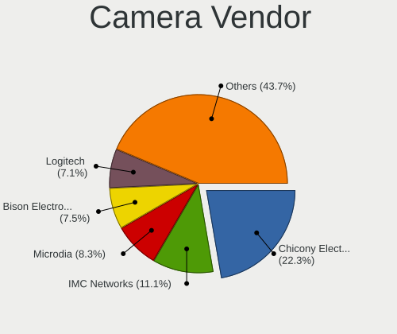

| Vendor                                 | Computers | Percent |
|----------------------------------------|-----------|---------|
| Chicony Electronics                    | 478       | 22.31%  |
| IMC Networks                           | 238       | 11.11%  |
| Microdia                               | 178       | 8.31%   |
| Bison Electronics                      | 161       | 7.51%   |
| Logitech                               | 152       | 7.09%   |
| Realtek Semiconductor                  | 149       | 6.95%   |
| Sunplus Innovation Technology          | 112       | 5.23%   |
| Quanta                                 | 93        | 4.34%   |
| Apple                                  | 69        | 3.22%   |
| Cheng Uei Precision Industry (Foxlink) | 55        | 2.57%   |
| Syntek                                 | 53        | 2.47%   |
| Luxvisions Innotech Limited            | 42        | 1.96%   |
| Lite-On Technology                     | 41        | 1.91%   |
| Suyin                                  | 35        | 1.63%   |
| Sonix Technology                       | 26        | 1.21%   |
| Samsung Electronics                    | 24        | 1.12%   |
| Silicon Motion                         | 20        | 0.93%   |
| Microsoft                              | 18        | 0.84%   |
| Lenovo                                 | 17        | 0.79%   |
| Acer                                   | 14        | 0.65%   |
| Alcor Micro                            | 13        | 0.61%   |
| Razer USA                              | 10        | 0.47%   |
| Generalplus Technology                 | 10        | 0.47%   |
| ARC International                      | 7         | 0.33%   |
| ShineTech                              | 6         | 0.28%   |
| Primax Electronics                     | 6         | 0.28%   |
| Ricoh                                  | 5         | 0.23%   |
| MacroSilicon                           | 5         | 0.23%   |
| KYE Systems (Mouse Systems)            | 5         | 0.23%   |
| Importek                               | 5         | 0.23%   |
| Hewlett-Packard                        | 5         | 0.23%   |
| GEMBIRD                                | 5         | 0.23%   |
| Creative Technology                    | 5         | 0.23%   |
| Z-Star Microelectronics                | 4         | 0.19%   |
| icSpring                               | 4         | 0.19%   |
| Google                                 | 4         | 0.19%   |
| WaveRider Communications               | 3         | 0.14%   |
| SunplusIT                              | 3         | 0.14%   |
| OPPO Electronics                       | 3         | 0.14%   |
| Cubeternet                             | 3         | 0.14%   |

Camera Model
------------

Camera device models

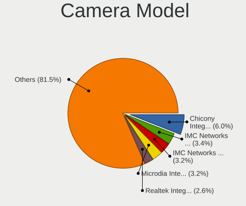

| Model                                               | Computers | Percent |
|-----------------------------------------------------|-----------|---------|
| Chicony Integrated Camera                           | 129       | 5.99%   |
| IMC Networks USB2.0 HD UVC WebCam                   | 73        | 3.39%   |
| IMC Networks Integrated Camera                      | 70        | 3.25%   |
| Microdia Integrated_Webcam_HD                       | 69        | 3.2%    |
| Realtek Integrated_Webcam_HD                        | 57        | 2.65%   |
| Bison Integrated Camera                             | 45        | 2.09%   |
| Chicony HD WebCam                                   | 44        | 2.04%   |
| Syntek Integrated Camera                            | 36        | 1.67%   |
| Sunplus Integrated_Webcam_HD                        | 34        | 1.58%   |
| Logitech HD Pro Webcam C920                         | 32        | 1.49%   |
| IMC Networks USB2.0 VGA UVC WebCam                  | 31        | 1.44%   |
| Logitech Webcam C270                                | 30        | 1.39%   |
| Lite-On Integrated Camera                           | 28        | 1.3%    |
| Samsung Galaxy series, misc. (MTP mode)             | 24        | 1.11%   |
| Apple iPhone 5/5C/5S/6/SE/7/8/X                     | 24        | 1.11%   |
| Chicony HP Wide Vision HD Camera                    | 20        | 0.93%   |
| Logitech C922 Pro Stream Webcam                     | 18        | 0.84%   |
| Bison EasyCamera                                    | 18        | 0.84%   |
| Bison HD Webcam                                     | 17        | 0.79%   |
| Apple Built-in iSight                               | 17        | 0.79%   |
| Sonix USB2.0 HD UVC WebCam                          | 16        | 0.74%   |
| Quanta HD User Facing                               | 16        | 0.74%   |
| Luxvisions Innotech Limited HP TrueVision HD Camera | 16        | 0.74%   |
| Chicony USB2.0 VGA UVC WebCam                       | 16        | 0.74%   |
| Chicony HP Truevision HD                            | 16        | 0.74%   |
| Chicony EasyCamera                                  | 16        | 0.74%   |
| Quanta HP TrueVision HD Camera                      | 15        | 0.7%    |
| Microdia Integrated Webcam                          | 15        | 0.7%    |
| Chicony Integrated Camera (1280x720@30)             | 15        | 0.7%    |
| Chicony HP Truevision HD camera                     | 15        | 0.7%    |
| Chicony Chicony USB2.0 Camera                       | 15        | 0.7%    |
| Apple FaceTime HD Camera (Built-in)                 | 15        | 0.7%    |
| Microdia USB 2.0 Camera                             | 14        | 0.65%   |
| Chicony TOSHIBA Web Camera - HD                     | 14        | 0.65%   |
| Bison SunplusIT Integrated Camera                   | 14        | 0.65%   |
| Microdia Laptop_Integrated_Webcam_HD                | 13        | 0.6%    |
| Chicony USB2.0 HD UVC WebCam                        | 13        | 0.6%    |
| Bison BisonCam,NB Pro                               | 13        | 0.6%    |
| Quanta HD Webcam                                    | 12        | 0.56%   |
| Chicony HP HD Camera                                | 12        | 0.56%   |

Security
--------

Fingerprint Vendor
------------------

Fingerprint sensor vendors

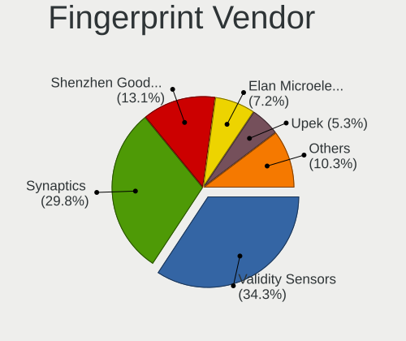

| Vendor                             | Computers | Percent |
|------------------------------------|-----------|---------|
| Validity Sensors                   | 123       | 34.26%  |
| Synaptics                          | 107       | 29.81%  |
| Shenzhen Goodix Technology         | 47        | 13.09%  |
| Elan Microelectronics              | 26        | 7.24%   |
| Upek                               | 19        | 5.29%   |
| LighTuning Technology              | 17        | 4.74%   |
| AuthenTec                          | 12        | 3.34%   |
| Realtek USB2.0 Finger Print Bridge | 3         | 0.84%   |
| STMicroelectronics                 | 2         | 0.56%   |
| Next Biometrics                    | 1         | 0.28%   |
| Focal-systems.Corp                 | 1         | 0.28%   |
| DigitalPersona                     | 1         | 0.28%   |

Fingerprint Model
-----------------

Fingerprint sensor models

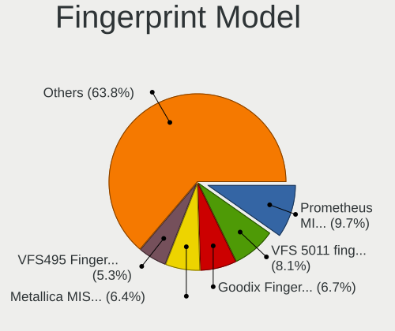

| Model                                                                      | Computers | Percent |
|----------------------------------------------------------------------------|-----------|---------|
| Synaptics Prometheus MIS Touch Fingerprint Reader                          | 35        | 9.75%   |
| Validity Sensors VFS 5011 fingerprint sensor                               | 29        | 8.08%   |
| Shenzhen Goodix  Fingerprint Device                                        | 24        | 6.69%   |
| Synaptics Metallica MIS Touch Fingerprint Reader                           | 23        | 6.41%   |
| Validity Sensors VFS495 Fingerprint Reader                                 | 19        | 5.29%   |
| Upek Biometric Touchchip/Touchstrip Fingerprint Sensor                     | 18        | 5.01%   |
| Validity Sensors Synaptics WBDI                                            | 17        | 4.74%   |
| Shenzhen Goodix Fingerprint Reader                                         | 15        | 4.18%   |
| Elan ELAN:Fingerprint                                                      | 13        | 3.62%   |
| Validity Sensors Swipe Fingerprint Sensor                                  | 11        | 3.06%   |
| LighTuning EgisTec Touch Fingerprint Sensor                                | 11        | 3.06%   |
| Synaptics  WBDI                                                            | 9         | 2.51%   |
| Elan ELAN:ARM-M4                                                           | 9         | 2.51%   |
| Validity Sensors VFS5011 Fingerprint Reader                                | 8         | 2.23%   |
| Synaptics Prometheus Fingerprint Reader                                    | 8         | 2.23%   |
| Shenzhen Goodix FingerPrint                                                | 8         | 2.23%   |
| Validity Sensors VFS471 Fingerprint Reader                                 | 7         | 1.95%   |
| Validity Sensors Fingerprint scanner                                       | 7         | 1.95%   |
| Validity Sensors Synaptics VFS7552 Touch Fingerprint Sensor with PurePrint | 6         | 1.67%   |
| Validity Sensors VFS7500 Touch Fingerprint Sensor                          | 5         | 1.39%   |
| Validity Sensors VFS491                                                    | 5         | 1.39%   |
| Synaptics WBDI                                                             | 5         | 1.39%   |
| Synaptics FS7604 Touch Fingerprint Sensor with PurePrint                   | 5         | 1.39%   |
| AuthenTec AES2810                                                          | 5         | 1.39%   |
| Synaptics  FS7604 Touch Fingerprint Sensor with PurePrint                  | 4         | 1.11%   |
| Synaptics Metallica MOH Touch Fingerprint Reader                           | 4         | 1.11%   |
| Elan fingerprint sensor [FeinTech FPS00200]                                | 4         | 1.11%   |
| Synaptics WBDI Device                                                      | 3         | 0.84%   |
| Synaptics UWP WBDI                                                         | 3         | 0.84%   |
| Realtek USB2.0 Finger Print Bridge FocalTech Fingerprint Device            | 3         | 0.84%   |
| LighTuning ES603 Swipe Fingerprint Sensor                                  | 3         | 0.84%   |
| Validity Sensors VFS7552 Touch Fingerprint Sensor                          | 2         | 0.56%   |
| Validity Sensors VFS451 Fingerprint Reader                                 | 2         | 0.56%   |
| Validity Sensors VFS Fingerprint sensor                                    | 2         | 0.56%   |
| Synaptics WBDI Fingerprint Reader USB 102                                  | 2         | 0.56%   |
| Synaptics TouchPad                                                         | 2         | 0.56%   |
| STMicroelectronics Fingerprint Reader                                      | 2         | 0.56%   |
| LighTuning Fingerprint Sensor                                              | 2         | 0.56%   |
| AuthenTec Fingerprint Sensor                                               | 2         | 0.56%   |
| AuthenTec AES1600                                                          | 2         | 0.56%   |

Chipcard Vendor
---------------

Chipcard module vendors

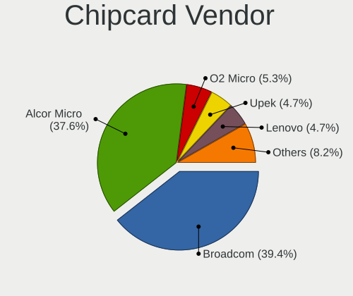

| Vendor                | Computers | Percent |
|-----------------------|-----------|---------|
| Broadcom              | 67        | 39.41%  |
| Alcor Micro           | 64        | 37.65%  |
| O2 Micro              | 9         | 5.29%   |
| Upek                  | 8         | 4.71%   |
| Lenovo                | 8         | 4.71%   |
| SCM Microsystems      | 3         | 1.76%   |
| Yubico.com            | 2         | 1.18%   |
| OmniKey               | 2         | 1.18%   |
| Gemalto (was Gemplus) | 2         | 1.18%   |
| Aladdin R.D.          | 2         | 1.18%   |
| Clay Logic            | 1         | 0.59%   |
| Chicony Electronics   | 1         | 0.59%   |
| CHERRY                | 1         | 0.59%   |

Chipcard Model
--------------

Chipcard module models

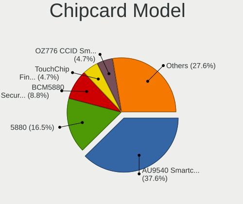

| Model                                                                        | Computers | Percent |
|------------------------------------------------------------------------------|-----------|---------|
| Alcor Micro AU9540 Smartcard Reader                                          | 64        | 37.65%  |
| Broadcom 5880                                                                | 28        | 16.47%  |
| Broadcom BCM5880 Secure Applications Processor                               | 15        | 8.82%   |
| Upek TouchChip Fingerprint Coprocessor (WBF advanced mode)                   | 8         | 4.71%   |
| O2 Micro OZ776 CCID Smartcard Reader                                         | 8         | 4.71%   |
| Lenovo Integrated Smart Card Reader                                          | 8         | 4.71%   |
| Broadcom BCM5880 Secure Applications Processor with fingerprint swipe sensor | 8         | 4.71%   |
| Broadcom BCM58200 ControlVault 3 (FingerPrint sensor + Contacted SmartCard)  | 8         | 4.71%   |
| Broadcom 58200                                                               | 7         | 4.12%   |
| SCM Microsystems SCR331-LC1 / SCR3310 SmartCard Reader                       | 2         | 1.18%   |
| Gemalto (was Gemplus) GemPC Twin SmartCard Reader                            | 2         | 1.18%   |
| Aladdin R.D. JaCarta LT                                                      | 2         | 1.18%   |
| Yubico.com Yubikey NEO(-N) OTP+CCID                                          | 1         | 0.59%   |
| Yubico.com Yubikey 4/5 U2F+CCID                                              | 1         | 0.59%   |
| SCM Microsystems SCR3500 A Contact Reader                                    | 1         | 0.59%   |
| OmniKey CardMan 1021                                                         | 1         | 0.59%   |
| OmniKey 3x21 Smart Card Reader                                               | 1         | 0.59%   |
| O2 Micro Oz776 SmartCard Reader                                              | 1         | 0.59%   |
| Clay Logic Nitrokey Pro                                                      | 1         | 0.59%   |
| Chicony Electronics HP Skylab USB Smartcard Keyboard                         | 1         | 0.59%   |
| CHERRY Smart Card Reader USB                                                 | 1         | 0.59%   |
| Broadcom BCM5880 Secure Applications Processor with fingerprint touch sensor | 1         | 0.59%   |

Unsupported
-----------

Unsupported Devices
-------------------

Total unsupported devices on board

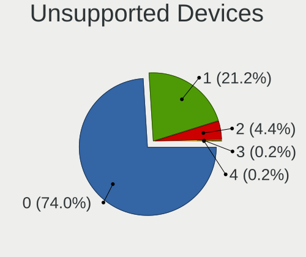

| Total | Computers | Percent |
|-------|-----------|---------|
| 0     | 2681      | 74%     |
| 1     | 767       | 21.17%  |
| 2     | 161       | 4.44%   |
| 3     | 8         | 0.22%   |
| 4     | 6         | 0.17%   |

Unsupported Device Types
------------------------

Types of unsupported devices

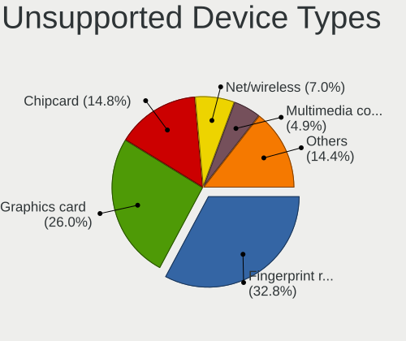

| Type                     | Computers | Percent |
|--------------------------|-----------|---------|
| Fingerprint reader       | 359       | 32.82%  |
| Graphics card            | 284       | 25.96%  |
| Chipcard                 | 162       | 14.81%  |
| Net/wireless             | 77        | 7.04%   |
| Multimedia controller    | 54        | 4.94%   |
| Camera                   | 41        | 3.75%   |
| Unassigned class         | 29        | 2.65%   |
| Communication controller | 23        | 2.1%    |
| Bluetooth                | 15        | 1.37%   |
| Net/ethernet             | 14        | 1.28%   |
| Network                  | 9         | 0.82%   |
| Card reader              | 8         | 0.73%   |
| Sound                    | 6         | 0.55%   |
| Storage                  | 3         | 0.27%   |
| Dvb card                 | 3         | 0.27%   |
| Storage/raid             | 2         | 0.18%   |
| Storage/nvme             | 2         | 0.18%   |
| Modem                    | 2         | 0.18%   |
| Wireless                 | 1         | 0.09%   |

