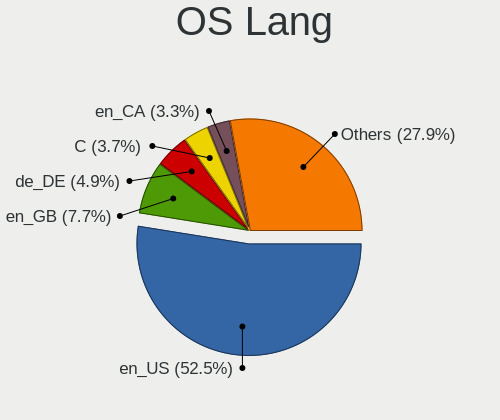
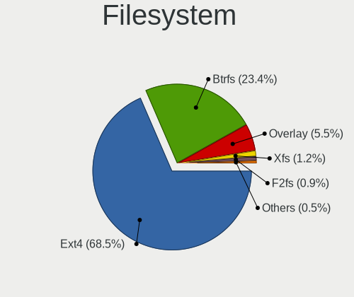
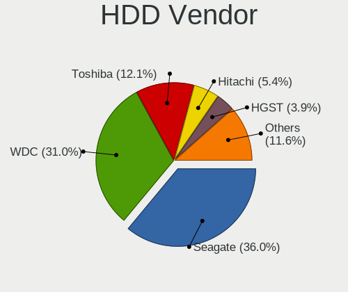
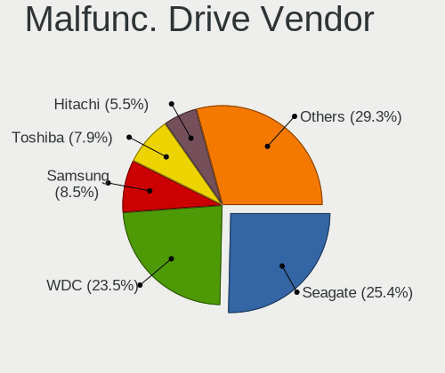
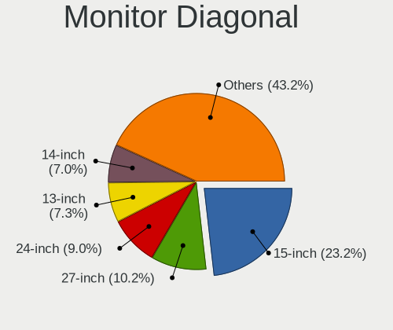
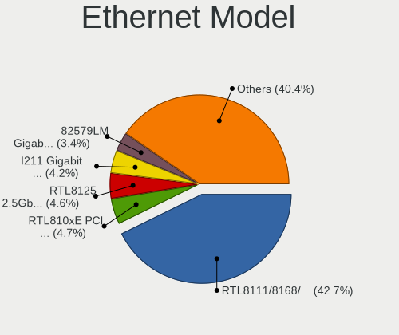
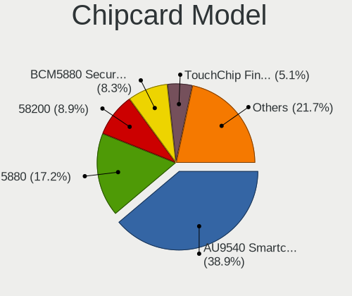

ArcoLinux - Tested Hardware & Statistics
----------------------------------------

A project to collect tested hardware configurations for ArcoLinux.

Anyone can contribute to this report by the [hw-probe](https://github.com/linuxhw/hw-probe) tool:

    sudo -E hw-probe -all -upload

Please contribute! Especially if your hardware is rare.

This is a report for all computer types. See also reports for [desktops](/Dist/ArcoLinux/Desktop/README.md) and [notebooks](/Dist/ArcoLinux/Notebook/README.md).

Contents
--------

* [ Test Cases ](#test-cases)

* [ System ](#system)
  - [ OS                       ](#os)
  - [ OS Family                ](#os-family)
  - [ Kernel                   ](#kernel)
  - [ Kernel Family            ](#kernel-family)
  - [ Kernel Major Ver.        ](#kernel-major-ver)
  - [ Arch                     ](#arch)
  - [ DE                       ](#de)
  - [ Display Server           ](#display-server)
  - [ Display Manager          ](#display-manager)
  - [ OS Lang                  ](#os-lang)
  - [ Boot Mode                ](#boot-mode)
  - [ Filesystem               ](#filesystem)
  - [ Part. scheme             ](#part-scheme)
  - [ Dual Boot with Linux/BSD ](#dual-boot-with-linuxbsd)
  - [ Dual Boot (Win)          ](#dual-boot-win)

* [ Board ](#board)
  - [ Vendor                   ](#vendor)
  - [ Model                    ](#model)
  - [ Model Family             ](#model-family)
  - [ MFG Year                 ](#mfg-year)
  - [ Form Factor              ](#form-factor)
  - [ Secure Boot              ](#secure-boot)
  - [ Coreboot                 ](#coreboot)
  - [ RAM Size                 ](#ram-size)
  - [ RAM Used                 ](#ram-used)
  - [ Total Drives             ](#total-drives)
  - [ Has CD-ROM               ](#has-cd-rom)
  - [ Has Ethernet             ](#has-ethernet)
  - [ Has WiFi                 ](#has-wifi)
  - [ Has Bluetooth            ](#has-bluetooth)

* [ Location ](#location)
  - [ Country                  ](#country)
  - [ City                     ](#city)

* [ Drives ](#drives)
  - [ Drive Vendor             ](#drive-vendor)
  - [ Drive Model              ](#drive-model)
  - [ HDD Vendor               ](#hdd-vendor)
  - [ SSD Vendor               ](#ssd-vendor)
  - [ Drive Kind               ](#drive-kind)
  - [ Drive Connector          ](#drive-connector)
  - [ Drive Size               ](#drive-size)
  - [ Space Total              ](#space-total)
  - [ Space Used               ](#space-used)
  - [ Malfunc. Drives          ](#malfunc-drives)
  - [ Malfunc. Drive Vendor    ](#malfunc-drive-vendor)
  - [ Malfunc. HDD Vendor      ](#malfunc-hdd-vendor)
  - [ Malfunc. Drive Kind      ](#malfunc-drive-kind)
  - [ Failed Drives            ](#failed-drives)
  - [ Failed Drive Vendor      ](#failed-drive-vendor)
  - [ Drive Status             ](#drive-status)

* [ Storage controller ](#storage-controller)
  - [ Storage Vendor           ](#storage-vendor)
  - [ Storage Model            ](#storage-model)
  - [ Storage Kind             ](#storage-kind)

* [ Processor ](#processor)
  - [ CPU Vendor               ](#cpu-vendor)
  - [ CPU Model                ](#cpu-model)
  - [ CPU Model Family         ](#cpu-model-family)
  - [ CPU Cores                ](#cpu-cores)
  - [ CPU Sockets              ](#cpu-sockets)
  - [ CPU Threads              ](#cpu-threads)
  - [ CPU Op-Modes             ](#cpu-op-modes)
  - [ CPU Microcode            ](#cpu-microcode)
  - [ CPU Microarch            ](#cpu-microarch)

* [ Graphics ](#graphics)
  - [ GPU Vendor               ](#gpu-vendor)
  - [ GPU Model                ](#gpu-model)
  - [ GPU Combo                ](#gpu-combo)
  - [ GPU Driver               ](#gpu-driver)
  - [ GPU Memory               ](#gpu-memory)

* [ Monitor ](#monitor)
  - [ Monitor Vendor           ](#monitor-vendor)
  - [ Monitor Model            ](#monitor-model)
  - [ Monitor Resolution       ](#monitor-resolution)
  - [ Monitor Diagonal         ](#monitor-diagonal)
  - [ Monitor Width            ](#monitor-width)
  - [ Aspect Ratio             ](#aspect-ratio)
  - [ Monitor Area             ](#monitor-area)
  - [ Pixel Density            ](#pixel-density)
  - [ Multiple Monitors        ](#multiple-monitors)

* [ Network ](#network)
  - [ Net Controller Vendor    ](#net-controller-vendor)
  - [ Net Controller Model     ](#net-controller-model)
  - [ Wireless Vendor          ](#wireless-vendor)
  - [ Wireless Model           ](#wireless-model)
  - [ Ethernet Vendor          ](#ethernet-vendor)
  - [ Ethernet Model           ](#ethernet-model)
  - [ Net Controller Kind      ](#net-controller-kind)
  - [ Used Controller          ](#used-controller)
  - [ NICs                     ](#nics)
  - [ IPv6                     ](#ipv6)

* [ Bluetooth ](#bluetooth)
  - [ Bluetooth Vendor         ](#bluetooth-vendor)
  - [ Bluetooth Model          ](#bluetooth-model)

* [ Sound ](#sound)
  - [ Sound Vendor             ](#sound-vendor)
  - [ Sound Model              ](#sound-model)

* [ Memory ](#memory)
  - [ Memory Vendor            ](#memory-vendor)
  - [ Memory Model             ](#memory-model)
  - [ Memory Kind              ](#memory-kind)
  - [ Memory Form Factor       ](#memory-form-factor)
  - [ Memory Size              ](#memory-size)
  - [ Memory Speed             ](#memory-speed)

* [ Printers & scanners ](#printers--scanners)
  - [ Printer Vendor           ](#printer-vendor)
  - [ Printer Model            ](#printer-model)
  - [ Scanner Vendor           ](#scanner-vendor)
  - [ Scanner Model            ](#scanner-model)

* [ Camera ](#camera)
  - [ Camera Vendor            ](#camera-vendor)
  - [ Camera Model             ](#camera-model)

* [ Security ](#security)
  - [ Fingerprint Vendor       ](#fingerprint-vendor)
  - [ Fingerprint Model        ](#fingerprint-model)
  - [ Chipcard Vendor          ](#chipcard-vendor)
  - [ Chipcard Model           ](#chipcard-model)

* [ Unsupported ](#unsupported)
  - [ Unsupported Devices      ](#unsupported-devices)
  - [ Unsupported Device Types ](#unsupported-device-types)

Test Cases
----------

Total: 3353

| Vendor        | Model                       | Form-Factor | Probe                                                      | Date         |
|---------------|-----------------------------|-------------|------------------------------------------------------------|--------------|
| Acer          | Aspire SW5-173              | Notebook    | [b990067acf](https://linux-hardware.org/?probe=b990067acf) | Oct 01, 2023 |
| Lenovo        | IdeaPad 330-15ARR 81D2      | Notebook    | [5d6364a866](https://linux-hardware.org/?probe=5d6364a866) | Oct 01, 2023 |
| HP            | Pavilion Laptop 14-dv1xx... | Notebook    | [085fbda5a6](https://linux-hardware.org/?probe=085fbda5a6) | Sep 30, 2023 |
| Lenovo        | IdeaPad S145-15AST 81N3     | Notebook    | [4575deef12](https://linux-hardware.org/?probe=4575deef12) | Sep 30, 2023 |
| Lenovo        | ThinkPad T440 20B7S1K400    | Notebook    | [fd03530876](https://linux-hardware.org/?probe=fd03530876) | Sep 30, 2023 |
| ASRock        | A320M-DGS                   | Desktop     | [63aafe31f1](https://linux-hardware.org/?probe=63aafe31f1) | Sep 30, 2023 |
| Acer          | Aspire E5-411G              | Notebook    | [80ac43658d](https://linux-hardware.org/?probe=80ac43658d) | Sep 30, 2023 |
| Dell          | 0YXT71 A02                  | Desktop     | [6bc3385414](https://linux-hardware.org/?probe=6bc3385414) | Sep 30, 2023 |
| Gigabyte      | Z87X-UD3H-CF                | Desktop     | [7f47d1f656](https://linux-hardware.org/?probe=7f47d1f656) | Sep 30, 2023 |
| Medion        | MS-7667                     | Desktop     | [a91527e825](https://linux-hardware.org/?probe=a91527e825) | Sep 30, 2023 |
| Gigabyte      | X399 DESIGNARE EX-CF        | Desktop     | [4835df59b1](https://linux-hardware.org/?probe=4835df59b1) | Sep 30, 2023 |
| Dell          | Latitude 3301               | Notebook    | [3859ed5445](https://linux-hardware.org/?probe=3859ed5445) | Sep 29, 2023 |
| ASRock        | Z490 Phantom Gaming 4       | Desktop     | [6fc3fe7a63](https://linux-hardware.org/?probe=6fc3fe7a63) | Sep 29, 2023 |
| Lenovo        | ThinkPad X260 20F5S2WY00    | Notebook    | [6a18fb9b21](https://linux-hardware.org/?probe=6a18fb9b21) | Sep 29, 2023 |
| Acer          | Nitro AN515-55              | Notebook    | [e6d8dfa4a1](https://linux-hardware.org/?probe=e6d8dfa4a1) | Sep 29, 2023 |
| Dell          | XPS 15 9560                 | Notebook    | [cb2cbda84d](https://linux-hardware.org/?probe=cb2cbda84d) | Sep 28, 2023 |
| MACHINIST     | X99-RS9 V2.0                | Desktop     | [51272b2713](https://linux-hardware.org/?probe=51272b2713) | Sep 28, 2023 |
| MACHINIST     | X99-RS9 V2.0                | Desktop     | [1509f60079](https://linux-hardware.org/?probe=1509f60079) | Sep 28, 2023 |
| Apple         | MacBookPro9,1               | Notebook    | [555dfa4f2e](https://linux-hardware.org/?probe=555dfa4f2e) | Sep 28, 2023 |
| HP            | EliteBook 850 G1            | Notebook    | [35f0e18f04](https://linux-hardware.org/?probe=35f0e18f04) | Sep 28, 2023 |
| Acer          | Aspire E5-411G              | Notebook    | [eeb582da25](https://linux-hardware.org/?probe=eeb582da25) | Sep 28, 2023 |
| ASUSTek       | K45VM                       | Notebook    | [6c167e69a4](https://linux-hardware.org/?probe=6c167e69a4) | Sep 28, 2023 |
| ASUSTek       | ROG STRIX Z590-E GAMING ... | Desktop     | [797275028d](https://linux-hardware.org/?probe=797275028d) | Sep 28, 2023 |
| HP            | ElitePad 1000 G2            | Notebook    | [a53de5d0bd](https://linux-hardware.org/?probe=a53de5d0bd) | Sep 27, 2023 |
| ASUSTek       | ASUS TUF Gaming A15 FA50... | Notebook    | [8c585051a3](https://linux-hardware.org/?probe=8c585051a3) | Sep 27, 2023 |
| Lenovo        | ThinkPad X1 Carbon 6th 2... | Notebook    | [fb82c6e942](https://linux-hardware.org/?probe=fb82c6e942) | Sep 27, 2023 |
| HP            | EliteBook x360 1020 G2      | Convertible | [7b6ee612cf](https://linux-hardware.org/?probe=7b6ee612cf) | Sep 27, 2023 |
| ASUSTek       | N551JW                      | Notebook    | [8c38084e7e](https://linux-hardware.org/?probe=8c38084e7e) | Sep 27, 2023 |
| ASUSTek       | VivoBook_ASUS Laptop E41... | Notebook    | [d14e65fadf](https://linux-hardware.org/?probe=d14e65fadf) | Sep 26, 2023 |
| ASUSTek       | VivoBook_ASUS Laptop E41... | Notebook    | [1c764be0e3](https://linux-hardware.org/?probe=1c764be0e3) | Sep 26, 2023 |
| ASUSTek       | X555UB                      | Notebook    | [8496a9f79f](https://linux-hardware.org/?probe=8496a9f79f) | Sep 26, 2023 |
| ASUSTek       | PRIME B550M-A               | Desktop     | [1476ba44bb](https://linux-hardware.org/?probe=1476ba44bb) | Sep 26, 2023 |
| HP            | Folio 13                    | Notebook    | [a5a1ae29a7](https://linux-hardware.org/?probe=a5a1ae29a7) | Sep 26, 2023 |
| ASUSTek       | K52JB                       | Notebook    | [7524eea19f](https://linux-hardware.org/?probe=7524eea19f) | Sep 26, 2023 |
| MSI           | MAG B550 TOMAHAWK           | Desktop     | [3420c7e013](https://linux-hardware.org/?probe=3420c7e013) | Sep 25, 2023 |
| Acer          | Aspire E5-575G              | Notebook    | [48fb2a7ee3](https://linux-hardware.org/?probe=48fb2a7ee3) | Sep 25, 2023 |
| HP            | ElitePad 1000 G2            | Notebook    | [5e1dcb7163](https://linux-hardware.org/?probe=5e1dcb7163) | Sep 24, 2023 |
| Razer         | Blade                       | Notebook    | [b3b2eb7db8](https://linux-hardware.org/?probe=b3b2eb7db8) | Sep 24, 2023 |
| Lenovo        | IdeaPad Y700-15ISK 80NV     | Notebook    | [e6bd73a6e1](https://linux-hardware.org/?probe=e6bd73a6e1) | Sep 24, 2023 |
| ASUSTek       | VivoBook_ASUS Laptop E41... | Notebook    | [575df2588e](https://linux-hardware.org/?probe=575df2588e) | Sep 23, 2023 |
| Lenovo        | IdeaPadFlex 5-1570 81CA     | Convertible | [6514ebc367](https://linux-hardware.org/?probe=6514ebc367) | Sep 23, 2023 |
| Unknown       | Unknown                     | Notebook    | [539887ee9a](https://linux-hardware.org/?probe=539887ee9a) | Sep 23, 2023 |
| ASUSTek       | VivoBook_ASUS Laptop E41... | Notebook    | [d6943b89de](https://linux-hardware.org/?probe=d6943b89de) | Sep 23, 2023 |
| ASUSTek       | ROG Zephyrus G14 GA401IV... | Notebook    | [1af364233f](https://linux-hardware.org/?probe=1af364233f) | Sep 23, 2023 |
| Lenovo        | 3717 SDK0J40700 WIN 3258... | Desktop     | [1f76bcf230](https://linux-hardware.org/?probe=1f76bcf230) | Sep 23, 2023 |
| Lenovo        | 3717 SDK0J40700 WIN 3258... | Desktop     | [0fb4baf82b](https://linux-hardware.org/?probe=0fb4baf82b) | Sep 23, 2023 |
| HP            | ProBook 450 G1              | Notebook    | [feffc725af](https://linux-hardware.org/?probe=feffc725af) | Sep 23, 2023 |
| MSI           | CR610M                      | Notebook    | [5a9d9ba5ae](https://linux-hardware.org/?probe=5a9d9ba5ae) | Sep 22, 2023 |
| HP            | Folio 13                    | Notebook    | [66f8752b64](https://linux-hardware.org/?probe=66f8752b64) | Sep 22, 2023 |
| Dell          | XPS 15 9560                 | Notebook    | [a437fe8bcf](https://linux-hardware.org/?probe=a437fe8bcf) | Sep 21, 2023 |
| Lenovo        | ThinkPad T420 4178AFU       | Notebook    | [adee486a15](https://linux-hardware.org/?probe=adee486a15) | Sep 21, 2023 |
| Lenovo        | IdeaPad 3 15ABA7 82RN       | Notebook    | [65044021bd](https://linux-hardware.org/?probe=65044021bd) | Sep 21, 2023 |
| Monster       | ABRA A7 V11.3               | Notebook    | [7d1ed0e1c5](https://linux-hardware.org/?probe=7d1ed0e1c5) | Sep 21, 2023 |
| HP            | Pavilion Notebook           | Notebook    | [a085f48523](https://linux-hardware.org/?probe=a085f48523) | Sep 20, 2023 |
| Lenovo        | ThinkPad E15 Gen 2 20TD0... | Notebook    | [4d1743c405](https://linux-hardware.org/?probe=4d1743c405) | Sep 20, 2023 |
| MSI           | Z270 GAMING M5              | Desktop     | [005d3394c9](https://linux-hardware.org/?probe=005d3394c9) | Sep 20, 2023 |
| ASUSTek       | Q170M2                      | Desktop     | [962ed87784](https://linux-hardware.org/?probe=962ed87784) | Sep 20, 2023 |
| ASUSTek       | Z170 PRO GAMING             | Desktop     | [96a7016b7e](https://linux-hardware.org/?probe=96a7016b7e) | Sep 19, 2023 |
| ASUSTek       | Pro WS WRX80E-SAGE SE WI... | Desktop     | [20eef756df](https://linux-hardware.org/?probe=20eef756df) | Sep 19, 2023 |
| ASUSTek       | ROG CROSSHAIR VIII HERO     | Desktop     | [1f26ced12d](https://linux-hardware.org/?probe=1f26ced12d) | Sep 19, 2023 |
| Gigabyte      | X570 AORUS MASTER           | Desktop     | [bf29b07e79](https://linux-hardware.org/?probe=bf29b07e79) | Sep 19, 2023 |
| Lenovo        | ThinkPad T420 4178AFU       | Notebook    | [65da9aa0c6](https://linux-hardware.org/?probe=65da9aa0c6) | Sep 19, 2023 |
| Dell          | XPS 15 9560                 | Notebook    | [28d0c94948](https://linux-hardware.org/?probe=28d0c94948) | Sep 19, 2023 |
| Lenovo        | E41-25 81FS                 | Notebook    | [6233a0f825](https://linux-hardware.org/?probe=6233a0f825) | Sep 19, 2023 |
| Lenovo        | ThinkPad X1 Carbon Gen 1... | Notebook    | [987e4c193b](https://linux-hardware.org/?probe=987e4c193b) | Sep 19, 2023 |
| ASUSTek       | ROG STRIX Z590-E GAMING ... | Desktop     | [9d59b2b43d](https://linux-hardware.org/?probe=9d59b2b43d) | Sep 19, 2023 |
| Acer          | Aspire E5-575G              | Notebook    | [0f0607d7e4](https://linux-hardware.org/?probe=0f0607d7e4) | Sep 18, 2023 |
| ASRock        | B450M Pro4                  | Desktop     | [87f5275af6](https://linux-hardware.org/?probe=87f5275af6) | Sep 18, 2023 |
| Dell          | XPS 15 9510                 | Notebook    | [5701fbde3e](https://linux-hardware.org/?probe=5701fbde3e) | Sep 18, 2023 |
| Gigabyte      | H310M S2                    | Desktop     | [f6a841ea3d](https://linux-hardware.org/?probe=f6a841ea3d) | Sep 18, 2023 |
| Dell          | XPS 15 9510                 | Notebook    | [514a5308f2](https://linux-hardware.org/?probe=514a5308f2) | Sep 18, 2023 |
| Gigabyte      | Z270-Gaming 3               | Desktop     | [9e795a05f1](https://linux-hardware.org/?probe=9e795a05f1) | Sep 18, 2023 |
| Gigabyte      | B450M DS3H WIFI-CF          | Desktop     | [9f3bdc24af](https://linux-hardware.org/?probe=9f3bdc24af) | Sep 18, 2023 |
| HP            | Pavilion Laptop 14-dv1xx... | Notebook    | [178981670d](https://linux-hardware.org/?probe=178981670d) | Sep 17, 2023 |
| MACHINIST     | X99-RS9 V2.0                | Desktop     | [1875fb96e5](https://linux-hardware.org/?probe=1875fb96e5) | Sep 17, 2023 |
| Dell          | Latitude 5421               | Notebook    | [a42c87b953](https://linux-hardware.org/?probe=a42c87b953) | Sep 17, 2023 |
| Acer          | Nitro AN515-51              | Notebook    | [09a7651061](https://linux-hardware.org/?probe=09a7651061) | Sep 17, 2023 |
| Unknown       | Unknown                     | Notebook    | [5e399c56a0](https://linux-hardware.org/?probe=5e399c56a0) | Sep 16, 2023 |
| Chuwi         | GemiBook Pro                | Notebook    | [add3c0be93](https://linux-hardware.org/?probe=add3c0be93) | Sep 15, 2023 |
| Dell          | 0VTJVC A00                  | Desktop     | [8a404c05c2](https://linux-hardware.org/?probe=8a404c05c2) | Sep 15, 2023 |
| HP            | ENVY x360 Convertible 15... | Convertible | [1a4ae657dd](https://linux-hardware.org/?probe=1a4ae657dd) | Sep 15, 2023 |
| Gigabyte      | X670 AORUS ELITE AX         | Desktop     | [f15272f431](https://linux-hardware.org/?probe=f15272f431) | Sep 15, 2023 |
| Positivo      | POS-RIB360EE 11144907       | Desktop     | [8c1887fa93](https://linux-hardware.org/?probe=8c1887fa93) | Sep 15, 2023 |
| Dell          | XPS 15 9560                 | Notebook    | [c1f02dd477](https://linux-hardware.org/?probe=c1f02dd477) | Sep 15, 2023 |
| Lenovo        | IdeaPad Y700-17ISK 80Q0     | Notebook    | [2d0ccc33ef](https://linux-hardware.org/?probe=2d0ccc33ef) | Sep 15, 2023 |
| ASUSTek       | ROG STRIX Z790-E GAMING ... | Desktop     | [c3e468a36f](https://linux-hardware.org/?probe=c3e468a36f) | Sep 15, 2023 |
| Lenovo        | IdeaPad 330-15IGM 81D1      | Notebook    | [5e93e7c587](https://linux-hardware.org/?probe=5e93e7c587) | Sep 14, 2023 |
| Dell          | Inspiron 3593               | Notebook    | [04d9ccd10f](https://linux-hardware.org/?probe=04d9ccd10f) | Sep 14, 2023 |
| HP            | EliteBook x360 1040 G7 N... | Convertible | [7baf2aedfc](https://linux-hardware.org/?probe=7baf2aedfc) | Sep 14, 2023 |
| A-DATA Tec... | XENIAXe15TI5G11GXELX        | Notebook    | [6c2fdbd791](https://linux-hardware.org/?probe=6c2fdbd791) | Sep 14, 2023 |
| HP            | Folio 13                    | Notebook    | [9ed048b9e4](https://linux-hardware.org/?probe=9ed048b9e4) | Sep 14, 2023 |
| Lenovo        | ThinkPad T480 20L6S1FU00    | Notebook    | [d0e8034434](https://linux-hardware.org/?probe=d0e8034434) | Sep 14, 2023 |
| ASUSTek       | PRIME Z370-A                | Desktop     | [8b7e93cd9d](https://linux-hardware.org/?probe=8b7e93cd9d) | Sep 14, 2023 |
| Chuwi         | GemiBook Pro                | Notebook    | [9b982600ce](https://linux-hardware.org/?probe=9b982600ce) | Sep 14, 2023 |
| ASUSTek       | GL753VD                     | Notebook    | [7bf98a1052](https://linux-hardware.org/?probe=7bf98a1052) | Sep 13, 2023 |
| ASUSTek       | ROG STRIX Z590-E GAMING ... | Desktop     | [28116ad85d](https://linux-hardware.org/?probe=28116ad85d) | Sep 13, 2023 |
| ASUSTek       | VivoBook_ASUSLaptop X515... | Notebook    | [675582a822](https://linux-hardware.org/?probe=675582a822) | Sep 12, 2023 |
| Gigabyte      | EP45-UD3LR                  | Desktop     | [7dc196091d](https://linux-hardware.org/?probe=7dc196091d) | Sep 12, 2023 |
| Dell          | Precision 7520              | Notebook    | [803e67f286](https://linux-hardware.org/?probe=803e67f286) | Sep 12, 2023 |
| ASUSTek       | ROG CROSSHAIR VIII HERO     | Desktop     | [e12c2067df](https://linux-hardware.org/?probe=e12c2067df) | Sep 11, 2023 |
| Dell          | Inspiron 7577               | Notebook    | [aabd401f54](https://linux-hardware.org/?probe=aabd401f54) | Sep 11, 2023 |
| MSI           | B450M BAZOOKA V2            | Desktop     | [a98de00f8f](https://linux-hardware.org/?probe=a98de00f8f) | Sep 11, 2023 |
| ASUSTek       | ASUS TUF Gaming F15 FX50... | Notebook    | [7809da04f1](https://linux-hardware.org/?probe=7809da04f1) | Sep 10, 2023 |
| Acer          | Aspire E5-411G              | Notebook    | [16c285bb07](https://linux-hardware.org/?probe=16c285bb07) | Sep 10, 2023 |
| Acer          | Predator PH315-54           | Notebook    | [2088909e8a](https://linux-hardware.org/?probe=2088909e8a) | Sep 10, 2023 |
| ASRock        | B450M Pro4                  | Desktop     | [b52a6f9b59](https://linux-hardware.org/?probe=b52a6f9b59) | Sep 10, 2023 |
| ASUSTek       | ROG Strix G531GT_G531GT     | Notebook    | [1285b4583d](https://linux-hardware.org/?probe=1285b4583d) | Sep 10, 2023 |
| Intel         | NUC8CYB J69922-405          | Mini pc     | [00ad48fba7](https://linux-hardware.org/?probe=00ad48fba7) | Sep 10, 2023 |
| Lenovo        | ThinkPad X1 Carbon 6th 2... | Notebook    | [36c9a9e4d4](https://linux-hardware.org/?probe=36c9a9e4d4) | Sep 10, 2023 |
| Gigabyte      | X570 GAMING X               | Desktop     | [8e988d79b7](https://linux-hardware.org/?probe=8e988d79b7) | Sep 09, 2023 |
| BESSTAR Te... | UM700                       | Desktop     | [a93bb80cb8](https://linux-hardware.org/?probe=a93bb80cb8) | Sep 09, 2023 |
| Samsung       | RV413/RV513                 | Notebook    | [c59551fc6f](https://linux-hardware.org/?probe=c59551fc6f) | Sep 09, 2023 |
| Gigabyte      | H61M-S1                     | Desktop     | [c0bbe7d2b4](https://linux-hardware.org/?probe=c0bbe7d2b4) | Sep 09, 2023 |
| ASUSTek       | G750JW                      | Notebook    | [2e81baa143](https://linux-hardware.org/?probe=2e81baa143) | Sep 09, 2023 |
| ASUSTek       | P8H61-M LX2 R2.0            | Desktop     | [9d0bacfabd](https://linux-hardware.org/?probe=9d0bacfabd) | Sep 09, 2023 |
| Gigabyte      | X570 AORUS MASTER           | Desktop     | [6ed0b47516](https://linux-hardware.org/?probe=6ed0b47516) | Sep 08, 2023 |
| BESSTAR Te... | HX90                        | Desktop     | [f8c66085b0](https://linux-hardware.org/?probe=f8c66085b0) | Sep 08, 2023 |
| Apple         | MacBookPro11,2              | Notebook    | [d6cfec3d58](https://linux-hardware.org/?probe=d6cfec3d58) | Sep 08, 2023 |
| Gigabyte      | Z390 UD V2                  | Desktop     | [598ed8c100](https://linux-hardware.org/?probe=598ed8c100) | Sep 08, 2023 |
| Huanan        | X99-F8 GAMING V5.0          | Desktop     | [6dbe579385](https://linux-hardware.org/?probe=6dbe579385) | Sep 08, 2023 |
| ASUSTek       | X541UVK                     | Notebook    | [425b748769](https://linux-hardware.org/?probe=425b748769) | Sep 08, 2023 |
| MACHINIST     | X99-RS9 V2.0                | Desktop     | [8fc5475fd3](https://linux-hardware.org/?probe=8fc5475fd3) | Sep 08, 2023 |
| Lenovo        | IdeaPad 330-15IGM 81D1      | Notebook    | [8d183a9972](https://linux-hardware.org/?probe=8d183a9972) | Sep 08, 2023 |
| ASUSTek       | PRIME H270-PLUS             | Desktop     | [721c2adc46](https://linux-hardware.org/?probe=721c2adc46) | Sep 07, 2023 |
| Apple         | MacBookPro11,2              | Notebook    | [654a62e050](https://linux-hardware.org/?probe=654a62e050) | Sep 07, 2023 |
| BESSTAR Te... | UM700                       | Desktop     | [d635105967](https://linux-hardware.org/?probe=d635105967) | Sep 07, 2023 |
| ASRock        | B450M Pro4                  | Desktop     | [bedbf331b0](https://linux-hardware.org/?probe=bedbf331b0) | Sep 07, 2023 |
| ASUSTek       | VivoBook_ASUSLaptop X515... | Notebook    | [4fd02051b6](https://linux-hardware.org/?probe=4fd02051b6) | Sep 07, 2023 |
| Lenovo        | IdeaPad Y700-17ISK 80Q0     | Notebook    | [2385447c50](https://linux-hardware.org/?probe=2385447c50) | Sep 07, 2023 |
| Huanan        | X99-F8 GAMING V5.0          | Desktop     | [a4624a95da](https://linux-hardware.org/?probe=a4624a95da) | Sep 07, 2023 |
| Dell          | Latitude E5450              | Notebook    | [a705913b6e](https://linux-hardware.org/?probe=a705913b6e) | Sep 07, 2023 |
| Lenovo        | ThinkPad X1 Carbon Gen 1... | Notebook    | [8c22ca23f2](https://linux-hardware.org/?probe=8c22ca23f2) | Sep 07, 2023 |
| Lenovo        | ThinkPad T480 20L6S1FU00    | Notebook    | [f24dc99222](https://linux-hardware.org/?probe=f24dc99222) | Sep 06, 2023 |
| Gigabyte      | B550 AORUS ELITE V2         | Desktop     | [c890510220](https://linux-hardware.org/?probe=c890510220) | Sep 06, 2023 |
| Lenovo        | 3717 SDK0J40700 WIN 3258... | Desktop     | [e47f10b579](https://linux-hardware.org/?probe=e47f10b579) | Sep 06, 2023 |
| Lenovo        | 3717 SDK0J40700 WIN 3258... | Desktop     | [d1cf42c68c](https://linux-hardware.org/?probe=d1cf42c68c) | Sep 06, 2023 |
| ASUSTek       | ROG STRIX Z790-E GAMING ... | Desktop     | [4d1ca2eb79](https://linux-hardware.org/?probe=4d1ca2eb79) | Sep 06, 2023 |
| Gigabyte      | X570 AORUS ELITE            | Desktop     | [995b1f100d](https://linux-hardware.org/?probe=995b1f100d) | Sep 06, 2023 |
| ASUSTek       | ROG Zephyrus G14 GA401QC... | Notebook    | [a1c2c12b6f](https://linux-hardware.org/?probe=a1c2c12b6f) | Sep 06, 2023 |
| HP            | Laptop 15-dy1xxx            | Notebook    | [99dd75f86a](https://linux-hardware.org/?probe=99dd75f86a) | Sep 05, 2023 |
| ASRock        | B450M Pro4                  | Desktop     | [cdabed6210](https://linux-hardware.org/?probe=cdabed6210) | Sep 05, 2023 |
| Acer          | Aspire E5-575G              | Notebook    | [054c5e3dc5](https://linux-hardware.org/?probe=054c5e3dc5) | Sep 05, 2023 |
| Dynabook      | Satellite Pro L50-G-193     | Notebook    | [6ab6bec7be](https://linux-hardware.org/?probe=6ab6bec7be) | Sep 05, 2023 |
| ASRock        | X670E Steel Legend          | Desktop     | [8bca1f8244](https://linux-hardware.org/?probe=8bca1f8244) | Sep 05, 2023 |
| ASUSTek       | P8Z77-V LE                  | Desktop     | [e48cab52a7](https://linux-hardware.org/?probe=e48cab52a7) | Sep 05, 2023 |
| Dell          | Inspiron 7560               | Notebook    | [dc22012520](https://linux-hardware.org/?probe=dc22012520) | Sep 05, 2023 |
| Gigabyte      | X299 AORUS Ultra Gaming-... | Desktop     | [77c07d0f70](https://linux-hardware.org/?probe=77c07d0f70) | Sep 05, 2023 |
| Gigabyte      | X299 AORUS Ultra Gaming-... | Desktop     | [a0aaf4be5d](https://linux-hardware.org/?probe=a0aaf4be5d) | Sep 05, 2023 |
| Lenovo        | ThinkPad T470 W10DG 20JN... | Notebook    | [e65692f205](https://linux-hardware.org/?probe=e65692f205) | Sep 05, 2023 |
| Apple         | MacBookPro9,2               | Notebook    | [106e2d1e98](https://linux-hardware.org/?probe=106e2d1e98) | Sep 04, 2023 |
| HP            | ProBook x360 435 G8 Note... | Convertible | [5a9932b3b8](https://linux-hardware.org/?probe=5a9932b3b8) | Sep 04, 2023 |
| HP            | ProBook x360 435 G8 Note... | Convertible | [def3f0d266](https://linux-hardware.org/?probe=def3f0d266) | Sep 04, 2023 |
| Gigabyte      | X470 AORUS GAMING 7 WIFI... | Desktop     | [a28ca9b2fb](https://linux-hardware.org/?probe=a28ca9b2fb) | Sep 04, 2023 |
| HP            | Pavilion g7                 | Notebook    | [a2a69279d6](https://linux-hardware.org/?probe=a2a69279d6) | Sep 04, 2023 |
| Dell          | Inspiron 5759               | Notebook    | [8a8a236a44](https://linux-hardware.org/?probe=8a8a236a44) | Sep 04, 2023 |
| AZW           | MINI S                      | Desktop     | [331702f893](https://linux-hardware.org/?probe=331702f893) | Sep 04, 2023 |
| Lenovo        | ThinkPad W541 20EGS24300    | Notebook    | [a28d4357d8](https://linux-hardware.org/?probe=a28d4357d8) | Sep 03, 2023 |
| HP            | Folio 13                    | Notebook    | [d5844cc9e8](https://linux-hardware.org/?probe=d5844cc9e8) | Sep 03, 2023 |
| Lenovo        | ThinkPad E490 20N9001RBR    | Notebook    | [b9de538f7e](https://linux-hardware.org/?probe=b9de538f7e) | Sep 03, 2023 |
| HP            | OMEN by Laptop 17-an0xx     | Notebook    | [884eaad43c](https://linux-hardware.org/?probe=884eaad43c) | Sep 03, 2023 |
| IP3 Tech      | rev1.0                      | All in one  | [d2c6f51ff8](https://linux-hardware.org/?probe=d2c6f51ff8) | Sep 03, 2023 |
| Acer          | Nitro N50-600 V:1.1         | Desktop     | [d15e4d0045](https://linux-hardware.org/?probe=d15e4d0045) | Sep 03, 2023 |
| Gigabyte      | B550M DS3H                  | Desktop     | [e05acf231c](https://linux-hardware.org/?probe=e05acf231c) | Sep 03, 2023 |
| Lenovo        | ThinkPad X230 23252SG       | Notebook    | [78c449e398](https://linux-hardware.org/?probe=78c449e398) | Sep 03, 2023 |
| Lenovo        | ThinkPad X230 23252SG       | Notebook    | [7f25cc995d](https://linux-hardware.org/?probe=7f25cc995d) | Sep 03, 2023 |
| HP            | OMEN Laptop 15-en0xxx       | Notebook    | [47ef8122dc](https://linux-hardware.org/?probe=47ef8122dc) | Sep 03, 2023 |
| Dell          | G3 3779                     | Notebook    | [56fa43078f](https://linux-hardware.org/?probe=56fa43078f) | Sep 02, 2023 |
| Gigabyte      | B450M DS3H WIFI-CF          | Desktop     | [9f8e38af3e](https://linux-hardware.org/?probe=9f8e38af3e) | Sep 02, 2023 |
| ASUSTek       | P8H61-M LX3 R2.0            | Desktop     | [59014a9e20](https://linux-hardware.org/?probe=59014a9e20) | Sep 02, 2023 |
| Lenovo        | IdeaPad 5 15ARE05 81YQ      | Notebook    | [19e076e3e1](https://linux-hardware.org/?probe=19e076e3e1) | Sep 01, 2023 |
| Shenzhen M... | F6BFC                       | Desktop     | [4b8aead223](https://linux-hardware.org/?probe=4b8aead223) | Sep 01, 2023 |
| HP            | 250 G5 Notebook PC          | Notebook    | [773143cf61](https://linux-hardware.org/?probe=773143cf61) | Sep 01, 2023 |
| Lenovo        | ThinkPad T430 2349IF8       | Notebook    | [b52faa8776](https://linux-hardware.org/?probe=b52faa8776) | Sep 01, 2023 |
| Lenovo        | IdeaPadFlex 5 14ARE05 81... | Convertible | [5f50ef24fe](https://linux-hardware.org/?probe=5f50ef24fe) | Sep 01, 2023 |
| Intel         | NUC7i3BNB J22859-310        | Mini pc     | [cd552285b0](https://linux-hardware.org/?probe=cd552285b0) | Sep 01, 2023 |
| HP            | ZBook Firefly 15 G7 Mobi... | Notebook    | [ad4df3d293](https://linux-hardware.org/?probe=ad4df3d293) | Aug 31, 2023 |
| Dell          | XPS 15 9560                 | Notebook    | [cef6754cd9](https://linux-hardware.org/?probe=cef6754cd9) | Aug 31, 2023 |
| Acer          | Aspire E5-411G              | Notebook    | [13ec5c53cf](https://linux-hardware.org/?probe=13ec5c53cf) | Aug 31, 2023 |
| Lenovo        | Legion Y920-17IKB Laptop... | Notebook    | [5976d2d9e9](https://linux-hardware.org/?probe=5976d2d9e9) | Aug 31, 2023 |
| MSI           | MPG B550 GAMING PLUS        | Desktop     | [a829cc0dce](https://linux-hardware.org/?probe=a829cc0dce) | Aug 31, 2023 |
| ASUSTek       | X541UAK                     | Notebook    | [c75a044974](https://linux-hardware.org/?probe=c75a044974) | Aug 30, 2023 |
| Positivo      | POS-RIB360EE 11144907       | Desktop     | [ebcd50f639](https://linux-hardware.org/?probe=ebcd50f639) | Aug 30, 2023 |
| Lenovo        | IdeaPad S145-15IWL 81MV     | Notebook    | [885c22f859](https://linux-hardware.org/?probe=885c22f859) | Aug 30, 2023 |
| Dell          | XPS 15 9560                 | Notebook    | [a31df2b8fe](https://linux-hardware.org/?probe=a31df2b8fe) | Aug 30, 2023 |
| HP            | 802F                        | Desktop     | [7d065f8fd1](https://linux-hardware.org/?probe=7d065f8fd1) | Aug 30, 2023 |
| Lenovo        | ThinkPad A475 20KMS0K20S    | Notebook    | [2685098cd9](https://linux-hardware.org/?probe=2685098cd9) | Aug 29, 2023 |
| ASUSTek       | G750JM                      | Notebook    | [ca4dd5a11e](https://linux-hardware.org/?probe=ca4dd5a11e) | Aug 29, 2023 |
| Positivo      | POS-RIB360EE 11144907       | Desktop     | [c392d83e8e](https://linux-hardware.org/?probe=c392d83e8e) | Aug 29, 2023 |
| Dell          | 0V8WGR A01                  | Desktop     | [9e5ed52b45](https://linux-hardware.org/?probe=9e5ed52b45) | Aug 29, 2023 |
| Lenovo        | Y50-70 20378                | Notebook    | [5a20b8cd20](https://linux-hardware.org/?probe=5a20b8cd20) | Aug 29, 2023 |
| ASUSTek       | PRIME B350-PLUS             | Desktop     | [708fc220a9](https://linux-hardware.org/?probe=708fc220a9) | Aug 29, 2023 |
| Dell          | 096JG8 A01                  | Desktop     | [0789880eae](https://linux-hardware.org/?probe=0789880eae) | Aug 29, 2023 |
| Lenovo        | Legion 5 15ACH6 82JW        | Notebook    | [265430a40c](https://linux-hardware.org/?probe=265430a40c) | Aug 29, 2023 |
| ASRock        | X670E Steel Legend          | Desktop     | [6bd291c8b0](https://linux-hardware.org/?probe=6bd291c8b0) | Aug 29, 2023 |
| Lenovo        | ThinkPad T470s W10DG 20J... | Notebook    | [0f3d530e12](https://linux-hardware.org/?probe=0f3d530e12) | Aug 29, 2023 |
| AMI           | Cherry Trail CR             | Mini pc     | [e27639a1f9](https://linux-hardware.org/?probe=e27639a1f9) | Aug 29, 2023 |
| HP            | 8061                        | Desktop     | [31a0fa50a3](https://linux-hardware.org/?probe=31a0fa50a3) | Aug 29, 2023 |
| Lenovo        | Legion 5 Pro 16ITH6 82JF    | Notebook    | [0ccccd5c9d](https://linux-hardware.org/?probe=0ccccd5c9d) | Aug 28, 2023 |
| Lenovo        | 3717 SDK0J40700 WIN 3258... | Desktop     | [5df3abe62e](https://linux-hardware.org/?probe=5df3abe62e) | Aug 28, 2023 |
| ASUSTek       | Vivobook ASUSLaptop TP34... | Convertible | [3c5aa8e05a](https://linux-hardware.org/?probe=3c5aa8e05a) | Aug 28, 2023 |
| Dell          | Inspiron 3580               | Notebook    | [0cda85fdd1](https://linux-hardware.org/?probe=0cda85fdd1) | Aug 28, 2023 |
| Acer          | Aspire M3470                | Desktop     | [60d18d6d6e](https://linux-hardware.org/?probe=60d18d6d6e) | Aug 28, 2023 |
| Unknown       | Unknown                     | Desktop     | [269a4ac17d](https://linux-hardware.org/?probe=269a4ac17d) | Aug 28, 2023 |
| Lenovo        | ThinkPad X220 4291C84       | Notebook    | [623b0f76d1](https://linux-hardware.org/?probe=623b0f76d1) | Aug 28, 2023 |
| ASUSTek       | VivoBook_ASUSLaptop X515... | Notebook    | [8b82375189](https://linux-hardware.org/?probe=8b82375189) | Aug 27, 2023 |
| ASUSTek       | ASUS TUF Gaming A17 FA70... | Notebook    | [90474aa183](https://linux-hardware.org/?probe=90474aa183) | Aug 27, 2023 |
| Samsung       | R530/R730/R540              | Notebook    | [1112486ef3](https://linux-hardware.org/?probe=1112486ef3) | Aug 27, 2023 |
| Apple         | MacBookPro9,2               | Notebook    | [f1422f4092](https://linux-hardware.org/?probe=f1422f4092) | Aug 27, 2023 |
| Samsung       | R530/R730/R540              | Notebook    | [99e5a7a753](https://linux-hardware.org/?probe=99e5a7a753) | Aug 27, 2023 |
| Lenovo        | ThinkPad T430 2349IF8       | Notebook    | [8c616e6421](https://linux-hardware.org/?probe=8c616e6421) | Aug 27, 2023 |
| Gigabyte      | X570 AORUS MASTER           | Desktop     | [8ee512db27](https://linux-hardware.org/?probe=8ee512db27) | Aug 27, 2023 |
| Acer          | Aspire M3470                | Desktop     | [7e6d230bf5](https://linux-hardware.org/?probe=7e6d230bf5) | Aug 27, 2023 |
| ASRock        | X570 Phantom Gaming 4S      | Desktop     | [1be18fe99f](https://linux-hardware.org/?probe=1be18fe99f) | Aug 27, 2023 |
| Lenovo        | 3717 SDK0J40700 WIN 3258... | Desktop     | [512429f429](https://linux-hardware.org/?probe=512429f429) | Aug 27, 2023 |
| Dell          | Inspiron 5558               | Notebook    | [bf1d0a62ed](https://linux-hardware.org/?probe=bf1d0a62ed) | Aug 26, 2023 |
| MSI           | GL73 8RC                    | Notebook    | [5ca33a6111](https://linux-hardware.org/?probe=5ca33a6111) | Aug 26, 2023 |
| Acer          | Predator G9-793             | Notebook    | [531f857477](https://linux-hardware.org/?probe=531f857477) | Aug 26, 2023 |
| HP            | 802F                        | Desktop     | [6759058353](https://linux-hardware.org/?probe=6759058353) | Aug 25, 2023 |
| Dell          | 0658N7 A01                  | Server      | [0b0ac21b18](https://linux-hardware.org/?probe=0b0ac21b18) | Aug 25, 2023 |
| ASUSTek       | ROG Strix G532LWS_G532LW... | Notebook    | [d28f06dcc5](https://linux-hardware.org/?probe=d28f06dcc5) | Aug 25, 2023 |
| System76      | Gazelle                     | Notebook    | [ee67365e0c](https://linux-hardware.org/?probe=ee67365e0c) | Aug 24, 2023 |
| Lenovo        | IdeaPad 110-17ACL 80UM      | Notebook    | [aa3157f519](https://linux-hardware.org/?probe=aa3157f519) | Aug 24, 2023 |
| Lenovo        | IdeaPad 110-17ACL 80UM      | Notebook    | [8d3738c790](https://linux-hardware.org/?probe=8d3738c790) | Aug 24, 2023 |
| HP            | Pavilion Laptop 14-dv1xx... | Notebook    | [7fdfaacf03](https://linux-hardware.org/?probe=7fdfaacf03) | Aug 24, 2023 |
| AZW           | SER                         | Mini pc     | [309bc27af7](https://linux-hardware.org/?probe=309bc27af7) | Aug 24, 2023 |
| Gigabyte      | A520M S2H                   | Desktop     | [3898bac5d4](https://linux-hardware.org/?probe=3898bac5d4) | Aug 24, 2023 |
| Intel         | NUC7i7DNB J83500-204        | Mini pc     | [de9c4fce3c](https://linux-hardware.org/?probe=de9c4fce3c) | Aug 24, 2023 |
| ASUSTek       | Q170M2                      | Desktop     | [a3de2e9813](https://linux-hardware.org/?probe=a3de2e9813) | Aug 23, 2023 |
| Lenovo        | ThinkPad T470 W10DG 20JN... | Notebook    | [68d3bc88e4](https://linux-hardware.org/?probe=68d3bc88e4) | Aug 23, 2023 |
| Lenovo        | ThinkBook 15 G3 ACL 21A4    | Notebook    | [6fa7d1e35d](https://linux-hardware.org/?probe=6fa7d1e35d) | Aug 23, 2023 |
| Gigabyte      | X570 AORUS MASTER           | Desktop     | [799390e547](https://linux-hardware.org/?probe=799390e547) | Aug 23, 2023 |
| Dell          | 0D6H9T A00                  | Desktop     | [81b8c378f7](https://linux-hardware.org/?probe=81b8c378f7) | Aug 23, 2023 |
| Dell          | G3 3579                     | Notebook    | [49b4227da5](https://linux-hardware.org/?probe=49b4227da5) | Aug 22, 2023 |
| Dell          | Inspiron 5759               | Notebook    | [353c7bca5a](https://linux-hardware.org/?probe=353c7bca5a) | Aug 22, 2023 |
| ASUSTek       | P5Q-E                       | Desktop     | [39fa23e4b7](https://linux-hardware.org/?probe=39fa23e4b7) | Aug 22, 2023 |
| MSI           | B450 TOMAHAWK MAX           | Desktop     | [b4133748fc](https://linux-hardware.org/?probe=b4133748fc) | Aug 21, 2023 |
| Gigabyte      | H61M-S2PV                   | Desktop     | [2e06223da9](https://linux-hardware.org/?probe=2e06223da9) | Aug 21, 2023 |
| AZW           | SER V1.0                    | Mini pc     | [9d07a3d5c7](https://linux-hardware.org/?probe=9d07a3d5c7) | Aug 21, 2023 |
| HP            | ENVY x360 Convertible 15... | Convertible | [2a468a2183](https://linux-hardware.org/?probe=2a468a2183) | Aug 21, 2023 |
| ASUSTek       | K53E                        | Notebook    | [9cce7a150e](https://linux-hardware.org/?probe=9cce7a150e) | Aug 21, 2023 |
| Lenovo        | IdeaPad 3 15IAU7 82RK       | Notebook    | [e6dceda4bc](https://linux-hardware.org/?probe=e6dceda4bc) | Aug 21, 2023 |
| Dell          | Inspiron 15 7000 Gaming     | Notebook    | [8be90f267b](https://linux-hardware.org/?probe=8be90f267b) | Aug 20, 2023 |
| ASUSTek       | X541UAK                     | Notebook    | [048ca1ce02](https://linux-hardware.org/?probe=048ca1ce02) | Aug 20, 2023 |
| Dell          | System XPS L502X            | Notebook    | [e85150614a](https://linux-hardware.org/?probe=e85150614a) | Aug 20, 2023 |
| Acer          | TravelMate P645-S           | Notebook    | [658d88e2a5](https://linux-hardware.org/?probe=658d88e2a5) | Aug 20, 2023 |
| ASUSTek       | ROG STRIX X470-I GAMING     | Desktop     | [dedf0b23a3](https://linux-hardware.org/?probe=dedf0b23a3) | Aug 19, 2023 |
| Lenovo        | ThinkPad T440p 20AN007BI... | Notebook    | [498c86055c](https://linux-hardware.org/?probe=498c86055c) | Aug 19, 2023 |
| Dell          | G15 5511                    | Notebook    | [8032cca2b5](https://linux-hardware.org/?probe=8032cca2b5) | Aug 19, 2023 |
| ASRock        | B250M-HDV                   | Desktop     | [d7805c8232](https://linux-hardware.org/?probe=d7805c8232) | Aug 19, 2023 |
| Lenovo        | ThinkPad T440p 20AN007BI... | Notebook    | [7a389ac976](https://linux-hardware.org/?probe=7a389ac976) | Aug 19, 2023 |
| Gigabyte      | Z390 UD V2                  | Desktop     | [9f5242decc](https://linux-hardware.org/?probe=9f5242decc) | Aug 19, 2023 |
| MSI           | MPG X570 GAMING EDGE WIF... | Desktop     | [d8de59f346](https://linux-hardware.org/?probe=d8de59f346) | Aug 19, 2023 |
| Dell          | XPS L521X                   | Notebook    | [fdd6adb89a](https://linux-hardware.org/?probe=fdd6adb89a) | Aug 18, 2023 |
| Toshiba       | Satellite L55-B             | Notebook    | [4b2bcc2231](https://linux-hardware.org/?probe=4b2bcc2231) | Aug 18, 2023 |
| HP            | Laptop 17-cp0xxx            | Notebook    | [3c8853c045](https://linux-hardware.org/?probe=3c8853c045) | Aug 18, 2023 |
| HP            | Laptop 17-cp0xxx            | Notebook    | [beddeba8b6](https://linux-hardware.org/?probe=beddeba8b6) | Aug 18, 2023 |
| MSI           | Indio                       | Desktop     | [162ed509d4](https://linux-hardware.org/?probe=162ed509d4) | Aug 18, 2023 |
| MSI           | Z97 PC Mate                 | Desktop     | [bee6142eee](https://linux-hardware.org/?probe=bee6142eee) | Aug 17, 2023 |
| MSI           | Z77A-G45                    | Desktop     | [b72192373b](https://linux-hardware.org/?probe=b72192373b) | Aug 17, 2023 |
| Dell          | G3 3579                     | Notebook    | [567acf505b](https://linux-hardware.org/?probe=567acf505b) | Aug 17, 2023 |
| Gigabyte      | Z390 AORUS PRO-CF           | Desktop     | [8478931432](https://linux-hardware.org/?probe=8478931432) | Aug 17, 2023 |
| Razer         | Blade 14 - RZ09-0370        | Notebook    | [3f0a5a32cf](https://linux-hardware.org/?probe=3f0a5a32cf) | Aug 17, 2023 |
| Chuwi         | GemiBook Pro                | Notebook    | [6a2e05ff64](https://linux-hardware.org/?probe=6a2e05ff64) | Aug 17, 2023 |
| Lenovo        | IdeaPad Y700-17ISK 80Q0     | Notebook    | [0ba07cce6b](https://linux-hardware.org/?probe=0ba07cce6b) | Aug 17, 2023 |
| Lenovo        | IdeaPad Y700-17ISK 80Q0     | Notebook    | [06aebc0204](https://linux-hardware.org/?probe=06aebc0204) | Aug 17, 2023 |
| Gigabyte      | Z390 UD V2                  | Desktop     | [79d8f79efe](https://linux-hardware.org/?probe=79d8f79efe) | Aug 17, 2023 |
| ASUSTek       | GL552JX                     | Notebook    | [9594a231bd](https://linux-hardware.org/?probe=9594a231bd) | Aug 16, 2023 |
| Dell          | Inspiron 7370               | Notebook    | [2676762739](https://linux-hardware.org/?probe=2676762739) | Aug 16, 2023 |
| HP            | Pavilion Laptop 14-dv1xx... | Notebook    | [bf65b5fe16](https://linux-hardware.org/?probe=bf65b5fe16) | Aug 16, 2023 |
| ASUSTek       | TUF Gaming B450M-PRO II     | Desktop     | [122b800eae](https://linux-hardware.org/?probe=122b800eae) | Aug 16, 2023 |
| HP            | EliteBook 2740p             | Notebook    | [b288a65e53](https://linux-hardware.org/?probe=b288a65e53) | Aug 16, 2023 |
| ASRock        | B360M Pro4                  | Desktop     | [948ab98a6f](https://linux-hardware.org/?probe=948ab98a6f) | Aug 15, 2023 |
| Razer         | Blade 14 - RZ09-0370        | Notebook    | [fc92556049](https://linux-hardware.org/?probe=fc92556049) | Aug 15, 2023 |
| Lenovo        | ThinkPad T490 20N2004EGE    | Notebook    | [11552492c0](https://linux-hardware.org/?probe=11552492c0) | Aug 15, 2023 |
| Samsung       | 355V4C/355V4X/355V5C/355... | Notebook    | [2ac8f6838a](https://linux-hardware.org/?probe=2ac8f6838a) | Aug 15, 2023 |
| ASUSTek       | PRIME A320M-K               | Desktop     | [b53cba2654](https://linux-hardware.org/?probe=b53cba2654) | Aug 15, 2023 |
| MSI           | X470 GAMING PLUS MAX        | Desktop     | [64a1b8ad5d](https://linux-hardware.org/?probe=64a1b8ad5d) | Aug 14, 2023 |
| HP            | ZBook Firefly 14 inch G8... | Notebook    | [65f7a020fe](https://linux-hardware.org/?probe=65f7a020fe) | Aug 14, 2023 |
| Toshiba       | Satellite Pro C50-A-1E6     | Notebook    | [fe4612b027](https://linux-hardware.org/?probe=fe4612b027) | Aug 14, 2023 |
| Gigabyte      | X299 AORUS Ultra Gaming ... | Desktop     | [5a3c9080d8](https://linux-hardware.org/?probe=5a3c9080d8) | Aug 14, 2023 |
| MSI           | X470 GAMING PLUS MAX        | Desktop     | [9d7d216fc0](https://linux-hardware.org/?probe=9d7d216fc0) | Aug 14, 2023 |
| Lenovo        | 30BC SDK0J40697 WIN 3305... | Desktop     | [da00873a9d](https://linux-hardware.org/?probe=da00873a9d) | Aug 14, 2023 |
| ASUSTek       | H110M-C/BR                  | Desktop     | [e6da28e1fb](https://linux-hardware.org/?probe=e6da28e1fb) | Aug 14, 2023 |
| Sony          | SVE1712W1EB                 | Notebook    | [a65f824e07](https://linux-hardware.org/?probe=a65f824e07) | Aug 14, 2023 |
| Sony          | SVE1712W1EB                 | Notebook    | [2da924ecb2](https://linux-hardware.org/?probe=2da924ecb2) | Aug 13, 2023 |
| Notebook      | N141CU                      | Notebook    | [06c2f33fb5](https://linux-hardware.org/?probe=06c2f33fb5) | Aug 13, 2023 |
| ASUSTek       | CROSSHAIR VI HERO           | Desktop     | [c28cbbd2a1](https://linux-hardware.org/?probe=c28cbbd2a1) | Aug 13, 2023 |
| Monster       | ABRA A5 V17.2               | Notebook    | [0049202ca7](https://linux-hardware.org/?probe=0049202ca7) | Aug 13, 2023 |
| ASUSTek       | CROSSHAIR VI HERO           | Desktop     | [6d1e3a24e8](https://linux-hardware.org/?probe=6d1e3a24e8) | Aug 13, 2023 |
| Dell          | XPS 15 9560                 | Notebook    | [2461c78ff0](https://linux-hardware.org/?probe=2461c78ff0) | Aug 13, 2023 |
| Intel         | NUC7JYB J67967-404          | Mini pc     | [3d99363ed5](https://linux-hardware.org/?probe=3d99363ed5) | Aug 13, 2023 |
| HP            | Folio 13                    | Notebook    | [62fcebde8c](https://linux-hardware.org/?probe=62fcebde8c) | Aug 13, 2023 |
| Lenovo        | ThinkPad P53s 20N6S00B00    | Notebook    | [3170e56ed1](https://linux-hardware.org/?probe=3170e56ed1) | Aug 13, 2023 |
| MSI           | Z97 GAMING 7                | Desktop     | [8414f16824](https://linux-hardware.org/?probe=8414f16824) | Aug 12, 2023 |
| MSI           | MAG B550M MORTAR WIFI       | Desktop     | [b6b99bf7bd](https://linux-hardware.org/?probe=b6b99bf7bd) | Aug 12, 2023 |
| MSI           | X470 GAMING PLUS MAX        | Desktop     | [3ea3856297](https://linux-hardware.org/?probe=3ea3856297) | Aug 12, 2023 |
| Sony          | SVE1712W1EB                 | Notebook    | [e65db8d147](https://linux-hardware.org/?probe=e65db8d147) | Aug 12, 2023 |
| HP            | Pavilion Laptop 14-dv1xx... | Notebook    | [72899a615b](https://linux-hardware.org/?probe=72899a615b) | Aug 12, 2023 |
| ASUSTek       | TUF Gaming X570-PLUS        | Desktop     | [d387c8fec5](https://linux-hardware.org/?probe=d387c8fec5) | Aug 11, 2023 |
| Unknown       | Unknown                     | Notebook    | [c90f282238](https://linux-hardware.org/?probe=c90f282238) | Aug 11, 2023 |
| Sony          | SVE1712W1EB                 | Notebook    | [6f323e0954](https://linux-hardware.org/?probe=6f323e0954) | Aug 11, 2023 |
| Unknown       | Unknown                     | Desktop     | [a9f30f8dd0](https://linux-hardware.org/?probe=a9f30f8dd0) | Aug 11, 2023 |
| HP            | 158A                        | Desktop     | [96e7fa3b8f](https://linux-hardware.org/?probe=96e7fa3b8f) | Aug 11, 2023 |
| ASUSTek       | ROG Strix G513QY            | Notebook    | [eacd0cc54d](https://linux-hardware.org/?probe=eacd0cc54d) | Aug 11, 2023 |
| HP            | Pavilion Laptop 14-dv1xx... | Notebook    | [c083cb5f2f](https://linux-hardware.org/?probe=c083cb5f2f) | Aug 11, 2023 |
| HP            | Pavilion Notebook           | Notebook    | [980f6773f8](https://linux-hardware.org/?probe=980f6773f8) | Aug 10, 2023 |
| Lenovo        | ThinkPad P53s 20N6S00B00    | Notebook    | [c76e31ff8e](https://linux-hardware.org/?probe=c76e31ff8e) | Aug 10, 2023 |
| HP            | Folio 13                    | Notebook    | [67121fc711](https://linux-hardware.org/?probe=67121fc711) | Aug 10, 2023 |
| ASUSTek       | ROG STRIX Z690-E GAMING ... | Desktop     | [025afcb20d](https://linux-hardware.org/?probe=025afcb20d) | Aug 10, 2023 |
| Lenovo        | ThinkPad T410 2522AC1       | Notebook    | [6f422f386f](https://linux-hardware.org/?probe=6f422f386f) | Aug 10, 2023 |
| HP            | 829A                        | Mini pc     | [ae08c868cf](https://linux-hardware.org/?probe=ae08c868cf) | Aug 10, 2023 |
| Apple         | MacBookPro9,2               | Notebook    | [e703bb179f](https://linux-hardware.org/?probe=e703bb179f) | Aug 10, 2023 |
| Acer          | Aspire E5-575G              | Notebook    | [60cfdb5283](https://linux-hardware.org/?probe=60cfdb5283) | Aug 10, 2023 |
| HP            | Folio 13                    | Notebook    | [889aae1772](https://linux-hardware.org/?probe=889aae1772) | Aug 10, 2023 |
| ASUSTek       | H87-PRO                     | Desktop     | [817c5f9f93](https://linux-hardware.org/?probe=817c5f9f93) | Aug 09, 2023 |
| Apple         | MacBookPro12,1              | Notebook    | [12e0dbd72c](https://linux-hardware.org/?probe=12e0dbd72c) | Aug 09, 2023 |
| ASUSTek       | ROG CROSSHAIR VIII DARK ... | Desktop     | [0cf2ab49c0](https://linux-hardware.org/?probe=0cf2ab49c0) | Aug 09, 2023 |
| HP            | Compaq 15                   | Notebook    | [387a3b8af2](https://linux-hardware.org/?probe=387a3b8af2) | Aug 09, 2023 |
| SZMZ          | X99M-G2                     | Desktop     | [e22cd6fdac](https://linux-hardware.org/?probe=e22cd6fdac) | Aug 09, 2023 |
| SZMZ          | X99M-G2                     | Desktop     | [2242417727](https://linux-hardware.org/?probe=2242417727) | Aug 09, 2023 |
| Lenovo        | ThinkPad X240 20AL00C6UK    | Notebook    | [d33c586eab](https://linux-hardware.org/?probe=d33c586eab) | Aug 09, 2023 |
| Dell          | 073Y7Y A00                  | Desktop     | [cbf4153713](https://linux-hardware.org/?probe=cbf4153713) | Aug 09, 2023 |
| AMI           | Cherry Trail CR             | Mini pc     | [ccb4eadbca](https://linux-hardware.org/?probe=ccb4eadbca) | Aug 08, 2023 |
| Dell          | Inspiron 5759               | Notebook    | [d79ab70370](https://linux-hardware.org/?probe=d79ab70370) | Aug 08, 2023 |
| ASUSTek       | VivoBook_ASUSLaptop X515... | Notebook    | [5babb790d3](https://linux-hardware.org/?probe=5babb790d3) | Aug 08, 2023 |
| Gigabyte      | H610M S2H DDR4              | Desktop     | [ff4ead4bd3](https://linux-hardware.org/?probe=ff4ead4bd3) | Aug 08, 2023 |
| Dell          | Inspiron 5759               | Notebook    | [e5a8c891d0](https://linux-hardware.org/?probe=e5a8c891d0) | Aug 08, 2023 |
| Toshiba       | Satellite C50-A510          | Notebook    | [335af4e25a](https://linux-hardware.org/?probe=335af4e25a) | Aug 08, 2023 |
| HP            | Victus by Gaming Laptop ... | Notebook    | [3ff7f02af7](https://linux-hardware.org/?probe=3ff7f02af7) | Aug 08, 2023 |
| Insyde        | BayTrail                    | Notebook    | [df18553ec6](https://linux-hardware.org/?probe=df18553ec6) | Aug 07, 2023 |
| HP            | 8876 11                     | Desktop     | [059d4c2db2](https://linux-hardware.org/?probe=059d4c2db2) | Aug 07, 2023 |
| HP            | 158A                        | Desktop     | [657812fbbf](https://linux-hardware.org/?probe=657812fbbf) | Aug 07, 2023 |
| ASUSTek       | CROSSHAIR VI HERO           | Desktop     | [51c3d4511a](https://linux-hardware.org/?probe=51c3d4511a) | Aug 07, 2023 |
| HP            | EliteBook 850 G8 Noteboo... | Notebook    | [5e64d2b59e](https://linux-hardware.org/?probe=5e64d2b59e) | Aug 06, 2023 |
| ASUSTek       | PRIME H310T R2.0            | Desktop     | [458a26f70c](https://linux-hardware.org/?probe=458a26f70c) | Aug 06, 2023 |
| ASRock        | B460 Phantom Gaming 4       | Desktop     | [5a254fe1d6](https://linux-hardware.org/?probe=5a254fe1d6) | Aug 06, 2023 |
| Lenovo        | 30BC SDK0J40697 WIN 3305... | Desktop     | [f670b492a9](https://linux-hardware.org/?probe=f670b492a9) | Aug 06, 2023 |
| Lenovo        | SDK0E50510 WIN              | Desktop     | [35bb5f3e65](https://linux-hardware.org/?probe=35bb5f3e65) | Aug 06, 2023 |
| Lenovo        | ThinkPad T420 4180AP3       | Notebook    | [bd989967e7](https://linux-hardware.org/?probe=bd989967e7) | Aug 06, 2023 |
| ASRock        | Z75 Pro3                    | Desktop     | [597461a5ac](https://linux-hardware.org/?probe=597461a5ac) | Aug 06, 2023 |
| ASUSTek       | PRIME A320M-K               | Desktop     | [48cf16e31d](https://linux-hardware.org/?probe=48cf16e31d) | Aug 06, 2023 |
| HP            | Pavilion Laptop 14-dv1xx... | Notebook    | [e815f65a97](https://linux-hardware.org/?probe=e815f65a97) | Aug 05, 2023 |
| Lenovo        | IdeaPad 3 14ITL6 82H7       | Notebook    | [dfc4d46266](https://linux-hardware.org/?probe=dfc4d46266) | Aug 05, 2023 |
| ASUSTek       | ROG STRIX X570-E GAMING     | Desktop     | [eb92759c2a](https://linux-hardware.org/?probe=eb92759c2a) | Aug 05, 2023 |
| Dell          | G15 5520                    | Notebook    | [baca0d14f5](https://linux-hardware.org/?probe=baca0d14f5) | Aug 05, 2023 |
| HP            | Pavilion g6                 | Notebook    | [fafbd706de](https://linux-hardware.org/?probe=fafbd706de) | Aug 05, 2023 |
| ASUSTek       | CROSSHAIR VI HERO           | Desktop     | [dd1767aec1](https://linux-hardware.org/?probe=dd1767aec1) | Aug 04, 2023 |
| ASUSTek       | TUF Gaming B560-PLUS WIF... | Desktop     | [af4f153b11](https://linux-hardware.org/?probe=af4f153b11) | Aug 04, 2023 |
| ASRock        | N68-VS3 UCC                 | Desktop     | [c163ae3710](https://linux-hardware.org/?probe=c163ae3710) | Aug 04, 2023 |
| ASUSTek       | ROG Maximus X HERO          | Desktop     | [656e917b79](https://linux-hardware.org/?probe=656e917b79) | Aug 04, 2023 |
| ASUSTek       | M5A78L-M/USB3               | Desktop     | [363bee1696](https://linux-hardware.org/?probe=363bee1696) | Aug 03, 2023 |
| ASUSTek       | TUF Gaming B660-PLUS WIF... | Desktop     | [31d1c3bfbc](https://linux-hardware.org/?probe=31d1c3bfbc) | Aug 03, 2023 |
| HP            | 21D0                        | Desktop     | [44e0cbb52e](https://linux-hardware.org/?probe=44e0cbb52e) | Aug 03, 2023 |
| ASUSTek       | VivoBook_ASUSLaptop X515... | Notebook    | [7f601fe313](https://linux-hardware.org/?probe=7f601fe313) | Aug 03, 2023 |
| HP            | 21D0                        | Desktop     | [099fea9193](https://linux-hardware.org/?probe=099fea9193) | Aug 02, 2023 |
| HP            | Pavilion g7                 | Notebook    | [882d2d9a16](https://linux-hardware.org/?probe=882d2d9a16) | Aug 02, 2023 |
| Lenovo        | IdeaPad 5 Pro 14ACN6 82L... | Notebook    | [75c36d43c3](https://linux-hardware.org/?probe=75c36d43c3) | Aug 02, 2023 |
| Microsoft     | Surface Pro 4               | Tablet      | [e391326d89](https://linux-hardware.org/?probe=e391326d89) | Aug 02, 2023 |
| Dell          | Inspiron 14 Plus 7420       | Notebook    | [251b811e9b](https://linux-hardware.org/?probe=251b811e9b) | Aug 02, 2023 |
| HP            | Notebook                    | Notebook    | [258f6a82ad](https://linux-hardware.org/?probe=258f6a82ad) | Aug 02, 2023 |
| MSI           | H170M PRO-DH                | Desktop     | [e0b553c4dd](https://linux-hardware.org/?probe=e0b553c4dd) | Aug 02, 2023 |
| Chuwi         | GemiBook Pro                | Notebook    | [eb2554dce9](https://linux-hardware.org/?probe=eb2554dce9) | Aug 02, 2023 |
| HP            | Pavilion Laptop 15-cw0xx... | Notebook    | [451bfcf27d](https://linux-hardware.org/?probe=451bfcf27d) | Aug 02, 2023 |
| HP            | ZBook 17 G3                 | Notebook    | [79c3c3612b](https://linux-hardware.org/?probe=79c3c3612b) | Aug 02, 2023 |
| Apple         | MacBookPro9,2               | Notebook    | [19aa30337f](https://linux-hardware.org/?probe=19aa30337f) | Aug 02, 2023 |
| Lenovo        | ThinkBook 15 G4 IAP 21DJ    | Notebook    | [589f0a8599](https://linux-hardware.org/?probe=589f0a8599) | Aug 01, 2023 |
| HP            | EliteBook 850 G8 Noteboo... | Notebook    | [8da287a76b](https://linux-hardware.org/?probe=8da287a76b) | Aug 01, 2023 |
| Gigabyte      | B650I AORUS ULTRA           | Desktop     | [26cca552dd](https://linux-hardware.org/?probe=26cca552dd) | Aug 01, 2023 |
| HP            | EliteBook 850 G8 Noteboo... | Notebook    | [93d193bdbc](https://linux-hardware.org/?probe=93d193bdbc) | Aug 01, 2023 |
| Lenovo        | G580 20150                  | Notebook    | [8aaca0803f](https://linux-hardware.org/?probe=8aaca0803f) | Jul 31, 2023 |
| MSI           | Alpha 15 B5EEK              | Notebook    | [18924cfab7](https://linux-hardware.org/?probe=18924cfab7) | Jul 31, 2023 |
| Samsung       | 535U3C                      | Notebook    | [8d0ebb957a](https://linux-hardware.org/?probe=8d0ebb957a) | Jul 31, 2023 |
| Samsung       | 535U3C                      | Notebook    | [030fc15fac](https://linux-hardware.org/?probe=030fc15fac) | Jul 31, 2023 |
| BESSTAR Te... | DMAF5 V1.0                  | Desktop     | [93c8724c91](https://linux-hardware.org/?probe=93c8724c91) | Jul 31, 2023 |
| AZW           | SER V1.0                    | Mini pc     | [8559f3826b](https://linux-hardware.org/?probe=8559f3826b) | Jul 31, 2023 |
| Dell          | Inspiron 15 7000 Gaming     | Notebook    | [04b1a06dbd](https://linux-hardware.org/?probe=04b1a06dbd) | Jul 30, 2023 |
| Apple         | MacBookPro9,2               | Notebook    | [e66bd4564e](https://linux-hardware.org/?probe=e66bd4564e) | Jul 30, 2023 |
| Apple         | MacBookAir1,1               | Notebook    | [ac140cf8c4](https://linux-hardware.org/?probe=ac140cf8c4) | Jul 30, 2023 |
| Unknown       | HX90                        | Desktop     | [2eba30b5be](https://linux-hardware.org/?probe=2eba30b5be) | Jul 30, 2023 |
| HP            | Folio 13                    | Notebook    | [baaa648a4b](https://linux-hardware.org/?probe=baaa648a4b) | Jul 29, 2023 |
| Dell          | Latitude E6230              | Notebook    | [462496c6db](https://linux-hardware.org/?probe=462496c6db) | Jul 29, 2023 |
| ASUSTek       | CROSSHAIR VI HERO           | Desktop     | [60bf32a368](https://linux-hardware.org/?probe=60bf32a368) | Jul 29, 2023 |
| HP            | Pavilion Laptop 15-cw0xx... | Notebook    | [fb2ba2d3eb](https://linux-hardware.org/?probe=fb2ba2d3eb) | Jul 29, 2023 |
| Dell          | 0KV62T A00                  | Desktop     | [1b9bb7c266](https://linux-hardware.org/?probe=1b9bb7c266) | Jul 29, 2023 |
| ASRock        | B450M/ac                    | Desktop     | [51d9b57967](https://linux-hardware.org/?probe=51d9b57967) | Jul 29, 2023 |
| MSI           | B360M BAZOOKA               | Desktop     | [081608e70c](https://linux-hardware.org/?probe=081608e70c) | Jul 28, 2023 |
| Unknown       | Unknown                     | Notebook    | [e8368bcae8](https://linux-hardware.org/?probe=e8368bcae8) | Jul 28, 2023 |
| Dell          | Inspiron 5759               | Notebook    | [32fcc0f81f](https://linux-hardware.org/?probe=32fcc0f81f) | Jul 28, 2023 |
| Intel         | HM570                       | Desktop     | [c969a88e87](https://linux-hardware.org/?probe=c969a88e87) | Jul 28, 2023 |
| Apple         | Mac-F60DEB81FF30ACF6 Mac... | Desktop     | [3c0f7ba188](https://linux-hardware.org/?probe=3c0f7ba188) | Jul 27, 2023 |
| ASUSTek       | ROG STRIX B560-G GAMING ... | Desktop     | [d32fa8840b](https://linux-hardware.org/?probe=d32fa8840b) | Jul 27, 2023 |
| Dell          | 00V62H A01                  | Desktop     | [1a6962dc65](https://linux-hardware.org/?probe=1a6962dc65) | Jul 27, 2023 |
| ASUSTek       | CROSSHAIR VI HERO           | Desktop     | [0b04075e09](https://linux-hardware.org/?probe=0b04075e09) | Jul 27, 2023 |
| ASRock        | B360M Pro4                  | Desktop     | [20221ed288](https://linux-hardware.org/?probe=20221ed288) | Jul 27, 2023 |
| Lenovo        | 3743 SDK0J40700 WIN 3258... | Desktop     | [546f011b1a](https://linux-hardware.org/?probe=546f011b1a) | Jul 27, 2023 |
| HP            | Laptop 15-fc0xxx            | Notebook    | [ba305b3271](https://linux-hardware.org/?probe=ba305b3271) | Jul 26, 2023 |
| HP            | Folio 13                    | Notebook    | [a3269c0930](https://linux-hardware.org/?probe=a3269c0930) | Jul 26, 2023 |
| Dell          | G3 3579                     | Notebook    | [b6b50ffa46](https://linux-hardware.org/?probe=b6b50ffa46) | Jul 26, 2023 |
| HP            | Pavilion x360 Convertibl... | Convertible | [aa34907e3a](https://linux-hardware.org/?probe=aa34907e3a) | Jul 26, 2023 |
| Lenovo        | IdeaPad 3 14ALC6 82KT       | Notebook    | [24c092f0b0](https://linux-hardware.org/?probe=24c092f0b0) | Jul 26, 2023 |
| Lenovo        | ThinkPad T14 Gen 3 21AHC... | Notebook    | [a5933aa510](https://linux-hardware.org/?probe=a5933aa510) | Jul 26, 2023 |
| Lenovo        | ThinkBook 15 G4 IAP 21DJ    | Notebook    | [74adf4cb3d](https://linux-hardware.org/?probe=74adf4cb3d) | Jul 26, 2023 |
| Lenovo        | Legion R9000X 2021 82HN     | Notebook    | [0079a4e7a0](https://linux-hardware.org/?probe=0079a4e7a0) | Jul 25, 2023 |
| Lenovo        | ThinkPad T14 Gen 3 21AHC... | Notebook    | [7cd1c7cdf2](https://linux-hardware.org/?probe=7cd1c7cdf2) | Jul 25, 2023 |
| Gigabyte      | 970A-D3P                    | Desktop     | [fcb6317c1b](https://linux-hardware.org/?probe=fcb6317c1b) | Jul 25, 2023 |
| HUAWEI        | HLYL-WXX9                   | Notebook    | [7da659326d](https://linux-hardware.org/?probe=7da659326d) | Jul 24, 2023 |
| Dell          | Latitude E6230              | Notebook    | [6f832e0bb3](https://linux-hardware.org/?probe=6f832e0bb3) | Jul 24, 2023 |
| SiS Techno... | 760                         | Desktop     | [1c5bd52522](https://linux-hardware.org/?probe=1c5bd52522) | Jul 24, 2023 |
| AZW           | SER V2.0                    | Mini pc     | [176adf0a2b](https://linux-hardware.org/?probe=176adf0a2b) | Jul 24, 2023 |
| Acidanther... | Mac-CFF7D910A743CAAF iMa... | All in one  | [4a262a2a2d](https://linux-hardware.org/?probe=4a262a2a2d) | Jul 24, 2023 |
| ASUSTek       | PN61                        | Mini pc     | [78418a9a7f](https://linux-hardware.org/?probe=78418a9a7f) | Jul 24, 2023 |
| MSI           | B460M PRO-VDH WIFI          | Desktop     | [df1a812c11](https://linux-hardware.org/?probe=df1a812c11) | Jul 24, 2023 |
| Gigabyte      | 970A-D3P                    | Desktop     | [bd66a96c97](https://linux-hardware.org/?probe=bd66a96c97) | Jul 24, 2023 |
| ASUSTek       | CROSSHAIR VI HERO           | Desktop     | [579d5d5771](https://linux-hardware.org/?probe=579d5d5771) | Jul 24, 2023 |
| Dell          | Latitude 5410               | Notebook    | [29261ea2bb](https://linux-hardware.org/?probe=29261ea2bb) | Jul 24, 2023 |
| Lenovo        | ThinkPad T480 20L5000BGE    | Notebook    | [f9bd193456](https://linux-hardware.org/?probe=f9bd193456) | Jul 23, 2023 |
| HP            | Pavilion Laptop 14-bf0xx    | Notebook    | [1e169f0ba8](https://linux-hardware.org/?probe=1e169f0ba8) | Jul 23, 2023 |
| Gigabyte      | X570 AORUS ELITE            | Desktop     | [ae4343c245](https://linux-hardware.org/?probe=ae4343c245) | Jul 23, 2023 |
| ASUSTek       | TUF Z270 MARK 2             | Desktop     | [b844b9a353](https://linux-hardware.org/?probe=b844b9a353) | Jul 23, 2023 |
| Gigabyte      | B450M S2H                   | Desktop     | [f2f1f87d0c](https://linux-hardware.org/?probe=f2f1f87d0c) | Jul 23, 2023 |
| Dell          | Latitude 5480               | Notebook    | [0595e16f65](https://linux-hardware.org/?probe=0595e16f65) | Jul 23, 2023 |
| Dell          | 0KV62T A00                  | Desktop     | [f291f72d81](https://linux-hardware.org/?probe=f291f72d81) | Jul 23, 2023 |
| Gigabyte      | Z390 I AORUS PRO WIFI-CF    | Desktop     | [c4890b8f34](https://linux-hardware.org/?probe=c4890b8f34) | Jul 23, 2023 |
| ASRock        | B250M Pro4                  | Desktop     | [23d73ededd](https://linux-hardware.org/?probe=23d73ededd) | Jul 23, 2023 |
| ASRock        | B550M-HDV                   | Desktop     | [af255054c3](https://linux-hardware.org/?probe=af255054c3) | Jul 22, 2023 |
| ASUSTek       | X99-DELUXE II               | Desktop     | [afc4d3c307](https://linux-hardware.org/?probe=afc4d3c307) | Jul 22, 2023 |
| Lenovo        | IdeaPad Y700-17ISK 80Q0     | Notebook    | [be58f943df](https://linux-hardware.org/?probe=be58f943df) | Jul 22, 2023 |
| HP            | 21D0                        | Desktop     | [774375de1f](https://linux-hardware.org/?probe=774375de1f) | Jul 22, 2023 |
| Dell          | Latitude E7440              | Notebook    | [ffa2aad2b5](https://linux-hardware.org/?probe=ffa2aad2b5) | Jul 21, 2023 |
| ASUSTek       | Q170M2                      | Desktop     | [f3435d221b](https://linux-hardware.org/?probe=f3435d221b) | Jul 21, 2023 |
| Unknown       | Unknown                     | Notebook    | [516853cca9](https://linux-hardware.org/?probe=516853cca9) | Jul 21, 2023 |
| Biostar       | A320MH                      | Desktop     | [5fd84925fd](https://linux-hardware.org/?probe=5fd84925fd) | Jul 20, 2023 |
| ASUSTek       | M5A78L-M/USB3               | Desktop     | [874f8dff98](https://linux-hardware.org/?probe=874f8dff98) | Jul 20, 2023 |
| Gigabyte      | X570 AORUS MASTER           | Desktop     | [d1dee26c33](https://linux-hardware.org/?probe=d1dee26c33) | Jul 20, 2023 |
| Apple         | MacBookPro9,2               | Notebook    | [dc0a2fb7ef](https://linux-hardware.org/?probe=dc0a2fb7ef) | Jul 20, 2023 |
| Lenovo        | 330B SDK0T76530 WIN 3556... | Mini pc     | [f7218e4043](https://linux-hardware.org/?probe=f7218e4043) | Jul 20, 2023 |
| Lenovo        | IdeaPad 3 15ITL05 81X8      | Notebook    | [13a6f964eb](https://linux-hardware.org/?probe=13a6f964eb) | Jul 19, 2023 |
| ASUSTek       | TUF Gaming X570-PLUS        | Desktop     | [c8fa0f7219](https://linux-hardware.org/?probe=c8fa0f7219) | Jul 19, 2023 |
| Dell          | Latitude 5580               | Notebook    | [6efcf73621](https://linux-hardware.org/?probe=6efcf73621) | Jul 19, 2023 |
| Lenovo        | ThinkBook 15 G3 ACL 21A4    | Notebook    | [d79851836e](https://linux-hardware.org/?probe=d79851836e) | Jul 19, 2023 |
| HP            | G62                         | Notebook    | [c36d4392da](https://linux-hardware.org/?probe=c36d4392da) | Jul 19, 2023 |
| Lenovo        | ThinkPad T430 2349IF8       | Notebook    | [56e1ff54a3](https://linux-hardware.org/?probe=56e1ff54a3) | Jul 19, 2023 |
| ASUSTek       | ProArt StudioBook W730G5... | Notebook    | [dc091872ec](https://linux-hardware.org/?probe=dc091872ec) | Jul 18, 2023 |
| Acer          | One S1003                   | Tablet      | [380ae70fb2](https://linux-hardware.org/?probe=380ae70fb2) | Jul 18, 2023 |
| ASUSTek       | P8Z77-V PRO                 | Desktop     | [ef3c6c941e](https://linux-hardware.org/?probe=ef3c6c941e) | Jul 18, 2023 |
| Google        | Kip                         | Notebook    | [00dd9a1c67](https://linux-hardware.org/?probe=00dd9a1c67) | Jul 18, 2023 |
| Acer          | Aspire E1-531               | Notebook    | [5797e88a56](https://linux-hardware.org/?probe=5797e88a56) | Jul 18, 2023 |
| MSI           | MAG B550 TOMAHAWK           | Desktop     | [322db1cde6](https://linux-hardware.org/?probe=322db1cde6) | Jul 18, 2023 |
| ASUSTek       | ROG STRIX B550-E GAMING     | Desktop     | [f0ecaa209e](https://linux-hardware.org/?probe=f0ecaa209e) | Jul 18, 2023 |
| Dell          | Latitude 5580               | Notebook    | [16f62b67d3](https://linux-hardware.org/?probe=16f62b67d3) | Jul 17, 2023 |
| Google        | Dragonair                   | Notebook    | [11d9394545](https://linux-hardware.org/?probe=11d9394545) | Jul 17, 2023 |
| Apple         | MacBookAir6,2               | Notebook    | [a83e3b42b3](https://linux-hardware.org/?probe=a83e3b42b3) | Jul 17, 2023 |
| ASUSTek       | CROSSHAIR VI HERO           | Desktop     | [553cbdb79d](https://linux-hardware.org/?probe=553cbdb79d) | Jul 17, 2023 |
| MSI           | B450 TOMAHAWK               | Desktop     | [56a9ce9630](https://linux-hardware.org/?probe=56a9ce9630) | Jul 17, 2023 |
| Dell          | Inspiron 3580               | Notebook    | [e46543841d](https://linux-hardware.org/?probe=e46543841d) | Jul 16, 2023 |
| Dell          | G15 5520                    | Notebook    | [ed22e67151](https://linux-hardware.org/?probe=ed22e67151) | Jul 16, 2023 |
| Toshiba       | Satellite Pro C50-A-1E6     | Notebook    | [8977d2e0a3](https://linux-hardware.org/?probe=8977d2e0a3) | Jul 16, 2023 |
| ASRock        | B450M Steel Legend          | Desktop     | [19b39ef686](https://linux-hardware.org/?probe=19b39ef686) | Jul 16, 2023 |
| Fujitsu       | D3222-A1 S26361-D3222-A1    | Desktop     | [61ed023e0c](https://linux-hardware.org/?probe=61ed023e0c) | Jul 16, 2023 |
| HP            | 8053                        | Desktop     | [bcdddcb036](https://linux-hardware.org/?probe=bcdddcb036) | Jul 15, 2023 |
| Dell          | G3 3779                     | Notebook    | [87b8ecffa4](https://linux-hardware.org/?probe=87b8ecffa4) | Jul 15, 2023 |
| Acer          | One S1003                   | Tablet      | [0e200bc1a5](https://linux-hardware.org/?probe=0e200bc1a5) | Jul 15, 2023 |
| HP            | Laptop 15-bw0xx             | Notebook    | [56448b6dd8](https://linux-hardware.org/?probe=56448b6dd8) | Jul 15, 2023 |
| Apple         | MacBookPro9,2               | Notebook    | [10946f1220](https://linux-hardware.org/?probe=10946f1220) | Jul 15, 2023 |
| Fujitsu       | LIFEBOOK T902               | Notebook    | [064a46bc1d](https://linux-hardware.org/?probe=064a46bc1d) | Jul 14, 2023 |
| AZW           | SER V2.0                    | Mini pc     | [c56d5e4e7b](https://linux-hardware.org/?probe=c56d5e4e7b) | Jul 14, 2023 |
| ASUSTek       | VivoBook_ASUSLaptop X421... | Notebook    | [f1bbc61bb6](https://linux-hardware.org/?probe=f1bbc61bb6) | Jul 14, 2023 |
| MSI           | MAG B550 TOMAHAWK           | Desktop     | [0ac2423aa2](https://linux-hardware.org/?probe=0ac2423aa2) | Jul 14, 2023 |
| Dell          | Latitude E6230              | Notebook    | [1577fae8ee](https://linux-hardware.org/?probe=1577fae8ee) | Jul 14, 2023 |
| ASUSTek       | ASUS TUF Gaming F15 FX50... | Notebook    | [76513f6a7d](https://linux-hardware.org/?probe=76513f6a7d) | Jul 14, 2023 |
| Lenovo        | Slim 7 16IAH7 82VB          | Notebook    | [7816d37e02](https://linux-hardware.org/?probe=7816d37e02) | Jul 14, 2023 |
| Gigabyte      | B550 GAMING X               | Desktop     | [67b2bb6155](https://linux-hardware.org/?probe=67b2bb6155) | Jul 14, 2023 |
| ASUSTek       | ROG STRIX X670E-E GAMING... | Desktop     | [91145d3929](https://linux-hardware.org/?probe=91145d3929) | Jul 13, 2023 |
| Lenovo        | ThinkPad X280 20KES73S06    | Notebook    | [b301164e01](https://linux-hardware.org/?probe=b301164e01) | Jul 13, 2023 |
| ASUSTek       | N61Jv                       | Notebook    | [fa3485dbc6](https://linux-hardware.org/?probe=fa3485dbc6) | Jul 13, 2023 |
| MSI           | MAG B550 TOMAHAWK           | Desktop     | [2f943c811e](https://linux-hardware.org/?probe=2f943c811e) | Jul 13, 2023 |
| Unknown       | Unknown                     | Notebook    | [9430a42f8b](https://linux-hardware.org/?probe=9430a42f8b) | Jul 13, 2023 |
| Chuwi         | GemiBook Pro                | Notebook    | [f73994358d](https://linux-hardware.org/?probe=f73994358d) | Jul 13, 2023 |
| ASUSTek       | PRIME Z490-A                | Desktop     | [b189eebd1c](https://linux-hardware.org/?probe=b189eebd1c) | Jul 13, 2023 |
| Dell          | Inspiron 5759               | Notebook    | [99c9883e16](https://linux-hardware.org/?probe=99c9883e16) | Jul 12, 2023 |
| ASRock        | B250M-HDV                   | Desktop     | [85d4919b9c](https://linux-hardware.org/?probe=85d4919b9c) | Jul 12, 2023 |
| ASUSTek       | PRIME A320M-K               | Desktop     | [a167d41a74](https://linux-hardware.org/?probe=a167d41a74) | Jul 12, 2023 |
| Lenovo        | IdeaPad 330-15ARR 81D2      | Notebook    | [6e7ff15b27](https://linux-hardware.org/?probe=6e7ff15b27) | Jul 11, 2023 |
| ASUSTek       | Zephyrus M GM501GM          | Notebook    | [72454f0f8e](https://linux-hardware.org/?probe=72454f0f8e) | Jul 11, 2023 |
| Apple         | MacBookAir6,2               | Notebook    | [ea833bb195](https://linux-hardware.org/?probe=ea833bb195) | Jul 11, 2023 |
| HP            | Folio 13                    | Notebook    | [864b74d611](https://linux-hardware.org/?probe=864b74d611) | Jul 11, 2023 |
| MSI           | G41M-P33 Combo              | Desktop     | [cc4f862316](https://linux-hardware.org/?probe=cc4f862316) | Jul 11, 2023 |
| Lenovo        | IdeaPad Y700-17ISK 80Q0     | Notebook    | [0549d09ceb](https://linux-hardware.org/?probe=0549d09ceb) | Jul 11, 2023 |
| HP            | 21D0                        | Desktop     | [a6d51a414c](https://linux-hardware.org/?probe=a6d51a414c) | Jul 11, 2023 |
| HP            | Folio 13                    | Notebook    | [35d5a3c2a3](https://linux-hardware.org/?probe=35d5a3c2a3) | Jul 11, 2023 |
| Dell          | Inspiron 7573               | Notebook    | [7cc0dc9187](https://linux-hardware.org/?probe=7cc0dc9187) | Jul 11, 2023 |
| Lenovo        | ThinkPad L380 Yoga 20M70... | Convertible | [cf79171424](https://linux-hardware.org/?probe=cf79171424) | Jul 10, 2023 |
| MSI           | MS-7309                     | Desktop     | [16f6545b66](https://linux-hardware.org/?probe=16f6545b66) | Jul 10, 2023 |
| ASUSTek       | H87-PRO                     | Desktop     | [ef2ca9e804](https://linux-hardware.org/?probe=ef2ca9e804) | Jul 10, 2023 |
| ASUSTek       | P8Z77-V PRO                 | Desktop     | [3924343595](https://linux-hardware.org/?probe=3924343595) | Jul 10, 2023 |
| Gigabyte      | X79-UD3                     | Desktop     | [61ac758cca](https://linux-hardware.org/?probe=61ac758cca) | Jul 10, 2023 |
| ASRock        | B460M-HDV                   | Desktop     | [7790bc9f7b](https://linux-hardware.org/?probe=7790bc9f7b) | Jul 09, 2023 |
| ASRock        | X570 Taichi                 | Desktop     | [ea2102a05b](https://linux-hardware.org/?probe=ea2102a05b) | Jul 09, 2023 |
| ASRock        | X570 Taichi                 | Desktop     | [655b6ba155](https://linux-hardware.org/?probe=655b6ba155) | Jul 09, 2023 |
| Intel         | H61                         | Desktop     | [11e024727c](https://linux-hardware.org/?probe=11e024727c) | Jul 09, 2023 |
| HP            | ZBook Studio x360 G5        | Convertible | [e01e0e6f7e](https://linux-hardware.org/?probe=e01e0e6f7e) | Jul 09, 2023 |
| Dell          | Inspiron 7415 2-in-1        | Convertible | [db2be54a62](https://linux-hardware.org/?probe=db2be54a62) | Jul 09, 2023 |
| Unknown       | Unknown                     | Desktop     | [ee4b75fe8e](https://linux-hardware.org/?probe=ee4b75fe8e) | Jul 09, 2023 |
| Notebook      | N141CU                      | Notebook    | [6d98546fa9](https://linux-hardware.org/?probe=6d98546fa9) | Jul 09, 2023 |
| Fujitsu       | LIFEBOOK T902               | Notebook    | [e23beb2c2a](https://linux-hardware.org/?probe=e23beb2c2a) | Jul 08, 2023 |
| ATOPNUC       | MA90                        | Mini pc     | [8ef192f620](https://linux-hardware.org/?probe=8ef192f620) | Jul 08, 2023 |
| HP            | 83E2                        | Desktop     | [7764034dad](https://linux-hardware.org/?probe=7764034dad) | Jul 08, 2023 |
| Dell          | Latitude 3380               | Notebook    | [b4403e7b15](https://linux-hardware.org/?probe=b4403e7b15) | Jul 07, 2023 |
| HP            | Folio 13                    | Notebook    | [dd1a09fa9d](https://linux-hardware.org/?probe=dd1a09fa9d) | Jul 07, 2023 |
| ASUSTek       | PRIME H310T R2.0            | Desktop     | [28b2f72ea7](https://linux-hardware.org/?probe=28b2f72ea7) | Jul 07, 2023 |
| Acer          | Predator G3600              | Desktop     | [79f515acf1](https://linux-hardware.org/?probe=79f515acf1) | Jul 07, 2023 |
| ASUSTek       | PRIME X370-PRO              | Desktop     | [1327d1ff3b](https://linux-hardware.org/?probe=1327d1ff3b) | Jul 07, 2023 |
| Fujitsu       | LIFEBOOK T902               | Notebook    | [dd071cd632](https://linux-hardware.org/?probe=dd071cd632) | Jul 07, 2023 |
| HP            | Pavilion Sleekbook 14 PC    | Notebook    | [fdb4fd8cb4](https://linux-hardware.org/?probe=fdb4fd8cb4) | Jul 07, 2023 |
| ASUSTek       | M5A78L-M/USB3               | Desktop     | [e7a7107e85](https://linux-hardware.org/?probe=e7a7107e85) | Jul 07, 2023 |
| Dell          | 0K240Y A02                  | Desktop     | [7d1d71b0fe](https://linux-hardware.org/?probe=7d1d71b0fe) | Jul 06, 2023 |
| HP            | 8053                        | Desktop     | [66ee68d1ba](https://linux-hardware.org/?probe=66ee68d1ba) | Jul 05, 2023 |
| Gigabyte      | X570 GAMING X               | Desktop     | [56609b5da2](https://linux-hardware.org/?probe=56609b5da2) | Jul 05, 2023 |
| Lenovo        | IdeaPad 5 Pro 14ACN6 82L... | Notebook    | [e6d6494e7a](https://linux-hardware.org/?probe=e6d6494e7a) | Jul 05, 2023 |
| ASUSTek       | ROG STRIX X470-F GAMING     | Desktop     | [cd2c46c45c](https://linux-hardware.org/?probe=cd2c46c45c) | Jul 05, 2023 |
| ASUSTek       | VivoBook_ASUSLaptop X515... | Notebook    | [54a88e79d1](https://linux-hardware.org/?probe=54a88e79d1) | Jul 04, 2023 |
| ASUSTek       | PRIME H310M-E/BR            | Desktop     | [941c70d512](https://linux-hardware.org/?probe=941c70d512) | Jul 04, 2023 |
| CompuLab      | fitlet                      | Mini pc     | [41b26129b6](https://linux-hardware.org/?probe=41b26129b6) | Jul 04, 2023 |
| Hardkernel    | ODROID-H3                   | Desktop     | [075cc6eb8a](https://linux-hardware.org/?probe=075cc6eb8a) | Jul 04, 2023 |
| Dell          | Inspiron 5765               | Notebook    | [7d34d64627](https://linux-hardware.org/?probe=7d34d64627) | Jul 04, 2023 |
| ASUSTek       | ROG STRIX X670E-E GAMING... | Desktop     | [bba1bf2655](https://linux-hardware.org/?probe=bba1bf2655) | Jul 04, 2023 |
| Foxconn       | H81MXV/H81MXV-D             | Desktop     | [5920f3fec9](https://linux-hardware.org/?probe=5920f3fec9) | Jul 04, 2023 |
| ASUSTek       | Zenbook UM3402YA_UM3402Y... | Notebook    | [5d1b3596c1](https://linux-hardware.org/?probe=5d1b3596c1) | Jul 03, 2023 |
| ASUSTek       | Zenbook UM3402YA_UM3402Y... | Notebook    | [3290dd955a](https://linux-hardware.org/?probe=3290dd955a) | Jul 03, 2023 |
| Chuwi         | RZBOX                       | Desktop     | [78bdc20fe8](https://linux-hardware.org/?probe=78bdc20fe8) | Jul 03, 2023 |
| HP            | 886C                        | Desktop     | [735b488512](https://linux-hardware.org/?probe=735b488512) | Jul 03, 2023 |
| ASUSTek       | ROG STRIX B550-E GAMING     | Desktop     | [b7222ef19f](https://linux-hardware.org/?probe=b7222ef19f) | Jul 03, 2023 |
| HP            | Folio 13                    | Notebook    | [faf3cb7d1f](https://linux-hardware.org/?probe=faf3cb7d1f) | Jul 03, 2023 |
| HP            | Pavilion Sleekbook 14 PC    | Notebook    | [f78f6977d9](https://linux-hardware.org/?probe=f78f6977d9) | Jul 03, 2023 |
| Lenovo        | 30BC SDK0J40697 WIN 3305... | Desktop     | [6ce7d33591](https://linux-hardware.org/?probe=6ce7d33591) | Jul 03, 2023 |
| HP            | Pavilion Sleekbook 14 PC    | Notebook    | [8120591fdf](https://linux-hardware.org/?probe=8120591fdf) | Jul 02, 2023 |
| Dell          | 0HD5W2 A01                  | Desktop     | [e3285ce484](https://linux-hardware.org/?probe=e3285ce484) | Jul 02, 2023 |
| ASUSTek       | TUF B450M-PLUS GAMING       | Desktop     | [4f24850748](https://linux-hardware.org/?probe=4f24850748) | Jul 02, 2023 |
| Lenovo        | IdeaPad 3 15ADA05 81W1      | Notebook    | [f341618e19](https://linux-hardware.org/?probe=f341618e19) | Jul 02, 2023 |
| ASUSTek       | ROG CROSSHAIR VIII HERO     | Desktop     | [5a84f67b67](https://linux-hardware.org/?probe=5a84f67b67) | Jul 02, 2023 |
| Lenovo        | ThinkPad X230 232578G       | Notebook    | [80810e133e](https://linux-hardware.org/?probe=80810e133e) | Jul 02, 2023 |
| Lenovo        | ThinkPad X230 232578G       | Notebook    | [48df5942cf](https://linux-hardware.org/?probe=48df5942cf) | Jul 02, 2023 |
| MSI           | A320M GAMING PRO            | Desktop     | [7bdc183ddc](https://linux-hardware.org/?probe=7bdc183ddc) | Jul 02, 2023 |
| ASUSTek       | PRIME B350-PLUS             | Desktop     | [f22f547276](https://linux-hardware.org/?probe=f22f547276) | Jul 01, 2023 |
| ASUSTek       | PRIME Z490-A                | Desktop     | [d3fb700ff1](https://linux-hardware.org/?probe=d3fb700ff1) | Jul 01, 2023 |
| Lenovo        | ThinkPad X1 Carbon 4th 2... | Notebook    | [a559729258](https://linux-hardware.org/?probe=a559729258) | Jul 01, 2023 |
| HP            | Pavilion Laptop 15-cs1xx... | Notebook    | [6c8a67be9e](https://linux-hardware.org/?probe=6c8a67be9e) | Jun 30, 2023 |
| ASUSTek       | ASUS TUF Gaming F15 FX50... | Notebook    | [10467d9f3e](https://linux-hardware.org/?probe=10467d9f3e) | Jun 30, 2023 |
| Gigabyte      | Z77X-D3H                    | Desktop     | [3e1517b7a7](https://linux-hardware.org/?probe=3e1517b7a7) | Jun 30, 2023 |
| ATOPNUC       | MA90                        | Mini pc     | [c959833db6](https://linux-hardware.org/?probe=c959833db6) | Jun 30, 2023 |
| Acer          | Nitro AN515-52              | Notebook    | [3932620fb9](https://linux-hardware.org/?probe=3932620fb9) | Jun 30, 2023 |
| Acer          | TravelMate 8572T            | Notebook    | [a73fd92e21](https://linux-hardware.org/?probe=a73fd92e21) | Jun 30, 2023 |
| MSI           | B450-A PRO MAX              | Desktop     | [69cb8803e1](https://linux-hardware.org/?probe=69cb8803e1) | Jun 29, 2023 |
| Dell          | 0GY6Y8 A02                  | Desktop     | [eb31590a2c](https://linux-hardware.org/?probe=eb31590a2c) | Jun 29, 2023 |
| ASUSTek       | ROG STRIX X470-I GAMING     | Desktop     | [b8194aee09](https://linux-hardware.org/?probe=b8194aee09) | Jun 28, 2023 |
| Gigabyte      | Z490 AORUS MASTER           | Desktop     | [031ec94437](https://linux-hardware.org/?probe=031ec94437) | Jun 28, 2023 |
| ASRock        | Z75 Pro3                    | Desktop     | [cb40f5d060](https://linux-hardware.org/?probe=cb40f5d060) | Jun 28, 2023 |
| ASRock        | Z75 Pro3                    | Desktop     | [13ac46e7fb](https://linux-hardware.org/?probe=13ac46e7fb) | Jun 28, 2023 |
| ASRock        | B460M-HDV                   | Desktop     | [966b21f9af](https://linux-hardware.org/?probe=966b21f9af) | Jun 28, 2023 |
| ASUSTek       | PRIME Z390-P                | Desktop     | [1ef6edecef](https://linux-hardware.org/?probe=1ef6edecef) | Jun 28, 2023 |
| Apple         | MacBookAir7,2               | Notebook    | [98ad52d973](https://linux-hardware.org/?probe=98ad52d973) | Jun 28, 2023 |
| AZW           | GTR V02                     | Desktop     | [d8a1975328](https://linux-hardware.org/?probe=d8a1975328) | Jun 27, 2023 |
| HP            | Pavilion Laptop 15-eh0xx... | Notebook    | [9128946047](https://linux-hardware.org/?probe=9128946047) | Jun 27, 2023 |
| HP            | 2B2C                        | Desktop     | [a8ec805431](https://linux-hardware.org/?probe=a8ec805431) | Jun 27, 2023 |
| MSI           | Katana GF66 11SC            | Notebook    | [dc32791d25](https://linux-hardware.org/?probe=dc32791d25) | Jun 27, 2023 |
| MSI           | Katana GF66 11SC            | Notebook    | [adf7a275be](https://linux-hardware.org/?probe=adf7a275be) | Jun 27, 2023 |
| HP            | Laptop 15-dy1xxx            | Notebook    | [6958b0e619](https://linux-hardware.org/?probe=6958b0e619) | Jun 27, 2023 |
| ASUSTek       | TUF B450M-PLUS GAMING       | Desktop     | [9e3cbeb0f5](https://linux-hardware.org/?probe=9e3cbeb0f5) | Jun 27, 2023 |
| Dell          | Latitude E6230              | Notebook    | [b52e22e663](https://linux-hardware.org/?probe=b52e22e663) | Jun 27, 2023 |
| ASRock        | G31M-S                      | Desktop     | [2437008395](https://linux-hardware.org/?probe=2437008395) | Jun 26, 2023 |
| HP            | 859B                        | Desktop     | [63fdd4ed7e](https://linux-hardware.org/?probe=63fdd4ed7e) | Jun 26, 2023 |
| ASUSTek       | ROG STRIX B450-F GAMING     | Desktop     | [13c7f88d66](https://linux-hardware.org/?probe=13c7f88d66) | Jun 26, 2023 |
| ASUSTek       | PRIME B560M-A AC            | Desktop     | [b598080123](https://linux-hardware.org/?probe=b598080123) | Jun 26, 2023 |
| MSI           | GP72MVR 7RGX                | Notebook    | [7fa12ec2d8](https://linux-hardware.org/?probe=7fa12ec2d8) | Jun 26, 2023 |
| HP            | 8599                        | Desktop     | [d72522f488](https://linux-hardware.org/?probe=d72522f488) | Jun 26, 2023 |
| Gigabyte      | B450M GAMING                | Desktop     | [bc4e778aa5](https://linux-hardware.org/?probe=bc4e778aa5) | Jun 26, 2023 |
| MSI           | MAG B550M BAZOOKA           | Desktop     | [ad1a470baf](https://linux-hardware.org/?probe=ad1a470baf) | Jun 26, 2023 |
| AZW           | SER V1.0                    | Mini pc     | [3b27404402](https://linux-hardware.org/?probe=3b27404402) | Jun 26, 2023 |
| ASUSTek       | TUF Gaming X570-PLUS        | Desktop     | [3df76bbd0e](https://linux-hardware.org/?probe=3df76bbd0e) | Jun 26, 2023 |
| Gigabyte      | GA-78LMT-S2 sex             | Desktop     | [49172baecf](https://linux-hardware.org/?probe=49172baecf) | Jun 26, 2023 |
| ASUSTek       | ROG STRIX B550-F GAMING ... | Desktop     | [1a21c582de](https://linux-hardware.org/?probe=1a21c582de) | Jun 26, 2023 |
| HP            | 2B2C                        | Desktop     | [3b82186362](https://linux-hardware.org/?probe=3b82186362) | Jun 26, 2023 |
| Dell          | Inspiron 5567               | Notebook    | [1a5d46559c](https://linux-hardware.org/?probe=1a5d46559c) | Jun 25, 2023 |
| Intel         | X99H                        | Desktop     | [60f1f4a8ba](https://linux-hardware.org/?probe=60f1f4a8ba) | Jun 25, 2023 |
| ASUSTek       | ROG STRIX X570-E GAMING ... | Desktop     | [62dd78e250](https://linux-hardware.org/?probe=62dd78e250) | Jun 25, 2023 |
| MSI           | MPG B550 GAMING PLUS        | Desktop     | [f84d78f3cf](https://linux-hardware.org/?probe=f84d78f3cf) | Jun 24, 2023 |
| ASUSTek       | TUF Gaming FX505DT_FX505... | Notebook    | [5679200535](https://linux-hardware.org/?probe=5679200535) | Jun 24, 2023 |
| Intel         | H61                         | Desktop     | [0f1d3e1299](https://linux-hardware.org/?probe=0f1d3e1299) | Jun 24, 2023 |
| HP            | 0A54h                       | Desktop     | [7383b90fc8](https://linux-hardware.org/?probe=7383b90fc8) | Jun 24, 2023 |
| HP            | Pavilion Gaming Laptop 1... | Notebook    | [628fca0448](https://linux-hardware.org/?probe=628fca0448) | Jun 24, 2023 |
| AZW           | GT-R                        | Notebook    | [11f032f354](https://linux-hardware.org/?probe=11f032f354) | Jun 24, 2023 |
| ASUSTek       | PRIME Z490-A                | Desktop     | [b7ac1c1ba6](https://linux-hardware.org/?probe=b7ac1c1ba6) | Jun 24, 2023 |
| Gigabyte      | B550 AORUS PRO AC           | Desktop     | [cafe332307](https://linux-hardware.org/?probe=cafe332307) | Jun 24, 2023 |
| Lenovo        | IdeaPad Gaming 3 15IHU6 ... | Notebook    | [007cf1edce](https://linux-hardware.org/?probe=007cf1edce) | Jun 23, 2023 |
| HP            | 0A54h                       | Desktop     | [8cf79bc35e](https://linux-hardware.org/?probe=8cf79bc35e) | Jun 23, 2023 |
| Lenovo        | 312D SDK0J40697 WIN 3305... | Mini pc     | [abbe9c9751](https://linux-hardware.org/?probe=abbe9c9751) | Jun 23, 2023 |
| MSI           | A320M GAMING PRO            | Desktop     | [70b7839ea8](https://linux-hardware.org/?probe=70b7839ea8) | Jun 23, 2023 |
| ASRock        | B360M Pro4                  | Desktop     | [645a24c7bc](https://linux-hardware.org/?probe=645a24c7bc) | Jun 23, 2023 |
| Dell          | G5 5505                     | Notebook    | [dbe52869d7](https://linux-hardware.org/?probe=dbe52869d7) | Jun 23, 2023 |
| Dell          | Latitude E6420              | Notebook    | [162293d893](https://linux-hardware.org/?probe=162293d893) | Jun 23, 2023 |
| Dell          | G5 5505                     | Notebook    | [f435440e91](https://linux-hardware.org/?probe=f435440e91) | Jun 23, 2023 |
| Hardkernel    | ODROID-H3                   | Desktop     | [7f87bb5b32](https://linux-hardware.org/?probe=7f87bb5b32) | Jun 23, 2023 |
| MSI           | GL73 8RD                    | Notebook    | [2739b46bbe](https://linux-hardware.org/?probe=2739b46bbe) | Jun 23, 2023 |
| Fujitsu       | LIFEBOOK S751               | Notebook    | [70b047f976](https://linux-hardware.org/?probe=70b047f976) | Jun 22, 2023 |
| MSI           | B360M BAZOOKA               | Desktop     | [2807f81cc7](https://linux-hardware.org/?probe=2807f81cc7) | Jun 22, 2023 |
| Dell          | 0HD5W2 A01                  | Desktop     | [bbdbdd30a9](https://linux-hardware.org/?probe=bbdbdd30a9) | Jun 22, 2023 |
| HP            | 2B2C                        | Desktop     | [4303d28839](https://linux-hardware.org/?probe=4303d28839) | Jun 22, 2023 |
| HP            | 802F                        | Desktop     | [da2666b4b8](https://linux-hardware.org/?probe=da2666b4b8) | Jun 22, 2023 |
| Sony          | SVE1712C1EW                 | Notebook    | [12f0ee026f](https://linux-hardware.org/?probe=12f0ee026f) | Jun 22, 2023 |
| Gigabyte      | H87N-WIFI                   | Desktop     | [3d506cafad](https://linux-hardware.org/?probe=3d506cafad) | Jun 22, 2023 |
| ASUSTek       | TUF Gaming FX505GD_FX505... | Notebook    | [69dfee1765](https://linux-hardware.org/?probe=69dfee1765) | Jun 22, 2023 |
| Lenovo        | 3730 SDK0T76465 WIN 3422... | Desktop     | [5199a5d1f8](https://linux-hardware.org/?probe=5199a5d1f8) | Jun 22, 2023 |
| Gigabyte      | GA-78LMT-S2 sex             | Desktop     | [198b248306](https://linux-hardware.org/?probe=198b248306) | Jun 22, 2023 |
| Lenovo        | ThinkPad T450 20BUS1BW01    | Notebook    | [6609cc4a31](https://linux-hardware.org/?probe=6609cc4a31) | Jun 22, 2023 |
| Lenovo        | ThinkPad X1 Yoga 4th 20S... | Convertible | [31d17d4d65](https://linux-hardware.org/?probe=31d17d4d65) | Jun 22, 2023 |
| Medion        | BTDD-TI                     | All in one  | [8845f67824](https://linux-hardware.org/?probe=8845f67824) | Jun 22, 2023 |
| HP            | Laptop 14-fq1xxx            | Notebook    | [eba6a24be2](https://linux-hardware.org/?probe=eba6a24be2) | Jun 21, 2023 |
| MSI           | X99A SLI Krait Edition      | Desktop     | [2e86965134](https://linux-hardware.org/?probe=2e86965134) | Jun 21, 2023 |
| MSI           | MAG B550M BAZOOKA           | Desktop     | [fd3c5ae570](https://linux-hardware.org/?probe=fd3c5ae570) | Jun 21, 2023 |
| Emdoor        | AG958                       | Notebook    | [3574f89b15](https://linux-hardware.org/?probe=3574f89b15) | Jun 21, 2023 |
| HP            | 802F                        | Desktop     | [96b020f763](https://linux-hardware.org/?probe=96b020f763) | Jun 21, 2023 |
| Lenovo        | Legion 5 Pro 16ARH7H 82R... | Notebook    | [fc06bc7209](https://linux-hardware.org/?probe=fc06bc7209) | Jun 20, 2023 |
| Lenovo        | G585 20137                  | Notebook    | [0a36c0985d](https://linux-hardware.org/?probe=0a36c0985d) | Jun 20, 2023 |
| Lenovo        | G585 20137                  | Notebook    | [0ccace2cfb](https://linux-hardware.org/?probe=0ccace2cfb) | Jun 20, 2023 |
| ASUSTek       | ASUS TUF Dash F15 FX516P... | Notebook    | [3e09affd03](https://linux-hardware.org/?probe=3e09affd03) | Jun 20, 2023 |
| MSI           | MAG B550M BAZOOKA           | Desktop     | [529320d8fe](https://linux-hardware.org/?probe=529320d8fe) | Jun 20, 2023 |
| Gigabyte      | Z97X-Gaming 3               | Desktop     | [b6b7fa0f5d](https://linux-hardware.org/?probe=b6b7fa0f5d) | Jun 19, 2023 |
| MSI           | Z170A GAMING M7             | Desktop     | [49e7c6d51b](https://linux-hardware.org/?probe=49e7c6d51b) | Jun 19, 2023 |
| ASUSTek       | PRIME H510M-E               | Desktop     | [7b370bd18c](https://linux-hardware.org/?probe=7b370bd18c) | Jun 19, 2023 |
| Dell          | Inspiron 3501               | Notebook    | [63381e724a](https://linux-hardware.org/?probe=63381e724a) | Jun 19, 2023 |
| ASRock        | B450 Pro4                   | Desktop     | [3acc831573](https://linux-hardware.org/?probe=3acc831573) | Jun 19, 2023 |
| Gigabyte      | H87N-WIFI                   | Desktop     | [6579287940](https://linux-hardware.org/?probe=6579287940) | Jun 18, 2023 |
| Razer         | Blade Stealth 13 (Early ... | Notebook    | [e3843be450](https://linux-hardware.org/?probe=e3843be450) | Jun 18, 2023 |
| ASUSTek       | G750JM                      | Notebook    | [928b30815b](https://linux-hardware.org/?probe=928b30815b) | Jun 18, 2023 |
| HP            | ENVY x360 2-in-1 Laptop ... | Convertible | [f4cf5bef09](https://linux-hardware.org/?probe=f4cf5bef09) | Jun 18, 2023 |
| HP            | ENVY x360 2-in-1 Laptop ... | Convertible | [9fe2c6961e](https://linux-hardware.org/?probe=9fe2c6961e) | Jun 18, 2023 |
| Dell          | 06JWJY A01                  | Desktop     | [2131eadb5b](https://linux-hardware.org/?probe=2131eadb5b) | Jun 18, 2023 |
| Gigabyte      | X79-UD3                     | Desktop     | [8fe751618d](https://linux-hardware.org/?probe=8fe751618d) | Jun 18, 2023 |
| MSI           | GS66 Stealth 10SF           | Notebook    | [8385742d7d](https://linux-hardware.org/?probe=8385742d7d) | Jun 18, 2023 |
| Gigabyte      | X79-UD3                     | Desktop     | [337d8e9d36](https://linux-hardware.org/?probe=337d8e9d36) | Jun 18, 2023 |
| Lenovo        | IdeaPad 5 Pro 14ACN6 82L... | Notebook    | [5c365e154b](https://linux-hardware.org/?probe=5c365e154b) | Jun 17, 2023 |
| Intel         | H55                         | Desktop     | [d47f462b1a](https://linux-hardware.org/?probe=d47f462b1a) | Jun 17, 2023 |
| ASUSTek       | TUF Gaming FX505DT_FX505... | Notebook    | [4907b6927a](https://linux-hardware.org/?probe=4907b6927a) | Jun 16, 2023 |
| HP            | 886C                        | Desktop     | [ef429234c7](https://linux-hardware.org/?probe=ef429234c7) | Jun 16, 2023 |
| Apple         | MacBookPro9,2               | Notebook    | [1412c501d2](https://linux-hardware.org/?probe=1412c501d2) | Jun 16, 2023 |
| TECNO         | MEGABOOK T1                 | Notebook    | [896d66d33f](https://linux-hardware.org/?probe=896d66d33f) | Jun 16, 2023 |
| TECNO         | MEGABOOK T1                 | Notebook    | [b26c331bfc](https://linux-hardware.org/?probe=b26c331bfc) | Jun 16, 2023 |
| Intel         | H55                         | Desktop     | [76c89618f1](https://linux-hardware.org/?probe=76c89618f1) | Jun 16, 2023 |
| CompuLab      | fitlet                      | Mini pc     | [82c3257031](https://linux-hardware.org/?probe=82c3257031) | Jun 16, 2023 |
| MSI           | B360M BAZOOKA               | Desktop     | [4448a99385](https://linux-hardware.org/?probe=4448a99385) | Jun 16, 2023 |
| MSI           | B450 TOMAHAWK               | Desktop     | [16ad11571a](https://linux-hardware.org/?probe=16ad11571a) | Jun 15, 2023 |
| MSI           | MPG Z390 GAMING EDGE AC     | Desktop     | [c612df2e8c](https://linux-hardware.org/?probe=c612df2e8c) | Jun 15, 2023 |
| ASUSTek       | PRIME H310M-E/BR            | Desktop     | [9c446242a8](https://linux-hardware.org/?probe=9c446242a8) | Jun 15, 2023 |
| Intel         | H61                         | Desktop     | [ac2b137243](https://linux-hardware.org/?probe=ac2b137243) | Jun 15, 2023 |
| Lenovo        | IdeaPad 110-17ACL 80UM      | Notebook    | [74a69e5cca](https://linux-hardware.org/?probe=74a69e5cca) | Jun 15, 2023 |
| Unknown       | Unknown                     | Notebook    | [bd74568d10](https://linux-hardware.org/?probe=bd74568d10) | Jun 15, 2023 |
| Dell          | Inspiron 15 3511            | Notebook    | [175aa8aae4](https://linux-hardware.org/?probe=175aa8aae4) | Jun 15, 2023 |
| Lenovo        | IdeaPad 1 14ADA05 82GW      | Notebook    | [91af63490c](https://linux-hardware.org/?probe=91af63490c) | Jun 15, 2023 |
| ASUSTek       | X540LA                      | Notebook    | [dba6acd01e](https://linux-hardware.org/?probe=dba6acd01e) | Jun 15, 2023 |
| Acer          | Nitro AN515-44              | Notebook    | [7670492b40](https://linux-hardware.org/?probe=7670492b40) | Jun 15, 2023 |
| Lenovo        | V15 G3 ABA 82TV             | Notebook    | [3dd5692b24](https://linux-hardware.org/?probe=3dd5692b24) | Jun 15, 2023 |
| Apple         | Mac-AA95B1DDAB278B95 iMa... | All in one  | [550aa0fda6](https://linux-hardware.org/?probe=550aa0fda6) | Jun 14, 2023 |
| ASRock        | Z97 Extreme6                | Desktop     | [8f727c50fb](https://linux-hardware.org/?probe=8f727c50fb) | Jun 14, 2023 |
| HP            | Laptop 14-fq1xxx            | Notebook    | [0e499971b7](https://linux-hardware.org/?probe=0e499971b7) | Jun 14, 2023 |
| Lenovo        | V15 G2 ALC 82KD             | Notebook    | [5349772ea1](https://linux-hardware.org/?probe=5349772ea1) | Jun 14, 2023 |
| ASUSTek       | STRIX Z270H GAMING          | Desktop     | [192105166b](https://linux-hardware.org/?probe=192105166b) | Jun 14, 2023 |
| HP            | Pavilion Laptop 14-bf0xx    | Notebook    | [3a8338d906](https://linux-hardware.org/?probe=3a8338d906) | Jun 13, 2023 |
| Acer          | Aspire E5-575G              | Notebook    | [0b917dc778](https://linux-hardware.org/?probe=0b917dc778) | Jun 13, 2023 |
| ASUSTek       | G750JM                      | Notebook    | [e722fda49e](https://linux-hardware.org/?probe=e722fda49e) | Jun 13, 2023 |
| MSI           | B450 TOMAHAWK               | Desktop     | [bd6a04d15d](https://linux-hardware.org/?probe=bd6a04d15d) | Jun 13, 2023 |
| Apple         | MacBookAir6,2               | Notebook    | [6a1f1e134c](https://linux-hardware.org/?probe=6a1f1e134c) | Jun 13, 2023 |
| Lenovo        | IdeaPad 110-17ACL 80UM      | Notebook    | [93cd1fd89c](https://linux-hardware.org/?probe=93cd1fd89c) | Jun 13, 2023 |
| Gigabyte      | B450M DS3H V2               | Desktop     | [c3ec3eaa27](https://linux-hardware.org/?probe=c3ec3eaa27) | Jun 13, 2023 |
| Acidanther... | Mac-AF89B6D9451A490B iMa... | All in one  | [b9e0fd4223](https://linux-hardware.org/?probe=b9e0fd4223) | Jun 13, 2023 |
| MSI           | B450 TOMAHAWK               | Desktop     | [58235def6c](https://linux-hardware.org/?probe=58235def6c) | Jun 12, 2023 |
| Dell          | 0TKM9Y A00                  | Mini pc     | [1fad9d3d52](https://linux-hardware.org/?probe=1fad9d3d52) | Jun 12, 2023 |
| Lenovo        | IdeaPad 330-14IGM 81D0      | Notebook    | [98a4801b23](https://linux-hardware.org/?probe=98a4801b23) | Jun 12, 2023 |
| Gigabyte      | X570 AORUS ELITE            | Desktop     | [7be8732d39](https://linux-hardware.org/?probe=7be8732d39) | Jun 12, 2023 |
| Lenovo        | IdeaPad 5 15ITL05 82FG      | Notebook    | [66a01fdc35](https://linux-hardware.org/?probe=66a01fdc35) | Jun 11, 2023 |
| ASUSTek       | SABERTOOTH 990FX            | Desktop     | [f92739d54b](https://linux-hardware.org/?probe=f92739d54b) | Jun 11, 2023 |
| ASUSTek       | PRIME A520M-K               | Desktop     | [2fe8080014](https://linux-hardware.org/?probe=2fe8080014) | Jun 11, 2023 |
| HP            | OMEN by Laptop 15t-en000    | Notebook    | [cdda8d0103](https://linux-hardware.org/?probe=cdda8d0103) | Jun 11, 2023 |
| HP            | 2B0D A01                    | All in one  | [b4f5677d00](https://linux-hardware.org/?probe=b4f5677d00) | Jun 11, 2023 |
| Lenovo        | E41-25 81FS                 | Notebook    | [a192769f1b](https://linux-hardware.org/?probe=a192769f1b) | Jun 11, 2023 |
| MSI           | Z390-A PRO                  | Desktop     | [8a07e36a48](https://linux-hardware.org/?probe=8a07e36a48) | Jun 11, 2023 |
| ASRock        | B360M Pro4                  | Desktop     | [396e828c07](https://linux-hardware.org/?probe=396e828c07) | Jun 11, 2023 |
| Lenovo        | ThinkPad T15 Gen 2i 20W4... | Notebook    | [d71e612bbb](https://linux-hardware.org/?probe=d71e612bbb) | Jun 11, 2023 |
| HP            | Pavilion g6                 | Notebook    | [7eda1ce433](https://linux-hardware.org/?probe=7eda1ce433) | Jun 11, 2023 |
| HP            | Pavilion g6                 | Notebook    | [4fcc967374](https://linux-hardware.org/?probe=4fcc967374) | Jun 11, 2023 |
| ASUSTek       | ROG STRIX B550-F GAMING ... | Desktop     | [864729436a](https://linux-hardware.org/?probe=864729436a) | Jun 11, 2023 |
| ASUSTek       | SABERTOOTH 990FX            | Desktop     | [07dac575d9](https://linux-hardware.org/?probe=07dac575d9) | Jun 10, 2023 |
| ASRock        | B450 Pro4                   | Desktop     | [49ebfc0459](https://linux-hardware.org/?probe=49ebfc0459) | Jun 10, 2023 |
| ASUSTek       | ROG STRIX B550-F GAMING ... | Desktop     | [7ab0866235](https://linux-hardware.org/?probe=7ab0866235) | Jun 10, 2023 |
| ASUSTek       | VivoBook_ASUSLaptop X515... | Notebook    | [29085f8fb4](https://linux-hardware.org/?probe=29085f8fb4) | Jun 10, 2023 |
| MSI           | MS-B9321                    | Desktop     | [a7a878dbe6](https://linux-hardware.org/?probe=a7a878dbe6) | Jun 10, 2023 |
| ASUSTek       | TUF Gaming X570-PLUS        | Desktop     | [0eae3567d9](https://linux-hardware.org/?probe=0eae3567d9) | Jun 10, 2023 |
| ASRock        | B550AM Gaming               | Desktop     | [eca79c3bbb](https://linux-hardware.org/?probe=eca79c3bbb) | Jun 10, 2023 |
| Lenovo        | ThinkPad T440 20B6005RUS    | Notebook    | [e7ea5a9368](https://linux-hardware.org/?probe=e7ea5a9368) | Jun 10, 2023 |
| ASUSTek       | ROG STRIX X670E-E GAMING... | Desktop     | [5446a0003e](https://linux-hardware.org/?probe=5446a0003e) | Jun 10, 2023 |
| HP            | Notebook                    | Notebook    | [9487146a2f](https://linux-hardware.org/?probe=9487146a2f) | Jun 09, 2023 |
| ASRock        | B360M Pro4                  | Desktop     | [9b52b20f3e](https://linux-hardware.org/?probe=9b52b20f3e) | Jun 09, 2023 |
| Unknown       | Unknown                     | Notebook    | [c5accf4cf8](https://linux-hardware.org/?probe=c5accf4cf8) | Jun 09, 2023 |
| Unknown       | Unknown                     | Notebook    | [45e51a6b5d](https://linux-hardware.org/?probe=45e51a6b5d) | Jun 09, 2023 |
| HP            | 2B0D A01                    | All in one  | [84275606e0](https://linux-hardware.org/?probe=84275606e0) | Jun 09, 2023 |
| Acer          | Aspire A517-53              | Notebook    | [c14dcffa32](https://linux-hardware.org/?probe=c14dcffa32) | Jun 08, 2023 |
| Lenovo        | IdeaPad 510-15IKB 80SV      | Notebook    | [3f04b950e8](https://linux-hardware.org/?probe=3f04b950e8) | Jun 08, 2023 |
| Toshiba       | Satellite Pro C50-A-1E6     | Notebook    | [4614addc21](https://linux-hardware.org/?probe=4614addc21) | Jun 08, 2023 |
| Unknown       | Unknown                     | Notebook    | [b7f109f62e](https://linux-hardware.org/?probe=b7f109f62e) | Jun 08, 2023 |
| Dell          | G15 5520                    | Notebook    | [8d48df5869](https://linux-hardware.org/?probe=8d48df5869) | Jun 07, 2023 |
| Gigabyte      | X470 AORUS ULTRA GAMING-... | Desktop     | [73bc5d84c9](https://linux-hardware.org/?probe=73bc5d84c9) | Jun 07, 2023 |
| Lenovo        | ThinkPad X250 20CMCTO1WW    | Notebook    | [281be42f34](https://linux-hardware.org/?probe=281be42f34) | Jun 07, 2023 |
| Lenovo        | G585 20137                  | Notebook    | [6eeacffa3c](https://linux-hardware.org/?probe=6eeacffa3c) | Jun 07, 2023 |
| HP            | Laptop 15s-eq1xxx           | Notebook    | [db91b1b71c](https://linux-hardware.org/?probe=db91b1b71c) | Jun 07, 2023 |
| Dell          | 06D7TR A01                  | Desktop     | [8db1a8c132](https://linux-hardware.org/?probe=8db1a8c132) | Jun 06, 2023 |
| HP            | Laptop 15s-eq1xxx           | Notebook    | [d2c05f91c4](https://linux-hardware.org/?probe=d2c05f91c4) | Jun 06, 2023 |
| HP            | 8053                        | Desktop     | [29a84ce224](https://linux-hardware.org/?probe=29a84ce224) | Jun 06, 2023 |
| Dell          | Inspiron 5759               | Notebook    | [249f9343d0](https://linux-hardware.org/?probe=249f9343d0) | Jun 06, 2023 |
| Win elemen... | M600                        | Desktop     | [360ab80d9b](https://linux-hardware.org/?probe=360ab80d9b) | Jun 06, 2023 |
| ASUSTek       | ROG Zephyrus G14 GA401QM... | Notebook    | [bdfe605b6a](https://linux-hardware.org/?probe=bdfe605b6a) | Jun 06, 2023 |
| HP            | Pavilion Laptop 15-cw0xx... | Notebook    | [a9ea51ea77](https://linux-hardware.org/?probe=a9ea51ea77) | Jun 06, 2023 |
| Dell          | Precision 7510              | Notebook    | [2a465173d3](https://linux-hardware.org/?probe=2a465173d3) | Jun 06, 2023 |
| HP            | ZBook 15 G3                 | Notebook    | [18663e1382](https://linux-hardware.org/?probe=18663e1382) | Jun 05, 2023 |
| HUAWEI        | KLVL-WXX9                   | Notebook    | [38882f47af](https://linux-hardware.org/?probe=38882f47af) | Jun 05, 2023 |
| Toshiba       | Satellite L305              | Notebook    | [c11012336c](https://linux-hardware.org/?probe=c11012336c) | Jun 05, 2023 |
| Dell          | 0HD5W2 A01                  | Desktop     | [917462f8c8](https://linux-hardware.org/?probe=917462f8c8) | Jun 05, 2023 |
| Dell          | 042P49 A01                  | Desktop     | [50f682ce84](https://linux-hardware.org/?probe=50f682ce84) | Jun 04, 2023 |
| SYWZ          | S200 Series                 | Desktop     | [577c490fb7](https://linux-hardware.org/?probe=577c490fb7) | Jun 04, 2023 |
| ASUSTek       | VivoBook_ASUSLaptop X421... | Notebook    | [87b33e1181](https://linux-hardware.org/?probe=87b33e1181) | Jun 04, 2023 |
| ASUSTek       | P8Z77-V LE                  | Desktop     | [9a66179aaf](https://linux-hardware.org/?probe=9a66179aaf) | Jun 04, 2023 |
| Lenovo        | ThinkPad X1 Carbon Gen 1... | Notebook    | [a39c2e8d55](https://linux-hardware.org/?probe=a39c2e8d55) | Jun 04, 2023 |
| Gigabyte      | Z77X-UD5H                   | Desktop     | [b0efe96508](https://linux-hardware.org/?probe=b0efe96508) | Jun 04, 2023 |
| Lenovo        | IdeaPad 3 15ITL05 81X8      | Notebook    | [6f8af3d7af](https://linux-hardware.org/?probe=6f8af3d7af) | Jun 03, 2023 |
| MSI           | B460M PRO-VDH WIFI          | Desktop     | [b92c18e955](https://linux-hardware.org/?probe=b92c18e955) | Jun 03, 2023 |
| MSI           | H310M PRO-VD PLUS           | Desktop     | [5ee3eec233](https://linux-hardware.org/?probe=5ee3eec233) | Jun 03, 2023 |
| Acer          | TravelMate 8572T            | Notebook    | [46920007ed](https://linux-hardware.org/?probe=46920007ed) | Jun 03, 2023 |
| Lenovo        | ThinkPad X230 2325SLU       | Notebook    | [3a1d630346](https://linux-hardware.org/?probe=3a1d630346) | Jun 03, 2023 |
| ASRock        | AB350M Pro4                 | Desktop     | [30a95a3f53](https://linux-hardware.org/?probe=30a95a3f53) | Jun 03, 2023 |
| AZW           | SER V01                     | Mini pc     | [e28ef4a6b7](https://linux-hardware.org/?probe=e28ef4a6b7) | Jun 03, 2023 |
| Positivo      | POS-RIB360EE 11144907       | Desktop     | [7837922f5b](https://linux-hardware.org/?probe=7837922f5b) | Jun 02, 2023 |
| Lenovo        | Legion 5 15IMH05H 81Y6      | Notebook    | [3de77b392a](https://linux-hardware.org/?probe=3de77b392a) | Jun 02, 2023 |
| Positivo      | POS-RIB360EE 11144907       | Desktop     | [b4ba7702cb](https://linux-hardware.org/?probe=b4ba7702cb) | Jun 02, 2023 |
| ASUSTek       | ROG CROSSHAIR VIII IMPAC... | Desktop     | [c9e073b763](https://linux-hardware.org/?probe=c9e073b763) | Jun 02, 2023 |
| Lenovo        | ThinkPad T430 2349GDU       | Notebook    | [ca1bce793b](https://linux-hardware.org/?probe=ca1bce793b) | Jun 01, 2023 |
| ASUSTek       | Z97-K                       | Desktop     | [1bd92e67d7](https://linux-hardware.org/?probe=1bd92e67d7) | Jun 01, 2023 |
| ASUSTek       | X550CC                      | Notebook    | [d75bfc397f](https://linux-hardware.org/?probe=d75bfc397f) | Jun 01, 2023 |
| ASUSTek       | PRIME TRX40-PRO             | Desktop     | [6b3efa1ef7](https://linux-hardware.org/?probe=6b3efa1ef7) | May 31, 2023 |
| ASUSTek       | ROG CROSSHAIR VIII IMPAC... | Desktop     | [270fcf5e69](https://linux-hardware.org/?probe=270fcf5e69) | May 31, 2023 |
| Gigabyte      | X570 AORUS MASTER           | Desktop     | [79de4bed98](https://linux-hardware.org/?probe=79de4bed98) | May 31, 2023 |
| Dell          | Inspiron 5559               | Notebook    | [6c814f5bb5](https://linux-hardware.org/?probe=6c814f5bb5) | May 31, 2023 |
| Lenovo        | Yoga 14sITL 2021 82G2       | Notebook    | [d21f59bea5](https://linux-hardware.org/?probe=d21f59bea5) | May 31, 2023 |
| ASUSTek       | PRIME Z390-A                | Desktop     | [9131b2b568](https://linux-hardware.org/?probe=9131b2b568) | May 31, 2023 |
| Acer          | Predator G9-793             | Notebook    | [26ea66d872](https://linux-hardware.org/?probe=26ea66d872) | May 31, 2023 |
| Lenovo        | ThinkPad T430 2349GDU       | Notebook    | [eae4d1e9ba](https://linux-hardware.org/?probe=eae4d1e9ba) | May 31, 2023 |
| Lenovo        | IdeaPad 3 15ITL05 81X8      | Notebook    | [2ad4b7fd55](https://linux-hardware.org/?probe=2ad4b7fd55) | May 30, 2023 |
| Lenovo        | 30BC SDK0J40697 WIN 3305... | Desktop     | [6dbaa9e2ff](https://linux-hardware.org/?probe=6dbaa9e2ff) | May 30, 2023 |
| HP            | 82DC 1000                   | All in one  | [8300907fc1](https://linux-hardware.org/?probe=8300907fc1) | May 30, 2023 |
| Gigabyte      | Z270X-Gaming 7              | Desktop     | [4ed64d3d45](https://linux-hardware.org/?probe=4ed64d3d45) | May 30, 2023 |
| ASUSTek       | ZenBook UX425QA_UM425QA     | Notebook    | [5c089f9b06](https://linux-hardware.org/?probe=5c089f9b06) | May 30, 2023 |
| Lenovo        | ThinkPad X260 20F5S6P801    | Notebook    | [8ec80f5e43](https://linux-hardware.org/?probe=8ec80f5e43) | May 30, 2023 |
| Dell          | 002KVM A01                  | Desktop     | [09d2d63c82](https://linux-hardware.org/?probe=09d2d63c82) | May 30, 2023 |
| ASUSTek       | M5A97 EVO R2.0              | Desktop     | [8e0413af72](https://linux-hardware.org/?probe=8e0413af72) | May 30, 2023 |
| MSI           | B460M PRO-VDH WIFI          | Desktop     | [9171b7f0f0](https://linux-hardware.org/?probe=9171b7f0f0) | May 29, 2023 |
| Lenovo        | ThinkPad T430 2349GDU       | Notebook    | [829c193554](https://linux-hardware.org/?probe=829c193554) | May 29, 2023 |
| Acer          | Nitro AN515-52              | Notebook    | [b90162f812](https://linux-hardware.org/?probe=b90162f812) | May 29, 2023 |
| Lenovo        | IdeaPad 510-15IKB 80SV      | Notebook    | [1aa973f6bc](https://linux-hardware.org/?probe=1aa973f6bc) | May 28, 2023 |
| Lenovo        | IdeaPad Gaming 3 15IHU6 ... | Notebook    | [77e5b682ff](https://linux-hardware.org/?probe=77e5b682ff) | May 28, 2023 |
| Lenovo        | IdeaPad 310-15IKB 80TV      | Notebook    | [04e50de864](https://linux-hardware.org/?probe=04e50de864) | May 28, 2023 |
| HP            | EliteBook 840 G2            | Notebook    | [519e04a228](https://linux-hardware.org/?probe=519e04a228) | May 27, 2023 |
| ASUSTek       | ASUS TUF Dash F15 FX517Z... | Notebook    | [e92f94ecb3](https://linux-hardware.org/?probe=e92f94ecb3) | May 27, 2023 |
| HP            | OMEN by Laptop 15-ce0xx     | Notebook    | [f7f07e78d5](https://linux-hardware.org/?probe=f7f07e78d5) | May 27, 2023 |
| ASRock        | H87M Pro4                   | Desktop     | [efd2db0783](https://linux-hardware.org/?probe=efd2db0783) | May 27, 2023 |
| Acer          | Aspire E5-575G              | Notebook    | [cb642c7b9d](https://linux-hardware.org/?probe=cb642c7b9d) | May 27, 2023 |
| ASUSTek       | A88X-PRO                    | Desktop     | [b5fd752412](https://linux-hardware.org/?probe=b5fd752412) | May 27, 2023 |
| HP            | Laptop 15s-eq2xxx           | Notebook    | [d5d9543a5a](https://linux-hardware.org/?probe=d5d9543a5a) | May 26, 2023 |
| ASUSTek       | PRIME Z370-P                | Desktop     | [07ecf79e17](https://linux-hardware.org/?probe=07ecf79e17) | May 26, 2023 |
| Toshiba       | Satellite C55-A             | Notebook    | [ca130b5f89](https://linux-hardware.org/?probe=ca130b5f89) | May 26, 2023 |
| Lenovo        | IdeaPad Y700-17ISK 80Q0     | Notebook    | [184afbb9c3](https://linux-hardware.org/?probe=184afbb9c3) | May 26, 2023 |
| ASUSTek       | ROG STRIX Z390-E GAMING     | Desktop     | [3392305134](https://linux-hardware.org/?probe=3392305134) | May 26, 2023 |
| HP            | 8437                        | Desktop     | [c1c9154683](https://linux-hardware.org/?probe=c1c9154683) | May 26, 2023 |
| ASUSTek       | TUF Gaming FX505GD_FX505... | Notebook    | [89b7c17d00](https://linux-hardware.org/?probe=89b7c17d00) | May 26, 2023 |
| ASUSTek       | X751LAB                     | Notebook    | [02b17f35d9](https://linux-hardware.org/?probe=02b17f35d9) | May 26, 2023 |
| Lenovo        | IdeaPad 3 15ITL05 81X8      | Notebook    | [13906a8f3d](https://linux-hardware.org/?probe=13906a8f3d) | May 26, 2023 |
| A14CR         | Unknown                     | Notebook    | [a504061244](https://linux-hardware.org/?probe=a504061244) | May 25, 2023 |
| Intel         | NUC10i7FNB K61360-304       | Mini pc     | [b00cde0e71](https://linux-hardware.org/?probe=b00cde0e71) | May 25, 2023 |
| Gigabyte      | MFLP5IP-00                  | Desktop     | [52e1964d2c](https://linux-hardware.org/?probe=52e1964d2c) | May 25, 2023 |
| Dell          | XPS 15 9560                 | Notebook    | [7389c979b6](https://linux-hardware.org/?probe=7389c979b6) | May 25, 2023 |
| ASUSTek       | PRIME X299-A                | Desktop     | [e52868c107](https://linux-hardware.org/?probe=e52868c107) | May 25, 2023 |
| Dell          | Precision 7510              | Notebook    | [8c677420fa](https://linux-hardware.org/?probe=8c677420fa) | May 25, 2023 |
| ASUSTek       | PRIME Z370-A                | Desktop     | [1387725836](https://linux-hardware.org/?probe=1387725836) | May 24, 2023 |
| HP            | Laptop 14s-cf2xxx           | Notebook    | [e51dec5daf](https://linux-hardware.org/?probe=e51dec5daf) | May 24, 2023 |
| ASUSTek       | PRIME Z370-A                | Desktop     | [c309714d15](https://linux-hardware.org/?probe=c309714d15) | May 23, 2023 |
| MSI           | Z590-A PRO                  | Desktop     | [627afe1447](https://linux-hardware.org/?probe=627afe1447) | May 23, 2023 |
| MSI           | MAG B550M BAZOOKA           | Desktop     | [3d594ff1da](https://linux-hardware.org/?probe=3d594ff1da) | May 23, 2023 |
| HP            | ProBook 450 G8 Notebook ... | Notebook    | [a2986e9b7a](https://linux-hardware.org/?probe=a2986e9b7a) | May 23, 2023 |
| Lenovo        | ThinkPad T550 20CJS0S800    | Notebook    | [b7efa91563](https://linux-hardware.org/?probe=b7efa91563) | May 23, 2023 |
| Lenovo        | IdeaPad Y700-17ISK 80Q0     | Notebook    | [e250801798](https://linux-hardware.org/?probe=e250801798) | May 23, 2023 |
| Dell          | Precision 7510              | Notebook    | [15458a1b29](https://linux-hardware.org/?probe=15458a1b29) | May 22, 2023 |
| ASUSTek       | P5Q-PRO                     | Desktop     | [87b976a24c](https://linux-hardware.org/?probe=87b976a24c) | May 22, 2023 |
| ASUSTek       | ASUS TUF Dash F15 FX517Z... | Notebook    | [5e89fe1dc9](https://linux-hardware.org/?probe=5e89fe1dc9) | May 22, 2023 |
| Lenovo        | ThinkPad T550 20CJS1V900    | Notebook    | [9bc275ef54](https://linux-hardware.org/?probe=9bc275ef54) | May 22, 2023 |
| ASUSTek       | ROG STRIX X670E-I GAMING... | Desktop     | [a1fb857bcc](https://linux-hardware.org/?probe=a1fb857bcc) | May 22, 2023 |
| Lenovo        | ThinkPad P72 20MBCTO1WW     | Notebook    | [7cba5b3595](https://linux-hardware.org/?probe=7cba5b3595) | May 22, 2023 |
| HP            | 8599                        | Desktop     | [2e9caaf13a](https://linux-hardware.org/?probe=2e9caaf13a) | May 22, 2023 |
| ASUSTek       | PRIME A320M-K               | Desktop     | [ab21a2a608](https://linux-hardware.org/?probe=ab21a2a608) | May 22, 2023 |
| Medion        | BTDD-TI                     | All in one  | [ef28026334](https://linux-hardware.org/?probe=ef28026334) | May 22, 2023 |
| Lenovo        | 30D0 SDK0J40705 WIN 3425... | Desktop     | [5534aabaf1](https://linux-hardware.org/?probe=5534aabaf1) | May 21, 2023 |
| MSI           | B450M PRO-VDH MAX           | Desktop     | [cf10c1fb13](https://linux-hardware.org/?probe=cf10c1fb13) | May 21, 2023 |
| Gigabyte      | B450M H                     | Desktop     | [9db5706bfc](https://linux-hardware.org/?probe=9db5706bfc) | May 21, 2023 |
| ASUSTek       | X540SC                      | Notebook    | [240bb6c246](https://linux-hardware.org/?probe=240bb6c246) | May 21, 2023 |
| MSI           | A320M-HDV R4.0              | Desktop     | [e7a27c7429](https://linux-hardware.org/?probe=e7a27c7429) | May 21, 2023 |
| Microsoft     | Surface Go                  | Tablet      | [2df0364d3c](https://linux-hardware.org/?probe=2df0364d3c) | May 21, 2023 |
| MSI           | 970 GAMING                  | Desktop     | [222ebac915](https://linux-hardware.org/?probe=222ebac915) | May 21, 2023 |
| MSI           | B450M-A PRO MAX             | Desktop     | [bc16fc021e](https://linux-hardware.org/?probe=bc16fc021e) | May 21, 2023 |
| HP            | Victus by Gaming Laptop ... | Notebook    | [8f2ccf9c6d](https://linux-hardware.org/?probe=8f2ccf9c6d) | May 21, 2023 |
| Lenovo        | ThinkPad T470 W10DG 20JN... | Notebook    | [1fdf5742d0](https://linux-hardware.org/?probe=1fdf5742d0) | May 21, 2023 |
| ASUSTek       | ROG Flow Z13 GZ301VU_GZ3... | Tablet      | [3e94769b79](https://linux-hardware.org/?probe=3e94769b79) | May 20, 2023 |
| Lenovo        | ThinkPad T430 2347EA2       | Notebook    | [dc3fdbd5ff](https://linux-hardware.org/?probe=dc3fdbd5ff) | May 20, 2023 |
| Gigabyte      | Z490I AORUS ULTRA           | Desktop     | [14e978a000](https://linux-hardware.org/?probe=14e978a000) | May 20, 2023 |
| Microsoft     | Surface Go                  | Tablet      | [d687dbc74a](https://linux-hardware.org/?probe=d687dbc74a) | May 20, 2023 |
| HP            | 8433 11                     | Desktop     | [5d9e3a1dcc](https://linux-hardware.org/?probe=5d9e3a1dcc) | May 20, 2023 |
| Eluktronic... | MAG-15 1660Ti               | Notebook    | [55ced5d6bb](https://linux-hardware.org/?probe=55ced5d6bb) | May 20, 2023 |
| MSI           | MEG X570 UNIFY              | Desktop     | [b001b01a08](https://linux-hardware.org/?probe=b001b01a08) | May 19, 2023 |
| HP            | Pavilion Notebook           | Notebook    | [f76ac6d7b5](https://linux-hardware.org/?probe=f76ac6d7b5) | May 19, 2023 |
| Dell          | Inspiron 5759               | Notebook    | [76592cf444](https://linux-hardware.org/?probe=76592cf444) | May 19, 2023 |
| NEC Comput... | PC-VK26TXZCM                | Notebook    | [064b725160](https://linux-hardware.org/?probe=064b725160) | May 19, 2023 |
| Lenovo        | ThinkPad T430 2347EA2       | Notebook    | [c718a18472](https://linux-hardware.org/?probe=c718a18472) | May 19, 2023 |
| MSI           | 970 GAMING                  | Desktop     | [dde73bc060](https://linux-hardware.org/?probe=dde73bc060) | May 18, 2023 |
| Medion        | BTDD-TI                     | All in one  | [cc45e1f2f4](https://linux-hardware.org/?probe=cc45e1f2f4) | May 18, 2023 |
| MSI           | B450M-A PRO MAX             | Desktop     | [763654d8fc](https://linux-hardware.org/?probe=763654d8fc) | May 18, 2023 |
| ASUSTek       | Zephyrus M GM501GM          | Notebook    | [bf1eed0e60](https://linux-hardware.org/?probe=bf1eed0e60) | May 18, 2023 |
| Toshiba       | Satellite Pro C50-A-1E6     | Notebook    | [3c8dcfcf15](https://linux-hardware.org/?probe=3c8dcfcf15) | May 18, 2023 |
| HP            | Pavilion 15                 | Notebook    | [fd87e57fc3](https://linux-hardware.org/?probe=fd87e57fc3) | May 18, 2023 |
| TUXEDO        | Pulse 15 Gen2               | Notebook    | [856242dc26](https://linux-hardware.org/?probe=856242dc26) | May 18, 2023 |
| ASUSTek       | VivoBook_ASUSLaptop X515... | Notebook    | [70b4a6b7f7](https://linux-hardware.org/?probe=70b4a6b7f7) | May 18, 2023 |
| HP            | 339A                        | Desktop     | [44a6e1f861](https://linux-hardware.org/?probe=44a6e1f861) | May 17, 2023 |
| ASUSTek       | ROG STRIX B560-G GAMING ... | Desktop     | [7f3487434e](https://linux-hardware.org/?probe=7f3487434e) | May 17, 2023 |
| Gigabyte      | B450 AORUS ELITE            | Desktop     | [7957c81218](https://linux-hardware.org/?probe=7957c81218) | May 17, 2023 |
| Gigabyte      | B450 AORUS ELITE            | Desktop     | [1aedc7da48](https://linux-hardware.org/?probe=1aedc7da48) | May 17, 2023 |
| ASUSTek       | VivoBook_ASUSLaptop X515... | Notebook    | [e236450e11](https://linux-hardware.org/?probe=e236450e11) | May 17, 2023 |
| MSI           | Z590-A PRO                  | Desktop     | [0c26a47ae5](https://linux-hardware.org/?probe=0c26a47ae5) | May 17, 2023 |
| Acer          | Predator G9-793             | Notebook    | [1739ea2f45](https://linux-hardware.org/?probe=1739ea2f45) | May 17, 2023 |
| Lenovo        | IdeaPad 3 15ITL05 81X8      | Notebook    | [f4514801d8](https://linux-hardware.org/?probe=f4514801d8) | May 16, 2023 |
| ASUSTek       | TUF Gaming B550-PLUS        | Desktop     | [e31c83db5e](https://linux-hardware.org/?probe=e31c83db5e) | May 16, 2023 |
| ASUSTek       | PRIME B550-PLUS             | Desktop     | [d9b18c7990](https://linux-hardware.org/?probe=d9b18c7990) | May 16, 2023 |
| HP            | ENVY dv6                    | Notebook    | [2490803f28](https://linux-hardware.org/?probe=2490803f28) | May 16, 2023 |
| ASRock        | A300M-STX                   | Desktop     | [b06c75ac5e](https://linux-hardware.org/?probe=b06c75ac5e) | May 16, 2023 |
| Lenovo        | ThinkPad T440 20B7S1MF0D    | Notebook    | [6173458650](https://linux-hardware.org/?probe=6173458650) | May 16, 2023 |
| Dell          | 0NKW6Y A02                  | Desktop     | [8c10a0ad96](https://linux-hardware.org/?probe=8c10a0ad96) | May 16, 2023 |
| Dell          | 0NKW6Y A02                  | Desktop     | [be5ad76a6e](https://linux-hardware.org/?probe=be5ad76a6e) | May 16, 2023 |
| Lenovo        | ThinkPad T15p Gen 3 21DA... | Notebook    | [19feb08b89](https://linux-hardware.org/?probe=19feb08b89) | May 15, 2023 |
| Google        | Sumo                        | Desktop     | [1455a81901](https://linux-hardware.org/?probe=1455a81901) | May 15, 2023 |
| ASUSTek       | ROG Zephyrus G14 GA401IV... | Notebook    | [93979d632e](https://linux-hardware.org/?probe=93979d632e) | May 15, 2023 |
| Toshiba       | TECRA Z40-A                 | Notebook    | [55210b06ca](https://linux-hardware.org/?probe=55210b06ca) | May 15, 2023 |
| BESSTAR Te... | DMAF5 V1.0                  | Desktop     | [53f395d7fa](https://linux-hardware.org/?probe=53f395d7fa) | May 15, 2023 |
| HP            | EliteBook 8470p             | Notebook    | [f97e4e7fc1](https://linux-hardware.org/?probe=f97e4e7fc1) | May 15, 2023 |
| ASUSTek       | ROG STRIX X470-I GAMING     | Desktop     | [9beabf1347](https://linux-hardware.org/?probe=9beabf1347) | May 15, 2023 |
| ASUSTek       | K45VM                       | Notebook    | [eaef457c8a](https://linux-hardware.org/?probe=eaef457c8a) | May 15, 2023 |
| HP            | Pavilion Gaming Laptop 1... | Notebook    | [36df0e0f57](https://linux-hardware.org/?probe=36df0e0f57) | May 14, 2023 |
| Unknown       | HX90                        | Desktop     | [85edf2e24e](https://linux-hardware.org/?probe=85edf2e24e) | May 14, 2023 |
| ASUSTek       | G752VT                      | Notebook    | [e8459680a4](https://linux-hardware.org/?probe=e8459680a4) | May 14, 2023 |
| Dell          | 0M017G A00                  | Desktop     | [5bd115a1b4](https://linux-hardware.org/?probe=5bd115a1b4) | May 14, 2023 |
| HP            | ENVY 15                     | Notebook    | [0d1450cd2d](https://linux-hardware.org/?probe=0d1450cd2d) | May 14, 2023 |
| ASUSTek       | ROG STRIX B450-F GAMING ... | Desktop     | [49a47c559e](https://linux-hardware.org/?probe=49a47c559e) | May 14, 2023 |
| ASUSTek       | ROG STRIX B450-F GAMING ... | Desktop     | [91986cf051](https://linux-hardware.org/?probe=91986cf051) | May 14, 2023 |
| ASUSTek       | PRIME Z490-A                | Desktop     | [ced38114fc](https://linux-hardware.org/?probe=ced38114fc) | May 14, 2023 |
| Dell          | Latitude 5490               | Notebook    | [57e94dd4b7](https://linux-hardware.org/?probe=57e94dd4b7) | May 14, 2023 |
| MSI           | MAG B560M MORTAR            | Desktop     | [1556b05d13](https://linux-hardware.org/?probe=1556b05d13) | May 14, 2023 |
| Dell          | 0M017G A00                  | Desktop     | [5e7cf34522](https://linux-hardware.org/?probe=5e7cf34522) | May 14, 2023 |
| MSI           | A320M-HDV R4.0              | Desktop     | [748e0f187f](https://linux-hardware.org/?probe=748e0f187f) | May 14, 2023 |
| MSI           | B450M PRO-VDH MAX           | Desktop     | [677e681a2d](https://linux-hardware.org/?probe=677e681a2d) | May 13, 2023 |
| ASUSTek       | PRIME Z490-A                | Desktop     | [4bde221d90](https://linux-hardware.org/?probe=4bde221d90) | May 13, 2023 |
| Fujitsu       | LIFEBOOK E756               | Notebook    | [d0f5ee2781](https://linux-hardware.org/?probe=d0f5ee2781) | May 13, 2023 |
| MSI           | H310M PRO-VD PLUS           | Desktop     | [71f2dc616d](https://linux-hardware.org/?probe=71f2dc616d) | May 12, 2023 |
| MSI           | MAG B550 TOMAHAWK           | Desktop     | [82f01de919](https://linux-hardware.org/?probe=82f01de919) | May 12, 2023 |
| ASUSTek       | PRIME Z490-A                | Desktop     | [c0841ef7e1](https://linux-hardware.org/?probe=c0841ef7e1) | May 12, 2023 |
| Lenovo        | IdeaPad Slim 1-14AST-05 ... | Notebook    | [bfb11f92b1](https://linux-hardware.org/?probe=bfb11f92b1) | May 11, 2023 |
| ASUSTek       | STRIX Z270H GAMING          | Desktop     | [ed18615cb3](https://linux-hardware.org/?probe=ed18615cb3) | May 11, 2023 |
| ASUSTek       | X556UQK                     | Notebook    | [12d23bdebb](https://linux-hardware.org/?probe=12d23bdebb) | May 11, 2023 |
| HUAWEI        | NBLK-WAX9X                  | Notebook    | [efc35b1887](https://linux-hardware.org/?probe=efc35b1887) | May 11, 2023 |
| ASRock        | Z370 Extreme4               | Desktop     | [bdd9bcedf5](https://linux-hardware.org/?probe=bdd9bcedf5) | May 11, 2023 |
| Acer          | Predator G9-793             | Notebook    | [95595808a8](https://linux-hardware.org/?probe=95595808a8) | May 11, 2023 |
| ASUSTek       | TUF Gaming H670-PRO WIFI... | Desktop     | [0b4b06b5fa](https://linux-hardware.org/?probe=0b4b06b5fa) | May 10, 2023 |
| ASUSTek       | UX410UAK                    | Notebook    | [d68a2bc7c0](https://linux-hardware.org/?probe=d68a2bc7c0) | May 10, 2023 |
| Fujitsu       | D3600-A1 S26361-D3600-A1    | Desktop     | [b65333ae05](https://linux-hardware.org/?probe=b65333ae05) | May 10, 2023 |
| Lenovo        | 36EB SDK0K17763 WIN 1801... | Desktop     | [4d68e2912b](https://linux-hardware.org/?probe=4d68e2912b) | May 10, 2023 |
| ASUSTek       | PRIME Z490-A                | Desktop     | [9ce4debe84](https://linux-hardware.org/?probe=9ce4debe84) | May 09, 2023 |
| Fujitsu       | LIFEBOOK E756               | Notebook    | [90bec72fa7](https://linux-hardware.org/?probe=90bec72fa7) | May 09, 2023 |
| ASRock        | H310CM-HG4                  | Desktop     | [756ed502db](https://linux-hardware.org/?probe=756ed502db) | May 09, 2023 |
| Gigabyte      | X570S AORUS ELITE AX        | Desktop     | [13bace1181](https://linux-hardware.org/?probe=13bace1181) | May 09, 2023 |
| HP            | ENVY x360 Convertible 15... | Convertible | [d3de6b6b31](https://linux-hardware.org/?probe=d3de6b6b31) | May 08, 2023 |
| ASUSTek       | ROG STRIX B450-F GAMING ... | Desktop     | [a4f7fc7b31](https://linux-hardware.org/?probe=a4f7fc7b31) | May 08, 2023 |
| ASUSTek       | TUF Gaming X570-PLUS        | Desktop     | [d055c2e022](https://linux-hardware.org/?probe=d055c2e022) | May 08, 2023 |
| ASUSTek       | ROG Zephyrus M15 GU502LW... | Notebook    | [18b79bbfa4](https://linux-hardware.org/?probe=18b79bbfa4) | May 07, 2023 |
| Gigabyte      | Z390 I AORUS PRO WIFI-CF    | Desktop     | [dbeb828b17](https://linux-hardware.org/?probe=dbeb828b17) | May 07, 2023 |
| ASUSTek       | PRIME B550-PLUS             | Desktop     | [d58e08c9ab](https://linux-hardware.org/?probe=d58e08c9ab) | May 07, 2023 |
| HP            | Laptop 15-da0xxx            | Notebook    | [6a93900fb9](https://linux-hardware.org/?probe=6a93900fb9) | May 07, 2023 |
| ASUSTek       | PRIME Z490-A                | Desktop     | [1eddb3203a](https://linux-hardware.org/?probe=1eddb3203a) | May 06, 2023 |
| System76      | Oryx Pro                    | Notebook    | [6026e88ad4](https://linux-hardware.org/?probe=6026e88ad4) | May 06, 2023 |
| ASUSTek       | A88X-PRO                    | Desktop     | [faabff7b74](https://linux-hardware.org/?probe=faabff7b74) | May 06, 2023 |
| ASRock        | B250M-HDV                   | Desktop     | [d905babc43](https://linux-hardware.org/?probe=d905babc43) | May 06, 2023 |
| ASUSTek       | ROG STRIX B550-F GAMING     | Desktop     | [1143344e93](https://linux-hardware.org/?probe=1143344e93) | May 06, 2023 |
| Lenovo        | Yoga 7 16IAP7 82QG          | Convertible | [d572509eb2](https://linux-hardware.org/?probe=d572509eb2) | May 06, 2023 |
| HP            | ENVY x360 Convertible 15... | Convertible | [91661b66d1](https://linux-hardware.org/?probe=91661b66d1) | May 06, 2023 |
| ASUSTek       | PRIME Z590-P WIFI           | Desktop     | [5d12a9965b](https://linux-hardware.org/?probe=5d12a9965b) | May 06, 2023 |
| ASRock        | B250M-HDV                   | Desktop     | [bb7835495e](https://linux-hardware.org/?probe=bb7835495e) | May 06, 2023 |
| ASUSTek       | PRIME Z490-A                | Desktop     | [6a54ace5f8](https://linux-hardware.org/?probe=6a54ace5f8) | May 06, 2023 |
| Dell          | Latitude E5530 non-vPro     | Notebook    | [3bea2bcd99](https://linux-hardware.org/?probe=3bea2bcd99) | May 05, 2023 |
| ASUSTek       | K45VM                       | Notebook    | [09e73cade8](https://linux-hardware.org/?probe=09e73cade8) | May 05, 2023 |
| ASRock        | H370 Pro4                   | Desktop     | [afffccef92](https://linux-hardware.org/?probe=afffccef92) | May 05, 2023 |
| ASUSTek       | PRIME X570-P                | Desktop     | [e28a5499a4](https://linux-hardware.org/?probe=e28a5499a4) | May 05, 2023 |
| Lenovo        | ThinkBook 13s-IML 20RR      | Notebook    | [624e1c3f06](https://linux-hardware.org/?probe=624e1c3f06) | May 05, 2023 |
| System76      | Oryx Pro                    | Notebook    | [fe799bc532](https://linux-hardware.org/?probe=fe799bc532) | May 04, 2023 |
| Gigabyte      | 2AC8                        | Desktop     | [4f5b51c45e](https://linux-hardware.org/?probe=4f5b51c45e) | May 04, 2023 |
| Framework     | Laptop (12th Gen Intel C... | Notebook    | [2509256cea](https://linux-hardware.org/?probe=2509256cea) | May 03, 2023 |
| Framework     | Laptop (12th Gen Intel C... | Notebook    | [3e7b117db0](https://linux-hardware.org/?probe=3e7b117db0) | May 03, 2023 |
| Intel         | DG43GT AAE62768-300         | Desktop     | [e0f10df0f9](https://linux-hardware.org/?probe=e0f10df0f9) | May 03, 2023 |
| ASUSTek       | VivoBook 15_ASUS Laptop ... | Notebook    | [728b1e3209](https://linux-hardware.org/?probe=728b1e3209) | May 03, 2023 |
| HP            | ZBook Firefly 16 inch G9... | Notebook    | [c20844716d](https://linux-hardware.org/?probe=c20844716d) | May 03, 2023 |
| HP            | Pavilion dv7                | Notebook    | [2b17563b98](https://linux-hardware.org/?probe=2b17563b98) | May 02, 2023 |
| ASUSTek       | PRIME Z590-P WIFI           | Desktop     | [8b4f50125b](https://linux-hardware.org/?probe=8b4f50125b) | May 02, 2023 |
| Gigabyte      | Z97X-UD3H-CF                | Desktop     | [e5051f5355](https://linux-hardware.org/?probe=e5051f5355) | May 02, 2023 |
| HP            | Pavilion dv7                | Notebook    | [f4f7391b8a](https://linux-hardware.org/?probe=f4f7391b8a) | May 02, 2023 |
| ASUSTek       | VivoBook 15_ASUS Laptop ... | Notebook    | [9a43268d9b](https://linux-hardware.org/?probe=9a43268d9b) | May 02, 2023 |
| ASUSTek       | TUF Gaming B460M-PLUS       | Desktop     | [8cb7a3612c](https://linux-hardware.org/?probe=8cb7a3612c) | Apr 30, 2023 |
| HP            | Pavilion Gaming Laptop 1... | Notebook    | [446a548122](https://linux-hardware.org/?probe=446a548122) | Apr 30, 2023 |
| ASUSTek       | ROG STRIX B450-F GAMING ... | Desktop     | [f0a784354c](https://linux-hardware.org/?probe=f0a784354c) | Apr 30, 2023 |
| ASUSTek       | ROG STRIX B450-F GAMING ... | Desktop     | [332a777929](https://linux-hardware.org/?probe=332a777929) | Apr 30, 2023 |
| ASUSTek       | ROG STRIX B560-I GAMING ... | Desktop     | [fa805f77f7](https://linux-hardware.org/?probe=fa805f77f7) | Apr 29, 2023 |
| Acer          | Aspire A514-54G             | Notebook    | [adbd990ca2](https://linux-hardware.org/?probe=adbd990ca2) | Apr 29, 2023 |
| Lenovo        | IdeaPad 3 14ITL05 81X7      | Notebook    | [0ea5e1926e](https://linux-hardware.org/?probe=0ea5e1926e) | Apr 29, 2023 |
| Dell          | Inspiron 3558               | Notebook    | [1ef93daf0b](https://linux-hardware.org/?probe=1ef93daf0b) | Apr 28, 2023 |
| MSI           | Z270 GAMING PRO CARBON      | Desktop     | [852dac1035](https://linux-hardware.org/?probe=852dac1035) | Apr 28, 2023 |
| Dell          | Latitude E6440              | Notebook    | [d55c77598b](https://linux-hardware.org/?probe=d55c77598b) | Apr 27, 2023 |
| MSI           | MAG B550 TOMAHAWK           | Desktop     | [19c2a17ec5](https://linux-hardware.org/?probe=19c2a17ec5) | Apr 27, 2023 |
| Gigabyte      | X570S AERO G                | Desktop     | [cde129cf45](https://linux-hardware.org/?probe=cde129cf45) | Apr 26, 2023 |
| Dell          | Inspiron 3558               | Notebook    | [add3c03eef](https://linux-hardware.org/?probe=add3c03eef) | Apr 26, 2023 |
| ASUSTek       | ROG CROSSHAIR VIII HERO     | Desktop     | [9824006277](https://linux-hardware.org/?probe=9824006277) | Apr 26, 2023 |
| HP            | 18E7                        | Desktop     | [26ca79a633](https://linux-hardware.org/?probe=26ca79a633) | Apr 26, 2023 |
| MSI           | B450M MORTAR MAX            | Desktop     | [856de630ec](https://linux-hardware.org/?probe=856de630ec) | Apr 25, 2023 |
| System76      | Oryx Pro                    | Notebook    | [298bf97b70](https://linux-hardware.org/?probe=298bf97b70) | Apr 25, 2023 |
| ASUSTek       | PRIME X470-PRO              | Desktop     | [962bffed9f](https://linux-hardware.org/?probe=962bffed9f) | Apr 25, 2023 |
| Unknown       | Unknown                     | Desktop     | [a2c2f1f536](https://linux-hardware.org/?probe=a2c2f1f536) | Apr 25, 2023 |
| Dell          | 0PC5F7 A02                  | Desktop     | [c897ecd954](https://linux-hardware.org/?probe=c897ecd954) | Apr 25, 2023 |
| Dell          | Inspiron 5759               | Notebook    | [90fa428095](https://linux-hardware.org/?probe=90fa428095) | Apr 25, 2023 |
| ZOTAC         | ZBOX-CI527/CI547NANO        | Mini pc     | [97f86da425](https://linux-hardware.org/?probe=97f86da425) | Apr 25, 2023 |
| Gigabyte      | Z270X-Gaming 7              | Desktop     | [8a600077f6](https://linux-hardware.org/?probe=8a600077f6) | Apr 25, 2023 |
| Dell          | Inspiron 5548               | Notebook    | [42908a7ab7](https://linux-hardware.org/?probe=42908a7ab7) | Apr 25, 2023 |
| ASUSTek       | PRIME Z490-A                | Desktop     | [cb64c7f963](https://linux-hardware.org/?probe=cb64c7f963) | Apr 25, 2023 |
| ASRock        | Z690 Extreme                | Desktop     | [3767d30290](https://linux-hardware.org/?probe=3767d30290) | Apr 25, 2023 |
| MSI           | MAG B550 TOMAHAWK           | Desktop     | [df85ceaa6b](https://linux-hardware.org/?probe=df85ceaa6b) | Apr 24, 2023 |
| MSI           | H310M PRO-VD PLUS           | Desktop     | [6a6beb844d](https://linux-hardware.org/?probe=6a6beb844d) | Apr 23, 2023 |
| MSI           | H310M PRO-VD PLUS           | Desktop     | [66d61baf71](https://linux-hardware.org/?probe=66d61baf71) | Apr 23, 2023 |
| ASUSTek       | ROG STRIX B450-F GAMING ... | Desktop     | [03bcaf6334](https://linux-hardware.org/?probe=03bcaf6334) | Apr 21, 2023 |
| Lenovo        | Legion Y540-15IRH-PG0 81... | Notebook    | [5b14b21a19](https://linux-hardware.org/?probe=5b14b21a19) | Apr 21, 2023 |
| Acer          | Swift SF114-32              | Notebook    | [7641434e4d](https://linux-hardware.org/?probe=7641434e4d) | Apr 21, 2023 |
| HP            | Pavilion Laptop 15-eh0xx... | Notebook    | [4e69a80310](https://linux-hardware.org/?probe=4e69a80310) | Apr 21, 2023 |
| ASUSTek       | PRIME A320M-K               | Desktop     | [880ee85934](https://linux-hardware.org/?probe=880ee85934) | Apr 21, 2023 |
| Gigabyte      | B550M DS3H AC               | Desktop     | [d48ffa8191](https://linux-hardware.org/?probe=d48ffa8191) | Apr 21, 2023 |
| Packard Be... | EasyNote TSX62HR            | Notebook    | [7e7dbc9acd](https://linux-hardware.org/?probe=7e7dbc9acd) | Apr 21, 2023 |
| ASUSTek       | VivoBook 15_ASUS Laptop ... | Notebook    | [c10e38e18e](https://linux-hardware.org/?probe=c10e38e18e) | Apr 20, 2023 |
| Lenovo        | IdeaPad 3 15ADA05 81W1      | Notebook    | [2afe988f2e](https://linux-hardware.org/?probe=2afe988f2e) | Apr 20, 2023 |
| Lenovo        | Legion 7 16ACHg6 82N6       | Notebook    | [8e02f43636](https://linux-hardware.org/?probe=8e02f43636) | Apr 20, 2023 |
| Acer          | Predator G9-793             | Notebook    | [664d6de816](https://linux-hardware.org/?probe=664d6de816) | Apr 20, 2023 |
| ASUSTek       | PRIME A320M-K               | Desktop     | [d8025962bf](https://linux-hardware.org/?probe=d8025962bf) | Apr 20, 2023 |
| Acer          | Aspire A715-42G             | Notebook    | [46ade409df](https://linux-hardware.org/?probe=46ade409df) | Apr 20, 2023 |
| MSI           | MEG Z490 UNIFY              | Desktop     | [bebc7ec91b](https://linux-hardware.org/?probe=bebc7ec91b) | Apr 19, 2023 |
| ASUSTek       | PRIME B350-PLUS             | Desktop     | [ec0b554256](https://linux-hardware.org/?probe=ec0b554256) | Apr 19, 2023 |
| ASUSTek       | PRIME Z390-P                | Desktop     | [fdb308cd9f](https://linux-hardware.org/?probe=fdb308cd9f) | Apr 19, 2023 |
| Lenovo        | IdeaPad 3 14ALC6 82KT       | Notebook    | [6cf066b06b](https://linux-hardware.org/?probe=6cf066b06b) | Apr 19, 2023 |
| ASUSTek       | VivoBook_ASUSLaptop X412... | Notebook    | [618b59dac2](https://linux-hardware.org/?probe=618b59dac2) | Apr 19, 2023 |
| Acer          | Aspire A715-42G             | Notebook    | [954388c5e0](https://linux-hardware.org/?probe=954388c5e0) | Apr 19, 2023 |
| ASUSTek       | STRIX Z270H GAMING          | Desktop     | [e3ebb38e6b](https://linux-hardware.org/?probe=e3ebb38e6b) | Apr 19, 2023 |
| Lenovo        | ThinkPad X1 Extreme Gen ... | Notebook    | [4185aada87](https://linux-hardware.org/?probe=4185aada87) | Apr 19, 2023 |
| ASUSTek       | PRIME X570-P                | Desktop     | [512bad7a33](https://linux-hardware.org/?probe=512bad7a33) | Apr 19, 2023 |
| ASUSTek       | ROG STRIX B450-F GAMING ... | Desktop     | [323dc7fa4b](https://linux-hardware.org/?probe=323dc7fa4b) | Apr 18, 2023 |
| Lenovo        | E41-25 81FS                 | Notebook    | [10bfabc1b8](https://linux-hardware.org/?probe=10bfabc1b8) | Apr 18, 2023 |
| HP            | Pavilion Gaming Laptop 1... | Notebook    | [6ce11cef12](https://linux-hardware.org/?probe=6ce11cef12) | Apr 18, 2023 |
| Lenovo        | ThinkPad T14 Gen 1 20UDC... | Notebook    | [efdcb6b99e](https://linux-hardware.org/?probe=efdcb6b99e) | Apr 18, 2023 |
| Dell          | Inspiron 5566               | Notebook    | [3decfdc1f6](https://linux-hardware.org/?probe=3decfdc1f6) | Apr 15, 2023 |
| Unknown       | Unknown                     | Desktop     | [3738d57a9c](https://linux-hardware.org/?probe=3738d57a9c) | Apr 15, 2023 |
| Acer          | Aspire E5-575G              | Notebook    | [6f8dbb2e8e](https://linux-hardware.org/?probe=6f8dbb2e8e) | Apr 14, 2023 |
| HUAWEI        | NBLB-WAX9N                  | Notebook    | [2e6b5600aa](https://linux-hardware.org/?probe=2e6b5600aa) | Apr 14, 2023 |
| Dell          | Latitude 3590               | Notebook    | [eed6f4df10](https://linux-hardware.org/?probe=eed6f4df10) | Apr 14, 2023 |
| MSI           | MAG B550 TOMAHAWK           | Desktop     | [615a9d3871](https://linux-hardware.org/?probe=615a9d3871) | Apr 12, 2023 |
| Gigabyte      | B450 AORUS ELITE            | Desktop     | [ef5829077e](https://linux-hardware.org/?probe=ef5829077e) | Apr 11, 2023 |
| Gigabyte      | B450 AORUS ELITE            | Desktop     | [e0e2242a64](https://linux-hardware.org/?probe=e0e2242a64) | Apr 11, 2023 |
| Gigabyte      | X299 AORUS Ultra Gaming ... | Desktop     | [415b7ce80b](https://linux-hardware.org/?probe=415b7ce80b) | Apr 10, 2023 |
| BESSTAR Te... | HX90                        | Desktop     | [2639d597e8](https://linux-hardware.org/?probe=2639d597e8) | Apr 10, 2023 |
| Gigabyte      | X570 AORUS ELITE            | Desktop     | [fa729987de](https://linux-hardware.org/?probe=fa729987de) | Apr 09, 2023 |
| ASUSTek       | PRIME H310M-R R2.0          | Desktop     | [ca9fe9c7f1](https://linux-hardware.org/?probe=ca9fe9c7f1) | Apr 09, 2023 |
| HP            | ENVY 15                     | Notebook    | [5ecc7b36c8](https://linux-hardware.org/?probe=5ecc7b36c8) | Apr 09, 2023 |
| ASUSTek       | ROG CROSSHAIR VIII IMPAC... | Desktop     | [c2e1cb3f46](https://linux-hardware.org/?probe=c2e1cb3f46) | Apr 09, 2023 |
| ASUSTek       | Zenbook UX7602ZM            | Notebook    | [aeded4c133](https://linux-hardware.org/?probe=aeded4c133) | Apr 08, 2023 |
| HP            | Pavilion dv4                | Notebook    | [a554538ed8](https://linux-hardware.org/?probe=a554538ed8) | Apr 07, 2023 |
| ASUSTek       | PRIME H310M-R R2.0          | Desktop     | [2acb260eb1](https://linux-hardware.org/?probe=2acb260eb1) | Apr 07, 2023 |
| ASUSTek       | K54C                        | Notebook    | [4f37849c94](https://linux-hardware.org/?probe=4f37849c94) | Apr 07, 2023 |
| Gigabyte      | B550 AORUS PRO AC           | Desktop     | [cd157a6ebf](https://linux-hardware.org/?probe=cd157a6ebf) | Apr 06, 2023 |
| ASUSTek       | PRIME Z490-A                | Desktop     | [00fef3bb7b](https://linux-hardware.org/?probe=00fef3bb7b) | Apr 06, 2023 |
| Unknown       | Unknown                     | Notebook    | [ebc3f9d008](https://linux-hardware.org/?probe=ebc3f9d008) | Apr 06, 2023 |
| HP            | Pavilion dv7                | Notebook    | [bdb5d286b5](https://linux-hardware.org/?probe=bdb5d286b5) | Apr 06, 2023 |
| Dell          | Latitude 3510               | Notebook    | [e927d04a2d](https://linux-hardware.org/?probe=e927d04a2d) | Apr 06, 2023 |

...

See full list of test cases in the file [Test_Cases.md](</Dist/ArcoLinux/All/Test_Cases.md>).

System
------

OS
--

Installed operating systems

| Name                  | Computers | Percent |
|-----------------------|-----------|---------|
| ArcoLinux Rolling     | 2013      | 91.29%  |
| ArcoLinux             | 144       | 6.53%   |
| ArcoLinux 20.6.5      | 11        | 0.5%    |
| ArcoLinux 20.7.5      | 8         | 0.36%   |
| ArcoLinux 20.3.4      | 4         | 0.18%   |
| ArcoLinux 20.3.3      | 3         | 0.14%   |
| ArcoLinux 20.2.12     | 3         | 0.14%   |
| ArcoLinux 19.12.15    | 3         | 0.14%   |
| ArcoLinux 19.07.11    | 3         | 0.14%   |
| ArcoLinux 20.1.4      | 2         | 0.09%   |
| ArcoLinux 19.02.4     | 2         | 0.09%   |
| ArcoLinux I3-v19.02.4 | 1         | 0.05%   |
| ArcoLinux 6.9.2       | 1         | 0.05%   |
| ArcoLinux 6.9.1       | 1         | 0.05%   |
| ArcoLinux 20.5.7      | 1         | 0.05%   |
| ArcoLinux 20.5.2      | 1         | 0.05%   |
| ArcoLinux 20.4.11     | 1         | 0.05%   |
| ArcoLinux 20.2.9      | 1         | 0.05%   |
| ArcoLinux 19.11.3     | 1         | 0.05%   |
| ArcoLinux 19.03.3     | 1         | 0.05%   |

OS Family
---------

OS without a version

| Name      | Computers | Percent |
|-----------|-----------|---------|
| ArcoLinux | 2185      | 100%    |

Kernel
------

Version of the Linux kernel

| Version           | Computers | Percent |
|-------------------|-----------|---------|
| 5.15.7-arch1-1    | 48        | 1.77%   |
| 6.4.12-arch1-1    | 44        | 1.62%   |
| 5.15.10-arch1-1   | 39        | 1.44%   |
| 5.13.13-arch1-1   | 38        | 1.4%    |
| 6.3.8-arch1-1     | 37        | 1.36%   |
| 6.3.9-arch1-1     | 29        | 1.07%   |
| 6.2.11-arch1-1    | 29        | 1.07%   |
| 6.3.2-arch1-1     | 26        | 0.96%   |
| 5.14.14-arch1-1   | 26        | 0.96%   |
| 5.16.11-arch1-1   | 25        | 0.92%   |
| 6.2.8-arch1-1     | 23        | 0.85%   |
| 5.13.12-arch1-1   | 22        | 0.81%   |
| 5.14.12-arch1-1   | 21        | 0.77%   |
| 6.4.10-arch1-1    | 20        | 0.74%   |
| 6.3.3-arch1-1     | 20        | 0.74%   |
| 6.1.12-arch1-1    | 20        | 0.74%   |
| 6.3.7-arch1-1     | 19        | 0.7%    |
| 5.17.1-arch1-1    | 18        | 0.66%   |
| 6.4.11-arch2-1    | 17        | 0.63%   |
| 6.3.5-arch1-1     | 17        | 0.63%   |
| 6.4.11-arch1-1    | 16        | 0.59%   |
| 5.8.14-arch1-1    | 16        | 0.59%   |
| 5.12.13-arch1-2   | 16        | 0.59%   |
| 6.5.3-arch1-1     | 15        | 0.55%   |
| 6.3.4-arch1-1     | 15        | 0.55%   |
| 5.9.14-arch1-1    | 15        | 0.55%   |
| 5.19.13-arch1-1   | 15        | 0.55%   |
| 5.16.2-arch1-1    | 15        | 0.55%   |
| 5.12.15-arch1-1   | 15        | 0.55%   |
| 6.4.8-arch1-1     | 14        | 0.52%   |
| 6.3.6-arch1-1     | 14        | 0.52%   |
| 6.3.1-arch2-1     | 14        | 0.52%   |
| 6.0.8-arch1-1     | 14        | 0.52%   |
| 5.15.5-arch1-1    | 14        | 0.52%   |
| 5.15.11-arch2-1   | 14        | 0.52%   |
| 6.4.12-zen1-1-zen | 13        | 0.48%   |
| 6.3.1-arch1-1     | 13        | 0.48%   |
| 6.0.12-arch1-1    | 13        | 0.48%   |
| 5.9.8-arch1-1     | 13        | 0.48%   |
| 5.17.9-arch1-1    | 13        | 0.48%   |

Kernel Family
-------------

Linux kernel without a distro release

| Version | Computers | Percent |
|---------|-----------|---------|
| 5.15.7  | 59        | 2.17%   |
| 6.4.12  | 57        | 2.1%    |
| 6.3.8   | 53        | 1.95%   |
| 5.15.10 | 41        | 1.51%   |
| 5.13.13 | 38        | 1.4%    |
| 6.4.11  | 37        | 1.36%   |
| 6.3.2   | 35        | 1.29%   |
| 6.3.9   | 33        | 1.22%   |
| 6.3.1   | 33        | 1.22%   |
| 6.2.11  | 32        | 1.18%   |
| 6.3.3   | 28        | 1.03%   |
| 6.1.12  | 28        | 1.03%   |
| 5.16.11 | 28        | 1.03%   |
| 6.2.8   | 26        | 0.96%   |
| 5.14.14 | 26        | 0.96%   |
| 6.3.5   | 25        | 0.92%   |
| 6.0.2   | 25        | 0.92%   |
| 5.17.1  | 25        | 0.92%   |
| 6.4.2   | 24        | 0.88%   |
| 5.14.12 | 24        | 0.88%   |
| 5.13.12 | 24        | 0.88%   |
| 6.4.3   | 23        | 0.85%   |
| 6.4.10  | 22        | 0.81%   |
| 6.3.7   | 22        | 0.81%   |
| 6.3.4   | 22        | 0.81%   |
| 6.2.10  | 22        | 0.81%   |
| 6.4.7   | 20        | 0.74%   |
| 6.0.8   | 19        | 0.7%    |
| 5.9.14  | 19        | 0.7%    |
| 5.16.2  | 19        | 0.7%    |
| 6.4.8   | 18        | 0.66%   |
| 5.9.8   | 18        | 0.66%   |
| 5.17.5  | 18        | 0.66%   |
| 5.15.4  | 18        | 0.66%   |
| 5.12.15 | 18        | 0.66%   |
| 5.12.13 | 18        | 0.66%   |
| 6.5.3   | 17        | 0.63%   |
| 6.4.1   | 17        | 0.63%   |
| 6.3.6   | 17        | 0.63%   |
| 5.8.14  | 17        | 0.63%   |

Kernel Major Ver.
-----------------

Linux kernel major version

| Version  | Computers | Percent |
|----------|-----------|---------|
| 5.15     | 301       | 11.64%  |
| 6.3      | 256       | 9.9%    |
| 6.4      | 227       | 8.77%   |
| 6.1      | 225       | 8.7%    |
| 5.10     | 214       | 8.27%   |
| 6.2      | 149       | 5.76%   |
| 5.16     | 132       | 5.1%    |
| 5.14     | 131       | 5.06%   |
| 6.0      | 122       | 4.72%   |
| 5.13     | 110       | 4.25%   |
| 5.9      | 109       | 4.21%   |
| 5.12     | 107       | 4.14%   |
| 5.17     | 92        | 3.56%   |
| 5.18     | 87        | 3.36%   |
| 5.11     | 77        | 2.98%   |
| 5.19     | 72        | 2.78%   |
| 5.4      | 60        | 2.32%   |
| 6.5      | 45        | 1.74%   |
| 5.8      | 34        | 1.31%   |
| 5.6      | 7         | 0.27%   |
| 5.7      | 6         | 0.23%   |
| 5.5      | 5         | 0.19%   |
| 5.3      | 3         | 0.12%   |
| 5.0      | 3         | 0.12%   |
| 6.3.3    | 2         | 0.08%   |
| 5.15.96  | 2         | 0.08%   |
| 4.19     | 2         | 0.08%   |
| 6.3.0    | 1         | 0.04%   |
| 6.2.0    | 1         | 0.04%   |
| 5.2      | 1         | 0.04%   |
| 5.15.107 | 1         | 0.04%   |
| 4.20     | 1         | 0.04%   |
| 4.18     | 1         | 0.04%   |
| 4.17     | 1         | 0.04%   |

Arch
----

OS architecture (x86_64, i586, etc.)

| Name   | Computers | Percent |
|--------|-----------|---------|
| x86_64 | 2185      | 100%    |

DE
--

Desktop Environment

| Name           | Computers | Percent |
|----------------|-----------|---------|
| XFCE           | 775       | 32.96%  |
| KDE5           | 471       | 20.03%  |
| i3             | 167       | 7.1%    |
| GNOME          | 160       | 6.81%   |
| awesome        | 116       | 4.93%   |
| qtile          | 79        | 3.36%   |
| X-Cinnamon     | 67        | 2.85%   |
| bspwm          | 64        | 2.72%   |
| xmonad         | 53        | 2.25%   |
| Hyprland       | 52        | 2.21%   |
| Cinnamon       | 52        | 2.21%   |
| DWM            | 44        | 1.87%   |
| LeftWM         | 31        | 1.32%   |
| Deepin         | 31        | 1.32%   |
| Unknown        | 27        | 1.15%   |
| KDE            | 25        | 1.06%   |
| Budgie         | 24        | 1.02%   |
| LXQt           | 19        | 0.81%   |
| chadwm         | 19        | 0.81%   |
| MATE           | 16        | 0.68%   |
| i3-with-shmlog | 12        | 0.51%   |
| herbstluftwm   | 12        | 0.51%   |
| sway           | 6         | 0.26%   |
| ICEWM          | 4         | 0.17%   |
| Cutefish       | 4         | 0.17%   |
| Unity          | 3         | 0.13%   |
| spectrwm       | 3         | 0.13%   |
| openbox        | 3         | 0.13%   |
| cwm            | 3         | 0.13%   |
| Hypr           | 2         | 0.09%   |
| dusk           | 2         | 0.09%   |
| XFCE:GNOME:    | 1         | 0.04%   |
| river          | 1         | 0.04%   |
| jwm            | 1         | 0.04%   |
| GNOME Classic  | 1         | 0.04%   |
| dwm-sc         | 1         | 0.04%   |

Display Server
--------------

X11 or Wayland

| Name    | Computers | Percent |
|---------|-----------|---------|
| X11     | 1963      | 87.95%  |
| Wayland | 141       | 6.32%   |
| Tty     | 101       | 4.53%   |
| Unknown | 27        | 1.21%   |

Display Manager
---------------

SDDM, LightDM, etc.

| Name    | Computers | Percent |
|---------|-----------|---------|
| SDDM    | 1370      | 59.1%   |
| LightDM | 394       | 17%     |
| TDM     | 295       | 12.73%  |
| Unknown | 186       | 8.02%   |
| GDM     | 56        | 2.42%   |
| Ly      | 8         | 0.35%   |
| LXDM    | 7         | 0.3%    |
| XDM     | 1         | 0.04%   |
| SLiM    | 1         | 0.04%   |

OS Lang
-------

Language

| Lang    | Computers | Percent |
|---------|-----------|---------|
| en_US   | 1226      | 55.25%  |
| en_GB   | 182       | 8.2%    |
| de_DE   | 106       | 4.78%   |
| en_CA   | 74        | 3.33%   |
| en_IN   | 57        | 2.57%   |
| C       | 47        | 2.12%   |
| fr_FR   | 44        | 1.98%   |
| ru_RU   | 43        | 1.94%   |
| en_AU   | 43        | 1.94%   |
| pt_BR   | 37        | 1.67%   |
| es_ES   | 33        | 1.49%   |
| it_IT   | 22        | 0.99%   |
| pl_PL   | 21        | 0.95%   |
| es_MX   | 19        | 0.86%   |
| en_ZA   | 18        | 0.81%   |
| hu_HU   | 16        | 0.72%   |
| tr_TR   | 15        | 0.68%   |
| Unknown | 14        | 0.63%   |
| sv_SE   | 13        | 0.59%   |
| es_AR   | 13        | 0.59%   |
| nl_NL   | 10        | 0.45%   |
| zh_CN   | 9         | 0.41%   |
| fr_CA   | 8         | 0.36%   |
| en_IE   | 8         | 0.36%   |
| en_DK   | 8         | 0.36%   |
| pt_PT   | 7         | 0.32%   |
| en_PH   | 7         | 0.32%   |
| en_IL   | 7         | 0.32%   |
| ru_UA   | 6         | 0.27%   |
| ja_JP   | 6         | 0.27%   |
| fi_FI   | 6         | 0.27%   |
| nl_BE   | 5         | 0.23%   |
| en_SG   | 5         | 0.23%   |
| de_CH   | 5         | 0.23%   |
| da_DK   | 5         | 0.23%   |
| nb_NO   | 4         | 0.18%   |
| fr_BE   | 4         | 0.18%   |
| es_CO   | 4         | 0.18%   |
| es_CL   | 4         | 0.18%   |
| en_AG   | 4         | 0.18%   |

Boot Mode
---------

EFI or BIOS

| Mode | Computers | Percent |
|------|-----------|---------|
| EFI  | 1634      | 73.97%  |
| BIOS | 575       | 26.03%  |

Filesystem
----------

Type of filesystem

| Type     | Computers | Percent |
|----------|-----------|---------|
| Ext4     | 1597      | 71.1%   |
| Btrfs    | 483       | 21.5%   |
| Overlay  | 110       | 4.9%    |
| Xfs      | 28        | 1.25%   |
| F2fs     | 15        | 0.67%   |
| Unknown  | 8         | 0.36%   |
| Reiserfs | 2         | 0.09%   |
| Jfs      | 2         | 0.09%   |
| Tmpfs    | 1         | 0.04%   |

Part. scheme
------------

Scheme of partitioning

| Type    | Computers | Percent |
|---------|-----------|---------|
| GPT     | 1738      | 78.36%  |
| MBR     | 306       | 13.8%   |
| Unknown | 174       | 7.84%   |

Dual Boot with Linux/BSD
------------------------

Hosting more than one Linux/BSD

| Dual boot | Computers | Percent |
|-----------|-----------|---------|
| No        | 1674      | 73.84%  |
| Yes       | 593       | 26.16%  |

Dual Boot (Win)
---------------

Hosting Linux and Windows

| Dual boot | Computers | Percent |
|-----------|-----------|---------|
| No        | 1302      | 58.7%   |
| Yes       | 916       | 41.3%   |

Board
-----

Vendor
------

Motherboard manufacturer

| Name                | Computers | Percent |
|---------------------|-----------|---------|
| ASUSTek Computer    | 446       | 20.41%  |
| Lenovo              | 366       | 16.75%  |
| Hewlett-Packard     | 242       | 11.08%  |
| Dell                | 240       | 10.98%  |
| Gigabyte Technology | 179       | 8.19%   |
| MSI                 | 168       | 7.69%   |
| Acer                | 87        | 3.98%   |
| ASRock              | 86        | 3.94%   |
| Apple               | 52        | 2.38%   |
| Toshiba             | 24        | 1.1%    |
| Intel               | 24        | 1.1%    |
| Unknown             | 22        | 1.01%   |
| Supermicro          | 18        | 0.82%   |
| Samsung Electronics | 14        | 0.64%   |
| Sony                | 12        | 0.55%   |
| HUAWEI              | 12        | 0.55%   |
| System76            | 11        | 0.5%    |
| Medion              | 11        | 0.5%    |
| Fujitsu             | 11        | 0.5%    |
| Razer               | 10        | 0.46%   |
| AZW                 | 9         | 0.41%   |
| Alienware           | 9         | 0.41%   |
| TUXEDO              | 7         | 0.32%   |
| Timi                | 7         | 0.32%   |
| Notebook            | 7         | 0.32%   |
| Chuwi               | 7         | 0.32%   |
| Pegatron            | 4         | 0.18%   |
| Packard Bell        | 4         | 0.18%   |
| Monster             | 4         | 0.18%   |
| Microsoft           | 4         | 0.18%   |
| Google              | 4         | 0.18%   |
| Foxconn             | 4         | 0.18%   |
| Biostar             | 4         | 0.18%   |
| BESSTAR Tech        | 4         | 0.18%   |
| ZOTAC               | 3         | 0.14%   |
| Schenker            | 3         | 0.14%   |
| LG Electronics      | 3         | 0.14%   |
| Huanan              | 3         | 0.14%   |
| Casper              | 3         | 0.14%   |
| Teclast             | 2         | 0.09%   |

Model
-----

Motherboard model

| Name                             | Computers | Percent |
|----------------------------------|-----------|---------|
| Unknown                          | 27        | 1.24%   |
| ASUS TUF Gaming X570-PLUS        | 19        | 0.87%   |
| ASUS All Series                  | 18        | 0.82%   |
| ASUS ROG STRIX B550-F GAMING     | 12        | 0.55%   |
| Supermicro SYS-5019A-FTN4        | 10        | 0.46%   |
| MSI MS-7C37                      | 10        | 0.46%   |
| ASUS PRIME X570-P                | 10        | 0.46%   |
| MSI MS-7C91                      | 8         | 0.37%   |
| HP Pavilion Notebook             | 8         | 0.37%   |
| ASUS PRIME X470-PRO              | 8         | 0.37%   |
| MSI MS-7C02                      | 7         | 0.32%   |
| MSI MS-7B89                      | 7         | 0.32%   |
| MSI MS-7B79                      | 7         | 0.32%   |
| Gigabyte X570 AORUS MASTER       | 7         | 0.32%   |
| Dell OptiPlex 7010               | 7         | 0.32%   |
| ASUS PRIME A320M-K               | 7         | 0.32%   |
| MSI MS-7A38                      | 6         | 0.27%   |
| HP Notebook                      | 6         | 0.27%   |
| Gigabyte X570 AORUS ELITE        | 6         | 0.27%   |
| ASRock B450M Pro4                | 6         | 0.27%   |
| Razer Blade                      | 5         | 0.23%   |
| MSI MS-7C95                      | 5         | 0.23%   |
| MSI MS-7971                      | 5         | 0.23%   |
| HP Laptop 15s-eq2xxx             | 5         | 0.23%   |
| Gigabyte X570 AORUS PRO WIFI     | 5         | 0.23%   |
| Gigabyte B450 AORUS ELITE        | 5         | 0.23%   |
| Dell XPS 15 9560                 | 5         | 0.23%   |
| Dell OptiPlex 9020               | 5         | 0.23%   |
| Dell OptiPlex 9010               | 5         | 0.23%   |
| AZW SER                          | 5         | 0.23%   |
| ASUS Z170 PRO GAMING             | 5         | 0.23%   |
| ASUS ROG CROSSHAIR VIII HERO     | 5         | 0.23%   |
| ASUS PRIME B450M-A               | 5         | 0.23%   |
| ASUS M5A78L-M/USB3               | 5         | 0.23%   |
| MSI MS-7C56                      | 4         | 0.18%   |
| MSI MS-7B98                      | 4         | 0.18%   |
| MSI MS-7B86                      | 4         | 0.18%   |
| Lenovo Legion 5 Pro 16ACH6H 82JQ | 4         | 0.18%   |
| Intel H61                        | 4         | 0.18%   |
| HUAWEI KLVL-WXX9                 | 4         | 0.18%   |

Model Family
------------

Motherboard model prefix

| Name                      | Computers | Percent |
|---------------------------|-----------|---------|
| Lenovo ThinkPad           | 174       | 7.96%   |
| ASUS ROG                  | 81        | 3.71%   |
| ASUS PRIME                | 81        | 3.71%   |
| Lenovo IdeaPad            | 75        | 3.43%   |
| Dell Inspiron             | 71        | 3.25%   |
| Dell Latitude             | 54        | 2.47%   |
| ASUS TUF                  | 52        | 2.38%   |
| Acer Aspire               | 51        | 2.33%   |
| HP Pavilion               | 46        | 2.11%   |
| Dell OptiPlex             | 37        | 1.69%   |
| ASUS VivoBook             | 34        | 1.56%   |
| Dell XPS                  | 33        | 1.51%   |
| Lenovo Legion             | 31        | 1.42%   |
| HP Laptop                 | 31        | 1.42%   |
| HP EliteBook              | 29        | 1.33%   |
| Unknown                   | 27        | 1.24%   |
| Gigabyte X570             | 25        | 1.14%   |
| Toshiba Satellite         | 20        | 0.92%   |
| HP ENVY                   | 20        | 0.92%   |
| Dell Precision            | 19        | 0.87%   |
| ASUS All                  | 18        | 0.82%   |
| Lenovo Yoga               | 16        | 0.73%   |
| Lenovo ThinkCentre        | 15        | 0.69%   |
| Acer Nitro                | 14        | 0.64%   |
| Gigabyte B450M            | 13        | 0.59%   |
| Dell Vostro               | 12        | 0.55%   |
| HP OMEN                   | 11        | 0.5%    |
| HP EliteDesk              | 11        | 0.5%    |
| Gigabyte B450             | 11        | 0.5%    |
| ASRock B450M              | 11        | 0.5%    |
| Supermicro SYS-5019A-FTN4 | 10        | 0.46%   |
| Razer Blade               | 10        | 0.46%   |
| MSI MS-7C37               | 10        | 0.46%   |
| HP Compaq                 | 10        | 0.46%   |
| ASUS ASUS                 | 10        | 0.46%   |
| HP ZBook                  | 9         | 0.41%   |
| HP ProDesk                | 9         | 0.41%   |
| HP ProBook                | 9         | 0.41%   |
| ASUS ZenBook              | 9         | 0.41%   |
| ASUS P8Z77-V              | 9         | 0.41%   |

MFG Year
--------

Motherboard manufacture year

| Year    | Computers | Percent |
|---------|-----------|---------|
| 2020    | 285       | 13.04%  |
| 2019    | 284       | 13%     |
| 2018    | 273       | 12.49%  |
| 2017    | 187       | 8.56%   |
| 2021    | 186       | 8.51%   |
| 2013    | 136       | 6.22%   |
| 2016    | 130       | 5.95%   |
| 2012    | 129       | 5.9%    |
| 2011    | 113       | 5.17%   |
| 2015    | 112       | 5.13%   |
| 2014    | 108       | 4.94%   |
| 2022    | 79        | 3.62%   |
| 2010    | 71        | 3.25%   |
| 2009    | 28        | 1.28%   |
| 2008    | 26        | 1.19%   |
| 2023    | 18        | 0.82%   |
| 2007    | 11        | 0.5%    |
| 2006    | 6         | 0.27%   |
| 2005    | 1         | 0.05%   |
| 2004    | 1         | 0.05%   |
| Unknown | 1         | 0.05%   |

Form Factor
-----------

Physical design of the computer

| Name        | Computers | Percent |
|-------------|-----------|---------|
| Notebook    | 1124      | 51.44%  |
| Desktop     | 942       | 43.11%  |
| Convertible | 49        | 2.24%   |
| Mini pc     | 33        | 1.51%   |
| All in one  | 22        | 1.01%   |
| Tablet      | 8         | 0.37%   |
| Server      | 6         | 0.27%   |
| Stick pc    | 1         | 0.05%   |

Secure Boot
-----------

Enabled or disabled

| State    | Computers | Percent |
|----------|-----------|---------|
| Disabled | 2183      | 99.91%  |
| Enabled  | 2         | 0.09%   |

Coreboot
--------

Have coreboot on board

| Used | Computers | Percent |
|------|-----------|---------|
| No   | 2176      | 99.59%  |
| Yes  | 9         | 0.41%   |

RAM Size
--------

Total RAM memory

| Size in GB      | Computers | Percent |
|-----------------|-----------|---------|
| 16.01-24.0      | 598       | 27.02%  |
| 4.01-8.0        | 495       | 22.37%  |
| 8.01-16.0       | 380       | 17.17%  |
| 32.01-64.0      | 356       | 16.09%  |
| 3.01-4.0        | 192       | 8.68%   |
| 64.01-256.0     | 99        | 4.47%   |
| 24.01-32.0      | 59        | 2.67%   |
| 1.01-2.0        | 23        | 1.04%   |
| 2.01-3.0        | 9         | 0.41%   |
| More than 256.0 | 1         | 0.05%   |
| Unknown         | 1         | 0.05%   |

RAM Used
--------

Used RAM memory

| Used GB    | Computers | Percent |
|------------|-----------|---------|
| 1.01-2.0   | 762       | 30.64%  |
| 2.01-3.0   | 617       | 24.81%  |
| 4.01-8.0   | 394       | 15.84%  |
| 3.01-4.0   | 369       | 14.84%  |
| 0.51-1.0   | 192       | 7.72%   |
| 8.01-16.0  | 111       | 4.46%   |
| 0.01-0.5   | 28        | 1.13%   |
| 16.01-24.0 | 12        | 0.48%   |
| 24.01-32.0 | 1         | 0.04%   |
| Unknown    | 1         | 0.04%   |

Total Drives
------------

Number of drives on board

| Drives | Computers | Percent |
|--------|-----------|---------|
| 1      | 1048      | 46.15%  |
| 2      | 657       | 28.93%  |
| 3      | 270       | 11.89%  |
| 4      | 153       | 6.74%   |
| 5      | 77        | 3.39%   |
| 6      | 30        | 1.32%   |
| 7      | 15        | 0.66%   |
| 0      | 6         | 0.26%   |
| 9      | 5         | 0.22%   |
| 11     | 3         | 0.13%   |
| 8      | 3         | 0.13%   |
| 10     | 2         | 0.09%   |
| 21     | 1         | 0.04%   |
| 19     | 1         | 0.04%   |

Has CD-ROM
----------

Has CD-ROM on board

| Presented | Computers | Percent |
|-----------|-----------|---------|
| No        | 1638      | 74.56%  |
| Yes       | 559       | 25.44%  |

Has Ethernet
------------

Has Ethernet on board

| Presented | Computers | Percent |
|-----------|-----------|---------|
| Yes       | 1923      | 87.65%  |
| No        | 271       | 12.35%  |

Has WiFi
--------

Has WiFi module

| Presented | Computers | Percent |
|-----------|-----------|---------|
| Yes       | 1663      | 75.8%   |
| No        | 531       | 24.2%   |

Has Bluetooth
-------------

Has Bluetooth module

| Presented | Computers | Percent |
|-----------|-----------|---------|
| Yes       | 1522      | 68.68%  |
| No        | 694       | 31.32%  |

Location
--------

Country
-------

Geographic location (country)

| Country      | Computers | Percent |
|--------------|-----------|---------|
| USA          | 482       | 21.92%  |
| Germany      | 168       | 7.64%   |
| UK           | 128       | 5.82%   |
| Canada       | 100       | 4.55%   |
| India        | 85        | 3.87%   |
| Brazil       | 77        | 3.5%    |
| France       | 65        | 2.96%   |
| Russia       | 56        | 2.55%   |
| Spain        | 55        | 2.5%    |
| Belgium      | 48        | 2.18%   |
| Australia    | 48        | 2.18%   |
| Netherlands  | 46        | 2.09%   |
| Turkey       | 43        | 1.96%   |
| Italy        | 43        | 1.96%   |
| Sweden       | 42        | 1.91%   |
| Poland       | 41        | 1.86%   |
| Mexico       | 33        | 1.5%    |
| Hungary      | 27        | 1.23%   |
| Argentina    | 25        | 1.14%   |
| Switzerland  | 24        | 1.09%   |
| Romania      | 23        | 1.05%   |
| Norway       | 22        | 1%      |
| Indonesia    | 20        | 0.91%   |
| Finland      | 20        | 0.91%   |
| Ukraine      | 19        | 0.86%   |
| South Africa | 19        | 0.86%   |
| Portugal     | 19        | 0.86%   |
| Greece       | 17        | 0.77%   |
| Czechia      | 17        | 0.77%   |
| Bulgaria     | 17        | 0.77%   |
| Austria      | 17        | 0.77%   |
| Denmark      | 14        | 0.64%   |
| Colombia     | 13        | 0.59%   |
| China        | 13        | 0.59%   |
| Malaysia     | 12        | 0.55%   |
| Japan        | 12        | 0.55%   |
| Ireland      | 12        | 0.55%   |
| Bangladesh   | 12        | 0.55%   |
| Egypt        | 11        | 0.5%    |
| Serbia       | 10        | 0.45%   |

City
----

Geographic location (city)

| City              | Computers | Percent |
|-------------------|-----------|---------|
| Sydney            | 23        | 0.98%   |
| Berlin            | 22        | 0.94%   |
| Istanbul          | 18        | 0.77%   |
| Durham            | 17        | 0.73%   |
| Madrid            | 15        | 0.64%   |
| Toronto           | 14        | 0.6%    |
| Paris             | 13        | 0.56%   |
| Moscow            | 13        | 0.56%   |
| Warsaw            | 12        | 0.51%   |
| New York          | 12        | 0.51%   |
| Amsterdam         | 12        | 0.51%   |
| Vienna            | 11        | 0.47%   |
| Sao Paulo         | 11        | 0.47%   |
| Pune              | 11        | 0.47%   |
| Lier              | 11        | 0.47%   |
| Houston           | 11        | 0.47%   |
| Helsinki          | 11        | 0.47%   |
| Stockholm         | 10        | 0.43%   |
| London            | 10        | 0.43%   |
| Budapest          | 10        | 0.43%   |
| Atlanta           | 10        | 0.43%   |
| Rio de Janeiro    | 9         | 0.39%   |
| Portland          | 9         | 0.39%   |
| Frankfurt am Main | 9         | 0.39%   |
| Sofia             | 8         | 0.34%   |
| Prague            | 8         | 0.34%   |
| Oslo              | 8         | 0.34%   |
| Melbourne         | 8         | 0.34%   |
| Chicago           | 8         | 0.34%   |
| Brooklyn          | 8         | 0.34%   |
| Brisbane          | 8         | 0.34%   |
| Bengaluru         | 8         | 0.34%   |
| Athens            | 8         | 0.34%   |
| Zurich            | 7         | 0.3%    |
| Wilrijk           | 7         | 0.3%    |
| Tehran            | 7         | 0.3%    |
| St Petersburg     | 7         | 0.3%    |
| Spokane           | 7         | 0.3%    |
| Singapore         | 7         | 0.3%    |
| Montevideo        | 7         | 0.3%    |

Drives
------

Drive Vendor
------------

Hard drive vendors

| Vendor                      | Computers | Drives | Percent |
|-----------------------------|-----------|--------|---------|
| Samsung Electronics         | 720       | 1254   | 19.03%  |
| WDC                         | 561       | 942    | 14.83%  |
| Seagate                     | 476       | 734    | 12.58%  |
| Toshiba                     | 221       | 281    | 5.84%   |
| SanDisk                     | 216       | 274    | 5.71%   |
| Kingston                    | 198       | 291    | 5.23%   |
| Crucial                     | 153       | 220    | 4.04%   |
| SK hynix                    | 102       | 130    | 2.7%    |
| Intel                       | 101       | 146    | 2.67%   |
| Hitachi                     | 76        | 88     | 2.01%   |
| Unknown                     | 74        | 109    | 1.96%   |
| A-DATA Technology           | 59        | 74     | 1.56%   |
| Phison Electronics          | 47        | 69     | 1.24%   |
| HGST                        | 47        | 63     | 1.24%   |
| Micron Technology           | 45        | 53     | 1.19%   |
| Micron/Crucial Technology   | 37        | 50     | 0.98%   |
| PNY                         | 32        | 46     | 0.85%   |
| Apple                       | 32        | 48     | 0.85%   |
| Silicon Motion              | 29        | 34     | 0.77%   |
| Phison                      | 28        | 45     | 0.74%   |
| KIOXIA                      | 28        | 34     | 0.74%   |
| Kingston Technology Company | 25        | 34     | 0.66%   |
| China                       | 24        | 40     | 0.63%   |
| SPCC                        | 23        | 29     | 0.61%   |
| JMicron Technology          | 23        | 26     | 0.61%   |
| Corsair                     | 19        | 37     | 0.5%    |
| LITEON                      | 16        | 21     | 0.42%   |
| SABRENT                     | 14        | 17     | 0.37%   |
| Patriot                     | 14        | 24     | 0.37%   |
| Hewlett-Packard             | 14        | 18     | 0.37%   |
| ADATA Technology            | 13        | 14     | 0.34%   |
| Transcend                   | 12        | 16     | 0.32%   |
| Realtek Semiconductor       | 12        | 14     | 0.32%   |
| OCZ                         | 12        | 15     | 0.32%   |
| Gigabyte Technology         | 12        | 16     | 0.32%   |
| XPG                         | 11        | 14     | 0.29%   |
| LITEONIT                    | 11        | 11     | 0.29%   |
| Intenso                     | 11        | 18     | 0.29%   |
| Plextor                     | 10        | 10     | 0.26%   |
| ASMT                        | 8         | 12     | 0.21%   |

Drive Model
-----------

Hard drive models

| Model                                                 | Computers | Percent |
|-------------------------------------------------------|-----------|---------|
| Samsung NVMe SSD Controller SM981/PM981/PM983 256GB   | 106       | 2.45%   |
| Samsung SSD 860 EVO 500GB                             | 55        | 1.27%   |
| Samsung NVMe SSD Controller PM9A1/PM9A3/980PRO 1TB    | 49        | 1.13%   |
| Kingston SA400S37240G 240GB SSD                       | 47        | 1.09%   |
| Seagate ST1000LM035-1RK172 1TB                        | 43        | 0.99%   |
| Samsung SSD 850 EVO 250GB                             | 40        | 0.93%   |
| Crucial CT1000MX500SSD1 1TB                           | 34        | 0.79%   |
| Toshiba MQ01ABD100 1TB                                | 32        | 0.74%   |
| Samsung SSD 860 EVO 1TB                               | 32        | 0.74%   |
| Seagate ST1000DM010-2EP102 1TB                        | 30        | 0.69%   |
| Samsung SSD 850 EVO 500GB                             | 28        | 0.65%   |
| WDC WD10EZEX-08WN4A0 1TB                              | 27        | 0.62%   |
| Kingston SA400S37480G 480GB SSD                       | 27        | 0.62%   |
| Seagate ST2000DM008-2FR102 2TB                        | 26        | 0.6%    |
| Micron/Crucial P2 NVMe PCIe SSD 1TB                   | 26        | 0.6%    |
| Samsung SSD 860 EVO 250GB                             | 24        | 0.56%   |
| Samsung NVMe SSD Controller SM961/PM961/SM963 500GB   | 24        | 0.56%   |
| Samsung SSD 970 EVO Plus 500GB                        | 23        | 0.53%   |
| Samsung SSD 970 EVO Plus 1TB                          | 23        | 0.53%   |
| Toshiba MQ04ABF100 1TB                                | 22        | 0.51%   |
| Seagate ST1000LM024 HN-M101MBB 1TB                    | 22        | 0.51%   |
| Sandisk WD Blue SN550 NVMe SSD 512GB                  | 22        | 0.51%   |
| Kingston SA400S37120G 120GB SSD                       | 21        | 0.49%   |
| Samsung SSD 870 EVO 1TB                               | 20        | 0.46%   |
| Crucial CT500MX500SSD1 500GB                          | 20        | 0.46%   |
| Unknown SD/MMC/MS PRO 128GB                           | 19        | 0.44%   |
| Toshiba DT01ACA100 1TB                                | 18        | 0.42%   |
| Seagate ST2000DM001-1ER164 2TB                        | 18        | 0.42%   |
| Sandisk WD Black SN750 / PC SN730 NVMe SSD 512GB      | 18        | 0.42%   |
| Crucial CT240BX500SSD1 240GB                          | 17        | 0.39%   |
| WDC WDS240G2G0A-00JH30 240GB SSD                      | 16        | 0.37%   |
| Seagate Expansion 1TB                                 | 16        | 0.37%   |
| Phison E12 NVMe Controller 2TB                        | 16        | 0.37%   |
| WDC WDS500G2B0A-00SM50 500GB SSD                      | 15        | 0.35%   |
| Toshiba HDWD110 1TB                                   | 15        | 0.35%   |
| Silicon Motion SM2263EN/SM2263XT SSD Controller 512GB | 15        | 0.35%   |
| Seagate ST1000DM003-1ER162 1TB                        | 15        | 0.35%   |
| Samsung SSD 970 EVO 1TB                               | 15        | 0.35%   |
| Phison E16 PCIe4 NVMe Controller 500GB                | 15        | 0.35%   |
| JMicron Generic 240GB                                 | 15        | 0.35%   |

HDD Vendor
----------

Hard disk drive vendors

| Vendor              | Computers | Drives | Percent |
|---------------------|-----------|--------|---------|
| Seagate             | 462       | 701    | 36.38%  |
| WDC                 | 401       | 681    | 31.57%  |
| Toshiba             | 157       | 203    | 12.36%  |
| Hitachi             | 76        | 88     | 5.98%   |
| HGST                | 46        | 61     | 3.62%   |
| Samsung Electronics | 45        | 66     | 3.54%   |
| Unknown             | 21        | 29     | 1.65%   |
| SABRENT             | 9         | 12     | 0.71%   |
| Apple               | 9         | 17     | 0.71%   |
| Maxtor              | 5         | 7      | 0.39%   |
| External            | 5         | 9      | 0.39%   |
| SSK                 | 4         | 4      | 0.31%   |
| Hewlett-Packard     | 4         | 5      | 0.31%   |
| ASMT                | 4         | 8      | 0.31%   |
| USB3.0              | 2         | 3      | 0.16%   |
| LaCie               | 2         | 2      | 0.16%   |
| Intenso             | 2         | 2      | 0.16%   |
| Fujitsu             | 2         | 2      | 0.16%   |
| Fantom              | 2         | 5      | 0.16%   |
| ASMedia             | 2         | 3      | 0.16%   |
| WD MediaMax         | 1         | 1      | 0.08%   |
| RSH-319             | 1         | 1      | 0.08%   |
| Maxone              | 1         | 1      | 0.08%   |
| KESU                | 1         | 1      | 0.08%   |
| JMicron Technology  | 1         | 3      | 0.08%   |
| HGST HUS            | 1         | 1      | 0.08%   |
| HGST HTS            | 1         | 1      | 0.08%   |
| H/W                 | 1         | 12     | 0.08%   |
| ExcelStor           | 1         | 2      | 0.08%   |
| Unknown             | 1         | 1      | 0.08%   |

SSD Vendor
----------

Solid state drive vendors

| Vendor              | Computers | Drives | Percent |
|---------------------|-----------|--------|---------|
| Samsung Electronics | 382       | 623    | 27.27%  |
| Kingston            | 159       | 225    | 11.35%  |
| Crucial             | 136       | 189    | 9.71%   |
| WDC                 | 118       | 167    | 8.42%   |
| SanDisk             | 112       | 134    | 7.99%   |
| A-DATA Technology   | 41        | 54     | 2.93%   |
| SK hynix            | 31        | 47     | 2.21%   |
| PNY                 | 31        | 42     | 2.21%   |
| Intel               | 26        | 34     | 1.86%   |
| Toshiba             | 24        | 31     | 1.71%   |
| China               | 24        | 40     | 1.71%   |
| Apple               | 21        | 23     | 1.5%    |
| SPCC                | 19        | 23     | 1.36%   |
| Micron Technology   | 19        | 23     | 1.36%   |
| JMicron Technology  | 15        | 15     | 1.07%   |
| Patriot             | 14        | 24     | 1%      |
| LITEON              | 13        | 18     | 0.93%   |
| OCZ                 | 12        | 15     | 0.86%   |
| Transcend           | 11        | 15     | 0.79%   |
| LITEONIT            | 11        | 11     | 0.79%   |
| Intenso             | 9         | 16     | 0.64%   |
| Plextor             | 8         | 8      | 0.57%   |
| Hewlett-Packard     | 8         | 11     | 0.57%   |
| Corsair             | 8         | 18     | 0.57%   |
| Team                | 7         | 8      | 0.5%    |
| Seagate             | 6         | 9      | 0.43%   |
| Lexar               | 6         | 6      | 0.43%   |
| KingSpec            | 6         | 6      | 0.43%   |
| GOODRAM             | 6         | 10     | 0.43%   |
| Gigabyte Technology | 6         | 7      | 0.43%   |
| TO Exter            | 5         | 5      | 0.36%   |
| Mushkin             | 5         | 8      | 0.36%   |
| Verbatim            | 4         | 5      | 0.29%   |
| HS-SSD-C100         | 4         | 5      | 0.29%   |
| ASMT                | 4         | 4      | 0.29%   |
| Unknown             | 4         | 4      | 0.29%   |
| Unknown             | 3         | 3      | 0.21%   |
| Leven               | 3         | 3      | 0.21%   |
| Apacer              | 3         | 3      | 0.21%   |
| Acer                | 3         | 3      | 0.21%   |

Drive Kind
----------

HDD or SSD

| Kind    | Computers | Drives | Percent |
|---------|-----------|--------|---------|
| SSD     | 1134      | 1992   | 34.51%  |
| HDD     | 1046      | 1932   | 31.83%  |
| NVMe    | 1021      | 1609   | 31.07%  |
| MMC     | 50        | 73     | 1.52%   |
| Unknown | 35        | 49     | 1.07%   |

Drive Connector
---------------

SATA, SAS, NVMe, etc.

| Type | Computers | Drives | Percent |
|------|-----------|--------|---------|
| SATA | 1620      | 3646   | 55.92%  |
| NVMe | 1021      | 1604   | 35.24%  |
| SAS  | 206       | 332    | 7.11%   |
| MMC  | 50        | 73     | 1.73%   |

Drive Size
----------

Size of hard drive

| Size in TB | Computers | Drives | Percent |
|------------|-----------|--------|---------|
| 0.01-0.5   | 1149      | 1996   | 48.56%  |
| 0.51-1.0   | 805       | 1204   | 34.02%  |
| 1.01-2.0   | 239       | 423    | 10.1%   |
| 3.01-4.0   | 71        | 121    | 3%      |
| 4.01-10.0  | 46        | 93     | 1.94%   |
| 2.01-3.0   | 44        | 68     | 1.86%   |
| 10.01-20.0 | 12        | 19     | 0.51%   |

Space Total
-----------

Amount of disk space available on the file system

| Size in GB     | Computers | Percent |
|----------------|-----------|---------|
| 101-250        | 481       | 20.51%  |
| 251-500        | 472       | 20.13%  |
| 501-1000       | 371       | 15.82%  |
| More than 3000 | 294       | 12.54%  |
| 1001-2000      | 294       | 12.54%  |
| 2001-3000      | 104       | 4.43%   |
| Unknown        | 100       | 4.26%   |
| 1-20           | 99        | 4.22%   |
| 51-100         | 91        | 3.88%   |
| 21-50          | 39        | 1.66%   |

Space Used
----------

Amount of used disk space

| Used GB        | Computers | Percent |
|----------------|-----------|---------|
| 1-20           | 604       | 24.6%   |
| 21-50          | 445       | 18.13%  |
| 101-250        | 369       | 15.03%  |
| 51-100         | 275       | 11.2%   |
| 251-500        | 235       | 9.57%   |
| 501-1000       | 195       | 7.94%   |
| 1001-2000      | 117       | 4.77%   |
| Unknown        | 100       | 4.07%   |
| More than 3000 | 67        | 2.73%   |
| 2001-3000      | 46        | 1.87%   |
| 0              | 2         | 0.08%   |

Malfunc. Drives
---------------

Drive models with a malfunction

| Model                                                           | Computers | Drives | Percent |
|-----------------------------------------------------------------|-----------|--------|---------|
| Toshiba MQ01ABD100 1TB                                          | 11        | 14     | 2.36%   |
| Seagate ST1000LM024 HN-M101MBB 1TB                              | 11        | 11     | 2.36%   |
| Seagate ST1000LM035-1RK172 1TB                                  | 8         | 9      | 1.71%   |
| Samsung Electronics SSD 870 EVO 1TB                             | 8         | 11     | 1.71%   |
| Toshiba MQ01ABF050 500GB                                        | 7         | 7      | 1.5%    |
| Seagate ST9320325AS 320GB                                       | 6         | 7      | 1.28%   |
| Seagate ST3500413AS 500GB                                       | 6         | 7      | 1.28%   |
| Seagate ST1000DM003-1CH162 1TB                                  | 6         | 8      | 1.28%   |
| Seagate ST31000528AS 1TB                                        | 5         | 5      | 1.07%   |
| Seagate ST1000DM003-9YN162 1TB                                  | 5         | 5      | 1.07%   |
| Hitachi HTS547575A9E384 752GB                                   | 5         | 5      | 1.07%   |
| Seagate ST9500325AS 500GB                                       | 4         | 4      | 0.86%   |
| Seagate ST500LT012-1DG142 500GB                                 | 4         | 4      | 0.86%   |
| Seagate ST2000DM001-1ER164 2TB                                  | 4         | 8      | 0.86%   |
| SanDisk SSD PLUS 1000GB                                         | 4         | 4      | 0.86%   |
| Samsung Electronics NVMe SSD Controller SM981/PM981/PM983 256GB | 4         | 4      | 0.86%   |
| Hitachi HDS721010CLA332 1TB                                     | 4         | 5      | 0.86%   |
| WDC WD20EARS-00MVWB0 2TB                                        | 3         | 7      | 0.64%   |
| Toshiba DT01ACA100 1TB                                          | 3         | 5      | 0.64%   |
| SK hynix PC711 HFS512GDE9X073N 512GB                            | 3         | 3      | 0.64%   |
| Seagate ST500LM021-1KJ152 500GB                                 | 3         | 3      | 0.64%   |
| Seagate ST3500312CS 500GB                                       | 3         | 5      | 0.64%   |
| Seagate ST2000DM008-2FR102 2TB                                  | 3         | 6      | 0.64%   |
| Seagate ST1000LM014-1EJ164 1TB                                  | 3         | 3      | 0.64%   |
| Seagate ST1000DM010-2EP102 1TB                                  | 3         | 3      | 0.64%   |
| Samsung Electronics SSD 850 EVO 250GB                           | 3         | 4      | 0.64%   |
| Maxtor STM3250310AS 250GB                                       | 3         | 4      | 0.64%   |
| Hitachi HDS721050CLA662 500GB                                   | 3         | 4      | 0.64%   |
| WDC WDS500G1X0E-00AFY0 500GB                                    | 2         | 2      | 0.43%   |
| WDC WDS240G2G0A-00JH30 240GB SSD                                | 2         | 2      | 0.43%   |
| WDC WD6400AAKS-22A7B2 640GB                                     | 2         | 3      | 0.43%   |
| WDC WD5000AAKX-75U6AA0 500GB                                    | 2         | 2      | 0.43%   |
| WDC WD5000AAKX-603CA0 500GB                                     | 2         | 6      | 0.43%   |
| WDC WD5000AAKX-00ERMA0 500GB                                    | 2         | 2      | 0.43%   |
| WDC WD5000AAKX-001CA0 500GB                                     | 2         | 3      | 0.43%   |
| WDC WD40EFRX-68N32N0 4TB                                        | 2         | 6      | 0.43%   |
| WDC WD3200AVJS-63B6A0 320GB                                     | 2         | 5      | 0.43%   |
| WDC WD3200AAJS-00L7A0 320GB                                     | 2         | 2      | 0.43%   |
| WDC WD20EFRX-68EUZN0 2TB                                        | 2         | 3      | 0.43%   |
| WDC WD20EARX-00PASB0 2TB                                        | 2         | 2      | 0.43%   |

Malfunc. Drive Vendor
---------------------

Vendors of faulty drives

| Vendor                    | Computers | Drives | Percent |
|---------------------------|-----------|--------|---------|
| Seagate                   | 119       | 149    | 26.74%  |
| WDC                       | 103       | 163    | 23.15%  |
| Samsung Electronics       | 39        | 53     | 8.76%   |
| Toshiba                   | 36        | 44     | 8.09%   |
| Hitachi                   | 28        | 32     | 6.29%   |
| Intel                     | 13        | 19     | 2.92%   |
| HGST                      | 12        | 17     | 2.7%    |
| SanDisk                   | 11        | 11     | 2.47%   |
| Kingston                  | 11        | 15     | 2.47%   |
| SK hynix                  | 9         | 10     | 2.02%   |
| Crucial                   | 8         | 8      | 1.8%    |
| Micron Technology         | 5         | 8      | 1.12%   |
| Maxtor                    | 4         | 6      | 0.9%    |
| Hewlett-Packard           | 4         | 4      | 0.9%    |
| Corsair                   | 4         | 14     | 0.9%    |
| A-DATA Technology         | 4         | 4      | 0.9%    |
| Transcend                 | 3         | 3      | 0.67%   |
| China                     | 3         | 4      | 0.67%   |
| Micron/Crucial Technology | 2         | 4      | 0.45%   |
| LITEONIT                  | 2         | 2      | 0.45%   |
| Drevo                     | 2         | 2      | 0.45%   |
| ASMedia                   | 2         | 3      | 0.45%   |
| Apple                     | 2         | 2      | 0.45%   |
| Unknown                   | 2         | 2      | 0.45%   |
| XPG                       | 1         | 1      | 0.22%   |
| USB3.0                    | 1         | 2      | 0.22%   |
| Team                      | 1         | 1      | 0.22%   |
| Super Talent              | 1         | 1      | 0.22%   |
| SSSTC                     | 1         | 1      | 0.22%   |
| SPCC                      | 1         | 1      | 0.22%   |
| Realtek Semiconductor     | 1         | 1      | 0.22%   |
| Plextor                   | 1         | 1      | 0.22%   |
| Patriot                   | 1         | 1      | 0.22%   |
| Mushkin                   | 1         | 1      | 0.22%   |
| Lenovo                    | 1         | 1      | 0.22%   |
| LaCie                     | 1         | 1      | 0.22%   |
| JMicron Technology        | 1         | 1      | 0.22%   |
| Inateck                   | 1         | 1      | 0.22%   |
| HS-SSD-C100               | 1         | 1      | 0.22%   |
| HGST HTS                  | 1         | 1      | 0.22%   |

Malfunc. HDD Vendor
-------------------

Vendors of faulty HDD drives

| Vendor              | Computers | Drives | Percent |
|---------------------|-----------|--------|---------|
| Seagate             | 119       | 149    | 37.42%  |
| WDC                 | 99        | 156    | 31.13%  |
| Toshiba             | 33        | 41     | 10.38%  |
| Hitachi             | 28        | 32     | 8.81%   |
| Samsung Electronics | 13        | 15     | 4.09%   |
| HGST                | 12        | 17     | 3.77%   |
| Maxtor              | 4         | 6      | 1.26%   |
| Hewlett-Packard     | 2         | 2      | 0.63%   |
| ASMedia             | 2         | 3      | 0.63%   |
| Apple               | 2         | 2      | 0.63%   |
| USB3.0              | 1         | 2      | 0.31%   |
| LaCie               | 1         | 1      | 0.31%   |
| HGST HTS            | 1         | 1      | 0.31%   |
| Unknown             | 1         | 1      | 0.31%   |

Malfunc. Drive Kind
-------------------

Kinds of faulty drives

| Kind | Computers | Drives | Percent |
|------|-----------|--------|---------|
| HDD  | 295       | 428    | 70.07%  |
| SSD  | 100       | 134    | 23.75%  |
| NVMe | 26        | 36     | 6.18%   |

Failed Drives
-------------

Failed drive models

| Model                                            | Computers | Drives | Percent |
|--------------------------------------------------|-----------|--------|---------|
| WDC WD5000AAKX-001CA0 500GB                      | 1         | 1      | 9.09%   |
| WDC WD10SPZX-21Z10T0 1TB                         | 1         | 1      | 9.09%   |
| Seagate ST9320325AS 320GB                        | 1         | 1      | 9.09%   |
| Seagate ST32000641AS 2TB                         | 1         | 2      | 9.09%   |
| Seagate ST2000DL001-9VT156 2TB                   | 1         | 1      | 9.09%   |
| Seagate ST1000LM024 HN-M101MBB 1TB               | 1         | 1      | 9.09%   |
| Samsung Electronics SSD 980 500GB                | 1         | 1      | 9.09%   |
| Samsung Electronics SSD 980 1TB                  | 1         | 1      | 9.09%   |
| Samsung Electronics MZ7TY128HDHP-000L1 128GB SSD | 1         | 1      | 9.09%   |
| HGST HTS721010A9E630 1TB                         | 1         | 1      | 9.09%   |
| HGST HTS545050A7E680 500GB                       | 1         | 1      | 9.09%   |

Failed Drive Vendor
-------------------

Failed drive vendors

| Vendor              | Computers | Drives | Percent |
|---------------------|-----------|--------|---------|
| Seagate             | 4         | 5      | 36.36%  |
| Samsung Electronics | 3         | 3      | 27.27%  |
| WDC                 | 2         | 2      | 18.18%  |
| HGST                | 2         | 2      | 18.18%  |

Drive Status
------------

Number of failed and malfunc. drives

| Status   | Computers | Drives | Percent |
|----------|-----------|--------|---------|
| Works    | 1829      | 4265   | 68.84%  |
| Detected | 410       | 780    | 15.43%  |
| Malfunc  | 407       | 598    | 15.32%  |
| Failed   | 11        | 12     | 0.41%   |

Storage controller
------------------

Storage Vendor
--------------

Storage controller vendors

| Vendor                           | Computers | Percent |
|----------------------------------|-----------|---------|
| Intel                            | 1371      | 43.3%   |
| AMD                              | 568       | 17.94%  |
| Samsung Electronics              | 406       | 12.82%  |
| SanDisk                          | 173       | 5.46%   |
| Phison Electronics               | 93        | 2.94%   |
| SK hynix                         | 72        | 2.27%   |
| Kingston Technology Company      | 70        | 2.21%   |
| Micron/Crucial Technology        | 56        | 1.77%   |
| ASMedia Technology               | 55        | 1.74%   |
| Toshiba America Info Systems     | 37        | 1.17%   |
| Silicon Motion                   | 35        | 1.11%   |
| KIOXIA                           | 33        | 1.04%   |
| Marvell Technology Group         | 32        | 1.01%   |
| ADATA Technology                 | 31        | 0.98%   |
| Micron Technology                | 28        | 0.88%   |
| Realtek Semiconductor            | 19        | 0.6%    |
| Nvidia                           | 16        | 0.51%   |
| Seagate Technology               | 10        | 0.32%   |
| JMicron Technology               | 10        | 0.32%   |
| Union Memory (Shenzhen)          | 8         | 0.25%   |
| Lite-On Technology               | 7         | 0.22%   |
| MAXIO Technology (Hangzhou)      | 6         | 0.19%   |
| Lenovo                           | 3         | 0.09%   |
| INNOGRIT                         | 3         | 0.09%   |
| Apple                            | 3         | 0.09%   |
| VIA Technologies                 | 2         | 0.06%   |
| Solid State Storage Technology   | 2         | 0.06%   |
| Silicon Image                    | 2         | 0.06%   |
| Shenzhen Longsys Electronics     | 2         | 0.06%   |
| Netac Technology                 | 2         | 0.06%   |
| LSI Logic / Symbios Logic        | 2         | 0.06%   |
| Broadcom / LSI                   | 2         | 0.06%   |
| Adaptec                          | 2         | 0.06%   |
| Yangtze Memory Technologies      | 1         | 0.03%   |
| TenaFe                           | 1         | 0.03%   |
| Silicon Integrated Systems [SiS] | 1         | 0.03%   |
| Hewlett-Packard                  | 1         | 0.03%   |
| Biwin Storage Technology         | 1         | 0.03%   |

Storage Model
-------------

Storage controller models

| Model                                                                          | Computers | Percent |
|--------------------------------------------------------------------------------|-----------|---------|
| AMD FCH SATA Controller [AHCI mode]                                            | 416       | 11.79%  |
| Samsung NVMe SSD Controller SM981/PM981/PM983                                  | 219       | 6.21%   |
| Intel Sunrise Point-LP SATA Controller [AHCI mode]                             | 127       | 3.6%    |
| AMD 400 Series Chipset SATA Controller                                         | 122       | 3.46%   |
| Intel 8 Series/C220 Series Chipset Family 6-port SATA Controller 1 [AHCI mode] | 97        | 2.75%   |
| Intel 82801 Mobile SATA Controller [RAID mode]                                 | 88        | 2.49%   |
| Intel Q170/Q150/B150/H170/H110/Z170/CM236 Chipset SATA Controller [AHCI Mode]  | 76        | 2.15%   |
| AMD 500 Series Chipset SATA Controller                                         | 74        | 2.1%    |
| Intel 200 Series PCH SATA controller [AHCI mode]                               | 71        | 2.01%   |
| Intel 7 Series Chipset Family 6-port SATA Controller [AHCI mode]               | 69        | 1.96%   |
| Samsung NVMe SSD Controller 980                                                | 68        | 1.93%   |
| Samsung NVMe SSD Controller PM9A1/PM9A3/980PRO                                 | 63        | 1.79%   |
| Intel 6 Series/C200 Series Chipset Family 6 port Mobile SATA AHCI Controller   | 62        | 1.76%   |
| Intel Cannon Lake PCH SATA AHCI Controller                                     | 55        | 1.56%   |
| Intel Cannon Lake Mobile PCH SATA AHCI Controller                              | 53        | 1.5%    |
| ASMedia ASM1062 Serial ATA Controller                                          | 53        | 1.5%    |
| Samsung NVMe SSD Controller SM961/PM961/SM963                                  | 49        | 1.39%   |
| Phison E12 NVMe Controller                                                     | 46        | 1.3%    |
| Intel 7 Series/C210 Series Chipset Family 6-port SATA Controller [AHCI mode]   | 46        | 1.3%    |
| SanDisk WD Blue SN550 NVMe SSD                                                 | 45        | 1.28%   |
| SanDisk WD Black SN750 / PC SN730 NVMe SSD                                     | 42        | 1.19%   |
| Intel 8 Series SATA Controller 1 [AHCI mode]                                   | 39        | 1.11%   |
| Intel Volume Management Device NVMe RAID Controller                            | 37        | 1.05%   |
| SK hynix Gold P31/BC711/PC711 NVMe Solid State Drive                           | 36        | 1.02%   |
| Intel Wildcat Point-LP SATA Controller [AHCI Mode]                             | 36        | 1.02%   |
| Intel HM170/QM170 Chipset SATA Controller [AHCI Mode]                          | 35        | 0.99%   |
| Intel SATA Controller [RAID mode]                                              | 34        | 0.96%   |
| Intel SSD 660P Series                                                          | 33        | 0.94%   |
| Phison E16 PCIe4 NVMe Controller                                               | 31        | 0.88%   |
| Micron/Crucial P2 [Nick P2] / P3 / P3 Plus NVMe PCIe SSD (DRAM-less)           | 31        | 0.88%   |
| Intel 6 Series/C200 Series Chipset Family 6 port Desktop SATA AHCI Controller  | 31        | 0.88%   |
| Intel Comet Lake SATA AHCI Controller                                          | 30        | 0.85%   |
| Intel 400 Series Chipset Family SATA AHCI Controller                           | 29        | 0.82%   |
| AMD SB7x0/SB8x0/SB9x0 IDE Controller                                           | 28        | 0.79%   |
| KIOXIA NVMe SSD Controller BG4 (DRAM-less)                                     | 27        | 0.77%   |
| Silicon Motion SM2263EN/SM2263XT (DRAM-less) NVMe SSD Controllers              | 26        | 0.74%   |
| Kingston Company A2000 NVMe SSD                                                | 25        | 0.71%   |
| Intel 5 Series/3400 Series Chipset 4 port SATA AHCI Controller                 | 25        | 0.71%   |
| ADATA XPG SX8200 Pro PCIe Gen3x4 M.2 2280 Solid State Drive                    | 25        | 0.71%   |
| AMD SB7x0/SB8x0/SB9x0 SATA Controller [AHCI mode]                              | 23        | 0.65%   |

Storage Kind
------------

Kind of storage controller (IDE, SATA, NVMe, SAS, ...)

| Kind | Computers | Percent |
|------|-----------|---------|
| SATA | 1715      | 56.41%  |
| NVMe | 1022      | 33.62%  |
| RAID | 180       | 5.92%   |
| IDE  | 117       | 3.85%   |
| SAS  | 4         | 0.13%   |
| SCSI | 2         | 0.07%   |

Processor
---------

CPU Vendor
----------

Processor vendors

| Vendor  | Computers | Percent |
|---------|-----------|---------|
| Intel   | 1515      | 69.34%  |
| AMD     | 669       | 30.62%  |
| Unknown | 1         | 0.05%   |

CPU Model
---------

Processor models

| Model                                       | Computers | Percent |
|---------------------------------------------|-----------|---------|
| AMD Ryzen 5 3600 6-Core Processor           | 38        | 1.73%   |
| Intel Core i5-7200U CPU @ 2.50GHz           | 30        | 1.37%   |
| Intel Core i7-7700HQ CPU @ 2.80GHz          | 28        | 1.28%   |
| Intel Core i5-8250U CPU @ 1.60GHz           | 28        | 1.28%   |
| Intel Core i7-8750H CPU @ 2.20GHz           | 27        | 1.23%   |
| Intel Core i7-9750H CPU @ 2.60GHz           | 25        | 1.14%   |
| Intel Core i7-8550U CPU @ 1.80GHz           | 23        | 1.05%   |
| AMD Ryzen 9 3900X 12-Core Processor         | 23        | 1.05%   |
| AMD Ryzen 7 5800X 8-Core Processor          | 23        | 1.05%   |
| AMD Ryzen 7 3700X 8-Core Processor          | 23        | 1.05%   |
| AMD Ryzen 9 5900X 12-Core Processor         | 22        | 1%      |
| AMD Ryzen 7 2700X Eight-Core Processor      | 21        | 0.96%   |
| Intel Core i7-10750H CPU @ 2.60GHz          | 20        | 0.91%   |
| AMD Ryzen 5 5600X 6-Core Processor          | 20        | 0.91%   |
| Intel 11th Gen Core i7-1165G7 @ 2.80GHz     | 19        | 0.87%   |
| Intel 11th Gen Core i5-1135G7 @ 2.40GHz     | 18        | 0.82%   |
| AMD Ryzen 7 5800H with Radeon Graphics      | 18        | 0.82%   |
| Intel Core i7-8565U CPU @ 1.80GHz           | 17        | 0.78%   |
| Intel Core i5-2520M CPU @ 2.50GHz           | 17        | 0.78%   |
| AMD Ryzen 5 5600G with Radeon Graphics      | 17        | 0.78%   |
| Intel Core i5-8265U CPU @ 1.60GHz           | 16        | 0.73%   |
| Intel Core i5-6300U CPU @ 2.40GHz           | 16        | 0.73%   |
| AMD Ryzen 9 5950X 16-Core Processor         | 16        | 0.73%   |
| AMD Ryzen 5 2600 Six-Core Processor         | 16        | 0.73%   |
| Intel Core i7-7700K CPU @ 4.20GHz           | 15        | 0.68%   |
| AMD Ryzen 7 4800H with Radeon Graphics      | 15        | 0.68%   |
| AMD Ryzen 7 5700U with Radeon Graphics      | 14        | 0.64%   |
| Intel Core i7-6500U CPU @ 2.50GHz           | 13        | 0.59%   |
| Intel Core i7-3770 CPU @ 3.40GHz            | 13        | 0.59%   |
| Intel Core i7-10510U CPU @ 1.80GHz          | 13        | 0.59%   |
| Intel Core i5-5200U CPU @ 2.20GHz           | 13        | 0.59%   |
| Intel Core i7-7500U CPU @ 2.70GHz           | 12        | 0.55%   |
| Intel Core i7-6700K CPU @ 4.00GHz           | 12        | 0.55%   |
| Intel Core i7-4790 CPU @ 3.60GHz            | 12        | 0.55%   |
| Intel Core i5-6500 CPU @ 3.20GHz            | 12        | 0.55%   |
| Intel Core i5-6200U CPU @ 2.30GHz           | 12        | 0.55%   |
| AMD Ryzen 7 5700G with Radeon Graphics      | 12        | 0.55%   |
| AMD Ryzen 5 5500U with Radeon Graphics      | 12        | 0.55%   |
| AMD Ryzen 5 3600X 6-Core Processor          | 12        | 0.55%   |
| AMD Ryzen 3 2200G with Radeon Vega Graphics | 12        | 0.55%   |

CPU Model Family
----------------

Processor model prefix

| Model                   | Computers | Percent |
|-------------------------|-----------|---------|
| Intel Core i5           | 514       | 23.47%  |
| Intel Core i7           | 497       | 22.69%  |
| AMD Ryzen 5             | 217       | 9.91%   |
| AMD Ryzen 7             | 186       | 8.49%   |
| Other                   | 131       | 5.98%   |
| Intel Core i3           | 122       | 5.57%   |
| AMD Ryzen 9             | 86        | 3.93%   |
| Intel Xeon              | 51        | 2.33%   |
| Intel Celeron           | 51        | 2.33%   |
| Intel Pentium           | 44        | 2.01%   |
| AMD Ryzen 3             | 44        | 2.01%   |
| Intel Core 2 Duo        | 29        | 1.32%   |
| Intel Core i9           | 27        | 1.23%   |
| Intel Atom              | 24        | 1.1%    |
| AMD FX                  | 23        | 1.05%   |
| AMD A6                  | 16        | 0.73%   |
| AMD A10                 | 12        | 0.55%   |
| AMD Ryzen 7 PRO         | 10        | 0.46%   |
| AMD Ryzen Threadripper  | 8         | 0.37%   |
| Intel Pentium Dual-Core | 7         | 0.32%   |
| AMD Phenom II X4        | 7         | 0.32%   |
| AMD A8                  | 7         | 0.32%   |
| AMD A4                  | 7         | 0.32%   |
| AMD A12                 | 6         | 0.27%   |
| Intel Pentium Silver    | 5         | 0.23%   |
| Intel Pentium Dual      | 5         | 0.23%   |
| Intel Core 2 Quad       | 5         | 0.23%   |
| AMD Ryzen 5 PRO         | 5         | 0.23%   |
| Intel Core 2            | 4         | 0.18%   |
| AMD Athlon 64 X2        | 4         | 0.18%   |
| AMD Athlon              | 4         | 0.18%   |
| Intel Xeon Silver       | 3         | 0.14%   |
| Intel Core m3           | 3         | 0.14%   |
| AMD E2                  | 3         | 0.14%   |
| AMD E1                  | 3         | 0.14%   |
| AMD Athlon II X2        | 3         | 0.14%   |
| Intel Pentium Gold      | 2         | 0.09%   |
| Intel Genuine           | 2         | 0.09%   |
| AMD Phenom II X6        | 2         | 0.09%   |
| Intel Pentium 4         | 1         | 0.05%   |

CPU Cores
---------

Number of processor cores

| Number  | Computers | Percent |
|---------|-----------|---------|
| 4       | 777       | 35.46%  |
| 2       | 625       | 28.53%  |
| 6       | 358       | 16.34%  |
| 8       | 275       | 12.55%  |
| 12      | 64        | 2.92%   |
| 16      | 27        | 1.23%   |
| 10      | 20        | 0.91%   |
| 1       | 13        | 0.59%   |
| 14      | 11        | 0.5%    |
| 3       | 11        | 0.5%    |
| 24      | 5         | 0.23%   |
| 18      | 2         | 0.09%   |
| 40      | 1         | 0.05%   |
| 32      | 1         | 0.05%   |
| Unknown | 1         | 0.05%   |

CPU Sockets
-----------

Number of sockets

| Number  | Computers | Percent |
|---------|-----------|---------|
| 1       | 2180      | 99.73%  |
| 2       | 5         | 0.23%   |
| Unknown | 1         | 0.05%   |

CPU Threads
-----------

Threads per core (Hyper-Threading)

| Number  | Computers | Percent |
|---------|-----------|---------|
| 2       | 1726      | 78.92%  |
| 1       | 460       | 21.03%  |
| Unknown | 1         | 0.05%   |

CPU Op-Modes
------------

CPU Operation Modes (32-bit, 64-bit)

| Op mode        | Computers | Percent |
|----------------|-----------|---------|
| 32-bit, 64-bit | 2178      | 99.68%  |
| Unknown        | 7         | 0.32%   |

CPU Microcode
-------------

Microcode number

| Number     | Computers | Percent |
|------------|-----------|---------|
| Unknown    | 597       | 26.25%  |
| 0x306c3    | 96        | 4.22%   |
| 0x906ea    | 91        | 4%      |
| 0x306a9    | 88        | 3.87%   |
| 0x206a7    | 80        | 3.52%   |
| 0x08701021 | 77        | 3.39%   |
| 0x906e9    | 62        | 2.73%   |
| 0x806ea    | 51        | 2.24%   |
| 0x806e9    | 49        | 2.15%   |
| 0x506e3    | 48        | 2.11%   |
| 0x0a50000c | 47        | 2.07%   |
| 0x0800820d | 46        | 2.02%   |
| 0x406e3    | 43        | 1.89%   |
| 0x0a201016 | 38        | 1.67%   |
| 0x08108109 | 36        | 1.58%   |
| 0x806ec    | 35        | 1.54%   |
| 0x806c1    | 35        | 1.54%   |
| 0x40651    | 34        | 1.5%    |
| 0x08600106 | 34        | 1.5%    |
| 0x306d4    | 29        | 1.28%   |
| 0x08701013 | 25        | 1.1%    |
| 0xa0652    | 24        | 1.06%   |
| 0x08108102 | 24        | 1.06%   |
| 0x20655    | 23        | 1.01%   |
| 0x1067a    | 22        | 0.97%   |
| 0x0a201009 | 22        | 0.97%   |
| 0x08608103 | 22        | 0.97%   |
| 0x0a50000d | 18        | 0.79%   |
| 0x706e5    | 15        | 0.66%   |
| 0xa0655    | 14        | 0.62%   |
| 0x806d1    | 13        | 0.57%   |
| 0x08101016 | 13        | 0.57%   |
| 0x0810100b | 13        | 0.57%   |
| 0x806eb    | 12        | 0.53%   |
| 0x106e5    | 12        | 0.53%   |
| 0x08600104 | 12        | 0.53%   |
| 0x06006705 | 12        | 0.53%   |
| 0xa0653    | 11        | 0.48%   |
| 0x30678    | 11        | 0.48%   |
| 0x0a20120a | 11        | 0.48%   |

CPU Microarch
-------------

Microarchitecture

| Name             | Computers | Percent |
|------------------|-----------|---------|
| KabyLake         | 463       | 21.12%  |
| Haswell          | 194       | 8.85%   |
| Zen 2            | 177       | 8.07%   |
| Zen 3            | 165       | 7.53%   |
| IvyBridge        | 148       | 6.75%   |
| Skylake          | 137       | 6.25%   |
| Zen+             | 120       | 5.47%   |
| SandyBridge      | 115       | 5.25%   |
| CometLake        | 71        | 3.24%   |
| TigerLake        | 53        | 2.42%   |
| Zen              | 52        | 2.37%   |
| Unknown          | 51        | 2.33%   |
| Broadwell        | 47        | 2.14%   |
| Westmere         | 46        | 2.1%    |
| IceLake          | 44        | 2.01%   |
| Alderlake Hybrid | 40        | 1.82%   |
| Penryn           | 36        | 1.64%   |
| Silvermont       | 35        | 1.6%    |
| Excavator        | 34        | 1.55%   |
| Piledriver       | 30        | 1.37%   |
| Goldmont plus    | 22        | 1%      |
| Goldmont         | 19        | 0.87%   |
| Nehalem          | 17        | 0.78%   |
| K10              | 17        | 0.78%   |
| Core             | 16        | 0.73%   |
| Steamroller      | 8         | 0.36%   |
| K8 Hammer        | 6         | 0.27%   |
| Tremont          | 5         | 0.23%   |
| Puma             | 5         | 0.23%   |
| Jaguar           | 5         | 0.23%   |
| Bulldozer        | 3         | 0.14%   |
| Bonnell          | 3         | 0.14%   |
| Bobcat           | 3         | 0.14%   |
| K10 Llano        | 2         | 0.09%   |
| NetBurst         | 1         | 0.05%   |
| K8 & K10 hybrid  | 1         | 0.05%   |
| CannonLake       | 1         | 0.05%   |

Graphics
--------

GPU Vendor
----------

Vendors of graphics cards

| Vendor                     | Computers | Percent |
|----------------------------|-----------|---------|
| Intel                      | 1143      | 42.73%  |
| Nvidia                     | 881       | 32.93%  |
| AMD                        | 633       | 23.66%  |
| ASPEED Technology          | 15        | 0.56%   |
| Matrox Electronics Systems | 2         | 0.07%   |
| ATI Technologies           | 1         | 0.04%   |

GPU Model
---------

Graphics card models

| Model                                                                                    | Computers | Percent |
|------------------------------------------------------------------------------------------|-----------|---------|
| Intel 2nd Generation Core Processor Family Integrated Graphics Controller                | 87        | 3.18%   |
| AMD Ellesmere [Radeon RX 470/480/570/570X/580/580X/590]                                  | 78        | 2.85%   |
| Intel 3rd Gen Core processor Graphics Controller                                         | 70        | 2.56%   |
| Intel CoffeeLake-H GT2 [UHD Graphics 630]                                                | 69        | 2.52%   |
| AMD Picasso/Raven 2 [Radeon Vega Series / Radeon Vega Mobile Series]                     | 66        | 2.41%   |
| Intel HD Graphics 620                                                                    | 64        | 2.34%   |
| Intel UHD Graphics 620                                                                   | 61        | 2.23%   |
| AMD Cezanne [Radeon Vega Series / Radeon Vega Mobile Series]                             | 59        | 2.16%   |
| AMD Renoir                                                                               | 55        | 2.01%   |
| Intel HD Graphics 630                                                                    | 54        | 1.97%   |
| Intel Skylake GT2 [HD Graphics 520]                                                      | 53        | 1.94%   |
| Intel Haswell-ULT Integrated Graphics Controller                                         | 48        | 1.75%   |
| Intel TigerLake-LP GT2 [Iris Xe Graphics]                                                | 47        | 1.72%   |
| Intel 4th Gen Core Processor Integrated Graphics Controller                              | 44        | 1.61%   |
| Intel HD Graphics 530                                                                    | 40        | 1.46%   |
| Intel Xeon E3-1200 v3/4th Gen Core Processor Integrated Graphics Controller              | 38        | 1.39%   |
| Intel WhiskeyLake-U GT2 [UHD Graphics 620]                                               | 37        | 1.35%   |
| Intel HD Graphics 5500                                                                   | 37        | 1.35%   |
| Intel CoffeeLake-S GT2 [UHD Graphics 630]                                                | 34        | 1.24%   |
| Nvidia GP106 [GeForce GTX 1060 6GB]                                                      | 33        | 1.21%   |
| Intel Core Processor Integrated Graphics Controller                                      | 32        | 1.17%   |
| Intel CometLake-H GT2 [UHD Graphics]                                                     | 31        | 1.13%   |
| Intel CometLake-U GT2 [UHD Graphics]                                                     | 30        | 1.1%    |
| Nvidia GP107M [GeForce GTX 1050 Mobile]                                                  | 28        | 1.02%   |
| AMD Lucienne                                                                             | 28        | 1.02%   |
| AMD Raven Ridge [Radeon Vega Series / Radeon Vega Mobile Series]                         | 26        | 0.95%   |
| AMD Navi 10 [Radeon RX 5600 OEM/5600 XT / 5700/5700 XT]                                  | 26        | 0.95%   |
| Intel Xeon E3-1200 v2/3rd Gen Core processor Graphics Controller                         | 25        | 0.91%   |
| Nvidia TU117M [GeForce GTX 1650 Mobile / Max-Q]                                          | 24        | 0.88%   |
| Nvidia GP102 [GeForce GTX 1080 Ti]                                                       | 21        | 0.77%   |
| AMD Stoney [Radeon R2/R3/R4/R5 Graphics]                                                 | 20        | 0.73%   |
| AMD Navi 21 [Radeon RX 6800/6800 XT / 6900 XT]                                           | 20        | 0.73%   |
| Nvidia TU106M [GeForce RTX 2060 Mobile]                                                  | 19        | 0.69%   |
| Intel Atom Processor Z36xxx/Z37xxx Series Graphics & Display                             | 18        | 0.66%   |
| Nvidia GP107M [GeForce GTX 1050 Ti Mobile]                                               | 17        | 0.62%   |
| Nvidia GP104 [GeForce GTX 1080]                                                          | 17        | 0.62%   |
| Intel GeminiLake [UHD Graphics 600]                                                      | 17        | 0.62%   |
| Intel Atom/Celeron/Pentium Processor x5-E8000/J3xxx/N3xxx Integrated Graphics Controller | 17        | 0.62%   |
| Nvidia TU117 [GeForce GTX 1650]                                                          | 16        | 0.58%   |
| Nvidia GP107 [GeForce GTX 1050 Ti]                                                       | 16        | 0.58%   |

GPU Combo
---------

Combinations of graphics cards

| Name           | Computers | Percent |
|----------------|-----------|---------|
| 1 x Intel      | 708       | 32.11%  |
| 1 x AMD        | 499       | 22.63%  |
| 1 x Nvidia     | 475       | 21.54%  |
| Intel + Nvidia | 354       | 16.05%  |
| Intel + AMD    | 50        | 2.27%   |
| AMD + Nvidia   | 50        | 2.27%   |
| 2 x AMD        | 37        | 1.68%   |
| 1 x ASPEED     | 14        | 0.63%   |
| 2 x Intel      | 8         | 0.36%   |
| 2 x Nvidia     | 4         | 0.18%   |
| Other          | 3         | 0.14%   |
| 1 x Matrox     | 2         | 0.09%   |
| AMD + ASPEED   | 1         | 0.05%   |

GPU Driver
----------

Free vs proprietary

| Driver      | Computers | Percent |
|-------------|-----------|---------|
| Free        | 1550      | 70.01%  |
| Proprietary | 611       | 27.6%   |
| Unknown     | 53        | 2.39%   |

GPU Memory
----------

Total video memory

| Size in GB | Computers | Percent |
|------------|-----------|---------|
| Unknown    | 1128      | 50.45%  |
| 1.01-2.0   | 210       | 9.39%   |
| 7.01-8.0   | 204       | 9.12%   |
| 0.01-0.5   | 189       | 8.45%   |
| 3.01-4.0   | 176       | 7.87%   |
| 5.01-6.0   | 100       | 4.47%   |
| 0.51-1.0   | 96        | 4.29%   |
| 8.01-16.0  | 95        | 4.25%   |
| 2.01-3.0   | 27        | 1.21%   |
| 16.01-24.0 | 8         | 0.36%   |
| 4.01-5.0   | 3         | 0.13%   |

Monitor
-------

Monitor Vendor
--------------

Monitor vendors

| Vendor                  | Computers | Percent |
|-------------------------|-----------|---------|
| Samsung Electronics     | 287       | 11.15%  |
| AU Optronics            | 246       | 9.55%   |
| LG Display              | 227       | 8.82%   |
| BOE                     | 205       | 7.96%   |
| Chimei Innolux          | 198       | 7.69%   |
| Dell                    | 190       | 7.38%   |
| Goldstar                | 176       | 6.83%   |
| Acer                    | 99        | 3.84%   |
| AOC                     | 82        | 3.18%   |
| Ancor Communications    | 76        | 2.95%   |
| Hewlett-Packard         | 75        | 2.91%   |
| BenQ                    | 75        | 2.91%   |
| Sharp                   | 48        | 1.86%   |
| Philips                 | 43        | 1.67%   |
| Apple                   | 42        | 1.63%   |
| Lenovo                  | 38        | 1.48%   |
| ASUSTek Computer        | 36        | 1.4%    |
| ViewSonic               | 32        | 1.24%   |
| PANDA                   | 29        | 1.13%   |
| Sony                    | 26        | 1.01%   |
| MSI                     | 23        | 0.89%   |
| Iiyama                  | 23        | 0.89%   |
| Chi Mei Optoelectronics | 19        | 0.74%   |
| Unknown                 | 16        | 0.62%   |
| Eizo                    | 16        | 0.62%   |
| CSO                     | 16        | 0.62%   |
| Vizio                   | 12        | 0.47%   |
| Sceptre Tech            | 12        | 0.47%   |
| LG Electronics          | 12        | 0.47%   |
| InfoVision              | 12        | 0.47%   |
| Panasonic               | 10        | 0.39%   |
| Toshiba                 | 9         | 0.35%   |
| Gigabyte Technology     | 9         | 0.35%   |
| Unknown                 | 9         | 0.35%   |
| HannStar                | 8         | 0.31%   |
| Vestel Elektronik       | 5         | 0.19%   |
| MStar                   | 5         | 0.19%   |
| VIE                     | 4         | 0.16%   |
| Microstep               | 4         | 0.16%   |
| Insignia                | 4         | 0.16%   |

Monitor Model
-------------

Monitor models

| Model                                                                 | Computers | Percent |
|-----------------------------------------------------------------------|-----------|---------|
| AU Optronics LCD Monitor AUO38ED 1920x1080 344x193mm 15.5-inch        | 14        | 0.52%   |
| Goldstar FULL HD GSM5B55 1920x1080 480x270mm 21.7-inch                | 12        | 0.45%   |
| Chimei Innolux LCD Monitor CMN15F5 1920x1080 344x193mm 15.5-inch      | 12        | 0.45%   |
| Samsung Electronics C27F390 SAM0D32 1920x1080 598x336mm 27.0-inch     | 10        | 0.37%   |
| Goldstar ULTRAWIDE GSM59F1 2560x1080 673x284mm 28.8-inch              | 10        | 0.37%   |
| AU Optronics LCD Monitor AUO21ED 1920x1080 344x194mm 15.5-inch        | 10        | 0.37%   |
| Samsung Electronics C24F390 SAM0D2C 1920x1080 521x293mm 23.5-inch     | 9         | 0.34%   |
| Dell SE2416H DELD081 1920x1080 527x296mm 23.8-inch                    | 9         | 0.34%   |
| Unknown                                                               | 9         | 0.34%   |
| Samsung Electronics LCD Monitor SEC5441 1366x768 344x194mm 15.5-inch  | 8         | 0.3%    |
| PANDA LCD Monitor NCP002D 1920x1080 344x194mm 15.5-inch               | 8         | 0.3%    |
| LG Display LCD Monitor LGD02D8 1366x768 277x156mm 12.5-inch           | 8         | 0.3%    |
| Goldstar HDR WFHD GSM7714 2560x1080 798x334mm 34.1-inch               | 8         | 0.3%    |
| Chimei Innolux LCD Monitor CMN1738 1920x1080 381x214mm 17.2-inch      | 8         | 0.3%    |
| Chimei Innolux LCD Monitor CMN15DB 1366x768 344x193mm 15.5-inch       | 8         | 0.3%    |
| Chimei Innolux LCD Monitor CMN14D4 1920x1080 309x173mm 13.9-inch      | 8         | 0.3%    |
| BOE LCD Monitor BOE0812 1920x1080 344x194mm 15.5-inch                 | 8         | 0.3%    |
| AU Optronics LCD Monitor AUO403D 1920x1080 309x173mm 13.9-inch        | 8         | 0.3%    |
| LG Display LCD Monitor LGD02DC 1366x768 344x194mm 15.5-inch           | 7         | 0.26%   |
| Goldstar IPS FULLHD GSM5AB8 1920x1080 480x270mm 21.7-inch             | 7         | 0.26%   |
| Chimei Innolux LCD Monitor CMN15E8 1920x1080 344x193mm 15.5-inch      | 7         | 0.26%   |
| AU Optronics LCD Monitor AUO70EC 1366x768 340x190mm 15.3-inch         | 7         | 0.26%   |
| AOC 24V2W1G5 AOC2402 1920x1080 527x296mm 23.8-inch                    | 7         | 0.26%   |
| Unknown LCD Monitor FFFF 2288x1287 2550x2550mm 142.0-inch             | 6         | 0.22%   |
| Samsung Electronics S24F350 SAM0D20 1920x1080 521x293mm 23.5-inch     | 6         | 0.22%   |
| PANDA LCD Monitor NCP004D 1920x1080 344x194mm 15.5-inch               | 6         | 0.22%   |
| LG Display LCD Monitor LGD053F 1920x1080 344x194mm 15.5-inch          | 6         | 0.22%   |
| Goldstar Ultra HD GSM5B09 3840x2160 600x340mm 27.2-inch               | 6         | 0.22%   |
| Chimei Innolux LCD Monitor CMN15CA 1366x768 344x193mm 15.5-inch       | 6         | 0.22%   |
| BOE LCD Monitor BOE0747 1920x1080 344x194mm 15.5-inch                 | 6         | 0.22%   |
| Apple Color LCD APP9CC7 1280x800 286x179mm 13.3-inch                  | 6         | 0.22%   |
| Ancor Communications ROG PG279Q ACI27EC 2560x1440 598x336mm 27.0-inch | 6         | 0.22%   |
| Ancor Communications ASUS VS228 ACI22FD 1920x1080 476x268mm 21.5-inch | 6         | 0.22%   |
| Vestel Elektronik 32W_LCD_TV VES3700 1920x1080 710x400mm 32.1-inch    | 5         | 0.19%   |
| Panasonic LCD Monitor MEI96A2 2880x1620 344x193mm 15.5-inch           | 5         | 0.19%   |
| MStar Demo MST0030 1360x765 1150x650mm 52.0-inch                      | 5         | 0.19%   |
| LG Display LCD Monitor LGD05E5 1920x1080 344x194mm 15.5-inch          | 5         | 0.19%   |
| LG Display LCD Monitor LGD0521 1920x1080 309x174mm 14.0-inch          | 5         | 0.19%   |
| LG Display LCD Monitor LGD046D 1920x1080 309x174mm 14.0-inch          | 5         | 0.19%   |
| Goldstar LG TV SSCR2 GSMC0C8 3840x2160                                | 5         | 0.19%   |

Monitor Resolution
------------------

Monitor screen resolution

| Resolution         | Computers | Percent |
|--------------------|-----------|---------|
| 1920x1080 (FHD)    | 1192      | 49.11%  |
| 1366x768 (WXGA)    | 329       | 13.56%  |
| 2560x1440 (QHD)    | 205       | 8.45%   |
| 3840x2160 (4K)     | 175       | 7.21%   |
| 1600x900 (HD+)     | 71        | 2.93%   |
| 2560x1080          | 50        | 2.06%   |
| 1920x1200 (WUXGA)  | 45        | 1.85%   |
| 1680x1050 (WSXGA+) | 43        | 1.77%   |
| 1440x900 (WXGA+)   | 42        | 1.73%   |
| 1280x1024 (SXGA)   | 36        | 1.48%   |
| 3440x1440          | 34        | 1.4%    |
| 1280x800 (WXGA)    | 28        | 1.15%   |
| Unknown            | 21        | 0.87%   |
| 3840x1080          | 19        | 0.78%   |
| 2880x1800          | 18        | 0.74%   |
| 2560x1600          | 17        | 0.7%    |
| 1360x768           | 16        | 0.66%   |
| 2160x1440          | 11        | 0.45%   |
| 1920x540           | 10        | 0.41%   |
| 2288x1287          | 7         | 0.29%   |
| 1600x1200          | 7         | 0.29%   |
| 3840x2400          | 6         | 0.25%   |
| 3200x1800 (QHD+)   | 6         | 0.25%   |
| 3840x1600          | 5         | 0.21%   |
| 2944x1080          | 2         | 0.08%   |
| 2160x1350          | 2         | 0.08%   |
| 2048x1152          | 2         | 0.08%   |
| 1024x768 (XGA)     | 2         | 0.08%   |
| 1024x600           | 2         | 0.08%   |
| 7280x1440          | 1         | 0.04%   |
| 6400x1440          | 1         | 0.04%   |
| 5760x2160          | 1         | 0.04%   |
| 5520x1080          | 1         | 0.04%   |
| 5360x1440          | 1         | 0.04%   |
| 5120x1440          | 1         | 0.04%   |
| 480x1920           | 1         | 0.04%   |
| 4480x1080          | 1         | 0.04%   |
| 4096x2160          | 1         | 0.04%   |
| 3840x2524          | 1         | 0.04%   |
| 3840x1200          | 1         | 0.04%   |

Monitor Diagonal
----------------

Diagonal size in inches

| Inches  | Computers | Percent |
|---------|-----------|---------|
| 15      | 596       | 23.25%  |
| 27      | 264       | 10.3%   |
| 24      | 229       | 8.93%   |
| 14      | 191       | 7.45%   |
| 23      | 171       | 6.67%   |
| 13      | 171       | 6.67%   |
| 21      | 156       | 6.09%   |
| 17      | 127       | 4.96%   |
| 31      | 96        | 3.75%   |
| Unknown | 87        | 3.39%   |
| 34      | 69        | 2.69%   |
| 12      | 46        | 1.79%   |
| 19      | 43        | 1.68%   |
| 18      | 40        | 1.56%   |
| 22      | 32        | 1.25%   |
| 20      | 22        | 0.86%   |
| 84      | 19        | 0.74%   |
| 72      | 18        | 0.7%    |
| 40      | 18        | 0.7%    |
| 32      | 17        | 0.66%   |
| 54      | 16        | 0.62%   |
| 16      | 16        | 0.62%   |
| 25      | 12        | 0.47%   |
| 28      | 11        | 0.43%   |
| 11      | 10        | 0.39%   |
| 48      | 8         | 0.31%   |
| 26      | 7         | 0.27%   |
| 142     | 6         | 0.23%   |
| 52      | 6         | 0.23%   |
| 29      | 6         | 0.23%   |
| 10      | 6         | 0.23%   |
| 49      | 5         | 0.2%    |
| 39      | 5         | 0.2%    |
| 65      | 4         | 0.16%   |
| 43      | 4         | 0.16%   |
| 42      | 4         | 0.16%   |
| 37      | 4         | 0.16%   |
| 35      | 4         | 0.16%   |
| 46      | 3         | 0.12%   |
| 86      | 2         | 0.08%   |

Monitor Width
-------------

Physical width

| Width in mm    | Computers | Percent |
|----------------|-----------|---------|
| 301-350        | 881       | 35.25%  |
| 501-600        | 606       | 24.25%  |
| 401-500        | 267       | 10.68%  |
| 201-300        | 158       | 6.32%   |
| 601-700        | 140       | 5.6%    |
| 351-400        | 137       | 5.48%   |
| 701-800        | 89        | 3.56%   |
| Unknown        | 87        | 3.48%   |
| 1001-1500      | 46        | 1.84%   |
| 1501-2000      | 40        | 1.6%    |
| 801-900        | 33        | 1.32%   |
| 901-1000       | 9         | 0.36%   |
| More than 2000 | 6         | 0.24%   |

Aspect Ratio
------------

Proportional relationship between the width and the height

| Ratio   | Computers | Percent |
|---------|-----------|---------|
| 16/9    | 1786      | 79.1%   |
| 16/10   | 215       | 9.52%   |
| 21/9    | 89        | 3.94%   |
| Unknown | 69        | 3.06%   |
| 5/4     | 34        | 1.51%   |
| 3/2     | 23        | 1.02%   |
| 4/3     | 15        | 0.66%   |
| 32/9    | 10        | 0.44%   |
| 1.00    | 6         | 0.27%   |
| 6/5     | 5         | 0.22%   |
| 0.56    | 2         | 0.09%   |
| 3.40    | 1         | 0.04%   |
| 2.00    | 1         | 0.04%   |
| 0.80    | 1         | 0.04%   |
| 0.25    | 1         | 0.04%   |

Monitor Area
------------

Area in inch

| Area in inch | Computers | Percent |
|----------------|-----------|---------|
| 101-110        | 588       | 23.22%  |
| 201-250        | 483       | 19.08%  |
| 81-90          | 293       | 11.57%  |
| 301-350        | 268       | 10.58%  |
| 351-500        | 193       | 7.62%   |
| 121-130        | 102       | 4.03%   |
| 151-200        | 98        | 3.87%   |
| Unknown        | 87        | 3.44%   |
| 251-300        | 81        | 3.2%    |
| More than 1000 | 78        | 3.08%   |
| 71-80          | 68        | 2.69%   |
| 141-150        | 53        | 2.09%   |
| 501-1000       | 49        | 1.94%   |
| 61-70          | 42        | 1.66%   |
| 111-120        | 13        | 0.51%   |
| 51-60          | 12        | 0.47%   |
| 131-140        | 10        | 0.39%   |
| 91-100         | 9         | 0.36%   |
| 41-50          | 5         | 0.2%    |

Pixel Density
-------------

Pixels per inch

| Density       | Computers | Percent |
|---------------|-----------|---------|
| 51-100        | 806       | 33.24%  |
| 121-160       | 693       | 28.58%  |
| 101-120       | 582       | 24%     |
| 161-240       | 139       | 5.73%   |
| Unknown       | 87        | 3.59%   |
| 1-50          | 63        | 2.6%    |
| More than 240 | 55        | 2.27%   |

Multiple Monitors
-----------------

Total monitors connected

| Total | Computers | Percent |
|-------|-----------|---------|
| 1     | 1638      | 73.09%  |
| 2     | 479       | 21.37%  |
| 0     | 63        | 2.81%   |
| 3     | 57        | 2.54%   |
| 4     | 4         | 0.18%   |

Network
-------

Net Controller Vendor
---------------------

Controller vendors

| Vendor                            | Computers | Percent |
|-----------------------------------|-----------|---------|
| Realtek Semiconductor             | 1238      | 38.35%  |
| Intel                             | 1220      | 37.79%  |
| Qualcomm Atheros                  | 315       | 9.76%   |
| Broadcom                          | 118       | 3.66%   |
| MediaTek                          | 46        | 1.43%   |
| TP-Link                           | 28        | 0.87%   |
| Ralink Technology                 | 28        | 0.87%   |
| Broadcom Limited                  | 24        | 0.74%   |
| ASIX Electronics                  | 15        | 0.46%   |
| Marvell Technology Group          | 14        | 0.43%   |
| Nvidia                            | 13        | 0.4%    |
| Sierra Wireless                   | 11        | 0.34%   |
| Ralink                            | 11        | 0.34%   |
| Microsoft                         | 11        | 0.34%   |
| Samsung Electronics               | 9         | 0.28%   |
| DisplayLink                       | 8         | 0.25%   |
| Dell                              | 8         | 0.25%   |
| Aquantia                          | 8         | 0.25%   |
| Qualcomm                          | 7         | 0.22%   |
| Ericsson Business Mobile Networks | 7         | 0.22%   |
| D-Link System                     | 7         | 0.22%   |
| Qualcomm Atheros Communications   | 5         | 0.15%   |
| NetGear                           | 5         | 0.15%   |
| Lenovo                            | 5         | 0.15%   |
| Huawei Technologies               | 5         | 0.15%   |
| Xiaomi                            | 4         | 0.12%   |
| JMicron Technology                | 4         | 0.12%   |
| Insyde Software                   | 4         | 0.12%   |
| Hewlett-Packard                   | 4         | 0.12%   |
| Fibocom                           | 4         | 0.12%   |
| D-Link                            | 4         | 0.12%   |
| T & A Mobile Phones               | 3         | 0.09%   |
| Oculus VR                         | 2         | 0.06%   |
| Motorola PCS                      | 2         | 0.06%   |
| Microchip Technology              | 2         | 0.06%   |
| Emulex                            | 2         | 0.06%   |
| ASUSTek Computer                  | 2         | 0.06%   |
| vivo                              | 1         | 0.03%   |
| VIA Technologies                  | 1         | 0.03%   |
| U-Blox                            | 1         | 0.03%   |

Net Controller Model
--------------------

Controller models

| Model                                                             | Computers | Percent |
|-------------------------------------------------------------------|-----------|---------|
| Realtek RTL8111/8168/8411 PCI Express Gigabit Ethernet Controller | 905       | 23.42%  |
| Intel Wi-Fi 6 AX200                                               | 183       | 4.73%   |
| Intel I211 Gigabit Network Connection                             | 106       | 2.74%   |
| Realtek RTL810xE PCI Express Fast Ethernet controller             | 100       | 2.59%   |
| Intel Wireless 8265 / 8275                                        | 77        | 1.99%   |
| Intel 82579LM Gigabit Network Connection (Lewisville)             | 75        | 1.94%   |
| Realtek RTL8125 2.5GbE Controller                                 | 73        | 1.89%   |
| Qualcomm Atheros QCA9377 802.11ac Wireless Network Adapter        | 72        | 1.86%   |
| Intel Cannon Lake PCH CNVi WiFi                                   | 60        | 1.55%   |
| Intel Wireless 7260                                               | 59        | 1.53%   |
| Realtek RTL8821CE 802.11ac PCIe Wireless Network Adapter          | 58        | 1.5%    |
| Realtek RTL8153 Gigabit Ethernet Adapter                          | 58        | 1.5%    |
| Intel Ethernet Connection (2) I219-V                              | 55        | 1.42%   |
| Qualcomm Atheros QCA6174 802.11ac Wireless Network Adapter        | 51        | 1.32%   |
| Intel Wireless 8260                                               | 46        | 1.19%   |
| Intel Dual Band Wireless-AC 3168NGW [Stone Peak]                  | 46        | 1.19%   |
| Intel Ethernet Controller I225-V                                  | 45        | 1.16%   |
| Intel Wireless 7265                                               | 44        | 1.14%   |
| Intel Ethernet Connection I217-LM                                 | 40        | 1.03%   |
| Intel Wi-Fi 6 AX201                                               | 39        | 1.01%   |
| Intel Wireless-AC 9260                                            | 38        | 0.98%   |
| Intel Ethernet Connection (7) I219-V                              | 37        | 0.96%   |
| Intel Centrino Advanced-N 6205 [Taylor Peak]                      | 37        | 0.96%   |
| Realtek RTL8822CE 802.11ac PCIe Wireless Network Adapter          | 36        | 0.93%   |
| Qualcomm Atheros QCA9565 / AR9565 Wireless Network Adapter        | 35        | 0.91%   |
| Qualcomm Atheros AR9485 Wireless Network Adapter                  | 35        | 0.91%   |
| Intel Comet Lake PCH CNVi WiFi                                    | 35        | 0.91%   |
| Intel Wireless 3165                                               | 34        | 0.88%   |
| Intel Comet Lake PCH-LP CNVi WiFi                                 | 24        | 0.62%   |
| Intel Cannon Point-LP CNVi [Wireless-AC]                          | 24        | 0.62%   |
| MediaTek MT7921 802.11ax PCI Express Wireless Network Adapter     | 23        | 0.6%    |
| Broadcom BCM4360 802.11ac Wireless Network Adapter                | 21        | 0.54%   |
| Realtek RTL8723BE PCIe Wireless Network Adapter                   | 20        | 0.52%   |
| Intel Ethernet Connection (2) I219-LM                             | 20        | 0.52%   |
| Qualcomm Atheros AR9285 Wireless Network Adapter (PCI-Express)    | 19        | 0.49%   |
| Intel Wireless 3160                                               | 19        | 0.49%   |
| Intel Wi-Fi 6 AX210/AX211/AX411 160MHz                            | 19        | 0.49%   |
| Intel Ethernet Connection I218-LM                                 | 19        | 0.49%   |
| Realtek RTL8188EUS 802.11n Wireless Network Adapter               | 18        | 0.47%   |
| Intel Tiger Lake PCH CNVi WiFi                                    | 18        | 0.47%   |

Wireless Vendor
---------------

Wireless vendors

| Vendor                                | Computers | Percent |
|---------------------------------------|-----------|---------|
| Intel                                 | 937       | 53.97%  |
| Realtek Semiconductor                 | 277       | 15.96%  |
| Qualcomm Atheros                      | 246       | 14.17%  |
| Broadcom                              | 87        | 5.01%   |
| MediaTek                              | 45        | 2.59%   |
| Ralink Technology                     | 28        | 1.61%   |
| TP-Link                               | 25        | 1.44%   |
| Broadcom Limited                      | 18        | 1.04%   |
| Sierra Wireless                       | 11        | 0.63%   |
| Ralink                                | 11        | 0.63%   |
| Microsoft                             | 11        | 0.63%   |
| Qualcomm Atheros Communications       | 5         | 0.29%   |
| NetGear                               | 5         | 0.29%   |
| Fibocom                               | 4         | 0.23%   |
| Dell                                  | 4         | 0.23%   |
| D-Link System                         | 4         | 0.23%   |
| D-Link                                | 4         | 0.23%   |
| Marvell Technology Group              | 3         | 0.17%   |
| Hewlett-Packard                       | 2         | 0.12%   |
| ASUSTek Computer                      | 2         | 0.12%   |
| Xiaomi                                | 1         | 0.06%   |
| Tenda                                 | 1         | 0.06%   |
| Ovislink                              | 1         | 0.06%   |
| IMC Networks                          | 1         | 0.06%   |
| Edimax Technology                     | 1         | 0.06%   |
| CyberTAN Technology                   | 1         | 0.06%   |
| 802.11g Adapter [Linksys WUSB54GC v3] | 1         | 0.06%   |

Wireless Model
--------------

Wireless models

| Model                                                          | Computers | Percent |
|----------------------------------------------------------------|-----------|---------|
| Intel Wi-Fi 6 AX200                                            | 183       | 10.48%  |
| Intel Wireless 8265 / 8275                                     | 77        | 4.41%   |
| Qualcomm Atheros QCA9377 802.11ac Wireless Network Adapter     | 72        | 4.12%   |
| Intel Cannon Lake PCH CNVi WiFi                                | 60        | 3.44%   |
| Intel Wireless 7260                                            | 59        | 3.38%   |
| Realtek RTL8821CE 802.11ac PCIe Wireless Network Adapter       | 58        | 3.32%   |
| Qualcomm Atheros QCA6174 802.11ac Wireless Network Adapter     | 51        | 2.92%   |
| Intel Wireless 8260                                            | 46        | 2.63%   |
| Intel Dual Band Wireless-AC 3168NGW [Stone Peak]               | 46        | 2.63%   |
| Intel Wireless 7265                                            | 44        | 2.52%   |
| Intel Wi-Fi 6 AX201                                            | 39        | 2.23%   |
| Intel Wireless-AC 9260                                         | 38        | 2.18%   |
| Intel Centrino Advanced-N 6205 [Taylor Peak]                   | 37        | 2.12%   |
| Realtek RTL8822CE 802.11ac PCIe Wireless Network Adapter       | 36        | 2.06%   |
| Qualcomm Atheros QCA9565 / AR9565 Wireless Network Adapter     | 35        | 2%      |
| Qualcomm Atheros AR9485 Wireless Network Adapter               | 35        | 2%      |
| Intel Comet Lake PCH CNVi WiFi                                 | 35        | 2%      |
| Intel Wireless 3165                                            | 34        | 1.95%   |
| Intel Comet Lake PCH-LP CNVi WiFi                              | 24        | 1.37%   |
| Intel Cannon Point-LP CNVi [Wireless-AC]                       | 24        | 1.37%   |
| MediaTek MT7921 802.11ax PCI Express Wireless Network Adapter  | 23        | 1.32%   |
| Broadcom BCM4360 802.11ac Wireless Network Adapter             | 21        | 1.2%    |
| Realtek RTL8723BE PCIe Wireless Network Adapter                | 20        | 1.15%   |
| Qualcomm Atheros AR9285 Wireless Network Adapter (PCI-Express) | 19        | 1.09%   |
| Intel Wireless 3160                                            | 19        | 1.09%   |
| Intel Wi-Fi 6 AX210/AX211/AX411 160MHz                         | 19        | 1.09%   |
| Realtek RTL8188EUS 802.11n Wireless Network Adapter            | 18        | 1.03%   |
| Intel Tiger Lake PCH CNVi WiFi                                 | 18        | 1.03%   |
| Realtek RTL8822BE 802.11a/b/g/n/ac WiFi adapter                | 16        | 0.92%   |
| Intel Centrino Ultimate-N 6300                                 | 16        | 0.92%   |
| Intel Alder Lake-P PCH CNVi WiFi                               | 16        | 0.92%   |
| Intel Dual Band Wireless-AC 3165 Plus Bluetooth                | 15        | 0.86%   |
| Realtek RTL8821AE 802.11ac PCIe Wireless Network Adapter       | 14        | 0.8%    |
| Ralink MT7601U Wireless Adapter                                | 14        | 0.8%    |
| Intel Centrino Advanced-N 6200                                 | 14        | 0.8%    |
| Realtek RTL8723DE Wireless Network Adapter                     | 13        | 0.74%   |
| Qualcomm Atheros AR9462 Wireless Network Adapter               | 13        | 0.74%   |
| Realtek RTL8852AE 802.11ax PCIe Wireless Network Adapter       | 12        | 0.69%   |
| Realtek RTL8188CE 802.11b/g/n WiFi Adapter                     | 12        | 0.69%   |
| MediaTek MT7921K (RZ608) Wi-Fi 6E 80MHz                        | 12        | 0.69%   |

Ethernet Vendor
---------------

Ethernet vendors

| Vendor                                 | Computers | Percent |
|----------------------------------------|-----------|---------|
| Realtek Semiconductor                  | 1136      | 55.8%   |
| Intel                                  | 632       | 31.04%  |
| Qualcomm Atheros                       | 96        | 4.72%   |
| Broadcom                               | 52        | 2.55%   |
| ASIX Electronics                       | 15        | 0.74%   |
| Nvidia                                 | 13        | 0.64%   |
| Marvell Technology Group               | 11        | 0.54%   |
| Samsung Electronics                    | 9         | 0.44%   |
| DisplayLink                            | 8         | 0.39%   |
| Aquantia                               | 8         | 0.39%   |
| Qualcomm                               | 7         | 0.34%   |
| Broadcom Limited                       | 6         | 0.29%   |
| Lenovo                                 | 4         | 0.2%    |
| JMicron Technology                     | 4         | 0.2%    |
| Insyde Software                        | 4         | 0.2%    |
| Xiaomi                                 | 3         | 0.15%   |
| TP-Link                                | 3         | 0.15%   |
| T & A Mobile Phones                    | 3         | 0.15%   |
| Huawei Technologies                    | 3         | 0.15%   |
| D-Link System                          | 3         | 0.15%   |
| Motorola PCS                           | 2         | 0.1%    |
| Emulex                                 | 2         | 0.1%    |
| VIA Technologies                       | 1         | 0.05%   |
| Sony Ericsson Mobile Communications AB | 1         | 0.05%   |
| Solarflare Communications              | 1         | 0.05%   |
| Silicon Integrated Systems [SiS]       | 1         | 0.05%   |
| Novatel Wireless                       | 1         | 0.05%   |
| Microchip Technology                   | 1         | 0.05%   |
| Mellanox Technologies                  | 1         | 0.05%   |
| MediaTek                               | 1         | 0.05%   |
| ICS Advent                             | 1         | 0.05%   |
| Google                                 | 1         | 0.05%   |
| Apple                                  | 1         | 0.05%   |
| 3Com                                   | 1         | 0.05%   |

Ethernet Model
--------------

Ethernet models

| Model                                                             | Computers | Percent |
|-------------------------------------------------------------------|-----------|---------|
| Realtek RTL8111/8168/8411 PCI Express Gigabit Ethernet Controller | 905       | 43.3%   |
| Intel I211 Gigabit Network Connection                             | 106       | 5.07%   |
| Realtek RTL810xE PCI Express Fast Ethernet controller             | 100       | 4.78%   |
| Intel 82579LM Gigabit Network Connection (Lewisville)             | 75        | 3.59%   |
| Realtek RTL8125 2.5GbE Controller                                 | 73        | 3.49%   |
| Realtek RTL8153 Gigabit Ethernet Adapter                          | 58        | 2.78%   |
| Intel Ethernet Connection (2) I219-V                              | 55        | 2.63%   |
| Intel Ethernet Controller I225-V                                  | 45        | 2.15%   |
| Intel Ethernet Connection I217-LM                                 | 40        | 1.91%   |
| Intel Ethernet Connection (7) I219-V                              | 37        | 1.77%   |
| Intel Ethernet Connection (2) I219-LM                             | 20        | 0.96%   |
| Intel Ethernet Connection I218-LM                                 | 19        | 0.91%   |
| Intel Ethernet Connection I219-LM                                 | 18        | 0.86%   |
| Intel Ethernet Connection I217-V                                  | 16        | 0.77%   |
| Intel Ethernet Connection (4) I219-V                              | 16        | 0.77%   |
| Intel Ethernet Connection (3) I218-LM                             | 16        | 0.77%   |
| Qualcomm Atheros Killer E220x Gigabit Ethernet Controller         | 15        | 0.72%   |
| Intel Ethernet Connection (4) I219-LM                             | 15        | 0.72%   |
| Intel 82579V Gigabit Network Connection                           | 15        | 0.72%   |
| Intel 82577LM Gigabit Network Connection                          | 15        | 0.72%   |
| Qualcomm Atheros Killer E2500 Gigabit Ethernet Controller         | 14        | 0.67%   |
| Qualcomm Atheros AR8151 v2.0 Gigabit Ethernet                     | 14        | 0.67%   |
| ASIX AX88179 Gigabit Ethernet                                     | 13        | 0.62%   |
| Qualcomm Atheros QCA8171 Gigabit Ethernet                         | 12        | 0.57%   |
| Intel I210 Gigabit Network Connection                             | 11        | 0.53%   |
| Qualcomm Atheros Killer E2400 Gigabit Ethernet Controller         | 10        | 0.48%   |
| Intel Ethernet Connection X553 1GbE                               | 10        | 0.48%   |
| Intel Ethernet Connection (5) I219-LM                             | 10        | 0.48%   |
| Broadcom NetXtreme BCM57765 Gigabit Ethernet PCIe                 | 10        | 0.48%   |
| Realtek Killer E2600 Gigabit Ethernet Controller                  | 9         | 0.43%   |
| Intel Ethernet Connection (7) I219-LM                             | 9         | 0.43%   |
| Intel Ethernet Connection (6) I219-V                              | 9         | 0.43%   |
| Intel Ethernet Connection (2) I218-V                              | 9         | 0.43%   |
| Qualcomm Atheros AR8161 Gigabit Ethernet                          | 8         | 0.38%   |
| Qualcomm Atheros AR8131 Gigabit Ethernet                          | 8         | 0.38%   |
| Intel Ethernet Connection I219-V                                  | 8         | 0.38%   |
| Broadcom NetXtreme BCM57766 Gigabit Ethernet PCIe                 | 8         | 0.38%   |
| Nvidia MCP79 Ethernet                                             | 6         | 0.29%   |
| Intel Ethernet Connection (12) I219-V                             | 6         | 0.29%   |
| Broadcom NetXtreme BCM5764M Gigabit Ethernet PCIe                 | 6         | 0.29%   |

Net Controller Kind
-------------------

Ethernet, WiFi or modem

| Kind     | Computers | Percent |
|----------|-----------|---------|
| Ethernet | 1919      | 53.14%  |
| WiFi     | 1663      | 46.05%  |
| Modem    | 27        | 0.75%   |
| Unknown  | 2         | 0.06%   |

Used Controller
---------------

Currently used network controller

| Kind     | Computers | Percent |
|----------|-----------|---------|
| WiFi     | 1247      | 54.22%  |
| Ethernet | 1053      | 45.78%  |

NICs
----

Total network controllers on board

| Total | Computers | Percent |
|-------|-----------|---------|
| 2     | 1228      | 55.95%  |
| 1     | 862       | 39.27%  |
| 3     | 69        | 3.14%   |
| 4     | 20        | 0.91%   |
| 0     | 13        | 0.59%   |
| 5     | 2         | 0.09%   |
| 9     | 1         | 0.05%   |

IPv6
----

IPv6 vs IPv4

| Used | Computers | Percent |
|------|-----------|---------|
| No   | 1670      | 74.79%  |
| Yes  | 563       | 25.21%  |

Bluetooth
---------

Bluetooth Vendor
----------------

Controller vendors

| Vendor                          | Computers | Percent |
|---------------------------------|-----------|---------|
| Intel                           | 812       | 52.62%  |
| Realtek Semiconductor           | 158       | 10.24%  |
| Qualcomm Atheros Communications | 110       | 7.13%   |
| Cambridge Silicon Radio         | 95        | 6.16%   |
| IMC Networks                    | 72        | 4.67%   |
| Broadcom                        | 60        | 3.89%   |
| Apple                           | 53        | 3.43%   |
| ASUSTek Computer                | 40        | 2.59%   |
| Lite-On Technology              | 39        | 2.53%   |
| Foxconn / Hon Hai               | 32        | 2.07%   |
| MediaTek                        | 17        | 1.1%    |
| Dell                            | 9         | 0.58%   |
| Toshiba                         | 6         | 0.39%   |
| Realtek                         | 6         | 0.39%   |
| TP-Link                         | 5         | 0.32%   |
| Belkin Components               | 4         | 0.26%   |
| Ralink                          | 3         | 0.19%   |
| Hewlett-Packard                 | 3         | 0.19%   |
| Edimax Technology               | 3         | 0.19%   |
| Dynex                           | 3         | 0.19%   |
| Ralink Technology               | 2         | 0.13%   |
| Marvell Semiconductor           | 2         | 0.13%   |
| HTC (High Tech Computer)        | 2         | 0.13%   |
| Actions                         | 2         | 0.13%   |
| SINO WEALTH                     | 1         | 0.06%   |
| Opticis                         | 1         | 0.06%   |
| Integrated System Solution      | 1         | 0.06%   |
| Creative Technology             | 1         | 0.06%   |
| Chicony Electronics             | 1         | 0.06%   |

Bluetooth Model
---------------

Controller models

| Model                                               | Computers | Percent |
|-----------------------------------------------------|-----------|---------|
| Intel Bluetooth wireless interface                  | 272       | 17.61%  |
| Intel AX200 Bluetooth                               | 177       | 11.46%  |
| Intel AX201 Bluetooth                               | 111       | 7.18%   |
| Intel Bluetooth 9460/9560 Jefferson Peak (JfP)      | 108       | 6.99%   |
| Realtek Bluetooth Radio                             | 96        | 6.21%   |
| Cambridge Silicon Radio Bluetooth Dongle (HCI mode) | 95        | 6.15%   |
| Qualcomm Atheros  Bluetooth Device                  | 72        | 4.66%   |
| Intel Wireless-AC 3168 Bluetooth                    | 45        | 2.91%   |
| Realtek  Bluetooth 4.2 Adapter                      | 40        | 2.59%   |
| Intel Wireless-AC 9260 Bluetooth Adapter            | 39        | 2.52%   |
| Apple Bluetooth Host Controller                     | 29        | 1.88%   |
| IMC Networks Bluetooth Radio                        | 24        | 1.55%   |
| Intel Centrino Bluetooth Wireless Transceiver       | 20        | 1.29%   |
| IMC Networks Bluetooth Device                       | 19        | 1.23%   |
| Broadcom BCM2045B (BDC-2.1)                         | 19        | 1.23%   |
| Apple Bluetooth USB Host Controller                 | 18        | 1.17%   |
| IMC Networks Wireless_Device                        | 17        | 1.1%    |
| MediaTek Wireless_Device                            | 16        | 1.04%   |
| Intel AX210 Bluetooth                               | 16        | 1.04%   |
| Lite-On Bluetooth Device                            | 15        | 0.97%   |
| Intel Bluetooth Device                              | 15        | 0.97%   |
| Qualcomm Atheros QCA61x4 Bluetooth 4.0              | 14        | 0.91%   |
| Broadcom BCM20702A0 Bluetooth 4.0                   | 14        | 0.91%   |
| ASUS Broadcom BCM20702A0 Bluetooth                  | 14        | 0.91%   |
| Lite-On Qualcomm Atheros QCA9377 Bluetooth          | 13        | 0.84%   |
| ASUS ASUS USB-BT500                                 | 13        | 0.84%   |
| Qualcomm Atheros AR3012 Bluetooth 4.0               | 12        | 0.78%   |
| Realtek RTL8821A Bluetooth                          | 10        | 0.65%   |
| Intel Centrino Advanced-N 6230 Bluetooth adapter    | 9         | 0.58%   |
| Foxconn / Hon Hai Bluetooth Device                  | 9         | 0.58%   |
| Broadcom BCM20702 Bluetooth 4.0 [ThinkPad]          | 8         | 0.52%   |
| Realtek RTL8822BE Bluetooth 4.2 Adapter             | 6         | 0.39%   |
| Realtek Bluetooth Radio                             | 6         | 0.39%   |
| Dell BCM20702A0 Bluetooth Module                    | 6         | 0.39%   |
| Apple Built-in Bluetooth 2.0+EDR HCI                | 6         | 0.39%   |
| TP-Link UB5A Adapter                                | 5         | 0.32%   |
| Realtek RTL8723B Bluetooth                          | 5         | 0.32%   |
| Foxconn / Hon Hai MediaTek Bluetooth Adapter        | 5         | 0.32%   |
| Qualcomm Atheros Bluetooth USB Host Controller      | 4         | 0.26%   |
| IMC Networks BCM20702A0                             | 4         | 0.26%   |

Sound
-----

Sound Vendor
------------

Sound card vendors

| Vendor                               | Computers | Percent |
|--------------------------------------|-----------|---------|
| Intel                                | 1470      | 42.47%  |
| AMD                                  | 784       | 22.65%  |
| Nvidia                               | 706       | 20.4%   |
| C-Media Electronics                  | 73        | 2.11%   |
| Logitech                             | 52        | 1.5%    |
| Texas Instruments                    | 29        | 0.84%   |
| Kingston Technology                  | 26        | 0.75%   |
| JMTek                                | 20        | 0.58%   |
| Focusrite-Novation                   | 20        | 0.58%   |
| Razer USA                            | 19        | 0.55%   |
| Corsair                              | 15        | 0.43%   |
| ASUSTek Computer                     | 14        | 0.4%    |
| SteelSeries ApS                      | 13        | 0.38%   |
| Realtek Semiconductor                | 12        | 0.35%   |
| Creative Technology                  | 12        | 0.35%   |
| Creative Labs                        | 11        | 0.32%   |
| Generalplus Technology               | 10        | 0.29%   |
| GN Netcom                            | 8         | 0.23%   |
| Samson Technologies                  | 7         | 0.2%    |
| RODE Microphones                     | 7         | 0.2%    |
| DSEA A/S                             | 7         | 0.2%    |
| BEHRINGER International              | 7         | 0.2%    |
| SAVITECH                             | 6         | 0.17%   |
| Lenovo                               | 6         | 0.17%   |
| Yamaha                               | 5         | 0.14%   |
| XMOS                                 | 5         | 0.14%   |
| Sony                                 | 5         | 0.14%   |
| PreSonus Audio Electronics           | 5         | 0.14%   |
| Blue Microphones                     | 5         | 0.14%   |
| Thesycon Systemsoftware & Consulting | 4         | 0.12%   |
| Plantronics                          | 4         | 0.12%   |
| Hewlett-Packard                      | 4         | 0.12%   |
| VIA Technologies                     | 3         | 0.09%   |
| Native Instruments                   | 3         | 0.09%   |
| Mark of the Unicorn                  | 3         | 0.09%   |
| FIFINE Microphones                   | 3         | 0.09%   |
| Audio-Technica                       | 3         | 0.09%   |
| Astro Gaming                         | 3         | 0.09%   |
| Asahi Kasei Microsystems             | 3         | 0.09%   |
| Turtle Beach                         | 2         | 0.06%   |

Sound Model
-----------

Sound card models

| Model                                                                      | Computers | Percent |
|----------------------------------------------------------------------------|-----------|---------|
| AMD Family 17h/19h HD Audio Controller                                     | 277       | 6.74%   |
| AMD Starship/Matisse HD Audio Controller                                   | 196       | 4.77%   |
| Intel Sunrise Point-LP HD Audio                                            | 191       | 4.64%   |
| Intel 7 Series/C216 Chipset Family High Definition Audio Controller        | 137       | 3.33%   |
| AMD Renoir Radeon High Definition Audio Controller                         | 137       | 3.33%   |
| Intel Cannon Lake PCH cAVS                                                 | 135       | 3.28%   |
| Intel 6 Series/C200 Series Chipset Family High Definition Audio Controller | 116       | 2.82%   |
| Intel 8 Series/C220 Series Chipset High Definition Audio Controller        | 115       | 2.8%    |
| AMD Raven/Raven2/Fenghuang HDMI/DP Audio Controller                        | 84        | 2.04%   |
| Intel Xeon E3-1200 v3/4th Gen Core Processor HD Audio Controller           | 81        | 1.97%   |
| AMD Ellesmere HDMI Audio [Radeon RX 470/480 / 570/580/590]                 | 81        | 1.97%   |
| Intel 100 Series/C230 Series Chipset Family HD Audio Controller            | 79        | 1.92%   |
| Intel 200 Series PCH HD Audio                                              | 72        | 1.75%   |
| AMD Family 17h (Models 00h-0fh) HD Audio Controller                        | 69        | 1.68%   |
| Nvidia GP106 High Definition Audio Controller                              | 61        | 1.48%   |
| Nvidia TU116 High Definition Audio Controller                              | 58        | 1.41%   |
| Nvidia TU106 High Definition Audio Controller                              | 57        | 1.39%   |
| Nvidia GP107GL High Definition Audio Controller                            | 57        | 1.39%   |
| AMD Navi 21/23 HDMI/DP Audio Controller                                    | 56        | 1.36%   |
| Nvidia TU107 GeForce GTX 1650 High Definition Audio Controller             | 54        | 1.31%   |
| Intel Tiger Lake-LP Smart Sound Technology Audio Controller                | 53        | 1.29%   |
| Intel 5 Series/3400 Series Chipset High Definition Audio                   | 53        | 1.29%   |
| Nvidia GP104 High Definition Audio Controller                              | 49        | 1.19%   |
| Intel Haswell-ULT HD Audio Controller                                      | 48        | 1.17%   |
| Intel 8 Series HD Audio Controller                                         | 48        | 1.17%   |
| Intel Comet Lake PCH cAVS                                                  | 46        | 1.12%   |
| Intel Wildcat Point-LP High Definition Audio Controller                    | 44        | 1.07%   |
| Intel Broadwell-U Audio Controller                                         | 44        | 1.07%   |
| Intel Cannon Point-LP High Definition Audio Controller                     | 43        | 1.05%   |
| Intel CM238 HD Audio Controller                                            | 42        | 1.02%   |
| Nvidia GA104 High Definition Audio Controller                              | 40        | 0.97%   |
| AMD Navi 10 HDMI Audio                                                     | 37        | 0.9%    |
| Nvidia TU104 HD Audio Controller                                           | 36        | 0.88%   |
| AMD SBx00 Azalia (Intel HDA)                                               | 36        | 0.88%   |
| AMD Family 15h (Models 60h-6fh) Audio Controller                           | 34        | 0.83%   |
| Intel Comet Lake PCH-LP cAVS                                               | 33        | 0.8%    |
| AMD FCH Azalia Controller                                                  | 31        | 0.75%   |
| Nvidia GA106 High Definition Audio Controller                              | 28        | 0.68%   |
| Nvidia GM107 High Definition Audio Controller [GeForce 940MX]              | 25        | 0.61%   |
| AMD Oland/Hainan/Cape Verde/Pitcairn HDMI Audio [Radeon HD 7000 Series]    | 25        | 0.61%   |

Memory
------

Memory Vendor
-------------

Memory module vendors

| Vendor              | Computers | Percent |
|---------------------|-----------|---------|
| Samsung Electronics | 498       | 20.85%  |
| SK hynix            | 404       | 16.91%  |
| Kingston            | 252       | 10.55%  |
| Micron Technology   | 233       | 9.75%   |
| Corsair             | 225       | 9.42%   |
| Crucial             | 181       | 7.58%   |
| G.Skill             | 136       | 5.69%   |
| Unknown             | 127       | 5.32%   |
| A-DATA Technology   | 50        | 2.09%   |
| Ramaxel Technology  | 37        | 1.55%   |
| Team                | 32        | 1.34%   |
| Nanya Technology    | 24        | 1%      |
| Elpida              | 21        | 0.88%   |
| Patriot             | 17        | 0.71%   |
| Unknown (ABCD)      | 12        | 0.5%    |
| Unknown             | 11        | 0.46%   |
| GOODRAM             | 10        | 0.42%   |
| Apacer              | 8         | 0.33%   |
| Avant               | 7         | 0.29%   |
| Silicon Power       | 6         | 0.25%   |
| Neo Forza           | 6         | 0.25%   |
| Transcend           | 5         | 0.21%   |
| PNY                 | 5         | 0.21%   |
| Goldkey             | 5         | 0.21%   |
| ASint Technology    | 5         | 0.21%   |
| Timetec             | 4         | 0.17%   |
| Smart               | 4         | 0.17%   |
| Kingmax             | 3         | 0.13%   |
| CSX                 | 3         | 0.13%   |
| AMD                 | 3         | 0.13%   |
| Unknown (0x0B5E)    | 2         | 0.08%   |
| Unifosa             | 2         | 0.08%   |
| Teikon              | 2         | 0.08%   |
| Sesame              | 2         | 0.08%   |
| Lexar               | 2         | 0.08%   |
| Golden Empire       | 2         | 0.08%   |
| GeIL                | 2         | 0.08%   |
| Wodposit            | 1         | 0.04%   |
| V-Color             | 1         | 0.04%   |
| Unknown (8AF1)      | 1         | 0.04%   |

Memory Model
------------

Memory module models

| Model                                                            | Computers | Percent |
|------------------------------------------------------------------|-----------|---------|
| SK hynix RAM HMA81GS6AFR8N-UH 8GB SODIMM DDR4 2667MT/s           | 25        | 0.97%   |
| Samsung RAM M471A5244CB0-CRC 4GB SODIMM DDR4 2667MT/s            | 23        | 0.89%   |
| Samsung RAM M471A1K43CB1-CTD 8GB SODIMM DDR4 2667MT/s            | 23        | 0.89%   |
| Samsung RAM M471A5244CB0-CTD 4GB SODIMM DDR4 3266MT/s            | 21        | 0.82%   |
| Samsung RAM M471A1K43DB1-CWE 8GB SODIMM DDR4 3200MT/s            | 21        | 0.82%   |
| Corsair RAM CMK16GX4M2B3200C16 8GB DIMM DDR4 3600MT/s            | 20        | 0.78%   |
| Samsung RAM M471A1K43CB1-CRC 8GB SODIMM DDR4 2667MT/s            | 19        | 0.74%   |
| SK hynix RAM HMT41GS6BFR8A-PB 8GB SODIMM DDR3 1600MT/s           | 18        | 0.7%    |
| SK hynix RAM HMT451S6BFR8A-PB 4GB SODIMM DDR3 1600MT/s           | 17        | 0.66%   |
| Samsung RAM M471A1K43DB1-CTD 8GB SODIMM DDR4 2667MT/s            | 17        | 0.66%   |
| Samsung RAM M471A1G44AB0-CWE 8GB SODIMM DDR4 3200MT/s            | 17        | 0.66%   |
| Corsair RAM CMK16GX4M2B3000C15 8GB DIMM DDR4 3533MT/s            | 16        | 0.62%   |
| Samsung RAM M471B1G73DB0-YK0 8GB SODIMM DDR3 1600MT/s            | 15        | 0.58%   |
| Samsung RAM M471A1K43BB1-CRC 8GB SODIMM DDR4 2667MT/s            | 14        | 0.54%   |
| Micron RAM 8ATF1G64HZ-3G2J1 8GB SODIMM DDR4 3200MT/s             | 14        | 0.54%   |
| SK hynix RAM HMT351S6CFR8C-PB 4GB SODIMM DDR3 1600MT/s           | 13        | 0.51%   |
| Samsung RAM M471A5244CB0-CWE 4GB SODIMM DDR4 3200MT/s            | 13        | 0.51%   |
| SK hynix RAM HMA82GR7DJR8N-XN 16384MB DIMM DDR4 3200MT/s         | 12        | 0.47%   |
| Samsung RAM M471B5173QH0-YK0 4GB SODIMM DDR3 1600MT/s            | 12        | 0.47%   |
| Samsung RAM M471B5173EB0-YK0 4GB SODIMM DDR3 1600MT/s            | 12        | 0.47%   |
| Samsung RAM M471B5173DB0-YK0 4GB SODIMM DDR3 1600MT/s            | 12        | 0.47%   |
| Samsung RAM M471B1G73QH0-YK0 8GB SODIMM DDR3 1867MT/s            | 12        | 0.47%   |
| G.Skill RAM F4-3000C16-8GISB 8192MB DIMM DDR4 3200MT/s           | 12        | 0.47%   |
| Corsair RAM CMK32GX4M2B3200C16 16GB DIMM DDR4 3400MT/s           | 11        | 0.43%   |
| Unknown                                                          | 11        | 0.43%   |
| SK hynix RAM HMA81GS6JJR8N-VK 8GB SODIMM DDR4 2667MT/s           | 10        | 0.39%   |
| Samsung RAM M471B5273DH0-CH9 4GB SODIMM DDR3 1334MT/s            | 10        | 0.39%   |
| Samsung RAM M471A1G44AB0-CWE 8GB Row Of Chips DDR4 3200MT/s      | 10        | 0.39%   |
| Micron RAM 4ATF51264HZ-2G6E1 4GB SODIMM DDR4 2667MT/s            | 10        | 0.39%   |
| Micron RAM 16KTF1G64HZ-1G6E1 8GB SODIMM DDR3 1600MT/s            | 10        | 0.39%   |
| SK hynix RAM HMA851S6DJR6N-XN 4GB SODIMM DDR4 3200MT/s           | 9         | 0.35%   |
| Samsung RAM M471B1G73EB0-YK0 8GB SODIMM DDR3 1600MT/s            | 9         | 0.35%   |
| Kingston RAM KHX2666C16/8G 8GB DIMM DDR4 3466MT/s                | 9         | 0.35%   |
| Unknown (ABCD) RAM 123456789012345678 1GB SODIMM LPDDR4 2400MT/s | 8         | 0.31%   |
| Team RAM TEAMGROUP-UD4-3000 8GB DIMM DDR4 3200MT/s               | 8         | 0.31%   |
| SK hynix RAM Module 4GB SODIMM DDR3 1600MT/s                     | 8         | 0.31%   |
| SK hynix RAM HMT451S6AFR8A-PB 4GB SODIMM DDR3 1600MT/s           | 8         | 0.31%   |
| SK hynix RAM HMT351S6BFR8C-H9 4GB SODIMM DDR3 1334MT/s           | 8         | 0.31%   |
| SK hynix RAM HMAA1GS6CJR6N-XN 8GB SODIMM DDR4 3200MT/s           | 8         | 0.31%   |
| Samsung RAM M471A1K43EB1-CWE 8GB SODIMM DDR4 3200MT/s            | 8         | 0.31%   |

Memory Kind
-----------

Memory module kinds

| Kind    | Computers | Percent |
|---------|-----------|---------|
| DDR4    | 1229      | 60.48%  |
| DDR3    | 591       | 29.08%  |
| LPDDR4  | 47        | 2.31%   |
| LPDDR3  | 41        | 2.02%   |
| Unknown | 33        | 1.62%   |
| DDR5    | 31        | 1.53%   |
| DDR2    | 25        | 1.23%   |
| SDRAM   | 24        | 1.18%   |
| LPDDR5  | 7         | 0.34%   |
| DDR     | 3         | 0.15%   |
| DRAM    | 1         | 0.05%   |

Memory Form Factor
------------------

Physical design of the memory module

| Name         | Computers | Percent |
|--------------|-----------|---------|
| SODIMM       | 1079      | 52.81%  |
| DIMM         | 840       | 41.12%  |
| Row Of Chips | 111       | 5.43%   |
| Chip         | 10        | 0.49%   |
| RIMM         | 2         | 0.1%    |
| Unknown      | 1         | 0.05%   |

Memory Size
-----------

Memory module size

| Size  | Computers | Percent |
|-------|-----------|---------|
| 8192  | 1012      | 45.16%  |
| 4096  | 558       | 24.9%   |
| 16384 | 405       | 18.07%  |
| 2048  | 143       | 6.38%   |
| 32768 | 97        | 4.33%   |
| 1024  | 20        | 0.89%   |
| 512   | 2         | 0.09%   |
| 49152 | 1         | 0.04%   |
| 12288 | 1         | 0.04%   |
| 64    | 1         | 0.04%   |
| 16    | 1         | 0.04%   |

Memory Speed
------------

Memory module speed

| Speed   | Computers | Percent |
|---------|-----------|---------|
| 1600    | 422       | 18.65%  |
| 3200    | 402       | 17.76%  |
| 2667    | 365       | 16.13%  |
| 2400    | 191       | 8.44%   |
| 2133    | 108       | 4.77%   |
| 3600    | 106       | 4.68%   |
| 1333    | 103       | 4.55%   |
| 1334    | 40        | 1.77%   |
| 1867    | 38        | 1.68%   |
| 3733    | 31        | 1.37%   |
| 3000    | 31        | 1.37%   |
| 3400    | 30        | 1.33%   |
| 3266    | 27        | 1.19%   |
| 1067    | 22        | 0.97%   |
| 4800    | 19        | 0.84%   |
| Unknown | 18        | 0.8%    |
| 3800    | 17        | 0.75%   |
| 1866    | 17        | 0.75%   |
| 800     | 17        | 0.75%   |
| 667     | 17        | 0.75%   |
| 4267    | 16        | 0.71%   |
| 3533    | 16        | 0.71%   |
| 2933    | 15        | 0.66%   |
| 2666    | 14        | 0.62%   |
| 1800    | 14        | 0.62%   |
| 3866    | 13        | 0.57%   |
| 2800    | 13        | 0.57%   |
| 3466    | 12        | 0.53%   |
| 3666    | 8         | 0.35%   |
| 4199    | 7         | 0.31%   |
| 8400    | 6         | 0.27%   |
| 6400    | 6         | 0.27%   |
| 3534    | 6         | 0.27%   |
| 3334    | 6         | 0.27%   |
| 5200    | 5         | 0.22%   |
| 4266    | 5         | 0.22%   |
| 4000    | 5         | 0.22%   |
| 2465    | 5         | 0.22%   |
| 2048    | 5         | 0.22%   |
| 2000    | 5         | 0.22%   |

Printers & scanners
-------------------

Printer Vendor
--------------

Printer device vendors

| Vendor                | Computers | Percent |
|-----------------------|-----------|---------|
| Hewlett-Packard       | 19        | 36.54%  |
| Brother Industries    | 16        | 30.77%  |
| Canon                 | 6         | 11.54%  |
| Seiko Epson           | 5         | 9.62%   |
| Samsung Electronics   | 2         | 3.85%   |
| MIIIW                 | 1         | 1.92%   |
| Lexmark International | 1         | 1.92%   |
| Gprinter              | 1         | 1.92%   |
| Dymo-CoStar           | 1         | 1.92%   |

Printer Model
-------------

Printer device models

| Model                                  | Computers | Percent |
|----------------------------------------|-----------|---------|
| Canon PIXMA MG3600 Series              | 3         | 5.66%   |
| Seiko Epson ET-4700 Series             | 2         | 3.77%   |
| HP DeskJet F4100 Printer series        | 2         | 3.77%   |
| HP DeskJet 2600 series                 | 2         | 3.77%   |
| Brother Printer                        | 2         | 3.77%   |
| Brother DCP-7055 scanner/printer       | 2         | 3.77%   |
| Seiko Epson XP-240 Series              | 1         | 1.89%   |
| Seiko Epson XP-2100 Series             | 1         | 1.89%   |
| Seiko Epson ET-2710 Series             | 1         | 1.89%   |
| Samsung SCX-3400 Series                | 1         | 1.89%   |
| Samsung SCX-3200 Series                | 1         | 1.89%   |
| MIIIW MW Keyboard Air Mini             | 1         | 1.89%   |
| Lexmark International B2236dw          | 1         | 1.89%   |
| HP PSC 1400                            | 1         | 1.89%   |
| HP OfficeJet Pro 8020 series           | 1         | 1.89%   |
| HP OfficeJet Pro 6960                  | 1         | 1.89%   |
| HP OfficeJet 5200 series               | 1         | 1.89%   |
| HP OfficeJet 4650 series               | 1         | 1.89%   |
| HP LaserJet Professional P1102w        | 1         | 1.89%   |
| HP LaserJet P1005                      | 1         | 1.89%   |
| HP LaserJet M203-M206                  | 1         | 1.89%   |
| HP LaserJet 3050                       | 1         | 1.89%   |
| HP LaserJet 1015                       | 1         | 1.89%   |
| HP ENVY 6400 series                    | 1         | 1.89%   |
| HP ENVY 4500 series                    | 1         | 1.89%   |
| HP Deskjet 4640 series                 | 1         | 1.89%   |
| HP DeskJet 3700 series                 | 1         | 1.89%   |
| HP DeskJet 2700 series                 | 1         | 1.89%   |
| HP Deskjet 1050 J410                   | 1         | 1.89%   |
| Gprinter GP-58                         | 1         | 1.89%   |
| Dymo-CoStar DYMO LabelWriter 450 Turbo | 1         | 1.89%   |
| Canon TS5100 series                    | 1         | 1.89%   |
| Canon LiDE 300                         | 1         | 1.89%   |
| Canon G2000 series                     | 1         | 1.89%   |
| Brother MFC-L3770CDW series            | 1         | 1.89%   |
| Brother MFC-L3750CDW                   | 1         | 1.89%   |
| Brother MFC-J6545DW                    | 1         | 1.89%   |
| Brother MFC-J497DW                     | 1         | 1.89%   |
| Brother MFC-J485DW                     | 1         | 1.89%   |
| Brother MFC-J450DW                     | 1         | 1.89%   |

Scanner Vendor
--------------

Scanner device vendors

| Vendor          | Computers | Percent |
|-----------------|-----------|---------|
| Seiko Epson     | 2         | 40%     |
| Hewlett-Packard | 2         | 40%     |
| Canon           | 1         | 20%     |

Scanner Model
-------------

Scanner device models

| Model                                                   | Computers | Percent |
|---------------------------------------------------------|-----------|---------|
| Seiko Epson GT-F730 [GT-S630/Perfection V33/V330 Photo] | 1         | 20%     |
| Seiko Epson GT-9300UF [Perfection 2400 PHOTO]           | 1         | 20%     |
| HP ScanJet 2400c                                        | 1         | 20%     |
| HP ScanJet 2200c                                        | 1         | 20%     |
| Canon CanoScan LiDE 200                                 | 1         | 20%     |

Camera
------

Camera Vendor
-------------

Camera device vendors

| Vendor                                 | Computers | Percent |
|----------------------------------------|-----------|---------|
| Chicony Electronics                    | 302       | 22.83%  |
| IMC Networks                           | 145       | 10.96%  |
| Logitech                               | 106       | 8.01%   |
| Microdia                               | 100       | 7.56%   |
| Realtek Semiconductor                  | 95        | 7.18%   |
| Bison Electronics                      | 80        | 6.05%   |
| Sunplus Innovation Technology          | 70        | 5.29%   |
| Quanta                                 | 56        | 4.23%   |
| Apple                                  | 43        | 3.25%   |
| Cheng Uei Precision Industry (Foxlink) | 39        | 2.95%   |
| Acer                                   | 36        | 2.72%   |
| Syntek                                 | 29        | 2.19%   |
| Lite-On Technology                     | 25        | 1.89%   |
| Suyin                                  | 22        | 1.66%   |
| Luxvisions Innotech Limited            | 16        | 1.21%   |
| Sonix Technology                       | 13        | 0.98%   |
| Silicon Motion                         | 12        | 0.91%   |
| Microsoft                              | 12        | 0.91%   |
| Samsung Electronics                    | 11        | 0.83%   |
| Lenovo                                 | 11        | 0.83%   |
| Generalplus Technology                 | 6         | 0.45%   |
| Alcor Micro                            | 6         | 0.45%   |
| Razer USA                              | 5         | 0.38%   |
| KYE Systems (Mouse Systems)            | 5         | 0.38%   |
| GEMBIRD                                | 5         | 0.38%   |
| Creative Technology                    | 5         | 0.38%   |
| Primax Electronics                     | 4         | 0.3%    |
| Hewlett-Packard                        | 4         | 0.3%    |
| Z-Star Microelectronics                | 3         | 0.23%   |
| Ricoh                                  | 3         | 0.23%   |
| MacroSilicon                           | 3         | 0.23%   |
| Importek                               | 3         | 0.23%   |
| ARC International                      | 3         | 0.23%   |
| WaveRider Communications               | 2         | 0.15%   |
| Sunplus Technology                     | 2         | 0.15%   |
| Ruision                                | 2         | 0.15%   |
| OPPO Electronics                       | 2         | 0.15%   |
| icSpring                               | 2         | 0.15%   |
| Hopewin Electronic Material            | 2         | 0.15%   |
| Google                                 | 2         | 0.15%   |

Camera Model
------------

Camera device models

| Model                                               | Computers | Percent |
|-----------------------------------------------------|-----------|---------|
| Chicony Integrated Camera                           | 82        | 6.16%   |
| IMC Networks Integrated Camera                      | 45        | 3.38%   |
| Microdia Integrated_Webcam_HD                       | 42        | 3.16%   |
| Realtek Integrated_Webcam_HD                        | 38        | 2.85%   |
| IMC Networks USB2.0 HD UVC WebCam                   | 33        | 2.48%   |
| Logitech HD Pro Webcam C920                         | 29        | 2.18%   |
| Chicony HD WebCam                                   | 28        | 2.1%    |
| Sunplus Integrated_Webcam_HD                        | 26        | 1.95%   |
| Bison Integrated Camera                             | 25        | 1.88%   |
| Logitech Webcam C270                                | 22        | 1.65%   |
| IMC Networks USB2.0 VGA UVC WebCam                  | 21        | 1.58%   |
| Syntek Integrated Camera                            | 19        | 1.43%   |
| Logitech C922 Pro Stream Webcam                     | 15        | 1.13%   |
| Lite-On Integrated Camera                           | 15        | 1.13%   |
| Apple iPhone 5/5C/5S/6/SE/7/8/X/XR                  | 15        | 1.13%   |
| Chicony USB2.0 Camera                               | 14        | 1.05%   |
| Acer Integrated Camera                              | 14        | 1.05%   |
| Chicony HP Wide Vision HD Camera                    | 13        | 0.98%   |
| Bison EasyCamera                                    | 13        | 0.98%   |
| Chicony USB2.0 VGA UVC WebCam                       | 12        | 0.9%    |
| Samsung Galaxy series, misc. (MTP mode)             | 11        | 0.83%   |
| Chicony HP Truevision HD                            | 11        | 0.83%   |
| Chicony EasyCamera                                  | 11        | 0.83%   |
| Bison HD Webcam                                     | 11        | 0.83%   |
| Apple Built-in iSight                               | 11        | 0.83%   |
| Quanta HP TrueVision HD Camera                      | 10        | 0.75%   |
| Quanta HD Webcam                                    | 10        | 0.75%   |
| Quanta HD User Facing                               | 10        | 0.75%   |
| Microdia Integrated Webcam                          | 10        | 0.75%   |
| Chicony HP HD Camera                                | 10        | 0.75%   |
| Acer BisonCam,NB Pro                                | 10        | 0.75%   |
| Chicony Integrated Camera (1280x720@30)             | 9         | 0.68%   |
| Sonix USB2.0 HD UVC WebCam                          | 8         | 0.6%    |
| Microdia USB 2.0 Camera                             | 8         | 0.6%    |
| Luxvisions Innotech Limited HP TrueVision HD Camera | 8         | 0.6%    |
| Chicony USB2.0 HD UVC WebCam                        | 8         | 0.6%    |
| Chicony HP Truevision HD camera                     | 8         | 0.6%    |
| Chicony HD User Facing                              | 8         | 0.6%    |
| Apple FaceTime HD Camera (Built-in)                 | 8         | 0.6%    |
| Apple FaceTime HD Camera                            | 8         | 0.6%    |

Security
--------

Fingerprint Vendor
------------------

Fingerprint sensor vendors

| Vendor                             | Computers | Percent |
|------------------------------------|-----------|---------|
| Validity Sensors                   | 86        | 37.89%  |
| Synaptics                          | 60        | 26.43%  |
| Shenzhen Goodix Technology         | 34        | 14.98%  |
| Elan Microelectronics              | 15        | 6.61%   |
| Upek                               | 12        | 5.29%   |
| LighTuning Technology              | 11        | 4.85%   |
| AuthenTec                          | 6         | 2.64%   |
| STMicroelectronics                 | 1         | 0.44%   |
| Realtek USB2.0 Finger Print Bridge | 1         | 0.44%   |
| DigitalPersona                     | 1         | 0.44%   |

Fingerprint Model
-----------------

Fingerprint sensor models

| Model                                                                      | Computers | Percent |
|----------------------------------------------------------------------------|-----------|---------|
| Validity Sensors VFS 5011 fingerprint sensor                               | 21        | 9.25%   |
| Synaptics Prometheus MIS Touch Fingerprint Reader                          | 20        | 8.81%   |
| Shenzhen Goodix  FingerPrint Device                                        | 17        | 7.49%   |
| Validity Sensors VFS495 Fingerprint Reader                                 | 13        | 5.73%   |
| Validity Sensors Synaptics WBDI                                            | 13        | 5.73%   |
| Upek Biometric Touchchip/Touchstrip Fingerprint Sensor                     | 12        | 5.29%   |
| Synaptics Metallica MIS Touch Fingerprint Reader                           | 11        | 4.85%   |
| Shenzhen Goodix Fingerprint Reader                                         | 10        | 4.41%   |
| Validity Sensors Swipe Fingerprint Sensor                                  | 7         | 3.08%   |
| Synaptics  WBDI                                                            | 7         | 3.08%   |
| Shenzhen Goodix FingerPrint                                                | 7         | 3.08%   |
| LighTuning EgisTec Touch Fingerprint Sensor                                | 7         | 3.08%   |
| Elan ELAN:Fingerprint                                                      | 7         | 3.08%   |
| Validity Sensors VFS5011 Fingerprint Reader                                | 6         | 2.64%   |
| Validity Sensors VFS471 Fingerprint Reader                                 | 5         | 2.2%    |
| Validity Sensors Fingerprint scanner                                       | 5         | 2.2%    |
| Elan ELAN:ARM-M4                                                           | 5         | 2.2%    |
| Synaptics UWP WBDI                                                         | 4         | 1.76%   |
| Validity Sensors VFS7500 Touch Fingerprint Sensor                          | 3         | 1.32%   |
| Validity Sensors Synaptics VFS7552 Touch Fingerprint Sensor with PurePrint | 3         | 1.32%   |
| Synaptics WBDI                                                             | 3         | 1.32%   |
| Synaptics Metallica MOH Touch Fingerprint Reader                           | 3         | 1.32%   |
| Synaptics FS7604 Touch Fingerprint Sensor with PurePrint                   | 3         | 1.32%   |
| Validity Sensors VFS7552 Touch Fingerprint Sensor                          | 2         | 0.88%   |
| Validity Sensors VFS491                                                    | 2         | 0.88%   |
| Validity Sensors VFS451 Fingerprint Reader                                 | 2         | 0.88%   |
| Validity Sensors VFS Fingerprint sensor                                    | 2         | 0.88%   |
| Synaptics WBDI Fingerprint Reader USB 102                                  | 2         | 0.88%   |
| Synaptics WBDI Device                                                      | 2         | 0.88%   |
| Synaptics  FS7604 Touch Fingerprint Sensor with PurePrint                  | 2         | 0.88%   |
| LighTuning ES603 Swipe Fingerprint Sensor                                  | 2         | 0.88%   |
| Elan fingerprint sensor [FeinTech FPS00200]                                | 2         | 0.88%   |
| AuthenTec AES1600                                                          | 2         | 0.88%   |
| Validity Sensors VFS101 Fingerprint Reader                                 | 1         | 0.44%   |
| Validity Sensors Synaptics VFS7552 Touch Fingerprint Sensor                | 1         | 0.44%   |
| Synaptics UWP WBDI Device                                                  | 1         | 0.44%   |
| Synaptics Fingerprint scanner                                              | 1         | 0.44%   |
| Synaptics Fingerprint reader [HP G6]                                       | 1         | 0.44%   |
| STMicroelectronics Fingerprint Reader                                      | 1         | 0.44%   |
| Realtek USB2.0 Finger Print Bridge FocalTech Fingerprint Device            | 1         | 0.44%   |

Chipcard Vendor
---------------

Chipcard module vendors

| Vendor                | Computers | Percent |
|-----------------------|-----------|---------|
| Alcor Micro           | 41        | 41.41%  |
| Broadcom              | 35        | 35.35%  |
| O2 Micro              | 6         | 6.06%   |
| Upek                  | 5         | 5.05%   |
| Lenovo                | 4         | 4.04%   |
| Gemalto (was Gemplus) | 2         | 2.02%   |
| Yubico.com            | 1         | 1.01%   |
| SCM Microsystems      | 1         | 1.01%   |
| OmniKey               | 1         | 1.01%   |
| Clay Logic            | 1         | 1.01%   |
| Cherry                | 1         | 1.01%   |
| Aladdin R.D.          | 1         | 1.01%   |

Chipcard Model
--------------

Chipcard module models

| Model                                                                        | Computers | Percent |
|------------------------------------------------------------------------------|-----------|---------|
| Alcor Micro AU9540 Smartcard Reader                                          | 41        | 41.41%  |
| Broadcom 5880                                                                | 13        | 13.13%  |
| Broadcom BCM5880 Secure Applications Processor                               | 8         | 8.08%   |
| Broadcom 58200                                                               | 7         | 7.07%   |
| Broadcom BCM5880 Secure Applications Processor with fingerprint swipe sensor | 6         | 6.06%   |
| Upek TouchChip Fingerprint Coprocessor (WBF advanced mode)                   | 5         | 5.05%   |
| O2 Micro OZ776 CCID Smartcard Reader                                         | 5         | 5.05%   |
| Lenovo Integrated Smart Card Reader                                          | 4         | 4.04%   |
| Gemalto (was Gemplus) GemPC Twin SmartCard Reader                            | 2         | 2.02%   |
| Yubico.com Yubikey NEO(-N) OTP+CCID                                          | 1         | 1.01%   |
| SCM Microsystems SCR3500 A Contact Reader                                    | 1         | 1.01%   |
| OmniKey CardMan 1021                                                         | 1         | 1.01%   |
| O2 Micro Oz776 SmartCard Reader                                              | 1         | 1.01%   |
| Clay Logic Nitrokey Pro                                                      | 1         | 1.01%   |
| Cherry Smart Card Reader USB                                                 | 1         | 1.01%   |
| Broadcom BCM5880 Secure Applications Processor with fingerprint touch sensor | 1         | 1.01%   |
| Aladdin R.D. JaCarta LT                                                      | 1         | 1.01%   |

Unsupported
-----------

Unsupported Devices
-------------------

Total unsupported devices on board

| Total | Computers | Percent |
|-------|-----------|---------|
| 0     | 1637      | 73.34%  |
| 1     | 477       | 21.37%  |
| 2     | 109       | 4.88%   |
| 3     | 5         | 0.22%   |
| 4     | 4         | 0.18%   |

Unsupported Device Types
------------------------

Types of unsupported devices

| Type                     | Computers | Percent |
|--------------------------|-----------|---------|
| Fingerprint reader       | 227       | 32.61%  |
| Graphics card            | 181       | 26.01%  |
| Chipcard                 | 94        | 13.51%  |
| Net/wireless             | 60        | 8.62%   |
| Multimedia controller    | 32        | 4.6%    |
| Camera                   | 30        | 4.31%   |
| Unassigned class         | 18        | 2.59%   |
| Communication controller | 17        | 2.44%   |
| Bluetooth                | 11        | 1.58%   |
| Network                  | 5         | 0.72%   |
| Net/ethernet             | 5         | 0.72%   |
| Card reader              | 5         | 0.72%   |
| Storage/nvme             | 2         | 0.29%   |
| Storage                  | 2         | 0.29%   |
| Sound                    | 2         | 0.29%   |
| Modem                    | 2         | 0.29%   |
| Dvb card                 | 2         | 0.29%   |
| Wireless                 | 1         | 0.14%   |

