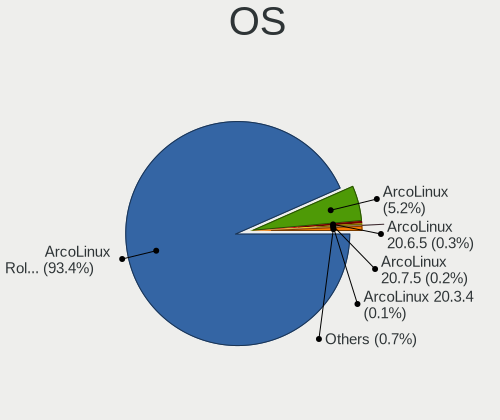
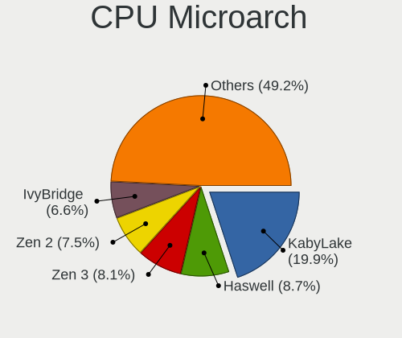
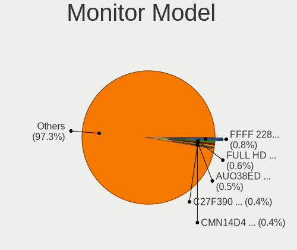
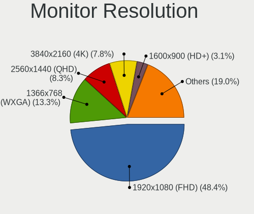
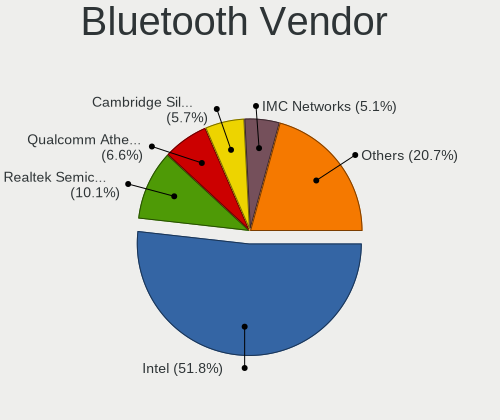

ArcoLinux - Tested Hardware & Statistics
----------------------------------------

A project to collect tested hardware configurations for ArcoLinux.

Anyone can contribute to this report by the [hw-probe](https://github.com/linuxhw/hw-probe) tool:

    sudo -E hw-probe -all -upload

Please contribute! Especially if your hardware is rare.

This is a report for all computer types. See also reports for [desktops](/Dist/ArcoLinux/Desktop/README.md) and [notebooks](/Dist/ArcoLinux/Notebook/README.md).

Contents
--------

* [ Test Cases ](#test-cases)

* [ System ](#system)
  - [ OS                       ](#os)
  - [ OS Family                ](#os-family)
  - [ Kernel                   ](#kernel)
  - [ Kernel Family            ](#kernel-family)
  - [ Kernel Major Ver.        ](#kernel-major-ver)
  - [ Arch                     ](#arch)
  - [ DE                       ](#de)
  - [ Display Server           ](#display-server)
  - [ Display Manager          ](#display-manager)
  - [ OS Lang                  ](#os-lang)
  - [ Boot Mode                ](#boot-mode)
  - [ Filesystem               ](#filesystem)
  - [ Part. scheme             ](#part-scheme)
  - [ Dual Boot with Linux/BSD ](#dual-boot-with-linuxbsd)
  - [ Dual Boot (Win)          ](#dual-boot-win)

* [ Board ](#board)
  - [ Vendor                   ](#vendor)
  - [ Model                    ](#model)
  - [ Model Family             ](#model-family)
  - [ MFG Year                 ](#mfg-year)
  - [ Form Factor              ](#form-factor)
  - [ Secure Boot              ](#secure-boot)
  - [ Coreboot                 ](#coreboot)
  - [ RAM Size                 ](#ram-size)
  - [ RAM Used                 ](#ram-used)
  - [ Total Drives             ](#total-drives)
  - [ Has CD-ROM               ](#has-cd-rom)
  - [ Has Ethernet             ](#has-ethernet)
  - [ Has WiFi                 ](#has-wifi)
  - [ Has Bluetooth            ](#has-bluetooth)

* [ Location ](#location)
  - [ Country                  ](#country)
  - [ City                     ](#city)

* [ Drives ](#drives)
  - [ Drive Vendor             ](#drive-vendor)
  - [ Drive Model              ](#drive-model)
  - [ HDD Vendor               ](#hdd-vendor)
  - [ SSD Vendor               ](#ssd-vendor)
  - [ Drive Kind               ](#drive-kind)
  - [ Drive Connector          ](#drive-connector)
  - [ Drive Size               ](#drive-size)
  - [ Space Total              ](#space-total)
  - [ Space Used               ](#space-used)
  - [ Malfunc. Drives          ](#malfunc-drives)
  - [ Malfunc. Drive Vendor    ](#malfunc-drive-vendor)
  - [ Malfunc. HDD Vendor      ](#malfunc-hdd-vendor)
  - [ Malfunc. Drive Kind      ](#malfunc-drive-kind)
  - [ Failed Drives            ](#failed-drives)
  - [ Failed Drive Vendor      ](#failed-drive-vendor)
  - [ Drive Status             ](#drive-status)

* [ Storage controller ](#storage-controller)
  - [ Storage Vendor           ](#storage-vendor)
  - [ Storage Model            ](#storage-model)
  - [ Storage Kind             ](#storage-kind)

* [ Processor ](#processor)
  - [ CPU Vendor               ](#cpu-vendor)
  - [ CPU Model                ](#cpu-model)
  - [ CPU Model Family         ](#cpu-model-family)
  - [ CPU Cores                ](#cpu-cores)
  - [ CPU Sockets              ](#cpu-sockets)
  - [ CPU Threads              ](#cpu-threads)
  - [ CPU Op-Modes             ](#cpu-op-modes)
  - [ CPU Microcode            ](#cpu-microcode)
  - [ CPU Microarch            ](#cpu-microarch)

* [ Graphics ](#graphics)
  - [ GPU Vendor               ](#gpu-vendor)
  - [ GPU Model                ](#gpu-model)
  - [ GPU Combo                ](#gpu-combo)
  - [ GPU Driver               ](#gpu-driver)
  - [ GPU Memory               ](#gpu-memory)

* [ Monitor ](#monitor)
  - [ Monitor Vendor           ](#monitor-vendor)
  - [ Monitor Model            ](#monitor-model)
  - [ Monitor Resolution       ](#monitor-resolution)
  - [ Monitor Diagonal         ](#monitor-diagonal)
  - [ Monitor Width            ](#monitor-width)
  - [ Aspect Ratio             ](#aspect-ratio)
  - [ Monitor Area             ](#monitor-area)
  - [ Pixel Density            ](#pixel-density)
  - [ Multiple Monitors        ](#multiple-monitors)

* [ Network ](#network)
  - [ Net Controller Vendor    ](#net-controller-vendor)
  - [ Net Controller Model     ](#net-controller-model)
  - [ Wireless Vendor          ](#wireless-vendor)
  - [ Wireless Model           ](#wireless-model)
  - [ Ethernet Vendor          ](#ethernet-vendor)
  - [ Ethernet Model           ](#ethernet-model)
  - [ Net Controller Kind      ](#net-controller-kind)
  - [ Used Controller          ](#used-controller)
  - [ NICs                     ](#nics)
  - [ IPv6                     ](#ipv6)

* [ Bluetooth ](#bluetooth)
  - [ Bluetooth Vendor         ](#bluetooth-vendor)
  - [ Bluetooth Model          ](#bluetooth-model)

* [ Sound ](#sound)
  - [ Sound Vendor             ](#sound-vendor)
  - [ Sound Model              ](#sound-model)

* [ Memory ](#memory)
  - [ Memory Vendor            ](#memory-vendor)
  - [ Memory Model             ](#memory-model)
  - [ Memory Kind              ](#memory-kind)
  - [ Memory Form Factor       ](#memory-form-factor)
  - [ Memory Size              ](#memory-size)
  - [ Memory Speed             ](#memory-speed)

* [ Printers & scanners ](#printers--scanners)
  - [ Printer Vendor           ](#printer-vendor)
  - [ Printer Model            ](#printer-model)
  - [ Scanner Vendor           ](#scanner-vendor)
  - [ Scanner Model            ](#scanner-model)

* [ Camera ](#camera)
  - [ Camera Vendor            ](#camera-vendor)
  - [ Camera Model             ](#camera-model)

* [ Security ](#security)
  - [ Fingerprint Vendor       ](#fingerprint-vendor)
  - [ Fingerprint Model        ](#fingerprint-model)
  - [ Chipcard Vendor          ](#chipcard-vendor)
  - [ Chipcard Model           ](#chipcard-model)

* [ Unsupported ](#unsupported)
  - [ Unsupported Devices      ](#unsupported-devices)
  - [ Unsupported Device Types ](#unsupported-device-types)

Test Cases
----------

Total: 2661

| Vendor        | Model                       | Form-Factor | Probe                                                      | Date         |
|---------------|-----------------------------|-------------|------------------------------------------------------------|--------------|
| ASUSTek       | ROG STRIX B550-F GAMING ... | Desktop     | [7ab0866235](https://linux-hardware.org/?probe=7ab0866235) | Jun 10, 2023 |
| ASUSTek       | VivoBook_ASUSLaptop X515... | Notebook    | [29085f8fb4](https://linux-hardware.org/?probe=29085f8fb4) | Jun 10, 2023 |
| MSI           | MS-B9321                    | Desktop     | [a7a878dbe6](https://linux-hardware.org/?probe=a7a878dbe6) | Jun 10, 2023 |
| ASUSTek       | TUF Gaming X570-PLUS        | Desktop     | [0eae3567d9](https://linux-hardware.org/?probe=0eae3567d9) | Jun 10, 2023 |
| ASRock        | B550AM Gaming               | Desktop     | [eca79c3bbb](https://linux-hardware.org/?probe=eca79c3bbb) | Jun 10, 2023 |
| Lenovo        | ThinkPad T440 20B6005RUS    | Notebook    | [e7ea5a9368](https://linux-hardware.org/?probe=e7ea5a9368) | Jun 10, 2023 |
| ASUSTek       | ROG STRIX X670E-E GAMING... | Desktop     | [5446a0003e](https://linux-hardware.org/?probe=5446a0003e) | Jun 10, 2023 |
| HP            | Notebook                    | Notebook    | [9487146a2f](https://linux-hardware.org/?probe=9487146a2f) | Jun 09, 2023 |
| ASRock        | B360M Pro4                  | Desktop     | [9b52b20f3e](https://linux-hardware.org/?probe=9b52b20f3e) | Jun 09, 2023 |
| Unknown       | Unknown                     | Notebook    | [c5accf4cf8](https://linux-hardware.org/?probe=c5accf4cf8) | Jun 09, 2023 |
| Unknown       | Unknown                     | Notebook    | [45e51a6b5d](https://linux-hardware.org/?probe=45e51a6b5d) | Jun 09, 2023 |
| HP            | 2B0D A01                    | All in one  | [84275606e0](https://linux-hardware.org/?probe=84275606e0) | Jun 09, 2023 |
| Acer          | Aspire A517-53              | Notebook    | [c14dcffa32](https://linux-hardware.org/?probe=c14dcffa32) | Jun 08, 2023 |
| Lenovo        | IdeaPad 510-15IKB 80SV      | Notebook    | [3f04b950e8](https://linux-hardware.org/?probe=3f04b950e8) | Jun 08, 2023 |
| Toshiba       | Satellite Pro C50-A-1E6     | Notebook    | [4614addc21](https://linux-hardware.org/?probe=4614addc21) | Jun 08, 2023 |
| Unknown       | Unknown                     | Notebook    | [b7f109f62e](https://linux-hardware.org/?probe=b7f109f62e) | Jun 08, 2023 |
| Dell          | G15 5520                    | Notebook    | [8d48df5869](https://linux-hardware.org/?probe=8d48df5869) | Jun 07, 2023 |
| Gigabyte      | X470 AORUS ULTRA GAMING-... | Desktop     | [73bc5d84c9](https://linux-hardware.org/?probe=73bc5d84c9) | Jun 07, 2023 |
| Lenovo        | ThinkPad X250 20CMCTO1WW    | Notebook    | [281be42f34](https://linux-hardware.org/?probe=281be42f34) | Jun 07, 2023 |
| Lenovo        | G585 20137                  | Notebook    | [6eeacffa3c](https://linux-hardware.org/?probe=6eeacffa3c) | Jun 07, 2023 |
| HP            | Laptop 15s-eq1xxx           | Notebook    | [db91b1b71c](https://linux-hardware.org/?probe=db91b1b71c) | Jun 07, 2023 |
| Dell          | 06D7TR A01                  | Desktop     | [8db1a8c132](https://linux-hardware.org/?probe=8db1a8c132) | Jun 06, 2023 |
| HP            | Laptop 15s-eq1xxx           | Notebook    | [d2c05f91c4](https://linux-hardware.org/?probe=d2c05f91c4) | Jun 06, 2023 |
| HP            | 8053                        | Desktop     | [29a84ce224](https://linux-hardware.org/?probe=29a84ce224) | Jun 06, 2023 |
| Dell          | Inspiron 5759               | Notebook    | [249f9343d0](https://linux-hardware.org/?probe=249f9343d0) | Jun 06, 2023 |
| Win elemen... | M600                        | Desktop     | [360ab80d9b](https://linux-hardware.org/?probe=360ab80d9b) | Jun 06, 2023 |
| ASUSTek       | ROG Zephyrus G14 GA401QM... | Notebook    | [bdfe605b6a](https://linux-hardware.org/?probe=bdfe605b6a) | Jun 06, 2023 |
| HP            | Pavilion Laptop 15-cw0xx... | Notebook    | [a9ea51ea77](https://linux-hardware.org/?probe=a9ea51ea77) | Jun 06, 2023 |
| Dell          | Precision 7510              | Notebook    | [2a465173d3](https://linux-hardware.org/?probe=2a465173d3) | Jun 06, 2023 |
| HP            | ZBook 15 G3                 | Notebook    | [18663e1382](https://linux-hardware.org/?probe=18663e1382) | Jun 05, 2023 |
| HUAWEI        | KLVL-WXX9                   | Notebook    | [38882f47af](https://linux-hardware.org/?probe=38882f47af) | Jun 05, 2023 |
| Toshiba       | Satellite L305              | Notebook    | [c11012336c](https://linux-hardware.org/?probe=c11012336c) | Jun 05, 2023 |
| Dell          | 0HD5W2 A01                  | Desktop     | [917462f8c8](https://linux-hardware.org/?probe=917462f8c8) | Jun 05, 2023 |
| Dell          | 042P49 A01                  | Desktop     | [50f682ce84](https://linux-hardware.org/?probe=50f682ce84) | Jun 04, 2023 |
| SYWZ          | S200 Series                 | Desktop     | [577c490fb7](https://linux-hardware.org/?probe=577c490fb7) | Jun 04, 2023 |
| ASUSTek       | VivoBook_ASUSLaptop X421... | Notebook    | [87b33e1181](https://linux-hardware.org/?probe=87b33e1181) | Jun 04, 2023 |
| ASUSTek       | P8Z77-V LE                  | Desktop     | [9a66179aaf](https://linux-hardware.org/?probe=9a66179aaf) | Jun 04, 2023 |
| Lenovo        | ThinkPad X1 Carbon Gen 1... | Notebook    | [a39c2e8d55](https://linux-hardware.org/?probe=a39c2e8d55) | Jun 04, 2023 |
| Gigabyte      | Z77X-UD5H                   | Desktop     | [b0efe96508](https://linux-hardware.org/?probe=b0efe96508) | Jun 04, 2023 |
| Lenovo        | IdeaPad 3 15ITL05 81X8      | Notebook    | [6f8af3d7af](https://linux-hardware.org/?probe=6f8af3d7af) | Jun 03, 2023 |
| MSI           | B460M PRO-VDH WIFI          | Desktop     | [b92c18e955](https://linux-hardware.org/?probe=b92c18e955) | Jun 03, 2023 |
| MSI           | H310M PRO-VD PLUS           | Desktop     | [5ee3eec233](https://linux-hardware.org/?probe=5ee3eec233) | Jun 03, 2023 |
| Acer          | TravelMate 8572T            | Notebook    | [46920007ed](https://linux-hardware.org/?probe=46920007ed) | Jun 03, 2023 |
| Lenovo        | ThinkPad X230 2325SLU       | Notebook    | [3a1d630346](https://linux-hardware.org/?probe=3a1d630346) | Jun 03, 2023 |
| ASRock        | AB350M Pro4                 | Desktop     | [30a95a3f53](https://linux-hardware.org/?probe=30a95a3f53) | Jun 03, 2023 |
| AZW           | SER V01                     | Mini pc     | [e28ef4a6b7](https://linux-hardware.org/?probe=e28ef4a6b7) | Jun 03, 2023 |
| Positivo      | POS-RIB360EE 11144907       | Desktop     | [7837922f5b](https://linux-hardware.org/?probe=7837922f5b) | Jun 02, 2023 |
| Lenovo        | Legion 5 15IMH05H 81Y6      | Notebook    | [3de77b392a](https://linux-hardware.org/?probe=3de77b392a) | Jun 02, 2023 |
| Positivo      | POS-RIB360EE 11144907       | Desktop     | [b4ba7702cb](https://linux-hardware.org/?probe=b4ba7702cb) | Jun 02, 2023 |
| ASUSTek       | ROG CROSSHAIR VIII IMPAC... | Desktop     | [c9e073b763](https://linux-hardware.org/?probe=c9e073b763) | Jun 02, 2023 |
| Lenovo        | ThinkPad T430 2349GDU       | Notebook    | [ca1bce793b](https://linux-hardware.org/?probe=ca1bce793b) | Jun 01, 2023 |
| ASUSTek       | Z97-K                       | Desktop     | [1bd92e67d7](https://linux-hardware.org/?probe=1bd92e67d7) | Jun 01, 2023 |
| ASUSTek       | X550CC                      | Notebook    | [d75bfc397f](https://linux-hardware.org/?probe=d75bfc397f) | Jun 01, 2023 |
| ASUSTek       | PRIME TRX40-PRO             | Desktop     | [6b3efa1ef7](https://linux-hardware.org/?probe=6b3efa1ef7) | May 31, 2023 |
| ASUSTek       | ROG CROSSHAIR VIII IMPAC... | Desktop     | [270fcf5e69](https://linux-hardware.org/?probe=270fcf5e69) | May 31, 2023 |
| Gigabyte      | X570 AORUS MASTER           | Desktop     | [79de4bed98](https://linux-hardware.org/?probe=79de4bed98) | May 31, 2023 |
| Dell          | Inspiron 5559               | Notebook    | [6c814f5bb5](https://linux-hardware.org/?probe=6c814f5bb5) | May 31, 2023 |
| Lenovo        | Yoga 14sITL 2021 82G2       | Notebook    | [d21f59bea5](https://linux-hardware.org/?probe=d21f59bea5) | May 31, 2023 |
| ASUSTek       | PRIME Z390-A                | Desktop     | [9131b2b568](https://linux-hardware.org/?probe=9131b2b568) | May 31, 2023 |
| Acer          | Predator G9-793             | Notebook    | [26ea66d872](https://linux-hardware.org/?probe=26ea66d872) | May 31, 2023 |
| Lenovo        | ThinkPad T430 2349GDU       | Notebook    | [eae4d1e9ba](https://linux-hardware.org/?probe=eae4d1e9ba) | May 31, 2023 |
| Lenovo        | IdeaPad 3 15ITL05 81X8      | Notebook    | [2ad4b7fd55](https://linux-hardware.org/?probe=2ad4b7fd55) | May 30, 2023 |
| Lenovo        | 30BC SDK0J40697 WIN 3305... | Desktop     | [6dbaa9e2ff](https://linux-hardware.org/?probe=6dbaa9e2ff) | May 30, 2023 |
| HP            | 82DC 1000                   | All in one  | [8300907fc1](https://linux-hardware.org/?probe=8300907fc1) | May 30, 2023 |
| Gigabyte      | Z270X-Gaming 7              | Desktop     | [4ed64d3d45](https://linux-hardware.org/?probe=4ed64d3d45) | May 30, 2023 |
| ASUSTek       | ZenBook UX425QA_UM425QA     | Notebook    | [5c089f9b06](https://linux-hardware.org/?probe=5c089f9b06) | May 30, 2023 |
| Lenovo        | ThinkPad X260 20F5S6P801    | Notebook    | [8ec80f5e43](https://linux-hardware.org/?probe=8ec80f5e43) | May 30, 2023 |
| Dell          | 002KVM A01                  | Desktop     | [09d2d63c82](https://linux-hardware.org/?probe=09d2d63c82) | May 30, 2023 |
| ASUSTek       | M5A97 EVO R2.0              | Desktop     | [8e0413af72](https://linux-hardware.org/?probe=8e0413af72) | May 30, 2023 |
| MSI           | B460M PRO-VDH WIFI          | Desktop     | [9171b7f0f0](https://linux-hardware.org/?probe=9171b7f0f0) | May 29, 2023 |
| Lenovo        | ThinkPad T430 2349GDU       | Notebook    | [829c193554](https://linux-hardware.org/?probe=829c193554) | May 29, 2023 |
| Acer          | Nitro AN515-52              | Notebook    | [b90162f812](https://linux-hardware.org/?probe=b90162f812) | May 29, 2023 |
| Lenovo        | IdeaPad 510-15IKB 80SV      | Notebook    | [1aa973f6bc](https://linux-hardware.org/?probe=1aa973f6bc) | May 28, 2023 |
| Lenovo        | IdeaPad Gaming 3 15IHU6 ... | Notebook    | [77e5b682ff](https://linux-hardware.org/?probe=77e5b682ff) | May 28, 2023 |
| Lenovo        | IdeaPad 310-15IKB 80TV      | Notebook    | [04e50de864](https://linux-hardware.org/?probe=04e50de864) | May 28, 2023 |
| HP            | EliteBook 840 G2            | Notebook    | [519e04a228](https://linux-hardware.org/?probe=519e04a228) | May 27, 2023 |
| ASUSTek       | ASUS TUF Dash F15 FX517Z... | Notebook    | [e92f94ecb3](https://linux-hardware.org/?probe=e92f94ecb3) | May 27, 2023 |
| HP            | OMEN by Laptop 15-ce0xx     | Notebook    | [f7f07e78d5](https://linux-hardware.org/?probe=f7f07e78d5) | May 27, 2023 |
| ASRock        | H87M Pro4                   | Desktop     | [efd2db0783](https://linux-hardware.org/?probe=efd2db0783) | May 27, 2023 |
| Acer          | Aspire E5-575G              | Notebook    | [cb642c7b9d](https://linux-hardware.org/?probe=cb642c7b9d) | May 27, 2023 |
| ASUSTek       | A88X-PRO                    | Desktop     | [b5fd752412](https://linux-hardware.org/?probe=b5fd752412) | May 27, 2023 |
| HP            | Laptop 15s-eq2xxx           | Notebook    | [d5d9543a5a](https://linux-hardware.org/?probe=d5d9543a5a) | May 26, 2023 |
| ASUSTek       | PRIME Z370-P                | Desktop     | [07ecf79e17](https://linux-hardware.org/?probe=07ecf79e17) | May 26, 2023 |
| Toshiba       | Satellite C55-A             | Notebook    | [ca130b5f89](https://linux-hardware.org/?probe=ca130b5f89) | May 26, 2023 |
| Lenovo        | IdeaPad Y700-17ISK 80Q0     | Notebook    | [184afbb9c3](https://linux-hardware.org/?probe=184afbb9c3) | May 26, 2023 |
| ASUSTek       | ROG STRIX Z390-E GAMING     | Desktop     | [3392305134](https://linux-hardware.org/?probe=3392305134) | May 26, 2023 |
| HP            | 8437                        | Desktop     | [c1c9154683](https://linux-hardware.org/?probe=c1c9154683) | May 26, 2023 |
| ASUSTek       | TUF Gaming FX505GD_FX505... | Notebook    | [89b7c17d00](https://linux-hardware.org/?probe=89b7c17d00) | May 26, 2023 |
| ASUSTek       | X751LAB                     | Notebook    | [02b17f35d9](https://linux-hardware.org/?probe=02b17f35d9) | May 26, 2023 |
| Lenovo        | IdeaPad 3 15ITL05 81X8      | Notebook    | [13906a8f3d](https://linux-hardware.org/?probe=13906a8f3d) | May 26, 2023 |
| A14CR         | Unknown                     | Notebook    | [a504061244](https://linux-hardware.org/?probe=a504061244) | May 25, 2023 |
| Intel         | NUC10i7FNB K61360-304       | Mini pc     | [b00cde0e71](https://linux-hardware.org/?probe=b00cde0e71) | May 25, 2023 |
| Gigabyte      | MFLP5IP-00                  | Desktop     | [52e1964d2c](https://linux-hardware.org/?probe=52e1964d2c) | May 25, 2023 |
| Dell          | XPS 15 9560                 | Notebook    | [7389c979b6](https://linux-hardware.org/?probe=7389c979b6) | May 25, 2023 |
| ASUSTek       | PRIME X299-A                | Desktop     | [e52868c107](https://linux-hardware.org/?probe=e52868c107) | May 25, 2023 |
| Dell          | Precision 7510              | Notebook    | [8c677420fa](https://linux-hardware.org/?probe=8c677420fa) | May 25, 2023 |
| ASUSTek       | PRIME Z370-A                | Desktop     | [1387725836](https://linux-hardware.org/?probe=1387725836) | May 24, 2023 |
| HP            | Laptop 14s-cf2xxx           | Notebook    | [e51dec5daf](https://linux-hardware.org/?probe=e51dec5daf) | May 24, 2023 |
| ASUSTek       | PRIME Z370-A                | Desktop     | [c309714d15](https://linux-hardware.org/?probe=c309714d15) | May 23, 2023 |
| MSI           | Z590-A PRO                  | Desktop     | [627afe1447](https://linux-hardware.org/?probe=627afe1447) | May 23, 2023 |
| MSI           | MAG B550M BAZOOKA           | Desktop     | [3d594ff1da](https://linux-hardware.org/?probe=3d594ff1da) | May 23, 2023 |
| HP            | ProBook 450 G8 Notebook ... | Notebook    | [a2986e9b7a](https://linux-hardware.org/?probe=a2986e9b7a) | May 23, 2023 |
| Lenovo        | ThinkPad T550 20CJS0S800    | Notebook    | [b7efa91563](https://linux-hardware.org/?probe=b7efa91563) | May 23, 2023 |
| Lenovo        | IdeaPad Y700-17ISK 80Q0     | Notebook    | [e250801798](https://linux-hardware.org/?probe=e250801798) | May 23, 2023 |
| Dell          | Precision 7510              | Notebook    | [15458a1b29](https://linux-hardware.org/?probe=15458a1b29) | May 22, 2023 |
| ASUSTek       | P5Q-PRO                     | Desktop     | [87b976a24c](https://linux-hardware.org/?probe=87b976a24c) | May 22, 2023 |
| ASUSTek       | ASUS TUF Dash F15 FX517Z... | Notebook    | [5e89fe1dc9](https://linux-hardware.org/?probe=5e89fe1dc9) | May 22, 2023 |
| Lenovo        | ThinkPad T550 20CJS1V900    | Notebook    | [9bc275ef54](https://linux-hardware.org/?probe=9bc275ef54) | May 22, 2023 |
| ASUSTek       | ROG STRIX X670E-I GAMING... | Desktop     | [a1fb857bcc](https://linux-hardware.org/?probe=a1fb857bcc) | May 22, 2023 |
| Lenovo        | ThinkPad P72 20MBCTO1WW     | Notebook    | [7cba5b3595](https://linux-hardware.org/?probe=7cba5b3595) | May 22, 2023 |
| HP            | 8599                        | Desktop     | [2e9caaf13a](https://linux-hardware.org/?probe=2e9caaf13a) | May 22, 2023 |
| ASUSTek       | PRIME A320M-K               | Desktop     | [ab21a2a608](https://linux-hardware.org/?probe=ab21a2a608) | May 22, 2023 |
| Medion        | BTDD-TI                     | All in one  | [ef28026334](https://linux-hardware.org/?probe=ef28026334) | May 22, 2023 |
| Lenovo        | 30D0 SDK0J40705 WIN 3425... | Desktop     | [5534aabaf1](https://linux-hardware.org/?probe=5534aabaf1) | May 21, 2023 |
| MSI           | B450M PRO-VDH MAX           | Desktop     | [cf10c1fb13](https://linux-hardware.org/?probe=cf10c1fb13) | May 21, 2023 |
| Gigabyte      | B450M H                     | Desktop     | [9db5706bfc](https://linux-hardware.org/?probe=9db5706bfc) | May 21, 2023 |
| ASUSTek       | X540SC                      | Notebook    | [240bb6c246](https://linux-hardware.org/?probe=240bb6c246) | May 21, 2023 |
| MSI           | A320M-HDV R4.0              | Desktop     | [e7a27c7429](https://linux-hardware.org/?probe=e7a27c7429) | May 21, 2023 |
| Microsoft     | Surface Go                  | Tablet      | [2df0364d3c](https://linux-hardware.org/?probe=2df0364d3c) | May 21, 2023 |
| MSI           | 970 GAMING                  | Desktop     | [222ebac915](https://linux-hardware.org/?probe=222ebac915) | May 21, 2023 |
| MSI           | B450M-A PRO MAX             | Desktop     | [bc16fc021e](https://linux-hardware.org/?probe=bc16fc021e) | May 21, 2023 |
| HP            | Victus by Gaming Laptop ... | Notebook    | [8f2ccf9c6d](https://linux-hardware.org/?probe=8f2ccf9c6d) | May 21, 2023 |
| Lenovo        | ThinkPad T470 W10DG 20JN... | Notebook    | [1fdf5742d0](https://linux-hardware.org/?probe=1fdf5742d0) | May 21, 2023 |
| ASUSTek       | ROG Flow Z13 GZ301VU_GZ3... | Tablet      | [3e94769b79](https://linux-hardware.org/?probe=3e94769b79) | May 20, 2023 |
| Lenovo        | ThinkPad T430 2347EA2       | Notebook    | [dc3fdbd5ff](https://linux-hardware.org/?probe=dc3fdbd5ff) | May 20, 2023 |
| Gigabyte      | Z490I AORUS ULTRA           | Desktop     | [14e978a000](https://linux-hardware.org/?probe=14e978a000) | May 20, 2023 |
| Microsoft     | Surface Go                  | Tablet      | [d687dbc74a](https://linux-hardware.org/?probe=d687dbc74a) | May 20, 2023 |
| HP            | 8433 11                     | Desktop     | [5d9e3a1dcc](https://linux-hardware.org/?probe=5d9e3a1dcc) | May 20, 2023 |
| Eluktronic... | MAG-15 1660Ti               | Notebook    | [55ced5d6bb](https://linux-hardware.org/?probe=55ced5d6bb) | May 20, 2023 |
| MSI           | MEG X570 UNIFY              | Desktop     | [b001b01a08](https://linux-hardware.org/?probe=b001b01a08) | May 19, 2023 |
| HP            | Pavilion Notebook           | Notebook    | [f76ac6d7b5](https://linux-hardware.org/?probe=f76ac6d7b5) | May 19, 2023 |
| Dell          | Inspiron 5759               | Notebook    | [76592cf444](https://linux-hardware.org/?probe=76592cf444) | May 19, 2023 |
| NEC Comput... | PC-VK26TXZCM                | Notebook    | [064b725160](https://linux-hardware.org/?probe=064b725160) | May 19, 2023 |
| Lenovo        | ThinkPad T430 2347EA2       | Notebook    | [c718a18472](https://linux-hardware.org/?probe=c718a18472) | May 19, 2023 |
| MSI           | 970 GAMING                  | Desktop     | [dde73bc060](https://linux-hardware.org/?probe=dde73bc060) | May 18, 2023 |
| Medion        | BTDD-TI                     | All in one  | [cc45e1f2f4](https://linux-hardware.org/?probe=cc45e1f2f4) | May 18, 2023 |
| MSI           | B450M-A PRO MAX             | Desktop     | [763654d8fc](https://linux-hardware.org/?probe=763654d8fc) | May 18, 2023 |
| ASUSTek       | Zephyrus M GM501GM          | Notebook    | [bf1eed0e60](https://linux-hardware.org/?probe=bf1eed0e60) | May 18, 2023 |
| Toshiba       | Satellite Pro C50-A-1E6     | Notebook    | [3c8dcfcf15](https://linux-hardware.org/?probe=3c8dcfcf15) | May 18, 2023 |
| HP            | Pavilion 15                 | Notebook    | [fd87e57fc3](https://linux-hardware.org/?probe=fd87e57fc3) | May 18, 2023 |
| TUXEDO        | Pulse 15 Gen2               | Notebook    | [856242dc26](https://linux-hardware.org/?probe=856242dc26) | May 18, 2023 |
| ASUSTek       | VivoBook_ASUSLaptop X515... | Notebook    | [70b4a6b7f7](https://linux-hardware.org/?probe=70b4a6b7f7) | May 18, 2023 |
| HP            | 339A                        | Desktop     | [44a6e1f861](https://linux-hardware.org/?probe=44a6e1f861) | May 17, 2023 |
| ASUSTek       | ROG STRIX B560-G GAMING ... | Desktop     | [7f3487434e](https://linux-hardware.org/?probe=7f3487434e) | May 17, 2023 |
| Gigabyte      | B450 AORUS ELITE            | Desktop     | [7957c81218](https://linux-hardware.org/?probe=7957c81218) | May 17, 2023 |
| Gigabyte      | B450 AORUS ELITE            | Desktop     | [1aedc7da48](https://linux-hardware.org/?probe=1aedc7da48) | May 17, 2023 |
| ASUSTek       | VivoBook_ASUSLaptop X515... | Notebook    | [e236450e11](https://linux-hardware.org/?probe=e236450e11) | May 17, 2023 |
| MSI           | Z590-A PRO                  | Desktop     | [0c26a47ae5](https://linux-hardware.org/?probe=0c26a47ae5) | May 17, 2023 |
| Acer          | Predator G9-793             | Notebook    | [1739ea2f45](https://linux-hardware.org/?probe=1739ea2f45) | May 17, 2023 |
| Lenovo        | IdeaPad 3 15ITL05 81X8      | Notebook    | [f4514801d8](https://linux-hardware.org/?probe=f4514801d8) | May 16, 2023 |
| ASUSTek       | TUF Gaming B550-PLUS        | Desktop     | [e31c83db5e](https://linux-hardware.org/?probe=e31c83db5e) | May 16, 2023 |
| ASUSTek       | PRIME B550-PLUS             | Desktop     | [d9b18c7990](https://linux-hardware.org/?probe=d9b18c7990) | May 16, 2023 |
| HP            | ENVY dv6                    | Notebook    | [2490803f28](https://linux-hardware.org/?probe=2490803f28) | May 16, 2023 |
| ASRock        | A300M-STX                   | Desktop     | [b06c75ac5e](https://linux-hardware.org/?probe=b06c75ac5e) | May 16, 2023 |
| Lenovo        | ThinkPad T440 20B7S1MF0D    | Notebook    | [6173458650](https://linux-hardware.org/?probe=6173458650) | May 16, 2023 |
| Dell          | 0NKW6Y A02                  | Desktop     | [8c10a0ad96](https://linux-hardware.org/?probe=8c10a0ad96) | May 16, 2023 |
| Dell          | 0NKW6Y A02                  | Desktop     | [be5ad76a6e](https://linux-hardware.org/?probe=be5ad76a6e) | May 16, 2023 |
| Lenovo        | ThinkPad T15p Gen 3 21DA... | Notebook    | [19feb08b89](https://linux-hardware.org/?probe=19feb08b89) | May 15, 2023 |
| Google        | Sumo                        | Desktop     | [1455a81901](https://linux-hardware.org/?probe=1455a81901) | May 15, 2023 |
| ASUSTek       | ROG Zephyrus G14 GA401IV... | Notebook    | [93979d632e](https://linux-hardware.org/?probe=93979d632e) | May 15, 2023 |
| Toshiba       | TECRA Z40-A                 | Notebook    | [55210b06ca](https://linux-hardware.org/?probe=55210b06ca) | May 15, 2023 |
| BESSTAR Te... | DMAF5 V1.0                  | Desktop     | [53f395d7fa](https://linux-hardware.org/?probe=53f395d7fa) | May 15, 2023 |
| HP            | EliteBook 8470p             | Notebook    | [f97e4e7fc1](https://linux-hardware.org/?probe=f97e4e7fc1) | May 15, 2023 |
| ASUSTek       | ROG STRIX X470-I GAMING     | Desktop     | [9beabf1347](https://linux-hardware.org/?probe=9beabf1347) | May 15, 2023 |
| ASUSTek       | K45VM                       | Notebook    | [eaef457c8a](https://linux-hardware.org/?probe=eaef457c8a) | May 15, 2023 |
| HP            | Pavilion Gaming Laptop 1... | Notebook    | [36df0e0f57](https://linux-hardware.org/?probe=36df0e0f57) | May 14, 2023 |
| Unknown       | HX90                        | Desktop     | [85edf2e24e](https://linux-hardware.org/?probe=85edf2e24e) | May 14, 2023 |
| ASUSTek       | G752VT                      | Notebook    | [e8459680a4](https://linux-hardware.org/?probe=e8459680a4) | May 14, 2023 |
| Dell          | 0M017G A00                  | Desktop     | [5bd115a1b4](https://linux-hardware.org/?probe=5bd115a1b4) | May 14, 2023 |
| HP            | ENVY 15                     | Notebook    | [0d1450cd2d](https://linux-hardware.org/?probe=0d1450cd2d) | May 14, 2023 |
| ASUSTek       | ROG STRIX B450-F GAMING ... | Desktop     | [49a47c559e](https://linux-hardware.org/?probe=49a47c559e) | May 14, 2023 |
| ASUSTek       | ROG STRIX B450-F GAMING ... | Desktop     | [91986cf051](https://linux-hardware.org/?probe=91986cf051) | May 14, 2023 |
| ASUSTek       | PRIME Z490-A                | Desktop     | [ced38114fc](https://linux-hardware.org/?probe=ced38114fc) | May 14, 2023 |
| Dell          | Latitude 5490               | Notebook    | [57e94dd4b7](https://linux-hardware.org/?probe=57e94dd4b7) | May 14, 2023 |
| MSI           | MAG B560M MORTAR            | Desktop     | [1556b05d13](https://linux-hardware.org/?probe=1556b05d13) | May 14, 2023 |
| Dell          | 0M017G A00                  | Desktop     | [5e7cf34522](https://linux-hardware.org/?probe=5e7cf34522) | May 14, 2023 |
| MSI           | A320M-HDV R4.0              | Desktop     | [748e0f187f](https://linux-hardware.org/?probe=748e0f187f) | May 14, 2023 |
| MSI           | B450M PRO-VDH MAX           | Desktop     | [677e681a2d](https://linux-hardware.org/?probe=677e681a2d) | May 13, 2023 |
| ASUSTek       | PRIME Z490-A                | Desktop     | [4bde221d90](https://linux-hardware.org/?probe=4bde221d90) | May 13, 2023 |
| Fujitsu       | LIFEBOOK E756               | Notebook    | [d0f5ee2781](https://linux-hardware.org/?probe=d0f5ee2781) | May 13, 2023 |
| MSI           | H310M PRO-VD PLUS           | Desktop     | [71f2dc616d](https://linux-hardware.org/?probe=71f2dc616d) | May 12, 2023 |
| MSI           | MAG B550 TOMAHAWK           | Desktop     | [82f01de919](https://linux-hardware.org/?probe=82f01de919) | May 12, 2023 |
| ASUSTek       | PRIME Z490-A                | Desktop     | [c0841ef7e1](https://linux-hardware.org/?probe=c0841ef7e1) | May 12, 2023 |
| Lenovo        | IdeaPad Slim 1-14AST-05 ... | Notebook    | [bfb11f92b1](https://linux-hardware.org/?probe=bfb11f92b1) | May 11, 2023 |
| ASUSTek       | STRIX Z270H GAMING          | Desktop     | [ed18615cb3](https://linux-hardware.org/?probe=ed18615cb3) | May 11, 2023 |
| ASUSTek       | X556UQK                     | Notebook    | [12d23bdebb](https://linux-hardware.org/?probe=12d23bdebb) | May 11, 2023 |
| HUAWEI        | NBLK-WAX9X                  | Notebook    | [efc35b1887](https://linux-hardware.org/?probe=efc35b1887) | May 11, 2023 |
| ASRock        | Z370 Extreme4               | Desktop     | [bdd9bcedf5](https://linux-hardware.org/?probe=bdd9bcedf5) | May 11, 2023 |
| Acer          | Predator G9-793             | Notebook    | [95595808a8](https://linux-hardware.org/?probe=95595808a8) | May 11, 2023 |
| ASUSTek       | TUF Gaming H670-PRO WIFI... | Desktop     | [0b4b06b5fa](https://linux-hardware.org/?probe=0b4b06b5fa) | May 10, 2023 |
| ASUSTek       | UX410UAK                    | Notebook    | [d68a2bc7c0](https://linux-hardware.org/?probe=d68a2bc7c0) | May 10, 2023 |
| Fujitsu       | D3600-A1 S26361-D3600-A1    | Desktop     | [b65333ae05](https://linux-hardware.org/?probe=b65333ae05) | May 10, 2023 |
| Lenovo        | 36EB SDK0K17763 WIN 1801... | Desktop     | [4d68e2912b](https://linux-hardware.org/?probe=4d68e2912b) | May 10, 2023 |
| ASUSTek       | PRIME Z490-A                | Desktop     | [9ce4debe84](https://linux-hardware.org/?probe=9ce4debe84) | May 09, 2023 |
| Fujitsu       | LIFEBOOK E756               | Notebook    | [90bec72fa7](https://linux-hardware.org/?probe=90bec72fa7) | May 09, 2023 |
| ASRock        | H310CM-HG4                  | Desktop     | [756ed502db](https://linux-hardware.org/?probe=756ed502db) | May 09, 2023 |
| Gigabyte      | X570S AORUS ELITE AX        | Desktop     | [13bace1181](https://linux-hardware.org/?probe=13bace1181) | May 09, 2023 |
| HP            | ENVY x360 Convertible 15... | Convertible | [d3de6b6b31](https://linux-hardware.org/?probe=d3de6b6b31) | May 08, 2023 |
| ASUSTek       | ROG STRIX B450-F GAMING ... | Desktop     | [a4f7fc7b31](https://linux-hardware.org/?probe=a4f7fc7b31) | May 08, 2023 |
| ASUSTek       | TUF Gaming X570-PLUS        | Desktop     | [d055c2e022](https://linux-hardware.org/?probe=d055c2e022) | May 08, 2023 |
| ASUSTek       | ROG Zephyrus M15 GU502LW... | Notebook    | [18b79bbfa4](https://linux-hardware.org/?probe=18b79bbfa4) | May 07, 2023 |
| Gigabyte      | Z390 I AORUS PRO WIFI-CF    | Desktop     | [dbeb828b17](https://linux-hardware.org/?probe=dbeb828b17) | May 07, 2023 |
| ASUSTek       | PRIME B550-PLUS             | Desktop     | [d58e08c9ab](https://linux-hardware.org/?probe=d58e08c9ab) | May 07, 2023 |
| HP            | Laptop 15-da0xxx            | Notebook    | [6a93900fb9](https://linux-hardware.org/?probe=6a93900fb9) | May 07, 2023 |
| ASUSTek       | PRIME Z490-A                | Desktop     | [1eddb3203a](https://linux-hardware.org/?probe=1eddb3203a) | May 06, 2023 |
| System76      | Oryx Pro                    | Notebook    | [6026e88ad4](https://linux-hardware.org/?probe=6026e88ad4) | May 06, 2023 |
| ASUSTek       | A88X-PRO                    | Desktop     | [faabff7b74](https://linux-hardware.org/?probe=faabff7b74) | May 06, 2023 |
| ASRock        | B250M-HDV                   | Desktop     | [d905babc43](https://linux-hardware.org/?probe=d905babc43) | May 06, 2023 |
| ASUSTek       | ROG STRIX B550-F GAMING     | Desktop     | [1143344e93](https://linux-hardware.org/?probe=1143344e93) | May 06, 2023 |
| Lenovo        | Yoga 7 16IAP7 82QG          | Convertible | [d572509eb2](https://linux-hardware.org/?probe=d572509eb2) | May 06, 2023 |
| HP            | ENVY x360 Convertible 15... | Convertible | [91661b66d1](https://linux-hardware.org/?probe=91661b66d1) | May 06, 2023 |
| ASUSTek       | PRIME Z590-P WIFI           | Desktop     | [5d12a9965b](https://linux-hardware.org/?probe=5d12a9965b) | May 06, 2023 |
| ASRock        | B250M-HDV                   | Desktop     | [bb7835495e](https://linux-hardware.org/?probe=bb7835495e) | May 06, 2023 |
| ASUSTek       | PRIME Z490-A                | Desktop     | [6a54ace5f8](https://linux-hardware.org/?probe=6a54ace5f8) | May 06, 2023 |
| Dell          | Latitude E5530 non-vPro     | Notebook    | [3bea2bcd99](https://linux-hardware.org/?probe=3bea2bcd99) | May 05, 2023 |
| ASUSTek       | K45VM                       | Notebook    | [09e73cade8](https://linux-hardware.org/?probe=09e73cade8) | May 05, 2023 |
| ASRock        | H370 Pro4                   | Desktop     | [afffccef92](https://linux-hardware.org/?probe=afffccef92) | May 05, 2023 |
| ASUSTek       | PRIME X570-P                | Desktop     | [e28a5499a4](https://linux-hardware.org/?probe=e28a5499a4) | May 05, 2023 |
| Lenovo        | ThinkBook 13s-IML 20RR      | Notebook    | [624e1c3f06](https://linux-hardware.org/?probe=624e1c3f06) | May 05, 2023 |
| System76      | Oryx Pro                    | Notebook    | [fe799bc532](https://linux-hardware.org/?probe=fe799bc532) | May 04, 2023 |
| Gigabyte      | 2AC8                        | Desktop     | [4f5b51c45e](https://linux-hardware.org/?probe=4f5b51c45e) | May 04, 2023 |
| Framework     | Laptop (12th Gen Intel C... | Notebook    | [2509256cea](https://linux-hardware.org/?probe=2509256cea) | May 03, 2023 |
| Framework     | Laptop (12th Gen Intel C... | Notebook    | [3e7b117db0](https://linux-hardware.org/?probe=3e7b117db0) | May 03, 2023 |
| Intel         | DG43GT AAE62768-300         | Desktop     | [e0f10df0f9](https://linux-hardware.org/?probe=e0f10df0f9) | May 03, 2023 |
| ASUSTek       | VivoBook 15_ASUS Laptop ... | Notebook    | [728b1e3209](https://linux-hardware.org/?probe=728b1e3209) | May 03, 2023 |
| HP            | ZBook Firefly 16 inch G9... | Notebook    | [c20844716d](https://linux-hardware.org/?probe=c20844716d) | May 03, 2023 |
| HP            | Pavilion dv7                | Notebook    | [2b17563b98](https://linux-hardware.org/?probe=2b17563b98) | May 02, 2023 |
| ASUSTek       | PRIME Z590-P WIFI           | Desktop     | [8b4f50125b](https://linux-hardware.org/?probe=8b4f50125b) | May 02, 2023 |
| Gigabyte      | Z97X-UD3H-CF                | Desktop     | [e5051f5355](https://linux-hardware.org/?probe=e5051f5355) | May 02, 2023 |
| HP            | Pavilion dv7                | Notebook    | [f4f7391b8a](https://linux-hardware.org/?probe=f4f7391b8a) | May 02, 2023 |
| ASUSTek       | VivoBook 15_ASUS Laptop ... | Notebook    | [9a43268d9b](https://linux-hardware.org/?probe=9a43268d9b) | May 02, 2023 |
| ASUSTek       | TUF Gaming B460M-PLUS       | Desktop     | [8cb7a3612c](https://linux-hardware.org/?probe=8cb7a3612c) | Apr 30, 2023 |
| HP            | Pavilion Gaming Laptop 1... | Notebook    | [446a548122](https://linux-hardware.org/?probe=446a548122) | Apr 30, 2023 |
| ASUSTek       | ROG STRIX B450-F GAMING ... | Desktop     | [f0a784354c](https://linux-hardware.org/?probe=f0a784354c) | Apr 30, 2023 |
| ASUSTek       | ROG STRIX B450-F GAMING ... | Desktop     | [332a777929](https://linux-hardware.org/?probe=332a777929) | Apr 30, 2023 |
| ASUSTek       | ROG STRIX B560-I GAMING ... | Desktop     | [fa805f77f7](https://linux-hardware.org/?probe=fa805f77f7) | Apr 29, 2023 |
| Acer          | Aspire A514-54G             | Notebook    | [adbd990ca2](https://linux-hardware.org/?probe=adbd990ca2) | Apr 29, 2023 |
| Lenovo        | IdeaPad 3 14ITL05 81X7      | Notebook    | [0ea5e1926e](https://linux-hardware.org/?probe=0ea5e1926e) | Apr 29, 2023 |
| Dell          | Inspiron 3558               | Notebook    | [1ef93daf0b](https://linux-hardware.org/?probe=1ef93daf0b) | Apr 28, 2023 |
| MSI           | Z270 GAMING PRO CARBON      | Desktop     | [852dac1035](https://linux-hardware.org/?probe=852dac1035) | Apr 28, 2023 |
| Dell          | Latitude E6440              | Notebook    | [d55c77598b](https://linux-hardware.org/?probe=d55c77598b) | Apr 27, 2023 |
| MSI           | MAG B550 TOMAHAWK           | Desktop     | [19c2a17ec5](https://linux-hardware.org/?probe=19c2a17ec5) | Apr 27, 2023 |
| Gigabyte      | X570S AERO G                | Desktop     | [cde129cf45](https://linux-hardware.org/?probe=cde129cf45) | Apr 26, 2023 |
| Dell          | Inspiron 3558               | Notebook    | [add3c03eef](https://linux-hardware.org/?probe=add3c03eef) | Apr 26, 2023 |
| ASUSTek       | ROG CROSSHAIR VIII HERO     | Desktop     | [9824006277](https://linux-hardware.org/?probe=9824006277) | Apr 26, 2023 |
| HP            | 18E7                        | Desktop     | [26ca79a633](https://linux-hardware.org/?probe=26ca79a633) | Apr 26, 2023 |
| MSI           | B450M MORTAR MAX            | Desktop     | [856de630ec](https://linux-hardware.org/?probe=856de630ec) | Apr 25, 2023 |
| System76      | Oryx Pro                    | Notebook    | [298bf97b70](https://linux-hardware.org/?probe=298bf97b70) | Apr 25, 2023 |
| ASUSTek       | PRIME X470-PRO              | Desktop     | [962bffed9f](https://linux-hardware.org/?probe=962bffed9f) | Apr 25, 2023 |
| Unknown       | Unknown                     | Desktop     | [a2c2f1f536](https://linux-hardware.org/?probe=a2c2f1f536) | Apr 25, 2023 |
| Dell          | 0PC5F7 A02                  | Desktop     | [c897ecd954](https://linux-hardware.org/?probe=c897ecd954) | Apr 25, 2023 |
| Dell          | Inspiron 5759               | Notebook    | [90fa428095](https://linux-hardware.org/?probe=90fa428095) | Apr 25, 2023 |
| ZOTAC         | ZBOX-CI527/CI547NANO        | Mini pc     | [97f86da425](https://linux-hardware.org/?probe=97f86da425) | Apr 25, 2023 |
| Gigabyte      | Z270X-Gaming 7              | Desktop     | [8a600077f6](https://linux-hardware.org/?probe=8a600077f6) | Apr 25, 2023 |
| Dell          | Inspiron 5548               | Notebook    | [42908a7ab7](https://linux-hardware.org/?probe=42908a7ab7) | Apr 25, 2023 |
| ASUSTek       | PRIME Z490-A                | Desktop     | [cb64c7f963](https://linux-hardware.org/?probe=cb64c7f963) | Apr 25, 2023 |
| ASRock        | Z690 Extreme                | Desktop     | [3767d30290](https://linux-hardware.org/?probe=3767d30290) | Apr 25, 2023 |
| MSI           | MAG B550 TOMAHAWK           | Desktop     | [df85ceaa6b](https://linux-hardware.org/?probe=df85ceaa6b) | Apr 24, 2023 |
| MSI           | H310M PRO-VD PLUS           | Desktop     | [6a6beb844d](https://linux-hardware.org/?probe=6a6beb844d) | Apr 23, 2023 |
| MSI           | H310M PRO-VD PLUS           | Desktop     | [66d61baf71](https://linux-hardware.org/?probe=66d61baf71) | Apr 23, 2023 |
| ASUSTek       | ROG STRIX B450-F GAMING ... | Desktop     | [03bcaf6334](https://linux-hardware.org/?probe=03bcaf6334) | Apr 21, 2023 |
| Lenovo        | Legion Y540-15IRH-PG0 81... | Notebook    | [5b14b21a19](https://linux-hardware.org/?probe=5b14b21a19) | Apr 21, 2023 |
| Acer          | Swift SF114-32              | Notebook    | [7641434e4d](https://linux-hardware.org/?probe=7641434e4d) | Apr 21, 2023 |
| HP            | Pavilion Laptop 15-eh0xx... | Notebook    | [4e69a80310](https://linux-hardware.org/?probe=4e69a80310) | Apr 21, 2023 |
| ASUSTek       | PRIME A320M-K               | Desktop     | [880ee85934](https://linux-hardware.org/?probe=880ee85934) | Apr 21, 2023 |
| Gigabyte      | B550M DS3H AC               | Desktop     | [d48ffa8191](https://linux-hardware.org/?probe=d48ffa8191) | Apr 21, 2023 |
| Packard Be... | EasyNote TSX62HR            | Notebook    | [7e7dbc9acd](https://linux-hardware.org/?probe=7e7dbc9acd) | Apr 21, 2023 |
| ASUSTek       | VivoBook 15_ASUS Laptop ... | Notebook    | [c10e38e18e](https://linux-hardware.org/?probe=c10e38e18e) | Apr 20, 2023 |
| Lenovo        | IdeaPad 3 15ADA05 81W1      | Notebook    | [2afe988f2e](https://linux-hardware.org/?probe=2afe988f2e) | Apr 20, 2023 |
| Lenovo        | Legion 7 16ACHg6 82N6       | Notebook    | [8e02f43636](https://linux-hardware.org/?probe=8e02f43636) | Apr 20, 2023 |
| Acer          | Predator G9-793             | Notebook    | [664d6de816](https://linux-hardware.org/?probe=664d6de816) | Apr 20, 2023 |
| ASUSTek       | PRIME A320M-K               | Desktop     | [d8025962bf](https://linux-hardware.org/?probe=d8025962bf) | Apr 20, 2023 |
| Acer          | Aspire A715-42G             | Notebook    | [46ade409df](https://linux-hardware.org/?probe=46ade409df) | Apr 20, 2023 |
| MSI           | MEG Z490 UNIFY              | Desktop     | [bebc7ec91b](https://linux-hardware.org/?probe=bebc7ec91b) | Apr 19, 2023 |
| ASUSTek       | PRIME B350-PLUS             | Desktop     | [ec0b554256](https://linux-hardware.org/?probe=ec0b554256) | Apr 19, 2023 |
| ASUSTek       | PRIME Z390-P                | Desktop     | [fdb308cd9f](https://linux-hardware.org/?probe=fdb308cd9f) | Apr 19, 2023 |
| Lenovo        | IdeaPad 3 14ALC6 82KT       | Notebook    | [6cf066b06b](https://linux-hardware.org/?probe=6cf066b06b) | Apr 19, 2023 |
| ASUSTek       | VivoBook_ASUSLaptop X412... | Notebook    | [618b59dac2](https://linux-hardware.org/?probe=618b59dac2) | Apr 19, 2023 |
| Acer          | Aspire A715-42G             | Notebook    | [954388c5e0](https://linux-hardware.org/?probe=954388c5e0) | Apr 19, 2023 |
| ASUSTek       | STRIX Z270H GAMING          | Desktop     | [e3ebb38e6b](https://linux-hardware.org/?probe=e3ebb38e6b) | Apr 19, 2023 |
| Lenovo        | ThinkPad X1 Extreme Gen ... | Notebook    | [4185aada87](https://linux-hardware.org/?probe=4185aada87) | Apr 19, 2023 |
| ASUSTek       | PRIME X570-P                | Desktop     | [512bad7a33](https://linux-hardware.org/?probe=512bad7a33) | Apr 19, 2023 |
| ASUSTek       | ROG STRIX B450-F GAMING ... | Desktop     | [323dc7fa4b](https://linux-hardware.org/?probe=323dc7fa4b) | Apr 18, 2023 |
| Lenovo        | E41-25 81FS                 | Notebook    | [10bfabc1b8](https://linux-hardware.org/?probe=10bfabc1b8) | Apr 18, 2023 |
| HP            | Pavilion Gaming Laptop 1... | Notebook    | [6ce11cef12](https://linux-hardware.org/?probe=6ce11cef12) | Apr 18, 2023 |
| Lenovo        | ThinkPad T14 Gen 1 20UDC... | Notebook    | [efdcb6b99e](https://linux-hardware.org/?probe=efdcb6b99e) | Apr 18, 2023 |
| Dell          | Inspiron 5566               | Notebook    | [3decfdc1f6](https://linux-hardware.org/?probe=3decfdc1f6) | Apr 15, 2023 |
| Unknown       | Unknown                     | Desktop     | [3738d57a9c](https://linux-hardware.org/?probe=3738d57a9c) | Apr 15, 2023 |
| Acer          | Aspire E5-575G              | Notebook    | [6f8dbb2e8e](https://linux-hardware.org/?probe=6f8dbb2e8e) | Apr 14, 2023 |
| HUAWEI        | NBLB-WAX9N                  | Notebook    | [2e6b5600aa](https://linux-hardware.org/?probe=2e6b5600aa) | Apr 14, 2023 |
| Dell          | Latitude 3590               | Notebook    | [eed6f4df10](https://linux-hardware.org/?probe=eed6f4df10) | Apr 14, 2023 |
| MSI           | MAG B550 TOMAHAWK           | Desktop     | [615a9d3871](https://linux-hardware.org/?probe=615a9d3871) | Apr 12, 2023 |
| Gigabyte      | B450 AORUS ELITE            | Desktop     | [ef5829077e](https://linux-hardware.org/?probe=ef5829077e) | Apr 11, 2023 |
| Gigabyte      | B450 AORUS ELITE            | Desktop     | [e0e2242a64](https://linux-hardware.org/?probe=e0e2242a64) | Apr 11, 2023 |
| Gigabyte      | X299 AORUS Ultra Gaming ... | Desktop     | [415b7ce80b](https://linux-hardware.org/?probe=415b7ce80b) | Apr 10, 2023 |
| BESSTAR Te... | HX90                        | Desktop     | [2639d597e8](https://linux-hardware.org/?probe=2639d597e8) | Apr 10, 2023 |
| Gigabyte      | X570 AORUS ELITE            | Desktop     | [fa729987de](https://linux-hardware.org/?probe=fa729987de) | Apr 09, 2023 |
| ASUSTek       | PRIME H310M-R R2.0          | Desktop     | [ca9fe9c7f1](https://linux-hardware.org/?probe=ca9fe9c7f1) | Apr 09, 2023 |
| HP            | ENVY 15                     | Notebook    | [5ecc7b36c8](https://linux-hardware.org/?probe=5ecc7b36c8) | Apr 09, 2023 |
| ASUSTek       | ROG CROSSHAIR VIII IMPAC... | Desktop     | [c2e1cb3f46](https://linux-hardware.org/?probe=c2e1cb3f46) | Apr 09, 2023 |
| ASUSTek       | Zenbook UX7602ZM            | Notebook    | [aeded4c133](https://linux-hardware.org/?probe=aeded4c133) | Apr 08, 2023 |
| HP            | Pavilion dv4                | Notebook    | [a554538ed8](https://linux-hardware.org/?probe=a554538ed8) | Apr 07, 2023 |
| ASUSTek       | PRIME H310M-R R2.0          | Desktop     | [2acb260eb1](https://linux-hardware.org/?probe=2acb260eb1) | Apr 07, 2023 |
| ASUSTek       | K54C                        | Notebook    | [4f37849c94](https://linux-hardware.org/?probe=4f37849c94) | Apr 07, 2023 |
| Gigabyte      | B550 AORUS PRO AC           | Desktop     | [cd157a6ebf](https://linux-hardware.org/?probe=cd157a6ebf) | Apr 06, 2023 |
| ASUSTek       | PRIME Z490-A                | Desktop     | [00fef3bb7b](https://linux-hardware.org/?probe=00fef3bb7b) | Apr 06, 2023 |
| Unknown       | Unknown                     | Notebook    | [ebc3f9d008](https://linux-hardware.org/?probe=ebc3f9d008) | Apr 06, 2023 |
| HP            | Pavilion dv7                | Notebook    | [bdb5d286b5](https://linux-hardware.org/?probe=bdb5d286b5) | Apr 06, 2023 |
| Dell          | Latitude 3510               | Notebook    | [e927d04a2d](https://linux-hardware.org/?probe=e927d04a2d) | Apr 06, 2023 |
| Biostar       | TZ77B                       | Desktop     | [c5d5603dc4](https://linux-hardware.org/?probe=c5d5603dc4) | Apr 05, 2023 |
| Gigabyte      | B85M-D3H                    | Desktop     | [b9e77efbb1](https://linux-hardware.org/?probe=b9e77efbb1) | Apr 05, 2023 |
| Shenzhen W... | GB1                         | Mini pc     | [ca02164e4d](https://linux-hardware.org/?probe=ca02164e4d) | Apr 01, 2023 |
| Lenovo        | V15 G2 ALC 82KD             | Notebook    | [6eb533f1d7](https://linux-hardware.org/?probe=6eb533f1d7) | Apr 01, 2023 |
| ASUSTek       | PRIME B550M-A AC            | Desktop     | [2cc7a15de5](https://linux-hardware.org/?probe=2cc7a15de5) | Apr 01, 2023 |
| Lenovo        | ThinkPad T490s 20NXS0DS0... | Notebook    | [1228998af5](https://linux-hardware.org/?probe=1228998af5) | Mar 31, 2023 |
| ASUSTek       | ROG STRIX B560-I GAMING ... | Desktop     | [0ff3ab318e](https://linux-hardware.org/?probe=0ff3ab318e) | Mar 31, 2023 |
| ASRock        | B450M Pro4                  | Desktop     | [dbe7f7ac9b](https://linux-hardware.org/?probe=dbe7f7ac9b) | Mar 31, 2023 |
| ASUSTek       | ROG STRIX B450-F GAMING     | Desktop     | [09679af7dc](https://linux-hardware.org/?probe=09679af7dc) | Mar 31, 2023 |
| ASUSTek       | ROG STRIX B450-F GAMING     | Desktop     | [1e78d2454c](https://linux-hardware.org/?probe=1e78d2454c) | Mar 31, 2023 |
| ASUSTek       | PRIME B650-PLUS             | Desktop     | [01492665ee](https://linux-hardware.org/?probe=01492665ee) | Mar 31, 2023 |
| MSI           | B450 TOMAHAWK MAX           | Desktop     | [0b4fae8189](https://linux-hardware.org/?probe=0b4fae8189) | Mar 31, 2023 |
| MSI           | B450 TOMAHAWK MAX           | Desktop     | [13acfd725a](https://linux-hardware.org/?probe=13acfd725a) | Mar 31, 2023 |
| ASUSTek       | ROG CROSSHAIR VIII EXTRE... | Desktop     | [514d8ed8d6](https://linux-hardware.org/?probe=514d8ed8d6) | Mar 30, 2023 |
| HP            | 8399                        | Desktop     | [d8c0ad05f5](https://linux-hardware.org/?probe=d8c0ad05f5) | Mar 30, 2023 |
| ASUSTek       | TUF Gaming X570-PLUS        | Desktop     | [a1d2ac5e6e](https://linux-hardware.org/?probe=a1d2ac5e6e) | Mar 30, 2023 |
| Lenovo        | IdeaPad 5 15ALC05 82LN      | Notebook    | [7554f35f1d](https://linux-hardware.org/?probe=7554f35f1d) | Mar 30, 2023 |
| ASUSTek       | Q170M2                      | Desktop     | [8808e457a1](https://linux-hardware.org/?probe=8808e457a1) | Mar 29, 2023 |
| ASUSTek       | ZenBook UX425QA_UM425QA     | Notebook    | [2f1975360e](https://linux-hardware.org/?probe=2f1975360e) | Mar 28, 2023 |
| ASUSTek       | TUF Z390-PRO GAMING         | Desktop     | [5ac9dd16da](https://linux-hardware.org/?probe=5ac9dd16da) | Mar 28, 2023 |
| Acer          | Aspire E5-411G              | Notebook    | [4ac3cde372](https://linux-hardware.org/?probe=4ac3cde372) | Mar 27, 2023 |
| Dell          | 0W2F8G A02                  | Desktop     | [511510b501](https://linux-hardware.org/?probe=511510b501) | Mar 27, 2023 |
| Lenovo        | V15 G2 ALC 82KD             | Notebook    | [b960038661](https://linux-hardware.org/?probe=b960038661) | Mar 27, 2023 |
| ASUSTek       | X540UP                      | Notebook    | [39802560c1](https://linux-hardware.org/?probe=39802560c1) | Mar 27, 2023 |
| ASRock        | B250M-HDV                   | Desktop     | [af90cee242](https://linux-hardware.org/?probe=af90cee242) | Mar 27, 2023 |
| ASUSTek       | X79-DELUXE                  | Desktop     | [da016d15c7](https://linux-hardware.org/?probe=da016d15c7) | Mar 27, 2023 |
| Samsung       | 300E4A/300E5A/300E7A/343... | Notebook    | [1ed601999d](https://linux-hardware.org/?probe=1ed601999d) | Mar 27, 2023 |
| Unknown       | Unknown                     | Notebook    | [1988691e71](https://linux-hardware.org/?probe=1988691e71) | Mar 27, 2023 |
| Unknown       | Unknown                     | Notebook    | [dd081eb573](https://linux-hardware.org/?probe=dd081eb573) | Mar 27, 2023 |
| ASUSTek       | PRIME H610M-K D4            | Desktop     | [f1ed5dd70d](https://linux-hardware.org/?probe=f1ed5dd70d) | Mar 26, 2023 |
| ASUSTek       | X550LD                      | Notebook    | [6ac498fa82](https://linux-hardware.org/?probe=6ac498fa82) | Mar 26, 2023 |
| Toshiba       | Satellite C50-A510          | Notebook    | [69eb2dad8f](https://linux-hardware.org/?probe=69eb2dad8f) | Mar 26, 2023 |
| Dell          | XPS 13 7390                 | Notebook    | [7c10ad8eb9](https://linux-hardware.org/?probe=7c10ad8eb9) | Mar 26, 2023 |
| MSI           | GT70                        | Notebook    | [8b00b28b12](https://linux-hardware.org/?probe=8b00b28b12) | Mar 26, 2023 |
| Medion        | P7624                       | Notebook    | [fe5c568f41](https://linux-hardware.org/?probe=fe5c568f41) | Mar 26, 2023 |
| LG Electro... | 17Z90P-K.AA78A1             | Notebook    | [22e7978cc8](https://linux-hardware.org/?probe=22e7978cc8) | Mar 26, 2023 |
| Medion        | P7624                       | Notebook    | [778f5948f1](https://linux-hardware.org/?probe=778f5948f1) | Mar 26, 2023 |
| ASUSTek       | PRIME B250M-A               | Desktop     | [3772f7397b](https://linux-hardware.org/?probe=3772f7397b) | Mar 26, 2023 |
| ASUSTek       | PRIME B250M-A               | Desktop     | [915cac124b](https://linux-hardware.org/?probe=915cac124b) | Mar 26, 2023 |
| LG Electro... | 17Z90P-K.AA78A1             | Notebook    | [f889f2ddf5](https://linux-hardware.org/?probe=f889f2ddf5) | Mar 26, 2023 |
| Lenovo        | ThinkPad T470 W10DG 20JN... | Notebook    | [513b14ace5](https://linux-hardware.org/?probe=513b14ace5) | Mar 25, 2023 |
| Lenovo        | E41-25 81FS                 | Notebook    | [9d9e4e184f](https://linux-hardware.org/?probe=9d9e4e184f) | Mar 25, 2023 |
| Dell          | 0T1D10 A01                  | Desktop     | [6c4d5eee3f](https://linux-hardware.org/?probe=6c4d5eee3f) | Mar 25, 2023 |
| ASRock        | Z370M Pro4                  | Desktop     | [765602e7bf](https://linux-hardware.org/?probe=765602e7bf) | Mar 24, 2023 |
| MSI           | A320M-HDV R4.0              | Desktop     | [a04e0acbcf](https://linux-hardware.org/?probe=a04e0acbcf) | Mar 23, 2023 |
| ASUSTek       | ROG STRIX X570-I GAMING     | Desktop     | [5b6af55009](https://linux-hardware.org/?probe=5b6af55009) | Mar 23, 2023 |
| HP            | 828A                        | Desktop     | [cce5214801](https://linux-hardware.org/?probe=cce5214801) | Mar 22, 2023 |
| Lenovo        | ThinkPad Edge S430 33643... | Notebook    | [f6b05c3b0b](https://linux-hardware.org/?probe=f6b05c3b0b) | Mar 21, 2023 |
| System76      | Oryx Pro                    | Notebook    | [b784685da3](https://linux-hardware.org/?probe=b784685da3) | Mar 21, 2023 |
| System76      | Pangolin                    | Notebook    | [ee7dd00fbf](https://linux-hardware.org/?probe=ee7dd00fbf) | Mar 19, 2023 |
| Gigabyte      | GA-78LMT-USB3 SEx           | Desktop     | [7c770db7fd](https://linux-hardware.org/?probe=7c770db7fd) | Mar 18, 2023 |
| Lenovo        | ThinkPad T410 2522AC1       | Notebook    | [49df72f291](https://linux-hardware.org/?probe=49df72f291) | Mar 18, 2023 |
| Lenovo        | ThinkPad T410 2522AC1       | Notebook    | [1f939ee045](https://linux-hardware.org/?probe=1f939ee045) | Mar 18, 2023 |
| Lenovo        | ThinkPad T410 2522AC1       | Notebook    | [5e6e5276e3](https://linux-hardware.org/?probe=5e6e5276e3) | Mar 18, 2023 |
| Chuwi         | HeroBook Air                | Notebook    | [e9d0a5dd9a](https://linux-hardware.org/?probe=e9d0a5dd9a) | Mar 18, 2023 |
| HP            | 18E8                        | Desktop     | [bf7c3c9080](https://linux-hardware.org/?probe=bf7c3c9080) | Mar 18, 2023 |
| Dell          | Latitude 3410               | Notebook    | [8c71ef60d0](https://linux-hardware.org/?probe=8c71ef60d0) | Mar 18, 2023 |
| Chuwi         | GemiBook Pro                | Notebook    | [7bd3a3e64c](https://linux-hardware.org/?probe=7bd3a3e64c) | Mar 18, 2023 |
| ASUSTek       | PRIME X570-P                | Desktop     | [8681f176da](https://linux-hardware.org/?probe=8681f176da) | Mar 17, 2023 |
| Unknown       | Unknown                     | Desktop     | [70a1f8041b](https://linux-hardware.org/?probe=70a1f8041b) | Mar 17, 2023 |
| HP            | OMEN by Laptop 15-dc0xxx    | Notebook    | [593bd6b3ac](https://linux-hardware.org/?probe=593bd6b3ac) | Mar 17, 2023 |
| ASRock        | 970 Extreme4                | Desktop     | [42391e1ac6](https://linux-hardware.org/?probe=42391e1ac6) | Mar 16, 2023 |
| HUAWEI        | KLVL-WXX9                   | Notebook    | [7630033ffb](https://linux-hardware.org/?probe=7630033ffb) | Mar 15, 2023 |
| Lenovo        | 36EB NOK                    | Desktop     | [b6d8243d49](https://linux-hardware.org/?probe=b6d8243d49) | Mar 15, 2023 |
| HP            | x2 Detachable 10-p0XX       | Tablet      | [60bd2eeae4](https://linux-hardware.org/?probe=60bd2eeae4) | Mar 15, 2023 |
| HP            | 828A                        | Desktop     | [9d6df1b56e](https://linux-hardware.org/?probe=9d6df1b56e) | Mar 15, 2023 |
| ASUSTek       | PRIME B660M-K D4            | Desktop     | [77b68431f7](https://linux-hardware.org/?probe=77b68431f7) | Mar 14, 2023 |
| Gigabyte      | B450M DS3H WIFI-CF          | Desktop     | [b94932937e](https://linux-hardware.org/?probe=b94932937e) | Mar 14, 2023 |
| Acer          | Aspire A715-74G             | Notebook    | [54d17115b9](https://linux-hardware.org/?probe=54d17115b9) | Mar 13, 2023 |
| Acer          | Aspire A715-74G             | Notebook    | [79932e56ad](https://linux-hardware.org/?probe=79932e56ad) | Mar 13, 2023 |
| MSI           | GV62 7RE                    | Notebook    | [1de50d9986](https://linux-hardware.org/?probe=1de50d9986) | Mar 13, 2023 |
| ASUSTek       | ROG Zephyrus Duo 15 SE G... | Notebook    | [ff9cb78f74](https://linux-hardware.org/?probe=ff9cb78f74) | Mar 13, 2023 |
| Dell          | 08NPPY A00                  | Desktop     | [b17210218f](https://linux-hardware.org/?probe=b17210218f) | Mar 11, 2023 |
| Acer          | Aspire A515-45              | Notebook    | [1fc9174c06](https://linux-hardware.org/?probe=1fc9174c06) | Mar 11, 2023 |
| Dell          | Inspiron 5420               | Notebook    | [9e6843fe2e](https://linux-hardware.org/?probe=9e6843fe2e) | Mar 10, 2023 |
| Dell          | Inspiron 5420               | Notebook    | [77d13c9c12](https://linux-hardware.org/?probe=77d13c9c12) | Mar 10, 2023 |
| HP            | Laptop 15s-eq2xxx           | Notebook    | [dd06fbb0f9](https://linux-hardware.org/?probe=dd06fbb0f9) | Mar 10, 2023 |
| Gigabyte      | H61MS                       | Desktop     | [bdf01893f8](https://linux-hardware.org/?probe=bdf01893f8) | Mar 10, 2023 |
| Chuwi         | GemiBook Pro                | Notebook    | [23a97367b7](https://linux-hardware.org/?probe=23a97367b7) | Mar 09, 2023 |
| Dell          | Inspiron 7737               | Notebook    | [b46bb47333](https://linux-hardware.org/?probe=b46bb47333) | Mar 09, 2023 |
| Gigabyte      | H61MS                       | Desktop     | [24444c6d30](https://linux-hardware.org/?probe=24444c6d30) | Mar 08, 2023 |
| MSI           | MPG Z390 GAMING PLUS        | Desktop     | [f500d72edd](https://linux-hardware.org/?probe=f500d72edd) | Mar 08, 2023 |
| ASUSTek       | VivoBook_ASUSLaptop M340... | Notebook    | [42e5be35d6](https://linux-hardware.org/?probe=42e5be35d6) | Mar 08, 2023 |
| HP            | 8055                        | Desktop     | [0b9ddd5940](https://linux-hardware.org/?probe=0b9ddd5940) | Mar 07, 2023 |
| ASUSTek       | ROG STRIX B550-F GAMING     | Desktop     | [4d15122995](https://linux-hardware.org/?probe=4d15122995) | Mar 07, 2023 |
| ASUSTek       | ROG STRIX B550-F GAMING     | Desktop     | [cc6e719e99](https://linux-hardware.org/?probe=cc6e719e99) | Mar 07, 2023 |
| Huanan        | X79-ZD3 INTEL (INTEL Xeo... | Desktop     | [0e00a19a03](https://linux-hardware.org/?probe=0e00a19a03) | Mar 07, 2023 |
| Lenovo        | Z51-70 80K6                 | Notebook    | [676eaa7960](https://linux-hardware.org/?probe=676eaa7960) | Mar 06, 2023 |
| ASUSTek       | STRIX Z270H GAMING          | Desktop     | [8f08518290](https://linux-hardware.org/?probe=8f08518290) | Mar 06, 2023 |
| ASUSTek       | P8Z77-V LE                  | Desktop     | [819f8b1cad](https://linux-hardware.org/?probe=819f8b1cad) | Mar 06, 2023 |
| Dell          | G7 7500                     | Notebook    | [d5abfa6d0d](https://linux-hardware.org/?probe=d5abfa6d0d) | Mar 06, 2023 |
| Lenovo        | IdeaPad S145-15IKB 81XM     | Notebook    | [a6c7741454](https://linux-hardware.org/?probe=a6c7741454) | Mar 06, 2023 |
| Dell          | G7 7500                     | Notebook    | [bfaad602b7](https://linux-hardware.org/?probe=bfaad602b7) | Mar 06, 2023 |
| ASUSTek       | ROG STRIX B550-F GAMING     | Desktop     | [8814af9b71](https://linux-hardware.org/?probe=8814af9b71) | Mar 05, 2023 |
| ASUSTek       | PRIME Z490-A                | Desktop     | [e560390e4f](https://linux-hardware.org/?probe=e560390e4f) | Mar 05, 2023 |
| Gigabyte      | X570 AORUS ELITE            | Desktop     | [3d1560d3d1](https://linux-hardware.org/?probe=3d1560d3d1) | Mar 05, 2023 |
| ASUSTek       | STRIX Z270H GAMING          | Desktop     | [c2f98c3014](https://linux-hardware.org/?probe=c2f98c3014) | Mar 05, 2023 |
| HP            | Pavilion Laptop 15-eh0xx... | Notebook    | [3e484b7bac](https://linux-hardware.org/?probe=3e484b7bac) | Mar 04, 2023 |
| ASUSTek       | PRIME A320M-K               | Desktop     | [f163816260](https://linux-hardware.org/?probe=f163816260) | Mar 04, 2023 |
| Gigabyte      | B560M DS3H                  | Desktop     | [5523730c91](https://linux-hardware.org/?probe=5523730c91) | Mar 04, 2023 |
| Gigabyte      | B550 AORUS PRO V2           | Desktop     | [422fa2cf16](https://linux-hardware.org/?probe=422fa2cf16) | Mar 02, 2023 |
| ASUSTek       | PRIME Z490-A                | Desktop     | [f441cc82e4](https://linux-hardware.org/?probe=f441cc82e4) | Mar 01, 2023 |
| ASUSTek       | VivoBook_ASUSLaptop X421... | Notebook    | [edf5f00bf8](https://linux-hardware.org/?probe=edf5f00bf8) | Mar 01, 2023 |
| Sony          | VPCEH10EB                   | Notebook    | [9c8bb09559](https://linux-hardware.org/?probe=9c8bb09559) | Mar 01, 2023 |
| TUXEDO        | InfinityBook Pro 14 Gen6    | Notebook    | [eca37862f3](https://linux-hardware.org/?probe=eca37862f3) | Mar 01, 2023 |
| Gigabyte      | H61MS                       | Desktop     | [ecdef0f6db](https://linux-hardware.org/?probe=ecdef0f6db) | Mar 01, 2023 |
| Toshiba       | Satellite C55-A             | Notebook    | [6bd63e7974](https://linux-hardware.org/?probe=6bd63e7974) | Mar 01, 2023 |
| Acer          | Swift SF314-43              | Notebook    | [4f2c05c854](https://linux-hardware.org/?probe=4f2c05c854) | Feb 28, 2023 |
| ASUSTek       | BT6130                      | Desktop     | [db5b346bd5](https://linux-hardware.org/?probe=db5b346bd5) | Feb 28, 2023 |
| Gigabyte      | H61MS                       | Desktop     | [166a6bbb4b](https://linux-hardware.org/?probe=166a6bbb4b) | Feb 28, 2023 |
| ASUSTek       | Z10PE-D16 WS                | Desktop     | [dd74cb518b](https://linux-hardware.org/?probe=dd74cb518b) | Feb 27, 2023 |
| Gigabyte      | Z270XP-SLI-CF               | Desktop     | [677e93841e](https://linux-hardware.org/?probe=677e93841e) | Feb 27, 2023 |
| ASUSTek       | PRIME Z490-A                | Desktop     | [068ad292bd](https://linux-hardware.org/?probe=068ad292bd) | Feb 27, 2023 |
| Gigabyte      | X99-UD4P-CF                 | Desktop     | [b78a53985a](https://linux-hardware.org/?probe=b78a53985a) | Feb 26, 2023 |
| MSI           | Z97-G43 GAMING              | Desktop     | [b13f16cb2f](https://linux-hardware.org/?probe=b13f16cb2f) | Feb 26, 2023 |
| ASUSTek       | PRIME Z490-A                | Desktop     | [267da4138c](https://linux-hardware.org/?probe=267da4138c) | Feb 26, 2023 |
| ASUSTek       | PRIME Z490-A                | Desktop     | [de7aec7f12](https://linux-hardware.org/?probe=de7aec7f12) | Feb 26, 2023 |
| ASUSTek       | PRIME A320M-K               | Desktop     | [8a2a361aff](https://linux-hardware.org/?probe=8a2a361aff) | Feb 26, 2023 |
| Lenovo        | ThinkPad L470 20J4003WGE    | Notebook    | [42f6425b2d](https://linux-hardware.org/?probe=42f6425b2d) | Feb 26, 2023 |
| Lenovo        | ThinkPad T460 20FMS35H02    | Notebook    | [a396e54378](https://linux-hardware.org/?probe=a396e54378) | Feb 25, 2023 |
| Gigabyte      | B85N PHOENIX                | Desktop     | [5fe00f35c4](https://linux-hardware.org/?probe=5fe00f35c4) | Feb 25, 2023 |
| Lenovo        | Legion 7 16ARHA7 82UH       | Notebook    | [31bd9738ca](https://linux-hardware.org/?probe=31bd9738ca) | Feb 25, 2023 |
| Dell          | XPS 17 9710                 | Notebook    | [4066713adb](https://linux-hardware.org/?probe=4066713adb) | Feb 24, 2023 |
| Dell          | 0MM599                      | Desktop     | [00304aefe6](https://linux-hardware.org/?probe=00304aefe6) | Feb 24, 2023 |
| AZW           | GTR V02                     | Desktop     | [c8d4bfd6e3](https://linux-hardware.org/?probe=c8d4bfd6e3) | Feb 23, 2023 |
| ASUSTek       | B85M-E/BR                   | Desktop     | [e60b570c27](https://linux-hardware.org/?probe=e60b570c27) | Feb 23, 2023 |
| ASUSTek       | STRIX Z270H GAMING          | Desktop     | [950130a7b4](https://linux-hardware.org/?probe=950130a7b4) | Feb 23, 2023 |
| Lenovo        | 36EB NOK                    | Desktop     | [019ad99dd4](https://linux-hardware.org/?probe=019ad99dd4) | Feb 22, 2023 |
| ASUSTek       | X55VD                       | Notebook    | [6b71d8369a](https://linux-hardware.org/?probe=6b71d8369a) | Feb 21, 2023 |
| ASUSTek       | TUF Gaming H670-PRO WIFI... | Desktop     | [d8b3285c55](https://linux-hardware.org/?probe=d8b3285c55) | Feb 21, 2023 |
| Lenovo        | ThinkPad P53 20QNS00X00     | Notebook    | [65f3a9d691](https://linux-hardware.org/?probe=65f3a9d691) | Feb 21, 2023 |
| Lenovo        | ThinkPad L14 Gen 1 20U50... | Notebook    | [88be67bbc1](https://linux-hardware.org/?probe=88be67bbc1) | Feb 21, 2023 |
| Dell          | 0RN4PJ A01                  | Server      | [0c272543ed](https://linux-hardware.org/?probe=0c272543ed) | Feb 21, 2023 |
| MSI           | Z77A-GD65                   | Desktop     | [b5aebe4c92](https://linux-hardware.org/?probe=b5aebe4c92) | Feb 21, 2023 |
| ASUSTek       | M32CD_A_F_K20CD_K31CD       | Desktop     | [accbe9322f](https://linux-hardware.org/?probe=accbe9322f) | Feb 20, 2023 |
| Gigabyte      | X570 AORUS PRO WIFI         | Desktop     | [f8a26128a4](https://linux-hardware.org/?probe=f8a26128a4) | Feb 20, 2023 |
| Lenovo        | IdeaPad 310-15IKB 80TV      | Notebook    | [28a0794b08](https://linux-hardware.org/?probe=28a0794b08) | Feb 20, 2023 |
| Lenovo        | IdeaPad 310-15IKB 80TV      | Notebook    | [e87f489185](https://linux-hardware.org/?probe=e87f489185) | Feb 20, 2023 |
| Lenovo        | Legion S7 15ACH6 82K8       | Notebook    | [6f65703034](https://linux-hardware.org/?probe=6f65703034) | Feb 19, 2023 |
| HP            | ENVY 15                     | Notebook    | [7d53c3db41](https://linux-hardware.org/?probe=7d53c3db41) | Feb 19, 2023 |
| MSI           | MPG X570 GAMING EDGE WIF... | Desktop     | [1263eaf1f9](https://linux-hardware.org/?probe=1263eaf1f9) | Feb 19, 2023 |
| Lenovo        | ThinkPad P53 20QNS00X00     | Notebook    | [2b1fc8eb09](https://linux-hardware.org/?probe=2b1fc8eb09) | Feb 19, 2023 |
| HP            | 8053                        | Desktop     | [e495e287bc](https://linux-hardware.org/?probe=e495e287bc) | Feb 18, 2023 |
| HP            | ENVY 15                     | Notebook    | [e59ac2cec0](https://linux-hardware.org/?probe=e59ac2cec0) | Feb 17, 2023 |
| Chuwi         | GemiBook Pro                | Notebook    | [af76238a5c](https://linux-hardware.org/?probe=af76238a5c) | Feb 17, 2023 |
| HP            | ZBook Studio G3             | Notebook    | [af86e6cb72](https://linux-hardware.org/?probe=af86e6cb72) | Feb 17, 2023 |
| ASRock        | B250M-HDV                   | Desktop     | [f36e84dcaf](https://linux-hardware.org/?probe=f36e84dcaf) | Feb 16, 2023 |
| Dell          | Inspiron 7506 2n1           | Convertible | [2cb0dc3d69](https://linux-hardware.org/?probe=2cb0dc3d69) | Feb 13, 2023 |
| ASRock        | Z690 Steel Legend           | Desktop     | [6935bc6a6e](https://linux-hardware.org/?probe=6935bc6a6e) | Feb 13, 2023 |
| Intel         | NUC7i3BNB J22859-316        | Mini pc     | [fc5fbe9d48](https://linux-hardware.org/?probe=fc5fbe9d48) | Feb 13, 2023 |
| ASUSTek       | BM6630_BM6330_BP6230        | Desktop     | [abe1e578c0](https://linux-hardware.org/?probe=abe1e578c0) | Feb 12, 2023 |
| Acer          | Predator PH315-52           | Notebook    | [480da10129](https://linux-hardware.org/?probe=480da10129) | Feb 12, 2023 |
| Gigabyte      | B450 AORUS ELITE            | Desktop     | [cbf6311f2c](https://linux-hardware.org/?probe=cbf6311f2c) | Feb 12, 2023 |
| Lenovo        | Yoga 720-12IKB 81B5         | Convertible | [fdbc3256cf](https://linux-hardware.org/?probe=fdbc3256cf) | Feb 12, 2023 |
| ASUSTek       | Z97-PRO GAMER               | Desktop     | [19547b9a43](https://linux-hardware.org/?probe=19547b9a43) | Feb 12, 2023 |
| Gigabyte      | GA-78LMT-USB3 SEx           | Desktop     | [4344acac5e](https://linux-hardware.org/?probe=4344acac5e) | Feb 11, 2023 |
| ASUSTek       | Zenbook UM3402YA_UM3402Y... | Notebook    | [6047c68386](https://linux-hardware.org/?probe=6047c68386) | Feb 11, 2023 |
| ASUSTek       | ASUS TUF Gaming F15 FX50... | Notebook    | [e4340c10db](https://linux-hardware.org/?probe=e4340c10db) | Feb 10, 2023 |
| System76      | Oryx Pro                    | Notebook    | [20fad7d628](https://linux-hardware.org/?probe=20fad7d628) | Feb 10, 2023 |
| HP            | Pavilion dv7                | Notebook    | [2f694f36cc](https://linux-hardware.org/?probe=2f694f36cc) | Feb 10, 2023 |
| Gigabyte      | B450 AORUS ELITE            | Desktop     | [a545753206](https://linux-hardware.org/?probe=a545753206) | Feb 10, 2023 |
| Gigabyte      | B450 AORUS ELITE            | Desktop     | [c7de2e3ca2](https://linux-hardware.org/?probe=c7de2e3ca2) | Feb 10, 2023 |
| HP            | EliteBook 840 G4            | Notebook    | [a60a4191b8](https://linux-hardware.org/?probe=a60a4191b8) | Feb 10, 2023 |
| Toshiba       | Satellite L70-B             | Notebook    | [f47ccc62c7](https://linux-hardware.org/?probe=f47ccc62c7) | Feb 09, 2023 |
| Toshiba       | Satellite L70-B             | Notebook    | [68ba5288c0](https://linux-hardware.org/?probe=68ba5288c0) | Feb 09, 2023 |
| Acer          | Aspire A515-51              | Notebook    | [d68fb933eb](https://linux-hardware.org/?probe=d68fb933eb) | Feb 09, 2023 |
| ASUSTek       | TUF Gaming B450M-PLUS II    | Desktop     | [5fe8eef781](https://linux-hardware.org/?probe=5fe8eef781) | Feb 09, 2023 |
| Gigabyte      | B450 AORUS ELITE            | Desktop     | [47c66d7783](https://linux-hardware.org/?probe=47c66d7783) | Feb 08, 2023 |
| Quanta        | 2AF5 011                    | Desktop     | [e62b8a3165](https://linux-hardware.org/?probe=e62b8a3165) | Feb 07, 2023 |
| Dell          | Inspiron 3558               | Notebook    | [420ccdfca6](https://linux-hardware.org/?probe=420ccdfca6) | Feb 07, 2023 |
| ASUSTek       | ROG Strix G532LWS_G532LW... | Notebook    | [2d40451b53](https://linux-hardware.org/?probe=2d40451b53) | Feb 06, 2023 |
| HP            | OMEN by Laptop 17-cb0xxx    | Notebook    | [a865465884](https://linux-hardware.org/?probe=a865465884) | Feb 04, 2023 |
| Lenovo        | ThinkPad T460 20FMS07000    | Notebook    | [a41f5126d3](https://linux-hardware.org/?probe=a41f5126d3) | Feb 04, 2023 |
| MSI           | MPG Z790 CARBON WIFI        | Desktop     | [a4b17f9deb](https://linux-hardware.org/?probe=a4b17f9deb) | Feb 04, 2023 |
| Unknown       | HX90                        | Desktop     | [60ade05817](https://linux-hardware.org/?probe=60ade05817) | Feb 03, 2023 |
| MSI           | MPG Z790 CARBON WIFI        | Desktop     | [395e2c6424](https://linux-hardware.org/?probe=395e2c6424) | Feb 03, 2023 |
| Monster       | TULPAR T5 V20.1             | Notebook    | [b224ac6a46](https://linux-hardware.org/?probe=b224ac6a46) | Feb 03, 2023 |
| Acer          | WMCP78M                     | Desktop     | [cd9dccabaf](https://linux-hardware.org/?probe=cd9dccabaf) | Feb 03, 2023 |
| Lenovo        | ThinkPad T460 20FMS07000    | Notebook    | [62d193dd49](https://linux-hardware.org/?probe=62d193dd49) | Feb 03, 2023 |
| Lenovo        | ThinkPad T460 20FMS07000    | Notebook    | [181cdf6a58](https://linux-hardware.org/?probe=181cdf6a58) | Feb 03, 2023 |
| ASUSTek       | B85M-G                      | Desktop     | [de152b340c](https://linux-hardware.org/?probe=de152b340c) | Feb 01, 2023 |
| ASRock        | B250M-HDV                   | Desktop     | [a2ff80e7dd](https://linux-hardware.org/?probe=a2ff80e7dd) | Feb 01, 2023 |
| Dell          | 00V62H A01                  | Desktop     | [d7b81788e7](https://linux-hardware.org/?probe=d7b81788e7) | Feb 01, 2023 |
| MSI           | A320M-A PRO MAX             | Desktop     | [5abc8dccdb](https://linux-hardware.org/?probe=5abc8dccdb) | Jan 31, 2023 |
| HP            | ENVY x360 Convertible 15... | Convertible | [3aaad3b44c](https://linux-hardware.org/?probe=3aaad3b44c) | Jan 29, 2023 |
| SYWZ          | S210H Series                | Desktop     | [4d1018a808](https://linux-hardware.org/?probe=4d1018a808) | Jan 29, 2023 |
| HP            | 8053                        | Desktop     | [88120ce3f4](https://linux-hardware.org/?probe=88120ce3f4) | Jan 28, 2023 |
| MSI           | Raider GE76 12UHS           | Notebook    | [95138f2861](https://linux-hardware.org/?probe=95138f2861) | Jan 26, 2023 |
| ASUSTek       | Z170-K                      | Desktop     | [2cf59bd38d](https://linux-hardware.org/?probe=2cf59bd38d) | Jan 26, 2023 |
| ASUSTek       | PRIME Z490-A                | Desktop     | [85ad9c7e62](https://linux-hardware.org/?probe=85ad9c7e62) | Jan 25, 2023 |
| HP            | Folio 13                    | Notebook    | [214197bef4](https://linux-hardware.org/?probe=214197bef4) | Jan 25, 2023 |
| Acer          | Aspire A515-52G             | Notebook    | [a95489f0b7](https://linux-hardware.org/?probe=a95489f0b7) | Jan 24, 2023 |
| ASRock        | B250M-HDV                   | Desktop     | [5b2fd24ed7](https://linux-hardware.org/?probe=5b2fd24ed7) | Jan 24, 2023 |
| Chuwi         | GemiBook Pro                | Notebook    | [3c2d563718](https://linux-hardware.org/?probe=3c2d563718) | Jan 23, 2023 |
| Dell          | Inspiron 7472               | Notebook    | [6395ea422c](https://linux-hardware.org/?probe=6395ea422c) | Jan 23, 2023 |
| ASUSTek       | M32CD_A_F_K20CD_K31CD       | Desktop     | [d0f4730f71](https://linux-hardware.org/?probe=d0f4730f71) | Jan 23, 2023 |
| HP            | 8750                        | Desktop     | [e8b02ffbb5](https://linux-hardware.org/?probe=e8b02ffbb5) | Jan 23, 2023 |
| Lenovo        | IdeaPad 5 15ITL05 82FG      | Notebook    | [66287c2f72](https://linux-hardware.org/?probe=66287c2f72) | Jan 22, 2023 |
| Lenovo        | IdeaPad 5 15ITL05 82FG      | Notebook    | [369b022d8e](https://linux-hardware.org/?probe=369b022d8e) | Jan 22, 2023 |
| Timi          | TM1701                      | Notebook    | [bec2d3a691](https://linux-hardware.org/?probe=bec2d3a691) | Jan 22, 2023 |
| Dell          | Latitude E5400              | Notebook    | [ee6e466820](https://linux-hardware.org/?probe=ee6e466820) | Jan 22, 2023 |
| Dell          | Latitude E5400              | Notebook    | [f61d1e0868](https://linux-hardware.org/?probe=f61d1e0868) | Jan 22, 2023 |
| Dell          | Latitude 7480               | Notebook    | [0d4396d043](https://linux-hardware.org/?probe=0d4396d043) | Jan 21, 2023 |
| ASUSTek       | Zephyrus G GU502DU_GA502... | Notebook    | [ae81429a64](https://linux-hardware.org/?probe=ae81429a64) | Jan 21, 2023 |
| Chuwi         | GemiBook Pro                | Notebook    | [00d43f76e1](https://linux-hardware.org/?probe=00d43f76e1) | Jan 21, 2023 |
| Lenovo        | ThinkPad Yoga 260 20FES1... | Convertible | [560159c251](https://linux-hardware.org/?probe=560159c251) | Jan 21, 2023 |
| HP            | Spectre x360 Convertible... | Convertible | [be0b035640](https://linux-hardware.org/?probe=be0b035640) | Jan 20, 2023 |
| ASRock        | B250M-HDV                   | Desktop     | [acf0fd5893](https://linux-hardware.org/?probe=acf0fd5893) | Jan 20, 2023 |
| MSI           | GL65 Leopard 10SFK          | Notebook    | [8aa69f1dae](https://linux-hardware.org/?probe=8aa69f1dae) | Jan 20, 2023 |
| Apple         | MacBookPro6,2               | Notebook    | [09dbcb3ae4](https://linux-hardware.org/?probe=09dbcb3ae4) | Jan 20, 2023 |
| MSI           | GL65 Leopard 10SFK          | Notebook    | [0ea710bda6](https://linux-hardware.org/?probe=0ea710bda6) | Jan 20, 2023 |
| Apple         | MacBookPro6,2               | Notebook    | [a929c23a1b](https://linux-hardware.org/?probe=a929c23a1b) | Jan 20, 2023 |
| Gigabyte      | Z390 I AORUS PRO WIFI-CF    | Desktop     | [0f21d67175](https://linux-hardware.org/?probe=0f21d67175) | Jan 20, 2023 |
| Acer          | Predator G3-710             | Desktop     | [c7f97640a5](https://linux-hardware.org/?probe=c7f97640a5) | Jan 19, 2023 |
| AZW           | GTR V02                     | Desktop     | [524948189b](https://linux-hardware.org/?probe=524948189b) | Jan 19, 2023 |
| Gigabyte      | Z270XP-SLI-CF               | Desktop     | [b6a8598370](https://linux-hardware.org/?probe=b6a8598370) | Jan 19, 2023 |
| Acer          | Aspire A715-75G             | Notebook    | [68d2fcbdcf](https://linux-hardware.org/?probe=68d2fcbdcf) | Jan 18, 2023 |
| Alienware     | M17xR4                      | Notebook    | [5cce1e5932](https://linux-hardware.org/?probe=5cce1e5932) | Jan 18, 2023 |
| Kllisre       | X99-B5 V1.1                 | Desktop     | [e221c08388](https://linux-hardware.org/?probe=e221c08388) | Jan 18, 2023 |
| Kllisre       | X99-B5 V1.1                 | Desktop     | [d2bb65ed09](https://linux-hardware.org/?probe=d2bb65ed09) | Jan 18, 2023 |
| Toshiba       | Satellite Pro C50-A-1E6     | Notebook    | [0306622813](https://linux-hardware.org/?probe=0306622813) | Jan 18, 2023 |
| ASUSTek       | VivoBook_ASUSLaptop M350... | Notebook    | [84edd23a21](https://linux-hardware.org/?probe=84edd23a21) | Jan 18, 2023 |
| Dell          | 0HHV7N A00                  | Desktop     | [8e4a061e95](https://linux-hardware.org/?probe=8e4a061e95) | Jan 16, 2023 |
| Gigabyte      | GA-78LMT-USB3 SEx           | Desktop     | [60a0157a51](https://linux-hardware.org/?probe=60a0157a51) | Jan 16, 2023 |
| Lenovo        | IdeaPad 5 15ITL05 82FG      | Notebook    | [6643ab6cf1](https://linux-hardware.org/?probe=6643ab6cf1) | Jan 16, 2023 |
| Lenovo        | IdeaPad 5 15ITL05 82FG      | Notebook    | [91fed2c125](https://linux-hardware.org/?probe=91fed2c125) | Jan 16, 2023 |
| Chuwi         | GemiBook Pro                | Notebook    | [37d6076330](https://linux-hardware.org/?probe=37d6076330) | Jan 15, 2023 |
| ASUSTek       | PRIME Z490-A                | Desktop     | [9fe6c51640](https://linux-hardware.org/?probe=9fe6c51640) | Jan 15, 2023 |
| ASUSTek       | TUF Gaming B450M-PLUS II    | Desktop     | [d569a3f698](https://linux-hardware.org/?probe=d569a3f698) | Jan 15, 2023 |
| Lenovo        | ThinkPad E14 Gen 2 20T60... | Notebook    | [2141789e3a](https://linux-hardware.org/?probe=2141789e3a) | Jan 14, 2023 |
| ASUSTek       | ZenBook UX434FAC_UX434FA    | Notebook    | [0ece2f508b](https://linux-hardware.org/?probe=0ece2f508b) | Jan 14, 2023 |
| Gigabyte      | Z370 AORUS Gaming 7         | Desktop     | [dd5156dd62](https://linux-hardware.org/?probe=dd5156dd62) | Jan 14, 2023 |
| ASUSTek       | TUF Gaming X570-PLUS        | Desktop     | [4f439c171e](https://linux-hardware.org/?probe=4f439c171e) | Jan 14, 2023 |
| HP            | 886C                        | Desktop     | [3f75def118](https://linux-hardware.org/?probe=3f75def118) | Jan 13, 2023 |
| ASUSTek       | ROG Strix G532LWS_G532LW... | Notebook    | [f34e2c982f](https://linux-hardware.org/?probe=f34e2c982f) | Jan 13, 2023 |
| HP            | Pavilion Gaming Laptop 1... | Notebook    | [e275cc7891](https://linux-hardware.org/?probe=e275cc7891) | Jan 13, 2023 |
| Intel         | NUC7JYB J67967-404          | Mini pc     | [5e5d5428a3](https://linux-hardware.org/?probe=5e5d5428a3) | Jan 12, 2023 |
| Gigabyte      | GA-78LMT-USB3 SEx           | Desktop     | [7c62282370](https://linux-hardware.org/?probe=7c62282370) | Jan 12, 2023 |
| AZW           | GTR V02                     | Desktop     | [cde45335ab](https://linux-hardware.org/?probe=cde45335ab) | Jan 12, 2023 |
| ASUSTek       | ROG STRIX Z690-F GAMING ... | Desktop     | [2dadad3f74](https://linux-hardware.org/?probe=2dadad3f74) | Jan 12, 2023 |
| Lenovo        | ThinkPad P1 20MDCTO1WW      | Notebook    | [d859e0ff10](https://linux-hardware.org/?probe=d859e0ff10) | Jan 12, 2023 |
| Gigabyte      | GA-78LMT-USB3 SEx           | Desktop     | [71c61d98b9](https://linux-hardware.org/?probe=71c61d98b9) | Jan 10, 2023 |
| Gigabyte      | H61MS                       | Desktop     | [4e7660a1e0](https://linux-hardware.org/?probe=4e7660a1e0) | Jan 10, 2023 |
| Lenovo        | IdeaPad 320-15ISK 80XH      | Notebook    | [a786384700](https://linux-hardware.org/?probe=a786384700) | Jan 10, 2023 |
| HP            | ENVY Notebook               | Notebook    | [ff8cd12017](https://linux-hardware.org/?probe=ff8cd12017) | Jan 10, 2023 |
| HP            | Spectre x360 Convertible... | Convertible | [787c4388c8](https://linux-hardware.org/?probe=787c4388c8) | Jan 09, 2023 |
| System76      | Oryx Pro                    | Notebook    | [e3f5a24a6e](https://linux-hardware.org/?probe=e3f5a24a6e) | Jan 09, 2023 |
| ASUSTek       | ROG STRIX Z690-F GAMING ... | Desktop     | [46ae333889](https://linux-hardware.org/?probe=46ae333889) | Jan 09, 2023 |
| HP            | Pavilion Laptop 15-cw0xx... | Notebook    | [2923dcfe6f](https://linux-hardware.org/?probe=2923dcfe6f) | Jan 09, 2023 |
| ASUSTek       | P8Z77-V LX                  | Desktop     | [bdc427771d](https://linux-hardware.org/?probe=bdc427771d) | Jan 08, 2023 |
| ASRock        | B250M-HDV                   | Desktop     | [ebf4546adf](https://linux-hardware.org/?probe=ebf4546adf) | Jan 08, 2023 |
| HP            | 2B2C                        | Desktop     | [1a74d92aaf](https://linux-hardware.org/?probe=1a74d92aaf) | Jan 08, 2023 |
| ASUSTek       | TUF Gaming X570-PLUS        | Desktop     | [6f2c3e2284](https://linux-hardware.org/?probe=6f2c3e2284) | Jan 08, 2023 |
| ASRock        | B450 Pro4                   | Desktop     | [16c789a53c](https://linux-hardware.org/?probe=16c789a53c) | Jan 07, 2023 |
| Dell          | Precision M3800             | Notebook    | [ca9cfa3f5a](https://linux-hardware.org/?probe=ca9cfa3f5a) | Jan 07, 2023 |
| Gigabyte      | B450M DS3H V2               | Desktop     | [ef473bb212](https://linux-hardware.org/?probe=ef473bb212) | Jan 07, 2023 |
| Dell          | Precision M3800             | Notebook    | [454d4b6b55](https://linux-hardware.org/?probe=454d4b6b55) | Jan 07, 2023 |
| Acer          | Predator G9-793             | Notebook    | [5256ec6943](https://linux-hardware.org/?probe=5256ec6943) | Jan 07, 2023 |
| ASRock        | B450 Pro4                   | Desktop     | [a7fbae334f](https://linux-hardware.org/?probe=a7fbae334f) | Jan 07, 2023 |
| Gigabyte      | B450M DS3H WIFI-CF          | Desktop     | [e9f54fc1f0](https://linux-hardware.org/?probe=e9f54fc1f0) | Jan 07, 2023 |
| ASRock        | Z77 Extreme4                | Desktop     | [67b5b9902a](https://linux-hardware.org/?probe=67b5b9902a) | Jan 06, 2023 |
| Apple         | Mac-942B59F58194171B iMa... | All in one  | [7281c172f4](https://linux-hardware.org/?probe=7281c172f4) | Jan 06, 2023 |
| Gigabyte      | P55-USB3                    | Desktop     | [7c741c709a](https://linux-hardware.org/?probe=7c741c709a) | Jan 06, 2023 |
| Gigabyte      | Z390 UD                     | Desktop     | [74859544a4](https://linux-hardware.org/?probe=74859544a4) | Jan 06, 2023 |
| MSI           | A320M-HDV R4.0              | Desktop     | [922a46c59e](https://linux-hardware.org/?probe=922a46c59e) | Jan 06, 2023 |
| ASRock        | B450 Pro4                   | Desktop     | [42ee9415a1](https://linux-hardware.org/?probe=42ee9415a1) | Jan 06, 2023 |
| HP            | Pavilion Laptop 15-cw0xx... | Notebook    | [b345c4d626](https://linux-hardware.org/?probe=b345c4d626) | Jan 06, 2023 |
| Lenovo        | IdeaPad 5 14ARE05 81YM      | Notebook    | [9320df061f](https://linux-hardware.org/?probe=9320df061f) | Jan 06, 2023 |
| System76      | Pangolin                    | Notebook    | [823d50a20f](https://linux-hardware.org/?probe=823d50a20f) | Jan 06, 2023 |
| ASUSTek       | PRIME Z490-A                | Desktop     | [458cb8c4de](https://linux-hardware.org/?probe=458cb8c4de) | Jan 06, 2023 |
| ASUSTek       | PRIME Z490-A                | Desktop     | [a84d0d7b42](https://linux-hardware.org/?probe=a84d0d7b42) | Jan 06, 2023 |
| ASRock        | Z77 Extreme4                | Desktop     | [8027cc9eeb](https://linux-hardware.org/?probe=8027cc9eeb) | Jan 04, 2023 |
| ASUSTek       | ROG CROSSHAIR VIII DARK ... | Desktop     | [113e1b51b7](https://linux-hardware.org/?probe=113e1b51b7) | Jan 04, 2023 |
| MACHINIST     | X79 V2.82H                  | Desktop     | [e6028c8640](https://linux-hardware.org/?probe=e6028c8640) | Jan 04, 2023 |
| HP            | ENVY 15                     | Notebook    | [e91c6321b3](https://linux-hardware.org/?probe=e91c6321b3) | Jan 04, 2023 |
| Lenovo        | ThinkPad P1 20MDCTO1WW      | Notebook    | [23bfcb7f4c](https://linux-hardware.org/?probe=23bfcb7f4c) | Jan 04, 2023 |
| Chuwi         | GemiBook Pro                | Notebook    | [2ede2771be](https://linux-hardware.org/?probe=2ede2771be) | Jan 03, 2023 |
| Lenovo        | ThinkPad X220 4291QZ1       | Notebook    | [9ba40bc6b5](https://linux-hardware.org/?probe=9ba40bc6b5) | Jan 03, 2023 |
| MSI           | Z590-A PRO                  | Desktop     | [b55d0dfc1e](https://linux-hardware.org/?probe=b55d0dfc1e) | Jan 03, 2023 |
| Gigabyte      | B550 AORUS MASTER           | Desktop     | [2ec9ac6337](https://linux-hardware.org/?probe=2ec9ac6337) | Jan 03, 2023 |
| Chuwi         | GemiBook Pro                | Notebook    | [893d1002f6](https://linux-hardware.org/?probe=893d1002f6) | Jan 02, 2023 |
| Dell          | Precision 7740              | Notebook    | [952da37737](https://linux-hardware.org/?probe=952da37737) | Jan 02, 2023 |
| ASRock        | B250M-HDV                   | Desktop     | [0229b8166f](https://linux-hardware.org/?probe=0229b8166f) | Jan 02, 2023 |
| Lenovo        | ThinkPad X220 4291QZ1       | Notebook    | [31a0bdb593](https://linux-hardware.org/?probe=31a0bdb593) | Jan 02, 2023 |
| ASUSTek       | K30AD_M31AD_M51AD_M32AD     | Desktop     | [5749628668](https://linux-hardware.org/?probe=5749628668) | Jan 01, 2023 |
| MSI           | Z590-A PRO                  | Desktop     | [63adf72d53](https://linux-hardware.org/?probe=63adf72d53) | Jan 01, 2023 |
| Lenovo        | IdeaPad 320-14AST 80XU      | Notebook    | [56e961b0ca](https://linux-hardware.org/?probe=56e961b0ca) | Jan 01, 2023 |
| HP            | Folio 13                    | Notebook    | [9f00cfe432](https://linux-hardware.org/?probe=9f00cfe432) | Dec 31, 2022 |
| HP            | Folio 13                    | Notebook    | [3ed5b405cb](https://linux-hardware.org/?probe=3ed5b405cb) | Dec 31, 2022 |
| HP            | EliteBook 830 G5            | Notebook    | [bdd6f3912d](https://linux-hardware.org/?probe=bdd6f3912d) | Dec 30, 2022 |
| MSI           | MPG Z490 GAMING EDGE WIF... | Desktop     | [056ae8185c](https://linux-hardware.org/?probe=056ae8185c) | Dec 30, 2022 |
| Gigabyte      | Z490I AORUS ULTRA           | Desktop     | [6cf8d26754](https://linux-hardware.org/?probe=6cf8d26754) | Dec 30, 2022 |
| ASUSTek       | PRIME X570-P                | Desktop     | [33fd3ed258](https://linux-hardware.org/?probe=33fd3ed258) | Dec 29, 2022 |
| Packard Be... | EasyNote TE69HW             | Notebook    | [9613dfc76b](https://linux-hardware.org/?probe=9613dfc76b) | Dec 28, 2022 |
| ASUSTek       | ROG STRIX X670E-I GAMING... | Desktop     | [338e7b0029](https://linux-hardware.org/?probe=338e7b0029) | Dec 28, 2022 |
| MSI           | Raider GE77HX 12UGS         | Notebook    | [9f7185ccd7](https://linux-hardware.org/?probe=9f7185ccd7) | Dec 27, 2022 |
| ASUSTek       | ROG STRIX B550-F GAMING ... | Desktop     | [dc6cc81a73](https://linux-hardware.org/?probe=dc6cc81a73) | Dec 24, 2022 |
| MSI           | Z170-A PRO                  | Desktop     | [3948dcc7ef](https://linux-hardware.org/?probe=3948dcc7ef) | Dec 23, 2022 |
| ASUSTek       | PRIME A320M-K               | Desktop     | [bc1c9956b3](https://linux-hardware.org/?probe=bc1c9956b3) | Dec 23, 2022 |
| Dell          | Inspiron 7580               | Notebook    | [eb5b708877](https://linux-hardware.org/?probe=eb5b708877) | Dec 22, 2022 |
| Gigabyte      | Z490I AORUS ULTRA           | Desktop     | [de140c1edd](https://linux-hardware.org/?probe=de140c1edd) | Dec 22, 2022 |
| ASUSTek       | PRIME Z490-A                | Desktop     | [59d46f37db](https://linux-hardware.org/?probe=59d46f37db) | Dec 22, 2022 |
| Sony          | SVF15N26CXB                 | Notebook    | [ffc2ea8936](https://linux-hardware.org/?probe=ffc2ea8936) | Dec 22, 2022 |
| ASUSTek       | VANGUARD B85                | Desktop     | [73560a1b6a](https://linux-hardware.org/?probe=73560a1b6a) | Dec 21, 2022 |
| Lenovo        | IdeaPad 5 14ALC05 82LM      | Notebook    | [4906017260](https://linux-hardware.org/?probe=4906017260) | Dec 21, 2022 |
| Lenovo        | IdeaPad 5 14ALC05 82LM      | Notebook    | [085b8c23b4](https://linux-hardware.org/?probe=085b8c23b4) | Dec 21, 2022 |
| Gigabyte      | B650 AORUS ELITE AX         | Desktop     | [58da003de3](https://linux-hardware.org/?probe=58da003de3) | Dec 21, 2022 |
| MSI           | X470 GAMING PLUS MAX        | Desktop     | [e2942bceb2](https://linux-hardware.org/?probe=e2942bceb2) | Dec 20, 2022 |
| MSI           | GL75 Leopard 10SDK          | Notebook    | [a269c3ef8a](https://linux-hardware.org/?probe=a269c3ef8a) | Dec 20, 2022 |
| ASUSTek       | X555QA                      | Notebook    | [3a7e8867bd](https://linux-hardware.org/?probe=3a7e8867bd) | Dec 19, 2022 |
| Dell          | Latitude 5580               | Notebook    | [c8b402d4df](https://linux-hardware.org/?probe=c8b402d4df) | Dec 18, 2022 |
| Dell          | Latitude 5580               | Notebook    | [b45e1798cc](https://linux-hardware.org/?probe=b45e1798cc) | Dec 18, 2022 |
| Dell          | 088DT1 A01                  | Desktop     | [911e6f6d33](https://linux-hardware.org/?probe=911e6f6d33) | Dec 18, 2022 |
| ASUSTek       | PRIME A320M-K               | Desktop     | [7adfddc31e](https://linux-hardware.org/?probe=7adfddc31e) | Dec 16, 2022 |
| Gigabyte      | B650 AORUS ELITE AX         | Desktop     | [adb08a48f3](https://linux-hardware.org/?probe=adb08a48f3) | Dec 15, 2022 |
| Gigabyte      | X570 AORUS PRO WIFI         | Desktop     | [535643e246](https://linux-hardware.org/?probe=535643e246) | Dec 15, 2022 |
| HP            | EliteBook 850 G1            | Notebook    | [d923d3def3](https://linux-hardware.org/?probe=d923d3def3) | Dec 14, 2022 |
| ASRock        | B250M-HDV                   | Desktop     | [20c4b98c2c](https://linux-hardware.org/?probe=20c4b98c2c) | Dec 14, 2022 |
| MSI           | GE72VR 6RF                  | Notebook    | [ce2ebf80a1](https://linux-hardware.org/?probe=ce2ebf80a1) | Dec 14, 2022 |
| Lenovo        | Legion 5 15ARH05 82B5       | Notebook    | [f62b69abcb](https://linux-hardware.org/?probe=f62b69abcb) | Dec 14, 2022 |
| Gigabyte      | X570 AORUS MASTER           | Desktop     | [5a9654c743](https://linux-hardware.org/?probe=5a9654c743) | Dec 13, 2022 |
| ASUSTek       | PRIME B450M-K               | Desktop     | [2212bad256](https://linux-hardware.org/?probe=2212bad256) | Dec 12, 2022 |
| ASUSTek       | PRIME B450M-K               | Desktop     | [20cb7a525a](https://linux-hardware.org/?probe=20cb7a525a) | Dec 12, 2022 |
| Apple         | MacBookAir6,2               | Notebook    | [65bc0e828c](https://linux-hardware.org/?probe=65bc0e828c) | Dec 08, 2022 |
| LG Electro... | C500                        | Notebook    | [078e13cadd](https://linux-hardware.org/?probe=078e13cadd) | Dec 08, 2022 |
| Lenovo        | ThinkCentre M58 6258D3G     | Desktop     | [1613228bb2](https://linux-hardware.org/?probe=1613228bb2) | Dec 08, 2022 |
| Lenovo        | ThinkCentre M58 6258D3G     | Desktop     | [04a09baf04](https://linux-hardware.org/?probe=04a09baf04) | Dec 08, 2022 |
| ASRock        | B250M-HDV                   | Desktop     | [e7495f12e4](https://linux-hardware.org/?probe=e7495f12e4) | Dec 08, 2022 |
| ASUSTek       | PRIME Z490-A                | Desktop     | [7ba193202d](https://linux-hardware.org/?probe=7ba193202d) | Dec 08, 2022 |
| Gigabyte      | 970A-UD3P                   | Desktop     | [4a41ed7fae](https://linux-hardware.org/?probe=4a41ed7fae) | Dec 07, 2022 |
| ASUSTek       | ROG STRIX B550-I GAMING     | Desktop     | [3a91c2e245](https://linux-hardware.org/?probe=3a91c2e245) | Dec 07, 2022 |
| MSI           | GE72VR 6RF                  | Notebook    | [23a83a5e8e](https://linux-hardware.org/?probe=23a83a5e8e) | Dec 06, 2022 |
| ASUSTek       | X556UQK                     | Notebook    | [2f693620e1](https://linux-hardware.org/?probe=2f693620e1) | Dec 06, 2022 |
| HP            | Spectre x360 Convertible... | Convertible | [fceea368d5](https://linux-hardware.org/?probe=fceea368d5) | Dec 06, 2022 |
| HP            | Spectre x360 Convertible... | Convertible | [0fcd09c9f8](https://linux-hardware.org/?probe=0fcd09c9f8) | Dec 06, 2022 |
| Dell          | Inspiron 5502               | Notebook    | [311215d00b](https://linux-hardware.org/?probe=311215d00b) | Dec 05, 2022 |
| ASUSTek       | X550MD                      | Notebook    | [e5058b43c3](https://linux-hardware.org/?probe=e5058b43c3) | Dec 05, 2022 |
| Fanless Mi... | Rev GMLR1                   | Mini pc     | [b8546e4162](https://linux-hardware.org/?probe=b8546e4162) | Dec 04, 2022 |
| Lenovo        | ThinkPad T14s Gen 2i 20W... | Notebook    | [ac92442dbc](https://linux-hardware.org/?probe=ac92442dbc) | Dec 04, 2022 |
| ASUSTek       | X555QA                      | Notebook    | [677ef3b3f2](https://linux-hardware.org/?probe=677ef3b3f2) | Dec 03, 2022 |
| Intel         | NUC7JYB J67967-404          | Mini pc     | [abb243027a](https://linux-hardware.org/?probe=abb243027a) | Dec 03, 2022 |
| Acer          | Aspire XC-780               | Desktop     | [b385e11c00](https://linux-hardware.org/?probe=b385e11c00) | Dec 01, 2022 |
| MSI           | B460M PRO-VDH WIFI          | Desktop     | [3b7321ba87](https://linux-hardware.org/?probe=3b7321ba87) | Dec 01, 2022 |
| Lenovo        | ThinkPad X270 20HNS03B00    | Notebook    | [bd40de3011](https://linux-hardware.org/?probe=bd40de3011) | Nov 30, 2022 |
| Intel         | NUC7JYB J67967-404          | Mini pc     | [fd897211fa](https://linux-hardware.org/?probe=fd897211fa) | Nov 30, 2022 |
| MSI           | Katana GF76 11UD            | Notebook    | [186950bae6](https://linux-hardware.org/?probe=186950bae6) | Nov 29, 2022 |
| MSI           | Katana GF76 11UD            | Notebook    | [48bb9075a7](https://linux-hardware.org/?probe=48bb9075a7) | Nov 29, 2022 |
| HP            | 8876 11                     | Desktop     | [babda62ffa](https://linux-hardware.org/?probe=babda62ffa) | Nov 29, 2022 |
| Gigabyte      | Z690 AORUS ELITE AX         | Desktop     | [3ba81fa674](https://linux-hardware.org/?probe=3ba81fa674) | Nov 28, 2022 |
| Lenovo        | B51-80 80LM                 | Notebook    | [3c50a742a9](https://linux-hardware.org/?probe=3c50a742a9) | Nov 28, 2022 |
| MSI           | B460M PRO-VDH WIFI          | Desktop     | [da2828f715](https://linux-hardware.org/?probe=da2828f715) | Nov 28, 2022 |
| System76      | Oryx Pro                    | Notebook    | [c7d2918a69](https://linux-hardware.org/?probe=c7d2918a69) | Nov 27, 2022 |
| ASUSTek       | TUF Gaming X570-PLUS        | Desktop     | [7cb4ad7428](https://linux-hardware.org/?probe=7cb4ad7428) | Nov 27, 2022 |
| Lenovo        | ThinkPad X240 20AMA0W706    | Notebook    | [b792955af6](https://linux-hardware.org/?probe=b792955af6) | Nov 27, 2022 |
| HP            | 18E7                        | Desktop     | [5a5c2667a5](https://linux-hardware.org/?probe=5a5c2667a5) | Nov 26, 2022 |
| Lenovo        | ThinkPad X240 20AMA0W706    | Notebook    | [033e206fab](https://linux-hardware.org/?probe=033e206fab) | Nov 25, 2022 |
| Gigabyte      | Z87X-SLI                    | Desktop     | [19719414c0](https://linux-hardware.org/?probe=19719414c0) | Nov 24, 2022 |
| HP            | 8750                        | Desktop     | [b1ac308187](https://linux-hardware.org/?probe=b1ac308187) | Nov 24, 2022 |
| HP            | EliteBook 840 G1            | Notebook    | [1071e10a2c](https://linux-hardware.org/?probe=1071e10a2c) | Nov 23, 2022 |
| ASUSTek       | PRIME B450M-A               | Desktop     | [69d71bba75](https://linux-hardware.org/?probe=69d71bba75) | Nov 23, 2022 |
| ASUSTek       | PRIME A320M-K               | Desktop     | [9a74fdb05b](https://linux-hardware.org/?probe=9a74fdb05b) | Nov 22, 2022 |
| Dell          | 08NPPY A00                  | Desktop     | [24fb42db2b](https://linux-hardware.org/?probe=24fb42db2b) | Nov 21, 2022 |
| HP            | Victus by Laptop 16-e0xx... | Notebook    | [88bbdb925b](https://linux-hardware.org/?probe=88bbdb925b) | Nov 20, 2022 |
| ASUSTek       | STRIX Z270H GAMING          | Desktop     | [d7ee80553a](https://linux-hardware.org/?probe=d7ee80553a) | Nov 20, 2022 |
| ASUSTek       | P8Z77-V LE                  | Desktop     | [f55a45b87f](https://linux-hardware.org/?probe=f55a45b87f) | Nov 20, 2022 |
| MSI           | X570-A PRO                  | Desktop     | [912f6ac7a3](https://linux-hardware.org/?probe=912f6ac7a3) | Nov 20, 2022 |
| HUAWEI        | KLVL-WXX9                   | Notebook    | [f7ebd3f633](https://linux-hardware.org/?probe=f7ebd3f633) | Nov 20, 2022 |
| ASUSTek       | P8Z77-V LE                  | Desktop     | [e3d6c78ed4](https://linux-hardware.org/?probe=e3d6c78ed4) | Nov 20, 2022 |
| ASUSTek       | P5K                         | Desktop     | [44b338a17d](https://linux-hardware.org/?probe=44b338a17d) | Nov 19, 2022 |
| HP            | 2B2C                        | Desktop     | [91862a2497](https://linux-hardware.org/?probe=91862a2497) | Nov 19, 2022 |
| ASUSTek       | PRIME A320M-K               | Desktop     | [41266bf8f0](https://linux-hardware.org/?probe=41266bf8f0) | Nov 18, 2022 |
| Fujitsu       | LIFEBOOK U759               | Notebook    | [945910eb8a](https://linux-hardware.org/?probe=945910eb8a) | Nov 18, 2022 |
| HUAWEI        | HLYL-WXX9                   | Notebook    | [560c24bf74](https://linux-hardware.org/?probe=560c24bf74) | Nov 18, 2022 |
| ASUSTek       | K52Jc                       | Notebook    | [375bc280d3](https://linux-hardware.org/?probe=375bc280d3) | Nov 18, 2022 |
| ASUSTek       | H110M-A                     | Desktop     | [abbaaa8589](https://linux-hardware.org/?probe=abbaaa8589) | Nov 17, 2022 |
| ASUSTek       | H110M-A                     | Desktop     | [33a412b9d5](https://linux-hardware.org/?probe=33a412b9d5) | Nov 17, 2022 |
| HP            | 250 G7 Notebook PC          | Notebook    | [10b5bb5eab](https://linux-hardware.org/?probe=10b5bb5eab) | Nov 17, 2022 |
| HP            | 250 G7 Notebook PC          | Notebook    | [c765249482](https://linux-hardware.org/?probe=c765249482) | Nov 17, 2022 |
| ASUSTek       | PRIME X470-PRO              | Desktop     | [882e91c53a](https://linux-hardware.org/?probe=882e91c53a) | Nov 16, 2022 |
| ASUSTek       | PRIME X470-PRO              | Desktop     | [83c0e1f2a1](https://linux-hardware.org/?probe=83c0e1f2a1) | Nov 16, 2022 |
| MSI           | B450M MORTAR MAX            | Desktop     | [2ea755455d](https://linux-hardware.org/?probe=2ea755455d) | Nov 16, 2022 |
| ASRock        | B250M-HDV                   | Desktop     | [30916d8420](https://linux-hardware.org/?probe=30916d8420) | Nov 16, 2022 |
| HP            | 2B2C                        | Desktop     | [2eb8311f18](https://linux-hardware.org/?probe=2eb8311f18) | Nov 16, 2022 |
| ASUSTek       | STRIX Z270H GAMING          | Desktop     | [c9876aa0fd](https://linux-hardware.org/?probe=c9876aa0fd) | Nov 16, 2022 |
| ASUSTek       | PRIME A320M-K               | Desktop     | [9a7cae7b96](https://linux-hardware.org/?probe=9a7cae7b96) | Nov 15, 2022 |
| Dell          | Vostro 3550                 | Notebook    | [a195c7598f](https://linux-hardware.org/?probe=a195c7598f) | Nov 14, 2022 |
| Dell          | Vostro 3550                 | Notebook    | [2176ff6bc0](https://linux-hardware.org/?probe=2176ff6bc0) | Nov 14, 2022 |
| Acer          | Predator G3-710             | Desktop     | [4be3a9e016](https://linux-hardware.org/?probe=4be3a9e016) | Nov 13, 2022 |
| ASUSTek       | P8H61-M LX3 PLUS R2.0       | Desktop     | [e7820d3dfb](https://linux-hardware.org/?probe=e7820d3dfb) | Nov 13, 2022 |
| Toshiba       | Satellite L775              | Notebook    | [a8c9c0ffda](https://linux-hardware.org/?probe=a8c9c0ffda) | Nov 12, 2022 |
| Dell          | Latitude 3380               | Notebook    | [f770a70f68](https://linux-hardware.org/?probe=f770a70f68) | Nov 12, 2022 |
| HP            | EliteBook 840 G2            | Notebook    | [91bdce735b](https://linux-hardware.org/?probe=91bdce735b) | Nov 12, 2022 |
| Alienware     | 0TYR0X A00                  | Desktop     | [01dbd42727](https://linux-hardware.org/?probe=01dbd42727) | Nov 10, 2022 |
| Alienware     | 0TYR0X A00                  | Desktop     | [dde7e92189](https://linux-hardware.org/?probe=dde7e92189) | Nov 10, 2022 |
| Dell          | Precision 3571              | Notebook    | [039ece6391](https://linux-hardware.org/?probe=039ece6391) | Nov 10, 2022 |
| CSL-Comput... | R Evolve C14i               | Notebook    | [2a99a4d733](https://linux-hardware.org/?probe=2a99a4d733) | Nov 10, 2022 |
| Dell          | XPS 15 9570                 | Notebook    | [44c3eceeee](https://linux-hardware.org/?probe=44c3eceeee) | Nov 10, 2022 |
| MSI           | MAG B550 TOMAHAWK           | Desktop     | [bf5e7a39a0](https://linux-hardware.org/?probe=bf5e7a39a0) | Nov 09, 2022 |
| Timi          | RedmiBook Pro 15S           | Notebook    | [02b3508a99](https://linux-hardware.org/?probe=02b3508a99) | Nov 09, 2022 |
| Dell          | Latitude E5470              | Notebook    | [a9c69c7418](https://linux-hardware.org/?probe=a9c69c7418) | Nov 09, 2022 |
| Dell          | Precision 3571              | Notebook    | [d305848533](https://linux-hardware.org/?probe=d305848533) | Nov 08, 2022 |
| Dell          | Precision 3571              | Notebook    | [681a655e1c](https://linux-hardware.org/?probe=681a655e1c) | Nov 08, 2022 |
| MSI           | H110M PRO-VH PLUS           | Desktop     | [533c6216c7](https://linux-hardware.org/?probe=533c6216c7) | Nov 08, 2022 |
| HP            | Pavilion dv6                | Notebook    | [f715c6e15c](https://linux-hardware.org/?probe=f715c6e15c) | Nov 07, 2022 |
| HP            | Laptop 15-da0xxx            | Notebook    | [f8d2bbf15a](https://linux-hardware.org/?probe=f8d2bbf15a) | Nov 06, 2022 |
| Lenovo        | ThinkPad T14 Gen 1 20UDC... | Notebook    | [caf9066e2a](https://linux-hardware.org/?probe=caf9066e2a) | Nov 06, 2022 |
| MSI           | A320M-HDV R4.0              | Desktop     | [78196c6656](https://linux-hardware.org/?probe=78196c6656) | Nov 05, 2022 |
| ASUSTek       | PRIME A520M-K               | Desktop     | [52c7829518](https://linux-hardware.org/?probe=52c7829518) | Nov 05, 2022 |
| TUXEDO        | Aura 15 Gen2                | Notebook    | [681d0b959b](https://linux-hardware.org/?probe=681d0b959b) | Nov 05, 2022 |
| HP            | 8768 A                      | Desktop     | [adc86e7963](https://linux-hardware.org/?probe=adc86e7963) | Nov 04, 2022 |
| Gigabyte      | B85M-D3H                    | Desktop     | [6491b1d525](https://linux-hardware.org/?probe=6491b1d525) | Nov 04, 2022 |
| ASUSTek       | PRIME Z690-A                | Desktop     | [e7254fb467](https://linux-hardware.org/?probe=e7254fb467) | Nov 04, 2022 |
| Alienware     | 14                          | Notebook    | [0c11295ebe](https://linux-hardware.org/?probe=0c11295ebe) | Nov 03, 2022 |
| HP            | EliteBook 840 G2            | Notebook    | [813cfb5bdf](https://linux-hardware.org/?probe=813cfb5bdf) | Nov 03, 2022 |
| HP            | Pavilion Gaming Laptop 1... | Notebook    | [f790aefcad](https://linux-hardware.org/?probe=f790aefcad) | Nov 03, 2022 |
| Acer          | Aspire E1-571               | Notebook    | [d81e8b3ea2](https://linux-hardware.org/?probe=d81e8b3ea2) | Nov 01, 2022 |
| ASUSTek       | Zephyrus S GX531GS_GX531... | Notebook    | [4823244248](https://linux-hardware.org/?probe=4823244248) | Nov 01, 2022 |
| Apple         | MacBookPro9,2               | Notebook    | [69768228d4](https://linux-hardware.org/?probe=69768228d4) | Nov 01, 2022 |
| MSI           | Z170M MORTAR                | Desktop     | [041dbc2c18](https://linux-hardware.org/?probe=041dbc2c18) | Oct 31, 2022 |
| Dell          | Vostro 3500                 | Notebook    | [a3abf820e1](https://linux-hardware.org/?probe=a3abf820e1) | Oct 31, 2022 |
| Samsung       | 300E4A/300E5A/300E7A/343... | Notebook    | [73aa3e4a7e](https://linux-hardware.org/?probe=73aa3e4a7e) | Oct 30, 2022 |
| ASRock        | B450M Pro4-F R2.0           | Desktop     | [5fb37123e0](https://linux-hardware.org/?probe=5fb37123e0) | Oct 30, 2022 |
| ASRock        | Z690 Steel Legend           | Desktop     | [cbfd203fd4](https://linux-hardware.org/?probe=cbfd203fd4) | Oct 29, 2022 |
| Lenovo        | 3717 SDK0J40709 WIN 3259... | Desktop     | [39d64a1014](https://linux-hardware.org/?probe=39d64a1014) | Oct 29, 2022 |
| Lenovo        | ThinkPad X1 Carbon Gen 1... | Notebook    | [8440ee2b2a](https://linux-hardware.org/?probe=8440ee2b2a) | Oct 29, 2022 |
| HUAWEI        | VLT-WX0                     | Notebook    | [7b414a3c7c](https://linux-hardware.org/?probe=7b414a3c7c) | Oct 29, 2022 |
| HP            | ENVY x360 Convertible 13... | Convertible | [4f5623de73](https://linux-hardware.org/?probe=4f5623de73) | Oct 28, 2022 |
| ASUSTek       | ROG CROSSHAIR VIII HERO     | Desktop     | [865ff52614](https://linux-hardware.org/?probe=865ff52614) | Oct 27, 2022 |
| ASUSTek       | ROG CROSSHAIR VIII HERO     | Desktop     | [4411ceb907](https://linux-hardware.org/?probe=4411ceb907) | Oct 27, 2022 |
| Dell          | Inspiron 5590               | Notebook    | [f1a5637218](https://linux-hardware.org/?probe=f1a5637218) | Oct 27, 2022 |
| Dell          | Precision 7530              | Notebook    | [daee9e9524](https://linux-hardware.org/?probe=daee9e9524) | Oct 26, 2022 |
| MSI           | B550M PRO-VDH WIFI          | Desktop     | [696c30d8c3](https://linux-hardware.org/?probe=696c30d8c3) | Oct 25, 2022 |
| ASUSTek       | PRIME Z490-A                | Desktop     | [76fa0d836f](https://linux-hardware.org/?probe=76fa0d836f) | Oct 25, 2022 |
| HP            | 1589                        | Desktop     | [ad8920e059](https://linux-hardware.org/?probe=ad8920e059) | Oct 25, 2022 |
| Dell          | Inspiron 5590               | Notebook    | [802e0f0c61](https://linux-hardware.org/?probe=802e0f0c61) | Oct 24, 2022 |
| NEC Comput... | PC-VK27MXZCG                | Notebook    | [04c88c4087](https://linux-hardware.org/?probe=04c88c4087) | Oct 24, 2022 |
| Dell          | Latitude E6440              | Notebook    | [692b716621](https://linux-hardware.org/?probe=692b716621) | Oct 23, 2022 |
| Lenovo        | 30D2 SDK0J40697 WIN 3305... | Desktop     | [839e67703e](https://linux-hardware.org/?probe=839e67703e) | Oct 23, 2022 |
| Lenovo        | ThinkPad X1 Carbon Gen 9... | Notebook    | [c16378c914](https://linux-hardware.org/?probe=c16378c914) | Oct 23, 2022 |
| Lenovo        | ThinkPad Edge S430 33643... | Notebook    | [a73e4a9246](https://linux-hardware.org/?probe=a73e4a9246) | Oct 23, 2022 |
| Toshiba       | Satellite L775              | Notebook    | [180b9ab9ae](https://linux-hardware.org/?probe=180b9ab9ae) | Oct 23, 2022 |
| Lenovo        | ThinkPad X1 Carbon Gen 1... | Notebook    | [3dd060400b](https://linux-hardware.org/?probe=3dd060400b) | Oct 21, 2022 |
| MSI           | B450M MORTAR MAX            | Desktop     | [02643d35a4](https://linux-hardware.org/?probe=02643d35a4) | Oct 20, 2022 |
| ASUSTek       | TUF Gaming FX505DY_FX505... | Notebook    | [aca44a3eab](https://linux-hardware.org/?probe=aca44a3eab) | Oct 20, 2022 |
| Lenovo        | ThinkPad T450s 20BWA0DW0... | Notebook    | [117e1e8e03](https://linux-hardware.org/?probe=117e1e8e03) | Oct 20, 2022 |
| Acer          | Aspire 7720Z                | Notebook    | [164c89c324](https://linux-hardware.org/?probe=164c89c324) | Oct 20, 2022 |
| HUAWEI        | HLYL-WXX9                   | Notebook    | [6a7e7ac7ce](https://linux-hardware.org/?probe=6a7e7ac7ce) | Oct 19, 2022 |
| TUXEDO        | Aura 15 Gen2                | Notebook    | [f5d5e3fb86](https://linux-hardware.org/?probe=f5d5e3fb86) | Oct 19, 2022 |
| ASUSTek       | P8Z77-V DELUXE              | Desktop     | [2a207c39d4](https://linux-hardware.org/?probe=2a207c39d4) | Oct 19, 2022 |
| HP            | Pavilion g7                 | Notebook    | [19048aa8f0](https://linux-hardware.org/?probe=19048aa8f0) | Oct 19, 2022 |
| ASUSTek       | VivoBook_ASUSLaptop X530... | Notebook    | [e1a32857ba](https://linux-hardware.org/?probe=e1a32857ba) | Oct 19, 2022 |
| HP            | 3397                        | Desktop     | [b32a50dc29](https://linux-hardware.org/?probe=b32a50dc29) | Oct 19, 2022 |
| Gigabyte      | P55-USB3                    | Desktop     | [6f441865a9](https://linux-hardware.org/?probe=6f441865a9) | Oct 19, 2022 |
| ASUSTek       | ROG CROSSHAIR VII HERO      | Desktop     | [3c91e0c6ec](https://linux-hardware.org/?probe=3c91e0c6ec) | Oct 19, 2022 |
| Dell          | Latitude 3380               | Notebook    | [352bedd96b](https://linux-hardware.org/?probe=352bedd96b) | Oct 18, 2022 |
| MSI           | MPG X570 GAMING PLUS        | Desktop     | [fc51a7c9dc](https://linux-hardware.org/?probe=fc51a7c9dc) | Oct 18, 2022 |
| ASUSTek       | VivoBook_ASUSLaptop X530... | Notebook    | [9357d641ef](https://linux-hardware.org/?probe=9357d641ef) | Oct 18, 2022 |
| Gigabyte      | X570 AORUS ELITE            | Desktop     | [e8828a135a](https://linux-hardware.org/?probe=e8828a135a) | Oct 18, 2022 |
| Gigabyte      | X570 AORUS ELITE            | Desktop     | [30dfac67f5](https://linux-hardware.org/?probe=30dfac67f5) | Oct 18, 2022 |
| Gigabyte      | X570 AORUS MASTER           | Desktop     | [fc0a9a6b24](https://linux-hardware.org/?probe=fc0a9a6b24) | Oct 18, 2022 |
| HP            | 18E7                        | Desktop     | [db33d9c2c2](https://linux-hardware.org/?probe=db33d9c2c2) | Oct 18, 2022 |
| ASRock        | H310M-STX                   | Desktop     | [56f9a169fa](https://linux-hardware.org/?probe=56f9a169fa) | Oct 18, 2022 |
| Sony          | SVE14A27CXH                 | Notebook    | [85398590ee](https://linux-hardware.org/?probe=85398590ee) | Oct 18, 2022 |
| Sony          | SVE14A27CXH                 | Notebook    | [76a531edcf](https://linux-hardware.org/?probe=76a531edcf) | Oct 18, 2022 |
| Gigabyte      | B360M DS3H                  | Desktop     | [ca57bb441c](https://linux-hardware.org/?probe=ca57bb441c) | Oct 18, 2022 |
| LG Electro... | C500                        | Notebook    | [f688cc0536](https://linux-hardware.org/?probe=f688cc0536) | Oct 18, 2022 |
| HP            | 8399                        | Desktop     | [2637ec62e5](https://linux-hardware.org/?probe=2637ec62e5) | Oct 18, 2022 |
| Dell          | 0T10XW A02                  | Desktop     | [04bef71f33](https://linux-hardware.org/?probe=04bef71f33) | Oct 18, 2022 |
| ASUSTek       | PRIME Z490-A                | Desktop     | [9d471dbf37](https://linux-hardware.org/?probe=9d471dbf37) | Oct 18, 2022 |
| Dell          | Latitude 3380               | Notebook    | [76a82ca1e6](https://linux-hardware.org/?probe=76a82ca1e6) | Oct 17, 2022 |
| Dell          | Latitude 3380               | Notebook    | [ab6969eabd](https://linux-hardware.org/?probe=ab6969eabd) | Oct 17, 2022 |
| HP            | Laptop 15s-eq2xxx           | Notebook    | [57436f7d31](https://linux-hardware.org/?probe=57436f7d31) | Oct 17, 2022 |
| HP            | 2B36                        | Desktop     | [b4e2f30d82](https://linux-hardware.org/?probe=b4e2f30d82) | Oct 17, 2022 |
| Dell          | Latitude 3380               | Notebook    | [901d7614e5](https://linux-hardware.org/?probe=901d7614e5) | Oct 17, 2022 |
| Gigabyte      | X570 AORUS PRO WIFI         | Desktop     | [b140bed0ec](https://linux-hardware.org/?probe=b140bed0ec) | Oct 17, 2022 |
| Acer          | Aspire 5750G                | Notebook    | [f7e44be1b5](https://linux-hardware.org/?probe=f7e44be1b5) | Oct 17, 2022 |
| ASUSTek       | TUF Gaming B560M-PLUS       | Desktop     | [4ab8d609e7](https://linux-hardware.org/?probe=4ab8d609e7) | Oct 16, 2022 |
| HP            | 86EE                        | All in one  | [8a8d043075](https://linux-hardware.org/?probe=8a8d043075) | Oct 16, 2022 |
| Acer          | Predator G3-710             | Desktop     | [289b6c8a18](https://linux-hardware.org/?probe=289b6c8a18) | Oct 16, 2022 |
| Dell          | Latitude 3350               | Notebook    | [4c634a0308](https://linux-hardware.org/?probe=4c634a0308) | Oct 16, 2022 |
| Lenovo        | IdeaPad 320-15ISK 80XH      | Notebook    | [411a334a74](https://linux-hardware.org/?probe=411a334a74) | Oct 16, 2022 |
| ASUSTek       | TUF Gaming B560M-PLUS       | Desktop     | [8781d340f7](https://linux-hardware.org/?probe=8781d340f7) | Oct 16, 2022 |
| ZOTAC         | ZBOX-ECM73070C/53060C       | Mini pc     | [ed4dba1f16](https://linux-hardware.org/?probe=ed4dba1f16) | Oct 14, 2022 |
| Lenovo        | IdeaPad 320-15ISK 80XH      | Notebook    | [d928c22430](https://linux-hardware.org/?probe=d928c22430) | Oct 14, 2022 |
| Gigabyte      | B360M D3H-CF                | Desktop     | [ad1d808caa](https://linux-hardware.org/?probe=ad1d808caa) | Oct 14, 2022 |
| Schenker      | SLIM_13_14_SSL13_14L18      | Notebook    | [b7bd0894f2](https://linux-hardware.org/?probe=b7bd0894f2) | Oct 13, 2022 |
| ASRock        | B250M-HDV                   | Desktop     | [478ba58d34](https://linux-hardware.org/?probe=478ba58d34) | Oct 13, 2022 |
| Lenovo        | Legion 5 15IMH05H 81Y6      | Notebook    | [11573d282c](https://linux-hardware.org/?probe=11573d282c) | Oct 13, 2022 |
| Microsoft     | Surface Pro 3               | Tablet      | [1a2fe5eeb4](https://linux-hardware.org/?probe=1a2fe5eeb4) | Oct 12, 2022 |
| HP            | Laptop 14s-dk1xxx           | Notebook    | [1eb06e8e12](https://linux-hardware.org/?probe=1eb06e8e12) | Oct 12, 2022 |
| ASUSTek       | Q87M-E                      | Desktop     | [79f94ede46](https://linux-hardware.org/?probe=79f94ede46) | Oct 11, 2022 |
| MSI           | B450 GAMING PRO CARBON A... | Desktop     | [8e93637f42](https://linux-hardware.org/?probe=8e93637f42) | Oct 11, 2022 |
| ASUSTek       | X705UDR                     | Notebook    | [5c8601bb4f](https://linux-hardware.org/?probe=5c8601bb4f) | Oct 11, 2022 |
| ASUSTek       | ROG STRIX Z390-F GAMING     | Desktop     | [3341f329c9](https://linux-hardware.org/?probe=3341f329c9) | Oct 11, 2022 |
| System76      | Oryx Pro                    | Notebook    | [5e2fd69a86](https://linux-hardware.org/?probe=5e2fd69a86) | Oct 11, 2022 |
| Gigabyte      | X570 AORUS MASTER           | Desktop     | [aa7d067a6f](https://linux-hardware.org/?probe=aa7d067a6f) | Oct 11, 2022 |
| ASUSTek       | P8Z77-V DELUXE              | Desktop     | [1a8e6d1061](https://linux-hardware.org/?probe=1a8e6d1061) | Oct 10, 2022 |
| ASUSTek       | PN50                        | Mini pc     | [b90b027e31](https://linux-hardware.org/?probe=b90b027e31) | Oct 10, 2022 |
| Acer          | Aspire E5-575G              | Notebook    | [ed74f1da66](https://linux-hardware.org/?probe=ed74f1da66) | Oct 10, 2022 |
| ASUSTek       | PRIME H270-PRO              | Desktop     | [b98f2dc115](https://linux-hardware.org/?probe=b98f2dc115) | Oct 08, 2022 |
| HP            | Pavilion Laptop 15-cw0xx... | Notebook    | [593d28a4cf](https://linux-hardware.org/?probe=593d28a4cf) | Oct 08, 2022 |
| ASUSTek       | M4A785TD-V EVO              | Desktop     | [c7ae238295](https://linux-hardware.org/?probe=c7ae238295) | Oct 07, 2022 |
| Dell          | Inspiron 7559               | Notebook    | [c963b4157a](https://linux-hardware.org/?probe=c963b4157a) | Oct 07, 2022 |
| ASUSTek       | VivoBook_ASUSLaptop X513... | Notebook    | [ae8f71dbd3](https://linux-hardware.org/?probe=ae8f71dbd3) | Oct 06, 2022 |
| ASUSTek       | ROG STRIX B365-F GAMING     | Desktop     | [c5cc32bb50](https://linux-hardware.org/?probe=c5cc32bb50) | Oct 05, 2022 |
| ASUSTek       | VivoBook_ASUSLaptop X513... | Notebook    | [d389c9fa00](https://linux-hardware.org/?probe=d389c9fa00) | Oct 05, 2022 |
| MSI           | CR61 3M                     | Notebook    | [496910c25b](https://linux-hardware.org/?probe=496910c25b) | Oct 04, 2022 |
| Lenovo        | ThinkPad Edge 03193UG       | Notebook    | [49afe38831](https://linux-hardware.org/?probe=49afe38831) | Oct 04, 2022 |
| Gigabyte      | X570 AORUS PRO WIFI         | Desktop     | [4a364c0802](https://linux-hardware.org/?probe=4a364c0802) | Oct 04, 2022 |
| Sony          | SVE14A27CXH                 | Notebook    | [09cb572f35](https://linux-hardware.org/?probe=09cb572f35) | Oct 03, 2022 |
| MSI           | CR61 3M                     | Notebook    | [818a721825](https://linux-hardware.org/?probe=818a721825) | Oct 02, 2022 |
| HUAWEI        | HLYL-WXX9                   | Notebook    | [318010d949](https://linux-hardware.org/?probe=318010d949) | Oct 01, 2022 |
| Casper        | C15B                        | Desktop     | [be4c7469a6](https://linux-hardware.org/?probe=be4c7469a6) | Oct 01, 2022 |
| ASRock        | H87M Pro4                   | Desktop     | [bf8e635afa](https://linux-hardware.org/?probe=bf8e635afa) | Oct 01, 2022 |
| ASRock        | X300M-STX                   | Desktop     | [f6e2c51367](https://linux-hardware.org/?probe=f6e2c51367) | Sep 30, 2022 |
| ASUSTek       | X580VD                      | Notebook    | [e7ef06706d](https://linux-hardware.org/?probe=e7ef06706d) | Sep 30, 2022 |
| ASRock        | H87M Pro4                   | Desktop     | [f8bb8b6de8](https://linux-hardware.org/?probe=f8bb8b6de8) | Sep 30, 2022 |
| Lenovo        | ThinkPad X260 20F5S6P801    | Notebook    | [e948792d3d](https://linux-hardware.org/?probe=e948792d3d) | Sep 30, 2022 |
| TUXEDO        | Aura 15 Gen2                | Notebook    | [e8ebe97f13](https://linux-hardware.org/?probe=e8ebe97f13) | Sep 30, 2022 |
| Gigabyte      | P55-USB3                    | Desktop     | [adf7389f06](https://linux-hardware.org/?probe=adf7389f06) | Sep 30, 2022 |
| Gigabyte      | Z390 UD                     | Desktop     | [afe1282d38](https://linux-hardware.org/?probe=afe1282d38) | Sep 29, 2022 |
| Positivo B... | VJFE42F11X-XXXXXX           | Notebook    | [fdcdf06f55](https://linux-hardware.org/?probe=fdcdf06f55) | Sep 29, 2022 |
| Dell          | Latitude 3410               | Notebook    | [0f7ad40255](https://linux-hardware.org/?probe=0f7ad40255) | Sep 29, 2022 |
| ASRock        | B250M-HDV                   | Desktop     | [b248539946](https://linux-hardware.org/?probe=b248539946) | Sep 29, 2022 |
| HP            | 2B2C                        | Desktop     | [df8a8ec9bc](https://linux-hardware.org/?probe=df8a8ec9bc) | Sep 29, 2022 |
| ASUSTek       | PRIME Z390-A                | Desktop     | [37a7291916](https://linux-hardware.org/?probe=37a7291916) | Sep 29, 2022 |
| ASUSTek       | ROG Strix G531GW_G531GW     | Notebook    | [113f7431d5](https://linux-hardware.org/?probe=113f7431d5) | Sep 28, 2022 |
| Lenovo        | Y520-15IKBN 80WK            | Notebook    | [cf8fefa8b5](https://linux-hardware.org/?probe=cf8fefa8b5) | Sep 28, 2022 |
| ASUSTek       | ROG Strix G531GW_G531GW     | Notebook    | [d0f2ed977a](https://linux-hardware.org/?probe=d0f2ed977a) | Sep 28, 2022 |
| ASRock        | B450 Pro4                   | Desktop     | [ecdbe4f54f](https://linux-hardware.org/?probe=ecdbe4f54f) | Sep 28, 2022 |
| Acer          | Aspire A715-75G             | Notebook    | [9489561c26](https://linux-hardware.org/?probe=9489561c26) | Sep 28, 2022 |
| Gigabyte      | AORUS 15P YD                | Notebook    | [61e297be71](https://linux-hardware.org/?probe=61e297be71) | Sep 28, 2022 |
| ASUSTek       | P8H61-M LE/CSM              | Desktop     | [45031620df](https://linux-hardware.org/?probe=45031620df) | Sep 27, 2022 |
| Apple         | Mac-35C5E08120C7EEAF Mac... | Mini pc     | [4a86d53530](https://linux-hardware.org/?probe=4a86d53530) | Sep 25, 2022 |
| Gigabyte      | Z97-D3H-CF                  | Desktop     | [59d0400171](https://linux-hardware.org/?probe=59d0400171) | Sep 24, 2022 |
| Gigabyte      | A320M-S2H V2-CF             | Desktop     | [71766e04c0](https://linux-hardware.org/?probe=71766e04c0) | Sep 23, 2022 |
| ASUSTek       | ROG Maximus X HERO          | Desktop     | [3666836ba0](https://linux-hardware.org/?probe=3666836ba0) | Sep 23, 2022 |
| ASUSTek       | Maximus IX HERO             | Desktop     | [6cb872fe4a](https://linux-hardware.org/?probe=6cb872fe4a) | Sep 22, 2022 |
| Gigabyte      | X570 GAMING X               | Desktop     | [832a8d1947](https://linux-hardware.org/?probe=832a8d1947) | Sep 22, 2022 |
| Lenovo        | ThinkBook 13s-IML 20RR      | Notebook    | [03428c1a17](https://linux-hardware.org/?probe=03428c1a17) | Sep 21, 2022 |
| ASUSTek       | TUF Gaming X570-PLUS        | Desktop     | [a06139b33d](https://linux-hardware.org/?probe=a06139b33d) | Sep 17, 2022 |
| ASUSTek       | ROG STRIX B550-F GAMING     | Desktop     | [82ec942b27](https://linux-hardware.org/?probe=82ec942b27) | Sep 17, 2022 |
| Packard Be... | IMEDIA S3850                | Desktop     | [1fd4536a73](https://linux-hardware.org/?probe=1fd4536a73) | Sep 16, 2022 |
| Gigabyte      | X570S AERO G                | Desktop     | [37681cbc64](https://linux-hardware.org/?probe=37681cbc64) | Sep 11, 2022 |
| ASUSTek       | E402BA                      | Notebook    | [e672656164](https://linux-hardware.org/?probe=e672656164) | Sep 10, 2022 |
| HP            | ENVY x360 Convertible 13... | Convertible | [6bb6224efd](https://linux-hardware.org/?probe=6bb6224efd) | Sep 10, 2022 |
| Gigabyte      | AERO 15-SA                  | Notebook    | [5ec761c633](https://linux-hardware.org/?probe=5ec761c633) | Sep 09, 2022 |
| ASUSTek       | ZenBook UX331FA_UX331FA     | Notebook    | [a877bbf17d](https://linux-hardware.org/?probe=a877bbf17d) | Sep 09, 2022 |
| HP            | ENVY x360 Convertible 13... | Convertible | [80a2ececa9](https://linux-hardware.org/?probe=80a2ececa9) | Sep 07, 2022 |
| Lenovo        | Legion 5 15ARH05 82B5       | Notebook    | [2850ddb81f](https://linux-hardware.org/?probe=2850ddb81f) | Sep 06, 2022 |
| System76      | Oryx Pro                    | Notebook    | [66f701b53f](https://linux-hardware.org/?probe=66f701b53f) | Sep 06, 2022 |
| ASUSTek       | TUF Gaming X570-PLUS        | Desktop     | [a677e67805](https://linux-hardware.org/?probe=a677e67805) | Sep 06, 2022 |
| Lenovo        | Legion 5 15ARH05 82B5       | Notebook    | [c1cc348ec8](https://linux-hardware.org/?probe=c1cc348ec8) | Sep 06, 2022 |
| System76      | Oryx Pro                    | Notebook    | [78adcc218f](https://linux-hardware.org/?probe=78adcc218f) | Sep 04, 2022 |
| System76      | Oryx Pro                    | Notebook    | [0113a2a928](https://linux-hardware.org/?probe=0113a2a928) | Sep 04, 2022 |
| Apple         | MacBookAir7,2               | Notebook    | [73b50385f0](https://linux-hardware.org/?probe=73b50385f0) | Sep 01, 2022 |
| Apple         | Mac-77F17D7DA9285301 iMa... | All in one  | [43835631c2](https://linux-hardware.org/?probe=43835631c2) | Sep 01, 2022 |
| HP            | Pavilion Laptop 15-eh1xx... | Notebook    | [748558225a](https://linux-hardware.org/?probe=748558225a) | Aug 30, 2022 |
| Acer          | Predator G3-710             | Desktop     | [b14bf667d5](https://linux-hardware.org/?probe=b14bf667d5) | Aug 30, 2022 |
| ASUSTek       | ROG Zephyrus G15 GA502IV... | Notebook    | [777f18537c](https://linux-hardware.org/?probe=777f18537c) | Aug 30, 2022 |
| Chuwi         | GemiBook Pro                | Notebook    | [b85d2b0ec5](https://linux-hardware.org/?probe=b85d2b0ec5) | Aug 30, 2022 |
| Shuttle       | DS437                       | Notebook    | [9b866a79d6](https://linux-hardware.org/?probe=9b866a79d6) | Aug 27, 2022 |
| ASUSTek       | N61Jv                       | Notebook    | [a8b586b903](https://linux-hardware.org/?probe=a8b586b903) | Aug 27, 2022 |
| Intel         | NUC7JYB J67967-404          | Mini pc     | [da48ed6b65](https://linux-hardware.org/?probe=da48ed6b65) | Aug 27, 2022 |
| Gigabyte      | B450 AORUS M                | Desktop     | [86a305b6e7](https://linux-hardware.org/?probe=86a305b6e7) | Aug 26, 2022 |
| ASRock        | B550M Pro4                  | Desktop     | [21157a31fe](https://linux-hardware.org/?probe=21157a31fe) | Aug 26, 2022 |
| Samsung       | 550XDA                      | Notebook    | [505f5100d0](https://linux-hardware.org/?probe=505f5100d0) | Aug 25, 2022 |
| Gigabyte      | B365 M AORUS ELITE-CF       | Desktop     | [05a337504b](https://linux-hardware.org/?probe=05a337504b) | Aug 25, 2022 |
| Gigabyte      | F2A68HM-DS2                 | Desktop     | [a6d3642195](https://linux-hardware.org/?probe=a6d3642195) | Aug 24, 2022 |
| HP            | ProBook 450 G1              | Notebook    | [986bb07198](https://linux-hardware.org/?probe=986bb07198) | Aug 24, 2022 |
| HP            | ProBook 450 G1              | Notebook    | [c7a1d435fb](https://linux-hardware.org/?probe=c7a1d435fb) | Aug 24, 2022 |
| Chuwi         | GemiBook Pro                | Notebook    | [03ed2d6805](https://linux-hardware.org/?probe=03ed2d6805) | Aug 22, 2022 |
| HP            | 212B                        | Desktop     | [ba5bf87e58](https://linux-hardware.org/?probe=ba5bf87e58) | Aug 21, 2022 |
| Gigabyte      | Z390 AORUS ELITE-CF         | Desktop     | [ba3fb2513f](https://linux-hardware.org/?probe=ba3fb2513f) | Aug 21, 2022 |
| Gigabyte      | Z390 AORUS ELITE-CF         | Desktop     | [7ee8720a43](https://linux-hardware.org/?probe=7ee8720a43) | Aug 21, 2022 |
| HP            | 83EF                        | Desktop     | [6f964c19c3](https://linux-hardware.org/?probe=6f964c19c3) | Aug 21, 2022 |
| Unknown       | Unknown                     | Notebook    | [472eb48ecc](https://linux-hardware.org/?probe=472eb48ecc) | Aug 21, 2022 |
| MSI           | B550M PRO-VDH WIFI          | Desktop     | [2a32a11841](https://linux-hardware.org/?probe=2a32a11841) | Aug 20, 2022 |
| Dell          | Vostro 3400                 | Notebook    | [3b7d550ab9](https://linux-hardware.org/?probe=3b7d550ab9) | Aug 19, 2022 |
| Dell          | Vostro 3400                 | Notebook    | [9b438d4bbf](https://linux-hardware.org/?probe=9b438d4bbf) | Aug 19, 2022 |
| Toshiba       | Satellite P55t-C            | Notebook    | [deac60d261](https://linux-hardware.org/?probe=deac60d261) | Aug 18, 2022 |
| Dell          | Inspiron 5570               | Notebook    | [a6de4113fa](https://linux-hardware.org/?probe=a6de4113fa) | Aug 17, 2022 |
| Dell          | G7 7588                     | Notebook    | [246c96a8ae](https://linux-hardware.org/?probe=246c96a8ae) | Aug 16, 2022 |
| Gigabyte      | B550M AORUS PRO             | Desktop     | [ea53a9b42b](https://linux-hardware.org/?probe=ea53a9b42b) | Aug 16, 2022 |
| ASUSTek       | PRIME X570-P                | Desktop     | [d193a200da](https://linux-hardware.org/?probe=d193a200da) | Aug 16, 2022 |
| Dell          | 09KPNV A01                  | Desktop     | [d6e920456d](https://linux-hardware.org/?probe=d6e920456d) | Aug 16, 2022 |
| Gigabyte      | B450M H                     | Desktop     | [a16dfdfe7b](https://linux-hardware.org/?probe=a16dfdfe7b) | Aug 15, 2022 |
| Dell          | 09KPNV A01                  | Desktop     | [abf9c78bdd](https://linux-hardware.org/?probe=abf9c78bdd) | Aug 15, 2022 |
| HP            | EliteBook 8540p             | Notebook    | [e2799ec7f9](https://linux-hardware.org/?probe=e2799ec7f9) | Aug 15, 2022 |
| Chuwi         | HeroBook Air                | Notebook    | [dcf4a63c1e](https://linux-hardware.org/?probe=dcf4a63c1e) | Aug 12, 2022 |
| ASUSTek       | VivoBook_ASUS Laptop X50... | Notebook    | [9e77f6044a](https://linux-hardware.org/?probe=9e77f6044a) | Aug 12, 2022 |
| Lenovo        | ThinkPad X240 20AL00BNRT    | Notebook    | [72139648d3](https://linux-hardware.org/?probe=72139648d3) | Aug 10, 2022 |
| Acer          | Aspire E5-575G              | Notebook    | [5ebbabea13](https://linux-hardware.org/?probe=5ebbabea13) | Aug 10, 2022 |
| ASUSTek       | TUF Gaming X570-PLUS        | Desktop     | [cba8c9f4ac](https://linux-hardware.org/?probe=cba8c9f4ac) | Aug 10, 2022 |
| ASUSTek       | TUF Gaming X570-PLUS        | Desktop     | [55430614f9](https://linux-hardware.org/?probe=55430614f9) | Aug 10, 2022 |
| Gigabyte      | F2A68HM-DS2                 | Desktop     | [93bd067b5d](https://linux-hardware.org/?probe=93bd067b5d) | Aug 09, 2022 |
| Lenovo        | ThinkPad T550 20CJS1MW00    | Notebook    | [490109686e](https://linux-hardware.org/?probe=490109686e) | Aug 07, 2022 |
| Lenovo        | Legion 5 15ACH6 82JW        | Notebook    | [cd51b4a39c](https://linux-hardware.org/?probe=cd51b4a39c) | Aug 06, 2022 |
| Xplore        | iX104C5                     | Notebook    | [6ef6194939](https://linux-hardware.org/?probe=6ef6194939) | Aug 06, 2022 |
| Lenovo        | Legion 5 15IMH05H 82CF      | Notebook    | [2f96d2d61a](https://linux-hardware.org/?probe=2f96d2d61a) | Aug 06, 2022 |
| Dell          | 0M9KCM A00                  | Desktop     | [b303a37caf](https://linux-hardware.org/?probe=b303a37caf) | Aug 05, 2022 |
| Gigabyte      | H87-HD3                     | Desktop     | [afc72e5375](https://linux-hardware.org/?probe=afc72e5375) | Aug 04, 2022 |
| Gigabyte      | Z690 UD DDR4                | Desktop     | [3225b48633](https://linux-hardware.org/?probe=3225b48633) | Aug 03, 2022 |
| MSI           | A320M-HDV R4.0              | Desktop     | [76a5116e6f](https://linux-hardware.org/?probe=76a5116e6f) | Aug 03, 2022 |
| MSI           | A320M-HDV R4.0              | Desktop     | [d5d6bd6478](https://linux-hardware.org/?probe=d5d6bd6478) | Aug 03, 2022 |
| Lenovo        | IdeaPad S340-15API 81NC     | Notebook    | [5ab9ae3992](https://linux-hardware.org/?probe=5ab9ae3992) | Aug 03, 2022 |
| Casper        | C600 NOTEBOOK DISCRETE      | Notebook    | [d3163f70f3](https://linux-hardware.org/?probe=d3163f70f3) | Aug 02, 2022 |
| Sony          | VPCF120FL                   | Notebook    | [75bd2bb218](https://linux-hardware.org/?probe=75bd2bb218) | Aug 02, 2022 |
| ASUSTek       | Z170-A                      | Desktop     | [5f41623898](https://linux-hardware.org/?probe=5f41623898) | Aug 01, 2022 |
| Lenovo        | ThinkPad L14 Gen 1 20U6A... | Notebook    | [76d752f0ad](https://linux-hardware.org/?probe=76d752f0ad) | Aug 01, 2022 |
| Dell          | Inspiron 5558               | Notebook    | [2dee8f9fb1](https://linux-hardware.org/?probe=2dee8f9fb1) | Jul 31, 2022 |
| Chuwi         | GemiBook Pro                | Notebook    | [458c2e644f](https://linux-hardware.org/?probe=458c2e644f) | Jul 31, 2022 |
| Dell          | Inspiron 5558               | Notebook    | [06b58ca667](https://linux-hardware.org/?probe=06b58ca667) | Jul 31, 2022 |
| ASUSTek       | ROG STRIX B550-F GAMING     | Desktop     | [5a31407c67](https://linux-hardware.org/?probe=5a31407c67) | Jul 31, 2022 |
| Biostar       | J3060NH                     | Desktop     | [64ac6dadf2](https://linux-hardware.org/?probe=64ac6dadf2) | Jul 30, 2022 |
| HP            | Pavilion Laptop 15-eh0xx... | Notebook    | [c2bcea4cf1](https://linux-hardware.org/?probe=c2bcea4cf1) | Jul 28, 2022 |
| Chuwi         | GemiBook Pro                | Notebook    | [bfed86a5c4](https://linux-hardware.org/?probe=bfed86a5c4) | Jul 28, 2022 |
| MSI           | B550M PRO-VDH WIFI          | Desktop     | [7c72a6289c](https://linux-hardware.org/?probe=7c72a6289c) | Jul 27, 2022 |
| System76      | Oryx Pro                    | Notebook    | [b55d1a9fe5](https://linux-hardware.org/?probe=b55d1a9fe5) | Jul 25, 2022 |
| System76      | Oryx Pro                    | Notebook    | [3b91037c6f](https://linux-hardware.org/?probe=3b91037c6f) | Jul 25, 2022 |
| HP            | Pavilion Notebook           | Notebook    | [437ba53b68](https://linux-hardware.org/?probe=437ba53b68) | Jul 25, 2022 |
| ASUSTek       | ROG CROSSHAIR VIII HERO     | Desktop     | [987aa33ced](https://linux-hardware.org/?probe=987aa33ced) | Jul 25, 2022 |
| Biostar       | J3060NH                     | Desktop     | [37eb1606ef](https://linux-hardware.org/?probe=37eb1606ef) | Jul 25, 2022 |
| Dell          | Inspiron 14 5401            | Notebook    | [eaf315be72](https://linux-hardware.org/?probe=eaf315be72) | Jul 24, 2022 |
| HP            | 3397                        | Desktop     | [017afa048c](https://linux-hardware.org/?probe=017afa048c) | Jul 20, 2022 |
| Biostar       | J3060NH                     | Desktop     | [ba16aba804](https://linux-hardware.org/?probe=ba16aba804) | Jul 20, 2022 |
| HP            | ENVY x360 Convertible 13... | Convertible | [f5aba6ba0f](https://linux-hardware.org/?probe=f5aba6ba0f) | Jul 19, 2022 |
| HP            | ENVY x360 Convertible 15... | Convertible | [d8852d71bf](https://linux-hardware.org/?probe=d8852d71bf) | Jul 18, 2022 |
| ASRock        | FM2A58M-VG3+ R2.0           | Desktop     | [04affeedf7](https://linux-hardware.org/?probe=04affeedf7) | Jul 18, 2022 |
| Lenovo        | 30D2 SDK0J40697 WIN 3305... | Desktop     | [bafb527de8](https://linux-hardware.org/?probe=bafb527de8) | Jul 17, 2022 |
| HP            | Unknown                     | Notebook    | [01622a24ef](https://linux-hardware.org/?probe=01622a24ef) | Jul 17, 2022 |
| Lenovo        | IdeaPad S340-15IWL 81N8     | Notebook    | [3cc4a578df](https://linux-hardware.org/?probe=3cc4a578df) | Jul 17, 2022 |
| ASUSTek       | EX-B150M-V3                 | Desktop     | [f8585ad958](https://linux-hardware.org/?probe=f8585ad958) | Jul 17, 2022 |
| ASUSTek       | EX-B150M-V3                 | Desktop     | [f2372286e0](https://linux-hardware.org/?probe=f2372286e0) | Jul 17, 2022 |
| HP            | Notebook                    | Notebook    | [e5a1df8ba8](https://linux-hardware.org/?probe=e5a1df8ba8) | Jul 17, 2022 |
| System76      | Oryx Pro                    | Notebook    | [5cac9c78e6](https://linux-hardware.org/?probe=5cac9c78e6) | Jul 16, 2022 |
| Apple         | Mac-F65AE981FFA204ED Mac... | Mini pc     | [27741b20dd](https://linux-hardware.org/?probe=27741b20dd) | Jul 16, 2022 |
| System76      | Oryx Pro                    | Notebook    | [7cb7b3fd6a](https://linux-hardware.org/?probe=7cb7b3fd6a) | Jul 14, 2022 |
| Lenovo        | ThinkPad Yoga 260 20FES1... | Convertible | [a6c59d3803](https://linux-hardware.org/?probe=a6c59d3803) | Jul 14, 2022 |
| Dell          | XPS 17 9710                 | Notebook    | [2438f42e95](https://linux-hardware.org/?probe=2438f42e95) | Jul 13, 2022 |
| ASRock        | Z170 Gaming K4              | Desktop     | [a1bf65c2d7](https://linux-hardware.org/?probe=a1bf65c2d7) | Jul 12, 2022 |
| Dell          | Vostro 15 3510              | Notebook    | [b44d77c9a0](https://linux-hardware.org/?probe=b44d77c9a0) | Jul 12, 2022 |
| Dell          | Inspiron N5050              | Notebook    | [8002a8ec0f](https://linux-hardware.org/?probe=8002a8ec0f) | Jul 10, 2022 |
| MSI           | Z390-A PRO                  | Desktop     | [f3a1f552c8](https://linux-hardware.org/?probe=f3a1f552c8) | Jul 09, 2022 |
| Gigabyte      | X570 AORUS PRO WIFI         | Desktop     | [fb5a2ac873](https://linux-hardware.org/?probe=fb5a2ac873) | Jul 09, 2022 |
| HP            | Laptop 15-da1xxx            | Notebook    | [ec18f88382](https://linux-hardware.org/?probe=ec18f88382) | Jul 07, 2022 |
| ASUSTek       | S551LN                      | Notebook    | [019c2b1194](https://linux-hardware.org/?probe=019c2b1194) | Jul 07, 2022 |
| HP            | 3397                        | Desktop     | [5f251b624d](https://linux-hardware.org/?probe=5f251b624d) | Jul 07, 2022 |
| ASRock        | B550M Pro4                  | Desktop     | [532bbca1f1](https://linux-hardware.org/?probe=532bbca1f1) | Jul 06, 2022 |
| ASUSTek       | S551LN                      | Notebook    | [1f47ada680](https://linux-hardware.org/?probe=1f47ada680) | Jul 06, 2022 |
| Chuwi         | GemiBook Pro                | Notebook    | [06b9f15824](https://linux-hardware.org/?probe=06b9f15824) | Jul 06, 2022 |
| Acer          | Aspire V5-571G              | Notebook    | [8476e2e1c3](https://linux-hardware.org/?probe=8476e2e1c3) | Jul 06, 2022 |
| Chuwi         | GemiBook Pro                | Notebook    | [ab630b447f](https://linux-hardware.org/?probe=ab630b447f) | Jul 06, 2022 |
| Acer          | Aspire V5-571G              | Notebook    | [add34d1f6a](https://linux-hardware.org/?probe=add34d1f6a) | Jul 05, 2022 |
| ASUSTek       | Zephyrus M GU502GU_GU502... | Notebook    | [1773a0941f](https://linux-hardware.org/?probe=1773a0941f) | Jul 05, 2022 |
| Acer          | Aspire E5-576G              | Notebook    | [74f6e010da](https://linux-hardware.org/?probe=74f6e010da) | Jul 04, 2022 |
| Biostar       | J3060NH                     | Desktop     | [313e87f523](https://linux-hardware.org/?probe=313e87f523) | Jul 02, 2022 |
| Gigabyte      | B450M S2H                   | Desktop     | [63da8fa3b9](https://linux-hardware.org/?probe=63da8fa3b9) | Jul 02, 2022 |
| Supermicro    | A2SAN-E-WOHSA               | Desktop     | [f8d0b19c1e](https://linux-hardware.org/?probe=f8d0b19c1e) | Jul 01, 2022 |
| MSI           | GL65 Leopard 10SEK          | Notebook    | [5043bf1cd4](https://linux-hardware.org/?probe=5043bf1cd4) | Jun 29, 2022 |
| Lenovo        | Legion Y540-15IRH 81SX      | Notebook    | [1b5babe2aa](https://linux-hardware.org/?probe=1b5babe2aa) | Jun 29, 2022 |
| System76      | Oryx Pro                    | Notebook    | [7fa7a1ca82](https://linux-hardware.org/?probe=7fa7a1ca82) | Jun 29, 2022 |
| Lenovo        | ThinkPad E15 Gen 2 20T80... | Notebook    | [5ebcb2f152](https://linux-hardware.org/?probe=5ebcb2f152) | Jun 29, 2022 |
| MSI           | MEG X570 UNIFY              | Desktop     | [0fbd5ca967](https://linux-hardware.org/?probe=0fbd5ca967) | Jun 29, 2022 |
| MSI           | MAG X570 TOMAHAWK WIFI      | Desktop     | [cf7b4fb7e1](https://linux-hardware.org/?probe=cf7b4fb7e1) | Jun 29, 2022 |
| Apple         | MacBookPro5,4               | Notebook    | [66a8fd4642](https://linux-hardware.org/?probe=66a8fd4642) | Jun 28, 2022 |
| Medion        | E7214                       | Notebook    | [439509e70a](https://linux-hardware.org/?probe=439509e70a) | Jun 28, 2022 |
| Biostar       | J3060NH                     | Desktop     | [6cefe763b7](https://linux-hardware.org/?probe=6cefe763b7) | Jun 28, 2022 |
| ASUSTek       | PRIME A320M-K               | Desktop     | [af267c59cd](https://linux-hardware.org/?probe=af267c59cd) | Jun 28, 2022 |
| MSI           | B450-A PRO MAX              | Desktop     | [23b355d820](https://linux-hardware.org/?probe=23b355d820) | Jun 27, 2022 |
| Toshiba       | Satellite Pro S300          | Notebook    | [09f9ef25cd](https://linux-hardware.org/?probe=09f9ef25cd) | Jun 27, 2022 |
| MSI           | B250 GAMING M3              | Desktop     | [b294a7b0b1](https://linux-hardware.org/?probe=b294a7b0b1) | Jun 26, 2022 |
| HP            | EliteBook 840 G3            | Notebook    | [0d16a3f2ce](https://linux-hardware.org/?probe=0d16a3f2ce) | Jun 26, 2022 |
| Intel Clie... | LAPKC71F                    | Notebook    | [11d7e1ecc7](https://linux-hardware.org/?probe=11d7e1ecc7) | Jun 26, 2022 |
| Intel Clie... | LAPKC71F                    | Notebook    | [6452ae1060](https://linux-hardware.org/?probe=6452ae1060) | Jun 26, 2022 |
| ASUSTek       | TUF Gaming B550M-E WIFI     | Desktop     | [e3fcc67ecc](https://linux-hardware.org/?probe=e3fcc67ecc) | Jun 26, 2022 |
| ASUSTek       | All Series                  | Notebook    | [19dde83002](https://linux-hardware.org/?probe=19dde83002) | Jun 26, 2022 |
| Acer          | Aspire E1-572G              | Notebook    | [c2fceb2c81](https://linux-hardware.org/?probe=c2fceb2c81) | Jun 24, 2022 |
| Dell          | Inspiron 5459               | Notebook    | [d3a3e2cf32](https://linux-hardware.org/?probe=d3a3e2cf32) | Jun 22, 2022 |
| Dell          | 0VHWTR A02                  | Desktop     | [d8f9374e6c](https://linux-hardware.org/?probe=d8f9374e6c) | Jun 22, 2022 |
| Dell          | 0VHWTR A02                  | Desktop     | [00495646c1](https://linux-hardware.org/?probe=00495646c1) | Jun 22, 2022 |
| Gigabyte      | X570 AORUS PRO WIFI         | Desktop     | [518331cc83](https://linux-hardware.org/?probe=518331cc83) | Jun 21, 2022 |
| Acer          | Aspire ES1-571              | Notebook    | [cfbc040f69](https://linux-hardware.org/?probe=cfbc040f69) | Jun 21, 2022 |
| Lenovo        | ThinkPad T420 4236EF4       | Notebook    | [1894bb8853](https://linux-hardware.org/?probe=1894bb8853) | Jun 21, 2022 |
| ASRock        | X299 Taichi CLX             | Desktop     | [ee5ad45d8b](https://linux-hardware.org/?probe=ee5ad45d8b) | Jun 21, 2022 |
| Lenovo        | ThinkPad T470s 20HGS1D00... | Notebook    | [eacaed715b](https://linux-hardware.org/?probe=eacaed715b) | Jun 21, 2022 |
| Dell          | 0F896N A02                  | Desktop     | [223cbe95f4](https://linux-hardware.org/?probe=223cbe95f4) | Jun 20, 2022 |
| System76      | Oryx Pro                    | Notebook    | [c623d50d29](https://linux-hardware.org/?probe=c623d50d29) | Jun 20, 2022 |
| ASRock        | Z370 Extreme4               | Desktop     | [c971857c53](https://linux-hardware.org/?probe=c971857c53) | Jun 20, 2022 |
| MSI           | A320M PRO-M2                | Desktop     | [8ffdebb12e](https://linux-hardware.org/?probe=8ffdebb12e) | Jun 20, 2022 |
| Lenovo        | ThinkPad T420 4180DY4       | Notebook    | [bf292ae80a](https://linux-hardware.org/?probe=bf292ae80a) | Jun 20, 2022 |
| Lenovo        | ThinkPad X1 Carbon 4th 2... | Notebook    | [1cf9eae6e5](https://linux-hardware.org/?probe=1cf9eae6e5) | Jun 20, 2022 |

...

See full list of test cases in the file [Test_Cases.md](</Dist/ArcoLinux/All/Test_Cases.md>).

System
------

OS
--

Installed operating systems

| Name                  | Computers | Percent |
|-----------------------|-----------|---------|
| ArcoLinux Rolling     | 1642      | 90.17%  |
| ArcoLinux             | 131       | 7.19%   |
| ArcoLinux 20.6.5      | 11        | 0.6%    |
| ArcoLinux 20.7.5      | 8         | 0.44%   |
| ArcoLinux 20.3.4      | 4         | 0.22%   |
| ArcoLinux 20.3.3      | 3         | 0.16%   |
| ArcoLinux 20.2.12     | 3         | 0.16%   |
| ArcoLinux 19.12.15    | 3         | 0.16%   |
| ArcoLinux 19.07.11    | 3         | 0.16%   |
| ArcoLinux 20.1.4      | 2         | 0.11%   |
| ArcoLinux 19.02.4     | 2         | 0.11%   |
| ArcoLinux I3-v19.02.4 | 1         | 0.05%   |
| ArcoLinux 6.9.2       | 1         | 0.05%   |
| ArcoLinux 6.9.1       | 1         | 0.05%   |
| ArcoLinux 20.5.7      | 1         | 0.05%   |
| ArcoLinux 20.5.2      | 1         | 0.05%   |
| ArcoLinux 20.4.11     | 1         | 0.05%   |
| ArcoLinux 20.2.9      | 1         | 0.05%   |
| ArcoLinux 19.11.3     | 1         | 0.05%   |
| ArcoLinux 19.03.3     | 1         | 0.05%   |

OS Family
---------

OS without a version

| Name      | Computers | Percent |
|-----------|-----------|---------|
| ArcoLinux | 1807      | 100%    |

Kernel
------

Version of the Linux kernel

| Version         | Computers | Percent |
|-----------------|-----------|---------|
| 5.15.7-arch1-1  | 48        | 2.19%   |
| 5.15.10-arch1-1 | 39        | 1.78%   |
| 5.13.13-arch1-1 | 38        | 1.73%   |
| 6.3.2-arch1-1   | 26        | 1.18%   |
| 5.14.14-arch1-1 | 26        | 1.18%   |
| 5.16.11-arch1-1 | 25        | 1.14%   |
| 6.2.11-arch1-1  | 24        | 1.09%   |
| 6.2.8-arch1-1   | 23        | 1.05%   |
| 5.13.12-arch1-1 | 22        | 1%      |
| 5.14.12-arch1-1 | 21        | 0.96%   |
| 6.1.12-arch1-1  | 20        | 0.91%   |
| 5.17.1-arch1-1  | 18        | 0.82%   |
| 5.8.14-arch1-1  | 16        | 0.73%   |
| 5.12.13-arch1-2 | 16        | 0.73%   |
| 5.9.14-arch1-1  | 15        | 0.68%   |
| 5.19.13-arch1-1 | 15        | 0.68%   |
| 5.16.2-arch1-1  | 15        | 0.68%   |
| 5.12.15-arch1-1 | 15        | 0.68%   |
| 6.3.4-arch1-1   | 14        | 0.64%   |
| 6.3.1-arch2-1   | 14        | 0.64%   |
| 6.0.8-arch1-1   | 14        | 0.64%   |
| 5.15.5-arch1-1  | 14        | 0.64%   |
| 5.15.11-arch2-1 | 14        | 0.64%   |
| 6.3.5-arch1-1   | 13        | 0.59%   |
| 6.3.1-arch1-1   | 13        | 0.59%   |
| 6.0.12-arch1-1  | 13        | 0.59%   |
| 5.9.8-arch1-1   | 13        | 0.59%   |
| 5.17.9-arch1-1  | 13        | 0.59%   |
| 5.15.4-arch1-1  | 13        | 0.59%   |
| 5.12.12-arch1-1 | 13        | 0.59%   |
| 6.0.2-arch1-1   | 12        | 0.55%   |
| 5.9.1-arch1-1   | 12        | 0.55%   |
| 5.17.5-arch1-1  | 12        | 0.55%   |
| 5.15.2-arch1-1  | 12        | 0.55%   |
| 5.12.10-arch1-1 | 12        | 0.55%   |
| 5.10.84-1-lts   | 12        | 0.55%   |
| 6.3.6-arch1-1   | 11        | 0.5%    |
| 6.0.9-arch1-1   | 11        | 0.5%    |
| 6.0.10-arch2-1  | 11        | 0.5%    |
| 5.9.6-arch1-1   | 11        | 0.5%    |

Kernel Family
-------------

Linux kernel without a distro release

| Version | Computers | Percent |
|---------|-----------|---------|
| 5.15.7  | 59        | 2.69%   |
| 5.15.10 | 41        | 1.87%   |
| 5.13.13 | 38        | 1.73%   |
| 6.3.2   | 35        | 1.59%   |
| 6.3.1   | 31        | 1.41%   |
| 6.1.12  | 28        | 1.28%   |
| 5.16.11 | 28        | 1.28%   |
| 6.2.11  | 27        | 1.23%   |
| 6.2.8   | 26        | 1.18%   |
| 5.14.14 | 26        | 1.18%   |
| 6.0.2   | 25        | 1.14%   |
| 5.17.1  | 25        | 1.14%   |
| 5.14.12 | 24        | 1.09%   |
| 5.13.12 | 24        | 1.09%   |
| 6.3.4   | 21        | 0.96%   |
| 6.3.5   | 20        | 0.91%   |
| 6.0.8   | 19        | 0.87%   |
| 5.9.14  | 19        | 0.87%   |
| 5.16.2  | 19        | 0.87%   |
| 5.9.8   | 18        | 0.82%   |
| 5.17.5  | 18        | 0.82%   |
| 5.15.4  | 18        | 0.82%   |
| 5.12.15 | 18        | 0.82%   |
| 5.12.13 | 18        | 0.82%   |
| 6.3.3   | 17        | 0.77%   |
| 5.8.14  | 17        | 0.77%   |
| 6.2.12  | 16        | 0.73%   |
| 5.9.6   | 16        | 0.73%   |
| 5.15.5  | 16        | 0.73%   |
| 6.3.6   | 15        | 0.68%   |
| 6.2.10  | 15        | 0.68%   |
| 6.1.1   | 15        | 0.68%   |
| 6.0.12  | 15        | 0.68%   |
| 5.9.1   | 15        | 0.68%   |
| 5.19.13 | 15        | 0.68%   |
| 5.15.11 | 15        | 0.68%   |
| 6.1.11  | 14        | 0.64%   |
| 5.17.9  | 14        | 0.64%   |
| 5.15.2  | 14        | 0.64%   |
| 5.12.12 | 14        | 0.64%   |

Kernel Major Ver.
-----------------

Linux kernel major version

| Version | Computers | Percent |
|---------|-----------|---------|
| 5.15    | 299       | 14.2%   |
| 5.10    | 214       | 10.16%  |
| 6.1     | 157       | 7.45%   |
| 6.2     | 135       | 6.41%   |
| 6.3     | 134       | 6.36%   |
| 5.16    | 132       | 6.27%   |
| 5.14    | 131       | 6.22%   |
| 6.0     | 122       | 5.79%   |
| 5.13    | 110       | 5.22%   |
| 5.9     | 109       | 5.18%   |
| 5.12    | 107       | 5.08%   |
| 5.17    | 92        | 4.37%   |
| 5.18    | 87        | 4.13%   |
| 5.11    | 77        | 3.66%   |
| 5.19    | 72        | 3.42%   |
| 5.4     | 60        | 2.85%   |
| 5.8     | 34        | 1.61%   |
| 5.6     | 7         | 0.33%   |
| 5.7     | 6         | 0.28%   |
| 5.5     | 5         | 0.24%   |
| 5.3     | 3         | 0.14%   |
| 5.0     | 3         | 0.14%   |
| 5.15.96 | 2         | 0.09%   |
| 4.19    | 2         | 0.09%   |
| 6.3.0   | 1         | 0.05%   |
| 6.2.0   | 1         | 0.05%   |
| 5.2     | 1         | 0.05%   |
| 4.20    | 1         | 0.05%   |
| 4.18    | 1         | 0.05%   |
| 4.17    | 1         | 0.05%   |

Arch
----

OS architecture (x86_64, i586, etc.)

| Name   | Computers | Percent |
|--------|-----------|---------|
| x86_64 | 1807      | 100%    |

DE
--

Desktop Environment

| Name           | Computers | Percent |
|----------------|-----------|---------|
| XFCE           | 615       | 32.03%  |
| KDE5           | 367       | 19.11%  |
| i3             | 133       | 6.93%   |
| GNOME          | 122       | 6.35%   |
| awesome        | 112       | 5.83%   |
| qtile          | 74        | 3.85%   |
| X-Cinnamon     | 65        | 3.39%   |
| bspwm          | 62        | 3.23%   |
| xmonad         | 52        | 2.71%   |
| DWM            | 44        | 2.29%   |
| Hyprland       | 37        | 1.93%   |
| LeftWM         | 31        | 1.61%   |
| Unknown        | 26        | 1.35%   |
| KDE            | 25        | 1.3%    |
| Cinnamon       | 24        | 1.25%   |
| Deepin         | 22        | 1.15%   |
| MATE           | 16        | 0.83%   |
| LXQt           | 15        | 0.78%   |
| chadwm         | 14        | 0.73%   |
| Budgie         | 13        | 0.68%   |
| i3-with-shmlog | 11        | 0.57%   |
| herbstluftwm   | 11        | 0.57%   |
| sway           | 4         | 0.21%   |
| ICEWM          | 4         | 0.21%   |
| Cutefish       | 4         | 0.21%   |
| Unity          | 3         | 0.16%   |
| spectrwm       | 3         | 0.16%   |
| openbox        | 3         | 0.16%   |
| cwm            | 3         | 0.16%   |
| dusk           | 2         | 0.1%    |
| jwm            | 1         | 0.05%   |
| GNOME Classic  | 1         | 0.05%   |
| dwm-sc         | 1         | 0.05%   |

Display Server
--------------

X11 or Wayland

| Name    | Computers | Percent |
|---------|-----------|---------|
| X11     | 1630      | 88.97%  |
| Wayland | 96        | 5.24%   |
| Tty     | 95        | 5.19%   |
| Unknown | 11        | 0.6%    |

Display Manager
---------------

SDDM, LightDM, etc.

| Name    | Computers | Percent |
|---------|-----------|---------|
| SDDM    | 1084      | 56.52%  |
| LightDM | 315       | 16.42%  |
| TDM     | 295       | 15.38%  |
| Unknown | 173       | 9.02%   |
| GDM     | 40        | 2.09%   |
| Ly      | 6         | 0.31%   |
| LXDM    | 3         | 0.16%   |
| XDM     | 1         | 0.05%   |
| SLiM    | 1         | 0.05%   |

OS Lang
-------

Language

| Lang    | Computers | Percent |
|---------|-----------|---------|
| en_US   | 1033      | 56.36%  |
| en_GB   | 153       | 8.35%   |
| de_DE   | 90        | 4.91%   |
| en_CA   | 63        | 3.44%   |
| en_IN   | 46        | 2.51%   |
| fr_FR   | 37        | 2.02%   |
| en_AU   | 37        | 2.02%   |
| ru_RU   | 32        | 1.75%   |
| es_ES   | 29        | 1.58%   |
| C       | 26        | 1.42%   |
| pt_BR   | 23        | 1.25%   |
| pl_PL   | 19        | 1.04%   |
| it_IT   | 16        | 0.87%   |
| en_ZA   | 15        | 0.82%   |
| Unknown | 14        | 0.76%   |
| es_AR   | 13        | 0.71%   |
| hu_HU   | 12        | 0.65%   |
| tr_TR   | 11        | 0.6%    |
| sv_SE   | 11        | 0.6%    |
| es_MX   | 10        | 0.55%   |
| nl_NL   | 9         | 0.49%   |
| fr_CA   | 7         | 0.38%   |
| en_DK   | 7         | 0.38%   |
| pt_PT   | 6         | 0.33%   |
| fi_FI   | 6         | 0.33%   |
| en_IL   | 6         | 0.33%   |
| en_IE   | 6         | 0.33%   |
| zh_CN   | 5         | 0.27%   |
| ru_UA   | 5         | 0.27%   |
| nl_BE   | 5         | 0.27%   |
| en_SG   | 5         | 0.27%   |
| en_PH   | 5         | 0.27%   |
| de_CH   | 5         | 0.27%   |
| ja_JP   | 4         | 0.22%   |
| es_CO   | 4         | 0.22%   |
| en_AG   | 4         | 0.22%   |
| de_AT   | 4         | 0.22%   |
| nb_NO   | 3         | 0.16%   |
| fr_BE   | 3         | 0.16%   |
| es_CL   | 3         | 0.16%   |

Boot Mode
---------

EFI or BIOS

| Mode | Computers | Percent |
|------|-----------|---------|
| EFI  | 1327      | 72.79%  |
| BIOS | 496       | 27.21%  |

Filesystem
----------

Type of filesystem

| Type     | Computers | Percent |
|----------|-----------|---------|
| Ext4     | 1349      | 72.96%  |
| Btrfs    | 366       | 19.79%  |
| Overlay  | 88        | 4.76%   |
| Xfs      | 23        | 1.24%   |
| F2fs     | 11        | 0.59%   |
| Unknown  | 8         | 0.43%   |
| Jfs      | 2         | 0.11%   |
| Tmpfs    | 1         | 0.05%   |
| Reiserfs | 1         | 0.05%   |

Part. scheme
------------

Scheme of partitioning

| Type    | Computers | Percent |
|---------|-----------|---------|
| GPT     | 1407      | 76.89%  |
| MBR     | 262       | 14.32%  |
| Unknown | 161       | 8.8%    |

Dual Boot with Linux/BSD
------------------------

Hosting more than one Linux/BSD

| Dual boot | Computers | Percent |
|-----------|-----------|---------|
| No        | 1384      | 74.21%  |
| Yes       | 481       | 25.79%  |

Dual Boot (Win)
---------------

Hosting Linux and Windows

| Dual boot | Computers | Percent |
|-----------|-----------|---------|
| No        | 1081      | 59.2%   |
| Yes       | 745       | 40.8%   |

Board
-----

Vendor
------

Motherboard manufacturer

| Name                | Computers | Percent |
|---------------------|-----------|---------|
| ASUSTek Computer    | 375       | 20.75%  |
| Lenovo              | 304       | 16.82%  |
| Hewlett-Packard     | 197       | 10.9%   |
| Dell                | 197       | 10.9%   |
| Gigabyte Technology | 145       | 8.02%   |
| MSI                 | 139       | 7.69%   |
| Acer                | 76        | 4.21%   |
| ASRock              | 71        | 3.93%   |
| Apple               | 43        | 2.38%   |
| Toshiba             | 23        | 1.27%   |
| Supermicro          | 18        | 1%      |
| Unknown             | 18        | 1%      |
| Intel               | 15        | 0.83%   |
| HUAWEI              | 12        | 0.66%   |
| Sony                | 11        | 0.61%   |
| System76            | 10        | 0.55%   |
| Samsung Electronics | 10        | 0.55%   |
| Medion              | 10        | 0.55%   |
| Fujitsu             | 9         | 0.5%    |
| Alienware           | 9         | 0.5%    |
| TUXEDO              | 7         | 0.39%   |
| Timi                | 7         | 0.39%   |
| Razer               | 7         | 0.39%   |
| Notebook            | 6         | 0.33%   |
| Chuwi               | 5         | 0.28%   |
| Pegatron            | 4         | 0.22%   |
| Packard Bell        | 4         | 0.22%   |
| AZW                 | 4         | 0.22%   |
| ZOTAC               | 3         | 0.17%   |
| Schenker            | 3         | 0.17%   |
| Microsoft           | 3         | 0.17%   |
| LG Electronics      | 3         | 0.17%   |
| Foxconn             | 3         | 0.17%   |
| Casper              | 3         | 0.17%   |
| Biostar             | 3         | 0.17%   |
| BESSTAR Tech        | 3         | 0.17%   |
| Teclast             | 2         | 0.11%   |
| SYWZ                | 2         | 0.11%   |
| Shuttle             | 2         | 0.11%   |
| NEC Computers       | 2         | 0.11%   |

Model
-----

Motherboard model

| Name                             | Computers | Percent |
|----------------------------------|-----------|---------|
| Unknown                          | 23        | 1.27%   |
| ASUS All Series                  | 17        | 0.94%   |
| ASUS TUF Gaming X570-PLUS        | 16        | 0.89%   |
| ASUS ROG STRIX B550-F GAMING     | 12        | 0.66%   |
| Supermicro SYS-5019A-FTN4        | 10        | 0.55%   |
| ASUS PRIME X570-P                | 10        | 0.55%   |
| MSI MS-7C37                      | 9         | 0.5%    |
| MSI MS-7C91                      | 8         | 0.44%   |
| ASUS PRIME X470-PRO              | 8         | 0.44%   |
| MSI MS-7B89                      | 7         | 0.39%   |
| HP Pavilion Notebook             | 7         | 0.39%   |
| MSI MS-7B79                      | 6         | 0.33%   |
| HP Notebook                      | 6         | 0.33%   |
| MSI MS-7C95                      | 5         | 0.28%   |
| MSI MS-7A38                      | 5         | 0.28%   |
| MSI MS-7971                      | 5         | 0.28%   |
| HP Laptop 15s-eq2xxx             | 5         | 0.28%   |
| Gigabyte X570 AORUS PRO WIFI     | 5         | 0.28%   |
| Gigabyte X570 AORUS MASTER       | 5         | 0.28%   |
| Gigabyte B450 AORUS ELITE        | 5         | 0.28%   |
| ASUS ROG CROSSHAIR VIII HERO     | 5         | 0.28%   |
| ASUS PRIME B450M-A               | 5         | 0.28%   |
| ASUS PRIME A320M-K               | 5         | 0.28%   |
| ASRock B450M Pro4                | 5         | 0.28%   |
| Razer Blade                      | 4         | 0.22%   |
| Lenovo Legion 5 Pro 16ACH6H 82JQ | 4         | 0.22%   |
| HUAWEI KLVL-WXX9                 | 4         | 0.22%   |
| HP ProDesk 600 G1 SFF            | 4         | 0.22%   |
| HP Laptop 15-da0xxx              | 4         | 0.22%   |
| HP EliteBook 840 G3              | 4         | 0.22%   |
| Dell XPS 15 9570                 | 4         | 0.22%   |
| Dell OptiPlex 9020               | 4         | 0.22%   |
| Dell OptiPlex 9010               | 4         | 0.22%   |
| Dell OptiPlex 7010               | 4         | 0.22%   |
| ASUS Z170 PRO GAMING             | 4         | 0.22%   |
| ASUS STRIX Z270H GAMING          | 4         | 0.22%   |
| Acer Aspire E5-575G              | 4         | 0.22%   |
| Timi TM1607                      | 3         | 0.17%   |
| System76 Pangolin                | 3         | 0.17%   |
| MSI MS-7C35                      | 3         | 0.17%   |

Model Family
------------

Motherboard model prefix

| Name                      | Computers | Percent |
|---------------------------|-----------|---------|
| Lenovo ThinkPad           | 146       | 8.08%   |
| ASUS PRIME                | 69        | 3.82%   |
| ASUS ROG                  | 68        | 3.76%   |
| Lenovo IdeaPad            | 60        | 3.32%   |
| Dell Inspiron             | 58        | 3.21%   |
| Acer Aspire               | 49        | 2.71%   |
| Dell Latitude             | 47        | 2.6%    |
| ASUS TUF                  | 43        | 2.38%   |
| HP Pavilion               | 36        | 1.99%   |
| Dell XPS                  | 29        | 1.6%    |
| Dell OptiPlex             | 28        | 1.55%   |
| ASUS VivoBook             | 28        | 1.55%   |
| Lenovo Legion             | 26        | 1.44%   |
| HP Laptop                 | 26        | 1.44%   |
| HP EliteBook              | 24        | 1.33%   |
| Unknown                   | 23        | 1.27%   |
| Toshiba Satellite         | 19        | 1.05%   |
| Gigabyte X570             | 19        | 1.05%   |
| HP ENVY                   | 18        | 1%      |
| ASUS All                  | 17        | 0.94%   |
| Lenovo Yoga               | 16        | 0.89%   |
| Dell Precision            | 16        | 0.89%   |
| Lenovo ThinkCentre        | 13        | 0.72%   |
| Dell Vostro               | 12        | 0.66%   |
| Gigabyte B450             | 11        | 0.61%   |
| Supermicro SYS-5019A-FTN4 | 10        | 0.55%   |
| MSI MS-7C37               | 9         | 0.5%    |
| HP EliteDesk              | 9         | 0.5%    |
| Gigabyte B450M            | 9         | 0.5%    |
| Acer Nitro                | 9         | 0.5%    |
| MSI MS-7C91               | 8         | 0.44%   |
| HP ProBook                | 8         | 0.44%   |
| HP OMEN                   | 8         | 0.44%   |
| HP Compaq                 | 8         | 0.44%   |
| ASUS Zenbook              | 8         | 0.44%   |
| ASUS P8Z77-V              | 8         | 0.44%   |
| ASRock B450M              | 8         | 0.44%   |
| Apple MacBookPro11        | 8         | 0.44%   |
| Razer Blade               | 7         | 0.39%   |
| MSI MS-7B89               | 7         | 0.39%   |

MFG Year
--------

Motherboard manufacture year

| Year    | Computers | Percent |
|---------|-----------|---------|
| 2019    | 254       | 14.06%  |
| 2020    | 238       | 13.17%  |
| 2018    | 224       | 12.4%   |
| 2017    | 158       | 8.74%   |
| 2021    | 144       | 7.97%   |
| 2013    | 115       | 6.36%   |
| 2016    | 109       | 6.03%   |
| 2015    | 104       | 5.76%   |
| 2012    | 104       | 5.76%   |
| 2011    | 96        | 5.31%   |
| 2014    | 81        | 4.48%   |
| 2010    | 64        | 3.54%   |
| 2022    | 45        | 2.49%   |
| 2009    | 27        | 1.49%   |
| 2008    | 24        | 1.33%   |
| 2007    | 10        | 0.55%   |
| 2006    | 5         | 0.28%   |
| 2023    | 3         | 0.17%   |
| 2005    | 1         | 0.06%   |
| Unknown | 1         | 0.06%   |

Form Factor
-----------

Physical design of the computer

| Name        | Computers | Percent |
|-------------|-----------|---------|
| Notebook    | 939       | 51.96%  |
| Desktop     | 783       | 43.33%  |
| Convertible | 36        | 1.99%   |
| All in one  | 19        | 1.05%   |
| Mini pc     | 18        | 1%      |
| Tablet      | 6         | 0.33%   |
| Server      | 5         | 0.28%   |
| Stick pc    | 1         | 0.06%   |

Secure Boot
-----------

Enabled or disabled

| State    | Computers | Percent |
|----------|-----------|---------|
| Disabled | 1806      | 99.94%  |
| Enabled  | 1         | 0.06%   |

Coreboot
--------

Have coreboot on board

| Used | Computers | Percent |
|------|-----------|---------|
| No   | 1801      | 99.67%  |
| Yes  | 6         | 0.33%   |

RAM Size
--------

Total RAM memory

| Size in GB      | Computers | Percent |
|-----------------|-----------|---------|
| 16.01-24.0      | 484       | 26.42%  |
| 4.01-8.0        | 418       | 22.82%  |
| 8.01-16.0       | 324       | 17.69%  |
| 32.01-64.0      | 297       | 16.21%  |
| 3.01-4.0        | 166       | 9.06%   |
| 64.01-256.0     | 70        | 3.82%   |
| 24.01-32.0      | 45        | 2.46%   |
| 1.01-2.0        | 18        | 0.98%   |
| 2.01-3.0        | 8         | 0.44%   |
| More than 256.0 | 1         | 0.05%   |
| Unknown         | 1         | 0.05%   |

RAM Used
--------

Used RAM memory

| Used GB    | Computers | Percent |
|------------|-----------|---------|
| 1.01-2.0   | 594       | 29.25%  |
| 2.01-3.0   | 502       | 24.72%  |
| 4.01-8.0   | 337       | 16.59%  |
| 3.01-4.0   | 291       | 14.33%  |
| 0.51-1.0   | 175       | 8.62%   |
| 8.01-16.0  | 93        | 4.58%   |
| 0.01-0.5   | 27        | 1.33%   |
| 16.01-24.0 | 10        | 0.49%   |
| 24.01-32.0 | 1         | 0.05%   |
| Unknown    | 1         | 0.05%   |

Total Drives
------------

Number of drives on board

| Drives | Computers | Percent |
|--------|-----------|---------|
| 1      | 856       | 45.7%   |
| 2      | 545       | 29.1%   |
| 3      | 227       | 12.12%  |
| 4      | 127       | 6.78%   |
| 5      | 64        | 3.42%   |
| 6      | 24        | 1.28%   |
| 7      | 13        | 0.69%   |
| 0      | 6         | 0.32%   |
| 9      | 5         | 0.27%   |
| 8      | 3         | 0.16%   |
| 21     | 1         | 0.05%   |
| 11     | 1         | 0.05%   |
| 10     | 1         | 0.05%   |

Has CD-ROM
----------

Has CD-ROM on board

| Presented | Computers | Percent |
|-----------|-----------|---------|
| No        | 1326      | 72.98%  |
| Yes       | 491       | 27.02%  |

Has Ethernet
------------

Has Ethernet on board

| Presented | Computers | Percent |
|-----------|-----------|---------|
| Yes       | 1597      | 88.04%  |
| No        | 217       | 11.96%  |

Has WiFi
--------

Has WiFi module

| Presented | Computers | Percent |
|-----------|-----------|---------|
| Yes       | 1377      | 76.08%  |
| No        | 433       | 23.92%  |

Has Bluetooth
-------------

Has Bluetooth module

| Presented | Computers | Percent |
|-----------|-----------|---------|
| Yes       | 1245      | 67.96%  |
| No        | 587       | 32.04%  |

Location
--------

Country
-------

Geographic location (country)

| Country      | Computers | Percent |
|--------------|-----------|---------|
| USA          | 400       | 22.01%  |
| Germany      | 143       | 7.87%   |
| UK           | 107       | 5.89%   |
| Canada       | 85        | 4.68%   |
| India        | 71        | 3.91%   |
| France       | 55        | 3.03%   |
| Brazil       | 51        | 2.81%   |
| Belgium      | 45        | 2.48%   |
| Spain        | 44        | 2.42%   |
| Russia       | 44        | 2.42%   |
| Australia    | 40        | 2.2%    |
| Netherlands  | 38        | 2.09%   |
| Poland       | 35        | 1.93%   |
| Italy        | 35        | 1.93%   |
| Turkey       | 32        | 1.76%   |
| Sweden       | 32        | 1.76%   |
| Switzerland  | 24        | 1.32%   |
| Argentina    | 23        | 1.27%   |
| Mexico       | 22        | 1.21%   |
| Hungary      | 22        | 1.21%   |
| Romania      | 20        | 1.1%    |
| Indonesia    | 19        | 1.05%   |
| Ukraine      | 18        | 0.99%   |
| Norway       | 18        | 0.99%   |
| Portugal     | 17        | 0.94%   |
| Greece       | 17        | 0.94%   |
| Finland      | 17        | 0.94%   |
| South Africa | 16        | 0.88%   |
| Bulgaria     | 16        | 0.88%   |
| Austria      | 14        | 0.77%   |
| Colombia     | 12        | 0.66%   |
| Bangladesh   | 12        | 0.66%   |
| Ireland      | 11        | 0.61%   |
| Denmark      | 11        | 0.61%   |
| Czechia      | 11        | 0.61%   |
| China        | 10        | 0.55%   |
| Serbia       | 9         | 0.5%    |
| Malaysia     | 9         | 0.5%    |
| Japan        | 9         | 0.5%    |
| Egypt        | 9         | 0.5%    |

City
----

Geographic location (city)

| City              | Computers | Percent |
|-------------------|-----------|---------|
| Sydney            | 20        | 1.04%   |
| Berlin            | 18        | 0.94%   |
| Durham            | 17        | 0.89%   |
| Madrid            | 13        | 0.68%   |
| Paris             | 12        | 0.63%   |
| Moscow            | 12        | 0.63%   |
| Lier              | 11        | 0.57%   |
| Houston           | 11        | 0.57%   |
| Warsaw            | 10        | 0.52%   |
| Vienna            | 10        | 0.52%   |
| Toronto           | 10        | 0.52%   |
| Istanbul          | 10        | 0.52%   |
| New York          | 9         | 0.47%   |
| London            | 9         | 0.47%   |
| Helsinki          | 9         | 0.47%   |
| Sofia             | 8         | 0.42%   |
| Sao Paulo         | 8         | 0.42%   |
| Pune              | 8         | 0.42%   |
| Frankfurt am Main | 8         | 0.42%   |
| Budapest          | 8         | 0.42%   |
| Athens            | 8         | 0.42%   |
| Amsterdam         | 8         | 0.42%   |
| Zurich            | 7         | 0.36%   |
| Wilrijk           | 7         | 0.36%   |
| Stockholm         | 7         | 0.36%   |
| Portland          | 7         | 0.36%   |
| Dhaka             | 7         | 0.36%   |
| Chicago           | 7         | 0.36%   |
| Brooklyn          | 7         | 0.36%   |
| Brisbane          | 7         | 0.36%   |
| Bengaluru         | 7         | 0.36%   |
| Atlanta           | 7         | 0.36%   |
| Tallinn           | 6         | 0.31%   |
| St Petersburg     | 6         | 0.31%   |
| Spokane           | 6         | 0.31%   |
| Rio de Janeiro    | 6         | 0.31%   |
| Milan             | 6         | 0.31%   |
| Melbourne         | 6         | 0.31%   |
| Hamburg           | 6         | 0.31%   |
| Dublin            | 6         | 0.31%   |

Drives
------

Drive Vendor
------------

Hard drive vendors

| Vendor                      | Computers | Drives | Percent |
|-----------------------------|-----------|--------|---------|
| Samsung Electronics         | 592       | 1005   | 19%     |
| WDC                         | 481       | 791    | 15.44%  |
| Seagate                     | 417       | 620    | 13.39%  |
| Toshiba                     | 186       | 236    | 5.97%   |
| SanDisk                     | 164       | 202    | 5.26%   |
| Kingston                    | 157       | 217    | 5.04%   |
| Crucial                     | 128       | 189    | 4.11%   |
| SK hynix                    | 84        | 107    | 2.7%    |
| Intel                       | 83        | 121    | 2.66%   |
| Hitachi                     | 64        | 75     | 2.05%   |
| Unknown                     | 58        | 85     | 1.86%   |
| A-DATA Technology           | 55        | 69     | 1.77%   |
| HGST                        | 40        | 55     | 1.28%   |
| Micron Technology           | 38        | 40     | 1.22%   |
| Phison Electronics          | 31        | 37     | 1%      |
| Phison                      | 28        | 45     | 0.9%    |
| PNY                         | 27        | 40     | 0.87%   |
| Apple                       | 27        | 37     | 0.87%   |
| SPCC                        | 23        | 28     | 0.74%   |
| KIOXIA                      | 22        | 26     | 0.71%   |
| Micron/Crucial Technology   | 21        | 30     | 0.67%   |
| JMicron Technology          | 20        | 23     | 0.64%   |
| China                       | 19        | 34     | 0.61%   |
| Silicon Motion              | 18        | 21     | 0.58%   |
| Corsair                     | 18        | 34     | 0.58%   |
| LITEON                      | 15        | 19     | 0.48%   |
| Kingston Technology Company | 14        | 17     | 0.45%   |
| Gigabyte Technology         | 13        | 16     | 0.42%   |
| Transcend                   | 12        | 16     | 0.39%   |
| Patriot                     | 12        | 21     | 0.39%   |
| Hewlett-Packard             | 11        | 12     | 0.35%   |
| XPG                         | 10        | 13     | 0.32%   |
| LITEONIT                    | 10        | 10     | 0.32%   |
| Intenso                     | 10        | 13     | 0.32%   |
| Realtek Semiconductor       | 9         | 10     | 0.29%   |
| OCZ                         | 9         | 10     | 0.29%   |
| ADATA Technology            | 9         | 9      | 0.29%   |
| Plextor                     | 7         | 7      | 0.22%   |
| Mushkin                     | 7         | 10     | 0.22%   |
| ASMT                        | 7         | 8      | 0.22%   |

Drive Model
-----------

Hard drive models

| Model                                               | Computers | Percent |
|-----------------------------------------------------|-----------|---------|
| Samsung NVMe SSD Controller SM981/PM981/PM983 256GB | 66        | 1.85%   |
| Samsung SSD 860 EVO 500GB                           | 53        | 1.49%   |
| Seagate ST1000LM035-1RK172 1TB                      | 39        | 1.09%   |
| Kingston SA400S37240G 240GB SSD                     | 38        | 1.07%   |
| Samsung NVMe SSD Controller PM9A1/PM9A3/980PRO 1TB  | 34        | 0.95%   |
| Samsung SSD 850 EVO 250GB                           | 30        | 0.84%   |
| Crucial CT1000MX500SSD1 1TB                         | 28        | 0.78%   |
| Samsung SSD 860 EVO 1TB                             | 27        | 0.76%   |
| Samsung SSD 850 EVO 500GB                           | 27        | 0.76%   |
| Toshiba MQ01ABD100 1TB                              | 26        | 0.73%   |
| Seagate ST1000DM010-2EP102 1TB                      | 26        | 0.73%   |
| WDC WD10EZEX-08WN4A0 1TB                            | 24        | 0.67%   |
| Seagate ST2000DM008-2FR102 2TB                      | 23        | 0.64%   |
| Samsung SSD 970 EVO Plus 500GB                      | 23        | 0.64%   |
| Samsung SSD 970 EVO Plus 1TB                        | 23        | 0.64%   |
| Samsung SSD 860 EVO 250GB                           | 23        | 0.64%   |
| Toshiba MQ04ABF100 1TB                              | 20        | 0.56%   |
| Seagate ST1000LM024 HN-M101MBB 1TB                  | 19        | 0.53%   |
| Unknown SD/MMC/MS PRO 64GB                          | 18        | 0.5%    |
| Samsung NVMe SSD Controller SM961/PM961/SM963 256GB | 18        | 0.5%    |
| Kingston SA400S37120G 120GB SSD                     | 17        | 0.48%   |
| Seagate ST2000DM001-1ER164 2TB                      | 16        | 0.45%   |
| Samsung SSD 870 EVO 1TB                             | 16        | 0.45%   |
| Kingston SA400S37480G 480GB SSD                     | 16        | 0.45%   |
| Crucial CT500MX500SSD1 500GB                        | 16        | 0.45%   |
| Seagate Expansion 1TB                               | 15        | 0.42%   |
| Sandisk WD Blue SN550 NVMe SSD 512GB                | 15        | 0.42%   |
| Samsung SSD 970 EVO 1TB                             | 15        | 0.42%   |
| WDC WDS240G2G0A-00JH30 240GB SSD                    | 14        | 0.39%   |
| Seagate ST1000DM003-1ER162 1TB                      | 14        | 0.39%   |
| Micron/Crucial P2 NVMe PCIe SSD 1TB                 | 14        | 0.39%   |
| JMicron Generic 320GB                               | 14        | 0.39%   |
| Crucial CT240BX500SSD1 240GB                        | 14        | 0.39%   |
| WDC WDS500G2B0A-00SM50 500GB SSD                    | 13        | 0.36%   |
| Toshiba HDWD110 1TB                                 | 12        | 0.34%   |
| Toshiba DT01ACA100 1TB                              | 12        | 0.34%   |
| Seagate ST1000LM048-2E7172 1TB                      | 12        | 0.34%   |
| Samsung SSD 840 EVO 250GB                           | 12        | 0.34%   |
| Phison E16 PCIe4 NVMe Controller 1TB                | 12        | 0.34%   |
| Seagate ST4000DM004-2CV104 4TB                      | 11        | 0.31%   |

HDD Vendor
----------

Hard disk drive vendors

| Vendor              | Computers | Drives | Percent |
|---------------------|-----------|--------|---------|
| Seagate             | 403       | 591    | 37.11%  |
| WDC                 | 338       | 565    | 31.12%  |
| Toshiba             | 133       | 171    | 12.25%  |
| Hitachi             | 64        | 75     | 5.89%   |
| HGST                | 39        | 53     | 3.59%   |
| Samsung Electronics | 37        | 48     | 3.41%   |
| Unknown             | 20        | 28     | 1.84%   |
| Apple               | 9         | 11     | 0.83%   |
| External            | 5         | 9      | 0.46%   |
| SSK                 | 4         | 4      | 0.37%   |
| Maxtor              | 4         | 6      | 0.37%   |
| Hewlett-Packard     | 4         | 5      | 0.37%   |
| ASMT                | 3         | 4      | 0.28%   |
| USB3.0              | 2         | 3      | 0.18%   |
| Intenso             | 2         | 2      | 0.18%   |
| Fujitsu             | 2         | 2      | 0.18%   |
| Fantom              | 2         | 5      | 0.18%   |
| ASMedia             | 2         | 3      | 0.18%   |
| WD MediaMax         | 1         | 1      | 0.09%   |
| RSH-319             | 1         | 1      | 0.09%   |
| PHD 3.0             | 1         | 1      | 0.09%   |
| LaCie               | 1         | 1      | 0.09%   |
| KESU                | 1         | 1      | 0.09%   |
| JMicron Technology  | 1         | 3      | 0.09%   |
| Inateck             | 1         | 1      | 0.09%   |
| HPE                 | 1         | 1      | 0.09%   |
| HGST HUS            | 1         | 1      | 0.09%   |
| HGST HTS            | 1         | 1      | 0.09%   |
| H/W                 | 1         | 3      | 0.09%   |
| ExcelStor           | 1         | 2      | 0.09%   |
| Unknown             | 1         | 1      | 0.09%   |

SSD Vendor
----------

Solid state drive vendors

| Vendor              | Computers | Drives | Percent |
|---------------------|-----------|--------|---------|
| Samsung Electronics | 323       | 523    | 27.92%  |
| Kingston            | 124       | 163    | 10.72%  |
| Crucial             | 111       | 158    | 9.59%   |
| WDC                 | 97        | 132    | 8.38%   |
| SanDisk             | 97        | 113    | 8.38%   |
| A-DATA Technology   | 37        | 49     | 3.2%    |
| SK hynix            | 27        | 41     | 2.33%   |
| PNY                 | 26        | 36     | 2.25%   |
| Toshiba             | 21        | 28     | 1.82%   |
| Intel               | 21        | 27     | 1.82%   |
| SPCC                | 19        | 22     | 1.64%   |
| China               | 19        | 34     | 1.64%   |
| Micron Technology   | 17        | 18     | 1.47%   |
| Apple               | 16        | 18     | 1.38%   |
| JMicron Technology  | 14        | 14     | 1.21%   |
| Patriot             | 12        | 21     | 1.04%   |
| LITEON              | 12        | 16     | 1.04%   |
| Transcend           | 11        | 15     | 0.95%   |
| LITEONIT            | 10        | 10     | 0.86%   |
| OCZ                 | 9         | 10     | 0.78%   |
| Intenso             | 8         | 11     | 0.69%   |
| Gigabyte Technology | 7         | 7      | 0.61%   |
| Corsair             | 7         | 15     | 0.61%   |
| Team                | 6         | 7      | 0.52%   |
| GOODRAM             | 6         | 8      | 0.52%   |
| Seagate             | 5         | 8      | 0.43%   |
| Plextor             | 5         | 5      | 0.43%   |
| Mushkin             | 5         | 8      | 0.43%   |
| KingSpec            | 5         | 5      | 0.43%   |
| Hewlett-Packard     | 5         | 5      | 0.43%   |
| TO Exter            | 4         | 4      | 0.35%   |
| ASMT                | 4         | 4      | 0.35%   |
| Verbatim            | 3         | 3      | 0.26%   |
| Unknown             | 3         | 3      | 0.26%   |
| SABRENT             | 3         | 4      | 0.26%   |
| Lexar               | 3         | 3      | 0.26%   |
| Leven               | 3         | 3      | 0.26%   |
| Vaseky              | 2         | 4      | 0.17%   |
| Netac               | 2         | 3      | 0.17%   |
| KingFast            | 2         | 2      | 0.17%   |

Drive Kind
----------

HDD or SSD

| Kind    | Computers | Drives | Percent |
|---------|-----------|--------|---------|
| SSD     | 945       | 1613   | 34.69%  |
| HDD     | 906       | 1603   | 33.26%  |
| NVMe    | 810       | 1244   | 29.74%  |
| MMC     | 36        | 54     | 1.32%   |
| Unknown | 27        | 37     | 0.99%   |

Drive Connector
---------------

SATA, SAS, NVMe, etc.

| Type | Computers | Drives | Percent |
|------|-----------|--------|---------|
| SATA | 1376      | 2988   | 57.45%  |
| NVMe | 810       | 1239   | 33.82%  |
| SAS  | 173       | 270    | 7.22%   |
| MMC  | 36        | 54     | 1.5%    |

Drive Size
----------

Size of hard drive

| Size in TB | Computers | Drives | Percent |
|------------|-----------|--------|---------|
| 0.01-0.5   | 962       | 1632   | 48.08%  |
| 0.51-1.0   | 682       | 981    | 34.08%  |
| 1.01-2.0   | 212       | 359    | 10.59%  |
| 3.01-4.0   | 62        | 92     | 3.1%    |
| 4.01-10.0  | 44        | 88     | 2.2%    |
| 2.01-3.0   | 33        | 53     | 1.65%   |
| 10.01-20.0 | 6         | 11     | 0.3%    |

Space Total
-----------

Amount of disk space available on the file system

| Size in GB     | Computers | Percent |
|----------------|-----------|---------|
| 101-250        | 411       | 21.33%  |
| 251-500        | 379       | 19.67%  |
| 501-1000       | 309       | 16.04%  |
| 1001-2000      | 240       | 12.45%  |
| More than 3000 | 231       | 11.99%  |
| 2001-3000      | 88        | 4.57%   |
| Unknown        | 84        | 4.36%   |
| 1-20           | 81        | 4.2%    |
| 51-100         | 76        | 3.94%   |
| 21-50          | 28        | 1.45%   |

Space Used
----------

Amount of used disk space

| Used GB        | Computers | Percent |
|----------------|-----------|---------|
| 1-20           | 496       | 24.74%  |
| 21-50          | 356       | 17.76%  |
| 101-250        | 295       | 14.71%  |
| 51-100         | 226       | 11.27%  |
| 251-500        | 191       | 9.53%   |
| 501-1000       | 161       | 8.03%   |
| 1001-2000      | 100       | 4.99%   |
| Unknown        | 84        | 4.19%   |
| More than 3000 | 57        | 2.84%   |
| 2001-3000      | 38        | 1.9%    |
| 0              | 1         | 0.05%   |

Malfunc. Drives
---------------

Drive models with a malfunction

| Model                                                           | Computers | Drives | Percent |
|-----------------------------------------------------------------|-----------|--------|---------|
| Seagate ST1000LM024 HN-M101MBB 1TB                              | 11        | 11     | 2.91%   |
| Toshiba MQ01ABD100 1TB                                          | 9         | 11     | 2.38%   |
| Seagate ST1000LM035-1RK172 1TB                                  | 7         | 8      | 1.85%   |
| Seagate ST9320325AS 320GB                                       | 5         | 6      | 1.32%   |
| Seagate ST31000528AS 1TB                                        | 5         | 5      | 1.32%   |
| Samsung Electronics SSD 870 EVO 1TB                             | 5         | 6      | 1.32%   |
| Toshiba MQ01ABF050 500GB                                        | 4         | 4      | 1.06%   |
| Seagate ST1000DM003-9YN162 1TB                                  | 4         | 4      | 1.06%   |
| Seagate ST1000DM003-1CH162 1TB                                  | 4         | 4      | 1.06%   |
| Hitachi HTS547575A9E384 752GB                                   | 4         | 4      | 1.06%   |
| Seagate ST500LM021-1KJ152 500GB                                 | 3         | 3      | 0.79%   |
| Seagate ST3500413AS 500GB                                       | 3         | 3      | 0.79%   |
| Seagate ST3500312CS 500GB                                       | 3         | 5      | 0.79%   |
| Seagate ST2000DM001-1ER164 2TB                                  | 3         | 6      | 0.79%   |
| Seagate ST1000LM014-1EJ164 1TB                                  | 3         | 3      | 0.79%   |
| SanDisk SSD PLUS 1000GB                                         | 3         | 3      | 0.79%   |
| Samsung Electronics NVMe SSD Controller SM981/PM981/PM983 256GB | 3         | 3      | 0.79%   |
| Hitachi HDS721010CLA332 1TB                                     | 3         | 4      | 0.79%   |
| WDC WDS500G1X0E-00AFY0 500GB                                    | 2         | 2      | 0.53%   |
| WDC WD5000AAKX-75U6AA0 500GB                                    | 2         | 2      | 0.53%   |
| WDC WD5000AAKX-603CA0 500GB                                     | 2         | 6      | 0.53%   |
| WDC WD5000AAKX-00ERMA0 500GB                                    | 2         | 2      | 0.53%   |
| WDC WD5000AAKX-001CA0 500GB                                     | 2         | 3      | 0.53%   |
| WDC WD40EFRX-68N32N0 4TB                                        | 2         | 6      | 0.53%   |
| WDC WD3200AVJS-63B6A0 320GB                                     | 2         | 5      | 0.53%   |
| WDC WD3200AAJS-00L7A0 320GB                                     | 2         | 2      | 0.53%   |
| WDC WD20EFRX-68EUZN0 2TB                                        | 2         | 3      | 0.53%   |
| WDC WD20EARX-00PASB0 2TB                                        | 2         | 2      | 0.53%   |
| WDC WD20EARS-00MVWB0 2TB                                        | 2         | 4      | 0.53%   |
| WDC WD2002FAEX-007BA0 2TB                                       | 2         | 2      | 0.53%   |
| WDC WD10JPVX-22JC3T0 1TB                                        | 2         | 2      | 0.53%   |
| WDC WD10EZEX-00WN4A0 1TB                                        | 2         | 2      | 0.53%   |
| WDC WD10EARS-00Y5B1 1TB                                         | 2         | 5      | 0.53%   |
| WDC WD10EADS-11M2B1 1TB                                         | 2         | 2      | 0.53%   |
| WDC WD1003FZEX-00K3CA0 1TB                                      | 2         | 3      | 0.53%   |
| Toshiba MQ04ABF100 1TB                                          | 2         | 3      | 0.53%   |
| Toshiba DT01ACA100 1TB                                          | 2         | 4      | 0.53%   |
| Seagate ST9500325AS 500GB                                       | 2         | 2      | 0.53%   |
| Seagate ST9320423AS 320GB                                       | 2         | 2      | 0.53%   |
| Seagate ST9250315AS 250GB                                       | 2         | 2      | 0.53%   |

Malfunc. Drive Vendor
---------------------

Vendors of faulty drives

| Vendor                    | Computers | Drives | Percent |
|---------------------------|-----------|--------|---------|
| Seagate                   | 98        | 119    | 27.3%   |
| WDC                       | 88        | 139    | 24.51%  |
| Samsung Electronics       | 29        | 38     | 8.08%   |
| Toshiba                   | 28        | 34     | 7.8%    |
| Hitachi                   | 20        | 24     | 5.57%   |
| HGST                      | 12        | 16     | 3.34%   |
| Sandisk                   | 9         | 9      | 2.51%   |
| Intel                     | 9         | 13     | 2.51%   |
| Kingston                  | 7         | 9      | 1.95%   |
| SK hynix                  | 6         | 7      | 1.67%   |
| Crucial                   | 5         | 5      | 1.39%   |
| Micron Technology         | 4         | 4      | 1.11%   |
| Corsair                   | 4         | 12     | 1.11%   |
| A-DATA Technology         | 4         | 4      | 1.11%   |
| Transcend                 | 3         | 3      | 0.84%   |
| Maxtor                    | 3         | 5      | 0.84%   |
| Hewlett-Packard           | 3         | 3      | 0.84%   |
| Micron/Crucial Technology | 2         | 4      | 0.56%   |
| LITEONIT                  | 2         | 2      | 0.56%   |
| Drevo                     | 2         | 2      | 0.56%   |
| China                     | 2         | 3      | 0.56%   |
| ASMedia                   | 2         | 3      | 0.56%   |
| Apple                     | 2         | 2      | 0.56%   |
| XPG                       | 1         | 1      | 0.28%   |
| USB3.0                    | 1         | 2      | 0.28%   |
| Team                      | 1         | 1      | 0.28%   |
| SSSTC                     | 1         | 1      | 0.28%   |
| SPCC                      | 1         | 1      | 0.28%   |
| Realtek Semiconductor     | 1         | 1      | 0.28%   |
| Plextor                   | 1         | 1      | 0.28%   |
| Patriot                   | 1         | 1      | 0.28%   |
| Mushkin                   | 1         | 1      | 0.28%   |
| Lenovo                    | 1         | 1      | 0.28%   |
| LaCie                     | 1         | 1      | 0.28%   |
| JMicron Technology        | 1         | 1      | 0.28%   |
| Inateck                   | 1         | 1      | 0.28%   |
| HGST HTS                  | 1         | 1      | 0.28%   |
| Unknown                   | 1         | 1      | 0.28%   |

Malfunc. HDD Vendor
-------------------

Vendors of faulty HDD drives

| Vendor              | Computers | Drives | Percent |
|---------------------|-----------|--------|---------|
| Seagate             | 98        | 119    | 37.26%  |
| WDC                 | 85        | 133    | 32.32%  |
| Toshiba             | 26        | 32     | 9.89%   |
| Hitachi             | 20        | 24     | 7.6%    |
| HGST                | 12        | 16     | 4.56%   |
| Samsung Electronics | 8         | 8      | 3.04%   |
| Maxtor              | 3         | 5      | 1.14%   |
| Hewlett-Packard     | 2         | 2      | 0.76%   |
| ASMedia             | 2         | 3      | 0.76%   |
| Apple               | 2         | 2      | 0.76%   |
| USB3.0              | 1         | 2      | 0.38%   |
| LaCie               | 1         | 1      | 0.38%   |
| Inateck             | 1         | 1      | 0.38%   |
| HGST HTS            | 1         | 1      | 0.38%   |
| Unknown             | 1         | 1      | 0.38%   |

Malfunc. Drive Kind
-------------------

Kinds of faulty drives

| Kind | Computers | Drives | Percent |
|------|-----------|--------|---------|
| HDD  | 244       | 350    | 71.55%  |
| SSD  | 75        | 94     | 21.99%  |
| NVMe | 22        | 32     | 6.45%   |

Failed Drives
-------------

Failed drive models

| Model                                            | Computers | Drives | Percent |
|--------------------------------------------------|-----------|--------|---------|
| WDC WD5000AAKX-001CA0 500GB                      | 1         | 1      | 10%     |
| WDC WD10SPZX-21Z10T0 1TB                         | 1         | 1      | 10%     |
| Seagate ST9320325AS 320GB                        | 1         | 1      | 10%     |
| Seagate ST32000641AS 2TB                         | 1         | 2      | 10%     |
| Seagate ST2000DL001-9VT156 2TB                   | 1         | 1      | 10%     |
| Samsung Electronics SSD 980 500GB                | 1         | 1      | 10%     |
| Samsung Electronics SSD 980 1TB                  | 1         | 1      | 10%     |
| Samsung Electronics MZ7TY128HDHP-000L1 128GB SSD | 1         | 1      | 10%     |
| HGST HTS721010A9E630 1TB                         | 1         | 1      | 10%     |
| HGST HTS545050A7E680 500GB                       | 1         | 1      | 10%     |

Failed Drive Vendor
-------------------

Failed drive vendors

| Vendor              | Computers | Drives | Percent |
|---------------------|-----------|--------|---------|
| Seagate             | 3         | 4      | 30%     |
| Samsung Electronics | 3         | 3      | 30%     |
| WDC                 | 2         | 2      | 20%     |
| HGST                | 2         | 2      | 20%     |

Drive Status
------------

Number of failed and malfunc. drives

| Status   | Computers | Drives | Percent |
|----------|-----------|--------|---------|
| Works    | 1488      | 3406   | 68.01%  |
| Detected | 358       | 658    | 16.36%  |
| Malfunc  | 332       | 476    | 15.17%  |
| Failed   | 10        | 11     | 0.46%   |

Storage controller
------------------

Storage Vendor
--------------

Storage controller vendors

| Vendor                         | Computers | Percent |
|--------------------------------|-----------|---------|
| Intel                          | 1156      | 44.43%  |
| AMD                            | 468       | 17.99%  |
| Samsung Electronics            | 326       | 12.53%  |
| SanDisk                        | 135       | 5.19%   |
| Phison Electronics             | 76        | 2.92%   |
| SK hynix                       | 58        | 2.23%   |
| Kingston Technology Company    | 51        | 1.96%   |
| ASMedia Technology             | 50        | 1.92%   |
| Micron/Crucial Technology      | 40        | 1.54%   |
| Toshiba America Info Systems   | 29        | 1.11%   |
| Marvell Technology Group       | 29        | 1.11%   |
| ADATA Technology               | 28        | 1.08%   |
| KIOXIA                         | 27        | 1.04%   |
| Silicon Motion                 | 24        | 0.92%   |
| Micron Technology              | 22        | 0.85%   |
| Realtek Semiconductor          | 16        | 0.61%   |
| Nvidia                         | 14        | 0.54%   |
| Seagate Technology             | 10        | 0.38%   |
| JMicron Technology             | 7         | 0.27%   |
| Union Memory (Shenzhen)        | 6         | 0.23%   |
| Lite-On Technology             | 6         | 0.23%   |
| Lenovo                         | 3         | 0.12%   |
| Apple                          | 3         | 0.12%   |
| VIA Technologies               | 2         | 0.08%   |
| Shenzhen Longsys Electronics   | 2         | 0.08%   |
| MAXIO Technology (Hangzhou)    | 2         | 0.08%   |
| LSI Logic / Symbios Logic      | 2         | 0.08%   |
| Broadcom / LSI                 | 2         | 0.08%   |
| Adaptec                        | 2         | 0.08%   |
| TenaFe                         | 1         | 0.04%   |
| Solid State Storage Technology | 1         | 0.04%   |
| Silicon Image                  | 1         | 0.04%   |
| Netac Technology               | 1         | 0.04%   |
| INNOGRIT                       | 1         | 0.04%   |
| Biwin Storage Technology       | 1         | 0.04%   |

Storage Model
-------------

Storage controller models

| Model                                                                          | Computers | Percent |
|--------------------------------------------------------------------------------|-----------|---------|
| AMD FCH SATA Controller [AHCI mode]                                            | 344       | 11.85%  |
| Samsung NVMe SSD Controller SM981/PM981/PM983                                  | 180       | 6.2%    |
| Intel Sunrise Point-LP SATA Controller [AHCI mode]                             | 116       | 4%      |
| AMD 400 Series Chipset SATA Controller                                         | 103       | 3.55%   |
| Intel 8 Series/C220 Series Chipset Family 6-port SATA Controller 1 [AHCI mode] | 85        | 2.93%   |
| Intel 82801 Mobile SATA Controller [RAID mode]                                 | 71        | 2.45%   |
| Intel Q170/Q150/B150/H170/H110/Z170/CM236 Chipset SATA Controller [AHCI Mode]  | 67        | 2.31%   |
| AMD 500 Series Chipset SATA Controller                                         | 61        | 2.1%    |
| Intel 200 Series PCH SATA controller [AHCI mode]                               | 60        | 2.07%   |
| Intel 7 Series Chipset Family 6-port SATA Controller [AHCI mode]               | 58        | 2%      |
| Intel 6 Series/C200 Series Chipset Family 6 port Mobile SATA AHCI Controller   | 54        | 1.86%   |
| Intel Cannon Lake Mobile PCH SATA AHCI Controller                              | 49        | 1.69%   |
| Samsung NVMe SSD Controller PM9A1/PM9A3/980PRO                                 | 48        | 1.65%   |
| ASMedia ASM1062 Serial ATA Controller                                          | 48        | 1.65%   |
| Samsung NVMe SSD Controller 980                                                | 46        | 1.59%   |
| Intel Cannon Lake PCH SATA AHCI Controller                                     | 44        | 1.52%   |
| Samsung NVMe SSD Controller SM961/PM961/SM963                                  | 43        | 1.48%   |
| Phison E12 NVMe Controller                                                     | 40        | 1.38%   |
| SanDisk WD Blue SN550 NVMe SSD                                                 | 38        | 1.31%   |
| Intel 7 Series/C210 Series Chipset Family 6-port SATA Controller [AHCI mode]   | 38        | 1.31%   |
| Intel 8 Series SATA Controller 1 [AHCI mode]                                   | 34        | 1.17%   |
| SanDisk WD Black SN750 / PC SN730 NVMe SSD                                     | 33        | 1.14%   |
| Intel Wildcat Point-LP SATA Controller [AHCI Mode]                             | 32        | 1.1%    |
| Intel SSD 660P Series                                                          | 31        | 1.07%   |
| Intel SATA Controller [RAID mode]                                              | 29        | 1%      |
| SK hynix Gold P31/PC711 NVMe Solid State Drive                                 | 28        | 0.96%   |
| Phison E16 PCIe4 NVMe Controller                                               | 27        | 0.93%   |
| Intel HM170/QM170 Chipset SATA Controller [AHCI Mode]                          | 27        | 0.93%   |
| Intel Volume Management Device NVMe RAID Controller                            | 26        | 0.9%    |
| Intel 6 Series/C200 Series Chipset Family 6 port Desktop SATA AHCI Controller  | 25        | 0.86%   |
| ADATA XPG SX8200 Pro PCIe Gen3x4 M.2 2280 Solid State Drive                    | 25        | 0.86%   |
| Intel Comet Lake SATA AHCI Controller                                          | 24        | 0.83%   |
| AMD SB7x0/SB8x0/SB9x0 IDE Controller                                           | 24        | 0.83%   |
| KIOXIA NVMe SSD Controller BG4                                                 | 23        | 0.79%   |
| Intel 400 Series Chipset Family SATA AHCI Controller                           | 23        | 0.79%   |
| Intel 5 Series/3400 Series Chipset 4 port SATA AHCI Controller                 | 22        | 0.76%   |
| Micron NVMe Storage Controller                                                 | 21        | 0.72%   |
| Micron/Crucial P2 NVMe PCIe SSD                                                | 19        | 0.65%   |
| Intel 5 Series/3400 Series Chipset 6 port SATA AHCI Controller                 | 19        | 0.65%   |
| AMD SB7x0/SB8x0/SB9x0 SATA Controller [AHCI mode]                              | 19        | 0.65%   |

Storage Kind
------------

Kind of storage controller (IDE, SATA, NVMe, SAS, ...)

| Kind | Computers | Percent |
|------|-----------|---------|
| SATA | 1438      | 57.59%  |
| NVMe | 810       | 32.44%  |
| RAID | 143       | 5.73%   |
| IDE  | 101       | 4.04%   |
| SAS  | 3         | 0.12%   |
| SCSI | 2         | 0.08%   |

Processor
---------

CPU Vendor
----------

Processor vendors

| Vendor  | Computers | Percent |
|---------|-----------|---------|
| Intel   | 1265      | 70.01%  |
| AMD     | 541       | 29.94%  |
| Unknown | 1         | 0.06%   |

CPU Model
---------

Processor models

| Model                                       | Computers | Percent |
|---------------------------------------------|-----------|---------|
| AMD Ryzen 5 3600 6-Core Processor           | 33        | 1.82%   |
| Intel Core i5-8250U CPU @ 1.60GHz           | 27        | 1.49%   |
| Intel Core i5-7200U CPU @ 2.50GHz           | 27        | 1.49%   |
| Intel Core i7-9750H CPU @ 2.60GHz           | 24        | 1.32%   |
| Intel Core i7-8750H CPU @ 2.20GHz           | 23        | 1.27%   |
| AMD Ryzen 7 3700X 8-Core Processor          | 23        | 1.27%   |
| Intel Core i7-7700HQ CPU @ 2.80GHz          | 22        | 1.21%   |
| AMD Ryzen 7 5800X 8-Core Processor          | 21        | 1.16%   |
| Intel Core i7-8550U CPU @ 1.80GHz           | 18        | 0.99%   |
| Intel Core i7-10750H CPU @ 2.60GHz          | 18        | 0.99%   |
| AMD Ryzen 7 2700X Eight-Core Processor      | 18        | 0.99%   |
| AMD Ryzen 9 5900X 12-Core Processor         | 17        | 0.94%   |
| AMD Ryzen 9 3900X 12-Core Processor         | 17        | 0.94%   |
| AMD Ryzen 5 5600X 6-Core Processor          | 17        | 0.94%   |
| Intel Core i7-8565U CPU @ 1.80GHz           | 15        | 0.83%   |
| Intel 11th Gen Core i7-1165G7 @ 2.80GHz     | 15        | 0.83%   |
| Intel Core i5-2520M CPU @ 2.50GHz           | 14        | 0.77%   |
| AMD Ryzen 5 2600 Six-Core Processor         | 14        | 0.77%   |
| Intel Core i7-3770 CPU @ 3.40GHz            | 13        | 0.72%   |
| Intel Core i5-8265U CPU @ 1.60GHz           | 13        | 0.72%   |
| Intel Core i5-6300U CPU @ 2.40GHz           | 13        | 0.72%   |
| AMD Ryzen 9 5950X 16-Core Processor         | 13        | 0.72%   |
| Intel Core i7-7700K CPU @ 4.20GHz           | 12        | 0.66%   |
| Intel Core i7-6500U CPU @ 2.50GHz           | 12        | 0.66%   |
| Intel Core i7-4790 CPU @ 3.60GHz            | 12        | 0.66%   |
| Intel Core i5-6200U CPU @ 2.30GHz           | 12        | 0.66%   |
| Intel 11th Gen Core i5-1135G7 @ 2.40GHz     | 12        | 0.66%   |
| AMD Ryzen 7 5800H with Radeon Graphics      | 12        | 0.66%   |
| AMD Ryzen 7 5700U with Radeon Graphics      | 12        | 0.66%   |
| AMD Ryzen 7 4800H with Radeon Graphics      | 12        | 0.66%   |
| Intel Core i5-6500 CPU @ 3.20GHz            | 11        | 0.61%   |
| Intel Core i5-5200U CPU @ 2.20GHz           | 11        | 0.61%   |
| AMD Ryzen 7 5700G with Radeon Graphics      | 11        | 0.61%   |
| AMD Ryzen 5 3600X 6-Core Processor          | 11        | 0.61%   |
| AMD Ryzen 3 2200G with Radeon Vega Graphics | 11        | 0.61%   |
| Intel Core i7-7500U CPU @ 2.70GHz           | 10        | 0.55%   |
| Intel Core i7-6700K CPU @ 4.00GHz           | 10        | 0.55%   |
| Intel Core i5-8300H CPU @ 2.30GHz           | 10        | 0.55%   |
| Intel Core i5-10210U CPU @ 1.60GHz          | 10        | 0.55%   |
| Intel Atom CPU C3758 @ 2.20GHz              | 10        | 0.55%   |

CPU Model Family
----------------

Processor model prefix

| Model                   | Computers | Percent |
|-------------------------|-----------|---------|
| Intel Core i5           | 435       | 24.02%  |
| Intel Core i7           | 425       | 23.47%  |
| AMD Ryzen 5             | 171       | 9.44%   |
| AMD Ryzen 7             | 157       | 8.67%   |
| Intel Core i3           | 97        | 5.36%   |
| Other                   | 92        | 5.08%   |
| AMD Ryzen 9             | 66        | 3.64%   |
| Intel Pentium           | 42        | 2.32%   |
| Intel Xeon              | 40        | 2.21%   |
| Intel Celeron           | 39        | 2.15%   |
| AMD Ryzen 3             | 37        | 2.04%   |
| Intel Core 2 Duo        | 27        | 1.49%   |
| Intel Core i9           | 22        | 1.21%   |
| Intel Atom              | 20        | 1.1%    |
| AMD FX                  | 19        | 1.05%   |
| AMD A6                  | 11        | 0.61%   |
| AMD A10                 | 11        | 0.61%   |
| AMD Ryzen 7 PRO         | 9         | 0.5%    |
| Intel Pentium Dual-Core | 7         | 0.39%   |
| AMD A8                  | 7         | 0.39%   |
| AMD A4                  | 7         | 0.39%   |
| AMD Ryzen Threadripper  | 6         | 0.33%   |
| AMD Phenom II X4        | 6         | 0.33%   |
| AMD A12                 | 6         | 0.33%   |
| Intel Pentium Dual      | 5         | 0.28%   |
| Intel Pentium Silver    | 4         | 0.22%   |
| Intel Core 2 Quad       | 4         | 0.22%   |
| AMD Ryzen 5 PRO         | 4         | 0.22%   |
| Intel Xeon Silver       | 3         | 0.17%   |
| Intel Core m3           | 3         | 0.17%   |
| Intel Core 2            | 3         | 0.17%   |
| AMD Athlon 64 X2        | 3         | 0.17%   |
| AMD Athlon              | 3         | 0.17%   |
| Intel Pentium Gold      | 2         | 0.11%   |
| AMD Phenom II X6        | 2         | 0.11%   |
| AMD E2                  | 2         | 0.11%   |
| AMD E1                  | 2         | 0.11%   |
| AMD Athlon II X2        | 2         | 0.11%   |
| Intel Pentium 4         | 1         | 0.06%   |
| Intel Genuine           | 1         | 0.06%   |

CPU Cores
---------

Number of processor cores

| Number  | Computers | Percent |
|---------|-----------|---------|
| 4       | 641       | 35.38%  |
| 2       | 537       | 29.64%  |
| 6       | 289       | 15.95%  |
| 8       | 229       | 12.64%  |
| 12      | 47        | 2.59%   |
| 16      | 24        | 1.32%   |
| 10      | 13        | 0.72%   |
| 3       | 10        | 0.55%   |
| 1       | 10        | 0.55%   |
| 14      | 6         | 0.33%   |
| 24      | 2         | 0.11%   |
| 40      | 1         | 0.06%   |
| 32      | 1         | 0.06%   |
| 18      | 1         | 0.06%   |
| Unknown | 1         | 0.06%   |

CPU Sockets
-----------

Number of sockets

| Number  | Computers | Percent |
|---------|-----------|---------|
| 1       | 1803      | 99.72%  |
| 2       | 4         | 0.22%   |
| Unknown | 1         | 0.06%   |

CPU Threads
-----------

Threads per core (Hyper-Threading)

| Number  | Computers | Percent |
|---------|-----------|---------|
| 2       | 1423      | 78.66%  |
| 1       | 385       | 21.28%  |
| Unknown | 1         | 0.06%   |

CPU Op-Modes
------------

CPU Operation Modes (32-bit, 64-bit)

| Op mode        | Computers | Percent |
|----------------|-----------|---------|
| 32-bit, 64-bit | 1800      | 99.61%  |
| Unknown        | 7         | 0.39%   |

CPU Microcode
-------------

Microcode number

| Number     | Computers | Percent |
|------------|-----------|---------|
| Unknown    | 365       | 19.54%  |
| 0x306c3    | 91        | 4.87%   |
| 0x906ea    | 88        | 4.71%   |
| 0x306a9    | 85        | 4.55%   |
| 0x206a7    | 76        | 4.07%   |
| 0x08701021 | 71        | 3.8%    |
| 0x906e9    | 60        | 3.21%   |
| 0x806ea    | 49        | 2.62%   |
| 0x506e3    | 48        | 2.57%   |
| 0x806e9    | 46        | 2.46%   |
| 0x406e3    | 43        | 2.3%    |
| 0x0800820d | 41        | 2.19%   |
| 0x0a201016 | 36        | 1.93%   |
| 0x40651    | 33        | 1.77%   |
| 0x806ec    | 32        | 1.71%   |
| 0x0a50000c | 32        | 1.71%   |
| 0x806c1    | 31        | 1.66%   |
| 0x306d4    | 28        | 1.5%    |
| 0x08600106 | 28        | 1.5%    |
| 0x08108109 | 28        | 1.5%    |
| 0xa0652    | 24        | 1.28%   |
| 0x20655    | 23        | 1.23%   |
| 0x0a201009 | 22        | 1.18%   |
| 0x08108102 | 22        | 1.18%   |
| 0x1067a    | 21        | 1.12%   |
| 0x08701013 | 21        | 1.12%   |
| 0x08608103 | 17        | 0.91%   |
| 0x706e5    | 14        | 0.75%   |
| 0xa0655    | 13        | 0.7%    |
| 0x806eb    | 12        | 0.64%   |
| 0x106e5    | 12        | 0.64%   |
| 0x08101016 | 12        | 0.64%   |
| 0x0810100b | 12        | 0.64%   |
| 0x30678    | 11        | 0.59%   |
| 0x906ed    | 10        | 0.54%   |
| 0x706a8    | 10        | 0.54%   |
| 0x506f1    | 10        | 0.54%   |
| 0x08600104 | 10        | 0.54%   |
| 0xa0653    | 9         | 0.48%   |
| 0x906ec    | 9         | 0.48%   |

CPU Microarch
-------------

Microarchitecture

| Name             | Computers | Percent |
|------------------|-----------|---------|
| KabyLake         | 393       | 21.69%  |
| Haswell          | 164       | 9.05%   |
| Zen 2            | 153       | 8.44%   |
| IvyBridge        | 124       | 6.84%   |
| Zen 3            | 121       | 6.68%   |
| Skylake          | 119       | 6.57%   |
| Zen+             | 103       | 5.68%   |
| SandyBridge      | 96        | 5.3%    |
| CometLake        | 55        | 3.04%   |
| Zen              | 44        | 2.43%   |
| Westmere         | 41        | 2.26%   |
| TigerLake        | 40        | 2.21%   |
| Broadwell        | 39        | 2.15%   |
| Penryn           | 34        | 1.88%   |
| Unknown          | 34        | 1.88%   |
| IceLake          | 31        | 1.71%   |
| Silvermont       | 29        | 1.6%    |
| Excavator        | 29        | 1.6%    |
| Alderlake Hybrid | 27        | 1.49%   |
| Piledriver       | 24        | 1.32%   |
| Goldmont plus    | 18        | 0.99%   |
| Goldmont         | 18        | 0.99%   |
| Nehalem          | 16        | 0.88%   |
| K10              | 15        | 0.83%   |
| Core             | 14        | 0.77%   |
| Steamroller      | 8         | 0.44%   |
| K8 Hammer        | 4         | 0.22%   |
| Jaguar           | 4         | 0.22%   |
| Puma             | 3         | 0.17%   |
| Bulldozer        | 3         | 0.17%   |
| Bonnell          | 3         | 0.17%   |
| Tremont          | 2         | 0.11%   |
| NetBurst         | 1         | 0.06%   |
| K8 & K10 hybrid  | 1         | 0.06%   |
| K10 Llano        | 1         | 0.06%   |
| Bobcat           | 1         | 0.06%   |

Graphics
--------

GPU Vendor
----------

Vendors of graphics cards

| Vendor                     | Computers | Percent |
|----------------------------|-----------|---------|
| Intel                      | 948       | 42.84%  |
| Nvidia                     | 740       | 33.44%  |
| AMD                        | 508       | 22.96%  |
| ASPEED Technology          | 15        | 0.68%   |
| Matrox Electronics Systems | 1         | 0.05%   |
| ATI Technologies           | 1         | 0.05%   |

GPU Model
---------

Graphics card models

| Model                                                                       | Computers | Percent |
|-----------------------------------------------------------------------------|-----------|---------|
| Intel 2nd Generation Core Processor Family Integrated Graphics Controller   | 73        | 3.23%   |
| AMD Ellesmere [Radeon RX 470/480/570/570X/580/580X/590]                     | 67        | 2.96%   |
| Intel CoffeeLake-H GT2 [UHD Graphics 630]                                   | 60        | 2.65%   |
| Intel 3rd Gen Core processor Graphics Controller                            | 59        | 2.61%   |
| Intel HD Graphics 620                                                       | 55        | 2.43%   |
| AMD Picasso/Raven 2 [Radeon Vega Series / Radeon Vega Mobile Series]        | 55        | 2.43%   |
| Intel UHD Graphics 620                                                      | 53        | 2.35%   |
| Intel Skylake GT2 [HD Graphics 520]                                         | 47        | 2.08%   |
| AMD Renoir                                                                  | 47        | 2.08%   |
| Intel HD Graphics 630                                                       | 45        | 1.99%   |
| Intel Haswell-ULT Integrated Graphics Controller                            | 40        | 1.77%   |
| AMD Cezanne [Radeon Vega Series / Radeon Vega Mobile Series]                | 39        | 1.73%   |
| Intel 4th Gen Core Processor Integrated Graphics Controller                 | 38        | 1.68%   |
| Intel TigerLake-LP GT2 [Iris Xe Graphics]                                   | 34        | 1.5%    |
| Intel Xeon E3-1200 v3/4th Gen Core Processor Integrated Graphics Controller | 33        | 1.46%   |
| Intel HD Graphics 530                                                       | 33        | 1.46%   |
| Intel HD Graphics 5500                                                      | 32        | 1.42%   |
| Intel WhiskeyLake-U GT2 [UHD Graphics 620]                                  | 30        | 1.33%   |
| Intel Core Processor Integrated Graphics Controller                         | 28        | 1.24%   |
| Intel CoffeeLake-S GT2 [UHD Graphics 630]                                   | 28        | 1.24%   |
| Nvidia GP106 [GeForce GTX 1060 6GB]                                         | 27        | 1.19%   |
| Intel CometLake-H GT2 [UHD Graphics]                                        | 27        | 1.19%   |
| Nvidia GP107M [GeForce GTX 1050 Mobile]                                     | 24        | 1.06%   |
| Intel CometLake-U GT2 [UHD Graphics]                                        | 24        | 1.06%   |
| AMD Raven Ridge [Radeon Vega Series / Radeon Vega Mobile Series]            | 22        | 0.97%   |
| AMD Lucienne                                                                | 22        | 0.97%   |
| AMD Navi 10 [Radeon RX 5600 OEM/5600 XT / 5700/5700 XT]                     | 21        | 0.93%   |
| Nvidia TU117M [GeForce GTX 1650 Mobile / Max-Q]                             | 19        | 0.84%   |
| Nvidia TU106M [GeForce RTX 2060 Mobile]                                     | 19        | 0.84%   |
| AMD Navi 21 [Radeon RX 6800/6800 XT / 6900 XT]                              | 18        | 0.8%    |
| Nvidia GP104 [GeForce GTX 1080]                                             | 17        | 0.75%   |
| Nvidia GP102 [GeForce GTX 1080 Ti]                                          | 16        | 0.71%   |
| Intel Xeon E3-1200 v2/3rd Gen Core processor Graphics Controller            | 16        | 0.71%   |
| AMD Stoney [Radeon R2/R3/R4/R5 Graphics]                                    | 16        | 0.71%   |
| Nvidia GP104 [GeForce GTX 1070]                                             | 15        | 0.66%   |
| Nvidia GM204 [GeForce GTX 970]                                              | 15        | 0.66%   |
| Intel Atom Processor Z36xxx/Z37xxx Series Graphics & Display                | 15        | 0.66%   |
| ASPEED Technology ASPEED Graphics Family                                    | 15        | 0.66%   |
| Nvidia GK208B [GeForce GT 710]                                              | 14        | 0.62%   |
| Intel GeminiLake [UHD Graphics 600]                                         | 14        | 0.62%   |

GPU Combo
---------

Combinations of graphics cards

| Name           | Computers | Percent |
|----------------|-----------|---------|
| 1 x Intel      | 579       | 31.76%  |
| 1 x Nvidia     | 411       | 22.55%  |
| 1 x AMD        | 403       | 22.11%  |
| Intel + Nvidia | 295       | 16.18%  |
| Intel + AMD    | 46        | 2.52%   |
| AMD + Nvidia   | 34        | 1.87%   |
| 2 x AMD        | 27        | 1.48%   |
| 1 x ASPEED     | 14        | 0.77%   |
| 2 x Intel      | 6         | 0.33%   |
| Other          | 3         | 0.16%   |
| 2 x Nvidia     | 3         | 0.16%   |
| 1 x Matrox     | 1         | 0.05%   |
| AMD + ASPEED   | 1         | 0.05%   |

GPU Driver
----------

Free vs proprietary

| Driver      | Computers | Percent |
|-------------|-----------|---------|
| Free        | 1285      | 70.22%  |
| Proprietary | 495       | 27.05%  |
| Unknown     | 50        | 2.73%   |

GPU Memory
----------

Total video memory

| Size in GB | Computers | Percent |
|------------|-----------|---------|
| Unknown    | 946       | 51.22%  |
| 1.01-2.0   | 178       | 9.64%   |
| 7.01-8.0   | 160       | 8.66%   |
| 0.01-0.5   | 150       | 8.12%   |
| 3.01-4.0   | 147       | 7.96%   |
| 0.51-1.0   | 84        | 4.55%   |
| 8.01-16.0  | 78        | 4.22%   |
| 5.01-6.0   | 77        | 4.17%   |
| 2.01-3.0   | 20        | 1.08%   |
| 16.01-24.0 | 5         | 0.27%   |
| 4.01-5.0   | 2         | 0.11%   |

Monitor
-------

Monitor Vendor
--------------

Monitor vendors

| Vendor                  | Computers | Percent |
|-------------------------|-----------|---------|
| Samsung Electronics     | 239       | 11.31%  |
| AU Optronics            | 200       | 9.46%   |
| LG Display              | 198       | 9.37%   |
| BOE                     | 165       | 7.81%   |
| Chimei Innolux          | 161       | 7.62%   |
| Dell                    | 157       | 7.43%   |
| Goldstar                | 138       | 6.53%   |
| Acer                    | 81        | 3.83%   |
| Ancor Communications    | 66        | 3.12%   |
| AOC                     | 65        | 3.07%   |
| Hewlett-Packard         | 64        | 3.03%   |
| BenQ                    | 64        | 3.03%   |
| Sharp                   | 40        | 1.89%   |
| Philips                 | 36        | 1.7%    |
| Apple                   | 34        | 1.61%   |
| Lenovo                  | 30        | 1.42%   |
| ASUSTek Computer        | 30        | 1.42%   |
| ViewSonic               | 22        | 1.04%   |
| Sony                    | 22        | 1.04%   |
| PANDA                   | 21        | 0.99%   |
| MSI                     | 18        | 0.85%   |
| Iiyama                  | 18        | 0.85%   |
| Chi Mei Optoelectronics | 16        | 0.76%   |
| Eizo                    | 15        | 0.71%   |
| CSO                     | 13        | 0.61%   |
| Vizio                   | 11        | 0.52%   |
| Unknown                 | 11        | 0.52%   |
| Panasonic               | 10        | 0.47%   |
| InfoVision              | 10        | 0.47%   |
| Sceptre Tech            | 8         | 0.38%   |
| LG Electronics          | 8         | 0.38%   |
| Gigabyte Technology     | 8         | 0.38%   |
| Unknown                 | 8         | 0.38%   |
| Toshiba                 | 7         | 0.33%   |
| Vestel Elektronik       | 5         | 0.24%   |
| Microstep               | 4         | 0.19%   |
| HannStar                | 4         | 0.19%   |
| Fujitsu Siemens         | 4         | 0.19%   |
| VIE                     | 3         | 0.14%   |
| MStar                   | 3         | 0.14%   |

Monitor Model
-------------

Monitor models

| Model                                                                 | Computers | Percent |
|-----------------------------------------------------------------------|-----------|---------|
| AU Optronics LCD Monitor AUO38ED 1920x1080 344x193mm 15.5-inch        | 14        | 0.64%   |
| Chimei Innolux LCD Monitor CMN15F5 1920x1080 344x193mm 15.5-inch      | 12        | 0.55%   |
| Goldstar FULL HD GSM5B55 1920x1080 480x270mm 21.7-inch                | 11        | 0.5%    |
| Samsung Electronics C24F390 SAM0D2C 1920x1080 521x293mm 23.5-inch     | 9         | 0.41%   |
| Goldstar ULTRAWIDE GSM59F1 2560x1080 673x284mm 28.8-inch              | 9         | 0.41%   |
| Dell SE2416H DELD081 1920x1080 527x296mm 23.8-inch                    | 9         | 0.41%   |
| AU Optronics LCD Monitor AUO21ED 1920x1080 344x194mm 15.5-inch        | 9         | 0.41%   |
| Unknown                                                               | 8         | 0.36%   |
| PANDA LCD Monitor NCP002D 1920x1080 344x194mm 15.5-inch               | 7         | 0.32%   |
| LG Display LCD Monitor LGD02DC 1366x768 344x194mm 15.5-inch           | 7         | 0.32%   |
| LG Display LCD Monitor LGD02D8 1366x768 277x156mm 12.5-inch           | 7         | 0.32%   |
| Chimei Innolux LCD Monitor CMN15DB 1366x768 344x193mm 15.5-inch       | 7         | 0.32%   |
| BOE LCD Monitor BOE0812 1920x1080 344x194mm 15.5-inch                 | 7         | 0.32%   |
| AU Optronics LCD Monitor AUO70EC 1366x768 344x193mm 15.5-inch         | 7         | 0.32%   |
| AU Optronics LCD Monitor AUO403D 1920x1080 309x173mm 13.9-inch        | 7         | 0.32%   |
| Samsung Electronics LCD Monitor SEC5441 1280x800 331x207mm 15.4-inch  | 6         | 0.27%   |
| Samsung Electronics C27F390 SAM0D32 1920x1080 598x336mm 27.0-inch     | 6         | 0.27%   |
| Goldstar IPS FULLHD GSM5AB8 1920x1080 480x270mm 21.7-inch             | 6         | 0.27%   |
| Goldstar HDR WFHD GSM7714 2560x1080 798x334mm 34.1-inch               | 6         | 0.27%   |
| Chimei Innolux LCD Monitor CMN15E8 1920x1080 344x193mm 15.5-inch      | 6         | 0.27%   |
| Chimei Innolux LCD Monitor CMN14D4 1920x1080 309x173mm 13.9-inch      | 6         | 0.27%   |
| BOE LCD Monitor BOE0747 1920x1080 344x194mm 15.5-inch                 | 6         | 0.27%   |
| Ancor Communications ROG PG279Q ACI27EC 2560x1440 598x336mm 27.0-inch | 6         | 0.27%   |
| Vestel Elektronik 43UHD_LCD_TV VES3700 3840x2160 950x540mm 43.0-inch  | 5         | 0.23%   |
| Panasonic VVX14T092N00 MEI96A2 2256x1504 285x190mm 13.5-inch          | 5         | 0.23%   |
| LG Display LCD Monitor LGD05E5 1920x1080 344x194mm 15.5-inch          | 5         | 0.23%   |
| Goldstar Ultra HD GSM5B09 3840x2160 600x340mm 27.2-inch               | 5         | 0.23%   |
| Goldstar LG TV SSCR2 GSMC0C8 3840x2160                                | 5         | 0.23%   |
| Chimei Innolux LCD Monitor CMN1738 1920x1080 381x214mm 17.2-inch      | 5         | 0.23%   |
| Chimei Innolux LCD Monitor CMN15D5 1920x1080 344x193mm 15.5-inch      | 5         | 0.23%   |
| Chimei Innolux LCD Monitor CMN15CA 1366x768 344x193mm 15.5-inch       | 5         | 0.23%   |
| Chimei Innolux LCD Monitor CMN14C9 1920x1080 309x173mm 13.9-inch      | 5         | 0.23%   |
| BOE LCD Monitor BOE06A4 1366x768 344x194mm 15.5-inch                  | 5         | 0.23%   |
| BOE LCD Monitor BOE0672 1366x768 344x194mm 15.5-inch                  | 5         | 0.23%   |
| BenQ GW2480 BNQ78E7 1920x1080 527x296mm 23.8-inch                     | 5         | 0.23%   |
| AU Optronics LCD Monitor AUO243D 1920x1080 309x173mm 13.9-inch        | 5         | 0.23%   |
| Apple Color LCD APP9CC7 1280x800 286x179mm 13.3-inch                  | 5         | 0.23%   |
| Ancor Communications ASUS VS228 ACI22FD 1920x1080 476x268mm 21.5-inch | 5         | 0.23%   |
| Acer V173 ACR0053 1280x1024 338x270mm 17.0-inch                       | 5         | 0.23%   |
| Sharp LCD Monitor SHP14D1 1920x1200 336x210mm 15.6-inch               | 4         | 0.18%   |

Monitor Resolution
------------------

Monitor screen resolution

| Resolution         | Computers | Percent |
|--------------------|-----------|---------|
| 1920x1080 (FHD)    | 971       | 48.74%  |
| 1366x768 (WXGA)    | 276       | 13.86%  |
| 2560x1440 (QHD)    | 162       | 8.13%   |
| 3840x2160 (4K)     | 140       | 7.03%   |
| 1600x900 (HD+)     | 64        | 3.21%   |
| 1920x1200 (WUXGA)  | 39        | 1.96%   |
| 2560x1080          | 37        | 1.86%   |
| 1680x1050 (WSXGA+) | 35        | 1.76%   |
| 1280x1024 (SXGA)   | 35        | 1.76%   |
| 1440x900 (WXGA+)   | 34        | 1.71%   |
| 3440x1440          | 29        | 1.46%   |
| 1280x800 (WXGA)    | 25        | 1.26%   |
| 3840x1080          | 17        | 0.85%   |
| Unknown            | 17        | 0.85%   |
| 1360x768           | 15        | 0.75%   |
| 2880x1800          | 14        | 0.7%    |
| 2560x1600          | 12        | 0.6%    |
| 2160x1440          | 10        | 0.5%    |
| 1920x540           | 10        | 0.5%    |
| 3840x2400          | 6         | 0.3%    |
| 3200x1800 (QHD+)   | 6         | 0.3%    |
| 1600x1200          | 6         | 0.3%    |
| 3840x1600          | 5         | 0.25%   |
| 2288x1287          | 2         | 0.1%    |
| 2160x1350          | 2         | 0.1%    |
| 2048x1152          | 2         | 0.1%    |
| 1024x600           | 2         | 0.1%    |
| 7280x1440          | 1         | 0.05%   |
| 6400x1440          | 1         | 0.05%   |
| 5760x2160          | 1         | 0.05%   |
| 5360x1440          | 1         | 0.05%   |
| 480x1920           | 1         | 0.05%   |
| 4096x2160          | 1         | 0.05%   |
| 3840x1200          | 1         | 0.05%   |
| 3840x1100          | 1         | 0.05%   |
| 3520x1080          | 1         | 0.05%   |
| 3286x1080          | 1         | 0.05%   |
| 3280x1080          | 1         | 0.05%   |
| 3240x2160          | 1         | 0.05%   |
| 3200x2000          | 1         | 0.05%   |

Monitor Diagonal
----------------

Diagonal size in inches

| Inches  | Computers | Percent |
|---------|-----------|---------|
| 15      | 488       | 23.2%   |
| 27      | 217       | 10.32%  |
| 24      | 188       | 8.94%   |
| 14      | 158       | 7.51%   |
| 13      | 146       | 6.94%   |
| 23      | 138       | 6.56%   |
| 21      | 122       | 5.8%    |
| 17      | 110       | 5.23%   |
| Unknown | 76        | 3.61%   |
| 31      | 70        | 3.33%   |
| 34      | 55        | 2.62%   |
| 19      | 38        | 1.81%   |
| 12      | 36        | 1.71%   |
| 18      | 33        | 1.57%   |
| 22      | 28        | 1.33%   |
| 20      | 20        | 0.95%   |
| 84      | 17        | 0.81%   |
| 72      | 17        | 0.81%   |
| 40      | 13        | 0.62%   |
| 32      | 13        | 0.62%   |
| 16      | 12        | 0.57%   |
| 54      | 11        | 0.52%   |
| 28      | 11        | 0.52%   |
| 25      | 10        | 0.48%   |
| 11      | 9         | 0.43%   |
| 26      | 7         | 0.33%   |
| 48      | 6         | 0.29%   |
| 39      | 5         | 0.24%   |
| 10      | 5         | 0.24%   |
| 65      | 4         | 0.19%   |
| 52      | 4         | 0.19%   |
| 49      | 4         | 0.19%   |
| 42      | 4         | 0.19%   |
| 37      | 4         | 0.19%   |
| 35      | 4         | 0.19%   |
| 46      | 3         | 0.14%   |
| 43      | 3         | 0.14%   |
| 74      | 2         | 0.1%    |
| 36      | 2         | 0.1%    |
| 33      | 2         | 0.1%    |

Monitor Width
-------------

Physical width

| Width in mm    | Computers | Percent |
|----------------|-----------|---------|
| 301-350        | 728       | 35.62%  |
| 501-600        | 493       | 24.12%  |
| 401-500        | 217       | 10.62%  |
| 201-300        | 132       | 6.46%   |
| 351-400        | 115       | 5.63%   |
| 601-700        | 105       | 5.14%   |
| Unknown        | 76        | 3.72%   |
| 701-800        | 72        | 3.52%   |
| 1501-2000      | 36        | 1.76%   |
| 1001-1500      | 35        | 1.71%   |
| 801-900        | 27        | 1.32%   |
| 901-1000       | 7         | 0.34%   |
| More than 2000 | 1         | 0.05%   |

Aspect Ratio
------------

Proportional relationship between the width and the height

| Ratio   | Computers | Percent |
|---------|-----------|---------|
| 16/9    | 1463      | 78.74%  |
| 16/10   | 179       | 9.63%   |
| 21/9    | 72        | 3.88%   |
| Unknown | 62        | 3.34%   |
| 5/4     | 32        | 1.72%   |
| 3/2     | 20        | 1.08%   |
| 4/3     | 14        | 0.75%   |
| 32/9    | 8         | 0.43%   |
| 6/5     | 4         | 0.22%   |
| 3.40    | 1         | 0.05%   |
| 1.00    | 1         | 0.05%   |
| 0.80    | 1         | 0.05%   |
| 0.25    | 1         | 0.05%   |

Monitor Area
------------

Area in inch

| Area in inch | Computers | Percent |
|----------------|-----------|---------|
| 101-110        | 480       | 23.12%  |
| 201-250        | 393       | 18.93%  |
| 81-90          | 243       | 11.71%  |
| 301-350        | 221       | 10.65%  |
| 351-500        | 148       | 7.13%   |
| 121-130        | 86        | 4.14%   |
| 151-200        | 79        | 3.81%   |
| Unknown        | 76        | 3.66%   |
| 251-300        | 67        | 3.23%   |
| More than 1000 | 60        | 2.89%   |
| 71-80          | 60        | 2.89%   |
| 141-150        | 47        | 2.26%   |
| 501-1000       | 41        | 1.97%   |
| 61-70          | 32        | 1.54%   |
| 51-60          | 11        | 0.53%   |
| 111-120        | 11        | 0.53%   |
| 131-140        | 9         | 0.43%   |
| 91-100         | 8         | 0.39%   |
| 41-50          | 4         | 0.19%   |

Pixel Density
-------------

Pixels per inch

| Density       | Computers | Percent |
|---------------|-----------|---------|
| 51-100        | 665       | 33.28%  |
| 121-160       | 568       | 28.43%  |
| 101-120       | 490       | 24.52%  |
| 161-240       | 105       | 5.26%   |
| Unknown       | 76        | 3.8%    |
| 1-50          | 49        | 2.45%   |
| More than 240 | 45        | 2.25%   |

Multiple Monitors
-----------------

Total monitors connected

| Total | Computers | Percent |
|-------|-----------|---------|
| 1     | 1352      | 73.2%   |
| 2     | 381       | 20.63%  |
| 0     | 60        | 3.25%   |
| 3     | 50        | 2.71%   |
| 4     | 4         | 0.22%   |

Network
-------

Net Controller Vendor
---------------------

Controller vendors

| Vendor                                 | Computers | Percent |
|----------------------------------------|-----------|---------|
| Realtek Semiconductor                  | 1019      | 38.22%  |
| Intel                                  | 1015      | 38.07%  |
| Qualcomm Atheros                       | 269       | 10.09%  |
| Broadcom                               | 103       | 3.86%   |
| MediaTek                               | 27        | 1.01%   |
| Ralink Technology                      | 26        | 0.98%   |
| TP-Link                                | 23        | 0.86%   |
| Broadcom Limited                       | 19        | 0.71%   |
| Marvell Technology Group               | 12        | 0.45%   |
| ASIX Electronics                       | 12        | 0.45%   |
| Nvidia                                 | 11        | 0.41%   |
| Sierra Wireless                        | 10        | 0.38%   |
| Microsoft                              | 9         | 0.34%   |
| Dell                                   | 8         | 0.3%    |
| Samsung Electronics                    | 7         | 0.26%   |
| Ralink                                 | 7         | 0.26%   |
| Aquantia                               | 6         | 0.23%   |
| Qualcomm Atheros Communications        | 5         | 0.19%   |
| Lenovo                                 | 5         | 0.19%   |
| Huawei Technologies                    | 5         | 0.19%   |
| Ericsson Business Mobile Networks      | 5         | 0.19%   |
| DisplayLink                            | 5         | 0.19%   |
| NetGear                                | 4         | 0.15%   |
| Insyde Software                        | 4         | 0.15%   |
| Hewlett-Packard                        | 4         | 0.15%   |
| D-Link System                          | 4         | 0.15%   |
| JMicron Technology                     | 3         | 0.11%   |
| Fibocom                                | 3         | 0.11%   |
| D-Link                                 | 3         | 0.11%   |
| Xiaomi                                 | 2         | 0.08%   |
| Qualcomm                               | 2         | 0.08%   |
| Oculus VR                              | 2         | 0.08%   |
| Emulex                                 | 2         | 0.08%   |
| ASUSTek Computer                       | 2         | 0.08%   |
| U-Blox                                 | 1         | 0.04%   |
| T & A Mobile Phones                    | 1         | 0.04%   |
| Sony Ericsson Mobile Communications AB | 1         | 0.04%   |
| Solarflare Communications              | 1         | 0.04%   |
| Seeed Technology                       | 1         | 0.04%   |
| ROCCAT                                 | 1         | 0.04%   |

Net Controller Model
--------------------

Controller models

| Model                                                             | Computers | Percent |
|-------------------------------------------------------------------|-----------|---------|
| Realtek RTL8111/8168/8411 PCI Express Gigabit Ethernet Controller | 760       | 23.77%  |
| Intel Wi-Fi 6 AX200                                               | 151       | 4.72%   |
| Intel I211 Gigabit Network Connection                             | 89        | 2.78%   |
| Realtek RTL810xE PCI Express Fast Ethernet controller             | 79        | 2.47%   |
| Qualcomm Atheros QCA9377 802.11ac Wireless Network Adapter        | 66        | 2.06%   |
| Intel Wireless 8265 / 8275                                        | 64        | 2%      |
| Intel 82579LM Gigabit Network Connection (Lewisville)             | 61        | 1.91%   |
| Realtek RTL8125 2.5GbE Controller                                 | 58        | 1.81%   |
| Intel Cannon Lake PCH CNVi WiFi                                   | 52        | 1.63%   |
| Realtek RTL8821CE 802.11ac PCIe Wireless Network Adapter          | 50        | 1.56%   |
| Intel Ethernet Connection (2) I219-V                              | 50        | 1.56%   |
| Intel Wireless 7260                                               | 49        | 1.53%   |
| Realtek RTL8153 Gigabit Ethernet Adapter                          | 44        | 1.38%   |
| Qualcomm Atheros QCA6174 802.11ac Wireless Network Adapter        | 42        | 1.31%   |
| Intel Wireless 8260                                               | 40        | 1.25%   |
| Intel Dual Band Wireless-AC 3168NGW [Stone Peak]                  | 39        | 1.22%   |
| Intel Ethernet Controller I225-V                                  | 36        | 1.13%   |
| Qualcomm Atheros QCA9565 / AR9565 Wireless Network Adapter        | 34        | 1.06%   |
| Intel Wireless-AC 9260                                            | 34        | 1.06%   |
| Intel Wireless 7265                                               | 34        | 1.06%   |
| Intel Ethernet Connection I217-LM                                 | 34        | 1.06%   |
| Intel Ethernet Connection (7) I219-V                              | 32        | 1%      |
| Intel Centrino Advanced-N 6205 [Taylor Peak]                      | 32        | 1%      |
| Intel Wi-Fi 6 AX201                                               | 31        | 0.97%   |
| Intel Wireless 3165                                               | 30        | 0.94%   |
| Intel Comet Lake PCH CNVi WiFi                                    | 30        | 0.94%   |
| Realtek RTL8822CE 802.11ac PCIe Wireless Network Adapter          | 29        | 0.91%   |
| Qualcomm Atheros AR9485 Wireless Network Adapter                  | 29        | 0.91%   |
| Intel Wireless 3160                                               | 18        | 0.56%   |
| Intel Comet Lake PCH-LP CNVi WiFi                                 | 18        | 0.56%   |
| Intel Cannon Point-LP CNVi [Wireless-AC]                          | 18        | 0.56%   |
| Realtek RTL8723BE PCIe Wireless Network Adapter                   | 17        | 0.53%   |
| Realtek RTL8188EUS 802.11n Wireless Network Adapter               | 17        | 0.53%   |
| Broadcom BCM4360 802.11ac Wireless Network Adapter                | 17        | 0.53%   |
| Intel Ethernet Connection (2) I219-LM                             | 16        | 0.5%    |
| Intel Centrino Ultimate-N 6300                                    | 16        | 0.5%    |
| Qualcomm Atheros AR9285 Wireless Network Adapter (PCI-Express)    | 15        | 0.47%   |
| Intel Ethernet Connection I218-LM                                 | 15        | 0.47%   |
| Intel Ethernet Connection I217-V                                  | 15        | 0.47%   |
| Qualcomm Atheros Killer E220x Gigabit Ethernet Controller         | 14        | 0.44%   |

Wireless Vendor
---------------

Wireless vendors

| Vendor                                | Computers | Percent |
|---------------------------------------|-----------|---------|
| Intel                                 | 777       | 54.07%  |
| Realtek Semiconductor                 | 229       | 15.94%  |
| Qualcomm Atheros                      | 212       | 14.75%  |
| Broadcom                              | 74        | 5.15%   |
| MediaTek                              | 27        | 1.88%   |
| Ralink Technology                     | 26        | 1.81%   |
| TP-Link                               | 20        | 1.39%   |
| Broadcom Limited                      | 13        | 0.9%    |
| Sierra Wireless                       | 10        | 0.7%    |
| Microsoft                             | 9         | 0.63%   |
| Ralink                                | 7         | 0.49%   |
| Qualcomm Atheros Communications       | 5         | 0.35%   |
| NetGear                               | 4         | 0.28%   |
| Dell                                  | 4         | 0.28%   |
| Fibocom                               | 3         | 0.21%   |
| D-Link                                | 3         | 0.21%   |
| Marvell Technology Group              | 2         | 0.14%   |
| Hewlett-Packard                       | 2         | 0.14%   |
| D-Link System                         | 2         | 0.14%   |
| ASUSTek Computer                      | 2         | 0.14%   |
| Realtek                               | 1         | 0.07%   |
| Ovislink                              | 1         | 0.07%   |
| IMC Networks                          | 1         | 0.07%   |
| Edimax Technology                     | 1         | 0.07%   |
| CyberTAN Technology                   | 1         | 0.07%   |
| 802.11g Adapter [Linksys WUSB54GC v3] | 1         | 0.07%   |

Wireless Model
--------------

Wireless models

| Model                                                          | Computers | Percent |
|----------------------------------------------------------------|-----------|---------|
| Intel Wi-Fi 6 AX200                                            | 151       | 10.44%  |
| Qualcomm Atheros QCA9377 802.11ac Wireless Network Adapter     | 66        | 4.56%   |
| Intel Wireless 8265 / 8275                                     | 64        | 4.43%   |
| Intel Cannon Lake PCH CNVi WiFi                                | 52        | 3.6%    |
| Realtek RTL8821CE 802.11ac PCIe Wireless Network Adapter       | 50        | 3.46%   |
| Intel Wireless 7260                                            | 49        | 3.39%   |
| Qualcomm Atheros QCA6174 802.11ac Wireless Network Adapter     | 42        | 2.9%    |
| Intel Wireless 8260                                            | 40        | 2.77%   |
| Intel Dual Band Wireless-AC 3168NGW [Stone Peak]               | 39        | 2.7%    |
| Qualcomm Atheros QCA9565 / AR9565 Wireless Network Adapter     | 34        | 2.35%   |
| Intel Wireless-AC 9260                                         | 34        | 2.35%   |
| Intel Wireless 7265                                            | 34        | 2.35%   |
| Intel Centrino Advanced-N 6205 [Taylor Peak]                   | 32        | 2.21%   |
| Intel Wi-Fi 6 AX201                                            | 31        | 2.14%   |
| Intel Wireless 3165                                            | 30        | 2.07%   |
| Intel Comet Lake PCH CNVi WiFi                                 | 30        | 2.07%   |
| Realtek RTL8822CE 802.11ac PCIe Wireless Network Adapter       | 29        | 2.01%   |
| Qualcomm Atheros AR9485 Wireless Network Adapter               | 29        | 2.01%   |
| Intel Wireless 3160                                            | 18        | 1.24%   |
| Intel Comet Lake PCH-LP CNVi WiFi                              | 18        | 1.24%   |
| Intel Cannon Point-LP CNVi [Wireless-AC]                       | 18        | 1.24%   |
| Realtek RTL8723BE PCIe Wireless Network Adapter                | 17        | 1.18%   |
| Realtek RTL8188EUS 802.11n Wireless Network Adapter            | 17        | 1.18%   |
| Broadcom BCM4360 802.11ac Wireless Network Adapter             | 17        | 1.18%   |
| Intel Centrino Ultimate-N 6300                                 | 16        | 1.11%   |
| Qualcomm Atheros AR9285 Wireless Network Adapter (PCI-Express) | 15        | 1.04%   |
| MediaTek MT7921 802.11ax PCI Express Wireless Network Adapter  | 14        | 0.97%   |
| Ralink MT7601U Wireless Adapter                                | 13        | 0.9%    |
| Intel Centrino Advanced-N 6200                                 | 13        | 0.9%    |
| Realtek RTL8822BE 802.11a/b/g/n/ac WiFi adapter                | 12        | 0.83%   |
| Realtek RTL8821AE 802.11ac PCIe Wireless Network Adapter       | 12        | 0.83%   |
| Realtek RTL8723DE Wireless Network Adapter                     | 12        | 0.83%   |
| Realtek RTL8188CE 802.11b/g/n WiFi Adapter                     | 12        | 0.83%   |
| Intel Dual Band Wireless-AC 3165 Plus Bluetooth                | 12        | 0.83%   |
| Intel Alder Lake-P PCH CNVi WiFi                               | 12        | 0.83%   |
| Qualcomm Atheros AR9462 Wireless Network Adapter               | 10        | 0.69%   |
| Intel Wi-Fi 6 AX210/AX211/AX411 160MHz                         | 10        | 0.69%   |
| Intel Tiger Lake PCH CNVi WiFi                                 | 10        | 0.69%   |
| Intel Centrino Advanced-N 6235                                 | 10        | 0.69%   |
| Broadcom BCM4313 802.11bgn Wireless Network Adapter            | 10        | 0.69%   |

Ethernet Vendor
---------------

Ethernet vendors

| Vendor                                 | Computers | Percent |
|----------------------------------------|-----------|---------|
| Realtek Semiconductor                  | 937       | 55.87%  |
| Intel                                  | 522       | 31.13%  |
| Qualcomm Atheros                       | 82        | 4.89%   |
| Broadcom                               | 47        | 2.8%    |
| ASIX Electronics                       | 12        | 0.72%   |
| Nvidia                                 | 11        | 0.66%   |
| Marvell Technology Group               | 10        | 0.6%    |
| Broadcom Limited                       | 6         | 0.36%   |
| Aquantia                               | 6         | 0.36%   |
| DisplayLink                            | 5         | 0.3%    |
| Samsung Electronics                    | 4         | 0.24%   |
| Lenovo                                 | 4         | 0.24%   |
| Insyde Software                        | 4         | 0.24%   |
| TP-Link                                | 3         | 0.18%   |
| JMicron Technology                     | 3         | 0.18%   |
| Huawei Technologies                    | 3         | 0.18%   |
| Xiaomi                                 | 2         | 0.12%   |
| Qualcomm                               | 2         | 0.12%   |
| Emulex                                 | 2         | 0.12%   |
| D-Link System                          | 2         | 0.12%   |
| T & A Mobile Phones                    | 1         | 0.06%   |
| Sony Ericsson Mobile Communications AB | 1         | 0.06%   |
| Solarflare Communications              | 1         | 0.06%   |
| Novatel Wireless                       | 1         | 0.06%   |
| Motorola PCS                           | 1         | 0.06%   |
| MediaTek                               | 1         | 0.06%   |
| ICS Advent                             | 1         | 0.06%   |
| Google                                 | 1         | 0.06%   |
| Apple                                  | 1         | 0.06%   |
| 3Com                                   | 1         | 0.06%   |

Ethernet Model
--------------

Ethernet models

| Model                                                             | Computers | Percent |
|-------------------------------------------------------------------|-----------|---------|
| Realtek RTL8111/8168/8411 PCI Express Gigabit Ethernet Controller | 760       | 44.08%  |
| Intel I211 Gigabit Network Connection                             | 89        | 5.16%   |
| Realtek RTL810xE PCI Express Fast Ethernet controller             | 79        | 4.58%   |
| Intel 82579LM Gigabit Network Connection (Lewisville)             | 61        | 3.54%   |
| Realtek RTL8125 2.5GbE Controller                                 | 58        | 3.36%   |
| Intel Ethernet Connection (2) I219-V                              | 50        | 2.9%    |
| Realtek RTL8153 Gigabit Ethernet Adapter                          | 44        | 2.55%   |
| Intel Ethernet Controller I225-V                                  | 36        | 2.09%   |
| Intel Ethernet Connection I217-LM                                 | 34        | 1.97%   |
| Intel Ethernet Connection (7) I219-V                              | 32        | 1.86%   |
| Intel Ethernet Connection (2) I219-LM                             | 16        | 0.93%   |
| Intel Ethernet Connection I218-LM                                 | 15        | 0.87%   |
| Intel Ethernet Connection I217-V                                  | 15        | 0.87%   |
| Qualcomm Atheros Killer E220x Gigabit Ethernet Controller         | 14        | 0.81%   |
| Intel Ethernet Connection I219-LM                                 | 14        | 0.81%   |
| Intel Ethernet Connection (3) I218-LM                             | 14        | 0.81%   |
| Intel 82577LM Gigabit Network Connection                          | 14        | 0.81%   |
| Intel Ethernet Connection (4) I219-LM                             | 13        | 0.75%   |
| Intel 82579V Gigabit Network Connection                           | 13        | 0.75%   |
| Qualcomm Atheros AR8151 v2.0 Gigabit Ethernet                     | 12        | 0.7%    |
| Intel Ethernet Connection (4) I219-V                              | 11        | 0.64%   |
| ASIX AX88179 Gigabit Ethernet                                     | 11        | 0.64%   |
| Qualcomm Atheros Killer E2500 Gigabit Ethernet Controller         | 10        | 0.58%   |
| Intel Ethernet Connection X553 1GbE                               | 10        | 0.58%   |
| Qualcomm Atheros Killer E2400 Gigabit Ethernet Controller         | 9         | 0.52%   |
| Intel I210 Gigabit Network Connection                             | 9         | 0.52%   |
| Qualcomm Atheros QCA8171 Gigabit Ethernet                         | 8         | 0.46%   |
| Qualcomm Atheros AR8131 Gigabit Ethernet                          | 8         | 0.46%   |
| Intel Ethernet Connection I219-V                                  | 8         | 0.46%   |
| Broadcom NetXtreme BCM57766 Gigabit Ethernet PCIe                 | 8         | 0.46%   |
| Broadcom NetXtreme BCM57765 Gigabit Ethernet PCIe                 | 8         | 0.46%   |
| Qualcomm Atheros AR8161 Gigabit Ethernet                          | 7         | 0.41%   |
| Intel Ethernet Connection (7) I219-LM                             | 7         | 0.41%   |
| Intel Ethernet Connection (6) I219-V                              | 7         | 0.41%   |
| Intel Ethernet Connection (2) I218-V                              | 7         | 0.41%   |
| Realtek Killer E2600 Gigabit Ethernet Controller                  | 6         | 0.35%   |
| Nvidia MCP79 Ethernet                                             | 6         | 0.35%   |
| Intel Ethernet Connection (5) I219-LM                             | 6         | 0.35%   |
| Broadcom NetXtreme BCM5764M Gigabit Ethernet PCIe                 | 6         | 0.35%   |
| Samsung Galaxy series, misc. (tethering mode)                     | 4         | 0.23%   |

Net Controller Kind
-------------------

Ethernet, WiFi or modem

| Kind     | Computers | Percent |
|----------|-----------|---------|
| Ethernet | 1593      | 53.15%  |
| WiFi     | 1377      | 45.95%  |
| Modem    | 25        | 0.83%   |
| Unknown  | 2         | 0.07%   |

Used Controller
---------------

Currently used network controller

| Kind     | Computers | Percent |
|----------|-----------|---------|
| WiFi     | 1034      | 54.28%  |
| Ethernet | 871       | 45.72%  |

NICs
----

Total network controllers on board

| Total | Computers | Percent |
|-------|-----------|---------|
| 2     | 1025      | 56.54%  |
| 1     | 704       | 38.83%  |
| 3     | 56        | 3.09%   |
| 4     | 18        | 0.99%   |
| 0     | 8         | 0.44%   |
| 9     | 1         | 0.06%   |
| 5     | 1         | 0.06%   |

IPv6
----

IPv6 vs IPv4

| Used | Computers | Percent |
|------|-----------|---------|
| No   | 1411      | 76.56%  |
| Yes  | 432       | 23.44%  |

Bluetooth
---------

Bluetooth Vendor
----------------

Controller vendors

| Vendor                          | Computers | Percent |
|---------------------------------|-----------|---------|
| Intel                           | 665       | 52.69%  |
| Realtek Semiconductor           | 130       | 10.3%   |
| Qualcomm Atheros Communications | 93        | 7.37%   |
| Cambridge Silicon Radio         | 75        | 5.94%   |
| IMC Networks                    | 53        | 4.2%    |
| Broadcom                        | 51        | 4.04%   |
| Apple                           | 43        | 3.41%   |
| Lite-On Technology              | 38        | 3.01%   |
| ASUSTek Computer                | 36        | 2.85%   |
| Foxconn / Hon Hai               | 27        | 2.14%   |
| Dell                            | 9         | 0.71%   |
| MediaTek                        | 8         | 0.63%   |
| Toshiba                         | 6         | 0.48%   |
| Realtek                         | 6         | 0.48%   |
| Belkin Components               | 4         | 0.32%   |
| Edimax Technology               | 3         | 0.24%   |
| Dynex                           | 3         | 0.24%   |
| TP-Link                         | 2         | 0.16%   |
| HTC (High Tech Computer)        | 2         | 0.16%   |
| Hewlett-Packard                 | 2         | 0.16%   |
| SINO WEALTH                     | 1         | 0.08%   |
| Ralink Technology               | 1         | 0.08%   |
| Ralink                          | 1         | 0.08%   |
| Opticis                         | 1         | 0.08%   |
| Marvell Semiconductor           | 1         | 0.08%   |
| Chicony Electronics             | 1         | 0.08%   |

Bluetooth Model
---------------

Controller models

| Model                                                 | Computers | Percent |
|-------------------------------------------------------|-----------|---------|
| Intel Bluetooth wireless interface                    | 229       | 18.12%  |
| Intel AX200 Bluetooth                                 | 145       | 11.47%  |
| Intel Bluetooth 9460/9560 Jefferson Peak (JfP)        | 88        | 6.96%   |
| Intel AX201 Bluetooth                                 | 84        | 6.65%   |
| Cambridge Silicon Radio Bluetooth Dongle (HCI mode)   | 75        | 5.93%   |
| Realtek Bluetooth Radio                               | 73        | 5.78%   |
| Qualcomm Atheros  Bluetooth Device                    | 62        | 4.91%   |
| Realtek  Bluetooth 4.2 Adapter                        | 38        | 3.01%   |
| Intel Wireless-AC 3168 Bluetooth                      | 38        | 3.01%   |
| Intel Wireless-AC 9260 Bluetooth Adapter              | 35        | 2.77%   |
| Apple Bluetooth Host Controller                       | 25        | 1.98%   |
| Intel Centrino Bluetooth Wireless Transceiver         | 19        | 1.5%    |
| Intel Bluetooth Device                                | 18        | 1.42%   |
| IMC Networks Bluetooth Device                         | 18        | 1.42%   |
| IMC Networks Bluetooth Radio                          | 17        | 1.34%   |
| Broadcom BCM2045B (BDC-2.1)                           | 17        | 1.34%   |
| Lite-On Bluetooth Device                              | 14        | 1.11%   |
| Lite-On Qualcomm Atheros QCA9377 Bluetooth            | 13        | 1.03%   |
| ASUS Broadcom BCM20702A0 Bluetooth                    | 13        | 1.03%   |
| Broadcom BCM20702A0 Bluetooth 4.0                     | 12        | 0.95%   |
| Apple Bluetooth USB Host Controller                   | 12        | 0.95%   |
| ASUS ASUS USB-BT500                                   | 11        | 0.87%   |
| Qualcomm Atheros QCA61x4 Bluetooth 4.0                | 10        | 0.79%   |
| Realtek RTL8821A Bluetooth                            | 9         | 0.71%   |
| Qualcomm Atheros AR3012 Bluetooth 4.0                 | 9         | 0.71%   |
| Intel AX210 Bluetooth                                 | 9         | 0.71%   |
| IMC Networks Wireless_Device                          | 8         | 0.63%   |
| Foxconn / Hon Hai Bluetooth Device                    | 8         | 0.63%   |
| MediaTek Wireless_Device                              | 7         | 0.55%   |
| Realtek Bluetooth Radio                               | 6         | 0.47%   |
| Dell BCM20702A0 Bluetooth Module                      | 6         | 0.47%   |
| Broadcom BCM20702 Bluetooth 4.0 [ThinkPad]            | 6         | 0.47%   |
| Apple Built-in Bluetooth 2.0+EDR HCI                  | 6         | 0.47%   |
| Realtek RTL8822BE Bluetooth 4.2 Adapter               | 4         | 0.32%   |
| Realtek RTL8723B Bluetooth                            | 4         | 0.32%   |
| Qualcomm Atheros Bluetooth USB Host Controller        | 4         | 0.32%   |
| Foxconn / Hon Hai MediaTek Bluetooth Adapter          | 4         | 0.32%   |
| Belkin Components F8T065BF Mini Bluetooth 4.0 Adapter | 4         | 0.32%   |
| ASUS BCM20702A0                                       | 4         | 0.32%   |
| Toshiba Bluetooth Device                              | 3         | 0.24%   |

Sound
-----

Sound Vendor
------------

Sound card vendors

| Vendor                               | Computers | Percent |
|--------------------------------------|-----------|---------|
| Intel                                | 1225      | 42.97%  |
| AMD                                  | 634       | 22.24%  |
| Nvidia                               | 592       | 20.76%  |
| C-Media Electronics                  | 59        | 2.07%   |
| Logitech                             | 41        | 1.44%   |
| Kingston Technology                  | 24        | 0.84%   |
| Texas Instruments                    | 18        | 0.63%   |
| JMTek                                | 17        | 0.6%    |
| Focusrite-Novation                   | 17        | 0.6%    |
| Corsair                              | 13        | 0.46%   |
| Razer USA                            | 11        | 0.39%   |
| Creative Technology                  | 11        | 0.39%   |
| Realtek Semiconductor                | 10        | 0.35%   |
| Creative Labs                        | 9         | 0.32%   |
| SteelSeries ApS                      | 8         | 0.28%   |
| Generalplus Technology               | 8         | 0.28%   |
| ASUSTek Computer                     | 8         | 0.28%   |
| RODE Microphones                     | 7         | 0.25%   |
| SAVITECH                             | 6         | 0.21%   |
| Samson Technologies                  | 6         | 0.21%   |
| GN Netcom                            | 6         | 0.21%   |
| BEHRINGER International              | 6         | 0.21%   |
| Sony                                 | 5         | 0.18%   |
| Blue Microphones                     | 5         | 0.18%   |
| XMOS                                 | 4         | 0.14%   |
| Thesycon Systemsoftware & Consulting | 4         | 0.14%   |
| PreSonus Audio Electronics           | 4         | 0.14%   |
| Plantronics                          | 4         | 0.14%   |
| Lenovo                               | 4         | 0.14%   |
| Yamaha                               | 3         | 0.11%   |
| VIA Technologies                     | 3         | 0.11%   |
| Sennheiser Communications            | 3         | 0.11%   |
| Native Instruments                   | 3         | 0.11%   |
| Hewlett-Packard                      | 3         | 0.11%   |
| FIFINE Microphones                   | 3         | 0.11%   |
| DSEA A/S                             | 3         | 0.11%   |
| Audio-Technica                       | 3         | 0.11%   |
| Asahi Kasei Microsystems             | 3         | 0.11%   |
| Turtle Beach                         | 2         | 0.07%   |
| Project                              | 2         | 0.07%   |

Sound Model
-----------

Sound card models

| Model                                                                      | Computers | Percent |
|----------------------------------------------------------------------------|-----------|---------|
| AMD Family 17h/19h HD Audio Controller                                     | 211       | 6.25%   |
| AMD Starship/Matisse HD Audio Controller                                   | 169       | 5.01%   |
| Intel Sunrise Point-LP HD Audio                                            | 168       | 4.98%   |
| Intel Cannon Lake PCH cAVS                                                 | 115       | 3.41%   |
| Intel 7 Series/C216 Chipset Family High Definition Audio Controller        | 115       | 3.41%   |
| Intel 8 Series/C220 Series Chipset High Definition Audio Controller        | 100       | 2.96%   |
| AMD Renoir Radeon High Definition Audio Controller                         | 100       | 2.96%   |
| Intel 6 Series/C200 Series Chipset Family High Definition Audio Controller | 98        | 2.9%    |
| Intel 100 Series/C230 Series Chipset Family HD Audio Controller            | 71        | 2.1%    |
| AMD Raven/Raven2/Fenghuang HDMI/DP Audio Controller                        | 71        | 2.1%    |
| Intel Xeon E3-1200 v3/4th Gen Core Processor HD Audio Controller           | 70        | 2.07%   |
| AMD Ellesmere HDMI Audio [Radeon RX 470/480 / 570/580/590]                 | 66        | 1.96%   |
| Intel 200 Series PCH HD Audio                                              | 61        | 1.81%   |
| AMD Family 17h (Models 00h-0fh) HD Audio Controller                        | 59        | 1.75%   |
| Nvidia GP106 High Definition Audio Controller                              | 52        | 1.54%   |
| Nvidia TU116 High Definition Audio Controller                              | 49        | 1.45%   |
| Nvidia TU106 High Definition Audio Controller                              | 48        | 1.42%   |
| Intel 5 Series/3400 Series Chipset High Definition Audio                   | 47        | 1.39%   |
| Nvidia GP107GL High Definition Audio Controller                            | 46        | 1.36%   |
| Nvidia GP104 High Definition Audio Controller                              | 45        | 1.33%   |
| AMD Navi 21/23 HDMI/DP Audio Controller                                    | 43        | 1.27%   |
| Nvidia TU107 GeForce GTX 1650 High Definition Audio Controller             | 42        | 1.24%   |
| Intel Tiger Lake-LP Smart Sound Technology Audio Controller                | 40        | 1.19%   |
| Intel Haswell-ULT HD Audio Controller                                      | 40        | 1.19%   |
| Intel 8 Series HD Audio Controller                                         | 40        | 1.19%   |
| Intel Comet Lake PCH cAVS                                                  | 38        | 1.13%   |
| Intel Wildcat Point-LP High Definition Audio Controller                    | 37        | 1.1%    |
| Intel Broadwell-U Audio Controller                                         | 37        | 1.1%    |
| Intel Cannon Point-LP High Definition Audio Controller                     | 34        | 1.01%   |
| Nvidia GA104 High Definition Audio Controller                              | 31        | 0.92%   |
| Intel CM238 HD Audio Controller                                            | 31        | 0.92%   |
| AMD SBx00 Azalia (Intel HDA)                                               | 31        | 0.92%   |
| AMD Family 15h (Models 60h-6fh) Audio Controller                           | 29        | 0.86%   |
| AMD Navi 10 HDMI Audio                                                     | 28        | 0.83%   |
| Intel Comet Lake PCH-LP cAVS                                               | 26        | 0.77%   |
| Nvidia TU104 HD Audio Controller                                           | 25        | 0.74%   |
| AMD FCH Azalia Controller                                                  | 24        | 0.71%   |
| Nvidia GM107 High Definition Audio Controller [GeForce 940MX]              | 23        | 0.68%   |
| AMD Oland/Hainan/Cape Verde/Pitcairn HDMI Audio [Radeon HD 7000 Series]    | 23        | 0.68%   |
| Nvidia GA102 High Definition Audio Controller                              | 22        | 0.65%   |

Memory
------

Memory Vendor
-------------

Memory module vendors

| Vendor              | Computers | Percent |
|---------------------|-----------|---------|
| Samsung Electronics | 408       | 20.86%  |
| SK hynix            | 335       | 17.13%  |
| Kingston            | 203       | 10.38%  |
| Micron Technology   | 193       | 9.87%   |
| Corsair             | 190       | 9.71%   |
| Crucial             | 150       | 7.67%   |
| G.Skill             | 114       | 5.83%   |
| Unknown             | 102       | 5.21%   |
| A-DATA Technology   | 35        | 1.79%   |
| Ramaxel Technology  | 30        | 1.53%   |
| Team                | 29        | 1.48%   |
| Nanya Technology    | 21        | 1.07%   |
| Elpida              | 18        | 0.92%   |
| Patriot             | 15        | 0.77%   |
| Unknown (ABCD)      | 11        | 0.56%   |
| GOODRAM             | 9         | 0.46%   |
| Unknown             | 8         | 0.41%   |
| Avant               | 7         | 0.36%   |
| Silicon Power       | 6         | 0.31%   |
| Apacer              | 6         | 0.31%   |
| Transcend           | 5         | 0.26%   |
| Goldkey             | 5         | 0.26%   |
| PNY                 | 4         | 0.2%    |
| Neo Forza           | 4         | 0.2%    |
| ASint Technology    | 4         | 0.2%    |
| CSX                 | 3         | 0.15%   |
| AMD                 | 3         | 0.15%   |
| Unifosa             | 2         | 0.1%    |
| Teikon              | 2         | 0.1%    |
| Smart               | 2         | 0.1%    |
| Lexar               | 2         | 0.1%    |
| Kingmax             | 2         | 0.1%    |
| GeIL                | 2         | 0.1%    |
| Unknown (898F)      | 1         | 0.05%   |
| Unknown (0x8634)    | 1         | 0.05%   |
| Unknown (0x8319)    | 1         | 0.05%   |
| Unknown (0x0B5E)    | 1         | 0.05%   |
| Unknown (0B38)      | 1         | 0.05%   |
| Unknown (09D5)      | 1         | 0.05%   |
| Timetec             | 1         | 0.05%   |

Memory Model
------------

Memory module models

| Model                                                            | Computers | Percent |
|------------------------------------------------------------------|-----------|---------|
| SK hynix RAM HMA81GS6AFR8N-UH 8GB SODIMM DDR4 2667MT/s           | 22        | 1.05%   |
| Samsung RAM M471A5244CB0-CRC 4GB SODIMM DDR4 2667MT/s            | 22        | 1.05%   |
| Samsung RAM M471A1K43DB1-CWE 8GB SODIMM DDR4 3200MT/s            | 20        | 0.95%   |
| Samsung RAM M471A5244CB0-CTD 4GB SODIMM DDR4 3266MT/s            | 19        | 0.91%   |
| Samsung RAM M471A1K43CB1-CRC 8GB SODIMM DDR4 2667MT/s            | 19        | 0.91%   |
| SK hynix RAM HMT41GS6BFR8A-PB 8GB SODIMM DDR3 1600MT/s           | 17        | 0.81%   |
| Samsung RAM M471A1K43CB1-CTD 8GB SODIMM DDR4 2667MT/s            | 17        | 0.81%   |
| SK hynix RAM HMT451S6BFR8A-PB 4GB SODIMM DDR3 1600MT/s           | 16        | 0.76%   |
| Samsung RAM M471A1K43DB1-CTD 8GB SODIMM DDR4 2667MT/s            | 15        | 0.71%   |
| Corsair RAM CMK16GX4M2B3200C16 8GB DIMM DDR4 3600MT/s            | 14        | 0.67%   |
| Corsair RAM CMK16GX4M2B3000C15 8GB DIMM DDR4 3533MT/s            | 14        | 0.67%   |
| Samsung RAM M471A1K43BB1-CRC 8GB SODIMM DDR4 2667MT/s            | 13        | 0.62%   |
| SK hynix RAM HMA82GR7DJR8N-XN 16384MB DIMM DDR4 3200MT/s         | 12        | 0.57%   |
| Samsung RAM M471B1G73DB0-YK0 8GB SODIMM DDR3 1600MT/s            | 12        | 0.57%   |
| Samsung RAM M471A1G44AB0-CWE 8GB SODIMM DDR4 3200MT/s            | 12        | 0.57%   |
| SK hynix RAM HMA81GS6DJR8N-XN 8GB SODIMM DDR4 3200MT/s           | 11        | 0.52%   |
| Samsung RAM M471B5173QH0-YK0 4GB SODIMM DDR3 1600MT/s            | 11        | 0.52%   |
| Samsung RAM M471B5173DB0-YK0 4GB SODIMM DDR3 1600MT/s            | 11        | 0.52%   |
| G.Skill RAM F4-3000C16-8GISB 8192MB DIMM DDR4 3200MT/s           | 11        | 0.52%   |
| Samsung RAM M471B1G73QH0-YK0 8GB SODIMM DDR3 1867MT/s            | 10        | 0.48%   |
| Samsung RAM M471A5244CB0-CWE 4GB SODIMM DDR4 3200MT/s            | 10        | 0.48%   |
| Micron RAM 8ATF1G64HZ-3G2J1 8GB SODIMM DDR4 3200MT/s             | 10        | 0.48%   |
| Corsair RAM CMK32GX4M2B3200C16 16GB DIMM DDR4 3400MT/s           | 10        | 0.48%   |
| SK hynix RAM HMT351S6CFR8C-PB 4GB SODIMM DDR3 1600MT/s           | 9         | 0.43%   |
| Samsung RAM M471B5173EB0-YK0 4GB SODIMM DDR3 1600MT/s            | 9         | 0.43%   |
| Micron RAM 4ATF51264HZ-2G6E1 4GB SODIMM DDR4 2667MT/s            | 9         | 0.43%   |
| Micron RAM 16KTF1G64HZ-1G6E1 8GB SODIMM DDR3 1600MT/s            | 9         | 0.43%   |
| Unknown (ABCD) RAM 123456789012345678 2GB SODIMM LPDDR4 2400MT/s | 8         | 0.38%   |
| SK hynix RAM HMT351S6BFR8C-H9 4GB SODIMM DDR3 1334MT/s           | 8         | 0.38%   |
| Kingston RAM KHX2666C16/8G 8GB DIMM DDR4 3466MT/s                | 8         | 0.38%   |
| G.Skill RAM F4-3200C16-8GVKB 8GB DIMM DDR4 3866MT/s              | 8         | 0.38%   |
| Unknown                                                          | 8         | 0.38%   |
| SK hynix RAM Module 4GB SODIMM DDR3 1600MT/s                     | 7         | 0.33%   |
| SK hynix RAM HMT451S6AFR8A-PB 4GB SODIMM DDR3 1600MT/s           | 7         | 0.33%   |
| SK hynix RAM HMA851S6CJR6N-VK 4GB SODIMM DDR4 2667MT/s           | 7         | 0.33%   |
| SK hynix RAM HMA82GS6CJR8N-VK 16GB SODIMM DDR4 2667MT/s          | 7         | 0.33%   |
| SK hynix RAM HMA81GS6JJR8N-VK 8GB SODIMM DDR4 2667MT/s           | 7         | 0.33%   |
| Samsung RAM M471B5273DH0-CH9 4GB SODIMM DDR3 1334MT/s            | 7         | 0.33%   |
| Samsung RAM M471A1G44AB0-CWE 8GB Row Of Chips DDR4 3200MT/s      | 7         | 0.33%   |
| Micron RAM 8JTF51264AZ-1G6E1 4GB DIMM DDR3 1600MT/s              | 7         | 0.33%   |

Memory Kind
-----------

Memory module kinds

| Kind    | Computers | Percent |
|---------|-----------|---------|
| DDR4    | 992       | 59.69%  |
| DDR3    | 498       | 29.96%  |
| LPDDR4  | 38        | 2.29%   |
| LPDDR3  | 36        | 2.17%   |
| Unknown | 26        | 1.56%   |
| DDR2    | 22        | 1.32%   |
| SDRAM   | 21        | 1.26%   |
| DDR5    | 21        | 1.26%   |
| LPDDR5  | 5         | 0.3%    |
| DDR     | 3         | 0.18%   |

Memory Form Factor
------------------

Physical design of the memory module

| Name         | Computers | Percent |
|--------------|-----------|---------|
| SODIMM       | 875       | 52.58%  |
| DIMM         | 694       | 41.71%  |
| Row Of Chips | 85        | 5.11%   |
| Chip         | 9         | 0.54%   |
| RIMM         | 1         | 0.06%   |

Memory Size
-----------

Memory module size

| Size  | Computers | Percent |
|-------|-----------|---------|
| 8192  | 794       | 43.55%  |
| 4096  | 491       | 26.93%  |
| 16384 | 329       | 18.05%  |
| 2048  | 123       | 6.75%   |
| 32768 | 68        | 3.73%   |
| 1024  | 16        | 0.88%   |
| 64    | 1         | 0.05%   |
| 16    | 1         | 0.05%   |

Memory Speed
------------

Memory module speed

| Speed   | Computers | Percent |
|---------|-----------|---------|
| 1600    | 358       | 19.31%  |
| 2667    | 298       | 16.07%  |
| 3200    | 294       | 15.86%  |
| 2400    | 168       | 9.06%   |
| 2133    | 92        | 4.96%   |
| 1333    | 87        | 4.69%   |
| 3600    | 83        | 4.48%   |
| 1334    | 36        | 1.94%   |
| 1867    | 34        | 1.83%   |
| 3733    | 26        | 1.4%    |
| 3000    | 25        | 1.35%   |
| 3400    | 24        | 1.29%   |
| 3266    | 24        | 1.29%   |
| 1067    | 21        | 1.13%   |
| 800     | 15        | 0.81%   |
| 4267    | 14        | 0.76%   |
| 3533    | 14        | 0.76%   |
| 4800    | 13        | 0.7%    |
| 3866    | 13        | 0.7%    |
| 3800    | 13        | 0.7%    |
| 1866    | 13        | 0.7%    |
| 667     | 13        | 0.7%    |
| Unknown | 13        | 0.7%    |
| 2933    | 12        | 0.65%   |
| 2800    | 12        | 0.65%   |
| 2666    | 12        | 0.65%   |
| 3466    | 11        | 0.59%   |
| 1800    | 9         | 0.49%   |
| 8400    | 6         | 0.32%   |
| 4199    | 6         | 0.32%   |
| 3666    | 6         | 0.32%   |
| 3334    | 6         | 0.32%   |
| 6400    | 5         | 0.27%   |
| 5200    | 5         | 0.27%   |
| 3534    | 5         | 0.27%   |
| 2465    | 5         | 0.27%   |
| 2048    | 5         | 0.27%   |
| 4266    | 4         | 0.22%   |
| 3333    | 4         | 0.22%   |
| 1648    | 4         | 0.22%   |

Printers & scanners
-------------------

Printer Vendor
--------------

Printer device vendors

| Vendor              | Computers | Percent |
|---------------------|-----------|---------|
| Brother Industries  | 16        | 36.36%  |
| Hewlett-Packard     | 15        | 34.09%  |
| Seiko Epson         | 4         | 9.09%   |
| Canon               | 4         | 9.09%   |
| Samsung Electronics | 2         | 4.55%   |
| MIIIW               | 1         | 2.27%   |
| Gprinter            | 1         | 2.27%   |
| Dymo-CoStar         | 1         | 2.27%   |

Printer Model
-------------

Printer device models

| Model                                  | Computers | Percent |
|----------------------------------------|-----------|---------|
| Seiko Epson ET-4700 Series             | 2         | 4.55%   |
| HP DeskJet 2600 series                 | 2         | 4.55%   |
| Brother Printer                        | 2         | 4.55%   |
| Brother DCP-7055 scanner/printer       | 2         | 4.55%   |
| Seiko Epson XP-2100 Series             | 1         | 2.27%   |
| Seiko Epson ET-2710 Series             | 1         | 2.27%   |
| Samsung SCX-3400 Series                | 1         | 2.27%   |
| Samsung SCX-3200 Series                | 1         | 2.27%   |
| MIIIW MW Keyboard Air Mini             | 1         | 2.27%   |
| HP OfficeJet Pro 8020 series           | 1         | 2.27%   |
| HP OfficeJet Pro 6960                  | 1         | 2.27%   |
| HP OfficeJet 5200 series               | 1         | 2.27%   |
| HP OfficeJet 4650 series               | 1         | 2.27%   |
| HP LaserJet Professional P1102w        | 1         | 2.27%   |
| HP LaserJet P1005                      | 1         | 2.27%   |
| HP LaserJet M203-M206                  | 1         | 2.27%   |
| HP ENVY 4500 series                    | 1         | 2.27%   |
| HP DeskJet F4100 Printer series        | 1         | 2.27%   |
| HP Deskjet 4640 series                 | 1         | 2.27%   |
| HP DeskJet 3700 series                 | 1         | 2.27%   |
| HP DeskJet 2700 series                 | 1         | 2.27%   |
| HP Deskjet 1050 J410                   | 1         | 2.27%   |
| Gprinter GP-58                         | 1         | 2.27%   |
| Dymo-CoStar DYMO LabelWriter 450 Turbo | 1         | 2.27%   |
| Canon TS5100 series                    | 1         | 2.27%   |
| Canon PIXMA MG3600 Series              | 1         | 2.27%   |
| Canon LiDE 300                         | 1         | 2.27%   |
| Canon G2000 series                     | 1         | 2.27%   |
| Brother MFC-L3770CDW series            | 1         | 2.27%   |
| Brother MFC-L3750CDW                   | 1         | 2.27%   |
| Brother MFC-J6545DW                    | 1         | 2.27%   |
| Brother MFC-J497DW                     | 1         | 2.27%   |
| Brother MFC-J485DW                     | 1         | 2.27%   |
| Brother MFC-J450DW                     | 1         | 2.27%   |
| Brother MFC-7460DN                     | 1         | 2.27%   |
| Brother HL-L2300D series               | 1         | 2.27%   |
| Brother HL-3140CW series               | 1         | 2.27%   |
| Brother DCP-L3550CDW                   | 1         | 2.27%   |
| Brother DCP-L2550DW series             | 1         | 2.27%   |
| Brother DCP-1610W                      | 1         | 2.27%   |

Scanner Vendor
--------------

Scanner device vendors

| Vendor          | Computers | Percent |
|-----------------|-----------|---------|
| Seiko Epson     | 2         | 50%     |
| Hewlett-Packard | 2         | 50%     |

Scanner Model
-------------

Scanner device models

| Model                                                   | Computers | Percent |
|---------------------------------------------------------|-----------|---------|
| Seiko Epson GT-F730 [GT-S630/Perfection V33/V330 Photo] | 1         | 25%     |
| Seiko Epson GT-9300UF [Perfection 2400 PHOTO]           | 1         | 25%     |
| HP ScanJet 2400c                                        | 1         | 25%     |
| HP ScanJet 2200c                                        | 1         | 25%     |

Camera
------

Camera Vendor
-------------

Camera device vendors

| Vendor                                 | Computers | Percent |
|----------------------------------------|-----------|---------|
| Chicony Electronics                    | 259       | 23.55%  |
| IMC Networks                           | 122       | 11.09%  |
| Logitech                               | 89        | 8.09%   |
| Realtek Semiconductor                  | 86        | 7.82%   |
| Microdia                               | 84        | 7.64%   |
| Sunplus Innovation Technology          | 56        | 5.09%   |
| Bison Electronics                      | 52        | 4.73%   |
| Quanta                                 | 40        | 3.64%   |
| Acer                                   | 37        | 3.36%   |
| Apple                                  | 36        | 3.27%   |
| Cheng Uei Precision Industry (Foxlink) | 32        | 2.91%   |
| Syntek                                 | 27        | 2.45%   |
| Lite-On Technology                     | 23        | 2.09%   |
| Suyin                                  | 22        | 2%      |
| Luxvisions Innotech Limited            | 12        | 1.09%   |
| Microsoft                              | 10        | 0.91%   |
| Lenovo                                 | 10        | 0.91%   |
| Silicon Motion                         | 8         | 0.73%   |
| Samsung Electronics                    | 7         | 0.64%   |
| Sonix Technology                       | 6         | 0.55%   |
| Primax Electronics                     | 6         | 0.55%   |
| KYE Systems (Mouse Systems)            | 5         | 0.45%   |
| Creative Technology                    | 5         | 0.45%   |
| Alcor Micro                            | 5         | 0.45%   |
| Razer USA                              | 4         | 0.36%   |
| Hewlett-Packard                        | 4         | 0.36%   |
| Generalplus Technology                 | 4         | 0.36%   |
| GEMBIRD                                | 4         | 0.36%   |
| Ricoh                                  | 3         | 0.27%   |
| MacroSilicon                           | 3         | 0.27%   |
| Importek                               | 3         | 0.27%   |
| Z-Star Microelectronics                | 2         | 0.18%   |
| WaveRider Communications               | 2         | 0.18%   |
| Sunplus Technology                     | 2         | 0.18%   |
| Ruision                                | 2         | 0.18%   |
| icSpring                               | 2         | 0.18%   |
| AVerMedia Technologies                 | 2         | 0.18%   |
| ARC International                      | 2         | 0.18%   |
| Anker                                  | 2         | 0.18%   |
| Unknown                                | 1         | 0.09%   |

Camera Model
------------

Camera device models

| Model                                               | Computers | Percent |
|-----------------------------------------------------|-----------|---------|
| Chicony Integrated Camera                           | 68        | 6.15%   |
| IMC Networks Integrated Camera                      | 35        | 3.16%   |
| Realtek Integrated_Webcam_HD                        | 33        | 2.98%   |
| Microdia Integrated_Webcam_HD                       | 33        | 2.98%   |
| IMC Networks USB2.0 HD UVC WebCam                   | 28        | 2.53%   |
| Chicony HD WebCam                                   | 28        | 2.53%   |
| Logitech HD Pro Webcam C920                         | 26        | 2.35%   |
| Bison Integrated Camera                             | 23        | 2.08%   |
| Logitech Webcam C270                                | 21        | 1.9%    |
| Syntek Integrated Camera                            | 18        | 1.63%   |
| IMC Networks USB2.0 VGA UVC WebCam                  | 17        | 1.54%   |
| Sunplus Integrated_Webcam_HD                        | 16        | 1.45%   |
| Lite-On Integrated Camera                           | 14        | 1.27%   |
| Chicony USB2.0 Camera                               | 12        | 1.08%   |
| Chicony HP Wide Vision HD Camera                    | 12        | 1.08%   |
| Apple iPhone 5/5C/5S/6/SE/7/8/X                     | 11        | 0.99%   |
| Logitech C922 Pro Stream Webcam                     | 10        | 0.9%    |
| Chicony USB2.0 VGA UVC WebCam                       | 10        | 0.9%    |
| Chicony HP Truevision HD                            | 10        | 0.9%    |
| Apple Built-in iSight                               | 10        | 0.9%    |
| Microdia Integrated Webcam                          | 9         | 0.81%   |
| Chicony EasyCamera                                  | 9         | 0.81%   |
| Acer BisonCam,NB Pro                                | 9         | 0.81%   |
| Quanta HD Webcam                                    | 8         | 0.72%   |
| Quanta HD User Facing                               | 8         | 0.72%   |
| Luxvisions Innotech Limited HP TrueVision HD Camera | 8         | 0.72%   |
| Apple FaceTime HD Camera (Built-in)                 | 8         | 0.72%   |
| Acer EasyCamera                                     | 8         | 0.72%   |
| Samsung Galaxy series, misc. (MTP mode)             | 7         | 0.63%   |
| Chicony TOSHIBA Web Camera - HD                     | 7         | 0.63%   |
| Chicony HP HD Camera                                | 7         | 0.63%   |
| Chicony HD User Facing                              | 7         | 0.63%   |
| Acer Integrated Camera                              | 7         | 0.63%   |
| Realtek Integrated Webcam HD                        | 6         | 0.54%   |
| Quanta HP TrueVision HD Camera                      | 6         | 0.54%   |
| Microsoft LifeCam HD-3000                           | 6         | 0.54%   |
| Microdia Laptop_Integrated_Webcam_HD                | 6         | 0.54%   |
| Lenovo Integrated Webcam [R5U877]                   | 6         | 0.54%   |
| IMC Networks Lenovo EasyCamera                      | 6         | 0.54%   |
| Chicony USB2.0 HD UVC WebCam                        | 6         | 0.54%   |

Security
--------

Fingerprint Vendor
------------------

Fingerprint sensor vendors

| Vendor                     | Computers | Percent |
|----------------------------|-----------|---------|
| Validity Sensors           | 77        | 39.9%   |
| Synaptics                  | 43        | 22.28%  |
| Shenzhen Goodix Technology | 31        | 16.06%  |
| Elan Microelectronics      | 13        | 6.74%   |
| Upek                       | 11        | 5.7%    |
| LighTuning Technology      | 10        | 5.18%   |
| AuthenTec                  | 6         | 3.11%   |
| STMicroelectronics         | 1         | 0.52%   |
| DigitalPersona             | 1         | 0.52%   |

Fingerprint Model
-----------------

Fingerprint sensor models

| Model                                                                      | Computers | Percent |
|----------------------------------------------------------------------------|-----------|---------|
| Validity Sensors VFS 5011 fingerprint sensor                               | 19        | 9.84%   |
| Synaptics Prometheus MIS Touch Fingerprint Reader                          | 16        | 8.29%   |
| Shenzhen Goodix  Fingerprint Device                                        | 14        | 7.25%   |
| Validity Sensors VFS495 Fingerprint Reader                                 | 12        | 6.22%   |
| Validity Sensors Synaptics WBDI                                            | 11        | 5.7%    |
| Upek Biometric Touchchip/Touchstrip Fingerprint Sensor                     | 11        | 5.7%    |
| Shenzhen Goodix Fingerprint Reader                                         | 10        | 5.18%   |
| Validity Sensors Swipe Fingerprint Sensor                                  | 7         | 3.63%   |
| Synaptics Metallica MIS Touch Fingerprint Reader                           | 7         | 3.63%   |
| Shenzhen Goodix FingerPrint                                                | 7         | 3.63%   |
| LighTuning EgisTec Touch Fingerprint Sensor                                | 7         | 3.63%   |
| Elan ELAN:Fingerprint                                                      | 7         | 3.63%   |
| Validity Sensors VFS5011 Fingerprint Reader                                | 6         | 3.11%   |
| Synaptics  WBDI                                                            | 6         | 3.11%   |
| Validity Sensors VFS471 Fingerprint Reader                                 | 5         | 2.59%   |
| Validity Sensors Fingerprint scanner                                       | 5         | 2.59%   |
| Synaptics UWP WBDI                                                         | 4         | 2.07%   |
| Elan ELAN:ARM-M4                                                           | 4         | 2.07%   |
| Validity Sensors VFS7500 Touch Fingerprint Sensor                          | 3         | 1.55%   |
| Validity Sensors VFS491                                                    | 2         | 1.04%   |
| Validity Sensors VFS Fingerprint sensor                                    | 2         | 1.04%   |
| Validity Sensors Synaptics VFS7552 Touch Fingerprint Sensor with PurePrint | 2         | 1.04%   |
| Synaptics WBDI Fingerprint Reader USB 102                                  | 2         | 1.04%   |
| Synaptics WBDI Device                                                      | 2         | 1.04%   |
| Synaptics WBDI                                                             | 2         | 1.04%   |
| Elan fingerprint sensor [FeinTech FPS00200]                                | 2         | 1.04%   |
| AuthenTec AES1600                                                          | 2         | 1.04%   |
| Validity Sensors VFS7552 Touch Fingerprint Sensor                          | 1         | 0.52%   |
| Validity Sensors VFS451 Fingerprint Reader                                 | 1         | 0.52%   |
| Validity Sensors VFS101 Fingerprint Reader                                 | 1         | 0.52%   |
| Synaptics UWP WBDI Device                                                  | 1         | 0.52%   |
| Synaptics  VFS7552 Touch Fingerprint Sensor with PurePrint                 | 1         | 0.52%   |
| Synaptics Metallica MOH Touch Fingerprint Reader                           | 1         | 0.52%   |
| Synaptics FS7604 Touch Fingerprint Sensor with PurePrint                   | 1         | 0.52%   |
| STMicroelectronics Fingerprint Reader                                      | 1         | 0.52%   |
| LighTuning Fingerprint Sensor                                              | 1         | 0.52%   |
| LighTuning Fingerprint Reader                                              | 1         | 0.52%   |
| LighTuning ES603 Swipe Fingerprint Sensor                                  | 1         | 0.52%   |
| DigitalPersona Fingerprint Reader                                          | 1         | 0.52%   |
| AuthenTec Fingerprint Sensor                                               | 1         | 0.52%   |

Chipcard Vendor
---------------

Chipcard module vendors

| Vendor                | Computers | Percent |
|-----------------------|-----------|---------|
| Alcor Micro           | 33        | 38.82%  |
| Broadcom              | 31        | 36.47%  |
| O2 Micro              | 6         | 7.06%   |
| Upek                  | 4         | 4.71%   |
| Lenovo                | 4         | 4.71%   |
| Gemalto (was Gemplus) | 2         | 2.35%   |
| Yubico.com            | 1         | 1.18%   |
| SCM Microsystems      | 1         | 1.18%   |
| OmniKey               | 1         | 1.18%   |
| Clay Logic            | 1         | 1.18%   |
| Cherry                | 1         | 1.18%   |

Chipcard Model
--------------

Chipcard module models

| Model                                                                        | Computers | Percent |
|------------------------------------------------------------------------------|-----------|---------|
| Alcor Micro AU9540 Smartcard Reader                                          | 33        | 38.82%  |
| Broadcom 5880                                                                | 10        | 11.76%  |
| Broadcom BCM5880 Secure Applications Processor                               | 7         | 8.24%   |
| Broadcom 58200                                                               | 7         | 8.24%   |
| Broadcom BCM5880 Secure Applications Processor with fingerprint swipe sensor | 6         | 7.06%   |
| O2 Micro OZ776 CCID Smartcard Reader                                         | 5         | 5.88%   |
| Upek TouchChip Fingerprint Coprocessor (WBF advanced mode)                   | 4         | 4.71%   |
| Lenovo Integrated Smart Card Reader                                          | 4         | 4.71%   |
| Gemalto (was Gemplus) GemPC Twin SmartCard Reader                            | 2         | 2.35%   |
| Yubico.com Yubikey NEO(-N) OTP+CCID                                          | 1         | 1.18%   |
| SCM Microsystems SCR3500 A Contact Reader                                    | 1         | 1.18%   |
| OmniKey CardMan 1021                                                         | 1         | 1.18%   |
| O2 Micro Oz776 SmartCard Reader                                              | 1         | 1.18%   |
| Clay Logic Nitrokey Pro                                                      | 1         | 1.18%   |
| Cherry Smart Card Reader USB                                                 | 1         | 1.18%   |
| Broadcom BCM5880 Secure Applications Processor with fingerprint touch sensor | 1         | 1.18%   |

Unsupported
-----------

Unsupported Devices
-------------------

Total unsupported devices on board

| Total | Computers | Percent |
|-------|-----------|---------|
| 0     | 1337      | 72.27%  |
| 1     | 409       | 22.11%  |
| 2     | 95        | 5.14%   |
| 3     | 5         | 0.27%   |
| 4     | 4         | 0.22%   |

Unsupported Device Types
------------------------

Types of unsupported devices

| Type                     | Computers | Percent |
|--------------------------|-----------|---------|
| Fingerprint reader       | 193       | 32.06%  |
| Graphics card            | 161       | 26.74%  |
| Chipcard                 | 81        | 13.46%  |
| Net/wireless             | 54        | 8.97%   |
| Camera                   | 28        | 4.65%   |
| Multimedia controller    | 26        | 4.32%   |
| Communication controller | 16        | 2.66%   |
| Unassigned class         | 14        | 2.33%   |
| Bluetooth                | 9         | 1.5%    |
| Network                  | 4         | 0.66%   |
| Net/ethernet             | 4         | 0.66%   |
| Card reader              | 3         | 0.5%    |
| Storage/nvme             | 2         | 0.33%   |
| Modem                    | 2         | 0.33%   |
| Dvb card                 | 2         | 0.33%   |
| Wireless                 | 1         | 0.17%   |
| Storage                  | 1         | 0.17%   |
| Sound                    | 1         | 0.17%   |

