Artix - Tested Hardware & Statistics
------------------------------------

A project to collect tested hardware configurations for Artix.

Anyone can contribute to this report by the [hw-probe](https://github.com/linuxhw/hw-probe) tool:

    sudo -E hw-probe -all -upload

Please contribute! Especially if your hardware is rare.

This is a report for all computer types. See also reports for [desktops](/Dist/Artix/Desktop/README.md) and [notebooks](/Dist/Artix/Notebook/README.md).

Contents
--------

* [ Test Cases ](#test-cases)

* [ System ](#system)
  - [ OS                       ](#os)
  - [ OS Family                ](#os-family)
  - [ Kernel                   ](#kernel)
  - [ Kernel Family            ](#kernel-family)
  - [ Kernel Major Ver.        ](#kernel-major-ver)
  - [ Arch                     ](#arch)
  - [ DE                       ](#de)
  - [ Display Server           ](#display-server)
  - [ Display Manager          ](#display-manager)
  - [ OS Lang                  ](#os-lang)
  - [ Boot Mode                ](#boot-mode)
  - [ Filesystem               ](#filesystem)
  - [ Part. scheme             ](#part-scheme)
  - [ Dual Boot with Linux/BSD ](#dual-boot-with-linuxbsd)
  - [ Dual Boot (Win)          ](#dual-boot-win)

* [ Board ](#board)
  - [ Vendor                   ](#vendor)
  - [ Model                    ](#model)
  - [ Model Family             ](#model-family)
  - [ MFG Year                 ](#mfg-year)
  - [ Form Factor              ](#form-factor)
  - [ Secure Boot              ](#secure-boot)
  - [ Coreboot                 ](#coreboot)
  - [ RAM Size                 ](#ram-size)
  - [ RAM Used                 ](#ram-used)
  - [ Total Drives             ](#total-drives)
  - [ Has CD-ROM               ](#has-cd-rom)
  - [ Has Ethernet             ](#has-ethernet)
  - [ Has WiFi                 ](#has-wifi)
  - [ Has Bluetooth            ](#has-bluetooth)

* [ Location ](#location)
  - [ Country                  ](#country)
  - [ City                     ](#city)

* [ Drives ](#drives)
  - [ Drive Vendor             ](#drive-vendor)
  - [ Drive Model              ](#drive-model)
  - [ HDD Vendor               ](#hdd-vendor)
  - [ SSD Vendor               ](#ssd-vendor)
  - [ Drive Kind               ](#drive-kind)
  - [ Drive Connector          ](#drive-connector)
  - [ Drive Size               ](#drive-size)
  - [ Space Total              ](#space-total)
  - [ Space Used               ](#space-used)
  - [ Malfunc. Drives          ](#malfunc-drives)
  - [ Malfunc. Drive Vendor    ](#malfunc-drive-vendor)
  - [ Malfunc. HDD Vendor      ](#malfunc-hdd-vendor)
  - [ Malfunc. Drive Kind      ](#malfunc-drive-kind)
  - [ Failed Drives            ](#failed-drives)
  - [ Failed Drive Vendor      ](#failed-drive-vendor)
  - [ Drive Status             ](#drive-status)

* [ Storage controller ](#storage-controller)
  - [ Storage Vendor           ](#storage-vendor)
  - [ Storage Model            ](#storage-model)
  - [ Storage Kind             ](#storage-kind)

* [ Processor ](#processor)
  - [ CPU Vendor               ](#cpu-vendor)
  - [ CPU Model                ](#cpu-model)
  - [ CPU Model Family         ](#cpu-model-family)
  - [ CPU Cores                ](#cpu-cores)
  - [ CPU Sockets              ](#cpu-sockets)
  - [ CPU Threads              ](#cpu-threads)
  - [ CPU Op-Modes             ](#cpu-op-modes)
  - [ CPU Microcode            ](#cpu-microcode)
  - [ CPU Microarch            ](#cpu-microarch)

* [ Graphics ](#graphics)
  - [ GPU Vendor               ](#gpu-vendor)
  - [ GPU Model                ](#gpu-model)
  - [ GPU Combo                ](#gpu-combo)
  - [ GPU Driver               ](#gpu-driver)
  - [ GPU Memory               ](#gpu-memory)

* [ Monitor ](#monitor)
  - [ Monitor Vendor           ](#monitor-vendor)
  - [ Monitor Model            ](#monitor-model)
  - [ Monitor Resolution       ](#monitor-resolution)
  - [ Monitor Diagonal         ](#monitor-diagonal)
  - [ Monitor Width            ](#monitor-width)
  - [ Aspect Ratio             ](#aspect-ratio)
  - [ Monitor Area             ](#monitor-area)
  - [ Pixel Density            ](#pixel-density)
  - [ Multiple Monitors        ](#multiple-monitors)

* [ Network ](#network)
  - [ Net Controller Vendor    ](#net-controller-vendor)
  - [ Net Controller Model     ](#net-controller-model)
  - [ Wireless Vendor          ](#wireless-vendor)
  - [ Wireless Model           ](#wireless-model)
  - [ Ethernet Vendor          ](#ethernet-vendor)
  - [ Ethernet Model           ](#ethernet-model)
  - [ Net Controller Kind      ](#net-controller-kind)
  - [ Used Controller          ](#used-controller)
  - [ NICs                     ](#nics)
  - [ IPv6                     ](#ipv6)

* [ Bluetooth ](#bluetooth)
  - [ Bluetooth Vendor         ](#bluetooth-vendor)
  - [ Bluetooth Model          ](#bluetooth-model)

* [ Sound ](#sound)
  - [ Sound Vendor             ](#sound-vendor)
  - [ Sound Model              ](#sound-model)

* [ Memory ](#memory)
  - [ Memory Vendor            ](#memory-vendor)
  - [ Memory Model             ](#memory-model)
  - [ Memory Kind              ](#memory-kind)
  - [ Memory Form Factor       ](#memory-form-factor)
  - [ Memory Size              ](#memory-size)
  - [ Memory Speed             ](#memory-speed)

* [ Printers & scanners ](#printers--scanners)
  - [ Printer Vendor           ](#printer-vendor)
  - [ Printer Model            ](#printer-model)
  - [ Scanner Vendor           ](#scanner-vendor)
  - [ Scanner Model            ](#scanner-model)

* [ Camera ](#camera)
  - [ Camera Vendor            ](#camera-vendor)
  - [ Camera Model             ](#camera-model)

* [ Security ](#security)
  - [ Fingerprint Vendor       ](#fingerprint-vendor)
  - [ Fingerprint Model        ](#fingerprint-model)
  - [ Chipcard Vendor          ](#chipcard-vendor)
  - [ Chipcard Model           ](#chipcard-model)

* [ Unsupported ](#unsupported)
  - [ Unsupported Devices      ](#unsupported-devices)
  - [ Unsupported Device Types ](#unsupported-device-types)

Test Cases
----------

Total: 245

| Vendor        | Model                       | Form-Factor | Probe                                                      | Date         |
|---------------|-----------------------------|-------------|------------------------------------------------------------|--------------|
| Samsung       | 350V5C/351V5C/3540VC/344... | Notebook    | [bd7e955a3e](https://linux-hardware.org/?probe=bd7e955a3e) | Jan 27, 2023 |
| Samsung       | 350V5C/351V5C/3540VC/344... | Notebook    | [1f74ea5c27](https://linux-hardware.org/?probe=1f74ea5c27) | Jan 27, 2023 |
| Lenovo        | B50-80 80EW                 | Notebook    | [5f584c387e](https://linux-hardware.org/?probe=5f584c387e) | Jan 25, 2023 |
| ASUSTek       | ROG STRIX Z370-G GAMING     | Desktop     | [405641895c](https://linux-hardware.org/?probe=405641895c) | Jan 18, 2023 |
| Toshiba       | Satellite P775              | Notebook    | [4ac7834c5f](https://linux-hardware.org/?probe=4ac7834c5f) | Jan 16, 2023 |
| Toshiba       | Satellite P775              | Notebook    | [99e632c9a9](https://linux-hardware.org/?probe=99e632c9a9) | Jan 16, 2023 |
| Lenovo        | ThinkPad T430 23427YU       | Notebook    | [3ca2dd056d](https://linux-hardware.org/?probe=3ca2dd056d) | Jan 16, 2023 |
| Gigabyte      | B450 AORUS PRO WIFI-CF      | Desktop     | [b79de349a9](https://linux-hardware.org/?probe=b79de349a9) | Jan 01, 2023 |
| HONOR         | BMH-WCX9                    | Notebook    | [815525e6d2](https://linux-hardware.org/?probe=815525e6d2) | Dec 27, 2022 |
| ASUSTek       | GL702ZC                     | Notebook    | [de8b2bcfab](https://linux-hardware.org/?probe=de8b2bcfab) | Dec 03, 2022 |
| GPD           | P2 MAX                      | Notebook    | [dce4c87de8](https://linux-hardware.org/?probe=dce4c87de8) | Dec 03, 2022 |
| Gigabyte      | X570 AORUS ELITE WIFI       | Desktop     | [f17f99d4e6](https://linux-hardware.org/?probe=f17f99d4e6) | Nov 30, 2022 |
| Acer          | Aspire A315-56              | Notebook    | [a1ec8cb1b2](https://linux-hardware.org/?probe=a1ec8cb1b2) | Nov 29, 2022 |
| ASUSTek       | N53SV                       | Notebook    | [f42473e3f6](https://linux-hardware.org/?probe=f42473e3f6) | Nov 14, 2022 |
| Lenovo        | IdeaPad 5 14ITL05 82FE      | Notebook    | [75c1d24fcd](https://linux-hardware.org/?probe=75c1d24fcd) | Nov 13, 2022 |
| Lenovo        | IdeaPad 5 14ITL05 82FE      | Notebook    | [189dd51cc3](https://linux-hardware.org/?probe=189dd51cc3) | Nov 13, 2022 |
| Samsung       | R425D/R525D                 | Notebook    | [85d17374e7](https://linux-hardware.org/?probe=85d17374e7) | Nov 12, 2022 |
| ASUSTek       | ASUS TUF Gaming F17 FX70... | Notebook    | [31e940a232](https://linux-hardware.org/?probe=31e940a232) | Nov 10, 2022 |
| HP            | Pavilion 15                 | Notebook    | [93ef42ccbf](https://linux-hardware.org/?probe=93ef42ccbf) | Nov 03, 2022 |
| ASUSTek       | ASUS TUF Gaming F17 FX70... | Notebook    | [eeb167d869](https://linux-hardware.org/?probe=eeb167d869) | Nov 02, 2022 |
| Gigabyte      | B550M AORUS PRO             | Desktop     | [d72c486584](https://linux-hardware.org/?probe=d72c486584) | Oct 22, 2022 |
| MSI           | GF65 Thin 10SDR             | Notebook    | [debce2faa6](https://linux-hardware.org/?probe=debce2faa6) | Oct 20, 2022 |
| Gigabyte      | B450 AORUS PRO WIFI-CF      | Desktop     | [6cbb7cbc35](https://linux-hardware.org/?probe=6cbb7cbc35) | Oct 17, 2022 |
| Gigabyte      | B450 AORUS PRO WIFI-CF      | Desktop     | [ca934ff06b](https://linux-hardware.org/?probe=ca934ff06b) | Oct 16, 2022 |
| ASUSTek       | VivoBook 15_ASUS Laptop ... | Notebook    | [7dce56f55d](https://linux-hardware.org/?probe=7dce56f55d) | Oct 10, 2022 |
| HP            | Pavilion g4                 | Notebook    | [19fe60b14c](https://linux-hardware.org/?probe=19fe60b14c) | Oct 07, 2022 |
| Lenovo        | IdeaPad 5 Pro 16ACH6 82L... | Notebook    | [7d1f20cf17](https://linux-hardware.org/?probe=7d1f20cf17) | Oct 03, 2022 |
| Lenovo        | IdeaPad 5 Pro 16ACH6 82L... | Notebook    | [dfd00dd2d1](https://linux-hardware.org/?probe=dfd00dd2d1) | Oct 03, 2022 |
| Acer          | Predator PH315-51           | Notebook    | [68f7384e7a](https://linux-hardware.org/?probe=68f7384e7a) | Sep 30, 2022 |
| Acer          | Aspire VN7-592G             | Notebook    | [cfc28181e5](https://linux-hardware.org/?probe=cfc28181e5) | Sep 25, 2022 |
| Notebook      | N141CU                      | Notebook    | [9a03ce91af](https://linux-hardware.org/?probe=9a03ce91af) | Sep 04, 2022 |
| HP            | Laptop 15s-eq1xxx           | Notebook    | [a37633e1e2](https://linux-hardware.org/?probe=a37633e1e2) | Aug 24, 2022 |
| Dell          | Inspiron 5520               | Notebook    | [6b03bfc62e](https://linux-hardware.org/?probe=6b03bfc62e) | Aug 13, 2022 |
| MSI           | H410M PRO-VH                | Desktop     | [f632032d8c](https://linux-hardware.org/?probe=f632032d8c) | Aug 13, 2022 |
| Gigabyte      | Z77X-UD3H                   | Desktop     | [db843c1cae](https://linux-hardware.org/?probe=db843c1cae) | Aug 07, 2022 |
| ASUSTek       | ASUS TUF Gaming F15 FX50... | Notebook    | [3025bd4ded](https://linux-hardware.org/?probe=3025bd4ded) | Aug 05, 2022 |
| Dell          | Inspiron 3541               | Notebook    | [ab643dc6b0](https://linux-hardware.org/?probe=ab643dc6b0) | Jul 30, 2022 |
| Dell          | Latitude E7440              | Notebook    | [deea307e9b](https://linux-hardware.org/?probe=deea307e9b) | Jul 27, 2022 |
| Dell          | Latitude E7440              | Notebook    | [e2d8510882](https://linux-hardware.org/?probe=e2d8510882) | Jul 27, 2022 |
| Acer          | Aspire A315-23              | Notebook    | [304f750248](https://linux-hardware.org/?probe=304f750248) | Jul 08, 2022 |
| Gigabyte      | AB350M-DS3H V2-CF           | Desktop     | [00d543ee46](https://linux-hardware.org/?probe=00d543ee46) | Jul 07, 2022 |
| Gigabyte      | H61MA-D3V                   | Desktop     | [f07968d013](https://linux-hardware.org/?probe=f07968d013) | Jul 07, 2022 |
| MOTILE        | M141                        | Notebook    | [59c616a04e](https://linux-hardware.org/?probe=59c616a04e) | Jun 30, 2022 |
| HUAWEI        | WRT-WX9                     | Notebook    | [8ddbebd4b1](https://linux-hardware.org/?probe=8ddbebd4b1) | Jun 28, 2022 |
| AXIOO         | Mybook 14E                  | Notebook    | [499861f5e9](https://linux-hardware.org/?probe=499861f5e9) | Jun 19, 2022 |
| Timi          | RedmiBook 14 II             | Notebook    | [a4b535cdee](https://linux-hardware.org/?probe=a4b535cdee) | Jun 15, 2022 |
| ASRock        | B460 Phantom Gaming 4       | Desktop     | [a4054a2ac8](https://linux-hardware.org/?probe=a4054a2ac8) | Jun 10, 2022 |
| ASUSTek       | M5A97 LE R2.0               | Desktop     | [009ea9b40a](https://linux-hardware.org/?probe=009ea9b40a) | Jun 09, 2022 |
| Lenovo        | ThinkPad T440s 20ARS0MV0... | Notebook    | [3c23c9dfc6](https://linux-hardware.org/?probe=3c23c9dfc6) | Jun 08, 2022 |
| ASUSTek       | X553MA                      | Notebook    | [2a3ac45d9c](https://linux-hardware.org/?probe=2a3ac45d9c) | Jun 05, 2022 |
| Dell          | Precision M6600             | Notebook    | [bb044c066c](https://linux-hardware.org/?probe=bb044c066c) | Jun 05, 2022 |
| Dell          | Latitude 5490               | Notebook    | [630b63edff](https://linux-hardware.org/?probe=630b63edff) | Jun 02, 2022 |
| MSI           | MPG X570 GAMING PLUS        | Desktop     | [0e42effbfb](https://linux-hardware.org/?probe=0e42effbfb) | May 17, 2022 |
| Gigabyte      | X570 AORUS ULTRA            | Desktop     | [ea492e2997](https://linux-hardware.org/?probe=ea492e2997) | May 13, 2022 |
| LG Electro... | 17Z990-R.AAC9U1             | Notebook    | [dfacdafc7f](https://linux-hardware.org/?probe=dfacdafc7f) | May 11, 2022 |
| Acer          | Nitro AN515-52              | Notebook    | [5122079c78](https://linux-hardware.org/?probe=5122079c78) | May 10, 2022 |
| Lenovo        | ThinkPad T480 MFG_IN_GO     | Notebook    | [9792863fc7](https://linux-hardware.org/?probe=9792863fc7) | May 08, 2022 |
| Lenovo        | ThinkPad T480 MFG_IN_GO     | Notebook    | [bba77106b4](https://linux-hardware.org/?probe=bba77106b4) | May 08, 2022 |
| HP            | 15                          | Notebook    | [d9ed47d44c](https://linux-hardware.org/?probe=d9ed47d44c) | Apr 23, 2022 |
| Lenovo        | ThinkBook 15 G2 ITL 20VE    | Notebook    | [85b1934bfd](https://linux-hardware.org/?probe=85b1934bfd) | Apr 21, 2022 |
| ASUSTek       | GX501VIK                    | Notebook    | [076208c6fd](https://linux-hardware.org/?probe=076208c6fd) | Apr 15, 2022 |
| ASUSTek       | GX501VIK                    | Notebook    | [15c4c7877b](https://linux-hardware.org/?probe=15c4c7877b) | Apr 15, 2022 |
| Lenovo        | ThinkPad T430 2350BC6       | Notebook    | [c2ffb2a421](https://linux-hardware.org/?probe=c2ffb2a421) | Apr 14, 2022 |
| HP            | 246                         | Notebook    | [4ef673dd00](https://linux-hardware.org/?probe=4ef673dd00) | Apr 10, 2022 |
| Lenovo        | ThinkPad T430 2347H76       | Notebook    | [493f378237](https://linux-hardware.org/?probe=493f378237) | Mar 10, 2022 |
| Gigabyte      | HA65M-D2H-B3                | Desktop     | [313e83e0ef](https://linux-hardware.org/?probe=313e83e0ef) | Mar 10, 2022 |
| HP            | Laptop 14s-dq2xxx           | Notebook    | [92db061239](https://linux-hardware.org/?probe=92db061239) | Mar 09, 2022 |
| ASUSTek       | PRIME B350M-A               | Desktop     | [299a727e8a](https://linux-hardware.org/?probe=299a727e8a) | Mar 02, 2022 |
| Lenovo        | IdeaPad Y500 20193          | Notebook    | [604362a51f](https://linux-hardware.org/?probe=604362a51f) | Feb 18, 2022 |
| Notebook      | N141CU                      | Notebook    | [029f48bc53](https://linux-hardware.org/?probe=029f48bc53) | Feb 16, 2022 |
| Acer          | Aspire V3-472PG             | Notebook    | [70c80ae356](https://linux-hardware.org/?probe=70c80ae356) | Feb 16, 2022 |
| HP            | Laptop 15-ef1xxx            | Notebook    | [6cf7935dcc](https://linux-hardware.org/?probe=6cf7935dcc) | Feb 14, 2022 |
| ASUSTek       | 1225C                       | Notebook    | [b780589dd0](https://linux-hardware.org/?probe=b780589dd0) | Feb 07, 2022 |
| Intel         | NUC7JYB J67967-404          | Mini pc     | [e02c6336d6](https://linux-hardware.org/?probe=e02c6336d6) | Feb 03, 2022 |
| MSI           | B550-A PRO                  | Desktop     | [b16ba2b14a](https://linux-hardware.org/?probe=b16ba2b14a) | Jan 31, 2022 |
| ASRock        | B150M Pro4S/D3              | Desktop     | [b7a65f897c](https://linux-hardware.org/?probe=b7a65f897c) | Jan 29, 2022 |
| HP            | Laptop 15-ef1xxx            | Notebook    | [6a49ff6317](https://linux-hardware.org/?probe=6a49ff6317) | Jan 18, 2022 |
| Lenovo        | G400s 20244                 | Notebook    | [9ac1aa04cc](https://linux-hardware.org/?probe=9ac1aa04cc) | Jan 15, 2022 |
| MSI           | B350M PRO-VDH               | Desktop     | [29b6159e9c](https://linux-hardware.org/?probe=29b6159e9c) | Jan 12, 2022 |
| ASUSTek       | ROG STRIX X570-F GAMING     | Desktop     | [ca93455055](https://linux-hardware.org/?probe=ca93455055) | Jan 07, 2022 |
| Lenovo        | ThinkPad E14 Gen 2 20T60... | Notebook    | [945649c354](https://linux-hardware.org/?probe=945649c354) | Jan 07, 2022 |
| ASUSTek       | Pro WS X570-ACE             | Desktop     | [1a7ef57da7](https://linux-hardware.org/?probe=1a7ef57da7) | Jan 07, 2022 |
| MSI           | Modern 15 A11M              | Notebook    | [bef1d4552a](https://linux-hardware.org/?probe=bef1d4552a) | Jan 07, 2022 |
| Lenovo        | Legion 5 15ARH05H 82B1      | Notebook    | [a568bef730](https://linux-hardware.org/?probe=a568bef730) | Jan 05, 2022 |
| Lenovo        | B570e HuronRiver Platfor... | Notebook    | [a6c63e1079](https://linux-hardware.org/?probe=a6c63e1079) | Dec 17, 2021 |
| Dell          | Latitude E6440              | Notebook    | [5e572f557c](https://linux-hardware.org/?probe=5e572f557c) | Dec 16, 2021 |
| Dell          | Latitude E6440              | Notebook    | [ac94463e37](https://linux-hardware.org/?probe=ac94463e37) | Dec 16, 2021 |
| ASUSTek       | K50IE                       | Notebook    | [49a6b75a43](https://linux-hardware.org/?probe=49a6b75a43) | Nov 29, 2021 |
| Lenovo        | ThinkBook 15 G2 ITL 20VE    | Notebook    | [0e12642e78](https://linux-hardware.org/?probe=0e12642e78) | Nov 27, 2021 |
| Timi          | RedmiBook 14 II             | Notebook    | [3e700c917e](https://linux-hardware.org/?probe=3e700c917e) | Nov 25, 2021 |
| ASRock        | B450 Steel Legend           | Desktop     | [44ccc8eb49](https://linux-hardware.org/?probe=44ccc8eb49) | Nov 24, 2021 |
| Lenovo        | ThinkPad 11e 5th Gen 20L... | Notebook    | [9a5098383d](https://linux-hardware.org/?probe=9a5098383d) | Nov 24, 2021 |
| MSI           | B450 TOMAHAWK MAX           | Desktop     | [9fca12db52](https://linux-hardware.org/?probe=9fca12db52) | Nov 22, 2021 |
| Lenovo        | ThinkPad T480s 20L8S3D40... | Notebook    | [76be488014](https://linux-hardware.org/?probe=76be488014) | Nov 07, 2021 |
| Lenovo        | ThinkPad T480s 20L8S3D40... | Notebook    | [f96363ccf5](https://linux-hardware.org/?probe=f96363ccf5) | Nov 07, 2021 |
| HP            | ProBook 450 G6              | Notebook    | [ded9086b7c](https://linux-hardware.org/?probe=ded9086b7c) | Nov 06, 2021 |
| Timi          | RedmiBook 14 II             | Notebook    | [038c0ad664](https://linux-hardware.org/?probe=038c0ad664) | Nov 03, 2021 |
| Timi          | RedmiBook 14 II             | Notebook    | [d8ae8a047c](https://linux-hardware.org/?probe=d8ae8a047c) | Nov 02, 2021 |
| Lenovo        | IdeaPadFlex 5 14ALC05 82... | Convertible | [65a49b7280](https://linux-hardware.org/?probe=65a49b7280) | Oct 30, 2021 |
| HP            | 1495                        | Desktop     | [e7c0f59f92](https://linux-hardware.org/?probe=e7c0f59f92) | Oct 15, 2021 |
| ASUSTek       | ROG Maximus XI HERO         | Desktop     | [e2c619e8dd](https://linux-hardware.org/?probe=e2c619e8dd) | Oct 12, 2021 |
| ASUSTek       | ROG Maximus XI HERO         | Desktop     | [1e612081c8](https://linux-hardware.org/?probe=1e612081c8) | Oct 02, 2021 |
| Acer          | Swift SF314-59              | Notebook    | [c764d879fb](https://linux-hardware.org/?probe=c764d879fb) | Sep 27, 2021 |
| Acer          | Swift SF314-59              | Notebook    | [9426a6d4df](https://linux-hardware.org/?probe=9426a6d4df) | Sep 23, 2021 |
| Acer          | Aspire E5-575               | Notebook    | [d32c769f65](https://linux-hardware.org/?probe=d32c769f65) | Sep 22, 2021 |
| HP            | Laptop 14s-cf3xxx           | Notebook    | [5b9800e687](https://linux-hardware.org/?probe=5b9800e687) | Sep 06, 2021 |
| Dell          | Precision M6600             | Notebook    | [3c06ad8f67](https://linux-hardware.org/?probe=3c06ad8f67) | Sep 06, 2021 |
| MSI           | X470 GAMING PLUS            | Desktop     | [d5871d0e2a](https://linux-hardware.org/?probe=d5871d0e2a) | Aug 25, 2021 |
| ASUSTek       | GL702ZC                     | Notebook    | [7cb34b0a2e](https://linux-hardware.org/?probe=7cb34b0a2e) | Aug 10, 2021 |
| ASUSTek       | GL702ZC                     | Notebook    | [8ab07e196d](https://linux-hardware.org/?probe=8ab07e196d) | Aug 09, 2021 |
| MSI           | MPG X570 GAMING PLUS        | Desktop     | [ec331e992a](https://linux-hardware.org/?probe=ec331e992a) | Aug 08, 2021 |
| GPD           | P2 MAX                      | Notebook    | [bf70dbe409](https://linux-hardware.org/?probe=bf70dbe409) | Aug 07, 2021 |
| GPD           | P2 MAX                      | Notebook    | [a4e8eb7d9e](https://linux-hardware.org/?probe=a4e8eb7d9e) | Aug 07, 2021 |
| ASUSTek       | PRIME B450M-A               | Desktop     | [558e1369e9](https://linux-hardware.org/?probe=558e1369e9) | Jul 25, 2021 |
| GPD           | P2 MAX                      | Notebook    | [43075e1581](https://linux-hardware.org/?probe=43075e1581) | Jul 23, 2021 |
| HP            | 250 G3                      | Notebook    | [b1a0952727](https://linux-hardware.org/?probe=b1a0952727) | Jul 19, 2021 |
| ASUSTek       | P8H61-M LX3 R2.0            | Desktop     | [156577ba27](https://linux-hardware.org/?probe=156577ba27) | Jul 18, 2021 |
| Dell          | Inspiron 3442               | Notebook    | [a4e06ddea2](https://linux-hardware.org/?probe=a4e06ddea2) | Jul 02, 2021 |
| Lenovo        | LaVie Z 20FF0012US          | Notebook    | [789d556ef6](https://linux-hardware.org/?probe=789d556ef6) | Jul 01, 2021 |
| ASRock        | H310CM-DVS                  | Desktop     | [f8e9ea8ffa](https://linux-hardware.org/?probe=f8e9ea8ffa) | Jun 26, 2021 |
| Lenovo        | ThinkPad W500 4063CJ5       | Notebook    | [89bbafa02e](https://linux-hardware.org/?probe=89bbafa02e) | Jun 22, 2021 |
| HP            | 15                          | Notebook    | [4f6c5d8c89](https://linux-hardware.org/?probe=4f6c5d8c89) | Jun 22, 2021 |
| MSI           | Z270M MORTAR                | Desktop     | [5c54607559](https://linux-hardware.org/?probe=5c54607559) | Jun 22, 2021 |
| Apple         | MacBookAir7,2               | Notebook    | [6a459ac265](https://linux-hardware.org/?probe=6a459ac265) | Jun 16, 2021 |
| HP            | 250 G7 Notebook PC          | Notebook    | [10803bcbc4](https://linux-hardware.org/?probe=10803bcbc4) | Jun 07, 2021 |
| HP            | 250 G7 Notebook PC          | Notebook    | [445e09faa7](https://linux-hardware.org/?probe=445e09faa7) | Jun 07, 2021 |
| Dell          | Precision 7550              | Notebook    | [5d7ecb9bbb](https://linux-hardware.org/?probe=5d7ecb9bbb) | Jun 07, 2021 |
| ASUSTek       | ROG STRIX Z370-G GAMING     | Desktop     | [181bd83bdd](https://linux-hardware.org/?probe=181bd83bdd) | Jun 02, 2021 |
| Lenovo        | IdeaPad Gaming 3 15IMH05... | Notebook    | [de11ab3cc4](https://linux-hardware.org/?probe=de11ab3cc4) | May 31, 2021 |
| Lenovo        | ThinkPad T14 Gen 1 20UES... | Notebook    | [4688dc5b46](https://linux-hardware.org/?probe=4688dc5b46) | May 29, 2021 |
| Dell          | Precision 7550              | Notebook    | [206eeb06c9](https://linux-hardware.org/?probe=206eeb06c9) | May 23, 2021 |
| Lenovo        | IdeaPadFlex 5 14ARE05 81... | Convertible | [cc7cb4a34e](https://linux-hardware.org/?probe=cc7cb4a34e) | May 22, 2021 |
| UNOWHY        | Y13G010S4EI                 | Notebook    | [62d883cffd](https://linux-hardware.org/?probe=62d883cffd) | May 18, 2021 |
| Lenovo        | IdeaPadFlex 5 14ARE05 81... | Convertible | [3f10e6610b](https://linux-hardware.org/?probe=3f10e6610b) | May 18, 2021 |
| ASRock        | FM2A88X-ITX+                | Desktop     | [2b91e357ca](https://linux-hardware.org/?probe=2b91e357ca) | May 16, 2021 |
| Lenovo        | ThinkPad W500 4063CJ5       | Notebook    | [85def78a94](https://linux-hardware.org/?probe=85def78a94) | May 02, 2021 |
| ASRock        | FM2A88X-ITX+                | Desktop     | [057546c50e](https://linux-hardware.org/?probe=057546c50e) | Apr 30, 2021 |
| HP            | Laptop 17z-ca300            | Notebook    | [ea09357867](https://linux-hardware.org/?probe=ea09357867) | Apr 26, 2021 |
| ASUSTek       | SABERTOOTH 990FX R2.0       | Desktop     | [d1cf148ec4](https://linux-hardware.org/?probe=d1cf148ec4) | Apr 24, 2021 |
| Acer          | Aspire V3-572PG             | Notebook    | [a874b34c2a](https://linux-hardware.org/?probe=a874b34c2a) | Apr 12, 2021 |
| ASUSTek       | ROG STRIX Z370-G GAMING     | Desktop     | [132c1a0515](https://linux-hardware.org/?probe=132c1a0515) | Apr 08, 2021 |
| ASUSTek       | ROG STRIX B550-F GAMING     | Desktop     | [5527015fb6](https://linux-hardware.org/?probe=5527015fb6) | Apr 08, 2021 |
| ASUSTek       | ROG STRIX Z370-G GAMING     | Desktop     | [10132d3ee3](https://linux-hardware.org/?probe=10132d3ee3) | Apr 05, 2021 |
| Microsoft     | Surface Pro                 | Tablet      | [dbd940a4f3](https://linux-hardware.org/?probe=dbd940a4f3) | Mar 29, 2021 |
| Apple         | MacBookAir7,2               | Notebook    | [7f14077ecc](https://linux-hardware.org/?probe=7f14077ecc) | Mar 29, 2021 |
| Apple         | MacBookPro11,1              | Notebook    | [666815417c](https://linux-hardware.org/?probe=666815417c) | Mar 28, 2021 |
| ASUSTek       | ROG STRIX Z370-G GAMING     | Desktop     | [62f6aa5c03](https://linux-hardware.org/?probe=62f6aa5c03) | Mar 27, 2021 |
| Apple         | MacBookPro11,1              | Notebook    | [d2027dc1c2](https://linux-hardware.org/?probe=d2027dc1c2) | Mar 24, 2021 |
| MSI           | GP72 7RDX                   | Notebook    | [a60abbdcd4](https://linux-hardware.org/?probe=a60abbdcd4) | Mar 18, 2021 |
| Quanta        | SWH                         | Notebook    | [dc6df30340](https://linux-hardware.org/?probe=dc6df30340) | Mar 18, 2021 |
| Lenovo        | ThinkPad T14 Gen 1 20S1S... | Notebook    | [c2599a37c2](https://linux-hardware.org/?probe=c2599a37c2) | Mar 08, 2021 |
| HP            | Pavilion x360 Convertibl... | Convertible | [ce4b5362ed](https://linux-hardware.org/?probe=ce4b5362ed) | Mar 04, 2021 |
| Lenovo        | ThinkPad T14 Gen 1 20UES... | Notebook    | [76006e9ba5](https://linux-hardware.org/?probe=76006e9ba5) | Mar 01, 2021 |
| Dell          | Precision 7550              | Notebook    | [c1c4fd3b1a](https://linux-hardware.org/?probe=c1c4fd3b1a) | Feb 21, 2021 |
| ASUSTek       | PRIME X370-PRO              | Desktop     | [91a16f1c67](https://linux-hardware.org/?probe=91a16f1c67) | Feb 21, 2021 |
| Lenovo        | ThinkPad W500 4063CJ5       | Notebook    | [b25144d80b](https://linux-hardware.org/?probe=b25144d80b) | Feb 18, 2021 |
| Lenovo        | ThinkPad P1 Gen 3 20TH00... | Notebook    | [c2408f8152](https://linux-hardware.org/?probe=c2408f8152) | Feb 16, 2021 |
| MSI           | X470 GAMING PLUS            | Desktop     | [f93e302542](https://linux-hardware.org/?probe=f93e302542) | Feb 15, 2021 |
| Lenovo        | ThinkPad W500 4063CJ5       | Notebook    | [838f747450](https://linux-hardware.org/?probe=838f747450) | Feb 14, 2021 |
| Alienware     | 02XRCM A01                  | Desktop     | [554d3ebf2f](https://linux-hardware.org/?probe=554d3ebf2f) | Feb 14, 2021 |
| Lenovo        | ThinkPad W500 4063CJ5       | Notebook    | [214d72ae23](https://linux-hardware.org/?probe=214d72ae23) | Feb 12, 2021 |
| Gigabyte      | 970A-DS3P                   | Desktop     | [b4c4d7f99c](https://linux-hardware.org/?probe=b4c4d7f99c) | Feb 01, 2021 |
| Gigabyte      | 970A-DS3P                   | Desktop     | [70eabb568f](https://linux-hardware.org/?probe=70eabb568f) | Jan 30, 2021 |
| Acer          | Aspire 5733Z                | Notebook    | [b15b48fb21](https://linux-hardware.org/?probe=b15b48fb21) | Jan 29, 2021 |
| MSI           | X470 GAMING PLUS            | Desktop     | [fb3e2ec12b](https://linux-hardware.org/?probe=fb3e2ec12b) | Jan 24, 2021 |
| ASUSTek       | K53SC                       | Notebook    | [11547cb913](https://linux-hardware.org/?probe=11547cb913) | Jan 22, 2021 |
| ASUSTek       | K53SC                       | Notebook    | [061c52c2ff](https://linux-hardware.org/?probe=061c52c2ff) | Jan 22, 2021 |
| ASUSTek       | TUF B450-PLUS GAMING        | Desktop     | [fda5fabbf5](https://linux-hardware.org/?probe=fda5fabbf5) | Jan 21, 2021 |
| HP            | ProBook 450 G6              | Notebook    | [40e4f5d2fb](https://linux-hardware.org/?probe=40e4f5d2fb) | Jan 21, 2021 |
| Dell          | 0K216C                      | Desktop     | [524206eff9](https://linux-hardware.org/?probe=524206eff9) | Jan 20, 2021 |
| Dell          | 0D9JG3 A00                  | Desktop     | [6c44448201](https://linux-hardware.org/?probe=6c44448201) | Jan 19, 2021 |
| ASUSTek       | P8B75-M LX PLUS             | Desktop     | [c53595bd26](https://linux-hardware.org/?probe=c53595bd26) | Jan 16, 2021 |
| Dell          | Precision 5520              | Notebook    | [a714973647](https://linux-hardware.org/?probe=a714973647) | Jan 16, 2021 |
| ASRock        | X570 Phantom Gaming 4       | Desktop     | [335ee823bd](https://linux-hardware.org/?probe=335ee823bd) | Jan 16, 2021 |
| ASUSTek       | E402NA                      | Notebook    | [ac894b264b](https://linux-hardware.org/?probe=ac894b264b) | Jan 10, 2021 |
| Apple         | MacBookPro11,1              | Notebook    | [e8ac486033](https://linux-hardware.org/?probe=e8ac486033) | Jan 09, 2021 |
| ASUSTek       | G11CD                       | Desktop     | [145a13d355](https://linux-hardware.org/?probe=145a13d355) | Jan 07, 2021 |
| ASUSTek       | G11CD                       | Desktop     | [dc70a6fae2](https://linux-hardware.org/?probe=dc70a6fae2) | Jan 07, 2021 |
| HP            | 2B34                        | Desktop     | [e48dc00e0a](https://linux-hardware.org/?probe=e48dc00e0a) | Jan 04, 2021 |
| Pegatron      | 2AC2A                       | Desktop     | [6dbd029143](https://linux-hardware.org/?probe=6dbd029143) | Jan 03, 2021 |
| Acer          | Aspire A315-53              | Notebook    | [abac7a5b07](https://linux-hardware.org/?probe=abac7a5b07) | Jan 02, 2021 |
| Pegatron      | 2AC2A                       | Desktop     | [7dd04be8aa](https://linux-hardware.org/?probe=7dd04be8aa) | Jan 01, 2021 |
| ASUSTek       | TUF Gaming X570-PLUS        | Desktop     | [3f9f87f288](https://linux-hardware.org/?probe=3f9f87f288) | Dec 31, 2020 |
| Dell          | Precision 7550              | Notebook    | [9c8b2f2ad6](https://linux-hardware.org/?probe=9c8b2f2ad6) | Dec 30, 2020 |
| Gigabyte      | B450M DS3H-CF               | Notebook    | [b9c02872aa](https://linux-hardware.org/?probe=b9c02872aa) | Dec 29, 2020 |
| ASUSTek       | TUF Gaming X570-PLUS        | Desktop     | [2acc15f485](https://linux-hardware.org/?probe=2acc15f485) | Dec 27, 2020 |
| Dell          | Latitude E6530              | Notebook    | [46704587d1](https://linux-hardware.org/?probe=46704587d1) | Dec 25, 2020 |
| Gigabyte      | B450M DS3H-CF               | Notebook    | [d2701aa534](https://linux-hardware.org/?probe=d2701aa534) | Dec 24, 2020 |
| HP            | 250 G4 Notebook PC          | Notebook    | [178de0b283](https://linux-hardware.org/?probe=178de0b283) | Dec 24, 2020 |
| Lenovo        | ThinkPad W500 4063CJ5       | Notebook    | [a905f1377a](https://linux-hardware.org/?probe=a905f1377a) | Dec 20, 2020 |
| GPD           | P2 MAX                      | Notebook    | [f6249e6387](https://linux-hardware.org/?probe=f6249e6387) | Dec 11, 2020 |
| Gigabyte      | X570 AORUS ELITE            | Desktop     | [64adbf132b](https://linux-hardware.org/?probe=64adbf132b) | Dec 08, 2020 |
| MSI           | Z87-G45 GAMING              | Desktop     | [cefff6c6c3](https://linux-hardware.org/?probe=cefff6c6c3) | Dec 05, 2020 |
| MSI           | Z87-G45 GAMING              | Desktop     | [cbcb59eb96](https://linux-hardware.org/?probe=cbcb59eb96) | Dec 03, 2020 |
| MSI           | B350M PRO-VDH               | Desktop     | [28b680c91d](https://linux-hardware.org/?probe=28b680c91d) | Nov 29, 2020 |
| Sony          | VPCCB17FG                   | Notebook    | [5a24dc3231](https://linux-hardware.org/?probe=5a24dc3231) | Nov 26, 2020 |
| Acer          | Aspire A315-53              | Notebook    | [bc80dc5050](https://linux-hardware.org/?probe=bc80dc5050) | Nov 25, 2020 |
| Gigabyte      | 990FXA-UD3 R5               | Desktop     | [42a67a5d5e](https://linux-hardware.org/?probe=42a67a5d5e) | Nov 18, 2020 |
| Lenovo        | IdeaPad L340-17IRH Gamin... | Notebook    | [53a1586791](https://linux-hardware.org/?probe=53a1586791) | Nov 12, 2020 |
| HP            | OMEN Laptop 15-en0xxx       | Notebook    | [61653c183a](https://linux-hardware.org/?probe=61653c183a) | Oct 30, 2020 |
| ASUSTek       | VivoBook_ASUS Laptop X50... | Notebook    | [f18b33a8f0](https://linux-hardware.org/?probe=f18b33a8f0) | Oct 25, 2020 |
| ASUSTek       | VivoBook_ASUS Laptop X50... | Notebook    | [acc8c4e663](https://linux-hardware.org/?probe=acc8c4e663) | Oct 25, 2020 |
| Lenovo        | ThinkPad W500 4063CJ5       | Notebook    | [7c29a97dff](https://linux-hardware.org/?probe=7c29a97dff) | Oct 21, 2020 |
| Lenovo        | ThinkPad W500 4063CJ5       | Notebook    | [961c0be28a](https://linux-hardware.org/?probe=961c0be28a) | Oct 18, 2020 |
| Dell          | Inspiron 5570               | Notebook    | [038ef2ebaa](https://linux-hardware.org/?probe=038ef2ebaa) | Oct 15, 2020 |
| Lenovo        | IdeaPad 5 15IIL05 81YK      | Notebook    | [b877caba0b](https://linux-hardware.org/?probe=b877caba0b) | Oct 13, 2020 |
| Gigabyte      | 970A-DS3P                   | Desktop     | [848672f794](https://linux-hardware.org/?probe=848672f794) | Oct 13, 2020 |
| HP            | 255 G7 Notebook PC          | Notebook    | [026a4d80f6](https://linux-hardware.org/?probe=026a4d80f6) | Oct 08, 2020 |
| Gigabyte      | X399 AORUS XTREME-CF        | Desktop     | [1193653309](https://linux-hardware.org/?probe=1193653309) | Oct 04, 2020 |
| Gigabyte      | P55-USB3                    | Desktop     | [ceeced1246](https://linux-hardware.org/?probe=ceeced1246) | Oct 02, 2020 |
| Dell          | Precision 7550              | Notebook    | [c574758854](https://linux-hardware.org/?probe=c574758854) | Sep 19, 2020 |
| ASUSTek       | H81M-C                      | Desktop     | [b062c35766](https://linux-hardware.org/?probe=b062c35766) | Sep 16, 2020 |
| ASUSTek       | G11CD                       | Desktop     | [962d52b690](https://linux-hardware.org/?probe=962d52b690) | Sep 14, 2020 |
| ASUSTek       | G11CD                       | Desktop     | [a663586db5](https://linux-hardware.org/?probe=a663586db5) | Sep 14, 2020 |
| Dell          | Precision 7550              | Notebook    | [14d1876313](https://linux-hardware.org/?probe=14d1876313) | Aug 31, 2020 |
| Dell          | Precision 7550              | Notebook    | [d44c1dbf60](https://linux-hardware.org/?probe=d44c1dbf60) | Aug 31, 2020 |
| ASUSTek       | TUF Gaming X570-PLUS        | Desktop     | [86215bb4fb](https://linux-hardware.org/?probe=86215bb4fb) | Aug 29, 2020 |
| Dell          | Precision 7550              | Notebook    | [25d7f344e9](https://linux-hardware.org/?probe=25d7f344e9) | Aug 29, 2020 |
| MSI           | B450 TOMAHAWK MAX           | Desktop     | [e988296384](https://linux-hardware.org/?probe=e988296384) | Aug 19, 2020 |
| Gigabyte      | 990FXA-UD5                  | Desktop     | [d86cfc12cc](https://linux-hardware.org/?probe=d86cfc12cc) | Aug 19, 2020 |
| Gigabyte      | 990FXA-UD5                  | Desktop     | [937f502004](https://linux-hardware.org/?probe=937f502004) | Aug 18, 2020 |
| Acer          | Nitro AN515-51              | Notebook    | [4f2724d5ad](https://linux-hardware.org/?probe=4f2724d5ad) | Aug 16, 2020 |
| MSI           | Z87-G45 GAMING              | Desktop     | [5d992bbc09](https://linux-hardware.org/?probe=5d992bbc09) | Aug 11, 2020 |
| Gigabyte      | B450M DS3H-CF               | Desktop     | [ff7915ae78](https://linux-hardware.org/?probe=ff7915ae78) | Aug 07, 2020 |
| Lenovo        | IdeaPad 330-15IKB 81DE      | Notebook    | [aae7fd244a](https://linux-hardware.org/?probe=aae7fd244a) | Aug 06, 2020 |
| Lenovo        | IdeaPad 5 15IIL05 81YK      | Notebook    | [5e3d9be29a](https://linux-hardware.org/?probe=5e3d9be29a) | Aug 01, 2020 |
| Lenovo        | IdeaPad 510-15IKB 80SV      | Notebook    | [d5b2c55949](https://linux-hardware.org/?probe=d5b2c55949) | Jul 27, 2020 |
| Lenovo        | ThinkPad T420 4236H45       | Notebook    | [61fd4ce395](https://linux-hardware.org/?probe=61fd4ce395) | Jul 20, 2020 |
| ASUSTek       | TUF Gaming X570-PLUS        | Desktop     | [a57e5d7e84](https://linux-hardware.org/?probe=a57e5d7e84) | Jul 08, 2020 |
| Lenovo        | IdeaPad 510-15IKB 80SV      | Notebook    | [0af3ac770f](https://linux-hardware.org/?probe=0af3ac770f) | Jul 06, 2020 |
| Notebook      | N130BU                      | Notebook    | [e1b81e4880](https://linux-hardware.org/?probe=e1b81e4880) | Jul 05, 2020 |
| Lenovo        | IdeaPad 510-15IKB 80SV      | Notebook    | [051fa5784a](https://linux-hardware.org/?probe=051fa5784a) | Jul 02, 2020 |
| Gigabyte      | AERO 15-X9                  | Notebook    | [7cb20a8170](https://linux-hardware.org/?probe=7cb20a8170) | Jul 01, 2020 |
| Intel         | DX58SO2 AAG10925-205        | Desktop     | [2e4066d769](https://linux-hardware.org/?probe=2e4066d769) | Jun 30, 2020 |
| ASUSTek       | TUF Gaming X570-PLUS        | Desktop     | [9623b5be2b](https://linux-hardware.org/?probe=9623b5be2b) | Jun 16, 2020 |
| Gigabyte      | AERO 15-X9                  | Notebook    | [efaa58fcc8](https://linux-hardware.org/?probe=efaa58fcc8) | Jun 14, 2020 |
| ASUSTek       | TUF Gaming X570-PLUS        | Desktop     | [4125763b79](https://linux-hardware.org/?probe=4125763b79) | Jun 12, 2020 |
| Gigabyte      | AERO 15-X9                  | Notebook    | [b5fee1bf94](https://linux-hardware.org/?probe=b5fee1bf94) | Jun 12, 2020 |
| ASUSTek       | TUF Gaming X570-PLUS        | Desktop     | [82af1cec2f](https://linux-hardware.org/?probe=82af1cec2f) | May 30, 2020 |
| Acer          | Aspire E5-575G              | Notebook    | [cd633c729b](https://linux-hardware.org/?probe=cd633c729b) | Apr 29, 2020 |
| ASUSTek       | TUF Gaming X570-PLUS        | Desktop     | [40adc1a5f5](https://linux-hardware.org/?probe=40adc1a5f5) | Apr 03, 2020 |
| Dell          | Precision 3540              | Notebook    | [3e582eb1b9](https://linux-hardware.org/?probe=3e582eb1b9) | Mar 30, 2020 |
| Dell          | Precision 3540              | Notebook    | [2a446cd098](https://linux-hardware.org/?probe=2a446cd098) | Feb 15, 2020 |
| Biostar       | G31D-M7                     | Desktop     | [9f6a5c0f39](https://linux-hardware.org/?probe=9f6a5c0f39) | Oct 25, 2018 |
| Lenovo        | B590 20206                  | Notebook    | [a2066c32a9](https://linux-hardware.org/?probe=a2066c32a9) | Oct 25, 2018 |

System
------

OS
--

Installed operating systems

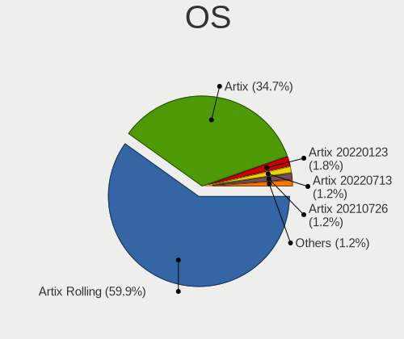

| Name           | Computers | Percent |
|----------------|-----------|---------|
| Artix Rolling  | 105       | 60.69%  |
| Artix          | 59        | 34.1%   |
| Artix 20220123 | 3         | 1.73%   |
| Artix 20220713 | 2         | 1.16%   |
| Artix 20210726 | 2         | 1.16%   |
| Artix 20201207 | 1         | 0.58%   |
| Artix 20201128 | 1         | 0.58%   |

OS Family
---------

OS without a version

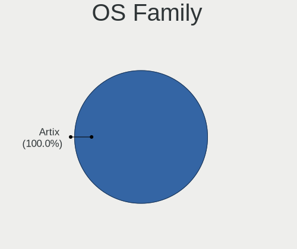

| Name  | Computers | Percent |
|-------|-----------|---------|
| Artix | 165       | 100%    |

Kernel
------

Version of the Linux kernel

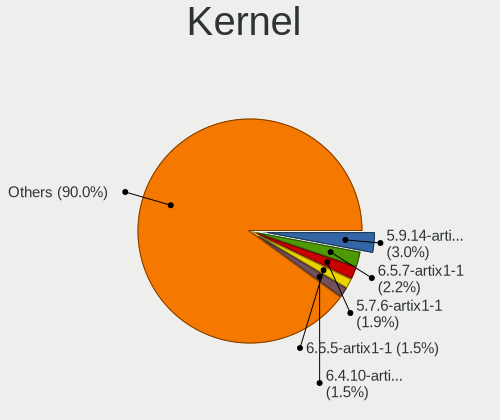

| Version            | Computers | Percent |
|--------------------|-----------|---------|
| 5.9.14-artix1-1    | 8         | 4.06%   |
| 5.7.6-artix1-1     | 5         | 2.54%   |
| 6.0.7-artix1-1     | 4         | 2.03%   |
| 5.7.12-artix1-1    | 4         | 2.03%   |
| 5.15.12-artix1-1   | 4         | 2.03%   |
| 5.12.12-artix1-1   | 4         | 2.03%   |
| 5.10.4-artix2-1    | 4         | 2.03%   |
| 5.8.8-artix1-1     | 3         | 1.52%   |
| 5.8.12-artix1-1    | 3         | 1.52%   |
| 5.18.16-artix1-1   | 3         | 1.52%   |
| 5.16.3-artix1-1    | 3         | 1.52%   |
| 5.16.10-artix1-1   | 3         | 1.52%   |
| 5.12.8-artix1-1    | 3         | 1.52%   |
| 5.12.14-artix1-1   | 3         | 1.52%   |
| 5.10.8-artix1-1    | 3         | 1.52%   |
| 5.10.6-artix1-1    | 3         | 1.52%   |
| 5.10.16-artix1-1   | 3         | 1.52%   |
| 6.1.6-artix1-1     | 2         | 1.02%   |
| 6.0.12-artix1-1    | 2         | 1.02%   |
| 5.9.14-zen1-1-zen  | 2         | 1.02%   |
| 5.9.12-artix1-1    | 2         | 1.02%   |
| 5.8.14-artix1-1    | 2         | 1.02%   |
| 5.7.2-artix1-1     | 2         | 1.02%   |
| 5.19.12-artix1-1   | 2         | 1.02%   |
| 5.18.9-zen1-1-zen  | 2         | 1.02%   |
| 5.18.6-artix1-1    | 2         | 1.02%   |
| 5.18.10-artix1-1   | 2         | 1.02%   |
| 5.18.0-artix1-1    | 2         | 1.02%   |
| 5.17.4-artix1-1    | 2         | 1.02%   |
| 5.17.1-artix1-1    | 2         | 1.02%   |
| 5.16.8-artix1-2    | 2         | 1.02%   |
| 5.16.1-artix1-1    | 2         | 1.02%   |
| 5.15.3-zen1-1-zen  | 2         | 1.02%   |
| 5.14.16-artix1-1   | 2         | 1.02%   |
| 5.13.8-artix1-1    | 2         | 1.02%   |
| 5.12.4-artix1-1    | 2         | 1.02%   |
| 5.12.12-zen1-1-zen | 2         | 1.02%   |
| 5.11.6-artix1-1    | 2         | 1.02%   |
| 5.11.10-artix1-1   | 2         | 1.02%   |
| 5.10.15-artix1-1   | 2         | 1.02%   |

Kernel Family
-------------

Linux kernel without a distro release

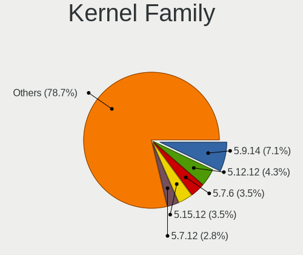

| Version | Computers | Percent |
|---------|-----------|---------|
| 5.9.14  | 10        | 5.08%   |
| 5.12.12 | 6         | 3.05%   |
| 6.0.7   | 5         | 2.54%   |
| 5.7.6   | 5         | 2.54%   |
| 5.15.12 | 5         | 2.54%   |
| 5.7.12  | 4         | 2.03%   |
| 5.12.8  | 4         | 2.03%   |
| 5.12.14 | 4         | 2.03%   |
| 5.10.4  | 4         | 2.03%   |
| 5.8.8   | 3         | 1.52%   |
| 5.8.14  | 3         | 1.52%   |
| 5.8.12  | 3         | 1.52%   |
| 5.18.16 | 3         | 1.52%   |
| 5.17.1  | 3         | 1.52%   |
| 5.16.3  | 3         | 1.52%   |
| 5.16.10 | 3         | 1.52%   |
| 5.13.8  | 3         | 1.52%   |
| 5.10.8  | 3         | 1.52%   |
| 5.10.6  | 3         | 1.52%   |
| 5.10.16 | 3         | 1.52%   |
| 5.10.15 | 3         | 1.52%   |
| 6.1.6   | 2         | 1.02%   |
| 6.0.12  | 2         | 1.02%   |
| 5.9.12  | 2         | 1.02%   |
| 5.9.0   | 2         | 1.02%   |
| 5.7.2   | 2         | 1.02%   |
| 5.19.12 | 2         | 1.02%   |
| 5.18.9  | 2         | 1.02%   |
| 5.18.6  | 2         | 1.02%   |
| 5.18.10 | 2         | 1.02%   |
| 5.18.0  | 2         | 1.02%   |
| 5.17.4  | 2         | 1.02%   |
| 5.17.12 | 2         | 1.02%   |
| 5.16.8  | 2         | 1.02%   |
| 5.16.1  | 2         | 1.02%   |
| 5.15.3  | 2         | 1.02%   |
| 5.14.16 | 2         | 1.02%   |
| 5.14.14 | 2         | 1.02%   |
| 5.12.4  | 2         | 1.02%   |
| 5.11.6  | 2         | 1.02%   |

Kernel Major Ver.
-----------------

Linux kernel major version

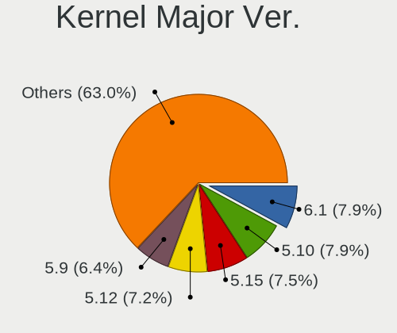

| Version | Computers | Percent |
|---------|-----------|---------|
| 5.10    | 21        | 11.11%  |
| 5.15    | 20        | 10.58%  |
| 5.12    | 19        | 10.05%  |
| 5.9     | 17        | 8.99%   |
| 5.18    | 15        | 7.94%   |
| 5.16    | 13        | 6.88%   |
| 5.11    | 12        | 6.35%   |
| 5.8     | 11        | 5.82%   |
| 5.17    | 11        | 5.82%   |
| 6.0     | 10        | 5.29%   |
| 5.7     | 10        | 5.29%   |
| 5.14    | 7         | 3.7%    |
| 5.19    | 6         | 3.17%   |
| 5.13    | 6         | 3.17%   |
| 6.1     | 4         | 2.12%   |
| 5.4     | 2         | 1.06%   |
| 4.19    | 2         | 1.06%   |
| 6.0.5   | 1         | 0.53%   |
| 5.6     | 1         | 0.53%   |
| 5.5     | 1         | 0.53%   |

Arch
----

OS architecture (x86_64, i586, etc.)

| Name   | Computers | Percent |
|--------|-----------|---------|
| x86_64 | 165       | 100%    |

DE
--

Desktop Environment

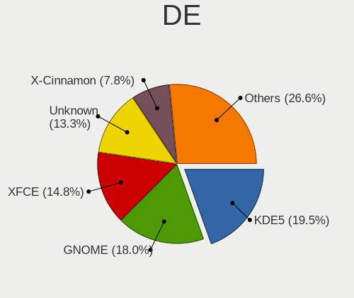

| Name           | Computers | Percent |
|----------------|-----------|---------|
| KDE5           | 41        | 23.03%  |
| XFCE           | 27        | 15.17%  |
| GNOME          | 26        | 14.61%  |
| Unknown        | 24        | 13.48%  |
| X-Cinnamon     | 13        | 7.3%    |
| MATE           | 12        | 6.74%   |
| LXQt           | 5         | 2.81%   |
| Cinnamon       | 5         | 2.81%   |
| LXDE           | 4         | 2.25%   |
| KDE            | 4         | 2.25%   |
| i3             | 4         | 2.25%   |
| bspwm          | 4         | 2.25%   |
| Sway           | 2         | 1.12%   |
| xmonad         | 1         | 0.56%   |
| sway-dbus      | 1         | 0.56%   |
| openbox        | 1         | 0.56%   |
| nxde           | 1         | 0.56%   |
| DWM            | 1         | 0.56%   |
| awesomeminimal | 1         | 0.56%   |
| awesome        | 1         | 0.56%   |

Display Server
--------------

X11 or Wayland

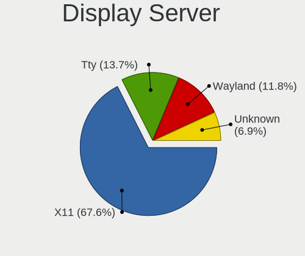

| Name    | Computers | Percent |
|---------|-----------|---------|
| X11     | 120       | 70.18%  |
| Tty     | 26        | 15.2%   |
| Wayland | 16        | 9.36%   |
| Unknown | 9         | 5.26%   |

Display Manager
---------------

SDDM, LightDM, etc.

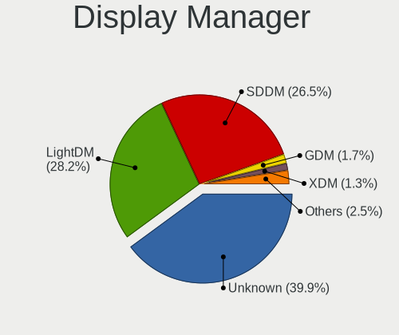

| Name    | Computers | Percent |
|---------|-----------|---------|
| Unknown | 61        | 35.26%  |
| LightDM | 52        | 30.06%  |
| SDDM    | 49        | 28.32%  |
| GDM     | 4         | 2.31%   |
| XDM     | 2         | 1.16%   |
| SLiM    | 2         | 1.16%   |
| LXDM    | 2         | 1.16%   |
| Ly      | 1         | 0.58%   |

OS Lang
-------

Language

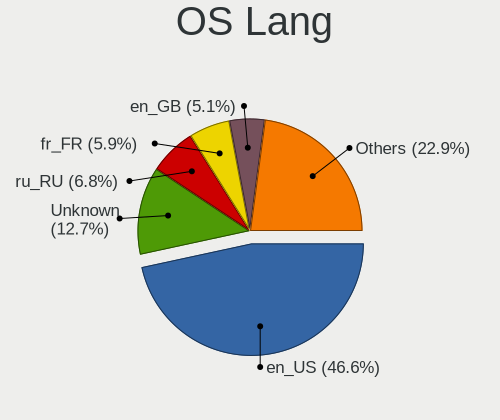

| Lang    | Computers | Percent |
|---------|-----------|---------|
| en_US   | 74        | 43.53%  |
| Unknown | 17        | 10%     |
| ru_RU   | 14        | 8.24%   |
| fr_FR   | 8         | 4.71%   |
| en_GB   | 8         | 4.71%   |
| C       | 8         | 4.71%   |
| de_DE   | 6         | 3.53%   |
| pt_PT   | 3         | 1.76%   |
| es_ES   | 3         | 1.76%   |
| tr_TR   | 2         | 1.18%   |
| pl_PL   | 2         | 1.18%   |
| it_IT   | 2         | 1.18%   |
| en_CA   | 2         | 1.18%   |
| en_AU   | 2         | 1.18%   |
| en_AG   | 2         | 1.18%   |
| el_GR   | 2         | 1.18%   |
| uk_UA   | 1         | 0.59%   |
| ro_RO   | 1         | 0.59%   |
| pt_BR   | 1         | 0.59%   |
| lt_LT   | 1         | 0.59%   |
| ja_JP   | 1         | 0.59%   |
| es_MX   | 1         | 0.59%   |
| es_GT   | 1         | 0.59%   |
| es_CO   | 1         | 0.59%   |
| es_AR   | 1         | 0.59%   |
| en_NZ   | 1         | 0.59%   |
| en_IN   | 1         | 0.59%   |
| en_IE   | 1         | 0.59%   |
| de_AT   | 1         | 0.59%   |
| cs_CZ   | 1         | 0.59%   |
| bg_BG   | 1         | 0.59%   |

Boot Mode
---------

EFI or BIOS

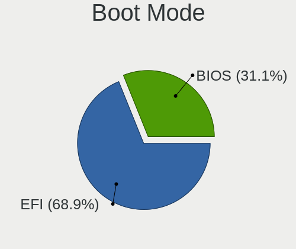

| Mode | Computers | Percent |
|------|-----------|---------|
| EFI  | 116       | 69.46%  |
| BIOS | 51        | 30.54%  |

Filesystem
----------

Type of filesystem

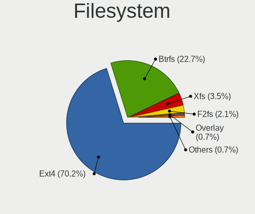

| Type    | Computers | Percent |
|---------|-----------|---------|
| Ext4    | 119       | 71.69%  |
| Btrfs   | 35        | 21.08%  |
| Xfs     | 6         | 3.61%   |
| F2fs    | 3         | 1.81%   |
| Overlay | 2         | 1.2%    |
| Jfs     | 1         | 0.6%    |

Part. scheme
------------

Scheme of partitioning

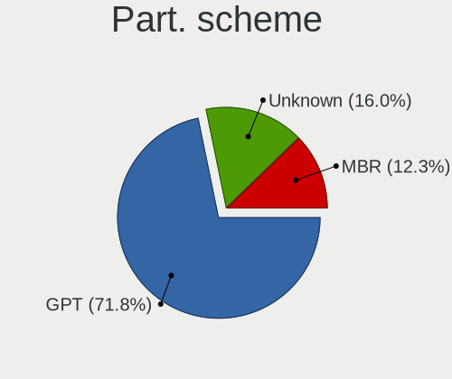

| Type    | Computers | Percent |
|---------|-----------|---------|
| GPT     | 120       | 71.43%  |
| Unknown | 26        | 15.48%  |
| MBR     | 22        | 13.1%   |

Dual Boot with Linux/BSD
------------------------

Hosting more than one Linux/BSD

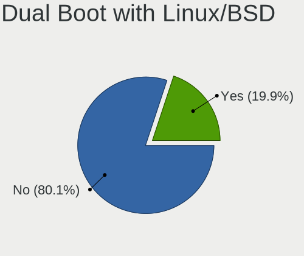

| Dual boot | Computers | Percent |
|-----------|-----------|---------|
| No        | 136       | 80.95%  |
| Yes       | 32        | 19.05%  |

Dual Boot (Win)
---------------

Hosting Linux and Windows

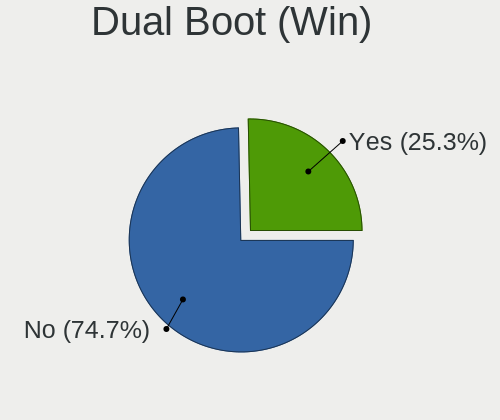

| Dual boot | Computers | Percent |
|-----------|-----------|---------|
| No        | 121       | 72.89%  |
| Yes       | 45        | 27.11%  |

Board
-----

Vendor
------

Motherboard manufacturer

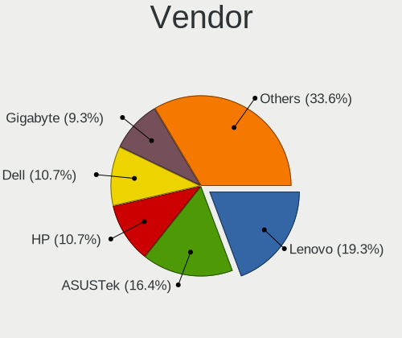

| Name                | Computers | Percent |
|---------------------|-----------|---------|
| Lenovo              | 31        | 18.79%  |
| ASUSTek Computer    | 28        | 16.97%  |
| Hewlett-Packard     | 18        | 10.91%  |
| Gigabyte Technology | 17        | 10.3%   |
| Dell                | 16        | 9.7%    |
| Acer                | 13        | 7.88%   |
| MSI                 | 12        | 7.27%   |
| ASRock              | 6         | 3.64%   |
| Apple               | 3         | 1.82%   |
| Timi                | 2         | 1.21%   |
| Samsung Electronics | 2         | 1.21%   |
| Notebook            | 2         | 1.21%   |
| Intel               | 2         | 1.21%   |
| GPD                 | 2         | 1.21%   |
| UNOWHY              | 1         | 0.61%   |
| Toshiba             | 1         | 0.61%   |
| Quanta              | 1         | 0.61%   |
| MOTILE              | 1         | 0.61%   |
| Microsoft           | 1         | 0.61%   |
| LG Electronics      | 1         | 0.61%   |
| HUAWEI              | 1         | 0.61%   |
| HONOR               | 1         | 0.61%   |
| Biostar             | 1         | 0.61%   |
| AXIOO               | 1         | 0.61%   |
| Alienware           | 1         | 0.61%   |

Model
-----

Motherboard model

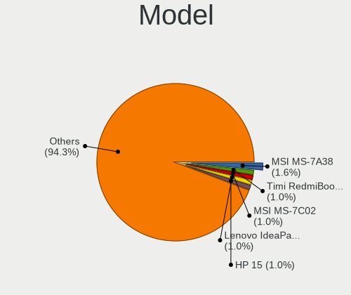

| Name                                 | Computers | Percent |
|--------------------------------------|-----------|---------|
| Timi RedmiBook 14 II                 | 2         | 1.21%   |
| MSI MS-7C02                          | 2         | 1.21%   |
| MSI MS-7A38                          | 2         | 1.21%   |
| Lenovo IdeaPad 5 15IIL05 81YK        | 2         | 1.21%   |
| HP 15                                | 2         | 1.21%   |
| GPD P2 MAX                           | 2         | 1.21%   |
| Gigabyte 970A-DS3P                   | 2         | 1.21%   |
| Dell Precision M6600                 | 2         | 1.21%   |
| Dell Precision 7550                  | 2         | 1.21%   |
| Apple MacBookAir7,2                  | 2         | 1.21%   |
| UNOWHY Y13G010S4EI                   | 1         | 0.61%   |
| Toshiba Satellite P775               | 1         | 0.61%   |
| Samsung R425D/R525D                  | 1         | 0.61%   |
| Samsung 350V5C/351V5C/3540VC/3440VC  | 1         | 0.61%   |
| Quanta SWH                           | 1         | 0.61%   |
| Notebook N141CU                      | 1         | 0.61%   |
| Notebook N130BU                      | 1         | 0.61%   |
| MSI MS-7C89                          | 1         | 0.61%   |
| MSI MS-7C56                          | 1         | 0.61%   |
| MSI MS-7C37                          | 1         | 0.61%   |
| MSI MS-7B79                          | 1         | 0.61%   |
| MSI MS-7A69                          | 1         | 0.61%   |
| MSI Modern 15 A11M                   | 1         | 0.61%   |
| MSI GP72 7RDX                        | 1         | 0.61%   |
| MSI GF65 Thin 10SDR                  | 1         | 0.61%   |
| MOTILE M141                          | 1         | 0.61%   |
| Microsoft Surface Pro                | 1         | 0.61%   |
| LG 17Z990-R.AAC9U1                   | 1         | 0.61%   |
| Lenovo ThinkPad W500 4063CJ5         | 1         | 0.61%   |
| Lenovo ThinkPad T480s 20L8S3D400     | 1         | 0.61%   |
| Lenovo ThinkPad T480 MFG_IN_GO       | 1         | 0.61%   |
| Lenovo ThinkPad T440s 20ARS0MV00     | 1         | 0.61%   |
| Lenovo ThinkPad T430 2350BC6         | 1         | 0.61%   |
| Lenovo ThinkPad T430 2347H76         | 1         | 0.61%   |
| Lenovo ThinkPad T430 23427YU         | 1         | 0.61%   |
| Lenovo ThinkPad T420 4236H45         | 1         | 0.61%   |
| Lenovo ThinkPad T14 Gen 1 20UES1GC00 | 1         | 0.61%   |
| Lenovo ThinkPad T14 Gen 1 20S1S07800 | 1         | 0.61%   |
| Lenovo ThinkPad P1 Gen 3 20TH001EMH  | 1         | 0.61%   |
| Lenovo ThinkPad E14 Gen 2 20T6000MCK | 1         | 0.61%   |

Model Family
------------

Motherboard model prefix

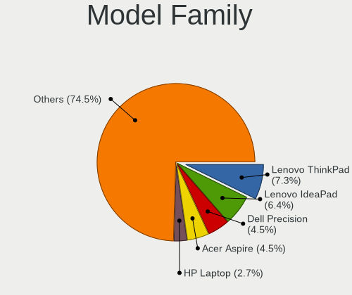

| Name               | Computers | Percent |
|--------------------|-----------|---------|
| Lenovo ThinkPad    | 13        | 7.88%   |
| Lenovo IdeaPad     | 9         | 5.45%   |
| Acer Aspire        | 9         | 5.45%   |
| Dell Precision     | 6         | 3.64%   |
| HP Laptop          | 5         | 3.03%   |
| Dell Inspiron      | 5         | 3.03%   |
| Dell Latitude      | 4         | 2.42%   |
| ASUS ROG           | 4         | 2.42%   |
| HP 250             | 3         | 1.82%   |
| Gigabyte X570      | 3         | 1.82%   |
| ASUS PRIME         | 3         | 1.82%   |
| Timi RedmiBook     | 2         | 1.21%   |
| MSI MS-7C02        | 2         | 1.21%   |
| MSI MS-7A38        | 2         | 1.21%   |
| Lenovo IdeaPadFlex | 2         | 1.21%   |
| HP Pavilion        | 2         | 1.21%   |
| HP 15              | 2         | 1.21%   |
| GPD P2             | 2         | 1.21%   |
| Gigabyte 970A-DS3P | 2         | 1.21%   |
| ASUS VivoBook      | 2         | 1.21%   |
| ASUS TUF           | 2         | 1.21%   |
| ASUS ASUS          | 2         | 1.21%   |
| Apple MacBookAir7  | 2         | 1.21%   |
| Acer Nitro         | 2         | 1.21%   |
| UNOWHY Y13G010S4EI | 1         | 0.61%   |
| Toshiba Satellite  | 1         | 0.61%   |
| Samsung R425D      | 1         | 0.61%   |
| Samsung 350V5C     | 1         | 0.61%   |
| Quanta SWH         | 1         | 0.61%   |
| Notebook N141CU    | 1         | 0.61%   |
| Notebook N130BU    | 1         | 0.61%   |
| MSI MS-7C89        | 1         | 0.61%   |
| MSI MS-7C56        | 1         | 0.61%   |
| MSI MS-7C37        | 1         | 0.61%   |
| MSI MS-7B79        | 1         | 0.61%   |
| MSI MS-7A69        | 1         | 0.61%   |
| MSI Modern         | 1         | 0.61%   |
| MSI GP72           | 1         | 0.61%   |
| MSI GF65           | 1         | 0.61%   |
| MOTILE M141        | 1         | 0.61%   |

MFG Year
--------

Motherboard manufacture year

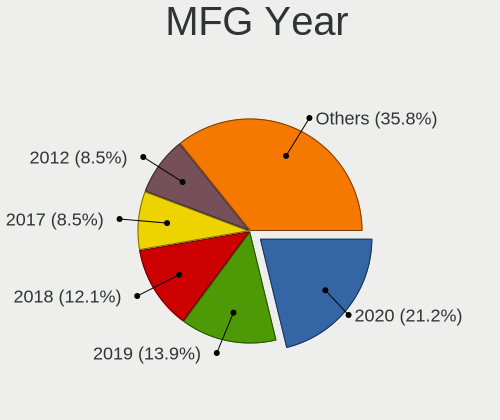

| Year | Computers | Percent |
|------|-----------|---------|
| 2020 | 35        | 21.21%  |
| 2019 | 23        | 13.94%  |
| 2018 | 20        | 12.12%  |
| 2017 | 14        | 8.48%   |
| 2012 | 14        | 8.48%   |
| 2013 | 13        | 7.88%   |
| 2011 | 11        | 6.67%   |
| 2015 | 9         | 5.45%   |
| 2014 | 7         | 4.24%   |
| 2021 | 5         | 3.03%   |
| 2016 | 5         | 3.03%   |
| 2010 | 5         | 3.03%   |
| 2008 | 2         | 1.21%   |
| 2022 | 1         | 0.61%   |
| 2009 | 1         | 0.61%   |

Form Factor
-----------

Physical design of the computer

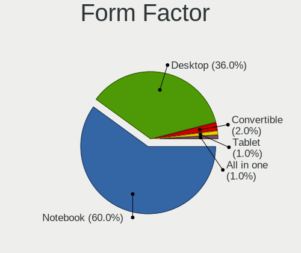

| Name        | Computers | Percent |
|-------------|-----------|---------|
| Notebook    | 108       | 65.45%  |
| Desktop     | 53        | 32.12%  |
| Convertible | 2         | 1.21%   |
| Tablet      | 1         | 0.61%   |
| Mini pc     | 1         | 0.61%   |

Secure Boot
-----------

Enabled or disabled

| State    | Computers | Percent |
|----------|-----------|---------|
| Disabled | 164       | 99.39%  |
| Enabled  | 1         | 0.61%   |

Coreboot
--------

Have coreboot on board

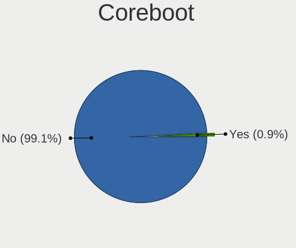

| Used | Computers | Percent |
|------|-----------|---------|
| No   | 165       | 100%    |

RAM Size
--------

Total RAM memory

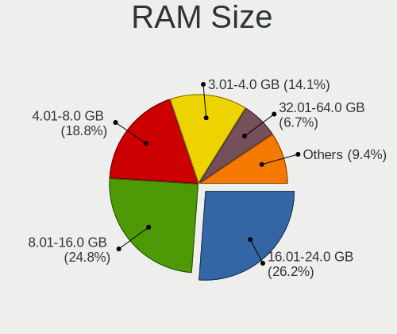

| Size in GB  | Computers | Percent |
|-------------|-----------|---------|
| 16.01-24.0  | 44        | 26.35%  |
| 8.01-16.0   | 39        | 23.35%  |
| 4.01-8.0    | 35        | 20.96%  |
| 3.01-4.0    | 23        | 13.77%  |
| 32.01-64.0  | 12        | 7.19%   |
| 64.01-256.0 | 7         | 4.19%   |
| 1.01-2.0    | 5         | 2.99%   |
| 24.01-32.0  | 2         | 1.2%    |

RAM Used
--------

Used RAM memory

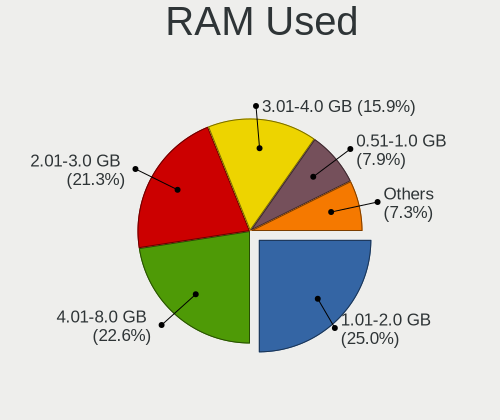

| Used GB    | Computers | Percent |
|------------|-----------|---------|
| 2.01-3.0   | 45        | 24.19%  |
| 1.01-2.0   | 43        | 23.12%  |
| 4.01-8.0   | 42        | 22.58%  |
| 3.01-4.0   | 27        | 14.52%  |
| 0.51-1.0   | 16        | 8.6%    |
| 8.01-16.0  | 7         | 3.76%   |
| 0.01-0.5   | 4         | 2.15%   |
| 16.01-24.0 | 2         | 1.08%   |

Total Drives
------------

Number of drives on board

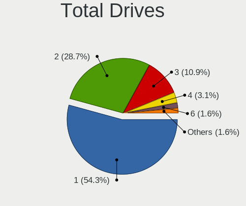

| Drives | Computers | Percent |
|--------|-----------|---------|
| 1      | 99        | 58.58%  |
| 2      | 46        | 27.22%  |
| 3      | 14        | 8.28%   |
| 4      | 6         | 3.55%   |
| 6      | 2         | 1.18%   |
| 8      | 1         | 0.59%   |
| 7      | 1         | 0.59%   |

Has CD-ROM
----------

Has CD-ROM on board

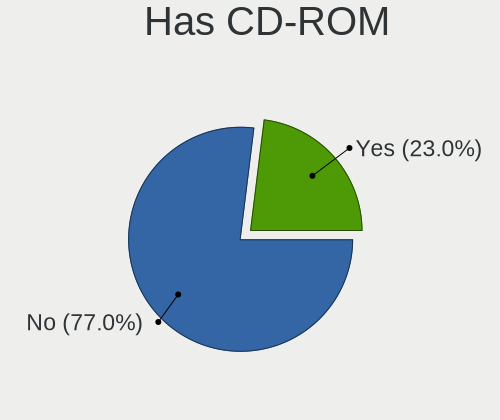

| Presented | Computers | Percent |
|-----------|-----------|---------|
| No        | 122       | 73.94%  |
| Yes       | 43        | 26.06%  |

Has Ethernet
------------

Has Ethernet on board

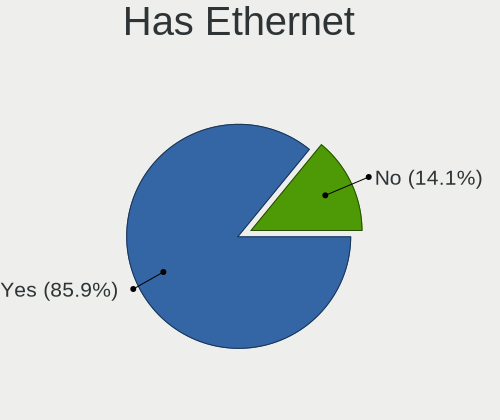

| Presented | Computers | Percent |
|-----------|-----------|---------|
| Yes       | 140       | 84.85%  |
| No        | 25        | 15.15%  |

Has WiFi
--------

Has WiFi module

| Presented | Computers | Percent |
|-----------|-----------|---------|
| Yes       | 136       | 82.42%  |
| No        | 29        | 17.58%  |

Has Bluetooth
-------------

Has Bluetooth module

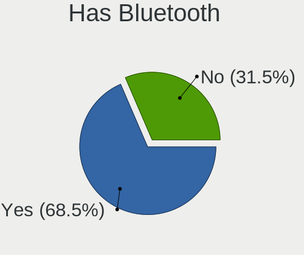

| Presented | Computers | Percent |
|-----------|-----------|---------|
| Yes       | 114       | 68.26%  |
| No        | 53        | 31.74%  |

Location
--------

Country
-------

Geographic location (country)

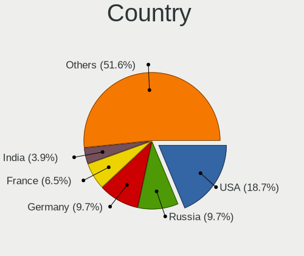

| Country     | Computers | Percent |
|-------------|-----------|---------|
| USA         | 32        | 19.28%  |
| Russia      | 18        | 10.84%  |
| Germany     | 15        | 9.04%   |
| France      | 10        | 6.02%   |
| Turkey      | 6         | 3.61%   |
| India       | 6         | 3.61%   |
| UK          | 5         | 3.01%   |
| Poland      | 5         | 3.01%   |
| Canada      | 5         | 3.01%   |
| Brazil      | 5         | 3.01%   |
| Ukraine     | 4         | 2.41%   |
| Switzerland | 4         | 2.41%   |
| Indonesia   | 4         | 2.41%   |
| Greece      | 4         | 2.41%   |
| Bulgaria    | 4         | 2.41%   |
| Spain       | 3         | 1.81%   |
| Netherlands | 3         | 1.81%   |
| Italy       | 3         | 1.81%   |
| Romania     | 2         | 1.2%    |
| Lithuania   | 2         | 1.2%    |
| Iran        | 2         | 1.2%    |
| Finland     | 2         | 1.2%    |
| Czechia     | 2         | 1.2%    |
| Australia   | 2         | 1.2%    |
| Argentina   | 2         | 1.2%    |
| Uzbekistan  | 1         | 0.6%    |
| Sweden      | 1         | 0.6%    |
| Slovenia    | 1         | 0.6%    |
| Peru        | 1         | 0.6%    |
| Mexico      | 1         | 0.6%    |
| Japan       | 1         | 0.6%    |
| Israel      | 1         | 0.6%    |
| Hong Kong   | 1         | 0.6%    |
| Guatemala   | 1         | 0.6%    |
| Colombia    | 1         | 0.6%    |
| China       | 1         | 0.6%    |
| Chile       | 1         | 0.6%    |
| Bangladesh  | 1         | 0.6%    |
| Azerbaijan  | 1         | 0.6%    |
| Austria     | 1         | 0.6%    |

City
----

Geographic location (city)

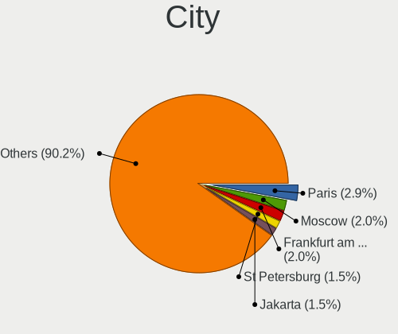

| City              | Computers | Percent |
|-------------------|-----------|---------|
| Paris             | 6         | 3.41%   |
| Moscow            | 4         | 2.27%   |
| Frankfurt am Main | 4         | 2.27%   |
| St Petersburg     | 3         | 1.7%    |
| Jakarta           | 3         | 1.7%    |
| Dnipro            | 3         | 1.7%    |
| Ankara            | 3         | 1.7%    |
| Vilnius           | 2         | 1.14%   |
| Toronto           | 2         | 1.14%   |
| Sofia             | 2         | 1.14%   |
| Snohomish         | 2         | 1.14%   |
| San Ramon         | 2         | 1.14%   |
| Samara            | 2         | 1.14%   |
| Rio de Janeiro    | 2         | 1.14%   |
| Prague            | 2         | 1.14%   |
| Omaha             | 2         | 1.14%   |
| Neuchatel         | 2         | 1.14%   |
| Los Angeles       | 2         | 1.14%   |
| Kłodzko          | 2         | 1.14%   |
| Helsinki          | 2         | 1.14%   |
| Charlotte         | 2         | 1.14%   |
| Bern              | 2         | 1.14%   |
| Athens            | 2         | 1.14%   |
| Amsterdam         | 2         | 1.14%   |
| Zaporizhzhya      | 1         | 0.57%   |
| Woodbridge        | 1         | 0.57%   |
| Wigan             | 1         | 0.57%   |
| Wettringen        | 1         | 0.57%   |
| Wem               | 1         | 0.57%   |
| Vladivostok       | 1         | 0.57%   |
| Vienna            | 1         | 0.57%   |
| Varna             | 1         | 0.57%   |
| Vancouver         | 1         | 0.57%   |
| Upper Norwood     | 1         | 0.57%   |
| Ufa               | 1         | 0.57%   |
| Timișoara        | 1         | 0.57%   |
| Thessaloniki      | 1         | 0.57%   |
| Tel Aviv          | 1         | 0.57%   |
| Tehran            | 1         | 0.57%   |
| Tashkent          | 1         | 0.57%   |

Drives
------

Drive Vendor
------------

Hard drive vendors

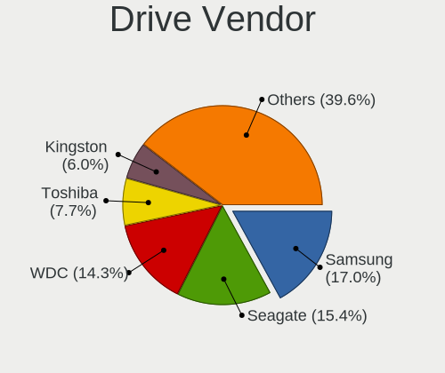

| Vendor                    | Computers | Drives | Percent |
|---------------------------|-----------|--------|---------|
| Samsung Electronics       | 42        | 58     | 16.34%  |
| Seagate                   | 38        | 45     | 14.79%  |
| WDC                       | 35        | 59     | 13.62%  |
| Kingston                  | 18        | 20     | 7%      |
| Toshiba                   | 17        | 18     | 6.61%   |
| SanDisk                   | 12        | 14     | 4.67%   |
| Crucial                   | 12        | 19     | 4.67%   |
| Intel                     | 10        | 15     | 3.89%   |
| HGST                      | 8         | 9      | 3.11%   |
| SK hynix                  | 7         | 13     | 2.72%   |
| Hitachi                   | 6         | 7      | 2.33%   |
| China                     | 5         | 5      | 1.95%   |
| Phison Electronics        | 4         | 6      | 1.56%   |
| Apple                     | 3         | 4      | 1.17%   |
| A-DATA Technology         | 3         | 3      | 1.17%   |
| Unknown                   | 2         | 2      | 0.78%   |
| SPCC                      | 2         | 2      | 0.78%   |
| PNY                       | 2         | 2      | 0.78%   |
| Phison                    | 2         | 2      | 0.78%   |
| Maxtor                    | 2         | 2      | 0.78%   |
| Linux                     | 2         | 2      | 0.78%   |
| JMicron Technology        | 2         | 2      | 0.78%   |
| Hewlett-Packard           | 2         | 2      | 0.78%   |
| Corsair                   | 2         | 2      | 0.78%   |
| Union Memory (Shenzhen)   | 1         | 1      | 0.39%   |
| Union Memory              | 1         | 1      | 0.39%   |
| TS512GMT                  | 1         | 4      | 0.39%   |
| Transcend                 | 1         | 1      | 0.39%   |
| Timetec                   | 1         | 2      | 0.39%   |
| Solid State Storage       | 1         | 1      | 0.39%   |
| Plextor                   | 1         | 1      | 0.39%   |
| Patriot                   | 1         | 1      | 0.39%   |
| Netac                     | 1         | 1      | 0.39%   |
| Micron/Crucial Technology | 1         | 1      | 0.39%   |
| Micron Technology         | 1         | 1      | 0.39%   |
| LITEON                    | 1         | 1      | 0.39%   |
| Lite-On                   | 1         | 1      | 0.39%   |
| LDLC                      | 1         | 5      | 0.39%   |
| Intenso                   | 1         | 1      | 0.39%   |
| GOODRAM                   | 1         | 1      | 0.39%   |

Drive Model
-----------

Hard drive models

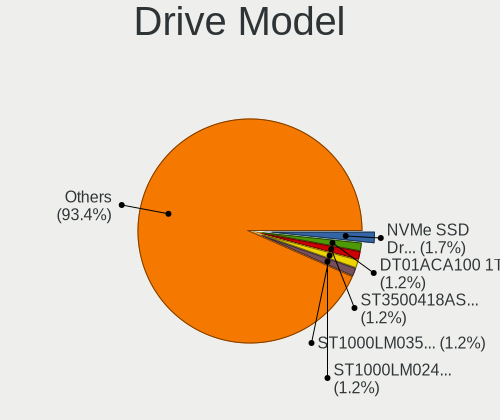

| Model                                               | Computers | Percent |
|-----------------------------------------------------|-----------|---------|
| Samsung NVMe SSD Controller SM981/PM981/PM983 500GB | 5         | 1.77%   |
| Seagate ST1000LM035-1RK172 1TB                      | 4         | 1.41%   |
| Seagate ST1000LM024 HN-M101MBB 1TB                  | 4         | 1.41%   |
| SanDisk NVMe SSD Drive 512GB                        | 4         | 1.41%   |
| Samsung SSD 860 EVO 250GB                           | 4         | 1.41%   |
| Crucial CT1000MX500SSD1 1TB                         | 4         | 1.41%   |
| WDC WD10EZEX-08WN4A0 1TB                            | 3         | 1.06%   |
| Toshiba DT01ACA100 1TB                              | 3         | 1.06%   |
| Seagate ST3500418AS 500GB                           | 3         | 1.06%   |
| Seagate ST1000DM010-2EP102 1TB                      | 3         | 1.06%   |
| Samsung SSD 970 EVO 1TB                             | 3         | 1.06%   |
| Samsung NVMe SSD Drive 1TB                          | 3         | 1.06%   |
| HGST HTS545050A7E680 500GB                          | 3         | 1.06%   |
| Crucial CT240BX500SSD1 240GB                        | 3         | 1.06%   |
| China SATA SSD 960GB                                | 3         | 1.06%   |
| WDC WD80EZAZ-11TDBA0 8TB                            | 2         | 0.71%   |
| WDC WD40EZRZ-00WN9B0 4TB                            | 2         | 0.71%   |
| WDC WD10JPVX-22JC3T0 1TB                            | 2         | 0.71%   |
| WDC WD10EZEX-22MFCA0 1TB                            | 2         | 0.71%   |
| WDC WD100EMAZ-00WJTA0 10TB                          | 2         | 0.71%   |
| Toshiba MQ04ABF100 1TB                              | 2         | 0.71%   |
| Toshiba MQ01ABF050 500GB                            | 2         | 0.71%   |
| Toshiba MQ01ABD100 1TB                              | 2         | 0.71%   |
| Seagate ST500LT012-1DG142 500GB                     | 2         | 0.71%   |
| Seagate ST500DM002-1BD142 500GB                     | 2         | 0.71%   |
| Sandisk WD Blue SN550 NVMe SSD 1TB                  | 2         | 0.71%   |
| SanDisk NVMe SSD Drive 500GB                        | 2         | 0.71%   |
| Samsung SSD 870 EVO 250GB                           | 2         | 0.71%   |
| Samsung MZYTY256HDHP-000L2 256GB SSD                | 2         | 0.71%   |
| Samsung MZNLH512HALU-00000 512GB SSD                | 2         | 0.71%   |
| Phison PCIe SSD 1TB                                 | 2         | 0.71%   |
| Phison E12 NVMe Controller 1TB                      | 2         | 0.71%   |
| Linux scsi_debug 8.3MB                              | 2         | 0.71%   |
| Kingston SA400S37240G 240GB SSD                     | 2         | 0.71%   |
| Kingston SA400S37120G 120GB SSD                     | 2         | 0.71%   |
| Kingston OM8PCP3512F-AI1 512GB                      | 2         | 0.71%   |
| Crucial CT500MX500SSD1 500GB                        | 2         | 0.71%   |
| Apple SSD SM0256G 256GB                             | 2         | 0.71%   |
| WDC WDS500G2B0C-00PXH0 500GB                        | 1         | 0.35%   |
| WDC WDS500G2B0A-00SM50 500GB SSD                    | 1         | 0.35%   |

HDD Vendor
----------

Hard disk drive vendors

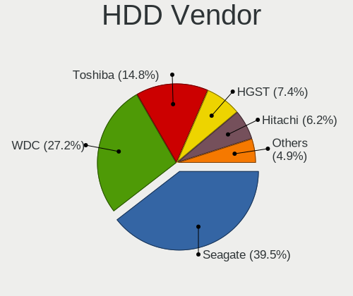

| Vendor             | Computers | Drives | Percent |
|--------------------|-----------|--------|---------|
| Seagate            | 38        | 45     | 38%     |
| WDC                | 30        | 48     | 30%     |
| Toshiba            | 14        | 15     | 14%     |
| HGST               | 8         | 9      | 8%      |
| Hitachi            | 6         | 7      | 6%      |
| Maxtor             | 2         | 2      | 2%      |
| Unknown            | 1         | 1      | 1%      |
| JMicron Technology | 1         | 1      | 1%      |

SSD Vendor
----------

Solid state drive vendors

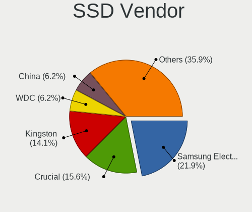

| Vendor              | Computers | Drives | Percent |
|---------------------|-----------|--------|---------|
| Samsung Electronics | 18        | 22     | 22.22%  |
| Kingston            | 13        | 14     | 16.05%  |
| Crucial             | 12        | 19     | 14.81%  |
| WDC                 | 5         | 8      | 6.17%   |
| China               | 5         | 5      | 6.17%   |
| SanDisk             | 3         | 3      | 3.7%    |
| Intel               | 3         | 4      | 3.7%    |
| Apple               | 3         | 4      | 3.7%    |
| SPCC                | 2         | 2      | 2.47%   |
| Linux               | 2         | 2      | 2.47%   |
| A-DATA Technology   | 2         | 2      | 2.47%   |
| Toshiba             | 1         | 1      | 1.23%   |
| SK hynix            | 1         | 1      | 1.23%   |
| PNY                 | 1         | 1      | 1.23%   |
| Plextor             | 1         | 1      | 1.23%   |
| Patriot             | 1         | 1      | 1.23%   |
| Netac               | 1         | 1      | 1.23%   |
| LDLC                | 1         | 5      | 1.23%   |
| JMicron Technology  | 1         | 1      | 1.23%   |
| Intenso             | 1         | 1      | 1.23%   |
| Hewlett-Packard     | 1         | 1      | 1.23%   |
| GOODRAM             | 1         | 1      | 1.23%   |
| AMD                 | 1         | 1      | 1.23%   |
| AGI                 | 1         | 1      | 1.23%   |

Drive Kind
----------

HDD or SSD

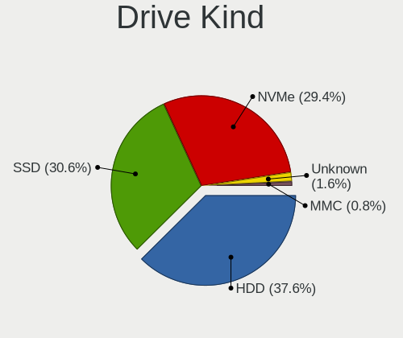

| Kind    | Computers | Drives | Percent |
|---------|-----------|--------|---------|
| HDD     | 88        | 128    | 38.1%   |
| SSD     | 73        | 102    | 31.6%   |
| NVMe    | 66        | 102    | 28.57%  |
| Unknown | 3         | 7      | 1.3%    |
| MMC     | 1         | 1      | 0.43%   |

Drive Connector
---------------

SATA, SAS, NVMe, etc.

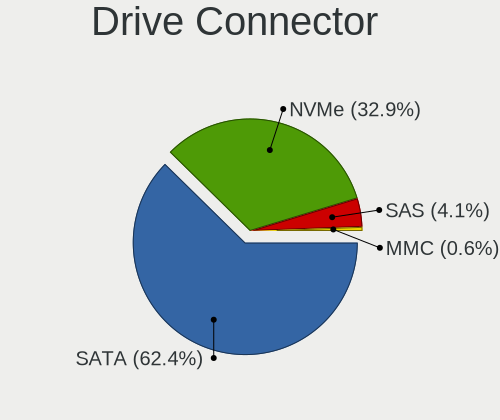

| Type | Computers | Drives | Percent |
|------|-----------|--------|---------|
| SATA | 125       | 227    | 62.81%  |
| NVMe | 66        | 102    | 33.17%  |
| SAS  | 7         | 10     | 3.52%   |
| MMC  | 1         | 1      | 0.5%    |

Drive Size
----------

Size of hard drive

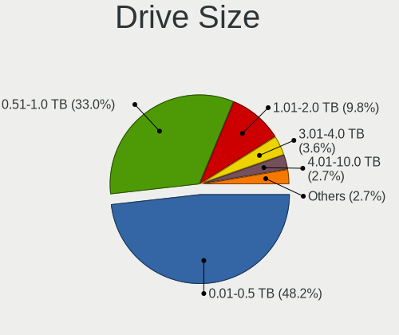

| Size in TB | Computers | Drives | Percent |
|------------|-----------|--------|---------|
| 0.01-0.5   | 85        | 120    | 51.2%   |
| 0.51-1.0   | 56        | 77     | 33.73%  |
| 1.01-2.0   | 12        | 14     | 7.23%   |
| 4.01-10.0  | 5         | 11     | 3.01%   |
| 3.01-4.0   | 4         | 4      | 2.41%   |
| 2.01-3.0   | 4         | 4      | 2.41%   |

Space Total
-----------

Amount of disk space available on the file system

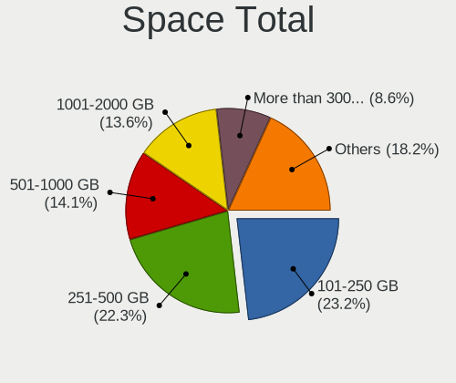

| Size in GB     | Computers | Percent |
|----------------|-----------|---------|
| 101-250        | 41        | 23.98%  |
| 251-500        | 36        | 21.05%  |
| 501-1000       | 25        | 14.62%  |
| 1001-2000      | 22        | 12.87%  |
| More than 3000 | 15        | 8.77%   |
| 2001-3000      | 12        | 7.02%   |
| 51-100         | 8         | 4.68%   |
| Unknown        | 6         | 3.51%   |
| 1-20           | 4         | 2.34%   |
| 21-50          | 2         | 1.17%   |

Space Used
----------

Amount of used disk space

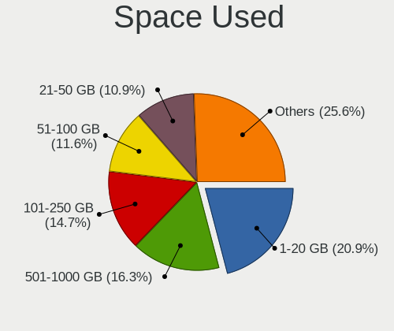

| Used GB        | Computers | Percent |
|----------------|-----------|---------|
| 1-20           | 43        | 23.89%  |
| 101-250        | 30        | 16.67%  |
| 501-1000       | 24        | 13.33%  |
| 251-500        | 21        | 11.67%  |
| 51-100         | 18        | 10%     |
| 21-50          | 17        | 9.44%   |
| 1001-2000      | 10        | 5.56%   |
| More than 3000 | 8         | 4.44%   |
| Unknown        | 6         | 3.33%   |
| 2001-3000      | 3         | 1.67%   |

Malfunc. Drives
---------------

Drive models with a malfunction

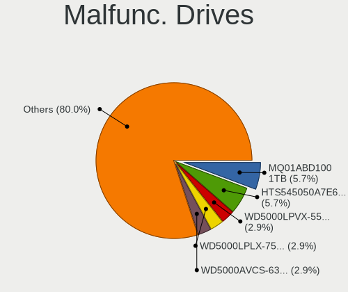

| Model                                            | Computers | Drives | Percent |
|--------------------------------------------------|-----------|--------|---------|
| Toshiba MQ01ABD100 1TB                           | 2         | 2      | 7.14%   |
| HGST HTS545050A7E680 500GB                       | 2         | 2      | 7.14%   |
| WDC WD5000LPVX-55V0TT0 500GB                     | 1         | 1      | 3.57%   |
| WDC WD3200LPVT-00FMCT0 320GB                     | 1         | 1      | 3.57%   |
| WDC WD3200AAKX-00ERMA0 320GB                     | 1         | 1      | 3.57%   |
| WDC WD30EZRX-00DC0B0 3TB                         | 1         | 1      | 3.57%   |
| WDC WD10SPCX-24HWST1 1TB                         | 1         | 1      | 3.57%   |
| Toshiba MK7575GSX 752GB                          | 1         | 1      | 3.57%   |
| Toshiba MK5065GSX 500GB                          | 1         | 1      | 3.57%   |
| Seagate ST8000DM004-2CX188 8TB                   | 1         | 1      | 3.57%   |
| Seagate ST500LT012-9WS142 500GB                  | 1         | 1      | 3.57%   |
| Seagate ST500LT012-1DG142 500GB                  | 1         | 1      | 3.57%   |
| Seagate ST2000DX002-2DV164 2TB                   | 1         | 1      | 3.57%   |
| Seagate ST2000DM006-2DM164 2TB                   | 1         | 1      | 3.57%   |
| Seagate ST1000LM035-1RK172 1TB                   | 1         | 1      | 3.57%   |
| Samsung Electronics MZNLH128HBHQ-000H1 128GB SSD | 1         | 1      | 3.57%   |
| Maxtor 6Y080M0 81GB                              | 1         | 1      | 3.57%   |
| LDLC SSD 120GB                                   | 1         | 3      | 3.57%   |
| Kingston SUV400S37240G 240GB SSD                 | 1         | 1      | 3.57%   |
| Kingston SA400S37120G 120GB SSD                  | 1         | 1      | 3.57%   |
| Intel SSDSC2BW480A4 480GB                        | 1         | 2      | 3.57%   |
| Intel SSDPEKKW128G7 128GB                        | 1         | 1      | 3.57%   |
| Hitachi HTS547550A9E384 500GB                    | 1         | 1      | 3.57%   |
| Hitachi HTS542516K9SA00 160GB                    | 1         | 1      | 3.57%   |
| HGST HTS541010A9E680 1TB                         | 1         | 1      | 3.57%   |
| Hewlett-Packard SSD EX900 250GB                  | 1         | 1      | 3.57%   |

Malfunc. Drive Vendor
---------------------

Vendors of faulty drives

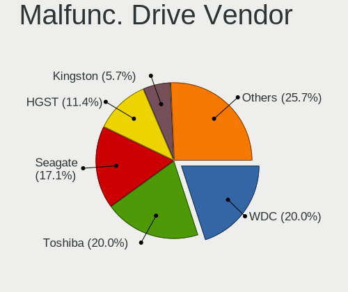

| Vendor              | Computers | Drives | Percent |
|---------------------|-----------|--------|---------|
| Seagate             | 6         | 6      | 21.43%  |
| WDC                 | 5         | 5      | 17.86%  |
| Toshiba             | 4         | 4      | 14.29%  |
| HGST                | 3         | 3      | 10.71%  |
| Kingston            | 2         | 2      | 7.14%   |
| Intel               | 2         | 3      | 7.14%   |
| Hitachi             | 2         | 2      | 7.14%   |
| Samsung Electronics | 1         | 1      | 3.57%   |
| Maxtor              | 1         | 1      | 3.57%   |
| LDLC                | 1         | 3      | 3.57%   |
| Hewlett-Packard     | 1         | 1      | 3.57%   |

Malfunc. HDD Vendor
-------------------

Vendors of faulty HDD drives

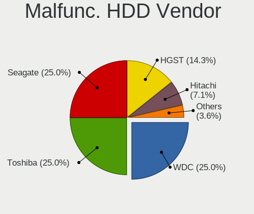

| Vendor  | Computers | Drives | Percent |
|---------|-----------|--------|---------|
| Seagate | 6         | 6      | 28.57%  |
| WDC     | 5         | 5      | 23.81%  |
| Toshiba | 4         | 4      | 19.05%  |
| HGST    | 3         | 3      | 14.29%  |
| Hitachi | 2         | 2      | 9.52%   |
| Maxtor  | 1         | 1      | 4.76%   |

Malfunc. Drive Kind
-------------------

Kinds of faulty drives

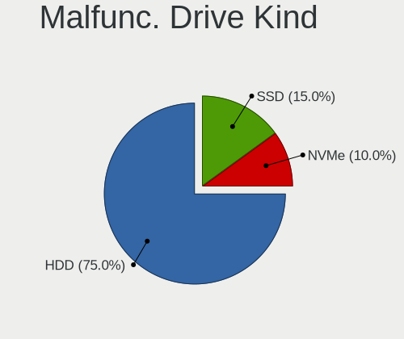

| Kind | Computers | Drives | Percent |
|------|-----------|--------|---------|
| HDD  | 21        | 21     | 75%     |
| SSD  | 5         | 8      | 17.86%  |
| NVMe | 2         | 2      | 7.14%   |

Failed Drives
-------------

Failed drive models

Zero info for selected period =(

Failed Drive Vendor
-------------------

Failed drive vendors

Zero info for selected period =(

Drive Status
------------

Number of failed and malfunc. drives

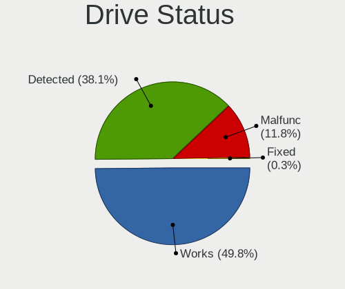

| Status   | Computers | Drives | Percent |
|----------|-----------|--------|---------|
| Works    | 97        | 176    | 51.6%   |
| Detected | 64        | 133    | 34.04%  |
| Malfunc  | 27        | 31     | 14.36%  |

Storage controller
------------------

Storage Vendor
--------------

Storage controller vendors

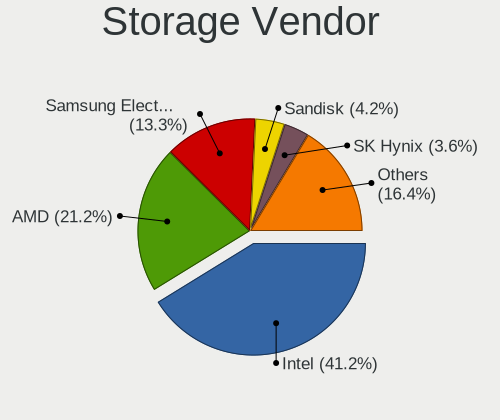

| Vendor                         | Computers | Percent |
|--------------------------------|-----------|---------|
| Intel                          | 93        | 41.7%   |
| AMD                            | 49        | 21.97%  |
| Samsung Electronics            | 28        | 12.56%  |
| SanDisk                        | 11        | 4.93%   |
| Phison Electronics             | 7         | 3.14%   |
| SK hynix                       | 6         | 2.69%   |
| Marvell Technology Group       | 6         | 2.69%   |
| Kingston Technology Company    | 5         | 2.24%   |
| Union Memory (Shenzhen)        | 3         | 1.35%   |
| ASMedia Technology             | 3         | 1.35%   |
| Toshiba America Info Systems   | 2         | 0.9%    |
| Silicon Motion                 | 2         | 0.9%    |
| Solid State Storage Technology | 1         | 0.45%   |
| Nvidia                         | 1         | 0.45%   |
| Micron/Crucial Technology      | 1         | 0.45%   |
| Micron Technology              | 1         | 0.45%   |
| Lite-On Technology             | 1         | 0.45%   |
| JMicron Technology             | 1         | 0.45%   |
| Broadcom / LSI                 | 1         | 0.45%   |
| ADATA Technology               | 1         | 0.45%   |

Storage Model
-------------

Storage controller models

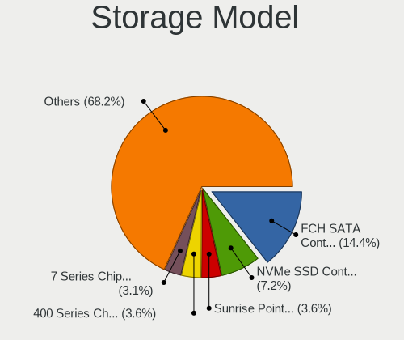

| Model                                                                          | Computers | Percent |
|--------------------------------------------------------------------------------|-----------|---------|
| AMD FCH SATA Controller [AHCI mode]                                            | 37        | 14.86%  |
| Samsung NVMe SSD Controller SM981/PM981/PM983                                  | 17        | 6.83%   |
| Intel Sunrise Point-LP SATA Controller [AHCI mode]                             | 9         | 3.61%   |
| Intel 7 Series Chipset Family 6-port SATA Controller [AHCI mode]               | 9         | 3.61%   |
| Intel 82801 Mobile SATA Controller [RAID mode]                                 | 8         | 3.21%   |
| AMD 400 Series Chipset SATA Controller                                         | 8         | 3.21%   |
| Intel 6 Series/C200 Series Chipset Family 6 port Mobile SATA AHCI Controller   | 7         | 2.81%   |
| AMD SB7x0/SB8x0/SB9x0 SATA Controller [AHCI mode]                              | 7         | 2.81%   |
| Samsung NVMe SSD Controller 980                                                | 5         | 2.01%   |
| Phison E12 NVMe Controller                                                     | 5         | 2.01%   |
| Intel 400 Series Chipset Family SATA AHCI Controller                           | 5         | 2.01%   |
| AMD 300 Series Chipset SATA Controller                                         | 5         | 2.01%   |
| SK hynix Non-Volatile memory controller                                        | 4         | 1.61%   |
| SanDisk WD Black SN750 / PC SN730 NVMe SSD                                     | 4         | 1.61%   |
| Samsung NVMe SSD Controller SM961/PM961/SM963                                  | 4         | 1.61%   |
| Kingston Company Company Non-Volatile memory controller                        | 4         | 1.61%   |
| Intel Wildcat Point-LP SATA Controller [AHCI Mode]                             | 4         | 1.61%   |
| Intel 8 Series SATA Controller 1 [AHCI mode]                                   | 4         | 1.61%   |
| Intel 200 Series PCH SATA controller [AHCI mode]                               | 4         | 1.61%   |
| Union Memory (Shenzhen) Non-Volatile memory controller                         | 3         | 1.2%    |
| SanDisk WD Blue SN550 NVMe SSD                                                 | 3         | 1.2%    |
| Marvell Group 88SE9172 SATA 6Gb/s Controller                                   | 3         | 1.2%    |
| Intel Volume Management Device NVMe RAID Controller                            | 3         | 1.2%    |
| Intel SSD Pro 7600p/760p/E 6100p Series                                        | 3         | 1.2%    |
| Intel SSD 660P Series                                                          | 3         | 1.2%    |
| Intel Q170/Q150/B150/H170/H110/Z170/CM236 Chipset SATA Controller [AHCI Mode]  | 3         | 1.2%    |
| Intel Ice Lake-LP SATA Controller [AHCI mode]                                  | 3         | 1.2%    |
| Intel Celeron/Pentium Silver Processor SATA Controller                         | 3         | 1.2%    |
| Intel 8 Series/C220 Series Chipset Family 6-port SATA Controller 1 [AHCI mode] | 3         | 1.2%    |
| Intel 6 Series/C200 Series Chipset Family 6 port Desktop SATA AHCI Controller  | 3         | 1.2%    |
| ASMedia ASM1062 Serial ATA Controller                                          | 3         | 1.2%    |
| AMD 500 Series Chipset SATA Controller                                         | 3         | 1.2%    |
| Toshiba America Info Systems BG3 NVMe SSD Controller                           | 2         | 0.8%    |
| SanDisk Non-Volatile memory controller                                         | 2         | 0.8%    |
| Samsung Electronics SATA controller                                            | 2         | 0.8%    |
| Intel HM170/QM170 Chipset SATA Controller [AHCI Mode]                          | 2         | 0.8%    |
| Intel Comet Lake SATA AHCI Controller                                          | 2         | 0.8%    |
| Intel Cannon Point-LP SATA Controller [AHCI Mode]                              | 2         | 0.8%    |
| Intel Cannon Lake Mobile PCH SATA AHCI Controller                              | 2         | 0.8%    |
| Intel Atom Processor E3800 Series SATA AHCI Controller                         | 2         | 0.8%    |

Storage Kind
------------

Kind of storage controller (IDE, SATA, NVMe, SAS, ...)

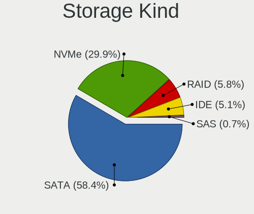

| Kind | Computers | Percent |
|------|-----------|---------|
| SATA | 130       | 59.63%  |
| NVMe | 67        | 30.73%  |
| RAID | 12        | 5.5%    |
| IDE  | 8         | 3.67%   |
| SAS  | 1         | 0.46%   |

Processor
---------

CPU Vendor
----------

Processor vendors

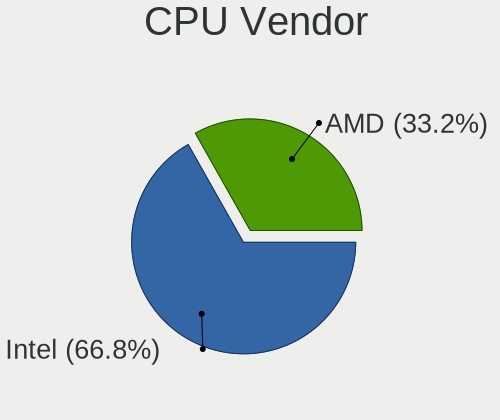

| Vendor | Computers | Percent |
|--------|-----------|---------|
| Intel  | 111       | 67.27%  |
| AMD    | 54        | 32.73%  |

CPU Model
---------

Processor models

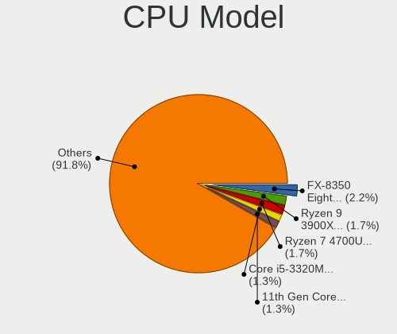

| Model                                       | Computers | Percent |
|---------------------------------------------|-----------|---------|
| AMD Ryzen 9 3900X 12-Core Processor         | 4         | 2.41%   |
| AMD Ryzen 7 4700U with Radeon Graphics      | 4         | 2.41%   |
| AMD FX-8350 Eight-Core Processor            | 4         | 2.41%   |
| Intel 11th Gen Core i7-1165G7 @ 2.80GHz     | 3         | 1.81%   |
| AMD Ryzen 7 3700X 8-Core Processor          | 3         | 1.81%   |
| AMD Ryzen 5 2600X Six-Core Processor        | 3         | 1.81%   |
| Intel Core m3-8100Y CPU @ 1.10GHz           | 2         | 1.2%    |
| Intel Core i7-9700K CPU @ 3.60GHz           | 2         | 1.2%    |
| Intel Core i7-8565U CPU @ 1.80GHz           | 2         | 1.2%    |
| Intel Core i7-7700HQ CPU @ 2.80GHz          | 2         | 1.2%    |
| Intel Core i7-3630QM CPU @ 2.40GHz          | 2         | 1.2%    |
| Intel Core i7-10750H CPU @ 2.60GHz          | 2         | 1.2%    |
| Intel Core i7-10510U CPU @ 1.80GHz          | 2         | 1.2%    |
| Intel Core i5-7200U CPU @ 2.50GHz           | 2         | 1.2%    |
| Intel Core i5-5250U CPU @ 1.60GHz           | 2         | 1.2%    |
| Intel Core i5-5200U CPU @ 2.20GHz           | 2         | 1.2%    |
| Intel Core i5-4210U CPU @ 1.70GHz           | 2         | 1.2%    |
| Intel Core i5-3320M CPU @ 2.60GHz           | 2         | 1.2%    |
| Intel Core i5-2500 CPU @ 3.30GHz            | 2         | 1.2%    |
| Intel Core i5-2410M CPU @ 2.30GHz           | 2         | 1.2%    |
| Intel Core i5-10400F CPU @ 2.90GHz          | 2         | 1.2%    |
| Intel Core i5-1035G1 CPU @ 1.00GHz          | 2         | 1.2%    |
| Intel Core i3-7020U CPU @ 2.30GHz           | 2         | 1.2%    |
| Intel Core i3-1005G1 CPU @ 1.20GHz          | 2         | 1.2%    |
| Intel 11th Gen Core i5-1135G7 @ 2.40GHz     | 2         | 1.2%    |
| AMD Ryzen 7 5700G with Radeon Graphics      | 2         | 1.2%    |
| AMD Ryzen 7 4800H with Radeon Graphics      | 2         | 1.2%    |
| AMD Ryzen 7 2700X Eight-Core Processor      | 2         | 1.2%    |
| AMD Ryzen 7 1700 Eight-Core Processor       | 2         | 1.2%    |
| AMD Ryzen 5 3600 6-Core Processor           | 2         | 1.2%    |
| Intel Xeon CPU E3-1505M v6 @ 3.00GHz        | 1         | 0.6%    |
| Intel Pentium Silver N5000 CPU @ 1.10GHz    | 1         | 0.6%    |
| Intel Pentium Dual-Core CPU T4400 @ 2.20GHz | 1         | 0.6%    |
| Intel Pentium CPU P6200 @ 2.13GHz           | 1         | 0.6%    |
| Intel Pentium CPU A1018 @ 2.10GHz           | 1         | 0.6%    |
| Intel Pentium CPU 2020M @ 2.40GHz           | 1         | 0.6%    |
| Intel Core m3-7Y30 CPU @ 1.00GHz            | 1         | 0.6%    |
| Intel Core i9-8950HK CPU @ 2.90GHz          | 1         | 0.6%    |
| Intel Core i9-10885H CPU @ 2.40GHz          | 1         | 0.6%    |
| Intel Core i7-9750HF CPU @ 2.60GHz          | 1         | 0.6%    |

CPU Model Family
----------------

Processor model prefix

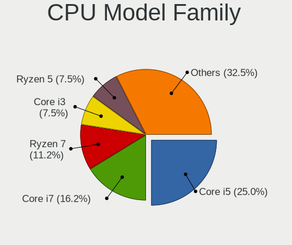

| Model                   | Computers | Percent |
|-------------------------|-----------|---------|
| Intel Core i5           | 42        | 25.45%  |
| Intel Core i7           | 28        | 16.97%  |
| AMD Ryzen 7             | 18        | 10.91%  |
| AMD Ryzen 5             | 13        | 7.88%   |
| Intel Core i3           | 12        | 7.27%   |
| Intel Celeron           | 8         | 4.85%   |
| Other                   | 6         | 3.64%   |
| AMD Ryzen 9             | 5         | 3.03%   |
| AMD FX                  | 5         | 3.03%   |
| AMD Ryzen 3             | 4         | 2.42%   |
| Intel Pentium           | 3         | 1.82%   |
| Intel Core m3           | 3         | 1.82%   |
| Intel Core 2 Duo        | 3         | 1.82%   |
| Intel Core i9           | 2         | 1.21%   |
| AMD A10                 | 2         | 1.21%   |
| Intel Xeon              | 1         | 0.61%   |
| Intel Pentium Silver    | 1         | 0.61%   |
| Intel Pentium Dual-Core | 1         | 0.61%   |
| Intel Atom              | 1         | 0.61%   |
| AMD Ryzen Threadripper  | 1         | 0.61%   |
| AMD Ryzen 5 PRO         | 1         | 0.61%   |
| AMD Phenom II X4        | 1         | 0.61%   |
| AMD Phenom II           | 1         | 0.61%   |
| AMD E1                  | 1         | 0.61%   |
| AMD Athlon              | 1         | 0.61%   |
| AMD A6                  | 1         | 0.61%   |

CPU Cores
---------

Number of processor cores

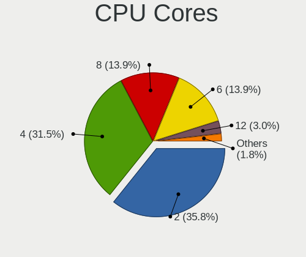

| Number | Computers | Percent |
|--------|-----------|---------|
| 2      | 59        | 35.76%  |
| 4      | 52        | 31.52%  |
| 8      | 23        | 13.94%  |
| 6      | 23        | 13.94%  |
| 12     | 5         | 3.03%   |
| 3      | 2         | 1.21%   |
| 32     | 1         | 0.61%   |

CPU Sockets
-----------

Number of sockets

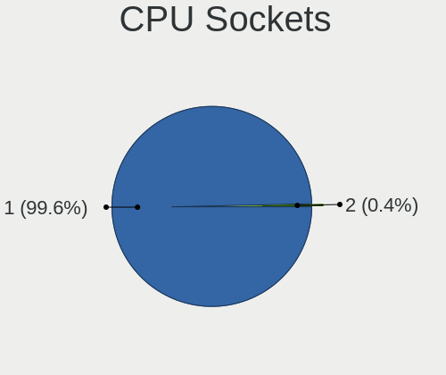

| Number | Computers | Percent |
|--------|-----------|---------|
| 1      | 165       | 100%    |

CPU Threads
-----------

Threads per core (Hyper-Threading)

| Number | Computers | Percent |
|--------|-----------|---------|
| 2      | 123       | 74.55%  |
| 1      | 42        | 25.45%  |

CPU Op-Modes
------------

CPU Operation Modes (32-bit, 64-bit)

| Op mode        | Computers | Percent |
|----------------|-----------|---------|
| 32-bit, 64-bit | 165       | 100%    |

CPU Microcode
-------------

Microcode number

| Number     | Computers | Percent |
|------------|-----------|---------|
| Unknown    | 30        | 17.65%  |
| 0x206a7    | 12        | 7.06%   |
| 0x306a9    | 10        | 5.88%   |
| 0x08701013 | 6         | 3.53%   |
| 0xa0652    | 5         | 2.94%   |
| 0x806e9    | 5         | 2.94%   |
| 0x40651    | 5         | 2.94%   |
| 0x306d4    | 5         | 2.94%   |
| 0x0800820d | 5         | 2.94%   |
| 0x906ed    | 4         | 2.35%   |
| 0x906e9    | 4         | 2.35%   |
| 0x806ec    | 4         | 2.35%   |
| 0x806ea    | 4         | 2.35%   |
| 0x806c1    | 4         | 2.35%   |
| 0x706e5    | 4         | 2.35%   |
| 0x706a1    | 4         | 2.35%   |
| 0x08600106 | 4         | 2.35%   |
| 0x906ea    | 3         | 1.76%   |
| 0x506e3    | 3         | 1.76%   |
| 0x306c3    | 3         | 1.76%   |
| 0x1067a    | 3         | 1.76%   |
| 0x08701021 | 3         | 1.76%   |
| 0x06000822 | 3         | 1.76%   |
| 0xa0655    | 2         | 1.18%   |
| 0x30678    | 2         | 1.18%   |
| 0x08608103 | 2         | 1.18%   |
| 0x08600103 | 2         | 1.18%   |
| 0x08108109 | 2         | 1.18%   |
| 0x06000852 | 2         | 1.18%   |
| 0xa0653    | 1         | 0.59%   |
| 0x806eb    | 1         | 0.59%   |
| 0x806d1    | 1         | 0.59%   |
| 0x6fd      | 1         | 0.59%   |
| 0x506c9    | 1         | 0.59%   |
| 0x406e3    | 1         | 0.59%   |
| 0x206c2    | 1         | 0.59%   |
| 0x20655    | 1         | 0.59%   |
| 0x20652    | 1         | 0.59%   |
| 0x0a50000c | 1         | 0.59%   |
| 0x0a50000b | 1         | 0.59%   |

CPU Microarch
-------------

Microarchitecture

| Name          | Computers | Percent |
|---------------|-----------|---------|
| KabyLake      | 33        | 20%     |
| Zen 2         | 18        | 10.91%  |
| SandyBridge   | 13        | 7.88%   |
| IvyBridge     | 12        | 7.27%   |
| Zen+          | 11        | 6.67%   |
| Haswell       | 9         | 5.45%   |
| CometLake     | 9         | 5.45%   |
| Zen 3         | 6         | 3.64%   |
| Zen           | 6         | 3.64%   |
| Broadwell     | 6         | 3.64%   |
| TigerLake     | 5         | 3.03%   |
| Piledriver    | 5         | 3.03%   |
| Skylake       | 4         | 2.42%   |
| IceLake       | 4         | 2.42%   |
| Goldmont plus | 4         | 2.42%   |
| Westmere      | 3         | 1.82%   |
| Penryn        | 3         | 1.82%   |
| Unknown       | 3         | 1.82%   |
| Steamroller   | 2         | 1.21%   |
| Silvermont    | 2         | 1.21%   |
| K10           | 2         | 1.21%   |
| Puma          | 1         | 0.61%   |
| Jaguar        | 1         | 0.61%   |
| Goldmont      | 1         | 0.61%   |
| Core          | 1         | 0.61%   |
| Bonnell       | 1         | 0.61%   |

Graphics
--------

GPU Vendor
----------

Vendors of graphics cards

| Vendor | Computers | Percent |
|--------|-----------|---------|
| Intel  | 88        | 44.67%  |
| AMD    | 58        | 29.44%  |
| Nvidia | 51        | 25.89%  |

GPU Model
---------

Graphics card models

| Model                                                                     | Computers | Percent |
|---------------------------------------------------------------------------|-----------|---------|
| AMD Ellesmere [Radeon RX 470/480/570/570X/580/580X/590]                   | 9         | 4.48%   |
| Intel 3rd Gen Core processor Graphics Controller                          | 8         | 3.98%   |
| Intel 2nd Generation Core Processor Family Integrated Graphics Controller | 8         | 3.98%   |
| AMD Renoir                                                                | 7         | 3.48%   |
| Intel HD Graphics 620                                                     | 6         | 2.99%   |
| Intel Haswell-ULT Integrated Graphics Controller                          | 6         | 2.99%   |
| Intel CometLake-H GT2 [UHD Graphics]                                      | 6         | 2.99%   |
| AMD Navi 10 [Radeon RX 5600 OEM/5600 XT / 5700/5700 XT]                   | 6         | 2.99%   |
| Intel UHD Graphics 620                                                    | 5         | 2.49%   |
| Intel TigerLake-LP GT2 [Iris Xe Graphics]                                 | 5         | 2.49%   |
| Intel WhiskeyLake-U GT2 [UHD Graphics 620]                                | 4         | 1.99%   |
| Intel Iris Plus Graphics G1 (Ice Lake)                                    | 4         | 1.99%   |
| Intel HD Graphics 5500                                                    | 4         | 1.99%   |
| AMD Picasso/Raven 2 [Radeon Vega Series / Radeon Vega Mobile Series]      | 4         | 1.99%   |
| Nvidia TU116M [GeForce GTX 1660 Ti Mobile]                                | 3         | 1.49%   |
| Nvidia GP107M [GeForce GTX 1050 Mobile]                                   | 3         | 1.49%   |
| Intel GeminiLake [UHD Graphics 600]                                       | 3         | 1.49%   |
| Intel CoffeeLake-H GT2 [UHD Graphics 630]                                 | 3         | 1.49%   |
| AMD Cezanne [Radeon Vega Series / Radeon Vega Mobile Series]              | 3         | 1.49%   |
| Nvidia TU117M                                                             | 2         | 1%      |
| Nvidia TU106GLM [Quadro RTX 3000 Mobile / Max-Q]                          | 2         | 1%      |
| Nvidia GP104 [GeForce GTX 1080]                                           | 2         | 1%      |
| Nvidia GM206 [GeForce GTX 950]                                            | 2         | 1%      |
| Nvidia GM108M [GeForce 840M]                                              | 2         | 1%      |
| Intel UHD Graphics 615                                                    | 2         | 1%      |
| Intel HD Graphics 630                                                     | 2         | 1%      |
| Intel HD Graphics 6000                                                    | 2         | 1%      |
| Intel CometLake-U GT2 [UHD Graphics]                                      | 2         | 1%      |
| Intel Atom Processor Z36xxx/Z37xxx Series Graphics & Display              | 2         | 1%      |
| Intel 82G33/G31 Express Integrated Graphics Controller                    | 2         | 1%      |
| AMD Saturn XT [FirePro M6100]                                             | 2         | 1%      |
| AMD Raven Ridge [Radeon Vega Series / Radeon Vega Mobile Series]          | 2         | 1%      |
| AMD Lucienne                                                              | 2         | 1%      |
| AMD Lexa PRO [Radeon 540/540X/550/550X / RX 540X/550/550X]                | 2         | 1%      |
| AMD Baffin [Radeon RX 550 640SP / RX 560/560X]                            | 2         | 1%      |
| Nvidia TU117M [GeForce MX450]                                             | 1         | 0.5%    |
| Nvidia TU117M [GeForce GTX 1650 Mobile / Max-Q]                           | 1         | 0.5%    |
| Nvidia TU116 [GeForce GTX 1650 SUPER]                                     | 1         | 0.5%    |
| Nvidia TU106M [GeForce RTX 2070 Mobile]                                   | 1         | 0.5%    |
| Nvidia TU106 [GeForce RTX 2070 Rev. A]                                    | 1         | 0.5%    |

GPU Combo
---------

Combinations of graphics cards

| Name           | Computers | Percent |
|----------------|-----------|---------|
| 1 x Intel      | 60        | 35.93%  |
| 1 x AMD        | 48        | 28.74%  |
| 1 x Nvidia     | 25        | 14.97%  |
| Intel + Nvidia | 23        | 13.77%  |
| 2 x AMD        | 4         | 2.4%    |
| Intel + AMD    | 4         | 2.4%    |
| AMD + Nvidia   | 3         | 1.8%    |

GPU Driver
----------

Free vs proprietary

| Driver      | Computers | Percent |
|-------------|-----------|---------|
| Free        | 134       | 80.24%  |
| Proprietary | 33        | 19.76%  |

GPU Memory
----------

Total video memory

| Size in GB | Computers | Percent |
|------------|-----------|---------|
| Unknown    | 90        | 52.63%  |
| 1.01-2.0   | 19        | 11.11%  |
| 7.01-8.0   | 16        | 9.36%   |
| 3.01-4.0   | 15        | 8.77%   |
| 0.01-0.5   | 13        | 7.6%    |
| 0.51-1.0   | 10        | 5.85%   |
| 5.01-6.0   | 4         | 2.34%   |
| 8.01-16.0  | 3         | 1.75%   |
| 2.01-3.0   | 1         | 0.58%   |

Monitor
-------

Monitor Vendor
--------------

Monitor vendors

| Vendor                  | Computers | Percent |
|-------------------------|-----------|---------|
| AU Optronics            | 23        | 11.39%  |
| Samsung Electronics     | 21        | 10.4%   |
| LG Display              | 21        | 10.4%   |
| BOE                     | 20        | 9.9%    |
| Chimei Innolux          | 17        | 8.42%   |
| Acer                    | 11        | 5.45%   |
| Goldstar                | 10        | 4.95%   |
| Philips                 | 8         | 3.96%   |
| Dell                    | 8         | 3.96%   |
| BenQ                    | 7         | 3.47%   |
| ASUSTek Computer        | 7         | 3.47%   |
| AOC                     | 7         | 3.47%   |
| Chi Mei Optoelectronics | 4         | 1.98%   |
| InfoVision              | 3         | 1.49%   |
| Hewlett-Packard         | 3         | 1.49%   |
| Apple                   | 3         | 1.49%   |
| Ancor Communications    | 3         | 1.49%   |
| Sharp                   | 2         | 0.99%   |
| PANDA                   | 2         | 0.99%   |
| MSI                     | 2         | 0.99%   |
| ViewSonic               | 1         | 0.5%    |
| Vestel Elektronik       | 1         | 0.5%    |
| Sony                    | 1         | 0.5%    |
| Packard Bell            | 1         | 0.5%    |
| LGD                     | 1         | 0.5%    |
| Lenovo                  | 1         | 0.5%    |
| KTC                     | 1         | 0.5%    |
| KDC                     | 1         | 0.5%    |
| Jean                    | 1         | 0.5%    |
| Iiyama                  | 1         | 0.5%    |
| Idek Iiyama             | 1         | 0.5%    |
| HVR                     | 1         | 0.5%    |
| HUAWEI                  | 1         | 0.5%    |
| Hitachi                 | 1         | 0.5%    |
| Envision Peripherals    | 1         | 0.5%    |
| Eizo                    | 1         | 0.5%    |
| CTV                     | 1         | 0.5%    |
| CSO                     | 1         | 0.5%    |
| Compal                  | 1         | 0.5%    |
| Belinea                 | 1         | 0.5%    |

Monitor Model
-------------

Monitor models

| Model                                                                     | Computers | Percent |
|---------------------------------------------------------------------------|-----------|---------|
| Samsung Electronics LCD Monitor SEC5441 1366x768 344x194mm 15.5-inch      | 4         | 1.94%   |
| Chimei Innolux LCD Monitor CMN15DB 1366x768 344x193mm 15.5-inch           | 3         | 1.46%   |
| Philips PHL 245E1 PHLC20B 2560x1440 527x296mm 23.8-inch                   | 2         | 0.97%   |
| MSI Optix G241VC MSI1462 1920x1080 521x294mm 23.6-inch                    | 2         | 0.97%   |
| LG Display LCD Monitor LGD033A 1366x768 344x194mm 15.5-inch               | 2         | 0.97%   |
| Chimei Innolux LCD Monitor CMN14D4 1920x1080 309x173mm 13.9-inch          | 2         | 0.97%   |
| Chimei Innolux LCD Monitor CMN1406 1920x1080 309x173mm 13.9-inch          | 2         | 0.97%   |
| Chi Mei Optoelectronics LCD Monitor CMO1720 1920x1080 382x215mm 17.3-inch | 2         | 0.97%   |
| BOE LCD Monitor BOE08EE 1920x1080 309x174mm 14.0-inch                     | 2         | 0.97%   |
| BOE LCD Monitor BOE08CF 1920x1080 344x194mm 15.5-inch                     | 2         | 0.97%   |
| BOE LCD Monitor BOE08BA 1920x1080 344x194mm 15.5-inch                     | 2         | 0.97%   |
| BOE LCD Monitor BOE0696 1366x768 309x173mm 13.9-inch                      | 2         | 0.97%   |
| AU Optronics LCD Monitor AUO21ED 1920x1080 344x194mm 15.5-inch            | 2         | 0.97%   |
| ASUSTek Computer VG289 AUS28BA 3840x2160 621x341mm 27.9-inch              | 2         | 0.97%   |
| Apple Color LCD APP9CDF 1440x900 286x179mm 13.3-inch                      | 2         | 0.97%   |
| AOC V22 AOC2200 1680x1050 526x296mm 23.8-inch                             | 2         | 0.97%   |
| Ancor Communications ASUS PB277 ACI27B5 1920x1080 597x336mm 27.0-inch     | 2         | 0.97%   |
| ViewSonic LCD Monitor VX2452 Series 3840x1080                             | 1         | 0.49%   |
| Vestel Elektronik 50FHD_LCD_TV VES3700 1920x1080 1280x720mm 57.8-inch     | 1         | 0.49%   |
| Sony TV SNY7001 1920x1080                                                 | 1         | 0.49%   |
| Sharp LQ133T1JW22 SHP1422 2560x1440 294x165mm 13.3-inch                   | 1         | 0.49%   |
| Sharp LCD Monitor SHP1453 1920x1080 346x194mm 15.6-inch                   | 1         | 0.49%   |
| Samsung Electronics U32J59x SAM0F34 3840x2160 697x392mm 31.5-inch         | 1         | 0.49%   |
| Samsung Electronics T24B301 SAM098E 1920x1080 521x293mm 23.5-inch         | 1         | 0.49%   |
| Samsung Electronics SyncMaster SAM047D 1360x768 410x230mm 18.5-inch       | 1         | 0.49%   |
| Samsung Electronics SyncMaster SAM02E3 1440x900 367x229mm 17.0-inch       | 1         | 0.49%   |
| Samsung Electronics SMB1630N SAM0630 1366x768 344x194mm 15.5-inch         | 1         | 0.49%   |
| Samsung Electronics S24F350 SAM0D20 1920x1080 521x293mm 23.5-inch         | 1         | 0.49%   |
| Samsung Electronics S24D330 SAM0D92 1920x1080 531x299mm 24.0-inch         | 1         | 0.49%   |
| Samsung Electronics S24A31x SAM7114 1920x1080 527x296mm 23.8-inch         | 1         | 0.49%   |
| Samsung Electronics S22F350 SAM0D1A 1920x1080 477x268mm 21.5-inch         | 1         | 0.49%   |
| Samsung Electronics LCD Monitor SEC544B 1600x900 310x174mm 14.0-inch      | 1         | 0.49%   |
| Samsung Electronics LCD Monitor SEC3152 1366x768 344x194mm 15.5-inch      | 1         | 0.49%   |
| Samsung Electronics LCD Monitor SDC4C51 1366x768 344x194mm 15.5-inch      | 1         | 0.49%   |
| Samsung Electronics LCD Monitor SDC4951 1366x768 344x194mm 15.5-inch      | 1         | 0.49%   |
| Samsung Electronics LCD Monitor SAM0FEE 3840x2160 1872x1053mm 84.6-inch   | 1         | 0.49%   |
| Samsung Electronics LCD Monitor SAM0DF7 3840x2160 1872x1053mm 84.6-inch   | 1         | 0.49%   |
| Samsung Electronics C32F391 SAM0D34 1920x1080 698x393mm 31.5-inch         | 1         | 0.49%   |
| Samsung Electronics C27FG7x SAM0E41 1920x1080 598x337mm 27.0-inch         | 1         | 0.49%   |
| Samsung Electronics C27F591 SAM0D37 1920x1080 598x336mm 27.0-inch         | 1         | 0.49%   |

Monitor Resolution
------------------

Monitor screen resolution

| Resolution         | Computers | Percent |
|--------------------|-----------|---------|
| 1920x1080 (FHD)    | 91        | 47.4%   |
| 1366x768 (WXGA)    | 42        | 21.88%  |
| 3840x2160 (4K)     | 15        | 7.81%   |
| 2560x1440 (QHD)    | 11        | 5.73%   |
| 1600x900 (HD+)     | 5         | 2.6%    |
| 1440x900 (WXGA+)   | 4         | 2.08%   |
| 3440x1440          | 3         | 1.56%   |
| 2560x1600          | 3         | 1.56%   |
| 2560x1080          | 2         | 1.04%   |
| 1920x1200 (WUXGA)  | 2         | 1.04%   |
| 1680x1050 (WSXGA+) | 2         | 1.04%   |
| 1280x1024 (SXGA)   | 2         | 1.04%   |
| Unknown            | 2         | 1.04%   |
| 3840x1080          | 1         | 0.52%   |
| 3600x1080          | 1         | 0.52%   |
| 2736x1824          | 1         | 0.52%   |
| 2160x1440          | 1         | 0.52%   |
| 2160x1200          | 1         | 0.52%   |
| 1360x768           | 1         | 0.52%   |
| 1280x960           | 1         | 0.52%   |
| 1024x768 (XGA)     | 1         | 0.52%   |

Monitor Diagonal
----------------

Diagonal size in inches

| Inches  | Computers | Percent |
|---------|-----------|---------|
| 15      | 57        | 28.79%  |
| 13      | 20        | 10.1%   |
| 27      | 18        | 9.09%   |
| 14      | 17        | 8.59%   |
| 24      | 16        | 8.08%   |
| 23      | 15        | 7.58%   |
| 21      | 13        | 6.57%   |
| 17      | 9         | 4.55%   |
| 34      | 5         | 2.53%   |
| Unknown | 5         | 2.53%   |
| 84      | 4         | 2.02%   |
| 19      | 4         | 2.02%   |
| 31      | 3         | 1.52%   |
| 32      | 2         | 1.01%   |
| 20      | 2         | 1.01%   |
| 16      | 2         | 1.01%   |
| 12      | 2         | 1.01%   |
| 72      | 1         | 0.51%   |
| 52      | 1         | 0.51%   |
| 18      | 1         | 0.51%   |
| 11      | 1         | 0.51%   |

Monitor Width
-------------

Physical width

| Width in mm | Computers | Percent |
|-------------|-----------|---------|
| 301-350     | 86        | 43.88%  |
| 501-600     | 44        | 22.45%  |
| 401-500     | 17        | 8.67%   |
| 351-400     | 16        | 8.16%   |
| 201-300     | 9         | 4.59%   |
| 701-800     | 7         | 3.57%   |
| 601-700     | 6         | 3.06%   |
| 1501-2000   | 5         | 2.55%   |
| Unknown     | 5         | 2.55%   |
| 1001-1500   | 1         | 0.51%   |

Aspect Ratio
------------

Proportional relationship between the width and the height

| Ratio   | Computers | Percent |
|---------|-----------|---------|
| 16/9    | 145       | 83.82%  |
| 16/10   | 12        | 6.94%   |
| 21/9    | 5         | 2.89%   |
| Unknown | 4         | 2.31%   |
| 5/4     | 3         | 1.73%   |
| 4/3     | 2         | 1.16%   |
| 3/2     | 2         | 1.16%   |

Monitor Area
------------

Area in inch²

| Area in inch² | Computers | Percent |
|----------------|-----------|---------|
| 101-110        | 57        | 28.79%  |
| 201-250        | 40        | 20.2%   |
| 81-90          | 31        | 15.66%  |
| 301-350        | 18        | 9.09%   |
| 351-500        | 10        | 5.05%   |
| 121-130        | 8         | 4.04%   |
| 71-80          | 7         | 3.54%   |
| 151-200        | 7         | 3.54%   |
| More than 1000 | 6         | 3.03%   |
| Unknown        | 5         | 2.53%   |
| 251-300        | 3         | 1.52%   |
| 131-140        | 2         | 1.01%   |
| 61-70          | 1         | 0.51%   |
| 51-60          | 1         | 0.51%   |
| 141-150        | 1         | 0.51%   |
| 111-120        | 1         | 0.51%   |

Pixel Density
-------------

Pixels per inch

| Density       | Computers | Percent |
|---------------|-----------|---------|
| 121-160       | 63        | 33.33%  |
| 101-120       | 55        | 29.1%   |
| 51-100        | 54        | 28.57%  |
| 161-240       | 9         | 4.76%   |
| Unknown       | 5         | 2.65%   |
| 1-50          | 2         | 1.06%   |
| More than 240 | 1         | 0.53%   |

Multiple Monitors
-----------------

Total monitors connected

| Total | Computers | Percent |
|-------|-----------|---------|
| 1     | 135       | 79.41%  |
| 2     | 31        | 18.24%  |
| 3     | 3         | 1.76%   |
| 4     | 1         | 0.59%   |

Network
-------

Net Controller Vendor
---------------------

Controller vendors

| Vendor                                | Computers | Percent |
|---------------------------------------|-----------|---------|
| Realtek Semiconductor                 | 106       | 41.41%  |
| Intel                                 | 81        | 31.64%  |
| Qualcomm Atheros                      | 23        | 8.98%   |
| Broadcom                              | 10        | 3.91%   |
| TP-Link                               | 4         | 1.56%   |
| Broadcom Limited                      | 4         | 1.56%   |
| D-Link System                         | 3         | 1.17%   |
| Xiaomi                                | 2         | 0.78%   |
| Samsung Electronics                   | 2         | 0.78%   |
| Ralink Technology                     | 2         | 0.78%   |
| Ralink                                | 2         | 0.78%   |
| Qualcomm                              | 2         | 0.78%   |
| MediaTek                              | 2         | 0.78%   |
| Marvell Technology Group              | 2         | 0.78%   |
| Sierra Wireless                       | 1         | 0.39%   |
| Qualcomm Atheros Communications       | 1         | 0.39%   |
| OPPO Electronics                      | 1         | 0.39%   |
| Microsoft                             | 1         | 0.39%   |
| Linksys                               | 1         | 0.39%   |
| Huawei Technologies                   | 1         | 0.39%   |
| Google                                | 1         | 0.39%   |
| DisplayLink                           | 1         | 0.39%   |
| Aquantia                              | 1         | 0.39%   |
| Apple                                 | 1         | 0.39%   |
| 802.11g Adapter [Linksys WUSB54GC v3] | 1         | 0.39%   |

Net Controller Model
--------------------

Controller models

| Model                                                             | Computers | Percent |
|-------------------------------------------------------------------|-----------|---------|
| Realtek RTL8111/8168/8411 PCI Express Gigabit Ethernet Controller | 74        | 24.03%  |
| Realtek RTL810xE PCI Express Fast Ethernet controller             | 14        | 4.55%   |
| Realtek RTL8153 Gigabit Ethernet Adapter                          | 8         | 2.6%    |
| Intel I211 Gigabit Network Connection                             | 8         | 2.6%    |
| Intel 82579LM Gigabit Network Connection (Lewisville)             | 8         | 2.6%    |
| Realtek RTL8822CE 802.11ac PCIe Wireless Network Adapter          | 7         | 2.27%   |
| Intel Wireless 8265 / 8275                                        | 7         | 2.27%   |
| Intel Wi-Fi 6 AX200                                               | 7         | 2.27%   |
| Realtek RTL8821CE 802.11ac PCIe Wireless Network Adapter          | 6         | 1.95%   |
| Intel Comet Lake PCH CNVi WiFi                                    | 6         | 1.95%   |
| Qualcomm Atheros QCA9377 802.11ac Wireless Network Adapter        | 5         | 1.62%   |
| Qualcomm Atheros AR9485 Wireless Network Adapter                  | 5         | 1.62%   |
| Intel Wireless 7265                                               | 5         | 1.62%   |
| Broadcom BCM4313 802.11bgn Wireless Network Adapter               | 5         | 1.62%   |
| Realtek RTL8723BE PCIe Wireless Network Adapter                   | 4         | 1.3%    |
| Intel Wi-Fi 6 AX201                                               | 4         | 1.3%    |
| Intel Dual Band Wireless-AC 3168NGW [Stone Peak]                  | 4         | 1.3%    |
| Intel Centrino Advanced-N 6205 [Taylor Peak]                      | 4         | 1.3%    |
| Intel Cannon Lake PCH CNVi WiFi                                   | 4         | 1.3%    |
| Realtek 802.11ac NIC                                              | 3         | 0.97%   |
| Qualcomm Atheros QCA6174 802.11ac Wireless Network Adapter        | 3         | 0.97%   |
| Intel Wireless 7260                                               | 3         | 0.97%   |
| Intel Ice Lake-LP PCH CNVi WiFi                                   | 3         | 0.97%   |
| Intel Ethernet Connection (4) I219-LM                             | 3         | 0.97%   |
| Intel Ethernet Connection (2) I219-V                              | 3         | 0.97%   |
| Intel Ethernet Connection (11) I219-LM                            | 3         | 0.97%   |
| Intel Cannon Point-LP CNVi [Wireless-AC]                          | 3         | 0.97%   |
| Broadcom Limited BCM4360 802.11ac Wireless Network Adapter        | 3         | 0.97%   |
| TP-Link TL-WN823N v2/v3 [Realtek RTL8192EU]                       | 2         | 0.65%   |
| Realtek RTL8822BE 802.11a/b/g/n/ac WiFi adapter                   | 2         | 0.65%   |
| Realtek RTL8821AE 802.11ac PCIe Wireless Network Adapter          | 2         | 0.65%   |
| Realtek RTL8188EE Wireless Network Adapter                        | 2         | 0.65%   |
| Realtek RTL-8100/8101L/8139 PCI Fast Ethernet Adapter             | 2         | 0.65%   |
| Qualcomm Atheros QCA9565 / AR9565 Wireless Network Adapter        | 2         | 0.65%   |
| Qualcomm Atheros Killer E2500 Gigabit Ethernet Controller         | 2         | 0.65%   |
| Qualcomm Atheros AR9285 Wireless Network Adapter (PCI-Express)    | 2         | 0.65%   |
| Qualcomm Atheros AR8161 Gigabit Ethernet                          | 2         | 0.65%   |
| MediaTek MT7921 802.11ax PCI Express Wireless Network Adapter     | 2         | 0.65%   |
| Intel Wireless-AC 9260                                            | 2         | 0.65%   |
| Intel Wi-Fi 6 AX210/AX211/AX411 160MHz                            | 2         | 0.65%   |

Wireless Vendor
---------------

Wireless vendors

| Vendor                                | Computers | Percent |
|---------------------------------------|-----------|---------|
| Intel                                 | 65        | 45.14%  |
| Realtek Semiconductor                 | 30        | 20.83%  |
| Qualcomm Atheros                      | 19        | 13.19%  |
| Broadcom                              | 9         | 6.25%   |
| TP-Link                               | 4         | 2.78%   |
| Broadcom Limited                      | 4         | 2.78%   |
| Ralink Technology                     | 2         | 1.39%   |
| Ralink                                | 2         | 1.39%   |
| MediaTek                              | 2         | 1.39%   |
| Sierra Wireless                       | 1         | 0.69%   |
| Qualcomm Atheros Communications       | 1         | 0.69%   |
| Qualcomm                              | 1         | 0.69%   |
| Microsoft                             | 1         | 0.69%   |
| Marvell Technology Group              | 1         | 0.69%   |
| D-Link System                         | 1         | 0.69%   |
| 802.11g Adapter [Linksys WUSB54GC v3] | 1         | 0.69%   |

Wireless Model
--------------

Wireless models

| Model                                                          | Computers | Percent |
|----------------------------------------------------------------|-----------|---------|
| Realtek RTL8822CE 802.11ac PCIe Wireless Network Adapter       | 7         | 4.76%   |
| Intel Wireless 8265 / 8275                                     | 7         | 4.76%   |
| Intel Wi-Fi 6 AX200                                            | 7         | 4.76%   |
| Realtek RTL8821CE 802.11ac PCIe Wireless Network Adapter       | 6         | 4.08%   |
| Intel Comet Lake PCH CNVi WiFi                                 | 6         | 4.08%   |
| Qualcomm Atheros QCA9377 802.11ac Wireless Network Adapter     | 5         | 3.4%    |
| Qualcomm Atheros AR9485 Wireless Network Adapter               | 5         | 3.4%    |
| Intel Wireless 7265                                            | 5         | 3.4%    |
| Broadcom BCM4313 802.11bgn Wireless Network Adapter            | 5         | 3.4%    |
| Realtek RTL8723BE PCIe Wireless Network Adapter                | 4         | 2.72%   |
| Intel Wi-Fi 6 AX201                                            | 4         | 2.72%   |
| Intel Dual Band Wireless-AC 3168NGW [Stone Peak]               | 4         | 2.72%   |
| Intel Centrino Advanced-N 6205 [Taylor Peak]                   | 4         | 2.72%   |
| Intel Cannon Lake PCH CNVi WiFi                                | 4         | 2.72%   |
| Realtek 802.11ac NIC                                           | 3         | 2.04%   |
| Qualcomm Atheros QCA6174 802.11ac Wireless Network Adapter     | 3         | 2.04%   |
| Intel Wireless 7260                                            | 3         | 2.04%   |
| Intel Ice Lake-LP PCH CNVi WiFi                                | 3         | 2.04%   |
| Intel Cannon Point-LP CNVi [Wireless-AC]                       | 3         | 2.04%   |
| Broadcom Limited BCM4360 802.11ac Wireless Network Adapter     | 3         | 2.04%   |
| TP-Link TL-WN823N v2/v3 [Realtek RTL8192EU]                    | 2         | 1.36%   |
| Realtek RTL8822BE 802.11a/b/g/n/ac WiFi adapter                | 2         | 1.36%   |
| Realtek RTL8821AE 802.11ac PCIe Wireless Network Adapter       | 2         | 1.36%   |
| Realtek RTL8188EE Wireless Network Adapter                     | 2         | 1.36%   |
| Qualcomm Atheros QCA9565 / AR9565 Wireless Network Adapter     | 2         | 1.36%   |
| Qualcomm Atheros AR9285 Wireless Network Adapter (PCI-Express) | 2         | 1.36%   |
| MediaTek MT7921 802.11ax PCI Express Wireless Network Adapter  | 2         | 1.36%   |
| Intel Wireless-AC 9260                                         | 2         | 1.36%   |
| Intel Wi-Fi 6 AX210/AX211/AX411 160MHz                         | 2         | 1.36%   |
| Intel Comet Lake PCH-LP CNVi WiFi                              | 2         | 1.36%   |
| Intel Centrino Wireless-N 2230                                 | 2         | 1.36%   |
| Broadcom BCM43228 802.11a/b/g/n                                | 2         | 1.36%   |
| Broadcom BCM43142 802.11b/g/n                                  | 2         | 1.36%   |
| TP-Link TL-WN821N v5/v6 [RTL8192EU]                            | 1         | 0.68%   |
| TP-Link AC600 wireless Realtek RTL8811AU [Archer T2U Nano]     | 1         | 0.68%   |
| Sierra Wireless MC7700                                         | 1         | 0.68%   |
| Realtek RTL8812AE 802.11ac PCIe Wireless Network Adapter       | 1         | 0.68%   |
| Realtek RTL8192EE PCIe Wireless Network Adapter                | 1         | 0.68%   |
| Realtek RTL8188CUS 802.11n WLAN Adapter                        | 1         | 0.68%   |
| Realtek RTL8188CE 802.11b/g/n WiFi Adapter                     | 1         | 0.68%   |

Ethernet Vendor
---------------

Ethernet vendors

| Vendor                   | Computers | Percent |
|--------------------------|-----------|---------|
| Realtek Semiconductor    | 95        | 61.29%  |
| Intel                    | 37        | 23.87%  |
| Qualcomm Atheros         | 7         | 4.52%   |
| Xiaomi                   | 2         | 1.29%   |
| Samsung Electronics      | 2         | 1.29%   |
| D-Link System            | 2         | 1.29%   |
| Qualcomm                 | 1         | 0.65%   |
| OPPO Electronics         | 1         | 0.65%   |
| Marvell Technology Group | 1         | 0.65%   |
| Linksys                  | 1         | 0.65%   |
| Huawei Technologies      | 1         | 0.65%   |
| Google                   | 1         | 0.65%   |
| DisplayLink              | 1         | 0.65%   |
| Broadcom                 | 1         | 0.65%   |
| Aquantia                 | 1         | 0.65%   |
| Apple                    | 1         | 0.65%   |

Ethernet Model
--------------

Ethernet models

| Model                                                             | Computers | Percent |
|-------------------------------------------------------------------|-----------|---------|
| Realtek RTL8111/8168/8411 PCI Express Gigabit Ethernet Controller | 74        | 45.96%  |
| Realtek RTL810xE PCI Express Fast Ethernet controller             | 14        | 8.7%    |
| Realtek RTL8153 Gigabit Ethernet Adapter                          | 8         | 4.97%   |
| Intel I211 Gigabit Network Connection                             | 8         | 4.97%   |
| Intel 82579LM Gigabit Network Connection (Lewisville)             | 8         | 4.97%   |
| Intel Ethernet Connection (4) I219-LM                             | 3         | 1.86%   |
| Intel Ethernet Connection (2) I219-V                              | 3         | 1.86%   |
| Intel Ethernet Connection (11) I219-LM                            | 3         | 1.86%   |
| Realtek RTL-8100/8101L/8139 PCI Fast Ethernet Adapter             | 2         | 1.24%   |
| Qualcomm Atheros Killer E2500 Gigabit Ethernet Controller         | 2         | 1.24%   |
| Qualcomm Atheros AR8161 Gigabit Ethernet                          | 2         | 1.24%   |
| Intel 82574L Gigabit Network Connection                           | 2         | 1.24%   |
| D-Link System DGE-528T Gigabit Ethernet Adapter                   | 2         | 1.24%   |
| Xiaomi Mi/Redmi series (RNDIS)                                    | 1         | 0.62%   |
| Xiaomi Mi/Redmi series (RNDIS + ADB)                              | 1         | 0.62%   |
| Samsung GT-I9070 (network tethering, USB debugging enabled)       | 1         | 0.62%   |
| Samsung Galaxy series, misc. (tethering mode)                     | 1         | 0.62%   |
| Qualcomm Atheros QCA8172 Fast Ethernet                            | 1         | 0.62%   |
| Qualcomm Atheros QCA8171 Gigabit Ethernet                         | 1         | 0.62%   |
| Qualcomm Atheros Killer E2400 Gigabit Ethernet Controller         | 1         | 0.62%   |
| Qualcomm A0001                                                    | 1         | 0.62%   |
| OPPO SDM710-MTP _SN:2396E2D4                                      | 1         | 0.62%   |
| Marvell Group 88E8040 PCI-E Fast Ethernet Controller              | 1         | 0.62%   |
| Linksys Gigabit Ethernet Adapter                                  | 1         | 0.62%   |
| Intel WiMAX Connection 2400m                                      | 1         | 0.62%   |
| Intel I210 Gigabit Network Connection                             | 1         | 0.62%   |
| Intel Ethernet Controller I225-V                                  | 1         | 0.62%   |
| Intel Ethernet Connection I219-LM                                 | 1         | 0.62%   |
| Intel Ethernet Connection I218-LM                                 | 1         | 0.62%   |
| Intel Ethernet Connection I217-LM                                 | 1         | 0.62%   |
| Intel Ethernet Connection (7) I219-V                              | 1         | 0.62%   |
| Intel Ethernet Connection (6) I219-LM                             | 1         | 0.62%   |
| Intel Ethernet Connection (12) I219-V                             | 1         | 0.62%   |
| Intel Ethernet Connection (10) I219-V                             | 1         | 0.62%   |
| Intel 82567LM Gigabit Network Connection                          | 1         | 0.62%   |
| Intel 82567LF-2 Gigabit Network Connection                        | 1         | 0.62%   |
| Intel 82562V-2 10/100 Network Connection                          | 1         | 0.62%   |
| Huawei E353/E3131                                                 | 1         | 0.62%   |
| Google Nexus/Pixel Device (tether+ debug)                         | 1         | 0.62%   |
| DisplayLink Kensington Dock (Composite Device)                    | 1         | 0.62%   |

Net Controller Kind
-------------------

Ethernet, WiFi or modem

| Kind     | Computers | Percent |
|----------|-----------|---------|
| Ethernet | 140       | 50.54%  |
| WiFi     | 137       | 49.46%  |

Used Controller
---------------

Currently used network controller

| Kind     | Computers | Percent |
|----------|-----------|---------|
| WiFi     | 104       | 61.18%  |
| Ethernet | 66        | 38.82%  |

NICs
----

Total network controllers on board

| Total | Computers | Percent |
|-------|-----------|---------|
| 2     | 100       | 60.24%  |
| 1     | 61        | 36.75%  |
| 4     | 2         | 1.2%    |
| 3     | 2         | 1.2%    |
| 0     | 1         | 0.6%    |

IPv6
----

IPv6 vs IPv4

| Used | Computers | Percent |
|------|-----------|---------|
| No   | 147       | 86.47%  |
| Yes  | 23        | 13.53%  |

Bluetooth
---------

Bluetooth Vendor
----------------

Controller vendors

| Vendor                          | Computers | Percent |
|---------------------------------|-----------|---------|
| Intel                           | 55        | 48.25%  |
| Realtek Semiconductor           | 16        | 14.04%  |
| Broadcom                        | 8         | 7.02%   |
| IMC Networks                    | 6         | 5.26%   |
| Cambridge Silicon Radio         | 6         | 5.26%   |
| Qualcomm Atheros Communications | 5         | 4.39%   |
| Lite-On Technology              | 4         | 3.51%   |
| Foxconn / Hon Hai               | 3         | 2.63%   |
| ASUSTek Computer                | 3         | 2.63%   |
| Apple                           | 3         | 2.63%   |
| Realtek                         | 2         | 1.75%   |
| Ralink                          | 1         | 0.88%   |
| Marvell Semiconductor           | 1         | 0.88%   |
| HTC (High Tech Computer)        | 1         | 0.88%   |

Bluetooth Model
---------------

Controller models

| Model                                                                | Computers | Percent |
|----------------------------------------------------------------------|-----------|---------|
| Intel Bluetooth wireless interface                                   | 16        | 13.91%  |
| Intel Bluetooth Device                                               | 13        | 11.3%   |
| Realtek Bluetooth Radio                                              | 10        | 8.7%    |
| Intel Bluetooth 9460/9560 Jefferson Peak (JfP)                       | 10        | 8.7%    |
| Intel AX200 Bluetooth                                                | 7         | 6.09%   |
| Cambridge Silicon Radio Bluetooth Dongle (HCI mode)                  | 6         | 5.22%   |
| Realtek  Bluetooth 4.2 Adapter                                       | 4         | 3.48%   |
| Qualcomm Atheros  Bluetooth Device                                   | 4         | 3.48%   |
| Intel Wireless-AC 3168 Bluetooth                                     | 4         | 3.48%   |
| Lite-On Bluetooth Device                                             | 3         | 2.61%   |
| Broadcom BCM20702A0 Bluetooth 4.0                                    | 3         | 2.61%   |
| Realtek Bluetooth Radio                                              | 2         | 1.74%   |
| Intel Wireless-AC 9260 Bluetooth Adapter                             | 2         | 1.74%   |
| Intel Centrino Bluetooth Wireless Transceiver                        | 2         | 1.74%   |
| Intel AX210 Bluetooth                                                | 2         | 1.74%   |
| IMC Networks Wireless_Device                                         | 2         | 1.74%   |
| IMC Networks Bluetooth Radio                                         | 2         | 1.74%   |
| IMC Networks Bluetooth Device                                        | 2         | 1.74%   |
| Foxconn / Hon Hai BCM20702A0                                         | 2         | 1.74%   |
| Apple Bluetooth USB Host Controller                                  | 2         | 1.74%   |
| Realtek RTL8821A Bluetooth                                           | 1         | 0.87%   |
| Realtek RTL8723B Bluetooth                                           | 1         | 0.87%   |
| Ralink RT3290 Bluetooth                                              | 1         | 0.87%   |
| Qualcomm Atheros AR3012 Bluetooth 4.0                                | 1         | 0.87%   |
| Marvell Bluetooth and Wireless LAN Composite                         | 1         | 0.87%   |
| Lite-On Broadcom BCM43142A0 Bluetooth Device                         | 1         | 0.87%   |
| HTC (High Tech Computer) Vive Hub Bluetooth 4.1 (Broadcom BCM920703) | 1         | 0.87%   |
| Foxconn / Hon Hai Bluetooth Device                                   | 1         | 0.87%   |
| Broadcom HP Portable Valentine                                       | 1         | 0.87%   |
| Broadcom BCM43142 Bluetooth 4.0                                      | 1         | 0.87%   |
| Broadcom BCM20702 Bluetooth 4.0 [ThinkPad]                           | 1         | 0.87%   |
| Broadcom BCM2070 Bluetooth Device                                    | 1         | 0.87%   |
| Broadcom BCM2045B (BDC-2.1) [Bluetooth Controller]                   | 1         | 0.87%   |
| ASUS BT-270 Bluetooth Adapter                                        | 1         | 0.87%   |
| ASUS Broadcom BCM20702A0 Bluetooth                                   | 1         | 0.87%   |
| ASUS Bluetooth Radio                                                 | 1         | 0.87%   |
| Apple Bluetooth Host Controller                                      | 1         | 0.87%   |

Sound
-----

Sound Vendor
------------

Sound card vendors

| Vendor                                          | Computers | Percent |
|-------------------------------------------------|-----------|---------|
| Intel                                           | 109       | 43.43%  |
| AMD                                             | 65        | 25.9%   |
| Nvidia                                          | 40        | 15.94%  |
| C-Media Electronics                             | 10        | 3.98%   |
| Realtek Semiconductor                           | 4         | 1.59%   |
| Creative Labs                                   | 3         | 1.2%    |
| Logitech                                        | 2         | 0.8%    |
| Creative Technology                             | 2         | 0.8%    |
| Corsair                                         | 2         | 0.8%    |
| TC Electronic                                   | 1         | 0.4%    |
| SteelSeries ApS                                 | 1         | 0.4%    |
| Shure                                           | 1         | 0.4%    |
| Razer USA                                       | 1         | 0.4%    |
| PreSonus Audio Electronics                      | 1         | 0.4%    |
| Plantronics                                     | 1         | 0.4%    |
| Native Instruments                              | 1         | 0.4%    |
| Licensed by Sony Computer Entertainment America | 1         | 0.4%    |
| Harman                                          | 1         | 0.4%    |
| Generalplus Technology                          | 1         | 0.4%    |
| Focusrite-Novation                              | 1         | 0.4%    |
| EVGA                                            | 1         | 0.4%    |
| AudioQuest                                      | 1         | 0.4%    |
| Arylic                                          | 1         | 0.4%    |

Sound Model
-----------

Sound card models

| Model                                                                      | Computers | Percent |
|----------------------------------------------------------------------------|-----------|---------|
| AMD Family 17h/19h HD Audio Controller                                     | 20        | 6.45%   |
| Intel Sunrise Point-LP HD Audio                                            | 15        | 4.84%   |
| Intel 6 Series/C200 Series Chipset Family High Definition Audio Controller | 13        | 4.19%   |
| Intel 7 Series/C216 Chipset Family High Definition Audio Controller        | 12        | 3.87%   |
| AMD Starship/Matisse HD Audio Controller                                   | 12        | 3.87%   |
| AMD Renoir Radeon High Definition Audio Controller                         | 12        | 3.87%   |
| AMD Family 17h (Models 00h-0fh) HD Audio Controller                        | 10        | 3.23%   |
| AMD Ellesmere HDMI Audio [Radeon RX 470/480 / 570/580/590]                 | 9         | 2.9%    |
| Intel Comet Lake PCH cAVS                                                  | 7         | 2.26%   |
| AMD SBx00 Azalia (Intel HDA)                                               | 7         | 2.26%   |
| AMD Navi 10 HDMI Audio                                                     | 7         | 2.26%   |
| Intel Wildcat Point-LP High Definition Audio Controller                    | 6         | 1.94%   |
| Intel Haswell-ULT HD Audio Controller                                      | 6         | 1.94%   |
| Intel Broadwell-U Audio Controller                                         | 6         | 1.94%   |
| Intel 8 Series HD Audio Controller                                         | 6         | 1.94%   |
| AMD Raven/Raven2/Fenghuang HDMI/DP Audio Controller                        | 6         | 1.94%   |
| Nvidia GP104 High Definition Audio Controller                              | 5         | 1.61%   |
| Intel Tiger Lake-LP Smart Sound Technology Audio Controller                | 5         | 1.61%   |
| Intel Cannon Lake PCH cAVS                                                 | 5         | 1.61%   |
| Nvidia TU116 High Definition Audio Controller                              | 4         | 1.29%   |
| Nvidia TU106 High Definition Audio Controller                              | 4         | 1.29%   |
| Nvidia GP107GL High Definition Audio Controller                            | 4         | 1.29%   |
| Nvidia GF108 High Definition Audio Controller                              | 4         | 1.29%   |
| Intel Ice Lake-LP Smart Sound Technology Audio Controller                  | 4         | 1.29%   |
| Intel CM238 HD Audio Controller                                            | 4         | 1.29%   |
| Intel Celeron/Pentium Silver Processor High Definition Audio               | 4         | 1.29%   |
| Intel Cannon Point-LP High Definition Audio Controller                     | 4         | 1.29%   |
| Intel 200 Series PCH HD Audio                                              | 4         | 1.29%   |
| C-Media Electronics USB Audio Device                                       | 4         | 1.29%   |
| C-Media Electronics Audio Adapter (Unitek Y-247A)                          | 4         | 1.29%   |
| AMD FCH Azalia Controller                                                  | 4         | 1.29%   |
| AMD Baffin HDMI/DP Audio [Radeon RX 550 640SP / RX 560/560X]               | 4         | 1.29%   |
| Nvidia TU107 GeForce GTX 1650 High Definition Audio Controller             | 3         | 0.97%   |
| Intel 8 Series/C220 Series Chipset High Definition Audio Controller        | 3         | 0.97%   |
| Intel 100 Series/C230 Series Chipset Family HD Audio Controller            | 3         | 0.97%   |
| AMD Navi 21/23 HDMI/DP Audio Controller                                    | 3         | 0.97%   |
| Realtek Semiconductor USB Audio                                            | 2         | 0.65%   |
| Nvidia TU104 HD Audio Controller                                           | 2         | 0.65%   |
| Nvidia High Definition Audio Controller                                    | 2         | 0.65%   |
| Nvidia GP106 High Definition Audio Controller                              | 2         | 0.65%   |

Memory
------

Memory Vendor
-------------

Memory module vendors

| Vendor              | Computers | Percent |
|---------------------|-----------|---------|
| Samsung Electronics | 38        | 22.09%  |
| SK hynix            | 33        | 19.19%  |
| Kingston            | 24        | 13.95%  |
| Corsair             | 14        | 8.14%   |
| Micron Technology   | 12        | 6.98%   |
| G.Skill             | 11        | 6.4%    |
| Unknown             | 7         | 4.07%   |
| Crucial             | 5         | 2.91%   |
| A-DATA Technology   | 5         | 2.91%   |
| Patriot             | 4         | 2.33%   |
| Silicon Power       | 3         | 1.74%   |
| Unknown             | 3         | 1.74%   |
| Unknown (ABCD)      | 2         | 1.16%   |
| Smart               | 2         | 1.16%   |
| Ramaxel Technology  | 2         | 1.16%   |
| Nanya Technology    | 2         | 1.16%   |
| Transcend           | 1         | 0.58%   |
| Team                | 1         | 0.58%   |
| Smart Brazil        | 1         | 0.58%   |
| ASint Technology    | 1         | 0.58%   |
| AMD                 | 1         | 0.58%   |

Memory Model
------------

Memory module models

| Model                                                            | Computers | Percent |
|------------------------------------------------------------------|-----------|---------|
| SK hynix RAM HMA81GS6AFR8N-UH 8192MB SODIMM DDR4 2667MT/s        | 4         | 2.2%    |
| Samsung RAM M471B5173DB0-YK0 4GB SODIMM DDR3 1600MT/s            | 4         | 2.2%    |
| SK hynix RAM HMT451S6AFR8A-PB 4GB SODIMM DDR3 1600MT/s           | 3         | 1.65%   |
| Samsung RAM M471A5244CB0-CWE 4GB SODIMM DDR4 3200MT/s            | 3         | 1.65%   |
| Kingston RAM KHX3200C16D4/8GX 8GB DIMM DDR4 3600MT/s             | 3         | 1.65%   |
| Unknown                                                          | 3         | 1.65%   |
| Unknown (ABCD) RAM 123456789012345678 2GB SODIMM LPDDR4 2400MT/s | 2         | 1.1%    |
| SK hynix RAM HMT425S6AFR6A-PB 2GB SODIMM DDR3 1600MT/s           | 2         | 1.1%    |
| SK hynix RAM HMT351S6CFR8C-PB 4GB SODIMM DDR3 1600MT/s           | 2         | 1.1%    |
| SK hynix RAM HMT325S6BFR8C-PB 2GB SODIMM DDR3 1600MT/s           | 2         | 1.1%    |
| SK hynix RAM HMAA1GS6CMR6N-XN 8GB Row Of Chips DDR4 3200MT/s     | 2         | 1.1%    |
| SK hynix RAM HMA81GS6DJR8N-XN 8GB SODIMM DDR4 3200MT/s           | 2         | 1.1%    |
| Silicon Power RAM SP008GLSTU160N02 8GB SODIMM DDR3 1600MT/s      | 2         | 1.1%    |
| Samsung RAM Module 8GB Row Of Chips LPDDR3 1600MT/s              | 2         | 1.1%    |
| Samsung RAM Module 4096MB SODIMM DDR3 1600MT/s                   | 2         | 1.1%    |
| Samsung RAM M471B5173QH0-YK0 4GB SODIMM DDR3 1600MT/s            | 2         | 1.1%    |
| Samsung RAM M471A5244CB0-CWE 4GB Row Of Chips DDR4 3200MT/s      | 2         | 1.1%    |
| Samsung RAM M471A4G43AB1-CWE 32GB SODIMM DDR4 3200MT/s           | 2         | 1.1%    |
| Samsung RAM M471A2K43CB1-CRC 16GB SODIMM DDR4 2667MT/s           | 2         | 1.1%    |
| Samsung RAM M471A2G44AM0-CWE 16GB SODIMM DDR4 3200MT/s           | 2         | 1.1%    |
| Samsung RAM M471A1G44AB0-CTD 8GB SODIMM DDR4 2667MT/s            | 2         | 1.1%    |
| Kingston RAM 99U5474-026.A00LF 4GB DIMM DDR3 1333MT/s            | 2         | 1.1%    |
| G.Skill RAM F3-10666CL9-4GBNT 4GB DIMM DDR3 1600MT/s             | 2         | 1.1%    |
| Crucial RAM BLS16G4D30AESB.M16FE 16GB DIMM DDR4 3200MT/s         | 2         | 1.1%    |
| Corsair RAM CMK16GX4M2B3200C16 8GB DIMM DDR4 3600MT/s            | 2         | 1.1%    |
| Corsair RAM CMK16GX4M2B3000C15 8GB DIMM DDR4 3200MT/s            | 2         | 1.1%    |
| Unknown RAM Module 4GB SODIMM DDR3 1600MT/s                      | 1         | 0.55%   |
| Unknown RAM Module 4GB SODIMM DDR3 1066MT/s                      | 1         | 0.55%   |
| Unknown RAM Module 4GB DIMM 1333MT/s                             | 1         | 0.55%   |
| Unknown RAM Module 2GB SODIMM DDR3 1333MT/s                      | 1         | 0.55%   |
| Unknown RAM Module 2048MB DIMM SDRAM                             | 1         | 0.55%   |
| Unknown RAM Module 2048MB DIMM 1328MT/s                          | 1         | 0.55%   |
| Unknown RAM MEM-DOWN 8192MB SODIMM DDR4 2400MT/s                 | 1         | 0.55%   |
| Transcend RAM JM2666HLB-16G 16GB DIMM DDR4 2667MT/s              | 1         | 0.55%   |
| Team RAM TEAMGROUP-SD3-1600 8GB SODIMM DDR3 1600MT/s             | 1         | 0.55%   |
| Smart RAM SMS4WEC8C1K0446FCG 8192MB SODIMM DDR4 3200MT/s         | 1         | 0.55%   |
| Smart RAM SF4641G8CK8IWGKSEG 8GB SODIMM DDR4 2400MT/s            | 1         | 0.55%   |
| Smart Brazil RAM SMS4WEC8C1K0446FCG 8GB SODIMM DDR4 3200MT/s     | 1         | 0.55%   |
| SK hynix RAM HMT451S6BFR8A-PB 4GB SODIMM DDR3 1600MT/s           | 1         | 0.55%   |
| SK hynix RAM HMT41GS6MFR8C-PB 8GB SODIMM DDR3 1600MT/s           | 1         | 0.55%   |

Memory Kind
-----------

Memory module kinds

| Kind    | Computers | Percent |
|---------|-----------|---------|
| DDR4    | 80        | 55.94%  |
| DDR3    | 49        | 34.27%  |
| LPDDR4  | 4         | 2.8%    |
| SDRAM   | 3         | 2.1%    |
| LPDDR3  | 3         | 2.1%    |
| Unknown | 3         | 2.1%    |
| DDR2    | 1         | 0.7%    |

Memory Form Factor
------------------

Physical design of the memory module

| Name         | Computers | Percent |
|--------------|-----------|---------|
| SODIMM       | 85        | 59.03%  |
| DIMM         | 46        | 31.94%  |
| Row Of Chips | 11        | 7.64%   |
| Chip         | 1         | 0.69%   |
| Unknown      | 1         | 0.69%   |

Memory Size
-----------

Memory module size

| Size  | Computers | Percent |
|-------|-----------|---------|
| 8192  | 61        | 37.89%  |
| 4096  | 57        | 35.4%   |
| 16384 | 23        | 14.29%  |
| 2048  | 15        | 9.32%   |
| 32768 | 3         | 1.86%   |
| 1024  | 2         | 1.24%   |

Memory Speed
------------

Memory module speed

| Speed   | Computers | Percent |
|---------|-----------|---------|
| 1600    | 39        | 25.32%  |
| 3200    | 33        | 21.43%  |
| 2667    | 23        | 14.94%  |
| 2400    | 14        | 9.09%   |
| 1333    | 10        | 6.49%   |
| 3600    | 7         | 4.55%   |
| 2133    | 5         | 3.25%   |
| 1334    | 3         | 1.95%   |
| 4199    | 2         | 1.3%    |
| 3466    | 2         | 1.3%    |
| 2933    | 2         | 1.3%    |
| 4267    | 1         | 0.65%   |
| 4133    | 1         | 0.65%   |
| 3733    | 1         | 0.65%   |
| 3533    | 1         | 0.65%   |
| 3400    | 1         | 0.65%   |
| 3266    | 1         | 0.65%   |
| 2800    | 1         | 0.65%   |
| 2481    | 1         | 0.65%   |
| 2465    | 1         | 0.65%   |
| 1328    | 1         | 0.65%   |
| 1067    | 1         | 0.65%   |
| 1066    | 1         | 0.65%   |
| 800     | 1         | 0.65%   |
| Unknown | 1         | 0.65%   |

Printers & scanners
-------------------

Printer Vendor
--------------

Printer device vendors

| Vendor             | Computers | Percent |
|--------------------|-----------|---------|
| Ricoh              | 1         | 33.33%  |
| Hewlett-Packard    | 1         | 33.33%  |
| Brother Industries | 1         | 33.33%  |

Printer Model
-------------

Printer device models

| Model                         | Computers | Percent |
|-------------------------------|-----------|---------|
| Ricoh SP 212SUw               | 1         | 33.33%  |
| HP Officejet Pro L7400        | 1         | 33.33%  |
| Brother HL-2030 Laser Printer | 1         | 33.33%  |

Scanner Vendor
--------------

Scanner device vendors

Zero info for selected period =(

Scanner Model
-------------

Scanner device models

Zero info for selected period =(

Camera
------

Camera Vendor
-------------

Camera device vendors

| Vendor                                 | Computers | Percent |
|----------------------------------------|-----------|---------|
| Chicony Electronics                    | 21        | 18.75%  |
| Acer                                   | 12        | 10.71%  |
| Realtek Semiconductor                  | 10        | 8.93%   |
| IMC Networks                           | 10        | 8.93%   |
| Quanta                                 | 9         | 8.04%   |
| Suyin                                  | 6         | 5.36%   |
| Microdia                               | 5         | 4.46%   |
| Logitech                               | 5         | 4.46%   |
| Alcor Micro                            | 5         | 4.46%   |
| Syntek                                 | 4         | 3.57%   |
| Sunplus Innovation Technology          | 4         | 3.57%   |
| Silicon Motion                         | 3         | 2.68%   |
| Luxvisions Innotech Limited            | 3         | 2.68%   |
| Cheng Uei Precision Industry (Foxlink) | 3         | 2.68%   |
| Sonix Technology                       | 2         | 1.79%   |
| Creative Technology                    | 2         | 1.79%   |
| WaveRider Communications               | 1         | 0.89%   |
| Microsoft                              | 1         | 0.89%   |
| Lite-On Technology                     | 1         | 0.89%   |
| LG Electronics                         | 1         | 0.89%   |
| Lenovo                                 | 1         | 0.89%   |
| KYE Systems (Mouse Systems)            | 1         | 0.89%   |
| GEMBIRD                                | 1         | 0.89%   |
| ARC International                      | 1         | 0.89%   |

Camera Model
------------

Camera device models

| Model                                               | Computers | Percent |
|-----------------------------------------------------|-----------|---------|
| IMC Networks Integrated Camera                      | 6         | 5.36%   |
| Chicony HD WebCam                                   | 6         | 5.36%   |
| Acer Integrated Camera                              | 5         | 4.46%   |
| Realtek Integrated_Webcam_HD                        | 4         | 3.57%   |
| Chicony Integrated Camera                           | 4         | 3.57%   |
| Acer Lenovo EasyCamera                              | 3         | 2.68%   |
| Syntek Integrated Camera                            | 2         | 1.79%   |
| Syntek EasyCamera                                   | 2         | 1.79%   |
| Suyin HP Webcam                                     | 2         | 1.79%   |
| Sonix USB2.0 HD UVC WebCam                          | 2         | 1.79%   |
| Silicon Motion 300k Pixel Camera                    | 2         | 1.79%   |
| Realtek USB2.0 HD UVC WebCam                        | 2         | 1.79%   |
| Realtek HD WebCam                                   | 2         | 1.79%   |
| Quanta VGA WebCam                                   | 2         | 1.79%   |
| Quanta HP Webcam                                    | 2         | 1.79%   |
| Quanta HP TrueVision HD Camera                      | 2         | 1.79%   |
| Microdia Integrated Webcam                          | 2         | 1.79%   |
| Luxvisions Innotech Limited HP TrueVision HD Camera | 2         | 1.79%   |
| Logitech Webcam C270                                | 2         | 1.79%   |
| Chicony USB2.0 VGA UVC WebCam                       | 2         | 1.79%   |
| Chicony Integrated Camera (1280x720@30)             | 2         | 1.79%   |
| WaveRider Lihappe8 Webcam L69SN 1080P               | 1         | 0.89%   |
| Suyin USB Webcam                                    | 1         | 0.89%   |
| Suyin NEC HD WebCam                                 | 1         | 0.89%   |
| Suyin Laptop_Integrated_Webcam_HD                   | 1         | 0.89%   |
| Suyin 1.3M HD WebCam                                | 1         | 0.89%   |
| Sunplus Laptop_Integrated_Webcam_FHD                | 1         | 0.89%   |
| Sunplus Integrated_Webcam_HD                        | 1         | 0.89%   |
| Sunplus HD WebCam                                   | 1         | 0.89%   |
| Sunplus Aukey-PC-LM1E Camera                        | 1         | 0.89%   |
| Silicon Motion WebCam SCB-0355N                     | 1         | 0.89%   |
| Realtek Integrated Webcam                           | 1         | 0.89%   |
| Realtek HP "Truevision HD" laptop camera            | 1         | 0.89%   |
| Quanta USB2.0 VGA UVC WebCam                        | 1         | 0.89%   |
| Quanta HD Webcam                                    | 1         | 0.89%   |
| Quanta HD User Facing                               | 1         | 0.89%   |
| Microsoft LifeCam Cinema                            | 1         | 0.89%   |
| Microdia Webcam Vitade AF                           | 1         | 0.89%   |
| Microdia WebCam SC-13HDL12639P                      | 1         | 0.89%   |
| Microdia Integrated_Webcam_HD                       | 1         | 0.89%   |

Security
--------

Fingerprint Vendor
------------------

Fingerprint sensor vendors

| Vendor                     | Computers | Percent |
|----------------------------|-----------|---------|
| Shenzhen Goodix Technology | 4         | 44.44%  |
| Synaptics                  | 3         | 33.33%  |
| Validity Sensors           | 1         | 11.11%  |
| AuthenTec                  | 1         | 11.11%  |

Fingerprint Model
-----------------

Fingerprint sensor models

| Model                                             | Computers | Percent |
|---------------------------------------------------|-----------|---------|
| Synaptics Prometheus MIS Touch Fingerprint Reader | 3         | 33.33%  |
| Shenzhen Goodix  FingerPrint Device               | 3         | 33.33%  |
| Validity Sensors VFS5011 Fingerprint Reader       | 1         | 11.11%  |
| Shenzhen Goodix Fingerprint Reader                | 1         | 11.11%  |
| AuthenTec AES2810                                 | 1         | 11.11%  |

Chipcard Vendor
---------------

Chipcard module vendors

| Vendor   | Computers | Percent |
|----------|-----------|---------|
| Broadcom | 5         | 100%    |

Chipcard Model
--------------

Chipcard module models

| Model                                                                        | Computers | Percent |
|------------------------------------------------------------------------------|-----------|---------|
| Broadcom BCM5880 Secure Applications Processor                               | 2         | 40%     |
| Broadcom BCM5880 Secure Applications Processor with fingerprint swipe sensor | 1         | 20%     |
| Broadcom 5880                                                                | 1         | 20%     |
| Broadcom 58200                                                               | 1         | 20%     |

Unsupported
-----------

Unsupported Devices
-------------------

Total unsupported devices on board

| Total | Computers | Percent |
|-------|-----------|---------|
| 0     | 125       | 74.4%   |
| 1     | 38        | 22.62%  |
| 2     | 5         | 2.98%   |

Unsupported Device Types
------------------------

Types of unsupported devices

| Type                     | Computers | Percent |
|--------------------------|-----------|---------|
| Fingerprint reader       | 9         | 18.75%  |
| Net/wireless             | 7         | 14.58%  |
| Graphics card            | 6         | 12.5%   |
| Multimedia controller    | 5         | 10.42%  |
| Camera                   | 5         | 10.42%  |
| Chipcard                 | 4         | 8.33%   |
| Bluetooth                | 4         | 8.33%   |
| Communication controller | 3         | 6.25%   |
| Storage                  | 2         | 4.17%   |
| Unassigned class         | 1         | 2.08%   |
| Network                  | 1         | 2.08%   |
| Dvb card                 | 1         | 2.08%   |

