Artix - Tested Hardware & Statistics
------------------------------------

A project to collect tested hardware configurations for Artix.

Anyone can contribute to this report by the [hw-probe](https://github.com/linuxhw/hw-probe) tool:

    sudo -E hw-probe -all -upload

Please contribute! Especially if your hardware is rare.

This is a report for all computer types. See also reports for [desktops](/Dist/Artix/Desktop/README.md) and [notebooks](/Dist/Artix/Notebook/README.md).

Contents
--------

* [ Test Cases ](#test-cases)

* [ System ](#system)
  - [ OS                       ](#os)
  - [ OS Family                ](#os-family)
  - [ Kernel                   ](#kernel)
  - [ Kernel Family            ](#kernel-family)
  - [ Kernel Major Ver.        ](#kernel-major-ver)
  - [ Arch                     ](#arch)
  - [ DE                       ](#de)
  - [ Display Server           ](#display-server)
  - [ Display Manager          ](#display-manager)
  - [ OS Lang                  ](#os-lang)
  - [ Boot Mode                ](#boot-mode)
  - [ Filesystem               ](#filesystem)
  - [ Part. scheme             ](#part-scheme)
  - [ Dual Boot with Linux/BSD ](#dual-boot-with-linuxbsd)
  - [ Dual Boot (Win)          ](#dual-boot-win)

* [ Board ](#board)
  - [ Vendor                   ](#vendor)
  - [ Model                    ](#model)
  - [ Model Family             ](#model-family)
  - [ MFG Year                 ](#mfg-year)
  - [ Form Factor              ](#form-factor)
  - [ Secure Boot              ](#secure-boot)
  - [ Coreboot                 ](#coreboot)
  - [ RAM Size                 ](#ram-size)
  - [ RAM Used                 ](#ram-used)
  - [ Total Drives             ](#total-drives)
  - [ Has CD-ROM               ](#has-cd-rom)
  - [ Has Ethernet             ](#has-ethernet)
  - [ Has WiFi                 ](#has-wifi)
  - [ Has Bluetooth            ](#has-bluetooth)

* [ Location ](#location)
  - [ Country                  ](#country)
  - [ City                     ](#city)

* [ Drives ](#drives)
  - [ Drive Vendor             ](#drive-vendor)
  - [ Drive Model              ](#drive-model)
  - [ HDD Vendor               ](#hdd-vendor)
  - [ SSD Vendor               ](#ssd-vendor)
  - [ Drive Kind               ](#drive-kind)
  - [ Drive Connector          ](#drive-connector)
  - [ Drive Size               ](#drive-size)
  - [ Space Total              ](#space-total)
  - [ Space Used               ](#space-used)
  - [ Malfunc. Drives          ](#malfunc-drives)
  - [ Malfunc. Drive Vendor    ](#malfunc-drive-vendor)
  - [ Malfunc. HDD Vendor      ](#malfunc-hdd-vendor)
  - [ Malfunc. Drive Kind      ](#malfunc-drive-kind)
  - [ Failed Drives            ](#failed-drives)
  - [ Failed Drive Vendor      ](#failed-drive-vendor)
  - [ Drive Status             ](#drive-status)

* [ Storage controller ](#storage-controller)
  - [ Storage Vendor           ](#storage-vendor)
  - [ Storage Model            ](#storage-model)
  - [ Storage Kind             ](#storage-kind)

* [ Processor ](#processor)
  - [ CPU Vendor               ](#cpu-vendor)
  - [ CPU Model                ](#cpu-model)
  - [ CPU Model Family         ](#cpu-model-family)
  - [ CPU Cores                ](#cpu-cores)
  - [ CPU Sockets              ](#cpu-sockets)
  - [ CPU Threads              ](#cpu-threads)
  - [ CPU Op-Modes             ](#cpu-op-modes)
  - [ CPU Microcode            ](#cpu-microcode)
  - [ CPU Microarch            ](#cpu-microarch)

* [ Graphics ](#graphics)
  - [ GPU Vendor               ](#gpu-vendor)
  - [ GPU Model                ](#gpu-model)
  - [ GPU Combo                ](#gpu-combo)
  - [ GPU Driver               ](#gpu-driver)
  - [ GPU Memory               ](#gpu-memory)

* [ Monitor ](#monitor)
  - [ Monitor Vendor           ](#monitor-vendor)
  - [ Monitor Model            ](#monitor-model)
  - [ Monitor Resolution       ](#monitor-resolution)
  - [ Monitor Diagonal         ](#monitor-diagonal)
  - [ Monitor Width            ](#monitor-width)
  - [ Aspect Ratio             ](#aspect-ratio)
  - [ Monitor Area             ](#monitor-area)
  - [ Pixel Density            ](#pixel-density)
  - [ Multiple Monitors        ](#multiple-monitors)

* [ Network ](#network)
  - [ Net Controller Vendor    ](#net-controller-vendor)
  - [ Net Controller Model     ](#net-controller-model)
  - [ Wireless Vendor          ](#wireless-vendor)
  - [ Wireless Model           ](#wireless-model)
  - [ Ethernet Vendor          ](#ethernet-vendor)
  - [ Ethernet Model           ](#ethernet-model)
  - [ Net Controller Kind      ](#net-controller-kind)
  - [ Used Controller          ](#used-controller)
  - [ NICs                     ](#nics)
  - [ IPv6                     ](#ipv6)

* [ Bluetooth ](#bluetooth)
  - [ Bluetooth Vendor         ](#bluetooth-vendor)
  - [ Bluetooth Model          ](#bluetooth-model)

* [ Sound ](#sound)
  - [ Sound Vendor             ](#sound-vendor)
  - [ Sound Model              ](#sound-model)

* [ Memory ](#memory)
  - [ Memory Vendor            ](#memory-vendor)
  - [ Memory Model             ](#memory-model)
  - [ Memory Kind              ](#memory-kind)
  - [ Memory Form Factor       ](#memory-form-factor)
  - [ Memory Size              ](#memory-size)
  - [ Memory Speed             ](#memory-speed)

* [ Printers & scanners ](#printers--scanners)
  - [ Printer Vendor           ](#printer-vendor)
  - [ Printer Model            ](#printer-model)
  - [ Scanner Vendor           ](#scanner-vendor)
  - [ Scanner Model            ](#scanner-model)

* [ Camera ](#camera)
  - [ Camera Vendor            ](#camera-vendor)
  - [ Camera Model             ](#camera-model)

* [ Security ](#security)
  - [ Fingerprint Vendor       ](#fingerprint-vendor)
  - [ Fingerprint Model        ](#fingerprint-model)
  - [ Chipcard Vendor          ](#chipcard-vendor)
  - [ Chipcard Model           ](#chipcard-model)

* [ Unsupported ](#unsupported)
  - [ Unsupported Devices      ](#unsupported-devices)
  - [ Unsupported Device Types ](#unsupported-device-types)

Test Cases
----------

Total: 462

| Vendor        | Model                       | Form-Factor | Probe                                                      | Date         |
|---------------|-----------------------------|-------------|------------------------------------------------------------|--------------|
| Lenovo        | IdeaPad 3 15IML05 81WB      | Notebook    | [1ea64280f4](https://linux-hardware.org/?probe=1ea64280f4) | Jan 02, 2026 |
| Lenovo        | T480                        | Notebook    | [7d8bf16e2e](https://linux-hardware.org/?probe=7d8bf16e2e) | Dec 29, 2025 |
| Lenovo        | Z50-75 80EC                 | Notebook    | [12d924dd92](https://linux-hardware.org/?probe=12d924dd92) | Dec 29, 2025 |
| Lenovo        | Z50-75 80EC                 | Notebook    | [341e38736a](https://linux-hardware.org/?probe=341e38736a) | Dec 28, 2025 |
| Lenovo        | ThinkPad T480 20L6CT01WW    | Notebook    | [8ba7ce2c2b](https://linux-hardware.org/?probe=8ba7ce2c2b) | Dec 22, 2025 |
| ASUSTek       | PRIME B650M-A AX6 II        | Desktop     | [21d5438de0](https://linux-hardware.org/?probe=21d5438de0) | Dec 21, 2025 |
| HP            | 350 G2                      | Notebook    | [59c9ec6cf5](https://linux-hardware.org/?probe=59c9ec6cf5) | Dec 20, 2025 |
| Shenzhen M... | A5WSP                       | Desktop     | [3ef0633282](https://linux-hardware.org/?probe=3ef0633282) | Dec 13, 2025 |
| HP            | Laptop 15-bs0xx             | Notebook    | [de0bc71076](https://linux-hardware.org/?probe=de0bc71076) | Dec 09, 2025 |
| ASUSTek       | M51BC                       | Desktop     | [1f87a81ca4](https://linux-hardware.org/?probe=1f87a81ca4) | Dec 08, 2025 |
| TongFang      | GX5HRXL                     | Notebook    | [3e06a2975a](https://linux-hardware.org/?probe=3e06a2975a) | Dec 07, 2025 |
| Framework     | Laptop 16 (AMD Ryzen 704... | Notebook    | [61da87ddfa](https://linux-hardware.org/?probe=61da87ddfa) | Dec 06, 2025 |
| Gigabyte      | GA-MA785GT-UD3H             | Desktop     | [d8e2a0f122](https://linux-hardware.org/?probe=d8e2a0f122) | Dec 06, 2025 |
| ASUSTek       | M51BC                       | Desktop     | [bb7861e221](https://linux-hardware.org/?probe=bb7861e221) | Dec 05, 2025 |
| ASUSTek       | M51BC                       | Desktop     | [6f984ae5a3](https://linux-hardware.org/?probe=6f984ae5a3) | Nov 28, 2025 |
| ASUSTek       | P8Z68-V PRO                 | Desktop     | [fe706a9bf2](https://linux-hardware.org/?probe=fe706a9bf2) | Nov 27, 2025 |
| Google        | Celes                       | Notebook    | [65f93b0828](https://linux-hardware.org/?probe=65f93b0828) | Nov 20, 2025 |
| HONOR         | BRI-XX                      | Notebook    | [a270fd36f0](https://linux-hardware.org/?probe=a270fd36f0) | Nov 20, 2025 |
| Pegatron      | 2AB5                        | Desktop     | [534d816bbf](https://linux-hardware.org/?probe=534d816bbf) | Nov 15, 2025 |
| Pegatron      | 2AB5                        | Desktop     | [18f71cdf83](https://linux-hardware.org/?probe=18f71cdf83) | Nov 15, 2025 |
| Gigabyte      | B450M DS3H V2               | Desktop     | [55f0664774](https://linux-hardware.org/?probe=55f0664774) | Nov 13, 2025 |
| LG Electro... | A520-P.AC7BT                | Notebook    | [b9bc2c8178](https://linux-hardware.org/?probe=b9bc2c8178) | Nov 12, 2025 |
| Founder       | Veriton Balao               | Notebook    | [e8d347d21f](https://linux-hardware.org/?probe=e8d347d21f) | Nov 09, 2025 |
| ASUSTek       | ProArt B650-CREATOR         | Desktop     | [907fe00a3c](https://linux-hardware.org/?probe=907fe00a3c) | Nov 09, 2025 |
| Acer          | Nitro AN515-52              | Notebook    | [78330f0d61](https://linux-hardware.org/?probe=78330f0d61) | Nov 02, 2025 |
| HP            | Victus by Laptop 16-e1xx... | Notebook    | [b3ae3c01ee](https://linux-hardware.org/?probe=b3ae3c01ee) | Oct 30, 2025 |
| HP            | Laptop 17z-cp300            | Notebook    | [c0dc830c0e](https://linux-hardware.org/?probe=c0dc830c0e) | Oct 28, 2025 |
| HP            | Laptop 17z-cp300            | Notebook    | [80b34c767f](https://linux-hardware.org/?probe=80b34c767f) | Oct 28, 2025 |
| Lenovo        | ThinkPad T480 20L6SEYY00    | Notebook    | [dedd2b5651](https://linux-hardware.org/?probe=dedd2b5651) | Oct 17, 2025 |
| ASUSTek       | ROG Zephyrus G14 GA401QM... | Notebook    | [ad1b137bb5](https://linux-hardware.org/?probe=ad1b137bb5) | Oct 08, 2025 |
| MSI           | MAG X670E TOMAHAWK WIFI     | Desktop     | [b6dbdaa131](https://linux-hardware.org/?probe=b6dbdaa131) | Oct 03, 2025 |
| ASUSTek       | PRIME X570-P                | Desktop     | [ea6adc8046](https://linux-hardware.org/?probe=ea6adc8046) | Sep 28, 2025 |
| ASUSTek       | VivoBook 15_ASUS Laptop ... | Notebook    | [61c4901311](https://linux-hardware.org/?probe=61c4901311) | Sep 21, 2025 |
| Apple         | MacBookAir7,2               | Notebook    | [589be7a88e](https://linux-hardware.org/?probe=589be7a88e) | Sep 19, 2025 |
| HP            | Laptop 15s-fq2xxx           | Notebook    | [a0f807ff68](https://linux-hardware.org/?probe=a0f807ff68) | Sep 11, 2025 |
| Gigabyte      | B450 GAMING X               | Desktop     | [6cc9a34075](https://linux-hardware.org/?probe=6cc9a34075) | Sep 10, 2025 |
| Gigabyte      | B450 GAMING X               | Desktop     | [5d44d47811](https://linux-hardware.org/?probe=5d44d47811) | Sep 10, 2025 |
| Medion        | TJ4125                      | Desktop     | [7b8e6d4f1f](https://linux-hardware.org/?probe=7b8e6d4f1f) | Sep 07, 2025 |
| Medion        | TJ4125                      | Desktop     | [7cb8c772ec](https://linux-hardware.org/?probe=7cb8c772ec) | Sep 07, 2025 |
| HP            | EliteBook 8460p             | Notebook    | [bf32030e39](https://linux-hardware.org/?probe=bf32030e39) | Aug 08, 2025 |
| Medion        | TJ4125                      | Desktop     | [af6c906a21](https://linux-hardware.org/?probe=af6c906a21) | Aug 07, 2025 |
| Dell          | Latitude E5250              | Notebook    | [257b30e3ce](https://linux-hardware.org/?probe=257b30e3ce) | Jul 18, 2025 |
| ASUSTek       | PRIME A520M-A II            | Desktop     | [0bdbbc84df](https://linux-hardware.org/?probe=0bdbbc84df) | Jul 11, 2025 |
| ASUSTek       | ROG CROSSHAIR VII HERO      | Desktop     | [d09b1af2f4](https://linux-hardware.org/?probe=d09b1af2f4) | Jul 03, 2025 |
| ASUSTek       | ROG CROSSHAIR VII HERO      | Desktop     | [bcf71057cf](https://linux-hardware.org/?probe=bcf71057cf) | Jul 03, 2025 |
| Unknown       | M17S                        | Notebook    | [69910b7849](https://linux-hardware.org/?probe=69910b7849) | Jun 08, 2025 |
| HP            | 15                          | Notebook    | [d5b1383caf](https://linux-hardware.org/?probe=d5b1383caf) | May 28, 2025 |
| Acer          | Aspire E5-523G              | Notebook    | [1f16d0c700](https://linux-hardware.org/?probe=1f16d0c700) | May 23, 2025 |
| Gigabyte      | X670 AORUS ELITE AX         | Desktop     | [2092130aa8](https://linux-hardware.org/?probe=2092130aa8) | May 18, 2025 |
| Gigabyte      | AX370-Gaming K7             | Desktop     | [e76c44db01](https://linux-hardware.org/?probe=e76c44db01) | May 10, 2025 |
| MSI           | A520M-A PRO                 | Desktop     | [f9f5eacc18](https://linux-hardware.org/?probe=f9f5eacc18) | May 08, 2025 |
| Lenovo        | ThinkPad X230 23253A2       | Notebook    | [0f3f789c17](https://linux-hardware.org/?probe=0f3f789c17) | Apr 30, 2025 |
| Gigabyte      | AORUS 15 BKF                | Notebook    | [82dc4059ce](https://linux-hardware.org/?probe=82dc4059ce) | Apr 19, 2025 |
| Gigabyte      | AORUS 15 BKF                | Notebook    | [f9f1923e20](https://linux-hardware.org/?probe=f9f1923e20) | Apr 19, 2025 |
| Gigabyte      | B550M DS3H                  | Desktop     | [b33107089e](https://linux-hardware.org/?probe=b33107089e) | Apr 11, 2025 |
| ASUSTek       | ROG STRIX B550-F GAMING     | Desktop     | [b5c22e60c2](https://linux-hardware.org/?probe=b5c22e60c2) | Apr 08, 2025 |
| ASUSTek       | N61Jq                       | Notebook    | [47b566a509](https://linux-hardware.org/?probe=47b566a509) | Mar 30, 2025 |
| Toshiba       | Satellite L755              | Notebook    | [3efdfd83ea](https://linux-hardware.org/?probe=3efdfd83ea) | Feb 22, 2025 |
| Dell          | Latitude E6410              | Notebook    | [a5257434a1](https://linux-hardware.org/?probe=a5257434a1) | Feb 17, 2025 |
| Dell          | Latitude E6410              | Notebook    | [ca57c1faea](https://linux-hardware.org/?probe=ca57c1faea) | Feb 17, 2025 |
| Unknown       | X79                         | Desktop     | [745813413b](https://linux-hardware.org/?probe=745813413b) | Feb 11, 2025 |
| ASUSTek       | M51BC                       | Desktop     | [74cbb9cf03](https://linux-hardware.org/?probe=74cbb9cf03) | Feb 05, 2025 |
| Lenovo        | Legion 5 15ARH05 82B5       | Notebook    | [a20fa3b1d8](https://linux-hardware.org/?probe=a20fa3b1d8) | Jan 23, 2025 |
| Gigabyte      | B650 GAMING X AX V2         | Desktop     | [97ec80f456](https://linux-hardware.org/?probe=97ec80f456) | Jan 14, 2025 |
| Lenovo        | ThinkPad T410 2537LV1       | Notebook    | [09eae0c510](https://linux-hardware.org/?probe=09eae0c510) | Jan 13, 2025 |
| ASRock        | B650M-HDV/M.2               | Desktop     | [483e929c10](https://linux-hardware.org/?probe=483e929c10) | Jan 05, 2025 |
| ASUSTek       | PRIME B550-PLUS             | Desktop     | [70e7b73673](https://linux-hardware.org/?probe=70e7b73673) | Jan 04, 2025 |
| HP            | EliteBook x360 1040 G5      | Notebook    | [997d557b49](https://linux-hardware.org/?probe=997d557b49) | Jan 02, 2025 |
| Acer          | Aspire V3-372               | Notebook    | [09b938a2da](https://linux-hardware.org/?probe=09b938a2da) | Dec 28, 2024 |
| Lenovo        | IdeaPad Pro 5 14AHP9 83D... | Notebook    | [b378ee4e63](https://linux-hardware.org/?probe=b378ee4e63) | Dec 27, 2024 |
| ASUSTek       | Vivobook Go E1404FA_E140... | Notebook    | [f55ea0d7ff](https://linux-hardware.org/?probe=f55ea0d7ff) | Dec 21, 2024 |
| HP            | Laptop 15-ef2xxx            | Notebook    | [f2b2c52113](https://linux-hardware.org/?probe=f2b2c52113) | Dec 20, 2024 |
| HUAWEI        | HVY-WXX9                    | Notebook    | [5b9314f900](https://linux-hardware.org/?probe=5b9314f900) | Dec 12, 2024 |
| ASUSTek       | Vivobook Go E1404FA_E140... | Notebook    | [2bca320988](https://linux-hardware.org/?probe=2bca320988) | Nov 12, 2024 |
| ASUSTek       | Vivobook Go E1404FA_E140... | Notebook    | [a224456b66](https://linux-hardware.org/?probe=a224456b66) | Nov 05, 2024 |
| ASUSTek       | Vivobook Go E1404FA_E140... | Notebook    | [c6d44375ae](https://linux-hardware.org/?probe=c6d44375ae) | Oct 19, 2024 |
| Acer          | Aspire V5-123               | Notebook    | [5566103993](https://linux-hardware.org/?probe=5566103993) | Oct 13, 2024 |
| Lenovo        | ThinkPad X230 2325TWT       | Notebook    | [617daeda56](https://linux-hardware.org/?probe=617daeda56) | Sep 28, 2024 |
| Toshiba       | Satellite L755              | Notebook    | [25ca4ce2bc](https://linux-hardware.org/?probe=25ca4ce2bc) | Aug 25, 2024 |
| ASUSTek       | PRIME B550-PLUS             | Desktop     | [609a68e8c4](https://linux-hardware.org/?probe=609a68e8c4) | Aug 24, 2024 |
| HP            | 255 G8 Notebook PC          | Notebook    | [ac894331d2](https://linux-hardware.org/?probe=ac894331d2) | Aug 22, 2024 |
| Lenovo        | Yoga 530-14ARR 81H9         | Convertible | [b92a8d3834](https://linux-hardware.org/?probe=b92a8d3834) | Aug 10, 2024 |
| Gigabyte      | AB350-Gaming 3-CF           | Desktop     | [5ccd399a8a](https://linux-hardware.org/?probe=5ccd399a8a) | Aug 05, 2024 |
| Lenovo        | ThinkPad T480s 20L8S6JH0... | Notebook    | [ddd2754f8c](https://linux-hardware.org/?probe=ddd2754f8c) | Aug 01, 2024 |
| ASUSTek       | TUF Gaming B650-PLUS WIF... | Desktop     | [ad50fcf9b4](https://linux-hardware.org/?probe=ad50fcf9b4) | Jul 25, 2024 |
| ASUSTek       | ROG STRIX X570-E GAMING ... | Desktop     | [32871a8581](https://linux-hardware.org/?probe=32871a8581) | Jul 22, 2024 |
| HP            | 158A                        | Desktop     | [1d1922f258](https://linux-hardware.org/?probe=1d1922f258) | Jul 18, 2024 |
| Fujitsu       | D3313-E1 S26361-D3313-E1    | Desktop     | [9d4a0af1af](https://linux-hardware.org/?probe=9d4a0af1af) | Jul 18, 2024 |
| Fujitsu       | D3313-E1 S26361-D3313-E1    | Desktop     | [32c31b7e16](https://linux-hardware.org/?probe=32c31b7e16) | Jul 18, 2024 |
| Fujitsu       | D3313-E1 S26361-D3313-E1    | Desktop     | [7c8d295082](https://linux-hardware.org/?probe=7c8d295082) | Jul 18, 2024 |
| ASUSTek       | Vivobook Go E1404FA_E140... | Notebook    | [c29c20403f](https://linux-hardware.org/?probe=c29c20403f) | Jul 16, 2024 |
| Gigabyte      | B450 I AORUS PRO WIFI-CF    | Desktop     | [95eef3a6c5](https://linux-hardware.org/?probe=95eef3a6c5) | Jul 10, 2024 |
| Toshiba       | Satellite L755              | Notebook    | [3a39db9d9b](https://linux-hardware.org/?probe=3a39db9d9b) | Jul 09, 2024 |
| Acer          | Aspire A315-24P             | Notebook    | [1e84221951](https://linux-hardware.org/?probe=1e84221951) | Jul 07, 2024 |
| HP            | 83E1                        | Desktop     | [13a88cfc90](https://linux-hardware.org/?probe=13a88cfc90) | Jul 06, 2024 |
| Gigabyte      | B150M-D2V DDR3-CF           | Desktop     | [74d9d69aee](https://linux-hardware.org/?probe=74d9d69aee) | Jun 12, 2024 |
| Lenovo        | ThinkPad P50 20EQS3X10C     | Notebook    | [cfccc1ca5a](https://linux-hardware.org/?probe=cfccc1ca5a) | May 27, 2024 |
| ZOTAC         | ZBOX-CI327NANO-GS-01        | Mini pc     | [977b90dcef](https://linux-hardware.org/?probe=977b90dcef) | May 23, 2024 |
| ASUSTek       | VivoBook_ASUSLaptop M160... | Notebook    | [e3b763c6bb](https://linux-hardware.org/?probe=e3b763c6bb) | May 14, 2024 |
| ASUSTek       | VivoBook_ASUS Laptop X50... | Notebook    | [826e5c0fc6](https://linux-hardware.org/?probe=826e5c0fc6) | May 05, 2024 |
| Gigabyte      | X670E AORUS PRO X           | Desktop     | [e1dcda5e45](https://linux-hardware.org/?probe=e1dcda5e45) | May 04, 2024 |
| Acer          | Nitro AN515-52              | Notebook    | [397f8b0836](https://linux-hardware.org/?probe=397f8b0836) | Apr 15, 2024 |
| ASUSTek       | GL702ZC                     | Notebook    | [bf6ba63bb3](https://linux-hardware.org/?probe=bf6ba63bb3) | Apr 15, 2024 |
| ASUSTek       | VivoBook_ASUSLaptop X712... | Notebook    | [fdae689907](https://linux-hardware.org/?probe=fdae689907) | Mar 24, 2024 |
| Dell          | Latitude E6440              | Notebook    | [cca0b27697](https://linux-hardware.org/?probe=cca0b27697) | Mar 19, 2024 |
| Positivo      | S14CT01                     | Notebook    | [8272c84692](https://linux-hardware.org/?probe=8272c84692) | Mar 19, 2024 |
| ASUSTek       | M5A97 R2.0                  | Desktop     | [55e003fe46](https://linux-hardware.org/?probe=55e003fe46) | Mar 13, 2024 |
| MSI           | B450-A PRO                  | Desktop     | [de6730ef57](https://linux-hardware.org/?probe=de6730ef57) | Mar 13, 2024 |
| Gigabyte      | B550I AORUS PRO AX          | Desktop     | [2733b2752d](https://linux-hardware.org/?probe=2733b2752d) | Mar 04, 2024 |
| Gigabyte      | EP45-DS5                    | Desktop     | [05e2767d01](https://linux-hardware.org/?probe=05e2767d01) | Mar 04, 2024 |
| ASUSTek       | VivoBook_ASUSLaptop M160... | Notebook    | [6d95912acb](https://linux-hardware.org/?probe=6d95912acb) | Feb 29, 2024 |
| HP            | ENVY x360 Convertible 15... | Convertible | [c45fe5c2bb](https://linux-hardware.org/?probe=c45fe5c2bb) | Feb 26, 2024 |
| HP            | ENVY x360 Convertible 15... | Convertible | [f4ac78ed26](https://linux-hardware.org/?probe=f4ac78ed26) | Feb 26, 2024 |
| Timi          | RedmiBook 15                | Notebook    | [bb1ccf65a1](https://linux-hardware.org/?probe=bb1ccf65a1) | Feb 20, 2024 |
| Lenovo        | Legion S7 16ARHA7 82UG      | Notebook    | [f940559e53](https://linux-hardware.org/?probe=f940559e53) | Feb 16, 2024 |
| Dell          | Precision M4500             | Notebook    | [eb039bd770](https://linux-hardware.org/?probe=eb039bd770) | Feb 12, 2024 |
| ASUSTek       | PRIME H310M-K               | Desktop     | [650431b1a3](https://linux-hardware.org/?probe=650431b1a3) | Feb 11, 2024 |
| ASUSTek       | VivoBook_ASUSLaptop X421... | Notebook    | [fc382a6e28](https://linux-hardware.org/?probe=fc382a6e28) | Feb 07, 2024 |
| BESSTAR Te... | HM80                        | Desktop     | [592f538099](https://linux-hardware.org/?probe=592f538099) | Feb 05, 2024 |
| Acer          | Swift SFX14-51G             | Notebook    | [9649ed5351](https://linux-hardware.org/?probe=9649ed5351) | Feb 05, 2024 |
| Lenovo        | XiaoXinPro-13ARE 2020 82... | Notebook    | [33ad82eafa](https://linux-hardware.org/?probe=33ad82eafa) | Feb 05, 2024 |
| Lenovo        | ThinkPad X230 2325SDE       | Notebook    | [b8141f77e9](https://linux-hardware.org/?probe=b8141f77e9) | Feb 03, 2024 |
| Lenovo        | ThinkPad P52s 20LCS2Y800    | Notebook    | [cb08606d1d](https://linux-hardware.org/?probe=cb08606d1d) | Jan 30, 2024 |
| Lenovo        | IdeaPad 5 14ALC05 82LM      | Notebook    | [594794b707](https://linux-hardware.org/?probe=594794b707) | Jan 23, 2024 |
| Positivo      | C14CU51                     | Notebook    | [efceb077f1](https://linux-hardware.org/?probe=efceb077f1) | Jan 10, 2024 |
| Lenovo        | IdeaPad 3 14IAU7 82RJ       | Notebook    | [9b3ba608ee](https://linux-hardware.org/?probe=9b3ba608ee) | Jan 06, 2024 |
| ASRock        | B450 Pro4                   | Desktop     | [457ba2586a](https://linux-hardware.org/?probe=457ba2586a) | Jan 03, 2024 |
| Framework     | Laptop 13 (AMD Ryzen 704... | Notebook    | [a62110fad4](https://linux-hardware.org/?probe=a62110fad4) | Dec 31, 2023 |
| ASUSTek       | VivoBook 15_ASUS Laptop ... | Notebook    | [895594b67d](https://linux-hardware.org/?probe=895594b67d) | Dec 30, 2023 |
| ASUSTek       | VivoBook_ASUSLaptop X415... | Notebook    | [229d71f583](https://linux-hardware.org/?probe=229d71f583) | Dec 26, 2023 |
| HP            | 2B29                        | Desktop     | [93ef9f39bd](https://linux-hardware.org/?probe=93ef9f39bd) | Dec 24, 2023 |
| MSI           | 970 GAMING                  | Desktop     | [498753636e](https://linux-hardware.org/?probe=498753636e) | Dec 22, 2023 |
| ASRock        | X300M-STX                   | Desktop     | [9109738b7f](https://linux-hardware.org/?probe=9109738b7f) | Dec 22, 2023 |
| ASRock        | X300M-STX                   | Desktop     | [4017c676bf](https://linux-hardware.org/?probe=4017c676bf) | Dec 22, 2023 |
| Dell          | Latitude E6440              | Notebook    | [cf0bb02399](https://linux-hardware.org/?probe=cf0bb02399) | Dec 13, 2023 |
| ASUSTek       | VivoBook_ASUSLaptop X415... | Notebook    | [82fd570b21](https://linux-hardware.org/?probe=82fd570b21) | Dec 07, 2023 |
| ASUSTek       | VivoBook_ASUSLaptop X415... | Notebook    | [b706d26f30](https://linux-hardware.org/?probe=b706d26f30) | Dec 07, 2023 |
| HP            | Victus by Gaming Laptop ... | Notebook    | [f150b37e9f](https://linux-hardware.org/?probe=f150b37e9f) | Dec 03, 2023 |
| ASRock        | B450 Gaming K4              | Desktop     | [96ff1ae1f7](https://linux-hardware.org/?probe=96ff1ae1f7) | Nov 28, 2023 |
| Acer          | Nitro AN515-54              | Notebook    | [59580145e5](https://linux-hardware.org/?probe=59580145e5) | Nov 22, 2023 |
| Intel         | X99H                        | Desktop     | [056d58d460](https://linux-hardware.org/?probe=056d58d460) | Nov 19, 2023 |
| Intel         | X99H                        | Desktop     | [409013cb66](https://linux-hardware.org/?probe=409013cb66) | Nov 19, 2023 |
| Gigabyte      | H61M-S2PV                   | Desktop     | [4174372199](https://linux-hardware.org/?probe=4174372199) | Nov 11, 2023 |
| HP            | Laptop 15s-eq2xxx           | Notebook    | [e55e321a2e](https://linux-hardware.org/?probe=e55e321a2e) | Nov 09, 2023 |
| Gigabyte      | H61M-S2PV                   | Desktop     | [749f236b5d](https://linux-hardware.org/?probe=749f236b5d) | Nov 09, 2023 |
| ASRock        | B450 Gaming K4              | Desktop     | [94dac5876f](https://linux-hardware.org/?probe=94dac5876f) | Nov 07, 2023 |
| ASRock        | B450 Gaming K4              | Desktop     | [77879ace29](https://linux-hardware.org/?probe=77879ace29) | Nov 07, 2023 |
| ASUSTek       | VivoBook_ASUSLaptop X515... | Notebook    | [80d949b057](https://linux-hardware.org/?probe=80d949b057) | Nov 04, 2023 |
| Acer          | Aspire E5-573G              | Notebook    | [7814bb818a](https://linux-hardware.org/?probe=7814bb818a) | Oct 23, 2023 |
| MACHINIST     | X99-MR9D PLUS V1.0          | Desktop     | [aaeff9a386](https://linux-hardware.org/?probe=aaeff9a386) | Oct 20, 2023 |
| Biostar       | A320MH                      | Desktop     | [d797fd8fa3](https://linux-hardware.org/?probe=d797fd8fa3) | Oct 15, 2023 |
| Apple         | MacBookPro10,2              | Notebook    | [f83f9bba48](https://linux-hardware.org/?probe=f83f9bba48) | Oct 15, 2023 |
| HP            | Grunt                       | Notebook    | [af80cd9bd6](https://linux-hardware.org/?probe=af80cd9bd6) | Oct 13, 2023 |
| MSI           | Z97 PC Mate                 | Desktop     | [6e2fa2dc88](https://linux-hardware.org/?probe=6e2fa2dc88) | Oct 07, 2023 |
| Dell          | Precision 7560              | Notebook    | [7cffa06ab3](https://linux-hardware.org/?probe=7cffa06ab3) | Oct 02, 2023 |
| Lenovo        | IdeaPad 3 15ADA6 82KR       | Notebook    | [58552d0532](https://linux-hardware.org/?probe=58552d0532) | Sep 30, 2023 |
| Dell          | Latitude 5431               | Notebook    | [d9ea685862](https://linux-hardware.org/?probe=d9ea685862) | Sep 27, 2023 |
| Lenovo        | ThinkPad T480 20L50018US    | Notebook    | [e28cf08ffe](https://linux-hardware.org/?probe=e28cf08ffe) | Sep 24, 2023 |
| MSI           | MPG X570 GAMING EDGE WIF... | Desktop     | [20ba60e073](https://linux-hardware.org/?probe=20ba60e073) | Sep 21, 2023 |
| Lenovo        | ThinkPad T480 20L50018US    | Notebook    | [46ee09f5bd](https://linux-hardware.org/?probe=46ee09f5bd) | Sep 21, 2023 |
| Timi          | A30                         | Notebook    | [7e932a59a6](https://linux-hardware.org/?probe=7e932a59a6) | Sep 13, 2023 |
| HP            | ProBook 455 G7              | Notebook    | [7ae653c6c1](https://linux-hardware.org/?probe=7ae653c6c1) | Sep 05, 2023 |
| HP            | 15                          | Notebook    | [db9d960b39](https://linux-hardware.org/?probe=db9d960b39) | Sep 03, 2023 |
| Dell          | Inspiron 15 3511            | Notebook    | [3713bc7b70](https://linux-hardware.org/?probe=3713bc7b70) | Aug 29, 2023 |
| Dell          | Inspiron 15 3511            | Notebook    | [08efa3dcf3](https://linux-hardware.org/?probe=08efa3dcf3) | Aug 24, 2023 |
| Lenovo        | ThinkPad R61 7732NDG        | Notebook    | [b0d510a7ad](https://linux-hardware.org/?probe=b0d510a7ad) | Aug 24, 2023 |
| Acer          | Aspire S5-371               | Notebook    | [210e2bbe4d](https://linux-hardware.org/?probe=210e2bbe4d) | Aug 16, 2023 |
| Acer          | Aspire S5-371               | Notebook    | [c5b4372bbf](https://linux-hardware.org/?probe=c5b4372bbf) | Aug 16, 2023 |
| MSI           | H170M PRO-DH                | Desktop     | [0eb433075b](https://linux-hardware.org/?probe=0eb433075b) | Aug 12, 2023 |
| HP            | 255 G8 Notebook PC          | Notebook    | [5b67a1f9cf](https://linux-hardware.org/?probe=5b67a1f9cf) | Aug 06, 2023 |
| MACHINIST     | X99-MR9D PLUS V1.0          | Desktop     | [29f8d73c0e](https://linux-hardware.org/?probe=29f8d73c0e) | Aug 05, 2023 |
| Lenovo        | ThinkPad Edge E431 6277C... | Notebook    | [6c542a6490](https://linux-hardware.org/?probe=6c542a6490) | Aug 03, 2023 |
| Dell          | Inspiron 15-3552            | Notebook    | [3b317edaf6](https://linux-hardware.org/?probe=3b317edaf6) | Jul 25, 2023 |
| MACHINIST     | X99-MR9D PLUS V1.0          | Desktop     | [d1ef825b01](https://linux-hardware.org/?probe=d1ef825b01) | Jul 24, 2023 |
| Lenovo        | IdeaPad 330S-15IKB 81F5     | Notebook    | [25f87e7de3](https://linux-hardware.org/?probe=25f87e7de3) | Jul 13, 2023 |
| Lenovo        | ThinkPad T420 4180AG3       | Notebook    | [21fe808c05](https://linux-hardware.org/?probe=21fe808c05) | Jul 02, 2023 |
| ASUSTek       | K53E                        | Notebook    | [8e1f4ee31f](https://linux-hardware.org/?probe=8e1f4ee31f) | Jun 27, 2023 |
| MSI           | X399 GAMING PRO CARBON A... | Desktop     | [b9bef208f1](https://linux-hardware.org/?probe=b9bef208f1) | Jun 26, 2023 |
| ASUSTek       | K30BF_M32BF_A_F_K31BF_6     | Desktop     | [7a56496149](https://linux-hardware.org/?probe=7a56496149) | Jun 16, 2023 |
| Dell          | 0DWPVW A00                  | Desktop     | [94a28f2fec](https://linux-hardware.org/?probe=94a28f2fec) | Jun 16, 2023 |
| HUAWEI        | HVY-WXX9                    | Notebook    | [8649d41483](https://linux-hardware.org/?probe=8649d41483) | Jun 15, 2023 |
| MSI           | PRO Z790-A WIFI             | Desktop     | [1c7cc37995](https://linux-hardware.org/?probe=1c7cc37995) | Jun 03, 2023 |
| Notebook      | N141CU                      | Notebook    | [4af09bd0c3](https://linux-hardware.org/?probe=4af09bd0c3) | Jun 02, 2023 |
| GPD           | P2 MAX                      | Notebook    | [3c083ee96d](https://linux-hardware.org/?probe=3c083ee96d) | May 29, 2023 |
| ASUSTek       | GL702ZC                     | Notebook    | [c60d7fabbb](https://linux-hardware.org/?probe=c60d7fabbb) | May 25, 2023 |
| Acer          | Nitro AN515-52              | Notebook    | [b5a283de1d](https://linux-hardware.org/?probe=b5a283de1d) | May 25, 2023 |
| Acer          | Nitro AN515-52              | Notebook    | [0a65452634](https://linux-hardware.org/?probe=0a65452634) | May 24, 2023 |
| ASUSTek       | GL702ZC                     | Notebook    | [9764417bf8](https://linux-hardware.org/?probe=9764417bf8) | May 24, 2023 |
| ASUSTek       | VivoBook_ASUS Laptop X50... | Notebook    | [a1e2fa6222](https://linux-hardware.org/?probe=a1e2fa6222) | May 24, 2023 |
| MSI           | H110M PRO-VH PLUS           | Desktop     | [14985fd04f](https://linux-hardware.org/?probe=14985fd04f) | May 18, 2023 |
| HP            | Laptop 15s-eq2xxx           | Notebook    | [b3eaf738e4](https://linux-hardware.org/?probe=b3eaf738e4) | May 18, 2023 |
| Lenovo        | ThinkPad W520 4284W2U       | Notebook    | [429d4451c9](https://linux-hardware.org/?probe=429d4451c9) | May 16, 2023 |
| HP            | EliteBook 2560p             | Notebook    | [2a50b288f8](https://linux-hardware.org/?probe=2a50b288f8) | May 15, 2023 |
| Lenovo        | S20-30 20421                | Notebook    | [cc4f992884](https://linux-hardware.org/?probe=cc4f992884) | May 12, 2023 |
| Dell          | Inspiron 16 Plus 7620       | Notebook    | [ea808c2e80](https://linux-hardware.org/?probe=ea808c2e80) | May 08, 2023 |
| Dell          | Inspiron 16 Plus 7620       | Notebook    | [382b81c0d1](https://linux-hardware.org/?probe=382b81c0d1) | May 08, 2023 |
| Gigabyte      | H410M H                     | Desktop     | [f115dd1851](https://linux-hardware.org/?probe=f115dd1851) | May 03, 2023 |
| ASUSTek       | ASUS TUF Dash F15 FX517Z... | Notebook    | [f2ad30321e](https://linux-hardware.org/?probe=f2ad30321e) | Apr 29, 2023 |
| MSI           | B350M PRO-VDH               | Desktop     | [a15fa484d4](https://linux-hardware.org/?probe=a15fa484d4) | Apr 26, 2023 |
| ASUSTek       | VivoBook_ASUSLaptop X712... | Notebook    | [6c2d6d52e9](https://linux-hardware.org/?probe=6c2d6d52e9) | Apr 17, 2023 |
| ASUSTek       | ROG STRIX B350-F GAMING     | Desktop     | [18111d76fc](https://linux-hardware.org/?probe=18111d76fc) | Apr 17, 2023 |
| Intel         | X99H                        | Desktop     | [b91cbf41c0](https://linux-hardware.org/?probe=b91cbf41c0) | Apr 06, 2023 |
| Lenovo        | IdeaPad 130-14IKB 81H6      | Notebook    | [a2ba637448](https://linux-hardware.org/?probe=a2ba637448) | Mar 29, 2023 |
| Dell          | G3 3500                     | Notebook    | [aa79addc8c](https://linux-hardware.org/?probe=aa79addc8c) | Mar 29, 2023 |
| ASRock        | Z690 Taichi                 | Desktop     | [fbad15ab18](https://linux-hardware.org/?probe=fbad15ab18) | Mar 24, 2023 |
| ASRock        | Z690 Taichi                 | Desktop     | [76159d5fc4](https://linux-hardware.org/?probe=76159d5fc4) | Mar 22, 2023 |
| ASUSTek       | F2A55-M LE                  | Desktop     | [47c7f6e38d](https://linux-hardware.org/?probe=47c7f6e38d) | Mar 03, 2023 |
| Samsung       | 300E5EV/300E4EV/270E5EV/... | Notebook    | [6c74aa3736](https://linux-hardware.org/?probe=6c74aa3736) | Mar 02, 2023 |
| Lenovo        | ThinkPad T430 2344BZU       | Notebook    | [245d23aff3](https://linux-hardware.org/?probe=245d23aff3) | Feb 26, 2023 |
| HP            | 245 G8 Notebook PC          | Notebook    | [1236b5c48f](https://linux-hardware.org/?probe=1236b5c48f) | Feb 19, 2023 |
| HUAWEI        | KPR-WX9                     | Notebook    | [1f44fd5a86](https://linux-hardware.org/?probe=1f44fd5a86) | Feb 18, 2023 |
| ONE-NETBOO... | One-Mix3 Pro                | Notebook    | [9869b4dd9c](https://linux-hardware.org/?probe=9869b4dd9c) | Feb 15, 2023 |
| Gigabyte      | RC14UD                      | Notebook    | [cce1ca1ac5](https://linux-hardware.org/?probe=cce1ca1ac5) | Feb 14, 2023 |
| Fujitsu       | LIFEBOOK A512               | Notebook    | [92cac1a802](https://linux-hardware.org/?probe=92cac1a802) | Feb 13, 2023 |
| ASUSTek       | TUF Gaming B550M-PLUS       | Desktop     | [7ad97f8b6d](https://linux-hardware.org/?probe=7ad97f8b6d) | Feb 09, 2023 |
| Lenovo        | ThinkPad L15 Gen 1 20U7S... | Notebook    | [84411df81a](https://linux-hardware.org/?probe=84411df81a) | Feb 06, 2023 |
| ASUSTek       | ROG STRIX Z370-G GAMING     | Desktop     | [84fb689a7e](https://linux-hardware.org/?probe=84fb689a7e) | Feb 06, 2023 |
| Samsung       | 350V5C/351V5C/3540VC/344... | Notebook    | [bd7e955a3e](https://linux-hardware.org/?probe=bd7e955a3e) | Jan 27, 2023 |
| Samsung       | 350V5C/351V5C/3540VC/344... | Notebook    | [1f74ea5c27](https://linux-hardware.org/?probe=1f74ea5c27) | Jan 27, 2023 |
| Lenovo        | B50-80 80EW                 | Notebook    | [5f584c387e](https://linux-hardware.org/?probe=5f584c387e) | Jan 25, 2023 |
| ASUSTek       | ROG STRIX Z370-G GAMING     | Desktop     | [405641895c](https://linux-hardware.org/?probe=405641895c) | Jan 18, 2023 |
| Toshiba       | Satellite P775              | Notebook    | [4ac7834c5f](https://linux-hardware.org/?probe=4ac7834c5f) | Jan 16, 2023 |
| Toshiba       | Satellite P775              | Notebook    | [99e632c9a9](https://linux-hardware.org/?probe=99e632c9a9) | Jan 16, 2023 |
| Lenovo        | ThinkPad T430 23427YU       | Notebook    | [3ca2dd056d](https://linux-hardware.org/?probe=3ca2dd056d) | Jan 16, 2023 |
| Gigabyte      | B450 AORUS PRO WIFI-CF      | Desktop     | [b79de349a9](https://linux-hardware.org/?probe=b79de349a9) | Jan 01, 2023 |
| HONOR         | BMH-WCX9                    | Notebook    | [815525e6d2](https://linux-hardware.org/?probe=815525e6d2) | Dec 27, 2022 |
| ASUSTek       | GL702ZC                     | Notebook    | [de8b2bcfab](https://linux-hardware.org/?probe=de8b2bcfab) | Dec 03, 2022 |
| GPD           | P2 MAX                      | Notebook    | [dce4c87de8](https://linux-hardware.org/?probe=dce4c87de8) | Dec 03, 2022 |
| Gigabyte      | X570 AORUS ELITE WIFI       | Desktop     | [f17f99d4e6](https://linux-hardware.org/?probe=f17f99d4e6) | Nov 30, 2022 |
| Acer          | Aspire A315-56              | Notebook    | [a1ec8cb1b2](https://linux-hardware.org/?probe=a1ec8cb1b2) | Nov 29, 2022 |
| ASUSTek       | N53SV                       | Notebook    | [f42473e3f6](https://linux-hardware.org/?probe=f42473e3f6) | Nov 14, 2022 |
| Lenovo        | IdeaPad 5 14ITL05 82FE      | Notebook    | [75c1d24fcd](https://linux-hardware.org/?probe=75c1d24fcd) | Nov 13, 2022 |
| Lenovo        | IdeaPad 5 14ITL05 82FE      | Notebook    | [189dd51cc3](https://linux-hardware.org/?probe=189dd51cc3) | Nov 13, 2022 |
| Samsung       | R425D/R525D                 | Notebook    | [85d17374e7](https://linux-hardware.org/?probe=85d17374e7) | Nov 12, 2022 |
| ASUSTek       | ASUS TUF Gaming F17 FX70... | Notebook    | [31e940a232](https://linux-hardware.org/?probe=31e940a232) | Nov 10, 2022 |
| HP            | Pavilion 15                 | Notebook    | [93ef42ccbf](https://linux-hardware.org/?probe=93ef42ccbf) | Nov 03, 2022 |
| ASUSTek       | ASUS TUF Gaming F17 FX70... | Notebook    | [eeb167d869](https://linux-hardware.org/?probe=eeb167d869) | Nov 02, 2022 |
| Gigabyte      | B550M AORUS PRO             | Desktop     | [d72c486584](https://linux-hardware.org/?probe=d72c486584) | Oct 22, 2022 |
| MSI           | GF65 Thin 10SDR             | Notebook    | [debce2faa6](https://linux-hardware.org/?probe=debce2faa6) | Oct 20, 2022 |
| Gigabyte      | B450 AORUS PRO WIFI-CF      | Desktop     | [6cbb7cbc35](https://linux-hardware.org/?probe=6cbb7cbc35) | Oct 17, 2022 |
| Gigabyte      | B450 AORUS PRO WIFI-CF      | Desktop     | [ca934ff06b](https://linux-hardware.org/?probe=ca934ff06b) | Oct 16, 2022 |
| ASUSTek       | VivoBook 15_ASUS Laptop ... | Notebook    | [7dce56f55d](https://linux-hardware.org/?probe=7dce56f55d) | Oct 10, 2022 |
| HP            | Pavilion g4                 | Notebook    | [19fe60b14c](https://linux-hardware.org/?probe=19fe60b14c) | Oct 07, 2022 |
| Lenovo        | IdeaPad 5 Pro 16ACH6 82L... | Notebook    | [7d1f20cf17](https://linux-hardware.org/?probe=7d1f20cf17) | Oct 03, 2022 |
| Lenovo        | IdeaPad 5 Pro 16ACH6 82L... | Notebook    | [dfd00dd2d1](https://linux-hardware.org/?probe=dfd00dd2d1) | Oct 03, 2022 |
| Acer          | Predator PH315-51           | Notebook    | [68f7384e7a](https://linux-hardware.org/?probe=68f7384e7a) | Sep 30, 2022 |
| Acer          | Aspire VN7-592G             | Notebook    | [cfc28181e5](https://linux-hardware.org/?probe=cfc28181e5) | Sep 25, 2022 |
| Notebook      | N141CU                      | Notebook    | [9a03ce91af](https://linux-hardware.org/?probe=9a03ce91af) | Sep 04, 2022 |
| HP            | Laptop 15s-eq1xxx           | Notebook    | [a37633e1e2](https://linux-hardware.org/?probe=a37633e1e2) | Aug 24, 2022 |
| Dell          | Inspiron 5520               | Notebook    | [6b03bfc62e](https://linux-hardware.org/?probe=6b03bfc62e) | Aug 13, 2022 |
| MSI           | H410M PRO-VH                | Desktop     | [f632032d8c](https://linux-hardware.org/?probe=f632032d8c) | Aug 13, 2022 |
| Gigabyte      | Z77X-UD3H                   | Desktop     | [db843c1cae](https://linux-hardware.org/?probe=db843c1cae) | Aug 07, 2022 |
| ASUSTek       | ASUS TUF Gaming F15 FX50... | Notebook    | [3025bd4ded](https://linux-hardware.org/?probe=3025bd4ded) | Aug 05, 2022 |
| Dell          | Inspiron 3541               | Notebook    | [ab643dc6b0](https://linux-hardware.org/?probe=ab643dc6b0) | Jul 30, 2022 |
| Dell          | Latitude E7440              | Notebook    | [deea307e9b](https://linux-hardware.org/?probe=deea307e9b) | Jul 27, 2022 |
| Dell          | Latitude E7440              | Notebook    | [e2d8510882](https://linux-hardware.org/?probe=e2d8510882) | Jul 27, 2022 |
| Acer          | Aspire A315-23              | Notebook    | [304f750248](https://linux-hardware.org/?probe=304f750248) | Jul 08, 2022 |
| Gigabyte      | AB350M-DS3H V2-CF           | Desktop     | [00d543ee46](https://linux-hardware.org/?probe=00d543ee46) | Jul 07, 2022 |
| Gigabyte      | H61MA-D3V                   | Desktop     | [f07968d013](https://linux-hardware.org/?probe=f07968d013) | Jul 07, 2022 |
| MOTILE        | M141                        | Notebook    | [59c616a04e](https://linux-hardware.org/?probe=59c616a04e) | Jun 30, 2022 |
| HUAWEI        | WRT-WX9                     | Notebook    | [8ddbebd4b1](https://linux-hardware.org/?probe=8ddbebd4b1) | Jun 28, 2022 |
| AXIOO         | Mybook 14E                  | Notebook    | [499861f5e9](https://linux-hardware.org/?probe=499861f5e9) | Jun 19, 2022 |
| Timi          | RedmiBook 14 II             | Notebook    | [a4b535cdee](https://linux-hardware.org/?probe=a4b535cdee) | Jun 15, 2022 |
| ASRock        | B460 Phantom Gaming 4       | Desktop     | [a4054a2ac8](https://linux-hardware.org/?probe=a4054a2ac8) | Jun 10, 2022 |
| ASUSTek       | M5A97 LE R2.0               | Desktop     | [009ea9b40a](https://linux-hardware.org/?probe=009ea9b40a) | Jun 09, 2022 |
| Lenovo        | ThinkPad T440s 20ARS0MV0... | Notebook    | [3c23c9dfc6](https://linux-hardware.org/?probe=3c23c9dfc6) | Jun 08, 2022 |
| ASUSTek       | X553MA                      | Notebook    | [2a3ac45d9c](https://linux-hardware.org/?probe=2a3ac45d9c) | Jun 05, 2022 |
| Dell          | Precision M6600             | Notebook    | [bb044c066c](https://linux-hardware.org/?probe=bb044c066c) | Jun 05, 2022 |
| Dell          | Latitude 5490               | Notebook    | [630b63edff](https://linux-hardware.org/?probe=630b63edff) | Jun 02, 2022 |
| MSI           | MPG X570 GAMING PLUS        | Desktop     | [0e42effbfb](https://linux-hardware.org/?probe=0e42effbfb) | May 17, 2022 |
| Gigabyte      | X570 AORUS ULTRA            | Desktop     | [ea492e2997](https://linux-hardware.org/?probe=ea492e2997) | May 13, 2022 |
| LG Electro... | 17Z990-R.AAC9U1             | Notebook    | [dfacdafc7f](https://linux-hardware.org/?probe=dfacdafc7f) | May 11, 2022 |
| Acer          | Nitro AN515-52              | Notebook    | [5122079c78](https://linux-hardware.org/?probe=5122079c78) | May 10, 2022 |
| Lenovo        | ThinkPad T480 MFG_IN_GO     | Notebook    | [9792863fc7](https://linux-hardware.org/?probe=9792863fc7) | May 08, 2022 |
| Lenovo        | ThinkPad T480 MFG_IN_GO     | Notebook    | [bba77106b4](https://linux-hardware.org/?probe=bba77106b4) | May 08, 2022 |
| HP            | 15                          | Notebook    | [d9ed47d44c](https://linux-hardware.org/?probe=d9ed47d44c) | Apr 23, 2022 |
| Lenovo        | ThinkBook 15 G2 ITL 20VE    | Notebook    | [85b1934bfd](https://linux-hardware.org/?probe=85b1934bfd) | Apr 21, 2022 |
| ASUSTek       | GX501VIK                    | Notebook    | [076208c6fd](https://linux-hardware.org/?probe=076208c6fd) | Apr 15, 2022 |
| ASUSTek       | GX501VIK                    | Notebook    | [15c4c7877b](https://linux-hardware.org/?probe=15c4c7877b) | Apr 15, 2022 |
| Lenovo        | ThinkPad T430 2350BC6       | Notebook    | [c2ffb2a421](https://linux-hardware.org/?probe=c2ffb2a421) | Apr 14, 2022 |
| HP            | 246                         | Notebook    | [4ef673dd00](https://linux-hardware.org/?probe=4ef673dd00) | Apr 10, 2022 |
| Lenovo        | ThinkPad T430 2347H76       | Notebook    | [493f378237](https://linux-hardware.org/?probe=493f378237) | Mar 10, 2022 |
| Gigabyte      | HA65M-D2H-B3                | Desktop     | [313e83e0ef](https://linux-hardware.org/?probe=313e83e0ef) | Mar 10, 2022 |
| HP            | Laptop 14s-dq2xxx           | Notebook    | [92db061239](https://linux-hardware.org/?probe=92db061239) | Mar 09, 2022 |
| ASUSTek       | PRIME B350M-A               | Desktop     | [299a727e8a](https://linux-hardware.org/?probe=299a727e8a) | Mar 02, 2022 |
| Lenovo        | IdeaPad Y500 20193          | Notebook    | [604362a51f](https://linux-hardware.org/?probe=604362a51f) | Feb 18, 2022 |
| Notebook      | N141CU                      | Notebook    | [029f48bc53](https://linux-hardware.org/?probe=029f48bc53) | Feb 16, 2022 |
| Acer          | Aspire V3-472PG             | Notebook    | [70c80ae356](https://linux-hardware.org/?probe=70c80ae356) | Feb 16, 2022 |
| HP            | Laptop 15-ef1xxx            | Notebook    | [6cf7935dcc](https://linux-hardware.org/?probe=6cf7935dcc) | Feb 14, 2022 |
| ASUSTek       | 1225C                       | Notebook    | [b780589dd0](https://linux-hardware.org/?probe=b780589dd0) | Feb 07, 2022 |
| Intel         | NUC7JYB J67967-404          | Mini pc     | [e02c6336d6](https://linux-hardware.org/?probe=e02c6336d6) | Feb 03, 2022 |
| MSI           | B550-A PRO                  | Desktop     | [b16ba2b14a](https://linux-hardware.org/?probe=b16ba2b14a) | Jan 31, 2022 |
| ASRock        | B150M Pro4S/D3              | Desktop     | [b7a65f897c](https://linux-hardware.org/?probe=b7a65f897c) | Jan 29, 2022 |
| HP            | Laptop 15-ef1xxx            | Notebook    | [6a49ff6317](https://linux-hardware.org/?probe=6a49ff6317) | Jan 18, 2022 |
| Lenovo        | G400s 20244                 | Notebook    | [9ac1aa04cc](https://linux-hardware.org/?probe=9ac1aa04cc) | Jan 15, 2022 |
| MSI           | B350M PRO-VDH               | Desktop     | [29b6159e9c](https://linux-hardware.org/?probe=29b6159e9c) | Jan 12, 2022 |
| ASUSTek       | ROG STRIX X570-F GAMING     | Desktop     | [ca93455055](https://linux-hardware.org/?probe=ca93455055) | Jan 07, 2022 |
| Lenovo        | ThinkPad E14 Gen 2 20T60... | Notebook    | [945649c354](https://linux-hardware.org/?probe=945649c354) | Jan 07, 2022 |
| ASUSTek       | Pro WS X570-ACE             | Desktop     | [1a7ef57da7](https://linux-hardware.org/?probe=1a7ef57da7) | Jan 07, 2022 |
| MSI           | Modern 15 A11M              | Notebook    | [bef1d4552a](https://linux-hardware.org/?probe=bef1d4552a) | Jan 07, 2022 |
| Lenovo        | Legion 5 15ARH05H 82B1      | Notebook    | [a568bef730](https://linux-hardware.org/?probe=a568bef730) | Jan 05, 2022 |
| Lenovo        | B570e HuronRiver Platfor... | Notebook    | [a6c63e1079](https://linux-hardware.org/?probe=a6c63e1079) | Dec 17, 2021 |
| Dell          | Latitude E6440              | Notebook    | [5e572f557c](https://linux-hardware.org/?probe=5e572f557c) | Dec 16, 2021 |
| Dell          | Latitude E6440              | Notebook    | [ac94463e37](https://linux-hardware.org/?probe=ac94463e37) | Dec 16, 2021 |
| ASUSTek       | K50IE                       | Notebook    | [49a6b75a43](https://linux-hardware.org/?probe=49a6b75a43) | Nov 29, 2021 |
| Lenovo        | ThinkBook 15 G2 ITL 20VE    | Notebook    | [0e12642e78](https://linux-hardware.org/?probe=0e12642e78) | Nov 27, 2021 |
| Timi          | RedmiBook 14 II             | Notebook    | [3e700c917e](https://linux-hardware.org/?probe=3e700c917e) | Nov 25, 2021 |
| ASRock        | B450 Steel Legend           | Desktop     | [44ccc8eb49](https://linux-hardware.org/?probe=44ccc8eb49) | Nov 24, 2021 |
| Lenovo        | ThinkPad 11e 5th Gen 20L... | Notebook    | [9a5098383d](https://linux-hardware.org/?probe=9a5098383d) | Nov 24, 2021 |
| MSI           | B450 TOMAHAWK MAX           | Desktop     | [9fca12db52](https://linux-hardware.org/?probe=9fca12db52) | Nov 22, 2021 |
| Lenovo        | ThinkPad T480s 20L8S3D40... | Notebook    | [76be488014](https://linux-hardware.org/?probe=76be488014) | Nov 07, 2021 |
| Lenovo        | ThinkPad T480s 20L8S3D40... | Notebook    | [f96363ccf5](https://linux-hardware.org/?probe=f96363ccf5) | Nov 07, 2021 |
| HP            | ProBook 450 G6              | Notebook    | [ded9086b7c](https://linux-hardware.org/?probe=ded9086b7c) | Nov 06, 2021 |
| Timi          | RedmiBook 14 II             | Notebook    | [038c0ad664](https://linux-hardware.org/?probe=038c0ad664) | Nov 03, 2021 |
| Timi          | RedmiBook 14 II             | Notebook    | [d8ae8a047c](https://linux-hardware.org/?probe=d8ae8a047c) | Nov 02, 2021 |
| Lenovo        | IdeaPadFlex 5 14ALC05 82... | Convertible | [65a49b7280](https://linux-hardware.org/?probe=65a49b7280) | Oct 30, 2021 |
| HP            | 1495                        | Desktop     | [e7c0f59f92](https://linux-hardware.org/?probe=e7c0f59f92) | Oct 15, 2021 |
| ASUSTek       | ROG Maximus XI HERO         | Desktop     | [e2c619e8dd](https://linux-hardware.org/?probe=e2c619e8dd) | Oct 12, 2021 |
| ASUSTek       | ROG Maximus XI HERO         | Desktop     | [1e612081c8](https://linux-hardware.org/?probe=1e612081c8) | Oct 02, 2021 |
| Acer          | Swift SF314-59              | Notebook    | [c764d879fb](https://linux-hardware.org/?probe=c764d879fb) | Sep 27, 2021 |
| Acer          | Swift SF314-59              | Notebook    | [9426a6d4df](https://linux-hardware.org/?probe=9426a6d4df) | Sep 23, 2021 |
| Acer          | Aspire E5-575               | Notebook    | [d32c769f65](https://linux-hardware.org/?probe=d32c769f65) | Sep 22, 2021 |
| HP            | Laptop 14s-cf3xxx           | Notebook    | [5b9800e687](https://linux-hardware.org/?probe=5b9800e687) | Sep 06, 2021 |
| Dell          | Precision M6600             | Notebook    | [3c06ad8f67](https://linux-hardware.org/?probe=3c06ad8f67) | Sep 06, 2021 |
| MSI           | X470 GAMING PLUS            | Desktop     | [d5871d0e2a](https://linux-hardware.org/?probe=d5871d0e2a) | Aug 25, 2021 |
| ASUSTek       | GL702ZC                     | Notebook    | [7cb34b0a2e](https://linux-hardware.org/?probe=7cb34b0a2e) | Aug 10, 2021 |
| ASUSTek       | GL702ZC                     | Notebook    | [8ab07e196d](https://linux-hardware.org/?probe=8ab07e196d) | Aug 09, 2021 |
| MSI           | MPG X570 GAMING PLUS        | Desktop     | [ec331e992a](https://linux-hardware.org/?probe=ec331e992a) | Aug 08, 2021 |
| GPD           | P2 MAX                      | Notebook    | [bf70dbe409](https://linux-hardware.org/?probe=bf70dbe409) | Aug 07, 2021 |
| GPD           | P2 MAX                      | Notebook    | [a4e8eb7d9e](https://linux-hardware.org/?probe=a4e8eb7d9e) | Aug 07, 2021 |
| ASUSTek       | PRIME B450M-A               | Desktop     | [558e1369e9](https://linux-hardware.org/?probe=558e1369e9) | Jul 25, 2021 |
| GPD           | P2 MAX                      | Notebook    | [43075e1581](https://linux-hardware.org/?probe=43075e1581) | Jul 23, 2021 |
| HP            | 250 G3                      | Notebook    | [b1a0952727](https://linux-hardware.org/?probe=b1a0952727) | Jul 19, 2021 |
| ASUSTek       | P8H61-M LX3 R2.0            | Desktop     | [156577ba27](https://linux-hardware.org/?probe=156577ba27) | Jul 18, 2021 |
| Dell          | Inspiron 3442               | Notebook    | [a4e06ddea2](https://linux-hardware.org/?probe=a4e06ddea2) | Jul 02, 2021 |
| Lenovo        | LaVie Z 20FF0012US          | Notebook    | [789d556ef6](https://linux-hardware.org/?probe=789d556ef6) | Jul 01, 2021 |
| ASRock        | H310CM-DVS                  | Desktop     | [f8e9ea8ffa](https://linux-hardware.org/?probe=f8e9ea8ffa) | Jun 26, 2021 |
| Lenovo        | ThinkPad W500 4063CJ5       | Notebook    | [89bbafa02e](https://linux-hardware.org/?probe=89bbafa02e) | Jun 22, 2021 |
| HP            | 15                          | Notebook    | [4f6c5d8c89](https://linux-hardware.org/?probe=4f6c5d8c89) | Jun 22, 2021 |
| MSI           | Z270M MORTAR                | Desktop     | [5c54607559](https://linux-hardware.org/?probe=5c54607559) | Jun 22, 2021 |
| Apple         | MacBookAir7,2               | Notebook    | [6a459ac265](https://linux-hardware.org/?probe=6a459ac265) | Jun 16, 2021 |
| HP            | 250 G7 Notebook PC          | Notebook    | [10803bcbc4](https://linux-hardware.org/?probe=10803bcbc4) | Jun 07, 2021 |
| HP            | 250 G7 Notebook PC          | Notebook    | [445e09faa7](https://linux-hardware.org/?probe=445e09faa7) | Jun 07, 2021 |
| Dell          | Precision 7550              | Notebook    | [5d7ecb9bbb](https://linux-hardware.org/?probe=5d7ecb9bbb) | Jun 07, 2021 |
| ASUSTek       | ROG STRIX Z370-G GAMING     | Desktop     | [181bd83bdd](https://linux-hardware.org/?probe=181bd83bdd) | Jun 02, 2021 |
| Lenovo        | IdeaPad Gaming 3 15IMH05... | Notebook    | [de11ab3cc4](https://linux-hardware.org/?probe=de11ab3cc4) | May 31, 2021 |
| Lenovo        | ThinkPad T14 Gen 1 20UES... | Notebook    | [4688dc5b46](https://linux-hardware.org/?probe=4688dc5b46) | May 29, 2021 |
| Dell          | Precision 7550              | Notebook    | [206eeb06c9](https://linux-hardware.org/?probe=206eeb06c9) | May 23, 2021 |
| Lenovo        | IdeaPadFlex 5 14ARE05 81... | Convertible | [cc7cb4a34e](https://linux-hardware.org/?probe=cc7cb4a34e) | May 22, 2021 |
| UNOWHY        | Y13G010S4EI                 | Notebook    | [62d883cffd](https://linux-hardware.org/?probe=62d883cffd) | May 18, 2021 |
| Lenovo        | IdeaPadFlex 5 14ARE05 81... | Convertible | [3f10e6610b](https://linux-hardware.org/?probe=3f10e6610b) | May 18, 2021 |
| ASRock        | FM2A88X-ITX+                | Desktop     | [2b91e357ca](https://linux-hardware.org/?probe=2b91e357ca) | May 16, 2021 |
| Lenovo        | ThinkPad W500 4063CJ5       | Notebook    | [85def78a94](https://linux-hardware.org/?probe=85def78a94) | May 02, 2021 |
| ASRock        | FM2A88X-ITX+                | Desktop     | [057546c50e](https://linux-hardware.org/?probe=057546c50e) | Apr 30, 2021 |
| HP            | Laptop 17z-ca300            | Notebook    | [ea09357867](https://linux-hardware.org/?probe=ea09357867) | Apr 26, 2021 |
| ASUSTek       | SABERTOOTH 990FX R2.0       | Desktop     | [d1cf148ec4](https://linux-hardware.org/?probe=d1cf148ec4) | Apr 24, 2021 |
| Acer          | Aspire V3-572PG             | Notebook    | [a874b34c2a](https://linux-hardware.org/?probe=a874b34c2a) | Apr 12, 2021 |
| ASUSTek       | ROG STRIX Z370-G GAMING     | Desktop     | [132c1a0515](https://linux-hardware.org/?probe=132c1a0515) | Apr 08, 2021 |
| ASUSTek       | ROG STRIX B550-F GAMING     | Desktop     | [5527015fb6](https://linux-hardware.org/?probe=5527015fb6) | Apr 08, 2021 |
| ASUSTek       | ROG STRIX Z370-G GAMING     | Desktop     | [10132d3ee3](https://linux-hardware.org/?probe=10132d3ee3) | Apr 05, 2021 |
| Microsoft     | Surface Pro                 | Tablet      | [dbd940a4f3](https://linux-hardware.org/?probe=dbd940a4f3) | Mar 29, 2021 |
| Apple         | MacBookAir7,2               | Notebook    | [7f14077ecc](https://linux-hardware.org/?probe=7f14077ecc) | Mar 29, 2021 |
| Apple         | MacBookPro11,1              | Notebook    | [666815417c](https://linux-hardware.org/?probe=666815417c) | Mar 28, 2021 |
| ASUSTek       | ROG STRIX Z370-G GAMING     | Desktop     | [62f6aa5c03](https://linux-hardware.org/?probe=62f6aa5c03) | Mar 27, 2021 |
| Apple         | MacBookPro11,1              | Notebook    | [d2027dc1c2](https://linux-hardware.org/?probe=d2027dc1c2) | Mar 24, 2021 |
| MSI           | GP72 7RDX                   | Notebook    | [a60abbdcd4](https://linux-hardware.org/?probe=a60abbdcd4) | Mar 18, 2021 |
| Quanta        | SWH                         | Notebook    | [dc6df30340](https://linux-hardware.org/?probe=dc6df30340) | Mar 18, 2021 |
| Lenovo        | ThinkPad T14 Gen 1 20S1S... | Notebook    | [c2599a37c2](https://linux-hardware.org/?probe=c2599a37c2) | Mar 08, 2021 |
| HP            | Pavilion x360 Convertibl... | Convertible | [ce4b5362ed](https://linux-hardware.org/?probe=ce4b5362ed) | Mar 04, 2021 |
| Lenovo        | ThinkPad T14 Gen 1 20UES... | Notebook    | [76006e9ba5](https://linux-hardware.org/?probe=76006e9ba5) | Mar 01, 2021 |
| Dell          | Precision 7550              | Notebook    | [c1c4fd3b1a](https://linux-hardware.org/?probe=c1c4fd3b1a) | Feb 21, 2021 |
| ASUSTek       | PRIME X370-PRO              | Desktop     | [91a16f1c67](https://linux-hardware.org/?probe=91a16f1c67) | Feb 21, 2021 |
| Lenovo        | ThinkPad W500 4063CJ5       | Notebook    | [b25144d80b](https://linux-hardware.org/?probe=b25144d80b) | Feb 18, 2021 |
| Lenovo        | ThinkPad P1 Gen 3 20TH00... | Notebook    | [c2408f8152](https://linux-hardware.org/?probe=c2408f8152) | Feb 16, 2021 |
| MSI           | X470 GAMING PLUS            | Desktop     | [f93e302542](https://linux-hardware.org/?probe=f93e302542) | Feb 15, 2021 |
| Lenovo        | ThinkPad W500 4063CJ5       | Notebook    | [838f747450](https://linux-hardware.org/?probe=838f747450) | Feb 14, 2021 |
| Alienware     | 02XRCM A01                  | Desktop     | [554d3ebf2f](https://linux-hardware.org/?probe=554d3ebf2f) | Feb 14, 2021 |
| Lenovo        | ThinkPad W500 4063CJ5       | Notebook    | [214d72ae23](https://linux-hardware.org/?probe=214d72ae23) | Feb 12, 2021 |
| Gigabyte      | 970A-DS3P                   | Desktop     | [b4c4d7f99c](https://linux-hardware.org/?probe=b4c4d7f99c) | Feb 01, 2021 |
| Gigabyte      | 970A-DS3P                   | Desktop     | [70eabb568f](https://linux-hardware.org/?probe=70eabb568f) | Jan 30, 2021 |
| Acer          | Aspire 5733Z                | Notebook    | [b15b48fb21](https://linux-hardware.org/?probe=b15b48fb21) | Jan 29, 2021 |
| MSI           | X470 GAMING PLUS            | Desktop     | [fb3e2ec12b](https://linux-hardware.org/?probe=fb3e2ec12b) | Jan 24, 2021 |
| ASUSTek       | K53SC                       | Notebook    | [11547cb913](https://linux-hardware.org/?probe=11547cb913) | Jan 22, 2021 |
| ASUSTek       | K53SC                       | Notebook    | [061c52c2ff](https://linux-hardware.org/?probe=061c52c2ff) | Jan 22, 2021 |
| ASUSTek       | TUF B450-PLUS GAMING        | Desktop     | [fda5fabbf5](https://linux-hardware.org/?probe=fda5fabbf5) | Jan 21, 2021 |
| HP            | ProBook 450 G6              | Notebook    | [40e4f5d2fb](https://linux-hardware.org/?probe=40e4f5d2fb) | Jan 21, 2021 |
| Dell          | 0K216C                      | Desktop     | [524206eff9](https://linux-hardware.org/?probe=524206eff9) | Jan 20, 2021 |
| Dell          | 0D9JG3 A00                  | Desktop     | [6c44448201](https://linux-hardware.org/?probe=6c44448201) | Jan 19, 2021 |
| ASUSTek       | P8B75-M LX PLUS             | Desktop     | [c53595bd26](https://linux-hardware.org/?probe=c53595bd26) | Jan 16, 2021 |
| Dell          | Precision 5520              | Notebook    | [a714973647](https://linux-hardware.org/?probe=a714973647) | Jan 16, 2021 |
| ASRock        | X570 Phantom Gaming 4       | Desktop     | [335ee823bd](https://linux-hardware.org/?probe=335ee823bd) | Jan 16, 2021 |
| ASUSTek       | E402NA                      | Notebook    | [ac894b264b](https://linux-hardware.org/?probe=ac894b264b) | Jan 10, 2021 |
| Apple         | MacBookPro11,1              | Notebook    | [e8ac486033](https://linux-hardware.org/?probe=e8ac486033) | Jan 09, 2021 |
| ASUSTek       | G11CD                       | Desktop     | [145a13d355](https://linux-hardware.org/?probe=145a13d355) | Jan 07, 2021 |
| ASUSTek       | G11CD                       | Desktop     | [dc70a6fae2](https://linux-hardware.org/?probe=dc70a6fae2) | Jan 07, 2021 |
| HP            | 2B34                        | Desktop     | [e48dc00e0a](https://linux-hardware.org/?probe=e48dc00e0a) | Jan 04, 2021 |
| Pegatron      | 2AC2A                       | Desktop     | [6dbd029143](https://linux-hardware.org/?probe=6dbd029143) | Jan 03, 2021 |
| Acer          | Aspire A315-53              | Notebook    | [abac7a5b07](https://linux-hardware.org/?probe=abac7a5b07) | Jan 02, 2021 |
| Pegatron      | 2AC2A                       | Desktop     | [7dd04be8aa](https://linux-hardware.org/?probe=7dd04be8aa) | Jan 01, 2021 |
| ASUSTek       | TUF Gaming X570-PLUS        | Desktop     | [3f9f87f288](https://linux-hardware.org/?probe=3f9f87f288) | Dec 31, 2020 |
| Dell          | Precision 7550              | Notebook    | [9c8b2f2ad6](https://linux-hardware.org/?probe=9c8b2f2ad6) | Dec 30, 2020 |
| Gigabyte      | B450M DS3H-CF               | Notebook    | [b9c02872aa](https://linux-hardware.org/?probe=b9c02872aa) | Dec 29, 2020 |
| ASUSTek       | TUF Gaming X570-PLUS        | Desktop     | [2acc15f485](https://linux-hardware.org/?probe=2acc15f485) | Dec 27, 2020 |
| Dell          | Latitude E6530              | Notebook    | [46704587d1](https://linux-hardware.org/?probe=46704587d1) | Dec 25, 2020 |
| Gigabyte      | B450M DS3H-CF               | Notebook    | [d2701aa534](https://linux-hardware.org/?probe=d2701aa534) | Dec 24, 2020 |
| HP            | 250 G4 Notebook PC          | Notebook    | [178de0b283](https://linux-hardware.org/?probe=178de0b283) | Dec 24, 2020 |
| Lenovo        | ThinkPad W500 4063CJ5       | Notebook    | [a905f1377a](https://linux-hardware.org/?probe=a905f1377a) | Dec 20, 2020 |
| GPD           | P2 MAX                      | Notebook    | [f6249e6387](https://linux-hardware.org/?probe=f6249e6387) | Dec 11, 2020 |
| Gigabyte      | X570 AORUS ELITE            | Desktop     | [64adbf132b](https://linux-hardware.org/?probe=64adbf132b) | Dec 08, 2020 |
| MSI           | Z87-G45 GAMING              | Desktop     | [cefff6c6c3](https://linux-hardware.org/?probe=cefff6c6c3) | Dec 05, 2020 |
| MSI           | Z87-G45 GAMING              | Desktop     | [cbcb59eb96](https://linux-hardware.org/?probe=cbcb59eb96) | Dec 03, 2020 |
| MSI           | B350M PRO-VDH               | Desktop     | [28b680c91d](https://linux-hardware.org/?probe=28b680c91d) | Nov 29, 2020 |
| Sony          | VPCCB17FG                   | Notebook    | [5a24dc3231](https://linux-hardware.org/?probe=5a24dc3231) | Nov 26, 2020 |
| Acer          | Aspire A315-53              | Notebook    | [bc80dc5050](https://linux-hardware.org/?probe=bc80dc5050) | Nov 25, 2020 |
| Gigabyte      | 990FXA-UD3 R5               | Desktop     | [42a67a5d5e](https://linux-hardware.org/?probe=42a67a5d5e) | Nov 18, 2020 |
| Lenovo        | IdeaPad L340-17IRH Gamin... | Notebook    | [53a1586791](https://linux-hardware.org/?probe=53a1586791) | Nov 12, 2020 |
| HP            | OMEN Laptop 15-en0xxx       | Notebook    | [61653c183a](https://linux-hardware.org/?probe=61653c183a) | Oct 30, 2020 |
| ASUSTek       | VivoBook_ASUS Laptop X50... | Notebook    | [f18b33a8f0](https://linux-hardware.org/?probe=f18b33a8f0) | Oct 25, 2020 |
| ASUSTek       | VivoBook_ASUS Laptop X50... | Notebook    | [acc8c4e663](https://linux-hardware.org/?probe=acc8c4e663) | Oct 25, 2020 |
| Lenovo        | ThinkPad W500 4063CJ5       | Notebook    | [7c29a97dff](https://linux-hardware.org/?probe=7c29a97dff) | Oct 21, 2020 |
| Lenovo        | ThinkPad W500 4063CJ5       | Notebook    | [961c0be28a](https://linux-hardware.org/?probe=961c0be28a) | Oct 18, 2020 |
| Dell          | Inspiron 5570               | Notebook    | [038ef2ebaa](https://linux-hardware.org/?probe=038ef2ebaa) | Oct 15, 2020 |
| Lenovo        | IdeaPad 5 15IIL05 81YK      | Notebook    | [b877caba0b](https://linux-hardware.org/?probe=b877caba0b) | Oct 13, 2020 |
| Gigabyte      | 970A-DS3P                   | Desktop     | [848672f794](https://linux-hardware.org/?probe=848672f794) | Oct 13, 2020 |
| HP            | 255 G7 Notebook PC          | Notebook    | [026a4d80f6](https://linux-hardware.org/?probe=026a4d80f6) | Oct 08, 2020 |
| Gigabyte      | X399 AORUS XTREME-CF        | Desktop     | [1193653309](https://linux-hardware.org/?probe=1193653309) | Oct 04, 2020 |
| Gigabyte      | P55-USB3                    | Desktop     | [ceeced1246](https://linux-hardware.org/?probe=ceeced1246) | Oct 02, 2020 |
| Dell          | Precision 7550              | Notebook    | [c574758854](https://linux-hardware.org/?probe=c574758854) | Sep 19, 2020 |
| ASUSTek       | H81M-C                      | Desktop     | [b062c35766](https://linux-hardware.org/?probe=b062c35766) | Sep 16, 2020 |
| ASUSTek       | G11CD                       | Desktop     | [962d52b690](https://linux-hardware.org/?probe=962d52b690) | Sep 14, 2020 |
| ASUSTek       | G11CD                       | Desktop     | [a663586db5](https://linux-hardware.org/?probe=a663586db5) | Sep 14, 2020 |
| Dell          | Precision 7550              | Notebook    | [14d1876313](https://linux-hardware.org/?probe=14d1876313) | Aug 31, 2020 |
| Dell          | Precision 7550              | Notebook    | [d44c1dbf60](https://linux-hardware.org/?probe=d44c1dbf60) | Aug 31, 2020 |
| ASUSTek       | TUF Gaming X570-PLUS        | Desktop     | [86215bb4fb](https://linux-hardware.org/?probe=86215bb4fb) | Aug 29, 2020 |
| Dell          | Precision 7550              | Notebook    | [25d7f344e9](https://linux-hardware.org/?probe=25d7f344e9) | Aug 29, 2020 |
| MSI           | B450 TOMAHAWK MAX           | Desktop     | [e988296384](https://linux-hardware.org/?probe=e988296384) | Aug 19, 2020 |
| Gigabyte      | 990FXA-UD5                  | Desktop     | [d86cfc12cc](https://linux-hardware.org/?probe=d86cfc12cc) | Aug 19, 2020 |
| Gigabyte      | 990FXA-UD5                  | Desktop     | [937f502004](https://linux-hardware.org/?probe=937f502004) | Aug 18, 2020 |
| Acer          | Nitro AN515-51              | Notebook    | [4f2724d5ad](https://linux-hardware.org/?probe=4f2724d5ad) | Aug 16, 2020 |
| MSI           | Z87-G45 GAMING              | Desktop     | [5d992bbc09](https://linux-hardware.org/?probe=5d992bbc09) | Aug 11, 2020 |
| Gigabyte      | B450M DS3H-CF               | Desktop     | [ff7915ae78](https://linux-hardware.org/?probe=ff7915ae78) | Aug 07, 2020 |
| Lenovo        | IdeaPad 330-15IKB 81DE      | Notebook    | [aae7fd244a](https://linux-hardware.org/?probe=aae7fd244a) | Aug 06, 2020 |
| Lenovo        | IdeaPad 5 15IIL05 81YK      | Notebook    | [5e3d9be29a](https://linux-hardware.org/?probe=5e3d9be29a) | Aug 01, 2020 |
| Lenovo        | IdeaPad 510-15IKB 80SV      | Notebook    | [d5b2c55949](https://linux-hardware.org/?probe=d5b2c55949) | Jul 27, 2020 |
| Lenovo        | ThinkPad T420 4236H45       | Notebook    | [61fd4ce395](https://linux-hardware.org/?probe=61fd4ce395) | Jul 20, 2020 |
| ASUSTek       | TUF Gaming X570-PLUS        | Desktop     | [a57e5d7e84](https://linux-hardware.org/?probe=a57e5d7e84) | Jul 08, 2020 |
| Lenovo        | IdeaPad 510-15IKB 80SV      | Notebook    | [0af3ac770f](https://linux-hardware.org/?probe=0af3ac770f) | Jul 06, 2020 |
| Notebook      | N130BU                      | Notebook    | [e1b81e4880](https://linux-hardware.org/?probe=e1b81e4880) | Jul 05, 2020 |
| Lenovo        | IdeaPad 510-15IKB 80SV      | Notebook    | [051fa5784a](https://linux-hardware.org/?probe=051fa5784a) | Jul 02, 2020 |
| Gigabyte      | AERO 15-X9                  | Notebook    | [7cb20a8170](https://linux-hardware.org/?probe=7cb20a8170) | Jul 01, 2020 |
| Intel         | DX58SO2 AAG10925-205        | Desktop     | [2e4066d769](https://linux-hardware.org/?probe=2e4066d769) | Jun 30, 2020 |
| ASUSTek       | TUF Gaming X570-PLUS        | Desktop     | [9623b5be2b](https://linux-hardware.org/?probe=9623b5be2b) | Jun 16, 2020 |
| Gigabyte      | AERO 15-X9                  | Notebook    | [efaa58fcc8](https://linux-hardware.org/?probe=efaa58fcc8) | Jun 14, 2020 |
| ASUSTek       | TUF Gaming X570-PLUS        | Desktop     | [4125763b79](https://linux-hardware.org/?probe=4125763b79) | Jun 12, 2020 |
| Gigabyte      | AERO 15-X9                  | Notebook    | [b5fee1bf94](https://linux-hardware.org/?probe=b5fee1bf94) | Jun 12, 2020 |
| ASUSTek       | TUF Gaming X570-PLUS        | Desktop     | [82af1cec2f](https://linux-hardware.org/?probe=82af1cec2f) | May 30, 2020 |
| Acer          | Aspire E5-575G              | Notebook    | [cd633c729b](https://linux-hardware.org/?probe=cd633c729b) | Apr 29, 2020 |
| ASUSTek       | TUF Gaming X570-PLUS        | Desktop     | [40adc1a5f5](https://linux-hardware.org/?probe=40adc1a5f5) | Apr 03, 2020 |
| Dell          | Precision 3540              | Notebook    | [3e582eb1b9](https://linux-hardware.org/?probe=3e582eb1b9) | Mar 30, 2020 |
| Dell          | Precision 3540              | Notebook    | [2a446cd098](https://linux-hardware.org/?probe=2a446cd098) | Feb 15, 2020 |
| Biostar       | G31D-M7                     | Desktop     | [9f6a5c0f39](https://linux-hardware.org/?probe=9f6a5c0f39) | Oct 25, 2018 |
| Lenovo        | B590 20206                  | Notebook    | [a2066c32a9](https://linux-hardware.org/?probe=a2066c32a9) | Oct 25, 2018 |

System
------

OS
--

Installed operating systems

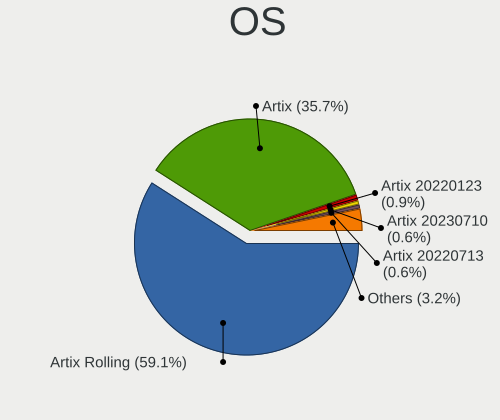

| Name           | Computers | Percent |
|----------------|-----------|---------|
| Artix Rolling  | 202       | 59.06%  |
| Artix          | 122       | 35.67%  |
| Artix 20220123 | 3         | 0.88%   |
| Artix 20230710 | 2         | 0.58%   |
| Artix 20220713 | 2         | 0.58%   |
| Artix 20210726 | 2         | 0.58%   |
| Artix 20251211 | 1         | 0.29%   |
| Artix 20240823 | 1         | 0.29%   |
| Artix 20230814 | 1         | 0.29%   |
| Artix 20230501 | 1         | 0.29%   |
| Artix 20230320 | 1         | 0.29%   |
| Artix 20230306 | 1         | 0.29%   |
| Artix 20230215 | 1         | 0.29%   |
| Artix 20201207 | 1         | 0.29%   |
| Artix 20201128 | 1         | 0.29%   |

OS Family
---------

OS without a version

| Name  | Computers | Percent |
|-------|-----------|---------|
| Artix | 334       | 100%    |

Kernel
------

Version of the Linux kernel

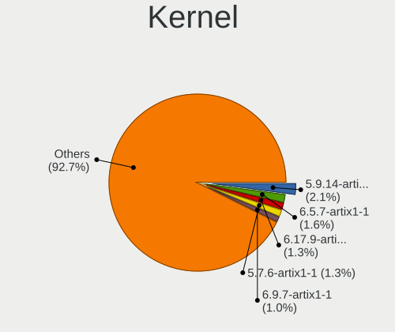

| Version              | Computers | Percent |
|----------------------|-----------|---------|
| 5.9.14-artix1-1      | 8         | 2.09%   |
| 6.5.7-artix1-1       | 6         | 1.57%   |
| 6.17.9-artix1-1      | 5         | 1.31%   |
| 5.7.6-artix1-1       | 5         | 1.31%   |
| 6.9.7-artix1-1       | 4         | 1.05%   |
| 6.5.5-artix1-1       | 4         | 1.05%   |
| 6.4.10-artix1-1      | 4         | 1.05%   |
| 6.3.2-artix1-1       | 4         | 1.05%   |
| 6.1.8-artix1-1       | 4         | 1.05%   |
| 6.0.7-artix1-1       | 4         | 1.05%   |
| 5.7.12-artix1-1      | 4         | 1.05%   |
| 5.15.12-artix1-1     | 4         | 1.05%   |
| 5.12.12-artix1-1     | 4         | 1.05%   |
| 5.10.4-artix2-1      | 4         | 1.05%   |
| 5.10.16-artix1-1     | 4         | 1.05%   |
| 6.7.4-artix1-1       | 3         | 0.79%   |
| 6.6.7-artix1-1       | 3         | 0.79%   |
| 6.6.4-artix1-1       | 3         | 0.79%   |
| 6.2.13-artix1-1      | 3         | 0.79%   |
| 6.17.7-zen1-1-zen    | 3         | 0.79%   |
| 5.8.8-artix1-1       | 3         | 0.79%   |
| 5.8.12-artix1-1      | 3         | 0.79%   |
| 5.18.16-artix1-1     | 3         | 0.79%   |
| 5.16.3-artix1-1      | 3         | 0.79%   |
| 5.16.10-artix1-1     | 3         | 0.79%   |
| 5.12.8-artix1-1      | 3         | 0.79%   |
| 5.12.14-artix1-1     | 3         | 0.79%   |
| 5.10.8-artix1-1      | 3         | 0.79%   |
| 5.10.6-artix1-1      | 3         | 0.79%   |
| 6.9.2-artix1-1       | 2         | 0.52%   |
| 6.8.4-artix1-1       | 2         | 0.52%   |
| 6.8.1-artix1-1       | 2         | 0.52%   |
| 6.7.1-artix1-1       | 2         | 0.52%   |
| 6.6.39-x64v2-xanmod1 | 2         | 0.52%   |
| 6.5.2-artix1-1       | 2         | 0.52%   |
| 6.3.6-artix1-1       | 2         | 0.52%   |
| 6.3.3-artix1-1       | 2         | 0.52%   |
| 6.3.1-artix1-1       | 2         | 0.52%   |
| 6.2.6-artix1-1       | 2         | 0.52%   |
| 6.17.8-artix1-1      | 2         | 0.52%   |

Kernel Family
-------------

Linux kernel without a distro release

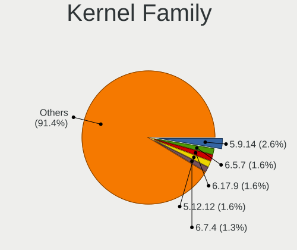

| Version | Computers | Percent |
|---------|-----------|---------|
| 5.9.14  | 10        | 2.62%   |
| 6.5.7   | 6         | 1.57%   |
| 6.17.9  | 6         | 1.57%   |
| 5.12.12 | 6         | 1.57%   |
| 6.7.4   | 5         | 1.31%   |
| 6.5.5   | 5         | 1.31%   |
| 6.3.2   | 5         | 1.31%   |
| 6.17.7  | 5         | 1.31%   |
| 6.0.7   | 5         | 1.31%   |
| 5.7.6   | 5         | 1.31%   |
| 5.15.12 | 5         | 1.31%   |
| 6.9.7   | 4         | 1.05%   |
| 6.4.10  | 4         | 1.05%   |
| 6.12.4  | 4         | 1.05%   |
| 6.1.8   | 4         | 1.05%   |
| 6.1.10  | 4         | 1.05%   |
| 5.7.12  | 4         | 1.05%   |
| 5.12.8  | 4         | 1.05%   |
| 5.12.14 | 4         | 1.05%   |
| 5.10.4  | 4         | 1.05%   |
| 5.10.16 | 4         | 1.05%   |
| 6.6.7   | 3         | 0.79%   |
| 6.6.4   | 3         | 0.79%   |
| 6.5.2   | 3         | 0.79%   |
| 6.3.1   | 3         | 0.79%   |
| 6.2.13  | 3         | 0.79%   |
| 6.17.8  | 3         | 0.79%   |
| 6.12.9  | 3         | 0.79%   |
| 6.10.3  | 3         | 0.79%   |
| 5.8.8   | 3         | 0.79%   |
| 5.8.14  | 3         | 0.79%   |
| 5.8.12  | 3         | 0.79%   |
| 5.18.16 | 3         | 0.79%   |
| 5.17.1  | 3         | 0.79%   |
| 5.16.3  | 3         | 0.79%   |
| 5.16.10 | 3         | 0.79%   |
| 5.13.8  | 3         | 0.79%   |
| 5.11.16 | 3         | 0.79%   |
| 5.10.8  | 3         | 0.79%   |
| 5.10.6  | 3         | 0.79%   |

Kernel Major Ver.
-----------------

Linux kernel major version

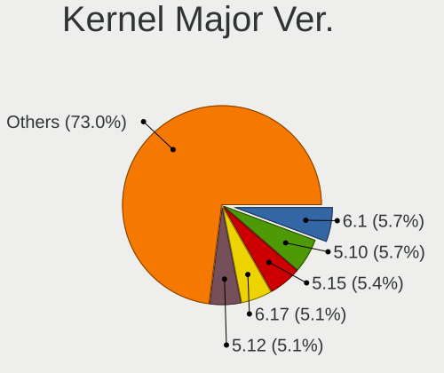

| Version | Computers | Percent |
|---------|-----------|---------|
| 6.1     | 21        | 5.68%   |
| 5.10    | 21        | 5.68%   |
| 5.15    | 20        | 5.41%   |
| 6.17    | 19        | 5.14%   |
| 5.12    | 19        | 5.14%   |
| 6.6     | 17        | 4.59%   |
| 5.9     | 17        | 4.59%   |
| 6.12    | 16        | 4.32%   |
| 6.7     | 15        | 4.05%   |
| 6.5     | 15        | 4.05%   |
| 5.18    | 15        | 4.05%   |
| 6.3     | 14        | 3.78%   |
| 5.16    | 13        | 3.51%   |
| 5.11    | 13        | 3.51%   |
| 6.4     | 11        | 2.97%   |
| 5.8     | 11        | 2.97%   |
| 5.17    | 11        | 2.97%   |
| 6.0     | 10        | 2.7%    |
| 5.7     | 10        | 2.7%    |
| 6.9     | 9         | 2.43%   |
| 6.16    | 8         | 2.16%   |
| 6.2     | 7         | 1.89%   |
| 6.10    | 7         | 1.89%   |
| 5.14    | 7         | 1.89%   |
| 6.8     | 6         | 1.62%   |
| 6.14    | 6         | 1.62%   |
| 5.19    | 6         | 1.62%   |
| 5.13    | 6         | 1.62%   |
| 6.13    | 5         | 1.35%   |
| 6.18    | 3         | 0.81%   |
| 6.15    | 3         | 0.81%   |
| 6.11    | 2         | 0.54%   |
| 5.4     | 2         | 0.54%   |
| 4.19    | 2         | 0.54%   |
| 6.0.5   | 1         | 0.27%   |
| 5.6     | 1         | 0.27%   |
| 5.5     | 1         | 0.27%   |

Arch
----

OS architecture (x86_64, i586, etc.)

| Name   | Computers | Percent |
|--------|-----------|---------|
| x86_64 | 334       | 100%    |

DE
--

Desktop Environment

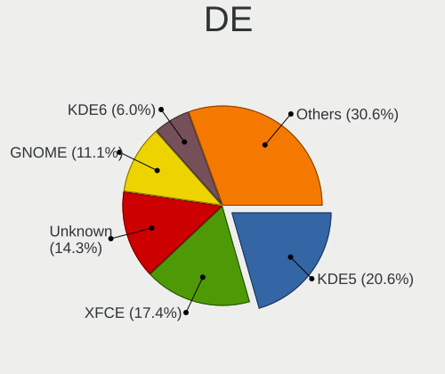

| Name                 | Computers | Percent |
|----------------------|-----------|---------|
| KDE5                 | 72        | 20.57%  |
| XFCE                 | 61        | 17.43%  |
| Unknown              | 50        | 14.29%  |
| GNOME                | 39        | 11.14%  |
| KDE6                 | 21        | 6%      |
| MATE                 | 19        | 5.43%   |
| X-Cinnamon           | 17        | 4.86%   |
| LXQt                 | 12        | 3.43%   |
| i3                   | 11        | 3.14%   |
| Hyprland             | 8         | 2.29%   |
| LXDE                 | 7         | 2%      |
| KDE                  | 6         | 1.71%   |
| Cinnamon             | 6         | 1.71%   |
| sway                 | 5         | 1.43%   |
| bspwm                | 5         | 1.43%   |
| DesQ:Wayfire:wlroots | 2         | 0.57%   |
| xmonad               | 1         | 0.29%   |
| xinitrc              | 1         | 0.29%   |
| sway-dbus            | 1         | 0.29%   |
| openbox              | 1         | 0.29%   |
| nxde                 | 1         | 0.29%   |
| Enlightenment        | 1         | 0.29%   |
| DWM                  | 1         | 0.29%   |
| awesomeminimal       | 1         | 0.29%   |
| awesome              | 1         | 0.29%   |

Display Server
--------------

X11 or Wayland

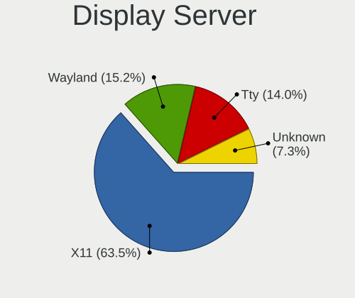

| Name    | Computers | Percent |
|---------|-----------|---------|
| X11     | 217       | 63.45%  |
| Wayland | 52        | 15.2%   |
| Tty     | 48        | 14.04%  |
| Unknown | 25        | 7.31%   |

Display Manager
---------------

SDDM, LightDM, etc.

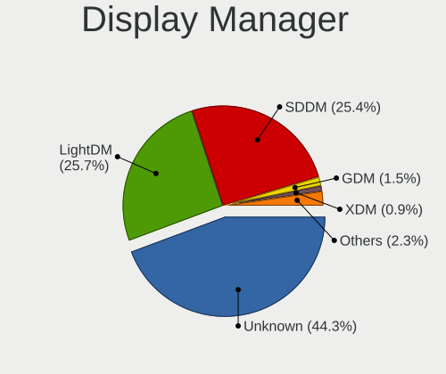

| Name    | Computers | Percent |
|---------|-----------|---------|
| Unknown | 152       | 44.31%  |
| LightDM | 88        | 25.66%  |
| SDDM    | 87        | 25.36%  |
| GDM     | 5         | 1.46%   |
| XDM     | 3         | 0.87%   |
| SLiM    | 3         | 0.87%   |
| LXDM    | 3         | 0.87%   |
| Ly      | 2         | 0.58%   |

OS Lang
-------

Language

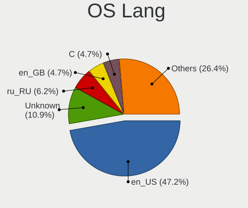

| Lang    | Computers | Percent |
|---------|-----------|---------|
| en_US   | 161       | 47.21%  |
| Unknown | 37        | 10.85%  |
| ru_RU   | 21        | 6.16%   |
| en_GB   | 16        | 4.69%   |
| C       | 16        | 4.69%   |
| de_DE   | 13        | 3.81%   |
| fr_FR   | 9         | 2.64%   |
| pt_BR   | 8         | 2.35%   |
| en_CA   | 7         | 2.05%   |
| es_ES   | 6         | 1.76%   |
| it_IT   | 5         | 1.47%   |
| en_AU   | 5         | 1.47%   |
| pt_PT   | 3         | 0.88%   |
| pl_PL   | 3         | 0.88%   |
| es_MX   | 3         | 0.88%   |
| es_AR   | 3         | 0.88%   |
| en_IN   | 3         | 0.88%   |
| tr_TR   | 2         | 0.59%   |
| en_AG   | 2         | 0.59%   |
| el_GR   | 2         | 0.59%   |
| vi_VN   | 1         | 0.29%   |
| uk_UA   | 1         | 0.29%   |
| ro_RO   | 1         | 0.29%   |
| lt_LT   | 1         | 0.29%   |
| ja_JP   | 1         | 0.29%   |
| hu_HU   | 1         | 0.29%   |
| fr_CA   | 1         | 0.29%   |
| fi_FI   | 1         | 0.29%   |
| es_GT   | 1         | 0.29%   |
| es_CO   | 1         | 0.29%   |
| en_NZ   | 1         | 0.29%   |
| en_IE   | 1         | 0.29%   |
| de_CH   | 1         | 0.29%   |
| de_AT   | 1         | 0.29%   |
| cs_CZ   | 1         | 0.29%   |
| bg_BG   | 1         | 0.29%   |

Boot Mode
---------

EFI or BIOS

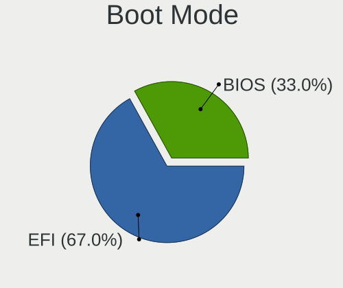

| Mode | Computers | Percent |
|------|-----------|---------|
| EFI  | 225       | 66.96%  |
| BIOS | 111       | 33.04%  |

Filesystem
----------

Type of filesystem

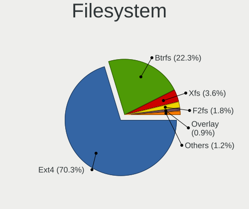

| Type    | Computers | Percent |
|---------|-----------|---------|
| Ext4    | 237       | 70.33%  |
| Btrfs   | 75        | 22.26%  |
| Xfs     | 12        | 3.56%   |
| F2fs    | 6         | 1.78%   |
| Overlay | 3         | 0.89%   |
| Tmpfs   | 1         | 0.3%    |
| Jfs     | 1         | 0.3%    |
| Aufs    | 1         | 0.3%    |
| Unknown | 1         | 0.3%    |

Part. scheme
------------

Scheme of partitioning

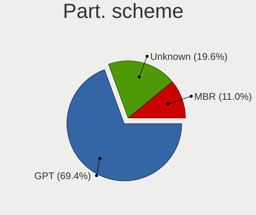

| Type    | Computers | Percent |
|---------|-----------|---------|
| GPT     | 234       | 69.44%  |
| Unknown | 66        | 19.58%  |
| MBR     | 37        | 10.98%  |

Dual Boot with Linux/BSD
------------------------

Hosting more than one Linux/BSD

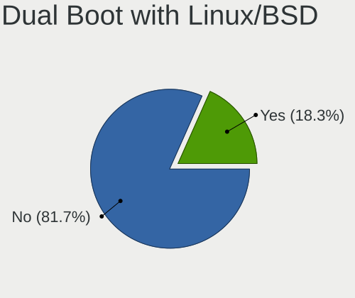

| Dual boot | Computers | Percent |
|-----------|-----------|---------|
| No        | 276       | 81.66%  |
| Yes       | 62        | 18.34%  |

Dual Boot (Win)
---------------

Hosting Linux and Windows

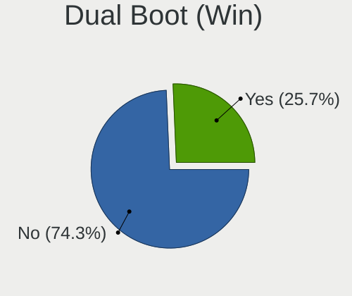

| Dual boot | Computers | Percent |
|-----------|-----------|---------|
| No        | 249       | 74.33%  |
| Yes       | 86        | 25.67%  |

Board
-----

Vendor
------

Motherboard manufacturer

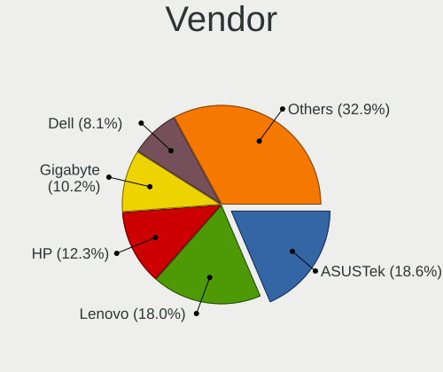

| Name                                 | Computers | Percent |
|--------------------------------------|-----------|---------|
| ASUSTek Computer                     | 62        | 18.56%  |
| Lenovo                               | 60        | 17.96%  |
| Hewlett-Packard                      | 41        | 12.28%  |
| Gigabyte Technology                  | 34        | 10.18%  |
| Dell                                 | 27        | 8.08%   |
| MSI                                  | 23        | 6.89%   |
| Acer                                 | 21        | 6.29%   |
| ASRock                               | 10        | 2.99%   |
| Apple                                | 5         | 1.5%    |
| Timi                                 | 4         | 1.2%    |
| Intel                                | 4         | 1.2%    |
| Samsung Electronics                  | 3         | 0.9%    |
| HUAWEI                               | 3         | 0.9%    |
| Fujitsu                              | 3         | 0.9%    |
| Toshiba                              | 2         | 0.6%    |
| Positivo                             | 2         | 0.6%    |
| Notebook                             | 2         | 0.6%    |
| LG Electronics                       | 2         | 0.6%    |
| HONOR                                | 2         | 0.6%    |
| GPD                                  | 2         | 0.6%    |
| Framework                            | 2         | 0.6%    |
| Biostar                              | 2         | 0.6%    |
| Unknown                              | 2         | 0.6%    |
| ZOTAC                                | 1         | 0.3%    |
| UNOWHY                               | 1         | 0.3%    |
| TongFang                             | 1         | 0.3%    |
| Shenzhen Meigao Electronic Equipment | 1         | 0.3%    |
| Quanta                               | 1         | 0.3%    |
| Pegatron                             | 1         | 0.3%    |
| ONE-NETBOOK TECHNOLOGY               | 1         | 0.3%    |
| MOTILE                               | 1         | 0.3%    |
| Microsoft                            | 1         | 0.3%    |
| Medion                               | 1         | 0.3%    |
| MACHINIST                            | 1         | 0.3%    |
| Google                               | 1         | 0.3%    |
| Founder                              | 1         | 0.3%    |
| BESSTAR Tech                         | 1         | 0.3%    |
| AXIOO                                | 1         | 0.3%    |
| Alienware                            | 1         | 0.3%    |

Model
-----

Motherboard model

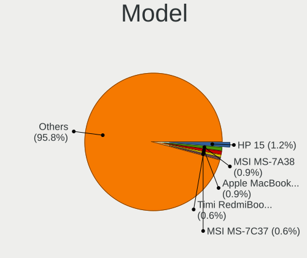

| Name                                                  | Computers | Percent |
|-------------------------------------------------------|-----------|---------|
| HP 15                                                 | 4         | 1.2%    |
| MSI MS-7A38                                           | 3         | 0.9%    |
| Apple MacBookAir7,2                                   | 3         | 0.9%    |
| Timi RedmiBook 14 II                                  | 2         | 0.6%    |
| MSI MS-7C37                                           | 2         | 0.6%    |
| MSI MS-7C02                                           | 2         | 0.6%    |
| Lenovo IdeaPad 5 15IIL05 81YK                         | 2         | 0.6%    |
| Intel X99                                             | 2         | 0.6%    |
| HP Laptop 15s-eq2xxx                                  | 2         | 0.6%    |
| HP 255 G8 Notebook PC                                 | 2         | 0.6%    |
| GPD P2 MAX                                            | 2         | 0.6%    |
| Gigabyte 970A-DS3P                                    | 2         | 0.6%    |
| Fujitsu FUTRO S930                                    | 2         | 0.6%    |
| Dell Precision M6600                                  | 2         | 0.6%    |
| Dell Precision 7550                                   | 2         | 0.6%    |
| Dell Latitude E6440                                   | 2         | 0.6%    |
| ASUS VivoBook_ASUSLaptop M1605YA_M1605YA              | 2         | 0.6%    |
| ASUS VivoBook_ASUS Laptop X505ZA_X505ZA               | 2         | 0.6%    |
| ASUS Vivobook Go E1404FA_E1404FA                      | 2         | 0.6%    |
| ASUS ROG STRIX B550-F GAMING                          | 2         | 0.6%    |
| ASUS M51BC                                            | 2         | 0.6%    |
| Acer Nitro AN515-52                                   | 2         | 0.6%    |
| Unknown                                               | 2         | 0.6%    |
| ZOTAC ZBOX-CI327NANO-GS-01                            | 1         | 0.3%    |
| UNOWHY Y13G010S4EI                                    | 1         | 0.3%    |
| Toshiba Satellite P775                                | 1         | 0.3%    |
| Toshiba Satellite L755                                | 1         | 0.3%    |
| TongFang GX5HRXL                                      | 1         | 0.3%    |
| Timi RedmiBook 15                                     | 1         | 0.3%    |
| Timi A30                                              | 1         | 0.3%    |
| Shenzhen Meigao Electronic Equipment MS-A1            | 1         | 0.3%    |
| Samsung R425D/R525D                                   | 1         | 0.3%    |
| Samsung 350V5C/351V5C/3540VC/3440VC                   | 1         | 0.3%    |
| Samsung 300E5EV/300E4EV/270E5EV/270E4EV/2470EV/2470EE | 1         | 0.3%    |
| Quanta SWH                                            | 1         | 0.3%    |
| Positivo S14CT01                                      | 1         | 0.3%    |
| Positivo C14CU51                                      | 1         | 0.3%    |
| Pegatron h9-1011ru                                    | 1         | 0.3%    |
| ONE-NETBOOK TECHNOLOGY One-Mix3 Pro                   | 1         | 0.3%    |
| Notebook N141CU                                       | 1         | 0.3%    |

Model Family
------------

Motherboard model prefix

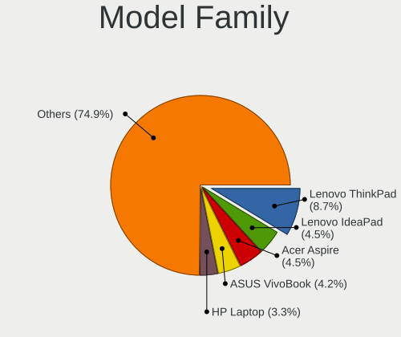

| Name               | Computers | Percent |
|--------------------|-----------|---------|
| Lenovo ThinkPad    | 29        | 8.68%   |
| Lenovo IdeaPad     | 15        | 4.49%   |
| Acer Aspire        | 15        | 4.49%   |
| ASUS VivoBook      | 14        | 4.19%   |
| HP Laptop          | 11        | 3.29%   |
| ASUS ROG           | 9         | 2.69%   |
| Dell Precision     | 8         | 2.4%    |
| Dell Latitude      | 8         | 2.4%    |
| Dell Inspiron      | 8         | 2.4%    |
| ASUS PRIME         | 8         | 2.4%    |
| HP 15              | 4         | 1.2%    |
| ASUS TUF           | 4         | 1.2%    |
| Timi RedmiBook     | 3         | 0.9%    |
| MSI MS-7A38        | 3         | 0.9%    |
| Lenovo Legion      | 3         | 0.9%    |
| HP EliteBook       | 3         | 0.9%    |
| HP 255             | 3         | 0.9%    |
| HP 250             | 3         | 0.9%    |
| Gigabyte X570      | 3         | 0.9%    |
| Gigabyte B450      | 3         | 0.9%    |
| ASUS ASUS          | 3         | 0.9%    |
| ASRock B450        | 3         | 0.9%    |
| Apple MacBookAir7  | 3         | 0.9%    |
| Acer Nitro         | 3         | 0.9%    |
| Toshiba Satellite  | 2         | 0.6%    |
| MSI MS-7C37        | 2         | 0.6%    |
| MSI MS-7C02        | 2         | 0.6%    |
| Lenovo IdeaPadFlex | 2         | 0.6%    |
| Intel X99          | 2         | 0.6%    |
| HP Victus          | 2         | 0.6%    |
| HP ProBook         | 2         | 0.6%    |
| HP Pavilion        | 2         | 0.6%    |
| GPD P2             | 2         | 0.6%    |
| Gigabyte B550M     | 2         | 0.6%    |
| Gigabyte B450M     | 2         | 0.6%    |
| Gigabyte 970A-DS3P | 2         | 0.6%    |
| Fujitsu FUTRO      | 2         | 0.6%    |
| Framework Laptop   | 2         | 0.6%    |
| Dell OptiPlex      | 2         | 0.6%    |
| ASUS M5A97         | 2         | 0.6%    |

MFG Year
--------

Motherboard manufacture year

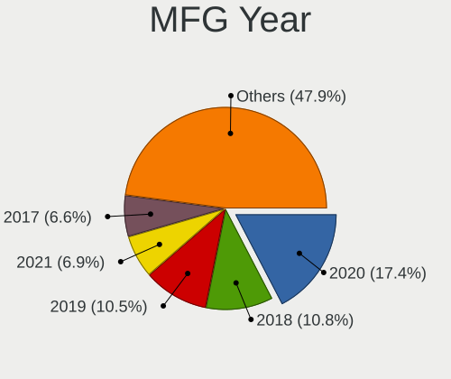

| Year | Computers | Percent |
|------|-----------|---------|
| 2020 | 58        | 17.37%  |
| 2018 | 36        | 10.78%  |
| 2019 | 35        | 10.48%  |
| 2021 | 23        | 6.89%   |
| 2017 | 22        | 6.59%   |
| 2013 | 22        | 6.59%   |
| 2011 | 21        | 6.29%   |
| 2022 | 19        | 5.69%   |
| 2012 | 19        | 5.69%   |
| 2015 | 15        | 4.49%   |
| 2014 | 15        | 4.49%   |
| 2023 | 10        | 2.99%   |
| 2016 | 10        | 2.99%   |
| 2010 | 8         | 2.4%    |
| 2024 | 7         | 2.1%    |
| 2008 | 6         | 1.8%    |
| 2009 | 3         | 0.9%    |
| 2006 | 3         | 0.9%    |
| 2025 | 1         | 0.3%    |
| 2007 | 1         | 0.3%    |

Form Factor
-----------

Physical design of the computer

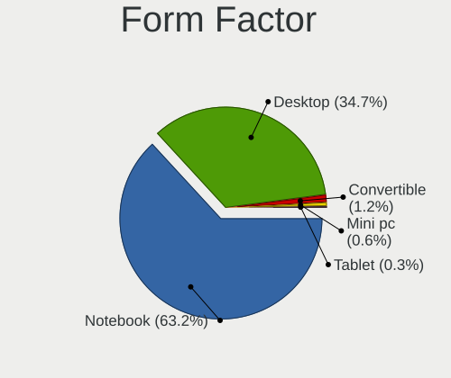

| Name        | Computers | Percent |
|-------------|-----------|---------|
| Notebook    | 211       | 63.17%  |
| Desktop     | 116       | 34.73%  |
| Convertible | 4         | 1.2%    |
| Mini pc     | 2         | 0.6%    |
| Tablet      | 1         | 0.3%    |

Secure Boot
-----------

Enabled or disabled

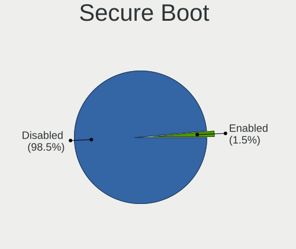

| State    | Computers | Percent |
|----------|-----------|---------|
| Disabled | 329       | 98.5%   |
| Enabled  | 5         | 1.5%    |

Coreboot
--------

Have coreboot on board

| Used | Computers | Percent |
|------|-----------|---------|
| No   | 327       | 97.9%   |
| Yes  | 7         | 2.1%    |

RAM Size
--------

Total RAM memory

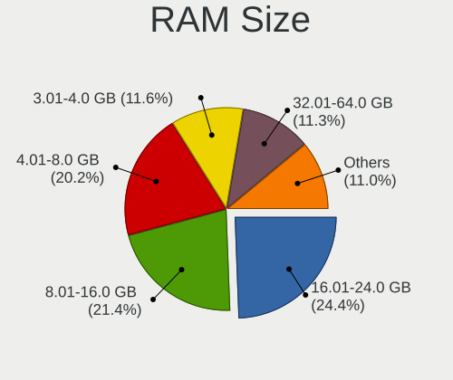

| Size in GB  | Computers | Percent |
|-------------|-----------|---------|
| 16.01-24.0  | 82        | 24.4%   |
| 8.01-16.0   | 72        | 21.43%  |
| 4.01-8.0    | 68        | 20.24%  |
| 3.01-4.0    | 39        | 11.61%  |
| 32.01-64.0  | 38        | 11.31%  |
| 64.01-256.0 | 15        | 4.46%   |
| 24.01-32.0  | 14        | 4.17%   |
| 1.01-2.0    | 8         | 2.38%   |

RAM Used
--------

Used RAM memory

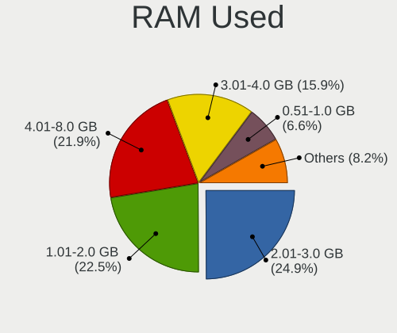

| Used GB    | Computers | Percent |
|------------|-----------|---------|
| 2.01-3.0   | 91        | 24.93%  |
| 1.01-2.0   | 82        | 22.47%  |
| 4.01-8.0   | 80        | 21.92%  |
| 3.01-4.0   | 58        | 15.89%  |
| 0.51-1.0   | 24        | 6.58%   |
| 8.01-16.0  | 17        | 4.66%   |
| 0.01-0.5   | 8         | 2.19%   |
| 16.01-24.0 | 5         | 1.37%   |

Total Drives
------------

Number of drives on board

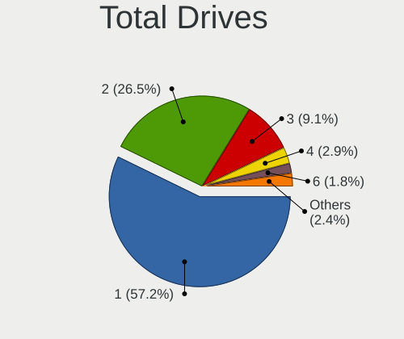

| Drives | Computers | Percent |
|--------|-----------|---------|
| 1      | 194       | 57.23%  |
| 2      | 90        | 26.55%  |
| 3      | 31        | 9.14%   |
| 4      | 10        | 2.95%   |
| 6      | 6         | 1.77%   |
| 8      | 2         | 0.59%   |
| 7      | 2         | 0.59%   |
| 5      | 2         | 0.59%   |
| 0      | 2         | 0.59%   |

Has CD-ROM
----------

Has CD-ROM on board

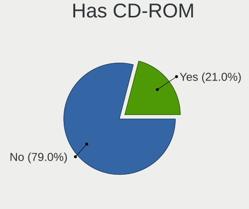

| Presented | Computers | Percent |
|-----------|-----------|---------|
| No        | 264       | 79.04%  |
| Yes       | 70        | 20.96%  |

Has Ethernet
------------

Has Ethernet on board

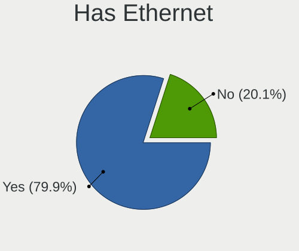

| Presented | Computers | Percent |
|-----------|-----------|---------|
| Yes       | 267       | 79.94%  |
| No        | 67        | 20.06%  |

Has WiFi
--------

Has WiFi module

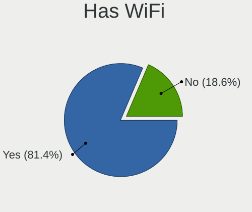

| Presented | Computers | Percent |
|-----------|-----------|---------|
| Yes       | 272       | 81.44%  |
| No        | 62        | 18.56%  |

Has Bluetooth
-------------

Has Bluetooth module

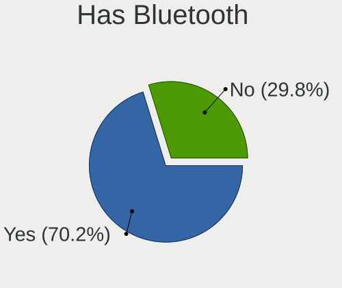

| Presented | Computers | Percent |
|-----------|-----------|---------|
| Yes       | 236       | 70.24%  |
| No        | 100       | 29.76%  |

Location
--------

Country
-------

Geographic location (country)

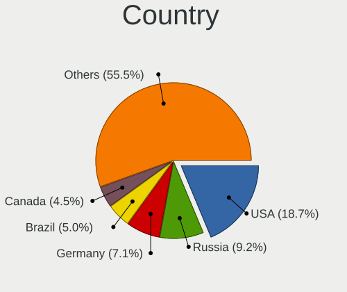

| Country     | Computers | Percent |
|-------------|-----------|---------|
| USA         | 63        | 18.69%  |
| Russia      | 31        | 9.2%    |
| Germany     | 24        | 7.12%   |
| Brazil      | 17        | 5.04%   |
| Canada      | 15        | 4.45%   |
| France      | 13        | 3.86%   |
| UK          | 11        | 3.26%   |
| India       | 11        | 3.26%   |
| Turkey      | 10        | 2.97%   |
| Netherlands | 10        | 2.97%   |
| Switzerland | 9         | 2.67%   |
| Poland      | 9         | 2.67%   |
| Spain       | 8         | 2.37%   |
| Italy       | 8         | 2.37%   |
| Ukraine     | 5         | 1.48%   |
| Indonesia   | 5         | 1.48%   |
| Bulgaria    | 5         | 1.48%   |
| Romania     | 4         | 1.19%   |
| Lithuania   | 4         | 1.19%   |
| Greece      | 4         | 1.19%   |
| Finland     | 4         | 1.19%   |
| Czechia     | 4         | 1.19%   |
| Australia   | 4         | 1.19%   |
| Argentina   | 4         | 1.19%   |
| Vietnam     | 3         | 0.89%   |
| Mexico      | 3         | 0.89%   |
| Iran        | 3         | 0.89%   |
| Sweden      | 2         | 0.59%   |
| Slovenia    | 2         | 0.59%   |
| Slovakia    | 2         | 0.59%   |
| Serbia      | 2         | 0.59%   |
| Portugal    | 2         | 0.59%   |
| Pakistan    | 2         | 0.59%   |
| Kuwait      | 2         | 0.59%   |
| Japan       | 2         | 0.59%   |
| Israel      | 2         | 0.59%   |
| Hungary     | 2         | 0.59%   |
| Guatemala   | 2         | 0.59%   |
| Colombia    | 2         | 0.59%   |
| Chile       | 2         | 0.59%   |

City
----

Geographic location (city)

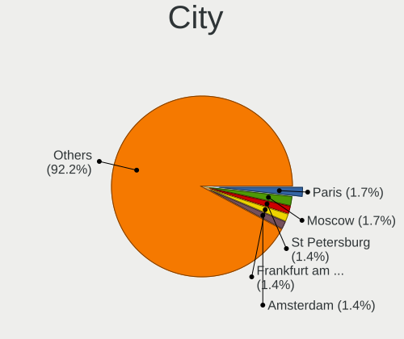

| City              | Computers | Percent |
|-------------------|-----------|---------|
| Paris             | 6         | 1.73%   |
| Moscow            | 6         | 1.73%   |
| St Petersburg     | 5         | 1.44%   |
| Frankfurt am Main | 5         | 1.44%   |
| Amsterdam         | 5         | 1.44%   |
| Vilnius           | 4         | 1.15%   |
| Prague            | 4         | 1.15%   |
| Warsaw            | 3         | 0.86%   |
| Toronto           | 3         | 0.86%   |
| Surgut            | 3         | 0.86%   |
| Sofia             | 3         | 0.86%   |
| Rio de Janeiro    | 3         | 0.86%   |
| Mijdrecht         | 3         | 0.86%   |
| Los Angeles       | 3         | 0.86%   |
| Jakarta           | 3         | 0.86%   |
| Istanbul          | 3         | 0.86%   |
| Dnipro            | 3         | 0.86%   |
| Charlotte         | 3         | 0.86%   |
| Ankara            | 3         | 0.86%   |
| Zurich            | 2         | 0.58%   |
| Vienna            | 2         | 0.58%   |
| Vancouver         | 2         | 0.58%   |
| Tel Aviv          | 2         | 0.58%   |
| Tampere           | 2         | 0.58%   |
| Sydney            | 2         | 0.58%   |
| Sorocaba          | 2         | 0.58%   |
| Snohomish         | 2         | 0.58%   |
| Seville           | 2         | 0.58%   |
| Santiago          | 2         | 0.58%   |
| San Ramon         | 2         | 0.58%   |
| Samara            | 2         | 0.58%   |
| Rochester         | 2         | 0.58%   |
| Omaha             | 2         | 0.58%   |
| New York          | 2         | 0.58%   |
| Neuchatel         | 2         | 0.58%   |
| Mira              | 2         | 0.58%   |
| Milton            | 2         | 0.58%   |
| Mandi             | 2         | 0.58%   |
| Kłodzko          | 2         | 0.58%   |
| Kuwait City       | 2         | 0.58%   |

Drives
------

Drive Vendor
------------

Hard drive vendors

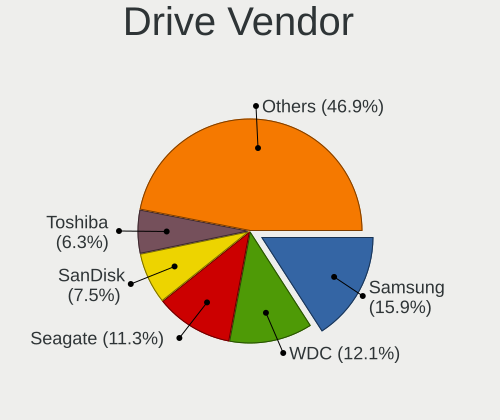

| Vendor                      | Computers | Drives | Percent |
|-----------------------------|-----------|--------|---------|
| Samsung Electronics         | 83        | 109    | 15.9%   |
| WDC                         | 63        | 97     | 12.07%  |
| Seagate                     | 59        | 70     | 11.3%   |
| SanDisk                     | 39        | 45     | 7.47%   |
| Toshiba                     | 33        | 36     | 6.32%   |
| Kingston                    | 31        | 35     | 5.94%   |
| Crucial                     | 24        | 36     | 4.6%    |
| Intel                       | 19        | 26     | 3.64%   |
| SK hynix                    | 14        | 20     | 2.68%   |
| Hitachi                     | 11        | 12     | 2.11%   |
| Phison Electronics          | 10        | 16     | 1.92%   |
| HGST                        | 10        | 11     | 1.92%   |
| Unknown                     | 9         | 10     | 1.72%   |
| Micron Technology           | 8         | 10     | 1.53%   |
| China                       | 7         | 8      | 1.34%   |
| A-DATA Technology           | 6         | 6      | 1.15%   |
| PNY                         | 5         | 5      | 0.96%   |
| Micron/Crucial Technology   | 5         | 5      | 0.96%   |
| Kingston Technology Company | 5         | 5      | 0.96%   |
| MAXIO Technology (Hangzhou) | 4         | 6      | 0.77%   |
| JMicron Technology          | 4         | 4      | 0.77%   |
| Silicon Motion              | 3         | 4      | 0.57%   |
| Phison                      | 3         | 4      | 0.57%   |
| LITEON                      | 3         | 3      | 0.57%   |
| KIOXIA                      | 3         | 3      | 0.57%   |
| Apple                       | 3         | 4      | 0.57%   |
| ADATA Technology            | 3         | 4      | 0.57%   |
| Unknown                     | 3         | 5      | 0.57%   |
| WALRAM                      | 2         | 2      | 0.38%   |
| USB3.0                      | 2         | 2      | 0.38%   |
| Transcend                   | 2         | 2      | 0.38%   |
| SPCC                        | 2         | 2      | 0.38%   |
| Solid State Storage         | 2         | 2      | 0.38%   |
| Netac                       | 2         | 3      | 0.38%   |
| Maxtor                      | 2         | 2      | 0.38%   |
| Linux                       | 2         | 2      | 0.38%   |
| Hewlett-Packard             | 2         | 2      | 0.38%   |
| Corsair                     | 2         | 2      | 0.38%   |
| Brainzap                    | 2         | 2      | 0.38%   |
| Apacer                      | 2         | 2      | 0.38%   |

Drive Model
-----------

Hard drive models

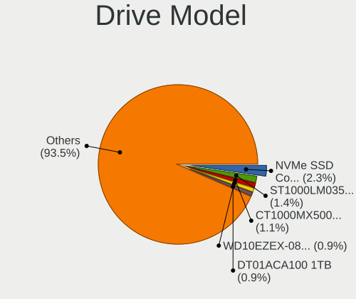

| Model                                              | Computers | Percent |
|----------------------------------------------------|-----------|---------|
| Samsung NVMe SSD Controller SM981/PM981/PM983 1TB  | 13        | 2.3%    |
| Seagate ST1000LM035-1RK172 1TB                     | 8         | 1.41%   |
| Crucial CT1000MX500SSD1 1TB                        | 6         | 1.06%   |
| WDC WD10EZEX-08WN4A0 1TB                           | 5         | 0.88%   |
| Toshiba DT01ACA100 1TB                             | 5         | 0.88%   |
| Seagate ST1000LM024 HN-M101MBB 1TB                 | 5         | 0.88%   |
| Sandisk WD Blue SN550 NVMe SSD 1024GB              | 5         | 0.88%   |
| Samsung SSD 860 EVO 250GB                          | 5         | 0.88%   |
| Kingston SA400S37240G 240GB SSD                    | 5         | 0.88%   |
| Kingston SA400S37120G 120GB SSD                    | 5         | 0.88%   |
| Crucial CT240BX500SSD1 240GB                       | 5         | 0.88%   |
| Seagate ST500LT012-1DG142 500GB                    | 4         | 0.71%   |
| Sandisk WD Black SN850 1TB                         | 4         | 0.71%   |
| SanDisk NVMe SSD Drive 512GB                       | 4         | 0.71%   |
| Samsung SSD 860 EVO 500GB                          | 4         | 0.71%   |
| Samsung NVMe SSD Controller PM9A1/PM9A3/980PRO 1TB | 4         | 0.71%   |
| Kingston SA400S37480G 480GB SSD                    | 4         | 0.71%   |
| Unknown SD/MMC/MS PRO 2GB                          | 3         | 0.53%   |
| Unknown MMC Card  32GB                             | 3         | 0.53%   |
| Toshiba MQ01ABF050 500GB                           | 3         | 0.53%   |
| Toshiba MQ01ABD100 1TB                             | 3         | 0.53%   |
| Seagate ST3500418AS 500GB                          | 3         | 0.53%   |
| Seagate ST1000DM010-2EP102 1TB                     | 3         | 0.53%   |
| Samsung SSD 980 1TB                                | 3         | 0.53%   |
| Samsung SSD 970 EVO 1TB                            | 3         | 0.53%   |
| Samsung SSD 860 EVO 1TB                            | 3         | 0.53%   |
| Samsung NVMe SSD Drive 1TB                         | 3         | 0.53%   |
| Phison PS5013 E13 NVMe Controller 500GB            | 3         | 0.53%   |
| Phison E12 NVMe Controller 1TB                     | 3         | 0.53%   |
| HGST HTS545050A7E680 500GB                         | 3         | 0.53%   |
| HGST HTS541010A9E680 1TB                           | 3         | 0.53%   |
| Crucial CT500MX500SSD1 500GB                       | 3         | 0.53%   |
| Crucial CT250MX500SSD1 250GB                       | 3         | 0.53%   |
| China SATA SSD 960GB                               | 3         | 0.53%   |
| A-DATA SU650 240GB SSD                             | 3         | 0.53%   |
| Unknown                                            | 3         | 0.53%   |
| WDC WD80EZAZ-11TDBA0 8TB                           | 2         | 0.35%   |
| WDC WD40EZRZ-00WN9B0 4TB                           | 2         | 0.35%   |
| WDC WD30EZRX-00DC0B0 3TB                           | 2         | 0.35%   |
| WDC WD20EZBX-00AYRA0 2TB                           | 2         | 0.35%   |

HDD Vendor
----------

Hard disk drive vendors

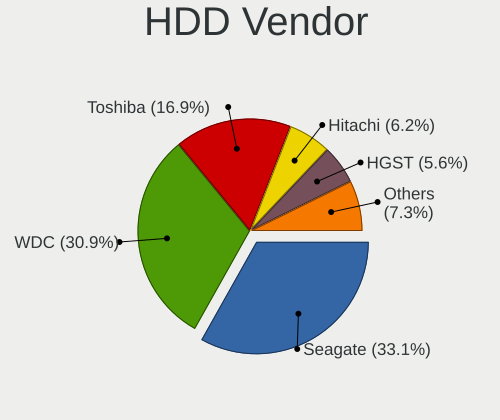

| Vendor              | Computers | Drives | Percent |
|---------------------|-----------|--------|---------|
| Seagate             | 59        | 70     | 33.15%  |
| WDC                 | 55        | 80     | 30.9%   |
| Toshiba             | 30        | 33     | 16.85%  |
| Hitachi             | 11        | 12     | 6.18%   |
| HGST                | 10        | 11     | 5.62%   |
| Unknown             | 3         | 3      | 1.69%   |
| USB3.0              | 2         | 2      | 1.12%   |
| Samsung Electronics | 2         | 2      | 1.12%   |
| Maxtor              | 2         | 2      | 1.12%   |
| JMicron Technology  | 2         | 2      | 1.12%   |
| T-FORCE             | 1         | 1      | 0.56%   |
| Colorful            | 1         | 1      | 0.56%   |

SSD Vendor
----------

Solid state drive vendors

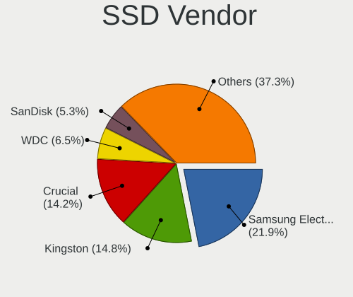

| Vendor              | Computers | Drives | Percent |
|---------------------|-----------|--------|---------|
| Samsung Electronics | 37        | 43     | 21.89%  |
| Kingston            | 25        | 28     | 14.79%  |
| Crucial             | 24        | 36     | 14.2%   |
| WDC                 | 11        | 14     | 6.51%   |
| SanDisk             | 9         | 10     | 5.33%   |
| China               | 7         | 8      | 4.14%   |
| PNY                 | 4         | 4      | 2.37%   |
| Micron Technology   | 4         | 6      | 2.37%   |
| A-DATA Technology   | 4         | 4      | 2.37%   |
| SK hynix            | 3         | 3      | 1.78%   |
| Intel               | 3         | 4      | 1.78%   |
| Apple               | 3         | 4      | 1.78%   |
| SPCC                | 2         | 2      | 1.18%   |
| Netac               | 2         | 3      | 1.18%   |
| LITEON              | 2         | 2      | 1.18%   |
| Linux               | 2         | 2      | 1.18%   |
| Brainzap            | 2         | 2      | 1.18%   |
| Apacer              | 2         | 2      | 1.18%   |
| AMD                 | 2         | 2      | 1.18%   |
| XUM                 | 1         | 1      | 0.59%   |
| Transcend           | 1         | 1      | 0.59%   |
| Toshiba             | 1         | 1      | 0.59%   |
| SPCC Sol            | 1         | 1      | 0.59%   |
| Plextor             | 1         | 1      | 0.59%   |
| Phison              | 1         | 2      | 0.59%   |
| Patriot             | 1         | 1      | 0.59%   |
| OCZ                 | 1         | 1      | 0.59%   |
| LDLC                | 1         | 5      | 0.59%   |
| KingSpec            | 1         | 1      | 0.59%   |
| JMicron Technology  | 1         | 1      | 0.59%   |
| Intenso             | 1         | 1      | 0.59%   |
| INNOVATION IT       | 1         | 1      | 0.59%   |
| Hewlett-Packard     | 1         | 1      | 0.59%   |
| GOODRAM             | 1         | 1      | 0.59%   |
| FORESEE             | 1         | 1      | 0.59%   |
| Dogfish             | 1         | 1      | 0.59%   |
| Biostar             | 1         | 1      | 0.59%   |
| BHT                 | 1         | 1      | 0.59%   |
| AGI                 | 1         | 1      | 0.59%   |
| Unknown             | 1         | 3      | 0.59%   |

Drive Kind
----------

HDD or SSD

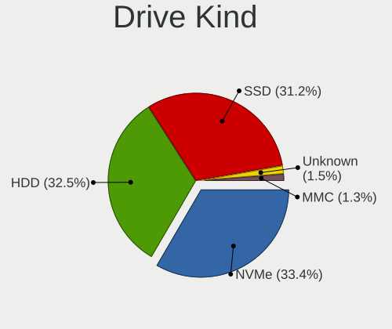

| Kind    | Computers | Drives | Percent |
|---------|-----------|--------|---------|
| NVMe    | 155       | 216    | 33.41%  |
| HDD     | 151       | 219    | 32.54%  |
| SSD     | 145       | 207    | 31.25%  |
| Unknown | 7         | 12     | 1.51%   |
| MMC     | 6         | 7      | 1.29%   |

Drive Connector
---------------

SATA, SAS, NVMe, etc.

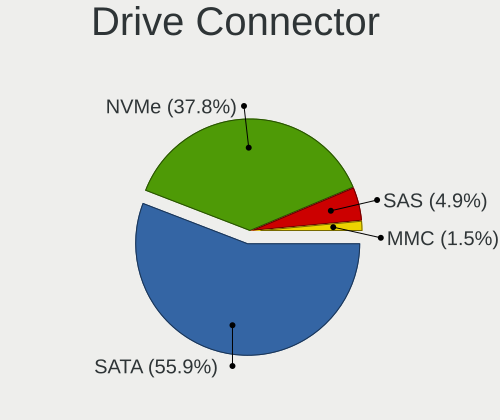

| Type | Computers | Drives | Percent |
|------|-----------|--------|---------|
| SATA | 229       | 410    | 55.85%  |
| NVMe | 155       | 216    | 37.8%   |
| SAS  | 20        | 28     | 4.88%   |
| MMC  | 6         | 7      | 1.46%   |

Drive Size
----------

Size of hard drive

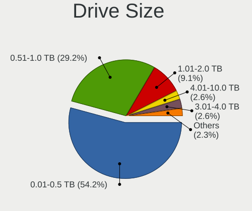

| Size in TB | Computers | Drives | Percent |
|------------|-----------|--------|---------|
| 0.01-0.5   | 167       | 235    | 54.22%  |
| 0.51-1.0   | 90        | 123    | 29.22%  |
| 1.01-2.0   | 28        | 34     | 9.09%   |
| 3.01-4.0   | 8         | 12     | 2.6%    |
| 4.01-10.0  | 8         | 15     | 2.6%    |
| 2.01-3.0   | 7         | 7      | 2.27%   |

Space Total
-----------

Amount of disk space available on the file system

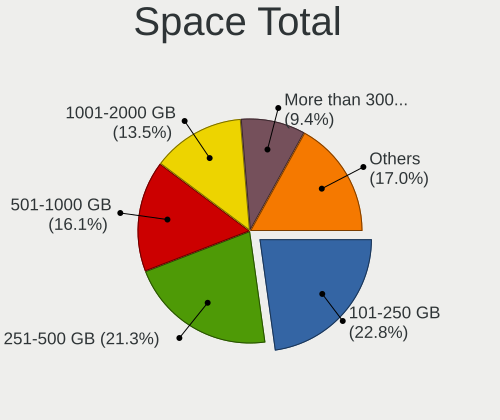

| Size in GB     | Computers | Percent |
|----------------|-----------|---------|
| 101-250        | 78        | 22.81%  |
| 251-500        | 73        | 21.35%  |
| 501-1000       | 55        | 16.08%  |
| 1001-2000      | 46        | 13.45%  |
| More than 3000 | 32        | 9.36%   |
| 2001-3000      | 19        | 5.56%   |
| 51-100         | 15        | 4.39%   |
| Unknown        | 12        | 3.51%   |
| 1-20           | 8         | 2.34%   |
| 21-50          | 4         | 1.17%   |

Space Used
----------

Amount of used disk space

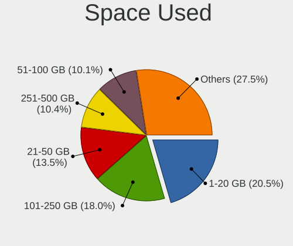

| Used GB        | Computers | Percent |
|----------------|-----------|---------|
| 1-20           | 73        | 20.51%  |
| 101-250        | 64        | 17.98%  |
| 21-50          | 48        | 13.48%  |
| 251-500        | 37        | 10.39%  |
| 51-100         | 36        | 10.11%  |
| 501-1000       | 35        | 9.83%   |
| 1001-2000      | 30        | 8.43%   |
| More than 3000 | 12        | 3.37%   |
| Unknown        | 12        | 3.37%   |
| 2001-3000      | 8         | 2.25%   |
| 0              | 1         | 0.28%   |

Malfunc. Drives
---------------

Drive models with a malfunction

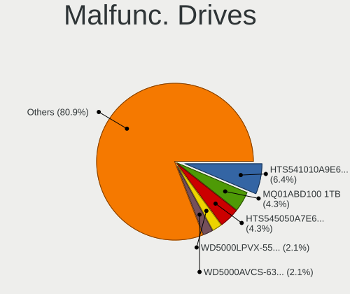

| Model                                                 | Computers | Drives | Percent |
|-------------------------------------------------------|-----------|--------|---------|
| HGST HTS541010A9E680 1TB                              | 3         | 3      | 6.38%   |
| Toshiba MQ01ABD100 1TB                                | 2         | 2      | 4.26%   |
| HGST HTS545050A7E680 500GB                            | 2         | 2      | 4.26%   |
| WDC WD5000LPVX-55V0TT0 500GB                          | 1         | 1      | 2.13%   |
| WDC WD5000AVCS-632DY1 500GB                           | 1         | 1      | 2.13%   |
| WDC WD5000AAKX-08U6AA0 500GB                          | 1         | 1      | 2.13%   |
| WDC WD3200LPVT-00FMCT0 320GB                          | 1         | 1      | 2.13%   |
| WDC WD3200BEKT-60F3T1 320GB                           | 1         | 1      | 2.13%   |
| WDC WD3200AAKX-00ERMA0 320GB                          | 1         | 1      | 2.13%   |
| WDC WD30EZRX-00DC0B0 3TB                              | 1         | 1      | 2.13%   |
| WDC WD30EJRX-89AKWY0 3TB                              | 1         | 1      | 2.13%   |
| WDC WD2500AAKX-60U6AA0 250GB                          | 1         | 1      | 2.13%   |
| WDC WD10SPCX-24HWST1 1TB                              | 1         | 1      | 2.13%   |
| Toshiba MQ01ACF032 320GB                              | 1         | 1      | 2.13%   |
| Toshiba MQ01ABF050 500GB                              | 1         | 1      | 2.13%   |
| Toshiba MK7575GSX 752GB                               | 1         | 1      | 2.13%   |
| Toshiba MK5065GSX 500GB                               | 1         | 1      | 2.13%   |
| Toshiba MK3276GSX 320GB                               | 1         | 1      | 2.13%   |
| Toshiba DT01ACA100 1TB                                | 1         | 1      | 2.13%   |
| Seagate ST8000DM004-2CX188 8TB                        | 1         | 1      | 2.13%   |
| Seagate ST6000VN0033-2EE110 6TB                       | 1         | 1      | 2.13%   |
| Seagate ST500LT012-9WS142 500GB                       | 1         | 1      | 2.13%   |
| Seagate ST500LT012-1DG142 500GB                       | 1         | 1      | 2.13%   |
| Seagate ST31000524AS 1TB                              | 1         | 1      | 2.13%   |
| Seagate ST2000DX002-2DV164 2TB                        | 1         | 1      | 2.13%   |
| Seagate ST2000DM006-2DM164 2TB                        | 1         | 1      | 2.13%   |
| Seagate ST2000DM001-9YN164 2TB                        | 1         | 1      | 2.13%   |
| Seagate ST1000LM035-1RK172 1TB                        | 1         | 1      | 2.13%   |
| Samsung Electronics SSD 980 1TB                       | 1         | 1      | 2.13%   |
| Samsung Electronics SP2004C 200GB                     | 1         | 1      | 2.13%   |
| Samsung Electronics MZNLH128HBHQ-000H1 128GB SSD      | 1         | 1      | 2.13%   |
| Realtek Semiconductor RTS5762 NVMe SSD Controller 1TB | 1         | 1      | 2.13%   |
| Maxtor 6Y080M0 81GB                                   | 1         | 1      | 2.13%   |
| LDLC SSD 120GB                                        | 1         | 3      | 2.13%   |
| Kingston SUV400S37240G 240GB SSD                      | 1         | 1      | 2.13%   |
| Kingston SA400S37240G 240GB SSD                       | 1         | 1      | 2.13%   |
| Kingston SA400S37120G 120GB SSD                       | 1         | 1      | 2.13%   |
| Intel SSDSC2BW480A4 480GB                             | 1         | 2      | 2.13%   |
| Intel SSDPEKKW128G7 128GB                             | 1         | 1      | 2.13%   |
| Hitachi HTS547550A9E384 500GB                         | 1         | 1      | 2.13%   |

Malfunc. Drive Vendor
---------------------

Vendors of faulty drives

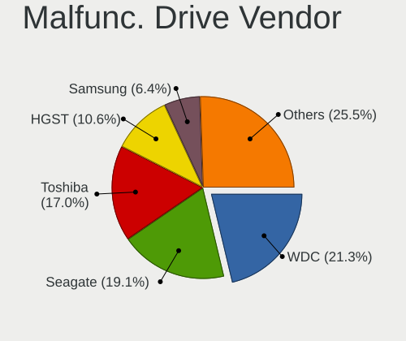

| Vendor                | Computers | Drives | Percent |
|-----------------------|-----------|--------|---------|
| WDC                   | 10        | 10     | 21.28%  |
| Seagate               | 9         | 9      | 19.15%  |
| Toshiba               | 8         | 8      | 17.02%  |
| HGST                  | 5         | 5      | 10.64%  |
| Samsung Electronics   | 3         | 3      | 6.38%   |
| Kingston              | 3         | 3      | 6.38%   |
| Intel                 | 2         | 3      | 4.26%   |
| Hitachi               | 2         | 2      | 4.26%   |
| Realtek Semiconductor | 1         | 1      | 2.13%   |
| Maxtor                | 1         | 1      | 2.13%   |
| LDLC                  | 1         | 3      | 2.13%   |
| Hewlett-Packard       | 1         | 1      | 2.13%   |
| A-DATA Technology     | 1         | 1      | 2.13%   |

Malfunc. HDD Vendor
-------------------

Vendors of faulty HDD drives

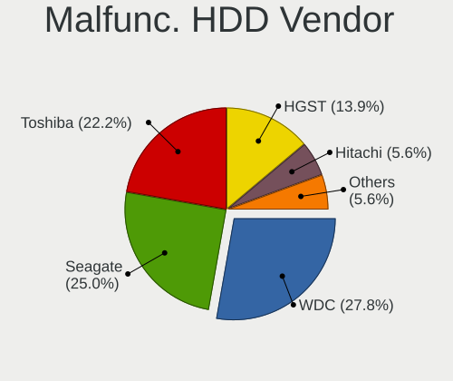

| Vendor              | Computers | Drives | Percent |
|---------------------|-----------|--------|---------|
| WDC                 | 10        | 10     | 27.78%  |
| Seagate             | 9         | 9      | 25%     |
| Toshiba             | 8         | 8      | 22.22%  |
| HGST                | 5         | 5      | 13.89%  |
| Hitachi             | 2         | 2      | 5.56%   |
| Samsung Electronics | 1         | 1      | 2.78%   |
| Maxtor              | 1         | 1      | 2.78%   |

Malfunc. Drive Kind
-------------------

Kinds of faulty drives

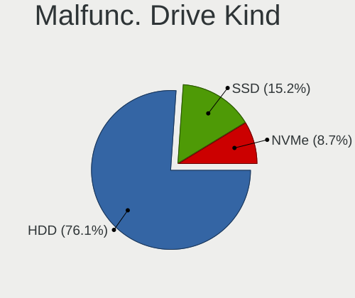

| Kind | Computers | Drives | Percent |
|------|-----------|--------|---------|
| HDD  | 35        | 36     | 76.09%  |
| SSD  | 7         | 10     | 15.22%  |
| NVMe | 4         | 4      | 8.7%    |

Failed Drives
-------------

Failed drive models

Zero info for selected period =(

Failed Drive Vendor
-------------------

Failed drive vendors

Zero info for selected period =(

Drive Status
------------

Number of failed and malfunc. drives

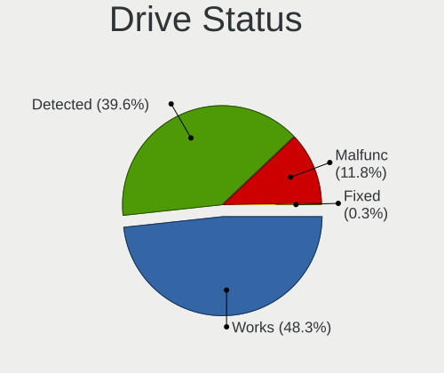

| Status   | Computers | Drives | Percent |
|----------|-----------|--------|---------|
| Works    | 184       | 335    | 48.29%  |
| Detected | 151       | 275    | 39.63%  |
| Malfunc  | 45        | 50     | 11.81%  |
| Fixed    | 1         | 1      | 0.26%   |

Storage controller
------------------

Storage Vendor
--------------

Storage controller vendors

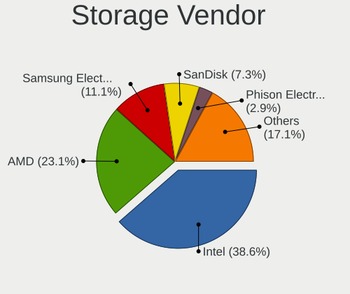

| Vendor                         | Computers | Percent |
|--------------------------------|-----------|---------|
| Intel                          | 174       | 38.58%  |
| AMD                            | 104       | 23.06%  |
| Samsung Electronics            | 50        | 11.09%  |
| SanDisk                        | 33        | 7.32%   |
| Phison Electronics             | 13        | 2.88%   |
| SK hynix                       | 11        | 2.44%   |
| Kingston Technology Company    | 11        | 2.44%   |
| Marvell Technology Group       | 6         | 1.33%   |
| ASMedia Technology             | 6         | 1.33%   |
| Silicon Motion                 | 5         | 1.11%   |
| Micron/Crucial Technology      | 5         | 1.11%   |
| ADATA Technology               | 5         | 1.11%   |
| Micron Technology              | 4         | 0.89%   |
| MAXIO Technology (Hangzhou)    | 4         | 0.89%   |
| Union Memory (Shenzhen)        | 3         | 0.67%   |
| KIOXIA                         | 3         | 0.67%   |
| Toshiba America Info Systems   | 2         | 0.44%   |
| Solid State Storage Technology | 2         | 0.44%   |
| JMicron Technology             | 2         | 0.44%   |
| VIA Technologies               | 1         | 0.22%   |
| Shenzhen Longsys Electronics   | 1         | 0.22%   |
| Realtek Semiconductor          | 1         | 0.22%   |
| Nvidia                         | 1         | 0.22%   |
| Lite-On Technology             | 1         | 0.22%   |
| Lenovo                         | 1         | 0.22%   |
| INNOGRIT                       | 1         | 0.22%   |
| Broadcom / LSI                 | 1         | 0.22%   |

Storage Model
-------------

Storage controller models

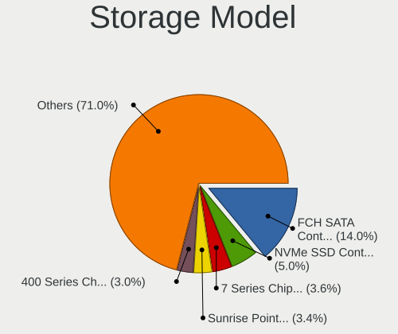

| Model                                                                          | Computers | Percent |
|--------------------------------------------------------------------------------|-----------|---------|
| AMD FCH SATA Controller [AHCI mode]                                            | 70        | 14%     |
| Samsung NVMe SSD Controller SM981/PM981/PM983                                  | 25        | 5%      |
| Intel 7 Series Chipset Family 6-port SATA Controller [AHCI mode]               | 18        | 3.6%    |
| Intel Sunrise Point-LP SATA Controller [AHCI mode]                             | 17        | 3.4%    |
| AMD 400 Series Chipset SATA Controller                                         | 15        | 3%      |
| Intel 6 Series/C200 Series Chipset Family 6 port Mobile SATA AHCI Controller   | 13        | 2.6%    |
| Intel 82801 Mobile SATA Controller [RAID mode]                                 | 12        | 2.4%    |
| Samsung NVMe SSD Controller 980 (DRAM-less)                                    | 11        | 2.2%    |
| AMD SB7x0/SB8x0/SB9x0 SATA Controller [AHCI mode]                              | 10        | 2%      |
| AMD 500 Series Chipset SATA Controller                                         | 10        | 2%      |
| Intel Wildcat Point-LP SATA Controller [AHCI Mode]                             | 8         | 1.6%    |
| Intel Volume Management Device NVMe RAID Controller                            | 8         | 1.6%    |
| AMD 300 Series Chipset SATA Controller                                         | 8         | 1.6%    |
| SanDisk Ultra 3D / WD PC SN530, IX SN530, Blue SN550 NVMe SSD (DRAM-less)      | 7         | 1.4%    |
| Intel Q170/Q150/B150/H170/H110/Z170/CM236 Chipset SATA Controller [AHCI Mode]  | 7         | 1.4%    |
| Intel 400 Series Chipset Family SATA AHCI Controller                           | 7         | 1.4%    |
| AMD 600 Series Chipset SATA Controller                                         | 7         | 1.4%    |
| SanDisk Extreme Pro / WD Black SN750 / PC SN730 / Red SN700 NVMe SSD           | 6         | 1.2%    |
| Phison E12 NVMe Controller                                                     | 6         | 1.2%    |
| Intel SSD 670p Series [Keystone Harbor]                                        | 6         | 1.2%    |
| Intel 6 Series/C200 Series Chipset Family 6 port Desktop SATA AHCI Controller  | 6         | 1.2%    |
| ASMedia ASM1061/ASM1062 Serial ATA Controller                                  | 6         | 1.2%    |
| SanDisk WD PC SN810 / Black SN850 NVMe SSD                                     | 5         | 1%      |
| Samsung NVMe SSD Controller SM961/PM961/SM963                                  | 5         | 1%      |
| Intel SSD 660P Series                                                          | 5         | 1%      |
| Intel Celeron/Pentium Silver Processor SATA Controller                         | 5         | 1%      |
| Intel Atom Processor E3800 Series SATA AHCI Controller                         | 5         | 1%      |
| SanDisk WD SN560/SN740/SN770/SN5000 NVMe SSD                                   | 4         | 0.8%    |
| SanDisk PC SN530 NVMe SSD (DRAM-less)                                          | 4         | 0.8%    |
| Samsung NVMe SSD Controller PM9A1/PM9A3/980PRO                                 | 4         | 0.8%    |
| Kingston Company OM8PCP Design-In PCIe 3 NVMe SSD (DRAM-less)                  | 4         | 0.8%    |
| Intel SSD DC P4101/Pro 7600p/760p/E 6100p Series                               | 4         | 0.8%    |
| Intel Cannon Lake PCH SATA AHCI Controller                                     | 4         | 0.8%    |
| Intel 8 Series/C220 Series Chipset Family 6-port SATA Controller 1 [AHCI mode] | 4         | 0.8%    |
| Intel 8 Series SATA Controller 1 [AHCI mode]                                   | 4         | 0.8%    |
| Intel 200 Series PCH SATA controller [AHCI mode]                               | 4         | 0.8%    |
| SK hynix PC611 NVMe Solid State Drive                                          | 3         | 0.6%    |
| Silicon Motion SM2263EN/SM2263XT (DRAM-less) NVMe SSD Controllers              | 3         | 0.6%    |
| Phison PS5013-E13 PCIe3 NVMe Controller (DRAM-less)                            | 3         | 0.6%    |
| Phison E16 PCIe4 NVMe Controller                                               | 3         | 0.6%    |

Storage Kind
------------

Kind of storage controller (IDE, SATA, NVMe, SAS, ...)

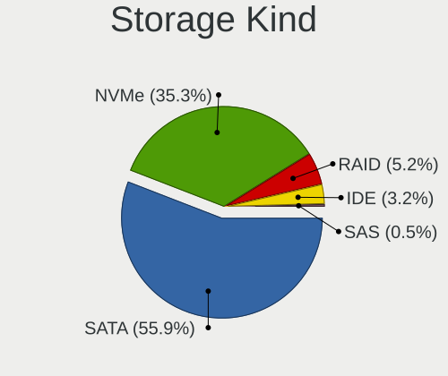

| Kind | Computers | Percent |
|------|-----------|---------|
| SATA | 247       | 55.88%  |
| NVMe | 156       | 35.29%  |
| RAID | 23        | 5.2%    |
| IDE  | 14        | 3.17%   |
| SAS  | 2         | 0.45%   |

Processor
---------

CPU Vendor
----------

Processor vendors

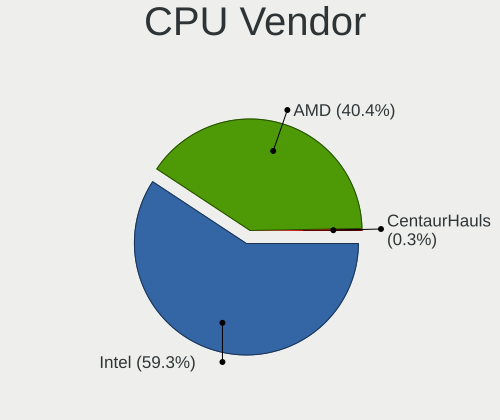

| Vendor       | Computers | Percent |
|--------------|-----------|---------|
| Intel        | 198       | 59.28%  |
| AMD          | 135       | 40.42%  |
| CentaurHauls | 1         | 0.3%    |

CPU Model
---------

Processor models

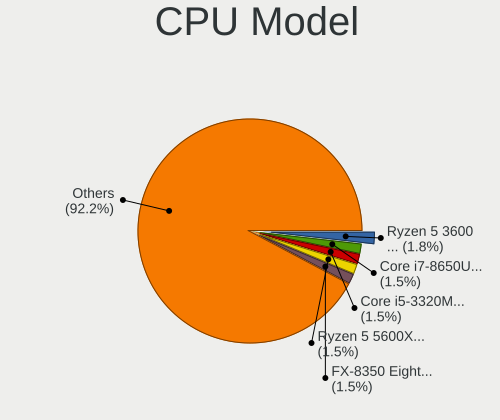

| Model                                         | Computers | Percent |
|-----------------------------------------------|-----------|---------|
| AMD Ryzen 5 3600 6-Core Processor             | 6         | 1.79%   |
| Intel Core i7-8650U CPU @ 1.90GHz             | 5         | 1.49%   |
| Intel Core i5-3320M CPU @ 2.60GHz             | 5         | 1.49%   |
| AMD Ryzen 5 5600X 6-Core Processor            | 5         | 1.49%   |
| AMD FX-8350 Eight-Core Processor              | 5         | 1.49%   |
| Intel 11th Gen Core i7-1165G7 @ 2.80GHz       | 4         | 1.19%   |
| AMD Ryzen 9 3900X 12-Core Processor           | 4         | 1.19%   |
| AMD Ryzen 7 4700U with Radeon Graphics        | 4         | 1.19%   |
| AMD Ryzen 7 3700X 8-Core Processor            | 4         | 1.19%   |
| AMD Ryzen 5 5500U with Radeon Graphics        | 4         | 1.19%   |
| AMD Ryzen 5 2500U with Radeon Vega Mobile Gfx | 4         | 1.19%   |
| Intel Core i7-8550U CPU @ 1.80GHz             | 3         | 0.9%    |
| Intel Core i7-3630QM CPU @ 2.40GHz            | 3         | 0.9%    |
| Intel Core i5-5250U CPU @ 1.60GHz             | 3         | 0.9%    |
| Intel Core i5-5200U CPU @ 2.20GHz             | 3         | 0.9%    |
| Intel Core i5-2500 CPU @ 3.30GHz              | 3         | 0.9%    |
| Intel Core i3-7020U CPU @ 2.30GHz             | 3         | 0.9%    |
| Intel Core i3-5005U CPU @ 2.00GHz             | 3         | 0.9%    |
| Intel 11th Gen Core i5-1135G7 @ 2.40GHz       | 3         | 0.9%    |
| AMD Ryzen 7 8845HS w/ Radeon 780M Graphics    | 3         | 0.9%    |
| AMD Ryzen 7 7730U with Radeon Graphics        | 3         | 0.9%    |
| AMD Ryzen 7 5700G with Radeon Graphics        | 3         | 0.9%    |
| AMD Ryzen 7 4800H with Radeon Graphics        | 3         | 0.9%    |
| AMD Ryzen 7 3700U with Radeon Vega Mobile Gfx | 3         | 0.9%    |
| AMD Ryzen 7 2700X Eight-Core Processor        | 3         | 0.9%    |
| AMD Ryzen 5 3500U with Radeon Vega Mobile Gfx | 3         | 0.9%    |
| AMD Ryzen 5 2600X Six-Core Processor          | 3         | 0.9%    |
| AMD Ryzen 5 1600 Six-Core Processor           | 3         | 0.9%    |
| AMD Ryzen 3 5300U with Radeon Graphics        | 3         | 0.9%    |
| Intel Core m3-8100Y CPU @ 1.10GHz             | 2         | 0.6%    |
| Intel Core i7-9700K CPU @ 3.60GHz             | 2         | 0.6%    |
| Intel Core i7-8750H CPU @ 2.20GHz             | 2         | 0.6%    |
| Intel Core i7-8565U CPU @ 1.80GHz             | 2         | 0.6%    |
| Intel Core i7-7700HQ CPU @ 2.80GHz            | 2         | 0.6%    |
| Intel Core i7-6500U CPU @ 2.50GHz             | 2         | 0.6%    |
| Intel Core i7-3632QM CPU @ 2.20GHz            | 2         | 0.6%    |
| Intel Core i7-10750H CPU @ 2.60GHz            | 2         | 0.6%    |
| Intel Core i7-10510U CPU @ 1.80GHz            | 2         | 0.6%    |
| Intel Core i5-8500 CPU @ 3.00GHz              | 2         | 0.6%    |
| Intel Core i5-8350U CPU @ 1.70GHz             | 2         | 0.6%    |

CPU Model Family
----------------

Processor model prefix

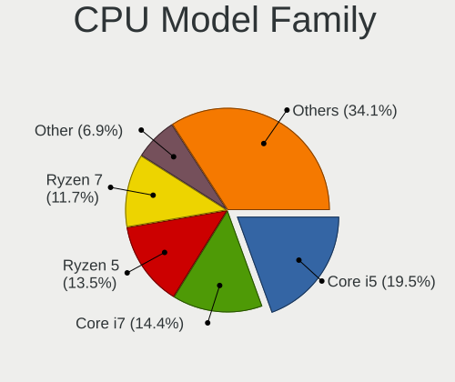

| Model                   | Computers | Percent |
|-------------------------|-----------|---------|
| Intel Core i5           | 65        | 19.46%  |
| Intel Core i7           | 48        | 14.37%  |
| AMD Ryzen 5             | 45        | 13.47%  |
| AMD Ryzen 7             | 39        | 11.68%  |
| Other                   | 23        | 6.89%   |
| Intel Core i3           | 19        | 5.69%   |
| Intel Celeron           | 14        | 4.19%   |
| AMD Ryzen 9             | 10        | 2.99%   |
| AMD FX                  | 9         | 2.69%   |
| Intel Pentium           | 8         | 2.4%    |
| AMD Ryzen 3             | 7         | 2.1%    |
| Intel Xeon              | 6         | 1.8%    |
| Intel Core 2 Duo        | 4         | 1.2%    |
| AMD Athlon              | 4         | 1.2%    |
| AMD A10                 | 4         | 1.2%    |
| Intel Core m3           | 3         | 0.9%    |
| Intel Atom              | 3         | 0.9%    |
| Intel Core i9           | 2         | 0.6%    |
| AMD Ryzen Threadripper  | 2         | 0.6%    |
| AMD Phenom II X4        | 2         | 0.6%    |
| AMD GX                  | 2         | 0.6%    |
| AMD E1                  | 2         | 0.6%    |
| AMD A6                  | 2         | 0.6%    |
| Intel Pentium Silver    | 1         | 0.3%    |
| Intel Pentium Dual-Core | 1         | 0.3%    |
| Intel Core 2 Quad       | 1         | 0.3%    |
| Intel Core 2 Extreme    | 1         | 0.3%    |
| CentaurHauls VIA Nano   | 1         | 0.3%    |
| AMD Ryzen 7 PRO         | 1         | 0.3%    |
| AMD Ryzen 5 PRO         | 1         | 0.3%    |
| AMD Phenom II           | 1         | 0.3%    |
| AMD EPYC                | 1         | 0.3%    |
| AMD A8                  | 1         | 0.3%    |
| AMD A4                  | 1         | 0.3%    |

CPU Cores
---------

Number of processor cores

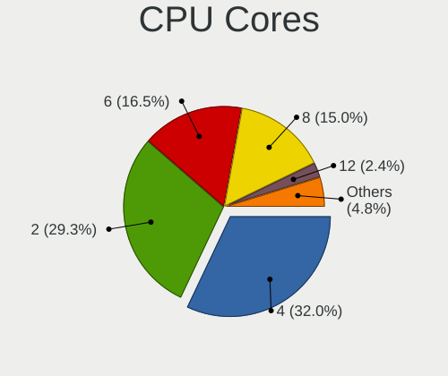

| Number | Computers | Percent |
|--------|-----------|---------|
| 4      | 107       | 32.04%  |
| 2      | 98        | 29.34%  |
| 6      | 55        | 16.47%  |
| 8      | 50        | 14.97%  |
| 12     | 8         | 2.4%    |
| 16     | 4         | 1.2%    |
| 10     | 4         | 1.2%    |
| 3      | 3         | 0.9%    |
| 14     | 2         | 0.6%    |
| 32     | 1         | 0.3%    |
| 20     | 1         | 0.3%    |
| 1      | 1         | 0.3%    |

CPU Sockets
-----------

Number of sockets

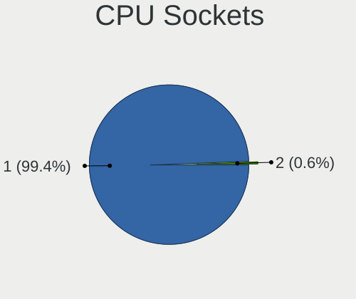

| Number | Computers | Percent |
|--------|-----------|---------|
| 1      | 332       | 99.4%   |
| 2      | 2         | 0.6%    |

CPU Threads
-----------

Threads per core (Hyper-Threading)

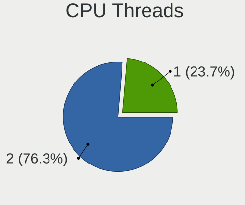

| Number | Computers | Percent |
|--------|-----------|---------|
| 2      | 255       | 76.35%  |
| 1      | 79        | 23.65%  |

CPU Op-Modes
------------

CPU Operation Modes (32-bit, 64-bit)

| Op mode        | Computers | Percent |
|----------------|-----------|---------|
| 32-bit, 64-bit | 334       | 100%    |

CPU Microcode
-------------

Microcode number

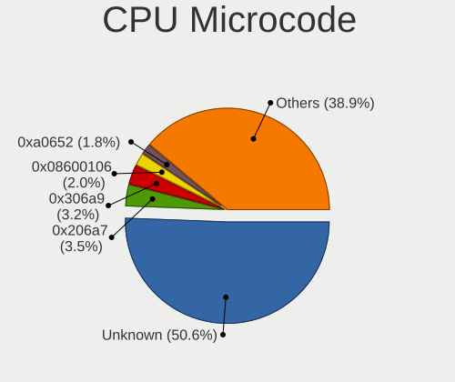

| Number     | Computers | Percent |
|------------|-----------|---------|
| Unknown    | 173       | 50.58%  |
| 0x206a7    | 12        | 3.51%   |
| 0x306a9    | 11        | 3.22%   |
| 0x08600106 | 7         | 2.05%   |
| 0xa0652    | 6         | 1.75%   |
| 0x08701013 | 6         | 1.75%   |
| 0x0800820d | 6         | 1.75%   |
| 0x806ec    | 5         | 1.46%   |
| 0x806e9    | 5         | 1.46%   |
| 0x806c1    | 5         | 1.46%   |
| 0x706a1    | 5         | 1.46%   |
| 0x40651    | 5         | 1.46%   |
| 0x306d4    | 5         | 1.46%   |
| 0x08701021 | 5         | 1.46%   |
| 0x906ed    | 4         | 1.17%   |
| 0x906e9    | 4         | 1.17%   |
| 0x806ea    | 4         | 1.17%   |
| 0x706e5    | 4         | 1.17%   |
| 0x08608103 | 4         | 1.17%   |
| 0x08108109 | 4         | 1.17%   |
| 0x906ea    | 3         | 0.88%   |
| 0x506e3    | 3         | 0.88%   |
| 0x306c3    | 3         | 0.88%   |
| 0x1067a    | 3         | 0.88%   |
| 0x0a201016 | 3         | 0.88%   |
| 0x06000822 | 3         | 0.88%   |
| 0xa0655    | 2         | 0.58%   |
| 0x30678    | 2         | 0.58%   |
| 0x08600103 | 2         | 0.58%   |
| 0x08108102 | 2         | 0.58%   |
| 0x08101007 | 2         | 0.58%   |
| 0x08001137 | 2         | 0.58%   |
| 0x07030106 | 2         | 0.58%   |
| 0x06003106 | 2         | 0.58%   |
| 0x06000852 | 2         | 0.58%   |
| 0xa0653    | 1         | 0.29%   |
| 0x906a3    | 1         | 0.29%   |
| 0x806eb    | 1         | 0.29%   |
| 0x806d1    | 1         | 0.29%   |
| 0x806c2    | 1         | 0.29%   |

CPU Microarch
-------------

Microarchitecture

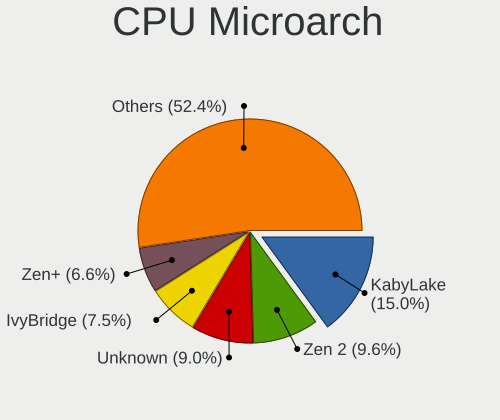

| Name             | Computers | Percent |
|------------------|-----------|---------|
| KabyLake         | 50        | 14.97%  |
| Zen 2            | 32        | 9.58%   |
| Unknown          | 30        | 8.98%   |
| IvyBridge        | 25        | 7.49%   |
| Zen+             | 22        | 6.59%   |
| SandyBridge      | 20        | 5.99%   |
| Zen 3            | 19        | 5.69%   |
| Haswell          | 13        | 3.89%   |
| Broadwell        | 12        | 3.59%   |
| Zen              | 11        | 3.29%   |
| TigerLake        | 11        | 3.29%   |
| CometLake        | 11        | 3.29%   |
| Skylake          | 10        | 2.99%   |
| Piledriver       | 10        | 2.99%   |
| Silvermont       | 8         | 2.4%    |
| Alderlake Hybrid | 7         | 2.1%    |
| Penryn           | 6         | 1.8%    |
| Goldmont plus    | 6         | 1.8%    |
| Westmere         | 5         | 1.5%    |
| IceLake          | 5         | 1.5%    |
| Steamroller      | 4         | 1.2%    |
| Puma             | 4         | 1.2%    |
| K10              | 3         | 0.9%    |
| Nehalem          | 2         | 0.6%    |
| Jaguar           | 2         | 0.6%    |
| Goldmont         | 2         | 0.6%    |
| Excavator        | 2         | 0.6%    |
| Core             | 1         | 0.3%    |
| Bonnell          | 1         | 0.3%    |

Graphics
--------

GPU Vendor
----------

Vendors of graphics cards

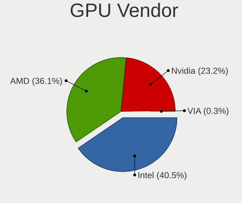

| Vendor           | Computers | Percent |
|------------------|-----------|---------|
| Intel            | 157       | 40.46%  |
| AMD              | 140       | 36.08%  |
| Nvidia           | 90        | 23.2%   |
| VIA Technologies | 1         | 0.26%   |

GPU Model
---------

Graphics card models

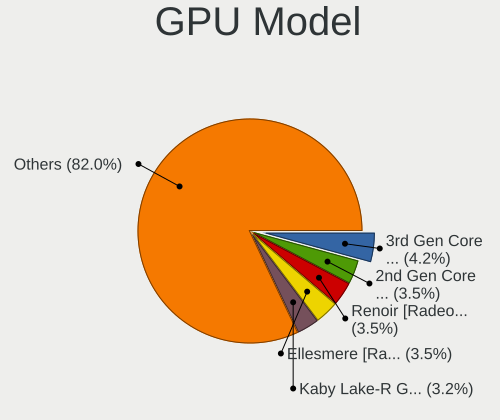

| Model                                                                                    | Computers | Percent |
|------------------------------------------------------------------------------------------|-----------|---------|
| Intel 3rd Gen Core processor Graphics Controller                                         | 17        | 4.24%   |
| Intel 2nd Generation Core Processor Family Integrated Graphics Controller                | 14        | 3.49%   |
| AMD Renoir [Radeon Vega Series / Radeon Vega Mobile Series]                              | 14        | 3.49%   |
| AMD Ellesmere [Radeon RX 470/480/570/570X/580/580X/590]                                  | 14        | 3.49%   |
| Intel Kaby Lake-R GT2 [UHD Graphics 620]                                                 | 13        | 3.24%   |
| AMD Picasso/Raven 2 [Radeon Vega Series / Radeon Vega Mobile Series]                     | 11        | 2.74%   |
| Intel TigerLake-LP GT2 [Iris Xe Graphics]                                                | 9         | 2.24%   |
| Intel Broadwell-U GT2 [HD Graphics 5500]                                                 | 8         | 2%      |
| AMD Navi 10 [Radeon RX 5600 OEM/5600 XT / 5700/5700 XT]                                  | 8         | 2%      |
| AMD Lucienne                                                                             | 8         | 2%      |
| Intel Kaby Lake-U GT2 [HD Graphics 620]                                                  | 7         | 1.75%   |
| Intel CometLake-H GT2 [UHD Graphics]                                                     | 7         | 1.75%   |
| Intel Haswell-ULT Integrated Graphics Controller                                         | 6         | 1.5%    |
| Nvidia TU117M [GeForce GTX 1650 Mobile / Max-Q]                                          | 5         | 1.25%   |
| Intel GeminiLake [UHD Graphics 600]                                                      | 5         | 1.25%   |
| Intel Atom Processor Z36xxx/Z37xxx Series Graphics & Display                             | 5         | 1.25%   |
| AMD Raven Ridge [Radeon Vega Series / Radeon Vega Mobile Series]                         | 5         | 1.25%   |
| AMD Navi 21 [Radeon RX 6800/6800 XT / 6900 XT]                                           | 5         | 1.25%   |
| AMD Cezanne [Radeon Vega Series / Radeon Vega Mobile Series]                             | 5         | 1.25%   |
| Nvidia GP107M [GeForce GTX 1050 Mobile]                                                  | 4         | 1%      |
| Intel WhiskeyLake-U GT2 [UHD Graphics 620]                                               | 4         | 1%      |
| Intel Skylake-U GT2 [HD Graphics 520]                                                    | 4         | 1%      |
| Intel Iris Plus Graphics G1 (Ice Lake)                                                   | 4         | 1%      |
| Intel CoffeeLake-H GT2 [UHD Graphics 630]                                                | 4         | 1%      |
| AMD Raphael                                                                              | 4         | 1%      |
| AMD Navi 23 [Radeon RX 6600/6600 XT/6600M]                                               | 4         | 1%      |
| Nvidia TU116M [GeForce GTX 1660 Ti Mobile]                                               | 3         | 0.75%   |
| Nvidia TU116 [GeForce GTX 1650 SUPER]                                                    | 3         | 0.75%   |
| Nvidia GP108M [GeForce MX150]                                                            | 3         | 0.75%   |
| Nvidia GP107 [GeForce GTX 1050 Ti]                                                       | 3         | 0.75%   |
| Nvidia GM108M [GeForce MX110]                                                            | 3         | 0.75%   |
| Intel Core Processor Integrated Graphics Controller                                      | 3         | 0.75%   |
| Intel CometLake-U GT2 [UHD Graphics]                                                     | 3         | 0.75%   |
| Intel CoffeeLake-S GT2 [UHD Graphics 630]                                                | 3         | 0.75%   |
| Intel Broadwell-U GT3 [HD Graphics 6000]                                                 | 3         | 0.75%   |
| Intel Atom/Celeron/Pentium Processor x5-E8000/J3xxx/N3xxx Integrated Graphics Controller | 3         | 0.75%   |
| AMD Polaris 20 XL [Radeon RX 580 2048SP]                                                 | 3         | 0.75%   |
| AMD Phoenix1                                                                             | 3         | 0.75%   |
| AMD Mullins [Radeon R4/R5 Graphics]                                                      | 3         | 0.75%   |
| AMD Mendocino [Radeon 610M]                                                              | 3         | 0.75%   |

GPU Combo
---------

Combinations of graphics cards

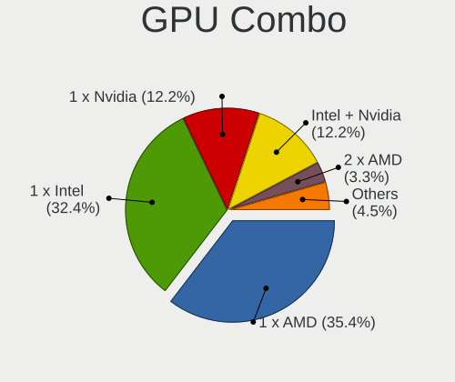

| Name           | Computers | Percent |
|----------------|-----------|---------|
| 1 x AMD        | 119       | 35.42%  |
| 1 x Intel      | 109       | 32.44%  |
| 1 x Nvidia     | 41        | 12.2%   |
| Intel + Nvidia | 41        | 12.2%   |
| 2 x AMD        | 11        | 3.27%   |
| AMD + Nvidia   | 7         | 2.08%   |
| Intel + AMD    | 4         | 1.19%   |
| 2 x Intel      | 2         | 0.6%    |
| 2 x Nvidia     | 1         | 0.3%    |
| 1 x VIA        | 1         | 0.3%    |

GPU Driver
----------

Free vs proprietary

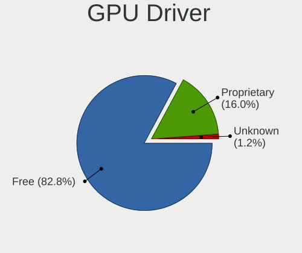

| Driver      | Computers | Percent |
|-------------|-----------|---------|
| Free        | 280       | 82.84%  |
| Proprietary | 54        | 15.98%  |
| Unknown     | 4         | 1.18%   |

GPU Memory
----------

Total video memory

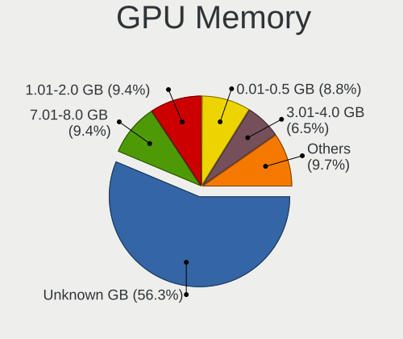

| Size in GB | Computers | Percent |
|------------|-----------|---------|
| Unknown    | 192       | 56.3%   |
| 7.01-8.0   | 32        | 9.38%   |
| 1.01-2.0   | 32        | 9.38%   |
| 0.01-0.5   | 30        | 8.8%    |
| 3.01-4.0   | 22        | 6.45%   |
| 0.51-1.0   | 15        | 4.4%    |
| 8.01-16.0  | 10        | 2.93%   |
| 5.01-6.0   | 6         | 1.76%   |
| 2.01-3.0   | 2         | 0.59%   |

Monitor
-------

Monitor Vendor
--------------

Monitor vendors

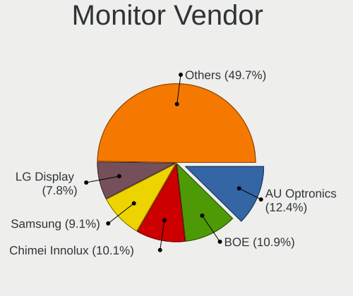

| Vendor                  | Computers | Percent |
|-------------------------|-----------|---------|
| AU Optronics            | 49        | 12.37%  |
| BOE                     | 43        | 10.86%  |
| Chimei Innolux          | 40        | 10.1%   |
| Samsung Electronics     | 36        | 9.09%   |
| LG Display              | 31        | 7.83%   |
| Goldstar                | 21        | 5.3%    |
| Philips                 | 16        | 4.04%   |
| Dell                    | 15        | 3.79%   |
| ASUSTek Computer        | 15        | 3.79%   |
| Acer                    | 14        | 3.54%   |
| AOC                     | 12        | 3.03%   |
| BenQ                    | 9         | 2.27%   |
| Lenovo                  | 8         | 2.02%   |
| Ancor Communications    | 8         | 2.02%   |
| Hewlett-Packard         | 6         | 1.52%   |
| Chi Mei Optoelectronics | 6         | 1.52%   |
| Unknown                 | 5         | 1.26%   |
| MSI                     | 5         | 1.26%   |
| Apple                   | 5         | 1.26%   |
| ViewSonic               | 4         | 1.01%   |
| Sony                    | 3         | 0.76%   |
| Sharp                   | 3         | 0.76%   |
| PANDA                   | 3         | 0.76%   |
| InfoVision              | 3         | 0.76%   |
| Gigabyte Technology     | 3         | 0.76%   |
| Iiyama                  | 2         | 0.51%   |
| CSOT                    | 2         | 0.51%   |
| VIE                     | 1         | 0.25%   |
| Vestel Elektronik       | 1         | 0.25%   |
| TMX                     | 1         | 0.25%   |
| Packard Bell            | 1         | 0.25%   |
| MTV                     | 1         | 0.25%   |
| Mi                      | 1         | 0.25%   |
| LGD                     | 1         | 0.25%   |
| LG Electronics          | 1         | 0.25%   |
| Lenovo Group Limited    | 1         | 0.25%   |
| KTC                     | 1         | 0.25%   |
| KDC                     | 1         | 0.25%   |
| Jean                    | 1         | 0.25%   |
| ITE                     | 1         | 0.25%   |

Monitor Model
-------------

Monitor models

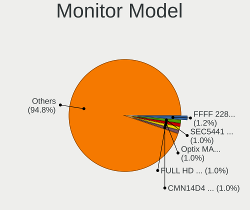

| Model                                                                     | Computers | Percent |
|---------------------------------------------------------------------------|-----------|---------|
| Unknown LCD Monitor FFFF 2288x1287 2550x2550mm 142.0-inch                 | 5         | 1.24%   |
| Samsung Electronics LCD Monitor SEC5441 1280x800 331x207mm 15.4-inch      | 4         | 1%      |
| MSI Optix MAG27CQ MSI1462 2560x1440 597x336mm 27.0-inch                   | 4         | 1%      |
| Goldstar FULL HD GSM5B55 1920x1080 480x270mm 21.7-inch                    | 4         | 1%      |
| Chimei Innolux LCD Monitor CMN14D4 1920x1080 309x173mm 13.9-inch          | 4         | 1%      |
| Chimei Innolux LCD Monitor CMN15DB 1366x768 344x193mm 15.5-inch           | 3         | 0.75%   |
| Chimei Innolux LCD Monitor CMN14C9 1920x1080 309x173mm 13.9-inch          | 3         | 0.75%   |
| AU Optronics LCD Monitor AUO21ED 1920x1080 344x193mm 15.5-inch            | 3         | 0.75%   |
| AU Optronics LCD Monitor AUO213E 1600x900 309x174mm 14.0-inch             | 3         | 0.75%   |
| Apple Color LCD APP9CDF 1440x900 286x179mm 13.3-inch                      | 3         | 0.75%   |
| Samsung Electronics U28E590 SAM0C4D 3840x2160 607x345mm 27.5-inch         | 2         | 0.5%    |
| Philips PHL 276E8V PHLC18F 3840x2160 597x336mm 27.0-inch                  | 2         | 0.5%    |
| Philips PHL 245E1 PHLC20B 2560x1440 527x296mm 23.8-inch                   | 2         | 0.5%    |
| Philips PHL 240V5A PHLC10C 1920x1080 527x296mm 23.8-inch                  | 2         | 0.5%    |
| LG Display LCD Monitor LGD062E 1920x1080 344x194mm 15.5-inch              | 2         | 0.5%    |
| LG Display LCD Monitor LGD0590 1920x1080 344x194mm 15.5-inch              | 2         | 0.5%    |
| LG Display LCD Monitor LGD0385 1366x768 309x174mm 14.0-inch               | 2         | 0.5%    |
| LG Display LCD Monitor LGD033A 1366x768 344x194mm 15.5-inch               | 2         | 0.5%    |
| LG Display LCD Monitor LGD02DC 1366x768 344x194mm 15.5-inch               | 2         | 0.5%    |
| Goldstar LG ULTRAWIDE GSM59F1 2560x1080 670x280mm 28.6-inch               | 2         | 0.5%    |
| Chimei Innolux LCD Monitor CMN1618 1920x1200 344x215mm 16.0-inch          | 2         | 0.5%    |
| Chimei Innolux LCD Monitor CMN15E6 1366x768 344x193mm 15.5-inch           | 2         | 0.5%    |
| Chimei Innolux LCD Monitor CMN15DC 1366x768 344x193mm 15.5-inch           | 2         | 0.5%    |
| Chimei Innolux LCD Monitor CMN14E5 1920x1080 309x173mm 13.9-inch          | 2         | 0.5%    |
| Chimei Innolux LCD Monitor CMN1406 1920x1080 309x173mm 13.9-inch          | 2         | 0.5%    |
| Chi Mei Optoelectronics LCD Monitor CMO1720 1920x1080 382x215mm 17.3-inch | 2         | 0.5%    |
| BOE LCD Monitor BOE08EE 1920x1080 309x174mm 14.0-inch                     | 2         | 0.5%    |
| BOE LCD Monitor BOE08CF 1920x1080 344x194mm 15.5-inch                     | 2         | 0.5%    |
| BOE LCD Monitor BOE08BA 1920x1080 344x194mm 15.5-inch                     | 2         | 0.5%    |
| BOE LCD Monitor BOE084E 1920x1080 382x215mm 17.3-inch                     | 2         | 0.5%    |
| BOE LCD Monitor BOE0704 1366x768 344x194mm 15.5-inch                      | 2         | 0.5%    |
| BOE LCD Monitor BOE0696 1366x768 309x173mm 13.9-inch                      | 2         | 0.5%    |
| BOE LCD Monitor BOE0618 1366x768 277x156mm 12.5-inch                      | 2         | 0.5%    |
| AU Optronics LCD Monitor AUO499F 1920x1080 344x194mm 15.5-inch            | 2         | 0.5%    |
| ASUSTek Computer VG289 AUS28BA 3840x2160 621x341mm 27.9-inch              | 2         | 0.5%    |
| ASUSTek Computer VG24V AUS2420 1920x1080 521x293mm 23.5-inch              | 2         | 0.5%    |
| AOC F22 AOC2200 1920x1080 476x268mm 21.5-inch                             | 2         | 0.5%    |
| Ancor Communications ASUS PB277 ACI27B5 2560x1440 597x336mm 27.0-inch     | 2         | 0.5%    |
| ViewSonic XG270QG VSCF838 2560x1440 608x355mm 27.7-inch                   | 1         | 0.25%   |
| ViewSonic VA2261 Series VSC0F30 1920x1080 477x268mm 21.5-inch             | 1         | 0.25%   |

Monitor Resolution
------------------

Monitor screen resolution

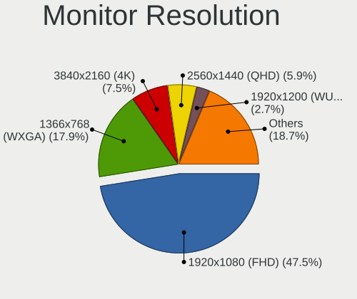

| Resolution         | Computers | Percent |
|--------------------|-----------|---------|
| 1920x1080 (FHD)    | 178       | 47.47%  |
| 1366x768 (WXGA)    | 67        | 17.87%  |
| 3840x2160 (4K)     | 28        | 7.47%   |
| 2560x1440 (QHD)    | 22        | 5.87%   |
| 1920x1200 (WUXGA)  | 10        | 2.67%   |
| 2560x1600          | 9         | 2.4%    |
| 1600x900 (HD+)     | 9         | 2.4%    |
| 1440x900 (WXGA+)   | 8         | 2.13%   |
| 3440x1440          | 6         | 1.6%    |
| 2288x1287          | 5         | 1.33%   |
| 1680x1050 (WSXGA+) | 5         | 1.33%   |
| 1280x1024 (SXGA)   | 5         | 1.33%   |
| 2560x1080          | 3         | 0.8%    |
| Unknown            | 3         | 0.8%    |
| 3840x1080          | 2         | 0.53%   |
| 1360x768           | 2         | 0.53%   |
| 4480x1080          | 1         | 0.27%   |
| 3600x1080          | 1         | 0.27%   |
| 3456x2160          | 1         | 0.27%   |
| 3072x1920          | 1         | 0.27%   |
| 2880x1920          | 1         | 0.27%   |
| 2880x1800          | 1         | 0.27%   |
| 2256x1504          | 1         | 0.27%   |
| 2240x1400          | 1         | 0.27%   |
| 2160x1440          | 1         | 0.27%   |
| 2160x1200          | 1         | 0.27%   |
| 1280x960           | 1         | 0.27%   |
| 1280x800 (WXGA)    | 1         | 0.27%   |
| 1024x768 (XGA)     | 1         | 0.27%   |

Monitor Diagonal
----------------

Diagonal size in inches

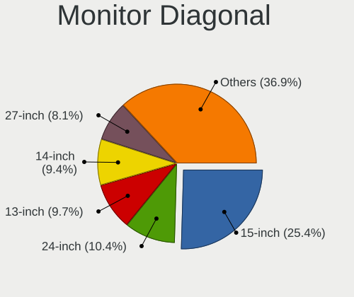

| Inches  | Computers | Percent |
|---------|-----------|---------|
| 15      | 100       | 25.45%  |
| 24      | 41        | 10.43%  |
| 13      | 38        | 9.67%   |
| 14      | 37        | 9.41%   |
| 27      | 32        | 8.14%   |
| 21      | 23        | 5.85%   |
| 23      | 19        | 4.83%   |
| 17      | 15        | 3.82%   |
| 31      | 14        | 3.56%   |
| 16      | 10        | 2.54%   |
| 34      | 9         | 2.29%   |
| Unknown | 8         | 2.04%   |
| 19      | 6         | 1.53%   |
| 11      | 6         | 1.53%   |
| 142     | 5         | 1.27%   |
| 12      | 5         | 1.27%   |
| 84      | 4         | 1.02%   |
| 20      | 4         | 1.02%   |
| 32      | 3         | 0.76%   |
| 72      | 2         | 0.51%   |
| 28      | 2         | 0.51%   |
| 25      | 2         | 0.51%   |
| 54      | 1         | 0.25%   |
| 52      | 1         | 0.25%   |
| 50      | 1         | 0.25%   |
| 48      | 1         | 0.25%   |
| 42      | 1         | 0.25%   |
| 22      | 1         | 0.25%   |
| 18      | 1         | 0.25%   |
| 8       | 1         | 0.25%   |

Monitor Width
-------------

Physical width

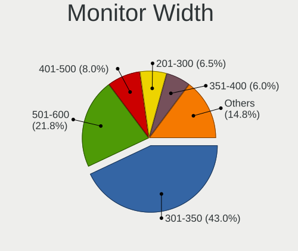

| Width in mm    | Computers | Percent |
|----------------|-----------|---------|
| 301-350        | 166       | 43.01%  |
| 501-600        | 84        | 21.76%  |
| 401-500        | 31        | 8.03%   |
| 201-300        | 25        | 6.48%   |
| 351-400        | 23        | 5.96%   |
| 601-700        | 20        | 5.18%   |
| 701-800        | 12        | 3.11%   |
| Unknown        | 8         | 2.07%   |
| 1501-2000      | 6         | 1.55%   |
| More than 2000 | 5         | 1.3%    |
| 1001-1500      | 4         | 1.04%   |
| 101-200        | 1         | 0.26%   |
| 901-1000       | 1         | 0.26%   |

Aspect Ratio
------------

Proportional relationship between the width and the height

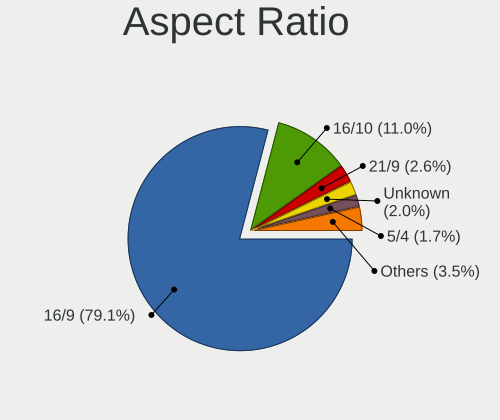

| Ratio   | Computers | Percent |
|---------|-----------|---------|
| 16/9    | 272       | 79.07%  |
| 16/10   | 38        | 11.05%  |
| 21/9    | 9         | 2.62%   |
| Unknown | 7         | 2.03%   |
| 5/4     | 6         | 1.74%   |
| 1.00    | 5         | 1.45%   |
| 3/2     | 3         | 0.87%   |
| 4/3     | 2         | 0.58%   |
| 32/9    | 1         | 0.29%   |
| 0.62    | 1         | 0.29%   |

Monitor Area
------------

Area in inch²

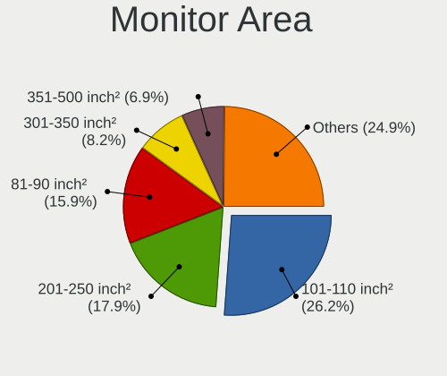

| Area in inch² | Computers | Percent |
|----------------|-----------|---------|
| 101-110        | 102       | 26.15%  |
| 201-250        | 70        | 17.95%  |
| 81-90          | 62        | 15.9%   |
| 301-350        | 32        | 8.21%   |
| 351-500        | 27        | 6.92%   |
| More than 1000 | 14        | 3.59%   |
| 251-300        | 13        | 3.33%   |
| 71-80          | 12        | 3.08%   |
| 151-200        | 12        | 3.08%   |
| 121-130        | 11        | 2.82%   |
| Unknown        | 8         | 2.05%   |
| 111-120        | 7         | 1.79%   |
| 51-60          | 6         | 1.54%   |
| 61-70          | 5         | 1.28%   |
| 141-150        | 3         | 0.77%   |
| 131-140        | 3         | 0.77%   |
| 501-1000       | 2         | 0.51%   |
| 1-40           | 1         | 0.26%   |

Pixel Density
-------------

Pixels per inch

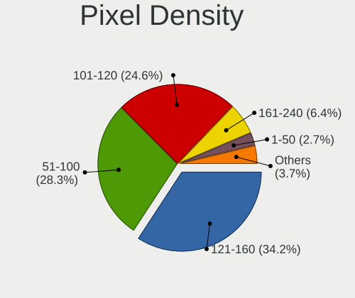

| Density       | Computers | Percent |
|---------------|-----------|---------|
| 121-160       | 128       | 34.22%  |
| 51-100        | 106       | 28.34%  |
| 101-120       | 92        | 24.6%   |
| 161-240       | 24        | 6.42%   |
| 1-50          | 10        | 2.67%   |
| Unknown       | 8         | 2.14%   |
| More than 240 | 6         | 1.6%    |

Multiple Monitors
-----------------

Total monitors connected

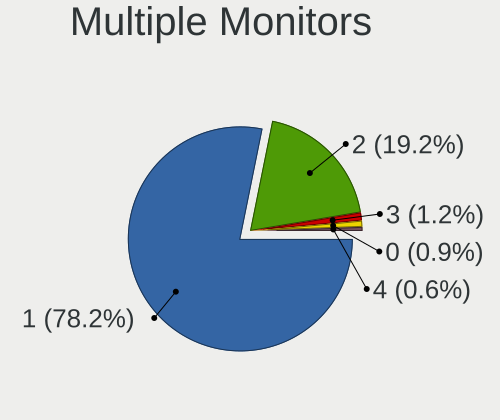

| Total | Computers | Percent |
|-------|-----------|---------|
| 1     | 265       | 78.17%  |
| 2     | 65        | 19.17%  |
| 3     | 4         | 1.18%   |
| 0     | 3         | 0.88%   |
| 4     | 2         | 0.59%   |

Network
-------

Net Controller Vendor
---------------------

Controller vendors

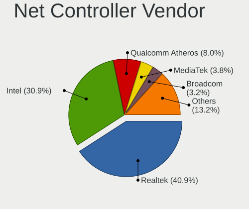

| Vendor                                 | Computers | Percent |
|----------------------------------------|-----------|---------|
| Realtek Semiconductor                  | 204       | 40.88%  |
| Intel                                  | 154       | 30.86%  |
| Qualcomm Atheros                       | 40        | 8.02%   |
| MediaTek                               | 19        | 3.81%   |
| Broadcom                               | 16        | 3.21%   |
| TP-Link                                | 9         | 1.8%    |
| Ralink Technology                      | 6         | 1.2%    |
| Qualcomm                               | 5         | 1%      |
| Broadcom Limited                       | 5         | 1%      |
| Xiaomi                                 | 4         | 0.8%    |
| Samsung Electronics                    | 4         | 0.8%    |
| Ralink                                 | 3         | 0.6%    |
| D-Link System                          | 3         | 0.6%    |
| D-Link                                 | 3         | 0.6%    |
| ASIX Electronics                       | 3         | 0.6%    |
| Aquantia                               | 3         | 0.6%    |
| Marvell Technology Group               | 2         | 0.4%    |
| Suzhou Motorcomm Electronic Technology | 1         | 0.2%    |
| Sierra Wireless                        | 1         | 0.2%    |
| Qualcomm Atheros Communications        | 1         | 0.2%    |
| PAX                                    | 1         | 0.2%    |
| OPPO Electronics                       | 1         | 0.2%    |
| Microsoft                              | 1         | 0.2%    |
| Linksys                                | 1         | 0.2%    |
| Lenovo                                 | 1         | 0.2%    |
| ICS Advent                             | 1         | 0.2%    |
| Huawei Technologies                    | 1         | 0.2%    |
| Google                                 | 1         | 0.2%    |
| DisplayLink                            | 1         | 0.2%    |
| Dell                                   | 1         | 0.2%    |
| Castles Technology                     | 1         | 0.2%    |
| Apple                                  | 1         | 0.2%    |
| 802.11g Adapter [Linksys WUSB54GC v3]  | 1         | 0.2%    |

Net Controller Model
--------------------

Controller models

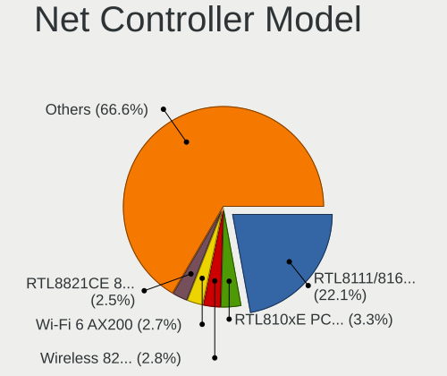

| Model                                                                  | Computers | Percent |
|------------------------------------------------------------------------|-----------|---------|
| Realtek RTL8111/8168/8211/8411 PCI Express Gigabit Ethernet Controller | 133       | 22.13%  |
| Realtek RTL810xE PCI Express Fast Ethernet controller                  | 20        | 3.33%   |
| Intel Wireless 8265 / 8275                                             | 17        | 2.83%   |
| Intel Wi-Fi 6 AX200                                                    | 16        | 2.66%   |
| Realtek RTL8821CE 802.11ac PCIe Wireless Network Adapter               | 15        | 2.5%    |
| Intel I211 Gigabit Network Connection                                  | 15        | 2.5%    |
| Intel 82579LM Gigabit Network Connection (Lewisville)                  | 15        | 2.5%    |
| Realtek RTL8822CE 802.11ac PCIe Wireless Network Adapter               | 12        | 2%      |
| Realtek RTL8153 Gigabit Ethernet Adapter                               | 12        | 2%      |
| Intel Wi-Fi 6E(802.11ax) AX210/AX1675* 2x2 [Typhoon Peak]              | 11        | 1.83%   |
| Realtek RTL8125 2.5GbE Controller                                      | 10        | 1.66%   |
| Qualcomm Atheros QCA9377 802.11ac Wireless Network Adapter             | 9         | 1.5%    |
| Intel Wi-Fi 6 AX201                                                    | 8         | 1.33%   |
| Intel Ethernet Connection (4) I219-LM                                  | 8         | 1.33%   |
| Qualcomm Atheros AR9485 Wireless Network Adapter                       | 7         | 1.16%   |
| MediaTek MT7922 802.11ax PCI Express Wireless Network Adapter          | 7         | 1.16%   |
| Intel Wireless 7265                                                    | 7         | 1.16%   |
| Intel Comet Lake PCH CNVi WiFi                                         | 7         | 1.16%   |
| Intel Centrino Advanced-N 6205 [Taylor Peak]                           | 7         | 1.16%   |
| MediaTek MT7921 802.11ax PCIe Wireless Network Adapter [Filogic 330]   | 6         | 1%      |
| Intel Dual Band Wireless-AC 3168NGW [Stone Peak]                       | 6         | 1%      |
| Broadcom BCM43142 802.11b/g/n                                          | 6         | 1%      |
| Realtek RTL8723BE PCIe Wireless Network Adapter                        | 5         | 0.83%   |
| Realtek 802.11ac NIC                                                   | 5         | 0.83%   |
| Qualcomm Atheros QCA6174 802.11ac Wireless Network Adapter             | 5         | 0.83%   |
| MediaTek MT7902 802.11ax PCIe Wireless Network Adapter [Filogic 310]   | 5         | 0.83%   |
| Intel Cannon Lake PCH CNVi WiFi                                        | 5         | 0.83%   |
| Intel Alder Lake-P PCH CNVi WiFi                                       | 5         | 0.83%   |
| Broadcom BCM4313 802.11bgn Wireless Network Adapter                    | 5         | 0.83%   |
| Realtek RTL8822BE 802.11a/b/g/n/ac WiFi adapter                        | 4         | 0.67%   |
| Qualcomm Atheros QCA9565 / AR9565 Wireless Network Adapter             | 4         | 0.67%   |
| Intel Wireless 3165                                                    | 4         | 0.67%   |
| Intel Ethernet Controller I225-V                                       | 4         | 0.67%   |
| Broadcom Limited BCM4360 802.11ac Dual Band Wireless Network Adapter   | 4         | 0.67%   |
| TP-Link TL-WN823N v2/v3 [Realtek RTL8192EU]                            | 3         | 0.5%    |
| Samsung GT-I9070 (network tethering, USB debugging enabled)            | 3         | 0.5%    |
| Realtek RTL8821AE 802.11ac PCIe Wireless Network Adapter               | 3         | 0.5%    |
| Realtek RTL8188EE Wireless Network Adapter                             | 3         | 0.5%    |
| Qualcomm Atheros Killer E2500 Gigabit Ethernet Controller              | 3         | 0.5%    |
| Qualcomm Atheros AR9285 Wireless Network Adapter (PCI-Express)         | 3         | 0.5%    |

Wireless Vendor
---------------

Wireless vendors

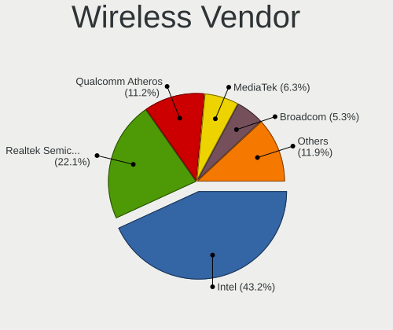

| Vendor                                | Computers | Percent |
|---------------------------------------|-----------|---------|
| Intel                                 | 123       | 43.16%  |
| Realtek Semiconductor                 | 63        | 22.11%  |
| Qualcomm Atheros                      | 32        | 11.23%  |
| MediaTek                              | 18        | 6.32%   |
| Broadcom                              | 15        | 5.26%   |
| TP-Link                               | 9         | 3.16%   |
| Ralink Technology                     | 6         | 2.11%   |
| Broadcom Limited                      | 5         | 1.75%   |
| Ralink                                | 3         | 1.05%   |
| D-Link                                | 3         | 1.05%   |
| Qualcomm                              | 2         | 0.7%    |
| Sierra Wireless                       | 1         | 0.35%   |
| Qualcomm Atheros Communications       | 1         | 0.35%   |
| Microsoft                             | 1         | 0.35%   |
| Marvell Technology Group              | 1         | 0.35%   |
| D-Link System                         | 1         | 0.35%   |
| 802.11g Adapter [Linksys WUSB54GC v3] | 1         | 0.35%   |

Wireless Model
--------------

Wireless models

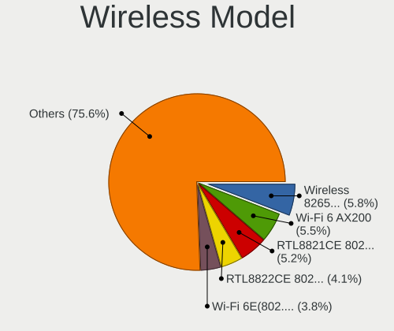

| Model                                                                | Computers | Percent |
|----------------------------------------------------------------------|-----------|---------|
| Intel Wireless 8265 / 8275                                           | 17        | 5.84%   |
| Intel Wi-Fi 6 AX200                                                  | 16        | 5.5%    |
| Realtek RTL8821CE 802.11ac PCIe Wireless Network Adapter             | 15        | 5.15%   |
| Realtek RTL8822CE 802.11ac PCIe Wireless Network Adapter             | 12        | 4.12%   |
| Intel Wi-Fi 6E(802.11ax) AX210/AX1675* 2x2 [Typhoon Peak]            | 11        | 3.78%   |
| Qualcomm Atheros QCA9377 802.11ac Wireless Network Adapter           | 9         | 3.09%   |
| Intel Wi-Fi 6 AX201                                                  | 8         | 2.75%   |
| Qualcomm Atheros AR9485 Wireless Network Adapter                     | 7         | 2.41%   |
| MediaTek MT7922 802.11ax PCI Express Wireless Network Adapter        | 7         | 2.41%   |
| Intel Wireless 7265                                                  | 7         | 2.41%   |
| Intel Comet Lake PCH CNVi WiFi                                       | 7         | 2.41%   |
| Intel Centrino Advanced-N 6205 [Taylor Peak]                         | 7         | 2.41%   |
| MediaTek MT7921 802.11ax PCIe Wireless Network Adapter [Filogic 330] | 6         | 2.06%   |
| Intel Dual Band Wireless-AC 3168NGW [Stone Peak]                     | 6         | 2.06%   |
| Broadcom BCM43142 802.11b/g/n                                        | 6         | 2.06%   |
| Realtek RTL8723BE PCIe Wireless Network Adapter                      | 5         | 1.72%   |
| Realtek 802.11ac NIC                                                 | 5         | 1.72%   |
| Qualcomm Atheros QCA6174 802.11ac Wireless Network Adapter           | 5         | 1.72%   |
| MediaTek MT7902 802.11ax PCIe Wireless Network Adapter [Filogic 310] | 5         | 1.72%   |
| Intel Cannon Lake PCH CNVi WiFi                                      | 5         | 1.72%   |
| Broadcom BCM4313 802.11bgn Wireless Network Adapter                  | 5         | 1.72%   |
| Realtek RTL8822BE 802.11a/b/g/n/ac WiFi adapter                      | 4         | 1.37%   |
| Qualcomm Atheros QCA9565 / AR9565 Wireless Network Adapter           | 4         | 1.37%   |
| Intel Wireless 3165                                                  | 4         | 1.37%   |
| Intel Alder Lake-P PCH CNVi WiFi                                     | 4         | 1.37%   |
| Broadcom Limited BCM4360 802.11ac Dual Band Wireless Network Adapter | 4         | 1.37%   |
| TP-Link TL-WN823N v2/v3 [Realtek RTL8192EU]                          | 3         | 1.03%   |
| Realtek RTL8821AE 802.11ac PCIe Wireless Network Adapter             | 3         | 1.03%   |
| Realtek RTL8188EE Wireless Network Adapter                           | 3         | 1.03%   |
| Qualcomm Atheros AR9285 Wireless Network Adapter (PCI-Express)       | 3         | 1.03%   |
| Intel Wireless 7260                                                  | 3         | 1.03%   |
| Intel Wi-Fi 5(802.11ac) Wireless-AC 9x6x [Thunder Peak]              | 3         | 1.03%   |
| Intel Ice Lake-LP PCH CNVi WiFi                                      | 3         | 1.03%   |
| Intel Comet Lake PCH-LP CNVi WiFi                                    | 3         | 1.03%   |
| Intel Centrino Wireless-N 2230                                       | 3         | 1.03%   |
| Intel Centrino Ultimate-N 6300                                       | 3         | 1.03%   |
| Intel Cannon Point-LP CNVi [Wireless-AC]                             | 3         | 1.03%   |
| TP-Link TL-WN821N v5/v6 [RTL8192EU]                                  | 2         | 0.69%   |
| Realtek RTL8852CE PCIe 802.11ax Wireless Network Controller          | 2         | 0.69%   |
| Realtek RTL8852AE WiFi 6 802.11ax PCIe Adapter                       | 2         | 0.69%   |

Ethernet Vendor
---------------

Ethernet vendors

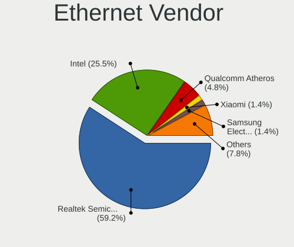

| Vendor                                 | Computers | Percent |
|----------------------------------------|-----------|---------|
| Realtek Semiconductor                  | 174       | 59.18%  |
| Intel                                  | 75        | 25.51%  |
| Qualcomm Atheros                       | 14        | 4.76%   |
| Xiaomi                                 | 4         | 1.36%   |
| Samsung Electronics                    | 4         | 1.36%   |
| Qualcomm                               | 3         | 1.02%   |
| ASIX Electronics                       | 3         | 1.02%   |
| Aquantia                               | 3         | 1.02%   |
| D-Link System                          | 2         | 0.68%   |
| Broadcom                               | 2         | 0.68%   |
| Suzhou Motorcomm Electronic Technology | 1         | 0.34%   |
| OPPO Electronics                       | 1         | 0.34%   |
| Marvell Technology Group               | 1         | 0.34%   |
| Linksys                                | 1         | 0.34%   |
| Lenovo                                 | 1         | 0.34%   |
| ICS Advent                             | 1         | 0.34%   |
| Huawei Technologies                    | 1         | 0.34%   |
| Google                                 | 1         | 0.34%   |
| DisplayLink                            | 1         | 0.34%   |
| Apple                                  | 1         | 0.34%   |

Ethernet Model
--------------

Ethernet models

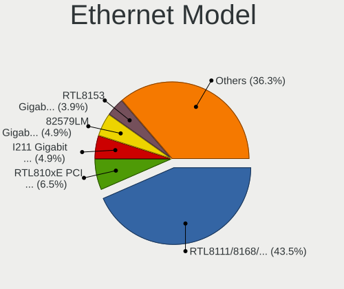

| Model                                                                  | Computers | Percent |
|------------------------------------------------------------------------|-----------|---------|
| Realtek RTL8111/8168/8211/8411 PCI Express Gigabit Ethernet Controller | 133       | 43.46%  |
| Realtek RTL810xE PCI Express Fast Ethernet controller                  | 20        | 6.54%   |
| Intel I211 Gigabit Network Connection                                  | 15        | 4.9%    |
| Intel 82579LM Gigabit Network Connection (Lewisville)                  | 15        | 4.9%    |
| Realtek RTL8153 Gigabit Ethernet Adapter                               | 12        | 3.92%   |
| Realtek RTL8125 2.5GbE Controller                                      | 10        | 3.27%   |
| Intel Ethernet Connection (4) I219-LM                                  | 8         | 2.61%   |
| Intel Ethernet Controller I225-V                                       | 4         | 1.31%   |
| Samsung GT-I9070 (network tethering, USB debugging enabled)            | 3         | 0.98%   |
| Qualcomm Atheros Killer E2500 Gigabit Ethernet Controller              | 3         | 0.98%   |
| Intel Ethernet Connection (2) I219-V                                   | 3         | 0.98%   |
| Intel Ethernet Connection (11) I219-LM                                 | 3         | 0.98%   |
| Intel 82577LM Gigabit Network Connection                               | 3         | 0.98%   |
| Intel 82574L Gigabit Network Connection                                | 3         | 0.98%   |
| Xiaomi Mi/Redmi series (RNDIS)                                         | 2         | 0.65%   |
| Xiaomi Mi/Redmi series (RNDIS + ADB)                                   | 2         | 0.65%   |
| Realtek RTL-8100/8101L/8139 PCI Fast Ethernet Adapter                  | 2         | 0.65%   |
| Qualcomm YUPIK-QRD _SN:AC1D5909                                        | 2         | 0.65%   |
| Qualcomm Atheros QCA8171 Gigabit Ethernet                              | 2         | 0.65%   |
| Qualcomm Atheros AR8161 Gigabit Ethernet                               | 2         | 0.65%   |
| Qualcomm Atheros AR8151 v2.0 Gigabit Ethernet                          | 2         | 0.65%   |
| Intel Ethernet Connection I217-LM                                      | 2         | 0.65%   |
| Intel Ethernet Connection (7) I219-LM                                  | 2         | 0.65%   |
| D-Link System DGE-528T Gigabit Ethernet Adapter                        | 2         | 0.65%   |
| ASIX AX88179 Gigabit Ethernet                                          | 2         | 0.65%   |
| Suzhou Motorcomm Electronic YT6801 Gigabit Ethernet Controller         | 1         | 0.33%   |
| Samsung Galaxy series, misc. (tethering mode)                          | 1         | 0.33%   |
| Realtek RTL8152 Fast Ethernet Adapter                                  | 1         | 0.33%   |
| Realtek RTL8111/8168/8411 PCI Express Gigabit Ethernet Controller      | 1         | 0.33%   |
| Realtek Killer E3000 2.5GbE Controller                                 | 1         | 0.33%   |
| Qualcomm Atheros QCA8172 Fast Ethernet                                 | 1         | 0.33%   |
| Qualcomm Atheros Killer E2400 Gigabit Ethernet Controller              | 1         | 0.33%   |
| Qualcomm Atheros Killer E220x Gigabit Ethernet Controller              | 1         | 0.33%   |
| Qualcomm Atheros AR8152 v2.0 Fast Ethernet                             | 1         | 0.33%   |
| Qualcomm Atheros AR8131 Gigabit Ethernet                               | 1         | 0.33%   |
| Qualcomm A0001                                                         | 1         | 0.33%   |
| OPPO Ace 3V                                                            | 1         | 0.33%   |
| Marvell Group 88E8040 PCI-E Fast Ethernet Controller                   | 1         | 0.33%   |
| Linksys Gigabit Ethernet Adapter                                       | 1         | 0.33%   |
| Lenovo USB-C Dock Ethernet                                             | 1         | 0.33%   |

Net Controller Kind
-------------------

Ethernet, WiFi or modem

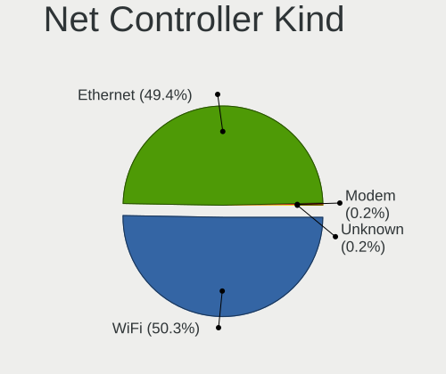

| Kind     | Computers | Percent |
|----------|-----------|---------|
| WiFi     | 272       | 50.28%  |
| Ethernet | 267       | 49.35%  |
| Modem    | 1         | 0.18%   |
| Unknown  | 1         | 0.18%   |

Used Controller
---------------

Currently used network controller

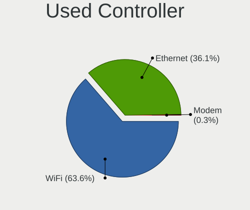

| Kind     | Computers | Percent |
|----------|-----------|---------|
| WiFi     | 217       | 63.64%  |
| Ethernet | 123       | 36.07%  |
| Modem    | 1         | 0.29%   |

NICs
----

Total network controllers on board

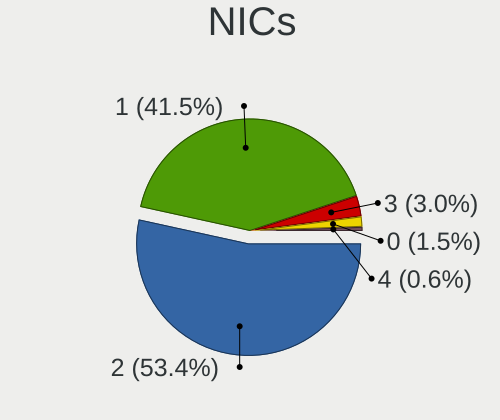

| Total | Computers | Percent |
|-------|-----------|---------|
| 2     | 179       | 53.43%  |
| 1     | 139       | 41.49%  |
| 3     | 10        | 2.99%   |
| 0     | 5         | 1.49%   |
| 4     | 2         | 0.6%    |

IPv6
----

IPv6 vs IPv4

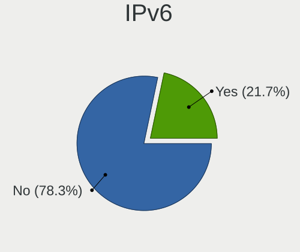

| Used | Computers | Percent |
|------|-----------|---------|
| No   | 267       | 78.3%   |
| Yes  | 74        | 21.7%   |

Bluetooth
---------

Bluetooth Vendor
----------------

Controller vendors

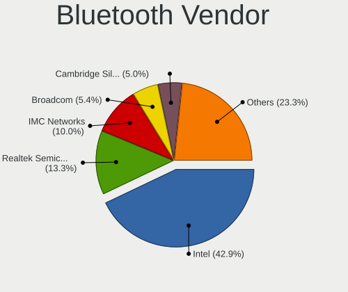

| Vendor                          | Computers | Percent |
|---------------------------------|-----------|---------|
| Intel                           | 103       | 42.92%  |
| Realtek Semiconductor           | 32        | 13.33%  |
| IMC Networks                    | 24        | 10%     |
| Broadcom                        | 13        | 5.42%   |
| Cambridge Silicon Radio         | 12        | 5%      |
| Foxconn / Hon Hai               | 11        | 4.58%   |
| Qualcomm Atheros Communications | 10        | 4.17%   |
| Lite-On Technology              | 7         | 2.92%   |
| ASUSTek Computer                | 7         | 2.92%   |
| MediaTek                        | 5         | 2.08%   |
| Apple                           | 5         | 2.08%   |
| Realtek                         | 3         | 1.25%   |
| Dell                            | 2         | 0.83%   |
| Ralink                          | 1         | 0.42%   |
| Marvell Semiconductor           | 1         | 0.42%   |
| HTC (High Tech Computer)        | 1         | 0.42%   |
| Hewlett-Packard                 | 1         | 0.42%   |
| Foxconn International           | 1         | 0.42%   |
| Dynex                           | 1         | 0.42%   |

Bluetooth Model
---------------

Controller models

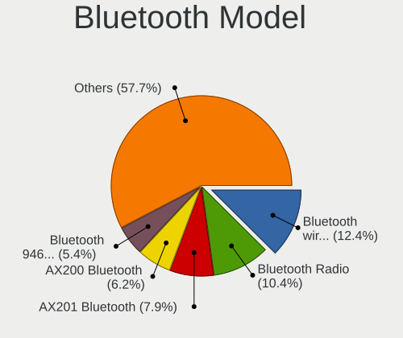

| Model                                               | Computers | Percent |
|-----------------------------------------------------|-----------|---------|
| Intel Bluetooth wireless interface                  | 30        | 12.45%  |
| Realtek Bluetooth Radio                             | 25        | 10.37%  |
| Intel AX201 Bluetooth                               | 19        | 7.88%   |
| Intel AX200 Bluetooth                               | 15        | 6.22%   |
| Intel Bluetooth 9460/9560 Jefferson Peak (JfP)      | 13        | 5.39%   |
| Cambridge Silicon Radio Bluetooth Dongle (HCI mode) | 12        | 4.98%   |
| Intel AX210 Bluetooth                               | 10        | 4.15%   |
| IMC Networks Wireless_Device                        | 10        | 4.15%   |
| IMC Networks Bluetooth Radio                        | 9         | 3.73%   |
| Intel Wireless-AC 3168 Bluetooth                    | 6         | 2.49%   |
| Realtek  Bluetooth 4.2 Adapter                      | 5         | 2.07%   |
| Qualcomm Atheros  Bluetooth Device                  | 5         | 2.07%   |
| MediaTek Wireless_Device                            | 5         | 2.07%   |
| Lite-On Qualcomm Atheros QCA9377 Bluetooth          | 5         | 2.07%   |
| IMC Networks Bluetooth Device                       | 5         | 2.07%   |
| Foxconn / Hon Hai Wireless_Device                   | 5         | 2.07%   |
| Intel Centrino Bluetooth Wireless Transceiver       | 4         | 1.66%   |
| Intel Bluetooth Device                              | 4         | 1.66%   |
| Realtek Bluetooth Radio                             | 3         | 1.24%   |
| Intel Wireless-AC 9260 Bluetooth Adapter            | 3         | 1.24%   |
| Foxconn / Hon Hai Bluetooth Device                  | 3         | 1.24%   |
| Broadcom BCM20702A0 Bluetooth 4.0                   | 3         | 1.24%   |
| Apple Bluetooth USB Host Controller                 | 3         | 1.24%   |
| Qualcomm Atheros AR3012 Bluetooth 4.0               | 2         | 0.83%   |
| Qualcomm Atheros AR3011 Bluetooth                   | 2         | 0.83%   |
| Foxconn / Hon Hai BCM20702A0                        | 2         | 0.83%   |
| Dell DW375 Bluetooth Module                         | 2         | 0.83%   |
| Broadcom BCM20702 Bluetooth 4.0 [ThinkPad]          | 2         | 0.83%   |
| Broadcom BCM2045B (BDC-2.1) [Bluetooth Controller]  | 2         | 0.83%   |
| Broadcom BCM2045B (BDC-2.1)                         | 2         | 0.83%   |
| ASUS Bluetooth Radio                                | 2         | 0.83%   |
| ASUS ASUS USB-BT500                                 | 2         | 0.83%   |
| Apple Bluetooth Host Controller                     | 2         | 0.83%   |
| Realtek RTL8821A Bluetooth                          | 1         | 0.41%   |
| Realtek RTL8723B Bluetooth                          | 1         | 0.41%   |
| Ralink RT3290 Bluetooth                             | 1         | 0.41%   |
| Qualcomm Atheros QCA61x4 Bluetooth 4.0              | 1         | 0.41%   |
| Marvell Bluetooth and Wireless LAN Composite        | 1         | 0.41%   |
| Lite-On Broadcom BCM43142A0 Bluetooth Device        | 1         | 0.41%   |
| Lite-On Bluetooth Device                            | 1         | 0.41%   |

Sound
-----

Sound Vendor
------------

Sound card vendors

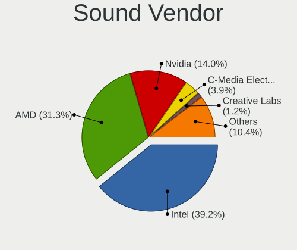

| Vendor                                          | Computers | Percent |
|-------------------------------------------------|-----------|---------|
| Intel                                           | 193       | 39.23%  |
| AMD                                             | 154       | 31.3%   |
| Nvidia                                          | 69        | 14.02%  |
| C-Media Electronics                             | 19        | 3.86%   |
| Creative Labs                                   | 6         | 1.22%   |
| Realtek Semiconductor                           | 5         | 1.02%   |
| JMTek                                           | 4         | 0.81%   |
| SteelSeries ApS                                 | 3         | 0.61%   |
| Logitech                                        | 3         | 0.61%   |
| Focusrite-Novation                              | 3         | 0.61%   |
| Creative Technology                             | 3         | 0.61%   |
| Texas Instruments                               | 2         | 0.41%   |
| GN Netcom                                       | 2         | 0.41%   |
| Generalplus Technology                          | 2         | 0.41%   |
| Corsair                                         | 2         | 0.41%   |
| VIA Technologies                                | 1         | 0.2%    |
| TC Electronic                                   | 1         | 0.2%    |
| Sony                                            | 1         | 0.2%    |
| Shure                                           | 1         | 0.2%    |
| Razer USA                                       | 1         | 0.2%    |
| PreSonus Audio Electronics                      | 1         | 0.2%    |
| Plantronics                                     | 1         | 0.2%    |
| Native Instruments                              | 1         | 0.2%    |
| MV-SILICON                                      | 1         | 0.2%    |
| M-Audio                                         | 1         | 0.2%    |
| Licensed by Sony Computer Entertainment America | 1         | 0.2%    |
| Lenovo                                          | 1         | 0.2%    |
| Hewlett-Packard                                 | 1         | 0.2%    |
| Harman                                          | 1         | 0.2%    |
| EVGA                                            | 1         | 0.2%    |
| DSEA A/S                                        | 1         | 0.2%    |
| Cambridge Silicon Radio                         | 1         | 0.2%    |
| Blue Microphones                                | 1         | 0.2%    |
| AudioQuest                                      | 1         | 0.2%    |
| ASUSTek Computer                                | 1         | 0.2%    |
| Apple                                           | 1         | 0.2%    |
| AKAI Professional M.I.                          | 1         | 0.2%    |

Sound Model
-----------

Sound card models

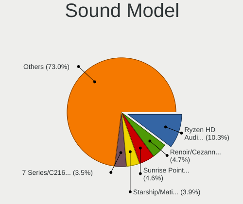

| Model                                                                      | Computers | Percent |
|----------------------------------------------------------------------------|-----------|---------|
| AMD Ryzen HD Audio Controller                                              | 65        | 10.27%  |
| AMD Renoir/Cezanne HDMI/DP Audio Controller                                | 30        | 4.74%   |
| Intel Sunrise Point-LP HD Audio                                            | 29        | 4.58%   |
| AMD Starship/Matisse HD Audio Controller                                   | 25        | 3.95%   |
| Intel 7 Series/C216 Chipset Family High Definition Audio Controller        | 22        | 3.48%   |
| Intel 6 Series/C200 Series Chipset Family High Definition Audio Controller | 21        | 3.32%   |
| AMD Ellesmere HDMI Audio [Radeon RX 470/480 / 570/580/590]                 | 17        | 2.69%   |
| AMD Raven/Raven2/Fenghuang HDMI/DP Audio Controller                        | 16        | 2.53%   |
| AMD Family 17h (Models 00h-0fh) HD Audio Controller                        | 16        | 2.53%   |
| AMD Radeon High Definition Audio Controller                                | 15        | 2.37%   |
| AMD Navi 21/23 HDMI/DP Audio Controller                                    | 13        | 2.05%   |
| AMD SBx00 Azalia (Intel HDA)                                               | 12        | 1.9%    |
| Intel Tiger Lake-LP Smart Sound Technology Audio Controller                | 11        | 1.74%   |
| Intel Broadwell-U Audio Controller                                         | 11        | 1.74%   |
| AMD FCH Azalia Controller                                                  | 11        | 1.74%   |
| Intel Wildcat Point-LP High Definition Audio Controller                    | 10        | 1.58%   |
| Intel Cannon Lake PCH cAVS                                                 | 9         | 1.42%   |
| AMD Navi 10 HDMI Audio                                                     | 9         | 1.42%   |
| Nvidia TU116 High Definition Audio Controller                              | 8         | 1.26%   |
| Intel Comet Lake PCH cAVS                                                  | 8         | 1.26%   |
| C-Media Electronics Audio Adapter (Unitek Y-247A)                          | 8         | 1.26%   |
| Nvidia GP107GL High Definition Audio Controller                            | 7         | 1.11%   |
| Nvidia GP104 High Definition Audio Controller                              | 7         | 1.11%   |
| Intel Haswell-ULT HD Audio Controller                                      | 6         | 0.95%   |
| Intel Celeron/Pentium Silver Processor High Definition Audio               | 6         | 0.95%   |
| Intel Alder Lake PCH-P High Definition Audio Controller                    | 6         | 0.95%   |
| Intel 8 Series HD Audio Controller                                         | 6         | 0.95%   |
| Intel 5 Series/3400 Series Chipset High Definition Audio                   | 6         | 0.95%   |
| Intel 100 Series/C230 Series Chipset Family HD Audio Controller            | 6         | 0.95%   |
| AMD Kabini HDMI/DP Audio                                                   | 6         | 0.95%   |
| AMD Baffin HDMI/DP Audio [Radeon RX 550 640SP / RX 560/560X]               | 6         | 0.95%   |
| Nvidia TU107 GeForce GTX 1650 High Definition Audio Controller             | 5         | 0.79%   |
| Nvidia GF108 High Definition Audio Controller                              | 5         | 0.79%   |
| Intel Atom Processor Z36xxx/Z37xxx Series High Definition Audio Controller | 5         | 0.79%   |
| Intel 8 Series/C220 Series Chipset High Definition Audio Controller        | 5         | 0.79%   |
| AMD Oland/Hainan/Cape Verde/Pitcairn HDMI Audio [Radeon HD 7000 Series]    | 5         | 0.79%   |
| Nvidia TU106 High Definition Audio Controller                              | 4         | 0.63%   |
| Intel Ice Lake-LP Smart Sound Technology Audio Controller                  | 4         | 0.63%   |
| Intel CM238 HD Audio Controller                                            | 4         | 0.63%   |
| Intel Cannon Point-LP High Definition Audio Controller                     | 4         | 0.63%   |

Memory
------

Memory Vendor
-------------

Memory module vendors

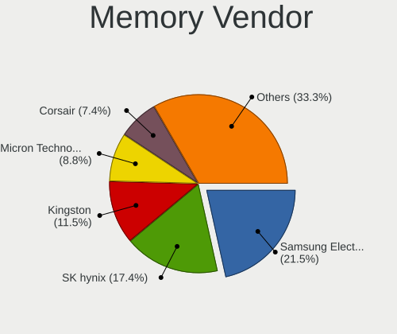

| Vendor              | Computers | Percent |
|---------------------|-----------|---------|
| Samsung Electronics | 73        | 21.53%  |
| SK hynix            | 59        | 17.4%   |
| Kingston            | 39        | 11.5%   |
| Micron Technology   | 30        | 8.85%   |
| Corsair             | 25        | 7.37%   |
| Unknown             | 20        | 5.9%    |
| Crucial             | 17        | 5.01%   |
| G.Skill             | 16        | 4.72%   |
| A-DATA Technology   | 14        | 4.13%   |
| Unknown             | 8         | 2.36%   |
| Patriot             | 5         | 1.47%   |
| Team                | 4         | 1.18%   |
| Smart               | 4         | 1.18%   |
| Ramaxel Technology  | 4         | 1.18%   |
| Unknown (ABCD)      | 3         | 0.88%   |
| Silicon Power       | 3         | 0.88%   |
| Nanya Technology    | 3         | 0.88%   |
| AMD                 | 2         | 0.59%   |
| Transcend           | 1         | 0.29%   |
| Smart Brazil        | 1         | 0.29%   |
| KLEVV               | 1         | 0.29%   |
| GOODRAM             | 1         | 0.29%   |
| Golden Empire       | 1         | 0.29%   |
| GeIL                | 1         | 0.29%   |
| Elpida              | 1         | 0.29%   |
| Avant               | 1         | 0.29%   |
| ASint Technology    | 1         | 0.29%   |
| Apacer              | 1         | 0.29%   |

Memory Model
------------

Memory module models

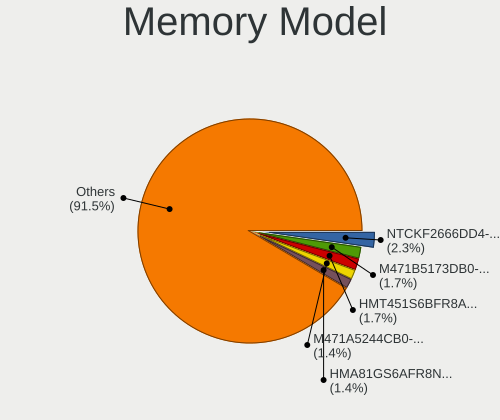

| Model                                                            | Computers | Percent |
|------------------------------------------------------------------|-----------|---------|
| Unknown                                                          | 8         | 2.26%   |
| SK hynix RAM HMT451S6BFR8A-PB 4GB SODIMM DDR3 1600MT/s           | 6         | 1.69%   |
| Samsung RAM M471B5173DB0-YK0 4GB SODIMM DDR3 1600MT/s            | 6         | 1.69%   |
| SK hynix RAM HMA81GS6AFR8N-UH 8GB SODIMM DDR4 2667MT/s           | 5         | 1.41%   |
| Samsung RAM M471A5244CB0-CWE 4GB SODIMM DDR4 3200MT/s            | 5         | 1.41%   |
| Samsung RAM M471A2K43CB1-CRC 16GB SODIMM DDR4 2667MT/s           | 4         | 1.13%   |
| Corsair RAM CMK16GX4M2B3200C16 8GB DIMM DDR4 3600MT/s            | 4         | 1.13%   |
| SK hynix RAM HMT451S6AFR8A-PB 4GB SODIMM DDR3 1600MT/s           | 3         | 0.85%   |
| Samsung RAM Module 8GB Row Of Chips LPDDR3 1600MT/s              | 3         | 0.85%   |
| Samsung RAM M471B5173QH0-YK0 4GB SODIMM DDR3 1600MT/s            | 3         | 0.85%   |
| Samsung RAM M471A1K43EB1-CWE 8GB SODIMM DDR4 3200MT/s            | 3         | 0.85%   |
| Samsung RAM M471A1G44AB0-CWE 8GiB SODIMM DDR4 3200MT/s           | 3         | 0.85%   |
| Micron RAM 4ATF1G64HZ-3G2F1 8GB SODIMM DDR4 3200MT/s             | 3         | 0.85%   |
| Kingston RAM KHX3200C16D4/8GX 8GB DIMM DDR4 3733MT/s             | 3         | 0.85%   |
| Unknown RAM Module 8GB DIMM DDR3 1600MT/s                        | 2         | 0.56%   |
| Unknown RAM Module 4GB DIMM 1333MT/s                             | 2         | 0.56%   |
| Unknown (ABCD) RAM 123456789012345678 2GB SODIMM LPDDR4 2400MT/s | 2         | 0.56%   |
| Team RAM TEAMGROUP-SD3-1600 8GB SODIMM DDR3 1600MT/s             | 2         | 0.56%   |
| SK hynix RAM HMT425S6AFR6A-PB 2GB SODIMM DDR3 1600MT/s           | 2         | 0.56%   |
| SK hynix RAM HMT351S6CFR8C-PB 4GB SODIMM DDR3 1600MT/s           | 2         | 0.56%   |
| SK hynix RAM HMT325S6BFR8C-PB 2GB SODIMM DDR3 1600MT/s           | 2         | 0.56%   |
| SK hynix RAM HMAA1GS6CMR6N-XN 8GB Row Of Chips DDR4 3200MT/s     | 2         | 0.56%   |
| SK hynix RAM HMA851S6DJR6N-XN 4GB SODIMM DDR4 3200MT/s           | 2         | 0.56%   |
| SK hynix RAM HMA82GS6JJR8N-VK 16GB SODIMM DDR4 2667MT/s          | 2         | 0.56%   |
| SK hynix RAM HMA81GS6DJR8N-XN 8GB SODIMM DDR4 3200MT/s           | 2         | 0.56%   |
| SK hynix RAM HMA81GS6CJR8N-XN 8GB SODIMM DDR4 3200MT/s           | 2         | 0.56%   |
| Silicon Power RAM SP008GLSTU160N02 8GB SODIMM DDR3 1600MT/s      | 2         | 0.56%   |
| Samsung RAM Module 4096MB SODIMM DDR3 1600MT/s                   | 2         | 0.56%   |
| Samsung RAM M471A5244CB0-CWE 4GB Row Of Chips DDR4 3200MT/s      | 2         | 0.56%   |
| Samsung RAM M471A5244CB0-CTD 4GB SODIMM DDR4 3266MT/s            | 2         | 0.56%   |
| Samsung RAM M471A4G43AB1-CWE 32GB SODIMM DDR4 3200MT/s           | 2         | 0.56%   |
| Samsung RAM M471A2K43DB1-CTD 16GB SODIMM DDR4 2667MT/s           | 2         | 0.56%   |
| Samsung RAM M471A2G44AM0-CWE 16GB SODIMM DDR4 3200MT/s           | 2         | 0.56%   |
| Samsung RAM M471A1K43CB1-CTD 8GB SODIMM DDR4 3200MT/s            | 2         | 0.56%   |
| Samsung RAM M471A1K43BB1-CRC 8GB SODIMM DDR4 2667MT/s            | 2         | 0.56%   |
| Samsung RAM M471A1G44AB0-CWE 8GB Row Of Chips DDR4 3200MT/s      | 2         | 0.56%   |
| Samsung RAM M471A1G44AB0-CTD 8GB SODIMM DDR4 2667MT/s            | 2         | 0.56%   |
| Samsung RAM M378A1G43TB1-CTD 8GB DIMM DDR4 3400MT/s              | 2         | 0.56%   |
| Micron RAM MT62F1G32D4DR-031 4GB SODIMM LPDDR5 5500MT/s          | 2         | 0.56%   |
| Micron RAM CT102464BF160B.M16 8GB SODIMM DDR3 1600MT/s           | 2         | 0.56%   |

Memory Kind
-----------

Memory module kinds

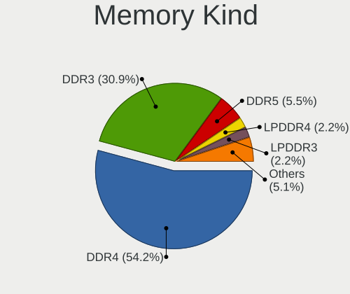

| Kind    | Computers | Percent |
|---------|-----------|---------|
| DDR4    | 149       | 54.18%  |
| DDR3    | 85        | 30.91%  |
| DDR5    | 15        | 5.45%   |
| LPDDR4  | 6         | 2.18%   |
| LPDDR3  | 6         | 2.18%   |
| LPDDR5  | 5         | 1.82%   |
| Unknown | 4         | 1.45%   |
| SDRAM   | 3         | 1.09%   |
| DDR2    | 2         | 0.73%   |

Memory Form Factor
------------------

Physical design of the memory module

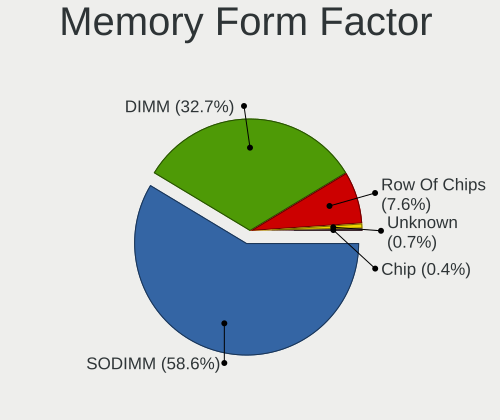

| Name         | Computers | Percent |
|--------------|-----------|---------|
| SODIMM       | 163       | 58.63%  |
| DIMM         | 91        | 32.73%  |
| Row Of Chips | 21        | 7.55%   |
| Unknown      | 2         | 0.72%   |
| Chip         | 1         | 0.36%   |

Memory Size
-----------

Memory module size

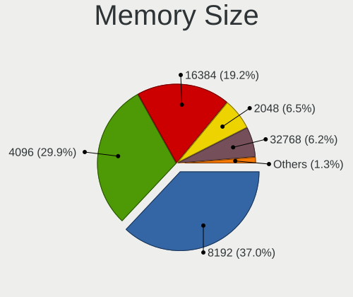

| Size  | Computers | Percent |
|-------|-----------|---------|
| 8192  | 114       | 37.01%  |
| 4096  | 92        | 29.87%  |
| 16384 | 59        | 19.16%  |
| 2048  | 20        | 6.49%   |
| 32768 | 19        | 6.17%   |
| 1024  | 3         | 0.97%   |
| 49152 | 1         | 0.32%   |

Memory Speed
------------

Memory module speed

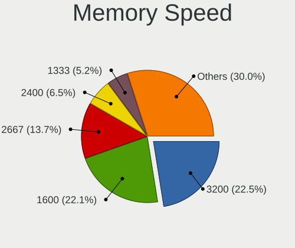

| Speed   | Computers | Percent |
|---------|-----------|---------|
| 3200    | 69        | 22.48%  |
| 1600    | 68        | 22.15%  |
| 2667    | 42        | 13.68%  |
| 2400    | 20        | 6.51%   |
| 1333    | 16        | 5.21%   |
| 3600    | 14        | 4.56%   |
| 2133    | 7         | 2.28%   |
| 4800    | 6         | 1.95%   |
| 1334    | 6         | 1.95%   |
| 5600    | 5         | 1.63%   |
| 3400    | 5         | 1.63%   |
| 3733    | 4         | 1.3%    |
| 2933    | 3         | 0.98%   |
| 1866    | 3         | 0.98%   |
| 800     | 3         | 0.98%   |
| 7500    | 2         | 0.65%   |
| 6400    | 2         | 0.65%   |
| 6000    | 2         | 0.65%   |
| 5500    | 2         | 0.65%   |
| 4199    | 2         | 0.65%   |
| 4000    | 2         | 0.65%   |
| 3666    | 2         | 0.65%   |
| 3266    | 2         | 0.65%   |
| 3000    | 2         | 0.65%   |
| 2666    | 2         | 0.65%   |
| 1867    | 2         | 0.65%   |
| 4802    | 1         | 0.33%   |
| 4267    | 1         | 0.33%   |
| 4133    | 1         | 0.33%   |
| 3866    | 1         | 0.33%   |
| 3800    | 1         | 0.33%   |
| 3066    | 1         | 0.33%   |
| 2800    | 1         | 0.33%   |
| 2481    | 1         | 0.33%   |
| 2465    | 1         | 0.33%   |
| 1328    | 1         | 0.33%   |
| 1067    | 1         | 0.33%   |
| 1066    | 1         | 0.33%   |
| 667     | 1         | 0.33%   |
| Unknown | 1         | 0.33%   |

Printers & scanners
-------------------

Printer Vendor
--------------

Printer device vendors

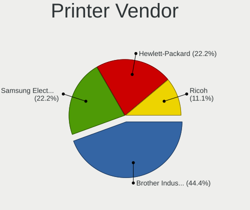

| Vendor              | Computers | Percent |
|---------------------|-----------|---------|
| Brother Industries  | 4         | 44.44%  |
| Samsung Electronics | 2         | 22.22%  |
| Hewlett-Packard     | 2         | 22.22%  |
| Ricoh               | 1         | 11.11%  |

Printer Model
-------------

Printer device models

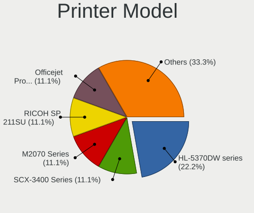

| Model                         | Computers | Percent |
|-------------------------------|-----------|---------|
| Brother HL-5370DW series      | 2         | 22.22%  |
| Samsung SCX-3400 Series       | 1         | 11.11%  |
| Samsung M2070 Series          | 1         | 11.11%  |
| Ricoh RICOH SP 211SU          | 1         | 11.11%  |
| HP Officejet Pro L7400        | 1         | 11.11%  |
| HP LaserJet 1010              | 1         | 11.11%  |
| Brother HL-L3270CDW series    | 1         | 11.11%  |
| Brother HL-2030 Laser Printer | 1         | 11.11%  |

Scanner Vendor
--------------

Scanner device vendors

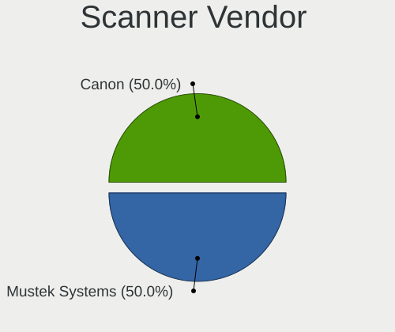

| Vendor         | Computers | Percent |
|----------------|-----------|---------|
| Mustek Systems | 1         | 50%     |
| Canon          | 1         | 50%     |

Scanner Model
-------------

Scanner device models

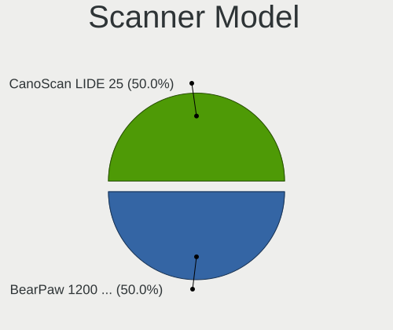

| Model                             | Computers | Percent |
|-----------------------------------|-----------|---------|
| Mustek Systems BearPaw 1200 TA/CS | 1         | 50%     |
| Canon CanoScan LIDE 25            | 1         | 50%     |

Camera
------

Camera Vendor
-------------

Camera device vendors

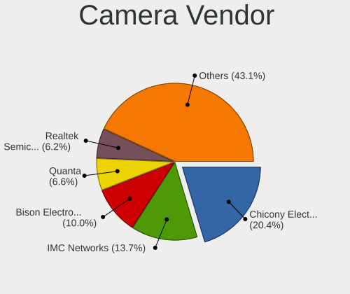

| Vendor                                 | Computers | Percent |
|----------------------------------------|-----------|---------|
| Chicony Electronics                    | 43        | 20.38%  |
| IMC Networks                           | 29        | 13.74%  |
| Bison Electronics                      | 21        | 9.95%   |
| Quanta                                 | 14        | 6.64%   |
| Realtek Semiconductor                  | 13        | 6.16%   |
| Microdia                               | 12        | 5.69%   |
| Logitech                               | 11        | 5.21%   |
| Syntek                                 | 8         | 3.79%   |
| Suyin                                  | 7         | 3.32%   |
| Sunplus Innovation Technology          | 7         | 3.32%   |
| Luxvisions Innotech Limited            | 6         | 2.84%   |
| Cheng Uei Precision Industry (Foxlink) | 5         | 2.37%   |
| Alcor Micro                            | 5         | 2.37%   |
| Sonix Technology                       | 4         | 1.9%    |
| Silicon Motion                         | 4         | 1.9%    |
| Lenovo                                 | 3         | 1.42%   |
| ShineTech                              | 2         | 0.95%   |
| Creative Technology                    | 2         | 0.95%   |
| WaveRider Communications               | 1         | 0.47%   |
| SunplusIT                              | 1         | 0.47%   |
| ShineOptics                            | 1         | 0.47%   |
| Ricoh                                  | 1         | 0.47%   |
| Microsoft                              | 1         | 0.47%   |
| Lite-On Technology                     | 1         | 0.47%   |
| LG Electronics                         | 1         | 0.47%   |
| KYE Systems (Mouse Systems)            | 1         | 0.47%   |
| kingcome                               | 1         | 0.47%   |
| Hewlett-Packard                        | 1         | 0.47%   |
| Google                                 | 1         | 0.47%   |
| GEMBIRD                                | 1         | 0.47%   |
| Cubeternet                             | 1         | 0.47%   |
| ARC International                      | 1         | 0.47%   |
| Apple                                  | 1         | 0.47%   |

Camera Model
------------

Camera device models

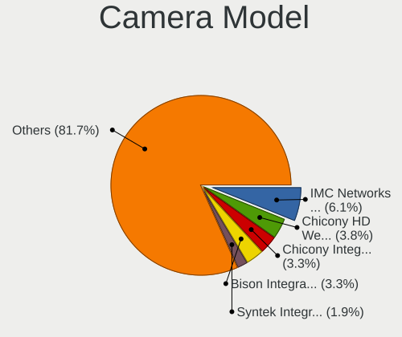

| Model                                                          | Computers | Percent |
|----------------------------------------------------------------|-----------|---------|
| IMC Networks Integrated Camera                                 | 13        | 6.1%    |
| Chicony HD WebCam                                              | 8         | 3.76%   |
| Chicony Integrated Camera                                      | 7         | 3.29%   |
| Bison Integrated Camera                                        | 7         | 3.29%   |
| Syntek Integrated Camera                                       | 4         | 1.88%   |
| Sonix USB2.0 HD UVC WebCam                                     | 4         | 1.88%   |
| Realtek Integrated_Webcam_HD                                   | 4         | 1.88%   |
| Microdia Integrated Webcam                                     | 4         | 1.88%   |
| Luxvisions Innotech Limited HP TrueVision HD Camera            | 4         | 1.88%   |
| Logitech Webcam C270                                           | 4         | 1.88%   |
| IMC Networks USB2.0 HD UVC WebCam                              | 4         | 1.88%   |
| Syntek EasyCamera                                              | 3         | 1.41%   |
| Sunplus HD WebCam                                              | 3         | 1.41%   |
| Quanta HP TrueVision HD Camera                                 | 3         | 1.41%   |
| Microdia Integrated_Webcam_HD                                  | 3         | 1.41%   |
| IMC Networks USB2.0 VGA UVC WebCam                             | 3         | 1.41%   |
| Chicony USB2.0 VGA UVC WebCam                                  | 3         | 1.41%   |
| Chicony Integrated Camera (1280x720@30)                        | 3         | 1.41%   |
| Chicony HP TrueVision HD Camera                                | 3         | 1.41%   |
| Bison Lenovo EasyCamera                                        | 3         | 1.41%   |
| Suyin HP Webcam                                                | 2         | 0.94%   |
| Silicon Motion 300k Pixel Camera                               | 2         | 0.94%   |
| ShineTech USB2.0 HD UVC WebCam                                 | 2         | 0.94%   |
| Realtek USB2.0 HD UVC WebCam                                   | 2         | 0.94%   |
| Realtek HD WebCam                                              | 2         | 0.94%   |
| Quanta VGA WebCam                                              | 2         | 0.94%   |
| Quanta USB2.0 VGA UVC WebCam                                   | 2         | 0.94%   |
| Quanta HP Webcam                                               | 2         | 0.94%   |
| Quanta HD Webcam                                               | 2         | 0.94%   |
| Logitech HD Pro Webcam C920                                    | 2         | 0.94%   |
| Lenovo UVC Camera                                              | 2         | 0.94%   |
| IMC Networks XiaoMi Webcam                                     | 2         | 0.94%   |
| IMC Networks 2M Integrated Webcam                              | 2         | 0.94%   |
| Chicony thinkpad t430s camera                                  | 2         | 0.94%   |
| Chicony Integrated IR Camera                                   | 2         | 0.94%   |
| Cheng Uei Precision Industry (Foxlink) HP Webcam               | 2         | 0.94%   |
| Cheng Uei Precision Industry (Foxlink) HP TrueVision HD Camera | 2         | 0.94%   |
| Bison HD Webcam                                                | 2         | 0.94%   |
| Alcor Micro USB 2.0 Camera                                     | 2         | 0.94%   |
| WaveRider USB 2.0 Camera                                       | 1         | 0.47%   |

Security
--------

Fingerprint Vendor
------------------

Fingerprint sensor vendors

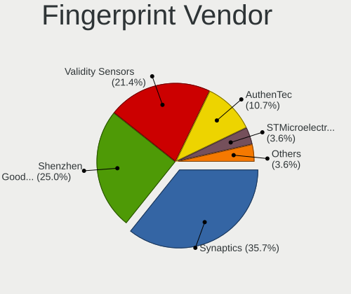

| Vendor                     | Computers | Percent |
|----------------------------|-----------|---------|
| Synaptics                  | 10        | 35.71%  |
| Shenzhen Goodix Technology | 7         | 25%     |
| Validity Sensors           | 6         | 21.43%  |
| AuthenTec                  | 3         | 10.71%  |
| STMicroelectronics         | 1         | 3.57%   |
| Elan Microelectronics      | 1         | 3.57%   |

Fingerprint Model
-----------------

Fingerprint sensor models

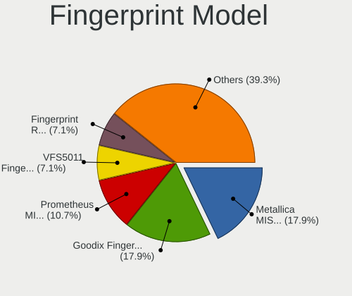

| Model                                                                      | Computers | Percent |
|----------------------------------------------------------------------------|-----------|---------|
| Synaptics Metallica MIS Touch Fingerprint Reader                           | 5         | 17.86%  |
| Shenzhen Goodix  Fingerprint Device                                        | 5         | 17.86%  |
| Synaptics Prometheus MIS Touch Fingerprint Reader                          | 3         | 10.71%  |
| Validity Sensors VFS5011 Fingerprint Reader                                | 2         | 7.14%   |
| Shenzhen Goodix Fingerprint Reader                                         | 2         | 7.14%   |
| AuthenTec AES2810                                                          | 2         | 7.14%   |
| Validity Sensors VFS7500 Touch Fingerprint Sensor                          | 1         | 3.57%   |
| Validity Sensors VFS491                                                    | 1         | 3.57%   |
| Validity Sensors Synaptics VFS7552 Touch Fingerprint Sensor with PurePrint | 1         | 3.57%   |
| Validity Sensors Swipe Fingerprint Sensor                                  | 1         | 3.57%   |
| Synaptics  WBDI                                                            | 1         | 3.57%   |
| Synaptics  FS7604 Touch Fingerprint Sensor with PurePrint                  | 1         | 3.57%   |
| STMicroelectronics Fingerprint Reader                                      | 1         | 3.57%   |
| Elan ELAN:ARM-M4                                                           | 1         | 3.57%   |
| AuthenTec Fingerprint Sensor                                               | 1         | 3.57%   |

Chipcard Vendor
---------------

Chipcard module vendors

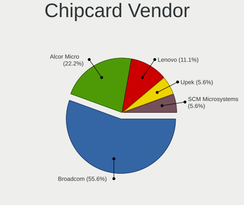

| Vendor           | Computers | Percent |
|------------------|-----------|---------|
| Broadcom         | 10        | 55.56%  |
| Alcor Micro      | 4         | 22.22%  |
| Lenovo           | 2         | 11.11%  |
| Upek             | 1         | 5.56%   |
| SCM Microsystems | 1         | 5.56%   |

Chipcard Model
--------------

Chipcard module models

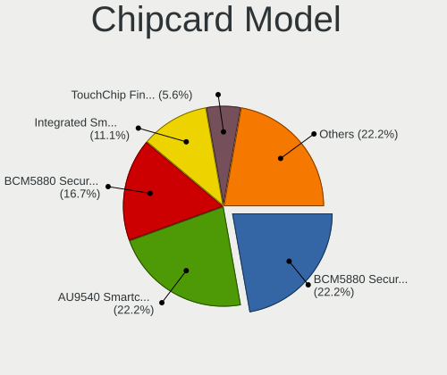

| Model                                                                        | Computers | Percent |
|------------------------------------------------------------------------------|-----------|---------|
| Broadcom BCM5880 Secure Applications Processor                               | 4         | 22.22%  |
| Alcor Micro AU9540 Smartcard Reader                                          | 4         | 22.22%  |
| Broadcom BCM5880 Secure Applications Processor with fingerprint swipe sensor | 3         | 16.67%  |
| Lenovo Integrated Smart Card Reader                                          | 2         | 11.11%  |
| Upek TouchChip Fingerprint Coprocessor (WBF advanced mode)                   | 1         | 5.56%   |
| SCM Microsystems SCT3522CC token                                             | 1         | 5.56%   |
| Broadcom BCM58200 ControlVault 3 (FingerPrint sensor + Contacted SmartCard)  | 1         | 5.56%   |
| Broadcom 5880                                                                | 1         | 5.56%   |
| Broadcom 58200                                                               | 1         | 5.56%   |

Unsupported
-----------

Unsupported Devices
-------------------

Total unsupported devices on board

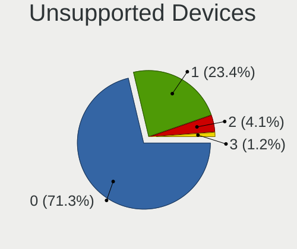

| Total | Computers | Percent |
|-------|-----------|---------|
| 0     | 241       | 71.3%   |
| 1     | 79        | 23.37%  |
| 2     | 14        | 4.14%   |
| 3     | 4         | 1.18%   |

Unsupported Device Types
------------------------

Types of unsupported devices

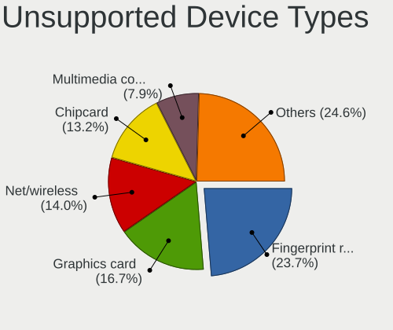

| Type                     | Computers | Percent |
|--------------------------|-----------|---------|
| Fingerprint reader       | 27        | 23.68%  |
| Graphics card            | 19        | 16.67%  |
| Net/wireless             | 16        | 14.04%  |
| Chipcard                 | 15        | 13.16%  |
| Multimedia controller    | 9         | 7.89%   |
| Communication controller | 6         | 5.26%   |
| Camera                   | 6         | 5.26%   |
| Bluetooth                | 5         | 4.39%   |
| Net/ethernet             | 3         | 2.63%   |
| Unassigned class         | 2         | 1.75%   |
| Storage                  | 2         | 1.75%   |
| Network                  | 2         | 1.75%   |
| Sound                    | 1         | 0.88%   |
| Dvb card                 | 1         | 0.88%   |

