Artix - Tested Hardware & Statistics
------------------------------------

A project to collect tested hardware configurations for Artix.

Anyone can contribute to this report by the [hw-probe](https://github.com/linuxhw/hw-probe) tool:

    sudo -E hw-probe -all -upload

Please contribute! Especially if your hardware is rare.

This is a report for all computer types. See also reports for [desktops](/Dist/Artix/Desktop/README.md) and [notebooks](/Dist/Artix/Notebook/README.md).

Contents
--------

* [ Test Cases ](#test-cases)

* [ System ](#system)
  - [ OS                       ](#os)
  - [ OS Family                ](#os-family)
  - [ Kernel                   ](#kernel)
  - [ Kernel Family            ](#kernel-family)
  - [ Kernel Major Ver.        ](#kernel-major-ver)
  - [ Arch                     ](#arch)
  - [ DE                       ](#de)
  - [ Display Server           ](#display-server)
  - [ Display Manager          ](#display-manager)
  - [ OS Lang                  ](#os-lang)
  - [ Boot Mode                ](#boot-mode)
  - [ Filesystem               ](#filesystem)
  - [ Part. scheme             ](#part-scheme)
  - [ Dual Boot with Linux/BSD ](#dual-boot-with-linuxbsd)
  - [ Dual Boot (Win)          ](#dual-boot-win)

* [ Board ](#board)
  - [ Vendor                   ](#vendor)
  - [ Model                    ](#model)
  - [ Model Family             ](#model-family)
  - [ MFG Year                 ](#mfg-year)
  - [ Form Factor              ](#form-factor)
  - [ Secure Boot              ](#secure-boot)
  - [ Coreboot                 ](#coreboot)
  - [ RAM Size                 ](#ram-size)
  - [ RAM Used                 ](#ram-used)
  - [ Total Drives             ](#total-drives)
  - [ Has CD-ROM               ](#has-cd-rom)
  - [ Has Ethernet             ](#has-ethernet)
  - [ Has WiFi                 ](#has-wifi)
  - [ Has Bluetooth            ](#has-bluetooth)

* [ Location ](#location)
  - [ Country                  ](#country)
  - [ City                     ](#city)

* [ Drives ](#drives)
  - [ Drive Vendor             ](#drive-vendor)
  - [ Drive Model              ](#drive-model)
  - [ HDD Vendor               ](#hdd-vendor)
  - [ SSD Vendor               ](#ssd-vendor)
  - [ Drive Kind               ](#drive-kind)
  - [ Drive Connector          ](#drive-connector)
  - [ Drive Size               ](#drive-size)
  - [ Space Total              ](#space-total)
  - [ Space Used               ](#space-used)
  - [ Malfunc. Drives          ](#malfunc-drives)
  - [ Malfunc. Drive Vendor    ](#malfunc-drive-vendor)
  - [ Malfunc. HDD Vendor      ](#malfunc-hdd-vendor)
  - [ Malfunc. Drive Kind      ](#malfunc-drive-kind)
  - [ Failed Drives            ](#failed-drives)
  - [ Failed Drive Vendor      ](#failed-drive-vendor)
  - [ Drive Status             ](#drive-status)

* [ Storage controller ](#storage-controller)
  - [ Storage Vendor           ](#storage-vendor)
  - [ Storage Model            ](#storage-model)
  - [ Storage Kind             ](#storage-kind)

* [ Processor ](#processor)
  - [ CPU Vendor               ](#cpu-vendor)
  - [ CPU Model                ](#cpu-model)
  - [ CPU Model Family         ](#cpu-model-family)
  - [ CPU Cores                ](#cpu-cores)
  - [ CPU Sockets              ](#cpu-sockets)
  - [ CPU Threads              ](#cpu-threads)
  - [ CPU Op-Modes             ](#cpu-op-modes)
  - [ CPU Microcode            ](#cpu-microcode)
  - [ CPU Microarch            ](#cpu-microarch)

* [ Graphics ](#graphics)
  - [ GPU Vendor               ](#gpu-vendor)
  - [ GPU Model                ](#gpu-model)
  - [ GPU Combo                ](#gpu-combo)
  - [ GPU Driver               ](#gpu-driver)
  - [ GPU Memory               ](#gpu-memory)

* [ Monitor ](#monitor)
  - [ Monitor Vendor           ](#monitor-vendor)
  - [ Monitor Model            ](#monitor-model)
  - [ Monitor Resolution       ](#monitor-resolution)
  - [ Monitor Diagonal         ](#monitor-diagonal)
  - [ Monitor Width            ](#monitor-width)
  - [ Aspect Ratio             ](#aspect-ratio)
  - [ Monitor Area             ](#monitor-area)
  - [ Pixel Density            ](#pixel-density)
  - [ Multiple Monitors        ](#multiple-monitors)

* [ Network ](#network)
  - [ Net Controller Vendor    ](#net-controller-vendor)
  - [ Net Controller Model     ](#net-controller-model)
  - [ Wireless Vendor          ](#wireless-vendor)
  - [ Wireless Model           ](#wireless-model)
  - [ Ethernet Vendor          ](#ethernet-vendor)
  - [ Ethernet Model           ](#ethernet-model)
  - [ Net Controller Kind      ](#net-controller-kind)
  - [ Used Controller          ](#used-controller)
  - [ NICs                     ](#nics)
  - [ IPv6                     ](#ipv6)

* [ Bluetooth ](#bluetooth)
  - [ Bluetooth Vendor         ](#bluetooth-vendor)
  - [ Bluetooth Model          ](#bluetooth-model)

* [ Sound ](#sound)
  - [ Sound Vendor             ](#sound-vendor)
  - [ Sound Model              ](#sound-model)

* [ Memory ](#memory)
  - [ Memory Vendor            ](#memory-vendor)
  - [ Memory Model             ](#memory-model)
  - [ Memory Kind              ](#memory-kind)
  - [ Memory Form Factor       ](#memory-form-factor)
  - [ Memory Size              ](#memory-size)
  - [ Memory Speed             ](#memory-speed)

* [ Printers & scanners ](#printers--scanners)
  - [ Printer Vendor           ](#printer-vendor)
  - [ Printer Model            ](#printer-model)
  - [ Scanner Vendor           ](#scanner-vendor)
  - [ Scanner Model            ](#scanner-model)

* [ Camera ](#camera)
  - [ Camera Vendor            ](#camera-vendor)
  - [ Camera Model             ](#camera-model)

* [ Security ](#security)
  - [ Fingerprint Vendor       ](#fingerprint-vendor)
  - [ Fingerprint Model        ](#fingerprint-model)
  - [ Chipcard Vendor          ](#chipcard-vendor)
  - [ Chipcard Model           ](#chipcard-model)

* [ Unsupported ](#unsupported)
  - [ Unsupported Devices      ](#unsupported-devices)
  - [ Unsupported Device Types ](#unsupported-device-types)

Test Cases
----------

Total: 205

| Vendor        | Model                       | Form-Factor | Probe                                                      | Date         |
|---------------|-----------------------------|-------------|------------------------------------------------------------|--------------|
| HP            | 15                          | Notebook    | [d9ed47d44c](https://linux-hardware.org/?probe=d9ed47d44c) | Apr 23, 2022 |
| Lenovo        | ThinkBook 15 G2 ITL 20VE    | Notebook    | [85b1934bfd](https://linux-hardware.org/?probe=85b1934bfd) | Apr 21, 2022 |
| ASUSTek       | GX501VIK                    | Notebook    | [076208c6fd](https://linux-hardware.org/?probe=076208c6fd) | Apr 15, 2022 |
| ASUSTek       | GX501VIK                    | Notebook    | [15c4c7877b](https://linux-hardware.org/?probe=15c4c7877b) | Apr 15, 2022 |
| Lenovo        | ThinkPad T430 2350BC6       | Notebook    | [c2ffb2a421](https://linux-hardware.org/?probe=c2ffb2a421) | Apr 14, 2022 |
| HP            | 246                         | Notebook    | [4ef673dd00](https://linux-hardware.org/?probe=4ef673dd00) | Apr 10, 2022 |
| Lenovo        | ThinkPad T430 2347H76       | Notebook    | [493f378237](https://linux-hardware.org/?probe=493f378237) | Mar 10, 2022 |
| Gigabyte      | HA65M-D2H-B3                | Desktop     | [313e83e0ef](https://linux-hardware.org/?probe=313e83e0ef) | Mar 10, 2022 |
| HP            | Laptop 14s-dq2xxx           | Notebook    | [92db061239](https://linux-hardware.org/?probe=92db061239) | Mar 09, 2022 |
| ASUSTek       | PRIME B350M-A               | Desktop     | [299a727e8a](https://linux-hardware.org/?probe=299a727e8a) | Mar 02, 2022 |
| Lenovo        | IdeaPad Y500 20193          | Notebook    | [604362a51f](https://linux-hardware.org/?probe=604362a51f) | Feb 18, 2022 |
| Notebook      | N141CU                      | Notebook    | [029f48bc53](https://linux-hardware.org/?probe=029f48bc53) | Feb 16, 2022 |
| Acer          | Aspire V3-472PG             | Notebook    | [70c80ae356](https://linux-hardware.org/?probe=70c80ae356) | Feb 16, 2022 |
| HP            | Laptop 15-ef1xxx            | Notebook    | [6cf7935dcc](https://linux-hardware.org/?probe=6cf7935dcc) | Feb 14, 2022 |
| Timi          | RedmiBook 14 II             | Notebook    | [3c1248a9d9](https://linux-hardware.org/?probe=3c1248a9d9) | Feb 10, 2022 |
| ASUSTek       | 1225C                       | Notebook    | [b780589dd0](https://linux-hardware.org/?probe=b780589dd0) | Feb 07, 2022 |
| Intel         | NUC7JYB J67967-404          | Mini pc     | [e02c6336d6](https://linux-hardware.org/?probe=e02c6336d6) | Feb 03, 2022 |
| MSI           | B550-A PRO                  | Desktop     | [b16ba2b14a](https://linux-hardware.org/?probe=b16ba2b14a) | Jan 31, 2022 |
| ASRock        | B150M Pro4S/D3              | Desktop     | [b7a65f897c](https://linux-hardware.org/?probe=b7a65f897c) | Jan 29, 2022 |
| HP            | Laptop 15-ef1xxx            | Notebook    | [6a49ff6317](https://linux-hardware.org/?probe=6a49ff6317) | Jan 18, 2022 |
| Lenovo        | G400s 20244                 | Notebook    | [9ac1aa04cc](https://linux-hardware.org/?probe=9ac1aa04cc) | Jan 15, 2022 |
| MSI           | B350M PRO-VDH               | Desktop     | [29b6159e9c](https://linux-hardware.org/?probe=29b6159e9c) | Jan 12, 2022 |
| ASUSTek       | ROG STRIX X570-F GAMING     | Desktop     | [ca93455055](https://linux-hardware.org/?probe=ca93455055) | Jan 07, 2022 |
| Lenovo        | ThinkPad E14 Gen 2 20T60... | Notebook    | [945649c354](https://linux-hardware.org/?probe=945649c354) | Jan 07, 2022 |
| ASUSTek       | Pro WS X570-ACE             | Desktop     | [1a7ef57da7](https://linux-hardware.org/?probe=1a7ef57da7) | Jan 07, 2022 |
| MSI           | Modern 15 A11M              | Notebook    | [bef1d4552a](https://linux-hardware.org/?probe=bef1d4552a) | Jan 07, 2022 |
| Lenovo        | Legion 5 15ARH05H 82B1      | Notebook    | [a568bef730](https://linux-hardware.org/?probe=a568bef730) | Jan 05, 2022 |
| Lenovo        | B570e HuronRiver Platfor... | Notebook    | [a6c63e1079](https://linux-hardware.org/?probe=a6c63e1079) | Dec 17, 2021 |
| Dell          | Latitude E6440              | Notebook    | [5e572f557c](https://linux-hardware.org/?probe=5e572f557c) | Dec 16, 2021 |
| Dell          | Latitude E6440              | Notebook    | [ac94463e37](https://linux-hardware.org/?probe=ac94463e37) | Dec 16, 2021 |
| ASUSTek       | K50IE                       | Notebook    | [49a6b75a43](https://linux-hardware.org/?probe=49a6b75a43) | Nov 29, 2021 |
| Lenovo        | ThinkBook 15 G2 ITL 20VE    | Notebook    | [0e12642e78](https://linux-hardware.org/?probe=0e12642e78) | Nov 27, 2021 |
| Timi          | RedmiBook 14 II             | Notebook    | [3e700c917e](https://linux-hardware.org/?probe=3e700c917e) | Nov 25, 2021 |
| ASRock        | B450 Steel Legend           | Desktop     | [44ccc8eb49](https://linux-hardware.org/?probe=44ccc8eb49) | Nov 24, 2021 |
| Lenovo        | ThinkPad 11e 5th Gen 20L... | Notebook    | [9a5098383d](https://linux-hardware.org/?probe=9a5098383d) | Nov 24, 2021 |
| MSI           | B450 TOMAHAWK MAX           | Desktop     | [9fca12db52](https://linux-hardware.org/?probe=9fca12db52) | Nov 22, 2021 |
| Lenovo        | ThinkPad T480s 20L8S3D40... | Notebook    | [76be488014](https://linux-hardware.org/?probe=76be488014) | Nov 07, 2021 |
| Lenovo        | ThinkPad T480s 20L8S3D40... | Notebook    | [f96363ccf5](https://linux-hardware.org/?probe=f96363ccf5) | Nov 07, 2021 |
| HP            | ProBook 450 G6              | Notebook    | [ded9086b7c](https://linux-hardware.org/?probe=ded9086b7c) | Nov 06, 2021 |
| Timi          | RedmiBook 14 II             | Notebook    | [038c0ad664](https://linux-hardware.org/?probe=038c0ad664) | Nov 03, 2021 |
| Timi          | RedmiBook 14 II             | Notebook    | [d8ae8a047c](https://linux-hardware.org/?probe=d8ae8a047c) | Nov 02, 2021 |
| Lenovo        | IdeaPadFlex 5 14ALC05 82... | Convertible | [65a49b7280](https://linux-hardware.org/?probe=65a49b7280) | Oct 30, 2021 |
| HP            | 1495                        | Desktop     | [e7c0f59f92](https://linux-hardware.org/?probe=e7c0f59f92) | Oct 15, 2021 |
| ASUSTek       | ROG Maximus XI HERO         | Desktop     | [e2c619e8dd](https://linux-hardware.org/?probe=e2c619e8dd) | Oct 12, 2021 |
| ASUSTek       | ROG Maximus XI HERO         | Desktop     | [1e612081c8](https://linux-hardware.org/?probe=1e612081c8) | Oct 02, 2021 |
| Acer          | Swift SF314-59              | Notebook    | [c764d879fb](https://linux-hardware.org/?probe=c764d879fb) | Sep 27, 2021 |
| Acer          | Swift SF314-59              | Notebook    | [0107549144](https://linux-hardware.org/?probe=0107549144) | Sep 23, 2021 |
| Acer          | Swift SF314-59              | Notebook    | [9426a6d4df](https://linux-hardware.org/?probe=9426a6d4df) | Sep 23, 2021 |
| Acer          | Aspire E5-575               | Notebook    | [d32c769f65](https://linux-hardware.org/?probe=d32c769f65) | Sep 22, 2021 |
| HP            | Laptop 14s-cf3xxx           | Notebook    | [5b9800e687](https://linux-hardware.org/?probe=5b9800e687) | Sep 06, 2021 |
| Dell          | Precision M6600             | Notebook    | [3c06ad8f67](https://linux-hardware.org/?probe=3c06ad8f67) | Sep 06, 2021 |
| MSI           | X470 GAMING PLUS            | Desktop     | [d5871d0e2a](https://linux-hardware.org/?probe=d5871d0e2a) | Aug 25, 2021 |
| ASUSTek       | GL702ZC                     | Notebook    | [7cb34b0a2e](https://linux-hardware.org/?probe=7cb34b0a2e) | Aug 10, 2021 |
| ASUSTek       | GL702ZC                     | Notebook    | [8ab07e196d](https://linux-hardware.org/?probe=8ab07e196d) | Aug 09, 2021 |
| MSI           | MPG X570 GAMING PLUS        | Desktop     | [ec331e992a](https://linux-hardware.org/?probe=ec331e992a) | Aug 08, 2021 |
| GPD           | P2 MAX                      | Notebook    | [bf70dbe409](https://linux-hardware.org/?probe=bf70dbe409) | Aug 07, 2021 |
| GPD           | P2 MAX                      | Notebook    | [a4e8eb7d9e](https://linux-hardware.org/?probe=a4e8eb7d9e) | Aug 07, 2021 |
| ASUSTek       | PRIME B450M-A               | Desktop     | [558e1369e9](https://linux-hardware.org/?probe=558e1369e9) | Jul 25, 2021 |
| GPD           | P2 MAX                      | Notebook    | [43075e1581](https://linux-hardware.org/?probe=43075e1581) | Jul 23, 2021 |
| HP            | 250 G3                      | Notebook    | [b1a0952727](https://linux-hardware.org/?probe=b1a0952727) | Jul 19, 2021 |
| ASUSTek       | P8H61-M LX3 R2.0            | Desktop     | [156577ba27](https://linux-hardware.org/?probe=156577ba27) | Jul 18, 2021 |
| Dell          | Inspiron 3442               | Notebook    | [a4e06ddea2](https://linux-hardware.org/?probe=a4e06ddea2) | Jul 02, 2021 |
| Lenovo        | LaVie Z 20FF0012US          | Notebook    | [789d556ef6](https://linux-hardware.org/?probe=789d556ef6) | Jul 01, 2021 |
| ASRock        | H310CM-DVS                  | Desktop     | [f8e9ea8ffa](https://linux-hardware.org/?probe=f8e9ea8ffa) | Jun 26, 2021 |
| Lenovo        | ThinkPad W500 4063CJ5       | Notebook    | [89bbafa02e](https://linux-hardware.org/?probe=89bbafa02e) | Jun 22, 2021 |
| HP            | 15                          | Notebook    | [4f6c5d8c89](https://linux-hardware.org/?probe=4f6c5d8c89) | Jun 22, 2021 |
| MSI           | Z270M MORTAR                | Desktop     | [5c54607559](https://linux-hardware.org/?probe=5c54607559) | Jun 22, 2021 |
| Apple         | MacBookAir7,2               | Notebook    | [6a459ac265](https://linux-hardware.org/?probe=6a459ac265) | Jun 16, 2021 |
| HP            | 250 G7 Notebook PC          | Notebook    | [10803bcbc4](https://linux-hardware.org/?probe=10803bcbc4) | Jun 07, 2021 |
| HP            | 250 G7 Notebook PC          | Notebook    | [445e09faa7](https://linux-hardware.org/?probe=445e09faa7) | Jun 07, 2021 |
| Dell          | Precision 7550              | Notebook    | [5d7ecb9bbb](https://linux-hardware.org/?probe=5d7ecb9bbb) | Jun 07, 2021 |
| Acidanther... | Mac-AA95B1DDAB278B95 iMa... | All in one  | [181bd83bdd](https://linux-hardware.org/?probe=181bd83bdd) | Jun 02, 2021 |
| Lenovo        | IdeaPad Gaming 3 15IMH05... | Notebook    | [de11ab3cc4](https://linux-hardware.org/?probe=de11ab3cc4) | May 31, 2021 |
| Lenovo        | ThinkPad T14 Gen 1 20UES... | Notebook    | [4688dc5b46](https://linux-hardware.org/?probe=4688dc5b46) | May 29, 2021 |
| Dell          | Precision 7550              | Notebook    | [206eeb06c9](https://linux-hardware.org/?probe=206eeb06c9) | May 23, 2021 |
| Dell          | Precision 7550              | Notebook    | [e7ccee4869](https://linux-hardware.org/?probe=e7ccee4869) | May 23, 2021 |
| Lenovo        | IdeaPad Flex 5 14ARE05 8... | Convertible | [cc7cb4a34e](https://linux-hardware.org/?probe=cc7cb4a34e) | May 22, 2021 |
| UNOWHY        | Y13G010S4EI                 | Notebook    | [62d883cffd](https://linux-hardware.org/?probe=62d883cffd) | May 18, 2021 |
| Lenovo        | IdeaPad Flex 5 14ARE05 8... | Convertible | [3f10e6610b](https://linux-hardware.org/?probe=3f10e6610b) | May 18, 2021 |
| ASRock        | FM2A88X-ITX+                | Desktop     | [2b91e357ca](https://linux-hardware.org/?probe=2b91e357ca) | May 16, 2021 |
| Lenovo        | ThinkPad W500 4063CJ5       | Notebook    | [85def78a94](https://linux-hardware.org/?probe=85def78a94) | May 02, 2021 |
| ASRock        | FM2A88X-ITX+                | Desktop     | [057546c50e](https://linux-hardware.org/?probe=057546c50e) | Apr 30, 2021 |
| HP            | Laptop 17z-ca300            | Notebook    | [ea09357867](https://linux-hardware.org/?probe=ea09357867) | Apr 26, 2021 |
| ASUSTek       | SABERTOOTH 990FX R2.0       | Desktop     | [d1cf148ec4](https://linux-hardware.org/?probe=d1cf148ec4) | Apr 24, 2021 |
| Acer          | Aspire V3-572PG             | Notebook    | [a874b34c2a](https://linux-hardware.org/?probe=a874b34c2a) | Apr 12, 2021 |
| Acidanther... | Mac-AA95B1DDAB278B95 iMa... | All in one  | [132c1a0515](https://linux-hardware.org/?probe=132c1a0515) | Apr 08, 2021 |
| ASUSTek       | ROG STRIX B550-F GAMING     | Desktop     | [5527015fb6](https://linux-hardware.org/?probe=5527015fb6) | Apr 08, 2021 |
| Acidanther... | Mac-AA95B1DDAB278B95 iMa... | All in one  | [1517cb82a3](https://linux-hardware.org/?probe=1517cb82a3) | Apr 08, 2021 |
| Acidanther... | Mac-AA95B1DDAB278B95 iMa... | All in one  | [10132d3ee3](https://linux-hardware.org/?probe=10132d3ee3) | Apr 05, 2021 |
| Acidanther... | Mac-AA95B1DDAB278B95 iMa... | All in one  | [aa8705aaf3](https://linux-hardware.org/?probe=aa8705aaf3) | Apr 03, 2021 |
| Acidanther... | Mac-AA95B1DDAB278B95 iMa... | All in one  | [971fa8e337](https://linux-hardware.org/?probe=971fa8e337) | Mar 29, 2021 |
| Acidanther... | Mac-AA95B1DDAB278B95 iMa... | All in one  | [f9085ca63b](https://linux-hardware.org/?probe=f9085ca63b) | Mar 29, 2021 |
| Microsoft     | Surface Pro                 | Tablet      | [dbd940a4f3](https://linux-hardware.org/?probe=dbd940a4f3) | Mar 29, 2021 |
| Apple         | MacBookAir7,2               | Notebook    | [7f14077ecc](https://linux-hardware.org/?probe=7f14077ecc) | Mar 29, 2021 |
| Apple         | MacBookPro11,1              | Notebook    | [666815417c](https://linux-hardware.org/?probe=666815417c) | Mar 28, 2021 |
| Acidanther... | Mac-AA95B1DDAB278B95 iMa... | All in one  | [62f6aa5c03](https://linux-hardware.org/?probe=62f6aa5c03) | Mar 27, 2021 |
| Apple         | MacBookPro11,1              | Notebook    | [cc467b4015](https://linux-hardware.org/?probe=cc467b4015) | Mar 27, 2021 |
| Apple         | MacBookPro11,1              | Notebook    | [d2027dc1c2](https://linux-hardware.org/?probe=d2027dc1c2) | Mar 24, 2021 |
| MSI           | GP72 7RDX                   | Notebook    | [a60abbdcd4](https://linux-hardware.org/?probe=a60abbdcd4) | Mar 18, 2021 |
| Quanta        | SWH                         | Notebook    | [dc6df30340](https://linux-hardware.org/?probe=dc6df30340) | Mar 18, 2021 |
| Lenovo        | ThinkPad T14 Gen 1 20S1S... | Notebook    | [c2599a37c2](https://linux-hardware.org/?probe=c2599a37c2) | Mar 08, 2021 |
| HP            | Pavilion x360 Convertibl... | Convertible | [ce4b5362ed](https://linux-hardware.org/?probe=ce4b5362ed) | Mar 04, 2021 |
| Lenovo        | ThinkPad T14 Gen 1 20UES... | Notebook    | [76006e9ba5](https://linux-hardware.org/?probe=76006e9ba5) | Mar 01, 2021 |
| Dell          | Precision 7550              | Notebook    | [c1c4fd3b1a](https://linux-hardware.org/?probe=c1c4fd3b1a) | Feb 21, 2021 |
| ASUSTek       | PRIME X370-PRO              | Desktop     | [91a16f1c67](https://linux-hardware.org/?probe=91a16f1c67) | Feb 21, 2021 |
| Lenovo        | ThinkPad W500 4063CJ5       | Notebook    | [b25144d80b](https://linux-hardware.org/?probe=b25144d80b) | Feb 18, 2021 |
| Lenovo        | ThinkPad P1 Gen 3 20TH00... | Notebook    | [c2408f8152](https://linux-hardware.org/?probe=c2408f8152) | Feb 16, 2021 |
| MSI           | X470 GAMING PLUS            | Desktop     | [f93e302542](https://linux-hardware.org/?probe=f93e302542) | Feb 15, 2021 |
| Lenovo        | ThinkPad W500 4063CJ5       | Notebook    | [838f747450](https://linux-hardware.org/?probe=838f747450) | Feb 14, 2021 |
| Alienware     | 02XRCM A01                  | Desktop     | [554d3ebf2f](https://linux-hardware.org/?probe=554d3ebf2f) | Feb 14, 2021 |
| Lenovo        | ThinkPad W500 4063CJ5       | Notebook    | [214d72ae23](https://linux-hardware.org/?probe=214d72ae23) | Feb 12, 2021 |
| MSI           | X470 GAMING PLUS            | Desktop     | [249558c27b](https://linux-hardware.org/?probe=249558c27b) | Feb 03, 2021 |
| Gigabyte      | 970A-DS3P                   | Desktop     | [b4c4d7f99c](https://linux-hardware.org/?probe=b4c4d7f99c) | Feb 01, 2021 |
| Gigabyte      | 970A-DS3P                   | Desktop     | [70eabb568f](https://linux-hardware.org/?probe=70eabb568f) | Jan 30, 2021 |
| Acer          | Aspire 5733Z                | Notebook    | [b15b48fb21](https://linux-hardware.org/?probe=b15b48fb21) | Jan 29, 2021 |
| MSI           | X470 GAMING PLUS            | Desktop     | [fb3e2ec12b](https://linux-hardware.org/?probe=fb3e2ec12b) | Jan 24, 2021 |
| Lenovo        | ThinkPad W500 4063CJ5       | Notebook    | [dd81f9c015](https://linux-hardware.org/?probe=dd81f9c015) | Jan 23, 2021 |
| ASUSTek       | K53SC                       | Notebook    | [11547cb913](https://linux-hardware.org/?probe=11547cb913) | Jan 22, 2021 |
| ASUSTek       | K53SC                       | Notebook    | [061c52c2ff](https://linux-hardware.org/?probe=061c52c2ff) | Jan 22, 2021 |
| ASUSTek       | TUF B450-PLUS GAMING        | Desktop     | [fda5fabbf5](https://linux-hardware.org/?probe=fda5fabbf5) | Jan 21, 2021 |
| HP            | ProBook 450 G6              | Notebook    | [40e4f5d2fb](https://linux-hardware.org/?probe=40e4f5d2fb) | Jan 21, 2021 |
| Dell          | 0K216C                      | Desktop     | [524206eff9](https://linux-hardware.org/?probe=524206eff9) | Jan 20, 2021 |
| Dell          | 0D9JG3 A00                  | Desktop     | [6c44448201](https://linux-hardware.org/?probe=6c44448201) | Jan 19, 2021 |
| ASUSTek       | P8B75-M LX PLUS             | Desktop     | [c53595bd26](https://linux-hardware.org/?probe=c53595bd26) | Jan 16, 2021 |
| Dell          | Precision 5520              | Notebook    | [a714973647](https://linux-hardware.org/?probe=a714973647) | Jan 16, 2021 |
| ASRock        | X570 Phantom Gaming 4       | Desktop     | [335ee823bd](https://linux-hardware.org/?probe=335ee823bd) | Jan 16, 2021 |
| ASUSTek       | E402NA                      | Notebook    | [ac894b264b](https://linux-hardware.org/?probe=ac894b264b) | Jan 10, 2021 |
| Apple         | MacBookPro11,1              | Notebook    | [e8ac486033](https://linux-hardware.org/?probe=e8ac486033) | Jan 09, 2021 |
| ASUSTek       | G11CD                       | Desktop     | [145a13d355](https://linux-hardware.org/?probe=145a13d355) | Jan 07, 2021 |
| ASUSTek       | G11CD                       | Desktop     | [dc70a6fae2](https://linux-hardware.org/?probe=dc70a6fae2) | Jan 07, 2021 |
| HP            | 2B34                        | Desktop     | [e48dc00e0a](https://linux-hardware.org/?probe=e48dc00e0a) | Jan 04, 2021 |
| Pegatron      | 2AC2A                       | Desktop     | [6dbd029143](https://linux-hardware.org/?probe=6dbd029143) | Jan 03, 2021 |
| Pegatron      | 2AC2A                       | Desktop     | [2b102aeb94](https://linux-hardware.org/?probe=2b102aeb94) | Jan 03, 2021 |
| Acer          | Aspire A315-53              | Notebook    | [abac7a5b07](https://linux-hardware.org/?probe=abac7a5b07) | Jan 02, 2021 |
| Pegatron      | 2AC2A                       | Desktop     | [7dd04be8aa](https://linux-hardware.org/?probe=7dd04be8aa) | Jan 01, 2021 |
| ASUSTek       | TUF GAMING X570-PLUS        | Desktop     | [3f9f87f288](https://linux-hardware.org/?probe=3f9f87f288) | Dec 31, 2020 |
| Dell          | Precision 7550              | Notebook    | [9c8b2f2ad6](https://linux-hardware.org/?probe=9c8b2f2ad6) | Dec 30, 2020 |
| Gigabyte      | B450M DS3H-CF               | Notebook    | [b9c02872aa](https://linux-hardware.org/?probe=b9c02872aa) | Dec 29, 2020 |
| ASUSTek       | TUF GAMING X570-PLUS        | Desktop     | [2acc15f485](https://linux-hardware.org/?probe=2acc15f485) | Dec 27, 2020 |
| Dell          | Latitude E6530              | Notebook    | [46704587d1](https://linux-hardware.org/?probe=46704587d1) | Dec 25, 2020 |
| Gigabyte      | B450M DS3H-CF               | Notebook    | [d2701aa534](https://linux-hardware.org/?probe=d2701aa534) | Dec 24, 2020 |
| HP            | 250 G4 Notebook PC          | Notebook    | [178de0b283](https://linux-hardware.org/?probe=178de0b283) | Dec 24, 2020 |
| Lenovo        | ThinkPad W500 4063CJ5       | Notebook    | [a905f1377a](https://linux-hardware.org/?probe=a905f1377a) | Dec 20, 2020 |
| GPD           | P2 MAX                      | Notebook    | [f6249e6387](https://linux-hardware.org/?probe=f6249e6387) | Dec 11, 2020 |
| Gigabyte      | X570 AORUS ELITE            | Desktop     | [64adbf132b](https://linux-hardware.org/?probe=64adbf132b) | Dec 08, 2020 |
| MSI           | Z87-G45 GAMING              | Desktop     | [cefff6c6c3](https://linux-hardware.org/?probe=cefff6c6c3) | Dec 05, 2020 |
| MSI           | Z87-G45 GAMING              | Desktop     | [cbcb59eb96](https://linux-hardware.org/?probe=cbcb59eb96) | Dec 03, 2020 |
| MSI           | B350M PRO-VDH               | Desktop     | [28b680c91d](https://linux-hardware.org/?probe=28b680c91d) | Nov 29, 2020 |
| Sony          | VPCCB17FG                   | Notebook    | [5a24dc3231](https://linux-hardware.org/?probe=5a24dc3231) | Nov 26, 2020 |
| MSI           | Z87-G45 GAMING              | Desktop     | [de66a21bba](https://linux-hardware.org/?probe=de66a21bba) | Nov 25, 2020 |
| Acer          | Aspire A315-53              | Notebook    | [bc80dc5050](https://linux-hardware.org/?probe=bc80dc5050) | Nov 25, 2020 |
| Gigabyte      | 990FXA-UD3 R5               | Desktop     | [42a67a5d5e](https://linux-hardware.org/?probe=42a67a5d5e) | Nov 18, 2020 |
| Lenovo        | IdeaPad L340-17IRH Gamin... | Notebook    | [53a1586791](https://linux-hardware.org/?probe=53a1586791) | Nov 12, 2020 |
| HP            | OMEN Laptop 15-en0xxx       | Notebook    | [61653c183a](https://linux-hardware.org/?probe=61653c183a) | Oct 30, 2020 |
| ASUSTek       | VivoBook_ASUS Laptop X50... | Notebook    | [f18b33a8f0](https://linux-hardware.org/?probe=f18b33a8f0) | Oct 25, 2020 |
| ASUSTek       | VivoBook_ASUS Laptop X50... | Notebook    | [acc8c4e663](https://linux-hardware.org/?probe=acc8c4e663) | Oct 25, 2020 |
| Lenovo        | ThinkPad W500 4063CJ5       | Notebook    | [7c29a97dff](https://linux-hardware.org/?probe=7c29a97dff) | Oct 21, 2020 |
| Lenovo        | ThinkPad W500 4063CJ5       | Notebook    | [961c0be28a](https://linux-hardware.org/?probe=961c0be28a) | Oct 18, 2020 |
| Dell          | Inspiron 5570               | Notebook    | [038ef2ebaa](https://linux-hardware.org/?probe=038ef2ebaa) | Oct 15, 2020 |
| Lenovo        | IdeaPad 5 15IIL05 81YK      | Notebook    | [b877caba0b](https://linux-hardware.org/?probe=b877caba0b) | Oct 13, 2020 |
| Gigabyte      | 970A-DS3P                   | Desktop     | [848672f794](https://linux-hardware.org/?probe=848672f794) | Oct 13, 2020 |
| HP            | 255 G7 Notebook PC          | Notebook    | [026a4d80f6](https://linux-hardware.org/?probe=026a4d80f6) | Oct 08, 2020 |
| Gigabyte      | X399 AORUS XTREME-CF        | Desktop     | [1193653309](https://linux-hardware.org/?probe=1193653309) | Oct 04, 2020 |
| Gigabyte      | P55-USB3                    | Desktop     | [ceeced1246](https://linux-hardware.org/?probe=ceeced1246) | Oct 02, 2020 |
| Dell          | Precision 7550              | Notebook    | [c574758854](https://linux-hardware.org/?probe=c574758854) | Sep 19, 2020 |
| ASUSTek       | H81M-C                      | Desktop     | [b062c35766](https://linux-hardware.org/?probe=b062c35766) | Sep 16, 2020 |
| Dell          | Precision 7550              | Notebook    | [4b12417b4c](https://linux-hardware.org/?probe=4b12417b4c) | Sep 15, 2020 |
| ASUSTek       | G11CD                       | Desktop     | [962d52b690](https://linux-hardware.org/?probe=962d52b690) | Sep 14, 2020 |
| ASUSTek       | G11CD                       | Desktop     | [a663586db5](https://linux-hardware.org/?probe=a663586db5) | Sep 14, 2020 |
| Dell          | Precision 7550              | Notebook    | [14d1876313](https://linux-hardware.org/?probe=14d1876313) | Aug 31, 2020 |
| Dell          | Precision 7550              | Notebook    | [d44c1dbf60](https://linux-hardware.org/?probe=d44c1dbf60) | Aug 31, 2020 |
| ASUSTek       | TUF GAMING X570-PLUS        | Desktop     | [86215bb4fb](https://linux-hardware.org/?probe=86215bb4fb) | Aug 29, 2020 |
| Dell          | Precision 7550              | Notebook    | [25d7f344e9](https://linux-hardware.org/?probe=25d7f344e9) | Aug 29, 2020 |
| MSI           | B450 TOMAHAWK MAX           | Desktop     | [e988296384](https://linux-hardware.org/?probe=e988296384) | Aug 19, 2020 |
| Gigabyte      | 990FXA-UD5                  | Desktop     | [d86cfc12cc](https://linux-hardware.org/?probe=d86cfc12cc) | Aug 19, 2020 |
| Gigabyte      | 990FXA-UD5                  | Desktop     | [937f502004](https://linux-hardware.org/?probe=937f502004) | Aug 18, 2020 |
| Acer          | Nitro AN515-51              | Notebook    | [4f2724d5ad](https://linux-hardware.org/?probe=4f2724d5ad) | Aug 16, 2020 |
| MSI           | Z87-G45 GAMING              | Desktop     | [5d992bbc09](https://linux-hardware.org/?probe=5d992bbc09) | Aug 11, 2020 |
| Gigabyte      | B450M DS3H-CF               | Desktop     | [ff7915ae78](https://linux-hardware.org/?probe=ff7915ae78) | Aug 07, 2020 |
| Lenovo        | IdeaPad 330-15IKB 81DE      | Notebook    | [aae7fd244a](https://linux-hardware.org/?probe=aae7fd244a) | Aug 06, 2020 |
| Lenovo        | IdeaPad 5 15IIL05 81YK      | Notebook    | [5e3d9be29a](https://linux-hardware.org/?probe=5e3d9be29a) | Aug 01, 2020 |
| Lenovo        | IdeaPad 510-15IKB 80SV      | Notebook    | [d5b2c55949](https://linux-hardware.org/?probe=d5b2c55949) | Jul 27, 2020 |
| Lenovo        | ThinkPad T420 4236H45       | Notebook    | [61fd4ce395](https://linux-hardware.org/?probe=61fd4ce395) | Jul 20, 2020 |
| ASUSTek       | TUF GAMING X570-PLUS        | Desktop     | [a57e5d7e84](https://linux-hardware.org/?probe=a57e5d7e84) | Jul 08, 2020 |
| ASUSTek       | TUF GAMING X570-PLUS        | Desktop     | [2e81cb3b86](https://linux-hardware.org/?probe=2e81cb3b86) | Jul 08, 2020 |
| Lenovo        | IdeaPad 510-15IKB 80SV      | Notebook    | [0af3ac770f](https://linux-hardware.org/?probe=0af3ac770f) | Jul 06, 2020 |
| Notebook      | N130BU                      | Notebook    | [e1b81e4880](https://linux-hardware.org/?probe=e1b81e4880) | Jul 05, 2020 |
| Lenovo        | IdeaPad 510-15IKB 80SV      | Notebook    | [051fa5784a](https://linux-hardware.org/?probe=051fa5784a) | Jul 02, 2020 |
| Gigabyte      | AERO 15-X9                  | Notebook    | [7cb20a8170](https://linux-hardware.org/?probe=7cb20a8170) | Jul 01, 2020 |
| Intel         | DX58SO2 AAG10925-205        | Desktop     | [2e4066d769](https://linux-hardware.org/?probe=2e4066d769) | Jun 30, 2020 |
| ASUSTek       | TUF GAMING X570-PLUS        | Desktop     | [9623b5be2b](https://linux-hardware.org/?probe=9623b5be2b) | Jun 16, 2020 |
| Gigabyte      | AERO 15-X9                  | Notebook    | [efaa58fcc8](https://linux-hardware.org/?probe=efaa58fcc8) | Jun 14, 2020 |
| ASUSTek       | TUF GAMING X570-PLUS        | Desktop     | [4125763b79](https://linux-hardware.org/?probe=4125763b79) | Jun 12, 2020 |
| Gigabyte      | AERO 15-X9                  | Notebook    | [b5fee1bf94](https://linux-hardware.org/?probe=b5fee1bf94) | Jun 12, 2020 |
| ASUSTek       | TUF GAMING X570-PLUS        | Desktop     | [82af1cec2f](https://linux-hardware.org/?probe=82af1cec2f) | May 30, 2020 |
| ASUSTek       | TUF GAMING X570-PLUS        | Desktop     | [7ef5aff67e](https://linux-hardware.org/?probe=7ef5aff67e) | May 24, 2020 |
| ASUSTek       | TUF GAMING X570-PLUS        | Desktop     | [4d62228056](https://linux-hardware.org/?probe=4d62228056) | May 22, 2020 |
| ASUSTek       | TUF GAMING X570-PLUS        | Desktop     | [0a92fa05fc](https://linux-hardware.org/?probe=0a92fa05fc) | May 22, 2020 |
| Acer          | Aspire E5-575G              | Notebook    | [cd633c729b](https://linux-hardware.org/?probe=cd633c729b) | Apr 29, 2020 |
| ASUSTek       | TUF GAMING X570-PLUS        | Desktop     | [40adc1a5f5](https://linux-hardware.org/?probe=40adc1a5f5) | Apr 03, 2020 |
| Dell          | Precision 3540              | Notebook    | [3e582eb1b9](https://linux-hardware.org/?probe=3e582eb1b9) | Mar 30, 2020 |
| Dell          | Precision 3540              | Notebook    | [6b57174c98](https://linux-hardware.org/?probe=6b57174c98) | Mar 21, 2020 |
| Dell          | Precision 3540              | Notebook    | [2a446cd098](https://linux-hardware.org/?probe=2a446cd098) | Feb 15, 2020 |
| Biostar       | G31D-M7                     | Desktop     | [9f6a5c0f39](https://linux-hardware.org/?probe=9f6a5c0f39) | Oct 25, 2018 |
| Lenovo        | B590 20206                  | Notebook    | [a2066c32a9](https://linux-hardware.org/?probe=a2066c32a9) | Oct 25, 2018 |

System
------

OS
--

Installed operating systems

| Name           | Computers | Percent |
|----------------|-----------|---------|
| Artix Rolling  | 79        | 60.77%  |
| Artix          | 47        | 36.15%  |
| Artix 20210726 | 2         | 1.54%   |
| Artix 20201207 | 1         | 0.77%   |
| Artix 20201128 | 1         | 0.77%   |

OS Family
---------

OS without a version

| Name  | Computers | Percent |
|-------|-----------|---------|
| Artix | 123       | 100%    |

Kernel
------

Version of the Linux kernel

| Version                         | Computers | Percent |
|---------------------------------|-----------|---------|
| 5.9.14-artix1-1                 | 8         | 5.33%   |
| 5.7.6-artix1-1                  | 5         | 3.33%   |
| 5.7.12-artix1-1                 | 4         | 2.67%   |
| 5.15.12-artix1-1                | 4         | 2.67%   |
| 5.12.12-artix1-1                | 4         | 2.67%   |
| 5.10.8-artix1-1                 | 4         | 2.67%   |
| 5.10.4-artix2-1                 | 4         | 2.67%   |
| 5.8.8-artix1-1                  | 3         | 2%      |
| 5.8.12-artix1-1                 | 3         | 2%      |
| 5.16.3-artix1-1                 | 3         | 2%      |
| 5.16.10-artix1-1                | 3         | 2%      |
| 5.12.8-artix1-1                 | 3         | 2%      |
| 5.12.14-artix1-1                | 3         | 2%      |
| 5.10.6-artix1-1                 | 3         | 2%      |
| 5.10.16-artix1-1                | 3         | 2%      |
| 5.9.14-zen1-1-zen               | 2         | 1.33%   |
| 5.9.12-artix1-1                 | 2         | 1.33%   |
| 5.9.10-artix1-1                 | 2         | 1.33%   |
| 5.8.14-artix1-1                 | 2         | 1.33%   |
| 5.7.2-artix1-1                  | 2         | 1.33%   |
| 5.17.1-artix1-1                 | 2         | 1.33%   |
| 5.16.8-artix1-2                 | 2         | 1.33%   |
| 5.16.1-artix1-1                 | 2         | 1.33%   |
| 5.15.3-zen1-1-zen               | 2         | 1.33%   |
| 5.14.16-artix1-1                | 2         | 1.33%   |
| 5.13.8-artix1-1                 | 2         | 1.33%   |
| 5.12.4-artix1-1                 | 2         | 1.33%   |
| 5.12.12-zen1-1-zen              | 2         | 1.33%   |
| 5.11.6-artix1-1                 | 2         | 1.33%   |
| 5.11.10-artix1-1                | 2         | 1.33%   |
| 4.19.0-1-MANJARO                | 2         | 1.33%   |
| 5.9.8-zen1-1-zen                | 1         | 0.67%   |
| 5.9.6-artix1-1                  | 1         | 0.67%   |
| 5.9.1-artix1-1                  | 1         | 0.67%   |
| 5.9.0-zen1-1-zen                | 1         | 0.67%   |
| 5.9.0-1-mainline-bootsplash     | 1         | 0.67%   |
| 5.8.5-xanmod1-1-xanmod          | 1         | 0.67%   |
| 5.8.4-artix1-1                  | 1         | 0.67%   |
| 5.8.14-zen1-1-zen               | 1         | 0.67%   |
| 5.8.0-rc7-5-mainline-bootsplash | 1         | 0.67%   |
| 5.7.8-artix1-1                  | 1         | 0.67%   |
| 5.6.7-x86_64                    | 1         | 0.67%   |
| 5.5.3-artix1-1                  | 1         | 0.67%   |
| 5.5.10-artix1-1                 | 1         | 0.67%   |
| 5.4.74-1-lts                    | 1         | 0.67%   |
| 5.17.3-zen1-1-zen               | 1         | 0.67%   |
| 5.17.2-artix3-1                 | 1         | 0.67%   |
| 5.17.1-zen1-1-zen               | 1         | 0.67%   |
| 5.16.8-zen1-1-zen               | 1         | 0.67%   |
| 5.16.7-artix1-1                 | 1         | 0.67%   |
| 5.16.12-artix1-1                | 1         | 0.67%   |
| 5.16.0-arch1-g400s              | 1         | 0.67%   |
| 5.15.8-artix1-1                 | 1         | 0.67%   |
| 5.15.7-zen1-1-zen               | 1         | 0.67%   |
| 5.15.5-zen1-1-zen               | 1         | 0.67%   |
| 5.15.4-artix1-1                 | 1         | 0.67%   |
| 5.15.2-zen1-1-zen               | 1         | 0.67%   |
| 5.15.16-1-lts                   | 1         | 0.67%   |
| 5.15.13-zen1-1-zen              | 1         | 0.67%   |
| 5.15.12-zen1-1-zen              | 1         | 0.67%   |

Kernel Family
-------------

Linux kernel without a distro release

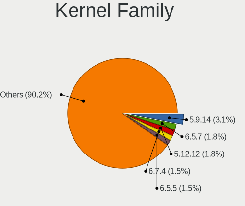

| Version | Computers | Percent |
|---------|-----------|---------|
| 5.9.14  | 10        | 6.67%   |
| 5.12.12 | 6         | 4%      |
| 5.7.6   | 5         | 3.33%   |
| 5.15.12 | 5         | 3.33%   |
| 5.7.12  | 4         | 2.67%   |
| 5.12.8  | 4         | 2.67%   |
| 5.12.14 | 4         | 2.67%   |
| 5.10.8  | 4         | 2.67%   |
| 5.10.4  | 4         | 2.67%   |
| 5.8.8   | 3         | 2%      |
| 5.8.14  | 3         | 2%      |
| 5.8.12  | 3         | 2%      |
| 5.17.1  | 3         | 2%      |
| 5.16.8  | 3         | 2%      |
| 5.16.3  | 3         | 2%      |
| 5.16.10 | 3         | 2%      |
| 5.13.8  | 3         | 2%      |
| 5.10.6  | 3         | 2%      |
| 5.10.16 | 3         | 2%      |
| 5.9.12  | 2         | 1.33%   |
| 5.9.10  | 2         | 1.33%   |
| 5.9.0   | 2         | 1.33%   |
| 5.7.2   | 2         | 1.33%   |
| 5.16.1  | 2         | 1.33%   |
| 5.15.3  | 2         | 1.33%   |
| 5.14.16 | 2         | 1.33%   |
| 5.14.14 | 2         | 1.33%   |
| 5.12.4  | 2         | 1.33%   |
| 5.11.6  | 2         | 1.33%   |
| 5.11.16 | 2         | 1.33%   |
| 5.11.10 | 2         | 1.33%   |
| 5.10.15 | 2         | 1.33%   |
| 4.19.0  | 2         | 1.33%   |
| 5.9.8   | 1         | 0.67%   |
| 5.9.6   | 1         | 0.67%   |
| 5.9.1   | 1         | 0.67%   |
| 5.8.5   | 1         | 0.67%   |
| 5.8.4   | 1         | 0.67%   |
| 5.8.0   | 1         | 0.67%   |
| 5.7.8   | 1         | 0.67%   |
| 5.6.7   | 1         | 0.67%   |
| 5.5.3   | 1         | 0.67%   |
| 5.5.10  | 1         | 0.67%   |
| 5.4.74  | 1         | 0.67%   |
| 5.17.3  | 1         | 0.67%   |
| 5.17.2  | 1         | 0.67%   |
| 5.16.7  | 1         | 0.67%   |
| 5.16.12 | 1         | 0.67%   |
| 5.16.0  | 1         | 0.67%   |
| 5.15.8  | 1         | 0.67%   |
| 5.15.7  | 1         | 0.67%   |
| 5.15.5  | 1         | 0.67%   |
| 5.15.4  | 1         | 0.67%   |
| 5.15.2  | 1         | 0.67%   |
| 5.15.16 | 1         | 0.67%   |
| 5.15.13 | 1         | 0.67%   |
| 5.14.7  | 1         | 0.67%   |
| 5.14.3  | 1         | 0.67%   |
| 5.14.10 | 1         | 0.67%   |
| 5.13.4  | 1         | 0.67%   |

Kernel Major Ver.
-----------------

Linux kernel major version

| Version | Computers | Percent |
|---------|-----------|---------|
| 5.10    | 21        | 14.89%  |
| 5.12    | 19        | 13.48%  |
| 5.9     | 18        | 12.77%  |
| 5.15    | 14        | 9.93%   |
| 5.16    | 13        | 9.22%   |
| 5.11    | 12        | 8.51%   |
| 5.8     | 11        | 7.8%    |
| 5.7     | 10        | 7.09%   |
| 5.14    | 7         | 4.96%   |
| 5.13    | 6         | 4.26%   |
| 5.17    | 5         | 3.55%   |
| 4.19    | 2         | 1.42%   |
| 5.6     | 1         | 0.71%   |
| 5.5     | 1         | 0.71%   |
| 5.4     | 1         | 0.71%   |

Arch
----

OS architecture (x86_64, i586, etc.)

| Name   | Computers | Percent |
|--------|-----------|---------|
| x86_64 | 123       | 100%    |

DE
--

Desktop Environment

| Name           | Computers | Percent |
|----------------|-----------|---------|
| KDE5           | 27        | 20.45%  |
| GNOME          | 23        | 17.42%  |
| XFCE           | 19        | 14.39%  |
| Unknown        | 18        | 13.64%  |
| X-Cinnamon     | 10        | 7.58%   |
| MATE           | 8         | 6.06%   |
| LXQt           | 5         | 3.79%   |
| Cinnamon       | 5         | 3.79%   |
| KDE            | 4         | 3.03%   |
| bspwm          | 3         | 2.27%   |
| LXDE           | 2         | 1.52%   |
| i3             | 2         | 1.52%   |
| xmonad         | 1         | 0.76%   |
| sway           | 1         | 0.76%   |
| openbox        | 1         | 0.76%   |
| nxde           | 1         | 0.76%   |
| dwm            | 1         | 0.76%   |
| awesomeminimal | 1         | 0.76%   |

Display Server
--------------

X11 or Wayland

| Name    | Computers | Percent |
|---------|-----------|---------|
| X11     | 88        | 68.22%  |
| Tty     | 21        | 16.28%  |
| Wayland | 13        | 10.08%  |
| Unknown | 7         | 5.43%   |

Display Manager
---------------

SDDM, LightDM, etc.

| Name    | Computers | Percent |
|---------|-----------|---------|
| Unknown | 45        | 35.43%  |
| LightDM | 38        | 29.92%  |
| SDDM    | 35        | 27.56%  |
| GDM     | 4         | 3.15%   |
| LXDM    | 2         | 1.57%   |
| XDM     | 1         | 0.79%   |
| SLiM    | 1         | 0.79%   |
| Ly      | 1         | 0.79%   |

OS Lang
-------

Language

| Lang    | Computers | Percent |
|---------|-----------|---------|
| en_US   | 55        | 43.31%  |
| Unknown | 15        | 11.81%  |
| ru_RU   | 8         | 6.3%    |
| fr_FR   | 8         | 6.3%    |
| en_GB   | 6         | 4.72%   |
| de_DE   | 6         | 4.72%   |
| C       | 5         | 3.94%   |
| pt_PT   | 3         | 2.36%   |
| es_ES   | 3         | 2.36%   |
| it_IT   | 2         | 1.57%   |
| en_CA   | 2         | 1.57%   |
| en_AU   | 2         | 1.57%   |
| el_GR   | 2         | 1.57%   |
| uk_UA   | 1         | 0.79%   |
| pt_BR   | 1         | 0.79%   |
| pl_PL   | 1         | 0.79%   |
| ja_JP   | 1         | 0.79%   |
| es_MX   | 1         | 0.79%   |
| es_AR   | 1         | 0.79%   |
| en_IN   | 1         | 0.79%   |
| en_IE   | 1         | 0.79%   |
| cs_CZ   | 1         | 0.79%   |
| bg_BG   | 1         | 0.79%   |

Boot Mode
---------

EFI or BIOS

| Mode | Computers | Percent |
|------|-----------|---------|
| EFI  | 91        | 72.8%   |
| BIOS | 34        | 27.2%   |

Filesystem
----------

Type of filesystem

| Type    | Computers | Percent |
|---------|-----------|---------|
| Ext4    | 87        | 70.73%  |
| Btrfs   | 26        | 21.14%  |
| Xfs     | 5         | 4.07%   |
| F2fs    | 3         | 2.44%   |
| Overlay | 1         | 0.81%   |
| Jfs     | 1         | 0.81%   |

Part. scheme
------------

Scheme of partitioning

| Type    | Computers | Percent |
|---------|-----------|---------|
| GPT     | 94        | 74.6%   |
| Unknown | 20        | 15.87%  |
| MBR     | 12        | 9.52%   |

Dual Boot with Linux/BSD
------------------------

Hosting more than one Linux/BSD

| Dual boot | Computers | Percent |
|-----------|-----------|---------|
| No        | 98        | 78.4%   |
| Yes       | 27        | 21.6%   |

Dual Boot (Win)
---------------

Hosting Linux and Windows

| Dual boot | Computers | Percent |
|-----------|-----------|---------|
| No        | 91        | 73.39%  |
| Yes       | 33        | 26.61%  |

Board
-----

Vendor
------

Motherboard manufacturer

| Name                | Computers | Percent |
|---------------------|-----------|---------|
| Lenovo              | 25        | 20.33%  |
| ASUSTek Computer    | 21        | 17.07%  |
| Hewlett-Packard     | 15        | 12.2%   |
| MSI                 | 11        | 8.94%   |
| Dell                | 11        | 8.94%   |
| Gigabyte Technology | 10        | 8.13%   |
| Acer                | 8         | 6.5%    |
| ASRock              | 5         | 4.07%   |
| Apple               | 3         | 2.44%   |
| Timi                | 2         | 1.63%   |
| Notebook            | 2         | 1.63%   |
| Intel               | 2         | 1.63%   |
| GPD                 | 2         | 1.63%   |
| UNOWHY              | 1         | 0.81%   |
| Quanta              | 1         | 0.81%   |
| Microsoft           | 1         | 0.81%   |
| Biostar             | 1         | 0.81%   |
| Alienware           | 1         | 0.81%   |
| Acidanthera         | 1         | 0.81%   |

Model
-----

Motherboard model

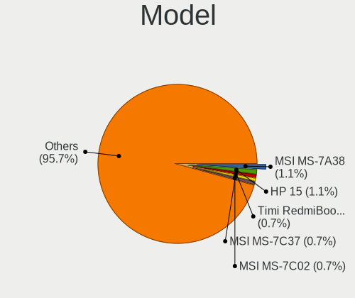

| Name                                   | Computers | Percent |
|----------------------------------------|-----------|---------|
| Timi RedmiBook 14 II                   | 2         | 1.63%   |
| MSI MS-7C02                            | 2         | 1.63%   |
| MSI MS-7A38                            | 2         | 1.63%   |
| Lenovo IdeaPad 5 15IIL05 81YK          | 2         | 1.63%   |
| HP 15                                  | 2         | 1.63%   |
| GPD P2 MAX                             | 2         | 1.63%   |
| Gigabyte 970A-DS3P                     | 2         | 1.63%   |
| Dell Precision 7550                    | 2         | 1.63%   |
| Apple MacBookAir7,2                    | 2         | 1.63%   |
| UNOWHY Y13G010S4EI                     | 1         | 0.81%   |
| Quanta SWH                             | 1         | 0.81%   |
| Notebook N141CU                        | 1         | 0.81%   |
| Notebook N130BU                        | 1         | 0.81%   |
| MSI MS-7C56                            | 1         | 0.81%   |
| MSI MS-7C37                            | 1         | 0.81%   |
| MSI MS-7B79                            | 1         | 0.81%   |
| MSI MS-7A69                            | 1         | 0.81%   |
| MSI MS-7821                            | 1         | 0.81%   |
| MSI Modern 15 A11M                     | 1         | 0.81%   |
| MSI GP72 7RDX                          | 1         | 0.81%   |
| Microsoft Surface Pro                  | 1         | 0.81%   |
| Lenovo ThinkPad W500 4063CJ5           | 1         | 0.81%   |
| Lenovo ThinkPad T480s 20L8S3D400       | 1         | 0.81%   |
| Lenovo ThinkPad T430 2350BC6           | 1         | 0.81%   |
| Lenovo ThinkPad T430 2347H76           | 1         | 0.81%   |
| Lenovo ThinkPad T420 4236H45           | 1         | 0.81%   |
| Lenovo ThinkPad T14 Gen 1 20UES1GC00   | 1         | 0.81%   |
| Lenovo ThinkPad T14 Gen 1 20S1S07800   | 1         | 0.81%   |
| Lenovo ThinkPad P1 Gen 3 20TH001EMH    | 1         | 0.81%   |
| Lenovo ThinkPad E14 Gen 2 20T6000MCK   | 1         | 0.81%   |
| Lenovo ThinkPad 11e 5th Gen 20LNS0P500 | 1         | 0.81%   |
| Lenovo ThinkBook 15 G2 ITL 20VE        | 1         | 0.81%   |
| Lenovo Legion 5 15ARH05H 82B1          | 1         | 0.81%   |
| Lenovo LaVie Z 20FF0012US              | 1         | 0.81%   |
| Lenovo IdeaPadFlex 5 14ALC05 82HU      | 1         | 0.81%   |
| Lenovo IdeaPad Y500 20193              | 1         | 0.81%   |
| Lenovo IdeaPad L340-17IRH Gaming 81LL  | 1         | 0.81%   |
| Lenovo IdeaPad Gaming 3 15IMH05 82CG   | 1         | 0.81%   |
| Lenovo IdeaPad Flex 5 14ARE05 81X2     | 1         | 0.81%   |
| Lenovo IdeaPad 510-15IKB 80SV          | 1         | 0.81%   |
| Lenovo IdeaPad 330-15IKB 81DE          | 1         | 0.81%   |
| Lenovo G400s 20244                     | 1         | 0.81%   |
| Lenovo B590 20206                      | 1         | 0.81%   |
| Lenovo B570e HuronRiver Platform       | 1         | 0.81%   |
| Intel NUC7CJYH                         | 1         | 0.81%   |
| Intel DX58SO2 AAG10925-205             | 1         | 0.81%   |
| HP ProBook 450 G6                      | 1         | 0.81%   |
| HP OMEN Laptop 15-en0xxx               | 1         | 0.81%   |
| HP Laptop 17z-ca300                    | 1         | 0.81%   |
| HP Laptop 15-ef1xxx                    | 1         | 0.81%   |
| HP Laptop 14s-dq2xxx                   | 1         | 0.81%   |
| HP Laptop 14s-cf3xxx                   | 1         | 0.81%   |
| HP Compaq 8200 Elite SFF PC            | 1         | 0.81%   |
| HP 280 G1 MT                           | 1         | 0.81%   |
| HP 255 G7 Notebook PC                  | 1         | 0.81%   |
| HP 250 G7 Notebook PC                  | 1         | 0.81%   |
| HP 250 G4 Notebook PC                  | 1         | 0.81%   |
| HP 250 G3                              | 1         | 0.81%   |
| HP 246                                 | 1         | 0.81%   |
| Gigabyte X570 AORUS ELITE              | 1         | 0.81%   |

Model Family
------------

Motherboard model prefix

| Name                  | Computers | Percent |
|-----------------------|-----------|---------|
| Lenovo ThinkPad       | 10        | 8.13%   |
| Lenovo IdeaPad        | 8         | 6.5%    |
| Acer Aspire           | 6         | 4.88%   |
| Dell Precision        | 5         | 4.07%   |
| HP Laptop             | 4         | 3.25%   |
| HP 250                | 3         | 2.44%   |
| Dell Inspiron         | 3         | 2.44%   |
| ASUS ROG              | 3         | 2.44%   |
| ASUS PRIME            | 3         | 2.44%   |
| Timi RedmiBook        | 2         | 1.63%   |
| MSI MS-7C02           | 2         | 1.63%   |
| MSI MS-7A38           | 2         | 1.63%   |
| HP 15                 | 2         | 1.63%   |
| GPD P2                | 2         | 1.63%   |
| Gigabyte 970A-DS3P    | 2         | 1.63%   |
| Dell Latitude         | 2         | 1.63%   |
| ASUS TUF              | 2         | 1.63%   |
| Apple MacBookAir7     | 2         | 1.63%   |
| UNOWHY Y13G010S4EI    | 1         | 0.81%   |
| Quanta SWH            | 1         | 0.81%   |
| Notebook N141CU       | 1         | 0.81%   |
| Notebook N130BU       | 1         | 0.81%   |
| MSI MS-7C56           | 1         | 0.81%   |
| MSI MS-7C37           | 1         | 0.81%   |
| MSI MS-7B79           | 1         | 0.81%   |
| MSI MS-7A69           | 1         | 0.81%   |
| MSI MS-7821           | 1         | 0.81%   |
| MSI Modern            | 1         | 0.81%   |
| MSI GP72              | 1         | 0.81%   |
| Microsoft Surface     | 1         | 0.81%   |
| Lenovo ThinkBook      | 1         | 0.81%   |
| Lenovo Legion         | 1         | 0.81%   |
| Lenovo LaVie          | 1         | 0.81%   |
| Lenovo IdeaPadFlex    | 1         | 0.81%   |
| Lenovo G400s          | 1         | 0.81%   |
| Lenovo B590           | 1         | 0.81%   |
| Lenovo B570e          | 1         | 0.81%   |
| Intel NUC7CJYH        | 1         | 0.81%   |
| Intel DX58SO2         | 1         | 0.81%   |
| HP ProBook            | 1         | 0.81%   |
| HP OMEN               | 1         | 0.81%   |
| HP Compaq             | 1         | 0.81%   |
| HP 280                | 1         | 0.81%   |
| HP 255                | 1         | 0.81%   |
| HP 246                | 1         | 0.81%   |
| Gigabyte X570         | 1         | 0.81%   |
| Gigabyte X399         | 1         | 0.81%   |
| Gigabyte P55-USB3     | 1         | 0.81%   |
| Gigabyte HA65M-D2H-B3 | 1         | 0.81%   |
| Gigabyte B450M        | 1         | 0.81%   |
| Gigabyte AERO         | 1         | 0.81%   |
| Gigabyte 990FXA-UD5   | 1         | 0.81%   |
| Gigabyte 990FXA-UD3   | 1         | 0.81%   |
| Dell OptiPlex         | 1         | 0.81%   |
| Biostar G31D-M7       | 1         | 0.81%   |
| ASUS VivoBook         | 1         | 0.81%   |
| ASUS SABERTOOTH       | 1         | 0.81%   |
| ASUS Pro              | 1         | 0.81%   |
| ASUS P8H61-M          | 1         | 0.81%   |
| ASUS P8B75-M          | 1         | 0.81%   |

MFG Year
--------

Motherboard manufacture year

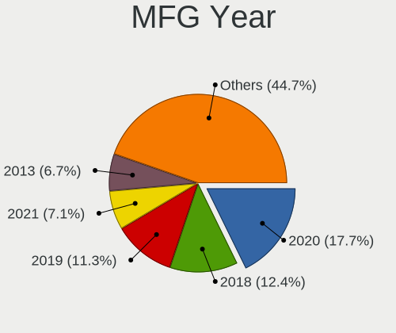

| Year | Computers | Percent |
|------|-----------|---------|
| 2020 | 28        | 22.76%  |
| 2019 | 17        | 13.82%  |
| 2018 | 13        | 10.57%  |
| 2017 | 13        | 10.57%  |
| 2013 | 9         | 7.32%   |
| 2012 | 9         | 7.32%   |
| 2011 | 8         | 6.5%    |
| 2016 | 7         | 5.69%   |
| 2014 | 6         | 4.88%   |
| 2015 | 5         | 4.07%   |
| 2010 | 3         | 2.44%   |
| 2021 | 2         | 1.63%   |
| 2008 | 2         | 1.63%   |
| 2009 | 1         | 0.81%   |

Form Factor
-----------

Physical design of the computer

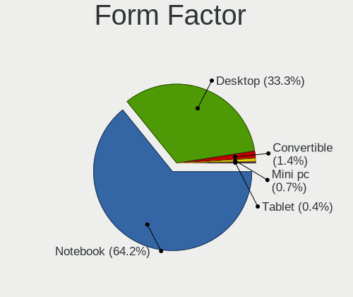

| Name        | Computers | Percent |
|-------------|-----------|---------|
| Notebook    | 75        | 60.98%  |
| Desktop     | 43        | 34.96%  |
| Convertible | 2         | 1.63%   |
| Tablet      | 1         | 0.81%   |
| Mini pc     | 1         | 0.81%   |
| All in one  | 1         | 0.81%   |

Secure Boot
-----------

Enabled or disabled

| State    | Computers | Percent |
|----------|-----------|---------|
| Disabled | 122       | 99.19%  |
| Enabled  | 1         | 0.81%   |

Coreboot
--------

Have coreboot on board

| Used | Computers | Percent |
|------|-----------|---------|
| No   | 123       | 100%    |

RAM Size
--------

Total RAM memory

| Size in GB  | Computers | Percent |
|-------------|-----------|---------|
| 16.01-24.0  | 33        | 26.4%   |
| 8.01-16.0   | 33        | 26.4%   |
| 4.01-8.0    | 21        | 16.8%   |
| 3.01-4.0    | 17        | 13.6%   |
| 32.01-64.0  | 9         | 7.2%    |
| 64.01-256.0 | 7         | 5.6%    |
| 1.01-2.0    | 4         | 3.2%    |
| 24.01-32.0  | 1         | 0.8%    |

RAM Used
--------

Used RAM memory

| Used GB    | Computers | Percent |
|------------|-----------|---------|
| 1.01-2.0   | 33        | 23.57%  |
| 2.01-3.0   | 30        | 21.43%  |
| 4.01-8.0   | 29        | 20.71%  |
| 3.01-4.0   | 25        | 17.86%  |
| 0.51-1.0   | 13        | 9.29%   |
| 8.01-16.0  | 5         | 3.57%   |
| 0.01-0.5   | 3         | 2.14%   |
| 16.01-24.0 | 2         | 1.43%   |

Total Drives
------------

Number of drives on board

| Drives | Computers | Percent |
|--------|-----------|---------|
| 1      | 68        | 53.97%  |
| 2      | 36        | 28.57%  |
| 3      | 14        | 11.11%  |
| 4      | 4         | 3.17%   |
| 6      | 2         | 1.59%   |
| 8      | 1         | 0.79%   |
| 7      | 1         | 0.79%   |

Has CD-ROM
----------

Has CD-ROM on board

| Presented | Computers | Percent |
|-----------|-----------|---------|
| No        | 91        | 73.98%  |
| Yes       | 32        | 26.02%  |

Has Ethernet
------------

Has Ethernet on board

| Presented | Computers | Percent |
|-----------|-----------|---------|
| Yes       | 106       | 86.18%  |
| No        | 17        | 13.82%  |

Has WiFi
--------

Has WiFi module

| Presented | Computers | Percent |
|-----------|-----------|---------|
| Yes       | 98        | 79.67%  |
| No        | 25        | 20.33%  |

Has Bluetooth
-------------

Has Bluetooth module

| Presented | Computers | Percent |
|-----------|-----------|---------|
| Yes       | 82        | 65.6%   |
| No        | 43        | 34.4%   |

Location
--------

Country
-------

Geographic location (country)

| Country     | Computers | Percent |
|-------------|-----------|---------|
| USA         | 23        | 18.7%   |
| Germany     | 15        | 12.2%   |
| Russia      | 10        | 8.13%   |
| France      | 10        | 8.13%   |
| UK          | 5         | 4.07%   |
| Ukraine     | 4         | 3.25%   |
| Switzerland | 4         | 3.25%   |
| Poland      | 4         | 3.25%   |
| Greece      | 4         | 3.25%   |
| Canada      | 4         | 3.25%   |
| Turkey      | 3         | 2.44%   |
| Spain       | 3         | 2.44%   |
| Netherlands | 3         | 2.44%   |
| India       | 3         | 2.44%   |
| Brazil      | 3         | 2.44%   |
| Italy       | 2         | 1.63%   |
| Indonesia   | 2         | 1.63%   |
| Bulgaria    | 2         | 1.63%   |
| Australia   | 2         | 1.63%   |
| Argentina   | 2         | 1.63%   |
| Uzbekistan  | 1         | 0.81%   |
| Sweden      | 1         | 0.81%   |
| Slovenia    | 1         | 0.81%   |
| Mexico      | 1         | 0.81%   |
| Lithuania   | 1         | 0.81%   |
| Japan       | 1         | 0.81%   |
| Iran        | 1         | 0.81%   |
| Hong Kong   | 1         | 0.81%   |
| Czechia     | 1         | 0.81%   |
| China       | 1         | 0.81%   |
| Chile       | 1         | 0.81%   |
| Bangladesh  | 1         | 0.81%   |
| Azerbaijan  | 1         | 0.81%   |
| Austria     | 1         | 0.81%   |
| Algeria     | 1         | 0.81%   |

City
----

Geographic location (city)

| City                     | Computers | Percent |
|--------------------------|-----------|---------|
| Paris                    | 6         | 4.62%   |
| Frankfurt am Main        | 4         | 3.08%   |
| Seattle                  | 3         | 2.31%   |
| Kyiv                     | 3         | 2.31%   |
| St Petersburg            | 2         | 1.54%   |
| Sofia                    | 2         | 1.54%   |
| San Ramon                | 2         | 1.54%   |
| Neuchatel                | 2         | 1.54%   |
| Moscow                   | 2         | 1.54%   |
| Los Angeles              | 2         | 1.54%   |
| Kodzko              | 2         | 1.54%   |
| Jakarta                  | 2         | 1.54%   |
| Geneva                   | 2         | 1.54%   |
| Charlotte                | 2         | 1.54%   |
| Berlin                   | 2         | 1.54%   |
| Amsterdam                | 2         | 1.54%   |
| orum                | 1         | 0.77%   |
| Zaporizhzhya             | 1         | 0.77%   |
| York                     | 1         | 0.77%   |
| Yekaterinburg            | 1         | 0.77%   |
| Xirdalan                 | 1         | 0.77%   |
| Wigan                    | 1         | 0.77%   |
| Vilnius                  | 1         | 0.77%   |
| Villiers-sur-Orge        | 1         | 0.77%   |
| Vienna                   | 1         | 0.77%   |
| Vancouver                | 1         | 0.77%   |
| Valdahon                 | 1         | 0.77%   |
| Utsunomiya               | 1         | 0.77%   |
| Upper Norwood            | 1         | 0.77%   |
| Ufa                      | 1         | 0.77%   |
| Towanda                  | 1         | 0.77%   |
| Toronto                  | 1         | 0.77%   |
| Thessaloniki             | 1         | 0.77%   |
| Thassos                  | 1         | 0.77%   |
| Tehran                   | 1         | 0.77%   |
| Syeverodonets'k          | 1         | 0.77%   |
| Sydney                   | 1         | 0.77%   |
| Surgut                   | 1         | 0.77%   |
| Stuttgart                | 1         | 0.77%   |
| Stockholm                | 1         | 0.77%   |
| Statesboro               | 1         | 0.77%   |
| Srednyaya Akhtuba        | 1         | 0.77%   |
| Seville                  | 1         | 0.77%   |
| Santiago                 | 1         | 0.77%   |
| Santa Fe                 | 1         | 0.77%   |
| Sant'Agata Bolognese     | 1         | 0.77%   |
| San Miguel de Tucumn | 1         | 0.77%   |
| Sainte-Severe            | 1         | 0.77%   |
| Roseburg                 | 1         | 0.77%   |
| Riverview                | 1         | 0.77%   |
| Quincy                   | 1         | 0.77%   |
| Puducherry               | 1         | 0.77%   |
| Prague                   | 1         | 0.77%   |
| Piraeus                  | 1         | 0.77%   |
| Ordu                     | 1         | 0.77%   |
| Onda                     | 1         | 0.77%   |
| Omsk                     | 1         | 0.77%   |
| Obernai                  | 1         | 0.77%   |
| Nuremberg                | 1         | 0.77%   |
| Nottingham               | 1         | 0.77%   |

Drives
------

Drive Vendor
------------

Hard drive vendors

| Vendor              | Computers | Drives | Percent |
|---------------------|-----------|--------|---------|
| Samsung Electronics | 33        | 45     | 16.58%  |
| Seagate             | 32        | 39     | 16.08%  |
| WDC                 | 26        | 46     | 13.07%  |
| Toshiba             | 15        | 16     | 7.54%   |
| Kingston            | 13        | 14     | 6.53%   |
| Crucial             | 10        | 16     | 5.03%   |
| Intel               | 9         | 14     | 4.52%   |
| Sandisk             | 8         | 10     | 4.02%   |
| SK Hynix            | 7         | 14     | 3.52%   |
| HGST                | 6         | 7      | 3.02%   |
| Hitachi             | 5         | 6      | 2.51%   |
| China               | 4         | 4      | 2.01%   |
| SPCC                | 3         | 3      | 1.51%   |
| Apple               | 3         | 4      | 1.51%   |
| Unknown             | 2         | 2      | 1.01%   |
| PNY                 | 2         | 2      | 1.01%   |
| Phison Electronics  | 2         | 3      | 1.01%   |
| MAXTOR              | 2         | 2      | 1.01%   |
| Linux               | 2         | 2      | 1.01%   |
| JMicron             | 2         | 2      | 1.01%   |
| Corsair             | 2         | 2      | 1.01%   |
| Union Memory        | 1         | 1      | 0.5%    |
| TS512GMT            | 1         | 3      | 0.5%    |
| Transcend           | 1         | 1      | 0.5%    |
| Timetec             | 1         | 2      | 0.5%    |
| Solid State Storage | 1         | 1      | 0.5%    |
| Phison              | 1         | 1      | 0.5%    |
| LDLC                | 1         | 6      | 0.5%    |
| Intenso             | 1         | 1      | 0.5%    |
| Hewlett-Packard     | 1         | 1      | 0.5%    |
| GOODRAM             | 1         | 1      | 0.5%    |
| AMD                 | 1         | 1      | 0.5%    |

Drive Model
-----------

Hard drive models

| Model                                   | Computers | Percent |
|-----------------------------------------|-----------|---------|
| Toshiba DT01ACA100 1TB                  | 3         | 1.37%   |
| Seagate ST3500418AS 500GB               | 3         | 1.37%   |
| Seagate ST1000LM035-1RK172 1TB          | 3         | 1.37%   |
| Seagate ST1000LM024 HN-M101MBB 1TB      | 3         | 1.37%   |
| Seagate ST1000DM010-2EP102 1TB          | 3         | 1.37%   |
| Sandisk NVMe SSD Drive 512GB            | 3         | 1.37%   |
| Samsung SSD 970 EVO 1TB                 | 3         | 1.37%   |
| Samsung SSD 860 EVO 250GB               | 3         | 1.37%   |
| HGST HTS545050A7E680 500GB              | 3         | 1.37%   |
| Crucial CT240BX500SSD1 240GB            | 3         | 1.37%   |
| Crucial CT1000MX500SSD1 1TB             | 3         | 1.37%   |
| WDC WD80EZAZ-11TDBA0 8TB                | 2         | 0.91%   |
| WDC WD10JPVX-22JC3T0 1TB                | 2         | 0.91%   |
| WDC WD10EZEX-08WN4A0 1TB                | 2         | 0.91%   |
| Toshiba MQ04ABF100 1TB                  | 2         | 0.91%   |
| Toshiba MQ01ABD100 1TB                  | 2         | 0.91%   |
| SPCC Solid State Disk 240GB             | 2         | 0.91%   |
| Samsung SSD 870 EVO 250GB               | 2         | 0.91%   |
| Samsung NVMe SSD Drive 1TB              | 2         | 0.91%   |
| Samsung MZYTY256HDHP-000L2 256GB SSD    | 2         | 0.91%   |
| Samsung MZNLH512HALU-00000 512GB SSD    | 2         | 0.91%   |
| Phison PCIe SSD 8TB                     | 2         | 0.91%   |
| Linux scsi_debug 8.3MB                  | 2         | 0.91%   |
| Kingston SA400S37240G 240GB SSD         | 2         | 0.91%   |
| Kingston SA400S37120G 120GB SSD         | 2         | 0.91%   |
| China SATA SSD 960GB                    | 2         | 0.91%   |
| Apple SSD SM0256G 256GB                 | 2         | 0.91%   |
| WDC WDS500G2B0C-00PXH0 500GB            | 1         | 0.46%   |
| WDC WDS500G2B0A-00SM50 500GB SSD        | 1         | 0.46%   |
| WDC WDS256G1X0C-00ENX0 256GB            | 1         | 0.46%   |
| WDC WDS200T2B0B-00YS70 2TB SSD          | 1         | 0.46%   |
| WDC WDS100T2B0C-00PXH0 1TB              | 1         | 0.46%   |
| WDC WDS100T2B0A-00SM50 1TB SSD          | 1         | 0.46%   |
| WDC WDBNCE5000PNC 500GB SSD             | 1         | 0.46%   |
| WDC WD6001FZWX-00A2VA0 6TB              | 1         | 0.46%   |
| WDC WD5003ABYX-18WERA0 500GB            | 1         | 0.46%   |
| WDC WD5000LPVX-75V0TT0 500GB            | 1         | 0.46%   |
| WDC WD5000LPVX-00V0TT0 500GB            | 1         | 0.46%   |
| WDC WD5000BPVT-22HXZT3 500GB            | 1         | 0.46%   |
| WDC WD5000AAKX-60U6AA0 500GB            | 1         | 0.46%   |
| WDC WD40EZRZ-00WN9B0 4TB                | 1         | 0.46%   |
| WDC WD4003FZEX-00Z4SA0 4TB              | 1         | 0.46%   |
| WDC WD4003FFBX-68MU3N0 4TB              | 1         | 0.46%   |
| WDC WD3200LPVT-00FMCT0 320GB            | 1         | 0.46%   |
| WDC WD30EZRX-00DC0B0 3TB                | 1         | 0.46%   |
| WDC WD30EFRX-68EUZN0 3TB                | 1         | 0.46%   |
| WDC WD2500HHTZ-04N21V0 250GB            | 1         | 0.46%   |
| WDC WD20EZRX-00D8PB0 2TB                | 1         | 0.46%   |
| WDC WD20EARS-00MVWB0 2TB                | 1         | 0.46%   |
| WDC WD2003FZEX-00SRLA0 2TB              | 1         | 0.46%   |
| WDC WD15EARS-22MVWB0 1TB                | 1         | 0.46%   |
| WDC WD10SPZX-60Z10T0 1TB                | 1         | 0.46%   |
| WDC WD10SPZX-21Z10T0 1TB                | 1         | 0.46%   |
| WDC WD10EZRZ-00HTKB0 1TB                | 1         | 0.46%   |
| WDC WD10EZEX-00BN5A0 1TB                | 1         | 0.46%   |
| WDC WD100EMAZ-00WJTA0 10TB              | 1         | 0.46%   |
| Unknown SD/MMC/MS PRO 16GB              | 1         | 0.46%   |
| Unknown DA4064  64GB                    | 1         | 0.46%   |
| Union Memory UMIS RPJTJ256MEE1OWX 256GB | 1         | 0.46%   |
| TS512GMT S430S 512GB                    | 1         | 0.46%   |

HDD Vendor
----------

Hard disk drive vendors

| Vendor  | Computers | Drives | Percent |
|---------|-----------|--------|---------|
| Seagate | 32        | 39     | 39.51%  |
| WDC     | 22        | 36     | 27.16%  |
| Toshiba | 12        | 13     | 14.81%  |
| HGST    | 6         | 7      | 7.41%   |
| Hitachi | 5         | 6      | 6.17%   |
| MAXTOR  | 2         | 2      | 2.47%   |
| Unknown | 1         | 1      | 1.23%   |
| JMicron | 1         | 1      | 1.23%   |

SSD Vendor
----------

Solid state drive vendors

| Vendor              | Computers | Drives | Percent |
|---------------------|-----------|--------|---------|
| Samsung Electronics | 14        | 18     | 22.22%  |
| Crucial             | 10        | 16     | 15.87%  |
| Kingston            | 9         | 9      | 14.29%  |
| WDC                 | 4         | 7      | 6.35%   |
| China               | 4         | 4      | 6.35%   |
| SPCC                | 3         | 3      | 4.76%   |
| SanDisk             | 3         | 3      | 4.76%   |
| Intel               | 3         | 4      | 4.76%   |
| Apple               | 3         | 4      | 4.76%   |
| Linux               | 2         | 2      | 3.17%   |
| Toshiba             | 1         | 1      | 1.59%   |
| SK Hynix            | 1         | 1      | 1.59%   |
| PNY                 | 1         | 1      | 1.59%   |
| LDLC                | 1         | 6      | 1.59%   |
| JMicron             | 1         | 1      | 1.59%   |
| Intenso             | 1         | 1      | 1.59%   |
| GOODRAM             | 1         | 1      | 1.59%   |
| AMD                 | 1         | 1      | 1.59%   |

Drive Kind
----------

HDD or SSD

| Kind    | Computers | Drives | Percent |
|---------|-----------|--------|---------|
| HDD     | 70        | 105    | 39.33%  |
| SSD     | 56        | 83     | 31.46%  |
| NVMe    | 49        | 78     | 27.53%  |
| Unknown | 2         | 5      | 1.12%   |
| MMC     | 1         | 1      | 0.56%   |

Drive Connector
---------------

SATA, SAS, NVMe, etc.

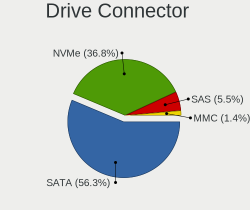

| Type | Computers | Drives | Percent |
|------|-----------|--------|---------|
| SATA | 95        | 184    | 62.5%   |
| NVMe | 49        | 78     | 32.24%  |
| SAS  | 7         | 9      | 4.61%   |
| MMC  | 1         | 1      | 0.66%   |

Drive Size
----------

Size of hard drive

| Size in TB | Computers | Drives | Percent |
|------------|-----------|--------|---------|
| 0.01-0.5   | 65        | 96     | 49.24%  |
| 0.51-1.0   | 44        | 62     | 33.33%  |
| 1.01-2.0   | 12        | 13     | 9.09%   |
| 2.01-3.0   | 4         | 4      | 3.03%   |
| 4.01-10.0  | 4         | 10     | 3.03%   |
| 3.01-4.0   | 3         | 3      | 2.27%   |

Space Total
-----------

Amount of disk space available on the file system

| Size in GB     | Computers | Percent |
|----------------|-----------|---------|
| 101-250        | 32        | 25.2%   |
| 251-500        | 25        | 19.69%  |
| 1001-2000      | 19        | 14.96%  |
| 501-1000       | 15        | 11.81%  |
| More than 3000 | 12        | 9.45%   |
| 2001-3000      | 9         | 7.09%   |
| 51-100         | 7         | 5.51%   |
| Unknown        | 5         | 3.94%   |
| 1-20           | 2         | 1.57%   |
| 21-50          | 1         | 0.79%   |

Space Used
----------

Amount of used disk space

| Used GB        | Computers | Percent |
|----------------|-----------|---------|
| 1-20           | 28        | 20.9%   |
| 501-1000       | 22        | 16.42%  |
| 101-250        | 21        | 15.67%  |
| 51-100         | 15        | 11.19%  |
| 21-50          | 14        | 10.45%  |
| 251-500        | 13        | 9.7%    |
| 1001-2000      | 9         | 6.72%   |
| More than 3000 | 5         | 3.73%   |
| Unknown        | 5         | 3.73%   |
| 2001-3000      | 2         | 1.49%   |

Malfunc. Drives
---------------

Drive models with a malfunction

| Model                            | Computers | Drives | Percent |
|----------------------------------|-----------|--------|---------|
| Toshiba MQ01ABD100 1TB           | 2         | 2      | 8.7%    |
| HGST HTS545050A7E680 500GB       | 2         | 2      | 8.7%    |
| WDC WD3200LPVT-00FMCT0 320GB     | 1         | 1      | 4.35%   |
| WDC WD30EZRX-00DC0B0 3TB         | 1         | 1      | 4.35%   |
| Toshiba MK7575GSX 752GB          | 1         | 1      | 4.35%   |
| Toshiba MK5065GSX 500GB          | 1         | 1      | 4.35%   |
| Seagate ST8000DM004-2CX188 8TB   | 1         | 1      | 4.35%   |
| Seagate ST500LT012-9WS142 500GB  | 1         | 1      | 4.35%   |
| Seagate ST2000DX002-2DV164 2TB   | 1         | 1      | 4.35%   |
| Seagate ST2000DM006-2DM164 2TB   | 1         | 1      | 4.35%   |
| Seagate ST1000LM035-1RK172 1TB   | 1         | 1      | 4.35%   |
| MAXTOR 6Y080M0 81GB              | 1         | 1      | 4.35%   |
| LDLC SSD 120GB                   | 1         | 3      | 4.35%   |
| Kingston SUV400S37240G 240GB SSD | 1         | 1      | 4.35%   |
| Kingston SA400S37120G 120GB SSD  | 1         | 1      | 4.35%   |
| Intel SSDSC2BW480A4 480GB        | 1         | 2      | 4.35%   |
| Intel SSDPEKKW128G7 128GB        | 1         | 1      | 4.35%   |
| Hitachi HTS547550A9E384 500GB    | 1         | 1      | 4.35%   |
| Hitachi HTS542516K9SA00 160GB    | 1         | 1      | 4.35%   |
| HGST HTS541010A9E680 1TB         | 1         | 1      | 4.35%   |
| Hewlett-Packard SSD EX900 250GB  | 1         | 1      | 4.35%   |

Malfunc. Drive Vendor
---------------------

Vendors of faulty drives

| Vendor          | Computers | Drives | Percent |
|-----------------|-----------|--------|---------|
| Seagate         | 5         | 5      | 21.74%  |
| Toshiba         | 4         | 4      | 17.39%  |
| HGST            | 3         | 3      | 13.04%  |
| WDC             | 2         | 2      | 8.7%    |
| Kingston        | 2         | 2      | 8.7%    |
| Intel           | 2         | 3      | 8.7%    |
| Hitachi         | 2         | 2      | 8.7%    |
| MAXTOR          | 1         | 1      | 4.35%   |
| LDLC            | 1         | 3      | 4.35%   |
| Hewlett-Packard | 1         | 1      | 4.35%   |

Malfunc. HDD Vendor
-------------------

Vendors of faulty HDD drives

| Vendor  | Computers | Drives | Percent |
|---------|-----------|--------|---------|
| Seagate | 5         | 5      | 29.41%  |
| Toshiba | 4         | 4      | 23.53%  |
| HGST    | 3         | 3      | 17.65%  |
| WDC     | 2         | 2      | 11.76%  |
| Hitachi | 2         | 2      | 11.76%  |
| MAXTOR  | 1         | 1      | 5.88%   |

Malfunc. Drive Kind
-------------------

Kinds of faulty drives

| Kind | Computers | Drives | Percent |
|------|-----------|--------|---------|
| HDD  | 17        | 17     | 73.91%  |
| SSD  | 4         | 7      | 17.39%  |
| NVMe | 2         | 2      | 8.7%    |

Failed Drives
-------------

Failed drive models

Zero info for selected period =(

Failed Drive Vendor
-------------------

Failed drive vendors

Zero info for selected period =(

Drive Status
------------

Number of failed and malfunc. drives

| Status   | Computers | Drives | Percent |
|----------|-----------|--------|---------|
| Works    | 76        | 141    | 53.52%  |
| Detected | 44        | 105    | 30.99%  |
| Malfunc  | 22        | 26     | 15.49%  |

Storage controller
------------------

Storage Vendor
--------------

Storage controller vendors

| Vendor                         | Computers | Percent |
|--------------------------------|-----------|---------|
| Intel                          | 70        | 41.42%  |
| AMD                            | 36        | 21.3%   |
| Samsung Electronics            | 23        | 13.61%  |
| Sandisk                        | 7         | 4.14%   |
| SK Hynix                       | 6         | 3.55%   |
| Phison Electronics             | 5         | 2.96%   |
| Marvell Technology Group       | 5         | 2.96%   |
| Kingston Technology Company    | 4         | 2.37%   |
| ASMedia Technology             | 3         | 1.78%   |
| Union Memory (Shenzhen)        | 2         | 1.18%   |
| Toshiba America Info Systems   | 2         | 1.18%   |
| Silicon Motion                 | 2         | 1.18%   |
| Solid State Storage Technology | 1         | 0.59%   |
| Nvidia                         | 1         | 0.59%   |
| JMicron Technology             | 1         | 0.59%   |
| Broadcom / LSI                 | 1         | 0.59%   |

Storage Model
-------------

Storage controller models

| Model                                                                          | Computers | Percent |
|--------------------------------------------------------------------------------|-----------|---------|
| AMD FCH SATA Controller [AHCI mode]                                            | 27        | 14.14%  |
| Samsung NVMe SSD Controller SM981/PM981/PM983                                  | 13        | 6.81%   |
| Intel Sunrise Point-LP SATA Controller [AHCI mode]                             | 7         | 3.66%   |
| AMD 400 Series Chipset SATA Controller                                         | 7         | 3.66%   |
| Intel 7 Series Chipset Family 6-port SATA Controller [AHCI mode]               | 6         | 3.14%   |
| Intel 82801 Mobile SATA Controller [RAID mode]                                 | 5         | 2.62%   |
| AMD SB7x0/SB8x0/SB9x0 SATA Controller [AHCI mode]                              | 5         | 2.62%   |
| SK Hynix Non-Volatile memory controller                                        | 4         | 2.09%   |
| Samsung NVMe SSD Controller SM961/PM961/SM963                                  | 4         | 2.09%   |
| Samsung NVMe SSD Controller 980                                                | 4         | 2.09%   |
| Phison E12 NVMe Controller                                                     | 4         | 2.09%   |
| Intel 8 Series/C220 Series Chipset Family 6-port SATA Controller 1 [AHCI mode] | 4         | 2.09%   |
| Intel 6 Series/C200 Series Chipset Family 6 port Mobile SATA AHCI Controller   | 4         | 2.09%   |
| Intel 200 Series PCH SATA controller [AHCI mode]                               | 4         | 2.09%   |
| AMD 300 Series Chipset SATA Controller                                         | 4         | 2.09%   |
| Kingston Company Company Non-Volatile memory controller                        | 3         | 1.57%   |
| Intel Wildcat Point-LP SATA Controller [AHCI Mode]                             | 3         | 1.57%   |
| Intel SSD 660P Series                                                          | 3         | 1.57%   |
| Intel Q170/Q150/B150/H170/H110/Z170/CM236 Chipset SATA Controller [AHCI Mode]  | 3         | 1.57%   |
| Intel 8 Series SATA Controller 1 [AHCI mode]                                   | 3         | 1.57%   |
| ASMedia ASM1062 Serial ATA Controller                                          | 3         | 1.57%   |
| Union Memory (Shenzhen) Non-Volatile memory controller                         | 2         | 1.05%   |
| Toshiba America Info Systems BG3 NVMe SSD Controller                           | 2         | 1.05%   |
| Sandisk WD Black SN750 / PC SN730 NVMe SSD                                     | 2         | 1.05%   |
| Sandisk Non-Volatile memory controller                                         | 2         | 1.05%   |
| Samsung Electronics SATA controller                                            | 2         | 1.05%   |
| Marvell Group 88SE9172 SATA 6Gb/s Controller                                   | 2         | 1.05%   |
| Intel Volume Management Device NVMe RAID Controller                            | 2         | 1.05%   |
| Intel SSD Pro 7600p/760p/E 6100p Series                                        | 2         | 1.05%   |
| Intel Ice Lake-LP SATA Controller [AHCI mode]                                  | 2         | 1.05%   |
| Intel Comet Lake SATA AHCI Controller                                          | 2         | 1.05%   |
| Intel Celeron/Pentium Silver Processor SATA Controller                         | 2         | 1.05%   |
| Intel Cannon Point-LP SATA Controller [AHCI Mode]                              | 2         | 1.05%   |
| Intel 6 Series/C200 Series Chipset Family 6 port Desktop SATA AHCI Controller  | 2         | 1.05%   |
| Intel 400 Series Chipset Family SATA AHCI Controller                           | 2         | 1.05%   |
| AMD 500 Series Chipset SATA Controller                                         | 2         | 1.05%   |
| Solid State Storage Non-Volatile memory controller                             | 1         | 0.52%   |
| SK Hynix Gold P31 SSD                                                          | 1         | 0.52%   |
| SK Hynix BC511                                                                 | 1         | 0.52%   |
| Silicon Motion SM2263EN/SM2263XT SSD Controller                                | 1         | 0.52%   |
| Silicon Motion SM2262/SM2262EN SSD Controller                                  | 1         | 0.52%   |
| Sandisk WD Blue SN550 NVMe SSD                                                 | 1         | 0.52%   |
| Sandisk WD Blue SN500 / PC SN520 NVMe SSD                                      | 1         | 0.52%   |
| Sandisk WD Black NVMe SSD                                                      | 1         | 0.52%   |
| Phison E16 PCIe4 NVMe Controller                                               | 1         | 0.52%   |
| Nvidia MCP79 AHCI Controller                                                   | 1         | 0.52%   |
| Marvell Group 88SS9183 PCIe SSD Controller                                     | 1         | 0.52%   |
| Marvell Group 88SE9172 SATA III 6Gb/s RAID Controller                          | 1         | 0.52%   |
| Marvell Group 88SE912x IDE Controller                                          | 1         | 0.52%   |
| Marvell Group 88SE9123 PCIe SATA 6.0 Gb/s controller                           | 1         | 0.52%   |
| Kingston Company A2000 NVMe SSD                                                | 1         | 0.52%   |
| JMicron JMB363 SATA/IDE Controller                                             | 1         | 0.52%   |
| Intel Tiger Lake-LP SATA Controller [AHCI mode]                                | 1         | 0.52%   |
| Intel SSD 600P Series                                                          | 1         | 0.52%   |
| Intel SATA Controller [RAID mode]                                              | 1         | 0.52%   |
| Intel NM10/ICH7 Family SATA Controller [IDE mode]                              | 1         | 0.52%   |
| Intel NM10/ICH7 Family SATA Controller [AHCI mode]                             | 1         | 0.52%   |
| Intel HM170/QM170 Chipset SATA Controller [AHCI Mode]                          | 1         | 0.52%   |
| Intel Celeron N3350/Pentium N4200/Atom E3900 Series SATA AHCI Controller       | 1         | 0.52%   |
| Intel Cannon Lake PCH SATA AHCI Controller                                     | 1         | 0.52%   |

Storage Kind
------------

Kind of storage controller (IDE, SATA, NVMe, SAS, ...)

| Kind | Computers | Percent |
|------|-----------|---------|
| SATA | 98        | 59.39%  |
| NVMe | 50        | 30.3%   |
| RAID | 8         | 4.85%   |
| IDE  | 8         | 4.85%   |
| SAS  | 1         | 0.61%   |

Processor
---------

CPU Vendor
----------

Processor vendors

| Vendor | Computers | Percent |
|--------|-----------|---------|
| Intel  | 83        | 67.48%  |
| AMD    | 40        | 32.52%  |

CPU Model
---------

Processor models

| Model                                       | Computers | Percent |
|---------------------------------------------|-----------|---------|
| AMD Ryzen 9 3900X 12-Core Processor         | 4         | 3.23%   |
| AMD Ryzen 7 4700U with Radeon Graphics      | 4         | 3.23%   |
| AMD FX-8350 Eight-Core Processor            | 3         | 2.42%   |
| Intel Core m3-8100Y CPU @ 1.10GHz           | 2         | 1.61%   |
| Intel Core i7-9700K CPU @ 3.60GHz           | 2         | 1.61%   |
| Intel Core i7-7700HQ CPU @ 2.80GHz          | 2         | 1.61%   |
| Intel Core i7-10510U CPU @ 1.80GHz          | 2         | 1.61%   |
| Intel Core i5-7200U CPU @ 2.50GHz           | 2         | 1.61%   |
| Intel Core i5-5250U CPU @ 1.60GHz           | 2         | 1.61%   |
| Intel Core i5-4210U CPU @ 1.70GHz           | 2         | 1.61%   |
| Intel Core i5-2500 CPU @ 3.30GHz            | 2         | 1.61%   |
| Intel Core i5-1035G1 CPU @ 1.00GHz          | 2         | 1.61%   |
| Intel Core i3-7020U CPU @ 2.30GHz           | 2         | 1.61%   |
| Intel 11th Gen Core i7-1165G7 @ 2.80GHz     | 2         | 1.61%   |
| Intel 11th Gen Core i5-1135G7 @ 2.40GHz     | 2         | 1.61%   |
| AMD Ryzen 7 4800H with Radeon Graphics      | 2         | 1.61%   |
| AMD Ryzen 7 3700X 8-Core Processor          | 2         | 1.61%   |
| AMD Ryzen 7 1700 Eight-Core Processor       | 2         | 1.61%   |
| AMD Ryzen 5 3600 6-Core Processor           | 2         | 1.61%   |
| AMD Ryzen 5 2600X Six-Core Processor        | 2         | 1.61%   |
| Intel Xeon CPU E3-1505M v6 @ 3.00GHz        | 1         | 0.81%   |
| Intel Pentium Silver N5000 CPU @ 1.10GHz    | 1         | 0.81%   |
| Intel Pentium Dual-Core CPU T4400 @ 2.20GHz | 1         | 0.81%   |
| Intel Pentium CPU P6200 @ 2.13GHz           | 1         | 0.81%   |
| Intel Pentium CPU A1018 @ 2.10GHz           | 1         | 0.81%   |
| Intel Pentium CPU 2020M @ 2.40GHz           | 1         | 0.81%   |
| Intel Core m3-7Y30 CPU @ 1.00GHz            | 1         | 0.81%   |
| Intel Core i9-8950HK CPU @ 2.90GHz          | 1         | 0.81%   |
| Intel Core i9-10885H CPU @ 2.40GHz          | 1         | 0.81%   |
| Intel Core i7-9750HF CPU @ 2.60GHz          | 1         | 0.81%   |
| Intel Core i7-9700F CPU @ 3.00GHz           | 1         | 0.81%   |
| Intel Core i7-8650U CPU @ 1.90GHz           | 1         | 0.81%   |
| Intel Core i7-8565U CPU @ 1.80GHz           | 1         | 0.81%   |
| Intel Core i7-7500U CPU @ 2.70GHz           | 1         | 0.81%   |
| Intel Core i7-5500U CPU @ 2.40GHz           | 1         | 0.81%   |
| Intel Core i7-4790K CPU @ 4.00GHz           | 1         | 0.81%   |
| Intel Core i7-3630QM CPU @ 2.40GHz          | 1         | 0.81%   |
| Intel Core i7-2820QM CPU @ 2.30GHz          | 1         | 0.81%   |
| Intel Core i7-10875H CPU @ 2.30GHz          | 1         | 0.81%   |
| Intel Core i7-10850H CPU @ 2.70GHz          | 1         | 0.81%   |
| Intel Core i7-10750H CPU @ 2.60GHz          | 1         | 0.81%   |
| Intel Core i7 CPU 970 @ 3.20GHz             | 1         | 0.81%   |
| Intel Core i5-9600K CPU @ 3.70GHz           | 1         | 0.81%   |
| Intel Core i5-8365U CPU @ 1.60GHz           | 1         | 0.81%   |
| Intel Core i5-8250U CPU @ 1.60GHz           | 1         | 0.81%   |
| Intel Core i5-7600K CPU @ 3.80GHz           | 1         | 0.81%   |
| Intel Core i5-7300HQ CPU @ 2.50GHz          | 1         | 0.81%   |
| Intel Core i5-6600K CPU @ 3.50GHz           | 1         | 0.81%   |
| Intel Core i5-6400 CPU @ 2.70GHz            | 1         | 0.81%   |
| Intel Core i5-5200U CPU @ 2.20GHz           | 1         | 0.81%   |
| Intel Core i5-4670K CPU @ 3.40GHz           | 1         | 0.81%   |
| Intel Core i5-4300M CPU @ 2.60GHz           | 1         | 0.81%   |
| Intel Core i5-4258U CPU @ 2.40GHz           | 1         | 0.81%   |
| Intel Core i5-3360M CPU @ 2.80GHz           | 1         | 0.81%   |
| Intel Core i5-3330 CPU @ 3.00GHz            | 1         | 0.81%   |
| Intel Core i5-3320M CPU @ 2.60GHz           | 1         | 0.81%   |
| Intel Core i5-2540M CPU @ 2.60GHz           | 1         | 0.81%   |
| Intel Core i5-2520M CPU @ 2.50GHz           | 1         | 0.81%   |
| Intel Core i5-2410M CPU @ 2.30GHz           | 1         | 0.81%   |
| Intel Core i5-2310 CPU @ 2.90GHz            | 1         | 0.81%   |

CPU Model Family
----------------

Processor model prefix

| Model                   | Computers | Percent |
|-------------------------|-----------|---------|
| Intel Core i5           | 30        | 24.39%  |
| Intel Core i7           | 19        | 15.45%  |
| AMD Ryzen 7             | 12        | 9.76%   |
| AMD Ryzen 5             | 10        | 8.13%   |
| Intel Core i3           | 9         | 7.32%   |
| Intel Celeron           | 6         | 4.88%   |
| AMD Ryzen 9             | 5         | 4.07%   |
| Other                   | 4         | 3.25%   |
| AMD Ryzen 3             | 4         | 3.25%   |
| AMD FX                  | 4         | 3.25%   |
| Intel Pentium           | 3         | 2.44%   |
| Intel Core m3           | 3         | 2.44%   |
| Intel Core 2 Duo        | 3         | 2.44%   |
| Intel Core i9           | 2         | 1.63%   |
| Intel Xeon              | 1         | 0.81%   |
| Intel Pentium Silver    | 1         | 0.81%   |
| Intel Pentium Dual-Core | 1         | 0.81%   |
| Intel Atom              | 1         | 0.81%   |
| AMD Ryzen Threadripper  | 1         | 0.81%   |
| AMD Ryzen 5 PRO         | 1         | 0.81%   |
| AMD Phenom II X4        | 1         | 0.81%   |
| AMD A6                  | 1         | 0.81%   |
| AMD A10                 | 1         | 0.81%   |

CPU Cores
---------

Number of processor cores

| Number | Computers | Percent |
|--------|-----------|---------|
| 2      | 45        | 36.59%  |
| 4      | 37        | 30.08%  |
| 8      | 17        | 13.82%  |
| 6      | 16        | 13.01%  |
| 12     | 5         | 4.07%   |
| 3      | 2         | 1.63%   |
| 32     | 1         | 0.81%   |

CPU Sockets
-----------

Number of sockets

| Number | Computers | Percent |
|--------|-----------|---------|
| 1      | 123       | 100%    |

CPU Threads
-----------

Threads per core (Hyper-Threading)

| Number | Computers | Percent |
|--------|-----------|---------|
| 2      | 87        | 70.73%  |
| 1      | 36        | 29.27%  |

CPU Op-Modes
------------

CPU Operation Modes (32-bit, 64-bit)

| Op mode        | Computers | Percent |
|----------------|-----------|---------|
| 32-bit, 64-bit | 123       | 100%    |

CPU Microcode
-------------

Microcode number

| Number     | Computers | Percent |
|------------|-----------|---------|
| Unknown    | 23        | 18.11%  |
| 0x306a9    | 7         | 5.51%   |
| 0x206a7    | 7         | 5.51%   |
| 0x806e9    | 5         | 3.94%   |
| 0x08701013 | 5         | 3.94%   |
| 0x906ed    | 4         | 3.15%   |
| 0x906e9    | 4         | 3.15%   |
| 0x806c1    | 4         | 3.15%   |
| 0x306d4    | 4         | 3.15%   |
| 0x306c3    | 4         | 3.15%   |
| 0x08600106 | 4         | 3.15%   |
| 0xa0652    | 3         | 2.36%   |
| 0x806ec    | 3         | 2.36%   |
| 0x706e5    | 3         | 2.36%   |
| 0x706a1    | 3         | 2.36%   |
| 0x40651    | 3         | 2.36%   |
| 0x1067a    | 3         | 2.36%   |
| 0x08701021 | 3         | 2.36%   |
| 0x0800820d | 3         | 2.36%   |
| 0x06000822 | 3         | 2.36%   |
| 0x806ea    | 2         | 1.57%   |
| 0x506e3    | 2         | 1.57%   |
| 0x08600103 | 2         | 1.57%   |
| 0xa0653    | 1         | 0.79%   |
| 0x906ea    | 1         | 0.79%   |
| 0x6fd      | 1         | 0.79%   |
| 0x506c9    | 1         | 0.79%   |
| 0x406e3    | 1         | 0.79%   |
| 0x30678    | 1         | 0.79%   |
| 0x206c2    | 1         | 0.79%   |
| 0x20655    | 1         | 0.79%   |
| 0x20652    | 1         | 0.79%   |
| 0x0a50000b | 1         | 0.79%   |
| 0x0a201016 | 1         | 0.79%   |
| 0x0a201009 | 1         | 0.79%   |
| 0x08608103 | 1         | 0.79%   |
| 0x08600104 | 1         | 0.79%   |
| 0x0810100b | 1         | 0.79%   |
| 0x08101007 | 1         | 0.79%   |
| 0x0800820b | 1         | 0.79%   |
| 0x08001138 | 1         | 0.79%   |
| 0x08001137 | 1         | 0.79%   |
| 0x08001129 | 1         | 0.79%   |
| 0x0700010b | 1         | 0.79%   |
| 0x06003106 | 1         | 0.79%   |
| 0x06000852 | 1         | 0.79%   |

CPU Microarch
-------------

Microarchitecture

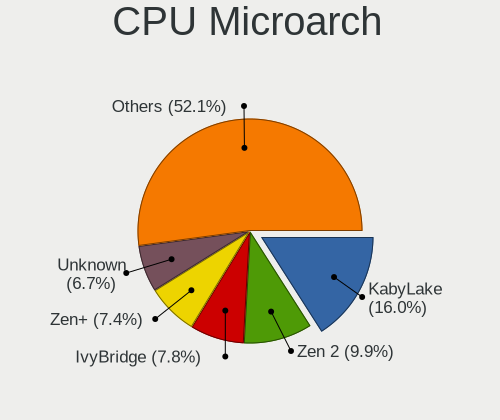

| Name          | Computers | Percent |
|---------------|-----------|---------|
| KabyLake      | 26        | 21.14%  |
| Zen 2         | 17        | 13.82%  |
| SandyBridge   | 8         | 6.5%    |
| IvyBridge     | 8         | 6.5%    |
| Haswell       | 8         | 6.5%    |
| Zen+          | 6         | 4.88%   |
| Zen           | 6         | 4.88%   |
| CometLake     | 5         | 4.07%   |
| Broadwell     | 5         | 4.07%   |
| TigerLake     | 4         | 3.25%   |
| Piledriver    | 4         | 3.25%   |
| Zen 3         | 3         | 2.44%   |
| Westmere      | 3         | 2.44%   |
| Skylake       | 3         | 2.44%   |
| Penryn        | 3         | 2.44%   |
| IceLake       | 3         | 2.44%   |
| Goldmont plus | 3         | 2.44%   |
| Steamroller   | 1         | 0.81%   |
| Silvermont    | 1         | 0.81%   |
| K10           | 1         | 0.81%   |
| Jaguar        | 1         | 0.81%   |
| Goldmont      | 1         | 0.81%   |
| Core          | 1         | 0.81%   |
| Bonnell       | 1         | 0.81%   |
| Unknown       | 1         | 0.81%   |

Graphics
--------

GPU Vendor
----------

Vendors of graphics cards

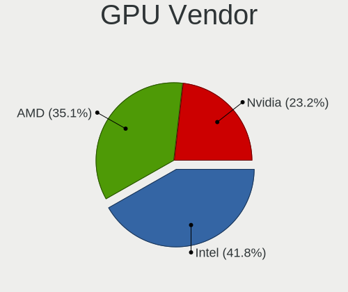

| Vendor | Computers | Percent |
|--------|-----------|---------|
| Intel  | 65        | 44.83%  |
| AMD    | 42        | 28.97%  |
| Nvidia | 38        | 26.21%  |

GPU Model
---------

Graphics card models

| Model                                                                       | Computers | Percent |
|-----------------------------------------------------------------------------|-----------|---------|
| AMD Ellesmere [Radeon RX 470/480/570/570X/580/580X/590]                     | 8         | 5.44%   |
| AMD Renoir                                                                  | 7         | 4.76%   |
| Intel HD Graphics 620                                                       | 6         | 4.08%   |
| Intel 3rd Gen Core processor Graphics Controller                            | 5         | 3.4%    |
| Intel 2nd Generation Core Processor Family Integrated Graphics Controller   | 5         | 3.4%    |
| Intel TigerLake-LP GT2 [Iris Xe Graphics]                                   | 4         | 2.72%   |
| Intel Haswell-ULT Integrated Graphics Controller                            | 4         | 2.72%   |
| Intel CometLake-H GT2 [UHD Graphics]                                        | 4         | 2.72%   |
| AMD Navi 10 [Radeon RX 5600 OEM/5600 XT / 5700/5700 XT]                     | 4         | 2.72%   |
| Intel Iris Plus Graphics G1 (Ice Lake)                                      | 3         | 2.04%   |
| Intel HD Graphics 5500                                                      | 3         | 2.04%   |
| Nvidia TU116M [GeForce GTX 1660 Ti Mobile]                                  | 2         | 1.36%   |
| Nvidia TU106GLM [Quadro RTX 3000 Mobile / Max-Q]                            | 2         | 1.36%   |
| Nvidia GP107M [GeForce GTX 1050 Mobile]                                     | 2         | 1.36%   |
| Nvidia GP106 [GeForce GTX 1060 6GB]                                         | 2         | 1.36%   |
| Nvidia GP104 [GeForce GTX 1080]                                             | 2         | 1.36%   |
| Nvidia GM206 [GeForce GTX 950]                                              | 2         | 1.36%   |
| Nvidia GM108M [GeForce 840M]                                                | 2         | 1.36%   |
| Intel Xeon E3-1200 v3/4th Gen Core Processor Integrated Graphics Controller | 2         | 1.36%   |
| Intel WhiskeyLake-U GT2 [UHD Graphics 620]                                  | 2         | 1.36%   |
| Intel UHD Graphics 620                                                      | 2         | 1.36%   |
| Intel UHD Graphics 615                                                      | 2         | 1.36%   |
| Intel HD Graphics 630                                                       | 2         | 1.36%   |
| Intel HD Graphics 6000                                                      | 2         | 1.36%   |
| Intel GeminiLake [UHD Graphics 600]                                         | 2         | 1.36%   |
| Intel CometLake-U GT2 [UHD Graphics]                                        | 2         | 1.36%   |
| Intel 82G33/G31 Express Integrated Graphics Controller                      | 2         | 1.36%   |
| AMD Raven Ridge [Radeon Vega Series / Radeon Vega Mobile Series]            | 2         | 1.36%   |
| AMD Lexa PRO [Radeon 540/540X/550/550X / RX 540X/550/550X]                  | 2         | 1.36%   |
| AMD Baffin [Radeon RX 550 640SP / RX 560/560X]                              | 2         | 1.36%   |
| Nvidia TU117M [GeForce GTX 1650 Mobile / Max-Q]                             | 1         | 0.68%   |
| Nvidia TU117M                                                               | 1         | 0.68%   |
| Nvidia TU116 [GeForce GTX 1650 SUPER]                                       | 1         | 0.68%   |
| Nvidia TU106M [GeForce RTX 2070 Mobile]                                     | 1         | 0.68%   |
| Nvidia TU106 [GeForce RTX 2070 Rev. A]                                      | 1         | 0.68%   |
| Nvidia TU104 [GeForce RTX 2080 SUPER]                                       | 1         | 0.68%   |
| Nvidia TU104 [GeForce RTX 2070 SUPER]                                       | 1         | 0.68%   |
| Nvidia GT218M [GeForce 310M]                                                | 1         | 0.68%   |
| Nvidia GT218 [GeForce 210]                                                  | 1         | 0.68%   |
| Nvidia GP108M [GeForce MX330]                                               | 1         | 0.68%   |
| Nvidia GP108M [GeForce MX150]                                               | 1         | 0.68%   |
| Nvidia GP107 [GeForce GTX 1050 Ti]                                          | 1         | 0.68%   |
| Nvidia GP104BM [GeForce GTX 1080 Mobile]                                    | 1         | 0.68%   |
| Nvidia GP104 [GeForce GTX 1070 Ti]                                          | 1         | 0.68%   |
| Nvidia GM200 [GeForce GTX 980 Ti]                                           | 1         | 0.68%   |
| Nvidia GM107GLM [Quadro M1200 Mobile]                                       | 1         | 0.68%   |
| Nvidia GM107 [GeForce 940MX]                                                | 1         | 0.68%   |
| Nvidia GK208B [GeForce GT 710]                                              | 1         | 0.68%   |
| Nvidia GK107M [GeForce GT 650M]                                             | 1         | 0.68%   |
| Nvidia GF119M [GeForce GT 520MX]                                            | 1         | 0.68%   |
| Nvidia GF114 [GeForce GTX 560 Ti]                                           | 1         | 0.68%   |
| Nvidia GF108M [GeForce GT 520M]                                             | 1         | 0.68%   |
| Nvidia GF108GLM [NVS 5200M]                                                 | 1         | 0.68%   |
| Nvidia GA106 [GeForce RTX 3060 Lite Hash Rate]                              | 1         | 0.68%   |
| Intel Skylake GT2 [HD Graphics 520]                                         | 1         | 0.68%   |
| Intel Mobile 4 Series Chipset Integrated Graphics Controller                | 1         | 0.68%   |
| Intel HD Graphics P630                                                      | 1         | 0.68%   |
| Intel HD Graphics 615                                                       | 1         | 0.68%   |
| Intel HD Graphics 500                                                       | 1         | 0.68%   |
| Intel GeminiLake [UHD Graphics 605]                                         | 1         | 0.68%   |

GPU Combo
---------

Combinations of graphics cards

| Name           | Computers | Percent |
|----------------|-----------|---------|
| 1 x Intel      | 46        | 36.8%   |
| 1 x AMD        | 36        | 28.8%   |
| 1 x Nvidia     | 22        | 17.6%   |
| Intel + Nvidia | 14        | 11.2%   |
| Intel + AMD    | 3         | 2.4%    |
| 2 x AMD        | 2         | 1.6%    |
| AMD + Nvidia   | 2         | 1.6%    |

GPU Driver
----------

Free vs proprietary

| Driver      | Computers | Percent |
|-------------|-----------|---------|
| Free        | 98        | 78.4%   |
| Proprietary | 27        | 21.6%   |

GPU Memory
----------

Total video memory

| Size in GB | Computers | Percent |
|------------|-----------|---------|
| Unknown    | 65        | 50.78%  |
| 7.01-8.0   | 14        | 10.94%  |
| 1.01-2.0   | 14        | 10.94%  |
| 3.01-4.0   | 11        | 8.59%   |
| 0.01-0.5   | 10        | 7.81%   |
| 0.51-1.0   | 7         | 5.47%   |
| 5.01-6.0   | 3         | 2.34%   |
| 8.01-16.0  | 3         | 2.34%   |
| 2.01-3.0   | 1         | 0.78%   |

Monitor
-------

Monitor Vendor
--------------

Monitor vendors

| Vendor                  | Computers | Percent |
|-------------------------|-----------|---------|
| Samsung Electronics     | 16        | 10.46%  |
| BOE                     | 16        | 10.46%  |
| LG Display              | 15        | 9.8%    |
| AU Optronics            | 15        | 9.8%    |
| Chimei Innolux          | 12        | 7.84%   |
| Philips                 | 8         | 5.23%   |
| Acer                    | 8         | 5.23%   |
| Goldstar                | 7         | 4.58%   |
| Dell                    | 7         | 4.58%   |
| BenQ                    | 7         | 4.58%   |
| ASUSTek Computer        | 5         | 3.27%   |
| AOC                     | 5         | 3.27%   |
| Apple                   | 3         | 1.96%   |
| Ancor Communications    | 3         | 1.96%   |
| Sharp                   | 2         | 1.31%   |
| InfoVision              | 2         | 1.31%   |
| Hewlett-Packard         | 2         | 1.31%   |
| Chi Mei Optoelectronics | 2         | 1.31%   |
| ViewSonic               | 1         | 0.65%   |
| Vestel Elektronik       | 1         | 0.65%   |
| PANDA                   | 1         | 0.65%   |
| Packard Bell            | 1         | 0.65%   |
| MSI                     | 1         | 0.65%   |
| LGD                     | 1         | 0.65%   |
| Lenovo                  | 1         | 0.65%   |
| KTC                     | 1         | 0.65%   |
| Jean                    | 1         | 0.65%   |
| Iiyama                  | 1         | 0.65%   |
| Idek Iiyama             | 1         | 0.65%   |
| HVR                     | 1         | 0.65%   |
| Hitachi                 | 1         | 0.65%   |
| Envision Peripherals    | 1         | 0.65%   |
| Eizo                    | 1         | 0.65%   |
| CTV                     | 1         | 0.65%   |
| Compal                  | 1         | 0.65%   |
| Belinea                 | 1         | 0.65%   |

Monitor Model
-------------

Monitor models

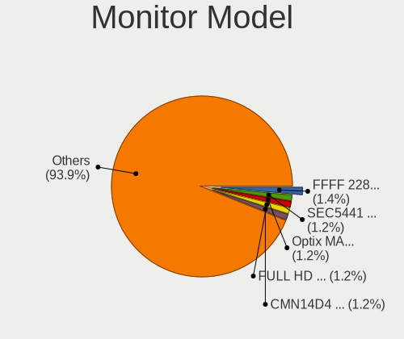

| Model                                                                   | Computers | Percent |
|-------------------------------------------------------------------------|-----------|---------|
| Chimei Innolux LCD Monitor CMN15DB 1366x768 344x193mm 15.5-inch         | 3         | 1.91%   |
| Samsung Electronics LCD Monitor SEC5441 1366x768 309x174mm 14.0-inch    | 2         | 1.27%   |
| Philips PHL 245E1 PHLC20B 2560x1440 527x296mm 23.8-inch                 | 2         | 1.27%   |
| Chimei Innolux LCD Monitor CMN1406 1920x1080 309x173mm 13.9-inch        | 2         | 1.27%   |
| BOE LCD Monitor BOE08EE 1920x1080 309x174mm 14.0-inch                   | 2         | 1.27%   |
| BOE LCD Monitor BOE08CF 1920x1080 344x194mm 15.5-inch                   | 2         | 1.27%   |
| BOE LCD Monitor BOE08BA 1920x1080 344x194mm 15.5-inch                   | 2         | 1.27%   |
| BOE LCD Monitor BOE0696 1366x768 309x173mm 13.9-inch                    | 2         | 1.27%   |
| AU Optronics LCD Monitor AUO21ED 1920x1080 344x194mm 15.5-inch          | 2         | 1.27%   |
| ASUSTek Computer VG289 AUS28BA 3840x2160 621x341mm 27.9-inch            | 2         | 1.27%   |
| Apple Color LCD APP9CDF 1440x900 286x179mm 13.3-inch                    | 2         | 1.27%   |
| AOC F22 AOC2200 1920x1080 476x268mm 21.5-inch                           | 2         | 1.27%   |
| Ancor Communications ASUS PB277 ACI27B5 2560x1440 597x336mm 27.0-inch   | 2         | 1.27%   |
| ViewSonic LCD Monitor VX2452 Series 3840x1080                           | 1         | 0.64%   |
| Vestel Elektronik 40UHD_LCD_TV VES3700 3840x2160 890x500mm 40.2-inch    | 1         | 0.64%   |
| Sharp LQ133T1JW22 SHP1422 2560x1440 294x165mm 13.3-inch                 | 1         | 0.64%   |
| Sharp LCD Monitor SHP1453 1920x1080 346x194mm 15.6-inch                 | 1         | 0.64%   |
| Samsung Electronics U32J59x SAM0F34 3840x2160 697x392mm 31.5-inch       | 1         | 0.64%   |
| Samsung Electronics T24B301 SAM098E 1920x1080 520x290mm 23.4-inch       | 1         | 0.64%   |
| Samsung Electronics SyncMaster SAM02E3 1440x900 367x229mm 17.0-inch     | 1         | 0.64%   |
| Samsung Electronics SMB1630N SAM0630 1366x768 344x194mm 15.5-inch       | 1         | 0.64%   |
| Samsung Electronics S24F350 SAM0D20 1920x1080 520x290mm 23.4-inch       | 1         | 0.64%   |
| Samsung Electronics S24D330 SAM0D92 1920x1080 531x299mm 24.0-inch       | 1         | 0.64%   |
| Samsung Electronics S24A31x SAM7114 1920x1080 527x296mm 23.8-inch       | 1         | 0.64%   |
| Samsung Electronics S22F350 SAM0D1A 1920x1080 477x268mm 21.5-inch       | 1         | 0.64%   |
| Samsung Electronics LCD Monitor SEC3152 1366x768 344x194mm 15.5-inch    | 1         | 0.64%   |
| Samsung Electronics LCD Monitor SDC4C51 1366x768 344x194mm 15.5-inch    | 1         | 0.64%   |
| Samsung Electronics LCD Monitor SAM0FEE 3840x2160 1872x1053mm 84.6-inch | 1         | 0.64%   |
| Samsung Electronics LCD Monitor SAM0DF7 3840x2160 1872x1053mm 84.6-inch | 1         | 0.64%   |
| Samsung Electronics C32F391 SAM0D34 1920x1080 698x393mm 31.5-inch       | 1         | 0.64%   |
| Samsung Electronics C27FG7x SAM0E41 1920x1080 598x337mm 27.0-inch       | 1         | 0.64%   |
| Samsung Electronics C27F591 SAM0D37 1920x1080 598x336mm 27.0-inch       | 1         | 0.64%   |
| Samsung Electronics C24F390 SAM0D2C 1920x1080 521x293mm 23.5-inch       | 1         | 0.64%   |
| Philips PHL 276E8V PHLC18F 1920x1080 597x336mm 27.0-inch                | 1         | 0.64%   |
| Philips PHL 246V5 PHLC0C5 1920x1080 531x299mm 24.0-inch                 | 1         | 0.64%   |
| Philips PHL 243V5 PHLC0D1 1920x1080 521x293mm 23.5-inch                 | 1         | 0.64%   |
| Philips PHL 220V8 PHLC218 1920x1080 477x268mm 21.5-inch                 | 1         | 0.64%   |
| Philips 247ELH PHLC085 1920x1080 521x293mm 23.5-inch                    | 1         | 0.64%   |
| Philips 226VL PHLC081 1920x1080 480x268mm 21.6-inch                     | 1         | 0.64%   |
| PANDA LC133LF2L03 NCP0015 1920x1080 294x165mm 13.3-inch                 | 1         | 0.64%   |
| Packard Bell Viseo203DX PKB0378 1600x900 432x240mm 19.5-inch            | 1         | 0.64%   |
| MSI MAG341CQ MSI1462 3440x1440 797x333mm 34.0-inch                      | 1         | 0.64%   |
| LGD LCD Monitor 1920x1080                                               | 1         | 0.64%   |
| LG Display LCD Monitor LGD40A0 1366x768 310x174mm 14.0-inch             | 1         | 0.64%   |
| LG Display LCD Monitor LGD062E 1920x1080 344x194mm 15.5-inch            | 1         | 0.64%   |
| LG Display LCD Monitor LGD0612 1920x1080 344x194mm 15.5-inch            | 1         | 0.64%   |
| LG Display LCD Monitor LGD05E5 1920x1080 344x194mm 15.5-inch            | 1         | 0.64%   |
| LG Display LCD Monitor LGD0590 1920x1080 344x194mm 15.5-inch            | 1         | 0.64%   |
| LG Display LCD Monitor LGD0555 1536x1024 263x175mm 12.4-inch            | 1         | 0.64%   |
| LG Display LCD Monitor LGD0533 1920x1080 344x194mm 15.5-inch            | 1         | 0.64%   |
| LG Display LCD Monitor LGD04E8 1920x1080 380x210mm 17.1-inch            | 1         | 0.64%   |
| LG Display LCD Monitor LGD046B 1366x768 344x194mm 15.5-inch             | 1         | 0.64%   |
| LG Display LCD Monitor LGD045C 1366x768 345x194mm 15.6-inch             | 1         | 0.64%   |
| LG Display LCD Monitor LGD03D3 1600x900 309x174mm 14.0-inch             | 1         | 0.64%   |
| LG Display LCD Monitor LGD03B8 1366x768 310x174mm 14.0-inch             | 1         | 0.64%   |
| LG Display LCD Monitor LGD0385 1366x768 309x174mm 14.0-inch             | 1         | 0.64%   |
| LG Display LCD Monitor LGD033A 1366x768 344x194mm 15.5-inch             | 1         | 0.64%   |
| LG Display LCD Monitor LGD01E9 1920x1080 345x194mm 15.6-inch            | 1         | 0.64%   |
| Lenovo LCD Monitor LEN4053 1680x1050 331x207mm 15.4-inch                | 1         | 0.64%   |
| KTC 24'TV KTC2400 1360x768 708x398mm 32.0-inch                          | 1         | 0.64%   |

Monitor Resolution
------------------

Monitor screen resolution

| Resolution         | Computers | Percent |
|--------------------|-----------|---------|
| 1920x1080 (FHD)    | 71        | 48.63%  |
| 1366x768 (WXGA)    | 27        | 18.49%  |
| 3840x2160 (4K)     | 15        | 10.27%  |
| 2560x1440 (QHD)    | 8         | 5.48%   |
| 1600x900 (HD+)     | 4         | 2.74%   |
| 1440x900 (WXGA+)   | 4         | 2.74%   |
| 3440x1440          | 2         | 1.37%   |
| 1920x1200 (WUXGA)  | 2         | 1.37%   |
| 1680x1050 (WSXGA+) | 2         | 1.37%   |
| 1280x1024 (SXGA)   | 2         | 1.37%   |
| Unknown            | 2         | 1.37%   |
| 3840x1080          | 1         | 0.68%   |
| 3600x1080          | 1         | 0.68%   |
| 2736x1824          | 1         | 0.68%   |
| 2560x1600          | 1         | 0.68%   |
| 2560x1080          | 1         | 0.68%   |
| 2160x1200          | 1         | 0.68%   |
| 1024x768 (XGA)     | 1         | 0.68%   |

Monitor Diagonal
----------------

Diagonal size in inches

| Inches  | Computers | Percent |
|---------|-----------|---------|
| 15      | 38        | 25.5%   |
| 13      | 16        | 10.74%  |
| 24      | 15        | 10.07%  |
| 27      | 14        | 9.4%    |
| 23      | 13        | 8.72%   |
| 14      | 11        | 7.38%   |
| 21      | 9         | 6.04%   |
| 17      | 5         | 3.36%   |
| Unknown | 5         | 3.36%   |
| 84      | 4         | 2.68%   |
| 34      | 3         | 2.01%   |
| 31      | 3         | 2.01%   |
| 19      | 3         | 2.01%   |
| 32      | 2         | 1.34%   |
| 20      | 2         | 1.34%   |
| 12      | 2         | 1.34%   |
| 11      | 2         | 1.34%   |
| 52      | 1         | 0.67%   |
| 16      | 1         | 0.67%   |

Monitor Width
-------------

Physical width

| Width in mm | Computers | Percent |
|-------------|-----------|---------|
| 301-350     | 59        | 40.14%  |
| 501-600     | 37        | 25.17%  |
| 401-500     | 12        | 8.16%   |
| 351-400     | 9         | 6.12%   |
| 201-300     | 9         | 6.12%   |
| 601-700     | 6         | 4.08%   |
| 701-800     | 5         | 3.4%    |
| Unknown     | 5         | 3.4%    |
| 1501-2000   | 4         | 2.72%   |
| 1001-1500   | 1         | 0.68%   |

Aspect Ratio
------------

Proportional relationship between the width and the height

| Ratio   | Computers | Percent |
|---------|-----------|---------|
| 16/9    | 107       | 82.95%  |
| 16/10   | 10        | 7.75%   |
| Unknown | 4         | 3.1%    |
| 21/9    | 3         | 2.33%   |
| 5/4     | 2         | 1.55%   |
| 4/3     | 2         | 1.55%   |
| 3/2     | 1         | 0.78%   |

Monitor Area
------------

Area in inch

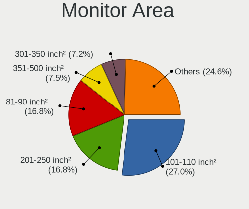

| Area in inch | Computers | Percent |
|----------------|-----------|---------|
| 101-110        | 38        | 25.5%   |
| 201-250        | 33        | 22.15%  |
| 81-90          | 22        | 14.77%  |
| 301-350        | 14        | 9.4%    |
| 351-500        | 8         | 5.37%   |
| 71-80          | 6         | 4.03%   |
| 151-200        | 6         | 4.03%   |
| More than 1000 | 5         | 3.36%   |
| Unknown        | 5         | 3.36%   |
| 121-130        | 4         | 2.68%   |
| 251-300        | 3         | 2.01%   |
| 51-60          | 2         | 1.34%   |
| 131-140        | 2         | 1.34%   |
| 61-70          | 1         | 0.67%   |

Pixel Density
-------------

Pixels per inch

| Density       | Computers | Percent |
|---------------|-----------|---------|
| 121-160       | 50        | 34.97%  |
| 51-100        | 44        | 30.77%  |
| 101-120       | 36        | 25.17%  |
| 161-240       | 6         | 4.2%    |
| Unknown       | 5         | 3.5%    |
| More than 240 | 1         | 0.7%    |
| 1-50          | 1         | 0.7%    |

Multiple Monitors
-----------------

Total monitors connected

| Total | Computers | Percent |
|-------|-----------|---------|
| 1     | 98        | 77.78%  |
| 2     | 24        | 19.05%  |
| 3     | 3         | 2.38%   |
| 4     | 1         | 0.79%   |

Network
-------

Net Controller Vendor
---------------------

Controller vendors

| Vendor                                | Computers | Percent |
|---------------------------------------|-----------|---------|
| Realtek Semiconductor                 | 81        | 42.86%  |
| Intel                                 | 57        | 30.16%  |
| Qualcomm Atheros                      | 19        | 10.05%  |
| Broadcom                              | 8         | 4.23%   |
| Broadcom Limited                      | 3         | 1.59%   |
| Xiaomi                                | 2         | 1.06%   |
| Ralink Technology                     | 2         | 1.06%   |
| Ralink                                | 2         | 1.06%   |
| D-Link System                         | 2         | 1.06%   |
| TP-Link                               | 1         | 0.53%   |
| Sierra Wireless                       | 1         | 0.53%   |
| Qualcomm Atheros Communications       | 1         | 0.53%   |
| Qualcomm                              | 1         | 0.53%   |
| Microsoft                             | 1         | 0.53%   |
| Marvell Technology Group              | 1         | 0.53%   |
| Linksys                               | 1         | 0.53%   |
| Huawei Technologies                   | 1         | 0.53%   |
| Google                                | 1         | 0.53%   |
| DisplayLink                           | 1         | 0.53%   |
| Aquantia                              | 1         | 0.53%   |
| Apple                                 | 1         | 0.53%   |
| 802.11g Adapter [Linksys WUSB54GC v3] | 1         | 0.53%   |

Net Controller Model
--------------------

Controller models

| Model                                                             | Computers | Percent |
|-------------------------------------------------------------------|-----------|---------|
| Realtek RTL8111/8168/8411 PCI Express Gigabit Ethernet Controller | 56        | 24.56%  |
| Realtek RTL810xE PCI Express Fast Ethernet controller             | 10        | 4.39%   |
| Realtek RTL8153 Gigabit Ethernet Adapter                          | 8         | 3.51%   |
| Realtek RTL8822CE 802.11ac PCIe Wireless Network Adapter          | 6         | 2.63%   |
| Intel Wireless 8265 / 8275                                        | 6         | 2.63%   |
| Intel 82579LM Gigabit Network Connection (Lewisville)             | 6         | 2.63%   |
| Realtek RTL8821CE 802.11ac PCIe Wireless Network Adapter          | 5         | 2.19%   |
| Qualcomm Atheros QCA9377 802.11ac Wireless Network Adapter        | 5         | 2.19%   |
| Qualcomm Atheros AR9485 Wireless Network Adapter                  | 5         | 2.19%   |
| Intel Wireless 7265                                               | 5         | 2.19%   |
| Intel Wi-Fi 6 AX200                                               | 5         | 2.19%   |
| Intel I211 Gigabit Network Connection                             | 5         | 2.19%   |
| Intel Comet Lake PCH CNVi WiFi                                    | 5         | 2.19%   |
| Intel Wi-Fi 6 AX201                                               | 3         | 1.32%   |
| Intel Ethernet Connection (2) I219-V                              | 3         | 1.32%   |
| Intel Ethernet Connection (11) I219-LM                            | 3         | 1.32%   |
| Intel Centrino Advanced-N 6205 [Taylor Peak]                      | 3         | 1.32%   |
| Broadcom Limited BCM4360 802.11ac Wireless Network Adapter        | 3         | 1.32%   |
| Broadcom BCM4313 802.11bgn Wireless Network Adapter               | 3         | 1.32%   |
| Realtek RTL8822BE 802.11a/b/g/n/ac WiFi adapter                   | 2         | 0.88%   |
| Realtek RTL8821AE 802.11ac PCIe Wireless Network Adapter          | 2         | 0.88%   |
| Realtek RTL8723BE PCIe Wireless Network Adapter                   | 2         | 0.88%   |
| Realtek RTL8188EE Wireless Network Adapter                        | 2         | 0.88%   |
| Realtek RTL-8100/8101L/8139 PCI Fast Ethernet Adapter             | 2         | 0.88%   |
| Realtek 802.11ac NIC                                              | 2         | 0.88%   |
| Qualcomm Atheros Killer E2500 Gigabit Ethernet Controller         | 2         | 0.88%   |
| Intel Wireless-AC 9260                                            | 2         | 0.88%   |
| Intel Ice Lake-LP PCH CNVi WiFi                                   | 2         | 0.88%   |
| Intel Comet Lake PCH-LP CNVi WiFi                                 | 2         | 0.88%   |
| Intel Cannon Lake PCH CNVi WiFi                                   | 2         | 0.88%   |
| Intel 82574L Gigabit Network Connection                           | 2         | 0.88%   |
| Broadcom BCM43228 802.11a/b/g/n                                   | 2         | 0.88%   |
| Broadcom BCM43142 802.11b/g/n                                     | 2         | 0.88%   |
| Xiaomi Mi/Redmi series (RNDIS)                                    | 1         | 0.44%   |
| Xiaomi Mi/Redmi series (RNDIS + ADB)                              | 1         | 0.44%   |
| TP-Link TL-WN823N v2/v3 [Realtek RTL8192EU]                       | 1         | 0.44%   |
| Sierra Wireless MC7700                                            | 1         | 0.44%   |
| Realtek RTL8812AE 802.11ac PCIe Wireless Network Adapter          | 1         | 0.44%   |
| Realtek RTL8192EE PCIe Wireless Network Adapter                   | 1         | 0.44%   |
| Realtek RTL8188CUS 802.11n WLAN Adapter                           | 1         | 0.44%   |
| Realtek RTL8188CE 802.11b/g/n WiFi Adapter                        | 1         | 0.44%   |
| Ralink RT5370 Wireless Adapter                                    | 1         | 0.44%   |
| Ralink MT7601U Wireless Adapter                                   | 1         | 0.44%   |
| Ralink RT3290 Wireless 802.11n 1T/1R PCIe                         | 1         | 0.44%   |
| Ralink RT2561/RT61 802.11g PCI                                    | 1         | 0.44%   |
| Qualcomm Atheros QCA9565 / AR9565 Wireless Network Adapter        | 1         | 0.44%   |
| Qualcomm Atheros QCA8172 Fast Ethernet                            | 1         | 0.44%   |
| Qualcomm Atheros QCA8171 Gigabit Ethernet                         | 1         | 0.44%   |
| Qualcomm Atheros QCA6174 802.11ac Wireless Network Adapter        | 1         | 0.44%   |
| Qualcomm Atheros Killer E2400 Gigabit Ethernet Controller         | 1         | 0.44%   |
| Qualcomm Atheros Killer E220x Gigabit Ethernet Controller         | 1         | 0.44%   |
| Qualcomm Atheros AR9271 802.11n                                   | 1         | 0.44%   |
| Qualcomm Atheros AR9462 Wireless Network Adapter                  | 1         | 0.44%   |
| Qualcomm Atheros AR928X Wireless Network Adapter (PCI-Express)    | 1         | 0.44%   |
| Qualcomm Atheros AR9285 Wireless Network Adapter (PCI-Express)    | 1         | 0.44%   |
| Qualcomm Atheros AR8161 Gigabit Ethernet                          | 1         | 0.44%   |
| Qualcomm A0001                                                    | 1         | 0.44%   |
| Microsoft XBOX ACC                                                | 1         | 0.44%   |
| Marvell Group 88W8897 [AVASTAR] 802.11ac Wireless                 | 1         | 0.44%   |
| Linksys Gigabit Ethernet Adapter                                  | 1         | 0.44%   |

Wireless Vendor
---------------

Wireless vendors

| Vendor                                | Computers | Percent |
|---------------------------------------|-----------|---------|
| Intel                                 | 44        | 42.31%  |
| Realtek Semiconductor                 | 24        | 23.08%  |
| Qualcomm Atheros                      | 15        | 14.42%  |
| Broadcom                              | 7         | 6.73%   |
| Broadcom Limited                      | 3         | 2.88%   |
| Ralink Technology                     | 2         | 1.92%   |
| Ralink                                | 2         | 1.92%   |
| TP-Link                               | 1         | 0.96%   |
| Sierra Wireless                       | 1         | 0.96%   |
| Qualcomm Atheros Communications       | 1         | 0.96%   |
| Microsoft                             | 1         | 0.96%   |
| Marvell Technology Group              | 1         | 0.96%   |
| D-Link System                         | 1         | 0.96%   |
| 802.11g Adapter [Linksys WUSB54GC v3] | 1         | 0.96%   |

Wireless Model
--------------

Wireless models

| Model                                                                                               | Computers | Percent |
|-----------------------------------------------------------------------------------------------------|-----------|---------|
| Realtek RTL8822CE 802.11ac PCIe Wireless Network Adapter                                            | 6         | 5.71%   |
| Intel Wireless 8265 / 8275                                                                          | 6         | 5.71%   |
| Realtek RTL8821CE 802.11ac PCIe Wireless Network Adapter                                            | 5         | 4.76%   |
| Qualcomm Atheros QCA9377 802.11ac Wireless Network Adapter                                          | 5         | 4.76%   |
| Qualcomm Atheros AR9485 Wireless Network Adapter                                                    | 5         | 4.76%   |
| Intel Wireless 7265                                                                                 | 5         | 4.76%   |
| Intel Wi-Fi 6 AX200                                                                                 | 5         | 4.76%   |
| Intel Comet Lake PCH CNVi WiFi                                                                      | 5         | 4.76%   |
| Intel Wi-Fi 6 AX201                                                                                 | 3         | 2.86%   |
| Intel Centrino Advanced-N 6205 [Taylor Peak]                                                        | 3         | 2.86%   |
| Broadcom Limited BCM4360 802.11ac Wireless Network Adapter                                          | 3         | 2.86%   |
| Broadcom BCM4313 802.11bgn Wireless Network Adapter                                                 | 3         | 2.86%   |
| Realtek RTL8822BE 802.11a/b/g/n/ac WiFi adapter                                                     | 2         | 1.9%    |
| Realtek RTL8821AE 802.11ac PCIe Wireless Network Adapter                                            | 2         | 1.9%    |
| Realtek RTL8723BE PCIe Wireless Network Adapter                                                     | 2         | 1.9%    |
| Realtek RTL8188EE Wireless Network Adapter                                                          | 2         | 1.9%    |
| Realtek 802.11ac NIC                                                                                | 2         | 1.9%    |
| Intel Wireless-AC 9260                                                                              | 2         | 1.9%    |
| Intel Ice Lake-LP PCH CNVi WiFi                                                                     | 2         | 1.9%    |
| Intel Comet Lake PCH-LP CNVi WiFi                                                                   | 2         | 1.9%    |
| Intel Cannon Lake PCH CNVi WiFi                                                                     | 2         | 1.9%    |
| Broadcom BCM43228 802.11a/b/g/n                                                                     | 2         | 1.9%    |
| Broadcom BCM43142 802.11b/g/n                                                                       | 2         | 1.9%    |
| TP-Link TL-WN823N v2/v3 [Realtek RTL8192EU]                                                         | 1         | 0.95%   |
| Sierra Wireless MC7700                                                                              | 1         | 0.95%   |
| Realtek RTL8812AE 802.11ac PCIe Wireless Network Adapter                                            | 1         | 0.95%   |
| Realtek RTL8192EE PCIe Wireless Network Adapter                                                     | 1         | 0.95%   |
| Realtek RTL8188CUS 802.11n WLAN Adapter                                                             | 1         | 0.95%   |
| Realtek RTL8188CE 802.11b/g/n WiFi Adapter                                                          | 1         | 0.95%   |
| Ralink RT5370 Wireless Adapter                                                                      | 1         | 0.95%   |
| Ralink MT7601U Wireless Adapter                                                                     | 1         | 0.95%   |
| Ralink RT3290 Wireless 802.11n 1T/1R PCIe                                                           | 1         | 0.95%   |
| Ralink RT2561/RT61 802.11g PCI                                                                      | 1         | 0.95%   |
| Qualcomm Atheros QCA9565 / AR9565 Wireless Network Adapter                                          | 1         | 0.95%   |
| Qualcomm Atheros QCA6174 802.11ac Wireless Network Adapter                                          | 1         | 0.95%   |
| Qualcomm Atheros AR9271 802.11n                                                                     | 1         | 0.95%   |
| Qualcomm Atheros AR9462 Wireless Network Adapter                                                    | 1         | 0.95%   |
| Qualcomm Atheros AR928X Wireless Network Adapter (PCI-Express)                                      | 1         | 0.95%   |
| Qualcomm Atheros AR9285 Wireless Network Adapter (PCI-Express)                                      | 1         | 0.95%   |
| Microsoft XBOX ACC                                                                                  | 1         | 0.95%   |
| Marvell Group 88W8897 [AVASTAR] 802.11ac Wireless                                                   | 1         | 0.95%   |
| Intel Wireless 3165                                                                                 | 1         | 0.95%   |
| Intel Wi-Fi 6 AX210/AX211/AX411 160MHz                                                              | 1         | 0.95%   |
| Intel PRO/Wireless 5100 AGN [Shiloh] Network Connection                                             | 1         | 0.95%   |
| Intel Gemini Lake PCH CNVi WiFi                                                                     | 1         | 0.95%   |
| Intel Dual Band Wireless-AC 3168NGW [Stone Peak]                                                    | 1         | 0.95%   |
| Intel Centrino Wireless-N 2230                                                                      | 1         | 0.95%   |
| Intel Centrino Ultimate-N 6300                                                                      | 1         | 0.95%   |
| Intel Centrino Advanced-N 6235                                                                      | 1         | 0.95%   |
| Intel Cannon Point-LP CNVi [Wireless-AC]                                                            | 1         | 0.95%   |
| D-Link System DWA-160 802.11abgn Xtreme N Dual Band Adapter(rev.A2) [Atheros AR9170+AR9104]         | 1         | 0.95%   |
| 802.11g Adapter [Linksys WUSB54GC v3] WUSB100 v2 RangePlus Wireless Network Adapter [Ralink RT3070] | 1         | 0.95%   |

Ethernet Vendor
---------------

Ethernet vendors

| Vendor                | Computers | Percent |
|-----------------------|-----------|---------|
| Realtek Semiconductor | 73        | 62.39%  |
| Intel                 | 27        | 23.08%  |
| Qualcomm Atheros      | 7         | 5.98%   |
| Xiaomi                | 2         | 1.71%   |
| Qualcomm              | 1         | 0.85%   |
| Linksys               | 1         | 0.85%   |
| Huawei Technologies   | 1         | 0.85%   |
| DisplayLink           | 1         | 0.85%   |
| D-Link System         | 1         | 0.85%   |
| Broadcom              | 1         | 0.85%   |
| Aquantia              | 1         | 0.85%   |
| Apple                 | 1         | 0.85%   |

Ethernet Model
--------------

Ethernet models

| Model                                                             | Computers | Percent |
|-------------------------------------------------------------------|-----------|---------|
| Realtek RTL8111/8168/8411 PCI Express Gigabit Ethernet Controller | 56        | 45.9%   |
| Realtek RTL810xE PCI Express Fast Ethernet controller             | 10        | 8.2%    |
| Realtek RTL8153 Gigabit Ethernet Adapter                          | 8         | 6.56%   |
| Intel 82579LM Gigabit Network Connection (Lewisville)             | 6         | 4.92%   |
| Intel I211 Gigabit Network Connection                             | 5         | 4.1%    |
| Intel Ethernet Connection (2) I219-V                              | 3         | 2.46%   |
| Intel Ethernet Connection (11) I219-LM                            | 3         | 2.46%   |
| Realtek RTL-8100/8101L/8139 PCI Fast Ethernet Adapter             | 2         | 1.64%   |
| Qualcomm Atheros Killer E2500 Gigabit Ethernet Controller         | 2         | 1.64%   |
| Intel 82574L Gigabit Network Connection                           | 2         | 1.64%   |
| Xiaomi Mi/Redmi series (RNDIS)                                    | 1         | 0.82%   |
| Xiaomi Mi/Redmi series (RNDIS + ADB)                              | 1         | 0.82%   |
| Qualcomm Atheros QCA8172 Fast Ethernet                            | 1         | 0.82%   |
| Qualcomm Atheros QCA8171 Gigabit Ethernet                         | 1         | 0.82%   |
| Qualcomm Atheros Killer E2400 Gigabit Ethernet Controller         | 1         | 0.82%   |
| Qualcomm Atheros Killer E220x Gigabit Ethernet Controller         | 1         | 0.82%   |
| Qualcomm Atheros AR8161 Gigabit Ethernet                          | 1         | 0.82%   |
| Qualcomm A0001                                                    | 1         | 0.82%   |
| Linksys Gigabit Ethernet Adapter                                  | 1         | 0.82%   |
| Intel I210 Gigabit Network Connection                             | 1         | 0.82%   |
| Intel Ethernet Controller I225-V                                  | 1         | 0.82%   |
| Intel Ethernet Connection I217-LM                                 | 1         | 0.82%   |
| Intel Ethernet Connection (7) I219-V                              | 1         | 0.82%   |
| Intel Ethernet Connection (6) I219-LM                             | 1         | 0.82%   |
| Intel Ethernet Connection (4) I219-LM                             | 1         | 0.82%   |
| Intel Ethernet Connection (10) I219-V                             | 1         | 0.82%   |
| Intel 82567LM Gigabit Network Connection                          | 1         | 0.82%   |
| Intel 82567LF-2 Gigabit Network Connection                        | 1         | 0.82%   |
| Intel 82562V-2 10/100 Network Connection                          | 1         | 0.82%   |
| Huawei E353/E3131                                                 | 1         | 0.82%   |
| DisplayLink Kensington Dock (Composite Device)                    | 1         | 0.82%   |
| D-Link System DGE-528T Gigabit Ethernet Adapter                   | 1         | 0.82%   |
| Broadcom NetLink BCM57780 Gigabit Ethernet PCIe                   | 1         | 0.82%   |
| Aquantia AQC107 NBase-T/IEEE 802.3bz Ethernet Controller [AQtion] | 1         | 0.82%   |
| Apple iPad 4/Mini1                                                | 1         | 0.82%   |

Net Controller Kind
-------------------

Ethernet, WiFi or modem

| Kind     | Computers | Percent |
|----------|-----------|---------|
| Ethernet | 106       | 51.46%  |
| WiFi     | 99        | 48.06%  |
| Modem    | 1         | 0.49%   |

Used Controller
---------------

Currently used network controller

| Kind     | Computers | Percent |
|----------|-----------|---------|
| WiFi     | 77        | 55.8%   |
| Ethernet | 61        | 44.2%   |

NICs
----

Total network controllers on board

| Total | Computers | Percent |
|-------|-----------|---------|
| 2     | 72        | 58.06%  |
| 1     | 48        | 38.71%  |
| 4     | 2         | 1.61%   |
| 3     | 2         | 1.61%   |

IPv6
----

IPv6 vs IPv4

| Used | Computers | Percent |
|------|-----------|---------|
| No   | 112       | 88.19%  |
| Yes  | 15        | 11.81%  |

Bluetooth
---------

Bluetooth Vendor
----------------

Controller vendors

| Vendor                          | Computers | Percent |
|---------------------------------|-----------|---------|
| Intel                           | 38        | 46.34%  |
| Realtek Semiconductor           | 12        | 14.63%  |
| Broadcom                        | 5         | 6.1%    |
| Qualcomm Atheros Communications | 4         | 4.88%   |
| IMC Networks                    | 4         | 4.88%   |
| Cambridge Silicon Radio         | 4         | 4.88%   |
| Lite-On Technology              | 3         | 3.66%   |
| Apple                           | 3         | 3.66%   |
| Realtek                         | 2         | 2.44%   |
| Foxconn / Hon Hai               | 2         | 2.44%   |
| ASUSTek Computer                | 2         | 2.44%   |
| Ralink                          | 1         | 1.22%   |
| Marvell Semiconductor           | 1         | 1.22%   |
| HTC (High Tech Computer)        | 1         | 1.22%   |

Bluetooth Model
---------------

Controller models

| Model                                                                | Computers | Percent |
|----------------------------------------------------------------------|-----------|---------|
| Intel Bluetooth wireless interface                                   | 12        | 14.63%  |
| Intel Bluetooth Device                                               | 11        | 13.41%  |
| Realtek Bluetooth Radio                                              | 8         | 9.76%   |
| Intel Bluetooth 9460/9560 Jefferson Peak (JfP)                       | 5         | 6.1%    |
| Intel AX200 Bluetooth                                                | 5         | 6.1%    |
| Cambridge Silicon Radio Bluetooth Dongle (HCI mode)                  | 4         | 4.88%   |
| Realtek  Bluetooth 4.2 Adapter                                       | 3         | 3.66%   |
| Qualcomm Atheros  Bluetooth Device                                   | 3         | 3.66%   |
| Lite-On Bluetooth Device                                             | 3         | 3.66%   |
| Apple Bluetooth USB Host Controller                                  | 3         | 3.66%   |
| Realtek Bluetooth Radio                                              | 2         | 2.44%   |
| Intel Wireless-AC 9260 Bluetooth Adapter                             | 2         | 2.44%   |
| IMC Networks Bluetooth Radio                                         | 2         | 2.44%   |
| IMC Networks Bluetooth Device                                        | 2         | 2.44%   |
| Foxconn / Hon Hai BCM20702A0                                         | 2         | 2.44%   |
| Broadcom BCM20702A0 Bluetooth 4.0                                    | 2         | 2.44%   |
| Realtek RTL8821A Bluetooth                                           | 1         | 1.22%   |
| Ralink RT3290 Bluetooth                                              | 1         | 1.22%   |
| Qualcomm Atheros AR3012 Bluetooth 4.0                                | 1         | 1.22%   |
| Marvell Bluetooth and Wireless LAN Composite                         | 1         | 1.22%   |
| Intel Wireless-AC 3168 Bluetooth                                     | 1         | 1.22%   |
| Intel Centrino Bluetooth Wireless Transceiver                        | 1         | 1.22%   |
| Intel AX210 Bluetooth                                                | 1         | 1.22%   |
| HTC (High Tech Computer) Vive Hub Bluetooth 4.1 (Broadcom BCM920703) | 1         | 1.22%   |
| Broadcom BCM43142 Bluetooth 4.0                                      | 1         | 1.22%   |
| Broadcom BCM20702 Bluetooth 4.0 [ThinkPad]                           | 1         | 1.22%   |
| Broadcom BCM2045B (BDC-2.1) [Bluetooth Controller]                   | 1         | 1.22%   |
| ASUS Broadcom BCM20702A0 Bluetooth                                   | 1         | 1.22%   |
| ASUS Bluetooth Radio                                                 | 1         | 1.22%   |

Sound
-----

Sound Vendor
------------

Sound card vendors

| Vendor                                          | Computers | Percent |
|-------------------------------------------------|-----------|---------|
| Intel                                           | 81        | 43.09%  |
| AMD                                             | 47        | 25%     |
| Nvidia                                          | 30        | 15.96%  |
| C-Media Electronics                             | 8         | 4.26%   |
| Realtek Semiconductor                           | 4         | 2.13%   |
| Creative Labs                                   | 3         | 1.6%    |
| Logitech                                        | 2         | 1.06%   |
| Creative Technology                             | 2         | 1.06%   |
| Corsair                                         | 2         | 1.06%   |
| TC Electronic                                   | 1         | 0.53%   |
| SteelSeries ApS                                 | 1         | 0.53%   |
| Razer USA                                       | 1         | 0.53%   |
| Plantronics                                     | 1         | 0.53%   |
| Native Instruments                              | 1         | 0.53%   |
| Licensed by Sony Computer Entertainment America | 1         | 0.53%   |
| Generalplus Technology                          | 1         | 0.53%   |
| Focusrite-Novation                              | 1         | 0.53%   |
| AudioQuest                                      | 1         | 0.53%   |

Sound Model
-----------

Sound card models

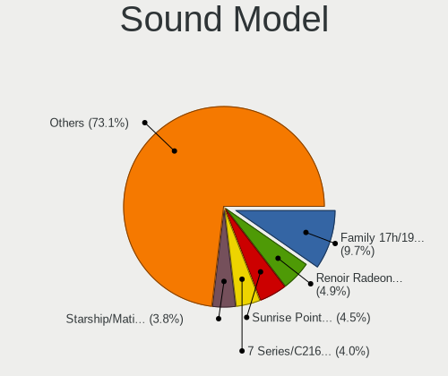

| Model                                                                      | Computers | Percent |
|----------------------------------------------------------------------------|-----------|---------|
| AMD Family 17h/19h HD Audio Controller                                     | 13        | 5.58%   |
| Intel Sunrise Point-LP HD Audio                                            | 12        | 5.15%   |
| AMD Starship/Matisse HD Audio Controller                                   | 11        | 4.72%   |
| Intel 7 Series/C216 Chipset Family High Definition Audio Controller        | 8         | 3.43%   |
| Intel 6 Series/C200 Series Chipset Family High Definition Audio Controller | 8         | 3.43%   |
| AMD Renoir Radeon High Definition Audio Controller                         | 8         | 3.43%   |
| AMD Family 17h (Models 00h-0fh) HD Audio Controller                        | 8         | 3.43%   |
| AMD Ellesmere HDMI Audio [Radeon RX 470/480 / 570/580/590]                 | 8         | 3.43%   |
| Intel Wildcat Point-LP High Definition Audio Controller                    | 5         | 2.15%   |
| Intel Comet Lake PCH cAVS                                                  | 5         | 2.15%   |
| Intel Broadwell-U Audio Controller                                         | 5         | 2.15%   |
| AMD SBx00 Azalia (Intel HDA)                                               | 5         | 2.15%   |
| AMD Navi 10 HDMI Audio                                                     | 5         | 2.15%   |
| Nvidia GP104 High Definition Audio Controller                              | 4         | 1.72%   |
| Intel Tiger Lake-LP Smart Sound Technology Audio Controller                | 4         | 1.72%   |
| Intel Haswell-ULT HD Audio Controller                                      | 4         | 1.72%   |
| Intel CM238 HD Audio Controller                                            | 4         | 1.72%   |
| Intel 8 Series/C220 Series Chipset High Definition Audio Controller        | 4         | 1.72%   |
| Intel 8 Series HD Audio Controller                                         | 4         | 1.72%   |
| Intel 200 Series PCH HD Audio                                              | 4         | 1.72%   |
| AMD Baffin HDMI/DP Audio [Radeon RX 550 640SP / RX 560/560X]               | 4         | 1.72%   |
| Nvidia TU116 High Definition Audio Controller                              | 3         | 1.29%   |
| Nvidia TU106 High Definition Audio Controller                              | 3         | 1.29%   |
| Intel Ice Lake-LP Smart Sound Technology Audio Controller                  | 3         | 1.29%   |
| Intel Celeron/Pentium Silver Processor High Definition Audio               | 3         | 1.29%   |
| Intel Cannon Lake PCH cAVS                                                 | 3         | 1.29%   |
| C-Media Electronics USB Audio Device                                       | 3         | 1.29%   |
| C-Media Electronics Audio Adapter (Unitek Y-247A)                          | 3         | 1.29%   |
| AMD Raven/Raven2/Fenghuang HDMI/DP Audio Controller                        | 3         | 1.29%   |
| Realtek Semiconductor USB Audio                                            | 2         | 0.86%   |
| Nvidia TU107 GeForce GTX 1650 High Definition Audio Controller             | 2         | 0.86%   |
| Nvidia TU104 HD Audio Controller                                           | 2         | 0.86%   |
| Nvidia High Definition Audio Controller                                    | 2         | 0.86%   |
| Nvidia GP107GL High Definition Audio Controller                            | 2         | 0.86%   |
| Nvidia GP106 High Definition Audio Controller                              | 2         | 0.86%   |
| Nvidia GM206 High Definition Audio Controller                              | 2         | 0.86%   |
| Nvidia GF108 High Definition Audio Controller                              | 2         | 0.86%   |
| Intel Xeon E3-1200 v3/4th Gen Core Processor HD Audio Controller           | 2         | 0.86%   |
| Intel NM10/ICH7 Family High Definition Audio Controller                    | 2         | 0.86%   |
| Intel Comet Lake PCH-LP cAVS                                               | 2         | 0.86%   |
| Intel Cannon Point-LP High Definition Audio Controller                     | 2         | 0.86%   |
| Intel 82801I (ICH9 Family) HD Audio Controller                             | 2         | 0.86%   |
| Intel 5 Series/3400 Series Chipset High Definition Audio                   | 2         | 0.86%   |
| Intel 100 Series/C230 Series Chipset Family HD Audio Controller            | 2         | 0.86%   |
| Creative Labs CA0110 [Sound Blaster X-Fi Xtreme Audio]                     | 2         | 0.86%   |
| Corsair HS45 Surround USB Sound Adapter                                    | 2         | 0.86%   |
| AMD Navi 21/23 HDMI/DP Audio Controller                                    | 2         | 0.86%   |
| AMD FCH Azalia Controller                                                  | 2         | 0.86%   |
| TC Electronic VoiceLive Play                                               | 1         | 0.43%   |
| SteelSeries ApS Arctis Pro Wireless                                        | 1         | 0.43%   |
| Realtek Semiconductor Realtek USB2.0 Audio                                 | 1         | 0.43%   |
| Realtek Semiconductor Realtek Audio USB                                    | 1         | 0.43%   |
| Razer USA RZ19-0229 Gaming Microphone                                      | 1         | 0.43%   |
| Plantronics Blackwire 3225 Series                                          | 1         | 0.43%   |
| Nvidia MCP79 High Definition Audio                                         | 1         | 0.43%   |
| Nvidia GM200 High Definition Audio                                         | 1         | 0.43%   |
| Nvidia GM107 High Definition Audio Controller [GeForce 940MX]              | 1         | 0.43%   |
| Nvidia GK208 HDMI/DP Audio Controller                                      | 1         | 0.43%   |
| Nvidia GK107 HDMI Audio Controller                                         | 1         | 0.43%   |
| Nvidia GF114 HDMI Audio Controller                                         | 1         | 0.43%   |

Memory
------

Memory Vendor
-------------

Memory module vendors

| Vendor              | Computers | Percent |
|---------------------|-----------|---------|
| Samsung Electronics | 29        | 23.39%  |
| SK Hynix            | 25        | 20.16%  |
| Kingston            | 13        | 10.48%  |
| Corsair             | 13        | 10.48%  |
| G.Skill             | 9         | 7.26%   |
| Micron Technology   | 7         | 5.65%   |
| Unknown             | 5         | 4.03%   |
| Crucial             | 5         | 4.03%   |
| A-DATA Technology   | 4         | 3.23%   |
| Silicon Power       | 2         | 1.61%   |
| Ramaxel Technology  | 2         | 1.61%   |
| Patriot             | 2         | 1.61%   |
| Unknown (ABCD)      | 1         | 0.81%   |
| Transcend           | 1         | 0.81%   |
| Team                | 1         | 0.81%   |
| Smart Brazil        | 1         | 0.81%   |
| Nanya Technology    | 1         | 0.81%   |
| ASint Technology    | 1         | 0.81%   |
| AMD                 | 1         | 0.81%   |
| Unknown             | 1         | 0.81%   |

Memory Model
------------

Memory module models

| Model                                                            | Computers | Percent |
|------------------------------------------------------------------|-----------|---------|
| SK Hynix RAM HMA81GS6AFR8N-UH 8GB SODIMM DDR4 2667MT/s           | 3         | 2.29%   |
| SK Hynix RAM HMT425S6AFR6A-PB 2GB SODIMM DDR3 1600MT/s           | 2         | 1.53%   |
| SK Hynix RAM HMT351S6CFR8C-PB 4GB SODIMM DDR3 1600MT/s           | 2         | 1.53%   |
| SK Hynix RAM HMAA1GS6CMR6N-XN 8GB Row Of Chips DDR4 3200MT/s     | 2         | 1.53%   |
| SK Hynix RAM HMA81GS6DJR8N-XN 8GB SODIMM DDR4 3200MT/s           | 2         | 1.53%   |
| Samsung RAM Module 8GB Row Of Chips LPDDR3 1600MT/s              | 2         | 1.53%   |
| Samsung RAM Module 4096MB SODIMM DDR3 1600MT/s                   | 2         | 1.53%   |
| Samsung RAM M471B5173DB0-YK0 4096MB SODIMM DDR3 1600MT/s         | 2         | 1.53%   |
| Samsung RAM M471A5244CB0-CWE 4GB SODIMM DDR4 3200MT/s            | 2         | 1.53%   |
| Samsung RAM M471A4G43AB1-CWE 32GB SODIMM DDR4 3200MT/s           | 2         | 1.53%   |
| Samsung RAM M471A2K43CB1-CRC 16GB SODIMM DDR4 2667MT/s           | 2         | 1.53%   |
| Samsung RAM M471A2G44AM0-CWE 16GB SODIMM DDR4 3200MT/s           | 2         | 1.53%   |
| Samsung RAM M471A1G44AB0-CTD 8GB SODIMM DDR4 2667MT/s            | 2         | 1.53%   |
| Kingston RAM KHX3200C16D4/8GX 8GB DIMM DDR4 3533MT/s             | 2         | 1.53%   |
| G.Skill RAM F3-10666CL9-4GBNT 4GB DIMM DDR3 1400MT/s             | 2         | 1.53%   |
| Crucial RAM BLS16G4D30AESB.M16FE 16GB DIMM DDR4 3200MT/s         | 2         | 1.53%   |
| Corsair RAM CMK16GX4M2B3200C16 8GB DIMM DDR4 3600MT/s            | 2         | 1.53%   |
| Unknown RAM Module 4GB SODIMM DDR3 1600MT/s                      | 1         | 0.76%   |
| Unknown RAM Module 4GB SODIMM DDR3 1066MT/s                      | 1         | 0.76%   |
| Unknown RAM Module 4GB DIMM 1333MT/s                             | 1         | 0.76%   |
| Unknown RAM Module 2048MB DIMM SDRAM                             | 1         | 0.76%   |
| Unknown RAM Module 2048MB DIMM 1328MT/s                          | 1         | 0.76%   |
| Unknown (ABCD) RAM 123456789012345678 3GB SODIMM LPDDR4 2400MT/s | 1         | 0.76%   |
| Transcend RAM JM2666HLB-16G 16GB DIMM DDR4 2667MT/s              | 1         | 0.76%   |
| Team RAM TEAMGROUP-SD3-1600 8GB SODIMM DDR3 1600MT/s             | 1         | 0.76%   |
| Smart Brazil RAM SMS4WEC8C1K0446FCG 8192MB SODIMM DDR4 2933MT/s  | 1         | 0.76%   |
| SK Hynix RAM HMT451S6BFR8A-PB 4096MB SODIMM DDR3 1600MT/s        | 1         | 0.76%   |
| SK Hynix RAM HMT451S6AFR8A-PB 4GB SODIMM DDR3 1600MT/s           | 1         | 0.76%   |
| SK Hynix RAM HMT451S6AFR8A-PB 4096MB SODIMM DDR3 1600MT/s        | 1         | 0.76%   |
| SK Hynix RAM HMT41GS6MFR8C-PB 8GB SODIMM DDR3 1600MT/s           | 1         | 0.76%   |
| SK Hynix RAM HMT41GS6AFR8A-PB 8GB SODIMM DDR3 1600MT/s           | 1         | 0.76%   |
| SK Hynix RAM HMT351S6EFR8C-PB 4096MB SODIMM DDR3 1600MT/s        | 1         | 0.76%   |
| SK Hynix RAM HMT351S6CFR8C-PB 4096MB SODIMM DDR3 1600MT/s        | 1         | 0.76%   |
| SK Hynix RAM HMT325S6EFR8A-PB 2GB SODIMM DDR3 1600MT/s           | 1         | 0.76%   |
| SK Hynix RAM HMT325S6CFR8C-H9 2GB SODIMM DDR3 1333MT/s           | 1         | 0.76%   |
| SK Hynix RAM HMT325S6BFR8C-PB 2GB SODIMM DDR3 1600MT/s           | 1         | 0.76%   |
| SK Hynix RAM HMAA1GS6CJR6N-XN 8GB Row Of Chips DDR4 3200MT/s     | 1         | 0.76%   |
| SK Hynix RAM HMA851S6AFR6N-UH 4096MB SODIMM DDR4 2667MT/s        | 1         | 0.76%   |
| SK Hynix RAM HMA82GU7CJR8N-VK 16GB DIMM DDR4 2667MT/s            | 1         | 0.76%   |
| SK Hynix RAM HMA82GS6DJR8N-XN 16384MB SODIMM DDR4 3200MT/s       | 1         | 0.76%   |
| SK Hynix RAM HMA81GS6CJR8N-XN 8192MB SODIMM DDR4 3200MT/s        | 1         | 0.76%   |
| SK Hynix RAM HMA81GS6AFR8N-UH 8GB SODIMM DDR4 2400MT/s           | 1         | 0.76%   |
| SK Hynix RAM HMA41GU6AFR8N-TF 8GB DIMM DDR4 2465MT/s             | 1         | 0.76%   |
| SK Hynix RAM HCNNNBKMBLHR-NEE 1GB Row Of Chips LPDDR4 4267MT/s   | 1         | 0.76%   |
| Silicon Power RAM SP016GBSFU266B02 16GB SODIMM DDR4 2667MT/s     | 1         | 0.76%   |
| Silicon Power RAM SP008GLSTU160N02 8GB SODIMM DDR3 1600MT/s      | 1         | 0.76%   |
| Samsung RAM Module 16GB SODIMM DDR4 2667MT/s                     | 1         | 0.76%   |
| Samsung RAM M471B5273DM0-CK0 4GB SODIMM DDR3 1600MT/s            | 1         | 0.76%   |
| Samsung RAM M471B5173QH0-YK0 4GB SODIMM DDR3 1600MT/s            | 1         | 0.76%   |
| Samsung RAM M471A5244CB0-CWE 4GB Row Of Chips DDR4 3200MT/s      | 1         | 0.76%   |
| Samsung RAM M471A5244CB0-CTD 4096MB SODIMM DDR4 3266MT/s         | 1         | 0.76%   |
| Samsung RAM M471A5244CB0-CRC 4GB SODIMM DDR4 2667MT/s            | 1         | 0.76%   |
| Samsung RAM M471A2K43DB1-CTD 16GB SODIMM DDR4 2667MT/s           | 1         | 0.76%   |
| Samsung RAM M471A1K43DB1-CWE 8192MB SODIMM DDR4 3200MT/s         | 1         | 0.76%   |
| Samsung RAM M471A1K43BB1-CRC 8192MB SODIMM DDR4 2667MT/s         | 1         | 0.76%   |
| Samsung RAM M471A1G44AB0-CWE 8GB Row Of Chips DDR4 3200MT/s      | 1         | 0.76%   |
| Samsung RAM M471A1G44AB0-CWE 8192MB SODIMM DDR4 3200MT/s         | 1         | 0.76%   |
| Samsung RAM M378B5173EB0-YK0 4GB DIMM DDR3 1600MT/s              | 1         | 0.76%   |
| Samsung RAM M3 78T2863RZS-CF7 1GB DIMM DDR2 800MT/s              | 1         | 0.76%   |
| Samsung RAM K4E6E304EE-EGCE 4096MB 1600MT/s                      | 1         | 0.76%   |

Memory Kind
-----------

Memory module kinds

| Kind    | Computers | Percent |
|---------|-----------|---------|
| DDR4    | 60        | 56.07%  |
| DDR3    | 35        | 32.71%  |
| SDRAM   | 3         | 2.8%    |
| LPDDR4  | 3         | 2.8%    |
| Unknown | 3         | 2.8%    |
| LPDDR3  | 2         | 1.87%   |
| DDR2    | 1         | 0.93%   |

Memory Form Factor
------------------

Physical design of the memory module

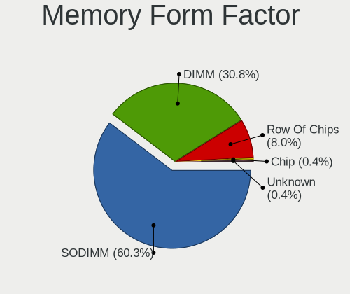

| Name         | Computers | Percent |
|--------------|-----------|---------|
| SODIMM       | 58        | 54.21%  |
| DIMM         | 40        | 37.38%  |
| Row Of Chips | 8         | 7.48%   |
| Unknown      | 1         | 0.93%   |

Memory Size
-----------

Memory module size

| Size  | Computers | Percent |
|-------|-----------|---------|
| 4096  | 44        | 38.26%  |
| 8192  | 39        | 33.91%  |
| 16384 | 17        | 14.78%  |
| 2048  | 10        | 8.7%    |
| 32768 | 3         | 2.61%   |
| 1024  | 2         | 1.74%   |

Memory Speed
------------

Memory module speed

| Speed   | Computers | Percent |
|---------|-----------|---------|
| 1600    | 31        | 26.72%  |
| 3200    | 24        | 20.69%  |
| 2667    | 14        | 12.07%  |
| 2400    | 10        | 8.62%   |
| 1333    | 7         | 6.03%   |
| 3600    | 4         | 3.45%   |
| 2133    | 4         | 3.45%   |
| 2933    | 3         | 2.59%   |
| 4199    | 2         | 1.72%   |
| 3533    | 2         | 1.72%   |
| 3266    | 2         | 1.72%   |
| 1400    | 2         | 1.72%   |
| 4267    | 1         | 0.86%   |
| 4133    | 1         | 0.86%   |
| 3466    | 1         | 0.86%   |
| 3400    | 1         | 0.86%   |
| 2481    | 1         | 0.86%   |
| 2465    | 1         | 0.86%   |
| 1334    | 1         | 0.86%   |
| 1328    | 1         | 0.86%   |
| 1066    | 1         | 0.86%   |
| 800     | 1         | 0.86%   |
| Unknown | 1         | 0.86%   |

Printers & scanners
-------------------

Printer Vendor
--------------

Printer device vendors

| Vendor             | Computers | Percent |
|--------------------|-----------|---------|
| Ricoh              | 1         | 33.33%  |
| Hewlett-Packard    | 1         | 33.33%  |
| Brother Industries | 1         | 33.33%  |

Printer Model
-------------

Printer device models

| Model                         | Computers | Percent |
|-------------------------------|-----------|---------|
| Ricoh SP 212SUw               | 1         | 33.33%  |
| HP Officejet Pro L7400        | 1         | 33.33%  |
| Brother HL-2030 Laser Printer | 1         | 33.33%  |

Scanner Vendor
--------------

Scanner device vendors

Zero info for selected period =(

Scanner Model
-------------

Scanner device models

Zero info for selected period =(

Camera
------

Camera Vendor
-------------

Camera device vendors

| Vendor                                 | Computers | Percent |
|----------------------------------------|-----------|---------|
| Chicony Electronics                    | 15        | 19.23%  |
| Acer                                   | 9         | 11.54%  |
| Realtek Semiconductor                  | 8         | 10.26%  |
| Quanta                                 | 7         | 8.97%   |
| Suyin                                  | 5         | 6.41%   |
| IMC Networks                           | 5         | 6.41%   |
| Syntek                                 | 4         | 5.13%   |
| Logitech                               | 4         | 5.13%   |
| Alcor Micro                            | 3         | 3.85%   |
| Sunplus Innovation Technology          | 2         | 2.56%   |
| Silicon Motion                         | 2         | 2.56%   |
| Microdia                               | 2         | 2.56%   |
| Luxvisions Innotech Limited            | 2         | 2.56%   |
| Cheng Uei Precision Industry (Foxlink) | 2         | 2.56%   |
| Microsoft                              | 1         | 1.28%   |
| Lite-On Technology                     | 1         | 1.28%   |
| LG Electronics                         | 1         | 1.28%   |
| Lenovo                                 | 1         | 1.28%   |
| KYE Systems (Mouse Systems)            | 1         | 1.28%   |
| GEMBIRD                                | 1         | 1.28%   |
| Creative Technology                    | 1         | 1.28%   |
| ARC International                      | 1         | 1.28%   |

Camera Model
------------

Camera device models

| Model                                                          | Computers | Percent |
|----------------------------------------------------------------|-----------|---------|
| Realtek Integrated_Webcam_HD                                   | 4         | 5.13%   |
| IMC Networks Integrated Camera                                 | 4         | 5.13%   |
| Chicony Integrated Camera                                      | 4         | 5.13%   |
| Chicony HD WebCam                                              | 4         | 5.13%   |
| Acer Integrated Camera                                         | 3         | 3.85%   |
| Syntek Integrated Camera                                       | 2         | 2.56%   |
| Syntek EasyCamera                                              | 2         | 2.56%   |
| Suyin HP Webcam                                                | 2         | 2.56%   |
| Silicon Motion 300k Pixel Camera                               | 2         | 2.56%   |
| Realtek USB2.0 HD UVC WebCam                                   | 2         | 2.56%   |
| Quanta HP Webcam                                               | 2         | 2.56%   |
| Quanta HP TrueVision HD Camera                                 | 2         | 2.56%   |
| Chicony Integrated Camera (1280x720@30)                        | 2         | 2.56%   |
| Suyin USB Webcam                                               | 1         | 1.28%   |
| Suyin NEC HD WebCam                                            | 1         | 1.28%   |
| Suyin 1.3M HD WebCam                                           | 1         | 1.28%   |
| Sunplus HD WebCam                                              | 1         | 1.28%   |
| Sunplus Aukey-PC-LM1E Camera                                   | 1         | 1.28%   |
| Realtek Integrated Webcam                                      | 1         | 1.28%   |
| Realtek HD WebCam                                              | 1         | 1.28%   |
| Quanta VGA WebCam                                              | 1         | 1.28%   |
| Quanta USB2.0 VGA UVC WebCam                                   | 1         | 1.28%   |
| Quanta HD User Facing                                          | 1         | 1.28%   |
| Microsoft LifeCam Cinema                                       | 1         | 1.28%   |
| Microdia Integrated_Webcam_HD                                  | 1         | 1.28%   |
| Microdia Integrated Webcam                                     | 1         | 1.28%   |
| Luxvisions Innotech Limited HP Wide Vision HD Camera           | 1         | 1.28%   |
| Luxvisions Innotech Limited HP TrueVision HD Camera            | 1         | 1.28%   |
| Logitech Webcam C930e                                          | 1         | 1.28%   |
| Logitech Webcam C310                                           | 1         | 1.28%   |
| Logitech Webcam C270                                           | 1         | 1.28%   |
| Logitech HD Webcam C910                                        | 1         | 1.28%   |
| Lite-On HP HD Camera                                           | 1         | 1.28%   |
| LG LM-X420xxx/G2/G3 Android Phone (MTP/download mode)          | 1         | 1.28%   |
| Lenovo UVC Camera                                              | 1         | 1.28%   |
| KYE Systems (Mouse Systems) Genius FaceCam 320                 | 1         | 1.28%   |
| IMC Networks Integrated Webcam                                 | 1         | 1.28%   |
| GEMBIRD USB2.0 PC CAMERA                                       | 1         | 1.28%   |
| Creative Live! Cam Sync HD [VF0770]                            | 1         | 1.28%   |
| Chicony USB2.0 VGA UVC WebCam                                  | 1         | 1.28%   |
| Chicony USB2.0 Camera                                          | 1         | 1.28%   |
| Chicony USB2.0 0.3M UVC WebCam                                 | 1         | 1.28%   |
| Chicony Thinkpad T430 camera                                   | 1         | 1.28%   |
| Chicony Lenovo EasyCamera                                      | 1         | 1.28%   |
| Cheng Uei Precision Industry (Foxlink) HP Webcam               | 1         | 1.28%   |
| Cheng Uei Precision Industry (Foxlink) HP TrueVision HD Camera | 1         | 1.28%   |
| ARC International Camera                                       | 1         | 1.28%   |
| Alcor Micro USB 2.0 Camera                                     | 1         | 1.28%   |
| Alcor Micro Lenovo EasyCamera                                  | 1         | 1.28%   |
| Alcor Micro Asus Integrated Webcam                             | 1         | 1.28%   |
| Acer Lenovo Integrated Webcam                                  | 1         | 1.28%   |
| Acer Lenovo EasyCamera                                         | 1         | 1.28%   |
| Acer Integrated 5M Camera                                      | 1         | 1.28%   |
| Acer HD Webcam                                                 | 1         | 1.28%   |
| Acer BisonCam,NB Pro                                           | 1         | 1.28%   |
| Acer BisonCam, NB Pro                                          | 1         | 1.28%   |

Security
--------

Fingerprint Vendor
------------------

Fingerprint sensor vendors

| Vendor                     | Computers | Percent |
|----------------------------|-----------|---------|
| Shenzhen Goodix Technology | 4         | 50%     |
| Synaptics                  | 3         | 37.5%   |
| AuthenTec                  | 1         | 12.5%   |

Fingerprint Model
-----------------

Fingerprint sensor models

| Model                                             | Computers | Percent |
|---------------------------------------------------|-----------|---------|
| Synaptics Prometheus MIS Touch Fingerprint Reader | 3         | 37.5%   |
| Shenzhen Goodix  FingerPrint Device               | 3         | 37.5%   |
| Shenzhen Goodix Fingerprint Reader                | 1         | 12.5%   |
| AuthenTec AES2810                                 | 1         | 12.5%   |

Chipcard Vendor
---------------

Chipcard module vendors

| Vendor   | Computers | Percent |
|----------|-----------|---------|
| Broadcom | 3         | 100%    |

Chipcard Model
--------------

Chipcard module models

| Model                                                                        | Computers | Percent |
|------------------------------------------------------------------------------|-----------|---------|
| Broadcom BCM5880 Secure Applications Processor with fingerprint swipe sensor | 1         | 33.33%  |
| Broadcom BCM5880 Secure Applications Processor                               | 1         | 33.33%  |
| Broadcom 58200                                                               | 1         | 33.33%  |

Unsupported
-----------

Unsupported Devices
-------------------

Total unsupported devices on board

| Total | Computers | Percent |
|-------|-----------|---------|
| 0     | 95        | 76%     |
| 1     | 26        | 20.8%   |
| 2     | 4         | 3.2%    |

Unsupported Device Types
------------------------

Types of unsupported devices

| Type                     | Computers | Percent |
|--------------------------|-----------|---------|
| Fingerprint reader       | 8         | 22.86%  |
| Net/wireless             | 5         | 14.29%  |
| Graphics card            | 5         | 14.29%  |
| Multimedia controller    | 4         | 11.43%  |
| Camera                   | 4         | 11.43%  |
| Communication controller | 2         | 5.71%   |
| Chipcard                 | 2         | 5.71%   |
| Bluetooth                | 2         | 5.71%   |
| Unassigned class         | 1         | 2.86%   |
| Storage                  | 1         | 2.86%   |
| Dvb card                 | 1         | 2.86%   |

