Artix - Tested Hardware & Statistics (Desktops)
-----------------------------------------------

A project to collect tested hardware configurations for Artix.

Anyone can contribute to this report by the [hw-probe](https://github.com/linuxhw/hw-probe) tool:

    sudo -E hw-probe -all -upload

Please contribute! Especially if your hardware is rare.

Contents
--------

* [ Test Cases ](#test-cases)

* [ System ](#system)
  - [ OS                       ](#os)
  - [ OS Family                ](#os-family)
  - [ Kernel                   ](#kernel)
  - [ Kernel Family            ](#kernel-family)
  - [ Kernel Major Ver.        ](#kernel-major-ver)
  - [ Arch                     ](#arch)
  - [ DE                       ](#de)
  - [ Display Server           ](#display-server)
  - [ Display Manager          ](#display-manager)
  - [ OS Lang                  ](#os-lang)
  - [ Boot Mode                ](#boot-mode)
  - [ Filesystem               ](#filesystem)
  - [ Part. scheme             ](#part-scheme)
  - [ Dual Boot with Linux/BSD ](#dual-boot-with-linuxbsd)
  - [ Dual Boot (Win)          ](#dual-boot-win)

* [ Board ](#board)
  - [ Vendor                   ](#vendor)
  - [ Model                    ](#model)
  - [ Model Family             ](#model-family)
  - [ MFG Year                 ](#mfg-year)
  - [ Form Factor              ](#form-factor)
  - [ Secure Boot              ](#secure-boot)
  - [ Coreboot                 ](#coreboot)
  - [ RAM Size                 ](#ram-size)
  - [ RAM Used                 ](#ram-used)
  - [ Total Drives             ](#total-drives)
  - [ Has CD-ROM               ](#has-cd-rom)
  - [ Has Ethernet             ](#has-ethernet)
  - [ Has WiFi                 ](#has-wifi)
  - [ Has Bluetooth            ](#has-bluetooth)

* [ Location ](#location)
  - [ Country                  ](#country)
  - [ City                     ](#city)

* [ Drives ](#drives)
  - [ Drive Vendor             ](#drive-vendor)
  - [ Drive Model              ](#drive-model)
  - [ HDD Vendor               ](#hdd-vendor)
  - [ SSD Vendor               ](#ssd-vendor)
  - [ Drive Kind               ](#drive-kind)
  - [ Drive Connector          ](#drive-connector)
  - [ Drive Size               ](#drive-size)
  - [ Space Total              ](#space-total)
  - [ Space Used               ](#space-used)
  - [ Malfunc. Drives          ](#malfunc-drives)
  - [ Malfunc. Drive Vendor    ](#malfunc-drive-vendor)
  - [ Malfunc. HDD Vendor      ](#malfunc-hdd-vendor)
  - [ Malfunc. Drive Kind      ](#malfunc-drive-kind)
  - [ Failed Drives            ](#failed-drives)
  - [ Failed Drive Vendor      ](#failed-drive-vendor)
  - [ Drive Status             ](#drive-status)

* [ Storage controller ](#storage-controller)
  - [ Storage Vendor           ](#storage-vendor)
  - [ Storage Model            ](#storage-model)
  - [ Storage Kind             ](#storage-kind)

* [ Processor ](#processor)
  - [ CPU Vendor               ](#cpu-vendor)
  - [ CPU Model                ](#cpu-model)
  - [ CPU Model Family         ](#cpu-model-family)
  - [ CPU Cores                ](#cpu-cores)
  - [ CPU Sockets              ](#cpu-sockets)
  - [ CPU Threads              ](#cpu-threads)
  - [ CPU Op-Modes             ](#cpu-op-modes)
  - [ CPU Microcode            ](#cpu-microcode)
  - [ CPU Microarch            ](#cpu-microarch)

* [ Graphics ](#graphics)
  - [ GPU Vendor               ](#gpu-vendor)
  - [ GPU Model                ](#gpu-model)
  - [ GPU Combo                ](#gpu-combo)
  - [ GPU Driver               ](#gpu-driver)
  - [ GPU Memory               ](#gpu-memory)

* [ Monitor ](#monitor)
  - [ Monitor Vendor           ](#monitor-vendor)
  - [ Monitor Model            ](#monitor-model)
  - [ Monitor Resolution       ](#monitor-resolution)
  - [ Monitor Diagonal         ](#monitor-diagonal)
  - [ Monitor Width            ](#monitor-width)
  - [ Aspect Ratio             ](#aspect-ratio)
  - [ Monitor Area             ](#monitor-area)
  - [ Pixel Density            ](#pixel-density)
  - [ Multiple Monitors        ](#multiple-monitors)

* [ Network ](#network)
  - [ Net Controller Vendor    ](#net-controller-vendor)
  - [ Net Controller Model     ](#net-controller-model)
  - [ Wireless Vendor          ](#wireless-vendor)
  - [ Wireless Model           ](#wireless-model)
  - [ Ethernet Vendor          ](#ethernet-vendor)
  - [ Ethernet Model           ](#ethernet-model)
  - [ Net Controller Kind      ](#net-controller-kind)
  - [ Used Controller          ](#used-controller)
  - [ NICs                     ](#nics)
  - [ IPv6                     ](#ipv6)

* [ Bluetooth ](#bluetooth)
  - [ Bluetooth Vendor         ](#bluetooth-vendor)
  - [ Bluetooth Model          ](#bluetooth-model)

* [ Sound ](#sound)
  - [ Sound Vendor             ](#sound-vendor)
  - [ Sound Model              ](#sound-model)

* [ Memory ](#memory)
  - [ Memory Vendor            ](#memory-vendor)
  - [ Memory Model             ](#memory-model)
  - [ Memory Kind              ](#memory-kind)
  - [ Memory Form Factor       ](#memory-form-factor)
  - [ Memory Size              ](#memory-size)
  - [ Memory Speed             ](#memory-speed)

* [ Printers & scanners ](#printers--scanners)
  - [ Printer Vendor           ](#printer-vendor)
  - [ Printer Model            ](#printer-model)
  - [ Scanner Vendor           ](#scanner-vendor)
  - [ Scanner Model            ](#scanner-model)

* [ Camera ](#camera)
  - [ Camera Vendor            ](#camera-vendor)
  - [ Camera Model             ](#camera-model)

* [ Security ](#security)
  - [ Fingerprint Vendor       ](#fingerprint-vendor)
  - [ Fingerprint Model        ](#fingerprint-model)
  - [ Chipcard Vendor          ](#chipcard-vendor)
  - [ Chipcard Model           ](#chipcard-model)

* [ Unsupported ](#unsupported)
  - [ Unsupported Devices      ](#unsupported-devices)
  - [ Unsupported Device Types ](#unsupported-device-types)

Test Cases
----------

Total: 135

| Vendor        | Model                       | Probe                                                      | Date         |
|---------------|-----------------------------|------------------------------------------------------------|--------------|
| ASRock        | B650M-HDV/M.2               | [483e929c10](https://linux-hardware.org/?probe=483e929c10) | Jan 05, 2025 |
| ASUSTek       | PRIME B550-PLUS             | [70e7b73673](https://linux-hardware.org/?probe=70e7b73673) | Jan 04, 2025 |
| ASUSTek       | PRIME B550-PLUS             | [609a68e8c4](https://linux-hardware.org/?probe=609a68e8c4) | Aug 24, 2024 |
| Gigabyte      | AB350-Gaming 3-CF           | [5ccd399a8a](https://linux-hardware.org/?probe=5ccd399a8a) | Aug 05, 2024 |
| ASUSTek       | TUF Gaming B650-PLUS WIF... | [ad50fcf9b4](https://linux-hardware.org/?probe=ad50fcf9b4) | Jul 25, 2024 |
| ASUSTek       | ROG STRIX X570-E GAMING ... | [32871a8581](https://linux-hardware.org/?probe=32871a8581) | Jul 22, 2024 |
| HP            | 158A                        | [1d1922f258](https://linux-hardware.org/?probe=1d1922f258) | Jul 18, 2024 |
| Fujitsu       | D3313-E1 S26361-D3313-E1    | [9d4a0af1af](https://linux-hardware.org/?probe=9d4a0af1af) | Jul 18, 2024 |
| Fujitsu       | D3313-E1 S26361-D3313-E1    | [32c31b7e16](https://linux-hardware.org/?probe=32c31b7e16) | Jul 18, 2024 |
| Fujitsu       | D3313-E1 S26361-D3313-E1    | [7c8d295082](https://linux-hardware.org/?probe=7c8d295082) | Jul 18, 2024 |
| Gigabyte      | B450 I AORUS PRO WIFI-CF    | [95eef3a6c5](https://linux-hardware.org/?probe=95eef3a6c5) | Jul 10, 2024 |
| HP            | 83E1                        | [13a88cfc90](https://linux-hardware.org/?probe=13a88cfc90) | Jul 06, 2024 |
| Gigabyte      | B150M-D2V DDR3-CF           | [74d9d69aee](https://linux-hardware.org/?probe=74d9d69aee) | Jun 12, 2024 |
| Gigabyte      | X670E AORUS PRO X           | [e1dcda5e45](https://linux-hardware.org/?probe=e1dcda5e45) | May 04, 2024 |
| ASUSTek       | M5A97 R2.0                  | [55e003fe46](https://linux-hardware.org/?probe=55e003fe46) | Mar 13, 2024 |
| MSI           | B450-A PRO                  | [de6730ef57](https://linux-hardware.org/?probe=de6730ef57) | Mar 13, 2024 |
| Gigabyte      | B550I AORUS PRO AX          | [2733b2752d](https://linux-hardware.org/?probe=2733b2752d) | Mar 04, 2024 |
| Gigabyte      | EP45-DS5                    | [05e2767d01](https://linux-hardware.org/?probe=05e2767d01) | Mar 04, 2024 |
| ASUSTek       | PRIME H310M-K               | [650431b1a3](https://linux-hardware.org/?probe=650431b1a3) | Feb 11, 2024 |
| BESSTAR Te... | HM80                        | [592f538099](https://linux-hardware.org/?probe=592f538099) | Feb 05, 2024 |
| ASRock        | B450 Pro4                   | [457ba2586a](https://linux-hardware.org/?probe=457ba2586a) | Jan 03, 2024 |
| HP            | 2B29                        | [93ef9f39bd](https://linux-hardware.org/?probe=93ef9f39bd) | Dec 24, 2023 |
| MSI           | 970 GAMING                  | [498753636e](https://linux-hardware.org/?probe=498753636e) | Dec 22, 2023 |
| ASRock        | X300M-STX                   | [9109738b7f](https://linux-hardware.org/?probe=9109738b7f) | Dec 22, 2023 |
| ASRock        | X300M-STX                   | [4017c676bf](https://linux-hardware.org/?probe=4017c676bf) | Dec 22, 2023 |
| ASRock        | B450 Gaming K4              | [96ff1ae1f7](https://linux-hardware.org/?probe=96ff1ae1f7) | Nov 28, 2023 |
| Intel         | X99H                        | [056d58d460](https://linux-hardware.org/?probe=056d58d460) | Nov 19, 2023 |
| Intel         | X99H                        | [409013cb66](https://linux-hardware.org/?probe=409013cb66) | Nov 19, 2023 |
| Gigabyte      | H61M-S2PV                   | [4174372199](https://linux-hardware.org/?probe=4174372199) | Nov 11, 2023 |
| Gigabyte      | H61M-S2PV                   | [749f236b5d](https://linux-hardware.org/?probe=749f236b5d) | Nov 09, 2023 |
| ASRock        | B450 Gaming K4              | [94dac5876f](https://linux-hardware.org/?probe=94dac5876f) | Nov 07, 2023 |
| ASRock        | B450 Gaming K4              | [77879ace29](https://linux-hardware.org/?probe=77879ace29) | Nov 07, 2023 |
| MACHINIST     | X99-MR9D PLUS V1.0          | [aaeff9a386](https://linux-hardware.org/?probe=aaeff9a386) | Oct 20, 2023 |
| Biostar       | A320MH                      | [d797fd8fa3](https://linux-hardware.org/?probe=d797fd8fa3) | Oct 15, 2023 |
| MSI           | Z97 PC Mate                 | [6e2fa2dc88](https://linux-hardware.org/?probe=6e2fa2dc88) | Oct 07, 2023 |
| MSI           | MPG X570 GAMING EDGE WIF... | [20ba60e073](https://linux-hardware.org/?probe=20ba60e073) | Sep 21, 2023 |
| MSI           | H170M PRO-DH                | [0eb433075b](https://linux-hardware.org/?probe=0eb433075b) | Aug 12, 2023 |
| MACHINIST     | X99-MR9D PLUS V1.0          | [29f8d73c0e](https://linux-hardware.org/?probe=29f8d73c0e) | Aug 05, 2023 |
| MACHINIST     | X99-MR9D PLUS V1.0          | [d1ef825b01](https://linux-hardware.org/?probe=d1ef825b01) | Jul 24, 2023 |
| MSI           | X399 GAMING PRO CARBON A... | [b9bef208f1](https://linux-hardware.org/?probe=b9bef208f1) | Jun 26, 2023 |
| ASUSTek       | K30BF_M32BF_A_F_K31BF_6     | [7a56496149](https://linux-hardware.org/?probe=7a56496149) | Jun 16, 2023 |
| Dell          | 0DWPVW A00                  | [94a28f2fec](https://linux-hardware.org/?probe=94a28f2fec) | Jun 16, 2023 |
| MSI           | PRO Z790-A WIFI             | [1c7cc37995](https://linux-hardware.org/?probe=1c7cc37995) | Jun 03, 2023 |
| MSI           | H110M PRO-VH PLUS           | [14985fd04f](https://linux-hardware.org/?probe=14985fd04f) | May 18, 2023 |
| Gigabyte      | H410M H                     | [f115dd1851](https://linux-hardware.org/?probe=f115dd1851) | May 03, 2023 |
| MSI           | B350M PRO-VDH               | [a15fa484d4](https://linux-hardware.org/?probe=a15fa484d4) | Apr 26, 2023 |
| ASUSTek       | ROG STRIX B350-F GAMING     | [18111d76fc](https://linux-hardware.org/?probe=18111d76fc) | Apr 17, 2023 |
| Intel         | X99H                        | [b91cbf41c0](https://linux-hardware.org/?probe=b91cbf41c0) | Apr 06, 2023 |
| ASRock        | Z690 Taichi                 | [fbad15ab18](https://linux-hardware.org/?probe=fbad15ab18) | Mar 24, 2023 |
| ASRock        | Z690 Taichi                 | [76159d5fc4](https://linux-hardware.org/?probe=76159d5fc4) | Mar 22, 2023 |
| ASUSTek       | F2A55-M LE                  | [47c7f6e38d](https://linux-hardware.org/?probe=47c7f6e38d) | Mar 03, 2023 |
| ASUSTek       | TUF Gaming B550M-PLUS       | [7ad97f8b6d](https://linux-hardware.org/?probe=7ad97f8b6d) | Feb 09, 2023 |
| ASUSTek       | ROG STRIX Z370-G GAMING     | [84fb689a7e](https://linux-hardware.org/?probe=84fb689a7e) | Feb 06, 2023 |
| ASUSTek       | ROG STRIX Z370-G GAMING     | [405641895c](https://linux-hardware.org/?probe=405641895c) | Jan 18, 2023 |
| Gigabyte      | B450 AORUS PRO WIFI-CF      | [b79de349a9](https://linux-hardware.org/?probe=b79de349a9) | Jan 01, 2023 |
| Gigabyte      | X570 AORUS ELITE WIFI       | [f17f99d4e6](https://linux-hardware.org/?probe=f17f99d4e6) | Nov 30, 2022 |
| Gigabyte      | B550M AORUS PRO             | [d72c486584](https://linux-hardware.org/?probe=d72c486584) | Oct 22, 2022 |
| Gigabyte      | B450 AORUS PRO WIFI-CF      | [6cbb7cbc35](https://linux-hardware.org/?probe=6cbb7cbc35) | Oct 17, 2022 |
| Gigabyte      | B450 AORUS PRO WIFI-CF      | [ca934ff06b](https://linux-hardware.org/?probe=ca934ff06b) | Oct 16, 2022 |
| MSI           | H410M PRO-VH                | [f632032d8c](https://linux-hardware.org/?probe=f632032d8c) | Aug 13, 2022 |
| Gigabyte      | Z77X-UD3H                   | [db843c1cae](https://linux-hardware.org/?probe=db843c1cae) | Aug 07, 2022 |
| Gigabyte      | AB350M-DS3H V2-CF           | [00d543ee46](https://linux-hardware.org/?probe=00d543ee46) | Jul 07, 2022 |
| Gigabyte      | H61MA-D3V                   | [f07968d013](https://linux-hardware.org/?probe=f07968d013) | Jul 07, 2022 |
| ASRock        | B460 Phantom Gaming 4       | [a4054a2ac8](https://linux-hardware.org/?probe=a4054a2ac8) | Jun 10, 2022 |
| ASUSTek       | M5A97 LE R2.0               | [009ea9b40a](https://linux-hardware.org/?probe=009ea9b40a) | Jun 09, 2022 |
| MSI           | MPG X570 GAMING PLUS        | [0e42effbfb](https://linux-hardware.org/?probe=0e42effbfb) | May 17, 2022 |
| Gigabyte      | X570 AORUS ULTRA            | [ea492e2997](https://linux-hardware.org/?probe=ea492e2997) | May 13, 2022 |
| Gigabyte      | HA65M-D2H-B3                | [313e83e0ef](https://linux-hardware.org/?probe=313e83e0ef) | Mar 10, 2022 |
| ASUSTek       | PRIME B350M-A               | [299a727e8a](https://linux-hardware.org/?probe=299a727e8a) | Mar 02, 2022 |
| MSI           | B550-A PRO                  | [b16ba2b14a](https://linux-hardware.org/?probe=b16ba2b14a) | Jan 31, 2022 |
| ASRock        | B150M Pro4S/D3              | [b7a65f897c](https://linux-hardware.org/?probe=b7a65f897c) | Jan 29, 2022 |
| MSI           | B350M PRO-VDH               | [29b6159e9c](https://linux-hardware.org/?probe=29b6159e9c) | Jan 12, 2022 |
| ASUSTek       | ROG STRIX X570-F GAMING     | [ca93455055](https://linux-hardware.org/?probe=ca93455055) | Jan 07, 2022 |
| ASUSTek       | Pro WS X570-ACE             | [1a7ef57da7](https://linux-hardware.org/?probe=1a7ef57da7) | Jan 07, 2022 |
| ASRock        | B450 Steel Legend           | [44ccc8eb49](https://linux-hardware.org/?probe=44ccc8eb49) | Nov 24, 2021 |
| MSI           | B450 TOMAHAWK MAX           | [9fca12db52](https://linux-hardware.org/?probe=9fca12db52) | Nov 22, 2021 |
| HP            | 1495                        | [e7c0f59f92](https://linux-hardware.org/?probe=e7c0f59f92) | Oct 15, 2021 |
| ASUSTek       | ROG Maximus XI HERO         | [e2c619e8dd](https://linux-hardware.org/?probe=e2c619e8dd) | Oct 12, 2021 |
| ASUSTek       | ROG Maximus XI HERO         | [1e612081c8](https://linux-hardware.org/?probe=1e612081c8) | Oct 02, 2021 |
| MSI           | X470 GAMING PLUS            | [d5871d0e2a](https://linux-hardware.org/?probe=d5871d0e2a) | Aug 25, 2021 |
| MSI           | MPG X570 GAMING PLUS        | [ec331e992a](https://linux-hardware.org/?probe=ec331e992a) | Aug 08, 2021 |
| ASUSTek       | PRIME B450M-A               | [558e1369e9](https://linux-hardware.org/?probe=558e1369e9) | Jul 25, 2021 |
| ASUSTek       | P8H61-M LX3 R2.0            | [156577ba27](https://linux-hardware.org/?probe=156577ba27) | Jul 18, 2021 |
| ASRock        | H310CM-DVS                  | [f8e9ea8ffa](https://linux-hardware.org/?probe=f8e9ea8ffa) | Jun 26, 2021 |
| MSI           | Z270M MORTAR                | [5c54607559](https://linux-hardware.org/?probe=5c54607559) | Jun 22, 2021 |
| ASUSTek       | ROG STRIX Z370-G GAMING     | [181bd83bdd](https://linux-hardware.org/?probe=181bd83bdd) | Jun 02, 2021 |
| ASRock        | FM2A88X-ITX+                | [2b91e357ca](https://linux-hardware.org/?probe=2b91e357ca) | May 16, 2021 |
| ASRock        | FM2A88X-ITX+                | [057546c50e](https://linux-hardware.org/?probe=057546c50e) | Apr 30, 2021 |
| ASUSTek       | SABERTOOTH 990FX R2.0       | [d1cf148ec4](https://linux-hardware.org/?probe=d1cf148ec4) | Apr 24, 2021 |
| ASUSTek       | ROG STRIX Z370-G GAMING     | [132c1a0515](https://linux-hardware.org/?probe=132c1a0515) | Apr 08, 2021 |
| ASUSTek       | ROG STRIX B550-F GAMING     | [5527015fb6](https://linux-hardware.org/?probe=5527015fb6) | Apr 08, 2021 |
| ASUSTek       | ROG STRIX Z370-G GAMING     | [10132d3ee3](https://linux-hardware.org/?probe=10132d3ee3) | Apr 05, 2021 |
| ASUSTek       | ROG STRIX Z370-G GAMING     | [62f6aa5c03](https://linux-hardware.org/?probe=62f6aa5c03) | Mar 27, 2021 |
| ASUSTek       | PRIME X370-PRO              | [91a16f1c67](https://linux-hardware.org/?probe=91a16f1c67) | Feb 21, 2021 |
| MSI           | X470 GAMING PLUS            | [f93e302542](https://linux-hardware.org/?probe=f93e302542) | Feb 15, 2021 |
| Alienware     | 02XRCM A01                  | [554d3ebf2f](https://linux-hardware.org/?probe=554d3ebf2f) | Feb 14, 2021 |
| Gigabyte      | 970A-DS3P                   | [b4c4d7f99c](https://linux-hardware.org/?probe=b4c4d7f99c) | Feb 01, 2021 |
| Gigabyte      | 970A-DS3P                   | [70eabb568f](https://linux-hardware.org/?probe=70eabb568f) | Jan 30, 2021 |
| MSI           | X470 GAMING PLUS            | [fb3e2ec12b](https://linux-hardware.org/?probe=fb3e2ec12b) | Jan 24, 2021 |
| ASUSTek       | TUF B450-PLUS GAMING        | [fda5fabbf5](https://linux-hardware.org/?probe=fda5fabbf5) | Jan 21, 2021 |
| Dell          | 0K216C                      | [524206eff9](https://linux-hardware.org/?probe=524206eff9) | Jan 20, 2021 |
| Dell          | 0D9JG3 A00                  | [6c44448201](https://linux-hardware.org/?probe=6c44448201) | Jan 19, 2021 |
| ASUSTek       | P8B75-M LX PLUS             | [c53595bd26](https://linux-hardware.org/?probe=c53595bd26) | Jan 16, 2021 |
| ASRock        | X570 Phantom Gaming 4       | [335ee823bd](https://linux-hardware.org/?probe=335ee823bd) | Jan 16, 2021 |
| ASUSTek       | G11CD                       | [145a13d355](https://linux-hardware.org/?probe=145a13d355) | Jan 07, 2021 |
| ASUSTek       | G11CD                       | [dc70a6fae2](https://linux-hardware.org/?probe=dc70a6fae2) | Jan 07, 2021 |
| HP            | 2B34                        | [e48dc00e0a](https://linux-hardware.org/?probe=e48dc00e0a) | Jan 04, 2021 |
| Pegatron      | 2AC2A                       | [6dbd029143](https://linux-hardware.org/?probe=6dbd029143) | Jan 03, 2021 |
| Pegatron      | 2AC2A                       | [7dd04be8aa](https://linux-hardware.org/?probe=7dd04be8aa) | Jan 01, 2021 |
| ASUSTek       | TUF Gaming X570-PLUS        | [3f9f87f288](https://linux-hardware.org/?probe=3f9f87f288) | Dec 31, 2020 |
| ASUSTek       | TUF Gaming X570-PLUS        | [2acc15f485](https://linux-hardware.org/?probe=2acc15f485) | Dec 27, 2020 |
| Gigabyte      | X570 AORUS ELITE            | [64adbf132b](https://linux-hardware.org/?probe=64adbf132b) | Dec 08, 2020 |
| MSI           | Z87-G45 GAMING              | [cefff6c6c3](https://linux-hardware.org/?probe=cefff6c6c3) | Dec 05, 2020 |
| MSI           | Z87-G45 GAMING              | [cbcb59eb96](https://linux-hardware.org/?probe=cbcb59eb96) | Dec 03, 2020 |
| MSI           | B350M PRO-VDH               | [28b680c91d](https://linux-hardware.org/?probe=28b680c91d) | Nov 29, 2020 |
| Gigabyte      | 990FXA-UD3 R5               | [42a67a5d5e](https://linux-hardware.org/?probe=42a67a5d5e) | Nov 18, 2020 |
| Gigabyte      | 970A-DS3P                   | [848672f794](https://linux-hardware.org/?probe=848672f794) | Oct 13, 2020 |
| Gigabyte      | X399 AORUS XTREME-CF        | [1193653309](https://linux-hardware.org/?probe=1193653309) | Oct 04, 2020 |
| Gigabyte      | P55-USB3                    | [ceeced1246](https://linux-hardware.org/?probe=ceeced1246) | Oct 02, 2020 |
| ASUSTek       | H81M-C                      | [b062c35766](https://linux-hardware.org/?probe=b062c35766) | Sep 16, 2020 |
| ASUSTek       | G11CD                       | [962d52b690](https://linux-hardware.org/?probe=962d52b690) | Sep 14, 2020 |
| ASUSTek       | G11CD                       | [a663586db5](https://linux-hardware.org/?probe=a663586db5) | Sep 14, 2020 |
| ASUSTek       | TUF Gaming X570-PLUS        | [86215bb4fb](https://linux-hardware.org/?probe=86215bb4fb) | Aug 29, 2020 |
| MSI           | B450 TOMAHAWK MAX           | [e988296384](https://linux-hardware.org/?probe=e988296384) | Aug 19, 2020 |
| Gigabyte      | 990FXA-UD5                  | [d86cfc12cc](https://linux-hardware.org/?probe=d86cfc12cc) | Aug 19, 2020 |
| Gigabyte      | 990FXA-UD5                  | [937f502004](https://linux-hardware.org/?probe=937f502004) | Aug 18, 2020 |
| MSI           | Z87-G45 GAMING              | [5d992bbc09](https://linux-hardware.org/?probe=5d992bbc09) | Aug 11, 2020 |
| Gigabyte      | B450M DS3H-CF               | [ff7915ae78](https://linux-hardware.org/?probe=ff7915ae78) | Aug 07, 2020 |
| ASUSTek       | TUF Gaming X570-PLUS        | [a57e5d7e84](https://linux-hardware.org/?probe=a57e5d7e84) | Jul 08, 2020 |
| Intel         | DX58SO2 AAG10925-205        | [2e4066d769](https://linux-hardware.org/?probe=2e4066d769) | Jun 30, 2020 |
| ASUSTek       | TUF Gaming X570-PLUS        | [9623b5be2b](https://linux-hardware.org/?probe=9623b5be2b) | Jun 16, 2020 |
| ASUSTek       | TUF Gaming X570-PLUS        | [4125763b79](https://linux-hardware.org/?probe=4125763b79) | Jun 12, 2020 |
| ASUSTek       | TUF Gaming X570-PLUS        | [82af1cec2f](https://linux-hardware.org/?probe=82af1cec2f) | May 30, 2020 |
| ASUSTek       | TUF Gaming X570-PLUS        | [40adc1a5f5](https://linux-hardware.org/?probe=40adc1a5f5) | Apr 03, 2020 |
| Biostar       | G31D-M7                     | [9f6a5c0f39](https://linux-hardware.org/?probe=9f6a5c0f39) | Oct 25, 2018 |

System
------

OS
--

Installed operating systems

| Name           | Desktops | Percent |
|----------------|----------|---------|
| Artix Rolling  | 63       | 64.95%  |
| Artix          | 25       | 25.77%  |
| Artix 20220123 | 2        | 2.06%   |
| Artix 20210726 | 2        | 2.06%   |
| Artix 20230501 | 1        | 1.03%   |
| Artix 20230320 | 1        | 1.03%   |
| Artix 20230306 | 1        | 1.03%   |
| Artix 20230215 | 1        | 1.03%   |
| Artix 20220713 | 1        | 1.03%   |

OS Family
---------

OS without a version

| Name  | Desktops | Percent |
|-------|----------|---------|
| Artix | 94       | 100%    |

Kernel
------

Version of the Linux kernel

| Version              | Desktops | Percent |
|----------------------|----------|---------|
| 6.9.7-artix1-1       | 3        | 2.78%   |
| 6.5.7-artix1-1       | 3        | 2.78%   |
| 5.10.8-artix1-1      | 3        | 2.78%   |
| 6.6.7-artix1-1       | 2        | 1.85%   |
| 6.6.4-artix1-1       | 2        | 1.85%   |
| 6.6.39-x64v2-xanmod1 | 2        | 1.85%   |
| 6.2.6-artix1-1       | 2        | 1.85%   |
| 6.2.13-artix1-1      | 2        | 1.85%   |
| 6.1.8-artix1-1       | 2        | 1.85%   |
| 5.9.14-artix1-1      | 2        | 1.85%   |
| 5.8.8-artix1-1       | 2        | 1.85%   |
| 5.8.12-artix1-1      | 2        | 1.85%   |
| 5.7.6-artix1-1       | 2        | 1.85%   |
| 5.7.12-artix1-1      | 2        | 1.85%   |
| 5.18.16-artix1-1     | 2        | 1.85%   |
| 5.15.12-artix1-1     | 2        | 1.85%   |
| 5.12.14-artix1-1     | 2        | 1.85%   |
| 5.12.12-artix1-1     | 2        | 1.85%   |
| 5.11.16-artix1-1     | 2        | 1.85%   |
| 5.10.4-artix2-1      | 2        | 1.85%   |
| 6.9.9-zen1-1-zen     | 1        | 0.93%   |
| 6.9.2-artix1-1       | 1        | 0.93%   |
| 6.8.9-artix1-1       | 1        | 0.93%   |
| 6.7.9-zen1-1-zen     | 1        | 0.93%   |
| 6.7.9-artix1-1       | 1        | 0.93%   |
| 6.7.7-artix1-1       | 1        | 0.93%   |
| 6.7.6-artix1-1       | 1        | 0.93%   |
| 6.7.4-zen1-1-zen     | 1        | 0.93%   |
| 6.6.36-1-lts         | 1        | 0.93%   |
| 6.6.1-artix1-1       | 1        | 0.93%   |
| 6.5.5-artix1-1       | 1        | 0.93%   |
| 6.5.3-porteus        | 1        | 0.93%   |
| 6.5.2-zen1-1-zen     | 1        | 0.93%   |
| 6.4.4-artix1-1       | 1        | 0.93%   |
| 6.4.3-artix1-2       | 1        | 0.93%   |
| 6.4.15-lqx1-2-lqx    | 1        | 0.93%   |
| 6.4.10-artix1-1      | 1        | 0.93%   |
| 6.3.7-zen1-1-zen     | 1        | 0.93%   |
| 6.3.6-artix1-1       | 1        | 0.93%   |
| 6.3.2-zen1-1-zen     | 1        | 0.93%   |

Kernel Family
-------------

Linux kernel without a distro release

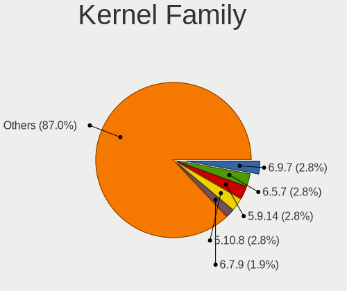

| Version | Desktops | Percent |
|---------|----------|---------|
| 6.9.7   | 3        | 2.78%   |
| 6.5.7   | 3        | 2.78%   |
| 5.9.14  | 3        | 2.78%   |
| 5.10.8  | 3        | 2.78%   |
| 6.7.9   | 2        | 1.85%   |
| 6.6.7   | 2        | 1.85%   |
| 6.6.4   | 2        | 1.85%   |
| 6.6.39  | 2        | 1.85%   |
| 6.2.6   | 2        | 1.85%   |
| 6.2.13  | 2        | 1.85%   |
| 6.1.8   | 2        | 1.85%   |
| 5.8.8   | 2        | 1.85%   |
| 5.8.12  | 2        | 1.85%   |
| 5.7.6   | 2        | 1.85%   |
| 5.7.12  | 2        | 1.85%   |
| 5.18.16 | 2        | 1.85%   |
| 5.15.12 | 2        | 1.85%   |
| 5.12.14 | 2        | 1.85%   |
| 5.12.12 | 2        | 1.85%   |
| 5.11.16 | 2        | 1.85%   |
| 5.10.4  | 2        | 1.85%   |
| 5.10.15 | 2        | 1.85%   |
| 6.9.9   | 1        | 0.93%   |
| 6.9.2   | 1        | 0.93%   |
| 6.8.9   | 1        | 0.93%   |
| 6.7.7   | 1        | 0.93%   |
| 6.7.6   | 1        | 0.93%   |
| 6.7.4   | 1        | 0.93%   |
| 6.6.36  | 1        | 0.93%   |
| 6.6.1   | 1        | 0.93%   |
| 6.5.5   | 1        | 0.93%   |
| 6.5.3   | 1        | 0.93%   |
| 6.5.2   | 1        | 0.93%   |
| 6.4.4   | 1        | 0.93%   |
| 6.4.3   | 1        | 0.93%   |
| 6.4.15  | 1        | 0.93%   |
| 6.4.10  | 1        | 0.93%   |
| 6.3.7   | 1        | 0.93%   |
| 6.3.6   | 1        | 0.93%   |
| 6.3.2   | 1        | 0.93%   |

Kernel Major Ver.
-----------------

Linux kernel major version

| Version | Desktops | Percent |
|---------|----------|---------|
| 5.10    | 10       | 9.62%   |
| 6.6     | 8        | 7.69%   |
| 5.15    | 7        | 6.73%   |
| 6.5     | 6        | 5.77%   |
| 5.9     | 6        | 5.77%   |
| 5.8     | 6        | 5.77%   |
| 5.12    | 6        | 5.77%   |
| 6.9     | 5        | 4.81%   |
| 6.7     | 5        | 4.81%   |
| 6.2     | 5        | 4.81%   |
| 6.1     | 5        | 4.81%   |
| 5.7     | 4        | 3.85%   |
| 5.16    | 4        | 3.85%   |
| 5.11    | 4        | 3.85%   |
| 6.4     | 3        | 2.88%   |
| 6.3     | 3        | 2.88%   |
| 5.18    | 3        | 2.88%   |
| 5.17    | 3        | 2.88%   |
| 6.10    | 2        | 1.92%   |
| 6.0     | 2        | 1.92%   |
| 5.14    | 2        | 1.92%   |
| 5.13    | 2        | 1.92%   |
| 6.8     | 1        | 0.96%   |
| 5.4     | 1        | 0.96%   |
| 4.19    | 1        | 0.96%   |

Arch
----

OS architecture (x86_64, i586, etc.)

| Name   | Desktops | Percent |
|--------|----------|---------|
| x86_64 | 94       | 100%    |

DE
--

Desktop Environment

| Name       | Desktops | Percent |
|------------|----------|---------|
| KDE5       | 27       | 27.27%  |
| XFCE       | 15       | 15.15%  |
| GNOME      | 15       | 15.15%  |
| Unknown    | 9        | 9.09%   |
| MATE       | 7        | 7.07%   |
| X-Cinnamon | 6        | 6.06%   |
| KDE6       | 4        | 4.04%   |
| i3         | 3        | 3.03%   |
| Cinnamon   | 3        | 3.03%   |
| bspwm      | 3        | 3.03%   |
| sway       | 2        | 2.02%   |
| LXQt       | 2        | 2.02%   |
| openbox    | 1        | 1.01%   |
| LXDE       | 1        | 1.01%   |
| DWM        | 1        | 1.01%   |

Display Server
--------------

X11 or Wayland

| Name    | Desktops | Percent |
|---------|----------|---------|
| X11     | 67       | 69.79%  |
| Tty     | 13       | 13.54%  |
| Wayland | 11       | 11.46%  |
| Unknown | 5        | 5.21%   |

Display Manager
---------------

SDDM, LightDM, etc.

| Name    | Desktops | Percent |
|---------|----------|---------|
| Unknown | 42       | 42.86%  |
| SDDM    | 27       | 27.55%  |
| LightDM | 24       | 24.49%  |
| GDM     | 2        | 2.04%   |
| XDM     | 1        | 1.02%   |
| SLiM    | 1        | 1.02%   |
| LXDM    | 1        | 1.02%   |

OS Lang
-------

Language

| Lang    | Desktops | Percent |
|---------|----------|---------|
| en_US   | 40       | 42.11%  |
| ru_RU   | 10       | 10.53%  |
| Unknown | 9        | 9.47%   |
| C       | 6        | 6.32%   |
| fr_FR   | 5        | 5.26%   |
| en_GB   | 5        | 5.26%   |
| de_DE   | 4        | 4.21%   |
| pt_PT   | 2        | 2.11%   |
| pt_BR   | 2        | 2.11%   |
| tr_TR   | 1        | 1.05%   |
| lt_LT   | 1        | 1.05%   |
| ja_JP   | 1        | 1.05%   |
| it_IT   | 1        | 1.05%   |
| es_MX   | 1        | 1.05%   |
| es_AR   | 1        | 1.05%   |
| en_IE   | 1        | 1.05%   |
| en_AU   | 1        | 1.05%   |
| el_GR   | 1        | 1.05%   |
| de_CH   | 1        | 1.05%   |
| de_AT   | 1        | 1.05%   |
| bg_BG   | 1        | 1.05%   |

Boot Mode
---------

EFI or BIOS

| Mode | Desktops | Percent |
|------|----------|---------|
| EFI  | 67       | 70.53%  |
| BIOS | 28       | 29.47%  |

Filesystem
----------

Type of filesystem

| Type    | Desktops | Percent |
|---------|----------|---------|
| Ext4    | 61       | 64.89%  |
| Btrfs   | 22       | 23.4%   |
| Xfs     | 5        | 5.32%   |
| F2fs    | 2        | 2.13%   |
| Tmpfs   | 1        | 1.06%   |
| Overlay | 1        | 1.06%   |
| Jfs     | 1        | 1.06%   |
| Aufs    | 1        | 1.06%   |

Part. scheme
------------

Scheme of partitioning

| Type    | Desktops | Percent |
|---------|----------|---------|
| GPT     | 72       | 75%     |
| Unknown | 19       | 19.79%  |
| MBR     | 5        | 5.21%   |

Dual Boot with Linux/BSD
------------------------

Hosting more than one Linux/BSD

| Dual boot | Desktops | Percent |
|-----------|----------|---------|
| No        | 68       | 70.83%  |
| Yes       | 28       | 29.17%  |

Dual Boot (Win)
---------------

Hosting Linux and Windows

| Dual boot | Desktops | Percent |
|-----------|----------|---------|
| No        | 67       | 70.53%  |
| Yes       | 28       | 29.47%  |

Board
-----

Vendor
------

Motherboard manufacturer

| Name                | Desktops | Percent |
|---------------------|----------|---------|
| ASUSTek Computer    | 25       | 26.6%   |
| Gigabyte Technology | 23       | 24.47%  |
| MSI                 | 18       | 19.15%  |
| ASRock              | 10       | 10.64%  |
| Hewlett-Packard     | 5        | 5.32%   |
| Intel               | 3        | 3.19%   |
| Dell                | 3        | 3.19%   |
| Fujitsu             | 2        | 2.13%   |
| Biostar             | 2        | 2.13%   |
| MACHINIST           | 1        | 1.06%   |
| BESSTAR Tech        | 1        | 1.06%   |
| Alienware           | 1        | 1.06%   |

Model
-----

Motherboard model

| Name                           | Desktops | Percent |
|--------------------------------|----------|---------|
| MSI MS-7A38                    | 3        | 3.19%   |
| MSI MS-7C37                    | 2        | 2.13%   |
| MSI MS-7C02                    | 2        | 2.13%   |
| Intel X99                      | 2        | 2.13%   |
| Gigabyte 970A-DS3P             | 2        | 2.13%   |
| Fujitsu FUTRO S930             | 2        | 2.13%   |
| MSI MS-7E07                    | 1        | 1.06%   |
| MSI MS-7C89                    | 1        | 1.06%   |
| MSI MS-7C56                    | 1        | 1.06%   |
| MSI MS-7B86                    | 1        | 1.06%   |
| MSI MS-7B79                    | 1        | 1.06%   |
| MSI MS-7B09                    | 1        | 1.06%   |
| MSI MS-7A69                    | 1        | 1.06%   |
| MSI MS-7A15                    | 1        | 1.06%   |
| MSI MS-7982                    | 1        | 1.06%   |
| MSI MS-7850                    | 1        | 1.06%   |
| MSI MS-7693                    | 1        | 1.06%   |
| MACHINIST X99-MR9D PLUS V1.0   | 1        | 1.06%   |
| Intel DX58SO2 AAG10925-205     | 1        | 1.06%   |
| HP Z620 Workstation            | 1        | 1.06%   |
| HP EliteDesk 800 G4 SFF        | 1        | 1.06%   |
| HP Compaq 8200 Elite SFF PC    | 1        | 1.06%   |
| HP 550-a114                    | 1        | 1.06%   |
| HP 280 G1 MT                   | 1        | 1.06%   |
| Gigabyte Z77X-UD3H             | 1        | 1.06%   |
| Gigabyte X670E AORUS PRO X     | 1        | 1.06%   |
| Gigabyte X570 AORUS ULTRA      | 1        | 1.06%   |
| Gigabyte X570 AORUS ELITE WIFI | 1        | 1.06%   |
| Gigabyte X570 AORUS ELITE      | 1        | 1.06%   |
| Gigabyte X399 AORUS XTREME     | 1        | 1.06%   |
| Gigabyte P55-USB3              | 1        | 1.06%   |
| Gigabyte HA65M-D2H-B3          | 1        | 1.06%   |
| Gigabyte H61MA-D3V             | 1        | 1.06%   |
| Gigabyte H61M-S2PV             | 1        | 1.06%   |
| Gigabyte H410M H               | 1        | 1.06%   |
| Gigabyte EP45-DS5              | 1        | 1.06%   |
| Gigabyte B550M AORUS PRO       | 1        | 1.06%   |
| Gigabyte B550I AORUS PRO AX    | 1        | 1.06%   |
| Gigabyte B450 I AORUS PRO WIFI | 1        | 1.06%   |
| Gigabyte B450 AORUS PRO WIFI   | 1        | 1.06%   |

Model Family
------------

Motherboard model prefix

| Name                  | Desktops | Percent |
|-----------------------|----------|---------|
| ASUS ROG              | 6        | 6.38%   |
| ASUS PRIME            | 5        | 5.32%   |
| ASUS TUF              | 4        | 4.26%   |
| MSI MS-7A38           | 3        | 3.19%   |
| Gigabyte X570         | 3        | 3.19%   |
| ASRock B450           | 3        | 3.19%   |
| MSI MS-7C37           | 2        | 2.13%   |
| MSI MS-7C02           | 2        | 2.13%   |
| Intel X99             | 2        | 2.13%   |
| Gigabyte B450         | 2        | 2.13%   |
| Gigabyte 970A-DS3P    | 2        | 2.13%   |
| Fujitsu FUTRO         | 2        | 2.13%   |
| Dell OptiPlex         | 2        | 2.13%   |
| ASUS M5A97            | 2        | 2.13%   |
| MSI MS-7E07           | 1        | 1.06%   |
| MSI MS-7C89           | 1        | 1.06%   |
| MSI MS-7C56           | 1        | 1.06%   |
| MSI MS-7B86           | 1        | 1.06%   |
| MSI MS-7B79           | 1        | 1.06%   |
| MSI MS-7B09           | 1        | 1.06%   |
| MSI MS-7A69           | 1        | 1.06%   |
| MSI MS-7A15           | 1        | 1.06%   |
| MSI MS-7982           | 1        | 1.06%   |
| MSI MS-7850           | 1        | 1.06%   |
| MSI MS-7693           | 1        | 1.06%   |
| MACHINIST X99-MR9D    | 1        | 1.06%   |
| Intel DX58SO2         | 1        | 1.06%   |
| HP Z620               | 1        | 1.06%   |
| HP EliteDesk          | 1        | 1.06%   |
| HP Compaq             | 1        | 1.06%   |
| HP 550-a114           | 1        | 1.06%   |
| HP 280                | 1        | 1.06%   |
| Gigabyte Z77X-UD3H    | 1        | 1.06%   |
| Gigabyte X670E        | 1        | 1.06%   |
| Gigabyte X399         | 1        | 1.06%   |
| Gigabyte P55-USB3     | 1        | 1.06%   |
| Gigabyte HA65M-D2H-B3 | 1        | 1.06%   |
| Gigabyte H61MA-D3V    | 1        | 1.06%   |
| Gigabyte H61M-S2PV    | 1        | 1.06%   |
| Gigabyte H410M        | 1        | 1.06%   |

MFG Year
--------

Motherboard manufacture year

| Year | Desktops | Percent |
|------|----------|---------|
| 2018 | 16       | 17.02%  |
| 2020 | 13       | 13.83%  |
| 2019 | 12       | 12.77%  |
| 2017 | 10       | 10.64%  |
| 2012 | 10       | 10.64%  |
| 2022 | 6        | 6.38%   |
| 2015 | 5        | 5.32%   |
| 2013 | 5        | 5.32%   |
| 2021 | 3        | 3.19%   |
| 2016 | 3        | 3.19%   |
| 2014 | 3        | 3.19%   |
| 2008 | 3        | 3.19%   |
| 2011 | 2        | 2.13%   |
| 2010 | 2        | 2.13%   |
| 2023 | 1        | 1.06%   |

Form Factor
-----------

Physical design of the computer

| Name    | Desktops | Percent |
|---------|----------|---------|
| Desktop | 94       | 100%    |

Secure Boot
-----------

Enabled or disabled

| State    | Desktops | Percent |
|----------|----------|---------|
| Disabled | 94       | 100%    |

Coreboot
--------

Have coreboot on board

| Used | Desktops | Percent |
|------|----------|---------|
| No   | 94       | 100%    |

RAM Size
--------

Total RAM memory

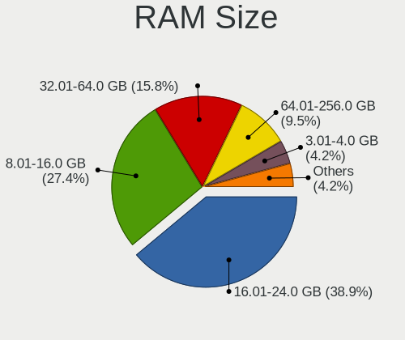

| Size in GB  | Desktops | Percent |
|-------------|----------|---------|
| 16.01-24.0  | 37       | 38.95%  |
| 8.01-16.0   | 26       | 27.37%  |
| 32.01-64.0  | 15       | 15.79%  |
| 64.01-256.0 | 9        | 9.47%   |
| 3.01-4.0    | 4        | 4.21%   |
| 24.01-32.0  | 2        | 2.11%   |
| 4.01-8.0    | 1        | 1.05%   |
| 1.01-2.0    | 1        | 1.05%   |

RAM Used
--------

Used RAM memory

| Used GB    | Desktops | Percent |
|------------|----------|---------|
| 4.01-8.0   | 27       | 26.47%  |
| 2.01-3.0   | 23       | 22.55%  |
| 1.01-2.0   | 19       | 18.63%  |
| 3.01-4.0   | 17       | 16.67%  |
| 8.01-16.0  | 8        | 7.84%   |
| 16.01-24.0 | 3        | 2.94%   |
| 0.51-1.0   | 3        | 2.94%   |
| 0.01-0.5   | 2        | 1.96%   |

Total Drives
------------

Number of drives on board

| Drives | Desktops | Percent |
|--------|----------|---------|
| 2      | 37       | 38.14%  |
| 3      | 24       | 24.74%  |
| 1      | 18       | 18.56%  |
| 4      | 7        | 7.22%   |
| 6      | 5        | 5.15%   |
| 8      | 2        | 2.06%   |
| 7      | 2        | 2.06%   |
| 5      | 1        | 1.03%   |
| 0      | 1        | 1.03%   |

Has CD-ROM
----------

Has CD-ROM on board

| Presented | Desktops | Percent |
|-----------|----------|---------|
| No        | 76       | 80.85%  |
| Yes       | 18       | 19.15%  |

Has Ethernet
------------

Has Ethernet on board

| Presented | Desktops | Percent |
|-----------|----------|---------|
| Yes       | 92       | 97.87%  |
| No        | 2        | 2.13%   |

Has WiFi
--------

Has WiFi module

| Presented | Desktops | Percent |
|-----------|----------|---------|
| Yes       | 48       | 51.06%  |
| No        | 46       | 48.94%  |

Has Bluetooth
-------------

Has Bluetooth module

| Presented | Desktops | Percent |
|-----------|----------|---------|
| No        | 52       | 55.32%  |
| Yes       | 42       | 44.68%  |

Location
--------

Country
-------

Geographic location (country)

| Country     | Desktops | Percent |
|-------------|----------|---------|
| USA         | 15       | 15.79%  |
| Russia      | 12       | 12.63%  |
| Germany     | 11       | 11.58%  |
| France      | 7        | 7.37%   |
| UK          | 5        | 5.26%   |
| Switzerland | 5        | 5.26%   |
| Netherlands | 4        | 4.21%   |
| Brazil      | 4        | 4.21%   |
| Poland      | 3        | 3.16%   |
| Greece      | 3        | 3.16%   |
| Canada      | 3        | 3.16%   |
| Turkey      | 2        | 2.11%   |
| Finland     | 2        | 2.11%   |
| Bulgaria    | 2        | 2.11%   |
| Ukraine     | 1        | 1.05%   |
| Spain       | 1        | 1.05%   |
| Slovenia    | 1        | 1.05%   |
| Mexico      | 1        | 1.05%   |
| Lithuania   | 1        | 1.05%   |
| Latvia      | 1        | 1.05%   |
| Japan       | 1        | 1.05%   |
| Italy       | 1        | 1.05%   |
| Iran        | 1        | 1.05%   |
| India       | 1        | 1.05%   |
| Hong Kong   | 1        | 1.05%   |
| Guatemala   | 1        | 1.05%   |
| Georgia     | 1        | 1.05%   |
| Belarus     | 1        | 1.05%   |
| Austria     | 1        | 1.05%   |
| Australia   | 1        | 1.05%   |
| Argentina   | 1        | 1.05%   |

City
----

Geographic location (city)

| City                   | Desktops | Percent |
|------------------------|----------|---------|
| Paris                  | 3        | 3.06%   |
| Mijdrecht              | 3        | 3.06%   |
| Toronto                | 2        | 2.04%   |
| St Petersburg          | 2        | 2.04%   |
| Rochester              | 2        | 2.04%   |
| Moscow                 | 2        | 2.04%   |
| Helsinki               | 2        | 2.04%   |
| Frankfurt am Main      | 2        | 2.04%   |
| Charlotte              | 2        | 2.04%   |
| Bern                   | 2        | 2.04%   |
| Athens                 | 2        | 2.04%   |
| Zurich                 | 1        | 1.02%   |
| Wettringen             | 1        | 1.02%   |
| Vladivostok            | 1        | 1.02%   |
| Vilnius                | 1        | 1.02%   |
| Vienna                 | 1        | 1.02%   |
| Vancouver              | 1        | 1.02%   |
| Upper Norwood          | 1        | 1.02%   |
| Ufa                    | 1        | 1.02%   |
| Thessaloniki           | 1        | 1.02%   |
| Tehran                 | 1        | 1.02%   |
| Tbilisi                | 1        | 1.02%   |
| Sydney                 | 1        | 1.02%   |
| Surgut                 | 1        | 1.02%   |
| Surat                  | 1        | 1.02%   |
| Stein                  | 1        | 1.02%   |
| Stavropol              | 1        | 1.02%   |
| Statesboro             | 1        | 1.02%   |
| Sofia                  | 1        | 1.02%   |
| Snohomish              | 1        | 1.02%   |
| Sierre                 | 1        | 1.02%   |
| Shishkin Les           | 1        | 1.02%   |
| Shavertown             | 1        | 1.02%   |
| Saratov                | 1        | 1.02%   |
| Sao Paulo              | 1        | 1.02%   |
| San Miguel de Tucumán | 1        | 1.02%   |
| Rotherham              | 1        | 1.02%   |
| Rosmalen               | 1        | 1.02%   |
| Riverview              | 1        | 1.02%   |
| Riga                   | 1        | 1.02%   |

Drives
------

Drive Vendor
------------

Hard drive vendors

| Vendor                      | Desktops | Drives | Percent |
|-----------------------------|----------|--------|---------|
| WDC                         | 39       | 68     | 18.75%  |
| Samsung Electronics         | 30       | 42     | 14.42%  |
| Seagate                     | 28       | 39     | 13.46%  |
| Kingston                    | 16       | 18     | 7.69%   |
| Crucial                     | 15       | 23     | 7.21%   |
| Toshiba                     | 12       | 13     | 5.77%   |
| SanDisk                     | 12       | 16     | 5.77%   |
| Phison Electronics          | 4        | 7      | 1.92%   |
| Intel                       | 4        | 7      | 1.92%   |
| Hitachi                     | 3        | 3      | 1.44%   |
| China                       | 3        | 4      | 1.44%   |
| A-DATA Technology           | 3        | 3      | 1.44%   |
| Transcend                   | 2        | 2      | 0.96%   |
| SK hynix                    | 2        | 2      | 0.96%   |
| PNY                         | 2        | 2      | 0.96%   |
| Maxtor                      | 2        | 2      | 0.96%   |
| JMicron Technology          | 2        | 2      | 0.96%   |
| HGST                        | 2        | 3      | 0.96%   |
| Corsair                     | 2        | 2      | 0.96%   |
| Brainzap                    | 2        | 2      | 0.96%   |
| AMD                         | 2        | 2      | 0.96%   |
| XUM                         | 1        | 1      | 0.48%   |
| USB3.0                      | 1        | 1      | 0.48%   |
| Unknown                     | 1        | 1      | 0.48%   |
| TS512GMT                    | 1        | 5      | 0.48%   |
| SPCC Sol                    | 1        | 1      | 0.48%   |
| SPCC                        | 1        | 1      | 0.48%   |
| Silicon Motion              | 1        | 1      | 0.48%   |
| Plextor                     | 1        | 1      | 0.48%   |
| Phison                      | 1        | 1      | 0.48%   |
| OCZ                         | 1        | 1      | 0.48%   |
| Netac                       | 1        | 1      | 0.48%   |
| MAXIO Technology (Hangzhou) | 1        | 3      | 0.48%   |
| Linux                       | 1        | 1      | 0.48%   |
| Kingston Technology Company | 1        | 1      | 0.48%   |
| KingSpec                    | 1        | 1      | 0.48%   |
| Hewlett-Packard             | 1        | 1      | 0.48%   |
| GOODRAM                     | 1        | 1      | 0.48%   |
| Biostar                     | 1        | 1      | 0.48%   |
| Apacer                      | 1        | 1      | 0.48%   |

Drive Model
-----------

Hard drive models

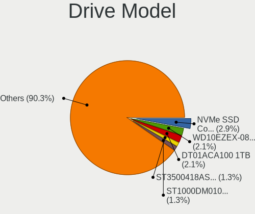

| Model                                               | Desktops | Percent |
|-----------------------------------------------------|----------|---------|
| Samsung NVMe SSD Controller SM981/PM981/PM983 512GB | 7        | 2.94%   |
| WDC WD10EZEX-08WN4A0 1TB                            | 5        | 2.1%    |
| Toshiba DT01ACA100 1TB                              | 5        | 2.1%    |
| Seagate ST3500418AS 500GB                           | 3        | 1.26%   |
| Seagate ST1000DM010-2EP102 1TB                      | 3        | 1.26%   |
| Sandisk WD Blue SN550 NVMe SSD 256GB                | 3        | 1.26%   |
| Samsung SSD 860 EVO 250GB                           | 3        | 1.26%   |
| Phison PS5013 E13 NVMe Controller 512GB             | 3        | 1.26%   |
| Kingston SA400S37120G 120GB SSD                     | 3        | 1.26%   |
| Crucial CT250MX500SSD1 250GB                        | 3        | 1.26%   |
| Crucial CT240BX500SSD1 240GB                        | 3        | 1.26%   |
| Crucial CT1000MX500SSD1 1TB                         | 3        | 1.26%   |
| WDC WD80EZAZ-11TDBA0 8TB                            | 2        | 0.84%   |
| WDC WD40EZRZ-00WN9B0 4TB                            | 2        | 0.84%   |
| WDC WD20EZBX-00AYRA0 2TB                            | 2        | 0.84%   |
| WDC WD10EZEX-22MFCA0 1TB                            | 2        | 0.84%   |
| WDC WD10EZEX-00BN5A0 1TB                            | 2        | 0.84%   |
| WDC WD100EMAZ-00WJTA0 10TB                          | 2        | 0.84%   |
| Toshiba HDWD130 3TB                                 | 2        | 0.84%   |
| Toshiba DT01ACA050 500GB                            | 2        | 0.84%   |
| Seagate ST500DM002-1BD142 500GB                     | 2        | 0.84%   |
| Seagate ST2000DM008-2FR102 2TB                      | 2        | 0.84%   |
| Seagate ST1000LM024 HN-M101MBB 1TB                  | 2        | 0.84%   |
| Sandisk WD Black SN850 2TB                          | 2        | 0.84%   |
| Samsung SSD 980 1TB                                 | 2        | 0.84%   |
| Samsung SSD 970 EVO 1TB                             | 2        | 0.84%   |
| Samsung SSD 840 EVO 250GB                           | 2        | 0.84%   |
| Kingston SV300S37A240G 240GB SSD                    | 2        | 0.84%   |
| Kingston SA400S37480G 480GB SSD                     | 2        | 0.84%   |
| Crucial CT500MX500SSD1 500GB                        | 2        | 0.84%   |
| Brainzap SSD 128G                                   | 2        | 0.84%   |
| AMD R5SL240G 240GB SSD                              | 2        | 0.84%   |
| A-DATA SU650 240GB SSD                              | 2        | 0.84%   |
| XUM HX256GSSDSATA3 256GB                            | 1        | 0.42%   |
| WDC WDS500G2B0C-00PXH0 500GB                        | 1        | 0.42%   |
| WDC WDS500G2B0A-00SM50 500GB SSD                    | 1        | 0.42%   |
| WDC WDS256G1X0C-00ENX0 256GB                        | 1        | 0.42%   |
| WDC WDS250G2B0A-00SM50 250GB SSD                    | 1        | 0.42%   |
| WDC WDS100T2B0C-00PXH0 1TB                          | 1        | 0.42%   |
| WDC WDS100T2B0A-00SM50 1TB SSD                      | 1        | 0.42%   |

HDD Vendor
----------

Hard disk drive vendors

| Vendor              | Desktops | Drives | Percent |
|---------------------|----------|--------|---------|
| WDC                 | 36       | 59     | 41.38%  |
| Seagate             | 28       | 39     | 32.18%  |
| Toshiba             | 12       | 13     | 13.79%  |
| Hitachi             | 3        | 3      | 3.45%   |
| Maxtor              | 2        | 2      | 2.3%    |
| JMicron Technology  | 2        | 2      | 2.3%    |
| HGST                | 2        | 3      | 2.3%    |
| Unknown             | 1        | 1      | 1.15%   |
| Samsung Electronics | 1        | 1      | 1.15%   |

SSD Vendor
----------

Solid state drive vendors

| Vendor              | Desktops | Drives | Percent |
|---------------------|----------|--------|---------|
| Samsung Electronics | 15       | 19     | 18.52%  |
| Crucial             | 15       | 23     | 18.52%  |
| Kingston            | 14       | 16     | 17.28%  |
| SanDisk             | 5        | 5      | 6.17%   |
| WDC                 | 4        | 6      | 4.94%   |
| China               | 3        | 4      | 3.7%    |
| A-DATA Technology   | 3        | 3      | 3.7%    |
| Intel               | 2        | 3      | 2.47%   |
| Brainzap            | 2        | 2      | 2.47%   |
| AMD                 | 2        | 2      | 2.47%   |
| XUM                 | 1        | 1      | 1.23%   |
| USB3.0              | 1        | 1      | 1.23%   |
| Transcend           | 1        | 1      | 1.23%   |
| SPCC Sol            | 1        | 1      | 1.23%   |
| SPCC                | 1        | 1      | 1.23%   |
| SK hynix            | 1        | 1      | 1.23%   |
| PNY                 | 1        | 1      | 1.23%   |
| Plextor             | 1        | 1      | 1.23%   |
| OCZ                 | 1        | 1      | 1.23%   |
| Netac               | 1        | 1      | 1.23%   |
| Linux               | 1        | 1      | 1.23%   |
| KingSpec            | 1        | 1      | 1.23%   |
| GOODRAM             | 1        | 1      | 1.23%   |
| Biostar             | 1        | 1      | 1.23%   |
| Apacer              | 1        | 1      | 1.23%   |
| Unknown             | 1        | 3      | 1.23%   |

Drive Kind
----------

HDD or SSD

| Kind    | Desktops | Drives | Percent |
|---------|----------|--------|---------|
| HDD     | 68       | 123    | 38.86%  |
| SSD     | 65       | 101    | 37.14%  |
| NVMe    | 41       | 62     | 23.43%  |
| Unknown | 1        | 5      | 0.57%   |

Drive Connector
---------------

SATA, SAS, NVMe, etc.

| Type | Desktops | Drives | Percent |
|------|----------|--------|---------|
| SATA | 85       | 213    | 62.5%   |
| NVMe | 41       | 62     | 30.15%  |
| SAS  | 10       | 16     | 7.35%   |

Drive Size
----------

Size of hard drive

| Size in TB | Desktops | Drives | Percent |
|------------|----------|--------|---------|
| 0.01-0.5   | 70       | 110    | 47.3%   |
| 0.51-1.0   | 41       | 63     | 27.7%   |
| 1.01-2.0   | 18       | 22     | 12.16%  |
| 4.01-10.0  | 7        | 14     | 4.73%   |
| 3.01-4.0   | 6        | 9      | 4.05%   |
| 2.01-3.0   | 6        | 6      | 4.05%   |

Space Total
-----------

Amount of disk space available on the file system

| Size in GB     | Desktops | Percent |
|----------------|----------|---------|
| More than 3000 | 20       | 20.83%  |
| 1001-2000      | 19       | 19.79%  |
| 2001-3000      | 13       | 13.54%  |
| 251-500        | 12       | 12.5%   |
| 101-250        | 12       | 12.5%   |
| 501-1000       | 12       | 12.5%   |
| 51-100         | 4        | 4.17%   |
| Unknown        | 3        | 3.13%   |
| 1-20           | 1        | 1.04%   |

Space Used
----------

Amount of used disk space

| Used GB        | Desktops | Percent |
|----------------|----------|---------|
| 501-1000       | 18       | 18.56%  |
| 251-500        | 13       | 13.4%   |
| 1001-2000      | 13       | 13.4%   |
| 101-250        | 12       | 12.37%  |
| 1-20           | 10       | 10.31%  |
| More than 3000 | 9        | 9.28%   |
| 51-100         | 7        | 7.22%   |
| 21-50          | 6        | 6.19%   |
| 2001-3000      | 6        | 6.19%   |
| Unknown        | 3        | 3.09%   |

Malfunc. Drives
---------------

Drive models with a malfunction

| Model                             | Desktops | Drives | Percent |
|-----------------------------------|----------|--------|---------|
| WDC WD5000AVCS-632DY1 500GB       | 1        | 1      | 5%      |
| WDC WD5000AAKX-08U6AA0 500GB      | 1        | 1      | 5%      |
| WDC WD3200AAKX-00ERMA0 320GB      | 1        | 1      | 5%      |
| WDC WD30EZRX-00DC0B0 3TB          | 1        | 1      | 5%      |
| WDC WD30EJRX-89AKWY0 3TB          | 1        | 1      | 5%      |
| Toshiba MK7575GSX 752GB           | 1        | 1      | 5%      |
| Toshiba DT01ACA100 1TB            | 1        | 1      | 5%      |
| Seagate ST8000DM004-2CX188 8TB    | 1        | 1      | 5%      |
| Seagate ST6000VN0033-2EE110 6TB   | 1        | 1      | 5%      |
| Seagate ST2000DX002-2DV164 2TB    | 1        | 1      | 5%      |
| Seagate ST2000DM006-2DM164 2TB    | 1        | 1      | 5%      |
| Samsung Electronics SSD 980 1TB   | 1        | 1      | 5%      |
| Maxtor 6Y080M0 82GB               | 1        | 1      | 5%      |
| Kingston SUV400S37240G 240GB SSD  | 1        | 1      | 5%      |
| Kingston SA400S37120G 120GB SSD   | 1        | 1      | 5%      |
| Intel SSDSC2BW480A4 480GB         | 1        | 2      | 5%      |
| Intel SSDPEKKW128G7 128GB         | 1        | 1      | 5%      |
| HGST HTS541010A9E680 1TB          | 1        | 1      | 5%      |
| Hewlett-Packard SSD EX900 250GB   | 1        | 1      | 5%      |
| A-DATA Technology SU650 240GB SSD | 1        | 1      | 5%      |

Malfunc. Drive Vendor
---------------------

Vendors of faulty drives

| Vendor              | Desktops | Drives | Percent |
|---------------------|----------|--------|---------|
| WDC                 | 5        | 5      | 25%     |
| Seagate             | 4        | 4      | 20%     |
| Toshiba             | 2        | 2      | 10%     |
| Kingston            | 2        | 2      | 10%     |
| Intel               | 2        | 3      | 10%     |
| Samsung Electronics | 1        | 1      | 5%      |
| Maxtor              | 1        | 1      | 5%      |
| HGST                | 1        | 1      | 5%      |
| Hewlett-Packard     | 1        | 1      | 5%      |
| A-DATA Technology   | 1        | 1      | 5%      |

Malfunc. HDD Vendor
-------------------

Vendors of faulty HDD drives

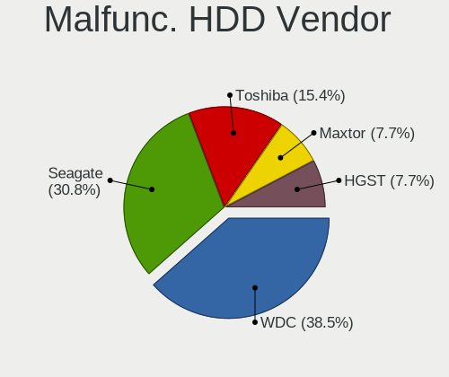

| Vendor  | Desktops | Drives | Percent |
|---------|----------|--------|---------|
| WDC     | 5        | 5      | 38.46%  |
| Seagate | 4        | 4      | 30.77%  |
| Toshiba | 2        | 2      | 15.38%  |
| Maxtor  | 1        | 1      | 7.69%   |
| HGST    | 1        | 1      | 7.69%   |

Malfunc. Drive Kind
-------------------

Kinds of faulty drives

| Kind | Desktops | Drives | Percent |
|------|----------|--------|---------|
| HDD  | 12       | 13     | 63.16%  |
| SSD  | 4        | 5      | 21.05%  |
| NVMe | 3        | 3      | 15.79%  |

Failed Drives
-------------

Failed drive models

Zero info for selected period =(

Failed Drive Vendor
-------------------

Failed drive vendors

Zero info for selected period =(

Drive Status
------------

Number of failed and malfunc. drives

| Status   | Desktops | Drives | Percent |
|----------|----------|--------|---------|
| Works    | 58       | 156    | 49.57%  |
| Detected | 40       | 113    | 34.19%  |
| Malfunc  | 18       | 21     | 15.38%  |
| Fixed    | 1        | 1      | 0.85%   |

Storage controller
------------------

Storage Vendor
--------------

Storage controller vendors

| Vendor                      | Desktops | Percent |
|-----------------------------|----------|---------|
| AMD                         | 55       | 36.42%  |
| Intel                       | 39       | 25.83%  |
| Samsung Electronics         | 17       | 11.26%  |
| SanDisk                     | 10       | 6.62%   |
| Phison Electronics          | 7        | 4.64%   |
| ASMedia Technology          | 6        | 3.97%   |
| Marvell Technology Group    | 5        | 3.31%   |
| Silicon Motion              | 3        | 1.99%   |
| Kingston Technology Company | 3        | 1.99%   |
| JMicron Technology          | 2        | 1.32%   |
| SK hynix                    | 1        | 0.66%   |
| MAXIO Technology (Hangzhou) | 1        | 0.66%   |
| Broadcom / LSI              | 1        | 0.66%   |
| ADATA Technology            | 1        | 0.66%   |

Storage Model
-------------

Storage controller models

| Model                                                                          | Desktops | Percent |
|--------------------------------------------------------------------------------|----------|---------|
| AMD FCH SATA Controller [AHCI mode]                                            | 36       | 19.57%  |
| Samsung NVMe SSD Controller SM981/PM981/PM983                                  | 13       | 7.07%   |
| AMD 400 Series Chipset SATA Controller                                         | 11       | 5.98%   |
| AMD SB7x0/SB8x0/SB9x0 SATA Controller [AHCI mode]                              | 7        | 3.8%    |
| AMD 300 Series Chipset SATA Controller                                         | 7        | 3.8%    |
| ASMedia ASM1061/ASM1062 Serial ATA Controller                                  | 6        | 3.26%   |
| AMD 500 Series Chipset SATA Controller                                         | 6        | 3.26%   |
| Intel Q170/Q150/B150/H170/H110/Z170/CM236 Chipset SATA Controller [AHCI Mode]  | 5        | 2.72%   |
| SanDisk Ultra 3D / WD PC SN530, IX SN530, Blue SN550 NVMe SSD (DRAM-less)      | 4        | 2.17%   |
| Intel Cannon Lake PCH SATA AHCI Controller                                     | 4        | 2.17%   |
| Intel 6 Series/C200 Series Chipset Family 6 port Desktop SATA AHCI Controller  | 4        | 2.17%   |
| Intel 200 Series PCH SATA controller [AHCI mode]                               | 4        | 2.17%   |
| Phison PS5013-E13 PCIe3 NVMe Controller (DRAM-less)                            | 3        | 1.63%   |
| Marvell Group 88SE9172 SATA 6Gb/s Controller                                   | 3        | 1.63%   |
| Intel 8 Series/C220 Series Chipset Family 6-port SATA Controller 1 [AHCI mode] | 3        | 1.63%   |
| Intel 400 Series Chipset Family SATA AHCI Controller                           | 3        | 1.63%   |
| Silicon Motion SM2263EN/SM2263XT (DRAM-less) NVMe SSD Controllers              | 2        | 1.09%   |
| SanDisk WD PC SN810 / Black SN850 NVMe SSD                                     | 2        | 1.09%   |
| SanDisk WD Blue SN500 / PC SN520 x2 M.2 2280 NVMe SSD                          | 2        | 1.09%   |
| Samsung NVMe SSD Controller 980 (DRAM-less)                                    | 2        | 1.09%   |
| Phison E16 PCIe4 NVMe Controller                                               | 2        | 1.09%   |
| Phison E12 NVMe Controller                                                     | 2        | 1.09%   |
| Kingston Company A2000 NVMe SSD [SM2263EN]                                     | 2        | 1.09%   |
| JMicron JMB363 SATA/IDE Controller                                             | 2        | 1.09%   |
| Intel SATA Controller [RAID mode]                                              | 2        | 1.09%   |
| Intel 9 Series Chipset Family SATA Controller [AHCI Mode]                      | 2        | 1.09%   |
| Intel 7 Series/C210 Series Chipset Family 6-port SATA Controller [AHCI mode]   | 2        | 1.09%   |
| AMD X399 Series Chipset SATA Controller                                        | 2        | 1.09%   |
| AMD SB7x0/SB8x0/SB9x0 IDE Controller                                           | 2        | 1.09%   |
| AMD 600 Series Chipset SATA Controller                                         | 2        | 1.09%   |
| SK hynix PC601 NVMe Solid State Drive                                          | 1        | 0.54%   |
| Silicon Motion SM2262/SM2262EN SSD Controller                                  | 1        | 0.54%   |
| SanDisk WD Black SN770 / PC SN740 256GB / PC SN560 (DRAM-less) NVMe SSD        | 1        | 0.54%   |
| SanDisk WD Black NVMe SSD                                                      | 1        | 0.54%   |
| SanDisk Extreme Pro / WD Black SN750 / PC SN730 / Red SN700 NVMe SSD           | 1        | 0.54%   |
| Samsung NVMe SSD Controller SM961/PM961/SM963                                  | 1        | 0.54%   |
| Samsung NVMe SSD Controller S4LV008[Pascal]                                    | 1        | 0.54%   |
| Samsung NVMe SSD Controller PM9A1/PM9A3/980PRO                                 | 1        | 0.54%   |
| Phison E18 PCIe4 NVMe Controller                                               | 1        | 0.54%   |
| MAXIO (Hangzhou) NVMe SSD Controller MAP1202 (DRAM-less)                       | 1        | 0.54%   |

Storage Kind
------------

Kind of storage controller (IDE, SATA, NVMe, SAS, ...)

| Kind | Desktops | Percent |
|------|----------|---------|
| SATA | 88       | 61.54%  |
| NVMe | 41       | 28.67%  |
| IDE  | 10       | 6.99%   |
| RAID | 2        | 1.4%    |
| SAS  | 2        | 1.4%    |

Processor
---------

CPU Vendor
----------

Processor vendors

| Vendor | Desktops | Percent |
|--------|----------|---------|
| AMD    | 56       | 59.57%  |
| Intel  | 38       | 40.43%  |

CPU Model
---------

Processor models

| Model                                     | Desktops | Percent |
|-------------------------------------------|----------|---------|
| AMD FX-8350 Eight-Core Processor          | 5        | 5.32%   |
| AMD Ryzen 7 3700X 8-Core Processor        | 4        | 4.26%   |
| AMD Ryzen 5 5600X 6-Core Processor        | 4        | 4.26%   |
| AMD Ryzen 5 3600 6-Core Processor         | 4        | 4.26%   |
| AMD Ryzen 9 3900X 12-Core Processor       | 3        | 3.19%   |
| AMD Ryzen 7 5700G with Radeon Graphics    | 3        | 3.19%   |
| AMD Ryzen 7 2700X Eight-Core Processor    | 3        | 3.19%   |
| AMD Ryzen 5 2600X Six-Core Processor      | 3        | 3.19%   |
| Intel Core i7-9700K CPU @ 3.60GHz         | 2        | 2.13%   |
| Intel Core i5-8500 CPU @ 3.00GHz          | 2        | 2.13%   |
| Intel Core i5-6600K CPU @ 3.50GHz         | 2        | 2.13%   |
| Intel Core i5-3330 CPU @ 3.00GHz          | 2        | 2.13%   |
| Intel Core i5-2500 CPU @ 3.30GHz          | 2        | 2.13%   |
| Intel Core i5-10400F CPU @ 2.90GHz        | 2        | 2.13%   |
| AMD Ryzen 5 1600 Six-Core Processor       | 2        | 2.13%   |
| AMD GX-424CC SOC with Radeon R5E Graphics | 2        | 2.13%   |
| Intel Xeon CPU E5-2680 v4 @ 2.40GHz       | 1        | 1.06%   |
| Intel Xeon CPU E5-2680 v2 @ 2.80GHz       | 1        | 1.06%   |
| Intel Xeon CPU E5-2660 v3 @ 2.60GHz       | 1        | 1.06%   |
| Intel Xeon CPU E5-2630 v3 @ 2.40GHz       | 1        | 1.06%   |
| Intel Pentium CPU G4560 @ 3.50GHz         | 1        | 1.06%   |
| Intel Core i7-9700F CPU @ 3.00GHz         | 1        | 1.06%   |
| Intel Core i7-4790K CPU @ 4.00GHz         | 1        | 1.06%   |
| Intel Core i7 CPU 970 @ 3.20GHz           | 1        | 1.06%   |
| Intel Core i5-9600K CPU @ 3.70GHz         | 1        | 1.06%   |
| Intel Core i5-9400F CPU @ 2.90GHz         | 1        | 1.06%   |
| Intel Core i5-7600K CPU @ 3.80GHz         | 1        | 1.06%   |
| Intel Core i5-6400 CPU @ 2.70GHz          | 1        | 1.06%   |
| Intel Core i5-4670K CPU @ 3.40GHz         | 1        | 1.06%   |
| Intel Core i5-3470 CPU @ 3.20GHz          | 1        | 1.06%   |
| Intel Core i5-2310 CPU @ 2.90GHz          | 1        | 1.06%   |
| Intel Core i5-10500T CPU @ 2.30GHz        | 1        | 1.06%   |
| Intel Core i5 CPU 660 @ 3.33GHz           | 1        | 1.06%   |
| Intel Core i3-6100 CPU @ 3.70GHz          | 1        | 1.06%   |
| Intel Core i3-2120 CPU @ 3.30GHz          | 1        | 1.06%   |
| Intel Core i3-10100 CPU @ 3.60GHz         | 1        | 1.06%   |
| Intel Core 2 Quad CPU Q9550 @ 2.83GHz     | 1        | 1.06%   |
| Intel Core 2 Duo CPU E7500 @ 2.93GHz      | 1        | 1.06%   |
| Intel Core 2 Duo CPU E4600 @ 2.40GHz      | 1        | 1.06%   |
| Intel Celeron CPU G1840 @ 2.80GHz         | 1        | 1.06%   |

CPU Model Family
----------------

Processor model prefix

| Model                  | Desktops | Percent |
|------------------------|----------|---------|
| Intel Core i5          | 19       | 20.21%  |
| AMD Ryzen 5            | 18       | 19.15%  |
| AMD Ryzen 7            | 14       | 14.89%  |
| AMD FX                 | 7        | 7.45%   |
| AMD Ryzen 9            | 6        | 6.38%   |
| Intel Core i7          | 5        | 5.32%   |
| Intel Xeon             | 4        | 4.26%   |
| Intel Core i3          | 3        | 3.19%   |
| Other                  | 2        | 2.13%   |
| Intel Core 2 Duo       | 2        | 2.13%   |
| AMD Ryzen Threadripper | 2        | 2.13%   |
| AMD GX                 | 2        | 2.13%   |
| AMD A10                | 2        | 2.13%   |
| Intel Pentium          | 1        | 1.06%   |
| Intel Core 2 Quad      | 1        | 1.06%   |
| Intel Celeron          | 1        | 1.06%   |
| AMD Ryzen 3            | 1        | 1.06%   |
| AMD Phenom II X4       | 1        | 1.06%   |
| AMD Athlon             | 1        | 1.06%   |
| AMD A8                 | 1        | 1.06%   |
| AMD A6                 | 1        | 1.06%   |

CPU Cores
---------

Number of processor cores

| Number | Desktops | Percent |
|--------|----------|---------|
| 6      | 26       | 27.66%  |
| 4      | 25       | 26.6%   |
| 8      | 18       | 19.15%  |
| 2      | 10       | 10.64%  |
| 12     | 4        | 4.26%   |
| 16     | 3        | 3.19%   |
| 10     | 2        | 2.13%   |
| 3      | 2        | 2.13%   |
| 32     | 1        | 1.06%   |
| 20     | 1        | 1.06%   |
| 14     | 1        | 1.06%   |
| 1      | 1        | 1.06%   |

CPU Sockets
-----------

Number of sockets

| Number | Desktops | Percent |
|--------|----------|---------|
| 1      | 93       | 98.94%  |
| 2      | 1        | 1.06%   |

CPU Threads
-----------

Threads per core (Hyper-Threading)

| Number | Desktops | Percent |
|--------|----------|---------|
| 2      | 67       | 71.28%  |
| 1      | 27       | 28.72%  |

CPU Op-Modes
------------

CPU Operation Modes (32-bit, 64-bit)

| Op mode        | Desktops | Percent |
|----------------|----------|---------|
| 32-bit, 64-bit | 94       | 100%    |

CPU Microcode
-------------

Microcode number

| Number     | Desktops | Percent |
|------------|----------|---------|
| Unknown    | 41       | 42.27%  |
| 0x0800820d | 6        | 6.19%   |
| 0x08701021 | 5        | 5.15%   |
| 0x08701013 | 5        | 5.15%   |
| 0x906ed    | 3        | 3.09%   |
| 0x206a7    | 3        | 3.09%   |
| 0x0a201016 | 3        | 3.09%   |
| 0x06000822 | 3        | 3.09%   |
| 0xa0655    | 2        | 2.06%   |
| 0x506e3    | 2        | 2.06%   |
| 0x306c3    | 2        | 2.06%   |
| 0x07030106 | 2        | 2.06%   |
| 0x06003106 | 2        | 2.06%   |
| 0x06000852 | 2        | 2.06%   |
| 0xa0653    | 1        | 1.03%   |
| 0x906e9    | 1        | 1.03%   |
| 0x6fd      | 1        | 1.03%   |
| 0x306a9    | 1        | 1.03%   |
| 0x206c2    | 1        | 1.03%   |
| 0x20652    | 1        | 1.03%   |
| 0x1067a    | 1        | 1.03%   |
| 0x0a50000b | 1        | 1.03%   |
| 0x0a201009 | 1        | 1.03%   |
| 0x08600106 | 1        | 1.03%   |
| 0x08108109 | 1        | 1.03%   |
| 0x0800820b | 1        | 1.03%   |
| 0x08001138 | 1        | 1.03%   |
| 0x08001137 | 1        | 1.03%   |
| 0x08001129 | 1        | 1.03%   |
| 0x07030105 | 1        | 1.03%   |

CPU Microarch
-------------

Microarchitecture

| Name             | Desktops | Percent |
|------------------|----------|---------|
| Zen 2            | 15       | 15.96%  |
| Zen+             | 11       | 11.7%   |
| Zen 3            | 10       | 10.64%  |
| KabyLake         | 9        | 9.57%   |
| Piledriver       | 8        | 8.51%   |
| Haswell          | 5        | 5.32%   |
| Zen              | 4        | 4.26%   |
| Skylake          | 4        | 4.26%   |
| SandyBridge      | 4        | 4.26%   |
| IvyBridge        | 4        | 4.26%   |
| CometLake        | 4        | 4.26%   |
| Puma             | 3        | 3.19%   |
| Westmere         | 2        | 2.13%   |
| Steamroller      | 2        | 2.13%   |
| Penryn           | 2        | 2.13%   |
| Alderlake Hybrid | 2        | 2.13%   |
| Unknown          | 2        | 2.13%   |
| K10              | 1        | 1.06%   |
| Core             | 1        | 1.06%   |
| Broadwell        | 1        | 1.06%   |

Graphics
--------

GPU Vendor
----------

Vendors of graphics cards

| Vendor | Desktops | Percent |
|--------|----------|---------|
| AMD    | 58       | 58%     |
| Nvidia | 32       | 32%     |
| Intel  | 10       | 10%     |

GPU Model
---------

Graphics card models

| Model                                                        | Desktops | Percent |
|--------------------------------------------------------------|----------|---------|
| AMD Ellesmere [Radeon RX 470/480/570/570X/580/580X/590]      | 11       | 10.48%  |
| AMD Navi 10 [Radeon RX 5600 OEM/5600 XT / 5700/5700 XT]      | 7        | 6.67%   |
| AMD Navi 21 [Radeon RX 6800/6800 XT / 6900 XT]               | 4        | 3.81%   |
| Intel CoffeeLake-S GT2 [UHD Graphics 630]                    | 3        | 2.86%   |
| AMD Mullins [Radeon R4/R5 Graphics]                          | 3        | 2.86%   |
| AMD Lexa PRO [Radeon 540/540X/550/550X / RX 540X/550/550X]   | 3        | 2.86%   |
| AMD Cezanne [Radeon Vega Series / Radeon Vega Mobile Series] | 3        | 2.86%   |
| AMD Baffin [Radeon RX 550 640SP / RX 560/560X]               | 3        | 2.86%   |
| Nvidia TU116 [GeForce GTX 1650 SUPER]                        | 2        | 1.9%    |
| Nvidia TU104 [GeForce RTX 2070 SUPER]                        | 2        | 1.9%    |
| Nvidia GP106 [GeForce GTX 1060 6GB]                          | 2        | 1.9%    |
| Nvidia GP104 [GeForce GTX 1080]                              | 2        | 1.9%    |
| Nvidia GP104 [GeForce GTX 1070 Ti]                           | 2        | 1.9%    |
| Nvidia GM206 [GeForce GTX 950]                               | 2        | 1.9%    |
| Intel 82G33/G31 Express Integrated Graphics Controller       | 2        | 1.9%    |
| AMD Vega 10 XL/XT [Radeon RX Vega 56/64]                     | 2        | 1.9%    |
| AMD Redwood XT [Radeon HD 5670/5690/5730]                    | 2        | 1.9%    |
| AMD Raphael                                                  | 2        | 1.9%    |
| AMD Polaris 20 XL [Radeon RX 580 2048SP]                     | 2        | 1.9%    |
| AMD Kaveri [Radeon R7 Graphics]                              | 2        | 1.9%    |
| Nvidia TU116 [GeForce GTX 1660 SUPER]                        | 1        | 0.95%   |
| Nvidia TU106 [GeForce RTX 2070 Rev. A]                       | 1        | 0.95%   |
| Nvidia TU106 [GeForce RTX 2060 Rev. A]                       | 1        | 0.95%   |
| Nvidia TU104 [GeForce RTX 2080 SUPER]                        | 1        | 0.95%   |
| Nvidia TU102 [GeForce RTX 2080 Ti]                           | 1        | 0.95%   |
| Nvidia GT218 [GeForce 210]                                   | 1        | 0.95%   |
| Nvidia GP108 [GeForce GT 1030]                               | 1        | 0.95%   |
| Nvidia GP107 [GeForce GTX 1050]                              | 1        | 0.95%   |
| Nvidia GP107 [GeForce GTX 1050 Ti]                           | 1        | 0.95%   |
| Nvidia GP104 [GeForce GTX 1070]                              | 1        | 0.95%   |
| Nvidia GM200 [GeForce GTX 980 Ti]                            | 1        | 0.95%   |
| Nvidia GK208B [GeForce GT 710]                               | 1        | 0.95%   |
| Nvidia GK107GL [Quadro K2000]                                | 1        | 0.95%   |
| Nvidia GF114 [GeForce GTX 560 Ti]                            | 1        | 0.95%   |
| Nvidia GF108 [GeForce GT 630]                                | 1        | 0.95%   |
| Nvidia GA106 [GeForce RTX 3060 Lite Hash Rate]               | 1        | 0.95%   |
| Nvidia GA104 [GeForce RTX 3070 Ti]                           | 1        | 0.95%   |
| Nvidia GA104 [GeForce RTX 3060]                              | 1        | 0.95%   |
| Nvidia GA102 [GeForce RTX 3080]                              | 1        | 0.95%   |
| Nvidia G94 [GeForce 9600 GT]                                 | 1        | 0.95%   |

GPU Combo
---------

Combinations of graphics cards

| Name           | Desktops | Percent |
|----------------|----------|---------|
| 1 x AMD        | 51       | 53.68%  |
| 1 x Nvidia     | 27       | 28.42%  |
| 1 x Intel      | 8        | 8.42%   |
| 2 x AMD        | 4        | 4.21%   |
| AMD + Nvidia   | 3        | 3.16%   |
| 2 x Nvidia     | 1        | 1.05%   |
| Intel + Nvidia | 1        | 1.05%   |

GPU Driver
----------

Free vs proprietary

| Driver      | Desktops | Percent |
|-------------|----------|---------|
| Free        | 71       | 73.96%  |
| Proprietary | 24       | 25%     |
| Unknown     | 1        | 1.04%   |

GPU Memory
----------

Total video memory

| Size in GB | Desktops | Percent |
|------------|----------|---------|
| Unknown    | 32       | 32.32%  |
| 7.01-8.0   | 22       | 22.22%  |
| 3.01-4.0   | 12       | 12.12%  |
| 1.01-2.0   | 12       | 12.12%  |
| 8.01-16.0  | 10       | 10.1%   |
| 0.51-1.0   | 6        | 6.06%   |
| 0.01-0.5   | 3        | 3.03%   |
| 5.01-6.0   | 2        | 2.02%   |

Monitor
-------

Monitor Vendor
--------------

Monitor vendors

| Vendor               | Desktops | Percent |
|----------------------|----------|---------|
| Samsung Electronics  | 15       | 12.1%   |
| Goldstar             | 13       | 10.48%  |
| Philips              | 12       | 9.68%   |
| Acer                 | 11       | 8.87%   |
| AOC                  | 10       | 8.06%   |
| Dell                 | 9        | 7.26%   |
| ASUSTek Computer     | 9        | 7.26%   |
| BenQ                 | 6        | 4.84%   |
| Ancor Communications | 6        | 4.84%   |
| Unknown              | 4        | 3.23%   |
| MSI                  | 3        | 2.42%   |
| ViewSonic            | 2        | 1.61%   |
| Sony                 | 2        | 1.61%   |
| Iiyama               | 2        | 1.61%   |
| Gigabyte Technology  | 2        | 1.61%   |
| Vestel Elektronik    | 1        | 0.81%   |
| Packard Bell         | 1        | 0.81%   |
| LG Electronics       | 1        | 0.81%   |
| Lenovo Group Limited | 1        | 0.81%   |
| Lenovo               | 1        | 0.81%   |
| KTC                  | 1        | 0.81%   |
| Jean                 | 1        | 0.81%   |
| Idek Iiyama          | 1        | 0.81%   |
| HVR                  | 1        | 0.81%   |
| Hitachi              | 1        | 0.81%   |
| Hewlett-Packard      | 1        | 0.81%   |
| GAOMON               | 1        | 0.81%   |
| Envision Peripherals | 1        | 0.81%   |
| Eizo                 | 1        | 0.81%   |
| CTV                  | 1        | 0.81%   |
| Belinea              | 1        | 0.81%   |
| Beko                 | 1        | 0.81%   |
| Unknown              | 1        | 0.81%   |

Monitor Model
-------------

Monitor models

| Model                                                                   | Desktops | Percent |
|-------------------------------------------------------------------------|----------|---------|
| Unknown LCD Monitor FFFF 2288x1287 2550x2550mm 142.0-inch               | 4        | 3.1%    |
| MSI Optix MAG27CQ MSI1462 2560x1440 597x336mm 27.0-inch                 | 3        | 2.33%   |
| Goldstar FULL HD GSM5B55 1920x1080 480x270mm 21.7-inch                  | 3        | 2.33%   |
| Philips PHL 240V5A PHLC10C 1920x1080 530x300mm 24.0-inch                | 2        | 1.55%   |
| Goldstar ULTRAWIDE GSM59F1 2560x1080 677x290mm 29.0-inch                | 2        | 1.55%   |
| ASUSTek Computer VG24V AUS2420 1920x1080 521x293mm 23.5-inch            | 2        | 1.55%   |
| AOC F22 AOC2200 1920x1080 476x268mm 21.5-inch                           | 2        | 1.55%   |
| Ancor Communications ASUS PB277 ACI27B5 2560x1440 597x336mm 27.0-inch   | 2        | 1.55%   |
| ViewSonic XG270QG VSCF838 2560x1440 608x355mm 27.7-inch                 | 1        | 0.78%   |
| ViewSonic LCD Monitor VX2452 Series 3840x1080                           | 1        | 0.78%   |
| Vestel Elektronik 49FHD_LCD_TV VES3700 1920x1080 1280x720mm 57.8-inch   | 1        | 0.78%   |
| Sony TV SNY7001 1920x1080                                               | 1        | 0.78%   |
| Sony TV SNY4B03 1920x1080 886x498mm 40.0-inch                           | 1        | 0.78%   |
| Samsung Electronics U32J59x SAM0F34 3840x2160 697x392mm 31.5-inch       | 1        | 0.78%   |
| Samsung Electronics U28E590 SAM0C4D 3840x2160 607x345mm 27.5-inch       | 1        | 0.78%   |
| Samsung Electronics T24B301 SAM098E 1920x1080 521x293mm 23.5-inch       | 1        | 0.78%   |
| Samsung Electronics SyncMaster SAM047D 1360x768 410x230mm 18.5-inch     | 1        | 0.78%   |
| Samsung Electronics SMBX2450 SAM0721 1920x1080 531x299mm 24.0-inch      | 1        | 0.78%   |
| Samsung Electronics S24F350 SAM0D20 1920x1080 521x293mm 23.5-inch       | 1        | 0.78%   |
| Samsung Electronics S24D330 SAM0D92 1920x1080 531x299mm 24.0-inch       | 1        | 0.78%   |
| Samsung Electronics S24A31x SAM7114 1920x1080 527x296mm 23.8-inch       | 1        | 0.78%   |
| Samsung Electronics S22F350 SAM0D1A 1920x1080 477x268mm 21.5-inch       | 1        | 0.78%   |
| Samsung Electronics LCD Monitor SAM0FEE 3840x2160 1872x1053mm 84.6-inch | 1        | 0.78%   |
| Samsung Electronics LCD Monitor SAM0DF7 3840x2160 1210x680mm 54.6-inch  | 1        | 0.78%   |
| Samsung Electronics LC27G5xT SAM7079 2560x1440 597x336mm 27.0-inch      | 1        | 0.78%   |
| Samsung Electronics C49RG9x SAM0F9C 3840x1080 1193x336mm 48.8-inch      | 1        | 0.78%   |
| Samsung Electronics C32F391 SAM0D34 1920x1080 698x393mm 31.5-inch       | 1        | 0.78%   |
| Samsung Electronics C27FG7x SAM0E41 1920x1080 598x337mm 27.0-inch       | 1        | 0.78%   |
| Samsung Electronics C27F591 SAM0D37 1920x1080 598x336mm 27.0-inch       | 1        | 0.78%   |
| Samsung Electronics C24F390 SAM0D2C 1920x1080 521x293mm 23.5-inch       | 1        | 0.78%   |
| Philips PHL 346E2C PHLC247 3440x1440 797x334mm 34.0-inch                | 1        | 0.78%   |
| Philips PHL 276E8V PHLC18F 3840x2160 600x340mm 27.2-inch                | 1        | 0.78%   |
| Philips PHL 246V5 PHLC0C5 1920x1080 531x299mm 24.0-inch                 | 1        | 0.78%   |
| Philips PHL 245E1 PHLC20B 2560x1440 527x296mm 23.8-inch                 | 1        | 0.78%   |
| Philips PHL 243V5 PHLC0D1 1920x1080 521x293mm 23.5-inch                 | 1        | 0.78%   |
| Philips PHL 223V5LH PHLC114 1920x1080 477x268mm 21.5-inch               | 1        | 0.78%   |
| Philips PHL 220V8 PHLC218 1920x1080 477x268mm 21.5-inch                 | 1        | 0.78%   |
| Philips LCD Monitor PHL 240V5A 1920x1080                                | 1        | 0.78%   |
| Philips 247ELH PHLC085 1920x1080 521x293mm 23.5-inch                    | 1        | 0.78%   |
| Philips 226VL PHLC081 1920x1080 480x268mm 21.6-inch                     | 1        | 0.78%   |

Monitor Resolution
------------------

Monitor screen resolution

| Resolution         | Desktops | Percent |
|--------------------|----------|---------|
| 1920x1080 (FHD)    | 53       | 44.17%  |
| 3840x2160 (4K)     | 20       | 16.67%  |
| 2560x1440 (QHD)    | 11       | 9.17%   |
| 3440x1440          | 5        | 4.17%   |
| 1280x1024 (SXGA)   | 5        | 4.17%   |
| 2288x1287          | 4        | 3.33%   |
| 2560x1080          | 3        | 2.5%    |
| 1920x1200 (WUXGA)  | 3        | 2.5%    |
| Unknown            | 3        | 2.5%    |
| 3840x1080          | 2        | 1.67%   |
| 1680x1050 (WSXGA+) | 2        | 1.67%   |
| 1360x768           | 2        | 1.67%   |
| 4480x1080          | 1        | 0.83%   |
| 3600x1080          | 1        | 0.83%   |
| 2160x1200          | 1        | 0.83%   |
| 1600x900 (HD+)     | 1        | 0.83%   |
| 1440x900 (WXGA+)   | 1        | 0.83%   |
| 1280x960           | 1        | 0.83%   |
| 1024x768 (XGA)     | 1        | 0.83%   |

Monitor Diagonal
----------------

Diagonal size in inches

| Inches  | Desktops | Percent |
|---------|----------|---------|
| 24      | 23       | 19.01%  |
| 27      | 16       | 13.22%  |
| 23      | 14       | 11.57%  |
| 21      | 12       | 9.92%   |
| 31      | 10       | 8.26%   |
| 34      | 8        | 6.61%   |
| Unknown | 7        | 5.79%   |
| 19      | 5        | 4.13%   |
| 142     | 4        | 3.31%   |
| 84      | 4        | 3.31%   |
| 72      | 2        | 1.65%   |
| 32      | 2        | 1.65%   |
| 25      | 2        | 1.65%   |
| 20      | 2        | 1.65%   |
| 17      | 2        | 1.65%   |
| 15      | 2        | 1.65%   |
| 52      | 1        | 0.83%   |
| 50      | 1        | 0.83%   |
| 48      | 1        | 0.83%   |
| 28      | 1        | 0.83%   |
| 18      | 1        | 0.83%   |
| 11      | 1        | 0.83%   |

Monitor Width
-------------

Physical width

| Width in mm    | Desktops | Percent |
|----------------|----------|---------|
| 501-600        | 48       | 41.38%  |
| 401-500        | 16       | 13.79%  |
| 601-700        | 13       | 11.21%  |
| 701-800        | 10       | 8.62%   |
| Unknown        | 7        | 6.03%   |
| 1501-2000      | 6        | 5.17%   |
| More than 2000 | 4        | 3.45%   |
| 351-400        | 4        | 3.45%   |
| 301-350        | 4        | 3.45%   |
| 1001-1500      | 3        | 2.59%   |
| 201-300        | 1        | 0.86%   |

Aspect Ratio
------------

Proportional relationship between the width and the height

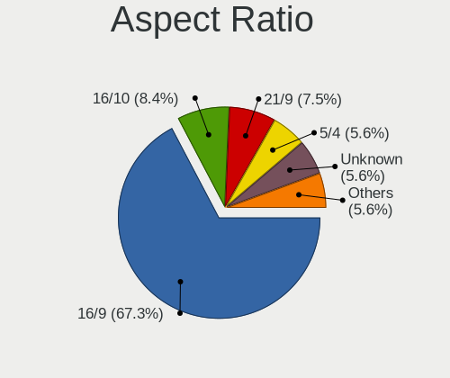

| Ratio   | Desktops | Percent |
|---------|----------|---------|
| 16/9    | 72       | 67.29%  |
| 16/10   | 9        | 8.41%   |
| 21/9    | 8        | 7.48%   |
| 5/4     | 6        | 5.61%   |
| Unknown | 6        | 5.61%   |
| 1.00    | 4        | 3.74%   |
| 4/3     | 1        | 0.93%   |
| 32/9    | 1        | 0.93%   |

Monitor Area
------------

Area in inch²

| Area in inch² | Desktops | Percent |
|----------------|----------|---------|
| 201-250        | 42       | 35.29%  |
| 351-500        | 20       | 16.81%  |
| 301-350        | 16       | 13.45%  |
| More than 1000 | 12       | 10.08%  |
| 151-200        | 8        | 6.72%   |
| 251-300        | 7        | 5.88%   |
| Unknown        | 7        | 5.88%   |
| 141-150        | 3        | 2.52%   |
| 101-110        | 2        | 1.68%   |
| 51-60          | 1        | 0.84%   |
| 501-1000       | 1        | 0.84%   |

Pixel Density
-------------

Pixels per inch

| Density | Desktops | Percent |
|---------|----------|---------|
| 51-100  | 58       | 51.79%  |
| 101-120 | 25       | 22.32%  |
| 121-160 | 10       | 8.93%   |
| 1-50    | 8        | 7.14%   |
| Unknown | 7        | 6.25%   |
| 161-240 | 4        | 3.57%   |

Multiple Monitors
-----------------

Total monitors connected

| Total | Desktops | Percent |
|-------|----------|---------|
| 1     | 66       | 68.75%  |
| 2     | 23       | 23.96%  |
| 3     | 4        | 4.17%   |
| 4     | 2        | 2.08%   |
| 0     | 1        | 1.04%   |

Network
-------

Net Controller Vendor
---------------------

Controller vendors

| Vendor                                | Desktops | Percent |
|---------------------------------------|----------|---------|
| Realtek Semiconductor                 | 64       | 48.48%  |
| Intel                                 | 39       | 29.55%  |
| TP-Link                               | 6        | 4.55%   |
| Ralink Technology                     | 4        | 3.03%   |
| Qualcomm Atheros                      | 4        | 3.03%   |
| D-Link System                         | 3        | 2.27%   |
| Xiaomi                                | 2        | 1.52%   |
| MediaTek                              | 2        | 1.52%   |
| Qualcomm Atheros Communications       | 1        | 0.76%   |
| Microsoft                             | 1        | 0.76%   |
| Google                                | 1        | 0.76%   |
| DisplayLink                           | 1        | 0.76%   |
| Broadcom                              | 1        | 0.76%   |
| ASIX Electronics                      | 1        | 0.76%   |
| Aquantia                              | 1        | 0.76%   |
| 802.11g Adapter [Linksys WUSB54GC v3] | 1        | 0.76%   |

Net Controller Model
--------------------

Controller models

| Model                                                                  | Desktops | Percent |
|------------------------------------------------------------------------|----------|---------|
| Realtek RTL8111/8168/8211/8411 PCI Express Gigabit Ethernet Controller | 53       | 32.92%  |
| Intel I211 Gigabit Network Connection                                  | 12       | 7.45%   |
| Intel Wi-Fi 6E(802.11ax) AX210/AX1675* 2x2 [Typhoon Peak]              | 5        | 3.11%   |
| Realtek RTL8125 2.5GbE Controller                                      | 4        | 2.48%   |
| Intel Wi-Fi 6 AX200                                                    | 3        | 1.86%   |
| Intel Ethernet Controller I225-V                                       | 3        | 1.86%   |
| Intel Ethernet Connection (2) I219-V                                   | 3        | 1.86%   |
| Intel Dual Band Wireless-AC 3168NGW [Stone Peak]                       | 3        | 1.86%   |
| Intel 82574L Gigabit Network Connection                                | 3        | 1.86%   |
| Xiaomi Mi/Redmi series (RNDIS)                                         | 2        | 1.24%   |
| TP-Link TL-WN823N v2/v3 [Realtek RTL8192EU]                            | 2        | 1.24%   |
| TP-Link TL-WN821N v5/v6 [RTL8192EU]                                    | 2        | 1.24%   |
| Realtek RTL8822BE 802.11a/b/g/n/ac WiFi adapter                        | 2        | 1.24%   |
| Realtek RTL8821AE 802.11ac PCIe Wireless Network Adapter               | 2        | 1.24%   |
| Realtek RTL8812AE 802.11ac PCIe Wireless Network Adapter               | 2        | 1.24%   |
| Realtek RTL8188CUS 802.11n WLAN Adapter                                | 2        | 1.24%   |
| Realtek RTL8153 Gigabit Ethernet Adapter                               | 2        | 1.24%   |
| Realtek RTL810xE PCI Express Fast Ethernet controller                  | 2        | 1.24%   |
| Realtek RTL-8100/8101L/8139 PCI Fast Ethernet Adapter                  | 2        | 1.24%   |
| Ralink MT7601U Wireless Adapter                                        | 2        | 1.24%   |
| Intel Wireless 7265                                                    | 2        | 1.24%   |
| Intel Wi-Fi 5(802.11ac) Wireless-AC 9x6x [Thunder Peak]                | 2        | 1.24%   |
| Intel Ethernet Connection (7) I219-LM                                  | 2        | 1.24%   |
| Intel Cannon Lake PCH CNVi WiFi                                        | 2        | 1.24%   |
| Intel 82579LM Gigabit Network Connection (Lewisville)                  | 2        | 1.24%   |
| D-Link System DGE-528T Gigabit Ethernet Adapter                        | 2        | 1.24%   |
| TP-Link TL-WN722N v2/v3 [Realtek RTL8188EUS]                           | 1        | 0.62%   |
| TP-Link 802.11ac WLAN Adapter                                          | 1        | 0.62%   |
| Realtek RTL8852BE PCIe 802.11ax Wireless Network Controller            | 1        | 0.62%   |
| Realtek RTL8192EE PCIe Wireless Network Adapter                        | 1        | 0.62%   |
| Realtek RTL8188EE Wireless Network Adapter                             | 1        | 0.62%   |
| Realtek Killer E3000 2.5GbE Controller                                 | 1        | 0.62%   |
| Realtek 802.11ac NIC                                                   | 1        | 0.62%   |
| Ralink RT5572 Wireless Adapter                                         | 1        | 0.62%   |
| Ralink RT5370 Wireless Adapter                                         | 1        | 0.62%   |
| Qualcomm Atheros QCA9377 802.11ac Wireless Network Adapter             | 1        | 0.62%   |
| Qualcomm Atheros QCA8171 Gigabit Ethernet                              | 1        | 0.62%   |
| Qualcomm Atheros Killer E2500 Gigabit Ethernet Controller              | 1        | 0.62%   |
| Qualcomm Atheros Killer E220x Gigabit Ethernet Controller              | 1        | 0.62%   |
| Qualcomm Atheros AR9271 802.11n                                        | 1        | 0.62%   |

Wireless Vendor
---------------

Wireless vendors

| Vendor                                | Desktops | Percent |
|---------------------------------------|----------|---------|
| Intel                                 | 20       | 41.67%  |
| Realtek Semiconductor                 | 10       | 20.83%  |
| TP-Link                               | 6        | 12.5%   |
| Ralink Technology                     | 4        | 8.33%   |
| Qualcomm Atheros                      | 2        | 4.17%   |
| Qualcomm Atheros Communications       | 1        | 2.08%   |
| Microsoft                             | 1        | 2.08%   |
| MediaTek                              | 1        | 2.08%   |
| D-Link System                         | 1        | 2.08%   |
| Broadcom                              | 1        | 2.08%   |
| 802.11g Adapter [Linksys WUSB54GC v3] | 1        | 2.08%   |

Wireless Model
--------------

Wireless models

| Model                                                                                               | Desktops | Percent |
|-----------------------------------------------------------------------------------------------------|----------|---------|
| Intel Wi-Fi 6E(802.11ax) AX210/AX1675* 2x2 [Typhoon Peak]                                           | 5        | 10.2%   |
| Intel Wi-Fi 6 AX200                                                                                 | 3        | 6.12%   |
| Intel Dual Band Wireless-AC 3168NGW [Stone Peak]                                                    | 3        | 6.12%   |
| TP-Link TL-WN823N v2/v3 [Realtek RTL8192EU]                                                         | 2        | 4.08%   |
| TP-Link TL-WN821N v5/v6 [RTL8192EU]                                                                 | 2        | 4.08%   |
| Realtek RTL8822BE 802.11a/b/g/n/ac WiFi adapter                                                     | 2        | 4.08%   |
| Realtek RTL8821AE 802.11ac PCIe Wireless Network Adapter                                            | 2        | 4.08%   |
| Realtek RTL8812AE 802.11ac PCIe Wireless Network Adapter                                            | 2        | 4.08%   |
| Realtek RTL8188CUS 802.11n WLAN Adapter                                                             | 2        | 4.08%   |
| Ralink MT7601U Wireless Adapter                                                                     | 2        | 4.08%   |
| Intel Wireless 7265                                                                                 | 2        | 4.08%   |
| Intel Wi-Fi 5(802.11ac) Wireless-AC 9x6x [Thunder Peak]                                             | 2        | 4.08%   |
| Intel Cannon Lake PCH CNVi WiFi                                                                     | 2        | 4.08%   |
| TP-Link TL-WN722N v2/v3 [Realtek RTL8188EUS]                                                        | 1        | 2.04%   |
| TP-Link 802.11ac WLAN Adapter                                                                       | 1        | 2.04%   |
| Realtek RTL8192EE PCIe Wireless Network Adapter                                                     | 1        | 2.04%   |
| Realtek RTL8188EE Wireless Network Adapter                                                          | 1        | 2.04%   |
| Realtek 802.11ac NIC                                                                                | 1        | 2.04%   |
| Ralink RT5572 Wireless Adapter                                                                      | 1        | 2.04%   |
| Ralink RT5370 Wireless Adapter                                                                      | 1        | 2.04%   |
| Qualcomm Atheros QCA9377 802.11ac Wireless Network Adapter                                          | 1        | 2.04%   |
| Qualcomm Atheros AR9271 802.11n                                                                     | 1        | 2.04%   |
| Qualcomm Atheros AR9462 Wireless Network Adapter                                                    | 1        | 2.04%   |
| Microsoft Xbox Wireless Adapter for Windows                                                         | 1        | 2.04%   |
| MediaTek MT7921K (RZ608) Wi-Fi 6E 80MHz                                                             | 1        | 2.04%   |
| Intel Wireless 8265 / 8275                                                                          | 1        | 2.04%   |
| Intel Wireless 8260                                                                                 | 1        | 2.04%   |
| Intel Comet Lake PCH CNVi WiFi                                                                      | 1        | 2.04%   |
| D-Link System DWA-160 802.11abgn Xtreme N Dual Band Adapter(rev.A2) [Atheros AR9170+AR9104]         | 1        | 2.04%   |
| Broadcom BCM43142 802.11b/g/n                                                                       | 1        | 2.04%   |
| 802.11g Adapter [Linksys WUSB54GC v3] WUSB100 v2 RangePlus Wireless Network Adapter [Ralink RT3070] | 1        | 2.04%   |

Ethernet Vendor
---------------

Ethernet vendors

| Vendor                | Desktops | Percent |
|-----------------------|----------|---------|
| Realtek Semiconductor | 61       | 59.8%   |
| Intel                 | 30       | 29.41%  |
| Qualcomm Atheros      | 4        | 3.92%   |
| Xiaomi                | 2        | 1.96%   |
| D-Link System         | 2        | 1.96%   |
| DisplayLink           | 1        | 0.98%   |
| ASIX Electronics      | 1        | 0.98%   |
| Aquantia              | 1        | 0.98%   |

Ethernet Model
--------------

Ethernet models

| Model                                                                          | Desktops | Percent |
|--------------------------------------------------------------------------------|----------|---------|
| Realtek RTL8111/8168/8211/8411 PCI Express Gigabit Ethernet Controller         | 53       | 48.18%  |
| Intel I211 Gigabit Network Connection                                          | 12       | 10.91%  |
| Realtek RTL8125 2.5GbE Controller                                              | 4        | 3.64%   |
| Intel Ethernet Controller I225-V                                               | 3        | 2.73%   |
| Intel Ethernet Connection (2) I219-V                                           | 3        | 2.73%   |
| Intel 82574L Gigabit Network Connection                                        | 3        | 2.73%   |
| Xiaomi Mi/Redmi series (RNDIS)                                                 | 2        | 1.82%   |
| Realtek RTL8153 Gigabit Ethernet Adapter                                       | 2        | 1.82%   |
| Realtek RTL810xE PCI Express Fast Ethernet controller                          | 2        | 1.82%   |
| Realtek RTL-8100/8101L/8139 PCI Fast Ethernet Adapter                          | 2        | 1.82%   |
| Intel Ethernet Connection (7) I219-LM                                          | 2        | 1.82%   |
| Intel 82579LM Gigabit Network Connection (Lewisville)                          | 2        | 1.82%   |
| D-Link System DGE-528T Gigabit Ethernet Adapter                                | 2        | 1.82%   |
| Realtek RTL8852BE PCIe 802.11ax Wireless Network Controller                    | 1        | 0.91%   |
| Realtek Killer E3000 2.5GbE Controller                                         | 1        | 0.91%   |
| Qualcomm Atheros QCA8171 Gigabit Ethernet                                      | 1        | 0.91%   |
| Qualcomm Atheros Killer E2500 Gigabit Ethernet Controller                      | 1        | 0.91%   |
| Qualcomm Atheros Killer E220x Gigabit Ethernet Controller                      | 1        | 0.91%   |
| Qualcomm Atheros AR8161 Gigabit Ethernet                                       | 1        | 0.91%   |
| Intel I210 Gigabit Network Connection                                          | 1        | 0.91%   |
| Intel Ethernet Controller 10-Gigabit X540-AT2                                  | 1        | 0.91%   |
| Intel Ethernet Connection I219-LM                                              | 1        | 0.91%   |
| Intel Ethernet Connection (7) I219-V                                           | 1        | 0.91%   |
| Intel Ethernet Connection (17) I219-V                                          | 1        | 0.91%   |
| Intel Ethernet Connection (12) I219-V                                          | 1        | 0.91%   |
| Intel Ethernet Connection (11) I219-LM                                         | 1        | 0.91%   |
| Intel 82567LF-2 Gigabit Network Connection                                     | 1        | 0.91%   |
| Intel 82562V-2 10/100 Network Connection                                       | 1        | 0.91%   |
| DisplayLink Kensington Dock (Composite Device)                                 | 1        | 0.91%   |
| ASIX AX88179 Gigabit Ethernet                                                  | 1        | 0.91%   |
| Aquantia AQtion AQC107 NBase-T/IEEE 802.3an Ethernet Controller [Atlantic 10G] | 1        | 0.91%   |

Net Controller Kind
-------------------

Ethernet, WiFi or modem

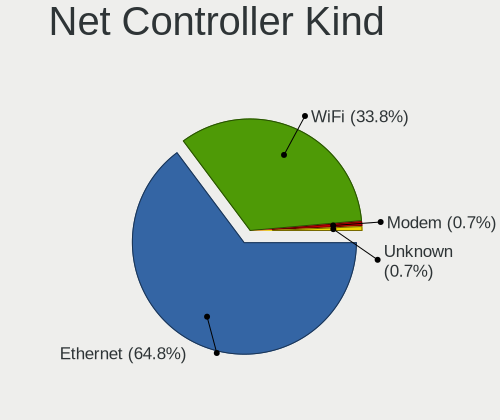

| Kind     | Desktops | Percent |
|----------|----------|---------|
| Ethernet | 92       | 64.79%  |
| WiFi     | 48       | 33.8%   |
| Modem    | 1        | 0.7%    |
| Unknown  | 1        | 0.7%    |

Used Controller
---------------

Currently used network controller

| Kind     | Desktops | Percent |
|----------|----------|---------|
| Ethernet | 65       | 69.89%  |
| WiFi     | 28       | 30.11%  |

NICs
----

Total network controllers on board

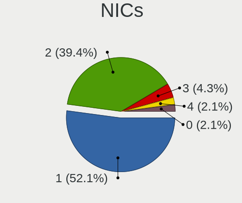

| Total | Desktops | Percent |
|-------|----------|---------|
| 1     | 49       | 52.13%  |
| 2     | 37       | 39.36%  |
| 3     | 4        | 4.26%   |
| 4     | 2        | 2.13%   |
| 0     | 2        | 2.13%   |

IPv6
----

IPv6 vs IPv4

| Used | Desktops | Percent |
|------|----------|---------|
| No   | 78       | 82.11%  |
| Yes  | 17       | 17.89%  |

Bluetooth
---------

Bluetooth Vendor
----------------

Controller vendors

| Vendor                          | Desktops | Percent |
|---------------------------------|----------|---------|
| Intel                           | 20       | 45.45%  |
| Cambridge Silicon Radio         | 8        | 18.18%  |
| IMC Networks                    | 5        | 11.36%  |
| ASUSTek Computer                | 3        | 6.82%   |
| Qualcomm Atheros Communications | 2        | 4.55%   |
| Broadcom                        | 2        | 4.55%   |
| MediaTek                        | 1        | 2.27%   |
| HTC (High Tech Computer)        | 1        | 2.27%   |
| Foxconn / Hon Hai               | 1        | 2.27%   |
| Dynex                           | 1        | 2.27%   |

Bluetooth Model
---------------

Controller models

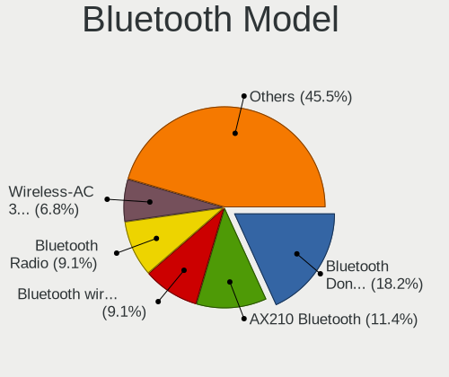

| Model                                                                | Desktops | Percent |
|----------------------------------------------------------------------|----------|---------|
| Cambridge Silicon Radio Bluetooth Dongle (HCI mode)                  | 8        | 18.18%  |
| Intel AX210 Bluetooth                                                | 5        | 11.36%  |
| Intel Bluetooth wireless interface                                   | 4        | 9.09%   |
| IMC Networks Bluetooth Radio                                         | 4        | 9.09%   |
| Intel Wireless-AC 3168 Bluetooth                                     | 3        | 6.82%   |
| Intel AX200 Bluetooth                                                | 3        | 6.82%   |
| Intel Wireless-AC 9260 Bluetooth Adapter                             | 2        | 4.55%   |
| Intel Bluetooth 9460/9560 Jefferson Peak (JfP)                       | 2        | 4.55%   |
| Qualcomm Atheros  Bluetooth Device                                   | 1        | 2.27%   |
| Qualcomm Atheros AR3011 Bluetooth                                    | 1        | 2.27%   |
| MediaTek Wireless_Device                                             | 1        | 2.27%   |
| Intel AX201 Bluetooth                                                | 1        | 2.27%   |
| IMC Networks Bluetooth Device                                        | 1        | 2.27%   |
| HTC (High Tech Computer) Vive Hub Bluetooth 4.1 (Broadcom BCM920703) | 1        | 2.27%   |
| Foxconn / Hon Hai Wireless_Device                                    | 1        | 2.27%   |
| Dynex Bluetooth 4.0 Adapter [Broadcom, 1.12, BCM20702A0]             | 1        | 2.27%   |
| Broadcom BCM43142A0 Bluetooth Device                                 | 1        | 2.27%   |
| Broadcom BCM20702A0 Bluetooth 4.0                                    | 1        | 2.27%   |
| ASUS Broadcom BCM20702A0 Bluetooth                                   | 1        | 2.27%   |
| ASUS Bluetooth Radio                                                 | 1        | 2.27%   |
| ASUS ASUS USB-BT500                                                  | 1        | 2.27%   |

Sound
-----

Sound Vendor
------------

Sound card vendors

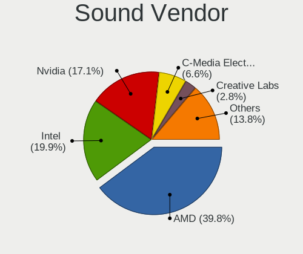

| Vendor                                          | Desktops | Percent |
|-------------------------------------------------|----------|---------|
| AMD                                             | 72       | 39.78%  |
| Intel                                           | 36       | 19.89%  |
| Nvidia                                          | 31       | 17.13%  |
| C-Media Electronics                             | 12       | 6.63%   |
| Creative Labs                                   | 5        | 2.76%   |
| Logitech                                        | 3        | 1.66%   |
| JMTek                                           | 3        | 1.66%   |
| Creative Technology                             | 3        | 1.66%   |
| SteelSeries ApS                                 | 2        | 1.1%    |
| Texas Instruments                               | 1        | 0.55%   |
| TC Electronic                                   | 1        | 0.55%   |
| Shure                                           | 1        | 0.55%   |
| Realtek Semiconductor                           | 1        | 0.55%   |
| Razer USA                                       | 1        | 0.55%   |
| PreSonus Audio Electronics                      | 1        | 0.55%   |
| Native Instruments                              | 1        | 0.55%   |
| Licensed by Sony Computer Entertainment America | 1        | 0.55%   |
| Generalplus Technology                          | 1        | 0.55%   |
| Focusrite-Novation                              | 1        | 0.55%   |
| EVGA                                            | 1        | 0.55%   |
| Corsair                                         | 1        | 0.55%   |
| Blue Microphones                                | 1        | 0.55%   |
| AudioQuest                                      | 1        | 0.55%   |

Sound Model
-----------

Sound card models

| Model                                                                      | Desktops | Percent |
|----------------------------------------------------------------------------|----------|---------|
| AMD Starship/Matisse HD Audio Controller                                   | 19       | 8.37%   |
| AMD Family 17h (Models 00h-0fh) HD Audio Controller                        | 13       | 5.73%   |
| AMD Ellesmere HDMI Audio [Radeon RX 470/480 / 570/580/590]                 | 13       | 5.73%   |
| AMD SBx00 Azalia (Intel HDA)                                               | 8        | 3.52%   |
| AMD Navi 10 HDMI Audio                                                     | 8        | 3.52%   |
| AMD Family 17h/19h/1ah HD Audio Controller                                 | 8        | 3.52%   |
| AMD Navi 21/23 HDMI/DP Audio Controller                                    | 7        | 3.08%   |
| AMD FCH Azalia Controller                                                  | 6        | 2.64%   |
| AMD Baffin HDMI/DP Audio [Radeon RX 550 640SP / RX 560/560X]               | 6        | 2.64%   |
| Nvidia GP104 High Definition Audio Controller                              | 5        | 2.2%    |
| Intel 6 Series/C200 Series Chipset Family High Definition Audio Controller | 5        | 2.2%    |
| AMD Renoir Radeon High Definition Audio Controller                         | 5        | 2.2%    |
| Intel Cannon Lake PCH cAVS                                                 | 4        | 1.76%   |
| Intel 200 Series PCH HD Audio                                              | 4        | 1.76%   |
| Intel 100 Series/C230 Series Chipset Family HD Audio Controller            | 4        | 1.76%   |
| C-Media Electronics Audio Adapter (Unitek Y-247A)                          | 4        | 1.76%   |
| AMD Oland/Hainan/Cape Verde/Pitcairn HDMI Audio [Radeon HD 7000 Series]    | 4        | 1.76%   |
| Nvidia TU116 High Definition Audio Controller                              | 3        | 1.32%   |
| Nvidia TU104 HD Audio Controller                                           | 3        | 1.32%   |
| Intel Comet Lake PCH-V cAVS                                                | 3        | 1.32%   |
| Intel 8 Series/C220 Series Chipset High Definition Audio Controller        | 3        | 1.32%   |
| C-Media Electronics USB Audio Device                                       | 3        | 1.32%   |
| C-Media Electronics Blue Snowball                                          | 3        | 1.32%   |
| AMD Kabini HDMI/DP Audio                                                   | 3        | 1.32%   |
| Nvidia TU106 High Definition Audio Controller                              | 2        | 0.88%   |
| Nvidia GP107GL High Definition Audio Controller                            | 2        | 0.88%   |
| Nvidia GP106 High Definition Audio Controller                              | 2        | 0.88%   |
| Nvidia GM206 High Definition Audio Controller                              | 2        | 0.88%   |
| Nvidia GA104 High Definition Audio Controller                              | 2        | 0.88%   |
| JMTek USB PnP Audio Device                                                 | 2        | 0.88%   |
| Intel 9 Series Chipset Family HD Audio Controller                          | 2        | 0.88%   |
| Intel 7 Series/C216 Chipset Family High Definition Audio Controller        | 2        | 0.88%   |
| Creative Labs CA0110 [Sound Blaster X-Fi Xtreme Audio]                     | 2        | 0.88%   |
| AMD Vega 10 HDMI Audio [Radeon Vega 56/64]                                 | 2        | 0.88%   |
| AMD Rembrandt Radeon High Definition Audio Controller                      | 2        | 0.88%   |
| AMD Redwood HDMI Audio [Radeon HD 5000 Series]                             | 2        | 0.88%   |
| AMD Navi 31 HDMI/DP Audio                                                  | 2        | 0.88%   |
| AMD Kaveri HDMI/DP Audio Controller                                        | 2        | 0.88%   |
| Texas Instruments PCM2902 Audio Codec                                      | 1        | 0.44%   |
| TC Electronic VoiceLive Play                                               | 1        | 0.44%   |

Memory
------

Memory Vendor
-------------

Memory module vendors

| Vendor              | Desktops | Percent |
|---------------------|----------|---------|
| Corsair             | 17       | 18.68%  |
| Kingston            | 14       | 15.38%  |
| G.Skill             | 14       | 15.38%  |
| SK hynix            | 9        | 9.89%   |
| Crucial             | 8        | 8.79%   |
| Unknown             | 6        | 6.59%   |
| Samsung Electronics | 6        | 6.59%   |
| A-DATA Technology   | 5        | 5.49%   |
| Patriot             | 4        | 4.4%    |
| Micron Technology   | 3        | 3.3%    |
| Transcend           | 1        | 1.1%    |
| KLEVV               | 1        | 1.1%    |
| Golden Empire       | 1        | 1.1%    |
| GeIL                | 1        | 1.1%    |
| AMD                 | 1        | 1.1%    |

Memory Model
------------

Memory module models

| Model                                                     | Desktops | Percent |
|-----------------------------------------------------------|----------|---------|
| Kingston RAM KHX3200C16D4/8GX 8GB DIMM DDR4 3733MT/s      | 3        | 3.09%   |
| Corsair RAM CMK16GX4M2B3200C16 8GB DIMM DDR4 3600MT/s     | 3        | 3.09%   |
| Unknown RAM Module 8GB DIMM DDR3 1600MT/s                 | 2        | 2.06%   |
| SK hynix RAM HMT451S6BFR8A-PB 4096MB SODIMM DDR3 1600MT/s | 2        | 2.06%   |
| Samsung RAM M378A1G43TB1-CTD 8GB DIMM DDR4 3400MT/s       | 2        | 2.06%   |
| Micron RAM CT102464BF160B.M16 8GB SODIMM DDR3 1600MT/s    | 2        | 2.06%   |
| Kingston RAM KHX2133C14D4/4G 4GB DIMM DDR4 2933MT/s       | 2        | 2.06%   |
| Kingston RAM 99U5474-026.A00LF 4GB DIMM DDR3 1333MT/s     | 2        | 2.06%   |
| G.Skill RAM F4-3200C16-8GIS 8GB DIMM DDR4 3200MT/s        | 2        | 2.06%   |
| G.Skill RAM F4-3000C16-8GISB 8GB DIMM DDR4 3200MT/s       | 2        | 2.06%   |
| G.Skill RAM F3-10666CL9-4GBNT 4GB DIMM DDR3 1600MT/s      | 2        | 2.06%   |
| Crucial RAM BLS16G4D30AESB.M16FE 16GB DIMM DDR4 3200MT/s  | 2        | 2.06%   |
| Corsair RAM CMK16GX4M2B3000C15 8GB DIMM DDR4 3600MT/s     | 2        | 2.06%   |
| Unknown RAM Module 4GB DIMM 1333MT/s                      | 1        | 1.03%   |
| Unknown RAM Module 2048MB DIMM SDRAM                      | 1        | 1.03%   |
| Unknown RAM Module 2048MB DIMM 1328MT/s                   | 1        | 1.03%   |
| Unknown RAM 3600 C20 Series 32GB DIMM DDR4 3666MT/s       | 1        | 1.03%   |
| Transcend RAM JM2666HLB-16G 16GB DIMM DDR4 2667MT/s       | 1        | 1.03%   |
| SK hynix RAM Module 8GB DIMM DDR4 2667MT/s                | 1        | 1.03%   |
| SK hynix RAM Module 8GB DIMM DDR4 2400MT/s                | 1        | 1.03%   |
| SK hynix RAM HMT41GR7BFR4C-RD 8GB DIMM DDR3 1866MT/s      | 1        | 1.03%   |
| SK hynix RAM HMA82GU7CJR8N-VK 16GB DIMM DDR4 2667MT/s     | 1        | 1.03%   |
| SK hynix RAM HMA82GS6DJR8N-XN 16GB SODIMM DDR4 3200MT/s   | 1        | 1.03%   |
| SK hynix RAM HMA81GS6AFR8N-UH 8GB SODIMM DDR4 2667MT/s    | 1        | 1.03%   |
| SK hynix RAM HMA41GU6AFR8N-TF 8GB DIMM DDR4 2465MT/s      | 1        | 1.03%   |
| SK hynix RAM HMA41GR7MFR4N-TF 8GB DIMM DDR4 2667MT/s      | 1        | 1.03%   |
| Samsung RAM M378B5173EB0-YK0 4GB DIMM DDR3 1600MT/s       | 1        | 1.03%   |
| Samsung RAM M378B1G73EB0-YK0 8GB DIMM DDR3 1600MT/s       | 1        | 1.03%   |
| Samsung RAM M323R2GA3BB0-CQKOL 16GB DIMM DDR5 4802MT/s    | 1        | 1.03%   |
| Samsung RAM M3 78T2863RZS-CF7 1GB DIMM DDR2 800MT/s       | 1        | 1.03%   |
| Patriot RAM PSD48G240082 8GB DIMM DDR4 2400MT/s           | 1        | 1.03%   |
| Patriot RAM PSD48G240081 8GB DIMM DDR4 2800MT/s           | 1        | 1.03%   |
| Patriot RAM PSD38G16002 8GB DIMM DDR3 1600MT/s            | 1        | 1.03%   |
| Patriot RAM 3000 C16 Series 16GB DIMM DDR4 3200MT/s       | 1        | 1.03%   |
| Micron RAM 16ATF2G64HZ-2G6J1 16GB SODIMM DDR4 2667MT/s    | 1        | 1.03%   |
| KLEVV RAM KD4AGU880-32A160U 16GB DIMM DDR4 3200MT/s       | 1        | 1.03%   |
| Kingston RAM XJ69DF-MIE 8GB DIMM DDR4 2933MT/s            | 1        | 1.03%   |
| Kingston RAM MSI24D4U7S8MB-8 8GB DIMM DDR4 2400MT/s       | 1        | 1.03%   |
| Kingston RAM KHX2400C15/8G 8GB DIMM DDR4 3400MT/s         | 1        | 1.03%   |
| Kingston RAM KF3200C20S4/16G 16GB SODIMM DDR4 3200MT/s    | 1        | 1.03%   |

Memory Kind
-----------

Memory module kinds

| Kind    | Desktops | Percent |
|---------|----------|---------|
| DDR4    | 49       | 62.82%  |
| DDR3    | 21       | 26.92%  |
| DDR5    | 4        | 5.13%   |
| Unknown | 2        | 2.56%   |
| SDRAM   | 1        | 1.28%   |
| DDR2    | 1        | 1.28%   |

Memory Form Factor
------------------

Physical design of the memory module

| Name   | Desktops | Percent |
|--------|----------|---------|
| DIMM   | 72       | 92.31%  |
| SODIMM | 6        | 7.69%   |

Memory Size
-----------

Memory module size

| Size  | Desktops | Percent |
|-------|----------|---------|
| 8192  | 38       | 45.24%  |
| 16384 | 18       | 21.43%  |
| 4096  | 17       | 20.24%  |
| 32768 | 6        | 7.14%   |
| 2048  | 4        | 4.76%   |
| 1024  | 1        | 1.19%   |

Memory Speed
------------

Memory module speed

| Speed   | Desktops | Percent |
|---------|----------|---------|
| 3200    | 15       | 17.44%  |
| 1600    | 14       | 16.28%  |
| 3600    | 9        | 10.47%  |
| 2667    | 8        | 9.3%    |
| 2400    | 5        | 5.81%   |
| 1333    | 5        | 5.81%   |
| 3733    | 4        | 4.65%   |
| 3666    | 3        | 3.49%   |
| 3400    | 3        | 3.49%   |
| 2933    | 3        | 3.49%   |
| 3000    | 2        | 2.33%   |
| 6000    | 1        | 1.16%   |
| 5600    | 1        | 1.16%   |
| 4802    | 1        | 1.16%   |
| 4800    | 1        | 1.16%   |
| 4133    | 1        | 1.16%   |
| 3866    | 1        | 1.16%   |
| 3066    | 1        | 1.16%   |
| 2800    | 1        | 1.16%   |
| 2481    | 1        | 1.16%   |
| 2465    | 1        | 1.16%   |
| 2133    | 1        | 1.16%   |
| 1866    | 1        | 1.16%   |
| 1328    | 1        | 1.16%   |
| 800     | 1        | 1.16%   |
| Unknown | 1        | 1.16%   |

Printers & scanners
-------------------

Printer Vendor
--------------

Printer device vendors

| Vendor              | Desktops | Percent |
|---------------------|----------|---------|
| Samsung Electronics | 2        | 40%     |
| Ricoh               | 1        | 20%     |
| Hewlett-Packard     | 1        | 20%     |
| Brother Industries  | 1        | 20%     |

Printer Model
-------------

Printer device models

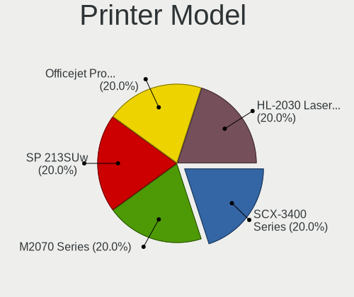

| Model                         | Desktops | Percent |
|-------------------------------|----------|---------|
| Samsung SCX-3400 Series       | 1        | 20%     |
| Samsung M2070 Series          | 1        | 20%     |
| Ricoh SP 213SUw               | 1        | 20%     |
| HP Officejet Pro L7400        | 1        | 20%     |
| Brother HL-2030 Laser Printer | 1        | 20%     |

Scanner Vendor
--------------

Scanner device vendors

| Vendor | Desktops | Percent |
|--------|----------|---------|
| Canon  | 1        | 100%    |

Scanner Model
-------------

Scanner device models

| Model                  | Desktops | Percent |
|------------------------|----------|---------|
| Canon CanoScan LIDE 25 | 1        | 100%    |

Camera
------

Camera Vendor
-------------

Camera device vendors

| Vendor                        | Desktops | Percent |
|-------------------------------|----------|---------|
| Logitech                      | 7        | 35%     |
| Sunplus Innovation Technology | 2        | 10%     |
| Microdia                      | 2        | 10%     |
| Creative Technology           | 2        | 10%     |
| WaveRider Communications      | 1        | 5%      |
| Microsoft                     | 1        | 5%      |
| KYE Systems (Mouse Systems)   | 1        | 5%      |
| Google                        | 1        | 5%      |
| GEMBIRD                       | 1        | 5%      |
| Cubeternet                    | 1        | 5%      |
| ARC International             | 1        | 5%      |

Camera Model
------------

Camera device models

| Model                                          | Desktops | Percent |
|------------------------------------------------|----------|---------|
| Logitech Webcam C270                           | 2        | 10%     |
| WaveRider USB 2.0 Camera                       | 1        | 5%      |
| Sunplus USB Camera                             | 1        | 5%      |
| Sunplus HD 720P webcam                         | 1        | 5%      |
| Microsoft LifeCam Cinema                       | 1        | 5%      |
| Microdia Webcam Vitade AF                      | 1        | 5%      |
| Microdia USB 2.0 Camera                        | 1        | 5%      |
| Logitech Webcam C930e                          | 1        | 5%      |
| Logitech Webcam C310                           | 1        | 5%      |
| Logitech HD Webcam C910                        | 1        | 5%      |
| Logitech HD Pro Webcam C920                    | 1        | 5%      |
| Logitech BRIO Ultra HD Webcam                  | 1        | 5%      |
| KYE Systems (Mouse Systems) Genius FaceCam 320 | 1        | 5%      |
| Google Nexus/Pixel Device (MTP + debug)        | 1        | 5%      |
| GEMBIRD USB2.0 PC CAMERA                       | 1        | 5%      |
| Cubeternet GL-UPC822 UVC WebCam                | 1        | 5%      |
| Creative Live! Cam Sync HD [VF0770]            | 1        | 5%      |
| Creative Live! Cam Chat HD [VF0700]            | 1        | 5%      |
| ARC International Camera                       | 1        | 5%      |

Security
--------

Fingerprint Vendor
------------------

Fingerprint sensor vendors

Zero info for selected period =(

Fingerprint Model
-----------------

Fingerprint sensor models

Zero info for selected period =(

Chipcard Vendor
---------------

Chipcard module vendors

Zero info for selected period =(

Chipcard Model
--------------

Chipcard module models

Zero info for selected period =(

Unsupported
-----------

Unsupported Devices
-------------------

Total unsupported devices on board

| Total | Desktops | Percent |
|-------|----------|---------|
| 0     | 82       | 87.23%  |
| 1     | 9        | 9.57%   |
| 2     | 2        | 2.13%   |
| 3     | 1        | 1.06%   |

Unsupported Device Types
------------------------

Types of unsupported devices

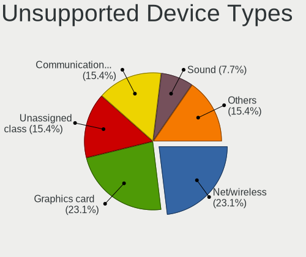

| Type                     | Desktops | Percent |
|--------------------------|----------|---------|
| Net/wireless             | 3        | 23.08%  |
| Graphics card            | 3        | 23.08%  |
| Unassigned class         | 2        | 15.38%  |
| Communication controller | 2        | 15.38%  |
| Sound                    | 1        | 7.69%   |
| Network                  | 1        | 7.69%   |
| Net/ethernet             | 1        | 7.69%   |

