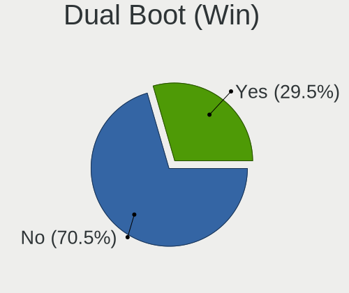
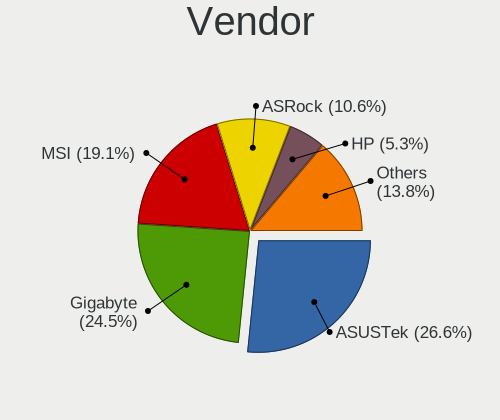
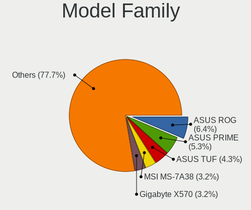
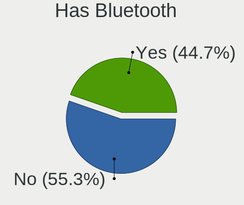
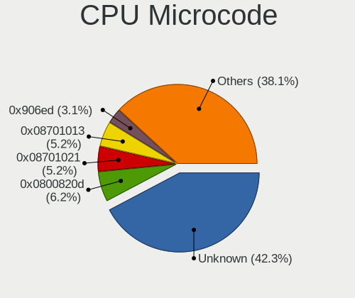
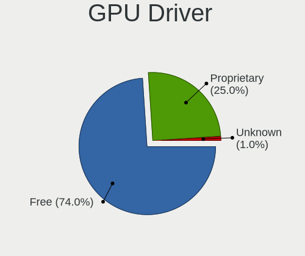
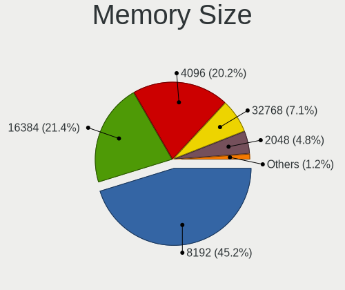
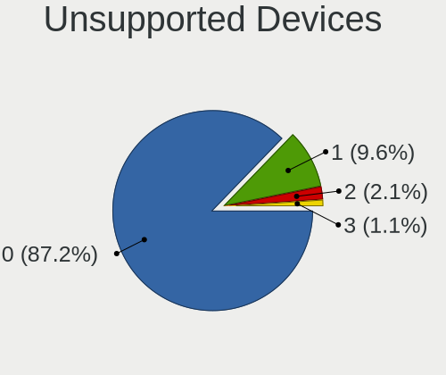

Artix - Tested Hardware & Statistics (Desktops)
-----------------------------------------------

A project to collect tested hardware configurations for Artix.

Anyone can contribute to this report by the [hw-probe](https://github.com/linuxhw/hw-probe) tool:

    sudo -E hw-probe -all -upload

Please submit a probe of your configuration if it's not presented on the page or is rare.

Full-feature report is available here: https://linux-hardware.org/?view=trends

Contents
--------

* [ Test Cases ](#test-cases)

* [ System ](#system)
  - [ Kernel                   ](#kernel)
  - [ Kernel Family            ](#kernel-family)
  - [ Kernel Major Ver.        ](#kernel-major-ver)
  - [ Arch                     ](#arch)
  - [ DE                       ](#de)
  - [ Display Server           ](#display-server)
  - [ Display Manager          ](#display-manager)
  - [ OS Lang                  ](#os-lang)
  - [ Boot Mode                ](#boot-mode)
  - [ Filesystem               ](#filesystem)
  - [ Part. scheme             ](#part-scheme)
  - [ Dual Boot with Linux/BSD ](#dual-boot-with-linuxbsd)
  - [ Dual Boot (Win)          ](#dual-boot-win)

* [ Board ](#board)
  - [ Vendor                   ](#vendor)
  - [ Model                    ](#model)
  - [ Model Family             ](#model-family)
  - [ MFG Year                 ](#mfg-year)
  - [ Form Factor              ](#form-factor)
  - [ Secure Boot              ](#secure-boot)
  - [ Coreboot                 ](#coreboot)
  - [ RAM Size                 ](#ram-size)
  - [ RAM Used                 ](#ram-used)
  - [ Total Drives             ](#total-drives)
  - [ Has CD-ROM               ](#has-cd-rom)
  - [ Has Ethernet             ](#has-ethernet)
  - [ Has WiFi                 ](#has-wifi)
  - [ Has Bluetooth            ](#has-bluetooth)

* [ Location ](#location)
  - [ Country                  ](#country)
  - [ City                     ](#city)

* [ Drives ](#drives)
  - [ Drive Vendor             ](#drive-vendor)
  - [ Drive Model              ](#drive-model)
  - [ HDD Vendor               ](#hdd-vendor)
  - [ SSD Vendor               ](#ssd-vendor)
  - [ Drive Kind               ](#drive-kind)
  - [ Drive Connector          ](#drive-connector)
  - [ Drive Size               ](#drive-size)
  - [ Space Total              ](#space-total)
  - [ Space Used               ](#space-used)
  - [ Malfunc. Drives          ](#malfunc-drives)
  - [ Malfunc. Drive Vendor    ](#malfunc-drive-vendor)
  - [ Malfunc. HDD Vendor      ](#malfunc-hdd-vendor)
  - [ Malfunc. Drive Kind      ](#malfunc-drive-kind)
  - [ Failed Drives            ](#failed-drives)
  - [ Failed Drive Vendor      ](#failed-drive-vendor)
  - [ Drive Status             ](#drive-status)

* [ Storage controller ](#storage-controller)
  - [ Storage Vendor           ](#storage-vendor)
  - [ Storage Model            ](#storage-model)
  - [ Storage Kind             ](#storage-kind)

* [ Processor ](#processor)
  - [ CPU Vendor               ](#cpu-vendor)
  - [ CPU Model                ](#cpu-model)
  - [ CPU Model Family         ](#cpu-model-family)
  - [ CPU Cores                ](#cpu-cores)
  - [ CPU Sockets              ](#cpu-sockets)
  - [ CPU Threads              ](#cpu-threads)
  - [ CPU Op-Modes             ](#cpu-op-modes)
  - [ CPU Microcode            ](#cpu-microcode)
  - [ CPU Microarch            ](#cpu-microarch)

* [ Graphics ](#graphics)
  - [ GPU Vendor               ](#gpu-vendor)
  - [ GPU Model                ](#gpu-model)
  - [ GPU Combo                ](#gpu-combo)
  - [ GPU Driver               ](#gpu-driver)
  - [ GPU Memory               ](#gpu-memory)

* [ Monitor ](#monitor)
  - [ Monitor Vendor           ](#monitor-vendor)
  - [ Monitor Model            ](#monitor-model)
  - [ Monitor Resolution       ](#monitor-resolution)
  - [ Monitor Diagonal         ](#monitor-diagonal)
  - [ Monitor Width            ](#monitor-width)
  - [ Aspect Ratio             ](#aspect-ratio)
  - [ Monitor Area             ](#monitor-area)
  - [ Pixel Density            ](#pixel-density)
  - [ Multiple Monitors        ](#multiple-monitors)

* [ Network ](#network)
  - [ Net Controller Vendor    ](#net-controller-vendor)
  - [ Net Controller Model     ](#net-controller-model)
  - [ Wireless Vendor          ](#wireless-vendor)
  - [ Wireless Model           ](#wireless-model)
  - [ Ethernet Vendor          ](#ethernet-vendor)
  - [ Ethernet Model           ](#ethernet-model)
  - [ Net Controller Kind      ](#net-controller-kind)
  - [ Used Controller          ](#used-controller)
  - [ NICs                     ](#nics)
  - [ IPv6                     ](#ipv6)

* [ Bluetooth ](#bluetooth)
  - [ Bluetooth Vendor         ](#bluetooth-vendor)
  - [ Bluetooth Model          ](#bluetooth-model)

* [ Sound ](#sound)
  - [ Sound Vendor             ](#sound-vendor)
  - [ Sound Model              ](#sound-model)

* [ Memory ](#memory)
  - [ Memory Vendor            ](#memory-vendor)
  - [ Memory Model             ](#memory-model)
  - [ Memory Kind              ](#memory-kind)
  - [ Memory Form Factor       ](#memory-form-factor)
  - [ Memory Size              ](#memory-size)
  - [ Memory Speed             ](#memory-speed)

* [ Printers & scanners ](#printers--scanners)
  - [ Printer Vendor           ](#printer-vendor)
  - [ Printer Model            ](#printer-model)
  - [ Scanner Vendor           ](#scanner-vendor)
  - [ Scanner Model            ](#scanner-model)

* [ Camera ](#camera)
  - [ Camera Vendor            ](#camera-vendor)
  - [ Camera Model             ](#camera-model)

* [ Security ](#security)
  - [ Fingerprint Vendor       ](#fingerprint-vendor)
  - [ Fingerprint Model        ](#fingerprint-model)
  - [ Chipcard Vendor          ](#chipcard-vendor)
  - [ Chipcard Model           ](#chipcard-model)

* [ Unsupported ](#unsupported)
  - [ Unsupported Devices      ](#unsupported-devices)
  - [ Unsupported Device Types ](#unsupported-device-types)

Test Cases
----------

| Vendor    | Model                   | Probe                                                      | Date         |
|-----------|-------------------------|------------------------------------------------------------|--------------|
| ASRock    | B450 Steel Legend       | [44ccc8eb49](https://linux-hardware.org/?probe=44ccc8eb49) | Nov 24, 2021 |
| MSI       | B450 TOMAHAWK MAX       | [9fca12db52](https://linux-hardware.org/?probe=9fca12db52) | Nov 22, 2021 |
| HP        | 1495                    | [e7c0f59f92](https://linux-hardware.org/?probe=e7c0f59f92) | Oct 15, 2021 |
| ASUSTek   | ROG Maximus XI HERO     | [e2c619e8dd](https://linux-hardware.org/?probe=e2c619e8dd) | Oct 12, 2021 |
| ASUSTek   | ROG Maximus XI HERO     | [1e612081c8](https://linux-hardware.org/?probe=1e612081c8) | Oct 02, 2021 |
| MSI       | X470 GAMING PLUS        | [d5871d0e2a](https://linux-hardware.org/?probe=d5871d0e2a) | Aug 25, 2021 |
| MSI       | MPG X570 GAMING PLUS    | [ec331e992a](https://linux-hardware.org/?probe=ec331e992a) | Aug 08, 2021 |
| ASUSTek   | PRIME B450M-A           | [558e1369e9](https://linux-hardware.org/?probe=558e1369e9) | Jul 25, 2021 |
| ASUSTek   | P8H61-M LX3 R2.0        | [156577ba27](https://linux-hardware.org/?probe=156577ba27) | Jul 18, 2021 |
| ASRock    | H310CM-DVS              | [f8e9ea8ffa](https://linux-hardware.org/?probe=f8e9ea8ffa) | Jun 26, 2021 |
| MSI       | Z270M MORTAR            | [5c54607559](https://linux-hardware.org/?probe=5c54607559) | Jun 22, 2021 |
| ASRock    | FM2A88X-ITX+            | [2b91e357ca](https://linux-hardware.org/?probe=2b91e357ca) | May 16, 2021 |
| ASRock    | FM2A88X-ITX+            | [057546c50e](https://linux-hardware.org/?probe=057546c50e) | Apr 30, 2021 |
| ASUSTek   | SABERTOOTH 990FX R2.0   | [d1cf148ec4](https://linux-hardware.org/?probe=d1cf148ec4) | Apr 24, 2021 |
| ASUSTek   | ROG STRIX B550-F GAMING | [5527015fb6](https://linux-hardware.org/?probe=5527015fb6) | Apr 08, 2021 |
| ASUSTek   | PRIME X370-PRO          | [91a16f1c67](https://linux-hardware.org/?probe=91a16f1c67) | Feb 21, 2021 |
| MSI       | X470 GAMING PLUS        | [f93e302542](https://linux-hardware.org/?probe=f93e302542) | Feb 15, 2021 |
| Alienware | 02XRCM A01              | [554d3ebf2f](https://linux-hardware.org/?probe=554d3ebf2f) | Feb 14, 2021 |
| MSI       | X470 GAMING PLUS        | [249558c27b](https://linux-hardware.org/?probe=249558c27b) | Feb 03, 2021 |
| Gigabyte  | 970A-DS3P               | [b4c4d7f99c](https://linux-hardware.org/?probe=b4c4d7f99c) | Feb 01, 2021 |
| Gigabyte  | 970A-DS3P               | [70eabb568f](https://linux-hardware.org/?probe=70eabb568f) | Jan 30, 2021 |
| MSI       | X470 GAMING PLUS        | [fb3e2ec12b](https://linux-hardware.org/?probe=fb3e2ec12b) | Jan 24, 2021 |
| ASUSTek   | TUF B450-PLUS GAMING    | [fda5fabbf5](https://linux-hardware.org/?probe=fda5fabbf5) | Jan 21, 2021 |
| Dell      | 0K216C                  | [524206eff9](https://linux-hardware.org/?probe=524206eff9) | Jan 20, 2021 |
| Dell      | 0D9JG3 A00              | [6c44448201](https://linux-hardware.org/?probe=6c44448201) | Jan 19, 2021 |
| ASUSTek   | P8B75-M LX PLUS         | [c53595bd26](https://linux-hardware.org/?probe=c53595bd26) | Jan 16, 2021 |
| ASRock    | X570 Phantom Gaming 4   | [335ee823bd](https://linux-hardware.org/?probe=335ee823bd) | Jan 16, 2021 |
| ASUSTek   | G11CD                   | [145a13d355](https://linux-hardware.org/?probe=145a13d355) | Jan 07, 2021 |
| ASUSTek   | G11CD                   | [dc70a6fae2](https://linux-hardware.org/?probe=dc70a6fae2) | Jan 07, 2021 |
| HP        | 2B34                    | [e48dc00e0a](https://linux-hardware.org/?probe=e48dc00e0a) | Jan 04, 2021 |
| Pegatron  | 2AC2A                   | [6dbd029143](https://linux-hardware.org/?probe=6dbd029143) | Jan 03, 2021 |
| Pegatron  | 2AC2A                   | [2b102aeb94](https://linux-hardware.org/?probe=2b102aeb94) | Jan 03, 2021 |
| Pegatron  | 2AC2A                   | [7dd04be8aa](https://linux-hardware.org/?probe=7dd04be8aa) | Jan 01, 2021 |
| ASUSTek   | TUF GAMING X570-PLUS    | [3f9f87f288](https://linux-hardware.org/?probe=3f9f87f288) | Dec 31, 2020 |
| ASUSTek   | TUF GAMING X570-PLUS    | [2acc15f485](https://linux-hardware.org/?probe=2acc15f485) | Dec 27, 2020 |
| Gigabyte  | X570 AORUS ELITE        | [64adbf132b](https://linux-hardware.org/?probe=64adbf132b) | Dec 08, 2020 |
| MSI       | Z87-G45 GAMING          | [cefff6c6c3](https://linux-hardware.org/?probe=cefff6c6c3) | Dec 05, 2020 |
| MSI       | Z87-G45 GAMING          | [cbcb59eb96](https://linux-hardware.org/?probe=cbcb59eb96) | Dec 03, 2020 |
| MSI       | B350M PRO-VDH           | [28b680c91d](https://linux-hardware.org/?probe=28b680c91d) | Nov 29, 2020 |
| MSI       | Z87-G45 GAMING          | [de66a21bba](https://linux-hardware.org/?probe=de66a21bba) | Nov 25, 2020 |
| Gigabyte  | 990FXA-UD3 R5           | [42a67a5d5e](https://linux-hardware.org/?probe=42a67a5d5e) | Nov 18, 2020 |
| Gigabyte  | 970A-DS3P               | [848672f794](https://linux-hardware.org/?probe=848672f794) | Oct 13, 2020 |
| Gigabyte  | X399 AORUS XTREME-CF    | [1193653309](https://linux-hardware.org/?probe=1193653309) | Oct 04, 2020 |
| Gigabyte  | P55-USB3                | [ceeced1246](https://linux-hardware.org/?probe=ceeced1246) | Oct 02, 2020 |
| ASUSTek   | H81M-C                  | [b062c35766](https://linux-hardware.org/?probe=b062c35766) | Sep 16, 2020 |
| ASUSTek   | G11CD                   | [962d52b690](https://linux-hardware.org/?probe=962d52b690) | Sep 14, 2020 |
| ASUSTek   | G11CD                   | [a663586db5](https://linux-hardware.org/?probe=a663586db5) | Sep 14, 2020 |
| ASUSTek   | TUF GAMING X570-PLUS    | [86215bb4fb](https://linux-hardware.org/?probe=86215bb4fb) | Aug 29, 2020 |
| MSI       | B450 TOMAHAWK MAX       | [e988296384](https://linux-hardware.org/?probe=e988296384) | Aug 19, 2020 |
| Gigabyte  | 990FXA-UD5              | [d86cfc12cc](https://linux-hardware.org/?probe=d86cfc12cc) | Aug 19, 2020 |
| Gigabyte  | 990FXA-UD5              | [937f502004](https://linux-hardware.org/?probe=937f502004) | Aug 18, 2020 |
| MSI       | Z87-G45 GAMING          | [5d992bbc09](https://linux-hardware.org/?probe=5d992bbc09) | Aug 11, 2020 |
| Gigabyte  | B450M DS3H-CF           | [ff7915ae78](https://linux-hardware.org/?probe=ff7915ae78) | Aug 07, 2020 |
| ASUSTek   | TUF GAMING X570-PLUS    | [a57e5d7e84](https://linux-hardware.org/?probe=a57e5d7e84) | Jul 08, 2020 |
| ASUSTek   | TUF GAMING X570-PLUS    | [2e81cb3b86](https://linux-hardware.org/?probe=2e81cb3b86) | Jul 08, 2020 |
| Intel     | DX58SO2 AAG10925-205    | [2e4066d769](https://linux-hardware.org/?probe=2e4066d769) | Jun 30, 2020 |
| ASUSTek   | TUF GAMING X570-PLUS    | [9623b5be2b](https://linux-hardware.org/?probe=9623b5be2b) | Jun 16, 2020 |
| ASUSTek   | TUF GAMING X570-PLUS    | [4125763b79](https://linux-hardware.org/?probe=4125763b79) | Jun 12, 2020 |
| ASUSTek   | TUF GAMING X570-PLUS    | [82af1cec2f](https://linux-hardware.org/?probe=82af1cec2f) | May 30, 2020 |
| ASUSTek   | TUF GAMING X570-PLUS    | [7ef5aff67e](https://linux-hardware.org/?probe=7ef5aff67e) | May 24, 2020 |
| ASUSTek   | TUF GAMING X570-PLUS    | [4d62228056](https://linux-hardware.org/?probe=4d62228056) | May 22, 2020 |
| ASUSTek   | TUF GAMING X570-PLUS    | [0a92fa05fc](https://linux-hardware.org/?probe=0a92fa05fc) | May 22, 2020 |
| ASUSTek   | TUF GAMING X570-PLUS    | [40adc1a5f5](https://linux-hardware.org/?probe=40adc1a5f5) | Apr 03, 2020 |
| Biostar   | G31D-M7                 | [9f6a5c0f39](https://linux-hardware.org/?probe=9f6a5c0f39) | Oct 25, 2018 |

System
------

Kernel
------

Version of the Linux kernel

| Version                | Desktops | Percent |
|------------------------|----------|---------|
| 5.10.8-artix1-1        | 3        | 6.98%   |
| 5.9.14-artix1-1        | 2        | 4.65%   |
| 5.9.10-artix1-1        | 2        | 4.65%   |
| 5.8.8-artix1-1         | 2        | 4.65%   |
| 5.8.12-artix1-1        | 2        | 4.65%   |
| 5.7.6-artix1-1         | 2        | 4.65%   |
| 5.7.12-artix1-1        | 2        | 4.65%   |
| 5.12.14-artix1-1       | 2        | 4.65%   |
| 5.12.12-artix1-1       | 2        | 4.65%   |
| 5.10.4-artix2-1        | 2        | 4.65%   |
| 5.9.8-zen1-1-zen       | 1        | 2.33%   |
| 5.9.14-zen1-1-zen      | 1        | 2.33%   |
| 5.9.12-artix1-1        | 1        | 2.33%   |
| 5.8.5-xanmod1-1-xanmod | 1        | 2.33%   |
| 5.8.14-artix1-1        | 1        | 2.33%   |
| 5.7.2-artix1-1         | 1        | 2.33%   |
| 5.15.3-zen1-1-zen      | 1        | 2.33%   |
| 5.15.2-zen1-1-zen      | 1        | 2.33%   |
| 5.14.3-198-tkg-bmq     | 1        | 2.33%   |
| 5.14.10-artix1-1       | 1        | 2.33%   |
| 5.13.8-188-tkg-pds     | 1        | 2.33%   |
| 5.13.4-artix1-1        | 1        | 2.33%   |
| 5.12.2-artix1-1        | 1        | 2.33%   |
| 5.11.16-artix1-1       | 1        | 2.33%   |
| 5.11.11-zen1-1-zen     | 1        | 2.33%   |
| 5.10.7                 | 1        | 2.33%   |
| 5.10.6-artix1-1        | 1        | 2.33%   |
| 5.10.16-artix1-1       | 1        | 2.33%   |
| 5.10.15-zen1-1-zen     | 1        | 2.33%   |
| 5.10.11-zen2-1-zen     | 1        | 2.33%   |
| 5.10.10-artix1-1       | 1        | 2.33%   |
| 4.19.0-1-MANJARO       | 1        | 2.33%   |

Kernel Family
-------------

Linux kernel without a distro release

| Version | Desktops | Percent |
|---------|----------|---------|
| 5.9.14  | 3        | 6.98%   |
| 5.10.8  | 3        | 6.98%   |
| 5.9.10  | 2        | 4.65%   |
| 5.8.8   | 2        | 4.65%   |
| 5.8.12  | 2        | 4.65%   |
| 5.7.6   | 2        | 4.65%   |
| 5.7.12  | 2        | 4.65%   |
| 5.12.14 | 2        | 4.65%   |
| 5.12.12 | 2        | 4.65%   |
| 5.10.4  | 2        | 4.65%   |
| 5.9.8   | 1        | 2.33%   |
| 5.9.12  | 1        | 2.33%   |
| 5.8.5   | 1        | 2.33%   |
| 5.8.14  | 1        | 2.33%   |
| 5.7.2   | 1        | 2.33%   |
| 5.15.3  | 1        | 2.33%   |
| 5.15.2  | 1        | 2.33%   |
| 5.14.3  | 1        | 2.33%   |
| 5.14.10 | 1        | 2.33%   |
| 5.13.8  | 1        | 2.33%   |
| 5.13.4  | 1        | 2.33%   |
| 5.12.2  | 1        | 2.33%   |
| 5.11.16 | 1        | 2.33%   |
| 5.11.11 | 1        | 2.33%   |
| 5.10.7  | 1        | 2.33%   |
| 5.10.6  | 1        | 2.33%   |
| 5.10.16 | 1        | 2.33%   |
| 5.10.15 | 1        | 2.33%   |
| 5.10.11 | 1        | 2.33%   |
| 5.10.10 | 1        | 2.33%   |
| 4.19.0  | 1        | 2.33%   |

Kernel Major Ver.
-----------------

Linux kernel major version

| Version | Desktops | Percent |
|---------|----------|---------|
| 5.10    | 10       | 24.39%  |
| 5.9     | 7        | 17.07%  |
| 5.8     | 6        | 14.63%  |
| 5.12    | 5        | 12.2%   |
| 5.7     | 4        | 9.76%   |
| 5.15    | 2        | 4.88%   |
| 5.14    | 2        | 4.88%   |
| 5.13    | 2        | 4.88%   |
| 5.11    | 2        | 4.88%   |
| 4.19    | 1        | 2.44%   |

Arch
----

OS architecture (x86_64, i586, etc.)

| Name   | Desktops | Percent |
|--------|----------|---------|
| x86_64 | 36       | 100%    |

DE
--

Desktop Environment

| Name       | Desktops | Percent |
|------------|----------|---------|
| XFCE       | 6        | 15%     |
| GNOME      | 6        | 15%     |
| X-Cinnamon | 5        | 12.5%   |
| KDE5       | 5        | 12.5%   |
| Unknown    | 5        | 12.5%   |
| MATE       | 3        | 7.5%    |
| Cinnamon   | 2        | 5%      |
| bspwm      | 2        | 5%      |
| sway       | 1        | 2.5%    |
| openbox    | 1        | 2.5%    |
| LXQt       | 1        | 2.5%    |
| LXDE       | 1        | 2.5%    |
| i3         | 1        | 2.5%    |
| dwm        | 1        | 2.5%    |

Display Server
--------------

X11 or Wayland

| Name    | Desktops | Percent |
|---------|----------|---------|
| X11     | 26       | 68.42%  |
| Tty     | 7        | 18.42%  |
| Wayland | 3        | 7.89%   |
| Unknown | 2        | 5.26%   |

Display Manager
---------------

SDDM, LightDM, etc.

| Name    | Desktops | Percent |
|---------|----------|---------|
| Unknown | 14       | 36.84%  |
| LightDM | 12       | 31.58%  |
| SDDM    | 9        | 23.68%  |
| XDM     | 1        | 2.63%   |
| LXDM    | 1        | 2.63%   |
| GDM     | 1        | 2.63%   |

OS Lang
-------

Language

| Lang    | Desktops | Percent |
|---------|----------|---------|
| en_US   | 12       | 33.33%  |
| fr_FR   | 5        | 13.89%  |
| Unknown | 4        | 11.11%  |
| C       | 3        | 8.33%   |
| ru_RU   | 2        | 5.56%   |
| pt_PT   | 2        | 5.56%   |
| ja_JP   | 1        | 2.78%   |
| it_IT   | 1        | 2.78%   |
| es_MX   | 1        | 2.78%   |
| es_AR   | 1        | 2.78%   |
| en_GB   | 1        | 2.78%   |
| el_GR   | 1        | 2.78%   |
| de_DE   | 1        | 2.78%   |
| bg_BG   | 1        | 2.78%   |

Boot Mode
---------

EFI or BIOS

| Mode | Desktops | Percent |
|------|----------|---------|
| EFI  | 26       | 70.27%  |
| BIOS | 11       | 29.73%  |

Filesystem
----------

Type of filesystem

| Type  | Desktops | Percent |
|-------|----------|---------|
| Ext4  | 24       | 66.67%  |
| Btrfs | 7        | 19.44%  |
| Xfs   | 2        | 5.56%   |
| F2fs  | 2        | 5.56%   |
| Jfs   | 1        | 2.78%   |

Part. scheme
------------

Scheme of partitioning

| Type    | Desktops | Percent |
|---------|----------|---------|
| GPT     | 29       | 76.32%  |
| Unknown | 6        | 15.79%  |
| MBR     | 3        | 7.89%   |

Dual Boot with Linux/BSD
------------------------

Hosting more than one Linux/BSD

| Dual boot | Desktops | Percent |
|-----------|----------|---------|
| No        | 26       | 70.27%  |
| Yes       | 11       | 29.73%  |

Dual Boot (Win)
---------------

Hosting Linux and Windows

| Dual boot | Desktops | Percent |
|-----------|----------|---------|
| No        | 26       | 70.27%  |
| Yes       | 11       | 29.73%  |

Board
-----

Vendor
------

Motherboard manufacturer

| Name                | Desktops | Percent |
|---------------------|----------|---------|
| ASUSTek Computer    | 11       | 30.56%  |
| MSI                 | 7        | 19.44%  |
| Gigabyte Technology | 7        | 19.44%  |
| ASRock              | 4        | 11.11%  |
| Hewlett-Packard     | 2        | 5.56%   |
| Dell                | 2        | 5.56%   |
| Intel               | 1        | 2.78%   |
| Biostar             | 1        | 2.78%   |
| Alienware           | 1        | 2.78%   |

Model
-----

Motherboard model

| Name                         | Desktops | Percent |
|------------------------------|----------|---------|
| MSI MS-7C02                  | 2        | 5.56%   |
| Gigabyte 970A-DS3P           | 2        | 5.56%   |
| MSI MS-7C37                  | 1        | 2.78%   |
| MSI MS-7B79                  | 1        | 2.78%   |
| MSI MS-7A69                  | 1        | 2.78%   |
| MSI MS-7A38                  | 1        | 2.78%   |
| MSI MS-7821                  | 1        | 2.78%   |
| Intel DX58SO2 AAG10925-205   | 1        | 2.78%   |
| HP Compaq 8200 Elite SFF PC  | 1        | 2.78%   |
| HP 280 G1 MT                 | 1        | 2.78%   |
| Gigabyte X570 AORUS ELITE    | 1        | 2.78%   |
| Gigabyte X399 AORUS XTREME   | 1        | 2.78%   |
| Gigabyte P55-USB3            | 1        | 2.78%   |
| Gigabyte 990FXA-UD5          | 1        | 2.78%   |
| Gigabyte 990FXA-UD3 R5       | 1        | 2.78%   |
| Dell OptiPlex 5080           | 1        | 2.78%   |
| Dell Inspiron 530            | 1        | 2.78%   |
| Biostar G31D-M7              | 1        | 2.78%   |
| ASUS TUF GAMING X570-PLUS    | 1        | 2.78%   |
| ASUS TUF B450-PLUS GAMING    | 1        | 2.78%   |
| ASUS SABERTOOTH 990FX R2.0   | 1        | 2.78%   |
| ASUS ROG STRIX B550-F GAMING | 1        | 2.78%   |
| ASUS ROG Maximus XI HERO     | 1        | 2.78%   |
| ASUS PRIME X370-PRO          | 1        | 2.78%   |
| ASUS PRIME B450M-A           | 1        | 2.78%   |
| ASUS P8H61-M LX3 R2.0        | 1        | 2.78%   |
| ASUS P8B75-M LX PLUS         | 1        | 2.78%   |
| ASUS G11CD                   | 1        | 2.78%   |
| ASUS All Series              | 1        | 2.78%   |
| ASRock X570 Phantom Gaming 4 | 1        | 2.78%   |
| ASRock H310CM-DVS            | 1        | 2.78%   |
| ASRock FM2A88X-ITX+          | 1        | 2.78%   |
| ASRock B450 Steel Legend     | 1        | 2.78%   |
| Alienware Aurora R8          | 1        | 2.78%   |

Model Family
------------

Motherboard model prefix

| Name                | Desktops | Percent |
|---------------------|----------|---------|
| MSI MS-7C02         | 2        | 5.56%   |
| Gigabyte 970A-DS3P  | 2        | 5.56%   |
| ASUS TUF            | 2        | 5.56%   |
| ASUS ROG            | 2        | 5.56%   |
| ASUS PRIME          | 2        | 5.56%   |
| MSI MS-7C37         | 1        | 2.78%   |
| MSI MS-7B79         | 1        | 2.78%   |
| MSI MS-7A69         | 1        | 2.78%   |
| MSI MS-7A38         | 1        | 2.78%   |
| MSI MS-7821         | 1        | 2.78%   |
| Intel DX58SO2       | 1        | 2.78%   |
| HP Compaq           | 1        | 2.78%   |
| HP 280              | 1        | 2.78%   |
| Gigabyte X570       | 1        | 2.78%   |
| Gigabyte X399       | 1        | 2.78%   |
| Gigabyte P55-USB3   | 1        | 2.78%   |
| Gigabyte 990FXA-UD5 | 1        | 2.78%   |
| Gigabyte 990FXA-UD3 | 1        | 2.78%   |
| Dell OptiPlex       | 1        | 2.78%   |
| Dell Inspiron       | 1        | 2.78%   |
| Biostar G31D-M7     | 1        | 2.78%   |
| ASUS SABERTOOTH     | 1        | 2.78%   |
| ASUS P8H61-M        | 1        | 2.78%   |
| ASUS P8B75-M        | 1        | 2.78%   |
| ASUS G11CD          | 1        | 2.78%   |
| ASUS All            | 1        | 2.78%   |
| ASRock X570         | 1        | 2.78%   |
| ASRock H310CM-DVS   | 1        | 2.78%   |
| ASRock FM2A88X-ITX+ | 1        | 2.78%   |
| ASRock B450         | 1        | 2.78%   |
| Alienware Aurora    | 1        | 2.78%   |

MFG Year
--------

Motherboard manufacture year

| Year | Desktops | Percent |
|------|----------|---------|
| 2020 | 9        | 25%     |
| 2019 | 8        | 22.22%  |
| 2015 | 4        | 11.11%  |
| 2014 | 3        | 8.33%   |
| 2013 | 3        | 8.33%   |
| 2010 | 2        | 5.56%   |
| 2021 | 1        | 2.78%   |
| 2018 | 1        | 2.78%   |
| 2017 | 1        | 2.78%   |
| 2016 | 1        | 2.78%   |
| 2012 | 1        | 2.78%   |
| 2011 | 1        | 2.78%   |
| 2009 | 1        | 2.78%   |

Form Factor
-----------

Physical design of the computer

| Name    | Desktops | Percent |
|---------|----------|---------|
| Desktop | 36       | 100%    |

Secure Boot
-----------

Enabled or disabled

| State    | Desktops | Percent |
|----------|----------|---------|
| Disabled | 36       | 100%    |

Coreboot
--------

Have coreboot on board

| Used | Desktops | Percent |
|------|----------|---------|
| No   | 36       | 100%    |

RAM Size
--------

Total RAM memory

| Size in GB  | Desktops | Percent |
|-------------|----------|---------|
| 16.01-24.0  | 17       | 45.95%  |
| 8.01-16.0   | 8        | 21.62%  |
| 32.01-64.0  | 4        | 10.81%  |
| 3.01-4.0    | 4        | 10.81%  |
| 64.01-256.0 | 3        | 8.11%   |
| 1.01-2.0    | 1        | 2.7%    |

RAM Used
--------

Used RAM memory

| Used GB    | Desktops | Percent |
|------------|----------|---------|
| 3.01-4.0   | 9        | 22.5%   |
| 2.01-3.0   | 9        | 22.5%   |
| 4.01-8.0   | 8        | 20%     |
| 1.01-2.0   | 7        | 17.5%   |
| 0.51-1.0   | 3        | 7.5%    |
| 0.01-0.5   | 2        | 5%      |
| 16.01-24.0 | 1        | 2.5%    |
| 8.01-16.0  | 1        | 2.5%    |

Total Drives
------------

Number of drives on board

| Drives | Desktops | Percent |
|--------|----------|---------|
| 2      | 14       | 36.84%  |
| 3      | 11       | 28.95%  |
| 1      | 6        | 15.79%  |
| 4      | 3        | 7.89%   |
| 6      | 2        | 5.26%   |
| 8      | 1        | 2.63%   |
| 7      | 1        | 2.63%   |

Has CD-ROM
----------

Has CD-ROM on board

| Presented | Desktops | Percent |
|-----------|----------|---------|
| No        | 29       | 78.38%  |
| Yes       | 8        | 21.62%  |

Has Ethernet
------------

Has Ethernet on board

| Presented | Desktops | Percent |
|-----------|----------|---------|
| Yes       | 36       | 100%    |

Has WiFi
--------

Has WiFi module

| Presented | Desktops | Percent |
|-----------|----------|---------|
| No        | 21       | 58.33%  |
| Yes       | 15       | 41.67%  |

Has Bluetooth
-------------

Has Bluetooth module

| Presented | Desktops | Percent |
|-----------|----------|---------|
| No        | 21       | 58.33%  |
| Yes       | 15       | 41.67%  |

Location
--------

Country
-------

Geographic location (country)

| Country     | Desktops | Percent |
|-------------|----------|---------|
| USA         | 6        | 16.67%  |
| France      | 6        | 16.67%  |
| Germany     | 5        | 13.89%  |
| Russia      | 3        | 8.33%   |
| Switzerland | 2        | 5.56%   |
| Poland      | 2        | 5.56%   |
| Greece      | 2        | 5.56%   |
| Ukraine     | 1        | 2.78%   |
| UK          | 1        | 2.78%   |
| Mexico      | 1        | 2.78%   |
| Japan       | 1        | 2.78%   |
| Italy       | 1        | 2.78%   |
| Iran        | 1        | 2.78%   |
| Hong Kong   | 1        | 2.78%   |
| Bulgaria    | 1        | 2.78%   |
| Austria     | 1        | 2.78%   |
| Argentina   | 1        | 2.78%   |

City
----

Geographic location (city)

| City                   | Desktops | Percent |
|------------------------|----------|---------|
| Paris                  | 3        | 7.89%   |
| Seattle                | 2        | 5.26%   |
| Geneva                 | 2        | 5.26%   |
| Frankfurt am Main      | 2        | 5.26%   |
| Villiers-sur-Orge      | 1        | 2.63%   |
| Vienna                 | 1        | 2.63%   |
| Valdahon               | 1        | 2.63%   |
| Utsunomiya             | 1        | 2.63%   |
| Upper Norwood          | 1        | 2.63%   |
| Ufa                    | 1        | 2.63%   |
| Towanda                | 1        | 2.63%   |
| Thessaloniki           | 1        | 2.63%   |
| Tehran                 | 1        | 2.63%   |
| Statesboro             | 1        | 2.63%   |
| Sofia                  | 1        | 2.63%   |
| Sant'Agata Bolognese   | 1        | 2.63%   |
| San Miguel de Tucumán | 1        | 2.63%   |
| Riverview              | 1        | 2.63%   |
| Piraeus                | 1        | 2.63%   |
| Obernai                | 1        | 2.63%   |
| Nuremberg              | 1        | 2.63%   |
| Moscow                 | 1        | 2.63%   |
| Lublin                 | 1        | 2.63%   |
| Kyiv                   | 1        | 2.63%   |
| K?‚odzko               | 1        | 2.63%   |
| Kazan’               | 1        | 2.63%   |
| Dallas                 | 1        | 2.63%   |
| Ciudad Victoria        | 1        | 2.63%   |
| Central                | 1        | 2.63%   |
| Borken                 | 1        | 2.63%   |
| Berlin                 | 1        | 2.63%   |
| Azumino                | 1        | 2.63%   |
| Austin                 | 1        | 2.63%   |

Drives
------

Drive Vendor
------------

Hard drive vendors

| Vendor              | Desktops | Drives | Percent |
|---------------------|----------|--------|---------|
| WDC                 | 18       | 35     | 21.43%  |
| Seagate             | 14       | 18     | 16.67%  |
| Samsung Electronics | 11       | 18     | 13.1%   |
| Crucial             | 7        | 11     | 8.33%   |
| Toshiba             | 5        | 6      | 5.95%   |
| Kingston            | 5        | 5      | 5.95%   |
| Intel               | 4        | 7      | 4.76%   |
| Sandisk             | 3        | 5      | 3.57%   |
| SPCC                | 2        | 2      | 2.38%   |
| MAXTOR              | 2        | 2      | 2.38%   |
| Hitachi             | 2        | 2      | 2.38%   |
| Transcend           | 1        | 1      | 1.19%   |
| SK Hynix            | 1        | 1      | 1.19%   |
| PNY                 | 1        | 1      | 1.19%   |
| Linux               | 1        | 1      | 1.19%   |
| JMicron             | 1        | 1      | 1.19%   |
| HGST                | 1        | 2      | 1.19%   |
| Hewlett-Packard     | 1        | 1      | 1.19%   |
| GOODRAM             | 1        | 1      | 1.19%   |
| Corsair             | 1        | 1      | 1.19%   |
| China               | 1        | 1      | 1.19%   |
| AMD                 | 1        | 1      | 1.19%   |

Drive Model
-----------

Hard drive models

| Model                                | Desktops | Percent |
|--------------------------------------|----------|---------|
| Toshiba DT01ACA100 1TB               | 3        | 3.03%   |
| Seagate ST3500418AS 500GB            | 3        | 3.03%   |
| Samsung SSD 860 EVO 250GB            | 3        | 3.03%   |
| WDC WD80EZAZ-11TDBA0 8TB             | 2        | 2.02%   |
| WDC WD10EZEX-08WN4A0 1TB             | 2        | 2.02%   |
| SPCC Solid State Disk 240GB          | 2        | 2.02%   |
| Seagate ST1000LM024 HN-M101MBB 1TB   | 2        | 2.02%   |
| Samsung SSD 970 EVO 1TB              | 2        | 2.02%   |
| Crucial CT240BX500SSD1 240GB         | 2        | 2.02%   |
| WDC WDS500G2B0C-00PXH0 500GB         | 1        | 1.01%   |
| WDC WDS500G2B0A-00SM50 500GB SSD     | 1        | 1.01%   |
| WDC WDS256G1X0C-00ENX0 256GB         | 1        | 1.01%   |
| WDC WDS100T2B0C-00PXH0 1TB           | 1        | 1.01%   |
| WDC WDS100T2B0A-00SM50 1TB SSD       | 1        | 1.01%   |
| WDC WDBNCE5000PNC 500GB SSD          | 1        | 1.01%   |
| WDC WD6001FZWX-00A2VA0 6TB           | 1        | 1.01%   |
| WDC WD5003ABYX-18WERA0 500GB         | 1        | 1.01%   |
| WDC WD5000LPVX-00V0TT0 500GB         | 1        | 1.01%   |
| WDC WD5000AAKX-60U6AA0 500GB         | 1        | 1.01%   |
| WDC WD40EZRZ-00WN9B0 4TB             | 1        | 1.01%   |
| WDC WD4003FZEX-00Z4SA0 4TB           | 1        | 1.01%   |
| WDC WD4003FFBX-68MU3N0 4TB           | 1        | 1.01%   |
| WDC WD30EZRX-00DC0B0 3TB             | 1        | 1.01%   |
| WDC WD30EFRX-68EUZN0 3TB             | 1        | 1.01%   |
| WDC WD2500HHTZ-04N21V0 250GB         | 1        | 1.01%   |
| WDC WD20EZRX-00D8PB0 2TB             | 1        | 1.01%   |
| WDC WD20EARS-00MVWB0 2TB             | 1        | 1.01%   |
| WDC WD2003FZEX-00SRLA0 2TB           | 1        | 1.01%   |
| WDC WD15EARS-22MVWB0 1TB             | 1        | 1.01%   |
| WDC WD10EZRZ-00HTKB0 1TB             | 1        | 1.01%   |
| WDC WD10EZEX-00BN5A0 1TB             | 1        | 1.01%   |
| WDC WD100EMAZ-00WJTA0 10TB           | 1        | 1.01%   |
| Transcend TS1TMTE220S 1TB            | 1        | 1.01%   |
| Toshiba MK7575GSX 752GB              | 1        | 1.01%   |
| Toshiba HDWD110 1TB                  | 1        | 1.01%   |
| SK Hynix PC601 NVMe 512GB            | 1        | 1.01%   |
| Seagate ST8000DM004-2CX188 8TB       | 1        | 1.01%   |
| Seagate ST500DM002-1SB10A 500GB      | 1        | 1.01%   |
| Seagate ST3600057SS 600GB            | 1        | 1.01%   |
| Seagate ST3000DM001-1CH166 3TB       | 1        | 1.01%   |
| Seagate ST2000LX001-1RG174 2TB       | 1        | 1.01%   |
| Seagate ST2000DX002-2DV164 2TB       | 1        | 1.01%   |
| Seagate ST2000DM006-2DM164 2TB       | 1        | 1.01%   |
| Seagate ST1000NM0011 1TB             | 1        | 1.01%   |
| Seagate ST1000DM010-2EP102 1TB       | 1        | 1.01%   |
| Seagate ST1000DM003-1SB10C 1TB       | 1        | 1.01%   |
| Seagate ST1000DM003-1ER162 1TB       | 1        | 1.01%   |
| SanDisk SDSSDHII480G 480GB           | 1        | 1.01%   |
| Sandisk NVMe SSD Drive 500GB         | 1        | 1.01%   |
| Sandisk NVMe SSD Drive 256GB         | 1        | 1.01%   |
| Samsung SSD 970 EVO Plus 500GB       | 1        | 1.01%   |
| Samsung SSD 970 EVO 500GB            | 1        | 1.01%   |
| Samsung SSD 960 EVO 250GB            | 1        | 1.01%   |
| Samsung SSD 870 EVO 250GB            | 1        | 1.01%   |
| Samsung SSD 860 QVO 2TB              | 1        | 1.01%   |
| Samsung SSD 860 QVO 1TB              | 1        | 1.01%   |
| Samsung SSD 860 EVO 500GB            | 1        | 1.01%   |
| Samsung SSD 840 EVO 250GB            | 1        | 1.01%   |
| Samsung NVMe SSD Drive 500GB         | 1        | 1.01%   |
| Samsung MZYTY256HDHP-000L2 256GB SSD | 1        | 1.01%   |

HDD Vendor
----------

Hard disk drive vendors

| Vendor  | Desktops | Drives | Percent |
|---------|----------|--------|---------|
| WDC     | 15       | 27     | 37.5%   |
| Seagate | 14       | 18     | 35%     |
| Toshiba | 5        | 6      | 12.5%   |
| MAXTOR  | 2        | 2      | 5%      |
| Hitachi | 2        | 2      | 5%      |
| JMicron | 1        | 1      | 2.5%    |
| HGST    | 1        | 2      | 2.5%    |

SSD Vendor
----------

Solid state drive vendors

| Vendor              | Desktops | Drives | Percent |
|---------------------|----------|--------|---------|
| Samsung Electronics | 8        | 11     | 25.81%  |
| Crucial             | 7        | 11     | 22.58%  |
| Kingston            | 4        | 4      | 12.9%   |
| WDC                 | 3        | 5      | 9.68%   |
| SPCC                | 2        | 2      | 6.45%   |
| Intel               | 2        | 3      | 6.45%   |
| SanDisk             | 1        | 1      | 3.23%   |
| Linux               | 1        | 1      | 3.23%   |
| GOODRAM             | 1        | 1      | 3.23%   |
| China               | 1        | 1      | 3.23%   |
| AMD                 | 1        | 1      | 3.23%   |

Drive Kind
----------

HDD or SSD

| Kind | Desktops | Drives | Percent |
|------|----------|--------|---------|
| HDD  | 30       | 58     | 42.25%  |
| SSD  | 27       | 41     | 38.03%  |
| NVMe | 14       | 24     | 19.72%  |

Drive Connector
---------------

SATA, SAS, NVMe, etc.

| Type | Desktops | Drives | Percent |
|------|----------|--------|---------|
| SATA | 35       | 97     | 68.63%  |
| NVMe | 14       | 24     | 27.45%  |
| SAS  | 2        | 2      | 3.92%   |

Drive Size
----------

Size of hard drive

| Size in TB | Desktops | Drives | Percent |
|------------|----------|--------|---------|
| 0.01-0.5   | 28       | 49     | 43.75%  |
| 0.51-1.0   | 19       | 27     | 29.69%  |
| 1.01-2.0   | 8        | 8      | 12.5%   |
| 3.01-4.0   | 3        | 3      | 4.69%   |
| 2.01-3.0   | 3        | 3      | 4.69%   |
| 4.01-10.0  | 3        | 9      | 4.69%   |

Space Total
-----------

Amount of disk space available on the file system

| Size in GB     | Desktops | Percent |
|----------------|----------|---------|
| 101-250        | 8        | 21.62%  |
| More than 3000 | 7        | 18.92%  |
| 2001-3000      | 7        | 18.92%  |
| 1001-2000      | 7        | 18.92%  |
| 251-500        | 3        | 8.11%   |
| 501-1000       | 3        | 8.11%   |
| 51-100         | 2        | 5.41%   |

Space Used
----------

Amount of used disk space

| Used GB        | Desktops | Percent |
|----------------|----------|---------|
| 501-1000       | 10       | 26.32%  |
| 1-20           | 7        | 18.42%  |
| More than 3000 | 5        | 13.16%  |
| 1001-2000      | 5        | 13.16%  |
| 251-500        | 4        | 10.53%  |
| 101-250        | 4        | 10.53%  |
| 51-100         | 2        | 5.26%   |
| 21-50          | 1        | 2.63%   |

Malfunc. Drives
---------------

Drive models with a malfunction

| Model                            | Desktops | Drives | Percent |
|----------------------------------|----------|--------|---------|
| WDC WD30EZRX-00DC0B0 3TB         | 1        | 1      | 10%     |
| Toshiba MK7575GSX 752GB          | 1        | 1      | 10%     |
| Seagate ST8000DM004-2CX188 8TB   | 1        | 1      | 10%     |
| Seagate ST2000DX002-2DV164 2TB   | 1        | 1      | 10%     |
| Seagate ST2000DM006-2DM164 2TB   | 1        | 1      | 10%     |
| MAXTOR 6Y080M0 80GB              | 1        | 1      | 10%     |
| Kingston SUV400S37240G 240GB SSD | 1        | 1      | 10%     |
| Intel SSDSC2BW480A4 480GB        | 1        | 2      | 10%     |
| Intel SSDPEKKW128G7 128GB        | 1        | 1      | 10%     |
| Hewlett-Packard SSD EX900 250GB  | 1        | 1      | 10%     |

Malfunc. Drive Vendor
---------------------

Vendors of faulty drives

| Vendor          | Desktops | Drives | Percent |
|-----------------|----------|--------|---------|
| Seagate         | 3        | 3      | 30%     |
| Intel           | 2        | 3      | 20%     |
| WDC             | 1        | 1      | 10%     |
| Toshiba         | 1        | 1      | 10%     |
| MAXTOR          | 1        | 1      | 10%     |
| Kingston        | 1        | 1      | 10%     |
| Hewlett-Packard | 1        | 1      | 10%     |

Malfunc. HDD Vendor
-------------------

Vendors of faulty HDD drives

| Vendor  | Desktops | Drives | Percent |
|---------|----------|--------|---------|
| Seagate | 3        | 3      | 50%     |
| WDC     | 1        | 1      | 16.67%  |
| Toshiba | 1        | 1      | 16.67%  |
| MAXTOR  | 1        | 1      | 16.67%  |

Malfunc. Drive Kind
-------------------

Kinds of faulty drives

| Kind | Desktops | Drives | Percent |
|------|----------|--------|---------|
| HDD  | 6        | 6      | 60%     |
| NVMe | 2        | 2      | 20%     |
| SSD  | 2        | 3      | 20%     |

Failed Drives
-------------

Failed drive models

Zero info for selected period =(

Failed Drive Vendor
-------------------

Failed drive vendors

Zero info for selected period =(

Drive Status
------------

Number of failed and malfunc. drives

| Status   | Desktops | Drives | Percent |
|----------|----------|--------|---------|
| Works    | 26       | 70     | 56.52%  |
| Detected | 11       | 42     | 23.91%  |
| Malfunc  | 9        | 11     | 19.57%  |

Storage controller
------------------

Storage Vendor
--------------

Storage controller vendors

| Vendor                      | Desktops | Percent |
|-----------------------------|----------|---------|
| AMD                         | 20       | 33.33%  |
| Intel                       | 17       | 28.33%  |
| Samsung Electronics         | 5        | 8.33%   |
| Sandisk                     | 4        | 6.67%   |
| Marvell Technology Group    | 3        | 5%      |
| ASMedia Technology          | 3        | 5%      |
| Silicon Motion              | 2        | 3.33%   |
| Phison Electronics          | 2        | 3.33%   |
| SK Hynix                    | 1        | 1.67%   |
| Kingston Technology Company | 1        | 1.67%   |
| JMicron Technology          | 1        | 1.67%   |
| Broadcom / LSI              | 1        | 1.67%   |

Storage Model
-------------

Storage controller models

| Model                                                                          | Desktops | Percent |
|--------------------------------------------------------------------------------|----------|---------|
| AMD FCH SATA Controller [AHCI mode]                                            | 13       | 17.33%  |
| AMD 400 Series Chipset SATA Controller                                         | 6        | 8%      |
| AMD SB7x0/SB8x0/SB9x0 SATA Controller [AHCI mode]                              | 5        | 6.67%   |
| Samsung NVMe SSD Controller SM981/PM981/PM983                                  | 4        | 5.33%   |
| Intel 8 Series/C220 Series Chipset Family 6-port SATA Controller 1 [AHCI mode] | 3        | 4%      |
| Intel 200 Series PCH SATA controller [AHCI mode]                               | 3        | 4%      |
| ASMedia ASM1062 Serial ATA Controller                                          | 3        | 4%      |
| Phison E12 NVMe Controller                                                     | 2        | 2.67%   |
| Marvell Group 88SE9172 SATA 6Gb/s Controller                                   | 2        | 2.67%   |
| Intel 6 Series/C200 Series Chipset Family 6 port Desktop SATA AHCI Controller  | 2        | 2.67%   |
| SK Hynix Non-Volatile memory controller                                        | 1        | 1.33%   |
| Silicon Motion SM2263EN/SM2263XT SSD Controller                                | 1        | 1.33%   |
| Silicon Motion SM2262/SM2262EN SSD Controller                                  | 1        | 1.33%   |
| Sandisk WD Blue SN550 NVMe SSD                                                 | 1        | 1.33%   |
| Sandisk WD Blue SN500 / PC SN520 NVMe SSD                                      | 1        | 1.33%   |
| Sandisk WD Black SN750 / PC SN730 NVMe SSD                                     | 1        | 1.33%   |
| Sandisk WD Black NVMe SSD                                                      | 1        | 1.33%   |
| Samsung NVMe SSD Controller SM961/PM961/SM963                                  | 1        | 1.33%   |
| Marvell Group 88SE912x IDE Controller                                          | 1        | 1.33%   |
| Marvell Group 88SE9123 PCIe SATA 6.0 Gb/s controller                           | 1        | 1.33%   |
| Kingston Company A2000 NVMe SSD                                                | 1        | 1.33%   |
| JMicron JMB363 SATA/IDE Controller                                             | 1        | 1.33%   |
| Intel SSD 660P Series                                                          | 1        | 1.33%   |
| Intel SSD 600P Series                                                          | 1        | 1.33%   |
| Intel SATA Controller [RAID mode]                                              | 1        | 1.33%   |
| Intel Q170/Q150/B150/H170/H110/Z170/CM236 Chipset SATA Controller [AHCI Mode]  | 1        | 1.33%   |
| Intel NM10/ICH7 Family SATA Controller [IDE mode]                              | 1        | 1.33%   |
| Intel Comet Lake SATA AHCI Controller                                          | 1        | 1.33%   |
| Intel Cannon Lake PCH SATA AHCI Controller                                     | 1        | 1.33%   |
| Intel 82801IR/IO/IH (ICH9R/DO/DH) 4 port SATA Controller [IDE mode]            | 1        | 1.33%   |
| Intel 82801I (ICH9 Family) 2 port SATA Controller [IDE mode]                   | 1        | 1.33%   |
| Intel 82801G (ICH7 Family) IDE Controller                                      | 1        | 1.33%   |
| Intel 7 Series/C210 Series Chipset Family 6-port SATA Controller [AHCI mode]   | 1        | 1.33%   |
| Intel 6 Series/C200 Series Chipset Family IDE-r Controller                     | 1        | 1.33%   |
| Intel 5 Series/3400 Series Chipset 6 port SATA AHCI Controller                 | 1        | 1.33%   |
| Broadcom / LSI SAS2008 PCI-Express Fusion-MPT SAS-2 [Falcon]                   | 1        | 1.33%   |
| AMD X399 Series Chipset SATA Controller                                        | 1        | 1.33%   |
| AMD X370 Series Chipset SATA Controller                                        | 1        | 1.33%   |
| AMD Starship/Matisse Chipset SATA Controller [AHCI mode]                       | 1        | 1.33%   |
| AMD SB7x0/SB8x0/SB9x0 IDE Controller                                           | 1        | 1.33%   |
| AMD FCH IDE Controller                                                         | 1        | 1.33%   |
| AMD 300 Series Chipset SATA Controller                                         | 1        | 1.33%   |

Storage Kind
------------

Kind of storage controller (IDE, SATA, NVMe, SAS, ...)

| Kind | Desktops | Percent |
|------|----------|---------|
| SATA | 34       | 59.65%  |
| NVMe | 14       | 24.56%  |
| IDE  | 7        | 12.28%  |
| RAID | 1        | 1.75%   |
| SAS  | 1        | 1.75%   |

Processor
---------

CPU Vendor
----------

Processor vendors

| Vendor | Desktops | Percent |
|--------|----------|---------|
| AMD    | 20       | 55.56%  |
| Intel  | 16       | 44.44%  |

CPU Model
---------

Processor models

| Model                                           | Desktops | Percent |
|-------------------------------------------------|----------|---------|
| AMD FX-8350 Eight-Core Processor                | 3        | 8.33%   |
| Intel Core i7-9700K CPU @ 3.60GHz               | 2        | 5.56%   |
| AMD Ryzen 9 3900X 12-Core Processor             | 2        | 5.56%   |
| AMD Ryzen 7 3700X 8-Core Processor              | 2        | 5.56%   |
| AMD Ryzen 5 3600 6-Core Processor               | 2        | 5.56%   |
| AMD Ryzen 5 2600X Six-Core Processor            | 2        | 5.56%   |
| Intel Core i7-9700F CPU @ 3.00GHz               | 1        | 2.78%   |
| Intel Core i7-4790K CPU @ 4.00GHz               | 1        | 2.78%   |
| Intel Core i7 CPU 970 @ 3.20GHz                 | 1        | 2.78%   |
| Intel Core i5-7600K CPU @ 3.80GHz               | 1        | 2.78%   |
| Intel Core i5-6400 CPU @ 2.70GHz                | 1        | 2.78%   |
| Intel Core i5-4670K CPU @ 3.40GHz               | 1        | 2.78%   |
| Intel Core i5-3330 CPU @ 3.00GHz                | 1        | 2.78%   |
| Intel Core i5-2500 CPU @ 3.30GHz                | 1        | 2.78%   |
| Intel Core i5-2310 CPU @ 2.90GHz                | 1        | 2.78%   |
| Intel Core i5-10500T CPU @ 2.30GHz              | 1        | 2.78%   |
| Intel Core i5 CPU 660 @ 3.33GHz                 | 1        | 2.78%   |
| Intel Core 2 Duo CPU E7500 @ 2.93GHz            | 1        | 2.78%   |
| Intel Core 2 Duo CPU E4600 @ 2.40GHz            | 1        | 2.78%   |
| Intel Celeron CPU G1840 @ 2.80GHz               | 1        | 2.78%   |
| AMD Ryzen Threadripper 2990WX 32-Core Processor | 1        | 2.78%   |
| AMD Ryzen 9 3900XT 12-Core Processor            | 1        | 2.78%   |
| AMD Ryzen 7 2700X Eight-Core Processor          | 1        | 2.78%   |
| AMD Ryzen 7 1700 Eight-Core Processor           | 1        | 2.78%   |
| AMD Ryzen 5 5600X 6-Core Processor              | 1        | 2.78%   |
| AMD Ryzen 5 1600 Six-Core Processor             | 1        | 2.78%   |
| AMD Phenom II X4 955 Processor                  | 1        | 2.78%   |
| AMD FX-6300 Six-Core Processor                  | 1        | 2.78%   |
| AMD A10-7870K Radeon R7, 12 Compute Cores 4C+8G | 1        | 2.78%   |

CPU Model Family
----------------

Processor model prefix

| Model                  | Desktops | Percent |
|------------------------|----------|---------|
| Intel Core i5          | 8        | 22.22%  |
| AMD Ryzen 5            | 6        | 16.67%  |
| Intel Core i7          | 5        | 13.89%  |
| AMD Ryzen 7            | 4        | 11.11%  |
| AMD FX                 | 4        | 11.11%  |
| AMD Ryzen 9            | 3        | 8.33%   |
| Intel Core 2 Duo       | 2        | 5.56%   |
| Intel Celeron          | 1        | 2.78%   |
| AMD Ryzen Threadripper | 1        | 2.78%   |
| AMD Phenom II X4       | 1        | 2.78%   |
| AMD A10                | 1        | 2.78%   |

CPU Cores
---------

Number of processor cores

| Number | Desktops | Percent |
|--------|----------|---------|
| 4      | 10       | 27.78%  |
| 6      | 8        | 22.22%  |
| 8      | 7        | 19.44%  |
| 2      | 5        | 13.89%  |
| 12     | 3        | 8.33%   |
| 3      | 2        | 5.56%   |
| 32     | 1        | 2.78%   |

CPU Sockets
-----------

Number of sockets

| Number | Desktops | Percent |
|--------|----------|---------|
| 1      | 36       | 100%    |

CPU Threads
-----------

Threads per core (Hyper-Threading)

| Number | Desktops | Percent |
|--------|----------|---------|
| 2      | 23       | 63.89%  |
| 1      | 13       | 36.11%  |

CPU Op-Modes
------------

CPU Operation Modes (32-bit, 64-bit)

| Op mode        | Desktops | Percent |
|----------------|----------|---------|
| 32-bit, 64-bit | 36       | 100%    |

CPU Microcode
-------------

Microcode number

| Number     | Desktops | Percent |
|------------|----------|---------|
| Unknown    | 6        | 16.22%  |
| 0x306c3    | 3        | 8.11%   |
| 0x08701021 | 3        | 8.11%   |
| 0x08701013 | 3        | 8.11%   |
| 0x0800820d | 3        | 8.11%   |
| 0x06000822 | 3        | 8.11%   |
| 0x906ed    | 2        | 5.41%   |
| 0xa0653    | 1        | 2.7%    |
| 0x906e9    | 1        | 2.7%    |
| 0x6fd      | 1        | 2.7%    |
| 0x506e3    | 1        | 2.7%    |
| 0x306a9    | 1        | 2.7%    |
| 0x206c2    | 1        | 2.7%    |
| 0x206a7    | 1        | 2.7%    |
| 0x20652    | 1        | 2.7%    |
| 0x1067a    | 1        | 2.7%    |
| 0x0a201009 | 1        | 2.7%    |
| 0x0800820b | 1        | 2.7%    |
| 0x08001138 | 1        | 2.7%    |
| 0x06003106 | 1        | 2.7%    |
| 0x06000852 | 1        | 2.7%    |

CPU Microarch
-------------

Microarchitecture

| Name        | Desktops | Percent |
|-------------|----------|---------|
| Zen 2       | 7        | 19.44%  |
| Zen+        | 5        | 13.89%  |
| Piledriver  | 4        | 11.11%  |
| KabyLake    | 4        | 11.11%  |
| Haswell     | 3        | 8.33%   |
| Westmere    | 2        | 5.56%   |
| SandyBridge | 2        | 5.56%   |
| Zen 3       | 1        | 2.78%   |
| Zen         | 1        | 2.78%   |
| Steamroller | 1        | 2.78%   |
| Skylake     | 1        | 2.78%   |
| Penryn      | 1        | 2.78%   |
| K10         | 1        | 2.78%   |
| IvyBridge   | 1        | 2.78%   |
| Core        | 1        | 2.78%   |
| CometLake   | 1        | 2.78%   |

Graphics
--------

GPU Vendor
----------

Vendors of graphics cards

| Vendor | Desktops | Percent |
|--------|----------|---------|
| AMD    | 18       | 45%     |
| Nvidia | 15       | 37.5%   |
| Intel  | 7        | 17.5%   |

GPU Model
---------

Graphics card models

| Model                                                                       | Desktops | Percent |
|-----------------------------------------------------------------------------|----------|---------|
| AMD Ellesmere [Radeon RX 470/480/570/570X/580/580X/590]                     | 6        | 14.29%  |
| AMD Navi 10 [Radeon RX 5600 OEM/5600 XT / 5700/5700 XT]                     | 4        | 9.52%   |
| Nvidia GP106 [GeForce GTX 1060 6GB]                                         | 2        | 4.76%   |
| Nvidia GM206 [GeForce GTX 950]                                              | 2        | 4.76%   |
| Intel Xeon E3-1200 v3/4th Gen Core Processor Integrated Graphics Controller | 2        | 4.76%   |
| Intel 82G33/G31 Express Integrated Graphics Controller                      | 2        | 4.76%   |
| AMD Lexa PRO [Radeon 540/540X/550/550X / RX 540X/550/550X]                  | 2        | 4.76%   |
| Nvidia TU116 [GeForce GTX 1650 SUPER]                                       | 1        | 2.38%   |
| Nvidia TU106 [GeForce RTX 2070 Rev. A]                                      | 1        | 2.38%   |
| Nvidia TU104 [GeForce RTX 2080 SUPER]                                       | 1        | 2.38%   |
| Nvidia TU104 [GeForce RTX 2070 SUPER]                                       | 1        | 2.38%   |
| Nvidia GT218 [GeForce 210]                                                  | 1        | 2.38%   |
| Nvidia GP107 [GeForce GTX 1050 Ti]                                          | 1        | 2.38%   |
| Nvidia GP104 [GeForce GTX 1080]                                             | 1        | 2.38%   |
| Nvidia GP104 [GeForce GTX 1070 Ti]                                          | 1        | 2.38%   |
| Nvidia GM200 [GeForce GTX 980 Ti]                                           | 1        | 2.38%   |
| Nvidia GK208B [GeForce GT 710]                                              | 1        | 2.38%   |
| Nvidia GF114 [GeForce GTX 560 Ti]                                           | 1        | 2.38%   |
| Intel CometLake-S GT2 [UHD Graphics 630]                                    | 1        | 2.38%   |
| Intel CoffeeLake-S GT2 [UHD Graphics 630]                                   | 1        | 2.38%   |
| Intel 2nd Generation Core Processor Family Integrated Graphics Controller   | 1        | 2.38%   |
| AMD Vega 20 [Radeon VII]                                                    | 1        | 2.38%   |
| AMD Vega 10 XL/XT [Radeon RX Vega 56/64]                                    | 1        | 2.38%   |
| AMD Redwood XT [Radeon HD 5670/5690/5730]                                   | 1        | 2.38%   |
| AMD Pitcairn XT [Radeon HD 7870 GHz Edition]                                | 1        | 2.38%   |
| AMD Navi 22 [Radeon RX 6700/6700 XT / 6800M]                                | 1        | 2.38%   |
| AMD Navi 14 [Radeon RX 5500/5500M / Pro 5500M]                              | 1        | 2.38%   |
| AMD Kaveri [Radeon R7 Graphics]                                             | 1        | 2.38%   |
| AMD Hawaii PRO [Radeon R9 290/390]                                          | 1        | 2.38%   |

GPU Combo
---------

Combinations of graphics cards

| Name         | Desktops | Percent |
|--------------|----------|---------|
| 1 x AMD      | 15       | 40.54%  |
| 1 x Nvidia   | 14       | 37.84%  |
| 1 x Intel    | 5        | 13.51%  |
| 2 x AMD      | 2        | 5.41%   |
| AMD + Nvidia | 1        | 2.7%    |

GPU Driver
----------

Free vs proprietary

| Driver      | Desktops | Percent |
|-------------|----------|---------|
| Free        | 27       | 71.05%  |
| Proprietary | 11       | 28.95%  |

GPU Memory
----------

Total video memory

| Size in GB | Desktops | Percent |
|------------|----------|---------|
| 7.01-8.0   | 11       | 28.21%  |
| Unknown    | 10       | 25.64%  |
| 3.01-4.0   | 5        | 12.82%  |
| 1.01-2.0   | 5        | 12.82%  |
| 0.51-1.0   | 3        | 7.69%   |
| 5.01-6.0   | 2        | 5.13%   |
| 8.01-16.0  | 2        | 5.13%   |
| 0.01-0.5   | 1        | 2.56%   |

Monitor
-------

Monitor Vendor
--------------

Monitor vendors

| Vendor               | Desktops | Percent |
|----------------------|----------|---------|
| Samsung Electronics  | 8        | 16.33%  |
| Acer                 | 6        | 12.24%  |
| Philips              | 5        | 10.2%   |
| AOC                  | 5        | 10.2%   |
| BenQ                 | 4        | 8.16%   |
| Goldstar             | 3        | 6.12%   |
| Dell                 | 3        | 6.12%   |
| ASUSTek Computer     | 3        | 6.12%   |
| Ancor Communications | 2        | 4.08%   |
| ViewSonic            | 1        | 2.04%   |
| Vestel Elektronik    | 1        | 2.04%   |
| Packard Bell         | 1        | 2.04%   |
| KTC                  | 1        | 2.04%   |
| Jean                 | 1        | 2.04%   |
| Iiyama               | 1        | 2.04%   |
| HVR                  | 1        | 2.04%   |
| Hitachi              | 1        | 2.04%   |
| Envision Peripherals | 1        | 2.04%   |
| Belinea              | 1        | 2.04%   |

Monitor Model
-------------

Monitor models

| Model                                                                    | Desktops | Percent |
|--------------------------------------------------------------------------|----------|---------|
| AOC 2200W AOC2200 1920x1080 476x268mm 21.5-inch                          | 2        | 3.77%   |
| Ancor Communications ASUS PB277 ACI27B5 2560x1440 600x340mm 27.2-inch    | 2        | 3.77%   |
| ViewSonic LCD Monitor VX2452 Series 3840x1080                            | 1        | 1.89%   |
| Vestel Elektronik 50UHD_LCD_TV VES3700 3840x2160 1872x1053mm 84.6-inch   | 1        | 1.89%   |
| Samsung Electronics U32J59x SAM0F34 3840x2160 697x392mm 31.5-inch        | 1        | 1.89%   |
| Samsung Electronics S24F350 SAM0D20 1920x1080 521x293mm 23.5-inch        | 1        | 1.89%   |
| Samsung Electronics S24D330 SAM0D92 1920x1080 531x299mm 24.0-inch        | 1        | 1.89%   |
| Samsung Electronics S24A31x SAM7114 1920x1080 527x296mm 23.8-inch        | 1        | 1.89%   |
| Samsung Electronics S22F350 SAM0D1A 1920x1080 480x270mm 21.7-inch        | 1        | 1.89%   |
| Samsung Electronics LCD Monitor SAM0FEE 3840x2160 950x540mm 43.0-inch    | 1        | 1.89%   |
| Samsung Electronics LCD Monitor SAM0DF7 3840x2160 1872x1053mm 84.6-inch  | 1        | 1.89%   |
| Samsung Electronics C32F391 SAM0D34 1920x1080 698x393mm 31.5-inch        | 1        | 1.89%   |
| Samsung Electronics C27F591 SAM0D37 1920x1080 598x336mm 27.0-inch        | 1        | 1.89%   |
| Samsung Electronics C24F390 SAM0D2C 1920x1080 520x290mm 23.4-inch        | 1        | 1.89%   |
| Philips PHL 246V5 PHLC0C5 1920x1080 530x300mm 24.0-inch                  | 1        | 1.89%   |
| Philips PHL 245E1 PHLC20B 2560x1440 527x296mm 23.8-inch                  | 1        | 1.89%   |
| Philips PHL 243V5 PHLC0D1 1920x1080 521x293mm 23.5-inch                  | 1        | 1.89%   |
| Philips PHL 220V8 PHLC218 1920x1080 477x268mm 21.5-inch                  | 1        | 1.89%   |
| Philips LCD Monitor PHLC081 1920x1080 480x270mm 21.7-inch                | 1        | 1.89%   |
| Packard Bell Viseo203DX PKB0378 1600x900 432x240mm 19.5-inch             | 1        | 1.89%   |
| KTC 24'TV KTC2400 1360x768 525x297mm 23.7-inch                           | 1        | 1.89%   |
| Jean JT198x6-7 JEN17C6 1280x1024 376x301mm 19.0-inch                     | 1        | 1.89%   |
| Iiyama PL3461WQ IVM7615 3440x1440 800x335mm 34.1-inch                    | 1        | 1.89%   |
| HVR HTC-VIVE HVRAA01 2160x1200                                           | 1        | 1.89%   |
| Hitachi HDMI HEC0030 4096x2160 1150x650mm 52.0-inch                      | 1        | 1.89%   |
| Goldstar MP59G GSM5B35 1920x1080 480x270mm 21.7-inch                     | 1        | 1.89%   |
| Goldstar HDR WFHD GSM7715 2560x1080 798x334mm 34.1-inch                  | 1        | 1.89%   |
| Goldstar E2251 GSM586D 1920x1080 477x268mm 21.5-inch                     | 1        | 1.89%   |
| Envision Peripherals LED P2478MDHL ENV2478 1920x1080 531x299mm 24.0-inch | 1        | 1.89%   |
| Dell S2817Q DEL40EE 3840x2160 621x341mm 27.9-inch                        | 1        | 1.89%   |
| Dell P2211H DEL4061 1920x1080 477x268mm 21.5-inch                        | 1        | 1.89%   |
| Dell LCD Monitor DELA103 1920x1080 540x300mm 24.3-inch                   | 1        | 1.89%   |
| BenQ LCD Monitor RL2455                                                  | 1        | 1.89%   |
| BenQ GW2270 BNQ78DB 1920x1080 476x268mm 21.5-inch                        | 1        | 1.89%   |
| BenQ FP71V+ BNQ76A2 1280x1024 376x301mm 19.0-inch                        | 1        | 1.89%   |
| BenQ EX2780Q BNQ7F76 2560x1440 600x340mm 27.2-inch                       | 1        | 1.89%   |
| Belinea Belinea101536 MAX05EA 1024x768 304x228mm 15.0-inch               | 1        | 1.89%   |
| ASUSTek Computer VP249 AUS24AF 1920x1080 527x296mm 23.8-inch             | 1        | 1.89%   |
| ASUSTek Computer VG289 AUS28BA 3840x2160 620x340mm 27.8-inch             | 1        | 1.89%   |
| ASUSTek Computer ROG PG27U AUS27A4 3840x2160 598x336mm 27.0-inch         | 1        | 1.89%   |
| AOC U3277WB AOC3277 3840x2160 698x393mm 31.5-inch                        | 1        | 1.89%   |
| AOC 2475W1 AOC2475 1920x1080 527x296mm 23.8-inch                         | 1        | 1.89%   |
| AOC 2367M AOC2367 1920x1080 510x290mm 23.1-inch                          | 1        | 1.89%   |
| Ancor Communications LCD Monitor ASUS PB277 2560x1440                    | 1        | 1.89%   |
| Acer XB241H ACR050E 1920x1080 531x299mm 24.0-inch                        | 1        | 1.89%   |
| Acer S240HL ACR0289 1920x1080 531x299mm 24.0-inch                        | 1        | 1.89%   |
| Acer K242HQL ACR042E 1920x1080 521x293mm 23.5-inch                       | 1        | 1.89%   |
| Acer GN246HL ACR02FA 1920x1080 530x300mm 24.0-inch                       | 1        | 1.89%   |
| Acer G277HU ACR0417 2560x1440 597x336mm 27.0-inch                        | 1        | 1.89%   |
| Acer G246HL ACR02FF 1920x1080 531x299mm 24.0-inch                        | 1        | 1.89%   |
| Acer ET322QK ACR0631 3840x2160 698x393mm 31.5-inch                       | 1        | 1.89%   |

Monitor Resolution
------------------

Monitor screen resolution

| Resolution       | Desktops | Percent |
|------------------|----------|---------|
| 1920x1080 (FHD)  | 25       | 52.08%  |
| 3840x2160 (4K)   | 9        | 18.75%  |
| 2560x1440 (QHD)  | 5        | 10.42%  |
| 1280x1024 (SXGA) | 2        | 4.17%   |
| 3840x1080        | 1        | 2.08%   |
| 3440x1440        | 1        | 2.08%   |
| 2560x1080        | 1        | 2.08%   |
| 2160x1200        | 1        | 2.08%   |
| 1600x900 (HD+)   | 1        | 2.08%   |
| 1024x768 (XGA)   | 1        | 2.08%   |
| Unknown          | 1        | 2.08%   |

Monitor Diagonal
----------------

Diagonal size in inches

| Inches  | Desktops | Percent |
|---------|----------|---------|
| 24      | 9        | 18.75%  |
| 27      | 8        | 16.67%  |
| 23      | 8        | 16.67%  |
| 21      | 6        | 12.5%   |
| 84      | 4        | 8.33%   |
| 31      | 3        | 6.25%   |
| Unknown | 3        | 6.25%   |
| 34      | 2        | 4.17%   |
| 32      | 2        | 4.17%   |
| 19      | 2        | 4.17%   |
| 15      | 1        | 2.08%   |

Monitor Width
-------------

Physical width

| Width in mm | Desktops | Percent |
|-------------|----------|---------|
| 501-600     | 22       | 46.81%  |
| 401-500     | 6        | 12.77%  |
| 601-700     | 5        | 10.64%  |
| 701-800     | 4        | 8.51%   |
| 1501-2000   | 4        | 8.51%   |
| Unknown     | 3        | 6.38%   |
| 351-400     | 2        | 4.26%   |
| 301-350     | 1        | 2.13%   |

Aspect Ratio
------------

Proportional relationship between the width and the height

| Ratio   | Desktops | Percent |
|---------|----------|---------|
| 16/9    | 33       | 82.5%   |
| 5/4     | 2        | 5%      |
| 21/9    | 2        | 5%      |
| Unknown | 2        | 5%      |
| 4/3     | 1        | 2.5%    |

Monitor Area
------------

Area in inch²

| Area in inch² | Desktops | Percent |
|----------------|----------|---------|
| 201-250        | 21       | 43.75%  |
| 301-350        | 8        | 16.67%  |
| 351-500        | 7        | 14.58%  |
| More than 1000 | 4        | 8.33%   |
| 151-200        | 3        | 6.25%   |
| Unknown        | 3        | 6.25%   |
| 251-300        | 1        | 2.08%   |
| 101-110        | 1        | 2.08%   |

Pixel Density
-------------

Pixels per inch

| Density | Desktops | Percent |
|---------|----------|---------|
| 51-100  | 25       | 54.35%  |
| 101-120 | 11       | 23.91%  |
| 121-160 | 5        | 10.87%  |
| Unknown | 3        | 6.52%   |
| 1-50    | 1        | 2.17%   |
| 161-240 | 1        | 2.17%   |

Multiple Monitors
-----------------

Total monitors connected

| Total | Desktops | Percent |
|-------|----------|---------|
| 1     | 27       | 72.97%  |
| 2     | 6        | 16.22%  |
| 3     | 3        | 8.11%   |
| 4     | 1        | 2.7%    |

Network
-------

Net Controller Vendor
---------------------

Controller vendors

| Vendor                                | Desktops | Percent |
|---------------------------------------|----------|---------|
| Realtek Semiconductor                 | 22       | 45.83%  |
| Intel                                 | 13       | 27.08%  |
| Qualcomm Atheros                      | 3        | 6.25%   |
| D-Link System                         | 2        | 4.17%   |
| TP-Link                               | 1        | 2.08%   |
| Ralink Technology                     | 1        | 2.08%   |
| Qualcomm Atheros Communications       | 1        | 2.08%   |
| Microsoft                             | 1        | 2.08%   |
| Google                                | 1        | 2.08%   |
| DisplayLink                           | 1        | 2.08%   |
| Aquantia                              | 1        | 2.08%   |
| 802.11g Adapter [Linksys WUSB54GC v3] | 1        | 2.08%   |

Net Controller Model
--------------------

Controller models

| Model                                                                                               | Desktops | Percent |
|-----------------------------------------------------------------------------------------------------|----------|---------|
| Realtek RTL8111/8168/8411 PCI Express Gigabit Ethernet Controller                                   | 21       | 35%     |
| Intel I211 Gigabit Network Connection                                                               | 3        | 5%      |
| Intel 82574L Gigabit Network Connection                                                             | 2        | 3.33%   |
| TP-Link TL-WN823N v2/v3 [Realtek RTL8192EU]                                                         | 1        | 1.67%   |
| Realtek RTL8822BE 802.11a/b/g/n/ac WiFi adapter                                                     | 1        | 1.67%   |
| Realtek RTL8821AE 802.11ac PCIe Wireless Network Adapter                                            | 1        | 1.67%   |
| Realtek RTL8812AE 802.11ac PCIe Wireless Network Adapter                                            | 1        | 1.67%   |
| Realtek RTL8153 Gigabit Ethernet Adapter                                                            | 1        | 1.67%   |
| Realtek RTL810xE PCI Express Fast Ethernet controller                                               | 1        | 1.67%   |
| Realtek RTL-8100/8101L/8139 PCI Fast Ethernet Adapter                                               | 1        | 1.67%   |
| Ralink MT7601U Wireless Adapter                                                                     | 1        | 1.67%   |
| Qualcomm Atheros QCA9377 802.11ac Wireless Network Adapter                                          | 1        | 1.67%   |
| Qualcomm Atheros QCA8171 Gigabit Ethernet                                                           | 1        | 1.67%   |
| Qualcomm Atheros Killer E2500 Gigabit Ethernet Controller                                           | 1        | 1.67%   |
| Qualcomm Atheros Killer E220x Gigabit Ethernet Controller                                           | 1        | 1.67%   |
| Qualcomm Atheros AR9271 802.11n                                                                     | 1        | 1.67%   |
| Qualcomm Atheros AR9462 Wireless Network Adapter                                                    | 1        | 1.67%   |
| Microsoft XBOX ACC                                                                                  | 1        | 1.67%   |
| Intel Wireless-AC 9260                                                                              | 1        | 1.67%   |
| Intel Wireless 8265 / 8275                                                                          | 1        | 1.67%   |
| Intel Wireless 7265                                                                                 | 1        | 1.67%   |
| Intel I210 Gigabit Network Connection                                                               | 1        | 1.67%   |
| Intel Ethernet Controller I225-V                                                                    | 1        | 1.67%   |
| Intel Ethernet Connection (7) I219-V                                                                | 1        | 1.67%   |
| Intel Ethernet Connection (2) I219-V                                                                | 1        | 1.67%   |
| Intel Ethernet Connection (11) I219-LM                                                              | 1        | 1.67%   |
| Intel Comet Lake PCH CNVi WiFi                                                                      | 1        | 1.67%   |
| Intel Cannon Lake PCH CNVi WiFi                                                                     | 1        | 1.67%   |
| Intel 82579LM Gigabit Network Connection (Lewisville)                                               | 1        | 1.67%   |
| Intel 82567LF-2 Gigabit Network Connection                                                          | 1        | 1.67%   |
| Intel 82562V-2 10/100 Network Connection                                                            | 1        | 1.67%   |
| Google Nexus/Pixel Device (tether+ debug)                                                           | 1        | 1.67%   |
| DisplayLink Kensington Dock (Composite Device)                                                      | 1        | 1.67%   |
| D-Link System DWA-160 802.11abgn Xtreme N Dual Band Adapter(rev.A2) [Atheros AR9170+AR9104]         | 1        | 1.67%   |
| D-Link System DGE-528T Gigabit Ethernet Adapter                                                     | 1        | 1.67%   |
| Aquantia AQC107 NBase-T/IEEE 802.3bz Ethernet Controller [AQtion]                                   | 1        | 1.67%   |
| 802.11g Adapter [Linksys WUSB54GC v3] WUSB100 v2 RangePlus Wireless Network Adapter [Ralink RT3070] | 1        | 1.67%   |

Wireless Vendor
---------------

Wireless vendors

| Vendor                                | Desktops | Percent |
|---------------------------------------|----------|---------|
| Intel                                 | 5        | 31.25%  |
| Realtek Semiconductor                 | 3        | 18.75%  |
| Qualcomm Atheros                      | 2        | 12.5%   |
| TP-Link                               | 1        | 6.25%   |
| Ralink Technology                     | 1        | 6.25%   |
| Qualcomm Atheros Communications       | 1        | 6.25%   |
| Microsoft                             | 1        | 6.25%   |
| D-Link System                         | 1        | 6.25%   |
| 802.11g Adapter [Linksys WUSB54GC v3] | 1        | 6.25%   |

Wireless Model
--------------

Wireless models

| Model                                                                                               | Desktops | Percent |
|-----------------------------------------------------------------------------------------------------|----------|---------|
| TP-Link TL-WN823N v2/v3 [Realtek RTL8192EU]                                                         | 1        | 6.25%   |
| Realtek RTL8822BE 802.11a/b/g/n/ac WiFi adapter                                                     | 1        | 6.25%   |
| Realtek RTL8821AE 802.11ac PCIe Wireless Network Adapter                                            | 1        | 6.25%   |
| Realtek RTL8812AE 802.11ac PCIe Wireless Network Adapter                                            | 1        | 6.25%   |
| Ralink MT7601U Wireless Adapter                                                                     | 1        | 6.25%   |
| Qualcomm Atheros QCA9377 802.11ac Wireless Network Adapter                                          | 1        | 6.25%   |
| Qualcomm Atheros AR9271 802.11n                                                                     | 1        | 6.25%   |
| Qualcomm Atheros AR9462 Wireless Network Adapter                                                    | 1        | 6.25%   |
| Microsoft XBOX ACC                                                                                  | 1        | 6.25%   |
| Intel Wireless-AC 9260                                                                              | 1        | 6.25%   |
| Intel Wireless 8265 / 8275                                                                          | 1        | 6.25%   |
| Intel Wireless 7265                                                                                 | 1        | 6.25%   |
| Intel Comet Lake PCH CNVi WiFi                                                                      | 1        | 6.25%   |
| Intel Cannon Lake PCH CNVi WiFi                                                                     | 1        | 6.25%   |
| D-Link System DWA-160 802.11abgn Xtreme N Dual Band Adapter(rev.A2) [Atheros AR9170+AR9104]         | 1        | 6.25%   |
| 802.11g Adapter [Linksys WUSB54GC v3] WUSB100 v2 RangePlus Wireless Network Adapter [Ralink RT3070] | 1        | 6.25%   |

Ethernet Vendor
---------------

Ethernet vendors

| Vendor                | Desktops | Percent |
|-----------------------|----------|---------|
| Realtek Semiconductor | 22       | 56.41%  |
| Intel                 | 11       | 28.21%  |
| Qualcomm Atheros      | 3        | 7.69%   |
| DisplayLink           | 1        | 2.56%   |
| D-Link System         | 1        | 2.56%   |
| Aquantia              | 1        | 2.56%   |

Ethernet Model
--------------

Ethernet models

| Model                                                             | Desktops | Percent |
|-------------------------------------------------------------------|----------|---------|
| Realtek RTL8111/8168/8411 PCI Express Gigabit Ethernet Controller | 21       | 48.84%  |
| Intel I211 Gigabit Network Connection                             | 3        | 6.98%   |
| Intel 82574L Gigabit Network Connection                           | 2        | 4.65%   |
| Realtek RTL8153 Gigabit Ethernet Adapter                          | 1        | 2.33%   |
| Realtek RTL810xE PCI Express Fast Ethernet controller             | 1        | 2.33%   |
| Realtek RTL-8100/8101L/8139 PCI Fast Ethernet Adapter             | 1        | 2.33%   |
| Qualcomm Atheros QCA8171 Gigabit Ethernet                         | 1        | 2.33%   |
| Qualcomm Atheros Killer E2500 Gigabit Ethernet Controller         | 1        | 2.33%   |
| Qualcomm Atheros Killer E220x Gigabit Ethernet Controller         | 1        | 2.33%   |
| Intel I210 Gigabit Network Connection                             | 1        | 2.33%   |
| Intel Ethernet Controller I225-V                                  | 1        | 2.33%   |
| Intel Ethernet Connection (7) I219-V                              | 1        | 2.33%   |
| Intel Ethernet Connection (2) I219-V                              | 1        | 2.33%   |
| Intel Ethernet Connection (11) I219-LM                            | 1        | 2.33%   |
| Intel 82579LM Gigabit Network Connection (Lewisville)             | 1        | 2.33%   |
| Intel 82567LF-2 Gigabit Network Connection                        | 1        | 2.33%   |
| Intel 82562V-2 10/100 Network Connection                          | 1        | 2.33%   |
| DisplayLink Kensington Dock (Composite Device)                    | 1        | 2.33%   |
| D-Link System DGE-528T Gigabit Ethernet Adapter                   | 1        | 2.33%   |
| Aquantia AQC107 NBase-T/IEEE 802.3bz Ethernet Controller [AQtion] | 1        | 2.33%   |

Net Controller Kind
-------------------

Ethernet, WiFi or modem

| Kind     | Desktops | Percent |
|----------|----------|---------|
| Ethernet | 36       | 67.92%  |
| WiFi     | 16       | 30.19%  |
| Modem    | 1        | 1.89%   |

Used Controller
---------------

Currently used network controller

| Kind     | Desktops | Percent |
|----------|----------|---------|
| Ethernet | 31       | 73.81%  |
| WiFi     | 11       | 26.19%  |

NICs
----

Total network controllers on board

| Total | Desktops | Percent |
|-------|----------|---------|
| 1     | 22       | 61.11%  |
| 2     | 12       | 33.33%  |
| 4     | 2        | 5.56%   |

IPv6
----

IPv6 vs IPv4

| Used | Desktops | Percent |
|------|----------|---------|
| No   | 35       | 97.22%  |
| Yes  | 1        | 2.78%   |

Bluetooth
---------

Bluetooth Vendor
----------------

Controller vendors

| Vendor                          | Desktops | Percent |
|---------------------------------|----------|---------|
| Intel                           | 5        | 33.33%  |
| IMC Networks                    | 3        | 20%     |
| Cambridge Silicon Radio         | 3        | 20%     |
| Qualcomm Atheros Communications | 1        | 6.67%   |
| HTC (High Tech Computer)        | 1        | 6.67%   |
| Broadcom                        | 1        | 6.67%   |
| ASUSTek Computer                | 1        | 6.67%   |

Bluetooth Model
---------------

Controller models

| Model                                                                | Desktops | Percent |
|----------------------------------------------------------------------|----------|---------|
| Cambridge Silicon Radio Bluetooth Dongle (HCI mode)                  | 3        | 20%     |
| Intel Bluetooth wireless interface                                   | 2        | 13.33%  |
| IMC Networks Bluetooth Radio                                         | 2        | 13.33%  |
| Qualcomm Atheros  Bluetooth Device                                   | 1        | 6.67%   |
| Intel Wireless-AC 9260 Bluetooth Adapter                             | 1        | 6.67%   |
| Intel Bluetooth 9460/9560 Jefferson Peak (JfP)                       | 1        | 6.67%   |
| Intel AX201 Bluetooth                                                | 1        | 6.67%   |
| IMC Networks Bluetooth Device                                        | 1        | 6.67%   |
| HTC (High Tech Computer) Vive Hub Bluetooth 4.1 (Broadcom BCM920703) | 1        | 6.67%   |
| Broadcom BCM20702A0 Bluetooth 4.0                                    | 1        | 6.67%   |
| ASUS Broadcom BCM20702A0 Bluetooth                                   | 1        | 6.67%   |

Sound
-----

Sound Vendor
------------

Sound card vendors

| Vendor                                          | Desktops | Percent |
|-------------------------------------------------|----------|---------|
| AMD                                             | 24       | 34.29%  |
| Nvidia                                          | 15       | 21.43%  |
| Intel                                           | 15       | 21.43%  |
| Creative Labs                                   | 3        | 4.29%   |
| C-Media Electronics                             | 3        | 4.29%   |
| Logitech                                        | 2        | 2.86%   |
| TC Electronic                                   | 1        | 1.43%   |
| SteelSeries ApS                                 | 1        | 1.43%   |
| Razer USA                                       | 1        | 1.43%   |
| Licensed by Sony Computer Entertainment America | 1        | 1.43%   |
| Focusrite-Novation                              | 1        | 1.43%   |
| Creative Technology                             | 1        | 1.43%   |
| Corsair                                         | 1        | 1.43%   |
| AudioQuest                                      | 1        | 1.43%   |

Sound Model
-----------

Sound card models

| Model                                                                      | Desktops | Percent |
|----------------------------------------------------------------------------|----------|---------|
| AMD Starship/Matisse HD Audio Controller                                   | 8        | 9.3%    |
| AMD Ellesmere HDMI Audio [Radeon RX 470/480 / 570/580/590]                 | 6        | 6.98%   |
| AMD SBx00 Azalia (Intel HDA)                                               | 5        | 5.81%   |
| AMD Navi 10 HDMI Audio                                                     | 5        | 5.81%   |
| AMD Family 17h (Models 00h-0fh) HD Audio Controller                        | 5        | 5.81%   |
| Intel 8 Series/C220 Series Chipset High Definition Audio Controller        | 3        | 3.49%   |
| Intel 200 Series PCH HD Audio                                              | 3        | 3.49%   |
| Nvidia TU104 HD Audio Controller                                           | 2        | 2.33%   |
| Nvidia GP106 High Definition Audio Controller                              | 2        | 2.33%   |
| Nvidia GP104 High Definition Audio Controller                              | 2        | 2.33%   |
| Nvidia GM206 High Definition Audio Controller                              | 2        | 2.33%   |
| Intel 6 Series/C200 Series Chipset Family High Definition Audio Controller | 2        | 2.33%   |
| Creative Labs CA0110 [Sound Blaster X-Fi Xtreme Audio]                     | 2        | 2.33%   |
| C-Media Electronics USB Audio Device                                       | 2        | 2.33%   |
| AMD Baffin HDMI/DP Audio [Radeon RX 550 640SP / RX 560/560X]               | 2        | 2.33%   |
| TC Electronic VoiceLive Play                                               | 1        | 1.16%   |
| SteelSeries ApS Arctis Pro Wireless                                        | 1        | 1.16%   |
| Razer USA RZ19-0229 Gaming Microphone                                      | 1        | 1.16%   |
| Nvidia TU116 High Definition Audio Controller                              | 1        | 1.16%   |
| Nvidia TU106 High Definition Audio Controller                              | 1        | 1.16%   |
| Nvidia High Definition Audio Controller                                    | 1        | 1.16%   |
| Nvidia GP107GL High Definition Audio Controller                            | 1        | 1.16%   |
| Nvidia GM200 High Definition Audio                                         | 1        | 1.16%   |
| Nvidia GK208 HDMI/DP Audio Controller                                      | 1        | 1.16%   |
| Nvidia GF114 HDMI Audio Controller                                         | 1        | 1.16%   |
| Logitech G933 Wireless Headset Dongle                                      | 1        | 1.16%   |
| Logitech G432 Gaming Headset                                               | 1        | 1.16%   |
| Licensed by Sony Computer Entertainment America Rocksmith Guitar Adapter   | 1        | 1.16%   |
| Intel Xeon E3-1200 v3/4th Gen Core Processor HD Audio Controller           | 1        | 1.16%   |
| Intel NM10/ICH7 Family High Definition Audio Controller                    | 1        | 1.16%   |
| Intel Comet Lake PCH cAVS                                                  | 1        | 1.16%   |
| Intel Cannon Lake PCH cAVS                                                 | 1        | 1.16%   |
| Intel 82801I (ICH9 Family) HD Audio Controller                             | 1        | 1.16%   |
| Intel 7 Series/C216 Chipset Family High Definition Audio Controller        | 1        | 1.16%   |
| Intel 5 Series/3400 Series Chipset High Definition Audio                   | 1        | 1.16%   |
| Intel 100 Series/C230 Series Chipset Family HD Audio Controller            | 1        | 1.16%   |
| Focusrite-Novation Scarlett Solo (3rd Gen.)                                | 1        | 1.16%   |
| Creative Technology Sound Blaster Premium HD [SBX]                         | 1        | 1.16%   |
| Creative Labs EMU20k2 [Sound Blaster X-Fi Titanium Series]                 | 1        | 1.16%   |
| Corsair HS45 Surround USB Sound Adapter                                    | 1        | 1.16%   |
| C-Media Electronics Auna Mic CM900                                         | 1        | 1.16%   |
| AudioQuest DragonFly                                                       | 1        | 1.16%   |
| AMD Vega 20 HDMI Audio [Radeon VII]                                        | 1        | 1.16%   |
| AMD Vega 10 HDMI Audio [Radeon Vega 56/64]                                 | 1        | 1.16%   |
| AMD Redwood HDMI Audio [Radeon HD 5000 Series]                             | 1        | 1.16%   |
| AMD Oland/Hainan/Cape Verde/Pitcairn HDMI Audio [Radeon HD 7000 Series]    | 1        | 1.16%   |
| AMD Navi 21 HDMI Audio [Radeon RX 6800/6800 XT / 6900 XT]                  | 1        | 1.16%   |
| AMD Kaveri HDMI/DP Audio Controller                                        | 1        | 1.16%   |
| AMD Hawaii HDMI Audio [Radeon R9 290/290X / 390/390X]                      | 1        | 1.16%   |
| AMD FCH Azalia Controller                                                  | 1        | 1.16%   |

Memory
------

Memory Vendor
-------------

Memory module vendors

| Vendor              | Desktops | Percent |
|---------------------|----------|---------|
| Corsair             | 11       | 28.95%  |
| Kingston            | 7        | 18.42%  |
| G.Skill             | 6        | 15.79%  |
| Crucial             | 4        | 10.53%  |
| Unknown             | 2        | 5.26%   |
| SK Hynix            | 2        | 5.26%   |
| Samsung Electronics | 2        | 5.26%   |
| Transcend           | 1        | 2.63%   |
| Micron Technology   | 1        | 2.63%   |
| AMD                 | 1        | 2.63%   |
| A-DATA Technology   | 1        | 2.63%   |

Memory Model
------------

Memory module models

| Model                                                    | Desktops | Percent |
|----------------------------------------------------------|----------|---------|
| Kingston RAM KHX3200C16D4/8GX 8192MB DIMM DDR4 3533MT/s  | 2        | 5.13%   |
| Crucial RAM BLS16G4D30AESB.M16FE 16GB DIMM DDR4 3200MT/s | 2        | 5.13%   |
| Corsair RAM CMK16GX4M2B3200C16 8GB DIMM DDR4 3600MT/s    | 2        | 5.13%   |
| Unknown RAM Module 2048MB DIMM SDRAM                     | 1        | 2.56%   |
| Unknown RAM Module 2048MB DIMM 1328MT/s                  | 1        | 2.56%   |
| Transcend RAM JM2666HLB-16G 16GB DIMM DDR4 2667MT/s      | 1        | 2.56%   |
| SK Hynix RAM HMA82GS6DJR8N-XN 16GB SODIMM DDR4 3200MT/s  | 1        | 2.56%   |
| SK Hynix RAM HMA41GU6AFR8N-TF 8192MB DIMM DDR4 2465MT/s  | 1        | 2.56%   |
| Samsung RAM M378B5173EB0-YK0 4096MB DIMM DDR3 1600MT/s   | 1        | 2.56%   |
| Samsung RAM M3 78T2863RZS-CF7 1GB DIMM DDR2 800MT/s      | 1        | 2.56%   |
| Micron RAM 16ATF2G64HZ-2G6J1 16GB SODIMM DDR4 2667MT/s   | 1        | 2.56%   |
| Kingston RAM XJ69DF-MIE 8GB DIMM DDR4 2933MT/s           | 1        | 2.56%   |
| Kingston RAM KHX2133C14D4/4G 4GB DIMM DDR4 2933MT/s      | 1        | 2.56%   |
| Kingston RAM 99U5584-014.A00LF 4096MB DIMM DDR3 1600MT/s | 1        | 2.56%   |
| Kingston RAM 99U5474-026.A00LF 4GB DIMM DDR3 1333MT/s    | 1        | 2.56%   |
| Kingston RAM 99U5471-020.A00LF 4096MB DIMM DDR3 1600MT/s | 1        | 2.56%   |
| Kingston RAM 99U5471-012.A00LF 4GB DIMM DDR3 1600MT/s    | 1        | 2.56%   |
| G.Skill RAM F4-3200C16-8GSXWB 8192MB DIMM DDR4 4133MT/s  | 1        | 2.56%   |
| G.Skill RAM F4-3000C16-8GISB 8GB DIMM DDR4 3200MT/s      | 1        | 2.56%   |
| G.Skill RAM F4-2400C15-4GRR 4096MB DIMM DDR4 2133MT/s    | 1        | 2.56%   |
| G.Skill RAM F3-2400C10-4GTX 4GB DIMM DDR3 2400MT/s       | 1        | 2.56%   |
| G.Skill RAM F3-1866C10-8G 8192MB DIMM DDR3 1600MT/s      | 1        | 2.56%   |
| G.Skill RAM F3-10666CL9-4GBNT 4GB DIMM DDR3 1400MT/s     | 1        | 2.56%   |
| Crucial RAM CT102464BD160B.C16 8GB DIMM DDR3 1600MT/s    | 1        | 2.56%   |
| Crucial RAM BL16G32C16U4BL.M16FE 16GB DIMM DDR4 3200MT/s | 1        | 2.56%   |
| Corsair RAM Module 4096MB DIMM DDR3 2481MT/s             | 1        | 2.56%   |
| Corsair RAM CMZ8GX3M2A160 4096MB DIMM DDR3 1333MT/s      | 1        | 2.56%   |
| Corsair RAM CMZ4GX3M1A160 4GB DIMM DDR3 1333MT/s         | 1        | 2.56%   |
| Corsair RAM CMZ16GX3M2A1600C10 8192MB DIMM DDR3 1600MT/s | 1        | 2.56%   |
| Corsair RAM CMY16GX3M2A1600C9 8192MB DIMM DDR3 2133MT/s  | 1        | 2.56%   |
| Corsair RAM CMW16GX4M2C3200C16 8GB DIMM DDR4 3266MT/s    | 1        | 2.56%   |
| Corsair RAM CMK16GX4M2D3600C18 8192MB DIMM DDR4 3600MT/s | 1        | 2.56%   |
| Corsair RAM CMK16GX4M2D3000C16 8GB DIMM DDR4 3200MT/s    | 1        | 2.56%   |
| Corsair RAM CMK16GX4M2B3000C15 8GB DIMM DDR4 3466MT/s    | 1        | 2.56%   |
| AMD RAM R534G1601U1S 4GB DIMM DDR3 1600MT/s              | 1        | 2.56%   |
| A-DATA RAM Module 32GB DIMM DDR4 3200MT/s                | 1        | 2.56%   |

Memory Kind
-----------

Memory module kinds

| Kind    | Desktops | Percent |
|---------|----------|---------|
| DDR4    | 18       | 54.55%  |
| DDR3    | 12       | 36.36%  |
| SDRAM   | 1        | 3.03%   |
| DDR2    | 1        | 3.03%   |
| Unknown | 1        | 3.03%   |

Memory Form Factor
------------------

Physical design of the memory module

| Name   | Desktops | Percent |
|--------|----------|---------|
| DIMM   | 32       | 96.97%  |
| SODIMM | 1        | 3.03%   |

Memory Size
-----------

Memory module size

| Size  | Desktops | Percent |
|-------|----------|---------|
| 8192  | 14       | 41.18%  |
| 4096  | 11       | 32.35%  |
| 16384 | 5        | 14.71%  |
| 2048  | 2        | 5.88%   |
| 32768 | 1        | 2.94%   |
| 1024  | 1        | 2.94%   |

Memory Speed
------------

Memory module speed

| Speed   | Desktops | Percent |
|---------|----------|---------|
| 1600    | 7        | 18.92%  |
| 3200    | 6        | 16.22%  |
| 3600    | 3        | 8.11%   |
| 1333    | 3        | 8.11%   |
| 3533    | 2        | 5.41%   |
| 2933    | 2        | 5.41%   |
| 2667    | 2        | 5.41%   |
| 2133    | 2        | 5.41%   |
| 4133    | 1        | 2.7%    |
| 3466    | 1        | 2.7%    |
| 3266    | 1        | 2.7%    |
| 2481    | 1        | 2.7%    |
| 2465    | 1        | 2.7%    |
| 2400    | 1        | 2.7%    |
| 1400    | 1        | 2.7%    |
| 1328    | 1        | 2.7%    |
| 800     | 1        | 2.7%    |
| Unknown | 1        | 2.7%    |

Printers & scanners
-------------------

Printer Vendor
--------------

Printer device vendors

| Vendor             | Desktops | Percent |
|--------------------|----------|---------|
| Ricoh              | 1        | 33.33%  |
| Hewlett-Packard    | 1        | 33.33%  |
| Brother Industries | 1        | 33.33%  |

Printer Model
-------------

Printer device models

| Model                         | Desktops | Percent |
|-------------------------------|----------|---------|
| Ricoh SP 212SUw               | 1        | 33.33%  |
| HP Officejet Pro L7400        | 1        | 33.33%  |
| Brother HL-2030 Laser Printer | 1        | 33.33%  |

Scanner Vendor
--------------

Scanner device vendors

Zero info for selected period =(

Scanner Model
-------------

Scanner device models

Zero info for selected period =(

Camera
------

Camera Vendor
-------------

Camera device vendors

| Vendor                        | Desktops | Percent |
|-------------------------------|----------|---------|
| Logitech                      | 3        | 42.86%  |
| Sunplus Innovation Technology | 1        | 14.29%  |
| Microsoft                     | 1        | 14.29%  |
| KYE Systems (Mouse Systems)   | 1        | 14.29%  |
| Creative Technology           | 1        | 14.29%  |

Camera Model
------------

Camera device models

| Model                                          | Desktops | Percent |
|------------------------------------------------|----------|---------|
| Sunplus Aukey-PC-LM1E Camera                   | 1        | 14.29%  |
| Microsoft LifeCam Cinema                       | 1        | 14.29%  |
| Logitech Webcam C930e                          | 1        | 14.29%  |
| Logitech Webcam C310                           | 1        | 14.29%  |
| Logitech Webcam C270                           | 1        | 14.29%  |
| KYE Systems (Mouse Systems) Genius FaceCam 320 | 1        | 14.29%  |
| Creative Live! Cam Sync HD [VF0770]            | 1        | 14.29%  |

Security
--------

Fingerprint Vendor
------------------

Fingerprint sensor vendors

Zero info for selected period =(

Fingerprint Model
-----------------

Fingerprint sensor models

Zero info for selected period =(

Chipcard Vendor
---------------

Chipcard module vendors

Zero info for selected period =(

Chipcard Model
--------------

Chipcard module models

Zero info for selected period =(

Unsupported
-----------

Unsupported Devices
-------------------

Total unsupported devices on board

| Total | Desktops | Percent |
|-------|----------|---------|
| 0     | 32       | 88.89%  |
| 1     | 4        | 11.11%  |

Unsupported Device Types
------------------------

Types of unsupported devices

| Type                     | Desktops | Percent |
|--------------------------|----------|---------|
| Net/wireless             | 1        | 25%     |
| Graphics card            | 1        | 25%     |
| Communication controller | 1        | 25%     |
| Bluetooth                | 1        | 25%     |

