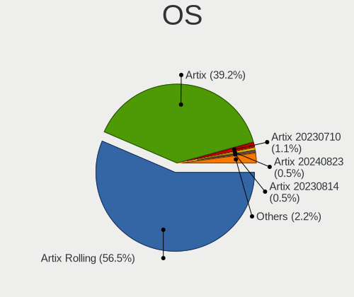
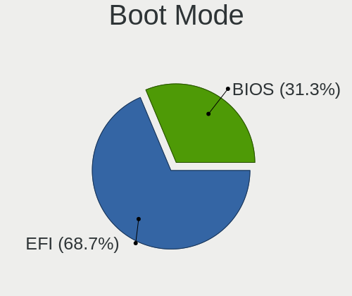
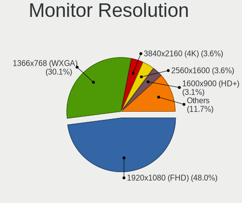
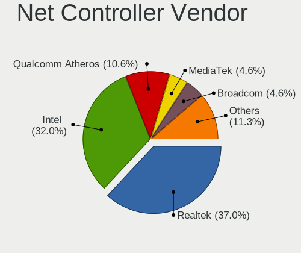

Artix - Tested Hardware & Statistics (Notebooks)
------------------------------------------------

A project to collect tested hardware configurations for Artix.

Anyone can contribute to this report by the [hw-probe](https://github.com/linuxhw/hw-probe) tool:

    sudo -E hw-probe -all -upload

Please contribute! Especially if your hardware is rare.

Contents
--------

* [ Test Cases ](#test-cases)

* [ System ](#system)
  - [ OS                       ](#os)
  - [ OS Family                ](#os-family)
  - [ Kernel                   ](#kernel)
  - [ Kernel Family            ](#kernel-family)
  - [ Kernel Major Ver.        ](#kernel-major-ver)
  - [ Arch                     ](#arch)
  - [ DE                       ](#de)
  - [ Display Server           ](#display-server)
  - [ Display Manager          ](#display-manager)
  - [ OS Lang                  ](#os-lang)
  - [ Boot Mode                ](#boot-mode)
  - [ Filesystem               ](#filesystem)
  - [ Part. scheme             ](#part-scheme)
  - [ Dual Boot with Linux/BSD ](#dual-boot-with-linuxbsd)
  - [ Dual Boot (Win)          ](#dual-boot-win)

* [ Board ](#board)
  - [ Vendor                   ](#vendor)
  - [ Model                    ](#model)
  - [ Model Family             ](#model-family)
  - [ MFG Year                 ](#mfg-year)
  - [ Form Factor              ](#form-factor)
  - [ Secure Boot              ](#secure-boot)
  - [ Coreboot                 ](#coreboot)
  - [ RAM Size                 ](#ram-size)
  - [ RAM Used                 ](#ram-used)
  - [ Total Drives             ](#total-drives)
  - [ Has CD-ROM               ](#has-cd-rom)
  - [ Has Ethernet             ](#has-ethernet)
  - [ Has WiFi                 ](#has-wifi)
  - [ Has Bluetooth            ](#has-bluetooth)

* [ Location ](#location)
  - [ Country                  ](#country)
  - [ City                     ](#city)

* [ Drives ](#drives)
  - [ Drive Vendor             ](#drive-vendor)
  - [ Drive Model              ](#drive-model)
  - [ HDD Vendor               ](#hdd-vendor)
  - [ SSD Vendor               ](#ssd-vendor)
  - [ Drive Kind               ](#drive-kind)
  - [ Drive Connector          ](#drive-connector)
  - [ Drive Size               ](#drive-size)
  - [ Space Total              ](#space-total)
  - [ Space Used               ](#space-used)
  - [ Malfunc. Drives          ](#malfunc-drives)
  - [ Malfunc. Drive Vendor    ](#malfunc-drive-vendor)
  - [ Malfunc. HDD Vendor      ](#malfunc-hdd-vendor)
  - [ Malfunc. Drive Kind      ](#malfunc-drive-kind)
  - [ Failed Drives            ](#failed-drives)
  - [ Failed Drive Vendor      ](#failed-drive-vendor)
  - [ Drive Status             ](#drive-status)

* [ Storage controller ](#storage-controller)
  - [ Storage Vendor           ](#storage-vendor)
  - [ Storage Model            ](#storage-model)
  - [ Storage Kind             ](#storage-kind)

* [ Processor ](#processor)
  - [ CPU Vendor               ](#cpu-vendor)
  - [ CPU Model                ](#cpu-model)
  - [ CPU Model Family         ](#cpu-model-family)
  - [ CPU Cores                ](#cpu-cores)
  - [ CPU Sockets              ](#cpu-sockets)
  - [ CPU Threads              ](#cpu-threads)
  - [ CPU Op-Modes             ](#cpu-op-modes)
  - [ CPU Microcode            ](#cpu-microcode)
  - [ CPU Microarch            ](#cpu-microarch)

* [ Graphics ](#graphics)
  - [ GPU Vendor               ](#gpu-vendor)
  - [ GPU Model                ](#gpu-model)
  - [ GPU Combo                ](#gpu-combo)
  - [ GPU Driver               ](#gpu-driver)
  - [ GPU Memory               ](#gpu-memory)

* [ Monitor ](#monitor)
  - [ Monitor Vendor           ](#monitor-vendor)
  - [ Monitor Model            ](#monitor-model)
  - [ Monitor Resolution       ](#monitor-resolution)
  - [ Monitor Diagonal         ](#monitor-diagonal)
  - [ Monitor Width            ](#monitor-width)
  - [ Aspect Ratio             ](#aspect-ratio)
  - [ Monitor Area             ](#monitor-area)
  - [ Pixel Density            ](#pixel-density)
  - [ Multiple Monitors        ](#multiple-monitors)

* [ Network ](#network)
  - [ Net Controller Vendor    ](#net-controller-vendor)
  - [ Net Controller Model     ](#net-controller-model)
  - [ Wireless Vendor          ](#wireless-vendor)
  - [ Wireless Model           ](#wireless-model)
  - [ Ethernet Vendor          ](#ethernet-vendor)
  - [ Ethernet Model           ](#ethernet-model)
  - [ Net Controller Kind      ](#net-controller-kind)
  - [ Used Controller          ](#used-controller)
  - [ NICs                     ](#nics)
  - [ IPv6                     ](#ipv6)

* [ Bluetooth ](#bluetooth)
  - [ Bluetooth Vendor         ](#bluetooth-vendor)
  - [ Bluetooth Model          ](#bluetooth-model)

* [ Sound ](#sound)
  - [ Sound Vendor             ](#sound-vendor)
  - [ Sound Model              ](#sound-model)

* [ Memory ](#memory)
  - [ Memory Vendor            ](#memory-vendor)
  - [ Memory Model             ](#memory-model)
  - [ Memory Kind              ](#memory-kind)
  - [ Memory Form Factor       ](#memory-form-factor)
  - [ Memory Size              ](#memory-size)
  - [ Memory Speed             ](#memory-speed)

* [ Printers & scanners ](#printers--scanners)
  - [ Printer Vendor           ](#printer-vendor)
  - [ Printer Model            ](#printer-model)
  - [ Scanner Vendor           ](#scanner-vendor)
  - [ Scanner Model            ](#scanner-model)

* [ Camera ](#camera)
  - [ Camera Vendor            ](#camera-vendor)
  - [ Camera Model             ](#camera-model)

* [ Security ](#security)
  - [ Fingerprint Vendor       ](#fingerprint-vendor)
  - [ Fingerprint Model        ](#fingerprint-model)
  - [ Chipcard Vendor          ](#chipcard-vendor)
  - [ Chipcard Model           ](#chipcard-model)

* [ Unsupported ](#unsupported)
  - [ Unsupported Devices      ](#unsupported-devices)
  - [ Unsupported Device Types ](#unsupported-device-types)

Test Cases
----------

Total: 130

| Vendor        | Model                       | Probe                                                      | Date         |
|---------------|-----------------------------|------------------------------------------------------------|--------------|
| Dell          | Inspiron 3541               | [ab643dc6b0](https://linux-hardware.org/?probe=ab643dc6b0) | Jul 30, 2022 |
| Dell          | Latitude E7440              | [deea307e9b](https://linux-hardware.org/?probe=deea307e9b) | Jul 27, 2022 |
| Dell          | Latitude E7440              | [e2d8510882](https://linux-hardware.org/?probe=e2d8510882) | Jul 27, 2022 |
| Acer          | Aspire A315-23              | [304f750248](https://linux-hardware.org/?probe=304f750248) | Jul 08, 2022 |
| MOTILE        | M141                        | [59c616a04e](https://linux-hardware.org/?probe=59c616a04e) | Jun 30, 2022 |
| HUAWEI        | WRT-WX9                     | [8ddbebd4b1](https://linux-hardware.org/?probe=8ddbebd4b1) | Jun 28, 2022 |
| AXIOO         | Mybook 14E                  | [499861f5e9](https://linux-hardware.org/?probe=499861f5e9) | Jun 19, 2022 |
| Timi          | RedmiBook 14 II             | [a4b535cdee](https://linux-hardware.org/?probe=a4b535cdee) | Jun 15, 2022 |
| Lenovo        | ThinkPad T440s 20ARS0MV0... | [3c23c9dfc6](https://linux-hardware.org/?probe=3c23c9dfc6) | Jun 08, 2022 |
| ASUSTek       | X553MA                      | [2a3ac45d9c](https://linux-hardware.org/?probe=2a3ac45d9c) | Jun 05, 2022 |
| Dell          | Precision M6600             | [bb044c066c](https://linux-hardware.org/?probe=bb044c066c) | Jun 05, 2022 |
| Dell          | Latitude 5490               | [630b63edff](https://linux-hardware.org/?probe=630b63edff) | Jun 02, 2022 |
| LG Electro... | 17Z990-R.AAC9U1             | [dfacdafc7f](https://linux-hardware.org/?probe=dfacdafc7f) | May 11, 2022 |
| Acer          | Nitro AN515-52              | [5122079c78](https://linux-hardware.org/?probe=5122079c78) | May 10, 2022 |
| Lenovo        | ThinkPad T480 MFG_IN_GO     | [9792863fc7](https://linux-hardware.org/?probe=9792863fc7) | May 08, 2022 |
| Lenovo        | ThinkPad T480 MFG_IN_GO     | [bba77106b4](https://linux-hardware.org/?probe=bba77106b4) | May 08, 2022 |
| HP            | 15                          | [d9ed47d44c](https://linux-hardware.org/?probe=d9ed47d44c) | Apr 23, 2022 |
| Lenovo        | ThinkBook 15 G2 ITL 20VE    | [85b1934bfd](https://linux-hardware.org/?probe=85b1934bfd) | Apr 21, 2022 |
| ASUSTek       | GX501VIK                    | [076208c6fd](https://linux-hardware.org/?probe=076208c6fd) | Apr 15, 2022 |
| ASUSTek       | GX501VIK                    | [15c4c7877b](https://linux-hardware.org/?probe=15c4c7877b) | Apr 15, 2022 |
| Lenovo        | ThinkPad T430 2350BC6       | [c2ffb2a421](https://linux-hardware.org/?probe=c2ffb2a421) | Apr 14, 2022 |
| HP            | 246                         | [4ef673dd00](https://linux-hardware.org/?probe=4ef673dd00) | Apr 10, 2022 |
| Lenovo        | ThinkPad T430 2347H76       | [493f378237](https://linux-hardware.org/?probe=493f378237) | Mar 10, 2022 |
| HP            | Laptop 14s-dq2xxx           | [92db061239](https://linux-hardware.org/?probe=92db061239) | Mar 09, 2022 |
| Lenovo        | IdeaPad Y500 20193          | [604362a51f](https://linux-hardware.org/?probe=604362a51f) | Feb 18, 2022 |
| Notebook      | N141CU                      | [029f48bc53](https://linux-hardware.org/?probe=029f48bc53) | Feb 16, 2022 |
| Acer          | Aspire V3-472PG             | [70c80ae356](https://linux-hardware.org/?probe=70c80ae356) | Feb 16, 2022 |
| HP            | Laptop 15-ef1xxx            | [6cf7935dcc](https://linux-hardware.org/?probe=6cf7935dcc) | Feb 14, 2022 |
| Timi          | RedmiBook 14 II             | [3c1248a9d9](https://linux-hardware.org/?probe=3c1248a9d9) | Feb 10, 2022 |
| ASUSTek       | 1225C                       | [b780589dd0](https://linux-hardware.org/?probe=b780589dd0) | Feb 07, 2022 |
| HP            | Laptop 15-ef1xxx            | [6a49ff6317](https://linux-hardware.org/?probe=6a49ff6317) | Jan 18, 2022 |
| Lenovo        | G400s 20244                 | [9ac1aa04cc](https://linux-hardware.org/?probe=9ac1aa04cc) | Jan 15, 2022 |
| Lenovo        | ThinkPad E14 Gen 2 20T60... | [945649c354](https://linux-hardware.org/?probe=945649c354) | Jan 07, 2022 |
| MSI           | Modern 15 A11M              | [bef1d4552a](https://linux-hardware.org/?probe=bef1d4552a) | Jan 07, 2022 |
| Lenovo        | Legion 5 15ARH05H 82B1      | [a568bef730](https://linux-hardware.org/?probe=a568bef730) | Jan 05, 2022 |
| Lenovo        | B570e HuronRiver Platfor... | [a6c63e1079](https://linux-hardware.org/?probe=a6c63e1079) | Dec 17, 2021 |
| Dell          | Latitude E6440              | [5e572f557c](https://linux-hardware.org/?probe=5e572f557c) | Dec 16, 2021 |
| Dell          | Latitude E6440              | [ac94463e37](https://linux-hardware.org/?probe=ac94463e37) | Dec 16, 2021 |
| ASUSTek       | K50IE                       | [49a6b75a43](https://linux-hardware.org/?probe=49a6b75a43) | Nov 29, 2021 |
| Lenovo        | ThinkBook 15 G2 ITL 20VE    | [0e12642e78](https://linux-hardware.org/?probe=0e12642e78) | Nov 27, 2021 |
| Timi          | RedmiBook 14 II             | [3e700c917e](https://linux-hardware.org/?probe=3e700c917e) | Nov 25, 2021 |
| Lenovo        | ThinkPad 11e 5th Gen 20L... | [9a5098383d](https://linux-hardware.org/?probe=9a5098383d) | Nov 24, 2021 |
| Lenovo        | ThinkPad T480s 20L8S3D40... | [76be488014](https://linux-hardware.org/?probe=76be488014) | Nov 07, 2021 |
| Lenovo        | ThinkPad T480s 20L8S3D40... | [f96363ccf5](https://linux-hardware.org/?probe=f96363ccf5) | Nov 07, 2021 |
| HP            | ProBook 450 G6              | [ded9086b7c](https://linux-hardware.org/?probe=ded9086b7c) | Nov 06, 2021 |
| Timi          | RedmiBook 14 II             | [038c0ad664](https://linux-hardware.org/?probe=038c0ad664) | Nov 03, 2021 |
| Timi          | RedmiBook 14 II             | [d8ae8a047c](https://linux-hardware.org/?probe=d8ae8a047c) | Nov 02, 2021 |
| Acer          | Swift SF314-59              | [c764d879fb](https://linux-hardware.org/?probe=c764d879fb) | Sep 27, 2021 |
| Acer          | Swift SF314-59              | [9426a6d4df](https://linux-hardware.org/?probe=9426a6d4df) | Sep 23, 2021 |
| Acer          | Aspire E5-575               | [d32c769f65](https://linux-hardware.org/?probe=d32c769f65) | Sep 22, 2021 |
| HP            | Laptop 14s-cf3xxx           | [5b9800e687](https://linux-hardware.org/?probe=5b9800e687) | Sep 06, 2021 |
| Dell          | Precision M6600             | [3c06ad8f67](https://linux-hardware.org/?probe=3c06ad8f67) | Sep 06, 2021 |
| ASUSTek       | GL702ZC                     | [7cb34b0a2e](https://linux-hardware.org/?probe=7cb34b0a2e) | Aug 10, 2021 |
| ASUSTek       | GL702ZC                     | [8ab07e196d](https://linux-hardware.org/?probe=8ab07e196d) | Aug 09, 2021 |
| GPD           | P2 MAX                      | [bf70dbe409](https://linux-hardware.org/?probe=bf70dbe409) | Aug 07, 2021 |
| GPD           | P2 MAX                      | [a4e8eb7d9e](https://linux-hardware.org/?probe=a4e8eb7d9e) | Aug 07, 2021 |
| GPD           | P2 MAX                      | [43075e1581](https://linux-hardware.org/?probe=43075e1581) | Jul 23, 2021 |
| HP            | 250 G3                      | [b1a0952727](https://linux-hardware.org/?probe=b1a0952727) | Jul 19, 2021 |
| Dell          | Inspiron 3442               | [a4e06ddea2](https://linux-hardware.org/?probe=a4e06ddea2) | Jul 02, 2021 |
| Lenovo        | LaVie Z 20FF0012US          | [789d556ef6](https://linux-hardware.org/?probe=789d556ef6) | Jul 01, 2021 |
| Lenovo        | ThinkPad W500 4063CJ5       | [89bbafa02e](https://linux-hardware.org/?probe=89bbafa02e) | Jun 22, 2021 |
| HP            | 15                          | [4f6c5d8c89](https://linux-hardware.org/?probe=4f6c5d8c89) | Jun 22, 2021 |
| Apple         | MacBookAir7,2               | [6a459ac265](https://linux-hardware.org/?probe=6a459ac265) | Jun 16, 2021 |
| HP            | 250 G7 Notebook PC          | [10803bcbc4](https://linux-hardware.org/?probe=10803bcbc4) | Jun 07, 2021 |
| HP            | 250 G7 Notebook PC          | [445e09faa7](https://linux-hardware.org/?probe=445e09faa7) | Jun 07, 2021 |
| Dell          | Precision 7550              | [5d7ecb9bbb](https://linux-hardware.org/?probe=5d7ecb9bbb) | Jun 07, 2021 |
| Lenovo        | IdeaPad Gaming 3 15IMH05... | [de11ab3cc4](https://linux-hardware.org/?probe=de11ab3cc4) | May 31, 2021 |
| Lenovo        | ThinkPad T14 Gen 1 20UES... | [4688dc5b46](https://linux-hardware.org/?probe=4688dc5b46) | May 29, 2021 |
| Dell          | Precision 7550              | [206eeb06c9](https://linux-hardware.org/?probe=206eeb06c9) | May 23, 2021 |
| UNOWHY        | Y13G010S4EI                 | [62d883cffd](https://linux-hardware.org/?probe=62d883cffd) | May 18, 2021 |
| Lenovo        | ThinkPad W500 4063CJ5       | [85def78a94](https://linux-hardware.org/?probe=85def78a94) | May 02, 2021 |
| HP            | Laptop 17z-ca300            | [ea09357867](https://linux-hardware.org/?probe=ea09357867) | Apr 26, 2021 |
| Acer          | Aspire V3-572PG             | [a874b34c2a](https://linux-hardware.org/?probe=a874b34c2a) | Apr 12, 2021 |
| Apple         | MacBookAir7,2               | [7f14077ecc](https://linux-hardware.org/?probe=7f14077ecc) | Mar 29, 2021 |
| Apple         | MacBookPro11,1              | [666815417c](https://linux-hardware.org/?probe=666815417c) | Mar 28, 2021 |
| Apple         | MacBookPro11,1              | [d2027dc1c2](https://linux-hardware.org/?probe=d2027dc1c2) | Mar 24, 2021 |
| MSI           | GP72 7RDX                   | [a60abbdcd4](https://linux-hardware.org/?probe=a60abbdcd4) | Mar 18, 2021 |
| Quanta        | SWH                         | [dc6df30340](https://linux-hardware.org/?probe=dc6df30340) | Mar 18, 2021 |
| Lenovo        | ThinkPad T14 Gen 1 20S1S... | [c2599a37c2](https://linux-hardware.org/?probe=c2599a37c2) | Mar 08, 2021 |
| Lenovo        | ThinkPad T14 Gen 1 20UES... | [76006e9ba5](https://linux-hardware.org/?probe=76006e9ba5) | Mar 01, 2021 |
| Dell          | Precision 7550              | [c1c4fd3b1a](https://linux-hardware.org/?probe=c1c4fd3b1a) | Feb 21, 2021 |
| Lenovo        | ThinkPad W500 4063CJ5       | [b25144d80b](https://linux-hardware.org/?probe=b25144d80b) | Feb 18, 2021 |
| Lenovo        | ThinkPad P1 Gen 3 20TH00... | [c2408f8152](https://linux-hardware.org/?probe=c2408f8152) | Feb 16, 2021 |
| Lenovo        | ThinkPad W500 4063CJ5       | [838f747450](https://linux-hardware.org/?probe=838f747450) | Feb 14, 2021 |
| Lenovo        | ThinkPad W500 4063CJ5       | [214d72ae23](https://linux-hardware.org/?probe=214d72ae23) | Feb 12, 2021 |
| Acer          | Aspire 5733Z                | [b15b48fb21](https://linux-hardware.org/?probe=b15b48fb21) | Jan 29, 2021 |
| ASUSTek       | K53SC                       | [11547cb913](https://linux-hardware.org/?probe=11547cb913) | Jan 22, 2021 |
| ASUSTek       | K53SC                       | [061c52c2ff](https://linux-hardware.org/?probe=061c52c2ff) | Jan 22, 2021 |
| HP            | ProBook 450 G6              | [40e4f5d2fb](https://linux-hardware.org/?probe=40e4f5d2fb) | Jan 21, 2021 |
| Dell          | Precision 5520              | [a714973647](https://linux-hardware.org/?probe=a714973647) | Jan 16, 2021 |
| ASUSTek       | E402NA                      | [ac894b264b](https://linux-hardware.org/?probe=ac894b264b) | Jan 10, 2021 |
| Apple         | MacBookPro11,1              | [e8ac486033](https://linux-hardware.org/?probe=e8ac486033) | Jan 09, 2021 |
| Acer          | Aspire A315-53              | [abac7a5b07](https://linux-hardware.org/?probe=abac7a5b07) | Jan 02, 2021 |
| Dell          | Precision 7550              | [9c8b2f2ad6](https://linux-hardware.org/?probe=9c8b2f2ad6) | Dec 30, 2020 |
| Gigabyte      | B450M DS3H-CF               | [b9c02872aa](https://linux-hardware.org/?probe=b9c02872aa) | Dec 29, 2020 |
| Dell          | Latitude E6530              | [46704587d1](https://linux-hardware.org/?probe=46704587d1) | Dec 25, 2020 |
| Gigabyte      | B450M DS3H-CF               | [d2701aa534](https://linux-hardware.org/?probe=d2701aa534) | Dec 24, 2020 |
| HP            | 250 G4 Notebook PC          | [178de0b283](https://linux-hardware.org/?probe=178de0b283) | Dec 24, 2020 |
| Lenovo        | ThinkPad W500 4063CJ5       | [a905f1377a](https://linux-hardware.org/?probe=a905f1377a) | Dec 20, 2020 |
| GPD           | P2 MAX                      | [f6249e6387](https://linux-hardware.org/?probe=f6249e6387) | Dec 11, 2020 |
| Sony          | VPCCB17FG                   | [5a24dc3231](https://linux-hardware.org/?probe=5a24dc3231) | Nov 26, 2020 |
| Acer          | Aspire A315-53              | [bc80dc5050](https://linux-hardware.org/?probe=bc80dc5050) | Nov 25, 2020 |
| Lenovo        | IdeaPad L340-17IRH Gamin... | [53a1586791](https://linux-hardware.org/?probe=53a1586791) | Nov 12, 2020 |
| HP            | OMEN Laptop 15-en0xxx       | [61653c183a](https://linux-hardware.org/?probe=61653c183a) | Oct 30, 2020 |
| ASUSTek       | VivoBook_ASUS Laptop X50... | [f18b33a8f0](https://linux-hardware.org/?probe=f18b33a8f0) | Oct 25, 2020 |
| ASUSTek       | VivoBook_ASUS Laptop X50... | [acc8c4e663](https://linux-hardware.org/?probe=acc8c4e663) | Oct 25, 2020 |
| Lenovo        | ThinkPad W500 4063CJ5       | [7c29a97dff](https://linux-hardware.org/?probe=7c29a97dff) | Oct 21, 2020 |
| Lenovo        | ThinkPad W500 4063CJ5       | [961c0be28a](https://linux-hardware.org/?probe=961c0be28a) | Oct 18, 2020 |
| Dell          | Inspiron 5570               | [038ef2ebaa](https://linux-hardware.org/?probe=038ef2ebaa) | Oct 15, 2020 |
| Lenovo        | IdeaPad 5 15IIL05 81YK      | [b877caba0b](https://linux-hardware.org/?probe=b877caba0b) | Oct 13, 2020 |
| HP            | 255 G7 Notebook PC          | [026a4d80f6](https://linux-hardware.org/?probe=026a4d80f6) | Oct 08, 2020 |
| Dell          | Precision 7550              | [c574758854](https://linux-hardware.org/?probe=c574758854) | Sep 19, 2020 |
| Dell          | Precision 7550              | [14d1876313](https://linux-hardware.org/?probe=14d1876313) | Aug 31, 2020 |
| Dell          | Precision 7550              | [d44c1dbf60](https://linux-hardware.org/?probe=d44c1dbf60) | Aug 31, 2020 |
| Dell          | Precision 7550              | [25d7f344e9](https://linux-hardware.org/?probe=25d7f344e9) | Aug 29, 2020 |
| Acer          | Nitro AN515-51              | [4f2724d5ad](https://linux-hardware.org/?probe=4f2724d5ad) | Aug 16, 2020 |
| Lenovo        | IdeaPad 330-15IKB 81DE      | [aae7fd244a](https://linux-hardware.org/?probe=aae7fd244a) | Aug 06, 2020 |
| Lenovo        | IdeaPad 5 15IIL05 81YK      | [5e3d9be29a](https://linux-hardware.org/?probe=5e3d9be29a) | Aug 01, 2020 |
| Lenovo        | IdeaPad 510-15IKB 80SV      | [d5b2c55949](https://linux-hardware.org/?probe=d5b2c55949) | Jul 27, 2020 |
| Lenovo        | ThinkPad T420 4236H45       | [61fd4ce395](https://linux-hardware.org/?probe=61fd4ce395) | Jul 20, 2020 |
| Lenovo        | IdeaPad 510-15IKB 80SV      | [0af3ac770f](https://linux-hardware.org/?probe=0af3ac770f) | Jul 06, 2020 |
| Notebook      | N130BU                      | [e1b81e4880](https://linux-hardware.org/?probe=e1b81e4880) | Jul 05, 2020 |
| Lenovo        | IdeaPad 510-15IKB 80SV      | [051fa5784a](https://linux-hardware.org/?probe=051fa5784a) | Jul 02, 2020 |
| Gigabyte      | AERO 15-X9                  | [7cb20a8170](https://linux-hardware.org/?probe=7cb20a8170) | Jul 01, 2020 |
| Gigabyte      | AERO 15-X9                  | [efaa58fcc8](https://linux-hardware.org/?probe=efaa58fcc8) | Jun 14, 2020 |
| Gigabyte      | AERO 15-X9                  | [b5fee1bf94](https://linux-hardware.org/?probe=b5fee1bf94) | Jun 12, 2020 |
| Acer          | Aspire E5-575G              | [cd633c729b](https://linux-hardware.org/?probe=cd633c729b) | Apr 29, 2020 |
| Dell          | Precision 3540              | [3e582eb1b9](https://linux-hardware.org/?probe=3e582eb1b9) | Mar 30, 2020 |
| Dell          | Precision 3540              | [2a446cd098](https://linux-hardware.org/?probe=2a446cd098) | Feb 15, 2020 |
| Lenovo        | B590 20206                  | [a2066c32a9](https://linux-hardware.org/?probe=a2066c32a9) | Oct 25, 2018 |

System
------

OS
--

Installed operating systems

| Name           | Notebooks | Percent |
|----------------|-----------|---------|
| Artix Rolling  | 55        | 59.14%  |
| Artix          | 35        | 37.63%  |
| Artix 20220713 | 1         | 1.08%   |
| Artix 20201207 | 1         | 1.08%   |
| Artix 20201128 | 1         | 1.08%   |

OS Family
---------

OS without a version

| Name  | Notebooks | Percent |
|-------|-----------|---------|
| Artix | 88        | 100%    |

Kernel
------

Version of the Linux kernel

| Version                         | Notebooks | Percent |
|---------------------------------|-----------|---------|
| 5.9.14-artix1-1                 | 6         | 5.61%   |
| 5.7.6-artix1-1                  | 3         | 2.8%    |
| 5.7.12-artix1-1                 | 2         | 1.87%   |
| 5.18.6-artix1-1                 | 2         | 1.87%   |
| 5.18.0-artix1-1                 | 2         | 1.87%   |
| 5.17.1-artix1-1                 | 2         | 1.87%   |
| 5.16.8-artix1-2                 | 2         | 1.87%   |
| 5.16.10-artix1-1                | 2         | 1.87%   |
| 5.15.12-artix1-1                | 2         | 1.87%   |
| 5.14.16-artix1-1                | 2         | 1.87%   |
| 5.13.8-artix1-1                 | 2         | 1.87%   |
| 5.12.8-artix1-1                 | 2         | 1.87%   |
| 5.12.12-zen1-1-zen              | 2         | 1.87%   |
| 5.12.12-artix1-1                | 2         | 1.87%   |
| 5.11.6-artix1-1                 | 2         | 1.87%   |
| 5.10.6-artix1-1                 | 2         | 1.87%   |
| 5.10.4-artix2-1                 | 2         | 1.87%   |
| 5.10.16-artix1-1                | 2         | 1.87%   |
| 5.9.6-artix1-1                  | 1         | 0.93%   |
| 5.9.14-zen1-1-zen               | 1         | 0.93%   |
| 5.9.12-artix1-1                 | 1         | 0.93%   |
| 5.9.1-artix1-1                  | 1         | 0.93%   |
| 5.9.0-zen1-1-zen                | 1         | 0.93%   |
| 5.9.0-1-mainline-bootsplash     | 1         | 0.93%   |
| 5.8.8-artix1-1                  | 1         | 0.93%   |
| 5.8.4-artix1-1                  | 1         | 0.93%   |
| 5.8.14-zen1-1-zen               | 1         | 0.93%   |
| 5.8.14-artix1-1                 | 1         | 0.93%   |
| 5.8.12-artix1-1                 | 1         | 0.93%   |
| 5.8.0-rc7-5-mainline-bootsplash | 1         | 0.93%   |
| 5.7.8-artix1-1                  | 1         | 0.93%   |
| 5.7.2-artix1-1                  | 1         | 0.93%   |
| 5.6.7-x86_64                    | 1         | 0.93%   |
| 5.5.3-artix1-1                  | 1         | 0.93%   |
| 5.5.10-artix1-1                 | 1         | 0.93%   |
| 5.4.74-1-lts                    | 1         | 0.93%   |
| 5.18.9-zen1-1-zen               | 1         | 0.93%   |
| 5.18.5-artix1-1                 | 1         | 0.93%   |
| 5.18.3-zen1-1-zen               | 1         | 0.93%   |
| 5.18.12-artix1-1                | 1         | 0.93%   |
| 5.18.10-artix1-1                | 1         | 0.93%   |
| 5.17.5-256-tkg-pds              | 1         | 0.93%   |
| 5.17.4-artix1-1                 | 1         | 0.93%   |
| 5.17.3-zen1-1-zen               | 1         | 0.93%   |
| 5.17.2-artix3-1                 | 1         | 0.93%   |
| 5.17.12-xanmod1-1               | 1         | 0.93%   |
| 5.17.1-zen1-1-zen               | 1         | 0.93%   |
| 5.16.8-zen1-1-zen               | 1         | 0.93%   |
| 5.16.7-artix1-1                 | 1         | 0.93%   |
| 5.16.3-artix1-1                 | 1         | 0.93%   |
| 5.16.1-artix1-1                 | 1         | 0.93%   |
| 5.16.0-arch1-g400s              | 1         | 0.93%   |
| 5.15.8-artix1-1                 | 1         | 0.93%   |
| 5.15.7-zen1-1-zen               | 1         | 0.93%   |
| 5.15.5-zen1-1-zen               | 1         | 0.93%   |
| 5.15.43-1-lts                   | 1         | 0.93%   |
| 5.15.4-artix1-1                 | 1         | 0.93%   |
| 5.15.36-1-lts                   | 1         | 0.93%   |
| 5.15.3-zen1-1-zen               | 1         | 0.93%   |
| 5.15.16-1-lts                   | 1         | 0.93%   |

Kernel Family
-------------

Linux kernel without a distro release

| Version | Notebooks | Percent |
|---------|-----------|---------|
| 5.9.14  | 7         | 6.54%   |
| 5.12.12 | 4         | 3.74%   |
| 5.7.6   | 3         | 2.8%    |
| 5.17.1  | 3         | 2.8%    |
| 5.16.8  | 3         | 2.8%    |
| 5.15.12 | 3         | 2.8%    |
| 5.12.8  | 3         | 2.8%    |
| 5.9.0   | 2         | 1.87%   |
| 5.8.14  | 2         | 1.87%   |
| 5.7.12  | 2         | 1.87%   |
| 5.18.6  | 2         | 1.87%   |
| 5.18.0  | 2         | 1.87%   |
| 5.16.10 | 2         | 1.87%   |
| 5.14.16 | 2         | 1.87%   |
| 5.13.8  | 2         | 1.87%   |
| 5.12.14 | 2         | 1.87%   |
| 5.11.6  | 2         | 1.87%   |
| 5.10.6  | 2         | 1.87%   |
| 5.10.4  | 2         | 1.87%   |
| 5.10.16 | 2         | 1.87%   |
| 5.9.6   | 1         | 0.93%   |
| 5.9.12  | 1         | 0.93%   |
| 5.9.1   | 1         | 0.93%   |
| 5.8.8   | 1         | 0.93%   |
| 5.8.4   | 1         | 0.93%   |
| 5.8.12  | 1         | 0.93%   |
| 5.8.0   | 1         | 0.93%   |
| 5.7.8   | 1         | 0.93%   |
| 5.7.2   | 1         | 0.93%   |
| 5.6.7   | 1         | 0.93%   |
| 5.5.3   | 1         | 0.93%   |
| 5.5.10  | 1         | 0.93%   |
| 5.4.74  | 1         | 0.93%   |
| 5.18.9  | 1         | 0.93%   |
| 5.18.5  | 1         | 0.93%   |
| 5.18.3  | 1         | 0.93%   |
| 5.18.12 | 1         | 0.93%   |
| 5.18.10 | 1         | 0.93%   |
| 5.17.5  | 1         | 0.93%   |
| 5.17.4  | 1         | 0.93%   |
| 5.17.3  | 1         | 0.93%   |
| 5.17.2  | 1         | 0.93%   |
| 5.17.12 | 1         | 0.93%   |
| 5.16.7  | 1         | 0.93%   |
| 5.16.3  | 1         | 0.93%   |
| 5.16.1  | 1         | 0.93%   |
| 5.16.0  | 1         | 0.93%   |
| 5.15.8  | 1         | 0.93%   |
| 5.15.7  | 1         | 0.93%   |
| 5.15.5  | 1         | 0.93%   |
| 5.15.43 | 1         | 0.93%   |
| 5.15.4  | 1         | 0.93%   |
| 5.15.36 | 1         | 0.93%   |
| 5.15.3  | 1         | 0.93%   |
| 5.15.16 | 1         | 0.93%   |
| 5.14.7  | 1         | 0.93%   |
| 5.14.14 | 1         | 0.93%   |
| 5.13.13 | 1         | 0.93%   |
| 5.13.12 | 1         | 0.93%   |
| 5.12.6  | 1         | 0.93%   |

Kernel Major Ver.
-----------------

Linux kernel major version

| Version | Notebooks | Percent |
|---------|-----------|---------|
| 5.12    | 12        | 11.88%  |
| 5.9     | 11        | 10.89%  |
| 5.15    | 11        | 10.89%  |
| 5.10    | 11        | 10.89%  |
| 5.18    | 9         | 8.91%   |
| 5.17    | 8         | 7.92%   |
| 5.16    | 8         | 7.92%   |
| 5.11    | 8         | 7.92%   |
| 5.7     | 6         | 5.94%   |
| 5.8     | 5         | 4.95%   |
| 5.14    | 4         | 3.96%   |
| 5.13    | 4         | 3.96%   |
| 5.6     | 1         | 0.99%   |
| 5.5     | 1         | 0.99%   |
| 5.4     | 1         | 0.99%   |
| 4.19    | 1         | 0.99%   |

Arch
----

OS architecture (x86_64, i586, etc.)

| Name   | Notebooks | Percent |
|--------|-----------|---------|
| x86_64 | 88        | 100%    |

DE
--

Desktop Environment

| Name           | Notebooks | Percent |
|----------------|-----------|---------|
| KDE5           | 20        | 21.28%  |
| XFCE           | 14        | 14.89%  |
| GNOME          | 14        | 14.89%  |
| Unknown        | 14        | 14.89%  |
| X-Cinnamon     | 7         | 7.45%   |
| MATE           | 4         | 4.26%   |
| LXQt           | 4         | 4.26%   |
| KDE            | 4         | 4.26%   |
| Cinnamon       | 3         | 3.19%   |
| bspwm          | 2         | 2.13%   |
| xmonad         | 1         | 1.06%   |
| sway-dbus      | 1         | 1.06%   |
| Sway           | 1         | 1.06%   |
| nxde           | 1         | 1.06%   |
| LXDE           | 1         | 1.06%   |
| i3             | 1         | 1.06%   |
| awesomeminimal | 1         | 1.06%   |
| awesome        | 1         | 1.06%   |

Display Server
--------------

X11 or Wayland

| Name    | Notebooks | Percent |
|---------|-----------|---------|
| X11     | 64        | 69.57%  |
| Tty     | 13        | 14.13%  |
| Wayland | 11        | 11.96%  |
| Unknown | 4         | 4.35%   |

Display Manager
---------------

SDDM, LightDM, etc.

| Name    | Notebooks | Percent |
|---------|-----------|---------|
| Unknown | 31        | 34.44%  |
| LightDM | 28        | 31.11%  |
| SDDM    | 26        | 28.89%  |
| XDM     | 1         | 1.11%   |
| SLiM    | 1         | 1.11%   |
| Ly      | 1         | 1.11%   |
| LXDM    | 1         | 1.11%   |
| GDM     | 1         | 1.11%   |

OS Lang
-------

Language

| Lang    | Notebooks | Percent |
|---------|-----------|---------|
| en_US   | 45        | 48.39%  |
| Unknown | 11        | 11.83%  |
| ru_RU   | 7         | 7.53%   |
| en_GB   | 7         | 7.53%   |
| C       | 4         | 4.3%    |
| fr_FR   | 3         | 3.23%   |
| es_ES   | 2         | 2.15%   |
| en_CA   | 2         | 2.15%   |
| uk_UA   | 1         | 1.08%   |
| pt_PT   | 1         | 1.08%   |
| pt_BR   | 1         | 1.08%   |
| pl_PL   | 1         | 1.08%   |
| it_IT   | 1         | 1.08%   |
| es_GT   | 1         | 1.08%   |
| en_IN   | 1         | 1.08%   |
| en_AU   | 1         | 1.08%   |
| en_AG   | 1         | 1.08%   |
| el_GR   | 1         | 1.08%   |
| de_DE   | 1         | 1.08%   |
| cs_CZ   | 1         | 1.08%   |

Boot Mode
---------

EFI or BIOS

| Mode | Notebooks | Percent |
|------|-----------|---------|
| EFI  | 66        | 74.16%  |
| BIOS | 23        | 25.84%  |

Filesystem
----------

Type of filesystem

| Type    | Notebooks | Percent |
|---------|-----------|---------|
| Ext4    | 66        | 74.16%  |
| Btrfs   | 19        | 21.35%  |
| Xfs     | 2         | 2.25%   |
| Overlay | 1         | 1.12%   |
| F2fs    | 1         | 1.12%   |

Part. scheme
------------

Scheme of partitioning

| Type    | Notebooks | Percent |
|---------|-----------|---------|
| GPT     | 65        | 73.03%  |
| Unknown | 13        | 14.61%  |
| MBR     | 11        | 12.36%  |

Dual Boot with Linux/BSD
------------------------

Hosting more than one Linux/BSD

| Dual boot | Notebooks | Percent |
|-----------|-----------|---------|
| No        | 75        | 84.27%  |
| Yes       | 14        | 15.73%  |

Dual Boot (Win)
---------------

Hosting Linux and Windows

| Dual boot | Notebooks | Percent |
|-----------|-----------|---------|
| No        | 65        | 73.86%  |
| Yes       | 23        | 26.14%  |

Board
-----

Vendor
------

Motherboard manufacturer

| Name                | Notebooks | Percent |
|---------------------|-----------|---------|
| Lenovo              | 25        | 28.41%  |
| Hewlett-Packard     | 13        | 14.77%  |
| Dell                | 13        | 14.77%  |
| Acer                | 10        | 11.36%  |
| ASUSTek Computer    | 8         | 9.09%   |
| Apple               | 3         | 3.41%   |
| Timi                | 2         | 2.27%   |
| Notebook            | 2         | 2.27%   |
| MSI                 | 2         | 2.27%   |
| GPD                 | 2         | 2.27%   |
| Gigabyte Technology | 2         | 2.27%   |
| UNOWHY              | 1         | 1.14%   |
| Quanta              | 1         | 1.14%   |
| MOTILE              | 1         | 1.14%   |
| LG Electronics      | 1         | 1.14%   |
| HUAWEI              | 1         | 1.14%   |
| AXIOO               | 1         | 1.14%   |

Model
-----

Motherboard model

| Name                                   | Notebooks | Percent |
|----------------------------------------|-----------|---------|
| Timi RedmiBook 14 II                   | 2         | 2.27%   |
| Lenovo IdeaPad 5 15IIL05 81YK          | 2         | 2.27%   |
| HP 15                                  | 2         | 2.27%   |
| GPD P2 MAX                             | 2         | 2.27%   |
| Dell Precision M6600                   | 2         | 2.27%   |
| Dell Precision 7550                    | 2         | 2.27%   |
| Apple MacBookAir7,2                    | 2         | 2.27%   |
| UNOWHY Y13G010S4EI                     | 1         | 1.14%   |
| Quanta SWH                             | 1         | 1.14%   |
| Notebook N141CU                        | 1         | 1.14%   |
| Notebook N130BU                        | 1         | 1.14%   |
| MSI Modern 15 A11M                     | 1         | 1.14%   |
| MSI GP72 7RDX                          | 1         | 1.14%   |
| MOTILE M141                            | 1         | 1.14%   |
| LG 17Z990-R.AAC9U1                     | 1         | 1.14%   |
| Lenovo ThinkPad W500 4063CJ5           | 1         | 1.14%   |
| Lenovo ThinkPad T480s 20L8S3D400       | 1         | 1.14%   |
| Lenovo ThinkPad T480 MFG_IN_GO         | 1         | 1.14%   |
| Lenovo ThinkPad T440s 20ARS0MV00       | 1         | 1.14%   |
| Lenovo ThinkPad T430 2350BC6           | 1         | 1.14%   |
| Lenovo ThinkPad T430 2347H76           | 1         | 1.14%   |
| Lenovo ThinkPad T420 4236H45           | 1         | 1.14%   |
| Lenovo ThinkPad T14 Gen 1 20UES1GC00   | 1         | 1.14%   |
| Lenovo ThinkPad T14 Gen 1 20S1S07800   | 1         | 1.14%   |
| Lenovo ThinkPad P1 Gen 3 20TH001EMH    | 1         | 1.14%   |
| Lenovo ThinkPad E14 Gen 2 20T6000MCK   | 1         | 1.14%   |
| Lenovo ThinkPad 11e 5th Gen 20LNS0P500 | 1         | 1.14%   |
| Lenovo ThinkBook 15 G2 ITL 20VE        | 1         | 1.14%   |
| Lenovo Legion 5 15ARH05H 82B1          | 1         | 1.14%   |
| Lenovo LaVie Z 20FF0012US              | 1         | 1.14%   |
| Lenovo IdeaPad Y500 20193              | 1         | 1.14%   |
| Lenovo IdeaPad L340-17IRH Gaming 81LL  | 1         | 1.14%   |
| Lenovo IdeaPad Gaming 3 15IMH05 82CG   | 1         | 1.14%   |
| Lenovo IdeaPad 510-15IKB 80SV          | 1         | 1.14%   |
| Lenovo IdeaPad 330-15IKB 81DE          | 1         | 1.14%   |
| Lenovo G400s 20244                     | 1         | 1.14%   |
| Lenovo B590 20206                      | 1         | 1.14%   |
| Lenovo B570e HuronRiver Platform       | 1         | 1.14%   |
| HUAWEI WRT-WX9                         | 1         | 1.14%   |
| HP ProBook 450 G6                      | 1         | 1.14%   |
| HP OMEN Laptop 15-en0xxx               | 1         | 1.14%   |
| HP Laptop 17z-ca300                    | 1         | 1.14%   |
| HP Laptop 15-ef1xxx                    | 1         | 1.14%   |
| HP Laptop 14s-dq2xxx                   | 1         | 1.14%   |
| HP Laptop 14s-cf3xxx                   | 1         | 1.14%   |
| HP 255 G7 Notebook PC                  | 1         | 1.14%   |
| HP 250 G7 Notebook PC                  | 1         | 1.14%   |
| HP 250 G4 Notebook PC                  | 1         | 1.14%   |
| HP 250 G3                              | 1         | 1.14%   |
| HP 246                                 | 1         | 1.14%   |
| Gigabyte B450M DS3H                    | 1         | 1.14%   |
| Gigabyte AERO 15-X9                    | 1         | 1.14%   |
| Dell Precision 5520                    | 1         | 1.14%   |
| Dell Precision 3540                    | 1         | 1.14%   |
| Dell Latitude E7440                    | 1         | 1.14%   |
| Dell Latitude E6530                    | 1         | 1.14%   |
| Dell Latitude E6440                    | 1         | 1.14%   |
| Dell Latitude 5490                     | 1         | 1.14%   |
| Dell Inspiron 5570                     | 1         | 1.14%   |
| Dell Inspiron 3541                     | 1         | 1.14%   |

Model Family
------------

Motherboard model prefix

| Name               | Notebooks | Percent |
|--------------------|-----------|---------|
| Lenovo ThinkPad    | 12        | 13.64%  |
| Lenovo IdeaPad     | 7         | 7.95%   |
| Acer Aspire        | 7         | 7.95%   |
| Dell Precision     | 6         | 6.82%   |
| HP Laptop          | 4         | 4.55%   |
| Dell Latitude      | 4         | 4.55%   |
| HP 250             | 3         | 3.41%   |
| Dell Inspiron      | 3         | 3.41%   |
| Timi RedmiBook     | 2         | 2.27%   |
| HP 15              | 2         | 2.27%   |
| GPD P2             | 2         | 2.27%   |
| Apple MacBookAir7  | 2         | 2.27%   |
| Acer Nitro         | 2         | 2.27%   |
| UNOWHY Y13G010S4EI | 1         | 1.14%   |
| Quanta SWH         | 1         | 1.14%   |
| Notebook N141CU    | 1         | 1.14%   |
| Notebook N130BU    | 1         | 1.14%   |
| MSI Modern         | 1         | 1.14%   |
| MSI GP72           | 1         | 1.14%   |
| MOTILE M141        | 1         | 1.14%   |
| LG 17Z990-R.AAC9U1 | 1         | 1.14%   |
| Lenovo ThinkBook   | 1         | 1.14%   |
| Lenovo Legion      | 1         | 1.14%   |
| Lenovo LaVie       | 1         | 1.14%   |
| Lenovo G400s       | 1         | 1.14%   |
| Lenovo B590        | 1         | 1.14%   |
| Lenovo B570e       | 1         | 1.14%   |
| HUAWEI WRT-WX9     | 1         | 1.14%   |
| HP ProBook         | 1         | 1.14%   |
| HP OMEN            | 1         | 1.14%   |
| HP 255             | 1         | 1.14%   |
| HP 246             | 1         | 1.14%   |
| Gigabyte B450M     | 1         | 1.14%   |
| Gigabyte AERO      | 1         | 1.14%   |
| AXIOO Mybook       | 1         | 1.14%   |
| ASUS X553MA        | 1         | 1.14%   |
| ASUS VivoBook      | 1         | 1.14%   |
| ASUS K53SC         | 1         | 1.14%   |
| ASUS K50IE         | 1         | 1.14%   |
| ASUS GX501VIK      | 1         | 1.14%   |
| ASUS GL702ZC       | 1         | 1.14%   |
| ASUS E402NA        | 1         | 1.14%   |
| ASUS 1225C         | 1         | 1.14%   |
| Apple MacBookPro11 | 1         | 1.14%   |
| Acer Swift         | 1         | 1.14%   |

MFG Year
--------

Motherboard manufacture year

| Year | Notebooks | Percent |
|------|-----------|---------|
| 2020 | 21        | 23.86%  |
| 2018 | 11        | 12.5%   |
| 2019 | 10        | 11.36%  |
| 2017 | 8         | 9.09%   |
| 2014 | 8         | 9.09%   |
| 2011 | 7         | 7.95%   |
| 2012 | 6         | 6.82%   |
| 2013 | 5         | 5.68%   |
| 2016 | 4         | 4.55%   |
| 2015 | 4         | 4.55%   |
| 2021 | 2         | 2.27%   |
| 2010 | 1         | 1.14%   |
| 2009 | 1         | 1.14%   |

Form Factor
-----------

Physical design of the computer

| Name     | Notebooks | Percent |
|----------|-----------|---------|
| Notebook | 88        | 100%    |

Secure Boot
-----------

Enabled or disabled

| State    | Notebooks | Percent |
|----------|-----------|---------|
| Disabled | 87        | 98.86%  |
| Enabled  | 1         | 1.14%   |

Coreboot
--------

Have coreboot on board

| Used | Notebooks | Percent |
|------|-----------|---------|
| No   | 88        | 100%    |

RAM Size
--------

Total RAM memory

| Size in GB  | Notebooks | Percent |
|-------------|-----------|---------|
| 4.01-8.0    | 24        | 26.97%  |
| 8.01-16.0   | 23        | 25.84%  |
| 16.01-24.0  | 15        | 16.85%  |
| 3.01-4.0    | 14        | 15.73%  |
| 32.01-64.0  | 4         | 4.49%   |
| 1.01-2.0    | 4         | 4.49%   |
| 64.01-256.0 | 3         | 3.37%   |
| 24.01-32.0  | 2         | 2.25%   |

RAM Used
--------

Used RAM memory

| Used GB    | Notebooks | Percent |
|------------|-----------|---------|
| 1.01-2.0   | 29        | 28.71%  |
| 4.01-8.0   | 22        | 21.78%  |
| 2.01-3.0   | 20        | 19.8%   |
| 3.01-4.0   | 14        | 13.86%  |
| 0.51-1.0   | 9         | 8.91%   |
| 8.01-16.0  | 4         | 3.96%   |
| 0.01-0.5   | 2         | 1.98%   |
| 16.01-24.0 | 1         | 0.99%   |

Total Drives
------------

Number of drives on board

| Drives | Notebooks | Percent |
|--------|-----------|---------|
| 1      | 69        | 77.53%  |
| 2      | 19        | 21.35%  |
| 3      | 1         | 1.12%   |

Has CD-ROM
----------

Has CD-ROM on board

| Presented | Notebooks | Percent |
|-----------|-----------|---------|
| No        | 65        | 73.86%  |
| Yes       | 23        | 26.14%  |

Has Ethernet
------------

Has Ethernet on board

| Presented | Notebooks | Percent |
|-----------|-----------|---------|
| Yes       | 70        | 79.55%  |
| No        | 18        | 20.45%  |

Has WiFi
--------

Has WiFi module

| Presented | Notebooks | Percent |
|-----------|-----------|---------|
| Yes       | 86        | 97.73%  |
| No        | 2         | 2.27%   |

Has Bluetooth
-------------

Has Bluetooth module

| Presented | Notebooks | Percent |
|-----------|-----------|---------|
| Yes       | 70        | 77.78%  |
| No        | 20        | 22.22%  |

Location
--------

Country
-------

Geographic location (country)

| Country     | Notebooks | Percent |
|-------------|-----------|---------|
| USA         | 21        | 23.86%  |
| Russia      | 7         | 7.95%   |
| Brazil      | 5         | 5.68%   |
| UK          | 4         | 4.55%   |
| Turkey      | 4         | 4.55%   |
| Indonesia   | 4         | 4.55%   |
| India       | 4         | 4.55%   |
| Germany     | 4         | 4.55%   |
| Canada      | 4         | 4.55%   |
| Ukraine     | 3         | 3.41%   |
| Netherlands | 3         | 3.41%   |
| France      | 3         | 3.41%   |
| Switzerland | 2         | 2.27%   |
| Spain       | 2         | 2.27%   |
| Poland      | 2         | 2.27%   |
| Bulgaria    | 2         | 2.27%   |
| Uzbekistan  | 1         | 1.14%   |
| Sweden      | 1         | 1.14%   |
| Lithuania   | 1         | 1.14%   |
| Italy       | 1         | 1.14%   |
| Guatemala   | 1         | 1.14%   |
| Greece      | 1         | 1.14%   |
| Czechia     | 1         | 1.14%   |
| China       | 1         | 1.14%   |
| Chile       | 1         | 1.14%   |
| Bangladesh  | 1         | 1.14%   |
| Azerbaijan  | 1         | 1.14%   |
| Australia   | 1         | 1.14%   |
| Argentina   | 1         | 1.14%   |
| Algeria     | 1         | 1.14%   |

City
----

Geographic location (city)

| City              | Notebooks | Percent |
|-------------------|-----------|---------|
| Paris             | 3         | 3.23%   |
| Jakarta           | 3         | 3.23%   |
| St Petersburg     | 2         | 2.15%   |
| San Ramon         | 2         | 2.15%   |
| Rio de Janeiro    | 2         | 2.15%   |
| Omaha             | 2         | 2.15%   |
| Neuchatel         | 2         | 2.15%   |
| Los Angeles       | 2         | 2.15%   |
| Frankfurt am Main | 2         | 2.15%   |
| Dnipro            | 2         | 2.15%   |
| Amsterdam         | 2         | 2.15%   |
| Zaporizhzhya      | 1         | 1.08%   |
| Wigan             | 1         | 1.08%   |
| Wem               | 1         | 1.08%   |
| Vilnius           | 1         | 1.08%   |
| Varna             | 1         | 1.08%   |
| Vancouver         | 1         | 1.08%   |
| Toronto           | 1         | 1.08%   |
| Tashkent          | 1         | 1.08%   |
| Syeverodonets'k   | 1         | 1.08%   |
| Surgut            | 1         | 1.08%   |
| Stuttgart         | 1         | 1.08%   |
| Stockholm         | 1         | 1.08%   |
| Sofia             | 1         | 1.08%   |
| Snohomish         | 1         | 1.08%   |
| Skikda            | 1         | 1.08%   |
| Sigogne           | 1         | 1.08%   |
| Seville           | 1         | 1.08%   |
| Semarang          | 1         | 1.08%   |
| Seattle           | 1         | 1.08%   |
| Santiago          | 1         | 1.08%   |
| Santa Fe          | 1         | 1.08%   |
| Samara            | 1         | 1.08%   |
| Sainte-Severe     | 1         | 1.08%   |
| Quincy            | 1         | 1.08%   |
| Puducherry        | 1         | 1.08%   |
| Prague            | 1         | 1.08%   |
| Ordu              | 1         | 1.08%   |
| Omsk              | 1         | 1.08%   |
| New York          | 1         | 1.08%   |
| Nantes            | 1         | 1.08%   |
| Mount Pearl       | 1         | 1.08%   |
| Moscow            | 1         | 1.08%   |
| Mississauga       | 1         | 1.08%   |
| Minneapolis       | 1         | 1.08%   |
| Milton            | 1         | 1.08%   |
| Malda             | 1         | 1.08%   |
| Malappuram        | 1         | 1.08%   |
| Lucknow           | 1         | 1.08%   |
| Liverpool         | 1         | 1.08%   |
| Lexington         | 1         | 1.08%   |
| Leander           | 1         | 1.08%   |
| Lavras            | 1         | 1.08%   |
| Laurel            | 1         | 1.08%   |
| Las Vegas         | 1         | 1.08%   |
| Kłodzko          | 1         | 1.08%   |
| Kavala            | 1         | 1.08%   |
| Hangzhou          | 1         | 1.08%   |
| Hampton           | 1         | 1.08%   |
| Guatemala City    | 1         | 1.08%   |

Drives
------

Drive Vendor
------------

Hard drive vendors

| Vendor                    | Notebooks | Drives | Percent |
|---------------------------|-----------|--------|---------|
| Samsung Electronics       | 22        | 28     | 20.37%  |
| Seagate                   | 14        | 14     | 12.96%  |
| Toshiba                   | 9         | 9      | 8.33%   |
| WDC                       | 8         | 11     | 7.41%   |
| SanDisk                   | 6         | 6      | 5.56%   |
| Intel                     | 6         | 8      | 5.56%   |
| SK hynix                  | 5         | 11     | 4.63%   |
| HGST                      | 5         | 5      | 4.63%   |
| Kingston                  | 4         | 5      | 3.7%    |
| China                     | 4         | 4      | 3.7%    |
| Hitachi                   | 3         | 4      | 2.78%   |
| Apple                     | 3         | 4      | 2.78%   |
| Unknown                   | 2         | 2      | 1.85%   |
| Phison Electronics        | 2         | 3      | 1.85%   |
| Crucial                   | 2         | 2      | 1.85%   |
| Timetec                   | 1         | 2      | 0.93%   |
| SPCC                      | 1         | 1      | 0.93%   |
| Solid State Storage       | 1         | 1      | 0.93%   |
| PNY                       | 1         | 1      | 0.93%   |
| Patriot                   | 1         | 1      | 0.93%   |
| Micron/Crucial Technology | 1         | 1      | 0.93%   |
| LITEON                    | 1         | 1      | 0.93%   |
| Lite-On                   | 1         | 1      | 0.93%   |
| Linux                     | 1         | 1      | 0.93%   |
| LDLC                      | 1         | 5      | 0.93%   |
| Intenso                   | 1         | 1      | 0.93%   |
| A-DATA Technology         | 1         | 1      | 0.93%   |
| Unknown                   | 1         | 1      | 0.93%   |

Drive Model
-----------

Hard drive models

| Model                                     | Notebooks | Percent |
|-------------------------------------------|-----------|---------|
| SanDisk NVMe SSD Drive 512GB              | 4         | 3.54%   |
| Seagate ST1000LM035-1RK172 1TB            | 3         | 2.65%   |
| China SATA SSD 960GB                      | 3         | 2.65%   |
| WDC WD10JPVX-22JC3T0 1TB                  | 2         | 1.77%   |
| Toshiba MQ04ABF100 1TB                    | 2         | 1.77%   |
| Toshiba MQ01ABF050 500GB                  | 2         | 1.77%   |
| Toshiba MQ01ABD100 1TB                    | 2         | 1.77%   |
| Seagate ST500LT012-1DG142 500GB           | 2         | 1.77%   |
| Samsung NVMe SSD Drive 1TB                | 2         | 1.77%   |
| Samsung MZNLH512HALU-00000 512GB SSD      | 2         | 1.77%   |
| Phison PCIe SSD 500GB                     | 2         | 1.77%   |
| HGST HTS545050A7E680 500GB                | 2         | 1.77%   |
| Apple SSD SM0256G 256GB                   | 2         | 1.77%   |
| WDC WDS200T2B0B-00YS70 2TB SSD            | 1         | 0.88%   |
| WDC WD5000LPVX-75V0TT0 500GB              | 1         | 0.88%   |
| WDC WD5000BPVT-22HXZT3 500GB              | 1         | 0.88%   |
| WDC WD3200LPVT-00FMCT0 320GB              | 1         | 0.88%   |
| WDC WD10SPZX-60Z10T0 1TB                  | 1         | 0.88%   |
| WDC WD10SPZX-21Z10T0 1TB                  | 1         | 0.88%   |
| Unknown SD/MMC/MS PRO 64GB                | 1         | 0.88%   |
| Unknown DA4064  64GB                      | 1         | 0.88%   |
| Toshiba THNSNH128GMCT 128GB SSD           | 1         | 0.88%   |
| Toshiba MK5065GSX 500GB                   | 1         | 0.88%   |
| Toshiba KBG30ZMT256G 256GB                | 1         | 0.88%   |
| Timetec 35TTM8SSATA-512GB                 | 1         | 0.88%   |
| SPCC Solid State Disk 256GB               | 1         | 0.88%   |
| Solid State Storage SSSTC CL1-4D256 256GB | 1         | 0.88%   |
| SK hynix SKHynix_HFS512GD9TNI-L2B0B 512GB | 1         | 0.88%   |
| SK hynix SKHynix_HFS512GD9TNI-L2A0B 512GB | 1         | 0.88%   |
| SK hynix SC311 SATA 256GB SSD             | 1         | 0.88%   |
| SK hynix NVMe SSD Drive 1TB               | 1         | 0.88%   |
| SK hynix NVMe SSD Drive 1024GB            | 1         | 0.88%   |
| SK hynix BC511 HFM256GDJTNI-82A0A 256GB   | 1         | 0.88%   |
| Seagate ST9500420AS 500GB                 | 1         | 0.88%   |
| Seagate ST9500325AS 500GB                 | 1         | 0.88%   |
| Seagate ST750LM022 HN-M750MBB 752GB       | 1         | 0.88%   |
| Seagate ST500LT012-9WS142 500GB           | 1         | 0.88%   |
| Seagate ST500LM012 HN-M500MBB 500GB       | 1         | 0.88%   |
| Seagate ST2000LM015-2E8174 2TB            | 1         | 0.88%   |
| Seagate ST2000LM003 HN-M201RAD 2TB        | 1         | 0.88%   |
| Seagate ST1000LM024 HN-M101MBB 1TB        | 1         | 0.88%   |
| Seagate BUP Portable 5TB                  | 1         | 0.88%   |
| SanDisk SSD U100 16GB                     | 1         | 0.88%   |
| SanDisk NVMe SSD Drive 500GB              | 1         | 0.88%   |
| Samsung SSD SM841 mSATA 128GB             | 1         | 0.88%   |
| Samsung SSD 970 EVO Plus 1TB              | 1         | 0.88%   |
| Samsung SSD 970 EVO 1TB                   | 1         | 0.88%   |
| Samsung SSD 870 EVO 250GB                 | 1         | 0.88%   |
| Samsung SSD 850 EVO 250GB                 | 1         | 0.88%   |
| Samsung SM961 NVMe 512GB                  | 1         | 0.88%   |
| Samsung NVMe SSD Drive 2TB                | 1         | 0.88%   |
| Samsung NVMe SSD Drive 256GB              | 1         | 0.88%   |
| Samsung NVMe SSD Drive 1024GB             | 1         | 0.88%   |
| Samsung MZYTY256HDHP-000L2 256GB SSD      | 1         | 0.88%   |
| Samsung MZVPW256HEGL-000L7 256GB          | 1         | 0.88%   |
| Samsung MZVLQ512HALU-00000 512GB          | 1         | 0.88%   |
| Samsung MZVLB512HBJQ-000H1 512GB          | 1         | 0.88%   |
| Samsung MZVLB256HBHQ-00000 256GB          | 1         | 0.88%   |
| Samsung MZVLB1T0HBLR-000L7 1TB            | 1         | 0.88%   |
| Samsung MZVKW512HMJP-00000 512GB          | 1         | 0.88%   |

HDD Vendor
----------

Hard disk drive vendors

| Vendor  | Notebooks | Drives | Percent |
|---------|-----------|--------|---------|
| Seagate | 14        | 14     | 37.84%  |
| WDC     | 7         | 9      | 18.92%  |
| Toshiba | 7         | 7      | 18.92%  |
| HGST    | 5         | 5      | 13.51%  |
| Hitachi | 3         | 4      | 8.11%   |
| Unknown | 1         | 1      | 2.7%    |

SSD Vendor
----------

Solid state drive vendors

| Vendor              | Notebooks | Drives | Percent |
|---------------------|-----------|--------|---------|
| Samsung Electronics | 7         | 9      | 24.14%  |
| China               | 4         | 4      | 13.79%  |
| Apple               | 3         | 4      | 10.34%  |
| Kingston            | 2         | 2      | 6.9%    |
| Crucial             | 2         | 2      | 6.9%    |
| WDC                 | 1         | 2      | 3.45%   |
| Toshiba             | 1         | 1      | 3.45%   |
| SPCC                | 1         | 1      | 3.45%   |
| SK hynix            | 1         | 1      | 3.45%   |
| SanDisk             | 1         | 1      | 3.45%   |
| PNY                 | 1         | 1      | 3.45%   |
| Patriot             | 1         | 1      | 3.45%   |
| Linux               | 1         | 1      | 3.45%   |
| LDLC                | 1         | 5      | 3.45%   |
| Intenso             | 1         | 1      | 3.45%   |
| Intel               | 1         | 1      | 3.45%   |

Drive Kind
----------

HDD or SSD

| Kind    | Notebooks | Drives | Percent |
|---------|-----------|--------|---------|
| HDD     | 36        | 40     | 35.64%  |
| NVMe    | 35        | 53     | 34.65%  |
| SSD     | 27        | 37     | 26.73%  |
| Unknown | 2         | 3      | 1.98%   |
| MMC     | 1         | 1      | 0.99%   |

Drive Connector
---------------

SATA, SAS, NVMe, etc.

| Type | Notebooks | Drives | Percent |
|------|-----------|--------|---------|
| SATA | 60        | 78     | 61.22%  |
| NVMe | 35        | 53     | 35.71%  |
| SAS  | 2         | 2      | 2.04%   |
| MMC  | 1         | 1      | 1.02%   |

Drive Size
----------

Size of hard drive

| Size in TB | Notebooks | Drives | Percent |
|------------|-----------|--------|---------|
| 0.01-0.5   | 36        | 45     | 58.06%  |
| 0.51-1.0   | 22        | 27     | 35.48%  |
| 1.01-2.0   | 3         | 4      | 4.84%   |
| 4.01-10.0  | 1         | 1      | 1.61%   |

Space Total
-----------

Amount of disk space available on the file system

| Size in GB     | Notebooks | Percent |
|----------------|-----------|---------|
| 101-250        | 26        | 28.57%  |
| 251-500        | 25        | 27.47%  |
| 501-1000       | 12        | 13.19%  |
| 1001-2000      | 10        | 10.99%  |
| 51-100         | 5         | 5.49%   |
| Unknown        | 5         | 5.49%   |
| More than 3000 | 4         | 4.4%    |
| 1-20           | 2         | 2.2%    |
| 21-50          | 1         | 1.1%    |
| 2001-3000      | 1         | 1.1%    |

Space Used
----------

Amount of used disk space

| Used GB        | Notebooks | Percent |
|----------------|-----------|---------|
| 1-20           | 25        | 25.77%  |
| 101-250        | 19        | 19.59%  |
| 51-100         | 13        | 13.4%   |
| 21-50          | 11        | 11.34%  |
| 501-1000       | 10        | 10.31%  |
| 251-500        | 9         | 9.28%   |
| Unknown        | 5         | 5.15%   |
| 1001-2000      | 3         | 3.09%   |
| More than 3000 | 1         | 1.03%   |
| 2001-3000      | 1         | 1.03%   |

Malfunc. Drives
---------------

Drive models with a malfunction

| Model                           | Notebooks | Drives | Percent |
|---------------------------------|-----------|--------|---------|
| Toshiba MQ01ABD100 1TB          | 2         | 2      | 15.38%  |
| HGST HTS545050A7E680 500GB      | 2         | 2      | 15.38%  |
| WDC WD3200LPVT-00FMCT0 320GB    | 1         | 1      | 7.69%   |
| Toshiba MK5065GSX 500GB         | 1         | 1      | 7.69%   |
| Seagate ST500LT012-9WS142 500GB | 1         | 1      | 7.69%   |
| Seagate ST500LT012-1DG142 500GB | 1         | 1      | 7.69%   |
| Seagate ST1000LM035-1RK172 1TB  | 1         | 1      | 7.69%   |
| LDLC SSD 120GB                  | 1         | 3      | 7.69%   |
| Hitachi HTS547550A9E384 500GB   | 1         | 1      | 7.69%   |
| Hitachi HTS542516K9SA00 160GB   | 1         | 1      | 7.69%   |
| HGST HTS541010A9E680 1TB        | 1         | 1      | 7.69%   |

Malfunc. Drive Vendor
---------------------

Vendors of faulty drives

| Vendor  | Notebooks | Drives | Percent |
|---------|-----------|--------|---------|
| Toshiba | 3         | 3      | 23.08%  |
| Seagate | 3         | 3      | 23.08%  |
| HGST    | 3         | 3      | 23.08%  |
| Hitachi | 2         | 2      | 15.38%  |
| WDC     | 1         | 1      | 7.69%   |
| LDLC    | 1         | 3      | 7.69%   |

Malfunc. HDD Vendor
-------------------

Vendors of faulty HDD drives

| Vendor  | Notebooks | Drives | Percent |
|---------|-----------|--------|---------|
| Toshiba | 3         | 3      | 25%     |
| Seagate | 3         | 3      | 25%     |
| HGST    | 3         | 3      | 25%     |
| Hitachi | 2         | 2      | 16.67%  |
| WDC     | 1         | 1      | 8.33%   |

Malfunc. Drive Kind
-------------------

Kinds of faulty drives

| Kind | Notebooks | Drives | Percent |
|------|-----------|--------|---------|
| HDD  | 12        | 12     | 92.31%  |
| SSD  | 1         | 3      | 7.69%   |

Failed Drives
-------------

Failed drive models

Zero info for selected period =(

Failed Drive Vendor
-------------------

Failed drive vendors

Zero info for selected period =(

Drive Status
------------

Number of failed and malfunc. drives

| Status   | Notebooks | Drives | Percent |
|----------|-----------|--------|---------|
| Works    | 47        | 59     | 48.96%  |
| Detected | 36        | 60     | 37.5%   |
| Malfunc  | 13        | 15     | 13.54%  |

Storage controller
------------------

Storage Vendor
--------------

Storage controller vendors

| Vendor                         | Notebooks | Percent |
|--------------------------------|-----------|---------|
| Intel                          | 56        | 51.85%  |
| Samsung Electronics            | 17        | 15.74%  |
| AMD                            | 14        | 12.96%  |
| SanDisk                        | 5         | 4.63%   |
| SK hynix                       | 4         | 3.7%    |
| Phison Electronics             | 2         | 1.85%   |
| Kingston Technology Company    | 2         | 1.85%   |
| Union Memory (Shenzhen)        | 1         | 0.93%   |
| Toshiba America Info Systems   | 1         | 0.93%   |
| Solid State Storage Technology | 1         | 0.93%   |
| Nvidia                         | 1         | 0.93%   |
| Micron/Crucial Technology      | 1         | 0.93%   |
| Marvell Technology Group       | 1         | 0.93%   |
| Lite-On Technology             | 1         | 0.93%   |
| ADATA Technology               | 1         | 0.93%   |

Storage Model
-------------

Storage controller models

| Model                                                                          | Notebooks | Percent |
|--------------------------------------------------------------------------------|-----------|---------|
| AMD FCH SATA Controller [AHCI mode]                                            | 13        | 11.5%   |
| Samsung NVMe SSD Controller SM981/PM981/PM983                                  | 8         | 7.08%   |
| Intel Sunrise Point-LP SATA Controller [AHCI mode]                             | 8         | 7.08%   |
| Intel 82801 Mobile SATA Controller [RAID mode]                                 | 7         | 6.19%   |
| Intel 7 Series Chipset Family 6-port SATA Controller [AHCI mode]               | 6         | 5.31%   |
| Samsung NVMe SSD Controller 980                                                | 4         | 3.54%   |
| Intel 8 Series SATA Controller 1 [AHCI mode]                                   | 4         | 3.54%   |
| Intel 6 Series/C200 Series Chipset Family 6 port Mobile SATA AHCI Controller   | 4         | 3.54%   |
| SK hynix Non-Volatile memory controller                                        | 3         | 2.65%   |
| SanDisk WD Black SN750 / PC SN730 NVMe SSD                                     | 3         | 2.65%   |
| Samsung NVMe SSD Controller SM961/PM961/SM963                                  | 3         | 2.65%   |
| Intel Wildcat Point-LP SATA Controller [AHCI Mode]                             | 3         | 2.65%   |
| Intel SSD Pro 7600p/760p/E 6100p Series                                        | 3         | 2.65%   |
| SanDisk Non-Volatile memory controller                                         | 2         | 1.77%   |
| Samsung Electronics SATA controller                                            | 2         | 1.77%   |
| Phison E12 NVMe Controller                                                     | 2         | 1.77%   |
| Kingston Company Company Non-Volatile memory controller                        | 2         | 1.77%   |
| Intel Volume Management Device NVMe RAID Controller                            | 2         | 1.77%   |
| Intel SSD 660P Series                                                          | 2         | 1.77%   |
| Intel Ice Lake-LP SATA Controller [AHCI mode]                                  | 2         | 1.77%   |
| Intel Celeron/Pentium Silver Processor SATA Controller                         | 2         | 1.77%   |
| Intel Cannon Point-LP SATA Controller [AHCI Mode]                              | 2         | 1.77%   |
| Intel Cannon Lake Mobile PCH SATA AHCI Controller                              | 2         | 1.77%   |
| Intel Atom Processor E3800 Series SATA AHCI Controller                         | 2         | 1.77%   |
| Intel 400 Series Chipset Family SATA AHCI Controller                           | 2         | 1.77%   |
| Union Memory (Shenzhen) Non-Volatile memory controller                         | 1         | 0.88%   |
| Toshiba America Info Systems BG3 NVMe SSD Controller                           | 1         | 0.88%   |
| Solid State Storage Non-Volatile memory controller                             | 1         | 0.88%   |
| SK hynix BC511                                                                 | 1         | 0.88%   |
| Nvidia MCP79 AHCI Controller                                                   | 1         | 0.88%   |
| Micron/Crucial P2 NVMe PCIe SSD                                                | 1         | 0.88%   |
| Marvell Group 88SS9183 PCIe SSD Controller                                     | 1         | 0.88%   |
| Lite-On Non-Volatile memory controller                                         | 1         | 0.88%   |
| Intel Tiger Lake-LP SATA Controller                                            | 1         | 0.88%   |
| Intel Q170/Q150/B150/H170/H110/Z170/CM236 Chipset SATA Controller [AHCI Mode]  | 1         | 0.88%   |
| Intel NM10/ICH7 Family SATA Controller [AHCI mode]                             | 1         | 0.88%   |
| Intel HM170/QM170 Chipset SATA Controller [AHCI Mode]                          | 1         | 0.88%   |
| Intel Comet Lake SATA AHCI Controller                                          | 1         | 0.88%   |
| Intel Celeron N3350/Pentium N4200/Atom E3900 Series SATA AHCI Controller       | 1         | 0.88%   |
| Intel 82801IBM/IEM (ICH9M/ICH9M-E) 4 port SATA Controller [AHCI mode]          | 1         | 0.88%   |
| Intel 8 Series/C220 Series Chipset Family 6-port SATA Controller 1 [AHCI mode] | 1         | 0.88%   |
| Intel 5 Series/3400 Series Chipset 4 port SATA AHCI Controller                 | 1         | 0.88%   |
| AMD 400 Series Chipset SATA Controller                                         | 1         | 0.88%   |
| AMD 300 Series Chipset SATA Controller                                         | 1         | 0.88%   |
| ADATA Non-Volatile memory controller                                           | 1         | 0.88%   |

Storage Kind
------------

Kind of storage controller (IDE, SATA, NVMe, SAS, ...)

| Kind | Notebooks | Percent |
|------|-----------|---------|
| SATA | 64        | 58.72%  |
| NVMe | 36        | 33.03%  |
| RAID | 9         | 8.26%   |

Processor
---------

CPU Vendor
----------

Processor vendors

| Vendor | Notebooks | Percent |
|--------|-----------|---------|
| Intel  | 72        | 81.82%  |
| AMD    | 16        | 18.18%  |

CPU Model
---------

Processor models

| Model                                       | Notebooks | Percent |
|---------------------------------------------|-----------|---------|
| AMD Ryzen 7 4700U with Radeon Graphics      | 4         | 4.49%   |
| Intel Core m3-8100Y CPU @ 1.10GHz           | 2         | 2.25%   |
| Intel Core i7-8565U CPU @ 1.80GHz           | 2         | 2.25%   |
| Intel Core i7-7700HQ CPU @ 2.80GHz          | 2         | 2.25%   |
| Intel Core i7-10510U CPU @ 1.80GHz          | 2         | 2.25%   |
| Intel Core i5-7200U CPU @ 2.50GHz           | 2         | 2.25%   |
| Intel Core i5-5250U CPU @ 1.60GHz           | 2         | 2.25%   |
| Intel Core i5-4210U CPU @ 1.70GHz           | 2         | 2.25%   |
| Intel Core i5-1035G1 CPU @ 1.00GHz          | 2         | 2.25%   |
| Intel Core i3-7020U CPU @ 2.30GHz           | 2         | 2.25%   |
| Intel 11th Gen Core i7-1165G7 @ 2.80GHz     | 2         | 2.25%   |
| Intel 11th Gen Core i5-1135G7 @ 2.40GHz     | 2         | 2.25%   |
| AMD Ryzen 7 4800H with Radeon Graphics      | 2         | 2.25%   |
| Intel Xeon CPU E3-1505M v6 @ 3.00GHz        | 1         | 1.12%   |
| Intel Pentium Silver N5000 CPU @ 1.10GHz    | 1         | 1.12%   |
| Intel Pentium Dual-Core CPU T4400 @ 2.20GHz | 1         | 1.12%   |
| Intel Pentium CPU P6200 @ 2.13GHz           | 1         | 1.12%   |
| Intel Pentium CPU A1018 @ 2.10GHz           | 1         | 1.12%   |
| Intel Pentium CPU 2020M @ 2.40GHz           | 1         | 1.12%   |
| Intel Core i9-8950HK CPU @ 2.90GHz          | 1         | 1.12%   |
| Intel Core i9-10885H CPU @ 2.40GHz          | 1         | 1.12%   |
| Intel Core i7-9750HF CPU @ 2.60GHz          | 1         | 1.12%   |
| Intel Core i7-8650U CPU @ 1.90GHz           | 1         | 1.12%   |
| Intel Core i7-7500U CPU @ 2.70GHz           | 1         | 1.12%   |
| Intel Core i7-5500U CPU @ 2.40GHz           | 1         | 1.12%   |
| Intel Core i7-4600U CPU @ 2.10GHz           | 1         | 1.12%   |
| Intel Core i7-3630QM CPU @ 2.40GHz          | 1         | 1.12%   |
| Intel Core i7-2860QM CPU @ 2.50GHz          | 1         | 1.12%   |
| Intel Core i7-2820QM CPU @ 2.30GHz          | 1         | 1.12%   |
| Intel Core i7-10875H CPU @ 2.30GHz          | 1         | 1.12%   |
| Intel Core i7-10850H CPU @ 2.70GHz          | 1         | 1.12%   |
| Intel Core i7-10750H CPU @ 2.60GHz          | 1         | 1.12%   |
| Intel Core i5-8365U CPU @ 1.60GHz           | 1         | 1.12%   |
| Intel Core i5-8350U CPU @ 1.70GHz           | 1         | 1.12%   |
| Intel Core i5-8300H CPU @ 2.30GHz           | 1         | 1.12%   |
| Intel Core i5-8265U CPU @ 1.60GHz           | 1         | 1.12%   |
| Intel Core i5-8250U CPU @ 1.60GHz           | 1         | 1.12%   |
| Intel Core i5-7300HQ CPU @ 2.50GHz          | 1         | 1.12%   |
| Intel Core i5-5200U CPU @ 2.20GHz           | 1         | 1.12%   |
| Intel Core i5-4300U CPU @ 1.90GHz           | 1         | 1.12%   |
| Intel Core i5-4300M CPU @ 2.60GHz           | 1         | 1.12%   |
| Intel Core i5-4258U CPU @ 2.40GHz           | 1         | 1.12%   |
| Intel Core i5-3360M CPU @ 2.80GHz           | 1         | 1.12%   |
| Intel Core i5-3320M CPU @ 2.60GHz           | 1         | 1.12%   |
| Intel Core i5-2540M CPU @ 2.60GHz           | 1         | 1.12%   |
| Intel Core i5-2520M CPU @ 2.50GHz           | 1         | 1.12%   |
| Intel Core i5-2410M CPU @ 2.30GHz           | 1         | 1.12%   |
| Intel Core i3-8130U CPU @ 2.20GHz           | 1         | 1.12%   |
| Intel Core i3-7100U CPU @ 2.40GHz           | 1         | 1.12%   |
| Intel Core i3-6100U CPU @ 2.30GHz           | 1         | 1.12%   |
| Intel Core i3-5005U CPU @ 2.00GHz           | 1         | 1.12%   |
| Intel Core i3-4005U CPU @ 1.70GHz           | 1         | 1.12%   |
| Intel Core i3-3120M CPU @ 2.50GHz           | 1         | 1.12%   |
| Intel Core i3-3110M CPU @ 2.40GHz           | 1         | 1.12%   |
| Intel Core i3-1005G1 CPU @ 1.20GHz          | 1         | 1.12%   |
| Intel Core 2 Duo CPU T9550 @ 2.66GHz        | 1         | 1.12%   |
| Intel Core 2 Duo CPU P8600 @ 2.40GHz        | 1         | 1.12%   |
| Intel Celeron N4100 CPU @ 1.10GHz           | 1         | 1.12%   |
| Intel Celeron N4000 CPU @ 1.10GHz           | 1         | 1.12%   |
| Intel Celeron CPU N3350 @ 1.10GHz           | 1         | 1.12%   |

CPU Model Family
----------------

Processor model prefix

| Model                   | Notebooks | Percent |
|-------------------------|-----------|---------|
| Intel Core i5           | 23        | 26.14%  |
| Intel Core i7           | 17        | 19.32%  |
| Intel Core i3           | 10        | 11.36%  |
| AMD Ryzen 7             | 8         | 9.09%   |
| Intel Celeron           | 6         | 6.82%   |
| Other                   | 4         | 4.55%   |
| Intel Pentium           | 3         | 3.41%   |
| Intel Core m3           | 2         | 2.27%   |
| Intel Core i9           | 2         | 2.27%   |
| AMD Ryzen 5             | 2         | 2.27%   |
| AMD Ryzen 3             | 2         | 2.27%   |
| Intel Xeon              | 1         | 1.14%   |
| Intel Pentium Silver    | 1         | 1.14%   |
| Intel Pentium Dual-Core | 1         | 1.14%   |
| Intel Core 2 Duo        | 1         | 1.14%   |
| Intel Atom              | 1         | 1.14%   |
| AMD Ryzen 9             | 1         | 1.14%   |
| AMD Ryzen 5 PRO         | 1         | 1.14%   |
| AMD E1                  | 1         | 1.14%   |
| AMD A6                  | 1         | 1.14%   |

CPU Cores
---------

Number of processor cores

| Number | Notebooks | Percent |
|--------|-----------|---------|
| 2      | 43        | 48.86%  |
| 4      | 30        | 34.09%  |
| 8      | 9         | 10.23%  |
| 6      | 5         | 5.68%   |
| 12     | 1         | 1.14%   |

CPU Sockets
-----------

Number of sockets

| Number | Notebooks | Percent |
|--------|-----------|---------|
| 1      | 88        | 100%    |

CPU Threads
-----------

Threads per core (Hyper-Threading)

| Number | Notebooks | Percent |
|--------|-----------|---------|
| 2      | 68        | 77.27%  |
| 1      | 20        | 22.73%  |

CPU Op-Modes
------------

CPU Operation Modes (32-bit, 64-bit)

| Op mode        | Notebooks | Percent |
|----------------|-----------|---------|
| 32-bit, 64-bit | 88        | 100%    |

CPU Microcode
-------------

Microcode number

| Number     | Notebooks | Percent |
|------------|-----------|---------|
| Unknown    | 15        | 16.67%  |
| 0x306a9    | 6         | 6.67%   |
| 0x206a7    | 6         | 6.67%   |
| 0x806e9    | 5         | 5.56%   |
| 0x40651    | 5         | 5.56%   |
| 0x806ec    | 4         | 4.44%   |
| 0x806ea    | 4         | 4.44%   |
| 0x806c1    | 4         | 4.44%   |
| 0x306d4    | 4         | 4.44%   |
| 0xa0652    | 3         | 3.33%   |
| 0x906e9    | 3         | 3.33%   |
| 0x706e5    | 3         | 3.33%   |
| 0x706a1    | 3         | 3.33%   |
| 0x08600106 | 3         | 3.33%   |
| 0x906ea    | 2         | 2.22%   |
| 0x30678    | 2         | 2.22%   |
| 0x1067a    | 2         | 2.22%   |
| 0x08600103 | 2         | 2.22%   |
| 0x906ed    | 1         | 1.11%   |
| 0x806eb    | 1         | 1.11%   |
| 0x506c9    | 1         | 1.11%   |
| 0x406e3    | 1         | 1.11%   |
| 0x306c3    | 1         | 1.11%   |
| 0x20655    | 1         | 1.11%   |
| 0x08701013 | 1         | 1.11%   |
| 0x08600104 | 1         | 1.11%   |
| 0x08108109 | 1         | 1.11%   |
| 0x08108102 | 1         | 1.11%   |
| 0x0810100b | 1         | 1.11%   |
| 0x08101007 | 1         | 1.11%   |
| 0x08001137 | 1         | 1.11%   |
| 0x0700010b | 1         | 1.11%   |

CPU Microarch
-------------

Microarchitecture

| Name          | Notebooks | Percent |
|---------------|-----------|---------|
| KabyLake      | 25        | 28.41%  |
| Zen 2         | 8         | 9.09%   |
| IvyBridge     | 7         | 7.95%   |
| Haswell       | 7         | 7.95%   |
| SandyBridge   | 6         | 6.82%   |
| Broadwell     | 5         | 5.68%   |
| TigerLake     | 4         | 4.55%   |
| CometLake     | 4         | 4.55%   |
| Zen+          | 3         | 3.41%   |
| Zen           | 3         | 3.41%   |
| IceLake       | 3         | 3.41%   |
| Goldmont plus | 3         | 3.41%   |
| Silvermont    | 2         | 2.27%   |
| Penryn        | 2         | 2.27%   |
| Westmere      | 1         | 1.14%   |
| Skylake       | 1         | 1.14%   |
| Puma          | 1         | 1.14%   |
| Jaguar        | 1         | 1.14%   |
| Goldmont      | 1         | 1.14%   |
| Bonnell       | 1         | 1.14%   |

Graphics
--------

GPU Vendor
----------

Vendors of graphics cards

| Vendor | Notebooks | Percent |
|--------|-----------|---------|
| Intel  | 65        | 60.75%  |
| Nvidia | 22        | 20.56%  |
| AMD    | 20        | 18.69%  |

GPU Model
---------

Graphics card models

| Model                                                                         | Notebooks | Percent |
|-------------------------------------------------------------------------------|-----------|---------|
| Intel HD Graphics 620                                                         | 6         | 5.61%   |
| Intel Haswell-ULT Integrated Graphics Controller                              | 6         | 5.61%   |
| AMD Renoir                                                                    | 6         | 5.61%   |
| Intel 3rd Gen Core processor Graphics Controller                              | 5         | 4.67%   |
| Intel WhiskeyLake-U GT2 [UHD Graphics 620]                                    | 4         | 3.74%   |
| Intel UHD Graphics 620                                                        | 4         | 3.74%   |
| Intel TigerLake-LP GT2 [Iris Xe Graphics]                                     | 4         | 3.74%   |
| Intel CometLake-H GT2 [UHD Graphics]                                          | 4         | 3.74%   |
| Intel 2nd Generation Core Processor Family Integrated Graphics Controller     | 4         | 3.74%   |
| Nvidia GP107M [GeForce GTX 1050 Mobile]                                       | 3         | 2.8%    |
| Intel Iris Plus Graphics G1 (Ice Lake)                                        | 3         | 2.8%    |
| Intel HD Graphics 5500                                                        | 3         | 2.8%    |
| AMD Picasso/Raven 2 [Radeon Vega Series / Radeon Vega Mobile Series]          | 3         | 2.8%    |
| Nvidia TU116M [GeForce GTX 1660 Ti Mobile]                                    | 2         | 1.87%   |
| Nvidia TU106GLM [Quadro RTX 3000 Mobile / Max-Q]                              | 2         | 1.87%   |
| Nvidia GM108M [GeForce 840M]                                                  | 2         | 1.87%   |
| Intel UHD Graphics 615                                                        | 2         | 1.87%   |
| Intel HD Graphics 630                                                         | 2         | 1.87%   |
| Intel HD Graphics 6000                                                        | 2         | 1.87%   |
| Intel GeminiLake [UHD Graphics 600]                                           | 2         | 1.87%   |
| Intel CometLake-U GT2 [UHD Graphics]                                          | 2         | 1.87%   |
| Intel CoffeeLake-H GT2 [UHD Graphics 630]                                     | 2         | 1.87%   |
| Intel Atom Processor Z36xxx/Z37xxx Series Graphics & Display                  | 2         | 1.87%   |
| AMD Saturn XT [FirePro M6100]                                                 | 2         | 1.87%   |
| AMD Raven Ridge [Radeon Vega Series / Radeon Vega Mobile Series]              | 2         | 1.87%   |
| Nvidia TU117M [GeForce GTX 1650 Mobile / Max-Q]                               | 1         | 0.93%   |
| Nvidia TU117M                                                                 | 1         | 0.93%   |
| Nvidia TU106M [GeForce RTX 2070 Mobile]                                       | 1         | 0.93%   |
| Nvidia GT218M [GeForce 310M]                                                  | 1         | 0.93%   |
| Nvidia GP108M [GeForce MX330]                                                 | 1         | 0.93%   |
| Nvidia GP108M [GeForce MX150]                                                 | 1         | 0.93%   |
| Nvidia GP104BM [GeForce GTX 1080 Mobile]                                      | 1         | 0.93%   |
| Nvidia GM107GLM [Quadro M1200 Mobile]                                         | 1         | 0.93%   |
| Nvidia GM107 [GeForce 940MX]                                                  | 1         | 0.93%   |
| Nvidia GK107M [GeForce GT 650M]                                               | 1         | 0.93%   |
| Nvidia GF119M [GeForce GT 520MX]                                              | 1         | 0.93%   |
| Nvidia GF108M [GeForce GT 520M]                                               | 1         | 0.93%   |
| Nvidia GF108GLM [NVS 5200M]                                                   | 1         | 0.93%   |
| Intel Skylake GT2 [HD Graphics 520]                                           | 1         | 0.93%   |
| Intel Mobile 4 Series Chipset Integrated Graphics Controller                  | 1         | 0.93%   |
| Intel HD Graphics P630                                                        | 1         | 0.93%   |
| Intel HD Graphics 500                                                         | 1         | 0.93%   |
| Intel GeminiLake [UHD Graphics 605]                                           | 1         | 0.93%   |
| Intel Core Processor Integrated Graphics Controller                           | 1         | 0.93%   |
| Intel Atom Processor D2xxx/N2xxx Integrated Graphics Controller               | 1         | 0.93%   |
| Intel 4th Gen Core Processor Integrated Graphics Controller                   | 1         | 0.93%   |
| AMD Tahiti XT [Radeon HD 7970/8970 OEM / R9 280X]                             | 1         | 0.93%   |
| AMD Sun XT [Radeon HD 8670A/8670M/8690M / R5 M330 / M430 / Radeon 520 Mobile] | 1         | 0.93%   |
| AMD RV635/M86 [Mobility Radeon HD 3650]                                       | 1         | 0.93%   |
| AMD Mullins [Radeon R2 Graphics]                                              | 1         | 0.93%   |
| AMD Lexa XT [Radeon PRO WX 3100]                                              | 1         | 0.93%   |
| AMD Kabini [Radeon HD 8400 / R3 Series]                                       | 1         | 0.93%   |
| AMD Ellesmere [Radeon RX 470/480/570/570X/580/580X/590]                       | 1         | 0.93%   |

GPU Combo
---------

Combinations of graphics cards

| Name           | Notebooks | Percent |
|----------------|-----------|---------|
| 1 x Intel      | 47        | 52.81%  |
| 1 x AMD        | 17        | 19.1%   |
| Intel + Nvidia | 15        | 16.85%  |
| 1 x Nvidia     | 6         | 6.74%   |
| Intel + AMD    | 3         | 3.37%   |
| AMD + Nvidia   | 1         | 1.12%   |

GPU Driver
----------

Free vs proprietary

| Driver      | Notebooks | Percent |
|-------------|-----------|---------|
| Free        | 73        | 82.95%  |
| Proprietary | 15        | 17.05%  |

GPU Memory
----------

Total video memory

| Size in GB | Notebooks | Percent |
|------------|-----------|---------|
| Unknown    | 59        | 66.29%  |
| 1.01-2.0   | 10        | 11.24%  |
| 0.01-0.5   | 8         | 8.99%   |
| 3.01-4.0   | 4         | 4.49%   |
| 0.51-1.0   | 4         | 4.49%   |
| 7.01-8.0   | 2         | 2.25%   |
| 5.01-6.0   | 1         | 1.12%   |
| 2.01-3.0   | 1         | 1.12%   |

Monitor
-------

Monitor Vendor
--------------

Monitor vendors

| Vendor                  | Notebooks | Percent |
|-------------------------|-----------|---------|
| AU Optronics            | 19        | 18.63%  |
| LG Display              | 17        | 16.67%  |
| BOE                     | 16        | 15.69%  |
| Chimei Innolux          | 12        | 11.76%  |
| Samsung Electronics     | 6         | 5.88%   |
| Dell                    | 4         | 3.92%   |
| Chi Mei Optoelectronics | 4         | 3.92%   |
| InfoVision              | 3         | 2.94%   |
| Apple                   | 3         | 2.94%   |
| Sharp                   | 2         | 1.96%   |
| Hewlett-Packard         | 2         | 1.96%   |
| Goldstar                | 2         | 1.96%   |
| BenQ                    | 2         | 1.96%   |
| ASUSTek Computer        | 2         | 1.96%   |
| Philips                 | 1         | 0.98%   |
| PANDA                   | 1         | 0.98%   |
| MSI                     | 1         | 0.98%   |
| LGD                     | 1         | 0.98%   |
| Lenovo                  | 1         | 0.98%   |
| KDC                     | 1         | 0.98%   |
| Ancor Communications    | 1         | 0.98%   |
| Acer                    | 1         | 0.98%   |

Monitor Model
-------------

Monitor models

| Model                                                                     | Notebooks | Percent |
|---------------------------------------------------------------------------|-----------|---------|
| Chimei Innolux LCD Monitor CMN15DB 1366x768 344x193mm 15.5-inch           | 3         | 2.94%   |
| Samsung Electronics LCD Monitor SEC5441 1366x768 344x194mm 15.5-inch      | 2         | 1.96%   |
| Chimei Innolux LCD Monitor CMN14D4 1920x1080 309x173mm 13.9-inch          | 2         | 1.96%   |
| Chi Mei Optoelectronics LCD Monitor CMO1720 1920x1080 382x215mm 17.3-inch | 2         | 1.96%   |
| BOE LCD Monitor BOE08EE 1920x1080 309x174mm 14.0-inch                     | 2         | 1.96%   |
| BOE LCD Monitor BOE08CF 1920x1080 344x194mm 15.5-inch                     | 2         | 1.96%   |
| BOE LCD Monitor BOE08BA 1920x1080 344x194mm 15.5-inch                     | 2         | 1.96%   |
| BOE LCD Monitor BOE0696 1366x768 309x173mm 13.9-inch                      | 2         | 1.96%   |
| AU Optronics LCD Monitor AUO21ED 1920x1080 344x194mm 15.5-inch            | 2         | 1.96%   |
| Apple Color LCD APP9CDF 1440x900 286x179mm 13.3-inch                      | 2         | 1.96%   |
| Sharp LQ133T1JW22 SHP1422 2560x1440 294x165mm 13.3-inch                   | 1         | 0.98%   |
| Sharp LCD Monitor SHP1453 1920x1080 346x194mm 15.6-inch                   | 1         | 0.98%   |
| Samsung Electronics SyncMaster SAM02E3 1440x900 367x229mm 17.0-inch       | 1         | 0.98%   |
| Samsung Electronics SMB1630N SAM0630 1366x768 340x190mm 15.3-inch         | 1         | 0.98%   |
| Samsung Electronics LCD Monitor SEC3152 1366x768 344x194mm 15.5-inch      | 1         | 0.98%   |
| Samsung Electronics LCD Monitor SDC4C51 1366x768 344x194mm 15.5-inch      | 1         | 0.98%   |
| Philips PHL 245E1 PHLC20B 2560x1440 527x296mm 23.8-inch                   | 1         | 0.98%   |
| PANDA LC133LF2L03 NCP0015 1920x1080 294x165mm 13.3-inch                   | 1         | 0.98%   |
| MSI Optix MAG27CQ MSI1462 2560x1440 597x336mm 27.0-inch                   | 1         | 0.98%   |
| LGD LCD Monitor 1920x1080                                                 | 1         | 0.98%   |
| LG Display LCD Monitor LGD40A0 1366x768 310x174mm 14.0-inch               | 1         | 0.98%   |
| LG Display LCD Monitor LGD062E 1920x1080 344x194mm 15.5-inch              | 1         | 0.98%   |
| LG Display LCD Monitor LGD0612 1920x1080 344x194mm 15.5-inch              | 1         | 0.98%   |
| LG Display LCD Monitor LGD05F8 2560x1600 366x229mm 17.0-inch              | 1         | 0.98%   |
| LG Display LCD Monitor LGD05E5 1920x1080 344x194mm 15.5-inch              | 1         | 0.98%   |
| LG Display LCD Monitor LGD059D 1920x1080 309x174mm 14.0-inch              | 1         | 0.98%   |
| LG Display LCD Monitor LGD0590 1920x1080 344x194mm 15.5-inch              | 1         | 0.98%   |
| LG Display LCD Monitor LGD0533 1920x1080 344x194mm 15.5-inch              | 1         | 0.98%   |
| LG Display LCD Monitor LGD04E8 1920x1080 382x215mm 17.3-inch              | 1         | 0.98%   |
| LG Display LCD Monitor LGD046B 1366x768 344x194mm 15.5-inch               | 1         | 0.98%   |
| LG Display LCD Monitor LGD045C 1366x768 345x194mm 15.6-inch               | 1         | 0.98%   |
| LG Display LCD Monitor LGD03EA 1920x1080 309x174mm 14.0-inch              | 1         | 0.98%   |
| LG Display LCD Monitor LGD03D3 1600x900 309x174mm 14.0-inch               | 1         | 0.98%   |
| LG Display LCD Monitor LGD03B8 1366x768 310x174mm 14.0-inch               | 1         | 0.98%   |
| LG Display LCD Monitor LGD0385 1366x768 309x174mm 14.0-inch               | 1         | 0.98%   |
| LG Display LCD Monitor LGD033A 1366x768 344x194mm 15.5-inch               | 1         | 0.98%   |
| LG Display LCD Monitor LGD01E9 1920x1080 345x194mm 15.6-inch              | 1         | 0.98%   |
| Lenovo LCD Monitor LEN4053 1680x1050 331x207mm 15.4-inch                  | 1         | 0.98%   |
| KDC LCD Monitor KDC0607 1366x768 309x174mm 14.0-inch                      | 1         | 0.98%   |
| InfoVision LCD Monitor IVO057D 1920x1080 309x174mm 14.0-inch              | 1         | 0.98%   |
| InfoVision LCD Monitor IVO057C 1366x768 309x174mm 14.0-inch               | 1         | 0.98%   |
| InfoVision LCD Monitor IVO0489 1366x768 256x144mm 11.6-inch               | 1         | 0.98%   |
| Hewlett-Packard M24f FHD HPN3706 1920x1080 527x296mm 23.8-inch            | 1         | 0.98%   |
| Hewlett-Packard LA2405 HWP284C 1920x1200 518x324mm 24.1-inch              | 1         | 0.98%   |
| Goldstar FULL HD GSM5B55 1920x1080 480x270mm 21.7-inch                    | 1         | 0.98%   |
| Goldstar 24EN33 GSM59D6 1920x1080 521x293mm 23.5-inch                     | 1         | 0.98%   |
| Dell P2720DC DELD0FB 2560x1440 597x336mm 27.0-inch                        | 1         | 0.98%   |
| Dell P2217H DELA0D9 1920x1080 476x267mm 21.5-inch                         | 1         | 0.98%   |
| Dell P1911 DELA074 1440x900 408x255mm 18.9-inch                           | 1         | 0.98%   |
| Dell E2310H DELD033 1920x1080 510x287mm 23.0-inch                         | 1         | 0.98%   |
| Chimei Innolux P130ZFA-BA1 CMN8201 2160x1440 275x183mm 13.0-inch          | 1         | 0.98%   |
| Chimei Innolux LCD Monitor CMN175E 1920x1080 381x214mm 17.2-inch          | 1         | 0.98%   |
| Chimei Innolux LCD Monitor CMN1735 1920x1080 381x214mm 17.2-inch          | 1         | 0.98%   |
| Chimei Innolux LCD Monitor CMN15DC 1366x768 344x193mm 15.5-inch           | 1         | 0.98%   |
| Chimei Innolux LCD Monitor CMN15D2 1920x1080 344x193mm 15.5-inch          | 1         | 0.98%   |
| Chimei Innolux LCD Monitor CMN15C4 1920x1080 344x193mm 15.5-inch          | 1         | 0.98%   |
| Chimei Innolux LCD Monitor CMN150C 1920x1080 344x193mm 15.5-inch          | 1         | 0.98%   |
| Chi Mei Optoelectronics LCD Monitor CMO15A7 1366x768 344x193mm 15.5-inch  | 1         | 0.98%   |
| Chi Mei Optoelectronics LCD Monitor CMO1592 1366x768 344x193mm 15.5-inch  | 1         | 0.98%   |
| BOE LCD Monitor BOE0991 1920x1080 344x194mm 15.5-inch                     | 1         | 0.98%   |

Monitor Resolution
------------------

Monitor screen resolution

| Resolution         | Notebooks | Percent |
|--------------------|-----------|---------|
| 1920x1080 (FHD)    | 45        | 46.88%  |
| 1366x768 (WXGA)    | 32        | 33.33%  |
| 1440x900 (WXGA+)   | 4         | 4.17%   |
| 3840x2160 (4K)     | 3         | 3.13%   |
| 2560x1440 (QHD)    | 3         | 3.13%   |
| 1600x900 (HD+)     | 3         | 3.13%   |
| 2560x1600          | 2         | 2.08%   |
| 3440x1440          | 1         | 1.04%   |
| 2160x1440          | 1         | 1.04%   |
| 1920x1200 (WUXGA)  | 1         | 1.04%   |
| 1680x1050 (WSXGA+) | 1         | 1.04%   |

Monitor Diagonal
----------------

Diagonal size in inches

| Inches  | Notebooks | Percent |
|---------|-----------|---------|
| 15      | 41        | 40.59%  |
| 13      | 17        | 16.83%  |
| 14      | 15        | 14.85%  |
| 17      | 7         | 6.93%   |
| 24      | 5         | 4.95%   |
| 21      | 4         | 3.96%   |
| 27      | 3         | 2.97%   |
| 23      | 2         | 1.98%   |
| 11      | 2         | 1.98%   |
| 34      | 1         | 0.99%   |
| 20      | 1         | 0.99%   |
| 19      | 1         | 0.99%   |
| 12      | 1         | 0.99%   |
| Unknown | 1         | 0.99%   |

Monitor Width
-------------

Physical width

| Width in mm | Notebooks | Percent |
|-------------|-----------|---------|
| 301-350     | 65        | 64.36%  |
| 501-600     | 9         | 8.91%   |
| 351-400     | 9         | 8.91%   |
| 201-300     | 9         | 8.91%   |
| 401-500     | 6         | 5.94%   |
| 701-800     | 1         | 0.99%   |
| 601-700     | 1         | 0.99%   |
| Unknown     | 1         | 0.99%   |

Aspect Ratio
------------

Proportional relationship between the width and the height

| Ratio   | Notebooks | Percent |
|---------|-----------|---------|
| 16/9    | 77        | 87.5%   |
| 16/10   | 8         | 9.09%   |
| 3/2     | 1         | 1.14%   |
| 21/9    | 1         | 1.14%   |
| Unknown | 1         | 1.14%   |

Monitor Area
------------

Area in inch²

| Area in inch² | Notebooks | Percent |
|----------------|-----------|---------|
| 101-110        | 41        | 40.59%  |
| 81-90          | 26        | 25.74%  |
| 201-250        | 10        | 9.9%    |
| 71-80          | 6         | 5.94%   |
| 121-130        | 6         | 5.94%   |
| 301-350        | 3         | 2.97%   |
| 51-60          | 2         | 1.98%   |
| 151-200        | 2         | 1.98%   |
| 61-70          | 1         | 0.99%   |
| 351-500        | 1         | 0.99%   |
| 251-300        | 1         | 0.99%   |
| 131-140        | 1         | 0.99%   |
| Unknown        | 1         | 0.99%   |

Pixel Density
-------------

Pixels per inch

| Density       | Notebooks | Percent |
|---------------|-----------|---------|
| 121-160       | 47        | 47.47%  |
| 101-120       | 30        | 30.3%   |
| 51-100        | 15        | 15.15%  |
| 161-240       | 5         | 5.05%   |
| More than 240 | 1         | 1.01%   |
| Unknown       | 1         | 1.01%   |

Multiple Monitors
-----------------

Total monitors connected

| Total | Notebooks | Percent |
|-------|-----------|---------|
| 1     | 75        | 83.33%  |
| 2     | 15        | 16.67%  |

Network
-------

Net Controller Vendor
---------------------

Controller vendors

| Vendor                | Notebooks | Percent |
|-----------------------|-----------|---------|
| Realtek Semiconductor | 55        | 37.93%  |
| Intel                 | 49        | 33.79%  |
| Qualcomm Atheros      | 18        | 12.41%  |
| Broadcom              | 8         | 5.52%   |
| Broadcom Limited      | 4         | 2.76%   |
| Ralink                | 2         | 1.38%   |
| Xiaomi                | 1         | 0.69%   |
| Sierra Wireless       | 1         | 0.69%   |
| Samsung Electronics   | 1         | 0.69%   |
| Ralink Technology     | 1         | 0.69%   |
| Qualcomm              | 1         | 0.69%   |
| OPPO Electronics      | 1         | 0.69%   |
| Linksys               | 1         | 0.69%   |
| Huawei Technologies   | 1         | 0.69%   |
| Apple                 | 1         | 0.69%   |

Net Controller Model
--------------------

Controller models

| Model                                                             | Notebooks | Percent |
|-------------------------------------------------------------------|-----------|---------|
| Realtek RTL8111/8168/8411 PCI Express Gigabit Ethernet Controller | 33        | 19.41%  |
| Realtek RTL810xE PCI Express Fast Ethernet controller             | 11        | 6.47%   |
| Realtek RTL8153 Gigabit Ethernet Adapter                          | 6         | 3.53%   |
| Intel Wi-Fi 6 AX200                                               | 6         | 3.53%   |
| Intel 82579LM Gigabit Network Connection (Lewisville)             | 6         | 3.53%   |
| Realtek RTL8821CE 802.11ac PCIe Wireless Network Adapter          | 5         | 2.94%   |
| Qualcomm Atheros AR9485 Wireless Network Adapter                  | 5         | 2.94%   |
| Intel Wireless 8265 / 8275                                        | 5         | 2.94%   |
| Realtek RTL8822CE 802.11ac PCIe Wireless Network Adapter          | 4         | 2.35%   |
| Qualcomm Atheros QCA9377 802.11ac Wireless Network Adapter        | 4         | 2.35%   |
| Intel Wireless 7265                                               | 4         | 2.35%   |
| Intel Comet Lake PCH CNVi WiFi                                    | 4         | 2.35%   |
| Intel Wi-Fi 6 AX201                                               | 3         | 1.76%   |
| Intel Ethernet Connection (4) I219-LM                             | 3         | 1.76%   |
| Intel Centrino Advanced-N 6205 [Taylor Peak]                      | 3         | 1.76%   |
| Intel Cannon Point-LP CNVi [Wireless-AC]                          | 3         | 1.76%   |
| Broadcom Limited BCM4360 802.11ac Wireless Network Adapter        | 3         | 1.76%   |
| Broadcom BCM4313 802.11bgn Wireless Network Adapter               | 3         | 1.76%   |
| Realtek RTL8723BE PCIe Wireless Network Adapter                   | 2         | 1.18%   |
| Qualcomm Atheros QCA9565 / AR9565 Wireless Network Adapter        | 2         | 1.18%   |
| Qualcomm Atheros QCA6174 802.11ac Wireless Network Adapter        | 2         | 1.18%   |
| Intel Wireless 7260                                               | 2         | 1.18%   |
| Intel Ice Lake-LP PCH CNVi WiFi                                   | 2         | 1.18%   |
| Intel Ethernet Connection (11) I219-LM                            | 2         | 1.18%   |
| Intel Dual Band Wireless-AC 3168NGW [Stone Peak]                  | 2         | 1.18%   |
| Intel Comet Lake PCH-LP CNVi WiFi                                 | 2         | 1.18%   |
| Intel Cannon Lake PCH CNVi WiFi                                   | 2         | 1.18%   |
| Broadcom BCM43228 802.11a/b/g/n                                   | 2         | 1.18%   |
| Broadcom BCM43142 802.11b/g/n                                     | 2         | 1.18%   |
| Xiaomi Mi/Redmi series (RNDIS + ADB)                              | 1         | 0.59%   |
| Sierra Wireless MC7700                                            | 1         | 0.59%   |
| Samsung GT-I9070 (network tethering, USB debugging enabled)       | 1         | 0.59%   |
| Realtek RTL8821AE 802.11ac PCIe Wireless Network Adapter          | 1         | 0.59%   |
| Realtek RTL8188EE Wireless Network Adapter                        | 1         | 0.59%   |
| Realtek RTL8188CE 802.11b/g/n WiFi Adapter                        | 1         | 0.59%   |
| Realtek 802.11n WLAN Adapter                                      | 1         | 0.59%   |
| Realtek 802.11ac NIC                                              | 1         | 0.59%   |
| Ralink RT5370 Wireless Adapter                                    | 1         | 0.59%   |
| Ralink RT3290 Wireless 802.11n 1T/1R PCIe                         | 1         | 0.59%   |
| Ralink RT2561/RT61 802.11g PCI                                    | 1         | 0.59%   |
| Qualcomm Atheros QCA8172 Fast Ethernet                            | 1         | 0.59%   |
| Qualcomm Atheros Killer E2500 Gigabit Ethernet Controller         | 1         | 0.59%   |
| Qualcomm Atheros Killer E2400 Gigabit Ethernet Controller         | 1         | 0.59%   |
| Qualcomm Atheros AR928X Wireless Network Adapter (PCI-Express)    | 1         | 0.59%   |
| Qualcomm Atheros AR9285 Wireless Network Adapter (PCI-Express)    | 1         | 0.59%   |
| Qualcomm Atheros AR8161 Gigabit Ethernet                          | 1         | 0.59%   |
| Qualcomm A0001                                                    | 1         | 0.59%   |
| OPPO SDM720G-IDP _SN:B922E265                                     | 1         | 0.59%   |
| Linksys Gigabit Ethernet Adapter                                  | 1         | 0.59%   |
| Intel Wireless-AC 9260                                            | 1         | 0.59%   |
| Intel Wireless 3165                                               | 1         | 0.59%   |
| Intel WiMAX Connection 2400m                                      | 1         | 0.59%   |
| Intel PRO/Wireless 5100 AGN [Shiloh] Network Connection           | 1         | 0.59%   |
| Intel Ethernet Connection I218-LM                                 | 1         | 0.59%   |
| Intel Ethernet Connection I217-LM                                 | 1         | 0.59%   |
| Intel Ethernet Connection (6) I219-LM                             | 1         | 0.59%   |
| Intel Ethernet Connection (10) I219-V                             | 1         | 0.59%   |
| Intel Centrino Wireless-N 2230                                    | 1         | 0.59%   |
| Intel Centrino Ultimate-N 6300                                    | 1         | 0.59%   |
| Intel Centrino Advanced-N 6235                                    | 1         | 0.59%   |

Wireless Vendor
---------------

Wireless vendors

| Vendor                | Notebooks | Percent |
|-----------------------|-----------|---------|
| Intel                 | 45        | 49.45%  |
| Realtek Semiconductor | 16        | 17.58%  |
| Qualcomm Atheros      | 15        | 16.48%  |
| Broadcom              | 7         | 7.69%   |
| Broadcom Limited      | 4         | 4.4%    |
| Ralink                | 2         | 2.2%    |
| Sierra Wireless       | 1         | 1.1%    |
| Ralink Technology     | 1         | 1.1%    |

Wireless Model
--------------

Wireless models

| Model                                                          | Notebooks | Percent |
|----------------------------------------------------------------|-----------|---------|
| Intel Wi-Fi 6 AX200                                            | 6         | 6.59%   |
| Realtek RTL8821CE 802.11ac PCIe Wireless Network Adapter       | 5         | 5.49%   |
| Qualcomm Atheros AR9485 Wireless Network Adapter               | 5         | 5.49%   |
| Intel Wireless 8265 / 8275                                     | 5         | 5.49%   |
| Realtek RTL8822CE 802.11ac PCIe Wireless Network Adapter       | 4         | 4.4%    |
| Qualcomm Atheros QCA9377 802.11ac Wireless Network Adapter     | 4         | 4.4%    |
| Intel Wireless 7265                                            | 4         | 4.4%    |
| Intel Comet Lake PCH CNVi WiFi                                 | 4         | 4.4%    |
| Intel Wi-Fi 6 AX201                                            | 3         | 3.3%    |
| Intel Centrino Advanced-N 6205 [Taylor Peak]                   | 3         | 3.3%    |
| Intel Cannon Point-LP CNVi [Wireless-AC]                       | 3         | 3.3%    |
| Broadcom Limited BCM4360 802.11ac Wireless Network Adapter     | 3         | 3.3%    |
| Broadcom BCM4313 802.11bgn Wireless Network Adapter            | 3         | 3.3%    |
| Realtek RTL8723BE PCIe Wireless Network Adapter                | 2         | 2.2%    |
| Qualcomm Atheros QCA9565 / AR9565 Wireless Network Adapter     | 2         | 2.2%    |
| Qualcomm Atheros QCA6174 802.11ac Wireless Network Adapter     | 2         | 2.2%    |
| Intel Wireless 7260                                            | 2         | 2.2%    |
| Intel Ice Lake-LP PCH CNVi WiFi                                | 2         | 2.2%    |
| Intel Dual Band Wireless-AC 3168NGW [Stone Peak]               | 2         | 2.2%    |
| Intel Comet Lake PCH-LP CNVi WiFi                              | 2         | 2.2%    |
| Intel Cannon Lake PCH CNVi WiFi                                | 2         | 2.2%    |
| Broadcom BCM43228 802.11a/b/g/n                                | 2         | 2.2%    |
| Broadcom BCM43142 802.11b/g/n                                  | 2         | 2.2%    |
| Sierra Wireless MC7700                                         | 1         | 1.1%    |
| Realtek RTL8821AE 802.11ac PCIe Wireless Network Adapter       | 1         | 1.1%    |
| Realtek RTL8188EE Wireless Network Adapter                     | 1         | 1.1%    |
| Realtek RTL8188CE 802.11b/g/n WiFi Adapter                     | 1         | 1.1%    |
| Realtek 802.11n WLAN Adapter                                   | 1         | 1.1%    |
| Realtek 802.11ac NIC                                           | 1         | 1.1%    |
| Ralink RT5370 Wireless Adapter                                 | 1         | 1.1%    |
| Ralink RT3290 Wireless 802.11n 1T/1R PCIe                      | 1         | 1.1%    |
| Ralink RT2561/RT61 802.11g PCI                                 | 1         | 1.1%    |
| Qualcomm Atheros AR928X Wireless Network Adapter (PCI-Express) | 1         | 1.1%    |
| Qualcomm Atheros AR9285 Wireless Network Adapter (PCI-Express) | 1         | 1.1%    |
| Intel Wireless-AC 9260                                         | 1         | 1.1%    |
| Intel Wireless 3165                                            | 1         | 1.1%    |
| Intel PRO/Wireless 5100 AGN [Shiloh] Network Connection        | 1         | 1.1%    |
| Intel Centrino Wireless-N 2230                                 | 1         | 1.1%    |
| Intel Centrino Ultimate-N 6300                                 | 1         | 1.1%    |
| Intel Centrino Advanced-N 6235                                 | 1         | 1.1%    |
| Intel Centrino Advanced-N + WiMAX 6250 [Kilmer Peak]           | 1         | 1.1%    |
| Broadcom Limited BCM43142 802.11b/g/n                          | 1         | 1.1%    |

Ethernet Vendor
---------------

Ethernet vendors

| Vendor                | Notebooks | Percent |
|-----------------------|-----------|---------|
| Realtek Semiconductor | 49        | 63.64%  |
| Intel                 | 16        | 20.78%  |
| Qualcomm Atheros      | 4         | 5.19%   |
| Xiaomi                | 1         | 1.3%    |
| Samsung Electronics   | 1         | 1.3%    |
| Qualcomm              | 1         | 1.3%    |
| OPPO Electronics      | 1         | 1.3%    |
| Linksys               | 1         | 1.3%    |
| Huawei Technologies   | 1         | 1.3%    |
| Broadcom              | 1         | 1.3%    |
| Apple                 | 1         | 1.3%    |

Ethernet Model
--------------

Ethernet models

| Model                                                             | Notebooks | Percent |
|-------------------------------------------------------------------|-----------|---------|
| Realtek RTL8111/8168/8411 PCI Express Gigabit Ethernet Controller | 33        | 41.77%  |
| Realtek RTL810xE PCI Express Fast Ethernet controller             | 11        | 13.92%  |
| Realtek RTL8153 Gigabit Ethernet Adapter                          | 6         | 7.59%   |
| Intel 82579LM Gigabit Network Connection (Lewisville)             | 6         | 7.59%   |
| Intel Ethernet Connection (4) I219-LM                             | 3         | 3.8%    |
| Intel Ethernet Connection (11) I219-LM                            | 2         | 2.53%   |
| Xiaomi Mi/Redmi series (RNDIS + ADB)                              | 1         | 1.27%   |
| Samsung GT-I9070 (network tethering, USB debugging enabled)       | 1         | 1.27%   |
| Qualcomm Atheros QCA8172 Fast Ethernet                            | 1         | 1.27%   |
| Qualcomm Atheros Killer E2500 Gigabit Ethernet Controller         | 1         | 1.27%   |
| Qualcomm Atheros Killer E2400 Gigabit Ethernet Controller         | 1         | 1.27%   |
| Qualcomm Atheros AR8161 Gigabit Ethernet                          | 1         | 1.27%   |
| Qualcomm A0001                                                    | 1         | 1.27%   |
| OPPO SDM720G-IDP _SN:B922E265                                     | 1         | 1.27%   |
| Linksys Gigabit Ethernet Adapter                                  | 1         | 1.27%   |
| Intel WiMAX Connection 2400m                                      | 1         | 1.27%   |
| Intel Ethernet Connection I218-LM                                 | 1         | 1.27%   |
| Intel Ethernet Connection I217-LM                                 | 1         | 1.27%   |
| Intel Ethernet Connection (6) I219-LM                             | 1         | 1.27%   |
| Intel Ethernet Connection (10) I219-V                             | 1         | 1.27%   |
| Intel 82567LM Gigabit Network Connection                          | 1         | 1.27%   |
| Huawei E353/E3131                                                 | 1         | 1.27%   |
| Broadcom NetLink BCM57780 Gigabit Ethernet PCIe                   | 1         | 1.27%   |
| Apple iPad 4/Mini1                                                | 1         | 1.27%   |

Net Controller Kind
-------------------

Ethernet, WiFi or modem

| Kind     | Notebooks | Percent |
|----------|-----------|---------|
| WiFi     | 86        | 55.13%  |
| Ethernet | 70        | 44.87%  |

Used Controller
---------------

Currently used network controller

| Kind     | Notebooks | Percent |
|----------|-----------|---------|
| WiFi     | 70        | 78.65%  |
| Ethernet | 19        | 21.35%  |

NICs
----

Total network controllers on board

| Total | Notebooks | Percent |
|-------|-----------|---------|
| 2     | 62        | 69.66%  |
| 1     | 24        | 26.97%  |
| 3     | 2         | 2.25%   |
| 0     | 1         | 1.12%   |

IPv6
----

IPv6 vs IPv4

| Used | Notebooks | Percent |
|------|-----------|---------|
| No   | 81        | 89.01%  |
| Yes  | 10        | 10.99%  |

Bluetooth
---------

Bluetooth Vendor
----------------

Controller vendors

| Vendor                          | Notebooks | Percent |
|---------------------------------|-----------|---------|
| Intel                           | 37        | 52.86%  |
| Realtek Semiconductor           | 10        | 14.29%  |
| Broadcom                        | 5         | 7.14%   |
| Qualcomm Atheros Communications | 4         | 5.71%   |
| Lite-On Technology              | 4         | 5.71%   |
| Apple                           | 3         | 4.29%   |
| Realtek                         | 2         | 2.86%   |
| Foxconn / Hon Hai               | 2         | 2.86%   |
| Ralink                          | 1         | 1.43%   |
| IMC Networks                    | 1         | 1.43%   |
| Cambridge Silicon Radio         | 1         | 1.43%   |

Bluetooth Model
---------------

Controller models

| Model                                               | Notebooks | Percent |
|-----------------------------------------------------|-----------|---------|
| Intel Bluetooth wireless interface                  | 11        | 15.71%  |
| Intel AX201 Bluetooth                               | 10        | 14.29%  |
| Realtek Bluetooth Radio                             | 6         | 8.57%   |
| Intel Bluetooth 9460/9560 Jefferson Peak (JfP)      | 6         | 8.57%   |
| Intel AX200 Bluetooth                               | 6         | 8.57%   |
| Realtek  Bluetooth 4.2 Adapter                      | 3         | 4.29%   |
| Qualcomm Atheros  Bluetooth Device                  | 3         | 4.29%   |
| Lite-On Qualcomm Atheros QCA9377 Bluetooth          | 3         | 4.29%   |
| Realtek Bluetooth Radio                             | 2         | 2.86%   |
| Intel Wireless-AC 3168 Bluetooth                    | 2         | 2.86%   |
| Foxconn / Hon Hai BCM20702A0                        | 2         | 2.86%   |
| Broadcom BCM20702A0 Bluetooth 4.0                   | 2         | 2.86%   |
| Apple Bluetooth USB Host Controller                 | 2         | 2.86%   |
| Realtek RTL8821A Bluetooth                          | 1         | 1.43%   |
| Ralink RT3290 Bluetooth                             | 1         | 1.43%   |
| Qualcomm Atheros AR3012 Bluetooth 4.0               | 1         | 1.43%   |
| Lite-On Broadcom BCM43142A0 Bluetooth Device        | 1         | 1.43%   |
| Intel Centrino Bluetooth Wireless Transceiver       | 1         | 1.43%   |
| Intel Bluetooth Device                              | 1         | 1.43%   |
| IMC Networks Bluetooth Device                       | 1         | 1.43%   |
| Cambridge Silicon Radio Bluetooth Dongle (HCI mode) | 1         | 1.43%   |
| Broadcom BCM43142 Bluetooth 4.0                     | 1         | 1.43%   |
| Broadcom BCM20702 Bluetooth 4.0 [ThinkPad]          | 1         | 1.43%   |
| Broadcom BCM2045B (BDC-2.1) [Bluetooth Controller]  | 1         | 1.43%   |
| Apple Bluetooth Host Controller                     | 1         | 1.43%   |

Sound
-----

Sound Vendor
------------

Sound card vendors

| Vendor                | Notebooks | Percent |
|-----------------------|-----------|---------|
| Intel                 | 71        | 64.55%  |
| AMD                   | 18        | 16.36%  |
| Nvidia                | 14        | 12.73%  |
| C-Media Electronics   | 3         | 2.73%   |
| Realtek Semiconductor | 2         | 1.82%   |
| Plantronics           | 1         | 0.91%   |
| Corsair               | 1         | 0.91%   |

Sound Model
-----------

Sound card models

| Model                                                                      | Notebooks | Percent |
|----------------------------------------------------------------------------|-----------|---------|
| Intel Sunrise Point-LP HD Audio                                            | 13        | 9.42%   |
| AMD Family 17h/19h HD Audio Controller                                     | 12        | 8.7%    |
| Intel 7 Series/C216 Chipset Family High Definition Audio Controller        | 7         | 5.07%   |
| Intel Haswell-ULT HD Audio Controller                                      | 6         | 4.35%   |
| Intel 8 Series HD Audio Controller                                         | 6         | 4.35%   |
| Intel 6 Series/C200 Series Chipset Family High Definition Audio Controller | 6         | 4.35%   |
| Intel Wildcat Point-LP High Definition Audio Controller                    | 5         | 3.62%   |
| Intel Broadwell-U Audio Controller                                         | 5         | 3.62%   |
| AMD Renoir Radeon High Definition Audio Controller                         | 5         | 3.62%   |
| AMD Raven/Raven2/Fenghuang HDMI/DP Audio Controller                        | 5         | 3.62%   |
| Intel Tiger Lake-LP Smart Sound Technology Audio Controller                | 4         | 2.9%    |
| Intel Comet Lake PCH cAVS                                                  | 4         | 2.9%    |
| Intel CM238 HD Audio Controller                                            | 4         | 2.9%    |
| Intel Cannon Point-LP High Definition Audio Controller                     | 4         | 2.9%    |
| Intel Ice Lake-LP Smart Sound Technology Audio Controller                  | 3         | 2.17%   |
| Intel Celeron/Pentium Silver Processor High Definition Audio               | 3         | 2.17%   |
| Intel Cannon Lake PCH cAVS                                                 | 3         | 2.17%   |
| Realtek Semiconductor USB Audio                                            | 2         | 1.45%   |
| Nvidia TU116 High Definition Audio Controller                              | 2         | 1.45%   |
| Nvidia TU107 GeForce GTX 1650 High Definition Audio Controller             | 2         | 1.45%   |
| Nvidia TU106 High Definition Audio Controller                              | 2         | 1.45%   |
| Nvidia GP107GL High Definition Audio Controller                            | 2         | 1.45%   |
| Nvidia GF108 High Definition Audio Controller                              | 2         | 1.45%   |
| Intel Comet Lake PCH-LP cAVS                                               | 2         | 1.45%   |
| Intel Atom Processor Z36xxx/Z37xxx Series High Definition Audio Controller | 2         | 1.45%   |
| C-Media Electronics Audio Adapter (Unitek Y-247A)                          | 2         | 1.45%   |
| AMD Tobago HDMI Audio [Radeon R7 360 / R9 360 OEM]                         | 2         | 1.45%   |
| AMD Kabini HDMI/DP Audio                                                   | 2         | 1.45%   |
| AMD FCH Azalia Controller                                                  | 2         | 1.45%   |
| Plantronics Blackwire 3225 Series                                          | 1         | 0.72%   |
| Nvidia MCP79 High Definition Audio                                         | 1         | 0.72%   |
| Nvidia High Definition Audio Controller                                    | 1         | 0.72%   |
| Nvidia GP104 High Definition Audio Controller                              | 1         | 0.72%   |
| Nvidia GM107 High Definition Audio Controller [GeForce 940MX]              | 1         | 0.72%   |
| Nvidia GK107 HDMI Audio Controller                                         | 1         | 0.72%   |
| Intel Xeon E3-1200 v3/4th Gen Core Processor HD Audio Controller           | 1         | 0.72%   |
| Intel USB PnP Sound Device                                                 | 1         | 0.72%   |
| Intel NM10/ICH7 Family High Definition Audio Controller                    | 1         | 0.72%   |
| Intel Celeron N3350/Pentium N4200/Atom E3900 Series Audio Cluster          | 1         | 0.72%   |
| Intel 82801I (ICH9 Family) HD Audio Controller                             | 1         | 0.72%   |
| Intel 8 Series/C220 Series Chipset High Definition Audio Controller        | 1         | 0.72%   |
| Intel 5 Series/3400 Series Chipset High Definition Audio                   | 1         | 0.72%   |
| Corsair HS45 Surround USB Sound Adapter                                    | 1         | 0.72%   |
| C-Media Electronics USB Audio Device                                       | 1         | 0.72%   |
| AMD Tahiti HDMI Audio [Radeon HD 7870 XT / 7950/7970]                      | 1         | 0.72%   |
| AMD Starship/Matisse HD Audio Controller                                   | 1         | 0.72%   |
| AMD Family 17h (Models 00h-0fh) HD Audio Controller                        | 1         | 0.72%   |
| AMD Ellesmere HDMI Audio [Radeon RX 470/480 / 570/580/590]                 | 1         | 0.72%   |

Memory
------

Memory Vendor
-------------

Memory module vendors

| Vendor              | Notebooks | Percent |
|---------------------|-----------|---------|
| SK hynix            | 27        | 29.03%  |
| Samsung Electronics | 27        | 29.03%  |
| Micron Technology   | 7         | 7.53%   |
| Kingston            | 7         | 7.53%   |
| Unknown             | 4         | 4.3%    |
| Silicon Power       | 3         | 3.23%   |
| A-DATA Technology   | 3         | 3.23%   |
| Unknown             | 3         | 3.23%   |
| Unknown (ABCD)      | 2         | 2.15%   |
| Smart               | 2         | 2.15%   |
| Ramaxel Technology  | 2         | 2.15%   |
| Corsair             | 2         | 2.15%   |
| Team                | 1         | 1.08%   |
| Smart Brazil        | 1         | 1.08%   |
| Nanya Technology    | 1         | 1.08%   |
| ASint Technology    | 1         | 1.08%   |

Memory Model
------------

Memory module models

| Model                                                            | Notebooks | Percent |
|------------------------------------------------------------------|-----------|---------|
| SK hynix RAM HMA81GS6AFR8N-UH 8GB SODIMM DDR4 2667MT/s           | 4         | 4.08%   |
| SK hynix RAM HMT351S6CFR8C-PB 4GB SODIMM DDR3 1600MT/s           | 3         | 3.06%   |
| Samsung RAM M471B5173DB0-YK0 4GB SODIMM DDR3 1600MT/s            | 3         | 3.06%   |
| Unknown                                                          | 3         | 3.06%   |
| Unknown (ABCD) RAM 123456789012345678 4GB SODIMM LPDDR4 2400MT/s | 2         | 2.04%   |
| SK hynix RAM HMT451S6AFR8A-PB 4GB SODIMM DDR3 1600MT/s           | 2         | 2.04%   |
| SK hynix RAM HMT425S6AFR6A-PB 2GB SODIMM DDR3 1600MT/s           | 2         | 2.04%   |
| SK hynix RAM HMT325S6BFR8C-PB 2GB SODIMM DDR3 1600MT/s           | 2         | 2.04%   |
| SK hynix RAM HMAA1GS6CMR6N-XN 8GB Row Of Chips DDR4 3200MT/s     | 2         | 2.04%   |
| SK hynix RAM HMA81GS6DJR8N-XN 8GB SODIMM DDR4 3200MT/s           | 2         | 2.04%   |
| Silicon Power RAM SP008GLSTU160N02 8GB SODIMM DDR3 1600MT/s      | 2         | 2.04%   |
| Samsung RAM Module 8GB Row Of Chips LPDDR3 1600MT/s              | 2         | 2.04%   |
| Samsung RAM Module 4096MB SODIMM DDR3 1600MT/s                   | 2         | 2.04%   |
| Samsung RAM M471A5244CB0-CWE 4GB SODIMM DDR4 3200MT/s            | 2         | 2.04%   |
| Samsung RAM M471A4G43AB1-CWE 32GB SODIMM DDR4 3200MT/s           | 2         | 2.04%   |
| Samsung RAM M471A2K43CB1-CRC 16384MB SODIMM DDR4 2667MT/s        | 2         | 2.04%   |
| Samsung RAM M471A2G44AM0-CWE 16GB SODIMM DDR4 3200MT/s           | 2         | 2.04%   |
| Samsung RAM M471A1G44AB0-CTD 8GB SODIMM DDR4 2667MT/s            | 2         | 2.04%   |
| Unknown RAM Module 4GB SODIMM DDR3 1600MT/s                      | 1         | 1.02%   |
| Unknown RAM Module 4GB SODIMM DDR3 1066MT/s                      | 1         | 1.02%   |
| Unknown RAM Module 2GB SODIMM DDR3 1333MT/s                      | 1         | 1.02%   |
| Unknown RAM MEM-DOWN 8192MB SODIMM DDR4 2400MT/s                 | 1         | 1.02%   |
| Team RAM TEAMGROUP-SD3-1600 4GB SODIMM DDR3 1600MT/s             | 1         | 1.02%   |
| Smart RAM SMS4WEC8C1K0446FCG 8GB SODIMM DDR4 3200MT/s            | 1         | 1.02%   |
| Smart RAM SF4641G8CK8IWGKSEG 8GB SODIMM DDR4 2400MT/s            | 1         | 1.02%   |
| Smart Brazil RAM SMS4WEC8C1K0446FCG 8192MB SODIMM DDR4 2933MT/s  | 1         | 1.02%   |
| SK hynix RAM HMT451S6BFR8A-PB 4GB SODIMM DDR3 1600MT/s           | 1         | 1.02%   |
| SK hynix RAM HMT451S6AFR8A-PB 4096MB SODIMM DDR3 1600MT/s        | 1         | 1.02%   |
| SK hynix RAM HMT41GS6MFR8C-PB 8GB SODIMM DDR3 1600MT/s           | 1         | 1.02%   |
| SK hynix RAM HMT41GS6AFR8A-PB 8GB SODIMM DDR3 1600MT/s           | 1         | 1.02%   |
| SK hynix RAM HMT351S6EFR8C-PB 4096MB SODIMM DDR3 1600MT/s        | 1         | 1.02%   |
| SK hynix RAM HMT351S6EFR8A-PB 4GB SODIMM DDR3 1600MT/s           | 1         | 1.02%   |
| SK hynix RAM HMT325S6EFR8A-PB 2GB SODIMM DDR3 1600MT/s           | 1         | 1.02%   |
| SK hynix RAM HMT325S6CFR8C-H9 2048MB SODIMM DDR3 1333MT/s        | 1         | 1.02%   |
| SK hynix RAM HMAA1GS6CJR6N-XN 8GB Row Of Chips DDR4 3200MT/s     | 1         | 1.02%   |
| SK hynix RAM HMA851S6AFR6N-UH 4GB SODIMM DDR4 2667MT/s           | 1         | 1.02%   |
| SK hynix RAM HMA82GS6JJR8N-VK 16GB SODIMM DDR4 2667MT/s          | 1         | 1.02%   |
| SK hynix RAM HMA81GS6CJR8N-XN 8192MB SODIMM DDR4 3200MT/s        | 1         | 1.02%   |
| SK hynix RAM HMA81GS6AFR8N-UH 8192MB SODIMM DDR4 2400MT/s        | 1         | 1.02%   |
| SK hynix RAM HCNNNBKMBLHR-NEE 1GB Row Of Chips LPDDR4 4267MT/s   | 1         | 1.02%   |
| Silicon Power RAM SP016GBSFU266B02 16GB SODIMM DDR4 2667MT/s     | 1         | 1.02%   |
| Samsung RAM Module 16GB SODIMM DDR4 2667MT/s                     | 1         | 1.02%   |
| Samsung RAM M471B5273DM0-CK0 4GB SODIMM DDR3 1600MT/s            | 1         | 1.02%   |
| Samsung RAM M471B5173QH0-YK0 4GB SODIMM DDR3 1600MT/s            | 1         | 1.02%   |
| Samsung RAM M471A5244CB0-CTD 4096MB SODIMM DDR4 3266MT/s         | 1         | 1.02%   |
| Samsung RAM M471A5244CB0-CRC 4GB SODIMM DDR4 2667MT/s            | 1         | 1.02%   |
| Samsung RAM M471A2K43DB1-CTD 16GB SODIMM DDR4 2667MT/s           | 1         | 1.02%   |
| Samsung RAM M471A1K43DB1-CWE 8GB SODIMM DDR4 3200MT/s            | 1         | 1.02%   |
| Samsung RAM M471A1K43BB1-CRC 8GB SODIMM DDR4 2667MT/s            | 1         | 1.02%   |
| Samsung RAM M471A1G44AB0-CWE 8192MB SODIMM DDR4 3200MT/s         | 1         | 1.02%   |
| Samsung RAM K4E6E304EE-EGCE 4096MB 1600MT/s                      | 1         | 1.02%   |
| Samsung RAM H9CCNNNBJTALAR-NVD 4GB Row Of Chips LPDDR3 2133MT/s  | 1         | 1.02%   |
| Ramaxel RAM RMT3170EF68F9W1600 4GB SODIMM DDR3 1600MT/s          | 1         | 1.02%   |
| Ramaxel RAM RMT3020EC58E9F1333 4GB SODIMM DDR3 4199MT/s          | 1         | 1.02%   |
| Nanya RAM NT2GC64B88B0NS-CG 2GB SODIMM DDR3 1334MT/s             | 1         | 1.02%   |
| Micron RAM MT41K512M16TNA-125 4GB Chip DDR3 1600MT/s             | 1         | 1.02%   |
| Micron RAM Module 4GB SODIMM DDR4 2400MT/s                       | 1         | 1.02%   |
| Micron RAM 4ATF51264HZ-3G2J1 4GB SODIMM DDR4 3200MT/s            | 1         | 1.02%   |
| Micron RAM 4ATF51264HZ-2G3B1 4GB SODIMM DDR4 2400MT/s            | 1         | 1.02%   |
| Micron RAM 4ATF51264HZ-2G3AZ 4GB SODIMM DDR4 2133MT/s            | 1         | 1.02%   |

Memory Kind
-----------

Memory module kinds

| Kind    | Notebooks | Percent |
|---------|-----------|---------|
| DDR4    | 40        | 52.63%  |
| DDR3    | 26        | 34.21%  |
| LPDDR4  | 4         | 5.26%   |
| LPDDR3  | 3         | 3.95%   |
| SDRAM   | 2         | 2.63%   |
| Unknown | 1         | 1.32%   |

Memory Form Factor
------------------

Physical design of the memory module

| Name         | Notebooks | Percent |
|--------------|-----------|---------|
| SODIMM       | 67        | 87.01%  |
| Row Of Chips | 7         | 9.09%   |
| DIMM         | 1         | 1.3%    |
| Chip         | 1         | 1.3%    |
| Unknown      | 1         | 1.3%    |

Memory Size
-----------

Memory module size

| Size  | Notebooks | Percent |
|-------|-----------|---------|
| 4096  | 36        | 41.38%  |
| 8192  | 26        | 29.89%  |
| 16384 | 12        | 13.79%  |
| 2048  | 10        | 11.49%  |
| 32768 | 2         | 2.3%    |
| 1024  | 1         | 1.15%   |

Memory Speed
------------

Memory module speed

| Speed | Notebooks | Percent |
|-------|-----------|---------|
| 1600  | 26        | 32.1%   |
| 3200  | 15        | 18.52%  |
| 2667  | 15        | 18.52%  |
| 2400  | 10        | 12.35%  |
| 1333  | 4         | 4.94%   |
| 2133  | 3         | 3.7%    |
| 4199  | 2         | 2.47%   |
| 4267  | 1         | 1.23%   |
| 3400  | 1         | 1.23%   |
| 3266  | 1         | 1.23%   |
| 2933  | 1         | 1.23%   |
| 1334  | 1         | 1.23%   |
| 1066  | 1         | 1.23%   |

Printers & scanners
-------------------

Printer Vendor
--------------

Printer device vendors

Zero info for selected period =(

Printer Model
-------------

Printer device models

Zero info for selected period =(

Scanner Vendor
--------------

Scanner device vendors

Zero info for selected period =(

Scanner Model
-------------

Scanner device models

Zero info for selected period =(

Camera
------

Camera Vendor
-------------

Camera device vendors

| Vendor                                 | Notebooks | Percent |
|----------------------------------------|-----------|---------|
| Chicony Electronics                    | 18        | 23.38%  |
| Realtek Semiconductor                  | 9         | 11.69%  |
| Acer                                   | 9         | 11.69%  |
| Quanta                                 | 8         | 10.39%  |
| IMC Networks                           | 6         | 7.79%   |
| Suyin                                  | 5         | 6.49%   |
| Alcor Micro                            | 4         | 5.19%   |
| Syntek                                 | 3         | 3.9%    |
| Sunplus Innovation Technology          | 3         | 3.9%    |
| Microdia                               | 3         | 3.9%    |
| Silicon Motion                         | 2         | 2.6%    |
| Luxvisions Innotech Limited            | 2         | 2.6%    |
| Cheng Uei Precision Industry (Foxlink) | 2         | 2.6%    |
| Lite-On Technology                     | 1         | 1.3%    |
| LG Electronics                         | 1         | 1.3%    |
| Lenovo                                 | 1         | 1.3%    |

Camera Model
------------

Camera device models

| Model                                                          | Notebooks | Percent |
|----------------------------------------------------------------|-----------|---------|
| IMC Networks Integrated Camera                                 | 5         | 6.49%   |
| Chicony HD Webcam                                              | 5         | 6.49%   |
| Realtek Integrated_Webcam_HD                                   | 4         | 5.19%   |
| Chicony Integrated Camera                                      | 4         | 5.19%   |
| Acer Integrated Camera                                         | 3         | 3.9%    |
| Syntek EasyCamera                                              | 2         | 2.6%    |
| Suyin HP Webcam                                                | 2         | 2.6%    |
| Silicon Motion 300k Pixel Camera                               | 2         | 2.6%    |
| Realtek USB2.0 HD UVC WebCam                                   | 2         | 2.6%    |
| Realtek HD WebCam                                              | 2         | 2.6%    |
| Quanta VGA WebCam                                              | 2         | 2.6%    |
| Quanta HP Webcam                                               | 2         | 2.6%    |
| Quanta HP TrueVision HD Camera                                 | 2         | 2.6%    |
| Microdia Integrated Webcam                                     | 2         | 2.6%    |
| Chicony USB2.0 VGA UVC WebCam                                  | 2         | 2.6%    |
| Chicony Integrated Camera (1280x720@30)                        | 2         | 2.6%    |
| Syntek Integrated Camera                                       | 1         | 1.3%    |
| Suyin USB Webcam                                               | 1         | 1.3%    |
| Suyin NEC HD WebCam                                            | 1         | 1.3%    |
| Suyin 1.3M HD WebCam                                           | 1         | 1.3%    |
| Sunplus Laptop_Integrated_Webcam_FHD                           | 1         | 1.3%    |
| Sunplus Integrated_Webcam_HD                                   | 1         | 1.3%    |
| Sunplus HD WebCam                                              | 1         | 1.3%    |
| Realtek Integrated Webcam                                      | 1         | 1.3%    |
| Quanta USB2.0 VGA UVC WebCam                                   | 1         | 1.3%    |
| Quanta HD User Facing                                          | 1         | 1.3%    |
| Microdia Integrated_Webcam_HD                                  | 1         | 1.3%    |
| Luxvisions Innotech Limited HP Wide Vision HD Camera           | 1         | 1.3%    |
| Luxvisions Innotech Limited HP TrueVision HD Camera            | 1         | 1.3%    |
| Lite-On HP HD Camera                                           | 1         | 1.3%    |
| LG LM-X420xxx/G2/G3 Android Phone (MTP/download mode)          | 1         | 1.3%    |
| Lenovo UVC Camera                                              | 1         | 1.3%    |
| IMC Networks Integrated Webcam                                 | 1         | 1.3%    |
| Chicony USB2.0 Camera                                          | 1         | 1.3%    |
| Chicony USB2.0 0.3M UVC WebCam                                 | 1         | 1.3%    |
| Chicony Thinkpad T430 camera                                   | 1         | 1.3%    |
| Chicony LG Camera                                              | 1         | 1.3%    |
| Chicony Lenovo EasyCamera                                      | 1         | 1.3%    |
| Cheng Uei Precision Industry (Foxlink) HP Webcam               | 1         | 1.3%    |
| Cheng Uei Precision Industry (Foxlink) HP TrueVision HD Camera | 1         | 1.3%    |
| Alcor Micro USB 2.0 PC cam                                     | 1         | 1.3%    |
| Alcor Micro USB 2.0 Camera                                     | 1         | 1.3%    |
| Alcor Micro Lenovo EasyCamera                                  | 1         | 1.3%    |
| Alcor Micro Asus Integrated Webcam                             | 1         | 1.3%    |
| Acer Lenovo Integrated Webcam                                  | 1         | 1.3%    |
| Acer Lenovo EasyCamera                                         | 1         | 1.3%    |
| Acer Integrated 5M Camera                                      | 1         | 1.3%    |
| Acer HD Webcam                                                 | 1         | 1.3%    |
| Acer BisonCam,NB Pro                                           | 1         | 1.3%    |
| Acer BisonCam, NB Pro                                          | 1         | 1.3%    |

Security
--------

Fingerprint Vendor
------------------

Fingerprint sensor vendors

| Vendor                     | Notebooks | Percent |
|----------------------------|-----------|---------|
| Synaptics                  | 3         | 42.86%  |
| Shenzhen Goodix Technology | 3         | 42.86%  |
| AuthenTec                  | 1         | 14.29%  |

Fingerprint Model
-----------------

Fingerprint sensor models

| Model                                             | Notebooks | Percent |
|---------------------------------------------------|-----------|---------|
| Synaptics Prometheus MIS Touch Fingerprint Reader | 3         | 42.86%  |
| Shenzhen Goodix  FingerPrint Device               | 3         | 42.86%  |
| AuthenTec AES2810                                 | 1         | 14.29%  |

Chipcard Vendor
---------------

Chipcard module vendors

| Vendor   | Notebooks | Percent |
|----------|-----------|---------|
| Broadcom | 5         | 100%    |

Chipcard Model
--------------

Chipcard module models

| Model                                                                        | Notebooks | Percent |
|------------------------------------------------------------------------------|-----------|---------|
| Broadcom BCM5880 Secure Applications Processor                               | 2         | 40%     |
| Broadcom BCM5880 Secure Applications Processor with fingerprint swipe sensor | 1         | 20%     |
| Broadcom 5880                                                                | 1         | 20%     |
| Broadcom 58200                                                               | 1         | 20%     |

Unsupported
-----------

Unsupported Devices
-------------------

Total unsupported devices on board

| Total | Notebooks | Percent |
|-------|-----------|---------|
| 0     | 62        | 68.89%  |
| 1     | 23        | 25.56%  |
| 2     | 5         | 5.56%   |

Unsupported Device Types
------------------------

Types of unsupported devices

| Type                     | Notebooks | Percent |
|--------------------------|-----------|---------|
| Fingerprint reader       | 7         | 20.59%  |
| Net/wireless             | 4         | 11.76%  |
| Multimedia controller    | 4         | 11.76%  |
| Graphics card            | 4         | 11.76%  |
| Chipcard                 | 4         | 11.76%  |
| Camera                   | 4         | 11.76%  |
| Storage                  | 2         | 5.88%   |
| Bluetooth                | 2         | 5.88%   |
| Network                  | 1         | 2.94%   |
| Dvb card                 | 1         | 2.94%   |
| Communication controller | 1         | 2.94%   |

