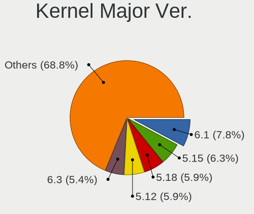
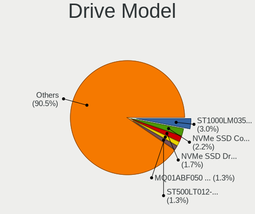
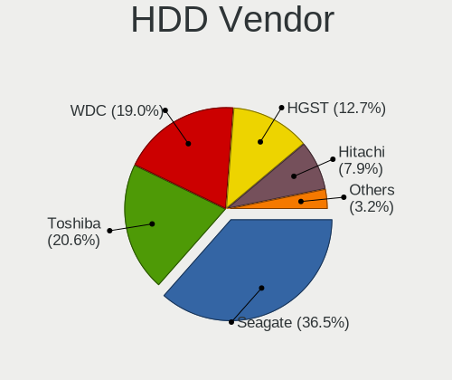
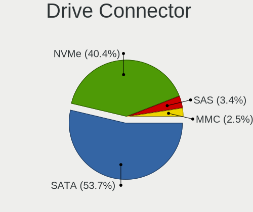
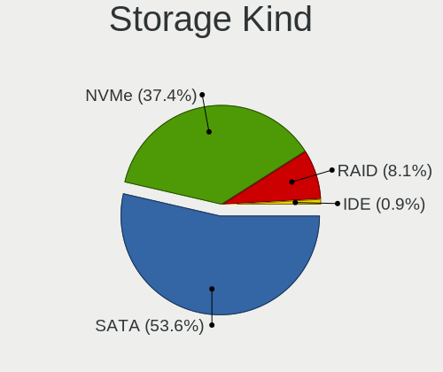
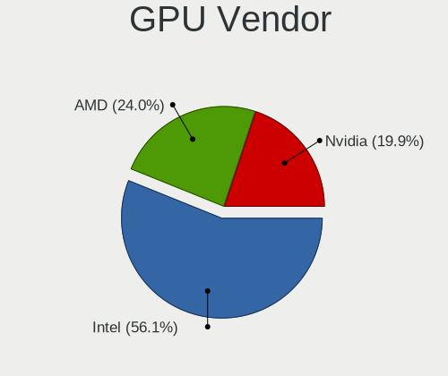
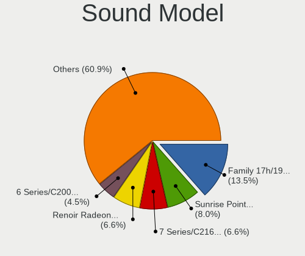

Artix - Tested Hardware & Statistics (Notebooks)
------------------------------------------------

A project to collect tested hardware configurations for Artix.

Anyone can contribute to this report by the [hw-probe](https://github.com/linuxhw/hw-probe) tool:

    sudo -E hw-probe -all -upload

Please contribute! Especially if your hardware is rare.

Contents
--------

* [ Test Cases ](#test-cases)

* [ System ](#system)
  - [ OS                       ](#os)
  - [ OS Family                ](#os-family)
  - [ Kernel                   ](#kernel)
  - [ Kernel Family            ](#kernel-family)
  - [ Kernel Major Ver.        ](#kernel-major-ver)
  - [ Arch                     ](#arch)
  - [ DE                       ](#de)
  - [ Display Server           ](#display-server)
  - [ Display Manager          ](#display-manager)
  - [ OS Lang                  ](#os-lang)
  - [ Boot Mode                ](#boot-mode)
  - [ Filesystem               ](#filesystem)
  - [ Part. scheme             ](#part-scheme)
  - [ Dual Boot with Linux/BSD ](#dual-boot-with-linuxbsd)
  - [ Dual Boot (Win)          ](#dual-boot-win)

* [ Board ](#board)
  - [ Vendor                   ](#vendor)
  - [ Model                    ](#model)
  - [ Model Family             ](#model-family)
  - [ MFG Year                 ](#mfg-year)
  - [ Form Factor              ](#form-factor)
  - [ Secure Boot              ](#secure-boot)
  - [ Coreboot                 ](#coreboot)
  - [ RAM Size                 ](#ram-size)
  - [ RAM Used                 ](#ram-used)
  - [ Total Drives             ](#total-drives)
  - [ Has CD-ROM               ](#has-cd-rom)
  - [ Has Ethernet             ](#has-ethernet)
  - [ Has WiFi                 ](#has-wifi)
  - [ Has Bluetooth            ](#has-bluetooth)

* [ Location ](#location)
  - [ Country                  ](#country)
  - [ City                     ](#city)

* [ Drives ](#drives)
  - [ Drive Vendor             ](#drive-vendor)
  - [ Drive Model              ](#drive-model)
  - [ HDD Vendor               ](#hdd-vendor)
  - [ SSD Vendor               ](#ssd-vendor)
  - [ Drive Kind               ](#drive-kind)
  - [ Drive Connector          ](#drive-connector)
  - [ Drive Size               ](#drive-size)
  - [ Space Total              ](#space-total)
  - [ Space Used               ](#space-used)
  - [ Malfunc. Drives          ](#malfunc-drives)
  - [ Malfunc. Drive Vendor    ](#malfunc-drive-vendor)
  - [ Malfunc. HDD Vendor      ](#malfunc-hdd-vendor)
  - [ Malfunc. Drive Kind      ](#malfunc-drive-kind)
  - [ Failed Drives            ](#failed-drives)
  - [ Failed Drive Vendor      ](#failed-drive-vendor)
  - [ Drive Status             ](#drive-status)

* [ Storage controller ](#storage-controller)
  - [ Storage Vendor           ](#storage-vendor)
  - [ Storage Model            ](#storage-model)
  - [ Storage Kind             ](#storage-kind)

* [ Processor ](#processor)
  - [ CPU Vendor               ](#cpu-vendor)
  - [ CPU Model                ](#cpu-model)
  - [ CPU Model Family         ](#cpu-model-family)
  - [ CPU Cores                ](#cpu-cores)
  - [ CPU Sockets              ](#cpu-sockets)
  - [ CPU Threads              ](#cpu-threads)
  - [ CPU Op-Modes             ](#cpu-op-modes)
  - [ CPU Microcode            ](#cpu-microcode)
  - [ CPU Microarch            ](#cpu-microarch)

* [ Graphics ](#graphics)
  - [ GPU Vendor               ](#gpu-vendor)
  - [ GPU Model                ](#gpu-model)
  - [ GPU Combo                ](#gpu-combo)
  - [ GPU Driver               ](#gpu-driver)
  - [ GPU Memory               ](#gpu-memory)

* [ Monitor ](#monitor)
  - [ Monitor Vendor           ](#monitor-vendor)
  - [ Monitor Model            ](#monitor-model)
  - [ Monitor Resolution       ](#monitor-resolution)
  - [ Monitor Diagonal         ](#monitor-diagonal)
  - [ Monitor Width            ](#monitor-width)
  - [ Aspect Ratio             ](#aspect-ratio)
  - [ Monitor Area             ](#monitor-area)
  - [ Pixel Density            ](#pixel-density)
  - [ Multiple Monitors        ](#multiple-monitors)

* [ Network ](#network)
  - [ Net Controller Vendor    ](#net-controller-vendor)
  - [ Net Controller Model     ](#net-controller-model)
  - [ Wireless Vendor          ](#wireless-vendor)
  - [ Wireless Model           ](#wireless-model)
  - [ Ethernet Vendor          ](#ethernet-vendor)
  - [ Ethernet Model           ](#ethernet-model)
  - [ Net Controller Kind      ](#net-controller-kind)
  - [ Used Controller          ](#used-controller)
  - [ NICs                     ](#nics)
  - [ IPv6                     ](#ipv6)

* [ Bluetooth ](#bluetooth)
  - [ Bluetooth Vendor         ](#bluetooth-vendor)
  - [ Bluetooth Model          ](#bluetooth-model)

* [ Sound ](#sound)
  - [ Sound Vendor             ](#sound-vendor)
  - [ Sound Model              ](#sound-model)

* [ Memory ](#memory)
  - [ Memory Vendor            ](#memory-vendor)
  - [ Memory Model             ](#memory-model)
  - [ Memory Kind              ](#memory-kind)
  - [ Memory Form Factor       ](#memory-form-factor)
  - [ Memory Size              ](#memory-size)
  - [ Memory Speed             ](#memory-speed)

* [ Printers & scanners ](#printers--scanners)
  - [ Printer Vendor           ](#printer-vendor)
  - [ Printer Model            ](#printer-model)
  - [ Scanner Vendor           ](#scanner-vendor)
  - [ Scanner Model            ](#scanner-model)

* [ Camera ](#camera)
  - [ Camera Vendor            ](#camera-vendor)
  - [ Camera Model             ](#camera-model)

* [ Security ](#security)
  - [ Fingerprint Vendor       ](#fingerprint-vendor)
  - [ Fingerprint Model        ](#fingerprint-model)
  - [ Chipcard Vendor          ](#chipcard-vendor)
  - [ Chipcard Model           ](#chipcard-model)

* [ Unsupported ](#unsupported)
  - [ Unsupported Devices      ](#unsupported-devices)
  - [ Unsupported Device Types ](#unsupported-device-types)

Test Cases
----------

Total: 206

| Vendor        | Model                       | Probe                                                      | Date         |
|---------------|-----------------------------|------------------------------------------------------------|--------------|
| ASUSTek       | VivoBook_ASUSLaptop X515... | [80d949b057](https://linux-hardware.org/?probe=80d949b057) | Nov 04, 2023 |
| Acer          | Aspire E5-573G              | [7814bb818a](https://linux-hardware.org/?probe=7814bb818a) | Oct 23, 2023 |
| Apple         | MacBookPro10,2              | [f83f9bba48](https://linux-hardware.org/?probe=f83f9bba48) | Oct 15, 2023 |
| HP            | Grunt                       | [af80cd9bd6](https://linux-hardware.org/?probe=af80cd9bd6) | Oct 13, 2023 |
| Dell          | Precision 7560              | [7cffa06ab3](https://linux-hardware.org/?probe=7cffa06ab3) | Oct 02, 2023 |
| Lenovo        | IdeaPad 3 15ADA6 82KR       | [58552d0532](https://linux-hardware.org/?probe=58552d0532) | Sep 30, 2023 |
| Dell          | Latitude 5431               | [d9ea685862](https://linux-hardware.org/?probe=d9ea685862) | Sep 27, 2023 |
| Lenovo        | ThinkPad T480 20L50018US    | [e28cf08ffe](https://linux-hardware.org/?probe=e28cf08ffe) | Sep 24, 2023 |
| Lenovo        | ThinkPad T480 20L50018US    | [46ee09f5bd](https://linux-hardware.org/?probe=46ee09f5bd) | Sep 21, 2023 |
| Timi          | A30                         | [7e932a59a6](https://linux-hardware.org/?probe=7e932a59a6) | Sep 13, 2023 |
| HP            | ProBook 455 G7              | [7ae653c6c1](https://linux-hardware.org/?probe=7ae653c6c1) | Sep 05, 2023 |
| HP            | 15                          | [db9d960b39](https://linux-hardware.org/?probe=db9d960b39) | Sep 03, 2023 |
| Dell          | Inspiron 15 3511            | [3713bc7b70](https://linux-hardware.org/?probe=3713bc7b70) | Aug 29, 2023 |
| Dell          | Inspiron 15 3511            | [08efa3dcf3](https://linux-hardware.org/?probe=08efa3dcf3) | Aug 24, 2023 |
| Lenovo        | ThinkPad R61 7732NDG        | [b0d510a7ad](https://linux-hardware.org/?probe=b0d510a7ad) | Aug 24, 2023 |
| Acer          | Aspire S5-371               | [210e2bbe4d](https://linux-hardware.org/?probe=210e2bbe4d) | Aug 16, 2023 |
| Acer          | Aspire S5-371               | [c5b4372bbf](https://linux-hardware.org/?probe=c5b4372bbf) | Aug 16, 2023 |
| HP            | 255 G8 Notebook PC          | [5b67a1f9cf](https://linux-hardware.org/?probe=5b67a1f9cf) | Aug 06, 2023 |
| Lenovo        | ThinkPad Edge E431 6277C... | [6c542a6490](https://linux-hardware.org/?probe=6c542a6490) | Aug 03, 2023 |
| Dell          | Inspiron 15-3552            | [3b317edaf6](https://linux-hardware.org/?probe=3b317edaf6) | Jul 25, 2023 |
| Lenovo        | IdeaPad 330S-15IKB 81F5     | [25f87e7de3](https://linux-hardware.org/?probe=25f87e7de3) | Jul 13, 2023 |
| Lenovo        | ThinkPad T420 4180AG3       | [21fe808c05](https://linux-hardware.org/?probe=21fe808c05) | Jul 02, 2023 |
| ASUSTek       | K53E                        | [8e1f4ee31f](https://linux-hardware.org/?probe=8e1f4ee31f) | Jun 27, 2023 |
| HUAWEI        | HVY-WXX9                    | [8649d41483](https://linux-hardware.org/?probe=8649d41483) | Jun 15, 2023 |
| Notebook      | N141CU                      | [4af09bd0c3](https://linux-hardware.org/?probe=4af09bd0c3) | Jun 02, 2023 |
| GPD           | P2 MAX                      | [3c083ee96d](https://linux-hardware.org/?probe=3c083ee96d) | May 29, 2023 |
| ASUSTek       | GL702ZC                     | [c60d7fabbb](https://linux-hardware.org/?probe=c60d7fabbb) | May 25, 2023 |
| Acer          | Nitro AN515-52              | [b5a283de1d](https://linux-hardware.org/?probe=b5a283de1d) | May 25, 2023 |
| Acer          | Nitro AN515-52              | [0a65452634](https://linux-hardware.org/?probe=0a65452634) | May 24, 2023 |
| ASUSTek       | GL702ZC                     | [9764417bf8](https://linux-hardware.org/?probe=9764417bf8) | May 24, 2023 |
| ASUSTek       | VivoBook_ASUS Laptop X50... | [a1e2fa6222](https://linux-hardware.org/?probe=a1e2fa6222) | May 24, 2023 |
| HP            | Laptop 15s-eq2xxx           | [b3eaf738e4](https://linux-hardware.org/?probe=b3eaf738e4) | May 18, 2023 |
| Lenovo        | ThinkPad W520 4284W2U       | [429d4451c9](https://linux-hardware.org/?probe=429d4451c9) | May 16, 2023 |
| HP            | EliteBook 2560p             | [2a50b288f8](https://linux-hardware.org/?probe=2a50b288f8) | May 15, 2023 |
| Lenovo        | S20-30 20421                | [cc4f992884](https://linux-hardware.org/?probe=cc4f992884) | May 12, 2023 |
| Dell          | Inspiron 16 Plus 7620       | [ea808c2e80](https://linux-hardware.org/?probe=ea808c2e80) | May 08, 2023 |
| Dell          | Inspiron 16 Plus 7620       | [382b81c0d1](https://linux-hardware.org/?probe=382b81c0d1) | May 08, 2023 |
| ASUSTek       | ASUS TUF Dash F15 FX517Z... | [f2ad30321e](https://linux-hardware.org/?probe=f2ad30321e) | Apr 29, 2023 |
| ASUSTek       | VivoBook_ASUSLaptop X712... | [6c2d6d52e9](https://linux-hardware.org/?probe=6c2d6d52e9) | Apr 17, 2023 |
| Lenovo        | IdeaPad 130-14IKB 81H6      | [a2ba637448](https://linux-hardware.org/?probe=a2ba637448) | Mar 29, 2023 |
| Dell          | G3 3500                     | [aa79addc8c](https://linux-hardware.org/?probe=aa79addc8c) | Mar 29, 2023 |
| Samsung       | 300E5EV/300E4EV/270E5EV/... | [6c74aa3736](https://linux-hardware.org/?probe=6c74aa3736) | Mar 02, 2023 |
| Lenovo        | ThinkPad T430 2344BZU       | [245d23aff3](https://linux-hardware.org/?probe=245d23aff3) | Feb 26, 2023 |
| HP            | 245 G8 Notebook PC          | [1236b5c48f](https://linux-hardware.org/?probe=1236b5c48f) | Feb 19, 2023 |
| HUAWEI        | KPR-WX9                     | [1f44fd5a86](https://linux-hardware.org/?probe=1f44fd5a86) | Feb 18, 2023 |
| ONE-NETBOO... | One-Mix3 Pro                | [9869b4dd9c](https://linux-hardware.org/?probe=9869b4dd9c) | Feb 15, 2023 |
| Gigabyte      | RC14UD                      | [cce1ca1ac5](https://linux-hardware.org/?probe=cce1ca1ac5) | Feb 14, 2023 |
| Fujitsu       | LIFEBOOK A512               | [92cac1a802](https://linux-hardware.org/?probe=92cac1a802) | Feb 13, 2023 |
| Lenovo        | ThinkPad L15 Gen 1 20U7S... | [84411df81a](https://linux-hardware.org/?probe=84411df81a) | Feb 06, 2023 |
| Samsung       | 350V5C/351V5C/3540VC/344... | [bd7e955a3e](https://linux-hardware.org/?probe=bd7e955a3e) | Jan 27, 2023 |
| Samsung       | 350V5C/351V5C/3540VC/344... | [1f74ea5c27](https://linux-hardware.org/?probe=1f74ea5c27) | Jan 27, 2023 |
| Lenovo        | B50-80 80EW                 | [5f584c387e](https://linux-hardware.org/?probe=5f584c387e) | Jan 25, 2023 |
| Toshiba       | Satellite P775              | [4ac7834c5f](https://linux-hardware.org/?probe=4ac7834c5f) | Jan 16, 2023 |
| Toshiba       | Satellite P775              | [99e632c9a9](https://linux-hardware.org/?probe=99e632c9a9) | Jan 16, 2023 |
| Lenovo        | ThinkPad T430 23427YU       | [3ca2dd056d](https://linux-hardware.org/?probe=3ca2dd056d) | Jan 16, 2023 |
| HONOR         | BMH-WCX9                    | [815525e6d2](https://linux-hardware.org/?probe=815525e6d2) | Dec 27, 2022 |
| ASUSTek       | GL702ZC                     | [de8b2bcfab](https://linux-hardware.org/?probe=de8b2bcfab) | Dec 03, 2022 |
| GPD           | P2 MAX                      | [dce4c87de8](https://linux-hardware.org/?probe=dce4c87de8) | Dec 03, 2022 |
| Acer          | Aspire A315-56              | [a1ec8cb1b2](https://linux-hardware.org/?probe=a1ec8cb1b2) | Nov 29, 2022 |
| ASUSTek       | N53SV                       | [f42473e3f6](https://linux-hardware.org/?probe=f42473e3f6) | Nov 14, 2022 |
| Lenovo        | IdeaPad 5 14ITL05 82FE      | [75c1d24fcd](https://linux-hardware.org/?probe=75c1d24fcd) | Nov 13, 2022 |
| Lenovo        | IdeaPad 5 14ITL05 82FE      | [189dd51cc3](https://linux-hardware.org/?probe=189dd51cc3) | Nov 13, 2022 |
| Samsung       | R425D/R525D                 | [85d17374e7](https://linux-hardware.org/?probe=85d17374e7) | Nov 12, 2022 |
| ASUSTek       | ASUS TUF Gaming F17 FX70... | [31e940a232](https://linux-hardware.org/?probe=31e940a232) | Nov 10, 2022 |
| HP            | Pavilion 15                 | [93ef42ccbf](https://linux-hardware.org/?probe=93ef42ccbf) | Nov 03, 2022 |
| ASUSTek       | ASUS TUF Gaming F17 FX70... | [eeb167d869](https://linux-hardware.org/?probe=eeb167d869) | Nov 02, 2022 |
| MSI           | GF65 Thin 10SDR             | [debce2faa6](https://linux-hardware.org/?probe=debce2faa6) | Oct 20, 2022 |
| ASUSTek       | VivoBook 15_ASUS Laptop ... | [7dce56f55d](https://linux-hardware.org/?probe=7dce56f55d) | Oct 10, 2022 |
| HP            | Pavilion g4                 | [19fe60b14c](https://linux-hardware.org/?probe=19fe60b14c) | Oct 07, 2022 |
| Lenovo        | IdeaPad 5 Pro 16ACH6 82L... | [7d1f20cf17](https://linux-hardware.org/?probe=7d1f20cf17) | Oct 03, 2022 |
| Lenovo        | IdeaPad 5 Pro 16ACH6 82L... | [dfd00dd2d1](https://linux-hardware.org/?probe=dfd00dd2d1) | Oct 03, 2022 |
| Acer          | Predator PH315-51           | [68f7384e7a](https://linux-hardware.org/?probe=68f7384e7a) | Sep 30, 2022 |
| Acer          | Aspire VN7-592G             | [cfc28181e5](https://linux-hardware.org/?probe=cfc28181e5) | Sep 25, 2022 |
| Notebook      | N141CU                      | [9a03ce91af](https://linux-hardware.org/?probe=9a03ce91af) | Sep 04, 2022 |
| HP            | Laptop 15s-eq1xxx           | [a37633e1e2](https://linux-hardware.org/?probe=a37633e1e2) | Aug 24, 2022 |
| Dell          | Inspiron 5520               | [6b03bfc62e](https://linux-hardware.org/?probe=6b03bfc62e) | Aug 13, 2022 |
| ASUSTek       | ASUS TUF Gaming F15 FX50... | [3025bd4ded](https://linux-hardware.org/?probe=3025bd4ded) | Aug 05, 2022 |
| Dell          | Inspiron 3541               | [ab643dc6b0](https://linux-hardware.org/?probe=ab643dc6b0) | Jul 30, 2022 |
| Dell          | Latitude E7440              | [deea307e9b](https://linux-hardware.org/?probe=deea307e9b) | Jul 27, 2022 |
| Dell          | Latitude E7440              | [e2d8510882](https://linux-hardware.org/?probe=e2d8510882) | Jul 27, 2022 |
| Acer          | Aspire A315-23              | [304f750248](https://linux-hardware.org/?probe=304f750248) | Jul 08, 2022 |
| MOTILE        | M141                        | [59c616a04e](https://linux-hardware.org/?probe=59c616a04e) | Jun 30, 2022 |
| HUAWEI        | WRT-WX9                     | [8ddbebd4b1](https://linux-hardware.org/?probe=8ddbebd4b1) | Jun 28, 2022 |
| AXIOO         | Mybook 14E                  | [499861f5e9](https://linux-hardware.org/?probe=499861f5e9) | Jun 19, 2022 |
| Timi          | RedmiBook 14 II             | [a4b535cdee](https://linux-hardware.org/?probe=a4b535cdee) | Jun 15, 2022 |
| Lenovo        | ThinkPad T440s 20ARS0MV0... | [3c23c9dfc6](https://linux-hardware.org/?probe=3c23c9dfc6) | Jun 08, 2022 |
| ASUSTek       | X553MA                      | [2a3ac45d9c](https://linux-hardware.org/?probe=2a3ac45d9c) | Jun 05, 2022 |
| Dell          | Precision M6600             | [bb044c066c](https://linux-hardware.org/?probe=bb044c066c) | Jun 05, 2022 |
| Dell          | Latitude 5490               | [630b63edff](https://linux-hardware.org/?probe=630b63edff) | Jun 02, 2022 |
| LG Electro... | 17Z990-R.AAC9U1             | [dfacdafc7f](https://linux-hardware.org/?probe=dfacdafc7f) | May 11, 2022 |
| Acer          | Nitro AN515-52              | [5122079c78](https://linux-hardware.org/?probe=5122079c78) | May 10, 2022 |
| Lenovo        | ThinkPad T480 MFG_IN_GO     | [9792863fc7](https://linux-hardware.org/?probe=9792863fc7) | May 08, 2022 |
| Lenovo        | ThinkPad T480 MFG_IN_GO     | [bba77106b4](https://linux-hardware.org/?probe=bba77106b4) | May 08, 2022 |
| HP            | 15                          | [d9ed47d44c](https://linux-hardware.org/?probe=d9ed47d44c) | Apr 23, 2022 |
| Lenovo        | ThinkBook 15 G2 ITL 20VE    | [85b1934bfd](https://linux-hardware.org/?probe=85b1934bfd) | Apr 21, 2022 |
| ASUSTek       | GX501VIK                    | [076208c6fd](https://linux-hardware.org/?probe=076208c6fd) | Apr 15, 2022 |
| ASUSTek       | GX501VIK                    | [15c4c7877b](https://linux-hardware.org/?probe=15c4c7877b) | Apr 15, 2022 |
| Lenovo        | ThinkPad T430 2350BC6       | [c2ffb2a421](https://linux-hardware.org/?probe=c2ffb2a421) | Apr 14, 2022 |
| HP            | 246                         | [4ef673dd00](https://linux-hardware.org/?probe=4ef673dd00) | Apr 10, 2022 |
| Lenovo        | ThinkPad T430 2347H76       | [493f378237](https://linux-hardware.org/?probe=493f378237) | Mar 10, 2022 |
| HP            | Laptop 14s-dq2xxx           | [92db061239](https://linux-hardware.org/?probe=92db061239) | Mar 09, 2022 |
| Lenovo        | IdeaPad Y500 20193          | [604362a51f](https://linux-hardware.org/?probe=604362a51f) | Feb 18, 2022 |
| Notebook      | N141CU                      | [029f48bc53](https://linux-hardware.org/?probe=029f48bc53) | Feb 16, 2022 |
| Acer          | Aspire V3-472PG             | [70c80ae356](https://linux-hardware.org/?probe=70c80ae356) | Feb 16, 2022 |
| HP            | Laptop 15-ef1xxx            | [6cf7935dcc](https://linux-hardware.org/?probe=6cf7935dcc) | Feb 14, 2022 |
| ASUSTek       | 1225C                       | [b780589dd0](https://linux-hardware.org/?probe=b780589dd0) | Feb 07, 2022 |
| HP            | Laptop 15-ef1xxx            | [6a49ff6317](https://linux-hardware.org/?probe=6a49ff6317) | Jan 18, 2022 |
| Lenovo        | G400s 20244                 | [9ac1aa04cc](https://linux-hardware.org/?probe=9ac1aa04cc) | Jan 15, 2022 |
| Lenovo        | ThinkPad E14 Gen 2 20T60... | [945649c354](https://linux-hardware.org/?probe=945649c354) | Jan 07, 2022 |
| MSI           | Modern 15 A11M              | [bef1d4552a](https://linux-hardware.org/?probe=bef1d4552a) | Jan 07, 2022 |
| Lenovo        | Legion 5 15ARH05H 82B1      | [a568bef730](https://linux-hardware.org/?probe=a568bef730) | Jan 05, 2022 |
| Lenovo        | B570e HuronRiver Platfor... | [a6c63e1079](https://linux-hardware.org/?probe=a6c63e1079) | Dec 17, 2021 |
| Dell          | Latitude E6440              | [5e572f557c](https://linux-hardware.org/?probe=5e572f557c) | Dec 16, 2021 |
| Dell          | Latitude E6440              | [ac94463e37](https://linux-hardware.org/?probe=ac94463e37) | Dec 16, 2021 |
| ASUSTek       | K50IE                       | [49a6b75a43](https://linux-hardware.org/?probe=49a6b75a43) | Nov 29, 2021 |
| Lenovo        | ThinkBook 15 G2 ITL 20VE    | [0e12642e78](https://linux-hardware.org/?probe=0e12642e78) | Nov 27, 2021 |
| Timi          | RedmiBook 14 II             | [3e700c917e](https://linux-hardware.org/?probe=3e700c917e) | Nov 25, 2021 |
| Lenovo        | ThinkPad 11e 5th Gen 20L... | [9a5098383d](https://linux-hardware.org/?probe=9a5098383d) | Nov 24, 2021 |
| Lenovo        | ThinkPad T480s 20L8S3D40... | [76be488014](https://linux-hardware.org/?probe=76be488014) | Nov 07, 2021 |
| Lenovo        | ThinkPad T480s 20L8S3D40... | [f96363ccf5](https://linux-hardware.org/?probe=f96363ccf5) | Nov 07, 2021 |
| HP            | ProBook 450 G6              | [ded9086b7c](https://linux-hardware.org/?probe=ded9086b7c) | Nov 06, 2021 |
| Timi          | RedmiBook 14 II             | [038c0ad664](https://linux-hardware.org/?probe=038c0ad664) | Nov 03, 2021 |
| Timi          | RedmiBook 14 II             | [d8ae8a047c](https://linux-hardware.org/?probe=d8ae8a047c) | Nov 02, 2021 |
| Acer          | Swift SF314-59              | [c764d879fb](https://linux-hardware.org/?probe=c764d879fb) | Sep 27, 2021 |
| Acer          | Swift SF314-59              | [9426a6d4df](https://linux-hardware.org/?probe=9426a6d4df) | Sep 23, 2021 |
| Acer          | Aspire E5-575               | [d32c769f65](https://linux-hardware.org/?probe=d32c769f65) | Sep 22, 2021 |
| HP            | Laptop 14s-cf3xxx           | [5b9800e687](https://linux-hardware.org/?probe=5b9800e687) | Sep 06, 2021 |
| Dell          | Precision M6600             | [3c06ad8f67](https://linux-hardware.org/?probe=3c06ad8f67) | Sep 06, 2021 |
| ASUSTek       | GL702ZC                     | [7cb34b0a2e](https://linux-hardware.org/?probe=7cb34b0a2e) | Aug 10, 2021 |
| ASUSTek       | GL702ZC                     | [8ab07e196d](https://linux-hardware.org/?probe=8ab07e196d) | Aug 09, 2021 |
| GPD           | P2 MAX                      | [bf70dbe409](https://linux-hardware.org/?probe=bf70dbe409) | Aug 07, 2021 |
| GPD           | P2 MAX                      | [a4e8eb7d9e](https://linux-hardware.org/?probe=a4e8eb7d9e) | Aug 07, 2021 |
| GPD           | P2 MAX                      | [43075e1581](https://linux-hardware.org/?probe=43075e1581) | Jul 23, 2021 |
| HP            | 250 G3                      | [b1a0952727](https://linux-hardware.org/?probe=b1a0952727) | Jul 19, 2021 |
| Dell          | Inspiron 3442               | [a4e06ddea2](https://linux-hardware.org/?probe=a4e06ddea2) | Jul 02, 2021 |
| Lenovo        | LaVie Z 20FF0012US          | [789d556ef6](https://linux-hardware.org/?probe=789d556ef6) | Jul 01, 2021 |
| Lenovo        | ThinkPad W500 4063CJ5       | [89bbafa02e](https://linux-hardware.org/?probe=89bbafa02e) | Jun 22, 2021 |
| HP            | 15                          | [4f6c5d8c89](https://linux-hardware.org/?probe=4f6c5d8c89) | Jun 22, 2021 |
| Apple         | MacBookAir7,2               | [6a459ac265](https://linux-hardware.org/?probe=6a459ac265) | Jun 16, 2021 |
| HP            | 250 G7 Notebook PC          | [10803bcbc4](https://linux-hardware.org/?probe=10803bcbc4) | Jun 07, 2021 |
| HP            | 250 G7 Notebook PC          | [445e09faa7](https://linux-hardware.org/?probe=445e09faa7) | Jun 07, 2021 |
| Dell          | Precision 7550              | [5d7ecb9bbb](https://linux-hardware.org/?probe=5d7ecb9bbb) | Jun 07, 2021 |
| Lenovo        | IdeaPad Gaming 3 15IMH05... | [de11ab3cc4](https://linux-hardware.org/?probe=de11ab3cc4) | May 31, 2021 |
| Lenovo        | ThinkPad T14 Gen 1 20UES... | [4688dc5b46](https://linux-hardware.org/?probe=4688dc5b46) | May 29, 2021 |
| Dell          | Precision 7550              | [206eeb06c9](https://linux-hardware.org/?probe=206eeb06c9) | May 23, 2021 |
| UNOWHY        | Y13G010S4EI                 | [62d883cffd](https://linux-hardware.org/?probe=62d883cffd) | May 18, 2021 |
| Lenovo        | ThinkPad W500 4063CJ5       | [85def78a94](https://linux-hardware.org/?probe=85def78a94) | May 02, 2021 |
| HP            | Laptop 17z-ca300            | [ea09357867](https://linux-hardware.org/?probe=ea09357867) | Apr 26, 2021 |
| Acer          | Aspire V3-572PG             | [a874b34c2a](https://linux-hardware.org/?probe=a874b34c2a) | Apr 12, 2021 |
| Apple         | MacBookAir7,2               | [7f14077ecc](https://linux-hardware.org/?probe=7f14077ecc) | Mar 29, 2021 |
| Apple         | MacBookPro11,1              | [666815417c](https://linux-hardware.org/?probe=666815417c) | Mar 28, 2021 |
| Apple         | MacBookPro11,1              | [d2027dc1c2](https://linux-hardware.org/?probe=d2027dc1c2) | Mar 24, 2021 |
| MSI           | GP72 7RDX                   | [a60abbdcd4](https://linux-hardware.org/?probe=a60abbdcd4) | Mar 18, 2021 |
| Quanta        | SWH                         | [dc6df30340](https://linux-hardware.org/?probe=dc6df30340) | Mar 18, 2021 |
| Lenovo        | ThinkPad T14 Gen 1 20S1S... | [c2599a37c2](https://linux-hardware.org/?probe=c2599a37c2) | Mar 08, 2021 |
| Lenovo        | ThinkPad T14 Gen 1 20UES... | [76006e9ba5](https://linux-hardware.org/?probe=76006e9ba5) | Mar 01, 2021 |
| Dell          | Precision 7550              | [c1c4fd3b1a](https://linux-hardware.org/?probe=c1c4fd3b1a) | Feb 21, 2021 |
| Lenovo        | ThinkPad W500 4063CJ5       | [b25144d80b](https://linux-hardware.org/?probe=b25144d80b) | Feb 18, 2021 |
| Lenovo        | ThinkPad P1 Gen 3 20TH00... | [c2408f8152](https://linux-hardware.org/?probe=c2408f8152) | Feb 16, 2021 |
| Lenovo        | ThinkPad W500 4063CJ5       | [838f747450](https://linux-hardware.org/?probe=838f747450) | Feb 14, 2021 |
| Lenovo        | ThinkPad W500 4063CJ5       | [214d72ae23](https://linux-hardware.org/?probe=214d72ae23) | Feb 12, 2021 |
| Acer          | Aspire 5733Z                | [b15b48fb21](https://linux-hardware.org/?probe=b15b48fb21) | Jan 29, 2021 |
| ASUSTek       | K53SC                       | [11547cb913](https://linux-hardware.org/?probe=11547cb913) | Jan 22, 2021 |
| ASUSTek       | K53SC                       | [061c52c2ff](https://linux-hardware.org/?probe=061c52c2ff) | Jan 22, 2021 |
| HP            | ProBook 450 G6              | [40e4f5d2fb](https://linux-hardware.org/?probe=40e4f5d2fb) | Jan 21, 2021 |
| Dell          | Precision 5520              | [a714973647](https://linux-hardware.org/?probe=a714973647) | Jan 16, 2021 |
| ASUSTek       | E402NA                      | [ac894b264b](https://linux-hardware.org/?probe=ac894b264b) | Jan 10, 2021 |
| Apple         | MacBookPro11,1              | [e8ac486033](https://linux-hardware.org/?probe=e8ac486033) | Jan 09, 2021 |
| Acer          | Aspire A315-53              | [abac7a5b07](https://linux-hardware.org/?probe=abac7a5b07) | Jan 02, 2021 |
| Dell          | Precision 7550              | [9c8b2f2ad6](https://linux-hardware.org/?probe=9c8b2f2ad6) | Dec 30, 2020 |
| Gigabyte      | B450M DS3H-CF               | [b9c02872aa](https://linux-hardware.org/?probe=b9c02872aa) | Dec 29, 2020 |
| Dell          | Latitude E6530              | [46704587d1](https://linux-hardware.org/?probe=46704587d1) | Dec 25, 2020 |
| Gigabyte      | B450M DS3H-CF               | [d2701aa534](https://linux-hardware.org/?probe=d2701aa534) | Dec 24, 2020 |
| HP            | 250 G4 Notebook PC          | [178de0b283](https://linux-hardware.org/?probe=178de0b283) | Dec 24, 2020 |
| Lenovo        | ThinkPad W500 4063CJ5       | [a905f1377a](https://linux-hardware.org/?probe=a905f1377a) | Dec 20, 2020 |
| GPD           | P2 MAX                      | [f6249e6387](https://linux-hardware.org/?probe=f6249e6387) | Dec 11, 2020 |
| Sony          | VPCCB17FG                   | [5a24dc3231](https://linux-hardware.org/?probe=5a24dc3231) | Nov 26, 2020 |
| Acer          | Aspire A315-53              | [bc80dc5050](https://linux-hardware.org/?probe=bc80dc5050) | Nov 25, 2020 |
| Lenovo        | IdeaPad L340-17IRH Gamin... | [53a1586791](https://linux-hardware.org/?probe=53a1586791) | Nov 12, 2020 |
| HP            | OMEN Laptop 15-en0xxx       | [61653c183a](https://linux-hardware.org/?probe=61653c183a) | Oct 30, 2020 |
| ASUSTek       | VivoBook_ASUS Laptop X50... | [f18b33a8f0](https://linux-hardware.org/?probe=f18b33a8f0) | Oct 25, 2020 |
| ASUSTek       | VivoBook_ASUS Laptop X50... | [acc8c4e663](https://linux-hardware.org/?probe=acc8c4e663) | Oct 25, 2020 |
| Lenovo        | ThinkPad W500 4063CJ5       | [7c29a97dff](https://linux-hardware.org/?probe=7c29a97dff) | Oct 21, 2020 |
| Lenovo        | ThinkPad W500 4063CJ5       | [961c0be28a](https://linux-hardware.org/?probe=961c0be28a) | Oct 18, 2020 |
| Dell          | Inspiron 5570               | [038ef2ebaa](https://linux-hardware.org/?probe=038ef2ebaa) | Oct 15, 2020 |
| Lenovo        | IdeaPad 5 15IIL05 81YK      | [b877caba0b](https://linux-hardware.org/?probe=b877caba0b) | Oct 13, 2020 |
| HP            | 255 G7 Notebook PC          | [026a4d80f6](https://linux-hardware.org/?probe=026a4d80f6) | Oct 08, 2020 |
| Dell          | Precision 7550              | [c574758854](https://linux-hardware.org/?probe=c574758854) | Sep 19, 2020 |
| Dell          | Precision 7550              | [14d1876313](https://linux-hardware.org/?probe=14d1876313) | Aug 31, 2020 |
| Dell          | Precision 7550              | [d44c1dbf60](https://linux-hardware.org/?probe=d44c1dbf60) | Aug 31, 2020 |
| Dell          | Precision 7550              | [25d7f344e9](https://linux-hardware.org/?probe=25d7f344e9) | Aug 29, 2020 |
| Acer          | Nitro AN515-51              | [4f2724d5ad](https://linux-hardware.org/?probe=4f2724d5ad) | Aug 16, 2020 |
| Lenovo        | IdeaPad 330-15IKB 81DE      | [aae7fd244a](https://linux-hardware.org/?probe=aae7fd244a) | Aug 06, 2020 |
| Lenovo        | IdeaPad 5 15IIL05 81YK      | [5e3d9be29a](https://linux-hardware.org/?probe=5e3d9be29a) | Aug 01, 2020 |
| Lenovo        | IdeaPad 510-15IKB 80SV      | [d5b2c55949](https://linux-hardware.org/?probe=d5b2c55949) | Jul 27, 2020 |
| Lenovo        | ThinkPad T420 4236H45       | [61fd4ce395](https://linux-hardware.org/?probe=61fd4ce395) | Jul 20, 2020 |
| Lenovo        | IdeaPad 510-15IKB 80SV      | [0af3ac770f](https://linux-hardware.org/?probe=0af3ac770f) | Jul 06, 2020 |
| Notebook      | N130BU                      | [e1b81e4880](https://linux-hardware.org/?probe=e1b81e4880) | Jul 05, 2020 |
| Lenovo        | IdeaPad 510-15IKB 80SV      | [051fa5784a](https://linux-hardware.org/?probe=051fa5784a) | Jul 02, 2020 |
| Gigabyte      | AERO 15-X9                  | [7cb20a8170](https://linux-hardware.org/?probe=7cb20a8170) | Jul 01, 2020 |
| Gigabyte      | AERO 15-X9                  | [efaa58fcc8](https://linux-hardware.org/?probe=efaa58fcc8) | Jun 14, 2020 |
| Gigabyte      | AERO 15-X9                  | [b5fee1bf94](https://linux-hardware.org/?probe=b5fee1bf94) | Jun 12, 2020 |
| Acer          | Aspire E5-575G              | [cd633c729b](https://linux-hardware.org/?probe=cd633c729b) | Apr 29, 2020 |
| Dell          | Precision 3540              | [3e582eb1b9](https://linux-hardware.org/?probe=3e582eb1b9) | Mar 30, 2020 |
| Dell          | Precision 3540              | [2a446cd098](https://linux-hardware.org/?probe=2a446cd098) | Feb 15, 2020 |
| Lenovo        | B590 20206                  | [a2066c32a9](https://linux-hardware.org/?probe=a2066c32a9) | Oct 25, 2018 |

System
------

OS
--

Installed operating systems

| Name           | Notebooks | Percent |
|----------------|-----------|---------|
| Artix Rolling  | 88        | 57.89%  |
| Artix          | 57        | 37.5%   |
| Artix 20230710 | 2         | 1.32%   |
| Artix 20230814 | 1         | 0.66%   |
| Artix 20220713 | 1         | 0.66%   |
| Artix 20220123 | 1         | 0.66%   |
| Artix 20201207 | 1         | 0.66%   |
| Artix 20201128 | 1         | 0.66%   |

OS Family
---------

OS without a version

| Name  | Notebooks | Percent |
|-------|-----------|---------|
| Artix | 146       | 100%    |

Kernel
------

Version of the Linux kernel

| Version            | Notebooks | Percent |
|--------------------|-----------|---------|
| 5.9.14-artix1-1    | 6         | 3.53%   |
| 6.3.2-artix1-1     | 4         | 2.35%   |
| 6.5.5-artix1-1     | 3         | 1.76%   |
| 6.4.10-artix1-1    | 3         | 1.76%   |
| 6.0.7-artix1-1     | 3         | 1.76%   |
| 5.7.6-artix1-1     | 3         | 1.76%   |
| 6.5.7-artix1-1     | 2         | 1.18%   |
| 6.5.2-artix1-1     | 2         | 1.18%   |
| 6.3.3-artix1-1     | 2         | 1.18%   |
| 6.3.1-artix1-1     | 2         | 1.18%   |
| 6.1.8-artix1-1     | 2         | 1.18%   |
| 6.1.6-artix1-1     | 2         | 1.18%   |
| 6.1.10-zen1-1-zen  | 2         | 1.18%   |
| 6.0.12-artix1-1    | 2         | 1.18%   |
| 5.7.12-artix1-1    | 2         | 1.18%   |
| 5.19.12-artix1-1   | 2         | 1.18%   |
| 5.18.6-artix1-1    | 2         | 1.18%   |
| 5.18.10-artix1-1   | 2         | 1.18%   |
| 5.18.0-artix1-1    | 2         | 1.18%   |
| 5.17.1-artix1-1    | 2         | 1.18%   |
| 5.16.8-artix1-2    | 2         | 1.18%   |
| 5.16.10-artix1-1   | 2         | 1.18%   |
| 5.15.12-artix1-1   | 2         | 1.18%   |
| 5.14.16-artix1-1   | 2         | 1.18%   |
| 5.13.8-artix1-1    | 2         | 1.18%   |
| 5.12.8-artix1-1    | 2         | 1.18%   |
| 5.12.12-zen1-1-zen | 2         | 1.18%   |
| 5.12.12-artix1-1   | 2         | 1.18%   |
| 5.11.6-artix1-1    | 2         | 1.18%   |
| 5.10.6-artix1-1    | 2         | 1.18%   |
| 5.10.4-artix2-1    | 2         | 1.18%   |
| 5.10.16-artix1-1   | 2         | 1.18%   |
| 6.5.5-zen1-1-zen   | 1         | 0.59%   |
| 6.4.8-lqx1-1-lqx   | 1         | 0.59%   |
| 6.4.4-zen1-1-zen   | 1         | 0.59%   |
| 6.4.2-artix1-1     | 1         | 0.59%   |
| 6.4.12-zen1-1-zen  | 1         | 0.59%   |
| 6.4.1              | 1         | 0.59%   |
| 6.3.6-artix1-1     | 1         | 0.59%   |
| 6.3.4-artix1-1     | 1         | 0.59%   |

Kernel Family
-------------

Linux kernel without a distro release

| Version | Notebooks | Percent |
|---------|-----------|---------|
| 5.9.14  | 7         | 4.12%   |
| 6.5.5   | 4         | 2.35%   |
| 6.3.2   | 4         | 2.35%   |
| 6.1.10  | 4         | 2.35%   |
| 6.0.7   | 4         | 2.35%   |
| 5.12.12 | 4         | 2.35%   |
| 6.4.10  | 3         | 1.76%   |
| 6.3.1   | 3         | 1.76%   |
| 5.7.6   | 3         | 1.76%   |
| 5.17.1  | 3         | 1.76%   |
| 5.15.12 | 3         | 1.76%   |
| 5.12.8  | 3         | 1.76%   |
| 6.5.7   | 2         | 1.18%   |
| 6.5.2   | 2         | 1.18%   |
| 6.3.3   | 2         | 1.18%   |
| 6.1.8   | 2         | 1.18%   |
| 6.1.6   | 2         | 1.18%   |
| 6.0.12  | 2         | 1.18%   |
| 5.9.0   | 2         | 1.18%   |
| 5.8.14  | 2         | 1.18%   |
| 5.7.12  | 2         | 1.18%   |
| 5.19.12 | 2         | 1.18%   |
| 5.18.6  | 2         | 1.18%   |
| 5.18.10 | 2         | 1.18%   |
| 5.18.0  | 2         | 1.18%   |
| 5.16.8  | 2         | 1.18%   |
| 5.16.10 | 2         | 1.18%   |
| 5.14.16 | 2         | 1.18%   |
| 5.13.8  | 2         | 1.18%   |
| 5.12.14 | 2         | 1.18%   |
| 5.11.6  | 2         | 1.18%   |
| 5.10.6  | 2         | 1.18%   |
| 5.10.4  | 2         | 1.18%   |
| 5.10.16 | 2         | 1.18%   |
| 6.4.8   | 1         | 0.59%   |
| 6.4.4   | 1         | 0.59%   |
| 6.4.2   | 1         | 0.59%   |
| 6.4.12  | 1         | 0.59%   |
| 6.4.1   | 1         | 0.59%   |
| 6.3.6   | 1         | 0.59%   |

Kernel Major Ver.
-----------------

Linux kernel major version

| Version | Notebooks | Percent |
|---------|-----------|---------|
| 6.1     | 14        | 8.54%   |
| 5.15    | 13        | 7.93%   |
| 5.18    | 12        | 7.32%   |
| 5.12    | 12        | 7.32%   |
| 6.3     | 11        | 6.71%   |
| 5.9     | 11        | 6.71%   |
| 5.10    | 11        | 6.71%   |
| 6.5     | 8         | 4.88%   |
| 6.4     | 8         | 4.88%   |
| 6.0     | 8         | 4.88%   |
| 5.17    | 8         | 4.88%   |
| 5.16    | 8         | 4.88%   |
| 5.11    | 8         | 4.88%   |
| 5.7     | 6         | 3.66%   |
| 5.19    | 6         | 3.66%   |
| 5.8     | 5         | 3.05%   |
| 5.14    | 4         | 2.44%   |
| 5.13    | 4         | 2.44%   |
| 6.2     | 2         | 1.22%   |
| 6.0.5   | 1         | 0.61%   |
| 5.6     | 1         | 0.61%   |
| 5.5     | 1         | 0.61%   |
| 5.4     | 1         | 0.61%   |
| 4.19    | 1         | 0.61%   |

Arch
----

OS architecture (x86_64, i586, etc.)

| Name   | Notebooks | Percent |
|--------|-----------|---------|
| x86_64 | 146       | 100%    |

DE
--

Desktop Environment

| Name           | Notebooks | Percent |
|----------------|-----------|---------|
| KDE5           | 39        | 25.32%  |
| XFCE           | 27        | 17.53%  |
| Unknown        | 26        | 16.88%  |
| GNOME          | 15        | 9.74%   |
| X-Cinnamon     | 8         | 5.19%   |
| MATE           | 7         | 4.55%   |
| LXQt           | 5         | 3.25%   |
| i3             | 5         | 3.25%   |
| LXDE           | 4         | 2.6%    |
| KDE            | 4         | 2.6%    |
| Cinnamon       | 3         | 1.95%   |
| sway           | 2         | 1.3%    |
| bspwm          | 2         | 1.3%    |
| xmonad         | 1         | 0.65%   |
| xinitrc        | 1         | 0.65%   |
| sway-dbus      | 1         | 0.65%   |
| nxde           | 1         | 0.65%   |
| Hyprland       | 1         | 0.65%   |
| awesomeminimal | 1         | 0.65%   |
| awesome        | 1         | 0.65%   |

Display Server
--------------

X11 or Wayland

| Name    | Notebooks | Percent |
|---------|-----------|---------|
| X11     | 103       | 68.67%  |
| Wayland | 18        | 12%     |
| Tty     | 18        | 12%     |
| Unknown | 11        | 7.33%   |

Display Manager
---------------

SDDM, LightDM, etc.

| Name    | Notebooks | Percent |
|---------|-----------|---------|
| Unknown | 58        | 38.67%  |
| LightDM | 47        | 31.33%  |
| SDDM    | 38        | 25.33%  |
| XDM     | 2         | 1.33%   |
| Ly      | 2         | 1.33%   |
| SLiM    | 1         | 0.67%   |
| LXDM    | 1         | 0.67%   |
| GDM     | 1         | 0.67%   |

OS Lang
-------

Language

| Lang    | Notebooks | Percent |
|---------|-----------|---------|
| en_US   | 73        | 48.34%  |
| Unknown | 20        | 13.25%  |
| C       | 9         | 5.96%   |
| ru_RU   | 8         | 5.3%    |
| en_GB   | 8         | 5.3%    |
| fr_FR   | 4         | 2.65%   |
| pt_BR   | 2         | 1.32%   |
| pl_PL   | 2         | 1.32%   |
| it_IT   | 2         | 1.32%   |
| es_ES   | 2         | 1.32%   |
| en_CA   | 2         | 1.32%   |
| en_AU   | 2         | 1.32%   |
| en_AG   | 2         | 1.32%   |
| de_DE   | 2         | 1.32%   |
| vi_VN   | 1         | 0.66%   |
| uk_UA   | 1         | 0.66%   |
| tr_TR   | 1         | 0.66%   |
| ro_RO   | 1         | 0.66%   |
| pt_PT   | 1         | 0.66%   |
| fi_FI   | 1         | 0.66%   |
| es_MX   | 1         | 0.66%   |
| es_GT   | 1         | 0.66%   |
| es_CO   | 1         | 0.66%   |
| en_NZ   | 1         | 0.66%   |
| en_IN   | 1         | 0.66%   |
| el_GR   | 1         | 0.66%   |
| cs_CZ   | 1         | 0.66%   |

Boot Mode
---------

EFI or BIOS

| Mode | Notebooks | Percent |
|------|-----------|---------|
| EFI  | 100       | 68.03%  |
| BIOS | 47        | 31.97%  |

Filesystem
----------

Type of filesystem

| Type    | Notebooks | Percent |
|---------|-----------|---------|
| Ext4    | 109       | 73.65%  |
| Btrfs   | 31        | 20.95%  |
| Xfs     | 3         | 2.03%   |
| F2fs    | 3         | 2.03%   |
| Overlay | 2         | 1.35%   |

Part. scheme
------------

Scheme of partitioning

| Type    | Notebooks | Percent |
|---------|-----------|---------|
| GPT     | 102       | 69.39%  |
| Unknown | 25        | 17.01%  |
| MBR     | 20        | 13.61%  |

Dual Boot with Linux/BSD
------------------------

Hosting more than one Linux/BSD

| Dual boot | Notebooks | Percent |
|-----------|-----------|---------|
| No        | 124       | 84.35%  |
| Yes       | 23        | 15.65%  |

Dual Boot (Win)
---------------

Hosting Linux and Windows

| Dual boot | Notebooks | Percent |
|-----------|-----------|---------|
| No        | 111       | 76.03%  |
| Yes       | 35        | 23.97%  |

Board
-----

Vendor
------

Motherboard manufacturer

| Name                   | Notebooks | Percent |
|------------------------|-----------|---------|
| Lenovo                 | 39        | 26.71%  |
| Hewlett-Packard        | 23        | 15.75%  |
| Dell                   | 20        | 13.7%   |
| ASUSTek Computer       | 16        | 10.96%  |
| Acer                   | 16        | 10.96%  |
| Apple                  | 4         | 2.74%   |
| Timi                   | 3         | 2.05%   |
| Samsung Electronics    | 3         | 2.05%   |
| MSI                    | 3         | 2.05%   |
| HUAWEI                 | 3         | 2.05%   |
| Gigabyte Technology    | 3         | 2.05%   |
| Notebook               | 2         | 1.37%   |
| GPD                    | 2         | 1.37%   |
| UNOWHY                 | 1         | 0.68%   |
| Toshiba                | 1         | 0.68%   |
| Quanta                 | 1         | 0.68%   |
| ONE-NETBOOK TECHNOLOGY | 1         | 0.68%   |
| MOTILE                 | 1         | 0.68%   |
| LG Electronics         | 1         | 0.68%   |
| HONOR                  | 1         | 0.68%   |
| Fujitsu                | 1         | 0.68%   |
| AXIOO                  | 1         | 0.68%   |

Model
-----

Motherboard model

| Name                                                  | Notebooks | Percent |
|-------------------------------------------------------|-----------|---------|
| HP 15                                                 | 3         | 2.05%   |
| Timi RedmiBook 14 II                                  | 2         | 1.37%   |
| Lenovo IdeaPad 5 15IIL05 81YK                         | 2         | 1.37%   |
| GPD P2 MAX                                            | 2         | 1.37%   |
| Dell Precision M6600                                  | 2         | 1.37%   |
| Dell Precision 7550                                   | 2         | 1.37%   |
| ASUS VivoBook_ASUS Laptop X505ZA_X505ZA               | 2         | 1.37%   |
| Apple MacBookAir7,2                                   | 2         | 1.37%   |
| Acer Nitro AN515-52                                   | 2         | 1.37%   |
| UNOWHY Y13G010S4EI                                    | 1         | 0.68%   |
| Toshiba Satellite P775                                | 1         | 0.68%   |
| Timi A30                                              | 1         | 0.68%   |
| Samsung R425D/R525D                                   | 1         | 0.68%   |
| Samsung 350V5C/351V5C/3540VC/3440VC                   | 1         | 0.68%   |
| Samsung 300E5EV/300E4EV/270E5EV/270E4EV/2470EV/2470EE | 1         | 0.68%   |
| Quanta SWH                                            | 1         | 0.68%   |
| ONE-NETBOOK TECHNOLOGY One-Mix3 Pro                   | 1         | 0.68%   |
| Notebook N141CU                                       | 1         | 0.68%   |
| Notebook N130BU                                       | 1         | 0.68%   |
| MSI Modern 15 A11M                                    | 1         | 0.68%   |
| MSI GP72 7RDX                                         | 1         | 0.68%   |
| MSI GF65 Thin 10SDR                                   | 1         | 0.68%   |
| MOTILE M141                                           | 1         | 0.68%   |
| LG 17Z990-R.AAC9U1                                    | 1         | 0.68%   |
| Lenovo ThinkPad W520 4284W2U                          | 1         | 0.68%   |
| Lenovo ThinkPad W500 4063CJ5                          | 1         | 0.68%   |
| Lenovo ThinkPad T480s 20L8S3D400                      | 1         | 0.68%   |
| Lenovo ThinkPad T480 MFG_IN_GO                        | 1         | 0.68%   |
| Lenovo ThinkPad T480 20L50018US                       | 1         | 0.68%   |
| Lenovo ThinkPad T440s 20ARS0MV00                      | 1         | 0.68%   |
| Lenovo ThinkPad T430 2350BC6                          | 1         | 0.68%   |
| Lenovo ThinkPad T430 2347H76                          | 1         | 0.68%   |
| Lenovo ThinkPad T430 2344BZU                          | 1         | 0.68%   |
| Lenovo ThinkPad T430 23427YU                          | 1         | 0.68%   |
| Lenovo ThinkPad T420 4236H45                          | 1         | 0.68%   |
| Lenovo ThinkPad T420 4180AG3                          | 1         | 0.68%   |
| Lenovo ThinkPad T14 Gen 1 20UES1GC00                  | 1         | 0.68%   |
| Lenovo ThinkPad T14 Gen 1 20S1S07800                  | 1         | 0.68%   |
| Lenovo ThinkPad R61 7732NDG                           | 1         | 0.68%   |
| Lenovo ThinkPad P1 Gen 3 20TH001EMH                   | 1         | 0.68%   |

Model Family
------------

Motherboard model prefix

| Name                            | Notebooks | Percent |
|---------------------------------|-----------|---------|
| Lenovo ThinkPad                 | 20        | 13.7%   |
| Lenovo IdeaPad                  | 11        | 7.53%   |
| Acer Aspire                     | 11        | 7.53%   |
| Dell Precision                  | 7         | 4.79%   |
| Dell Inspiron                   | 7         | 4.79%   |
| HP Laptop                       | 6         | 4.11%   |
| Dell Latitude                   | 5         | 3.42%   |
| ASUS VivoBook                   | 4         | 2.74%   |
| HP 250                          | 3         | 2.05%   |
| HP 15                           | 3         | 2.05%   |
| ASUS ASUS                       | 3         | 2.05%   |
| Acer Nitro                      | 3         | 2.05%   |
| Timi RedmiBook                  | 2         | 1.37%   |
| HP ProBook                      | 2         | 1.37%   |
| HP Pavilion                     | 2         | 1.37%   |
| HP 255                          | 2         | 1.37%   |
| GPD P2                          | 2         | 1.37%   |
| Apple MacBookAir7               | 2         | 1.37%   |
| UNOWHY Y13G010S4EI              | 1         | 0.68%   |
| Toshiba Satellite               | 1         | 0.68%   |
| Timi A30                        | 1         | 0.68%   |
| Samsung R425D                   | 1         | 0.68%   |
| Samsung 350V5C                  | 1         | 0.68%   |
| Samsung 300E5EV                 | 1         | 0.68%   |
| Quanta SWH                      | 1         | 0.68%   |
| ONE-NETBOOK TECHNOLOGY One-Mix3 | 1         | 0.68%   |
| Notebook N141CU                 | 1         | 0.68%   |
| Notebook N130BU                 | 1         | 0.68%   |
| MSI Modern                      | 1         | 0.68%   |
| MSI GP72                        | 1         | 0.68%   |
| MSI GF65                        | 1         | 0.68%   |
| MOTILE M141                     | 1         | 0.68%   |
| LG 17Z990-R.AAC9U1              | 1         | 0.68%   |
| Lenovo ThinkBook                | 1         | 0.68%   |
| Lenovo S20-30                   | 1         | 0.68%   |
| Lenovo Legion                   | 1         | 0.68%   |
| Lenovo LaVie                    | 1         | 0.68%   |
| Lenovo G400s                    | 1         | 0.68%   |
| Lenovo B590                     | 1         | 0.68%   |
| Lenovo B570e                    | 1         | 0.68%   |

MFG Year
--------

Motherboard manufacture year

| Year | Notebooks | Percent |
|------|-----------|---------|
| 2020 | 30        | 20.55%  |
| 2018 | 16        | 10.96%  |
| 2019 | 15        | 10.27%  |
| 2011 | 13        | 8.9%    |
| 2021 | 12        | 8.22%   |
| 2013 | 11        | 7.53%   |
| 2015 | 9         | 6.16%   |
| 2014 | 9         | 6.16%   |
| 2012 | 9         | 6.16%   |
| 2017 | 8         | 5.48%   |
| 2016 | 5         | 3.42%   |
| 2022 | 4         | 2.74%   |
| 2010 | 3         | 2.05%   |
| 2009 | 1         | 0.68%   |
| 2007 | 1         | 0.68%   |

Form Factor
-----------

Physical design of the computer

| Name     | Notebooks | Percent |
|----------|-----------|---------|
| Notebook | 146       | 100%    |

Secure Boot
-----------

Enabled or disabled

| State    | Notebooks | Percent |
|----------|-----------|---------|
| Disabled | 144       | 98.63%  |
| Enabled  | 2         | 1.37%   |

Coreboot
--------

Have coreboot on board

| Used | Notebooks | Percent |
|------|-----------|---------|
| No   | 144       | 98.63%  |
| Yes  | 2         | 1.37%   |

RAM Size
--------

Total RAM memory

| Size in GB  | Notebooks | Percent |
|-------------|-----------|---------|
| 4.01-8.0    | 46        | 31.29%  |
| 8.01-16.0   | 31        | 21.09%  |
| 16.01-24.0  | 27        | 18.37%  |
| 3.01-4.0    | 22        | 14.97%  |
| 32.01-64.0  | 9         | 6.12%   |
| 1.01-2.0    | 5         | 3.4%    |
| 64.01-256.0 | 4         | 2.72%   |
| 24.01-32.0  | 3         | 2.04%   |

RAM Used
--------

Used RAM memory

| Used GB    | Notebooks | Percent |
|------------|-----------|---------|
| 2.01-3.0   | 41        | 25.15%  |
| 1.01-2.0   | 39        | 23.93%  |
| 4.01-8.0   | 37        | 22.7%   |
| 3.01-4.0   | 21        | 12.88%  |
| 0.51-1.0   | 15        | 9.2%    |
| 8.01-16.0  | 7         | 4.29%   |
| 0.01-0.5   | 2         | 1.23%   |
| 16.01-24.0 | 1         | 0.61%   |

Total Drives
------------

Number of drives on board

| Drives | Notebooks | Percent |
|--------|-----------|---------|
| 1      | 117       | 79.59%  |
| 2      | 26        | 17.69%  |
| 3      | 4         | 2.72%   |

Has CD-ROM
----------

Has CD-ROM on board

| Presented | Notebooks | Percent |
|-----------|-----------|---------|
| No        | 106       | 72.6%   |
| Yes       | 40        | 27.4%   |

Has Ethernet
------------

Has Ethernet on board

| Presented | Notebooks | Percent |
|-----------|-----------|---------|
| Yes       | 111       | 76.03%  |
| No        | 35        | 23.97%  |

Has WiFi
--------

Has WiFi module

| Presented | Notebooks | Percent |
|-----------|-----------|---------|
| Yes       | 143       | 97.95%  |
| No        | 3         | 2.05%   |

Has Bluetooth
-------------

Has Bluetooth module

| Presented | Notebooks | Percent |
|-----------|-----------|---------|
| Yes       | 119       | 80.41%  |
| No        | 29        | 19.59%  |

Location
--------

Country
-------

Geographic location (country)

| Country         | Notebooks | Percent |
|-----------------|-----------|---------|
| USA             | 29        | 19.73%  |
| Russia          | 15        | 10.2%   |
| Brazil          | 8         | 5.44%   |
| India           | 7         | 4.76%   |
| Germany         | 6         | 4.08%   |
| UK              | 5         | 3.4%    |
| Turkey          | 5         | 3.4%    |
| France          | 5         | 3.4%    |
| Romania         | 4         | 2.72%   |
| Poland          | 4         | 2.72%   |
| Italy           | 4         | 2.72%   |
| Indonesia       | 4         | 2.72%   |
| Canada          | 4         | 2.72%   |
| Ukraine         | 3         | 2.04%   |
| Switzerland     | 3         | 2.04%   |
| Spain           | 3         | 2.04%   |
| Netherlands     | 3         | 2.04%   |
| Bulgaria        | 3         | 2.04%   |
| Portugal        | 2         | 1.36%   |
| Pakistan        | 2         | 1.36%   |
| Czechia         | 2         | 1.36%   |
| Bangladesh      | 2         | 1.36%   |
| Australia       | 2         | 1.36%   |
| Argentina       | 2         | 1.36%   |
| Vietnam         | 1         | 0.68%   |
| Uzbekistan      | 1         | 0.68%   |
| Sweden          | 1         | 0.68%   |
| Slovakia        | 1         | 0.68%   |
| Peru            | 1         | 0.68%   |
| North Macedonia | 1         | 0.68%   |
| Lithuania       | 1         | 0.68%   |
| Japan           | 1         | 0.68%   |
| Israel          | 1         | 0.68%   |
| Iran            | 1         | 0.68%   |
| Guatemala       | 1         | 0.68%   |
| Greece          | 1         | 0.68%   |
| Finland         | 1         | 0.68%   |
| Croatia         | 1         | 0.68%   |
| Colombia        | 1         | 0.68%   |
| China           | 1         | 0.68%   |

City
----

Geographic location (city)

| City              | Notebooks | Percent |
|-------------------|-----------|---------|
| St Petersburg     | 3         | 1.95%   |
| Paris             | 3         | 1.95%   |
| Los Angeles       | 3         | 1.95%   |
| Jakarta           | 3         | 1.95%   |
| Sorocaba          | 2         | 1.3%    |
| Sofia             | 2         | 1.3%    |
| San Ramon         | 2         | 1.3%    |
| Samara            | 2         | 1.3%    |
| Rio de Janeiro    | 2         | 1.3%    |
| Prague            | 2         | 1.3%    |
| Omaha             | 2         | 1.3%    |
| Neuchatel         | 2         | 1.3%    |
| Moscow            | 2         | 1.3%    |
| Mira              | 2         | 1.3%    |
| Milton            | 2         | 1.3%    |
| Iasi              | 2         | 1.3%    |
| Frankfurt am Main | 2         | 1.3%    |
| Dnipro            | 2         | 1.3%    |
| Brisbane          | 2         | 1.3%    |
| Ankara            | 2         | 1.3%    |
| Amsterdam         | 2         | 1.3%    |
| Zurich            | 1         | 0.65%   |
| Zaporizhzhya      | 1         | 0.65%   |
| Zagreb            | 1         | 0.65%   |
| Woodbridge        | 1         | 0.65%   |
| Wigan             | 1         | 0.65%   |
| Wem               | 1         | 0.65%   |
| Warsaw            | 1         | 0.65%   |
| Vilnius           | 1         | 0.65%   |
| Vichy             | 1         | 0.65%   |
| Varna             | 1         | 0.65%   |
| Vancouver         | 1         | 0.65%   |
| Toronto           | 1         | 0.65%   |
| Tokyo             | 1         | 0.65%   |
| Timioara        | 1         | 0.65%   |
| Tel Aviv          | 1         | 0.65%   |
| Tejgaon           | 1         | 0.65%   |
| Taunsa            | 1         | 0.65%   |
| Tashkent          | 1         | 0.65%   |
| Tampere           | 1         | 0.65%   |

Drives
------

Drive Vendor
------------

Hard drive vendors

| Vendor                       | Notebooks | Drives | Percent |
|------------------------------|-----------|--------|---------|
| Samsung Electronics          | 34        | 43     | 18.99%  |
| Seagate                      | 18        | 18     | 10.06%  |
| WDC                          | 15        | 18     | 8.38%   |
| Toshiba                      | 13        | 13     | 7.26%   |
| SanDisk                      | 10        | 10     | 5.59%   |
| Intel                        | 8         | 10     | 4.47%   |
| HGST                         | 8         | 8      | 4.47%   |
| Kingston                     | 7         | 8      | 3.91%   |
| SK hynix                     | 6         | 12     | 3.35%   |
| Crucial                      | 6         | 8      | 3.35%   |
| Phison Electronics           | 5         | 8      | 2.79%   |
| Hitachi                      | 5         | 6      | 2.79%   |
| Unknown                      | 4         | 4      | 2.23%   |
| Micron Technology            | 4         | 4      | 2.23%   |
| China                        | 4         | 4      | 2.23%   |
| Apple                        | 3         | 4      | 1.68%   |
| WALRAM                       | 2         | 2      | 1.12%   |
| Solid State Storage          | 2         | 2      | 1.12%   |
| Micron/Crucial Technology    | 2         | 2      | 1.12%   |
| LITEON                       | 2         | 2      | 1.12%   |
| A-DATA Technology            | 2         | 2      | 1.12%   |
| Union Memory (Shenzhen)      | 1         | 1      | 0.56%   |
| Timetec                      | 1         | 2      | 0.56%   |
| SPCC                         | 1         | 1      | 0.56%   |
| Silicon Motion               | 1         | 1      | 0.56%   |
| Shenzhen Longsys Electronics | 1         | 1      | 0.56%   |
| PNY                          | 1         | 1      | 0.56%   |
| Phison                       | 1         | 1      | 0.56%   |
| Patriot                      | 1         | 1      | 0.56%   |
| Lite-On                      | 1         | 1      | 0.56%   |
| Linux                        | 1         | 1      | 0.56%   |
| Lenovo                       | 1         | 1      | 0.56%   |
| LDLC                         | 1         | 5      | 0.56%   |
| JMicron Technology           | 1         | 1      | 0.56%   |
| Intenso                      | 1         | 1      | 0.56%   |
| Hewlett-Packard              | 1         | 1      | 0.56%   |
| Dogfish                      | 1         | 1      | 0.56%   |
| AGI                          | 1         | 1      | 0.56%   |
| ADATA Technology             | 1         | 1      | 0.56%   |
| Unknown                      | 1         | 1      | 0.56%   |

Drive Model
-----------

Hard drive models

| Model                                             | Notebooks | Percent |
|---------------------------------------------------|-----------|---------|
| Seagate ST1000LM035-1RK172 1TB                    | 5         | 2.67%   |
| Samsung NVMe SSD Controller SM981/PM981/PM983 1TB | 5         | 2.67%   |
| SanDisk NVMe SSD Drive 512GB                      | 4         | 2.14%   |
| Toshiba MQ01ABF050 500GB                          | 3         | 1.6%    |
| Seagate ST500LT012-1DG142 500GB                   | 3         | 1.6%    |
| Phison E12 NVMe Controller 1TB                    | 3         | 1.6%    |
| China SATA SSD 960GB                              | 3         | 1.6%    |
| WDC WD10JPVX-22JC3T0 1TB                          | 2         | 1.07%   |
| WALRAM 240G                                       | 2         | 1.07%   |
| Toshiba MQ04ABF100 1TB                            | 2         | 1.07%   |
| Toshiba MQ01ABD100 1TB                            | 2         | 1.07%   |
| Seagate ST1000LM024 HN-M101MBB 1TB                | 2         | 1.07%   |
| Sandisk WD Blue SN550 NVMe SSD 1TB                | 2         | 1.07%   |
| Samsung NVMe SSD Drive 1TB                        | 2         | 1.07%   |
| Samsung MZNLH512HALU-00000 512GB SSD              | 2         | 1.07%   |
| Phison PCIe SSD 512GB                             | 2         | 1.07%   |
| Micron 1100_MTFDDAV256TBN 256GB SSD               | 2         | 1.07%   |
| Kingston SA400S37240G 240GB SSD                   | 2         | 1.07%   |
| Kingston OM8PCP3512F-AI1 512GB                    | 2         | 1.07%   |
| HGST HTS545050A7E680 500GB                        | 2         | 1.07%   |
| HGST HTS541010A9E680 1TB                          | 2         | 1.07%   |
| Crucial CT240BX500SSD1 240GB                      | 2         | 1.07%   |
| Crucial CT1000MX500SSD1 1TB                       | 2         | 1.07%   |
| Apple SSD SM0256G 256GB                           | 2         | 1.07%   |
| WDC WDS500G2B0A 500GB SSD                         | 1         | 0.53%   |
| WDC WDS240G2G0A-00JH30 240GB SSD                  | 1         | 0.53%   |
| WDC WDS200T2B0B-00YS70 2TB SSD                    | 1         | 0.53%   |
| WDC WD5000LPVX-75V0TT0 500GB                      | 1         | 0.53%   |
| WDC WD5000LPVX-55V0TT0 500GB                      | 1         | 0.53%   |
| WDC WD5000BPVT-22HXZT3 500GB                      | 1         | 0.53%   |
| WDC WD50 00LPVX-75V0TT0 500GB                     | 1         | 0.53%   |
| WDC WD3200LPVT-00FMCT0 320GB                      | 1         | 0.53%   |
| WDC WD3200BEKT-60F3T1 320GB                       | 1         | 0.53%   |
| WDC WD10SPZX-60Z10T0 1TB                          | 1         | 0.53%   |
| WDC WD10SPZX-24Z10T0 1TB                          | 1         | 0.53%   |
| WDC WD10SPZX-21Z10T0 1TB                          | 1         | 0.53%   |
| WDC WD10SPCX-24HWST1 1TB                          | 1         | 0.53%   |
| Unknown SD/MMC/MS PRO 16GB                        | 1         | 0.53%   |
| Unknown MMC Card  32GB                            | 1         | 0.53%   |
| Unknown MMC Card  128GB                           | 1         | 0.53%   |

HDD Vendor
----------

Hard disk drive vendors

| Vendor  | Notebooks | Drives | Percent |
|---------|-----------|--------|---------|
| Seagate | 18        | 18     | 32.73%  |
| WDC     | 12        | 14     | 21.82%  |
| Toshiba | 11        | 11     | 20%     |
| HGST    | 8         | 8      | 14.55%  |
| Hitachi | 5         | 6      | 9.09%   |
| Unknown | 1         | 1      | 1.82%   |

SSD Vendor
----------

Solid state drive vendors

| Vendor              | Notebooks | Drives | Percent |
|---------------------|-----------|--------|---------|
| Samsung Electronics | 11        | 12     | 23.4%   |
| Crucial             | 6         | 8      | 12.77%  |
| Kingston            | 4         | 4      | 8.51%   |
| China               | 4         | 4      | 8.51%   |
| WDC                 | 3         | 4      | 6.38%   |
| Apple               | 3         | 4      | 6.38%   |
| Micron Technology   | 2         | 2      | 4.26%   |
| Toshiba             | 1         | 1      | 2.13%   |
| SPCC                | 1         | 1      | 2.13%   |
| SK hynix            | 1         | 1      | 2.13%   |
| SanDisk             | 1         | 1      | 2.13%   |
| PNY                 | 1         | 1      | 2.13%   |
| Patriot             | 1         | 1      | 2.13%   |
| LITEON              | 1         | 1      | 2.13%   |
| Linux               | 1         | 1      | 2.13%   |
| LDLC                | 1         | 5      | 2.13%   |
| Intenso             | 1         | 1      | 2.13%   |
| Intel               | 1         | 1      | 2.13%   |
| Hewlett-Packard     | 1         | 1      | 2.13%   |
| Dogfish             | 1         | 1      | 2.13%   |
| AGI                 | 1         | 1      | 2.13%   |

Drive Kind
----------

HDD or SSD

| Kind    | Notebooks | Drives | Percent |
|---------|-----------|--------|---------|
| NVMe    | 61        | 89     | 36.31%  |
| HDD     | 54        | 58     | 32.14%  |
| SSD     | 45        | 56     | 26.79%  |
| Unknown | 5         | 6      | 2.98%   |
| MMC     | 3         | 3      | 1.79%   |

Drive Connector
---------------

SATA, SAS, NVMe, etc.

| Type | Notebooks | Drives | Percent |
|------|-----------|--------|---------|
| SATA | 94        | 116    | 58.39%  |
| NVMe | 61        | 89     | 37.89%  |
| SAS  | 3         | 4      | 1.86%   |
| MMC  | 3         | 3      | 1.86%   |

Drive Size
----------

Size of hard drive

| Size in TB | Notebooks | Drives | Percent |
|------------|-----------|--------|---------|
| 0.01-0.5   | 59        | 69     | 60.82%  |
| 0.51-1.0   | 34        | 40     | 35.05%  |
| 1.01-2.0   | 3         | 4      | 3.09%   |
| 3.01-4.0   | 1         | 1      | 1.03%   |

Space Total
-----------

Amount of disk space available on the file system

| Size in GB     | Notebooks | Percent |
|----------------|-----------|---------|
| 251-500        | 43        | 28.48%  |
| 101-250        | 40        | 26.49%  |
| 501-1000       | 22        | 14.57%  |
| 1001-2000      | 15        | 9.93%   |
| Unknown        | 8         | 5.3%    |
| More than 3000 | 6         | 3.97%   |
| 1-20           | 6         | 3.97%   |
| 51-100         | 6         | 3.97%   |
| 21-50          | 3         | 1.99%   |
| 2001-3000      | 2         | 1.32%   |

Space Used
----------

Amount of used disk space

| Used GB        | Notebooks | Percent |
|----------------|-----------|---------|
| 1-20           | 44        | 27.5%   |
| 101-250        | 29        | 18.13%  |
| 51-100         | 21        | 13.13%  |
| 21-50          | 19        | 11.88%  |
| 251-500        | 17        | 10.63%  |
| 501-1000       | 12        | 7.5%    |
| Unknown        | 8         | 5%      |
| 1001-2000      | 7         | 4.38%   |
| More than 3000 | 1         | 0.63%   |
| 2001-3000      | 1         | 0.63%   |
| 0              | 1         | 0.63%   |

Malfunc. Drives
---------------

Drive models with a malfunction

| Model                                            | Notebooks | Drives | Percent |
|--------------------------------------------------|-----------|--------|---------|
| Toshiba MQ01ABD100 1TB                           | 2         | 2      | 10%     |
| HGST HTS545050A7E680 500GB                       | 2         | 2      | 10%     |
| HGST HTS541010A9E680 1TB                         | 2         | 2      | 10%     |
| WDC WD5000LPVX-55V0TT0 500GB                     | 1         | 1      | 5%      |
| WDC WD3200LPVT-00FMCT0 320GB                     | 1         | 1      | 5%      |
| WDC WD3200BEKT-60F3T1 320GB                      | 1         | 1      | 5%      |
| WDC WD10SPCX-24HWST1 1TB                         | 1         | 1      | 5%      |
| Toshiba MQ01ACF032 320GB                         | 1         | 1      | 5%      |
| Toshiba MQ01ABF050 500GB                         | 1         | 1      | 5%      |
| Toshiba MK5065GSX 500GB                          | 1         | 1      | 5%      |
| Seagate ST500LT012-9WS142 500GB                  | 1         | 1      | 5%      |
| Seagate ST500LT012-1DG142 500GB                  | 1         | 1      | 5%      |
| Seagate ST1000LM035-1RK172 1TB                   | 1         | 1      | 5%      |
| Samsung Electronics MZNLH128HBHQ-000H1 128GB SSD | 1         | 1      | 5%      |
| LDLC SSD 120GB                                   | 1         | 3      | 5%      |
| Hitachi HTS547550A9E384 500GB                    | 1         | 1      | 5%      |
| Hitachi HTS542516K9SA00 160GB                    | 1         | 1      | 5%      |

Malfunc. Drive Vendor
---------------------

Vendors of faulty drives

| Vendor              | Notebooks | Drives | Percent |
|---------------------|-----------|--------|---------|
| Toshiba             | 5         | 5      | 25%     |
| WDC                 | 4         | 4      | 20%     |
| HGST                | 4         | 4      | 20%     |
| Seagate             | 3         | 3      | 15%     |
| Hitachi             | 2         | 2      | 10%     |
| Samsung Electronics | 1         | 1      | 5%      |
| LDLC                | 1         | 3      | 5%      |

Malfunc. HDD Vendor
-------------------

Vendors of faulty HDD drives

| Vendor  | Notebooks | Drives | Percent |
|---------|-----------|--------|---------|
| Toshiba | 5         | 5      | 27.78%  |
| WDC     | 4         | 4      | 22.22%  |
| HGST    | 4         | 4      | 22.22%  |
| Seagate | 3         | 3      | 16.67%  |
| Hitachi | 2         | 2      | 11.11%  |

Malfunc. Drive Kind
-------------------

Kinds of faulty drives

| Kind | Notebooks | Drives | Percent |
|------|-----------|--------|---------|
| HDD  | 18        | 18     | 90%     |
| SSD  | 2         | 4      | 10%     |

Failed Drives
-------------

Failed drive models

Zero info for selected period =(

Failed Drive Vendor
-------------------

Failed drive vendors

Zero info for selected period =(

Drive Status
------------

Number of failed and malfunc. drives

| Status   | Notebooks | Drives | Percent |
|----------|-----------|--------|---------|
| Works    | 77        | 101    | 49.36%  |
| Detected | 59        | 89     | 37.82%  |
| Malfunc  | 20        | 22     | 12.82%  |

Storage controller
------------------

Storage Vendor
--------------

Storage controller vendors

| Vendor                         | Notebooks | Percent |
|--------------------------------|-----------|---------|
| Intel                          | 93        | 51.67%  |
| Samsung Electronics            | 25        | 13.89%  |
| AMD                            | 22        | 12.22%  |
| SanDisk                        | 9         | 5%      |
| SK hynix                       | 5         | 2.78%   |
| Phison Electronics             | 5         | 2.78%   |
| Kingston Technology Company    | 3         | 1.67%   |
| ADATA Technology               | 3         | 1.67%   |
| Union Memory (Shenzhen)        | 2         | 1.11%   |
| Solid State Storage Technology | 2         | 1.11%   |
| Micron/Crucial Technology      | 2         | 1.11%   |
| Micron Technology              | 2         | 1.11%   |
| Toshiba America Info Systems   | 1         | 0.56%   |
| Silicon Motion                 | 1         | 0.56%   |
| Shenzhen Longsys Electronics   | 1         | 0.56%   |
| Nvidia                         | 1         | 0.56%   |
| Marvell Technology Group       | 1         | 0.56%   |
| Lite-On Technology             | 1         | 0.56%   |
| Lenovo                         | 1         | 0.56%   |

Storage Model
-------------

Storage controller models

| Model                                                                        | Notebooks | Percent |
|------------------------------------------------------------------------------|-----------|---------|
| AMD FCH SATA Controller [AHCI mode]                                          | 20        | 10.7%   |
| Intel 7 Series Chipset Family 6-port SATA Controller [AHCI mode]             | 15        | 8.02%   |
| Intel Sunrise Point-LP SATA Controller [AHCI mode]                           | 12        | 6.42%   |
| Samsung NVMe SSD Controller SM981/PM981/PM983                                | 11        | 5.88%   |
| Intel 6 Series/C200 Series Chipset Family 6 port Mobile SATA AHCI Controller | 10        | 5.35%   |
| Samsung NVMe SSD Controller 980 (DRAM-less)                                  | 8         | 4.28%   |
| Intel 82801 Mobile SATA Controller [RAID mode]                               | 8         | 4.28%   |
| Intel Wildcat Point-LP SATA Controller [AHCI Mode]                           | 5         | 2.67%   |
| Intel Volume Management Device NVMe RAID Controller                          | 5         | 2.67%   |
| SanDisk Extreme Pro / WD Black SN750 / PC SN730 / Red SN700 NVMe SSD         | 4         | 2.14%   |
| Phison E12 NVMe Controller                                                   | 4         | 2.14%   |
| Intel Atom Processor E3800 Series SATA AHCI Controller                       | 4         | 2.14%   |
| Intel 8 Series SATA Controller 1 [AHCI mode]                                 | 4         | 2.14%   |
| Intel 400 Series Chipset Family SATA AHCI Controller                         | 4         | 2.14%   |
| SK hynix PC611 NVMe Solid State Drive                                        | 3         | 1.6%    |
| Samsung NVMe SSD Controller SM961/PM961/SM963                                | 3         | 1.6%    |
| Kingston Company OM8PCP Design-In PCIe 3 NVMe SSD (DRAM-less)                | 3         | 1.6%    |
| Intel SSD DC P4101/Pro 7600p/760p/E 6100p Series                             | 3         | 1.6%    |
| Intel Ice Lake-LP SATA Controller [AHCI mode]                                | 3         | 1.6%    |
| Intel Cannon Lake Mobile PCH SATA AHCI Controller                            | 3         | 1.6%    |
| Solid State Storage CL1-3D256-Q11 NVMe SSD M.2                               | 2         | 1.07%   |
| SanDisk Ultra 3D / WD Blue SN550 NVMe SSD                                    | 2         | 1.07%   |
| SanDisk PC SN530 NVMe SSD (DRAM-less)                                        | 2         | 1.07%   |
| Samsung S4LN058A01[SSUBX] AHCI SSD Controller (Apple slot)                   | 2         | 1.07%   |
| Micron/Crucial P2 [Nick P2] / P3 / P3 Plus NVMe PCIe SSD (DRAM-less)         | 2         | 1.07%   |
| Intel Tiger Lake-LP SATA Controller                                          | 2         | 1.07%   |
| Intel SSD 670p Series [Keystone Harbor]                                      | 2         | 1.07%   |
| Intel SSD 660P Series                                                        | 2         | 1.07%   |
| Intel HM170/QM170 Chipset SATA Controller [AHCI Mode]                        | 2         | 1.07%   |
| Intel Celeron/Pentium Silver Processor SATA Controller                       | 2         | 1.07%   |
| Intel Cannon Point-LP SATA Controller [AHCI Mode]                            | 2         | 1.07%   |
| Union Memory (Shenzhen) AM610 PCIe 3.0 x2 NVMe SSD 128GB, 256GB              | 1         | 0.53%   |
| Union Memory (Shenzhen) AH631 PCIe 3.0 NVMe SSD 512GB                        | 1         | 0.53%   |
| Toshiba America Info Systems BG3 x2 NVMe SSD Controller (DRAM-less)          | 1         | 0.53%   |
| SK hynix Platinum P41/PC801 NVMe Solid State Drive                           | 1         | 0.53%   |
| SK hynix BC511 NVMe SSD                                                      | 1         | 0.53%   |
| Silicon Motion Non-Volatile memory controller                                | 1         | 0.53%   |
| Shenzhen Longsys FORESEE P900 BGA NVMe SSD (DRAM-less)                       | 1         | 0.53%   |
| Sandisk WD Black SN850X NVMe SSD                                             | 1         | 0.53%   |
| Samsung NVMe SSD Controller PM9A1/PM9A3/980PRO                               | 1         | 0.53%   |

Storage Kind
------------

Kind of storage controller (IDE, SATA, NVMe, SAS, ...)

| Kind | Notebooks | Percent |
|------|-----------|---------|
| SATA | 103       | 57.22%  |
| NVMe | 62        | 34.44%  |
| RAID | 13        | 7.22%   |
| IDE  | 2         | 1.11%   |

Processor
---------

CPU Vendor
----------

Processor vendors

| Vendor | Notebooks | Percent |
|--------|-----------|---------|
| Intel  | 114       | 78.08%  |
| AMD    | 32        | 21.92%  |

CPU Model
---------

Processor models

| Model                                         | Notebooks | Percent |
|-----------------------------------------------|-----------|---------|
| AMD Ryzen 7 4700U with Radeon Graphics        | 4         | 2.72%   |
| Intel Core i5-3320M CPU @ 2.60GHz             | 3         | 2.04%   |
| Intel 11th Gen Core i7-1165G7 @ 2.80GHz       | 3         | 2.04%   |
| Intel Core m3-8100Y CPU @ 1.10GHz             | 2         | 1.36%   |
| Intel Core i7-8750H CPU @ 2.20GHz             | 2         | 1.36%   |
| Intel Core i7-8650U CPU @ 1.90GHz             | 2         | 1.36%   |
| Intel Core i7-8565U CPU @ 1.80GHz             | 2         | 1.36%   |
| Intel Core i7-7700HQ CPU @ 2.80GHz            | 2         | 1.36%   |
| Intel Core i7-3632QM CPU @ 2.20GHz            | 2         | 1.36%   |
| Intel Core i7-3630QM CPU @ 2.40GHz            | 2         | 1.36%   |
| Intel Core i7-10750H CPU @ 2.60GHz            | 2         | 1.36%   |
| Intel Core i7-10510U CPU @ 1.80GHz            | 2         | 1.36%   |
| Intel Core i5-8250U CPU @ 1.60GHz             | 2         | 1.36%   |
| Intel Core i5-7200U CPU @ 2.50GHz             | 2         | 1.36%   |
| Intel Core i5-5250U CPU @ 1.60GHz             | 2         | 1.36%   |
| Intel Core i5-5200U CPU @ 2.20GHz             | 2         | 1.36%   |
| Intel Core i5-4210U CPU @ 1.70GHz             | 2         | 1.36%   |
| Intel Core i5-3230M CPU @ 2.60GHz             | 2         | 1.36%   |
| Intel Core i5-2520M CPU @ 2.50GHz             | 2         | 1.36%   |
| Intel Core i5-2410M CPU @ 2.30GHz             | 2         | 1.36%   |
| Intel Core i5-1035G1 CPU @ 1.00GHz            | 2         | 1.36%   |
| Intel Core i3-7020U CPU @ 2.30GHz             | 2         | 1.36%   |
| Intel Core i3-5005U CPU @ 2.00GHz             | 2         | 1.36%   |
| Intel Core i3-1005G1 CPU @ 1.20GHz            | 2         | 1.36%   |
| Intel Celeron CPU N2840 @ 2.16GHz             | 2         | 1.36%   |
| Intel 11th Gen Core i5-1135G7 @ 2.40GHz       | 2         | 1.36%   |
| AMD Ryzen 7 4800H with Radeon Graphics        | 2         | 1.36%   |
| AMD Ryzen 7 3700U with Radeon Vega Mobile Gfx | 2         | 1.36%   |
| AMD Ryzen 5 5500U with Radeon Graphics        | 2         | 1.36%   |
| AMD Ryzen 5 3500U with Radeon Vega Mobile Gfx | 2         | 1.36%   |
| AMD Ryzen 5 2500U with Radeon Vega Mobile Gfx | 2         | 1.36%   |
| AMD Ryzen 3 3250U with Radeon Graphics        | 2         | 1.36%   |
| AMD Athlon Gold 3150U with Radeon Graphics    | 2         | 1.36%   |
| Intel Xeon CPU E3-1505M v6 @ 3.00GHz          | 1         | 0.68%   |
| Intel Pentium Silver N5000 CPU @ 1.10GHz      | 1         | 0.68%   |
| Intel Pentium Dual-Core CPU T4400 @ 2.20GHz   | 1         | 0.68%   |
| Intel Pentium CPU P6200 @ 2.13GHz             | 1         | 0.68%   |
| Intel Pentium CPU N3530 @ 2.16GHz             | 1         | 0.68%   |
| Intel Pentium CPU B970 @ 2.30GHz              | 1         | 0.68%   |
| Intel Pentium CPU A1018 @ 2.10GHz             | 1         | 0.68%   |

CPU Model Family
----------------

Processor model prefix

| Model                   | Notebooks | Percent |
|-------------------------|-----------|---------|
| Intel Core i5           | 36        | 24.66%  |
| Intel Core i7           | 30        | 20.55%  |
| Other                   | 13        | 8.9%    |
| Intel Core i3           | 12        | 8.22%   |
| AMD Ryzen 7             | 10        | 6.85%   |
| Intel Celeron           | 8         | 5.48%   |
| AMD Ryzen 5             | 8         | 5.48%   |
| Intel Pentium           | 5         | 3.42%   |
| AMD Ryzen 3             | 4         | 2.74%   |
| Intel Core m3           | 2         | 1.37%   |
| Intel Core i9           | 2         | 1.37%   |
| Intel Core 2 Duo        | 2         | 1.37%   |
| AMD Athlon              | 2         | 1.37%   |
| Intel Xeon              | 1         | 0.68%   |
| Intel Pentium Silver    | 1         | 0.68%   |
| Intel Pentium Dual-Core | 1         | 0.68%   |
| Intel Atom              | 1         | 0.68%   |
| AMD Ryzen 9             | 1         | 0.68%   |
| AMD Ryzen 7 PRO         | 1         | 0.68%   |
| AMD Ryzen 5 PRO         | 1         | 0.68%   |
| AMD Phenom II           | 1         | 0.68%   |
| AMD E1                  | 1         | 0.68%   |
| AMD A6                  | 1         | 0.68%   |
| AMD A4                  | 1         | 0.68%   |
| AMD A10                 | 1         | 0.68%   |

CPU Cores
---------

Number of processor cores

| Number | Notebooks | Percent |
|--------|-----------|---------|
| 2      | 66        | 45.21%  |
| 4      | 50        | 34.25%  |
| 8      | 13        | 8.9%    |
| 6      | 13        | 8.9%    |
| 12     | 2         | 1.37%   |
| 14     | 1         | 0.68%   |
| 10     | 1         | 0.68%   |

CPU Sockets
-----------

Number of sockets

| Number | Notebooks | Percent |
|--------|-----------|---------|
| 1      | 146       | 100%    |

CPU Threads
-----------

Threads per core (Hyper-Threading)

| Number | Notebooks | Percent |
|--------|-----------|---------|
| 2      | 116       | 79.45%  |
| 1      | 30        | 20.55%  |

CPU Op-Modes
------------

CPU Operation Modes (32-bit, 64-bit)

| Op mode        | Notebooks | Percent |
|----------------|-----------|---------|
| 32-bit, 64-bit | 146       | 100%    |

CPU Microcode
-------------

Microcode number

| Number     | Notebooks | Percent |
|------------|-----------|---------|
| Unknown    | 43        | 28.86%  |
| 0x306a9    | 10        | 6.71%   |
| 0x206a7    | 9         | 6.04%   |
| 0xa0652    | 6         | 4.03%   |
| 0x806ec    | 5         | 3.36%   |
| 0x806e9    | 5         | 3.36%   |
| 0x806c1    | 5         | 3.36%   |
| 0x40651    | 5         | 3.36%   |
| 0x306d4    | 5         | 3.36%   |
| 0x08600106 | 5         | 3.36%   |
| 0x806ea    | 4         | 2.68%   |
| 0x706e5    | 4         | 2.68%   |
| 0x906ea    | 3         | 2.01%   |
| 0x906e9    | 3         | 2.01%   |
| 0x706a1    | 3         | 2.01%   |
| 0x08108109 | 3         | 2.01%   |
| 0x30678    | 2         | 1.34%   |
| 0x1067a    | 2         | 1.34%   |
| 0x08600103 | 2         | 1.34%   |
| 0x08108102 | 2         | 1.34%   |
| 0x08101007 | 2         | 1.34%   |
| 0x906ed    | 1         | 0.67%   |
| 0x906a3    | 1         | 0.67%   |
| 0x806eb    | 1         | 0.67%   |
| 0x806d1    | 1         | 0.67%   |
| 0x806c2    | 1         | 0.67%   |
| 0x506e3    | 1         | 0.67%   |
| 0x506c9    | 1         | 0.67%   |
| 0x406e3    | 1         | 0.67%   |
| 0x306c3    | 1         | 0.67%   |
| 0x20655    | 1         | 0.67%   |
| 0x0a50000c | 1         | 0.67%   |
| 0x08701013 | 1         | 0.67%   |
| 0x08608103 | 1         | 0.67%   |
| 0x08600109 | 1         | 0.67%   |
| 0x08600104 | 1         | 0.67%   |
| 0x0810100b | 1         | 0.67%   |
| 0x08001137 | 1         | 0.67%   |
| 0x0700010b | 1         | 0.67%   |
| 0x06006705 | 1         | 0.67%   |

CPU Microarch
-------------

Microarchitecture

| Name             | Notebooks | Percent |
|------------------|-----------|---------|
| KabyLake         | 31        | 21.23%  |
| IvyBridge        | 16        | 10.96%  |
| SandyBridge      | 12        | 8.22%   |
| Zen 2            | 11        | 7.53%   |
| Zen+             | 8         | 5.48%   |
| TigerLake        | 8         | 5.48%   |
| Haswell          | 7         | 4.79%   |
| CometLake        | 7         | 4.79%   |
| Broadwell        | 7         | 4.79%   |
| Silvermont       | 5         | 3.42%   |
| IceLake          | 5         | 3.42%   |
| Unknown          | 5         | 3.42%   |
| Zen              | 4         | 2.74%   |
| Skylake          | 3         | 2.05%   |
| Penryn           | 3         | 2.05%   |
| Goldmont plus    | 3         | 2.05%   |
| Alderlake Hybrid | 2         | 1.37%   |
| Zen 3            | 1         | 0.68%   |
| Westmere         | 1         | 0.68%   |
| Steamroller      | 1         | 0.68%   |
| Puma             | 1         | 0.68%   |
| K10              | 1         | 0.68%   |
| Jaguar           | 1         | 0.68%   |
| Goldmont         | 1         | 0.68%   |
| Excavator        | 1         | 0.68%   |
| Bonnell          | 1         | 0.68%   |

Graphics
--------

GPU Vendor
----------

Vendors of graphics cards

| Vendor | Notebooks | Percent |
|--------|-----------|---------|
| Intel  | 106       | 58.89%  |
| Nvidia | 37        | 20.56%  |
| AMD    | 37        | 20.56%  |

GPU Model
---------

Graphics card models

| Model                                                                     | Notebooks | Percent |
|---------------------------------------------------------------------------|-----------|---------|
| Intel 3rd Gen Core processor Graphics Controller                          | 14        | 7.65%   |
| Intel 2nd Generation Core Processor Family Integrated Graphics Controller | 10        | 5.46%   |
| AMD Renoir [Radeon RX Vega 6 (Ryzen 4000/5000 Mobile Series)]             | 9         | 4.92%   |
| AMD Picasso/Raven 2 [Radeon Vega Series / Radeon Vega Mobile Series]      | 8         | 4.37%   |
| Intel UHD Graphics 620                                                    | 7         | 3.83%   |
| Intel TigerLake-LP GT2 [Iris Xe Graphics]                                 | 7         | 3.83%   |
| Intel CometLake-H GT2 [UHD Graphics]                                      | 7         | 3.83%   |
| Intel HD Graphics 620                                                     | 6         | 3.28%   |
| Intel Haswell-ULT Integrated Graphics Controller                          | 6         | 3.28%   |
| Intel HD Graphics 5500                                                    | 5         | 2.73%   |
| Nvidia TU117M [GeForce GTX 1650 Mobile / Max-Q]                           | 4         | 2.19%   |
| Nvidia GP107M [GeForce GTX 1050 Mobile]                                   | 4         | 2.19%   |
| Intel WhiskeyLake-U GT2 [UHD Graphics 620]                                | 4         | 2.19%   |
| Intel Iris Plus Graphics G1 (Ice Lake)                                    | 4         | 2.19%   |
| Intel CoffeeLake-H GT2 [UHD Graphics 630]                                 | 4         | 2.19%   |
| Intel Atom Processor Z36xxx/Z37xxx Series Graphics & Display              | 4         | 2.19%   |
| Nvidia TU116M [GeForce GTX 1660 Ti Mobile]                                | 3         | 1.64%   |
| AMD Raven Ridge [Radeon Vega Series / Radeon Vega Mobile Series]          | 3         | 1.64%   |
| AMD Lucienne                                                              | 3         | 1.64%   |
| Nvidia TU106GLM [Quadro RTX 3000 Mobile / Max-Q]                          | 2         | 1.09%   |
| Nvidia GM108M [GeForce 840M]                                              | 2         | 1.09%   |
| Intel UHD Graphics 615                                                    | 2         | 1.09%   |
| Intel Skylake GT2 [HD Graphics 520]                                       | 2         | 1.09%   |
| Intel HD Graphics 630                                                     | 2         | 1.09%   |
| Intel HD Graphics 6000                                                    | 2         | 1.09%   |
| Intel GeminiLake [UHD Graphics 600]                                       | 2         | 1.09%   |
| Intel CometLake-U GT2 [UHD Graphics]                                      | 2         | 1.09%   |
| AMD Saturn XT [FirePro M6100]                                             | 2         | 1.09%   |
| Nvidia TU117M [GeForce MX450]                                             | 1         | 0.55%   |
| Nvidia TU106M [GeForce RTX 2070 Mobile]                                   | 1         | 0.55%   |
| Nvidia GT218M [GeForce 310M]                                              | 1         | 0.55%   |
| Nvidia GP108M [GeForce MX330]                                             | 1         | 0.55%   |
| Nvidia GP108M [GeForce MX150]                                             | 1         | 0.55%   |
| Nvidia GP106M [GeForce GTX 1060 Mobile]                                   | 1         | 0.55%   |
| Nvidia GP104BM [GeForce GTX 1080 Mobile]                                  | 1         | 0.55%   |
| Nvidia GM108M [GeForce MX110]                                             | 1         | 0.55%   |
| Nvidia GM107M [GeForce GTX 960M]                                          | 1         | 0.55%   |
| Nvidia GM107GLM [Quadro M1200 Mobile]                                     | 1         | 0.55%   |
| Nvidia GM107 [GeForce 940MX]                                              | 1         | 0.55%   |
| Nvidia GK208BM [GeForce 920M]                                             | 1         | 0.55%   |

GPU Combo
---------

Combinations of graphics cards

| Name           | Notebooks | Percent |
|----------------|-----------|---------|
| 1 x Intel      | 72        | 48.98%  |
| 1 x AMD        | 31        | 21.09%  |
| Intel + Nvidia | 29        | 19.73%  |
| 1 x Nvidia     | 7         | 4.76%   |
| Intel + AMD    | 4         | 2.72%   |
| 2 x AMD        | 2         | 1.36%   |
| 2 x Intel      | 1         | 0.68%   |
| AMD + Nvidia   | 1         | 0.68%   |

GPU Driver
----------

Free vs proprietary

| Driver      | Notebooks | Percent |
|-------------|-----------|---------|
| Free        | 123       | 84.25%  |
| Proprietary | 22        | 15.07%  |
| Unknown     | 1         | 0.68%   |

GPU Memory
----------

Total video memory

| Size in GB | Notebooks | Percent |
|------------|-----------|---------|
| Unknown    | 101       | 68.71%  |
| 1.01-2.0   | 15        | 10.2%   |
| 0.01-0.5   | 14        | 9.52%   |
| 0.51-1.0   | 6         | 4.08%   |
| 3.01-4.0   | 5         | 3.4%    |
| 5.01-6.0   | 3         | 2.04%   |
| 7.01-8.0   | 2         | 1.36%   |
| 2.01-3.0   | 1         | 0.68%   |

Monitor
-------

Monitor Vendor
--------------

Monitor vendors

| Vendor                  | Notebooks | Percent |
|-------------------------|-----------|---------|
| AU Optronics            | 33        | 19.19%  |
| BOE                     | 27        | 15.7%   |
| LG Display              | 24        | 13.95%  |
| Chimei Innolux          | 23        | 13.37%  |
| Samsung Electronics     | 13        | 7.56%   |
| Chi Mei Optoelectronics | 5         | 2.91%   |
| Goldstar                | 4         | 2.33%   |
| Dell                    | 4         | 2.33%   |
| Apple                   | 4         | 2.33%   |
| PANDA                   | 3         | 1.74%   |
| Lenovo                  | 3         | 1.74%   |
| InfoVision              | 3         | 1.74%   |
| Hewlett-Packard         | 3         | 1.74%   |
| ASUSTek Computer        | 3         | 1.74%   |
| Sharp                   | 2         | 1.16%   |
| Philips                 | 2         | 1.16%   |
| BenQ                    | 2         | 1.16%   |
| Acer                    | 2         | 1.16%   |
| ViewSonic               | 1         | 0.58%   |
| Unknown                 | 1         | 0.58%   |
| Sony                    | 1         | 0.58%   |
| MSI                     | 1         | 0.58%   |
| LGD                     | 1         | 0.58%   |
| KDC                     | 1         | 0.58%   |
| HUAWEI                  | 1         | 0.58%   |
| HKC                     | 1         | 0.58%   |
| CSO                     | 1         | 0.58%   |
| Aosiman                 | 1         | 0.58%   |
| AOC                     | 1         | 0.58%   |
| Ancor Communications    | 1         | 0.58%   |

Monitor Model
-------------

Monitor models

| Model                                                                     | Notebooks | Percent |
|---------------------------------------------------------------------------|-----------|---------|
| Samsung Electronics LCD Monitor SEC5441 1366x768 309x174mm 14.0-inch      | 4         | 2.33%   |
| Chimei Innolux LCD Monitor CMN15DB 1366x768 344x193mm 15.5-inch           | 3         | 1.74%   |
| AU Optronics LCD Monitor AUO213E 1600x900 309x174mm 14.0-inch             | 3         | 1.74%   |
| LG Display LCD Monitor LGD062E 1920x1080 344x194mm 15.5-inch              | 2         | 1.16%   |
| LG Display LCD Monitor LGD0590 1920x1080 344x194mm 15.5-inch              | 2         | 1.16%   |
| LG Display LCD Monitor LGD033A 1366x768 344x194mm 15.5-inch               | 2         | 1.16%   |
| Chimei Innolux LCD Monitor CMN15E6 1366x768 344x193mm 15.5-inch           | 2         | 1.16%   |
| Chimei Innolux LCD Monitor CMN14D4 1920x1080 309x173mm 13.9-inch          | 2         | 1.16%   |
| Chi Mei Optoelectronics LCD Monitor CMO1720 1920x1080 382x215mm 17.3-inch | 2         | 1.16%   |
| BOE LCD Monitor BOE08EE 1920x1080 309x174mm 14.0-inch                     | 2         | 1.16%   |
| BOE LCD Monitor BOE08CF 1920x1080 344x194mm 15.5-inch                     | 2         | 1.16%   |
| BOE LCD Monitor BOE08BA 1920x1080 344x194mm 15.5-inch                     | 2         | 1.16%   |
| BOE LCD Monitor BOE0704 1366x768 344x194mm 15.5-inch                      | 2         | 1.16%   |
| BOE LCD Monitor BOE0696 1366x768 309x173mm 13.9-inch                      | 2         | 1.16%   |
| AU Optronics LCD Monitor AUO21ED 1920x1080 344x194mm 15.5-inch            | 2         | 1.16%   |
| Apple Color LCD APP9CDF 1440x900 286x179mm 13.3-inch                      | 2         | 1.16%   |
| ViewSonic VA2256 Series VSC3136 1920x1080 476x268mm 21.5-inch             | 1         | 0.58%   |
| Unknown LCD Monitor FFFF 2288x1287 2550x2550mm 142.0-inch                 | 1         | 0.58%   |
| Sony BW8 MS_9001 1200x1920                                                | 1         | 0.58%   |
| Sharp LQ133T1JW22 SHP1422 2560x1440 294x165mm 13.3-inch                   | 1         | 0.58%   |
| Sharp LCD Monitor SHP1453 1920x1080 346x194mm 15.6-inch                   | 1         | 0.58%   |
| Samsung Electronics U28E590 SAM0C4D 3840x2160 610x350mm 27.7-inch         | 1         | 0.58%   |
| Samsung Electronics SyncMaster SAM02E3 1440x900 367x229mm 17.0-inch       | 1         | 0.58%   |
| Samsung Electronics SMB1630N SAM0630 1366x768 344x194mm 15.5-inch         | 1         | 0.58%   |
| Samsung Electronics LS27A800U SAM71A1 3840x2160 597x336mm 27.0-inch       | 1         | 0.58%   |
| Samsung Electronics LCD Monitor SEC544B 1600x900 382x214mm 17.2-inch      | 1         | 0.58%   |
| Samsung Electronics LCD Monitor SEC3152 1366x768 344x194mm 15.5-inch      | 1         | 0.58%   |
| Samsung Electronics LCD Monitor SDC4C51 1366x768 344x194mm 15.5-inch      | 1         | 0.58%   |
| Samsung Electronics LCD Monitor SDC4951 1366x768 344x194mm 15.5-inch      | 1         | 0.58%   |
| Samsung Electronics LCD Monitor SDC4150 3456x2160 336x210mm 15.6-inch     | 1         | 0.58%   |
| Philips PHL 245E1 PHLC20B 1920x1080 527x296mm 23.8-inch                   | 1         | 0.58%   |
| Philips PHL 240B9 PHL0966 1920x1200 518x324mm 24.1-inch                   | 1         | 0.58%   |
| PANDA LCD Monitor NCP0054 1920x1080 344x194mm 15.5-inch                   | 1         | 0.58%   |
| PANDA LCD Monitor NCP004D 1920x1080 344x194mm 15.5-inch                   | 1         | 0.58%   |
| PANDA LC133LF2L03 NCP0015 1920x1080 294x165mm 13.3-inch                   | 1         | 0.58%   |
| MSI MAG341CQ MSI1462 3440x1440 797x333mm 34.0-inch                        | 1         | 0.58%   |
| LGD LCD Monitor 1920x1080                                                 | 1         | 0.58%   |
| LG Display LCD Monitor LGD40A0 1366x768 310x174mm 14.0-inch               | 1         | 0.58%   |
| LG Display LCD Monitor LGD06D6 1920x1080 309x174mm 14.0-inch              | 1         | 0.58%   |
| LG Display LCD Monitor LGD0612 1920x1080 344x194mm 15.5-inch              | 1         | 0.58%   |

Monitor Resolution
------------------

Monitor screen resolution

| Resolution         | Notebooks | Percent |
|--------------------|-----------|---------|
| 1920x1080 (FHD)    | 73        | 45.34%  |
| 1366x768 (WXGA)    | 55        | 34.16%  |
| 3840x2160 (4K)     | 6         | 3.73%   |
| 1600x900 (HD+)     | 6         | 3.73%   |
| 2560x1600          | 5         | 3.11%   |
| 2560x1440 (QHD)    | 4         | 2.48%   |
| 1440x900 (WXGA+)   | 4         | 2.48%   |
| 3456x2160          | 1         | 0.62%   |
| 3440x1440          | 1         | 0.62%   |
| 3072x1920          | 1         | 0.62%   |
| 2288x1287          | 1         | 0.62%   |
| 2160x1440          | 1         | 0.62%   |
| 1920x1200 (WUXGA)  | 1         | 0.62%   |
| 1680x1050 (WSXGA+) | 1         | 0.62%   |
| 1280x800 (WXGA)    | 1         | 0.62%   |

Monitor Diagonal
----------------

Diagonal size in inches

| Inches  | Notebooks | Percent |
|---------|-----------|---------|
| 15      | 75        | 43.86%  |
| 14      | 25        | 14.62%  |
| 13      | 23        | 13.45%  |
| 17      | 9         | 5.26%   |
| 27      | 8         | 4.68%   |
| 21      | 8         | 4.68%   |
| 24      | 6         | 3.51%   |
| 23      | 3         | 1.75%   |
| 16      | 3         | 1.75%   |
| 11      | 3         | 1.75%   |
| 142     | 1         | 0.58%   |
| 34      | 1         | 0.58%   |
| 28      | 1         | 0.58%   |
| 20      | 1         | 0.58%   |
| 19      | 1         | 0.58%   |
| 12      | 1         | 0.58%   |
| 8       | 1         | 0.58%   |
| Unknown | 1         | 0.58%   |

Monitor Width
-------------

Physical width

| Width in mm    | Notebooks | Percent |
|----------------|-----------|---------|
| 301-350        | 112       | 65.88%  |
| 501-600        | 15        | 8.82%   |
| 351-400        | 14        | 8.24%   |
| 201-300        | 12        | 7.06%   |
| 401-500        | 10        | 5.88%   |
| 601-700        | 3         | 1.76%   |
| More than 2000 | 1         | 0.59%   |
| 701-800        | 1         | 0.59%   |
| 101-200        | 1         | 0.59%   |
| Unknown        | 1         | 0.59%   |

Aspect Ratio
------------

Proportional relationship between the width and the height

| Ratio   | Notebooks | Percent |
|---------|-----------|---------|
| 16/9    | 128       | 87.07%  |
| 16/10   | 14        | 9.52%   |
| 3/2     | 1         | 0.68%   |
| 21/9    | 1         | 0.68%   |
| 1.00    | 1         | 0.68%   |
| 0.62    | 1         | 0.68%   |
| Unknown | 1         | 0.68%   |

Monitor Area
------------

Area in inch

| Area in inch | Notebooks | Percent |
|----------------|-----------|---------|
| 101-110        | 76        | 44.71%  |
| 81-90          | 39        | 22.94%  |
| 201-250        | 14        | 8.24%   |
| 71-80          | 8         | 4.71%   |
| 301-350        | 8         | 4.71%   |
| 121-130        | 8         | 4.71%   |
| 51-60          | 3         | 1.76%   |
| 151-200        | 3         | 1.76%   |
| 351-500        | 2         | 1.18%   |
| 251-300        | 2         | 1.18%   |
| 111-120        | 2         | 1.18%   |
| More than 1000 | 1         | 0.59%   |
| 61-70          | 1         | 0.59%   |
| 1-40           | 1         | 0.59%   |
| 131-140        | 1         | 0.59%   |
| Unknown        | 1         | 0.59%   |

Pixel Density
-------------

Pixels per inch

| Density       | Notebooks | Percent |
|---------------|-----------|---------|
| 121-160       | 73        | 44.51%  |
| 101-120       | 51        | 31.1%   |
| 51-100        | 24        | 14.63%  |
| 161-240       | 10        | 6.1%    |
| More than 240 | 4         | 2.44%   |
| 1-50          | 1         | 0.61%   |
| Unknown       | 1         | 0.61%   |

Multiple Monitors
-----------------

Total monitors connected

| Total | Notebooks | Percent |
|-------|-----------|---------|
| 1     | 119       | 79.87%  |
| 2     | 29        | 19.46%  |
| 0     | 1         | 0.67%   |

Network
-------

Net Controller Vendor
---------------------

Controller vendors

| Vendor                   | Notebooks | Percent |
|--------------------------|-----------|---------|
| Realtek Semiconductor    | 91        | 39.22%  |
| Intel                    | 78        | 33.62%  |
| Qualcomm Atheros         | 25        | 10.78%  |
| Broadcom                 | 13        | 5.6%    |
| Broadcom Limited         | 4         | 1.72%   |
| MediaTek                 | 3         | 1.29%   |
| Samsung Electronics      | 2         | 0.86%   |
| Ralink                   | 2         | 0.86%   |
| Qualcomm                 | 2         | 0.86%   |
| Xiaomi                   | 1         | 0.43%   |
| TP-Link                  | 1         | 0.43%   |
| Sierra Wireless          | 1         | 0.43%   |
| Ralink Technology        | 1         | 0.43%   |
| OPPO Electronics         | 1         | 0.43%   |
| Marvell Technology Group | 1         | 0.43%   |
| Linksys                  | 1         | 0.43%   |
| Lenovo                   | 1         | 0.43%   |
| Huawei Technologies      | 1         | 0.43%   |
| ASIX Electronics         | 1         | 0.43%   |
| Aquantia                 | 1         | 0.43%   |
| Apple                    | 1         | 0.43%   |

Net Controller Model
--------------------

Controller models

| Model                                                                | Notebooks | Percent |
|----------------------------------------------------------------------|-----------|---------|
| Realtek RTL8111/8168/8411 PCI Express Gigabit Ethernet Controller    | 54        | 19.49%  |
| Realtek RTL810xE PCI Express Fast Ethernet controller                | 17        | 6.14%   |
| Intel 82579LM Gigabit Network Connection (Lewisville)                | 11        | 3.97%   |
| Realtek RTL8821CE 802.11ac PCIe Wireless Network Adapter             | 10        | 3.61%   |
| Intel Wireless 8265 / 8275                                           | 9         | 3.25%   |
| Intel Wi-Fi 6 AX200                                                  | 9         | 3.25%   |
| Realtek RTL8822CE 802.11ac PCIe Wireless Network Adapter             | 8         | 2.89%   |
| Realtek RTL8153 Gigabit Ethernet Adapter                             | 7         | 2.53%   |
| Qualcomm Atheros AR9485 Wireless Network Adapter                     | 7         | 2.53%   |
| Intel Centrino Advanced-N 6205 [Taylor Peak]                         | 7         | 2.53%   |
| Intel Wi-Fi 6 AX201                                                  | 6         | 2.17%   |
| Intel Comet Lake PCH CNVi WiFi                                       | 6         | 2.17%   |
| Qualcomm Atheros QCA9377 802.11ac Wireless Network Adapter           | 5         | 1.81%   |
| Broadcom BCM4313 802.11bgn Wireless Network Adapter                  | 5         | 1.81%   |
| Realtek RTL8723BE PCIe Wireless Network Adapter                      | 4         | 1.44%   |
| Qualcomm Atheros QCA6174 802.11ac Wireless Network Adapter           | 4         | 1.44%   |
| Intel Wireless 7265                                                  | 4         | 1.44%   |
| Intel Ethernet Connection (4) I219-LM                                | 4         | 1.44%   |
| Broadcom BCM43142 802.11b/g/n                                        | 4         | 1.44%   |
| Qualcomm Atheros QCA9565 / AR9565 Wireless Network Adapter           | 3         | 1.08%   |
| MediaTek MT7921 802.11ax PCI Express Wireless Network Adapter        | 3         | 1.08%   |
| Intel Wireless 7260                                                  | 3         | 1.08%   |
| Intel Ice Lake-LP PCH CNVi WiFi                                      | 3         | 1.08%   |
| Intel Centrino Wireless-N 2230                                       | 3         | 1.08%   |
| Intel Cannon Point-LP CNVi [Wireless-AC]                             | 3         | 1.08%   |
| Intel Cannon Lake PCH CNVi WiFi                                      | 3         | 1.08%   |
| Intel Alder Lake-P PCH CNVi WiFi                                     | 3         | 1.08%   |
| Broadcom Limited BCM4360 802.11ac Dual Band Wireless Network Adapter | 3         | 1.08%   |
| Realtek 802.11ac NIC                                                 | 2         | 0.72%   |
| Qualcomm Atheros AR9285 Wireless Network Adapter (PCI-Express)       | 2         | 0.72%   |
| Intel Wireless 3165                                                  | 2         | 0.72%   |
| Intel Wi-Fi 6 AX210/AX211/AX411 160MHz                               | 2         | 0.72%   |
| Intel Ethernet Connection (11) I219-LM                               | 2         | 0.72%   |
| Intel Dual Band Wireless-AC 3168NGW [Stone Peak]                     | 2         | 0.72%   |
| Intel Comet Lake PCH-LP CNVi WiFi                                    | 2         | 0.72%   |
| Intel Centrino Advanced-N 6235                                       | 2         | 0.72%   |
| Broadcom BCM43228 802.11a/b/g/n                                      | 2         | 0.72%   |
| Xiaomi Mi/Redmi series (RNDIS + ADB)                                 | 1         | 0.36%   |
| TP-Link AC600 wireless Realtek RTL8811AU [Archer T2U Nano]           | 1         | 0.36%   |
| Sierra Wireless MC7710                                               | 1         | 0.36%   |

Wireless Vendor
---------------

Wireless vendors

| Vendor                | Notebooks | Percent |
|-----------------------|-----------|---------|
| Intel                 | 74        | 49.33%  |
| Realtek Semiconductor | 29        | 19.33%  |
| Qualcomm Atheros      | 22        | 14.67%  |
| Broadcom              | 12        | 8%      |
| Broadcom Limited      | 4         | 2.67%   |
| MediaTek              | 3         | 2%      |
| Ralink                | 2         | 1.33%   |
| TP-Link               | 1         | 0.67%   |
| Sierra Wireless       | 1         | 0.67%   |
| Ralink Technology     | 1         | 0.67%   |
| Qualcomm              | 1         | 0.67%   |

Wireless Model
--------------

Wireless models

| Model                                                                | Notebooks | Percent |
|----------------------------------------------------------------------|-----------|---------|
| Realtek RTL8821CE 802.11ac PCIe Wireless Network Adapter             | 10        | 6.58%   |
| Intel Wireless 8265 / 8275                                           | 9         | 5.92%   |
| Intel Wi-Fi 6 AX200                                                  | 9         | 5.92%   |
| Realtek RTL8822CE 802.11ac PCIe Wireless Network Adapter             | 8         | 5.26%   |
| Qualcomm Atheros AR9485 Wireless Network Adapter                     | 7         | 4.61%   |
| Intel Centrino Advanced-N 6205 [Taylor Peak]                         | 7         | 4.61%   |
| Intel Wi-Fi 6 AX201                                                  | 6         | 3.95%   |
| Intel Comet Lake PCH CNVi WiFi                                       | 6         | 3.95%   |
| Qualcomm Atheros QCA9377 802.11ac Wireless Network Adapter           | 5         | 3.29%   |
| Broadcom BCM4313 802.11bgn Wireless Network Adapter                  | 5         | 3.29%   |
| Realtek RTL8723BE PCIe Wireless Network Adapter                      | 4         | 2.63%   |
| Qualcomm Atheros QCA6174 802.11ac Wireless Network Adapter           | 4         | 2.63%   |
| Intel Wireless 7265                                                  | 4         | 2.63%   |
| Broadcom BCM43142 802.11b/g/n                                        | 4         | 2.63%   |
| Qualcomm Atheros QCA9565 / AR9565 Wireless Network Adapter           | 3         | 1.97%   |
| MediaTek MT7921 802.11ax PCI Express Wireless Network Adapter        | 3         | 1.97%   |
| Intel Wireless 7260                                                  | 3         | 1.97%   |
| Intel Ice Lake-LP PCH CNVi WiFi                                      | 3         | 1.97%   |
| Intel Centrino Wireless-N 2230                                       | 3         | 1.97%   |
| Intel Cannon Point-LP CNVi [Wireless-AC]                             | 3         | 1.97%   |
| Intel Cannon Lake PCH CNVi WiFi                                      | 3         | 1.97%   |
| Intel Alder Lake-P PCH CNVi WiFi                                     | 3         | 1.97%   |
| Broadcom Limited BCM4360 802.11ac Dual Band Wireless Network Adapter | 3         | 1.97%   |
| Realtek 802.11ac NIC                                                 | 2         | 1.32%   |
| Qualcomm Atheros AR9285 Wireless Network Adapter (PCI-Express)       | 2         | 1.32%   |
| Intel Wireless 3165                                                  | 2         | 1.32%   |
| Intel Wi-Fi 6 AX210/AX211/AX411 160MHz                               | 2         | 1.32%   |
| Intel Dual Band Wireless-AC 3168NGW [Stone Peak]                     | 2         | 1.32%   |
| Intel Comet Lake PCH-LP CNVi WiFi                                    | 2         | 1.32%   |
| Intel Centrino Advanced-N 6235                                       | 2         | 1.32%   |
| Broadcom BCM43228 802.11a/b/g/n                                      | 2         | 1.32%   |
| TP-Link AC600 wireless Realtek RTL8811AU [Archer T2U Nano]           | 1         | 0.66%   |
| Sierra Wireless MC7710                                               | 1         | 0.66%   |
| Realtek RTL8852AE WiFi 6 802.11ax PCIe Adapter                       | 1         | 0.66%   |
| Realtek RTL8821AE 802.11ac PCIe Wireless Network Adapter             | 1         | 0.66%   |
| Realtek RTL8188EE Wireless Network Adapter                           | 1         | 0.66%   |
| Realtek RTL8188CE 802.11b/g/n WiFi Adapter                           | 1         | 0.66%   |
| Realtek 802.11n WLAN Adapter                                         | 1         | 0.66%   |
| Ralink RT5370 Wireless Adapter                                       | 1         | 0.66%   |
| Ralink RT3290 Wireless 802.11n 1T/1R PCIe                            | 1         | 0.66%   |

Ethernet Vendor
---------------

Ethernet vendors

| Vendor                   | Notebooks | Percent |
|--------------------------|-----------|---------|
| Realtek Semiconductor    | 78        | 63.41%  |
| Intel                    | 26        | 21.14%  |
| Qualcomm Atheros         | 5         | 4.07%   |
| Samsung Electronics      | 2         | 1.63%   |
| Broadcom                 | 2         | 1.63%   |
| Xiaomi                   | 1         | 0.81%   |
| Qualcomm                 | 1         | 0.81%   |
| OPPO Electronics         | 1         | 0.81%   |
| Marvell Technology Group | 1         | 0.81%   |
| Linksys                  | 1         | 0.81%   |
| Lenovo                   | 1         | 0.81%   |
| Huawei Technologies      | 1         | 0.81%   |
| ASIX Electronics         | 1         | 0.81%   |
| Aquantia                 | 1         | 0.81%   |
| Apple                    | 1         | 0.81%   |

Ethernet Model
--------------

Ethernet models

| Model                                                             | Notebooks | Percent |
|-------------------------------------------------------------------|-----------|---------|
| Realtek RTL8111/8168/8411 PCI Express Gigabit Ethernet Controller | 54        | 43.2%   |
| Realtek RTL810xE PCI Express Fast Ethernet controller             | 17        | 13.6%   |
| Intel 82579LM Gigabit Network Connection (Lewisville)             | 11        | 8.8%    |
| Realtek RTL8153 Gigabit Ethernet Adapter                          | 7         | 5.6%    |
| Intel Ethernet Connection (4) I219-LM                             | 4         | 3.2%    |
| Intel Ethernet Connection (11) I219-LM                            | 2         | 1.6%    |
| Xiaomi Mi/Redmi series (RNDIS + ADB)                              | 1         | 0.8%    |
| Samsung GT-I9070 (network tethering, USB debugging enabled)       | 1         | 0.8%    |
| Samsung Galaxy series, misc. (tethering mode)                     | 1         | 0.8%    |
| Realtek RTL8152 Fast Ethernet Adapter                             | 1         | 0.8%    |
| Qualcomm Atheros QCA8172 Fast Ethernet                            | 1         | 0.8%    |
| Qualcomm Atheros Killer E2500 Gigabit Ethernet Controller         | 1         | 0.8%    |
| Qualcomm Atheros Killer E2400 Gigabit Ethernet Controller         | 1         | 0.8%    |
| Qualcomm Atheros AR8161 Gigabit Ethernet                          | 1         | 0.8%    |
| Qualcomm Atheros AR8151 v2.0 Gigabit Ethernet                     | 1         | 0.8%    |
| Qualcomm A0001                                                    | 1         | 0.8%    |
| OPPO RMX2027                                                      | 1         | 0.8%    |
| Marvell Group 88E8040 PCI-E Fast Ethernet Controller              | 1         | 0.8%    |
| Linksys Gigabit Ethernet Adapter                                  | 1         | 0.8%    |
| Lenovo USB-C Dock Ethernet                                        | 1         | 0.8%    |
| Intel WiMAX Connection 2400m                                      | 1         | 0.8%    |
| Intel Ethernet Connection I218-LM                                 | 1         | 0.8%    |
| Intel Ethernet Connection I217-LM                                 | 1         | 0.8%    |
| Intel Ethernet Connection (6) I219-LM                             | 1         | 0.8%    |
| Intel Ethernet Connection (16) I219-V                             | 1         | 0.8%    |
| Intel Ethernet Connection (16) I219-LM                            | 1         | 0.8%    |
| Intel Ethernet Connection (14) I219-LM                            | 1         | 0.8%    |
| Intel Ethernet Connection (10) I219-V                             | 1         | 0.8%    |
| Intel 82567LM Gigabit Network Connection                          | 1         | 0.8%    |
| Intel 82566MM Gigabit Network Connection                          | 1         | 0.8%    |
| Huawei E353/E3131                                                 | 1         | 0.8%    |
| Broadcom NetXtreme BCM57786 Gigabit Ethernet PCIe                 | 1         | 0.8%    |
| Broadcom NetLink BCM57780 Gigabit Ethernet PCIe                   | 1         | 0.8%    |
| ASIX AX88772                                                      | 1         | 0.8%    |
| Aquantia SANLink3 10GbE SFP+ Network Adapter                      | 1         | 0.8%    |
| Apple iPad                                                        | 1         | 0.8%    |

Net Controller Kind
-------------------

Ethernet, WiFi or modem

| Kind     | Notebooks | Percent |
|----------|-----------|---------|
| WiFi     | 143       | 56.3%   |
| Ethernet | 111       | 43.7%   |

Used Controller
---------------

Currently used network controller

| Kind     | Notebooks | Percent |
|----------|-----------|---------|
| WiFi     | 123       | 78.85%  |
| Ethernet | 33        | 21.15%  |

NICs
----

Total network controllers on board

| Total | Notebooks | Percent |
|-------|-----------|---------|
| 2     | 100       | 68.03%  |
| 1     | 43        | 29.25%  |
| 3     | 3         | 2.04%   |
| 0     | 1         | 0.68%   |

IPv6
----

IPv6 vs IPv4

| Used | Notebooks | Percent |
|------|-----------|---------|
| No   | 122       | 81.33%  |
| Yes  | 28        | 18.67%  |

Bluetooth
---------

Bluetooth Vendor
----------------

Controller vendors

| Vendor                          | Notebooks | Percent |
|---------------------------------|-----------|---------|
| Intel                           | 59        | 49.17%  |
| Realtek Semiconductor           | 21        | 17.5%   |
| Broadcom                        | 10        | 8.33%   |
| Qualcomm Atheros Communications | 7         | 5.83%   |
| Lite-On Technology              | 5         | 4.17%   |
| IMC Networks                    | 4         | 3.33%   |
| Apple                           | 4         | 3.33%   |
| Foxconn / Hon Hai               | 3         | 2.5%    |
| Realtek                         | 2         | 1.67%   |
| Cambridge Silicon Radio         | 2         | 1.67%   |
| Ralink                          | 1         | 0.83%   |
| MediaTek                        | 1         | 0.83%   |
| ASUSTek Computer                | 1         | 0.83%   |

Bluetooth Model
---------------

Controller models

| Model                                               | Notebooks | Percent |
|-----------------------------------------------------|-----------|---------|
| Intel Bluetooth wireless interface                  | 17        | 14.05%  |
| Intel AX201 Bluetooth                               | 16        | 13.22%  |
| Realtek Bluetooth Radio                             | 15        | 12.4%   |
| Intel AX200 Bluetooth                               | 9         | 7.44%   |
| Intel Bluetooth 9460/9560 Jefferson Peak (JfP)      | 8         | 6.61%   |
| Realtek  Bluetooth 4.2 Adapter                      | 4         | 3.31%   |
| Qualcomm Atheros  Bluetooth Device                  | 4         | 3.31%   |
| Lite-On Qualcomm Atheros QCA9377 Bluetooth          | 4         | 3.31%   |
| Intel Centrino Bluetooth Wireless Transceiver       | 4         | 3.31%   |
| Realtek Bluetooth Radio                             | 2         | 1.65%   |
| Qualcomm Atheros AR3012 Bluetooth 4.0               | 2         | 1.65%   |
| Intel Wireless-AC 3168 Bluetooth                    | 2         | 1.65%   |
| Intel Bluetooth Device                              | 2         | 1.65%   |
| IMC Networks Wireless_Device                        | 2         | 1.65%   |
| Foxconn / Hon Hai BCM20702A0                        | 2         | 1.65%   |
| Cambridge Silicon Radio Bluetooth Dongle (HCI mode) | 2         | 1.65%   |
| Broadcom BCM20702A0 Bluetooth 4.0                   | 2         | 1.65%   |
| Broadcom BCM20702 Bluetooth 4.0 [ThinkPad]          | 2         | 1.65%   |
| Broadcom BCM2045B (BDC-2.1)                         | 2         | 1.65%   |
| Apple Bluetooth USB Host Controller                 | 2         | 1.65%   |
| Apple Bluetooth Host Controller                     | 2         | 1.65%   |
| Realtek RTL8821A Bluetooth                          | 1         | 0.83%   |
| Realtek RTL8723B Bluetooth                          | 1         | 0.83%   |
| Ralink RT3290 Bluetooth                             | 1         | 0.83%   |
| Qualcomm Atheros QCA61x4 Bluetooth 4.0              | 1         | 0.83%   |
| MediaTek Wireless_Device                            | 1         | 0.83%   |
| Lite-On Broadcom BCM43142A0 Bluetooth Device        | 1         | 0.83%   |
| Intel Wireless-AC 9260 Bluetooth Adapter            | 1         | 0.83%   |
| Intel AX210 Bluetooth                               | 1         | 0.83%   |
| IMC Networks Bluetooth Radio                        | 1         | 0.83%   |
| IMC Networks Bluetooth Device                       | 1         | 0.83%   |
| Foxconn / Hon Hai Bluetooth Device                  | 1         | 0.83%   |
| Broadcom HP Portable Valentine                      | 1         | 0.83%   |
| Broadcom BCM43142 Bluetooth 4.0                     | 1         | 0.83%   |
| Broadcom BCM2070 Bluetooth Device                   | 1         | 0.83%   |
| Broadcom BCM2045B (BDC-2.1) [Bluetooth Controller]  | 1         | 0.83%   |
| ASUS BT-270 Bluetooth Adapter                       | 1         | 0.83%   |

Sound
-----

Sound Vendor
------------

Sound card vendors

| Vendor                 | Notebooks | Percent |
|------------------------|-----------|---------|
| Intel                  | 113       | 59.79%  |
| AMD                    | 34        | 17.99%  |
| Nvidia                 | 24        | 12.7%   |
| Realtek Semiconductor  | 3         | 1.59%   |
| C-Media Electronics    | 3         | 1.59%   |
| Texas Instruments      | 1         | 0.53%   |
| Plantronics            | 1         | 0.53%   |
| Lenovo                 | 1         | 0.53%   |
| Hewlett-Packard        | 1         | 0.53%   |
| Harman                 | 1         | 0.53%   |
| GN Netcom              | 1         | 0.53%   |
| Generalplus Technology | 1         | 0.53%   |
| DSEA A/S               | 1         | 0.53%   |
| Corsair                | 1         | 0.53%   |
| ASUSTek Computer       | 1         | 0.53%   |
| Arylic                 | 1         | 0.53%   |
| Apple                  | 1         | 0.53%   |

Sound Model
-----------

Sound card models

| Model                                                                      | Notebooks | Percent |
|----------------------------------------------------------------------------|-----------|---------|
| AMD Family 17h/19h HD Audio Controller                                     | 24        | 10.26%  |
| Intel Sunrise Point-LP HD Audio                                            | 18        | 7.69%   |
| Intel 7 Series/C216 Chipset Family High Definition Audio Controller        | 16        | 6.84%   |
| Intel 6 Series/C200 Series Chipset Family High Definition Audio Controller | 12        | 5.13%   |
| AMD Renoir Radeon High Definition Audio Controller                         | 12        | 5.13%   |
| AMD Raven/Raven2/Fenghuang HDMI/DP Audio Controller                        | 11        | 4.7%    |
| Intel Tiger Lake-LP Smart Sound Technology Audio Controller                | 8         | 3.42%   |
| Intel Wildcat Point-LP High Definition Audio Controller                    | 7         | 2.99%   |
| Intel Comet Lake PCH cAVS                                                  | 7         | 2.99%   |
| Intel Broadwell-U Audio Controller                                         | 7         | 2.99%   |
| Intel Haswell-ULT HD Audio Controller                                      | 6         | 2.56%   |
| Intel 8 Series HD Audio Controller                                         | 6         | 2.56%   |
| Intel Cannon Lake PCH cAVS                                                 | 5         | 2.14%   |
| Intel Ice Lake-LP Smart Sound Technology Audio Controller                  | 4         | 1.71%   |
| Intel CM238 HD Audio Controller                                            | 4         | 1.71%   |
| Intel Cannon Point-LP High Definition Audio Controller                     | 4         | 1.71%   |
| Intel Atom Processor Z36xxx/Z37xxx Series High Definition Audio Controller | 4         | 1.71%   |
| Nvidia TU116 High Definition Audio Controller                              | 3         | 1.28%   |
| Nvidia TU107 GeForce GTX 1650 High Definition Audio Controller             | 3         | 1.28%   |
| Nvidia GP107GL High Definition Audio Controller                            | 3         | 1.28%   |
| Nvidia GF108 High Definition Audio Controller                              | 3         | 1.28%   |
| Intel Celeron/Pentium Silver Processor High Definition Audio               | 3         | 1.28%   |
| Intel Alder Lake PCH-P High Definition Audio Controller                    | 3         | 1.28%   |
| AMD FCH Azalia Controller                                                  | 3         | 1.28%   |
| Realtek Semiconductor USB Audio                                            | 2         | 0.85%   |
| Nvidia TU106 High Definition Audio Controller                              | 2         | 0.85%   |
| Nvidia Audio device                                                        | 2         | 0.85%   |
| Intel Tiger Lake-H HD Audio Controller                                     | 2         | 0.85%   |
| Intel Comet Lake PCH-LP cAVS                                               | 2         | 0.85%   |
| C-Media Electronics Audio Adapter (Unitek Y-247A)                          | 2         | 0.85%   |
| AMD Tobago HDMI Audio [Radeon R7 360 / R9 360 OEM]                         | 2         | 0.85%   |
| AMD Kabini HDMI/DP Audio                                                   | 2         | 0.85%   |
| Texas Instruments PCM2902 Audio Codec                                      | 1         | 0.43%   |
| Realtek Semiconductor USB Condenser Microphone                             | 1         | 0.43%   |
| Plantronics Blackwire 3225 Series                                          | 1         | 0.43%   |
| Nvidia MCP79 High Definition Audio                                         | 1         | 0.43%   |
| Nvidia High Definition Audio Controller                                    | 1         | 0.43%   |
| Nvidia GP106 High Definition Audio Controller                              | 1         | 0.43%   |
| Nvidia GP104 High Definition Audio Controller                              | 1         | 0.43%   |
| Nvidia GM107 High Definition Audio Controller [GeForce 940MX]              | 1         | 0.43%   |

Memory
------

Memory Vendor
-------------

Memory module vendors

| Vendor              | Notebooks | Percent |
|---------------------|-----------|---------|
| Samsung Electronics | 47        | 30.32%  |
| SK hynix            | 35        | 22.58%  |
| Micron Technology   | 15        | 9.68%   |
| Kingston            | 15        | 9.68%   |
| Unknown             | 7         | 4.52%   |
| A-DATA Technology   | 4         | 2.58%   |
| Unknown             | 4         | 2.58%   |
| Team                | 3         | 1.94%   |
| Smart               | 3         | 1.94%   |
| Silicon Power       | 3         | 1.94%   |
| Ramaxel Technology  | 3         | 1.94%   |
| Nanya Technology    | 3         | 1.94%   |
| Crucial             | 3         | 1.94%   |
| Unknown (ABCD)      | 2         | 1.29%   |
| Corsair             | 2         | 1.29%   |
| Smart Brazil        | 1         | 0.65%   |
| Patriot             | 1         | 0.65%   |
| Elpida              | 1         | 0.65%   |
| Avant               | 1         | 0.65%   |
| ASint Technology    | 1         | 0.65%   |
| AMD                 | 1         | 0.65%   |

Memory Model
------------

Memory module models

| Model                                                            | Notebooks | Percent |
|------------------------------------------------------------------|-----------|---------|
| Samsung RAM M471B5173DB0-YK0 4GB SODIMM DDR3 1600MT/s            | 6         | 3.73%   |
| SK hynix RAM HMA81GS6AFR8N-UH 8GB SODIMM DDR4 2667MT/s           | 4         | 2.48%   |
| Samsung RAM M471A5244CB0-CWE 4GB SODIMM DDR4 3200MT/s            | 4         | 2.48%   |
| Unknown                                                          | 4         | 2.48%   |
| SK hynix RAM HMT451S6AFR8A-PB 4GB SODIMM DDR3 1600MT/s           | 3         | 1.86%   |
| SK hynix RAM HMT351S6CFR8C-PB 4GB SODIMM DDR3 1600MT/s           | 3         | 1.86%   |
| Samsung RAM Module 8GB Row Of Chips LPDDR3 1600MT/s              | 3         | 1.86%   |
| Samsung RAM M471A2K43CB1-CRC 16GB SODIMM DDR4 2667MT/s           | 3         | 1.86%   |
| Unknown (ABCD) RAM 123456789012345678 2GB SODIMM LPDDR4 2400MT/s | 2         | 1.24%   |
| SK hynix RAM HMT451S6BFR8A-PB 4GB SODIMM DDR3 1600MT/s           | 2         | 1.24%   |
| SK hynix RAM HMT425S6AFR6A-PB 2GB SODIMM DDR3 1600MT/s           | 2         | 1.24%   |
| SK hynix RAM HMT325S6BFR8C-PB 2GB SODIMM DDR3 1600MT/s           | 2         | 1.24%   |
| SK hynix RAM HMAA1GS6CMR6N-XN 8GB Row Of Chips DDR4 3200MT/s     | 2         | 1.24%   |
| SK hynix RAM HMA851S6DJR6N-XN 4GB SODIMM DDR4 3200MT/s           | 2         | 1.24%   |
| SK hynix RAM HMA81GS6DJR8N-XN 8GB SODIMM DDR4 3200MT/s           | 2         | 1.24%   |
| Silicon Power RAM SP008GLSTU160N02 8GB SODIMM DDR3 1600MT/s      | 2         | 1.24%   |
| Samsung RAM Module 4096MB SODIMM DDR3 1600MT/s                   | 2         | 1.24%   |
| Samsung RAM M471B5173QH0-YK0 4GB SODIMM DDR3 1600MT/s            | 2         | 1.24%   |
| Samsung RAM M471A5244CB0-CTD 4GB SODIMM DDR4 3266MT/s            | 2         | 1.24%   |
| Samsung RAM M471A4G43AB1-CWE 32GB SODIMM DDR4 3200MT/s           | 2         | 1.24%   |
| Samsung RAM M471A2G44AM0-CWE 16384MB SODIMM DDR4 3200MT/s        | 2         | 1.24%   |
| Samsung RAM M471A1G44AB0-CWE 8GB SODIMM DDR4 3200MT/s            | 2         | 1.24%   |
| Samsung RAM M471A1G44AB0-CTD 8GB SODIMM DDR4 2667MT/s            | 2         | 1.24%   |
| Unknown RAM Module 4GB SODIMM DDR3 1600MT/s                      | 1         | 0.62%   |
| Unknown RAM Module 4GB SODIMM DDR3 1333MT/s                      | 1         | 0.62%   |
| Unknown RAM Module 4GB SODIMM DDR3 1066MT/s                      | 1         | 0.62%   |
| Unknown RAM Module 2GB SODIMM DDR3 1333MT/s                      | 1         | 0.62%   |
| Unknown RAM Module 2GB SODIMM DDR2 667MT/s                       | 1         | 0.62%   |
| Unknown RAM MEM-DOWN 8192MB SODIMM DDR4 2400MT/s                 | 1         | 0.62%   |
| Unknown RAM DDR4 NB 16G 16GB SODIMM DDR4 2667MT/s                | 1         | 0.62%   |
| Team RAM TEAMGROUP-SD4-3200 8GB SODIMM DDR4 3200MT/s             | 1         | 0.62%   |
| Team RAM TEAMGROUP-SD4-2666 32GB SODIMM DDR4 2667MT/s            | 1         | 0.62%   |
| Team RAM TEAMGROUP-SD3-1600 8GB SODIMM DDR3 1600MT/s             | 1         | 0.62%   |
| Smart RAM SMS4WEC8C1K0446FCG 8GB SODIMM DDR4 3200MT/s            | 1         | 0.62%   |
| Smart RAM SH564128FJ8NWRNSQG 4GB SODIMM DDR3 1600MT/s            | 1         | 0.62%   |
| Smart RAM SF4641G8CK8IWGKSEG 8GB SODIMM DDR4 2400MT/s            | 1         | 0.62%   |
| Smart Brazil RAM SMS4WEC8C1K0446FCG 8GB SODIMM DDR4 3200MT/s     | 1         | 0.62%   |
| SK hynix RAM HMT41GS6MFR8C-PB 8GB SODIMM DDR3 1600MT/s           | 1         | 0.62%   |
| SK hynix RAM HMT41GS6BFR8A-PB 8192MB SODIMM DDR3 1600MT/s        | 1         | 0.62%   |
| SK hynix RAM HMT41GS6AFR8A-PB 8GB SODIMM DDR3 1600MT/s           | 1         | 0.62%   |

Memory Kind
-----------

Memory module kinds

| Kind    | Notebooks | Percent |
|---------|-----------|---------|
| DDR4    | 63        | 51.64%  |
| DDR3    | 45        | 36.89%  |
| LPDDR4  | 4         | 3.28%   |
| LPDDR3  | 4         | 3.28%   |
| SDRAM   | 2         | 1.64%   |
| DDR5    | 2         | 1.64%   |
| DDR2    | 1         | 0.82%   |
| Unknown | 1         | 0.82%   |

Memory Form Factor
------------------

Physical design of the memory module

| Name         | Notebooks | Percent |
|--------------|-----------|---------|
| SODIMM       | 108       | 87.8%   |
| Row Of Chips | 12        | 9.76%   |
| DIMM         | 1         | 0.81%   |
| Chip         | 1         | 0.81%   |
| Unknown      | 1         | 0.81%   |

Memory Size
-----------

Memory module size

| Size  | Notebooks | Percent |
|-------|-----------|---------|
| 4096  | 52        | 36.88%  |
| 8192  | 46        | 32.62%  |
| 16384 | 22        | 15.6%   |
| 2048  | 12        | 8.51%   |
| 32768 | 8         | 5.67%   |
| 1024  | 1         | 0.71%   |

Memory Speed
------------

Memory module speed

| Speed | Notebooks | Percent |
|-------|-----------|---------|
| 1600  | 40        | 30.08%  |
| 3200  | 31        | 23.31%  |
| 2667  | 26        | 19.55%  |
| 2400  | 11        | 8.27%   |
| 1333  | 6         | 4.51%   |
| 1334  | 4         | 3.01%   |
| 2133  | 3         | 2.26%   |
| 4800  | 2         | 1.5%    |
| 4199  | 2         | 1.5%    |
| 3266  | 2         | 1.5%    |
| 4267  | 1         | 0.75%   |
| 3400  | 1         | 0.75%   |
| 1067  | 1         | 0.75%   |
| 1066  | 1         | 0.75%   |
| 800   | 1         | 0.75%   |
| 667   | 1         | 0.75%   |

Printers & scanners
-------------------

Printer Vendor
--------------

Printer device vendors

| Vendor             | Notebooks | Percent |
|--------------------|-----------|---------|
| Brother Industries | 1         | 100%    |

Printer Model
-------------

Printer device models

| Model                      | Notebooks | Percent |
|----------------------------|-----------|---------|
| Brother HL-L3270CDW series | 1         | 100%    |

Scanner Vendor
--------------

Scanner device vendors

Zero info for selected period =(

Scanner Model
-------------

Scanner device models

Zero info for selected period =(

Camera
------

Camera Vendor
-------------

Camera device vendors

| Vendor                                 | Notebooks | Percent |
|----------------------------------------|-----------|---------|
| Chicony Electronics                    | 29        | 22.83%  |
| IMC Networks                           | 16        | 12.6%   |
| Realtek Semiconductor                  | 12        | 9.45%   |
| Quanta                                 | 12        | 9.45%   |
| Bison Electronics                      | 10        | 7.87%   |
| Microdia                               | 8         | 6.3%    |
| Suyin                                  | 6         | 4.72%   |
| Alcor Micro                            | 5         | 3.94%   |
| Syntek                                 | 4         | 3.15%   |
| Sunplus Innovation Technology          | 4         | 3.15%   |
| Sonix Technology                       | 4         | 3.15%   |
| Silicon Motion                         | 4         | 3.15%   |
| Luxvisions Innotech Limited            | 4         | 3.15%   |
| Cheng Uei Precision Industry (Foxlink) | 3         | 2.36%   |
| Acer                                   | 2         | 1.57%   |
| Lite-On Technology                     | 1         | 0.79%   |
| LG Electronics                         | 1         | 0.79%   |
| Lenovo                                 | 1         | 0.79%   |
| Apple                                  | 1         | 0.79%   |

Camera Model
------------

Camera device models

| Model                                               | Notebooks | Percent |
|-----------------------------------------------------|-----------|---------|
| IMC Networks Integrated Camera                      | 9         | 7.09%   |
| Chicony HD WebCam                                   | 6         | 4.72%   |
| Chicony integrated camera                           | 5         | 3.94%   |
| Sonix USB2.0 HD UVC WebCam                          | 4         | 3.15%   |
| Realtek Integrated_Webcam_HD                        | 4         | 3.15%   |
| Bison Integrated Camera                             | 4         | 3.15%   |
| Syntek EasyCamera                                   | 3         | 2.36%   |
| Quanta HP TrueVision HD Camera                      | 3         | 2.36%   |
| Microdia Integrated_Webcam_HD                       | 3         | 2.36%   |
| Microdia Integrated Webcam                          | 3         | 2.36%   |
| Luxvisions Innotech Limited HP TrueVision HD Camera | 3         | 2.36%   |
| Suyin HP Webcam                                     | 2         | 1.57%   |
| Sunplus HD WebCam                                   | 2         | 1.57%   |
| Silicon Motion 300k Pixel Camera                    | 2         | 1.57%   |
| Realtek USB2.0 HD UVC WebCam                        | 2         | 1.57%   |
| Realtek HD WebCam                                   | 2         | 1.57%   |
| Quanta VGA WebCam                                   | 2         | 1.57%   |
| Quanta HP Webcam                                    | 2         | 1.57%   |
| Quanta HD Webcam                                    | 2         | 1.57%   |
| Chicony USB2.0 VGA UVC WebCam                       | 2         | 1.57%   |
| Chicony USB2.0 Camera                               | 2         | 1.57%   |
| Chicony thinkpad t430s camera                       | 2         | 1.57%   |
| Chicony Integrated Camera (1280x720@30)             | 2         | 1.57%   |
| Bison Lenovo EasyCamera                             | 2         | 1.57%   |
| Alcor Micro USB 2.0 Camera                          | 2         | 1.57%   |
| Syntek Integrated Camera                            | 1         | 0.79%   |
| Suyin USB Webcam                                    | 1         | 0.79%   |
| Suyin NEC HD WebCam                                 | 1         | 0.79%   |
| Suyin Laptop_Integrated_Webcam_HD                   | 1         | 0.79%   |
| Suyin 1.3M HD WebCam                                | 1         | 0.79%   |
| Sunplus Laptop_Integrated_Webcam_FHD                | 1         | 0.79%   |
| Sunplus Integrated_Webcam_HD                        | 1         | 0.79%   |
| Silicon Motion WebCam SCB-0355N                     | 1         | 0.79%   |
| Silicon Motion WebCam SC-10HDD12636N                | 1         | 0.79%   |
| Realtek Integrated_Webcam_FHD                       | 1         | 0.79%   |
| Realtek Integrated Webcam                           | 1         | 0.79%   |
| Realtek HP Truevision HD integrated webcam          | 1         | 0.79%   |
| Realtek HP "Truevision HD" laptop camera            | 1         | 0.79%   |
| Quanta USB2.0 VGA UVC WebCam                        | 1         | 0.79%   |
| Quanta HP HD Camera                                 | 1         | 0.79%   |

Security
--------

Fingerprint Vendor
------------------

Fingerprint sensor vendors

| Vendor                     | Notebooks | Percent |
|----------------------------|-----------|---------|
| Shenzhen Goodix Technology | 6         | 37.5%   |
| Synaptics                  | 5         | 31.25%  |
| Validity Sensors           | 3         | 18.75%  |
| STMicroelectronics         | 1         | 6.25%   |
| AuthenTec                  | 1         | 6.25%   |

Fingerprint Model
-----------------

Fingerprint sensor models

| Model                                                     | Notebooks | Percent |
|-----------------------------------------------------------|-----------|---------|
| Shenzhen Goodix  FingerPrint Device                       | 5         | 31.25%  |
| Synaptics Prometheus MIS Touch Fingerprint Reader         | 3         | 18.75%  |
| Validity Sensors VFS5011 Fingerprint Reader               | 2         | 12.5%   |
| Validity Sensors VFS491                                   | 1         | 6.25%   |
| Synaptics  FS7604 Touch Fingerprint Sensor with PurePrint | 1         | 6.25%   |
| Synaptics Metallica MIS Touch Fingerprint Reader          | 1         | 6.25%   |
| STMicroelectronics Fingerprint Reader                     | 1         | 6.25%   |
| Shenzhen Goodix Fingerprint Reader                        | 1         | 6.25%   |
| AuthenTec AES2810                                         | 1         | 6.25%   |

Chipcard Vendor
---------------

Chipcard module vendors

| Vendor      | Notebooks | Percent |
|-------------|-----------|---------|
| Broadcom    | 6         | 66.67%  |
| Alcor Micro | 2         | 22.22%  |
| Lenovo      | 1         | 11.11%  |

Chipcard Model
--------------

Chipcard module models

| Model                                                                        | Notebooks | Percent |
|------------------------------------------------------------------------------|-----------|---------|
| Broadcom BCM5880 Secure Applications Processor                               | 2         | 22.22%  |
| Broadcom 58200                                                               | 2         | 22.22%  |
| Alcor Micro AU9540 Smartcard Reader                                          | 2         | 22.22%  |
| Lenovo Integrated Smart Card Reader                                          | 1         | 11.11%  |
| Broadcom BCM5880 Secure Applications Processor with fingerprint swipe sensor | 1         | 11.11%  |
| Broadcom 5880                                                                | 1         | 11.11%  |

Unsupported
-----------

Unsupported Devices
-------------------

Total unsupported devices on board

| Total | Notebooks | Percent |
|-------|-----------|---------|
| 0     | 97        | 65.1%   |
| 1     | 45        | 30.2%   |
| 2     | 6         | 4.03%   |
| 3     | 1         | 0.67%   |

Unsupported Device Types
------------------------

Types of unsupported devices

| Type                     | Notebooks | Percent |
|--------------------------|-----------|---------|
| Fingerprint reader       | 15        | 24.59%  |
| Graphics card            | 8         | 13.11%  |
| Chipcard                 | 8         | 13.11%  |
| Net/wireless             | 7         | 11.48%  |
| Multimedia controller    | 6         | 9.84%   |
| Camera                   | 5         | 8.2%    |
| Bluetooth                | 4         | 6.56%   |
| Communication controller | 3         | 4.92%   |
| Storage                  | 2         | 3.28%   |
| Network                  | 1         | 1.64%   |
| Net/ethernet             | 1         | 1.64%   |
| Dvb card                 | 1         | 1.64%   |

