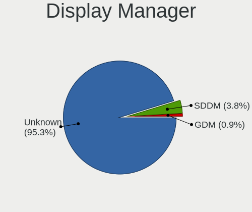
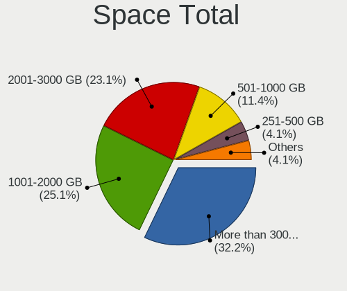
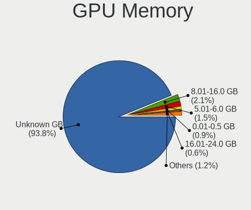
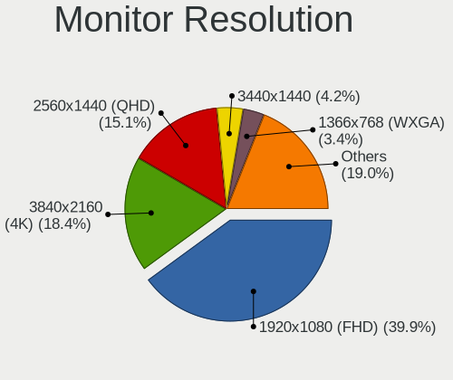
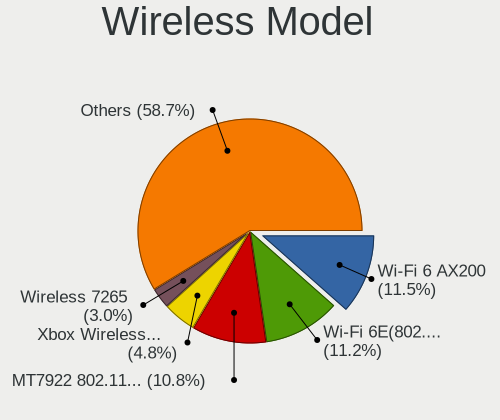

Bazzite - Tested Hardware & Statistics
--------------------------------------

A project to collect tested hardware configurations for Bazzite.

Anyone can contribute to this report by the [hw-probe](https://github.com/linuxhw/hw-probe) tool:

    sudo -E hw-probe -all -upload

Please contribute! Especially if your hardware is rare.

This is a report for all computer types. See also reports for [desktops](/Dist/Bazzite/Desktop/README.md) and [notebooks](/Dist/Bazzite/Notebook/README.md).

Contents
--------

* [ Test Cases ](#test-cases)

* [ System ](#system)
  - [ OS                       ](#os)
  - [ OS Family                ](#os-family)
  - [ Kernel                   ](#kernel)
  - [ Kernel Family            ](#kernel-family)
  - [ Kernel Major Ver.        ](#kernel-major-ver)
  - [ Arch                     ](#arch)
  - [ DE                       ](#de)
  - [ Display Server           ](#display-server)
  - [ Display Manager          ](#display-manager)
  - [ OS Lang                  ](#os-lang)
  - [ Boot Mode                ](#boot-mode)
  - [ Filesystem               ](#filesystem)
  - [ Part. scheme             ](#part-scheme)
  - [ Dual Boot with Linux/BSD ](#dual-boot-with-linuxbsd)
  - [ Dual Boot (Win)          ](#dual-boot-win)

* [ Board ](#board)
  - [ Vendor                   ](#vendor)
  - [ Model                    ](#model)
  - [ Model Family             ](#model-family)
  - [ MFG Year                 ](#mfg-year)
  - [ Form Factor              ](#form-factor)
  - [ Secure Boot              ](#secure-boot)
  - [ Coreboot                 ](#coreboot)
  - [ RAM Size                 ](#ram-size)
  - [ RAM Used                 ](#ram-used)
  - [ Total Drives             ](#total-drives)
  - [ Has CD-ROM               ](#has-cd-rom)
  - [ Has Ethernet             ](#has-ethernet)
  - [ Has WiFi                 ](#has-wifi)
  - [ Has Bluetooth            ](#has-bluetooth)

* [ Location ](#location)
  - [ Country                  ](#country)
  - [ City                     ](#city)

* [ Drives ](#drives)
  - [ Drive Vendor             ](#drive-vendor)
  - [ Drive Model              ](#drive-model)
  - [ HDD Vendor               ](#hdd-vendor)
  - [ SSD Vendor               ](#ssd-vendor)
  - [ Drive Kind               ](#drive-kind)
  - [ Drive Connector          ](#drive-connector)
  - [ Drive Size               ](#drive-size)
  - [ Space Total              ](#space-total)
  - [ Space Used               ](#space-used)
  - [ Malfunc. Drives          ](#malfunc-drives)
  - [ Malfunc. Drive Vendor    ](#malfunc-drive-vendor)
  - [ Malfunc. HDD Vendor      ](#malfunc-hdd-vendor)
  - [ Malfunc. Drive Kind      ](#malfunc-drive-kind)
  - [ Failed Drives            ](#failed-drives)
  - [ Failed Drive Vendor      ](#failed-drive-vendor)
  - [ Drive Status             ](#drive-status)

* [ Storage controller ](#storage-controller)
  - [ Storage Vendor           ](#storage-vendor)
  - [ Storage Model            ](#storage-model)
  - [ Storage Kind             ](#storage-kind)

* [ Processor ](#processor)
  - [ CPU Vendor               ](#cpu-vendor)
  - [ CPU Model                ](#cpu-model)
  - [ CPU Model Family         ](#cpu-model-family)
  - [ CPU Cores                ](#cpu-cores)
  - [ CPU Sockets              ](#cpu-sockets)
  - [ CPU Threads              ](#cpu-threads)
  - [ CPU Op-Modes             ](#cpu-op-modes)
  - [ CPU Microcode            ](#cpu-microcode)
  - [ CPU Microarch            ](#cpu-microarch)

* [ Graphics ](#graphics)
  - [ GPU Vendor               ](#gpu-vendor)
  - [ GPU Model                ](#gpu-model)
  - [ GPU Combo                ](#gpu-combo)
  - [ GPU Driver               ](#gpu-driver)
  - [ GPU Memory               ](#gpu-memory)

* [ Monitor ](#monitor)
  - [ Monitor Vendor           ](#monitor-vendor)
  - [ Monitor Model            ](#monitor-model)
  - [ Monitor Resolution       ](#monitor-resolution)
  - [ Monitor Diagonal         ](#monitor-diagonal)
  - [ Monitor Width            ](#monitor-width)
  - [ Aspect Ratio             ](#aspect-ratio)
  - [ Monitor Area             ](#monitor-area)
  - [ Pixel Density            ](#pixel-density)
  - [ Multiple Monitors        ](#multiple-monitors)

* [ Network ](#network)
  - [ Net Controller Vendor    ](#net-controller-vendor)
  - [ Net Controller Model     ](#net-controller-model)
  - [ Wireless Vendor          ](#wireless-vendor)
  - [ Wireless Model           ](#wireless-model)
  - [ Ethernet Vendor          ](#ethernet-vendor)
  - [ Ethernet Model           ](#ethernet-model)
  - [ Net Controller Kind      ](#net-controller-kind)
  - [ Used Controller          ](#used-controller)
  - [ NICs                     ](#nics)
  - [ IPv6                     ](#ipv6)

* [ Bluetooth ](#bluetooth)
  - [ Bluetooth Vendor         ](#bluetooth-vendor)
  - [ Bluetooth Model          ](#bluetooth-model)

* [ Sound ](#sound)
  - [ Sound Vendor             ](#sound-vendor)
  - [ Sound Model              ](#sound-model)

* [ Memory ](#memory)
  - [ Memory Vendor            ](#memory-vendor)
  - [ Memory Model             ](#memory-model)
  - [ Memory Kind              ](#memory-kind)
  - [ Memory Form Factor       ](#memory-form-factor)
  - [ Memory Size              ](#memory-size)
  - [ Memory Speed             ](#memory-speed)

* [ Printers & scanners ](#printers--scanners)
  - [ Printer Vendor           ](#printer-vendor)
  - [ Printer Model            ](#printer-model)
  - [ Scanner Vendor           ](#scanner-vendor)
  - [ Scanner Model            ](#scanner-model)

* [ Camera ](#camera)
  - [ Camera Vendor            ](#camera-vendor)
  - [ Camera Model             ](#camera-model)

* [ Security ](#security)
  - [ Fingerprint Vendor       ](#fingerprint-vendor)
  - [ Fingerprint Model        ](#fingerprint-model)
  - [ Chipcard Vendor          ](#chipcard-vendor)
  - [ Chipcard Model           ](#chipcard-model)

* [ Unsupported ](#unsupported)
  - [ Unsupported Devices      ](#unsupported-devices)
  - [ Unsupported Device Types ](#unsupported-device-types)

Test Cases
----------

Total: 426

| Vendor        | Model                       | Form-Factor | Probe                                                      | Date         |
|---------------|-----------------------------|-------------|------------------------------------------------------------|--------------|
| Acer          | Predator PH315-52           | Notebook    | [1ae33fb974](https://linux-hardware.org/?probe=1ae33fb974) | Jan 06, 2025 |
| MACHINIST     | H110 Ver:2.3                | Desktop     | [da4bcc0047](https://linux-hardware.org/?probe=da4bcc0047) | Jan 06, 2025 |
| MACHINIST     | H110 Ver:2.3                | Desktop     | [e477166cd2](https://linux-hardware.org/?probe=e477166cd2) | Jan 06, 2025 |
| Lenovo        | 318E SDK0J40697 WIN 3305... | Desktop     | [180e354322](https://linux-hardware.org/?probe=180e354322) | Jan 06, 2025 |
| ASUSTek       | ROG STRIX B550-F GAMING     | Desktop     | [df3bbdd6e6](https://linux-hardware.org/?probe=df3bbdd6e6) | Jan 05, 2025 |
| Lenovo        | 318E SDK0J40697 WIN 3305... | Desktop     | [3d0601ead9](https://linux-hardware.org/?probe=3d0601ead9) | Jan 05, 2025 |
| HP            | Pavilion Gaming Laptop 1... | Notebook    | [cc86c7e5c1](https://linux-hardware.org/?probe=cc86c7e5c1) | Jan 05, 2025 |
| ASUSTek       | ASUS TUF Gaming A16 FA61... | Notebook    | [b4fcbcaf8c](https://linux-hardware.org/?probe=b4fcbcaf8c) | Jan 05, 2025 |
| ASRock        | X870E Taichi Lite           | Desktop     | [5c8bb1062f](https://linux-hardware.org/?probe=5c8bb1062f) | Jan 05, 2025 |
| Lenovo        | Legion Go 8APU1 83E1        | Tablet      | [1245987788](https://linux-hardware.org/?probe=1245987788) | Jan 04, 2025 |
| HP            | Pavilion Gaming Laptop 1... | Notebook    | [5b3ef34113](https://linux-hardware.org/?probe=5b3ef34113) | Jan 04, 2025 |
| AZW           | SER                         | Notebook    | [487845b4a5](https://linux-hardware.org/?probe=487845b4a5) | Jan 04, 2025 |
| ASUSTek       | PRIME B760M-A AX6 II        | Desktop     | [826dc3e0f2](https://linux-hardware.org/?probe=826dc3e0f2) | Jan 04, 2025 |
| Gigabyte      | B450 AORUS PRO WIFI-CF      | Desktop     | [1a76cb7c54](https://linux-hardware.org/?probe=1a76cb7c54) | Jan 03, 2025 |
| GPD           | G1618-04                    | Tablet      | [a09e8b0e7b](https://linux-hardware.org/?probe=a09e8b0e7b) | Jan 03, 2025 |
| Apple         | MacBookPro11,3              | Notebook    | [5dcd5abfd5](https://linux-hardware.org/?probe=5dcd5abfd5) | Jan 02, 2025 |
| ASUSTek       | TUF Gaming X670E-PLUS WI... | Desktop     | [eb28346691](https://linux-hardware.org/?probe=eb28346691) | Jan 02, 2025 |
| Apple         | MacBookPro11,3              | Notebook    | [29c6fca19b](https://linux-hardware.org/?probe=29c6fca19b) | Jan 01, 2025 |
| MSI           | MAG X570S TOMAHAWK MAX W... | Desktop     | [fb9578e5d4](https://linux-hardware.org/?probe=fb9578e5d4) | Jan 01, 2025 |
| ASUSTek       | PRIME B450M-A               | Desktop     | [3c9a38404f](https://linux-hardware.org/?probe=3c9a38404f) | Jan 01, 2025 |
| MSI           | MPG B550 GAMING PLUS        | Desktop     | [85fd0765c6](https://linux-hardware.org/?probe=85fd0765c6) | Dec 31, 2024 |
| Intel Clie... | LAPAC71G                    | Notebook    | [7554635159](https://linux-hardware.org/?probe=7554635159) | Dec 31, 2024 |
| Lenovo        | Legion Go 8APU1 83E1        | Tablet      | [bd2639837a](https://linux-hardware.org/?probe=bd2639837a) | Dec 31, 2024 |
| ASUSTek       | Pro H610M-C                 | Desktop     | [9f47d5bad6](https://linux-hardware.org/?probe=9f47d5bad6) | Dec 30, 2024 |
| GPD           | G1618-04                    | Notebook    | [6e61e63b98](https://linux-hardware.org/?probe=6e61e63b98) | Dec 30, 2024 |
| ASUSTek       | Z790 GAMING WIFI7           | Desktop     | [799d284a26](https://linux-hardware.org/?probe=799d284a26) | Dec 30, 2024 |
| ASUSTek       | Z790 GAMING WIFI7           | Desktop     | [3d5f5f5640](https://linux-hardware.org/?probe=3d5f5f5640) | Dec 30, 2024 |
| Unknown       | Unknown                     | Notebook    | [fae2f8fa52](https://linux-hardware.org/?probe=fae2f8fa52) | Dec 30, 2024 |
| ASUSTek       | TUF Gaming B650-PLUS        | Desktop     | [8f62444b6a](https://linux-hardware.org/?probe=8f62444b6a) | Dec 29, 2024 |
| ASRock        | X570 Phantom Gaming-ITX/... | Desktop     | [7aa96c906d](https://linux-hardware.org/?probe=7aa96c906d) | Dec 29, 2024 |
| Lenovo        | Legion 5 15IAH7H 82TB       | Notebook    | [37b8fbc02a](https://linux-hardware.org/?probe=37b8fbc02a) | Dec 29, 2024 |
| ASUSTek       | P8Z77-V LK                  | Desktop     | [10582e7b7b](https://linux-hardware.org/?probe=10582e7b7b) | Dec 29, 2024 |
| MSI           | MPG X570 GAMING PLUS        | Desktop     | [f22cbdf9ad](https://linux-hardware.org/?probe=f22cbdf9ad) | Dec 28, 2024 |
| Gigabyte      | X670E AORUS MASTER          | Desktop     | [43e0c78438](https://linux-hardware.org/?probe=43e0c78438) | Dec 28, 2024 |
| Dell          | Precision M6800             | Notebook    | [b805a2c527](https://linux-hardware.org/?probe=b805a2c527) | Dec 26, 2024 |
| Apple         | MacBookPro14,3              | Notebook    | [a6f60e20a6](https://linux-hardware.org/?probe=a6f60e20a6) | Dec 26, 2024 |
| ASUSTek       | ROG Maximus XI HERO         | Desktop     | [3204a0a933](https://linux-hardware.org/?probe=3204a0a933) | Dec 25, 2024 |
| ASUSTek       | ROG Ally RC71L_RC71L        | Tablet      | [fd3de9ea5c](https://linux-hardware.org/?probe=fd3de9ea5c) | Dec 25, 2024 |
| ASUSTek       | PRIME H510M-K R2.0          | Desktop     | [9215a34e87](https://linux-hardware.org/?probe=9215a34e87) | Dec 25, 2024 |
| HP            | Laptop 15-ef2xxx            | Notebook    | [f0daa10869](https://linux-hardware.org/?probe=f0daa10869) | Dec 24, 2024 |
| Gigabyte      | B450 AORUS M                | Desktop     | [df8f0ba147](https://linux-hardware.org/?probe=df8f0ba147) | Dec 24, 2024 |
| HP            | ZBook 15u G5                | Notebook    | [639f1b214f](https://linux-hardware.org/?probe=639f1b214f) | Dec 24, 2024 |
| Shenzhen M... | F7BSI                       | Mini pc     | [88bcd7ab6c](https://linux-hardware.org/?probe=88bcd7ab6c) | Dec 24, 2024 |
| Dell          | 0WN7Y6 A01                  | Desktop     | [b20d2d0198](https://linux-hardware.org/?probe=b20d2d0198) | Dec 23, 2024 |
| Colorful T... | CVN B650M GAMING FROZEN ... | Desktop     | [1155e83e75](https://linux-hardware.org/?probe=1155e83e75) | Dec 22, 2024 |
| MSI           | MAG X670E TOMAHAWK WIFI     | Desktop     | [a977849531](https://linux-hardware.org/?probe=a977849531) | Dec 22, 2024 |
| Gigabyte      | AB350M-Gaming 3-CF          | Desktop     | [359d3ae6ec](https://linux-hardware.org/?probe=359d3ae6ec) | Dec 22, 2024 |
| ASUSTek       | TUF Z270 MARK 2             | Desktop     | [5f75675aff](https://linux-hardware.org/?probe=5f75675aff) | Dec 21, 2024 |
| Dell          | 0WN7Y6 A01                  | Desktop     | [2136a13f47](https://linux-hardware.org/?probe=2136a13f47) | Dec 19, 2024 |
| Dell          | 0WMJ54 A01                  | Desktop     | [d47727f897](https://linux-hardware.org/?probe=d47727f897) | Dec 19, 2024 |
| AZW           | SER V10                     | Mini pc     | [8c9b73fede](https://linux-hardware.org/?probe=8c9b73fede) | Dec 19, 2024 |
| AZW           | SER V10                     | Mini pc     | [277801f31f](https://linux-hardware.org/?probe=277801f31f) | Dec 19, 2024 |
| ASRock        | B550 Extreme4               | Desktop     | [b15fa49664](https://linux-hardware.org/?probe=b15fa49664) | Dec 19, 2024 |
| Fujitsu       | LIFEBOOK S751               | Notebook    | [54be502c46](https://linux-hardware.org/?probe=54be502c46) | Dec 19, 2024 |
| ASRock        | B550 Extreme4               | Desktop     | [814e14dde9](https://linux-hardware.org/?probe=814e14dde9) | Dec 19, 2024 |
| MSI           | PE60 6QE                    | Notebook    | [ef19c85fc9](https://linux-hardware.org/?probe=ef19c85fc9) | Dec 19, 2024 |
| MSI           | B450M PRO-VDH               | Desktop     | [50248fd7b6](https://linux-hardware.org/?probe=50248fd7b6) | Dec 18, 2024 |
| MSI           | B450M PRO-VDH               | Desktop     | [e9cda49543](https://linux-hardware.org/?probe=e9cda49543) | Dec 18, 2024 |
| Gigabyte      | G5 KF                       | Notebook    | [0de16a6384](https://linux-hardware.org/?probe=0de16a6384) | Dec 18, 2024 |
| ASUSTek       | TUF Gaming B550-PLUS        | Desktop     | [ef5de4811b](https://linux-hardware.org/?probe=ef5de4811b) | Dec 18, 2024 |
| ASUSTek       | ROG STRIX B650E-I GAMING... | Desktop     | [b0a3121054](https://linux-hardware.org/?probe=b0a3121054) | Dec 18, 2024 |
| ASUSTek       | ProArt X570-CREATOR WIFI    | Desktop     | [5bd1dbfa57](https://linux-hardware.org/?probe=5bd1dbfa57) | Dec 17, 2024 |
| Dell          | 042P49 A01                  | Desktop     | [7628da790c](https://linux-hardware.org/?probe=7628da790c) | Dec 15, 2024 |
| Dell          | 0T7D40 A01                  | Desktop     | [b215a3aa7c](https://linux-hardware.org/?probe=b215a3aa7c) | Dec 15, 2024 |
| TianBei       | GEM12                       | Desktop     | [9505d9ed29](https://linux-hardware.org/?probe=9505d9ed29) | Dec 15, 2024 |
| Lenovo        | Legion Go 8APU1 83E1        | Tablet      | [498786c044](https://linux-hardware.org/?probe=498786c044) | Dec 15, 2024 |
| SHANGZHAOY... | H97-STRONG V1.0             | Desktop     | [b8e33835e8](https://linux-hardware.org/?probe=b8e33835e8) | Dec 14, 2024 |
| Gigabyte      | Z390 GAMING X-CF            | Notebook    | [c43094abf1](https://linux-hardware.org/?probe=c43094abf1) | Dec 14, 2024 |
| Apple         | MacBookPro14,3              | Notebook    | [f70dc4d24b](https://linux-hardware.org/?probe=f70dc4d24b) | Dec 11, 2024 |
| Lenovo        | ThinkPad T490 20N3S44S00    | Notebook    | [7ae78aa783](https://linux-hardware.org/?probe=7ae78aa783) | Dec 11, 2024 |
| Gigabyte      | B550I AORUS PRO AX          | Desktop     | [a7722c77ec](https://linux-hardware.org/?probe=a7722c77ec) | Dec 11, 2024 |
| Gigabyte      | AB350N-Gaming WIFI-CF       | Desktop     | [538c3d3d38](https://linux-hardware.org/?probe=538c3d3d38) | Dec 11, 2024 |
| ASRock        | B650M Pro RS WiFi           | Desktop     | [2dc9975b7a](https://linux-hardware.org/?probe=2dc9975b7a) | Dec 11, 2024 |
| HP            | OMEN by Laptop 15-ce0xx     | Notebook    | [aae09c5d04](https://linux-hardware.org/?probe=aae09c5d04) | Dec 10, 2024 |
| Unknown       | Unknown                     | Desktop     | [b07a1b7eb5](https://linux-hardware.org/?probe=b07a1b7eb5) | Dec 10, 2024 |
| Acer          | Aspire A315-41G             | Notebook    | [36adcc0875](https://linux-hardware.org/?probe=36adcc0875) | Dec 10, 2024 |
| ASUSTek       | TUF Gaming B550-PLUS        | Desktop     | [8b136e72e1](https://linux-hardware.org/?probe=8b136e72e1) | Dec 09, 2024 |
| Shenzhen M... | F7BSI                       | Mini pc     | [e8e60c983c](https://linux-hardware.org/?probe=e8e60c983c) | Dec 09, 2024 |
| Lenovo        | Legion Go 8APU1 83E1        | Tablet      | [00a92f4595](https://linux-hardware.org/?probe=00a92f4595) | Dec 08, 2024 |
| HP            | Victus by Laptop 16-d1xx... | Notebook    | [cc10982e52](https://linux-hardware.org/?probe=cc10982e52) | Dec 08, 2024 |
| MSI           | MAG X570S TOMAHAWK MAX W... | Desktop     | [8fd0753b3b](https://linux-hardware.org/?probe=8fd0753b3b) | Dec 08, 2024 |
| MACHINIST     | E5-RS9 V1.1                 | Desktop     | [9f5f41fa91](https://linux-hardware.org/?probe=9f5f41fa91) | Dec 07, 2024 |
| MSI           | GE75 Raider 9SG             | Notebook    | [cafb130468](https://linux-hardware.org/?probe=cafb130468) | Dec 07, 2024 |
| Dell          | 042P49 A00                  | Desktop     | [3aaa1e8304](https://linux-hardware.org/?probe=3aaa1e8304) | Dec 07, 2024 |
| MSI           | Z370-A PRO                  | Desktop     | [a6e087e259](https://linux-hardware.org/?probe=a6e087e259) | Dec 07, 2024 |
| MSI           | A320M PRO-E                 | Desktop     | [bae9cfba05](https://linux-hardware.org/?probe=bae9cfba05) | Dec 07, 2024 |
| MSI           | X299 RAIDER                 | Desktop     | [f0bcb53763](https://linux-hardware.org/?probe=f0bcb53763) | Dec 07, 2024 |
| Gigabyte      | B85M-D3PH                   | Desktop     | [bd43ad3f6e](https://linux-hardware.org/?probe=bd43ad3f6e) | Dec 07, 2024 |
| ASUSTek       | ASUS TUF Gaming F15 FX50... | Notebook    | [659017d09e](https://linux-hardware.org/?probe=659017d09e) | Dec 06, 2024 |
| Gigabyte      | B450 AORUS ELITE            | Desktop     | [b3206b45cc](https://linux-hardware.org/?probe=b3206b45cc) | Dec 06, 2024 |
| ASUSTek       | ASUS TUF Gaming A16 FA61... | Notebook    | [d2e306413d](https://linux-hardware.org/?probe=d2e306413d) | Dec 05, 2024 |
| MSI           | MEG X570 UNIFY              | Desktop     | [3abd20dbb3](https://linux-hardware.org/?probe=3abd20dbb3) | Dec 05, 2024 |
| Unknown       | Unknown                     | Notebook    | [44923fb27f](https://linux-hardware.org/?probe=44923fb27f) | Dec 05, 2024 |
| Gigabyte      | B650 AORUS ELITE AX         | Desktop     | [6448eaf0bb](https://linux-hardware.org/?probe=6448eaf0bb) | Dec 05, 2024 |
| MSI           | PRO B650-VC WIFI            | Desktop     | [c7e77b3074](https://linux-hardware.org/?probe=c7e77b3074) | Dec 05, 2024 |
| MSI           | PRO B650-VC WIFI            | Desktop     | [662439abf7](https://linux-hardware.org/?probe=662439abf7) | Dec 05, 2024 |
| MSI           | MAG B550M MORTAR            | Desktop     | [52ef9b3448](https://linux-hardware.org/?probe=52ef9b3448) | Dec 04, 2024 |
| ASUSTek       | GL552VW                     | Notebook    | [d0611dd371](https://linux-hardware.org/?probe=d0611dd371) | Dec 04, 2024 |
| ASUSTek       | TUF Gaming B550M-PLUS       | Desktop     | [554febc693](https://linux-hardware.org/?probe=554febc693) | Dec 04, 2024 |
| ASUSTek       | TUF Gaming X570-PLUS_BR     | Desktop     | [bc07acd161](https://linux-hardware.org/?probe=bc07acd161) | Dec 03, 2024 |
| Gigabyte      | B85M-D3PH                   | Desktop     | [a6ffab773f](https://linux-hardware.org/?probe=a6ffab773f) | Dec 03, 2024 |
| ASUSTek       | GL552VW                     | Notebook    | [4d38c63e3d](https://linux-hardware.org/?probe=4d38c63e3d) | Dec 02, 2024 |
| Apple         | Mac-F65AE981FFA204ED Mac... | Mini pc     | [971dfe109a](https://linux-hardware.org/?probe=971dfe109a) | Dec 02, 2024 |
| ASRock        | B760M-C                     | Desktop     | [d7ef11e5df](https://linux-hardware.org/?probe=d7ef11e5df) | Dec 02, 2024 |
| ASUSTek       | VivoBook_ASUSLaptop X140... | Notebook    | [a917f1290b](https://linux-hardware.org/?probe=a917f1290b) | Dec 02, 2024 |
| ASUSTek       | VivoBook_ASUSLaptop X140... | Notebook    | [e664d989d6](https://linux-hardware.org/?probe=e664d989d6) | Dec 02, 2024 |
| ASUSTek       | Pro WS X299 SAGE II         | Desktop     | [514e655bbd](https://linux-hardware.org/?probe=514e655bbd) | Dec 02, 2024 |
| Lenovo        | Legion Go 8APU1 83E1        | Tablet      | [4a55769e54](https://linux-hardware.org/?probe=4a55769e54) | Dec 01, 2024 |
| Gigabyte      | X670 GAMING X AX            | Desktop     | [35ae0deb67](https://linux-hardware.org/?probe=35ae0deb67) | Dec 01, 2024 |
| ASUSTek       | ROG STRIX X870E-E GAMING... | Desktop     | [dbad67b372](https://linux-hardware.org/?probe=dbad67b372) | Dec 01, 2024 |
| ASRock        | B650M Pro RS WiFi           | Desktop     | [c62526efca](https://linux-hardware.org/?probe=c62526efca) | Dec 01, 2024 |
| HP            | 872B                        | Desktop     | [4dd45a2a3c](https://linux-hardware.org/?probe=4dd45a2a3c) | Dec 01, 2024 |
| Lenovo        | Legion Go 8APU1 83E1        | Tablet      | [f1371ee50d](https://linux-hardware.org/?probe=f1371ee50d) | Nov 30, 2024 |
| MSI           | B450 GAMING PLUS            | Desktop     | [7cf713d1f4](https://linux-hardware.org/?probe=7cf713d1f4) | Nov 30, 2024 |
| MSI           | AM1I                        | Desktop     | [b414f89d08](https://linux-hardware.org/?probe=b414f89d08) | Nov 30, 2024 |
| HP            | Spectre x360 Convertible... | Convertible | [84559e8454](https://linux-hardware.org/?probe=84559e8454) | Nov 29, 2024 |
| ASUSTek       | TUF Gaming B550M-PLUS       | Desktop     | [ca35a1e151](https://linux-hardware.org/?probe=ca35a1e151) | Nov 29, 2024 |
| Dell          | Precision M4800             | Notebook    | [adfb2cc705](https://linux-hardware.org/?probe=adfb2cc705) | Nov 29, 2024 |
| Gigabyte      | B250M-HD3-CF                | Desktop     | [285af8915b](https://linux-hardware.org/?probe=285af8915b) | Nov 29, 2024 |
| ASUSTek       | ROG STRIX X870E-E GAMING... | Desktop     | [94e70b6e46](https://linux-hardware.org/?probe=94e70b6e46) | Nov 29, 2024 |
| Gigabyte      | G5 MD                       | Notebook    | [4e38533c6a](https://linux-hardware.org/?probe=4e38533c6a) | Nov 29, 2024 |
| Gigabyte      | G5 MD                       | Notebook    | [b8cce303ed](https://linux-hardware.org/?probe=b8cce303ed) | Nov 29, 2024 |
| Razer         | Blade Stealth               | Notebook    | [09410e6f1e](https://linux-hardware.org/?probe=09410e6f1e) | Nov 29, 2024 |
| Gigabyte      | B550M DS3H                  | Desktop     | [7e9d488336](https://linux-hardware.org/?probe=7e9d488336) | Nov 29, 2024 |
| AYADEVICE     | AYA NEO 2021                | Tablet      | [7e6c0fa30e](https://linux-hardware.org/?probe=7e6c0fa30e) | Nov 28, 2024 |
| ASUSTek       | Z790 GAMING WIFI7           | Desktop     | [b458cf3bf5](https://linux-hardware.org/?probe=b458cf3bf5) | Nov 28, 2024 |
| ASUSTek       | TUF B450-PLUS GAMING        | Desktop     | [737048a59d](https://linux-hardware.org/?probe=737048a59d) | Nov 27, 2024 |
| MSI           | Raider GE68HX 13VF          | Notebook    | [54973d8065](https://linux-hardware.org/?probe=54973d8065) | Nov 27, 2024 |
| MSI           | Z87-GD65 GAMING             | Desktop     | [c68e04c0cf](https://linux-hardware.org/?probe=c68e04c0cf) | Nov 26, 2024 |
| MSI           | Z87-GD65 GAMING             | Desktop     | [9da2d0250d](https://linux-hardware.org/?probe=9da2d0250d) | Nov 26, 2024 |
| Apple         | MacBookPro11,3              | Notebook    | [ac4e787ec6](https://linux-hardware.org/?probe=ac4e787ec6) | Nov 26, 2024 |
| ASUSTek       | ROG STRIX X470-I GAMING     | Desktop     | [68e982f380](https://linux-hardware.org/?probe=68e982f380) | Nov 26, 2024 |
| ASUSTek       | PRIME Z270-A                | Desktop     | [ed9e08eabd](https://linux-hardware.org/?probe=ed9e08eabd) | Nov 26, 2024 |
| ASUSTek       | ROG STRIX B450-F GAMING ... | Desktop     | [53f28f7bf8](https://linux-hardware.org/?probe=53f28f7bf8) | Nov 26, 2024 |
| Intel         | X99                         | Notebook    | [345df95f7d](https://linux-hardware.org/?probe=345df95f7d) | Nov 25, 2024 |
| ASUSTek       | ROG Ally X RC72LA_RC72LA    | Tablet      | [37d203caa3](https://linux-hardware.org/?probe=37d203caa3) | Nov 25, 2024 |
| Gigabyte      | B550M K                     | Desktop     | [495068e89a](https://linux-hardware.org/?probe=495068e89a) | Nov 25, 2024 |
| Gigabyte      | X570 AORUS ELITE            | Desktop     | [c4cdb6e0be](https://linux-hardware.org/?probe=c4cdb6e0be) | Nov 24, 2024 |
| ASUSTek       | PRIME B450M-A II            | Desktop     | [f7927122ec](https://linux-hardware.org/?probe=f7927122ec) | Nov 23, 2024 |
| Gigabyte      | B550 UD AC                  | Desktop     | [19a401a80f](https://linux-hardware.org/?probe=19a401a80f) | Nov 23, 2024 |
| Gigabyte      | B650 EAGLE AX               | Desktop     | [cea045ba32](https://linux-hardware.org/?probe=cea045ba32) | Nov 22, 2024 |
| Gigabyte      | X570 AORUS XTREME           | Desktop     | [26bd65822e](https://linux-hardware.org/?probe=26bd65822e) | Nov 22, 2024 |
| Gigabyte      | X570 AORUS XTREME           | Desktop     | [5c1d07cae0](https://linux-hardware.org/?probe=5c1d07cae0) | Nov 22, 2024 |
| ONE-NETBOO... | ONEXPLAYER X1 A             | Notebook    | [e7d1e0404d](https://linux-hardware.org/?probe=e7d1e0404d) | Nov 22, 2024 |
| Lenovo        | ThinkPad T490 20N3S44S00    | Notebook    | [910ea8b0d3](https://linux-hardware.org/?probe=910ea8b0d3) | Nov 21, 2024 |
| MSI           | GF63 Thin 10SCXR            | Notebook    | [9527d021b8](https://linux-hardware.org/?probe=9527d021b8) | Nov 21, 2024 |
| HP            | Pavilion Power Laptop 15... | Notebook    | [a70d00a5f5](https://linux-hardware.org/?probe=a70d00a5f5) | Nov 21, 2024 |
| MSI           | PRO B650M-A WIFI            | Desktop     | [03ad8b0cca](https://linux-hardware.org/?probe=03ad8b0cca) | Nov 21, 2024 |
| Intel         | Alder Lake-H PCH E1.0G      | Desktop     | [7dc3c81a67](https://linux-hardware.org/?probe=7dc3c81a67) | Nov 21, 2024 |
| Gigabyte      | B650 AORUS ELITE AX V2      | Desktop     | [fdc2572f83](https://linux-hardware.org/?probe=fdc2572f83) | Nov 20, 2024 |
| Dell          | 0WMJ54 A01                  | Notebook    | [2a65e3fda2](https://linux-hardware.org/?probe=2a65e3fda2) | Nov 19, 2024 |
| Kllisre       | E5 F9 V1.0                  | Desktop     | [85d3fa537d](https://linux-hardware.org/?probe=85d3fa537d) | Nov 19, 2024 |
| ASUSTek       | ROG Ally X RC72LA_RC72LA    | Tablet      | [b1749f28d6](https://linux-hardware.org/?probe=b1749f28d6) | Nov 18, 2024 |
| Gigabyte      | AB350-Gaming 3-CF           | Desktop     | [e643ae8c2a](https://linux-hardware.org/?probe=e643ae8c2a) | Nov 18, 2024 |
| Acer          | Veriton S6610G              | Desktop     | [07703559d2](https://linux-hardware.org/?probe=07703559d2) | Nov 18, 2024 |
| ASRock        | B650M-HDV/M.2               | Desktop     | [5e55c3c214](https://linux-hardware.org/?probe=5e55c3c214) | Nov 17, 2024 |
| MSI           | PRO B650-P WIFI             | Desktop     | [e0d87feb4c](https://linux-hardware.org/?probe=e0d87feb4c) | Nov 17, 2024 |
| HP            | 8523 A01                    | Mini pc     | [25028b7f54](https://linux-hardware.org/?probe=25028b7f54) | Nov 15, 2024 |
| Gigabyte      | X670E AORUS XTREME          | Desktop     | [84ed7923b5](https://linux-hardware.org/?probe=84ed7923b5) | Nov 14, 2024 |
| Lenovo        | IdeaPad 5 15ARE05 81YQ      | Notebook    | [6a69e8dd2b](https://linux-hardware.org/?probe=6a69e8dd2b) | Nov 14, 2024 |
| HP            | ProBook 6475b               | Notebook    | [808603ce16](https://linux-hardware.org/?probe=808603ce16) | Nov 13, 2024 |
| Dell          | 0KN5W4 A02                  | Desktop     | [b98379c391](https://linux-hardware.org/?probe=b98379c391) | Nov 13, 2024 |
| MSI           | MPG Z790 CARBON WIFI        | Desktop     | [3c4d29e5f7](https://linux-hardware.org/?probe=3c4d29e5f7) | Nov 13, 2024 |
| MSI           | MAG B550 TOMAHAWK           | Desktop     | [c3f50ef03f](https://linux-hardware.org/?probe=c3f50ef03f) | Nov 13, 2024 |
| MSI           | ZH77A-G43                   | Desktop     | [6e7a02926e](https://linux-hardware.org/?probe=6e7a02926e) | Nov 12, 2024 |
| MSI           | GS60 2QE                    | Notebook    | [f6cceaf60f](https://linux-hardware.org/?probe=f6cceaf60f) | Nov 11, 2024 |
| JGINYUE       | B550i-GAMING                | Desktop     | [2701fc764a](https://linux-hardware.org/?probe=2701fc764a) | Nov 11, 2024 |
| ASRock        | X399M Taichi                | Desktop     | [01b2805ff7](https://linux-hardware.org/?probe=01b2805ff7) | Nov 11, 2024 |
| ASRock        | X399M Taichi                | Desktop     | [0922a4a904](https://linux-hardware.org/?probe=0922a4a904) | Nov 11, 2024 |
| Gigabyte      | Z77X-UD3H                   | Desktop     | [51c37de3d0](https://linux-hardware.org/?probe=51c37de3d0) | Nov 10, 2024 |
| MSI           | MEG Z490 UNIFY              | Desktop     | [9fff13f635](https://linux-hardware.org/?probe=9fff13f635) | Nov 10, 2024 |
| Lenovo        | 3136 SDK0J40697 WIN 3305... | Mini pc     | [7a5d375262](https://linux-hardware.org/?probe=7a5d375262) | Nov 09, 2024 |
| ASUSTek       | ROG STRIX Z490-F GAMING     | Desktop     | [bd68e159f2](https://linux-hardware.org/?probe=bd68e159f2) | Nov 09, 2024 |
| Razer         | Blade Stealth               | Notebook    | [d347bbae71](https://linux-hardware.org/?probe=d347bbae71) | Nov 08, 2024 |
| ASUSTek       | N53SN                       | Notebook    | [bc6d6d125f](https://linux-hardware.org/?probe=bc6d6d125f) | Nov 08, 2024 |
| ASUSTek       | ROG CROSSHAIR VIII HERO     | Desktop     | [9c238fd7ee](https://linux-hardware.org/?probe=9c238fd7ee) | Nov 07, 2024 |
| Razer         | Blade Stealth               | Notebook    | [b313a5e91b](https://linux-hardware.org/?probe=b313a5e91b) | Nov 07, 2024 |
| Samsung       | 950QED                      | Convertible | [140d0aaf36](https://linux-hardware.org/?probe=140d0aaf36) | Nov 07, 2024 |
| ASUSTek       | ROG STRIX B550-F GAMING     | Desktop     | [7975c09175](https://linux-hardware.org/?probe=7975c09175) | Nov 05, 2024 |
| ASRock        | X570 Phantom Gaming 4       | Desktop     | [bb9293b0a2](https://linux-hardware.org/?probe=bb9293b0a2) | Nov 05, 2024 |
| ASRock        | A620I Lightning WiFi        | Notebook    | [8d69129552](https://linux-hardware.org/?probe=8d69129552) | Nov 04, 2024 |
| HP            | Laptop 15-bs2xx             | Notebook    | [2639cc8f27](https://linux-hardware.org/?probe=2639cc8f27) | Nov 04, 2024 |
| ASUSTek       | ROG Ally RC71L_RC71L        | Tablet      | [f9659bffcf](https://linux-hardware.org/?probe=f9659bffcf) | Nov 04, 2024 |
| Apple         | Mac-77F17D7DA9285301 iMa... | All in one  | [ce785f0d47](https://linux-hardware.org/?probe=ce785f0d47) | Nov 04, 2024 |
| HP            | 1495                        | Desktop     | [a844f7d854](https://linux-hardware.org/?probe=a844f7d854) | Nov 03, 2024 |
| Apple         | Mac-F2268DC8                | All in one  | [08e2a0e990](https://linux-hardware.org/?probe=08e2a0e990) | Nov 03, 2024 |
| ASUSTek       | Z590 WIFI GUNDAM EDITION    | Desktop     | [f2749f62c8](https://linux-hardware.org/?probe=f2749f62c8) | Nov 03, 2024 |
| Apple         | Mac-F2268DC8                | All in one  | [744ed41e01](https://linux-hardware.org/?probe=744ed41e01) | Nov 02, 2024 |
| Micro Comp... | V3                          | Tablet      | [c897286c81](https://linux-hardware.org/?probe=c897286c81) | Nov 02, 2024 |
| GEEKOM        | A8                          | Notebook    | [0c71662747](https://linux-hardware.org/?probe=0c71662747) | Nov 02, 2024 |
| Gigabyte      | B650M AORUS ELITE AX        | Desktop     | [29ad536aa2](https://linux-hardware.org/?probe=29ad536aa2) | Nov 02, 2024 |
| Lenovo        | 3136 SDK0J40697 WIN 3305... | Mini pc     | [6c6fbab19f](https://linux-hardware.org/?probe=6c6fbab19f) | Nov 01, 2024 |
| GEEKOM        | A8                          | Notebook    | [68e6597e28](https://linux-hardware.org/?probe=68e6597e28) | Nov 01, 2024 |
| Gigabyte      | Z590I AORUS ULTRA           | Desktop     | [c23d4ea993](https://linux-hardware.org/?probe=c23d4ea993) | Oct 31, 2024 |
| ASUSTek       | X99-A                       | Desktop     | [20b3429f27](https://linux-hardware.org/?probe=20b3429f27) | Oct 31, 2024 |
| ASUSTek       | ROG STRIX X670E-A GAMING... | Desktop     | [a101c103eb](https://linux-hardware.org/?probe=a101c103eb) | Oct 31, 2024 |
| Acer          | Predator PO3-630            | Desktop     | [b2da1b5363](https://linux-hardware.org/?probe=b2da1b5363) | Oct 31, 2024 |
| MSI           | MEG X570 ACE                | Desktop     | [890cc5b6a4](https://linux-hardware.org/?probe=890cc5b6a4) | Oct 31, 2024 |
| ASUSTek       | TUF Gaming X570-PLUS        | Desktop     | [9425b3345e](https://linux-hardware.org/?probe=9425b3345e) | Oct 29, 2024 |
| ASUSTek       | X99-A                       | Desktop     | [01ef68fdbe](https://linux-hardware.org/?probe=01ef68fdbe) | Oct 28, 2024 |
| Dell          | 096JG8 A00                  | Desktop     | [4a16e8e7f8](https://linux-hardware.org/?probe=4a16e8e7f8) | Oct 27, 2024 |
| Dell          | 096JG8 A00                  | Desktop     | [c2510e4429](https://linux-hardware.org/?probe=c2510e4429) | Oct 27, 2024 |
| Gigabyte      | B550I AORUS PRO AX          | Desktop     | [e8ca6f09e7](https://linux-hardware.org/?probe=e8ca6f09e7) | Oct 26, 2024 |
| ASRock        | B550M Pro SE                | Desktop     | [a6d1bcfc49](https://linux-hardware.org/?probe=a6d1bcfc49) | Oct 26, 2024 |
| PELADN        | HA-4                        | Desktop     | [7e1050a846](https://linux-hardware.org/?probe=7e1050a846) | Oct 26, 2024 |
| Intel         | X99-P4 V5.0                 | Desktop     | [81334985fd](https://linux-hardware.org/?probe=81334985fd) | Oct 26, 2024 |
| Gigabyte      | B550I AORUS PRO AX          | Desktop     | [1668591553](https://linux-hardware.org/?probe=1668591553) | Oct 26, 2024 |
| MSI           | MPG B550I GAMING EDGE MA... | Desktop     | [62bd667a99](https://linux-hardware.org/?probe=62bd667a99) | Oct 26, 2024 |
| Lenovo        | ThinkPad X220 429136G       | Notebook    | [83c95a2454](https://linux-hardware.org/?probe=83c95a2454) | Oct 26, 2024 |
| ASUSTek       | TUF Gaming X570-PLUS        | Desktop     | [a4f16dff63](https://linux-hardware.org/?probe=a4f16dff63) | Oct 25, 2024 |
| GEEKOM        | A8                          | Desktop     | [e60432b953](https://linux-hardware.org/?probe=e60432b953) | Oct 25, 2024 |
| GEEKOM        | A8                          | Desktop     | [ab289bcf5f](https://linux-hardware.org/?probe=ab289bcf5f) | Oct 25, 2024 |
| ASUSTek       | G20AJ                       | Desktop     | [38cc1a120f](https://linux-hardware.org/?probe=38cc1a120f) | Oct 25, 2024 |
| PELADN        | HA-4                        | Desktop     | [8ac6dfdc0a](https://linux-hardware.org/?probe=8ac6dfdc0a) | Oct 25, 2024 |
| HP            | 8522 A01                    | Mini pc     | [4e0e941c5e](https://linux-hardware.org/?probe=4e0e941c5e) | Oct 25, 2024 |
| MSI           | MPG X570 GAMING EDGE WIF... | Notebook    | [7468eead65](https://linux-hardware.org/?probe=7468eead65) | Oct 24, 2024 |
| Unknown       | V00                         | Mini pc     | [9f863c5d69](https://linux-hardware.org/?probe=9f863c5d69) | Oct 24, 2024 |
| MSI           | B350M GAMING PRO            | Desktop     | [caa72deb83](https://linux-hardware.org/?probe=caa72deb83) | Oct 24, 2024 |
| HP            | 8719                        | Desktop     | [5a4fc59715](https://linux-hardware.org/?probe=5a4fc59715) | Oct 23, 2024 |
| ASUSTek       | CG1330                      | Desktop     | [0191a0dfae](https://linux-hardware.org/?probe=0191a0dfae) | Oct 23, 2024 |
| Alienware     | m17 R5 AMD                  | Notebook    | [2d1575e400](https://linux-hardware.org/?probe=2d1575e400) | Oct 23, 2024 |
| ECS           | GLKD-I2                     | Desktop     | [0bfb2e49b4](https://linux-hardware.org/?probe=0bfb2e49b4) | Oct 23, 2024 |
| ASUSTek       | ROG STRIX B650E-I GAMING... | Desktop     | [fb9eb23d2c](https://linux-hardware.org/?probe=fb9eb23d2c) | Oct 22, 2024 |
| Gigabyte      | X870 AORUS ELITE WIFI7      | Desktop     | [fe41f79efd](https://linux-hardware.org/?probe=fe41f79efd) | Oct 22, 2024 |
| ASUSTek       | ROG Ally RC71L_RC71L        | Tablet      | [c3d12d9924](https://linux-hardware.org/?probe=c3d12d9924) | Oct 21, 2024 |
| Gigabyte      | Z170X-Gaming 7              | Desktop     | [e1fd53e236](https://linux-hardware.org/?probe=e1fd53e236) | Oct 21, 2024 |
| MSI           | B550 GAMING GEN3            | Desktop     | [109e74d5a4](https://linux-hardware.org/?probe=109e74d5a4) | Oct 20, 2024 |
| ASUSTek       | ROG Ally RC71L_RC71L        | Tablet      | [25fe668ad6](https://linux-hardware.org/?probe=25fe668ad6) | Oct 20, 2024 |
| ASUSTek       | ROG Ally RC71L_RC71L        | Tablet      | [b97c634165](https://linux-hardware.org/?probe=b97c634165) | Oct 20, 2024 |
| ASRock        | B550M Pro SE                | Desktop     | [94e3be9f0b](https://linux-hardware.org/?probe=94e3be9f0b) | Oct 19, 2024 |
| MSI           | MPG X570 GAMING EDGE WIF... | Notebook    | [6ecd5007e0](https://linux-hardware.org/?probe=6ecd5007e0) | Oct 19, 2024 |
| MSI           | B550M PRO-VDH WIFI          | Desktop     | [d9354dab8d](https://linux-hardware.org/?probe=d9354dab8d) | Oct 19, 2024 |
| ASUSTek       | PRIME B560M-K               | Desktop     | [81ddc83ec8](https://linux-hardware.org/?probe=81ddc83ec8) | Oct 19, 2024 |
| ASUSTek       | PRIME B560M-K               | Desktop     | [053e5065e1](https://linux-hardware.org/?probe=053e5065e1) | Oct 19, 2024 |
| ASUSTek       | TUF Gaming B760-PLUS WIF... | Desktop     | [34de8d3de4](https://linux-hardware.org/?probe=34de8d3de4) | Oct 18, 2024 |
| Fujitsu       | D3222-A1 S26361-D3222-A1    | Desktop     | [8156434b36](https://linux-hardware.org/?probe=8156434b36) | Oct 18, 2024 |
| Shenzhen M... | F7BSC                       | Mini pc     | [dcafe9615a](https://linux-hardware.org/?probe=dcafe9615a) | Oct 18, 2024 |
| ASUSTek       | TUF Gaming B650-PLUS WIF... | Notebook    | [c0db693df2](https://linux-hardware.org/?probe=c0db693df2) | Oct 17, 2024 |
| ASUSTek       | TUF Gaming B650-PLUS WIF... | Notebook    | [9b96b8b957](https://linux-hardware.org/?probe=9b96b8b957) | Oct 17, 2024 |
| MSI           | PRO B650-P WIFI             | Desktop     | [a61099a91a](https://linux-hardware.org/?probe=a61099a91a) | Oct 16, 2024 |
| GPD           | G1618-03                    | Notebook    | [aa5b8d66ab](https://linux-hardware.org/?probe=aa5b8d66ab) | Oct 16, 2024 |
| HP            | 255 G7 Notebook PC          | Notebook    | [897729987c](https://linux-hardware.org/?probe=897729987c) | Oct 15, 2024 |
| ASUSTek       | ROG STRIX B450-F GAMING ... | Desktop     | [107ed71ce3](https://linux-hardware.org/?probe=107ed71ce3) | Oct 15, 2024 |
| MSI           | MPG B550 GAMING EDGE WIF... | Desktop     | [800ee21ab5](https://linux-hardware.org/?probe=800ee21ab5) | Oct 15, 2024 |
| ASRock        | X570 Taichi                 | Notebook    | [37085cd851](https://linux-hardware.org/?probe=37085cd851) | Oct 14, 2024 |
| ASUSTek       | TUF Gaming B760-PLUS WIF... | Desktop     | [2775a1237e](https://linux-hardware.org/?probe=2775a1237e) | Oct 14, 2024 |
| MSI           | 970 GAMING                  | Desktop     | [43d5552b35](https://linux-hardware.org/?probe=43d5552b35) | Oct 14, 2024 |
| MSI           | 970 GAMING                  | Desktop     | [0bdcd004f4](https://linux-hardware.org/?probe=0bdcd004f4) | Oct 14, 2024 |
| MSI           | MEG Z490 UNIFY              | Desktop     | [9a3d5e0af6](https://linux-hardware.org/?probe=9a3d5e0af6) | Oct 14, 2024 |
| Lenovo        | Legion Go 8APU1 83E1        | Tablet      | [4cb1f7d71c](https://linux-hardware.org/?probe=4cb1f7d71c) | Oct 12, 2024 |
| Gigabyte      | B360M AORUS Gaming 3-CF     | Desktop     | [c6f7d068aa](https://linux-hardware.org/?probe=c6f7d068aa) | Oct 12, 2024 |
| Unknown       | V00                         | Mini pc     | [3eaf83a16b](https://linux-hardware.org/?probe=3eaf83a16b) | Oct 11, 2024 |
| Unknown       | V00                         | Mini pc     | [0be3f11b2d](https://linux-hardware.org/?probe=0be3f11b2d) | Oct 11, 2024 |
| ASUSTek       | ROG STRIX B450-F GAMING ... | Desktop     | [cad5ed956e](https://linux-hardware.org/?probe=cad5ed956e) | Oct 11, 2024 |
| HP            | 255 G7 Notebook PC          | Notebook    | [0ac52f67b8](https://linux-hardware.org/?probe=0ac52f67b8) | Oct 11, 2024 |
| ASUSTek       | PRIME Z390-P                | Desktop     | [771c38c70a](https://linux-hardware.org/?probe=771c38c70a) | Oct 10, 2024 |
| MSI           | B550-A PRO                  | Desktop     | [f853483a69](https://linux-hardware.org/?probe=f853483a69) | Oct 10, 2024 |
| GPD           | G1619-01                    | Notebook    | [fe3fdb0240](https://linux-hardware.org/?probe=fe3fdb0240) | Oct 10, 2024 |
| ASUSTek       | ROG STRIX X670E-I GAMING... | Desktop     | [51818e978a](https://linux-hardware.org/?probe=51818e978a) | Oct 09, 2024 |
| Google        | Atlas                       | Notebook    | [86f42628c5](https://linux-hardware.org/?probe=86f42628c5) | Oct 09, 2024 |
| Google        | Atlas                       | Notebook    | [3816e06fdc](https://linux-hardware.org/?probe=3816e06fdc) | Oct 09, 2024 |
| BAZAM & PI... | B450M-DA                    | Desktop     | [bed89cd999](https://linux-hardware.org/?probe=bed89cd999) | Oct 08, 2024 |
| MSI           | X299 SLI PLUS               | Desktop     | [56774f9775](https://linux-hardware.org/?probe=56774f9775) | Oct 08, 2024 |
| ASRock        | B450M Steel Legend          | Desktop     | [7714ccab3e](https://linux-hardware.org/?probe=7714ccab3e) | Oct 08, 2024 |
| ASUSTek       | PRIME B450M-A II            | Desktop     | [28ee3645e2](https://linux-hardware.org/?probe=28ee3645e2) | Oct 07, 2024 |
| ASUSTek       | TUF Gaming Z790-PLUS WIF... | Desktop     | [bccef315fa](https://linux-hardware.org/?probe=bccef315fa) | Oct 07, 2024 |
| ASUSTek       | ROG STRIX B450-F GAMING ... | Desktop     | [37cc7a86a2](https://linux-hardware.org/?probe=37cc7a86a2) | Oct 07, 2024 |
| Gigabyte      | B450 AORUS M                | Desktop     | [6dcbefdc51](https://linux-hardware.org/?probe=6dcbefdc51) | Oct 06, 2024 |
| MSI           | MAG B650 TOMAHAWK WIFI      | Desktop     | [b4b87eb67a](https://linux-hardware.org/?probe=b4b87eb67a) | Oct 05, 2024 |
| Shenzhen M... | DRBAA                       | Desktop     | [048fd749f9](https://linux-hardware.org/?probe=048fd749f9) | Oct 05, 2024 |
| MSI           | MAG B650 TOMAHAWK WIFI      | Desktop     | [016ba8b04a](https://linux-hardware.org/?probe=016ba8b04a) | Oct 05, 2024 |
| Kllisre       | E5 F9 V1.0                  | Desktop     | [9db5e992cc](https://linux-hardware.org/?probe=9db5e992cc) | Oct 05, 2024 |
| Lenovo        | Legion Go 8APU1 83E1        | Tablet      | [3a6d80f0ef](https://linux-hardware.org/?probe=3a6d80f0ef) | Oct 04, 2024 |
| MSI           | X299 SLI PLUS               | Desktop     | [6e0a3be817](https://linux-hardware.org/?probe=6e0a3be817) | Oct 04, 2024 |
| ASRock        | X870 Pro RS                 | Desktop     | [fd9829c6ea](https://linux-hardware.org/?probe=fd9829c6ea) | Oct 04, 2024 |
| ASUSTek       | X553MA                      | Notebook    | [ab3ca83e3c](https://linux-hardware.org/?probe=ab3ca83e3c) | Oct 01, 2024 |
| SZMZ          | B75-MS V1.0                 | Desktop     | [c0329cfb23](https://linux-hardware.org/?probe=c0329cfb23) | Oct 01, 2024 |
| Shenzhen M... | F7BSC                       | Mini pc     | [dc1d2bee0e](https://linux-hardware.org/?probe=dc1d2bee0e) | Sep 30, 2024 |
| Lenovo        | ThinkPad E14 Gen 4 21E30... | Notebook    | [f497c7ae2d](https://linux-hardware.org/?probe=f497c7ae2d) | Sep 30, 2024 |
| ASUSTek       | ROG Zephyrus G14 GA402XV... | Notebook    | [136fcc0a23](https://linux-hardware.org/?probe=136fcc0a23) | Sep 30, 2024 |
| Framework     | Laptop 16 (AMD Ryzen 704... | Notebook    | [ed4eaaf121](https://linux-hardware.org/?probe=ed4eaaf121) | Sep 29, 2024 |
| AZW           | SER V10                     | Mini pc     | [dfe2cd0353](https://linux-hardware.org/?probe=dfe2cd0353) | Sep 29, 2024 |
| Framework     | Laptop 16 (AMD Ryzen 704... | Notebook    | [44ffa4ec45](https://linux-hardware.org/?probe=44ffa4ec45) | Sep 29, 2024 |
| Gigabyte      | X670 GAMING X AX            | Desktop     | [ddf6aa09c8](https://linux-hardware.org/?probe=ddf6aa09c8) | Sep 29, 2024 |
| MSI           | B550M PRO-VDH WIFI          | Desktop     | [49b2501558](https://linux-hardware.org/?probe=49b2501558) | Sep 29, 2024 |
| ASUSTek       | ROG STRIX X670E-A GAMING... | Desktop     | [9b2fb33a76](https://linux-hardware.org/?probe=9b2fb33a76) | Sep 28, 2024 |
| AZW           | SER V10                     | Mini pc     | [f6a638008c](https://linux-hardware.org/?probe=f6a638008c) | Sep 28, 2024 |
| ASUSTek       | ROG Ally RC71L_RC71L        | Tablet      | [4e79c05ecd](https://linux-hardware.org/?probe=4e79c05ecd) | Sep 28, 2024 |
| ASUSTek       | ROG STRIX B550-I GAMING     | Desktop     | [35016e1de9](https://linux-hardware.org/?probe=35016e1de9) | Sep 27, 2024 |
| MSI           | B450M MORTAR MAX            | Desktop     | [a8b102ce1e](https://linux-hardware.org/?probe=a8b102ce1e) | Sep 26, 2024 |
| Lenovo        | IdeaPad 320-15IKB 81BG      | Notebook    | [eed7d93749](https://linux-hardware.org/?probe=eed7d93749) | Sep 26, 2024 |
| Framework     | Laptop 16 (AMD Ryzen 704... | Notebook    | [930b934980](https://linux-hardware.org/?probe=930b934980) | Sep 26, 2024 |
| Lenovo        | IdeaPad 320-15IKB 81BG      | Notebook    | [3dc1653a8b](https://linux-hardware.org/?probe=3dc1653a8b) | Sep 25, 2024 |
| ASUSTek       | PRIME B450M-A II            | Desktop     | [ebab45b702](https://linux-hardware.org/?probe=ebab45b702) | Sep 22, 2024 |
| MSI           | Z170A PC MATE               | Desktop     | [b70ff5a3e0](https://linux-hardware.org/?probe=b70ff5a3e0) | Sep 22, 2024 |
| Shenzhen M... | DRBAA                       | Desktop     | [2f862229ae](https://linux-hardware.org/?probe=2f862229ae) | Sep 22, 2024 |
| ASUSTek       | UX305LA                     | Notebook    | [a3474a4b07](https://linux-hardware.org/?probe=a3474a4b07) | Sep 21, 2024 |
| Dell          | 0NC2VH A01                  | Desktop     | [59e60345da](https://linux-hardware.org/?probe=59e60345da) | Sep 20, 2024 |
| GPD           | G1618-03                    | Notebook    | [274d171564](https://linux-hardware.org/?probe=274d171564) | Sep 20, 2024 |
| ASUSTek       | ROG STRIX X570-I GAMING     | Desktop     | [a841fa4c2a](https://linux-hardware.org/?probe=a841fa4c2a) | Sep 20, 2024 |
| Gigabyte      | B550I AORUS PRO AX          | Desktop     | [d7f0266d11](https://linux-hardware.org/?probe=d7f0266d11) | Sep 20, 2024 |
| Medion        | B460H6-EM                   | Desktop     | [608a1b94ba](https://linux-hardware.org/?probe=608a1b94ba) | Sep 19, 2024 |
| Lenovo        | Legion Go 8APU1 83E1        | Tablet      | [a0965b1544](https://linux-hardware.org/?probe=a0965b1544) | Sep 19, 2024 |
| ASRock        | X470 Taichi                 | Desktop     | [7d5260fc73](https://linux-hardware.org/?probe=7d5260fc73) | Sep 18, 2024 |
| MSI           | B350M GAMING PRO            | Desktop     | [eedffd1c98](https://linux-hardware.org/?probe=eedffd1c98) | Sep 18, 2024 |
| GPD           | G1618-03                    | Notebook    | [5657e76daf](https://linux-hardware.org/?probe=5657e76daf) | Sep 18, 2024 |
| Gigabyte      | B650M DS3H                  | Desktop     | [9e0c589148](https://linux-hardware.org/?probe=9e0c589148) | Sep 18, 2024 |
| Lenovo        | SKYBAY SDK0J40700 WIN 32... | Desktop     | [ac95bc5c6a](https://linux-hardware.org/?probe=ac95bc5c6a) | Sep 17, 2024 |
| ASUSTek       | ROG CROSSHAIR X670E GENE    | Desktop     | [788e3c4a7e](https://linux-hardware.org/?probe=788e3c4a7e) | Sep 17, 2024 |
| MSI           | GT72VR 7RD                  | Notebook    | [2a5a3fd32e](https://linux-hardware.org/?probe=2a5a3fd32e) | Sep 16, 2024 |
| ASUSTek       | ROG CROSSHAIR X670E GENE    | Desktop     | [32024e5714](https://linux-hardware.org/?probe=32024e5714) | Sep 15, 2024 |
| ASUSTek       | P8Z77-V LX                  | Desktop     | [9a2d30b238](https://linux-hardware.org/?probe=9a2d30b238) | Sep 14, 2024 |
| Gigabyte      | X670E AORUS XTREME          | Desktop     | [6ad97c8e57](https://linux-hardware.org/?probe=6ad97c8e57) | Sep 14, 2024 |
| Apple         | Mac-F60DEB81FF30ACF6 Mac... | Desktop     | [4a3706e51b](https://linux-hardware.org/?probe=4a3706e51b) | Sep 13, 2024 |
| Gigabyte      | Z790 AORUS PRO X            | Desktop     | [139ea99229](https://linux-hardware.org/?probe=139ea99229) | Sep 13, 2024 |
| AOKZOE        | A1 AR07                     | Tablet      | [e75deda533](https://linux-hardware.org/?probe=e75deda533) | Sep 13, 2024 |
| HP            | 8906 SMVB                   | Desktop     | [f6ed407001](https://linux-hardware.org/?probe=f6ed407001) | Sep 12, 2024 |
| ONE-NETBOO... | ONE XPLAYER 1002-C          | Notebook    | [ba4a0a5792](https://linux-hardware.org/?probe=ba4a0a5792) | Sep 12, 2024 |
| AOKZOE        | A1 AR07                     | Tablet      | [56ec0e3b24](https://linux-hardware.org/?probe=56ec0e3b24) | Sep 12, 2024 |
| MSI           | MPG X570 GAMING EDGE WIF... | Desktop     | [0c10923190](https://linux-hardware.org/?probe=0c10923190) | Sep 12, 2024 |
| PELADN        | HA-4                        | Desktop     | [d1dfd2330d](https://linux-hardware.org/?probe=d1dfd2330d) | Sep 11, 2024 |
| ASUSTek       | Pro H510M-C                 | Desktop     | [df9222f2f8](https://linux-hardware.org/?probe=df9222f2f8) | Sep 11, 2024 |
| ASUSTek       | SABERTOOTH Z170 MARK 1      | Notebook    | [5c8fb2d196](https://linux-hardware.org/?probe=5c8fb2d196) | Sep 11, 2024 |
| ASUSTek       | PRIME B560M-A               | Desktop     | [4e2e269e87](https://linux-hardware.org/?probe=4e2e269e87) | Sep 10, 2024 |
| ASUSTek       | ASUS TUF Gaming A16 FA61... | Notebook    | [d59b8174e2](https://linux-hardware.org/?probe=d59b8174e2) | Sep 10, 2024 |
| ASUSTek       | Pro H510M-C                 | Desktop     | [e3b91ae94b](https://linux-hardware.org/?probe=e3b91ae94b) | Sep 09, 2024 |
| ASRock        | X470 Taichi                 | Desktop     | [4f7dfc986c](https://linux-hardware.org/?probe=4f7dfc986c) | Sep 09, 2024 |
| ayn           | Loki Zero                   | Tablet      | [b575c6a898](https://linux-hardware.org/?probe=b575c6a898) | Sep 08, 2024 |
| MSI           | MAG B365M MORTAR            | Desktop     | [9dccef7864](https://linux-hardware.org/?probe=9dccef7864) | Sep 08, 2024 |
| Lenovo        | Legion Go 8APU1 83E1        | Tablet      | [4adc2f2b9b](https://linux-hardware.org/?probe=4adc2f2b9b) | Sep 08, 2024 |
| ASUSTek       | ROG STRIX B650E-I GAMING... | Desktop     | [9cbba79cb2](https://linux-hardware.org/?probe=9cbba79cb2) | Sep 07, 2024 |
| Shenzhen M... | DRBAA                       | Desktop     | [7b021799e9](https://linux-hardware.org/?probe=7b021799e9) | Sep 07, 2024 |
| ASUSTek       | H110I-PLUS                  | Desktop     | [75725ca538](https://linux-hardware.org/?probe=75725ca538) | Sep 07, 2024 |
| ASUSTek       | H110I-PLUS                  | Desktop     | [a6ea0191c3](https://linux-hardware.org/?probe=a6ea0191c3) | Sep 07, 2024 |
| Lenovo        | Legion Go 8APU1 83E1        | Tablet      | [b4808401fc](https://linux-hardware.org/?probe=b4808401fc) | Sep 07, 2024 |
| ayn           | Loki Zero                   | Tablet      | [000f6e1ca9](https://linux-hardware.org/?probe=000f6e1ca9) | Sep 05, 2024 |
| Unknown       | Unknown                     | Notebook    | [a628595aaa](https://linux-hardware.org/?probe=a628595aaa) | Sep 04, 2024 |
| Shenzhen M... | F7BAA                       | Desktop     | [344b53492e](https://linux-hardware.org/?probe=344b53492e) | Sep 04, 2024 |
| Shenzhen M... | F7BAA                       | Desktop     | [74a96a5530](https://linux-hardware.org/?probe=74a96a5530) | Sep 04, 2024 |
| Intel         | H510                        | Desktop     | [f53f6c9789](https://linux-hardware.org/?probe=f53f6c9789) | Sep 04, 2024 |
| Alienware     | m18 R1 AMD                  | Notebook    | [a3459ec707](https://linux-hardware.org/?probe=a3459ec707) | Sep 04, 2024 |
| Razer         | Blade                       | Notebook    | [2754a3ecf4](https://linux-hardware.org/?probe=2754a3ecf4) | Sep 03, 2024 |
| ASUSTek       | X550DP                      | Notebook    | [c3f9c0f31c](https://linux-hardware.org/?probe=c3f9c0f31c) | Sep 03, 2024 |
| ASUSTek       | X550DP                      | Notebook    | [e1a17da1b6](https://linux-hardware.org/?probe=e1a17da1b6) | Sep 03, 2024 |
| AYANEO        | GEEK                        | Tablet      | [33569d4ee1](https://linux-hardware.org/?probe=33569d4ee1) | Sep 03, 2024 |
| ASUSTek       | ROG STRIX X670E-A GAMING... | Desktop     | [515db10dc4](https://linux-hardware.org/?probe=515db10dc4) | Sep 03, 2024 |
| Lenovo        | Yoga 7 2-in-1 16AHP9 83D... | Convertible | [64b178e87e](https://linux-hardware.org/?probe=64b178e87e) | Sep 02, 2024 |
| ASRock        | X570 Taichi                 | Desktop     | [450218a968](https://linux-hardware.org/?probe=450218a968) | Sep 02, 2024 |
| MSI           | B350M GAMING PRO            | Desktop     | [ef15458656](https://linux-hardware.org/?probe=ef15458656) | Sep 01, 2024 |
| Soyo          | SY-YL B550M                 | Desktop     | [98777c128b](https://linux-hardware.org/?probe=98777c128b) | Aug 31, 2024 |
| MSI           | MPG Z490M GAMING EDGE WI... | Desktop     | [932e1c9ecd](https://linux-hardware.org/?probe=932e1c9ecd) | Aug 30, 2024 |
| Alienware     | m18 R1 AMD                  | Notebook    | [17cbf888a8](https://linux-hardware.org/?probe=17cbf888a8) | Aug 30, 2024 |
| ASUSTek       | ROG Ally RC71L_RC71L        | Tablet      | [8fcc9b3477](https://linux-hardware.org/?probe=8fcc9b3477) | Aug 28, 2024 |
| ASRock        | X300M-STX                   | Desktop     | [5147961be1](https://linux-hardware.org/?probe=5147961be1) | Aug 27, 2024 |
| Lenovo        | Legion Go 8APU1 83E1        | Tablet      | [94e96d81f5](https://linux-hardware.org/?probe=94e96d81f5) | Aug 27, 2024 |
| HP            | 83E9                        | Desktop     | [ed0e24fb38](https://linux-hardware.org/?probe=ed0e24fb38) | Aug 27, 2024 |
| ASRock        | B760M PG Lightning/D4       | Desktop     | [48b5227623](https://linux-hardware.org/?probe=48b5227623) | Aug 27, 2024 |
| Lenovo        | Legion 5 15ACH6H 82JU       | Notebook    | [edb90ebb12](https://linux-hardware.org/?probe=edb90ebb12) | Aug 26, 2024 |
| Dell          | Inspiron 3583               | Notebook    | [eb13398fde](https://linux-hardware.org/?probe=eb13398fde) | Aug 25, 2024 |
| HP            | Victus by Gaming Laptop ... | Notebook    | [a0ea993de4](https://linux-hardware.org/?probe=a0ea993de4) | Aug 25, 2024 |
| ASUSTek       | ASUS TUF Gaming A16 FA61... | Notebook    | [584fea0599](https://linux-hardware.org/?probe=584fea0599) | Aug 24, 2024 |
| Intel         | X99H                        | Desktop     | [5013e23675](https://linux-hardware.org/?probe=5013e23675) | Aug 24, 2024 |
| Intel         | X99H                        | Desktop     | [51b2120585](https://linux-hardware.org/?probe=51b2120585) | Aug 24, 2024 |
| Valve         | Jupiter                     | Notebook    | [72cb8f76f3](https://linux-hardware.org/?probe=72cb8f76f3) | Aug 24, 2024 |
| Apple         | Mac-942B5BF58194151B        | All in one  | [8b2ecaa315](https://linux-hardware.org/?probe=8b2ecaa315) | Aug 24, 2024 |
| ASUSTek       | TUF Gaming B550M-PLUS       | Desktop     | [bc52cd7fe6](https://linux-hardware.org/?probe=bc52cd7fe6) | Aug 24, 2024 |
| Acer          | Nitro AN515-54              | Notebook    | [b8eb9ce6fe](https://linux-hardware.org/?probe=b8eb9ce6fe) | Aug 24, 2024 |
| MSI           | MPG X570 GAMING PLUS        | Desktop     | [a55530a8cb](https://linux-hardware.org/?probe=a55530a8cb) | Aug 23, 2024 |
| MSI           | MEG Z490 UNIFY              | Desktop     | [a93fdbf15c](https://linux-hardware.org/?probe=a93fdbf15c) | Aug 23, 2024 |
| ASRock        | X470 Taichi                 | Desktop     | [4eeae51b23](https://linux-hardware.org/?probe=4eeae51b23) | Aug 21, 2024 |
| Micro Comp... | V3                          | Tablet      | [e75bf4334a](https://linux-hardware.org/?probe=e75bf4334a) | Aug 20, 2024 |
| HP            | 8906 SMVB                   | Desktop     | [e50ba4cf3c](https://linux-hardware.org/?probe=e50ba4cf3c) | Aug 19, 2024 |
| HP            | 8906 SMVB                   | Desktop     | [ab441fa774](https://linux-hardware.org/?probe=ab441fa774) | Aug 19, 2024 |
| Valve         | Jupiter                     | Notebook    | [783ff7657c](https://linux-hardware.org/?probe=783ff7657c) | Aug 19, 2024 |
| MSI           | Z270 SLI PLUS               | Desktop     | [f8f270ad06](https://linux-hardware.org/?probe=f8f270ad06) | Aug 19, 2024 |
| Gigabyte      | X670E AORUS PRO X           | Desktop     | [1317cc5e2c](https://linux-hardware.org/?probe=1317cc5e2c) | Aug 18, 2024 |
| Dell          | XPS 15 7590                 | Notebook    | [383dba3349](https://linux-hardware.org/?probe=383dba3349) | Aug 18, 2024 |
| AOKZOE        | A1 Pro                      | Tablet      | [d13398ab40](https://linux-hardware.org/?probe=d13398ab40) | Aug 18, 2024 |
| Kllisre       | X99-F4 V2.0                 | Desktop     | [9b92bfe96e](https://linux-hardware.org/?probe=9b92bfe96e) | Aug 17, 2024 |
| HP            | OMEN Notebook PC 15         | Notebook    | [6a6777ac97](https://linux-hardware.org/?probe=6a6777ac97) | Aug 16, 2024 |
| HP            | 240 G7 Notebook PC          | Notebook    | [0b3772498c](https://linux-hardware.org/?probe=0b3772498c) | Aug 15, 2024 |
| Lenovo        | ThinkPad E15 Gen 2 20T80... | Notebook    | [4e9108e343](https://linux-hardware.org/?probe=4e9108e343) | Aug 15, 2024 |
| ASUSTek       | ROG STRIX B560-A GAMING ... | Desktop     | [1d014a5085](https://linux-hardware.org/?probe=1d014a5085) | Aug 15, 2024 |
| Biostar       | B450MHP                     | Desktop     | [ce2a77f1be](https://linux-hardware.org/?probe=ce2a77f1be) | Aug 14, 2024 |
| SZMZ          | B75-MS V1.0                 | Desktop     | [6127513df4](https://linux-hardware.org/?probe=6127513df4) | Aug 12, 2024 |
| ASUSTek       | TUF B350M-PLUS GAMING       | Desktop     | [081dd1c60f](https://linux-hardware.org/?probe=081dd1c60f) | Aug 11, 2024 |
| Gigabyte      | AX370-Gaming K7             | Desktop     | [03a2e1e59d](https://linux-hardware.org/?probe=03a2e1e59d) | Aug 11, 2024 |
| Dell          | 0C2XKD A01                  | Desktop     | [ef521419fb](https://linux-hardware.org/?probe=ef521419fb) | Aug 11, 2024 |
| HP            | OMEN Notebook PC 15         | Notebook    | [2060db8449](https://linux-hardware.org/?probe=2060db8449) | Aug 11, 2024 |
| HP            | OMEN Notebook PC 15         | Notebook    | [51669bf4c0](https://linux-hardware.org/?probe=51669bf4c0) | Aug 11, 2024 |
| MSI           | 970 GAMING                  | Desktop     | [06d25ae1db](https://linux-hardware.org/?probe=06d25ae1db) | Aug 10, 2024 |
| ASUSTek       | ROG Ally RC71L_RC71L        | Tablet      | [67b70d02d1](https://linux-hardware.org/?probe=67b70d02d1) | Aug 10, 2024 |
| Kllisre       | X99-F4 V2.0                 | Desktop     | [77d853fe2a](https://linux-hardware.org/?probe=77d853fe2a) | Aug 08, 2024 |
| ASUSTek       | SABERTOOTH 990FX R2.0       | Desktop     | [a79ffe6873](https://linux-hardware.org/?probe=a79ffe6873) | Aug 08, 2024 |
| HUAWEI        | KLVL-WXXW                   | Notebook    | [a113fdc5cb](https://linux-hardware.org/?probe=a113fdc5cb) | Aug 08, 2024 |
| ayn           | Loki Zero                   | Tablet      | [0000dbf88a](https://linux-hardware.org/?probe=0000dbf88a) | Aug 08, 2024 |
| ayn           | Loki Zero                   | Tablet      | [f4a4a89cc6](https://linux-hardware.org/?probe=f4a4a89cc6) | Aug 08, 2024 |
| Gigabyte      | AB350-Gaming 3-CF           | Desktop     | [1e3ecc7288](https://linux-hardware.org/?probe=1e3ecc7288) | Aug 06, 2024 |
| Gigabyte      | GA-880GMA-UD2H              | Desktop     | [7598d21dbd](https://linux-hardware.org/?probe=7598d21dbd) | Aug 06, 2024 |
| Acer          | Nitro AN515-51              | Notebook    | [2ec18fcd9e](https://linux-hardware.org/?probe=2ec18fcd9e) | Aug 05, 2024 |
| Shenzhen M... | F7BSD                       | Mini pc     | [5ff3a1ca01](https://linux-hardware.org/?probe=5ff3a1ca01) | Aug 04, 2024 |
| ASRock        | X470 Taichi                 | Desktop     | [d7b475e12f](https://linux-hardware.org/?probe=d7b475e12f) | Aug 04, 2024 |
| Intel         | H61                         | Desktop     | [8e5d01e712](https://linux-hardware.org/?probe=8e5d01e712) | Aug 03, 2024 |
| ONE-NETBOO... | ONE XPLAYER                 | Tablet      | [16f8415d51](https://linux-hardware.org/?probe=16f8415d51) | Aug 03, 2024 |
| MSI           | GS73VR 6RF                  | Notebook    | [afab32b418](https://linux-hardware.org/?probe=afab32b418) | Aug 03, 2024 |
| ONE-NETBOO... | ONEXPLAYER X1 A             | Notebook    | [98267565ff](https://linux-hardware.org/?probe=98267565ff) | Aug 03, 2024 |
| Lenovo        | Legion Go 8APU1 83E1        | Tablet      | [2820a1ecb4](https://linux-hardware.org/?probe=2820a1ecb4) | Aug 02, 2024 |
| Framework     | Laptop 16 (AMD Ryzen 704... | Notebook    | [d637423290](https://linux-hardware.org/?probe=d637423290) | Aug 01, 2024 |
| Unknown       | Unknown                     | Desktop     | [e91377c92a](https://linux-hardware.org/?probe=e91377c92a) | Jul 31, 2024 |
| Micro Comp... | V3                          | Tablet      | [ab51d4e245](https://linux-hardware.org/?probe=ab51d4e245) | Jul 30, 2024 |
| Gigabyte      | AERO 17-SA                  | Notebook    | [927f432f84](https://linux-hardware.org/?probe=927f432f84) | Jul 29, 2024 |
| ASUSTek       | ROG Flow Z13 GZ301VU_GZ3... | Tablet      | [1785869247](https://linux-hardware.org/?probe=1785869247) | Jul 28, 2024 |
| MSI           | GE60 2PE                    | Notebook    | [17fbfae925](https://linux-hardware.org/?probe=17fbfae925) | Jul 28, 2024 |
| Acer          | Nitro AN515-53              | Notebook    | [1dba67e124](https://linux-hardware.org/?probe=1dba67e124) | Jul 28, 2024 |
| MSI           | GE60 2PE                    | Notebook    | [8649cea94a](https://linux-hardware.org/?probe=8649cea94a) | Jul 27, 2024 |
| HP            | 872C                        | Mini pc     | [89a2238ddd](https://linux-hardware.org/?probe=89a2238ddd) | Jul 25, 2024 |
| HP            | 872C                        | Mini pc     | [1357e6cd79](https://linux-hardware.org/?probe=1357e6cd79) | Jul 25, 2024 |
| Shenzhen M... | F7BAA                       | Desktop     | [7d33d31c66](https://linux-hardware.org/?probe=7d33d31c66) | Jul 25, 2024 |
| ASUSTek       | ROG Zephyrus G14 GA402RJ... | Notebook    | [0c5bc92dca](https://linux-hardware.org/?probe=0c5bc92dca) | Jul 25, 2024 |
| ASUSTek       | ROG Ally RC71L_RC71L        | Tablet      | [8aec486e34](https://linux-hardware.org/?probe=8aec486e34) | Jul 25, 2024 |
| MSI           | B550M PRO-VDH               | Desktop     | [e20f83dc61](https://linux-hardware.org/?probe=e20f83dc61) | Jul 23, 2024 |
| ASRock        | X470 Taichi                 | Desktop     | [d8baef4dad](https://linux-hardware.org/?probe=d8baef4dad) | Jul 23, 2024 |
| MSI           | GE75 Raider 10SFS           | Notebook    | [37f55b4718](https://linux-hardware.org/?probe=37f55b4718) | Jul 20, 2024 |
| MSI           | GF63 8RC                    | Notebook    | [a90aaf0257](https://linux-hardware.org/?probe=a90aaf0257) | Jul 15, 2024 |
| Lenovo        | Unknown                     | Notebook    | [556b32d378](https://linux-hardware.org/?probe=556b32d378) | Jul 15, 2024 |
| ASUSTek       | VivoBook_ASUSLaptop M160... | Notebook    | [b1ce1f2db5](https://linux-hardware.org/?probe=b1ce1f2db5) | Jul 15, 2024 |

System
------

OS
--

Installed operating systems

| Name       | Computers | Percent |
|------------|-----------|---------|
| Bazzite 40 | 176       | 51.31%  |
| Bazzite 41 | 167       | 48.69%  |

OS Family
---------

OS without a version

| Name    | Computers | Percent |
|---------|-----------|---------|
| Bazzite | 338       | 100%    |

Kernel
------

Version of the Linux kernel

| Version                         | Computers | Percent |
|---------------------------------|-----------|---------|
| 6.9.12-205.fsync.fc40.x86_64    | 100       | 28.17%  |
| 6.11.9-303.bazzite.fc41.x86_64  | 44        | 12.39%  |
| 6.11.10-304.bazzite.fc41.x86_64 | 42        | 11.83%  |
| 6.11.5-307.bazzite.fc41.x86_64  | 38        | 10.7%   |
| 6.9.12-210.fsync.fc40.x86_64    | 30        | 8.45%   |
| 6.9.12-203.fsync.fc40.x86_64    | 20        | 5.63%   |
| 6.11.8-305.bazzite.fc41.x86_64  | 20        | 5.63%   |
| 6.12.6-203.bazzite.fc41.x86_64  | 18        | 5.07%   |
| 6.10.3-202.fsync.fc40.x86_64    | 9         | 2.54%   |
| 6.9.9-206.fsync.fc40.x86_64     | 8         | 2.25%   |
| 6.11.6-303.bazzite.fc41.x86_64  | 6         | 1.69%   |
| 6.9.8-204.fsync.fc40.x86_64     | 5         | 1.41%   |
| 6.9.12-202.fsync.fc40.x86_64    | 5         | 1.41%   |
| 6.9.8-202.fsync.fc40.x86_64     | 3         | 0.85%   |
| 6.9.12-201.fsync.fc40.x86_64    | 3         | 0.85%   |
| 6.10.5-201.fsync.fc40.x86_64    | 2         | 0.56%   |
| 6.12.8-201.bazzite.fc41.x86_64  | 1         | 0.28%   |
| 6.10.4-201.fsync.fc40.x86_64    | 1         | 0.28%   |

Kernel Family
-------------

Linux kernel without a distro release

| Version | Computers | Percent |
|---------|-----------|---------|
| 6.9.12  | 151       | 43.39%  |
| 6.11.9  | 44        | 12.64%  |
| 6.11.10 | 42        | 12.07%  |
| 6.11.5  | 38        | 10.92%  |
| 6.11.8  | 20        | 5.75%   |
| 6.12.6  | 18        | 5.17%   |
| 6.10.3  | 9         | 2.59%   |
| 6.9.9   | 8         | 2.3%    |
| 6.9.8   | 8         | 2.3%    |
| 6.11.6  | 6         | 1.72%   |
| 6.10.5  | 2         | 0.57%   |
| 6.12.8  | 1         | 0.29%   |
| 6.10.4  | 1         | 0.29%   |

Kernel Major Ver.
-----------------

Linux kernel major version

| Version | Computers | Percent |
|---------|-----------|---------|
| 6.9     | 166       | 48.12%  |
| 6.11    | 148       | 42.9%   |
| 6.12    | 19        | 5.51%   |
| 6.10    | 12        | 3.48%   |

Arch
----

OS architecture (x86_64, i586, etc.)

| Name   | Computers | Percent |
|--------|-----------|---------|
| x86_64 | 338       | 100%    |

DE
--

Desktop Environment

| Name    | Computers | Percent |
|---------|-----------|---------|
| KDE6    | 290       | 85.8%   |
| GNOME   | 44        | 13.02%  |
| KDE4    | 2         | 0.59%   |
| Unknown | 2         | 0.59%   |

Display Server
--------------

X11 or Wayland

| Name    | Computers | Percent |
|---------|-----------|---------|
| Wayland | 331       | 97.93%  |
| X11     | 4         | 1.18%   |
| Tty     | 2         | 0.59%   |
| Unknown | 1         | 0.3%    |

Display Manager
---------------

SDDM, LightDM, etc.

| Name    | Computers | Percent |
|---------|-----------|---------|
| Unknown | 323       | 95.28%  |
| SDDM    | 13        | 3.83%   |
| GDM     | 3         | 0.88%   |

OS Lang
-------

Language

| Lang  | Computers | Percent |
|-------|-----------|---------|
| en_US | 201       | 59.47%  |
| pt_BR | 17        | 5.03%   |
| en_GB | 16        | 4.73%   |
| de_DE | 16        | 4.73%   |
| fr_FR | 11        | 3.25%   |
| it_IT | 10        | 2.96%   |
| en_CA | 8         | 2.37%   |
| en_AU | 7         | 2.07%   |
| en_NZ | 4         | 1.18%   |
| sv_SE | 3         | 0.89%   |
| ru_RU | 3         | 0.89%   |
| pl_PL | 3         | 0.89%   |
| es_MX | 3         | 0.89%   |
| es_ES | 3         | 0.89%   |
| en_IE | 3         | 0.89%   |
| tr_TR | 2         | 0.59%   |
| ru_UA | 2         | 0.59%   |
| pt_PT | 2         | 0.59%   |
| nl_NL | 2         | 0.59%   |
| en_BW | 2         | 0.59%   |
| de_AT | 2         | 0.59%   |
| cs_CZ | 2         | 0.59%   |
| ro_RO | 1         | 0.3%    |
| nl_BE | 1         | 0.3%    |
| nb_NO | 1         | 0.3%    |
| id_ID | 1         | 0.3%    |
| hu_HU | 1         | 0.3%    |
| hr_HR | 1         | 0.3%    |
| gl_ES | 1         | 0.3%    |
| fr_CA | 1         | 0.3%    |
| fr_BE | 1         | 0.3%    |
| es_PE | 1         | 0.3%    |
| es_PA | 1         | 0.3%    |
| es_CO | 1         | 0.3%    |
| es_BO | 1         | 0.3%    |
| es_AR | 1         | 0.3%    |
| en_SG | 1         | 0.3%    |
| en_PH | 1         | 0.3%    |

Boot Mode
---------

EFI or BIOS

| Mode | Computers | Percent |
|------|-----------|---------|
| BIOS | 323       | 95.28%  |
| EFI  | 16        | 4.72%   |

Filesystem
----------

Type of filesystem

| Type  | Computers | Percent |
|-------|-----------|---------|
| Btrfs | 337       | 99.7%   |
| Ext4  | 1         | 0.3%    |

Part. scheme
------------

Scheme of partitioning

| Type    | Computers | Percent |
|---------|-----------|---------|
| Unknown | 321       | 94.69%  |
| GPT     | 18        | 5.31%   |

Dual Boot with Linux/BSD
------------------------

Hosting more than one Linux/BSD

| Dual boot | Computers | Percent |
|-----------|-----------|---------|
| No        | 333       | 98.52%  |
| Yes       | 5         | 1.48%   |

Dual Boot (Win)
---------------

Hosting Linux and Windows

| Dual boot | Computers | Percent |
|-----------|-----------|---------|
| No        | 329       | 97.05%  |
| Yes       | 10        | 2.95%   |

Board
-----

Vendor
------

Motherboard manufacturer

| Name                                 | Computers | Percent |
|--------------------------------------|-----------|---------|
| ASUSTek Computer                     | 75        | 22.19%  |
| MSI                                  | 54        | 15.98%  |
| Gigabyte Technology                  | 40        | 11.83%  |
| Lenovo                               | 25        | 7.4%    |
| Hewlett-Packard                      | 21        | 6.21%   |
| ASRock                               | 18        | 5.33%   |
| Dell                                 | 14        | 4.14%   |
| Shenzhen Meigao Electronic Equipment | 9         | 2.66%   |
| Apple                                | 9         | 2.66%   |
| Acer                                 | 7         | 2.07%   |
| Intel                                | 6         | 1.78%   |
| Unknown                              | 6         | 1.78%   |
| GPD                                  | 4         | 1.18%   |
| Razer                                | 3         | 0.89%   |
| Micro Computer (HK) Tech Limited     | 3         | 0.89%   |
| Kllisre                              | 3         | 0.89%   |
| AZW                                  | 3         | 0.89%   |
| Valve                                | 2         | 0.59%   |
| PELADN                               | 2         | 0.59%   |
| ONE-NETBOOK TECHNOLOGY               | 2         | 0.59%   |
| ONE-NETBOOK                          | 2         | 0.59%   |
| MACHINIST                            | 2         | 0.59%   |
| GEEKOM                               | 2         | 0.59%   |
| Fujitsu                              | 2         | 0.59%   |
| Framework                            | 2         | 0.59%   |
| ayn                                  | 2         | 0.59%   |
| AOKZOE                               | 2         | 0.59%   |
| Alienware                            | 2         | 0.59%   |
| TianBei                              | 1         | 0.3%    |
| SZMZ                                 | 1         | 0.3%    |
| Soyo                                 | 1         | 0.3%    |
| SHANGZHAOYUAN                        | 1         | 0.3%    |
| Samsung Electronics                  | 1         | 0.3%    |
| Medion                               | 1         | 0.3%    |
| JGINYUE                              | 1         | 0.3%    |
| Intel Client Systems                 | 1         | 0.3%    |
| HUAWEI                               | 1         | 0.3%    |
| Google                               | 1         | 0.3%    |
| ECS                                  | 1         | 0.3%    |
| Colorful Technology                  | 1         | 0.3%    |

Model
-----

Motherboard model

| Name                                                  | Computers | Percent |
|-------------------------------------------------------|-----------|---------|
| Lenovo Legion Go 8APU1 83E1                           | 12        | 3.55%   |
| ASUS ROG Ally RC71L_RC71L                             | 8         | 2.37%   |
| Unknown                                               | 7         | 2.07%   |
| MSI MS-7C37                                           | 4         | 1.18%   |
| Shenzhen Meigao Electronic Equipment Venus series     | 3         | 0.89%   |
| MSI MS-7D78                                           | 3         | 0.89%   |
| MSI MS-7C95                                           | 3         | 0.89%   |
| MSI MS-7A39                                           | 3         | 0.89%   |
| Micro (HK) Tech Limited V3                            | 3         | 0.89%   |
| Gigabyte B550I AORUS PRO AX                           | 3         | 0.89%   |
| AZW SER                                               | 3         | 0.89%   |
| Valve Jupiter                                         | 2         | 0.59%   |
| Shenzhen Meigao Electronic Equipment HX99G            | 2         | 0.59%   |
| Shenzhen Meigao Electronic Equipment EliteMini Series | 2         | 0.59%   |
| Shenzhen Meigao Electronic Equipment AtomMan G Series | 2         | 0.59%   |
| Razer Blade Stealth                                   | 2         | 0.59%   |
| PELADN HA-4                                           | 2         | 0.59%   |
| ONE-NETBOOK TECHNOLOGY ONE XPLAYER                    | 2         | 0.59%   |
| ONE-NETBOOK ONEXPLAYER X1 A                           | 2         | 0.59%   |
| MSI MS-7D75                                           | 2         | 0.59%   |
| MSI MS-7C91                                           | 2         | 0.59%   |
| MSI MS-7C56                                           | 2         | 0.59%   |
| MSI MS-7C35                                           | 2         | 0.59%   |
| MSI MS-7B86                                           | 2         | 0.59%   |
| Kllisre X99-F4 V2.0                                   | 2         | 0.59%   |
| Intel X99                                             | 2         | 0.59%   |
| GPD G1618-04                                          | 2         | 0.59%   |
| Gigabyte X670 GAMING X AX                             | 2         | 0.59%   |
| Gigabyte B450 AORUS M                                 | 2         | 0.59%   |
| Gigabyte AB350-Gaming 3                               | 2         | 0.59%   |
| GEEKOM A8                                             | 2         | 0.59%   |
| Framework Laptop 16 (AMD Ryzen 7040 Series)           | 2         | 0.59%   |
| Dell OptiPlex 3020                                    | 2         | 0.59%   |
| Dell OptiPlex 3010                                    | 2         | 0.59%   |
| ayn Loki Zero                                         | 2         | 0.59%   |
| ASUS TUF Gaming X570-PLUS                             | 2         | 0.59%   |
| ASUS TUF Gaming B550M-PLUS                            | 2         | 0.59%   |
| ASUS ROG STRIX B650E-I GAMING WIFI                    | 2         | 0.59%   |
| ASUS ROG STRIX B550-F GAMING                          | 2         | 0.59%   |
| ASUS ROG Ally X RC72LA_RC72LA                         | 2         | 0.59%   |

Model Family
------------

Motherboard model prefix

| Name                                           | Computers | Percent |
|------------------------------------------------|-----------|---------|
| ASUS ROG                                       | 29        | 8.58%   |
| Lenovo Legion                                  | 14        | 4.14%   |
| ASUS TUF                                       | 13        | 3.85%   |
| Dell OptiPlex                                  | 8         | 2.37%   |
| ASUS PRIME                                     | 7         | 2.07%   |
| Unknown                                        | 7         | 2.07%   |
| MSI MS-7C37                                    | 4         | 1.18%   |
| Lenovo ThinkPad                                | 4         | 1.18%   |
| Gigabyte B450                                  | 4         | 1.18%   |
| ASRock X570                                    | 4         | 1.18%   |
| Shenzhen Meigao Electronic Equipment Venus     | 3         | 0.89%   |
| Razer Blade                                    | 3         | 0.89%   |
| MSI MS-7D78                                    | 3         | 0.89%   |
| MSI MS-7C95                                    | 3         | 0.89%   |
| MSI MS-7A39                                    | 3         | 0.89%   |
| Micro (HK) Tech Limited V3                     | 3         | 0.89%   |
| Lenovo ThinkCentre                             | 3         | 0.89%   |
| HP Pavilion                                    | 3         | 0.89%   |
| Gigabyte X670E                                 | 3         | 0.89%   |
| Gigabyte B650                                  | 3         | 0.89%   |
| Gigabyte B550I                                 | 3         | 0.89%   |
| Dell Precision                                 | 3         | 0.89%   |
| AZW SER                                        | 3         | 0.89%   |
| ASUS ASUS                                      | 3         | 0.89%   |
| Acer Nitro                                     | 3         | 0.89%   |
| Valve Jupiter                                  | 2         | 0.59%   |
| Shenzhen Meigao Electronic Equipment HX99G     | 2         | 0.59%   |
| Shenzhen Meigao Electronic Equipment EliteMini | 2         | 0.59%   |
| Shenzhen Meigao Electronic Equipment AtomMan   | 2         | 0.59%   |
| PELADN HA-4                                    | 2         | 0.59%   |
| ONE-NETBOOK TECHNOLOGY ONE                     | 2         | 0.59%   |
| ONE-NETBOOK ONEXPLAYER                         | 2         | 0.59%   |
| MSI MS-7D75                                    | 2         | 0.59%   |
| MSI MS-7C91                                    | 2         | 0.59%   |
| MSI MS-7C56                                    | 2         | 0.59%   |
| MSI MS-7C35                                    | 2         | 0.59%   |
| MSI MS-7B86                                    | 2         | 0.59%   |
| MSI GF63                                       | 2         | 0.59%   |
| MSI GE75                                       | 2         | 0.59%   |
| Lenovo IdeaPad                                 | 2         | 0.59%   |

MFG Year
--------

Motherboard manufacture year

| Year | Computers | Percent |
|------|-----------|---------|
| 2023 | 75        | 22.19%  |
| 2024 | 41        | 12.13%  |
| 2020 | 36        | 10.65%  |
| 2022 | 33        | 9.76%   |
| 2018 | 29        | 8.58%   |
| 2019 | 28        | 8.28%   |
| 2021 | 24        | 7.1%    |
| 2017 | 19        | 5.62%   |
| 2014 | 11        | 3.25%   |
| 2016 | 10        | 2.96%   |
| 2012 | 10        | 2.96%   |
| 2013 | 7         | 2.07%   |
| 2015 | 6         | 1.78%   |
| 2011 | 6         | 1.78%   |
| 2010 | 2         | 0.59%   |
| 2009 | 1         | 0.3%    |

Form Factor
-----------

Physical design of the computer

| Name        | Computers | Percent |
|-------------|-----------|---------|
| Desktop     | 194       | 57.4%   |
| Notebook    | 91        | 26.92%  |
| Tablet      | 34        | 10.06%  |
| Mini pc     | 13        | 3.85%   |
| Convertible | 3         | 0.89%   |
| All in one  | 3         | 0.89%   |

Secure Boot
-----------

Enabled or disabled

| State    | Computers | Percent |
|----------|-----------|---------|
| Disabled | 336       | 99.41%  |
| Enabled  | 2         | 0.59%   |

Coreboot
--------

Have coreboot on board

| Used | Computers | Percent |
|------|-----------|---------|
| No   | 337       | 99.7%   |
| Yes  | 1         | 0.3%    |

RAM Size
--------

Total RAM memory

| Size in GB  | Computers | Percent |
|-------------|-----------|---------|
| 16.01-24.0  | 90        | 26.47%  |
| 32.01-64.0  | 89        | 26.18%  |
| 8.01-16.0   | 58        | 17.06%  |
| 24.01-32.0  | 45        | 13.24%  |
| 4.01-8.0    | 29        | 8.53%   |
| 64.01-256.0 | 26        | 7.65%   |
| 3.01-4.0    | 3         | 0.88%   |

RAM Used
--------

Used RAM memory

| Used GB    | Computers | Percent |
|------------|-----------|---------|
| 4.01-8.0   | 202       | 58.21%  |
| 3.01-4.0   | 55        | 15.85%  |
| 8.01-16.0  | 55        | 15.85%  |
| 2.01-3.0   | 24        | 6.92%   |
| 16.01-24.0 | 8         | 2.31%   |
| 1.01-2.0   | 3         | 0.86%   |

Total Drives
------------

Number of drives on board

| Drives | Computers | Percent |
|--------|-----------|---------|
| 1      | 140       | 40.94%  |
| 2      | 116       | 33.92%  |
| 3      | 44        | 12.87%  |
| 4      | 23        | 6.73%   |
| 5      | 11        | 3.22%   |
| 6      | 6         | 1.75%   |
| 9      | 1         | 0.29%   |
| 7      | 1         | 0.29%   |

Has CD-ROM
----------

Has CD-ROM on board

| Presented | Computers | Percent |
|-----------|-----------|---------|
| No        | 299       | 88.46%  |
| Yes       | 39        | 11.54%  |

Has Ethernet
------------

Has Ethernet on board

| Presented | Computers | Percent |
|-----------|-----------|---------|
| Yes       | 302       | 89.35%  |
| No        | 36        | 10.65%  |

Has WiFi
--------

Has WiFi module

| Presented | Computers | Percent |
|-----------|-----------|---------|
| Yes       | 247       | 72.86%  |
| No        | 92        | 27.14%  |

Has Bluetooth
-------------

Has Bluetooth module

| Presented | Computers | Percent |
|-----------|-----------|---------|
| Yes       | 260       | 76.7%   |
| No        | 79        | 23.3%   |

Location
--------

Country
-------

Geographic location (country)

| Country         | Computers | Percent |
|-----------------|-----------|---------|
| USA             | 153       | 45.27%  |
| Germany         | 22        | 6.51%   |
| Brazil          | 17        | 5.03%   |
| UK              | 14        | 4.14%   |
| France          | 13        | 3.85%   |
| Canada          | 12        | 3.55%   |
| Italy           | 11        | 3.25%   |
| Australia       | 9         | 2.66%   |
| Mexico          | 6         | 1.78%   |
| Sweden          | 5         | 1.48%   |
| Netherlands     | 5         | 1.48%   |
| Belgium         | 5         | 1.48%   |
| Poland          | 4         | 1.18%   |
| Paraguay        | 4         | 1.18%   |
| Norway          | 4         | 1.18%   |
| New Zealand     | 4         | 1.18%   |
| Turkey          | 3         | 0.89%   |
| Spain           | 3         | 0.89%   |
| Saudi Arabia    | 3         | 0.89%   |
| Romania         | 3         | 0.89%   |
| Portugal        | 3         | 0.89%   |
| Ireland         | 3         | 0.89%   |
| Indonesia       | 3         | 0.89%   |
| Hungary         | 3         | 0.89%   |
| Tunisia         | 2         | 0.59%   |
| Russia          | 2         | 0.59%   |
| Czechia         | 2         | 0.59%   |
| Austria         | 2         | 0.59%   |
| Vietnam         | 1         | 0.3%    |
| UAE             | 1         | 0.3%    |
| The Netherlands | 1         | 0.3%    |
| Singapore       | 1         | 0.3%    |
| Serbia          | 1         | 0.3%    |
| Puerto Rico     | 1         | 0.3%    |
| Peru            | 1         | 0.3%    |
| Panama          | 1         | 0.3%    |
| Morocco         | 1         | 0.3%    |
| Latvia          | 1         | 0.3%    |
| Israel          | 1         | 0.3%    |
| Guam            | 1         | 0.3%    |

City
----

Geographic location (city)

| City          | Computers | Percent |
|---------------|-----------|---------|
| Melbourne     | 4         | 1.18%   |
| Raleigh       | 3         | 0.88%   |
| Oslo          | 3         | 0.88%   |
| Los Angeles   | 3         | 0.88%   |
| Dallas        | 3         | 0.88%   |
| Arcadia       | 3         | 0.88%   |
| Warsaw        | 2         | 0.59%   |
| Vienna        | 2         | 0.59%   |
| Toronto       | 2         | 0.59%   |
| Tampa         | 2         | 0.59%   |
| Tacoma        | 2         | 0.59%   |
| Sydney        | 2         | 0.59%   |
| Sao Paulo     | 2         | 0.59%   |
| Panama City   | 2         | 0.59%   |
| Mrida       | 2         | 0.59%   |
| Malmo         | 2         | 0.59%   |
| Lansing       | 2         | 0.59%   |
| Hamburg       | 2         | 0.59%   |
| Fort Wayne    | 2         | 0.59%   |
| Durham        | 2         | 0.59%   |
| Columbus      | 2         | 0.59%   |
| Cleveland     | 2         | 0.59%   |
| Cincinnati    | 2         | 0.59%   |
| Campinas      | 2         | 0.59%   |
| Brooklyn      | 2         | 0.59%   |
| Brisbane      | 2         | 0.59%   |
| Braslia     | 2         | 0.59%   |
| Berlin        | 2         | 0.59%   |
| Antwerp       | 2         | 0.59%   |
| Adelaide      | 2         | 0.59%   |
| Aberdeen      | 2         | 0.59%   |
| Zagreb        | 1         | 0.29%   |
| Yukon         | 1         | 0.29%   |
| Witney        | 1         | 0.29%   |
| Winnipeg      | 1         | 0.29%   |
| Winkler       | 1         | 0.29%   |
| West Columbia | 1         | 0.29%   |
| Wellington    | 1         | 0.29%   |
| Wausau        | 1         | 0.29%   |
| Watkins       | 1         | 0.29%   |

Drives
------

Drive Vendor
------------

Hard drive vendors

| Vendor                         | Computers | Drives | Percent |
|--------------------------------|-----------|--------|---------|
| Samsung Electronics            | 101       | 158    | 16.69%  |
| Sandisk                        | 77        | 97     | 12.73%  |
| Seagate                        | 52        | 65     | 8.6%    |
| WDC                            | 40        | 55     | 6.61%   |
| Kingston                       | 34        | 38     | 5.62%   |
| Crucial                        | 26        | 32     | 4.3%    |
| Phison Electronics             | 24        | 29     | 3.97%   |
| Micron Technology              | 24        | 28     | 3.97%   |
| Unknown                        | 22        | 24     | 3.64%   |
| Micron/Crucial Technology      | 19        | 21     | 3.14%   |
| MAXIO Technology (Hangzhou)    | 18        | 19     | 2.98%   |
| Toshiba                        | 17        | 17     | 2.81%   |
| Intel                          | 14        | 15     | 2.31%   |
| HGST                           | 11        | 17     | 1.82%   |
| Kingston Technology Company    | 10        | 11     | 1.65%   |
| SK hynix                       | 9         | 11     | 1.49%   |
| Silicon Motion                 | 8         | 9      | 1.32%   |
| Realtek Semiconductor          | 7         | 11     | 1.16%   |
| ADATA Technology               | 7         | 8      | 1.16%   |
| Unknown                        | 7         | 7      | 1.16%   |
| Shenzhen Longsys Electronics   | 6         | 6      | 0.99%   |
| Hitachi                        | 6         | 7      | 0.99%   |
| SPCC                           | 5         | 7      | 0.83%   |
| China                          | 5         | 5      | 0.83%   |
| Biwin Storage Technology       | 5         | 6      | 0.83%   |
| A-DATA Technology              | 5         | 5      | 0.83%   |
| PNY                            | 4         | 5      | 0.66%   |
| Apple                          | 4         | 4      | 0.66%   |
| Team                           | 3         | 3      | 0.5%    |
| T-FORCE                        | 3         | 3      | 0.5%    |
| Fanxiang                       | 3         | 3      | 0.5%    |
| SABRENT                        | 2         | 2      | 0.33%   |
| Realtek                        | 2         | 2      | 0.33%   |
| OCZ                            | 2         | 2      | 0.33%   |
| JMicron Technology             | 2         | 3      | 0.33%   |
| XrayDisk                       | 1         | 2      | 0.17%   |
| WALRAM                         | 1         | 1      | 0.17%   |
| Vaseky                         | 1         | 2      | 0.17%   |
| Super Talent                   | 1         | 1      | 0.17%   |
| Solid State Storage Technology | 1         | 1      | 0.17%   |

Drive Model
-----------

Hard drive models

| Model                                                 | Computers | Percent |
|-------------------------------------------------------|-----------|---------|
| Samsung NVMe SSD Controller SM981/PM981/PM983 512GB   | 28        | 4.19%   |
| Seagate ST2000DM008-2FR102 2TB                        | 12        | 1.8%    |
| Samsung NVMe SSD Controller PM9A1/PM9A3/980PRO 512GB  | 12        | 1.8%    |
| Micron/Crucial P2 NVMe PCIe SSD 500GB                 | 12        | 1.8%    |
| Samsung NVMe SSD Controller SM961/PM961/SM963 256GB   | 10        | 1.5%    |
| Kingston SA400S37480G 480GB SSD                       | 10        | 1.5%    |
| Samsung SSD 990 PRO 2TB                               | 8         | 1.2%    |
| Sandisk WD_BLACK SN770 1TB                            | 7         | 1.05%   |
| Phison E12 NVMe Controller 480GB                      | 7         | 1.05%   |
| Unknown                                               | 7         | 1.05%   |
| Unknown MMC Card  512GB                               | 6         | 0.9%    |
| Samsung SSD 980 1TB                                   | 6         | 0.9%    |
| Samsung SSD 870 EVO 1TB                               | 6         | 0.9%    |
| Kingston OM8PGP41024Q-A0 1TB                          | 6         | 0.9%    |
| Unknown MMC Card  128GB                               | 5         | 0.75%   |
| Silicon Motion SM2263EN/SM2263XT SSD Controller 256GB | 5         | 0.75%   |
| Sandisk WD_BLACK SN770 500GB                          | 5         | 0.75%   |
| Phison E16 PCIe4 NVMe Controller 1TB                  | 5         | 0.75%   |
| Micron 2400_MTFDKBK512QFM 512GB                       | 5         | 0.75%   |
| MAXIO (Hangzhou) NVMe SSD Controller MAP1202 512GB    | 5         | 0.75%   |
| Kingston Company SNV2S1000G 1TB                       | 5         | 0.75%   |
| Intel SSD 660P Series 1024GB                          | 5         | 0.75%   |
| Crucial CT2000MX500SSD1 2TB                           | 5         | 0.75%   |
| Crucial CT1000BX500SSD1 1TB                           | 5         | 0.75%   |
| Seagate ST1000LM035-1RK172 1TB                        | 4         | 0.6%    |
| Sandisk WD PC SN740 SDDPMQD-512G-1101 512GB           | 4         | 0.6%    |
| Sandisk WD Blue SN570 1TB                             | 4         | 0.6%    |
| Sandisk WD Black 2018/SN750 / PC SN720 NVMe SSD 512GB | 4         | 0.6%    |
| Samsung SSD 980 500GB                                 | 4         | 0.6%    |
| Samsung SSD 870 EVO 500GB                             | 4         | 0.6%    |
| Samsung SSD 870 EVO 2TB                               | 4         | 0.6%    |
| Samsung SSD 860 EVO 500GB                             | 4         | 0.6%    |
| Samsung SSD 860 EVO 1TB                               | 4         | 0.6%    |
| Samsung SSD 850 EVO 500GB                             | 4         | 0.6%    |
| Toshiba MQ01ABD100 1TB                                | 3         | 0.45%   |
| Seagate ST500LM012 HN-M500MBB 500GB                   | 3         | 0.45%   |
| Seagate Expansion 1TB                                 | 3         | 0.45%   |
| Sandisk WD_BLACK SN850X 2000GB                        | 3         | 0.45%   |
| Sandisk WD_BLACK SN770 2TB                            | 3         | 0.45%   |
| Sandisk WD Blue SN550 NVMe SSD 256GB                  | 3         | 0.45%   |

HDD Vendor
----------

Hard disk drive vendors

| Vendor              | Computers | Drives | Percent |
|---------------------|-----------|--------|---------|
| Seagate             | 48        | 59     | 42.86%  |
| WDC                 | 28        | 41     | 25%     |
| Toshiba             | 13        | 13     | 11.61%  |
| HGST                | 11        | 17     | 9.82%   |
| Hitachi             | 6         | 7      | 5.36%   |
| SABRENT             | 2         | 2      | 1.79%   |
| JMicron Technology  | 2         | 3      | 1.79%   |
| Samsung Electronics | 1         | 1      | 0.89%   |
| Maxtor              | 1         | 1      | 0.89%   |

SSD Vendor
----------

Solid state drive vendors

| Vendor              | Computers | Drives | Percent |
|---------------------|-----------|--------|---------|
| Samsung Electronics | 42        | 55     | 24.71%  |
| Crucial             | 26        | 32     | 15.29%  |
| Kingston            | 18        | 21     | 10.59%  |
| SanDisk             | 17        | 22     | 10%     |
| WDC                 | 12        | 12     | 7.06%   |
| SPCC                | 5         | 7      | 2.94%   |
| Micron Technology   | 5         | 5      | 2.94%   |
| China               | 5         | 5      | 2.94%   |
| A-DATA Technology   | 5         | 5      | 2.94%   |
| PNY                 | 4         | 5      | 2.35%   |
| Apple               | 4         | 4      | 2.35%   |
| Team                | 3         | 3      | 1.76%   |
| Toshiba             | 2         | 2      | 1.18%   |
| OCZ                 | 2         | 2      | 1.18%   |
| Intel               | 2         | 2      | 1.18%   |
| Fanxiang            | 2         | 2      | 1.18%   |
| Unknown             | 2         | 2      | 1.18%   |
| Vaseky              | 1         | 1      | 0.59%   |
| Unknown             | 1         | 1      | 0.59%   |
| Super Talent        | 1         | 1      | 0.59%   |
| SK hynix            | 1         | 1      | 0.59%   |
| Seagate             | 1         | 1      | 0.59%   |
| SATA SSD            | 1         | 1      | 0.59%   |
| Netac               | 1         | 1      | 0.59%   |
| Mushkin             | 1         | 1      | 0.59%   |
| LITEONIT            | 1         | 1      | 0.59%   |
| Lexar               | 1         | 1      | 0.59%   |
| Intenso             | 1         | 1      | 0.59%   |
| GOODRAM             | 1         | 1      | 0.59%   |
| Gateway             | 1         | 1      | 0.59%   |
| BIWIN               | 1         | 1      | 0.59%   |

Drive Kind
----------

HDD or SSD

| Kind    | Computers | Drives | Percent |
|---------|-----------|--------|---------|
| NVMe    | 249       | 377    | 47.07%  |
| SSD     | 145       | 200    | 27.41%  |
| HDD     | 99        | 144    | 18.71%  |
| MMC     | 22        | 24     | 4.16%   |
| Unknown | 14        | 15     | 2.65%   |

Drive Connector
---------------

SATA, SAS, NVMe, etc.

| Type | Computers | Drives | Percent |
|------|-----------|--------|---------|
| NVMe | 248       | 372    | 52.1%   |
| SATA | 181       | 334    | 38.03%  |
| SAS  | 25        | 30     | 5.25%   |
| MMC  | 22        | 24     | 4.62%   |

Drive Size
----------

Size of hard drive

| Size in TB | Computers | Drives | Percent |
|------------|-----------|--------|---------|
| 0.01-0.5   | 111       | 144    | 41.57%  |
| 0.51-1.0   | 79        | 92     | 29.59%  |
| 1.01-2.0   | 43        | 54     | 16.1%   |
| 3.01-4.0   | 16        | 24     | 5.99%   |
| 4.01-10.0  | 11        | 23     | 4.12%   |
| 10.01-20.0 | 5         | 5      | 1.87%   |
| 2.01-3.0   | 2         | 2      | 0.75%   |

Space Total
-----------

Amount of disk space available on the file system

| Size in GB     | Computers | Percent |
|----------------|-----------|---------|
| More than 3000 | 110       | 32.16%  |
| 1001-2000      | 86        | 25.15%  |
| 2001-3000      | 79        | 23.1%   |
| 501-1000       | 39        | 11.4%   |
| 251-500        | 14        | 4.09%   |
| 101-250        | 6         | 1.75%   |
| Unknown        | 6         | 1.75%   |
| 1-20           | 1         | 0.29%   |
| 51-100         | 1         | 0.29%   |

Space Used
----------

Amount of used disk space

| Used GB        | Computers | Percent |
|----------------|-----------|---------|
| 51-100         | 93        | 26.42%  |
| 501-1000       | 56        | 15.91%  |
| 101-250        | 52        | 14.77%  |
| 251-500        | 49        | 13.92%  |
| 1001-2000      | 46        | 13.07%  |
| More than 3000 | 24        | 6.82%   |
| 2001-3000      | 20        | 5.68%   |
| Unknown        | 6         | 1.7%    |
| 21-50          | 5         | 1.42%   |
| 1-20           | 1         | 0.28%   |

Malfunc. Drives
---------------

Drive models with a malfunction

| Model                           | Computers | Drives | Percent |
|---------------------------------|-----------|--------|---------|
| Toshiba MK5061GSYN 500GB        | 1         | 1      | 50%     |
| Samsung Electronics SSD 980 1TB | 1         | 2      | 50%     |

Malfunc. Drive Vendor
---------------------

Vendors of faulty drives

| Vendor              | Computers | Drives | Percent |
|---------------------|-----------|--------|---------|
| Toshiba             | 1         | 1      | 50%     |
| Samsung Electronics | 1         | 2      | 50%     |

Malfunc. HDD Vendor
-------------------

Vendors of faulty HDD drives

| Vendor  | Computers | Drives | Percent |
|---------|-----------|--------|---------|
| Toshiba | 1         | 1      | 100%    |

Malfunc. Drive Kind
-------------------

Kinds of faulty drives

| Kind | Computers | Drives | Percent |
|------|-----------|--------|---------|
| NVMe | 1         | 2      | 50%     |
| HDD  | 1         | 1      | 50%     |

Failed Drives
-------------

Failed drive models

Zero info for selected period =(

Failed Drive Vendor
-------------------

Failed drive vendors

Zero info for selected period =(

Drive Status
------------

Number of failed and malfunc. drives

| Status   | Computers | Drives | Percent |
|----------|-----------|--------|---------|
| Detected | 326       | 725    | 94.22%  |
| Works    | 18        | 32     | 5.2%    |
| Malfunc  | 2         | 3      | 0.58%   |

Storage controller
------------------

Storage Vendor
--------------

Storage controller vendors

| Vendor                         | Computers | Percent |
|--------------------------------|-----------|---------|
| AMD                            | 129       | 22.59%  |
| Intel                          | 122       | 21.37%  |
| Samsung Electronics            | 76        | 13.31%  |
| SanDisk                        | 62        | 10.86%  |
| Phison Electronics             | 24        | 4.2%    |
| Kingston Technology Company    | 23        | 4.03%   |
| Micron/Crucial Technology      | 19        | 3.33%   |
| Micron Technology              | 19        | 3.33%   |
| ASMedia Technology             | 19        | 3.33%   |
| MAXIO Technology (Hangzhou)    | 18        | 3.15%   |
| SK hynix                       | 8         | 1.4%    |
| Silicon Motion                 | 8         | 1.4%    |
| Realtek Semiconductor          | 7         | 1.23%   |
| ADATA Technology               | 7         | 1.23%   |
| Shenzhen Longsys Electronics   | 6         | 1.05%   |
| Biwin Storage Technology       | 5         | 0.88%   |
| Seagate Technology             | 4         | 0.7%    |
| Marvell Technology Group       | 3         | 0.53%   |
| INNOGRIT                       | 3         | 0.53%   |
| Toshiba America Info Systems   | 2         | 0.35%   |
| JMicron Technology             | 2         | 0.35%   |
| Solidigm                       | 1         | 0.18%   |
| Solid State Storage Technology | 1         | 0.18%   |
| Nvidia                         | 1         | 0.18%   |
| Nextorage                      | 1         | 0.18%   |
| Hosin Global Electronics       | 1         | 0.18%   |

Storage Model
-------------

Storage controller models

| Model                                                                          | Computers | Percent |
|--------------------------------------------------------------------------------|-----------|---------|
| AMD FCH SATA Controller [AHCI mode]                                            | 53        | 8.59%   |
| AMD 600 Series Chipset SATA Controller                                         | 34        | 5.51%   |
| AMD 500 Series Chipset SATA Controller                                         | 29        | 4.7%    |
| Samsung NVMe SSD Controller SM981/PM981/PM983                                  | 28        | 4.54%   |
| SanDisk WD Black SN770 / PC SN740 256GB / PC SN560 (DRAM-less) NVMe SSD        | 17        | 2.76%   |
| Samsung NVMe SSD Controller 980 (DRAM-less)                                    | 17        | 2.76%   |
| AMD 400 Series Chipset SATA Controller                                         | 17        | 2.76%   |
| ASMedia ASM1061/ASM1062 Serial ATA Controller                                  | 14        | 2.27%   |
| Samsung NVMe SSD Controller S4LV008[Pascal]                                    | 12        | 1.94%   |
| Samsung NVMe SSD Controller PM9A1/PM9A3/980PRO                                 | 12        | 1.94%   |
| Micron/Crucial P2 [Nick P2] / P3 / P3 Plus NVMe PCIe SSD (DRAM-less)           | 12        | 1.94%   |
| MAXIO (Hangzhou) NVMe SSD Controller MAP1602 (DRAM-less)                       | 12        | 1.94%   |
| Intel 8 Series/C220 Series Chipset Family 6-port SATA Controller 1 [AHCI mode] | 11        | 1.78%   |
| Samsung NVMe SSD Controller SM961/PM961/SM963                                  | 10        | 1.62%   |
| Intel Raptor Lake SATA AHCI Controller                                         | 9         | 1.46%   |
| Intel Q170/Q150/B150/H170/H110/Z170/CM236 Chipset SATA Controller [AHCI Mode]  | 8         | 1.3%    |
| Intel 200 Series PCH SATA controller [AHCI mode]                               | 8         | 1.3%    |
| AMD 300 Series Chipset SATA Controller                                         | 8         | 1.3%    |
| Phison E12 NVMe Controller                                                     | 7         | 1.13%   |
| Micron 2400 NVMe SSD (DRAM-less)                                               | 7         | 1.13%   |
| Intel HM170/QM170 Chipset SATA Controller [AHCI Mode]                          | 7         | 1.13%   |
| Intel 500 Series Chipset Family SATA AHCI Controller                           | 7         | 1.13%   |
| Sandisk WD Black SN850X NVMe SSD                                               | 6         | 0.97%   |
| Micron 2550 NVMe SSD (DRAM-less)                                               | 6         | 0.97%   |
| Kingston Company OM8PGP4 NVMe PCIe SSD (DRAM-less)                             | 6         | 0.97%   |
| Kingston Company NV2 NVMe SSD [SM2267XT] (DRAM-less)                           | 6         | 0.97%   |
| Intel 6 Series/C200 Series Chipset Family 6 port Desktop SATA AHCI Controller  | 6         | 0.97%   |
| Silicon Motion SM2263EN/SM2263XT (DRAM-less) NVMe SSD Controllers              | 5         | 0.81%   |
| Shenzhen Longsys Lexar NM790 NVME SSD (DRAM-less)                              | 5         | 0.81%   |
| Sandisk WD PC SN740 NVMe SSD 512GB (DRAM-less)                                 | 5         | 0.81%   |
| Realtek RTS5765DL NVMe SSD Controller (DRAM-less)                              | 5         | 0.81%   |
| Phison PS5021-E21 PCIe4 NVMe Controller (DRAM-less)                            | 5         | 0.81%   |
| Phison E16 PCIe4 NVMe Controller                                               | 5         | 0.81%   |
| Micron 2300 NVMe SSD [Santana]                                                 | 5         | 0.81%   |
| MAXIO (Hangzhou) NVMe SSD Controller MAP1202 (DRAM-less)                       | 5         | 0.81%   |
| Intel Volume Management Device NVMe RAID Controller Intel Corporation          | 5         | 0.81%   |
| Intel SSD 660P Series                                                          | 5         | 0.81%   |
| Intel SATA Controller [RAID mode]                                              | 5         | 0.81%   |
| Intel Cannon Lake PCH SATA AHCI Controller                                     | 5         | 0.81%   |
| Intel Cannon Lake Mobile PCH SATA AHCI Controller                              | 5         | 0.81%   |

Storage Kind
------------

Kind of storage controller (IDE, SATA, NVMe, SAS, ...)

| Kind | Computers | Percent |
|------|-----------|---------|
| NVMe | 248       | 49.11%  |
| SATA | 234       | 46.34%  |
| RAID | 20        | 3.96%   |
| IDE  | 3         | 0.59%   |

Processor
---------

CPU Vendor
----------

Processor vendors

| Vendor | Computers | Percent |
|--------|-----------|---------|
| AMD    | 197       | 58.28%  |
| Intel  | 141       | 41.72%  |

CPU Model
---------

Processor models

| Model                                      | Computers | Percent |
|--------------------------------------------|-----------|---------|
| AMD Ryzen Z1 Extreme                       | 18        | 5.33%   |
| AMD Ryzen 5 5600X 6-Core Processor         | 11        | 3.25%   |
| AMD Ryzen 7 7800X3D 8-Core Processor       | 9         | 2.66%   |
| AMD Ryzen 9 6900HX with Radeon Graphics    | 7         | 2.07%   |
| AMD Ryzen 7 8840U w/ Radeon 780M Graphics  | 6         | 1.78%   |
| AMD Ryzen 7 7840HS w/ Radeon 780M Graphics | 6         | 1.78%   |
| AMD Ryzen 7 5800X 8-Core Processor         | 6         | 1.78%   |
| Intel Core i7-9750H CPU @ 2.60GHz          | 5         | 1.48%   |
| AMD Ryzen 7 3700X 8-Core Processor         | 5         | 1.48%   |
| AMD Ryzen 5 7600X 6-Core Processor         | 5         | 1.48%   |
| AMD Ryzen 5 5600G with Radeon Graphics     | 5         | 1.48%   |
| AMD Ryzen Z1                               | 4         | 1.18%   |
| AMD Ryzen 9 7940HS w/ Radeon 780M Graphics | 4         | 1.18%   |
| AMD Ryzen 7 5800X3D 8-Core Processor       | 4         | 1.18%   |
| AMD Ryzen 5 3600 6-Core Processor          | 4         | 1.18%   |
| Intel Core i7-7700HQ CPU @ 2.80GHz         | 3         | 0.89%   |
| Intel Core i7-6700HQ CPU @ 2.60GHz         | 3         | 0.89%   |
| Intel Core i7-4710HQ CPU @ 2.50GHz         | 3         | 0.89%   |
| Intel Core i7-3770 CPU @ 3.40GHz           | 3         | 0.89%   |
| Intel Core i5-6500 CPU @ 3.20GHz           | 3         | 0.89%   |
| Intel Core i5-3570K CPU @ 3.40GHz          | 3         | 0.89%   |
| Intel 12th Gen Core i5-12500H              | 3         | 0.89%   |
| AMD Ryzen 9 7950X3D 16-Core Processor      | 3         | 0.89%   |
| AMD Ryzen 9 7945HX with Radeon Graphics    | 3         | 0.89%   |
| AMD Ryzen 9 5900X 12-Core Processor        | 3         | 0.89%   |
| AMD Ryzen 7 8700G w/ Radeon 780M Graphics  | 3         | 0.89%   |
| AMD Ryzen 7 7700X 8-Core Processor         | 3         | 0.89%   |
| AMD Ryzen 7 6800U with Radeon Graphics     | 3         | 0.89%   |
| AMD Ryzen 7 5700X 8-Core Processor         | 3         | 0.89%   |
| AMD Ryzen 5 5500                           | 3         | 0.89%   |
| AMD Ryzen 5 3600X 6-Core Processor         | 3         | 0.89%   |
| Intel Xeon CPU E5-2680 v4 @ 2.40GHz        | 2         | 0.59%   |
| Intel Xeon CPU E5-2650 v4 @ 2.20GHz        | 2         | 0.59%   |
| Intel Core i9-10900K CPU @ 3.70GHz         | 2         | 0.59%   |
| Intel Core i7-9700K CPU @ 3.60GHz          | 2         | 0.59%   |
| Intel Core i7-8700K CPU @ 3.70GHz          | 2         | 0.59%   |
| Intel Core i7-8550U CPU @ 1.80GHz          | 2         | 0.59%   |
| Intel Core i7-7820HQ CPU @ 2.90GHz         | 2         | 0.59%   |
| Intel Core i7-7700K CPU @ 4.20GHz          | 2         | 0.59%   |
| Intel Core i7-4790 CPU @ 3.60GHz           | 2         | 0.59%   |

CPU Model Family
----------------

Processor model prefix

| Model                  | Computers | Percent |
|------------------------|-----------|---------|
| AMD Ryzen 7            | 73        | 21.6%   |
| AMD Ryzen 5            | 51        | 15.09%  |
| Other                  | 50        | 14.79%  |
| Intel Core i7          | 50        | 14.79%  |
| Intel Core i5          | 38        | 11.24%  |
| AMD Ryzen 9            | 28        | 8.28%   |
| Intel Xeon             | 10        | 2.96%   |
| Intel Core i9          | 6         | 1.78%   |
| Intel Core i3          | 4         | 1.18%   |
| Intel Pentium          | 3         | 0.89%   |
| AMD Ryzen 5 PRO        | 3         | 0.89%   |
| AMD Ryzen 3            | 3         | 0.89%   |
| AMD Athlon             | 3         | 0.89%   |
| Intel Celeron          | 2         | 0.59%   |
| AMD Ryzen Embedded     | 2         | 0.59%   |
| AMD Phenom II X6       | 2         | 0.59%   |
| AMD FX                 | 2         | 0.59%   |
| AMD A10                | 2         | 0.59%   |
| Intel Pentium Silver   | 1         | 0.3%    |
| Intel Core m3          | 1         | 0.3%    |
| Intel Core 2 Duo       | 1         | 0.3%    |
| AMD Ryzen Threadripper | 1         | 0.3%    |
| AMD Ryzen 3 PRO        | 1         | 0.3%    |
| AMD A6                 | 1         | 0.3%    |

CPU Cores
---------

Number of processor cores

| Number | Computers | Percent |
|--------|-----------|---------|
| 8      | 117       | 34.62%  |
| 6      | 81        | 23.96%  |
| 4      | 80        | 23.67%  |
| 12     | 16        | 4.73%   |
| 2      | 15        | 4.44%   |
| 16     | 10        | 2.96%   |
| 14     | 6         | 1.78%   |
| 10     | 6         | 1.78%   |
| 24     | 4         | 1.18%   |
| 20     | 3         | 0.89%   |

CPU Sockets
-----------

Number of sockets

| Number | Computers | Percent |
|--------|-----------|---------|
| 1      | 337       | 99.7%   |
| 2      | 1         | 0.3%    |

CPU Threads
-----------

Threads per core (Hyper-Threading)

| Number | Computers | Percent |
|--------|-----------|---------|
| 2      | 296       | 87.57%  |
| 1      | 42        | 12.43%  |

CPU Op-Modes
------------

CPU Operation Modes (32-bit, 64-bit)

| Op mode        | Computers | Percent |
|----------------|-----------|---------|
| 32-bit, 64-bit | 338       | 100%    |

CPU Microcode
-------------

Microcode number

| Number  | Computers | Percent |
|---------|-----------|---------|
| Unknown | 338       | 100%    |

CPU Microarch
-------------

Microarchitecture

| Name             | Computers | Percent |
|------------------|-----------|---------|
| Unknown          | 126       | 37.28%  |
| Zen 3            | 47        | 13.91%  |
| KabyLake         | 38        | 11.24%  |
| Zen 2            | 25        | 7.4%    |
| Haswell          | 17        | 5.03%   |
| Skylake          | 13        | 3.85%   |
| CometLake        | 13        | 3.85%   |
| Zen              | 10        | 2.96%   |
| IvyBridge        | 10        | 2.96%   |
| Zen+             | 8         | 2.37%   |
| SandyBridge      | 7         | 2.07%   |
| Broadwell        | 7         | 2.07%   |
| Piledriver       | 4         | 1.18%   |
| Goldmont plus    | 3         | 0.89%   |
| TigerLake        | 2         | 0.59%   |
| K10              | 2         | 0.59%   |
| Silvermont       | 1         | 0.3%    |
| Penryn           | 1         | 0.3%    |
| Jaguar           | 1         | 0.3%    |
| IceLake          | 1         | 0.3%    |
| Excavator        | 1         | 0.3%    |
| Alderlake Hybrid | 1         | 0.3%    |

Graphics
--------

GPU Vendor
----------

Vendors of graphics cards

| Vendor | Computers | Percent |
|--------|-----------|---------|
| AMD    | 204       | 51.52%  |
| Nvidia | 111       | 28.03%  |
| Intel  | 81        | 20.45%  |

GPU Model
---------

Graphics card models

| Model                                                                       | Computers | Percent |
|-----------------------------------------------------------------------------|-----------|---------|
| AMD Phoenix1                                                                | 33        | 7.57%   |
| AMD Raphael                                                                 | 22        | 5.05%   |
| AMD Navi 31 [Radeon RX 7900 XT/7900 XTX/7900 GRE/7900M]                     | 15        | 3.44%   |
| AMD Navi 22 [Radeon RX 6700/6700 XT/6750 XT / 6800M/6850M XT]               | 15        | 3.44%   |
| AMD Navi 21 [Radeon RX 6800/6800 XT / 6900 XT]                              | 14        | 3.21%   |
| AMD Rembrandt [Radeon 680M]                                                 | 12        | 2.75%   |
| AMD Navi 33 [Radeon RX 7600/7600 XT/7600M XT/7600S/7700S / PRO W7600]       | 12        | 2.75%   |
| AMD Phoenix3                                                                | 10        | 2.29%   |
| AMD Navi 24 [Radeon RX 6400/6500 XT/6500M]                                  | 10        | 2.29%   |
| AMD Navi 23 [Radeon RX 6600/6600 XT/6600M]                                  | 10        | 2.29%   |
| Intel CoffeeLake-H GT2 [UHD Graphics 630]                                   | 9         | 2.06%   |
| AMD Ellesmere [Radeon RX 470/480/570/570X/580/580X/590]                     | 9         | 2.06%   |
| AMD Navi 32 [Radeon RX 7700 XT / 7800 XT]                                   | 8         | 1.83%   |
| AMD Navi 10 [Radeon RX 5600 OEM/5600 XT / 5700/5700 XT]                     | 8         | 1.83%   |
| AMD Renoir [Radeon Vega Series / Radeon Vega Mobile Series]                 | 7         | 1.61%   |
| Intel HD Graphics 630                                                       | 6         | 1.38%   |
| AMD Cezanne [Radeon Vega Series / Radeon Vega Mobile Series]                | 6         | 1.38%   |
| Nvidia TU117M [GeForce GTX 1650 Mobile / Max-Q]                             | 5         | 1.15%   |
| Intel HD Graphics 530                                                       | 5         | 1.15%   |
| Intel Alder Lake-P GT2 [Iris Xe Graphics]                                   | 5         | 1.15%   |
| Intel 4th Gen Core Processor Integrated Graphics Controller                 | 5         | 1.15%   |
| Intel 2nd Generation Core Processor Family Integrated Graphics Controller   | 5         | 1.15%   |
| AMD Polaris 20 XL [Radeon RX 580 2048SP]                                    | 5         | 1.15%   |
| Nvidia GA106 [GeForce RTX 3060 Lite Hash Rate]                              | 4         | 0.92%   |
| Nvidia GA102 [GeForce RTX 3080 Lite Hash Rate]                              | 4         | 0.92%   |
| Intel Xeon E3-1200 v3/4th Gen Core Processor Integrated Graphics Controller | 4         | 0.92%   |
| Intel UHD Graphics 620                                                      | 4         | 0.92%   |
| AMD Raven Ridge [Radeon Vega Series / Radeon Vega Mobile Series]            | 4         | 0.92%   |
| AMD Phoenix2                                                                | 4         | 0.92%   |
| AMD Baffin [Radeon RX 460/560D / Pro 450/455/460/555/555X/560/560X]         | 4         | 0.92%   |
| Nvidia TU106 [GeForce RTX 2060 SUPER]                                       | 3         | 0.69%   |
| Nvidia TU106 [GeForce RTX 2060 Rev. A]                                      | 3         | 0.69%   |
| Nvidia GP108M [GeForce MX150]                                               | 3         | 0.69%   |
| Nvidia GP104 [GeForce GTX 1080]                                             | 3         | 0.69%   |
| Nvidia GA104 [GeForce RTX 3070]                                             | 3         | 0.69%   |
| Nvidia GA104 [GeForce RTX 3060 Ti]                                          | 3         | 0.69%   |
| Nvidia AD107M [GeForce RTX 4060 Max-Q / Mobile]                             | 3         | 0.69%   |
| Nvidia AD107 [GeForce RTX 4060]                                             | 3         | 0.69%   |
| Nvidia AD104 [GeForce RTX 4070 SUPER]                                       | 3         | 0.69%   |
| Intel WhiskeyLake-U GT2 [UHD Graphics 620]                                  | 3         | 0.69%   |

GPU Combo
---------

Combinations of graphics cards

| Name           | Computers | Percent |
|----------------|-----------|---------|
| 1 x AMD        | 152       | 44.84%  |
| 1 x Nvidia     | 71        | 20.94%  |
| 2 x AMD        | 37        | 10.91%  |
| Intel + Nvidia | 33        | 9.73%   |
| 1 x Intel      | 32        | 9.44%   |
| AMD + Nvidia   | 7         | 2.06%   |
| Intel + AMD    | 6         | 1.77%   |
| 2 x Intel      | 1         | 0.29%   |

GPU Driver
----------

Free vs proprietary

| Driver      | Computers | Percent |
|-------------|-----------|---------|
| Free        | 244       | 72.19%  |
| Proprietary | 88        | 26.04%  |
| Unknown     | 6         | 1.78%   |

GPU Memory
----------

Total video memory

| Size in GB | Computers | Percent |
|------------|-----------|---------|
| Unknown    | 318       | 93.81%  |
| 8.01-16.0  | 7         | 2.06%   |
| 5.01-6.0   | 5         | 1.47%   |
| 0.01-0.5   | 3         | 0.88%   |
| 7.01-8.0   | 2         | 0.59%   |
| 16.01-24.0 | 2         | 0.59%   |
| 3.01-4.0   | 1         | 0.29%   |
| 1.01-2.0   | 1         | 0.29%   |

Monitor
-------

Monitor Vendor
--------------

Monitor vendors

| Vendor               | Computers | Percent |
|----------------------|-----------|---------|
| Samsung Electronics  | 58        | 15.47%  |
| Goldstar             | 30        | 8%      |
| BOE                  | 27        | 7.2%    |
| Acer                 | 20        | 5.33%   |
| AOC                  | 19        | 5.07%   |
| Lenovo               | 16        | 4.27%   |
| Gigabyte Technology  | 14        | 3.73%   |
| Chimei Innolux       | 14        | 3.73%   |
| Dell                 | 13        | 3.47%   |
| AU Optronics         | 13        | 3.47%   |
| MSI                  | 12        | 3.2%    |
| TMX                  | 11        | 2.93%   |
| LG Display           | 10        | 2.67%   |
| BenQ                 | 8         | 2.13%   |
| ASUSTek Computer     | 8         | 2.13%   |
| Apple                | 8         | 2.13%   |
| Ancor Communications | 8         | 2.13%   |
| Unknown (XXX)        | 6         | 1.6%    |
| Sony                 | 6         | 1.6%    |
| RTK                  | 5         | 1.33%   |
| ViewSonic            | 4         | 1.07%   |
| Sharp                | 4         | 1.07%   |
| Sceptre Tech         | 4         | 1.07%   |
| Philips              | 4         | 1.07%   |
| Hewlett-Packard      | 4         | 1.07%   |
| Vizio                | 3         | 0.8%    |
| Panasonic            | 3         | 0.8%    |
| INNOCN               | 3         | 0.8%    |
| Iiyama               | 3         | 0.8%    |
| Valve                | 2         | 0.53%   |
| Toshiba              | 2         | 0.53%   |
| TCL                  | 2         | 0.53%   |
| RGT                  | 2         | 0.53%   |
| Mi                   | 2         | 0.53%   |
| GPD                  | 2         | 0.53%   |
| AYN                  | 2         | 0.53%   |
| Xiaomi               | 1         | 0.27%   |
| Viotek               | 1         | 0.27%   |
| Unknown (ADA)        | 1         | 0.27%   |
| UGD                  | 1         | 0.27%   |

Monitor Model
-------------

Monitor models

| Model                                                                   | Computers | Percent |
|-------------------------------------------------------------------------|-----------|---------|
| Lenovo Go Display LEN0001                                               | 12        | 3.1%    |
| TMX TL070FVXS01-0 TMX0002 1920x1080 160x100mm 7.4-inch                  | 9         | 2.33%   |
| Goldstar LG TV SSCR2 GSMC0C8 3840x2160                                  | 5         | 1.29%   |
| Unknown (XXX) Beyond TV XXX9221 1920x1080 1209x680mm 54.6-inch          | 3         | 0.78%   |
| Samsung Electronics U28E590 SAM0C4D 3840x2160 607x345mm 27.5-inch       | 3         | 0.78%   |
| INNOCN 49C1R IOCFFFF 1920x1080 1197x337mm 49.0-inch                     | 3         | 0.78%   |
| Goldstar FULL HD GSM5B55 1920x1080 480x270mm 21.7-inch                  | 3         | 0.78%   |
| BOE LCD Monitor BOE0B7B 2560x1600 302x188mm 14.0-inch                   | 3         | 0.78%   |
| AOC Q3279WG5B AOC3279 2560x1440 725x428mm 33.1-inch                     | 3         | 0.78%   |
| Valve ANX7530 U VLV3001 800x1280 100x150mm 7.1-inch                     | 2         | 0.52%   |
| Samsung Electronics S22F350 SAM0D1A 1920x1080 477x268mm 21.5-inch       | 2         | 0.52%   |
| Samsung Electronics LCD Monitor SDC354A 1366x768 344x194mm 15.5-inch    | 2         | 0.52%   |
| Samsung Electronics LCD Monitor SDC324C 1920x1080 344x194mm 15.5-inch   | 2         | 0.52%   |
| Samsung Electronics LCD Monitor SAM0FEE 3840x2160 1872x1053mm 84.6-inch | 2         | 0.52%   |
| Samsung Electronics C32R50x SAM7000 1920x1080 698x393mm 31.5-inch       | 2         | 0.52%   |
| GPD G1618-04 GPD0598 1920x1080                                          | 2         | 0.52%   |
| Goldstar ULTRAWIDE GSM59F1 2560x1080 677x290mm 29.0-inch                | 2         | 0.52%   |
| Goldstar ULTRAGEAR GSM5BD3 2560x1440 697x392mm 31.5-inch                | 2         | 0.52%   |
| Goldstar HDR WFHD GSM5BA0 2560x1080 798x334mm 34.1-inch                 | 2         | 0.52%   |
| Goldstar HDR 4K GSM774F 3840x2160 697x392mm 31.5-inch                   | 2         | 0.52%   |
| Gigabyte Technology M28U GBT2800 3840x2160 697x392mm 31.5-inch          | 2         | 0.52%   |
| Chimei Innolux LCD Monitor CMN1747 1920x1080 381x214mm 17.2-inch        | 2         | 0.52%   |
| Chimei Innolux LCD Monitor CMN1521 1920x1080 344x193mm 15.5-inch        | 2         | 0.52%   |
| BOE TV080WUM-NL0 BOE0003 800x1280 108x172mm 8.0-inch                    | 2         | 0.52%   |
| BOE LCD Monitor BOE0BC9 2560x1600 345x215mm 16.0-inch                   | 2         | 0.52%   |
| BOE LCD Monitor BOE0A23 1366x768 344x194mm 15.5-inch                    | 2         | 0.52%   |
| AYN LK-GOLDSPV58 AYN1805 1080x1920 270x480mm 21.7-inch                  | 2         | 0.52%   |
| AU Optronics LCD Monitor AUO21ED 1920x1080 344x193mm 15.5-inch          | 2         | 0.52%   |
| Apple Color LCD APPA030 2880x1800 331x207mm 15.4-inch                   | 2         | 0.52%   |
| AOC Q27G3XMN AOCB326 2560x1440 597x336mm 27.0-inch                      | 2         | 0.52%   |
| AOC Q27G2WG4 AOC2702 2560x1440 597x336mm 27.0-inch                      | 2         | 0.52%   |
| Xiaomi Mi TV XMD009A 2880x1800 480x270mm 21.7-inch                      | 1         | 0.26%   |
| Vizio VQD43M-0801 VIZ0401 3840x2160 941x529mm 42.5-inch                 | 1         | 0.26%   |
| Vizio OLED55-H1 VIZ1040 3840x2160 1209x680mm 54.6-inch                  | 1         | 0.26%   |
| Vizio D39hn-E0 VIZ1031 1366x768 853x480mm 38.5-inch                     | 1         | 0.26%   |
| Viotek GNV29CB VTK2900 2560x1080 688x290mm 29.4-inch                    | 1         | 0.26%   |
| ViewSonic XG270Q VSC3C3A 2560x1440 597x336mm 27.0-inch                  | 1         | 0.26%   |
| ViewSonic VX3418-2KPC VSC613B 3440x1440 797x334mm 34.0-inch             | 1         | 0.26%   |
| ViewSonic VX2418-P FHD VSC623B 1920x1080 527x296mm 23.8-inch            | 1         | 0.26%   |
| ViewSonic VA2456 Series VSC3236 1920x1080 527x296mm 23.8-inch           | 1         | 0.26%   |

Monitor Resolution
------------------

Monitor screen resolution

| Resolution         | Computers | Percent |
|--------------------|-----------|---------|
| 1920x1080 (FHD)    | 143       | 39.94%  |
| 3840x2160 (4K)     | 66        | 18.44%  |
| 2560x1440 (QHD)    | 54        | 15.08%  |
| 3440x1440          | 15        | 4.19%   |
| 1366x768 (WXGA)    | 12        | 3.35%   |
| Unknown            | 12        | 3.35%   |
| 2560x1600          | 9         | 2.51%   |
| 2560x1080          | 7         | 1.96%   |
| 1920x1200 (WUXGA)  | 7         | 1.96%   |
| 1600x2560          | 5         | 1.4%    |
| 800x1280           | 4         | 1.12%   |
| 2880x1800          | 4         | 1.12%   |
| 3840x1080          | 2         | 0.56%   |
| 1920x540           | 2         | 0.56%   |
| 1600x900 (HD+)     | 2         | 0.56%   |
| 1080x1920          | 2         | 0.56%   |
| 720x1280           | 1         | 0.28%   |
| 400x1280           | 1         | 0.28%   |
| 3840x1600          | 1         | 0.28%   |
| 3200x1800 (QHD+)   | 1         | 0.28%   |
| 2560x682           | 1         | 0.28%   |
| 2160x1440          | 1         | 0.28%   |
| 1680x1050 (WSXGA+) | 1         | 0.28%   |
| 1600x1200          | 1         | 0.28%   |
| 1440x900 (WXGA+)   | 1         | 0.28%   |
| 1280x800 (WXGA)    | 1         | 0.28%   |
| 1280x1024 (SXGA)   | 1         | 0.28%   |
| 1200x1920          | 1         | 0.28%   |

Monitor Diagonal
----------------

Diagonal size in inches

| Inches  | Computers | Percent |
|---------|-----------|---------|
| 27      | 62        | 16.53%  |
| 15      | 45        | 12%     |
| 31      | 37        | 9.87%   |
| 24      | 30        | 8%      |
| Unknown | 23        | 6.13%   |
| 34      | 19        | 5.07%   |
| 21      | 16        | 4.27%   |
| 23      | 15        | 4%      |
| 7       | 12        | 3.2%    |
| 16      | 11        | 2.93%   |
| 84      | 10        | 2.67%   |
| 13      | 10        | 2.67%   |
| 72      | 9         | 2.4%    |
| 54      | 9         | 2.4%    |
| 17      | 8         | 2.13%   |
| 14      | 8         | 2.13%   |
| 26      | 4         | 1.07%   |
| 8       | 4         | 1.07%   |
| 65      | 3         | 0.8%    |
| 49      | 3         | 0.8%    |
| 46      | 3         | 0.8%    |
| 40      | 3         | 0.8%    |
| 33      | 3         | 0.8%    |
| 32      | 3         | 0.8%    |
| 18      | 3         | 0.8%    |
| 74      | 2         | 0.53%   |
| 59      | 2         | 0.53%   |
| 42      | 2         | 0.53%   |
| 19      | 2         | 0.53%   |
| 85      | 1         | 0.27%   |
| 77      | 1         | 0.27%   |
| 70      | 1         | 0.27%   |
| 64      | 1         | 0.27%   |
| 58      | 1         | 0.27%   |
| 57      | 1         | 0.27%   |
| 48      | 1         | 0.27%   |
| 47      | 1         | 0.27%   |
| 44      | 1         | 0.27%   |
| 38      | 1         | 0.27%   |
| 29      | 1         | 0.27%   |

Monitor Width
-------------

Physical width

| Width in mm | Computers | Percent |
|-------------|-----------|---------|
| 501-600     | 100       | 27.1%   |
| 301-350     | 65        | 17.62%  |
| 601-700     | 44        | 11.92%  |
| 701-800     | 24        | 6.5%    |
| 1501-2000   | 24        | 6.5%    |
| 1001-1500   | 24        | 6.5%    |
| Unknown     | 23        | 6.23%   |
| 401-500     | 18        | 4.88%   |
| 101-200     | 14        | 3.79%   |
| 351-400     | 13        | 3.52%   |
| 201-300     | 10        | 2.71%   |
| 801-900     | 5         | 1.36%   |
| 901-1000    | 3         | 0.81%   |
| 1-100       | 2         | 0.54%   |

Aspect Ratio
------------

Proportional relationship between the width and the height

| Ratio   | Computers | Percent |
|---------|-----------|---------|
| 16/9    | 252       | 73.04%  |
| 16/10   | 36        | 10.43%  |
| 21/9    | 22        | 6.38%   |
| Unknown | 12        | 3.48%   |
| 32/9    | 5         | 1.45%   |
| 0.56    | 4         | 1.16%   |
| 0.63    | 3         | 0.87%   |
| 3/2     | 2         | 0.58%   |
| 0.67    | 2         | 0.58%   |
| 0.62    | 2         | 0.58%   |
| 5/4     | 1         | 0.29%   |
| 4/3     | 1         | 0.29%   |
| 3.75    | 1         | 0.29%   |
| 0.58    | 1         | 0.29%   |
| 0.22    | 1         | 0.29%   |

Monitor Area
------------

Area in inch

| Area in inch | Computers | Percent |
|----------------|-----------|---------|
| 301-350        | 66        | 17.89%  |
| 351-500        | 58        | 15.72%  |
| 101-110        | 47        | 12.74%  |
| More than 1000 | 40        | 10.84%  |
| 201-250        | 39        | 10.57%  |
| Unknown        | 23        | 6.23%   |
| 1-40           | 16        | 4.34%   |
| 501-1000       | 16        | 4.34%   |
| 251-300        | 15        | 4.07%   |
| 81-90          | 12        | 3.25%   |
| 151-200        | 10        | 2.71%   |
| 111-120        | 9         | 2.44%   |
| 121-130        | 7         | 1.9%    |
| 71-80          | 6         | 1.63%   |
| 141-150        | 3         | 0.81%   |
| 61-70          | 1         | 0.27%   |
| 131-140        | 1         | 0.27%   |

Pixel Density
-------------

Pixels per inch

| Density       | Computers | Percent |
|---------------|-----------|---------|
| 51-100        | 142       | 38.9%   |
| 101-120       | 68        | 18.63%  |
| 121-160       | 66        | 18.08%  |
| 161-240       | 27        | 7.4%    |
| Unknown       | 23        | 6.3%    |
| 1-50          | 22        | 6.03%   |
| More than 240 | 17        | 4.66%   |

Multiple Monitors
-----------------

Total monitors connected

| Total | Computers | Percent |
|-------|-----------|---------|
| 1     | 270       | 79.65%  |
| 2     | 48        | 14.16%  |
| 3     | 10        | 2.95%   |
| 0     | 10        | 2.95%   |
| 5     | 1         | 0.29%   |

Network
-------

Net Controller Vendor
---------------------

Controller vendors

| Vendor                            | Computers | Percent |
|-----------------------------------|-----------|---------|
| Realtek Semiconductor             | 211       | 37.75%  |
| Intel                             | 164       | 29.34%  |
| MediaTek                          | 68        | 12.16%  |
| Qualcomm Atheros                  | 24        | 4.29%   |
| Microsoft                         | 15        | 2.68%   |
| Broadcom                          | 14        | 2.5%    |
| TP-Link                           | 10        | 1.79%   |
| ASIX Electronics                  | 7         | 1.25%   |
| Samsung Electronics               | 6         | 1.07%   |
| NetGear                           | 3         | 0.54%   |
| Aquantia                          | 3         | 0.54%   |
| Xiaomi                            | 2         | 0.36%   |
| Realtek                           | 2         | 0.36%   |
| Ralink Technology                 | 2         | 0.36%   |
| OPPO Electronics                  | 2         | 0.36%   |
| Motorola PCS                      | 2         | 0.36%   |
| Edimax Technology                 | 2         | 0.36%   |
| American Future Technology        | 2         | 0.36%   |
| Sierra Wireless                   | 1         | 0.18%   |
| Ralink                            | 1         | 0.18%   |
| Qualcomm Technologies             | 1         | 0.18%   |
| QinHeng Electronics               | 1         | 0.18%   |
| OpenMoko                          | 1         | 0.18%   |
| OnePlus Technology (Shenzhen)     | 1         | 0.18%   |
| Oculus VR                         | 1         | 0.18%   |
| Nvidia                            | 1         | 0.18%   |
| Mellanox Technologies             | 1         | 0.18%   |
| Linux Foundation                  | 1         | 0.18%   |
| ICS Advent                        | 1         | 0.18%   |
| HYTE                              | 1         | 0.18%   |
| Huawei Technologies               | 1         | 0.18%   |
| Holtek Semiconductor              | 1         | 0.18%   |
| Google                            | 1         | 0.18%   |
| Ericsson Business Mobile Networks | 1         | 0.18%   |
| DisplayLink                       | 1         | 0.18%   |
| Broadcom Limited                  | 1         | 0.18%   |
| Belkin Components                 | 1         | 0.18%   |
| ASUSTek Computer                  | 1         | 0.18%   |

Net Controller Model
--------------------

Controller models

| Model                                                                  | Computers | Percent |
|------------------------------------------------------------------------|-----------|---------|
| Realtek RTL8111/8168/8211/8411 PCI Express Gigabit Ethernet Controller | 116       | 18.24%  |
| Realtek RTL8125 2.5GbE Controller                                      | 61        | 9.59%   |
| MediaTek MT7922 802.11ax PCI Express Wireless Network Adapter          | 47        | 7.39%   |
| Intel Wi-Fi 6 AX200                                                    | 31        | 4.87%   |
| Intel Wi-Fi 6E(802.11ax) AX210/AX1675* 2x2 [Typhoon Peak]              | 30        | 4.72%   |
| Realtek RTL8153 Gigabit Ethernet Adapter                               | 20        | 3.14%   |
| Intel I211 Gigabit Network Connection                                  | 16        | 2.52%   |
| Intel Ethernet Controller I225-V                                       | 15        | 2.36%   |
| Microsoft Xbox Wireless Adapter for Windows                            | 13        | 2.04%   |
| Intel Ethernet Connection (2) I219-V                                   | 9         | 1.42%   |
| Intel Wireless 7265                                                    | 8         | 1.26%   |
| Intel Ethernet Controller I226-V                                       | 8         | 1.26%   |
| Intel Dual Band Wireless-AC 3168NGW [Stone Peak]                       | 7         | 1.1%    |
| Intel Alder Lake-P PCH CNVi WiFi                                       | 7         | 1.1%    |
| ASIX AX88179 Gigabit Ethernet                                          | 7         | 1.1%    |
| MediaTek WLAN controller                                               | 6         | 0.94%   |
| Intel Cannon Lake PCH CNVi WiFi                                        | 6         | 0.94%   |
| Samsung Galaxy series, misc. (tethering mode)                          | 5         | 0.79%   |
| Qualcomm Atheros Killer E2500 Gigabit Ethernet Controller              | 5         | 0.79%   |
| MediaTek MT7921 802.11ax PCI Express Wireless Network Adapter          | 5         | 0.79%   |
| Broadcom BCM43602 802.11ac Wireless LAN SoC                            | 5         | 0.79%   |
| Broadcom BCM4360 802.11ac Dual Band Wireless Network Adapter           | 5         | 0.79%   |
| Realtek RTL88x2bu [AC1200 Techkey]                                     | 4         | 0.63%   |
| Realtek RTL8852CE PCIe 802.11ax Wireless Network Controller            | 4         | 0.63%   |
| Realtek RTL810xE PCI Express Fast Ethernet controller                  | 4         | 0.63%   |
| Qualcomm Atheros QCA6174 802.11ac Wireless Network Adapter             | 4         | 0.63%   |
| Qualcomm Atheros Killer E220x Gigabit Ethernet Controller              | 4         | 0.63%   |
| MediaTek Wi-Fi 6E MT7902 Wireless Network Adapter                      | 4         | 0.63%   |
| Intel Wi-Fi 5(802.11ac) Wireless-AC 9x6x [Thunder Peak]                | 4         | 0.63%   |
| Intel Tiger Lake PCH CNVi WiFi                                         | 4         | 0.63%   |
| Intel Raptor Lake-S PCH CNVi WiFi                                      | 4         | 0.63%   |
| Intel Comet Lake PCH CNVi WiFi                                         | 4         | 0.63%   |
| Intel 82579LM Gigabit Network Connection (Lewisville)                  | 4         | 0.63%   |
| Realtek RTL8852BE PCIe 802.11ax Wireless Network Controller            | 3         | 0.47%   |
| Realtek RTL8822CE 802.11ac PCIe Wireless Network Adapter               | 3         | 0.47%   |
| Realtek RTL8821CE 802.11ac PCIe Wireless Network Adapter               | 3         | 0.47%   |
| Realtek RT8126 PCIe Ethernet Controller                                | 3         | 0.47%   |
| Realtek 802.11ac NIC                                                   | 3         | 0.47%   |
| MediaTek Network controller                                            | 3         | 0.47%   |
| MediaTek MT7921K (RZ608) Wi-Fi 6E 80MHz                                | 3         | 0.47%   |

Wireless Vendor
---------------

Wireless vendors

| Vendor                | Computers | Percent |
|-----------------------|-----------|---------|
| Intel                 | 125       | 46.47%  |
| MediaTek              | 45        | 16.73%  |
| Realtek Semiconductor | 33        | 12.27%  |
| Microsoft             | 15        | 5.58%   |
| Qualcomm Atheros      | 13        | 4.83%   |
| Broadcom              | 13        | 4.83%   |
| TP-Link               | 10        | 3.72%   |
| NetGear               | 3         | 1.12%   |
| Realtek               | 2         | 0.74%   |
| Ralink Technology     | 2         | 0.74%   |
| Edimax Technology     | 2         | 0.74%   |
| Sierra Wireless       | 1         | 0.37%   |
| Ralink                | 1         | 0.37%   |
| Qualcomm Technologies | 1         | 0.37%   |
| Broadcom Limited      | 1         | 0.37%   |
| Belkin Components     | 1         | 0.37%   |
| ASUSTek Computer      | 1         | 0.37%   |

Wireless Model
--------------

Wireless models

| Model                                                                                         | Computers | Percent |
|-----------------------------------------------------------------------------------------------|-----------|---------|
| Intel Wi-Fi 6 AX200                                                                           | 31        | 11.52%  |
| Intel Wi-Fi 6E(802.11ax) AX210/AX1675* 2x2 [Typhoon Peak]                                     | 30        | 11.15%  |
| MediaTek MT7922 802.11ax PCI Express Wireless Network Adapter                                 | 29        | 10.78%  |
| Microsoft Xbox Wireless Adapter for Windows                                                   | 13        | 4.83%   |
| Intel Wireless 7265                                                                           | 8         | 2.97%   |
| Intel Dual Band Wireless-AC 3168NGW [Stone Peak]                                              | 7         | 2.6%    |
| Intel Alder Lake-P PCH CNVi WiFi                                                              | 7         | 2.6%    |
| Intel Cannon Lake PCH CNVi WiFi                                                               | 6         | 2.23%   |
| MediaTek MT7921 802.11ax PCI Express Wireless Network Adapter                                 | 5         | 1.86%   |
| Broadcom BCM43602 802.11ac Wireless LAN SoC                                                   | 5         | 1.86%   |
| Broadcom BCM4360 802.11ac Dual Band Wireless Network Adapter                                  | 5         | 1.86%   |
| Realtek RTL88x2bu [AC1200 Techkey]                                                            | 4         | 1.49%   |
| Realtek RTL8852CE PCIe 802.11ax Wireless Network Controller                                   | 4         | 1.49%   |
| Qualcomm Atheros QCA6174 802.11ac Wireless Network Adapter                                    | 4         | 1.49%   |
| MediaTek WLAN controller                                                                      | 4         | 1.49%   |
| MediaTek Wi-Fi 6E MT7902 Wireless Network Adapter                                             | 4         | 1.49%   |
| Intel Wi-Fi 5(802.11ac) Wireless-AC 9x6x [Thunder Peak]                                       | 4         | 1.49%   |
| Intel Tiger Lake PCH CNVi WiFi                                                                | 4         | 1.49%   |
| Intel Raptor Lake-S PCH CNVi WiFi                                                             | 4         | 1.49%   |
| Intel Comet Lake PCH CNVi WiFi                                                                | 4         | 1.49%   |
| Realtek RTL8822CE 802.11ac PCIe Wireless Network Adapter                                      | 3         | 1.12%   |
| Realtek RTL8821CE 802.11ac PCIe Wireless Network Adapter                                      | 3         | 1.12%   |
| Realtek 802.11ac NIC                                                                          | 3         | 1.12%   |
| MediaTek MT7921K (RZ608) Wi-Fi 6E 80MHz                                                       | 3         | 1.12%   |
| Intel Wireless 8260                                                                           | 3         | 1.12%   |
| Intel Cannon Point-LP CNVi [Wireless-AC]                                                      | 3         | 1.12%   |
| TP-Link Archer T2U PLUS [RTL8821AU]                                                           | 2         | 0.74%   |
| TP-Link AC600 wireless Realtek RTL8811AU [Archer T2U Nano]                                    | 2         | 0.74%   |
| TP-Link 802.11ac NIC                                                                          | 2         | 0.74%   |
| Realtek RTL8822BE 802.11a/b/g/n/ac WiFi adapter                                               | 2         | 0.74%   |
| Realtek RTL8812AE 802.11ac PCIe Wireless Network Adapter                                      | 2         | 0.74%   |
| Realtek Realtek 8812AU/8821AU 802.11ac WLAN Adapter [USB Wireless Dual-Band Adapter 2.4/5Ghz] | 2         | 0.74%   |
| Qualcomm Atheros QCA9377 802.11ac Wireless Network Adapter                                    | 2         | 0.74%   |
| Qualcomm Atheros AR93xx Wireless Network Adapter                                              | 2         | 0.74%   |
| NetGear A6100 AC600 DB Wireless Adapter [Realtek RTL8811AU]                                   | 2         | 0.74%   |
| Microsoft Xbox 360 Wireless Adapter                                                           | 2         | 0.74%   |
| Intel Wireless 8265 / 8275                                                                    | 2         | 0.74%   |
| Intel Wireless 7260                                                                           | 2         | 0.74%   |
| Intel Wireless 3165                                                                           | 2         | 0.74%   |
| Intel Centrino Advanced-N 6205 [Taylor Peak]                                                  | 2         | 0.74%   |

Ethernet Vendor
---------------

Ethernet vendors

| Vendor                        | Computers | Percent |
|-------------------------------|-----------|---------|
| Realtek Semiconductor         | 199       | 59.05%  |
| Intel                         | 72        | 21.36%  |
| MediaTek                      | 20        | 5.93%   |
| Qualcomm Atheros              | 14        | 4.15%   |
| ASIX Electronics              | 7         | 2.08%   |
| Samsung Electronics           | 5         | 1.48%   |
| Broadcom                      | 4         | 1.19%   |
| Aquantia                      | 3         | 0.89%   |
| Xiaomi                        | 2         | 0.59%   |
| OPPO Electronics              | 2         | 0.59%   |
| Motorola PCS                  | 2         | 0.59%   |
| OnePlus Technology (Shenzhen) | 1         | 0.3%    |
| Nvidia                        | 1         | 0.3%    |
| Mellanox Technologies         | 1         | 0.3%    |
| ICS Advent                    | 1         | 0.3%    |
| Huawei Technologies           | 1         | 0.3%    |
| Google                        | 1         | 0.3%    |
| DisplayLink                   | 1         | 0.3%    |

Ethernet Model
--------------

Ethernet models

| Model                                                                  | Computers | Percent |
|------------------------------------------------------------------------|-----------|---------|
| Realtek RTL8111/8168/8211/8411 PCI Express Gigabit Ethernet Controller | 116       | 32.86%  |
| Realtek RTL8125 2.5GbE Controller                                      | 61        | 17.28%  |
| Realtek RTL8153 Gigabit Ethernet Adapter                               | 20        | 5.67%   |
| MediaTek MT7922 802.11ax PCI Express Wireless Network Adapter          | 18        | 5.1%    |
| Intel I211 Gigabit Network Connection                                  | 16        | 4.53%   |
| Intel Ethernet Controller I225-V                                       | 15        | 4.25%   |
| Intel Ethernet Connection (2) I219-V                                   | 9         | 2.55%   |
| Intel Ethernet Controller I226-V                                       | 8         | 2.27%   |
| ASIX AX88179 Gigabit Ethernet                                          | 7         | 1.98%   |
| Samsung Galaxy series, misc. (tethering mode)                          | 5         | 1.42%   |
| Qualcomm Atheros Killer E2500 Gigabit Ethernet Controller              | 5         | 1.42%   |
| Realtek RTL810xE PCI Express Fast Ethernet controller                  | 4         | 1.13%   |
| Qualcomm Atheros Killer E220x Gigabit Ethernet Controller              | 4         | 1.13%   |
| Intel 82579LM Gigabit Network Connection (Lewisville)                  | 4         | 1.13%   |
| Realtek RT8126 PCIe Ethernet Controller                                | 3         | 0.85%   |
| Intel Ethernet Connection I217-LM                                      | 3         | 0.85%   |
| Intel Ethernet Connection (14) I219-V                                  | 3         | 0.85%   |
| Xiaomi Mi/Redmi series (RNDIS)                                         | 2         | 0.57%   |
| Realtek USB 10/100/1G/2.5G LAN                                         | 2         | 0.57%   |
| Realtek RTL8852BE PCIe 802.11ax Wireless Network Controller            | 2         | 0.57%   |
| Realtek Killer E2600 GbE Controller                                    | 2         | 0.57%   |
| Qualcomm Atheros Killer E2400 Gigabit Ethernet Controller              | 2         | 0.57%   |
| Qualcomm Atheros AR8161 Gigabit Ethernet                               | 2         | 0.57%   |
| OPPO CPH2477                                                           | 2         | 0.57%   |
| Motorola PCS moto g84 5G                                               | 2         | 0.57%   |
| MediaTek WLAN controller                                               | 2         | 0.57%   |
| Intel Ethernet Connection (7) I219-V                                   | 2         | 0.57%   |
| Intel Ethernet Connection (7) I219-LM                                  | 2         | 0.57%   |
| Intel Ethernet Connection (2) I219-LM                                  | 2         | 0.57%   |
| Intel Ethernet Connection (2) I218-V                                   | 2         | 0.57%   |
| Broadcom NetXtreme BCM57766 Gigabit Ethernet PCIe                      | 2         | 0.57%   |
| Realtek RTL8152 Fast Ethernet Adapter                                  | 1         | 0.28%   |
| Realtek Realtek Network controller                                     | 1         | 0.28%   |
| Realtek Killer E3000 2.5GbE Controller                                 | 1         | 0.28%   |
| Qualcomm Atheros QCA8171 Gigabit Ethernet                              | 1         | 0.28%   |
| OnePlus (Shenzhen) OnePlus                                             | 1         | 0.28%   |
| Nvidia MCP79 Ethernet                                                  | 1         | 0.28%   |
| Mellanox MT27710 Family [ConnectX-4 Lx]                                | 1         | 0.28%   |
| Intel Ethernet Connection (6) I219-V                                   | 1         | 0.28%   |
| Intel Ethernet Connection (4) I219-LM                                  | 1         | 0.28%   |

Net Controller Kind
-------------------

Ethernet, WiFi or modem

| Kind     | Computers | Percent |
|----------|-----------|---------|
| Ethernet | 302       | 53.83%  |
| WiFi     | 247       | 44.03%  |
| Modem    | 8         | 1.43%   |
| Unknown  | 4         | 0.71%   |

Used Controller
---------------

Currently used network controller

| Kind     | Computers | Percent |
|----------|-----------|---------|
| Ethernet | 187       | 52.97%  |
| WiFi     | 165       | 46.74%  |
| Modem    | 1         | 0.28%   |

NICs
----

Total network controllers on board

| Total | Computers | Percent |
|-------|-----------|---------|
| 2     | 171       | 50.59%  |
| 1     | 149       | 44.08%  |
| 3     | 13        | 3.85%   |
| 0     | 4         | 1.18%   |
| 4     | 1         | 0.3%    |

IPv6
----

IPv6 vs IPv4

| Used | Computers | Percent |
|------|-----------|---------|
| No   | 214       | 63.31%  |
| Yes  | 124       | 36.69%  |

Bluetooth
---------

Bluetooth Vendor
----------------

Controller vendors

| Vendor                          | Computers | Percent |
|---------------------------------|-----------|---------|
| Intel                           | 118       | 44.19%  |
| Foxconn / Hon Hai               | 38        | 14.23%  |
| MediaTek                        | 22        | 8.24%   |
| Realtek Semiconductor           | 21        | 7.87%   |
| IMC Networks                    | 17        | 6.37%   |
| Cambridge Silicon Radio         | 14        | 5.24%   |
| Apple                           | 10        | 3.75%   |
| Qualcomm Atheros Communications | 7         | 2.62%   |
| TP-Link                         | 6         | 2.25%   |
| Realtek                         | 3         | 1.12%   |
| ASUSTek Computer                | 3         | 1.12%   |
| Unknown                         | 3         | 1.12%   |
| Broadcom                        | 2         | 0.75%   |
| Ralink                          | 1         | 0.37%   |
| Lite-On Technology              | 1         | 0.37%   |
| Edimax Technology               | 1         | 0.37%   |

Bluetooth Model
---------------

Controller models

| Model                                               | Computers | Percent |
|-----------------------------------------------------|-----------|---------|
| Foxconn / Hon Hai Wireless_Device                   | 34        | 12.73%  |
| Intel AX200 Bluetooth                               | 29        | 10.86%  |
| Intel AX210 Bluetooth                               | 28        | 10.49%  |
| MediaTek Wireless_Device                            | 22        | 8.24%   |
| Intel Bluetooth wireless interface                  | 18        | 6.74%   |
| Realtek Bluetooth Radio                             | 15        | 5.62%   |
| Intel AX201 Bluetooth                               | 14        | 5.24%   |
| Cambridge Silicon Radio Bluetooth Dongle (HCI mode) | 14        | 5.24%   |
| Intel Bluetooth 9460/9560 Jefferson Peak (JfP)      | 10        | 3.75%   |
| IMC Networks Wireless_Device                        | 10        | 3.75%   |
| Intel AX211 Bluetooth                               | 8         | 3%      |
| Intel Wireless-AC 3168 Bluetooth                    | 7         | 2.62%   |
| IMC Networks Bluetooth Radio                        | 7         | 2.62%   |
| TP-Link TP-Link Bluetooth USB Adapter               | 6         | 2.25%   |
| Intel Wireless-AC 9260 Bluetooth Adapter            | 4         | 1.5%    |
| Apple Bluetooth USB Host Controller                 | 4         | 1.5%    |
| Apple Bluetooth Host Controller                     | 4         | 1.5%    |
| Realtek  Bluetooth 4.2 Adapter                      | 3         | 1.12%   |
| Realtek Bluetooth Radio                             | 3         | 1.12%   |
| Qualcomm Atheros QCA61x4 Bluetooth 4.0              | 3         | 1.12%   |
| Unknown                                             | 3         | 1.12%   |
| Qualcomm Atheros  Bluetooth Device                  | 2         | 0.75%   |
| ASUS ASUS USB-BT500                                 | 2         | 0.75%   |
| Apple Built-in Bluetooth 2.0+EDR HCI                | 2         | 0.75%   |
| Realtek RTL8723B Bluetooth                          | 1         | 0.37%   |
| Realtek Bluetooth 5.4 Radio                         | 1         | 0.37%   |
| Realtek Bluetooth 5.3 Radio                         | 1         | 0.37%   |
| Ralink RT3290 Bluetooth                             | 1         | 0.37%   |
| Qualcomm Atheros AR3012 Bluetooth 4.0               | 1         | 0.37%   |
| Qualcomm Atheros AR3011 Bluetooth                   | 1         | 0.37%   |
| Lite-On Qualcomm Atheros QCA9377 Bluetooth          | 1         | 0.37%   |
| Foxconn / Hon Hai MediaTek MT7921 Bluetooth         | 1         | 0.37%   |
| Foxconn / Hon Hai Bluetooth Radio                   | 1         | 0.37%   |
| Foxconn / Hon Hai Bluetooth Device                  | 1         | 0.37%   |
| Foxconn / Hon Hai BCM20702A0                        | 1         | 0.37%   |
| Edimax Bluetooth Adapter                            | 1         | 0.37%   |
| Broadcom HP Portable SoftSailing                    | 1         | 0.37%   |
| Broadcom BCM2045B (BDC-2.1)                         | 1         | 0.37%   |
| ASUS Bluetooth Radio                                | 1         | 0.37%   |

Sound
-----

Sound Vendor
------------

Sound card vendors

| Vendor                                          | Computers | Percent |
|-------------------------------------------------|-----------|---------|
| AMD                                             | 234       | 39.8%   |
| Intel                                           | 142       | 24.15%  |
| Nvidia                                          | 101       | 17.18%  |
| Sony                                            | 14        | 2.38%   |
| C-Media Electronics                             | 13        | 2.21%   |
| Logitech                                        | 10        | 1.7%    |
| ASUSTek Computer                                | 7         | 1.19%   |
| SteelSeries ApS                                 | 6         | 1.02%   |
| Razer USA                                       | 6         | 1.02%   |
| Focusrite-Novation                              | 6         | 1.02%   |
| Micro Star International                        | 4         | 0.68%   |
| JMTek                                           | 4         | 0.68%   |
| Hewlett-Packard                                 | 4         | 0.68%   |
| Texas Instruments                               | 2         | 0.34%   |
| KTMicro                                         | 2         | 0.34%   |
| Kingston Technology                             | 2         | 0.34%   |
| Generalplus Technology                          | 2         | 0.34%   |
| FiiO Electronics Technology                     | 2         | 0.34%   |
| Creative Technology                             | 2         | 0.34%   |
| Walmart                                         | 1         | 0.17%   |
| Valve Software                                  | 1         | 0.17%   |
| Thesycon Systemsoftware & Consulting            | 1         | 0.17%   |
| TC Electronic                                   | 1         | 0.17%   |
| Samson Technologies                             | 1         | 0.17%   |
| RODE Microphones                                | 1         | 0.17%   |
| Realtek Semiconductor                           | 1         | 0.17%   |
| Plantronics                                     | 1         | 0.17%   |
| Nordic Semiconductor ASA                        | 1         | 0.17%   |
| Medeli Electronics                              | 1         | 0.17%   |
| Licensed by Sony Computer Entertainment America | 1         | 0.17%   |
| Lenovo                                          | 1         | 0.17%   |
| Jieli Technology                                | 1         | 0.17%   |
| HiBy                                            | 1         | 0.17%   |
| GN Netcom                                       | 1         | 0.17%   |
| FIFINE Microphones                              | 1         | 0.17%   |
| Elgato Systems                                  | 1         | 0.17%   |
| DSEA A/S                                        | 1         | 0.17%   |
| Corsair                                         | 1         | 0.17%   |
| Comtrue                                         | 1         | 0.17%   |
| Blue Microphones                                | 1         | 0.17%   |

Sound Model
-----------

Sound card models

| Model                                                                      | Computers | Percent |
|----------------------------------------------------------------------------|-----------|---------|
| AMD Family 17h/19h/1ah HD Audio Controller                                 | 117       | 14.68%  |
| AMD Rembrandt Radeon High Definition Audio Controller                      | 85        | 10.66%  |
| AMD Navi 21/23 HDMI/DP Audio Controller                                    | 52        | 6.52%   |
| AMD Starship/Matisse HD Audio Controller                                   | 48        | 6.02%   |
| AMD Navi 31 HDMI/DP Audio                                                  | 35        | 4.39%   |
| AMD Renoir Radeon High Definition Audio Controller                         | 23        | 2.89%   |
| Intel 8 Series/C220 Series Chipset High Definition Audio Controller        | 15        | 1.88%   |
| Intel 100 Series/C230 Series Chipset Family HD Audio Controller            | 15        | 1.88%   |
| Intel Cannon Lake PCH cAVS                                                 | 14        | 1.76%   |
| AMD Ellesmere HDMI Audio [Radeon RX 470/480 / 570/580/590]                 | 14        | 1.76%   |
| Nvidia GA104 High Definition Audio Controller                              | 10        | 1.25%   |
| Intel Xeon E3-1200 v3/4th Gen Core Processor HD Audio Controller           | 10        | 1.25%   |
| Intel Raptor Lake High Definition Audio Controller                         | 10        | 1.25%   |
| AMD Navi 10 HDMI Audio                                                     | 10        | 1.25%   |
| AMD Family 17h (Models 00h-0fh) HD Audio Controller                        | 10        | 1.25%   |
| Sony DualSense wireless controller (PS5)                                   | 9         | 1.13%   |
| Nvidia GA102 High Definition Audio Controller                              | 9         | 1.13%   |
| Intel Alder Lake PCH-P High Definition Audio Controller                    | 9         | 1.13%   |
| Intel 6 Series/C200 Series Chipset Family High Definition Audio Controller | 9         | 1.13%   |
| Intel 200 Series PCH HD Audio                                              | 9         | 1.13%   |
| Intel Comet Lake PCH cAVS                                                  | 8         | 1%      |
| Nvidia TU106 High Definition Audio Controller                              | 7         | 0.88%   |
| Nvidia AD107 High Definition Audio Controller                              | 7         | 0.88%   |
| AMD Raven/Raven2/Fenghuang HDMI/DP Audio Controller                        | 7         | 0.88%   |
| AMD Baffin HDMI/DP Audio [Radeon RX 550 640SP / RX 560/560X]               | 7         | 0.88%   |
| Nvidia GP104 High Definition Audio Controller                              | 6         | 0.75%   |
| Nvidia AD104 High Definition Audio Controller                              | 6         | 0.75%   |
| Intel Sunrise Point-LP HD Audio                                            | 6         | 0.75%   |
| Intel 7 Series/C216 Chipset Family High Definition Audio Controller        | 6         | 0.75%   |
| ASUSTek Computer USB Audio                                                 | 6         | 0.75%   |
| Nvidia GA106 High Definition Audio Controller                              | 5         | 0.63%   |
| Intel Tiger Lake-H HD Audio Controller                                     | 5         | 0.63%   |
| Intel C610/X99 series chipset HD Audio Controller                          | 5         | 0.63%   |
| C-Media Electronics Blue Snowball                                          | 5         | 0.63%   |
| Nvidia TU116 High Definition Audio Controller                              | 4         | 0.5%    |
| Nvidia TU107 GeForce GTX 1650 High Definition Audio Controller             | 4         | 0.5%    |
| Nvidia TU104 HD Audio Controller                                           | 4         | 0.5%    |
| Nvidia GP107GL High Definition Audio Controller                            | 4         | 0.5%    |
| Nvidia GP106 High Definition Audio Controller                              | 4         | 0.5%    |
| Nvidia GK107 HDMI Audio Controller                                         | 4         | 0.5%    |

Memory
------

Memory Vendor
-------------

Memory module vendors

| Vendor              | Computers | Percent |
|---------------------|-----------|---------|
| Samsung Electronics | 4         | 21.05%  |
| G.Skill             | 4         | 21.05%  |
| Corsair             | 3         | 15.79%  |
| Micron Technology   | 2         | 10.53%  |
| Crucial             | 2         | 10.53%  |
| SK hynix            | 1         | 5.26%   |
| KLEVV               | 1         | 5.26%   |
| Kingston            | 1         | 5.26%   |
| Unknown             | 1         | 5.26%   |

Memory Model
------------

Memory module models

| Model                                                           | Computers | Percent |
|-----------------------------------------------------------------|-----------|---------|
| SK hynix RAM HMAA1GS6CJR6N-XN 8GB Row Of Chips DDR4 3200MT/s    | 1         | 5.26%   |
| Samsung RAM M471A1K43CB1-CTD 8GB SODIMM DDR4 2667MT/s           | 1         | 5.26%   |
| Samsung RAM M425R1GB4BB0-CQKOL 8GB SODIMM DDR5 4800MT/s         | 1         | 5.26%   |
| Samsung RAM M425R1GB4BB0-CQKOD 8GB SODIMM DDR5 4800MT/s         | 1         | 5.26%   |
| Samsung RAM H9CCNNNBJTMLAR-NUD 4GB Row Of Chips LPDDR3 1867MT/s | 1         | 5.26%   |
| Micron RAM MTC4C10163S1SC48BA1 8GB SODIMM DDR5 4800MT/s         | 1         | 5.26%   |
| Micron RAM MT62F2G32D4DS-026 WT 8GB SODIMM LPDDR5 7500MT/s      | 1         | 5.26%   |
| KLEVV RAM KD48GUA60-36A180C 8GB DIMM DDR4 3600MT/s              | 1         | 5.26%   |
| Kingston RAM KF3200C16D4/8GX 8GB DIMM DDR4 3600MT/s             | 1         | 5.26%   |
| G.Skill RAM F5-6400J3239F24G 24GB DIMM DDR5 6400MT/s            | 1         | 5.26%   |
| G.Skill RAM F5-6000J3636F16G 16GB DIMM DDR5 6400MT/s            | 1         | 5.26%   |
| G.Skill RAM F5-6000J3040G32G 32GB DIMM DDR5 6000MT/s            | 1         | 5.26%   |
| G.Skill RAM F4-3200C16-16GVK 16GB DIMM DDR4 3600MT/s            | 1         | 5.26%   |
| Crucial RAM CT8G4SFS832A.M8FR 8GB SODIMM DDR4 3200MT/s          | 1         | 5.26%   |
| Crucial RAM CT16G56C46S5.M8B2 16GB SODIMM DDR5 5600MT/s         | 1         | 5.26%   |
| Corsair RAM CMW32GX4M2E3200C16 16GB DIMM DDR4 3200MT/s          | 1         | 5.26%   |
| Corsair RAM CMK32GX5M2E6000C36 16GB DIMM DDR5 4800MT/s          | 1         | 5.26%   |
| Corsair RAM CMH64GX5M2B6000Z30 32GB DIMM DDR5 6000MT/s          | 1         | 5.26%   |
| Unknown                                                         | 1         | 5.26%   |

Memory Kind
-----------

Memory module kinds

| Kind   | Computers | Percent |
|--------|-----------|---------|
| DDR5   | 9         | 50%     |
| DDR4   | 7         | 38.89%  |
| LPDDR5 | 1         | 5.56%   |
| LPDDR3 | 1         | 5.56%   |

Memory Form Factor
------------------

Physical design of the memory module

| Name         | Computers | Percent |
|--------------|-----------|---------|
| DIMM         | 10        | 55.56%  |
| SODIMM       | 6         | 33.33%  |
| Row Of Chips | 2         | 11.11%  |

Memory Size
-----------

Memory module size

| Size  | Computers | Percent |
|-------|-----------|---------|
| 16384 | 7         | 38.89%  |
| 8192  | 7         | 38.89%  |
| 32768 | 2         | 11.11%  |
| 24576 | 1         | 5.56%   |
| 4096  | 1         | 5.56%   |

Memory Speed
------------

Memory module speed

| Speed | Computers | Percent |
|-------|-----------|---------|
| 4800  | 4         | 22.22%  |
| 3600  | 3         | 16.67%  |
| 3200  | 3         | 16.67%  |
| 6400  | 2         | 11.11%  |
| 6000  | 2         | 11.11%  |
| 7500  | 1         | 5.56%   |
| 5600  | 1         | 5.56%   |
| 2667  | 1         | 5.56%   |
| 1867  | 1         | 5.56%   |

Printers & scanners
-------------------

Printer Vendor
--------------

Printer device vendors

| Vendor              | Computers | Percent |
|---------------------|-----------|---------|
| QinHeng Electronics | 1         | 50%     |
| Brother Industries  | 1         | 50%     |

Printer Model
-------------

Printer device models

| Model             | Computers | Percent |
|-------------------|-----------|---------|
| QinHeng CH340S    | 1         | 50%     |
| Brother DCP-1610W | 1         | 50%     |

Scanner Vendor
--------------

Scanner device vendors

Zero info for selected period =(

Scanner Model
-------------

Scanner device models

Zero info for selected period =(

Camera
------

Camera Vendor
-------------

Camera device vendors

| Vendor                                 | Computers | Percent |
|----------------------------------------|-----------|---------|
| Chicony Electronics                    | 16        | 16.84%  |
| Logitech                               | 13        | 13.68%  |
| Sunplus Innovation Technology          | 9         | 9.47%   |
| Quanta                                 | 8         | 8.42%   |
| Microdia                               | 7         | 7.37%   |
| IMC Networks                           | 6         | 6.32%   |
| Bison Electronics                      | 5         | 5.26%   |
| Realtek Semiconductor                  | 4         | 4.21%   |
| Apple                                  | 4         | 4.21%   |
| kingcome                               | 3         | 3.16%   |
| Sonix Technology                       | 2         | 2.11%   |
| Shinetech                              | 2         | 2.11%   |
| Cheng Uei Precision Industry (Foxlink) | 2         | 2.11%   |
| Valve Software                         | 1         | 1.05%   |
| Syntek                                 | 1         | 1.05%   |
| Suyin                                  | 1         | 1.05%   |
| Shine-optics                           | 1         | 1.05%   |
| Samsung Electronics                    | 1         | 1.05%   |
| Razer USA                              | 1         | 1.05%   |
| Microsoft                              | 1         | 1.05%   |
| Luxvisions Innotech Limited            | 1         | 1.05%   |
| Lite-On Technology                     | 1         | 1.05%   |
| Goodong                                | 1         | 1.05%   |
| Generalplus Technology                 | 1         | 1.05%   |
| Elgato Systems                         | 1         | 1.05%   |
| Anker PowerConf C200                   | 1         | 1.05%   |
| 2M UVC CAMERA                          | 1         | 1.05%   |

Camera Model
------------

Camera device models

| Model                                   | Computers | Percent |
|-----------------------------------------|-----------|---------|
| Sunplus Hy-Usb2.0-1*MIC                 | 3         | 3.16%   |
| Logitech Webcam C270                    | 3         | 3.16%   |
| kingcome USB2.0 FHD UVC WebCam          | 3         | 3.16%   |
| IMC Networks USB2.0 HD UVC WebCam       | 3         | 3.16%   |
| Sonix USB2.0 HD UVC WebCam              | 2         | 2.11%   |
| Quanta HP TrueVision HD Camera          | 2         | 2.11%   |
| Quanta HD Webcam                        | 2         | 2.11%   |
| Microdia USB 2.0 Camera                 | 2         | 2.11%   |
| Microdia Integrated_Webcam_HD           | 2         | 2.11%   |
| Logitech StreamCam                      | 2         | 2.11%   |
| Logitech HD Webcam C615                 | 2         | 2.11%   |
| IMC Networks Integrated Camera          | 2         | 2.11%   |
| Chicony USB2.0 HD UVC WebCam            | 2         | 2.11%   |
| Chicony HP Wide Vision HD Camera        | 2         | 2.11%   |
| Chicony Chicony USB2.0 Camera           | 2         | 2.11%   |
| Bison HD Webcam                         | 2         | 2.11%   |
| Apple FaceTime HD Camera (Built-in)     | 2         | 2.11%   |
| Valve Software 3D Camera                | 1         | 1.05%   |
| Syntek Integrated Camera                | 1         | 1.05%   |
| Suyin HP Wide Vision FHD Camera         | 1         | 1.05%   |
| Sunplus USB Camera                      | 1         | 1.05%   |
| Sunplus SPCA2281 Web Camera             | 1         | 1.05%   |
| Sunplus Integrated_Webcam_HD            | 1         | 1.05%   |
| Sunplus HD WebCam                       | 1         | 1.05%   |
| Sunplus HD 720P webcam                  | 1         | 1.05%   |
| Sunplus 1080p FHD Camera                | 1         | 1.05%   |
| ShineTech USB2.0 HD UVC WebCam          | 1         | 1.05%   |
| Shinetech USB2.0 5M UVC WebCam          | 1         | 1.05%   |
| Shine-optics USB2.0 HD UVC WebCam       | 1         | 1.05%   |
| Samsung Galaxy series, misc. (MTP mode) | 1         | 1.05%   |
| Realtek USB2.0 HD UVC WebCam            | 1         | 1.05%   |
| Realtek Laptop Camera                   | 1         | 1.05%   |
| Realtek Integrated_Webcam_FHD           | 1         | 1.05%   |
| Realtek HP Wide Vision FHD Camera       | 1         | 1.05%   |
| Razer USA Razer Kiyo X                  | 1         | 1.05%   |
| Quanta VGA WebCam                       | 1         | 1.05%   |
| Quanta HP Wide Vision FHD Camera        | 1         | 1.05%   |
| Quanta HP True Vision FHD Camera        | 1         | 1.05%   |
| Quanta HD User Facing                   | 1         | 1.05%   |
| Microsoft LifeCam HD-3000               | 1         | 1.05%   |

Security
--------

Fingerprint Vendor
------------------

Fingerprint sensor vendors

| Vendor                     | Computers | Percent |
|----------------------------|-----------|---------|
| Upek                       | 2         | 28.57%  |
| Shenzhen Goodix Technology | 2         | 28.57%  |
| FocalTech                  | 2         | 28.57%  |
| Synaptics                  | 1         | 14.29%  |

Fingerprint Model
-----------------

Fingerprint sensor models

| Model                                                  | Computers | Percent |
|--------------------------------------------------------|-----------|---------|
| Upek Biometric Touchchip/Touchstrip Fingerprint Sensor | 2         | 28.57%  |
| Shenzhen Goodix  FingerPrint Device                    | 2         | 28.57%  |
| FocalTech FocalTech Fingerprint Device                 | 2         | 28.57%  |
| Synaptics Prometheus MIS Touch Fingerprint Reader      | 1         | 14.29%  |

Chipcard Vendor
---------------

Chipcard module vendors

| Vendor                | Computers | Percent |
|-----------------------|-----------|---------|
| Broadcom              | 2         | 40%     |
| Realtek Semiconductor | 1         | 20%     |
| O2 Micro              | 1         | 20%     |
| Alcor Micro           | 1         | 20%     |

Chipcard Model
--------------

Chipcard module models

| Model                                                                        | Computers | Percent |
|------------------------------------------------------------------------------|-----------|---------|
| Realtek Semiconductor Smart Card Reader Interface                            | 1         | 20%     |
| O2 Micro OZ776 CCID Smartcard Reader                                         | 1         | 20%     |
| Broadcom BCM5880 Secure Applications Processor with fingerprint swipe sensor | 1         | 20%     |
| Broadcom BCM5880 Secure Applications Processor                               | 1         | 20%     |
| Alcor Micro AU9540 Smartcard Reader                                          | 1         | 20%     |

Unsupported
-----------

Unsupported Devices
-------------------

Total unsupported devices on board

| Total | Computers | Percent |
|-------|-----------|---------|
| 0     | 256       | 75.52%  |
| 1     | 73        | 21.53%  |
| 2     | 10        | 2.95%   |

Unsupported Device Types
------------------------

Types of unsupported devices

| Type                     | Computers | Percent |
|--------------------------|-----------|---------|
| Net/wireless             | 27        | 29.67%  |
| Graphics card            | 16        | 17.58%  |
| Multimedia controller    | 12        | 13.19%  |
| Unassigned class         | 7         | 7.69%   |
| Fingerprint reader       | 7         | 7.69%   |
| Chipcard                 | 5         | 5.49%   |
| Network                  | 4         | 4.4%    |
| Storage/raid             | 3         | 3.3%    |
| Net/ethernet             | 3         | 3.3%    |
| Bluetooth                | 3         | 3.3%    |
| Sound                    | 1         | 1.1%    |
| Modem                    | 1         | 1.1%    |
| Communication controller | 1         | 1.1%    |
| Card reader              | 1         | 1.1%    |

