Bazzite - Tested Hardware & Statistics (Desktops)
-------------------------------------------------

A project to collect tested hardware configurations for Bazzite.

Anyone can contribute to this report by the [hw-probe](https://github.com/linuxhw/hw-probe) tool:

    sudo -E hw-probe -all -upload

Please contribute! Especially if your hardware is rare.

Contents
--------

* [ Test Cases ](#test-cases)

* [ System ](#system)
  - [ OS                       ](#os)
  - [ OS Family                ](#os-family)
  - [ Kernel                   ](#kernel)
  - [ Kernel Family            ](#kernel-family)
  - [ Kernel Major Ver.        ](#kernel-major-ver)
  - [ Arch                     ](#arch)
  - [ DE                       ](#de)
  - [ Display Server           ](#display-server)
  - [ Display Manager          ](#display-manager)
  - [ OS Lang                  ](#os-lang)
  - [ Boot Mode                ](#boot-mode)
  - [ Filesystem               ](#filesystem)
  - [ Part. scheme             ](#part-scheme)
  - [ Dual Boot with Linux/BSD ](#dual-boot-with-linuxbsd)
  - [ Dual Boot (Win)          ](#dual-boot-win)

* [ Board ](#board)
  - [ Vendor                   ](#vendor)
  - [ Model                    ](#model)
  - [ Model Family             ](#model-family)
  - [ MFG Year                 ](#mfg-year)
  - [ Form Factor              ](#form-factor)
  - [ Secure Boot              ](#secure-boot)
  - [ Coreboot                 ](#coreboot)
  - [ RAM Size                 ](#ram-size)
  - [ RAM Used                 ](#ram-used)
  - [ Total Drives             ](#total-drives)
  - [ Has CD-ROM               ](#has-cd-rom)
  - [ Has Ethernet             ](#has-ethernet)
  - [ Has WiFi                 ](#has-wifi)
  - [ Has Bluetooth            ](#has-bluetooth)

* [ Location ](#location)
  - [ Country                  ](#country)
  - [ City                     ](#city)

* [ Drives ](#drives)
  - [ Drive Vendor             ](#drive-vendor)
  - [ Drive Model              ](#drive-model)
  - [ HDD Vendor               ](#hdd-vendor)
  - [ SSD Vendor               ](#ssd-vendor)
  - [ Drive Kind               ](#drive-kind)
  - [ Drive Connector          ](#drive-connector)
  - [ Drive Size               ](#drive-size)
  - [ Space Total              ](#space-total)
  - [ Space Used               ](#space-used)
  - [ Malfunc. Drives          ](#malfunc-drives)
  - [ Malfunc. Drive Vendor    ](#malfunc-drive-vendor)
  - [ Malfunc. HDD Vendor      ](#malfunc-hdd-vendor)
  - [ Malfunc. Drive Kind      ](#malfunc-drive-kind)
  - [ Failed Drives            ](#failed-drives)
  - [ Failed Drive Vendor      ](#failed-drive-vendor)
  - [ Drive Status             ](#drive-status)

* [ Storage controller ](#storage-controller)
  - [ Storage Vendor           ](#storage-vendor)
  - [ Storage Model            ](#storage-model)
  - [ Storage Kind             ](#storage-kind)

* [ Processor ](#processor)
  - [ CPU Vendor               ](#cpu-vendor)
  - [ CPU Model                ](#cpu-model)
  - [ CPU Model Family         ](#cpu-model-family)
  - [ CPU Cores                ](#cpu-cores)
  - [ CPU Sockets              ](#cpu-sockets)
  - [ CPU Threads              ](#cpu-threads)
  - [ CPU Op-Modes             ](#cpu-op-modes)
  - [ CPU Microcode            ](#cpu-microcode)
  - [ CPU Microarch            ](#cpu-microarch)

* [ Graphics ](#graphics)
  - [ GPU Vendor               ](#gpu-vendor)
  - [ GPU Model                ](#gpu-model)
  - [ GPU Combo                ](#gpu-combo)
  - [ GPU Driver               ](#gpu-driver)
  - [ GPU Memory               ](#gpu-memory)

* [ Monitor ](#monitor)
  - [ Monitor Vendor           ](#monitor-vendor)
  - [ Monitor Model            ](#monitor-model)
  - [ Monitor Resolution       ](#monitor-resolution)
  - [ Monitor Diagonal         ](#monitor-diagonal)
  - [ Monitor Width            ](#monitor-width)
  - [ Aspect Ratio             ](#aspect-ratio)
  - [ Monitor Area             ](#monitor-area)
  - [ Pixel Density            ](#pixel-density)
  - [ Multiple Monitors        ](#multiple-monitors)

* [ Network ](#network)
  - [ Net Controller Vendor    ](#net-controller-vendor)
  - [ Net Controller Model     ](#net-controller-model)
  - [ Wireless Vendor          ](#wireless-vendor)
  - [ Wireless Model           ](#wireless-model)
  - [ Ethernet Vendor          ](#ethernet-vendor)
  - [ Ethernet Model           ](#ethernet-model)
  - [ Net Controller Kind      ](#net-controller-kind)
  - [ Used Controller          ](#used-controller)
  - [ NICs                     ](#nics)
  - [ IPv6                     ](#ipv6)

* [ Bluetooth ](#bluetooth)
  - [ Bluetooth Vendor         ](#bluetooth-vendor)
  - [ Bluetooth Model          ](#bluetooth-model)

* [ Sound ](#sound)
  - [ Sound Vendor             ](#sound-vendor)
  - [ Sound Model              ](#sound-model)

* [ Memory ](#memory)
  - [ Memory Vendor            ](#memory-vendor)
  - [ Memory Model             ](#memory-model)
  - [ Memory Kind              ](#memory-kind)
  - [ Memory Form Factor       ](#memory-form-factor)
  - [ Memory Size              ](#memory-size)
  - [ Memory Speed             ](#memory-speed)

* [ Printers & scanners ](#printers--scanners)
  - [ Printer Vendor           ](#printer-vendor)
  - [ Printer Model            ](#printer-model)
  - [ Scanner Vendor           ](#scanner-vendor)
  - [ Scanner Model            ](#scanner-model)

* [ Camera ](#camera)
  - [ Camera Vendor            ](#camera-vendor)
  - [ Camera Model             ](#camera-model)

* [ Security ](#security)
  - [ Fingerprint Vendor       ](#fingerprint-vendor)
  - [ Fingerprint Model        ](#fingerprint-model)
  - [ Chipcard Vendor          ](#chipcard-vendor)
  - [ Chipcard Model           ](#chipcard-model)

* [ Unsupported ](#unsupported)
  - [ Unsupported Devices      ](#unsupported-devices)
  - [ Unsupported Device Types ](#unsupported-device-types)

Test Cases
----------

Total: 2253

| Vendor        | Model                       | Probe                                                      | Date         |
|---------------|-----------------------------|------------------------------------------------------------|--------------|
| Gigabyte      | B450 GAMING X               | [1168ab54dc](https://linux-hardware.org/?probe=1168ab54dc) | Jan 03, 2026 |
| MSI           | A320M-A PRO                 | [50d5206632](https://linux-hardware.org/?probe=50d5206632) | Jan 03, 2026 |
| MSI           | MAG X570 TOMAHAWK WIFI      | [a0e3f92e44](https://linux-hardware.org/?probe=a0e3f92e44) | Jan 03, 2026 |
| ASUSTek       | TUF Gaming Z790-PLUS WIF... | [d2638819dc](https://linux-hardware.org/?probe=d2638819dc) | Jan 03, 2026 |
| ASRock        | AMD BC-250                  | [0842ee9518](https://linux-hardware.org/?probe=0842ee9518) | Jan 03, 2026 |
| ASUSTek       | ROG STRIX B850-F GAMING ... | [8e9d385901](https://linux-hardware.org/?probe=8e9d385901) | Jan 03, 2026 |
| ASUSTek       | TUF Gaming B550M-PLUS       | [40a3c9deff](https://linux-hardware.org/?probe=40a3c9deff) | Jan 03, 2026 |
| ASUSTek       | TUF Gaming B550M-E          | [9832a84296](https://linux-hardware.org/?probe=9832a84296) | Jan 03, 2026 |
| ASUSTek       | PRIME A320M-K               | [a202127500](https://linux-hardware.org/?probe=a202127500) | Jan 03, 2026 |
| Gigabyte      | H410M H                     | [fcdca2fbf1](https://linux-hardware.org/?probe=fcdca2fbf1) | Jan 02, 2026 |
| Shenzhen M... | DRBAA                       | [ded9418dc9](https://linux-hardware.org/?probe=ded9418dc9) | Jan 02, 2026 |
| Gigabyte      | H97N                        | [f79ad4eb7b](https://linux-hardware.org/?probe=f79ad4eb7b) | Jan 02, 2026 |
| Gigabyte      | X470 AORUS GAMING 5 WIFI... | [161461f892](https://linux-hardware.org/?probe=161461f892) | Dec 31, 2025 |
| MAXSUN        | MS-Challenger A520M         | [93a97665c5](https://linux-hardware.org/?probe=93a97665c5) | Dec 31, 2025 |
| Gigabyte      | Z370P D3-CF                 | [36427cc561](https://linux-hardware.org/?probe=36427cc561) | Dec 31, 2025 |
| Acer          | Predator PO5-615s V:1.0     | [e3694850c3](https://linux-hardware.org/?probe=e3694850c3) | Dec 31, 2025 |
| ASUSTek       | PRIME H610M-K D4            | [dd3320d156](https://linux-hardware.org/?probe=dd3320d156) | Dec 31, 2025 |
| Gigabyte      | B550 AORUS ELITE V2         | [2b79bef4ec](https://linux-hardware.org/?probe=2b79bef4ec) | Dec 31, 2025 |
| MSI           | B550M PRO-VDH               | [aa61ffcbb1](https://linux-hardware.org/?probe=aa61ffcbb1) | Dec 31, 2025 |
| ASUSTek       | ROG STRIX Z490-F GAMING     | [f21df5d989](https://linux-hardware.org/?probe=f21df5d989) | Dec 31, 2025 |
| ASUSTek       | B650E MAX GAMING WIFI       | [44fccd1cef](https://linux-hardware.org/?probe=44fccd1cef) | Dec 31, 2025 |
| Gigabyte      | A320M-S2H-CF                | [4ec737b3b6](https://linux-hardware.org/?probe=4ec737b3b6) | Dec 31, 2025 |
| Lenovo        | SKYBAY SDK0J40705 WIN 34... | [4882b0ce73](https://linux-hardware.org/?probe=4882b0ce73) | Dec 31, 2025 |
| MSI           | Z97 GAMING 3                | [5d3b4c0bbe](https://linux-hardware.org/?probe=5d3b4c0bbe) | Dec 31, 2025 |
| ASUSTek       | TUF Gaming B850M-PLUS WI... | [7175233dd0](https://linux-hardware.org/?probe=7175233dd0) | Dec 31, 2025 |
| ASUSTek       | PRIME B760-PLUS             | [a1e088f15e](https://linux-hardware.org/?probe=a1e088f15e) | Dec 30, 2025 |
| ASRock        | B650M Pro RS WiFi           | [177b6dc152](https://linux-hardware.org/?probe=177b6dc152) | Dec 30, 2025 |
| Gigabyte      | Z170X-Gaming 3              | [09cf08c980](https://linux-hardware.org/?probe=09cf08c980) | Dec 30, 2025 |
| AMD           | A520                        | [bfcd6cab84](https://linux-hardware.org/?probe=bfcd6cab84) | Dec 30, 2025 |
| AMD           | A520                        | [905c5e97cd](https://linux-hardware.org/?probe=905c5e97cd) | Dec 30, 2025 |
| Dell          | 0VV74D A00                  | [4eee2edbfd](https://linux-hardware.org/?probe=4eee2edbfd) | Dec 30, 2025 |
| Gigabyte      | B550M AORUS ELITE           | [83a0820981](https://linux-hardware.org/?probe=83a0820981) | Dec 30, 2025 |
| ASUSTek       | PRIME H510M-A               | [68d1455bfa](https://linux-hardware.org/?probe=68d1455bfa) | Dec 30, 2025 |
| ASRock        | B550 PG Velocita            | [17aea94cf1](https://linux-hardware.org/?probe=17aea94cf1) | Dec 30, 2025 |
| Gigabyte      | X870E AORUS ELITE WIFI7     | [b76dbe7d7f](https://linux-hardware.org/?probe=b76dbe7d7f) | Dec 30, 2025 |
| ASUSTek       | TUF Gaming B650M-PLUS WI... | [f79d52879e](https://linux-hardware.org/?probe=f79d52879e) | Dec 30, 2025 |
| ASUSTek       | PRIME Z590-P                | [8aeb4a419d](https://linux-hardware.org/?probe=8aeb4a419d) | Dec 30, 2025 |
| Intel         | X79F1 V2.0                  | [cfb1152bbf](https://linux-hardware.org/?probe=cfb1152bbf) | Dec 30, 2025 |
| ASUSTek       | ROG STRIX Z490-F GAMING     | [515f17b9ad](https://linux-hardware.org/?probe=515f17b9ad) | Dec 30, 2025 |
| ASUSTek       | ROG STRIX Z490-F GAMING     | [94264b114a](https://linux-hardware.org/?probe=94264b114a) | Dec 30, 2025 |
| Gigabyte      | B450 AORUS ELITE V2         | [8d162cf5f1](https://linux-hardware.org/?probe=8d162cf5f1) | Dec 30, 2025 |
| Intel         | X79F1 V2.0                  | [f54f824dff](https://linux-hardware.org/?probe=f54f824dff) | Dec 30, 2025 |
| ASUSTek       | PRIME H310-PLUS             | [460d9c4172](https://linux-hardware.org/?probe=460d9c4172) | Dec 30, 2025 |
| ASUSTek       | PRIME H310-PLUS             | [37cc6e1521](https://linux-hardware.org/?probe=37cc6e1521) | Dec 30, 2025 |
| ASRock        | B450M-HDV R4.0              | [c535d48ef8](https://linux-hardware.org/?probe=c535d48ef8) | Dec 29, 2025 |
| Apple         | Mac-F60DEB81FF30ACF6 Mac... | [b1ac793263](https://linux-hardware.org/?probe=b1ac793263) | Dec 29, 2025 |
| Apple         | Mac-F60DEB81FF30ACF6 Mac... | [676933371f](https://linux-hardware.org/?probe=676933371f) | Dec 29, 2025 |
| ASUSTek       | TUF B450-PLUS GAMING        | [84023e6756](https://linux-hardware.org/?probe=84023e6756) | Dec 29, 2025 |
| ASUSTek       | ROG STRIX X470-F GAMING     | [e74447b4ad](https://linux-hardware.org/?probe=e74447b4ad) | Dec 29, 2025 |
| Gigabyte      | B760M DS3H DDR4             | [fb1e976ebe](https://linux-hardware.org/?probe=fb1e976ebe) | Dec 29, 2025 |
| Gigabyte      | B550I AORUS PRO AX          | [1c96ad11d4](https://linux-hardware.org/?probe=1c96ad11d4) | Dec 29, 2025 |
| ASRock        | B365M Pro4                  | [0dd45d5721](https://linux-hardware.org/?probe=0dd45d5721) | Dec 29, 2025 |
| ASRock        | B850 Pro RS                 | [8621566fa2](https://linux-hardware.org/?probe=8621566fa2) | Dec 29, 2025 |
| ASUSTek       | ROG Maximus Z690 EXTREME    | [a728844833](https://linux-hardware.org/?probe=a728844833) | Dec 29, 2025 |
| Gigabyte      | X870 AORUS ELITE WIFI7 I... | [e4a2088d7d](https://linux-hardware.org/?probe=e4a2088d7d) | Dec 29, 2025 |
| ASUSTek       | TUF Gaming B650M-E WIFI     | [078833cd8a](https://linux-hardware.org/?probe=078833cd8a) | Dec 29, 2025 |
| ASUSTek       | PRIME B450M-K II            | [f9b9f56641](https://linux-hardware.org/?probe=f9b9f56641) | Dec 29, 2025 |
| ASRock        | X99E-ITX/ac                 | [4df23e4f38](https://linux-hardware.org/?probe=4df23e4f38) | Dec 28, 2025 |
| Gigabyte      | B550I AORUS PRO AX          | [53c7113586](https://linux-hardware.org/?probe=53c7113586) | Dec 28, 2025 |
| MSI           | MAG B650 TOMAHAWK WIFI      | [267c5f506c](https://linux-hardware.org/?probe=267c5f506c) | Dec 28, 2025 |
| MSI           | B760 GAMING PLUS WIFI       | [a1486a5221](https://linux-hardware.org/?probe=a1486a5221) | Dec 28, 2025 |
| MACHINIST     | X99-MR9A-PRO V3.0           | [717ecc77b0](https://linux-hardware.org/?probe=717ecc77b0) | Dec 28, 2025 |
| Gigabyte      | X870E AORUS PRO ICE         | [440f59fc9a](https://linux-hardware.org/?probe=440f59fc9a) | Dec 28, 2025 |
| ASUSTek       | PRIME B550M-K ARGB          | [d724da8270](https://linux-hardware.org/?probe=d724da8270) | Dec 28, 2025 |
| KOLOE         | H110 Ver:5.01               | [277ce84a81](https://linux-hardware.org/?probe=277ce84a81) | Dec 28, 2025 |
| ASUSTek       | TUF Gaming B650-PLUS WIF... | [5df0ba1ebe](https://linux-hardware.org/?probe=5df0ba1ebe) | Dec 28, 2025 |
| ASUSTek       | ROG STRIX B550-F GAMING ... | [6e5b2bcaaa](https://linux-hardware.org/?probe=6e5b2bcaaa) | Dec 28, 2025 |
| ASUSTek       | TUF Gaming B850-PLUS WIF... | [7f5c50a84b](https://linux-hardware.org/?probe=7f5c50a84b) | Dec 28, 2025 |
| HP            | 81C5 MVB                    | [63150d6e99](https://linux-hardware.org/?probe=63150d6e99) | Dec 28, 2025 |
| MSI           | MAG B550 TOMAHAWK           | [8925edfb32](https://linux-hardware.org/?probe=8925edfb32) | Dec 28, 2025 |
| Dell          | 05XGC8 A00                  | [ac71733fc8](https://linux-hardware.org/?probe=ac71733fc8) | Dec 28, 2025 |
| Gigabyte      | X870E AORUS ELITE WIFI7     | [b4b1625257](https://linux-hardware.org/?probe=b4b1625257) | Dec 28, 2025 |
| Gigabyte      | Z170X-Gaming 3              | [c7365d0e80](https://linux-hardware.org/?probe=c7365d0e80) | Dec 27, 2025 |
| Gigabyte      | B550 GAMING X V2            | [a119662b69](https://linux-hardware.org/?probe=a119662b69) | Dec 27, 2025 |
| Gigabyte      | Z77-D3H                     | [44852d518a](https://linux-hardware.org/?probe=44852d518a) | Dec 27, 2025 |
| Intel         | H110                        | [7fd460ca87](https://linux-hardware.org/?probe=7fd460ca87) | Dec 27, 2025 |
| ASUSTek       | TUF Gaming X870-PLUS WIF... | [3136c7a111](https://linux-hardware.org/?probe=3136c7a111) | Dec 27, 2025 |
| Gigabyte      | X670E AORUS XTREME          | [9d0e89323a](https://linux-hardware.org/?probe=9d0e89323a) | Dec 27, 2025 |
| ASUSTek       | PRIME A620-PLUS WIFI6       | [f9dfa29b34](https://linux-hardware.org/?probe=f9dfa29b34) | Dec 27, 2025 |
| MSI           | MPG X870E CARBON WIFI       | [5f7b11aca7](https://linux-hardware.org/?probe=5f7b11aca7) | Dec 27, 2025 |
| ASUSTek       | H81M-K                      | [8d7c5d3e8e](https://linux-hardware.org/?probe=8d7c5d3e8e) | Dec 26, 2025 |
| Dell          | 0R6PCT A02                  | [3273045608](https://linux-hardware.org/?probe=3273045608) | Dec 26, 2025 |
| MSI           | B450 TOMAHAWK               | [25a17bb4a2](https://linux-hardware.org/?probe=25a17bb4a2) | Dec 26, 2025 |
| Lenovo        | 3706 SDK0J40697 WIN 3305... | [4d20ffd18e](https://linux-hardware.org/?probe=4d20ffd18e) | Dec 26, 2025 |
| ASRock        | B550M-ITX/ac                | [30d59dd72a](https://linux-hardware.org/?probe=30d59dd72a) | Dec 26, 2025 |
| ASUSTek       | PRIME B550-PLUS             | [e3ffe0f91b](https://linux-hardware.org/?probe=e3ffe0f91b) | Dec 26, 2025 |
| Dell          | 0R6PCT A02                  | [4b3fbbde74](https://linux-hardware.org/?probe=4b3fbbde74) | Dec 26, 2025 |
| Dell          | 0KV3RP A00                  | [0906fd9f94](https://linux-hardware.org/?probe=0906fd9f94) | Dec 26, 2025 |
| ASUSTek       | ROG STRIX Z890-A GAMING ... | [50f4428f2d](https://linux-hardware.org/?probe=50f4428f2d) | Dec 26, 2025 |
| Gigabyte      | B450M DS3H-CF               | [4e2e1d3bc2](https://linux-hardware.org/?probe=4e2e1d3bc2) | Dec 26, 2025 |
| ASRock        | X870E Taichi                | [572b2812ad](https://linux-hardware.org/?probe=572b2812ad) | Dec 26, 2025 |
| ASRock        | A520M-HDV                   | [9c511e04ac](https://linux-hardware.org/?probe=9c511e04ac) | Dec 26, 2025 |
| MSI           | MAG B650 TOMAHAWK WIFI      | [f2bf46e68b](https://linux-hardware.org/?probe=f2bf46e68b) | Dec 26, 2025 |
| Gigabyte      | X870 GAMING WIFI6           | [40c5efdc8e](https://linux-hardware.org/?probe=40c5efdc8e) | Dec 25, 2025 |
| MSI           | PRO B650M-P                 | [2d99fb1ade](https://linux-hardware.org/?probe=2d99fb1ade) | Dec 25, 2025 |
| ASUSTek       | TUF Gaming X570-PLUS        | [092fd0a233](https://linux-hardware.org/?probe=092fd0a233) | Dec 25, 2025 |
| ASUSTek       | TUF Gaming B560M-PLUS WI... | [e05c5f89d2](https://linux-hardware.org/?probe=e05c5f89d2) | Dec 25, 2025 |
| ASUSTek       | Maximus VIII HERO           | [476f1cb044](https://linux-hardware.org/?probe=476f1cb044) | Dec 25, 2025 |
| Gigabyte      | B650 GAMING X AX V2         | [f33ea17dcc](https://linux-hardware.org/?probe=f33ea17dcc) | Dec 25, 2025 |
| SZQFTX        | MI2-SC                      | [5856d4eebd](https://linux-hardware.org/?probe=5856d4eebd) | Dec 25, 2025 |
| MSI           | MPG B460I GAMING EDGE WI... | [06a120fca2](https://linux-hardware.org/?probe=06a120fca2) | Dec 24, 2025 |
| MAXSUN        | MS-Challenger B760M         | [878a9c4c66](https://linux-hardware.org/?probe=878a9c4c66) | Dec 24, 2025 |
| MSI           | Z270 TOMAHAWK               | [9b895b0a2e](https://linux-hardware.org/?probe=9b895b0a2e) | Dec 24, 2025 |
| Gigabyte      | B650 GAMING X AX V2         | [1dc9ef857b](https://linux-hardware.org/?probe=1dc9ef857b) | Dec 24, 2025 |
| Alienware     | 0P0JWX A00                  | [34e2d16401](https://linux-hardware.org/?probe=34e2d16401) | Dec 24, 2025 |
| MSI           | B450 TOMAHAWK MAX II        | [c2707fae9a](https://linux-hardware.org/?probe=c2707fae9a) | Dec 24, 2025 |
| MSI           | MPG B550 GAMING PLUS        | [34614f2812](https://linux-hardware.org/?probe=34614f2812) | Dec 24, 2025 |
| MSI           | X670E GAMING PLUS WIFI      | [bf212716cc](https://linux-hardware.org/?probe=bf212716cc) | Dec 24, 2025 |
| ASUSTek       | TUF Gaming B850-E WIFI      | [fdaad6fd21](https://linux-hardware.org/?probe=fdaad6fd21) | Dec 24, 2025 |
| ASUSTek       | PRIME H510M-A               | [8e2c9cb97c](https://linux-hardware.org/?probe=8e2c9cb97c) | Dec 24, 2025 |
| MSI           | MPG Z490 GAMING EDGE WIF... | [99d88c37cc](https://linux-hardware.org/?probe=99d88c37cc) | Dec 24, 2025 |
| MSI           | MAG B850M MORTAR WIFI       | [a53fdd258a](https://linux-hardware.org/?probe=a53fdd258a) | Dec 24, 2025 |
| MSI           | MAG B650 TOMAHAWK WIFI      | [eb6944e730](https://linux-hardware.org/?probe=eb6944e730) | Dec 24, 2025 |
| ASUSTek       | CM6850                      | [4198bd5c65](https://linux-hardware.org/?probe=4198bd5c65) | Dec 24, 2025 |
| ASRock        | A620AM-X WiFi               | [7176d03824](https://linux-hardware.org/?probe=7176d03824) | Dec 24, 2025 |
| ASRock        | X570 Pro4                   | [a51d463ce5](https://linux-hardware.org/?probe=a51d463ce5) | Dec 24, 2025 |
| ASUSTek       | B650M-AYW WIFI              | [75d340360f](https://linux-hardware.org/?probe=75d340360f) | Dec 24, 2025 |
| Gigabyte      | B850 AORUS ELITE WIFI7      | [6832f640fd](https://linux-hardware.org/?probe=6832f640fd) | Dec 23, 2025 |
| Gigabyte      | B850 AORUS ELITE WIFI7      | [71e92959c1](https://linux-hardware.org/?probe=71e92959c1) | Dec 23, 2025 |
| ASUSTek       | ROG STRIX B450-F GAMING ... | [5c85c7696f](https://linux-hardware.org/?probe=5c85c7696f) | Dec 23, 2025 |
| MSI           | PRO Z690-A DDR4             | [0b9e72c85b](https://linux-hardware.org/?probe=0b9e72c85b) | Dec 23, 2025 |
| MSI           | PRO Z690-A DDR4             | [99b8ebc3e8](https://linux-hardware.org/?probe=99b8ebc3e8) | Dec 23, 2025 |
| ASUSTek       | PRIME B650M-A WIFI II       | [154501cd38](https://linux-hardware.org/?probe=154501cd38) | Dec 23, 2025 |
| ASUSTek       | TUF Gaming B650M-E WIFI     | [1f4cb70b97](https://linux-hardware.org/?probe=1f4cb70b97) | Dec 23, 2025 |
| ASRock        | B760M-C R2.0                | [f3af022f83](https://linux-hardware.org/?probe=f3af022f83) | Dec 23, 2025 |
| ASUSTek       | ROG STRIX Z490-F GAMING     | [99d3f9648f](https://linux-hardware.org/?probe=99d3f9648f) | Dec 23, 2025 |
| Gigabyte      | B550 AORUS ELITE V2         | [3a29c7b00d](https://linux-hardware.org/?probe=3a29c7b00d) | Dec 23, 2025 |
| MSI           | MAG X870E TOMAHAWK WIFI     | [6465a23375](https://linux-hardware.org/?probe=6465a23375) | Dec 23, 2025 |
| GEEKOM        | A6                          | [790823a4c8](https://linux-hardware.org/?probe=790823a4c8) | Dec 23, 2025 |
| ASUSTek       | TUF Gaming B650M-E WIFI     | [dc68701119](https://linux-hardware.org/?probe=dc68701119) | Dec 22, 2025 |
| MSI           | B850 GAMING PLUS WIFI6E     | [9d0312a7a0](https://linux-hardware.org/?probe=9d0312a7a0) | Dec 22, 2025 |
| ASRock        | AMD BC-250                  | [b0c1128a45](https://linux-hardware.org/?probe=b0c1128a45) | Dec 22, 2025 |
| AZW           | GTR V12                     | [e88b6a31f5](https://linux-hardware.org/?probe=e88b6a31f5) | Dec 22, 2025 |
| MSI           | A520M PRO-VH                | [904442a876](https://linux-hardware.org/?probe=904442a876) | Dec 22, 2025 |
| MSI           | X570-A PRO                  | [1df3e92787](https://linux-hardware.org/?probe=1df3e92787) | Dec 22, 2025 |
| MSI           | X570-A PRO                  | [d0e0a0c720](https://linux-hardware.org/?probe=d0e0a0c720) | Dec 22, 2025 |
| MSI           | MAG X570 TOMAHAWK WIFI      | [6b5cf067cc](https://linux-hardware.org/?probe=6b5cf067cc) | Dec 22, 2025 |
| ASUSTek       | ROG STRIX B550-A GAMING     | [35f5c71126](https://linux-hardware.org/?probe=35f5c71126) | Dec 22, 2025 |
| Gigabyte      | X670 AORUS ELITE AX         | [bb45871fd8](https://linux-hardware.org/?probe=bb45871fd8) | Dec 22, 2025 |
| ASUSTek       | PRIME B850M-A WIFI          | [32972c5aa5](https://linux-hardware.org/?probe=32972c5aa5) | Dec 21, 2025 |
| Gigabyte      | B550 AORUS PRO AC           | [cd3554fe85](https://linux-hardware.org/?probe=cd3554fe85) | Dec 21, 2025 |
| Gigabyte      | 970A-DS3P                   | [445934922b](https://linux-hardware.org/?probe=445934922b) | Dec 21, 2025 |
| ASRock        | B650M Pro RS WiFi           | [dfcae1db19](https://linux-hardware.org/?probe=dfcae1db19) | Dec 21, 2025 |
| AZW           | GTR V12                     | [98d2a5025a](https://linux-hardware.org/?probe=98d2a5025a) | Dec 21, 2025 |
| MSI           | B450M-A PRO MAX             | [8e26e2d072](https://linux-hardware.org/?probe=8e26e2d072) | Dec 21, 2025 |
| MSI           | MAG X570 TOMAHAWK WIFI      | [0ad1532433](https://linux-hardware.org/?probe=0ad1532433) | Dec 21, 2025 |
| MSI           | MPG Z790I EDGE WIFI         | [47618fa09e](https://linux-hardware.org/?probe=47618fa09e) | Dec 21, 2025 |
| MSI           | MEG X570 GODLIKE            | [d1346c3f02](https://linux-hardware.org/?probe=d1346c3f02) | Dec 21, 2025 |
| ASUSTek       | ROG STRIX B650E-E GAMING... | [3a5e24c1a1](https://linux-hardware.org/?probe=3a5e24c1a1) | Dec 21, 2025 |
| ASRock        | Z390 Phantom Gaming 4       | [c57237b8ed](https://linux-hardware.org/?probe=c57237b8ed) | Dec 21, 2025 |
| Intel         | X99E V1.0                   | [4e2035f82e](https://linux-hardware.org/?probe=4e2035f82e) | Dec 21, 2025 |
| HPE           | ProLiant MicroServer Gen... | [945862a75b](https://linux-hardware.org/?probe=945862a75b) | Dec 21, 2025 |
| JGINYUE       | X99M GAMING D4/ARGB V2.1    | [393c4f4fae](https://linux-hardware.org/?probe=393c4f4fae) | Dec 21, 2025 |
| ASUSTek       | PRIME A620M-K               | [c36304065d](https://linux-hardware.org/?probe=c36304065d) | Dec 21, 2025 |
| MSI           | B450 TOMAHAWK               | [188f8f8c68](https://linux-hardware.org/?probe=188f8f8c68) | Dec 20, 2025 |
| MSI           | B450 GAMING PRO CARBON M... | [c04b0df333](https://linux-hardware.org/?probe=c04b0df333) | Dec 20, 2025 |
| MSI           | X670E GAMING PLUS WIFI      | [5214cf3b41](https://linux-hardware.org/?probe=5214cf3b41) | Dec 20, 2025 |
| Gigabyte      | P55-UD5                     | [8f11178806](https://linux-hardware.org/?probe=8f11178806) | Dec 20, 2025 |
| Gigabyte      | 990XA-UD3                   | [c76715b52e](https://linux-hardware.org/?probe=c76715b52e) | Dec 20, 2025 |
| ASUSTek       | Z97-PRO GAMER               | [6abea08b96](https://linux-hardware.org/?probe=6abea08b96) | Dec 20, 2025 |
| ASUSTek       | ROG STRIX B550-I GAMING     | [8342423ad7](https://linux-hardware.org/?probe=8342423ad7) | Dec 20, 2025 |
| ASUSTek       | A68HM-PLUS                  | [3313699e30](https://linux-hardware.org/?probe=3313699e30) | Dec 20, 2025 |
| MSI           | PRO X870E-P WIFI            | [13efb8a1e0](https://linux-hardware.org/?probe=13efb8a1e0) | Dec 20, 2025 |
| HP            | 2B43                        | [1f015a1223](https://linux-hardware.org/?probe=1f015a1223) | Dec 20, 2025 |
| HP            | 2B43                        | [aa62af94ec](https://linux-hardware.org/?probe=aa62af94ec) | Dec 20, 2025 |
| MSI           | MEG X570 ACE                | [d3c4133215](https://linux-hardware.org/?probe=d3c4133215) | Dec 20, 2025 |
| ASUSTek       | TUF Gaming X870-PLUS WIF... | [9a0df0185f](https://linux-hardware.org/?probe=9a0df0185f) | Dec 20, 2025 |
| ASUSTek       | ROG STRIX B550-F GAMING ... | [ce646b7748](https://linux-hardware.org/?probe=ce646b7748) | Dec 20, 2025 |
| Gigabyte      | B650 AORUS ELITE AX V2      | [1187287e2c](https://linux-hardware.org/?probe=1187287e2c) | Dec 20, 2025 |
| Dell          | 040DDP A01                  | [19a7f7f720](https://linux-hardware.org/?probe=19a7f7f720) | Dec 19, 2025 |
| Lenovo        | 3730 SDK0J40709 WIN 3259... | [0ba3c52c7b](https://linux-hardware.org/?probe=0ba3c52c7b) | Dec 19, 2025 |
| Gigabyte      | B650 GAMING X AX            | [016933c87d](https://linux-hardware.org/?probe=016933c87d) | Dec 19, 2025 |
| MSI           | MAG B660M BAZOOKA DDR4      | [b7346083ad](https://linux-hardware.org/?probe=b7346083ad) | Dec 19, 2025 |
| MSI           | B450 TOMAHAWK MAX           | [8121630302](https://linux-hardware.org/?probe=8121630302) | Dec 19, 2025 |
| MSI           | B450 TOMAHAWK MAX           | [31b14706b6](https://linux-hardware.org/?probe=31b14706b6) | Dec 19, 2025 |
| AMD           | B450M                       | [6d7d79d789](https://linux-hardware.org/?probe=6d7d79d789) | Dec 19, 2025 |
| Shenzhen D... | MP20                        | [cadd447acb](https://linux-hardware.org/?probe=cadd447acb) | Dec 19, 2025 |
| MSI           | MAG B650 TOMAHAWK WIFI      | [d2f60f1b35](https://linux-hardware.org/?probe=d2f60f1b35) | Dec 19, 2025 |
| Shenzhen D... | MP20                        | [ff7c5d4934](https://linux-hardware.org/?probe=ff7c5d4934) | Dec 19, 2025 |
| ASRock        | B850M Steel Legend WiFi     | [c27216eb23](https://linux-hardware.org/?probe=c27216eb23) | Dec 19, 2025 |
| ASUSTek       | TUF Gaming A620M-PLUS WI... | [bd02093882](https://linux-hardware.org/?probe=bd02093882) | Dec 19, 2025 |
| ASUSTek       | PRIME B550M-K               | [12c584a8df](https://linux-hardware.org/?probe=12c584a8df) | Dec 19, 2025 |
| ASRock        | B550M Pro4                  | [cbbb193618](https://linux-hardware.org/?probe=cbbb193618) | Dec 19, 2025 |
| Gigabyte      | AB350-Gaming-CF             | [1a4380adeb](https://linux-hardware.org/?probe=1a4380adeb) | Dec 18, 2025 |
| Gigabyte      | X870 GAMING WIFI6           | [c98b175de3](https://linux-hardware.org/?probe=c98b175de3) | Dec 18, 2025 |
| ASUSTek       | ROG STRIX B450-F GAMING     | [16135e0893](https://linux-hardware.org/?probe=16135e0893) | Dec 18, 2025 |
| MSI           | MPG X870E CARBON WIFI       | [acf5237fc5](https://linux-hardware.org/?probe=acf5237fc5) | Dec 18, 2025 |
| ASUSTek       | F1A55-M LX                  | [174d8ba4ff](https://linux-hardware.org/?probe=174d8ba4ff) | Dec 18, 2025 |
| MSI           | MAG X670E TOMAHAWK WIFI     | [f73b629f40](https://linux-hardware.org/?probe=f73b629f40) | Dec 18, 2025 |
| Gigabyte      | X870 AORUS ELITE WIFI7      | [547bbf0898](https://linux-hardware.org/?probe=547bbf0898) | Dec 18, 2025 |
| Gigabyte      | B450M DS3H-CF               | [eac9437415](https://linux-hardware.org/?probe=eac9437415) | Dec 18, 2025 |
| Gigabyte      | B450M DS3H-CF               | [1ceabfa0fa](https://linux-hardware.org/?probe=1ceabfa0fa) | Dec 17, 2025 |
| MSI           | MPG X570 GAMING PLUS        | [97b08577ff](https://linux-hardware.org/?probe=97b08577ff) | Dec 17, 2025 |
| MSI           | B450 TOMAHAWK MAX           | [483f2d68b1](https://linux-hardware.org/?probe=483f2d68b1) | Dec 17, 2025 |
| MSI           | MAG B550 TOMAHAWK           | [3bf4745996](https://linux-hardware.org/?probe=3bf4745996) | Dec 17, 2025 |
| ASUSTek       | ROG STRIX B550-F GAMING ... | [c6cc763dd6](https://linux-hardware.org/?probe=c6cc763dd6) | Dec 17, 2025 |
| Gigabyte      | B550M AORUS PRO-P           | [63d35fca2a](https://linux-hardware.org/?probe=63d35fca2a) | Dec 17, 2025 |
| ASUSTek       | TUF Gaming B650-PLUS WIF... | [7bb31b9a02](https://linux-hardware.org/?probe=7bb31b9a02) | Dec 17, 2025 |
| MSI           | MAG Z390 TOMAHAWK           | [07a9330306](https://linux-hardware.org/?probe=07a9330306) | Dec 17, 2025 |
| Gigabyte      | B450 AORUS ELITE V2         | [48e3c7833d](https://linux-hardware.org/?probe=48e3c7833d) | Dec 17, 2025 |
| ASUSTek       | PRIME B350M-A               | [494b5d1948](https://linux-hardware.org/?probe=494b5d1948) | Dec 17, 2025 |
| ASUSTek       | ROG STRIX X870E-E GAMING... | [c85229efd0](https://linux-hardware.org/?probe=c85229efd0) | Dec 17, 2025 |
| ASUSTek       | H61M-E                      | [0d33696ad7](https://linux-hardware.org/?probe=0d33696ad7) | Dec 16, 2025 |
| ASUSTek       | PRIME A320M-K               | [e848147624](https://linux-hardware.org/?probe=e848147624) | Dec 16, 2025 |
| ASUSTek       | ROG STRIX X870E-E GAMING... | [36f287a9b5](https://linux-hardware.org/?probe=36f287a9b5) | Dec 16, 2025 |
| HC Technol... | HCAR5000-MI                 | [bc0afcc787](https://linux-hardware.org/?probe=bc0afcc787) | Dec 16, 2025 |
| MSI           | X570-A PRO                  | [db16c3f07d](https://linux-hardware.org/?probe=db16c3f07d) | Dec 16, 2025 |
| Gigabyte      | B650 GAMING X AX            | [1e3423893a](https://linux-hardware.org/?probe=1e3423893a) | Dec 16, 2025 |
| ASUSTek       | PRIME A320M-K               | [f005fdaba7](https://linux-hardware.org/?probe=f005fdaba7) | Dec 16, 2025 |
| ASUSTek       | ROG STRIX Z690-E GAMING ... | [35a34dc0e1](https://linux-hardware.org/?probe=35a34dc0e1) | Dec 16, 2025 |
| Intel         | DQ77MK AAG39642-302         | [2e96953b53](https://linux-hardware.org/?probe=2e96953b53) | Dec 15, 2025 |
| Gigabyte      | X870E AORUS ELITE WIFI7     | [4333e26284](https://linux-hardware.org/?probe=4333e26284) | Dec 15, 2025 |
| MAXSUN        | MS-Challenger B450M         | [f13c4b0510](https://linux-hardware.org/?probe=f13c4b0510) | Dec 15, 2025 |
| ASUSTek       | TUF Gaming B760M-PLUS WI... | [8153701f40](https://linux-hardware.org/?probe=8153701f40) | Dec 15, 2025 |
| MSI           | B550M PRO-VDH WIFI          | [7a06675fc9](https://linux-hardware.org/?probe=7a06675fc9) | Dec 15, 2025 |
| ASRock        | Z790 LiveMixer              | [95b3dc2222](https://linux-hardware.org/?probe=95b3dc2222) | Dec 15, 2025 |
| ASRock        | Z790 LiveMixer              | [1de6ed547e](https://linux-hardware.org/?probe=1de6ed547e) | Dec 15, 2025 |
| ASUSTek       | ROG STRIX X870E-E GAMING... | [dacdfff06b](https://linux-hardware.org/?probe=dacdfff06b) | Dec 15, 2025 |
| ASRock        | AMD BC-250                  | [aec5bbe859](https://linux-hardware.org/?probe=aec5bbe859) | Dec 15, 2025 |
| ASUSTek       | TUF Gaming B550-PLUS WIF... | [7942862f5a](https://linux-hardware.org/?probe=7942862f5a) | Dec 14, 2025 |
| ASUSTek       | TUF Gaming B560M-PLUS WI... | [8e128934c2](https://linux-hardware.org/?probe=8e128934c2) | Dec 14, 2025 |
| ASRock        | AMD BC-250                  | [5857189dba](https://linux-hardware.org/?probe=5857189dba) | Dec 14, 2025 |
| MSI           | X470 GAMING PRO CARBON      | [aac2bf49b5](https://linux-hardware.org/?probe=aac2bf49b5) | Dec 14, 2025 |
| MSI           | MPG X570 GAMING PLUS        | [ffc5c9d84e](https://linux-hardware.org/?probe=ffc5c9d84e) | Dec 14, 2025 |
| ONDA          | A68V+ VER                   | [c599e0ac5b](https://linux-hardware.org/?probe=c599e0ac5b) | Dec 14, 2025 |
| ASUSTek       | H61M-E                      | [fe93648279](https://linux-hardware.org/?probe=fe93648279) | Dec 14, 2025 |
| MSI           | MPG X870E CARBON WIFI       | [c96dfe3523](https://linux-hardware.org/?probe=c96dfe3523) | Dec 14, 2025 |
| MSI           | MPG B460I GAMING EDGE WI... | [cf4edb04d2](https://linux-hardware.org/?probe=cf4edb04d2) | Dec 14, 2025 |
| HP            | 339A                        | [010ba89d98](https://linux-hardware.org/?probe=010ba89d98) | Dec 14, 2025 |
| MSI           | B350 PC MATE                | [18f3f65bb2](https://linux-hardware.org/?probe=18f3f65bb2) | Dec 13, 2025 |
| ASUSTek       | TUF Gaming B850-PLUS WIF... | [23652e1a91](https://linux-hardware.org/?probe=23652e1a91) | Dec 13, 2025 |
| ASUSTek       | ROG STRIX B850-F GAMING ... | [5d6c6d813b](https://linux-hardware.org/?probe=5d6c6d813b) | Dec 13, 2025 |
| ASUSTek       | ROG STRIX B550-A GAMING     | [f60b01f6a8](https://linux-hardware.org/?probe=f60b01f6a8) | Dec 13, 2025 |
| ASRock        | Z790 Nova WiFi              | [5a376139b1](https://linux-hardware.org/?probe=5a376139b1) | Dec 13, 2025 |
| ASRock        | X570 Steel Legend           | [11df60d54f](https://linux-hardware.org/?probe=11df60d54f) | Dec 13, 2025 |
| ASUSTek       | TUF Gaming X570-PRO         | [bfd573946a](https://linux-hardware.org/?probe=bfd573946a) | Dec 13, 2025 |
| ASRock        | B850M Pro RS WiFi           | [3cf8fa99a3](https://linux-hardware.org/?probe=3cf8fa99a3) | Dec 13, 2025 |
| ASUSTek       | Z97-PRO GAMER               | [fd70413747](https://linux-hardware.org/?probe=fd70413747) | Dec 13, 2025 |
| MSI           | X370 GAMING PRO CARBON      | [d44c74126f](https://linux-hardware.org/?probe=d44c74126f) | Dec 13, 2025 |
| MSI           | X370 GAMING PRO CARBON      | [1bbe24ab8f](https://linux-hardware.org/?probe=1bbe24ab8f) | Dec 13, 2025 |
| ASRock        | B550M Pro4                  | [c3d0f2cc72](https://linux-hardware.org/?probe=c3d0f2cc72) | Dec 13, 2025 |
| ASUSTek       | ROG STRIX X870E-E GAMING... | [34fd4223c9](https://linux-hardware.org/?probe=34fd4223c9) | Dec 13, 2025 |
| JGINYUE       | B450I-PLUS/ARGB V2.0        | [75d0f79d8f](https://linux-hardware.org/?probe=75d0f79d8f) | Dec 13, 2025 |
| ASUSTek       | PRIME B450M-K II            | [16528d0f81](https://linux-hardware.org/?probe=16528d0f81) | Dec 12, 2025 |
| MSI           | MPG B650I EDGE WIFI         | [e4506ff303](https://linux-hardware.org/?probe=e4506ff303) | Dec 12, 2025 |
| QIYIDA        | X99 K9S                     | [2870349746](https://linux-hardware.org/?probe=2870349746) | Dec 12, 2025 |
| Gigabyte      | X870E AORUS ELITE WIFI7     | [392d9009eb](https://linux-hardware.org/?probe=392d9009eb) | Dec 12, 2025 |
| MSI           | A320M-A PRO                 | [fce35fcc63](https://linux-hardware.org/?probe=fce35fcc63) | Dec 12, 2025 |
| ASUSTek       | H110M-E/M.2                 | [ceb624d843](https://linux-hardware.org/?probe=ceb624d843) | Dec 12, 2025 |
| MSI           | Z87-GD65 GAMING             | [4893edb439](https://linux-hardware.org/?probe=4893edb439) | Dec 12, 2025 |
| Dell          | 0PC5F7 A02                  | [fae91ffb27](https://linux-hardware.org/?probe=fae91ffb27) | Dec 12, 2025 |
| ASUSTek       | Rampage V EDITION 10        | [0b2b76a9ea](https://linux-hardware.org/?probe=0b2b76a9ea) | Dec 12, 2025 |
| RUNING        | X79 VB1.0                   | [3ec9d4080d](https://linux-hardware.org/?probe=3ec9d4080d) | Dec 12, 2025 |
| Dell          | 0XHGV1 A00                  | [8708d2aff4](https://linux-hardware.org/?probe=8708d2aff4) | Dec 11, 2025 |
| ASUSTek       | ROG STRIX B650E-F GAMING... | [b89be95bf5](https://linux-hardware.org/?probe=b89be95bf5) | Dec 11, 2025 |
| MSI           | MPG B650I EDGE WIFI         | [8dc2b1d1e8](https://linux-hardware.org/?probe=8dc2b1d1e8) | Dec 11, 2025 |
| GEEKOM        | IT15                        | [e82a1325e1](https://linux-hardware.org/?probe=e82a1325e1) | Dec 11, 2025 |
| ASUSTek       | ROG STRIX B350-F GAMING     | [746d1f2f1a](https://linux-hardware.org/?probe=746d1f2f1a) | Dec 11, 2025 |
| ASRock        | Z87E-ITX                    | [e925001a47](https://linux-hardware.org/?probe=e925001a47) | Dec 11, 2025 |
| Gigabyte      | X570 AORUS ELITE            | [2bf30a2a46](https://linux-hardware.org/?probe=2bf30a2a46) | Dec 11, 2025 |
| Acer          | Nitro N50-600 V:1.1         | [9ec6784370](https://linux-hardware.org/?probe=9ec6784370) | Dec 11, 2025 |
| MSI           | B250M GAMING PRO            | [eccdef46b8](https://linux-hardware.org/?probe=eccdef46b8) | Dec 11, 2025 |
| MSI           | B760 GAMING PLUS WIFI       | [ac07cb76b4](https://linux-hardware.org/?probe=ac07cb76b4) | Dec 11, 2025 |
| MSI           | PRO B850-P WIFI             | [82a7766524](https://linux-hardware.org/?probe=82a7766524) | Dec 10, 2025 |
| MSI           | MAG X870E TOMAHAWK WIFI     | [f3626a2412](https://linux-hardware.org/?probe=f3626a2412) | Dec 10, 2025 |
| MSI           | PRO H610M-G DDR4            | [b38acc8d36](https://linux-hardware.org/?probe=b38acc8d36) | Dec 10, 2025 |
| Gigabyte      | X570 AORUS ULTRA            | [427cb6ef7c](https://linux-hardware.org/?probe=427cb6ef7c) | Dec 10, 2025 |
| ASUSTek       | TUF Gaming B550M-PLUS       | [eb9a92efa0](https://linux-hardware.org/?probe=eb9a92efa0) | Dec 10, 2025 |
| Dell          | 0HHV7N A00                  | [6a83f3452d](https://linux-hardware.org/?probe=6a83f3452d) | Dec 10, 2025 |
| ASRock        | B760M Steel Legend WiFi     | [d3fe89abcb](https://linux-hardware.org/?probe=d3fe89abcb) | Dec 10, 2025 |
| ASUSTek       | TUF B450M-PLUS GAMING       | [71d5a606ff](https://linux-hardware.org/?probe=71d5a606ff) | Dec 10, 2025 |
| ASUSTek       | TUF Gaming A620M-PLUS WI... | [83f2eb6c63](https://linux-hardware.org/?probe=83f2eb6c63) | Dec 10, 2025 |
| MSI           | PRO A620M-B                 | [a7021339f5](https://linux-hardware.org/?probe=a7021339f5) | Dec 10, 2025 |
| ASUSTek       | TUF Gaming A520M-PLUS II    | [609fd3dd19](https://linux-hardware.org/?probe=609fd3dd19) | Dec 10, 2025 |
| MSI           | MPG B550 GAMING EDGE WIF... | [920ace7e38](https://linux-hardware.org/?probe=920ace7e38) | Dec 10, 2025 |
| Intel         | H81                         | [f452b86ea5](https://linux-hardware.org/?probe=f452b86ea5) | Dec 09, 2025 |
| Intel         | H81                         | [bb10448ca8](https://linux-hardware.org/?probe=bb10448ca8) | Dec 09, 2025 |
| ASRock        | B850M Steel Legend WiFi     | [0755cc8e1c](https://linux-hardware.org/?probe=0755cc8e1c) | Dec 09, 2025 |
| Gigabyte      | B550M DS3H                  | [dab92a23b2](https://linux-hardware.org/?probe=dab92a23b2) | Dec 09, 2025 |
| MSI           | PRO B650-P WIFI             | [f2bcef4b32](https://linux-hardware.org/?probe=f2bcef4b32) | Dec 09, 2025 |
| MSI           | MAG X870 TOMAHAWK WIFI      | [3063e0990a](https://linux-hardware.org/?probe=3063e0990a) | Dec 09, 2025 |
| AZW           | GTR V02                     | [67454495ba](https://linux-hardware.org/?probe=67454495ba) | Dec 09, 2025 |
| Dell          | 0PTTT9 A01                  | [a58ff97f6f](https://linux-hardware.org/?probe=a58ff97f6f) | Dec 09, 2025 |
| ASUSTek       | ROG STRIX B550-F GAMING     | [3b5c7b7f1c](https://linux-hardware.org/?probe=3b5c7b7f1c) | Dec 09, 2025 |
| ASRock        | B550M Steel Legend          | [d483f94145](https://linux-hardware.org/?probe=d483f94145) | Dec 09, 2025 |
| ASRock        | A520M-HDV                   | [dd7dbdae05](https://linux-hardware.org/?probe=dd7dbdae05) | Dec 09, 2025 |
| MSI           | MAG B650 TOMAHAWK WIFI      | [aa944ddd97](https://linux-hardware.org/?probe=aa944ddd97) | Dec 09, 2025 |
| Dell          | 0PTTT9 A01                  | [5ad3ab745c](https://linux-hardware.org/?probe=5ad3ab745c) | Dec 09, 2025 |
| Gigabyte      | X670 AORUS ELITE AX         | [c6767663a4](https://linux-hardware.org/?probe=c6767663a4) | Dec 09, 2025 |
| ASUSTek       | ROG STRIX B550-A GAMING     | [d804a849ab](https://linux-hardware.org/?probe=d804a849ab) | Dec 08, 2025 |
| ASUSTek       | PRIME B450M-GAMING/BR       | [b135ff85d4](https://linux-hardware.org/?probe=b135ff85d4) | Dec 08, 2025 |
| ASUSTek       | PRIME B550-PLUS             | [4bc887a2f1](https://linux-hardware.org/?probe=4bc887a2f1) | Dec 08, 2025 |
| Acer          | Predator PO5-610_RGB V:1... | [b06dd976d4](https://linux-hardware.org/?probe=b06dd976d4) | Dec 08, 2025 |
| ASUSTek       | ROG STRIX B550-F GAMING     | [bd32805273](https://linux-hardware.org/?probe=bd32805273) | Dec 08, 2025 |
| JGINYUE       | B760I Snow Dream D5 V1.0    | [3c3d6f048b](https://linux-hardware.org/?probe=3c3d6f048b) | Dec 08, 2025 |
| Fujitsu       | D3403-U1 S26361-D3403-U1    | [4bf70ddc61](https://linux-hardware.org/?probe=4bf70ddc61) | Dec 08, 2025 |
| ASUSTek       | P8Z77-V DELUXE              | [0e4c42bb39](https://linux-hardware.org/?probe=0e4c42bb39) | Dec 08, 2025 |
| Gigabyte      | B450 AORUS M                | [31c15e3573](https://linux-hardware.org/?probe=31c15e3573) | Dec 08, 2025 |
| ASUSTek       | TUF Gaming X870-PLUS WIF... | [aca22d9d97](https://linux-hardware.org/?probe=aca22d9d97) | Dec 08, 2025 |
| ASUSTek       | ROG STRIX X870E-E GAMING... | [b1ff4603e3](https://linux-hardware.org/?probe=b1ff4603e3) | Dec 08, 2025 |
| ASUSTek       | ROG STRIX X870E-E GAMING... | [19a2d51c53](https://linux-hardware.org/?probe=19a2d51c53) | Dec 08, 2025 |
| ASUSTek       | SABERTOOTH 990FX R2.0       | [d5a4391277](https://linux-hardware.org/?probe=d5a4391277) | Dec 08, 2025 |
| MSI           | B360M BAZOOKA               | [1463002e47](https://linux-hardware.org/?probe=1463002e47) | Dec 08, 2025 |
| ASUSTek       | ROG STRIX X470-F GAMING     | [a939a13351](https://linux-hardware.org/?probe=a939a13351) | Dec 08, 2025 |
| ASUSTek       | ROG STRIX X470-F GAMING     | [5b52f39a8b](https://linux-hardware.org/?probe=5b52f39a8b) | Dec 08, 2025 |
| ASRock        | B550M Pro4                  | [4f1308e66d](https://linux-hardware.org/?probe=4f1308e66d) | Dec 08, 2025 |
| Gigabyte      | B450M DS3H-CF               | [679d7bdb80](https://linux-hardware.org/?probe=679d7bdb80) | Dec 08, 2025 |
| Gigabyte      | B650M D3HP AX               | [daa5ecc8e9](https://linux-hardware.org/?probe=daa5ecc8e9) | Dec 07, 2025 |
| Gigabyte      | X870 AORUS ELITE WIFI7      | [ba951808aa](https://linux-hardware.org/?probe=ba951808aa) | Dec 07, 2025 |
| Gigabyte      | X870E AORUS ELITE WIFI7     | [ee8d04b4cd](https://linux-hardware.org/?probe=ee8d04b4cd) | Dec 07, 2025 |
| ASUSTek       | STRIX Z270F GAMING          | [793ba789cd](https://linux-hardware.org/?probe=793ba789cd) | Dec 07, 2025 |
| ASUSTek       | ROG STRIX B550-A GAMING     | [0f58113477](https://linux-hardware.org/?probe=0f58113477) | Dec 07, 2025 |
| MSI           | H510M-A PRO                 | [ce604a8664](https://linux-hardware.org/?probe=ce604a8664) | Dec 07, 2025 |
| Acer          | Predator PO3-620            | [a81d6498bc](https://linux-hardware.org/?probe=a81d6498bc) | Dec 07, 2025 |
| NZXT          | N7 B550                     | [e71d24464e](https://linux-hardware.org/?probe=e71d24464e) | Dec 07, 2025 |
| ASUSTek       | SABERTOOTH 990FX R2.0       | [4bdeb438e4](https://linux-hardware.org/?probe=4bdeb438e4) | Dec 07, 2025 |
| ASUSTek       | STRIX Z270F GAMING          | [35e01bd68c](https://linux-hardware.org/?probe=35e01bd68c) | Dec 07, 2025 |
| ASUSTek       | TUF Gaming X570-PLUS        | [42df2f8393](https://linux-hardware.org/?probe=42df2f8393) | Dec 07, 2025 |
| MSI           | PRO H610M-E DDR4            | [7cc05e8413](https://linux-hardware.org/?probe=7cc05e8413) | Dec 07, 2025 |
| Gigabyte      | B550 AORUS PRO AC           | [e5d1520d18](https://linux-hardware.org/?probe=e5d1520d18) | Dec 07, 2025 |
| MSI           | PRO B650M-P                 | [1df50727fe](https://linux-hardware.org/?probe=1df50727fe) | Dec 07, 2025 |
| ASUSTek       | ROG STRIX B650E-E GAMING... | [56a78b5ff8](https://linux-hardware.org/?probe=56a78b5ff8) | Dec 07, 2025 |
| MSI           | MAG B650 TOMAHAWK WIFI      | [fc68e93a10](https://linux-hardware.org/?probe=fc68e93a10) | Dec 07, 2025 |
| MSI           | MAG B550 TOMAHAWK MAX WI... | [100d679613](https://linux-hardware.org/?probe=100d679613) | Dec 07, 2025 |
| ASUSTek       | PRIME Z390-P                | [5e702a49ee](https://linux-hardware.org/?probe=5e702a49ee) | Dec 07, 2025 |
| HP            | 895D                        | [8826bce55e](https://linux-hardware.org/?probe=8826bce55e) | Dec 07, 2025 |
| ASUSTek       | TUF Gaming B550-PLUS WIF... | [cb029ead59](https://linux-hardware.org/?probe=cb029ead59) | Dec 06, 2025 |
| ASRock        | B650M-HDV/M.2               | [40da75336e](https://linux-hardware.org/?probe=40da75336e) | Dec 06, 2025 |
| MSI           | B550-A PRO                  | [7f3b60d218](https://linux-hardware.org/?probe=7f3b60d218) | Dec 06, 2025 |
| MSI           | H410M PRO-C                 | [1e5c51d411](https://linux-hardware.org/?probe=1e5c51d411) | Dec 06, 2025 |
| HP            | 895D                        | [4078eb0ae7](https://linux-hardware.org/?probe=4078eb0ae7) | Dec 06, 2025 |
| ASUSTek       | P8Z77-V                     | [9d2365c48c](https://linux-hardware.org/?probe=9d2365c48c) | Dec 06, 2025 |
| MSI           | MPG X570 GAMING EDGE WIF... | [0f47198406](https://linux-hardware.org/?probe=0f47198406) | Dec 06, 2025 |
| Intel         | DQ77MK AAG39642-302         | [a9906d5fd7](https://linux-hardware.org/?probe=a9906d5fd7) | Dec 06, 2025 |
| ASUSTek       | TUF Gaming B650M-PLUS WI... | [7c88e1eb42](https://linux-hardware.org/?probe=7c88e1eb42) | Dec 06, 2025 |
| Gigabyte      | B550M DS3H                  | [cf3ebad5fd](https://linux-hardware.org/?probe=cf3ebad5fd) | Dec 06, 2025 |
| ASUSTek       | ROG STRIX B650E-F GAMING... | [5b1ac59524](https://linux-hardware.org/?probe=5b1ac59524) | Dec 06, 2025 |
| ASUSTek       | TUF Gaming B550-PLUS        | [b751dfd6b7](https://linux-hardware.org/?probe=b751dfd6b7) | Dec 06, 2025 |
| ASUSTek       | PRIME X470-PRO              | [aab3ec519c](https://linux-hardware.org/?probe=aab3ec519c) | Dec 06, 2025 |
| ASUSTek       | Z97-K                       | [73ed599f65](https://linux-hardware.org/?probe=73ed599f65) | Dec 06, 2025 |
| ASUSTek       | TUF Gaming B850M-PLUS WI... | [28f37537b9](https://linux-hardware.org/?probe=28f37537b9) | Dec 06, 2025 |
| ASUSTek       | X99-A/USB                   | [9331928af0](https://linux-hardware.org/?probe=9331928af0) | Dec 06, 2025 |
| ASUSTek       | TUF Gaming B560M-PLUS WI... | [40142ac254](https://linux-hardware.org/?probe=40142ac254) | Dec 06, 2025 |
| ASRock        | Z77 Pro4-M                  | [c4004885da](https://linux-hardware.org/?probe=c4004885da) | Dec 06, 2025 |
| ASUSTek       | P8Z77-V                     | [2c47257162](https://linux-hardware.org/?probe=2c47257162) | Dec 06, 2025 |
| MSI           | B250M GAMING PRO            | [23ee5a2066](https://linux-hardware.org/?probe=23ee5a2066) | Dec 06, 2025 |
| ASUSTek       | ROG STRIX B650E-E GAMING... | [5d4ee6b8d3](https://linux-hardware.org/?probe=5d4ee6b8d3) | Dec 06, 2025 |
| ASRock        | A520M-HVS                   | [481fdc2cd8](https://linux-hardware.org/?probe=481fdc2cd8) | Dec 06, 2025 |
| MSI           | MAG B650 TOMAHAWK WIFI      | [207c945ae7](https://linux-hardware.org/?probe=207c945ae7) | Dec 05, 2025 |
| MSI           | X570-A PRO                  | [04f301b2a4](https://linux-hardware.org/?probe=04f301b2a4) | Dec 05, 2025 |
| Gigabyte      | B650 AORUS ELITE AX ICE     | [f3a6d095a7](https://linux-hardware.org/?probe=f3a6d095a7) | Dec 05, 2025 |
| HP            | 8591                        | [9fb52f86f6](https://linux-hardware.org/?probe=9fb52f86f6) | Dec 05, 2025 |
| ASUSTek       | ROG STRIX B550-I GAMING     | [83bf41d49e](https://linux-hardware.org/?probe=83bf41d49e) | Dec 05, 2025 |
| GMKtec        | NucBox M7 Pro               | [53fc166c5f](https://linux-hardware.org/?probe=53fc166c5f) | Dec 05, 2025 |
| MSI           | H510M-A PRO                 | [f7c1be6aab](https://linux-hardware.org/?probe=f7c1be6aab) | Dec 05, 2025 |
| Gigabyte      | X570 AORUS ULTRA            | [8e7ddf5f36](https://linux-hardware.org/?probe=8e7ddf5f36) | Dec 05, 2025 |
| MSI           | B550M PRO-VDH WIFI          | [6627dfe0e4](https://linux-hardware.org/?probe=6627dfe0e4) | Dec 05, 2025 |
| MSI           | B450M GAMING PLUS           | [d824797e92](https://linux-hardware.org/?probe=d824797e92) | Dec 04, 2025 |
| ASRock        | B365 Phantom Gaming 4       | [91f689de5a](https://linux-hardware.org/?probe=91f689de5a) | Dec 04, 2025 |
| MSI           | MAG B550 TOMAHAWK           | [62990359f2](https://linux-hardware.org/?probe=62990359f2) | Dec 04, 2025 |
| Gigabyte      | Z790 AORUS ELITE X AX       | [65d6940abc](https://linux-hardware.org/?probe=65d6940abc) | Dec 04, 2025 |
| ASUSTek       | P8Z68-V LX                  | [79240b194c](https://linux-hardware.org/?probe=79240b194c) | Dec 04, 2025 |
| MSI           | MEG X570 UNIFY              | [4f0ef6ad9c](https://linux-hardware.org/?probe=4f0ef6ad9c) | Dec 04, 2025 |
| ASUSTek       | ROG STRIX X570-F GAMING     | [4cbef30a8f](https://linux-hardware.org/?probe=4cbef30a8f) | Dec 04, 2025 |
| ASRock        | X670E PG Lightning          | [7ebaa4d22e](https://linux-hardware.org/?probe=7ebaa4d22e) | Dec 04, 2025 |
| MSI           | PRO Z690-P DDR4             | [50cebbe877](https://linux-hardware.org/?probe=50cebbe877) | Dec 04, 2025 |
| ASUSTek       | ROG STRIX X870-A GAMING ... | [1ca95e0616](https://linux-hardware.org/?probe=1ca95e0616) | Dec 04, 2025 |
| MSI           | B550 GAMING GEN3            | [8eebc2ec19](https://linux-hardware.org/?probe=8eebc2ec19) | Dec 04, 2025 |
| MSI           | B450M GAMING PLUS           | [5814653315](https://linux-hardware.org/?probe=5814653315) | Dec 04, 2025 |
| MSI           | X870 GAMING PLUS WIFI       | [d76e598117](https://linux-hardware.org/?probe=d76e598117) | Dec 04, 2025 |
| ASUSTek       | TUF Gaming B850M-E WIFI     | [1ff9274cf0](https://linux-hardware.org/?probe=1ff9274cf0) | Dec 04, 2025 |
| MSI           | PRO X870E-P WIFI            | [20092b9491](https://linux-hardware.org/?probe=20092b9491) | Dec 04, 2025 |
| ASRock        | X670E Steel Legend          | [4144b7cafc](https://linux-hardware.org/?probe=4144b7cafc) | Dec 04, 2025 |
| Gigabyte      | B550 AORUS ELITE AX         | [68f0f9cf7c](https://linux-hardware.org/?probe=68f0f9cf7c) | Dec 04, 2025 |
| MSI           | B450 TOMAHAWK               | [9d2adfa4cd](https://linux-hardware.org/?probe=9d2adfa4cd) | Dec 03, 2025 |
| Gigabyte      | X570 AORUS ELITE            | [d2ebe77bdf](https://linux-hardware.org/?probe=d2ebe77bdf) | Dec 03, 2025 |
| Gigabyte      | H510M H                     | [3bd1ff125a](https://linux-hardware.org/?probe=3bd1ff125a) | Dec 03, 2025 |
| ASUSTek       | TUF Gaming B650M-E WIFI     | [8a326250da](https://linux-hardware.org/?probe=8a326250da) | Dec 03, 2025 |
| ASRock        | X670E PG Lightning          | [3f5f6e301e](https://linux-hardware.org/?probe=3f5f6e301e) | Dec 03, 2025 |
| ASRock        | Z77E-ITX                    | [52d96ecf14](https://linux-hardware.org/?probe=52d96ecf14) | Dec 03, 2025 |
| Gigabyte      | B650M DS3H                  | [71d90e3a1f](https://linux-hardware.org/?probe=71d90e3a1f) | Dec 03, 2025 |
| MSI           | MAG X870 TOMAHAWK WIFI      | [8b29604de6](https://linux-hardware.org/?probe=8b29604de6) | Dec 03, 2025 |
| ASUSTek       | ROG STRIX X670E-A GAMING... | [2b6e5f0f94](https://linux-hardware.org/?probe=2b6e5f0f94) | Dec 03, 2025 |
| MSI           | B650 GAMING PLUS WIFI       | [9f0ff29d57](https://linux-hardware.org/?probe=9f0ff29d57) | Dec 02, 2025 |
| MSI           | B650 GAMING PLUS WIFI       | [8e26ad606a](https://linux-hardware.org/?probe=8e26ad606a) | Dec 02, 2025 |
| ASRock        | Z77E-ITX                    | [47bf591c90](https://linux-hardware.org/?probe=47bf591c90) | Dec 02, 2025 |
| MSI           | B550-A PRO                  | [9569374514](https://linux-hardware.org/?probe=9569374514) | Dec 02, 2025 |
| Gigabyte      | F2A88XM-DS2                 | [03949ade2f](https://linux-hardware.org/?probe=03949ade2f) | Dec 02, 2025 |
| Unknown       | Unknown                     | [bfb22347c1](https://linux-hardware.org/?probe=bfb22347c1) | Dec 02, 2025 |
| MSI           | B450 TOMAHAWK               | [c256b164b1](https://linux-hardware.org/?probe=c256b164b1) | Dec 02, 2025 |
| ASUSTek       | TUF Gaming B550-PRO         | [1385a6eefd](https://linux-hardware.org/?probe=1385a6eefd) | Dec 01, 2025 |
| MSI           | X470 GAMING PRO CARBON      | [97efeb8ab6](https://linux-hardware.org/?probe=97efeb8ab6) | Dec 01, 2025 |
| ASUSTek       | TUF Gaming B650M-PLUS WI... | [cda90d03d9](https://linux-hardware.org/?probe=cda90d03d9) | Dec 01, 2025 |
| Acer          | Nitro N50-600 V:1.1         | [5703c8bd49](https://linux-hardware.org/?probe=5703c8bd49) | Dec 01, 2025 |
| Dell          | 0KWVT8 A03                  | [c7a91f0de4](https://linux-hardware.org/?probe=c7a91f0de4) | Dec 01, 2025 |
| HP            | 3397                        | [7dc19d4eb3](https://linux-hardware.org/?probe=7dc19d4eb3) | Dec 01, 2025 |
| Gigabyte      | B650M GAMING PLUS WIFI      | [b9bbf375a4](https://linux-hardware.org/?probe=b9bbf375a4) | Dec 01, 2025 |
| MSI           | MAG X570 TOMAHAWK WIFI      | [f2afa6cc6f](https://linux-hardware.org/?probe=f2afa6cc6f) | Dec 01, 2025 |
| ASUSTek       | PRIME H770-PLUS             | [6886649d05](https://linux-hardware.org/?probe=6886649d05) | Dec 01, 2025 |
| MSI           | B360M BAZOOKA               | [1c43b167b1](https://linux-hardware.org/?probe=1c43b167b1) | Dec 01, 2025 |
| Shenzhen M... | DRFXL                       | [1c9d086d83](https://linux-hardware.org/?probe=1c9d086d83) | Dec 01, 2025 |
| TianBei       | G5                          | [f56b6a032c](https://linux-hardware.org/?probe=f56b6a032c) | Dec 01, 2025 |
| ASUSTek       | B150I PRO GAMING/WIFI/AU... | [17092b0c7c](https://linux-hardware.org/?probe=17092b0c7c) | Nov 30, 2025 |
| HP            | 802F                        | [fd1d489eb7](https://linux-hardware.org/?probe=fd1d489eb7) | Nov 30, 2025 |
| ASRock        | B550 Phantom Gaming 4       | [923ccb1aac](https://linux-hardware.org/?probe=923ccb1aac) | Nov 30, 2025 |
| MSI           | B550M PRO                   | [248f864d41](https://linux-hardware.org/?probe=248f864d41) | Nov 30, 2025 |
| MSI           | B550-A PRO                  | [6f8b7cbc00](https://linux-hardware.org/?probe=6f8b7cbc00) | Nov 30, 2025 |
| Gigabyte      | A520 AORUS ELITE            | [efa1e5093a](https://linux-hardware.org/?probe=efa1e5093a) | Nov 30, 2025 |
| MSI           | B650 GAMING PLUS WIFI       | [cc548475f7](https://linux-hardware.org/?probe=cc548475f7) | Nov 30, 2025 |
| MSI           | A520M-A PRO                 | [b526d46b11](https://linux-hardware.org/?probe=b526d46b11) | Nov 30, 2025 |
| ASUSTek       | M5A97 R2.0                  | [e660ca2bef](https://linux-hardware.org/?probe=e660ca2bef) | Nov 30, 2025 |
| Gigabyte      | Z97X-UD5H                   | [40e4c88a80](https://linux-hardware.org/?probe=40e4c88a80) | Nov 30, 2025 |
| ASUSTek       | STRIX Z270I GAMING          | [15cb3dfd1d](https://linux-hardware.org/?probe=15cb3dfd1d) | Nov 30, 2025 |
| ASUSTek       | ROG STRIX X870E-E GAMING... | [9af0b4ba34](https://linux-hardware.org/?probe=9af0b4ba34) | Nov 30, 2025 |
| Gigabyte      | H310N                       | [6694998fe5](https://linux-hardware.org/?probe=6694998fe5) | Nov 30, 2025 |
| Gigabyte      | 990FXA-UD3                  | [1aa9b37d2d](https://linux-hardware.org/?probe=1aa9b37d2d) | Nov 29, 2025 |
| ASUSTek       | ROG STRIX Z490-F GAMING     | [a5c92106eb](https://linux-hardware.org/?probe=a5c92106eb) | Nov 29, 2025 |
| Gigabyte      | Z690 AORUS ELITE AX DDR4    | [b0bdfbe723](https://linux-hardware.org/?probe=b0bdfbe723) | Nov 29, 2025 |
| MSI           | B840 GAMING PLUS WIFI       | [4484e8acdb](https://linux-hardware.org/?probe=4484e8acdb) | Nov 29, 2025 |
| MSI           | MAG B550 TOMAHAWK MAX WI... | [ad68f60dd4](https://linux-hardware.org/?probe=ad68f60dd4) | Nov 29, 2025 |
| ASUSTek       | TUF Gaming X670E-PLUS       | [7c6ce50550](https://linux-hardware.org/?probe=7c6ce50550) | Nov 29, 2025 |
| ASUSTek       | TUF Gaming B550-PLUS        | [25fbf6a2bf](https://linux-hardware.org/?probe=25fbf6a2bf) | Nov 29, 2025 |
| ASUSTek       | ROG STRIX B450-F GAMING     | [91f435eab5](https://linux-hardware.org/?probe=91f435eab5) | Nov 29, 2025 |
| Gigabyte      | B550 GAMING X V2            | [b9c9062680](https://linux-hardware.org/?probe=b9c9062680) | Nov 29, 2025 |
| ASUSTek       | ROG STRIX B850-G GAMING ... | [83dd529a78](https://linux-hardware.org/?probe=83dd529a78) | Nov 29, 2025 |
| ASRock        | AMD BC-250                  | [d39a9a917b](https://linux-hardware.org/?probe=d39a9a917b) | Nov 29, 2025 |
| ASUSTek       | ROG STRIX Z490-A GAMING     | [751ba097a6](https://linux-hardware.org/?probe=751ba097a6) | Nov 28, 2025 |
| MSI           | H110M PRO-VH PLUS           | [98b98fb0da](https://linux-hardware.org/?probe=98b98fb0da) | Nov 28, 2025 |
| ASUSTek       | ROG CROSSHAIR VIII IMPAC... | [37f6d19abf](https://linux-hardware.org/?probe=37f6d19abf) | Nov 28, 2025 |
| Gigabyte      | Z270X-DESIGNARE-CF          | [2292e6a7e8](https://linux-hardware.org/?probe=2292e6a7e8) | Nov 28, 2025 |
| MSI           | B650M GAMING WIFI           | [2bc1e34e99](https://linux-hardware.org/?probe=2bc1e34e99) | Nov 28, 2025 |
| ASUSTek       | P8Z77-V LK                  | [1a2d1f5b1d](https://linux-hardware.org/?probe=1a2d1f5b1d) | Nov 27, 2025 |
| MSI           | MEG X870E GODLIKE           | [1ad5c648bc](https://linux-hardware.org/?probe=1ad5c648bc) | Nov 27, 2025 |
| ASUSTek       | Z170-K                      | [0c85d088ae](https://linux-hardware.org/?probe=0c85d088ae) | Nov 27, 2025 |
| ASUSTek       | X99-A                       | [a0309c3cca](https://linux-hardware.org/?probe=a0309c3cca) | Nov 27, 2025 |
| ASRock        | B550 PG Velocita            | [52eceb20c0](https://linux-hardware.org/?probe=52eceb20c0) | Nov 27, 2025 |
| ASRock        | B250M Performance           | [562a4ea7fd](https://linux-hardware.org/?probe=562a4ea7fd) | Nov 27, 2025 |
| MSI           | B450M MORTAR MAX            | [d6907534a6](https://linux-hardware.org/?probe=d6907534a6) | Nov 27, 2025 |
| ASUSTek       | TUF Gaming B650M-PLUS WI... | [767f564467](https://linux-hardware.org/?probe=767f564467) | Nov 27, 2025 |
| Alienware     | 0P0JWX A00                  | [89478694db](https://linux-hardware.org/?probe=89478694db) | Nov 27, 2025 |
| ASUSTek       | TUF Gaming B650M-E WIFI     | [0a21d0d546](https://linux-hardware.org/?probe=0a21d0d546) | Nov 27, 2025 |
| ASUSTek       | TUF Gaming B650M-E WIFI     | [fe26dda7f0](https://linux-hardware.org/?probe=fe26dda7f0) | Nov 27, 2025 |
| MSI           | MPG X670E CARBON WIFI       | [0b3b083e42](https://linux-hardware.org/?probe=0b3b083e42) | Nov 26, 2025 |
| ASUSTek       | PRIME Z270-A                | [5ffc253776](https://linux-hardware.org/?probe=5ffc253776) | Nov 26, 2025 |
| ASUSTek       | ROG STRIX B650E-F GAMING... | [098e0c6f1e](https://linux-hardware.org/?probe=098e0c6f1e) | Nov 26, 2025 |
| Gigabyte      | B650M AORUS ELITE AX        | [5c1287269b](https://linux-hardware.org/?probe=5c1287269b) | Nov 26, 2025 |
| MSI           | MPG B550 GAMING PLUS        | [c6be307239](https://linux-hardware.org/?probe=c6be307239) | Nov 26, 2025 |
| HP            | 339B                        | [5511d72af5](https://linux-hardware.org/?probe=5511d72af5) | Nov 26, 2025 |
| ASUSTek       | PRIME X870-P WIFI           | [5ef55f6026](https://linux-hardware.org/?probe=5ef55f6026) | Nov 26, 2025 |
| ASRock        | A320M/ac                    | [5c28081eff](https://linux-hardware.org/?probe=5c28081eff) | Nov 26, 2025 |
| MSI           | MAG B650 TOMAHAWK WIFI      | [24f13a3ee1](https://linux-hardware.org/?probe=24f13a3ee1) | Nov 26, 2025 |
| Gigabyte      | A520M DS3H                  | [a1fbb51783](https://linux-hardware.org/?probe=a1fbb51783) | Nov 26, 2025 |
| MSI           | B550-A PRO[CEC]             | [a82ade1ef3](https://linux-hardware.org/?probe=a82ade1ef3) | Nov 26, 2025 |
| Gigabyte      | AX370M-DS3H-CF              | [dd79dc57d7](https://linux-hardware.org/?probe=dd79dc57d7) | Nov 26, 2025 |
| Gigabyte      | AX370M-DS3H-CF              | [4ad4d94843](https://linux-hardware.org/?probe=4ad4d94843) | Nov 26, 2025 |
| ASRock        | B660M Pro RS                | [25b246b54f](https://linux-hardware.org/?probe=25b246b54f) | Nov 26, 2025 |
| Gigabyte      | B550 AORUS PRO AC           | [3d798cfec1](https://linux-hardware.org/?probe=3d798cfec1) | Nov 26, 2025 |
| MSI           | H97 PC Mate                 | [d65b504a63](https://linux-hardware.org/?probe=d65b504a63) | Nov 26, 2025 |
| Gigabyte      | X470 AORUS ULTRA GAMING-... | [79a5ac0734](https://linux-hardware.org/?probe=79a5ac0734) | Nov 25, 2025 |
| ASUSTek       | TUF Gaming B650-PLUS WIF... | [eb2dfde192](https://linux-hardware.org/?probe=eb2dfde192) | Nov 25, 2025 |
| MSI           | B550-A PRO                  | [5fda46d75a](https://linux-hardware.org/?probe=5fda46d75a) | Nov 25, 2025 |
| ASRock        | B450M/ac R2.0               | [f5cb030769](https://linux-hardware.org/?probe=f5cb030769) | Nov 25, 2025 |
| ASRock        | B850I Lightning WiFi        | [8b29caa358](https://linux-hardware.org/?probe=8b29caa358) | Nov 25, 2025 |
| ASRock        | B850I Lightning WiFi        | [0aafc30071](https://linux-hardware.org/?probe=0aafc30071) | Nov 25, 2025 |
| Gigabyte      | A520M DS3H                  | [b7a04c535f](https://linux-hardware.org/?probe=b7a04c535f) | Nov 25, 2025 |
| ASUSTek       | Maximus VIII HERO           | [a3e4295374](https://linux-hardware.org/?probe=a3e4295374) | Nov 25, 2025 |
| ASRock        | B550 Phantom Gaming-ITX/... | [e3e346aed8](https://linux-hardware.org/?probe=e3e346aed8) | Nov 25, 2025 |
| MSI           | 2AE0                        | [d4be00fbe7](https://linux-hardware.org/?probe=d4be00fbe7) | Nov 25, 2025 |
| ASUSTek       | ROG STRIX B550-I GAMING     | [973f7aa805](https://linux-hardware.org/?probe=973f7aa805) | Nov 24, 2025 |
| HP            | 81C5 MVB                    | [66cfc4bed1](https://linux-hardware.org/?probe=66cfc4bed1) | Nov 24, 2025 |
| HP            | 81C5 MVB                    | [18a1bb2fe2](https://linux-hardware.org/?probe=18a1bb2fe2) | Nov 24, 2025 |
| Alienware     | 02XRCM A02                  | [df36f96373](https://linux-hardware.org/?probe=df36f96373) | Nov 24, 2025 |
| ASUSTek       | PRIME B550M-A               | [cec2a0935b](https://linux-hardware.org/?probe=cec2a0935b) | Nov 24, 2025 |
| Alienware     | 02XRCM A02                  | [9d5cdb13d8](https://linux-hardware.org/?probe=9d5cdb13d8) | Nov 24, 2025 |
| MSI           | MAG X670E TOMAHAWK WIFI     | [ba6f5b1b54](https://linux-hardware.org/?probe=ba6f5b1b54) | Nov 24, 2025 |
| ASRock        | H570M-ITX/ac                | [043c25e88e](https://linux-hardware.org/?probe=043c25e88e) | Nov 23, 2025 |
| ASUSTek       | ROG STRIX B650E-F GAMING... | [b8979b23f8](https://linux-hardware.org/?probe=b8979b23f8) | Nov 23, 2025 |
| MSI           | A320M PRO-M2 V2             | [fedf7958ba](https://linux-hardware.org/?probe=fedf7958ba) | Nov 23, 2025 |
| ASRock        | B850I Lightning WiFi        | [66a660973c](https://linux-hardware.org/?probe=66a660973c) | Nov 23, 2025 |
| Gigabyte      | B850 AORUS ELITE WIFI7      | [665bf85a19](https://linux-hardware.org/?probe=665bf85a19) | Nov 23, 2025 |
| Lenovo        | 36D9 SDK0J40700 WIN 3258... | [d2b75fb82b](https://linux-hardware.org/?probe=d2b75fb82b) | Nov 23, 2025 |
| Intel         | X99                         | [7c7e1c2f5d](https://linux-hardware.org/?probe=7c7e1c2f5d) | Nov 23, 2025 |
| ASRock        | A320M/ac                    | [022b534005](https://linux-hardware.org/?probe=022b534005) | Nov 23, 2025 |
| Dell          | 0TVR1F A01                  | [21a5f36aab](https://linux-hardware.org/?probe=21a5f36aab) | Nov 23, 2025 |
| MSI           | MAG X870E TOMAHAWK WIFI     | [f46753c730](https://linux-hardware.org/?probe=f46753c730) | Nov 22, 2025 |
| Gigabyte      | B550 UD AC-Y1               | [d13c0d3110](https://linux-hardware.org/?probe=d13c0d3110) | Nov 22, 2025 |
| ASUSTek       | P8Z77-V                     | [94d66e9d04](https://linux-hardware.org/?probe=94d66e9d04) | Nov 22, 2025 |
| ASUSTek       | P8Z77-V                     | [05aa16e740](https://linux-hardware.org/?probe=05aa16e740) | Nov 22, 2025 |
| AMD           | A520                        | [9e59086f46](https://linux-hardware.org/?probe=9e59086f46) | Nov 22, 2025 |
| Gigabyte      | B650 GAMING X AX V2         | [affe20bb92](https://linux-hardware.org/?probe=affe20bb92) | Nov 22, 2025 |
| MSI           | B350M BAZOOKA               | [c5e233c50d](https://linux-hardware.org/?probe=c5e233c50d) | Nov 22, 2025 |
| Gigabyte      | X670 AORUS ELITE AX         | [92f4dac091](https://linux-hardware.org/?probe=92f4dac091) | Nov 21, 2025 |
| ASUSTek       | TUF Gaming A520M-PLUS II    | [171c740685](https://linux-hardware.org/?probe=171c740685) | Nov 21, 2025 |
| ASUSTek       | PRIME H610M-A D4            | [cafb7fef70](https://linux-hardware.org/?probe=cafb7fef70) | Nov 21, 2025 |
| Biostar       | A320MH                      | [6952877335](https://linux-hardware.org/?probe=6952877335) | Nov 21, 2025 |
| MSI           | MPG X570 GAMING PLUS        | [3693c4f64f](https://linux-hardware.org/?probe=3693c4f64f) | Nov 21, 2025 |
| MSI           | MPG X570 GAMING PLUS        | [abf7bec726](https://linux-hardware.org/?probe=abf7bec726) | Nov 21, 2025 |
| JGINYUE       | B650M Snow Dream            | [f67e549d58](https://linux-hardware.org/?probe=f67e549d58) | Nov 21, 2025 |
| ASUSTek       | PRIME H610M-A D4            | [e4bb81c32a](https://linux-hardware.org/?probe=e4bb81c32a) | Nov 21, 2025 |
| MSI           | X570-A PRO                  | [d0c61b8ab9](https://linux-hardware.org/?probe=d0c61b8ab9) | Nov 21, 2025 |
| ASUSTek       | TUF Gaming B550-PLUS WIF... | [990b6fd039](https://linux-hardware.org/?probe=990b6fd039) | Nov 20, 2025 |
| ASUSTek       | PRIME B550M-A WIFI II       | [7f4b05c7c1](https://linux-hardware.org/?probe=7f4b05c7c1) | Nov 20, 2025 |
| ASUSTek       | TUF Gaming B650-PLUS        | [161c08bc20](https://linux-hardware.org/?probe=161c08bc20) | Nov 20, 2025 |
| ASUSTek       | ROG CROSSHAIR VIII HERO     | [efd8b16198](https://linux-hardware.org/?probe=efd8b16198) | Nov 20, 2025 |
| ASUSTek       | PRIME B550M-A WIFI II       | [ba5c68e240](https://linux-hardware.org/?probe=ba5c68e240) | Nov 20, 2025 |
| Dell          | 0XD433 A01                  | [d924a2265f](https://linux-hardware.org/?probe=d924a2265f) | Nov 20, 2025 |
| ASUSTek       | Z97-PRO                     | [fed27f25cf](https://linux-hardware.org/?probe=fed27f25cf) | Nov 20, 2025 |
| ASUSTek       | TUF Gaming B550-PLUS WIF... | [2426f5ea9d](https://linux-hardware.org/?probe=2426f5ea9d) | Nov 20, 2025 |
| Unknown       | AD18                        | [c2a45e690a](https://linux-hardware.org/?probe=c2a45e690a) | Nov 20, 2025 |
| JGINYUE       | B650M Snow Dream            | [1d5f67888a](https://linux-hardware.org/?probe=1d5f67888a) | Nov 19, 2025 |
| MACHINIST     | X99 PR9                     | [1f3ee8b850](https://linux-hardware.org/?probe=1f3ee8b850) | Nov 19, 2025 |
| Gigabyte      | AX370-Gaming K5-CF          | [9244a078a8](https://linux-hardware.org/?probe=9244a078a8) | Nov 19, 2025 |
| MSI           | B450M GAMING PLUS           | [0335b089ab](https://linux-hardware.org/?probe=0335b089ab) | Nov 19, 2025 |
| ASUSTek       | ROG STRIX B550-A GAMING     | [7566051b28](https://linux-hardware.org/?probe=7566051b28) | Nov 19, 2025 |
| MSI           | B650 GAMING PLUS WIFI       | [92be55c542](https://linux-hardware.org/?probe=92be55c542) | Nov 19, 2025 |
| ASUSTek       | TUF Gaming B460M-PLUS       | [a16470a802](https://linux-hardware.org/?probe=a16470a802) | Nov 19, 2025 |
| Gigabyte      | X670 AORUS ELITE AX         | [278f988650](https://linux-hardware.org/?probe=278f988650) | Nov 19, 2025 |
| ASRock        | B850M Steel Legend WiFi     | [30ea21d625](https://linux-hardware.org/?probe=30ea21d625) | Nov 19, 2025 |
| ASUSTek       | ProArt X870E-CREATOR WIF... | [6b050dbc73](https://linux-hardware.org/?probe=6b050dbc73) | Nov 19, 2025 |
| MSI           | X470 GAMING PLUS MAX        | [ea956a746a](https://linux-hardware.org/?probe=ea956a746a) | Nov 19, 2025 |
| ASUSTek       | ROG STRIX B650E-F GAMING... | [8945eb3fa1](https://linux-hardware.org/?probe=8945eb3fa1) | Nov 18, 2025 |
| ASUSTek       | B85M-E                      | [519f186195](https://linux-hardware.org/?probe=519f186195) | Nov 18, 2025 |
| Gigabyte      | B550 GAMING X V2            | [17fcfe3395](https://linux-hardware.org/?probe=17fcfe3395) | Nov 18, 2025 |
| Gigabyte      | B650 EAGLE AX               | [abcc0ac878](https://linux-hardware.org/?probe=abcc0ac878) | Nov 18, 2025 |
| Gigabyte      | B760M DS3H DDR4             | [76458089e5](https://linux-hardware.org/?probe=76458089e5) | Nov 18, 2025 |
| MSI           | B450M GAMING PLUS           | [120eedac48](https://linux-hardware.org/?probe=120eedac48) | Nov 18, 2025 |
| ASUSTek       | PRIME B450-PLUS             | [7239fba258](https://linux-hardware.org/?probe=7239fba258) | Nov 18, 2025 |
| ASUSTek       | TUF Gaming X670E-PLUS       | [b26b05b109](https://linux-hardware.org/?probe=b26b05b109) | Nov 18, 2025 |
| Biostar       | B650MP-E PRO                | [5afa4c1ee2](https://linux-hardware.org/?probe=5afa4c1ee2) | Nov 18, 2025 |
| Gigabyte      | B550 GAMING X V2            | [5dd7f8f555](https://linux-hardware.org/?probe=5dd7f8f555) | Nov 18, 2025 |
| MSI           | B650 GAMING PLUS WIFI       | [67e1e6d584](https://linux-hardware.org/?probe=67e1e6d584) | Nov 18, 2025 |
| Gigabyte      | B760M DS3H DDR4             | [deb8f10cd5](https://linux-hardware.org/?probe=deb8f10cd5) | Nov 17, 2025 |
| MSI           | MPG Z490 GAMING PLUS        | [de0694439b](https://linux-hardware.org/?probe=de0694439b) | Nov 17, 2025 |
| ASRock        | B650M Pro RS WiFi           | [e0cb2c7bb7](https://linux-hardware.org/?probe=e0cb2c7bb7) | Nov 17, 2025 |
| ASUSTek       | M5A99X EVO                  | [d7ff2e22ac](https://linux-hardware.org/?probe=d7ff2e22ac) | Nov 16, 2025 |
| MSI           | B550-A PRO                  | [51ecf54672](https://linux-hardware.org/?probe=51ecf54672) | Nov 16, 2025 |
| ASUSTek       | X870 AYW GAMING WIFI W      | [47d9d48342](https://linux-hardware.org/?probe=47d9d48342) | Nov 16, 2025 |
| ASUSTek       | ROG STRIX X570-E GAMING     | [a63d031136](https://linux-hardware.org/?probe=a63d031136) | Nov 16, 2025 |
| ASUSTek       | M5A97 LE R2.0               | [d7548d05f0](https://linux-hardware.org/?probe=d7548d05f0) | Nov 16, 2025 |
| ASUSTek       | TUF B360-PRO GAMING         | [e9446ab652](https://linux-hardware.org/?probe=e9446ab652) | Nov 16, 2025 |
| Gigabyte      | Z390 I AORUS PRO WIFI-CF    | [63e4fbf507](https://linux-hardware.org/?probe=63e4fbf507) | Nov 16, 2025 |
| ASUSTek       | ROG STRIX Z590-E GAMING ... | [96d1c995f7](https://linux-hardware.org/?probe=96d1c995f7) | Nov 16, 2025 |
| Gigabyte      | A520M DS3H                  | [affad19030](https://linux-hardware.org/?probe=affad19030) | Nov 16, 2025 |
| ASUSTek       | PRIME B550M-A WIFI II       | [bf910abf16](https://linux-hardware.org/?probe=bf910abf16) | Nov 16, 2025 |
| ASUSTek       | TUF B450-PLUS GAMING        | [fa27e9d0d7](https://linux-hardware.org/?probe=fa27e9d0d7) | Nov 16, 2025 |
| MSI           | B350M GAMING PRO            | [a32231c922](https://linux-hardware.org/?probe=a32231c922) | Nov 16, 2025 |
| Dell          | 0M6C7G A00                  | [12771d0f02](https://linux-hardware.org/?probe=12771d0f02) | Nov 16, 2025 |
| ASUSTek       | PRIME B450M-GAMING/BR       | [41c3cc0497](https://linux-hardware.org/?probe=41c3cc0497) | Nov 16, 2025 |
| ASUSTek       | PRIME B365M-K               | [85539ed5fc](https://linux-hardware.org/?probe=85539ed5fc) | Nov 16, 2025 |
| ASUSTek       | M5A97 LE R2.0               | [f4358a9eaa](https://linux-hardware.org/?probe=f4358a9eaa) | Nov 16, 2025 |
| Lenovo        | 30D2 SDK0J40705 WIN 3425... | [2174db3410](https://linux-hardware.org/?probe=2174db3410) | Nov 15, 2025 |
| MSI           | MAG B550 TOMAHAWK           | [63de8b00ef](https://linux-hardware.org/?probe=63de8b00ef) | Nov 15, 2025 |
| ASUSTek       | Z87-K                       | [e69e90c651](https://linux-hardware.org/?probe=e69e90c651) | Nov 15, 2025 |
| ASUSTek       | TUF B360-PRO GAMING         | [b5da8d4cca](https://linux-hardware.org/?probe=b5da8d4cca) | Nov 15, 2025 |
| Fujitsu       | D3513-A1 S26361-D3513-A1    | [ac0874ecc6](https://linux-hardware.org/?probe=ac0874ecc6) | Nov 15, 2025 |
| ASUSTek       | PRIME B550M-A WIFI II       | [58b4b129bf](https://linux-hardware.org/?probe=58b4b129bf) | Nov 15, 2025 |
| ASUSTek       | PRIME B650-PLUS             | [c76707d18b](https://linux-hardware.org/?probe=c76707d18b) | Nov 15, 2025 |
| GMKtec        | NucBox K11                  | [729887b588](https://linux-hardware.org/?probe=729887b588) | Nov 15, 2025 |
| MSI           | PRO B760-VC WIFI            | [2e3efb1e5b](https://linux-hardware.org/?probe=2e3efb1e5b) | Nov 15, 2025 |
| ASUSTek       | TUF Gaming B450-PLUS II     | [0198b5ba9d](https://linux-hardware.org/?probe=0198b5ba9d) | Nov 15, 2025 |
| Gigabyte      | Z790 GAMING X AX            | [b22f8522b5](https://linux-hardware.org/?probe=b22f8522b5) | Nov 15, 2025 |
| Fujitsu       | D3171-A1 S26361-D3171-A1    | [42fc28b889](https://linux-hardware.org/?probe=42fc28b889) | Nov 15, 2025 |
| MSI           | Z590-A PRO                  | [e745401752](https://linux-hardware.org/?probe=e745401752) | Nov 15, 2025 |
| MSI           | Z590-A PRO                  | [23c77fea05](https://linux-hardware.org/?probe=23c77fea05) | Nov 15, 2025 |
| MSI           | PRO B650-P WIFI             | [ce3bf94a2d](https://linux-hardware.org/?probe=ce3bf94a2d) | Nov 15, 2025 |
| Gigabyte      | B550M GAMING X WIFI6        | [3f3c0d5934](https://linux-hardware.org/?probe=3f3c0d5934) | Nov 15, 2025 |
| ASUSTek       | TUF Gaming X570-PLUS        | [5ea643be39](https://linux-hardware.org/?probe=5ea643be39) | Nov 15, 2025 |
| Gigabyte      | X570 I AORUS PRO WIFI       | [223d6bc3a8](https://linux-hardware.org/?probe=223d6bc3a8) | Nov 15, 2025 |
| ASUSTek       | P8Z77-I DELUXE/WD           | [10683f5d09](https://linux-hardware.org/?probe=10683f5d09) | Nov 15, 2025 |
| HP            | 0B4Ch D                     | [5b88451030](https://linux-hardware.org/?probe=5b88451030) | Nov 15, 2025 |
| ASRock        | B550M-C                     | [7d9591cdde](https://linux-hardware.org/?probe=7d9591cdde) | Nov 15, 2025 |
| ASUSTek       | B85M-E                      | [faa8d2b6fb](https://linux-hardware.org/?probe=faa8d2b6fb) | Nov 14, 2025 |
| ASUSTek       | Z170I PRO GAMING            | [6fe3a97c54](https://linux-hardware.org/?probe=6fe3a97c54) | Nov 14, 2025 |
| 26244u-BM4... | B550 Phantom Gaming-ITX/... | [10462d41e6](https://linux-hardware.org/?probe=10462d41e6) | Nov 14, 2025 |
| JGINYUE       | B450I-GAMING Ver:1.1        | [895ad7fac5](https://linux-hardware.org/?probe=895ad7fac5) | Nov 14, 2025 |
| ASUSTek       | B650E MAX GAMING WIFI       | [2e5b29c822](https://linux-hardware.org/?probe=2e5b29c822) | Nov 14, 2025 |
| Gigabyte      | B650 AORUS ELITE AX V2      | [d971de7264](https://linux-hardware.org/?probe=d971de7264) | Nov 14, 2025 |
| MSI           | B550M PRO-VDH WIFI          | [e10248752a](https://linux-hardware.org/?probe=e10248752a) | Nov 14, 2025 |
| ASUSTek       | TUF Gaming X570-PLUS        | [e311aa3237](https://linux-hardware.org/?probe=e311aa3237) | Nov 13, 2025 |
| ASRock        | H87 Pro4                    | [42c6899e19](https://linux-hardware.org/?probe=42c6899e19) | Nov 13, 2025 |
| ASRock        | B650M Pro RS WiFi           | [9318e486dc](https://linux-hardware.org/?probe=9318e486dc) | Nov 13, 2025 |
| Gigabyte      | B450 AORUS PRO WIFI-CF      | [b5d93b90a5](https://linux-hardware.org/?probe=b5d93b90a5) | Nov 13, 2025 |
| Gigabyte      | B550I AORUS PRO AX          | [cbd0c19dca](https://linux-hardware.org/?probe=cbd0c19dca) | Nov 13, 2025 |
| ASUSTek       | B650M-AYW WIFI              | [9f82b4d584](https://linux-hardware.org/?probe=9f82b4d584) | Nov 12, 2025 |
| Gigabyte      | B550 AORUS ELITE AX V2      | [11fba6dfe1](https://linux-hardware.org/?probe=11fba6dfe1) | Nov 12, 2025 |
| Unknown       | Unknown                     | [cf29202304](https://linux-hardware.org/?probe=cf29202304) | Nov 12, 2025 |
| ASUSTek       | PRIME B550M-A               | [a7f5c3b9aa](https://linux-hardware.org/?probe=a7f5c3b9aa) | Nov 12, 2025 |
| MSI           | MPG X570 GAMING PLUS        | [d52b59d3ab](https://linux-hardware.org/?probe=d52b59d3ab) | Nov 12, 2025 |
| Gigabyte      | B550M DS3H                  | [0f12ab62ce](https://linux-hardware.org/?probe=0f12ab62ce) | Nov 12, 2025 |
| MSI           | PRO X870-P WIFI             | [c13271aa49](https://linux-hardware.org/?probe=c13271aa49) | Nov 11, 2025 |
| ASRock        | B450M Pro4 R2.0             | [1eabe8f912](https://linux-hardware.org/?probe=1eabe8f912) | Nov 11, 2025 |
| ASUSTek       | TUF Gaming B550-PLUS WIF... | [9bdd454b3a](https://linux-hardware.org/?probe=9bdd454b3a) | Nov 11, 2025 |
| ASUSTek       | Z87M-PLUS                   | [826d90b67f](https://linux-hardware.org/?probe=826d90b67f) | Nov 10, 2025 |
| PELADN        | WI-4                        | [c43ed968e4](https://linux-hardware.org/?probe=c43ed968e4) | Nov 10, 2025 |
| Unknown       | Unknown                     | [ae6e69bc10](https://linux-hardware.org/?probe=ae6e69bc10) | Nov 10, 2025 |
| MSI           | MEG X570S UNIFY-X MAX       | [11affe127d](https://linux-hardware.org/?probe=11affe127d) | Nov 10, 2025 |
| MACHINIST     | X99 PR9                     | [d1e944100f](https://linux-hardware.org/?probe=d1e944100f) | Nov 10, 2025 |
| MSI           | B760 GAMING PLUS WIFI       | [5db91642e9](https://linux-hardware.org/?probe=5db91642e9) | Nov 09, 2025 |
| Unknown       | AD18                        | [00c310f7c4](https://linux-hardware.org/?probe=00c310f7c4) | Nov 09, 2025 |
| ASUSTek       | ROG STRIX B550-I GAMING     | [33a37eb1bf](https://linux-hardware.org/?probe=33a37eb1bf) | Nov 09, 2025 |
| ASUSTek       | ROG STRIX B550-I GAMING     | [ced0cde851](https://linux-hardware.org/?probe=ced0cde851) | Nov 09, 2025 |
| ASUSTek       | TUF Gaming X570-PLUS        | [34303cffa4](https://linux-hardware.org/?probe=34303cffa4) | Nov 09, 2025 |
| MSI           | B650 GAMING PLUS WIFI       | [bcd2604075](https://linux-hardware.org/?probe=bcd2604075) | Nov 09, 2025 |
| MSI           | B650 GAMING PLUS WIFI       | [e75490ff95](https://linux-hardware.org/?probe=e75490ff95) | Nov 09, 2025 |
| ASUSTek       | ROG STRIX B550-F GAMING ... | [8f367b4395](https://linux-hardware.org/?probe=8f367b4395) | Nov 09, 2025 |
| ASUSTek       | ROG STRIX B550-F GAMING ... | [9a96e1449e](https://linux-hardware.org/?probe=9a96e1449e) | Nov 09, 2025 |
| Dell          | 08WKV3 A00                  | [6af9b5e133](https://linux-hardware.org/?probe=6af9b5e133) | Nov 09, 2025 |
| ASUSTek       | TUF Gaming X570-PLUS        | [1271abceda](https://linux-hardware.org/?probe=1271abceda) | Nov 09, 2025 |
| ASUSTek       | PRIME B550-PLUS AC-HES      | [1eae966cd5](https://linux-hardware.org/?probe=1eae966cd5) | Nov 09, 2025 |
| ASRock        | A520M-HVS                   | [dc224befbc](https://linux-hardware.org/?probe=dc224befbc) | Nov 09, 2025 |
| ASUSTek       | TUF Gaming X570-PLUS_BR     | [c8c334eb41](https://linux-hardware.org/?probe=c8c334eb41) | Nov 09, 2025 |
| ASRock        | A520M-HDV                   | [05368fc1f9](https://linux-hardware.org/?probe=05368fc1f9) | Nov 09, 2025 |
| Gigabyte      | X870E AORUS PRO ICE         | [5813124e86](https://linux-hardware.org/?probe=5813124e86) | Nov 09, 2025 |
| Gigabyte      | X870 GAMING WIFI6           | [512519ffef](https://linux-hardware.org/?probe=512519ffef) | Nov 08, 2025 |
| ASUSTek       | TUF Gaming B650-PLUS WIF... | [f7548c8aa7](https://linux-hardware.org/?probe=f7548c8aa7) | Nov 08, 2025 |
| MSI           | B450 TOMAHAWK MAX           | [3d1d5bbcc4](https://linux-hardware.org/?probe=3d1d5bbcc4) | Nov 08, 2025 |
| ASUSTek       | ROG STRIX X870E-E GAMING... | [b83083ddc0](https://linux-hardware.org/?probe=b83083ddc0) | Nov 08, 2025 |
| ASUSTek       | ROG STRIX B550-F GAMING     | [c779fae7ac](https://linux-hardware.org/?probe=c779fae7ac) | Nov 08, 2025 |
| Gigabyte      | B450M GAMING                | [2c79f9c7ea](https://linux-hardware.org/?probe=2c79f9c7ea) | Nov 08, 2025 |
| ASUSTek       | PRIME A320M-K/BR            | [fc1dcad88b](https://linux-hardware.org/?probe=fc1dcad88b) | Nov 08, 2025 |
| MSI           | B350M GAMING PRO            | [a7be618315](https://linux-hardware.org/?probe=a7be618315) | Nov 08, 2025 |
| MSI           | B75MA-P45                   | [e64df2dddb](https://linux-hardware.org/?probe=e64df2dddb) | Nov 08, 2025 |
| Gigabyte      | H61M-S2PV                   | [498c31cc08](https://linux-hardware.org/?probe=498c31cc08) | Nov 07, 2025 |
| Gigabyte      | H610I DDR4                  | [ddbca2ca25](https://linux-hardware.org/?probe=ddbca2ca25) | Nov 07, 2025 |
| Gigabyte      | B760 DS3H AC DDR4           | [795d840731](https://linux-hardware.org/?probe=795d840731) | Nov 07, 2025 |
| ASUSTek       | TUF Gaming B650M-PLUS WI... | [1a99fbdf50](https://linux-hardware.org/?probe=1a99fbdf50) | Nov 07, 2025 |
| MSI           | B550-A PRO                  | [451c7832bd](https://linux-hardware.org/?probe=451c7832bd) | Nov 07, 2025 |
| ASRock        | B550M Pro4                  | [c385cddc87](https://linux-hardware.org/?probe=c385cddc87) | Nov 07, 2025 |
| Dell          | 00V62H A01                  | [08a1735b3b](https://linux-hardware.org/?probe=08a1735b3b) | Nov 07, 2025 |
| ASUSTek       | ROG STRIX B550-A GAMING     | [56ad2f02b8](https://linux-hardware.org/?probe=56ad2f02b8) | Nov 06, 2025 |
| Gigabyte      | B450M DS3H-CF               | [7b2e8fe880](https://linux-hardware.org/?probe=7b2e8fe880) | Nov 06, 2025 |
| JGINYUE       | X99M GAMING D4/ARGB V2.1    | [1aeb51f8a7](https://linux-hardware.org/?probe=1aeb51f8a7) | Nov 06, 2025 |
| MSI           | MAG X870 TOMAHAWK WIFI      | [69973909ce](https://linux-hardware.org/?probe=69973909ce) | Nov 05, 2025 |
| ASUSTek       | PRIME X670E-PRO WIFI        | [22ba6662e8](https://linux-hardware.org/?probe=22ba6662e8) | Nov 05, 2025 |
| MSI           | MAG X670E TOMAHAWK WIFI     | [ff4b690e69](https://linux-hardware.org/?probe=ff4b690e69) | Nov 05, 2025 |
| MSI           | PRO B650-S WIFI             | [2da77b7e44](https://linux-hardware.org/?probe=2da77b7e44) | Nov 05, 2025 |
| ASUSTek       | PRIME B760-PLUS             | [65c1dae8f7](https://linux-hardware.org/?probe=65c1dae8f7) | Nov 05, 2025 |
| MSI           | Z370 SLI PLUS               | [eb21698177](https://linux-hardware.org/?probe=eb21698177) | Nov 05, 2025 |
| ASRock        | B650E PG Riptide WiFi       | [23fcd790e0](https://linux-hardware.org/?probe=23fcd790e0) | Nov 05, 2025 |
| Gigabyte      | X570 AORUS ELITE            | [611301b9f1](https://linux-hardware.org/?probe=611301b9f1) | Nov 05, 2025 |
| Alienware     | 0P0JWX A00                  | [6f36e82596](https://linux-hardware.org/?probe=6f36e82596) | Nov 05, 2025 |
| MSI           | MPG B550 GAMING PLUS        | [a3d1bddde9](https://linux-hardware.org/?probe=a3d1bddde9) | Nov 05, 2025 |
| Gigabyte      | B550 AORUS ELITE V2         | [9a14004136](https://linux-hardware.org/?probe=9a14004136) | Nov 04, 2025 |
| MSI           | MAG X670E TOMAHAWK WIFI     | [c0503c03b2](https://linux-hardware.org/?probe=c0503c03b2) | Nov 04, 2025 |
| Gigabyte      | X870 GAMING WIFI6           | [9023d65256](https://linux-hardware.org/?probe=9023d65256) | Nov 04, 2025 |
| MSI           | B150 GAMING M3              | [8691b986d2](https://linux-hardware.org/?probe=8691b986d2) | Nov 04, 2025 |
| ASUSTek       | ROG STRIX B450-F GAMING     | [1e770bc577](https://linux-hardware.org/?probe=1e770bc577) | Nov 04, 2025 |
| Gigabyte      | X870 GAMING WIFI6           | [b14027591a](https://linux-hardware.org/?probe=b14027591a) | Nov 04, 2025 |
| ASUSTek       | ROG STRIX Z690-I GAMING ... | [d395f61ffa](https://linux-hardware.org/?probe=d395f61ffa) | Nov 04, 2025 |
| Unknown       | X79                         | [83171af274](https://linux-hardware.org/?probe=83171af274) | Nov 04, 2025 |
| Gigabyte      | B650 EAGLE AX               | [f2ac0a0458](https://linux-hardware.org/?probe=f2ac0a0458) | Nov 04, 2025 |
| MSI           | Z97I AC                     | [edd8a20016](https://linux-hardware.org/?probe=edd8a20016) | Nov 03, 2025 |
| ASUSTek       | ROG STRIX Z490-G GAMING     | [57ca1c42e8](https://linux-hardware.org/?probe=57ca1c42e8) | Nov 03, 2025 |
| ASUSTek       | X870 AYW GAMING WIFI W      | [b3b7619608](https://linux-hardware.org/?probe=b3b7619608) | Nov 03, 2025 |
| Gigabyte      | B550 UD AC                  | [278b4b17c7](https://linux-hardware.org/?probe=278b4b17c7) | Nov 03, 2025 |
| MSI           | B550-A PRO                  | [80a9af1c44](https://linux-hardware.org/?probe=80a9af1c44) | Nov 03, 2025 |
| Gigabyte      | 990FXA-UD3                  | [ba92b22f4b](https://linux-hardware.org/?probe=ba92b22f4b) | Nov 03, 2025 |
| Gigabyte      | B650 GAMING X AX            | [230d920c40](https://linux-hardware.org/?probe=230d920c40) | Nov 03, 2025 |
| Lenovo        | 3716 SDK0J40700 WIN 3258... | [4d22d4bad1](https://linux-hardware.org/?probe=4d22d4bad1) | Nov 03, 2025 |
| MSI           | MAG X670E TOMAHAWK WIFI     | [91d977198e](https://linux-hardware.org/?probe=91d977198e) | Nov 03, 2025 |
| Gigabyte      | 990FXA-UD3                  | [6d58903784](https://linux-hardware.org/?probe=6d58903784) | Nov 03, 2025 |
| ASUSTek       | ROG STRIX B450-F GAMING     | [3381b2bcf9](https://linux-hardware.org/?probe=3381b2bcf9) | Nov 02, 2025 |
| ASUSTek       | TUF Gaming X570-PLUS        | [13caf7fdd7](https://linux-hardware.org/?probe=13caf7fdd7) | Nov 02, 2025 |
| MSI           | MAG B850M MORTAR WIFI       | [6a2a9cb454](https://linux-hardware.org/?probe=6a2a9cb454) | Nov 02, 2025 |
| Gigabyte      | H61M-S2PV                   | [17f521b73f](https://linux-hardware.org/?probe=17f521b73f) | Nov 02, 2025 |
| ASUSTek       | ROG CROSSHAIR VIII HERO     | [4aa3d846bb](https://linux-hardware.org/?probe=4aa3d846bb) | Nov 02, 2025 |
| ASRock        | X870E Nova WiFi             | [7f7f9ffc90](https://linux-hardware.org/?probe=7f7f9ffc90) | Nov 02, 2025 |
| ASUSTek       | ROG CROSSHAIR VIII HERO     | [5fd2c0b860](https://linux-hardware.org/?probe=5fd2c0b860) | Nov 02, 2025 |
| Gigabyte      | Z790 AORUS MASTER           | [81a1eb2988](https://linux-hardware.org/?probe=81a1eb2988) | Nov 02, 2025 |
| ASRock        | B760I Lightning WiFi        | [a6b638bf9a](https://linux-hardware.org/?probe=a6b638bf9a) | Nov 02, 2025 |
| ASRock        | B450M Steel Legend          | [fab562ae3e](https://linux-hardware.org/?probe=fab562ae3e) | Nov 02, 2025 |
| MSI           | Z97 GAMING 3                | [01fadfcec2](https://linux-hardware.org/?probe=01fadfcec2) | Nov 02, 2025 |
| MSI           | Z370-A PRO                  | [dffaff01d4](https://linux-hardware.org/?probe=dffaff01d4) | Nov 02, 2025 |
| QIYIDA        | X79 (INTEL Xeon E5/Corei... | [9e561f50cf](https://linux-hardware.org/?probe=9e561f50cf) | Nov 01, 2025 |
| Gigabyte      | B550 AORUS PRO AC           | [1580fa11a9](https://linux-hardware.org/?probe=1580fa11a9) | Nov 01, 2025 |
| ASUSTek       | ROG STRIX X870E-E GAMING... | [c85dde08c9](https://linux-hardware.org/?probe=c85dde08c9) | Nov 01, 2025 |
| MSI           | B850 GAMING PLUS WIFI       | [acc9c608c4](https://linux-hardware.org/?probe=acc9c608c4) | Nov 01, 2025 |
| ASRock        | B450M-HDV R4.0              | [be710128b2](https://linux-hardware.org/?probe=be710128b2) | Nov 01, 2025 |
| MSI           | X870 GAMING PLUS WIFI       | [7fbf144180](https://linux-hardware.org/?probe=7fbf144180) | Nov 01, 2025 |
| ASUSTek       | PRIME B550-PLUS             | [52448d4130](https://linux-hardware.org/?probe=52448d4130) | Oct 31, 2025 |
| Biostar       | B650MP-E PRO                | [fbb21dd100](https://linux-hardware.org/?probe=fbb21dd100) | Oct 31, 2025 |
| ASRock        | B550M-ITX/ac                | [50092dd050](https://linux-hardware.org/?probe=50092dd050) | Oct 31, 2025 |
| ASUSTek       | ROG STRIX B650E-F GAMING... | [20148546fb](https://linux-hardware.org/?probe=20148546fb) | Oct 31, 2025 |
| MSI           | B450 TOMAHAWK MAX           | [89b9f87d41](https://linux-hardware.org/?probe=89b9f87d41) | Oct 31, 2025 |
| ASRock        | B850M-X WiFi R2.0           | [974ac948c8](https://linux-hardware.org/?probe=974ac948c8) | Oct 31, 2025 |
| MSI           | Z77A-GD55                   | [2a69f89a78](https://linux-hardware.org/?probe=2a69f89a78) | Oct 31, 2025 |
| ASUSTek       | TUF Gaming X570-PLUS        | [a891db2e4f](https://linux-hardware.org/?probe=a891db2e4f) | Oct 30, 2025 |
| ASUSTek       | ROG STRIX B650E-F GAMING... | [0e7def1395](https://linux-hardware.org/?probe=0e7def1395) | Oct 30, 2025 |
| Gigabyte      | B550 AORUS ELITE V2         | [e9cb213ef9](https://linux-hardware.org/?probe=e9cb213ef9) | Oct 30, 2025 |
| Gigabyte      | X870E AORUS MASTER          | [3ff0611cf2](https://linux-hardware.org/?probe=3ff0611cf2) | Oct 30, 2025 |
| MSI           | Z170A GAMING M7             | [e714225729](https://linux-hardware.org/?probe=e714225729) | Oct 30, 2025 |
| ASUSTek       | ROG STRIX X870-F GAMING ... | [d2d89c1d46](https://linux-hardware.org/?probe=d2d89c1d46) | Oct 30, 2025 |
| ASUSTek       | CROSSHAIR VI HERO           | [77c7ec3644](https://linux-hardware.org/?probe=77c7ec3644) | Oct 29, 2025 |
| MSI           | A320M-A PRO                 | [8096fdf5f2](https://linux-hardware.org/?probe=8096fdf5f2) | Oct 29, 2025 |
| MSI           | X870 GAMING PLUS WIFI       | [191371b5b9](https://linux-hardware.org/?probe=191371b5b9) | Oct 29, 2025 |
| MSI           | B760 GAMING PLUS WIFI       | [7d7a5f43fb](https://linux-hardware.org/?probe=7d7a5f43fb) | Oct 29, 2025 |
| MSI           | MAG B650 TOMAHAWK WIFI      | [58a2258759](https://linux-hardware.org/?probe=58a2258759) | Oct 29, 2025 |
| MSI           | MPG X570 GAMING PLUS        | [73749c5fa5](https://linux-hardware.org/?probe=73749c5fa5) | Oct 29, 2025 |
| MSI           | A320M-A PRO MAX             | [d55826ca19](https://linux-hardware.org/?probe=d55826ca19) | Oct 29, 2025 |
| Gigabyte      | B550 GAMING X V2            | [d11c12f24e](https://linux-hardware.org/?probe=d11c12f24e) | Oct 28, 2025 |
| ASUSTek       | ROG STRIX Z590-E GAMING ... | [a376325f54](https://linux-hardware.org/?probe=a376325f54) | Oct 28, 2025 |
| ASUSTek       | ROG STRIX Z590-E GAMING ... | [959e95f1bd](https://linux-hardware.org/?probe=959e95f1bd) | Oct 28, 2025 |
| Gigabyte      | B650M AORUS ELITE AX        | [b8d228abc8](https://linux-hardware.org/?probe=b8d228abc8) | Oct 28, 2025 |
| MSI           | MAG X670E TOMAHAWK WIFI     | [66070b9c22](https://linux-hardware.org/?probe=66070b9c22) | Oct 28, 2025 |
| Gigabyte      | X570 AORUS MASTER           | [1963c3e4dd](https://linux-hardware.org/?probe=1963c3e4dd) | Oct 28, 2025 |
| ASUSTek       | PRIME A320M-K               | [ea525129e8](https://linux-hardware.org/?probe=ea525129e8) | Oct 27, 2025 |
| MSI           | B450M MORTAR MAX            | [7928accbec](https://linux-hardware.org/?probe=7928accbec) | Oct 27, 2025 |
| ASUSTek       | TUF Gaming B650E-E WIFI     | [c9c6979a5d](https://linux-hardware.org/?probe=c9c6979a5d) | Oct 27, 2025 |
| ASRock        | Z790 PG Lightning           | [a3da73e0fc](https://linux-hardware.org/?probe=a3da73e0fc) | Oct 27, 2025 |
| Gigabyte      | B650M AORUS ELITE AX        | [d60df0bd8a](https://linux-hardware.org/?probe=d60df0bd8a) | Oct 27, 2025 |
| ASUSTek       | H87I-PLUS                   | [9b7fbb5929](https://linux-hardware.org/?probe=9b7fbb5929) | Oct 27, 2025 |
| Gigabyte      | X570 AORUS ELITE            | [84053d9e99](https://linux-hardware.org/?probe=84053d9e99) | Oct 27, 2025 |
| MSI           | MPG Z490 GAMING PLUS        | [89061480b6](https://linux-hardware.org/?probe=89061480b6) | Oct 27, 2025 |
| MSI           | X470 GAMING PLUS            | [c5b066312f](https://linux-hardware.org/?probe=c5b066312f) | Oct 27, 2025 |
| Dell          | 00V62H A00                  | [02dbdeee99](https://linux-hardware.org/?probe=02dbdeee99) | Oct 26, 2025 |
| ASRock        | X670E PG Lightning          | [7d0be2c918](https://linux-hardware.org/?probe=7d0be2c918) | Oct 26, 2025 |
| ASRock        | X670E Pro RS                | [50296da466](https://linux-hardware.org/?probe=50296da466) | Oct 26, 2025 |
| MSI           | B450 GAMING PLUS MAX        | [6b3347c75a](https://linux-hardware.org/?probe=6b3347c75a) | Oct 26, 2025 |
| ASUSTek       | H110M-D                     | [072ec3b6f3](https://linux-hardware.org/?probe=072ec3b6f3) | Oct 26, 2025 |
| Sapphire      | PULSE B850M WIFI AM50G30... | [56720b90e5](https://linux-hardware.org/?probe=56720b90e5) | Oct 26, 2025 |
| Dell          | 0WMJ54 A01                  | [4752209902](https://linux-hardware.org/?probe=4752209902) | Oct 26, 2025 |
| MSI           | MPG B550 GAMING PLUS        | [956465fee3](https://linux-hardware.org/?probe=956465fee3) | Oct 26, 2025 |
| ASUSTek       | STRIX B250G GAMING          | [1d2f043199](https://linux-hardware.org/?probe=1d2f043199) | Oct 26, 2025 |
| MSI           | Z490-A PRO                  | [cdd5e6903a](https://linux-hardware.org/?probe=cdd5e6903a) | Oct 26, 2025 |
| Intel         | X99                         | [627067dbe2](https://linux-hardware.org/?probe=627067dbe2) | Oct 26, 2025 |
| Gigabyte      | Z690 AORUS ELITE AX DDR4    | [c2bc7dff8f](https://linux-hardware.org/?probe=c2bc7dff8f) | Oct 26, 2025 |
| ASUSTek       | ROG STRIX X870E-E GAMING... | [ddbeb92e40](https://linux-hardware.org/?probe=ddbeb92e40) | Oct 26, 2025 |
| MSI           | B560M PRO-VDH WIFI          | [9e2a5fa962](https://linux-hardware.org/?probe=9e2a5fa962) | Oct 25, 2025 |
| ASUSTek       | Rampage V EXTREME           | [7b63bc17bd](https://linux-hardware.org/?probe=7b63bc17bd) | Oct 25, 2025 |
| ASUSTek       | TUF Gaming B550-PLUS        | [3053fb0bdd](https://linux-hardware.org/?probe=3053fb0bdd) | Oct 25, 2025 |
| MSI           | Z490-A PRO                  | [784687efa2](https://linux-hardware.org/?probe=784687efa2) | Oct 25, 2025 |
| ASUSTek       | TUF Gaming B450M-PLUS II    | [38b15ec2dc](https://linux-hardware.org/?probe=38b15ec2dc) | Oct 25, 2025 |
| ASUSTek       | Maximus VIII HERO           | [1af402d671](https://linux-hardware.org/?probe=1af402d671) | Oct 25, 2025 |
| Apple         | Mac-F60DEB81FF30ACF6 Mac... | [65e7c2a123](https://linux-hardware.org/?probe=65e7c2a123) | Oct 25, 2025 |
| ASRock        | A320M-HD                    | [2d899a27e2](https://linux-hardware.org/?probe=2d899a27e2) | Oct 24, 2025 |
| Gigabyte      | AX370-Gaming K5-CF          | [e1627c7495](https://linux-hardware.org/?probe=e1627c7495) | Oct 24, 2025 |
| Gigabyte      | B650 AORUS ELITE AX         | [1965c9b813](https://linux-hardware.org/?probe=1965c9b813) | Oct 24, 2025 |
| Gigabyte      | B450 AORUS ELITE            | [a669cdc5a3](https://linux-hardware.org/?probe=a669cdc5a3) | Oct 24, 2025 |
| MSI           | B450M GAMING PLUS           | [b216bb575f](https://linux-hardware.org/?probe=b216bb575f) | Oct 24, 2025 |
| ASUSTek       | PRIME Z370-P                | [1328af0cae](https://linux-hardware.org/?probe=1328af0cae) | Oct 24, 2025 |
| ASUSTek       | ROG STRIX B550-F GAMING     | [60e2a62eb7](https://linux-hardware.org/?probe=60e2a62eb7) | Oct 23, 2025 |
| Tianbei       | GEM12                       | [dded5cfa8d](https://linux-hardware.org/?probe=dded5cfa8d) | Oct 23, 2025 |
| ASUSTek       | ROG STRIX B360-H GAMING     | [1d9dd42aea](https://linux-hardware.org/?probe=1d9dd42aea) | Oct 22, 2025 |
| Dell          | 06XMFM A01                  | [97d64ee689](https://linux-hardware.org/?probe=97d64ee689) | Oct 22, 2025 |
| MACHINIST     | X99 PR9                     | [373056817c](https://linux-hardware.org/?probe=373056817c) | Oct 22, 2025 |
| MSI           | MPG B550 GAMING PLUS        | [46cda17957](https://linux-hardware.org/?probe=46cda17957) | Oct 22, 2025 |
| ASUSTek       | TUF Gaming X570-PLUS        | [a1c52c484b](https://linux-hardware.org/?probe=a1c52c484b) | Oct 21, 2025 |
| ASUSTek       | ROG STRIX Z690-A GAMING ... | [4252f48947](https://linux-hardware.org/?probe=4252f48947) | Oct 21, 2025 |
| Gigabyte      | B550 AORUS ELITE V2         | [68a6e9ed7d](https://linux-hardware.org/?probe=68a6e9ed7d) | Oct 21, 2025 |
| ASUSTek       | ROG CROSSHAIR VIII HERO     | [73ad87b415](https://linux-hardware.org/?probe=73ad87b415) | Oct 21, 2025 |
| MSI           | MPG B550 GAMING PLUS        | [282ff98fc9](https://linux-hardware.org/?probe=282ff98fc9) | Oct 21, 2025 |
| ASUSTek       | ROG STRIX B650-A GAMING ... | [58cb60656c](https://linux-hardware.org/?probe=58cb60656c) | Oct 21, 2025 |
| ASUSTek       | ROG STRIX B650-A GAMING ... | [067d99588d](https://linux-hardware.org/?probe=067d99588d) | Oct 21, 2025 |
| ASUSTek       | ROG STRIX B550-F GAMING     | [2beb9689c9](https://linux-hardware.org/?probe=2beb9689c9) | Oct 21, 2025 |
| MSI           | Z370 SLI PLUS               | [84f388fbba](https://linux-hardware.org/?probe=84f388fbba) | Oct 21, 2025 |
| Gigabyte      | B450 AORUS M                | [afed352a78](https://linux-hardware.org/?probe=afed352a78) | Oct 21, 2025 |
| ASUSTek       | ROG STRIX X570-I GAMING     | [e320e2641d](https://linux-hardware.org/?probe=e320e2641d) | Oct 20, 2025 |
| Gigabyte      | A520 AORUS ELITE            | [169faa176e](https://linux-hardware.org/?probe=169faa176e) | Oct 20, 2025 |
| ASUSTek       | ROG STRIX Z690-A GAMING ... | [5b826cc3df](https://linux-hardware.org/?probe=5b826cc3df) | Oct 20, 2025 |
| ASUSTek       | ROG STRIX B850-I GAMING ... | [0cb84cd16f](https://linux-hardware.org/?probe=0cb84cd16f) | Oct 20, 2025 |
| Gigabyte      | X870E AORUS ELITE WIFI7     | [a052a2d553](https://linux-hardware.org/?probe=a052a2d553) | Oct 19, 2025 |
| ASUSTek       | ROG Maximus Z790 HERO       | [ffaa625720](https://linux-hardware.org/?probe=ffaa625720) | Oct 19, 2025 |
| MSI           | MPG X570 GAMING PRO CARB... | [4e6680ee47](https://linux-hardware.org/?probe=4e6680ee47) | Oct 19, 2025 |
| Lenovo        | 3102 SDK0J40697 WIN 3305... | [2f6599e33e](https://linux-hardware.org/?probe=2f6599e33e) | Oct 19, 2025 |
| Lenovo        | 3102 SDK0J40697 WIN 3305... | [f32cd477b8](https://linux-hardware.org/?probe=f32cd477b8) | Oct 19, 2025 |
| ASRock        | B650M Pro RS WiFi           | [3e222d7723](https://linux-hardware.org/?probe=3e222d7723) | Oct 19, 2025 |
| ASRock        | Z97M Anniversary            | [8847e10373](https://linux-hardware.org/?probe=8847e10373) | Oct 18, 2025 |
| ASRock        | Z97M Anniversary            | [5754caec3f](https://linux-hardware.org/?probe=5754caec3f) | Oct 18, 2025 |
| ASUSTek       | Z170-K                      | [6361a58a75](https://linux-hardware.org/?probe=6361a58a75) | Oct 18, 2025 |
| ASUSTek       | ROG Rampage VI EXTREME      | [9aab5db9db](https://linux-hardware.org/?probe=9aab5db9db) | Oct 18, 2025 |
| ASUSTek       | TUF Gaming X570-PLUS        | [89f08611a2](https://linux-hardware.org/?probe=89f08611a2) | Oct 18, 2025 |
| MSI           | MAG X870 TOMAHAWK WIFI      | [7dc5ad3985](https://linux-hardware.org/?probe=7dc5ad3985) | Oct 17, 2025 |
| ASUSTek       | PRIME B550M-A               | [5ff2c6093d](https://linux-hardware.org/?probe=5ff2c6093d) | Oct 17, 2025 |
| Unknown       | Unknown                     | [23c65d1b5a](https://linux-hardware.org/?probe=23c65d1b5a) | Oct 17, 2025 |
| MSI           | Z97 GAMING 3                | [91ef692f46](https://linux-hardware.org/?probe=91ef692f46) | Oct 17, 2025 |
| ASRock        | A320M-HDV R4.0              | [3fef4bd4f3](https://linux-hardware.org/?probe=3fef4bd4f3) | Oct 17, 2025 |
| HP            | 894E                        | [926a1050d1](https://linux-hardware.org/?probe=926a1050d1) | Oct 16, 2025 |
| Unknown       | Unknown                     | [3a8b5310a7](https://linux-hardware.org/?probe=3a8b5310a7) | Oct 16, 2025 |
| ASUSTek       | PRIME H410M-K               | [d2cce87183](https://linux-hardware.org/?probe=d2cce87183) | Oct 16, 2025 |
| ASUSTek       | TUF Gaming X570-PLUS        | [6199646178](https://linux-hardware.org/?probe=6199646178) | Oct 16, 2025 |
| Gigabyte      | B550M AORUS ELITE           | [2672384558](https://linux-hardware.org/?probe=2672384558) | Oct 16, 2025 |
| ASUSTek       | PRIME B760M-A AX6           | [435495aa47](https://linux-hardware.org/?probe=435495aa47) | Oct 15, 2025 |
| ASUSTek       | TUF Gaming B650-PLUS WIF... | [af5310b2ec](https://linux-hardware.org/?probe=af5310b2ec) | Oct 15, 2025 |
| ASUSTek       | ROG STRIX B550-I GAMING     | [43689bd509](https://linux-hardware.org/?probe=43689bd509) | Oct 15, 2025 |
| Alienware     | 07W25T A01                  | [6c0dcff4a5](https://linux-hardware.org/?probe=6c0dcff4a5) | Oct 15, 2025 |
| ASUSTek       | ROG STRIX B550-I GAMING     | [4dfab75ef5](https://linux-hardware.org/?probe=4dfab75ef5) | Oct 14, 2025 |
| ASUSTek       | ROG STRIX B550-F GAMING     | [a06c8217f8](https://linux-hardware.org/?probe=a06c8217f8) | Oct 14, 2025 |
| Gigabyte      | X570 AORUS ELITE            | [1692b20fec](https://linux-hardware.org/?probe=1692b20fec) | Oct 14, 2025 |
| ASUSTek       | ROG STRIX B850-I GAMING ... | [b127f9f767](https://linux-hardware.org/?probe=b127f9f767) | Oct 14, 2025 |
| MSI           | B550M PRO-VDH WIFI          | [c066ead262](https://linux-hardware.org/?probe=c066ead262) | Oct 13, 2025 |
| ASUSTek       | ROG CROSSHAIR VIII HERO     | [6233dcf187](https://linux-hardware.org/?probe=6233dcf187) | Oct 13, 2025 |
| MSI           | MAG B650 TOMAHAWK WIFI      | [2b0ff4932a](https://linux-hardware.org/?probe=2b0ff4932a) | Oct 13, 2025 |
| MSI           | Z370 SLI PLUS               | [760fe428a2](https://linux-hardware.org/?probe=760fe428a2) | Oct 13, 2025 |
| ASUSTek       | ROG CROSSHAIR X870E HERO    | [755c5c2c80](https://linux-hardware.org/?probe=755c5c2c80) | Oct 13, 2025 |
| Gigabyte      | X570 I AORUS PRO WIFI       | [231597d1c2](https://linux-hardware.org/?probe=231597d1c2) | Oct 13, 2025 |
| HP            | 8CF4                        | [634fc763fa](https://linux-hardware.org/?probe=634fc763fa) | Oct 13, 2025 |
| MSI           | PRO A620M-E                 | [9fd530d388](https://linux-hardware.org/?probe=9fd530d388) | Oct 12, 2025 |
| MSI           | B75MA-P45                   | [1459b2b049](https://linux-hardware.org/?probe=1459b2b049) | Oct 12, 2025 |
| ASUSTek       | ROG STRIX B550-E GAMING     | [7519bda270](https://linux-hardware.org/?probe=7519bda270) | Oct 12, 2025 |
| ASUSTek       | ROG STRIX B550-F GAMING     | [38434ef077](https://linux-hardware.org/?probe=38434ef077) | Oct 12, 2025 |
| TianBei       | G5                          | [c7de156fce](https://linux-hardware.org/?probe=c7de156fce) | Oct 12, 2025 |
| ASRock        | B550M Steel Legend          | [fa24aa1571](https://linux-hardware.org/?probe=fa24aa1571) | Oct 12, 2025 |
| ASRock        | X670E PG Lightning          | [be80b7196a](https://linux-hardware.org/?probe=be80b7196a) | Oct 11, 2025 |
| ASRock        | X870 Steel Legend WiFi      | [8e0ac4dacf](https://linux-hardware.org/?probe=8e0ac4dacf) | Oct 11, 2025 |
| MSI           | MAG B550M MORTAR            | [4f1c311c14](https://linux-hardware.org/?probe=4f1c311c14) | Oct 11, 2025 |
| ASUSTek       | TUF Gaming B650-PLUS WIF... | [a5e13d7bb7](https://linux-hardware.org/?probe=a5e13d7bb7) | Oct 11, 2025 |
| ASUSTek       | ROG STRIX B550-F GAMING     | [e2791e2c5a](https://linux-hardware.org/?probe=e2791e2c5a) | Oct 11, 2025 |
| HP            | 8591                        | [d89ddb8400](https://linux-hardware.org/?probe=d89ddb8400) | Oct 11, 2025 |
| Gigabyte      | Z690 AORUS MASTER           | [bd8bb97187](https://linux-hardware.org/?probe=bd8bb97187) | Oct 11, 2025 |
| ASUSTek       | ROG STRIX X870-F GAMING ... | [facf05668a](https://linux-hardware.org/?probe=facf05668a) | Oct 10, 2025 |
| ASRock        | X470 Master SLI/ac          | [ff40655deb](https://linux-hardware.org/?probe=ff40655deb) | Oct 10, 2025 |
| ASRock        | Z97M Anniversary            | [f42e08c18a](https://linux-hardware.org/?probe=f42e08c18a) | Oct 10, 2025 |
| Gigabyte      | X870 EAGLE WIFI7            | [734f0543c1](https://linux-hardware.org/?probe=734f0543c1) | Oct 10, 2025 |
| MSI           | MPG B550 GAMING EDGE WIF... | [193f8438db](https://linux-hardware.org/?probe=193f8438db) | Oct 10, 2025 |
| MSI           | PRO Z690-A DDR4             | [0da6256c6c](https://linux-hardware.org/?probe=0da6256c6c) | Oct 10, 2025 |
| ASRock        | X870 Pro RS                 | [9bfe5e12b7](https://linux-hardware.org/?probe=9bfe5e12b7) | Oct 09, 2025 |
| ASUSTek       | ROG STRIX X570-E GAMING ... | [6b02c9b726](https://linux-hardware.org/?probe=6b02c9b726) | Oct 09, 2025 |
| ASUSTek       | PRIME X870-P WIFI           | [8f6ba6ee37](https://linux-hardware.org/?probe=8f6ba6ee37) | Oct 09, 2025 |
| ASUSTek       | ROG STRIX X670E-E GAMING... | [4ae1fbaae0](https://linux-hardware.org/?probe=4ae1fbaae0) | Oct 09, 2025 |
| Gigabyte      | B650 AERO G                 | [8cec41e9d5](https://linux-hardware.org/?probe=8cec41e9d5) | Oct 08, 2025 |
| ASUSTek       | ROG STRIX B550-F GAMING ... | [d4672e46ae](https://linux-hardware.org/?probe=d4672e46ae) | Oct 08, 2025 |
| MSI           | PRO A620M-E                 | [1e59901caa](https://linux-hardware.org/?probe=1e59901caa) | Oct 08, 2025 |
| ASRock        | X570 Taichi                 | [6f86ef5b22](https://linux-hardware.org/?probe=6f86ef5b22) | Oct 08, 2025 |
| ASUSTek       | PRIME Z490-P                | [4b695157fb](https://linux-hardware.org/?probe=4b695157fb) | Oct 07, 2025 |
| ASUSTek       | Z170-A                      | [6a40f4122e](https://linux-hardware.org/?probe=6a40f4122e) | Oct 07, 2025 |
| Acer          | Predator G3-605             | [cba3aac617](https://linux-hardware.org/?probe=cba3aac617) | Oct 07, 2025 |
| ASUSTek       | ROG STRIX B450-F GAMING     | [9083698b7a](https://linux-hardware.org/?probe=9083698b7a) | Oct 07, 2025 |
| MSI           | MAG B550 TOMAHAWK           | [a06a88f604](https://linux-hardware.org/?probe=a06a88f604) | Oct 07, 2025 |
| ASUSTek       | M4N68T-M LE                 | [f0be91d8e2](https://linux-hardware.org/?probe=f0be91d8e2) | Oct 07, 2025 |
| Unknown       | Intel X79                   | [5fe7976d76](https://linux-hardware.org/?probe=5fe7976d76) | Oct 07, 2025 |
| Gigabyte      | X870 EAGLE WIFI7            | [9cbf980c59](https://linux-hardware.org/?probe=9cbf980c59) | Oct 07, 2025 |
| ASUSTek       | ROG STRIX B550-F GAMING     | [854b4626f8](https://linux-hardware.org/?probe=854b4626f8) | Oct 07, 2025 |
| Gigabyte      | B760M C V2                  | [af4be66530](https://linux-hardware.org/?probe=af4be66530) | Oct 07, 2025 |
| Gigabyte      | B760M C V2                  | [c5422a9a84](https://linux-hardware.org/?probe=c5422a9a84) | Oct 07, 2025 |
| MACHINIST     | X99-MR9A PRO MAX V5.1       | [ae68454004](https://linux-hardware.org/?probe=ae68454004) | Oct 07, 2025 |
| ASUSTek       | M4N68T-M LE                 | [fc9ee33254](https://linux-hardware.org/?probe=fc9ee33254) | Oct 07, 2025 |
| MSI           | MAG X870 TOMAHAWK WIFI      | [ea468bc5c9](https://linux-hardware.org/?probe=ea468bc5c9) | Oct 07, 2025 |
| Gigabyte      | B550M K                     | [69a1eeb2dc](https://linux-hardware.org/?probe=69a1eeb2dc) | Oct 06, 2025 |
| MSI           | X670E GAMING PLUS WIFI      | [0c5042aadd](https://linux-hardware.org/?probe=0c5042aadd) | Oct 06, 2025 |
| Gigabyte      | H610M S2H DDR4              | [b037873cb6](https://linux-hardware.org/?probe=b037873cb6) | Oct 06, 2025 |
| Gigabyte      | X399 AORUS XTREME-CF        | [9795baff7d](https://linux-hardware.org/?probe=9795baff7d) | Oct 06, 2025 |
| ASUSTek       | ROG STRIX B450-F GAMING     | [4b01453958](https://linux-hardware.org/?probe=4b01453958) | Oct 06, 2025 |
| MSI           | B360I GAMING PRO AC         | [a59ee1f86e](https://linux-hardware.org/?probe=a59ee1f86e) | Oct 05, 2025 |
| Lenovo        | 3102 SDK0J40697 WIN 3305... | [c152c94556](https://linux-hardware.org/?probe=c152c94556) | Oct 05, 2025 |
| Gigabyte      | B560M DS3H AC               | [bc5f23a6eb](https://linux-hardware.org/?probe=bc5f23a6eb) | Oct 05, 2025 |
| ASUSTek       | TUF Z390-PLUS GAMING        | [05a9e76ab5](https://linux-hardware.org/?probe=05a9e76ab5) | Oct 05, 2025 |
| ASUSTek       | ROG STRIX X670E-E GAMING... | [b609722ee2](https://linux-hardware.org/?probe=b609722ee2) | Oct 05, 2025 |
| ASUSTek       | PRIME B350-PLUS             | [7c7f94d8bd](https://linux-hardware.org/?probe=7c7f94d8bd) | Oct 04, 2025 |
| Gigabyte      | B560M DS3H AC               | [afe8424711](https://linux-hardware.org/?probe=afe8424711) | Oct 04, 2025 |
| ASUSTek       | Z170-A                      | [761f48a4e1](https://linux-hardware.org/?probe=761f48a4e1) | Oct 03, 2025 |
| MSI           | X570-A PRO                  | [f68ab931ce](https://linux-hardware.org/?probe=f68ab931ce) | Oct 03, 2025 |
| Acer          | Predator G3-605             | [8a96c66736](https://linux-hardware.org/?probe=8a96c66736) | Oct 02, 2025 |
| MSI           | B450 TOMAHAWK MAX II        | [3cc9a7a9e5](https://linux-hardware.org/?probe=3cc9a7a9e5) | Oct 02, 2025 |
| ASUSTek       | PRIME B650M-R               | [a82d2a90d1](https://linux-hardware.org/?probe=a82d2a90d1) | Oct 02, 2025 |
| Gigabyte      | B550 AORUS ELITE AX V2      | [e502b7a014](https://linux-hardware.org/?probe=e502b7a014) | Oct 02, 2025 |
| Gigabyte      | B450 AORUS M                | [fc69780988](https://linux-hardware.org/?probe=fc69780988) | Oct 02, 2025 |
| ASRock        | X870E Taichi Lite           | [eb454ff9c5](https://linux-hardware.org/?probe=eb454ff9c5) | Oct 02, 2025 |
| ASUSTek       | TUF Gaming Z590-PLUS WIF... | [d334208f34](https://linux-hardware.org/?probe=d334208f34) | Oct 02, 2025 |
| MSI           | MAG B550 TOMAHAWK           | [960cb0a1f2](https://linux-hardware.org/?probe=960cb0a1f2) | Oct 02, 2025 |
| ASUSTek       | PRIME X670E-PRO WIFI        | [5e70c02c53](https://linux-hardware.org/?probe=5e70c02c53) | Oct 02, 2025 |
| ASRock        | Z77 Extreme4                | [45b4355661](https://linux-hardware.org/?probe=45b4355661) | Oct 01, 2025 |
| Gigabyte      | X570 AORUS ELITE WIFI       | [05ea1b6a70](https://linux-hardware.org/?probe=05ea1b6a70) | Sep 30, 2025 |
| ASUSTek       | PRIME B360M-A               | [669f52b943](https://linux-hardware.org/?probe=669f52b943) | Sep 30, 2025 |
| ASUSTek       | Z170-K                      | [9a00a78e8f](https://linux-hardware.org/?probe=9a00a78e8f) | Sep 29, 2025 |
| MSI           | A320M-A PRO MAX             | [5343ca22f7](https://linux-hardware.org/?probe=5343ca22f7) | Sep 29, 2025 |
| ASUSTek       | TUF Gaming B560-PLUS WIF... | [b9891f37a1](https://linux-hardware.org/?probe=b9891f37a1) | Sep 29, 2025 |
| MSI           | A320M-A PRO MAX             | [acb79b6aab](https://linux-hardware.org/?probe=acb79b6aab) | Sep 29, 2025 |
| MSI           | A320M-A PRO MAX             | [aa5d964994](https://linux-hardware.org/?probe=aa5d964994) | Sep 29, 2025 |
| ASUSTek       | TUF Gaming B560-PLUS WIF... | [d11d0572d8](https://linux-hardware.org/?probe=d11d0572d8) | Sep 29, 2025 |
| Gigabyte      | Z490 GAMING X               | [948065ad43](https://linux-hardware.org/?probe=948065ad43) | Sep 29, 2025 |
| ASUSTek       | ROG STRIX B850-I GAMING ... | [618f2e5fdf](https://linux-hardware.org/?probe=618f2e5fdf) | Sep 28, 2025 |
| Gigabyte      | B550 UD AC                  | [7c4b328181](https://linux-hardware.org/?probe=7c4b328181) | Sep 28, 2025 |
| MSI           | PRO Z690-A WIFI             | [12409fdd47](https://linux-hardware.org/?probe=12409fdd47) | Sep 28, 2025 |
| ASRock        | X870E Taichi Lite           | [dddeaf2cfa](https://linux-hardware.org/?probe=dddeaf2cfa) | Sep 28, 2025 |
| Gigabyte      | B550 GAMING X V2            | [8e77585bdf](https://linux-hardware.org/?probe=8e77585bdf) | Sep 27, 2025 |
| ASUSTek       | Z170-K                      | [06aca2d165](https://linux-hardware.org/?probe=06aca2d165) | Sep 27, 2025 |
| ASUSTek       | ROG STRIX X670E-F GAMING... | [b467039838](https://linux-hardware.org/?probe=b467039838) | Sep 27, 2025 |
| ASRock        | 970M Pro3                   | [b0b37a9fd1](https://linux-hardware.org/?probe=b0b37a9fd1) | Sep 27, 2025 |
| Unknown       | Unknown                     | [95eda9db55](https://linux-hardware.org/?probe=95eda9db55) | Sep 27, 2025 |
| Gigabyte      | B650M GAMING PLUS WIFI      | [75153e26b6](https://linux-hardware.org/?probe=75153e26b6) | Sep 27, 2025 |
| Gigabyte      | B450 AORUS PRO WIFI-CF      | [4015f2f885](https://linux-hardware.org/?probe=4015f2f885) | Sep 27, 2025 |
| ASUSTek       | TUF Gaming X570-PLUS        | [e0435fd6ca](https://linux-hardware.org/?probe=e0435fd6ca) | Sep 26, 2025 |
| ASUSTek       | B760M-AYW WIFI D4 II        | [c42ff85149](https://linux-hardware.org/?probe=c42ff85149) | Sep 26, 2025 |
| ASUSTek       | B760M-AYW WIFI D4 II        | [52bbab9351](https://linux-hardware.org/?probe=52bbab9351) | Sep 26, 2025 |
| ASRock        | B850M Steel Legend WiFi     | [efb203c4e5](https://linux-hardware.org/?probe=efb203c4e5) | Sep 26, 2025 |
| MSI           | PRO B550M-P GEN3            | [f9a9b2593a](https://linux-hardware.org/?probe=f9a9b2593a) | Sep 24, 2025 |
| MSI           | MAG Z790 TOMAHAWK WIFI      | [4d87f81ea4](https://linux-hardware.org/?probe=4d87f81ea4) | Sep 24, 2025 |
| MSI           | MAG Z790 TOMAHAWK WIFI      | [683be0a88b](https://linux-hardware.org/?probe=683be0a88b) | Sep 24, 2025 |
| Gigabyte      | B760M C V2                  | [1b971785c8](https://linux-hardware.org/?probe=1b971785c8) | Sep 24, 2025 |
| Gigabyte      | H310MD2P-CF                 | [42a070da96](https://linux-hardware.org/?probe=42a070da96) | Sep 24, 2025 |
| Biostar       | B450MH                      | [5ddc0f46b4](https://linux-hardware.org/?probe=5ddc0f46b4) | Sep 23, 2025 |
| ASUSTek       | ROG STRIX X570-E GAMING     | [255174c273](https://linux-hardware.org/?probe=255174c273) | Sep 22, 2025 |
| ASRock        | B650E PG Riptide WiFi       | [c7a255bbac](https://linux-hardware.org/?probe=c7a255bbac) | Sep 22, 2025 |
| Gigabyte      | B550M AORUS ELITE AX        | [b5dd322be3](https://linux-hardware.org/?probe=b5dd322be3) | Sep 22, 2025 |
| HP            | 89D8 SMVB                   | [e20901ec81](https://linux-hardware.org/?probe=e20901ec81) | Sep 22, 2025 |
| Gigabyte      | B550 AORUS ELITE AX V2      | [94e3b26e0a](https://linux-hardware.org/?probe=94e3b26e0a) | Sep 22, 2025 |
| MSI           | MPG X570 GAMING EDGE WIF... | [2c30768bf8](https://linux-hardware.org/?probe=2c30768bf8) | Sep 21, 2025 |
| ECS           | H61H2-CM                    | [d881771c43](https://linux-hardware.org/?probe=d881771c43) | Sep 21, 2025 |
| ASUSTek       | ROG STRIX X670E-E GAMING... | [dfee697c04](https://linux-hardware.org/?probe=dfee697c04) | Sep 21, 2025 |
| Gigabyte      | B450M DS3H V2               | [f7060f00bd](https://linux-hardware.org/?probe=f7060f00bd) | Sep 21, 2025 |
| Gigabyte      | X570 AORUS ELITE WIFI       | [774b6963c6](https://linux-hardware.org/?probe=774b6963c6) | Sep 20, 2025 |
| ASUSTek       | ROG CROSSHAIR X870E HERO    | [4b39ca67dd](https://linux-hardware.org/?probe=4b39ca67dd) | Sep 20, 2025 |
| HP            | 89D8 SMVB                   | [2ac2d44c5b](https://linux-hardware.org/?probe=2ac2d44c5b) | Sep 20, 2025 |
| MSI           | B450M MORTAR MAX            | [588ff097c4](https://linux-hardware.org/?probe=588ff097c4) | Sep 20, 2025 |
| MSI           | MAG B550 TOMAHAWK           | [71d10ef4b4](https://linux-hardware.org/?probe=71d10ef4b4) | Sep 20, 2025 |
| ASUSTek       | TUF Gaming B760M-E D4       | [b1206eb9b1](https://linux-hardware.org/?probe=b1206eb9b1) | Sep 20, 2025 |
| MSI           | PRO B760-P WIFI DDR4        | [b29b797621](https://linux-hardware.org/?probe=b29b797621) | Sep 19, 2025 |
| Gigabyte      | B550 AORUS ELITE AX V2      | [99e4614b93](https://linux-hardware.org/?probe=99e4614b93) | Sep 19, 2025 |
| ASRock        | B850M Steel Legend WiFi     | [ffc900b4dc](https://linux-hardware.org/?probe=ffc900b4dc) | Sep 19, 2025 |
| MSI           | MPG X570 GAMING PLUS        | [5fc177bb0d](https://linux-hardware.org/?probe=5fc177bb0d) | Sep 18, 2025 |
| Shenzhen M... | DRFXL                       | [afc03698c7](https://linux-hardware.org/?probe=afc03698c7) | Sep 18, 2025 |
| Shenzhen M... | DRFXL                       | [e366a66ae4](https://linux-hardware.org/?probe=e366a66ae4) | Sep 18, 2025 |
| Gigabyte      | B550 AORUS ELITE AX V2      | [b6f12e31f0](https://linux-hardware.org/?probe=b6f12e31f0) | Sep 18, 2025 |
| TOPC          | TR124B V1.0                 | [ace06268ac](https://linux-hardware.org/?probe=ace06268ac) | Sep 18, 2025 |
| ASUSTek       | Z170-A                      | [580c1cff3c](https://linux-hardware.org/?probe=580c1cff3c) | Sep 18, 2025 |
| ASUSTek       | ROG STRIX X670E-E GAMING... | [5e443aa06e](https://linux-hardware.org/?probe=5e443aa06e) | Sep 18, 2025 |
| ASUSTek       | ProArt X870E-CREATOR WIF... | [04ceb0d91e](https://linux-hardware.org/?probe=04ceb0d91e) | Sep 18, 2025 |
| MSI           | MAG B650 TOMAHAWK WIFI      | [3b2e6aefc8](https://linux-hardware.org/?probe=3b2e6aefc8) | Sep 18, 2025 |
| Gigabyte      | Z690 GAMING X DDR4          | [4ec1a7c31d](https://linux-hardware.org/?probe=4ec1a7c31d) | Sep 18, 2025 |
| MSI           | MEG Z790 GODLIKE MAX        | [e84aac7e00](https://linux-hardware.org/?probe=e84aac7e00) | Sep 17, 2025 |
| ASUSTek       | ROG CROSSHAIR X870E HERO    | [ccc164bebc](https://linux-hardware.org/?probe=ccc164bebc) | Sep 17, 2025 |
| ASRock        | Z97M Anniversary            | [5e99b2bb0c](https://linux-hardware.org/?probe=5e99b2bb0c) | Sep 16, 2025 |
| Gigabyte      | X870E AORUS ELITE WIFI7     | [4cadfe0124](https://linux-hardware.org/?probe=4cadfe0124) | Sep 16, 2025 |
| MSI           | X570-A PRO                  | [bc8f9fc518](https://linux-hardware.org/?probe=bc8f9fc518) | Sep 16, 2025 |
| ASUSTek       | TUF Gaming X570-PRO         | [ed8b3c7001](https://linux-hardware.org/?probe=ed8b3c7001) | Sep 15, 2025 |
| Gigabyte      | B550 AORUS ELITE AX V2      | [576f305f16](https://linux-hardware.org/?probe=576f305f16) | Sep 14, 2025 |
| ASUSTek       | TUF Gaming X870-PLUS WIF... | [52a90d9ca8](https://linux-hardware.org/?probe=52a90d9ca8) | Sep 14, 2025 |
| ASUSTek       | ROG STRIX B650E-F GAMING... | [411193e46e](https://linux-hardware.org/?probe=411193e46e) | Sep 13, 2025 |
| ASUSTek       | ROG STRIX B650E-F GAMING... | [ac5dc30400](https://linux-hardware.org/?probe=ac5dc30400) | Sep 13, 2025 |
| MSI           | B450 GAMING PRO CARBON M... | [14f4bdf1c7](https://linux-hardware.org/?probe=14f4bdf1c7) | Sep 13, 2025 |
| ASRock        | Z97M Anniversary            | [6db873e17d](https://linux-hardware.org/?probe=6db873e17d) | Sep 12, 2025 |
| ASUSTek       | TUF Gaming B850M-PLUS WI... | [ceaaf8672c](https://linux-hardware.org/?probe=ceaaf8672c) | Sep 12, 2025 |
| MSI           | MPG B650I EDGE WIFI         | [9e29fc6076](https://linux-hardware.org/?probe=9e29fc6076) | Sep 12, 2025 |
| MSI           | B450 GAMING PRO CARBON M... | [3d0a8935f8](https://linux-hardware.org/?probe=3d0a8935f8) | Sep 12, 2025 |
| MSI           | X370 SLI PLUS               | [92e9136aca](https://linux-hardware.org/?probe=92e9136aca) | Sep 12, 2025 |
| MSI           | MAG B650 TOMAHAWK WIFI      | [85081b669a](https://linux-hardware.org/?probe=85081b669a) | Sep 12, 2025 |
| MSI           | A520M-A PRO                 | [93ca8d74f5](https://linux-hardware.org/?probe=93ca8d74f5) | Sep 11, 2025 |
| Unknown       | Unknown                     | [b239bcb036](https://linux-hardware.org/?probe=b239bcb036) | Sep 11, 2025 |
| MSI           | MPG B550 GAMING CARBON W... | [e8153a58af](https://linux-hardware.org/?probe=e8153a58af) | Sep 10, 2025 |
| ASUSTek       | PRIME Z370-P                | [2698eaa88b](https://linux-hardware.org/?probe=2698eaa88b) | Sep 10, 2025 |
| MSI           | MAG X870E TOMAHAWK WIFI     | [b78d863c1d](https://linux-hardware.org/?probe=b78d863c1d) | Sep 09, 2025 |
| Gigabyte      | B550 AORUS ELITE AX V2      | [9c1b6bc5c5](https://linux-hardware.org/?probe=9c1b6bc5c5) | Sep 09, 2025 |
| MSI           | PRO B650M-A WIFI            | [b7b81bf68f](https://linux-hardware.org/?probe=b7b81bf68f) | Sep 09, 2025 |
| ASUSTek       | ROG STRIX X670E-A GAMING... | [5b5a84ac71](https://linux-hardware.org/?probe=5b5a84ac71) | Sep 08, 2025 |
| MSI           | X470 GAMING M7 AC           | [0f438e2e20](https://linux-hardware.org/?probe=0f438e2e20) | Sep 08, 2025 |
| MSI           | MAG X670E TOMAHAWK WIFI     | [88cc856d53](https://linux-hardware.org/?probe=88cc856d53) | Sep 08, 2025 |
| Lenovo        | 3769 SDK0T76461 WIN 3422... | [2577770177](https://linux-hardware.org/?probe=2577770177) | Sep 07, 2025 |
| ASRock        | H370M-ITX/ac                | [45336cd505](https://linux-hardware.org/?probe=45336cd505) | Sep 07, 2025 |
| ASRock        | Z77 Pro4-M                  | [600598c218](https://linux-hardware.org/?probe=600598c218) | Sep 07, 2025 |
| ASUSTek       | PRIME B550M-A               | [1b01e3f5fb](https://linux-hardware.org/?probe=1b01e3f5fb) | Sep 06, 2025 |
| MSI           | MAG Z490 TOMAHAWK           | [21e0156ce8](https://linux-hardware.org/?probe=21e0156ce8) | Sep 06, 2025 |
| Intel         | X79M-S                      | [b0fa9f6861](https://linux-hardware.org/?probe=b0fa9f6861) | Sep 06, 2025 |
| MSI           | X470 GAMING M7 AC           | [977e6c4b50](https://linux-hardware.org/?probe=977e6c4b50) | Sep 06, 2025 |
| Biostar       | B650MP-E PRO                | [2d8b7b50c0](https://linux-hardware.org/?probe=2d8b7b50c0) | Sep 06, 2025 |
| MSI           | X570-A PRO                  | [41c92c4e93](https://linux-hardware.org/?probe=41c92c4e93) | Sep 05, 2025 |
| ASRock        | B550M Phantom Gaming 4      | [3dc2308936](https://linux-hardware.org/?probe=3dc2308936) | Sep 05, 2025 |
| Gigabyte      | X470 AORUS GAMING 5 WIFI... | [1fbd348d9d](https://linux-hardware.org/?probe=1fbd348d9d) | Sep 04, 2025 |
| MSI           | PRO B650-S WIFI             | [ce463e6c3d](https://linux-hardware.org/?probe=ce463e6c3d) | Sep 04, 2025 |
| TOPC          | TR124B V1.0                 | [c59a7fe6f9](https://linux-hardware.org/?probe=c59a7fe6f9) | Sep 03, 2025 |
| MSI           | MAG B550 TOMAHAWK           | [821c1ccfa0](https://linux-hardware.org/?probe=821c1ccfa0) | Sep 03, 2025 |
| MSI           | MPG B550 GAMING CARBON W... | [6b8b5b7b0e](https://linux-hardware.org/?probe=6b8b5b7b0e) | Sep 02, 2025 |
| Gigabyte      | B560 DS3H AC-Y1             | [3a69104a20](https://linux-hardware.org/?probe=3a69104a20) | Sep 02, 2025 |
| Gigabyte      | B560 DS3H AC-Y1             | [38d4132369](https://linux-hardware.org/?probe=38d4132369) | Sep 01, 2025 |
| ASUSTek       | TUF Gaming X570-PRO         | [6c591fe39e](https://linux-hardware.org/?probe=6c591fe39e) | Sep 01, 2025 |
| ASRock        | H310CM-HDV                  | [4978811b02](https://linux-hardware.org/?probe=4978811b02) | Sep 01, 2025 |
| GMKtec        | NucBox K6                   | [65b020d37c](https://linux-hardware.org/?probe=65b020d37c) | Aug 31, 2025 |
| Gigabyte      | B550M DS3H AC               | [f05aa39279](https://linux-hardware.org/?probe=f05aa39279) | Aug 31, 2025 |
| HP            | 859C                        | [96dae1cad5](https://linux-hardware.org/?probe=96dae1cad5) | Aug 30, 2025 |
| ASUSTek       | M5A99FX PRO R2.0            | [15a2a7ae37](https://linux-hardware.org/?probe=15a2a7ae37) | Aug 30, 2025 |
| MSI           | B450M PRO-VDH MAX           | [b4379f4837](https://linux-hardware.org/?probe=b4379f4837) | Aug 30, 2025 |
| Intel         | X79F1 V2.0                  | [d2ac165e73](https://linux-hardware.org/?probe=d2ac165e73) | Aug 30, 2025 |
| MSI           | B450M PRO-VDH MAX           | [2e402862ea](https://linux-hardware.org/?probe=2e402862ea) | Aug 30, 2025 |
| MSI           | MAG X570 TOMAHAWK WIFI      | [b686e56f2b](https://linux-hardware.org/?probe=b686e56f2b) | Aug 30, 2025 |
| ASRock        | B550M Steel Legend          | [0cda4fc9bf](https://linux-hardware.org/?probe=0cda4fc9bf) | Aug 30, 2025 |
| ASRock        | B650M-HDV/M.2               | [d1c669adad](https://linux-hardware.org/?probe=d1c669adad) | Aug 29, 2025 |
| MSI           | PRO X670-P WIFI             | [71dbd22a7d](https://linux-hardware.org/?probe=71dbd22a7d) | Aug 29, 2025 |
| Gigabyte      | B550 AORUS ELITE AX V2      | [00a4eee281](https://linux-hardware.org/?probe=00a4eee281) | Aug 29, 2025 |
| Intel         | DP55KG AAE47218-403         | [559404b1b1](https://linux-hardware.org/?probe=559404b1b1) | Aug 28, 2025 |
| ASRock        | B550M Steel Legend          | [34d2429ad8](https://linux-hardware.org/?probe=34d2429ad8) | Aug 27, 2025 |
| MSI           | PRO Z690-A DDR4             | [e718da2c73](https://linux-hardware.org/?probe=e718da2c73) | Aug 27, 2025 |
| MSI           | MPG Z390 GAMING EDGE AC     | [3eb2312e8d](https://linux-hardware.org/?probe=3eb2312e8d) | Aug 27, 2025 |
| MSI           | MPG Z390 GAMING EDGE AC     | [a17dad98e6](https://linux-hardware.org/?probe=a17dad98e6) | Aug 27, 2025 |
| ASUSTek       | TUF Gaming B650-PLUS WIF... | [e90fddc206](https://linux-hardware.org/?probe=e90fddc206) | Aug 27, 2025 |
| MSI           | MPG X570 GAMING PLUS        | [e4ae4b1995](https://linux-hardware.org/?probe=e4ae4b1995) | Aug 26, 2025 |
| ASRock        | H61M-HVS                    | [e3455d6ff9](https://linux-hardware.org/?probe=e3455d6ff9) | Aug 26, 2025 |
| MSI           | X670E GAMING PLUS WIFI      | [901b7573cc](https://linux-hardware.org/?probe=901b7573cc) | Aug 26, 2025 |
| Intel         | X99-P4 V1.0                 | [a64997fb6d](https://linux-hardware.org/?probe=a64997fb6d) | Aug 26, 2025 |
| BESSTAR Te... | UM350                       | [e7e10d940f](https://linux-hardware.org/?probe=e7e10d940f) | Aug 25, 2025 |
| Fujitsu       | D3543-A1 S26361-D3543-A1... | [9bf21e1aaf](https://linux-hardware.org/?probe=9bf21e1aaf) | Aug 25, 2025 |
| ASRock        | AMD BC-250                  | [2a408833f5](https://linux-hardware.org/?probe=2a408833f5) | Aug 25, 2025 |
| MSI           | B450 GAMING PLUS MAX        | [680f4ed07b](https://linux-hardware.org/?probe=680f4ed07b) | Aug 25, 2025 |
| MSI           | MAG X870 TOMAHAWK WIFI      | [b095a54f70](https://linux-hardware.org/?probe=b095a54f70) | Aug 25, 2025 |
| TOPC          | TR124B V1.0                 | [88d7add953](https://linux-hardware.org/?probe=88d7add953) | Aug 25, 2025 |
| Gigabyte      | B560 DS3H AC-Y1             | [252eef7a80](https://linux-hardware.org/?probe=252eef7a80) | Aug 24, 2025 |
| MSI           | MAG X870 TOMAHAWK WIFI      | [dad90bf953](https://linux-hardware.org/?probe=dad90bf953) | Aug 24, 2025 |
| MSI           | B550-A PRO[CEC]             | [df67e723fc](https://linux-hardware.org/?probe=df67e723fc) | Aug 24, 2025 |
| ASUSTek       | PRIME X870-P                | [5075136eb1](https://linux-hardware.org/?probe=5075136eb1) | Aug 24, 2025 |
| MSI           | MAG B550 TOMAHAWK           | [085ba70e19](https://linux-hardware.org/?probe=085ba70e19) | Aug 24, 2025 |
| ASRock        | H310CM-HDV                  | [62a74fe144](https://linux-hardware.org/?probe=62a74fe144) | Aug 24, 2025 |
| ASUSTek       | ROG STRIX X870-F GAMING ... | [ebddf730fb](https://linux-hardware.org/?probe=ebddf730fb) | Aug 24, 2025 |
| Gigabyte      | B450M S2H V2                | [bfe622530d](https://linux-hardware.org/?probe=bfe622530d) | Aug 24, 2025 |

...

See full list of test cases in the file [Test_Cases.md](</Dist/Bazzite/Desktop/Test_Cases.md>).

System
------

OS
--

Installed operating systems

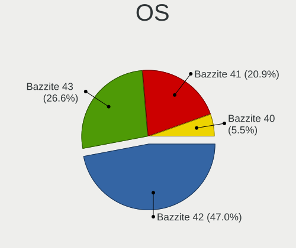

| Name       | Desktops | Percent |
|------------|----------|---------|
| Bazzite 42 | 858      | 47.01%  |
| Bazzite 43 | 486      | 26.63%  |
| Bazzite 41 | 381      | 20.88%  |
| Bazzite 40 | 100      | 5.48%   |

OS Family
---------

OS without a version

| Name    | Desktops | Percent |
|---------|----------|---------|
| Bazzite | 1764     | 100%    |

Kernel
------

Version of the Linux kernel

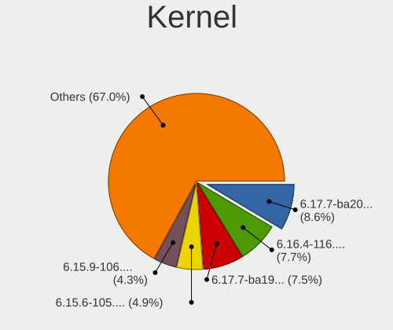

| Version                         | Desktops | Percent |
|---------------------------------|----------|---------|
| 6.17.7-ba20.fc43.x86_64         | 164      | 8.57%   |
| 6.16.4-116.bazzite.fc42.x86_64  | 147      | 7.68%   |
| 6.17.7-ba19.fc43.x86_64         | 144      | 7.52%   |
| 6.15.6-105.bazzite.fc42.x86_64  | 94       | 4.91%   |
| 6.15.9-106.bazzite.fc42.x86_64  | 82       | 4.28%   |
| 6.16.4-108.bazzite.fc42.x86_64  | 66       | 3.45%   |
| 6.14.6-109.bazzite.fc42.x86_64  | 66       | 3.45%   |
| 6.13.9-103.bazzite.fc41.x86_64  | 66       | 3.45%   |
| 6.14.6-106.bazzite.fc42.x86_64  | 64       | 3.34%   |
| 6.14.4-104.bazzite.fc42.x86_64  | 64       | 3.34%   |
| 6.9.12-205.fsync.fc40.x86_64    | 61       | 3.19%   |
| 6.17.7-ba01.fc43.x86_64         | 58       | 3.03%   |
| 6.17.7-ba14.fc43.x86_64         | 43       | 2.25%   |
| 6.17.5-ba07.fc43.x86_64         | 39       | 2.04%   |
| 6.13.7-108.bazzite.fc41.x86_64  | 38       | 1.99%   |
| 6.12.8-201.bazzite.fc41.x86_64  | 38       | 1.99%   |
| 6.12.12-207.bazzite.fc41.x86_64 | 38       | 1.99%   |
| 6.16.4-114.bazzite.fc42.x86_64  | 34       | 1.78%   |
| 6.17.7-ba13.fc43.x86_64         | 33       | 1.72%   |
| 6.15.9-103.bazzite.fc42.x86_64  | 33       | 1.72%   |
| 6.15.6-101.bazzite.fc42.x86_64  | 31       | 1.62%   |
| 6.11.10-304.bazzite.fc41.x86_64 | 30       | 1.57%   |
| 6.16.4-115.bazzite.fc42.x86_64  | 27       | 1.41%   |
| 6.14.6-105.bazzite.fc42.x86_64  | 26       | 1.36%   |
| 6.12.12-203.bazzite.fc41.x86_64 | 24       | 1.25%   |
| 6.11.9-303.bazzite.fc41.x86_64  | 24       | 1.25%   |
| 6.13.6-103.bazzite.fc41.x86_64  | 23       | 1.2%    |
| 6.11.5-307.bazzite.fc41.x86_64  | 22       | 1.15%   |
| 6.9.12-210.fsync.fc40.x86_64    | 21       | 1.1%    |
| 6.14.3-101.bazzite.fc42.x86_64  | 21       | 1.1%    |
| 6.15.6-113.bazzite.fc42.x86_64  | 19       | 0.99%   |
| 6.14.4-103.bazzite.fc42.x86_64  | 19       | 0.99%   |
| 6.13.5-100.bazzite.fc41.x86_64  | 18       | 0.94%   |
| 6.15.4-106.bazzite.fc42.x86_64  | 17       | 0.89%   |
| 6.13.9-103.bazzite.fc42.x86_64  | 17       | 0.89%   |
| 6.16.4-104.bazzite.fc42.x86_64  | 15       | 0.78%   |
| 6.13.5-102.bazzite.fc41.x86_64  | 15       | 0.78%   |
| 6.15.9-116.bazzite.fc42.x86_64  | 14       | 0.73%   |
| 6.12.11-205.bazzite.fc41.x86_64 | 14       | 0.73%   |
| 6.9.12-203.fsync.fc40.x86_64    | 13       | 0.68%   |

Kernel Family
-------------

Linux kernel without a distro release

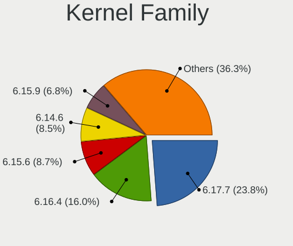

| Version | Desktops | Percent |
|---------|----------|---------|
| 6.17.7  | 450      | 23.78%  |
| 6.16.4  | 303      | 16.01%  |
| 6.15.6  | 164      | 8.67%   |
| 6.14.6  | 160      | 8.46%   |
| 6.15.9  | 128      | 6.77%   |
| 6.9.12  | 93       | 4.92%   |
| 6.14.4  | 83       | 4.39%   |
| 6.13.9  | 83       | 4.39%   |
| 6.12.12 | 62       | 3.28%   |
| 6.17.5  | 39       | 2.06%   |
| 6.13.7  | 38       | 2.01%   |
| 6.12.8  | 38       | 2.01%   |
| 6.13.5  | 33       | 1.74%   |
| 6.11.10 | 30       | 1.59%   |
| 6.11.9  | 24       | 1.27%   |
| 6.13.6  | 23       | 1.22%   |
| 6.15.4  | 22       | 1.16%   |
| 6.11.5  | 22       | 1.16%   |
| 6.14.3  | 21       | 1.11%   |
| 6.12.11 | 14       | 0.74%   |
| 6.11.8  | 13       | 0.69%   |
| 6.12.10 | 11       | 0.58%   |
| 6.12.9  | 10       | 0.53%   |
| 6.12.6  | 10       | 0.53%   |
| 6.11.6  | 5        | 0.26%   |
| 6.10.3  | 5        | 0.26%   |
| 6.9.8   | 3        | 0.16%   |
| 6.13.4  | 3        | 0.16%   |
| 6.13.8  | 1        | 0.05%   |
| 6.10.5  | 1        | 0.05%   |

Kernel Major Ver.
-----------------

Linux kernel major version

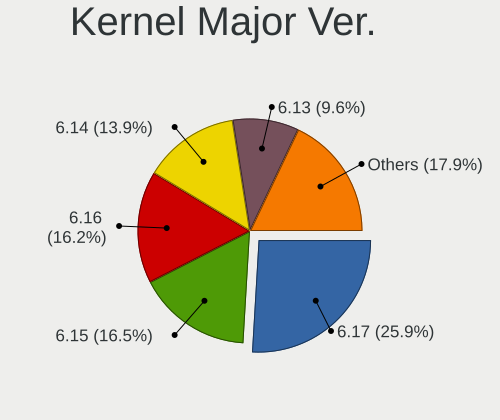

| Version | Desktops | Percent |
|---------|----------|---------|
| 6.17    | 486      | 25.93%  |
| 6.15    | 310      | 16.54%  |
| 6.16    | 303      | 16.17%  |
| 6.14    | 260      | 13.87%  |
| 6.13    | 179      | 9.55%   |
| 6.12    | 142      | 7.58%   |
| 6.9     | 95       | 5.07%   |
| 6.11    | 93       | 4.96%   |
| 6.10    | 6        | 0.32%   |

Arch
----

OS architecture (x86_64, i586, etc.)

| Name   | Desktops | Percent |
|--------|----------|---------|
| x86_64 | 1764     | 100%    |

DE
--

Desktop Environment

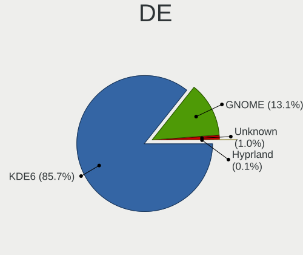

| Name     | Desktops | Percent |
|----------|----------|---------|
| KDE6     | 1517     | 85.71%  |
| GNOME    | 232      | 13.11%  |
| Unknown  | 18       | 1.02%   |
| KDE4     | 2        | 0.11%   |
| Hyprland | 1        | 0.06%   |

Display Server
--------------

X11 or Wayland

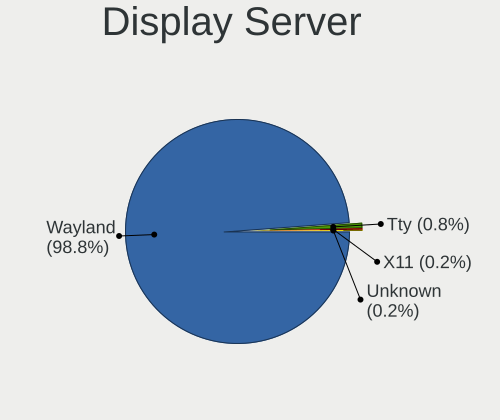

| Name    | Desktops | Percent |
|---------|----------|---------|
| Wayland | 1745     | 98.81%  |
| Tty     | 14       | 0.79%   |
| X11     | 4        | 0.23%   |
| Unknown | 3        | 0.17%   |

Display Manager
---------------

SDDM, LightDM, etc.

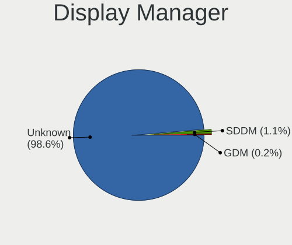

| Name    | Desktops | Percent |
|---------|----------|---------|
| Unknown | 1744     | 98.64%  |
| SDDM    | 20       | 1.13%   |
| GDM     | 4        | 0.23%   |

OS Lang
-------

Language

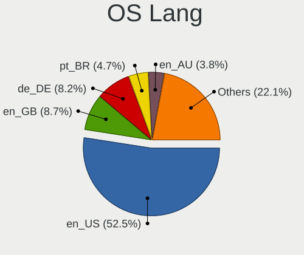

| Lang  | Desktops | Percent |
|-------|----------|---------|
| en_US | 929      | 52.46%  |
| en_GB | 154      | 8.7%    |
| de_DE | 146      | 8.24%   |
| pt_BR | 84       | 4.74%   |
| en_AU | 67       | 3.78%   |
| fr_FR | 57       | 3.22%   |
| en_CA | 40       | 2.26%   |
| it_IT | 31       | 1.75%   |
| es_ES | 23       | 1.3%    |
| es_MX | 20       | 1.13%   |
| pl_PL | 19       | 1.07%   |
| es_AR | 17       | 0.96%   |
| sv_SE | 15       | 0.85%   |
| en_IE | 12       | 0.68%   |
| ru_RU | 10       | 0.56%   |
| en_NZ | 10       | 0.56%   |
| de_AT | 10       | 0.56%   |
| nl_NL | 9        | 0.51%   |
| fr_CA | 8        | 0.45%   |
| hu_HU | 7        | 0.4%    |
| fi_FI | 7        | 0.4%    |
| es_CO | 7        | 0.4%    |
| cs_CZ | 7        | 0.4%    |
| tr_TR | 6        | 0.34%   |
| en_ZA | 6        | 0.34%   |
| nl_BE | 5        | 0.28%   |
| es_CL | 5        | 0.28%   |
| ja_JP | 4        | 0.23%   |
| fr_CH | 4        | 0.23%   |
| de_CH | 4        | 0.23%   |
| sk_SK | 3        | 0.17%   |
| pt_PT | 3        | 0.17%   |
| en_DK | 3        | 0.17%   |
| uk_UA | 2        | 0.11%   |
| nb_NO | 2        | 0.11%   |
| id_ID | 2        | 0.11%   |
| hr_HR | 2        | 0.11%   |
| fr_BE | 2        | 0.11%   |
| es_PE | 2        | 0.11%   |
| en_SG | 2        | 0.11%   |

Boot Mode
---------

EFI or BIOS

| Mode | Desktops | Percent |
|------|----------|---------|
| BIOS | 1744     | 98.64%  |
| EFI  | 24       | 1.36%   |

Filesystem
----------

Type of filesystem

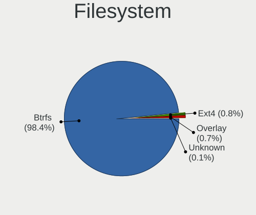

| Type    | Desktops | Percent |
|---------|----------|---------|
| Btrfs   | 1738     | 98.36%  |
| Ext4    | 14       | 0.79%   |
| Overlay | 13       | 0.74%   |
| Tmpfs   | 1        | 0.06%   |
| Unknown | 1        | 0.06%   |

Part. scheme
------------

Scheme of partitioning

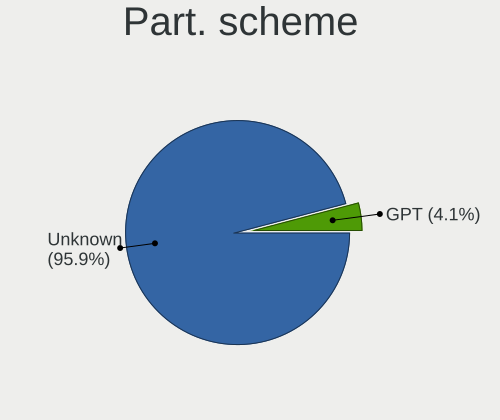

| Type    | Desktops | Percent |
|---------|----------|---------|
| Unknown | 1729     | 97.79%  |
| GPT     | 39       | 2.21%   |

Dual Boot with Linux/BSD
------------------------

Hosting more than one Linux/BSD

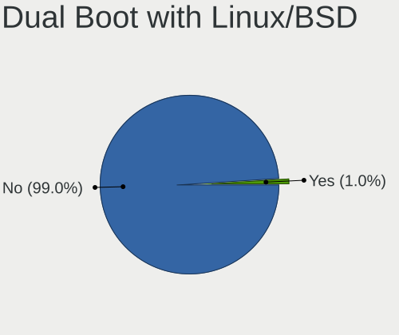

| Dual boot | Desktops | Percent |
|-----------|----------|---------|
| No        | 1748     | 98.98%  |
| Yes       | 18       | 1.02%   |

Dual Boot (Win)
---------------

Hosting Linux and Windows

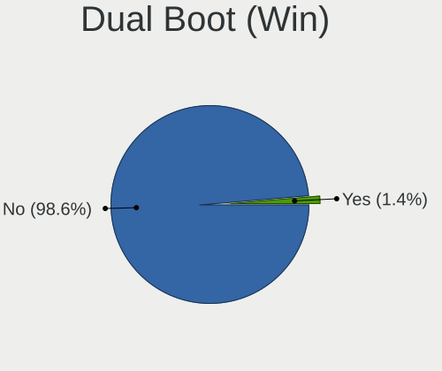

| Dual boot | Desktops | Percent |
|-----------|----------|---------|
| No        | 1741     | 98.64%  |
| Yes       | 24       | 1.36%   |

Board
-----

Vendor
------

Motherboard manufacturer

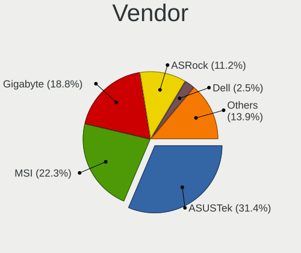

| Name                                 | Desktops | Percent |
|--------------------------------------|----------|---------|
| ASUSTek Computer                     | 554      | 31.41%  |
| MSI                                  | 393      | 22.28%  |
| Gigabyte Technology                  | 331      | 18.76%  |
| ASRock                               | 197      | 11.17%  |
| Dell                                 | 44       | 2.49%   |
| Hewlett-Packard                      | 34       | 1.93%   |
| Intel                                | 30       | 1.7%    |
| Lenovo                               | 20       | 1.13%   |
| Unknown                              | 17       | 0.96%   |
| Shenzhen Meigao Electronic Equipment | 13       | 0.74%   |
| MACHINIST                            | 11       | 0.62%   |
| Acer                                 | 10       | 0.57%   |
| JGINYUE                              | 9        | 0.51%   |
| GMKtec                               | 9        | 0.51%   |
| Alienware                            | 7        | 0.4%    |
| HC Technology.                       | 5        | 0.28%   |
| Fujitsu                              | 5        | 0.28%   |
| MAXSUN                               | 4        | 0.23%   |
| GEEKOM                               | 4        | 0.23%   |
| Biostar                              | 4        | 0.23%   |
| AZW                                  | 4        | 0.23%   |
| TianBei                              | 3        | 0.17%   |
| PELADN                               | 3        | 0.17%   |
| NZXT                                 | 3        | 0.17%   |
| Medion                               | 3        | 0.17%   |
| Kllisre                              | 3        | 0.17%   |
| Huanan                               | 3        | 0.17%   |
| Foxconn                              | 3        | 0.17%   |
| ECS                                  | 3        | 0.17%   |
| Apple                                | 3        | 0.17%   |
| AMD                                  | 3        | 0.17%   |
| SZMZ                                 | 2        | 0.11%   |
| QIYIDA                               | 2        | 0.11%   |
| JINGSHA                              | 2        | 0.11%   |
| Gateway                              | 2        | 0.11%   |
| Colorful Technology                  | 2        | 0.11%   |
| TOPC                                 | 1        | 0.06%   |
| SZQFTX                               | 1        | 0.06%   |
| Soyo                                 | 1        | 0.06%   |
| Shuttle                              | 1        | 0.06%   |

Model
-----

Motherboard model

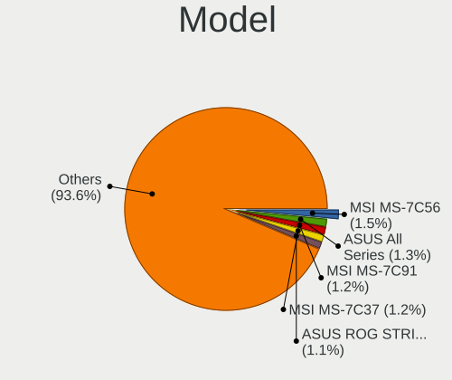

| Name                                       | Desktops | Percent |
|--------------------------------------------|----------|---------|
| MSI MS-7C56                                | 27       | 1.53%   |
| ASUS All Series                            | 23       | 1.3%    |
| MSI MS-7C91                                | 22       | 1.25%   |
| MSI MS-7C37                                | 21       | 1.19%   |
| ASUS ROG STRIX B550-F GAMING               | 20       | 1.13%   |
| ASUS TUF Gaming X570-PLUS                  | 19       | 1.08%   |
| Unknown                                    | 17       | 0.96%   |
| MSI MS-7C95                                | 16       | 0.91%   |
| MSI MS-7B86                                | 15       | 0.85%   |
| MSI MS-7D75                                | 14       | 0.79%   |
| ASUS TUF Gaming B650-PLUS WIFI             | 13       | 0.74%   |
| MSI MS-7C02                                | 12       | 0.68%   |
| ASUS ROG STRIX X870E-E GAMING WIFI         | 12       | 0.68%   |
| Gigabyte X870E AORUS ELITE WIFI7           | 11       | 0.62%   |
| MSI MS-7E26                                | 10       | 0.57%   |
| MSI MS-7E12                                | 10       | 0.57%   |
| Gigabyte B550I AORUS PRO AX                | 10       | 0.57%   |
| ASUS ROG STRIX B550-I GAMING               | 10       | 0.57%   |
| ASUS PRIME B550M-A WIFI II                 | 10       | 0.57%   |
| ASRock B450M Steel Legend                  | 10       | 0.57%   |
| ASUS TUF Gaming B550M-PLUS                 | 9        | 0.51%   |
| MSI MS-7E59                                | 8        | 0.45%   |
| MSI MS-7E51                                | 8        | 0.45%   |
| MSI MS-7C35                                | 8        | 0.45%   |
| Gigabyte X570 AORUS ELITE                  | 8        | 0.45%   |
| Gigabyte B550M DS3H                        | 8        | 0.45%   |
| Gigabyte B550 GAMING X V2                  | 8        | 0.45%   |
| ASUS ROG STRIX B650E-F GAMING WIFI         | 8        | 0.45%   |
| ASUS ROG STRIX B550-F GAMING WIFI II       | 8        | 0.45%   |
| ASUS ROG STRIX B450-F GAMING               | 8        | 0.45%   |
| MSI MS-7D78                                | 7        | 0.4%    |
| Gigabyte X670 AORUS ELITE AX               | 7        | 0.4%    |
| Gigabyte X570 I AORUS PRO WIFI             | 7        | 0.4%    |
| Gigabyte B650 GAMING X AX V2               | 7        | 0.4%    |
| ASUS PRIME B550-PLUS                       | 7        | 0.4%    |
| Shenzhen Meigao Electronic Equipment HX99G | 6        | 0.34%   |
| MSI MS-7D98                                | 6        | 0.34%   |
| MSI MS-7B79                                | 6        | 0.34%   |
| Gigabyte B650M AORUS ELITE AX              | 6        | 0.34%   |
| Gigabyte B450M DS3H                        | 6        | 0.34%   |

Model Family
------------

Motherboard model prefix

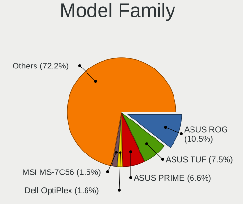

| Name               | Desktops | Percent |
|--------------------|----------|---------|
| ASUS ROG           | 186      | 10.54%  |
| ASUS TUF           | 132      | 7.48%   |
| ASUS PRIME         | 117      | 6.63%   |
| Dell OptiPlex      | 29       | 1.64%   |
| MSI MS-7C56        | 27       | 1.53%   |
| Gigabyte X570      | 27       | 1.53%   |
| Gigabyte B650      | 26       | 1.47%   |
| Gigabyte B550      | 25       | 1.42%   |
| Gigabyte B550M     | 23       | 1.3%    |
| ASUS All           | 23       | 1.3%    |
| MSI MS-7C91        | 22       | 1.25%   |
| MSI MS-7C37        | 21       | 1.19%   |
| Gigabyte B450      | 19       | 1.08%   |
| ASRock B450M       | 19       | 1.08%   |
| ASRock B550M       | 17       | 0.96%   |
| Unknown            | 17       | 0.96%   |
| MSI MS-7C95        | 16       | 0.91%   |
| Gigabyte X870E     | 16       | 0.91%   |
| MSI MS-7B86        | 15       | 0.85%   |
| Gigabyte B650M     | 15       | 0.85%   |
| MSI MS-7D75        | 14       | 0.79%   |
| Gigabyte X870      | 13       | 0.74%   |
| MSI MS-7C02        | 12       | 0.68%   |
| Gigabyte B450M     | 12       | 0.68%   |
| MSI MS-7E26        | 10       | 0.57%   |
| MSI MS-7E12        | 10       | 0.57%   |
| Gigabyte Z790      | 10       | 0.57%   |
| Gigabyte X670      | 10       | 0.57%   |
| Gigabyte B550I     | 10       | 0.57%   |
| ASRock X870E       | 10       | 0.57%   |
| Lenovo ThinkCentre | 9        | 0.51%   |
| GMKtec NucBox      | 9        | 0.51%   |
| ASRock X570        | 9        | 0.51%   |
| MSI MS-7E59        | 8        | 0.45%   |
| MSI MS-7E51        | 8        | 0.45%   |
| MSI MS-7C35        | 8        | 0.45%   |
| Gigabyte Z690      | 8        | 0.45%   |
| ASRock B650M       | 8        | 0.45%   |
| MSI MS-7D78        | 7        | 0.4%    |
| Dell XPS           | 7        | 0.4%    |

MFG Year
--------

Motherboard manufacture year

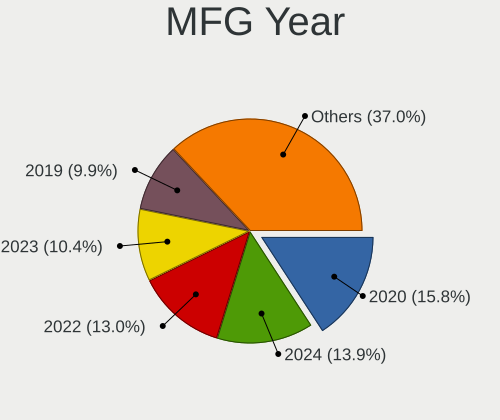

| Year | Desktops | Percent |
|------|----------|---------|
| 2020 | 279      | 15.82%  |
| 2024 | 246      | 13.95%  |
| 2022 | 229      | 12.98%  |
| 2023 | 184      | 10.43%  |
| 2019 | 174      | 9.86%   |
| 2018 | 168      | 9.52%   |
| 2021 | 131      | 7.43%   |
| 2017 | 68       | 3.85%   |
| 2012 | 52       | 2.95%   |
| 2013 | 47       | 2.66%   |
| 2025 | 46       | 2.61%   |
| 2014 | 46       | 2.61%   |
| 2015 | 36       | 2.04%   |
| 2016 | 31       | 1.76%   |
| 2011 | 16       | 0.91%   |
| 2010 | 6        | 0.34%   |
| 2009 | 4        | 0.23%   |
| 2005 | 1        | 0.06%   |

Form Factor
-----------

Physical design of the computer

| Name    | Desktops | Percent |
|---------|----------|---------|
| Desktop | 1764     | 100%    |

Secure Boot
-----------

Enabled or disabled

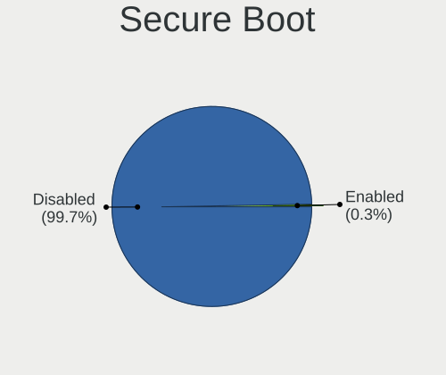

| State    | Desktops | Percent |
|----------|----------|---------|
| Disabled | 1760     | 99.72%  |
| Enabled  | 5        | 0.28%   |

Coreboot
--------

Have coreboot on board

| Used | Desktops | Percent |
|------|----------|---------|
| No   | 1764     | 100%    |

RAM Size
--------

Total RAM memory

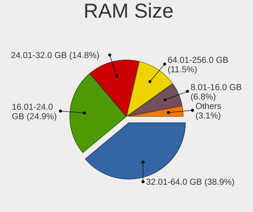

| Size in GB      | Desktops | Percent |
|-----------------|----------|---------|
| 32.01-64.0      | 690      | 38.94%  |
| 16.01-24.0      | 441      | 24.89%  |
| 24.01-32.0      | 262      | 14.79%  |
| 64.01-256.0     | 204      | 11.51%  |
| 8.01-16.0       | 120      | 6.77%   |
| 4.01-8.0        | 44       | 2.48%   |
| 3.01-4.0        | 9        | 0.51%   |
| More than 256.0 | 2        | 0.11%   |

RAM Used
--------

Used RAM memory

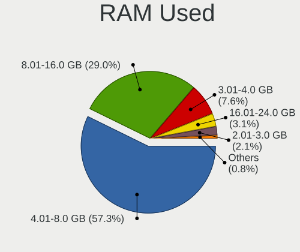

| Used GB    | Desktops | Percent |
|------------|----------|---------|
| 4.01-8.0   | 1056     | 57.27%  |
| 8.01-16.0  | 535      | 29.01%  |
| 3.01-4.0   | 141      | 7.65%   |
| 16.01-24.0 | 58       | 3.15%   |
| 2.01-3.0   | 39       | 2.11%   |
| 32.01-64.0 | 6        | 0.33%   |
| 24.01-32.0 | 5        | 0.27%   |
| 1.01-2.0   | 3        | 0.16%   |
| 0.51-1.0   | 1        | 0.05%   |

Total Drives
------------

Number of drives on board

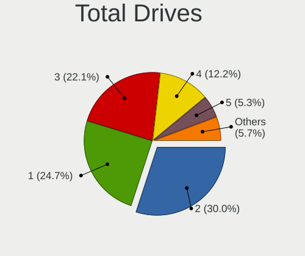

| Drives | Desktops | Percent |
|--------|----------|---------|
| 2      | 541      | 30.02%  |
| 1      | 445      | 24.69%  |
| 3      | 398      | 22.09%  |
| 4      | 220      | 12.21%  |
| 5      | 95       | 5.27%   |
| 6      | 62       | 3.44%   |
| 7      | 26       | 1.44%   |
| 9      | 8        | 0.44%   |
| 10     | 4        | 0.22%   |
| 8      | 2        | 0.11%   |
| 11     | 1        | 0.06%   |

Has CD-ROM
----------

Has CD-ROM on board

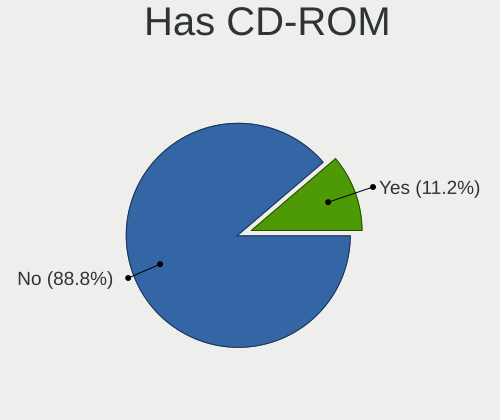

| Presented | Desktops | Percent |
|-----------|----------|---------|
| No        | 1571     | 88.76%  |
| Yes       | 199      | 11.24%  |

Has Ethernet
------------

Has Ethernet on board

| Presented | Desktops | Percent |
|-----------|----------|---------|
| Yes       | 1753     | 99.38%  |
| No        | 11       | 0.62%   |

Has WiFi
--------

Has WiFi module

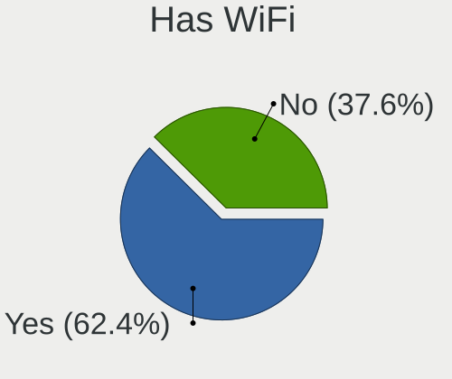

| Presented | Desktops | Percent |
|-----------|----------|---------|
| Yes       | 1107     | 62.44%  |
| No        | 666      | 37.56%  |

Has Bluetooth
-------------

Has Bluetooth module

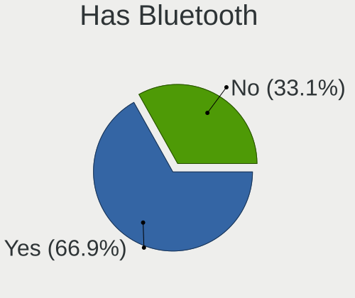

| Presented | Desktops | Percent |
|-----------|----------|---------|
| Yes       | 1187     | 66.87%  |
| No        | 588      | 33.13%  |

Location
--------

Country
-------

Geographic location (country)

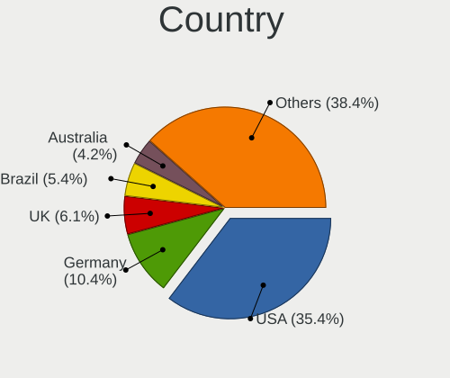

| Country         | Desktops | Percent |
|-----------------|----------|---------|
| USA             | 625      | 35.37%  |
| Germany         | 184      | 10.41%  |
| UK              | 108      | 6.11%   |
| Brazil          | 96       | 5.43%   |
| Australia       | 75       | 4.24%   |
| Canada          | 73       | 4.13%   |
| France          | 66       | 3.74%   |
| Italy           | 37       | 2.09%   |
| Sweden          | 34       | 1.92%   |
| Netherlands     | 32       | 1.81%   |
| Poland          | 30       | 1.7%    |
| Spain           | 26       | 1.47%   |
| Mexico          | 25       | 1.41%   |
| Finland         | 20       | 1.13%   |
| Belgium         | 20       | 1.13%   |
| Norway          | 19       | 1.08%   |
| Argentina       | 19       | 1.08%   |
| Switzerland     | 15       | 0.85%   |
| Czechia         | 15       | 0.85%   |
| Austria         | 15       | 0.85%   |
| Romania         | 14       | 0.79%   |
| South Africa    | 12       | 0.68%   |
| Portugal        | 12       | 0.68%   |
| Ireland         | 11       | 0.62%   |
| New Zealand     | 10       | 0.57%   |
| Serbia          | 9        | 0.51%   |
| Hungary         | 9        | 0.51%   |
| Denmark         | 9        | 0.51%   |
| Turkey          | 8        | 0.45%   |
| Philippines     | 8        | 0.45%   |
| Japan           | 8        | 0.45%   |
| Colombia        | 8        | 0.45%   |
| The Netherlands | 7        | 0.4%    |
| Russia          | 7        | 0.4%    |
| Chile           | 7        | 0.4%    |
| Slovakia        | 6        | 0.34%   |
| Indonesia       | 5        | 0.28%   |
| India           | 5        | 0.28%   |
| Slovenia        | 4        | 0.23%   |
| Malaysia        | 4        | 0.23%   |

City
----

Geographic location (city)

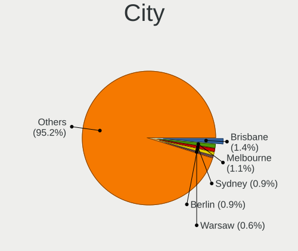

| City              | Desktops | Percent |
|-------------------|----------|---------|
| Brisbane          | 25       | 1.4%    |
| Melbourne         | 19       | 1.06%   |
| Sydney            | 16       | 0.89%   |
| Berlin            | 16       | 0.89%   |
| Warsaw            | 10       | 0.56%   |
| Sao Paulo         | 10       | 0.56%   |
| Atlanta           | 10       | 0.56%   |
| Helsinki          | 9        | 0.5%    |
| Chicago           | 9        | 0.5%    |
| Seattle           | 8        | 0.45%   |
| Perth             | 8        | 0.45%   |
| Montreal          | 8        | 0.45%   |
| Milan             | 8        | 0.45%   |
| Brooklyn          | 8        | 0.45%   |
| Vienna            | 7        | 0.39%   |
| Stockholm         | 7        | 0.39%   |
| Oslo              | 7        | 0.39%   |
| Leipzig           | 7        | 0.39%   |
| Dublin            | 7        | 0.39%   |
| Philadelphia      | 6        | 0.33%   |
| Paris             | 6        | 0.33%   |
| Minneapolis       | 6        | 0.33%   |
| Los Angeles       | 6        | 0.33%   |
| Jacksonville      | 6        | 0.33%   |
| Denver            | 6        | 0.33%   |
| Calgary           | 6        | 0.33%   |
| Bogotá           | 6        | 0.33%   |
| Belgrade          | 6        | 0.33%   |
| Auckland          | 6        | 0.33%   |
| Amsterdam         | 6        | 0.33%   |
| Winnipeg          | 5        | 0.28%   |
| Tampere           | 5        | 0.28%   |
| Tacoma            | 5        | 0.28%   |
| Spokane           | 5        | 0.28%   |
| Manchester        | 5        | 0.28%   |
| Lyon              | 5        | 0.28%   |
| Istanbul          | 5        | 0.28%   |
| Hamburg           | 5        | 0.28%   |
| Frankfurt am Main | 5        | 0.28%   |
| Cleveland         | 5        | 0.28%   |

Drives
------

Drive Vendor
------------

Hard drive vendors

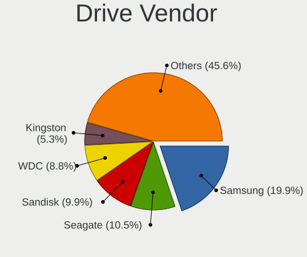

| Vendor                       | Desktops | Drives | Percent |
|------------------------------|----------|--------|---------|
| Samsung Electronics          | 753      | 1279   | 19.87%  |
| Seagate                      | 399      | 571    | 10.53%  |
| Sandisk                      | 376      | 494    | 9.92%   |
| WDC                          | 333      | 457    | 8.79%   |
| Kingston                     | 202      | 271    | 5.33%   |
| Micron/Crucial Technology    | 170      | 213    | 4.49%   |
| Crucial                      | 148      | 175    | 3.91%   |
| Phison Electronics           | 133      | 175    | 3.51%   |
| MAXIO Technology (Hangzhou)  | 112      | 130    | 2.96%   |
| Toshiba                      | 103      | 118    | 2.72%   |
| Kingston Technology Company  | 92       | 107    | 2.43%   |
| Micron Technology            | 59       | 65     | 1.56%   |
| ADATA Technology             | 45       | 60     | 1.19%   |
| A-DATA Technology            | 44       | 47     | 1.16%   |
| Realtek Semiconductor        | 42       | 56     | 1.11%   |
| China                        | 41       | 47     | 1.08%   |
| SPCC                         | 40       | 56     | 1.06%   |
| PNY                          | 40       | 52     | 1.06%   |
| Intel                        | 40       | 47     | 1.06%   |
| Shenzhen Longsys Electronics | 37       | 44     | 0.98%   |
| Silicon Motion               | 35       | 41     | 0.92%   |
| Hitachi                      | 35       | 42     | 0.92%   |
| SK hynix                     | 32       | 44     | 0.84%   |
| HGST                         | 28       | 36     | 0.74%   |
| Unknown                      | 24       | 37     | 0.63%   |
| Team                         | 20       | 22     | 0.53%   |
| T-FORCE                      | 19       | 22     | 0.5%    |
| Patriot                      | 17       | 20     | 0.45%   |
| Unknown                      | 15       | 18     | 0.4%    |
| JMicron Technology           | 14       | 16     | 0.37%   |
| KingSpec                     | 13       | 13     | 0.34%   |
| Lexar                        | 12       | 15     | 0.32%   |
| Seagate Technology           | 11       | 11     | 0.29%   |
| Netac                        | 11       | 12     | 0.29%   |
| KIOXIA                       | 11       | 12     | 0.29%   |
| Intenso                      | 11       | 11     | 0.29%   |
| Fanxiang                     | 11       | 11     | 0.29%   |
| Corsair                      | 11       | 12     | 0.29%   |
| SABRENT                      | 10       | 13     | 0.26%   |
| Realtek                      | 10       | 12     | 0.26%   |

Drive Model
-----------

Hard drive models

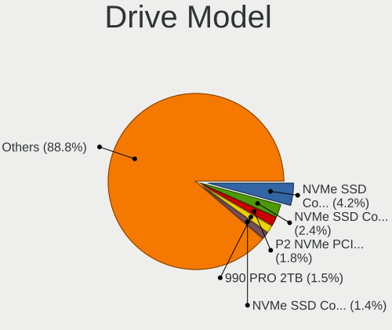

| Model                                                              | Desktops | Percent |
|--------------------------------------------------------------------|----------|---------|
| Samsung NVMe SSD Controller SM981/PM981/PM983 1TB                  | 187      | 4.2%    |
| Samsung NVMe SSD Controller PM9A1/PM9A3/980PRO 1TB                 | 109      | 2.45%   |
| Micron/Crucial P2 NVMe PCIe SSD 2TB                                | 78       | 1.75%   |
| Samsung SSD 990 PRO 2TB                                            | 65       | 1.46%   |
| MAXIO (Hangzhou) NVMe SSD Controller MAP1202 2TB                   | 61       | 1.37%   |
| Seagate ST2000DM008-2FR102 2TB                                     | 60       | 1.35%   |
| Samsung SSD 860 EVO 1TB                                            | 47       | 1.06%   |
| Kingston SA400S37480G 480GB SSD                                    | 44       | 0.99%   |
| Samsung SSD 860 EVO 500GB                                          | 40       | 0.9%    |
| Sandisk WD_BLACK SN850X 2000GB                                     | 36       | 0.81%   |
| Samsung SSD 870 EVO 1TB                                            | 36       | 0.81%   |
| Samsung SSD 850 EVO 500GB                                          | 35       | 0.79%   |
| Phison E12 NVMe Controller 1TB                                     | 35       | 0.79%   |
| Seagate ST1000DM010-2EP102 1TB                                     | 33       | 0.74%   |
| Phison E16 PCIe4 NVMe Controller 1TB                               | 33       | 0.74%   |
| Sandisk WD Blue SN550 NVMe SSD 1024GB                              | 31       | 0.7%    |
| Samsung SSD 980 1TB                                                | 31       | 0.7%    |
| Silicon Motion SM2263EN/SM2263XT SSD Controller 512GB              | 29       | 0.65%   |
| Samsung SSD 850 EVO 250GB                                          | 29       | 0.65%   |
| Kingston Company SNV2S1000G 1TB                                    | 29       | 0.65%   |
| Sandisk WD_BLACK SN770 2TB                                         | 27       | 0.61%   |
| Samsung SSD 860 QVO 1TB                                            | 27       | 0.61%   |
| Samsung SSD 990 EVO Plus 2TB                                       | 26       | 0.58%   |
| Samsung NVMe SSD Controller SM961/PM961/SM963 1024GB               | 26       | 0.58%   |
| Crucial CT1000MX500SSD1 1TB                                        | 26       | 0.58%   |
| WDC WD10EZEX-08WN4A0 1TB                                           | 24       | 0.54%   |
| Sandisk WD Black SN750 / PC SN730 NVMe SSD 500GB                   | 24       | 0.54%   |
| Kingston SA400S37240G 240GB SSD                                    | 24       | 0.54%   |
| Sandisk WD_BLACK SN770 1TB                                         | 23       | 0.52%   |
| Samsung SSD 990 PRO 4TB                                            | 23       | 0.52%   |
| Crucial CT1000BX500SSD1 1TB                                        | 23       | 0.52%   |
| Samsung SSD 870 EVO 2TB                                            | 22       | 0.49%   |
| Sandisk WD Black SN850 1TB                                         | 21       | 0.47%   |
| Samsung SSD 990 PRO 1TB                                            | 20       | 0.45%   |
| Sandisk WD Black 2018/SN750 / PC SN720 NVMe SSD 512GB              | 19       | 0.43%   |
| Samsung SSD 870 QVO 1TB                                            | 19       | 0.43%   |
| Kingston Company SNV3S1000G 1TB                                    | 19       | 0.43%   |
| ADATA XPG SX8200 Pro PCIe Gen3x4 M.2 2280 Solid State Drive 1024GB | 19       | 0.43%   |
| SPCC Solid State Disk 512GB                                        | 18       | 0.4%    |
| Samsung SSD 850 EVO 1TB                                            | 18       | 0.4%    |

HDD Vendor
----------

Hard disk drive vendors

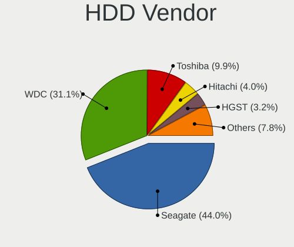

| Vendor              | Desktops | Drives | Percent |
|---------------------|----------|--------|---------|
| Seagate             | 383      | 539    | 43.97%  |
| WDC                 | 271      | 365    | 31.11%  |
| Toshiba             | 86       | 98     | 9.87%   |
| Hitachi             | 35       | 42     | 4.02%   |
| HGST                | 28       | 36     | 3.21%   |
| Samsung Electronics | 22       | 26     | 2.53%   |
| JMicron Technology  | 10       | 10     | 1.15%   |
| T-FORCE             | 9        | 12     | 1.03%   |
| Unknown             | 7        | 8      | 0.8%    |
| SSK                 | 3        | 3      | 0.34%   |
| Maxtor              | 3        | 3      | 0.34%   |
| LaCie               | 2        | 2      | 0.23%   |
| ASMT                | 2        | 2      | 0.23%   |
| XrayDisk            | 1        | 1      | 0.11%   |
| TO Exter            | 1        | 1      | 0.11%   |
| TerraMas            | 1        | 3      | 0.11%   |
| SABRENT             | 1        | 1      | 0.11%   |
| MARVELL             | 1        | 2      | 0.11%   |
| Intenso             | 1        | 1      | 0.11%   |
| Hewlett-Packard     | 1        | 2      | 0.11%   |
| External            | 1        | 1      | 0.11%   |
| ASMedia             | 1        | 1      | 0.11%   |
| Unknown             | 1        | 1      | 0.11%   |

SSD Vendor
----------

Solid state drive vendors

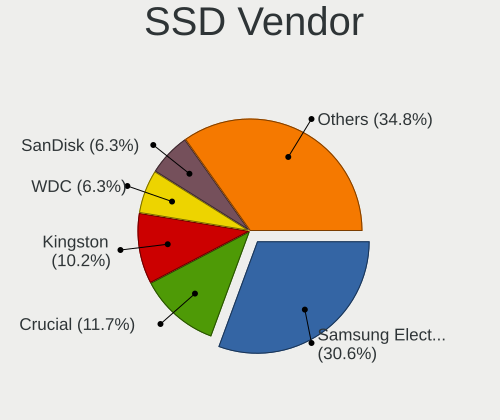

| Vendor              | Desktops | Drives | Percent |
|---------------------|----------|--------|---------|
| Samsung Electronics | 386      | 547    | 30.61%  |
| Crucial             | 148      | 175    | 11.74%  |
| Kingston            | 129      | 173    | 10.23%  |
| WDC                 | 80       | 90     | 6.34%   |
| SanDisk             | 79       | 91     | 6.26%   |
| A-DATA Technology   | 43       | 46     | 3.41%   |
| PNY                 | 40       | 52     | 3.17%   |
| China               | 40       | 46     | 3.17%   |
| SPCC                | 38       | 54     | 3.01%   |
| Team                | 19       | 21     | 1.51%   |
| Micron Technology   | 17       | 18     | 1.35%   |
| Patriot             | 16       | 19     | 1.27%   |
| KingSpec            | 13       | 13     | 1.03%   |
| Corsair             | 11       | 12     | 0.87%   |
| Unknown             | 11       | 13     | 0.87%   |
| OCZ                 | 10       | 11     | 0.79%   |
| Lexar               | 10       | 13     | 0.79%   |
| GOODRAM             | 10       | 12     | 0.79%   |
| Toshiba             | 9        | 9      | 0.71%   |
| SK hynix            | 9        | 14     | 0.71%   |
| Intenso             | 9        | 9      | 0.71%   |
| Intel               | 9        | 10     | 0.71%   |
| SABRENT             | 8        | 11     | 0.63%   |
| Hewlett-Packard     | 7        | 8      | 0.56%   |
| Transcend           | 6        | 6      | 0.48%   |
| Seagate             | 6        | 7      | 0.48%   |
| Netac               | 5        | 5      | 0.4%    |
| Mushkin             | 5        | 9      | 0.4%    |
| Gigabyte Technology | 5        | 6      | 0.4%    |
| Apple               | 5        | 8      | 0.4%    |
| LITEONIT            | 4        | 5      | 0.32%   |
| Fanxiang            | 4        | 4      | 0.32%   |
| X12                 | 3        | 3      | 0.24%   |
| Verbatim            | 3        | 3      | 0.24%   |
| T-FORCE             | 3        | 3      | 0.24%   |
| KIOXIA-EXCERIA      | 3        | 3      | 0.24%   |
| XrayDisk            | 2        | 2      | 0.16%   |
| Vaseky              | 2        | 2      | 0.16%   |
| SSSTC               | 2        | 2      | 0.16%   |
| SD                  | 2        | 3      | 0.16%   |

Drive Kind
----------

HDD or SSD

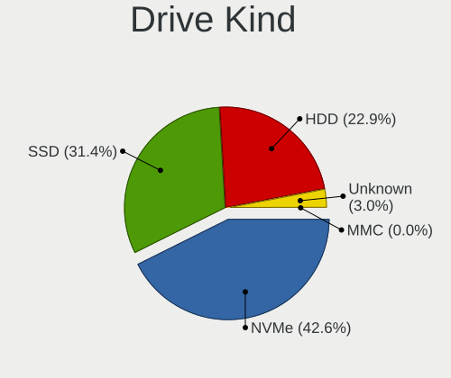

| Kind    | Desktops | Drives | Percent |
|---------|----------|--------|---------|
| NVMe    | 1336     | 2294   | 42.63%  |
| SSD     | 985      | 1595   | 31.43%  |
| HDD     | 718      | 1160   | 22.91%  |
| Unknown | 94       | 112    | 3%      |
| MMC     | 1        | 2      | 0.03%   |

Drive Connector
---------------

SATA, SAS, NVMe, etc.

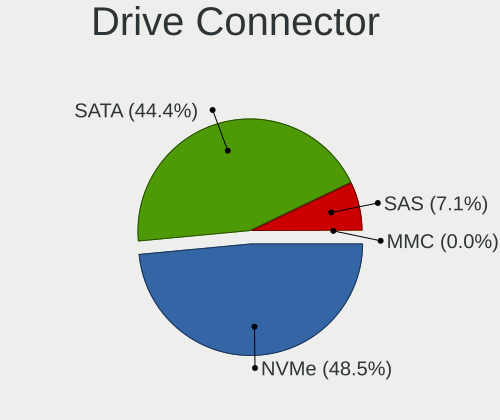

| Type | Desktops | Drives | Percent |
|------|----------|--------|---------|
| NVMe | 1336     | 2270   | 48.51%  |
| SATA | 1222     | 2622   | 44.37%  |
| SAS  | 195      | 269    | 7.08%   |
| MMC  | 1        | 2      | 0.04%   |

Drive Size
----------

Size of hard drive

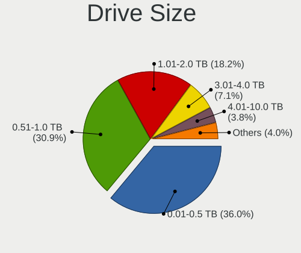

| Size in TB | Desktops | Drives | Percent |
|------------|----------|--------|---------|
| 0.01-0.5   | 696      | 1017   | 36.04%  |
| 0.51-1.0   | 597      | 875    | 30.92%  |
| 1.01-2.0   | 351      | 475    | 18.18%  |
| 3.01-4.0   | 137      | 183    | 7.09%   |
| 4.01-10.0  | 73       | 114    | 3.78%   |
| 2.01-3.0   | 54       | 62     | 2.8%    |
| 10.01-20.0 | 23       | 29     | 1.19%   |

Space Total
-----------

Amount of disk space available on the file system

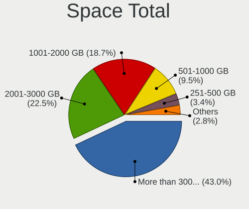

| Size in GB     | Desktops | Percent |
|----------------|----------|---------|
| More than 3000 | 771      | 43%     |
| 2001-3000      | 404      | 22.53%  |
| 1001-2000      | 335      | 18.68%  |
| 501-1000       | 171      | 9.54%   |
| 251-500        | 61       | 3.4%    |
| Unknown        | 36       | 2.01%   |
| 101-250        | 11       | 0.61%   |
| 1-20           | 3        | 0.17%   |
| 51-100         | 1        | 0.06%   |

Space Used
----------

Amount of used disk space

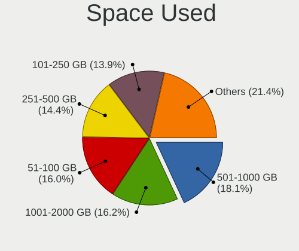

| Used GB        | Desktops | Percent |
|----------------|----------|---------|
| 501-1000       | 337      | 18.1%   |
| 1001-2000      | 301      | 16.17%  |
| 51-100         | 298      | 16%     |
| 251-500        | 269      | 14.45%  |
| 101-250        | 258      | 13.86%  |
| More than 3000 | 197      | 10.58%  |
| 2001-3000      | 136      | 7.3%    |
| Unknown        | 36       | 1.93%   |
| 21-50          | 24       | 1.29%   |
| 1-20           | 4        | 0.21%   |
| 0              | 2        | 0.11%   |

Malfunc. Drives
---------------

Drive models with a malfunction

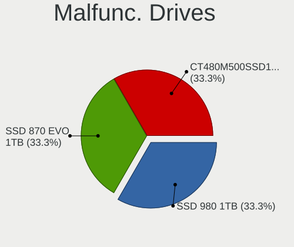

| Model                               | Desktops | Drives | Percent |
|-------------------------------------|----------|--------|---------|
| Samsung Electronics SSD 980 1TB     | 1        | 2      | 33.33%  |
| Samsung Electronics SSD 870 EVO 1TB | 1        | 1      | 33.33%  |
| Crucial CT480M500SSD1 480GB         | 1        | 1      | 33.33%  |

Malfunc. Drive Vendor
---------------------

Vendors of faulty drives

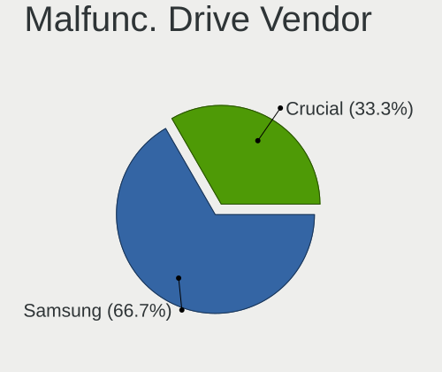

| Vendor              | Desktops | Drives | Percent |
|---------------------|----------|--------|---------|
| Samsung Electronics | 2        | 3      | 66.67%  |
| Crucial             | 1        | 1      | 33.33%  |

Malfunc. HDD Vendor
-------------------

Vendors of faulty HDD drives

Zero info for selected period =(

Malfunc. Drive Kind
-------------------

Kinds of faulty drives

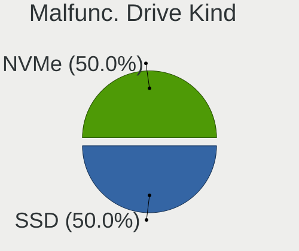

| Kind | Desktops | Drives | Percent |
|------|----------|--------|---------|
| NVMe | 1        | 2      | 50%     |
| SSD  | 1        | 2      | 50%     |

Failed Drives
-------------

Failed drive models

Zero info for selected period =(

Failed Drive Vendor
-------------------

Failed drive vendors

Zero info for selected period =(

Drive Status
------------

Number of failed and malfunc. drives

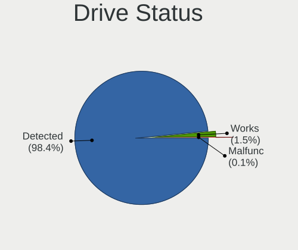

| Status   | Desktops | Drives | Percent |
|----------|----------|--------|---------|
| Detected | 1748     | 5087   | 98.42%  |
| Works    | 26       | 72     | 1.46%   |
| Malfunc  | 2        | 4      | 0.11%   |

Storage controller
------------------

Storage Vendor
--------------

Storage controller vendors

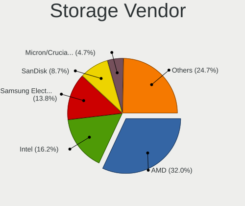

| Vendor                          | Desktops | Percent |
|---------------------------------|----------|---------|
| AMD                             | 1154     | 31.98%  |
| Intel                           | 583      | 16.15%  |
| Samsung Electronics             | 497      | 13.77%  |
| SanDisk                         | 313      | 8.67%   |
| Micron/Crucial Technology       | 170      | 4.71%   |
| Kingston Technology Company     | 161      | 4.46%   |
| Phison Electronics              | 136      | 3.77%   |
| ASMedia Technology              | 135      | 3.74%   |
| MAXIO Technology (Hangzhou)     | 113      | 3.13%   |
| ADATA Technology                | 46       | 1.27%   |
| Micron Technology               | 43       | 1.19%   |
| Realtek Semiconductor           | 42       | 1.16%   |
| Shenzhen Longsys Electronics    | 37       | 1.03%   |
| Silicon Motion                  | 35       | 0.97%   |
| SK hynix                        | 23       | 0.64%   |
| INNOGRIT                        | 20       | 0.55%   |
| Seagate Technology              | 17       | 0.47%   |
| Marvell Technology Group        | 15       | 0.42%   |
| KIOXIA                          | 11       | 0.3%    |
| Toshiba America Info Systems    | 9        | 0.25%   |
| Biwin Storage Technology        | 7        | 0.19%   |
| Netac Technology                | 6        | 0.17%   |
| JMicron Technology              | 5        | 0.14%   |
| Hosin Global Electronics        | 5        | 0.14%   |
| Solidigm                        | 4        | 0.11%   |
| TenaFe                          | 3        | 0.08%   |
| Nvidia                          | 3        | 0.08%   |
| Nextorage                       | 3        | 0.08%   |
| LSI Logic / Symbios Logic       | 3        | 0.08%   |
| Silicon Image                   | 2        | 0.06%   |
| Yangtze Memory Technologies     | 1        | 0.03%   |
| Union Memory (Shenzhen)         | 1        | 0.03%   |
| Sony                            | 1        | 0.03%   |
| Solid State Storage Technology  | 1        | 0.03%   |
| Shenzhen Techwinsemi Technology | 1        | 0.03%   |
| OCZ Technology Group            | 1        | 0.03%   |
| Broadcom / LSI                  | 1        | 0.03%   |
| Adaptec                         | 1        | 0.03%   |

Storage Model
-------------

Storage controller models

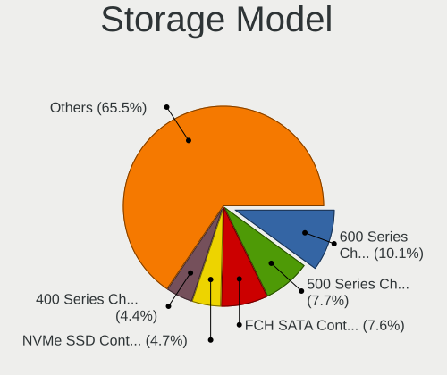

| Model                                                                          | Desktops | Percent |
|--------------------------------------------------------------------------------|----------|---------|
| AMD 600 Series Chipset SATA Controller                                         | 401      | 10.06%  |
| AMD 500 Series Chipset SATA Controller                                         | 308      | 7.72%   |
| AMD FCH SATA Controller [AHCI mode]                                            | 304      | 7.62%   |
| Samsung NVMe SSD Controller SM981/PM981/PM983                                  | 188      | 4.71%   |
| AMD 400 Series Chipset SATA Controller                                         | 174      | 4.36%   |
| Samsung NVMe SSD Controller PM9A1/PM9A3/980PRO                                 | 110      | 2.76%   |
| Samsung NVMe SSD Controller S4LV008[Pascal]                                    | 107      | 2.68%   |
| ASMedia ASM1061/ASM1062 Serial ATA Controller                                  | 106      | 2.66%   |
| Micron/Crucial P2 [Nick P2] / P3 / P3 Plus NVMe PCIe SSD (DRAM-less)           | 78       | 1.96%   |
| Sandisk WD Black SN850X NVMe SSD                                               | 73       | 1.83%   |
| Intel Raptor Lake SATA AHCI Controller                                         | 66       | 1.65%   |
| SanDisk WD SN560/SN740/SN770/SN5000 NVMe SSD                                   | 65       | 1.63%   |
| MAXIO (Hangzhou) NVMe SSD Controller MAP1202 (DRAM-less)                       | 62       | 1.55%   |
| Samsung NVMe SSD Controller PM9C1a (DRAM-less)                                 | 61       | 1.53%   |
| Intel 8 Series/C220 Series Chipset Family 6-port SATA Controller 1 [AHCI mode] | 57       | 1.43%   |
| Samsung NVMe SSD Controller 980 (DRAM-less)                                    | 53       | 1.33%   |
| Intel 200 Series PCH SATA controller [AHCI mode]                               | 51       | 1.28%   |
| MAXIO (Hangzhou) NVMe SSD Controller MAP1602 (DRAM-less)                       | 50       | 1.25%   |
| Intel Alder Lake-S PCH SATA Controller [AHCI Mode]                             | 48       | 1.2%    |
| Intel Q170/Q150/B150/H170/H110/Z170/CM236 Chipset SATA Controller [AHCI Mode]  | 45       | 1.13%   |
| Intel 500 Series Chipset Family SATA AHCI Controller                           | 42       | 1.05%   |
| Intel SATA Controller [RAID mode]                                              | 40       | 1%      |
| Phison E12 NVMe Controller                                                     | 35       | 0.88%   |
| Kingston Company KC3000/FURY Renegade NVMe SSD [E18]                           | 34       | 0.85%   |
| Intel Cannon Lake PCH SATA AHCI Controller                                     | 34       | 0.85%   |
| Phison E16 PCIe4 NVMe Controller                                               | 33       | 0.83%   |
| SanDisk Ultra 3D / WD PC SN530, IX SN530, Blue SN550 NVMe SSD (DRAM-less)      | 31       | 0.78%   |
| Kingston Company NV2 NVMe SSD [SM2267XT] (DRAM-less)                           | 31       | 0.78%   |
| Micron 2550 NVMe SSD (DRAM-less)                                               | 30       | 0.75%   |
| Intel 7 Series/C210 Series Chipset Family 6-port SATA Controller [AHCI mode]   | 30       | 0.75%   |
| Silicon Motion SM2263EN/SM2263XT (DRAM-less) NVMe SSD Controllers              | 29       | 0.73%   |
| Intel 6 Series/C200 Series Chipset Family 6 port Desktop SATA AHCI Controller  | 29       | 0.73%   |
| AMD 300 Series Chipset SATA Controller                                         | 28       | 0.7%    |
| Samsung NVMe SSD Controller SM961/PM961/SM963                                  | 26       | 0.65%   |
| ASMedia ASM1064 Serial ATA Controller                                          | 26       | 0.65%   |
| AMD A320 Chipset SATA Controller [AHCI mode]                                   | 26       | 0.65%   |
| Shenzhen Longsys Lexar NM790 / Patriot Viper VP4300 Lite NVMe SSD (DRAM-less)  | 25       | 0.63%   |
| Intel Comet Lake SATA AHCI Controller                                          | 25       | 0.63%   |
| SanDisk Extreme Pro / WD Black SN750 / PC SN730 / Red SN700 NVMe SSD           | 24       | 0.6%    |
| SanDisk Ultra 3D / WD Blue SN570 NVMe SSD (DRAM-less)                          | 23       | 0.58%   |

Storage Kind
------------

Kind of storage controller (IDE, SATA, NVMe, SAS, ...)

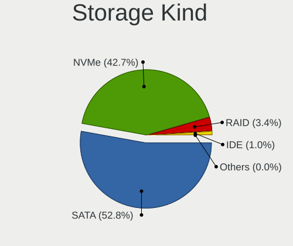

| Kind | Desktops | Percent |
|------|----------|---------|
| SATA | 1655     | 52.84%  |
| NVMe | 1337     | 42.69%  |
| RAID | 107      | 3.42%   |
| IDE  | 30       | 0.96%   |
| SAS  | 2        | 0.06%   |
| SCSI | 1        | 0.03%   |

Processor
---------

CPU Vendor
----------

Processor vendors

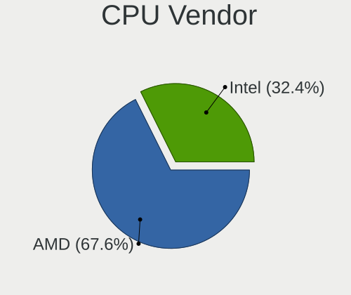

| Vendor | Desktops | Percent |
|--------|----------|---------|
| AMD    | 1193     | 67.63%  |
| Intel  | 571      | 32.37%  |

CPU Model
---------

Processor models

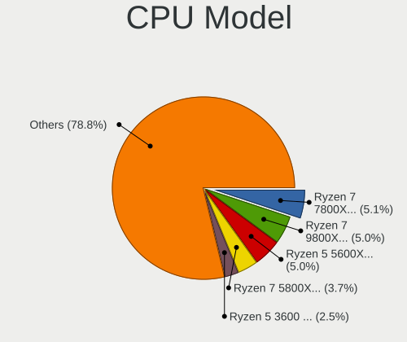

| Model                                  | Desktops | Percent |
|----------------------------------------|----------|---------|
| AMD Ryzen 7 7800X3D 8-Core Processor   | 90       | 5.08%   |
| AMD Ryzen 7 9800X3D 8-Core Processor   | 89       | 5.03%   |
| AMD Ryzen 5 5600X 6-Core Processor     | 88       | 4.97%   |
| AMD Ryzen 7 5800X 8-Core Processor     | 65       | 3.67%   |
| AMD Ryzen 5 3600 6-Core Processor      | 44       | 2.49%   |
| AMD Ryzen 9 5900X 12-Core Processor    | 40       | 2.26%   |
| AMD Ryzen 7 5700X 8-Core Processor     | 40       | 2.26%   |
| AMD Ryzen 7 3700X 8-Core Processor     | 39       | 2.2%    |
| AMD Ryzen 5 7600X 6-Core Processor     | 38       | 2.15%   |
| AMD Ryzen 7 5800X3D 8-Core Processor   | 37       | 2.09%   |
| AMD Ryzen 7 5700X3D 8-Core Processor   | 32       | 1.81%   |
| AMD Ryzen 5 5600 6-Core Processor      | 30       | 1.69%   |
| AMD Ryzen 5 5500                       | 28       | 1.58%   |
| AMD Ryzen 5 5600G with Radeon Graphics | 27       | 1.53%   |
| AMD Ryzen 9 3900X 12-Core Processor    | 19       | 1.07%   |
| AMD Ryzen 7 3800X 8-Core Processor     | 19       | 1.07%   |
| AMD Ryzen 5 9600X 6-Core Processor     | 19       | 1.07%   |
| AMD Ryzen 9 7950X3D 16-Core Processor  | 18       | 1.02%   |
| AMD Ryzen 7 9700X 8-Core Processor     | 18       | 1.02%   |
| AMD Ryzen 7 5700G with Radeon Graphics | 17       | 0.96%   |
| AMD Ryzen 9 5950X 16-Core Processor    | 16       | 0.9%    |
| AMD Ryzen 7 2700X Eight-Core Processor | 16       | 0.9%    |
| Intel Core i7-9700K CPU @ 3.60GHz      | 15       | 0.85%   |
| AMD Ryzen 9 9900X 12-Core Processor    | 15       | 0.85%   |
| Intel Xeon CPU E5-2680 v4 @ 2.40GHz    | 14       | 0.79%   |
| Intel Core i7-3770 CPU @ 3.40GHz       | 14       | 0.79%   |
| AMD Ryzen 9 9950X3D 16-Core Processor  | 14       | 0.79%   |
| AMD Ryzen 5 2600 Six-Core Processor    | 14       | 0.79%   |
| AMD Ryzen 7 7700X 8-Core Processor     | 13       | 0.73%   |
| AMD Ryzen 7 7700 8-Core Processor      | 13       | 0.73%   |
| AMD Ryzen 7 2700 Eight-Core Processor  | 13       | 0.73%   |
| AMD Ryzen 5 1600 Six-Core Processor    | 13       | 0.73%   |
| Intel Core i7-8700 CPU @ 3.20GHz       | 12       | 0.68%   |
| AMD Ryzen 9 7900X 12-Core Processor    | 12       | 0.68%   |
| Intel Core i7-4790 CPU @ 3.60GHz       | 11       | 0.62%   |
| Intel Core i5-10400F CPU @ 2.90GHz     | 11       | 0.62%   |
| AMD Ryzen 5 7500F 6-Core Processor     | 11       | 0.62%   |
| AMD Ryzen 5 3600X 6-Core Processor     | 10       | 0.56%   |
| Intel Core i5-6600K CPU @ 3.50GHz      | 9        | 0.51%   |
| Intel Core i5-6500 CPU @ 3.20GHz       | 9        | 0.51%   |

CPU Model Family
----------------

Processor model prefix

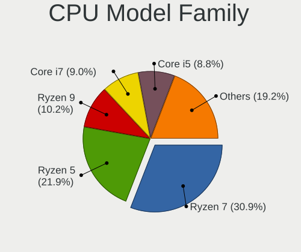

| Model                  | Desktops | Percent |
|------------------------|----------|---------|
| AMD Ryzen 7            | 546      | 30.88%  |
| AMD Ryzen 5            | 388      | 21.95%  |
| AMD Ryzen 9            | 181      | 10.24%  |
| Intel Core i7          | 159      | 8.99%   |
| Intel Core i5          | 155      | 8.77%   |
| Other                  | 137      | 7.75%   |
| Intel Xeon             | 58       | 3.28%   |
| Intel Core i3          | 33       | 1.87%   |
| Intel Core i9          | 27       | 1.53%   |
| AMD FX                 | 22       | 1.24%   |
| AMD Ryzen 3            | 16       | 0.9%    |
| AMD Ryzen 5 PRO        | 10       | 0.57%   |
| AMD Ryzen Threadripper | 6        | 0.34%   |
| Intel Core             | 5        | 0.28%   |
| Intel Celeron          | 5        | 0.28%   |
| AMD A8                 | 3        | 0.17%   |
| AMD A10                | 3        | 0.17%   |
| AMD Phenom II X6       | 2        | 0.11%   |
| AMD Phenom II X4       | 2        | 0.11%   |
| Intel Pentium Silver   | 1        | 0.06%   |
| Intel Pentium Gold     | 1        | 0.06%   |
| AMD Sempron            | 1        | 0.06%   |
| AMD Ryzen 7 PRO        | 1        | 0.06%   |
| AMD Opteron            | 1        | 0.06%   |
| AMD E                  | 1        | 0.06%   |
| AMD Athlon II X4       | 1        | 0.06%   |
| AMD Athlon 64 X2       | 1        | 0.06%   |
| AMD Athlon             | 1        | 0.06%   |
| AMD A4                 | 1        | 0.06%   |

CPU Cores
---------

Number of processor cores

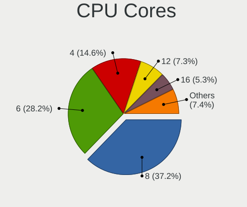

| Number | Desktops | Percent |
|--------|----------|---------|
| 8      | 658      | 37.22%  |
| 6      | 499      | 28.22%  |
| 4      | 259      | 14.65%  |
| 12     | 129      | 7.3%    |
| 16     | 93       | 5.26%   |
| 10     | 38       | 2.15%   |
| 14     | 29       | 1.64%   |
| 2      | 28       | 1.58%   |
| 20     | 17       | 0.96%   |
| 24     | 15       | 0.85%   |
| 32     | 3        | 0.17%   |

CPU Sockets
-----------

Number of sockets

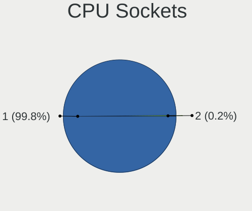

| Number | Desktops | Percent |
|--------|----------|---------|
| 1      | 1761     | 99.83%  |
| 2      | 3        | 0.17%   |

CPU Threads
-----------

Threads per core (Hyper-Threading)

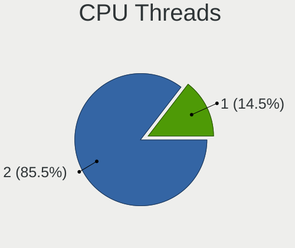

| Number | Desktops | Percent |
|--------|----------|---------|
| 2      | 1510     | 85.46%  |
| 1      | 257      | 14.54%  |

CPU Op-Modes
------------

CPU Operation Modes (32-bit, 64-bit)

| Op mode        | Desktops | Percent |
|----------------|----------|---------|
| 32-bit, 64-bit | 1764     | 100%    |

CPU Microcode
-------------

Microcode number

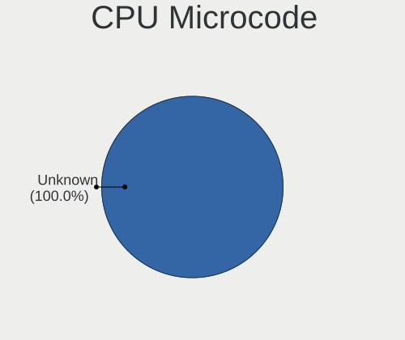

| Number  | Desktops | Percent |
|---------|----------|---------|
| Unknown | 1764     | 100%    |

CPU Microarch
-------------

Microarchitecture

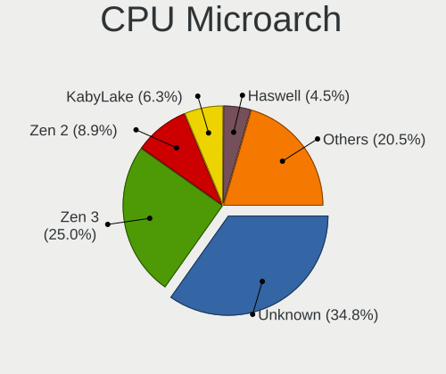

| Name             | Desktops | Percent |
|------------------|----------|---------|
| Unknown          | 615      | 34.79%  |
| Zen 3            | 442      | 25%     |
| Zen 2            | 158      | 8.94%   |
| KabyLake         | 112      | 6.33%   |
| Haswell          | 79       | 4.47%   |
| Zen+             | 72       | 4.07%   |
| IvyBridge        | 63       | 3.56%   |
| CometLake        | 58       | 3.28%   |
| Skylake          | 46       | 2.6%    |
| Zen              | 33       | 1.87%   |
| Broadwell        | 24       | 1.36%   |
| Piledriver       | 20       | 1.13%   |
| SandyBridge      | 17       | 0.96%   |
| K10              | 5        | 0.28%   |
| Bulldozer        | 4        | 0.23%   |
| Westmere         | 3        | 0.17%   |
| Nehalem          | 3        | 0.17%   |
| Excavator        | 3        | 0.17%   |
| Steamroller      | 2        | 0.11%   |
| Jaguar           | 2        | 0.11%   |
| Goldmont plus    | 2        | 0.11%   |
| Alderlake Hybrid | 2        | 0.11%   |
| K8 Hammer        | 1        | 0.06%   |
| K10 Llano        | 1        | 0.06%   |
| Goldmont         | 1        | 0.06%   |

Graphics
--------

GPU Vendor
----------

Vendors of graphics cards

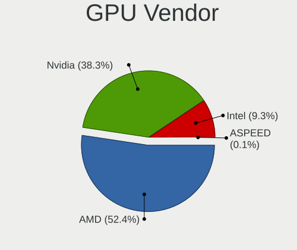

| Vendor            | Desktops | Percent |
|-------------------|----------|---------|
| AMD               | 1041     | 52.36%  |
| Nvidia            | 761      | 38.28%  |
| Intel             | 185      | 9.31%   |
| ASPEED Technology | 1        | 0.05%   |

GPU Model
---------

Graphics card models

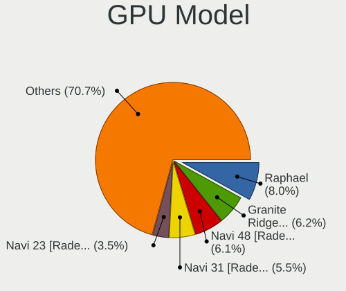

| Model                                                                       | Desktops | Percent |
|-----------------------------------------------------------------------------|----------|---------|
| AMD Raphael                                                                 | 181      | 8.02%   |
| AMD Granite Ridge [Radeon Graphics]                                         | 141      | 6.25%   |
| AMD Navi 48 [Radeon RX 9070/9070 XT/9070 GRE]                               | 137      | 6.07%   |
| AMD Navi 31 [Radeon RX 7900 XT/7900 XTX/7900 GRE/7900M]                     | 124      | 5.49%   |
| AMD Navi 23 [Radeon RX 6600/6600 XT/6600M]                                  | 78       | 3.46%   |
| AMD Ellesmere [Radeon RX 470/480/570/570X/580/580X/590]                     | 72       | 3.19%   |
| AMD Navi 21 [Radeon RX 6800/6800 XT / 6900 XT]                              | 62       | 2.75%   |
| AMD Navi 32 [Radeon RX 7700 XT / 7800 XT]                                   | 61       | 2.7%    |
| AMD Navi 22 [Radeon RX 6700/6700 XT/6750 XT / 6800M/6850M XT]               | 58       | 2.57%   |
| Nvidia GA106 [GeForce RTX 3060 Lite Hash Rate]                              | 51       | 2.26%   |
| AMD Navi 33 [Radeon RX 7600/7600 XT/7600M XT/7600S/7700S / PRO W7600]       | 46       | 2.04%   |
| AMD Navi 44 [Radeon RX 9060 XT]                                             | 43       | 1.91%   |
| AMD Navi 10 [Radeon RX 5600 OEM/5600 XT / 5700/5700 XT]                     | 36       | 1.6%    |
| AMD Polaris 20 XL [Radeon RX 580 2048SP]                                    | 31       | 1.37%   |
| Nvidia GP104 [GeForce GTX 1070]                                             | 29       | 1.28%   |
| Nvidia AD107 [GeForce RTX 4060]                                             | 27       | 1.2%    |
| Nvidia AD102 [GeForce RTX 4090]                                             | 26       | 1.15%   |
| AMD Cezanne [Radeon Vega Series / Radeon Vega Mobile Series]                | 26       | 1.15%   |
| Nvidia GP104 [GeForce GTX 1080]                                             | 25       | 1.11%   |
| Nvidia GP106 [GeForce GTX 1060 6GB]                                         | 23       | 1.02%   |
| Nvidia GA104 [GeForce RTX 3070 Ti]                                          | 23       | 1.02%   |
| Nvidia GA104 [GeForce RTX 3070]                                             | 21       | 0.93%   |
| Nvidia GA102 [GeForce RTX 3080 Ti]                                          | 21       | 0.93%   |
| Intel Xeon E3-1200 v3/4th Gen Core Processor Integrated Graphics Controller | 21       | 0.93%   |
| Nvidia AD104 [GeForce RTX 4070]                                             | 20       | 0.89%   |
| Intel CoffeeLake-S GT2 [UHD Graphics 630]                                   | 20       | 0.89%   |
| Nvidia GP107 [GeForce GTX 1050 Ti]                                          | 18       | 0.8%    |
| Nvidia GP102 [GeForce GTX 1080 Ti]                                          | 18       | 0.8%    |
| Nvidia AD104 [GeForce RTX 4070 SUPER]                                       | 18       | 0.8%    |
| AMD Navi 24 [Radeon RX 6400/6500 XT/6500M]                                  | 18       | 0.8%    |
| Nvidia GA102 [GeForce RTX 3080]                                             | 17       | 0.75%   |
| Intel Raptor Lake-S GT1 [UHD Graphics 770]                                  | 17       | 0.75%   |
| AMD Navi 23 [Radeon RX 6650 XT / 6700S / 6800S]                             | 17       | 0.75%   |
| Nvidia TU104 [GeForce RTX 2070 SUPER]                                       | 16       | 0.71%   |
| Nvidia GA102 [GeForce RTX 3080 Lite Hash Rate]                              | 16       | 0.71%   |
| Nvidia AD103 [GeForce RTX 4080]                                             | 16       | 0.71%   |
| Nvidia TU116 [GeForce GTX 1660 SUPER]                                       | 15       | 0.66%   |
| Nvidia AD103 [GeForce RTX 4080 SUPER]                                       | 15       | 0.66%   |
| Intel Alder Lake-S GT1 [UHD Graphics 770]                                   | 14       | 0.62%   |
| AMD Phoenix1                                                                | 14       | 0.62%   |

GPU Combo
---------

Combinations of graphics cards

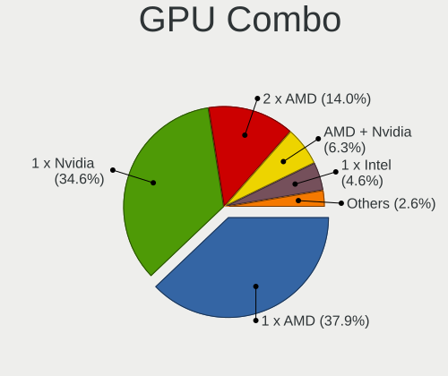

| Name             | Desktops | Percent |
|------------------|----------|---------|
| 1 x AMD          | 673      | 37.89%  |
| 1 x Nvidia       | 615      | 34.63%  |
| 2 x AMD          | 248      | 13.96%  |
| AMD + Nvidia     | 112      | 6.31%   |
| 1 x Intel        | 81       | 4.56%   |
| Intel + Nvidia   | 27       | 1.52%   |
| Intel + AMD      | 10       | 0.56%   |
| 2 x Nvidia       | 5        | 0.28%   |
| 2 x Intel        | 2        | 0.11%   |
| 3 x AMD          | 1        | 0.06%   |
| 1 x ASPEED       | 1        | 0.06%   |
| AMD + 2 x Nvidia | 1        | 0.06%   |

GPU Driver
----------

Free vs proprietary

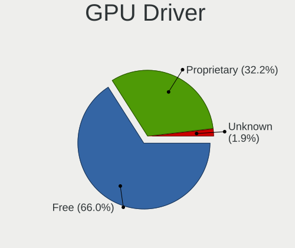

| Driver      | Desktops | Percent |
|-------------|----------|---------|
| Free        | 1169     | 65.97%  |
| Proprietary | 570      | 32.17%  |
| Unknown     | 33       | 1.86%   |

GPU Memory
----------

Total video memory

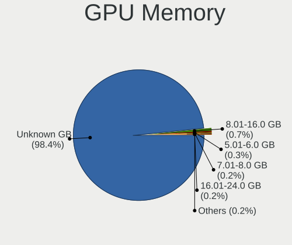

| Size in GB | Desktops | Percent |
|------------|----------|---------|
| Unknown    | 1737     | 98.36%  |
| 8.01-16.0  | 13       | 0.74%   |
| 5.01-6.0   | 5        | 0.28%   |
| 7.01-8.0   | 4        | 0.23%   |
| 16.01-24.0 | 3        | 0.17%   |
| 3.01-4.0   | 2        | 0.11%   |
| 1.01-2.0   | 1        | 0.06%   |
| 0.01-0.5   | 1        | 0.06%   |

Monitor
-------

Monitor Vendor
--------------

Monitor vendors

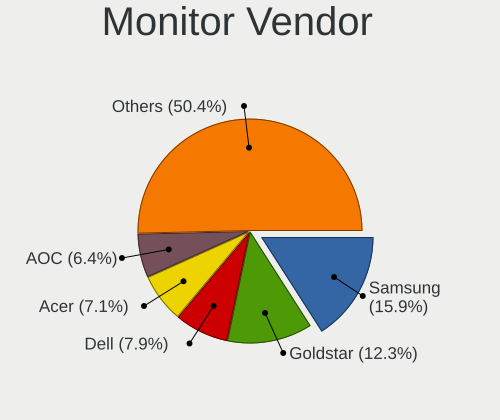

| Vendor               | Desktops | Percent |
|----------------------|----------|---------|
| Samsung Electronics  | 341      | 15.93%  |
| Goldstar             | 264      | 12.34%  |
| Dell                 | 168      | 7.85%   |
| Acer                 | 153      | 7.15%   |
| AOC                  | 136      | 6.36%   |
| ASUSTek Computer     | 119      | 5.56%   |
| MSI                  | 104      | 4.86%   |
| Hewlett-Packard      | 72       | 3.36%   |
| Ancor Communications | 71       | 3.32%   |
| BenQ                 | 69       | 3.22%   |
| Gigabyte Technology  | 64       | 2.99%   |
| Philips              | 48       | 2.24%   |
| Sony                 | 30       | 1.4%    |
| HKC                  | 30       | 1.4%    |
| Sceptre Tech         | 29       | 1.36%   |
| ViewSonic            | 28       | 1.31%   |
| Iiyama               | 27       | 1.26%   |
| Lenovo               | 26       | 1.21%   |
| Vizio                | 20       | 0.93%   |
| Hitachi              | 20       | 0.93%   |
| Unknown (XXX)        | 16       | 0.75%   |
| Mi                   | 15       | 0.7%    |
| RTK                  | 13       | 0.61%   |
| SKG                  | 12       | 0.56%   |
| Panasonic            | 12       | 0.56%   |
| Denver               | 12       | 0.56%   |
| Toshiba              | 10       | 0.47%   |
| TCL                  | 9        | 0.42%   |
| Pixio                | 9        | 0.42%   |
| Sharp                | 8        | 0.37%   |
| Insignia             | 8        | 0.37%   |
| SANSUI               | 6        | 0.28%   |
| HUAWEI               | 6        | 0.28%   |
| Xiaomi               | 5        | 0.23%   |
| VIZTA                | 5        | 0.23%   |
| VIE                  | 5        | 0.23%   |
| GreenWood            | 5        | 0.23%   |
| AOpen                | 5        | 0.23%   |
| Vestel Elektronik    | 4        | 0.19%   |
| MSD                  | 4        | 0.19%   |

Monitor Model
-------------

Monitor models

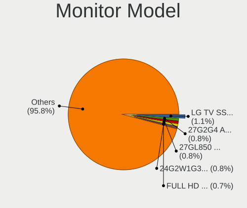

| Model                                                                   | Desktops | Percent |
|-------------------------------------------------------------------------|----------|---------|
| Goldstar LG TV SSCR2 GSMC0C8 3840x2160                                  | 25       | 1.1%    |
| AOC 27G2G4 AOC2702 1920x1080 598x336mm 27.0-inch                        | 19       | 0.84%   |
| Goldstar 27GL850 GSM5B7F 2560x1440 597x336mm 27.0-inch                  | 18       | 0.8%    |
| AOC 24G2W1G3 AOC2402 1920x1080 527x296mm 23.8-inch                      | 17       | 0.75%   |
| Goldstar FULL HD GSM5B55 1920x1080 480x270mm 21.7-inch                  | 15       | 0.66%   |
| Samsung Electronics C27F390 SAM0D32 1920x1080 598x336mm 27.0-inch       | 12       | 0.53%   |
| MSI Optix MAG27CQ MSI1462 2560x1440 597x336mm 27.0-inch                 | 11       | 0.49%   |
| Gigabyte Technology M27Q GBT270D 2560x1440 597x336mm 27.0-inch          | 10       | 0.44%   |
| Dell S2721DGF DEL41D9 2560x1440 597x336mm 27.0-inch                     | 9        | 0.4%    |
| Dell AW3225QF DELA246 3840x2160 699x395mm 31.6-inch                     | 9        | 0.4%    |
| Ancor Communications VG248 ACI24A4 1920x1080 531x299mm 24.0-inch        | 9        | 0.4%    |
| Denver MO-HHS-32C LHCFFFF 1920x1080 699x393mm 31.6-inch                 | 8        | 0.35%   |
| Dell AW3423DWF DELA212 3440x1440 800x337mm 34.2-inch                    | 8        | 0.35%   |
| ASUSTek Computer VG27A AUS2722 2560x1440 597x336mm 27.0-inch            | 8        | 0.35%   |
| Ancor Communications ROG PG279Q ACI27EC 2560x1440 598x336mm 27.0-inch   | 8        | 0.35%   |
| Samsung Electronics U28E590 SAM0C4D 3840x2160 607x345mm 27.5-inch       | 7        | 0.31%   |
| Samsung Electronics C24F390 SAM0D2C 1920x1080 521x293mm 23.5-inch       | 7        | 0.31%   |
| MSI MAG 27CQ6F MSI3CD9 2560x1440 597x336mm 27.0-inch                    | 7        | 0.31%   |
| Hitachi HISENSE HEC0030 3840x2160 1872x1053mm 84.6-inch                 | 7        | 0.31%   |
| Goldstar ULTRAGEAR GSM5BD3 2560x1440 697x392mm 31.5-inch                | 7        | 0.31%   |
| Goldstar TV SSCR2 GSM81CD 3840x2160                                     | 7        | 0.31%   |
| ASUSTek Computer XG27AQDMG AUS27F2 2560x1440 587x330mm 26.5-inch        | 7        | 0.31%   |
| ASUSTek Computer VG27AQL1A AUS2705 2560x1440 597x336mm 27.0-inch        | 7        | 0.31%   |
| AOC U34G2G4R3 AOC3402 3440x1440 797x334mm 34.0-inch                     | 7        | 0.31%   |
| AOC 24B1W1 AOC2401 1920x1080 527x296mm 23.8-inch                        | 7        | 0.31%   |
| Acer XB271HU ACR0490 2560x1440 598x336mm 27.0-inch                      | 7        | 0.31%   |
| TCL Beyond TV TCL9653 3840x2160 1210x680mm 54.6-inch                    | 6        | 0.27%   |
| Sceptre Tech Sceptre F24 SPT09AB 1920x1080 530x290mm 23.8-inch          | 6        | 0.27%   |
| Samsung Electronics Odyssey G85SB SAM72F2 3440x1440 809x354mm 34.8-inch | 6        | 0.27%   |
| Samsung Electronics LF24T35 SAM707D 1920x1080 528x297mm 23.9-inch       | 6        | 0.27%   |
| Samsung Electronics LC49G95T SAM7053 3840x1080 1193x336mm 48.8-inch     | 6        | 0.27%   |
| Samsung Electronics LC27G7xT SAM105C 2560x1440 597x336mm 27.0-inch      | 6        | 0.27%   |
| Goldstar LG ULTRAWIDE GSM59F1 2560x1080 670x280mm 28.6-inch             | 6        | 0.27%   |
| Gigabyte Technology G32QC GBT3200 2560x1440 697x392mm 31.5-inch         | 6        | 0.27%   |
| AOC Q27G3XMN AOCB326 2560x1440 597x336mm 27.0-inch                      | 6        | 0.27%   |
| AOC 24G4 AOCB401 1920x1080 527x296mm 23.8-inch                          | 6        | 0.27%   |
| Samsung Electronics Odyssey G5 SAM7486 2560x1440 597x336mm 27.0-inch    | 5        | 0.22%   |
| Samsung Electronics LC34G55T SAM711A 3440x1440 798x334mm 34.1-inch      | 5        | 0.22%   |
| Samsung Electronics LC32G7xT SAM7058 2560x1440 698x393mm 31.5-inch      | 5        | 0.22%   |
| MSI G321CU MSI3DC5 3840x2160 697x392mm 31.5-inch                        | 5        | 0.22%   |

Monitor Resolution
------------------

Monitor screen resolution

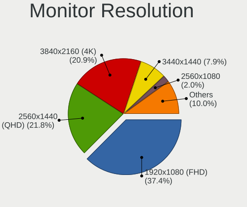

| Resolution         | Desktops | Percent |
|--------------------|----------|---------|
| 1920x1080 (FHD)    | 759      | 37.44%  |
| 2560x1440 (QHD)    | 441      | 21.76%  |
| 3840x2160 (4K)     | 424      | 20.92%  |
| 3440x1440          | 160      | 7.89%   |
| 2560x1080          | 41       | 2.02%   |
| 3840x1080          | 40       | 1.97%   |
| 1366x768 (WXGA)    | 29       | 1.43%   |
| 1920x1200 (WUXGA)  | 16       | 0.79%   |
| 1280x1024 (SXGA)   | 16       | 0.79%   |
| 1680x1050 (WSXGA+) | 15       | 0.74%   |
| 1600x900 (HD+)     | 15       | 0.74%   |
| 1920x540           | 12       | 0.59%   |
| 1360x768           | 12       | 0.59%   |
| 1440x900 (WXGA+)   | 10       | 0.49%   |
| 2160x1440          | 5        | 0.25%   |
| 3840x1600          | 4        | 0.2%    |
| 2560x1600          | 4        | 0.2%    |
| Unknown            | 4        | 0.2%    |
| 400x1280           | 2        | 0.1%    |
| 2560x682           | 2        | 0.1%    |
| 2048x1152          | 2        | 0.1%    |
| 1400x1050          | 2        | 0.1%    |
| 1280x720 (HD)      | 2        | 0.1%    |
| 1024x768 (XGA)     | 2        | 0.1%    |
| 3840x1200          | 1        | 0.05%   |
| 2880x1800          | 1        | 0.05%   |
| 2880x1600          | 1        | 0.05%   |
| 2880x1440          | 1        | 0.05%   |
| 1920x1280          | 1        | 0.05%   |
| 1600x1200          | 1        | 0.05%   |
| 1280x960           | 1        | 0.05%   |
| 1280x800 (WXGA)    | 1        | 0.05%   |

Monitor Diagonal
----------------

Diagonal size in inches

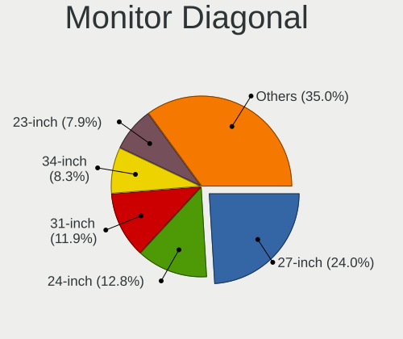

| Inches  | Desktops | Percent |
|---------|----------|---------|
| 27      | 509      | 24.03%  |
| 24      | 272      | 12.84%  |
| 31      | 251      | 11.85%  |
| 34      | 176      | 8.31%   |
| 23      | 168      | 7.93%   |
| 21      | 112      | 5.29%   |
| 84      | 71       | 3.35%   |
| 26      | 48       | 2.27%   |
| Unknown | 44       | 2.08%   |
| 72      | 42       | 1.98%   |
| 32      | 35       | 1.65%   |
| 54      | 30       | 1.42%   |
| 49      | 28       | 1.32%   |
| 40      | 28       | 1.32%   |
| 48      | 25       | 1.18%   |
| 18      | 24       | 1.13%   |
| 15      | 19       | 0.9%    |
| 22      | 18       | 0.85%   |
| 65      | 16       | 0.76%   |
| 19      | 15       | 0.71%   |
| 63      | 13       | 0.61%   |
| 20      | 13       | 0.61%   |
| 17      | 12       | 0.57%   |
| 16      | 12       | 0.57%   |
| 74      | 11       | 0.52%   |
| 28      | 11       | 0.52%   |
| 33      | 9        | 0.42%   |
| 29      | 9        | 0.42%   |
| 64      | 8        | 0.38%   |
| 42      | 8        | 0.38%   |
| 46      | 7        | 0.33%   |
| 44      | 7        | 0.33%   |
| 25      | 7        | 0.33%   |
| 85      | 6        | 0.28%   |
| 43      | 6        | 0.28%   |
| 36      | 5        | 0.24%   |
| 35      | 5        | 0.24%   |
| 60      | 4        | 0.19%   |
| 47      | 4        | 0.19%   |
| 37      | 4        | 0.19%   |

Monitor Width
-------------

Physical width

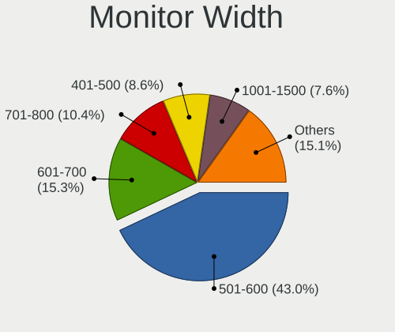

| Width in mm    | Desktops | Percent |
|----------------|----------|---------|
| 501-600        | 864      | 42.99%  |
| 601-700        | 307      | 15.27%  |
| 701-800        | 209      | 10.4%   |
| 401-500        | 173      | 8.61%   |
| 1001-1500      | 153      | 7.61%   |
| 1501-2000      | 132      | 6.57%   |
| 801-900        | 52       | 2.59%   |
| Unknown        | 44       | 2.19%   |
| 301-350        | 29       | 1.44%   |
| 351-400        | 23       | 1.14%   |
| 901-1000       | 17       | 0.85%   |
| 201-300        | 5        | 0.25%   |
| More than 2000 | 1        | 0.05%   |
| 101-200        | 1        | 0.05%   |

Aspect Ratio
------------

Proportional relationship between the width and the height

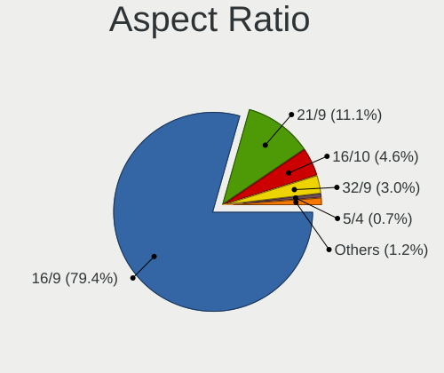

| Ratio   | Desktops | Percent |
|---------|----------|---------|
| 16/9    | 1440     | 79.38%  |
| 21/9    | 202      | 11.14%  |
| 16/10   | 84       | 4.63%   |
| 32/9    | 54       | 2.98%   |
| 5/4     | 12       | 0.66%   |
| 4/3     | 5        | 0.28%   |
| Unknown | 4        | 0.22%   |
| 3/2     | 3        | 0.17%   |
| 3.75    | 2        | 0.11%   |
| 2.00    | 2        | 0.11%   |
| 1.96    | 2        | 0.11%   |
| 3.20    | 1        | 0.06%   |
| 2.12    | 1        | 0.06%   |
| 0.31    | 1        | 0.06%   |
| 0.22    | 1        | 0.06%   |

Monitor Area
------------

Area in inch²

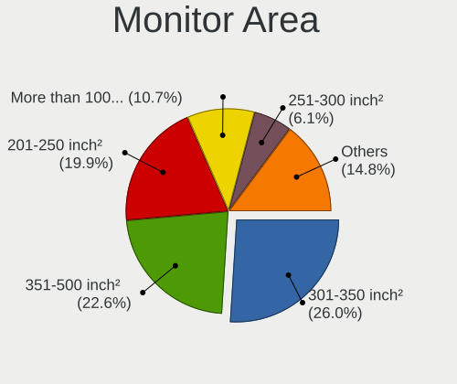

| Area in inch² | Desktops | Percent |
|----------------|----------|---------|
| 301-350        | 539      | 26%     |
| 351-500        | 468      | 22.58%  |
| 201-250        | 412      | 19.87%  |
| More than 1000 | 221      | 10.66%  |
| 251-300        | 126      | 6.08%   |
| 501-1000       | 122      | 5.89%   |
| 151-200        | 71       | 3.42%   |
| Unknown        | 44       | 2.12%   |
| 141-150        | 28       | 1.35%   |
| 101-110        | 18       | 0.87%   |
| 111-120        | 11       | 0.53%   |
| 71-80          | 3        | 0.14%   |
| 121-130        | 3        | 0.14%   |
| 131-140        | 2        | 0.1%    |
| 91-100         | 2        | 0.1%    |
| 61-70          | 1        | 0.05%   |
| 51-60          | 1        | 0.05%   |
| 1-40           | 1        | 0.05%   |

Pixel Density
-------------

Pixels per inch

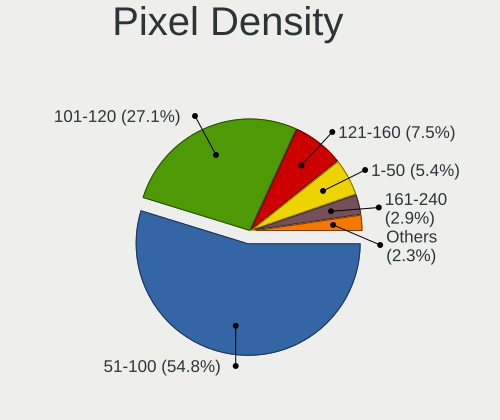

| Density       | Desktops | Percent |
|---------------|----------|---------|
| 51-100        | 1080     | 54.77%  |
| 101-120       | 534      | 27.08%  |
| 121-160       | 147      | 7.45%   |
| 1-50          | 107      | 5.43%   |
| 161-240       | 58       | 2.94%   |
| Unknown       | 44       | 2.23%   |
| More than 240 | 2        | 0.1%    |

Multiple Monitors
-----------------

Total monitors connected

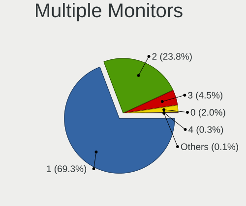

| Total | Desktops | Percent |
|-------|----------|---------|
| 1     | 1235     | 69.27%  |
| 2     | 425      | 23.84%  |
| 3     | 80       | 4.49%   |
| 0     | 36       | 2.02%   |
| 4     | 6        | 0.34%   |
| 5     | 1        | 0.06%   |

Network
-------

Net Controller Vendor
---------------------

Controller vendors

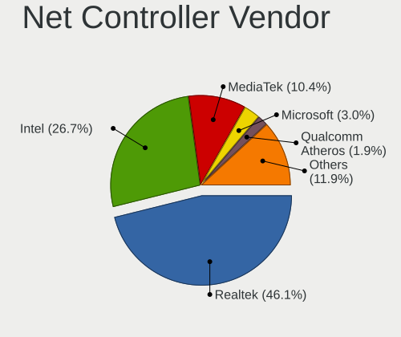

| Vendor                          | Desktops | Percent |
|---------------------------------|----------|---------|
| Realtek Semiconductor           | 1309     | 46.12%  |
| Intel                           | 759      | 26.74%  |
| MediaTek                        | 294      | 10.36%  |
| Microsoft                       | 85       | 3%      |
| Qualcomm Atheros                | 54       | 1.9%    |
| Broadcom                        | 46       | 1.62%   |
| TP-Link                         | 43       | 1.52%   |
| Qualcomm Technologies           | 35       | 1.23%   |
| Aquantia                        | 28       | 0.99%   |
| Samsung Electronics             | 17       | 0.6%    |
| NetGear                         | 15       | 0.53%   |
| QinHeng Electronics             | 13       | 0.46%   |
| ASIX Electronics                | 13       | 0.46%   |
| ASUSTek Computer                | 11       | 0.39%   |
| Xiaomi                          | 8        | 0.28%   |
| Ralink Technology               | 8        | 0.28%   |
| Motorola PCS                    | 7        | 0.25%   |
| Google                          | 6        | 0.21%   |
| American Future Technology      | 6        | 0.21%   |
| D-Link                          | 5        | 0.18%   |
| Realtek                         | 4        | 0.14%   |
| Ralink                          | 4        | 0.14%   |
| OPPO Electronics                | 4        | 0.14%   |
| Mellanox Technologies           | 4        | 0.14%   |
| HYTE                            | 4        | 0.14%   |
| OnePlus Technology (Shenzhen)   | 3        | 0.11%   |
| Oculus VR                       | 3        | 0.11%   |
| Linux Foundation                | 3        | 0.11%   |
| Huawei Technologies             | 3        | 0.11%   |
| DisplayLink                     | 3        | 0.11%   |
| Qualcomm Atheros Communications | 2        | 0.07%   |
| Nvidia                          | 2        | 0.07%   |
| Micro Star International        | 2        | 0.07%   |
| Mercucys                        | 2        | 0.07%   |
| Espressif                       | 2        | 0.07%   |
| Edimax Technology               | 2        | 0.07%   |
| ZTE WCDMA Technologies MSM      | 1        | 0.04%   |
| Winbond Electronics             | 1        | 0.04%   |
| Wilocity                        | 1        | 0.04%   |
| Turtle Beach                    | 1        | 0.04%   |

Net Controller Model
--------------------

Controller models

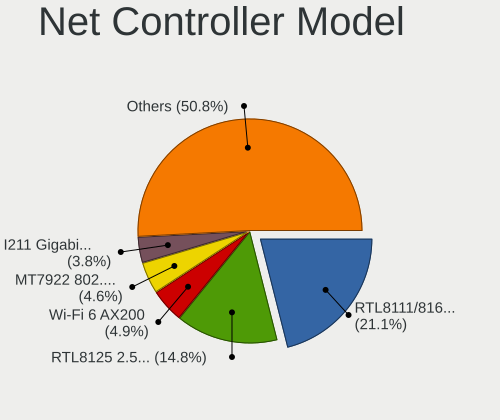

| Model                                                                           | Desktops | Percent |
|---------------------------------------------------------------------------------|----------|---------|
| Realtek RTL8111/8168/8211/8411 PCI Express Gigabit Ethernet Controller          | 700      | 21.07%  |
| Realtek RTL8125 2.5GbE Controller                                               | 492      | 14.81%  |
| Intel Wi-Fi 6 AX200                                                             | 164      | 4.94%   |
| MediaTek MT7922 802.11ax PCI Express Wireless Network Adapter                   | 153      | 4.6%    |
| Intel I211 Gigabit Network Connection                                           | 125      | 3.76%   |
| Intel Ethernet Controller I225-V                                                | 118      | 3.55%   |
| Intel Wi-Fi 6E(802.11ax) AX210/AX1675* 2x2 [Typhoon Peak]                       | 84       | 2.53%   |
| Intel Ethernet Controller I226-V                                                | 70       | 2.11%   |
| Realtek RTL8126 5GbE Controller                                                 | 63       | 1.9%    |
| Microsoft Xbox Wireless Adapter for Windows                                     | 48       | 1.44%   |
| Realtek RTL8852BE PCIe 802.11ax Wireless Network Controller                     | 46       | 1.38%   |
| Intel Dual Band Wireless-AC 3168NGW [Stone Peak]                                | 46       | 1.38%   |
| Intel Ethernet Connection (2) I219-V                                            | 44       | 1.32%   |
| Intel 700 Series Chipset CNVi WiFi                                              | 39       | 1.17%   |
| Realtek RTL8852CE PCIe 802.11ax Wireless Network Controller                     | 36       | 1.08%   |
| Qualcomm WCN785x Wi-Fi 7(802.11be) 320MHz 2x2 [FastConnect 7800]                | 35       | 1.05%   |
| MediaTek MT7925 802.11be 160MHz 2x2 PCIe Wireless Network Adapter [Filogic 360] | 33       | 0.99%   |
| Realtek RTL8821CE 802.11ac PCIe Wireless Network Adapter                        | 31       | 0.93%   |
| MediaTek MT7921K (RZ608) Wi-Fi 6E 80MHz                                         | 31       | 0.93%   |
| Intel Ethernet Connection (7) I219-V                                            | 29       | 0.87%   |
| MediaTek MT7927 802.11be 320MHz 2x2 PCIe Wireless Network Adapter [Filogic 380] | 26       | 0.78%   |
| Realtek RTL8922AE 802.11be PCIe Wireless Network Adapter                        | 24       | 0.72%   |
| Intel Wi-Fi 5(802.11ac) Wireless-AC 9x6x [Thunder Peak]                         | 24       | 0.72%   |
| Realtek RTL8153 Gigabit Ethernet Adapter                                        | 23       | 0.69%   |
| Realtek 802.11ac NIC                                                            | 21       | 0.63%   |
| Microsoft Wireless XBox Controller Dongle                                       | 21       | 0.63%   |
| Realtek RTL88x2bu [AC1200 Techkey]                                              | 20       | 0.6%    |
| Intel Cannon Lake PCH CNVi WiFi                                                 | 20       | 0.6%    |
| Realtek Killer E3000 2.5GbE Controller                                          | 19       | 0.57%   |
| MediaTek MT7925 (RZ717) Wi-Fi 7 160MHz                                          | 17       | 0.51%   |
| Microsoft Xbox 360 Wireless Adapter                                             | 16       | 0.48%   |
| MediaTek MT7921 802.11ax PCIe Wireless Network Adapter [Filogic 330]            | 15       | 0.45%   |
| Broadcom BCM4360 802.11ac Dual Band Wireless Network Adapter                    | 15       | 0.45%   |
| Samsung Galaxy series, misc. (tethering mode)                                   | 14       | 0.42%   |
| Realtek RTL8188EUS 802.11n Wireless Network Adapter                             | 14       | 0.42%   |
| MediaTek MT7902 802.11ax PCIe Wireless Network Adapter [Filogic 310]            | 14       | 0.42%   |
| Intel Alder Lake-S PCH CNVi WiFi                                                | 14       | 0.42%   |
| Intel 82579LM Gigabit Network Connection (Lewisville)                           | 14       | 0.42%   |
| Realtek RTL8851BE PCIe 802.11ax Wireless Network Controller                     | 13       | 0.39%   |
| ASIX AX88179 Gigabit Ethernet                                                   | 13       | 0.39%   |

Wireless Vendor
---------------

Wireless vendors

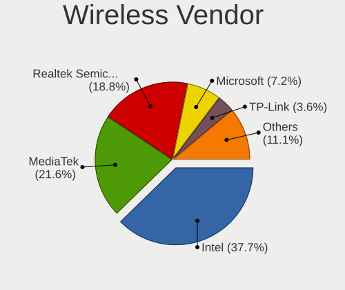

| Vendor                          | Desktops | Percent |
|---------------------------------|----------|---------|
| Intel                           | 447      | 37.72%  |
| MediaTek                        | 256      | 21.6%   |
| Realtek Semiconductor           | 223      | 18.82%  |
| Microsoft                       | 85       | 7.17%   |
| TP-Link                         | 43       | 3.63%   |
| Broadcom                        | 37       | 3.12%   |
| Qualcomm Atheros                | 27       | 2.28%   |
| NetGear                         | 15       | 1.27%   |
| ASUSTek Computer                | 11       | 0.93%   |
| Ralink Technology               | 8        | 0.68%   |
| Qualcomm Technologies           | 6        | 0.51%   |
| D-Link                          | 5        | 0.42%   |
| Realtek                         | 4        | 0.34%   |
| Ralink                          | 4        | 0.34%   |
| Qualcomm Atheros Communications | 2        | 0.17%   |
| Micro Star International        | 2        | 0.17%   |
| Mercucys                        | 2        | 0.17%   |
| Edimax Technology               | 2        | 0.17%   |
| Wilocity                        | 1        | 0.08%   |
| TRENDnet                        | 1        | 0.08%   |
| Sphairon Access Systems         | 1        | 0.08%   |
| Linksys                         | 1        | 0.08%   |
| Broadcom Limited                | 1        | 0.08%   |
| AVM                             | 1        | 0.08%   |

Wireless Model
--------------

Wireless models

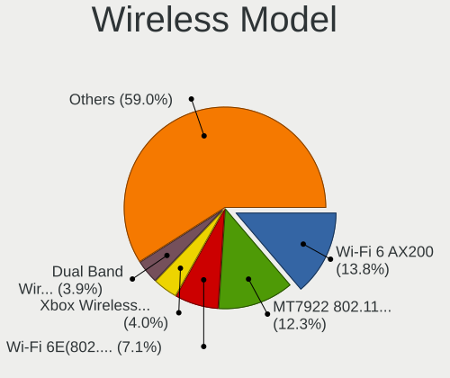

| Model                                                                           | Desktops | Percent |
|---------------------------------------------------------------------------------|----------|---------|
| Intel Wi-Fi 6 AX200                                                             | 164      | 13.78%  |
| MediaTek MT7922 802.11ax PCI Express Wireless Network Adapter                   | 146      | 12.27%  |
| Intel Wi-Fi 6E(802.11ax) AX210/AX1675* 2x2 [Typhoon Peak]                       | 84       | 7.06%   |
| Microsoft Xbox Wireless Adapter for Windows                                     | 48       | 4.03%   |
| Intel Dual Band Wireless-AC 3168NGW [Stone Peak]                                | 46       | 3.87%   |
| Realtek RTL8852CE PCIe 802.11ax Wireless Network Controller                     | 36       | 3.03%   |
| Realtek RTL8852BE PCIe 802.11ax Wireless Network Controller                     | 36       | 3.03%   |
| Intel 700 Series Chipset CNVi WiFi                                              | 36       | 3.03%   |
| Realtek RTL8821CE 802.11ac PCIe Wireless Network Adapter                        | 31       | 2.61%   |
| MediaTek MT7921K (RZ608) Wi-Fi 6E 80MHz                                         | 31       | 2.61%   |
| Intel Wi-Fi 5(802.11ac) Wireless-AC 9x6x [Thunder Peak]                         | 24       | 2.02%   |
| Realtek 802.11ac NIC                                                            | 21       | 1.76%   |
| Microsoft Wireless XBox Controller Dongle                                       | 21       | 1.76%   |
| Realtek RTL88x2bu [AC1200 Techkey]                                              | 20       | 1.68%   |
| MediaTek MT7927 802.11be 320MHz 2x2 PCIe Wireless Network Adapter [Filogic 380] | 20       | 1.68%   |
| Intel Cannon Lake PCH CNVi WiFi                                                 | 20       | 1.68%   |
| MediaTek MT7925 (RZ717) Wi-Fi 7 160MHz                                          | 17       | 1.43%   |
| Microsoft Xbox 360 Wireless Adapter                                             | 16       | 1.34%   |
| MediaTek MT7921 802.11ax PCIe Wireless Network Adapter [Filogic 330]            | 15       | 1.26%   |
| Broadcom BCM4360 802.11ac Dual Band Wireless Network Adapter                    | 15       | 1.26%   |
| Realtek RTL8188EUS 802.11n Wireless Network Adapter                             | 14       | 1.18%   |
| MediaTek MT7902 802.11ax PCIe Wireless Network Adapter [Filogic 310]            | 14       | 1.18%   |
| Realtek RTL8851BE PCIe 802.11ax Wireless Network Controller                     | 13       | 1.09%   |
| Intel Wireless 7265                                                             | 12       | 1.01%   |
| Intel Wireless 8265 / 8275                                                      | 11       | 0.92%   |
| MediaTek MT7925 802.11be 160MHz 2x2 PCIe Wireless Network Adapter [Filogic 360] | 10       | 0.84%   |
| Intel Tiger Lake PCH CNVi WiFi                                                  | 10       | 0.84%   |
| Intel Comet Lake PCH CNVi WiFi                                                  | 10       | 0.84%   |
| TP-Link 802.11ac WLAN Adapter                                                   | 9        | 0.76%   |
| TP-Link 802.11ac NIC                                                            | 9        | 0.76%   |
| Realtek RTL8812AE 802.11ac PCIe Wireless Network Adapter                        | 9        | 0.76%   |
| Broadcom BCM4352 802.11ac Dual Band Wireless Network Adapter                    | 9        | 0.76%   |
| Intel Wireless 8260                                                             | 8        | 0.67%   |
| Intel Wireless 7260                                                             | 7        | 0.59%   |
| TP-Link Archer T3U [Realtek RTL8812BU]                                          | 6        | 0.5%    |
| Realtek RTL8822CE 802.11ac PCIe Wireless Network Adapter                        | 6        | 0.5%    |
| Realtek RTL8822BE 802.11a/b/g/n/ac WiFi adapter                                 | 6        | 0.5%    |
| Realtek RTL8192EE PCIe Wireless Network Adapter                                 | 6        | 0.5%    |
| Realtek 802.11ax WLAN Adapter                                                   | 6        | 0.5%    |
| Qualcomm WCN785x Wi-Fi 7(802.11be) 320MHz 2x2 [FastConnect 7800]                | 6        | 0.5%    |

Ethernet Vendor
---------------

Ethernet vendors

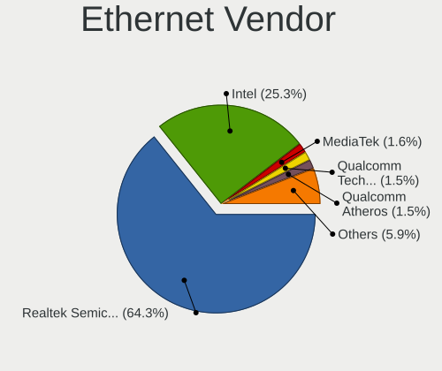

| Vendor                                 | Desktops | Percent |
|----------------------------------------|----------|---------|
| Realtek Semiconductor                  | 1269     | 64.29%  |
| Intel                                  | 500      | 25.33%  |
| MediaTek                               | 31       | 1.57%   |
| Qualcomm Technologies                  | 29       | 1.47%   |
| Qualcomm Atheros                       | 29       | 1.47%   |
| Aquantia                               | 28       | 1.42%   |
| Samsung Electronics                    | 17       | 0.86%   |
| ASIX Electronics                       | 13       | 0.66%   |
| Broadcom                               | 12       | 0.61%   |
| Xiaomi                                 | 8        | 0.41%   |
| Motorola PCS                           | 7        | 0.35%   |
| Google                                 | 6        | 0.3%    |
| OPPO Electronics                       | 4        | 0.2%    |
| Mellanox Technologies                  | 4        | 0.2%    |
| Huawei Technologies                    | 3        | 0.15%   |
| DisplayLink                            | 3        | 0.15%   |
| OnePlus Technology (Shenzhen)          | 2        | 0.1%    |
| Nvidia                                 | 2        | 0.1%    |
| Suzhou Motorcomm Electronic Technology | 1        | 0.05%   |
| Sundance Technology Inc / IC Plus      | 1        | 0.05%   |
| Sony Ericsson Mobile Communications AB | 1        | 0.05%   |
| Qualcomm                               | 1        | 0.05%   |
| Marvell Technology Group               | 1        | 0.05%   |
| Lenovo                                 | 1        | 0.05%   |
| Apple                                  | 1        | 0.05%   |

Ethernet Model
--------------

Ethernet models

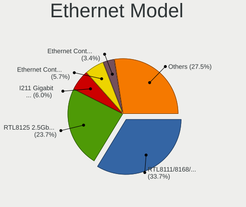

| Model                                                                             | Desktops | Percent |
|-----------------------------------------------------------------------------------|----------|---------|
| Realtek RTL8111/8168/8211/8411 PCI Express Gigabit Ethernet Controller            | 700      | 33.72%  |
| Realtek RTL8125 2.5GbE Controller                                                 | 492      | 23.7%   |
| Intel I211 Gigabit Network Connection                                             | 125      | 6.02%   |
| Intel Ethernet Controller I225-V                                                  | 118      | 5.68%   |
| Intel Ethernet Controller I226-V                                                  | 70       | 3.37%   |
| Realtek RTL8126 5GbE Controller                                                   | 63       | 3.03%   |
| Intel Ethernet Connection (2) I219-V                                              | 44       | 2.12%   |
| Qualcomm WCN785x Wi-Fi 7(802.11be) 320MHz 2x2 [FastConnect 7800]                  | 29       | 1.4%    |
| Intel Ethernet Connection (7) I219-V                                              | 29       | 1.4%    |
| Realtek RTL8153 Gigabit Ethernet Adapter                                          | 23       | 1.11%   |
| MediaTek MT7925 802.11be 160MHz 2x2 PCIe Wireless Network Adapter [Filogic 360]   | 23       | 1.11%   |
| Realtek RTL8922AE 802.11be PCIe Wireless Network Adapter                          | 21       | 1.01%   |
| Realtek Killer E3000 2.5GbE Controller                                            | 19       | 0.92%   |
| Samsung Galaxy series, misc. (tethering mode)                                     | 14       | 0.67%   |
| Intel 82579LM Gigabit Network Connection (Lewisville)                             | 14       | 0.67%   |
| ASIX AX88179 Gigabit Ethernet                                                     | 13       | 0.63%   |
| Intel Ethernet Connection I217-V                                                  | 12       | 0.58%   |
| Intel Ethernet Connection (2) I218-V                                              | 11       | 0.53%   |
| Intel Ethernet Connection (17) I219-V                                             | 11       | 0.53%   |
| Realtek RTL8852BE PCIe 802.11ax Wireless Network Controller                       | 10       | 0.48%   |
| Intel Ethernet Connection I217-LM                                                 | 10       | 0.48%   |
| Intel Ethernet Connection (14) I219-V                                             | 10       | 0.48%   |
| Qualcomm Atheros Killer E220x Gigabit Ethernet Controller                         | 9        | 0.43%   |
| Intel Alder Lake-S PCH CNVi WiFi                                                  | 9        | 0.43%   |
| Realtek RTL8111/8168/8411 PCI Express Gigabit Ethernet Controller                 | 8        | 0.39%   |
| Xiaomi Mi/Redmi series (RNDIS)                                                    | 7        | 0.34%   |
| Qualcomm Atheros Killer E2400 Gigabit Ethernet Controller                         | 7        | 0.34%   |
| MediaTek MT7922 802.11ax PCI Express Wireless Network Adapter                     | 7        | 0.34%   |
| Intel 82579V Gigabit Network Connection                                           | 7        | 0.34%   |
| Google Pixel 9a                                                                   | 6        | 0.29%   |
| Aquantia AQtion AQC107 NBase-T/IEEE 802.3an Ethernet Controller [Atlantic 10G]    | 6        | 0.29%   |
| Aquantia AQC113C NBase-T/IEEE 802.3an Ethernet Controller [Marvell Scalable mGig] | 6        | 0.29%   |
| Realtek Killer E2600 GbE Controller                                               | 5        | 0.24%   |
| Qualcomm Atheros Killer E2500 Gigabit Ethernet Controller                         | 5        | 0.24%   |
| Motorola PCS motorola one 5G ace                                                  | 5        | 0.24%   |
| Intel I210 Gigabit Network Connection                                             | 5        | 0.24%   |
| Intel Ethernet Connection (17) I219-LM                                            | 5        | 0.24%   |
| Aquantia AQtion AQC113CS NBase-T/IEEE 802.3an Ethernet Controller [Antigua 10G]   | 5        | 0.24%   |
| Aquantia AQtion AQC113 NBase-T/IEEE 802.3an Ethernet Controller [Antigua 10G]     | 5        | 0.24%   |
| Realtek USB 10/100/1G/2.5 LAN                                                     | 4        | 0.19%   |

Net Controller Kind
-------------------

Ethernet, WiFi or modem

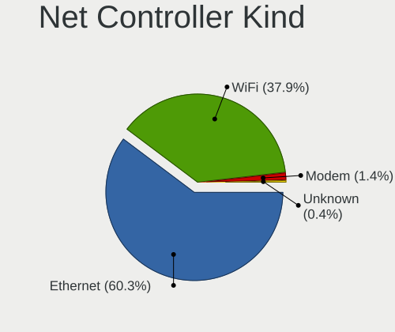

| Kind     | Desktops | Percent |
|----------|----------|---------|
| Ethernet | 1754     | 60.25%  |
| WiFi     | 1104     | 37.93%  |
| Modem    | 40       | 1.37%   |
| Unknown  | 13       | 0.45%   |

Used Controller
---------------

Currently used network controller

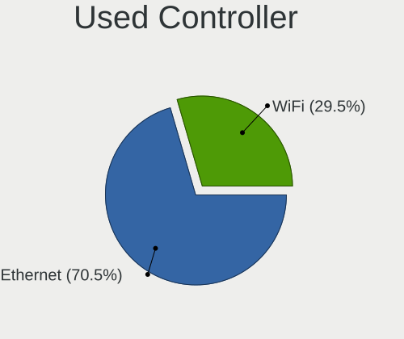

| Kind     | Desktops | Percent |
|----------|----------|---------|
| Ethernet | 1295     | 70.5%   |
| WiFi     | 542      | 29.5%   |

NICs
----

Total network controllers on board

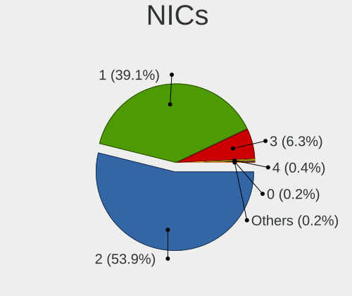

| Total | Desktops | Percent |
|-------|----------|---------|
| 2     | 954      | 53.87%  |
| 1     | 692      | 39.07%  |
| 3     | 111      | 6.27%   |
| 4     | 7        | 0.4%    |
| 0     | 4        | 0.23%   |
| 5     | 2        | 0.11%   |
| 6     | 1        | 0.06%   |

IPv6
----

IPv6 vs IPv4

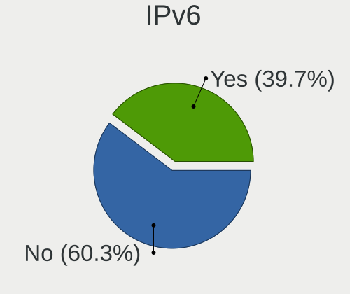

| Used | Desktops | Percent |
|------|----------|---------|
| No   | 1067     | 60.32%  |
| Yes  | 702      | 39.68%  |

Bluetooth
---------

Bluetooth Vendor
----------------

Controller vendors

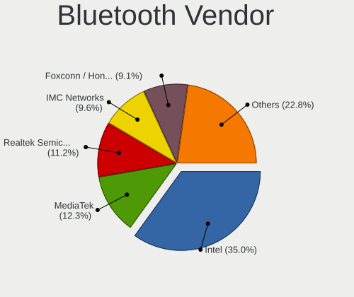

| Vendor                          | Desktops | Percent |
|---------------------------------|----------|---------|
| Intel                           | 432      | 34.95%  |
| MediaTek                        | 152      | 12.3%   |
| Realtek Semiconductor           | 139      | 11.25%  |
| IMC Networks                    | 119      | 9.63%   |
| Foxconn / Hon Hai               | 112      | 9.06%   |
| Cambridge Silicon Radio         | 97       | 7.85%   |
| TP-Link                         | 55       | 4.45%   |
| ASUSTek Computer                | 52       | 4.21%   |
| Unknown                         | 15       | 1.21%   |
| Realtek                         | 12       | 0.97%   |
| Qualcomm Atheros Communications | 10       | 0.81%   |
| Broadcom                        | 9        | 0.73%   |
| Apple                           | 8        | 0.65%   |
| Actions                         | 7        | 0.57%   |
| Dynex                           | 4        | 0.32%   |
| Lite-On Technology              | 3        | 0.24%   |
| Mercucys                        | 2        | 0.16%   |
| Edimax Technology               | 2        | 0.16%   |
| SINO WEALTH                     | 1        | 0.08%   |
| Ralink                          | 1        | 0.08%   |
| Primax Electronics              | 1        | 0.08%   |
| Integrated System Solution      | 1        | 0.08%   |
| HTC (High Tech Computer)        | 1        | 0.08%   |
| Belkin Components               | 1        | 0.08%   |

Bluetooth Model
---------------

Controller models

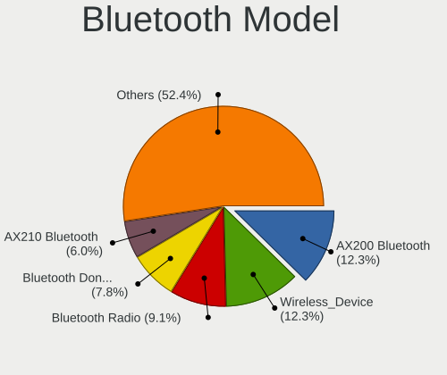

| Model                                                    | Desktops | Percent |
|----------------------------------------------------------|----------|---------|
| Intel AX200 Bluetooth                                    | 153      | 12.34%  |
| MediaTek Wireless_Device                                 | 152      | 12.26%  |
| Realtek Bluetooth Radio                                  | 113      | 9.11%   |
| Cambridge Silicon Radio Bluetooth Dongle (HCI mode)      | 97       | 7.82%   |
| Intel AX210 Bluetooth                                    | 75       | 6.05%   |
| IMC Networks Bluetooth Radio                             | 64       | 5.16%   |
| Foxconn / Hon Hai Wireless_Device                        | 64       | 5.16%   |
| TP-Link TP-T@- UB500 Adapter                             | 55       | 4.44%   |
| IMC Networks Wireless_Device                             | 53       | 4.27%   |
| Intel Wireless-AC 3168 Bluetooth                         | 44       | 3.55%   |
| Intel Bluetooth Device                                   | 44       | 3.55%   |
| Foxconn / Hon Hai Bluetooth Device                       | 43       | 3.47%   |
| Intel Bluetooth wireless interface                       | 38       | 3.06%   |
| Intel AX201 Bluetooth                                    | 29       | 2.34%   |
| ASUS ASUS USB-BT500                                      | 27       | 2.18%   |
| Intel Wireless-AC 9260 Bluetooth Adapter                 | 25       | 2.02%   |
| Intel Bluetooth 9460/9560 Jefferson Peak (JfP)           | 25       | 2.02%   |
| Realtek Bluetooth 5.3 Radio                              | 16       | 1.29%   |
| Unknown                                                  | 15       | 1.21%   |
| Realtek Bluetooth Radio                                  | 12       | 0.97%   |
| ASUS Bluetooth Radio                                     | 9        | 0.73%   |
| Actions general adapter                                  | 7        | 0.56%   |
| Qualcomm Atheros  Bluetooth Device                       | 6        | 0.48%   |
| Apple Bluetooth Host Controller                          | 6        | 0.48%   |
| Realtek  Bluetooth 4.2 Adapter                           | 5        | 0.4%    |
| Realtek Bluetooth 5.4 Radio                              | 5        | 0.4%    |
| Broadcom BCM20702A0 Bluetooth 4.0                        | 5        | 0.4%    |
| Foxconn / Hon Hai Bluetooth Radio                        | 4        | 0.32%   |
| Dynex Bluetooth 4.0 Adapter [Broadcom, 1.12, BCM20702A0] | 4        | 0.32%   |
| ASUS Broadcom BCM20702A0 Bluetooth                       | 4        | 0.32%   |
| Intel Centrino Bluetooth Wireless Transceiver            | 3        | 0.24%   |
| ASUS Qualcomm Bluetooth 4.1                              | 3        | 0.24%   |
| ASUS BCM20702A0                                          | 3        | 0.24%   |
| Mercucys Mercusys MA530 Adapter                          | 2        | 0.16%   |
| Lite-On Bluetooth Device                                 | 2        | 0.16%   |
| Edimax Bluetooth Device                                  | 2        | 0.16%   |
| ASUS Broadcom BCM20702 Single-Chip Bluetooth 4.0 + LE    | 2        | 0.16%   |
| ASUS Bluetooth Controller                                | 2        | 0.16%   |
| Apple Bluetooth USB Host Controller                      | 2        | 0.16%   |
| SINO WEALTH Bluetooth Keyboard                           | 1        | 0.08%   |

Sound
-----

Sound Vendor
------------

Sound card vendors

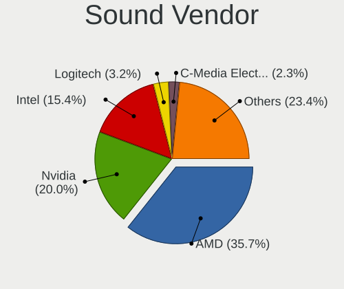

| Vendor                                       | Desktops | Percent |
|----------------------------------------------|----------|---------|
| AMD                                          | 1354     | 35.7%   |
| Nvidia                                       | 759      | 20.01%  |
| Intel                                        | 583      | 15.37%  |
| Logitech                                     | 122      | 3.22%   |
| C-Media Electronics                          | 86       | 2.27%   |
| SteelSeries ApS                              | 78       | 2.06%   |
| ASUSTek Computer                             | 73       | 1.92%   |
| Razer USA                                    | 54       | 1.42%   |
| Micro Star International                     | 51       | 1.34%   |
| Hewlett-Packard                              | 47       | 1.24%   |
| Kingston Technology                          | 37       | 0.98%   |
| JMTek                                        | 35       | 0.92%   |
| Focusrite-Novation                           | 29       | 0.76%   |
| Sony                                         | 24       | 0.63%   |
| Corsair                                      | 24       | 0.63%   |
| Generalplus Technology                       | 23       | 0.61%   |
| Creative Technology                          | 21       | 0.55%   |
| Blue Microphones                             | 21       | 0.55%   |
| Texas Instruments                            | 19       | 0.5%    |
| Creative Labs                                | 19       | 0.5%    |
| Astro Gaming                                 | 13       | 0.34%   |
| ASRock                                       | 13       | 0.34%   |
| Realtek Semiconductor                        | 12       | 0.32%   |
| FiiO Electronics Technology                  | 11       | 0.29%   |
| Valve Software                               | 10       | 0.26%   |
| RODE Microphones                             | 10       | 0.26%   |
| Audeze                                       | 9        | 0.24%   |
| Schiit Audio                                 | 8        | 0.21%   |
| Samson Technologies                          | 8        | 0.21%   |
| Jieli Technology                             | 8        | 0.21%   |
| DSEA A/S                                     | 8        | 0.21%   |
| Yamaha                                       | 7        | 0.18%   |
| Plantronics                                  | 7        | 0.18%   |
| MV-SILICON                                   | 7        | 0.18%   |
| KTMicro                                      | 7        | 0.18%   |
| Giga-Byte Technology                         | 7        | 0.18%   |
| Zoran Co. Personal Media Division (Nogatech) | 6        | 0.16%   |
| Thesycon Systemsoftware & Consulting         | 6        | 0.16%   |
| Shure                                        | 6        | 0.16%   |
| Elgato Systems                               | 6        | 0.16%   |

Sound Model
-----------

Sound card models

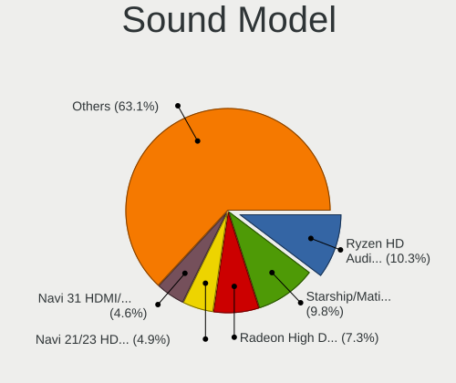

| Model                                                                      | Desktops | Percent |
|----------------------------------------------------------------------------|----------|---------|
| AMD Ryzen HD Audio Controller                                              | 512      | 10.29%  |
| AMD Starship/Matisse HD Audio Controller                                   | 486      | 9.77%   |
| AMD Radeon High Definition Audio Controller                                | 361      | 7.26%   |
| AMD Navi 21/23 HDMI/DP Audio Controller                                    | 246      | 4.94%   |
| AMD Navi 31 HDMI/DP Audio                                                  | 231      | 4.64%   |
| AMD Navi 48 HDMI/DP Audio Controller                                       | 180      | 3.62%   |
| AMD Renoir/Cezanne HDMI/DP Audio Controller                                | 103      | 2.07%   |
| AMD Ellesmere HDMI Audio [Radeon RX 470/480 / 570/580/590]                 | 103      | 2.07%   |
| Nvidia GA104 High Definition Audio Controller                              | 92       | 1.85%   |
| Nvidia GA102 High Definition Audio Controller                              | 75       | 1.51%   |
| AMD Family 17h (Models 00h-0fh) HD Audio Controller                        | 75       | 1.51%   |
| Nvidia GA106 High Definition Audio Controller                              | 68       | 1.37%   |
| Intel Raptor Lake High Definition Audio Controller                         | 68       | 1.37%   |
| ASUSTek Computer USB Audio                                                 | 66       | 1.33%   |
| Intel 8 Series/C220 Series Chipset High Definition Audio Controller        | 62       | 1.25%   |
| Intel 200 Series PCH HD Audio                                              | 61       | 1.23%   |
| Nvidia GP104 High Definition Audio Controller                              | 59       | 1.19%   |
| Micro Star International USB Audio                                         | 51       | 1.03%   |
| Intel Cannon Lake PCH cAVS                                                 | 48       | 0.96%   |
| Intel 100 Series/C230 Series Chipset Family HD Audio Controller            | 47       | 0.94%   |
| Nvidia AD104 High Definition Audio Controller                              | 45       | 0.9%    |
| Intel Alder Lake-S HD Audio Controller                                     | 45       | 0.9%    |
| AMD Navi 10 HDMI Audio                                                     | 45       | 0.9%    |
| Nvidia TU116 High Definition Audio Controller                              | 41       | 0.82%   |
| Nvidia TU106 High Definition Audio Controller                              | 41       | 0.82%   |
| Nvidia AD103 High Definition Audio Controller                              | 39       | 0.78%   |
| Nvidia TU104 HD Audio Controller                                           | 35       | 0.7%    |
| Nvidia GP106 High Definition Audio Controller                              | 34       | 0.68%   |
| Intel 7 Series/C216 Chipset Family High Definition Audio Controller        | 34       | 0.68%   |
| Intel 6 Series/C200 Series Chipset Family High Definition Audio Controller | 34       | 0.68%   |
| Nvidia AD107 High Definition Audio Controller                              | 27       | 0.54%   |
| Nvidia AD102 High Definition Audio Controller                              | 27       | 0.54%   |
| Intel Xeon E3-1200 v3/4th Gen Core Processor HD Audio Controller           | 26       | 0.52%   |
| SteelSeries ApS Arctis Nova Pro Wireless                                   | 24       | 0.48%   |
| Intel Comet Lake PCH cAVS                                                  | 24       | 0.48%   |
| AMD SBx00 Azalia (Intel HDA)                                               | 24       | 0.48%   |
| Nvidia GP107GL High Definition Audio Controller                            | 23       | 0.46%   |
| Intel Tiger Lake-H HD Audio Controller                                     | 23       | 0.46%   |
| Generalplus Technology USB Audio Device                                    | 22       | 0.44%   |
| C-Media Electronics Blue Snowball                                          | 21       | 0.42%   |

Memory
------

Memory Vendor
-------------

Memory module vendors

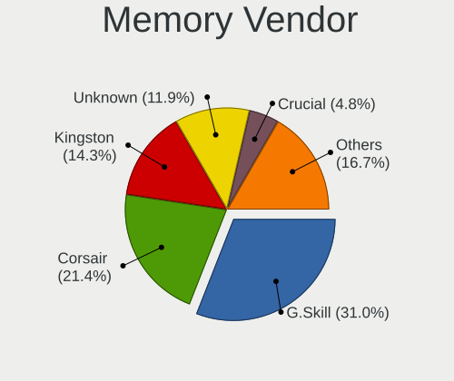

| Vendor              | Desktops | Percent |
|---------------------|----------|---------|
| G.Skill             | 13       | 30.95%  |
| Corsair             | 9        | 21.43%  |
| Kingston            | 6        | 14.29%  |
| Unknown             | 5        | 11.9%   |
| Crucial             | 2        | 4.76%   |
| Wilk                | 1        | 2.38%   |
| Team                | 1        | 2.38%   |
| Samsung Electronics | 1        | 2.38%   |
| PNY                 | 1        | 2.38%   |
| Micron Technology   | 1        | 2.38%   |
| KLEVV               | 1        | 2.38%   |
| A-DATA Technology   | 1        | 2.38%   |

Memory Model
------------

Memory module models

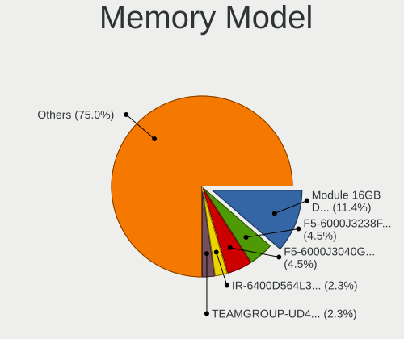

| Model                                                    | Desktops | Percent |
|----------------------------------------------------------|----------|---------|
| Unknown                                                  | 5        | 11.36%  |
| G.Skill RAM F5-6000J3238F16G 16GB DIMM DDR5 12800MT/s    | 2        | 4.55%   |
| G.Skill RAM F5-6000J3040G32G 32GB DIMM DDR5 6200MT/s     | 2        | 4.55%   |
| Wilk RAM IR-6400D564L32S/16G 16GB DIMM DDR5 4800MT/s     | 1        | 2.27%   |
| Team RAM TEAMGROUP-UD4-3600 16GB DIMM DDR4 4000MT/s      | 1        | 2.27%   |
| Samsung RAM M471B5173QH0-YK0 4GB SODIMM DDR3 1600MT/s    | 1        | 2.27%   |
| PNY RAM 16GF1X16RHJJ40-135-K 16GB DIMM DDR4 2666MT/s     | 1        | 2.27%   |
| Micron RAM CP16G60C36U5B.M8D3 16GB DIMM DDR5 6000MT/s    | 1        | 2.27%   |
| KLEVV RAM KD48GUA60-36A180C 8GB DIMM DDR4 3600MT/s       | 1        | 2.27%   |
| Kingston RAM KF560C40-8 8GB DIMM DDR5 6000MT/s           | 1        | 2.27%   |
| Kingston RAM KF560C36-16 16GB DIMM DDR5 6000MT/s         | 1        | 2.27%   |
| Kingston RAM KF560C30-8 8GB DIMM DDR5 4800MT/s           | 1        | 2.27%   |
| Kingston RAM KF560C30-32 32GB DIMM DDR5 6000MT/s         | 1        | 2.27%   |
| Kingston RAM KF556C36-16 16GB DIMM DDR5 12800MT/s        | 1        | 2.27%   |
| Kingston RAM KF3600C17D4/8GX 8GB DIMM DDR4 3600MT/s      | 1        | 2.27%   |
| Kingston RAM KF3200C16D4/8GX 8GiB DIMM DDR4 3600MT/s     | 1        | 2.27%   |
| G.Skill RAM F5-6400J3239F24G 24GB DIMM DDR5 8000MT/s     | 1        | 2.27%   |
| G.Skill RAM F5-6000J3636F16G 16GB DIMM DDR5 6400MT/s     | 1        | 2.27%   |
| G.Skill RAM F5-6000J3038F16G 16GB DIMM DDR5 6000MT/s     | 1        | 2.27%   |
| G.Skill RAM F4-4000C16-16GVKA 16GB DIMM DDR4 4267MT/s    | 1        | 2.27%   |
| G.Skill RAM F4-3600C16-16GTZNC 16GiB DIMM DDR4 3600MT/s  | 1        | 2.27%   |
| G.Skill RAM F4-3200C16-8GVKB 8GB DIMM DDR4 4000MT/s      | 1        | 2.27%   |
| G.Skill RAM F4-3200C16-32GTZN 32GB DIMM DDR4 3200MT/s    | 1        | 2.27%   |
| G.Skill RAM F4-3200C16-16GVK 16GB DIMM DDR4 3600MT/s     | 1        | 2.27%   |
| G.Skill RAM F4-3000C15-4GRR 4GB DIMM DDR4 3000MT/s       | 1        | 2.27%   |
| Crucial RAM CT16G4SFS832A.C8FF 16GB SODIMM DDR4 3200MT/s | 1        | 2.27%   |
| Crucial RAM CT102464BF160B.C16 8GB SODIMM DDR3 1600MT/s  | 1        | 2.27%   |
| Corsair RAM CMW64GX4M2D3600C18 32GB DIMM DDR4 3600MT/s   | 1        | 2.27%   |
| Corsair RAM CMW32GX4M2E3200C16 16GB DIMM DDR4 3200MT/s   | 1        | 2.27%   |
| Corsair RAM CMK8GX4M2A2400C16 4GB DIMM DDR4 3020MT/s     | 1        | 2.27%   |
| Corsair RAM CMK64GX5M2B6000C30 32GB DIMM DDR5 6000MT/s   | 1        | 2.27%   |
| Corsair RAM CMK32GX5M2E6000C36 16GiB DIMM DDR5 6000MT/s  | 1        | 2.27%   |
| Corsair RAM CMK32GX4M2D3600C18 16GB DIMM DDR4 3800MT/s   | 1        | 2.27%   |
| Corsair RAM CMK32GX4M2A2666C16 16GB DIMM DDR4 2667MT/s   | 1        | 2.27%   |
| Corsair RAM CMK16GX4M2B3200C16 8GB DIMM DDR4 3600MT/s    | 1        | 2.27%   |
| Corsair RAM CMK16GX4M2A2400C14 8GB DIMM DDR4 2800MT/s    | 1        | 2.27%   |
| Corsair RAM CMH64GX5M2B6000Z30 32GiB DIMM DDR5 6000MT/s  | 1        | 2.27%   |
| A-DATA RAM AD5S480016G-B 16GB SODIMM DDR5 4800MT/s       | 1        | 2.27%   |

Memory Kind
-----------

Memory module kinds

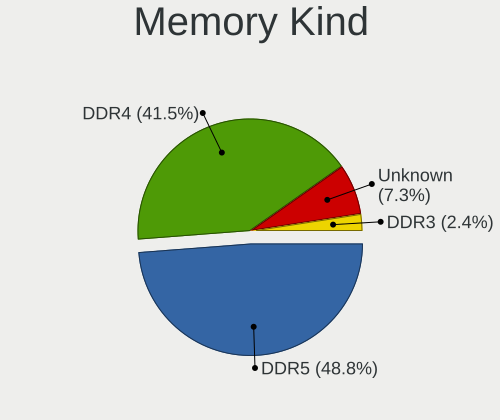

| Kind    | Desktops | Percent |
|---------|----------|---------|
| DDR5    | 20       | 48.78%  |
| DDR4    | 17       | 41.46%  |
| Unknown | 3        | 7.32%   |
| DDR3    | 1        | 2.44%   |

Memory Form Factor
------------------

Physical design of the memory module

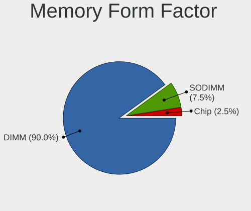

| Name   | Desktops | Percent |
|--------|----------|---------|
| DIMM   | 36       | 90%     |
| SODIMM | 3        | 7.5%    |
| Chip   | 1        | 2.5%    |

Memory Size
-----------

Memory module size

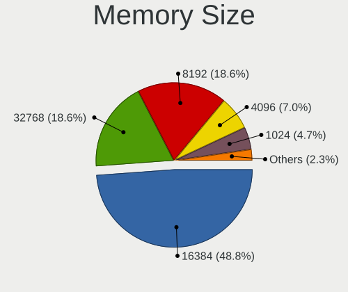

| Size  | Desktops | Percent |
|-------|----------|---------|
| 16384 | 21       | 48.84%  |
| 32768 | 8        | 18.6%   |
| 8192  | 8        | 18.6%   |
| 4096  | 3        | 6.98%   |
| 1024  | 2        | 4.65%   |
| 24576 | 1        | 2.33%   |

Memory Speed
------------

Memory module speed

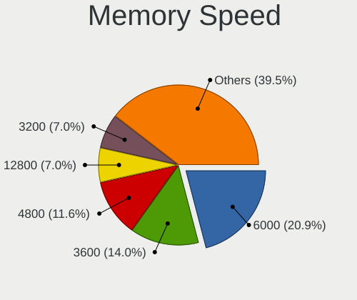

| Speed   | Desktops | Percent |
|---------|----------|---------|
| 6000    | 9        | 20.93%  |
| 3600    | 6        | 13.95%  |
| 4800    | 5        | 11.63%  |
| 12800   | 3        | 6.98%   |
| 3200    | 3        | 6.98%   |
| 6200    | 2        | 4.65%   |
| 4000    | 2        | 4.65%   |
| 8000    | 1        | 2.33%   |
| 6400    | 1        | 2.33%   |
| 4267    | 1        | 2.33%   |
| 3866    | 1        | 2.33%   |
| 3800    | 1        | 2.33%   |
| 3100    | 1        | 2.33%   |
| 3020    | 1        | 2.33%   |
| 3000    | 1        | 2.33%   |
| 2800    | 1        | 2.33%   |
| 2666    | 1        | 2.33%   |
| 1600    | 1        | 2.33%   |
| 333     | 1        | 2.33%   |
| Unknown | 1        | 2.33%   |

Printers & scanners
-------------------

Printer Vendor
--------------

Printer device vendors

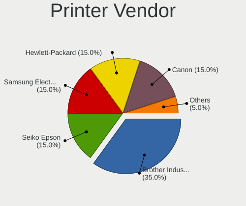

| Vendor              | Desktops | Percent |
|---------------------|----------|---------|
| Brother Industries  | 7        | 35%     |
| Seiko Epson         | 3        | 15%     |
| Samsung Electronics | 3        | 15%     |
| Hewlett-Packard     | 3        | 15%     |
| Canon               | 3        | 15%     |
| QinHeng Electronics | 1        | 5%      |

Printer Model
-------------

Printer device models

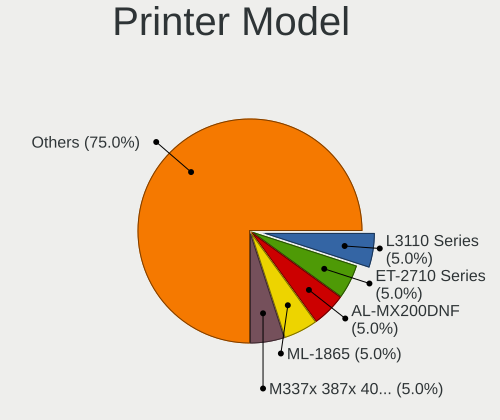

| Model                          | Desktops | Percent |
|--------------------------------|----------|---------|
| Seiko Epson L3110 Series       | 1        | 5%      |
| Seiko Epson ET-2710 Series     | 1        | 5%      |
| Seiko Epson AL-MX200DNF        | 1        | 5%      |
| Samsung ML-1865                | 1        | 5%      |
| Samsung M337x 387x 407x Series | 1        | 5%      |
| Samsung M2020 Series           | 1        | 5%      |
| QinHeng CH340S                 | 1        | 5%      |
| HP LaserJet P1007              | 1        | 5%      |
| HP LaserJet 1018               | 1        | 5%      |
| HP ENVY Pro 6400 series        | 1        | 5%      |
| Canon PIXMA MP250              | 1        | 5%      |
| Canon MF3200 series            | 1        | 5%      |
| Canon G3000 series             | 1        | 5%      |
| Brother MFC-J491DW             | 1        | 5%      |
| Brother MFC-J1205W             | 1        | 5%      |
| Brother HL-L2380DW             | 1        | 5%      |
| Brother HL-L2325DW             | 1        | 5%      |
| Brother HL-2240D series        | 1        | 5%      |
| Brother DCP-7065DN             | 1        | 5%      |
| Brother DCP-1610W              | 1        | 5%      |

Scanner Vendor
--------------

Scanner device vendors

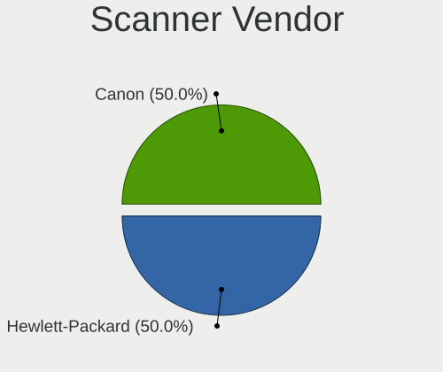

| Vendor          | Desktops | Percent |
|-----------------|----------|---------|
| Hewlett-Packard | 1        | 50%     |
| Canon           | 1        | 50%     |

Scanner Model
-------------

Scanner device models

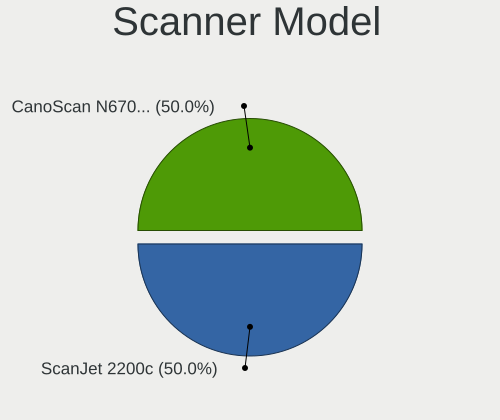

| Model                              | Desktops | Percent |
|------------------------------------|----------|---------|
| HP ScanJet 2200c                   | 1        | 50%     |
| Canon CanoScan N670U/N676U/LiDE 20 | 1        | 50%     |

Camera
------

Camera Vendor
-------------

Camera device vendors

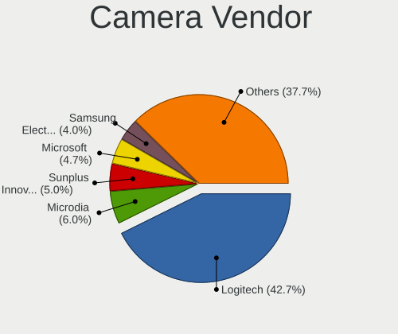

| Vendor                        | Desktops | Percent |
|-------------------------------|----------|---------|
| Logitech                      | 128      | 42.67%  |
| Microdia                      | 18       | 6%      |
| Sunplus Innovation Technology | 15       | 5%      |
| Microsoft                     | 14       | 4.67%   |
| Samsung Electronics           | 12       | 4%      |
| Apple                         | 9        | 3%      |
| Valve Software                | 8        | 2.67%   |
| Razer USA                     | 8        | 2.67%   |
| MacroSilicon                  | 8        | 2.67%   |
| webcam                        | 7        | 2.33%   |
| Tobii Technology AB           | 5        | 1.67%   |
| Generalplus Technology        | 5        | 1.67%   |
| Realtek Semiconductor         | 4        | 1.33%   |
| Elgato Systems                | 4        | 1.33%   |
| Creative Technology           | 4        | 1.33%   |
| Anker PowerConf C200          | 4        | 1.33%   |
| eMeet                         | 3        | 1%      |
| ARC International             | 3        | 1%      |
| WCM_USB                       | 2        | 0.67%   |
| SunplusIT                     | 2        | 0.67%   |
| Sonix Technology              | 2        | 0.67%   |
| Lenovo                        | 2        | 0.67%   |
| KYE Systems (Mouse Systems)   | 2        | 0.67%   |
| EVGA                          | 2        | 0.67%   |
| AVerMedia Technologies        | 2        | 0.67%   |
| A4Tech                        | 2        | 0.67%   |
| Z-Star Microelectronics       | 1        | 0.33%   |
| Xiongmai                      | 1        | 0.33%   |
| XHT-220428-ZW                 | 1        | 0.33%   |
| WaveRider Communications      | 1        | 0.33%   |
| USB CAMERA                    | 1        | 0.33%   |
| Sunplus IT                    | 1        | 0.33%   |
| Samson Technologies           | 1        | 0.33%   |
| Polycom                       | 1        | 0.33%   |
| Owon                          | 1        | 0.33%   |
| Novatek Microelectronics      | 1        | 0.33%   |
| Nexight                       | 1        | 0.33%   |
| Jieli Technology              | 1        | 0.33%   |
| Image+                        | 1        | 0.33%   |
| Hewlett-Packard               | 1        | 0.33%   |

Camera Model
------------

Camera device models

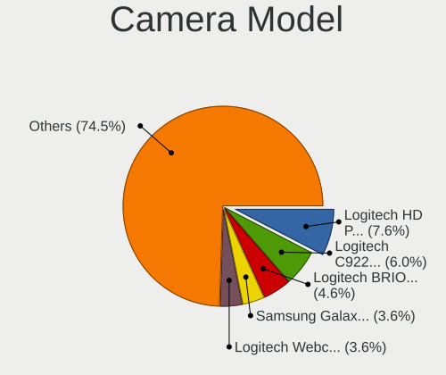

| Model                                                 | Desktops | Percent |
|-------------------------------------------------------|----------|---------|
| Logitech HD Pro Webcam C920                           | 23       | 7.62%   |
| Logitech C922 Pro Stream Webcam                       | 18       | 5.96%   |
| Logitech BRIO Ultra HD Webcam                         | 14       | 4.64%   |
| Samsung Galaxy series, misc. (MTP mode)               | 11       | 3.64%   |
| Logitech Webcam C270                                  | 11       | 3.64%   |
| Logitech C920 PRO HD Webcam                           | 10       | 3.31%   |
| Microdia USB 2.0 Camera                               | 9        | 2.98%   |
| Valve Software 3D Camera                              | 8        | 2.65%   |
| Logitech StreamCam                                    | 8        | 2.65%   |
| Apple iPhone 5/5C/5S/6/SE/7/8/X                       | 8        | 2.65%   |
| webcam webcam                                         | 7        | 2.32%   |
| Microsoft LifeCam HD-3000                             | 7        | 2.32%   |
| Logitech Webcam C310                                  | 7        | 2.32%   |
| MacroSilicon USB Video                                | 6        | 1.99%   |
| Logitech Webcam C930e                                 | 6        | 1.99%   |
| Logitech HD Webcam C910                               | 6        | 1.99%   |
| Tobii AB EyeChip                                      | 5        | 1.66%   |
| Sunplus Integrated Camera                             | 5        | 1.66%   |
| Sunplus Full HD webcam                                | 4        | 1.32%   |
| Razer USA Gaming Webcam [Kiyo]                        | 4        | 1.32%   |
| Logitech Logitech Webcam C925e                        | 4        | 1.32%   |
| Generalplus GENERAL WEBCAM                            | 4        | 1.32%   |
| Anker PowerConf C200 Anker PowerConf C200             | 4        | 1.32%   |
| Sunplus SPCA2281 Web Camera                           | 3        | 0.99%   |
| Microsoft LifeCam Studio                              | 3        | 0.99%   |
| Logitech Logi Webcam C920e                            | 3        | 0.99%   |
| Logitech HD Webcam C510                               | 3        | 0.99%   |
| Logitech C505 HD Webcam                               | 3        | 0.99%   |
| ARC International Camera                              | 3        | 0.99%   |
| WCM_USB WEB CAM                                       | 2        | 0.66%   |
| Razer USA Razer Kiyo X                                | 2        | 0.66%   |
| Razer USA Razer Kiyo Pro                              | 2        | 0.66%   |
| Microdia Webcam Vitade AF                             | 2        | 0.66%   |
| Microdia Integrated Camera                            | 2        | 0.66%   |
| Microdia CyberTrack H7                                | 2        | 0.66%   |
| Logitech HD Webcam C615                               | 2        | 0.66%   |
| Logitech BRIO 4K Stream Edition                       | 2        | 0.66%   |
| Logitech Brio 101                                     | 2        | 0.66%   |
| Logitech Brio 100                                     | 2        | 0.66%   |
| KYE Systems (Mouse Systems) USB 2.0 HD1080P PC Camera | 2        | 0.66%   |

Security
--------

Fingerprint Vendor
------------------

Fingerprint sensor vendors

| Vendor                     | Desktops | Percent |
|----------------------------|----------|---------|
| LighTuning Technology      | 2        | 40%     |
| Upek                       | 1        | 20%     |
| Shenzhen Goodix Technology | 1        | 20%     |
| Elan Microelectronics      | 1        | 20%     |

Fingerprint Model
-----------------

Fingerprint sensor models

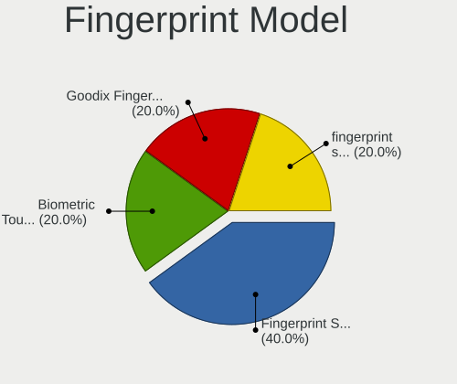

| Model                                                  | Desktops | Percent |
|--------------------------------------------------------|----------|---------|
| LighTuning Fingerprint Sensor                          | 2        | 40%     |
| Upek Biometric Touchchip/Touchstrip Fingerprint Sensor | 1        | 20%     |
| Shenzhen Goodix  Fingerprint Device                    | 1        | 20%     |
| Elan fingerprint sensor [FeinTech FPS00200]            | 1        | 20%     |

Chipcard Vendor
---------------

Chipcard module vendors

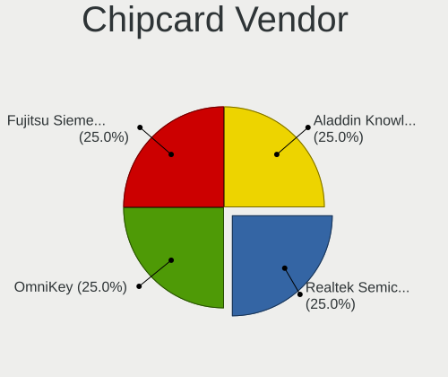

| Vendor                    | Desktops | Percent |
|---------------------------|----------|---------|
| Realtek Semiconductor     | 1        | 25%     |
| OmniKey                   | 1        | 25%     |
| Fujitsu Siemens Computers | 1        | 25%     |
| Aladdin Knowledge Systems | 1        | 25%     |

Chipcard Model
--------------

Chipcard module models

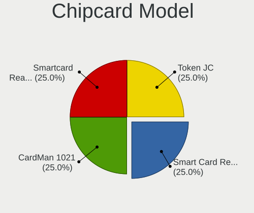

| Model                                             | Desktops | Percent |
|---------------------------------------------------|----------|---------|
| Realtek Semiconductor Smart Card Reader Interface | 1        | 25%     |
| OmniKey CardMan 1021                              | 1        | 25%     |
| Fujitsu Siemens Computers Smartcard Reader D323   | 1        | 25%     |
| Aladdin Knowledge Systems Token JC                | 1        | 25%     |

Unsupported
-----------

Unsupported Devices
-------------------

Total unsupported devices on board

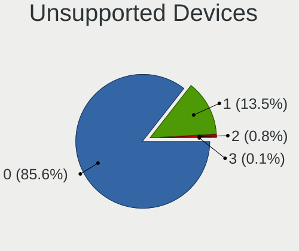

| Total | Desktops | Percent |
|-------|----------|---------|
| 0     | 1518     | 85.57%  |
| 1     | 240      | 13.53%  |
| 2     | 15       | 0.85%   |
| 3     | 1        | 0.06%   |

Unsupported Device Types
------------------------

Types of unsupported devices

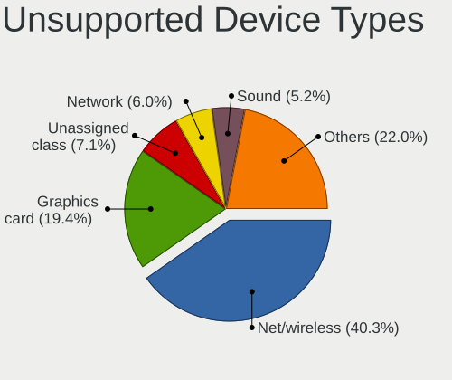

| Type                     | Desktops | Percent |
|--------------------------|----------|---------|
| Net/wireless             | 108      | 40.3%   |
| Graphics card            | 52       | 19.4%   |
| Unassigned class         | 19       | 7.09%   |
| Network                  | 16       | 5.97%   |
| Sound                    | 14       | 5.22%   |
| Multimedia controller    | 14       | 5.22%   |
| Storage/raid             | 13       | 4.85%   |
| Net/ethernet             | 9        | 3.36%   |
| Camera                   | 5        | 1.87%   |
| Bluetooth                | 5        | 1.87%   |
| Fingerprint reader       | 4        | 1.49%   |
| Communication controller | 3        | 1.12%   |
| Chipcard                 | 3        | 1.12%   |
| Storage/nvme             | 2        | 0.75%   |
| Firewire controller      | 1        | 0.37%   |

