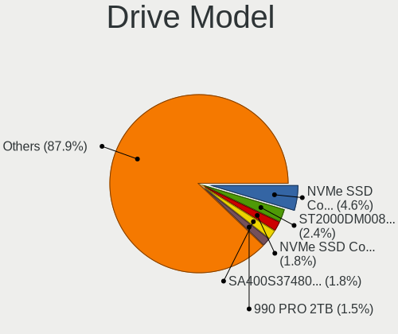
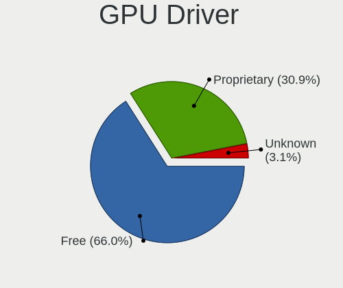
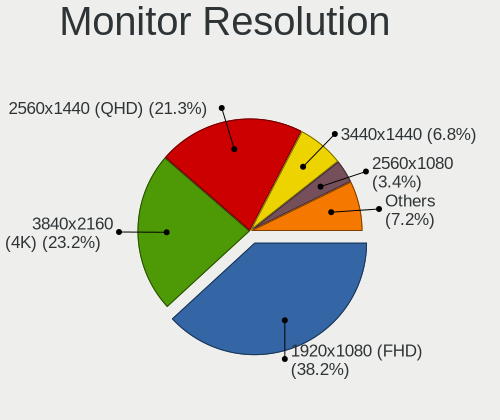

Bazzite - Tested Hardware & Statistics (Desktops)
-------------------------------------------------

A project to collect tested hardware configurations for Bazzite.

Anyone can contribute to this report by the [hw-probe](https://github.com/linuxhw/hw-probe) tool:

    sudo -E hw-probe -all -upload

Please contribute! Especially if your hardware is rare.

Contents
--------

* [ Test Cases ](#test-cases)

* [ System ](#system)
  - [ OS                       ](#os)
  - [ OS Family                ](#os-family)
  - [ Kernel                   ](#kernel)
  - [ Kernel Family            ](#kernel-family)
  - [ Kernel Major Ver.        ](#kernel-major-ver)
  - [ Arch                     ](#arch)
  - [ DE                       ](#de)
  - [ Display Server           ](#display-server)
  - [ Display Manager          ](#display-manager)
  - [ OS Lang                  ](#os-lang)
  - [ Boot Mode                ](#boot-mode)
  - [ Filesystem               ](#filesystem)
  - [ Part. scheme             ](#part-scheme)
  - [ Dual Boot with Linux/BSD ](#dual-boot-with-linuxbsd)
  - [ Dual Boot (Win)          ](#dual-boot-win)

* [ Board ](#board)
  - [ Vendor                   ](#vendor)
  - [ Model                    ](#model)
  - [ Model Family             ](#model-family)
  - [ MFG Year                 ](#mfg-year)
  - [ Form Factor              ](#form-factor)
  - [ Secure Boot              ](#secure-boot)
  - [ Coreboot                 ](#coreboot)
  - [ RAM Size                 ](#ram-size)
  - [ RAM Used                 ](#ram-used)
  - [ Total Drives             ](#total-drives)
  - [ Has CD-ROM               ](#has-cd-rom)
  - [ Has Ethernet             ](#has-ethernet)
  - [ Has WiFi                 ](#has-wifi)
  - [ Has Bluetooth            ](#has-bluetooth)

* [ Location ](#location)
  - [ Country                  ](#country)
  - [ City                     ](#city)

* [ Drives ](#drives)
  - [ Drive Vendor             ](#drive-vendor)
  - [ Drive Model              ](#drive-model)
  - [ HDD Vendor               ](#hdd-vendor)
  - [ SSD Vendor               ](#ssd-vendor)
  - [ Drive Kind               ](#drive-kind)
  - [ Drive Connector          ](#drive-connector)
  - [ Drive Size               ](#drive-size)
  - [ Space Total              ](#space-total)
  - [ Space Used               ](#space-used)
  - [ Malfunc. Drives          ](#malfunc-drives)
  - [ Malfunc. Drive Vendor    ](#malfunc-drive-vendor)
  - [ Malfunc. HDD Vendor      ](#malfunc-hdd-vendor)
  - [ Malfunc. Drive Kind      ](#malfunc-drive-kind)
  - [ Failed Drives            ](#failed-drives)
  - [ Failed Drive Vendor      ](#failed-drive-vendor)
  - [ Drive Status             ](#drive-status)

* [ Storage controller ](#storage-controller)
  - [ Storage Vendor           ](#storage-vendor)
  - [ Storage Model            ](#storage-model)
  - [ Storage Kind             ](#storage-kind)

* [ Processor ](#processor)
  - [ CPU Vendor               ](#cpu-vendor)
  - [ CPU Model                ](#cpu-model)
  - [ CPU Model Family         ](#cpu-model-family)
  - [ CPU Cores                ](#cpu-cores)
  - [ CPU Sockets              ](#cpu-sockets)
  - [ CPU Threads              ](#cpu-threads)
  - [ CPU Op-Modes             ](#cpu-op-modes)
  - [ CPU Microcode            ](#cpu-microcode)
  - [ CPU Microarch            ](#cpu-microarch)

* [ Graphics ](#graphics)
  - [ GPU Vendor               ](#gpu-vendor)
  - [ GPU Model                ](#gpu-model)
  - [ GPU Combo                ](#gpu-combo)
  - [ GPU Driver               ](#gpu-driver)
  - [ GPU Memory               ](#gpu-memory)

* [ Monitor ](#monitor)
  - [ Monitor Vendor           ](#monitor-vendor)
  - [ Monitor Model            ](#monitor-model)
  - [ Monitor Resolution       ](#monitor-resolution)
  - [ Monitor Diagonal         ](#monitor-diagonal)
  - [ Monitor Width            ](#monitor-width)
  - [ Aspect Ratio             ](#aspect-ratio)
  - [ Monitor Area             ](#monitor-area)
  - [ Pixel Density            ](#pixel-density)
  - [ Multiple Monitors        ](#multiple-monitors)

* [ Network ](#network)
  - [ Net Controller Vendor    ](#net-controller-vendor)
  - [ Net Controller Model     ](#net-controller-model)
  - [ Wireless Vendor          ](#wireless-vendor)
  - [ Wireless Model           ](#wireless-model)
  - [ Ethernet Vendor          ](#ethernet-vendor)
  - [ Ethernet Model           ](#ethernet-model)
  - [ Net Controller Kind      ](#net-controller-kind)
  - [ Used Controller          ](#used-controller)
  - [ NICs                     ](#nics)
  - [ IPv6                     ](#ipv6)

* [ Bluetooth ](#bluetooth)
  - [ Bluetooth Vendor         ](#bluetooth-vendor)
  - [ Bluetooth Model          ](#bluetooth-model)

* [ Sound ](#sound)
  - [ Sound Vendor             ](#sound-vendor)
  - [ Sound Model              ](#sound-model)

* [ Memory ](#memory)
  - [ Memory Vendor            ](#memory-vendor)
  - [ Memory Model             ](#memory-model)
  - [ Memory Kind              ](#memory-kind)
  - [ Memory Form Factor       ](#memory-form-factor)
  - [ Memory Size              ](#memory-size)
  - [ Memory Speed             ](#memory-speed)

* [ Printers & scanners ](#printers--scanners)
  - [ Printer Vendor           ](#printer-vendor)
  - [ Printer Model            ](#printer-model)
  - [ Scanner Vendor           ](#scanner-vendor)
  - [ Scanner Model            ](#scanner-model)

* [ Camera ](#camera)
  - [ Camera Vendor            ](#camera-vendor)
  - [ Camera Model             ](#camera-model)

* [ Security ](#security)
  - [ Fingerprint Vendor       ](#fingerprint-vendor)
  - [ Fingerprint Model        ](#fingerprint-model)
  - [ Chipcard Vendor          ](#chipcard-vendor)
  - [ Chipcard Model           ](#chipcard-model)

* [ Unsupported ](#unsupported)
  - [ Unsupported Devices      ](#unsupported-devices)
  - [ Unsupported Device Types ](#unsupported-device-types)

Test Cases
----------

Total: 246

| Vendor        | Model                       | Probe                                                      | Date         |
|---------------|-----------------------------|------------------------------------------------------------|--------------|
| MACHINIST     | H110 Ver:2.3                | [da4bcc0047](https://linux-hardware.org/?probe=da4bcc0047) | Jan 06, 2025 |
| MACHINIST     | H110 Ver:2.3                | [e477166cd2](https://linux-hardware.org/?probe=e477166cd2) | Jan 06, 2025 |
| Lenovo        | 318E SDK0J40697 WIN 3305... | [180e354322](https://linux-hardware.org/?probe=180e354322) | Jan 06, 2025 |
| ASUSTek       | ROG STRIX B550-F GAMING     | [df3bbdd6e6](https://linux-hardware.org/?probe=df3bbdd6e6) | Jan 05, 2025 |
| Lenovo        | 318E SDK0J40697 WIN 3305... | [3d0601ead9](https://linux-hardware.org/?probe=3d0601ead9) | Jan 05, 2025 |
| ASRock        | X870E Taichi Lite           | [5c8bb1062f](https://linux-hardware.org/?probe=5c8bb1062f) | Jan 05, 2025 |
| ASUSTek       | PRIME B760M-A AX6 II        | [826dc3e0f2](https://linux-hardware.org/?probe=826dc3e0f2) | Jan 04, 2025 |
| Gigabyte      | B450 AORUS PRO WIFI-CF      | [1a76cb7c54](https://linux-hardware.org/?probe=1a76cb7c54) | Jan 03, 2025 |
| ASUSTek       | TUF Gaming X670E-PLUS WI... | [eb28346691](https://linux-hardware.org/?probe=eb28346691) | Jan 02, 2025 |
| MSI           | MAG X570S TOMAHAWK MAX W... | [fb9578e5d4](https://linux-hardware.org/?probe=fb9578e5d4) | Jan 01, 2025 |
| ASUSTek       | PRIME B450M-A               | [3c9a38404f](https://linux-hardware.org/?probe=3c9a38404f) | Jan 01, 2025 |
| MSI           | MPG B550 GAMING PLUS        | [85fd0765c6](https://linux-hardware.org/?probe=85fd0765c6) | Dec 31, 2024 |
| ASUSTek       | Pro H610M-C                 | [9f47d5bad6](https://linux-hardware.org/?probe=9f47d5bad6) | Dec 30, 2024 |
| ASUSTek       | Z790 GAMING WIFI7           | [799d284a26](https://linux-hardware.org/?probe=799d284a26) | Dec 30, 2024 |
| ASUSTek       | Z790 GAMING WIFI7           | [3d5f5f5640](https://linux-hardware.org/?probe=3d5f5f5640) | Dec 30, 2024 |
| ASUSTek       | TUF Gaming B650-PLUS        | [8f62444b6a](https://linux-hardware.org/?probe=8f62444b6a) | Dec 29, 2024 |
| ASRock        | X570 Phantom Gaming-ITX/... | [7aa96c906d](https://linux-hardware.org/?probe=7aa96c906d) | Dec 29, 2024 |
| ASUSTek       | P8Z77-V LK                  | [10582e7b7b](https://linux-hardware.org/?probe=10582e7b7b) | Dec 29, 2024 |
| MSI           | MPG X570 GAMING PLUS        | [f22cbdf9ad](https://linux-hardware.org/?probe=f22cbdf9ad) | Dec 28, 2024 |
| Gigabyte      | X670E AORUS MASTER          | [43e0c78438](https://linux-hardware.org/?probe=43e0c78438) | Dec 28, 2024 |
| ASUSTek       | ROG Maximus XI HERO         | [3204a0a933](https://linux-hardware.org/?probe=3204a0a933) | Dec 25, 2024 |
| ASUSTek       | PRIME H510M-K R2.0          | [9215a34e87](https://linux-hardware.org/?probe=9215a34e87) | Dec 25, 2024 |
| Gigabyte      | B450 AORUS M                | [df8f0ba147](https://linux-hardware.org/?probe=df8f0ba147) | Dec 24, 2024 |
| Dell          | 0WN7Y6 A01                  | [b20d2d0198](https://linux-hardware.org/?probe=b20d2d0198) | Dec 23, 2024 |
| Colorful T... | CVN B650M GAMING FROZEN ... | [1155e83e75](https://linux-hardware.org/?probe=1155e83e75) | Dec 22, 2024 |
| MSI           | MAG X670E TOMAHAWK WIFI     | [a977849531](https://linux-hardware.org/?probe=a977849531) | Dec 22, 2024 |
| Gigabyte      | AB350M-Gaming 3-CF          | [359d3ae6ec](https://linux-hardware.org/?probe=359d3ae6ec) | Dec 22, 2024 |
| ASUSTek       | TUF Z270 MARK 2             | [5f75675aff](https://linux-hardware.org/?probe=5f75675aff) | Dec 21, 2024 |
| Dell          | 0WN7Y6 A01                  | [2136a13f47](https://linux-hardware.org/?probe=2136a13f47) | Dec 19, 2024 |
| Dell          | 0WMJ54 A01                  | [d47727f897](https://linux-hardware.org/?probe=d47727f897) | Dec 19, 2024 |
| ASRock        | B550 Extreme4               | [b15fa49664](https://linux-hardware.org/?probe=b15fa49664) | Dec 19, 2024 |
| ASRock        | B550 Extreme4               | [814e14dde9](https://linux-hardware.org/?probe=814e14dde9) | Dec 19, 2024 |
| MSI           | B450M PRO-VDH               | [50248fd7b6](https://linux-hardware.org/?probe=50248fd7b6) | Dec 18, 2024 |
| MSI           | B450M PRO-VDH               | [e9cda49543](https://linux-hardware.org/?probe=e9cda49543) | Dec 18, 2024 |
| ASUSTek       | TUF Gaming B550-PLUS        | [ef5de4811b](https://linux-hardware.org/?probe=ef5de4811b) | Dec 18, 2024 |
| ASUSTek       | ROG STRIX B650E-I GAMING... | [b0a3121054](https://linux-hardware.org/?probe=b0a3121054) | Dec 18, 2024 |
| ASUSTek       | ProArt X570-CREATOR WIFI    | [5bd1dbfa57](https://linux-hardware.org/?probe=5bd1dbfa57) | Dec 17, 2024 |
| Dell          | 042P49 A01                  | [7628da790c](https://linux-hardware.org/?probe=7628da790c) | Dec 15, 2024 |
| Dell          | 0T7D40 A01                  | [b215a3aa7c](https://linux-hardware.org/?probe=b215a3aa7c) | Dec 15, 2024 |
| TianBei       | GEM12                       | [9505d9ed29](https://linux-hardware.org/?probe=9505d9ed29) | Dec 15, 2024 |
| SHANGZHAOY... | H97-STRONG V1.0             | [b8e33835e8](https://linux-hardware.org/?probe=b8e33835e8) | Dec 14, 2024 |
| Gigabyte      | B550I AORUS PRO AX          | [a7722c77ec](https://linux-hardware.org/?probe=a7722c77ec) | Dec 11, 2024 |
| Gigabyte      | AB350N-Gaming WIFI-CF       | [538c3d3d38](https://linux-hardware.org/?probe=538c3d3d38) | Dec 11, 2024 |
| ASRock        | B650M Pro RS WiFi           | [2dc9975b7a](https://linux-hardware.org/?probe=2dc9975b7a) | Dec 11, 2024 |
| Unknown       | Unknown                     | [b07a1b7eb5](https://linux-hardware.org/?probe=b07a1b7eb5) | Dec 10, 2024 |
| ASUSTek       | TUF Gaming B550-PLUS        | [8b136e72e1](https://linux-hardware.org/?probe=8b136e72e1) | Dec 09, 2024 |
| MSI           | MAG X570S TOMAHAWK MAX W... | [8fd0753b3b](https://linux-hardware.org/?probe=8fd0753b3b) | Dec 08, 2024 |
| MACHINIST     | E5-RS9 V1.1                 | [9f5f41fa91](https://linux-hardware.org/?probe=9f5f41fa91) | Dec 07, 2024 |
| Dell          | 042P49 A00                  | [3aaa1e8304](https://linux-hardware.org/?probe=3aaa1e8304) | Dec 07, 2024 |
| MSI           | Z370-A PRO                  | [a6e087e259](https://linux-hardware.org/?probe=a6e087e259) | Dec 07, 2024 |
| MSI           | A320M PRO-E                 | [bae9cfba05](https://linux-hardware.org/?probe=bae9cfba05) | Dec 07, 2024 |
| MSI           | X299 RAIDER                 | [f0bcb53763](https://linux-hardware.org/?probe=f0bcb53763) | Dec 07, 2024 |
| Gigabyte      | B85M-D3PH                   | [bd43ad3f6e](https://linux-hardware.org/?probe=bd43ad3f6e) | Dec 07, 2024 |
| Gigabyte      | B450 AORUS ELITE            | [b3206b45cc](https://linux-hardware.org/?probe=b3206b45cc) | Dec 06, 2024 |
| MSI           | MEG X570 UNIFY              | [3abd20dbb3](https://linux-hardware.org/?probe=3abd20dbb3) | Dec 05, 2024 |
| Gigabyte      | B650 AORUS ELITE AX         | [6448eaf0bb](https://linux-hardware.org/?probe=6448eaf0bb) | Dec 05, 2024 |
| MSI           | PRO B650-VC WIFI            | [c7e77b3074](https://linux-hardware.org/?probe=c7e77b3074) | Dec 05, 2024 |
| MSI           | PRO B650-VC WIFI            | [662439abf7](https://linux-hardware.org/?probe=662439abf7) | Dec 05, 2024 |
| MSI           | MAG B550M MORTAR            | [52ef9b3448](https://linux-hardware.org/?probe=52ef9b3448) | Dec 04, 2024 |
| ASUSTek       | TUF Gaming B550M-PLUS       | [554febc693](https://linux-hardware.org/?probe=554febc693) | Dec 04, 2024 |
| ASUSTek       | TUF Gaming X570-PLUS_BR     | [bc07acd161](https://linux-hardware.org/?probe=bc07acd161) | Dec 03, 2024 |
| Gigabyte      | B85M-D3PH                   | [a6ffab773f](https://linux-hardware.org/?probe=a6ffab773f) | Dec 03, 2024 |
| ASRock        | B760M-C                     | [d7ef11e5df](https://linux-hardware.org/?probe=d7ef11e5df) | Dec 02, 2024 |
| ASUSTek       | Pro WS X299 SAGE II         | [514e655bbd](https://linux-hardware.org/?probe=514e655bbd) | Dec 02, 2024 |
| Gigabyte      | X670 GAMING X AX            | [35ae0deb67](https://linux-hardware.org/?probe=35ae0deb67) | Dec 01, 2024 |
| ASUSTek       | ROG STRIX X870E-E GAMING... | [dbad67b372](https://linux-hardware.org/?probe=dbad67b372) | Dec 01, 2024 |
| ASRock        | B650M Pro RS WiFi           | [c62526efca](https://linux-hardware.org/?probe=c62526efca) | Dec 01, 2024 |
| HP            | 872B                        | [4dd45a2a3c](https://linux-hardware.org/?probe=4dd45a2a3c) | Dec 01, 2024 |
| MSI           | B450 GAMING PLUS            | [7cf713d1f4](https://linux-hardware.org/?probe=7cf713d1f4) | Nov 30, 2024 |
| MSI           | AM1I                        | [b414f89d08](https://linux-hardware.org/?probe=b414f89d08) | Nov 30, 2024 |
| ASUSTek       | TUF Gaming B550M-PLUS       | [ca35a1e151](https://linux-hardware.org/?probe=ca35a1e151) | Nov 29, 2024 |
| Gigabyte      | B250M-HD3-CF                | [285af8915b](https://linux-hardware.org/?probe=285af8915b) | Nov 29, 2024 |
| ASUSTek       | ROG STRIX X870E-E GAMING... | [94e70b6e46](https://linux-hardware.org/?probe=94e70b6e46) | Nov 29, 2024 |
| Gigabyte      | B550M DS3H                  | [7e9d488336](https://linux-hardware.org/?probe=7e9d488336) | Nov 29, 2024 |
| ASUSTek       | Z790 GAMING WIFI7           | [b458cf3bf5](https://linux-hardware.org/?probe=b458cf3bf5) | Nov 28, 2024 |
| ASUSTek       | TUF B450-PLUS GAMING        | [737048a59d](https://linux-hardware.org/?probe=737048a59d) | Nov 27, 2024 |
| MSI           | Z87-GD65 GAMING             | [c68e04c0cf](https://linux-hardware.org/?probe=c68e04c0cf) | Nov 26, 2024 |
| MSI           | Z87-GD65 GAMING             | [9da2d0250d](https://linux-hardware.org/?probe=9da2d0250d) | Nov 26, 2024 |
| ASUSTek       | ROG STRIX X470-I GAMING     | [68e982f380](https://linux-hardware.org/?probe=68e982f380) | Nov 26, 2024 |
| ASUSTek       | PRIME Z270-A                | [ed9e08eabd](https://linux-hardware.org/?probe=ed9e08eabd) | Nov 26, 2024 |
| ASUSTek       | ROG STRIX B450-F GAMING ... | [53f28f7bf8](https://linux-hardware.org/?probe=53f28f7bf8) | Nov 26, 2024 |
| Gigabyte      | B550M K                     | [495068e89a](https://linux-hardware.org/?probe=495068e89a) | Nov 25, 2024 |
| Gigabyte      | X570 AORUS ELITE            | [c4cdb6e0be](https://linux-hardware.org/?probe=c4cdb6e0be) | Nov 24, 2024 |
| ASUSTek       | PRIME B450M-A II            | [f7927122ec](https://linux-hardware.org/?probe=f7927122ec) | Nov 23, 2024 |
| Gigabyte      | B550 UD AC                  | [19a401a80f](https://linux-hardware.org/?probe=19a401a80f) | Nov 23, 2024 |
| Gigabyte      | B650 EAGLE AX               | [cea045ba32](https://linux-hardware.org/?probe=cea045ba32) | Nov 22, 2024 |
| Gigabyte      | X570 AORUS XTREME           | [26bd65822e](https://linux-hardware.org/?probe=26bd65822e) | Nov 22, 2024 |
| Gigabyte      | X570 AORUS XTREME           | [5c1d07cae0](https://linux-hardware.org/?probe=5c1d07cae0) | Nov 22, 2024 |
| MSI           | PRO B650M-A WIFI            | [03ad8b0cca](https://linux-hardware.org/?probe=03ad8b0cca) | Nov 21, 2024 |
| Intel         | Alder Lake-H PCH E1.0G      | [7dc3c81a67](https://linux-hardware.org/?probe=7dc3c81a67) | Nov 21, 2024 |
| Gigabyte      | B650 AORUS ELITE AX V2      | [fdc2572f83](https://linux-hardware.org/?probe=fdc2572f83) | Nov 20, 2024 |
| Kllisre       | E5 F9 V1.0                  | [85d3fa537d](https://linux-hardware.org/?probe=85d3fa537d) | Nov 19, 2024 |
| Gigabyte      | AB350-Gaming 3-CF           | [e643ae8c2a](https://linux-hardware.org/?probe=e643ae8c2a) | Nov 18, 2024 |
| Acer          | Veriton S6610G              | [07703559d2](https://linux-hardware.org/?probe=07703559d2) | Nov 18, 2024 |
| ASRock        | B650M-HDV/M.2               | [5e55c3c214](https://linux-hardware.org/?probe=5e55c3c214) | Nov 17, 2024 |
| MSI           | PRO B650-P WIFI             | [e0d87feb4c](https://linux-hardware.org/?probe=e0d87feb4c) | Nov 17, 2024 |
| Gigabyte      | X670E AORUS XTREME          | [84ed7923b5](https://linux-hardware.org/?probe=84ed7923b5) | Nov 14, 2024 |
| Dell          | 0KN5W4 A02                  | [b98379c391](https://linux-hardware.org/?probe=b98379c391) | Nov 13, 2024 |
| MSI           | MPG Z790 CARBON WIFI        | [3c4d29e5f7](https://linux-hardware.org/?probe=3c4d29e5f7) | Nov 13, 2024 |
| MSI           | MAG B550 TOMAHAWK           | [c3f50ef03f](https://linux-hardware.org/?probe=c3f50ef03f) | Nov 13, 2024 |
| MSI           | ZH77A-G43                   | [6e7a02926e](https://linux-hardware.org/?probe=6e7a02926e) | Nov 12, 2024 |
| JGINYUE       | B550i-GAMING                | [2701fc764a](https://linux-hardware.org/?probe=2701fc764a) | Nov 11, 2024 |
| ASRock        | X399M Taichi                | [01b2805ff7](https://linux-hardware.org/?probe=01b2805ff7) | Nov 11, 2024 |
| ASRock        | X399M Taichi                | [0922a4a904](https://linux-hardware.org/?probe=0922a4a904) | Nov 11, 2024 |
| Gigabyte      | Z77X-UD3H                   | [51c37de3d0](https://linux-hardware.org/?probe=51c37de3d0) | Nov 10, 2024 |
| MSI           | MEG Z490 UNIFY              | [9fff13f635](https://linux-hardware.org/?probe=9fff13f635) | Nov 10, 2024 |
| ASUSTek       | ROG STRIX Z490-F GAMING     | [bd68e159f2](https://linux-hardware.org/?probe=bd68e159f2) | Nov 09, 2024 |
| ASUSTek       | ROG CROSSHAIR VIII HERO     | [9c238fd7ee](https://linux-hardware.org/?probe=9c238fd7ee) | Nov 07, 2024 |
| ASUSTek       | ROG STRIX B550-F GAMING     | [7975c09175](https://linux-hardware.org/?probe=7975c09175) | Nov 05, 2024 |
| ASRock        | X570 Phantom Gaming 4       | [bb9293b0a2](https://linux-hardware.org/?probe=bb9293b0a2) | Nov 05, 2024 |
| HP            | 1495                        | [a844f7d854](https://linux-hardware.org/?probe=a844f7d854) | Nov 03, 2024 |
| ASUSTek       | Z590 WIFI GUNDAM EDITION    | [f2749f62c8](https://linux-hardware.org/?probe=f2749f62c8) | Nov 03, 2024 |
| Gigabyte      | B650M AORUS ELITE AX        | [29ad536aa2](https://linux-hardware.org/?probe=29ad536aa2) | Nov 02, 2024 |
| Gigabyte      | Z590I AORUS ULTRA           | [c23d4ea993](https://linux-hardware.org/?probe=c23d4ea993) | Oct 31, 2024 |
| ASUSTek       | X99-A                       | [20b3429f27](https://linux-hardware.org/?probe=20b3429f27) | Oct 31, 2024 |
| ASUSTek       | ROG STRIX X670E-A GAMING... | [a101c103eb](https://linux-hardware.org/?probe=a101c103eb) | Oct 31, 2024 |
| Acer          | Predator PO3-630            | [b2da1b5363](https://linux-hardware.org/?probe=b2da1b5363) | Oct 31, 2024 |
| MSI           | MEG X570 ACE                | [890cc5b6a4](https://linux-hardware.org/?probe=890cc5b6a4) | Oct 31, 2024 |
| ASUSTek       | TUF Gaming X570-PLUS        | [9425b3345e](https://linux-hardware.org/?probe=9425b3345e) | Oct 29, 2024 |
| ASUSTek       | X99-A                       | [01ef68fdbe](https://linux-hardware.org/?probe=01ef68fdbe) | Oct 28, 2024 |
| Dell          | 096JG8 A00                  | [4a16e8e7f8](https://linux-hardware.org/?probe=4a16e8e7f8) | Oct 27, 2024 |
| Dell          | 096JG8 A00                  | [c2510e4429](https://linux-hardware.org/?probe=c2510e4429) | Oct 27, 2024 |
| Gigabyte      | B550I AORUS PRO AX          | [e8ca6f09e7](https://linux-hardware.org/?probe=e8ca6f09e7) | Oct 26, 2024 |
| ASRock        | B550M Pro SE                | [a6d1bcfc49](https://linux-hardware.org/?probe=a6d1bcfc49) | Oct 26, 2024 |
| PELADN        | HA-4                        | [7e1050a846](https://linux-hardware.org/?probe=7e1050a846) | Oct 26, 2024 |
| Intel         | X99-P4 V5.0                 | [81334985fd](https://linux-hardware.org/?probe=81334985fd) | Oct 26, 2024 |
| Gigabyte      | B550I AORUS PRO AX          | [1668591553](https://linux-hardware.org/?probe=1668591553) | Oct 26, 2024 |
| MSI           | MPG B550I GAMING EDGE MA... | [62bd667a99](https://linux-hardware.org/?probe=62bd667a99) | Oct 26, 2024 |
| ASUSTek       | TUF Gaming X570-PLUS        | [a4f16dff63](https://linux-hardware.org/?probe=a4f16dff63) | Oct 25, 2024 |
| GEEKOM        | A8                          | [e60432b953](https://linux-hardware.org/?probe=e60432b953) | Oct 25, 2024 |
| GEEKOM        | A8                          | [ab289bcf5f](https://linux-hardware.org/?probe=ab289bcf5f) | Oct 25, 2024 |
| ASUSTek       | G20AJ                       | [38cc1a120f](https://linux-hardware.org/?probe=38cc1a120f) | Oct 25, 2024 |
| PELADN        | HA-4                        | [8ac6dfdc0a](https://linux-hardware.org/?probe=8ac6dfdc0a) | Oct 25, 2024 |
| MSI           | B350M GAMING PRO            | [caa72deb83](https://linux-hardware.org/?probe=caa72deb83) | Oct 24, 2024 |
| HP            | 8719                        | [5a4fc59715](https://linux-hardware.org/?probe=5a4fc59715) | Oct 23, 2024 |
| ASUSTek       | CG1330                      | [0191a0dfae](https://linux-hardware.org/?probe=0191a0dfae) | Oct 23, 2024 |
| ECS           | GLKD-I2                     | [0bfb2e49b4](https://linux-hardware.org/?probe=0bfb2e49b4) | Oct 23, 2024 |
| ASUSTek       | ROG STRIX B650E-I GAMING... | [fb9eb23d2c](https://linux-hardware.org/?probe=fb9eb23d2c) | Oct 22, 2024 |
| Gigabyte      | X870 AORUS ELITE WIFI7      | [fe41f79efd](https://linux-hardware.org/?probe=fe41f79efd) | Oct 22, 2024 |
| Gigabyte      | Z170X-Gaming 7              | [e1fd53e236](https://linux-hardware.org/?probe=e1fd53e236) | Oct 21, 2024 |
| MSI           | B550 GAMING GEN3            | [109e74d5a4](https://linux-hardware.org/?probe=109e74d5a4) | Oct 20, 2024 |
| ASRock        | B550M Pro SE                | [94e3be9f0b](https://linux-hardware.org/?probe=94e3be9f0b) | Oct 19, 2024 |
| MSI           | B550M PRO-VDH WIFI          | [d9354dab8d](https://linux-hardware.org/?probe=d9354dab8d) | Oct 19, 2024 |
| ASUSTek       | PRIME B560M-K               | [81ddc83ec8](https://linux-hardware.org/?probe=81ddc83ec8) | Oct 19, 2024 |
| ASUSTek       | PRIME B560M-K               | [053e5065e1](https://linux-hardware.org/?probe=053e5065e1) | Oct 19, 2024 |
| ASUSTek       | TUF Gaming B760-PLUS WIF... | [34de8d3de4](https://linux-hardware.org/?probe=34de8d3de4) | Oct 18, 2024 |
| Fujitsu       | D3222-A1 S26361-D3222-A1    | [8156434b36](https://linux-hardware.org/?probe=8156434b36) | Oct 18, 2024 |
| MSI           | PRO B650-P WIFI             | [a61099a91a](https://linux-hardware.org/?probe=a61099a91a) | Oct 16, 2024 |
| ASUSTek       | ROG STRIX B450-F GAMING ... | [107ed71ce3](https://linux-hardware.org/?probe=107ed71ce3) | Oct 15, 2024 |
| MSI           | MPG B550 GAMING EDGE WIF... | [800ee21ab5](https://linux-hardware.org/?probe=800ee21ab5) | Oct 15, 2024 |
| ASUSTek       | TUF Gaming B760-PLUS WIF... | [2775a1237e](https://linux-hardware.org/?probe=2775a1237e) | Oct 14, 2024 |
| MSI           | 970 GAMING                  | [43d5552b35](https://linux-hardware.org/?probe=43d5552b35) | Oct 14, 2024 |
| MSI           | 970 GAMING                  | [0bdcd004f4](https://linux-hardware.org/?probe=0bdcd004f4) | Oct 14, 2024 |
| MSI           | MEG Z490 UNIFY              | [9a3d5e0af6](https://linux-hardware.org/?probe=9a3d5e0af6) | Oct 14, 2024 |
| Gigabyte      | B360M AORUS Gaming 3-CF     | [c6f7d068aa](https://linux-hardware.org/?probe=c6f7d068aa) | Oct 12, 2024 |
| ASUSTek       | ROG STRIX B450-F GAMING ... | [cad5ed956e](https://linux-hardware.org/?probe=cad5ed956e) | Oct 11, 2024 |
| ASUSTek       | PRIME Z390-P                | [771c38c70a](https://linux-hardware.org/?probe=771c38c70a) | Oct 10, 2024 |
| MSI           | B550-A PRO                  | [f853483a69](https://linux-hardware.org/?probe=f853483a69) | Oct 10, 2024 |
| ASUSTek       | ROG STRIX X670E-I GAMING... | [51818e978a](https://linux-hardware.org/?probe=51818e978a) | Oct 09, 2024 |
| BAZAM & PI... | B450M-DA                    | [bed89cd999](https://linux-hardware.org/?probe=bed89cd999) | Oct 08, 2024 |
| MSI           | X299 SLI PLUS               | [56774f9775](https://linux-hardware.org/?probe=56774f9775) | Oct 08, 2024 |
| ASRock        | B450M Steel Legend          | [7714ccab3e](https://linux-hardware.org/?probe=7714ccab3e) | Oct 08, 2024 |
| ASUSTek       | PRIME B450M-A II            | [28ee3645e2](https://linux-hardware.org/?probe=28ee3645e2) | Oct 07, 2024 |
| ASUSTek       | TUF Gaming Z790-PLUS WIF... | [bccef315fa](https://linux-hardware.org/?probe=bccef315fa) | Oct 07, 2024 |
| ASUSTek       | ROG STRIX B450-F GAMING ... | [37cc7a86a2](https://linux-hardware.org/?probe=37cc7a86a2) | Oct 07, 2024 |
| Gigabyte      | B450 AORUS M                | [6dcbefdc51](https://linux-hardware.org/?probe=6dcbefdc51) | Oct 06, 2024 |
| MSI           | MAG B650 TOMAHAWK WIFI      | [b4b87eb67a](https://linux-hardware.org/?probe=b4b87eb67a) | Oct 05, 2024 |
| Shenzhen M... | DRBAA                       | [048fd749f9](https://linux-hardware.org/?probe=048fd749f9) | Oct 05, 2024 |
| MSI           | MAG B650 TOMAHAWK WIFI      | [016ba8b04a](https://linux-hardware.org/?probe=016ba8b04a) | Oct 05, 2024 |
| Kllisre       | E5 F9 V1.0                  | [9db5e992cc](https://linux-hardware.org/?probe=9db5e992cc) | Oct 05, 2024 |
| MSI           | X299 SLI PLUS               | [6e0a3be817](https://linux-hardware.org/?probe=6e0a3be817) | Oct 04, 2024 |
| ASRock        | X870 Pro RS                 | [fd9829c6ea](https://linux-hardware.org/?probe=fd9829c6ea) | Oct 04, 2024 |
| SZMZ          | B75-MS V1.0                 | [c0329cfb23](https://linux-hardware.org/?probe=c0329cfb23) | Oct 01, 2024 |
| Gigabyte      | X670 GAMING X AX            | [ddf6aa09c8](https://linux-hardware.org/?probe=ddf6aa09c8) | Sep 29, 2024 |
| MSI           | B550M PRO-VDH WIFI          | [49b2501558](https://linux-hardware.org/?probe=49b2501558) | Sep 29, 2024 |
| ASUSTek       | ROG STRIX X670E-A GAMING... | [9b2fb33a76](https://linux-hardware.org/?probe=9b2fb33a76) | Sep 28, 2024 |
| ASUSTek       | ROG STRIX B550-I GAMING     | [35016e1de9](https://linux-hardware.org/?probe=35016e1de9) | Sep 27, 2024 |
| MSI           | B450M MORTAR MAX            | [a8b102ce1e](https://linux-hardware.org/?probe=a8b102ce1e) | Sep 26, 2024 |
| ASUSTek       | PRIME B450M-A II            | [ebab45b702](https://linux-hardware.org/?probe=ebab45b702) | Sep 22, 2024 |
| MSI           | Z170A PC MATE               | [b70ff5a3e0](https://linux-hardware.org/?probe=b70ff5a3e0) | Sep 22, 2024 |
| Shenzhen M... | DRBAA                       | [2f862229ae](https://linux-hardware.org/?probe=2f862229ae) | Sep 22, 2024 |
| Dell          | 0NC2VH A01                  | [59e60345da](https://linux-hardware.org/?probe=59e60345da) | Sep 20, 2024 |
| ASUSTek       | ROG STRIX X570-I GAMING     | [a841fa4c2a](https://linux-hardware.org/?probe=a841fa4c2a) | Sep 20, 2024 |
| Gigabyte      | B550I AORUS PRO AX          | [d7f0266d11](https://linux-hardware.org/?probe=d7f0266d11) | Sep 20, 2024 |
| Medion        | B460H6-EM                   | [608a1b94ba](https://linux-hardware.org/?probe=608a1b94ba) | Sep 19, 2024 |
| ASRock        | X470 Taichi                 | [7d5260fc73](https://linux-hardware.org/?probe=7d5260fc73) | Sep 18, 2024 |
| MSI           | B350M GAMING PRO            | [eedffd1c98](https://linux-hardware.org/?probe=eedffd1c98) | Sep 18, 2024 |
| Gigabyte      | B650M DS3H                  | [9e0c589148](https://linux-hardware.org/?probe=9e0c589148) | Sep 18, 2024 |
| Lenovo        | SKYBAY SDK0J40700 WIN 32... | [ac95bc5c6a](https://linux-hardware.org/?probe=ac95bc5c6a) | Sep 17, 2024 |
| ASUSTek       | ROG CROSSHAIR X670E GENE    | [788e3c4a7e](https://linux-hardware.org/?probe=788e3c4a7e) | Sep 17, 2024 |
| ASUSTek       | ROG CROSSHAIR X670E GENE    | [32024e5714](https://linux-hardware.org/?probe=32024e5714) | Sep 15, 2024 |
| ASUSTek       | P8Z77-V LX                  | [9a2d30b238](https://linux-hardware.org/?probe=9a2d30b238) | Sep 14, 2024 |
| Gigabyte      | X670E AORUS XTREME          | [6ad97c8e57](https://linux-hardware.org/?probe=6ad97c8e57) | Sep 14, 2024 |
| Apple         | Mac-F60DEB81FF30ACF6 Mac... | [4a3706e51b](https://linux-hardware.org/?probe=4a3706e51b) | Sep 13, 2024 |
| Gigabyte      | Z790 AORUS PRO X            | [139ea99229](https://linux-hardware.org/?probe=139ea99229) | Sep 13, 2024 |
| HP            | 8906 SMVB                   | [f6ed407001](https://linux-hardware.org/?probe=f6ed407001) | Sep 12, 2024 |
| MSI           | MPG X570 GAMING EDGE WIF... | [0c10923190](https://linux-hardware.org/?probe=0c10923190) | Sep 12, 2024 |
| PELADN        | HA-4                        | [d1dfd2330d](https://linux-hardware.org/?probe=d1dfd2330d) | Sep 11, 2024 |
| ASUSTek       | Pro H510M-C                 | [df9222f2f8](https://linux-hardware.org/?probe=df9222f2f8) | Sep 11, 2024 |
| ASUSTek       | PRIME B560M-A               | [4e2e269e87](https://linux-hardware.org/?probe=4e2e269e87) | Sep 10, 2024 |
| ASUSTek       | Pro H510M-C                 | [e3b91ae94b](https://linux-hardware.org/?probe=e3b91ae94b) | Sep 09, 2024 |
| ASRock        | X470 Taichi                 | [4f7dfc986c](https://linux-hardware.org/?probe=4f7dfc986c) | Sep 09, 2024 |
| MSI           | MAG B365M MORTAR            | [9dccef7864](https://linux-hardware.org/?probe=9dccef7864) | Sep 08, 2024 |
| ASUSTek       | ROG STRIX B650E-I GAMING... | [9cbba79cb2](https://linux-hardware.org/?probe=9cbba79cb2) | Sep 07, 2024 |
| Shenzhen M... | DRBAA                       | [7b021799e9](https://linux-hardware.org/?probe=7b021799e9) | Sep 07, 2024 |
| ASUSTek       | H110I-PLUS                  | [75725ca538](https://linux-hardware.org/?probe=75725ca538) | Sep 07, 2024 |
| ASUSTek       | H110I-PLUS                  | [a6ea0191c3](https://linux-hardware.org/?probe=a6ea0191c3) | Sep 07, 2024 |
| Shenzhen M... | F7BAA                       | [344b53492e](https://linux-hardware.org/?probe=344b53492e) | Sep 04, 2024 |
| Shenzhen M... | F7BAA                       | [74a96a5530](https://linux-hardware.org/?probe=74a96a5530) | Sep 04, 2024 |
| Intel         | H510                        | [f53f6c9789](https://linux-hardware.org/?probe=f53f6c9789) | Sep 04, 2024 |
| ASUSTek       | ROG STRIX X670E-A GAMING... | [515db10dc4](https://linux-hardware.org/?probe=515db10dc4) | Sep 03, 2024 |
| ASRock        | X570 Taichi                 | [450218a968](https://linux-hardware.org/?probe=450218a968) | Sep 02, 2024 |
| MSI           | B350M GAMING PRO            | [ef15458656](https://linux-hardware.org/?probe=ef15458656) | Sep 01, 2024 |
| Soyo          | SY-YL B550M                 | [98777c128b](https://linux-hardware.org/?probe=98777c128b) | Aug 31, 2024 |
| MSI           | MPG Z490M GAMING EDGE WI... | [932e1c9ecd](https://linux-hardware.org/?probe=932e1c9ecd) | Aug 30, 2024 |
| ASRock        | X300M-STX                   | [5147961be1](https://linux-hardware.org/?probe=5147961be1) | Aug 27, 2024 |
| HP            | 83E9                        | [ed0e24fb38](https://linux-hardware.org/?probe=ed0e24fb38) | Aug 27, 2024 |
| ASRock        | B760M PG Lightning/D4       | [48b5227623](https://linux-hardware.org/?probe=48b5227623) | Aug 27, 2024 |
| Intel         | X99H                        | [5013e23675](https://linux-hardware.org/?probe=5013e23675) | Aug 24, 2024 |
| Intel         | X99H                        | [51b2120585](https://linux-hardware.org/?probe=51b2120585) | Aug 24, 2024 |
| ASUSTek       | TUF Gaming B550M-PLUS       | [bc52cd7fe6](https://linux-hardware.org/?probe=bc52cd7fe6) | Aug 24, 2024 |
| MSI           | MPG X570 GAMING PLUS        | [a55530a8cb](https://linux-hardware.org/?probe=a55530a8cb) | Aug 23, 2024 |
| MSI           | MEG Z490 UNIFY              | [a93fdbf15c](https://linux-hardware.org/?probe=a93fdbf15c) | Aug 23, 2024 |
| ASRock        | X470 Taichi                 | [4eeae51b23](https://linux-hardware.org/?probe=4eeae51b23) | Aug 21, 2024 |
| HP            | 8906 SMVB                   | [e50ba4cf3c](https://linux-hardware.org/?probe=e50ba4cf3c) | Aug 19, 2024 |
| HP            | 8906 SMVB                   | [ab441fa774](https://linux-hardware.org/?probe=ab441fa774) | Aug 19, 2024 |
| MSI           | Z270 SLI PLUS               | [f8f270ad06](https://linux-hardware.org/?probe=f8f270ad06) | Aug 19, 2024 |
| Gigabyte      | X670E AORUS PRO X           | [1317cc5e2c](https://linux-hardware.org/?probe=1317cc5e2c) | Aug 18, 2024 |
| Kllisre       | X99-F4 V2.0                 | [9b92bfe96e](https://linux-hardware.org/?probe=9b92bfe96e) | Aug 17, 2024 |
| ASUSTek       | ROG STRIX B560-A GAMING ... | [1d014a5085](https://linux-hardware.org/?probe=1d014a5085) | Aug 15, 2024 |
| Biostar       | B450MHP                     | [ce2a77f1be](https://linux-hardware.org/?probe=ce2a77f1be) | Aug 14, 2024 |
| SZMZ          | B75-MS V1.0                 | [6127513df4](https://linux-hardware.org/?probe=6127513df4) | Aug 12, 2024 |
| ASUSTek       | TUF B350M-PLUS GAMING       | [081dd1c60f](https://linux-hardware.org/?probe=081dd1c60f) | Aug 11, 2024 |
| Gigabyte      | AX370-Gaming K7             | [03a2e1e59d](https://linux-hardware.org/?probe=03a2e1e59d) | Aug 11, 2024 |
| Dell          | 0C2XKD A01                  | [ef521419fb](https://linux-hardware.org/?probe=ef521419fb) | Aug 11, 2024 |
| MSI           | 970 GAMING                  | [06d25ae1db](https://linux-hardware.org/?probe=06d25ae1db) | Aug 10, 2024 |
| Kllisre       | X99-F4 V2.0                 | [77d853fe2a](https://linux-hardware.org/?probe=77d853fe2a) | Aug 08, 2024 |
| ASUSTek       | SABERTOOTH 990FX R2.0       | [a79ffe6873](https://linux-hardware.org/?probe=a79ffe6873) | Aug 08, 2024 |
| Gigabyte      | AB350-Gaming 3-CF           | [1e3ecc7288](https://linux-hardware.org/?probe=1e3ecc7288) | Aug 06, 2024 |
| Gigabyte      | GA-880GMA-UD2H              | [7598d21dbd](https://linux-hardware.org/?probe=7598d21dbd) | Aug 06, 2024 |
| ASRock        | X470 Taichi                 | [d7b475e12f](https://linux-hardware.org/?probe=d7b475e12f) | Aug 04, 2024 |
| Intel         | H61                         | [8e5d01e712](https://linux-hardware.org/?probe=8e5d01e712) | Aug 03, 2024 |
| Unknown       | Unknown                     | [e91377c92a](https://linux-hardware.org/?probe=e91377c92a) | Jul 31, 2024 |
| Shenzhen M... | F7BAA                       | [7d33d31c66](https://linux-hardware.org/?probe=7d33d31c66) | Jul 25, 2024 |
| MSI           | B550M PRO-VDH               | [e20f83dc61](https://linux-hardware.org/?probe=e20f83dc61) | Jul 23, 2024 |
| ASRock        | X470 Taichi                 | [d8baef4dad](https://linux-hardware.org/?probe=d8baef4dad) | Jul 23, 2024 |

System
------

OS
--

Installed operating systems

| Name       | Desktops | Percent |
|------------|----------|---------|
| Bazzite 41 | 99       | 50%     |
| Bazzite 40 | 99       | 50%     |

OS Family
---------

OS without a version

| Name    | Desktops | Percent |
|---------|----------|---------|
| Bazzite | 194      | 100%    |

Kernel
------

Version of the Linux kernel

| Version                         | Desktops | Percent |
|---------------------------------|----------|---------|
| 6.9.12-205.fsync.fc40.x86_64    | 60       | 29.27%  |
| 6.11.10-304.bazzite.fc41.x86_64 | 28       | 13.66%  |
| 6.11.9-303.bazzite.fc41.x86_64  | 24       | 11.71%  |
| 6.11.5-307.bazzite.fc41.x86_64  | 22       | 10.73%  |
| 6.9.12-210.fsync.fc40.x86_64    | 21       | 10.24%  |
| 6.9.12-203.fsync.fc40.x86_64    | 13       | 6.34%   |
| 6.11.8-305.bazzite.fc41.x86_64  | 12       | 5.85%   |
| 6.12.6-203.bazzite.fc41.x86_64  | 9        | 4.39%   |
| 6.11.6-303.bazzite.fc41.x86_64  | 5        | 2.44%   |
| 6.10.3-202.fsync.fc40.x86_64    | 5        | 2.44%   |
| 6.9.8-204.fsync.fc40.x86_64     | 3        | 1.46%   |
| 6.9.12-202.fsync.fc40.x86_64    | 1        | 0.49%   |
| 6.9.12-201.fsync.fc40.x86_64    | 1        | 0.49%   |
| 6.10.5-201.fsync.fc40.x86_64    | 1        | 0.49%   |

Kernel Family
-------------

Linux kernel without a distro release

| Version | Desktops | Percent |
|---------|----------|---------|
| 6.9.12  | 92       | 45.77%  |
| 6.11.10 | 28       | 13.93%  |
| 6.11.9  | 24       | 11.94%  |
| 6.11.5  | 22       | 10.95%  |
| 6.11.8  | 12       | 5.97%   |
| 6.12.6  | 9        | 4.48%   |
| 6.11.6  | 5        | 2.49%   |
| 6.10.3  | 5        | 2.49%   |
| 6.9.8   | 3        | 1.49%   |
| 6.10.5  | 1        | 0.5%    |

Kernel Major Ver.
-----------------

Linux kernel major version

| Version | Desktops | Percent |
|---------|----------|---------|
| 6.9     | 94       | 47.24%  |
| 6.11    | 90       | 45.23%  |
| 6.12    | 9        | 4.52%   |
| 6.10    | 6        | 3.02%   |

Arch
----

OS architecture (x86_64, i586, etc.)

| Name   | Desktops | Percent |
|--------|----------|---------|
| x86_64 | 194      | 100%    |

DE
--

Desktop Environment

| Name    | Desktops | Percent |
|---------|----------|---------|
| KDE6    | 170      | 87.63%  |
| GNOME   | 22       | 11.34%  |
| KDE4    | 1        | 0.52%   |
| Unknown | 1        | 0.52%   |

Display Server
--------------

X11 or Wayland

| Name    | Desktops | Percent |
|---------|----------|---------|
| Wayland | 191      | 98.45%  |
| X11     | 2        | 1.03%   |
| Tty     | 1        | 0.52%   |

Display Manager
---------------

SDDM, LightDM, etc.

| Name    | Desktops | Percent |
|---------|----------|---------|
| Unknown | 188      | 96.41%  |
| SDDM    | 7        | 3.59%   |

OS Lang
-------

Language

| Lang  | Desktops | Percent |
|-------|----------|---------|
| en_US | 113      | 58.25%  |
| en_GB | 11       | 5.67%   |
| pt_BR | 9        | 4.64%   |
| de_DE | 9        | 4.64%   |
| fr_FR | 8        | 4.12%   |
| en_CA | 6        | 3.09%   |
| it_IT | 5        | 2.58%   |
| en_AU | 4        | 2.06%   |
| ru_RU | 3        | 1.55%   |
| en_NZ | 3        | 1.55%   |
| tr_TR | 2        | 1.03%   |
| pl_PL | 2        | 1.03%   |
| en_BW | 2        | 1.03%   |
| de_AT | 2        | 1.03%   |
| cs_CZ | 2        | 1.03%   |
| sv_SE | 1        | 0.52%   |
| ru_UA | 1        | 0.52%   |
| nl_NL | 1        | 0.52%   |
| id_ID | 1        | 0.52%   |
| hu_HU | 1        | 0.52%   |
| gl_ES | 1        | 0.52%   |
| fr_CA | 1        | 0.52%   |
| fr_BE | 1        | 0.52%   |
| es_PE | 1        | 0.52%   |
| es_CO | 1        | 0.52%   |
| es_BO | 1        | 0.52%   |
| en_SG | 1        | 0.52%   |
| en_IE | 1        | 0.52%   |

Boot Mode
---------

EFI or BIOS

| Mode | Desktops | Percent |
|------|----------|---------|
| BIOS | 188      | 96.41%  |
| EFI  | 7        | 3.59%   |

Filesystem
----------

Type of filesystem

| Type  | Desktops | Percent |
|-------|----------|---------|
| Btrfs | 194      | 100%    |

Part. scheme
------------

Scheme of partitioning

| Type    | Desktops | Percent |
|---------|----------|---------|
| Unknown | 187      | 95.9%   |
| GPT     | 8        | 4.1%    |

Dual Boot with Linux/BSD
------------------------

Hosting more than one Linux/BSD

| Dual boot | Desktops | Percent |
|-----------|----------|---------|
| No        | 192      | 98.97%  |
| Yes       | 2        | 1.03%   |

Dual Boot (Win)
---------------

Hosting Linux and Windows

| Dual boot | Desktops | Percent |
|-----------|----------|---------|
| No        | 190      | 97.44%  |
| Yes       | 5        | 2.56%   |

Board
-----

Vendor
------

Motherboard manufacturer

| Name                                 | Desktops | Percent |
|--------------------------------------|----------|---------|
| ASUSTek Computer                     | 50       | 25.77%  |
| MSI                                  | 43       | 22.16%  |
| Gigabyte Technology                  | 36       | 18.56%  |
| ASRock                               | 16       | 8.25%   |
| Dell                                 | 9        | 4.64%   |
| Intel                                | 5        | 2.58%   |
| Hewlett-Packard                      | 5        | 2.58%   |
| Shenzhen Meigao Electronic Equipment | 4        | 2.06%   |
| Kllisre                              | 3        | 1.55%   |
| PELADN                               | 2        | 1.03%   |
| MACHINIST                            | 2        | 1.03%   |
| Lenovo                               | 2        | 1.03%   |
| Acer                                 | 2        | 1.03%   |
| Unknown                              | 2        | 1.03%   |
| TianBei                              | 1        | 0.52%   |
| SZMZ                                 | 1        | 0.52%   |
| Soyo                                 | 1        | 0.52%   |
| SHANGZHAOYUAN                        | 1        | 0.52%   |
| Medion                               | 1        | 0.52%   |
| JGINYUE                              | 1        | 0.52%   |
| GEEKOM                               | 1        | 0.52%   |
| Fujitsu                              | 1        | 0.52%   |
| ECS                                  | 1        | 0.52%   |
| Colorful Technology                  | 1        | 0.52%   |
| Biostar                              | 1        | 0.52%   |
| BAZAM & PICHAU INFORMATICA           | 1        | 0.52%   |
| Apple                                | 1        | 0.52%   |

Model
-----

Motherboard model

| Name                                                  | Desktops | Percent |
|-------------------------------------------------------|----------|---------|
| MSI MS-7D78                                           | 3        | 1.55%   |
| MSI MS-7C95                                           | 3        | 1.55%   |
| MSI MS-7C37                                           | 3        | 1.55%   |
| MSI MS-7A39                                           | 3        | 1.55%   |
| Gigabyte B550I AORUS PRO AX                           | 3        | 1.55%   |
| Shenzhen Meigao Electronic Equipment HX99G            | 2        | 1.03%   |
| Shenzhen Meigao Electronic Equipment AtomMan G Series | 2        | 1.03%   |
| PELADN HA-4                                           | 2        | 1.03%   |
| MSI MS-7D75                                           | 2        | 1.03%   |
| MSI MS-7C91                                           | 2        | 1.03%   |
| MSI MS-7C56                                           | 2        | 1.03%   |
| MSI MS-7C35                                           | 2        | 1.03%   |
| MSI MS-7B86                                           | 2        | 1.03%   |
| Kllisre X99-F4 V2.0                                   | 2        | 1.03%   |
| Gigabyte X670 GAMING X AX                             | 2        | 1.03%   |
| Gigabyte B450 AORUS M                                 | 2        | 1.03%   |
| Gigabyte AB350-Gaming 3                               | 2        | 1.03%   |
| Dell OptiPlex 3010                                    | 2        | 1.03%   |
| ASUS TUF Gaming X570-PLUS                             | 2        | 1.03%   |
| ASUS TUF Gaming B550M-PLUS                            | 2        | 1.03%   |
| ASUS ROG STRIX B650E-I GAMING WIFI                    | 2        | 1.03%   |
| ASUS ROG STRIX B550-F GAMING                          | 2        | 1.03%   |
| ASRock B650M Pro RS WiFi                              | 2        | 1.03%   |
| Unknown                                               | 2        | 1.03%   |
| TianBei GEM12                                         | 1        | 0.52%   |
| SZMZ B75-MS                                           | 1        | 0.52%   |
| Soyo SY-YL B550M                                      | 1        | 0.52%   |
| SHANGZHAOYUAN H97-STRONG V1.0                         | 1        | 0.52%   |
| MSI MS-7E12                                           | 1        | 0.52%   |
| MSI MS-7D89                                           | 1        | 0.52%   |
| MSI MS-7D77                                           | 1        | 0.52%   |
| MSI MS-7D54                                           | 1        | 0.52%   |
| MSI MS-7C94                                           | 1        | 0.52%   |
| MSI MS-7C92                                           | 1        | 0.52%   |
| MSI MS-7C76                                           | 1        | 0.52%   |
| MSI MS-7C71                                           | 1        | 0.52%   |
| MSI MS-7C67                                           | 1        | 0.52%   |
| MSI MS-7B89                                           | 1        | 0.52%   |
| MSI MS-7B48                                           | 1        | 0.52%   |
| MSI MS-7A94                                           | 1        | 0.52%   |

Model Family
------------

Motherboard model prefix

| Name                                         | Desktops | Percent |
|----------------------------------------------|----------|---------|
| ASUS ROG                                     | 16       | 8.25%   |
| ASUS TUF                                     | 12       | 6.19%   |
| Dell OptiPlex                                | 7        | 3.61%   |
| ASUS PRIME                                   | 7        | 3.61%   |
| Gigabyte B450                                | 4        | 2.06%   |
| MSI MS-7D78                                  | 3        | 1.55%   |
| MSI MS-7C95                                  | 3        | 1.55%   |
| MSI MS-7C37                                  | 3        | 1.55%   |
| MSI MS-7A39                                  | 3        | 1.55%   |
| Gigabyte X670E                               | 3        | 1.55%   |
| Gigabyte B650                                | 3        | 1.55%   |
| Gigabyte B550I                               | 3        | 1.55%   |
| ASRock X570                                  | 3        | 1.55%   |
| Shenzhen Meigao Electronic Equipment HX99G   | 2        | 1.03%   |
| Shenzhen Meigao Electronic Equipment AtomMan | 2        | 1.03%   |
| PELADN HA-4                                  | 2        | 1.03%   |
| MSI MS-7D75                                  | 2        | 1.03%   |
| MSI MS-7C91                                  | 2        | 1.03%   |
| MSI MS-7C56                                  | 2        | 1.03%   |
| MSI MS-7C35                                  | 2        | 1.03%   |
| MSI MS-7B86                                  | 2        | 1.03%   |
| Lenovo ThinkCentre                           | 2        | 1.03%   |
| Kllisre X99-F4                               | 2        | 1.03%   |
| Gigabyte X670                                | 2        | 1.03%   |
| Gigabyte X570                                | 2        | 1.03%   |
| Gigabyte B650M                               | 2        | 1.03%   |
| Gigabyte B550M                               | 2        | 1.03%   |
| Gigabyte AB350-Gaming                        | 2        | 1.03%   |
| ASUS Pro                                     | 2        | 1.03%   |
| ASUS P8Z77-V                                 | 2        | 1.03%   |
| ASRock B650M                                 | 2        | 1.03%   |
| Unknown                                      | 2        | 1.03%   |
| TianBei GEM12                                | 1        | 0.52%   |
| SZMZ B75-MS                                  | 1        | 0.52%   |
| Soyo SY-YL                                   | 1        | 0.52%   |
| SHANGZHAOYUAN H97-STRONG                     | 1        | 0.52%   |
| MSI MS-7E12                                  | 1        | 0.52%   |
| MSI MS-7D89                                  | 1        | 0.52%   |
| MSI MS-7D77                                  | 1        | 0.52%   |
| MSI MS-7D54                                  | 1        | 0.52%   |

MFG Year
--------

Motherboard manufacture year

| Year | Desktops | Percent |
|------|----------|---------|
| 2023 | 29       | 14.95%  |
| 2022 | 26       | 13.4%   |
| 2020 | 25       | 12.89%  |
| 2024 | 19       | 9.79%   |
| 2019 | 18       | 9.28%   |
| 2018 | 16       | 8.25%   |
| 2021 | 15       | 7.73%   |
| 2017 | 13       | 6.7%    |
| 2016 | 8        | 4.12%   |
| 2014 | 8        | 4.12%   |
| 2012 | 8        | 4.12%   |
| 2015 | 3        | 1.55%   |
| 2013 | 2        | 1.03%   |
| 2011 | 2        | 1.03%   |
| 2010 | 2        | 1.03%   |

Form Factor
-----------

Physical design of the computer

| Name    | Desktops | Percent |
|---------|----------|---------|
| Desktop | 194      | 100%    |

Secure Boot
-----------

Enabled or disabled

| State    | Desktops | Percent |
|----------|----------|---------|
| Disabled | 193      | 99.48%  |
| Enabled  | 1        | 0.52%   |

Coreboot
--------

Have coreboot on board

| Used | Desktops | Percent |
|------|----------|---------|
| No   | 194      | 100%    |

RAM Size
--------

Total RAM memory

| Size in GB  | Desktops | Percent |
|-------------|----------|---------|
| 32.01-64.0  | 74       | 37.95%  |
| 16.01-24.0  | 50       | 25.64%  |
| 24.01-32.0  | 25       | 12.82%  |
| 64.01-256.0 | 23       | 11.79%  |
| 8.01-16.0   | 18       | 9.23%   |
| 4.01-8.0    | 5        | 2.56%   |

RAM Used
--------

Used RAM memory

| Used GB    | Desktops | Percent |
|------------|----------|---------|
| 4.01-8.0   | 117      | 58.5%   |
| 8.01-16.0  | 39       | 19.5%   |
| 3.01-4.0   | 29       | 14.5%   |
| 16.01-24.0 | 8        | 4%      |
| 2.01-3.0   | 7        | 3.5%    |

Total Drives
------------

Number of drives on board

| Drives | Desktops | Percent |
|--------|----------|---------|
| 2      | 65       | 32.83%  |
| 1      | 56       | 28.28%  |
| 3      | 38       | 19.19%  |
| 4      | 22       | 11.11%  |
| 5      | 10       | 5.05%   |
| 6      | 5        | 2.53%   |
| 9      | 1        | 0.51%   |
| 7      | 1        | 0.51%   |

Has CD-ROM
----------

Has CD-ROM on board

| Presented | Desktops | Percent |
|-----------|----------|---------|
| No        | 169      | 87.11%  |
| Yes       | 25       | 12.89%  |

Has Ethernet
------------

Has Ethernet on board

| Presented | Desktops | Percent |
|-----------|----------|---------|
| Yes       | 193      | 99.48%  |
| No        | 1        | 0.52%   |

Has WiFi
--------

Has WiFi module

| Presented | Desktops | Percent |
|-----------|----------|---------|
| Yes       | 123      | 63.08%  |
| No        | 72       | 36.92%  |

Has Bluetooth
-------------

Has Bluetooth module

| Presented | Desktops | Percent |
|-----------|----------|---------|
| Yes       | 126      | 64.62%  |
| No        | 69       | 35.38%  |

Location
--------

Country
-------

Geographic location (country)

| Country         | Desktops | Percent |
|-----------------|----------|---------|
| USA             | 91       | 46.91%  |
| Germany         | 12       | 6.19%   |
| Canada          | 10       | 5.15%   |
| Brazil          | 10       | 5.15%   |
| France          | 9        | 4.64%   |
| UK              | 8        | 4.12%   |
| Italy           | 6        | 3.09%   |
| Australia       | 6        | 3.09%   |
| Turkey          | 3        | 1.55%   |
| Poland          | 3        | 1.55%   |
| New Zealand     | 3        | 1.55%   |
| Netherlands     | 3        | 1.55%   |
| Sweden          | 2        | 1.03%   |
| Russia          | 2        | 1.03%   |
| Romania         | 2        | 1.03%   |
| Paraguay        | 2        | 1.03%   |
| Indonesia       | 2        | 1.03%   |
| Czechia         | 2        | 1.03%   |
| Belgium         | 2        | 1.03%   |
| Austria         | 2        | 1.03%   |
| Tunisia         | 1        | 0.52%   |
| The Netherlands | 1        | 0.52%   |
| Spain           | 1        | 0.52%   |
| Singapore       | 1        | 0.52%   |
| Serbia          | 1        | 0.52%   |
| Saudi Arabia    | 1        | 0.52%   |
| Portugal        | 1        | 0.52%   |
| Peru            | 1        | 0.52%   |
| Norway          | 1        | 0.52%   |
| Ireland         | 1        | 0.52%   |
| Hungary         | 1        | 0.52%   |
| Estonia         | 1        | 0.52%   |
| Colombia        | 1        | 0.52%   |
| Bolivia         | 1        | 0.52%   |

City
----

Geographic location (city)

| City            | Desktops | Percent |
|-----------------|----------|---------|
| Warsaw          | 2        | 1.03%   |
| Vienna          | 2        | 1.03%   |
| Melbourne       | 2        | 1.03%   |
| Lansing         | 2        | 1.03%   |
| Durham          | 2        | 1.03%   |
| Brooklyn        | 2        | 1.03%   |
| Adelaide        | 2        | 1.03%   |
| Yukon           | 1        | 0.52%   |
| Witney          | 1        | 0.52%   |
| Winnipeg        | 1        | 0.52%   |
| Winkler         | 1        | 0.52%   |
| Wellington      | 1        | 0.52%   |
| Wausau          | 1        | 0.52%   |
| Watkins         | 1        | 0.52%   |
| Washington      | 1        | 0.52%   |
| Waldorf         | 1        | 0.52%   |
| Waikato         | 1        | 0.52%   |
| Voronezh        | 1        | 0.52%   |
| Voorburg        | 1        | 0.52%   |
| Volgograd       | 1        | 0.52%   |
| Vimercate       | 1        | 0.52%   |
| Victorville     | 1        | 0.52%   |
| Viareggio       | 1        | 0.52%   |
| Vnissieux     | 1        | 0.52%   |
| Vecses          | 1        | 0.52%   |
| Treviso         | 1        | 0.52%   |
| Toronto         | 1        | 0.52%   |
| Tolleson        | 1        | 0.52%   |
| Toano           | 1        | 0.52%   |
| Tampa           | 1        | 0.52%   |
| Tallinn         | 1        | 0.52%   |
| Tacoma          | 1        | 0.52%   |
| Sydney          | 1        | 0.52%   |
| Suzano          | 1        | 0.52%   |
| Surrey          | 1        | 0.52%   |
| Summerville     | 1        | 0.52%   |
| Suffolk         | 1        | 0.52%   |
| Stoltebull      | 1        | 0.52%   |
| South Tangerang | 1        | 0.52%   |
| South Holland   | 1        | 0.52%   |

Drives
------

Drive Vendor
------------

Hard drive vendors

| Vendor                         | Desktops | Drives | Percent |
|--------------------------------|----------|--------|---------|
| Samsung Electronics            | 72       | 124    | 18.23%  |
| SanDisk                        | 49       | 66     | 12.41%  |
| Seagate                        | 40       | 51     | 10.13%  |
| WDC                            | 33       | 48     | 8.35%   |
| Crucial                        | 20       | 26     | 5.06%   |
| Kingston                       | 19       | 23     | 4.81%   |
| Phison Electronics             | 16       | 20     | 4.05%   |
| MAXIO Technology (Hangzhou)    | 14       | 14     | 3.54%   |
| Micron/Crucial Technology      | 12       | 14     | 3.04%   |
| Toshiba                        | 11       | 11     | 2.78%   |
| Micron Technology              | 10       | 12     | 2.53%   |
| Kingston Technology Company    | 8        | 9      | 2.03%   |
| Intel                          | 8        | 9      | 2.03%   |
| HGST                           | 7        | 13     | 1.77%   |
| Hitachi                        | 6        | 7      | 1.52%   |
| Unknown                        | 5        | 5      | 1.27%   |
| China                          | 5        | 5      | 1.27%   |
| ADATA Technology               | 5        | 6      | 1.27%   |
| A-DATA Technology              | 5        | 5      | 1.27%   |
| Silicon Motion                 | 4        | 4      | 1.01%   |
| Realtek Semiconductor          | 4        | 5      | 1.01%   |
| PNY                            | 4        | 5      | 1.01%   |
| T-FORCE                        | 3        | 3      | 0.76%   |
| SPCC                           | 3        | 5      | 0.76%   |
| Shenzhen Longsys Electronics   | 3        | 3      | 0.76%   |
| OCZ                            | 2        | 2      | 0.51%   |
| JMicron Technology             | 2        | 3      | 0.51%   |
| Fanxiang                       | 2        | 2      | 0.51%   |
| Apple                          | 2        | 2      | 0.51%   |
| Unknown                        | 2        | 2      | 0.51%   |
| XrayDisk                       | 1        | 2      | 0.25%   |
| WALRAM                         | 1        | 1      | 0.25%   |
| Vaseky                         | 1        | 2      | 0.25%   |
| Team                           | 1        | 1      | 0.25%   |
| Solid State Storage Technology | 1        | 1      | 0.25%   |
| Seagate Technology             | 1        | 1      | 0.25%   |
| SATA SSD                       | 1        | 1      | 0.25%   |
| SABRENT                        | 1        | 1      | 0.25%   |
| RX7                            | 1        | 2      | 0.25%   |
| Realtek                        | 1        | 1      | 0.25%   |

Drive Model
-----------

Hard drive models

| Model                                                             | Desktops | Percent |
|-------------------------------------------------------------------|----------|---------|
| Samsung NVMe SSD Controller SM981/PM981/PM983 512GB               | 21       | 4.64%   |
| Seagate ST2000DM008-2FR102 2TB                                    | 11       | 2.43%   |
| Samsung NVMe SSD Controller PM9A1/PM9A3/980PRO 512GB              | 8        | 1.77%   |
| Kingston SA400S37480G 480GB SSD                                   | 8        | 1.77%   |
| Samsung SSD 990 PRO 2TB                                           | 7        | 1.55%   |
| Samsung NVMe SSD Controller SM961/PM961/SM963 256GB               | 6        | 1.32%   |
| Phison E12 NVMe Controller 480GB                                  | 6        | 1.32%   |
| Micron/Crucial P2 NVMe PCIe SSD 500GB                             | 6        | 1.32%   |
| Sandisk WD_BLACK SN770 1TB                                        | 5        | 1.1%    |
| Samsung SSD 870 EVO 1TB                                           | 5        | 1.1%    |
| Crucial CT2000MX500SSD1 2TB                                       | 5        | 1.1%    |
| Samsung SSD 980 1TB                                               | 4        | 0.88%   |
| Samsung SSD 870 EVO 500GB                                         | 4        | 0.88%   |
| Samsung SSD 860 EVO 500GB                                         | 4        | 0.88%   |
| Samsung SSD 860 EVO 1TB                                           | 4        | 0.88%   |
| Phison E16 PCIe4 NVMe Controller 1TB                              | 4        | 0.88%   |
| MAXIO (Hangzhou) NVMe SSD Controller MAP1202 512GB                | 4        | 0.88%   |
| Kingston Company SNV2S1000G 1TB                                   | 4        | 0.88%   |
| Silicon Motion SM2263EN/SM2263XT SSD Controller 256GB             | 3        | 0.66%   |
| Sandisk WD_BLACK SN850X 2000GB                                    | 3        | 0.66%   |
| Sandisk WD_BLACK SN770 500GB                                      | 3        | 0.66%   |
| Sandisk WD Blue SN570 1TB                                         | 3        | 0.66%   |
| Samsung SSD 990 PRO 1TB                                           | 3        | 0.66%   |
| Samsung SSD 980 500GB                                             | 3        | 0.66%   |
| Samsung SSD 870 EVO 2TB                                           | 3        | 0.66%   |
| Samsung SSD 850 EVO 500GB                                         | 3        | 0.66%   |
| Samsung SSD 850 EVO 1TB                                           | 3        | 0.66%   |
| Crucial CT480BX500SSD1 480GB                                      | 3        | 0.66%   |
| Crucial CT1000MX500SSD1 1TB                                       | 3        | 0.66%   |
| Crucial CT1000BX500SSD1 1TB                                       | 3        | 0.66%   |
| ADATA XPG SX8200 Pro PCIe Gen3x4 M.2 2280 Solid State Drive 256GB | 3        | 0.66%   |
| WDC WD5000AAKX-00ERMA0 500GB                                      | 2        | 0.44%   |
| WDC WD20EZRZ-00Z5HB0 2TB                                          | 2        | 0.44%   |
| WDC WD10EZEX-08WN4A0 1TB                                          | 2        | 0.44%   |
| Unknown NVMe SSD Drive 2TB                                        | 2        | 0.44%   |
| Toshiba MQ01ABD100 1TB                                            | 2        | 0.44%   |
| Toshiba DT01ACA100 1TB                                            | 2        | 0.44%   |
| SPCC Solid State Disk 512GB                                       | 2        | 0.44%   |
| Shenzhen Longsys Lexar SSD NM790 4TB                              | 2        | 0.44%   |
| Seagate ST500LM012 HN-M500MBB 500GB                               | 2        | 0.44%   |

HDD Vendor
----------

Hard disk drive vendors

| Vendor              | Desktops | Drives | Percent |
|---------------------|----------|--------|---------|
| Seagate             | 38       | 47     | 41.76%  |
| WDC                 | 25       | 38     | 27.47%  |
| Toshiba             | 10       | 10     | 10.99%  |
| HGST                | 7        | 13     | 7.69%   |
| Hitachi             | 6        | 7      | 6.59%   |
| JMicron Technology  | 2        | 3      | 2.2%    |
| Samsung Electronics | 1        | 1      | 1.1%    |
| SABRENT             | 1        | 1      | 1.1%    |
| Maxtor              | 1        | 1      | 1.1%    |

SSD Vendor
----------

Solid state drive vendors

| Vendor              | Desktops | Drives | Percent |
|---------------------|----------|--------|---------|
| Samsung Electronics | 35       | 47     | 27.56%  |
| Crucial             | 20       | 26     | 15.75%  |
| SanDisk             | 14       | 18     | 11.02%  |
| Kingston            | 11       | 14     | 8.66%   |
| WDC                 | 9        | 9      | 7.09%   |
| China               | 5        | 5      | 3.94%   |
| A-DATA Technology   | 5        | 5      | 3.94%   |
| PNY                 | 4        | 5      | 3.15%   |
| SPCC                | 3        | 5      | 2.36%   |
| Micron Technology   | 3        | 3      | 2.36%   |
| OCZ                 | 2        | 2      | 1.57%   |
| Intel               | 2        | 2      | 1.57%   |
| Apple               | 2        | 2      | 1.57%   |
| Unknown             | 2        | 2      | 1.57%   |
| Vaseky              | 1        | 1      | 0.79%   |
| Unknown             | 1        | 1      | 0.79%   |
| Team                | 1        | 1      | 0.79%   |
| SATA SSD            | 1        | 1      | 0.79%   |
| Netac               | 1        | 1      | 0.79%   |
| LITEONIT            | 1        | 1      | 0.79%   |
| Lexar               | 1        | 1      | 0.79%   |
| Intenso             | 1        | 1      | 0.79%   |
| GOODRAM             | 1        | 1      | 0.79%   |
| Fanxiang            | 1        | 1      | 0.79%   |

Drive Kind
----------

HDD or SSD

| Kind    | Desktops | Drives | Percent |
|---------|----------|--------|---------|
| NVMe    | 144      | 238    | 42.23%  |
| SSD     | 105      | 155    | 30.79%  |
| HDD     | 80       | 121    | 23.46%  |
| Unknown | 12       | 13     | 3.52%   |

Drive Connector
---------------

SATA, SAS, NVMe, etc.

| Type | Desktops | Drives | Percent |
|------|----------|--------|---------|
| NVMe | 143      | 234    | 48.81%  |
| SATA | 133      | 271    | 45.39%  |
| SAS  | 17       | 22     | 5.8%    |

Drive Size
----------

Size of hard drive

| Size in TB | Desktops | Drives | Percent |
|------------|----------|--------|---------|
| 0.01-0.5   | 78       | 107    | 38.24%  |
| 0.51-1.0   | 56       | 69     | 27.45%  |
| 1.01-2.0   | 38       | 48     | 18.63%  |
| 3.01-4.0   | 15       | 23     | 7.35%   |
| 4.01-10.0  | 11       | 23     | 5.39%   |
| 10.01-20.0 | 5        | 5      | 2.45%   |
| 2.01-3.0   | 1        | 1      | 0.49%   |

Space Total
-----------

Amount of disk space available on the file system

| Size in GB     | Desktops | Percent |
|----------------|----------|---------|
| More than 3000 | 71       | 36.04%  |
| 2001-3000      | 52       | 26.4%   |
| 1001-2000      | 43       | 21.83%  |
| 501-1000       | 19       | 9.64%   |
| 251-500        | 6        | 3.05%   |
| Unknown        | 3        | 1.52%   |
| 101-250        | 2        | 1.02%   |
| 1-20           | 1        | 0.51%   |

Space Used
----------

Amount of used disk space

| Used GB        | Desktops | Percent |
|----------------|----------|---------|
| 51-100         | 50       | 24.63%  |
| 501-1000       | 37       | 18.23%  |
| 251-500        | 26       | 12.81%  |
| 101-250        | 25       | 12.32%  |
| 1001-2000      | 23       | 11.33%  |
| More than 3000 | 19       | 9.36%   |
| 2001-3000      | 17       | 8.37%   |
| Unknown        | 3        | 1.48%   |
| 21-50          | 2        | 0.99%   |
| 1-20           | 1        | 0.49%   |

Malfunc. Drives
---------------

Drive models with a malfunction

| Model                           | Desktops | Drives | Percent |
|---------------------------------|----------|--------|---------|
| Samsung Electronics SSD 980 1TB | 1        | 2      | 100%    |

Malfunc. Drive Vendor
---------------------

Vendors of faulty drives

| Vendor              | Desktops | Drives | Percent |
|---------------------|----------|--------|---------|
| Samsung Electronics | 1        | 2      | 100%    |

Malfunc. HDD Vendor
-------------------

Vendors of faulty HDD drives

Zero info for selected period =(

Malfunc. Drive Kind
-------------------

Kinds of faulty drives

| Kind | Desktops | Drives | Percent |
|------|----------|--------|---------|
| NVMe | 1        | 2      | 100%    |

Failed Drives
-------------

Failed drive models

Zero info for selected period =(

Failed Drive Vendor
-------------------

Failed drive vendors

Zero info for selected period =(

Drive Status
------------

Number of failed and malfunc. drives

| Status   | Desktops | Drives | Percent |
|----------|----------|--------|---------|
| Detected | 191      | 506    | 95.02%  |
| Works    | 9        | 19     | 4.48%   |
| Malfunc  | 1        | 2      | 0.5%    |

Storage controller
------------------

Storage Vendor
--------------

Storage controller vendors

| Vendor                         | Desktops | Percent |
|--------------------------------|----------|---------|
| AMD                            | 113      | 29.35%  |
| Intel                          | 73       | 18.96%  |
| Samsung Electronics            | 52       | 13.51%  |
| SanDisk                        | 37       | 9.61%   |
| ASMedia Technology             | 17       | 4.42%   |
| Phison Electronics             | 16       | 4.16%   |
| MAXIO Technology (Hangzhou)    | 14       | 3.64%   |
| Kingston Technology Company    | 13       | 3.38%   |
| Micron/Crucial Technology      | 12       | 3.12%   |
| Micron Technology              | 7        | 1.82%   |
| ADATA Technology               | 5        | 1.3%    |
| Silicon Motion                 | 4        | 1.04%   |
| Realtek Semiconductor          | 4        | 1.04%   |
| Shenzhen Longsys Electronics   | 3        | 0.78%   |
| Seagate Technology             | 3        | 0.78%   |
| INNOGRIT                       | 3        | 0.78%   |
| Marvell Technology Group       | 2        | 0.52%   |
| JMicron Technology             | 2        | 0.52%   |
| Toshiba America Info Systems   | 1        | 0.26%   |
| Solidigm                       | 1        | 0.26%   |
| Solid State Storage Technology | 1        | 0.26%   |
| Nextorage                      | 1        | 0.26%   |
| Hosin Global Electronics       | 1        | 0.26%   |

Storage Model
-------------

Storage controller models

| Model                                                                          | Desktops | Percent |
|--------------------------------------------------------------------------------|----------|---------|
| AMD FCH SATA Controller [AHCI mode]                                            | 41       | 9.65%   |
| AMD 600 Series Chipset SATA Controller                                         | 32       | 7.53%   |
| AMD 500 Series Chipset SATA Controller                                         | 27       | 6.35%   |
| Samsung NVMe SSD Controller SM981/PM981/PM983                                  | 21       | 4.94%   |
| AMD 400 Series Chipset SATA Controller                                         | 17       | 4%      |
| ASMedia ASM1061/ASM1062 Serial ATA Controller                                  | 12       | 2.82%   |
| Samsung NVMe SSD Controller S4LV008[Pascal]                                    | 11       | 2.59%   |
| Samsung NVMe SSD Controller 980 (DRAM-less)                                    | 10       | 2.35%   |
| MAXIO (Hangzhou) NVMe SSD Controller MAP1602 (DRAM-less)                       | 10       | 2.35%   |
| SanDisk WD Black SN770 / PC SN740 256GB / PC SN560 (DRAM-less) NVMe SSD        | 9        | 2.12%   |
| Intel Raptor Lake SATA AHCI Controller                                         | 9        | 2.12%   |
| Samsung NVMe SSD Controller PM9A1/PM9A3/980PRO                                 | 8        | 1.88%   |
| Intel 200 Series PCH SATA controller [AHCI mode]                               | 8        | 1.88%   |
| AMD 300 Series Chipset SATA Controller                                         | 8        | 1.88%   |
| Intel 500 Series Chipset Family SATA AHCI Controller                           | 7        | 1.65%   |
| Sandisk WD Black SN850X NVMe SSD                                               | 6        | 1.41%   |
| Samsung NVMe SSD Controller SM961/PM961/SM963                                  | 6        | 1.41%   |
| Phison E12 NVMe Controller                                                     | 6        | 1.41%   |
| Micron/Crucial P2 [Nick P2] / P3 / P3 Plus NVMe PCIe SSD (DRAM-less)           | 6        | 1.41%   |
| Intel Q170/Q150/B150/H170/H110/Z170/CM236 Chipset SATA Controller [AHCI Mode]  | 6        | 1.41%   |
| Intel 8 Series/C220 Series Chipset Family 6-port SATA Controller 1 [AHCI mode] | 6        | 1.41%   |
| Intel SATA Controller [RAID mode]                                              | 5        | 1.18%   |
| Intel 7 Series/C210 Series Chipset Family 6-port SATA Controller [AHCI mode]   | 5        | 1.18%   |
| Intel 6 Series/C200 Series Chipset Family 6 port Desktop SATA AHCI Controller  | 5        | 1.18%   |
| Phison E16 PCIe4 NVMe Controller                                               | 4        | 0.94%   |
| Micron 2300 NVMe SSD [Santana]                                                 | 4        | 0.94%   |
| MAXIO (Hangzhou) NVMe SSD Controller MAP1202 (DRAM-less)                       | 4        | 0.94%   |
| Kingston Company NV2 NVMe SSD [SM2267XT] (DRAM-less)                           | 4        | 0.94%   |
| Intel Comet Lake SATA AHCI Controller                                          | 4        | 0.94%   |
| Silicon Motion SM2263EN/SM2263XT (DRAM-less) NVMe SSD Controllers              | 3        | 0.71%   |
| Shenzhen Longsys Lexar NM790 NVME SSD (DRAM-less)                              | 3        | 0.71%   |
| SanDisk WD PC SN540 / Green SN350 NVMe SSD 1 TB (DRAM-less)                    | 3        | 0.71%   |
| SanDisk WD Green SN350 240GB (DRAM-less) / SN560E NVMe SSD                     | 3        | 0.71%   |
| SanDisk Ultra 3D / WD Blue SN570 NVMe SSD (DRAM-less)                          | 3        | 0.71%   |
| SanDisk PC SN735 / WD_BLACK SN750 SE NVMe SSD (DRAM-less)                      | 3        | 0.71%   |
| Micron 2550 NVMe SSD (DRAM-less)                                               | 3        | 0.71%   |
| Intel Volume Management Device NVMe RAID Controller Intel Corporation          | 3        | 0.71%   |
| Intel Cannon Lake PCH SATA AHCI Controller                                     | 3        | 0.71%   |
| ASMedia ASM1064 Serial ATA Controller                                          | 3        | 0.71%   |
| AMD SB7x0/SB8x0/SB9x0 SATA Controller [AHCI mode]                              | 3        | 0.71%   |

Storage Kind
------------

Kind of storage controller (IDE, SATA, NVMe, SAS, ...)

| Kind | Desktops | Percent |
|------|----------|---------|
| SATA | 175      | 52.24%  |
| NVMe | 143      | 42.69%  |
| RAID | 14       | 4.18%   |
| IDE  | 3        | 0.9%    |

Processor
---------

CPU Vendor
----------

Processor vendors

| Vendor | Desktops | Percent |
|--------|----------|---------|
| AMD    | 121      | 62.37%  |
| Intel  | 73       | 37.63%  |

CPU Model
---------

Processor models

| Model                                      | Desktops | Percent |
|--------------------------------------------|----------|---------|
| AMD Ryzen 5 5600X 6-Core Processor         | 11       | 5.67%   |
| AMD Ryzen 7 7800X3D 8-Core Processor       | 8        | 4.12%   |
| AMD Ryzen 7 5800X 8-Core Processor         | 6        | 3.09%   |
| AMD Ryzen 7 3700X 8-Core Processor         | 5        | 2.58%   |
| AMD Ryzen 5 7600X 6-Core Processor         | 5        | 2.58%   |
| AMD Ryzen 7 5800X3D 8-Core Processor       | 4        | 2.06%   |
| AMD Ryzen 5 5600G with Radeon Graphics     | 4        | 2.06%   |
| AMD Ryzen 5 3600 6-Core Processor          | 4        | 2.06%   |
| Intel Core i7-3770 CPU @ 3.40GHz           | 3        | 1.55%   |
| Intel Core i5-6500 CPU @ 3.20GHz           | 3        | 1.55%   |
| Intel Core i5-3570K CPU @ 3.40GHz          | 3        | 1.55%   |
| AMD Ryzen 9 7950X3D 16-Core Processor      | 3        | 1.55%   |
| AMD Ryzen 9 6900HX with Radeon Graphics    | 3        | 1.55%   |
| AMD Ryzen 9 5900X 12-Core Processor        | 3        | 1.55%   |
| AMD Ryzen 7 8700G w/ Radeon 780M Graphics  | 3        | 1.55%   |
| AMD Ryzen 7 7700X 8-Core Processor         | 3        | 1.55%   |
| AMD Ryzen 7 5700X 8-Core Processor         | 3        | 1.55%   |
| AMD Ryzen 5 5500                           | 3        | 1.55%   |
| Intel Xeon CPU E5-2680 v4 @ 2.40GHz        | 2        | 1.03%   |
| Intel Xeon CPU E5-2650 v4 @ 2.20GHz        | 2        | 1.03%   |
| Intel Core i9-10900K CPU @ 3.70GHz         | 2        | 1.03%   |
| Intel Core i7-8700K CPU @ 3.70GHz          | 2        | 1.03%   |
| Intel Core i7-7700K CPU @ 4.20GHz          | 2        | 1.03%   |
| Intel Core i7-4790 CPU @ 3.60GHz           | 2        | 1.03%   |
| Intel Core i5-7500T CPU @ 2.70GHz          | 2        | 1.03%   |
| Intel Core i5-6600K CPU @ 3.50GHz          | 2        | 1.03%   |
| Intel Core i5-2400 CPU @ 3.10GHz           | 2        | 1.03%   |
| Intel Core i5-10400F CPU @ 2.90GHz         | 2        | 1.03%   |
| Intel Core i5-10400 CPU @ 2.90GHz          | 2        | 1.03%   |
| Intel Core i3-10100 CPU @ 3.60GHz          | 2        | 1.03%   |
| Intel 12th Gen Core i5-12400F              | 2        | 1.03%   |
| Intel 11th Gen Core i7-11700 @ 2.50GHz     | 2        | 1.03%   |
| AMD Ryzen 9 7945HX with Radeon Graphics    | 2        | 1.03%   |
| AMD Ryzen 9 7900X 12-Core Processor        | 2        | 1.03%   |
| AMD Ryzen 9 5950X 16-Core Processor        | 2        | 1.03%   |
| AMD Ryzen 7 7840HS w/ Radeon 780M Graphics | 2        | 1.03%   |
| AMD Ryzen 7 5700X3D 8-Core Processor       | 2        | 1.03%   |
| AMD Ryzen 7 5700G with Radeon Graphics     | 2        | 1.03%   |
| AMD Ryzen 7 2700X Eight-Core Processor     | 2        | 1.03%   |
| AMD Ryzen 7 1800X Eight-Core Processor     | 2        | 1.03%   |

CPU Model Family
----------------

Processor model prefix

| Model                  | Desktops | Percent |
|------------------------|----------|---------|
| AMD Ryzen 7            | 48       | 24.74%  |
| AMD Ryzen 5            | 43       | 22.16%  |
| Intel Core i5          | 23       | 11.86%  |
| Intel Core i7          | 18       | 9.28%   |
| AMD Ryzen 9            | 17       | 8.76%   |
| Other                  | 13       | 6.7%    |
| Intel Xeon             | 9        | 4.64%   |
| Intel Core i9          | 6        | 3.09%   |
| Intel Core i3          | 4        | 2.06%   |
| AMD Ryzen 5 PRO        | 3        | 1.55%   |
| AMD Ryzen 3            | 3        | 1.55%   |
| AMD Phenom II X6       | 2        | 1.03%   |
| AMD FX                 | 2        | 1.03%   |
| Intel Celeron          | 1        | 0.52%   |
| AMD Ryzen Threadripper | 1        | 0.52%   |
| AMD Athlon             | 1        | 0.52%   |

CPU Cores
---------

Number of processor cores

| Number | Desktops | Percent |
|--------|----------|---------|
| 8      | 62       | 31.96%  |
| 6      | 59       | 30.41%  |
| 4      | 35       | 18.04%  |
| 12     | 13       | 6.7%    |
| 16     | 9        | 4.64%   |
| 10     | 5        | 2.58%   |
| 24     | 3        | 1.55%   |
| 20     | 3        | 1.55%   |
| 14     | 3        | 1.55%   |
| 2      | 2        | 1.03%   |

CPU Sockets
-----------

Number of sockets

| Number | Desktops | Percent |
|--------|----------|---------|
| 1      | 194      | 100%    |

CPU Threads
-----------

Threads per core (Hyper-Threading)

| Number | Desktops | Percent |
|--------|----------|---------|
| 2      | 167      | 86.08%  |
| 1      | 27       | 13.92%  |

CPU Op-Modes
------------

CPU Operation Modes (32-bit, 64-bit)

| Op mode        | Desktops | Percent |
|----------------|----------|---------|
| 32-bit, 64-bit | 194      | 100%    |

CPU Microcode
-------------

Microcode number

| Number  | Desktops | Percent |
|---------|----------|---------|
| Unknown | 194      | 100%    |

CPU Microarch
-------------

Microarchitecture

| Name          | Desktops | Percent |
|---------------|----------|---------|
| Unknown       | 58       | 29.9%   |
| Zen 3         | 44       | 22.68%  |
| Zen 2         | 18       | 9.28%   |
| KabyLake      | 11       | 5.67%   |
| CometLake     | 10       | 5.15%   |
| Skylake       | 9        | 4.64%   |
| IvyBridge     | 9        | 4.64%   |
| Haswell       | 8        | 4.12%   |
| Zen+          | 7        | 3.61%   |
| Zen           | 6        | 3.09%   |
| Broadwell     | 5        | 2.58%   |
| SandyBridge   | 3        | 1.55%   |
| Piledriver    | 2        | 1.03%   |
| K10           | 2        | 1.03%   |
| Jaguar        | 1        | 0.52%   |
| Goldmont plus | 1        | 0.52%   |

Graphics
--------

GPU Vendor
----------

Vendors of graphics cards

| Vendor | Desktops | Percent |
|--------|----------|---------|
| AMD    | 119      | 56.4%   |
| Nvidia | 70       | 33.18%  |
| Intel  | 22       | 10.43%  |

GPU Model
---------

Graphics card models

| Model                                                                       | Desktops | Percent |
|-----------------------------------------------------------------------------|----------|---------|
| AMD Raphael                                                                 | 19       | 7.88%   |
| AMD Navi 22 [Radeon RX 6700/6700 XT/6750 XT / 6800M/6850M XT]               | 14       | 5.81%   |
| AMD Navi 21 [Radeon RX 6800/6800 XT / 6900 XT]                              | 14       | 5.81%   |
| AMD Navi 31 [Radeon RX 7900 XT/7900 XTX/7900 GRE/7900M]                     | 12       | 4.98%   |
| AMD Navi 33 [Radeon RX 7600/7600 XT/7600M XT/7600S/7700S / PRO W7600]       | 9        | 3.73%   |
| AMD Navi 24 [Radeon RX 6400/6500 XT/6500M]                                  | 9        | 3.73%   |
| AMD Navi 23 [Radeon RX 6600/6600 XT/6600M]                                  | 9        | 3.73%   |
| AMD Navi 32 [Radeon RX 7700 XT / 7800 XT]                                   | 8        | 3.32%   |
| AMD Ellesmere [Radeon RX 470/480/570/570X/580/580X/590]                     | 8        | 3.32%   |
| AMD Phoenix1                                                                | 6        | 2.49%   |
| AMD Polaris 20 XL [Radeon RX 580 2048SP]                                    | 5        | 2.07%   |
| AMD Navi 10 [Radeon RX 5600 OEM/5600 XT / 5700/5700 XT]                     | 5        | 2.07%   |
| AMD Cezanne [Radeon Vega Series / Radeon Vega Mobile Series]                | 5        | 2.07%   |
| Nvidia GA106 [GeForce RTX 3060 Lite Hash Rate]                              | 4        | 1.66%   |
| Nvidia GA102 [GeForce RTX 3080 Lite Hash Rate]                              | 4        | 1.66%   |
| Nvidia TU106 [GeForce RTX 2060 SUPER]                                       | 3        | 1.24%   |
| Nvidia TU106 [GeForce RTX 2060 Rev. A]                                      | 3        | 1.24%   |
| Nvidia GA104 [GeForce RTX 3070]                                             | 3        | 1.24%   |
| Nvidia GA104 [GeForce RTX 3060 Ti]                                          | 3        | 1.24%   |
| Nvidia AD104 [GeForce RTX 4070 SUPER]                                       | 3        | 1.24%   |
| Intel Xeon E3-1200 v3/4th Gen Core Processor Integrated Graphics Controller | 3        | 1.24%   |
| Intel DG2 [Arc A770]                                                        | 3        | 1.24%   |
| Intel CometLake-S GT2 [UHD Graphics 630]                                    | 3        | 1.24%   |
| AMD Granite Ridge [Radeon Graphics]                                         | 3        | 1.24%   |
| Nvidia TU102 [GeForce RTX 2080 Ti Rev. A]                                   | 2        | 0.83%   |
| Nvidia GP106 [GeForce GTX 1060 6GB]                                         | 2        | 0.83%   |
| Nvidia GP104 [GeForce GTX 1080]                                             | 2        | 0.83%   |
| Nvidia GP102 [GeForce GTX 1080 Ti]                                          | 2        | 0.83%   |
| Nvidia GK208B [GeForce GT 730]                                              | 2        | 0.83%   |
| Nvidia GA104 [GeForce RTX 3070 Lite Hash Rate]                              | 2        | 0.83%   |
| Nvidia GA102 [GeForce RTX 3090 Ti]                                          | 2        | 0.83%   |
| Nvidia AD107 [GeForce RTX 4060]                                             | 2        | 0.83%   |
| Nvidia AD104 [GeForce RTX 4070]                                             | 2        | 0.83%   |
| Nvidia AD103 [GeForce RTX 4070 Ti SUPER]                                    | 2        | 0.83%   |
| Intel HD Graphics 530                                                       | 2        | 0.83%   |
| Intel CoffeeLake-S GT2 [UHD Graphics 630]                                   | 2        | 0.83%   |
| AMD Vega 10 XL/XT [Radeon RX Vega 56/64]                                    | 2        | 0.83%   |
| AMD Renoir [Radeon Vega Series / Radeon Vega Mobile Series]                 | 2        | 0.83%   |
| AMD Rembrandt [Radeon 680M]                                                 | 2        | 0.83%   |
| AMD Raven Ridge [Radeon Vega Series / Radeon Vega Mobile Series]            | 2        | 0.83%   |

GPU Combo
---------

Combinations of graphics cards

| Name           | Desktops | Percent |
|----------------|----------|---------|
| 1 x AMD        | 84       | 43.3%   |
| 1 x Nvidia     | 64       | 32.99%  |
| 2 x AMD        | 28       | 14.43%  |
| 1 x Intel      | 9        | 4.64%   |
| AMD + Nvidia   | 4        | 2.06%   |
| Intel + Nvidia | 2        | 1.03%   |
| Intel + AMD    | 2        | 1.03%   |
| 2 x Intel      | 1        | 0.52%   |

GPU Driver
----------

Free vs proprietary

| Driver      | Desktops | Percent |
|-------------|----------|---------|
| Free        | 128      | 65.98%  |
| Proprietary | 60       | 30.93%  |
| Unknown     | 6        | 3.09%   |

GPU Memory
----------

Total video memory

| Size in GB | Desktops | Percent |
|------------|----------|---------|
| Unknown    | 182      | 93.33%  |
| 8.01-16.0  | 7        | 3.59%   |
| 5.01-6.0   | 4        | 2.05%   |
| 16.01-24.0 | 2        | 1.03%   |

Monitor
-------

Monitor Vendor
--------------

Monitor vendors

| Vendor               | Desktops | Percent |
|----------------------|----------|---------|
| Samsung Electronics  | 34       | 15.89%  |
| Goldstar             | 26       | 12.15%  |
| Acer                 | 19       | 8.88%   |
| AOC                  | 17       | 7.94%   |
| Gigabyte Technology  | 14       | 6.54%   |
| Dell                 | 11       | 5.14%   |
| MSI                  | 9        | 4.21%   |
| ASUSTek Computer     | 8        | 3.74%   |
| Ancor Communications | 7        | 3.27%   |
| BenQ                 | 6        | 2.8%    |
| Sony                 | 5        | 2.34%   |
| Unknown (XXX)        | 4        | 1.87%   |
| Sceptre Tech         | 4        | 1.87%   |
| Philips              | 4        | 1.87%   |
| Lenovo               | 4        | 1.87%   |
| Hewlett-Packard      | 4        | 1.87%   |
| Vizio                | 3        | 1.4%    |
| RTK                  | 3        | 1.4%    |
| INNOCN               | 3        | 1.4%    |
| ViewSonic            | 2        | 0.93%   |
| TCL                  | 2        | 0.93%   |
| Panasonic            | 2        | 0.93%   |
| Iiyama               | 2        | 0.93%   |
| Xiaomi               | 1        | 0.47%   |
| Viotek               | 1        | 0.47%   |
| Unknown (ADA)        | 1        | 0.47%   |
| Toshiba              | 1        | 0.47%   |
| SuperFrame           | 1        | 0.47%   |
| STD                  | 1        | 0.47%   |
| Sharp                | 1        | 0.47%   |
| RGT                  | 1        | 0.47%   |
| Pixio                | 1        | 0.47%   |
| MiTAC                | 1        | 0.47%   |
| KTC                  | 1        | 0.47%   |
| HOT                  | 1        | 0.47%   |
| GreenWood            | 1        | 0.47%   |
| Flipbook             | 1        | 0.47%   |
| DZX                  | 1        | 0.47%   |
| Denver               | 1        | 0.47%   |
| DENON                | 1        | 0.47%   |

Monitor Model
-------------

Monitor models

| Model                                                                   | Desktops | Percent |
|-------------------------------------------------------------------------|----------|---------|
| Goldstar LG TV SSCR2 GSMC0C8 3840x2160                                  | 5        | 2.21%   |
| Unknown (XXX) Beyond TV XXX9221 1920x1080 1209x680mm 54.6-inch          | 3        | 1.33%   |
| Samsung Electronics U28E590 SAM0C4D 3840x2160 607x345mm 27.5-inch       | 3        | 1.33%   |
| INNOCN 49C1R IOCFFFF 1920x1080 1197x337mm 49.0-inch                     | 3        | 1.33%   |
| Goldstar FULL HD GSM5B55 1920x1080 480x270mm 21.7-inch                  | 3        | 1.33%   |
| AOC Q3279WG5B AOC3279 2560x1440 725x428mm 33.1-inch                     | 3        | 1.33%   |
| Samsung Electronics S22F350 SAM0D1A 1920x1080 477x268mm 21.5-inch       | 2        | 0.88%   |
| Samsung Electronics LCD Monitor SAM0FEE 3840x2160 1872x1053mm 84.6-inch | 2        | 0.88%   |
| Samsung Electronics C32R50x SAM7000 1920x1080 698x393mm 31.5-inch       | 2        | 0.88%   |
| Goldstar ULTRAWIDE GSM59F1 2560x1080 677x290mm 29.0-inch                | 2        | 0.88%   |
| Goldstar ULTRAGEAR GSM5BD3 2560x1440 697x392mm 31.5-inch                | 2        | 0.88%   |
| Goldstar HDR WFHD GSM5BA0 2560x1080 798x334mm 34.1-inch                 | 2        | 0.88%   |
| Goldstar HDR 4K GSM774F 3840x2160 697x392mm 31.5-inch                   | 2        | 0.88%   |
| Gigabyte Technology M28U GBT2800 3840x2160 697x392mm 31.5-inch          | 2        | 0.88%   |
| AOC Q27G3XMN AOCB326 2560x1440 597x336mm 27.0-inch                      | 2        | 0.88%   |
| AOC Q27G2WG4 AOC2702 2560x1440 597x336mm 27.0-inch                      | 2        | 0.88%   |
| Xiaomi Mi TV XMD009A 2880x1800 480x270mm 21.7-inch                      | 1        | 0.44%   |
| Vizio VQD43M-0801 VIZ0401 3840x2160 941x529mm 42.5-inch                 | 1        | 0.44%   |
| Vizio OLED55-H1 VIZ1040 3840x2160 1209x680mm 54.6-inch                  | 1        | 0.44%   |
| Vizio D39hn-E0 VIZ1031 1366x768 853x480mm 38.5-inch                     | 1        | 0.44%   |
| Viotek GNV29CB VTK2900 2560x1080 688x290mm 29.4-inch                    | 1        | 0.44%   |
| ViewSonic VX3418-2KPC VSC613B 3440x1440 797x334mm 34.0-inch             | 1        | 0.44%   |
| ViewSonic VA2456 Series VSC3236 1920x1080 527x296mm 23.8-inch           | 1        | 0.44%   |
| Unknown (XXX) Union TV XXX2841 1920x1080 1209x680mm 54.6-inch           | 1        | 0.44%   |
| Unknown (ADA) LCD Monitor ADA0004 1024x600 150x100mm 7.1-inch           | 1        | 0.44%   |
| Toshiba TV TSB0206 1920x1080 1600x1000mm 74.3-inch                      | 1        | 0.44%   |
| TCL SMART TV TCL6586 3840x2160 1209x680mm 54.6-inch                     | 1        | 0.44%   |
| TCL 55S555 TCL5335 3840x2160 1220x680mm 55.0-inch                       | 1        | 0.44%   |
| SuperFrame SFP3215 QHD SUE3215 2560x1440 698x392mm 31.5-inch            | 1        | 0.44%   |
| STD Monitor STD2023 1920x1080 600x330mm 27.0-inch                       | 1        | 0.44%   |
| Sony TV SNY4903 1920x1080 1107x623mm 50.0-inch                          | 1        | 0.44%   |
| Sony TV SNY2D02 1920x1080 1018x573mm 46.0-inch                          | 1        | 0.44%   |
| Sony TV *30 SNYBA05 3840x2160 1439x809mm 65.0-inch                      | 1        | 0.44%   |
| Sony TV *30 SNYB905 3840x2160 1439x809mm 65.0-inch                      | 1        | 0.44%   |
| Sony TV *00 SNY4904 3840x2160                                           | 1        | 0.44%   |
| Sharp LC-42LE540U SHP4254 1920x1080 930x523mm 42.0-inch                 | 1        | 0.44%   |
| Sceptre Tech Sceptre J20 SPT080D 1600x900 440x230mm 19.5-inch           | 1        | 0.44%   |
| Sceptre Tech Sceptre F27 SPT0AD7 1920x1080 600x330mm 27.0-inch          | 1        | 0.44%   |
| Sceptre Tech Sceptre F24 SPT09AB 1920x1080 526x296mm 23.8-inch          | 1        | 0.44%   |
| Sceptre Tech Sceptre F22 SPT08E3 1920x1080 475x267mm 21.5-inch          | 1        | 0.44%   |

Monitor Resolution
------------------

Monitor screen resolution

| Resolution         | Desktops | Percent |
|--------------------|----------|---------|
| 1920x1080 (FHD)    | 79       | 38.16%  |
| 3840x2160 (4K)     | 48       | 23.19%  |
| 2560x1440 (QHD)    | 44       | 21.26%  |
| 3440x1440          | 14       | 6.76%   |
| 2560x1080          | 7        | 3.38%   |
| 1366x768 (WXGA)    | 3        | 1.45%   |
| 1920x1200 (WUXGA)  | 2        | 0.97%   |
| 400x1280           | 1        | 0.48%   |
| 3840x1600          | 1        | 0.48%   |
| 3840x1080          | 1        | 0.48%   |
| 2560x682           | 1        | 0.48%   |
| 1920x540           | 1        | 0.48%   |
| 1680x1050 (WSXGA+) | 1        | 0.48%   |
| 1600x900 (HD+)     | 1        | 0.48%   |
| 1440x900 (WXGA+)   | 1        | 0.48%   |
| 1280x800 (WXGA)    | 1        | 0.48%   |
| 1280x1024 (SXGA)   | 1        | 0.48%   |

Monitor Diagonal
----------------

Diagonal size in inches

| Inches  | Desktops | Percent |
|---------|----------|---------|
| 27      | 50       | 23.36%  |
| 31      | 33       | 15.42%  |
| 24      | 25       | 11.68%  |
| 34      | 18       | 8.41%   |
| 23      | 11       | 5.14%   |
| 21      | 10       | 4.67%   |
| 72      | 7        | 3.27%   |
| 54      | 6        | 2.8%    |
| 84      | 4        | 1.87%   |
| 26      | 4        | 1.87%   |
| Unknown | 4        | 1.87%   |
| 65      | 3        | 1.4%    |
| 49      | 3        | 1.4%    |
| 46      | 3        | 1.4%    |
| 40      | 3        | 1.4%    |
| 33      | 3        | 1.4%    |
| 32      | 3        | 1.4%    |
| 74      | 2        | 0.93%   |
| 59      | 2        | 0.93%   |
| 42      | 2        | 0.93%   |
| 18      | 2        | 0.93%   |
| 85      | 1        | 0.47%   |
| 70      | 1        | 0.47%   |
| 64      | 1        | 0.47%   |
| 58      | 1        | 0.47%   |
| 47      | 1        | 0.47%   |
| 44      | 1        | 0.47%   |
| 38      | 1        | 0.47%   |
| 29      | 1        | 0.47%   |
| 28      | 1        | 0.47%   |
| 20      | 1        | 0.47%   |
| 19      | 1        | 0.47%   |
| 17      | 1        | 0.47%   |
| 16      | 1        | 0.47%   |
| 15      | 1        | 0.47%   |
| 13      | 1        | 0.47%   |
| 7       | 1        | 0.47%   |

Monitor Width
-------------

Physical width

| Width in mm | Desktops | Percent |
|-------------|----------|---------|
| 501-600     | 82       | 39.05%  |
| 601-700     | 39       | 18.57%  |
| 701-800     | 22       | 10.48%  |
| 1001-1500   | 20       | 9.52%   |
| 1501-2000   | 15       | 7.14%   |
| 401-500     | 13       | 6.19%   |
| 801-900     | 5        | 2.38%   |
| Unknown     | 4        | 1.9%    |
| 351-400     | 3        | 1.43%   |
| 901-1000    | 3        | 1.43%   |
| 301-350     | 2        | 0.95%   |
| 201-300     | 1        | 0.48%   |
| 101-200     | 1        | 0.48%   |

Aspect Ratio
------------

Proportional relationship between the width and the height

| Ratio | Desktops | Percent |
|-------|----------|---------|
| 16/9  | 158      | 81.03%  |
| 21/9  | 21       | 10.77%  |
| 16/10 | 8        | 4.1%    |
| 32/9  | 4        | 2.05%   |
| 5/4   | 1        | 0.51%   |
| 3/2   | 1        | 0.51%   |
| 3.75  | 1        | 0.51%   |
| 0.22  | 1        | 0.51%   |

Monitor Area
------------

Area in inch

| Area in inch | Desktops | Percent |
|----------------|----------|---------|
| 301-350        | 54       | 25.84%  |
| 351-500        | 53       | 25.36%  |
| 201-250        | 28       | 13.4%   |
| More than 1000 | 27       | 12.92%  |
| 501-1000       | 15       | 7.18%   |
| 251-300        | 13       | 6.22%   |
| 151-200        | 8        | 3.83%   |
| Unknown        | 4        | 1.91%   |
| 141-150        | 2        | 0.96%   |
| 71-80          | 1        | 0.48%   |
| 1-40           | 1        | 0.48%   |
| 131-140        | 1        | 0.48%   |
| 111-120        | 1        | 0.48%   |
| 101-110        | 1        | 0.48%   |

Pixel Density
-------------

Pixels per inch

| Density | Desktops | Percent |
|---------|----------|---------|
| 51-100  | 116      | 56.31%  |
| 101-120 | 44       | 21.36%  |
| 1-50    | 19       | 9.22%   |
| 121-160 | 18       | 8.74%   |
| 161-240 | 5        | 2.43%   |
| Unknown | 4        | 1.94%   |

Multiple Monitors
-----------------

Total monitors connected

| Total | Desktops | Percent |
|-------|----------|---------|
| 1     | 146      | 75.26%  |
| 2     | 31       | 15.98%  |
| 3     | 8        | 4.12%   |
| 0     | 8        | 4.12%   |
| 5     | 1        | 0.52%   |

Network
-------

Net Controller Vendor
---------------------

Controller vendors

| Vendor                        | Desktops | Percent |
|-------------------------------|----------|---------|
| Realtek Semiconductor         | 137      | 41.77%  |
| Intel                         | 93       | 28.35%  |
| MediaTek                      | 31       | 9.45%   |
| Microsoft                     | 11       | 3.35%   |
| TP-Link                       | 8        | 2.44%   |
| Qualcomm Atheros              | 8        | 2.44%   |
| Samsung Electronics           | 6        | 1.83%   |
| Broadcom                      | 5        | 1.52%   |
| Aquantia                      | 3        | 0.91%   |
| Xiaomi                        | 2        | 0.61%   |
| Realtek                       | 2        | 0.61%   |
| OPPO Electronics              | 2        | 0.61%   |
| NetGear                       | 2        | 0.61%   |
| American Future Technology    | 2        | 0.61%   |
| Ralink Technology             | 1        | 0.3%    |
| QinHeng Electronics           | 1        | 0.3%    |
| OpenMoko                      | 1        | 0.3%    |
| OnePlus Technology (Shenzhen) | 1        | 0.3%    |
| Oculus VR                     | 1        | 0.3%    |
| Motorola PCS                  | 1        | 0.3%    |
| Mellanox Technologies         | 1        | 0.3%    |
| Linux Foundation              | 1        | 0.3%    |
| HYTE                          | 1        | 0.3%    |
| Huawei Technologies           | 1        | 0.3%    |
| Holtek Semiconductor          | 1        | 0.3%    |
| Google                        | 1        | 0.3%    |
| Edimax Technology             | 1        | 0.3%    |
| Broadcom Limited              | 1        | 0.3%    |
| ASUSTek Computer              | 1        | 0.3%    |
| ASIX Electronics              | 1        | 0.3%    |

Net Controller Model
--------------------

Controller models

| Model                                                                                         | Desktops | Percent |
|-----------------------------------------------------------------------------------------------|----------|---------|
| Realtek RTL8111/8168/8211/8411 PCI Express Gigabit Ethernet Controller                        | 79       | 20.79%  |
| Realtek RTL8125 2.5GbE Controller                                                             | 49       | 12.89%  |
| Intel Wi-Fi 6 AX200                                                                           | 20       | 5.26%   |
| MediaTek MT7922 802.11ax PCI Express Wireless Network Adapter                                 | 18       | 4.74%   |
| Intel I211 Gigabit Network Connection                                                         | 15       | 3.95%   |
| Intel Ethernet Controller I225-V                                                              | 14       | 3.68%   |
| Intel Wi-Fi 6E(802.11ax) AX210/AX1675* 2x2 [Typhoon Peak]                                     | 13       | 3.42%   |
| Microsoft Xbox Wireless Adapter for Windows                                                   | 10       | 2.63%   |
| Intel Ethernet Controller I226-V                                                              | 8        | 2.11%   |
| Intel Ethernet Connection (2) I219-V                                                          | 8        | 2.11%   |
| MediaTek WLAN controller                                                                      | 6        | 1.58%   |
| Samsung Galaxy series, misc. (tethering mode)                                                 | 5        | 1.32%   |
| Intel Dual Band Wireless-AC 3168NGW [Stone Peak]                                              | 5        | 1.32%   |
| Realtek RTL88x2bu [AC1200 Techkey]                                                            | 4        | 1.05%   |
| Realtek RTL8852CE PCIe 802.11ax Wireless Network Controller                                   | 4        | 1.05%   |
| Realtek RTL8153 Gigabit Ethernet Adapter                                                      | 3        | 0.79%   |
| Realtek RT8126 PCIe Ethernet Controller                                                       | 3        | 0.79%   |
| Realtek 802.11ac NIC                                                                          | 3        | 0.79%   |
| MediaTek Network controller                                                                   | 3        | 0.79%   |
| Intel Wireless 8260                                                                           | 3        | 0.79%   |
| Intel Tiger Lake PCH CNVi WiFi                                                                | 3        | 0.79%   |
| Intel Raptor Lake-S PCH CNVi WiFi                                                             | 3        | 0.79%   |
| Intel Ethernet Connection (14) I219-V                                                         | 3        | 0.79%   |
| Intel 82579LM Gigabit Network Connection (Lewisville)                                         | 3        | 0.79%   |
| Broadcom BCM4360 802.11ac Dual Band Wireless Network Adapter                                  | 3        | 0.79%   |
| Xiaomi Mi/Redmi series (RNDIS)                                                                | 2        | 0.53%   |
| TP-Link Archer T2U PLUS [RTL8821AU]                                                           | 2        | 0.53%   |
| Realtek RTL8812AE 802.11ac PCIe Wireless Network Adapter                                      | 2        | 0.53%   |
| Realtek Realtek 8812AU/8821AU 802.11ac WLAN Adapter [USB Wireless Dual-Band Adapter 2.4/5Ghz] | 2        | 0.53%   |
| Qualcomm Atheros Killer E220x Gigabit Ethernet Controller                                     | 2        | 0.53%   |
| OPPO CPH2477                                                                                  | 2        | 0.53%   |
| NetGear A6100 AC600 DB Wireless Adapter [Realtek RTL8811AU]                                   | 2        | 0.53%   |
| MediaTek MT7921K (RZ608) Wi-Fi 6E 80MHz                                                       | 2        | 0.53%   |
| MediaTek MT7921 802.11ax PCI Express Wireless Network Adapter                                 | 2        | 0.53%   |
| Intel Wi-Fi 5(802.11ac) Wireless-AC 9x6x [Thunder Peak]                                       | 2        | 0.53%   |
| Intel Ethernet Connection (2) I219-LM                                                         | 2        | 0.53%   |
| Intel Ethernet Connection (2) I218-V                                                          | 2        | 0.53%   |
| Intel Comet Lake PCH CNVi WiFi                                                                | 2        | 0.53%   |
| American Future IBP Mini Hub                                                                  | 2        | 0.53%   |
| TP-Link TL-WN823N v2/v3 [Realtek RTL8192EU]                                                   | 1        | 0.26%   |

Wireless Vendor
---------------

Wireless vendors

| Vendor                | Desktops | Percent |
|-----------------------|----------|---------|
| Intel                 | 56       | 41.48%  |
| Realtek Semiconductor | 23       | 17.04%  |
| MediaTek              | 21       | 15.56%  |
| Microsoft             | 11       | 8.15%   |
| TP-Link               | 8        | 5.93%   |
| Broadcom              | 5        | 3.7%    |
| Qualcomm Atheros      | 3        | 2.22%   |
| Realtek               | 2        | 1.48%   |
| NetGear               | 2        | 1.48%   |
| Ralink Technology     | 1        | 0.74%   |
| Edimax Technology     | 1        | 0.74%   |
| Broadcom Limited      | 1        | 0.74%   |
| ASUSTek Computer      | 1        | 0.74%   |

Wireless Model
--------------

Wireless models

| Model                                                                                         | Desktops | Percent |
|-----------------------------------------------------------------------------------------------|----------|---------|
| Intel Wi-Fi 6 AX200                                                                           | 20       | 14.81%  |
| MediaTek MT7922 802.11ax PCI Express Wireless Network Adapter                                 | 13       | 9.63%   |
| Intel Wi-Fi 6E(802.11ax) AX210/AX1675* 2x2 [Typhoon Peak]                                     | 13       | 9.63%   |
| Microsoft Xbox Wireless Adapter for Windows                                                   | 10       | 7.41%   |
| Intel Dual Band Wireless-AC 3168NGW [Stone Peak]                                              | 5        | 3.7%    |
| Realtek RTL88x2bu [AC1200 Techkey]                                                            | 4        | 2.96%   |
| Realtek RTL8852CE PCIe 802.11ax Wireless Network Controller                                   | 4        | 2.96%   |
| MediaTek WLAN controller                                                                      | 4        | 2.96%   |
| Realtek 802.11ac NIC                                                                          | 3        | 2.22%   |
| Intel Wireless 8260                                                                           | 3        | 2.22%   |
| Intel Tiger Lake PCH CNVi WiFi                                                                | 3        | 2.22%   |
| Intel Raptor Lake-S PCH CNVi WiFi                                                             | 3        | 2.22%   |
| Broadcom BCM4360 802.11ac Dual Band Wireless Network Adapter                                  | 3        | 2.22%   |
| TP-Link Archer T2U PLUS [RTL8821AU]                                                           | 2        | 1.48%   |
| Realtek RTL8812AE 802.11ac PCIe Wireless Network Adapter                                      | 2        | 1.48%   |
| Realtek Realtek 8812AU/8821AU 802.11ac WLAN Adapter [USB Wireless Dual-Band Adapter 2.4/5Ghz] | 2        | 1.48%   |
| NetGear A6100 AC600 DB Wireless Adapter [Realtek RTL8811AU]                                   | 2        | 1.48%   |
| MediaTek MT7921K (RZ608) Wi-Fi 6E 80MHz                                                       | 2        | 1.48%   |
| MediaTek MT7921 802.11ax PCI Express Wireless Network Adapter                                 | 2        | 1.48%   |
| Intel Wi-Fi 5(802.11ac) Wireless-AC 9x6x [Thunder Peak]                                       | 2        | 1.48%   |
| Intel Comet Lake PCH CNVi WiFi                                                                | 2        | 1.48%   |
| TP-Link TL-WN823N v2/v3 [Realtek RTL8192EU]                                                   | 1        | 0.74%   |
| TP-Link TL-WN722N v2/v3 [Realtek RTL8188EUS]                                                  | 1        | 0.74%   |
| TP-Link RTL8812AU Archer T4U 802.11ac                                                         | 1        | 0.74%   |
| TP-Link Archer T3U [Realtek RTL8812BU]                                                        | 1        | 0.74%   |
| TP-Link AC600 wireless Realtek RTL8811AU [Archer T2U Nano]                                    | 1        | 0.74%   |
| TP-Link 802.11ac NIC                                                                          | 1        | 0.74%   |
| Realtek RTL8822BE 802.11a/b/g/n/ac WiFi adapter                                               | 1        | 0.74%   |
| Realtek RTL8821CE 802.11ac PCIe Wireless Network Adapter                                      | 1        | 0.74%   |
| Realtek RTL8821AE 802.11ac PCIe Wireless Network Adapter                                      | 1        | 0.74%   |
| Realtek RTL8814AU 802.11a/b/g/n/ac Wireless Adapter                                           | 1        | 0.74%   |
| Realtek RTL8192EU 802.11b/g/n WLAN Adapter                                                    | 1        | 0.74%   |
| Realtek RTL8188EUS 802.11n Wireless Network Adapter                                           | 1        | 0.74%   |
| Realtek 802.11ax WLAN Adapter                                                                 | 1        | 0.74%   |
| Realtek 802.11ac WLAN Adapter                                                                 | 1        | 0.74%   |
| Realtek 802.11ax WLAN Adapter                                                                 | 1        | 0.74%   |
| Realtek 802.11ac WLAN Adapter                                                                 | 1        | 0.74%   |
| Ralink RT5572 Wireless Adapter                                                                | 1        | 0.74%   |
| Qualcomm Atheros QCA9565 / AR9565 Wireless Network Adapter                                    | 1        | 0.74%   |
| Qualcomm Atheros AR93xx Wireless Network Adapter                                              | 1        | 0.74%   |

Ethernet Vendor
---------------

Ethernet vendors

| Vendor                        | Desktops | Percent |
|-------------------------------|----------|---------|
| Realtek Semiconductor         | 129      | 58.37%  |
| Intel                         | 61       | 27.6%   |
| MediaTek                      | 7        | 3.17%   |
| Samsung Electronics           | 5        | 2.26%   |
| Qualcomm Atheros              | 5        | 2.26%   |
| Aquantia                      | 3        | 1.36%   |
| Xiaomi                        | 2        | 0.9%    |
| OPPO Electronics              | 2        | 0.9%    |
| OnePlus Technology (Shenzhen) | 1        | 0.45%   |
| Motorola PCS                  | 1        | 0.45%   |
| Mellanox Technologies         | 1        | 0.45%   |
| Huawei Technologies           | 1        | 0.45%   |
| Google                        | 1        | 0.45%   |
| Broadcom                      | 1        | 0.45%   |
| ASIX Electronics              | 1        | 0.45%   |

Ethernet Model
--------------

Ethernet models

| Model                                                                  | Desktops | Percent |
|------------------------------------------------------------------------|----------|---------|
| Realtek RTL8111/8168/8211/8411 PCI Express Gigabit Ethernet Controller | 79       | 34.05%  |
| Realtek RTL8125 2.5GbE Controller                                      | 49       | 21.12%  |
| Intel I211 Gigabit Network Connection                                  | 15       | 6.47%   |
| Intel Ethernet Controller I225-V                                       | 14       | 6.03%   |
| Intel Ethernet Controller I226-V                                       | 8        | 3.45%   |
| Intel Ethernet Connection (2) I219-V                                   | 8        | 3.45%   |
| Samsung Galaxy series, misc. (tethering mode)                          | 5        | 2.16%   |
| MediaTek MT7922 802.11ax PCI Express Wireless Network Adapter          | 5        | 2.16%   |
| Realtek RTL8153 Gigabit Ethernet Adapter                               | 3        | 1.29%   |
| Realtek RT8126 PCIe Ethernet Controller                                | 3        | 1.29%   |
| Intel Ethernet Connection (14) I219-V                                  | 3        | 1.29%   |
| Intel 82579LM Gigabit Network Connection (Lewisville)                  | 3        | 1.29%   |
| Xiaomi Mi/Redmi series (RNDIS)                                         | 2        | 0.86%   |
| Qualcomm Atheros Killer E220x Gigabit Ethernet Controller              | 2        | 0.86%   |
| OPPO CPH2477                                                           | 2        | 0.86%   |
| MediaTek WLAN controller                                               | 2        | 0.86%   |
| Intel Ethernet Connection (2) I219-LM                                  | 2        | 0.86%   |
| Intel Ethernet Connection (2) I218-V                                   | 2        | 0.86%   |
| Realtek USB 10/100/1G/2.5G LAN                                         | 1        | 0.43%   |
| Realtek RTL810xE PCI Express Fast Ethernet controller                  | 1        | 0.43%   |
| Realtek Realtek Network controller                                     | 1        | 0.43%   |
| Realtek Killer E2600 GbE Controller                                    | 1        | 0.43%   |
| Qualcomm Atheros Killer E2500 Gigabit Ethernet Controller              | 1        | 0.43%   |
| Qualcomm Atheros Killer E2400 Gigabit Ethernet Controller              | 1        | 0.43%   |
| Qualcomm Atheros AR8161 Gigabit Ethernet                               | 1        | 0.43%   |
| OnePlus (Shenzhen) OnePlus                                             | 1        | 0.43%   |
| Motorola PCS moto g84 5G                                               | 1        | 0.43%   |
| Mellanox MT27710 Family [ConnectX-4 Lx]                                | 1        | 0.43%   |
| Intel Ethernet Connection I217-LM                                      | 1        | 0.43%   |
| Intel Ethernet Connection (7) I219-V                                   | 1        | 0.43%   |
| Intel Ethernet Connection (7) I219-LM                                  | 1        | 0.43%   |
| Intel Ethernet Connection (17) I219-V                                  | 1        | 0.43%   |
| Intel Ethernet Connection (17) I219-LM                                 | 1        | 0.43%   |
| Intel Ethernet Connection (11) I219-LM                                 | 1        | 0.43%   |
| Intel 82599 10 Gigabit Network Connection                              | 1        | 0.43%   |
| Intel 82574L Gigabit Network Connection                                | 1        | 0.43%   |
| Huawei E353/E3131                                                      | 1        | 0.43%   |
| Google Pixel 6a                                                        | 1        | 0.43%   |
| Broadcom NetXtreme BCM57762 Gigabit Ethernet PCIe                      | 1        | 0.43%   |
| ASIX AX88179 Gigabit Ethernet                                          | 1        | 0.43%   |

Net Controller Kind
-------------------

Ethernet, WiFi or modem

| Kind     | Desktops | Percent |
|----------|----------|---------|
| Ethernet | 193      | 59.02%  |
| WiFi     | 123      | 37.61%  |
| Modem    | 7        | 2.14%   |
| Unknown  | 4        | 1.22%   |

Used Controller
---------------

Currently used network controller

| Kind     | Desktops | Percent |
|----------|----------|---------|
| Ethernet | 137      | 68.5%   |
| WiFi     | 62       | 31%     |
| Modem    | 1        | 0.5%    |

NICs
----

Total network controllers on board

| Total | Desktops | Percent |
|-------|----------|---------|
| 2     | 100      | 51.55%  |
| 1     | 79       | 40.72%  |
| 3     | 12       | 6.19%   |
| 0     | 2        | 1.03%   |
| 4     | 1        | 0.52%   |

IPv6
----

IPv6 vs IPv4

| Used | Desktops | Percent |
|------|----------|---------|
| No   | 124      | 63.92%  |
| Yes  | 70       | 36.08%  |

Bluetooth
---------

Bluetooth Vendor
----------------

Controller vendors

| Vendor                          | Desktops | Percent |
|---------------------------------|----------|---------|
| Intel                           | 52       | 40.31%  |
| MediaTek                        | 16       | 12.4%   |
| Realtek Semiconductor           | 13       | 10.08%  |
| Cambridge Silicon Radio         | 13       | 10.08%  |
| Foxconn / Hon Hai               | 10       | 7.75%   |
| IMC Networks                    | 8        | 6.2%    |
| TP-Link                         | 6        | 4.65%   |
| ASUSTek Computer                | 3        | 2.33%   |
| Apple                           | 3        | 2.33%   |
| Unknown                         | 2        | 1.55%   |
| Realtek                         | 1        | 0.78%   |
| Qualcomm Atheros Communications | 1        | 0.78%   |
| Edimax Technology               | 1        | 0.78%   |

Bluetooth Model
---------------

Controller models

| Model                                               | Desktops | Percent |
|-----------------------------------------------------|----------|---------|
| Intel AX200 Bluetooth                               | 18       | 13.95%  |
| MediaTek Wireless_Device                            | 16       | 12.4%   |
| Cambridge Silicon Radio Bluetooth Dongle (HCI mode) | 13       | 10.08%  |
| Realtek Bluetooth Radio                             | 11       | 8.53%   |
| Intel AX210 Bluetooth                               | 11       | 8.53%   |
| Foxconn / Hon Hai Wireless_Device                   | 9        | 6.98%   |
| Intel AX201 Bluetooth                               | 7        | 5.43%   |
| TP-Link TP-Link Bluetooth USB Adapter               | 6        | 4.65%   |
| Intel Bluetooth wireless interface                  | 6        | 4.65%   |
| Intel Wireless-AC 3168 Bluetooth                    | 5        | 3.88%   |
| IMC Networks Wireless_Device                        | 5        | 3.88%   |
| IMC Networks Bluetooth Radio                        | 3        | 2.33%   |
| Intel Wireless-AC 9260 Bluetooth Adapter            | 2        | 1.55%   |
| Intel AX211 Bluetooth                               | 2        | 1.55%   |
| ASUS ASUS USB-BT500                                 | 2        | 1.55%   |
| Apple Bluetooth Host Controller                     | 2        | 1.55%   |
| Unknown                                             | 2        | 1.55%   |
| Realtek Bluetooth 5.4 Radio                         | 1        | 0.78%   |
| Realtek Bluetooth 5.3 Radio                         | 1        | 0.78%   |
| Realtek Bluetooth Radio                             | 1        | 0.78%   |
| Qualcomm Atheros  Bluetooth Device                  | 1        | 0.78%   |
| Intel Bluetooth 9460/9560 Jefferson Peak (JfP)      | 1        | 0.78%   |
| Foxconn / Hon Hai Bluetooth Radio                   | 1        | 0.78%   |
| Edimax Bluetooth Adapter                            | 1        | 0.78%   |
| ASUS Bluetooth Radio                                | 1        | 0.78%   |
| Apple Bluetooth USB Host Controller                 | 1        | 0.78%   |

Sound
-----

Sound Vendor
------------

Sound card vendors

| Vendor                                          | Desktops | Percent |
|-------------------------------------------------|----------|---------|
| AMD                                             | 150      | 38.96%  |
| Intel                                           | 75       | 19.48%  |
| Nvidia                                          | 70       | 18.18%  |
| C-Media Electronics                             | 11       | 2.86%   |
| Logitech                                        | 8        | 2.08%   |
| ASUSTek Computer                                | 7        | 1.82%   |
| Razer USA                                       | 6        | 1.56%   |
| Focusrite-Novation                              | 6        | 1.56%   |
| SteelSeries ApS                                 | 5        | 1.3%    |
| Sony                                            | 4        | 1.04%   |
| Micro Star International                        | 4        | 1.04%   |
| JMTek                                           | 4        | 1.04%   |
| Hewlett-Packard                                 | 4        | 1.04%   |
| KTMicro                                         | 2        | 0.52%   |
| Generalplus Technology                          | 2        | 0.52%   |
| FiiO Electronics Technology                     | 2        | 0.52%   |
| Walmart                                         | 1        | 0.26%   |
| Valve Software                                  | 1        | 0.26%   |
| Thesycon Systemsoftware & Consulting            | 1        | 0.26%   |
| Texas Instruments                               | 1        | 0.26%   |
| TC Electronic                                   | 1        | 0.26%   |
| Samson Technologies                             | 1        | 0.26%   |
| Realtek Semiconductor                           | 1        | 0.26%   |
| Plantronics                                     | 1        | 0.26%   |
| Nordic Semiconductor ASA                        | 1        | 0.26%   |
| Medeli Electronics                              | 1        | 0.26%   |
| Licensed by Sony Computer Entertainment America | 1        | 0.26%   |
| Kingston Technology                             | 1        | 0.26%   |
| Jieli Technology                                | 1        | 0.26%   |
| GN Netcom                                       | 1        | 0.26%   |
| FIFINE Microphones                              | 1        | 0.26%   |
| Elgato Systems                                  | 1        | 0.26%   |
| DSEA A/S                                        | 1        | 0.26%   |
| Creative Technology                             | 1        | 0.26%   |
| Corsair                                         | 1        | 0.26%   |
| Comtrue                                         | 1        | 0.26%   |
| Blue Microphones                                | 1        | 0.26%   |
| BEHRINGER International                         | 1        | 0.26%   |
| Astro Gaming                                    | 1        | 0.26%   |
| ASRock                                          | 1        | 0.26%   |

Sound Model
-----------

Sound card models

| Model                                                                      | Desktops | Percent |
|----------------------------------------------------------------------------|----------|---------|
| AMD Navi 21/23 HDMI/DP Audio Controller                                    | 49       | 9.66%   |
| AMD Family 17h/19h/1ah HD Audio Controller                                 | 49       | 9.66%   |
| AMD Starship/Matisse HD Audio Controller                                   | 46       | 9.07%   |
| AMD Rembrandt Radeon High Definition Audio Controller                      | 31       | 6.11%   |
| AMD Navi 31 HDMI/DP Audio                                                  | 29       | 5.72%   |
| AMD Renoir Radeon High Definition Audio Controller                         | 13       | 2.56%   |
| AMD Ellesmere HDMI Audio [Radeon RX 470/480 / 570/580/590]                 | 13       | 2.56%   |
| AMD Family 17h (Models 00h-0fh) HD Audio Controller                        | 10       | 1.97%   |
| Nvidia GA104 High Definition Audio Controller                              | 9        | 1.78%   |
| Intel Raptor Lake High Definition Audio Controller                         | 9        | 1.78%   |
| Intel 200 Series PCH HD Audio                                              | 9        | 1.78%   |
| Nvidia GA102 High Definition Audio Controller                              | 8        | 1.58%   |
| Intel 100 Series/C230 Series Chipset Family HD Audio Controller            | 8        | 1.58%   |
| Nvidia TU106 High Definition Audio Controller                              | 7        | 1.38%   |
| Intel 8 Series/C220 Series Chipset High Definition Audio Controller        | 7        | 1.38%   |
| AMD Navi 10 HDMI Audio                                                     | 7        | 1.38%   |
| Nvidia AD104 High Definition Audio Controller                              | 6        | 1.18%   |
| ASUSTek Computer USB Audio                                                 | 6        | 1.18%   |
| Intel Comet Lake PCH cAVS                                                  | 5        | 0.99%   |
| Intel 7 Series/C216 Chipset Family High Definition Audio Controller        | 5        | 0.99%   |
| Intel 6 Series/C200 Series Chipset Family High Definition Audio Controller | 5        | 0.99%   |
| C-Media Electronics Blue Snowball                                          | 5        | 0.99%   |
| Nvidia GP104 High Definition Audio Controller                              | 4        | 0.79%   |
| Nvidia GA106 High Definition Audio Controller                              | 4        | 0.79%   |
| Nvidia Audio device                                                        | 4        | 0.79%   |
| Micro Star International USB Audio                                         | 4        | 0.79%   |
| Intel Xeon E3-1200 v3/4th Gen Core Processor HD Audio Controller           | 4        | 0.79%   |
| Intel Tiger Lake-H HD Audio Controller                                     | 4        | 0.79%   |
| Intel Smart Sound Technology (SST) Audio Controller                        | 4        | 0.79%   |
| Intel C610/X99 series chipset HD Audio Controller                          | 4        | 0.79%   |
| AMD SBx00 Azalia (Intel HDA)                                               | 4        | 0.79%   |
| AMD Baffin HDMI/DP Audio [Radeon RX 550 640SP / RX 560/560X]               | 4        | 0.79%   |
| Nvidia TU102 High Definition Audio Controller                              | 3        | 0.59%   |
| Intel DG2 Audio Controller                                                 | 3        | 0.59%   |
| Intel Cannon Lake PCH cAVS                                                 | 3        | 0.59%   |
| Focusrite-Novation Scarlett 2i2 3rd Gen                                    | 3        | 0.59%   |
| C-Media Electronics Audio Adapter (Unitek Y-247A)                          | 3        | 0.59%   |
| SteelSeries ApS Arctis Nova Pro Wireless                                   | 2        | 0.39%   |
| Sony INZONE H9 / INZONE H7                                                 | 2        | 0.39%   |
| Sony DualSense wireless controller (PS5)                                   | 2        | 0.39%   |

Memory
------

Memory Vendor
-------------

Memory module vendors

| Vendor   | Desktops | Percent |
|----------|----------|---------|
| G.Skill  | 3        | 33.33%  |
| Corsair  | 3        | 33.33%  |
| KLEVV    | 1        | 11.11%  |
| Kingston | 1        | 11.11%  |
| Unknown  | 1        | 11.11%  |

Memory Model
------------

Memory module models

| Model                                                  | Desktops | Percent |
|--------------------------------------------------------|----------|---------|
| KLEVV RAM KD48GUA60-36A180C 8GB DIMM DDR4 3600MT/s     | 1        | 11.11%  |
| Kingston RAM KF3200C16D4/8GX 8GB DIMM DDR4 3600MT/s    | 1        | 11.11%  |
| G.Skill RAM F5-6400J3239F24G 24GB DIMM DDR5 6400MT/s   | 1        | 11.11%  |
| G.Skill RAM F5-6000J3636F16G 16GB DIMM DDR5 6400MT/s   | 1        | 11.11%  |
| G.Skill RAM F5-6000J3040G32G 32GB DIMM DDR5 6000MT/s   | 1        | 11.11%  |
| Corsair RAM CMW32GX4M2E3200C16 16GB DIMM DDR4 3200MT/s | 1        | 11.11%  |
| Corsair RAM CMK32GX5M2E6000C36 16GB DIMM DDR5 4800MT/s | 1        | 11.11%  |
| Corsair RAM CMH64GX5M2B6000Z30 32GB DIMM DDR5 6000MT/s | 1        | 11.11%  |
| Unknown                                                | 1        | 11.11%  |

Memory Kind
-----------

Memory module kinds

| Kind | Desktops | Percent |
|------|----------|---------|
| DDR5 | 6        | 66.67%  |
| DDR4 | 3        | 33.33%  |

Memory Form Factor
------------------

Physical design of the memory module

| Name | Desktops | Percent |
|------|----------|---------|
| DIMM | 9        | 100%    |

Memory Size
-----------

Memory module size

| Size  | Desktops | Percent |
|-------|----------|---------|
| 16384 | 4        | 44.44%  |
| 32768 | 2        | 22.22%  |
| 8192  | 2        | 22.22%  |
| 24576 | 1        | 11.11%  |

Memory Speed
------------

Memory module speed

| Speed | Desktops | Percent |
|-------|----------|---------|
| 6400  | 2        | 22.22%  |
| 6000  | 2        | 22.22%  |
| 4800  | 2        | 22.22%  |
| 3600  | 2        | 22.22%  |
| 3200  | 1        | 11.11%  |

Printers & scanners
-------------------

Printer Vendor
--------------

Printer device vendors

| Vendor              | Desktops | Percent |
|---------------------|----------|---------|
| QinHeng Electronics | 1        | 50%     |
| Brother Industries  | 1        | 50%     |

Printer Model
-------------

Printer device models

| Model             | Desktops | Percent |
|-------------------|----------|---------|
| QinHeng CH340S    | 1        | 50%     |
| Brother DCP-1610W | 1        | 50%     |

Scanner Vendor
--------------

Scanner device vendors

Zero info for selected period =(

Scanner Model
-------------

Scanner device models

Zero info for selected period =(

Camera
------

Camera Vendor
-------------

Camera device vendors

| Vendor                        | Desktops | Percent |
|-------------------------------|----------|---------|
| Logitech                      | 11       | 45.83%  |
| Microdia                      | 3        | 12.5%   |
| Sunplus Innovation Technology | 2        | 8.33%   |
| Valve Software                | 1        | 4.17%   |
| Samsung Electronics           | 1        | 4.17%   |
| Razer USA                     | 1        | 4.17%   |
| Microsoft                     | 1        | 4.17%   |
| Generalplus Technology        | 1        | 4.17%   |
| Elgato Systems                | 1        | 4.17%   |
| Anker PowerConf C200          | 1        | 4.17%   |
| 2M UVC CAMERA                 | 1        | 4.17%   |

Camera Model
------------

Camera device models

| Model                                     | Desktops | Percent |
|-------------------------------------------|----------|---------|
| Logitech Webcam C270                      | 3        | 12.5%   |
| Microdia USB 2.0 Camera                   | 2        | 8.33%   |
| Valve Software 3D Camera                  | 1        | 4.17%   |
| Sunplus SPCA2281 Web Camera               | 1        | 4.17%   |
| Sunplus HD 720P webcam                    | 1        | 4.17%   |
| Samsung Galaxy series, misc. (MTP mode)   | 1        | 4.17%   |
| Razer USA Razer Kiyo X                    | 1        | 4.17%   |
| Microsoft LifeCam HD-3000                 | 1        | 4.17%   |
| Microdia AUKEY PC-W1                      | 1        | 4.17%   |
| Logitech Webcam C930e                     | 1        | 4.17%   |
| Logitech Webcam C310                      | 1        | 4.17%   |
| Logitech StreamCam                        | 1        | 4.17%   |
| Logitech HD Webcam C910                   | 1        | 4.17%   |
| Logitech HD Webcam C615                   | 1        | 4.17%   |
| Logitech HD Pro Webcam C920               | 1        | 4.17%   |
| Logitech BRIO Ultra HD Webcam             | 1        | 4.17%   |
| Logitech Brio 101                         | 1        | 4.17%   |
| Generalplus GENERAL WEBCAM                | 1        | 4.17%   |
| Elgato Systems Elgato Facecam MK.2        | 1        | 4.17%   |
| Anker PowerConf C200 Anker PowerConf C200 | 1        | 4.17%   |
| 2M UVC CAMERA NexiGo N60 FHD Webcam       | 1        | 4.17%   |

Security
--------

Fingerprint Vendor
------------------

Fingerprint sensor vendors

| Vendor | Desktops | Percent |
|--------|----------|---------|
| Upek   | 1        | 100%    |

Fingerprint Model
-----------------

Fingerprint sensor models

| Model                                                  | Desktops | Percent |
|--------------------------------------------------------|----------|---------|
| Upek Biometric Touchchip/Touchstrip Fingerprint Sensor | 1        | 100%    |

Chipcard Vendor
---------------

Chipcard module vendors

| Vendor                | Desktops | Percent |
|-----------------------|----------|---------|
| Realtek Semiconductor | 1        | 100%    |

Chipcard Model
--------------

Chipcard module models

| Model                                             | Desktops | Percent |
|---------------------------------------------------|----------|---------|
| Realtek Semiconductor Smart Card Reader Interface | 1        | 100%    |

Unsupported
-----------

Unsupported Devices
-------------------

Total unsupported devices on board

| Total | Desktops | Percent |
|-------|----------|---------|
| 0     | 148      | 75.9%   |
| 1     | 43       | 22.05%  |
| 2     | 4        | 2.05%   |

Unsupported Device Types
------------------------

Types of unsupported devices

| Type                     | Desktops | Percent |
|--------------------------|----------|---------|
| Net/wireless             | 17       | 34%     |
| Graphics card            | 10       | 20%     |
| Unassigned class         | 5        | 10%     |
| Network                  | 4        | 8%      |
| Storage/raid             | 3        | 6%      |
| Net/ethernet             | 3        | 6%      |
| Multimedia controller    | 2        | 4%      |
| Bluetooth                | 2        | 4%      |
| Sound                    | 1        | 2%      |
| Fingerprint reader       | 1        | 2%      |
| Communication controller | 1        | 2%      |
| Chipcard                 | 1        | 2%      |

