Bazzite - Tested Hardware & Statistics (Notebooks)
--------------------------------------------------

A project to collect tested hardware configurations for Bazzite.

Anyone can contribute to this report by the [hw-probe](https://github.com/linuxhw/hw-probe) tool:

    sudo -E hw-probe -all -upload

Please contribute! Especially if your hardware is rare.

Contents
--------

* [ Test Cases ](#test-cases)

* [ System ](#system)
  - [ OS                       ](#os)
  - [ OS Family                ](#os-family)
  - [ Kernel                   ](#kernel)
  - [ Kernel Family            ](#kernel-family)
  - [ Kernel Major Ver.        ](#kernel-major-ver)
  - [ Arch                     ](#arch)
  - [ DE                       ](#de)
  - [ Display Server           ](#display-server)
  - [ Display Manager          ](#display-manager)
  - [ OS Lang                  ](#os-lang)
  - [ Boot Mode                ](#boot-mode)
  - [ Filesystem               ](#filesystem)
  - [ Part. scheme             ](#part-scheme)
  - [ Dual Boot with Linux/BSD ](#dual-boot-with-linuxbsd)
  - [ Dual Boot (Win)          ](#dual-boot-win)

* [ Board ](#board)
  - [ Vendor                   ](#vendor)
  - [ Model                    ](#model)
  - [ Model Family             ](#model-family)
  - [ MFG Year                 ](#mfg-year)
  - [ Form Factor              ](#form-factor)
  - [ Secure Boot              ](#secure-boot)
  - [ Coreboot                 ](#coreboot)
  - [ RAM Size                 ](#ram-size)
  - [ RAM Used                 ](#ram-used)
  - [ Total Drives             ](#total-drives)
  - [ Has CD-ROM               ](#has-cd-rom)
  - [ Has Ethernet             ](#has-ethernet)
  - [ Has WiFi                 ](#has-wifi)
  - [ Has Bluetooth            ](#has-bluetooth)

* [ Location ](#location)
  - [ Country                  ](#country)
  - [ City                     ](#city)

* [ Drives ](#drives)
  - [ Drive Vendor             ](#drive-vendor)
  - [ Drive Model              ](#drive-model)
  - [ HDD Vendor               ](#hdd-vendor)
  - [ SSD Vendor               ](#ssd-vendor)
  - [ Drive Kind               ](#drive-kind)
  - [ Drive Connector          ](#drive-connector)
  - [ Drive Size               ](#drive-size)
  - [ Space Total              ](#space-total)
  - [ Space Used               ](#space-used)
  - [ Malfunc. Drives          ](#malfunc-drives)
  - [ Malfunc. Drive Vendor    ](#malfunc-drive-vendor)
  - [ Malfunc. HDD Vendor      ](#malfunc-hdd-vendor)
  - [ Malfunc. Drive Kind      ](#malfunc-drive-kind)
  - [ Failed Drives            ](#failed-drives)
  - [ Failed Drive Vendor      ](#failed-drive-vendor)
  - [ Drive Status             ](#drive-status)

* [ Storage controller ](#storage-controller)
  - [ Storage Vendor           ](#storage-vendor)
  - [ Storage Model            ](#storage-model)
  - [ Storage Kind             ](#storage-kind)

* [ Processor ](#processor)
  - [ CPU Vendor               ](#cpu-vendor)
  - [ CPU Model                ](#cpu-model)
  - [ CPU Model Family         ](#cpu-model-family)
  - [ CPU Cores                ](#cpu-cores)
  - [ CPU Sockets              ](#cpu-sockets)
  - [ CPU Threads              ](#cpu-threads)
  - [ CPU Op-Modes             ](#cpu-op-modes)
  - [ CPU Microcode            ](#cpu-microcode)
  - [ CPU Microarch            ](#cpu-microarch)

* [ Graphics ](#graphics)
  - [ GPU Vendor               ](#gpu-vendor)
  - [ GPU Model                ](#gpu-model)
  - [ GPU Combo                ](#gpu-combo)
  - [ GPU Driver               ](#gpu-driver)
  - [ GPU Memory               ](#gpu-memory)

* [ Monitor ](#monitor)
  - [ Monitor Vendor           ](#monitor-vendor)
  - [ Monitor Model            ](#monitor-model)
  - [ Monitor Resolution       ](#monitor-resolution)
  - [ Monitor Diagonal         ](#monitor-diagonal)
  - [ Monitor Width            ](#monitor-width)
  - [ Aspect Ratio             ](#aspect-ratio)
  - [ Monitor Area             ](#monitor-area)
  - [ Pixel Density            ](#pixel-density)
  - [ Multiple Monitors        ](#multiple-monitors)

* [ Network ](#network)
  - [ Net Controller Vendor    ](#net-controller-vendor)
  - [ Net Controller Model     ](#net-controller-model)
  - [ Wireless Vendor          ](#wireless-vendor)
  - [ Wireless Model           ](#wireless-model)
  - [ Ethernet Vendor          ](#ethernet-vendor)
  - [ Ethernet Model           ](#ethernet-model)
  - [ Net Controller Kind      ](#net-controller-kind)
  - [ Used Controller          ](#used-controller)
  - [ NICs                     ](#nics)
  - [ IPv6                     ](#ipv6)

* [ Bluetooth ](#bluetooth)
  - [ Bluetooth Vendor         ](#bluetooth-vendor)
  - [ Bluetooth Model          ](#bluetooth-model)

* [ Sound ](#sound)
  - [ Sound Vendor             ](#sound-vendor)
  - [ Sound Model              ](#sound-model)

* [ Memory ](#memory)
  - [ Memory Vendor            ](#memory-vendor)
  - [ Memory Model             ](#memory-model)
  - [ Memory Kind              ](#memory-kind)
  - [ Memory Form Factor       ](#memory-form-factor)
  - [ Memory Size              ](#memory-size)
  - [ Memory Speed             ](#memory-speed)

* [ Printers & scanners ](#printers--scanners)
  - [ Printer Vendor           ](#printer-vendor)
  - [ Printer Model            ](#printer-model)
  - [ Scanner Vendor           ](#scanner-vendor)
  - [ Scanner Model            ](#scanner-model)

* [ Camera ](#camera)
  - [ Camera Vendor            ](#camera-vendor)
  - [ Camera Model             ](#camera-model)

* [ Security ](#security)
  - [ Fingerprint Vendor       ](#fingerprint-vendor)
  - [ Fingerprint Model        ](#fingerprint-model)
  - [ Chipcard Vendor          ](#chipcard-vendor)
  - [ Chipcard Model           ](#chipcard-model)

* [ Unsupported ](#unsupported)
  - [ Unsupported Devices      ](#unsupported-devices)
  - [ Unsupported Device Types ](#unsupported-device-types)

Test Cases
----------

Total: 964

| Vendor        | Model                       | Probe                                                      | Date         |
|---------------|-----------------------------|------------------------------------------------------------|--------------|
| HP            | Laptop 15t-fd100            | [832e5b5868](https://linux-hardware.org/?probe=832e5b5868) | Jan 03, 2026 |
| ASUSTek       | ROG Strix G513QM_G513QM     | [07cb5bda85](https://linux-hardware.org/?probe=07cb5bda85) | Jan 03, 2026 |
| HP            | OMEN Laptop 15-ek1xxx       | [bda423d65d](https://linux-hardware.org/?probe=bda423d65d) | Jan 03, 2026 |
| Lenovo        | Legion Pro 7 16IAX10H 83... | [597c5340f5](https://linux-hardware.org/?probe=597c5340f5) | Jan 03, 2026 |
| ASUSTek       | S400CA                      | [c3002a13d7](https://linux-hardware.org/?probe=c3002a13d7) | Jan 03, 2026 |
| Gigabyte      | AORUS 16X 9SG               | [0823e38a6d](https://linux-hardware.org/?probe=0823e38a6d) | Jan 03, 2026 |
| Lenovo        | Yoga Slim 7 Pro 14ACH5 8... | [1b6ae3b46f](https://linux-hardware.org/?probe=1b6ae3b46f) | Jan 03, 2026 |
| ASUSTek       | ROG Strix G513QM_G513QM     | [8c986ea841](https://linux-hardware.org/?probe=8c986ea841) | Jan 02, 2026 |
| ASUSTek       | ROG Strix SCAR 18 G834JY... | [2962b9fbe2](https://linux-hardware.org/?probe=2962b9fbe2) | Jan 02, 2026 |
| Dell          | Latitude 5490               | [eef011686f](https://linux-hardware.org/?probe=eef011686f) | Jan 02, 2026 |
| Acer          | Predator PH315-52           | [25d1cf1b8f](https://linux-hardware.org/?probe=25d1cf1b8f) | Jan 02, 2026 |
| ASUSTek       | ROG Strix G614JV_G614JV     | [03a8019983](https://linux-hardware.org/?probe=03a8019983) | Jan 02, 2026 |
| MSI           | Z270 TOMAHAWK               | [7919b5ad99](https://linux-hardware.org/?probe=7919b5ad99) | Dec 31, 2025 |
| ASUSTek       | ROG Strix G513QY_G513QY     | [359f8f9cf3](https://linux-hardware.org/?probe=359f8f9cf3) | Dec 31, 2025 |
| Dell          | Inspiron 3501               | [818c2f1bb0](https://linux-hardware.org/?probe=818c2f1bb0) | Dec 31, 2025 |
| ASUSTek       | G75VW                       | [e3d987f048](https://linux-hardware.org/?probe=e3d987f048) | Dec 30, 2025 |
| ASUSTek       | G75VW                       | [85ee1b90b8](https://linux-hardware.org/?probe=85ee1b90b8) | Dec 30, 2025 |
| HP            | Victus by Gaming Laptop ... | [a29cb63a60](https://linux-hardware.org/?probe=a29cb63a60) | Dec 30, 2025 |
| HP            | EliteBook 745 G6            | [40ba7ff505](https://linux-hardware.org/?probe=40ba7ff505) | Dec 30, 2025 |
| TUXEDO        | Stellaris Intel Gen4        | [15e7bfb4e8](https://linux-hardware.org/?probe=15e7bfb4e8) | Dec 30, 2025 |
| Acer          | Nitro AN515-55              | [2fc252f9e5](https://linux-hardware.org/?probe=2fc252f9e5) | Dec 30, 2025 |
| ASUSTek       | ROG Strix G512LW_G512LW     | [9e32160b62](https://linux-hardware.org/?probe=9e32160b62) | Dec 29, 2025 |
| ASUSTek       | ROG Strix G512LW_G512LW     | [8664a5186e](https://linux-hardware.org/?probe=8664a5186e) | Dec 29, 2025 |
| ASUSTek       | TUF Gaming FX505DT_FX505... | [a92910c112](https://linux-hardware.org/?probe=a92910c112) | Dec 29, 2025 |
| ASUSTek       | PRIME B550M-A WIFI II       | [81bf5f8825](https://linux-hardware.org/?probe=81bf5f8825) | Dec 29, 2025 |
| HP            | OMEN by Laptop 16-b0xxx     | [6b09ee3bb3](https://linux-hardware.org/?probe=6b09ee3bb3) | Dec 29, 2025 |
| GMKtec        | NucBox K11                  | [15bc906234](https://linux-hardware.org/?probe=15bc906234) | Dec 29, 2025 |
| ASUSTek       | ROG CROSSHAIR X870E HERO... | [02a329f72d](https://linux-hardware.org/?probe=02a329f72d) | Dec 28, 2025 |
| Dell          | Precision M4700             | [da80225f41](https://linux-hardware.org/?probe=da80225f41) | Dec 28, 2025 |
| Lenovo        | Yoga Slim 6 14IAP8 82WU     | [4a85c6ceca](https://linux-hardware.org/?probe=4a85c6ceca) | Dec 28, 2025 |
| MSI           | X570-A PRO                  | [2f0eee6df2](https://linux-hardware.org/?probe=2f0eee6df2) | Dec 28, 2025 |
| Lenovo        | IdeaPad 3 15ADA6 82KR       | [f3d875e857](https://linux-hardware.org/?probe=f3d875e857) | Dec 28, 2025 |
| MSI           | Crosshair 17 A11UDK         | [599609fc33](https://linux-hardware.org/?probe=599609fc33) | Dec 28, 2025 |
| MSI           | Crosshair 17 A11UDK         | [7cb8fb8e07](https://linux-hardware.org/?probe=7cb8fb8e07) | Dec 27, 2025 |
| ASUSTek       | TUF Gaming FX705GM_FX705... | [e4c53d1a01](https://linux-hardware.org/?probe=e4c53d1a01) | Dec 27, 2025 |
| Medion        | Defender E15                | [02541c5b16](https://linux-hardware.org/?probe=02541c5b16) | Dec 26, 2025 |
| Medion        | Defender E15                | [cf262a7b4d](https://linux-hardware.org/?probe=cf262a7b4d) | Dec 26, 2025 |
| HP            | EliteBook 840 14 inch G9... | [52100cc26c](https://linux-hardware.org/?probe=52100cc26c) | Dec 26, 2025 |
| Lenovo        | IdeaPad Gaming 3 15ACH6 ... | [e96ca891e9](https://linux-hardware.org/?probe=e96ca891e9) | Dec 26, 2025 |
| ASUSTek       | ASUS TUF Gaming A15 FA50... | [d67c3d6c29](https://linux-hardware.org/?probe=d67c3d6c29) | Dec 26, 2025 |
| Acer          | Aspire AV15-52              | [f6ef69770c](https://linux-hardware.org/?probe=f6ef69770c) | Dec 26, 2025 |
| ASUSTek       | Vivobook Go E1504GA_E150... | [6ea2602e42](https://linux-hardware.org/?probe=6ea2602e42) | Dec 26, 2025 |
| ASUSTek       | VivoBook_ASUSLaptop X515... | [bb8fd81973](https://linux-hardware.org/?probe=bb8fd81973) | Dec 25, 2025 |
| MSI           | Thin GF63 12UCX             | [e9be0f5eb4](https://linux-hardware.org/?probe=e9be0f5eb4) | Dec 25, 2025 |
| Acer          | Aspire 8950G                | [d248770cd4](https://linux-hardware.org/?probe=d248770cd4) | Dec 25, 2025 |
| Dell          | Precision 5540              | [62e8dd4416](https://linux-hardware.org/?probe=62e8dd4416) | Dec 25, 2025 |
| MSI           | GF65 Thin 10UE              | [21a7e20026](https://linux-hardware.org/?probe=21a7e20026) | Dec 24, 2025 |
| MSI           | Summit A16 AI+ A3HMTG       | [32eb0895fb](https://linux-hardware.org/?probe=32eb0895fb) | Dec 24, 2025 |
| ASUSTek       | Zenbook UM3402YA_UM3402Y... | [bc666af633](https://linux-hardware.org/?probe=bc666af633) | Dec 23, 2025 |
| ASUSTek       | ASUS Vivobook Pro 15 N65... | [41f59e8f83](https://linux-hardware.org/?probe=41f59e8f83) | Dec 23, 2025 |
| Lenovo        | E51-80 80QB                 | [3fce719dc1](https://linux-hardware.org/?probe=3fce719dc1) | Dec 22, 2025 |
| Dell          | Precision 7560              | [89aa07d4ea](https://linux-hardware.org/?probe=89aa07d4ea) | Dec 22, 2025 |
| Gigabyte      | X470 AORUS GAMING 5 WIFI... | [e3ea2a5fb0](https://linux-hardware.org/?probe=e3ea2a5fb0) | Dec 22, 2025 |
| Lenovo        | ThinkPad P1 Gen 2 20QUS0... | [5617f99277](https://linux-hardware.org/?probe=5617f99277) | Dec 21, 2025 |
| HP            | Victus by Gaming Laptop ... | [2345f3d3a4](https://linux-hardware.org/?probe=2345f3d3a4) | Dec 21, 2025 |
| Lenovo        | Legion Slim 5 16APH8 82Y... | [b6eb4f9df8](https://linux-hardware.org/?probe=b6eb4f9df8) | Dec 21, 2025 |
| Dell          | Inspiron 15 3525            | [e1b629939b](https://linux-hardware.org/?probe=e1b629939b) | Dec 21, 2025 |
| Lenovo        | LOQ 15IRX10 83JE            | [9b4fe801c6](https://linux-hardware.org/?probe=9b4fe801c6) | Dec 21, 2025 |
| ASUSTek       | Vivobook Go E1504GA_E150... | [47c43543c1](https://linux-hardware.org/?probe=47c43543c1) | Dec 21, 2025 |
| HP            | ZBook 15 G6                 | [979eae7568](https://linux-hardware.org/?probe=979eae7568) | Dec 20, 2025 |
| Dell          | Latitude 5400               | [ab68ed5e4a](https://linux-hardware.org/?probe=ab68ed5e4a) | Dec 20, 2025 |
| Lenovo        | G700 20251                  | [96b528695d](https://linux-hardware.org/?probe=96b528695d) | Dec 19, 2025 |
| Dell          | XPS 15 9560                 | [948a8a4c3a](https://linux-hardware.org/?probe=948a8a4c3a) | Dec 19, 2025 |
| Acer          | Aspire A515-57G             | [ae729a51b7](https://linux-hardware.org/?probe=ae729a51b7) | Dec 19, 2025 |
| MSI           | Z170A GAMING PRO CARBON     | [de0e51f66d](https://linux-hardware.org/?probe=de0e51f66d) | Dec 19, 2025 |
| HP            | Laptop 15t-fd100            | [b5a7522b77](https://linux-hardware.org/?probe=b5a7522b77) | Dec 19, 2025 |
| Lenovo        | ThinkPad T540p 20BE004EU... | [4413ccb51c](https://linux-hardware.org/?probe=4413ccb51c) | Dec 19, 2025 |
| Acer          | Aspire VN7-791              | [b53d19c451](https://linux-hardware.org/?probe=b53d19c451) | Dec 18, 2025 |
| ASUSTek       | ROG Strix G513QM_G513QM     | [6e8baed165](https://linux-hardware.org/?probe=6e8baed165) | Dec 18, 2025 |
| ASUSTek       | VivoBook_ASUSLaptop X509... | [20fcf9696c](https://linux-hardware.org/?probe=20fcf9696c) | Dec 18, 2025 |
| Framework     | Laptop 16 (AMD Ryzen AI ... | [0066dde4d7](https://linux-hardware.org/?probe=0066dde4d7) | Dec 18, 2025 |
| Lenovo        | IdeaPad 3 15ARE05 81W4      | [6d2634ea7b](https://linux-hardware.org/?probe=6d2634ea7b) | Dec 17, 2025 |
| MSI           | GF65 Thin 9SEXR             | [a3bb634520](https://linux-hardware.org/?probe=a3bb634520) | Dec 17, 2025 |
| HP            | Pavilion Gaming Laptop 1... | [24d307e0e0](https://linux-hardware.org/?probe=24d307e0e0) | Dec 17, 2025 |
| Acer          | Aspire A514-54              | [3d0b2ac1ff](https://linux-hardware.org/?probe=3d0b2ac1ff) | Dec 17, 2025 |
| Dell          | Latitude 5490               | [e2ed849202](https://linux-hardware.org/?probe=e2ed849202) | Dec 17, 2025 |
| Razer         | Blade 15 Base Model (Ear... | [c0d64d9d8e](https://linux-hardware.org/?probe=c0d64d9d8e) | Dec 17, 2025 |
| Lenovo        | ThinkBook 16p G6 IAX 21R... | [f9834c0dbb](https://linux-hardware.org/?probe=f9834c0dbb) | Dec 16, 2025 |
| HP            | ProBook 455 G3              | [67f56b95f3](https://linux-hardware.org/?probe=67f56b95f3) | Dec 16, 2025 |
| Gigabyte      | X570 AORUS ELITE WIFI       | [83e059e1f9](https://linux-hardware.org/?probe=83e059e1f9) | Dec 16, 2025 |
| Notebook      | NH5xAx                      | [4f6c01dbca](https://linux-hardware.org/?probe=4f6c01dbca) | Dec 16, 2025 |
| MSI           | MPG B650I EDGE WIFI         | [0cbc2522a8](https://linux-hardware.org/?probe=0cbc2522a8) | Dec 16, 2025 |
| MSI           | GT70 2PC                    | [46b50d223b](https://linux-hardware.org/?probe=46b50d223b) | Dec 16, 2025 |
| Medion        | Akoya E1318T                | [bfaaf26f48](https://linux-hardware.org/?probe=bfaaf26f48) | Dec 15, 2025 |
| PC Compone... | PcCom Revolt                | [7f4f7bdf31](https://linux-hardware.org/?probe=7f4f7bdf31) | Dec 15, 2025 |
| ASUSTek       | TP500LNG                    | [11d44e2e09](https://linux-hardware.org/?probe=11d44e2e09) | Dec 15, 2025 |
| MSI           | GX70 3BE                    | [41df7f4fc1](https://linux-hardware.org/?probe=41df7f4fc1) | Dec 15, 2025 |
| Standard      | Unknown                     | [250255a297](https://linux-hardware.org/?probe=250255a297) | Dec 15, 2025 |
| Corsair       | Voyager a1600               | [d7b2de5211](https://linux-hardware.org/?probe=d7b2de5211) | Dec 14, 2025 |
| Schenker      | XMG APEX (Mid 2021)         | [21206a0fe8](https://linux-hardware.org/?probe=21206a0fe8) | Dec 13, 2025 |
| Alienware     | m16 R1 AMD                  | [0377edfb13](https://linux-hardware.org/?probe=0377edfb13) | Dec 13, 2025 |
| ASUSTek       | ASUS TUF Gaming F17 FX70... | [dc8cf5ffcf](https://linux-hardware.org/?probe=dc8cf5ffcf) | Dec 13, 2025 |
| Gigabyte      | AB350-Gaming 3-CF           | [f2f7b9f8d6](https://linux-hardware.org/?probe=f2f7b9f8d6) | Dec 13, 2025 |
| Framework     | Laptop 13 (Intel Core Ul... | [d47fd6cec3](https://linux-hardware.org/?probe=d47fd6cec3) | Dec 13, 2025 |
| ASUSTek       | ROG Strix G512LW_G512LW     | [81d6c78f3a](https://linux-hardware.org/?probe=81d6c78f3a) | Dec 12, 2025 |
| ASUSTek       | TUF Gaming FX505DU_FX505... | [cd8074fe62](https://linux-hardware.org/?probe=cd8074fe62) | Dec 12, 2025 |
| Acer          | Aspire A315-59              | [012d70bf81](https://linux-hardware.org/?probe=012d70bf81) | Dec 12, 2025 |
| ASUSTek       | ROG STRIX X870-A GAMING ... | [7bb17cc982](https://linux-hardware.org/?probe=7bb17cc982) | Dec 12, 2025 |
| ASUSTek       | ASUS TUF Gaming A15 FA50... | [0f6f8712a6](https://linux-hardware.org/?probe=0f6f8712a6) | Dec 12, 2025 |
| ASUSTek       | ASUS TUF Gaming A15 FA50... | [b574936852](https://linux-hardware.org/?probe=b574936852) | Dec 12, 2025 |
| ASUSTek       | G750JS                      | [5f6ca0077b](https://linux-hardware.org/?probe=5f6ca0077b) | Dec 11, 2025 |
| MSI           | MPG X670E CARBON WIFI       | [58164c93e0](https://linux-hardware.org/?probe=58164c93e0) | Dec 11, 2025 |
| MSI           | Cyborg 15 A13UDX            | [6a8ca39c2d](https://linux-hardware.org/?probe=6a8ca39c2d) | Dec 10, 2025 |
| Acer          | Predator PH317-56           | [9c4725b2fd](https://linux-hardware.org/?probe=9c4725b2fd) | Dec 09, 2025 |
| HP            | Laptop 15-fd0xxx            | [d2f36bfddb](https://linux-hardware.org/?probe=d2f36bfddb) | Dec 09, 2025 |
| Dell          | G7 7790                     | [28afce2dec](https://linux-hardware.org/?probe=28afce2dec) | Dec 09, 2025 |
| Lenovo        | Y520-15IKBN 80WK            | [0c5a47a1f3](https://linux-hardware.org/?probe=0c5a47a1f3) | Dec 09, 2025 |
| ASUSTek       | ASUS TUF Gaming F17 FX70... | [d09c14e57d](https://linux-hardware.org/?probe=d09c14e57d) | Dec 09, 2025 |
| HP            | OMEN Laptop 15-en1xxx       | [e3b8f3f35c](https://linux-hardware.org/?probe=e3b8f3f35c) | Dec 08, 2025 |
| HP            | OMEN Laptop 15-en1xxx       | [6e49656c1a](https://linux-hardware.org/?probe=6e49656c1a) | Dec 08, 2025 |
| HP            | OMEN by Laptop 15-dc0xxx    | [853813fe9d](https://linux-hardware.org/?probe=853813fe9d) | Dec 08, 2025 |
| Lenovo        | Y520-15IKBN 80WK            | [893e9db0a4](https://linux-hardware.org/?probe=893e9db0a4) | Dec 08, 2025 |
| Apple         | MacBook8,1                  | [ca0d78bfd7](https://linux-hardware.org/?probe=ca0d78bfd7) | Dec 08, 2025 |
| Apple         | MacBook8,1                  | [2952531788](https://linux-hardware.org/?probe=2952531788) | Dec 08, 2025 |
| Apple         | MacBook8,1                  | [e398fc6608](https://linux-hardware.org/?probe=e398fc6608) | Dec 08, 2025 |
| Acer          | Aspire A515-56G             | [56b22eccba](https://linux-hardware.org/?probe=56b22eccba) | Dec 08, 2025 |
| MSI           | B650M PROJECT ZERO          | [cb5dbaea8b](https://linux-hardware.org/?probe=cb5dbaea8b) | Dec 07, 2025 |
| Lenovo        | IdeaPad 5 15ARE05 81YQ      | [5e34c15154](https://linux-hardware.org/?probe=5e34c15154) | Dec 07, 2025 |
| ASUSTek       | G75VX                       | [087813646f](https://linux-hardware.org/?probe=087813646f) | Dec 07, 2025 |
| ASUSTek       | G75VX                       | [4d4e7fea26](https://linux-hardware.org/?probe=4d4e7fea26) | Dec 07, 2025 |
| Lenovo        | Legion 5 15IRX10 83LY       | [823ebbb5d3](https://linux-hardware.org/?probe=823ebbb5d3) | Dec 07, 2025 |
| ASUSTek       | ASUS TUF Gaming A16 FA60... | [f21c12483b](https://linux-hardware.org/?probe=f21c12483b) | Dec 07, 2025 |
| Lenovo        | Legion Slim 7 16APH8 82Y... | [85085bacff](https://linux-hardware.org/?probe=85085bacff) | Dec 07, 2025 |
| Valve         | Galileo                     | [d1a645235a](https://linux-hardware.org/?probe=d1a645235a) | Dec 07, 2025 |
| HP            | Victus by Laptop 16-e0xx... | [63f7e59bfa](https://linux-hardware.org/?probe=63f7e59bfa) | Dec 06, 2025 |
| ASUSTek       | ASUS TUF Gaming F15 FX50... | [1237be4244](https://linux-hardware.org/?probe=1237be4244) | Dec 06, 2025 |
| Lenovo        | Legion Slim 7 16APH8 82Y... | [7ffcf7607e](https://linux-hardware.org/?probe=7ffcf7607e) | Dec 06, 2025 |
| HP            | ZBook 15 G5                 | [d8e263cb1f](https://linux-hardware.org/?probe=d8e263cb1f) | Dec 06, 2025 |
| Gigabyte      | B450M DS3H-CF               | [51c2f99db8](https://linux-hardware.org/?probe=51c2f99db8) | Dec 06, 2025 |
| HP            | Victus by Laptop 16-e0xx... | [27d7817695](https://linux-hardware.org/?probe=27d7817695) | Dec 06, 2025 |
| Lenovo        | Legion Y920-17IKB Laptop... | [7ebadbe8f2](https://linux-hardware.org/?probe=7ebadbe8f2) | Dec 05, 2025 |
| Razer         | Blade 16 - RZ09-0483        | [fba620aa0a](https://linux-hardware.org/?probe=fba620aa0a) | Dec 05, 2025 |
| HP            | 15                          | [1f08845ef6](https://linux-hardware.org/?probe=1f08845ef6) | Dec 05, 2025 |
| Lenovo        | LOQ 15IAX9E 83LK            | [5e658812b5](https://linux-hardware.org/?probe=5e658812b5) | Dec 05, 2025 |
| Dell          | Latitude E6430              | [e1725f3b32](https://linux-hardware.org/?probe=e1725f3b32) | Dec 05, 2025 |
| Gigabyte      | AORUS 16X 9SG               | [d3ab19baa8](https://linux-hardware.org/?probe=d3ab19baa8) | Dec 04, 2025 |
| Gigabyte      | X570 AORUS ELITE WIFI       | [42ddde905a](https://linux-hardware.org/?probe=42ddde905a) | Dec 04, 2025 |
| Lenovo        | ThinkPad T14 Gen 1 20UD0... | [e16e5944f5](https://linux-hardware.org/?probe=e16e5944f5) | Dec 03, 2025 |
| Dream Mach... | Gaming Laptop               | [d6f6a11af2](https://linux-hardware.org/?probe=d6f6a11af2) | Dec 03, 2025 |
| Dell          | Latitude E5570              | [422af784ef](https://linux-hardware.org/?probe=422af784ef) | Dec 03, 2025 |
| MSI           | GF63 Thin 10SC              | [16352b6e90](https://linux-hardware.org/?probe=16352b6e90) | Dec 03, 2025 |
| Lenovo        | IdeaPad Gaming 3 15ARH7 ... | [7590610898](https://linux-hardware.org/?probe=7590610898) | Dec 03, 2025 |
| Dream Mach... | Gaming Laptop               | [c3ed42df10](https://linux-hardware.org/?probe=c3ed42df10) | Dec 03, 2025 |
| Razer         | Book 13 - RZ09-0357         | [6e49b28ff3](https://linux-hardware.org/?probe=6e49b28ff3) | Dec 03, 2025 |
| HP            | Pavilion Gaming Laptop 1... | [f4624fe374](https://linux-hardware.org/?probe=f4624fe374) | Dec 03, 2025 |
| Positivo B... | VJFE59F11X-B0521H           | [666aa09460](https://linux-hardware.org/?probe=666aa09460) | Dec 02, 2025 |
| Dell          | G15 5530                    | [ebd7b1143d](https://linux-hardware.org/?probe=ebd7b1143d) | Dec 02, 2025 |
| Timi          | TM1703                      | [7fb7d49b36](https://linux-hardware.org/?probe=7fb7d49b36) | Dec 01, 2025 |
| Dell          | Inspiron 7559               | [1eb663f78b](https://linux-hardware.org/?probe=1eb663f78b) | Dec 01, 2025 |
| Dell          | Latitude E6430              | [4f80a162ce](https://linux-hardware.org/?probe=4f80a162ce) | Nov 30, 2025 |
| MSI           | Vector 16 HX A13VHG         | [9030eb6bb5](https://linux-hardware.org/?probe=9030eb6bb5) | Nov 30, 2025 |
| ASUSTek       | ASUS TUF Gaming A16 FA61... | [761df28299](https://linux-hardware.org/?probe=761df28299) | Nov 30, 2025 |
| ASUSTek       | PRIME Z790-V AX             | [6f88158cf3](https://linux-hardware.org/?probe=6f88158cf3) | Nov 30, 2025 |
| HP            | Victus by Gaming Laptop ... | [12ee252028](https://linux-hardware.org/?probe=12ee252028) | Nov 30, 2025 |
| Gigabyte      | B850 AORUS ELITE WIFI7 I... | [5109b9af5a](https://linux-hardware.org/?probe=5109b9af5a) | Nov 29, 2025 |
| ASUSTek       | Vivobook Go E1504FA_E150... | [a595dab6a9](https://linux-hardware.org/?probe=a595dab6a9) | Nov 29, 2025 |
| ASUSTek       | TUF Gaming B550M-PLUS WI... | [a2ebdc757d](https://linux-hardware.org/?probe=a2ebdc757d) | Nov 29, 2025 |
| Dell          | Latitude E6430              | [6e3cdde098](https://linux-hardware.org/?probe=6e3cdde098) | Nov 29, 2025 |
| Dell          | Latitude E6430              | [f48685d726](https://linux-hardware.org/?probe=f48685d726) | Nov 28, 2025 |
| ASUSTek       | Vivobook Go E1504GAB_E15... | [a5c5949666](https://linux-hardware.org/?probe=a5c5949666) | Nov 28, 2025 |
| ASUSTek       | ROG STRIX Z890-F GAMING ... | [2b59973c1d](https://linux-hardware.org/?probe=2b59973c1d) | Nov 27, 2025 |
| Apple         | MacBookPro12,1              | [cf054ed0d9](https://linux-hardware.org/?probe=cf054ed0d9) | Nov 27, 2025 |
| ASUSTek       | X550VX                      | [5f92269f3d](https://linux-hardware.org/?probe=5f92269f3d) | Nov 27, 2025 |
| HP            | Victus by Gaming Laptop ... | [dd7e77888d](https://linux-hardware.org/?probe=dd7e77888d) | Nov 27, 2025 |
| Lenovo        | Yoga Slim 6 14IAP8 82WU     | [c039d191e9](https://linux-hardware.org/?probe=c039d191e9) | Nov 26, 2025 |
| Lenovo        | IdeaPad Gaming3 15ARH05D... | [a314ae1382](https://linux-hardware.org/?probe=a314ae1382) | Nov 26, 2025 |
| Alienware     | 17 R3                       | [0086b3d9c9](https://linux-hardware.org/?probe=0086b3d9c9) | Nov 26, 2025 |
| Alienware     | 17 R3                       | [3f745bfa68](https://linux-hardware.org/?probe=3f745bfa68) | Nov 26, 2025 |
| Gigabyte      | B650 AORUS ELITE AX         | [bcce7a2ae4](https://linux-hardware.org/?probe=bcce7a2ae4) | Nov 26, 2025 |
| ASRock        | B450M-HDV R4.0              | [ee1c27b426](https://linux-hardware.org/?probe=ee1c27b426) | Nov 25, 2025 |
| HP            | Pavilion Gaming Laptop 1... | [6279daef31](https://linux-hardware.org/?probe=6279daef31) | Nov 25, 2025 |
| ASUSTek       | ASUS Vivobook S 14 M5406... | [624a4d1c03](https://linux-hardware.org/?probe=624a4d1c03) | Nov 25, 2025 |
| ASUSTek       | Vivobook Go E1504GAB_E15... | [c2b36b519a](https://linux-hardware.org/?probe=c2b36b519a) | Nov 25, 2025 |
| Acer          | Nitro AN515-43              | [eb5cb77bee](https://linux-hardware.org/?probe=eb5cb77bee) | Nov 25, 2025 |
| Framework     | Laptop 13 (AMD Ryzen AI ... | [ba2077034f](https://linux-hardware.org/?probe=ba2077034f) | Nov 24, 2025 |
| Lenovo        | IdeaPad S340-14IWL 81N7     | [e32514ab03](https://linux-hardware.org/?probe=e32514ab03) | Nov 24, 2025 |
| MSI           | GF63 Thin 10UC              | [6e993cb535](https://linux-hardware.org/?probe=6e993cb535) | Nov 23, 2025 |
| Dell          | Inspiron 3537               | [ec14711d6a](https://linux-hardware.org/?probe=ec14711d6a) | Nov 23, 2025 |
| Gigabyte      | X670E AORUS MASTER          | [91a3986e20](https://linux-hardware.org/?probe=91a3986e20) | Nov 23, 2025 |
| Samsung       | 550XDA                      | [46db1c7328](https://linux-hardware.org/?probe=46db1c7328) | Nov 23, 2025 |
| Apple         | MacBookPro12,1              | [4835929c14](https://linux-hardware.org/?probe=4835929c14) | Nov 22, 2025 |
| Apple         | MacBookPro12,1              | [09db78c5c1](https://linux-hardware.org/?probe=09db78c5c1) | Nov 22, 2025 |
| Samsung       | 300E5M/300E5L               | [6aa3e674ec](https://linux-hardware.org/?probe=6aa3e674ec) | Nov 21, 2025 |
| ASUSTek       | ROG STRIX Z690-A GAMING ... | [0d31f74b5c](https://linux-hardware.org/?probe=0d31f74b5c) | Nov 21, 2025 |
| ASUSTek       | ROG STRIX Z690-A GAMING ... | [fe55d102d1](https://linux-hardware.org/?probe=fe55d102d1) | Nov 21, 2025 |
| Acer          | Nitro AN515-57              | [cc71fd563d](https://linux-hardware.org/?probe=cc71fd563d) | Nov 21, 2025 |
| Acer          | Predator PT515-51           | [843ba2f3ad](https://linux-hardware.org/?probe=843ba2f3ad) | Nov 21, 2025 |
| Dell          | Latitude 3420               | [9df58b3f00](https://linux-hardware.org/?probe=9df58b3f00) | Nov 21, 2025 |
| HP            | ENVY Notebook 13-ab0XX      | [552927ede5](https://linux-hardware.org/?probe=552927ede5) | Nov 20, 2025 |
| Lenovo        | ThinkPad X1 Carbon Gen 1... | [da032b9437](https://linux-hardware.org/?probe=da032b9437) | Nov 19, 2025 |
| Lenovo        | IdeaPad Gaming 3 15IHU6 ... | [c94445cd5c](https://linux-hardware.org/?probe=c94445cd5c) | Nov 19, 2025 |
| Lenovo        | IdeaPad Gaming 3 15ACH6 ... | [bc04e25e4b](https://linux-hardware.org/?probe=bc04e25e4b) | Nov 19, 2025 |
| Samsung       | 300E5M/300E5L               | [9ca8b1b686](https://linux-hardware.org/?probe=9ca8b1b686) | Nov 19, 2025 |
| Notebook      | NP5x_NP6x_NP7xRNJ_RNH       | [84210dc843](https://linux-hardware.org/?probe=84210dc843) | Nov 19, 2025 |
| ASUSTek       | UX303LN                     | [c290d48e37](https://linux-hardware.org/?probe=c290d48e37) | Nov 19, 2025 |
| ONE-NETBOO... | ONEXPLAYER 2 ARP23 Ver.1... | [e0a80f1fdb](https://linux-hardware.org/?probe=e0a80f1fdb) | Nov 19, 2025 |
| ASUSTek       | GL552VW                     | [c88cb37fb4](https://linux-hardware.org/?probe=c88cb37fb4) | Nov 19, 2025 |
| ASUSTek       | GL552VW                     | [bc9c93b7db](https://linux-hardware.org/?probe=bc9c93b7db) | Nov 19, 2025 |
| Dell          | 0GXM1W A00                  | [b36b32f0fa](https://linux-hardware.org/?probe=b36b32f0fa) | Nov 19, 2025 |
| ASUSTek       | ROG Zephyrus G14 GA401IU... | [4e320e3aa2](https://linux-hardware.org/?probe=4e320e3aa2) | Nov 18, 2025 |
| MSI           | GF75 Thin 9SD               | [d00296ded1](https://linux-hardware.org/?probe=d00296ded1) | Nov 18, 2025 |
| Gigabyte      | 990FXA-UD3                  | [b13fa6812a](https://linux-hardware.org/?probe=b13fa6812a) | Nov 18, 2025 |
| HP            | Victus by Gaming Laptop ... | [024358cc13](https://linux-hardware.org/?probe=024358cc13) | Nov 17, 2025 |
| MSI           | Stealth GS77 12UE           | [34c2f9b0a8](https://linux-hardware.org/?probe=34c2f9b0a8) | Nov 17, 2025 |
| HP            | Victus by Laptop 16-e0xx... | [cb8e208f54](https://linux-hardware.org/?probe=cb8e208f54) | Nov 16, 2025 |
| HP            | Victus by Gaming Laptop ... | [fe233591a7](https://linux-hardware.org/?probe=fe233591a7) | Nov 16, 2025 |
| Lenovo        | LOQ 15ARP9 83JC             | [20a402ca93](https://linux-hardware.org/?probe=20a402ca93) | Nov 15, 2025 |
| ASUSTek       | ASUS TUF Gaming F15 FX50... | [191e89595d](https://linux-hardware.org/?probe=191e89595d) | Nov 15, 2025 |
| Apple         | MacBookPro14,3              | [e8a218136f](https://linux-hardware.org/?probe=e8a218136f) | Nov 15, 2025 |
| MSI           | B650 GAMING PLUS WIFI       | [e46155039c](https://linux-hardware.org/?probe=e46155039c) | Nov 14, 2025 |
| Dell          | Precision 7740              | [b3585a3803](https://linux-hardware.org/?probe=b3585a3803) | Nov 14, 2025 |
| Framework     | Laptop                      | [4737b50a6c](https://linux-hardware.org/?probe=4737b50a6c) | Nov 12, 2025 |
| Dell          | Latitude E5550              | [6ce451b868](https://linux-hardware.org/?probe=6ce451b868) | Nov 12, 2025 |
| ASUSTek       | TUF Gaming FX505GT_FX505... | [798d2d0c8d](https://linux-hardware.org/?probe=798d2d0c8d) | Nov 11, 2025 |
| ASUSTek       | ROG STRIX X870E-E GAMING... | [ec930e363e](https://linux-hardware.org/?probe=ec930e363e) | Nov 10, 2025 |
| Gigabyte      | AORUS 15 XE4                | [5ac870506e](https://linux-hardware.org/?probe=5ac870506e) | Nov 10, 2025 |
| HP            | Victus by Gaming Laptop ... | [513c160338](https://linux-hardware.org/?probe=513c160338) | Nov 09, 2025 |
| HP            | Pavilion Laptop 16-ag0xx... | [9b0b875f36](https://linux-hardware.org/?probe=9b0b875f36) | Nov 09, 2025 |
| Lenovo        | IdeaPad Z570 10246ZG        | [b1d9b9bfca](https://linux-hardware.org/?probe=b1d9b9bfca) | Nov 08, 2025 |
| Gigabyte      | G5 MF5                      | [4106434fb0](https://linux-hardware.org/?probe=4106434fb0) | Nov 08, 2025 |
| Lenovo        | ThinkPad X260 20F5S0LQ00    | [2c336124a7](https://linux-hardware.org/?probe=2c336124a7) | Nov 08, 2025 |
| HP            | Victus by Gaming Laptop ... | [19233e512a](https://linux-hardware.org/?probe=19233e512a) | Nov 08, 2025 |
| ASUSTek       | ROG STRIX B450-F GAMING     | [b89e11e0d5](https://linux-hardware.org/?probe=b89e11e0d5) | Nov 08, 2025 |
| Dell          | G15 5530                    | [bdca3b23a6](https://linux-hardware.org/?probe=bdca3b23a6) | Nov 08, 2025 |
| HP            | Victus by Gaming Laptop ... | [440e5d2fc8](https://linux-hardware.org/?probe=440e5d2fc8) | Nov 08, 2025 |
| ASUSTek       | ROG Zephyrus G14 GA401IV... | [87a770e87a](https://linux-hardware.org/?probe=87a770e87a) | Nov 08, 2025 |
| Dell          | Latitude E5540              | [acb1df7861](https://linux-hardware.org/?probe=acb1df7861) | Nov 08, 2025 |
| ASUSTek       | ASUS TUF Gaming A17 FA70... | [da0de2a732](https://linux-hardware.org/?probe=da0de2a732) | Nov 07, 2025 |
| ASUSTek       | ASUS TUF Gaming A17 FA70... | [d244c59251](https://linux-hardware.org/?probe=d244c59251) | Nov 07, 2025 |
| HP            | Pavilion Notebook           | [66af0cc76e](https://linux-hardware.org/?probe=66af0cc76e) | Nov 07, 2025 |
| Acer          | Nitro AN515-54              | [047be40574](https://linux-hardware.org/?probe=047be40574) | Nov 07, 2025 |
| ASUSTek       | ASUS TUF Gaming A15 FA50... | [a47fe41aec](https://linux-hardware.org/?probe=a47fe41aec) | Nov 07, 2025 |
| Gigabyte      | GAMING A16 CTH              | [adcffe0cdb](https://linux-hardware.org/?probe=adcffe0cdb) | Nov 06, 2025 |
| ASUSTek       | ASUS TUF Gaming F15 FX50... | [1e42216e89](https://linux-hardware.org/?probe=1e42216e89) | Nov 06, 2025 |
| MSI           | Creator 15 A10SD            | [e855a4f735](https://linux-hardware.org/?probe=e855a4f735) | Nov 06, 2025 |
| ASUSTek       | GL502VT                     | [c3ea32191a](https://linux-hardware.org/?probe=c3ea32191a) | Nov 06, 2025 |
| ASUSTek       | GL502VT                     | [8a0d88e376](https://linux-hardware.org/?probe=8a0d88e376) | Nov 06, 2025 |
| Acer          | Aspire E5-575G              | [086b5494fc](https://linux-hardware.org/?probe=086b5494fc) | Nov 05, 2025 |
| HP            | OMEN by Laptop 16-c0xxx     | [bdde02557a](https://linux-hardware.org/?probe=bdde02557a) | Nov 04, 2025 |
| Dell          | Inspiron 5559               | [881e9a9fcb](https://linux-hardware.org/?probe=881e9a9fcb) | Nov 04, 2025 |
| HP            | Pavilion Laptop 15-cw1xx... | [5f28bdc49f](https://linux-hardware.org/?probe=5f28bdc49f) | Nov 04, 2025 |
| EUROCOM       | M5 Pro8                     | [633213c0ce](https://linux-hardware.org/?probe=633213c0ce) | Nov 04, 2025 |
| Lenovo        | ThinkPad P52 20MAS25B1F     | [543bb75b34](https://linux-hardware.org/?probe=543bb75b34) | Nov 04, 2025 |
| HP            | Victus by Gaming Laptop ... | [b6d129c74e](https://linux-hardware.org/?probe=b6d129c74e) | Nov 03, 2025 |
| Lenovo        | LOQ 15IAX9 83GS             | [a60d91d2f1](https://linux-hardware.org/?probe=a60d91d2f1) | Nov 03, 2025 |
| Lenovo        | Legion Pro 7 16ARX8H 82W... | [3167fed76f](https://linux-hardware.org/?probe=3167fed76f) | Nov 03, 2025 |
| Acer          | Nitro AN515-55              | [6bd48ee32c](https://linux-hardware.org/?probe=6bd48ee32c) | Nov 02, 2025 |
| Acer          | Nitro AN515-42              | [f3ccbc6705](https://linux-hardware.org/?probe=f3ccbc6705) | Nov 01, 2025 |
| Acer          | Nitro AN517-51              | [5346e48477](https://linux-hardware.org/?probe=5346e48477) | Nov 01, 2025 |
| Apple         | MacBookAir7,2               | [a328e159eb](https://linux-hardware.org/?probe=a328e159eb) | Nov 01, 2025 |
| MSI           | Z390-A PRO                  | [38ecd84497](https://linux-hardware.org/?probe=38ecd84497) | Oct 31, 2025 |
| Gigabyte      | G6X9KG                      | [5b0b49de00](https://linux-hardware.org/?probe=5b0b49de00) | Oct 31, 2025 |
| HP            | Pavilion Gaming Laptop 1... | [057747b84e](https://linux-hardware.org/?probe=057747b84e) | Oct 31, 2025 |
| HP            | Pavilion g7                 | [1c67a582d0](https://linux-hardware.org/?probe=1c67a582d0) | Oct 31, 2025 |
| Dell          | G3 3590                     | [0e4c9299fd](https://linux-hardware.org/?probe=0e4c9299fd) | Oct 31, 2025 |
| ASUSTek       | ROG STRIX B550-F GAMING ... | [7f3626ec74](https://linux-hardware.org/?probe=7f3626ec74) | Oct 31, 2025 |
| Acer          | Aspire A515-52              | [90e9fd4378](https://linux-hardware.org/?probe=90e9fd4378) | Oct 30, 2025 |
| Lenovo        | IdeaPad 3 15IIL05 81WE      | [39c1bc3a69](https://linux-hardware.org/?probe=39c1bc3a69) | Oct 30, 2025 |
| Razer         | Blade 15 Advanced Model ... | [0c4867cad6](https://linux-hardware.org/?probe=0c4867cad6) | Oct 30, 2025 |
| Lenovo        | ThinkPad 13 2nd Gen 20J2... | [bf312fe781](https://linux-hardware.org/?probe=bf312fe781) | Oct 29, 2025 |
| Lenovo        | ThinkPad W540 20BHS0Y406    | [103e97a55a](https://linux-hardware.org/?probe=103e97a55a) | Oct 29, 2025 |
| ASUSTek       | ASUS TUF Gaming A17 FA70... | [cb281bfc1b](https://linux-hardware.org/?probe=cb281bfc1b) | Oct 29, 2025 |
| MSI           | GE62MVR 7RG                 | [cd8e351cd7](https://linux-hardware.org/?probe=cd8e351cd7) | Oct 29, 2025 |
| Samsung       | 700Z3A/700Z4A/700Z5A/700... | [5384e74fb4](https://linux-hardware.org/?probe=5384e74fb4) | Oct 29, 2025 |
| HP            | Pavilion g7                 | [726c0c6ca1](https://linux-hardware.org/?probe=726c0c6ca1) | Oct 28, 2025 |
| Alienware     | M14xR1                      | [a2d9131127](https://linux-hardware.org/?probe=a2d9131127) | Oct 27, 2025 |
| MSI           | Bravo 15 B5ED               | [3f014ac5cf](https://linux-hardware.org/?probe=3f014ac5cf) | Oct 27, 2025 |
| Alienware     | m18 R2                      | [a4d33e34b2](https://linux-hardware.org/?probe=a4d33e34b2) | Oct 27, 2025 |
| Dell          | G15 5530                    | [88a391c4d8](https://linux-hardware.org/?probe=88a391c4d8) | Oct 26, 2025 |
| ASUSTek       | ROG Zephyrus G14 GA403UI... | [c5c2db3d44](https://linux-hardware.org/?probe=c5c2db3d44) | Oct 25, 2025 |
| MSI           | GS63VR 7RF                  | [5e5fa832c8](https://linux-hardware.org/?probe=5e5fa832c8) | Oct 25, 2025 |
| HP            | Pavilion 15                 | [fbe96dc67d](https://linux-hardware.org/?probe=fbe96dc67d) | Oct 25, 2025 |
| Lenovo        | Legion 5 15IMH6 82NL        | [cf90463a45](https://linux-hardware.org/?probe=cf90463a45) | Oct 25, 2025 |
| System76      | Gazelle                     | [b30fd99c4e](https://linux-hardware.org/?probe=b30fd99c4e) | Oct 25, 2025 |
| Lenovo        | Legion 5 15IMH6 82NL        | [cfeb727ce0](https://linux-hardware.org/?probe=cfeb727ce0) | Oct 24, 2025 |
| Lenovo        | ThinkPad S3 Yoga 14 20DM... | [cbd199f91a](https://linux-hardware.org/?probe=cbd199f91a) | Oct 24, 2025 |
| HP            | Pavilion 15                 | [98216a6019](https://linux-hardware.org/?probe=98216a6019) | Oct 24, 2025 |
| Lenovo        | IdeaPad S340-14API 81NB     | [919ea2b9ac](https://linux-hardware.org/?probe=919ea2b9ac) | Oct 24, 2025 |
| ASUSTek       | ROG STRIX B450-F GAMING     | [da303b6747](https://linux-hardware.org/?probe=da303b6747) | Oct 23, 2025 |
| Schenker      | XMG CORE (CZN/E21)          | [1c2c11b05f](https://linux-hardware.org/?probe=1c2c11b05f) | Oct 23, 2025 |
| Schenker      | XMG CORE (CZN/E21)          | [cb091ad36a](https://linux-hardware.org/?probe=cb091ad36a) | Oct 22, 2025 |
| ASUSTek       | ASUS TUF Gaming A15 FA50... | [43ca5cbe66](https://linux-hardware.org/?probe=43ca5cbe66) | Oct 22, 2025 |
| MSI           | Thin GF63 12UCX             | [ac7547dd09](https://linux-hardware.org/?probe=ac7547dd09) | Oct 22, 2025 |
| Dell          | Inspiron 16 5625            | [e7e906e0c9](https://linux-hardware.org/?probe=e7e906e0c9) | Oct 21, 2025 |
| Lenovo        | IdeaPad Gaming 3 15IHU6 ... | [12adaa6909](https://linux-hardware.org/?probe=12adaa6909) | Oct 20, 2025 |
| ASUSTek       | G751JT                      | [b521c9da64](https://linux-hardware.org/?probe=b521c9da64) | Oct 19, 2025 |
| ASUSTek       | G751JT                      | [0ee1f26602](https://linux-hardware.org/?probe=0ee1f26602) | Oct 19, 2025 |
| ASUSTek       | Unknown                     | [cd8e386308](https://linux-hardware.org/?probe=cd8e386308) | Oct 19, 2025 |
| ASUSTek       | Unknown                     | [fddc6927b3](https://linux-hardware.org/?probe=fddc6927b3) | Oct 19, 2025 |
| ASUSTek       | ROG Strix G513QY_G513QY     | [2751131084](https://linux-hardware.org/?probe=2751131084) | Oct 19, 2025 |
| Gigabyte      | AORUS Master 16 BYH         | [d88601f7ad](https://linux-hardware.org/?probe=d88601f7ad) | Oct 19, 2025 |
| Gigabyte      | AORUS Master 16 BYH         | [248dbe6e33](https://linux-hardware.org/?probe=248dbe6e33) | Oct 19, 2025 |
| Lenovo        | Yoga Pro 9 16IMH9 83DN      | [32f8e80d1a](https://linux-hardware.org/?probe=32f8e80d1a) | Oct 18, 2025 |
| Lenovo        | Yoga Pro 9 16IMH9 83DN      | [c2f74cb9ed](https://linux-hardware.org/?probe=c2f74cb9ed) | Oct 18, 2025 |
| MSI           | GL75 Leopard 10SFR          | [6799b00364](https://linux-hardware.org/?probe=6799b00364) | Oct 18, 2025 |
| Valve         | Jupiter                     | [1191cd5789](https://linux-hardware.org/?probe=1191cd5789) | Oct 17, 2025 |
| Lenovo        | IdeaPad 5 14ALC05 82LM      | [c0780c4974](https://linux-hardware.org/?probe=c0780c4974) | Oct 17, 2025 |
| Acer          | Nitro AN515-43              | [df6b2c4c53](https://linux-hardware.org/?probe=df6b2c4c53) | Oct 16, 2025 |
| Dell          | Inspiron 3780               | [d40679426f](https://linux-hardware.org/?probe=d40679426f) | Oct 16, 2025 |
| MSI           | GL75 Leopard 10SFR          | [c983b72327](https://linux-hardware.org/?probe=c983b72327) | Oct 16, 2025 |
| Alienware     | m18 R2                      | [3fd587f356](https://linux-hardware.org/?probe=3fd587f356) | Oct 15, 2025 |
| Apple         | MacBookPro11,4              | [cc8f1431c1](https://linux-hardware.org/?probe=cc8f1431c1) | Oct 15, 2025 |
| Apple         | MacBookPro11,4              | [0e38355143](https://linux-hardware.org/?probe=0e38355143) | Oct 14, 2025 |
| ASUSTek       | Strix 15 GL503GE            | [b8ed1d285e](https://linux-hardware.org/?probe=b8ed1d285e) | Oct 14, 2025 |
| ASUSTek       | G74Sx                       | [374636c45c](https://linux-hardware.org/?probe=374636c45c) | Oct 12, 2025 |
| MSI           | Thin GF63 12UCX             | [53be30d06b](https://linux-hardware.org/?probe=53be30d06b) | Oct 12, 2025 |
| Dell          | XPS 15 9530                 | [04456cb51f](https://linux-hardware.org/?probe=04456cb51f) | Oct 12, 2025 |
| Dell          | XPS 15 9530                 | [7aa433cb47](https://linux-hardware.org/?probe=7aa433cb47) | Oct 12, 2025 |
| Lenovo        | Legion Pro 5 16ARX8 82WM    | [35a6f21859](https://linux-hardware.org/?probe=35a6f21859) | Oct 12, 2025 |
| Lenovo        | Legion Pro 5 16ARX8 82WM    | [775bcc0c92](https://linux-hardware.org/?probe=775bcc0c92) | Oct 12, 2025 |
| Unknown       | Unknown                     | [0527264992](https://linux-hardware.org/?probe=0527264992) | Oct 11, 2025 |
| HP            | EliteBook 840 G7 Noteboo... | [06402cee7d](https://linux-hardware.org/?probe=06402cee7d) | Oct 10, 2025 |
| ASUSTek       | TUF Gaming FX705GM_FX705... | [996f6b2295](https://linux-hardware.org/?probe=996f6b2295) | Oct 10, 2025 |
| HP            | EliteBook 840 G7 Noteboo... | [316f2a4631](https://linux-hardware.org/?probe=316f2a4631) | Oct 10, 2025 |
| MSI           | Raider 18 HX AI A2XWIG      | [aeae776467](https://linux-hardware.org/?probe=aeae776467) | Oct 10, 2025 |
| ASUSTek       | TUF Gaming FX705GM_FX705... | [fab45948fd](https://linux-hardware.org/?probe=fab45948fd) | Oct 09, 2025 |
| ASUSTek       | TUF Gaming B650-PLUS        | [04ff74f969](https://linux-hardware.org/?probe=04ff74f969) | Oct 09, 2025 |
| ASUSTek       | ROG Strix G713PV_G713PV     | [69fbd435fe](https://linux-hardware.org/?probe=69fbd435fe) | Oct 08, 2025 |
| ASUSTek       | ASUS TUF Gaming F17 FX70... | [1e6b836716](https://linux-hardware.org/?probe=1e6b836716) | Oct 08, 2025 |
| Dell          | Inspiron 16 5625            | [39c443f257](https://linux-hardware.org/?probe=39c443f257) | Oct 08, 2025 |
| Gigabyte      | B550 AORUS ELITE AX V2      | [8d98956ad1](https://linux-hardware.org/?probe=8d98956ad1) | Oct 07, 2025 |
| ASUSTek       | Strix GL504GW_GL504GW       | [6fa7fe17bf](https://linux-hardware.org/?probe=6fa7fe17bf) | Oct 06, 2025 |
| ASUSTek       | ROG STRIX B550-F GAMING ... | [c22d0df89b](https://linux-hardware.org/?probe=c22d0df89b) | Oct 05, 2025 |
| Dell          | Inspiron 5577               | [4c11a4f2ae](https://linux-hardware.org/?probe=4c11a4f2ae) | Oct 05, 2025 |
| Dell          | Inspiron 5577               | [caa28aa5d0](https://linux-hardware.org/?probe=caa28aa5d0) | Oct 05, 2025 |
| Framework     | Laptop 16 (AMD Ryzen 704... | [ec5fc337c5](https://linux-hardware.org/?probe=ec5fc337c5) | Oct 05, 2025 |
| Dell          | Precision 3470              | [f306645393](https://linux-hardware.org/?probe=f306645393) | Oct 04, 2025 |
| Alienware     | m15 R4                      | [6b52e82858](https://linux-hardware.org/?probe=6b52e82858) | Oct 04, 2025 |
| ASUSTek       | X756UVK                     | [3a58caa8f1](https://linux-hardware.org/?probe=3a58caa8f1) | Oct 04, 2025 |
| Apple         | MacBookPro14,3              | [36142ae04a](https://linux-hardware.org/?probe=36142ae04a) | Oct 02, 2025 |
| HP            | Victus by Gaming Laptop ... | [a5f09f016b](https://linux-hardware.org/?probe=a5f09f016b) | Oct 02, 2025 |
| Acer          | Predator PH315-54           | [4e5c5e5695](https://linux-hardware.org/?probe=4e5c5e5695) | Oct 01, 2025 |
| HP            | Pavilion Gaming Laptop 1... | [f6ddf99b4c](https://linux-hardware.org/?probe=f6ddf99b4c) | Sep 30, 2025 |
| Dell          | Latitude 7410               | [142d3e5753](https://linux-hardware.org/?probe=142d3e5753) | Sep 30, 2025 |
| Apple         | MacBookPro16,1              | [9d780f1d10](https://linux-hardware.org/?probe=9d780f1d10) | Sep 30, 2025 |
| ASUSTek       | ProArt X870E-CREATOR WIF... | [4970883ff5](https://linux-hardware.org/?probe=4970883ff5) | Sep 29, 2025 |
| ASUSTek       | ASUS TUF Gaming F17 FX70... | [fb6df4145e](https://linux-hardware.org/?probe=fb6df4145e) | Sep 29, 2025 |
| ASUSTek       | ProArt P16 H7606WV_H7606... | [312db57f02](https://linux-hardware.org/?probe=312db57f02) | Sep 29, 2025 |
| Dell          | Precision 3560              | [119247a6d9](https://linux-hardware.org/?probe=119247a6d9) | Sep 28, 2025 |
| MSI           | GS63 7RE                    | [0d2e4b6093](https://linux-hardware.org/?probe=0d2e4b6093) | Sep 28, 2025 |
| MSI           | Cyborg 15 A12VF             | [240db97f60](https://linux-hardware.org/?probe=240db97f60) | Sep 26, 2025 |
| Dell          | Inspiron 3542               | [c28ede0f52](https://linux-hardware.org/?probe=c28ede0f52) | Sep 26, 2025 |
| Lenovo        | ThinkPad E14 20RA001LGE     | [aa48364370](https://linux-hardware.org/?probe=aa48364370) | Sep 24, 2025 |
| GPD           | G1617-02                    | [5c7fda6021](https://linux-hardware.org/?probe=5c7fda6021) | Sep 24, 2025 |
| Dell          | Inspiron 3542               | [6028f7b9b5](https://linux-hardware.org/?probe=6028f7b9b5) | Sep 23, 2025 |
| Acer          | Aspire A315-41G             | [ff14b8f6f6](https://linux-hardware.org/?probe=ff14b8f6f6) | Sep 23, 2025 |
| ASUSTek       | ROG Strix G513QM_G513QM     | [9ad2cdc7da](https://linux-hardware.org/?probe=9ad2cdc7da) | Sep 23, 2025 |
| Gigabyte      | B650 AORUS ELITE AX         | [0a7228e586](https://linux-hardware.org/?probe=0a7228e586) | Sep 22, 2025 |
| Unknown       | RX16                        | [f60963514e](https://linux-hardware.org/?probe=f60963514e) | Sep 22, 2025 |
| Framework     | Laptop 13 (AMD Ryzen 704... | [6c45b78682](https://linux-hardware.org/?probe=6c45b78682) | Sep 20, 2025 |
| ASUSTek       | ASUS TUF Gaming F16 FX60... | [6b66dc215b](https://linux-hardware.org/?probe=6b66dc215b) | Sep 20, 2025 |
| ONE-NETBOO... | ONEXPLAYER X1z              | [a80d152639](https://linux-hardware.org/?probe=a80d152639) | Sep 20, 2025 |
| ONE-NETBOO... | ONE XPLAYER 1002-C          | [d79ca65f3e](https://linux-hardware.org/?probe=d79ca65f3e) | Sep 19, 2025 |
| Positivo      | Schoolmate 17 SF20PA2       | [7f2f257d27](https://linux-hardware.org/?probe=7f2f257d27) | Sep 19, 2025 |
| ONE-NETBOO... | ONEXPLAYER X1z              | [04c7d1588b](https://linux-hardware.org/?probe=04c7d1588b) | Sep 18, 2025 |
| Positivo      | Schoolmate 17 SF20PA2       | [1751841901](https://linux-hardware.org/?probe=1751841901) | Sep 18, 2025 |
| Lenovo        | ThinkPad T16 Gen 1 21BV0... | [2857767874](https://linux-hardware.org/?probe=2857767874) | Sep 17, 2025 |
| Shenzhen M... | DRFXL                       | [dc15d81fc8](https://linux-hardware.org/?probe=dc15d81fc8) | Sep 17, 2025 |
| HP            | ENVY Laptop 16-h0xxx        | [1271102afe](https://linux-hardware.org/?probe=1271102afe) | Sep 17, 2025 |
| ASUSTek       | ROG Strix G18 G834JZR_G8... | [86428c27b0](https://linux-hardware.org/?probe=86428c27b0) | Sep 17, 2025 |
| ASUSTek       | ASUS TUF Gaming A15 FA50... | [d2cc6b42c0](https://linux-hardware.org/?probe=d2cc6b42c0) | Sep 16, 2025 |
| HP            | Laptop 15-dw0xxx            | [e2eda24970](https://linux-hardware.org/?probe=e2eda24970) | Sep 16, 2025 |
| HP            | ENVY Laptop 16-h0xxx        | [ac63e9d23b](https://linux-hardware.org/?probe=ac63e9d23b) | Sep 16, 2025 |
| MSI           | Katana 15 B13VFK            | [a39fa37809](https://linux-hardware.org/?probe=a39fa37809) | Sep 16, 2025 |
| MSI           | Katana A15 AI B8VF          | [f40e91af47](https://linux-hardware.org/?probe=f40e91af47) | Sep 15, 2025 |
| Dell          | Precision 7540              | [5d8b4849d5](https://linux-hardware.org/?probe=5d8b4849d5) | Sep 15, 2025 |
| Dell          | Precision 7550              | [ed1574cead](https://linux-hardware.org/?probe=ed1574cead) | Sep 15, 2025 |
| ASUSTek       | Unknown                     | [353712f8e1](https://linux-hardware.org/?probe=353712f8e1) | Sep 14, 2025 |
| Lenovo        | IdeaPad Gaming 3 15IMH05... | [9f9bf80f26](https://linux-hardware.org/?probe=9f9bf80f26) | Sep 13, 2025 |
| ASUSTek       | ASUS Vivobook Pro 15 N65... | [8823acd5a3](https://linux-hardware.org/?probe=8823acd5a3) | Sep 13, 2025 |
| Valve         | Galileo                     | [2f0e5e43d1](https://linux-hardware.org/?probe=2f0e5e43d1) | Sep 13, 2025 |
| HP            | Laptop 15-dw0xxx            | [27292dd113](https://linux-hardware.org/?probe=27292dd113) | Sep 13, 2025 |
| HP            | Victus by Gaming Laptop ... | [2b25e33390](https://linux-hardware.org/?probe=2b25e33390) | Sep 09, 2025 |
| MSI           | Creator M16 A12UD           | [f0e6ae031f](https://linux-hardware.org/?probe=f0e6ae031f) | Sep 08, 2025 |
| Acer          | Nitro AN515-54              | [bd81f82341](https://linux-hardware.org/?probe=bd81f82341) | Sep 08, 2025 |
| Gigabyte      | AORUS 17 BSF                | [fa388aef35](https://linux-hardware.org/?probe=fa388aef35) | Sep 07, 2025 |
| MSI           | Vector 16 HX AI A2XWHG      | [4b7b1bcab2](https://linux-hardware.org/?probe=4b7b1bcab2) | Sep 06, 2025 |
| MSI           | Modern 14 B4MW              | [bb7b3d8e34](https://linux-hardware.org/?probe=bb7b3d8e34) | Sep 05, 2025 |
| ASUSTek       | ASUS TUF Gaming A15 FA50... | [ea71fa826f](https://linux-hardware.org/?probe=ea71fa826f) | Sep 04, 2025 |
| Lenovo        | Legion Slim 5 16APH8 82Y... | [59448d9c88](https://linux-hardware.org/?probe=59448d9c88) | Sep 03, 2025 |
| ASUSTek       | ASUS TUF Gaming A16 FA61... | [98155145f0](https://linux-hardware.org/?probe=98155145f0) | Sep 03, 2025 |
| ASUSTek       | ASUS TUF Gaming F15 FX50... | [666cfb6f80](https://linux-hardware.org/?probe=666cfb6f80) | Sep 03, 2025 |
| ASUSTek       | N550JV                      | [1d3c0de708](https://linux-hardware.org/?probe=1d3c0de708) | Sep 02, 2025 |
| ASUSTek       | ASUS TUF Gaming F15 FX50... | [8793118117](https://linux-hardware.org/?probe=8793118117) | Sep 02, 2025 |
| Dell          | Inspiron 3542               | [dd831820cd](https://linux-hardware.org/?probe=dd831820cd) | Sep 02, 2025 |
| Dell          | Inspiron 3542               | [8a678b26ec](https://linux-hardware.org/?probe=8a678b26ec) | Sep 02, 2025 |
| Dell          | Precision 7540              | [6a9796c940](https://linux-hardware.org/?probe=6a9796c940) | Sep 01, 2025 |
| Dell          | XPS 15 9570                 | [771224329d](https://linux-hardware.org/?probe=771224329d) | Sep 01, 2025 |
| Dell          | Precision 7550              | [cf3b2b87a6](https://linux-hardware.org/?probe=cf3b2b87a6) | Sep 01, 2025 |
| Acer          | Nitro AN515-43              | [03438d5109](https://linux-hardware.org/?probe=03438d5109) | Aug 31, 2025 |
| PNY Techno... | MWP955Q3                    | [b0b1903256](https://linux-hardware.org/?probe=b0b1903256) | Aug 31, 2025 |
| Lenovo        | Slim Pro 7 14ARP8 83AX      | [2e00615d44](https://linux-hardware.org/?probe=2e00615d44) | Aug 30, 2025 |
| HP            | OMEN Transcend Gaming La... | [6121028da1](https://linux-hardware.org/?probe=6121028da1) | Aug 30, 2025 |
| Alienware     | m18 R1                      | [790943c569](https://linux-hardware.org/?probe=790943c569) | Aug 28, 2025 |
| Acer          | Nitro AN515-52              | [4e91f0ee8a](https://linux-hardware.org/?probe=4e91f0ee8a) | Aug 28, 2025 |
| Dell          | Precision 3591              | [7a4b7bf1a8](https://linux-hardware.org/?probe=7a4b7bf1a8) | Aug 28, 2025 |
| MSI           | Thin GF63 12UCX             | [c46bb24fc6](https://linux-hardware.org/?probe=c46bb24fc6) | Aug 25, 2025 |
| Acer          | Predator PT515-51           | [138cfd2b97](https://linux-hardware.org/?probe=138cfd2b97) | Aug 25, 2025 |
| Acer          | Nitro AN515-52              | [adf6ae5af4](https://linux-hardware.org/?probe=adf6ae5af4) | Aug 24, 2025 |
| Framework     | Laptop 16 (AMD Ryzen 704... | [80d648fa54](https://linux-hardware.org/?probe=80d648fa54) | Aug 24, 2025 |
| Dell          | Inspiron 3421               | [4df91439b2](https://linux-hardware.org/?probe=4df91439b2) | Aug 23, 2025 |
| Lenovo        | V15-ADA 82C7                | [62649034ac](https://linux-hardware.org/?probe=62649034ac) | Aug 22, 2025 |
| Acer          | Predator G3-572             | [5eff42dbcb](https://linux-hardware.org/?probe=5eff42dbcb) | Aug 21, 2025 |
| Lenovo        | LOQ 15IAX9 83GS             | [c682527008](https://linux-hardware.org/?probe=c682527008) | Aug 21, 2025 |
| HP            | Victus by Gaming Laptop ... | [ef4f42cab7](https://linux-hardware.org/?probe=ef4f42cab7) | Aug 20, 2025 |
| Acer          | Nitro AN515-55              | [50c8188f48](https://linux-hardware.org/?probe=50c8188f48) | Aug 19, 2025 |
| Razer         | Blade 15 Advanced Model ... | [ad322dee57](https://linux-hardware.org/?probe=ad322dee57) | Aug 18, 2025 |
| ASUSTek       | ROG Zephyrus G14 GA401QM... | [add9ff37a3](https://linux-hardware.org/?probe=add9ff37a3) | Aug 18, 2025 |
| Valve         | Jupiter                     | [29c6b94ba5](https://linux-hardware.org/?probe=29c6b94ba5) | Aug 18, 2025 |
| HP            | Laptop 15-dy2xxx            | [2c0a454d8b](https://linux-hardware.org/?probe=2c0a454d8b) | Aug 18, 2025 |
| MSI           | GL72 7RD                    | [bfc22b62f4](https://linux-hardware.org/?probe=bfc22b62f4) | Aug 17, 2025 |
| Dell          | Precision 5520              | [3e3f12d3ff](https://linux-hardware.org/?probe=3e3f12d3ff) | Aug 17, 2025 |
| GPD           | G1628-04                    | [4df5e511b2](https://linux-hardware.org/?probe=4df5e511b2) | Aug 17, 2025 |
| Dell          | Precision 7550              | [25c548fb8d](https://linux-hardware.org/?probe=25c548fb8d) | Aug 17, 2025 |
| Framework     | Laptop 16 (AMD Ryzen 704... | [903b5b4329](https://linux-hardware.org/?probe=903b5b4329) | Aug 16, 2025 |
| Valve         | Jupiter                     | [b09c512891](https://linux-hardware.org/?probe=b09c512891) | Aug 16, 2025 |
| MSI           | PRO B850-S WIFI6E           | [0308a9b80a](https://linux-hardware.org/?probe=0308a9b80a) | Aug 16, 2025 |
| Schenker      | XMG CORE (M24)              | [71b7c5c984](https://linux-hardware.org/?probe=71b7c5c984) | Aug 16, 2025 |
| HUAWEI        | BOHK-WAX9X                  | [f0f6ec48a5](https://linux-hardware.org/?probe=f0f6ec48a5) | Aug 15, 2025 |
| Apple         | MacBookPro13,1              | [afd4e0ae94](https://linux-hardware.org/?probe=afd4e0ae94) | Aug 15, 2025 |
| Acer          | Aspire 5750G                | [aeafed088c](https://linux-hardware.org/?probe=aeafed088c) | Aug 15, 2025 |
| Samsung       | 550XTA/550XTZ               | [ba52638878](https://linux-hardware.org/?probe=ba52638878) | Aug 15, 2025 |
| Acer          | Predator PT516-52s          | [063e749023](https://linux-hardware.org/?probe=063e749023) | Aug 14, 2025 |
| Acer          | Nitro AN515-55              | [bd9807ad56](https://linux-hardware.org/?probe=bd9807ad56) | Aug 14, 2025 |
| NZXT          | N5 Z690                     | [00ba87ba1d](https://linux-hardware.org/?probe=00ba87ba1d) | Aug 14, 2025 |
| Acer          | Aspire A325-42              | [043b3b3a2b](https://linux-hardware.org/?probe=043b3b3a2b) | Aug 13, 2025 |
| ONE-NETBOO... | ONE XPLAYER 1002-C          | [5753f04198](https://linux-hardware.org/?probe=5753f04198) | Aug 13, 2025 |
| Lenovo        | IdeaPad Gaming 3 15ACH6 ... | [46406bedaf](https://linux-hardware.org/?probe=46406bedaf) | Aug 12, 2025 |
| ASRock        | B650M-C                     | [ce930dbe59](https://linux-hardware.org/?probe=ce930dbe59) | Aug 12, 2025 |
| ASUSTek       | ZenBook UX425JA_UX425JA     | [ed1f8ebc2d](https://linux-hardware.org/?probe=ed1f8ebc2d) | Aug 11, 2025 |
| Acer          | Aspire A315-54K             | [bd4585e4b2](https://linux-hardware.org/?probe=bd4585e4b2) | Aug 11, 2025 |
| Dell          | Inspiron 7559               | [95c39dcf50](https://linux-hardware.org/?probe=95c39dcf50) | Aug 11, 2025 |
| Gigabyte      | Z97X-UD5H                   | [5ab90f4b1b](https://linux-hardware.org/?probe=5ab90f4b1b) | Aug 11, 2025 |
| Apple         | MacBookPro8,3               | [b5e41d6f71](https://linux-hardware.org/?probe=b5e41d6f71) | Aug 10, 2025 |
| Dell          | Precision 7540              | [833ad579c5](https://linux-hardware.org/?probe=833ad579c5) | Aug 10, 2025 |
| HP            | Victus by Gaming Laptop ... | [c2999fdd6d](https://linux-hardware.org/?probe=c2999fdd6d) | Aug 10, 2025 |
| Unknown       | Unknown                     | [805e7a9d93](https://linux-hardware.org/?probe=805e7a9d93) | Aug 09, 2025 |
| Sony          | VPCF21Z1E                   | [7d3a9b7d50](https://linux-hardware.org/?probe=7d3a9b7d50) | Aug 09, 2025 |
| Sony          | VPCF21Z1E                   | [bd49cc1c60](https://linux-hardware.org/?probe=bd49cc1c60) | Aug 09, 2025 |
| ASUSTek       | ASUS TUF Gaming F17 FX70... | [2659e44cb8](https://linux-hardware.org/?probe=2659e44cb8) | Aug 09, 2025 |
| Lenovo        | IdeaPad L340-15IRH Gamin... | [1386fc8d2a](https://linux-hardware.org/?probe=1386fc8d2a) | Aug 09, 2025 |
| HP            | Pavilion Plus Laptop 14-... | [4206e3f09b](https://linux-hardware.org/?probe=4206e3f09b) | Aug 08, 2025 |
| Apple         | MacBookPro14,1              | [f057d4252b](https://linux-hardware.org/?probe=f057d4252b) | Aug 08, 2025 |
| MSI           | Vector 16 HX AI A2XWIG      | [47974f8c8f](https://linux-hardware.org/?probe=47974f8c8f) | Aug 07, 2025 |
| MSI           | Stealth 17Studio A13VH      | [ee46897f9c](https://linux-hardware.org/?probe=ee46897f9c) | Aug 07, 2025 |
| MSI           | GS66 Stealth 10SE           | [97d20f3310](https://linux-hardware.org/?probe=97d20f3310) | Aug 07, 2025 |
| HP            | Laptop 14-dk1xxx            | [9d8145bcd5](https://linux-hardware.org/?probe=9d8145bcd5) | Aug 07, 2025 |
| HP            | Victus by Gaming Laptop ... | [b8e1ce63ff](https://linux-hardware.org/?probe=b8e1ce63ff) | Aug 07, 2025 |
| Acer          | Nitro AN515-58              | [9add61631f](https://linux-hardware.org/?probe=9add61631f) | Aug 07, 2025 |
| Acer          | Nitro ANV15-51              | [8e73a1bfbc](https://linux-hardware.org/?probe=8e73a1bfbc) | Aug 06, 2025 |
| Dell          | Inspiron 5535               | [b820a26e1e](https://linux-hardware.org/?probe=b820a26e1e) | Aug 06, 2025 |
| Gigabyte      | G6 KF                       | [704aa2b02e](https://linux-hardware.org/?probe=704aa2b02e) | Aug 06, 2025 |
| MSI           | Cyborg 14 A13VF             | [a514bebb7e](https://linux-hardware.org/?probe=a514bebb7e) | Aug 06, 2025 |
| MSI           | Cyborg 14 A13VF             | [ab8d7385b7](https://linux-hardware.org/?probe=ab8d7385b7) | Aug 06, 2025 |
| Acer          | Nitro ANV15-41              | [71500d506f](https://linux-hardware.org/?probe=71500d506f) | Aug 06, 2025 |
| Dell          | Inspiron 7559               | [77a55ecd6b](https://linux-hardware.org/?probe=77a55ecd6b) | Aug 06, 2025 |
| Lenovo        | ThinkPad X260 20F5S0LQ00    | [8203a21014](https://linux-hardware.org/?probe=8203a21014) | Aug 06, 2025 |
| ASUSTek       | ROG Zephyrus G14 GA402XV... | [96d8c3d6d0](https://linux-hardware.org/?probe=96d8c3d6d0) | Aug 06, 2025 |
| Lenovo        | IdeaPad 1 15IAU7 82QD       | [e69d1b9836](https://linux-hardware.org/?probe=e69d1b9836) | Aug 05, 2025 |
| HP            | OMEN Gaming Laptop 16-am... | [313a7157c6](https://linux-hardware.org/?probe=313a7157c6) | Aug 05, 2025 |
| Alienware     | m17                         | [b47c736371](https://linux-hardware.org/?probe=b47c736371) | Aug 05, 2025 |
| Unknown       | Unknown                     | [11f4674743](https://linux-hardware.org/?probe=11f4674743) | Aug 05, 2025 |
| MSI           | MPG B550 GAMING PLUS        | [1ccd60c629](https://linux-hardware.org/?probe=1ccd60c629) | Aug 04, 2025 |
| Acer          | Nitro AN515-57              | [b0ba345ebc](https://linux-hardware.org/?probe=b0ba345ebc) | Aug 04, 2025 |
| Acer          | Nitro AN515-57              | [457a5749da](https://linux-hardware.org/?probe=457a5749da) | Aug 04, 2025 |
| Acer          | Nitro AN515-57              | [0e33cbd695](https://linux-hardware.org/?probe=0e33cbd695) | Aug 04, 2025 |
| MSI           | MS-7C91                     | [db94be2d1d](https://linux-hardware.org/?probe=db94be2d1d) | Aug 04, 2025 |
| Lenovo        | IdeaPad 1 14IJL7 82LV       | [e99c61e3fe](https://linux-hardware.org/?probe=e99c61e3fe) | Aug 04, 2025 |
| Lenovo        | IdeaPad 1 14IJL7 82LV       | [b6ad156844](https://linux-hardware.org/?probe=b6ad156844) | Aug 04, 2025 |
| HUAWEI        | BOHK-WAX9X                  | [906ebfc772](https://linux-hardware.org/?probe=906ebfc772) | Aug 04, 2025 |
| Lenovo        | IdeaPad Z570 10246ZG        | [e50a9eb41b](https://linux-hardware.org/?probe=e50a9eb41b) | Aug 03, 2025 |
| Lenovo        | Legion Pro 5 16ARX8 82WM    | [7736c85cbe](https://linux-hardware.org/?probe=7736c85cbe) | Aug 03, 2025 |
| ASRock        | B650M Pro RS WiFi           | [c5ffd58462](https://linux-hardware.org/?probe=c5ffd58462) | Aug 03, 2025 |
| Acer          | Predator PH315-55           | [6f37a678c6](https://linux-hardware.org/?probe=6f37a678c6) | Aug 02, 2025 |
| ASUSTek       | Zenbook UM3402YA_UM3402Y... | [612a693b87](https://linux-hardware.org/?probe=612a693b87) | Aug 02, 2025 |
| ASUSTek       | TUF Gaming B550M-PLUS WI... | [20a4d70c5f](https://linux-hardware.org/?probe=20a4d70c5f) | Aug 01, 2025 |
| MSI           | MAG X670E TOMAHAWK WIFI     | [8a0ff00cf3](https://linux-hardware.org/?probe=8a0ff00cf3) | Aug 01, 2025 |
| GPD           | G1617-02                    | [e5e136c02c](https://linux-hardware.org/?probe=e5e136c02c) | Aug 01, 2025 |
| ASUSTek       | VivoBook_ASUSLaptop X740... | [1bf946f6fb](https://linux-hardware.org/?probe=1bf946f6fb) | Aug 01, 2025 |
| MSI           | Raider GE76 12UE            | [dbe256d47a](https://linux-hardware.org/?probe=dbe256d47a) | Jul 30, 2025 |
| Lenovo        | Unknown                     | [6970236d6f](https://linux-hardware.org/?probe=6970236d6f) | Jul 29, 2025 |
| MSI           | GS65 Stealth Thin 8RF       | [5ed2c34753](https://linux-hardware.org/?probe=5ed2c34753) | Jul 29, 2025 |
| Valve         | Galileo                     | [10def44da6](https://linux-hardware.org/?probe=10def44da6) | Jul 29, 2025 |
| Lenovo        | LOQ 15ARP9 83JC             | [66901ef278](https://linux-hardware.org/?probe=66901ef278) | Jul 29, 2025 |
| Lenovo        | IdeaPad C340-14API 81N6     | [7946eabec9](https://linux-hardware.org/?probe=7946eabec9) | Jul 28, 2025 |
| Acer          | Aspire E5-575G              | [ee7388e47d](https://linux-hardware.org/?probe=ee7388e47d) | Jul 27, 2025 |
| Apple         | MacBookAir6,2               | [7988f30808](https://linux-hardware.org/?probe=7988f30808) | Jul 27, 2025 |
| Gigabyte      | B450M S2H                   | [cb4b265a3f](https://linux-hardware.org/?probe=cb4b265a3f) | Jul 26, 2025 |
| Lenovo        | Legion 7 16IAX7 82TD        | [202c0a4182](https://linux-hardware.org/?probe=202c0a4182) | Jul 26, 2025 |
| ASUSTek       | ROG Zephyrus G14 GA403UI... | [5a129d14f2](https://linux-hardware.org/?probe=5a129d14f2) | Jul 26, 2025 |
| Acer          | Nitro AN515-52              | [3bda96831d](https://linux-hardware.org/?probe=3bda96831d) | Jul 26, 2025 |
| Thomson       | X15I5-8TU512S               | [0fd48a9be1](https://linux-hardware.org/?probe=0fd48a9be1) | Jul 25, 2025 |
| MSI           | GE60 2OC\2OD\2OE            | [aefb00e2b9](https://linux-hardware.org/?probe=aefb00e2b9) | Jul 25, 2025 |
| Acer          | Aspire A515-51              | [30237b364a](https://linux-hardware.org/?probe=30237b364a) | Jul 25, 2025 |
| Casper        | EXCALIBUR G650              | [37cc1ece5d](https://linux-hardware.org/?probe=37cc1ece5d) | Jul 24, 2025 |
| ASUSTek       | ROG Zephyrus G14 GA401QM... | [c7af2b1d08](https://linux-hardware.org/?probe=c7af2b1d08) | Jul 24, 2025 |
| Lenovo        | Yoga Pro 9 16IMH9 83DN      | [a5d32d24eb](https://linux-hardware.org/?probe=a5d32d24eb) | Jul 23, 2025 |
| Lenovo        | ThinkPad X270 W10DG 20K5... | [606da7c3b7](https://linux-hardware.org/?probe=606da7c3b7) | Jul 23, 2025 |
| Acer          | Aspire F5-572G              | [0cad9e2fd6](https://linux-hardware.org/?probe=0cad9e2fd6) | Jul 23, 2025 |
| ASUSTek       | ASUS TUF Gaming A15 FA50... | [01f36016b9](https://linux-hardware.org/?probe=01f36016b9) | Jul 23, 2025 |
| Apple         | MacBookPro8,2               | [376abdb78a](https://linux-hardware.org/?probe=376abdb78a) | Jul 22, 2025 |
| HP            | OMEN by Laptop 17-cm2xxx    | [2048ad1d73](https://linux-hardware.org/?probe=2048ad1d73) | Jul 22, 2025 |
| Dell          | 0WR7PY A01                  | [fd84c24b19](https://linux-hardware.org/?probe=fd84c24b19) | Jul 22, 2025 |
| ONE-NETBOO... | ONEXPLAYER G1 A             | [45eef34737](https://linux-hardware.org/?probe=45eef34737) | Jul 22, 2025 |
| Lenovo        | IdeaPad Slim 3 14AHP10 8... | [6a536530ea](https://linux-hardware.org/?probe=6a536530ea) | Jul 22, 2025 |
| HP            | Notebook                    | [df04f70c6f](https://linux-hardware.org/?probe=df04f70c6f) | Jul 22, 2025 |
| MSI           | A520M-A PRO                 | [9024a75778](https://linux-hardware.org/?probe=9024a75778) | Jul 21, 2025 |
| MSI           | A520M-A PRO                 | [06c6caf9d6](https://linux-hardware.org/?probe=06c6caf9d6) | Jul 21, 2025 |
| MSI           | GS66 Stealth 10SE           | [e7ad9b2253](https://linux-hardware.org/?probe=e7ad9b2253) | Jul 21, 2025 |
| Dell          | XPS 13 9350                 | [cefd0f5dee](https://linux-hardware.org/?probe=cefd0f5dee) | Jul 21, 2025 |
| Framework     | Laptop 13 (AMD Ryzen AI ... | [67ed798906](https://linux-hardware.org/?probe=67ed798906) | Jul 21, 2025 |
| Acer          | Predator PH315-53           | [8e5c1d5153](https://linux-hardware.org/?probe=8e5c1d5153) | Jul 21, 2025 |
| MSI           | GE75 Raider 10SF            | [635bdb661b](https://linux-hardware.org/?probe=635bdb661b) | Jul 21, 2025 |
| Acer          | Predator PH315-53           | [07deaf96a9](https://linux-hardware.org/?probe=07deaf96a9) | Jul 21, 2025 |
| Lenovo        | ThinkPad T15g Gen 1 20UR... | [f895e2c130](https://linux-hardware.org/?probe=f895e2c130) | Jul 21, 2025 |
| Dell          | G3 3590                     | [d1ed9b20e2](https://linux-hardware.org/?probe=d1ed9b20e2) | Jul 20, 2025 |
| Lenovo        | Yoga Pro 9 16IMH9 83DN      | [5e605e535c](https://linux-hardware.org/?probe=5e605e535c) | Jul 20, 2025 |
| Dell          | Vostro 3400                 | [95a9fac6c2](https://linux-hardware.org/?probe=95a9fac6c2) | Jul 20, 2025 |
| Dell          | Vostro 3400                 | [ae18943a6a](https://linux-hardware.org/?probe=ae18943a6a) | Jul 20, 2025 |
| MSI           | Cyborg 15 A12VE             | [cfddb7bf75](https://linux-hardware.org/?probe=cfddb7bf75) | Jul 20, 2025 |
| ASUSTek       | Vivobook Go E1504GAB_E15... | [22882b191b](https://linux-hardware.org/?probe=22882b191b) | Jul 20, 2025 |
| Lenovo        | Legion S7 15IMH5 82BC       | [6de97e4267](https://linux-hardware.org/?probe=6de97e4267) | Jul 20, 2025 |
| Framework     | Laptop 13 (Intel Core Ul... | [c2d05e7d16](https://linux-hardware.org/?probe=c2d05e7d16) | Jul 19, 2025 |
| Lenovo        | ThinkPad T14 Gen 1 20S00... | [9cca2de6c9](https://linux-hardware.org/?probe=9cca2de6c9) | Jul 19, 2025 |
| ONE-NETBOO... | ONEXPLAYER 2 PRO ARP23H     | [6d505d0c06](https://linux-hardware.org/?probe=6d505d0c06) | Jul 19, 2025 |
| Lenovo        | IdeaPad 300-15ISK 80Q7      | [35fcd0aa74](https://linux-hardware.org/?probe=35fcd0aa74) | Jul 18, 2025 |
| Acer          | Aspire A15-41M              | [687dd9d2eb](https://linux-hardware.org/?probe=687dd9d2eb) | Jul 18, 2025 |
| Gigabyte      | A320M-S2H                   | [29a77fbac1](https://linux-hardware.org/?probe=29a77fbac1) | Jul 18, 2025 |
| Lenovo        | Legion 7 16ACHg6 82N6       | [deb9255281](https://linux-hardware.org/?probe=deb9255281) | Jul 18, 2025 |
| Lenovo        | IdeaPad Gaming 3 15IAH7 ... | [af9206d621](https://linux-hardware.org/?probe=af9206d621) | Jul 17, 2025 |
| HP            | Pavilion Laptop 13-an0xx... | [3cbef397de](https://linux-hardware.org/?probe=3cbef397de) | Jul 17, 2025 |
| MSI           | B650 GAMING PLUS WIFI       | [d789666188](https://linux-hardware.org/?probe=d789666188) | Jul 17, 2025 |
| HP            | OMEN MAX Gaming Laptop 1... | [833023860a](https://linux-hardware.org/?probe=833023860a) | Jul 16, 2025 |
| Lenovo        | Legion 5 Pro 16ACH6H 82J... | [033685c3f1](https://linux-hardware.org/?probe=033685c3f1) | Jul 16, 2025 |
| Alienware     | m16 R1                      | [83923a2bde](https://linux-hardware.org/?probe=83923a2bde) | Jul 14, 2025 |
| TEKNOSERVI... | PORTATIL TTL 15             | [571536b036](https://linux-hardware.org/?probe=571536b036) | Jul 14, 2025 |
| MSI           | GE62VR 6RF                  | [091dfe1962](https://linux-hardware.org/?probe=091dfe1962) | Jul 14, 2025 |
| MSI           | GE62VR 6RF                  | [9e1595d378](https://linux-hardware.org/?probe=9e1595d378) | Jul 14, 2025 |
| HASEE Comp... | QNLYS Series                | [8264308ffa](https://linux-hardware.org/?probe=8264308ffa) | Jul 14, 2025 |
| Acer          | Aspire A315-24P             | [bff0982c3c](https://linux-hardware.org/?probe=bff0982c3c) | Jul 13, 2025 |
| MSI           | GE75 Raider 10SF            | [16dcdea76b](https://linux-hardware.org/?probe=16dcdea76b) | Jul 13, 2025 |
| ASUSTek       | TUF Gaming B650-PLUS        | [8c9afc91c2](https://linux-hardware.org/?probe=8c9afc91c2) | Jul 13, 2025 |
| ASUSTek       | Q302LA                      | [a82ef3149f](https://linux-hardware.org/?probe=a82ef3149f) | Jul 12, 2025 |
| GPD           | G1617-02                    | [29607236e5](https://linux-hardware.org/?probe=29607236e5) | Jul 12, 2025 |
| Lenovo        | Legion 7 16IRX9 83FD        | [9b129b43ab](https://linux-hardware.org/?probe=9b129b43ab) | Jul 12, 2025 |
| ASUSTek       | Q302LA                      | [b05b8c471b](https://linux-hardware.org/?probe=b05b8c471b) | Jul 12, 2025 |
| Lenovo        | IdeaPad Gaming 3 15IHU6 ... | [f474fd1d27](https://linux-hardware.org/?probe=f474fd1d27) | Jul 11, 2025 |
| HP            | Laptop 14s-dq3xxx           | [333ca2b6a0](https://linux-hardware.org/?probe=333ca2b6a0) | Jul 11, 2025 |
| MSI           | Z170A GAMING M5             | [7c35e570c1](https://linux-hardware.org/?probe=7c35e570c1) | Jul 10, 2025 |
| Apple         | MacBookPro10,1              | [88cfbb9db8](https://linux-hardware.org/?probe=88cfbb9db8) | Jul 10, 2025 |
| HASEE Comp... | QNLYS Series                | [1cd917b8c8](https://linux-hardware.org/?probe=1cd917b8c8) | Jul 09, 2025 |
| MSI           | Thin GF63 12UCX             | [f1a472c594](https://linux-hardware.org/?probe=f1a472c594) | Jul 08, 2025 |
| MSI           | Bravo 15 C7VFKP             | [ef53ff8304](https://linux-hardware.org/?probe=ef53ff8304) | Jul 08, 2025 |
| HP            | Laptop 14s-dq3xxx           | [3559706d75](https://linux-hardware.org/?probe=3559706d75) | Jul 07, 2025 |
| HP            | Notebook                    | [536c719fdf](https://linux-hardware.org/?probe=536c719fdf) | Jul 07, 2025 |
| Apple         | MacBookPro10,1              | [bb66b1aafb](https://linux-hardware.org/?probe=bb66b1aafb) | Jul 07, 2025 |
| Lenovo        | Legion Slim 7 16IRH8 82Y... | [74aa4d5413](https://linux-hardware.org/?probe=74aa4d5413) | Jul 06, 2025 |
| Lenovo        | Yoga Slim 6 14APU8 82X3     | [52acbd6aad](https://linux-hardware.org/?probe=52acbd6aad) | Jul 06, 2025 |
| Lenovo        | LOQ 15IRH8 82XV             | [2729141955](https://linux-hardware.org/?probe=2729141955) | Jul 05, 2025 |
| Apple         | MacBookPro9,2               | [3e61cd6d11](https://linux-hardware.org/?probe=3e61cd6d11) | Jul 03, 2025 |
| GPD           | G1618-04                    | [c6f5267a38](https://linux-hardware.org/?probe=c6f5267a38) | Jul 02, 2025 |
| Lenovo        | Legion Pro 5 16IRX9 83DF    | [e1c4307a10](https://linux-hardware.org/?probe=e1c4307a10) | Jul 02, 2025 |
| HP            | Victus by Gaming Laptop ... | [75ba7714d4](https://linux-hardware.org/?probe=75ba7714d4) | Jul 02, 2025 |
| ASUSTek       | ASUS TUF Gaming F17 FX70... | [0c935d8327](https://linux-hardware.org/?probe=0c935d8327) | Jul 01, 2025 |
| ASUSTek       | X411UN                      | [4f574bd236](https://linux-hardware.org/?probe=4f574bd236) | Jun 29, 2025 |
| Lenovo        | ThinkPad E16 Gen 1 21JT0... | [f4985bc951](https://linux-hardware.org/?probe=f4985bc951) | Jun 28, 2025 |
| ASUSTek       | ASUS Vivobook Pro 15 N65... | [9af6ace612](https://linux-hardware.org/?probe=9af6ace612) | Jun 28, 2025 |
| HP            | Laptop 14-dk0xxx            | [1e9a18cc1e](https://linux-hardware.org/?probe=1e9a18cc1e) | Jun 27, 2025 |
| MSI           | B650 GAMING PLUS WIFI       | [4b62d20da2](https://linux-hardware.org/?probe=4b62d20da2) | Jun 26, 2025 |
| ASUSTek       | ASUS TUF Gaming F15 FX50... | [349355180d](https://linux-hardware.org/?probe=349355180d) | Jun 25, 2025 |
| ASUSTek       | ASUS TUF Gaming F17 FX70... | [601bad65c2](https://linux-hardware.org/?probe=601bad65c2) | Jun 25, 2025 |
| Acer          | Extensa 2540                | [a4ee5ae4dd](https://linux-hardware.org/?probe=a4ee5ae4dd) | Jun 24, 2025 |
| MSI           | Thin GF63 12UCX             | [6c3d815e9b](https://linux-hardware.org/?probe=6c3d815e9b) | Jun 23, 2025 |
| Apple         | MacBookPro16,1              | [d6f158f1a8](https://linux-hardware.org/?probe=d6f158f1a8) | Jun 23, 2025 |
| Dell          | Precision 7720              | [5b2ddc88b8](https://linux-hardware.org/?probe=5b2ddc88b8) | Jun 21, 2025 |
| Irbis         | 15NBC1011                   | [3b4e4d46c0](https://linux-hardware.org/?probe=3b4e4d46c0) | Jun 21, 2025 |
| HP            | ProBook 440 G1              | [679d6bee34](https://linux-hardware.org/?probe=679d6bee34) | Jun 21, 2025 |
| Dell          | Precision 5530              | [931ae07c67](https://linux-hardware.org/?probe=931ae07c67) | Jun 20, 2025 |
| ASUSTek       | Zephyrus S GX531GS_GX531... | [e9fdbcdd4b](https://linux-hardware.org/?probe=e9fdbcdd4b) | Jun 18, 2025 |
| Acer          | Predator PH317-54           | [7fe01c18f1](https://linux-hardware.org/?probe=7fe01c18f1) | Jun 18, 2025 |
| ASUSTek       | ProArt X870E-CREATOR WIF... | [a68e618eb6](https://linux-hardware.org/?probe=a68e618eb6) | Jun 18, 2025 |
| AOKZOE        | A1X                         | [8963811dcc](https://linux-hardware.org/?probe=8963811dcc) | Jun 17, 2025 |
| ASUSTek       | Zephyrus S GX531GS_GX531... | [bc1234db05](https://linux-hardware.org/?probe=bc1234db05) | Jun 16, 2025 |
| AMI           | Intel                       | [3ff9353821](https://linux-hardware.org/?probe=3ff9353821) | Jun 16, 2025 |
| ASUSTek       | Unknown                     | [adf2e14b50](https://linux-hardware.org/?probe=adf2e14b50) | Jun 16, 2025 |
| ASUSTek       | TP300LD                     | [77a1a67283](https://linux-hardware.org/?probe=77a1a67283) | Jun 15, 2025 |
| ASUSTek       | X550VX                      | [87a603271b](https://linux-hardware.org/?probe=87a603271b) | Jun 15, 2025 |
| MSI           | GF63 Thin 11SC              | [4b592c58ad](https://linux-hardware.org/?probe=4b592c58ad) | Jun 14, 2025 |
| Google        | Ezkinil                     | [38b5f6c018](https://linux-hardware.org/?probe=38b5f6c018) | Jun 14, 2025 |
| AMI           | Intel                       | [f171d85585](https://linux-hardware.org/?probe=f171d85585) | Jun 14, 2025 |
| Lenovo        | Legion Slim 5 16APH8 82Y... | [b0abc3cebc](https://linux-hardware.org/?probe=b0abc3cebc) | Jun 13, 2025 |
| Lenovo        | ThinkPad P52 20M9000FUS     | [51fea7287f](https://linux-hardware.org/?probe=51fea7287f) | Jun 13, 2025 |
| Acer          | Aspire A715-42G             | [7cb8690fae](https://linux-hardware.org/?probe=7cb8690fae) | Jun 12, 2025 |
| Lenovo        | ThinkPad W540 20BG0014US    | [0e140943ef](https://linux-hardware.org/?probe=0e140943ef) | Jun 12, 2025 |
| Acer          | Aspire A315-41G             | [617f54cb2d](https://linux-hardware.org/?probe=617f54cb2d) | Jun 11, 2025 |
| Lenovo        | Legion Y530-15ICH 81GT      | [a3416ec3ba](https://linux-hardware.org/?probe=a3416ec3ba) | Jun 10, 2025 |
| ASUSTek       | ASUS TUF Gaming F15 FX50... | [2fe4ec509a](https://linux-hardware.org/?probe=2fe4ec509a) | Jun 10, 2025 |
| Lenovo        | Legion Y530-15ICH 81GT      | [2f915cf7d2](https://linux-hardware.org/?probe=2f915cf7d2) | Jun 10, 2025 |
| ONE-NETBOO... | ONEXPLAYER 2 PRO ARP23P     | [f09cc311cb](https://linux-hardware.org/?probe=f09cc311cb) | Jun 09, 2025 |
| MSI           | MS-7B87                     | [c352fe4eab](https://linux-hardware.org/?probe=c352fe4eab) | Jun 09, 2025 |
| Gigabyte      | B650M GAMING PLUS WIFI      | [f5894cd8e1](https://linux-hardware.org/?probe=f5894cd8e1) | Jun 09, 2025 |
| Acer          | Nitro AN515-55              | [05212ae839](https://linux-hardware.org/?probe=05212ae839) | Jun 07, 2025 |
| ASUSTek       | ASUS Vivobook S 14 S5406... | [a1c0fb52f6](https://linux-hardware.org/?probe=a1c0fb52f6) | Jun 07, 2025 |
| Irbis         | 15NBC1011                   | [e66fef42d8](https://linux-hardware.org/?probe=e66fef42d8) | Jun 07, 2025 |
| HP            | ENVY 17                     | [7e0b0c0ec8](https://linux-hardware.org/?probe=7e0b0c0ec8) | Jun 07, 2025 |
| Acer          | Nitro AN515-57              | [f4b11603a5](https://linux-hardware.org/?probe=f4b11603a5) | Jun 07, 2025 |
| ASUSTek       | H61M-C                      | [e039b363f0](https://linux-hardware.org/?probe=e039b363f0) | Jun 06, 2025 |
| GPD           | G1618-04                    | [72633163dd](https://linux-hardware.org/?probe=72633163dd) | Jun 06, 2025 |
| GPD           | G1617-02                    | [b37b8caac6](https://linux-hardware.org/?probe=b37b8caac6) | Jun 04, 2025 |
| Dell          | Latitude E7470              | [681e8879b5](https://linux-hardware.org/?probe=681e8879b5) | Jun 02, 2025 |
| Dell          | Latitude E7470              | [dc3a9c95fb](https://linux-hardware.org/?probe=dc3a9c95fb) | Jun 02, 2025 |
| Alienware     | m17 R5 AMD                  | [abdcbe3b60](https://linux-hardware.org/?probe=abdcbe3b60) | Jun 02, 2025 |
| ASUSTek       | TUF Gaming FX505DT_FX505... | [98cf36acf7](https://linux-hardware.org/?probe=98cf36acf7) | Jun 02, 2025 |
| Alienware     | 17 R2                       | [9af020008b](https://linux-hardware.org/?probe=9af020008b) | Jun 02, 2025 |
| ASUSTek       | ASUS TUF Gaming A15 FA50... | [4da5537486](https://linux-hardware.org/?probe=4da5537486) | Jun 02, 2025 |
| Alienware     | 17 R2                       | [116b3092de](https://linux-hardware.org/?probe=116b3092de) | Jun 01, 2025 |
| HP            | Pavilion Power Laptop 15... | [64df986a60](https://linux-hardware.org/?probe=64df986a60) | Jun 01, 2025 |
| HP            | Pavilion Power Laptop 15... | [c9a3a11d18](https://linux-hardware.org/?probe=c9a3a11d18) | Jun 01, 2025 |
| Notebook      | P7xxDM2(-G)                 | [bfc509a5af](https://linux-hardware.org/?probe=bfc509a5af) | May 31, 2025 |
| ATARI         | VCS 800 Black Walnut        | [cb64f50786](https://linux-hardware.org/?probe=cb64f50786) | May 31, 2025 |
| Notebook      | P7xxDM2(-G)                 | [8f6c451c16](https://linux-hardware.org/?probe=8f6c451c16) | May 31, 2025 |
| MSI           | GE70 0NC\0ND                | [48ce72195c](https://linux-hardware.org/?probe=48ce72195c) | May 31, 2025 |
| Acer          | Nitro AN515-57              | [3d1a0ca946](https://linux-hardware.org/?probe=3d1a0ca946) | May 30, 2025 |
| Gigabyte      | B650M GAMING PLUS WIFI      | [e99f7a970a](https://linux-hardware.org/?probe=e99f7a970a) | May 30, 2025 |
| Apple         | MacBookPro9,2               | [33e7e34091](https://linux-hardware.org/?probe=33e7e34091) | May 30, 2025 |
| GPD           | G1617-02                    | [8b72570972](https://linux-hardware.org/?probe=8b72570972) | May 29, 2025 |
| GPD           | G1617-02                    | [ac1c157bee](https://linux-hardware.org/?probe=ac1c157bee) | May 29, 2025 |
| Valve         | Galileo                     | [c5b26ed8b7](https://linux-hardware.org/?probe=c5b26ed8b7) | May 29, 2025 |
| ASRock        | X870 Steel Legend WiFi      | [11b8d35a58](https://linux-hardware.org/?probe=11b8d35a58) | May 28, 2025 |
| MSI           | GF63 Thin 11UC              | [4227e12df5](https://linux-hardware.org/?probe=4227e12df5) | May 27, 2025 |
| ASUSTek       | ROG STRIX B450-F GAMING     | [f9f1a1b547](https://linux-hardware.org/?probe=f9f1a1b547) | May 27, 2025 |
| HP            | Victus by Gaming Laptop ... | [371b8930a5](https://linux-hardware.org/?probe=371b8930a5) | May 27, 2025 |
| Lenovo        | IdeaPad 5 15ARE05 81YQ      | [3dff3c4718](https://linux-hardware.org/?probe=3dff3c4718) | May 26, 2025 |
| HP            | Victus by Gaming Laptop ... | [8497a2c08a](https://linux-hardware.org/?probe=8497a2c08a) | May 26, 2025 |
| MECER         | MW10Q16-UJ_HOME             | [fd7989efd6](https://linux-hardware.org/?probe=fd7989efd6) | May 25, 2025 |
| Dell          | Precision 7540              | [916e9f0aa0](https://linux-hardware.org/?probe=916e9f0aa0) | May 25, 2025 |
| Lenovo        | Z70-80 80FG                 | [26191d7bc6](https://linux-hardware.org/?probe=26191d7bc6) | May 25, 2025 |
| MECER         | MW10Q16-UJ_HOME             | [247f754bae](https://linux-hardware.org/?probe=247f754bae) | May 25, 2025 |
| ASUSTek       | ROG Zephyrus Duo 15 SE G... | [182b09ecea](https://linux-hardware.org/?probe=182b09ecea) | May 25, 2025 |
| MSI           | Cyborg 14 A13VF             | [25ecbb2413](https://linux-hardware.org/?probe=25ecbb2413) | May 24, 2025 |
| Framework     | Laptop 13 (AMD Ryzen AI ... | [4a63f1fccf](https://linux-hardware.org/?probe=4a63f1fccf) | May 24, 2025 |
| Lenovo        | LOQ 15IRH8 82XV             | [f74bed85d1](https://linux-hardware.org/?probe=f74bed85d1) | May 23, 2025 |
| Acer          | Nitro AN515-51              | [8f0917b1c5](https://linux-hardware.org/?probe=8f0917b1c5) | May 22, 2025 |
| MSI           | Cyborg 14 A13VF             | [5059aa7507](https://linux-hardware.org/?probe=5059aa7507) | May 21, 2025 |
| Lenovo        | ThinkPad X13 Gen 1 20UGS... | [b25ad47d19](https://linux-hardware.org/?probe=b25ad47d19) | May 17, 2025 |
| GPD           | WIN2                        | [5d067fa488](https://linux-hardware.org/?probe=5d067fa488) | May 17, 2025 |
| ASUSTek       | Unknown                     | [b55b8ba7f8](https://linux-hardware.org/?probe=b55b8ba7f8) | May 17, 2025 |
| MSI           | Raider GE76 12UH            | [274c3a5628](https://linux-hardware.org/?probe=274c3a5628) | May 16, 2025 |
| ASUSTek       | VivoBook_ASUSLaptop K360... | [4f05bce3d3](https://linux-hardware.org/?probe=4f05bce3d3) | May 16, 2025 |
| Alienware     | m17 R5 AMD                  | [5a0aa740bb](https://linux-hardware.org/?probe=5a0aa740bb) | May 16, 2025 |
| ASUSTek       | ROG Strix G513RM_G513RM     | [51439c447a](https://linux-hardware.org/?probe=51439c447a) | May 16, 2025 |
| ASUSTek       | ROG Strix G712LWS_G712LW... | [7c3ce360d1](https://linux-hardware.org/?probe=7c3ce360d1) | May 15, 2025 |
| Apple         | MacBookPro11,5              | [e6c0541589](https://linux-hardware.org/?probe=e6c0541589) | May 15, 2025 |
| Apple         | MacBookAir7,2               | [1cca66f302](https://linux-hardware.org/?probe=1cca66f302) | May 14, 2025 |
| Framework     | Laptop 13 (AMD Ryzen 704... | [0bae2ddbd4](https://linux-hardware.org/?probe=0bae2ddbd4) | May 13, 2025 |
| Lenovo        | IdeaPad 3 15ITL6 82H8       | [1f29912a28](https://linux-hardware.org/?probe=1f29912a28) | May 12, 2025 |
| Apple         | MacBookPro14,3              | [2c4e4a0e46](https://linux-hardware.org/?probe=2c4e4a0e46) | May 11, 2025 |
| HP            | Pavilion Gaming Laptop 1... | [e3cf4f2baa](https://linux-hardware.org/?probe=e3cf4f2baa) | May 10, 2025 |
| IT Channel... | N8xEJEK                     | [ea3ed0f125](https://linux-hardware.org/?probe=ea3ed0f125) | May 10, 2025 |
| IT Channel... | N8xEJEK                     | [098a938f2b](https://linux-hardware.org/?probe=098a938f2b) | May 10, 2025 |
| ASUSTek       | ROG Strix G712LWS_G712LW... | [241ce9bd1c](https://linux-hardware.org/?probe=241ce9bd1c) | May 09, 2025 |
| Lenovo        | 3176 SDK0L22692 WIN 3306... | [86af928c32](https://linux-hardware.org/?probe=86af928c32) | May 09, 2025 |
| MSI           | GF65 Thin 10UE              | [9e8fe4dc82](https://linux-hardware.org/?probe=9e8fe4dc82) | May 09, 2025 |
| ASUSTek       | ROG Strix G513RM_G513RM     | [96c6d944bb](https://linux-hardware.org/?probe=96c6d944bb) | May 09, 2025 |
| HP            | EliteBook 850 G3            | [5f76067846](https://linux-hardware.org/?probe=5f76067846) | May 08, 2025 |
| Dell          | G15 5515                    | [ee4c6ff65f](https://linux-hardware.org/?probe=ee4c6ff65f) | May 08, 2025 |
| ASUSTek       | ASUS TUF Gaming F15 FX50... | [3f839070f7](https://linux-hardware.org/?probe=3f839070f7) | May 08, 2025 |
| Framework     | Laptop 16 (AMD Ryzen 704... | [7959d8a239](https://linux-hardware.org/?probe=7959d8a239) | May 08, 2025 |
| Dell          | 14 Plus DB14250             | [9b3734d782](https://linux-hardware.org/?probe=9b3734d782) | May 07, 2025 |
| Unknown       | Unknown                     | [958bd6e313](https://linux-hardware.org/?probe=958bd6e313) | May 07, 2025 |
| MSI           | Cyborg 15 A13VE             | [0a31044d73](https://linux-hardware.org/?probe=0a31044d73) | May 06, 2025 |
| Gigabyte      | B450 AORUS ELITE            | [234017fe74](https://linux-hardware.org/?probe=234017fe74) | May 05, 2025 |
| Razer         | Edge                        | [90754f0b9a](https://linux-hardware.org/?probe=90754f0b9a) | May 05, 2025 |
| Unknown       | V6.05                       | [1ee6a99766](https://linux-hardware.org/?probe=1ee6a99766) | May 04, 2025 |
| MSI           | GL75 9SD                    | [4b1eb52e7f](https://linux-hardware.org/?probe=4b1eb52e7f) | May 04, 2025 |
| Medion        | Defender P15                | [3bf02e2469](https://linux-hardware.org/?probe=3bf02e2469) | May 04, 2025 |
| MSI           | Katana 17 B13VGK            | [3807eea68c](https://linux-hardware.org/?probe=3807eea68c) | May 04, 2025 |
| ASUSTek       | ASUS TUF Gaming A15 FA50... | [e0614ee062](https://linux-hardware.org/?probe=e0614ee062) | May 04, 2025 |
| Dell          | XPS 13 9305                 | [6e8d1c57bb](https://linux-hardware.org/?probe=6e8d1c57bb) | May 03, 2025 |
| Acer          | Predator G3-571             | [d6fec1cb9f](https://linux-hardware.org/?probe=d6fec1cb9f) | May 03, 2025 |
| ASUSTek       | TUF Gaming B650-PLUS        | [536b6e2843](https://linux-hardware.org/?probe=536b6e2843) | May 02, 2025 |
| Medion        | Deputy P25                  | [8bba7bd9ad](https://linux-hardware.org/?probe=8bba7bd9ad) | May 02, 2025 |
| Medion        | Deputy P25                  | [816748a75c](https://linux-hardware.org/?probe=816748a75c) | May 02, 2025 |
| HP            | Dirinboz                    | [588ca5c5da](https://linux-hardware.org/?probe=588ca5c5da) | May 02, 2025 |
| Framework     | Laptop 13 (AMD Ryzen 704... | [8d7272800c](https://linux-hardware.org/?probe=8d7272800c) | May 02, 2025 |
| Alienware     | m15 R4                      | [d693f5f109](https://linux-hardware.org/?probe=d693f5f109) | May 01, 2025 |
| Alienware     | m15 R4                      | [a158525aa3](https://linux-hardware.org/?probe=a158525aa3) | May 01, 2025 |
| ASUSTek       | ROG Strix G513QY_G513QY     | [b5f50bfb0c](https://linux-hardware.org/?probe=b5f50bfb0c) | May 01, 2025 |
| Sony          | VPCEJ14FX                   | [8e4b5a5166](https://linux-hardware.org/?probe=8e4b5a5166) | May 01, 2025 |
| ONE-NETBOO... | ONEXPLAYER G1 A             | [cb797d1a77](https://linux-hardware.org/?probe=cb797d1a77) | Apr 29, 2025 |
| Lenovo        | ThinkPad T440p 20AWA0UJL... | [1a1a3c12ef](https://linux-hardware.org/?probe=1a1a3c12ef) | Apr 29, 2025 |
| ONE-NETBOO... | ONEXPLAYER G1 A             | [0b966c16d6](https://linux-hardware.org/?probe=0b966c16d6) | Apr 28, 2025 |
| HP            | Dragonfly Pro ONE           | [36fe644d5e](https://linux-hardware.org/?probe=36fe644d5e) | Apr 28, 2025 |
| Alienware     | m17 R5 AMD                  | [bc32f4f658](https://linux-hardware.org/?probe=bc32f4f658) | Apr 28, 2025 |
| ASRock        | B450M-IBW                   | [dc7a8083e4](https://linux-hardware.org/?probe=dc7a8083e4) | Apr 28, 2025 |
| Dell          | Inspiron 7460               | [12e08b6e83](https://linux-hardware.org/?probe=12e08b6e83) | Apr 28, 2025 |
| Framework     | Laptop 16 (AMD Ryzen 704... | [48682864e8](https://linux-hardware.org/?probe=48682864e8) | Apr 27, 2025 |
| Alienware     | m17 R5 AMD                  | [8f498453a2](https://linux-hardware.org/?probe=8f498453a2) | Apr 27, 2025 |
| HP            | ZBook Studio G5             | [62d02cd127](https://linux-hardware.org/?probe=62d02cd127) | Apr 25, 2025 |
| Apple         | MacBookPro11,3              | [6240ee897b](https://linux-hardware.org/?probe=6240ee897b) | Apr 24, 2025 |
| Acer          | Aspire A515-45              | [c25004d3e0](https://linux-hardware.org/?probe=c25004d3e0) | Apr 24, 2025 |
| HUAWEI        | NBLK-WAX9X                  | [972d9dbdfa](https://linux-hardware.org/?probe=972d9dbdfa) | Apr 24, 2025 |
| ASUSTek       | GL703VD                     | [c758b4458d](https://linux-hardware.org/?probe=c758b4458d) | Apr 24, 2025 |
| Sony          | VPCEJ14FX                   | [be0c647928](https://linux-hardware.org/?probe=be0c647928) | Apr 24, 2025 |
| Alienware     | x17 R2                      | [ac58376e84](https://linux-hardware.org/?probe=ac58376e84) | Apr 23, 2025 |
| HP            | Dragonfly Pro ONE           | [8d36fba36b](https://linux-hardware.org/?probe=8d36fba36b) | Apr 22, 2025 |
| Apple         | MacBookAir6,1               | [e1fbd134bf](https://linux-hardware.org/?probe=e1fbd134bf) | Apr 22, 2025 |
| Lenovo        | IdeaPad Gaming 3 15ACH6 ... | [f8e09a6c5b](https://linux-hardware.org/?probe=f8e09a6c5b) | Apr 21, 2025 |
| HP            | ENVY Notebook               | [2baa735423](https://linux-hardware.org/?probe=2baa735423) | Apr 21, 2025 |
| Gigabyte      | B760 GAMING X DDR4          | [ee8f3291c7](https://linux-hardware.org/?probe=ee8f3291c7) | Apr 21, 2025 |
| ASUSTek       | VivoBook_ASUSLaptop X513... | [6da717c7bf](https://linux-hardware.org/?probe=6da717c7bf) | Apr 21, 2025 |
| Lenovo        | LOQ 15IRH8 82XV             | [747bbd1928](https://linux-hardware.org/?probe=747bbd1928) | Apr 17, 2025 |
| Lenovo        | ThinkPad T490 20N3000KGE    | [ec43cb67b5](https://linux-hardware.org/?probe=ec43cb67b5) | Apr 17, 2025 |
| Lenovo        | ThinkPad T490 20N3000KGE    | [1fb01e3a7c](https://linux-hardware.org/?probe=1fb01e3a7c) | Apr 17, 2025 |
| HP            | Dragonfly Pro ONE           | [c34c0215db](https://linux-hardware.org/?probe=c34c0215db) | Apr 17, 2025 |
| Lenovo        | ThinkPad T490 20N3000KGE    | [30775ac35b](https://linux-hardware.org/?probe=30775ac35b) | Apr 16, 2025 |
| Dell          | 096JG8 A00                  | [ba7b047d25](https://linux-hardware.org/?probe=ba7b047d25) | Apr 15, 2025 |
| Dell          | 096JG8 A00                  | [6d763c6768](https://linux-hardware.org/?probe=6d763c6768) | Apr 15, 2025 |
| Dell          | Precision 5560              | [ff65d1c574](https://linux-hardware.org/?probe=ff65d1c574) | Apr 15, 2025 |
| Lenovo        | ThinkPad T420 42365H2       | [3c3f8ed967](https://linux-hardware.org/?probe=3c3f8ed967) | Apr 14, 2025 |
| Casper        | EXCALIBUR G870              | [71e1788685](https://linux-hardware.org/?probe=71e1788685) | Apr 13, 2025 |
| Lenovo        | IdeaPad Gaming 3 15IAH7 ... | [7252f7b375](https://linux-hardware.org/?probe=7252f7b375) | Apr 12, 2025 |
| MSI           | GL75 9SD                    | [8b642f435e](https://linux-hardware.org/?probe=8b642f435e) | Apr 12, 2025 |
| Dell          | Vostro 3578                 | [8676cc815b](https://linux-hardware.org/?probe=8676cc815b) | Apr 10, 2025 |
| Lenovo        | ThinkPad X280 20KFCTO1WW    | [7f7a8641fd](https://linux-hardware.org/?probe=7f7a8641fd) | Apr 10, 2025 |
| Samsung       | 700Z3A/700Z4A/700Z5A/700... | [4b05a19715](https://linux-hardware.org/?probe=4b05a19715) | Apr 10, 2025 |
| ASUSTek       | PRIME B560M-A               | [1a0de9c56d](https://linux-hardware.org/?probe=1a0de9c56d) | Apr 09, 2025 |
| ASUSTek       | TUF Gaming B650-PLUS        | [f901679b84](https://linux-hardware.org/?probe=f901679b84) | Apr 09, 2025 |
| HP            | EliteBook 840 G1            | [4f60cb0c5a](https://linux-hardware.org/?probe=4f60cb0c5a) | Apr 07, 2025 |
| HP            | EliteBook 840 G1            | [af9b3d3492](https://linux-hardware.org/?probe=af9b3d3492) | Apr 07, 2025 |
| ASUSTek       | ASUS TUF Gaming A15 FA50... | [811356ab75](https://linux-hardware.org/?probe=811356ab75) | Apr 06, 2025 |
| Lenovo        | 0B98401 PRO                 | [7f4b27be29](https://linux-hardware.org/?probe=7f4b27be29) | Apr 06, 2025 |
| ASUSTek       | ASUS TUF Gaming A15 FA50... | [d97b227a42](https://linux-hardware.org/?probe=d97b227a42) | Apr 06, 2025 |
| Medion        | X6816                       | [56c063e8ce](https://linux-hardware.org/?probe=56c063e8ce) | Apr 05, 2025 |
| Lenovo        | ThinkPad T440p 20AWA0UJL... | [d188a0b0bb](https://linux-hardware.org/?probe=d188a0b0bb) | Apr 03, 2025 |
| Gigabyte      | G5 GD                       | [6a2b1b8dd0](https://linux-hardware.org/?probe=6a2b1b8dd0) | Apr 02, 2025 |
| HP            | ProBook 455 G8 Notebook ... | [379dcc927e](https://linux-hardware.org/?probe=379dcc927e) | Apr 02, 2025 |
| Alienware     | 15 R2                       | [ea0458f156](https://linux-hardware.org/?probe=ea0458f156) | Apr 02, 2025 |
| Lenovo        | GAMING 3 15IHU6 82MG        | [1c9a798946](https://linux-hardware.org/?probe=1c9a798946) | Apr 01, 2025 |
| Samsung       | 550XBE/350XBE               | [1467868259](https://linux-hardware.org/?probe=1467868259) | Mar 31, 2025 |
| Lenovo        | ThinkPad P1 Gen 2 20QT00... | [a898f32b2c](https://linux-hardware.org/?probe=a898f32b2c) | Mar 31, 2025 |
| MSI           | MPG X670E CARBON WIFI       | [b1647b5579](https://linux-hardware.org/?probe=b1647b5579) | Mar 29, 2025 |
| Unknown       | Unknown                     | [ce33a8021c](https://linux-hardware.org/?probe=ce33a8021c) | Mar 28, 2025 |
| Dell          | Precision 7540              | [5d1bb22815](https://linux-hardware.org/?probe=5d1bb22815) | Mar 28, 2025 |
| ASUSTek       | ZenBook UX450FDX_UX450FD... | [50e34d1d05](https://linux-hardware.org/?probe=50e34d1d05) | Mar 28, 2025 |
| ASUSTek       | VivoBook_ASUSLaptop K660... | [1568e174cc](https://linux-hardware.org/?probe=1568e174cc) | Mar 27, 2025 |
| Lenovo        | ThinkPad T14s Gen 6 21M2... | [e0b1390213](https://linux-hardware.org/?probe=e0b1390213) | Mar 27, 2025 |
| Acer          | Nitro ANV15-51              | [70fed0ccd3](https://linux-hardware.org/?probe=70fed0ccd3) | Mar 27, 2025 |
| Razer         | Blade 15 (2022) - RZ09-0... | [c2cf58f511](https://linux-hardware.org/?probe=c2cf58f511) | Mar 27, 2025 |
| Acer          | Aspire A515-56G             | [582e9954a5](https://linux-hardware.org/?probe=582e9954a5) | Mar 25, 2025 |
| ASUSTek       | N53SV                       | [5e20bb29a7](https://linux-hardware.org/?probe=5e20bb29a7) | Mar 24, 2025 |
| ASUSTek       | N53SV                       | [c4820a01b4](https://linux-hardware.org/?probe=c4820a01b4) | Mar 24, 2025 |
| MSI           | Vector GP76 12UGSO          | [9f6874142c](https://linux-hardware.org/?probe=9f6874142c) | Mar 21, 2025 |
| Alienware     | m17 R2                      | [55c4ba2a35](https://linux-hardware.org/?probe=55c4ba2a35) | Mar 21, 2025 |
| Alienware     | m17 R2                      | [08b2ce6a1a](https://linux-hardware.org/?probe=08b2ce6a1a) | Mar 21, 2025 |
| MSI           | GF63 Thin 10SC              | [f2aad968d2](https://linux-hardware.org/?probe=f2aad968d2) | Mar 19, 2025 |
| HP            | Pavilion Gaming Laptop 1... | [aef7fabba6](https://linux-hardware.org/?probe=aef7fabba6) | Mar 19, 2025 |
| HP            | Victus by Gaming Laptop ... | [c23b89dcb9](https://linux-hardware.org/?probe=c23b89dcb9) | Mar 19, 2025 |
| HP            | Pavilion Gaming Laptop 1... | [add32731ca](https://linux-hardware.org/?probe=add32731ca) | Mar 19, 2025 |
| HP            | Pavilion Gaming Laptop 1... | [85b0bf72d1](https://linux-hardware.org/?probe=85b0bf72d1) | Mar 19, 2025 |
| HP            | Victus by Gaming Laptop ... | [81240d6f8b](https://linux-hardware.org/?probe=81240d6f8b) | Mar 18, 2025 |
| ASUSTek       | ASUS TUF Gaming F17 FX70... | [236a123713](https://linux-hardware.org/?probe=236a123713) | Mar 18, 2025 |
| ASUSTek       | ASUS TUF Gaming F17 FX70... | [2475a70d1c](https://linux-hardware.org/?probe=2475a70d1c) | Mar 18, 2025 |
| Dell          | Latitude 5430               | [b89c08676a](https://linux-hardware.org/?probe=b89c08676a) | Mar 18, 2025 |
| Dell          | Latitude 5430               | [f71ffefe62](https://linux-hardware.org/?probe=f71ffefe62) | Mar 17, 2025 |
| HP            | Laptop 15-dw3xxx            | [720eab1e46](https://linux-hardware.org/?probe=720eab1e46) | Mar 16, 2025 |
| ASRock        | B850 Riptide WiFi           | [33505f5c4e](https://linux-hardware.org/?probe=33505f5c4e) | Mar 16, 2025 |
| Unknown       | Unknown                     | [519ac29211](https://linux-hardware.org/?probe=519ac29211) | Mar 16, 2025 |
| ONE-NETBOO... | ONEXPLAYER 2 PRO ARP23P     | [f6a1fe1627](https://linux-hardware.org/?probe=f6a1fe1627) | Mar 16, 2025 |
| ASUSTek       | ROG STRIX B650E-F GAMING... | [21677bd915](https://linux-hardware.org/?probe=21677bd915) | Mar 16, 2025 |
| HP            | ZBook 15 G4                 | [bbb98c3c2a](https://linux-hardware.org/?probe=bbb98c3c2a) | Mar 15, 2025 |
| MSI           | GF63 Thin 10SC              | [f5f5ab4156](https://linux-hardware.org/?probe=f5f5ab4156) | Mar 15, 2025 |
| MSI           | Thin GF63 12VE              | [cc715eba9f](https://linux-hardware.org/?probe=cc715eba9f) | Mar 15, 2025 |
| MSI           | Cyborg 15 A13VE             | [1014cc3d43](https://linux-hardware.org/?probe=1014cc3d43) | Mar 15, 2025 |
| Dell          | XPS 15 9500                 | [37c39053df](https://linux-hardware.org/?probe=37c39053df) | Mar 14, 2025 |
| HP            | ZBook Studio G5             | [be03f3f52c](https://linux-hardware.org/?probe=be03f3f52c) | Mar 12, 2025 |
| ASUSTek       | TUF Gaming B650-PLUS        | [7178816924](https://linux-hardware.org/?probe=7178816924) | Mar 12, 2025 |
| Alienware     | m17 R2                      | [b4ba048ec9](https://linux-hardware.org/?probe=b4ba048ec9) | Mar 10, 2025 |
| ASUSTek       | TUF B450M-PLUS GAMING       | [9e9d239d38](https://linux-hardware.org/?probe=9e9d239d38) | Mar 09, 2025 |
| ASUSTek       | ROG Zephyrus M16 GU603HM... | [3b3efb9ac6](https://linux-hardware.org/?probe=3b3efb9ac6) | Mar 09, 2025 |
| Acer          | Nitro ANV15-51              | [767de91d02](https://linux-hardware.org/?probe=767de91d02) | Mar 08, 2025 |
| Acer          | Nitro ANV15-51              | [607c9acdaa](https://linux-hardware.org/?probe=607c9acdaa) | Mar 08, 2025 |
| MSI           | Katana GF66 12UDO           | [4221ffde63](https://linux-hardware.org/?probe=4221ffde63) | Mar 08, 2025 |
| Dell          | Latitude 7350               | [2bb5ec5e04](https://linux-hardware.org/?probe=2bb5ec5e04) | Mar 07, 2025 |
| ASUSTek       | TUF Gaming FX505DU_TUF50... | [10cc02174e](https://linux-hardware.org/?probe=10cc02174e) | Mar 06, 2025 |
| ASUSTek       | TUF Gaming B650-PLUS        | [8a9e7c0550](https://linux-hardware.org/?probe=8a9e7c0550) | Mar 06, 2025 |
| ASUSTek       | X540LA                      | [4372cbfa4e](https://linux-hardware.org/?probe=4372cbfa4e) | Mar 04, 2025 |
| HP            | Victus by Laptop 16-d0xx... | [55966ec7e2](https://linux-hardware.org/?probe=55966ec7e2) | Mar 03, 2025 |
| HUAWEI        | NBLK-WAX9X                  | [cd6b3e5446](https://linux-hardware.org/?probe=cd6b3e5446) | Mar 03, 2025 |
| Lenovo        | ThinkPad L14 Gen 1 20U6S... | [f31ecd3853](https://linux-hardware.org/?probe=f31ecd3853) | Mar 02, 2025 |
| HP            | ProBook 650 G5              | [e3fc8e402d](https://linux-hardware.org/?probe=e3fc8e402d) | Mar 02, 2025 |
| ASRock        | B850 Riptide WiFi           | [baa77cf937](https://linux-hardware.org/?probe=baa77cf937) | Mar 02, 2025 |
| Valve         | Galileo                     | [3dc49cae3b](https://linux-hardware.org/?probe=3dc49cae3b) | Mar 02, 2025 |
| Apple         | MacBookPro8,1               | [4b9d7a5351](https://linux-hardware.org/?probe=4b9d7a5351) | Mar 01, 2025 |
| NST           | S18                         | [05ac896a71](https://linux-hardware.org/?probe=05ac896a71) | Mar 01, 2025 |
| Acer          | Aspire A515-54              | [13e5110187](https://linux-hardware.org/?probe=13e5110187) | Feb 28, 2025 |
| ONE-NETBOO... | ONEXPLAYER X1Pro            | [585bcdeae6](https://linux-hardware.org/?probe=585bcdeae6) | Feb 27, 2025 |
| GPD           | G1618-04                    | [6ea7a2622a](https://linux-hardware.org/?probe=6ea7a2622a) | Feb 26, 2025 |
| ONE-NETBOO... | ONEXPLAYER 2 ARP23 Ver.1... | [53960bda3a](https://linux-hardware.org/?probe=53960bda3a) | Feb 26, 2025 |
| Acer          | Aspire V3-771               | [24098e0a87](https://linux-hardware.org/?probe=24098e0a87) | Feb 25, 2025 |
| Lenovo        | SHARKBAY SDK0J40700 WIN ... | [d6716c797a](https://linux-hardware.org/?probe=d6716c797a) | Feb 23, 2025 |
| ASUSTek       | X541UJ                      | [a878762fc6](https://linux-hardware.org/?probe=a878762fc6) | Feb 23, 2025 |
| ONE-NETBOO... | ONEXPLAYER 2 ARP23 Ver.1... | [41fc99c25b](https://linux-hardware.org/?probe=41fc99c25b) | Feb 22, 2025 |
| Alienware     | m17 R5 AMD                  | [ceca23889c](https://linux-hardware.org/?probe=ceca23889c) | Feb 22, 2025 |
| Acer          | Nitro N50-640               | [4fde1d94be](https://linux-hardware.org/?probe=4fde1d94be) | Feb 21, 2025 |
| ASUSTek       | VivoBook_ASUSLaptop K370... | [2ddd1a1747](https://linux-hardware.org/?probe=2ddd1a1747) | Feb 19, 2025 |
| MSI           | Katana GF76 11UEK           | [fa1911af4b](https://linux-hardware.org/?probe=fa1911af4b) | Feb 17, 2025 |
| Framework     | Laptop 16 (AMD Ryzen 704... | [9a1e2fc4ad](https://linux-hardware.org/?probe=9a1e2fc4ad) | Feb 17, 2025 |
| MSI           | Cyborg 15 A12VF             | [3e1d7d58bd](https://linux-hardware.org/?probe=3e1d7d58bd) | Feb 16, 2025 |
| Apple         | MacBookAir6,2               | [f2d8326cb0](https://linux-hardware.org/?probe=f2d8326cb0) | Feb 16, 2025 |
| ASUSTek       | PRIME Z790-P                | [e77365120f](https://linux-hardware.org/?probe=e77365120f) | Feb 12, 2025 |
| ASUSTek       | N53SN                       | [281a24ebd4](https://linux-hardware.org/?probe=281a24ebd4) | Feb 12, 2025 |
| HP            | Dragonfly Pro ONE           | [2ef1c51d4b](https://linux-hardware.org/?probe=2ef1c51d4b) | Feb 11, 2025 |
| AZW           | SER                         | [b6391db86b](https://linux-hardware.org/?probe=b6391db86b) | Feb 10, 2025 |
| MSI           | MS-7C04                     | [e150adf9ba](https://linux-hardware.org/?probe=e150adf9ba) | Feb 10, 2025 |
| Dell          | Vostro 15 3515              | [e5b0daf84f](https://linux-hardware.org/?probe=e5b0daf84f) | Feb 08, 2025 |
| Dell          | XPS 15 9530                 | [8fb62e5738](https://linux-hardware.org/?probe=8fb62e5738) | Feb 08, 2025 |
| ASUSTek       | VivoBook_ASUSLaptop X150... | [11a7f61b8e](https://linux-hardware.org/?probe=11a7f61b8e) | Feb 06, 2025 |
| Acer          | Nitro AN515-57              | [0ee9494980](https://linux-hardware.org/?probe=0ee9494980) | Feb 06, 2025 |
| ASUSTek       | TUF Gaming FX505DD_FX505... | [067533ecf7](https://linux-hardware.org/?probe=067533ecf7) | Feb 04, 2025 |
| HP            | Pavilion Gaming Laptop 1... | [aaed2f9230](https://linux-hardware.org/?probe=aaed2f9230) | Feb 04, 2025 |
| Lenovo        | IdeaPad 320-15IKB 80XL      | [7bfcf7d7ef](https://linux-hardware.org/?probe=7bfcf7d7ef) | Feb 03, 2025 |
| HP            | ZBook Studio G5             | [c867c1b7fd](https://linux-hardware.org/?probe=c867c1b7fd) | Feb 03, 2025 |
| Apple         | MacBookPro13,2              | [ac9c7c5d49](https://linux-hardware.org/?probe=ac9c7c5d49) | Feb 02, 2025 |
| ASUSTek       | ASUS TUF Gaming A16 FA61... | [7bc3446a17](https://linux-hardware.org/?probe=7bc3446a17) | Feb 02, 2025 |
| GPD           | G1619-04                    | [281852885d](https://linux-hardware.org/?probe=281852885d) | Feb 01, 2025 |
| GPD           | G1619-04                    | [24776025bf](https://linux-hardware.org/?probe=24776025bf) | Feb 01, 2025 |
| HP            | OMEN by Laptop 15-ce0xx     | [0db1655a3e](https://linux-hardware.org/?probe=0db1655a3e) | Feb 01, 2025 |
| HP            | OMEN by Laptop 15-ce0xx     | [b35dc0fc65](https://linux-hardware.org/?probe=b35dc0fc65) | Feb 01, 2025 |
| Lenovo        | IdeaPad 320-15IKB 80XL      | [21e8fe00a7](https://linux-hardware.org/?probe=21e8fe00a7) | Jan 30, 2025 |
| Lenovo        | Yoga Pro 7 14ASP9 83HN      | [720ef439c6](https://linux-hardware.org/?probe=720ef439c6) | Jan 27, 2025 |
| Lenovo        | G405                        | [61836f8643](https://linux-hardware.org/?probe=61836f8643) | Jan 22, 2025 |
| Framework     | Laptop 16 (AMD Ryzen 704... | [a8851091a0](https://linux-hardware.org/?probe=a8851091a0) | Jan 22, 2025 |
| Lenovo        | ThinkPad L480 20LSS0N800    | [665b875007](https://linux-hardware.org/?probe=665b875007) | Jan 19, 2025 |
| ASRock        | X670E Pro RS                | [5b9cf3fa7b](https://linux-hardware.org/?probe=5b9cf3fa7b) | Jan 19, 2025 |
| Lenovo        | IdeaPad 5 15ABA7 82SG       | [2ddcb7435d](https://linux-hardware.org/?probe=2ddcb7435d) | Jan 18, 2025 |
| GPD           | G1618-04                    | [c991acce88](https://linux-hardware.org/?probe=c991acce88) | Jan 17, 2025 |
| Framework     | Laptop 16 (AMD Ryzen 704... | [f859e79e81](https://linux-hardware.org/?probe=f859e79e81) | Jan 16, 2025 |
| ASUSTek       | ROG Zephyrus G15 GA503RM... | [8fc37ee2c1](https://linux-hardware.org/?probe=8fc37ee2c1) | Jan 16, 2025 |
| MSI           | Thin A15 AI B8VF            | [edc34ca80b](https://linux-hardware.org/?probe=edc34ca80b) | Jan 14, 2025 |
| Acer          | Nitro N50-610               | [e02071df3f](https://linux-hardware.org/?probe=e02071df3f) | Jan 14, 2025 |
| MSI           | Thin A15 AI B8VF            | [9ca1f3accf](https://linux-hardware.org/?probe=9ca1f3accf) | Jan 10, 2025 |
| HP            | ZBook Fury 15 G7 Mobile ... | [03dec20d38](https://linux-hardware.org/?probe=03dec20d38) | Jan 10, 2025 |
| Lenovo        | IdeaPad 3 17ALC6 82KV       | [0525d5c6b6](https://linux-hardware.org/?probe=0525d5c6b6) | Jan 10, 2025 |
| HP            | Laptop 15-dy2xxx            | [8351f734d7](https://linux-hardware.org/?probe=8351f734d7) | Jan 06, 2025 |
| GPU Compan... | GWTN141-10                  | [c4c0169691](https://linux-hardware.org/?probe=c4c0169691) | Jan 06, 2025 |
| Acer          | Predator PH315-52           | [1ae33fb974](https://linux-hardware.org/?probe=1ae33fb974) | Jan 06, 2025 |
| HP            | Pavilion Gaming Laptop 1... | [cc86c7e5c1](https://linux-hardware.org/?probe=cc86c7e5c1) | Jan 05, 2025 |
| ASUSTek       | ASUS TUF Gaming A16 FA61... | [b4fcbcaf8c](https://linux-hardware.org/?probe=b4fcbcaf8c) | Jan 05, 2025 |
| HP            | Pavilion Gaming Laptop 1... | [5b3ef34113](https://linux-hardware.org/?probe=5b3ef34113) | Jan 04, 2025 |
| AZW           | SER                         | [487845b4a5](https://linux-hardware.org/?probe=487845b4a5) | Jan 04, 2025 |
| Apple         | MacBookPro11,3              | [5dcd5abfd5](https://linux-hardware.org/?probe=5dcd5abfd5) | Jan 02, 2025 |
| Apple         | MacBookPro11,3              | [29c6fca19b](https://linux-hardware.org/?probe=29c6fca19b) | Jan 01, 2025 |
| Intel Clie... | LAPAC71G                    | [7554635159](https://linux-hardware.org/?probe=7554635159) | Dec 31, 2024 |
| GPD           | G1618-04                    | [6e61e63b98](https://linux-hardware.org/?probe=6e61e63b98) | Dec 30, 2024 |
| Unknown       | Unknown                     | [fae2f8fa52](https://linux-hardware.org/?probe=fae2f8fa52) | Dec 30, 2024 |
| Lenovo        | Legion 5 15IAH7H 82TB       | [37b8fbc02a](https://linux-hardware.org/?probe=37b8fbc02a) | Dec 29, 2024 |
| Dell          | Precision M6800             | [b805a2c527](https://linux-hardware.org/?probe=b805a2c527) | Dec 26, 2024 |
| Apple         | MacBookPro14,3              | [a6f60e20a6](https://linux-hardware.org/?probe=a6f60e20a6) | Dec 26, 2024 |
| HP            | Laptop 15-ef2xxx            | [f0daa10869](https://linux-hardware.org/?probe=f0daa10869) | Dec 24, 2024 |
| HP            | ZBook 15u G5                | [639f1b214f](https://linux-hardware.org/?probe=639f1b214f) | Dec 24, 2024 |
| Fujitsu       | LIFEBOOK S751               | [54be502c46](https://linux-hardware.org/?probe=54be502c46) | Dec 19, 2024 |
| MSI           | PE60 6QE                    | [ef19c85fc9](https://linux-hardware.org/?probe=ef19c85fc9) | Dec 19, 2024 |
| Gigabyte      | G5 KF                       | [0de16a6384](https://linux-hardware.org/?probe=0de16a6384) | Dec 18, 2024 |
| Apple         | MacBookPro14,3              | [f70dc4d24b](https://linux-hardware.org/?probe=f70dc4d24b) | Dec 11, 2024 |
| Lenovo        | ThinkPad T490 20N3S44S00    | [7ae78aa783](https://linux-hardware.org/?probe=7ae78aa783) | Dec 11, 2024 |
| HP            | OMEN by Laptop 15-ce0xx     | [aae09c5d04](https://linux-hardware.org/?probe=aae09c5d04) | Dec 10, 2024 |
| Acer          | Aspire A315-41G             | [36adcc0875](https://linux-hardware.org/?probe=36adcc0875) | Dec 10, 2024 |
| HP            | Victus by Laptop 16-d1xx... | [cc10982e52](https://linux-hardware.org/?probe=cc10982e52) | Dec 08, 2024 |
| MSI           | GE75 Raider 9SG             | [cafb130468](https://linux-hardware.org/?probe=cafb130468) | Dec 07, 2024 |
| ASUSTek       | ASUS TUF Gaming F15 FX50... | [659017d09e](https://linux-hardware.org/?probe=659017d09e) | Dec 06, 2024 |
| ASUSTek       | ASUS TUF Gaming A16 FA61... | [d2e306413d](https://linux-hardware.org/?probe=d2e306413d) | Dec 05, 2024 |
| Unknown       | Unknown                     | [44923fb27f](https://linux-hardware.org/?probe=44923fb27f) | Dec 05, 2024 |
| ASUSTek       | GL552VW                     | [d0611dd371](https://linux-hardware.org/?probe=d0611dd371) | Dec 04, 2024 |
| ASUSTek       | GL552VW                     | [4d38c63e3d](https://linux-hardware.org/?probe=4d38c63e3d) | Dec 02, 2024 |
| ASUSTek       | VivoBook_ASUSLaptop X140... | [a917f1290b](https://linux-hardware.org/?probe=a917f1290b) | Dec 02, 2024 |
| ASUSTek       | VivoBook_ASUSLaptop X140... | [e664d989d6](https://linux-hardware.org/?probe=e664d989d6) | Dec 02, 2024 |
| Dell          | Precision M4800             | [adfb2cc705](https://linux-hardware.org/?probe=adfb2cc705) | Nov 29, 2024 |
| Gigabyte      | G5 MD                       | [4e38533c6a](https://linux-hardware.org/?probe=4e38533c6a) | Nov 29, 2024 |
| Gigabyte      | G5 MD                       | [b8cce303ed](https://linux-hardware.org/?probe=b8cce303ed) | Nov 29, 2024 |
| Razer         | Blade Stealth               | [09410e6f1e](https://linux-hardware.org/?probe=09410e6f1e) | Nov 29, 2024 |
| MSI           | Raider GE68HX 13VF          | [54973d8065](https://linux-hardware.org/?probe=54973d8065) | Nov 27, 2024 |
| Apple         | MacBookPro11,3              | [ac4e787ec6](https://linux-hardware.org/?probe=ac4e787ec6) | Nov 26, 2024 |
| Intel         | X99                         | [345df95f7d](https://linux-hardware.org/?probe=345df95f7d) | Nov 25, 2024 |
| ONE-NETBOO... | ONEXPLAYER X1 A             | [e7d1e0404d](https://linux-hardware.org/?probe=e7d1e0404d) | Nov 22, 2024 |
| Lenovo        | ThinkPad T490 20N3S44S00    | [910ea8b0d3](https://linux-hardware.org/?probe=910ea8b0d3) | Nov 21, 2024 |
| MSI           | GF63 Thin 10SCXR            | [9527d021b8](https://linux-hardware.org/?probe=9527d021b8) | Nov 21, 2024 |
| HP            | Pavilion Power Laptop 15... | [a70d00a5f5](https://linux-hardware.org/?probe=a70d00a5f5) | Nov 21, 2024 |
| Dell          | 0WMJ54 A01                  | [2a65e3fda2](https://linux-hardware.org/?probe=2a65e3fda2) | Nov 19, 2024 |
| Lenovo        | IdeaPad 5 15ARE05 81YQ      | [6a69e8dd2b](https://linux-hardware.org/?probe=6a69e8dd2b) | Nov 14, 2024 |
| HP            | ProBook 6475b               | [808603ce16](https://linux-hardware.org/?probe=808603ce16) | Nov 13, 2024 |
| MSI           | GS60 2QE                    | [f6cceaf60f](https://linux-hardware.org/?probe=f6cceaf60f) | Nov 11, 2024 |
| Razer         | Blade Stealth               | [d347bbae71](https://linux-hardware.org/?probe=d347bbae71) | Nov 08, 2024 |
| ASUSTek       | N53SN                       | [bc6d6d125f](https://linux-hardware.org/?probe=bc6d6d125f) | Nov 08, 2024 |
| Razer         | Blade Stealth               | [b313a5e91b](https://linux-hardware.org/?probe=b313a5e91b) | Nov 07, 2024 |
| ASRock        | A620I Lightning WiFi        | [8d69129552](https://linux-hardware.org/?probe=8d69129552) | Nov 04, 2024 |
| HP            | Laptop 15-bs2xx             | [2639cc8f27](https://linux-hardware.org/?probe=2639cc8f27) | Nov 04, 2024 |
| GEEKOM        | A8                          | [0c71662747](https://linux-hardware.org/?probe=0c71662747) | Nov 02, 2024 |
| GEEKOM        | A8                          | [68e6597e28](https://linux-hardware.org/?probe=68e6597e28) | Nov 01, 2024 |
| Dell          | 096JG8 A00                  | [4a16e8e7f8](https://linux-hardware.org/?probe=4a16e8e7f8) | Oct 27, 2024 |
| Dell          | 096JG8 A00                  | [c2510e4429](https://linux-hardware.org/?probe=c2510e4429) | Oct 27, 2024 |
| Lenovo        | ThinkPad X220 429136G       | [83c95a2454](https://linux-hardware.org/?probe=83c95a2454) | Oct 26, 2024 |
| MSI           | MPG X570 GAMING EDGE WIF... | [7468eead65](https://linux-hardware.org/?probe=7468eead65) | Oct 24, 2024 |
| Alienware     | m17 R5 AMD                  | [2d1575e400](https://linux-hardware.org/?probe=2d1575e400) | Oct 23, 2024 |
| MSI           | MPG X570 GAMING EDGE WIF... | [6ecd5007e0](https://linux-hardware.org/?probe=6ecd5007e0) | Oct 19, 2024 |
| ASUSTek       | TUF Gaming B650-PLUS WIF... | [c0db693df2](https://linux-hardware.org/?probe=c0db693df2) | Oct 17, 2024 |
| ASUSTek       | TUF Gaming B650-PLUS WIF... | [9b96b8b957](https://linux-hardware.org/?probe=9b96b8b957) | Oct 17, 2024 |
| GPD           | G1618-03                    | [aa5b8d66ab](https://linux-hardware.org/?probe=aa5b8d66ab) | Oct 16, 2024 |
| HP            | 255 G7 Notebook PC          | [897729987c](https://linux-hardware.org/?probe=897729987c) | Oct 15, 2024 |
| ASRock        | X570 Taichi                 | [37085cd851](https://linux-hardware.org/?probe=37085cd851) | Oct 14, 2024 |
| HP            | 255 G7 Notebook PC          | [0ac52f67b8](https://linux-hardware.org/?probe=0ac52f67b8) | Oct 11, 2024 |
| GPD           | G1619-01                    | [fe3fdb0240](https://linux-hardware.org/?probe=fe3fdb0240) | Oct 10, 2024 |
| Google        | Atlas                       | [86f42628c5](https://linux-hardware.org/?probe=86f42628c5) | Oct 09, 2024 |
| Google        | Atlas                       | [3816e06fdc](https://linux-hardware.org/?probe=3816e06fdc) | Oct 09, 2024 |
| ASUSTek       | X553MA                      | [ab3ca83e3c](https://linux-hardware.org/?probe=ab3ca83e3c) | Oct 01, 2024 |
| Lenovo        | ThinkPad E14 Gen 4 21E30... | [f497c7ae2d](https://linux-hardware.org/?probe=f497c7ae2d) | Sep 30, 2024 |
| ASUSTek       | ROG Zephyrus G14 GA402XV... | [136fcc0a23](https://linux-hardware.org/?probe=136fcc0a23) | Sep 30, 2024 |
| Framework     | Laptop 16 (AMD Ryzen 704... | [ed4eaaf121](https://linux-hardware.org/?probe=ed4eaaf121) | Sep 29, 2024 |
| AZW           | SER                         | [dfe2cd0353](https://linux-hardware.org/?probe=dfe2cd0353) | Sep 29, 2024 |
| Framework     | Laptop 16 (AMD Ryzen 704... | [44ffa4ec45](https://linux-hardware.org/?probe=44ffa4ec45) | Sep 29, 2024 |
| AZW           | SER                         | [f6a638008c](https://linux-hardware.org/?probe=f6a638008c) | Sep 28, 2024 |
| Lenovo        | IdeaPad 320-15IKB 81BG      | [eed7d93749](https://linux-hardware.org/?probe=eed7d93749) | Sep 26, 2024 |
| Framework     | Laptop 16 (AMD Ryzen 704... | [930b934980](https://linux-hardware.org/?probe=930b934980) | Sep 26, 2024 |
| Lenovo        | IdeaPad 320-15IKB 81BG      | [3dc1653a8b](https://linux-hardware.org/?probe=3dc1653a8b) | Sep 25, 2024 |
| ASUSTek       | UX305LA                     | [a3474a4b07](https://linux-hardware.org/?probe=a3474a4b07) | Sep 21, 2024 |
| GPD           | G1618-03                    | [274d171564](https://linux-hardware.org/?probe=274d171564) | Sep 20, 2024 |
| GPD           | G1618-03                    | [5657e76daf](https://linux-hardware.org/?probe=5657e76daf) | Sep 18, 2024 |
| MSI           | GT72VR 7RD                  | [2a5a3fd32e](https://linux-hardware.org/?probe=2a5a3fd32e) | Sep 16, 2024 |
| ONE-NETBOO... | ONE XPLAYER 1002-C          | [ba4a0a5792](https://linux-hardware.org/?probe=ba4a0a5792) | Sep 12, 2024 |
| ASUSTek       | SABERTOOTH Z170 MARK 1      | [5c8fb2d196](https://linux-hardware.org/?probe=5c8fb2d196) | Sep 11, 2024 |
| ASUSTek       | ASUS TUF Gaming A16 FA61... | [d59b8174e2](https://linux-hardware.org/?probe=d59b8174e2) | Sep 10, 2024 |
| Unknown       | Unknown                     | [a628595aaa](https://linux-hardware.org/?probe=a628595aaa) | Sep 04, 2024 |
| Alienware     | m18 R1 AMD                  | [a3459ec707](https://linux-hardware.org/?probe=a3459ec707) | Sep 04, 2024 |
| Razer         | Blade                       | [2754a3ecf4](https://linux-hardware.org/?probe=2754a3ecf4) | Sep 03, 2024 |
| ASUSTek       | X550DP                      | [c3f9c0f31c](https://linux-hardware.org/?probe=c3f9c0f31c) | Sep 03, 2024 |
| ASUSTek       | X550DP                      | [e1a17da1b6](https://linux-hardware.org/?probe=e1a17da1b6) | Sep 03, 2024 |
| Alienware     | m18 R1 AMD                  | [17cbf888a8](https://linux-hardware.org/?probe=17cbf888a8) | Aug 30, 2024 |
| Lenovo        | Legion 5 15ACH6H 82JU       | [edb90ebb12](https://linux-hardware.org/?probe=edb90ebb12) | Aug 26, 2024 |
| Dell          | Inspiron 3583               | [eb13398fde](https://linux-hardware.org/?probe=eb13398fde) | Aug 25, 2024 |
| HP            | Victus by Gaming Laptop ... | [a0ea993de4](https://linux-hardware.org/?probe=a0ea993de4) | Aug 25, 2024 |
| ASUSTek       | ASUS TUF Gaming A16 FA61... | [584fea0599](https://linux-hardware.org/?probe=584fea0599) | Aug 24, 2024 |
| Valve         | Jupiter                     | [72cb8f76f3](https://linux-hardware.org/?probe=72cb8f76f3) | Aug 24, 2024 |
| Acer          | Nitro AN515-54              | [b8eb9ce6fe](https://linux-hardware.org/?probe=b8eb9ce6fe) | Aug 24, 2024 |
| Valve         | Jupiter                     | [783ff7657c](https://linux-hardware.org/?probe=783ff7657c) | Aug 19, 2024 |
| Dell          | XPS 15 7590                 | [383dba3349](https://linux-hardware.org/?probe=383dba3349) | Aug 18, 2024 |
| HP            | OMEN Notebook PC 15         | [6a6777ac97](https://linux-hardware.org/?probe=6a6777ac97) | Aug 16, 2024 |
| HP            | 240 G7 Notebook PC          | [0b3772498c](https://linux-hardware.org/?probe=0b3772498c) | Aug 15, 2024 |
| Lenovo        | ThinkPad E15 Gen 2 20T80... | [4e9108e343](https://linux-hardware.org/?probe=4e9108e343) | Aug 15, 2024 |
| HP            | OMEN Notebook PC 15         | [2060db8449](https://linux-hardware.org/?probe=2060db8449) | Aug 11, 2024 |
| HP            | OMEN Notebook PC 15         | [51669bf4c0](https://linux-hardware.org/?probe=51669bf4c0) | Aug 11, 2024 |
| HUAWEI        | KLVL-WXXW                   | [a113fdc5cb](https://linux-hardware.org/?probe=a113fdc5cb) | Aug 08, 2024 |
| Acer          | Nitro AN515-51              | [2ec18fcd9e](https://linux-hardware.org/?probe=2ec18fcd9e) | Aug 05, 2024 |
| MSI           | GS73VR 6RF                  | [afab32b418](https://linux-hardware.org/?probe=afab32b418) | Aug 03, 2024 |
| ONE-NETBOO... | ONEXPLAYER X1 A             | [98267565ff](https://linux-hardware.org/?probe=98267565ff) | Aug 03, 2024 |
| Framework     | Laptop 16 (AMD Ryzen 704... | [d637423290](https://linux-hardware.org/?probe=d637423290) | Aug 01, 2024 |
| Gigabyte      | AERO 17-SA                  | [927f432f84](https://linux-hardware.org/?probe=927f432f84) | Jul 29, 2024 |
| MSI           | GE60 2PE                    | [17fbfae925](https://linux-hardware.org/?probe=17fbfae925) | Jul 28, 2024 |
| Acer          | Nitro AN515-53              | [1dba67e124](https://linux-hardware.org/?probe=1dba67e124) | Jul 28, 2024 |
| MSI           | GE60 2PE                    | [8649cea94a](https://linux-hardware.org/?probe=8649cea94a) | Jul 27, 2024 |
| ASUSTek       | ROG Zephyrus G14 GA402RJ... | [0c5bc92dca](https://linux-hardware.org/?probe=0c5bc92dca) | Jul 25, 2024 |
| MSI           | GE75 Raider 10SFS           | [37f55b4718](https://linux-hardware.org/?probe=37f55b4718) | Jul 20, 2024 |
| MSI           | GF63 8RC                    | [a90aaf0257](https://linux-hardware.org/?probe=a90aaf0257) | Jul 15, 2024 |
| Lenovo        | Unknown                     | [556b32d378](https://linux-hardware.org/?probe=556b32d378) | Jul 15, 2024 |
| ASUSTek       | VivoBook_ASUSLaptop M160... | [b1ce1f2db5](https://linux-hardware.org/?probe=b1ce1f2db5) | Jul 15, 2024 |

...

See full list of test cases in the file [Test_Cases.md](</Dist/Bazzite/Notebook/Test_Cases.md>).

System
------

OS
--

Installed operating systems

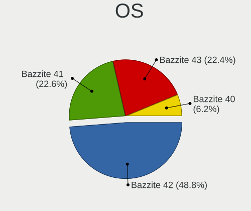

| Name       | Notebooks | Percent |
|------------|-----------|---------|
| Bazzite 42 | 377       | 48.77%  |
| Bazzite 41 | 175       | 22.64%  |
| Bazzite 43 | 173       | 22.38%  |
| Bazzite 40 | 48        | 6.21%   |

OS Family
---------

OS without a version

| Name    | Notebooks | Percent |
|---------|-----------|---------|
| Bazzite | 751       | 100%    |

Kernel
------

Version of the Linux kernel

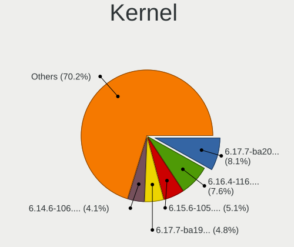

| Version                         | Notebooks | Percent |
|---------------------------------|-----------|---------|
| 6.17.7-ba20.fc43.x86_64         | 65        | 8.13%   |
| 6.16.4-116.bazzite.fc42.x86_64  | 61        | 7.63%   |
| 6.15.6-105.bazzite.fc42.x86_64  | 41        | 5.13%   |
| 6.17.7-ba19.fc43.x86_64         | 38        | 4.75%   |
| 6.14.6-106.bazzite.fc42.x86_64  | 33        | 4.13%   |
| 6.16.4-108.bazzite.fc42.x86_64  | 30        | 3.75%   |
| 6.15.9-106.bazzite.fc42.x86_64  | 30        | 3.75%   |
| 6.13.9-103.bazzite.fc41.x86_64  | 27        | 3.38%   |
| 6.9.12-205.fsync.fc40.x86_64    | 25        | 3.13%   |
| 6.17.7-ba01.fc43.x86_64         | 25        | 3.13%   |
| 6.15.9-103.bazzite.fc42.x86_64  | 25        | 3.13%   |
| 6.14.4-104.bazzite.fc42.x86_64  | 22        | 2.75%   |
| 6.17.7-ba14.fc43.x86_64         | 19        | 2.38%   |
| 6.13.7-108.bazzite.fc41.x86_64  | 18        | 2.25%   |
| 6.14.6-109.bazzite.fc42.x86_64  | 16        | 2%      |
| 6.11.9-303.bazzite.fc41.x86_64  | 16        | 2%      |
| 6.16.4-114.bazzite.fc42.x86_64  | 15        | 1.88%   |
| 6.13.9-103.bazzite.fc42.x86_64  | 15        | 1.88%   |
| 6.17.5-ba07.fc43.x86_64         | 14        | 1.75%   |
| 6.14.4-103.bazzite.fc42.x86_64  | 13        | 1.63%   |
| 6.12.8-201.bazzite.fc41.x86_64  | 13        | 1.63%   |
| 6.12.12-207.bazzite.fc41.x86_64 | 12        | 1.5%    |
| 6.16.4-115.bazzite.fc42.x86_64  | 11        | 1.38%   |
| 6.13.6-103.bazzite.fc41.x86_64  | 11        | 1.38%   |
| 6.13.5-102.bazzite.fc41.x86_64  | 11        | 1.38%   |
| 6.11.10-304.bazzite.fc41.x86_64 | 11        | 1.38%   |
| 6.15.6-113.bazzite.fc42.x86_64  | 10        | 1.25%   |
| 6.15.6-103.bazzite.fc42.x86_64  | 10        | 1.25%   |
| 6.13.5-100.bazzite.fc41.x86_64  | 10        | 1.25%   |
| 6.12.6-203.bazzite.fc41.x86_64  | 10        | 1.25%   |
| 6.15.6-101.bazzite.fc42.x86_64  | 9         | 1.13%   |
| 6.14.6-105.bazzite.fc42.x86_64  | 9         | 1.13%   |
| 6.12.12-203.bazzite.fc41.x86_64 | 9         | 1.13%   |
| 6.12.11-205.bazzite.fc41.x86_64 | 9         | 1.13%   |
| 6.11.5-307.bazzite.fc41.x86_64  | 9         | 1.13%   |
| 6.15.9-116.bazzite.fc42.x86_64  | 8         | 1%      |
| 6.17.7-ba22.fc43.x86_64         | 7         | 0.88%   |
| 6.17.7-ba13.fc43.x86_64         | 7         | 0.88%   |
| 6.16.4-107.bazzite.fc42.x86_64  | 7         | 0.88%   |
| 6.16.4-104.bazzite.fc42.x86_64  | 7         | 0.88%   |

Kernel Family
-------------

Linux kernel without a distro release

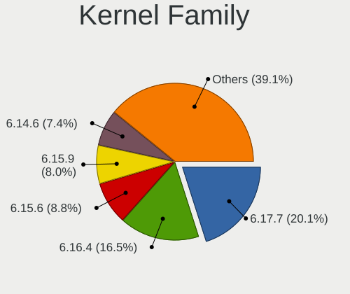

| Version | Notebooks | Percent |
|---------|-----------|---------|
| 6.17.7  | 159       | 20.08%  |
| 6.16.4  | 131       | 16.54%  |
| 6.15.6  | 70        | 8.84%   |
| 6.15.9  | 63        | 7.95%   |
| 6.14.6  | 59        | 7.45%   |
| 6.13.9  | 42        | 5.3%    |
| 6.9.12  | 37        | 4.67%   |
| 6.14.4  | 35        | 4.42%   |
| 6.13.5  | 21        | 2.65%   |
| 6.12.12 | 21        | 2.65%   |
| 6.13.7  | 18        | 2.27%   |
| 6.11.9  | 16        | 2.02%   |
| 6.17.5  | 14        | 1.77%   |
| 6.12.8  | 13        | 1.64%   |
| 6.13.6  | 11        | 1.39%   |
| 6.11.10 | 11        | 1.39%   |
| 6.12.6  | 10        | 1.26%   |
| 6.12.11 | 9         | 1.14%   |
| 6.11.5  | 9         | 1.14%   |
| 6.14.3  | 7         | 0.88%   |
| 6.11.8  | 7         | 0.88%   |
| 6.15.4  | 6         | 0.76%   |
| 6.9.8   | 5         | 0.63%   |
| 6.12.10 | 5         | 0.63%   |
| 6.10.3  | 4         | 0.51%   |
| 6.9.9   | 3         | 0.38%   |
| 6.16.7  | 1         | 0.13%   |
| 6.15.8  | 1         | 0.13%   |
| 6.15.10 | 1         | 0.13%   |
| 6.13.8  | 1         | 0.13%   |
| 6.12.9  | 1         | 0.13%   |
| 6.11.6  | 1         | 0.13%   |

Kernel Major Ver.
-----------------

Linux kernel major version

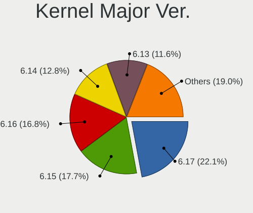

| Version | Notebooks | Percent |
|---------|-----------|---------|
| 6.17    | 173       | 22.07%  |
| 6.15    | 139       | 17.73%  |
| 6.16    | 132       | 16.84%  |
| 6.14    | 100       | 12.76%  |
| 6.13    | 91        | 11.61%  |
| 6.12    | 57        | 7.27%   |
| 6.9     | 45        | 5.74%   |
| 6.11    | 43        | 5.48%   |
| 6.10    | 4         | 0.51%   |

Arch
----

OS architecture (x86_64, i586, etc.)

| Name   | Notebooks | Percent |
|--------|-----------|---------|
| x86_64 | 751       | 100%    |

DE
--

Desktop Environment

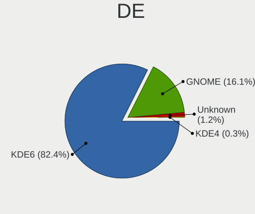

| Name    | Notebooks | Percent |
|---------|-----------|---------|
| KDE6    | 619       | 82.42%  |
| GNOME   | 121       | 16.11%  |
| Unknown | 9         | 1.2%    |
| KDE4    | 2         | 0.27%   |

Display Server
--------------

X11 or Wayland

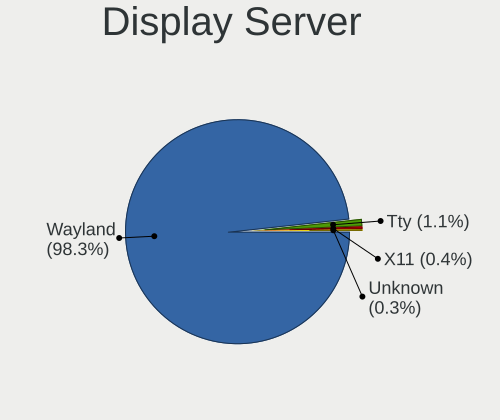

| Name    | Notebooks | Percent |
|---------|-----------|---------|
| Wayland | 738       | 98.27%  |
| Tty     | 8         | 1.07%   |
| X11     | 3         | 0.4%    |
| Unknown | 2         | 0.27%   |

Display Manager
---------------

SDDM, LightDM, etc.

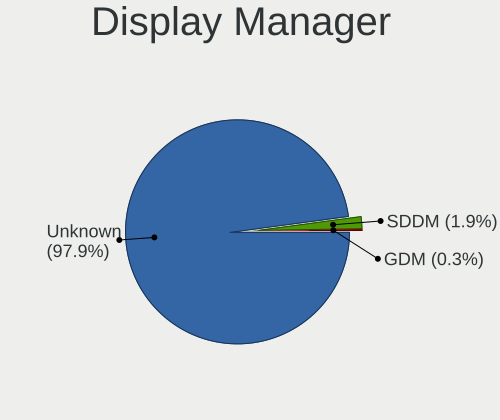

| Name    | Notebooks | Percent |
|---------|-----------|---------|
| Unknown | 736       | 97.87%  |
| SDDM    | 14        | 1.86%   |
| GDM     | 2         | 0.27%   |

OS Lang
-------

Language

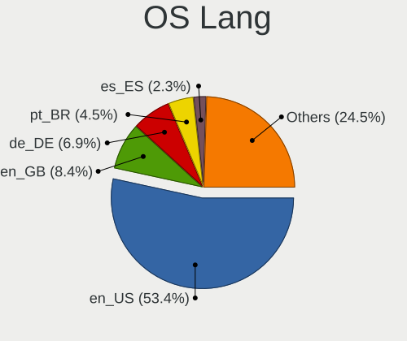

| Lang  | Notebooks | Percent |
|-------|-----------|---------|
| en_US | 401       | 53.4%   |
| en_GB | 63        | 8.39%   |
| de_DE | 52        | 6.92%   |
| pt_BR | 34        | 4.53%   |
| es_ES | 17        | 2.26%   |
| it_IT | 16        | 2.13%   |
| fr_FR | 15        | 2%      |
| en_AU | 15        | 2%      |
| en_CA | 14        | 1.86%   |
| ru_RU | 10        | 1.33%   |
| es_CO | 8         | 1.07%   |
| es_CL | 8         | 1.07%   |
| en_ZA | 8         | 1.07%   |
| tr_TR | 5         | 0.67%   |
| sv_SE | 5         | 0.67%   |
| pl_PL | 5         | 0.67%   |
| es_MX | 5         | 0.67%   |
| de_AT | 5         | 0.67%   |
| cs_CZ | 5         | 0.67%   |
| C     | 5         | 0.67%   |
| nl_NL | 4         | 0.53%   |
| es_AR | 4         | 0.53%   |
| en_NZ | 4         | 0.53%   |
| en_IN | 4         | 0.53%   |
| pt_PT | 3         | 0.4%    |
| es_VE | 3         | 0.4%    |
| es_US | 3         | 0.4%    |
| en_PH | 3         | 0.4%    |
| en_IE | 3         | 0.4%    |
| zh_CN | 2         | 0.27%   |
| nl_BE | 2         | 0.27%   |
| hu_HU | 2         | 0.27%   |
| fr_CH | 2         | 0.27%   |
| fr_BE | 2         | 0.27%   |
| es_PE | 2         | 0.27%   |
| es_EC | 2         | 0.27%   |
| nn_NO | 1         | 0.13%   |
| nb_NO | 1         | 0.13%   |
| fr_CA | 1         | 0.13%   |
| es_UY | 1         | 0.13%   |

Boot Mode
---------

EFI or BIOS

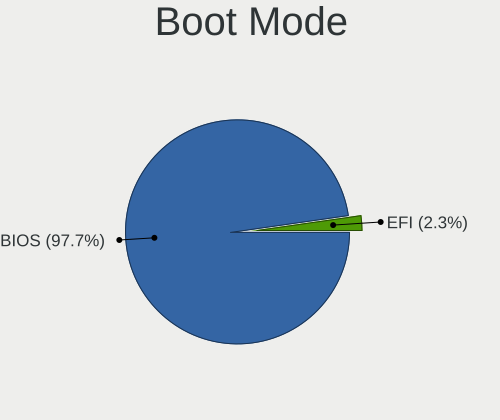

| Mode | Notebooks | Percent |
|------|-----------|---------|
| BIOS | 735       | 97.74%  |
| EFI  | 17        | 2.26%   |

Filesystem
----------

Type of filesystem

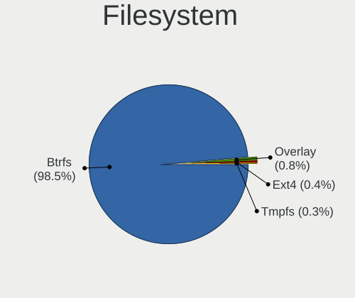

| Type    | Notebooks | Percent |
|---------|-----------|---------|
| Btrfs   | 740       | 98.54%  |
| Overlay | 6         | 0.8%    |
| Ext4    | 3         | 0.4%    |
| Tmpfs   | 2         | 0.27%   |

Part. scheme
------------

Scheme of partitioning

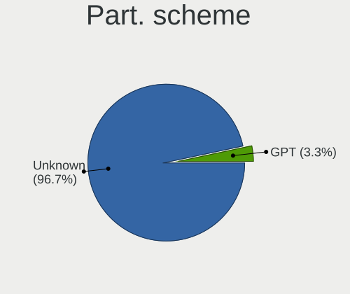

| Type    | Notebooks | Percent |
|---------|-----------|---------|
| Unknown | 727       | 96.68%  |
| GPT     | 25        | 3.32%   |

Dual Boot with Linux/BSD
------------------------

Hosting more than one Linux/BSD

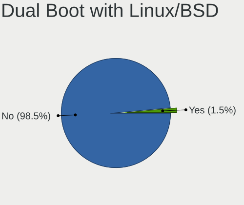

| Dual boot | Notebooks | Percent |
|-----------|-----------|---------|
| No        | 740       | 98.54%  |
| Yes       | 11        | 1.46%   |

Dual Boot (Win)
---------------

Hosting Linux and Windows

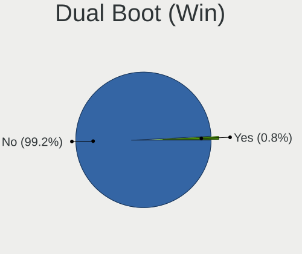

| Dual boot | Notebooks | Percent |
|-----------|-----------|---------|
| No        | 746       | 99.2%   |
| Yes       | 6         | 0.8%    |

Board
-----

Vendor
------

Motherboard manufacturer

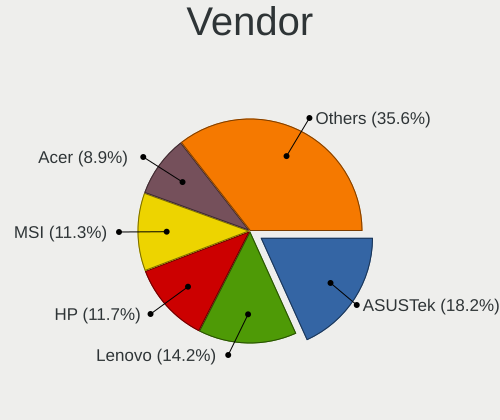

| Name                                 | Notebooks | Percent |
|--------------------------------------|-----------|---------|
| ASUSTek Computer                     | 137       | 18.24%  |
| Lenovo                               | 107       | 14.25%  |
| Hewlett-Packard                      | 88        | 11.72%  |
| MSI                                  | 85        | 11.32%  |
| Acer                                 | 67        | 8.92%   |
| Dell                                 | 62        | 8.26%   |
| Gigabyte Technology                  | 27        | 3.6%    |
| Apple                                | 27        | 3.6%    |
| Alienware                            | 17        | 2.26%   |
| Framework                            | 15        | 2%      |
| GPD                                  | 12        | 1.6%    |
| ONE-NETBOOK                          | 11        | 1.46%   |
| Valve                                | 10        | 1.33%   |
| Razer                                | 10        | 1.33%   |
| Unknown                              | 10        | 1.33%   |
| ASRock                               | 8         | 1.07%   |
| Samsung Electronics                  | 5         | 0.67%   |
| Medion                               | 4         | 0.53%   |
| Schenker                             | 3         | 0.4%    |
| ONE-NETBOOK TECHNOLOGY               | 3         | 0.4%    |
| Notebook                             | 3         | 0.4%    |
| HUAWEI                               | 3         | 0.4%    |
| Sony                                 | 2         | 0.27%   |
| Google                               | 2         | 0.27%   |
| Casper                               | 2         | 0.27%   |
| AZW                                  | 2         | 0.27%   |
| TUXEDO                               | 1         | 0.13%   |
| Timi                                 | 1         | 0.13%   |
| Thomson                              | 1         | 0.13%   |
| TEKNOSERVICE                         | 1         | 0.13%   |
| System76                             | 1         | 0.13%   |
| Standard                             | 1         | 0.13%   |
| Shenzhen Meigao Electronic Equipment | 1         | 0.13%   |
| Positivo Bahia - VAIO                | 1         | 0.13%   |
| Positivo                             | 1         | 0.13%   |
| PNY Technologies                     | 1         | 0.13%   |
| PC Componentes                       | 1         | 0.13%   |
| NZXT                                 | 1         | 0.13%   |
| NST                                  | 1         | 0.13%   |
| MECER                                | 1         | 0.13%   |

Model
-----

Motherboard model

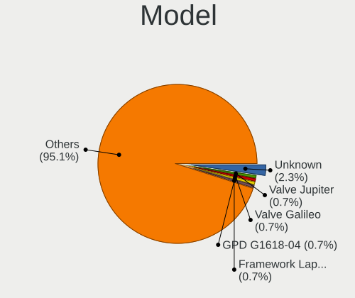

| Name                                          | Notebooks | Percent |
|-----------------------------------------------|-----------|---------|
| Unknown                                       | 17        | 2.26%   |
| Valve Jupiter                                 | 5         | 0.67%   |
| Valve Galileo                                 | 5         | 0.67%   |
| GPD G1618-04                                  | 5         | 0.67%   |
| Framework Laptop 16 (AMD Ryzen 7040 Series)   | 5         | 0.67%   |
| Acer Nitro AN515-57                           | 5         | 0.67%   |
| Acer Nitro AN515-55                           | 5         | 0.67%   |
| Lenovo IdeaPad Gaming 3 15ACH6 82K2           | 4         | 0.53%   |
| Apple MacBookPro14,3                          | 4         | 0.53%   |
| ONE-NETBOOK TECHNOLOGY ONE XPLAYER            | 3         | 0.4%    |
| MSI MS-7E26                                   | 3         | 0.4%    |
| Lenovo Legion Slim 5 16APH8 82Y9              | 3         | 0.4%    |
| Lenovo IdeaPad 5 15ARE05 81YQ                 | 3         | 0.4%    |
| HP Victus by Gaming Laptop 15-fa0xxx          | 3         | 0.4%    |
| HP Pavilion Gaming Laptop 15-ec1xxx           | 3         | 0.4%    |
| HP Pavilion Gaming Laptop 15-ec0xxx           | 3         | 0.4%    |
| Framework Laptop 13 (AMD Ryzen AI 300 Series) | 3         | 0.4%    |
| Framework Laptop 13 (AMD Ryzen 7040Series)    | 3         | 0.4%    |
| ASUS Vivobook Go E1504GAB_E1504GA             | 3         | 0.4%    |
| ASUS ROG Strix G513QY_G513QY                  | 3         | 0.4%    |
| Apple MacBookPro11,3                          | 3         | 0.4%    |
| Alienware m17 R5 AMD                          | 3         | 0.4%    |
| Acer Nitro ANV15-51                           | 3         | 0.4%    |
| Acer Nitro AN515-54                           | 3         | 0.4%    |
| Acer Nitro AN515-43                           | 3         | 0.4%    |
| Acer Aspire A315-41G                          | 3         | 0.4%    |
| Razer Blade Stealth                           | 2         | 0.27%   |
| ONE-NETBOOK ONEXPLAYER X1 A                   | 2         | 0.27%   |
| ONE-NETBOOK ONEXPLAYER G1 A                   | 2         | 0.27%   |
| ONE-NETBOOK ONEXPLAYER 2 PRO ARP23P           | 2         | 0.27%   |
| ONE-NETBOOK ONEXPLAYER 2 ARP23                | 2         | 0.27%   |
| MSI Thin GF63 12UCX                           | 2         | 0.27%   |
| MSI MS-7D70                                   | 2         | 0.27%   |
| MSI MS-7C37                                   | 2         | 0.27%   |
| MSI GF65 Thin 10UE                            | 2         | 0.27%   |
| MSI GF63 Thin 10SC                            | 2         | 0.27%   |
| MSI Cyborg 15 A13VE                           | 2         | 0.27%   |
| MSI Cyborg 15 A12VF                           | 2         | 0.27%   |
| MSI Cyborg 14 A13VF                           | 2         | 0.27%   |
| Lenovo LOQ 15IRH8 82XV                        | 2         | 0.27%   |

Model Family
------------

Motherboard model prefix

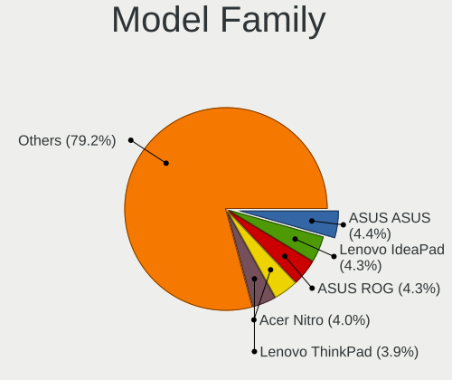

| Name                   | Notebooks | Percent |
|------------------------|-----------|---------|
| ASUS ASUS              | 33        | 4.39%   |
| Lenovo IdeaPad         | 32        | 4.26%   |
| ASUS ROG               | 32        | 4.26%   |
| Acer Nitro             | 30        | 3.99%   |
| Lenovo ThinkPad        | 29        | 3.86%   |
| Acer Aspire            | 25        | 3.33%   |
| Lenovo Legion          | 21        | 2.8%    |
| HP Victus              | 19        | 2.53%   |
| HP Pavilion            | 18        | 2.4%    |
| Unknown                | 17        | 2.26%   |
| Dell Precision         | 16        | 2.13%   |
| Framework Laptop       | 15        | 2%      |
| ASUS Vivobook          | 15        | 2%      |
| Dell Inspiron          | 14        | 1.86%   |
| HP OMEN                | 12        | 1.6%    |
| ASUS TUF               | 12        | 1.6%    |
| ONE-NETBOOK ONEXPLAYER | 11        | 1.46%   |
| HP Laptop              | 11        | 1.46%   |
| Dell Latitude          | 11        | 1.46%   |
| Acer Predator          | 11        | 1.46%   |
| Razer Blade            | 8         | 1.07%   |
| MSI Cyborg             | 8         | 1.07%   |
| MSI GF63               | 7         | 0.93%   |
| Dell XPS               | 7         | 0.93%   |
| Lenovo LOQ             | 6         | 0.8%    |
| HP ZBook               | 6         | 0.8%    |
| HP EliteBook           | 6         | 0.8%    |
| Valve Jupiter          | 5         | 0.67%   |
| Valve Galileo          | 5         | 0.67%   |
| MSI Katana             | 5         | 0.67%   |
| Lenovo Yoga            | 5         | 0.67%   |
| HP ProBook             | 5         | 0.67%   |
| GPD G1618-04           | 5         | 0.67%   |
| Apple MacBookPro14     | 5         | 0.67%   |
| Apple MacBookPro11     | 5         | 0.67%   |
| Alienware m17          | 5         | 0.67%   |
| MSI Vector             | 4         | 0.53%   |
| MSI Thin               | 4         | 0.53%   |
| MSI Raider             | 4         | 0.53%   |
| HP ENVY                | 4         | 0.53%   |

MFG Year
--------

Motherboard manufacture year

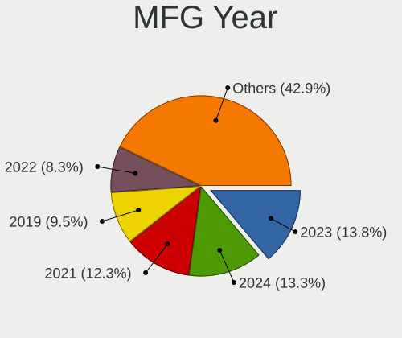

| Year    | Notebooks | Percent |
|---------|-----------|---------|
| 2023    | 104       | 13.85%  |
| 2024    | 100       | 13.32%  |
| 2021    | 92        | 12.25%  |
| 2019    | 71        | 9.45%   |
| 2022    | 62        | 8.26%   |
| 2020    | 62        | 8.26%   |
| 2025    | 46        | 6.13%   |
| 2018    | 46        | 6.13%   |
| 2017    | 33        | 4.39%   |
| 2013    | 29        | 3.86%   |
| 2016    | 24        | 3.2%    |
| 2012    | 24        | 3.2%    |
| 2015    | 21        | 2.8%    |
| 2014    | 18        | 2.4%    |
| 2011    | 12        | 1.6%    |
| 2010    | 4         | 0.53%   |
| 2006    | 2         | 0.27%   |
| Unknown | 1         | 0.13%   |

Form Factor
-----------

Physical design of the computer

| Name     | Notebooks | Percent |
|----------|-----------|---------|
| Notebook | 751       | 100%    |

Secure Boot
-----------

Enabled or disabled

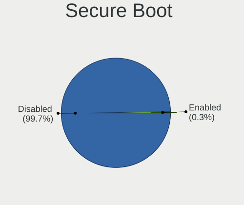

| State    | Notebooks | Percent |
|----------|-----------|---------|
| Disabled | 749       | 99.73%  |
| Enabled  | 2         | 0.27%   |

Coreboot
--------

Have coreboot on board

| Used | Notebooks | Percent |
|------|-----------|---------|
| No   | 747       | 99.47%  |
| Yes  | 4         | 0.53%   |

RAM Size
--------

Total RAM memory

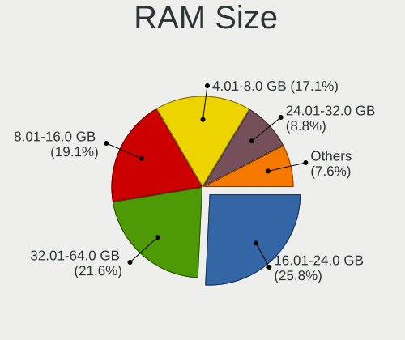

| Size in GB  | Notebooks | Percent |
|-------------|-----------|---------|
| 16.01-24.0  | 194       | 25.76%  |
| 32.01-64.0  | 163       | 21.65%  |
| 8.01-16.0   | 144       | 19.12%  |
| 4.01-8.0    | 129       | 17.13%  |
| 24.01-32.0  | 66        | 8.76%   |
| 64.01-256.0 | 39        | 5.18%   |
| 3.01-4.0    | 18        | 2.39%   |

RAM Used
--------

Used RAM memory

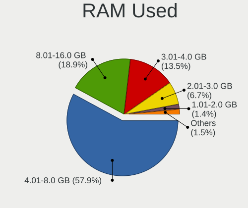

| Used GB    | Notebooks | Percent |
|------------|-----------|---------|
| 4.01-8.0   | 450       | 57.92%  |
| 8.01-16.0  | 147       | 18.92%  |
| 3.01-4.0   | 105       | 13.51%  |
| 2.01-3.0   | 52        | 6.69%   |
| 1.01-2.0   | 11        | 1.42%   |
| 16.01-24.0 | 10        | 1.29%   |
| 32.01-64.0 | 1         | 0.13%   |
| 24.01-32.0 | 1         | 0.13%   |

Total Drives
------------

Number of drives on board

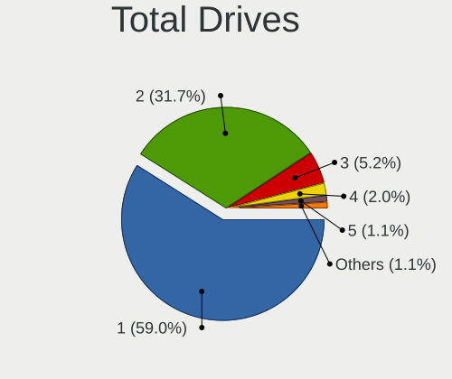

| Drives | Notebooks | Percent |
|--------|-----------|---------|
| 1      | 446       | 58.99%  |
| 2      | 240       | 31.75%  |
| 3      | 39        | 5.16%   |
| 4      | 15        | 1.98%   |
| 5      | 8         | 1.06%   |
| 6      | 4         | 0.53%   |
| 7      | 2         | 0.26%   |
| 0      | 2         | 0.26%   |

Has CD-ROM
----------

Has CD-ROM on board

| Presented | Notebooks | Percent |
|-----------|-----------|---------|
| No        | 681       | 90.56%  |
| Yes       | 71        | 9.44%   |

Has Ethernet
------------

Has Ethernet on board

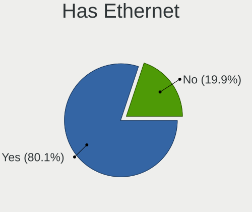

| Presented | Notebooks | Percent |
|-----------|-----------|---------|
| Yes       | 604       | 80.11%  |
| No        | 150       | 19.89%  |

Has WiFi
--------

Has WiFi module

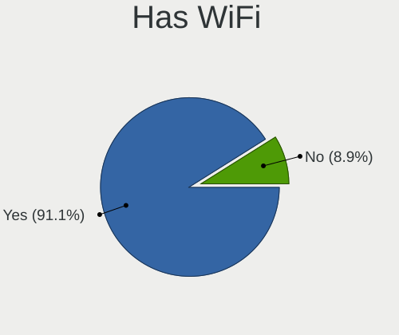

| Presented | Notebooks | Percent |
|-----------|-----------|---------|
| Yes       | 684       | 91.08%  |
| No        | 67        | 8.92%   |

Has Bluetooth
-------------

Has Bluetooth module

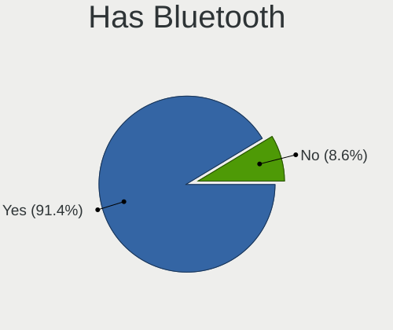

| Presented | Notebooks | Percent |
|-----------|-----------|---------|
| Yes       | 688       | 91.37%  |
| No        | 65        | 8.63%   |

Location
--------

Country
-------

Geographic location (country)

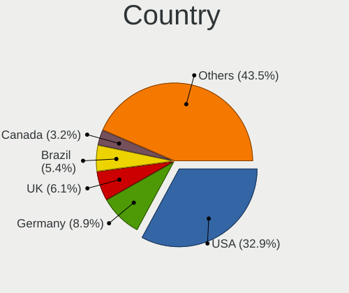

| Country         | Notebooks | Percent |
|-----------------|-----------|---------|
| USA             | 248       | 32.89%  |
| Germany         | 67        | 8.89%   |
| UK              | 46        | 6.1%    |
| Brazil          | 41        | 5.44%   |
| Canada          | 24        | 3.18%   |
| Australia       | 24        | 3.18%   |
| France          | 22        | 2.92%   |
| Italy           | 20        | 2.65%   |
| Spain           | 19        | 2.52%   |
| South Africa    | 11        | 1.46%   |
| Chile           | 11        | 1.46%   |
| Sweden          | 10        | 1.33%   |
| Colombia        | 10        | 1.33%   |
| Romania         | 9         | 1.19%   |
| Poland          | 9         | 1.19%   |
| Netherlands     | 9         | 1.19%   |
| Mexico          | 9         | 1.19%   |
| India           | 9         | 1.19%   |
| Russia          | 8         | 1.06%   |
| Norway          | 8         | 1.06%   |
| Turkey          | 6         | 0.8%    |
| Portugal        | 6         | 0.8%    |
| New Zealand     | 6         | 0.8%    |
| Hungary         | 6         | 0.8%    |
| Czechia         | 6         | 0.8%    |
| Austria         | 6         | 0.8%    |
| Switzerland     | 5         | 0.66%   |
| Croatia         | 5         | 0.66%   |
| Belgium         | 5         | 0.66%   |
| Argentina       | 5         | 0.66%   |
| Philippines     | 4         | 0.53%   |
| Paraguay        | 4         | 0.53%   |
| Denmark         | 4         | 0.53%   |
| The Netherlands | 3         | 0.4%    |
| Latvia          | 3         | 0.4%    |
| Ireland         | 3         | 0.4%    |
| Greece          | 3         | 0.4%    |
| Vietnam         | 2         | 0.27%   |
| Venezuela       | 2         | 0.27%   |
| Uruguay         | 2         | 0.27%   |

City
----

Geographic location (city)

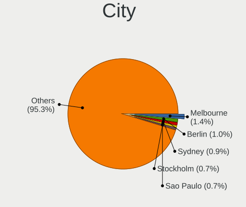

| City           | Notebooks | Percent |
|----------------|-----------|---------|
| Melbourne      | 11        | 1.44%   |
| Berlin         | 8         | 1.04%   |
| Sydney         | 7         | 0.91%   |
| Stockholm      | 5         | 0.65%   |
| Sao Paulo      | 5         | 0.65%   |
| Santiago       | 5         | 0.65%   |
| Medellín      | 5         | 0.65%   |
| Chicago        | 5         | 0.65%   |
| Charlotte      | 5         | 0.65%   |
| Seattle        | 4         | 0.52%   |
| Salt Lake City | 4         | 0.52%   |
| Houston        | 4         | 0.52%   |
| Dallas         | 4         | 0.52%   |
| Zurich         | 3         | 0.39%   |
| Vienna         | 3         | 0.39%   |
| San Antonio    | 3         | 0.39%   |
| Riga           | 3         | 0.39%   |
| Richmond       | 3         | 0.39%   |
| Raleigh        | 3         | 0.39%   |
| Portland       | 3         | 0.39%   |
| Montreal       | 3         | 0.39%   |
| Miami          | 3         | 0.39%   |
| Madison        | 3         | 0.39%   |
| Los Angeles    | 3         | 0.39%   |
| Jacksonville   | 3         | 0.39%   |
| Istanbul       | 3         | 0.39%   |
| Feldkirchen    | 3         | 0.39%   |
| Duluth         | 3         | 0.39%   |
| Columbus       | 3         | 0.39%   |
| Brisbane       | 3         | 0.39%   |
| Brasília      | 3         | 0.39%   |
| Zagreb         | 2         | 0.26%   |
| West Jordan    | 2         | 0.26%   |
| Warren         | 2         | 0.26%   |
| Valencia       | 2         | 0.26%   |
| Toronto        | 2         | 0.26%   |
| Tijuana        | 2         | 0.26%   |
| Tampa          | 2         | 0.26%   |
| Tacoma         | 2         | 0.26%   |
| St Louis       | 2         | 0.26%   |

Drives
------

Drive Vendor
------------

Hard drive vendors

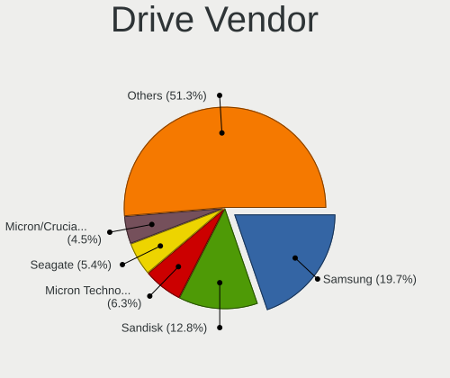

| Vendor                       | Notebooks | Drives | Percent |
|------------------------------|-----------|--------|---------|
| Samsung Electronics          | 212       | 284    | 19.74%  |
| Sandisk                      | 137       | 169    | 12.76%  |
| Micron Technology            | 68        | 75     | 6.33%   |
| Seagate                      | 58        | 79     | 5.4%    |
| Micron/Crucial Technology    | 48        | 63     | 4.47%   |
| SK hynix                     | 47        | 55     | 4.38%   |
| WDC                          | 46        | 52     | 4.28%   |
| Toshiba                      | 38        | 39     | 3.54%   |
| Kingston                     | 37        | 41     | 3.45%   |
| Intel                        | 37        | 44     | 3.45%   |
| Kingston Technology Company  | 33        | 41     | 3.07%   |
| Unknown                      | 32        | 35     | 2.98%   |
| Phison Electronics           | 31        | 33     | 2.89%   |
| Crucial                      | 21        | 25     | 1.96%   |
| HGST                         | 20        | 20     | 1.86%   |
| KIOXIA                       | 17        | 18     | 1.58%   |
| Apple                        | 15        | 17     | 1.4%    |
| Silicon Motion               | 12        | 17     | 1.12%   |
| MAXIO Technology (Hangzhou)  | 12        | 14     | 1.12%   |
| Biwin Storage Technology     | 11        | 12     | 1.02%   |
| Realtek Semiconductor        | 10        | 14     | 0.93%   |
| Shenzhen Longsys Electronics | 8         | 8      | 0.74%   |
| Unknown                      | 8         | 9      | 0.74%   |
| ADATA Technology             | 7         | 7      | 0.65%   |
| A-DATA Technology            | 7         | 7      | 0.65%   |
| China                        | 5         | 5      | 0.47%   |
| Team                         | 4         | 4      | 0.37%   |
| T-FORCE                      | 4         | 5      | 0.37%   |
| PNY                          | 4         | 4      | 0.37%   |
| JMicron Technology           | 4         | 4      | 0.37%   |
| Fanxiang                     | 4         | 4      | 0.37%   |
| Transcend                    | 3         | 3      | 0.28%   |
| SPCC                         | 3         | 3      | 0.28%   |
| SOLIDIGM                     | 3         | 3      | 0.28%   |
| Seagate Technology           | 3         | 3      | 0.28%   |
| ASMT                         | 3         | 3      | 0.28%   |
| USB3.0                       | 2         | 2      | 0.19%   |
| USB                          | 2         | 2      | 0.19%   |
| Union Memory (Shenzhen)      | 2         | 2      | 0.19%   |
| Union Memory                 | 2         | 2      | 0.19%   |

Drive Model
-----------

Hard drive models

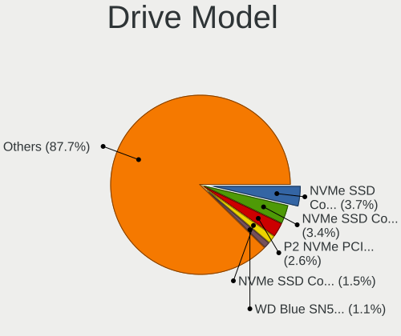

| Model                                                 | Notebooks | Percent |
|-------------------------------------------------------|-----------|---------|
| Samsung NVMe SSD Controller PM9A1/PM9A3/980PRO 1TB    | 42        | 3.67%   |
| Samsung NVMe SSD Controller SM981/PM981/PM983 1TB     | 39        | 3.41%   |
| Micron/Crucial P2 NVMe PCIe SSD 2TB                   | 30        | 2.62%   |
| Samsung NVMe SSD Controller SM961/PM961/SM963 1024GB  | 17        | 1.49%   |
| Sandisk WD Blue SN550 NVMe SSD 1024GB                 | 13        | 1.14%   |
| Samsung SSD 990 PRO 2TB                               | 10        | 0.87%   |
| Samsung SSD 850 EVO 500GB                             | 10        | 0.87%   |
| HGST HTS721010A9E630 1TB                              | 10        | 0.87%   |
| Unknown MMC Card  128GB                               | 9         | 0.79%   |
| Seagate ST1000LM035-1RK172 1TB                        | 9         | 0.79%   |
| Sandisk WD Black SN750 / PC SN730 NVMe SSD 500GB      | 9         | 0.79%   |
| Samsung SSD 980 1TB                                   | 9         | 0.79%   |
| Kingston Company OM3PDP3 NVMe SSD 256GB               | 9         | 0.79%   |
| Silicon Motion SM2263EN/SM2263XT SSD Controller 512GB | 8         | 0.7%    |
| Sandisk WD_BLACK SN770 1TB                            | 8         | 0.7%    |
| Sandisk WD Black SN850 1TB                            | 8         | 0.7%    |
| Kingston Company SNV2S1000G 1TB                       | 8         | 0.7%    |
| Intel SSD 660P Series 512GB                           | 8         | 0.7%    |
| Unknown                                               | 8         | 0.7%    |
| Toshiba MQ04ABF100 1TB                                | 7         | 0.61%   |
| Samsung SSD 990 EVO Plus 2TB                          | 7         | 0.61%   |
| Intel SSDPEKNU512GZ 512GB                             | 7         | 0.61%   |
| Micron 2400_MTFDKBA512QFM 512GB                       | 6         | 0.52%   |
| Kingston SA400S37240G 240GB SSD                       | 6         | 0.52%   |
| Intel SSDPEKNW512GZL 512GB                            | 6         | 0.52%   |
| Crucial CT1000MX500SSD1 1TB                           | 6         | 0.52%   |
| Toshiba XG6 NVMe SSD Controller 1024GB                | 5         | 0.44%   |
| Seagate ST1000LM024 HN-M101MBB 1TB                    | 5         | 0.44%   |
| Sandisk WD PC SN740 SDDQNQD-512G-1014 512GB           | 5         | 0.44%   |
| Sandisk WD Blue SN580 1TB                             | 5         | 0.44%   |
| Phison E16 PCIe4 NVMe Controller 1TB                  | 5         | 0.44%   |
| Micron CT1000P3PSSD8 1TB                              | 5         | 0.44%   |
| MAXIO (Hangzhou) NVMe SSD Controller MAP1202 2TB      | 5         | 0.44%   |
| Kingston SA400S37960G 960GB SSD                       | 5         | 0.44%   |
| Intel SSD Pro 7600p/760p/E 6100p Series 256GB         | 5         | 0.44%   |
| Crucial CT1000BX500SSD1 1TB                           | 5         | 0.44%   |
| Unknown SD/MMC/MS PRO 2GB                             | 4         | 0.35%   |
| Unknown MMC Card  64GB                                | 4         | 0.35%   |
| Unknown MMC Card  512GB                               | 4         | 0.35%   |
| Toshiba MQ01ABD100 1TB                                | 4         | 0.35%   |

HDD Vendor
----------

Hard disk drive vendors

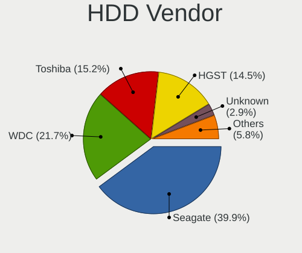

| Vendor             | Notebooks | Drives | Percent |
|--------------------|-----------|--------|---------|
| Seagate            | 55        | 76     | 39.86%  |
| WDC                | 30        | 34     | 21.74%  |
| Toshiba            | 21        | 22     | 15.22%  |
| HGST               | 20        | 20     | 14.49%  |
| Unknown            | 4         | 4      | 2.9%    |
| USB3.0             | 2         | 2      | 1.45%   |
| Hitachi            | 2         | 2      | 1.45%   |
| T-FORCE            | 1         | 2      | 0.72%   |
| JMicron Technology | 1         | 1      | 0.72%   |
| ASMT               | 1         | 1      | 0.72%   |
| Apple              | 1         | 1      | 0.72%   |

SSD Vendor
----------

Solid state drive vendors

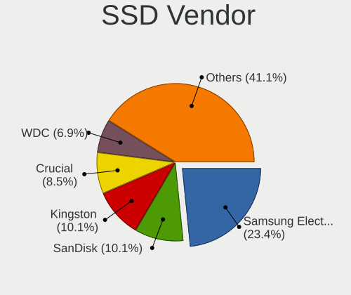

| Vendor              | Notebooks | Drives | Percent |
|---------------------|-----------|--------|---------|
| Samsung Electronics | 58        | 71     | 23.39%  |
| SanDisk             | 25        | 32     | 10.08%  |
| Kingston            | 25        | 28     | 10.08%  |
| Crucial             | 21        | 25     | 8.47%   |
| WDC                 | 17        | 17     | 6.85%   |
| Micron Technology   | 11        | 11     | 4.44%   |
| Apple               | 9         | 9      | 3.63%   |
| SK hynix            | 8         | 8      | 3.23%   |
| Toshiba             | 7         | 7      | 2.82%   |
| Intel               | 6         | 6      | 2.42%   |
| China               | 5         | 5      | 2.02%   |
| Team                | 4         | 4      | 1.61%   |
| PNY                 | 4         | 4      | 1.61%   |
| A-DATA Technology   | 4         | 4      | 1.61%   |
| Transcend           | 3         | 3      | 1.21%   |
| SPCC                | 3         | 3      | 1.21%   |
| Unknown             | 3         | 3      | 1.21%   |
| sobetter            | 2         | 2      | 0.81%   |
| Patriot             | 2         | 2      | 0.81%   |
| OCZ                 | 2         | 2      | 0.81%   |
| Lexar               | 2         | 2      | 0.81%   |
| KingSpec            | 2         | 2      | 0.81%   |
| Intenso             | 2         | 2      | 0.81%   |
| BIWIN               | 2         | 2      | 0.81%   |
| Apacer              | 2         | 2      | 0.81%   |
| T-FORCE             | 1         | 1      | 0.4%    |
| SSSTC               | 1         | 1      | 0.4%    |
| SSK Port            | 1         | 1      | 0.4%    |
| Seagate             | 1         | 1      | 0.4%    |
| Ramsta              | 1         | 2      | 0.4%    |
| Predator            | 1         | 1      | 0.4%    |
| LITEONIT            | 1         | 2      | 0.4%    |
| LITEON              | 1         | 1      | 0.4%    |
| Leven               | 1         | 1      | 0.4%    |
| KEEPDATA            | 1         | 1      | 0.4%    |
| JMicron Technology  | 1         | 1      | 0.4%    |
| HJDK                | 1         | 1      | 0.4%    |
| Gigastone           | 1         | 2      | 0.4%    |
| GeIL                | 1         | 1      | 0.4%    |
| Gateway             | 1         | 1      | 0.4%    |

Drive Kind
----------

HDD or SSD

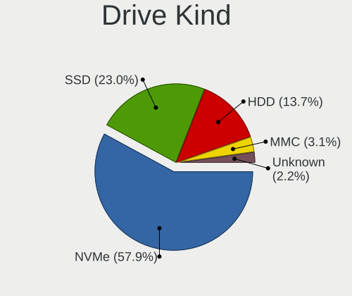

| Kind    | Notebooks | Drives | Percent |
|---------|-----------|--------|---------|
| NVMe    | 553       | 789    | 57.91%  |
| SSD     | 220       | 278    | 23.04%  |
| HDD     | 131       | 165    | 13.72%  |
| MMC     | 30        | 33     | 3.14%   |
| Unknown | 21        | 26     | 2.2%    |

Drive Connector
---------------

SATA, SAS, NVMe, etc.

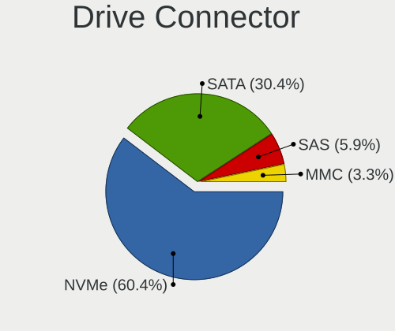

| Type | Notebooks | Drives | Percent |
|------|-----------|--------|---------|
| NVMe | 552       | 782    | 60.39%  |
| SATA | 278       | 414    | 30.42%  |
| SAS  | 54        | 62     | 5.91%   |
| MMC  | 30        | 33     | 3.28%   |

Drive Size
----------

Size of hard drive

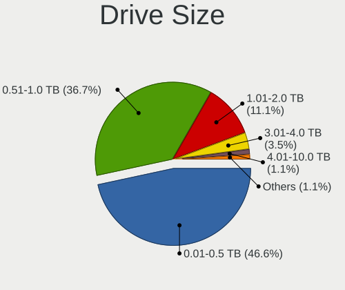

| Size in TB | Notebooks | Drives | Percent |
|------------|-----------|--------|---------|
| 0.01-0.5   | 173       | 205    | 46.63%  |
| 0.51-1.0   | 136       | 153    | 36.66%  |
| 1.01-2.0   | 41        | 52     | 11.05%  |
| 3.01-4.0   | 13        | 15     | 3.5%    |
| 4.01-10.0  | 4         | 9      | 1.08%   |
| 2.01-3.0   | 2         | 6      | 0.54%   |
| 20.01-50.0 | 1         | 1      | 0.27%   |
| 10.01-20.0 | 1         | 2      | 0.27%   |

Space Total
-----------

Amount of disk space available on the file system

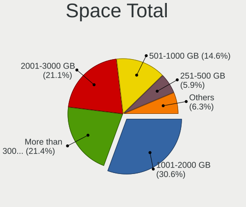

| Size in GB     | Notebooks | Percent |
|----------------|-----------|---------|
| 1001-2000      | 232       | 30.61%  |
| More than 3000 | 162       | 21.37%  |
| 2001-3000      | 160       | 21.11%  |
| 501-1000       | 111       | 14.64%  |
| 251-500        | 45        | 5.94%   |
| Unknown        | 31        | 4.09%   |
| 101-250        | 14        | 1.85%   |
| 1-20           | 2         | 0.26%   |
| 51-100         | 1         | 0.13%   |

Space Used
----------

Amount of used disk space

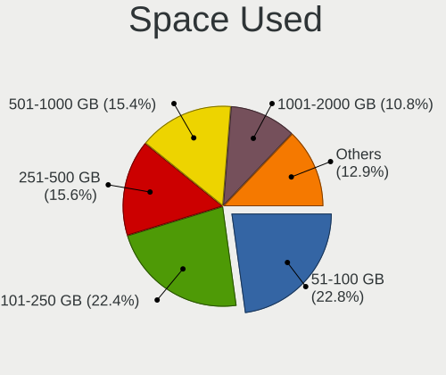

| Used GB        | Notebooks | Percent |
|----------------|-----------|---------|
| 51-100         | 179       | 22.83%  |
| 101-250        | 176       | 22.45%  |
| 251-500        | 122       | 15.56%  |
| 501-1000       | 121       | 15.43%  |
| 1001-2000      | 85        | 10.84%  |
| Unknown        | 31        | 3.95%   |
| More than 3000 | 25        | 3.19%   |
| 2001-3000      | 24        | 3.06%   |
| 21-50          | 19        | 2.42%   |
| 1-20           | 2         | 0.26%   |

Malfunc. Drives
---------------

Drive models with a malfunction

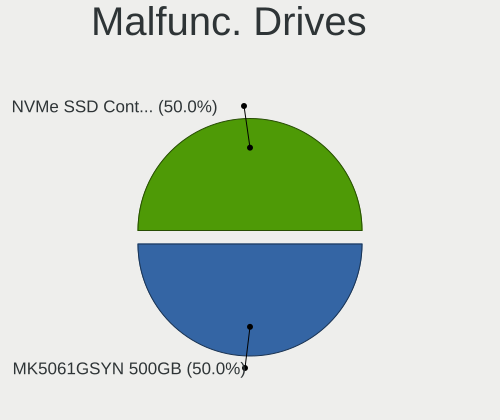

| Model                                                         | Notebooks | Drives | Percent |
|---------------------------------------------------------------|-----------|--------|---------|
| Toshiba MK5061GSYN 500GB                                      | 1         | 1      | 50%     |
| Samsung Electronics NVMe SSD Controller SM981/PM981/PM983 1TB | 1         | 1      | 50%     |

Malfunc. Drive Vendor
---------------------

Vendors of faulty drives

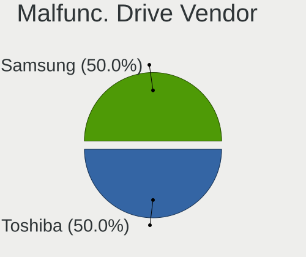

| Vendor              | Notebooks | Drives | Percent |
|---------------------|-----------|--------|---------|
| Toshiba             | 1         | 1      | 50%     |
| Samsung Electronics | 1         | 1      | 50%     |

Malfunc. HDD Vendor
-------------------

Vendors of faulty HDD drives

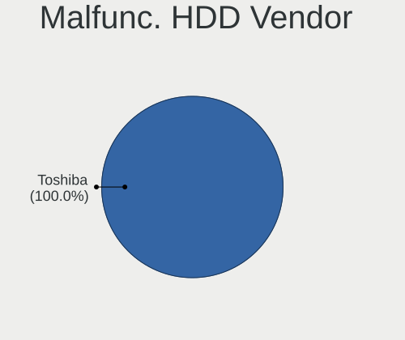

| Vendor  | Notebooks | Drives | Percent |
|---------|-----------|--------|---------|
| Toshiba | 1         | 1      | 100%    |

Malfunc. Drive Kind
-------------------

Kinds of faulty drives

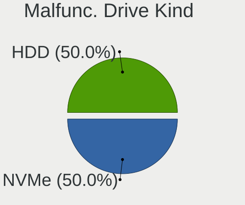

| Kind | Notebooks | Drives | Percent |
|------|-----------|--------|---------|
| NVMe | 1         | 1      | 50%     |
| HDD  | 1         | 1      | 50%     |

Failed Drives
-------------

Failed drive models

Zero info for selected period =(

Failed Drive Vendor
-------------------

Failed drive vendors

Zero info for selected period =(

Drive Status
------------

Number of failed and malfunc. drives

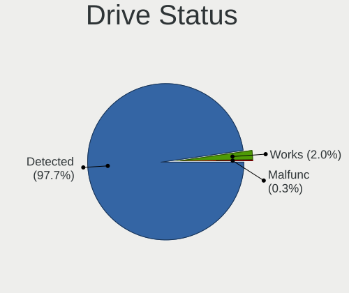

| Status   | Notebooks | Drives | Percent |
|----------|-----------|--------|---------|
| Detected | 736       | 1265   | 97.74%  |
| Works    | 15        | 24     | 1.99%   |
| Malfunc  | 2         | 2      | 0.27%   |

Storage controller
------------------

Storage Vendor
--------------

Storage controller vendors

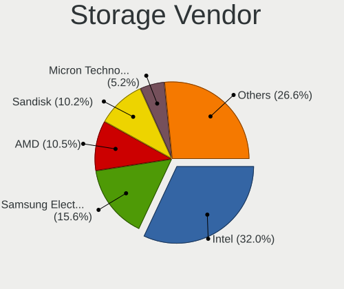

| Vendor                                    | Notebooks | Percent |
|-------------------------------------------|-----------|---------|
| Intel                                     | 354       | 32.01%  |
| Samsung Electronics                       | 172       | 15.55%  |
| AMD                                       | 116       | 10.49%  |
| Sandisk                                   | 113       | 10.22%  |
| Micron Technology                         | 57        | 5.15%   |
| Micron/Crucial Technology                 | 48        | 4.34%   |
| Kingston Technology Company               | 46        | 4.16%   |
| SK hynix                                  | 39        | 3.53%   |
| Phison Electronics                        | 33        | 2.98%   |
| KIOXIA                                    | 17        | 1.54%   |
| Silicon Motion                            | 12        | 1.08%   |
| MAXIO Technology (Hangzhou)               | 12        | 1.08%   |
| Toshiba America Info Systems              | 11        | 0.99%   |
| Biwin Storage Technology                  | 11        | 0.99%   |
| Realtek Semiconductor                     | 10        | 0.9%    |
| ADATA Technology                          | 10        | 0.9%    |
| Shenzhen Longsys Electronics              | 8         | 0.72%   |
| ASMedia Technology                        | 7         | 0.63%   |
| Apple                                     | 5         | 0.45%   |
| Seagate Technology                        | 4         | 0.36%   |
| Marvell Technology Group                  | 4         | 0.36%   |
| Union Memory (Shenzhen)                   | 3         | 0.27%   |
| Solidigm                                  | 3         | 0.27%   |
| Solid State Storage Technology            | 2         | 0.18%   |
| INNOGRIT                                  | 2         | 0.18%   |
| YEESTOR Microelectronics                  | 1         | 0.09%   |
| Yangtze Memory Technologies               | 1         | 0.09%   |
| Tata Power Strategic Electronics Division | 1         | 0.09%   |
| Shenzhen Unionmemory Information System   | 1         | 0.09%   |
| Lite-On Technology                        | 1         | 0.09%   |
| Lenovo                                    | 1         | 0.09%   |
| Unknown                                   | 1         | 0.09%   |

Storage Model
-------------

Storage controller models

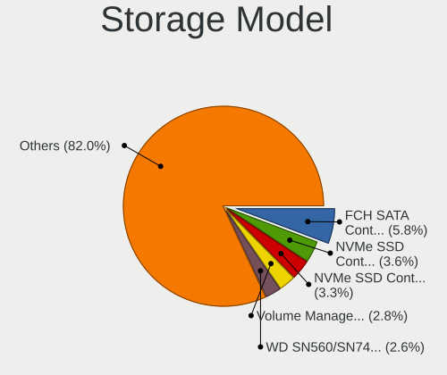

| Model                                                                          | Notebooks | Percent |
|--------------------------------------------------------------------------------|-----------|---------|
| AMD FCH SATA Controller [AHCI mode]                                            | 68        | 5.76%   |
| Samsung NVMe SSD Controller PM9A1/PM9A3/980PRO                                 | 42        | 3.56%   |
| Samsung NVMe SSD Controller SM981/PM981/PM983                                  | 39        | 3.3%    |
| Intel Volume Management Device NVMe RAID Controller                            | 33        | 2.79%   |
| SanDisk WD SN560/SN740/SN770/SN5000 NVMe SSD                                   | 31        | 2.62%   |
| Samsung NVMe SSD Controller 980 (DRAM-less)                                    | 31        | 2.62%   |
| Intel Cannon Lake Mobile PCH SATA AHCI Controller                              | 31        | 2.62%   |
| Micron/Crucial P2 [Nick P2] / P3 / P3 Plus NVMe PCIe SSD (DRAM-less)           | 30        | 2.54%   |
| Intel HM170/QM170 Chipset SATA Controller [AHCI Mode]                          | 29        | 2.46%   |
| Intel RST Volume Management Device Controller                                  | 28        | 2.37%   |
| AMD 600 Series Chipset SATA Controller                                         | 28        | 2.37%   |
| Intel 82801 Mobile SATA Controller [RAID mode]                                 | 25        | 2.12%   |
| Intel Sunrise Point-LP SATA Controller [AHCI mode]                             | 23        | 1.95%   |
| Intel 8 Series/C220 Series Chipset Family 6-port SATA Controller 1 [AHCI mode] | 22        | 1.86%   |
| Samsung NVMe SSD Controller PM9C1a (DRAM-less)                                 | 19        | 1.61%   |
| Samsung NVMe SSD Controller S4LV008[Pascal]                                    | 18        | 1.52%   |
| Samsung NVMe SSD Controller SM961/PM961/SM963                                  | 17        | 1.44%   |
| Intel Alder Lake-P SATA AHCI Controller                                        | 17        | 1.44%   |
| Intel 400 Series Chipset Family SATA AHCI Controller                           | 17        | 1.44%   |
| Intel Tiger Lake-LP SATA Controller                                            | 16        | 1.35%   |
| Intel SSD 670p Series [Keystone Harbor]                                        | 15        | 1.27%   |
| Intel 6 Series/C200 Series Chipset Family 6 port Mobile SATA AHCI Controller   | 15        | 1.27%   |
| Micron 2400 NVMe SSD (DRAM-less)                                               | 14        | 1.19%   |
| SanDisk Ultra 3D / WD PC SN530, IX SN530, Blue SN550 NVMe SSD (DRAM-less)      | 13        | 1.1%    |
| SK hynix Gold P31/BC711/PC711 NVMe Solid State Drive                           | 12        | 1.02%   |
| Intel Tiger Lake SATA AHCI Controller                                          | 12        | 1.02%   |
| Samsung NVMe SSD Controller PM9B1 (DRAM-less)                                  | 11        | 0.93%   |
| Micron 2550 NVMe SSD (DRAM-less)                                               | 11        | 0.93%   |
| Intel 7 Series Chipset Family 6-port SATA Controller [AHCI mode]               | 11        | 0.93%   |
| AMD 400 Series Chipset SATA Controller                                         | 11        | 0.93%   |
| Sandisk WD Black SN850X NVMe SSD                                               | 10        | 0.85%   |
| Micron 2450 NVMe SSD [HendrixV] (DRAM-less)                                    | 10        | 0.85%   |
| SK hynix Platinum P41/PC801 NVMe Solid State Drive                             | 9         | 0.76%   |
| Sandisk WD Blue SN580 NVMe SSD (DRAM-less)                                     | 9         | 0.76%   |
| SanDisk Extreme Pro / WD Black SN750 / PC SN730 / Red SN700 NVMe SSD           | 9         | 0.76%   |
| Kingston Company OM3PDP3 NVMe SSD                                              | 9         | 0.76%   |
| Kingston Company NV2 NVMe SSD [SM2267XT] (DRAM-less)                           | 9         | 0.76%   |
| AMD 500 Series Chipset SATA Controller                                         | 9         | 0.76%   |
| Silicon Motion SM2263EN/SM2263XT (DRAM-less) NVMe SSD Controllers              | 8         | 0.68%   |
| SanDisk WD PC SN810 / Black SN850 NVMe SSD                                     | 8         | 0.68%   |

Storage Kind
------------

Kind of storage controller (IDE, SATA, NVMe, SAS, ...)

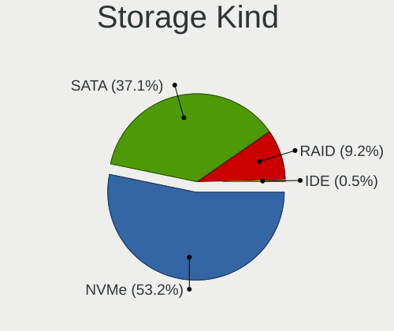

| Kind | Notebooks | Percent |
|------|-----------|---------|
| NVMe | 551       | 53.24%  |
| SATA | 384       | 37.1%   |
| RAID | 95        | 9.18%   |
| IDE  | 5         | 0.48%   |

Processor
---------

CPU Vendor
----------

Processor vendors

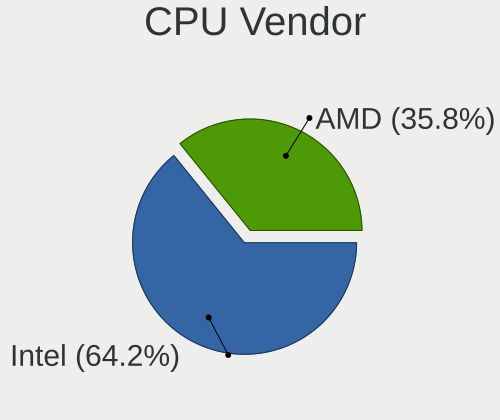

| Vendor | Notebooks | Percent |
|--------|-----------|---------|
| Intel  | 482       | 64.18%  |
| AMD    | 269       | 35.82%  |

CPU Model
---------

Processor models

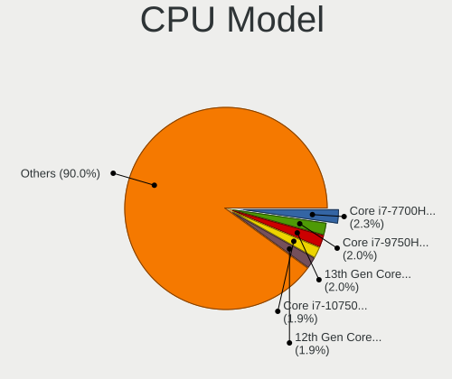

| Model                                         | Notebooks | Percent |
|-----------------------------------------------|-----------|---------|
| Intel Core i7-7700HQ CPU @ 2.80GHz            | 17        | 2.26%   |
| Intel Core i7-9750H CPU @ 2.60GHz             | 15        | 2%      |
| Intel 13th Gen Core i7-13620H                 | 15        | 2%      |
| Intel Core i7-10750H CPU @ 2.60GHz            | 14        | 1.86%   |
| Intel 12th Gen Core i7-12700H                 | 14        | 1.86%   |
| AMD Ryzen 7 5800H with Radeon Graphics        | 14        | 1.86%   |
| Intel Core i7-6700HQ CPU @ 2.60GHz            | 12        | 1.6%    |
| Intel 11th Gen Core i5-11400H @ 2.70GHz       | 12        | 1.6%    |
| Intel Core i7-8750H CPU @ 2.20GHz             | 11        | 1.46%   |
| Intel Core i5-10300H CPU @ 2.50GHz            | 10        | 1.33%   |
| Intel 12th Gen Core i5-12450H                 | 10        | 1.33%   |
| Intel 11th Gen Core i5-1135G7 @ 2.40GHz       | 9         | 1.2%    |
| Intel Core i9-14900HX                         | 8         | 1.07%   |
| Intel Core i5-9300H CPU @ 2.40GHz             | 8         | 1.07%   |
| Intel Core i5-8300H CPU @ 2.30GHz             | 8         | 1.07%   |
| Intel Core i5-8265U CPU @ 1.60GHz             | 8         | 1.07%   |
| AMD Ryzen 5 5600H with Radeon Graphics        | 8         | 1.07%   |
| AMD Ryzen AI 9 HX 370 w/ Radeon 890M          | 7         | 0.93%   |
| AMD Ryzen 7 9800X3D 8-Core Processor          | 7         | 0.93%   |
| AMD Ryzen 7 7840HS w/ Radeon 780M Graphics    | 7         | 0.93%   |
| Intel Core i7-4710HQ CPU @ 2.50GHz            | 6         | 0.8%    |
| Intel Core i5-7200U CPU @ 2.50GHz             | 6         | 0.8%    |
| Intel 11th Gen Core i7-11800H @ 2.30GHz       | 6         | 0.8%    |
| AMD Ryzen 9 7940HS w/ Radeon 780M Graphics    | 6         | 0.8%    |
| AMD Ryzen 7 8840U w/ Radeon 780M Graphics     | 6         | 0.8%    |
| AMD Ryzen 7 7735HS with Radeon Graphics       | 6         | 0.8%    |
| AMD Ryzen 5 7535HS with Radeon Graphics       | 6         | 0.8%    |
| AMD Ryzen 5 3550H with Radeon Vega Mobile Gfx | 6         | 0.8%    |
| Intel 13th Gen Core i5-13420H                 | 5         | 0.67%   |
| AMD Ryzen 9 8945HS w/ Radeon 780M Graphics    | 5         | 0.67%   |
| AMD Ryzen 7 8845HS w/ Radeon 780M Graphics    | 5         | 0.67%   |
| AMD Ryzen 7 7435HS                            | 5         | 0.67%   |
| AMD Ryzen 7 3750H with Radeon Vega Mobile Gfx | 5         | 0.67%   |
| AMD Ryzen 5 7640U w/ Radeon 760M Graphics     | 5         | 0.67%   |
| AMD Ryzen 5 5500U with Radeon Graphics        | 5         | 0.67%   |
| AMD Ryzen 5 3500U with Radeon Vega Mobile Gfx | 5         | 0.67%   |
| AMD Ryzen 5 2500U with Radeon Vega Mobile Gfx | 5         | 0.67%   |
| AMD Custom APU 0932                           | 5         | 0.67%   |
| AMD Custom APU 0405                           | 5         | 0.67%   |
| Intel Core Ultra 9 275HX                      | 4         | 0.53%   |

CPU Model Family
----------------

Processor model prefix

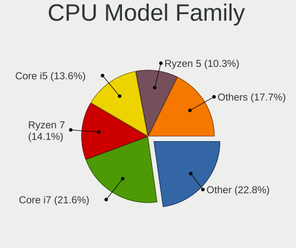

| Model                | Notebooks | Percent |
|----------------------|-----------|---------|
| Other                | 171       | 22.77%  |
| Intel Core i7        | 162       | 21.57%  |
| AMD Ryzen 7          | 106       | 14.11%  |
| Intel Core i5        | 102       | 13.58%  |
| AMD Ryzen 5          | 77        | 10.25%  |
| AMD Ryzen 9          | 38        | 5.06%   |
| Intel Core           | 21        | 2.8%    |
| Intel Core i3        | 14        | 1.86%   |
| Intel Core i9        | 11        | 1.46%   |
| Intel Celeron        | 8         | 1.07%   |
| Intel Xeon           | 5         | 0.67%   |
| AMD Ryzen 3          | 5         | 0.67%   |
| Intel Pentium        | 4         | 0.53%   |
| AMD Athlon           | 3         | 0.4%    |
| AMD A8               | 3         | 0.4%    |
| AMD A10              | 3         | 0.4%    |
| Intel Pentium Silver | 2         | 0.27%   |
| Intel Pentium Gold   | 2         | 0.27%   |
| Intel Core m3        | 2         | 0.27%   |
| Intel Core M         | 2         | 0.27%   |
| AMD Ryzen 7 PRO      | 2         | 0.27%   |
| AMD Ryzen 5 PRO      | 2         | 0.27%   |
| AMD A6               | 2         | 0.27%   |
| AMD Ryzen Embedded   | 1         | 0.13%   |
| AMD FX               | 1         | 0.13%   |
| AMD E1               | 1         | 0.13%   |
| AMD A4               | 1         | 0.13%   |

CPU Cores
---------

Number of processor cores

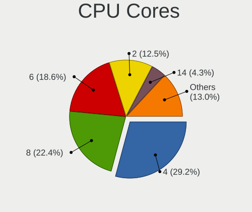

| Number | Notebooks | Percent |
|--------|-----------|---------|
| 4      | 219       | 29.16%  |
| 8      | 168       | 22.37%  |
| 6      | 140       | 18.64%  |
| 2      | 94        | 12.52%  |
| 14     | 32        | 4.26%   |
| 10     | 30        | 3.99%   |
| 16     | 22        | 2.93%   |
| 24     | 21        | 2.8%    |
| 12     | 21        | 2.8%    |
| 20     | 3         | 0.4%    |
| 5      | 1         | 0.13%   |

CPU Sockets
-----------

Number of sockets

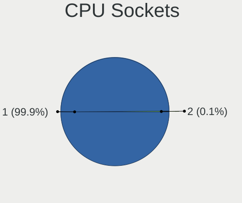

| Number | Notebooks | Percent |
|--------|-----------|---------|
| 1      | 750       | 99.87%  |
| 2      | 1         | 0.13%   |

CPU Threads
-----------

Threads per core (Hyper-Threading)

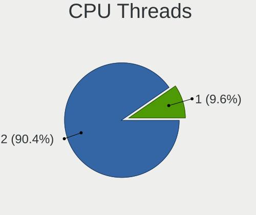

| Number | Notebooks | Percent |
|--------|-----------|---------|
| 2      | 679       | 90.41%  |
| 1      | 72        | 9.59%   |

CPU Op-Modes
------------

CPU Operation Modes (32-bit, 64-bit)

| Op mode        | Notebooks | Percent |
|----------------|-----------|---------|
| 32-bit, 64-bit | 751       | 100%    |

CPU Microcode
-------------

Microcode number

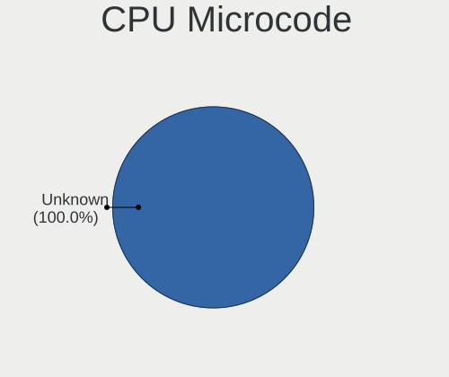

| Number  | Notebooks | Percent |
|---------|-----------|---------|
| Unknown | 751       | 100%    |

CPU Microarch
-------------

Microarchitecture

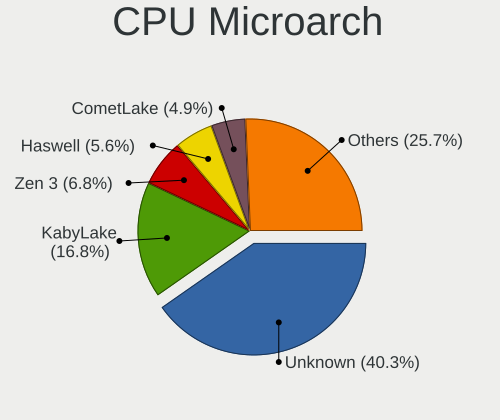

| Name             | Notebooks | Percent |
|------------------|-----------|---------|
| Unknown          | 303       | 40.29%  |
| KabyLake         | 126       | 16.76%  |
| Zen 3            | 51        | 6.78%   |
| Haswell          | 42        | 5.59%   |
| CometLake        | 37        | 4.92%   |
| Skylake          | 31        | 4.12%   |
| Zen 2            | 28        | 3.72%   |
| Zen+             | 26        | 3.46%   |
| TigerLake        | 26        | 3.46%   |
| SandyBridge      | 17        | 2.26%   |
| IvyBridge        | 17        | 2.26%   |
| Broadwell        | 13        | 1.73%   |
| Zen              | 8         | 1.06%   |
| Piledriver       | 5         | 0.66%   |
| Icelake          | 5         | 0.66%   |
| Goldmont plus    | 5         | 0.66%   |
| Puma             | 3         | 0.4%    |
| Jaguar           | 2         | 0.27%   |
| Goldmont         | 2         | 0.27%   |
| Alderlake Hybrid | 2         | 0.27%   |
| Silvermont       | 1         | 0.13%   |
| Lunarlake Hybrid | 1         | 0.13%   |
| Excavator        | 1         | 0.13%   |

Graphics
--------

GPU Vendor
----------

Vendors of graphics cards

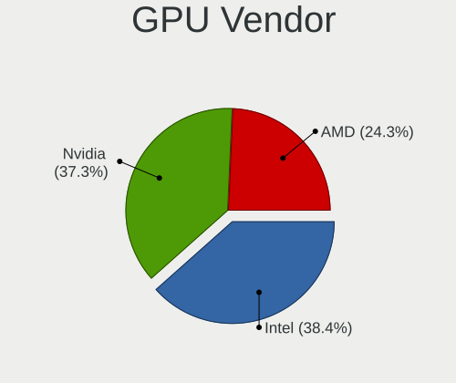

| Vendor | Notebooks | Percent |
|--------|-----------|---------|
| Intel  | 435       | 38.43%  |
| Nvidia | 422       | 37.28%  |
| AMD    | 275       | 24.29%  |

GPU Model
---------

Graphics card models

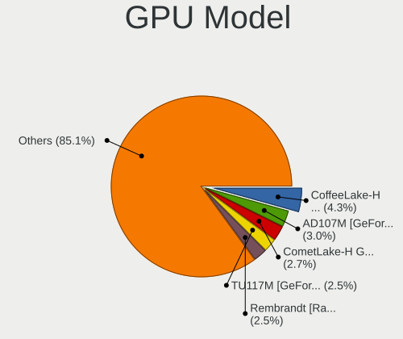

| Model                                                                     | Notebooks | Percent |
|---------------------------------------------------------------------------|-----------|---------|
| Intel CoffeeLake-H GT2 [UHD Graphics 630]                                 | 51        | 4.33%   |
| Nvidia AD107M [GeForce RTX 4060 Max-Q / Mobile]                           | 35        | 2.97%   |
| Intel CometLake-H GT2 [UHD Graphics]                                      | 32        | 2.72%   |
| Nvidia TU117M [GeForce GTX 1650 Mobile / Max-Q]                           | 29        | 2.46%   |
| AMD Rembrandt [Radeon 680M]                                               | 29        | 2.46%   |
| AMD Picasso/Raven 2 [Radeon Vega Series / Radeon Vega Mobile Series]      | 28        | 2.38%   |
| AMD Cezanne [Radeon Vega Series / Radeon Vega Mobile Series]              | 27        | 2.29%   |
| Nvidia GA106M [GeForce RTX 3060 Mobile / Max-Q]                           | 25        | 2.12%   |
| Intel Kaby Lake-H GT2 [HD Graphics 630]                                   | 25        | 2.12%   |
| AMD Phoenix1                                                              | 25        | 2.12%   |
| Intel TigerLake-LP GT2 [Iris Xe Graphics]                                 | 22        | 1.87%   |
| Intel TigerLake-H GT1 [UHD Graphics]                                      | 21        | 1.78%   |
| Intel Raptor Lake-P [UHD Graphics]                                        | 20        | 1.7%    |
| Intel 4th Gen Core Processor Integrated Graphics Controller               | 19        | 1.61%   |
| AMD Renoir [Radeon Vega Series / Radeon Vega Mobile Series]               | 19        | 1.61%   |
| AMD Raphael                                                               | 19        | 1.61%   |
| Intel Raptor Lake-S UHD Graphics                                          | 18        | 1.53%   |
| Intel Alder Lake-P GT2 [Iris Xe Graphics]                                 | 18        | 1.53%   |
| AMD HawkPoint1                                                            | 18        | 1.53%   |
| Nvidia GA107M [GeForce RTX 3050 Mobile]                                   | 17        | 1.44%   |
| Nvidia AD106M [GeForce RTX 4070 Max-Q / Mobile]                           | 17        | 1.44%   |
| Nvidia AD107M [GeForce RTX 4050 Max-Q / Mobile]                           | 16        | 1.36%   |
| Nvidia TU116M [GeForce GTX 1660 Ti Mobile]                                | 15        | 1.27%   |
| Nvidia GA107M [GeForce RTX 3050 Ti Mobile]                                | 14        | 1.19%   |
| Intel Skylake-H GT2 [HD Graphics 530]                                     | 14        | 1.19%   |
| Intel 2nd Generation Core Processor Family Integrated Graphics Controller | 14        | 1.19%   |
| Intel Alder Lake-P GT1 [UHD Graphics]                                     | 13        | 1.1%    |
| Nvidia GP107M [GeForce GTX 1050 Mobile]                                   | 12        | 1.02%   |
| Intel WhiskeyLake-U GT2 [UHD Graphics 620]                                | 12        | 1.02%   |
| Intel Haswell-ULT Integrated Graphics Controller                          | 12        | 1.02%   |
| Intel 3rd Gen Core processor Graphics Controller                          | 11        | 0.93%   |
| AMD Strix [Radeon 880M / 890M]                                            | 11        | 0.93%   |
| Nvidia GP107M [GeForce GTX 1050 Ti Mobile]                                | 10        | 0.85%   |
| Intel Skylake-U GT2 [HD Graphics 520]                                     | 10        | 0.85%   |
| Intel Kaby Lake-U GT2 [HD Graphics 620]                                   | 10        | 0.85%   |
| Intel Kaby Lake-R GT2 [UHD Graphics 620]                                  | 10        | 0.85%   |
| AMD Navi 48 [Radeon RX 9070/9070 XT/9070 GRE]                             | 10        | 0.85%   |
| AMD Navi 33 [Radeon RX 7600/7600 XT/7600M XT/7600S/7700S / PRO W7600]     | 10        | 0.85%   |
| Nvidia GA107BM / GN20-P0-R-K2 [GeForce RTX 3050 6GB Laptop GPU]           | 9         | 0.76%   |
| Nvidia TU106M [GeForce RTX 2060 Mobile]                                   | 8         | 0.68%   |

GPU Combo
---------

Combinations of graphics cards

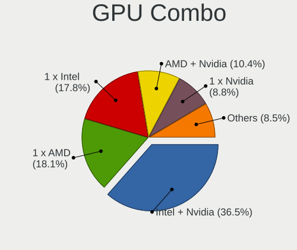

| Name                     | Notebooks | Percent |
|--------------------------|-----------|---------|
| Intel + Nvidia           | 275       | 36.52%  |
| 1 x AMD                  | 136       | 18.06%  |
| 1 x Intel                | 134       | 17.8%   |
| AMD + Nvidia             | 78        | 10.36%  |
| 1 x Nvidia               | 66        | 8.76%   |
| 2 x AMD                  | 42        | 5.58%   |
| Intel + AMD              | 18        | 2.39%   |
| 2 x Nvidia               | 1         | 0.13%   |
| Intel + 2 x Nvidia       | 1         | 0.13%   |
| Intel + 2 x AMD          | 1         | 0.13%   |
| Intel + AMD + 1 x Nvidia | 1         | 0.13%   |

GPU Driver
----------

Free vs proprietary

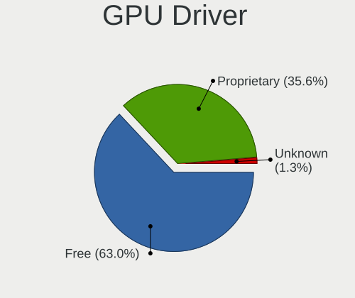

| Driver      | Notebooks | Percent |
|-------------|-----------|---------|
| Free        | 474       | 63.03%  |
| Proprietary | 268       | 35.64%  |
| Unknown     | 10        | 1.33%   |

GPU Memory
----------

Total video memory

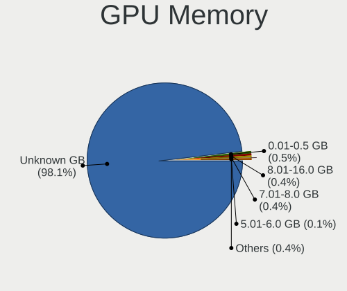

| Size in GB | Notebooks | Percent |
|------------|-----------|---------|
| Unknown    | 737       | 98.14%  |
| 0.01-0.5   | 4         | 0.53%   |
| 7.01-8.0   | 3         | 0.4%    |
| 8.01-16.0  | 3         | 0.4%    |
| 5.01-6.0   | 1         | 0.13%   |
| 3.01-4.0   | 1         | 0.13%   |
| 2.01-3.0   | 1         | 0.13%   |
| 1.01-2.0   | 1         | 0.13%   |

Monitor
-------

Monitor Vendor
--------------

Monitor vendors

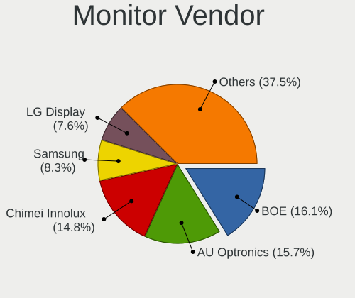

| Vendor                  | Notebooks | Percent |
|-------------------------|-----------|---------|
| BOE                     | 140       | 16.11%  |
| AU Optronics            | 136       | 15.65%  |
| Chimei Innolux          | 129       | 14.84%  |
| Samsung Electronics     | 72        | 8.29%   |
| LG Display              | 66        | 7.59%   |
| Goldstar                | 34        | 3.91%   |
| PANDA                   | 27        | 3.11%   |
| Apple                   | 27        | 3.11%   |
| Acer                    | 24        | 2.76%   |
| Sharp                   | 16        | 1.84%   |
| Lenovo                  | 16        | 1.84%   |
| Dell                    | 13        | 1.5%    |
| Valve                   | 11        | 1.27%   |
| MSI                     | 11        | 1.27%   |
| ASUSTek Computer        | 10        | 1.15%   |
| AOC                     | 10        | 1.15%   |
| CSOT                    | 7         | 0.81%   |
| BenQ                    | 7         | 0.81%   |
| CSW                     | 6         | 0.69%   |
| ViewSonic               | 5         | 0.58%   |
| TMX                     | 5         | 0.58%   |
| Sony                    | 5         | 0.58%   |
| Philips                 | 5         | 0.58%   |
| Hewlett-Packard         | 5         | 0.58%   |
| GPD                     | 5         | 0.58%   |
| Iiyama                  | 4         | 0.46%   |
| Hitachi                 | 4         | 0.46%   |
| Ancor Communications    | 4         | 0.46%   |
| TMA                     | 3         | 0.35%   |
| TCL                     | 3         | 0.35%   |
| Panasonic               | 3         | 0.35%   |
| InfoVision              | 3         | 0.35%   |
| HSX                     | 3         | 0.35%   |
| HKC                     | 3         | 0.35%   |
| Chi Mei Optoelectronics | 3         | 0.35%   |
| Vizio                   | 2         | 0.23%   |
| Vestel Elektronik       | 2         | 0.23%   |
| SKG                     | 2         | 0.23%   |
| RTK                     | 2         | 0.23%   |
| Huion                   | 2         | 0.23%   |

Monitor Model
-------------

Monitor models

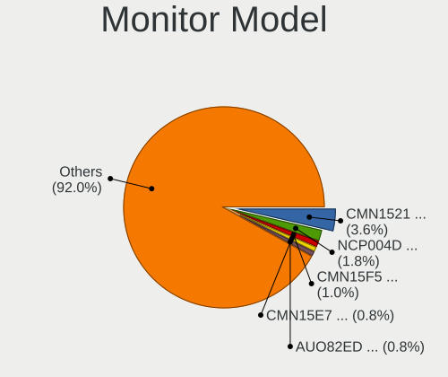

| Model                                                                 | Notebooks | Percent |
|-----------------------------------------------------------------------|-----------|---------|
| Chimei Innolux LCD Monitor CMN1521 1920x1080 344x193mm 15.5-inch      | 32        | 3.62%   |
| PANDA LCD Monitor NCP004D 1920x1080 344x194mm 15.5-inch               | 16        | 1.81%   |
| Chimei Innolux LCD Monitor CMN15F5 1920x1080 344x193mm 15.5-inch      | 9         | 1.02%   |
| Chimei Innolux LCD Monitor CMN15E7 1920x1080 344x193mm 15.5-inch      | 7         | 0.79%   |
| AU Optronics LCD Monitor AUO82ED 1920x1080 344x194mm 15.5-inch        | 7         | 0.79%   |
| AU Optronics LCD Monitor AUO21ED 1920x1080 344x193mm 15.5-inch        | 7         | 0.79%   |
| Valve ANX7530 U VLV3003 800x1280 100x160mm 7.4-inch                   | 5         | 0.57%   |
| Valve ANX7530 U VLV3001 800x1280 100x150mm 7.1-inch                   | 5         | 0.57%   |
| GPD G1618-04 GPD0598 1920x1080                                        | 5         | 0.57%   |
| BOE LCD Monitor BOE0BC9 2560x1600 345x215mm 16.0-inch                 | 5         | 0.57%   |
| BOE LCD Monitor BOE0A23 1366x768 344x194mm 15.5-inch                  | 5         | 0.57%   |
| BOE FLQ8423-24L0 BOE1003 1600x2560 113x181mm 8.4-inch                 | 5         | 0.57%   |
| AU Optronics LCD Monitor AUO978F 1920x1080 382x215mm 17.3-inch        | 5         | 0.57%   |
| AU Optronics LCD Monitor AUO61ED 1920x1080 344x194mm 15.5-inch        | 5         | 0.57%   |
| PANDA LCD Monitor NCP002D 1920x1080 344x194mm 15.5-inch               | 4         | 0.45%   |
| LG Display LCD Monitor LGD046F 1920x1080 344x194mm 15.5-inch          | 4         | 0.45%   |
| Chimei Innolux LCD Monitor CMN15D2 1920x1080 344x193mm 15.5-inch      | 4         | 0.45%   |
| Chimei Innolux LCD Monitor CMN1540 2560x1440 344x193mm 15.5-inch      | 4         | 0.45%   |
| BOE LCD Monitor BOE0BCA 2256x1504 285x190mm 13.5-inch                 | 4         | 0.45%   |
| AU Optronics LCD Monitor AUOAF90 1920x1080 344x193mm 15.5-inch        | 4         | 0.45%   |
| AU Optronics LCD Monitor AUO38ED 1920x1080 344x193mm 15.5-inch        | 4         | 0.45%   |
| Apple Color LCD APPA030 2880x1800 331x207mm 15.4-inch                 | 4         | 0.45%   |
| Samsung Electronics LCD Monitor SDC4161 1920x1080 344x194mm 15.5-inch | 3         | 0.34%   |
| Samsung Electronics LCD Monitor SDC324C 1920x1080 344x194mm 15.5-inch | 3         | 0.34%   |
| Lenovo LCD Monitor LEN9059 1920x1080 344x193mm 15.5-inch              | 3         | 0.34%   |
| Goldstar ULTRAGEAR GSM5BD3 2560x1440 697x392mm 31.5-inch              | 3         | 0.34%   |
| Goldstar LG TV SSCR2 GSMC0C8 3840x2160                                | 3         | 0.34%   |
| Goldstar FULL HD GSM5B55 1920x1080 480x270mm 21.7-inch                | 3         | 0.34%   |
| Chimei Innolux LCD Monitor CMN176E 1920x1080 381x214mm 17.2-inch      | 3         | 0.34%   |
| Chimei Innolux LCD Monitor CMN15E8 1920x1080 344x193mm 15.5-inch      | 3         | 0.34%   |
| Chimei Innolux LCD Monitor CMN15C3 1920x1080 344x193mm 15.5-inch      | 3         | 0.34%   |
| BOE NE156FHM-NX6 BOE0B70 1920x1080 344x194mm 15.5-inch                | 3         | 0.34%   |
| BOE LCD Monitor BOE0B77 1920x1200 345x215mm 16.0-inch                 | 3         | 0.34%   |
| BOE LCD Monitor BOE0AE3 1920x1080 344x194mm 15.5-inch                 | 3         | 0.34%   |
| BOE LCD Monitor BOE09F9 2560x1440 381x214mm 17.2-inch                 | 3         | 0.34%   |
| BOE LCD Monitor BOE095F 2256x1504 285x190mm 13.5-inch                 | 3         | 0.34%   |
| BOE LCD Monitor BOE08B3 1920x1080 344x193mm 15.5-inch                 | 3         | 0.34%   |
| ASUSTek Computer VG245 AUS24A1 1920x1080 531x299mm 24.0-inch          | 3         | 0.34%   |
| Vizio E600i-B3 VIZ1006 1920x1080 1329x748mm 60.0-inch                 | 2         | 0.23%   |
| Vestel Elektronik 40UHD_LCD_TV VES3700 3840x2160 880x500mm 39.8-inch  | 2         | 0.23%   |

Monitor Resolution
------------------

Monitor screen resolution

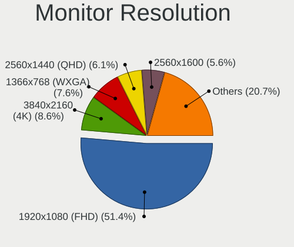

| Resolution         | Notebooks | Percent |
|--------------------|-----------|---------|
| 1920x1080 (FHD)    | 430       | 51.37%  |
| 3840x2160 (4K)     | 72        | 8.6%    |
| 1366x768 (WXGA)    | 64        | 7.65%   |
| 2560x1440 (QHD)    | 51        | 6.09%   |
| 2560x1600          | 47        | 5.62%   |
| 1920x1200 (WUXGA)  | 38        | 4.54%   |
| 2880x1800          | 24        | 2.87%   |
| 1600x2560          | 15        | 1.79%   |
| 3440x1440          | 12        | 1.43%   |
| 800x1280           | 11        | 1.31%   |
| 2256x1504          | 7         | 0.84%   |
| 1600x900 (HD+)     | 7         | 0.84%   |
| 1440x900 (WXGA+)   | 7         | 0.84%   |
| 3200x2000          | 6         | 0.72%   |
| 3840x1080          | 5         | 0.6%    |
| 2560x1080          | 5         | 0.6%    |
| Unknown            | 4         | 0.48%   |
| 3840x2400          | 3         | 0.36%   |
| 2880x1920          | 3         | 0.36%   |
| 1920x540           | 3         | 0.36%   |
| 1680x1050 (WSXGA+) | 3         | 0.36%   |
| 1280x800 (WXGA)    | 3         | 0.36%   |
| 3072x1920          | 2         | 0.24%   |
| 2160x1440          | 2         | 0.24%   |
| 1280x720 (HD)      | 2         | 0.24%   |
| 720x1280           | 1         | 0.12%   |
| 3840x1600          | 1         | 0.12%   |
| 3840x1100          | 1         | 0.12%   |
| 3200x1800 (QHD+)   | 1         | 0.12%   |
| 2304x1440          | 1         | 0.12%   |
| 2240x1400          | 1         | 0.12%   |
| 1920x2160          | 1         | 0.12%   |
| 1680x945           | 1         | 0.12%   |
| 1600x1200          | 1         | 0.12%   |
| 1360x768           | 1         | 0.12%   |
| 1280x960           | 1         | 0.12%   |

Monitor Diagonal
----------------

Diagonal size in inches

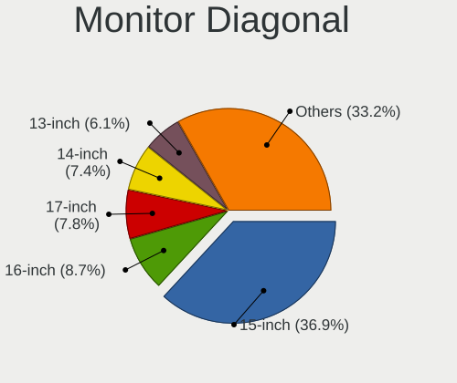

| Inches  | Notebooks | Percent |
|---------|-----------|---------|
| 15      | 323       | 36.87%  |
| 16      | 76        | 8.68%   |
| 17      | 68        | 7.76%   |
| 14      | 65        | 7.42%   |
| 13      | 53        | 6.05%   |
| 27      | 43        | 4.91%   |
| 31      | 31        | 3.54%   |
| 24      | 24        | 2.74%   |
| 21      | 24        | 2.74%   |
| Unknown | 20        | 2.28%   |
| 23      | 19        | 2.17%   |
| 84      | 14        | 1.6%    |
| 34      | 12        | 1.37%   |
| 8       | 11        | 1.26%   |
| 18      | 10        | 1.14%   |
| 7       | 10        | 1.14%   |
| 72      | 6         | 0.68%   |
| 48      | 6         | 0.68%   |
| 26      | 6         | 0.68%   |
| 54      | 5         | 0.57%   |
| 12      | 5         | 0.57%   |
| 65      | 4         | 0.46%   |
| 52      | 3         | 0.34%   |
| 28      | 3         | 0.34%   |
| 22      | 3         | 0.34%   |
| 69      | 2         | 0.23%   |
| 50      | 2         | 0.23%   |
| 49      | 2         | 0.23%   |
| 40      | 2         | 0.23%   |
| 32      | 2         | 0.23%   |
| 29      | 2         | 0.23%   |
| 19      | 2         | 0.23%   |
| 11      | 2         | 0.23%   |
| 10      | 2         | 0.23%   |
| 86      | 1         | 0.11%   |
| 85      | 1         | 0.11%   |
| 63      | 1         | 0.11%   |
| 58      | 1         | 0.11%   |
| 57      | 1         | 0.11%   |
| 55      | 1         | 0.11%   |

Monitor Width
-------------

Physical width

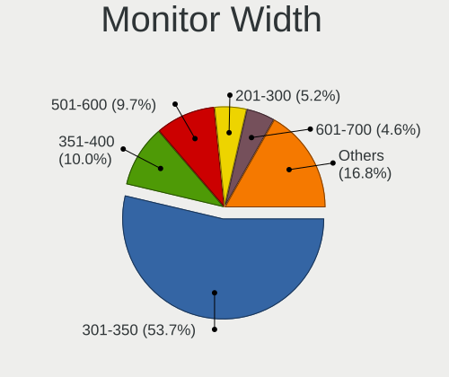

| Width in mm | Notebooks | Percent |
|-------------|-----------|---------|
| 301-350     | 466       | 53.69%  |
| 351-400     | 87        | 10.02%  |
| 501-600     | 84        | 9.68%   |
| 201-300     | 45        | 5.18%   |
| 601-700     | 40        | 4.61%   |
| 401-500     | 33        | 3.8%    |
| 1001-1500   | 26        | 3%      |
| 1501-2000   | 24        | 2.76%   |
| Unknown     | 20        | 2.3%    |
| 701-800     | 15        | 1.73%   |
| 101-200     | 12        | 1.38%   |
| 1-100       | 11        | 1.27%   |
| 801-900     | 4         | 0.46%   |
| 901-1000    | 1         | 0.12%   |

Aspect Ratio
------------

Proportional relationship between the width and the height

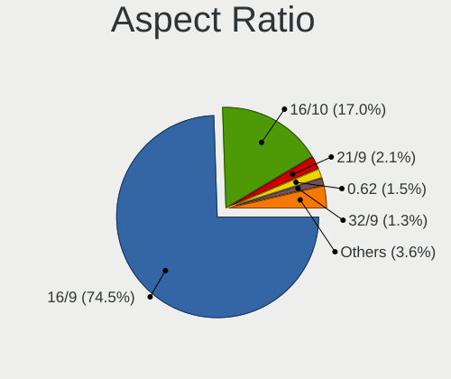

| Ratio   | Notebooks | Percent |
|---------|-----------|---------|
| 16/9    | 592       | 74.47%  |
| 16/10   | 135       | 16.98%  |
| 21/9    | 17        | 2.14%   |
| 0.62    | 12        | 1.51%   |
| 32/9    | 10        | 1.26%   |
| 3/2     | 10        | 1.26%   |
| 0.67    | 5         | 0.63%   |
| Unknown | 4         | 0.5%    |
| 0.63    | 3         | 0.38%   |
| 4/3     | 2         | 0.25%   |
| 0.56    | 2         | 0.25%   |
| 6/5     | 1         | 0.13%   |
| 3.40    | 1         | 0.13%   |
| 1.96    | 1         | 0.13%   |

Monitor Area
------------

Area in inch²

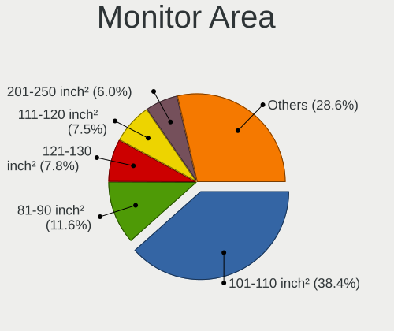

| Area in inch² | Notebooks | Percent |
|----------------|-----------|---------|
| 101-110        | 333       | 38.41%  |
| 81-90          | 101       | 11.65%  |
| 121-130        | 68        | 7.84%   |
| 111-120        | 65        | 7.5%    |
| 201-250        | 52        | 6%      |
| 301-350        | 48        | 5.54%   |
| 351-500        | 47        | 5.42%   |
| More than 1000 | 41        | 4.73%   |
| 1-40           | 22        | 2.54%   |
| Unknown        | 20        | 2.31%   |
| 71-80          | 15        | 1.73%   |
| 501-1000       | 14        | 1.61%   |
| 251-300        | 11        | 1.27%   |
| 151-200        | 9         | 1.04%   |
| 141-150        | 9         | 1.04%   |
| 61-70          | 5         | 0.58%   |
| 51-60          | 3         | 0.35%   |
| 41-50          | 2         | 0.23%   |
| 131-140        | 1         | 0.12%   |
| 91-100         | 1         | 0.12%   |

Pixel Density
-------------

Pixels per inch

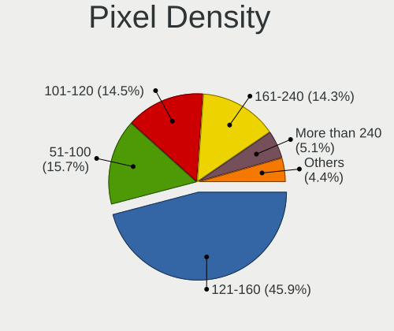

| Density       | Notebooks | Percent |
|---------------|-----------|---------|
| 121-160       | 394       | 45.92%  |
| 51-100        | 135       | 15.73%  |
| 101-120       | 124       | 14.45%  |
| 161-240       | 123       | 14.34%  |
| More than 240 | 44        | 5.13%   |
| Unknown       | 20        | 2.33%   |
| 1-50          | 18        | 2.1%    |

Multiple Monitors
-----------------

Total monitors connected

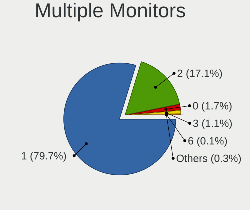

| Total | Notebooks | Percent |
|-------|-----------|---------|
| 1     | 605       | 79.71%  |
| 2     | 130       | 17.13%  |
| 0     | 13        | 1.71%   |
| 3     | 8         | 1.05%   |
| 6     | 1         | 0.13%   |
| 5     | 1         | 0.13%   |
| 4     | 1         | 0.13%   |

Network
-------

Net Controller Vendor
---------------------

Controller vendors

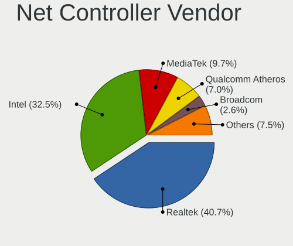

| Vendor                                 | Notebooks | Percent |
|----------------------------------------|-----------|---------|
| Realtek Semiconductor                  | 493       | 40.68%  |
| Intel                                  | 394       | 32.51%  |
| MediaTek                               | 117       | 9.65%   |
| Qualcomm Atheros                       | 85        | 7.01%   |
| Broadcom                               | 32        | 2.64%   |
| ASIX Electronics                       | 11        | 0.91%   |
| TP-Link                                | 9         | 0.74%   |
| Broadcom Limited                       | 8         | 0.66%   |
| Qualcomm Technologies                  | 7         | 0.58%   |
| Xiaomi                                 | 6         | 0.5%    |
| Samsung Electronics                    | 6         | 0.5%    |
| Qualcomm                               | 6         | 0.5%    |
| Microsoft                              | 4         | 0.33%   |
| Shenzhen Goodix Technology             | 3         | 0.25%   |
| Motorola PCS                           | 3         | 0.25%   |
| Lenovo                                 | 3         | 0.25%   |
| ICS Advent                             | 3         | 0.25%   |
| Ralink Technology                      | 2         | 0.17%   |
| Ralink                                 | 2         | 0.17%   |
| NetGear                                | 2         | 0.17%   |
| DisplayLink                            | 2         | 0.17%   |
| ASUSTek Computer                       | 2         | 0.17%   |
| Tenda                                  | 1         | 0.08%   |
| Suzhou Motorcomm Electronic Technology | 1         | 0.08%   |
| Sierra Wireless                        | 1         | 0.08%   |
| OPPO Electronics                       | 1         | 0.08%   |
| Microchip Technology                   | 1         | 0.08%   |
| Huawei Technologies                    | 1         | 0.08%   |
| Google                                 | 1         | 0.08%   |
| Ericsson Business Mobile Networks      | 1         | 0.08%   |
| Edimax Technology                      | 1         | 0.08%   |
| Belkin Components                      | 1         | 0.08%   |
| AVM                                    | 1         | 0.08%   |
| Aquantia                               | 1         | 0.08%   |

Net Controller Model
--------------------

Controller models

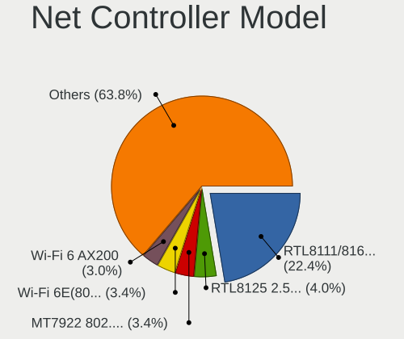

| Model                                                                  | Notebooks | Percent |
|------------------------------------------------------------------------|-----------|---------|
| Realtek RTL8111/8168/8211/8411 PCI Express Gigabit Ethernet Controller | 311       | 22.39%  |
| Realtek RTL8125 2.5GbE Controller                                      | 56        | 4.03%   |
| MediaTek MT7922 802.11ax PCI Express Wireless Network Adapter          | 47        | 3.38%   |
| Intel Wi-Fi 6E(802.11ax) AX210/AX1675* 2x2 [Typhoon Peak]              | 47        | 3.38%   |
| Intel Wi-Fi 6 AX200                                                    | 42        | 3.02%   |
| MediaTek MT7921 802.11ax PCIe Wireless Network Adapter [Filogic 330]   | 40        | 2.88%   |
| Realtek RTL8153 Gigabit Ethernet Adapter                               | 36        | 2.59%   |
| Intel Alder Lake-P PCH CNVi WiFi                                       | 34        | 2.45%   |
| Intel Comet Lake PCH CNVi WiFi                                         | 31        | 2.23%   |
| Realtek RTL8852BE PCIe 802.11ax Wireless Network Controller            | 29        | 2.09%   |
| Realtek RTL8822CE 802.11ac PCIe Wireless Network Adapter               | 27        | 1.94%   |
| Intel Cannon Lake PCH CNVi WiFi                                        | 27        | 1.94%   |
| Qualcomm Atheros QCA9377 802.11ac Wireless Network Adapter             | 23        | 1.66%   |
| Qualcomm Atheros QCA6174 802.11ac Wireless Network Adapter             | 22        | 1.58%   |
| Realtek RTL810xE PCI Express Fast Ethernet controller                  | 21        | 1.51%   |
| Realtek RTL8821CE 802.11ac PCIe Wireless Network Adapter               | 19        | 1.37%   |
| Intel Raptor Lake PCH CNVi WiFi                                        | 19        | 1.37%   |
| Realtek Killer E2600 GbE Controller                                    | 16        | 1.15%   |
| Intel Wireless 7265                                                    | 16        | 1.15%   |
| Intel Wi-Fi 6 AX201                                                    | 16        | 1.15%   |
| Intel 700 Series Chipset CNVi WiFi                                     | 15        | 1.08%   |
| Intel Wireless 8265 / 8275                                             | 14        | 1.01%   |
| Intel Wireless 7260                                                    | 14        | 1.01%   |
| Qualcomm Atheros Killer E2500 Gigabit Ethernet Controller              | 13        | 0.94%   |
| Intel Wi-Fi 7(802.11be) AX1775*/AX1790*/BE20*/BE401/BE1750* 2x2        | 13        | 0.94%   |
| Intel Tiger Lake PCH CNVi WiFi                                         | 13        | 0.94%   |
| Realtek Killer E3000 2.5GbE Controller                                 | 12        | 0.86%   |
| MediaTek MT7902 802.11ax PCIe Wireless Network Adapter [Filogic 310]   | 11        | 0.79%   |
| ASIX AX88179 Gigabit Ethernet                                          | 11        | 0.79%   |
| Intel Wireless 8260                                                    | 9         | 0.65%   |
| Intel Wi-Fi 5(802.11ac) Wireless-AC 9x6x [Thunder Peak]                | 8         | 0.58%   |
| Intel Ethernet Controller I226-V                                       | 8         | 0.58%   |
| Intel Dual Band Wireless-AC 3168NGW [Stone Peak]                       | 8         | 0.58%   |
| Intel Cannon Point-LP CNVi [Wireless-AC]                               | 8         | 0.58%   |
| Broadcom BCM43602 802.11ac Wireless LAN SoC                            | 8         | 0.58%   |
| Qualcomm Atheros Killer E220x Gigabit Ethernet Controller              | 7         | 0.5%    |
| Xiaomi Mi/Redmi series (RNDIS)                                         | 6         | 0.43%   |
| Qualcomm QCNFA765 Wireless Network Adapter                             | 6         | 0.43%   |
| Qualcomm Atheros Killer E2400 Gigabit Ethernet Controller              | 6         | 0.43%   |
| Intel Ethernet Controller I225-V                                       | 6         | 0.43%   |

Wireless Vendor
---------------

Wireless vendors

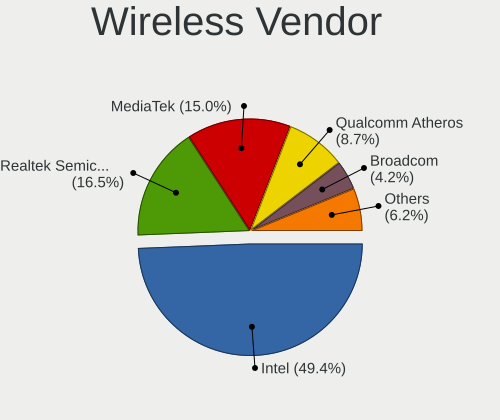

| Vendor                | Notebooks | Percent |
|-----------------------|-----------|---------|
| Intel                 | 351       | 49.37%  |
| Realtek Semiconductor | 117       | 16.46%  |
| MediaTek              | 107       | 15.05%  |
| Qualcomm Atheros      | 62        | 8.72%   |
| Broadcom              | 30        | 4.22%   |
| TP-Link               | 8         | 1.13%   |
| Broadcom Limited      | 8         | 1.13%   |
| Qualcomm Technologies | 6         | 0.84%   |
| Qualcomm              | 5         | 0.7%    |
| Microsoft             | 4         | 0.56%   |
| Ralink Technology     | 2         | 0.28%   |
| Ralink                | 2         | 0.28%   |
| NetGear               | 2         | 0.28%   |
| ASUSTek Computer      | 2         | 0.28%   |
| Tenda                 | 1         | 0.14%   |
| Sierra Wireless       | 1         | 0.14%   |
| Edimax Technology     | 1         | 0.14%   |
| Belkin Components     | 1         | 0.14%   |
| AVM                   | 1         | 0.14%   |

Wireless Model
--------------

Wireless models

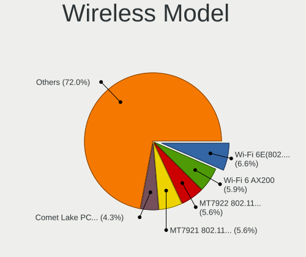

| Model                                                                | Notebooks | Percent |
|----------------------------------------------------------------------|-----------|---------|
| Intel Wi-Fi 6E(802.11ax) AX210/AX1675* 2x2 [Typhoon Peak]            | 47        | 6.57%   |
| Intel Wi-Fi 6 AX200                                                  | 42        | 5.87%   |
| MediaTek MT7922 802.11ax PCI Express Wireless Network Adapter        | 40        | 5.59%   |
| MediaTek MT7921 802.11ax PCIe Wireless Network Adapter [Filogic 330] | 40        | 5.59%   |
| Intel Comet Lake PCH CNVi WiFi                                       | 31        | 4.34%   |
| Realtek RTL8822CE 802.11ac PCIe Wireless Network Adapter             | 27        | 3.78%   |
| Intel Cannon Lake PCH CNVi WiFi                                      | 27        | 3.78%   |
| Realtek RTL8852BE PCIe 802.11ax Wireless Network Controller          | 26        | 3.64%   |
| Qualcomm Atheros QCA9377 802.11ac Wireless Network Adapter           | 23        | 3.22%   |
| Qualcomm Atheros QCA6174 802.11ac Wireless Network Adapter           | 22        | 3.08%   |
| Realtek RTL8821CE 802.11ac PCIe Wireless Network Adapter             | 19        | 2.66%   |
| Intel Raptor Lake PCH CNVi WiFi                                      | 18        | 2.52%   |
| Intel Alder Lake-P PCH CNVi WiFi                                     | 17        | 2.38%   |
| Intel Wireless 7265                                                  | 16        | 2.24%   |
| Intel Wi-Fi 6 AX201                                                  | 16        | 2.24%   |
| Intel 700 Series Chipset CNVi WiFi                                   | 15        | 2.1%    |
| Intel Wireless 8265 / 8275                                           | 14        | 1.96%   |
| Intel Wireless 7260                                                  | 14        | 1.96%   |
| Intel Tiger Lake PCH CNVi WiFi                                       | 13        | 1.82%   |
| MediaTek MT7902 802.11ax PCIe Wireless Network Adapter [Filogic 310] | 11        | 1.54%   |
| Intel Wireless 8260                                                  | 9         | 1.26%   |
| Intel Wi-Fi 7(802.11be) AX1775*/AX1790*/BE20*/BE401/BE1750* 2x2      | 9         | 1.26%   |
| Intel Wi-Fi 5(802.11ac) Wireless-AC 9x6x [Thunder Peak]              | 8         | 1.12%   |
| Intel Dual Band Wireless-AC 3168NGW [Stone Peak]                     | 8         | 1.12%   |
| Intel Cannon Point-LP CNVi [Wireless-AC]                             | 8         | 1.12%   |
| Broadcom BCM43602 802.11ac Wireless LAN SoC                          | 8         | 1.12%   |
| Realtek RTL8723BE PCIe Wireless Network Adapter                      | 5         | 0.7%    |
| Qualcomm QCNFA765 Wireless Network Adapter                           | 5         | 0.7%    |
| MediaTek MT7925 (RZ717) Wi-Fi 7 160MHz                               | 5         | 0.7%    |
| MediaTek MT7921K (RZ608) Wi-Fi 6E 80MHz                              | 5         | 0.7%    |
| Intel Wireless 3165                                                  | 5         | 0.7%    |
| Intel Comet Lake PCH-LP CNVi WiFi                                    | 5         | 0.7%    |
| Broadcom Limited BCM4360 802.11ac Dual Band Wireless Network Adapter | 5         | 0.7%    |
| Broadcom BCM4331 802.11a/b/g/n                                       | 5         | 0.7%    |
| Realtek RTL88x2bu [AC1200 Techkey]                                   | 4         | 0.56%   |
| Realtek RTL8852AE 802.11ax PCIe Wireless Network Adapter             | 4         | 0.56%   |
| Realtek RTL8822BE 802.11a/b/g/n/ac WiFi adapter                      | 4         | 0.56%   |
| Realtek 802.11ac NIC                                                 | 4         | 0.56%   |
| Qualcomm QCNFA765 Wireless Network Adapter                           | 4         | 0.56%   |
| Qualcomm Atheros QCA9565 / AR9565 Wireless Network Adapter           | 4         | 0.56%   |

Ethernet Vendor
---------------

Ethernet vendors

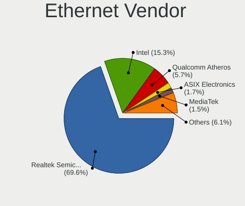

| Vendor                                 | Notebooks | Percent |
|----------------------------------------|-----------|---------|
| Realtek Semiconductor                  | 454       | 69.63%  |
| Intel                                  | 100       | 15.34%  |
| Qualcomm Atheros                       | 37        | 5.67%   |
| ASIX Electronics                       | 11        | 1.69%   |
| MediaTek                               | 10        | 1.53%   |
| Broadcom                               | 9         | 1.38%   |
| Xiaomi                                 | 6         | 0.92%   |
| Samsung Electronics                    | 6         | 0.92%   |
| Motorola PCS                           | 3         | 0.46%   |
| Lenovo                                 | 3         | 0.46%   |
| ICS Advent                             | 3         | 0.46%   |
| DisplayLink                            | 2         | 0.31%   |
| TP-Link                                | 1         | 0.15%   |
| Suzhou Motorcomm Electronic Technology | 1         | 0.15%   |
| Qualcomm Technologies                  | 1         | 0.15%   |
| Qualcomm                               | 1         | 0.15%   |
| OPPO Electronics                       | 1         | 0.15%   |
| Huawei Technologies                    | 1         | 0.15%   |
| Google                                 | 1         | 0.15%   |
| Aquantia                               | 1         | 0.15%   |

Ethernet Model
--------------

Ethernet models

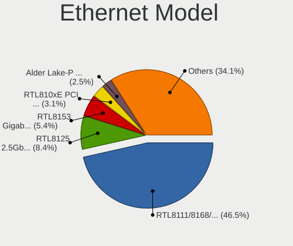

| Model                                                                           | Notebooks | Percent |
|---------------------------------------------------------------------------------|-----------|---------|
| Realtek RTL8111/8168/8211/8411 PCI Express Gigabit Ethernet Controller          | 311       | 46.49%  |
| Realtek RTL8125 2.5GbE Controller                                               | 56        | 8.37%   |
| Realtek RTL8153 Gigabit Ethernet Adapter                                        | 36        | 5.38%   |
| Realtek RTL810xE PCI Express Fast Ethernet controller                           | 21        | 3.14%   |
| Intel Alder Lake-P PCH CNVi WiFi                                                | 17        | 2.54%   |
| Realtek Killer E2600 GbE Controller                                             | 16        | 2.39%   |
| Qualcomm Atheros Killer E2500 Gigabit Ethernet Controller                       | 13        | 1.94%   |
| Realtek Killer E3000 2.5GbE Controller                                          | 12        | 1.79%   |
| ASIX AX88179 Gigabit Ethernet                                                   | 11        | 1.64%   |
| Intel Ethernet Controller I226-V                                                | 8         | 1.2%    |
| Qualcomm Atheros Killer E220x Gigabit Ethernet Controller                       | 7         | 1.05%   |
| MediaTek MT7922 802.11ax PCI Express Wireless Network Adapter                   | 7         | 1.05%   |
| Xiaomi Mi/Redmi series (RNDIS)                                                  | 6         | 0.9%    |
| Qualcomm Atheros Killer E2400 Gigabit Ethernet Controller                       | 6         | 0.9%    |
| Intel Ethernet Controller I225-V                                                | 6         | 0.9%    |
| Intel Ethernet Connection I217-LM                                               | 6         | 0.9%    |
| Intel Ethernet Connection (7) I219-LM                                           | 6         | 0.9%    |
| Intel 82579LM Gigabit Network Connection (Lewisville)                           | 6         | 0.9%    |
| Intel I211 Gigabit Network Connection                                           | 5         | 0.75%   |
| Broadcom NetXtreme BCM57765 Gigabit Ethernet PCIe                               | 5         | 0.75%   |
| Samsung Galaxy series, misc. (tethering mode)                                   | 4         | 0.6%    |
| Qualcomm Atheros AR8151 v2.0 Gigabit Ethernet                                   | 4         | 0.6%    |
| Intel Wi-Fi 7(802.11be) AX1775*/AX1790*/BE20*/BE401/BE1750* 2x2                 | 4         | 0.6%    |
| Intel Ethernet Connection I219-LM                                               | 4         | 0.6%    |
| Intel Ethernet Connection (6) I219-V                                            | 4         | 0.6%    |
| Realtek RTL8852BE PCIe 802.11ax Wireless Network Controller                     | 3         | 0.45%   |
| Qualcomm Atheros QCA8171 Gigabit Ethernet                                       | 3         | 0.45%   |
| MediaTek MT7925 802.11be 160MHz 2x2 PCIe Wireless Network Adapter [Filogic 360] | 3         | 0.45%   |
| Intel Killer E3100X 2.5 Gigabit Ethernet Controller                             | 3         | 0.45%   |
| Intel Ethernet Connection (4) I219-LM                                           | 3         | 0.45%   |
| Intel Ethernet Connection (2) I219-V                                            | 3         | 0.45%   |
| Intel Ethernet Connection (2) I219-LM                                           | 3         | 0.45%   |
| ICS Advent 10/100M LAN                                                          | 3         | 0.45%   |
| Samsung GT-I9070 (network tethering, USB debugging enabled)                     | 2         | 0.3%    |
| Realtek USB 10/100/1G/2.5 LAN                                                   | 2         | 0.3%    |
| Realtek RTL8852CE PCIe 802.11ax Wireless Network Controller                     | 2         | 0.3%    |
| Realtek RTL8152 Fast Ethernet Adapter                                           | 2         | 0.3%    |
| Realtek RTL8126 5GbE Controller                                                 | 2         | 0.3%    |
| Realtek PCIe GbE Family Controller                                              | 2         | 0.3%    |
| Qualcomm Atheros AR8161 Gigabit Ethernet                                        | 2         | 0.3%    |

Net Controller Kind
-------------------

Ethernet, WiFi or modem

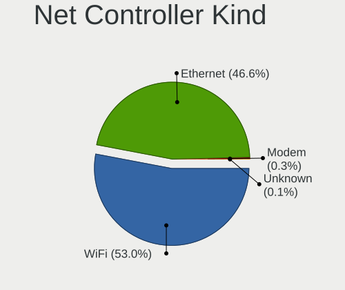

| Kind     | Notebooks | Percent |
|----------|-----------|---------|
| WiFi     | 684       | 52.98%  |
| Ethernet | 602       | 46.63%  |
| Modem    | 4         | 0.31%   |
| Unknown  | 1         | 0.08%   |

Used Controller
---------------

Currently used network controller

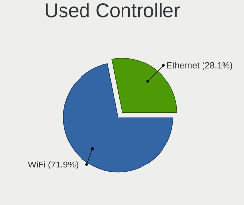

| Kind     | Notebooks | Percent |
|----------|-----------|---------|
| WiFi     | 564       | 71.94%  |
| Ethernet | 220       | 28.06%  |

NICs
----

Total network controllers on board

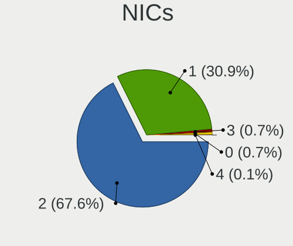

| Total | Notebooks | Percent |
|-------|-----------|---------|
| 2     | 508       | 67.64%  |
| 1     | 232       | 30.89%  |
| 3     | 5         | 0.67%   |
| 0     | 5         | 0.67%   |
| 4     | 1         | 0.13%   |

IPv6
----

IPv6 vs IPv4

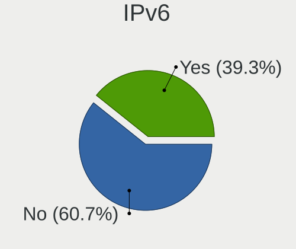

| Used | Notebooks | Percent |
|------|-----------|---------|
| No   | 459       | 60.71%  |
| Yes  | 297       | 39.29%  |

Bluetooth
---------

Bluetooth Vendor
----------------

Controller vendors

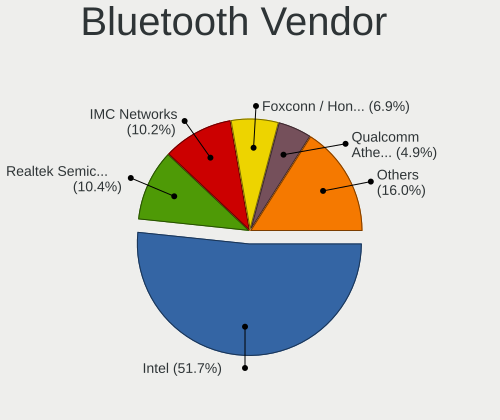

| Vendor                          | Notebooks | Percent |
|---------------------------------|-----------|---------|
| Intel                           | 359       | 51.65%  |
| Realtek Semiconductor           | 72        | 10.36%  |
| IMC Networks                    | 71        | 10.22%  |
| Foxconn / Hon Hai               | 48        | 6.91%   |
| Qualcomm Atheros Communications | 34        | 4.89%   |
| MediaTek                        | 32        | 4.6%    |
| Lite-On Technology              | 25        | 3.6%    |
| Apple                           | 17        | 2.45%   |
| Broadcom                        | 12        | 1.73%   |
| Realtek                         | 5         | 0.72%   |
| TP-Link                         | 4         | 0.58%   |
| Cambridge Silicon Radio         | 3         | 0.43%   |
| Unknown                         | 3         | 0.43%   |
| USI                             | 2         | 0.29%   |
| Ralink                          | 2         | 0.29%   |
| ASUSTek Computer                | 2         | 0.29%   |
| TRENDnet                        | 1         | 0.14%   |
| Quectel Wireless Solutions      | 1         | 0.14%   |
| Foxconn International           | 1         | 0.14%   |
| Actions                         | 1         | 0.14%   |

Bluetooth Model
---------------

Controller models

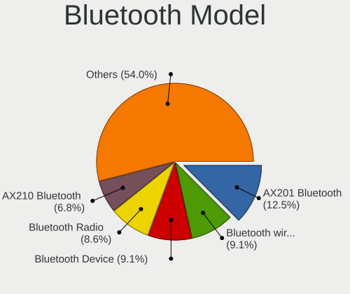

| Model                                               | Notebooks | Percent |
|-----------------------------------------------------|-----------|---------|
| Intel AX201 Bluetooth                               | 87        | 12.5%   |
| Intel Bluetooth wireless interface                  | 63        | 9.05%   |
| Intel Bluetooth Device                              | 63        | 9.05%   |
| Realtek Bluetooth Radio                             | 60        | 8.62%   |
| Intel AX210 Bluetooth                               | 47        | 6.75%   |
| Intel Bluetooth 9460/9560 Jefferson Peak (JfP)      | 41        | 5.89%   |
| IMC Networks Wireless_Device                        | 40        | 5.75%   |
| Intel AX200 Bluetooth                               | 39        | 5.6%    |
| MediaTek Wireless_Device                            | 32        | 4.6%    |
| IMC Networks Bluetooth Radio                        | 26        | 3.74%   |
| Foxconn / Hon Hai Wireless_Device                   | 24        | 3.45%   |
| Qualcomm Atheros  Bluetooth Device                  | 17        | 2.44%   |
| Lite-On Bluetooth Device                            | 10        | 1.44%   |
| Apple Bluetooth Host Controller                     | 10        | 1.44%   |
| Intel Wireless-AC 9260 Bluetooth Adapter            | 9         | 1.29%   |
| Realtek  Bluetooth 4.2 Adapter                      | 8         | 1.15%   |
| Qualcomm Atheros QCA61x4 Bluetooth 4.0              | 8         | 1.15%   |
| Lite-On Qualcomm Atheros QCA9377 Bluetooth          | 8         | 1.15%   |
| Intel Wireless-AC 3168 Bluetooth                    | 8         | 1.15%   |
| Foxconn / Hon Hai MediaTek Bluetooth Adapter        | 7         | 1.01%   |
| Apple Bluetooth USB Host Controller                 | 7         | 1.01%   |
| Lite-On Wireless_Device                             | 6         | 0.86%   |
| Foxconn / Hon Hai Bluetooth Device                  | 6         | 0.86%   |
| Realtek Bluetooth Radio                             | 5         | 0.72%   |
| TP-Link TP-T@- UB500 Adapter                        | 4         | 0.57%   |
| Foxconn / Hon Hai MediaTek MT7921 Bluetooth         | 4         | 0.57%   |
| Qualcomm Atheros AR3012 Bluetooth 4.0               | 3         | 0.43%   |
| Qualcomm Atheros AR3011 Bluetooth                   | 3         | 0.43%   |
| Foxconn / Hon Hai Bluetooth Radio                   | 3         | 0.43%   |
| Cambridge Silicon Radio Bluetooth Dongle (HCI mode) | 3         | 0.43%   |
| Unknown                                             | 3         | 0.43%   |
| USI Bluetooth Device                                | 2         | 0.29%   |
| Realtek RTL8723B Bluetooth                          | 2         | 0.29%   |
| Ralink RT3290 Bluetooth                             | 2         | 0.29%   |
| Qualcomm Atheros AR9462 Bluetooth                   | 2         | 0.29%   |
| Intel Centrino Bluetooth Wireless Transceiver       | 2         | 0.29%   |
| IMC Networks Bluetooth Device                       | 2         | 0.29%   |
| IMC Networks Atheros AR3012 Bluetooth 4.0 Adapter   | 2         | 0.29%   |
| Broadcom BCM43142 Bluetooth 4.0                     | 2         | 0.29%   |
| Broadcom BCM20702A0 Bluetooth 4.0                   | 2         | 0.29%   |

Sound
-----

Sound Vendor
------------

Sound card vendors

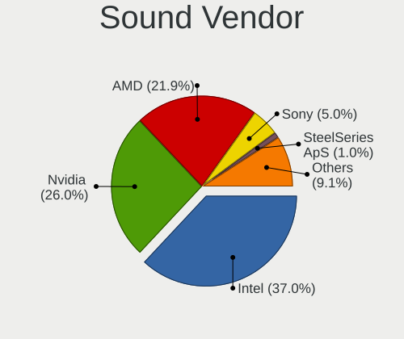

| Vendor                                          | Notebooks | Percent |
|-------------------------------------------------|-----------|---------|
| Intel                                           | 479       | 36.96%  |
| Nvidia                                          | 337       | 26%     |
| AMD                                             | 284       | 21.91%  |
| Sony                                            | 65        | 5.02%   |
| SteelSeries ApS                                 | 13        | 1%      |
| Logitech                                        | 13        | 1%      |
| C-Media Electronics                             | 12        | 0.93%   |
| Hewlett-Packard                                 | 8         | 0.62%   |
| Corsair                                         | 8         | 0.62%   |
| Focusrite-Novation                              | 6         | 0.46%   |
| ASUSTek Computer                                | 6         | 0.46%   |
| JMTek                                           | 5         | 0.39%   |
| Kingston Technology                             | 4         | 0.31%   |
| Apple                                           | 4         | 0.31%   |
| Micro Star International                        | 3         | 0.23%   |
| Lenovo                                          | 3         | 0.23%   |
| Unknown                                         | 3         | 0.23%   |
| Valve Software                                  | 2         | 0.15%   |
| Turtle Beach                                    | 2         | 0.15%   |
| Thesycon Systemsoftware & Consulting            | 2         | 0.15%   |
| Texas Instruments                               | 2         | 0.15%   |
| Razer USA                                       | 2         | 0.15%   |
| GN Netcom                                       | 2         | 0.15%   |
| Creative Technology                             | 2         | 0.15%   |
| ASRock                                          | 2         | 0.15%   |
| Trust                                           | 1         | 0.08%   |
| Telink                                          | 1         | 0.08%   |
| SmartlinkTechnology                             | 1         | 0.08%   |
| Silicon Motion                                  | 1         | 0.08%   |
| Shure                                           | 1         | 0.08%   |
| SAVITECH                                        | 1         | 0.08%   |
| Samsung Electronics                             | 1         | 0.08%   |
| Samson Technologies                             | 1         | 0.08%   |
| RODE Microphones                                | 1         | 0.08%   |
| RME                                             | 1         | 0.08%   |
| Realtek Semiconductor                           | 1         | 0.08%   |
| Nacon                                           | 1         | 0.08%   |
| MV-SILICON                                      | 1         | 0.08%   |
| Licensed by Sony Computer Entertainment America | 1         | 0.08%   |
| KTMicro                                         | 1         | 0.08%   |

Sound Model
-----------

Sound card models

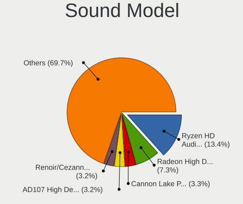

| Model                                                                      | Notebooks | Percent |
|----------------------------------------------------------------------------|-----------|---------|
| AMD Ryzen HD Audio Controller                                              | 212       | 13.36%  |
| AMD Radeon High Definition Audio Controller                                | 116       | 7.31%   |
| Intel Cannon Lake PCH cAVS                                                 | 53        | 3.34%   |
| Nvidia AD107 High Definition Audio Controller                              | 50        | 3.15%   |
| AMD Renoir/Cezanne HDMI/DP Audio Controller                                | 50        | 3.15%   |
| Intel Alder Lake PCH-P High Definition Audio Controller                    | 47        | 2.96%   |
| Sony DualSense wireless controller (PS5)                                   | 43        | 2.71%   |
| Nvidia GA107 High Definition Audio Controller                              | 37        | 2.33%   |
| Intel Comet Lake PCH cAVS                                                  | 37        | 2.33%   |
| Intel Sunrise Point-LP HD Audio                                            | 36        | 2.27%   |
| Intel Raptor Lake-P/U/H cAVS                                               | 32        | 2.02%   |
| Nvidia TU107 GeForce GTX 1650 High Definition Audio Controller             | 30        | 1.89%   |
| Intel 8 Series/C220 Series Chipset High Definition Audio Controller        | 28        | 1.76%   |
| Nvidia GA106 High Definition Audio Controller                              | 27        | 1.7%    |
| Intel Tiger Lake-LP Smart Sound Technology Audio Controller                | 26        | 1.64%   |
| Intel Raptor Lake High Definition Audio Controller                         | 26        | 1.64%   |
| AMD Raven/Raven2/Fenghuang HDMI/DP Audio Controller                        | 24        | 1.51%   |
| Nvidia TU106 High Definition Audio Controller                              | 23        | 1.45%   |
| Intel Xeon E3-1200 v3/4th Gen Core Processor HD Audio Controller           | 23        | 1.45%   |
| Intel Tiger Lake-H HD Audio Controller                                     | 23        | 1.45%   |
| Intel CM238 HD Audio Controller                                            | 23        | 1.45%   |
| Intel 100 Series/C230 Series Chipset Family HD Audio Controller            | 23        | 1.45%   |
| AMD Starship/Matisse HD Audio Controller                                   | 23        | 1.45%   |
| AMD Navi 31 HDMI/DP Audio                                                  | 22        | 1.39%   |
| Nvidia GP107GL High Definition Audio Controller                            | 18        | 1.13%   |
| Nvidia GA104 High Definition Audio Controller                              | 18        | 1.13%   |
| Nvidia AD106M High Definition Audio Controller                             | 18        | 1.13%   |
| Intel 6 Series/C200 Series Chipset Family High Definition Audio Controller | 18        | 1.13%   |
| AMD Navi 21/23 HDMI/DP Audio Controller                                    | 18        | 1.13%   |
| Sony DualShock 4 [CUH-ZCT2x]                                               | 17        | 1.07%   |
| Nvidia TU116 High Definition Audio Controller                              | 16        | 1.01%   |
| Intel 7 Series/C216 Chipset Family High Definition Audio Controller        | 15        | 0.95%   |
| AMD Navi 48 HDMI/DP Audio Controller                                       | 15        | 0.95%   |
| Intel Broadwell-U Audio Controller                                         | 13        | 0.82%   |
| Intel Wildcat Point-LP High Definition Audio Controller                    | 12        | 0.76%   |
| Intel Haswell-ULT HD Audio Controller                                      | 12        | 0.76%   |
| Intel Cannon Point-LP High Definition Audio Controller                     | 12        | 0.76%   |
| Intel 8 Series HD Audio Controller                                         | 12        | 0.76%   |
| Nvidia AD104 High Definition Audio Controller                              | 11        | 0.69%   |
| Nvidia GP106 High Definition Audio Controller                              | 10        | 0.63%   |

Memory
------

Memory Vendor
-------------

Memory module vendors

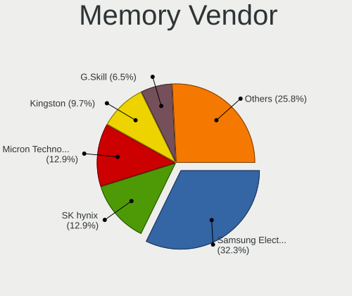

| Vendor              | Notebooks | Percent |
|---------------------|-----------|---------|
| Samsung Electronics | 10        | 32.26%  |
| SK hynix            | 4         | 12.9%   |
| Micron Technology   | 4         | 12.9%   |
| Kingston            | 3         | 9.68%   |
| G.Skill             | 2         | 6.45%   |
| Corsair             | 2         | 6.45%   |
| Team                | 1         | 3.23%   |
| PNY                 | 1         | 3.23%   |
| KLEVV               | 1         | 3.23%   |
| Elpida              | 1         | 3.23%   |
| Crucial             | 1         | 3.23%   |
| Unknown             | 1         | 3.23%   |

Memory Model
------------

Memory module models

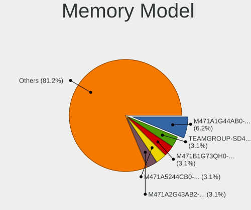

| Model                                                           | Notebooks | Percent |
|-----------------------------------------------------------------|-----------|---------|
| Samsung RAM M471A1G44AB0-CWE 8GiB SODIMM DDR4 3200MT/s          | 2         | 6.25%   |
| Team RAM TEAMGROUP-SD4-3200 16GB SODIMM DDR4 3200MT/s           | 1         | 3.13%   |
| SK hynix RAM HMAA1GS6CJR6N-XN 8GB Row Of Chips DDR4 3200MT/s    | 1         | 3.13%   |
| SK hynix RAM HMA851S6CJR6N-VK 4GB Row Of Chips DDR4 2667MT/s    | 1         | 3.13%   |
| SK hynix RAM HMA81GS6CJR8N-VK 8GB SODIMM DDR4 2667MT/s          | 1         | 3.13%   |
| SK hynix RAM H9JKNNNFB3AECR-N6H 4GB LPDDR5 6400MT/s             | 1         | 3.13%   |
| Samsung RAM M471B1G73QH0-YK0 8GB SODIMM DDR3 1600MT/s           | 1         | 3.13%   |
| Samsung RAM M471A5244CB0-CWE 4GB SODIMM DDR4 3200MT/s           | 1         | 3.13%   |
| Samsung RAM M471A2G43AB2-CWE 16GB SODIMM DDR4 3200MT/s          | 1         | 3.13%   |
| Samsung RAM M471A1K43EB1-CWE 8GB SODIMM DDR4 3200MT/s           | 1         | 3.13%   |
| Samsung RAM M471A1K43DB1-CWE 8GB SODIMM DDR4 3200MT/s           | 1         | 3.13%   |
| Samsung RAM M471A1K43CB1-CTD 8GB SODIMM DDR4 3200MT/s           | 1         | 3.13%   |
| Samsung RAM M425R1GB4BB0-CQKOL 8GB SODIMM DDR5 4800MT/s         | 1         | 3.13%   |
| Samsung RAM M425R1GB4BB0-CQKOD 8GB SODIMM DDR5 4800MT/s         | 1         | 3.13%   |
| Samsung RAM H9CCNNNBJTMLAR-NUD 4GB Row Of Chips LPDDR3 1867MT/s | 1         | 3.13%   |
| PNY RAM 16GU1X16LIII43-12-K 16GB SODIMM DDR4 2667MT/s           | 1         | 3.13%   |
| Micron RAM MTC4C10163S1SC48BA1 8GB SODIMM DDR5 4800MT/s         | 1         | 3.13%   |
| Micron RAM MT62F2G32D4DS-026 WT 8GiB SODIMM LPDDR5 7500MT/s     | 1         | 3.13%   |
| Micron RAM MT62F2G32D4DS-023 WT 8GB SODIMM LPDDR5 8000MT/s      | 1         | 3.13%   |
| Micron RAM CT16G56C46S5.M8G1 16GB SODIMM DDR5 5600MT/s          | 1         | 3.13%   |
| KLEVV RAM KD48GU880-32A160U 8GB DIMM DDR4 3800MT/s              | 1         | 3.13%   |
| Kingston RAM KF560C30-32 32GB DIMM DDR5 6000MT/s                | 1         | 3.13%   |
| Kingston RAM KF560C30-16 16GB DIMM DDR5 6000MT/s                | 1         | 3.13%   |
| Kingston RAM KF432S20IB2/8 8GB SODIMM DDR4 3200MT/s             | 1         | 3.13%   |
| G.Skill RAM F4-3200C16-16GVK 16GB DIMM DDR4 3600MT/s            | 1         | 3.13%   |
| G.Skill RAM F3-1600C11-8GSL 8GB SODIMM DDR3 1600MT/s            | 1         | 3.13%   |
| Elpida RAM Module 4GB SODIMM DDR3 1600MT/s                      | 1         | 3.13%   |
| Crucial RAM CT16G56C46S5.M8B2 16GB SODIMM DDR5 5600MT/s         | 1         | 3.13%   |
| Corsair RAM CMSX32GX4M2A3200C22 16GB SODIMM DDR4 3200MT/s       | 1         | 3.13%   |
| Corsair RAM CMH32GX5M2E6000Z36 16GB DIMM DDR5 6000MT/s          | 1         | 3.13%   |
| Unknown                                                         | 1         | 3.13%   |

Memory Kind
-----------

Memory module kinds

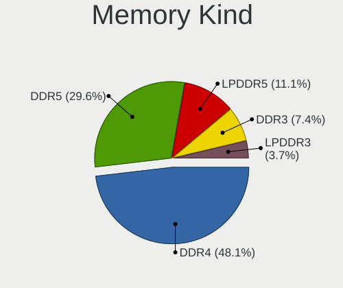

| Kind   | Notebooks | Percent |
|--------|-----------|---------|
| DDR4   | 13        | 48.15%  |
| DDR5   | 8         | 29.63%  |
| LPDDR5 | 3         | 11.11%  |
| DDR3   | 2         | 7.41%   |
| LPDDR3 | 1         | 3.7%    |

Memory Form Factor
------------------

Physical design of the memory module

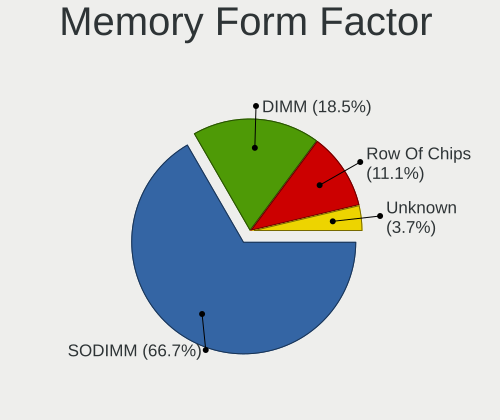

| Name         | Notebooks | Percent |
|--------------|-----------|---------|
| SODIMM       | 18        | 66.67%  |
| DIMM         | 5         | 18.52%  |
| Row Of Chips | 3         | 11.11%  |
| Unknown      | 1         | 3.7%    |

Memory Size
-----------

Memory module size

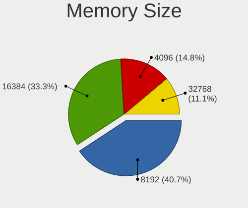

| Size  | Notebooks | Percent |
|-------|-----------|---------|
| 8192  | 11        | 40.74%  |
| 16384 | 9         | 33.33%  |
| 4096  | 4         | 14.81%  |
| 32768 | 3         | 11.11%  |

Memory Speed
------------

Memory module speed

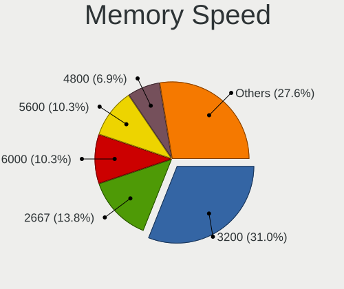

| Speed | Notebooks | Percent |
|-------|-----------|---------|
| 3200  | 9         | 31.03%  |
| 2667  | 4         | 13.79%  |
| 6000  | 3         | 10.34%  |
| 5600  | 3         | 10.34%  |
| 4800  | 2         | 6.9%    |
| 1600  | 2         | 6.9%    |
| 8000  | 1         | 3.45%   |
| 7500  | 1         | 3.45%   |
| 6400  | 1         | 3.45%   |
| 3800  | 1         | 3.45%   |
| 3600  | 1         | 3.45%   |
| 1867  | 1         | 3.45%   |

Printers & scanners
-------------------

Printer Vendor
--------------

Printer device vendors

Zero info for selected period =(

Printer Model
-------------

Printer device models

Zero info for selected period =(

Scanner Vendor
--------------

Scanner device vendors

Zero info for selected period =(

Scanner Model
-------------

Scanner device models

Zero info for selected period =(

Camera
------

Camera Vendor
-------------

Camera device vendors

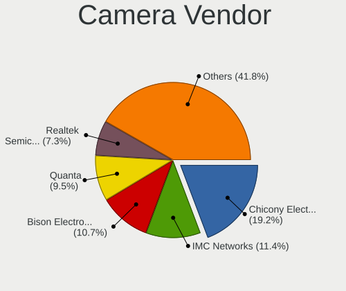

| Vendor                                 | Notebooks | Percent |
|----------------------------------------|-----------|---------|
| Chicony Electronics                    | 111       | 19.24%  |
| IMC Networks                           | 66        | 11.44%  |
| Bison Electronics                      | 62        | 10.75%  |
| Quanta                                 | 55        | 9.53%   |
| Realtek Semiconductor                  | 42        | 7.28%   |
| Microdia                               | 38        | 6.59%   |
| Luxvisions Innotech Limited            | 34        | 5.89%   |
| Sunplus Innovation Technology          | 24        | 4.16%   |
| Sonix Technology                       | 23        | 3.99%   |
| ShineTech                              | 14        | 2.43%   |
| Apple                                  | 14        | 2.43%   |
| Logitech                               | 12        | 2.08%   |
| Syntek                                 | 10        | 1.73%   |
| Cheng Uei Precision Industry (Foxlink) | 10        | 1.73%   |
| Lite-On Technology                     | 9         | 1.56%   |
| Suyin                                  | 8         | 1.39%   |
| Shine-optics                           | 7         | 1.21%   |
| Samsung Electronics                    | 5         | 0.87%   |
| Framework                              | 5         | 0.87%   |
| Silicon Motion                         | 4         | 0.69%   |
| Valve Software                         | 2         | 0.35%   |
| kingcome                               | 2         | 0.35%   |
| Goodong                                | 2         | 0.35%   |
| Unknown                                | 2         | 0.35%   |
| webcamvendor                           | 1         | 0.17%   |
| Tripath Technology                     | 1         | 0.17%   |
| SunplusIT                              | 1         | 0.17%   |
| Ricoh                                  | 1         | 0.17%   |
| Razer USA                              | 1         | 0.17%   |
| Owon                                   | 1         | 0.17%   |
| Motorola PCS                           | 1         | 0.17%   |
| MacroSilicon                           | 1         | 0.17%   |
| Jieli Technology                       | 1         | 0.17%   |
| icSpring                               | 1         | 0.17%   |
| HYGD-221208-J                          | 1         | 0.17%   |
| Hopewin Electronic Material            | 1         | 0.17%   |
| Foxlink                                | 1         | 0.17%   |
| Elgato Systems                         | 1         | 0.17%   |
| Alcor Micro                            | 1         | 0.17%   |
| Acer                                   | 1         | 0.17%   |

Camera Model
------------

Camera device models

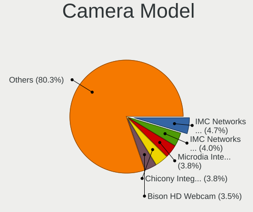

| Model                                                 | Notebooks | Percent |
|-------------------------------------------------------|-----------|---------|
| IMC Networks USB2.0 HD UVC WebCam                     | 27        | 4.67%   |
| IMC Networks Integrated Camera                        | 23        | 3.98%   |
| Microdia Integrated_Webcam_HD                         | 22        | 3.81%   |
| Chicony Integrated Camera                             | 22        | 3.81%   |
| Bison HD Webcam                                       | 20        | 3.46%   |
| Quanta HD User Facing                                 | 19        | 3.29%   |
| Sonix USB2.0 HD UVC WebCam                            | 18        | 3.11%   |
| Bison Integrated Camera                               | 17        | 2.94%   |
| Realtek Integrated_Webcam_HD                          | 12        | 2.08%   |
| Luxvisions Innotech Limited Integrated Camera         | 12        | 2.08%   |
| Sunplus Integrated_Webcam_HD                          | 10        | 1.73%   |
| Chicony HD User Facing                                | 10        | 1.73%   |
| Chicony Chicony USB2.0 Camera                         | 10        | 1.73%   |
| ShineTech USB2.0 HD UVC WebCam                        | 8         | 1.38%   |
| Realtek Integrated_Webcam_FHD                         | 8         | 1.38%   |
| Quanta HD Webcam                                      | 8         | 1.38%   |
| Luxvisions Innotech Limited HP Wide Vision HD Camera  | 8         | 1.38%   |
| Shine-optics USB2.0 HD UVC WebCam                     | 7         | 1.21%   |
| Chicony HP Wide Vision HD Camera                      | 7         | 1.21%   |
| Chicony HD WebCam                                     | 7         | 1.21%   |
| Quanta HP Wide Vision HD Camera                       | 6         | 1.04%   |
| Quanta HP TrueVision HD Camera                        | 6         | 1.04%   |
| Bison FHD Camera                                      | 6         | 1.04%   |
| Syntek Integrated Camera                              | 5         | 0.87%   |
| Samsung Galaxy series, misc. (MTP mode)               | 5         | 0.87%   |
| Realtek Laptop Camera                                 | 5         | 0.87%   |
| Logitech BRIO Ultra HD Webcam                         | 5         | 0.87%   |
| Framework Laptop Webcam Module (2nd Gen)              | 5         | 0.87%   |
| Chicony USB2.0 HD UVC WebCam                          | 5         | 0.87%   |
| Chicony TOSHIBA Web Camera - HD                       | 5         | 0.87%   |
| Chicony HP HD Camera                                  | 5         | 0.87%   |
| Apple iPhone 5/5C/5S/6/SE/7/8/X                       | 5         | 0.87%   |
| Syntek Lenovo EasyCamera                              | 4         | 0.69%   |
| Sunplus Asus Webcam                                   | 4         | 0.69%   |
| Sonix USB2.0 FHD UVC WebCam                           | 4         | 0.69%   |
| Shinetech USB2.0 FHD UVC WebCam                       | 4         | 0.69%   |
| Quanta VGA WebCam                                     | 4         | 0.69%   |
| Quanta ACER HD User Facing                            | 4         | 0.69%   |
| Luxvisions Innotech Limited HP TrueVision HD Camera   | 4         | 0.69%   |
| Luxvisions Innotech Limited HP True Vision FHD Camera | 4         | 0.69%   |

Security
--------

Fingerprint Vendor
------------------

Fingerprint sensor vendors

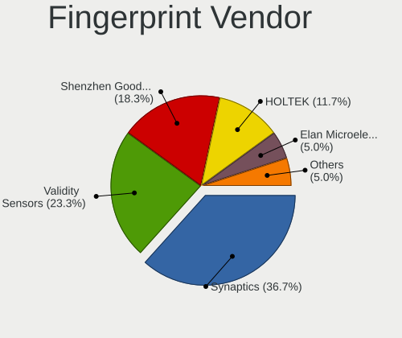

| Vendor                     | Notebooks | Percent |
|----------------------------|-----------|---------|
| Synaptics                  | 22        | 36.67%  |
| Validity Sensors           | 14        | 23.33%  |
| Shenzhen Goodix Technology | 11        | 18.33%  |
| HOLTEK                     | 7         | 11.67%  |
| Elan Microelectronics      | 3         | 5%      |
| LighTuning Technology      | 2         | 3.33%   |
| Upek                       | 1         | 1.67%   |

Fingerprint Model
-----------------

Fingerprint sensor models

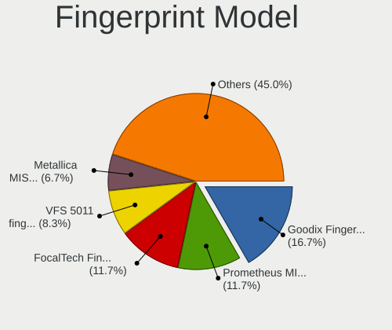

| Model                                                                      | Notebooks | Percent |
|----------------------------------------------------------------------------|-----------|---------|
| Shenzhen Goodix  FingerPrint Device                                        | 10        | 16.67%  |
| Synaptics Prometheus MIS Touch Fingerprint Reader                          | 7         | 11.67%  |
| HOLTEK FocalTech Fingerprint Device                                        | 7         | 11.67%  |
| Validity Sensors VFS 5011 fingerprint sensor                               | 5         | 8.33%   |
| Synaptics Metallica MIS Touch Fingerprint Reader                           | 4         | 6.67%   |
| Validity Sensors VFS495 Fingerprint Reader                                 | 3         | 5%      |
| Synaptics  FS7604 Touch Fingerprint Sensor with PurePrint                  | 3         | 5%      |
| Validity Sensors Synaptics VFS7552 Touch Fingerprint Sensor with PurePrint | 2         | 3.33%   |
| Validity Sensors Swipe Fingerprint Sensor                                  | 2         | 3.33%   |
| Synaptics WBDI Device                                                      | 2         | 3.33%   |
| Synaptics Fingerprint reader [HP G6]                                       | 2         | 3.33%   |
| Elan ELAN:Fingerprint                                                      | 2         | 3.33%   |
| Validity Sensors VFS5011 Fingerprint Reader                                | 1         | 1.67%   |
| Validity Sensors Synaptics WBDI                                            | 1         | 1.67%   |
| Upek Biometric Touchchip/Touchstrip Fingerprint Sensor                     | 1         | 1.67%   |
| Synaptics WBDI Fingerprint Reader USB 086                                  | 1         | 1.67%   |
| Synaptics UWP WBDI Device                                                  | 1         | 1.67%   |
| Synaptics  WBDI Fingerprint Reader - USB 052                               | 1         | 1.67%   |
| Synaptics FS7604 Touch Fingerprint Sensor with PurePrint                   | 1         | 1.67%   |
| Shenzhen Goodix FingerPrint                                                | 1         | 1.67%   |
| LighTuning Fingerprint Reader                                              | 1         | 1.67%   |
| LighTuning ES603 Swipe Fingerprint Sensor                                  | 1         | 1.67%   |
| Elan ELAN:ARM-M4                                                           | 1         | 1.67%   |

Chipcard Vendor
---------------

Chipcard module vendors

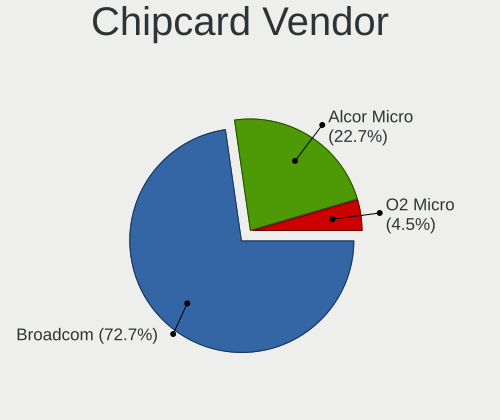

| Vendor      | Notebooks | Percent |
|-------------|-----------|---------|
| Broadcom    | 16        | 72.73%  |
| Alcor Micro | 5         | 22.73%  |
| O2 Micro    | 1         | 4.55%   |

Chipcard Model
--------------

Chipcard module models

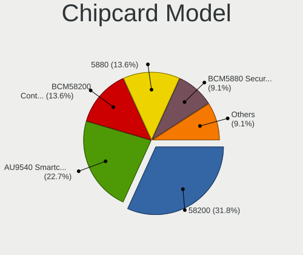

| Model                                                                        | Notebooks | Percent |
|------------------------------------------------------------------------------|-----------|---------|
| Broadcom 58200                                                               | 7         | 31.82%  |
| Alcor Micro AU9540 Smartcard Reader                                          | 5         | 22.73%  |
| Broadcom BCM58200 ControlVault 3 (FingerPrint sensor + Contacted SmartCard)  | 3         | 13.64%  |
| Broadcom 5880                                                                | 3         | 13.64%  |
| Broadcom BCM5880 Secure Applications Processor with fingerprint swipe sensor | 2         | 9.09%   |
| O2 Micro OZ776 CCID Smartcard Reader                                         | 1         | 4.55%   |
| Broadcom BCM5880 Secure Applications Processor                               | 1         | 4.55%   |

Unsupported
-----------

Unsupported Devices
-------------------

Total unsupported devices on board

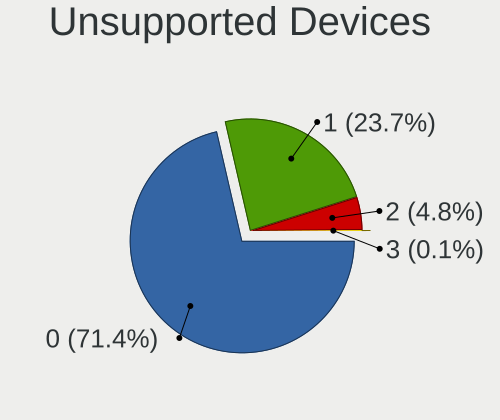

| Total | Notebooks | Percent |
|-------|-----------|---------|
| 0     | 539       | 71.39%  |
| 1     | 179       | 23.71%  |
| 2     | 36        | 4.77%   |
| 3     | 1         | 0.13%   |

Unsupported Device Types
------------------------

Types of unsupported devices

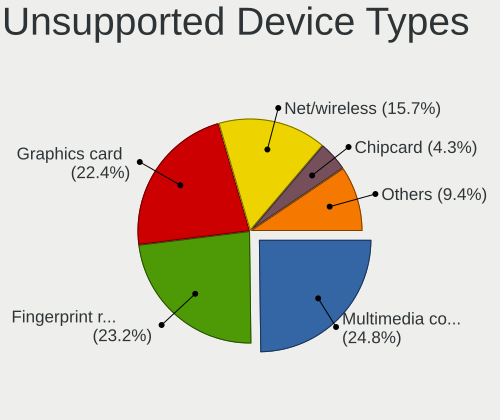

| Type                     | Notebooks | Percent |
|--------------------------|-----------|---------|
| Multimedia controller    | 63        | 24.8%   |
| Fingerprint reader       | 59        | 23.23%  |
| Graphics card            | 57        | 22.44%  |
| Net/wireless             | 40        | 15.75%  |
| Chipcard                 | 11        | 4.33%   |
| Sound                    | 4         | 1.57%   |
| Bluetooth                | 4         | 1.57%   |
| Modem                    | 3         | 1.18%   |
| Communication controller | 3         | 1.18%   |
| Card reader              | 3         | 1.18%   |
| Camera                   | 3         | 1.18%   |
| Net/ethernet             | 2         | 0.79%   |
| Unassigned class         | 1         | 0.39%   |
| Storage/raid             | 1         | 0.39%   |

