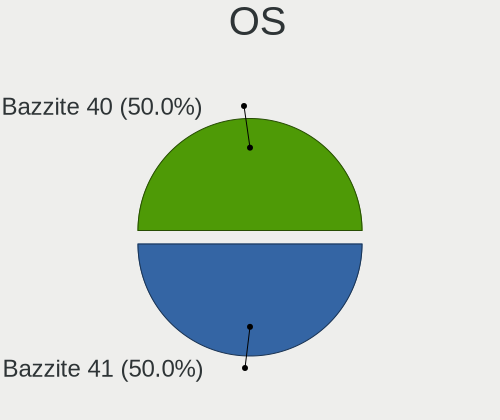
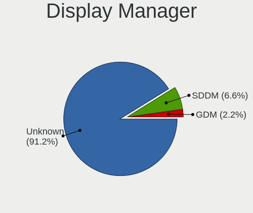
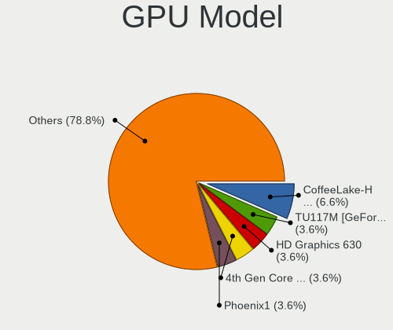
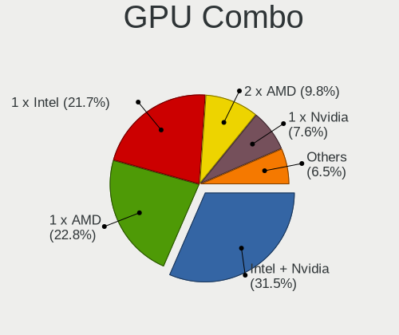
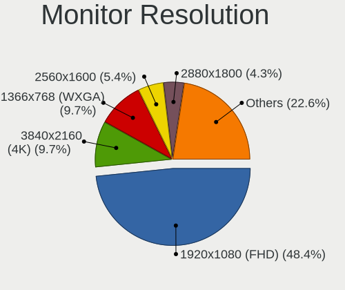

Bazzite - Tested Hardware & Statistics (Notebooks)
--------------------------------------------------

A project to collect tested hardware configurations for Bazzite.

Anyone can contribute to this report by the [hw-probe](https://github.com/linuxhw/hw-probe) tool:

    sudo -E hw-probe -all -upload

Please contribute! Especially if your hardware is rare.

Contents
--------

* [ Test Cases ](#test-cases)

* [ System ](#system)
  - [ OS                       ](#os)
  - [ OS Family                ](#os-family)
  - [ Kernel                   ](#kernel)
  - [ Kernel Family            ](#kernel-family)
  - [ Kernel Major Ver.        ](#kernel-major-ver)
  - [ Arch                     ](#arch)
  - [ DE                       ](#de)
  - [ Display Server           ](#display-server)
  - [ Display Manager          ](#display-manager)
  - [ OS Lang                  ](#os-lang)
  - [ Boot Mode                ](#boot-mode)
  - [ Filesystem               ](#filesystem)
  - [ Part. scheme             ](#part-scheme)
  - [ Dual Boot with Linux/BSD ](#dual-boot-with-linuxbsd)
  - [ Dual Boot (Win)          ](#dual-boot-win)

* [ Board ](#board)
  - [ Vendor                   ](#vendor)
  - [ Model                    ](#model)
  - [ Model Family             ](#model-family)
  - [ MFG Year                 ](#mfg-year)
  - [ Form Factor              ](#form-factor)
  - [ Secure Boot              ](#secure-boot)
  - [ Coreboot                 ](#coreboot)
  - [ RAM Size                 ](#ram-size)
  - [ RAM Used                 ](#ram-used)
  - [ Total Drives             ](#total-drives)
  - [ Has CD-ROM               ](#has-cd-rom)
  - [ Has Ethernet             ](#has-ethernet)
  - [ Has WiFi                 ](#has-wifi)
  - [ Has Bluetooth            ](#has-bluetooth)

* [ Location ](#location)
  - [ Country                  ](#country)
  - [ City                     ](#city)

* [ Drives ](#drives)
  - [ Drive Vendor             ](#drive-vendor)
  - [ Drive Model              ](#drive-model)
  - [ HDD Vendor               ](#hdd-vendor)
  - [ SSD Vendor               ](#ssd-vendor)
  - [ Drive Kind               ](#drive-kind)
  - [ Drive Connector          ](#drive-connector)
  - [ Drive Size               ](#drive-size)
  - [ Space Total              ](#space-total)
  - [ Space Used               ](#space-used)
  - [ Malfunc. Drives          ](#malfunc-drives)
  - [ Malfunc. Drive Vendor    ](#malfunc-drive-vendor)
  - [ Malfunc. HDD Vendor      ](#malfunc-hdd-vendor)
  - [ Malfunc. Drive Kind      ](#malfunc-drive-kind)
  - [ Failed Drives            ](#failed-drives)
  - [ Failed Drive Vendor      ](#failed-drive-vendor)
  - [ Drive Status             ](#drive-status)

* [ Storage controller ](#storage-controller)
  - [ Storage Vendor           ](#storage-vendor)
  - [ Storage Model            ](#storage-model)
  - [ Storage Kind             ](#storage-kind)

* [ Processor ](#processor)
  - [ CPU Vendor               ](#cpu-vendor)
  - [ CPU Model                ](#cpu-model)
  - [ CPU Model Family         ](#cpu-model-family)
  - [ CPU Cores                ](#cpu-cores)
  - [ CPU Sockets              ](#cpu-sockets)
  - [ CPU Threads              ](#cpu-threads)
  - [ CPU Op-Modes             ](#cpu-op-modes)
  - [ CPU Microcode            ](#cpu-microcode)
  - [ CPU Microarch            ](#cpu-microarch)

* [ Graphics ](#graphics)
  - [ GPU Vendor               ](#gpu-vendor)
  - [ GPU Model                ](#gpu-model)
  - [ GPU Combo                ](#gpu-combo)
  - [ GPU Driver               ](#gpu-driver)
  - [ GPU Memory               ](#gpu-memory)

* [ Monitor ](#monitor)
  - [ Monitor Vendor           ](#monitor-vendor)
  - [ Monitor Model            ](#monitor-model)
  - [ Monitor Resolution       ](#monitor-resolution)
  - [ Monitor Diagonal         ](#monitor-diagonal)
  - [ Monitor Width            ](#monitor-width)
  - [ Aspect Ratio             ](#aspect-ratio)
  - [ Monitor Area             ](#monitor-area)
  - [ Pixel Density            ](#pixel-density)
  - [ Multiple Monitors        ](#multiple-monitors)

* [ Network ](#network)
  - [ Net Controller Vendor    ](#net-controller-vendor)
  - [ Net Controller Model     ](#net-controller-model)
  - [ Wireless Vendor          ](#wireless-vendor)
  - [ Wireless Model           ](#wireless-model)
  - [ Ethernet Vendor          ](#ethernet-vendor)
  - [ Ethernet Model           ](#ethernet-model)
  - [ Net Controller Kind      ](#net-controller-kind)
  - [ Used Controller          ](#used-controller)
  - [ NICs                     ](#nics)
  - [ IPv6                     ](#ipv6)

* [ Bluetooth ](#bluetooth)
  - [ Bluetooth Vendor         ](#bluetooth-vendor)
  - [ Bluetooth Model          ](#bluetooth-model)

* [ Sound ](#sound)
  - [ Sound Vendor             ](#sound-vendor)
  - [ Sound Model              ](#sound-model)

* [ Memory ](#memory)
  - [ Memory Vendor            ](#memory-vendor)
  - [ Memory Model             ](#memory-model)
  - [ Memory Kind              ](#memory-kind)
  - [ Memory Form Factor       ](#memory-form-factor)
  - [ Memory Size              ](#memory-size)
  - [ Memory Speed             ](#memory-speed)

* [ Printers & scanners ](#printers--scanners)
  - [ Printer Vendor           ](#printer-vendor)
  - [ Printer Model            ](#printer-model)
  - [ Scanner Vendor           ](#scanner-vendor)
  - [ Scanner Model            ](#scanner-model)

* [ Camera ](#camera)
  - [ Camera Vendor            ](#camera-vendor)
  - [ Camera Model             ](#camera-model)

* [ Security ](#security)
  - [ Fingerprint Vendor       ](#fingerprint-vendor)
  - [ Fingerprint Model        ](#fingerprint-model)
  - [ Chipcard Vendor          ](#chipcard-vendor)
  - [ Chipcard Model           ](#chipcard-model)

* [ Unsupported ](#unsupported)
  - [ Unsupported Devices      ](#unsupported-devices)
  - [ Unsupported Device Types ](#unsupported-device-types)

Test Cases
----------

Total: 115

| Vendor        | Model                       | Probe                                                      | Date         |
|---------------|-----------------------------|------------------------------------------------------------|--------------|
| Acer          | Predator PH315-52           | [1ae33fb974](https://linux-hardware.org/?probe=1ae33fb974) | Jan 06, 2025 |
| HP            | Pavilion Gaming Laptop 1... | [cc86c7e5c1](https://linux-hardware.org/?probe=cc86c7e5c1) | Jan 05, 2025 |
| ASUSTek       | ASUS TUF Gaming A16 FA61... | [b4fcbcaf8c](https://linux-hardware.org/?probe=b4fcbcaf8c) | Jan 05, 2025 |
| HP            | Pavilion Gaming Laptop 1... | [5b3ef34113](https://linux-hardware.org/?probe=5b3ef34113) | Jan 04, 2025 |
| AZW           | SER                         | [487845b4a5](https://linux-hardware.org/?probe=487845b4a5) | Jan 04, 2025 |
| Apple         | MacBookPro11,3              | [5dcd5abfd5](https://linux-hardware.org/?probe=5dcd5abfd5) | Jan 02, 2025 |
| Apple         | MacBookPro11,3              | [29c6fca19b](https://linux-hardware.org/?probe=29c6fca19b) | Jan 01, 2025 |
| Intel Clie... | LAPAC71G                    | [7554635159](https://linux-hardware.org/?probe=7554635159) | Dec 31, 2024 |
| GPD           | G1618-04                    | [6e61e63b98](https://linux-hardware.org/?probe=6e61e63b98) | Dec 30, 2024 |
| Unknown       | Unknown                     | [fae2f8fa52](https://linux-hardware.org/?probe=fae2f8fa52) | Dec 30, 2024 |
| Lenovo        | Legion 5 15IAH7H 82TB       | [37b8fbc02a](https://linux-hardware.org/?probe=37b8fbc02a) | Dec 29, 2024 |
| Dell          | Precision M6800             | [b805a2c527](https://linux-hardware.org/?probe=b805a2c527) | Dec 26, 2024 |
| Apple         | MacBookPro14,3              | [a6f60e20a6](https://linux-hardware.org/?probe=a6f60e20a6) | Dec 26, 2024 |
| HP            | Laptop 15-ef2xxx            | [f0daa10869](https://linux-hardware.org/?probe=f0daa10869) | Dec 24, 2024 |
| HP            | ZBook 15u G5                | [639f1b214f](https://linux-hardware.org/?probe=639f1b214f) | Dec 24, 2024 |
| Fujitsu       | LIFEBOOK S751               | [54be502c46](https://linux-hardware.org/?probe=54be502c46) | Dec 19, 2024 |
| MSI           | PE60 6QE                    | [ef19c85fc9](https://linux-hardware.org/?probe=ef19c85fc9) | Dec 19, 2024 |
| Gigabyte      | G5 KF                       | [0de16a6384](https://linux-hardware.org/?probe=0de16a6384) | Dec 18, 2024 |
| Gigabyte      | Z390 GAMING X-CF            | [c43094abf1](https://linux-hardware.org/?probe=c43094abf1) | Dec 14, 2024 |
| Apple         | MacBookPro14,3              | [f70dc4d24b](https://linux-hardware.org/?probe=f70dc4d24b) | Dec 11, 2024 |
| Lenovo        | ThinkPad T490 20N3S44S00    | [7ae78aa783](https://linux-hardware.org/?probe=7ae78aa783) | Dec 11, 2024 |
| HP            | OMEN by Laptop 15-ce0xx     | [aae09c5d04](https://linux-hardware.org/?probe=aae09c5d04) | Dec 10, 2024 |
| Acer          | Aspire A315-41G             | [36adcc0875](https://linux-hardware.org/?probe=36adcc0875) | Dec 10, 2024 |
| HP            | Victus by Laptop 16-d1xx... | [cc10982e52](https://linux-hardware.org/?probe=cc10982e52) | Dec 08, 2024 |
| MSI           | GE75 Raider 9SG             | [cafb130468](https://linux-hardware.org/?probe=cafb130468) | Dec 07, 2024 |
| ASUSTek       | ASUS TUF Gaming F15 FX50... | [659017d09e](https://linux-hardware.org/?probe=659017d09e) | Dec 06, 2024 |
| ASUSTek       | ASUS TUF Gaming A16 FA61... | [d2e306413d](https://linux-hardware.org/?probe=d2e306413d) | Dec 05, 2024 |
| Unknown       | Unknown                     | [44923fb27f](https://linux-hardware.org/?probe=44923fb27f) | Dec 05, 2024 |
| ASUSTek       | GL552VW                     | [d0611dd371](https://linux-hardware.org/?probe=d0611dd371) | Dec 04, 2024 |
| ASUSTek       | GL552VW                     | [4d38c63e3d](https://linux-hardware.org/?probe=4d38c63e3d) | Dec 02, 2024 |
| ASUSTek       | VivoBook_ASUSLaptop X140... | [a917f1290b](https://linux-hardware.org/?probe=a917f1290b) | Dec 02, 2024 |
| ASUSTek       | VivoBook_ASUSLaptop X140... | [e664d989d6](https://linux-hardware.org/?probe=e664d989d6) | Dec 02, 2024 |
| Dell          | Precision M4800             | [adfb2cc705](https://linux-hardware.org/?probe=adfb2cc705) | Nov 29, 2024 |
| Gigabyte      | G5 MD                       | [4e38533c6a](https://linux-hardware.org/?probe=4e38533c6a) | Nov 29, 2024 |
| Gigabyte      | G5 MD                       | [b8cce303ed](https://linux-hardware.org/?probe=b8cce303ed) | Nov 29, 2024 |
| Razer         | Blade Stealth               | [09410e6f1e](https://linux-hardware.org/?probe=09410e6f1e) | Nov 29, 2024 |
| MSI           | Raider GE68HX 13VF          | [54973d8065](https://linux-hardware.org/?probe=54973d8065) | Nov 27, 2024 |
| Apple         | MacBookPro11,3              | [ac4e787ec6](https://linux-hardware.org/?probe=ac4e787ec6) | Nov 26, 2024 |
| Intel         | X99                         | [345df95f7d](https://linux-hardware.org/?probe=345df95f7d) | Nov 25, 2024 |
| ONE-NETBOO... | ONEXPLAYER X1 A             | [e7d1e0404d](https://linux-hardware.org/?probe=e7d1e0404d) | Nov 22, 2024 |
| Lenovo        | ThinkPad T490 20N3S44S00    | [910ea8b0d3](https://linux-hardware.org/?probe=910ea8b0d3) | Nov 21, 2024 |
| MSI           | GF63 Thin 10SCXR            | [9527d021b8](https://linux-hardware.org/?probe=9527d021b8) | Nov 21, 2024 |
| HP            | Pavilion Power Laptop 15... | [a70d00a5f5](https://linux-hardware.org/?probe=a70d00a5f5) | Nov 21, 2024 |
| Dell          | 0WMJ54 A01                  | [2a65e3fda2](https://linux-hardware.org/?probe=2a65e3fda2) | Nov 19, 2024 |
| Lenovo        | IdeaPad 5 15ARE05 81YQ      | [6a69e8dd2b](https://linux-hardware.org/?probe=6a69e8dd2b) | Nov 14, 2024 |
| HP            | ProBook 6475b               | [808603ce16](https://linux-hardware.org/?probe=808603ce16) | Nov 13, 2024 |
| MSI           | GS60 2QE                    | [f6cceaf60f](https://linux-hardware.org/?probe=f6cceaf60f) | Nov 11, 2024 |
| Razer         | Blade Stealth               | [d347bbae71](https://linux-hardware.org/?probe=d347bbae71) | Nov 08, 2024 |
| ASUSTek       | N53SN                       | [bc6d6d125f](https://linux-hardware.org/?probe=bc6d6d125f) | Nov 08, 2024 |
| Razer         | Blade Stealth               | [b313a5e91b](https://linux-hardware.org/?probe=b313a5e91b) | Nov 07, 2024 |
| ASRock        | A620I Lightning WiFi        | [8d69129552](https://linux-hardware.org/?probe=8d69129552) | Nov 04, 2024 |
| HP            | Laptop 15-bs2xx             | [2639cc8f27](https://linux-hardware.org/?probe=2639cc8f27) | Nov 04, 2024 |
| GEEKOM        | A8                          | [0c71662747](https://linux-hardware.org/?probe=0c71662747) | Nov 02, 2024 |
| GEEKOM        | A8                          | [68e6597e28](https://linux-hardware.org/?probe=68e6597e28) | Nov 01, 2024 |
| Lenovo        | ThinkPad X220 429136G       | [83c95a2454](https://linux-hardware.org/?probe=83c95a2454) | Oct 26, 2024 |
| MSI           | MPG X570 GAMING EDGE WIF... | [7468eead65](https://linux-hardware.org/?probe=7468eead65) | Oct 24, 2024 |
| Alienware     | m17 R5 AMD                  | [2d1575e400](https://linux-hardware.org/?probe=2d1575e400) | Oct 23, 2024 |
| MSI           | MPG X570 GAMING EDGE WIF... | [6ecd5007e0](https://linux-hardware.org/?probe=6ecd5007e0) | Oct 19, 2024 |
| ASUSTek       | TUF Gaming B650-PLUS WIF... | [c0db693df2](https://linux-hardware.org/?probe=c0db693df2) | Oct 17, 2024 |
| ASUSTek       | TUF Gaming B650-PLUS WIF... | [9b96b8b957](https://linux-hardware.org/?probe=9b96b8b957) | Oct 17, 2024 |
| GPD           | G1618-03                    | [aa5b8d66ab](https://linux-hardware.org/?probe=aa5b8d66ab) | Oct 16, 2024 |
| HP            | 255 G7 Notebook PC          | [897729987c](https://linux-hardware.org/?probe=897729987c) | Oct 15, 2024 |
| ASRock        | X570 Taichi                 | [37085cd851](https://linux-hardware.org/?probe=37085cd851) | Oct 14, 2024 |
| HP            | 255 G7 Notebook PC          | [0ac52f67b8](https://linux-hardware.org/?probe=0ac52f67b8) | Oct 11, 2024 |
| GPD           | G1619-01                    | [fe3fdb0240](https://linux-hardware.org/?probe=fe3fdb0240) | Oct 10, 2024 |
| Google        | Atlas                       | [86f42628c5](https://linux-hardware.org/?probe=86f42628c5) | Oct 09, 2024 |
| Google        | Atlas                       | [3816e06fdc](https://linux-hardware.org/?probe=3816e06fdc) | Oct 09, 2024 |
| ASUSTek       | X553MA                      | [ab3ca83e3c](https://linux-hardware.org/?probe=ab3ca83e3c) | Oct 01, 2024 |
| Lenovo        | ThinkPad E14 Gen 4 21E30... | [f497c7ae2d](https://linux-hardware.org/?probe=f497c7ae2d) | Sep 30, 2024 |
| ASUSTek       | ROG Zephyrus G14 GA402XV... | [136fcc0a23](https://linux-hardware.org/?probe=136fcc0a23) | Sep 30, 2024 |
| Framework     | Laptop 16 (AMD Ryzen 704... | [ed4eaaf121](https://linux-hardware.org/?probe=ed4eaaf121) | Sep 29, 2024 |
| Framework     | Laptop 16 (AMD Ryzen 704... | [44ffa4ec45](https://linux-hardware.org/?probe=44ffa4ec45) | Sep 29, 2024 |
| Lenovo        | IdeaPad 320-15IKB 81BG      | [eed7d93749](https://linux-hardware.org/?probe=eed7d93749) | Sep 26, 2024 |
| Framework     | Laptop 16 (AMD Ryzen 704... | [930b934980](https://linux-hardware.org/?probe=930b934980) | Sep 26, 2024 |
| Lenovo        | IdeaPad 320-15IKB 81BG      | [3dc1653a8b](https://linux-hardware.org/?probe=3dc1653a8b) | Sep 25, 2024 |
| ASUSTek       | UX305LA                     | [a3474a4b07](https://linux-hardware.org/?probe=a3474a4b07) | Sep 21, 2024 |
| GPD           | G1618-03                    | [274d171564](https://linux-hardware.org/?probe=274d171564) | Sep 20, 2024 |
| GPD           | G1618-03                    | [5657e76daf](https://linux-hardware.org/?probe=5657e76daf) | Sep 18, 2024 |
| MSI           | GT72VR 7RD                  | [2a5a3fd32e](https://linux-hardware.org/?probe=2a5a3fd32e) | Sep 16, 2024 |
| ONE-NETBOO... | ONE XPLAYER 1002-C          | [ba4a0a5792](https://linux-hardware.org/?probe=ba4a0a5792) | Sep 12, 2024 |
| ASUSTek       | SABERTOOTH Z170 MARK 1      | [5c8fb2d196](https://linux-hardware.org/?probe=5c8fb2d196) | Sep 11, 2024 |
| ASUSTek       | ASUS TUF Gaming A16 FA61... | [d59b8174e2](https://linux-hardware.org/?probe=d59b8174e2) | Sep 10, 2024 |
| Unknown       | Unknown                     | [a628595aaa](https://linux-hardware.org/?probe=a628595aaa) | Sep 04, 2024 |
| Alienware     | m18 R1 AMD                  | [a3459ec707](https://linux-hardware.org/?probe=a3459ec707) | Sep 04, 2024 |
| Razer         | Blade                       | [2754a3ecf4](https://linux-hardware.org/?probe=2754a3ecf4) | Sep 03, 2024 |
| ASUSTek       | X550DP                      | [c3f9c0f31c](https://linux-hardware.org/?probe=c3f9c0f31c) | Sep 03, 2024 |
| ASUSTek       | X550DP                      | [e1a17da1b6](https://linux-hardware.org/?probe=e1a17da1b6) | Sep 03, 2024 |
| Alienware     | m18 R1 AMD                  | [17cbf888a8](https://linux-hardware.org/?probe=17cbf888a8) | Aug 30, 2024 |
| Lenovo        | Legion 5 15ACH6H 82JU       | [edb90ebb12](https://linux-hardware.org/?probe=edb90ebb12) | Aug 26, 2024 |
| Dell          | Inspiron 3583               | [eb13398fde](https://linux-hardware.org/?probe=eb13398fde) | Aug 25, 2024 |
| HP            | Victus by Gaming Laptop ... | [a0ea993de4](https://linux-hardware.org/?probe=a0ea993de4) | Aug 25, 2024 |
| ASUSTek       | ASUS TUF Gaming A16 FA61... | [584fea0599](https://linux-hardware.org/?probe=584fea0599) | Aug 24, 2024 |
| Valve         | Jupiter                     | [72cb8f76f3](https://linux-hardware.org/?probe=72cb8f76f3) | Aug 24, 2024 |
| Acer          | Nitro AN515-54              | [b8eb9ce6fe](https://linux-hardware.org/?probe=b8eb9ce6fe) | Aug 24, 2024 |
| Valve         | Jupiter                     | [783ff7657c](https://linux-hardware.org/?probe=783ff7657c) | Aug 19, 2024 |
| Dell          | XPS 15 7590                 | [383dba3349](https://linux-hardware.org/?probe=383dba3349) | Aug 18, 2024 |
| HP            | OMEN Notebook PC 15         | [6a6777ac97](https://linux-hardware.org/?probe=6a6777ac97) | Aug 16, 2024 |
| HP            | 240 G7 Notebook PC          | [0b3772498c](https://linux-hardware.org/?probe=0b3772498c) | Aug 15, 2024 |
| Lenovo        | ThinkPad E15 Gen 2 20T80... | [4e9108e343](https://linux-hardware.org/?probe=4e9108e343) | Aug 15, 2024 |
| HP            | OMEN Notebook PC 15         | [2060db8449](https://linux-hardware.org/?probe=2060db8449) | Aug 11, 2024 |
| HP            | OMEN Notebook PC 15         | [51669bf4c0](https://linux-hardware.org/?probe=51669bf4c0) | Aug 11, 2024 |
| HUAWEI        | KLVL-WXXW                   | [a113fdc5cb](https://linux-hardware.org/?probe=a113fdc5cb) | Aug 08, 2024 |
| Acer          | Nitro AN515-51              | [2ec18fcd9e](https://linux-hardware.org/?probe=2ec18fcd9e) | Aug 05, 2024 |
| MSI           | GS73VR 6RF                  | [afab32b418](https://linux-hardware.org/?probe=afab32b418) | Aug 03, 2024 |
| ONE-NETBOO... | ONEXPLAYER X1 A             | [98267565ff](https://linux-hardware.org/?probe=98267565ff) | Aug 03, 2024 |
| Framework     | Laptop 16 (AMD Ryzen 704... | [d637423290](https://linux-hardware.org/?probe=d637423290) | Aug 01, 2024 |
| Gigabyte      | AERO 17-SA                  | [927f432f84](https://linux-hardware.org/?probe=927f432f84) | Jul 29, 2024 |
| MSI           | GE60 2PE                    | [17fbfae925](https://linux-hardware.org/?probe=17fbfae925) | Jul 28, 2024 |
| Acer          | Nitro AN515-53              | [1dba67e124](https://linux-hardware.org/?probe=1dba67e124) | Jul 28, 2024 |
| MSI           | GE60 2PE                    | [8649cea94a](https://linux-hardware.org/?probe=8649cea94a) | Jul 27, 2024 |
| ASUSTek       | ROG Zephyrus G14 GA402RJ... | [0c5bc92dca](https://linux-hardware.org/?probe=0c5bc92dca) | Jul 25, 2024 |
| MSI           | GE75 Raider 10SFS           | [37f55b4718](https://linux-hardware.org/?probe=37f55b4718) | Jul 20, 2024 |
| MSI           | GF63 8RC                    | [a90aaf0257](https://linux-hardware.org/?probe=a90aaf0257) | Jul 15, 2024 |
| Lenovo        | Unknown                     | [556b32d378](https://linux-hardware.org/?probe=556b32d378) | Jul 15, 2024 |
| ASUSTek       | VivoBook_ASUSLaptop M160... | [b1ce1f2db5](https://linux-hardware.org/?probe=b1ce1f2db5) | Jul 15, 2024 |

System
------

OS
--

Installed operating systems

| Name       | Notebooks | Percent |
|------------|-----------|---------|
| Bazzite 41 | 46        | 50%     |
| Bazzite 40 | 46        | 50%     |

OS Family
---------

OS without a version

| Name    | Notebooks | Percent |
|---------|-----------|---------|
| Bazzite | 91        | 100%    |

Kernel
------

Version of the Linux kernel

| Version                         | Notebooks | Percent |
|---------------------------------|-----------|---------|
| 6.9.12-205.fsync.fc40.x86_64    | 24        | 25%     |
| 6.11.9-303.bazzite.fc41.x86_64  | 14        | 14.58%  |
| 6.11.10-304.bazzite.fc41.x86_64 | 10        | 10.42%  |
| 6.11.5-307.bazzite.fc41.x86_64  | 9         | 9.38%   |
| 6.12.6-203.bazzite.fc41.x86_64  | 6         | 6.25%   |
| 6.11.8-305.bazzite.fc41.x86_64  | 6         | 6.25%   |
| 6.9.12-210.fsync.fc40.x86_64    | 5         | 5.21%   |
| 6.9.12-203.fsync.fc40.x86_64    | 4         | 4.17%   |
| 6.10.3-202.fsync.fc40.x86_64    | 4         | 4.17%   |
| 6.9.9-206.fsync.fc40.x86_64     | 3         | 3.13%   |
| 6.9.8-202.fsync.fc40.x86_64     | 3         | 3.13%   |
| 6.9.12-202.fsync.fc40.x86_64    | 3         | 3.13%   |
| 6.9.8-204.fsync.fc40.x86_64     | 2         | 2.08%   |
| 6.9.12-201.fsync.fc40.x86_64    | 1         | 1.04%   |
| 6.12.8-201.bazzite.fc41.x86_64  | 1         | 1.04%   |
| 6.11.6-303.bazzite.fc41.x86_64  | 1         | 1.04%   |

Kernel Family
-------------

Linux kernel without a distro release

| Version | Notebooks | Percent |
|---------|-----------|---------|
| 6.9.12  | 35        | 37.23%  |
| 6.11.9  | 14        | 14.89%  |
| 6.11.10 | 10        | 10.64%  |
| 6.11.5  | 9         | 9.57%   |
| 6.12.6  | 6         | 6.38%   |
| 6.11.8  | 6         | 6.38%   |
| 6.9.8   | 5         | 5.32%   |
| 6.10.3  | 4         | 4.26%   |
| 6.9.9   | 3         | 3.19%   |
| 6.12.8  | 1         | 1.06%   |
| 6.11.6  | 1         | 1.06%   |

Kernel Major Ver.
-----------------

Linux kernel major version

| Version | Notebooks | Percent |
|---------|-----------|---------|
| 6.9     | 43        | 46.24%  |
| 6.11    | 39        | 41.94%  |
| 6.12    | 7         | 7.53%   |
| 6.10    | 4         | 4.3%    |

Arch
----

OS architecture (x86_64, i586, etc.)

| Name   | Notebooks | Percent |
|--------|-----------|---------|
| x86_64 | 91        | 100%    |

DE
--

Desktop Environment

| Name    | Notebooks | Percent |
|---------|-----------|---------|
| KDE6    | 76        | 83.52%  |
| GNOME   | 13        | 14.29%  |
| KDE4    | 1         | 1.1%    |
| Unknown | 1         | 1.1%    |

Display Server
--------------

X11 or Wayland

| Name    | Notebooks | Percent |
|---------|-----------|---------|
| Wayland | 87        | 95.6%   |
| X11     | 2         | 2.2%    |
| Tty     | 1         | 1.1%    |
| Unknown | 1         | 1.1%    |

Display Manager
---------------

SDDM, LightDM, etc.

| Name    | Notebooks | Percent |
|---------|-----------|---------|
| Unknown | 83        | 91.21%  |
| SDDM    | 6         | 6.59%   |
| GDM     | 2         | 2.2%    |

OS Lang
-------

Language

| Lang  | Notebooks | Percent |
|-------|-----------|---------|
| en_US | 54        | 59.34%  |
| pt_BR | 6         | 6.59%   |
| de_DE | 4         | 4.4%    |
| it_IT | 3         | 3.3%    |
| pt_PT | 2         | 2.2%    |
| fr_FR | 2         | 2.2%    |
| es_MX | 2         | 2.2%    |
| es_ES | 2         | 2.2%    |
| en_IE | 2         | 2.2%    |
| en_GB | 2         | 2.2%    |
| en_CA | 2         | 2.2%    |
| sv_SE | 1         | 1.1%    |
| pl_PL | 1         | 1.1%    |
| nl_NL | 1         | 1.1%    |
| nl_BE | 1         | 1.1%    |
| nb_NO | 1         | 1.1%    |
| hr_HR | 1         | 1.1%    |
| es_PA | 1         | 1.1%    |
| es_AR | 1         | 1.1%    |
| en_NZ | 1         | 1.1%    |
| en_AU | 1         | 1.1%    |

Boot Mode
---------

EFI or BIOS

| Mode | Notebooks | Percent |
|------|-----------|---------|
| BIOS | 83        | 91.21%  |
| EFI  | 8         | 8.79%   |

Filesystem
----------

Type of filesystem

| Type  | Notebooks | Percent |
|-------|-----------|---------|
| Btrfs | 90        | 98.9%   |
| Ext4  | 1         | 1.1%    |

Part. scheme
------------

Scheme of partitioning

| Type    | Notebooks | Percent |
|---------|-----------|---------|
| Unknown | 82        | 90.11%  |
| GPT     | 9         | 9.89%   |

Dual Boot with Linux/BSD
------------------------

Hosting more than one Linux/BSD

| Dual boot | Notebooks | Percent |
|-----------|-----------|---------|
| No        | 88        | 96.7%   |
| Yes       | 3         | 3.3%    |

Dual Boot (Win)
---------------

Hosting Linux and Windows

| Dual boot | Notebooks | Percent |
|-----------|-----------|---------|
| No        | 87        | 95.6%   |
| Yes       | 4         | 4.4%    |

Board
-----

Vendor
------

Motherboard manufacturer

| Name                   | Notebooks | Percent |
|------------------------|-----------|---------|
| ASUSTek Computer       | 14        | 15.38%  |
| Hewlett-Packard        | 12        | 13.19%  |
| MSI                    | 11        | 12.09%  |
| Lenovo                 | 9         | 9.89%   |
| Dell                   | 5         | 5.49%   |
| Acer                   | 5         | 5.49%   |
| Gigabyte Technology    | 4         | 4.4%    |
| Apple                  | 4         | 4.4%    |
| Razer                  | 3         | 3.3%    |
| GPD                    | 3         | 3.3%    |
| Unknown                | 3         | 3.3%    |
| Valve                  | 2         | 2.2%    |
| ONE-NETBOOK            | 2         | 2.2%    |
| Framework              | 2         | 2.2%    |
| ASRock                 | 2         | 2.2%    |
| Alienware              | 2         | 2.2%    |
| ONE-NETBOOK TECHNOLOGY | 1         | 1.1%    |
| Intel Client Systems   | 1         | 1.1%    |
| Intel                  | 1         | 1.1%    |
| HUAWEI                 | 1         | 1.1%    |
| Google                 | 1         | 1.1%    |
| GEEKOM                 | 1         | 1.1%    |
| Fujitsu                | 1         | 1.1%    |
| AZW                    | 1         | 1.1%    |

Model
-----

Motherboard model

| Name                                        | Notebooks | Percent |
|---------------------------------------------|-----------|---------|
| Unknown                                     | 4         | 4.4%    |
| Valve Jupiter                               | 2         | 2.2%    |
| Razer Blade Stealth                         | 2         | 2.2%    |
| ONE-NETBOOK ONEXPLAYER X1 A                 | 2         | 2.2%    |
| Framework Laptop 16 (AMD Ryzen 7040 Series) | 2         | 2.2%    |
| Apple MacBookPro14,3                        | 2         | 2.2%    |
| Apple MacBookPro11,3                        | 2         | 2.2%    |
| Razer Blade                                 | 1         | 1.1%    |
| ONE-NETBOOK TECHNOLOGY ONE XPLAYER          | 1         | 1.1%    |
| MSI Raider GE68HX 13VF                      | 1         | 1.1%    |
| MSI PE60 6QE                                | 1         | 1.1%    |
| MSI MS-7C37                                 | 1         | 1.1%    |
| MSI GT72VR 7RD                              | 1         | 1.1%    |
| MSI GS73VR 6RF                              | 1         | 1.1%    |
| MSI GS60 2QE                                | 1         | 1.1%    |
| MSI GF63 Thin 10SCXR                        | 1         | 1.1%    |
| MSI GF63 8RC                                | 1         | 1.1%    |
| MSI GE75 Raider 9SG                         | 1         | 1.1%    |
| MSI GE75 Raider 10SFS                       | 1         | 1.1%    |
| MSI GE60 2PE                                | 1         | 1.1%    |
| Lenovo ThinkPad X220 429136G                | 1         | 1.1%    |
| Lenovo ThinkPad T490 20N3S44S00             | 1         | 1.1%    |
| Lenovo ThinkPad E15 Gen 2 20T8000TGE        | 1         | 1.1%    |
| Lenovo ThinkPad E14 Gen 4 21E3003RAD        | 1         | 1.1%    |
| Lenovo Legion 5 15IAH7H 82TB                | 1         | 1.1%    |
| Lenovo Legion 5 15ACH6H 82JU                | 1         | 1.1%    |
| Lenovo IdeaPad 5 15ARE05 81YQ               | 1         | 1.1%    |
| Lenovo IdeaPad 320-15IKB 81BG               | 1         | 1.1%    |
| Intel X99                                   | 1         | 1.1%    |
| Intel Client Systems LAPAC71G               | 1         | 1.1%    |
| HUAWEI KLVL-WXXW                            | 1         | 1.1%    |
| HP ZBook 15u G5                             | 1         | 1.1%    |
| HP Victus by Laptop 16-d1xxx                | 1         | 1.1%    |
| HP Victus by Gaming Laptop 16-s0xxx         | 1         | 1.1%    |
| HP ProBook 6475b                            | 1         | 1.1%    |
| HP Pavilion Power Laptop 15-cb0xx           | 1         | 1.1%    |
| HP Pavilion Gaming Laptop 15-dk0xxx         | 1         | 1.1%    |
| HP OMEN Notebook PC 15                      | 1         | 1.1%    |
| HP OMEN by Laptop 15-ce0xx                  | 1         | 1.1%    |
| HP Laptop 15-ef2xxx                         | 1         | 1.1%    |

Model Family
------------

Motherboard model prefix

| Name                          | Notebooks | Percent |
|-------------------------------|-----------|---------|
| Lenovo ThinkPad               | 4         | 4.4%    |
| Unknown                       | 4         | 4.4%    |
| Razer Blade                   | 3         | 3.3%    |
| ASUS ASUS                     | 3         | 3.3%    |
| Acer Nitro                    | 3         | 3.3%    |
| Valve Jupiter                 | 2         | 2.2%    |
| ONE-NETBOOK ONEXPLAYER        | 2         | 2.2%    |
| MSI GF63                      | 2         | 2.2%    |
| MSI GE75                      | 2         | 2.2%    |
| Lenovo Legion                 | 2         | 2.2%    |
| Lenovo IdeaPad                | 2         | 2.2%    |
| HP Victus                     | 2         | 2.2%    |
| HP Pavilion                   | 2         | 2.2%    |
| HP OMEN                       | 2         | 2.2%    |
| HP Laptop                     | 2         | 2.2%    |
| Gigabyte G5                   | 2         | 2.2%    |
| Framework Laptop              | 2         | 2.2%    |
| Dell Precision                | 2         | 2.2%    |
| ASUS VivoBook                 | 2         | 2.2%    |
| ASUS ROG                      | 2         | 2.2%    |
| Apple MacBookPro14            | 2         | 2.2%    |
| Apple MacBookPro11            | 2         | 2.2%    |
| ONE-NETBOOK TECHNOLOGY ONE    | 1         | 1.1%    |
| MSI Raider                    | 1         | 1.1%    |
| MSI PE60                      | 1         | 1.1%    |
| MSI MS-7C37                   | 1         | 1.1%    |
| MSI GT72VR                    | 1         | 1.1%    |
| MSI GS73VR                    | 1         | 1.1%    |
| MSI GS60                      | 1         | 1.1%    |
| MSI GE60                      | 1         | 1.1%    |
| Intel X99                     | 1         | 1.1%    |
| Intel Client Systems LAPAC71G | 1         | 1.1%    |
| HUAWEI KLVL-WXXW              | 1         | 1.1%    |
| HP ZBook                      | 1         | 1.1%    |
| HP ProBook                    | 1         | 1.1%    |
| HP 255                        | 1         | 1.1%    |
| HP 240                        | 1         | 1.1%    |
| GPD G1619-01                  | 1         | 1.1%    |
| GPD G1618-04                  | 1         | 1.1%    |
| GPD G1618-03                  | 1         | 1.1%    |

MFG Year
--------

Motherboard manufacture year

| Year | Notebooks | Percent |
|------|-----------|---------|
| 2023 | 14        | 15.38%  |
| 2024 | 13        | 14.29%  |
| 2018 | 12        | 13.19%  |
| 2020 | 9         | 9.89%   |
| 2019 | 9         | 9.89%   |
| 2021 | 7         | 7.69%   |
| 2022 | 5         | 5.49%   |
| 2017 | 5         | 5.49%   |
| 2013 | 5         | 5.49%   |
| 2015 | 3         | 3.3%    |
| 2014 | 3         | 3.3%    |
| 2011 | 3         | 3.3%    |
| 2016 | 2         | 2.2%    |
| 2012 | 1         | 1.1%    |

Form Factor
-----------

Physical design of the computer

| Name     | Notebooks | Percent |
|----------|-----------|---------|
| Notebook | 91        | 100%    |

Secure Boot
-----------

Enabled or disabled

| State    | Notebooks | Percent |
|----------|-----------|---------|
| Disabled | 90        | 98.9%   |
| Enabled  | 1         | 1.1%    |

Coreboot
--------

Have coreboot on board

| Used | Notebooks | Percent |
|------|-----------|---------|
| No   | 90        | 98.9%   |
| Yes  | 1         | 1.1%    |

RAM Size
--------

Total RAM memory

| Size in GB  | Notebooks | Percent |
|-------------|-----------|---------|
| 16.01-24.0  | 35        | 38.04%  |
| 4.01-8.0    | 14        | 15.22%  |
| 32.01-64.0  | 14        | 15.22%  |
| 8.01-16.0   | 13        | 14.13%  |
| 24.01-32.0  | 10        | 10.87%  |
| 3.01-4.0    | 3         | 3.26%   |
| 64.01-256.0 | 3         | 3.26%   |

RAM Used
--------

Used RAM memory

| Used GB   | Notebooks | Percent |
|-----------|-----------|---------|
| 4.01-8.0  | 49        | 52.69%  |
| 3.01-4.0  | 14        | 15.05%  |
| 8.01-16.0 | 14        | 15.05%  |
| 2.01-3.0  | 13        | 13.98%  |
| 1.01-2.0  | 3         | 3.23%   |

Total Drives
------------

Number of drives on board

| Drives | Notebooks | Percent |
|--------|-----------|---------|
| 1      | 54        | 59.34%  |
| 2      | 30        | 32.97%  |
| 3      | 4         | 4.4%    |
| 6      | 1         | 1.1%    |
| 5      | 1         | 1.1%    |
| 4      | 1         | 1.1%    |

Has CD-ROM
----------

Has CD-ROM on board

| Presented | Notebooks | Percent |
|-----------|-----------|---------|
| No        | 79        | 86.81%  |
| Yes       | 12        | 13.19%  |

Has Ethernet
------------

Has Ethernet on board

| Presented | Notebooks | Percent |
|-----------|-----------|---------|
| Yes       | 73        | 80.22%  |
| No        | 18        | 19.78%  |

Has WiFi
--------

Has WiFi module

| Presented | Notebooks | Percent |
|-----------|-----------|---------|
| Yes       | 87        | 95.6%   |
| No        | 4         | 4.4%    |

Has Bluetooth
-------------

Has Bluetooth module

| Presented | Notebooks | Percent |
|-----------|-----------|---------|
| Yes       | 84        | 92.31%  |
| No        | 7         | 7.69%   |

Location
--------

Country
-------

Geographic location (country)

| Country      | Notebooks | Percent |
|--------------|-----------|---------|
| USA          | 35        | 38.46%  |
| Germany      | 6         | 6.59%   |
| Brazil       | 5         | 5.49%   |
| Mexico       | 4         | 4.4%    |
| Norway       | 3         | 3.3%    |
| Italy        | 3         | 3.3%    |
| France       | 3         | 3.3%    |
| Belgium      | 3         | 3.3%    |
| UK           | 2         | 2.2%    |
| Sweden       | 2         | 2.2%    |
| Portugal     | 2         | 2.2%    |
| Paraguay     | 2         | 2.2%    |
| Netherlands  | 2         | 2.2%    |
| Ireland      | 2         | 2.2%    |
| Hungary      | 2         | 2.2%    |
| Canada       | 2         | 2.2%    |
| Spain        | 1         | 1.1%    |
| Saudi Arabia | 1         | 1.1%    |
| Romania      | 1         | 1.1%    |
| Puerto Rico  | 1         | 1.1%    |
| Poland       | 1         | 1.1%    |
| Panama       | 1         | 1.1%    |
| New Zealand  | 1         | 1.1%    |
| Latvia       | 1         | 1.1%    |
| Israel       | 1         | 1.1%    |
| Croatia      | 1         | 1.1%    |
| Costa Rica   | 1         | 1.1%    |
| Australia    | 1         | 1.1%    |
| Argentina    | 1         | 1.1%    |

City
----

Geographic location (city)

| City                    | Notebooks | Percent |
|-------------------------|-----------|---------|
| Oslo                    | 2         | 2.17%   |
| Mérida                 | 2         | 2.17%   |
| Dallas                  | 2         | 2.17%   |
| Zagreb                  | 1         | 1.09%   |
| Waterford               | 1         | 1.09%   |
| Warren                  | 1         | 1.09%   |
| Västerås              | 1         | 1.09%   |
| Valatie                 | 1         | 1.09%   |
| Toronto                 | 1         | 1.09%   |
| Tiszakecske             | 1         | 1.09%   |
| Tielt-Winge             | 1         | 1.09%   |
| Tehachapi               | 1         | 1.09%   |
| Tampa                   | 1         | 1.09%   |
| Tacoma                  | 1         | 1.09%   |
| Sydney                  | 1         | 1.09%   |
| Starnberg               | 1         | 1.09%   |
| Southlake               | 1         | 1.09%   |
| Southbury               | 1         | 1.09%   |
| Sant Feliu de Llobregat | 1         | 1.09%   |
| San Juan                | 1         | 1.09%   |
| San Diego               | 1         | 1.09%   |
| San Antonio             | 1         | 1.09%   |
| Riyadh                  | 1         | 1.09%   |
| Rimini                  | 1         | 1.09%   |
| Riga                    | 1         | 1.09%   |
| Registro                | 1         | 1.09%   |
| Regensburg              | 1         | 1.09%   |
| Ramat Gan               | 1         | 1.09%   |
| Raleigh                 | 1         | 1.09%   |
| Pullman                 | 1         | 1.09%   |
| Puebla City             | 1         | 1.09%   |
| Porto Alegre            | 1         | 1.09%   |
| Payson                  | 1         | 1.09%   |
| Parker                  | 1         | 1.09%   |
| Panama City             | 1         | 1.09%   |
| Nyiregyhaza             | 1         | 1.09%   |
| North Augusta           | 1         | 1.09%   |
| Nieuwegein              | 1         | 1.09%   |
| New Port Richey         | 1         | 1.09%   |
| New Cumberland          | 1         | 1.09%   |

Drives
------

Drive Vendor
------------

Hard drive vendors

| Vendor                       | Notebooks | Drives | Percent |
|------------------------------|-----------|--------|---------|
| Samsung Electronics          | 28        | 33     | 21.05%  |
| Sandisk                      | 14        | 16     | 10.53%  |
| Seagate                      | 11        | 13     | 8.27%   |
| Micron Technology            | 7         | 9      | 5.26%   |
| Kingston                     | 7         | 7      | 5.26%   |
| WDC                          | 6         | 6      | 4.51%   |
| Toshiba                      | 6         | 6      | 4.51%   |
| Micron/Crucial Technology    | 6         | 6      | 4.51%   |
| SK hynix                     | 5         | 7      | 3.76%   |
| Intel                        | 5         | 5      | 3.76%   |
| Crucial                      | 5         | 5      | 3.76%   |
| HGST                         | 4         | 4      | 3.01%   |
| Silicon Motion               | 3         | 4      | 2.26%   |
| Phison Electronics           | 3         | 3      | 2.26%   |
| Unknown                      | 2         | 2      | 1.5%    |
| Team                         | 2         | 2      | 1.5%    |
| Shenzhen Longsys Electronics | 2         | 2      | 1.5%    |
| Realtek Semiconductor        | 2         | 5      | 1.5%    |
| Kingston Technology Company  | 2         | 2      | 1.5%    |
| Biwin Storage Technology     | 2         | 3      | 1.5%    |
| Apple                        | 2         | 2      | 1.5%    |
| SPCC                         | 1         | 1      | 0.75%   |
| Mushkin                      | 1         | 1      | 0.75%   |
| MAXIO Technology (Hangzhou)  | 1         | 1      | 0.75%   |
| LS                           | 1         | 1      | 0.75%   |
| Gateway                      | 1         | 1      | 0.75%   |
| Fanxiang                     | 1         | 1      | 0.75%   |
| BIWIN                        | 1         | 1      | 0.75%   |
| ADATA Technology             | 1         | 1      | 0.75%   |
| Unknown                      | 1         | 1      | 0.75%   |

Drive Model
-----------

Hard drive models

| Model                                                  | Notebooks | Percent |
|--------------------------------------------------------|-----------|---------|
| Samsung NVMe SSD Controller SM981/PM981/PM983 512GB    | 6         | 4.35%   |
| Micron/Crucial P2 NVMe PCIe SSD 500GB                  | 5         | 3.62%   |
| Samsung NVMe SSD Controller SM961/PM961/SM963 256GB    | 4         | 2.9%    |
| Samsung NVMe SSD Controller PM9A1/PM9A3/980PRO 512GB   | 4         | 2.9%    |
| Seagate ST1000LM035-1RK172 1TB                         | 3         | 2.17%   |
| Intel SSD 660P Series 1024GB                           | 3         | 2.17%   |
| Sandisk WD_BLACK SN770 500GB                           | 2         | 1.45%   |
| Samsung SSD 980 1TB                                    | 2         | 1.45%   |
| Realtek SPCC M.2 PCIe SSD 2TB                          | 2         | 1.45%   |
| Kingston SA400S37960G 960GB SSD                        | 2         | 1.45%   |
| HGST HTS721010A9E630 1TB                               | 2         | 1.45%   |
| Apple SSD SM0512F 500GB                                | 2         | 1.45%   |
| WDC WDS500G2B0A-00SM50 500GB SSD                       | 1         | 0.72%   |
| WDC WDS100T2B0A-00SM50 1TB SSD                         | 1         | 0.72%   |
| WDC WD5000LPCX-24VHAT0 500GB                           | 1         | 0.72%   |
| WDC WD10SPZX-21Z10T0 1TB                               | 1         | 0.72%   |
| WDC WD10JPVX-80JC3T0 1TB                               | 1         | 0.72%   |
| WDC WD My Passport 264F 2TB                            | 1         | 0.72%   |
| Unknown MMC Card  512GB                                | 1         | 0.72%   |
| Unknown MMC Card  128GB                                | 1         | 0.72%   |
| Toshiba THNSNJ256G8NY 256GB SSD                        | 1         | 0.72%   |
| Toshiba THNSNJ128G8NU 128GB SSD                        | 1         | 0.72%   |
| Toshiba MQ01ACF032 320GB                               | 1         | 0.72%   |
| Toshiba MQ01ABD100 1TB                                 | 1         | 0.72%   |
| Toshiba MK5061GSYN 500GB                               | 1         | 0.72%   |
| Toshiba BG3 NVMe SSD Controller 128GB                  | 1         | 0.72%   |
| Team T253X2001T 1TB SSD                                | 1         | 0.72%   |
| Team T253512GB SSD                                     | 1         | 0.72%   |
| SPCC Solid State Disk 256GB                            | 1         | 0.72%   |
| SK hynix SKHynix_HFS512GDE9X084N 512GB                 | 1         | 0.72%   |
| SK hynix SHPP41-2000GM 2TB                             | 1         | 0.72%   |
| SK hynix SH920 2.5 7MM 512GB SSD                       | 1         | 0.72%   |
| SK hynix PC801 NVMe 1TB                                | 1         | 0.72%   |
| SK hynix BC501 NVMe Solid State Drive 512GB            | 1         | 0.72%   |
| Silicon Motion Timetec MS71 1024GB                     | 1         | 0.72%   |
| Silicon Motion SPCC M.2 PCIe SSD 1TB                   | 1         | 0.72%   |
| Silicon Motion SM2263EN/SM2263XT SSD Controller 256GB  | 1         | 0.72%   |
| Shenzhen Longsys SM2263EN/SM2263XT-based OEM SSD 128GB | 1         | 0.72%   |
| Shenzhen Longsys Lexar SSD NM710 1TB                   | 1         | 0.72%   |
| Seagate ST9500325AS 500GB                              | 1         | 0.72%   |

HDD Vendor
----------

Hard disk drive vendors

| Vendor  | Notebooks | Drives | Percent |
|---------|-----------|--------|---------|
| Seagate | 10        | 12     | 50%     |
| HGST    | 4         | 4      | 20%     |
| WDC     | 3         | 3      | 15%     |
| Toshiba | 3         | 3      | 15%     |

SSD Vendor
----------

Solid state drive vendors

| Vendor              | Notebooks | Drives | Percent |
|---------------------|-----------|--------|---------|
| Samsung Electronics | 7         | 8      | 19.44%  |
| Kingston            | 5         | 5      | 13.89%  |
| Crucial             | 5         | 5      | 13.89%  |
| SanDisk             | 3         | 4      | 8.33%   |
| WDC                 | 2         | 2      | 5.56%   |
| Toshiba             | 2         | 2      | 5.56%   |
| Team                | 2         | 2      | 5.56%   |
| Micron Technology   | 2         | 2      | 5.56%   |
| Apple               | 2         | 2      | 5.56%   |
| SPCC                | 1         | 1      | 2.78%   |
| SK hynix            | 1         | 1      | 2.78%   |
| Mushkin             | 1         | 1      | 2.78%   |
| Gateway             | 1         | 1      | 2.78%   |
| Fanxiang            | 1         | 1      | 2.78%   |
| BIWIN               | 1         | 1      | 2.78%   |

Drive Kind
----------

HDD or SSD

| Kind    | Notebooks | Drives | Percent |
|---------|-----------|--------|---------|
| NVMe    | 58        | 86     | 50.88%  |
| SSD     | 33        | 38     | 28.95%  |
| HDD     | 18        | 22     | 15.79%  |
| MMC     | 3         | 3      | 2.63%   |
| Unknown | 2         | 2      | 1.75%   |

Drive Connector
---------------

SATA, SAS, NVMe, etc.

| Type | Notebooks | Drives | Percent |
|------|-----------|--------|---------|
| NVMe | 58        | 86     | 53.7%   |
| SATA | 42        | 57     | 38.89%  |
| SAS  | 5         | 5      | 4.63%   |
| MMC  | 3         | 3      | 2.78%   |

Drive Size
----------

Size of hard drive

| Size in TB | Notebooks | Drives | Percent |
|------------|-----------|--------|---------|
| 0.01-0.5   | 27        | 31     | 49.09%  |
| 0.51-1.0   | 22        | 22     | 40%     |
| 1.01-2.0   | 4         | 5      | 7.27%   |
| 3.01-4.0   | 1         | 1      | 1.82%   |
| 2.01-3.0   | 1         | 1      | 1.82%   |

Space Total
-----------

Amount of disk space available on the file system

| Size in GB     | Notebooks | Percent |
|----------------|-----------|---------|
| 1001-2000      | 28        | 30.43%  |
| More than 3000 | 24        | 26.09%  |
| 501-1000       | 14        | 15.22%  |
| 2001-3000      | 13        | 14.13%  |
| 251-500        | 7         | 7.61%   |
| 101-250        | 3         | 3.26%   |
| Unknown        | 2         | 2.17%   |
| 51-100         | 1         | 1.09%   |

Space Used
----------

Amount of used disk space

| Used GB        | Notebooks | Percent |
|----------------|-----------|---------|
| 51-100         | 33        | 34.74%  |
| 101-250        | 20        | 21.05%  |
| 251-500        | 13        | 13.68%  |
| 1001-2000      | 11        | 11.58%  |
| 501-1000       | 11        | 11.58%  |
| 21-50          | 3         | 3.16%   |
| Unknown        | 2         | 2.11%   |
| More than 3000 | 1         | 1.05%   |
| 2001-3000      | 1         | 1.05%   |

Malfunc. Drives
---------------

Drive models with a malfunction

| Model                    | Notebooks | Drives | Percent |
|--------------------------|-----------|--------|---------|
| Toshiba MK5061GSYN 500GB | 1         | 1      | 100%    |

Malfunc. Drive Vendor
---------------------

Vendors of faulty drives

| Vendor  | Notebooks | Drives | Percent |
|---------|-----------|--------|---------|
| Toshiba | 1         | 1      | 100%    |

Malfunc. HDD Vendor
-------------------

Vendors of faulty HDD drives

| Vendor  | Notebooks | Drives | Percent |
|---------|-----------|--------|---------|
| Toshiba | 1         | 1      | 100%    |

Malfunc. Drive Kind
-------------------

Kinds of faulty drives

| Kind | Notebooks | Drives | Percent |
|------|-----------|--------|---------|
| HDD  | 1         | 1      | 100%    |

Failed Drives
-------------

Failed drive models

Zero info for selected period =(

Failed Drive Vendor
-------------------

Failed drive vendors

Zero info for selected period =(

Drive Status
------------

Number of failed and malfunc. drives

| Status   | Notebooks | Drives | Percent |
|----------|-----------|--------|---------|
| Detected | 83        | 138    | 90.22%  |
| Works    | 8         | 12     | 8.7%    |
| Malfunc  | 1         | 1      | 1.09%   |

Storage controller
------------------

Storage Vendor
--------------

Storage controller vendors

| Vendor                       | Notebooks | Percent |
|------------------------------|-----------|---------|
| Intel                        | 43        | 34.13%  |
| Samsung Electronics          | 23        | 18.25%  |
| SanDisk                      | 11        | 8.73%   |
| AMD                          | 11        | 8.73%   |
| Micron/Crucial Technology    | 6         | 4.76%   |
| Micron Technology            | 5         | 3.97%   |
| SK hynix                     | 4         | 3.17%   |
| Kingston Technology Company  | 4         | 3.17%   |
| Silicon Motion               | 3         | 2.38%   |
| Phison Electronics           | 3         | 2.38%   |
| Shenzhen Longsys Electronics | 2         | 1.59%   |
| Realtek Semiconductor        | 2         | 1.59%   |
| Biwin Storage Technology     | 2         | 1.59%   |
| ASMedia Technology           | 2         | 1.59%   |
| Toshiba America Info Systems | 1         | 0.79%   |
| Seagate Technology           | 1         | 0.79%   |
| MAXIO Technology (Hangzhou)  | 1         | 0.79%   |
| Marvell Technology Group     | 1         | 0.79%   |
| ADATA Technology             | 1         | 0.79%   |

Storage Model
-------------

Storage controller models

| Model                                                                          | Notebooks | Percent |
|--------------------------------------------------------------------------------|-----------|---------|
| AMD FCH SATA Controller [AHCI mode]                                            | 8         | 6.06%   |
| Samsung NVMe SSD Controller 980 (DRAM-less)                                    | 7         | 5.3%    |
| Intel HM170/QM170 Chipset SATA Controller [AHCI Mode]                          | 7         | 5.3%    |
| Samsung NVMe SSD Controller SM981/PM981/PM983                                  | 6         | 4.55%   |
| Micron/Crucial P2 [Nick P2] / P3 / P3 Plus NVMe PCIe SSD (DRAM-less)           | 5         | 3.79%   |
| Intel Cannon Lake Mobile PCH SATA AHCI Controller                              | 5         | 3.79%   |
| Intel 8 Series/C220 Series Chipset Family 6-port SATA Controller 1 [AHCI mode] | 5         | 3.79%   |
| SanDisk WD Black SN770 / PC SN740 256GB / PC SN560 (DRAM-less) NVMe SSD        | 4         | 3.03%   |
| Samsung NVMe SSD Controller SM961/PM961/SM963                                  | 4         | 3.03%   |
| Samsung NVMe SSD Controller PM9A1/PM9A3/980PRO                                 | 4         | 3.03%   |
| Intel 82801 Mobile SATA Controller [RAID mode]                                 | 4         | 3.03%   |
| Intel SSD 660P Series                                                          | 3         | 2.27%   |
| Intel 6 Series/C200 Series Chipset Family 6 port Mobile SATA AHCI Controller   | 3         | 2.27%   |
| Intel 400 Series Chipset Family SATA AHCI Controller                           | 3         | 2.27%   |
| SK hynix Platinum P41/PC801 NVMe Solid State Drive                             | 2         | 1.52%   |
| Silicon Motion SM2269XT (DRAM-less) NVMe SSD Controller                        | 2         | 1.52%   |
| Sandisk WD Blue SN580 NVMe SSD (DRAM-less)                                     | 2         | 1.52%   |
| Samsung S4LN053X01 AHCI SSD Controller(Apple slot)                             | 2         | 1.52%   |
| Realtek RTS5765DL NVMe SSD Controller (DRAM-less)                              | 2         | 1.52%   |
| Micron 2400 NVMe SSD (DRAM-less)                                               | 2         | 1.52%   |
| Kingston Company NV2 NVMe SSD [SM2267XT] (DRAM-less)                           | 2         | 1.52%   |
| Intel Wildcat Point-LP SATA Controller [AHCI Mode]                             | 2         | 1.52%   |
| Intel Celeron/Pentium Silver Processor SATA Controller                         | 2         | 1.52%   |
| Intel Cannon Point-LP SATA Controller [AHCI Mode]                              | 2         | 1.52%   |
| ASMedia ASM1061/ASM1062 Serial ATA Controller                                  | 2         | 1.52%   |
| AMD 600 Series Chipset SATA Controller                                         | 2         | 1.52%   |
| Toshiba America Info Systems BG3 x2 NVMe SSD Controller (DRAM-less)            | 1         | 0.76%   |
| SK hynix Gold P31/BC711/PC711 NVMe Solid State Drive                           | 1         | 0.76%   |
| SK hynix BC501 NVMe Solid State Drive                                          | 1         | 0.76%   |
| Silicon Motion SM2263EN/SM2263XT (DRAM-less) NVMe SSD Controllers              | 1         | 0.76%   |
| Shenzhen Longsys SM2263EN/SM2263XT-based OEM NVME SSD (DRAM-less)              | 1         | 0.76%   |
| Shenzhen Longsys Lexar NM790 NVME SSD (DRAM-less)                              | 1         | 0.76%   |
| Seagate BarraCuda Q5 NVMe SSD (DRAM-less)                                      | 1         | 0.76%   |
| SanDisk WD Green SN350 240GB (DRAM-less) / SN560E NVMe SSD                     | 1         | 0.76%   |
| SanDisk WD Black NVMe SSD                                                      | 1         | 0.76%   |
| SanDisk Ultra 3D / WD Blue SN570 NVMe SSD (DRAM-less)                          | 1         | 0.76%   |
| SanDisk Extreme Pro / WD Black SN750 / PC SN730 / Red SN700 NVMe SSD           | 1         | 0.76%   |
| SanDisk Extreme Pro / WD Black 2018/SN750/PC SN720 NVMe SSD                    | 1         | 0.76%   |
| Samsung NVMe SSD Controller S4LV008[Pascal]                                    | 1         | 0.76%   |
| Samsung NVMe SSD Controller PM9B1 (DRAM-less)                                  | 1         | 0.76%   |

Storage Kind
------------

Kind of storage controller (IDE, SATA, NVMe, SAS, ...)

| Kind | Notebooks | Percent |
|------|-----------|---------|
| NVMe | 58        | 51.79%  |
| SATA | 49        | 43.75%  |
| RAID | 5         | 4.46%   |

Processor
---------

CPU Vendor
----------

Processor vendors

| Vendor | Notebooks | Percent |
|--------|-----------|---------|
| Intel  | 60        | 65.93%  |
| AMD    | 31        | 34.07%  |

CPU Model
---------

Processor models

| Model                                      | Notebooks | Percent |
|--------------------------------------------|-----------|---------|
| Intel Core i7-9750H CPU @ 2.60GHz          | 5         | 5.49%   |
| Intel Core i7-7700HQ CPU @ 2.80GHz         | 3         | 3.3%    |
| Intel Core i7-6700HQ CPU @ 2.60GHz         | 3         | 3.3%    |
| Intel Core i7-4710HQ CPU @ 2.50GHz         | 3         | 3.3%    |
| AMD Ryzen 7 8840U w/ Radeon 780M Graphics  | 3         | 3.3%    |
| AMD Ryzen 7 7840HS w/ Radeon 780M Graphics | 3         | 3.3%    |
| Intel Core i7-7820HQ CPU @ 2.90GHz         | 2         | 2.2%    |
| Intel Core i5-8300H CPU @ 2.30GHz          | 2         | 2.2%    |
| Intel Core i5-8265U CPU @ 1.60GHz          | 2         | 2.2%    |
| Intel Core i5-10300H CPU @ 2.50GHz         | 2         | 2.2%    |
| Intel 12th Gen Core i7-12700H              | 2         | 2.2%    |
| Intel 12th Gen Core i5-12500H              | 2         | 2.2%    |
| Intel 12th Gen Core i3-1215U               | 2         | 2.2%    |
| Intel 11th Gen Core i7-1195G7 @ 2.90GHz    | 2         | 2.2%    |
| AMD Ryzen 9 7940HS w/ Radeon 780M Graphics | 2         | 2.2%    |
| AMD Ryzen 7 7735HS with Radeon Graphics    | 2         | 2.2%    |
| AMD Ryzen 7 5800H with Radeon Graphics     | 2         | 2.2%    |
| AMD Custom APU 0405                        | 2         | 2.2%    |
| Intel Xeon CPU E5-2620 v3 @ 2.40GHz        | 1         | 1.1%    |
| Intel Pentium Silver N5000 CPU @ 1.10GHz   | 1         | 1.1%    |
| Intel Pentium CPU N3530 @ 2.16GHz          | 1         | 1.1%    |
| Intel Pentium CPU G3250 @ 3.20GHz          | 1         | 1.1%    |
| Intel Pentium CPU 3825U @ 1.90GHz          | 1         | 1.1%    |
| Intel Core m3-7Y30 CPU @ 1.00GHz           | 1         | 1.1%    |
| Intel Core i7-9700K CPU @ 3.60GHz          | 1         | 1.1%    |
| Intel Core i7-8750H CPU @ 2.20GHz          | 1         | 1.1%    |
| Intel Core i7-8650U CPU @ 1.90GHz          | 1         | 1.1%    |
| Intel Core i7-8565U CPU @ 1.80GHz          | 1         | 1.1%    |
| Intel Core i7-8550U CPU @ 1.80GHz          | 1         | 1.1%    |
| Intel Core i7-6700K CPU @ 4.00GHz          | 1         | 1.1%    |
| Intel Core i7-4960HQ CPU @ 2.60GHz         | 1         | 1.1%    |
| Intel Core i7-4850HQ CPU @ 2.30GHz         | 1         | 1.1%    |
| Intel Core i7-4810MQ CPU @ 2.80GHz         | 1         | 1.1%    |
| Intel Core i7-4800MQ CPU @ 2.70GHz         | 1         | 1.1%    |
| Intel Core i7-2630QM CPU @ 2.00GHz         | 1         | 1.1%    |
| Intel Core i7-2620M CPU @ 2.70GHz          | 1         | 1.1%    |
| Intel Core i7-10875H CPU @ 2.30GHz         | 1         | 1.1%    |
| Intel Core i5-9300H CPU @ 2.40GHz          | 1         | 1.1%    |
| Intel Core i5-8250U CPU @ 1.60GHz          | 1         | 1.1%    |
| Intel Core i5-8200Y CPU @ 1.30GHz          | 1         | 1.1%    |

CPU Model Family
----------------

Processor model prefix

| Model                | Notebooks | Percent |
|----------------------|-----------|---------|
| Intel Core i7        | 29        | 31.87%  |
| AMD Ryzen 7          | 14        | 15.38%  |
| Other                | 13        | 14.29%  |
| Intel Core i5        | 13        | 14.29%  |
| AMD Ryzen 9          | 6         | 6.59%   |
| AMD Ryzen 5          | 6         | 6.59%   |
| Intel Pentium        | 3         | 3.3%    |
| AMD A10              | 2         | 2.2%    |
| Intel Xeon           | 1         | 1.1%    |
| Intel Pentium Silver | 1         | 1.1%    |
| Intel Core m3        | 1         | 1.1%    |
| Intel Celeron        | 1         | 1.1%    |
| AMD A6               | 1         | 1.1%    |

CPU Cores
---------

Number of processor cores

| Number | Notebooks | Percent |
|--------|-----------|---------|
| 4      | 39        | 42.86%  |
| 8      | 21        | 23.08%  |
| 6      | 15        | 16.48%  |
| 2      | 9         | 9.89%   |
| 14     | 2         | 2.2%    |
| 12     | 2         | 2.2%    |
| 24     | 1         | 1.1%    |
| 16     | 1         | 1.1%    |
| 10     | 1         | 1.1%    |

CPU Sockets
-----------

Number of sockets

| Number | Notebooks | Percent |
|--------|-----------|---------|
| 1      | 90        | 98.9%   |
| 2      | 1         | 1.1%    |

CPU Threads
-----------

Threads per core (Hyper-Threading)

| Number | Notebooks | Percent |
|--------|-----------|---------|
| 2      | 80        | 87.91%  |
| 1      | 11        | 12.09%  |

CPU Op-Modes
------------

CPU Operation Modes (32-bit, 64-bit)

| Op mode        | Notebooks | Percent |
|----------------|-----------|---------|
| 32-bit, 64-bit | 91        | 100%    |

CPU Microcode
-------------

Microcode number

| Number  | Notebooks | Percent |
|---------|-----------|---------|
| Unknown | 91        | 100%    |

CPU Microarch
-------------

Microarchitecture

| Name             | Notebooks | Percent |
|------------------|-----------|---------|
| Unknown          | 28        | 30.77%  |
| KabyLake         | 24        | 26.37%  |
| Haswell          | 9         | 9.89%   |
| Zen 2            | 4         | 4.4%    |
| Skylake          | 4         | 4.4%    |
| Zen 3            | 3         | 3.3%    |
| SandyBridge      | 3         | 3.3%    |
| CometLake        | 3         | 3.3%    |
| TigerLake        | 2         | 2.2%    |
| Piledriver       | 2         | 2.2%    |
| Goldmont plus    | 2         | 2.2%    |
| Broadwell        | 2         | 2.2%    |
| Zen              | 1         | 1.1%    |
| Silvermont       | 1         | 1.1%    |
| IceLake          | 1         | 1.1%    |
| Excavator        | 1         | 1.1%    |
| Alderlake Hybrid | 1         | 1.1%    |

Graphics
--------

GPU Vendor
----------

Vendors of graphics cards

| Vendor | Notebooks | Percent |
|--------|-----------|---------|
| Intel  | 53        | 41.73%  |
| Nvidia | 38        | 29.92%  |
| AMD    | 36        | 28.35%  |

GPU Model
---------

Graphics card models

| Model                                                                     | Notebooks | Percent |
|---------------------------------------------------------------------------|-----------|---------|
| Intel CoffeeLake-H GT2 [UHD Graphics 630]                                 | 9         | 6.57%   |
| Nvidia TU117M [GeForce GTX 1650 Mobile / Max-Q]                           | 5         | 3.65%   |
| Intel HD Graphics 630                                                     | 5         | 3.65%   |
| Intel 4th Gen Core Processor Integrated Graphics Controller               | 5         | 3.65%   |
| AMD Phoenix1                                                              | 5         | 3.65%   |
| AMD Rembrandt [Radeon 680M]                                               | 4         | 2.92%   |
| AMD Phoenix3                                                              | 4         | 2.92%   |
| Nvidia AD107M [GeForce RTX 4060 Max-Q / Mobile]                           | 3         | 2.19%   |
| Intel WhiskeyLake-U GT2 [UHD Graphics 620]                                | 3         | 2.19%   |
| Intel UHD Graphics 620                                                    | 3         | 2.19%   |
| Intel HD Graphics 530                                                     | 3         | 2.19%   |
| Intel CometLake-H GT2 [UHD Graphics]                                      | 3         | 2.19%   |
| Intel Alder Lake-P GT2 [Iris Xe Graphics]                                 | 3         | 2.19%   |
| Intel 2nd Generation Core Processor Family Integrated Graphics Controller | 3         | 2.19%   |
| AMD Raphael                                                               | 3         | 2.19%   |
| AMD Navi 33 [Radeon RX 7600/7600 XT/7600M XT/7600S/7700S / PRO W7600]     | 3         | 2.19%   |
| AMD Navi 31 [Radeon RX 7900 XT/7900 XTX/7900 GRE/7900M]                   | 3         | 2.19%   |
| AMD Navi 10 [Radeon RX 5600 OEM/5600 XT / 5700/5700 XT]                   | 3         | 2.19%   |
| Nvidia TU116M [GeForce GTX 1660 Ti Mobile]                                | 2         | 1.46%   |
| Nvidia GP108M [GeForce MX150]                                             | 2         | 1.46%   |
| Nvidia GP107M [GeForce GTX 1050 Ti Mobile]                                | 2         | 1.46%   |
| Nvidia GM107M [GeForce GTX 960M]                                          | 2         | 1.46%   |
| Nvidia GM107M [GeForce GTX 860M]                                          | 2         | 1.46%   |
| Nvidia GK107M [GeForce GT 750M Mac Edition]                               | 2         | 1.46%   |
| Intel TigerLake-LP GT2 [Iris Xe Graphics]                                 | 2         | 1.46%   |
| Intel Alder Lake-UP3 GT1 [UHD Graphics]                                   | 2         | 1.46%   |
| AMD VanGogh [AMD Custom GPU 0405]                                         | 2         | 1.46%   |
| AMD Renoir [Radeon Vega Series / Radeon Vega Mobile Series]               | 2         | 1.46%   |
| AMD Lucienne                                                              | 2         | 1.46%   |
| AMD Baffin [Radeon RX 460/560D / Pro 450/455/460/555/555X/560/560X]       | 2         | 1.46%   |
| Nvidia TU104M [GeForce RTX 2080 Mobile]                                   | 1         | 0.73%   |
| Nvidia TU104M [GeForce RTX 2070 SUPER Mobile / Max-Q]                     | 1         | 0.73%   |
| Nvidia GP107M [GeForce GTX 1050 Mobile]                                   | 1         | 0.73%   |
| Nvidia GP106M [GeForce GTX 1060 Mobile]                                   | 1         | 0.73%   |
| Nvidia GP106BM [GeForce GTX 1060 Mobile 6GB]                              | 1         | 0.73%   |
| Nvidia GP104M [GeForce GTX 1070 Mobile]                                   | 1         | 0.73%   |
| Nvidia GP104 [GeForce GTX 1080]                                           | 1         | 0.73%   |
| Nvidia GM204M [GeForce GTX 960 OEM / 970M]                                | 1         | 0.73%   |
| Nvidia GK208BM [GeForce 920M]                                             | 1         | 0.73%   |
| Nvidia GK107GLM [Quadro K1100M]                                           | 1         | 0.73%   |

GPU Combo
---------

Combinations of graphics cards

| Name           | Notebooks | Percent |
|----------------|-----------|---------|
| Intel + Nvidia | 29        | 31.52%  |
| 1 x AMD        | 21        | 22.83%  |
| 1 x Intel      | 20        | 21.74%  |
| 2 x AMD        | 9         | 9.78%   |
| 1 x Nvidia     | 7         | 7.61%   |
| Intel + AMD    | 4         | 4.35%   |
| AMD + Nvidia   | 2         | 2.17%   |

GPU Driver
----------

Free vs proprietary

| Driver      | Notebooks | Percent |
|-------------|-----------|---------|
| Free        | 64        | 70.33%  |
| Proprietary | 27        | 29.67%  |

GPU Memory
----------

Total video memory

| Size in GB | Notebooks | Percent |
|------------|-----------|---------|
| Unknown    | 84        | 92.31%  |
| 7.01-8.0   | 2         | 2.2%    |
| 0.01-0.5   | 2         | 2.2%    |
| 5.01-6.0   | 1         | 1.1%    |
| 3.01-4.0   | 1         | 1.1%    |
| 1.01-2.0   | 1         | 1.1%    |

Monitor
-------

Monitor Vendor
--------------

Monitor vendors

| Vendor              | Notebooks | Percent |
|---------------------|-----------|---------|
| BOE                 | 20        | 20.41%  |
| Samsung Electronics | 18        | 18.37%  |
| Chimei Innolux      | 13        | 13.27%  |
| AU Optronics        | 13        | 13.27%  |
| LG Display          | 10        | 10.2%   |
| Apple               | 4         | 4.08%   |
| Sharp               | 3         | 3.06%   |
| Valve               | 2         | 2.04%   |
| Goldstar            | 2         | 2.04%   |
| ViewSonic           | 1         | 1.02%   |
| Unknown (XXX)       | 1         | 1.02%   |
| Toshiba             | 1         | 1.02%   |
| TMX                 | 1         | 1.02%   |
| RGT                 | 1         | 1.02%   |
| MSI                 | 1         | 1.02%   |
| Mi                  | 1         | 1.02%   |
| LTM                 | 1         | 1.02%   |
| Iiyama              | 1         | 1.02%   |
| GPD                 | 1         | 1.02%   |
| BenQ                | 1         | 1.02%   |
| AOC                 | 1         | 1.02%   |
| Acer                | 1         | 1.02%   |

Monitor Model
-------------

Monitor models

| Model                                                                   | Notebooks | Percent |
|-------------------------------------------------------------------------|-----------|---------|
| Valve ANX7530 U VLV3001 800x1280 100x150mm 7.1-inch                     | 2         | 2.04%   |
| Samsung Electronics LCD Monitor SDC354A 1366x768 344x194mm 15.5-inch    | 2         | 2.04%   |
| Samsung Electronics LCD Monitor SDC324C 1920x1080 344x194mm 15.5-inch   | 2         | 2.04%   |
| Chimei Innolux LCD Monitor CMN1747 1920x1080 381x214mm 17.2-inch        | 2         | 2.04%   |
| Chimei Innolux LCD Monitor CMN1521 1920x1080 344x193mm 15.5-inch        | 2         | 2.04%   |
| BOE TV080WUM-NL0 BOE0003 800x1280 108x172mm 8.0-inch                    | 2         | 2.04%   |
| BOE LCD Monitor BOE0BC9 2560x1600 345x215mm 16.0-inch                   | 2         | 2.04%   |
| BOE LCD Monitor BOE0A23 1366x768 344x194mm 15.5-inch                    | 2         | 2.04%   |
| AU Optronics LCD Monitor AUO21ED 1920x1080 344x193mm 15.5-inch          | 2         | 2.04%   |
| Apple Color LCD APPA030 2880x1800 331x207mm 15.4-inch                   | 2         | 2.04%   |
| ViewSonic VX2418-P FHD VSC623B 1920x1080 527x296mm 23.8-inch            | 1         | 1.02%   |
| Unknown (XXX) HDMI XXX6410 2560x1440 597x336mm 27.0-inch                | 1         | 1.02%   |
| Toshiba TSB-TV TSB0205 1920x1080 708x398mm 32.0-inch                    | 1         | 1.02%   |
| TMX TL140ADXP02-0 TMX1401 2560x1600 301x188mm 14.0-inch                 | 1         | 1.02%   |
| Sharp LQ173M1JW05 SHP14EC 1920x1080 382x215mm 17.3-inch                 | 1         | 1.02%   |
| Sharp LQ133Z1JW26 SHP1493 3200x1800 294x165mm 13.3-inch                 | 1         | 1.02%   |
| Sharp LCD Monitor SHP14B8 1920x1080 294x165mm 13.3-inch                 | 1         | 1.02%   |
| Samsung Electronics U32J59x SAM0F34 3840x2160 697x392mm 31.5-inch       | 1         | 1.02%   |
| Samsung Electronics S27F350 SAM0D22 1920x1080 598x336mm 27.0-inch       | 1         | 1.02%   |
| Samsung Electronics QCQ90S SAM73A5 3840x2160 1872x1053mm 84.6-inch      | 1         | 1.02%   |
| Samsung Electronics Odyssey G70B SAM7232 3840x2160 698x392mm 31.5-inch  | 1         | 1.02%   |
| Samsung Electronics LCD Monitor SEC3541 1366x768 309x174mm 14.0-inch    | 1         | 1.02%   |
| Samsung Electronics LCD Monitor SEC345A 1366x768 309x174mm 14.0-inch    | 1         | 1.02%   |
| Samsung Electronics LCD Monitor SEC3047 1366x768 277x156mm 12.5-inch    | 1         | 1.02%   |
| Samsung Electronics LCD Monitor SDC5344 1920x1080 344x194mm 15.5-inch   | 1         | 1.02%   |
| Samsung Electronics LCD Monitor SAM7017 3840x2160 1872x1053mm 84.6-inch | 1         | 1.02%   |
| Samsung Electronics LCD Monitor SAM0F14 3840x2160 1872x1053mm 84.6-inch | 1         | 1.02%   |
| Samsung Electronics LCD Monitor SAM0B30 1920x1080 480x270mm 21.7-inch   | 1         | 1.02%   |
| Samsung Electronics EPSON PJ SECA115 1600x1200                          | 1         | 1.02%   |
| Samsung Electronics Color LCD SDCA029 2160x1440 252x168mm 11.9-inch     | 1         | 1.02%   |
| Samsung Electronics C49RG9x SAM0F9C 3840x1080 1193x336mm 48.8-inch      | 1         | 1.02%   |
| RGT LCD Monitor RGT1352 1920x1080 480x270mm 21.7-inch                   | 1         | 1.02%   |
| MSI MPG27CQ MSI3FA3 2560x1440 597x336mm 27.0-inch                       | 1         | 1.02%   |
| Mi Monitor XMI3445 3440x1440 797x334mm 34.0-inch                        | 1         | 1.02%   |
| LTM LCD Monitor LTM3937 720x1280                                        | 1         | 1.02%   |
| LG Display LCD Monitor LGD074A 2560x1600 388x242mm 18.0-inch            | 1         | 1.02%   |
| LG Display LCD Monitor LGD0615 1920x1080 382x215mm 17.3-inch            | 1         | 1.02%   |
| LG Display LCD Monitor LGD05D8 1920x1080 344x194mm 15.5-inch            | 1         | 1.02%   |
| LG Display LCD Monitor LGD05C0 1920x1080 344x194mm 15.5-inch            | 1         | 1.02%   |
| LG Display LCD Monitor LGD058C 1920x1080 344x194mm 15.5-inch            | 1         | 1.02%   |

Monitor Resolution
------------------

Monitor screen resolution

| Resolution        | Notebooks | Percent |
|-------------------|-----------|---------|
| 1920x1080 (FHD)   | 45        | 48.39%  |
| 3840x2160 (4K)    | 9         | 9.68%   |
| 1366x768 (WXGA)   | 9         | 9.68%   |
| 2560x1600         | 5         | 5.38%   |
| 2880x1800         | 4         | 4.3%    |
| 2560x1440 (QHD)   | 4         | 4.3%    |
| 1920x1200 (WUXGA) | 4         | 4.3%    |
| 1600x2560         | 4         | 4.3%    |
| 800x1280          | 2         | 2.15%   |
| 720x1280          | 1         | 1.08%   |
| 3840x1080         | 1         | 1.08%   |
| 3440x1440         | 1         | 1.08%   |
| 3200x1800 (QHD+)  | 1         | 1.08%   |
| 2160x1440         | 1         | 1.08%   |
| 1600x900 (HD+)    | 1         | 1.08%   |
| 1600x1200         | 1         | 1.08%   |

Monitor Diagonal
----------------

Diagonal size in inches

| Inches  | Notebooks | Percent |
|---------|-----------|---------|
| 15      | 41        | 41.84%  |
| 16      | 8         | 8.16%   |
| 13      | 8         | 8.16%   |
| 17      | 7         | 7.14%   |
| 27      | 5         | 5.1%    |
| 14      | 5         | 5.1%    |
| 84      | 3         | 3.06%   |
| Unknown | 3         | 3.06%   |
| 54      | 2         | 2.04%   |
| 31      | 2         | 2.04%   |
| 23      | 2         | 2.04%   |
| 8       | 2         | 2.04%   |
| 7       | 2         | 2.04%   |
| 72      | 1         | 1.02%   |
| 48      | 1         | 1.02%   |
| 34      | 1         | 1.02%   |
| 24      | 1         | 1.02%   |
| 21      | 1         | 1.02%   |
| 19      | 1         | 1.02%   |
| 18      | 1         | 1.02%   |
| 12      | 1         | 1.02%   |

Monitor Width
-------------

Physical width

| Width in mm | Notebooks | Percent |
|-------------|-----------|---------|
| 301-350     | 55        | 56.7%   |
| 351-400     | 10        | 10.31%  |
| 501-600     | 7         | 7.22%   |
| 201-300     | 6         | 6.19%   |
| 1501-2000   | 4         | 4.12%   |
| 1001-1500   | 3         | 3.09%   |
| Unknown     | 3         | 3.09%   |
| 601-700     | 2         | 2.06%   |
| 401-500     | 2         | 2.06%   |
| 101-200     | 2         | 2.06%   |
| 1-100       | 2         | 2.06%   |
| 701-800     | 1         | 1.03%   |

Aspect Ratio
------------

Proportional relationship between the width and the height

| Ratio | Notebooks | Percent |
|-------|-----------|---------|
| 16/9  | 69        | 75.82%  |
| 16/10 | 13        | 14.29%  |
| 0.67  | 2         | 2.2%    |
| 0.63  | 2         | 2.2%    |
| 4/3   | 1         | 1.1%    |
| 32/9  | 1         | 1.1%    |
| 3/2   | 1         | 1.1%    |
| 21/9  | 1         | 1.1%    |
| 0.56  | 1         | 1.1%    |

Monitor Area
------------

Area in inch²

| Area in inch² | Notebooks | Percent |
|----------------|-----------|---------|
| 101-110        | 43        | 44.33%  |
| 81-90          | 9         | 9.28%   |
| 121-130        | 7         | 7.22%   |
| More than 1000 | 6         | 6.19%   |
| 111-120        | 6         | 6.19%   |
| 301-350        | 5         | 5.15%   |
| 71-80          | 4         | 4.12%   |
| 1-40           | 4         | 4.12%   |
| 351-500        | 3         | 3.09%   |
| 201-250        | 3         | 3.09%   |
| Unknown        | 3         | 3.09%   |
| 61-70          | 1         | 1.03%   |
| 151-200        | 1         | 1.03%   |
| 141-150        | 1         | 1.03%   |
| 501-1000       | 1         | 1.03%   |

Pixel Density
-------------

Pixels per inch

| Density       | Notebooks | Percent |
|---------------|-----------|---------|
| 121-160       | 43        | 44.79%  |
| 101-120       | 17        | 17.71%  |
| 161-240       | 15        | 15.63%  |
| 51-100        | 10        | 10.42%  |
| More than 240 | 6         | 6.25%   |
| Unknown       | 3         | 3.13%   |
| 1-50          | 2         | 2.08%   |

Multiple Monitors
-----------------

Total monitors connected

| Total | Notebooks | Percent |
|-------|-----------|---------|
| 1     | 78        | 84.78%  |
| 2     | 11        | 11.96%  |
| 0     | 2         | 2.17%   |
| 3     | 1         | 1.09%   |

Network
-------

Net Controller Vendor
---------------------

Controller vendors

| Vendor                            | Notebooks | Percent |
|-----------------------------------|-----------|---------|
| Realtek Semiconductor             | 54        | 34.62%  |
| Intel                             | 53        | 33.97%  |
| Qualcomm Atheros                  | 14        | 8.97%   |
| MediaTek                          | 11        | 7.05%   |
| Broadcom                          | 6         | 3.85%   |
| ASIX Electronics                  | 5         | 3.21%   |
| Microsoft                         | 3         | 1.92%   |
| TP-Link                           | 1         | 0.64%   |
| Sierra Wireless                   | 1         | 0.64%   |
| Ralink                            | 1         | 0.64%   |
| Qualcomm Technologies             | 1         | 0.64%   |
| NetGear                           | 1         | 0.64%   |
| Motorola PCS                      | 1         | 0.64%   |
| ICS Advent                        | 1         | 0.64%   |
| Ericsson Business Mobile Networks | 1         | 0.64%   |
| DisplayLink                       | 1         | 0.64%   |
| Belkin Components                 | 1         | 0.64%   |

Net Controller Model
--------------------

Controller models

| Model                                                                  | Notebooks | Percent |
|------------------------------------------------------------------------|-----------|---------|
| Realtek RTL8111/8168/8211/8411 PCI Express Gigabit Ethernet Controller | 33        | 18.75%  |
| Intel Wi-Fi 6 AX200                                                    | 9         | 5.11%   |
| Realtek RTL8153 Gigabit Ethernet Adapter                               | 8         | 4.55%   |
| Intel Wi-Fi 6E(802.11ax) AX210/AX1675* 2x2 [Typhoon Peak]              | 7         | 3.98%   |
| MediaTek MT7922 802.11ax PCI Express Wireless Network Adapter          | 6         | 3.41%   |
| Intel Alder Lake-P PCH CNVi WiFi                                       | 6         | 3.41%   |
| Realtek RTL8125 2.5GbE Controller                                      | 5         | 2.84%   |
| Intel Wireless 7265                                                    | 5         | 2.84%   |
| ASIX AX88179 Gigabit Ethernet                                          | 5         | 2.84%   |
| Qualcomm Atheros QCA6174 802.11ac Wireless Network Adapter             | 4         | 2.27%   |
| Qualcomm Atheros Killer E2500 Gigabit Ethernet Controller              | 4         | 2.27%   |
| Intel Cannon Lake PCH CNVi WiFi                                        | 4         | 2.27%   |
| Realtek RTL8822CE 802.11ac PCIe Wireless Network Adapter               | 3         | 1.7%    |
| Realtek RTL810xE PCI Express Fast Ethernet controller                  | 3         | 1.7%    |
| Microsoft Xbox Wireless Adapter for Windows                            | 3         | 1.7%    |
| MediaTek MT7921 802.11ax PCI Express Wireless Network Adapter          | 3         | 1.7%    |
| Intel Cannon Point-LP CNVi [Wireless-AC]                               | 3         | 1.7%    |
| Broadcom BCM43602 802.11ac Wireless LAN SoC                            | 3         | 1.7%    |
| Realtek RTL8852BE PCIe 802.11ax Wireless Network Controller            | 2         | 1.14%   |
| Realtek RTL8821CE 802.11ac PCIe Wireless Network Adapter               | 2         | 1.14%   |
| Qualcomm Atheros QCA9377 802.11ac Wireless Network Adapter             | 2         | 1.14%   |
| Qualcomm Atheros Killer E220x Gigabit Ethernet Controller              | 2         | 1.14%   |
| MediaTek Wi-Fi 6E MT7902 Wireless Network Adapter                      | 2         | 1.14%   |
| Intel Wireless 7260                                                    | 2         | 1.14%   |
| Intel Ethernet Connection I217-LM                                      | 2         | 1.14%   |
| Intel Dual Band Wireless-AC 3168NGW [Stone Peak]                       | 2         | 1.14%   |
| Intel Comet Lake PCH CNVi WiFi                                         | 2         | 1.14%   |
| Intel Centrino Advanced-N 6205 [Taylor Peak]                           | 2         | 1.14%   |
| Broadcom BCM4360 802.11ac Dual Band Wireless Network Adapter           | 2         | 1.14%   |
| TP-Link AC600 wireless Realtek RTL8811AU [Archer T2U Nano]             | 1         | 0.57%   |
| Sierra Wireless MC8305 Modem                                           | 1         | 0.57%   |
| Realtek USB 10/100/1G/2.5G LAN                                         | 1         | 0.57%   |
| Realtek RTL8822BE 802.11a/b/g/n/ac WiFi adapter                        | 1         | 0.57%   |
| Realtek RTL8723DE Wireless Network Adapter                             | 1         | 0.57%   |
| Realtek RTL8723BE PCIe Wireless Network Adapter                        | 1         | 0.57%   |
| Realtek RTL8152 Fast Ethernet Adapter                                  | 1         | 0.57%   |
| Realtek Killer E3000 2.5GbE Controller                                 | 1         | 0.57%   |
| Realtek Killer E2600 GbE Controller                                    | 1         | 0.57%   |
| Ralink RT3290 Wireless 802.11n 1T/1R PCIe                              | 1         | 0.57%   |
| Qualcomm QCNFA765 Wireless Network Adapter                             | 1         | 0.57%   |

Wireless Vendor
---------------

Wireless vendors

| Vendor                | Notebooks | Percent |
|-----------------------|-----------|---------|
| Intel                 | 51        | 54.84%  |
| MediaTek              | 11        | 11.83%  |
| Realtek Semiconductor | 8         | 8.6%    |
| Qualcomm Atheros      | 8         | 8.6%    |
| Broadcom              | 6         | 6.45%   |
| Microsoft             | 3         | 3.23%   |
| TP-Link               | 1         | 1.08%   |
| Sierra Wireless       | 1         | 1.08%   |
| Ralink                | 1         | 1.08%   |
| Qualcomm Technologies | 1         | 1.08%   |
| NetGear               | 1         | 1.08%   |
| Belkin Components     | 1         | 1.08%   |

Wireless Model
--------------

Wireless models

| Model                                                          | Notebooks | Percent |
|----------------------------------------------------------------|-----------|---------|
| Intel Wi-Fi 6 AX200                                            | 9         | 9.68%   |
| Intel Wi-Fi 6E(802.11ax) AX210/AX1675* 2x2 [Typhoon Peak]      | 7         | 7.53%   |
| MediaTek MT7922 802.11ax PCI Express Wireless Network Adapter  | 6         | 6.45%   |
| Intel Alder Lake-P PCH CNVi WiFi                               | 6         | 6.45%   |
| Intel Wireless 7265                                            | 5         | 5.38%   |
| Qualcomm Atheros QCA6174 802.11ac Wireless Network Adapter     | 4         | 4.3%    |
| Intel Cannon Lake PCH CNVi WiFi                                | 4         | 4.3%    |
| Realtek RTL8822CE 802.11ac PCIe Wireless Network Adapter       | 3         | 3.23%   |
| Microsoft Xbox Wireless Adapter for Windows                    | 3         | 3.23%   |
| MediaTek MT7921 802.11ax PCI Express Wireless Network Adapter  | 3         | 3.23%   |
| Intel Cannon Point-LP CNVi [Wireless-AC]                       | 3         | 3.23%   |
| Broadcom BCM43602 802.11ac Wireless LAN SoC                    | 3         | 3.23%   |
| Realtek RTL8821CE 802.11ac PCIe Wireless Network Adapter       | 2         | 2.15%   |
| Qualcomm Atheros QCA9377 802.11ac Wireless Network Adapter     | 2         | 2.15%   |
| MediaTek Wi-Fi 6E MT7902 Wireless Network Adapter              | 2         | 2.15%   |
| Intel Wireless 7260                                            | 2         | 2.15%   |
| Intel Dual Band Wireless-AC 3168NGW [Stone Peak]               | 2         | 2.15%   |
| Intel Comet Lake PCH CNVi WiFi                                 | 2         | 2.15%   |
| Intel Centrino Advanced-N 6205 [Taylor Peak]                   | 2         | 2.15%   |
| Broadcom BCM4360 802.11ac Dual Band Wireless Network Adapter   | 2         | 2.15%   |
| TP-Link AC600 wireless Realtek RTL8811AU [Archer T2U Nano]     | 1         | 1.08%   |
| Sierra Wireless MC8305 Modem                                   | 1         | 1.08%   |
| Realtek RTL8822BE 802.11a/b/g/n/ac WiFi adapter                | 1         | 1.08%   |
| Realtek RTL8723DE Wireless Network Adapter                     | 1         | 1.08%   |
| Realtek RTL8723BE PCIe Wireless Network Adapter                | 1         | 1.08%   |
| Ralink RT3290 Wireless 802.11n 1T/1R PCIe                      | 1         | 1.08%   |
| Qualcomm QCNFA765 Wireless Network Adapter                     | 1         | 1.08%   |
| Qualcomm Atheros AR9485 Wireless Network Adapter               | 1         | 1.08%   |
| Qualcomm Atheros AR9285 Wireless Network Adapter (PCI-Express) | 1         | 1.08%   |
| NetGear A6210                                                  | 1         | 1.08%   |
| Intel Wireless 8265 / 8275                                     | 1         | 1.08%   |
| Intel Wireless 3165                                            | 1         | 1.08%   |
| Intel Wireless 3160                                            | 1         | 1.08%   |
| Intel Wi-Fi 6 AX201                                            | 1         | 1.08%   |
| Intel Wi-Fi 5(802.11ac) Wireless-AC 9x6x [Thunder Peak]        | 1         | 1.08%   |
| Intel Tiger Lake PCH CNVi WiFi                                 | 1         | 1.08%   |
| Intel Raptor Lake-S PCH CNVi WiFi                              | 1         | 1.08%   |
| Intel Gemini Lake PCH CNVi WiFi                                | 1         | 1.08%   |
| Intel Centrino Ultimate-N 6300                                 | 1         | 1.08%   |
| Broadcom BCM43228 802.11a/b/g/n                                | 1         | 1.08%   |

Ethernet Vendor
---------------

Ethernet vendors

| Vendor                | Notebooks | Percent |
|-----------------------|-----------|---------|
| Realtek Semiconductor | 50        | 64.94%  |
| Intel                 | 10        | 12.99%  |
| Qualcomm Atheros      | 9         | 11.69%  |
| ASIX Electronics      | 5         | 6.49%   |
| Motorola PCS          | 1         | 1.3%    |
| ICS Advent            | 1         | 1.3%    |
| DisplayLink           | 1         | 1.3%    |

Ethernet Model
--------------

Ethernet models

| Model                                                                  | Notebooks | Percent |
|------------------------------------------------------------------------|-----------|---------|
| Realtek RTL8111/8168/8211/8411 PCI Express Gigabit Ethernet Controller | 33        | 40.24%  |
| Realtek RTL8153 Gigabit Ethernet Adapter                               | 8         | 9.76%   |
| Realtek RTL8125 2.5GbE Controller                                      | 5         | 6.1%    |
| ASIX AX88179 Gigabit Ethernet                                          | 5         | 6.1%    |
| Qualcomm Atheros Killer E2500 Gigabit Ethernet Controller              | 4         | 4.88%   |
| Realtek RTL810xE PCI Express Fast Ethernet controller                  | 3         | 3.66%   |
| Realtek RTL8852BE PCIe 802.11ax Wireless Network Controller            | 2         | 2.44%   |
| Qualcomm Atheros Killer E220x Gigabit Ethernet Controller              | 2         | 2.44%   |
| Intel Ethernet Connection I217-LM                                      | 2         | 2.44%   |
| Realtek USB 10/100/1G/2.5G LAN                                         | 1         | 1.22%   |
| Realtek RTL8152 Fast Ethernet Adapter                                  | 1         | 1.22%   |
| Realtek Killer E3000 2.5GbE Controller                                 | 1         | 1.22%   |
| Realtek Killer E2600 GbE Controller                                    | 1         | 1.22%   |
| Qualcomm Atheros QCA8171 Gigabit Ethernet                              | 1         | 1.22%   |
| Qualcomm Atheros Killer E2400 Gigabit Ethernet Controller              | 1         | 1.22%   |
| Qualcomm Atheros AR8161 Gigabit Ethernet                               | 1         | 1.22%   |
| Motorola PCS moto g84 5G                                               | 1         | 1.22%   |
| Intel I211 Gigabit Network Connection                                  | 1         | 1.22%   |
| Intel Ethernet Controller I225-V                                       | 1         | 1.22%   |
| Intel Ethernet Connection (7) I219-V                                   | 1         | 1.22%   |
| Intel Ethernet Connection (6) I219-V                                   | 1         | 1.22%   |
| Intel Ethernet Connection (4) I219-LM                                  | 1         | 1.22%   |
| Intel Ethernet Connection (2) I219-V                                   | 1         | 1.22%   |
| Intel 82579V Gigabit Network Connection                                | 1         | 1.22%   |
| Intel 82579LM Gigabit Network Connection (Lewisville)                  | 1         | 1.22%   |
| ICS Advent USB 10/100 LAN                                              | 1         | 1.22%   |
| DisplayLink Dell Universal Dock D6000                                  | 1         | 1.22%   |

Net Controller Kind
-------------------

Ethernet, WiFi or modem

| Kind     | Notebooks | Percent |
|----------|-----------|---------|
| WiFi     | 87        | 54.04%  |
| Ethernet | 73        | 45.34%  |
| Modem    | 1         | 0.62%   |

Used Controller
---------------

Currently used network controller

| Kind     | Notebooks | Percent |
|----------|-----------|---------|
| WiFi     | 71        | 73.96%  |
| Ethernet | 25        | 26.04%  |

NICs
----

Total network controllers on board

| Total | Notebooks | Percent |
|-------|-----------|---------|
| 2     | 59        | 64.84%  |
| 1     | 32        | 35.16%  |

IPv6
----

IPv6 vs IPv4

| Used | Notebooks | Percent |
|------|-----------|---------|
| No   | 54        | 59.34%  |
| Yes  | 37        | 40.66%  |

Bluetooth
---------

Bluetooth Vendor
----------------

Controller vendors

| Vendor                          | Notebooks | Percent |
|---------------------------------|-----------|---------|
| Intel                           | 48        | 56.47%  |
| IMC Networks                    | 9         | 10.59%  |
| Qualcomm Atheros Communications | 6         | 7.06%   |
| Realtek Semiconductor           | 5         | 5.88%   |
| Foxconn / Hon Hai               | 5         | 5.88%   |
| MediaTek                        | 3         | 3.53%   |
| Apple                           | 3         | 3.53%   |
| Realtek                         | 2         | 2.35%   |
| Broadcom                        | 2         | 2.35%   |
| Ralink                          | 1         | 1.18%   |
| Lite-On Technology              | 1         | 1.18%   |

Bluetooth Model
---------------

Controller models

| Model                                          | Notebooks | Percent |
|------------------------------------------------|-----------|---------|
| Intel Bluetooth wireless interface             | 10        | 11.76%  |
| Intel AX200 Bluetooth                          | 9         | 10.59%  |
| Intel Bluetooth 9460/9560 Jefferson Peak (JfP) | 8         | 9.41%   |
| Intel AX210 Bluetooth                          | 7         | 8.24%   |
| Intel AX201 Bluetooth                          | 7         | 8.24%   |
| IMC Networks Wireless_Device                   | 5         | 5.88%   |
| Intel AX211 Bluetooth                          | 4         | 4.71%   |
| IMC Networks Bluetooth Radio                   | 4         | 4.71%   |
| Realtek  Bluetooth 4.2 Adapter                 | 3         | 3.53%   |
| Qualcomm Atheros QCA61x4 Bluetooth 4.0         | 3         | 3.53%   |
| MediaTek Wireless_Device                       | 3         | 3.53%   |
| Realtek Bluetooth Radio                        | 2         | 2.35%   |
| Intel Wireless-AC 3168 Bluetooth               | 2         | 2.35%   |
| Foxconn / Hon Hai Wireless_Device              | 2         | 2.35%   |
| Apple Bluetooth Host Controller                | 2         | 2.35%   |
| Realtek RTL8723B Bluetooth                     | 1         | 1.18%   |
| Realtek Bluetooth Radio                        | 1         | 1.18%   |
| Ralink RT3290 Bluetooth                        | 1         | 1.18%   |
| Qualcomm Atheros  Bluetooth Device             | 1         | 1.18%   |
| Qualcomm Atheros AR3012 Bluetooth 4.0          | 1         | 1.18%   |
| Qualcomm Atheros AR3011 Bluetooth              | 1         | 1.18%   |
| Lite-On Qualcomm Atheros QCA9377 Bluetooth     | 1         | 1.18%   |
| Intel Wireless-AC 9260 Bluetooth Adapter       | 1         | 1.18%   |
| Foxconn / Hon Hai MediaTek MT7921 Bluetooth    | 1         | 1.18%   |
| Foxconn / Hon Hai Bluetooth Device             | 1         | 1.18%   |
| Foxconn / Hon Hai BCM20702A0                   | 1         | 1.18%   |
| Broadcom HP Portable SoftSailing               | 1         | 1.18%   |
| Broadcom BCM2045B (BDC-2.1)                    | 1         | 1.18%   |
| Apple Bluetooth USB Host Controller            | 1         | 1.18%   |

Sound
-----

Sound Vendor
------------

Sound card vendors

| Vendor              | Notebooks | Percent |
|---------------------|-----------|---------|
| Intel               | 60        | 42.25%  |
| AMD                 | 35        | 24.65%  |
| Nvidia              | 28        | 19.72%  |
| Sony                | 10        | 7.04%   |
| Logitech            | 2         | 1.41%   |
| C-Media Electronics | 2         | 1.41%   |
| Texas Instruments   | 1         | 0.7%    |
| RODE Microphones    | 1         | 0.7%    |
| Lenovo              | 1         | 0.7%    |
| Kingston Technology | 1         | 0.7%    |
| HiBy                | 1         | 0.7%    |

Sound Model
-----------

Sound card models

| Model                                                                      | Notebooks | Percent |
|----------------------------------------------------------------------------|-----------|---------|
| AMD Family 17h/19h/1ah HD Audio Controller                                 | 23        | 12.5%   |
| AMD Rembrandt Radeon High Definition Audio Controller                      | 17        | 9.24%   |
| Intel Cannon Lake PCH cAVS                                                 | 10        | 5.43%   |
| Intel 8 Series/C220 Series Chipset High Definition Audio Controller        | 8         | 4.35%   |
| Sony DualSense wireless controller (PS5)                                   | 7         | 3.8%    |
| Intel Alder Lake PCH-P High Definition Audio Controller                    | 7         | 3.8%    |
| Intel Xeon E3-1200 v3/4th Gen Core Processor HD Audio Controller           | 6         | 3.26%   |
| Intel 100 Series/C230 Series Chipset Family HD Audio Controller            | 6         | 3.26%   |
| AMD Renoir Radeon High Definition Audio Controller                         | 6         | 3.26%   |
| AMD Navi 31 HDMI/DP Audio                                                  | 6         | 3.26%   |
| Intel Sunrise Point-LP HD Audio                                            | 5         | 2.72%   |
| Intel CM238 HD Audio Controller                                            | 4         | 2.17%   |
| Nvidia TU107 GeForce GTX 1650 High Definition Audio Controller             | 3         | 1.63%   |
| Nvidia GK107 HDMI Audio Controller                                         | 3         | 1.63%   |
| Nvidia GA107 High Definition Audio Controller                              | 3         | 1.63%   |
| Nvidia AD107 High Definition Audio Controller                              | 3         | 1.63%   |
| Intel Comet Lake PCH cAVS                                                  | 3         | 1.63%   |
| Intel Cannon Point-LP High Definition Audio Controller                     | 3         | 1.63%   |
| Intel 6 Series/C200 Series Chipset Family High Definition Audio Controller | 3         | 1.63%   |
| AMD Navi 10 HDMI Audio                                                     | 3         | 1.63%   |
| Sony DualShock 4 [CUH-ZCT2x]                                               | 2         | 1.09%   |
| Nvidia TU116 High Definition Audio Controller                              | 2         | 1.09%   |
| Nvidia TU104 HD Audio Controller                                           | 2         | 1.09%   |
| Nvidia GP107GL High Definition Audio Controller                            | 2         | 1.09%   |
| Nvidia GP106 High Definition Audio Controller                              | 2         | 1.09%   |
| Nvidia GP104 High Definition Audio Controller                              | 2         | 1.09%   |
| Intel Wildcat Point-LP High Definition Audio Controller                    | 2         | 1.09%   |
| Intel Tiger Lake-LP Smart Sound Technology Audio Controller                | 2         | 1.09%   |
| Intel Celeron/Pentium Silver Processor High Definition Audio               | 2         | 1.09%   |
| Intel Broadwell-U Audio Controller                                         | 2         | 1.09%   |
| AMD Trinity HDMI Audio Controller                                          | 2         | 1.09%   |
| AMD Starship/Matisse HD Audio Controller                                   | 2         | 1.09%   |
| AMD Navi 21/23 HDMI/DP Audio Controller                                    | 2         | 1.09%   |
| AMD FCH Azalia Controller                                                  | 2         | 1.09%   |
| AMD Baffin HDMI/DP Audio [Radeon RX 550 640SP / RX 560/560X]               | 2         | 1.09%   |
| Texas Instruments PCM2912A Audio Codec                                     | 1         | 0.54%   |
| Sony DualSense Edge Wireless Controller                                    | 1         | 0.54%   |
| RODE Microphones RODE NT-USB Mini                                          | 1         | 0.54%   |
| Nvidia GK208 HDMI/DP Audio Controller                                      | 1         | 0.54%   |
| Nvidia GK104 HDMI Audio Controller                                         | 1         | 0.54%   |

Memory
------

Memory Vendor
-------------

Memory module vendors

| Vendor              | Notebooks | Percent |
|---------------------|-----------|---------|
| Samsung Electronics | 4         | 44.44%  |
| Micron Technology   | 2         | 22.22%  |
| SK hynix            | 1         | 11.11%  |
| G.Skill             | 1         | 11.11%  |
| Crucial             | 1         | 11.11%  |

Memory Model
------------

Memory module models

| Model                                                           | Notebooks | Percent |
|-----------------------------------------------------------------|-----------|---------|
| SK hynix RAM HMAA1GS6CJR6N-XN 8GB Row Of Chips DDR4 3200MT/s    | 1         | 11.11%  |
| Samsung RAM M471A1K43CB1-CTD 8GB SODIMM DDR4 2667MT/s           | 1         | 11.11%  |
| Samsung RAM M425R1GB4BB0-CQKOL 8GB SODIMM DDR5 4800MT/s         | 1         | 11.11%  |
| Samsung RAM M425R1GB4BB0-CQKOD 8GB SODIMM DDR5 4800MT/s         | 1         | 11.11%  |
| Samsung RAM H9CCNNNBJTMLAR-NUD 4GB Row Of Chips LPDDR3 1867MT/s | 1         | 11.11%  |
| Micron RAM MTC4C10163S1SC48BA1 8GB SODIMM DDR5 4800MT/s         | 1         | 11.11%  |
| Micron RAM MT62F2G32D4DS-026 WT 8GB SODIMM LPDDR5 7500MT/s      | 1         | 11.11%  |
| G.Skill RAM F4-3200C16-16GVK 16GB DIMM DDR4 3600MT/s            | 1         | 11.11%  |
| Crucial RAM CT16G56C46S5.M8B2 16GB SODIMM DDR5 5600MT/s         | 1         | 11.11%  |

Memory Kind
-----------

Memory module kinds

| Kind   | Notebooks | Percent |
|--------|-----------|---------|
| DDR5   | 3         | 37.5%   |
| DDR4   | 3         | 37.5%   |
| LPDDR5 | 1         | 12.5%   |
| LPDDR3 | 1         | 12.5%   |

Memory Form Factor
------------------

Physical design of the memory module

| Name         | Notebooks | Percent |
|--------------|-----------|---------|
| SODIMM       | 5         | 62.5%   |
| Row Of Chips | 2         | 25%     |
| DIMM         | 1         | 12.5%   |

Memory Size
-----------

Memory module size

| Size  | Notebooks | Percent |
|-------|-----------|---------|
| 8192  | 4         | 50%     |
| 16384 | 3         | 37.5%   |
| 4096  | 1         | 12.5%   |

Memory Speed
------------

Memory module speed

| Speed | Notebooks | Percent |
|-------|-----------|---------|
| 4800  | 2         | 25%     |
| 7500  | 1         | 12.5%   |
| 5600  | 1         | 12.5%   |
| 3600  | 1         | 12.5%   |
| 3200  | 1         | 12.5%   |
| 2667  | 1         | 12.5%   |
| 1867  | 1         | 12.5%   |

Printers & scanners
-------------------

Printer Vendor
--------------

Printer device vendors

Zero info for selected period =(

Printer Model
-------------

Printer device models

Zero info for selected period =(

Scanner Vendor
--------------

Scanner device vendors

Zero info for selected period =(

Scanner Model
-------------

Scanner device models

Zero info for selected period =(

Camera
------

Camera Vendor
-------------

Camera device vendors

| Vendor                                 | Notebooks | Percent |
|----------------------------------------|-----------|---------|
| Chicony Electronics                    | 16        | 27.59%  |
| Quanta                                 | 7         | 12.07%  |
| IMC Networks                           | 6         | 10.34%  |
| Bison Electronics                      | 5         | 8.62%   |
| Realtek Semiconductor                  | 4         | 6.9%    |
| Microdia                               | 4         | 6.9%    |
| Sunplus Innovation Technology          | 3         | 5.17%   |
| Sonix Technology                       | 2         | 3.45%   |
| Logitech                               | 2         | 3.45%   |
| Cheng Uei Precision Industry (Foxlink) | 2         | 3.45%   |
| Suyin                                  | 1         | 1.72%   |
| ShineTech                              | 1         | 1.72%   |
| Shine-optics                           | 1         | 1.72%   |
| Luxvisions Innotech Limited            | 1         | 1.72%   |
| Lite-On Technology                     | 1         | 1.72%   |
| Goodong                                | 1         | 1.72%   |
| Apple                                  | 1         | 1.72%   |

Camera Model
------------

Camera device models

| Model                                             | Notebooks | Percent |
|---------------------------------------------------|-----------|---------|
| IMC Networks USB2.0 HD UVC WebCam                 | 3         | 5.17%   |
| Sonix USB2.0 HD UVC WebCam                        | 2         | 3.45%   |
| Quanta HP TrueVision HD Camera                    | 2         | 3.45%   |
| Quanta HD Webcam                                  | 2         | 3.45%   |
| Microdia Integrated_Webcam_HD                     | 2         | 3.45%   |
| IMC Networks Integrated Camera                    | 2         | 3.45%   |
| Chicony USB2.0 HD UVC WebCam                      | 2         | 3.45%   |
| Chicony HP Wide Vision HD Camera                  | 2         | 3.45%   |
| Chicony Chicony USB2.0 Camera                     | 2         | 3.45%   |
| Bison HD Webcam                                   | 2         | 3.45%   |
| Suyin HP Wide Vision FHD Camera                   | 1         | 1.72%   |
| Sunplus USB Camera                                | 1         | 1.72%   |
| Sunplus Integrated_Webcam_HD                      | 1         | 1.72%   |
| Sunplus HD WebCam                                 | 1         | 1.72%   |
| ShineTech USB2.0 HD UVC WebCam                    | 1         | 1.72%   |
| Shine-optics USB2.0 HD UVC WebCam                 | 1         | 1.72%   |
| Realtek USB2.0 HD UVC WebCam                      | 1         | 1.72%   |
| Realtek Laptop Camera                             | 1         | 1.72%   |
| Realtek Integrated_Webcam_FHD                     | 1         | 1.72%   |
| Realtek HP Wide Vision FHD Camera                 | 1         | 1.72%   |
| Quanta VGA WebCam                                 | 1         | 1.72%   |
| Quanta HP True Vision FHD Camera                  | 1         | 1.72%   |
| Quanta HD User Facing                             | 1         | 1.72%   |
| Microdia Laptop_Integrated_Webcam_HD              | 1         | 1.72%   |
| Microdia Integrated Webcam                        | 1         | 1.72%   |
| Luxvisions Innotech Limited Integrated RGB Camera | 1         | 1.72%   |
| Logitech StreamCam                                | 1         | 1.72%   |
| Logitech HD Webcam C615                           | 1         | 1.72%   |
| Lite-On HP Wide Vision HD Camera                  | 1         | 1.72%   |
| IMC Networks Lenovo EasyCamera                    | 1         | 1.72%   |
| Goodong USB Camera                                | 1         | 1.72%   |
| Chicony USB2.0 VGA UVC WebCam                     | 1         | 1.72%   |
| Chicony TOSHIBA Web Camera - HD                   | 1         | 1.72%   |
| Chicony ThinkPad T490 Webcam                      | 1         | 1.72%   |
| Chicony Lenovo Integrated Camera (0.3MP)          | 1         | 1.72%   |
| Chicony Integrated HP HD Webcam                   | 1         | 1.72%   |
| Chicony HP Webcam                                 | 1         | 1.72%   |
| Chicony HP HD Camera                              | 1         | 1.72%   |
| Chicony FJ Camera                                 | 1         | 1.72%   |
| Chicony EasyCamera                                | 1         | 1.72%   |

Security
--------

Fingerprint Vendor
------------------

Fingerprint sensor vendors

| Vendor                     | Notebooks | Percent |
|----------------------------|-----------|---------|
| Shenzhen Goodix Technology | 2         | 33.33%  |
| FocalTech                  | 2         | 33.33%  |
| Upek                       | 1         | 16.67%  |
| Synaptics                  | 1         | 16.67%  |

Fingerprint Model
-----------------

Fingerprint sensor models

| Model                                                  | Notebooks | Percent |
|--------------------------------------------------------|-----------|---------|
| Shenzhen Goodix  FingerPrint Device                    | 2         | 33.33%  |
| FocalTech FocalTech Fingerprint Device                 | 2         | 33.33%  |
| Upek Biometric Touchchip/Touchstrip Fingerprint Sensor | 1         | 16.67%  |
| Synaptics Prometheus MIS Touch Fingerprint Reader      | 1         | 16.67%  |

Chipcard Vendor
---------------

Chipcard module vendors

| Vendor      | Notebooks | Percent |
|-------------|-----------|---------|
| Broadcom    | 2         | 50%     |
| O2 Micro    | 1         | 25%     |
| Alcor Micro | 1         | 25%     |

Chipcard Model
--------------

Chipcard module models

| Model                                                                        | Notebooks | Percent |
|------------------------------------------------------------------------------|-----------|---------|
| O2 Micro OZ776 CCID Smartcard Reader                                         | 1         | 25%     |
| Broadcom BCM5880 Secure Applications Processor with fingerprint swipe sensor | 1         | 25%     |
| Broadcom BCM5880 Secure Applications Processor                               | 1         | 25%     |
| Alcor Micro AU9540 Smartcard Reader                                          | 1         | 25%     |

Unsupported
-----------

Unsupported Devices
-------------------

Total unsupported devices on board

| Total | Notebooks | Percent |
|-------|-----------|---------|
| 0     | 65        | 71.43%  |
| 1     | 21        | 23.08%  |
| 2     | 5         | 5.49%   |

Unsupported Device Types
------------------------

Types of unsupported devices

| Type                  | Notebooks | Percent |
|-----------------------|-----------|---------|
| Multimedia controller | 6         | 20%     |
| Fingerprint reader    | 6         | 20%     |
| Net/wireless          | 5         | 16.67%  |
| Graphics card         | 5         | 16.67%  |
| Chipcard              | 4         | 13.33%  |
| Unassigned class      | 1         | 3.33%   |
| Modem                 | 1         | 3.33%   |
| Card reader           | 1         | 3.33%   |
| Bluetooth             | 1         | 3.33%   |

