Bazzite - Tested Hardware & Statistics
--------------------------------------

A project to collect tested hardware configurations for Bazzite.

Anyone can contribute to this report by the [hw-probe](https://github.com/linuxhw/hw-probe) tool:

    sudo -E hw-probe -all -upload

Please contribute! Especially if your hardware is rare.

This is a report for all computer types. See also reports for [desktops](/Dist/Bazzite/Desktop/README.md) and [notebooks](/Dist/Bazzite/Notebook/README.md).

Contents
--------

* [ Test Cases ](#test-cases)

* [ System ](#system)
  - [ OS                       ](#os)
  - [ OS Family                ](#os-family)
  - [ Kernel                   ](#kernel)
  - [ Kernel Family            ](#kernel-family)
  - [ Kernel Major Ver.        ](#kernel-major-ver)
  - [ Arch                     ](#arch)
  - [ DE                       ](#de)
  - [ Display Server           ](#display-server)
  - [ Display Manager          ](#display-manager)
  - [ OS Lang                  ](#os-lang)
  - [ Boot Mode                ](#boot-mode)
  - [ Filesystem               ](#filesystem)
  - [ Part. scheme             ](#part-scheme)
  - [ Dual Boot with Linux/BSD ](#dual-boot-with-linuxbsd)
  - [ Dual Boot (Win)          ](#dual-boot-win)

* [ Board ](#board)
  - [ Vendor                   ](#vendor)
  - [ Model                    ](#model)
  - [ Model Family             ](#model-family)
  - [ MFG Year                 ](#mfg-year)
  - [ Form Factor              ](#form-factor)
  - [ Secure Boot              ](#secure-boot)
  - [ Coreboot                 ](#coreboot)
  - [ RAM Size                 ](#ram-size)
  - [ RAM Used                 ](#ram-used)
  - [ Total Drives             ](#total-drives)
  - [ Has CD-ROM               ](#has-cd-rom)
  - [ Has Ethernet             ](#has-ethernet)
  - [ Has WiFi                 ](#has-wifi)
  - [ Has Bluetooth            ](#has-bluetooth)

* [ Location ](#location)
  - [ Country                  ](#country)
  - [ City                     ](#city)

* [ Drives ](#drives)
  - [ Drive Vendor             ](#drive-vendor)
  - [ Drive Model              ](#drive-model)
  - [ HDD Vendor               ](#hdd-vendor)
  - [ SSD Vendor               ](#ssd-vendor)
  - [ Drive Kind               ](#drive-kind)
  - [ Drive Connector          ](#drive-connector)
  - [ Drive Size               ](#drive-size)
  - [ Space Total              ](#space-total)
  - [ Space Used               ](#space-used)
  - [ Malfunc. Drives          ](#malfunc-drives)
  - [ Malfunc. Drive Vendor    ](#malfunc-drive-vendor)
  - [ Malfunc. HDD Vendor      ](#malfunc-hdd-vendor)
  - [ Malfunc. Drive Kind      ](#malfunc-drive-kind)
  - [ Failed Drives            ](#failed-drives)
  - [ Failed Drive Vendor      ](#failed-drive-vendor)
  - [ Drive Status             ](#drive-status)

* [ Storage controller ](#storage-controller)
  - [ Storage Vendor           ](#storage-vendor)
  - [ Storage Model            ](#storage-model)
  - [ Storage Kind             ](#storage-kind)

* [ Processor ](#processor)
  - [ CPU Vendor               ](#cpu-vendor)
  - [ CPU Model                ](#cpu-model)
  - [ CPU Model Family         ](#cpu-model-family)
  - [ CPU Cores                ](#cpu-cores)
  - [ CPU Sockets              ](#cpu-sockets)
  - [ CPU Threads              ](#cpu-threads)
  - [ CPU Op-Modes             ](#cpu-op-modes)
  - [ CPU Microcode            ](#cpu-microcode)
  - [ CPU Microarch            ](#cpu-microarch)

* [ Graphics ](#graphics)
  - [ GPU Vendor               ](#gpu-vendor)
  - [ GPU Model                ](#gpu-model)
  - [ GPU Combo                ](#gpu-combo)
  - [ GPU Driver               ](#gpu-driver)
  - [ GPU Memory               ](#gpu-memory)

* [ Monitor ](#monitor)
  - [ Monitor Vendor           ](#monitor-vendor)
  - [ Monitor Model            ](#monitor-model)
  - [ Monitor Resolution       ](#monitor-resolution)
  - [ Monitor Diagonal         ](#monitor-diagonal)
  - [ Monitor Width            ](#monitor-width)
  - [ Aspect Ratio             ](#aspect-ratio)
  - [ Monitor Area             ](#monitor-area)
  - [ Pixel Density            ](#pixel-density)
  - [ Multiple Monitors        ](#multiple-monitors)

* [ Network ](#network)
  - [ Net Controller Vendor    ](#net-controller-vendor)
  - [ Net Controller Model     ](#net-controller-model)
  - [ Wireless Vendor          ](#wireless-vendor)
  - [ Wireless Model           ](#wireless-model)
  - [ Ethernet Vendor          ](#ethernet-vendor)
  - [ Ethernet Model           ](#ethernet-model)
  - [ Net Controller Kind      ](#net-controller-kind)
  - [ Used Controller          ](#used-controller)
  - [ NICs                     ](#nics)
  - [ IPv6                     ](#ipv6)

* [ Bluetooth ](#bluetooth)
  - [ Bluetooth Vendor         ](#bluetooth-vendor)
  - [ Bluetooth Model          ](#bluetooth-model)

* [ Sound ](#sound)
  - [ Sound Vendor             ](#sound-vendor)
  - [ Sound Model              ](#sound-model)

* [ Memory ](#memory)
  - [ Memory Vendor            ](#memory-vendor)
  - [ Memory Model             ](#memory-model)
  - [ Memory Kind              ](#memory-kind)
  - [ Memory Form Factor       ](#memory-form-factor)
  - [ Memory Size              ](#memory-size)
  - [ Memory Speed             ](#memory-speed)

* [ Printers & scanners ](#printers--scanners)
  - [ Printer Vendor           ](#printer-vendor)
  - [ Printer Model            ](#printer-model)
  - [ Scanner Vendor           ](#scanner-vendor)
  - [ Scanner Model            ](#scanner-model)

* [ Camera ](#camera)
  - [ Camera Vendor            ](#camera-vendor)
  - [ Camera Model             ](#camera-model)

* [ Security ](#security)
  - [ Fingerprint Vendor       ](#fingerprint-vendor)
  - [ Fingerprint Model        ](#fingerprint-model)
  - [ Chipcard Vendor          ](#chipcard-vendor)
  - [ Chipcard Model           ](#chipcard-model)

* [ Unsupported ](#unsupported)
  - [ Unsupported Devices      ](#unsupported-devices)
  - [ Unsupported Device Types ](#unsupported-device-types)

Test Cases
----------

Total: 3544

| Vendor        | Model                       | Form-Factor | Probe                                                      | Date         |
|---------------|-----------------------------|-------------|------------------------------------------------------------|--------------|
| Gigabyte      | B450 GAMING X               | Desktop     | [1168ab54dc](https://linux-hardware.org/?probe=1168ab54dc) | Jan 03, 2026 |
| HP            | Laptop 15t-fd100            | Notebook    | [832e5b5868](https://linux-hardware.org/?probe=832e5b5868) | Jan 03, 2026 |
| MSI           | A320M-A PRO                 | Desktop     | [50d5206632](https://linux-hardware.org/?probe=50d5206632) | Jan 03, 2026 |
| MSI           | MAG X570 TOMAHAWK WIFI      | Desktop     | [a0e3f92e44](https://linux-hardware.org/?probe=a0e3f92e44) | Jan 03, 2026 |
| ASUSTek       | ROG Strix G513QM_G513QM     | Notebook    | [07cb5bda85](https://linux-hardware.org/?probe=07cb5bda85) | Jan 03, 2026 |
| ASUSTek       | TUF Gaming Z790-PLUS WIF... | Desktop     | [d2638819dc](https://linux-hardware.org/?probe=d2638819dc) | Jan 03, 2026 |
| ASRock        | AMD BC-250                  | Desktop     | [0842ee9518](https://linux-hardware.org/?probe=0842ee9518) | Jan 03, 2026 |
| ASUSTek       | ROG STRIX B850-F GAMING ... | Desktop     | [8e9d385901](https://linux-hardware.org/?probe=8e9d385901) | Jan 03, 2026 |
| HP            | OMEN Laptop 15-ek1xxx       | Notebook    | [bda423d65d](https://linux-hardware.org/?probe=bda423d65d) | Jan 03, 2026 |
| Lenovo        | Legion Pro 7 16IAX10H 83... | Notebook    | [597c5340f5](https://linux-hardware.org/?probe=597c5340f5) | Jan 03, 2026 |
| ASUSTek       | TUF Gaming B550M-PLUS       | Desktop     | [40a3c9deff](https://linux-hardware.org/?probe=40a3c9deff) | Jan 03, 2026 |
| ASUSTek       | TUF Gaming B550M-E          | Desktop     | [9832a84296](https://linux-hardware.org/?probe=9832a84296) | Jan 03, 2026 |
| ASUSTek       | S400CA                      | Notebook    | [c3002a13d7](https://linux-hardware.org/?probe=c3002a13d7) | Jan 03, 2026 |
| ASUSTek       | PRIME A320M-K               | Desktop     | [a202127500](https://linux-hardware.org/?probe=a202127500) | Jan 03, 2026 |
| Gigabyte      | AORUS 16X 9SG               | Notebook    | [0823e38a6d](https://linux-hardware.org/?probe=0823e38a6d) | Jan 03, 2026 |
| Lenovo        | Legion Go 8APU1 83E1        | Tablet      | [6c2c4c9e9d](https://linux-hardware.org/?probe=6c2c4c9e9d) | Jan 03, 2026 |
| Lenovo        | Yoga Slim 7 Pro 14ACH5 8... | Notebook    | [1b6ae3b46f](https://linux-hardware.org/?probe=1b6ae3b46f) | Jan 03, 2026 |
| ASUSTek       | ROG Strix G513QM_G513QM     | Notebook    | [8c986ea841](https://linux-hardware.org/?probe=8c986ea841) | Jan 02, 2026 |
| Gigabyte      | H410M H                     | Desktop     | [fcdca2fbf1](https://linux-hardware.org/?probe=fcdca2fbf1) | Jan 02, 2026 |
| Shenzhen M... | DRBAA                       | Desktop     | [ded9418dc9](https://linux-hardware.org/?probe=ded9418dc9) | Jan 02, 2026 |
| ASUSTek       | ROG Strix SCAR 18 G834JY... | Notebook    | [2962b9fbe2](https://linux-hardware.org/?probe=2962b9fbe2) | Jan 02, 2026 |
| Dell          | Latitude 5490               | Notebook    | [eef011686f](https://linux-hardware.org/?probe=eef011686f) | Jan 02, 2026 |
| Acer          | Predator PH315-52           | Notebook    | [25d1cf1b8f](https://linux-hardware.org/?probe=25d1cf1b8f) | Jan 02, 2026 |
| Gigabyte      | H97N                        | Desktop     | [f79ad4eb7b](https://linux-hardware.org/?probe=f79ad4eb7b) | Jan 02, 2026 |
| ASUSTek       | ROG Strix G614JV_G614JV     | Notebook    | [03a8019983](https://linux-hardware.org/?probe=03a8019983) | Jan 02, 2026 |
| Gigabyte      | X470 AORUS GAMING 5 WIFI... | Desktop     | [161461f892](https://linux-hardware.org/?probe=161461f892) | Dec 31, 2025 |
| MAXSUN        | MS-Challenger A520M         | Desktop     | [93a97665c5](https://linux-hardware.org/?probe=93a97665c5) | Dec 31, 2025 |
| Gigabyte      | Z370P D3-CF                 | Desktop     | [36427cc561](https://linux-hardware.org/?probe=36427cc561) | Dec 31, 2025 |
| Acer          | Predator PO5-615s V:1.0     | Desktop     | [e3694850c3](https://linux-hardware.org/?probe=e3694850c3) | Dec 31, 2025 |
| ASUSTek       | PRIME H610M-K D4            | Desktop     | [dd3320d156](https://linux-hardware.org/?probe=dd3320d156) | Dec 31, 2025 |
| ORIGIMAGIC    | ARB51-02                    | Mini pc     | [c9aa0a45de](https://linux-hardware.org/?probe=c9aa0a45de) | Dec 31, 2025 |
| Gigabyte      | B550 AORUS ELITE V2         | Desktop     | [2b79bef4ec](https://linux-hardware.org/?probe=2b79bef4ec) | Dec 31, 2025 |
| MSI           | Z270 TOMAHAWK               | Notebook    | [7919b5ad99](https://linux-hardware.org/?probe=7919b5ad99) | Dec 31, 2025 |
| MSI           | B550M PRO-VDH               | Desktop     | [aa61ffcbb1](https://linux-hardware.org/?probe=aa61ffcbb1) | Dec 31, 2025 |
| ASUSTek       | ROG Strix G513QY_G513QY     | Notebook    | [359f8f9cf3](https://linux-hardware.org/?probe=359f8f9cf3) | Dec 31, 2025 |
| ASUSTek       | ROG STRIX Z490-F GAMING     | Desktop     | [f21df5d989](https://linux-hardware.org/?probe=f21df5d989) | Dec 31, 2025 |
| ASUSTek       | B650E MAX GAMING WIFI       | Desktop     | [44fccd1cef](https://linux-hardware.org/?probe=44fccd1cef) | Dec 31, 2025 |
| Gigabyte      | A320M-S2H-CF                | Desktop     | [4ec737b3b6](https://linux-hardware.org/?probe=4ec737b3b6) | Dec 31, 2025 |
| Lenovo        | SKYBAY SDK0J40705 WIN 34... | Desktop     | [4882b0ce73](https://linux-hardware.org/?probe=4882b0ce73) | Dec 31, 2025 |
| MSI           | Z97 GAMING 3                | Desktop     | [5d3b4c0bbe](https://linux-hardware.org/?probe=5d3b4c0bbe) | Dec 31, 2025 |
| Dell          | Inspiron 3501               | Notebook    | [818c2f1bb0](https://linux-hardware.org/?probe=818c2f1bb0) | Dec 31, 2025 |
| ASUSTek       | TUF Gaming B850M-PLUS WI... | Desktop     | [7175233dd0](https://linux-hardware.org/?probe=7175233dd0) | Dec 31, 2025 |
| ASUSTek       | G75VW                       | Notebook    | [e3d987f048](https://linux-hardware.org/?probe=e3d987f048) | Dec 30, 2025 |
| ASUSTek       | G75VW                       | Notebook    | [85ee1b90b8](https://linux-hardware.org/?probe=85ee1b90b8) | Dec 30, 2025 |
| ASUSTek       | PRIME B760-PLUS             | Desktop     | [a1e088f15e](https://linux-hardware.org/?probe=a1e088f15e) | Dec 30, 2025 |
| ASRock        | B650M Pro RS WiFi           | Desktop     | [177b6dc152](https://linux-hardware.org/?probe=177b6dc152) | Dec 30, 2025 |
| Gigabyte      | Z170X-Gaming 3              | Desktop     | [09cf08c980](https://linux-hardware.org/?probe=09cf08c980) | Dec 30, 2025 |
| AMD           | A520                        | Desktop     | [bfcd6cab84](https://linux-hardware.org/?probe=bfcd6cab84) | Dec 30, 2025 |
| AMD           | A520                        | Desktop     | [905c5e97cd](https://linux-hardware.org/?probe=905c5e97cd) | Dec 30, 2025 |
| Dell          | 0VV74D A00                  | Desktop     | [4eee2edbfd](https://linux-hardware.org/?probe=4eee2edbfd) | Dec 30, 2025 |
| HP            | Victus by Gaming Laptop ... | Notebook    | [a29cb63a60](https://linux-hardware.org/?probe=a29cb63a60) | Dec 30, 2025 |
| HP            | EliteBook 745 G6            | Notebook    | [40ba7ff505](https://linux-hardware.org/?probe=40ba7ff505) | Dec 30, 2025 |
| Gigabyte      | B550M AORUS ELITE           | Desktop     | [83a0820981](https://linux-hardware.org/?probe=83a0820981) | Dec 30, 2025 |
| TUXEDO        | Stellaris Intel Gen4        | Notebook    | [15e7bfb4e8](https://linux-hardware.org/?probe=15e7bfb4e8) | Dec 30, 2025 |
| ASUSTek       | PRIME H510M-A               | Desktop     | [68d1455bfa](https://linux-hardware.org/?probe=68d1455bfa) | Dec 30, 2025 |
| ASRock        | B550 PG Velocita            | Desktop     | [17aea94cf1](https://linux-hardware.org/?probe=17aea94cf1) | Dec 30, 2025 |
| Acer          | Nitro AN515-55              | Notebook    | [2fc252f9e5](https://linux-hardware.org/?probe=2fc252f9e5) | Dec 30, 2025 |
| Gigabyte      | X870E AORUS ELITE WIFI7     | Desktop     | [b76dbe7d7f](https://linux-hardware.org/?probe=b76dbe7d7f) | Dec 30, 2025 |
| ASUSTek       | TUF Gaming B650M-PLUS WI... | Desktop     | [f79d52879e](https://linux-hardware.org/?probe=f79d52879e) | Dec 30, 2025 |
| ASUSTek       | PRIME Z590-P                | Desktop     | [8aeb4a419d](https://linux-hardware.org/?probe=8aeb4a419d) | Dec 30, 2025 |
| Intel         | X79F1 V2.0                  | Desktop     | [cfb1152bbf](https://linux-hardware.org/?probe=cfb1152bbf) | Dec 30, 2025 |
| ASUSTek       | ROG STRIX Z490-F GAMING     | Desktop     | [515f17b9ad](https://linux-hardware.org/?probe=515f17b9ad) | Dec 30, 2025 |
| ASUSTek       | ROG STRIX Z490-F GAMING     | Desktop     | [94264b114a](https://linux-hardware.org/?probe=94264b114a) | Dec 30, 2025 |
| Gigabyte      | B450 AORUS ELITE V2         | Desktop     | [8d162cf5f1](https://linux-hardware.org/?probe=8d162cf5f1) | Dec 30, 2025 |
| Intel         | X79F1 V2.0                  | Desktop     | [f54f824dff](https://linux-hardware.org/?probe=f54f824dff) | Dec 30, 2025 |
| ASUSTek       | PRIME H310-PLUS             | Desktop     | [460d9c4172](https://linux-hardware.org/?probe=460d9c4172) | Dec 30, 2025 |
| ASUSTek       | PRIME H310-PLUS             | Desktop     | [37cc6e1521](https://linux-hardware.org/?probe=37cc6e1521) | Dec 30, 2025 |
| ASRock        | B450M-HDV R4.0              | Desktop     | [c535d48ef8](https://linux-hardware.org/?probe=c535d48ef8) | Dec 29, 2025 |
| ASUSTek       | ROG Strix G512LW_G512LW     | Notebook    | [9e32160b62](https://linux-hardware.org/?probe=9e32160b62) | Dec 29, 2025 |
| ASUSTek       | ROG Strix G512LW_G512LW     | Notebook    | [8664a5186e](https://linux-hardware.org/?probe=8664a5186e) | Dec 29, 2025 |
| Apple         | Mac-F60DEB81FF30ACF6 Mac... | Desktop     | [b1ac793263](https://linux-hardware.org/?probe=b1ac793263) | Dec 29, 2025 |
| Apple         | Mac-F60DEB81FF30ACF6 Mac... | Desktop     | [676933371f](https://linux-hardware.org/?probe=676933371f) | Dec 29, 2025 |
| ASUSTek       | TUF Gaming FX505DT_FX505... | Notebook    | [a92910c112](https://linux-hardware.org/?probe=a92910c112) | Dec 29, 2025 |
| ASUSTek       | TUF B450-PLUS GAMING        | Desktop     | [84023e6756](https://linux-hardware.org/?probe=84023e6756) | Dec 29, 2025 |
| ASUSTek       | ROG STRIX X470-F GAMING     | Desktop     | [e74447b4ad](https://linux-hardware.org/?probe=e74447b4ad) | Dec 29, 2025 |
| Gigabyte      | B760M DS3H DDR4             | Desktop     | [fb1e976ebe](https://linux-hardware.org/?probe=fb1e976ebe) | Dec 29, 2025 |
| Gigabyte      | B550I AORUS PRO AX          | Desktop     | [1c96ad11d4](https://linux-hardware.org/?probe=1c96ad11d4) | Dec 29, 2025 |
| ASRock        | B365M Pro4                  | Desktop     | [0dd45d5721](https://linux-hardware.org/?probe=0dd45d5721) | Dec 29, 2025 |
| ASRock        | B850 Pro RS                 | Desktop     | [8621566fa2](https://linux-hardware.org/?probe=8621566fa2) | Dec 29, 2025 |
| ASUSTek       | ROG Maximus Z690 EXTREME    | Desktop     | [a728844833](https://linux-hardware.org/?probe=a728844833) | Dec 29, 2025 |
| Gigabyte      | X870 AORUS ELITE WIFI7 I... | Desktop     | [e4a2088d7d](https://linux-hardware.org/?probe=e4a2088d7d) | Dec 29, 2025 |
| ASUSTek       | PRIME B550M-A WIFI II       | Notebook    | [81bf5f8825](https://linux-hardware.org/?probe=81bf5f8825) | Dec 29, 2025 |
| ASUSTek       | TUF Gaming B650M-E WIFI     | Desktop     | [078833cd8a](https://linux-hardware.org/?probe=078833cd8a) | Dec 29, 2025 |
| ASUSTek       | PRIME B450M-K II            | Desktop     | [f9b9f56641](https://linux-hardware.org/?probe=f9b9f56641) | Dec 29, 2025 |
| HP            | OMEN by Laptop 16-b0xxx     | Notebook    | [6b09ee3bb3](https://linux-hardware.org/?probe=6b09ee3bb3) | Dec 29, 2025 |
| GMKtec        | NucBox K11                  | Notebook    | [15bc906234](https://linux-hardware.org/?probe=15bc906234) | Dec 29, 2025 |
| ASRock        | X99E-ITX/ac                 | Desktop     | [4df23e4f38](https://linux-hardware.org/?probe=4df23e4f38) | Dec 28, 2025 |
| ASUSTek       | ROG CROSSHAIR X870E HERO... | Notebook    | [02a329f72d](https://linux-hardware.org/?probe=02a329f72d) | Dec 28, 2025 |
| Dell          | Precision M4700             | Notebook    | [da80225f41](https://linux-hardware.org/?probe=da80225f41) | Dec 28, 2025 |
| Gigabyte      | B550I AORUS PRO AX          | Desktop     | [53c7113586](https://linux-hardware.org/?probe=53c7113586) | Dec 28, 2025 |
| MSI           | MAG B650 TOMAHAWK WIFI      | Desktop     | [267c5f506c](https://linux-hardware.org/?probe=267c5f506c) | Dec 28, 2025 |
| MSI           | B760 GAMING PLUS WIFI       | Desktop     | [a1486a5221](https://linux-hardware.org/?probe=a1486a5221) | Dec 28, 2025 |
| Lenovo        | Yoga Slim 6 14IAP8 82WU     | Notebook    | [4a85c6ceca](https://linux-hardware.org/?probe=4a85c6ceca) | Dec 28, 2025 |
| MACHINIST     | X99-MR9A-PRO V3.0           | Desktop     | [717ecc77b0](https://linux-hardware.org/?probe=717ecc77b0) | Dec 28, 2025 |
| Gigabyte      | X870E AORUS PRO ICE         | Desktop     | [440f59fc9a](https://linux-hardware.org/?probe=440f59fc9a) | Dec 28, 2025 |
| ASUSTek       | PRIME B550M-K ARGB          | Desktop     | [d724da8270](https://linux-hardware.org/?probe=d724da8270) | Dec 28, 2025 |
| KOLOE         | H110 Ver:5.01               | Desktop     | [277ce84a81](https://linux-hardware.org/?probe=277ce84a81) | Dec 28, 2025 |
| ASUSTek       | TUF Gaming B650-PLUS WIF... | Desktop     | [5df0ba1ebe](https://linux-hardware.org/?probe=5df0ba1ebe) | Dec 28, 2025 |
| ASUSTek       | ROG STRIX B550-F GAMING ... | Desktop     | [6e5b2bcaaa](https://linux-hardware.org/?probe=6e5b2bcaaa) | Dec 28, 2025 |
| ASUSTek       | TUF Gaming B850-PLUS WIF... | Desktop     | [7f5c50a84b](https://linux-hardware.org/?probe=7f5c50a84b) | Dec 28, 2025 |
| HP            | 81C5 MVB                    | Desktop     | [63150d6e99](https://linux-hardware.org/?probe=63150d6e99) | Dec 28, 2025 |
| MSI           | MAG B550 TOMAHAWK           | Desktop     | [8925edfb32](https://linux-hardware.org/?probe=8925edfb32) | Dec 28, 2025 |
| MSI           | X570-A PRO                  | Notebook    | [2f0eee6df2](https://linux-hardware.org/?probe=2f0eee6df2) | Dec 28, 2025 |
| Lenovo        | IdeaPad 3 15ADA6 82KR       | Notebook    | [f3d875e857](https://linux-hardware.org/?probe=f3d875e857) | Dec 28, 2025 |
| Dell          | 05XGC8 A00                  | Desktop     | [ac71733fc8](https://linux-hardware.org/?probe=ac71733fc8) | Dec 28, 2025 |
| MSI           | Crosshair 17 A11UDK         | Notebook    | [599609fc33](https://linux-hardware.org/?probe=599609fc33) | Dec 28, 2025 |
| Gigabyte      | X870E AORUS ELITE WIFI7     | Desktop     | [b4b1625257](https://linux-hardware.org/?probe=b4b1625257) | Dec 28, 2025 |
| Gigabyte      | Z170X-Gaming 3              | Desktop     | [c7365d0e80](https://linux-hardware.org/?probe=c7365d0e80) | Dec 27, 2025 |
| MSI           | Crosshair 17 A11UDK         | Notebook    | [7cb8fb8e07](https://linux-hardware.org/?probe=7cb8fb8e07) | Dec 27, 2025 |
| MSI           | Claw A1M                    | Tablet      | [1cdc130ce9](https://linux-hardware.org/?probe=1cdc130ce9) | Dec 27, 2025 |
| Gigabyte      | B550 GAMING X V2            | Desktop     | [a119662b69](https://linux-hardware.org/?probe=a119662b69) | Dec 27, 2025 |
| Gigabyte      | Z77-D3H                     | Desktop     | [44852d518a](https://linux-hardware.org/?probe=44852d518a) | Dec 27, 2025 |
| Intel         | H110                        | Desktop     | [7fd460ca87](https://linux-hardware.org/?probe=7fd460ca87) | Dec 27, 2025 |
| ASUSTek       | TUF Gaming X870-PLUS WIF... | Desktop     | [3136c7a111](https://linux-hardware.org/?probe=3136c7a111) | Dec 27, 2025 |
| Gigabyte      | X670E AORUS XTREME          | Desktop     | [9d0e89323a](https://linux-hardware.org/?probe=9d0e89323a) | Dec 27, 2025 |
| ASUSTek       | PRIME A620-PLUS WIFI6       | Desktop     | [f9dfa29b34](https://linux-hardware.org/?probe=f9dfa29b34) | Dec 27, 2025 |
| MSI           | MPG X870E CARBON WIFI       | Desktop     | [5f7b11aca7](https://linux-hardware.org/?probe=5f7b11aca7) | Dec 27, 2025 |
| Apple         | Mac-BE088AF8C5EB4FA2 iMa... | All in one  | [8804ed3568](https://linux-hardware.org/?probe=8804ed3568) | Dec 27, 2025 |
| ASUSTek       | TUF Gaming FX705GM_FX705... | Notebook    | [e4c53d1a01](https://linux-hardware.org/?probe=e4c53d1a01) | Dec 27, 2025 |
| ASUSTek       | H81M-K                      | Desktop     | [8d7c5d3e8e](https://linux-hardware.org/?probe=8d7c5d3e8e) | Dec 26, 2025 |
| Dell          | 0R6PCT A02                  | Desktop     | [3273045608](https://linux-hardware.org/?probe=3273045608) | Dec 26, 2025 |
| MSI           | B450 TOMAHAWK               | Desktop     | [25a17bb4a2](https://linux-hardware.org/?probe=25a17bb4a2) | Dec 26, 2025 |
| Lenovo        | 3706 SDK0J40697 WIN 3305... | Desktop     | [4d20ffd18e](https://linux-hardware.org/?probe=4d20ffd18e) | Dec 26, 2025 |
| ASRock        | B550M-ITX/ac                | Desktop     | [30d59dd72a](https://linux-hardware.org/?probe=30d59dd72a) | Dec 26, 2025 |
| Medion        | Defender E15                | Notebook    | [02541c5b16](https://linux-hardware.org/?probe=02541c5b16) | Dec 26, 2025 |
| Medion        | Defender E15                | Notebook    | [cf262a7b4d](https://linux-hardware.org/?probe=cf262a7b4d) | Dec 26, 2025 |
| ASUSTek       | PRIME B550-PLUS             | Desktop     | [e3ffe0f91b](https://linux-hardware.org/?probe=e3ffe0f91b) | Dec 26, 2025 |
| Dell          | 0R6PCT A02                  | Desktop     | [4b3fbbde74](https://linux-hardware.org/?probe=4b3fbbde74) | Dec 26, 2025 |
| Dell          | 0KV3RP A00                  | Desktop     | [0906fd9f94](https://linux-hardware.org/?probe=0906fd9f94) | Dec 26, 2025 |
| HP            | EliteBook 840 14 inch G9... | Notebook    | [52100cc26c](https://linux-hardware.org/?probe=52100cc26c) | Dec 26, 2025 |
| ASUSTek       | ROG STRIX Z890-A GAMING ... | Desktop     | [50f4428f2d](https://linux-hardware.org/?probe=50f4428f2d) | Dec 26, 2025 |
| Gigabyte      | B450M DS3H-CF               | Desktop     | [4e2e1d3bc2](https://linux-hardware.org/?probe=4e2e1d3bc2) | Dec 26, 2025 |
| ASRock        | X870E Taichi                | Desktop     | [572b2812ad](https://linux-hardware.org/?probe=572b2812ad) | Dec 26, 2025 |
| ASRock        | A520M-HDV                   | Desktop     | [9c511e04ac](https://linux-hardware.org/?probe=9c511e04ac) | Dec 26, 2025 |
| Lenovo        | IdeaPad Gaming 3 15ACH6 ... | Notebook    | [e96ca891e9](https://linux-hardware.org/?probe=e96ca891e9) | Dec 26, 2025 |
| MSI           | MAG B650 TOMAHAWK WIFI      | Desktop     | [f2bf46e68b](https://linux-hardware.org/?probe=f2bf46e68b) | Dec 26, 2025 |
| Intel         | NUC8i5BESB K75953-302       | Mini pc     | [9c7ccf1315](https://linux-hardware.org/?probe=9c7ccf1315) | Dec 26, 2025 |
| ASUSTek       | ASUS TUF Gaming A15 FA50... | Notebook    | [d67c3d6c29](https://linux-hardware.org/?probe=d67c3d6c29) | Dec 26, 2025 |
| Acer          | Aspire AV15-52              | Notebook    | [f6ef69770c](https://linux-hardware.org/?probe=f6ef69770c) | Dec 26, 2025 |
| ASUSTek       | Vivobook Go E1504GA_E150... | Notebook    | [6ea2602e42](https://linux-hardware.org/?probe=6ea2602e42) | Dec 26, 2025 |
| ASUSTek       | VivoBook_ASUSLaptop X515... | Notebook    | [bb8fd81973](https://linux-hardware.org/?probe=bb8fd81973) | Dec 25, 2025 |
| Gigabyte      | X870 GAMING WIFI6           | Desktop     | [40c5efdc8e](https://linux-hardware.org/?probe=40c5efdc8e) | Dec 25, 2025 |
| MSI           | PRO B650M-P                 | Desktop     | [2d99fb1ade](https://linux-hardware.org/?probe=2d99fb1ade) | Dec 25, 2025 |
| HP            | 829A                        | Mini pc     | [cdb74947fe](https://linux-hardware.org/?probe=cdb74947fe) | Dec 25, 2025 |
| MSI           | Thin GF63 12UCX             | Notebook    | [e9be0f5eb4](https://linux-hardware.org/?probe=e9be0f5eb4) | Dec 25, 2025 |
| ASUSTek       | TUF Gaming X570-PLUS        | Desktop     | [092fd0a233](https://linux-hardware.org/?probe=092fd0a233) | Dec 25, 2025 |
| ASUSTek       | TUF Gaming B560M-PLUS WI... | Desktop     | [e05c5f89d2](https://linux-hardware.org/?probe=e05c5f89d2) | Dec 25, 2025 |
| ASUSTek       | Maximus VIII HERO           | Desktop     | [476f1cb044](https://linux-hardware.org/?probe=476f1cb044) | Dec 25, 2025 |
| Gigabyte      | B650 GAMING X AX V2         | Desktop     | [f33ea17dcc](https://linux-hardware.org/?probe=f33ea17dcc) | Dec 25, 2025 |
| Acer          | Aspire 8950G                | Notebook    | [d248770cd4](https://linux-hardware.org/?probe=d248770cd4) | Dec 25, 2025 |
| Dell          | Precision 5540              | Notebook    | [62e8dd4416](https://linux-hardware.org/?probe=62e8dd4416) | Dec 25, 2025 |
| SZQFTX        | MI2-SC                      | Desktop     | [5856d4eebd](https://linux-hardware.org/?probe=5856d4eebd) | Dec 25, 2025 |
| MSI           | MPG B460I GAMING EDGE WI... | Desktop     | [06a120fca2](https://linux-hardware.org/?probe=06a120fca2) | Dec 24, 2025 |
| ASUSTek       | ROG Flow X16 GV601RM_GV6... | Convertible | [b8602ec35e](https://linux-hardware.org/?probe=b8602ec35e) | Dec 24, 2025 |
| MAXSUN        | MS-Challenger B760M         | Desktop     | [878a9c4c66](https://linux-hardware.org/?probe=878a9c4c66) | Dec 24, 2025 |
| MSI           | GF65 Thin 10UE              | Notebook    | [21a7e20026](https://linux-hardware.org/?probe=21a7e20026) | Dec 24, 2025 |
| MSI           | Z270 TOMAHAWK               | Desktop     | [9b895b0a2e](https://linux-hardware.org/?probe=9b895b0a2e) | Dec 24, 2025 |
| Gigabyte      | B650 GAMING X AX V2         | Desktop     | [1dc9ef857b](https://linux-hardware.org/?probe=1dc9ef857b) | Dec 24, 2025 |
| Alienware     | 0P0JWX A00                  | Desktop     | [34e2d16401](https://linux-hardware.org/?probe=34e2d16401) | Dec 24, 2025 |
| MSI           | B450 TOMAHAWK MAX II        | Desktop     | [c2707fae9a](https://linux-hardware.org/?probe=c2707fae9a) | Dec 24, 2025 |
| MSI           | MPG B550 GAMING PLUS        | Desktop     | [34614f2812](https://linux-hardware.org/?probe=34614f2812) | Dec 24, 2025 |
| MSI           | X670E GAMING PLUS WIFI      | Desktop     | [bf212716cc](https://linux-hardware.org/?probe=bf212716cc) | Dec 24, 2025 |
| ASUSTek       | TUF Gaming B850-E WIFI      | Desktop     | [fdaad6fd21](https://linux-hardware.org/?probe=fdaad6fd21) | Dec 24, 2025 |
| ASUSTek       | PRIME H510M-A               | Desktop     | [8e2c9cb97c](https://linux-hardware.org/?probe=8e2c9cb97c) | Dec 24, 2025 |
| MSI           | MPG Z490 GAMING EDGE WIF... | Desktop     | [99d88c37cc](https://linux-hardware.org/?probe=99d88c37cc) | Dec 24, 2025 |
| MSI           | MAG B850M MORTAR WIFI       | Desktop     | [a53fdd258a](https://linux-hardware.org/?probe=a53fdd258a) | Dec 24, 2025 |
| MSI           | MAG B650 TOMAHAWK WIFI      | Desktop     | [eb6944e730](https://linux-hardware.org/?probe=eb6944e730) | Dec 24, 2025 |
| ASUSTek       | CM6850                      | Desktop     | [4198bd5c65](https://linux-hardware.org/?probe=4198bd5c65) | Dec 24, 2025 |
| ASRock        | A620AM-X WiFi               | Desktop     | [7176d03824](https://linux-hardware.org/?probe=7176d03824) | Dec 24, 2025 |
| ASRock        | X570 Pro4                   | Desktop     | [a51d463ce5](https://linux-hardware.org/?probe=a51d463ce5) | Dec 24, 2025 |
| ASUSTek       | B650M-AYW WIFI              | Desktop     | [75d340360f](https://linux-hardware.org/?probe=75d340360f) | Dec 24, 2025 |
| MSI           | Summit A16 AI+ A3HMTG       | Notebook    | [32eb0895fb](https://linux-hardware.org/?probe=32eb0895fb) | Dec 24, 2025 |
| Gigabyte      | B850 AORUS ELITE WIFI7      | Desktop     | [6832f640fd](https://linux-hardware.org/?probe=6832f640fd) | Dec 23, 2025 |
| Gigabyte      | B850 AORUS ELITE WIFI7      | Desktop     | [71e92959c1](https://linux-hardware.org/?probe=71e92959c1) | Dec 23, 2025 |
| ASUSTek       | ROG STRIX B450-F GAMING ... | Desktop     | [5c85c7696f](https://linux-hardware.org/?probe=5c85c7696f) | Dec 23, 2025 |
| Apple         | Mac-BE088AF8C5EB4FA2 iMa... | All in one  | [66ef12647b](https://linux-hardware.org/?probe=66ef12647b) | Dec 23, 2025 |
| Lenovo        | 312D SDK0L77767 WIN 3423... | Mini pc     | [13238c8978](https://linux-hardware.org/?probe=13238c8978) | Dec 23, 2025 |
| MSI           | PRO Z690-A DDR4             | Desktop     | [0b9e72c85b](https://linux-hardware.org/?probe=0b9e72c85b) | Dec 23, 2025 |
| MSI           | PRO Z690-A DDR4             | Desktop     | [99b8ebc3e8](https://linux-hardware.org/?probe=99b8ebc3e8) | Dec 23, 2025 |
| ASUSTek       | PRIME B650M-A WIFI II       | Desktop     | [154501cd38](https://linux-hardware.org/?probe=154501cd38) | Dec 23, 2025 |
| ASUSTek       | Zenbook UM3402YA_UM3402Y... | Notebook    | [bc666af633](https://linux-hardware.org/?probe=bc666af633) | Dec 23, 2025 |
| Apple         | Mac-BE088AF8C5EB4FA2 iMa... | All in one  | [48b5d79f5d](https://linux-hardware.org/?probe=48b5d79f5d) | Dec 23, 2025 |
| ASUSTek       | TUF Gaming B650M-E WIFI     | Desktop     | [1f4cb70b97](https://linux-hardware.org/?probe=1f4cb70b97) | Dec 23, 2025 |
| ASRock        | B760M-C R2.0                | Desktop     | [f3af022f83](https://linux-hardware.org/?probe=f3af022f83) | Dec 23, 2025 |
| ASUSTek       | ROG STRIX Z490-F GAMING     | Desktop     | [99d3f9648f](https://linux-hardware.org/?probe=99d3f9648f) | Dec 23, 2025 |
| Gigabyte      | B550 AORUS ELITE V2         | Desktop     | [3a29c7b00d](https://linux-hardware.org/?probe=3a29c7b00d) | Dec 23, 2025 |
| ASUSTek       | ASUS Vivobook Pro 15 N65... | Notebook    | [41f59e8f83](https://linux-hardware.org/?probe=41f59e8f83) | Dec 23, 2025 |
| MSI           | MAG X870E TOMAHAWK WIFI     | Desktop     | [6465a23375](https://linux-hardware.org/?probe=6465a23375) | Dec 23, 2025 |
| GEEKOM        | A6                          | Desktop     | [790823a4c8](https://linux-hardware.org/?probe=790823a4c8) | Dec 23, 2025 |
| ASUSTek       | TUF Gaming B650M-E WIFI     | Desktop     | [dc68701119](https://linux-hardware.org/?probe=dc68701119) | Dec 22, 2025 |
| Lenovo        | E51-80 80QB                 | Notebook    | [3fce719dc1](https://linux-hardware.org/?probe=3fce719dc1) | Dec 22, 2025 |
| MSI           | B850 GAMING PLUS WIFI6E     | Desktop     | [9d0312a7a0](https://linux-hardware.org/?probe=9d0312a7a0) | Dec 22, 2025 |
| ASRock        | AMD BC-250                  | Desktop     | [b0c1128a45](https://linux-hardware.org/?probe=b0c1128a45) | Dec 22, 2025 |
| AZW           | GTR V12                     | Desktop     | [e88b6a31f5](https://linux-hardware.org/?probe=e88b6a31f5) | Dec 22, 2025 |
| Dell          | Precision 7560              | Notebook    | [89aa07d4ea](https://linux-hardware.org/?probe=89aa07d4ea) | Dec 22, 2025 |
| MSI           | A520M PRO-VH                | Desktop     | [904442a876](https://linux-hardware.org/?probe=904442a876) | Dec 22, 2025 |
| MSI           | X570-A PRO                  | Desktop     | [1df3e92787](https://linux-hardware.org/?probe=1df3e92787) | Dec 22, 2025 |
| MSI           | X570-A PRO                  | Desktop     | [d0e0a0c720](https://linux-hardware.org/?probe=d0e0a0c720) | Dec 22, 2025 |
| MSI           | MAG X570 TOMAHAWK WIFI      | Desktop     | [6b5cf067cc](https://linux-hardware.org/?probe=6b5cf067cc) | Dec 22, 2025 |
| ASUSTek       | ROG STRIX B550-A GAMING     | Desktop     | [35f5c71126](https://linux-hardware.org/?probe=35f5c71126) | Dec 22, 2025 |
| Gigabyte      | X470 AORUS GAMING 5 WIFI... | Notebook    | [e3ea2a5fb0](https://linux-hardware.org/?probe=e3ea2a5fb0) | Dec 22, 2025 |
| Gigabyte      | X670 AORUS ELITE AX         | Desktop     | [bb45871fd8](https://linux-hardware.org/?probe=bb45871fd8) | Dec 22, 2025 |
| Lenovo        | ThinkPad P1 Gen 2 20QUS0... | Notebook    | [5617f99277](https://linux-hardware.org/?probe=5617f99277) | Dec 21, 2025 |
| ASUSTek       | PRIME B850M-A WIFI          | Desktop     | [32972c5aa5](https://linux-hardware.org/?probe=32972c5aa5) | Dec 21, 2025 |
| Gigabyte      | B550 AORUS PRO AC           | Desktop     | [cd3554fe85](https://linux-hardware.org/?probe=cd3554fe85) | Dec 21, 2025 |
| Gigabyte      | 970A-DS3P                   | Desktop     | [445934922b](https://linux-hardware.org/?probe=445934922b) | Dec 21, 2025 |
| ASRock        | B650M Pro RS WiFi           | Desktop     | [dfcae1db19](https://linux-hardware.org/?probe=dfcae1db19) | Dec 21, 2025 |
| AZW           | GTR V12                     | Desktop     | [98d2a5025a](https://linux-hardware.org/?probe=98d2a5025a) | Dec 21, 2025 |
| MSI           | B450M-A PRO MAX             | Desktop     | [8e26e2d072](https://linux-hardware.org/?probe=8e26e2d072) | Dec 21, 2025 |
| MSI           | MAG X570 TOMAHAWK WIFI      | Desktop     | [0ad1532433](https://linux-hardware.org/?probe=0ad1532433) | Dec 21, 2025 |
| MSI           | MPG Z790I EDGE WIFI         | Desktop     | [47618fa09e](https://linux-hardware.org/?probe=47618fa09e) | Dec 21, 2025 |
| HP            | Victus by Gaming Laptop ... | Notebook    | [2345f3d3a4](https://linux-hardware.org/?probe=2345f3d3a4) | Dec 21, 2025 |
| MSI           | MEG X570 GODLIKE            | Desktop     | [d1346c3f02](https://linux-hardware.org/?probe=d1346c3f02) | Dec 21, 2025 |
| ASUSTek       | ROG STRIX B650E-E GAMING... | Desktop     | [3a5e24c1a1](https://linux-hardware.org/?probe=3a5e24c1a1) | Dec 21, 2025 |
| Lenovo        | Legion Slim 5 16APH8 82Y... | Notebook    | [b6eb4f9df8](https://linux-hardware.org/?probe=b6eb4f9df8) | Dec 21, 2025 |
| Dell          | Inspiron 15 3525            | Notebook    | [e1b629939b](https://linux-hardware.org/?probe=e1b629939b) | Dec 21, 2025 |
| ASRock        | Z390 Phantom Gaming 4       | Desktop     | [c57237b8ed](https://linux-hardware.org/?probe=c57237b8ed) | Dec 21, 2025 |
| Intel         | X99E V1.0                   | Desktop     | [4e2035f82e](https://linux-hardware.org/?probe=4e2035f82e) | Dec 21, 2025 |
| HPE           | ProLiant MicroServer Gen... | Desktop     | [945862a75b](https://linux-hardware.org/?probe=945862a75b) | Dec 21, 2025 |
| JGINYUE       | X99M GAMING D4/ARGB V2.1    | Desktop     | [393c4f4fae](https://linux-hardware.org/?probe=393c4f4fae) | Dec 21, 2025 |
| ASUSTek       | ROG Flow Z13 GZ302EA_GZ3... | Tablet      | [cc789fa0da](https://linux-hardware.org/?probe=cc789fa0da) | Dec 21, 2025 |
| ASUSTek       | PRIME A620M-K               | Desktop     | [c36304065d](https://linux-hardware.org/?probe=c36304065d) | Dec 21, 2025 |
| Lenovo        | LOQ 15IRX10 83JE            | Notebook    | [9b4fe801c6](https://linux-hardware.org/?probe=9b4fe801c6) | Dec 21, 2025 |
| ASUSTek       | Vivobook Go E1504GA_E150... | Notebook    | [47c43543c1](https://linux-hardware.org/?probe=47c43543c1) | Dec 21, 2025 |
| MSI           | B450 TOMAHAWK               | Desktop     | [188f8f8c68](https://linux-hardware.org/?probe=188f8f8c68) | Dec 20, 2025 |
| MSI           | B450 GAMING PRO CARBON M... | Desktop     | [c04b0df333](https://linux-hardware.org/?probe=c04b0df333) | Dec 20, 2025 |
| HP            | ZBook 15 G6                 | Notebook    | [979eae7568](https://linux-hardware.org/?probe=979eae7568) | Dec 20, 2025 |
| MSI           | X670E GAMING PLUS WIFI      | Desktop     | [5214cf3b41](https://linux-hardware.org/?probe=5214cf3b41) | Dec 20, 2025 |
| Gigabyte      | P55-UD5                     | Desktop     | [8f11178806](https://linux-hardware.org/?probe=8f11178806) | Dec 20, 2025 |
| Gigabyte      | 990XA-UD3                   | Desktop     | [c76715b52e](https://linux-hardware.org/?probe=c76715b52e) | Dec 20, 2025 |
| ASUSTek       | Z97-PRO GAMER               | Desktop     | [6abea08b96](https://linux-hardware.org/?probe=6abea08b96) | Dec 20, 2025 |
| ASUSTek       | ROG STRIX B550-I GAMING     | Desktop     | [8342423ad7](https://linux-hardware.org/?probe=8342423ad7) | Dec 20, 2025 |
| ASUSTek       | A68HM-PLUS                  | Desktop     | [3313699e30](https://linux-hardware.org/?probe=3313699e30) | Dec 20, 2025 |
| MSI           | PRO X870E-P WIFI            | Desktop     | [13efb8a1e0](https://linux-hardware.org/?probe=13efb8a1e0) | Dec 20, 2025 |
| HP            | 2B43                        | Desktop     | [1f015a1223](https://linux-hardware.org/?probe=1f015a1223) | Dec 20, 2025 |
| HP            | 2B43                        | Desktop     | [aa62af94ec](https://linux-hardware.org/?probe=aa62af94ec) | Dec 20, 2025 |
| MSI           | MEG X570 ACE                | Desktop     | [d3c4133215](https://linux-hardware.org/?probe=d3c4133215) | Dec 20, 2025 |
| ASUSTek       | TUF Gaming X870-PLUS WIF... | Desktop     | [9a0df0185f](https://linux-hardware.org/?probe=9a0df0185f) | Dec 20, 2025 |
| ASUSTek       | ROG STRIX B550-F GAMING ... | Desktop     | [ce646b7748](https://linux-hardware.org/?probe=ce646b7748) | Dec 20, 2025 |
| Gigabyte      | B650 AORUS ELITE AX V2      | Desktop     | [1187287e2c](https://linux-hardware.org/?probe=1187287e2c) | Dec 20, 2025 |
| Dell          | Latitude 5400               | Notebook    | [ab68ed5e4a](https://linux-hardware.org/?probe=ab68ed5e4a) | Dec 20, 2025 |
| Dell          | 040DDP A01                  | Desktop     | [19a7f7f720](https://linux-hardware.org/?probe=19a7f7f720) | Dec 19, 2025 |
| Lenovo        | 3730 SDK0J40709 WIN 3259... | Desktop     | [0ba3c52c7b](https://linux-hardware.org/?probe=0ba3c52c7b) | Dec 19, 2025 |
| Gigabyte      | B650 GAMING X AX            | Desktop     | [016933c87d](https://linux-hardware.org/?probe=016933c87d) | Dec 19, 2025 |
| MSI           | MAG B660M BAZOOKA DDR4      | Desktop     | [b7346083ad](https://linux-hardware.org/?probe=b7346083ad) | Dec 19, 2025 |
| MSI           | B450 TOMAHAWK MAX           | Desktop     | [8121630302](https://linux-hardware.org/?probe=8121630302) | Dec 19, 2025 |
| Lenovo        | G700 20251                  | Notebook    | [96b528695d](https://linux-hardware.org/?probe=96b528695d) | Dec 19, 2025 |
| MSI           | B450 TOMAHAWK MAX           | Desktop     | [31b14706b6](https://linux-hardware.org/?probe=31b14706b6) | Dec 19, 2025 |
| Dell          | XPS 15 9560                 | Notebook    | [948a8a4c3a](https://linux-hardware.org/?probe=948a8a4c3a) | Dec 19, 2025 |
| Acer          | Aspire A515-57G             | Notebook    | [ae729a51b7](https://linux-hardware.org/?probe=ae729a51b7) | Dec 19, 2025 |
| MSI           | Z170A GAMING PRO CARBON     | Notebook    | [de0e51f66d](https://linux-hardware.org/?probe=de0e51f66d) | Dec 19, 2025 |
| AMD           | B450M                       | Desktop     | [6d7d79d789](https://linux-hardware.org/?probe=6d7d79d789) | Dec 19, 2025 |
| Shenzhen D... | MP20                        | Desktop     | [cadd447acb](https://linux-hardware.org/?probe=cadd447acb) | Dec 19, 2025 |
| MSI           | MAG B650 TOMAHAWK WIFI      | Desktop     | [d2f60f1b35](https://linux-hardware.org/?probe=d2f60f1b35) | Dec 19, 2025 |
| Shenzhen D... | MP20                        | Desktop     | [ff7c5d4934](https://linux-hardware.org/?probe=ff7c5d4934) | Dec 19, 2025 |
| ASRock        | B850M Steel Legend WiFi     | Desktop     | [c27216eb23](https://linux-hardware.org/?probe=c27216eb23) | Dec 19, 2025 |
| HP            | Laptop 15t-fd100            | Notebook    | [b5a7522b77](https://linux-hardware.org/?probe=b5a7522b77) | Dec 19, 2025 |
| ASUSTek       | TUF Gaming A620M-PLUS WI... | Desktop     | [bd02093882](https://linux-hardware.org/?probe=bd02093882) | Dec 19, 2025 |
| Lenovo        | ThinkPad T540p 20BE004EU... | Notebook    | [4413ccb51c](https://linux-hardware.org/?probe=4413ccb51c) | Dec 19, 2025 |
| ASUSTek       | PRIME B550M-K               | Desktop     | [12c584a8df](https://linux-hardware.org/?probe=12c584a8df) | Dec 19, 2025 |
| Dell          | XPS 15 9575                 | Convertible | [fd67d36d5f](https://linux-hardware.org/?probe=fd67d36d5f) | Dec 19, 2025 |
| ASRock        | B550M Pro4                  | Desktop     | [cbbb193618](https://linux-hardware.org/?probe=cbbb193618) | Dec 19, 2025 |
| Acer          | Aspire VN7-791              | Notebook    | [b53d19c451](https://linux-hardware.org/?probe=b53d19c451) | Dec 18, 2025 |
| Gigabyte      | AB350-Gaming-CF             | Desktop     | [1a4380adeb](https://linux-hardware.org/?probe=1a4380adeb) | Dec 18, 2025 |
| Gigabyte      | X870 GAMING WIFI6           | Desktop     | [c98b175de3](https://linux-hardware.org/?probe=c98b175de3) | Dec 18, 2025 |
| ASUSTek       | ROG Strix G513QM_G513QM     | Notebook    | [6e8baed165](https://linux-hardware.org/?probe=6e8baed165) | Dec 18, 2025 |
| ASUSTek       | ROG STRIX B450-F GAMING     | Desktop     | [16135e0893](https://linux-hardware.org/?probe=16135e0893) | Dec 18, 2025 |
| ASUSTek       | VivoBook_ASUSLaptop X509... | Notebook    | [20fcf9696c](https://linux-hardware.org/?probe=20fcf9696c) | Dec 18, 2025 |
| MSI           | MPG X870E CARBON WIFI       | Desktop     | [acf5237fc5](https://linux-hardware.org/?probe=acf5237fc5) | Dec 18, 2025 |
| ASUSTek       | F1A55-M LX                  | Desktop     | [174d8ba4ff](https://linux-hardware.org/?probe=174d8ba4ff) | Dec 18, 2025 |
| MSI           | MAG X670E TOMAHAWK WIFI     | Desktop     | [f73b629f40](https://linux-hardware.org/?probe=f73b629f40) | Dec 18, 2025 |
| Framework     | Laptop 16 (AMD Ryzen AI ... | Notebook    | [0066dde4d7](https://linux-hardware.org/?probe=0066dde4d7) | Dec 18, 2025 |
| Dell          | XPS 15 9575                 | Convertible | [4e8d3880ef](https://linux-hardware.org/?probe=4e8d3880ef) | Dec 18, 2025 |
| Gigabyte      | X870 AORUS ELITE WIFI7      | Desktop     | [547bbf0898](https://linux-hardware.org/?probe=547bbf0898) | Dec 18, 2025 |
| Gigabyte      | B450M DS3H-CF               | Desktop     | [eac9437415](https://linux-hardware.org/?probe=eac9437415) | Dec 18, 2025 |
| Gigabyte      | B450M DS3H-CF               | Desktop     | [1ceabfa0fa](https://linux-hardware.org/?probe=1ceabfa0fa) | Dec 17, 2025 |
| MSI           | MPG X570 GAMING PLUS        | Desktop     | [97b08577ff](https://linux-hardware.org/?probe=97b08577ff) | Dec 17, 2025 |
| Lenovo        | IdeaPad 3 15ARE05 81W4      | Notebook    | [6d2634ea7b](https://linux-hardware.org/?probe=6d2634ea7b) | Dec 17, 2025 |
| MSI           | B450 TOMAHAWK MAX           | Desktop     | [483f2d68b1](https://linux-hardware.org/?probe=483f2d68b1) | Dec 17, 2025 |
| MSI           | GF65 Thin 9SEXR             | Notebook    | [a3bb634520](https://linux-hardware.org/?probe=a3bb634520) | Dec 17, 2025 |
| MSI           | MAG B550 TOMAHAWK           | Desktop     | [3bf4745996](https://linux-hardware.org/?probe=3bf4745996) | Dec 17, 2025 |
| ASUSTek       | ROG STRIX B550-F GAMING ... | Desktop     | [c6cc763dd6](https://linux-hardware.org/?probe=c6cc763dd6) | Dec 17, 2025 |
| HP            | Pavilion Gaming Laptop 1... | Notebook    | [24d307e0e0](https://linux-hardware.org/?probe=24d307e0e0) | Dec 17, 2025 |
| Gigabyte      | B550M AORUS PRO-P           | Desktop     | [63d35fca2a](https://linux-hardware.org/?probe=63d35fca2a) | Dec 17, 2025 |
| ASUSTek       | TUF Gaming B650-PLUS WIF... | Desktop     | [7bb31b9a02](https://linux-hardware.org/?probe=7bb31b9a02) | Dec 17, 2025 |
| Acer          | Aspire A514-54              | Notebook    | [3d0b2ac1ff](https://linux-hardware.org/?probe=3d0b2ac1ff) | Dec 17, 2025 |
| MSI           | MAG Z390 TOMAHAWK           | Desktop     | [07a9330306](https://linux-hardware.org/?probe=07a9330306) | Dec 17, 2025 |
| Gigabyte      | B450 AORUS ELITE V2         | Desktop     | [48e3c7833d](https://linux-hardware.org/?probe=48e3c7833d) | Dec 17, 2025 |
| Lenovo        | Legion Go S 8ARP1 83L3      | Tablet      | [5517f3695d](https://linux-hardware.org/?probe=5517f3695d) | Dec 17, 2025 |
| Dell          | Latitude 5490               | Notebook    | [e2ed849202](https://linux-hardware.org/?probe=e2ed849202) | Dec 17, 2025 |
| ASUSTek       | PRIME B350M-A               | Desktop     | [494b5d1948](https://linux-hardware.org/?probe=494b5d1948) | Dec 17, 2025 |
| ASUSTek       | ROG STRIX X870E-E GAMING... | Desktop     | [c85229efd0](https://linux-hardware.org/?probe=c85229efd0) | Dec 17, 2025 |
| Razer         | Blade 15 Base Model (Ear... | Notebook    | [c0d64d9d8e](https://linux-hardware.org/?probe=c0d64d9d8e) | Dec 17, 2025 |
| ASUSTek       | H61M-E                      | Desktop     | [0d33696ad7](https://linux-hardware.org/?probe=0d33696ad7) | Dec 16, 2025 |
| Lenovo        | ThinkBook 16p G6 IAX 21R... | Notebook    | [f9834c0dbb](https://linux-hardware.org/?probe=f9834c0dbb) | Dec 16, 2025 |
| ASUSTek       | PRIME A320M-K               | Desktop     | [e848147624](https://linux-hardware.org/?probe=e848147624) | Dec 16, 2025 |
| ASUSTek       | ROG STRIX X870E-E GAMING... | Desktop     | [36f287a9b5](https://linux-hardware.org/?probe=36f287a9b5) | Dec 16, 2025 |
| HP            | ProBook 455 G3              | Notebook    | [67f56b95f3](https://linux-hardware.org/?probe=67f56b95f3) | Dec 16, 2025 |
| HC Technol... | HCAR5000-MI                 | Desktop     | [bc0afcc787](https://linux-hardware.org/?probe=bc0afcc787) | Dec 16, 2025 |
| MSI           | X570-A PRO                  | Desktop     | [db16c3f07d](https://linux-hardware.org/?probe=db16c3f07d) | Dec 16, 2025 |
| Gigabyte      | X570 AORUS ELITE WIFI       | Notebook    | [83e059e1f9](https://linux-hardware.org/?probe=83e059e1f9) | Dec 16, 2025 |
| Notebook      | NH5xAx                      | Notebook    | [4f6c01dbca](https://linux-hardware.org/?probe=4f6c01dbca) | Dec 16, 2025 |
| MSI           | MPG B650I EDGE WIFI         | Notebook    | [0cbc2522a8](https://linux-hardware.org/?probe=0cbc2522a8) | Dec 16, 2025 |
| Gigabyte      | B650 GAMING X AX            | Desktop     | [1e3423893a](https://linux-hardware.org/?probe=1e3423893a) | Dec 16, 2025 |
| ASUSTek       | PRIME A320M-K               | Desktop     | [f005fdaba7](https://linux-hardware.org/?probe=f005fdaba7) | Dec 16, 2025 |
| MSI           | GT70 2PC                    | Notebook    | [46b50d223b](https://linux-hardware.org/?probe=46b50d223b) | Dec 16, 2025 |
| ASUSTek       | ROG STRIX Z690-E GAMING ... | Desktop     | [35a34dc0e1](https://linux-hardware.org/?probe=35a34dc0e1) | Dec 16, 2025 |
| Intel         | DQ77MK AAG39642-302         | Desktop     | [2e96953b53](https://linux-hardware.org/?probe=2e96953b53) | Dec 15, 2025 |
| Gigabyte      | X870E AORUS ELITE WIFI7     | Desktop     | [4333e26284](https://linux-hardware.org/?probe=4333e26284) | Dec 15, 2025 |
| Medion        | Akoya E1318T                | Notebook    | [bfaaf26f48](https://linux-hardware.org/?probe=bfaaf26f48) | Dec 15, 2025 |
| MAXSUN        | MS-Challenger B450M         | Desktop     | [f13c4b0510](https://linux-hardware.org/?probe=f13c4b0510) | Dec 15, 2025 |
| PC Compone... | PcCom Revolt                | Notebook    | [7f4f7bdf31](https://linux-hardware.org/?probe=7f4f7bdf31) | Dec 15, 2025 |
| ASUSTek       | TUF Gaming B760M-PLUS WI... | Desktop     | [8153701f40](https://linux-hardware.org/?probe=8153701f40) | Dec 15, 2025 |
| ASUSTek       | TP500LNG                    | Notebook    | [11d44e2e09](https://linux-hardware.org/?probe=11d44e2e09) | Dec 15, 2025 |
| MSI           | B550M PRO-VDH WIFI          | Desktop     | [7a06675fc9](https://linux-hardware.org/?probe=7a06675fc9) | Dec 15, 2025 |
| MSI           | GX70 3BE                    | Notebook    | [41df7f4fc1](https://linux-hardware.org/?probe=41df7f4fc1) | Dec 15, 2025 |
| ASRock        | Z790 LiveMixer              | Desktop     | [95b3dc2222](https://linux-hardware.org/?probe=95b3dc2222) | Dec 15, 2025 |
| ASRock        | Z790 LiveMixer              | Desktop     | [1de6ed547e](https://linux-hardware.org/?probe=1de6ed547e) | Dec 15, 2025 |
| ASUSTek       | ROG STRIX X870E-E GAMING... | Desktop     | [dacdfff06b](https://linux-hardware.org/?probe=dacdfff06b) | Dec 15, 2025 |
| Standard      | Unknown                     | Notebook    | [250255a297](https://linux-hardware.org/?probe=250255a297) | Dec 15, 2025 |
| ASRock        | AMD BC-250                  | Desktop     | [aec5bbe859](https://linux-hardware.org/?probe=aec5bbe859) | Dec 15, 2025 |
| ASUSTek       | TUF Gaming B550-PLUS WIF... | Desktop     | [7942862f5a](https://linux-hardware.org/?probe=7942862f5a) | Dec 14, 2025 |
| ASUSTek       | TUF Gaming B560M-PLUS WI... | Desktop     | [8e128934c2](https://linux-hardware.org/?probe=8e128934c2) | Dec 14, 2025 |
| ASRock        | AMD BC-250                  | Desktop     | [5857189dba](https://linux-hardware.org/?probe=5857189dba) | Dec 14, 2025 |
| MSI           | X470 GAMING PRO CARBON      | Desktop     | [aac2bf49b5](https://linux-hardware.org/?probe=aac2bf49b5) | Dec 14, 2025 |
| Corsair       | Voyager a1600               | Notebook    | [d7b2de5211](https://linux-hardware.org/?probe=d7b2de5211) | Dec 14, 2025 |
| MSI           | MPG X570 GAMING PLUS        | Desktop     | [ffc5c9d84e](https://linux-hardware.org/?probe=ffc5c9d84e) | Dec 14, 2025 |
| ONDA          | A68V+ VER                   | Desktop     | [c599e0ac5b](https://linux-hardware.org/?probe=c599e0ac5b) | Dec 14, 2025 |
| ASUSTek       | H61M-E                      | Desktop     | [fe93648279](https://linux-hardware.org/?probe=fe93648279) | Dec 14, 2025 |
| MSI           | MPG X870E CARBON WIFI       | Desktop     | [c96dfe3523](https://linux-hardware.org/?probe=c96dfe3523) | Dec 14, 2025 |
| MSI           | MPG B460I GAMING EDGE WI... | Desktop     | [cf4edb04d2](https://linux-hardware.org/?probe=cf4edb04d2) | Dec 14, 2025 |
| HP            | 339A                        | Desktop     | [010ba89d98](https://linux-hardware.org/?probe=010ba89d98) | Dec 14, 2025 |
| MSI           | B350 PC MATE                | Desktop     | [18f3f65bb2](https://linux-hardware.org/?probe=18f3f65bb2) | Dec 13, 2025 |
| ASUSTek       | TUF Gaming B850-PLUS WIF... | Desktop     | [23652e1a91](https://linux-hardware.org/?probe=23652e1a91) | Dec 13, 2025 |
| ASUSTek       | ROG STRIX B850-F GAMING ... | Desktop     | [5d6c6d813b](https://linux-hardware.org/?probe=5d6c6d813b) | Dec 13, 2025 |
| ASUSTek       | ROG STRIX B550-A GAMING     | Desktop     | [f60b01f6a8](https://linux-hardware.org/?probe=f60b01f6a8) | Dec 13, 2025 |
| ASRock        | Z790 Nova WiFi              | Desktop     | [5a376139b1](https://linux-hardware.org/?probe=5a376139b1) | Dec 13, 2025 |
| Schenker      | XMG APEX (Mid 2021)         | Notebook    | [21206a0fe8](https://linux-hardware.org/?probe=21206a0fe8) | Dec 13, 2025 |
| Alienware     | m16 R1 AMD                  | Notebook    | [0377edfb13](https://linux-hardware.org/?probe=0377edfb13) | Dec 13, 2025 |
| ASRock        | X570 Steel Legend           | Desktop     | [11df60d54f](https://linux-hardware.org/?probe=11df60d54f) | Dec 13, 2025 |
| ASUSTek       | TUF Gaming X570-PRO         | Desktop     | [bfd573946a](https://linux-hardware.org/?probe=bfd573946a) | Dec 13, 2025 |
| ASRock        | B850M Pro RS WiFi           | Desktop     | [3cf8fa99a3](https://linux-hardware.org/?probe=3cf8fa99a3) | Dec 13, 2025 |
| ASUSTek       | ASUS TUF Gaming F17 FX70... | Notebook    | [dc8cf5ffcf](https://linux-hardware.org/?probe=dc8cf5ffcf) | Dec 13, 2025 |
| Gigabyte      | AB350-Gaming 3-CF           | Notebook    | [f2f7b9f8d6](https://linux-hardware.org/?probe=f2f7b9f8d6) | Dec 13, 2025 |
| ASUSTek       | Z97-PRO GAMER               | Desktop     | [fd70413747](https://linux-hardware.org/?probe=fd70413747) | Dec 13, 2025 |
| ASUSTek       | ROG Flow Z13 GZ301ZC_GZ3... | Tablet      | [59449cbe7b](https://linux-hardware.org/?probe=59449cbe7b) | Dec 13, 2025 |
| MSI           | X370 GAMING PRO CARBON      | Desktop     | [d44c74126f](https://linux-hardware.org/?probe=d44c74126f) | Dec 13, 2025 |
| MSI           | X370 GAMING PRO CARBON      | Desktop     | [1bbe24ab8f](https://linux-hardware.org/?probe=1bbe24ab8f) | Dec 13, 2025 |
| ASRock        | B550M Pro4                  | Desktop     | [c3d0f2cc72](https://linux-hardware.org/?probe=c3d0f2cc72) | Dec 13, 2025 |
| ASUSTek       | ROG STRIX X870E-E GAMING... | Desktop     | [34fd4223c9](https://linux-hardware.org/?probe=34fd4223c9) | Dec 13, 2025 |
| Lenovo        | Legion Go 8ASP2 83N0        | Tablet      | [5dc51e7d8d](https://linux-hardware.org/?probe=5dc51e7d8d) | Dec 13, 2025 |
| JGINYUE       | B450I-PLUS/ARGB V2.0        | Desktop     | [75d0f79d8f](https://linux-hardware.org/?probe=75d0f79d8f) | Dec 13, 2025 |
| Framework     | Laptop 13 (Intel Core Ul... | Notebook    | [d47fd6cec3](https://linux-hardware.org/?probe=d47fd6cec3) | Dec 13, 2025 |
| ASUSTek       | PRIME B450M-K II            | Desktop     | [16528d0f81](https://linux-hardware.org/?probe=16528d0f81) | Dec 12, 2025 |
| MSI           | MPG B650I EDGE WIFI         | Desktop     | [e4506ff303](https://linux-hardware.org/?probe=e4506ff303) | Dec 12, 2025 |
| ASUSTek       | ROG Strix G512LW_G512LW     | Notebook    | [81d6c78f3a](https://linux-hardware.org/?probe=81d6c78f3a) | Dec 12, 2025 |
| QIYIDA        | X99 K9S                     | Desktop     | [2870349746](https://linux-hardware.org/?probe=2870349746) | Dec 12, 2025 |
| Gigabyte      | X870E AORUS ELITE WIFI7     | Desktop     | [392d9009eb](https://linux-hardware.org/?probe=392d9009eb) | Dec 12, 2025 |
| ASUSTek       | TUF Gaming FX505DU_FX505... | Notebook    | [cd8074fe62](https://linux-hardware.org/?probe=cd8074fe62) | Dec 12, 2025 |
| MSI           | A320M-A PRO                 | Desktop     | [fce35fcc63](https://linux-hardware.org/?probe=fce35fcc63) | Dec 12, 2025 |
| Acer          | Aspire A315-59              | Notebook    | [012d70bf81](https://linux-hardware.org/?probe=012d70bf81) | Dec 12, 2025 |
| Acidanther... | Mac-FC02E91DDD3FA6A4 iMa... | All in one  | [f48355c1f2](https://linux-hardware.org/?probe=f48355c1f2) | Dec 12, 2025 |
| ASUSTek       | H110M-E/M.2                 | Desktop     | [ceb624d843](https://linux-hardware.org/?probe=ceb624d843) | Dec 12, 2025 |
| ASUSTek       | ROG STRIX X870-A GAMING ... | Notebook    | [7bb17cc982](https://linux-hardware.org/?probe=7bb17cc982) | Dec 12, 2025 |
| MSI           | Z87-GD65 GAMING             | Desktop     | [4893edb439](https://linux-hardware.org/?probe=4893edb439) | Dec 12, 2025 |
| Dell          | 0PC5F7 A02                  | Desktop     | [fae91ffb27](https://linux-hardware.org/?probe=fae91ffb27) | Dec 12, 2025 |
| ASUSTek       | ASUS TUF Gaming A15 FA50... | Notebook    | [0f6f8712a6](https://linux-hardware.org/?probe=0f6f8712a6) | Dec 12, 2025 |
| ASUSTek       | ASUS TUF Gaming A15 FA50... | Notebook    | [b574936852](https://linux-hardware.org/?probe=b574936852) | Dec 12, 2025 |
| ASUSTek       | Rampage V EDITION 10        | Desktop     | [0b2b76a9ea](https://linux-hardware.org/?probe=0b2b76a9ea) | Dec 12, 2025 |
| RUNING        | X79 VB1.0                   | Desktop     | [3ec9d4080d](https://linux-hardware.org/?probe=3ec9d4080d) | Dec 12, 2025 |
| ASUSTek       | G750JS                      | Notebook    | [5f6ca0077b](https://linux-hardware.org/?probe=5f6ca0077b) | Dec 11, 2025 |
| Dell          | 0XHGV1 A00                  | Desktop     | [8708d2aff4](https://linux-hardware.org/?probe=8708d2aff4) | Dec 11, 2025 |
| ASUSTek       | ROG STRIX B650E-F GAMING... | Desktop     | [b89be95bf5](https://linux-hardware.org/?probe=b89be95bf5) | Dec 11, 2025 |
| MSI           | MPG B650I EDGE WIFI         | Desktop     | [8dc2b1d1e8](https://linux-hardware.org/?probe=8dc2b1d1e8) | Dec 11, 2025 |
| GEEKOM        | IT15                        | Desktop     | [e82a1325e1](https://linux-hardware.org/?probe=e82a1325e1) | Dec 11, 2025 |
| ASUSTek       | ROG STRIX B350-F GAMING     | Desktop     | [746d1f2f1a](https://linux-hardware.org/?probe=746d1f2f1a) | Dec 11, 2025 |
| ASRock        | Z87E-ITX                    | Desktop     | [e925001a47](https://linux-hardware.org/?probe=e925001a47) | Dec 11, 2025 |
| Gigabyte      | X570 AORUS ELITE            | Desktop     | [2bf30a2a46](https://linux-hardware.org/?probe=2bf30a2a46) | Dec 11, 2025 |
| Acer          | Nitro N50-600 V:1.1         | Desktop     | [9ec6784370](https://linux-hardware.org/?probe=9ec6784370) | Dec 11, 2025 |
| MSI           | B250M GAMING PRO            | Desktop     | [eccdef46b8](https://linux-hardware.org/?probe=eccdef46b8) | Dec 11, 2025 |
| MSI           | MPG X670E CARBON WIFI       | Notebook    | [58164c93e0](https://linux-hardware.org/?probe=58164c93e0) | Dec 11, 2025 |
| MSI           | B760 GAMING PLUS WIFI       | Desktop     | [ac07cb76b4](https://linux-hardware.org/?probe=ac07cb76b4) | Dec 11, 2025 |
| MSI           | PRO B850-P WIFI             | Desktop     | [82a7766524](https://linux-hardware.org/?probe=82a7766524) | Dec 10, 2025 |
| MSI           | MAG X870E TOMAHAWK WIFI     | Desktop     | [f3626a2412](https://linux-hardware.org/?probe=f3626a2412) | Dec 10, 2025 |
| MSI           | PRO H610M-G DDR4            | Desktop     | [b38acc8d36](https://linux-hardware.org/?probe=b38acc8d36) | Dec 10, 2025 |
| Gigabyte      | X570 AORUS ULTRA            | Desktop     | [427cb6ef7c](https://linux-hardware.org/?probe=427cb6ef7c) | Dec 10, 2025 |
| ASUSTek       | TUF Gaming B550M-PLUS       | Desktop     | [eb9a92efa0](https://linux-hardware.org/?probe=eb9a92efa0) | Dec 10, 2025 |
| Dell          | 0HHV7N A00                  | Desktop     | [6a83f3452d](https://linux-hardware.org/?probe=6a83f3452d) | Dec 10, 2025 |
| MSI           | Cyborg 15 A13UDX            | Notebook    | [6a8ca39c2d](https://linux-hardware.org/?probe=6a8ca39c2d) | Dec 10, 2025 |
| ASRock        | B760M Steel Legend WiFi     | Desktop     | [d3fe89abcb](https://linux-hardware.org/?probe=d3fe89abcb) | Dec 10, 2025 |
| ASUSTek       | TUF B450M-PLUS GAMING       | Desktop     | [71d5a606ff](https://linux-hardware.org/?probe=71d5a606ff) | Dec 10, 2025 |
| ASUSTek       | TUF Gaming A620M-PLUS WI... | Desktop     | [83f2eb6c63](https://linux-hardware.org/?probe=83f2eb6c63) | Dec 10, 2025 |
| MSI           | PRO A620M-B                 | Desktop     | [a7021339f5](https://linux-hardware.org/?probe=a7021339f5) | Dec 10, 2025 |
| ASUSTek       | TUF Gaming A520M-PLUS II    | Desktop     | [609fd3dd19](https://linux-hardware.org/?probe=609fd3dd19) | Dec 10, 2025 |
| MSI           | MPG B550 GAMING EDGE WIF... | Desktop     | [920ace7e38](https://linux-hardware.org/?probe=920ace7e38) | Dec 10, 2025 |
| Intel         | H81                         | Desktop     | [f452b86ea5](https://linux-hardware.org/?probe=f452b86ea5) | Dec 09, 2025 |
| Intel         | H81                         | Desktop     | [bb10448ca8](https://linux-hardware.org/?probe=bb10448ca8) | Dec 09, 2025 |
| ASRock        | B850M Steel Legend WiFi     | Desktop     | [0755cc8e1c](https://linux-hardware.org/?probe=0755cc8e1c) | Dec 09, 2025 |
| Acer          | Predator PH317-56           | Notebook    | [9c4725b2fd](https://linux-hardware.org/?probe=9c4725b2fd) | Dec 09, 2025 |
| HP            | Laptop 15-fd0xxx            | Notebook    | [d2f36bfddb](https://linux-hardware.org/?probe=d2f36bfddb) | Dec 09, 2025 |
| Gigabyte      | B550M DS3H                  | Desktop     | [dab92a23b2](https://linux-hardware.org/?probe=dab92a23b2) | Dec 09, 2025 |
| Dell          | G7 7790                     | Notebook    | [28afce2dec](https://linux-hardware.org/?probe=28afce2dec) | Dec 09, 2025 |
| MSI           | PRO B650-P WIFI             | Desktop     | [f2bcef4b32](https://linux-hardware.org/?probe=f2bcef4b32) | Dec 09, 2025 |
| Lenovo        | Y520-15IKBN 80WK            | Notebook    | [0c5a47a1f3](https://linux-hardware.org/?probe=0c5a47a1f3) | Dec 09, 2025 |
| MSI           | MAG X870 TOMAHAWK WIFI      | Desktop     | [3063e0990a](https://linux-hardware.org/?probe=3063e0990a) | Dec 09, 2025 |
| AZW           | GTR V02                     | Desktop     | [67454495ba](https://linux-hardware.org/?probe=67454495ba) | Dec 09, 2025 |
| Dell          | 0PTTT9 A01                  | Desktop     | [a58ff97f6f](https://linux-hardware.org/?probe=a58ff97f6f) | Dec 09, 2025 |
| ASUSTek       | ROG STRIX B550-F GAMING     | Desktop     | [3b5c7b7f1c](https://linux-hardware.org/?probe=3b5c7b7f1c) | Dec 09, 2025 |
| ASRock        | B550M Steel Legend          | Desktop     | [d483f94145](https://linux-hardware.org/?probe=d483f94145) | Dec 09, 2025 |
| ASRock        | A520M-HDV                   | Desktop     | [dd7dbdae05](https://linux-hardware.org/?probe=dd7dbdae05) | Dec 09, 2025 |
| MSI           | MAG B650 TOMAHAWK WIFI      | Desktop     | [aa944ddd97](https://linux-hardware.org/?probe=aa944ddd97) | Dec 09, 2025 |
| Dell          | 0PTTT9 A01                  | Desktop     | [5ad3ab745c](https://linux-hardware.org/?probe=5ad3ab745c) | Dec 09, 2025 |
| ASUSTek       | ASUS TUF Gaming F17 FX70... | Notebook    | [d09c14e57d](https://linux-hardware.org/?probe=d09c14e57d) | Dec 09, 2025 |
| Gigabyte      | X670 AORUS ELITE AX         | Desktop     | [c6767663a4](https://linux-hardware.org/?probe=c6767663a4) | Dec 09, 2025 |
| ASUSTek       | ROG STRIX B550-A GAMING     | Desktop     | [d804a849ab](https://linux-hardware.org/?probe=d804a849ab) | Dec 08, 2025 |
| HP            | OMEN Laptop 15-en1xxx       | Notebook    | [e3b8f3f35c](https://linux-hardware.org/?probe=e3b8f3f35c) | Dec 08, 2025 |
| ASUSTek       | PRIME B450M-GAMING/BR       | Desktop     | [b135ff85d4](https://linux-hardware.org/?probe=b135ff85d4) | Dec 08, 2025 |
| HP            | OMEN Laptop 15-en1xxx       | Notebook    | [6e49656c1a](https://linux-hardware.org/?probe=6e49656c1a) | Dec 08, 2025 |
| HP            | OMEN by Laptop 15-dc0xxx    | Notebook    | [853813fe9d](https://linux-hardware.org/?probe=853813fe9d) | Dec 08, 2025 |
| Lenovo        | Y520-15IKBN 80WK            | Notebook    | [893e9db0a4](https://linux-hardware.org/?probe=893e9db0a4) | Dec 08, 2025 |
| ASUSTek       | PRIME B550-PLUS             | Desktop     | [4bc887a2f1](https://linux-hardware.org/?probe=4bc887a2f1) | Dec 08, 2025 |
| Acer          | Predator PO5-610_RGB V:1... | Desktop     | [b06dd976d4](https://linux-hardware.org/?probe=b06dd976d4) | Dec 08, 2025 |
| Apple         | MacBook8,1                  | Notebook    | [ca0d78bfd7](https://linux-hardware.org/?probe=ca0d78bfd7) | Dec 08, 2025 |
| Apple         | MacBook8,1                  | Notebook    | [2952531788](https://linux-hardware.org/?probe=2952531788) | Dec 08, 2025 |
| ASUSTek       | ROG STRIX B550-F GAMING     | Desktop     | [bd32805273](https://linux-hardware.org/?probe=bd32805273) | Dec 08, 2025 |
| Apple         | MacBook8,1                  | Notebook    | [e398fc6608](https://linux-hardware.org/?probe=e398fc6608) | Dec 08, 2025 |
| JGINYUE       | B760I Snow Dream D5 V1.0    | Desktop     | [3c3d6f048b](https://linux-hardware.org/?probe=3c3d6f048b) | Dec 08, 2025 |
| Fujitsu       | D3403-U1 S26361-D3403-U1    | Desktop     | [4bf70ddc61](https://linux-hardware.org/?probe=4bf70ddc61) | Dec 08, 2025 |
| ASUSTek       | P8Z77-V DELUXE              | Desktop     | [0e4c42bb39](https://linux-hardware.org/?probe=0e4c42bb39) | Dec 08, 2025 |
| Gigabyte      | B450 AORUS M                | Desktop     | [31c15e3573](https://linux-hardware.org/?probe=31c15e3573) | Dec 08, 2025 |
| ASUSTek       | TUF Gaming X870-PLUS WIF... | Desktop     | [aca22d9d97](https://linux-hardware.org/?probe=aca22d9d97) | Dec 08, 2025 |
| ASUSTek       | ROG STRIX X870E-E GAMING... | Desktop     | [b1ff4603e3](https://linux-hardware.org/?probe=b1ff4603e3) | Dec 08, 2025 |
| ASUSTek       | ROG STRIX X870E-E GAMING... | Desktop     | [19a2d51c53](https://linux-hardware.org/?probe=19a2d51c53) | Dec 08, 2025 |
| ASUSTek       | SABERTOOTH 990FX R2.0       | Desktop     | [d5a4391277](https://linux-hardware.org/?probe=d5a4391277) | Dec 08, 2025 |
| MSI           | B360M BAZOOKA               | Desktop     | [1463002e47](https://linux-hardware.org/?probe=1463002e47) | Dec 08, 2025 |
| Lenovo        | Yoga 7 16IAH7 82UF          | Convertible | [82c2bab034](https://linux-hardware.org/?probe=82c2bab034) | Dec 08, 2025 |
| Acer          | Aspire A515-56G             | Notebook    | [56b22eccba](https://linux-hardware.org/?probe=56b22eccba) | Dec 08, 2025 |
| ASUSTek       | ROG STRIX X470-F GAMING     | Desktop     | [a939a13351](https://linux-hardware.org/?probe=a939a13351) | Dec 08, 2025 |
| ASUSTek       | ROG STRIX X470-F GAMING     | Desktop     | [5b52f39a8b](https://linux-hardware.org/?probe=5b52f39a8b) | Dec 08, 2025 |
| ASRock        | B550M Pro4                  | Desktop     | [4f1308e66d](https://linux-hardware.org/?probe=4f1308e66d) | Dec 08, 2025 |
| Gigabyte      | B450M DS3H-CF               | Desktop     | [679d7bdb80](https://linux-hardware.org/?probe=679d7bdb80) | Dec 08, 2025 |
| Gigabyte      | B650M D3HP AX               | Desktop     | [daa5ecc8e9](https://linux-hardware.org/?probe=daa5ecc8e9) | Dec 07, 2025 |
| Gigabyte      | X870 AORUS ELITE WIFI7      | Desktop     | [ba951808aa](https://linux-hardware.org/?probe=ba951808aa) | Dec 07, 2025 |
| Gigabyte      | X870E AORUS ELITE WIFI7     | Desktop     | [ee8d04b4cd](https://linux-hardware.org/?probe=ee8d04b4cd) | Dec 07, 2025 |
| ASUSTek       | STRIX Z270F GAMING          | Desktop     | [793ba789cd](https://linux-hardware.org/?probe=793ba789cd) | Dec 07, 2025 |
| ASUSTek       | ROG STRIX B550-A GAMING     | Desktop     | [0f58113477](https://linux-hardware.org/?probe=0f58113477) | Dec 07, 2025 |
| MSI           | H510M-A PRO                 | Desktop     | [ce604a8664](https://linux-hardware.org/?probe=ce604a8664) | Dec 07, 2025 |
| Acer          | Predator PO3-620            | Desktop     | [a81d6498bc](https://linux-hardware.org/?probe=a81d6498bc) | Dec 07, 2025 |
| NZXT          | N7 B550                     | Desktop     | [e71d24464e](https://linux-hardware.org/?probe=e71d24464e) | Dec 07, 2025 |
| MSI           | B650M PROJECT ZERO          | Notebook    | [cb5dbaea8b](https://linux-hardware.org/?probe=cb5dbaea8b) | Dec 07, 2025 |
| ASUSTek       | SABERTOOTH 990FX R2.0       | Desktop     | [4bdeb438e4](https://linux-hardware.org/?probe=4bdeb438e4) | Dec 07, 2025 |
| ASUSTek       | STRIX Z270F GAMING          | Desktop     | [35e01bd68c](https://linux-hardware.org/?probe=35e01bd68c) | Dec 07, 2025 |
| ASUSTek       | TUF Gaming X570-PLUS        | Desktop     | [42df2f8393](https://linux-hardware.org/?probe=42df2f8393) | Dec 07, 2025 |
| MSI           | Claw A1M                    | Tablet      | [51385f41da](https://linux-hardware.org/?probe=51385f41da) | Dec 07, 2025 |
| Lenovo        | IdeaPad 5 15ARE05 81YQ      | Notebook    | [5e34c15154](https://linux-hardware.org/?probe=5e34c15154) | Dec 07, 2025 |
| ASUSTek       | G75VX                       | Notebook    | [087813646f](https://linux-hardware.org/?probe=087813646f) | Dec 07, 2025 |
| ASUSTek       | G75VX                       | Notebook    | [4d4e7fea26](https://linux-hardware.org/?probe=4d4e7fea26) | Dec 07, 2025 |
| MSI           | PRO H610M-E DDR4            | Desktop     | [7cc05e8413](https://linux-hardware.org/?probe=7cc05e8413) | Dec 07, 2025 |
| Gigabyte      | B550 AORUS PRO AC           | Desktop     | [e5d1520d18](https://linux-hardware.org/?probe=e5d1520d18) | Dec 07, 2025 |
| Lenovo        | Legion 5 15IRX10 83LY       | Notebook    | [823ebbb5d3](https://linux-hardware.org/?probe=823ebbb5d3) | Dec 07, 2025 |
| MSI           | PRO B650M-P                 | Desktop     | [1df50727fe](https://linux-hardware.org/?probe=1df50727fe) | Dec 07, 2025 |
| ASUSTek       | ROG STRIX B650E-E GAMING... | Desktop     | [56a78b5ff8](https://linux-hardware.org/?probe=56a78b5ff8) | Dec 07, 2025 |
| MSI           | MAG B650 TOMAHAWK WIFI      | Desktop     | [fc68e93a10](https://linux-hardware.org/?probe=fc68e93a10) | Dec 07, 2025 |
| MSI           | MAG B550 TOMAHAWK MAX WI... | Desktop     | [100d679613](https://linux-hardware.org/?probe=100d679613) | Dec 07, 2025 |
| ASUSTek       | PRIME Z390-P                | Desktop     | [5e702a49ee](https://linux-hardware.org/?probe=5e702a49ee) | Dec 07, 2025 |
| ASUSTek       | ASUS TUF Gaming A16 FA60... | Notebook    | [f21c12483b](https://linux-hardware.org/?probe=f21c12483b) | Dec 07, 2025 |
| HP            | 895D                        | Desktop     | [8826bce55e](https://linux-hardware.org/?probe=8826bce55e) | Dec 07, 2025 |
| Lenovo        | Legion Slim 7 16APH8 82Y... | Notebook    | [85085bacff](https://linux-hardware.org/?probe=85085bacff) | Dec 07, 2025 |
| Valve         | Galileo                     | Notebook    | [d1a645235a](https://linux-hardware.org/?probe=d1a645235a) | Dec 07, 2025 |
| ASUSTek       | TUF Gaming B550-PLUS WIF... | Desktop     | [cb029ead59](https://linux-hardware.org/?probe=cb029ead59) | Dec 06, 2025 |
| ASRock        | B650M-HDV/M.2               | Desktop     | [40da75336e](https://linux-hardware.org/?probe=40da75336e) | Dec 06, 2025 |
| MSI           | B550-A PRO                  | Desktop     | [7f3b60d218](https://linux-hardware.org/?probe=7f3b60d218) | Dec 06, 2025 |
| MSI           | H410M PRO-C                 | Desktop     | [1e5c51d411](https://linux-hardware.org/?probe=1e5c51d411) | Dec 06, 2025 |
| HP            | 895D                        | Desktop     | [4078eb0ae7](https://linux-hardware.org/?probe=4078eb0ae7) | Dec 06, 2025 |
| ASUSTek       | P8Z77-V                     | Desktop     | [9d2365c48c](https://linux-hardware.org/?probe=9d2365c48c) | Dec 06, 2025 |
| MSI           | MPG X570 GAMING EDGE WIF... | Desktop     | [0f47198406](https://linux-hardware.org/?probe=0f47198406) | Dec 06, 2025 |
| HP            | Victus by Laptop 16-e0xx... | Notebook    | [63f7e59bfa](https://linux-hardware.org/?probe=63f7e59bfa) | Dec 06, 2025 |
| ASUSTek       | ASUS TUF Gaming F15 FX50... | Notebook    | [1237be4244](https://linux-hardware.org/?probe=1237be4244) | Dec 06, 2025 |
| Intel         | DQ77MK AAG39642-302         | Desktop     | [a9906d5fd7](https://linux-hardware.org/?probe=a9906d5fd7) | Dec 06, 2025 |
| ASUSTek       | TUF Gaming B650M-PLUS WI... | Desktop     | [7c88e1eb42](https://linux-hardware.org/?probe=7c88e1eb42) | Dec 06, 2025 |
| Gigabyte      | B550M DS3H                  | Desktop     | [cf3ebad5fd](https://linux-hardware.org/?probe=cf3ebad5fd) | Dec 06, 2025 |
| Lenovo        | Legion Slim 7 16APH8 82Y... | Notebook    | [7ffcf7607e](https://linux-hardware.org/?probe=7ffcf7607e) | Dec 06, 2025 |
| ASUSTek       | ROG STRIX B650E-F GAMING... | Desktop     | [5b1ac59524](https://linux-hardware.org/?probe=5b1ac59524) | Dec 06, 2025 |
| ASUSTek       | TUF Gaming B550-PLUS        | Desktop     | [b751dfd6b7](https://linux-hardware.org/?probe=b751dfd6b7) | Dec 06, 2025 |
| ASUSTek       | PRIME X470-PRO              | Desktop     | [aab3ec519c](https://linux-hardware.org/?probe=aab3ec519c) | Dec 06, 2025 |
| ASUSTek       | Z97-K                       | Desktop     | [73ed599f65](https://linux-hardware.org/?probe=73ed599f65) | Dec 06, 2025 |
| ASUSTek       | TUF Gaming B850M-PLUS WI... | Desktop     | [28f37537b9](https://linux-hardware.org/?probe=28f37537b9) | Dec 06, 2025 |
| ASUSTek       | X99-A/USB                   | Desktop     | [9331928af0](https://linux-hardware.org/?probe=9331928af0) | Dec 06, 2025 |
| HP            | ZBook 15 G5                 | Notebook    | [d8e263cb1f](https://linux-hardware.org/?probe=d8e263cb1f) | Dec 06, 2025 |
| ASUSTek       | TUF Gaming B560M-PLUS WI... | Desktop     | [40142ac254](https://linux-hardware.org/?probe=40142ac254) | Dec 06, 2025 |
| Gigabyte      | B450M DS3H-CF               | Notebook    | [51c2f99db8](https://linux-hardware.org/?probe=51c2f99db8) | Dec 06, 2025 |
| HP            | Victus by Laptop 16-e0xx... | Notebook    | [27d7817695](https://linux-hardware.org/?probe=27d7817695) | Dec 06, 2025 |
| ASRock        | Z77 Pro4-M                  | Desktop     | [c4004885da](https://linux-hardware.org/?probe=c4004885da) | Dec 06, 2025 |
| ASUSTek       | P8Z77-V                     | Desktop     | [2c47257162](https://linux-hardware.org/?probe=2c47257162) | Dec 06, 2025 |
| MSI           | B250M GAMING PRO            | Desktop     | [23ee5a2066](https://linux-hardware.org/?probe=23ee5a2066) | Dec 06, 2025 |
| ASUSTek       | ROG STRIX B650E-E GAMING... | Desktop     | [5d4ee6b8d3](https://linux-hardware.org/?probe=5d4ee6b8d3) | Dec 06, 2025 |
| ASRock        | A520M-HVS                   | Desktop     | [481fdc2cd8](https://linux-hardware.org/?probe=481fdc2cd8) | Dec 06, 2025 |
| MSI           | MAG B650 TOMAHAWK WIFI      | Desktop     | [207c945ae7](https://linux-hardware.org/?probe=207c945ae7) | Dec 05, 2025 |
| MSI           | X570-A PRO                  | Desktop     | [04f301b2a4](https://linux-hardware.org/?probe=04f301b2a4) | Dec 05, 2025 |
| Gigabyte      | B650 AORUS ELITE AX ICE     | Desktop     | [f3a6d095a7](https://linux-hardware.org/?probe=f3a6d095a7) | Dec 05, 2025 |
| HP            | 8591                        | Desktop     | [9fb52f86f6](https://linux-hardware.org/?probe=9fb52f86f6) | Dec 05, 2025 |
| ASUSTek       | ROG STRIX B550-I GAMING     | Desktop     | [83bf41d49e](https://linux-hardware.org/?probe=83bf41d49e) | Dec 05, 2025 |
| Acer          | Spin SP513-52N              | Convertible | [d2d58a553d](https://linux-hardware.org/?probe=d2d58a553d) | Dec 05, 2025 |
| Lenovo        | Legion Y920-17IKB Laptop... | Notebook    | [7ebadbe8f2](https://linux-hardware.org/?probe=7ebadbe8f2) | Dec 05, 2025 |
| Razer         | Blade 16 - RZ09-0483        | Notebook    | [fba620aa0a](https://linux-hardware.org/?probe=fba620aa0a) | Dec 05, 2025 |
| GMKtec        | NucBox M7 Pro               | Desktop     | [53fc166c5f](https://linux-hardware.org/?probe=53fc166c5f) | Dec 05, 2025 |
| MSI           | H510M-A PRO                 | Desktop     | [f7c1be6aab](https://linux-hardware.org/?probe=f7c1be6aab) | Dec 05, 2025 |
| Gigabyte      | X570 AORUS ULTRA            | Desktop     | [8e7ddf5f36](https://linux-hardware.org/?probe=8e7ddf5f36) | Dec 05, 2025 |
| HP            | 15                          | Notebook    | [1f08845ef6](https://linux-hardware.org/?probe=1f08845ef6) | Dec 05, 2025 |
| Lenovo        | LOQ 15IAX9E 83LK            | Notebook    | [5e658812b5](https://linux-hardware.org/?probe=5e658812b5) | Dec 05, 2025 |
| Dell          | Latitude E6430              | Notebook    | [e1725f3b32](https://linux-hardware.org/?probe=e1725f3b32) | Dec 05, 2025 |
| MSI           | B550M PRO-VDH WIFI          | Desktop     | [6627dfe0e4](https://linux-hardware.org/?probe=6627dfe0e4) | Dec 05, 2025 |
| Gigabyte      | AORUS 16X 9SG               | Notebook    | [d3ab19baa8](https://linux-hardware.org/?probe=d3ab19baa8) | Dec 04, 2025 |
| MSI           | B450M GAMING PLUS           | Desktop     | [d824797e92](https://linux-hardware.org/?probe=d824797e92) | Dec 04, 2025 |
| HP            | ProBook x360 435 G8 Note... | Convertible | [4d958c4833](https://linux-hardware.org/?probe=4d958c4833) | Dec 04, 2025 |
| ASRock        | B365 Phantom Gaming 4       | Desktop     | [91f689de5a](https://linux-hardware.org/?probe=91f689de5a) | Dec 04, 2025 |
| MSI           | MAG B550 TOMAHAWK           | Desktop     | [62990359f2](https://linux-hardware.org/?probe=62990359f2) | Dec 04, 2025 |
| Gigabyte      | Z790 AORUS ELITE X AX       | Desktop     | [65d6940abc](https://linux-hardware.org/?probe=65d6940abc) | Dec 04, 2025 |
| ASUSTek       | P8Z68-V LX                  | Desktop     | [79240b194c](https://linux-hardware.org/?probe=79240b194c) | Dec 04, 2025 |
| MSI           | MEG X570 UNIFY              | Desktop     | [4f0ef6ad9c](https://linux-hardware.org/?probe=4f0ef6ad9c) | Dec 04, 2025 |
| ASUSTek       | ROG STRIX X570-F GAMING     | Desktop     | [4cbef30a8f](https://linux-hardware.org/?probe=4cbef30a8f) | Dec 04, 2025 |
| ASRock        | X670E PG Lightning          | Desktop     | [7ebaa4d22e](https://linux-hardware.org/?probe=7ebaa4d22e) | Dec 04, 2025 |
| MSI           | PRO Z690-P DDR4             | Desktop     | [50cebbe877](https://linux-hardware.org/?probe=50cebbe877) | Dec 04, 2025 |
| ASUSTek       | ROG STRIX X870-A GAMING ... | Desktop     | [1ca95e0616](https://linux-hardware.org/?probe=1ca95e0616) | Dec 04, 2025 |
| MSI           | B550 GAMING GEN3            | Desktop     | [8eebc2ec19](https://linux-hardware.org/?probe=8eebc2ec19) | Dec 04, 2025 |
| MSI           | B450M GAMING PLUS           | Desktop     | [5814653315](https://linux-hardware.org/?probe=5814653315) | Dec 04, 2025 |
| Gigabyte      | X570 AORUS ELITE WIFI       | Notebook    | [42ddde905a](https://linux-hardware.org/?probe=42ddde905a) | Dec 04, 2025 |
| MSI           | X870 GAMING PLUS WIFI       | Desktop     | [d76e598117](https://linux-hardware.org/?probe=d76e598117) | Dec 04, 2025 |
| ASUSTek       | TUF Gaming B850M-E WIFI     | Desktop     | [1ff9274cf0](https://linux-hardware.org/?probe=1ff9274cf0) | Dec 04, 2025 |
| MSI           | PRO X870E-P WIFI            | Desktop     | [20092b9491](https://linux-hardware.org/?probe=20092b9491) | Dec 04, 2025 |
| ASRock        | X670E Steel Legend          | Desktop     | [4144b7cafc](https://linux-hardware.org/?probe=4144b7cafc) | Dec 04, 2025 |
| Gigabyte      | B550 AORUS ELITE AX         | Desktop     | [68f0f9cf7c](https://linux-hardware.org/?probe=68f0f9cf7c) | Dec 04, 2025 |
| MSI           | B450 TOMAHAWK               | Desktop     | [9d2adfa4cd](https://linux-hardware.org/?probe=9d2adfa4cd) | Dec 03, 2025 |
| Gigabyte      | X570 AORUS ELITE            | Desktop     | [d2ebe77bdf](https://linux-hardware.org/?probe=d2ebe77bdf) | Dec 03, 2025 |
| Gigabyte      | H510M H                     | Desktop     | [3bd1ff125a](https://linux-hardware.org/?probe=3bd1ff125a) | Dec 03, 2025 |
| ASUSTek       | TUF Gaming B650M-E WIFI     | Desktop     | [8a326250da](https://linux-hardware.org/?probe=8a326250da) | Dec 03, 2025 |
| Lenovo        | ThinkPad T14 Gen 1 20UD0... | Notebook    | [e16e5944f5](https://linux-hardware.org/?probe=e16e5944f5) | Dec 03, 2025 |
| ASRock        | X670E PG Lightning          | Desktop     | [3f5f6e301e](https://linux-hardware.org/?probe=3f5f6e301e) | Dec 03, 2025 |
| Dream Mach... | Gaming Laptop               | Notebook    | [d6f6a11af2](https://linux-hardware.org/?probe=d6f6a11af2) | Dec 03, 2025 |
| ASRock        | Z77E-ITX                    | Desktop     | [52d96ecf14](https://linux-hardware.org/?probe=52d96ecf14) | Dec 03, 2025 |
| Dell          | Latitude E5570              | Notebook    | [422af784ef](https://linux-hardware.org/?probe=422af784ef) | Dec 03, 2025 |
| Gigabyte      | B650M DS3H                  | Desktop     | [71d90e3a1f](https://linux-hardware.org/?probe=71d90e3a1f) | Dec 03, 2025 |
| MSI           | GF63 Thin 10SC              | Notebook    | [16352b6e90](https://linux-hardware.org/?probe=16352b6e90) | Dec 03, 2025 |
| MSI           | MAG X870 TOMAHAWK WIFI      | Desktop     | [8b29604de6](https://linux-hardware.org/?probe=8b29604de6) | Dec 03, 2025 |
| Lenovo        | IdeaPad Gaming 3 15ARH7 ... | Notebook    | [7590610898](https://linux-hardware.org/?probe=7590610898) | Dec 03, 2025 |
| Dream Mach... | Gaming Laptop               | Notebook    | [c3ed42df10](https://linux-hardware.org/?probe=c3ed42df10) | Dec 03, 2025 |
| Razer         | Book 13 - RZ09-0357         | Notebook    | [6e49b28ff3](https://linux-hardware.org/?probe=6e49b28ff3) | Dec 03, 2025 |
| HP            | Pavilion Gaming Laptop 1... | Notebook    | [f4624fe374](https://linux-hardware.org/?probe=f4624fe374) | Dec 03, 2025 |
| ASUSTek       | ROG STRIX X670E-A GAMING... | Desktop     | [2b6e5f0f94](https://linux-hardware.org/?probe=2b6e5f0f94) | Dec 03, 2025 |
| MSI           | B650 GAMING PLUS WIFI       | Desktop     | [9f0ff29d57](https://linux-hardware.org/?probe=9f0ff29d57) | Dec 02, 2025 |
| MSI           | B650 GAMING PLUS WIFI       | Desktop     | [8e26ad606a](https://linux-hardware.org/?probe=8e26ad606a) | Dec 02, 2025 |
| ASRock        | Z77E-ITX                    | Desktop     | [47bf591c90](https://linux-hardware.org/?probe=47bf591c90) | Dec 02, 2025 |
| MSI           | B550-A PRO                  | Desktop     | [9569374514](https://linux-hardware.org/?probe=9569374514) | Dec 02, 2025 |
| Positivo B... | VJFE59F11X-B0521H           | Notebook    | [666aa09460](https://linux-hardware.org/?probe=666aa09460) | Dec 02, 2025 |
| Gigabyte      | F2A88XM-DS2                 | Desktop     | [03949ade2f](https://linux-hardware.org/?probe=03949ade2f) | Dec 02, 2025 |
| Dell          | G15 5530                    | Notebook    | [ebd7b1143d](https://linux-hardware.org/?probe=ebd7b1143d) | Dec 02, 2025 |
| Unknown       | Unknown                     | Desktop     | [bfb22347c1](https://linux-hardware.org/?probe=bfb22347c1) | Dec 02, 2025 |
| MSI           | B450 TOMAHAWK               | Desktop     | [c256b164b1](https://linux-hardware.org/?probe=c256b164b1) | Dec 02, 2025 |
| ASUSTek       | TUF Gaming B550-PRO         | Desktop     | [1385a6eefd](https://linux-hardware.org/?probe=1385a6eefd) | Dec 01, 2025 |
| MSI           | X470 GAMING PRO CARBON      | Desktop     | [97efeb8ab6](https://linux-hardware.org/?probe=97efeb8ab6) | Dec 01, 2025 |
| ASUSTek       | TUF Gaming B650M-PLUS WI... | Desktop     | [cda90d03d9](https://linux-hardware.org/?probe=cda90d03d9) | Dec 01, 2025 |
| Acer          | Nitro N50-600 V:1.1         | Desktop     | [5703c8bd49](https://linux-hardware.org/?probe=5703c8bd49) | Dec 01, 2025 |
| Timi          | TM1703                      | Notebook    | [7fb7d49b36](https://linux-hardware.org/?probe=7fb7d49b36) | Dec 01, 2025 |
| Dell          | 0KWVT8 A03                  | Desktop     | [c7a91f0de4](https://linux-hardware.org/?probe=c7a91f0de4) | Dec 01, 2025 |
| HP            | 3397                        | Desktop     | [7dc19d4eb3](https://linux-hardware.org/?probe=7dc19d4eb3) | Dec 01, 2025 |
| Lenovo        | Legion Go 83E1              | Tablet      | [363172987e](https://linux-hardware.org/?probe=363172987e) | Dec 01, 2025 |
| Gigabyte      | B650M GAMING PLUS WIFI      | Desktop     | [b9bbf375a4](https://linux-hardware.org/?probe=b9bbf375a4) | Dec 01, 2025 |
| Intel         | NUC7i5BNB J31144-309        | Mini pc     | [c86e56476e](https://linux-hardware.org/?probe=c86e56476e) | Dec 01, 2025 |
| MSI           | MAG X570 TOMAHAWK WIFI      | Desktop     | [f2afa6cc6f](https://linux-hardware.org/?probe=f2afa6cc6f) | Dec 01, 2025 |
| ASUSTek       | PRIME H770-PLUS             | Desktop     | [6886649d05](https://linux-hardware.org/?probe=6886649d05) | Dec 01, 2025 |
| MSI           | B360M BAZOOKA               | Desktop     | [1c43b167b1](https://linux-hardware.org/?probe=1c43b167b1) | Dec 01, 2025 |
| Shenzhen M... | DRFXL                       | Desktop     | [1c9d086d83](https://linux-hardware.org/?probe=1c9d086d83) | Dec 01, 2025 |
| Shenzhen M... | F7BSI                       | Mini pc     | [b0dc91b323](https://linux-hardware.org/?probe=b0dc91b323) | Dec 01, 2025 |
| TianBei       | G5                          | Desktop     | [f56b6a032c](https://linux-hardware.org/?probe=f56b6a032c) | Dec 01, 2025 |
| Dell          | Inspiron 7559               | Notebook    | [1eb663f78b](https://linux-hardware.org/?probe=1eb663f78b) | Dec 01, 2025 |
| Dell          | Latitude E6430              | Notebook    | [4f80a162ce](https://linux-hardware.org/?probe=4f80a162ce) | Nov 30, 2025 |
| ASUSTek       | B150I PRO GAMING/WIFI/AU... | Desktop     | [17092b0c7c](https://linux-hardware.org/?probe=17092b0c7c) | Nov 30, 2025 |
| MSI           | Vector 16 HX A13VHG         | Notebook    | [9030eb6bb5](https://linux-hardware.org/?probe=9030eb6bb5) | Nov 30, 2025 |
| ASUSTek       | ASUS TUF Gaming A16 FA61... | Notebook    | [761df28299](https://linux-hardware.org/?probe=761df28299) | Nov 30, 2025 |
| HP            | 802F                        | Desktop     | [fd1d489eb7](https://linux-hardware.org/?probe=fd1d489eb7) | Nov 30, 2025 |
| ASRock        | B550 Phantom Gaming 4       | Desktop     | [923ccb1aac](https://linux-hardware.org/?probe=923ccb1aac) | Nov 30, 2025 |
| Lenovo        | Legion Go 8APU1 83E1        | Tablet      | [064088b658](https://linux-hardware.org/?probe=064088b658) | Nov 30, 2025 |
| MSI           | B550M PRO                   | Desktop     | [248f864d41](https://linux-hardware.org/?probe=248f864d41) | Nov 30, 2025 |
| HP            | ENVY x360 2-in-1 Laptop ... | Convertible | [effe4ef854](https://linux-hardware.org/?probe=effe4ef854) | Nov 30, 2025 |
| HP            | ENVY x360 2-in-1 Laptop ... | Convertible | [de02ea5bdf](https://linux-hardware.org/?probe=de02ea5bdf) | Nov 30, 2025 |
| MSI           | B550-A PRO                  | Desktop     | [6f8b7cbc00](https://linux-hardware.org/?probe=6f8b7cbc00) | Nov 30, 2025 |
| Gigabyte      | A520 AORUS ELITE            | Desktop     | [efa1e5093a](https://linux-hardware.org/?probe=efa1e5093a) | Nov 30, 2025 |
| MSI           | B650 GAMING PLUS WIFI       | Desktop     | [cc548475f7](https://linux-hardware.org/?probe=cc548475f7) | Nov 30, 2025 |
| MSI           | A520M-A PRO                 | Desktop     | [b526d46b11](https://linux-hardware.org/?probe=b526d46b11) | Nov 30, 2025 |
| ASUSTek       | M5A97 R2.0                  | Desktop     | [e660ca2bef](https://linux-hardware.org/?probe=e660ca2bef) | Nov 30, 2025 |
| ASUSTek       | PRIME Z790-V AX             | Notebook    | [6f88158cf3](https://linux-hardware.org/?probe=6f88158cf3) | Nov 30, 2025 |
| Gigabyte      | Z97X-UD5H                   | Desktop     | [40e4c88a80](https://linux-hardware.org/?probe=40e4c88a80) | Nov 30, 2025 |
| ASUSTek       | STRIX Z270I GAMING          | Desktop     | [15cb3dfd1d](https://linux-hardware.org/?probe=15cb3dfd1d) | Nov 30, 2025 |
| ASUSTek       | ROG STRIX X870E-E GAMING... | Desktop     | [9af0b4ba34](https://linux-hardware.org/?probe=9af0b4ba34) | Nov 30, 2025 |
| HP            | Victus by Gaming Laptop ... | Notebook    | [12ee252028](https://linux-hardware.org/?probe=12ee252028) | Nov 30, 2025 |
| Gigabyte      | H310N                       | Desktop     | [6694998fe5](https://linux-hardware.org/?probe=6694998fe5) | Nov 30, 2025 |
| Gigabyte      | 990FXA-UD3                  | Desktop     | [1aa9b37d2d](https://linux-hardware.org/?probe=1aa9b37d2d) | Nov 29, 2025 |
| Gigabyte      | B850 AORUS ELITE WIFI7 I... | Notebook    | [5109b9af5a](https://linux-hardware.org/?probe=5109b9af5a) | Nov 29, 2025 |
| ASUSTek       | Vivobook Go E1504FA_E150... | Notebook    | [a595dab6a9](https://linux-hardware.org/?probe=a595dab6a9) | Nov 29, 2025 |
| ASUSTek       | ROG STRIX Z490-F GAMING     | Desktop     | [a5c92106eb](https://linux-hardware.org/?probe=a5c92106eb) | Nov 29, 2025 |
| Gigabyte      | Z690 AORUS ELITE AX DDR4    | Desktop     | [b0bdfbe723](https://linux-hardware.org/?probe=b0bdfbe723) | Nov 29, 2025 |
| MSI           | B840 GAMING PLUS WIFI       | Desktop     | [4484e8acdb](https://linux-hardware.org/?probe=4484e8acdb) | Nov 29, 2025 |
| ASUSTek       | TUF Gaming B550M-PLUS WI... | Notebook    | [a2ebdc757d](https://linux-hardware.org/?probe=a2ebdc757d) | Nov 29, 2025 |
| MSI           | MAG B550 TOMAHAWK MAX WI... | Desktop     | [ad68f60dd4](https://linux-hardware.org/?probe=ad68f60dd4) | Nov 29, 2025 |
| ASUSTek       | TUF Gaming X670E-PLUS       | Desktop     | [7c6ce50550](https://linux-hardware.org/?probe=7c6ce50550) | Nov 29, 2025 |
| ASUSTek       | TUF Gaming B550-PLUS        | Desktop     | [25fbf6a2bf](https://linux-hardware.org/?probe=25fbf6a2bf) | Nov 29, 2025 |
| ASUSTek       | ROG STRIX B450-F GAMING     | Desktop     | [91f435eab5](https://linux-hardware.org/?probe=91f435eab5) | Nov 29, 2025 |
| Gigabyte      | B550 GAMING X V2            | Desktop     | [b9c9062680](https://linux-hardware.org/?probe=b9c9062680) | Nov 29, 2025 |
| ASUSTek       | ROG STRIX B850-G GAMING ... | Desktop     | [83dd529a78](https://linux-hardware.org/?probe=83dd529a78) | Nov 29, 2025 |
| ASRock        | AMD BC-250                  | Desktop     | [d39a9a917b](https://linux-hardware.org/?probe=d39a9a917b) | Nov 29, 2025 |
| Dell          | Latitude E6430              | Notebook    | [6e3cdde098](https://linux-hardware.org/?probe=6e3cdde098) | Nov 29, 2025 |
| Dell          | Latitude E6430              | Notebook    | [f48685d726](https://linux-hardware.org/?probe=f48685d726) | Nov 28, 2025 |
| ASUSTek       | ROG STRIX Z490-A GAMING     | Desktop     | [751ba097a6](https://linux-hardware.org/?probe=751ba097a6) | Nov 28, 2025 |
| MSI           | H110M PRO-VH PLUS           | Desktop     | [98b98fb0da](https://linux-hardware.org/?probe=98b98fb0da) | Nov 28, 2025 |
| ASUSTek       | ROG CROSSHAIR VIII IMPAC... | Desktop     | [37f6d19abf](https://linux-hardware.org/?probe=37f6d19abf) | Nov 28, 2025 |
| HP            | OmniBook X Flip Laptop 1... | Convertible | [8c3eb9b719](https://linux-hardware.org/?probe=8c3eb9b719) | Nov 28, 2025 |
| Gigabyte      | Z270X-DESIGNARE-CF          | Desktop     | [2292e6a7e8](https://linux-hardware.org/?probe=2292e6a7e8) | Nov 28, 2025 |
| ASUSTek       | Vivobook Go E1504GAB_E15... | Notebook    | [a5c5949666](https://linux-hardware.org/?probe=a5c5949666) | Nov 28, 2025 |
| MSI           | B650M GAMING WIFI           | Desktop     | [2bc1e34e99](https://linux-hardware.org/?probe=2bc1e34e99) | Nov 28, 2025 |
| ASUSTek       | ROG STRIX Z890-F GAMING ... | Notebook    | [2b59973c1d](https://linux-hardware.org/?probe=2b59973c1d) | Nov 27, 2025 |
| ASUSTek       | P8Z77-V LK                  | Desktop     | [1a2d1f5b1d](https://linux-hardware.org/?probe=1a2d1f5b1d) | Nov 27, 2025 |
| MSI           | MEG X870E GODLIKE           | Desktop     | [1ad5c648bc](https://linux-hardware.org/?probe=1ad5c648bc) | Nov 27, 2025 |
| ASUSTek       | Z170-K                      | Desktop     | [0c85d088ae](https://linux-hardware.org/?probe=0c85d088ae) | Nov 27, 2025 |
| GMKtec        | NucBox_EVO-X2               | Mini pc     | [66186b0fb3](https://linux-hardware.org/?probe=66186b0fb3) | Nov 27, 2025 |
| ASUSTek       | X99-A                       | Desktop     | [a0309c3cca](https://linux-hardware.org/?probe=a0309c3cca) | Nov 27, 2025 |
| ASRock        | B550 PG Velocita            | Desktop     | [52eceb20c0](https://linux-hardware.org/?probe=52eceb20c0) | Nov 27, 2025 |
| Apple         | MacBookPro12,1              | Notebook    | [cf054ed0d9](https://linux-hardware.org/?probe=cf054ed0d9) | Nov 27, 2025 |
| ASRock        | B250M Performance           | Desktop     | [562a4ea7fd](https://linux-hardware.org/?probe=562a4ea7fd) | Nov 27, 2025 |
| MSI           | B450M MORTAR MAX            | Desktop     | [d6907534a6](https://linux-hardware.org/?probe=d6907534a6) | Nov 27, 2025 |
| ASUSTek       | X550VX                      | Notebook    | [5f92269f3d](https://linux-hardware.org/?probe=5f92269f3d) | Nov 27, 2025 |
| ASUSTek       | TUF Gaming B650M-PLUS WI... | Desktop     | [767f564467](https://linux-hardware.org/?probe=767f564467) | Nov 27, 2025 |
| Alienware     | 0P0JWX A00                  | Desktop     | [89478694db](https://linux-hardware.org/?probe=89478694db) | Nov 27, 2025 |
| ASUSTek       | TUF Gaming B650M-E WIFI     | Desktop     | [0a21d0d546](https://linux-hardware.org/?probe=0a21d0d546) | Nov 27, 2025 |
| Lenovo        | Legion Go 8APU1 83E1        | Tablet      | [93231da105](https://linux-hardware.org/?probe=93231da105) | Nov 27, 2025 |
| ASUSTek       | TUF Gaming B650M-E WIFI     | Desktop     | [fe26dda7f0](https://linux-hardware.org/?probe=fe26dda7f0) | Nov 27, 2025 |
| HP            | Victus by Gaming Laptop ... | Notebook    | [dd7e77888d](https://linux-hardware.org/?probe=dd7e77888d) | Nov 27, 2025 |
| MSI           | MPG X670E CARBON WIFI       | Desktop     | [0b3b083e42](https://linux-hardware.org/?probe=0b3b083e42) | Nov 26, 2025 |
| ASUSTek       | PRIME Z270-A                | Desktop     | [5ffc253776](https://linux-hardware.org/?probe=5ffc253776) | Nov 26, 2025 |
| GMKtec        | NucBox_EVO-X2               | Mini pc     | [69c1845c8e](https://linux-hardware.org/?probe=69c1845c8e) | Nov 26, 2025 |
| ASUSTek       | ROG STRIX B650E-F GAMING... | Desktop     | [098e0c6f1e](https://linux-hardware.org/?probe=098e0c6f1e) | Nov 26, 2025 |
| Gigabyte      | B650M AORUS ELITE AX        | Desktop     | [5c1287269b](https://linux-hardware.org/?probe=5c1287269b) | Nov 26, 2025 |
| MSI           | MPG B550 GAMING PLUS        | Desktop     | [c6be307239](https://linux-hardware.org/?probe=c6be307239) | Nov 26, 2025 |
| HP            | 339B                        | Desktop     | [5511d72af5](https://linux-hardware.org/?probe=5511d72af5) | Nov 26, 2025 |
| Lenovo        | Yoga Slim 6 14IAP8 82WU     | Notebook    | [c039d191e9](https://linux-hardware.org/?probe=c039d191e9) | Nov 26, 2025 |
| Lenovo        | IdeaPad Gaming3 15ARH05D... | Notebook    | [a314ae1382](https://linux-hardware.org/?probe=a314ae1382) | Nov 26, 2025 |
| ASUSTek       | PRIME X870-P WIFI           | Desktop     | [5ef55f6026](https://linux-hardware.org/?probe=5ef55f6026) | Nov 26, 2025 |
| ASRock        | A320M/ac                    | Desktop     | [5c28081eff](https://linux-hardware.org/?probe=5c28081eff) | Nov 26, 2025 |
| Alienware     | 17 R3                       | Notebook    | [0086b3d9c9](https://linux-hardware.org/?probe=0086b3d9c9) | Nov 26, 2025 |
| MSI           | MAG B650 TOMAHAWK WIFI      | Desktop     | [24f13a3ee1](https://linux-hardware.org/?probe=24f13a3ee1) | Nov 26, 2025 |
| Alienware     | 17 R3                       | Notebook    | [3f745bfa68](https://linux-hardware.org/?probe=3f745bfa68) | Nov 26, 2025 |
| Gigabyte      | A520M DS3H                  | Desktop     | [a1fbb51783](https://linux-hardware.org/?probe=a1fbb51783) | Nov 26, 2025 |
| MSI           | B550-A PRO[CEC]             | Desktop     | [a82ade1ef3](https://linux-hardware.org/?probe=a82ade1ef3) | Nov 26, 2025 |
| Gigabyte      | AX370M-DS3H-CF              | Desktop     | [dd79dc57d7](https://linux-hardware.org/?probe=dd79dc57d7) | Nov 26, 2025 |
| Gigabyte      | AX370M-DS3H-CF              | Desktop     | [4ad4d94843](https://linux-hardware.org/?probe=4ad4d94843) | Nov 26, 2025 |
| ASRock        | B660M Pro RS                | Desktop     | [25b246b54f](https://linux-hardware.org/?probe=25b246b54f) | Nov 26, 2025 |
| Gigabyte      | B650 AORUS ELITE AX         | Notebook    | [bcce7a2ae4](https://linux-hardware.org/?probe=bcce7a2ae4) | Nov 26, 2025 |
| Gigabyte      | B550 AORUS PRO AC           | Desktop     | [3d798cfec1](https://linux-hardware.org/?probe=3d798cfec1) | Nov 26, 2025 |
| MSI           | H97 PC Mate                 | Desktop     | [d65b504a63](https://linux-hardware.org/?probe=d65b504a63) | Nov 26, 2025 |
| Gigabyte      | X470 AORUS ULTRA GAMING-... | Desktop     | [79a5ac0734](https://linux-hardware.org/?probe=79a5ac0734) | Nov 25, 2025 |
| ASUSTek       | TUF Gaming B650-PLUS WIF... | Desktop     | [eb2dfde192](https://linux-hardware.org/?probe=eb2dfde192) | Nov 25, 2025 |
| MSI           | B550-A PRO                  | Desktop     | [5fda46d75a](https://linux-hardware.org/?probe=5fda46d75a) | Nov 25, 2025 |
| ASRock        | B450M/ac R2.0               | Desktop     | [f5cb030769](https://linux-hardware.org/?probe=f5cb030769) | Nov 25, 2025 |
| ASRock        | B450M-HDV R4.0              | Notebook    | [ee1c27b426](https://linux-hardware.org/?probe=ee1c27b426) | Nov 25, 2025 |
| HP            | Pavilion Gaming Laptop 1... | Notebook    | [6279daef31](https://linux-hardware.org/?probe=6279daef31) | Nov 25, 2025 |
| ASUSTek       | ASUS Vivobook S 14 M5406... | Notebook    | [624a4d1c03](https://linux-hardware.org/?probe=624a4d1c03) | Nov 25, 2025 |
| ASRock        | B850I Lightning WiFi        | Desktop     | [8b29caa358](https://linux-hardware.org/?probe=8b29caa358) | Nov 25, 2025 |
| ASRock        | B850I Lightning WiFi        | Desktop     | [0aafc30071](https://linux-hardware.org/?probe=0aafc30071) | Nov 25, 2025 |
| Gigabyte      | A520M DS3H                  | Desktop     | [b7a04c535f](https://linux-hardware.org/?probe=b7a04c535f) | Nov 25, 2025 |
| ASUSTek       | Maximus VIII HERO           | Desktop     | [a3e4295374](https://linux-hardware.org/?probe=a3e4295374) | Nov 25, 2025 |
| ASUSTek       | Vivobook Go E1504GAB_E15... | Notebook    | [c2b36b519a](https://linux-hardware.org/?probe=c2b36b519a) | Nov 25, 2025 |
| Acer          | Nitro AN515-43              | Notebook    | [eb5cb77bee](https://linux-hardware.org/?probe=eb5cb77bee) | Nov 25, 2025 |
| ASRock        | B550 Phantom Gaming-ITX/... | Desktop     | [e3e346aed8](https://linux-hardware.org/?probe=e3e346aed8) | Nov 25, 2025 |
| MSI           | 2AE0                        | Desktop     | [d4be00fbe7](https://linux-hardware.org/?probe=d4be00fbe7) | Nov 25, 2025 |
| ASUSTek       | ROG STRIX B550-I GAMING     | Desktop     | [973f7aa805](https://linux-hardware.org/?probe=973f7aa805) | Nov 24, 2025 |
| Framework     | Laptop 13 (AMD Ryzen AI ... | Notebook    | [ba2077034f](https://linux-hardware.org/?probe=ba2077034f) | Nov 24, 2025 |
| Lenovo        | IdeaPad S340-14IWL 81N7     | Notebook    | [e32514ab03](https://linux-hardware.org/?probe=e32514ab03) | Nov 24, 2025 |
| HP            | 81C5 MVB                    | Desktop     | [66cfc4bed1](https://linux-hardware.org/?probe=66cfc4bed1) | Nov 24, 2025 |
| HP            | 81C5 MVB                    | Desktop     | [18a1bb2fe2](https://linux-hardware.org/?probe=18a1bb2fe2) | Nov 24, 2025 |
| Alienware     | 02XRCM A02                  | Desktop     | [df36f96373](https://linux-hardware.org/?probe=df36f96373) | Nov 24, 2025 |
| ASUSTek       | PRIME B550M-A               | Desktop     | [cec2a0935b](https://linux-hardware.org/?probe=cec2a0935b) | Nov 24, 2025 |
| Alienware     | 02XRCM A02                  | Desktop     | [9d5cdb13d8](https://linux-hardware.org/?probe=9d5cdb13d8) | Nov 24, 2025 |
| MSI           | MAG X670E TOMAHAWK WIFI     | Desktop     | [ba6f5b1b54](https://linux-hardware.org/?probe=ba6f5b1b54) | Nov 24, 2025 |
| MSI           | GF63 Thin 10UC              | Notebook    | [6e993cb535](https://linux-hardware.org/?probe=6e993cb535) | Nov 23, 2025 |
| ASRock        | H570M-ITX/ac                | Desktop     | [043c25e88e](https://linux-hardware.org/?probe=043c25e88e) | Nov 23, 2025 |
| ASUSTek       | ROG STRIX B650E-F GAMING... | Desktop     | [b8979b23f8](https://linux-hardware.org/?probe=b8979b23f8) | Nov 23, 2025 |
| MSI           | A320M PRO-M2 V2             | Desktop     | [fedf7958ba](https://linux-hardware.org/?probe=fedf7958ba) | Nov 23, 2025 |
| Dell          | Inspiron 3537               | Notebook    | [ec14711d6a](https://linux-hardware.org/?probe=ec14711d6a) | Nov 23, 2025 |
| ASRock        | B850I Lightning WiFi        | Desktop     | [66a660973c](https://linux-hardware.org/?probe=66a660973c) | Nov 23, 2025 |
| Gigabyte      | X670E AORUS MASTER          | Notebook    | [91a3986e20](https://linux-hardware.org/?probe=91a3986e20) | Nov 23, 2025 |
| Gigabyte      | B850 AORUS ELITE WIFI7      | Desktop     | [665bf85a19](https://linux-hardware.org/?probe=665bf85a19) | Nov 23, 2025 |
| Lenovo        | 36D9 SDK0J40700 WIN 3258... | Desktop     | [d2b75fb82b](https://linux-hardware.org/?probe=d2b75fb82b) | Nov 23, 2025 |
| Samsung       | 550XDA                      | Notebook    | [46db1c7328](https://linux-hardware.org/?probe=46db1c7328) | Nov 23, 2025 |
| Intel         | X99                         | Desktop     | [7c7e1c2f5d](https://linux-hardware.org/?probe=7c7e1c2f5d) | Nov 23, 2025 |
| ASRock        | A320M/ac                    | Desktop     | [022b534005](https://linux-hardware.org/?probe=022b534005) | Nov 23, 2025 |
| Dell          | 0TVR1F A01                  | Desktop     | [21a5f36aab](https://linux-hardware.org/?probe=21a5f36aab) | Nov 23, 2025 |
| MSI           | MAG X870E TOMAHAWK WIFI     | Desktop     | [f46753c730](https://linux-hardware.org/?probe=f46753c730) | Nov 22, 2025 |
| Apple         | MacBookPro12,1              | Notebook    | [4835929c14](https://linux-hardware.org/?probe=4835929c14) | Nov 22, 2025 |
| Apple         | MacBookPro12,1              | Notebook    | [09db78c5c1](https://linux-hardware.org/?probe=09db78c5c1) | Nov 22, 2025 |
| Gigabyte      | B550 UD AC-Y1               | Desktop     | [d13c0d3110](https://linux-hardware.org/?probe=d13c0d3110) | Nov 22, 2025 |
| ASUSTek       | P8Z77-V                     | Desktop     | [94d66e9d04](https://linux-hardware.org/?probe=94d66e9d04) | Nov 22, 2025 |
| ASUSTek       | P8Z77-V                     | Desktop     | [05aa16e740](https://linux-hardware.org/?probe=05aa16e740) | Nov 22, 2025 |
| Lenovo        | Yoga 530-14ARR 81H9         | Convertible | [feb41da684](https://linux-hardware.org/?probe=feb41da684) | Nov 22, 2025 |
| Microsoft     | Surface Pro 7               | Tablet      | [85b6c5f79c](https://linux-hardware.org/?probe=85b6c5f79c) | Nov 22, 2025 |
| AMD           | A520                        | Desktop     | [9e59086f46](https://linux-hardware.org/?probe=9e59086f46) | Nov 22, 2025 |
| Gigabyte      | B650 GAMING X AX V2         | Desktop     | [affe20bb92](https://linux-hardware.org/?probe=affe20bb92) | Nov 22, 2025 |
| MSI           | B350M BAZOOKA               | Desktop     | [c5e233c50d](https://linux-hardware.org/?probe=c5e233c50d) | Nov 22, 2025 |
| Gigabyte      | X670 AORUS ELITE AX         | Desktop     | [92f4dac091](https://linux-hardware.org/?probe=92f4dac091) | Nov 21, 2025 |
| ASUSTek       | TUF Gaming A520M-PLUS II    | Desktop     | [171c740685](https://linux-hardware.org/?probe=171c740685) | Nov 21, 2025 |
| ASUSTek       | PRIME H610M-A D4            | Desktop     | [cafb7fef70](https://linux-hardware.org/?probe=cafb7fef70) | Nov 21, 2025 |
| Biostar       | A320MH                      | Desktop     | [6952877335](https://linux-hardware.org/?probe=6952877335) | Nov 21, 2025 |
| Samsung       | 300E5M/300E5L               | Notebook    | [6aa3e674ec](https://linux-hardware.org/?probe=6aa3e674ec) | Nov 21, 2025 |
| MSI           | MPG X570 GAMING PLUS        | Desktop     | [3693c4f64f](https://linux-hardware.org/?probe=3693c4f64f) | Nov 21, 2025 |
| MSI           | MPG X570 GAMING PLUS        | Desktop     | [abf7bec726](https://linux-hardware.org/?probe=abf7bec726) | Nov 21, 2025 |
| ASUSTek       | ROG Ally RC71L_RC71L        | Tablet      | [228f065afa](https://linux-hardware.org/?probe=228f065afa) | Nov 21, 2025 |
| ASUSTek       | ROG STRIX Z690-A GAMING ... | Notebook    | [0d31f74b5c](https://linux-hardware.org/?probe=0d31f74b5c) | Nov 21, 2025 |
| ASUSTek       | ROG STRIX Z690-A GAMING ... | Notebook    | [fe55d102d1](https://linux-hardware.org/?probe=fe55d102d1) | Nov 21, 2025 |
| Acer          | Nitro AN515-57              | Notebook    | [cc71fd563d](https://linux-hardware.org/?probe=cc71fd563d) | Nov 21, 2025 |
| JGINYUE       | B650M Snow Dream            | Desktop     | [f67e549d58](https://linux-hardware.org/?probe=f67e549d58) | Nov 21, 2025 |
| Acer          | Predator PT515-51           | Notebook    | [843ba2f3ad](https://linux-hardware.org/?probe=843ba2f3ad) | Nov 21, 2025 |
| ASUSTek       | PRIME H610M-A D4            | Desktop     | [e4bb81c32a](https://linux-hardware.org/?probe=e4bb81c32a) | Nov 21, 2025 |
| Dell          | Latitude 3420               | Notebook    | [9df58b3f00](https://linux-hardware.org/?probe=9df58b3f00) | Nov 21, 2025 |
| MSI           | X570-A PRO                  | Desktop     | [d0c61b8ab9](https://linux-hardware.org/?probe=d0c61b8ab9) | Nov 21, 2025 |
| ASUSTek       | TUF Gaming B550-PLUS WIF... | Desktop     | [990b6fd039](https://linux-hardware.org/?probe=990b6fd039) | Nov 20, 2025 |
| ASUSTek       | PRIME B550M-A WIFI II       | Desktop     | [7f4b05c7c1](https://linux-hardware.org/?probe=7f4b05c7c1) | Nov 20, 2025 |
| ASUSTek       | TUF Gaming B650-PLUS        | Desktop     | [161c08bc20](https://linux-hardware.org/?probe=161c08bc20) | Nov 20, 2025 |
| ASUSTek       | ROG CROSSHAIR VIII HERO     | Desktop     | [efd8b16198](https://linux-hardware.org/?probe=efd8b16198) | Nov 20, 2025 |
| ASUSTek       | PRIME B550M-A WIFI II       | Desktop     | [ba5c68e240](https://linux-hardware.org/?probe=ba5c68e240) | Nov 20, 2025 |
| Dell          | 0XD433 A01                  | Desktop     | [d924a2265f](https://linux-hardware.org/?probe=d924a2265f) | Nov 20, 2025 |
| HP            | ENVY Notebook 13-ab0XX      | Notebook    | [552927ede5](https://linux-hardware.org/?probe=552927ede5) | Nov 20, 2025 |
| ASUSTek       | Z97-PRO                     | Desktop     | [fed27f25cf](https://linux-hardware.org/?probe=fed27f25cf) | Nov 20, 2025 |
| ASUSTek       | TUF Gaming B550-PLUS WIF... | Desktop     | [2426f5ea9d](https://linux-hardware.org/?probe=2426f5ea9d) | Nov 20, 2025 |
| Unknown       | AD18                        | Desktop     | [c2a45e690a](https://linux-hardware.org/?probe=c2a45e690a) | Nov 20, 2025 |
| Lenovo        | ThinkPad X1 Carbon Gen 1... | Notebook    | [da032b9437](https://linux-hardware.org/?probe=da032b9437) | Nov 19, 2025 |
| JGINYUE       | B650M Snow Dream            | Desktop     | [1d5f67888a](https://linux-hardware.org/?probe=1d5f67888a) | Nov 19, 2025 |
| Lenovo        | IdeaPad Gaming 3 15IHU6 ... | Notebook    | [c94445cd5c](https://linux-hardware.org/?probe=c94445cd5c) | Nov 19, 2025 |
| Lenovo        | IdeaPad Gaming 3 15ACH6 ... | Notebook    | [bc04e25e4b](https://linux-hardware.org/?probe=bc04e25e4b) | Nov 19, 2025 |
| Samsung       | 300E5M/300E5L               | Notebook    | [9ca8b1b686](https://linux-hardware.org/?probe=9ca8b1b686) | Nov 19, 2025 |
| MACHINIST     | X99 PR9                     | Desktop     | [1f3ee8b850](https://linux-hardware.org/?probe=1f3ee8b850) | Nov 19, 2025 |
| Notebook      | NP5x_NP6x_NP7xRNJ_RNH       | Notebook    | [84210dc843](https://linux-hardware.org/?probe=84210dc843) | Nov 19, 2025 |
| Gigabyte      | AX370-Gaming K5-CF          | Desktop     | [9244a078a8](https://linux-hardware.org/?probe=9244a078a8) | Nov 19, 2025 |
| MSI           | B450M GAMING PLUS           | Desktop     | [0335b089ab](https://linux-hardware.org/?probe=0335b089ab) | Nov 19, 2025 |
| ASUSTek       | ROG STRIX B550-A GAMING     | Desktop     | [7566051b28](https://linux-hardware.org/?probe=7566051b28) | Nov 19, 2025 |
| MSI           | B650 GAMING PLUS WIFI       | Desktop     | [92be55c542](https://linux-hardware.org/?probe=92be55c542) | Nov 19, 2025 |
| ASUSTek       | UX303LN                     | Notebook    | [c290d48e37](https://linux-hardware.org/?probe=c290d48e37) | Nov 19, 2025 |
| ASUSTek       | TUF Gaming B460M-PLUS       | Desktop     | [a16470a802](https://linux-hardware.org/?probe=a16470a802) | Nov 19, 2025 |
| ONE-NETBOO... | ONEXPLAYER 2 ARP23 Ver.1... | Notebook    | [e0a80f1fdb](https://linux-hardware.org/?probe=e0a80f1fdb) | Nov 19, 2025 |
| Gigabyte      | X670 AORUS ELITE AX         | Desktop     | [278f988650](https://linux-hardware.org/?probe=278f988650) | Nov 19, 2025 |
| ASUSTek       | GL552VW                     | Notebook    | [c88cb37fb4](https://linux-hardware.org/?probe=c88cb37fb4) | Nov 19, 2025 |
| ASUSTek       | GL552VW                     | Notebook    | [bc9c93b7db](https://linux-hardware.org/?probe=bc9c93b7db) | Nov 19, 2025 |
| ASRock        | B850M Steel Legend WiFi     | Desktop     | [30ea21d625](https://linux-hardware.org/?probe=30ea21d625) | Nov 19, 2025 |
| ASUSTek       | ProArt X870E-CREATOR WIF... | Desktop     | [6b050dbc73](https://linux-hardware.org/?probe=6b050dbc73) | Nov 19, 2025 |
| Dell          | 0GXM1W A00                  | Notebook    | [b36b32f0fa](https://linux-hardware.org/?probe=b36b32f0fa) | Nov 19, 2025 |
| MSI           | X470 GAMING PLUS MAX        | Desktop     | [ea956a746a](https://linux-hardware.org/?probe=ea956a746a) | Nov 19, 2025 |
| ASUSTek       | ROG STRIX B650E-F GAMING... | Desktop     | [8945eb3fa1](https://linux-hardware.org/?probe=8945eb3fa1) | Nov 18, 2025 |
| ASUSTek       | ROG Zephyrus G14 GA401IU... | Notebook    | [4e320e3aa2](https://linux-hardware.org/?probe=4e320e3aa2) | Nov 18, 2025 |
| ASUSTek       | B85M-E                      | Desktop     | [519f186195](https://linux-hardware.org/?probe=519f186195) | Nov 18, 2025 |
| Gigabyte      | B550 GAMING X V2            | Desktop     | [17fcfe3395](https://linux-hardware.org/?probe=17fcfe3395) | Nov 18, 2025 |
| Gigabyte      | B650 EAGLE AX               | Desktop     | [abcc0ac878](https://linux-hardware.org/?probe=abcc0ac878) | Nov 18, 2025 |
| Gigabyte      | B760M DS3H DDR4             | Desktop     | [76458089e5](https://linux-hardware.org/?probe=76458089e5) | Nov 18, 2025 |
| MSI           | GF75 Thin 9SD               | Notebook    | [d00296ded1](https://linux-hardware.org/?probe=d00296ded1) | Nov 18, 2025 |
| MSI           | B450M GAMING PLUS           | Desktop     | [120eedac48](https://linux-hardware.org/?probe=120eedac48) | Nov 18, 2025 |
| Shenzhen M... | F7BSI                       | Mini pc     | [d4dd8a2faf](https://linux-hardware.org/?probe=d4dd8a2faf) | Nov 18, 2025 |
| ASUSTek       | PRIME B450-PLUS             | Desktop     | [7239fba258](https://linux-hardware.org/?probe=7239fba258) | Nov 18, 2025 |
| Gigabyte      | 990FXA-UD3                  | Notebook    | [b13fa6812a](https://linux-hardware.org/?probe=b13fa6812a) | Nov 18, 2025 |
| ASUSTek       | TUF Gaming X670E-PLUS       | Desktop     | [b26b05b109](https://linux-hardware.org/?probe=b26b05b109) | Nov 18, 2025 |
| Biostar       | B650MP-E PRO                | Desktop     | [5afa4c1ee2](https://linux-hardware.org/?probe=5afa4c1ee2) | Nov 18, 2025 |
| Gigabyte      | B550 GAMING X V2            | Desktop     | [5dd7f8f555](https://linux-hardware.org/?probe=5dd7f8f555) | Nov 18, 2025 |
| MSI           | B650 GAMING PLUS WIFI       | Desktop     | [67e1e6d584](https://linux-hardware.org/?probe=67e1e6d584) | Nov 18, 2025 |
| Gigabyte      | B760M DS3H DDR4             | Desktop     | [deb8f10cd5](https://linux-hardware.org/?probe=deb8f10cd5) | Nov 17, 2025 |
| HP            | Victus by Gaming Laptop ... | Notebook    | [024358cc13](https://linux-hardware.org/?probe=024358cc13) | Nov 17, 2025 |
| MSI           | MPG Z490 GAMING PLUS        | Desktop     | [de0694439b](https://linux-hardware.org/?probe=de0694439b) | Nov 17, 2025 |
| ASRock        | B650M Pro RS WiFi           | Desktop     | [e0cb2c7bb7](https://linux-hardware.org/?probe=e0cb2c7bb7) | Nov 17, 2025 |
| MSI           | Stealth GS77 12UE           | Notebook    | [34c2f9b0a8](https://linux-hardware.org/?probe=34c2f9b0a8) | Nov 17, 2025 |
| ASUSTek       | M5A99X EVO                  | Desktop     | [d7ff2e22ac](https://linux-hardware.org/?probe=d7ff2e22ac) | Nov 16, 2025 |
| MSI           | B550-A PRO                  | Desktop     | [51ecf54672](https://linux-hardware.org/?probe=51ecf54672) | Nov 16, 2025 |
| ASUSTek       | X870 AYW GAMING WIFI W      | Desktop     | [47d9d48342](https://linux-hardware.org/?probe=47d9d48342) | Nov 16, 2025 |
| ASUSTek       | ROG STRIX X570-E GAMING     | Desktop     | [a63d031136](https://linux-hardware.org/?probe=a63d031136) | Nov 16, 2025 |
| ASUSTek       | M5A97 LE R2.0               | Desktop     | [d7548d05f0](https://linux-hardware.org/?probe=d7548d05f0) | Nov 16, 2025 |
| HP            | Victus by Laptop 16-e0xx... | Notebook    | [cb8e208f54](https://linux-hardware.org/?probe=cb8e208f54) | Nov 16, 2025 |
| HP            | Victus by Gaming Laptop ... | Notebook    | [fe233591a7](https://linux-hardware.org/?probe=fe233591a7) | Nov 16, 2025 |
| ASUSTek       | TUF B360-PRO GAMING         | Desktop     | [e9446ab652](https://linux-hardware.org/?probe=e9446ab652) | Nov 16, 2025 |
| Gigabyte      | Z390 I AORUS PRO WIFI-CF    | Desktop     | [63e4fbf507](https://linux-hardware.org/?probe=63e4fbf507) | Nov 16, 2025 |
| ASUSTek       | ROG STRIX Z590-E GAMING ... | Desktop     | [96d1c995f7](https://linux-hardware.org/?probe=96d1c995f7) | Nov 16, 2025 |
| Gigabyte      | A520M DS3H                  | Desktop     | [affad19030](https://linux-hardware.org/?probe=affad19030) | Nov 16, 2025 |
| ASUSTek       | PRIME B550M-A WIFI II       | Desktop     | [bf910abf16](https://linux-hardware.org/?probe=bf910abf16) | Nov 16, 2025 |
| ASUSTek       | TUF B450-PLUS GAMING        | Desktop     | [fa27e9d0d7](https://linux-hardware.org/?probe=fa27e9d0d7) | Nov 16, 2025 |
| MSI           | B350M GAMING PRO            | Desktop     | [a32231c922](https://linux-hardware.org/?probe=a32231c922) | Nov 16, 2025 |
| Dell          | 0M6C7G A00                  | Desktop     | [12771d0f02](https://linux-hardware.org/?probe=12771d0f02) | Nov 16, 2025 |
| Shenzhen M... | HPBSD                       | Mini pc     | [fea69d8735](https://linux-hardware.org/?probe=fea69d8735) | Nov 16, 2025 |
| ASUSTek       | PRIME B450M-GAMING/BR       | Desktop     | [41c3cc0497](https://linux-hardware.org/?probe=41c3cc0497) | Nov 16, 2025 |
| ASUSTek       | PRIME B365M-K               | Desktop     | [85539ed5fc](https://linux-hardware.org/?probe=85539ed5fc) | Nov 16, 2025 |
| ASUSTek       | M5A97 LE R2.0               | Desktop     | [f4358a9eaa](https://linux-hardware.org/?probe=f4358a9eaa) | Nov 16, 2025 |
| Lenovo        | 30D2 SDK0J40705 WIN 3425... | Desktop     | [2174db3410](https://linux-hardware.org/?probe=2174db3410) | Nov 15, 2025 |
| Lenovo        | LOQ 15ARP9 83JC             | Notebook    | [20a402ca93](https://linux-hardware.org/?probe=20a402ca93) | Nov 15, 2025 |
| MSI           | MAG B550 TOMAHAWK           | Desktop     | [63de8b00ef](https://linux-hardware.org/?probe=63de8b00ef) | Nov 15, 2025 |
| ASUSTek       | Z87-K                       | Desktop     | [e69e90c651](https://linux-hardware.org/?probe=e69e90c651) | Nov 15, 2025 |
| ASUSTek       | TUF B360-PRO GAMING         | Desktop     | [b5da8d4cca](https://linux-hardware.org/?probe=b5da8d4cca) | Nov 15, 2025 |
| Fujitsu       | D3513-A1 S26361-D3513-A1    | Desktop     | [ac0874ecc6](https://linux-hardware.org/?probe=ac0874ecc6) | Nov 15, 2025 |
| ASUSTek       | PRIME B550M-A WIFI II       | Desktop     | [58b4b129bf](https://linux-hardware.org/?probe=58b4b129bf) | Nov 15, 2025 |
| ASUSTek       | PRIME B650-PLUS             | Desktop     | [c76707d18b](https://linux-hardware.org/?probe=c76707d18b) | Nov 15, 2025 |
| GMKtec        | NucBox K11                  | Desktop     | [729887b588](https://linux-hardware.org/?probe=729887b588) | Nov 15, 2025 |
| MSI           | PRO B760-VC WIFI            | Desktop     | [2e3efb1e5b](https://linux-hardware.org/?probe=2e3efb1e5b) | Nov 15, 2025 |
| ASUSTek       | TUF Gaming B450-PLUS II     | Desktop     | [0198b5ba9d](https://linux-hardware.org/?probe=0198b5ba9d) | Nov 15, 2025 |
| Gigabyte      | Z790 GAMING X AX            | Desktop     | [b22f8522b5](https://linux-hardware.org/?probe=b22f8522b5) | Nov 15, 2025 |
| ASUSTek       | ASUS TUF Gaming F15 FX50... | Notebook    | [191e89595d](https://linux-hardware.org/?probe=191e89595d) | Nov 15, 2025 |
| Fujitsu       | D3171-A1 S26361-D3171-A1    | Desktop     | [42fc28b889](https://linux-hardware.org/?probe=42fc28b889) | Nov 15, 2025 |
| MSI           | Z590-A PRO                  | Desktop     | [e745401752](https://linux-hardware.org/?probe=e745401752) | Nov 15, 2025 |
| Apple         | MacBookPro14,3              | Notebook    | [e8a218136f](https://linux-hardware.org/?probe=e8a218136f) | Nov 15, 2025 |
| MSI           | Z590-A PRO                  | Desktop     | [23c77fea05](https://linux-hardware.org/?probe=23c77fea05) | Nov 15, 2025 |
| MSI           | PRO B650-P WIFI             | Desktop     | [ce3bf94a2d](https://linux-hardware.org/?probe=ce3bf94a2d) | Nov 15, 2025 |
| Gigabyte      | B550M GAMING X WIFI6        | Desktop     | [3f3c0d5934](https://linux-hardware.org/?probe=3f3c0d5934) | Nov 15, 2025 |
| Shenzhen M... | HPBSD                       | Mini pc     | [1dbbd514a1](https://linux-hardware.org/?probe=1dbbd514a1) | Nov 15, 2025 |
| ASUSTek       | TUF Gaming X570-PLUS        | Desktop     | [5ea643be39](https://linux-hardware.org/?probe=5ea643be39) | Nov 15, 2025 |
| Gigabyte      | X570 I AORUS PRO WIFI       | Desktop     | [223d6bc3a8](https://linux-hardware.org/?probe=223d6bc3a8) | Nov 15, 2025 |
| ASUSTek       | P8Z77-I DELUXE/WD           | Desktop     | [10683f5d09](https://linux-hardware.org/?probe=10683f5d09) | Nov 15, 2025 |
| HP            | 0B4Ch D                     | Desktop     | [5b88451030](https://linux-hardware.org/?probe=5b88451030) | Nov 15, 2025 |
| ASRock        | B550M-C                     | Desktop     | [7d9591cdde](https://linux-hardware.org/?probe=7d9591cdde) | Nov 15, 2025 |
| MSI           | B650 GAMING PLUS WIFI       | Notebook    | [e46155039c](https://linux-hardware.org/?probe=e46155039c) | Nov 14, 2025 |
| ASUSTek       | B85M-E                      | Desktop     | [faa8d2b6fb](https://linux-hardware.org/?probe=faa8d2b6fb) | Nov 14, 2025 |
| ASUSTek       | Z170I PRO GAMING            | Desktop     | [6fe3a97c54](https://linux-hardware.org/?probe=6fe3a97c54) | Nov 14, 2025 |
| 26244u-BM4... | B550 Phantom Gaming-ITX/... | Desktop     | [10462d41e6](https://linux-hardware.org/?probe=10462d41e6) | Nov 14, 2025 |
| JGINYUE       | B450I-GAMING Ver:1.1        | Desktop     | [895ad7fac5](https://linux-hardware.org/?probe=895ad7fac5) | Nov 14, 2025 |
| ASUSTek       | B650E MAX GAMING WIFI       | Desktop     | [2e5b29c822](https://linux-hardware.org/?probe=2e5b29c822) | Nov 14, 2025 |
| Gigabyte      | B650 AORUS ELITE AX V2      | Desktop     | [d971de7264](https://linux-hardware.org/?probe=d971de7264) | Nov 14, 2025 |
| Dell          | Precision 7740              | Notebook    | [b3585a3803](https://linux-hardware.org/?probe=b3585a3803) | Nov 14, 2025 |
| HP            | ENVY x360 Convertible 15... | Convertible | [dd30df8dc3](https://linux-hardware.org/?probe=dd30df8dc3) | Nov 14, 2025 |
| MSI           | B550M PRO-VDH WIFI          | Desktop     | [e10248752a](https://linux-hardware.org/?probe=e10248752a) | Nov 14, 2025 |
| HP            | ENVY x360 Convertible 15... | Convertible | [58ae401004](https://linux-hardware.org/?probe=58ae401004) | Nov 13, 2025 |
| ASUSTek       | TUF Gaming X570-PLUS        | Desktop     | [e311aa3237](https://linux-hardware.org/?probe=e311aa3237) | Nov 13, 2025 |
| ASRock        | H87 Pro4                    | Desktop     | [42c6899e19](https://linux-hardware.org/?probe=42c6899e19) | Nov 13, 2025 |
| Framework     | FRANMFCP06 A6               | Mini pc     | [f814fcb3d6](https://linux-hardware.org/?probe=f814fcb3d6) | Nov 13, 2025 |
| ASUSTek       | VivoBook_ASUSLaptop TP47... | Convertible | [c68594a898](https://linux-hardware.org/?probe=c68594a898) | Nov 13, 2025 |
| ASRock        | B650M Pro RS WiFi           | Desktop     | [9318e486dc](https://linux-hardware.org/?probe=9318e486dc) | Nov 13, 2025 |
| Gigabyte      | B450 AORUS PRO WIFI-CF      | Desktop     | [b5d93b90a5](https://linux-hardware.org/?probe=b5d93b90a5) | Nov 13, 2025 |
| Gigabyte      | B550I AORUS PRO AX          | Desktop     | [cbd0c19dca](https://linux-hardware.org/?probe=cbd0c19dca) | Nov 13, 2025 |
| ASUSTek       | B650M-AYW WIFI              | Desktop     | [9f82b4d584](https://linux-hardware.org/?probe=9f82b4d584) | Nov 12, 2025 |
| Framework     | Laptop                      | Notebook    | [4737b50a6c](https://linux-hardware.org/?probe=4737b50a6c) | Nov 12, 2025 |
| Dell          | Latitude E5550              | Notebook    | [6ce451b868](https://linux-hardware.org/?probe=6ce451b868) | Nov 12, 2025 |
| Gigabyte      | B550 AORUS ELITE AX V2      | Desktop     | [11fba6dfe1](https://linux-hardware.org/?probe=11fba6dfe1) | Nov 12, 2025 |
| Unknown       | Unknown                     | Desktop     | [cf29202304](https://linux-hardware.org/?probe=cf29202304) | Nov 12, 2025 |
| ASUSTek       | PRIME B550M-A               | Desktop     | [a7f5c3b9aa](https://linux-hardware.org/?probe=a7f5c3b9aa) | Nov 12, 2025 |
| MSI           | MPG X570 GAMING PLUS        | Desktop     | [d52b59d3ab](https://linux-hardware.org/?probe=d52b59d3ab) | Nov 12, 2025 |
| Gigabyte      | B550M DS3H                  | Desktop     | [0f12ab62ce](https://linux-hardware.org/?probe=0f12ab62ce) | Nov 12, 2025 |
| Lenovo        | Legion Go 8APU1 83E1        | Tablet      | [38bf420f35](https://linux-hardware.org/?probe=38bf420f35) | Nov 12, 2025 |
| HP            | ENVY x360 Convertible 15... | Convertible | [442365e076](https://linux-hardware.org/?probe=442365e076) | Nov 11, 2025 |
| MSI           | PRO X870-P WIFI             | Desktop     | [c13271aa49](https://linux-hardware.org/?probe=c13271aa49) | Nov 11, 2025 |
| ASRock        | B450M Pro4 R2.0             | Desktop     | [1eabe8f912](https://linux-hardware.org/?probe=1eabe8f912) | Nov 11, 2025 |
| ASUSTek       | TUF Gaming FX505GT_FX505... | Notebook    | [798d2d0c8d](https://linux-hardware.org/?probe=798d2d0c8d) | Nov 11, 2025 |
| ASUSTek       | TUF Gaming B550-PLUS WIF... | Desktop     | [9bdd454b3a](https://linux-hardware.org/?probe=9bdd454b3a) | Nov 11, 2025 |
| ASUSTek       | Z87M-PLUS                   | Desktop     | [826d90b67f](https://linux-hardware.org/?probe=826d90b67f) | Nov 10, 2025 |
| PELADN        | WI-4                        | Desktop     | [c43ed968e4](https://linux-hardware.org/?probe=c43ed968e4) | Nov 10, 2025 |
| Unknown       | Unknown                     | Desktop     | [ae6e69bc10](https://linux-hardware.org/?probe=ae6e69bc10) | Nov 10, 2025 |
| MSI           | MEG X570S UNIFY-X MAX       | Desktop     | [11affe127d](https://linux-hardware.org/?probe=11affe127d) | Nov 10, 2025 |
| Shenzhen M... | HPBSD                       | Mini pc     | [08b43a3d5d](https://linux-hardware.org/?probe=08b43a3d5d) | Nov 10, 2025 |
| ASUSTek       | ROG STRIX X870E-E GAMING... | Notebook    | [ec930e363e](https://linux-hardware.org/?probe=ec930e363e) | Nov 10, 2025 |
| Lenovo        | Legion Go 8APU1 83E1        | Tablet      | [932b3b5edf](https://linux-hardware.org/?probe=932b3b5edf) | Nov 10, 2025 |
| Gigabyte      | AORUS 15 XE4                | Notebook    | [5ac870506e](https://linux-hardware.org/?probe=5ac870506e) | Nov 10, 2025 |
| MACHINIST     | X99 PR9                     | Desktop     | [d1e944100f](https://linux-hardware.org/?probe=d1e944100f) | Nov 10, 2025 |
| AYANEO        | 2S                          | Tablet      | [a9a31a915d](https://linux-hardware.org/?probe=a9a31a915d) | Nov 10, 2025 |
| MSI           | B760 GAMING PLUS WIFI       | Desktop     | [5db91642e9](https://linux-hardware.org/?probe=5db91642e9) | Nov 09, 2025 |
| Unknown       | AD18                        | Desktop     | [00c310f7c4](https://linux-hardware.org/?probe=00c310f7c4) | Nov 09, 2025 |
| ASUSTek       | ROG STRIX B550-I GAMING     | Desktop     | [33a37eb1bf](https://linux-hardware.org/?probe=33a37eb1bf) | Nov 09, 2025 |
| ASUSTek       | ROG STRIX B550-I GAMING     | Desktop     | [ced0cde851](https://linux-hardware.org/?probe=ced0cde851) | Nov 09, 2025 |
| HP            | Victus by Gaming Laptop ... | Notebook    | [513c160338](https://linux-hardware.org/?probe=513c160338) | Nov 09, 2025 |
| ASUSTek       | TUF Gaming X570-PLUS        | Desktop     | [34303cffa4](https://linux-hardware.org/?probe=34303cffa4) | Nov 09, 2025 |
| MSI           | B650 GAMING PLUS WIFI       | Desktop     | [bcd2604075](https://linux-hardware.org/?probe=bcd2604075) | Nov 09, 2025 |
| MSI           | B650 GAMING PLUS WIFI       | Desktop     | [e75490ff95](https://linux-hardware.org/?probe=e75490ff95) | Nov 09, 2025 |
| ASUSTek       | ROG STRIX B550-F GAMING ... | Desktop     | [8f367b4395](https://linux-hardware.org/?probe=8f367b4395) | Nov 09, 2025 |
| ASUSTek       | ROG STRIX B550-F GAMING ... | Desktop     | [9a96e1449e](https://linux-hardware.org/?probe=9a96e1449e) | Nov 09, 2025 |
| Dell          | 08WKV3 A00                  | Desktop     | [6af9b5e133](https://linux-hardware.org/?probe=6af9b5e133) | Nov 09, 2025 |
| HP            | Pavilion Laptop 16-ag0xx... | Notebook    | [9b0b875f36](https://linux-hardware.org/?probe=9b0b875f36) | Nov 09, 2025 |
| ASUSTek       | TUF Gaming X570-PLUS        | Desktop     | [1271abceda](https://linux-hardware.org/?probe=1271abceda) | Nov 09, 2025 |
| ASUSTek       | PRIME B550-PLUS AC-HES      | Desktop     | [1eae966cd5](https://linux-hardware.org/?probe=1eae966cd5) | Nov 09, 2025 |
| ASRock        | A520M-HVS                   | Desktop     | [dc224befbc](https://linux-hardware.org/?probe=dc224befbc) | Nov 09, 2025 |
| ASUSTek       | TUF Gaming X570-PLUS_BR     | Desktop     | [c8c334eb41](https://linux-hardware.org/?probe=c8c334eb41) | Nov 09, 2025 |
| ASRock        | A520M-HDV                   | Desktop     | [05368fc1f9](https://linux-hardware.org/?probe=05368fc1f9) | Nov 09, 2025 |
| Gigabyte      | X870E AORUS PRO ICE         | Desktop     | [5813124e86](https://linux-hardware.org/?probe=5813124e86) | Nov 09, 2025 |
| Lenovo        | IdeaPad Z570 10246ZG        | Notebook    | [b1d9b9bfca](https://linux-hardware.org/?probe=b1d9b9bfca) | Nov 08, 2025 |
| Gigabyte      | X870 GAMING WIFI6           | Desktop     | [512519ffef](https://linux-hardware.org/?probe=512519ffef) | Nov 08, 2025 |
| ASUSTek       | TUF Gaming B650-PLUS WIF... | Desktop     | [f7548c8aa7](https://linux-hardware.org/?probe=f7548c8aa7) | Nov 08, 2025 |
| Gigabyte      | G5 MF5                      | Notebook    | [4106434fb0](https://linux-hardware.org/?probe=4106434fb0) | Nov 08, 2025 |
| Lenovo        | ThinkPad X260 20F5S0LQ00    | Notebook    | [2c336124a7](https://linux-hardware.org/?probe=2c336124a7) | Nov 08, 2025 |
| HP            | Victus by Gaming Laptop ... | Notebook    | [19233e512a](https://linux-hardware.org/?probe=19233e512a) | Nov 08, 2025 |
| ASUSTek       | ROG STRIX B450-F GAMING     | Notebook    | [b89e11e0d5](https://linux-hardware.org/?probe=b89e11e0d5) | Nov 08, 2025 |
| MSI           | B450 TOMAHAWK MAX           | Desktop     | [3d1d5bbcc4](https://linux-hardware.org/?probe=3d1d5bbcc4) | Nov 08, 2025 |
| ASUSTek       | ROG STRIX X870E-E GAMING... | Desktop     | [b83083ddc0](https://linux-hardware.org/?probe=b83083ddc0) | Nov 08, 2025 |
| Dell          | G15 5530                    | Notebook    | [bdca3b23a6](https://linux-hardware.org/?probe=bdca3b23a6) | Nov 08, 2025 |
| ASUSTek       | ROG STRIX B550-F GAMING     | Desktop     | [c779fae7ac](https://linux-hardware.org/?probe=c779fae7ac) | Nov 08, 2025 |
| HP            | Victus by Gaming Laptop ... | Notebook    | [440e5d2fc8](https://linux-hardware.org/?probe=440e5d2fc8) | Nov 08, 2025 |
| ASUSTek       | ROG Zephyrus G14 GA401IV... | Notebook    | [87a770e87a](https://linux-hardware.org/?probe=87a770e87a) | Nov 08, 2025 |
| Gigabyte      | B450M GAMING                | Desktop     | [2c79f9c7ea](https://linux-hardware.org/?probe=2c79f9c7ea) | Nov 08, 2025 |
| ASUSTek       | PRIME A320M-K/BR            | Desktop     | [fc1dcad88b](https://linux-hardware.org/?probe=fc1dcad88b) | Nov 08, 2025 |
| Dell          | Latitude E5540              | Notebook    | [acb1df7861](https://linux-hardware.org/?probe=acb1df7861) | Nov 08, 2025 |
| MSI           | B350M GAMING PRO            | Desktop     | [a7be618315](https://linux-hardware.org/?probe=a7be618315) | Nov 08, 2025 |
| MSI           | B75MA-P45                   | Desktop     | [e64df2dddb](https://linux-hardware.org/?probe=e64df2dddb) | Nov 08, 2025 |
| ASUSTek       | ASUS TUF Gaming A17 FA70... | Notebook    | [da0de2a732](https://linux-hardware.org/?probe=da0de2a732) | Nov 07, 2025 |
| Gigabyte      | H61M-S2PV                   | Desktop     | [498c31cc08](https://linux-hardware.org/?probe=498c31cc08) | Nov 07, 2025 |
| Gigabyte      | H610I DDR4                  | Desktop     | [ddbca2ca25](https://linux-hardware.org/?probe=ddbca2ca25) | Nov 07, 2025 |
| ASUSTek       | ASUS TUF Gaming A17 FA70... | Notebook    | [d244c59251](https://linux-hardware.org/?probe=d244c59251) | Nov 07, 2025 |
| Gigabyte      | B760 DS3H AC DDR4           | Desktop     | [795d840731](https://linux-hardware.org/?probe=795d840731) | Nov 07, 2025 |
| HP            | Pavilion Notebook           | Notebook    | [66af0cc76e](https://linux-hardware.org/?probe=66af0cc76e) | Nov 07, 2025 |
| ASUSTek       | TUF Gaming B650M-PLUS WI... | Desktop     | [1a99fbdf50](https://linux-hardware.org/?probe=1a99fbdf50) | Nov 07, 2025 |
| MSI           | B550-A PRO                  | Desktop     | [451c7832bd](https://linux-hardware.org/?probe=451c7832bd) | Nov 07, 2025 |
| ASRock        | B550M Pro4                  | Desktop     | [c385cddc87](https://linux-hardware.org/?probe=c385cddc87) | Nov 07, 2025 |
| Acer          | Nitro AN515-54              | Notebook    | [047be40574](https://linux-hardware.org/?probe=047be40574) | Nov 07, 2025 |
| Dell          | 00V62H A01                  | Desktop     | [08a1735b3b](https://linux-hardware.org/?probe=08a1735b3b) | Nov 07, 2025 |
| ASUSTek       | ASUS TUF Gaming A15 FA50... | Notebook    | [a47fe41aec](https://linux-hardware.org/?probe=a47fe41aec) | Nov 07, 2025 |
| ASUSTek       | ROG STRIX B550-A GAMING     | Desktop     | [56ad2f02b8](https://linux-hardware.org/?probe=56ad2f02b8) | Nov 06, 2025 |
| Gigabyte      | GAMING A16 CTH              | Notebook    | [adcffe0cdb](https://linux-hardware.org/?probe=adcffe0cdb) | Nov 06, 2025 |
| Gigabyte      | B450M DS3H-CF               | Desktop     | [7b2e8fe880](https://linux-hardware.org/?probe=7b2e8fe880) | Nov 06, 2025 |
| ASUSTek       | ASUS TUF Gaming F15 FX50... | Notebook    | [1e42216e89](https://linux-hardware.org/?probe=1e42216e89) | Nov 06, 2025 |
| Lenovo        | 312D SDK0J40697 WIN 3305... | Mini pc     | [348b6db125](https://linux-hardware.org/?probe=348b6db125) | Nov 06, 2025 |
| MSI           | Creator 15 A10SD            | Notebook    | [e855a4f735](https://linux-hardware.org/?probe=e855a4f735) | Nov 06, 2025 |
| ASUSTek       | GL502VT                     | Notebook    | [c3ea32191a](https://linux-hardware.org/?probe=c3ea32191a) | Nov 06, 2025 |
| JGINYUE       | X99M GAMING D4/ARGB V2.1    | Desktop     | [1aeb51f8a7](https://linux-hardware.org/?probe=1aeb51f8a7) | Nov 06, 2025 |
| ASUSTek       | GL502VT                     | Notebook    | [8a0d88e376](https://linux-hardware.org/?probe=8a0d88e376) | Nov 06, 2025 |
| MSI           | MAG X870 TOMAHAWK WIFI      | Desktop     | [69973909ce](https://linux-hardware.org/?probe=69973909ce) | Nov 05, 2025 |
| ASUSTek       | PRIME X670E-PRO WIFI        | Desktop     | [22ba6662e8](https://linux-hardware.org/?probe=22ba6662e8) | Nov 05, 2025 |
| MSI           | MAG X670E TOMAHAWK WIFI     | Desktop     | [ff4b690e69](https://linux-hardware.org/?probe=ff4b690e69) | Nov 05, 2025 |
| MSI           | PRO B650-S WIFI             | Desktop     | [2da77b7e44](https://linux-hardware.org/?probe=2da77b7e44) | Nov 05, 2025 |
| ASUSTek       | PRIME B760-PLUS             | Desktop     | [65c1dae8f7](https://linux-hardware.org/?probe=65c1dae8f7) | Nov 05, 2025 |
| MSI           | Z370 SLI PLUS               | Desktop     | [eb21698177](https://linux-hardware.org/?probe=eb21698177) | Nov 05, 2025 |
| ASRock        | B650E PG Riptide WiFi       | Desktop     | [23fcd790e0](https://linux-hardware.org/?probe=23fcd790e0) | Nov 05, 2025 |
| Gigabyte      | X570 AORUS ELITE            | Desktop     | [611301b9f1](https://linux-hardware.org/?probe=611301b9f1) | Nov 05, 2025 |
| Acer          | Aspire E5-575G              | Notebook    | [086b5494fc](https://linux-hardware.org/?probe=086b5494fc) | Nov 05, 2025 |
| Alienware     | 0P0JWX A00                  | Desktop     | [6f36e82596](https://linux-hardware.org/?probe=6f36e82596) | Nov 05, 2025 |
| MSI           | MPG B550 GAMING PLUS        | Desktop     | [a3d1bddde9](https://linux-hardware.org/?probe=a3d1bddde9) | Nov 05, 2025 |
| Gigabyte      | B550 AORUS ELITE V2         | Desktop     | [9a14004136](https://linux-hardware.org/?probe=9a14004136) | Nov 04, 2025 |
| MSI           | MAG X670E TOMAHAWK WIFI     | Desktop     | [c0503c03b2](https://linux-hardware.org/?probe=c0503c03b2) | Nov 04, 2025 |
| Gigabyte      | X870 GAMING WIFI6           | Desktop     | [9023d65256](https://linux-hardware.org/?probe=9023d65256) | Nov 04, 2025 |
| MSI           | B150 GAMING M3              | Desktop     | [8691b986d2](https://linux-hardware.org/?probe=8691b986d2) | Nov 04, 2025 |
| HP            | OMEN by Laptop 16-c0xxx     | Notebook    | [bdde02557a](https://linux-hardware.org/?probe=bdde02557a) | Nov 04, 2025 |
| ASUSTek       | ROG STRIX B450-F GAMING     | Desktop     | [1e770bc577](https://linux-hardware.org/?probe=1e770bc577) | Nov 04, 2025 |
| Dell          | Inspiron 5559               | Notebook    | [881e9a9fcb](https://linux-hardware.org/?probe=881e9a9fcb) | Nov 04, 2025 |
| Gigabyte      | X870 GAMING WIFI6           | Desktop     | [b14027591a](https://linux-hardware.org/?probe=b14027591a) | Nov 04, 2025 |
| ASUSTek       | ROG Flow Z13 GZ301ZE_GZ3... | Tablet      | [03097fafff](https://linux-hardware.org/?probe=03097fafff) | Nov 04, 2025 |
| HP            | Pavilion Laptop 15-cw1xx... | Notebook    | [5f28bdc49f](https://linux-hardware.org/?probe=5f28bdc49f) | Nov 04, 2025 |
| ASUSTek       | ROG STRIX Z690-I GAMING ... | Desktop     | [d395f61ffa](https://linux-hardware.org/?probe=d395f61ffa) | Nov 04, 2025 |
| EUROCOM       | M5 Pro8                     | Notebook    | [633213c0ce](https://linux-hardware.org/?probe=633213c0ce) | Nov 04, 2025 |
| Unknown       | X79                         | Desktop     | [83171af274](https://linux-hardware.org/?probe=83171af274) | Nov 04, 2025 |
| Gigabyte      | B650 EAGLE AX               | Desktop     | [f2ac0a0458](https://linux-hardware.org/?probe=f2ac0a0458) | Nov 04, 2025 |
| Lenovo        | ThinkPad P52 20MAS25B1F     | Notebook    | [543bb75b34](https://linux-hardware.org/?probe=543bb75b34) | Nov 04, 2025 |
| MSI           | Z97I AC                     | Desktop     | [edd8a20016](https://linux-hardware.org/?probe=edd8a20016) | Nov 03, 2025 |
| ASUSTek       | ROG STRIX Z490-G GAMING     | Desktop     | [57ca1c42e8](https://linux-hardware.org/?probe=57ca1c42e8) | Nov 03, 2025 |
| ASUSTek       | X870 AYW GAMING WIFI W      | Desktop     | [b3b7619608](https://linux-hardware.org/?probe=b3b7619608) | Nov 03, 2025 |
| Gigabyte      | B550 UD AC                  | Desktop     | [278b4b17c7](https://linux-hardware.org/?probe=278b4b17c7) | Nov 03, 2025 |
| MSI           | B550-A PRO                  | Desktop     | [80a9af1c44](https://linux-hardware.org/?probe=80a9af1c44) | Nov 03, 2025 |
| Gigabyte      | 990FXA-UD3                  | Desktop     | [ba92b22f4b](https://linux-hardware.org/?probe=ba92b22f4b) | Nov 03, 2025 |
| Gigabyte      | B650 GAMING X AX            | Desktop     | [230d920c40](https://linux-hardware.org/?probe=230d920c40) | Nov 03, 2025 |
| HP            | Victus by Gaming Laptop ... | Notebook    | [b6d129c74e](https://linux-hardware.org/?probe=b6d129c74e) | Nov 03, 2025 |
| Lenovo        | LOQ 15IAX9 83GS             | Notebook    | [a60d91d2f1](https://linux-hardware.org/?probe=a60d91d2f1) | Nov 03, 2025 |
| Lenovo        | 3716 SDK0J40700 WIN 3258... | Desktop     | [4d22d4bad1](https://linux-hardware.org/?probe=4d22d4bad1) | Nov 03, 2025 |
| MSI           | MAG X670E TOMAHAWK WIFI     | Desktop     | [91d977198e](https://linux-hardware.org/?probe=91d977198e) | Nov 03, 2025 |
| Gigabyte      | 990FXA-UD3                  | Desktop     | [6d58903784](https://linux-hardware.org/?probe=6d58903784) | Nov 03, 2025 |
| Lenovo        | Legion Pro 7 16ARX8H 82W... | Notebook    | [3167fed76f](https://linux-hardware.org/?probe=3167fed76f) | Nov 03, 2025 |
| ASUSTek       | ROG STRIX B450-F GAMING     | Desktop     | [3381b2bcf9](https://linux-hardware.org/?probe=3381b2bcf9) | Nov 02, 2025 |
| ASUSTek       | TUF Gaming X570-PLUS        | Desktop     | [13caf7fdd7](https://linux-hardware.org/?probe=13caf7fdd7) | Nov 02, 2025 |
| MSI           | MAG B850M MORTAR WIFI       | Desktop     | [6a2a9cb454](https://linux-hardware.org/?probe=6a2a9cb454) | Nov 02, 2025 |
| Gigabyte      | H61M-S2PV                   | Desktop     | [17f521b73f](https://linux-hardware.org/?probe=17f521b73f) | Nov 02, 2025 |
| ASUSTek       | ROG CROSSHAIR VIII HERO     | Desktop     | [4aa3d846bb](https://linux-hardware.org/?probe=4aa3d846bb) | Nov 02, 2025 |
| ASRock        | X870E Nova WiFi             | Desktop     | [7f7f9ffc90](https://linux-hardware.org/?probe=7f7f9ffc90) | Nov 02, 2025 |
| ASUSTek       | ROG CROSSHAIR VIII HERO     | Desktop     | [5fd2c0b860](https://linux-hardware.org/?probe=5fd2c0b860) | Nov 02, 2025 |
| Lenovo        | 312D SDK0J40697 WIN 3305... | Mini pc     | [9c551ebb43](https://linux-hardware.org/?probe=9c551ebb43) | Nov 02, 2025 |
| Gigabyte      | Z790 AORUS MASTER           | Desktop     | [81a1eb2988](https://linux-hardware.org/?probe=81a1eb2988) | Nov 02, 2025 |
| ASRock        | B760I Lightning WiFi        | Desktop     | [a6b638bf9a](https://linux-hardware.org/?probe=a6b638bf9a) | Nov 02, 2025 |
| Acer          | Nitro AN515-55              | Notebook    | [6bd48ee32c](https://linux-hardware.org/?probe=6bd48ee32c) | Nov 02, 2025 |
| ASRock        | B450M Steel Legend          | Desktop     | [fab562ae3e](https://linux-hardware.org/?probe=fab562ae3e) | Nov 02, 2025 |
| MSI           | Z97 GAMING 3                | Desktop     | [01fadfcec2](https://linux-hardware.org/?probe=01fadfcec2) | Nov 02, 2025 |
| MSI           | Z370-A PRO                  | Desktop     | [dffaff01d4](https://linux-hardware.org/?probe=dffaff01d4) | Nov 02, 2025 |
| Acer          | Nitro AN515-42              | Notebook    | [f3ccbc6705](https://linux-hardware.org/?probe=f3ccbc6705) | Nov 01, 2025 |
| Lenovo        | Legion Go 8APU1 83E1        | Tablet      | [c8e15f39a4](https://linux-hardware.org/?probe=c8e15f39a4) | Nov 01, 2025 |
| QIYIDA        | X79 (INTEL Xeon E5/Corei... | Desktop     | [9e561f50cf](https://linux-hardware.org/?probe=9e561f50cf) | Nov 01, 2025 |
| Gigabyte      | B550 AORUS PRO AC           | Desktop     | [1580fa11a9](https://linux-hardware.org/?probe=1580fa11a9) | Nov 01, 2025 |
| ASUSTek       | ROG STRIX X870E-E GAMING... | Desktop     | [c85dde08c9](https://linux-hardware.org/?probe=c85dde08c9) | Nov 01, 2025 |
| MSI           | B850 GAMING PLUS WIFI       | Desktop     | [acc9c608c4](https://linux-hardware.org/?probe=acc9c608c4) | Nov 01, 2025 |
| ASRock        | B450M-HDV R4.0              | Desktop     | [be710128b2](https://linux-hardware.org/?probe=be710128b2) | Nov 01, 2025 |
| Acer          | Nitro AN517-51              | Notebook    | [5346e48477](https://linux-hardware.org/?probe=5346e48477) | Nov 01, 2025 |
| MSI           | X870 GAMING PLUS WIFI       | Desktop     | [7fbf144180](https://linux-hardware.org/?probe=7fbf144180) | Nov 01, 2025 |
| Apple         | MacBookAir7,2               | Notebook    | [a328e159eb](https://linux-hardware.org/?probe=a328e159eb) | Nov 01, 2025 |
| MSI           | Z390-A PRO                  | Notebook    | [38ecd84497](https://linux-hardware.org/?probe=38ecd84497) | Oct 31, 2025 |
| Gigabyte      | G6X9KG                      | Notebook    | [5b0b49de00](https://linux-hardware.org/?probe=5b0b49de00) | Oct 31, 2025 |
| ASUSTek       | PRIME B550-PLUS             | Desktop     | [52448d4130](https://linux-hardware.org/?probe=52448d4130) | Oct 31, 2025 |
| Biostar       | B650MP-E PRO                | Desktop     | [fbb21dd100](https://linux-hardware.org/?probe=fbb21dd100) | Oct 31, 2025 |
| ASRock        | B550M-ITX/ac                | Desktop     | [50092dd050](https://linux-hardware.org/?probe=50092dd050) | Oct 31, 2025 |
| ASUSTek       | ROG STRIX B650E-F GAMING... | Desktop     | [20148546fb](https://linux-hardware.org/?probe=20148546fb) | Oct 31, 2025 |
| GMKtec        | NucBox_EVO-X2               | Mini pc     | [6664282df9](https://linux-hardware.org/?probe=6664282df9) | Oct 31, 2025 |
| HP            | Pavilion Gaming Laptop 1... | Notebook    | [057747b84e](https://linux-hardware.org/?probe=057747b84e) | Oct 31, 2025 |
| HP            | Pavilion g7                 | Notebook    | [1c67a582d0](https://linux-hardware.org/?probe=1c67a582d0) | Oct 31, 2025 |
| MSI           | B450 TOMAHAWK MAX           | Desktop     | [89b9f87d41](https://linux-hardware.org/?probe=89b9f87d41) | Oct 31, 2025 |
| ASRock        | B850M-X WiFi R2.0           | Desktop     | [974ac948c8](https://linux-hardware.org/?probe=974ac948c8) | Oct 31, 2025 |
| MSI           | Z77A-GD55                   | Desktop     | [2a69f89a78](https://linux-hardware.org/?probe=2a69f89a78) | Oct 31, 2025 |
| Dell          | G3 3590                     | Notebook    | [0e4c9299fd](https://linux-hardware.org/?probe=0e4c9299fd) | Oct 31, 2025 |
| Intel         | NUC8BEB J72693-304          | Mini pc     | [96d9d7d8e3](https://linux-hardware.org/?probe=96d9d7d8e3) | Oct 31, 2025 |
| ASUSTek       | ROG STRIX B550-F GAMING ... | Notebook    | [7f3626ec74](https://linux-hardware.org/?probe=7f3626ec74) | Oct 31, 2025 |
| Intel         | NUC8BEB J72693-304          | Mini pc     | [0183fadd7b](https://linux-hardware.org/?probe=0183fadd7b) | Oct 31, 2025 |
| Acer          | Aspire A515-52              | Notebook    | [90e9fd4378](https://linux-hardware.org/?probe=90e9fd4378) | Oct 30, 2025 |
| Lenovo        | IdeaPad 3 15IIL05 81WE      | Notebook    | [39c1bc3a69](https://linux-hardware.org/?probe=39c1bc3a69) | Oct 30, 2025 |
| ASUSTek       | TUF Gaming X570-PLUS        | Desktop     | [a891db2e4f](https://linux-hardware.org/?probe=a891db2e4f) | Oct 30, 2025 |
| ASUSTek       | ROG STRIX B650E-F GAMING... | Desktop     | [0e7def1395](https://linux-hardware.org/?probe=0e7def1395) | Oct 30, 2025 |
| Gigabyte      | B550 AORUS ELITE V2         | Desktop     | [e9cb213ef9](https://linux-hardware.org/?probe=e9cb213ef9) | Oct 30, 2025 |
| Gigabyte      | X870E AORUS MASTER          | Desktop     | [3ff0611cf2](https://linux-hardware.org/?probe=3ff0611cf2) | Oct 30, 2025 |

...

See full list of test cases in the file [Test_Cases.md](</Dist/Bazzite/All/Test_Cases.md>).

System
------

OS
--

Installed operating systems

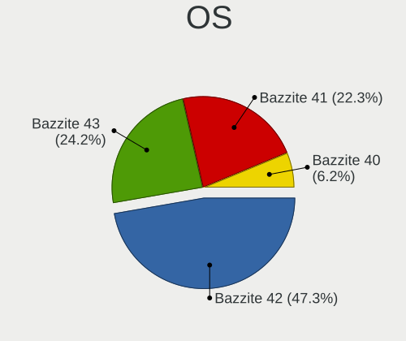

| Name       | Computers | Percent |
|------------|-----------|---------|
| Bazzite 42 | 1358      | 47.27%  |
| Bazzite 43 | 695       | 24.19%  |
| Bazzite 41 | 641       | 22.31%  |
| Bazzite 40 | 179       | 6.23%   |

OS Family
---------

OS without a version

| Name    | Computers | Percent |
|---------|-----------|---------|
| Bazzite | 2785      | 100%    |

Kernel
------

Version of the Linux kernel

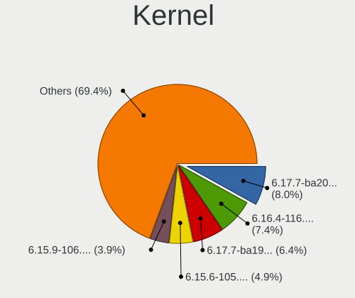

| Version                         | Computers | Percent |
|---------------------------------|-----------|---------|
| 6.17.7-ba20.fc43.x86_64         | 241       | 8.04%   |
| 6.16.4-116.bazzite.fc42.x86_64  | 222       | 7.41%   |
| 6.17.7-ba19.fc43.x86_64         | 191       | 6.38%   |
| 6.15.6-105.bazzite.fc42.x86_64  | 146       | 4.87%   |
| 6.15.9-106.bazzite.fc42.x86_64  | 118       | 3.94%   |
| 6.16.4-108.bazzite.fc42.x86_64  | 114       | 3.81%   |
| 6.14.6-106.bazzite.fc42.x86_64  | 106       | 3.54%   |
| 6.9.12-205.fsync.fc40.x86_64    | 102       | 3.4%    |
| 6.13.9-103.bazzite.fc41.x86_64  | 102       | 3.4%    |
| 6.14.4-104.bazzite.fc42.x86_64  | 99        | 3.3%    |
| 6.17.7-ba01.fc43.x86_64         | 90        | 3%      |
| 6.14.6-109.bazzite.fc42.x86_64  | 90        | 3%      |
| 6.17.7-ba14.fc43.x86_64         | 64        | 2.14%   |
| 6.13.7-108.bazzite.fc41.x86_64  | 63        | 2.1%    |
| 6.12.8-201.bazzite.fc41.x86_64  | 62        | 2.07%   |
| 6.15.9-103.bazzite.fc42.x86_64  | 60        | 2%      |
| 6.12.12-207.bazzite.fc41.x86_64 | 59        | 1.97%   |
| 6.17.5-ba07.fc43.x86_64         | 56        | 1.87%   |
| 6.16.4-114.bazzite.fc42.x86_64  | 51        | 1.7%    |
| 6.11.9-303.bazzite.fc41.x86_64  | 46        | 1.54%   |
| 6.15.6-101.bazzite.fc42.x86_64  | 45        | 1.5%    |
| 6.11.10-304.bazzite.fc41.x86_64 | 45        | 1.5%    |
| 6.16.4-115.bazzite.fc42.x86_64  | 43        | 1.44%   |
| 6.13.6-103.bazzite.fc41.x86_64  | 42        | 1.4%    |
| 6.17.7-ba13.fc43.x86_64         | 41        | 1.37%   |
| 6.13.9-103.bazzite.fc42.x86_64  | 40        | 1.34%   |
| 6.14.6-105.bazzite.fc42.x86_64  | 39        | 1.3%    |
| 6.11.5-307.bazzite.fc41.x86_64  | 38        | 1.27%   |
| 6.12.12-203.bazzite.fc41.x86_64 | 37        | 1.23%   |
| 6.14.4-103.bazzite.fc42.x86_64  | 34        | 1.13%   |
| 6.14.3-101.bazzite.fc42.x86_64  | 32        | 1.07%   |
| 6.13.5-100.bazzite.fc41.x86_64  | 32        | 1.07%   |
| 6.9.12-210.fsync.fc40.x86_64    | 31        | 1.03%   |
| 6.15.6-113.bazzite.fc42.x86_64  | 30        | 1%      |
| 6.13.5-102.bazzite.fc41.x86_64  | 29        | 0.97%   |
| 6.12.11-205.bazzite.fc41.x86_64 | 25        | 0.83%   |
| 6.16.4-107.bazzite.fc42.x86_64  | 24        | 0.8%    |
| 6.15.4-106.bazzite.fc42.x86_64  | 24        | 0.8%    |
| 6.12.6-203.bazzite.fc41.x86_64  | 23        | 0.77%   |
| 6.16.4-104.bazzite.fc42.x86_64  | 22        | 0.73%   |

Kernel Family
-------------

Linux kernel without a distro release

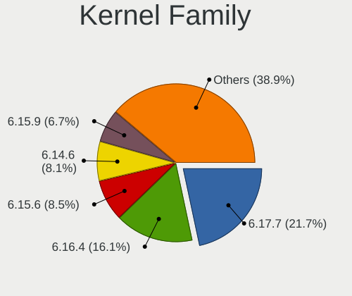

| Version | Computers | Percent |
|---------|-----------|---------|
| 6.17.7  | 642       | 21.66%  |
| 6.16.4  | 478       | 16.13%  |
| 6.15.6  | 252       | 8.5%    |
| 6.14.6  | 240       | 8.1%    |
| 6.15.9  | 200       | 6.75%   |
| 6.9.12  | 154       | 5.2%    |
| 6.13.9  | 142       | 4.79%   |
| 6.14.4  | 133       | 4.49%   |
| 6.12.12 | 96        | 3.24%   |
| 6.13.7  | 63        | 2.13%   |
| 6.12.8  | 62        | 2.09%   |
| 6.13.5  | 61        | 2.06%   |
| 6.17.5  | 56        | 1.89%   |
| 6.11.9  | 46        | 1.55%   |
| 6.11.10 | 45        | 1.52%   |
| 6.13.6  | 42        | 1.42%   |
| 6.11.5  | 38        | 1.28%   |
| 6.15.4  | 33        | 1.11%   |
| 6.14.3  | 32        | 1.08%   |
| 6.12.11 | 25        | 0.84%   |
| 6.12.6  | 23        | 0.78%   |
| 6.12.10 | 22        | 0.74%   |
| 6.11.8  | 22        | 0.74%   |
| 6.12.9  | 13        | 0.44%   |
| 6.10.3  | 9         | 0.3%    |
| 6.9.9   | 8         | 0.27%   |
| 6.9.8   | 8         | 0.27%   |
| 6.11.6  | 6         | 0.2%    |
| 6.13.4  | 4         | 0.13%   |
| 6.13.8  | 2         | 0.07%   |
| 6.10.5  | 2         | 0.07%   |
| 6.16.7  | 1         | 0.03%   |
| 6.16.12 | 1         | 0.03%   |
| 6.15.8  | 1         | 0.03%   |
| 6.15.10 | 1         | 0.03%   |
| 6.10.4  | 1         | 0.03%   |

Kernel Major Ver.
-----------------

Linux kernel major version

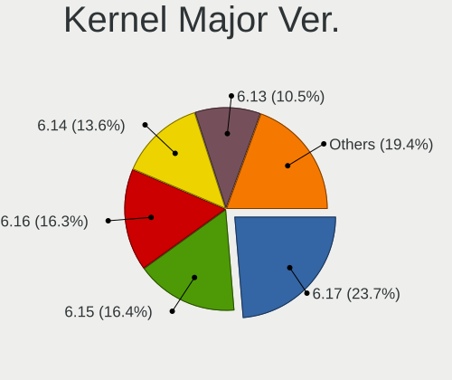

| Version | Computers | Percent |
|---------|-----------|---------|
| 6.17    | 695       | 23.67%  |
| 6.15    | 481       | 16.38%  |
| 6.16    | 480       | 16.35%  |
| 6.14    | 400       | 13.62%  |
| 6.13    | 309       | 10.52%  |
| 6.12    | 235       | 8%      |
| 6.9     | 169       | 5.76%   |
| 6.11    | 155       | 5.28%   |
| 6.10    | 12        | 0.41%   |

Arch
----

OS architecture (x86_64, i586, etc.)

| Name   | Computers | Percent |
|--------|-----------|---------|
| x86_64 | 2785      | 100%    |

DE
--

Desktop Environment

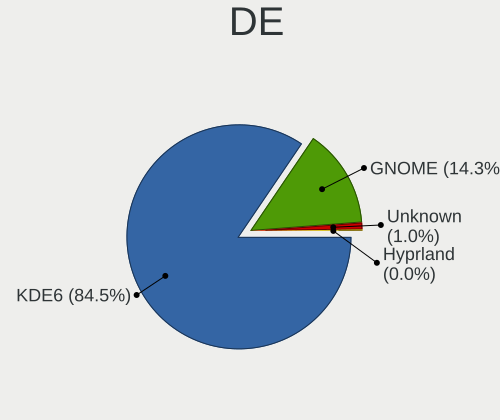

| Name     | Computers | Percent |
|----------|-----------|---------|
| KDE6     | 2358      | 84.49%  |
| GNOME    | 399       | 14.3%   |
| Unknown  | 28        | 1%      |
| KDE4     | 5         | 0.18%   |
| Hyprland | 1         | 0.04%   |

Display Server
--------------

X11 or Wayland

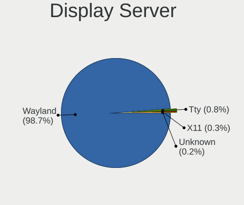

| Name    | Computers | Percent |
|---------|-----------|---------|
| Wayland | 2752      | 98.74%  |
| Tty     | 23        | 0.83%   |
| X11     | 7         | 0.25%   |
| Unknown | 5         | 0.18%   |

Display Manager
---------------

SDDM, LightDM, etc.

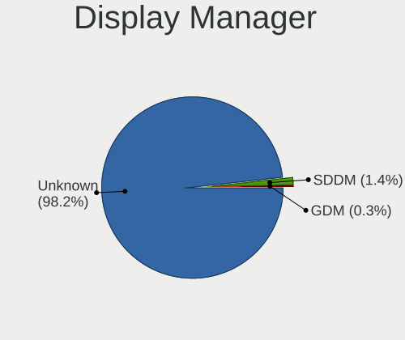

| Name    | Computers | Percent |
|---------|-----------|---------|
| Unknown | 2741      | 98.24%  |
| SDDM    | 40        | 1.43%   |
| GDM     | 9         | 0.32%   |

OS Lang
-------

Language

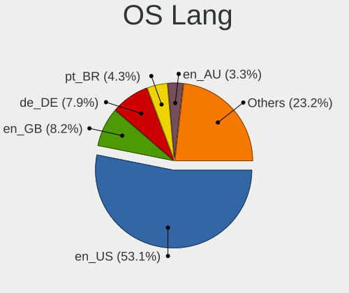

| Lang  | Computers | Percent |
|-------|-----------|---------|
| en_US | 1484      | 53.13%  |
| en_GB | 229       | 8.2%    |
| de_DE | 222       | 7.95%   |
| pt_BR | 120       | 4.3%    |
| en_AU | 91        | 3.26%   |
| fr_FR | 79        | 2.83%   |
| en_CA | 58        | 2.08%   |
| it_IT | 50        | 1.79%   |
| es_ES | 42        | 1.5%    |
| ru_RU | 30        | 1.07%   |
| es_MX | 30        | 1.07%   |
| pl_PL | 28        | 1%      |
| sv_SE | 22        | 0.79%   |
| es_AR | 22        | 0.79%   |
| es_CO | 17        | 0.61%   |
| de_AT | 16        | 0.57%   |
| nl_NL | 15        | 0.54%   |
| en_NZ | 15        | 0.54%   |
| en_IE | 15        | 0.54%   |
| en_ZA | 14        | 0.5%    |
| es_CL | 13        | 0.47%   |
| cs_CZ | 13        | 0.47%   |
| fr_CA | 12        | 0.43%   |
| tr_TR | 11        | 0.39%   |
| hu_HU | 9         | 0.32%   |
| fi_FI | 9         | 0.32%   |
| pt_PT | 8         | 0.29%   |
| nl_BE | 7         | 0.25%   |
| de_CH | 7         | 0.25%   |
| zh_CN | 6         | 0.21%   |
| fr_CH | 6         | 0.21%   |
| en_IN | 6         | 0.21%   |
| C     | 6         | 0.21%   |
| en_PH | 5         | 0.18%   |
| en_DK | 5         | 0.18%   |
| zh_TW | 4         | 0.14%   |
| nb_NO | 4         | 0.14%   |
| ja_JP | 4         | 0.14%   |
| fr_BE | 4         | 0.14%   |
| es_VE | 4         | 0.14%   |

Boot Mode
---------

EFI or BIOS

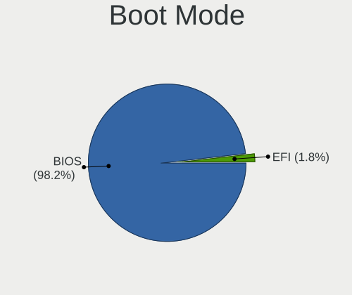

| Mode | Computers | Percent |
|------|-----------|---------|
| BIOS | 2740      | 98.21%  |
| EFI  | 50        | 1.79%   |

Filesystem
----------

Type of filesystem

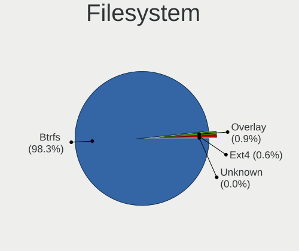

| Type    | Computers | Percent |
|---------|-----------|---------|
| Btrfs   | 2741      | 98.31%  |
| Overlay | 24        | 0.86%   |
| Ext4    | 18        | 0.65%   |
| Tmpfs   | 4         | 0.14%   |
| Unknown | 1         | 0.04%   |

Part. scheme
------------

Scheme of partitioning

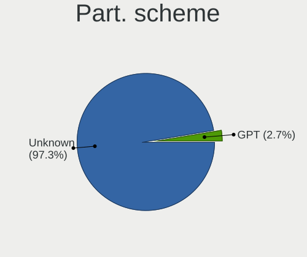

| Type    | Computers | Percent |
|---------|-----------|---------|
| Unknown | 2716      | 97.35%  |
| GPT     | 74        | 2.65%   |

Dual Boot with Linux/BSD
------------------------

Hosting more than one Linux/BSD

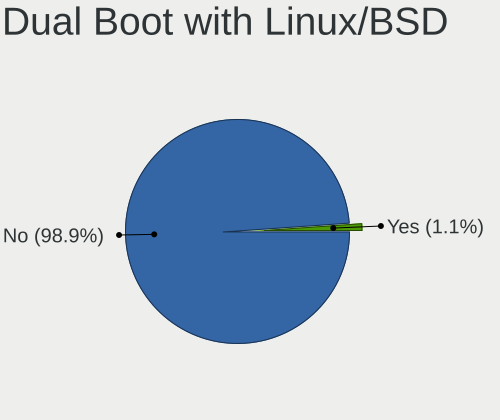

| Dual boot | Computers | Percent |
|-----------|-----------|---------|
| No        | 2756      | 98.89%  |
| Yes       | 31        | 1.11%   |

Dual Boot (Win)
---------------

Hosting Linux and Windows

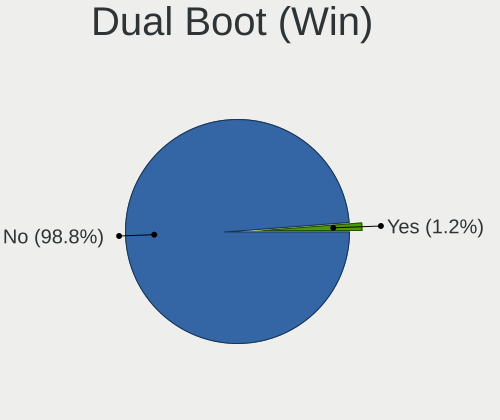

| Dual boot | Computers | Percent |
|-----------|-----------|---------|
| No        | 2753      | 98.78%  |
| Yes       | 34        | 1.22%   |

Board
-----

Vendor
------

Motherboard manufacturer

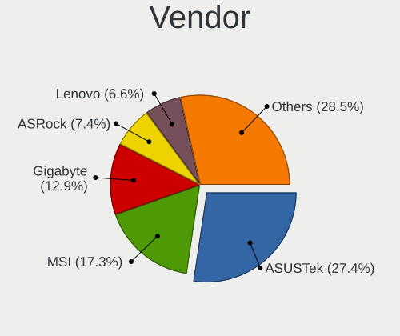

| Name                                 | Computers | Percent |
|--------------------------------------|-----------|---------|
| ASUSTek Computer                     | 762       | 27.36%  |
| MSI                                  | 481       | 17.27%  |
| Gigabyte Technology                  | 358       | 12.85%  |
| ASRock                               | 205       | 7.36%   |
| Lenovo                               | 184       | 6.61%   |
| Hewlett-Packard                      | 141       | 5.06%   |
| Dell                                 | 109       | 3.91%   |
| Acer                                 | 79        | 2.84%   |
| Apple                                | 49        | 1.76%   |
| Intel                                | 40        | 1.44%   |
| Shenzhen Meigao Electronic Equipment | 34        | 1.22%   |
| Unknown                              | 30        | 1.08%   |
| Alienware                            | 24        | 0.86%   |
| Framework                            | 18        | 0.65%   |
| ONE-NETBOOK                          | 17        | 0.61%   |
| GMKtec                               | 16        | 0.57%   |
| GPD                                  | 14        | 0.5%    |
| AZW                                  | 12        | 0.43%   |
| MACHINIST                            | 11        | 0.39%   |
| Valve                                | 10        | 0.36%   |
| Razer                                | 10        | 0.36%   |
| Microsoft                            | 9         | 0.32%   |
| JGINYUE                              | 9         | 0.32%   |
| AYANEO                               | 9         | 0.32%   |
| Medion                               | 7         | 0.25%   |
| Samsung Electronics                  | 6         | 0.22%   |
| Micro Computer (HK) Tech Limited     | 6         | 0.22%   |
| Fujitsu                              | 6         | 0.22%   |
| HC Technology.                       | 5         | 0.18%   |
| GEEKOM                               | 5         | 0.18%   |
| ZOTAC                                | 4         | 0.14%   |
| ONE-NETBOOK TECHNOLOGY               | 4         | 0.14%   |
| NZXT                                 | 4         | 0.14%   |
| MAXSUN                               | 4         | 0.14%   |
| Biostar                              | 4         | 0.14%   |
| TianBei                              | 3         | 0.11%   |
| Schenker                             | 3         | 0.11%   |
| PELADN                               | 3         | 0.11%   |
| Notebook                             | 3         | 0.11%   |
| Kllisre                              | 3         | 0.11%   |

Model
-----

Motherboard model

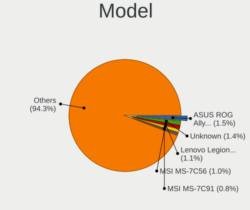

| Name                                                  | Computers | Percent |
|-------------------------------------------------------|-----------|---------|
| ASUS ROG Ally RC71L_RC71L                             | 41        | 1.47%   |
| Unknown                                               | 38        | 1.36%   |
| Lenovo Legion Go 8APU1 83E1                           | 30        | 1.08%   |
| MSI MS-7C56                                           | 28        | 1.01%   |
| MSI MS-7C91                                           | 23        | 0.83%   |
| MSI MS-7C37                                           | 23        | 0.83%   |
| ASUS All Series                                       | 23        | 0.83%   |
| ASUS ROG STRIX B550-F GAMING                          | 20        | 0.72%   |
| ASUS TUF Gaming X570-PLUS                             | 19        | 0.68%   |
| Shenzhen Meigao Electronic Equipment EliteMini Series | 16        | 0.57%   |
| MSI MS-7C95                                           | 16        | 0.57%   |
| MSI MS-7B86                                           | 15        | 0.54%   |
| MSI MS-7D75                                           | 14        | 0.5%    |
| ASUS TUF Gaming B650-PLUS WIFI                        | 14        | 0.5%    |
| MSI MS-7E26                                           | 13        | 0.47%   |
| ASUS ROG STRIX X870E-E GAMING WIFI                    | 13        | 0.47%   |
| MSI MS-7C02                                           | 12        | 0.43%   |
| MSI MS-7E12                                           | 11        | 0.39%   |
| Gigabyte X870E AORUS ELITE WIFI7                      | 11        | 0.39%   |
| ASUS PRIME B550M-A WIFI II                            | 11        | 0.39%   |
| Gigabyte B550I AORUS PRO AX                           | 10        | 0.36%   |
| ASUS ROG STRIX B550-I GAMING                          | 10        | 0.36%   |
| ASUS ROG STRIX B450-F GAMING                          | 10        | 0.36%   |
| ASUS ROG Ally X RC72LA_RC72LA                         | 10        | 0.36%   |
| ASRock B450M Steel Legend                             | 10        | 0.36%   |
| ASUS TUF Gaming B550M-PLUS                            | 9         | 0.32%   |
| ASUS ROG STRIX B650E-F GAMING WIFI                    | 9         | 0.32%   |
| ASUS ROG STRIX B550-F GAMING WIFI II                  | 9         | 0.32%   |
| MSI MS-7E59                                           | 8         | 0.29%   |
| MSI MS-7E51                                           | 8         | 0.29%   |
| MSI MS-7C35                                           | 8         | 0.29%   |
| Gigabyte X570 AORUS ELITE                             | 8         | 0.29%   |
| Gigabyte B550M DS3H                                   | 8         | 0.29%   |
| Gigabyte B550 GAMING X V2                             | 8         | 0.29%   |
| MSI MS-7D78                                           | 7         | 0.25%   |
| GPD G1618-04                                          | 7         | 0.25%   |
| Gigabyte X670 AORUS ELITE AX                          | 7         | 0.25%   |
| Gigabyte X570 I AORUS PRO WIFI                        | 7         | 0.25%   |
| Gigabyte B650 GAMING X AX V2                          | 7         | 0.25%   |
| Gigabyte B450M DS3H                                   | 7         | 0.25%   |

Model Family
------------

Motherboard model prefix

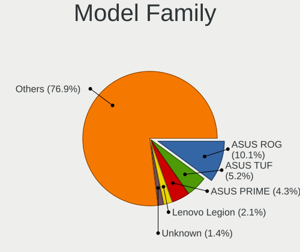

| Name                                           | Computers | Percent |
|------------------------------------------------|-----------|---------|
| ASUS ROG                                       | 281       | 10.09%  |
| ASUS TUF                                       | 144       | 5.17%   |
| ASUS PRIME                                     | 121       | 4.34%   |
| Lenovo Legion                                  | 59        | 2.12%   |
| Unknown                                        | 38        | 1.36%   |
| Dell OptiPlex                                  | 33        | 1.18%   |
| ASUS ASUS                                      | 33        | 1.18%   |
| Acer Nitro                                     | 33        | 1.18%   |
| Lenovo IdeaPad                                 | 32        | 1.15%   |
| Lenovo ThinkPad                                | 31        | 1.11%   |
| MSI MS-7C56                                    | 28        | 1.01%   |
| Gigabyte X570                                  | 28        | 1.01%   |
| Gigabyte B650                                  | 27        | 0.97%   |
| Gigabyte B550                                  | 26        | 0.93%   |
| Acer Aspire                                    | 26        | 0.93%   |
| MSI MS-7C91                                    | 23        | 0.83%   |
| MSI MS-7C37                                    | 23        | 0.83%   |
| Lenovo ThinkCentre                             | 23        | 0.83%   |
| Gigabyte B550M                                 | 23        | 0.83%   |
| ASUS All                                       | 23        | 0.83%   |
| HP Pavilion                                    | 22        | 0.79%   |
| HP Victus                                      | 20        | 0.72%   |
| Gigabyte B450                                  | 20        | 0.72%   |
| Dell Precision                                 | 20        | 0.72%   |
| ASRock B450M                                   | 19        | 0.68%   |
| Dell Inspiron                                  | 18        | 0.65%   |
| ONE-NETBOOK ONEXPLAYER                         | 17        | 0.61%   |
| ASRock B550M                                   | 17        | 0.61%   |
| Acer Predator                                  | 17        | 0.61%   |
| Shenzhen Meigao Electronic Equipment EliteMini | 16        | 0.57%   |
| MSI MS-7C95                                    | 16        | 0.57%   |
| Gigabyte X870E                                 | 16        | 0.57%   |
| Gigabyte B650M                                 | 16        | 0.57%   |
| Framework Laptop                               | 16        | 0.57%   |
| ASUS Vivobook                                  | 16        | 0.57%   |
| MSI MS-7B86                                    | 15        | 0.54%   |
| HP OMEN                                        | 15        | 0.54%   |
| Dell XPS                                       | 15        | 0.54%   |
| MSI MS-7D75                                    | 14        | 0.5%    |
| GMKtec NucBox                                  | 14        | 0.5%    |

MFG Year
--------

Motherboard manufacture year

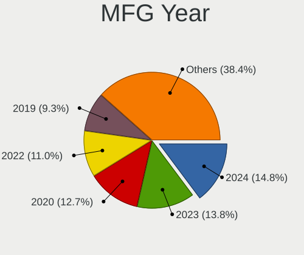

| Year    | Computers | Percent |
|---------|-----------|---------|
| 2024    | 412       | 14.79%  |
| 2023    | 383       | 13.75%  |
| 2020    | 353       | 12.68%  |
| 2022    | 307       | 11.02%  |
| 2019    | 260       | 9.34%   |
| 2021    | 232       | 8.33%   |
| 2018    | 227       | 8.15%   |
| 2025    | 113       | 4.06%   |
| 2017    | 113       | 4.06%   |
| 2012    | 78        | 2.8%    |
| 2013    | 76        | 2.73%   |
| 2014    | 65        | 2.33%   |
| 2016    | 58        | 2.08%   |
| 2015    | 57        | 2.05%   |
| 2011    | 31        | 1.11%   |
| 2010    | 10        | 0.36%   |
| 2009    | 5         | 0.18%   |
| 2006    | 2         | 0.07%   |
| 2008    | 1         | 0.04%   |
| 2005    | 1         | 0.04%   |
| Unknown | 1         | 0.04%   |

Form Factor
-----------

Physical design of the computer

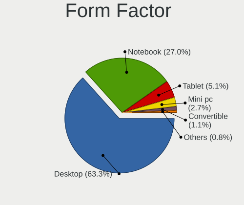

| Name        | Computers | Percent |
|-------------|-----------|---------|
| Desktop     | 1764      | 63.34%  |
| Notebook    | 751       | 26.97%  |
| Tablet      | 142       | 5.1%    |
| Mini pc     | 76        | 2.73%   |
| Convertible | 31        | 1.11%   |
| All in one  | 19        | 0.68%   |
| Other       | 1         | 0.04%   |
| Server      | 1         | 0.04%   |

Secure Boot
-----------

Enabled or disabled

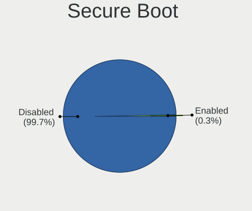

| State    | Computers | Percent |
|----------|-----------|---------|
| Disabled | 2777      | 99.68%  |
| Enabled  | 9         | 0.32%   |

Coreboot
--------

Have coreboot on board

| Used | Computers | Percent |
|------|-----------|---------|
| No   | 2780      | 99.82%  |
| Yes  | 5         | 0.18%   |

RAM Size
--------

Total RAM memory

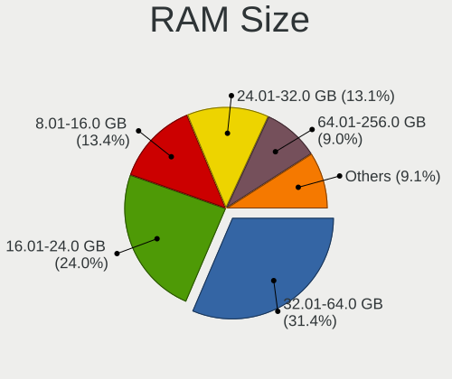

| Size in GB      | Computers | Percent |
|-----------------|-----------|---------|
| 32.01-64.0      | 879       | 31.43%  |
| 16.01-24.0      | 670       | 23.95%  |
| 8.01-16.0       | 374       | 13.37%  |
| 24.01-32.0      | 367       | 13.12%  |
| 64.01-256.0     | 253       | 9.05%   |
| 4.01-8.0        | 222       | 7.94%   |
| 3.01-4.0        | 30        | 1.07%   |
| More than 256.0 | 2         | 0.07%   |

RAM Used
--------

Used RAM memory

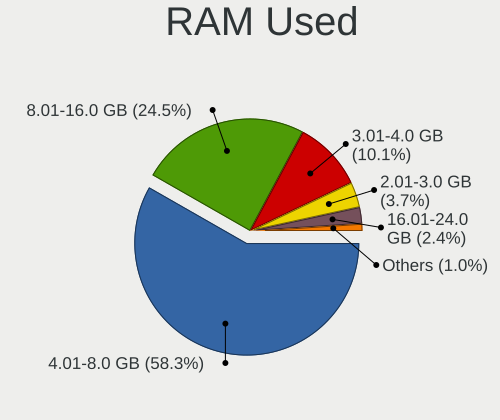

| Used GB    | Computers | Percent |
|------------|-----------|---------|
| 4.01-8.0   | 1688      | 58.27%  |
| 8.01-16.0  | 711       | 24.54%  |
| 3.01-4.0   | 293       | 10.11%  |
| 2.01-3.0   | 106       | 3.66%   |
| 16.01-24.0 | 69        | 2.38%   |
| 1.01-2.0   | 16        | 0.55%   |
| 32.01-64.0 | 7         | 0.24%   |
| 24.01-32.0 | 6         | 0.21%   |
| 0.51-1.0   | 1         | 0.03%   |

Total Drives
------------

Number of drives on board

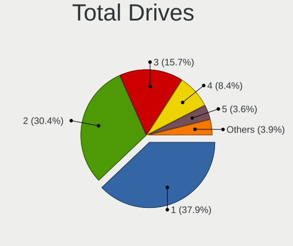

| Drives | Computers | Percent |
|--------|-----------|---------|
| 1      | 1073      | 37.9%   |
| 2      | 862       | 30.45%  |
| 3      | 445       | 15.72%  |
| 4      | 237       | 8.37%   |
| 5      | 103       | 3.64%   |
| 6      | 66        | 2.33%   |
| 7      | 28        | 0.99%   |
| 9      | 8         | 0.28%   |
| 10     | 4         | 0.14%   |
| 8      | 2         | 0.07%   |
| 0      | 2         | 0.07%   |
| 11     | 1         | 0.04%   |

Has CD-ROM
----------

Has CD-ROM on board

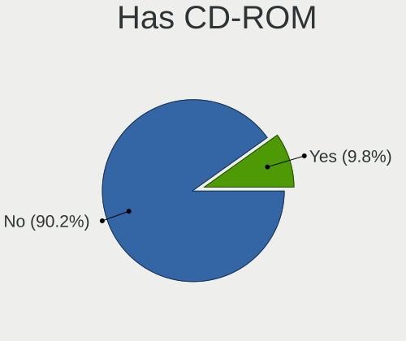

| Presented | Computers | Percent |
|-----------|-----------|---------|
| No        | 2517      | 90.15%  |
| Yes       | 275       | 9.85%   |

Has Ethernet
------------

Has Ethernet on board

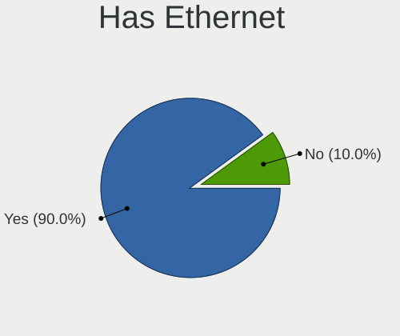

| Presented | Computers | Percent |
|-----------|-----------|---------|
| Yes       | 2510      | 90%     |
| No        | 279       | 10%     |

Has WiFi
--------

Has WiFi module

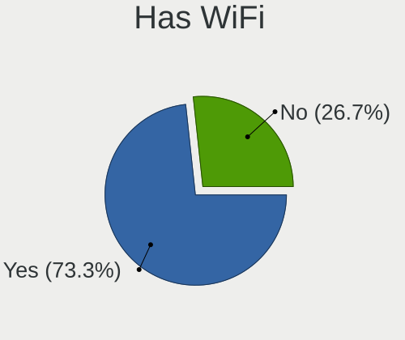

| Presented | Computers | Percent |
|-----------|-----------|---------|
| Yes       | 2048      | 73.3%   |
| No        | 746       | 26.7%   |

Has Bluetooth
-------------

Has Bluetooth module

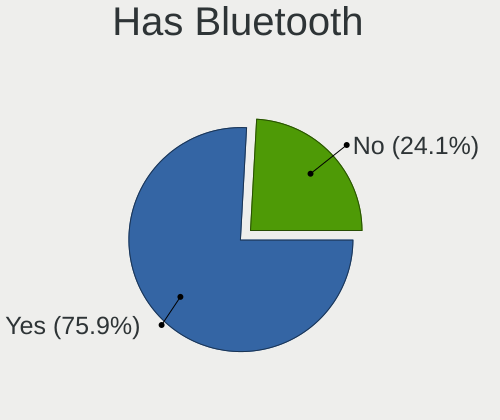

| Presented | Computers | Percent |
|-----------|-----------|---------|
| Yes       | 2123      | 75.88%  |
| No        | 675       | 24.12%  |

Location
--------

Country
-------

Geographic location (country)

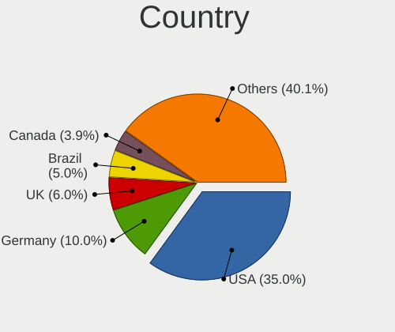

| Country         | Computers | Percent |
|-----------------|-----------|---------|
| USA             | 978       | 35.04%  |
| Germany         | 278       | 9.96%   |
| UK              | 167       | 5.98%   |
| Brazil          | 139       | 4.98%   |
| Canada          | 110       | 3.94%   |
| Australia       | 108       | 3.87%   |
| France          | 96        | 3.44%   |
| Italy           | 62        | 2.22%   |
| Spain           | 48        | 1.72%   |
| Sweden          | 47        | 1.68%   |
| Poland          | 46        | 1.65%   |
| Netherlands     | 43        | 1.54%   |
| Mexico          | 40        | 1.43%   |
| Norway          | 28        | 1%      |
| Belgium         | 26        | 0.93%   |
| Romania         | 25        | 0.9%    |
| Argentina       | 25        | 0.9%    |
| Finland         | 24        | 0.86%   |
| Switzerland     | 23        | 0.82%   |
| South Africa    | 23        | 0.82%   |
| Portugal        | 22        | 0.79%   |
| Czechia         | 22        | 0.79%   |
| Austria         | 22        | 0.79%   |
| Colombia        | 20        | 0.72%   |
| Russia          | 19        | 0.68%   |
| Chile           | 19        | 0.68%   |
| India           | 18        | 0.64%   |
| New Zealand     | 17        | 0.61%   |
| Hungary         | 15        | 0.54%   |
| Turkey          | 14        | 0.5%    |
| Philippines     | 14        | 0.5%    |
| Ireland         | 14        | 0.5%    |
| Denmark         | 14        | 0.5%    |
| The Netherlands | 12        | 0.43%   |
| Serbia          | 11        | 0.39%   |
| Japan           | 11        | 0.39%   |
| Indonesia       | 9         | 0.32%   |
| Croatia         | 8         | 0.29%   |
| Thailand        | 7         | 0.25%   |
| Slovakia        | 7         | 0.25%   |

City
----

Geographic location (city)

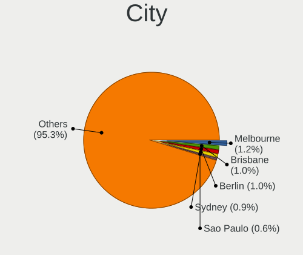

| City              | Computers | Percent |
|-------------------|-----------|---------|
| Melbourne         | 35        | 1.24%   |
| Brisbane          | 29        | 1.02%   |
| Berlin            | 28        | 0.99%   |
| Sydney            | 26        | 0.92%   |
| Sao Paulo         | 16        | 0.56%   |
| Chicago           | 14        | 0.49%   |
| Seattle           | 13        | 0.46%   |
| Montreal          | 13        | 0.46%   |
| Stockholm         | 12        | 0.42%   |
| Helsinki          | 12        | 0.42%   |
| Warsaw            | 11        | 0.39%   |
| Los Angeles       | 11        | 0.39%   |
| Jacksonville      | 11        | 0.39%   |
| Atlanta           | 11        | 0.39%   |
| Vienna            | 10        | 0.35%   |
| Minneapolis       | 10        | 0.35%   |
| Dallas            | 10        | 0.35%   |
| Philadelphia      | 9         | 0.32%   |
| Perth             | 9         | 0.32%   |
| Paris             | 9         | 0.32%   |
| Oslo              | 9         | 0.32%   |
| Milan             | 9         | 0.32%   |
| Leipzig           | 9         | 0.32%   |
| Frankfurt am Main | 9         | 0.32%   |
| Cleveland         | 9         | 0.32%   |
| Charlotte         | 9         | 0.32%   |
| Santiago          | 8         | 0.28%   |
| Richmond          | 8         | 0.28%   |
| Miami             | 8         | 0.28%   |
| Istanbul          | 8         | 0.28%   |
| Dublin            | 8         | 0.28%   |
| Denver            | 8         | 0.28%   |
| Brooklyn          | 8         | 0.28%   |
| Bogotá           | 8         | 0.28%   |
| Auckland          | 8         | 0.28%   |
| Zurich            | 7         | 0.25%   |
| Tacoma            | 7         | 0.25%   |
| San Antonio       | 7         | 0.25%   |
| Salt Lake City    | 7         | 0.25%   |
| Prague            | 7         | 0.25%   |

Drives
------

Drive Vendor
------------

Hard drive vendors

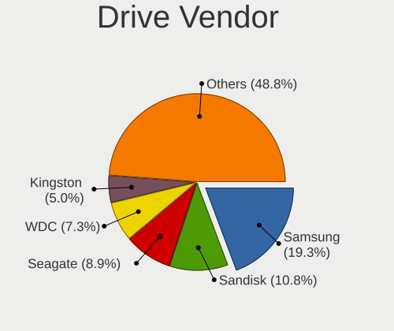

| Vendor                       | Computers | Drives | Percent |
|------------------------------|-----------|--------|---------|
| Samsung Electronics          | 1008      | 1614   | 19.29%  |
| Sandisk                      | 562       | 716    | 10.75%  |
| Seagate                      | 463       | 656    | 8.86%   |
| WDC                          | 383       | 513    | 7.33%   |
| Kingston                     | 261       | 335    | 4.99%   |
| Micron/Crucial Technology    | 233       | 293    | 4.46%   |
| Phison Electronics           | 185       | 231    | 3.54%   |
| Crucial                      | 171       | 202    | 3.27%   |
| Micron Technology            | 157       | 172    | 3%      |
| Toshiba                      | 145       | 161    | 2.77%   |
| MAXIO Technology (Hangzhou)  | 137       | 160    | 2.62%   |
| Kingston Technology Company  | 132       | 155    | 2.53%   |
| Unknown                      | 105       | 124    | 2.01%   |
| SK hynix                     | 92        | 112    | 1.76%   |
| Intel                        | 81        | 97     | 1.55%   |
| ADATA Technology             | 58        | 74     | 1.11%   |
| Realtek Semiconductor        | 55        | 73     | 1.05%   |
| Silicon Motion               | 53        | 65     | 1.01%   |
| A-DATA Technology            | 52        | 55     | 1%      |
| Shenzhen Longsys Electronics | 50        | 57     | 0.96%   |
| HGST                         | 48        | 56     | 0.92%   |
| SPCC                         | 47        | 63     | 0.9%    |
| China                        | 47        | 53     | 0.9%    |
| PNY                          | 44        | 56     | 0.84%   |
| KIOXIA                       | 38        | 40     | 0.73%   |
| Hitachi                      | 37        | 44     | 0.71%   |
| Unknown                      | 31        | 35     | 0.59%   |
| Apple                        | 27        | 33     | 0.52%   |
| Team                         | 25        | 27     | 0.48%   |
| Biwin Storage Technology     | 24        | 25     | 0.46%   |
| T-FORCE                      | 23        | 27     | 0.44%   |
| Patriot                      | 19        | 22     | 0.36%   |
| JMicron Technology           | 19        | 21     | 0.36%   |
| KingSpec                     | 16        | 16     | 0.31%   |
| Lexar                        | 15        | 18     | 0.29%   |
| Fanxiang                     | 15        | 15     | 0.29%   |
| Seagate Technology           | 14        | 14     | 0.27%   |
| Realtek                      | 14        | 17     | 0.27%   |
| SABRENT                      | 13        | 16     | 0.25%   |
| Netac                        | 13        | 14     | 0.25%   |

Drive Model
-----------

Hard drive models

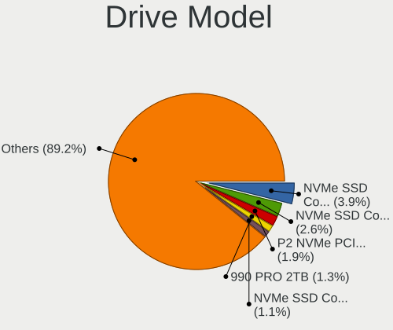

| Model                                                 | Computers | Percent |
|-------------------------------------------------------|-----------|---------|
| Samsung NVMe SSD Controller SM981/PM981/PM983 1TB     | 234       | 3.92%   |
| Samsung NVMe SSD Controller PM9A1/PM9A3/980PRO 1TB    | 153       | 2.56%   |
| Micron/Crucial P2 NVMe PCIe SSD 2TB                   | 112       | 1.88%   |
| Samsung SSD 990 PRO 2TB                               | 76        | 1.27%   |
| MAXIO (Hangzhou) NVMe SSD Controller MAP1202 2TB      | 68        | 1.14%   |
| Seagate ST2000DM008-2FR102 2TB                        | 62        | 1.04%   |
| Samsung SSD 860 EVO 1TB                               | 51        | 0.85%   |
| Kingston SA400S37480G 480GB SSD                       | 49        | 0.82%   |
| Samsung NVMe SSD Controller SM961/PM961/SM963 1024GB  | 48        | 0.8%    |
| Sandisk WD Blue SN550 NVMe SSD 1024GB                 | 47        | 0.79%   |
| Samsung SSD 860 EVO 500GB                             | 45        | 0.75%   |
| Samsung SSD 850 EVO 500GB                             | 45        | 0.75%   |
| Samsung SSD 980 1TB                                   | 42        | 0.7%    |
| Sandisk WD_BLACK SN850X 2000GB                        | 41        | 0.69%   |
| Silicon Motion SM2263EN/SM2263XT SSD Controller 512GB | 40        | 0.67%   |
| Samsung SSD 870 EVO 1TB                               | 38        | 0.64%   |
| Phison E16 PCIe4 NVMe Controller 1TB                  | 38        | 0.64%   |
| Phison E12 NVMe Controller 1TB                        | 38        | 0.64%   |
| Kingston Company SNV2S1000G 1TB                       | 38        | 0.64%   |
| Sandisk WD Black SN750 / PC SN730 NVMe SSD 500GB      | 36        | 0.6%    |
| Seagate ST1000DM010-2EP102 1TB                        | 35        | 0.59%   |
| Sandisk WD_BLACK SN770 2TB                            | 34        | 0.57%   |
| Samsung SSD 990 EVO Plus 2TB                          | 34        | 0.57%   |
| Samsung SSD 850 EVO 250GB                             | 34        | 0.57%   |
| Crucial CT1000MX500SSD1 1TB                           | 33        | 0.55%   |
| Sandisk WD_BLACK SN770 1TB                            | 32        | 0.54%   |
| Unknown                                               | 31        | 0.52%   |
| Kingston SA400S37240G 240GB SSD                       | 30        | 0.5%    |
| Sandisk WD Black SN850 1TB                            | 29        | 0.49%   |
| Samsung SSD 990 PRO 4TB                               | 29        | 0.49%   |
| Crucial CT1000BX500SSD1 1TB                           | 29        | 0.49%   |
| Samsung SSD 860 QVO 1TB                               | 28        | 0.47%   |
| Sandisk WD Black 2018/SN750 / PC SN720 NVMe SSD 512GB | 27        | 0.45%   |
| WDC WD10EZEX-08WN4A0 1TB                              | 26        | 0.44%   |
| Samsung SSD 870 EVO 2TB                               | 25        | 0.42%   |
| Samsung SSD 990 PRO 1TB                               | 23        | 0.39%   |
| Kingston Company SNV3S1000G 1TB                       | 23        | 0.39%   |
| Micron CT1000P3PSSD8 1TB                              | 22        | 0.37%   |
| Intel SSD 660P Series 512GB                           | 22        | 0.37%   |
| Samsung SSD 870 QVO 2TB                               | 21        | 0.35%   |

HDD Vendor
----------

Hard disk drive vendors

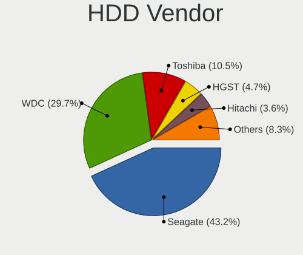

| Vendor              | Computers | Drives | Percent |
|---------------------|-----------|--------|---------|
| Seagate             | 441       | 618    | 43.19%  |
| WDC                 | 303       | 401    | 29.68%  |
| Toshiba             | 107       | 120    | 10.48%  |
| HGST                | 48        | 56     | 4.7%    |
| Hitachi             | 37        | 44     | 3.62%   |
| Samsung Electronics | 24        | 28     | 2.35%   |
| Unknown             | 11        | 12     | 1.08%   |
| JMicron Technology  | 11        | 11     | 1.08%   |
| T-FORCE             | 10        | 14     | 0.98%   |
| Apple               | 6         | 6      | 0.59%   |
| SSK                 | 3         | 3      | 0.29%   |
| Maxtor              | 3         | 3      | 0.29%   |
| ASMT                | 3         | 3      | 0.29%   |
| USB3.0              | 2         | 2      | 0.2%    |
| LaCie               | 2         | 2      | 0.2%    |
| XrayDisk            | 1         | 1      | 0.1%    |
| TO Exter            | 1         | 1      | 0.1%    |
| TerraMas            | 1         | 3      | 0.1%    |
| SABRENT             | 1         | 1      | 0.1%    |
| MARVELL             | 1         | 2      | 0.1%    |
| Intenso             | 1         | 1      | 0.1%    |
| Hewlett-Packard     | 1         | 2      | 0.1%    |
| External            | 1         | 1      | 0.1%    |
| ASMedia             | 1         | 1      | 0.1%    |
| Unknown             | 1         | 1      | 0.1%    |

SSD Vendor
----------

Solid state drive vendors

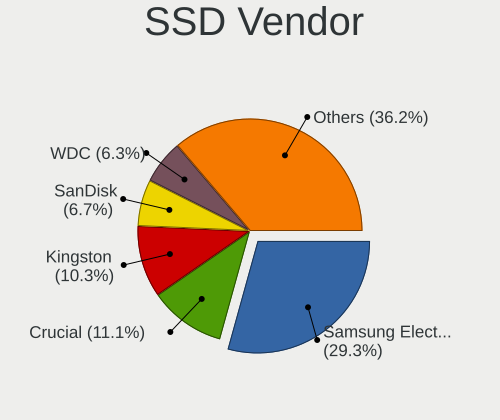

| Vendor              | Computers | Drives | Percent |
|---------------------|-----------|--------|---------|
| Samsung Electronics | 453       | 627    | 29.3%   |
| Crucial             | 171       | 202    | 11.06%  |
| Kingston            | 160       | 207    | 10.35%  |
| SanDisk             | 104       | 123    | 6.73%   |
| WDC                 | 98        | 108    | 6.34%   |
| A-DATA Technology   | 48        | 51     | 3.1%    |
| China               | 46        | 52     | 2.98%   |
| SPCC                | 44        | 60     | 2.85%   |
| PNY                 | 44        | 56     | 2.85%   |
| Micron Technology   | 30        | 31     | 1.94%   |
| Team                | 24        | 26     | 1.55%   |
| Patriot             | 18        | 21     | 1.16%   |
| SK hynix            | 17        | 22     | 1.1%    |
| Toshiba             | 16        | 16     | 1.03%   |
| KingSpec            | 16        | 16     | 1.03%   |
| Intel               | 15        | 16     | 0.97%   |
| Apple               | 15        | 18     | 0.97%   |
| Unknown             | 14        | 16     | 0.91%   |
| Lexar               | 13        | 16     | 0.84%   |
| OCZ                 | 12        | 13     | 0.78%   |
| Intenso             | 11        | 11     | 0.71%   |
| Corsair             | 11        | 12     | 0.71%   |
| Transcend           | 10        | 10     | 0.65%   |
| SABRENT             | 10        | 13     | 0.65%   |
| GOODRAM             | 10        | 12     | 0.65%   |
| Seagate             | 9         | 10     | 0.58%   |
| Hewlett-Packard     | 7         | 8      | 0.45%   |
| Netac               | 5         | 5      | 0.32%   |
| Mushkin             | 5         | 9      | 0.32%   |
| LITEONIT            | 5         | 7      | 0.32%   |
| Gigabyte Technology | 5         | 6      | 0.32%   |
| Fanxiang            | 5         | 5      | 0.32%   |
| T-FORCE             | 4         | 4      | 0.26%   |
| Apacer              | 4         | 5      | 0.26%   |
| X12                 | 3         | 3      | 0.19%   |
| Verbatim            | 3         | 3      | 0.19%   |
| SSSTC               | 3         | 3      | 0.19%   |
| Ramsta              | 3         | 6      | 0.19%   |
| KIOXIA-EXCERIA      | 3         | 3      | 0.19%   |
| XrayDisk            | 2         | 2      | 0.13%   |

Drive Kind
----------

HDD or SSD

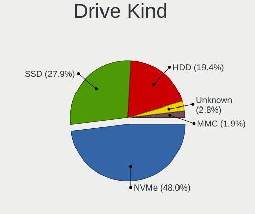

| Kind    | Computers | Drives | Percent |
|---------|-----------|--------|---------|
| NVMe    | 2132      | 3362   | 48.01%  |
| SSD     | 1240      | 1910   | 27.92%  |
| HDD     | 860       | 1337   | 19.37%  |
| Unknown | 123       | 146    | 2.77%   |
| MMC     | 86        | 93     | 1.94%   |

Drive Connector
---------------

SATA, SAS, NVMe, etc.

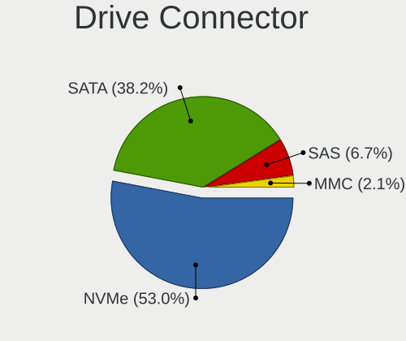

| Type | Computers | Drives | Percent |
|------|-----------|--------|---------|
| NVMe | 2130      | 3327   | 52.99%  |
| SATA | 1536      | 3075   | 38.21%  |
| SAS  | 268       | 353    | 6.67%   |
| MMC  | 86        | 93     | 2.14%   |

Drive Size
----------

Size of hard drive

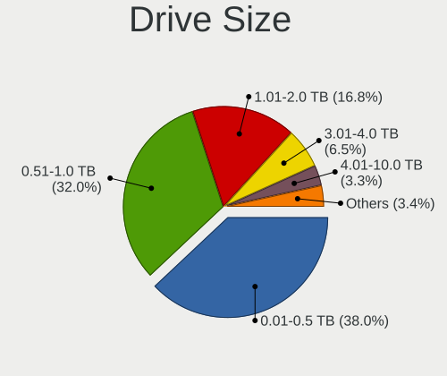

| Size in TB | Computers | Drives | Percent |
|------------|-----------|--------|---------|
| 0.01-0.5   | 893       | 1246   | 38%     |
| 0.51-1.0   | 752       | 1048   | 32%     |
| 1.01-2.0   | 395       | 530    | 16.81%  |
| 3.01-4.0   | 152       | 200    | 6.47%   |
| 4.01-10.0  | 77        | 123    | 3.28%   |
| 2.01-3.0   | 56        | 68     | 2.38%   |
| 10.01-20.0 | 24        | 31     | 1.02%   |
| 20.01-50.0 | 1         | 1      | 0.04%   |

Space Total
-----------

Amount of disk space available on the file system

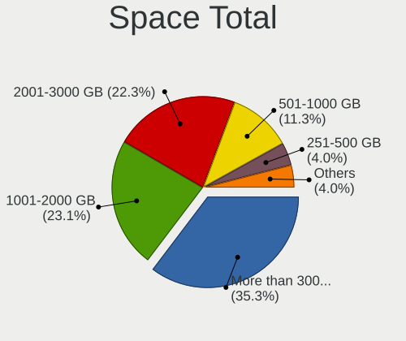

| Size in GB     | Computers | Percent |
|----------------|-----------|---------|
| More than 3000 | 997       | 35.32%  |
| 1001-2000      | 651       | 23.06%  |
| 2001-3000      | 629       | 22.28%  |
| 501-1000       | 319       | 11.3%   |
| 251-500        | 114       | 4.04%   |
| Unknown        | 78        | 2.76%   |
| 101-250        | 28        | 0.99%   |
| 1-20           | 5         | 0.18%   |
| 51-100         | 2         | 0.07%   |

Space Used
----------

Amount of used disk space

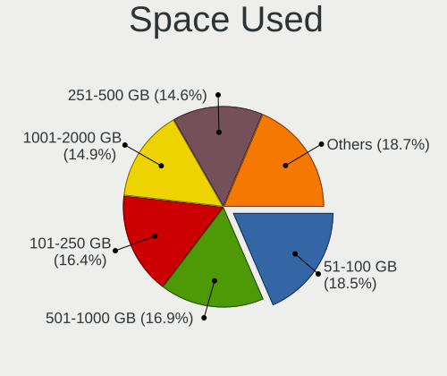

| Used GB        | Computers | Percent |
|----------------|-----------|---------|
| 51-100         | 540       | 18.49%  |
| 501-1000       | 493       | 16.88%  |
| 101-250        | 480       | 16.43%  |
| 1001-2000      | 436       | 14.93%  |
| 251-500        | 427       | 14.62%  |
| More than 3000 | 234       | 8.01%   |
| 2001-3000      | 175       | 5.99%   |
| Unknown        | 78        | 2.67%   |
| 21-50          | 50        | 1.71%   |
| 1-20           | 6         | 0.21%   |
| 0              | 2         | 0.07%   |

Malfunc. Drives
---------------

Drive models with a malfunction

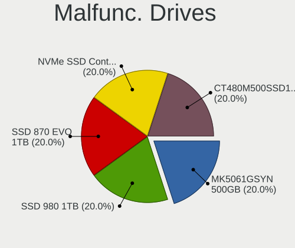

| Model                                                         | Computers | Drives | Percent |
|---------------------------------------------------------------|-----------|--------|---------|
| Toshiba MK5061GSYN 500GB                                      | 1         | 1      | 20%     |
| Samsung Electronics SSD 980 1TB                               | 1         | 2      | 20%     |
| Samsung Electronics SSD 870 EVO 1TB                           | 1         | 1      | 20%     |
| Samsung Electronics NVMe SSD Controller SM981/PM981/PM983 1TB | 1         | 1      | 20%     |
| Crucial CT480M500SSD1 480GB                                   | 1         | 1      | 20%     |

Malfunc. Drive Vendor
---------------------

Vendors of faulty drives

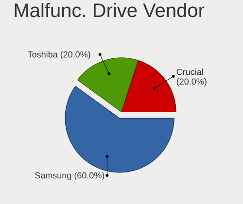

| Vendor              | Computers | Drives | Percent |
|---------------------|-----------|--------|---------|
| Samsung Electronics | 3         | 4      | 60%     |
| Toshiba             | 1         | 1      | 20%     |
| Crucial             | 1         | 1      | 20%     |

Malfunc. HDD Vendor
-------------------

Vendors of faulty HDD drives

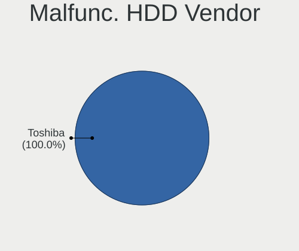

| Vendor  | Computers | Drives | Percent |
|---------|-----------|--------|---------|
| Toshiba | 1         | 1      | 100%    |

Malfunc. Drive Kind
-------------------

Kinds of faulty drives

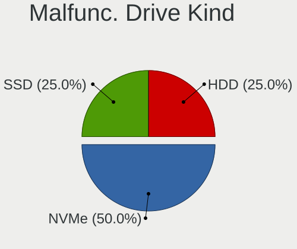

| Kind | Computers | Drives | Percent |
|------|-----------|--------|---------|
| NVMe | 2         | 3      | 50%     |
| SSD  | 1         | 2      | 25%     |
| HDD  | 1         | 1      | 25%     |

Failed Drives
-------------

Failed drive models

Zero info for selected period =(

Failed Drive Vendor
-------------------

Failed drive vendors

Zero info for selected period =(

Drive Status
------------

Number of failed and malfunc. drives

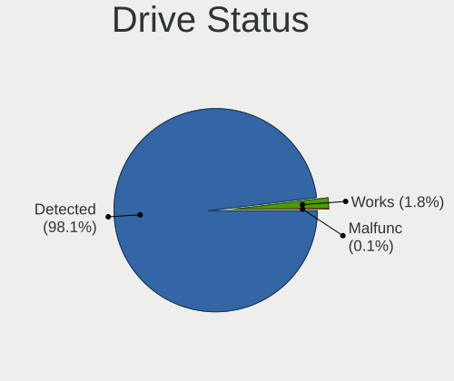

| Status   | Computers | Drives | Percent |
|----------|-----------|--------|---------|
| Detected | 2745      | 6736   | 98.07%  |
| Works    | 50        | 106    | 1.79%   |
| Malfunc  | 4         | 6      | 0.14%   |

Storage controller
------------------

Storage Vendor
--------------

Storage controller vendors

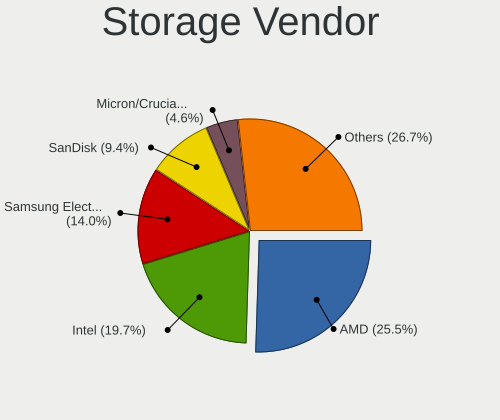

| Vendor                                    | Computers | Percent |
|-------------------------------------------|-----------|---------|
| AMD                                       | 1285      | 25.5%   |
| Intel                                     | 995       | 19.74%  |
| Samsung Electronics                       | 704       | 13.97%  |
| SanDisk                                   | 475       | 9.42%   |
| Micron/Crucial Technology                 | 233       | 4.62%   |
| Kingston Technology Company               | 230       | 4.56%   |
| Phison Electronics                        | 192       | 3.81%   |
| ASMedia Technology                        | 142       | 2.82%   |
| MAXIO Technology (Hangzhou)               | 138       | 2.74%   |
| Micron Technology                         | 128       | 2.54%   |
| SK hynix                                  | 75        | 1.49%   |
| ADATA Technology                          | 62        | 1.23%   |
| Realtek Semiconductor                     | 55        | 1.09%   |
| Silicon Motion                            | 53        | 1.05%   |
| Shenzhen Longsys Electronics              | 50        | 0.99%   |
| KIOXIA                                    | 38        | 0.75%   |
| Toshiba America Info Systems              | 24        | 0.48%   |
| INNOGRIT                                  | 24        | 0.48%   |
| Biwin Storage Technology                  | 24        | 0.48%   |
| Seagate Technology                        | 21        | 0.42%   |
| Marvell Technology Group                  | 19        | 0.38%   |
| Solidigm                                  | 7         | 0.14%   |
| Netac Technology                          | 7         | 0.14%   |
| Apple                                     | 7         | 0.14%   |
| Hosin Global Electronics                  | 6         | 0.12%   |
| JMicron Technology                        | 5         | 0.1%    |
| Union Memory (Shenzhen)                   | 4         | 0.08%   |
| Solid State Storage Technology            | 4         | 0.08%   |
| Nvidia                                    | 4         | 0.08%   |
| LSI Logic / Symbios Logic                 | 4         | 0.08%   |
| Yangtze Memory Technologies               | 3         | 0.06%   |
| TenaFe                                    | 3         | 0.06%   |
| Nextorage                                 | 3         | 0.06%   |
| Silicon Image                             | 2         | 0.04%   |
| Broadcom / LSI                            | 2         | 0.04%   |
| Unknown                                   | 2         | 0.04%   |
| YEESTOR Microelectronics                  | 1         | 0.02%   |
| Tata Power Strategic Electronics Division | 1         | 0.02%   |
| Sony                                      | 1         | 0.02%   |
| Shenzhen Unionmemory Information System   | 1         | 0.02%   |

Storage Model
-------------

Storage controller models

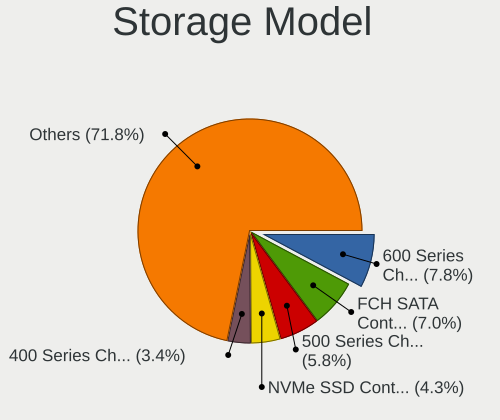

| Model                                                                          | Computers | Percent |
|--------------------------------------------------------------------------------|-----------|---------|
| AMD 600 Series Chipset SATA Controller                                         | 429       | 7.8%    |
| AMD FCH SATA Controller [AHCI mode]                                            | 385       | 7%      |
| AMD 500 Series Chipset SATA Controller                                         | 319       | 5.8%    |
| Samsung NVMe SSD Controller SM981/PM981/PM983                                  | 235       | 4.27%   |
| AMD 400 Series Chipset SATA Controller                                         | 185       | 3.36%   |
| Samsung NVMe SSD Controller PM9A1/PM9A3/980PRO                                 | 154       | 2.8%    |
| Samsung NVMe SSD Controller S4LV008[Pascal]                                    | 128       | 2.33%   |
| ASMedia ASM1061/ASM1062 Serial ATA Controller                                  | 113       | 2.05%   |
| Micron/Crucial P2 [Nick P2] / P3 / P3 Plus NVMe PCIe SSD (DRAM-less)           | 112       | 2.04%   |
| SanDisk WD SN560/SN740/SN770/SN5000 NVMe SSD                                   | 102       | 1.85%   |
| Samsung NVMe SSD Controller 980 (DRAM-less)                                    | 87        | 1.58%   |
| Samsung NVMe SSD Controller PM9C1a (DRAM-less)                                 | 86        | 1.56%   |
| Sandisk WD Black SN850X NVMe SSD                                               | 85        | 1.55%   |
| Intel 8 Series/C220 Series Chipset Family 6-port SATA Controller 1 [AHCI mode] | 79        | 1.44%   |
| MAXIO (Hangzhou) NVMe SSD Controller MAP1202 (DRAM-less)                       | 69        | 1.25%   |
| Intel Raptor Lake SATA AHCI Controller                                         | 69        | 1.25%   |
| MAXIO (Hangzhou) NVMe SSD Controller MAP1602 (DRAM-less)                       | 67        | 1.22%   |
| Intel Q170/Q150/B150/H170/H110/Z170/CM236 Chipset SATA Controller [AHCI Mode]  | 60        | 1.09%   |
| Intel Volume Management Device NVMe RAID Controller                            | 59        | 1.07%   |
| Intel 200 Series PCH SATA controller [AHCI mode]                               | 56        | 1.02%   |
| Intel Alder Lake-S PCH SATA Controller [AHCI Mode]                             | 52        | 0.95%   |
| Intel RST Volume Management Device Controller                                  | 49        | 0.89%   |
| Samsung NVMe SSD Controller SM961/PM961/SM963                                  | 48        | 0.87%   |
| SanDisk Ultra 3D / WD PC SN530, IX SN530, Blue SN550 NVMe SSD (DRAM-less)      | 47        | 0.85%   |
| Intel Cannon Lake PCH SATA AHCI Controller                                     | 47        | 0.85%   |
| Micron 2550 NVMe SSD (DRAM-less)                                               | 46        | 0.84%   |
| Intel SATA Controller [RAID mode]                                              | 43        | 0.78%   |
| Intel 500 Series Chipset Family SATA AHCI Controller                           | 43        | 0.78%   |
| Kingston Company NV2 NVMe SSD [SM2267XT] (DRAM-less)                           | 41        | 0.75%   |
| Silicon Motion SM2263EN/SM2263XT (DRAM-less) NVMe SSD Controllers              | 40        | 0.73%   |
| Phison E16 PCIe4 NVMe Controller                                               | 38        | 0.69%   |
| Phison E12 NVMe Controller                                                     | 38        | 0.69%   |
| Kingston Company KC3000/FURY Renegade NVMe SSD [E18]                           | 38        | 0.69%   |
| SanDisk Extreme Pro / WD Black SN750 / PC SN730 / Red SN700 NVMe SSD           | 36        | 0.65%   |
| Intel 7 Series/C210 Series Chipset Family 6-port SATA Controller [AHCI mode]   | 33        | 0.6%    |
| Intel 6 Series/C200 Series Chipset Family 6 port Desktop SATA AHCI Controller  | 33        | 0.6%    |
| Shenzhen Longsys Lexar NM790 / Patriot Viper VP4300 Lite NVMe SSD (DRAM-less)  | 32        | 0.58%   |
| Micron 2400 NVMe SSD (DRAM-less)                                               | 32        | 0.58%   |
| Intel Cannon Lake Mobile PCH SATA AHCI Controller                              | 31        | 0.56%   |
| Micron/Crucial P310 NVMe PCIe SSD (DRAM-less)                                  | 30        | 0.55%   |

Storage Kind
------------

Kind of storage controller (IDE, SATA, NVMe, SAS, ...)

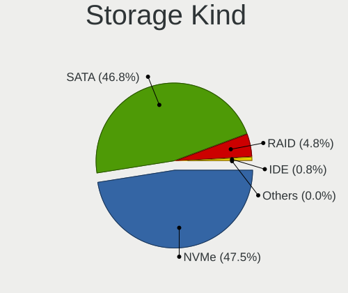

| Kind | Computers | Percent |
|------|-----------|---------|
| NVMe | 2130      | 47.51%  |
| SATA | 2099      | 46.82%  |
| RAID | 214       | 4.77%   |
| IDE  | 36        | 0.8%    |
| SAS  | 3         | 0.07%   |
| SCSI | 1         | 0.02%   |

Processor
---------

CPU Vendor
----------

Processor vendors

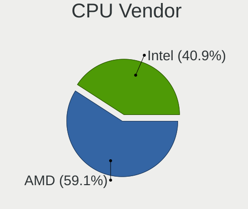

| Vendor | Computers | Percent |
|--------|-----------|---------|
| AMD    | 1646      | 59.1%   |
| Intel  | 1139      | 40.9%   |

CPU Model
---------

Processor models

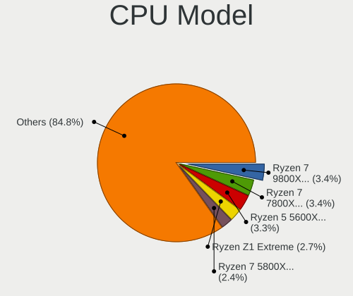

| Model                                     | Computers | Percent |
|-------------------------------------------|-----------|---------|
| AMD Ryzen 7 9800X3D 8-Core Processor      | 96        | 3.44%   |
| AMD Ryzen 7 7800X3D 8-Core Processor      | 94        | 3.37%   |
| AMD Ryzen 5 5600X 6-Core Processor        | 92        | 3.3%    |
| AMD Ryzen Z1 Extreme                      | 75        | 2.69%   |
| AMD Ryzen 7 5800X 8-Core Processor        | 67        | 2.4%    |
| AMD Ryzen 5 3600 6-Core Processor         | 47        | 1.68%   |
| AMD Ryzen 7 5700X 8-Core Processor        | 42        | 1.5%    |
| AMD Ryzen 9 5900X 12-Core Processor       | 40        | 1.43%   |
| AMD Ryzen 7 3700X 8-Core Processor        | 40        | 1.43%   |
| AMD Ryzen 5 7600X 6-Core Processor        | 40        | 1.43%   |
| AMD Ryzen 7 5800X3D 8-Core Processor      | 39        | 1.4%    |
| AMD Ryzen 7 5700X3D 8-Core Processor      | 34        | 1.22%   |
| AMD Ryzen 5 5600 6-Core Processor         | 33        | 1.18%   |
| AMD Ryzen 5 5600G with Radeon Graphics    | 28        | 1%      |
| AMD Ryzen 5 5500                          | 28        | 1%      |
| AMD Ryzen 9 7950X3D 16-Core Processor     | 21        | 0.75%   |
| AMD Ryzen 5 9600X 6-Core Processor        | 21        | 0.75%   |
| AMD Ryzen 7 3800X 8-Core Processor        | 20        | 0.72%   |
| Intel 12th Gen Core i7-12700H             | 19        | 0.68%   |
| AMD Ryzen 9 3900X 12-Core Processor       | 19        | 0.68%   |
| AMD Ryzen 7 9700X 8-Core Processor        | 18        | 0.64%   |
| AMD Ryzen 7 8840U w/ Radeon 780M Graphics | 18        | 0.64%   |
| Intel Core i7-7700HQ CPU @ 2.80GHz        | 17        | 0.61%   |
| AMD Ryzen AI 9 HX 370 w/ Radeon 890M      | 17        | 0.61%   |
| AMD Ryzen 7 5700G with Radeon Graphics    | 17        | 0.61%   |
| Intel Core i7-9700K CPU @ 3.60GHz         | 16        | 0.57%   |
| Intel Core i7-3770 CPU @ 3.40GHz          | 16        | 0.57%   |
| AMD Ryzen 9 9950X3D 16-Core Processor     | 16        | 0.57%   |
| AMD Ryzen 9 5950X 16-Core Processor       | 16        | 0.57%   |
| AMD Ryzen 7 7700X 8-Core Processor        | 16        | 0.57%   |
| AMD Ryzen 7 2700X Eight-Core Processor    | 16        | 0.57%   |
| Intel Core i7-9750H CPU @ 2.60GHz         | 15        | 0.54%   |
| Intel 13th Gen Core i7-13620H             | 15        | 0.54%   |
| AMD Ryzen 9 9900X 12-Core Processor       | 15        | 0.54%   |
| AMD Ryzen 9 6900HX with Radeon Graphics   | 15        | 0.54%   |
| AMD Ryzen 7 5800H with Radeon Graphics    | 15        | 0.54%   |
| Intel Xeon CPU E5-2680 v4 @ 2.40GHz       | 14        | 0.5%    |
| Intel Core i7-10750H CPU @ 2.60GHz        | 14        | 0.5%    |
| AMD Ryzen 7 7700 8-Core Processor         | 14        | 0.5%    |
| AMD Ryzen 5 2600 Six-Core Processor       | 14        | 0.5%    |

CPU Model Family
----------------

Processor model prefix

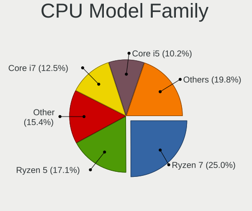

| Model                  | Computers | Percent |
|------------------------|-----------|---------|
| AMD Ryzen 7            | 696       | 24.96%  |
| AMD Ryzen 5            | 478       | 17.14%  |
| Other                  | 429       | 15.38%  |
| Intel Core i7          | 350       | 12.55%  |
| Intel Core i5          | 285       | 10.22%  |
| AMD Ryzen 9            | 228       | 8.17%   |
| Intel Xeon             | 64        | 2.29%   |
| Intel Core i3          | 51        | 1.83%   |
| Intel Core i9          | 38        | 1.36%   |
| Intel Core             | 30        | 1.08%   |
| AMD Ryzen 3            | 23        | 0.82%   |
| AMD FX                 | 23        | 0.82%   |
| AMD Ryzen 5 PRO        | 16        | 0.57%   |
| Intel Celeron          | 15        | 0.54%   |
| AMD Ryzen Threadripper | 6         | 0.22%   |
| AMD Athlon             | 6         | 0.22%   |
| AMD A8                 | 6         | 0.22%   |
| AMD A10                | 6         | 0.22%   |
| Intel Pentium          | 4         | 0.14%   |
| AMD Ryzen Embedded     | 4         | 0.14%   |
| AMD Ryzen 7 PRO        | 4         | 0.14%   |
| Intel Pentium Silver   | 3         | 0.11%   |
| Intel Pentium Gold     | 3         | 0.11%   |
| Intel Core m3          | 2         | 0.07%   |
| Intel Core M           | 2         | 0.07%   |
| Intel Core 2 Duo       | 2         | 0.07%   |
| AMD Phenom II X6       | 2         | 0.07%   |
| AMD Phenom II X4       | 2         | 0.07%   |
| AMD A6                 | 2         | 0.07%   |
| AMD A4                 | 2         | 0.07%   |
| AMD Sempron            | 1         | 0.04%   |
| AMD Ryzen 3 PRO        | 1         | 0.04%   |
| AMD Opteron            | 1         | 0.04%   |
| AMD E1                 | 1         | 0.04%   |
| AMD E                  | 1         | 0.04%   |
| AMD Athlon II X4       | 1         | 0.04%   |
| AMD Athlon 64 X2       | 1         | 0.04%   |

CPU Cores
---------

Number of processor cores

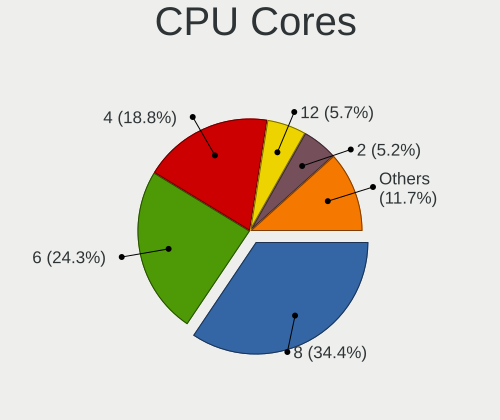

| Number | Computers | Percent |
|--------|-----------|---------|
| 8      | 960       | 34.42%  |
| 6      | 677       | 24.27%  |
| 4      | 524       | 18.79%  |
| 12     | 159       | 5.7%    |
| 2      | 144       | 5.16%   |
| 16     | 126       | 4.52%   |
| 14     | 70        | 2.51%   |
| 10     | 69        | 2.47%   |
| 24     | 36        | 1.29%   |
| 20     | 20        | 0.72%   |
| 32     | 3         | 0.11%   |
| 5      | 1         | 0.04%   |

CPU Sockets
-----------

Number of sockets

| Number | Computers | Percent |
|--------|-----------|---------|
| 1      | 2779      | 99.78%  |
| 2      | 6         | 0.22%   |

CPU Threads
-----------

Threads per core (Hyper-Threading)

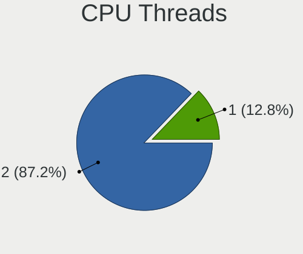

| Number | Computers | Percent |
|--------|-----------|---------|
| 2      | 2430      | 87.16%  |
| 1      | 358       | 12.84%  |

CPU Op-Modes
------------

CPU Operation Modes (32-bit, 64-bit)

| Op mode        | Computers | Percent |
|----------------|-----------|---------|
| 32-bit, 64-bit | 2785      | 100%    |

CPU Microcode
-------------

Microcode number

| Number  | Computers | Percent |
|---------|-----------|---------|
| Unknown | 2785      | 100%    |

CPU Microarch
-------------

Microarchitecture

| Name             | Computers | Percent |
|------------------|-----------|---------|
| Unknown          | 1096      | 39.28%  |
| Zen 3            | 501       | 17.96%  |
| KabyLake         | 282       | 10.11%  |
| Zen 2            | 193       | 6.92%   |
| Haswell          | 122       | 4.37%   |
| Zen+             | 101       | 3.62%   |
| CometLake        | 95        | 3.41%   |
| Skylake          | 83        | 2.97%   |
| IvyBridge        | 82        | 2.94%   |
| Zen              | 46        | 1.65%   |
| Broadwell        | 38        | 1.36%   |
| SandyBridge      | 37        | 1.33%   |
| TigerLake        | 27        | 0.97%   |
| Piledriver       | 25        | 0.9%    |
| IceLake          | 10        | 0.36%   |
| Goldmont plus    | 7         | 0.25%   |
| K10              | 5         | 0.18%   |
| Goldmont         | 5         | 0.18%   |
| Excavator        | 5         | 0.18%   |
| Jaguar           | 4         | 0.14%   |
| Bulldozer        | 4         | 0.14%   |
| Alderlake Hybrid | 4         | 0.14%   |
| Westmere         | 3         | 0.11%   |
| Puma             | 3         | 0.11%   |
| Nehalem          | 3         | 0.11%   |
| Steamroller      | 2         | 0.07%   |
| Lunarlake Hybrid | 2         | 0.07%   |
| Silvermont       | 1         | 0.04%   |
| Penryn           | 1         | 0.04%   |
| K8 Hammer        | 1         | 0.04%   |
| K10 Llano        | 1         | 0.04%   |
| Core             | 1         | 0.04%   |

Graphics
--------

GPU Vendor
----------

Vendors of graphics cards

| Vendor            | Computers | Percent |
|-------------------|-----------|---------|
| AMD               | 1522      | 44.54%  |
| Nvidia            | 1204      | 35.24%  |
| Intel             | 689       | 20.16%  |
| ATI Technologies  | 1         | 0.03%   |
| ASPEED Technology | 1         | 0.03%   |

GPU Model
---------

Graphics card models

| Model                                                                       | Computers | Percent |
|-----------------------------------------------------------------------------|-----------|---------|
| AMD Raphael                                                                 | 200       | 5.36%   |
| AMD Granite Ridge [Radeon Graphics]                                         | 149       | 3.99%   |
| AMD Navi 48 [Radeon RX 9070/9070 XT/9070 GRE]                               | 147       | 3.94%   |
| AMD Navi 31 [Radeon RX 7900 XT/7900 XTX/7900 GRE/7900M]                     | 131       | 3.51%   |
| AMD Phoenix1                                                                | 129       | 3.45%   |
| AMD Navi 23 [Radeon RX 6600/6600 XT/6600M]                                  | 83        | 2.22%   |
| AMD Ellesmere [Radeon RX 470/480/570/570X/580/580X/590]                     | 81        | 2.17%   |
| AMD Navi 32 [Radeon RX 7700 XT / 7800 XT]                                   | 66        | 1.77%   |
| AMD Navi 22 [Radeon RX 6700/6700 XT/6750 XT / 6800M/6850M XT]               | 66        | 1.77%   |
| AMD Navi 21 [Radeon RX 6800/6800 XT / 6900 XT]                              | 64        | 1.71%   |
| AMD Navi 33 [Radeon RX 7600/7600 XT/7600M XT/7600S/7700S / PRO W7600]       | 57        | 1.53%   |
| AMD Cezanne [Radeon Vega Series / Radeon Vega Mobile Series]                | 56        | 1.5%    |
| Nvidia GA106 [GeForce RTX 3060 Lite Hash Rate]                              | 54        | 1.45%   |
| Intel CoffeeLake-H GT2 [UHD Graphics 630]                                   | 53        | 1.42%   |
| AMD HawkPoint1                                                              | 52        | 1.39%   |
| AMD Rembrandt [Radeon 680M]                                                 | 51        | 1.37%   |
| AMD Navi 44 [Radeon RX 9060 XT]                                             | 48        | 1.29%   |
| AMD Picasso/Raven 2 [Radeon Vega Series / Radeon Vega Mobile Series]        | 44        | 1.18%   |
| AMD Navi 10 [Radeon RX 5600 OEM/5600 XT / 5700/5700 XT]                     | 41        | 1.1%    |
| Nvidia AD107M [GeForce RTX 4060 Max-Q / Mobile]                             | 36        | 0.96%   |
| Intel CometLake-H GT2 [UHD Graphics]                                        | 32        | 0.86%   |
| AMD Renoir [Radeon Vega Series / Radeon Vega Mobile Series]                 | 32        | 0.86%   |
| AMD Polaris 20 XL [Radeon RX 580 2048SP]                                    | 31        | 0.83%   |
| Nvidia GP104 [GeForce GTX 1070]                                             | 30        | 0.8%    |
| Nvidia AD107 [GeForce RTX 4060]                                             | 30        | 0.8%    |
| Nvidia TU117M [GeForce GTX 1650 Mobile / Max-Q]                             | 29        | 0.78%   |
| Nvidia AD102 [GeForce RTX 4090]                                             | 29        | 0.78%   |
| Intel Kaby Lake-H GT2 [HD Graphics 630]                                     | 28        | 0.75%   |
| Nvidia GP104 [GeForce GTX 1080]                                             | 27        | 0.72%   |
| Intel CoffeeLake-S GT2 [UHD Graphics 630]                                   | 27        | 0.72%   |
| Nvidia GA106M [GeForce RTX 3060 Mobile / Max-Q]                             | 26        | 0.7%    |
| Intel Alder Lake-P GT2 [Iris Xe Graphics]                                   | 26        | 0.7%    |
| Nvidia GP106 [GeForce GTX 1060 6GB]                                         | 25        | 0.67%   |
| Intel Xeon E3-1200 v3/4th Gen Core Processor Integrated Graphics Controller | 25        | 0.67%   |
| AMD Navi 24 [Radeon RX 6400/6500 XT/6500M]                                  | 24        | 0.64%   |
| Nvidia GA104 [GeForce RTX 3070 Ti]                                          | 23        | 0.62%   |
| Nvidia GA104 [GeForce RTX 3070]                                             | 22        | 0.59%   |
| Nvidia AD104 [GeForce RTX 4070 SUPER]                                       | 22        | 0.59%   |
| Intel TigerLake-LP GT2 [Iris Xe Graphics]                                   | 22        | 0.59%   |
| Intel Raptor Lake-P [UHD Graphics]                                          | 22        | 0.59%   |

GPU Combo
---------

Combinations of graphics cards

| Name                     | Computers | Percent |
|--------------------------|-----------|---------|
| 1 x AMD                  | 1006      | 35.93%  |
| 1 x Nvidia               | 686       | 24.5%   |
| Intel + Nvidia           | 312       | 11.14%  |
| 2 x AMD                  | 291       | 10.39%  |
| 1 x Intel                | 265       | 9.46%   |
| AMD + Nvidia             | 196       | 7%      |
| Intel + AMD              | 30        | 1.07%   |
| 2 x Nvidia               | 6         | 0.21%   |
| 2 x Intel                | 2         | 0.07%   |
| 3 x AMD                  | 1         | 0.04%   |
| Intel + 2 x Nvidia       | 1         | 0.04%   |
| Intel + 2 x AMD          | 1         | 0.04%   |
| Intel + AMD + 1 x Nvidia | 1         | 0.04%   |
| 1 x ASPEED               | 1         | 0.04%   |
| AMD + 2 x Nvidia         | 1         | 0.04%   |

GPU Driver
----------

Free vs proprietary

| Driver      | Computers | Percent |
|-------------|-----------|---------|
| Free        | 1905      | 68.16%  |
| Proprietary | 845       | 30.23%  |
| Unknown     | 45        | 1.61%   |

GPU Memory
----------

Total video memory

| Size in GB | Computers | Percent |
|------------|-----------|---------|
| Unknown    | 2736      | 98.17%  |
| 8.01-16.0  | 16        | 0.57%   |
| 7.01-8.0   | 7         | 0.25%   |
| 5.01-6.0   | 7         | 0.25%   |
| 0.01-0.5   | 7         | 0.25%   |
| 3.01-4.0   | 6         | 0.22%   |
| 16.01-24.0 | 3         | 0.11%   |
| 1.01-2.0   | 3         | 0.11%   |
| 4.01-5.0   | 1         | 0.04%   |
| 2.01-3.0   | 1         | 0.04%   |

Monitor
-------

Monitor Vendor
--------------

Monitor vendors

| Vendor               | Computers | Percent |
|----------------------|-----------|---------|
| Samsung Electronics  | 441       | 13.29%  |
| Goldstar             | 306       | 9.22%   |
| Dell                 | 190       | 5.73%   |
| Acer                 | 181       | 5.46%   |
| BOE                  | 165       | 4.97%   |
| AOC                  | 153       | 4.61%   |
| AU Optronics         | 142       | 4.28%   |
| Chimei Innolux       | 136       | 4.1%    |
| ASUSTek Computer     | 135       | 4.07%   |
| MSI                  | 119       | 3.59%   |
| Hewlett-Packard      | 83        | 2.5%    |
| BenQ                 | 78        | 2.35%   |
| Lenovo               | 77        | 2.32%   |
| Ancor Communications | 76        | 2.29%   |
| LG Display           | 72        | 2.17%   |
| Gigabyte Technology  | 66        | 1.99%   |
| TMX                  | 57        | 1.72%   |
| Philips              | 57        | 1.72%   |
| Apple                | 46        | 1.39%   |
| Sony                 | 38        | 1.15%   |
| ViewSonic            | 35        | 1.05%   |
| HKC                  | 33        | 0.99%   |
| Sceptre Tech         | 32        | 0.96%   |
| Iiyama               | 31        | 0.93%   |
| Sharp                | 29        | 0.87%   |
| PANDA                | 28        | 0.84%   |
| Hitachi              | 27        | 0.81%   |
| Vizio                | 24        | 0.72%   |
| Unknown (XXX)        | 22        | 0.66%   |
| Panasonic            | 20        | 0.6%    |
| RTK                  | 19        | 0.57%   |
| Mi                   | 18        | 0.54%   |
| SKG                  | 15        | 0.45%   |
| Denver               | 15        | 0.45%   |
| Valve                | 13        | 0.39%   |
| TCL                  | 13        | 0.39%   |
| Toshiba              | 12        | 0.36%   |
| TMA                  | 9         | 0.27%   |
| Pixio                | 9         | 0.27%   |
| Insignia             | 9         | 0.27%   |

Monitor Model
-------------

Monitor models

| Model                                                                 | Computers | Percent |
|-----------------------------------------------------------------------|-----------|---------|
| TMX TL070FVXS01-0 TMX0002 1920x1080 160x100mm 7.4-inch                | 49        | 1.42%   |
| Lenovo Go Display LEN0001 1600x2560 120x190mm 8.8-inch                | 32        | 0.93%   |
| Chimei Innolux LCD Monitor CMN1521 1920x1080 344x193mm 15.5-inch      | 32        | 0.93%   |
| Goldstar LG TV SSCR2 GSMC0C8 3840x2160                                | 29        | 0.84%   |
| AOC 27G2G4 AOC2702 1920x1080 598x336mm 27.0-inch                      | 22        | 0.64%   |
| Goldstar 27GL850 GSM5B7F 2560x1440 597x336mm 27.0-inch                | 19        | 0.55%   |
| Goldstar FULL HD GSM5B55 1920x1080 480x270mm 21.7-inch                | 18        | 0.52%   |
| AOC 24G2W1G3 AOC2402 1920x1080 527x296mm 23.8-inch                    | 17        | 0.49%   |
| PANDA LCD Monitor NCP004D 1920x1080 344x194mm 15.5-inch               | 16        | 0.46%   |
| Samsung Electronics C27F390 SAM0D32 1920x1080 598x336mm 27.0-inch     | 12        | 0.35%   |
| MSI Optix MAG27CQ MSI1462 2560x1440 597x336mm 27.0-inch               | 12        | 0.35%   |
| Denver MO-HHS-32C LHCFFFF 1920x1080 699x393mm 31.6-inch               | 11        | 0.32%   |
| Goldstar ULTRAGEAR GSM5BD3 2560x1440 697x392mm 31.5-inch              | 10        | 0.29%   |
| Gigabyte Technology M27Q GBT270D 2560x1440 597x336mm 27.0-inch        | 10        | 0.29%   |
| Ancor Communications VG248 ACI24A4 1920x1080 531x299mm 24.0-inch      | 10        | 0.29%   |
| Dell S2721DGF DEL41D9 2560x1440 597x336mm 27.0-inch                   | 9         | 0.26%   |
| Dell AW3423DWF DELA212 3440x1440 800x337mm 34.2-inch                  | 9         | 0.26%   |
| Dell AW3225QF DELA246 3840x2160 699x395mm 31.6-inch                   | 9         | 0.26%   |
| Chimei Innolux LCD Monitor CMN15F5 1920x1080 344x193mm 15.5-inch      | 9         | 0.26%   |
| Ancor Communications ROG PG279Q ACI27EC 2560x1440 598x336mm 27.0-inch | 9         | 0.26%   |
| Sceptre Tech Sceptre F24 SPT09AB 1920x1080 530x290mm 23.8-inch        | 8         | 0.23%   |
| Samsung Electronics C24F390 SAM0D2C 1920x1080 521x293mm 23.5-inch     | 8         | 0.23%   |
| Hitachi HISENSE HEC0030 3840x2160 1872x1053mm 84.6-inch               | 8         | 0.23%   |
| ASUSTek Computer VG27A AUS2722 2560x1440 597x336mm 27.0-inch          | 8         | 0.23%   |
| ASUSTek Computer VG245 AUS24A1 1920x1080 531x299mm 24.0-inch          | 8         | 0.23%   |
| AOC U34G2G4R3 AOC3402 3440x1440 797x334mm 34.0-inch                   | 8         | 0.23%   |
| AOC 24B1W1 AOC2401 1920x1080 527x296mm 23.8-inch                      | 8         | 0.23%   |
| TCL Beyond TV TCL9653 3840x2160 1210x680mm 54.6-inch                  | 7         | 0.2%    |
| Samsung Electronics U28E590 SAM0C4D 3840x2160 607x345mm 27.5-inch     | 7         | 0.2%    |
| Samsung Electronics LC49G95T SAM7053 3840x1080 1193x336mm 48.8-inch   | 7         | 0.2%    |
| Samsung Electronics LC27G7xT SAM105C 2560x1440 597x336mm 27.0-inch    | 7         | 0.2%    |
| MSI MAG 27CQ6F MSI3CD9 2560x1440 597x336mm 27.0-inch                  | 7         | 0.2%    |
| GPD G1618-04 GPD0598 1920x1080                                        | 7         | 0.2%    |
| Goldstar TV SSCR2 GSM81CD 3840x2160                                   | 7         | 0.2%    |
| Goldstar LG ULTRAWIDE GSM59F1 2560x1080 670x280mm 28.6-inch           | 7         | 0.2%    |
| Chimei Innolux LCD Monitor CMN15E7 1920x1080 344x193mm 15.5-inch      | 7         | 0.2%    |
| AU Optronics LCD Monitor AUO82ED 1920x1080 344x194mm 15.5-inch        | 7         | 0.2%    |
| AU Optronics LCD Monitor AUO21ED 1920x1080 344x193mm 15.5-inch        | 7         | 0.2%    |
| ASUSTek Computer XG27AQDMG AUS27F2 2560x1440 587x330mm 26.5-inch      | 7         | 0.2%    |
| ASUSTek Computer VG27AQL1A AUS2705 2560x1440 597x336mm 27.0-inch      | 7         | 0.2%    |

Monitor Resolution
------------------

Monitor screen resolution

| Resolution         | Computers | Percent |
|--------------------|-----------|---------|
| 1920x1080 (FHD)    | 1303      | 41.21%  |
| 3840x2160 (4K)     | 547       | 17.3%   |
| 2560x1440 (QHD)    | 516       | 16.32%  |
| 3440x1440          | 177       | 5.6%    |
| 1366x768 (WXGA)    | 95        | 3%      |
| 1920x1200 (WUXGA)  | 68        | 2.15%   |
| 2560x1600          | 66        | 2.09%   |
| 2560x1080          | 48        | 1.52%   |
| 3840x1080          | 46        | 1.45%   |
| Unknown            | 40        | 1.27%   |
| 2880x1800          | 29        | 0.92%   |
| 1600x900 (HD+)     | 23        | 0.73%   |
| 1680x1050 (WSXGA+) | 19        | 0.6%    |
| 1600x2560          | 18        | 0.57%   |
| 1440x900 (WXGA+)   | 17        | 0.54%   |
| 1920x540           | 16        | 0.51%   |
| 1280x1024 (SXGA)   | 16        | 0.51%   |
| 1080x1920          | 16        | 0.51%   |
| 800x1280           | 13        | 0.41%   |
| 1360x768           | 13        | 0.41%   |
| 2160x1440          | 8         | 0.25%   |
| 2256x1504          | 7         | 0.22%   |
| 3200x2000          | 6         | 0.19%   |
| 3840x1600          | 5         | 0.16%   |
| 2880x1920          | 5         | 0.16%   |
| 1280x800 (WXGA)    | 4         | 0.13%   |
| 1280x720 (HD)      | 4         | 0.13%   |
| 3840x2400          | 3         | 0.09%   |
| 1200x1920          | 3         | 0.09%   |
| 400x1280           | 2         | 0.06%   |
| 3072x1920          | 2         | 0.06%   |
| 2736x1824          | 2         | 0.06%   |
| 2560x682           | 2         | 0.06%   |
| 2048x1152          | 2         | 0.06%   |
| 1600x1200          | 2         | 0.06%   |
| 1400x1050          | 2         | 0.06%   |
| 1280x960           | 2         | 0.06%   |
| 1024x768 (XGA)     | 2         | 0.06%   |
| 720x1280           | 1         | 0.03%   |
| 3840x1200          | 1         | 0.03%   |

Monitor Diagonal
----------------

Diagonal size in inches

| Inches  | Computers | Percent |
|---------|-----------|---------|
| 27      | 593       | 17.95%  |
| 15      | 355       | 10.75%  |
| 24      | 305       | 9.23%   |
| 31      | 294       | 8.9%    |
| 34      | 195       | 5.9%    |
| 23      | 195       | 5.9%    |
| 21      | 150       | 4.54%   |
| 16      | 95        | 2.88%   |
| 84      | 93        | 2.82%   |
| Unknown | 89        | 2.69%   |
| 17      | 81        | 2.45%   |
| 13      | 79        | 2.39%   |
| 14      | 74        | 2.24%   |
| 7       | 61        | 1.85%   |
| 26      | 56        | 1.7%    |
| 8       | 51        | 1.54%   |
| 72      | 50        | 1.51%   |
| 32      | 43        | 1.3%    |
| 54      | 41        | 1.24%   |
| 18      | 35        | 1.06%   |
| 49      | 32        | 0.97%   |
| 48      | 31        | 0.94%   |
| 40      | 31        | 0.94%   |
| 22      | 22        | 0.67%   |
| 65      | 20        | 0.61%   |
| 63      | 18        | 0.54%   |
| 19      | 18        | 0.54%   |
| 28      | 14        | 0.42%   |
| 20      | 14        | 0.42%   |
| 74      | 11        | 0.33%   |
| 29      | 11        | 0.33%   |
| 12      | 11        | 0.33%   |
| 64      | 10        | 0.3%    |
| 42      | 10        | 0.3%    |
| 33      | 10        | 0.3%    |
| 25      | 8         | 0.24%   |
| 85      | 7         | 0.21%   |
| 46      | 7         | 0.21%   |
| 44      | 7         | 0.21%   |
| 43      | 7         | 0.21%   |

Monitor Width
-------------

Physical width

| Width in mm    | Computers | Percent |
|----------------|-----------|---------|
| 501-600        | 1005      | 31.53%  |
| 301-350        | 528       | 16.57%  |
| 601-700        | 362       | 11.36%  |
| 701-800        | 239       | 7.5%    |
| 401-500        | 220       | 6.9%    |
| 1001-1500      | 196       | 6.15%   |
| 1501-2000      | 167       | 5.24%   |
| 351-400        | 112       | 3.51%   |
| 101-200        | 103       | 3.23%   |
| Unknown        | 89        | 2.79%   |
| 201-300        | 76        | 2.38%   |
| 801-900        | 58        | 1.82%   |
| 901-1000       | 20        | 0.63%   |
| 1-100          | 11        | 0.35%   |
| More than 2000 | 1         | 0.03%   |

Aspect Ratio
------------

Proportional relationship between the width and the height

| Ratio   | Computers | Percent |
|---------|-----------|---------|
| 16/9    | 2172      | 74.72%  |
| 16/10   | 305       | 10.49%  |
| 21/9    | 226       | 7.77%   |
| 32/9    | 66        | 2.27%   |
| 0.63    | 36        | 1.24%   |
| 0.56    | 19        | 0.65%   |
| 3/2     | 18        | 0.62%   |
| 0.62    | 16        | 0.55%   |
| 5/4     | 12        | 0.41%   |
| Unknown | 8         | 0.28%   |
| 4/3     | 7         | 0.24%   |
| 0.67    | 6         | 0.21%   |
| 1.96    | 3         | 0.1%    |
| 0.58    | 3         | 0.1%    |
| 3.75    | 2         | 0.07%   |
| 2.00    | 2         | 0.07%   |
| 6/5     | 1         | 0.03%   |
| 3.40    | 1         | 0.03%   |
| 3.20    | 1         | 0.03%   |
| 2.12    | 1         | 0.03%   |
| 0.31    | 1         | 0.03%   |
| 0.22    | 1         | 0.03%   |

Monitor Area
------------

Area in inch²

| Area in inch² | Computers | Percent |
|----------------|-----------|---------|
| 301-350        | 629       | 19.37%  |
| 351-500        | 538       | 16.57%  |
| 201-250        | 486       | 14.97%  |
| 101-110        | 364       | 11.21%  |
| More than 1000 | 289       | 8.9%    |
| 251-300        | 143       | 4.4%    |
| 501-1000       | 143       | 4.4%    |
| 81-90          | 114       | 3.51%   |
| 1-40           | 113       | 3.48%   |
| Unknown        | 89        | 2.74%   |
| 151-200        | 86        | 2.65%   |
| 111-120        | 83        | 2.56%   |
| 121-130        | 72        | 2.22%   |
| 71-80          | 38        | 1.17%   |
| 141-150        | 38        | 1.17%   |
| 61-70          | 10        | 0.31%   |
| 51-60          | 4         | 0.12%   |
| 131-140        | 3         | 0.09%   |
| 91-100         | 3         | 0.09%   |
| 41-50          | 2         | 0.06%   |

Pixel Density
-------------

Pixels per inch

| Density       | Computers | Percent |
|---------------|-----------|---------|
| 51-100        | 1287      | 41%     |
| 101-120       | 694       | 22.11%  |
| 121-160       | 568       | 18.09%  |
| 161-240       | 224       | 7.14%   |
| More than 240 | 143       | 4.56%   |
| 1-50          | 134       | 4.27%   |
| Unknown       | 89        | 2.84%   |

Multiple Monitors
-----------------

Total monitors connected

| Total | Computers | Percent |
|-------|-----------|---------|
| 1     | 2072      | 73.61%  |
| 2     | 593       | 21.07%  |
| 3     | 90        | 3.2%    |
| 0     | 49        | 1.74%   |
| 4     | 8         | 0.28%   |
| 5     | 2         | 0.07%   |
| 6     | 1         | 0.04%   |

Network
-------

Net Controller Vendor
---------------------

Controller vendors

| Vendor                                 | Computers | Percent |
|----------------------------------------|-----------|---------|
| Realtek Semiconductor                  | 1909      | 42.97%  |
| Intel                                  | 1254      | 28.22%  |
| MediaTek                               | 530       | 11.93%  |
| Qualcomm Atheros                       | 148       | 3.33%   |
| Broadcom                               | 97        | 2.18%   |
| Microsoft                              | 93        | 2.09%   |
| TP-Link                                | 55        | 1.24%   |
| Qualcomm Technologies                  | 43        | 0.97%   |
| ASIX Electronics                       | 29        | 0.65%   |
| Aquantia                               | 29        | 0.65%   |
| Samsung Electronics                    | 23        | 0.52%   |
| NetGear                                | 17        | 0.38%   |
| Xiaomi                                 | 15        | 0.34%   |
| QinHeng Electronics                    | 14        | 0.32%   |
| ASUSTek Computer                       | 14        | 0.32%   |
| Ralink Technology                      | 13        | 0.29%   |
| Broadcom Limited                       | 11        | 0.25%   |
| Motorola PCS                           | 10        | 0.23%   |
| Marvell Technology Group               | 8         | 0.18%   |
| Google                                 | 8         | 0.18%   |
| Qualcomm                               | 7         | 0.16%   |
| Ralink                                 | 6         | 0.14%   |
| DisplayLink                            | 6         | 0.14%   |
| D-Link                                 | 6         | 0.14%   |
| American Future Technology             | 6         | 0.14%   |
| Realtek                                | 5         | 0.11%   |
| OPPO Electronics                       | 5         | 0.11%   |
| Lenovo                                 | 5         | 0.11%   |
| Shenzhen Goodix Technology             | 4         | 0.09%   |
| Mellanox Technologies                  | 4         | 0.09%   |
| HYTE                                   | 4         | 0.09%   |
| Huawei Technologies                    | 4         | 0.09%   |
| Edimax Technology                      | 4         | 0.09%   |
| Suzhou Motorcomm Electronic Technology | 3         | 0.07%   |
| OnePlus Technology (Shenzhen)          | 3         | 0.07%   |
| Oculus VR                              | 3         | 0.07%   |
| Nvidia                                 | 3         | 0.07%   |
| Linux Foundation                       | 3         | 0.07%   |
| ICS Advent                             | 3         | 0.07%   |
| Qualcomm Atheros Communications        | 2         | 0.05%   |

Net Controller Model
--------------------

Controller models

| Model                                                                           | Computers | Percent |
|---------------------------------------------------------------------------------|-----------|---------|
| Realtek RTL8111/8168/8211/8411 PCI Express Gigabit Ethernet Controller          | 1032      | 20.05%  |
| Realtek RTL8125 2.5GbE Controller                                               | 580       | 11.27%  |
| MediaTek MT7922 802.11ax PCI Express Wireless Network Adapter                   | 289       | 5.61%   |
| Intel Wi-Fi 6 AX200                                                             | 217       | 4.22%   |
| Intel Wi-Fi 6E(802.11ax) AX210/AX1675* 2x2 [Typhoon Peak]                       | 165       | 3.21%   |
| Intel I211 Gigabit Network Connection                                           | 130       | 2.53%   |
| Intel Ethernet Controller I225-V                                                | 124       | 2.41%   |
| Realtek RTL8153 Gigabit Ethernet Adapter                                        | 103       | 2%      |
| Intel Ethernet Controller I226-V                                                | 79        | 1.53%   |
| Realtek RTL8852BE PCIe 802.11ax Wireless Network Controller                     | 78        | 1.52%   |
| Realtek RTL8126 5GbE Controller                                                 | 67        | 1.3%    |
| MediaTek MT7921 802.11ax PCIe Wireless Network Adapter [Filogic 330]            | 55        | 1.07%   |
| Intel Dual Band Wireless-AC 3168NGW [Stone Peak]                                | 55        | 1.07%   |
| Intel 700 Series Chipset CNVi WiFi                                              | 54        | 1.05%   |
| Realtek RTL8821CE 802.11ac PCIe Wireless Network Adapter                        | 53        | 1.03%   |
| Microsoft Xbox Wireless Adapter for Windows                                     | 53        | 1.03%   |
| Intel Cannon Lake PCH CNVi WiFi                                                 | 48        | 0.93%   |
| Intel Ethernet Connection (2) I219-V                                            | 47        | 0.91%   |
| MediaTek MT7925 802.11be 160MHz 2x2 PCIe Wireless Network Adapter [Filogic 360] | 42        | 0.82%   |
| MediaTek MT7921K (RZ608) Wi-Fi 6E 80MHz                                         | 41        | 0.8%    |
| Intel Comet Lake PCH CNVi WiFi                                                  | 41        | 0.8%    |
| Intel Alder Lake-P PCH CNVi WiFi                                                | 41        | 0.8%    |
| Realtek RTL8852CE PCIe 802.11ax Wireless Network Controller                     | 40        | 0.78%   |
| Qualcomm WCN785x Wi-Fi 7(802.11be) 320MHz 2x2 [FastConnect 7800]                | 39        | 0.76%   |
| MediaTek MT7902 802.11ax PCIe Wireless Network Adapter [Filogic 310]            | 38        | 0.74%   |
| Intel Ethernet Connection (7) I219-V                                            | 37        | 0.72%   |
| Realtek RTL8822CE 802.11ac PCIe Wireless Network Adapter                        | 36        | 0.7%    |
| Intel Wi-Fi 5(802.11ac) Wireless-AC 9x6x [Thunder Peak]                         | 36        | 0.7%    |
| Intel Wireless 8265 / 8275                                                      | 35        | 0.68%   |
| Intel Wireless 7265                                                             | 32        | 0.62%   |
| Realtek Killer E3000 2.5GbE Controller                                          | 31        | 0.6%    |
| Qualcomm Atheros QCA6174 802.11ac Wireless Network Adapter                      | 31        | 0.6%    |
| MediaTek MT7927 802.11be 320MHz 2x2 PCIe Wireless Network Adapter [Filogic 380] | 30        | 0.58%   |
| Qualcomm Atheros QCA9377 802.11ac Wireless Network Adapter                      | 29        | 0.56%   |
| ASIX AX88179 Gigabit Ethernet                                                   | 29        | 0.56%   |
| MediaTek MT7925 (RZ717) Wi-Fi 7 160MHz                                          | 28        | 0.54%   |
| Realtek 802.11ac NIC                                                            | 27        | 0.52%   |
| Realtek RTL8922AE 802.11be PCIe Wireless Network Adapter                        | 26        | 0.51%   |
| Realtek RTL810xE PCI Express Fast Ethernet controller                           | 25        | 0.49%   |
| Realtek RTL88x2bu [AC1200 Techkey]                                              | 24        | 0.47%   |

Wireless Vendor
---------------

Wireless vendors

| Vendor                          | Computers | Percent |
|---------------------------------|-----------|---------|
| Intel                           | 888       | 41.07%  |
| MediaTek                        | 481       | 22.25%  |
| Realtek Semiconductor           | 353       | 16.33%  |
| Qualcomm Atheros                | 98        | 4.53%   |
| Microsoft                       | 93        | 4.3%    |
| Broadcom                        | 82        | 3.79%   |
| TP-Link                         | 54        | 2.5%    |
| NetGear                         | 17        | 0.79%   |
| Ralink Technology               | 13        | 0.6%    |
| Qualcomm Technologies           | 13        | 0.6%    |
| ASUSTek Computer                | 13        | 0.6%    |
| Broadcom Limited                | 10        | 0.46%   |
| Ralink                          | 6         | 0.28%   |
| Marvell Technology Group        | 6         | 0.28%   |
| D-Link                          | 6         | 0.28%   |
| Realtek                         | 5         | 0.23%   |
| Qualcomm                        | 5         | 0.23%   |
| Edimax Technology               | 4         | 0.19%   |
| Qualcomm Atheros Communications | 2         | 0.09%   |
| Micro Star International        | 2         | 0.09%   |
| Mercucys                        | 2         | 0.09%   |
| AVM                             | 2         | 0.09%   |
| Wilocity                        | 1         | 0.05%   |
| TRENDnet                        | 1         | 0.05%   |
| Tenda                           | 1         | 0.05%   |
| Sphairon Access Systems         | 1         | 0.05%   |
| Sierra Wireless                 | 1         | 0.05%   |
| Linksys                         | 1         | 0.05%   |
| Belkin Components               | 1         | 0.05%   |

Wireless Model
--------------

Wireless models

| Model                                                                           | Computers | Percent |
|---------------------------------------------------------------------------------|-----------|---------|
| MediaTek MT7922 802.11ax PCI Express Wireless Network Adapter                   | 274       | 12.62%  |
| Intel Wi-Fi 6 AX200                                                             | 217       | 10%     |
| Intel Wi-Fi 6E(802.11ax) AX210/AX1675* 2x2 [Typhoon Peak]                       | 165       | 7.6%    |
| Realtek RTL8852BE PCIe 802.11ax Wireless Network Controller                     | 62        | 2.86%   |
| MediaTek MT7921 802.11ax PCIe Wireless Network Adapter [Filogic 330]            | 55        | 2.53%   |
| Intel Dual Band Wireless-AC 3168NGW [Stone Peak]                                | 55        | 2.53%   |
| Realtek RTL8821CE 802.11ac PCIe Wireless Network Adapter                        | 53        | 2.44%   |
| Microsoft Xbox Wireless Adapter for Windows                                     | 53        | 2.44%   |
| Intel 700 Series Chipset CNVi WiFi                                              | 51        | 2.35%   |
| Intel Cannon Lake PCH CNVi WiFi                                                 | 48        | 2.21%   |
| MediaTek MT7921K (RZ608) Wi-Fi 6E 80MHz                                         | 41        | 1.89%   |
| Intel Comet Lake PCH CNVi WiFi                                                  | 41        | 1.89%   |
| Realtek RTL8852CE PCIe 802.11ax Wireless Network Controller                     | 38        | 1.75%   |
| MediaTek MT7902 802.11ax PCIe Wireless Network Adapter [Filogic 310]            | 38        | 1.75%   |
| Realtek RTL8822CE 802.11ac PCIe Wireless Network Adapter                        | 36        | 1.66%   |
| Intel Wi-Fi 5(802.11ac) Wireless-AC 9x6x [Thunder Peak]                         | 36        | 1.66%   |
| Intel Wireless 8265 / 8275                                                      | 35        | 1.61%   |
| Intel Wireless 7265                                                             | 32        | 1.47%   |
| Qualcomm Atheros QCA6174 802.11ac Wireless Network Adapter                      | 31        | 1.43%   |
| Qualcomm Atheros QCA9377 802.11ac Wireless Network Adapter                      | 29        | 1.34%   |
| MediaTek MT7925 (RZ717) Wi-Fi 7 160MHz                                          | 28        | 1.29%   |
| Realtek 802.11ac NIC                                                            | 27        | 1.24%   |
| Realtek RTL88x2bu [AC1200 Techkey]                                              | 24        | 1.11%   |
| MediaTek MT7927 802.11be 320MHz 2x2 PCIe Wireless Network Adapter [Filogic 380] | 24        | 1.11%   |
| Intel Alder Lake-P PCH CNVi WiFi                                                | 24        | 1.11%   |
| Intel Tiger Lake PCH CNVi WiFi                                                  | 23        | 1.06%   |
| Intel Raptor Lake PCH CNVi WiFi                                                 | 23        | 1.06%   |
| Microsoft Wireless XBox Controller Dongle                                       | 22        | 1.01%   |
| Intel Wireless 7260                                                             | 21        | 0.97%   |
| Broadcom BCM43602 802.11ac Wireless LAN SoC                                     | 19        | 0.88%   |
| Broadcom BCM4360 802.11ac Dual Band Wireless Network Adapter                    | 19        | 0.88%   |
| Microsoft Xbox 360 Wireless Adapter                                             | 18        | 0.83%   |
| Realtek RTL8188EUS 802.11n Wireless Network Adapter                             | 17        | 0.78%   |
| Intel Wireless 8260                                                             | 17        | 0.78%   |
| Intel Wi-Fi 6 AX201                                                             | 17        | 0.78%   |
| Realtek RTL8851BE PCIe 802.11ax Wireless Network Controller                     | 16        | 0.74%   |
| MediaTek MT7925 802.11be 160MHz 2x2 PCIe Wireless Network Adapter [Filogic 360] | 16        | 0.74%   |
| Intel Wi-Fi 7(802.11be) AX1775*/AX1790*/BE20*/BE401/BE1750* 2x2                 | 13        | 0.6%    |
| TP-Link 802.11ac NIC                                                            | 12        | 0.55%   |
| Intel Cannon Point-LP CNVi [Wireless-AC]                                        | 12        | 0.55%   |

Ethernet Vendor
---------------

Ethernet vendors

| Vendor                                 | Computers | Percent |
|----------------------------------------|-----------|---------|
| Realtek Semiconductor                  | 1823      | 65.41%  |
| Intel                                  | 626       | 22.46%  |
| Qualcomm Atheros                       | 66        | 2.37%   |
| MediaTek                               | 42        | 1.51%   |
| Broadcom                               | 39        | 1.4%    |
| Qualcomm Technologies                  | 30        | 1.08%   |
| ASIX Electronics                       | 29        | 1.04%   |
| Aquantia                               | 29        | 1.04%   |
| Samsung Electronics                    | 23        | 0.83%   |
| Xiaomi                                 | 15        | 0.54%   |
| Motorola PCS                           | 10        | 0.36%   |
| Google                                 | 8         | 0.29%   |
| DisplayLink                            | 6         | 0.22%   |
| OPPO Electronics                       | 5         | 0.18%   |
| Lenovo                                 | 5         | 0.18%   |
| Mellanox Technologies                  | 4         | 0.14%   |
| Huawei Technologies                    | 4         | 0.14%   |
| Suzhou Motorcomm Electronic Technology | 3         | 0.11%   |
| Nvidia                                 | 3         | 0.11%   |
| ICS Advent                             | 3         | 0.11%   |
| Qualcomm                               | 2         | 0.07%   |
| OnePlus Technology (Shenzhen)          | 2         | 0.07%   |
| Marvell Technology Group               | 2         | 0.07%   |
| TP-Link                                | 1         | 0.04%   |
| Sundance Technology Inc / IC Plus      | 1         | 0.04%   |
| Sony Ericsson Mobile Communications AB | 1         | 0.04%   |
| QinHeng Electronics                    | 1         | 0.04%   |
| Dell                                   | 1         | 0.04%   |
| Broadcom Limited                       | 1         | 0.04%   |
| ASUSTek Computer                       | 1         | 0.04%   |
| Apple                                  | 1         | 0.04%   |

Ethernet Model
--------------

Ethernet models

| Model                                                                           | Computers | Percent |
|---------------------------------------------------------------------------------|-----------|---------|
| Realtek RTL8111/8168/8211/8411 PCI Express Gigabit Ethernet Controller          | 1032      | 35.42%  |
| Realtek RTL8125 2.5GbE Controller                                               | 580       | 19.9%   |
| Intel I211 Gigabit Network Connection                                           | 130       | 4.46%   |
| Intel Ethernet Controller I225-V                                                | 124       | 4.26%   |
| Realtek RTL8153 Gigabit Ethernet Adapter                                        | 103       | 3.53%   |
| Intel Ethernet Controller I226-V                                                | 79        | 2.71%   |
| Realtek RTL8126 5GbE Controller                                                 | 67        | 2.3%    |
| Intel Ethernet Connection (2) I219-V                                            | 47        | 1.61%   |
| Intel Ethernet Connection (7) I219-V                                            | 37        | 1.27%   |
| Realtek Killer E3000 2.5GbE Controller                                          | 31        | 1.06%   |
| Qualcomm WCN785x Wi-Fi 7(802.11be) 320MHz 2x2 [FastConnect 7800]                | 30        | 1.03%   |
| ASIX AX88179 Gigabit Ethernet                                                   | 29        | 1%      |
| MediaTek MT7925 802.11be 160MHz 2x2 PCIe Wireless Network Adapter [Filogic 360] | 26        | 0.89%   |
| Realtek RTL810xE PCI Express Fast Ethernet controller                           | 25        | 0.86%   |
| Realtek RTL8922AE 802.11be PCIe Wireless Network Adapter                        | 22        | 0.75%   |
| Realtek Killer E2600 GbE Controller                                             | 21        | 0.72%   |
| Intel 82579LM Gigabit Network Connection (Lewisville)                           | 20        | 0.69%   |
| Samsung Galaxy series, misc. (tethering mode)                                   | 18        | 0.62%   |
| Qualcomm Atheros Killer E2500 Gigabit Ethernet Controller                       | 18        | 0.62%   |
| Intel Alder Lake-P PCH CNVi WiFi                                                | 17        | 0.58%   |
| Realtek RTL8852BE PCIe 802.11ax Wireless Network Controller                     | 16        | 0.55%   |
| Qualcomm Atheros Killer E220x Gigabit Ethernet Controller                       | 16        | 0.55%   |
| Intel Ethernet Connection I217-LM                                               | 16        | 0.55%   |
| MediaTek MT7922 802.11ax PCI Express Wireless Network Adapter                   | 15        | 0.51%   |
| Broadcom NetXtreme BCM57766 Gigabit Ethernet PCIe                               | 15        | 0.51%   |
| Xiaomi Mi/Redmi series (RNDIS)                                                  | 13        | 0.45%   |
| Qualcomm Atheros Killer E2400 Gigabit Ethernet Controller                       | 13        | 0.45%   |
| Intel Ethernet Connection I217-V                                                | 13        | 0.45%   |
| Intel Ethernet Connection (7) I219-LM                                           | 13        | 0.45%   |
| Intel Ethernet Connection (2) I219-LM                                           | 11        | 0.38%   |
| Intel Ethernet Connection (2) I218-V                                            | 11        | 0.38%   |
| Intel Ethernet Connection (17) I219-V                                           | 11        | 0.38%   |
| Intel Ethernet Connection (14) I219-V                                           | 11        | 0.38%   |
| Intel Alder Lake-S PCH CNVi WiFi                                                | 10        | 0.34%   |
| Intel 82579V Gigabit Network Connection                                         | 9         | 0.31%   |
| Realtek RTL8111/8168/8411 PCI Express Gigabit Ethernet Controller               | 8         | 0.27%   |
| Google Pixel 9a                                                                 | 8         | 0.27%   |
| Broadcom NetXtreme BCM57765 Gigabit Ethernet PCIe                               | 8         | 0.27%   |
| Realtek USB 10/100/1G/2.5 LAN                                                   | 7         | 0.24%   |
| Qualcomm Atheros AR8151 v2.0 Gigabit Ethernet                                   | 7         | 0.24%   |

Net Controller Kind
-------------------

Ethernet, WiFi or modem

| Kind     | Computers | Percent |
|----------|-----------|---------|
| Ethernet | 2508      | 54.4%   |
| WiFi     | 2043      | 44.32%  |
| Modem    | 45        | 0.98%   |
| Unknown  | 14        | 0.3%    |

Used Controller
---------------

Currently used network controller

| Kind     | Computers | Percent |
|----------|-----------|---------|
| Ethernet | 1591      | 54.79%  |
| WiFi     | 1313      | 45.21%  |

NICs
----

Total network controllers on board

| Total | Computers | Percent |
|-------|-----------|---------|
| 2     | 1541      | 55.19%  |
| 1     | 1097      | 39.29%  |
| 3     | 126       | 4.51%   |
| 0     | 16        | 0.57%   |
| 4     | 9         | 0.32%   |
| 5     | 2         | 0.07%   |
| 6     | 1         | 0.04%   |

IPv6
----

IPv6 vs IPv4

| Used | Computers | Percent |
|------|-----------|---------|
| No   | 1700      | 60.76%  |
| Yes  | 1098      | 39.24%  |

Bluetooth
---------

Bluetooth Vendor
----------------

Controller vendors

| Vendor                          | Computers | Percent |
|---------------------------------|-----------|---------|
| Intel                           | 885       | 40.5%   |
| Foxconn / Hon Hai               | 247       | 11.3%   |
| Realtek Semiconductor           | 225       | 10.3%   |
| MediaTek                        | 211       | 9.66%   |
| IMC Networks                    | 193       | 8.83%   |
| Cambridge Silicon Radio         | 100       | 4.58%   |
| TP-Link                         | 59        | 2.7%    |
| ASUSTek Computer                | 54        | 2.47%   |
| Qualcomm Atheros Communications | 47        | 2.15%   |
| Apple                           | 40        | 1.83%   |
| Lite-On Technology              | 29        | 1.33%   |
| Broadcom                        | 22        | 1.01%   |
| Unknown                         | 18        | 0.82%   |
| Realtek                         | 17        | 0.78%   |
| Actions                         | 8         | 0.37%   |
| Marvell Semiconductor           | 6         | 0.27%   |
| Dynex                           | 4         | 0.18%   |
| Ralink                          | 3         | 0.14%   |
| Edimax Technology               | 3         | 0.14%   |
| USI                             | 2         | 0.09%   |
| TRENDnet                        | 2         | 0.09%   |
| Quectel Wireless Solutions      | 2         | 0.09%   |
| Mercucys                        | 2         | 0.09%   |
| SINO WEALTH                     | 1         | 0.05%   |
| Primax Electronics              | 1         | 0.05%   |
| Integrated System Solution      | 1         | 0.05%   |
| HTC (High Tech Computer)        | 1         | 0.05%   |
| Foxconn International           | 1         | 0.05%   |
| Belkin Components               | 1         | 0.05%   |

Bluetooth Model
---------------

Controller models

| Model                                                    | Computers | Percent |
|----------------------------------------------------------|-----------|---------|
| MediaTek Wireless_Device                                 | 211       | 9.63%   |
| Intel AX200 Bluetooth                                    | 203       | 9.27%   |
| Realtek Bluetooth Radio                                  | 185       | 8.45%   |
| Foxconn / Hon Hai Wireless_Device                        | 174       | 7.95%   |
| Intel AX210 Bluetooth                                    | 156       | 7.12%   |
| Intel AX201 Bluetooth                                    | 123       | 5.62%   |
| Intel Bluetooth Device                                   | 122       | 5.57%   |
| Intel Bluetooth wireless interface                       | 117       | 5.34%   |
| Cambridge Silicon Radio Bluetooth Dongle (HCI mode)      | 100       | 4.57%   |
| IMC Networks Wireless_Device                             | 96        | 4.38%   |
| IMC Networks Bluetooth Radio                             | 90        | 4.11%   |
| Intel Bluetooth 9460/9560 Jefferson Peak (JfP)           | 73        | 3.33%   |
| TP-Link TP-T@- UB500 Adapter                             | 59        | 2.69%   |
| Intel Wireless-AC 3168 Bluetooth                         | 53        | 2.42%   |
| Foxconn / Hon Hai Bluetooth Device                       | 50        | 2.28%   |
| Intel Wireless-AC 9260 Bluetooth Adapter                 | 37        | 1.69%   |
| ASUS ASUS USB-BT500                                      | 29        | 1.32%   |
| Qualcomm Atheros  Bluetooth Device                       | 25        | 1.14%   |
| Apple Bluetooth USB Host Controller                      | 19        | 0.87%   |
| Unknown                                                  | 18        | 0.82%   |
| Realtek Bluetooth Radio                                  | 17        | 0.78%   |
| Realtek Bluetooth 5.3 Radio                              | 16        | 0.73%   |
| Apple Bluetooth Host Controller                          | 16        | 0.73%   |
| Realtek  Bluetooth 4.2 Adapter                           | 13        | 0.59%   |
| Lite-On Bluetooth Device                                 | 13        | 0.59%   |
| Qualcomm Atheros QCA61x4 Bluetooth 4.0                   | 9         | 0.41%   |
| ASUS Bluetooth Radio                                     | 9         | 0.41%   |
| Lite-On Qualcomm Atheros QCA9377 Bluetooth               | 8         | 0.37%   |
| Foxconn / Hon Hai MediaTek Bluetooth Adapter             | 8         | 0.37%   |
| Broadcom BCM20702A0 Bluetooth 4.0                        | 8         | 0.37%   |
| Actions general adapter                                  | 8         | 0.37%   |
| Realtek Bluetooth 5.4 Radio                              | 7         | 0.32%   |
| Foxconn / Hon Hai Bluetooth Radio                        | 7         | 0.32%   |
| Lite-On Wireless_Device                                  | 6         | 0.27%   |
| Marvell Bluetooth and Wireless LAN Composite             | 5         | 0.23%   |
| Intel Centrino Bluetooth Wireless Transceiver            | 5         | 0.23%   |
| Qualcomm Atheros AR3011 Bluetooth                        | 4         | 0.18%   |
| Foxconn / Hon Hai MediaTek MT7921 Bluetooth              | 4         | 0.18%   |
| Dynex Bluetooth 4.0 Adapter [Broadcom, 1.12, BCM20702A0] | 4         | 0.18%   |
| ASUS Broadcom BCM20702A0 Bluetooth                       | 4         | 0.18%   |

Sound
-----

Sound Vendor
------------

Sound card vendors

| Vendor                                       | Computers | Percent |
|----------------------------------------------|-----------|---------|
| AMD                                          | 1843      | 33.96%  |
| Intel                                        | 1145      | 21.1%   |
| Nvidia                                       | 1114      | 20.53%  |
| Logitech                                     | 137       | 2.52%   |
| C-Media Electronics                          | 98        | 1.81%   |
| SteelSeries ApS                              | 92        | 1.7%    |
| Sony                                         | 89        | 1.64%   |
| ASUSTek Computer                             | 79        | 1.46%   |
| Razer USA                                    | 57        | 1.05%   |
| Hewlett-Packard                              | 55        | 1.01%   |
| Micro Star International                     | 54        | 1%      |
| Kingston Technology                          | 42        | 0.77%   |
| JMTek                                        | 41        | 0.76%   |
| Focusrite-Novation                           | 35        | 0.64%   |
| Corsair                                      | 33        | 0.61%   |
| Generalplus Technology                       | 25        | 0.46%   |
| Creative Technology                          | 24        | 0.44%   |
| Texas Instruments                            | 22        | 0.41%   |
| Blue Microphones                             | 22        | 0.41%   |
| Creative Labs                                | 21        | 0.39%   |
| Realtek Semiconductor                        | 15        | 0.28%   |
| ASRock                                       | 15        | 0.28%   |
| Astro Gaming                                 | 13        | 0.24%   |
| Valve Software                               | 12        | 0.22%   |
| RODE Microphones                             | 11        | 0.2%    |
| FiiO Electronics Technology                  | 11        | 0.2%    |
| Apple                                        | 10        | 0.18%   |
| Samson Technologies                          | 9         | 0.17%   |
| Jieli Technology                             | 9         | 0.17%   |
| DSEA A/S                                     | 9         | 0.17%   |
| Audeze                                       | 9         | 0.17%   |
| Unknown                                      | 9         | 0.17%   |
| Thesycon Systemsoftware & Consulting         | 8         | 0.15%   |
| Schiit Audio                                 | 8         | 0.15%   |
| MV-SILICON                                   | 8         | 0.15%   |
| KTMicro                                      | 8         | 0.15%   |
| Zoran Co. Personal Media Division (Nogatech) | 7         | 0.13%   |
| Yamaha                                       | 7         | 0.13%   |
| Shure                                        | 7         | 0.13%   |
| Plantronics                                  | 7         | 0.13%   |

Sound Model
-----------

Sound card models

| Model                                                                      | Computers | Percent |
|----------------------------------------------------------------------------|-----------|---------|
| AMD Ryzen HD Audio Controller                                              | 907       | 12.8%   |
| AMD Radeon High Definition Audio Controller                                | 632       | 8.92%   |
| AMD Starship/Matisse HD Audio Controller                                   | 509       | 7.18%   |
| AMD Navi 21/23 HDMI/DP Audio Controller                                    | 268       | 3.78%   |
| AMD Navi 31 HDMI/DP Audio                                                  | 254       | 3.58%   |
| AMD Navi 48 HDMI/DP Audio Controller                                       | 195       | 2.75%   |
| AMD Renoir/Cezanne HDMI/DP Audio Controller                                | 173       | 2.44%   |
| Intel Cannon Lake PCH cAVS                                                 | 114       | 1.61%   |
| AMD Ellesmere HDMI Audio [Radeon RX 470/480 / 570/580/590]                 | 112       | 1.58%   |
| Nvidia GA104 High Definition Audio Controller                              | 110       | 1.55%   |
| Nvidia GA106 High Definition Audio Controller                              | 96        | 1.35%   |
| Intel Raptor Lake High Definition Audio Controller                         | 94        | 1.33%   |
| Intel 8 Series/C220 Series Chipset High Definition Audio Controller        | 90        | 1.27%   |
| Nvidia AD107 High Definition Audio Controller                              | 83        | 1.17%   |
| Nvidia GA102 High Definition Audio Controller                              | 80        | 1.13%   |
| Intel 100 Series/C230 Series Chipset Family HD Audio Controller            | 78        | 1.1%    |
| AMD Family 17h (Models 00h-0fh) HD Audio Controller                        | 76        | 1.07%   |
| ASUSTek Computer USB Audio                                                 | 71        | 1%      |
| Nvidia GP104 High Definition Audio Controller                              | 69        | 0.97%   |
| Intel 200 Series PCH HD Audio                                              | 66        | 0.93%   |
| Nvidia TU106 High Definition Audio Controller                              | 65        | 0.92%   |
| Intel Comet Lake PCH cAVS                                                  | 61        | 0.86%   |
| Nvidia TU116 High Definition Audio Controller                              | 58        | 0.82%   |
| Intel Alder Lake PCH-P High Definition Audio Controller                    | 58        | 0.82%   |
| Nvidia AD104 High Definition Audio Controller                              | 56        | 0.79%   |
| Intel 6 Series/C200 Series Chipset Family High Definition Audio Controller | 55        | 0.78%   |
| Micro Star International USB Audio                                         | 54        | 0.76%   |
| AMD Navi 10 HDMI Audio                                                     | 53        | 0.75%   |
| Intel Sunrise Point-LP HD Audio                                            | 52        | 0.73%   |
| AMD Raven/Raven2/Fenghuang HDMI/DP Audio Controller                        | 52        | 0.73%   |
| Intel Alder Lake-S HD Audio Controller                                     | 51        | 0.72%   |
| Intel 7 Series/C216 Chipset Family High Definition Audio Controller        | 51        | 0.72%   |
| Sony DualSense wireless controller (PS5)                                   | 49        | 0.69%   |
| Intel Xeon E3-1200 v3/4th Gen Core Processor HD Audio Controller           | 49        | 0.69%   |
| Nvidia GA107 High Definition Audio Controller                              | 46        | 0.65%   |
| Nvidia AD103 High Definition Audio Controller                              | 46        | 0.65%   |
| Intel Tiger Lake-H HD Audio Controller                                     | 46        | 0.65%   |
| Nvidia GP106 High Definition Audio Controller                              | 44        | 0.62%   |
| Nvidia TU104 HD Audio Controller                                           | 41        | 0.58%   |
| Nvidia GP107GL High Definition Audio Controller                            | 41        | 0.58%   |

Memory
------

Memory Vendor
-------------

Memory module vendors

| Vendor              | Computers | Percent |
|---------------------|-----------|---------|
| Samsung Electronics | 15        | 17.86%  |
| G.Skill             | 15        | 17.86%  |
| Kingston            | 11        | 13.1%   |
| Corsair             | 11        | 13.1%   |
| Micron Technology   | 9         | 10.71%  |
| Unknown             | 6         | 7.14%   |
| SK hynix            | 4         | 4.76%   |
| Crucial             | 4         | 4.76%   |
| Team                | 2         | 2.38%   |
| PNY                 | 2         | 2.38%   |
| KLEVV               | 2         | 2.38%   |
| Wilk                | 1         | 1.19%   |
| Elpida              | 1         | 1.19%   |
| A-DATA Technology   | 1         | 1.19%   |

Memory Model
------------

Memory module models

| Model                                                           | Computers | Percent |
|-----------------------------------------------------------------|-----------|---------|
| Unknown                                                         | 6         | 6.9%    |
| Samsung RAM M471A1G44AB0-CWE 8GiB SODIMM DDR4 3200MT/s          | 2         | 2.3%    |
| Samsung RAM K3LKBKB0BM-MGCP 4GB SODIMM LPDDR5 6400MT/s          | 2         | 2.3%    |
| Micron RAM MT62F2G32D4DS-023 WT 8GB SODIMM LPDDR5 8000MT/s      | 2         | 2.3%    |
| Micron RAM MT62F1G32D4DR-031 WT 4GB SODIMM LPDDR5 6400MT/s      | 2         | 2.3%    |
| Kingston RAM KF560C30-32 32GB DIMM DDR5 6000MT/s                | 2         | 2.3%    |
| G.Skill RAM F5-6000J3238F16G 16GB DIMM DDR5 12800MT/s           | 2         | 2.3%    |
| G.Skill RAM F5-6000J3040G32G 32GB DIMM DDR5 6200MT/s            | 2         | 2.3%    |
| G.Skill RAM F4-3200C16-16GVK 16GB DIMM DDR4 3600MT/s            | 2         | 2.3%    |
| Wilk RAM IR-6400D564L32S/16G 16GB DIMM DDR5 4800MT/s            | 1         | 1.15%   |
| Team RAM TEAMGROUP-UD4-3600 16GB DIMM DDR4 4000MT/s             | 1         | 1.15%   |
| Team RAM TEAMGROUP-SD4-3200 16GB SODIMM DDR4 3200MT/s           | 1         | 1.15%   |
| SK hynix RAM HMAA1GS6CJR6N-XN 8GB Row Of Chips DDR4 3200MT/s    | 1         | 1.15%   |
| SK hynix RAM HMA851S6CJR6N-VK 4GB Row Of Chips DDR4 2667MT/s    | 1         | 1.15%   |
| SK hynix RAM HMA81GS6CJR8N-VK 8GB SODIMM DDR4 2667MT/s          | 1         | 1.15%   |
| SK hynix RAM H9JKNNNFB3AECR-N6H 4GB LPDDR5 6400MT/s             | 1         | 1.15%   |
| Samsung RAM Module 16GB Row Of Chips LPDDR5 8533MT/s            | 1         | 1.15%   |
| Samsung RAM M471B5173QH0-YK0 4GB SODIMM DDR3 1600MT/s           | 1         | 1.15%   |
| Samsung RAM M471B1G73QH0-YK0 8GB SODIMM DDR3 1600MT/s           | 1         | 1.15%   |
| Samsung RAM M471A5244CB0-CWE 4GB SODIMM DDR4 3200MT/s           | 1         | 1.15%   |
| Samsung RAM M471A2G43AB2-CWE 16GB SODIMM DDR4 3200MT/s          | 1         | 1.15%   |
| Samsung RAM M471A1K43EB1-CWE 8GB SODIMM DDR4 3200MT/s           | 1         | 1.15%   |
| Samsung RAM M471A1K43DB1-CWE 8GB SODIMM DDR4 3200MT/s           | 1         | 1.15%   |
| Samsung RAM M471A1K43CB1-CTD 8GB SODIMM DDR4 3200MT/s           | 1         | 1.15%   |
| Samsung RAM M425R1GB4BB0-CQKOL 8GB SODIMM DDR5 4800MT/s         | 1         | 1.15%   |
| Samsung RAM M425R1GB4BB0-CQKOD 8GB SODIMM DDR5 4800MT/s         | 1         | 1.15%   |
| Samsung RAM K3KLALA0DM-MGCU 16GB SODIMM LPDDR5 8533MT/s         | 1         | 1.15%   |
| Samsung RAM H9CCNNNBJTMLAR-NUD 4GB Row Of Chips LPDDR3 1867MT/s | 1         | 1.15%   |
| PNY RAM 16GU1X16LIII43-12-K 16GB SODIMM DDR4 2667MT/s           | 1         | 1.15%   |
| PNY RAM 16GF1X16RHJJ40-135-K 16GB DIMM DDR4 2666MT/s            | 1         | 1.15%   |
| Micron RAM MTC4C10163S1SC48BA1 8GB SODIMM DDR5 4800MT/s         | 1         | 1.15%   |
| Micron RAM MT62F2G32D4DS-026 WT 8GiB SODIMM LPDDR5 7500MT/s     | 1         | 1.15%   |
| Micron RAM CT16G56C46S5.M8G1 16GB SODIMM DDR5 5600MT/s          | 1         | 1.15%   |
| Micron RAM CT16G56C46S5.C8D 16GB SODIMM DDR5 5600MT/s           | 1         | 1.15%   |
| Micron RAM CP16G60C36U5B.M8D3 16GB DIMM DDR5 6000MT/s           | 1         | 1.15%   |
| KLEVV RAM KD48GUA60-36A180C 8GB DIMM DDR4 3600MT/s              | 1         | 1.15%   |
| KLEVV RAM KD48GU880-32A160U 8GB DIMM DDR4 3800MT/s              | 1         | 1.15%   |
| Kingston RAM KF560C40-8 8GB DIMM DDR5 6000MT/s                  | 1         | 1.15%   |
| Kingston RAM KF560C36-16 16GB DIMM DDR5 6000MT/s                | 1         | 1.15%   |
| Kingston RAM KF560C30-8 8GB DIMM DDR5 4800MT/s                  | 1         | 1.15%   |

Memory Kind
-----------

Memory module kinds

| Kind    | Computers | Percent |
|---------|-----------|---------|
| DDR4    | 32        | 40.51%  |
| DDR5    | 30        | 37.97%  |
| LPDDR5  | 10        | 12.66%  |
| DDR3    | 3         | 3.8%    |
| Unknown | 3         | 3.8%    |
| LPDDR3  | 1         | 1.27%   |

Memory Form Factor
------------------

Physical design of the memory module

| Name         | Computers | Percent |
|--------------|-----------|---------|
| DIMM         | 41        | 52.56%  |
| SODIMM       | 31        | 39.74%  |
| Row Of Chips | 4         | 5.13%   |
| Chip         | 1         | 1.28%   |
| Unknown      | 1         | 1.28%   |

Memory Size
-----------

Memory module size

| Size  | Computers | Percent |
|-------|-----------|---------|
| 16384 | 33        | 40.74%  |
| 8192  | 22        | 27.16%  |
| 32768 | 12        | 14.81%  |
| 4096  | 11        | 13.58%  |
| 1024  | 2         | 2.47%   |
| 24576 | 1         | 1.23%   |

Memory Speed
------------

Memory module speed

| Speed   | Computers | Percent |
|---------|-----------|---------|
| 3200    | 13        | 15.66%  |
| 6000    | 12        | 14.46%  |
| 4800    | 7         | 8.43%   |
| 3600    | 7         | 8.43%   |
| 6400    | 6         | 7.23%   |
| 5600    | 5         | 6.02%   |
| 2667    | 5         | 6.02%   |
| 12800   | 3         | 3.61%   |
| 8000    | 3         | 3.61%   |
| 1600    | 3         | 3.61%   |
| 8533    | 2         | 2.41%   |
| 6200    | 2         | 2.41%   |
| 4000    | 2         | 2.41%   |
| 3800    | 2         | 2.41%   |
| 7500    | 1         | 1.2%    |
| 4267    | 1         | 1.2%    |
| 3866    | 1         | 1.2%    |
| 3100    | 1         | 1.2%    |
| 3020    | 1         | 1.2%    |
| 3000    | 1         | 1.2%    |
| 2800    | 1         | 1.2%    |
| 2666    | 1         | 1.2%    |
| 1867    | 1         | 1.2%    |
| 333     | 1         | 1.2%    |
| Unknown | 1         | 1.2%    |

Printers & scanners
-------------------

Printer Vendor
--------------

Printer device vendors

| Vendor              | Computers | Percent |
|---------------------|-----------|---------|
| Brother Industries  | 7         | 35%     |
| Seiko Epson         | 3         | 15%     |
| Samsung Electronics | 3         | 15%     |
| Hewlett-Packard     | 3         | 15%     |
| Canon               | 3         | 15%     |
| QinHeng Electronics | 1         | 5%      |

Printer Model
-------------

Printer device models

| Model                          | Computers | Percent |
|--------------------------------|-----------|---------|
| Seiko Epson L3110 Series       | 1         | 5%      |
| Seiko Epson ET-2710 Series     | 1         | 5%      |
| Seiko Epson AL-MX200DNF        | 1         | 5%      |
| Samsung ML-1865                | 1         | 5%      |
| Samsung M337x 387x 407x Series | 1         | 5%      |
| Samsung M2020 Series           | 1         | 5%      |
| QinHeng CH340S                 | 1         | 5%      |
| HP LaserJet P1007              | 1         | 5%      |
| HP LaserJet 1018               | 1         | 5%      |
| HP ENVY Pro 6400 series        | 1         | 5%      |
| Canon PIXMA MP250              | 1         | 5%      |
| Canon MF3200 series            | 1         | 5%      |
| Canon G3000 series             | 1         | 5%      |
| Brother MFC-J491DW             | 1         | 5%      |
| Brother MFC-J1205W             | 1         | 5%      |
| Brother HL-L2380DW             | 1         | 5%      |
| Brother HL-L2325DW             | 1         | 5%      |
| Brother HL-2240D series        | 1         | 5%      |
| Brother DCP-7065DN             | 1         | 5%      |
| Brother DCP-1610W              | 1         | 5%      |

Scanner Vendor
--------------

Scanner device vendors

| Vendor          | Computers | Percent |
|-----------------|-----------|---------|
| Hewlett-Packard | 1         | 50%     |
| Canon           | 1         | 50%     |

Scanner Model
-------------

Scanner device models

| Model                              | Computers | Percent |
|------------------------------------|-----------|---------|
| HP ScanJet 2200c                   | 1         | 50%     |
| Canon CanoScan N670U/N676U/LiDE 20 | 1         | 50%     |

Camera
------

Camera Vendor
-------------

Camera device vendors

| Vendor                                 | Computers | Percent |
|----------------------------------------|-----------|---------|
| Logitech                               | 141       | 14.63%  |
| Chicony Electronics                    | 118       | 12.24%  |
| IMC Networks                           | 74        | 7.68%   |
| Bison Electronics                      | 66        | 6.85%   |
| Microdia                               | 61        | 6.33%   |
| Quanta                                 | 59        | 6.12%   |
| Realtek Semiconductor                  | 53        | 5.5%    |
| Sunplus Innovation Technology          | 49        | 5.08%   |
| Apple                                  | 41        | 4.25%   |
| Luxvisions Innotech Limited            | 35        | 3.63%   |
| Sonix Technology                       | 25        | 2.59%   |
| Shinetech                              | 19        | 1.97%   |
| Samsung Electronics                    | 17        | 1.76%   |
| Microsoft                              | 16        | 1.66%   |
| Cheng Uei Precision Industry (Foxlink) | 13        | 1.35%   |
| Syntek                                 | 12        | 1.24%   |
| Valve Software                         | 10        | 1.04%   |
| Razer USA                              | 10        | 1.04%   |
| MacroSilicon                           | 9         | 0.93%   |
| Lite-On Technology                     | 9         | 0.93%   |
| Suyin                                  | 8         | 0.83%   |
| kingcome                               | 8         | 0.83%   |
| webcam                                 | 7         | 0.73%   |
| Shine-optics                           | 7         | 0.73%   |
| Framework                              | 6         | 0.62%   |
| Tobii Technology AB                    | 5         | 0.52%   |
| Generalplus Technology                 | 5         | 0.52%   |
| Elgato Systems                         | 5         | 0.52%   |
| Silicon Motion                         | 4         | 0.41%   |
| Creative Technology                    | 4         | 0.41%   |
| ARC International                      | 4         | 0.41%   |
| Anker PowerConf C200                   | 4         | 0.41%   |
| SunplusIT                              | 3         | 0.31%   |
| eMeet                                  | 3         | 0.31%   |
| WCM_USB                                | 2         | 0.21%   |
| Owon                                   | 2         | 0.21%   |
| Lenovo                                 | 2         | 0.21%   |
| KYE Systems (Mouse Systems)            | 2         | 0.21%   |
| Jieli Technology                       | 2         | 0.21%   |
| Goodong                                | 2         | 0.21%   |

Camera Model
------------

Camera device models

| Model                                                | Computers | Percent |
|------------------------------------------------------|-----------|---------|
| IMC Networks USB2.0 HD UVC WebCam                    | 33        | 3.41%   |
| Logitech HD Pro Webcam C920                          | 24        | 2.48%   |
| IMC Networks Integrated Camera                       | 24        | 2.48%   |
| Chicony Integrated Camera                            | 24        | 2.48%   |
| Microdia Integrated_Webcam_HD                        | 22        | 2.27%   |
| Logitech C922 Pro Stream Webcam                      | 20        | 2.07%   |
| Bison HD Webcam                                      | 20        | 2.07%   |
| Quanta HD User Facing                                | 19        | 1.96%   |
| Logitech BRIO Ultra HD Webcam                        | 19        | 1.96%   |
| Sonix USB2.0 HD UVC WebCam                           | 18        | 1.86%   |
| Bison Integrated Camera                              | 18        | 1.86%   |
| Samsung Galaxy series, misc. (MTP mode)              | 16        | 1.65%   |
| Apple FaceTime HD Camera (Built-in)                  | 16        | 1.65%   |
| Realtek Integrated_Webcam_HD                         | 14        | 1.45%   |
| Apple iPhone 5/5C/5S/6/SE/7/8/X                      | 14        | 1.45%   |
| Luxvisions Innotech Limited Integrated Camera        | 12        | 1.24%   |
| Logitech Webcam C270                                 | 12        | 1.24%   |
| Valve Software 3D Camera                             | 10        | 1.03%   |
| Sunplus Integrated_Webcam_HD                         | 10        | 1.03%   |
| Logitech C920 PRO HD Webcam                          | 10        | 1.03%   |
| Chicony HD User Facing                               | 10        | 1.03%   |
| Chicony Chicony USB2.0 Camera                        | 10        | 1.03%   |
| Microdia USB 2.0 Camera                              | 9         | 0.93%   |
| Logitech StreamCam                                   | 9         | 0.93%   |
| ShineTech USB2.0 HD UVC WebCam                       | 8         | 0.83%   |
| Realtek Integrated_Webcam_FHD                        | 8         | 0.83%   |
| Quanta HD Webcam                                     | 8         | 0.83%   |
| Microsoft LifeCam HD-3000                            | 8         | 0.83%   |
| Luxvisions Innotech Limited HP Wide Vision HD Camera | 8         | 0.83%   |
| Chicony HD WebCam                                    | 8         | 0.83%   |
| webcam webcam                                        | 7         | 0.72%   |
| Syntek Integrated Camera                             | 7         | 0.72%   |
| Shine-optics USB2.0 HD UVC WebCam                    | 7         | 0.72%   |
| Logitech Webcam C310                                 | 7         | 0.72%   |
| Chicony HP Wide Vision HD Camera                     | 7         | 0.72%   |
| Sunplus Integrated Camera                            | 6         | 0.62%   |
| Sunplus Hy-Usb2.0-1*MIC                              | 6         | 0.62%   |
| Quanta HP Wide Vision HD Camera                      | 6         | 0.62%   |
| Quanta HP TrueVision HD Camera                       | 6         | 0.62%   |
| Microdia Webcam Vitade AF                            | 6         | 0.62%   |

Security
--------

Fingerprint Vendor
------------------

Fingerprint sensor vendors

| Vendor                     | Computers | Percent |
|----------------------------|-----------|---------|
| Synaptics                  | 26        | 36.11%  |
| Validity Sensors           | 15        | 20.83%  |
| Shenzhen Goodix Technology | 13        | 18.06%  |
| HOLTEK                     | 7         | 9.72%   |
| Elan Microelectronics      | 5         | 6.94%   |
| LighTuning Technology      | 4         | 5.56%   |
| Upek                       | 2         | 2.78%   |

Fingerprint Model
-----------------

Fingerprint sensor models

| Model                                                                      | Computers | Percent |
|----------------------------------------------------------------------------|-----------|---------|
| Shenzhen Goodix  Fingerprint Device                                        | 11        | 15.28%  |
| Synaptics Prometheus MIS Touch Fingerprint Reader                          | 7         | 9.72%   |
| HOLTEK FocalTech Fingerprint Device                                        | 7         | 9.72%   |
| Validity Sensors VFS 5011 fingerprint sensor                               | 5         | 6.94%   |
| Synaptics Metallica MIS Touch Fingerprint Reader                           | 4         | 5.56%   |
| Validity Sensors VFS495 Fingerprint Reader                                 | 3         | 4.17%   |
| Synaptics  FS7604 Touch Fingerprint Sensor with PurePrint                  | 3         | 4.17%   |
| Elan ELAN:Fingerprint                                                      | 3         | 4.17%   |
| Validity Sensors Synaptics VFS7552 Touch Fingerprint Sensor with PurePrint | 2         | 2.78%   |
| Validity Sensors Swipe Fingerprint Sensor                                  | 2         | 2.78%   |
| Upek Biometric Touchchip/Touchstrip Fingerprint Sensor                     | 2         | 2.78%   |
| Synaptics WBDI Device                                                      | 2         | 2.78%   |
| Synaptics  WBDI                                                            | 2         | 2.78%   |
| Synaptics FS7604 Touch Fingerprint Sensor with PurePrint                   | 2         | 2.78%   |
| Synaptics Fingerprint reader [HP G6]                                       | 2         | 2.78%   |
| LighTuning Fingerprint Sensor                                              | 2         | 2.78%   |
| Validity Sensors VFS7500 Touch Fingerprint Sensor                          | 1         | 1.39%   |
| Validity Sensors VFS5011 Fingerprint Reader                                | 1         | 1.39%   |
| Validity Sensors Synaptics WBDI                                            | 1         | 1.39%   |
| Synaptics WBDI Fingerprint Reader USB 086                                  | 1         | 1.39%   |
| Synaptics UWP WBDI Device                                                  | 1         | 1.39%   |
| Synaptics UWP WBDI                                                         | 1         | 1.39%   |
| Synaptics  WBDI Fingerprint Reader - USB 052                               | 1         | 1.39%   |
| Shenzhen Goodix Fingerprint Reader                                         | 1         | 1.39%   |
| Shenzhen Goodix FingerPrint                                                | 1         | 1.39%   |
| LighTuning Fingerprint Reader                                              | 1         | 1.39%   |
| LighTuning ES603 Swipe Fingerprint Sensor                                  | 1         | 1.39%   |
| Elan fingerprint sensor [FeinTech FPS00200]                                | 1         | 1.39%   |
| Elan ELAN:ARM-M4                                                           | 1         | 1.39%   |

Chipcard Vendor
---------------

Chipcard module vendors

| Vendor                    | Computers | Percent |
|---------------------------|-----------|---------|
| Broadcom                  | 16        | 59.26%  |
| Alcor Micro               | 5         | 18.52%  |
| Realtek Semiconductor     | 1         | 3.7%    |
| OmniKey                   | 1         | 3.7%    |
| O2 Micro                  | 1         | 3.7%    |
| Fujitsu Siemens Computers | 1         | 3.7%    |
| Chicony Electronics       | 1         | 3.7%    |
| Aladdin Knowledge Systems | 1         | 3.7%    |

Chipcard Model
--------------

Chipcard module models

| Model                                                                        | Computers | Percent |
|------------------------------------------------------------------------------|-----------|---------|
| Broadcom 58200                                                               | 7         | 25.93%  |
| Alcor Micro AU9540 Smartcard Reader                                          | 5         | 18.52%  |
| Broadcom BCM58200 ControlVault 3 (FingerPrint sensor + Contacted SmartCard)  | 3         | 11.11%  |
| Broadcom 5880                                                                | 3         | 11.11%  |
| Broadcom BCM5880 Secure Applications Processor with fingerprint swipe sensor | 2         | 7.41%   |
| Realtek Semiconductor Smart Card Reader Interface                            | 1         | 3.7%    |
| OmniKey CardMan 1021                                                         | 1         | 3.7%    |
| O2 Micro OZ776 CCID Smartcard Reader                                         | 1         | 3.7%    |
| Fujitsu Siemens Computers Smartcard Reader D323                              | 1         | 3.7%    |
| Chicony Electronics HP Skylab USB Smartcard Keyboard                         | 1         | 3.7%    |
| Broadcom BCM5880 Secure Applications Processor                               | 1         | 3.7%    |
| Aladdin Knowledge Systems Token JC                                           | 1         | 3.7%    |

Unsupported
-----------

Unsupported Devices
-------------------

Total unsupported devices on board

| Total | Computers | Percent |
|-------|-----------|---------|
| 0     | 2259      | 80.68%  |
| 1     | 478       | 17.07%  |
| 2     | 59        | 2.11%   |
| 3     | 4         | 0.14%   |

Unsupported Device Types
------------------------

Types of unsupported devices

| Type                     | Computers | Percent |
|--------------------------|-----------|---------|
| Net/wireless             | 179       | 29.83%  |
| Graphics card            | 113       | 18.83%  |
| Multimedia controller    | 101       | 16.83%  |
| Fingerprint reader       | 70        | 11.67%  |
| Unassigned class         | 24        | 4%      |
| Sound                    | 21        | 3.5%    |
| Network                  | 16        | 2.67%   |
| Storage/raid             | 14        | 2.33%   |
| Chipcard                 | 14        | 2.33%   |
| Net/ethernet             | 12        | 2%      |
| Communication controller | 9         | 1.5%    |
| Bluetooth                | 9         | 1.5%    |
| Camera                   | 8         | 1.33%   |
| Modem                    | 4         | 0.67%   |
| Card reader              | 3         | 0.5%    |
| Storage/nvme             | 2         | 0.33%   |
| Firewire controller      | 1         | 0.17%   |

