BigLinux - Tested Hardware & Statistics
---------------------------------------

A project to collect tested hardware configurations for BigLinux.

Anyone can contribute to this report by the [hw-probe](https://github.com/linuxhw/hw-probe) tool:

    sudo -E hw-probe -all -upload

Please contribute! Especially if your hardware is rare.

This is a report for all computer types. See also reports for [desktops](/Dist/BigLinux/Desktop/README.md) and [notebooks](/Dist/BigLinux/Notebook/README.md).

Contents
--------

* [ Test Cases ](#test-cases)

* [ System ](#system)
  - [ OS                       ](#os)
  - [ OS Family                ](#os-family)
  - [ Kernel                   ](#kernel)
  - [ Kernel Family            ](#kernel-family)
  - [ Kernel Major Ver.        ](#kernel-major-ver)
  - [ Arch                     ](#arch)
  - [ DE                       ](#de)
  - [ Display Server           ](#display-server)
  - [ Display Manager          ](#display-manager)
  - [ OS Lang                  ](#os-lang)
  - [ Boot Mode                ](#boot-mode)
  - [ Filesystem               ](#filesystem)
  - [ Part. scheme             ](#part-scheme)
  - [ Dual Boot with Linux/BSD ](#dual-boot-with-linuxbsd)
  - [ Dual Boot (Win)          ](#dual-boot-win)

* [ Board ](#board)
  - [ Vendor                   ](#vendor)
  - [ Model                    ](#model)
  - [ Model Family             ](#model-family)
  - [ MFG Year                 ](#mfg-year)
  - [ Form Factor              ](#form-factor)
  - [ Secure Boot              ](#secure-boot)
  - [ Coreboot                 ](#coreboot)
  - [ RAM Size                 ](#ram-size)
  - [ RAM Used                 ](#ram-used)
  - [ Total Drives             ](#total-drives)
  - [ Has CD-ROM               ](#has-cd-rom)
  - [ Has Ethernet             ](#has-ethernet)
  - [ Has WiFi                 ](#has-wifi)
  - [ Has Bluetooth            ](#has-bluetooth)

* [ Location ](#location)
  - [ Country                  ](#country)
  - [ City                     ](#city)

* [ Drives ](#drives)
  - [ Drive Vendor             ](#drive-vendor)
  - [ Drive Model              ](#drive-model)
  - [ HDD Vendor               ](#hdd-vendor)
  - [ SSD Vendor               ](#ssd-vendor)
  - [ Drive Kind               ](#drive-kind)
  - [ Drive Connector          ](#drive-connector)
  - [ Drive Size               ](#drive-size)
  - [ Space Total              ](#space-total)
  - [ Space Used               ](#space-used)
  - [ Malfunc. Drives          ](#malfunc-drives)
  - [ Malfunc. Drive Vendor    ](#malfunc-drive-vendor)
  - [ Malfunc. HDD Vendor      ](#malfunc-hdd-vendor)
  - [ Malfunc. Drive Kind      ](#malfunc-drive-kind)
  - [ Failed Drives            ](#failed-drives)
  - [ Failed Drive Vendor      ](#failed-drive-vendor)
  - [ Drive Status             ](#drive-status)

* [ Storage controller ](#storage-controller)
  - [ Storage Vendor           ](#storage-vendor)
  - [ Storage Model            ](#storage-model)
  - [ Storage Kind             ](#storage-kind)

* [ Processor ](#processor)
  - [ CPU Vendor               ](#cpu-vendor)
  - [ CPU Model                ](#cpu-model)
  - [ CPU Model Family         ](#cpu-model-family)
  - [ CPU Cores                ](#cpu-cores)
  - [ CPU Sockets              ](#cpu-sockets)
  - [ CPU Threads              ](#cpu-threads)
  - [ CPU Op-Modes             ](#cpu-op-modes)
  - [ CPU Microcode            ](#cpu-microcode)
  - [ CPU Microarch            ](#cpu-microarch)

* [ Graphics ](#graphics)
  - [ GPU Vendor               ](#gpu-vendor)
  - [ GPU Model                ](#gpu-model)
  - [ GPU Combo                ](#gpu-combo)
  - [ GPU Driver               ](#gpu-driver)
  - [ GPU Memory               ](#gpu-memory)

* [ Monitor ](#monitor)
  - [ Monitor Vendor           ](#monitor-vendor)
  - [ Monitor Model            ](#monitor-model)
  - [ Monitor Resolution       ](#monitor-resolution)
  - [ Monitor Diagonal         ](#monitor-diagonal)
  - [ Monitor Width            ](#monitor-width)
  - [ Aspect Ratio             ](#aspect-ratio)
  - [ Monitor Area             ](#monitor-area)
  - [ Pixel Density            ](#pixel-density)
  - [ Multiple Monitors        ](#multiple-monitors)

* [ Network ](#network)
  - [ Net Controller Vendor    ](#net-controller-vendor)
  - [ Net Controller Model     ](#net-controller-model)
  - [ Wireless Vendor          ](#wireless-vendor)
  - [ Wireless Model           ](#wireless-model)
  - [ Ethernet Vendor          ](#ethernet-vendor)
  - [ Ethernet Model           ](#ethernet-model)
  - [ Net Controller Kind      ](#net-controller-kind)
  - [ Used Controller          ](#used-controller)
  - [ NICs                     ](#nics)
  - [ IPv6                     ](#ipv6)

* [ Bluetooth ](#bluetooth)
  - [ Bluetooth Vendor         ](#bluetooth-vendor)
  - [ Bluetooth Model          ](#bluetooth-model)

* [ Sound ](#sound)
  - [ Sound Vendor             ](#sound-vendor)
  - [ Sound Model              ](#sound-model)

* [ Memory ](#memory)
  - [ Memory Vendor            ](#memory-vendor)
  - [ Memory Model             ](#memory-model)
  - [ Memory Kind              ](#memory-kind)
  - [ Memory Form Factor       ](#memory-form-factor)
  - [ Memory Size              ](#memory-size)
  - [ Memory Speed             ](#memory-speed)

* [ Printers & scanners ](#printers--scanners)
  - [ Printer Vendor           ](#printer-vendor)
  - [ Printer Model            ](#printer-model)
  - [ Scanner Vendor           ](#scanner-vendor)
  - [ Scanner Model            ](#scanner-model)

* [ Camera ](#camera)
  - [ Camera Vendor            ](#camera-vendor)
  - [ Camera Model             ](#camera-model)

* [ Security ](#security)
  - [ Fingerprint Vendor       ](#fingerprint-vendor)
  - [ Fingerprint Model        ](#fingerprint-model)
  - [ Chipcard Vendor          ](#chipcard-vendor)
  - [ Chipcard Model           ](#chipcard-model)

* [ Unsupported ](#unsupported)
  - [ Unsupported Devices      ](#unsupported-devices)
  - [ Unsupported Device Types ](#unsupported-device-types)

Test Cases
----------

Total: 434

| Vendor        | Model                       | Form-Factor | Probe                                                      | Date         |
|---------------|-----------------------------|-------------|------------------------------------------------------------|--------------|
| Lenovo        | ThinkPad T440s 20AQ009CG... | Notebook    | [c45e717f42](https://linux-hardware.org/?probe=c45e717f42) | Dec 30, 2025 |
| ASUSTek       | M5A78L-M/USB3               | Desktop     | [b3b768b131](https://linux-hardware.org/?probe=b3b768b131) | Dec 29, 2025 |
| QIYIDA        | X99 K9S                     | Desktop     | [050a0da319](https://linux-hardware.org/?probe=050a0da319) | Dec 28, 2025 |
| ASUSTek       | M5A78L-M/USB3               | Desktop     | [b18db0e7d2](https://linux-hardware.org/?probe=b18db0e7d2) | Dec 28, 2025 |
| Intel         | DQ67SW AAG12527-310         | Desktop     | [8350b370fa](https://linux-hardware.org/?probe=8350b370fa) | Dec 27, 2025 |
| Intel         | H61                         | Desktop     | [da947ff567](https://linux-hardware.org/?probe=da947ff567) | Dec 22, 2025 |
| Lenovo        | ThinkPad T440s 20AQ009CG... | Notebook    | [b7bd2d0047](https://linux-hardware.org/?probe=b7bd2d0047) | Dec 21, 2025 |
| Positivo      | POS-MIH61CF POSITIVO        | Desktop     | [e51f3410af](https://linux-hardware.org/?probe=e51f3410af) | Dec 13, 2025 |
| Gigabyte      | B650 GAMING X AX            | Desktop     | [5fe22d18e7](https://linux-hardware.org/?probe=5fe22d18e7) | Dec 12, 2025 |
| Gigabyte      | AB350M-DS3H V2-CF           | Desktop     | [a62e37c81a](https://linux-hardware.org/?probe=a62e37c81a) | Dec 06, 2025 |
| DUEX          | A520 Ver:1.00               | Desktop     | [3f52da0ed2](https://linux-hardware.org/?probe=3f52da0ed2) | Dec 06, 2025 |
| ASUSTek       | P52F                        | Notebook    | [58172882e1](https://linux-hardware.org/?probe=58172882e1) | Nov 25, 2025 |
| Acer          | Aspire A315-21              | Notebook    | [bfcb48ab68](https://linux-hardware.org/?probe=bfcb48ab68) | Nov 22, 2025 |
| MAXSUN        | MS-Challenger B760M         | Desktop     | [9d2183a169](https://linux-hardware.org/?probe=9d2183a169) | Nov 15, 2025 |
| Lenovo        | IdeaPad 3 15ITL05 81X8      | Notebook    | [51b6a544ae](https://linux-hardware.org/?probe=51b6a544ae) | Nov 14, 2025 |
| HP            | ZBook 15 G6                 | Notebook    | [a8c0e68ff4](https://linux-hardware.org/?probe=a8c0e68ff4) | Nov 11, 2025 |
| Lenovo        | Yoga 530-14IKB 81EK         | Convertible | [cd6deb95f7](https://linux-hardware.org/?probe=cd6deb95f7) | Nov 02, 2025 |
| ASUSTek       | X501A                       | Notebook    | [417cacba3b](https://linux-hardware.org/?probe=417cacba3b) | Nov 01, 2025 |
| Positivo      | Master N4340                | Notebook    | [378fe7157e](https://linux-hardware.org/?probe=378fe7157e) | Oct 30, 2025 |
| Positivo      | R58256A-15                  | Notebook    | [492ed1675e](https://linux-hardware.org/?probe=492ed1675e) | Oct 13, 2025 |
| Lenovo        | V110-15ISK 80TL             | Notebook    | [623b97a4b6](https://linux-hardware.org/?probe=623b97a4b6) | Oct 09, 2025 |
| Intel         | H61                         | Desktop     | [eb598432b7](https://linux-hardware.org/?probe=eb598432b7) | Oct 06, 2025 |
| Mancer        | B450M-DA V1.1               | Desktop     | [9278d0f4cd](https://linux-hardware.org/?probe=9278d0f4cd) | Oct 05, 2025 |
| Acer          | Aspire A515-51G             | Notebook    | [82eaeeadfa](https://linux-hardware.org/?probe=82eaeeadfa) | Oct 04, 2025 |
| HP            | 1998                        | Desktop     | [fec34f073d](https://linux-hardware.org/?probe=fec34f073d) | Sep 29, 2025 |
| HP            | 158A                        | Desktop     | [1a6b7e28be](https://linux-hardware.org/?probe=1a6b7e28be) | Sep 23, 2025 |
| Apple         | Mac-F65AE981FFA204ED Mac... | Mini pc     | [0cff434a7b](https://linux-hardware.org/?probe=0cff434a7b) | Sep 22, 2025 |
| Samsung       | RV415                       | Notebook    | [b88ca705d4](https://linux-hardware.org/?probe=b88ca705d4) | Sep 19, 2025 |
| ECS           | H55H-M2                     | Desktop     | [99772b2669](https://linux-hardware.org/?probe=99772b2669) | Sep 17, 2025 |
| ECS           | H55H-M2                     | Desktop     | [68235511f4](https://linux-hardware.org/?probe=68235511f4) | Sep 17, 2025 |
| Biostar       | A520MS                      | Desktop     | [b2bdec3edf](https://linux-hardware.org/?probe=b2bdec3edf) | Sep 15, 2025 |
| Lenovo        | ThinkPad T440p 20AWS19A0... | Notebook    | [6fc12d5a2e](https://linux-hardware.org/?probe=6fc12d5a2e) | Sep 15, 2025 |
| Acer          | Aspire F5-573G              | Notebook    | [87fb8e8e19](https://linux-hardware.org/?probe=87fb8e8e19) | Sep 14, 2025 |
| OEM           | MCR-A520M-DXV4 V1.0         | Desktop     | [dbdfa6614b](https://linux-hardware.org/?probe=dbdfa6614b) | Sep 06, 2025 |
| HP            | ZBook 15 G6                 | Notebook    | [322743fc38](https://linux-hardware.org/?probe=322743fc38) | Sep 06, 2025 |
| Acer          | Aspire V3-772               | Notebook    | [a7c9ecd528](https://linux-hardware.org/?probe=a7c9ecd528) | Sep 05, 2025 |
| Dell          | Latitude 5490               | Notebook    | [a2e92bdd00](https://linux-hardware.org/?probe=a2e92bdd00) | Sep 03, 2025 |
| ASUSTek       | PRIME A520M-K               | Desktop     | [f89d65037a](https://linux-hardware.org/?probe=f89d65037a) | Aug 27, 2025 |
| Mancer        | B450M-DA V1.1               | Desktop     | [fcd95a7841](https://linux-hardware.org/?probe=fcd95a7841) | Aug 24, 2025 |
| ASUSTek       | N53SV                       | Notebook    | [f8fce684e7](https://linux-hardware.org/?probe=f8fce684e7) | Aug 21, 2025 |
| Intel         | DQ67SW AAG12527-310         | Desktop     | [0b46779ea5](https://linux-hardware.org/?probe=0b46779ea5) | Aug 19, 2025 |
| Intel         | B75                         | Desktop     | [b98607e5d2](https://linux-hardware.org/?probe=b98607e5d2) | Aug 10, 2025 |
| AOpen         | i87QMx-DE R2.06             | Desktop     | [2288b5b41d](https://linux-hardware.org/?probe=2288b5b41d) | Aug 09, 2025 |
| HP            | ZBook 15 G6                 | Notebook    | [c59160de34](https://linux-hardware.org/?probe=c59160de34) | Aug 06, 2025 |
| Kruger&Mat... | KM1089                      | Tablet      | [25a9f9113b](https://linux-hardware.org/?probe=25a9f9113b) | Aug 03, 2025 |
| Acer          | Aspire A315-24P             | Notebook    | [01d5ec249d](https://linux-hardware.org/?probe=01d5ec249d) | Jul 30, 2025 |
| ECS           | H55H-M2                     | Desktop     | [b5a499c4e1](https://linux-hardware.org/?probe=b5a499c4e1) | Jul 25, 2025 |
| Lenovo        | ThinkPad T440p 20AWS19A0... | Notebook    | [6ff9e409e8](https://linux-hardware.org/?probe=6ff9e409e8) | Jul 21, 2025 |
| Lenovo        | Yoga 500-14IBD 80N4         | Notebook    | [8818cefb7d](https://linux-hardware.org/?probe=8818cefb7d) | Jul 21, 2025 |
| OEM           | MCR-A520M-DXV4 V1.0         | Desktop     | [2e140eef40](https://linux-hardware.org/?probe=2e140eef40) | Jul 20, 2025 |
| Dell          | G15 5510                    | Notebook    | [beb3f98574](https://linux-hardware.org/?probe=beb3f98574) | Jul 19, 2025 |
| ASUSTek       | P8H61-M LE/USB3             | Desktop     | [0641332190](https://linux-hardware.org/?probe=0641332190) | Jul 18, 2025 |
| ASUSTek       | P8H61-M LE/USB3             | Desktop     | [bc60681dae](https://linux-hardware.org/?probe=bc60681dae) | Jul 17, 2025 |
| HP            | Pavilion dm4                | Notebook    | [61df606890](https://linux-hardware.org/?probe=61df606890) | Jul 14, 2025 |
| Panasonic     | CF-191DYC51M                | Notebook    | [684906159c](https://linux-hardware.org/?probe=684906159c) | Jul 12, 2025 |
| ASUSTek       | T304UA                      | Tablet      | [2a034263e2](https://linux-hardware.org/?probe=2a034263e2) | Jul 09, 2025 |
| Acer          | Aspire 6930G                | Notebook    | [bf22accf1b](https://linux-hardware.org/?probe=bf22accf1b) | Jul 03, 2025 |
| Samsung       | RV415                       | Notebook    | [5443186244](https://linux-hardware.org/?probe=5443186244) | Jul 03, 2025 |
| ASUSTek       | T304UA                      | Tablet      | [b2d4b6dbb8](https://linux-hardware.org/?probe=b2d4b6dbb8) | Jul 02, 2025 |
| Samsung       | RV415                       | Notebook    | [a31fb6a259](https://linux-hardware.org/?probe=a31fb6a259) | Jul 01, 2025 |
| Gigabyte      | B450M H                     | Desktop     | [33a2959e29](https://linux-hardware.org/?probe=33a2959e29) | Jun 30, 2025 |
| HP            | ProBook 440 G5              | Notebook    | [d423d196de](https://linux-hardware.org/?probe=d423d196de) | Jun 29, 2025 |
| HP            | 14                          | Notebook    | [ab506e6256](https://linux-hardware.org/?probe=ab506e6256) | Jun 25, 2025 |
| Google        | Pujjo                       | Notebook    | [95a036afce](https://linux-hardware.org/?probe=95a036afce) | Jun 22, 2025 |
| Intel         | B75                         | Desktop     | [2ccf896349](https://linux-hardware.org/?probe=2ccf896349) | Jun 16, 2025 |
| Intel         | powered classmate PC        | Notebook    | [3ecfa42007](https://linux-hardware.org/?probe=3ecfa42007) | Jun 14, 2025 |
| ASUSTek       | VivoBook_ASUSLaptop X150... | Notebook    | [86a62d4e6e](https://linux-hardware.org/?probe=86a62d4e6e) | Jun 13, 2025 |
| Unknown       | AX15                        | Notebook    | [ca7ffd31f6](https://linux-hardware.org/?probe=ca7ffd31f6) | Jun 11, 2025 |
| Unknown       | AX15                        | Notebook    | [0d5378e6b6](https://linux-hardware.org/?probe=0d5378e6b6) | Jun 11, 2025 |
| ECS           | H55H-M2                     | Desktop     | [cbeba2aac0](https://linux-hardware.org/?probe=cbeba2aac0) | Jun 05, 2025 |
| Samsung       | 300E5K/300E5Q               | Notebook    | [33d28b7666](https://linux-hardware.org/?probe=33d28b7666) | Jun 04, 2025 |
| Lenovo        | 100-14IBY 80R7              | Notebook    | [d437aec3e5](https://linux-hardware.org/?probe=d437aec3e5) | Jun 02, 2025 |
| Toshiba       | Satellite C670-12E          | Notebook    | [9eff9bbe9d](https://linux-hardware.org/?probe=9eff9bbe9d) | Jun 02, 2025 |
| ASRock        | B450M Pro4-F R2.0           | Desktop     | [acdf71c2f5](https://linux-hardware.org/?probe=acdf71c2f5) | May 29, 2025 |
| Toshiba       | Satellite C670-12E          | Notebook    | [b50a0be67e](https://linux-hardware.org/?probe=b50a0be67e) | May 27, 2025 |
| Gigabyte      | H97-D3H-CF                  | Desktop     | [5308fca189](https://linux-hardware.org/?probe=5308fca189) | May 15, 2025 |
| Gigabyte      | H97-D3H-CF                  | Desktop     | [12be3932d4](https://linux-hardware.org/?probe=12be3932d4) | May 13, 2025 |
| Itautec       | Infoway w7545               | Notebook    | [19cd30e245](https://linux-hardware.org/?probe=19cd30e245) | May 11, 2025 |
| Lenovo        | Z40-70 80E6                 | Notebook    | [0f906f6c85](https://linux-hardware.org/?probe=0f906f6c85) | May 07, 2025 |
| Lenovo        | Z40-70 80E6                 | Notebook    | [265b84a7a3](https://linux-hardware.org/?probe=265b84a7a3) | May 06, 2025 |
| HP            | 81C5 MVB                    | Desktop     | [5259e0daf1](https://linux-hardware.org/?probe=5259e0daf1) | May 03, 2025 |
| Biostar       | A520MS                      | Desktop     | [7068bba573](https://linux-hardware.org/?probe=7068bba573) | Apr 28, 2025 |
| Apple         | Mac-F2268DAE                | All in one  | [fdb93413f0](https://linux-hardware.org/?probe=fdb93413f0) | Apr 27, 2025 |
| Apple         | Mac-F2268DAE                | All in one  | [5a43751ca8](https://linux-hardware.org/?probe=5a43751ca8) | Apr 27, 2025 |
| Lenovo        | 36DA SDK0J40709 WIN 3259... | All in one  | [1ecf6943b2](https://linux-hardware.org/?probe=1ecf6943b2) | Apr 23, 2025 |
| Panasonic     | CF-191DYC51M                | Notebook    | [5a44e2ca1b](https://linux-hardware.org/?probe=5a44e2ca1b) | Apr 22, 2025 |
| Lenovo        | ThinkPad E450 20DC00C8GE    | Notebook    | [8608db7cee](https://linux-hardware.org/?probe=8608db7cee) | Apr 21, 2025 |
| AZW           | SEi                         | Desktop     | [c28abaf235](https://linux-hardware.org/?probe=c28abaf235) | Apr 17, 2025 |
| ASUSTek       | Z10PA-U8 Series             | Desktop     | [9831ac98a0](https://linux-hardware.org/?probe=9831ac98a0) | Apr 14, 2025 |
| HP            | EliteBook 2760p             | Notebook    | [c719b52c0d](https://linux-hardware.org/?probe=c719b52c0d) | Apr 13, 2025 |
| Fujitsu       | D3230-A1 S26361-D3230-A1    | Desktop     | [c6a99a9d77](https://linux-hardware.org/?probe=c6a99a9d77) | Apr 10, 2025 |
| Gigabyte      | B450M H                     | Desktop     | [5ef87512fc](https://linux-hardware.org/?probe=5ef87512fc) | Apr 04, 2025 |
| Intel         | H110                        | Desktop     | [a1c3291198](https://linux-hardware.org/?probe=a1c3291198) | Apr 03, 2025 |
| Lenovo        | IdeaPad 3 14ITL6 82H7       | Notebook    | [9c44d36c80](https://linux-hardware.org/?probe=9c44d36c80) | Mar 31, 2025 |
| MSI           | MAG B550 TOMAHAWK           | Desktop     | [c03f2a1931](https://linux-hardware.org/?probe=c03f2a1931) | Mar 30, 2025 |
| Positivo      | POS-RAX300ES 11191478       | Desktop     | [f5d513096a](https://linux-hardware.org/?probe=f5d513096a) | Mar 30, 2025 |
| HP            | EliteBook 8760w             | Notebook    | [45b26c83df](https://linux-hardware.org/?probe=45b26c83df) | Mar 28, 2025 |
| Pegatron      | IPM41-D3                    | Desktop     | [e192f876e6](https://linux-hardware.org/?probe=e192f876e6) | Mar 21, 2025 |
| Biostar       | A520MS                      | Desktop     | [9f95956bec](https://linux-hardware.org/?probe=9f95956bec) | Mar 19, 2025 |
| Dell          | Inspiron 5406 2n1           | Convertible | [60dcd50f75](https://linux-hardware.org/?probe=60dcd50f75) | Mar 19, 2025 |
| Acer          | Predator PHN16-72           | Notebook    | [489a960e0e](https://linux-hardware.org/?probe=489a960e0e) | Mar 17, 2025 |
| Gigabyte      | B650 GAMING X AX            | Desktop     | [a130b6b1f4](https://linux-hardware.org/?probe=a130b6b1f4) | Mar 16, 2025 |
| ECS           | H55H-M2                     | Desktop     | [fd7e601088](https://linux-hardware.org/?probe=fd7e601088) | Mar 13, 2025 |
| ECS           | H55H-M2                     | Desktop     | [60c6f55344](https://linux-hardware.org/?probe=60c6f55344) | Mar 13, 2025 |
| Lenovo        | ThinkPad SL400 2743B8P      | Notebook    | [a631f29419](https://linux-hardware.org/?probe=a631f29419) | Mar 08, 2025 |
| Intel         | Z590                        | Desktop     | [5304c45dac](https://linux-hardware.org/?probe=5304c45dac) | Mar 06, 2025 |
| Acer          | Aspire 1410                 | Notebook    | [505665c274](https://linux-hardware.org/?probe=505665c274) | Mar 05, 2025 |
| Itautec       | SM 3330 SM-3330 Padrao 0... | Desktop     | [a5e2587146](https://linux-hardware.org/?probe=a5e2587146) | Mar 05, 2025 |
| Positivo      | C4128G-14                   | Notebook    | [d658667e22](https://linux-hardware.org/?probe=d658667e22) | Mar 05, 2025 |
| Acer          | Nitro AN17-51               | Notebook    | [9d8791ce9c](https://linux-hardware.org/?probe=9d8791ce9c) | Mar 05, 2025 |
| HP            | Laptop 15-fd0xxx            | Notebook    | [06b1566ad8](https://linux-hardware.org/?probe=06b1566ad8) | Feb 27, 2025 |
| HP            | Laptop 15-fd0xxx            | Notebook    | [af65ff7550](https://linux-hardware.org/?probe=af65ff7550) | Feb 26, 2025 |
| Intel         | Z590                        | Desktop     | [90fdcc97f3](https://linux-hardware.org/?probe=90fdcc97f3) | Feb 24, 2025 |
| MACHINIST     | E5-V2.82H V1.1              | Desktop     | [82ad3f46b6](https://linux-hardware.org/?probe=82ad3f46b6) | Feb 17, 2025 |
| Dell          | 02P9X9 A06                  | Server      | [c61a3a2fb7](https://linux-hardware.org/?probe=c61a3a2fb7) | Feb 09, 2025 |
| ASUSTek       | PRIME B450M-K II            | Desktop     | [78ca8b1f3a](https://linux-hardware.org/?probe=78ca8b1f3a) | Feb 05, 2025 |
| ASUSTek       | PRIME B450M-K II            | Desktop     | [26e058e240](https://linux-hardware.org/?probe=26e058e240) | Feb 05, 2025 |
| Lenovo        | G500s Touch 20263           | Notebook    | [e3430c2387](https://linux-hardware.org/?probe=e3430c2387) | Feb 04, 2025 |
| ASUSTek       | PRIME H410M-K R2.0          | Desktop     | [6d743e1994](https://linux-hardware.org/?probe=6d743e1994) | Feb 03, 2025 |
| Sony          | VPCEH40EB                   | Notebook    | [9a1b1fc505](https://linux-hardware.org/?probe=9a1b1fc505) | Jan 29, 2025 |
| ASRock        | B650M PG Riptide            | Desktop     | [1e53a3c1b4](https://linux-hardware.org/?probe=1e53a3c1b4) | Jan 28, 2025 |
| PCWare        | IPX1800E2                   | Desktop     | [e5c1b2cd41](https://linux-hardware.org/?probe=e5c1b2cd41) | Jan 27, 2025 |
| Intel         | H61                         | Desktop     | [f2eb365928](https://linux-hardware.org/?probe=f2eb365928) | Jan 23, 2025 |
| Positivo      | Mobile                      | Notebook    | [d690c1f94a](https://linux-hardware.org/?probe=d690c1f94a) | Jan 22, 2025 |
| Gigabyte      | H81M-S2H                    | Desktop     | [9863d98ad3](https://linux-hardware.org/?probe=9863d98ad3) | Jan 21, 2025 |
| HP            | 805D                        | Desktop     | [4552b6131c](https://linux-hardware.org/?probe=4552b6131c) | Jan 18, 2025 |
| Gigabyte      | B760M AORUS ELITE           | Desktop     | [a8ffc79f67](https://linux-hardware.org/?probe=a8ffc79f67) | Jan 18, 2025 |
| Dell          | G15 5520                    | Notebook    | [9ec1228d50](https://linux-hardware.org/?probe=9ec1228d50) | Jan 14, 2025 |
| Samsung       | 750XFH                      | Notebook    | [32334c0072](https://linux-hardware.org/?probe=32334c0072) | Jan 08, 2025 |
| Gigabyte      | B450 AORUS M                | Desktop     | [22fa2e04c9](https://linux-hardware.org/?probe=22fa2e04c9) | Jan 08, 2025 |
| Lenovo        | IdeaPad S145-15IKB 81XM     | Notebook    | [b5b4dff0e1](https://linux-hardware.org/?probe=b5b4dff0e1) | Jan 07, 2025 |
| MAXSUN        | MS-Challenger B760M         | Desktop     | [d0da8b89ac](https://linux-hardware.org/?probe=d0da8b89ac) | Jan 05, 2025 |
| MAXSUN        | MS-Challenger B760M         | Desktop     | [468fb150c0](https://linux-hardware.org/?probe=468fb150c0) | Jan 04, 2025 |
| Lenovo        | G500s Touch 20263           | Notebook    | [eb4512501c](https://linux-hardware.org/?probe=eb4512501c) | Jan 02, 2025 |
| ASUSTek       | VivoBook_ASUSLaptop M160... | Notebook    | [473fe2119f](https://linux-hardware.org/?probe=473fe2119f) | Jan 01, 2025 |
| Intel         | B75                         | Desktop     | [e0b305feae](https://linux-hardware.org/?probe=e0b305feae) | Jan 01, 2025 |
| ASUSTek       | S451LA                      | Notebook    | [3da156f5be](https://linux-hardware.org/?probe=3da156f5be) | Dec 31, 2024 |
| ASUSTek       | S451LA                      | Notebook    | [9837408f80](https://linux-hardware.org/?probe=9837408f80) | Dec 31, 2024 |
| Positivo B... | VJFE52F11X-B2291H           | Notebook    | [3c5b6bf03a](https://linux-hardware.org/?probe=3c5b6bf03a) | Dec 30, 2024 |
| Lenovo        | G500s Touch 20263           | Notebook    | [0dbe4fae1f](https://linux-hardware.org/?probe=0dbe4fae1f) | Dec 27, 2024 |
| Sony          | VPCF215FX                   | Notebook    | [96e5141db4](https://linux-hardware.org/?probe=96e5141db4) | Dec 20, 2024 |
| ASUSTek       | P8H61-M LX3 R2.0            | Desktop     | [dcfafc889c](https://linux-hardware.org/?probe=dcfafc889c) | Dec 19, 2024 |
| Acer          | Aspire E5-774G              | Notebook    | [19077cd048](https://linux-hardware.org/?probe=19077cd048) | Dec 17, 2024 |
| ASUSTek       | ASUS TUF Gaming A16 FA61... | Notebook    | [ab05b2a1ee](https://linux-hardware.org/?probe=ab05b2a1ee) | Dec 15, 2024 |
| Acer          | Aspire A515-51              | Notebook    | [615b9706b0](https://linux-hardware.org/?probe=615b9706b0) | Dec 12, 2024 |
| Dell          | Vostro 3550                 | Notebook    | [c45c7e2e64](https://linux-hardware.org/?probe=c45c7e2e64) | Dec 11, 2024 |
| Lenovo        | Yoga Slim 6 14IAP8 83C7     | Notebook    | [90bb1c3ab1](https://linux-hardware.org/?probe=90bb1c3ab1) | Dec 10, 2024 |
| HP            | Pavilion dv7                | Notebook    | [8d620075ce](https://linux-hardware.org/?probe=8d620075ce) | Dec 10, 2024 |
| MSI           | MPG Z690 EDGE WIFI DDR4     | Desktop     | [aff41ee61b](https://linux-hardware.org/?probe=aff41ee61b) | Dec 07, 2024 |
| MSI           | Z87-G45 GAMING              | Desktop     | [7d5ba2293a](https://linux-hardware.org/?probe=7d5ba2293a) | Dec 06, 2024 |
| HP            | 829A                        | Mini pc     | [903bd9cfab](https://linux-hardware.org/?probe=903bd9cfab) | Dec 01, 2024 |
| ASRock        | H77 Pro4-M                  | Desktop     | [ee78ad6501](https://linux-hardware.org/?probe=ee78ad6501) | Nov 30, 2024 |
| Lenovo        | NOK                         | Desktop     | [a761e22d35](https://linux-hardware.org/?probe=a761e22d35) | Nov 28, 2024 |
| Lenovo        | NOK                         | Desktop     | [7b4b2dc9f5](https://linux-hardware.org/?probe=7b4b2dc9f5) | Nov 28, 2024 |
| Lenovo        | IdeaPad 3 15ITL6 82MD       | Notebook    | [fd49240dd9](https://linux-hardware.org/?probe=fd49240dd9) | Nov 23, 2024 |
| HP            | 829A                        | Mini pc     | [06020f861b](https://linux-hardware.org/?probe=06020f861b) | Nov 20, 2024 |
| Lenovo        | IdeaPad 3 15ITL6 82MD       | Notebook    | [7767925a13](https://linux-hardware.org/?probe=7767925a13) | Nov 16, 2024 |
| Dell          | Inspiron 15 7000 Gaming     | Notebook    | [c81a415b4f](https://linux-hardware.org/?probe=c81a415b4f) | Nov 12, 2024 |
| HP            | Presario CQ42               | Notebook    | [afee708cb6](https://linux-hardware.org/?probe=afee708cb6) | Nov 08, 2024 |
| HP            | Presario CQ42               | Notebook    | [a71192175b](https://linux-hardware.org/?probe=a71192175b) | Nov 08, 2024 |
| Acer          | Aspire E5-575G              | Notebook    | [98fe0f8e24](https://linux-hardware.org/?probe=98fe0f8e24) | Nov 06, 2024 |
| HP            | EliteBook 8470p             | Notebook    | [0b97846718](https://linux-hardware.org/?probe=0b97846718) | Nov 04, 2024 |
| Acer          | Aspire A315-53              | Notebook    | [7210c6bb41](https://linux-hardware.org/?probe=7210c6bb41) | Oct 29, 2024 |
| Dell          | Latitude 5400               | Notebook    | [772d666dab](https://linux-hardware.org/?probe=772d666dab) | Oct 27, 2024 |
| Positivo      | POS-EIH61CQ POSITIVO        | Desktop     | [1cdf6bce40](https://linux-hardware.org/?probe=1cdf6bce40) | Oct 27, 2024 |
| HP            | 225E                        | Desktop     | [942662301f](https://linux-hardware.org/?probe=942662301f) | Oct 21, 2024 |
| MSI           | Z97 MPOWER MAX AC           | Desktop     | [02bbeb1a17](https://linux-hardware.org/?probe=02bbeb1a17) | Oct 19, 2024 |
| Gigabyte      | H110M-S2H-CF                | Desktop     | [9599929595](https://linux-hardware.org/?probe=9599929595) | Oct 16, 2024 |
| eMachines     | eMD732                      | Notebook    | [0eb906c266](https://linux-hardware.org/?probe=0eb906c266) | Oct 09, 2024 |
| ASUSTek       | VivoBook_ASUSLaptop M150... | Notebook    | [8260fb5b8b](https://linux-hardware.org/?probe=8260fb5b8b) | Oct 08, 2024 |
| Dell          | Inspiron 5406 2n1           | Convertible | [e6dd031980](https://linux-hardware.org/?probe=e6dd031980) | Oct 07, 2024 |
| MSI           | Z97 MPOWER MAX AC           | Desktop     | [b8fbfecc12](https://linux-hardware.org/?probe=b8fbfecc12) | Oct 06, 2024 |
| ASUSTek       | ProArt PX13 HN7306WV_HN7... | Convertible | [b20f187d50](https://linux-hardware.org/?probe=b20f187d50) | Oct 03, 2024 |
| Dell          | Inspiron 5406 2n1           | Convertible | [45c92de072](https://linux-hardware.org/?probe=45c92de072) | Oct 01, 2024 |
| Dell          | Inspiron 5406 2n1           | Convertible | [302b981729](https://linux-hardware.org/?probe=302b981729) | Oct 01, 2024 |
| ASUSTek       | VivoBook_ASUSLaptop M150... | Notebook    | [a123744b71](https://linux-hardware.org/?probe=a123744b71) | Sep 26, 2024 |
| Dell          | 0NV0M7 A01                  | Desktop     | [7339ef4fdb](https://linux-hardware.org/?probe=7339ef4fdb) | Sep 21, 2024 |
| ALLDOCUBE     | i1405C                      | Notebook    | [9f39325af4](https://linux-hardware.org/?probe=9f39325af4) | Sep 18, 2024 |
| Lenovo        | Yoga 530-14IKB 81EK         | Convertible | [c33592b695](https://linux-hardware.org/?probe=c33592b695) | Sep 17, 2024 |
| Itautec       | ST 4262                     | Desktop     | [e48d38d71f](https://linux-hardware.org/?probe=e48d38d71f) | Sep 17, 2024 |
| Dell          | Inspiron 5567               | Notebook    | [2aa09caab7](https://linux-hardware.org/?probe=2aa09caab7) | Sep 16, 2024 |
| Dell          | Inspiron 5567               | Notebook    | [369ac3b5ef](https://linux-hardware.org/?probe=369ac3b5ef) | Sep 16, 2024 |
| ASRock        | N68C-S UCC                  | Desktop     | [fb79062462](https://linux-hardware.org/?probe=fb79062462) | Sep 14, 2024 |
| ASRock        | N68C-S UCC                  | Desktop     | [d4b82fd204](https://linux-hardware.org/?probe=d4b82fd204) | Sep 14, 2024 |
| MSI           | Pulse GL66 12UEK            | Notebook    | [92157f1b1b](https://linux-hardware.org/?probe=92157f1b1b) | Sep 14, 2024 |
| Intel         | H61                         | Desktop     | [902ef7bbb2](https://linux-hardware.org/?probe=902ef7bbb2) | Sep 10, 2024 |
| ASUSTek       | PRIME A520M-A II            | Desktop     | [90a1a80a14](https://linux-hardware.org/?probe=90a1a80a14) | Sep 09, 2024 |
| Gigabyte      | B450M GAMING                | Desktop     | [4ab83f05ff](https://linux-hardware.org/?probe=4ab83f05ff) | Sep 08, 2024 |
| MSI           | GS70 2PC Stealth            | Notebook    | [db7810c975](https://linux-hardware.org/?probe=db7810c975) | Sep 06, 2024 |
| Gigabyte      | B450M GAMING                | Desktop     | [7193ebf322](https://linux-hardware.org/?probe=7193ebf322) | Sep 05, 2024 |
| Intel         | G41AGB3 V1.01               | Desktop     | [a83fc33bbf](https://linux-hardware.org/?probe=a83fc33bbf) | Sep 03, 2024 |
| Intel         | G41AGB3 V1.01               | Desktop     | [e915d2750c](https://linux-hardware.org/?probe=e915d2750c) | Sep 03, 2024 |
| Itautec       | ST 4262                     | Desktop     | [ad107abe55](https://linux-hardware.org/?probe=ad107abe55) | Sep 01, 2024 |
| Itautec       | ST 4262                     | Desktop     | [e40e1ccf45](https://linux-hardware.org/?probe=e40e1ccf45) | Sep 01, 2024 |
| PCWare        | IPMH61R2                    | Desktop     | [8205829435](https://linux-hardware.org/?probe=8205829435) | Aug 23, 2024 |
| ASRock        | 775VM800                    | Desktop     | [e3fdbf1d31](https://linux-hardware.org/?probe=e3fdbf1d31) | Aug 22, 2024 |
| Biostar       | B450MH                      | Desktop     | [13c5cbc6a4](https://linux-hardware.org/?probe=13c5cbc6a4) | Aug 21, 2024 |
| Positivo B... | VJFE52F11X-B2291H           | Notebook    | [4f00dbcd1c](https://linux-hardware.org/?probe=4f00dbcd1c) | Aug 20, 2024 |
| Gigabyte      | Z87-HD3                     | Desktop     | [5a68f860a3](https://linux-hardware.org/?probe=5a68f860a3) | Aug 19, 2024 |
| MSI           | GS70 2PC Stealth            | Notebook    | [1be745f442](https://linux-hardware.org/?probe=1be745f442) | Aug 19, 2024 |
| ASRock        | B450M Steel Legend          | Desktop     | [7f73ce2553](https://linux-hardware.org/?probe=7f73ce2553) | Aug 15, 2024 |
| Gigabyte      | Z97X-SLI-CF                 | Desktop     | [9783e8262b](https://linux-hardware.org/?probe=9783e8262b) | Aug 14, 2024 |
| Intel         | NUC7i5BNB J31144-311        | Mini pc     | [e36f9fc3ff](https://linux-hardware.org/?probe=e36f9fc3ff) | Aug 14, 2024 |
| Unknown       | Unknown                     | Desktop     | [778b831403](https://linux-hardware.org/?probe=778b831403) | Aug 14, 2024 |
| HP            | Laptop 15-dy2xxx            | Notebook    | [dfe2f720f9](https://linux-hardware.org/?probe=dfe2f720f9) | Aug 11, 2024 |
| ASUSTek       | X450LCP                     | Notebook    | [607c09a587](https://linux-hardware.org/?probe=607c09a587) | Aug 09, 2024 |
| PCWare        | IPMH61R2                    | Desktop     | [169c824cd8](https://linux-hardware.org/?probe=169c824cd8) | Aug 08, 2024 |
| PCWare        | IPMH61R2                    | Desktop     | [45f0d7d3ae](https://linux-hardware.org/?probe=45f0d7d3ae) | Aug 06, 2024 |
| ASUSTek       | X450LCP                     | Notebook    | [3378c92fb9](https://linux-hardware.org/?probe=3378c92fb9) | Aug 05, 2024 |
| MSI           | B250M PRO-VDH               | Desktop     | [54b1751462](https://linux-hardware.org/?probe=54b1751462) | Aug 03, 2024 |
| Biostar       | B450MH                      | Desktop     | [4146da7984](https://linux-hardware.org/?probe=4146da7984) | Jul 28, 2024 |
| Biostar       | B450MH                      | Desktop     | [9b728350df](https://linux-hardware.org/?probe=9b728350df) | Jul 28, 2024 |
| Itautec       | Infoway                     | Notebook    | [c916d2d58b](https://linux-hardware.org/?probe=c916d2d58b) | Jul 23, 2024 |
| HP            | ProBook 645 G1              | Notebook    | [a16f515745](https://linux-hardware.org/?probe=a16f515745) | Jul 23, 2024 |
| Lenovo        | SKYBAY SDK0J40697 WIN 33... | All in one  | [fe3f87cd1c](https://linux-hardware.org/?probe=fe3f87cd1c) | Jul 22, 2024 |
| Dell          | 0XPDFK A01                  | Desktop     | [e37df86f48](https://linux-hardware.org/?probe=e37df86f48) | Jul 21, 2024 |
| PCWare        | IPMH61R2                    | Desktop     | [d2a1cd571c](https://linux-hardware.org/?probe=d2a1cd571c) | Jul 18, 2024 |
| Gigabyte      | 970A-DS3P                   | Desktop     | [58c9a67f99](https://linux-hardware.org/?probe=58c9a67f99) | Jul 17, 2024 |
| Gigabyte      | 970A-DS3P                   | Desktop     | [fce29bd6a0](https://linux-hardware.org/?probe=fce29bd6a0) | Jul 16, 2024 |
| Gigabyte      | H81M-H                      | Desktop     | [01d5fc3fa5](https://linux-hardware.org/?probe=01d5fc3fa5) | Jul 13, 2024 |
| Gigabyte      | B450M GAMING                | Desktop     | [53cdf8138a](https://linux-hardware.org/?probe=53cdf8138a) | Jul 10, 2024 |
| ASUSTek       | PRIME B450M-A               | Desktop     | [3ff5a5b36d](https://linux-hardware.org/?probe=3ff5a5b36d) | Jul 07, 2024 |
| ASRock        | X670E Taichi                | Desktop     | [fcb2f540af](https://linux-hardware.org/?probe=fcb2f540af) | Jul 06, 2024 |
| Lenovo        | IdeaPad S145-15IIL 82DJ     | Notebook    | [a49f2e2502](https://linux-hardware.org/?probe=a49f2e2502) | Jul 04, 2024 |
| Lenovo        | G500s Touch 20263           | Notebook    | [2a20141cbc](https://linux-hardware.org/?probe=2a20141cbc) | Jul 04, 2024 |
| Positivo B... | VJFE52F11X-B2291H           | Notebook    | [23c91aa018](https://linux-hardware.org/?probe=23c91aa018) | Jul 02, 2024 |
| Samsung       | 300E5K/300E5Q               | Notebook    | [1060190afc](https://linux-hardware.org/?probe=1060190afc) | Jun 28, 2024 |
| ASRock        | B450M Steel Legend          | Desktop     | [5350d48bab](https://linux-hardware.org/?probe=5350d48bab) | Jun 27, 2024 |
| Multilaser    | PC204                       | Notebook    | [a2dc3be176](https://linux-hardware.org/?probe=a2dc3be176) | Jun 26, 2024 |
| Acer          | Aspire 4349                 | Notebook    | [cce9c00e41](https://linux-hardware.org/?probe=cce9c00e41) | Jun 22, 2024 |
| Acer          | Aspire 4349                 | Notebook    | [86b134f1c9](https://linux-hardware.org/?probe=86b134f1c9) | Jun 22, 2024 |
| MSI           | H97M-E35                    | Desktop     | [46a0e96695](https://linux-hardware.org/?probe=46a0e96695) | Jun 21, 2024 |
| Toshiba       | IS 1412                     | Notebook    | [6241552625](https://linux-hardware.org/?probe=6241552625) | Jun 21, 2024 |
| ASRock        | B450M Steel Legend          | Desktop     | [50ab70f42c](https://linux-hardware.org/?probe=50ab70f42c) | Jun 21, 2024 |
| ASUSTek       | ROG STRIX X470-F GAMING     | Desktop     | [5e8c64f060](https://linux-hardware.org/?probe=5e8c64f060) | Jun 19, 2024 |
| Lenovo        | IdeaPad 3 15ITL6 82MD       | Notebook    | [5eeba447a1](https://linux-hardware.org/?probe=5eeba447a1) | Jun 18, 2024 |
| Intel         | B360                        | Desktop     | [be71c9e5a7](https://linux-hardware.org/?probe=be71c9e5a7) | Jun 14, 2024 |
| PCWare        | IPMH61R2                    | Desktop     | [43e8dd6f94](https://linux-hardware.org/?probe=43e8dd6f94) | Jun 01, 2024 |
| Biostar       | B450MH                      | Desktop     | [963320d4e0](https://linux-hardware.org/?probe=963320d4e0) | May 31, 2024 |
| Dell          | G3 3590                     | Notebook    | [f685aed1ca](https://linux-hardware.org/?probe=f685aed1ca) | May 25, 2024 |
| Lenovo        | ThinkPad X61s 7666WJ5       | Notebook    | [afefba8125](https://linux-hardware.org/?probe=afefba8125) | May 19, 2024 |
| Lenovo        | B50-30 80ES                 | Notebook    | [a1857bbe42](https://linux-hardware.org/?probe=a1857bbe42) | May 19, 2024 |
| Lenovo        | B50-30 80ES                 | Notebook    | [5cfe795600](https://linux-hardware.org/?probe=5cfe795600) | May 19, 2024 |
| HP            | Pavilion x2 Detachable      | Tablet      | [1c2db671df](https://linux-hardware.org/?probe=1c2db671df) | May 19, 2024 |
| Gigabyte      | Z87-HD3                     | Desktop     | [a39e174db0](https://linux-hardware.org/?probe=a39e174db0) | May 18, 2024 |
| ASUSTek       | PRIME B450M-GAMING/BR       | Desktop     | [264f11732f](https://linux-hardware.org/?probe=264f11732f) | May 13, 2024 |
| ASUSTek       | VivoBook_ASUSLaptop M150... | Notebook    | [cb7a4ffa4f](https://linux-hardware.org/?probe=cb7a4ffa4f) | May 09, 2024 |
| ASUSTek       | P5QL-ASUS-SE                | Desktop     | [bc65c4e522](https://linux-hardware.org/?probe=bc65c4e522) | May 09, 2024 |
| ASUSTek       | VivoBook_ASUSLaptop M150... | Notebook    | [b81a572516](https://linux-hardware.org/?probe=b81a572516) | May 09, 2024 |
| PCWare        | IPMH61R3                    | Desktop     | [1f3c6428d2](https://linux-hardware.org/?probe=1f3c6428d2) | May 09, 2024 |
| MSI           | Cyborg 15 A12VF             | Notebook    | [1168634a54](https://linux-hardware.org/?probe=1168634a54) | May 06, 2024 |
| Itautec       | Itautec                     | Notebook    | [cb012e89fc](https://linux-hardware.org/?probe=cb012e89fc) | May 06, 2024 |
| Itautec       | Itautec                     | Notebook    | [e1d6b279b9](https://linux-hardware.org/?probe=e1d6b279b9) | May 06, 2024 |
| ASUSTek       | PRIME A520M-E               | Desktop     | [ee738361ee](https://linux-hardware.org/?probe=ee738361ee) | May 01, 2024 |
| Positivo      | POS-RAX300ES 11191478       | Desktop     | [3e201c7230](https://linux-hardware.org/?probe=3e201c7230) | Apr 26, 2024 |
| Gigabyte      | Z790 UD AC                  | Desktop     | [59fff37f7f](https://linux-hardware.org/?probe=59fff37f7f) | Apr 24, 2024 |
| HP            | Victus by Gaming Laptop     | Notebook    | [7178fbf1eb](https://linux-hardware.org/?probe=7178fbf1eb) | Apr 23, 2024 |
| HP            | EliteBook Folio 9470m       | Notebook    | [72485d4ec0](https://linux-hardware.org/?probe=72485d4ec0) | Apr 20, 2024 |
| ASUSTek       | P5QL-ASUS-SE                | Desktop     | [8d6d79b4d7](https://linux-hardware.org/?probe=8d6d79b4d7) | Apr 13, 2024 |
| MSI           | B350 TOMAHAWK               | Desktop     | [e80bbf7d11](https://linux-hardware.org/?probe=e80bbf7d11) | Apr 12, 2024 |
| Lenovo        | Yoga 910-13IKB 80VF         | Convertible | [94efe11b98](https://linux-hardware.org/?probe=94efe11b98) | Apr 12, 2024 |
| ASUSTek       | VivoBook_ASUSLaptop M560... | Notebook    | [96271e0269](https://linux-hardware.org/?probe=96271e0269) | Apr 10, 2024 |
| Gigabyte      | H77-D3H                     | Desktop     | [647ad74796](https://linux-hardware.org/?probe=647ad74796) | Apr 07, 2024 |
| Lenovo        | IdeaPad 3 15ABA7 82RN       | Notebook    | [4fc00ab41f](https://linux-hardware.org/?probe=4fc00ab41f) | Apr 01, 2024 |
| Google        | Blooguard                   | Notebook    | [6c7218afa7](https://linux-hardware.org/?probe=6c7218afa7) | Mar 27, 2024 |
| Google        | Blooguard                   | Notebook    | [583f5aada6](https://linux-hardware.org/?probe=583f5aada6) | Mar 25, 2024 |
| ASUSTek       | PRIME A520M-A II            | Desktop     | [85db87031e](https://linux-hardware.org/?probe=85db87031e) | Mar 23, 2024 |
| ASRock        | Z390 Phantom Gaming 4S-I... | Desktop     | [2d0dc9eb8a](https://linux-hardware.org/?probe=2d0dc9eb8a) | Mar 22, 2024 |
| ASUSTek       | X541SA                      | Notebook    | [4f1901506d](https://linux-hardware.org/?probe=4f1901506d) | Mar 22, 2024 |
| HP            | ENVY TS m7                  | Notebook    | [2b3732863e](https://linux-hardware.org/?probe=2b3732863e) | Mar 21, 2024 |
| Lenovo        | IdeaPad 3 15IGL05 82BU      | Notebook    | [e660816556](https://linux-hardware.org/?probe=e660816556) | Mar 20, 2024 |
| HP            | Laptop 15-bs1xx             | Notebook    | [fa1b40fdce](https://linux-hardware.org/?probe=fa1b40fdce) | Mar 17, 2024 |
| Apple         | MacBookPro5,5               | Notebook    | [73b6e42771](https://linux-hardware.org/?probe=73b6e42771) | Mar 16, 2024 |
| MSI           | MPG B550 GAMING CARBON W... | Desktop     | [92707b25ae](https://linux-hardware.org/?probe=92707b25ae) | Mar 14, 2024 |
| Apple         | MacBookPro14,1              | Notebook    | [ad99c77be4](https://linux-hardware.org/?probe=ad99c77be4) | Mar 13, 2024 |
| Lenovo        | ThinkPad Yoga 370 20JJS2... | Convertible | [ed6bb738cc](https://linux-hardware.org/?probe=ed6bb738cc) | Mar 03, 2024 |
| Acer          | TravelMate 5740             | Notebook    | [b1366802c6](https://linux-hardware.org/?probe=b1366802c6) | Mar 01, 2024 |
| ASUSTek       | P5QL-ASUS-SE                | Desktop     | [2ca44d747e](https://linux-hardware.org/?probe=2ca44d747e) | Feb 29, 2024 |
| Lenovo        | IdeaPad 3 15ITL6 82H8       | Notebook    | [270dd04b52](https://linux-hardware.org/?probe=270dd04b52) | Feb 28, 2024 |
| ASUSTek       | P5QL-ASUS-SE                | Desktop     | [a187c17778](https://linux-hardware.org/?probe=a187c17778) | Feb 20, 2024 |
| Multilaser    | UB820                       | All in one  | [61d0d3731f](https://linux-hardware.org/?probe=61d0d3731f) | Feb 14, 2024 |
| Lenovo        | Yoga Book 9 13IRU8 82YQ     | Convertible | [d765abe84c](https://linux-hardware.org/?probe=d765abe84c) | Feb 11, 2024 |
| Acer          | Aspire E5-575G              | Notebook    | [3790ad9e05](https://linux-hardware.org/?probe=3790ad9e05) | Feb 10, 2024 |
| ASUSTek       | VivoBook_ASUSLaptop M560... | Notebook    | [975b3a3b77](https://linux-hardware.org/?probe=975b3a3b77) | Feb 05, 2024 |
| Microsoft     | Surface Pro 3               | Tablet      | [20ca543652](https://linux-hardware.org/?probe=20ca543652) | Jan 29, 2024 |
| Lenovo        | G50-80 80R0                 | Notebook    | [980165425e](https://linux-hardware.org/?probe=980165425e) | Jan 27, 2024 |
| Lenovo        | G50-80 80R0                 | Notebook    | [eeee227df0](https://linux-hardware.org/?probe=eeee227df0) | Jan 26, 2024 |
| HP            | 8617                        | Desktop     | [4ea51313bd](https://linux-hardware.org/?probe=4ea51313bd) | Jan 15, 2024 |
| Gigabyte      | 970A-DS3P                   | Desktop     | [c8f6ccf6a8](https://linux-hardware.org/?probe=c8f6ccf6a8) | Jan 13, 2024 |
| Gigabyte      | A520M H                     | Desktop     | [0394447477](https://linux-hardware.org/?probe=0394447477) | Jan 12, 2024 |
| Intel         | D945GCPE AAD97209-201       | Desktop     | [d109d298a5](https://linux-hardware.org/?probe=d109d298a5) | Jan 11, 2024 |
| Intel         | D945GCPE AAD97209-201       | Desktop     | [585f20355c](https://linux-hardware.org/?probe=585f20355c) | Jan 11, 2024 |
| Digiboard     | NM70-TI                     | Desktop     | [9f740d246e](https://linux-hardware.org/?probe=9f740d246e) | Jan 08, 2024 |
| Samsung       | 550XCJ/550XCR               | Notebook    | [daf43e4658](https://linux-hardware.org/?probe=daf43e4658) | Jan 02, 2024 |
| Lenovo        | ThinkCentre M91p 7005A21    | Desktop     | [043bcfc503](https://linux-hardware.org/?probe=043bcfc503) | Dec 31, 2023 |
| Lenovo        | ThinkCentre M91p 7005A21    | Desktop     | [e783d0ce11](https://linux-hardware.org/?probe=e783d0ce11) | Dec 31, 2023 |
| OEM           | B75 Ver:1.41                | Desktop     | [4117a986c8](https://linux-hardware.org/?probe=4117a986c8) | Dec 16, 2023 |
| Acer          | Nitro AN515-51              | Notebook    | [de83793263](https://linux-hardware.org/?probe=de83793263) | Dec 16, 2023 |
| Gigabyte      | Z87X-UD4H-CF                | Desktop     | [a960a2a5b7](https://linux-hardware.org/?probe=a960a2a5b7) | Dec 10, 2023 |
| Gigabyte      | B650 GAMING X AX            | Desktop     | [e04ad23cd3](https://linux-hardware.org/?probe=e04ad23cd3) | Dec 10, 2023 |
| Toshiba       | IS 1412                     | Notebook    | [b5f0453a4b](https://linux-hardware.org/?probe=b5f0453a4b) | Dec 09, 2023 |
| Gigabyte      | B650 GAMING X AX            | Desktop     | [b5f3fbe4c5](https://linux-hardware.org/?probe=b5f3fbe4c5) | Dec 09, 2023 |
| Lenovo        | 3102 SDK0J40697 WIN 3305... | Desktop     | [b4efc55410](https://linux-hardware.org/?probe=b4efc55410) | Dec 05, 2023 |
| Gigabyte      | Z87X-UD4H-CF                | Desktop     | [15d4dc2fe9](https://linux-hardware.org/?probe=15d4dc2fe9) | Dec 05, 2023 |
| Gigabyte      | Z87-HD3                     | Desktop     | [b71e5d49a4](https://linux-hardware.org/?probe=b71e5d49a4) | Dec 04, 2023 |
| Gigabyte      | Z87-HD3                     | Desktop     | [638021e67d](https://linux-hardware.org/?probe=638021e67d) | Dec 04, 2023 |
| HP            | 255 G6 Notebook PC          | Notebook    | [626135b546](https://linux-hardware.org/?probe=626135b546) | Dec 04, 2023 |
| Acer          | Aspire V5-472               | Notebook    | [c4839c409c](https://linux-hardware.org/?probe=c4839c409c) | Dec 02, 2023 |
| Acer          | Aspire V5-472               | Notebook    | [0dc4701502](https://linux-hardware.org/?probe=0dc4701502) | Dec 02, 2023 |
| Acer          | Aspire E5-575G              | Notebook    | [561cad738d](https://linux-hardware.org/?probe=561cad738d) | Dec 02, 2023 |
| Unknown       | Unknown                     | Notebook    | [ecae393240](https://linux-hardware.org/?probe=ecae393240) | Dec 02, 2023 |
| Acer          | Aspire E5-575G              | Notebook    | [c5dd65037d](https://linux-hardware.org/?probe=c5dd65037d) | Nov 29, 2023 |
| Positivo      | POS-EIH61CQ POSITIVO        | Desktop     | [bed32da0ed](https://linux-hardware.org/?probe=bed32da0ed) | Nov 26, 2023 |
| Positivo      | C41TF                       | Notebook    | [09be1cbd3a](https://linux-hardware.org/?probe=09be1cbd3a) | Nov 25, 2023 |
| ASUSTek       | TUF B450-PLUS GAMING        | Desktop     | [c24820ad94](https://linux-hardware.org/?probe=c24820ad94) | Nov 24, 2023 |
| Dell          | Inspiron N5010              | Notebook    | [688d81c63c](https://linux-hardware.org/?probe=688d81c63c) | Nov 22, 2023 |
| Gigabyte      | A520M DS3H                  | Desktop     | [713583bc52](https://linux-hardware.org/?probe=713583bc52) | Nov 22, 2023 |
| Intel         | B75                         | Desktop     | [0620da2ddb](https://linux-hardware.org/?probe=0620da2ddb) | Nov 21, 2023 |
| ASUSTek       | VivoBook_ASUSLaptop X515... | Notebook    | [d6c8994c15](https://linux-hardware.org/?probe=d6c8994c15) | Nov 20, 2023 |
| HP            | 1495                        | Desktop     | [c03adda1fa](https://linux-hardware.org/?probe=c03adda1fa) | Nov 20, 2023 |
| HP            | Pavilion g4                 | Notebook    | [37d7289eb6](https://linux-hardware.org/?probe=37d7289eb6) | Nov 16, 2023 |
| ASUSTek       | P5KPL-AM-CKD-VISUM-SI       | Desktop     | [fd1be084ac](https://linux-hardware.org/?probe=fd1be084ac) | Nov 12, 2023 |
| ASUSTek       | VivoBook_ASUSLaptop E510... | Notebook    | [3113cdd229](https://linux-hardware.org/?probe=3113cdd229) | Nov 11, 2023 |
| Positivo      | C41TF                       | Notebook    | [4bb5f6150c](https://linux-hardware.org/?probe=4bb5f6150c) | Nov 06, 2023 |
| Gigabyte      | Z87-HD3                     | Desktop     | [f6db4cc5a7](https://linux-hardware.org/?probe=f6db4cc5a7) | Oct 31, 2023 |
| Gigabyte      | Z87-HD3                     | Desktop     | [35fabc6811](https://linux-hardware.org/?probe=35fabc6811) | Oct 31, 2023 |
| Gigabyte      | H370 AORUS GAMING 3 WIFI... | Desktop     | [439b0a3497](https://linux-hardware.org/?probe=439b0a3497) | Oct 28, 2023 |
| Acer          | Aspire A315-42G             | Notebook    | [65494c95ec](https://linux-hardware.org/?probe=65494c95ec) | Oct 23, 2023 |
| Dell          | 0KJCC5 A00                  | Desktop     | [f904697713](https://linux-hardware.org/?probe=f904697713) | Oct 23, 2023 |
| Acer          | Nitro AN515-51              | Notebook    | [be03ed57d8](https://linux-hardware.org/?probe=be03ed57d8) | Oct 20, 2023 |
| Acer          | Nitro AN515-51              | Notebook    | [e648a8c32a](https://linux-hardware.org/?probe=e648a8c32a) | Oct 20, 2023 |
| Gigabyte      | G41MT-S2                    | Desktop     | [50aa4fc1e1](https://linux-hardware.org/?probe=50aa4fc1e1) | Oct 18, 2023 |
| Microsoft     | Surface Pro                 | Tablet      | [952772fde5](https://linux-hardware.org/?probe=952772fde5) | Oct 14, 2023 |
| Lenovo        | ThinkPad T480s 20L70028U... | Notebook    | [673113259c](https://linux-hardware.org/?probe=673113259c) | Oct 14, 2023 |
| Gigabyte      | G41MT-S2                    | Desktop     | [d45a6f5bf2](https://linux-hardware.org/?probe=d45a6f5bf2) | Oct 14, 2023 |
| Acer          | Nitro AN515-47              | Notebook    | [0592faaf34](https://linux-hardware.org/?probe=0592faaf34) | Oct 12, 2023 |
| HP            | ZBook 15 G3                 | Notebook    | [cd9071e2ad](https://linux-hardware.org/?probe=cd9071e2ad) | Oct 12, 2023 |
| Dell          | Latitude E6420              | Notebook    | [7508b7cf4f](https://linux-hardware.org/?probe=7508b7cf4f) | Oct 10, 2023 |
| Gigabyte      | GA-880GMA-UD2H              | Desktop     | [45a4c0fbe0](https://linux-hardware.org/?probe=45a4c0fbe0) | Oct 06, 2023 |
| Dell          | Latitude E6420              | Notebook    | [90883fd019](https://linux-hardware.org/?probe=90883fd019) | Oct 02, 2023 |
| Intel         | H61                         | Desktop     | [5dd60be36a](https://linux-hardware.org/?probe=5dd60be36a) | Sep 14, 2023 |
| PCWare        | IPMH81G1                    | Desktop     | [181367c2db](https://linux-hardware.org/?probe=181367c2db) | Sep 12, 2023 |
| Biostar       | G31M+                       | Desktop     | [24eb0eb2db](https://linux-hardware.org/?probe=24eb0eb2db) | Sep 06, 2023 |
| ASUSTek       | Z170 PRO GAMING             | Desktop     | [73e3b8ef8a](https://linux-hardware.org/?probe=73e3b8ef8a) | Sep 04, 2023 |
| ASUSTek       | PRIME H410M-D               | Desktop     | [332e78dfba](https://linux-hardware.org/?probe=332e78dfba) | Sep 01, 2023 |
| Gigabyte      | B550M AORUS ELITE           | Desktop     | [9cf292357b](https://linux-hardware.org/?probe=9cf292357b) | Aug 30, 2023 |
| Acer          | Aspire E5-411G              | Notebook    | [1986877980](https://linux-hardware.org/?probe=1986877980) | Aug 25, 2023 |
| ASUSTek       | X455LA                      | Notebook    | [8b60fb0411](https://linux-hardware.org/?probe=8b60fb0411) | Aug 08, 2023 |
| HP            | EliteBook 8760w             | Notebook    | [30ea6db008](https://linux-hardware.org/?probe=30ea6db008) | Jul 23, 2023 |
| Multilaser    | MLSH1H LINUX                | Notebook    | [e699ffe719](https://linux-hardware.org/?probe=e699ffe719) | Jul 08, 2023 |
| Daten Tecn... | DH110MXV                    | Desktop     | [a2487119a6](https://linux-hardware.org/?probe=a2487119a6) | Jul 08, 2023 |
| Daten Tecn... | DH110MXV                    | Desktop     | [f9a1d993b2](https://linux-hardware.org/?probe=f9a1d993b2) | Jul 07, 2023 |
| ASUSTek       | VX7SX                       | Notebook    | [2ef4295d22](https://linux-hardware.org/?probe=2ef4295d22) | Jul 05, 2023 |
| Positivo      | Q464B                       | Notebook    | [9dad5f0aa1](https://linux-hardware.org/?probe=9dad5f0aa1) | Jul 02, 2023 |
| Multilaser    | MLSH1H LINUX                | Notebook    | [3aa4a11068](https://linux-hardware.org/?probe=3aa4a11068) | Jun 30, 2023 |
| Multilaser    | MLSH1H LINUX                | Notebook    | [3a8a822af9](https://linux-hardware.org/?probe=3a8a822af9) | Jun 30, 2023 |
| Apple         | MacBookPro9,2               | Notebook    | [5223ed2efd](https://linux-hardware.org/?probe=5223ed2efd) | Jun 13, 2023 |
| Apple         | MacBookPro9,2               | Notebook    | [e25224b362](https://linux-hardware.org/?probe=e25224b362) | Jun 13, 2023 |
| Intel         | X79 (INTEL Xeon E5/Corei... | Desktop     | [613d703a17](https://linux-hardware.org/?probe=613d703a17) | Jun 10, 2023 |
| Lenovo        | IdeaPad 5 Pro 14ACN6 82L... | Notebook    | [91d11f8da1](https://linux-hardware.org/?probe=91d11f8da1) | Jun 04, 2023 |
| Toshiba       | STI 005492G                 | Desktop     | [4f161f4ed0](https://linux-hardware.org/?probe=4f161f4ed0) | May 26, 2023 |
| LG Electro... | V720                        | All in one  | [686e013b62](https://linux-hardware.org/?probe=686e013b62) | May 25, 2023 |
| Samsung       | 300E5M/300E5L               | Notebook    | [ebd65238d8](https://linux-hardware.org/?probe=ebd65238d8) | May 22, 2023 |
| Dell          | Inspiron 7460               | Notebook    | [696014fc68](https://linux-hardware.org/?probe=696014fc68) | May 01, 2023 |
| MSI           | MAG B550 TOMAHAWK           | Desktop     | [620668d216](https://linux-hardware.org/?probe=620668d216) | Apr 25, 2023 |
| Dell          | G15 5520                    | Notebook    | [d2cc8527a5](https://linux-hardware.org/?probe=d2cc8527a5) | Apr 23, 2023 |
| HP            | 1495                        | Desktop     | [96283c0a09](https://linux-hardware.org/?probe=96283c0a09) | Apr 01, 2023 |
| HP            | 1495                        | Desktop     | [f25125625a](https://linux-hardware.org/?probe=f25125625a) | Apr 01, 2023 |
| MSI           | B550M PRO-VDH WIFI          | Desktop     | [e3a13c69ef](https://linux-hardware.org/?probe=e3a13c69ef) | Apr 01, 2023 |
| Acer          | Nitro AN517-54              | Notebook    | [ebe6cc115e](https://linux-hardware.org/?probe=ebe6cc115e) | Mar 22, 2023 |
| Clevo         | W340EU                      | Notebook    | [fb9df7f581](https://linux-hardware.org/?probe=fb9df7f581) | Mar 18, 2023 |
| Clevo         | W340EU                      | Notebook    | [176b7d75bf](https://linux-hardware.org/?probe=176b7d75bf) | Mar 18, 2023 |
| Avell High... | STORM TWO                   | Notebook    | [e6b20084b5](https://linux-hardware.org/?probe=e6b20084b5) | Mar 16, 2023 |
| HP            | 3397                        | Desktop     | [0b74e11cdd](https://linux-hardware.org/?probe=0b74e11cdd) | Mar 12, 2023 |
| HP            | 1495                        | Desktop     | [058beaa7d1](https://linux-hardware.org/?probe=058beaa7d1) | Mar 12, 2023 |
| HP            | 1495                        | Desktop     | [517a7a6401](https://linux-hardware.org/?probe=517a7a6401) | Mar 12, 2023 |
| Lenovo        | NOK                         | Desktop     | [2e90ce2e87](https://linux-hardware.org/?probe=2e90ce2e87) | Mar 10, 2023 |
| Gigabyte      | B560M AORUS ELITE           | Desktop     | [066cc238c4](https://linux-hardware.org/?probe=066cc238c4) | Feb 26, 2023 |
| Intel         | H61                         | Desktop     | [5e26cd7b85](https://linux-hardware.org/?probe=5e26cd7b85) | Feb 23, 2023 |
| Gigabyte      | B560M AORUS ELITE           | Desktop     | [789bcfe82f](https://linux-hardware.org/?probe=789bcfe82f) | Feb 22, 2023 |
| Lenovo        | SHARKBAY 0B98401 WIN        | Desktop     | [7c6973f1fa](https://linux-hardware.org/?probe=7c6973f1fa) | Feb 21, 2023 |
| Gigabyte      | X399 DESIGNARE EX-CF        | Desktop     | [4bcfe32668](https://linux-hardware.org/?probe=4bcfe32668) | Feb 12, 2023 |
| Intel         | H61                         | Desktop     | [81e14fd083](https://linux-hardware.org/?probe=81e14fd083) | Feb 08, 2023 |
| BESSTAR Te... | HM90                        | Desktop     | [3f958de9bb](https://linux-hardware.org/?probe=3f958de9bb) | Feb 01, 2023 |
| Acer          | Aspire A315-53              | Notebook    | [fd498f882b](https://linux-hardware.org/?probe=fd498f882b) | Jan 18, 2023 |
| ASUSTek       | VivoBook_ASUSLaptop X515... | Notebook    | [009adbd75c](https://linux-hardware.org/?probe=009adbd75c) | Jan 18, 2023 |
| Intel         | H55                         | Desktop     | [4fdea85eec](https://linux-hardware.org/?probe=4fdea85eec) | Jan 14, 2023 |
| Intel         | H55                         | Desktop     | [d875a18037](https://linux-hardware.org/?probe=d875a18037) | Jan 14, 2023 |
| HP            | 255 G7 Notebook PC          | Notebook    | [b1a7adefab](https://linux-hardware.org/?probe=b1a7adefab) | Jan 09, 2023 |
| Lenovo        | ThinkPad A485 20MVS0LG00    | Notebook    | [12b3654541](https://linux-hardware.org/?probe=12b3654541) | Dec 15, 2022 |
| Lenovo        | Yoga Slim 7 14ARE05 82A2    | Notebook    | [89e97c7099](https://linux-hardware.org/?probe=89e97c7099) | Nov 29, 2022 |
| Toshiba       | Satellite S55-A             | Notebook    | [c188e01f20](https://linux-hardware.org/?probe=c188e01f20) | Nov 20, 2022 |
| Toshiba       | Satellite S55-A             | Notebook    | [d5e9f0d98a](https://linux-hardware.org/?probe=d5e9f0d98a) | Nov 19, 2022 |
| Intel         | NUC11DBBi7 M17027-403       | Mini pc     | [d0d37dd251](https://linux-hardware.org/?probe=d0d37dd251) | Nov 17, 2022 |
| Lenovo        | IdeaPad 300-15ISK 80RS      | Notebook    | [16dc745785](https://linux-hardware.org/?probe=16dc745785) | Nov 16, 2022 |
| Gigabyte      | Z87-HD3                     | Desktop     | [9b43ddbe11](https://linux-hardware.org/?probe=9b43ddbe11) | Nov 09, 2022 |
| Gigabyte      | Z87-HD3                     | Desktop     | [8e89ed396e](https://linux-hardware.org/?probe=8e89ed396e) | Nov 05, 2022 |
| ASUSTek       | TUF Gaming B450M-PRO S      | Desktop     | [8cb2cd8c19](https://linux-hardware.org/?probe=8cb2cd8c19) | Oct 26, 2022 |
| eMachines     | EMCP61M                     | Desktop     | [711594c5b4](https://linux-hardware.org/?probe=711594c5b4) | Oct 09, 2022 |
| ASUSTek       | TUF Gaming B450M-PRO S      | Desktop     | [75502d8d96](https://linux-hardware.org/?probe=75502d8d96) | Oct 09, 2022 |
| Dell          | System XPS L502X            | Notebook    | [cd40a3f168](https://linux-hardware.org/?probe=cd40a3f168) | Oct 08, 2022 |
| ASUSTek       | TUF Gaming B450M-PRO S      | Desktop     | [94c783f944](https://linux-hardware.org/?probe=94c783f944) | Sep 11, 2022 |
| ASUSTek       | X45U                        | Notebook    | [3efe835653](https://linux-hardware.org/?probe=3efe835653) | Aug 22, 2022 |
| Positivo      | C14RV01                     | Notebook    | [818c67da93](https://linux-hardware.org/?probe=818c67da93) | Aug 21, 2022 |
| Intel         | DH61WW AAG23116-203         | Desktop     | [43a16c5e88](https://linux-hardware.org/?probe=43a16c5e88) | Aug 21, 2022 |
| Sony          | VGN-NR230AE                 | Notebook    | [ba78970975](https://linux-hardware.org/?probe=ba78970975) | Aug 15, 2022 |
| ASUSTek       | Z87M-PLUS                   | Desktop     | [0efc94e34d](https://linux-hardware.org/?probe=0efc94e34d) | Jul 24, 2022 |
| Intel         | DH61WW AAG23116-203         | Desktop     | [cfd6e87e09](https://linux-hardware.org/?probe=cfd6e87e09) | Jul 23, 2022 |
| Lenovo        | IdeaPad S400 VIUS3          | Notebook    | [2f8b49e4f8](https://linux-hardware.org/?probe=2f8b49e4f8) | Jul 23, 2022 |
| ASUSTek       | Z87M-PLUS                   | Desktop     | [c30806c628](https://linux-hardware.org/?probe=c30806c628) | Jul 23, 2022 |
| ASUSTek       | Z87M-PLUS                   | Desktop     | [b805fa0cd8](https://linux-hardware.org/?probe=b805fa0cd8) | Jul 23, 2022 |
| Positivo      | C14RV01                     | Notebook    | [fc6fa07b38](https://linux-hardware.org/?probe=fc6fa07b38) | Sep 10, 2021 |
| Acer          | Predator G9-793             | Notebook    | [6004b8b462](https://linux-hardware.org/?probe=6004b8b462) | Jun 24, 2021 |
| Dell          | System Inspiron N7110       | Notebook    | [e58da0d3ca](https://linux-hardware.org/?probe=e58da0d3ca) | Jun 23, 2021 |
| Acer          | Predator G9-793             | Notebook    | [ae4824f52e](https://linux-hardware.org/?probe=ae4824f52e) | Jun 20, 2021 |
| Dell          | System Inspiron N7110       | Notebook    | [41512cfc6a](https://linux-hardware.org/?probe=41512cfc6a) | Jun 20, 2021 |
| ECS           | H67H2-M2                    | Desktop     | [d82e4c4eb4](https://linux-hardware.org/?probe=d82e4c4eb4) | Apr 10, 2021 |
| Positivo      | C14RV01                     | Notebook    | [36efae3128](https://linux-hardware.org/?probe=36efae3128) | Feb 03, 2021 |
| Acer          | A315-41                     | Notebook    | [021dc9110e](https://linux-hardware.org/?probe=021dc9110e) | Nov 11, 2020 |
| Lenovo        | ThinkPad T410 25379N2       | Notebook    | [ed777f25b7](https://linux-hardware.org/?probe=ed777f25b7) | Nov 09, 2020 |
| Dell          | Inspiron 3480               | Notebook    | [1f0823c074](https://linux-hardware.org/?probe=1f0823c074) | Oct 13, 2020 |
| ASUSTek       | H110M-C/BR                  | Desktop     | [0c4cd978f2](https://linux-hardware.org/?probe=0c4cd978f2) | Jul 24, 2020 |
| ASUSTek       | TUF B360M-PLUS GAMING/BR    | Desktop     | [3cef63e59d](https://linux-hardware.org/?probe=3cef63e59d) | Jul 17, 2020 |
| Acer          | Aspire A515-51G             | Notebook    | [8b89f99351](https://linux-hardware.org/?probe=8b89f99351) | Jul 17, 2020 |
| Acer          | Aspire A515-51G             | Notebook    | [07fb6950a2](https://linux-hardware.org/?probe=07fb6950a2) | Jul 11, 2020 |
| PCWare        | IPX1800E2                   | Desktop     | [0990462881](https://linux-hardware.org/?probe=0990462881) | Jun 21, 2020 |
| PCWare        | IPX1800E2                   | Desktop     | [93916c17f2](https://linux-hardware.org/?probe=93916c17f2) | Jun 21, 2020 |
| ASRock        | 775Dual-VSTA                | Desktop     | [0e5ac5a0bf](https://linux-hardware.org/?probe=0e5ac5a0bf) | Jun 12, 2020 |
| ASRock        | 775Dual-VSTA                | Desktop     | [a4f3841c00](https://linux-hardware.org/?probe=a4f3841c00) | May 29, 2020 |
| ASRock        | 775Dual-VSTA                | Desktop     | [3fe70d9fdd](https://linux-hardware.org/?probe=3fe70d9fdd) | May 06, 2020 |
| ASRock        | 775Dual-VSTA                | Desktop     | [8fa9935547](https://linux-hardware.org/?probe=8fa9935547) | Apr 27, 2020 |
| Lenovo        | IdeaPad Z470                | Notebook    | [3a8f141df4](https://linux-hardware.org/?probe=3a8f141df4) | Mar 28, 2020 |
| Alienware     | 17                          | Notebook    | [14abe97f88](https://linux-hardware.org/?probe=14abe97f88) | Oct 23, 2019 |
| Lenovo        | Yoga 520-14IKB 80YM         | Convertible | [419565138f](https://linux-hardware.org/?probe=419565138f) | Aug 30, 2019 |

System
------

OS
--

Installed operating systems

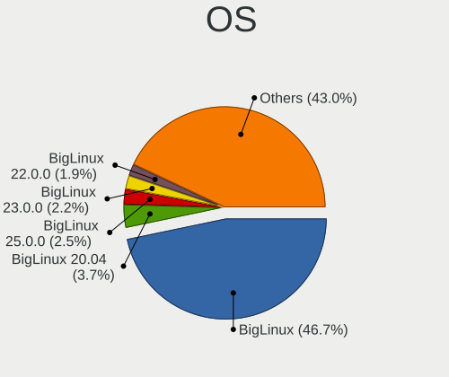

| Name                      | Computers | Percent |
|---------------------------|-----------|---------|
| BigLinux                  | 150       | 46.73%  |
| BigLinux 20.04            | 12        | 3.74%   |
| BigLinux 25.0.0           | 8         | 2.49%   |
| BigLinux 23.0.0           | 7         | 2.18%   |
| BigLinux 22.0.0           | 6         | 1.87%   |
| BigLinux 19.04            | 5         | 1.56%   |
| BigLinux 24.2.1           | 4         | 1.25%   |
| BigLinux 24.0.8           | 4         | 1.25%   |
| BigLinux 24.0.2           | 4         | 1.25%   |
| BigLinux 22.1.0           | 4         | 1.25%   |
| BigLinux 22.0.4           | 4         | 1.25%   |
| BigLinux 25.0.10          | 3         | 0.93%   |
| BigLinux 24.2.0           | 3         | 0.93%   |
| BigLinux 24.0.6           | 3         | 0.93%   |
| BigLinux 23.1.4           | 3         | 0.93%   |
| BigLinux 23.1.0           | 3         | 0.93%   |
| BigLinux 21.3.7           | 3         | 0.93%   |
| BigLinux 21.3.5           | 3         | 0.93%   |
| BigLinux 2025-06-27       | 3         | 0.93%   |
| BigLinux 2024-03-15_05-13 | 3         | 0.93%   |
| BigLinux 2024-03-08_05-13 | 3         | 0.93%   |
| BigLinux 25.0.8           | 2         | 0.62%   |
| BigLinux 25.0.5           | 2         | 0.62%   |
| BigLinux 24.1.1           | 2         | 0.62%   |
| BigLinux 24.0.4           | 2         | 0.62%   |
| BigLinux 23.1.3           | 2         | 0.62%   |
| BigLinux 23.02.20         | 2         | 0.62%   |
| BigLinux 23.0.3           | 2         | 0.62%   |
| BigLinux 23.0.1           | 2         | 0.62%   |
| BigLinux 2025-03-15       | 2         | 0.62%   |
| BigLinux 2025-01-05       | 2         | 0.62%   |
| BigLinux 2024-12-20       | 2         | 0.62%   |
| BigLinux 2024-05-20_03-09 | 2         | 0.62%   |
| BigLinux 2023-12-01_05-13 | 2         | 0.62%   |
| BigLinux 2023-06-30_08-01 | 2         | 0.62%   |
| BigLinux 25.1.0           | 1         | 0.31%   |
| BigLinux 25.0.9           | 1         | 0.31%   |
| BigLinux 25.0.7           | 1         | 0.31%   |
| BigLinux 25.0.4           | 1         | 0.31%   |
| BigLinux 25.0.3           | 1         | 0.31%   |

OS Family
---------

OS without a version

| Name     | Computers | Percent |
|----------|-----------|---------|
| BigLinux | 307       | 100%    |

Kernel
------

Version of the Linux kernel

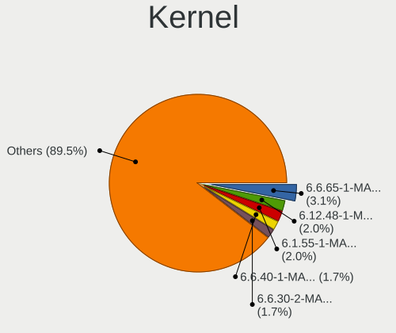

| Version           | Computers | Percent |
|-------------------|-----------|---------|
| 6.6.65-1-MANJARO  | 11        | 3.11%   |
| 6.12.48-1-MANJARO | 7         | 1.98%   |
| 6.1.55-1-MANJARO  | 7         | 1.98%   |
| 6.6.40-1-MANJARO  | 6         | 1.69%   |
| 6.6.30-2-MANJARO  | 6         | 1.69%   |
| 6.6.19-1-MANJARO  | 6         | 1.69%   |
| 6.12.44-3-MANJARO | 6         | 1.69%   |
| 6.12.34-1-MANJARO | 6         | 1.69%   |
| 6.6.63-1-MANJARO  | 5         | 1.41%   |
| 6.6.54-2-MANJARO  | 5         | 1.41%   |
| 6.6.26-1-MANJARO  | 5         | 1.41%   |
| 6.12.28-1-MANJARO | 5         | 1.41%   |
| 6.1.64-1-MANJARO  | 5         | 1.41%   |
| 6.6.44-1-MANJARO  | 4         | 1.13%   |
| 6.5.5-1-MANJARO   | 4         | 1.13%   |
| 6.12.39-1-MANJARO | 4         | 1.13%   |
| 6.12.21-4-MANJARO | 4         | 1.13%   |
| 6.10.6-10-MANJARO | 4         | 1.13%   |
| 6.1.71-1-MANJARO  | 4         | 1.13%   |
| 6.1.62-1-MANJARO  | 4         | 1.13%   |
| 6.1.31-2-MANJARO  | 4         | 1.13%   |
| 6.1.12-1-MANJARO  | 4         | 1.13%   |
| 6.9.5-1-MANJARO   | 3         | 0.85%   |
| 6.6.75-2-MANJARO  | 3         | 0.85%   |
| 6.6.32-1-MANJARO  | 3         | 0.85%   |
| 6.6.3-1-MANJARO   | 3         | 0.85%   |
| 6.17.1-0-MANJARO  | 3         | 0.85%   |
| 6.12.41-1-MANJARO | 3         | 0.85%   |
| 6.12.4-1-MANJARO  | 3         | 0.85%   |
| 6.12.37-1-MANJARO | 3         | 0.85%   |
| 6.12.20-2-MANJARO | 3         | 0.85%   |
| 6.10.13-3-MANJARO | 3         | 0.85%   |
| 6.1.23-1-MANJARO  | 3         | 0.85%   |
| 6.1.106-1-MANJARO | 3         | 0.85%   |
| 5.15.94-1-MANJARO | 3         | 0.85%   |
| 5.15.85-1-MANJARO | 3         | 0.85%   |
| 5.15.60-1-MANJARO | 3         | 0.85%   |
| 6.9.12-3-MANJARO  | 2         | 0.56%   |
| 6.8.8-2-MANJARO   | 2         | 0.56%   |
| 6.8.5-1-MANJARO   | 2         | 0.56%   |

Kernel Family
-------------

Linux kernel without a distro release

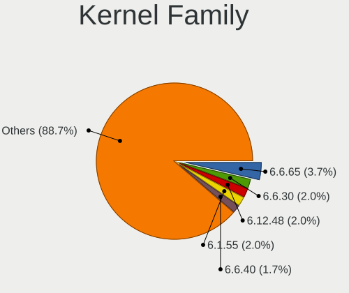

| Version | Computers | Percent |
|---------|-----------|---------|
| 6.6.65  | 13        | 3.68%   |
| 6.6.30  | 7         | 1.98%   |
| 6.12.48 | 7         | 1.98%   |
| 6.1.55  | 7         | 1.98%   |
| 6.6.40  | 6         | 1.7%    |
| 6.6.19  | 6         | 1.7%    |
| 6.12.44 | 6         | 1.7%    |
| 6.12.34 | 6         | 1.7%    |
| 6.1.64  | 6         | 1.7%    |
| 6.6.63  | 5         | 1.42%   |
| 6.6.54  | 5         | 1.42%   |
| 6.6.44  | 5         | 1.42%   |
| 6.6.26  | 5         | 1.42%   |
| 6.12.28 | 5         | 1.42%   |
| 6.1.62  | 5         | 1.42%   |
| 5.8.0   | 5         | 1.42%   |
| 6.6.32  | 4         | 1.13%   |
| 6.5.5   | 4         | 1.13%   |
| 6.12.39 | 4         | 1.13%   |
| 6.12.21 | 4         | 1.13%   |
| 6.10.6  | 4         | 1.13%   |
| 6.1.71  | 4         | 1.13%   |
| 6.1.31  | 4         | 1.13%   |
| 6.1.12  | 4         | 1.13%   |
| 5.4.0   | 4         | 1.13%   |
| 6.9.5   | 3         | 0.85%   |
| 6.6.75  | 3         | 0.85%   |
| 6.6.3   | 3         | 0.85%   |
| 6.17.1  | 3         | 0.85%   |
| 6.12.41 | 3         | 0.85%   |
| 6.12.4  | 3         | 0.85%   |
| 6.12.37 | 3         | 0.85%   |
| 6.12.25 | 3         | 0.85%   |
| 6.12.20 | 3         | 0.85%   |
| 6.11.0  | 3         | 0.85%   |
| 6.10.13 | 3         | 0.85%   |
| 6.1.23  | 3         | 0.85%   |
| 6.1.106 | 3         | 0.85%   |
| 5.15.94 | 3         | 0.85%   |
| 5.15.85 | 3         | 0.85%   |

Kernel Major Ver.
-----------------

Linux kernel major version

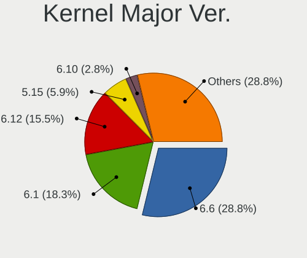

| Version | Computers | Percent |
|---------|-----------|---------|
| 6.6     | 93        | 28.79%  |
| 6.1     | 59        | 18.27%  |
| 6.12    | 50        | 15.48%  |
| 5.15    | 19        | 5.88%   |
| 6.10    | 9         | 2.79%   |
| 6.9     | 8         | 2.48%   |
| 6.8     | 8         | 2.48%   |
| 6.11    | 8         | 2.48%   |
| 6.5     | 7         | 2.17%   |
| 6.7     | 6         | 1.86%   |
| 6.13    | 6         | 1.86%   |
| 6.17    | 5         | 1.55%   |
| 5.8     | 5         | 1.55%   |
| 6.14    | 4         | 1.24%   |
| 5.4     | 4         | 1.24%   |
| 5.10    | 4         | 1.24%   |
| 6.4     | 3         | 0.93%   |
| 6.3     | 3         | 0.93%   |
| 6.2     | 3         | 0.93%   |
| 6.16    | 3         | 0.93%   |
| 6.15    | 3         | 0.93%   |
| 5.2     | 3         | 0.93%   |
| 6.0     | 2         | 0.62%   |
| 6.18    | 1         | 0.31%   |
| 5.9     | 1         | 0.31%   |
| 5.7     | 1         | 0.31%   |
| 5.6     | 1         | 0.31%   |
| 5.3     | 1         | 0.31%   |
| 5.19    | 1         | 0.31%   |
| 5.17    | 1         | 0.31%   |
| 5.16    | 1         | 0.31%   |

Arch
----

OS architecture (x86_64, i586, etc.)

| Name   | Computers | Percent |
|--------|-----------|---------|
| x86_64 | 307       | 100%    |

DE
--

Desktop Environment

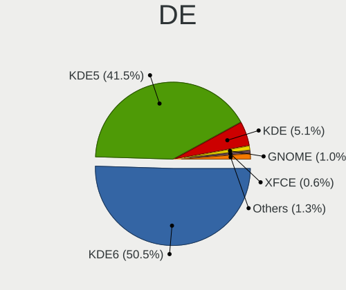

| Name     | Computers | Percent |
|----------|-----------|---------|
| KDE6     | 158       | 50.48%  |
| KDE5     | 130       | 41.53%  |
| KDE      | 16        | 5.11%   |
| GNOME    | 3         | 0.96%   |
| XFCE     | 2         | 0.64%   |
| Unknown  | 2         | 0.64%   |
| Deepin   | 1         | 0.32%   |
| Cinnamon | 1         | 0.32%   |

Display Server
--------------

X11 or Wayland

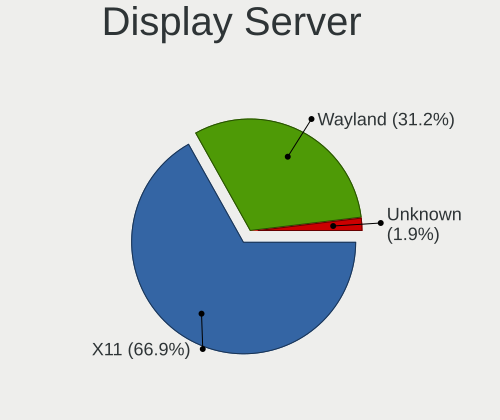

| Name    | Computers | Percent |
|---------|-----------|---------|
| X11     | 210       | 66.88%  |
| Wayland | 98        | 31.21%  |
| Unknown | 6         | 1.91%   |

Display Manager
---------------

SDDM, LightDM, etc.

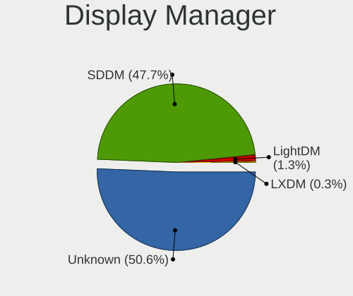

| Name    | Computers | Percent |
|---------|-----------|---------|
| Unknown | 157       | 50.65%  |
| SDDM    | 148       | 47.74%  |
| LightDM | 4         | 1.29%   |
| LXDM    | 1         | 0.32%   |

OS Lang
-------

Language

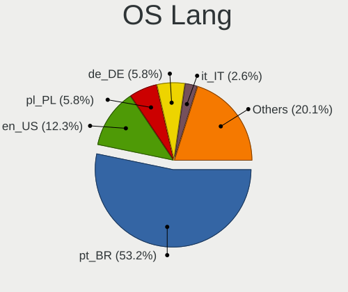

| Lang    | Computers | Percent |
|---------|-----------|---------|
| pt_BR   | 164       | 53.25%  |
| en_US   | 38        | 12.34%  |
| pl_PL   | 18        | 5.84%   |
| de_DE   | 18        | 5.84%   |
| it_IT   | 8         | 2.6%    |
| en_GB   | 7         | 2.27%   |
| fr_FR   | 6         | 1.95%   |
| es_MX   | 6         | 1.95%   |
| pt_PT   | 5         | 1.62%   |
| tr_TR   | 3         | 0.97%   |
| hu_HU   | 3         | 0.97%   |
| es_ES   | 3         | 0.97%   |
| es_AR   | 3         | 0.97%   |
| es_VE   | 2         | 0.65%   |
| es_CL   | 2         | 0.65%   |
| en_CA   | 2         | 0.65%   |
| el_GR   | 2         | 0.65%   |
| da_DK   | 2         | 0.65%   |
| Unknown | 2         | 0.65%   |
| ru_RU   | 1         | 0.32%   |
| nl_BE   | 1         | 0.32%   |
| fr_BE   | 1         | 0.32%   |
| fi_FI   | 1         | 0.32%   |
| es_US   | 1         | 0.32%   |
| es_CR   | 1         | 0.32%   |
| es_CO   | 1         | 0.32%   |
| es_BO   | 1         | 0.32%   |
| en_ZA   | 1         | 0.32%   |
| en_IL   | 1         | 0.32%   |
| en_IE   | 1         | 0.32%   |
| en_AU   | 1         | 0.32%   |
| de_AT   | 1         | 0.32%   |
| ca_ES   | 1         | 0.32%   |

Boot Mode
---------

EFI or BIOS

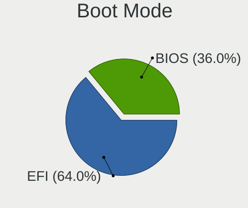

| Mode | Computers | Percent |
|------|-----------|---------|
| EFI  | 201       | 64.01%  |
| BIOS | 113       | 35.99%  |

Filesystem
----------

Type of filesystem

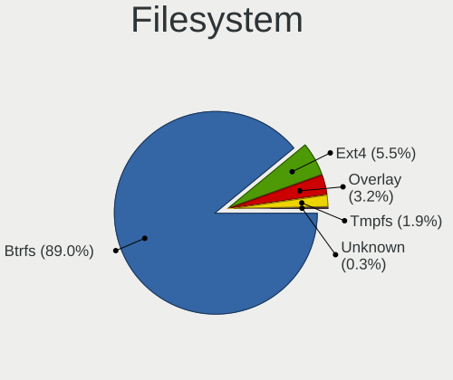

| Type    | Computers | Percent |
|---------|-----------|---------|
| Btrfs   | 276       | 89.03%  |
| Ext4    | 17        | 5.48%   |
| Overlay | 10        | 3.23%   |
| Tmpfs   | 6         | 1.94%   |
| Unknown | 1         | 0.32%   |

Part. scheme
------------

Scheme of partitioning

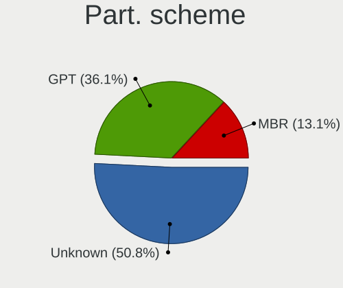

| Type    | Computers | Percent |
|---------|-----------|---------|
| Unknown | 159       | 50.8%   |
| GPT     | 113       | 36.1%   |
| MBR     | 41        | 13.1%   |

Dual Boot with Linux/BSD
------------------------

Hosting more than one Linux/BSD

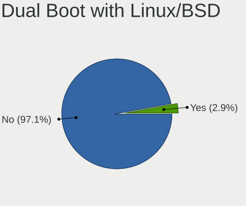

| Dual boot | Computers | Percent |
|-----------|-----------|---------|
| No        | 299       | 97.08%  |
| Yes       | 9         | 2.92%   |

Dual Boot (Win)
---------------

Hosting Linux and Windows

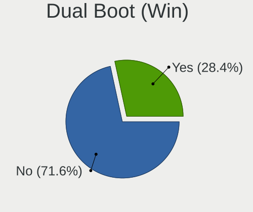

| Dual boot | Computers | Percent |
|-----------|-----------|---------|
| No        | 222       | 71.61%  |
| Yes       | 88        | 28.39%  |

Board
-----

Vendor
------

Motherboard manufacturer

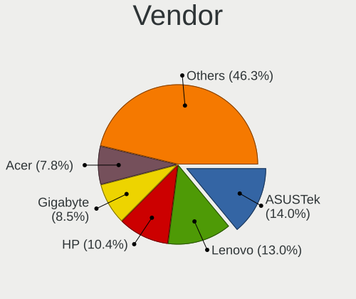

| Name                  | Computers | Percent |
|-----------------------|-----------|---------|
| ASUSTek Computer      | 43        | 14.01%  |
| Lenovo                | 40        | 13.03%  |
| Hewlett-Packard       | 32        | 10.42%  |
| Gigabyte Technology   | 26        | 8.47%   |
| Acer                  | 24        | 7.82%   |
| Intel                 | 21        | 6.84%   |
| Dell                  | 20        | 6.51%   |
| Positivo              | 11        | 3.58%   |
| MSI                   | 11        | 3.58%   |
| ASRock                | 11        | 3.58%   |
| Samsung Electronics   | 6         | 1.95%   |
| PCWare                | 6         | 1.95%   |
| Itautec               | 5         | 1.63%   |
| Apple                 | 5         | 1.63%   |
| Biostar               | 4         | 1.3%    |
| Sony                  | 3         | 0.98%   |
| Multilaser            | 3         | 0.98%   |
| Google                | 3         | 0.98%   |
| Unknown               | 3         | 0.98%   |
| Toshiba               | 2         | 0.65%   |
| Semp Toshiba          | 2         | 0.65%   |
| OEM                   | 2         | 0.65%   |
| Microsoft             | 2         | 0.65%   |
| eMachines             | 2         | 0.65%   |
| ECS                   | 2         | 0.65%   |
| QIYIDA                | 1         | 0.33%   |
| Positivo Bahia - VAIO | 1         | 0.33%   |
| Pegatron              | 1         | 0.33%   |
| Panasonic             | 1         | 0.33%   |
| MAXSUN                | 1         | 0.33%   |
| Mancer                | 1         | 0.33%   |
| MACHINIST             | 1         | 0.33%   |
| Kruger&Matz           | 1         | 0.33%   |
| Fujitsu               | 1         | 0.33%   |
| DUEX                  | 1         | 0.33%   |
| Digiboard             | 1         | 0.33%   |
| Daten Tecnologia      | 1         | 0.33%   |
| Clevo                 | 1         | 0.33%   |
| BESSTAR Tech          | 1         | 0.33%   |
| AZW                   | 1         | 0.33%   |

Model
-----

Motherboard model

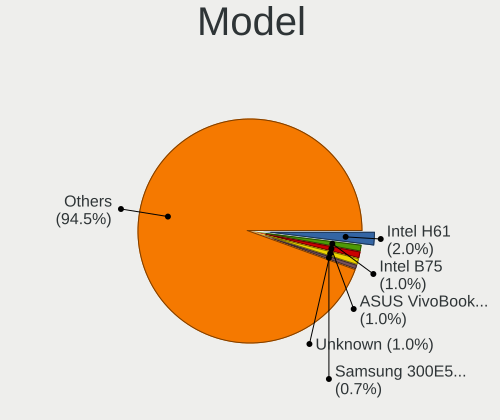

| Name                                     | Computers | Percent |
|------------------------------------------|-----------|---------|
| Intel H61                                | 6         | 1.95%   |
| Intel B75                                | 3         | 0.98%   |
| ASUS VivoBook_ASUSLaptop M1502IA_M1502IA | 3         | 0.98%   |
| Unknown                                  | 3         | 0.98%   |
| Samsung 300E5K/300E5Q                    | 2         | 0.65%   |
| Positivo C41TF                           | 2         | 0.65%   |
| PCWare IPX1800E2                         | 2         | 0.65%   |
| PCWare IPMH61R2                          | 2         | 0.65%   |
| MSI MS-7C91                              | 2         | 0.65%   |
| Itautec Infoway                          | 2         | 0.65%   |
| HP EliteBook 8760w                       | 2         | 0.65%   |
| HP Compaq 8200 Elite SFF PC              | 2         | 0.65%   |
| Google Blooguard                         | 2         | 0.65%   |
| Gigabyte B650 GAMING X AX                | 2         | 0.65%   |
| Gigabyte 970A-DS3P                       | 2         | 0.65%   |
| Dell G15 5520                            | 2         | 0.65%   |
| Biostar B450MH                           | 2         | 0.65%   |
| ASUS VivoBook_ASUSLaptop M5602RA         | 2         | 0.65%   |
| ASRock B450M Steel Legend                | 2         | 0.65%   |
| ASRock 775Dual-VSTA                      | 2         | 0.65%   |
| Acer Aspire A515-51G                     | 2         | 0.65%   |
| Acer Aspire A315-53                      | 2         | 0.65%   |
| Toshiba Satellite S55-A                  | 1         | 0.33%   |
| Toshiba Satellite C670-12E               | 1         | 0.33%   |
| Sony VPCF215FX                           | 1         | 0.33%   |
| Sony VPCEH40EB                           | 1         | 0.33%   |
| Sony VGN-NR230AE                         | 1         | 0.33%   |
| Semp Toshiba STI                         | 1         | 0.33%   |
| Semp Toshiba IS 1412                     | 1         | 0.33%   |
| Samsung RV415                            | 1         | 0.33%   |
| Samsung 750XFH                           | 1         | 0.33%   |
| Samsung 550XCJ/550XCR                    | 1         | 0.33%   |
| Samsung 300E5M/300E5L                    | 1         | 0.33%   |
| QIYIDA X99 K9S                           | 1         | 0.33%   |
| Positivo R58256A-15                      | 1         | 0.33%   |
| Positivo Q464B                           | 1         | 0.33%   |
| Positivo POS-MIH61CF                     | 1         | 0.33%   |
| Positivo POS-EIH61CQ                     | 1         | 0.33%   |
| Positivo Mobile                          | 1         | 0.33%   |
| Positivo Master N4340                    | 1         | 0.33%   |

Model Family
------------

Motherboard model prefix

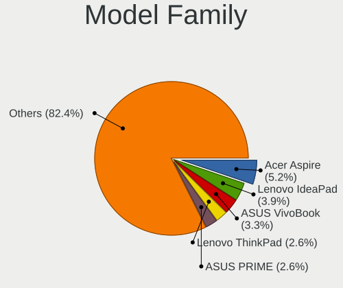

| Name               | Computers | Percent |
|--------------------|-----------|---------|
| Acer Aspire        | 16        | 5.21%   |
| Lenovo IdeaPad     | 12        | 3.91%   |
| ASUS VivoBook      | 10        | 3.26%   |
| Lenovo ThinkPad    | 8         | 2.61%   |
| ASUS PRIME         | 8         | 2.61%   |
| Lenovo Yoga        | 7         | 2.28%   |
| Intel H61          | 6         | 1.95%   |
| Dell Inspiron      | 6         | 1.95%   |
| HP EliteBook       | 5         | 1.63%   |
| Lenovo ThinkCentre | 4         | 1.3%    |
| Itautec Infoway    | 4         | 1.3%    |
| HP Pavilion        | 4         | 1.3%    |
| HP EliteDesk       | 4         | 1.3%    |
| Acer Nitro         | 4         | 1.3%    |
| Intel B75          | 3         | 0.98%   |
| HP Laptop          | 3         | 0.98%   |
| HP Compaq          | 3         | 0.98%   |
| Dell Latitude      | 3         | 0.98%   |
| Dell G15           | 3         | 0.98%   |
| ASUS TUF           | 3         | 0.98%   |
| ASRock B450M       | 3         | 0.98%   |
| Unknown            | 3         | 0.98%   |
| Toshiba Satellite  | 2         | 0.65%   |
| Samsung 300E5K     | 2         | 0.65%   |
| Positivo C41TF     | 2         | 0.65%   |
| PCWare IPX1800E2   | 2         | 0.65%   |
| PCWare IPMH61R2    | 2         | 0.65%   |
| MSI MS-7C91        | 2         | 0.65%   |
| Microsoft Surface  | 2         | 0.65%   |
| Lenovo 63          | 2         | 0.65%   |
| HP ZBook           | 2         | 0.65%   |
| HP ProBook         | 2         | 0.65%   |
| HP 255             | 2         | 0.65%   |
| Google Blooguard   | 2         | 0.65%   |
| Gigabyte B650      | 2         | 0.65%   |
| Gigabyte B450M     | 2         | 0.65%   |
| Gigabyte A520M     | 2         | 0.65%   |
| Gigabyte 970A-DS3P | 2         | 0.65%   |
| Dell System        | 2         | 0.65%   |
| Dell Precision     | 2         | 0.65%   |

MFG Year
--------

Motherboard manufacture year

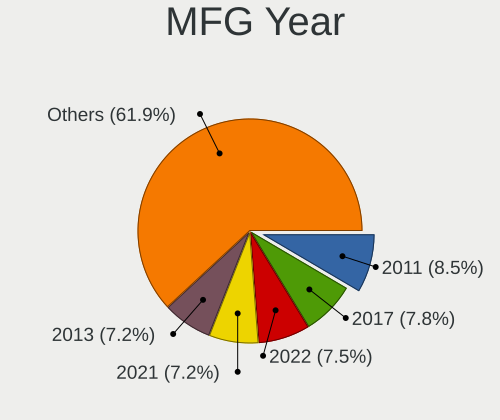

| Year | Computers | Percent |
|------|-----------|---------|
| 2011 | 26        | 8.47%   |
| 2017 | 24        | 7.82%   |
| 2022 | 23        | 7.49%   |
| 2021 | 22        | 7.17%   |
| 2013 | 22        | 7.17%   |
| 2023 | 20        | 6.51%   |
| 2020 | 20        | 6.51%   |
| 2018 | 20        | 6.51%   |
| 2012 | 20        | 6.51%   |
| 2016 | 18        | 5.86%   |
| 2014 | 17        | 5.54%   |
| 2010 | 16        | 5.21%   |
| 2019 | 15        | 4.89%   |
| 2009 | 14        | 4.56%   |
| 2015 | 9         | 2.93%   |
| 2024 | 8         | 2.61%   |
| 2008 | 5         | 1.63%   |
| 2007 | 4         | 1.3%    |
| 2006 | 2         | 0.65%   |
| 2005 | 1         | 0.33%   |
| 2004 | 1         | 0.33%   |

Form Factor
-----------

Physical design of the computer

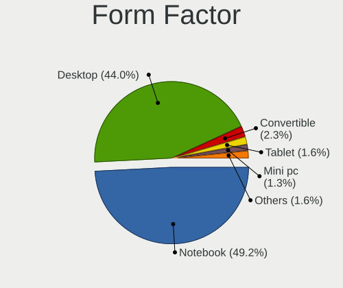

| Name        | Computers | Percent |
|-------------|-----------|---------|
| Notebook    | 151       | 49.19%  |
| Desktop     | 135       | 43.97%  |
| Convertible | 7         | 2.28%   |
| Tablet      | 5         | 1.63%   |
| Mini pc     | 4         | 1.3%    |
| All in one  | 4         | 1.3%    |
| Server      | 1         | 0.33%   |

Secure Boot
-----------

Enabled or disabled

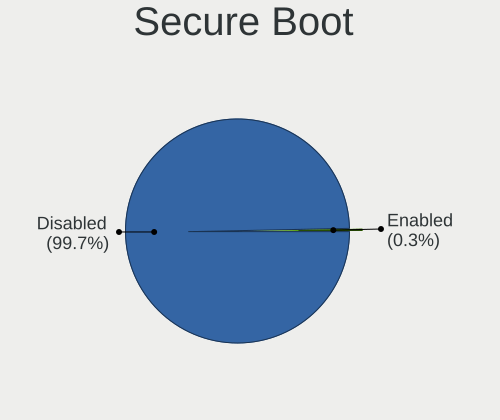

| State    | Computers | Percent |
|----------|-----------|---------|
| Disabled | 306       | 99.67%  |
| Enabled  | 1         | 0.33%   |

Coreboot
--------

Have coreboot on board

| Used | Computers | Percent |
|------|-----------|---------|
| No   | 304       | 99.02%  |
| Yes  | 3         | 0.98%   |

RAM Size
--------

Total RAM memory

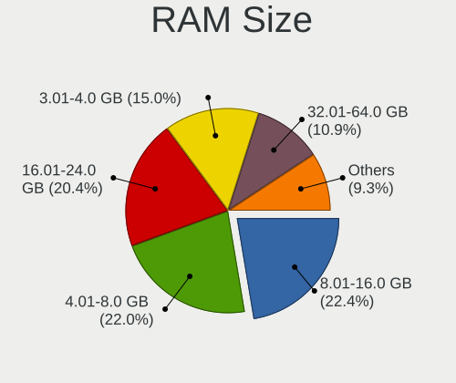

| Size in GB  | Computers | Percent |
|-------------|-----------|---------|
| 8.01-16.0   | 70        | 22.36%  |
| 4.01-8.0    | 69        | 22.04%  |
| 16.01-24.0  | 64        | 20.45%  |
| 3.01-4.0    | 47        | 15.02%  |
| 32.01-64.0  | 34        | 10.86%  |
| 24.01-32.0  | 9         | 2.88%   |
| 1.01-2.0    | 8         | 2.56%   |
| 64.01-256.0 | 7         | 2.24%   |
| 2.01-3.0    | 5         | 1.6%    |

RAM Used
--------

Used RAM memory

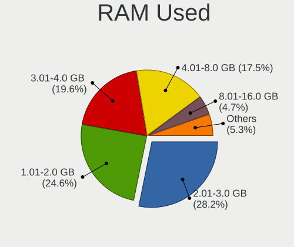

| Used GB    | Computers | Percent |
|------------|-----------|---------|
| 2.01-3.0   | 95        | 28.19%  |
| 1.01-2.0   | 83        | 24.63%  |
| 3.01-4.0   | 66        | 19.58%  |
| 4.01-8.0   | 59        | 17.51%  |
| 8.01-16.0  | 16        | 4.75%   |
| 0.51-1.0   | 15        | 4.45%   |
| 24.01-32.0 | 1         | 0.3%    |
| 16.01-24.0 | 1         | 0.3%    |
| 0.01-0.5   | 1         | 0.3%    |

Total Drives
------------

Number of drives on board

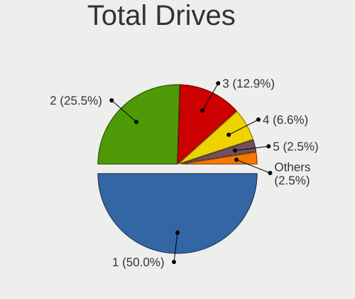

| Drives | Computers | Percent |
|--------|-----------|---------|
| 1      | 159       | 50%     |
| 2      | 81        | 25.47%  |
| 3      | 41        | 12.89%  |
| 4      | 21        | 6.6%    |
| 5      | 8         | 2.52%   |
| 6      | 4         | 1.26%   |
| 9      | 2         | 0.63%   |
| 0      | 2         | 0.63%   |

Has CD-ROM
----------

Has CD-ROM on board

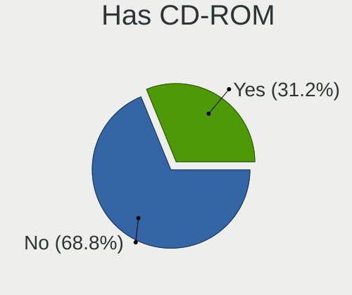

| Presented | Computers | Percent |
|-----------|-----------|---------|
| No        | 212       | 68.83%  |
| Yes       | 96        | 31.17%  |

Has Ethernet
------------

Has Ethernet on board

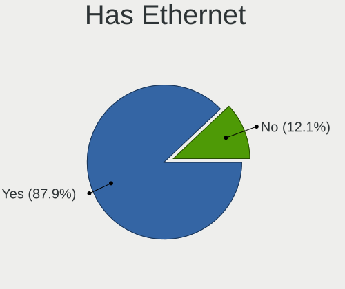

| Presented | Computers | Percent |
|-----------|-----------|---------|
| Yes       | 270       | 87.95%  |
| No        | 37        | 12.05%  |

Has WiFi
--------

Has WiFi module

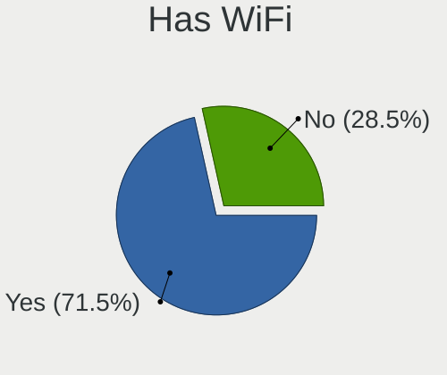

| Presented | Computers | Percent |
|-----------|-----------|---------|
| Yes       | 221       | 71.52%  |
| No        | 88        | 28.48%  |

Has Bluetooth
-------------

Has Bluetooth module

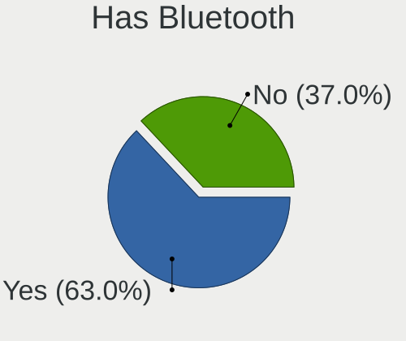

| Presented | Computers | Percent |
|-----------|-----------|---------|
| Yes       | 196       | 63.02%  |
| No        | 115       | 36.98%  |

Location
--------

Country
-------

Geographic location (country)

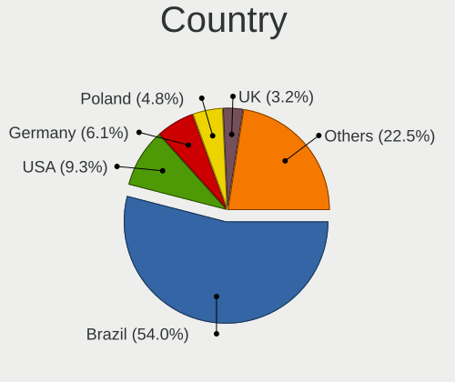

| Country         | Computers | Percent |
|-----------------|-----------|---------|
| Brazil          | 168       | 54.02%  |
| USA             | 29        | 9.32%   |
| Germany         | 19        | 6.11%   |
| Poland          | 15        | 4.82%   |
| UK              | 10        | 3.22%   |
| Italy           | 8         | 2.57%   |
| Portugal        | 6         | 1.93%   |
| France          | 6         | 1.93%   |
| Mexico          | 4         | 1.29%   |
| Greece          | 4         | 1.29%   |
| Chile           | 4         | 1.29%   |
| Turkey          | 3         | 0.96%   |
| Spain           | 3         | 0.96%   |
| Argentina       | 3         | 0.96%   |
| Venezuela       | 2         | 0.64%   |
| Ireland         | 2         | 0.64%   |
| Hungary         | 2         | 0.64%   |
| Faroe Islands   | 2         | 0.64%   |
| Costa Rica      | 2         | 0.64%   |
| Belgium         | 2         | 0.64%   |
| The Netherlands | 1         | 0.32%   |
| South Korea     | 1         | 0.32%   |
| South Africa    | 1         | 0.32%   |
| Saudi Arabia    | 1         | 0.32%   |
| Russia          | 1         | 0.32%   |
| Netherlands     | 1         | 0.32%   |
| Japan           | 1         | 0.32%   |
| Israel          | 1         | 0.32%   |
| Ghana           | 1         | 0.32%   |
| Finland         | 1         | 0.32%   |
| El Salvador     | 1         | 0.32%   |
| Colombia        | 1         | 0.32%   |
| Canada          | 1         | 0.32%   |
| Bolivia         | 1         | 0.32%   |
| Bangladesh      | 1         | 0.32%   |
| Austria         | 1         | 0.32%   |
| Australia       | 1         | 0.32%   |

City
----

Geographic location (city)

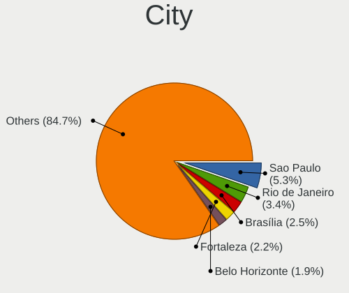

| City                  | Computers | Percent |
|-----------------------|-----------|---------|
| Sao Paulo             | 17        | 5.31%   |
| Rio de Janeiro        | 11        | 3.44%   |
| Brasília             | 8         | 2.5%    |
| Fortaleza             | 7         | 2.19%   |
| Belo Horizonte        | 6         | 1.88%   |
| Recife                | 5         | 1.56%   |
| Ribeirao Preto        | 4         | 1.25%   |
| Maringá              | 4         | 1.25%   |
| Goiânia              | 4         | 1.25%   |
| Campo Grande          | 4         | 1.25%   |
| San Jose              | 3         | 0.94%   |
| Osasco                | 3         | 0.94%   |
| Curitiba              | 3         | 0.94%   |
| Clarksville           | 3         | 0.94%   |
| Berlin                | 3         | 0.94%   |
| Warsaw                | 2         | 0.63%   |
| Toulouse              | 2         | 0.63%   |
| Tórshavn             | 2         | 0.63%   |
| Thessaloniki          | 2         | 0.63%   |
| Szczyrk               | 2         | 0.63%   |
| Sao Domingos do Capim | 2         | 0.63%   |
| Santo André          | 2         | 0.63%   |
| Salvador              | 2         | 0.63%   |
| Miloslaw              | 2         | 0.63%   |
| Midleton              | 2         | 0.63%   |
| Londrina              | 2         | 0.63%   |
| Jundiaí              | 2         | 0.63%   |
| Itatiba               | 2         | 0.63%   |
| Istanbul              | 2         | 0.63%   |
| Duque de Caxias       | 2         | 0.63%   |
| Darmstadt             | 2         | 0.63%   |
| Dallas                | 2         | 0.63%   |
| Castanhal             | 2         | 0.63%   |
| Caratinga             | 2         | 0.63%   |
| Belém                | 2         | 0.63%   |
| Zdzieszowice          | 1         | 0.31%   |
| Würzburg             | 1         | 0.31%   |
| Wiener Neustadt       | 1         | 0.31%   |
| Walsall               | 1         | 0.31%   |
| Vitória da Conquista | 1         | 0.31%   |

Drives
------

Drive Vendor
------------

Hard drive vendors

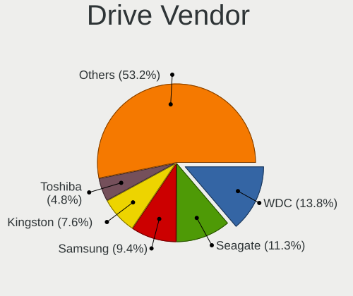

| Vendor                         | Computers | Drives | Percent |
|--------------------------------|-----------|--------|---------|
| WDC                            | 72        | 102    | 13.77%  |
| Seagate                        | 59        | 87     | 11.28%  |
| Samsung Electronics            | 49        | 63     | 9.37%   |
| Kingston                       | 40        | 51     | 7.65%   |
| Toshiba                        | 25        | 28     | 4.78%   |
| China                          | 25        | 30     | 4.78%   |
| Sandisk                        | 21        | 21     | 4.02%   |
| Unknown                        | 16        | 18     | 3.06%   |
| Crucial                        | 15        | 16     | 2.87%   |
| MAXIO Technology (Hangzhou)    | 14        | 17     | 2.68%   |
| Hitachi                        | 13        | 26     | 2.49%   |
| SK hynix                       | 11        | 13     | 2.1%    |
| Silicon Motion                 | 11        | 15     | 2.1%    |
| Micron/Crucial Technology      | 10        | 11     | 1.91%   |
| Micron Technology              | 8         | 11     | 1.53%   |
| Kingston Technology Company    | 8         | 10     | 1.53%   |
| ADATA Technology               | 8         | 11     | 1.53%   |
| PNY                            | 7         | 9      | 1.34%   |
| A-DATA Technology              | 7         | 9      | 1.34%   |
| KingSpec                       | 6         | 6      | 1.15%   |
| Realtek Semiconductor          | 5         | 5      | 0.96%   |
| HGST                           | 5         | 7      | 0.96%   |
| GOODRAM                        | 5         | 8      | 0.96%   |
| Solid State Storage Technology | 4         | 7      | 0.76%   |
| LITEON                         | 4         | 6      | 0.76%   |
| JMicron Technology             | 4         | 4      | 0.76%   |
| Intel                          | 4         | 4      | 0.76%   |
| Shenzhen Longsys Electronics   | 3         | 3      | 0.57%   |
| Apacer                         | 3         | 4      | 0.57%   |
| Unknown                        | 3         | 3      | 0.57%   |
| XrayDisk                       | 2         | 2      | 0.38%   |
| X12                            | 2         | 3      | 0.38%   |
| Verbatim                       | 2         | 4      | 0.38%   |
| Team                           | 2         | 3      | 0.38%   |
| Patriot                        | 2         | 2      | 0.38%   |
| Netac                          | 2         | 3      | 0.38%   |
| Lexar                          | 2         | 4      | 0.38%   |
| Intenso                        | 2         | 3      | 0.38%   |
| HUSKY                          | 2         | 4      | 0.38%   |
| BHT                            | 2         | 2      | 0.38%   |

Drive Model
-----------

Hard drive models

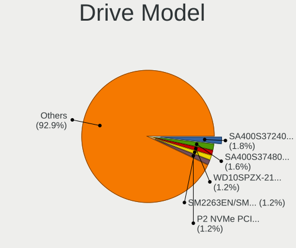

| Model                                                          | Computers | Percent |
|----------------------------------------------------------------|-----------|---------|
| Kingston SA400S37240G 240GB SSD                                | 10        | 1.77%   |
| Kingston SA400S37480G 480GB SSD                                | 9         | 1.59%   |
| WDC WD10SPZX-21Z10T0 1TB                                       | 7         | 1.24%   |
| Silicon Motion SM2263EN/SM2263XT SSD Controller 512GB          | 7         | 1.24%   |
| Micron/Crucial P2 NVMe PCIe SSD 2TB                            | 7         | 1.24%   |
| MAXIO (Hangzhou) NVMe SSD Controller MAP1202 2TB               | 7         | 1.24%   |
| Kingston SV300S37A240G 240GB SSD                               | 7         | 1.24%   |
| Unknown MMC Card  64GB                                         | 6         | 1.06%   |
| Samsung NVMe SSD Controller SM981/PM981/PM983 1TB              | 6         | 1.06%   |
| Unknown MMC Card  128GB                                        | 5         | 0.88%   |
| Seagate ST500LM012 HN-M500MBB 500GB                            | 5         | 0.88%   |
| Seagate ST500DM002-1BD142 500GB                                | 5         | 0.88%   |
| Toshiba MQ04ABF100 1TB                                         | 4         | 0.71%   |
| Toshiba MQ01ABD100 1TB                                         | 4         | 0.71%   |
| Samsung SSD 870 QVO 2TB                                        | 4         | 0.71%   |
| MAXIO (Hangzhou) NVMe SSD Controller MAP1202 (DRAM-less) 512GB | 4         | 0.71%   |
| Kingston Company SNV2S1000G 1TB                                | 4         | 0.71%   |
| Kingston SA400S37120G 120GB SSD                                | 4         | 0.71%   |
| Crucial CT500MX500SSD1 500GB                                   | 4         | 0.71%   |
| WDC WD5000AVDS-63U7B1 500GB                                    | 3         | 0.53%   |
| WDC WD10SPZX-80Z10T2 1TB                                       | 3         | 0.53%   |
| WDC WD10JPVX-22JC3T0 1TB                                       | 3         | 0.53%   |
| Toshiba MQ01ABD050V -63 500GB                                  | 3         | 0.53%   |
| Toshiba DT01ACA050 500GB                                       | 3         | 0.53%   |
| SK hynix HFS256GEJ9X108N 256GB                                 | 3         | 0.53%   |
| Silicon Motion SM2262/SM2262EN SSD Controller 960GB            | 3         | 0.53%   |
| Seagate ST1000DM010-2EP102 1TB                                 | 3         | 0.53%   |
| Seagate ST1000DM003-1SB102 1TB                                 | 3         | 0.53%   |
| Samsung SSD 850 EVO 500GB                                      | 3         | 0.53%   |
| JMicron Tech 250GB                                             | 3         | 0.53%   |
| China SSD 240GB                                                | 3         | 0.53%   |
| China SSD 120GB                                                | 3         | 0.53%   |
| Unknown                                                        | 3         | 0.53%   |
| X12 SSD 512GB                                                  | 2         | 0.35%   |
| WDC WDS480G2G0A-00JH30 480GB SSD                               | 2         | 0.35%   |
| WDC WD5000AAKX-60U6AA0 500GB                                   | 2         | 0.35%   |
| WDC WD20EZRX-00D8PB0 2TB                                       | 2         | 0.35%   |
| WDC WD10JPCX-24UE4T0 1TB                                       | 2         | 0.35%   |
| WDC WD10EZEX-08WN4A0 1TB                                       | 2         | 0.35%   |
| WDC WD1001FALS-41Y6A1 1TB                                      | 2         | 0.35%   |

HDD Vendor
----------

Hard disk drive vendors

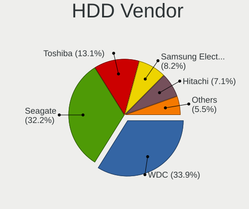

| Vendor              | Computers | Drives | Percent |
|---------------------|-----------|--------|---------|
| WDC                 | 62        | 85     | 33.88%  |
| Seagate             | 59        | 87     | 32.24%  |
| Toshiba             | 24        | 27     | 13.11%  |
| Samsung Electronics | 15        | 21     | 8.2%    |
| Hitachi             | 13        | 26     | 7.1%    |
| HGST                | 5         | 7      | 2.73%   |
| Unknown             | 1         | 1      | 0.55%   |
| PRO Z               | 1         | 1      | 0.55%   |
| Maxtor              | 1         | 1      | 0.55%   |
| ASMedia             | 1         | 1      | 0.55%   |
| Apple               | 1         | 3      | 0.55%   |

SSD Vendor
----------

Solid state drive vendors

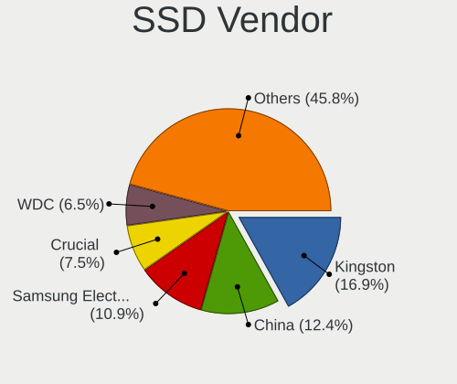

| Vendor              | Computers | Drives | Percent |
|---------------------|-----------|--------|---------|
| Kingston            | 34        | 43     | 16.92%  |
| China               | 25        | 30     | 12.44%  |
| Samsung Electronics | 22        | 29     | 10.95%  |
| Crucial             | 15        | 16     | 7.46%   |
| WDC                 | 13        | 17     | 6.47%   |
| SanDisk             | 13        | 13     | 6.47%   |
| PNY                 | 7         | 9      | 3.48%   |
| A-DATA Technology   | 7         | 9      | 3.48%   |
| KingSpec            | 6         | 6      | 2.99%   |
| GOODRAM             | 5         | 8      | 2.49%   |
| LITEON              | 4         | 6      | 1.99%   |
| Micron Technology   | 3         | 3      | 1.49%   |
| Apacer              | 3         | 4      | 1.49%   |
| Unknown             | 3         | 3      | 1.49%   |
| X12                 | 2         | 3      | 1%      |
| Verbatim            | 2         | 4      | 1%      |
| Patriot             | 2         | 2      | 1%      |
| Lexar               | 2         | 4      | 1%      |
| Intenso             | 2         | 3      | 1%      |
| Intel               | 2         | 2      | 1%      |
| HUSKY               | 2         | 4      | 1%      |
| BHT                 | 2         | 2      | 1%      |
| XUM                 | 1         | 1      | 0.5%    |
| XrayDisk            | 1         | 1      | 0.5%    |
| Toshiba             | 1         | 1      | 0.5%    |
| Team                | 1         | 2      | 0.5%    |
| T-FORCE             | 1         | 1      | 0.5%    |
| SPCC                | 1         | 2      | 0.5%    |
| SK hynix            | 1         | 1      | 0.5%    |
| SABRENT             | 1         | 2      | 0.5%    |
| S3+                 | 1         | 1      | 0.5%    |
| QUANXING            | 1         | 1      | 0.5%    |
| Plextor             | 1         | 1      | 0.5%    |
| Pichau              | 1         | 1      | 0.5%    |
| NTC                 | 1         | 1      | 0.5%    |
| NT-1TB              | 1         | 1      | 0.5%    |
| MACROVIP            | 1         | 1      | 0.5%    |
| KLEVV               | 1         | 1      | 0.5%    |
| Kingchuxing         | 1         | 1      | 0.5%    |
| KEEPDATA            | 1         | 1      | 0.5%    |

Drive Kind
----------

HDD or SSD

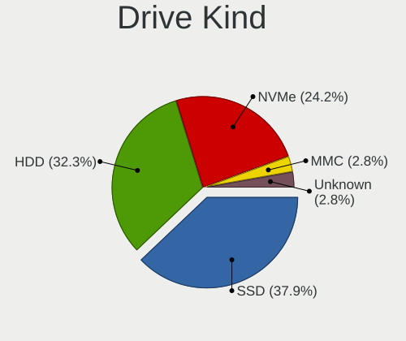

| Kind    | Computers | Drives | Percent |
|---------|-----------|--------|---------|
| SSD     | 163       | 249    | 37.91%  |
| HDD     | 139       | 260    | 32.33%  |
| NVMe    | 104       | 141    | 24.19%  |
| MMC     | 12        | 14     | 2.79%   |
| Unknown | 12        | 14     | 2.79%   |

Drive Connector
---------------

SATA, SAS, NVMe, etc.

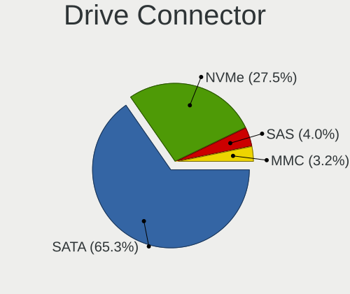

| Type | Computers | Drives | Percent |
|------|-----------|--------|---------|
| SATA | 247       | 502    | 65.34%  |
| NVMe | 104       | 140    | 27.51%  |
| SAS  | 15        | 22     | 3.97%   |
| MMC  | 12        | 14     | 3.17%   |

Drive Size
----------

Size of hard drive

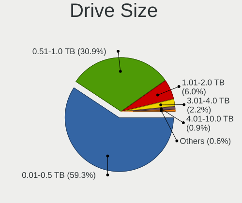

| Size in TB | Computers | Drives | Percent |
|------------|-----------|--------|---------|
| 0.01-0.5   | 188       | 305    | 59.31%  |
| 0.51-1.0   | 98        | 155    | 30.91%  |
| 1.01-2.0   | 19        | 28     | 5.99%   |
| 3.01-4.0   | 7         | 14     | 2.21%   |
| 4.01-10.0  | 3         | 5      | 0.95%   |
| 2.01-3.0   | 2         | 2      | 0.63%   |

Space Total
-----------

Amount of disk space available on the file system

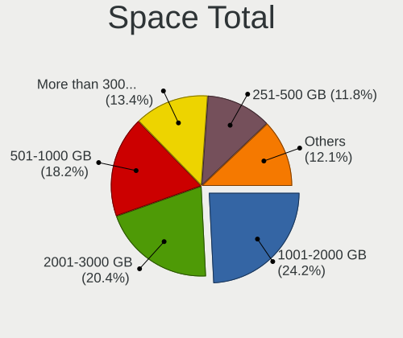

| Size in GB     | Computers | Percent |
|----------------|-----------|---------|
| 1001-2000      | 76        | 24.2%   |
| 2001-3000      | 64        | 20.38%  |
| 501-1000       | 57        | 18.15%  |
| More than 3000 | 42        | 13.38%  |
| 251-500        | 37        | 11.78%  |
| 101-250        | 22        | 7.01%   |
| Unknown        | 9         | 2.87%   |
| 1-20           | 4         | 1.27%   |
| 51-100         | 2         | 0.64%   |
| 21-50          | 1         | 0.32%   |

Space Used
----------

Amount of used disk space

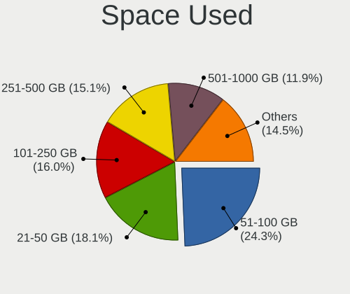

| Used GB        | Computers | Percent |
|----------------|-----------|---------|
| 51-100         | 82        | 24.33%  |
| 21-50          | 61        | 18.1%   |
| 101-250        | 54        | 16.02%  |
| 251-500        | 51        | 15.13%  |
| 501-1000       | 40        | 11.87%  |
| 1-20           | 18        | 5.34%   |
| 1001-2000      | 12        | 3.56%   |
| Unknown        | 9         | 2.67%   |
| 2001-3000      | 6         | 1.78%   |
| More than 3000 | 4         | 1.19%   |

Malfunc. Drives
---------------

Drive models with a malfunction

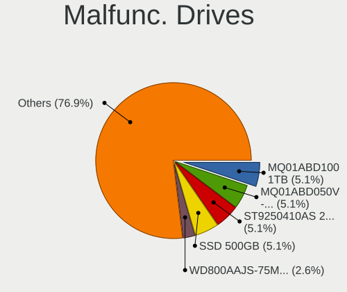

| Model                                                                   | Computers | Drives | Percent |
|-------------------------------------------------------------------------|-----------|--------|---------|
| Toshiba MQ01ABD100 1TB                                                  | 2         | 3      | 5.13%   |
| Toshiba MQ01ABD050V -63 500GB                                           | 2         | 2      | 5.13%   |
| Seagate ST9250410AS 250GB                                               | 2         | 2      | 5.13%   |
| China SSD 500GB                                                         | 2         | 2      | 5.13%   |
| WDC WD800AAJS-75M0A0 80GB                                               | 1         | 1      | 2.56%   |
| WDC WD5000AAKX-60U6AA0 500GB                                            | 1         | 1      | 2.56%   |
| WDC WD5000AAKX-08U6AA0 500GB                                            | 1         | 1      | 2.56%   |
| WDC WD3200BPVT-00JJ5T0 320GB                                            | 1         | 3      | 2.56%   |
| WDC WD10JPVX-35JC3T0 1TB                                                | 1         | 1      | 2.56%   |
| WDC WD1001FALS-41Y6A1 1TB                                               | 1         | 2      | 2.56%   |
| Toshiba DT01ACA100 1TB                                                  | 1         | 1      | 2.56%   |
| Toshiba DT01ACA050 500GB                                                | 1         | 1      | 2.56%   |
| Solid State Storage Technology CL4-8D512 NVMe SSD M.2 (DRAM-less) 256GB | 1         | 1      | 2.56%   |
| Seagate ST9500325AS 500GB                                               | 1         | 1      | 2.56%   |
| Seagate ST9100824AS 100GB                                               | 1         | 1      | 2.56%   |
| Seagate ST8000AS0002-1NA17Z 8TB                                         | 1         | 1      | 2.56%   |
| Seagate ST500DM002-1BD142 500GB                                         | 1         | 2      | 2.56%   |
| Seagate ST3320613AS 320GB                                               | 1         | 1      | 2.56%   |
| Seagate ST2000LM007-1R8174 2TB                                          | 1         | 1      | 2.56%   |
| Seagate ST1000LM024 HN-M101MBB 1TB                                      | 1         | 1      | 2.56%   |
| SanDisk SSD PLUS 120GB                                                  | 1         | 1      | 2.56%   |
| Samsung Electronics HN-M500MBB 500GB                                    | 1         | 1      | 2.56%   |
| Realtek Semiconductor RTS5763DL NVMe SSD Controller 512GB               | 1         | 1      | 2.56%   |
| MACROVIP MV240GB                                                        | 1         | 1      | 2.56%   |
| Kingchuxing SSD 256GB                                                   | 1         | 1      | 2.56%   |
| Hitachi HTS727575A9E364 752GB                                           | 1         | 1      | 2.56%   |
| Hitachi HTS547550A9E384 500GB                                           | 1         | 1      | 2.56%   |
| Hitachi HTS545032A7E380 320GB                                           | 1         | 1      | 2.56%   |
| Hitachi HDS721050DLE630 500GB                                           | 1         | 1      | 2.56%   |
| Crucial CT500MX200SSD3 500GB                                            | 1         | 1      | 2.56%   |
| Corsair Force GT SSD 120GB                                              | 1         | 1      | 2.56%   |
| China SSD 240GB                                                         | 1         | 1      | 2.56%   |
| China SATA SSD 240GB                                                    | 1         | 1      | 2.56%   |
| ADATA Technology SM2P32A8-512GC1 512GB                                  | 1         | 1      | 2.56%   |
| A-DATA Technology SU630 240GB SSD                                       | 1         | 1      | 2.56%   |

Malfunc. Drive Vendor
---------------------

Vendors of faulty drives

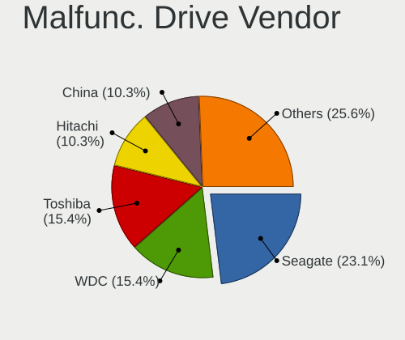

| Vendor                         | Computers | Drives | Percent |
|--------------------------------|-----------|--------|---------|
| Seagate                        | 9         | 10     | 23.08%  |
| WDC                            | 6         | 9      | 15.38%  |
| Toshiba                        | 6         | 7      | 15.38%  |
| Hitachi                        | 4         | 4      | 10.26%  |
| China                          | 4         | 4      | 10.26%  |
| Solid State Storage Technology | 1         | 1      | 2.56%   |
| SanDisk                        | 1         | 1      | 2.56%   |
| Samsung Electronics            | 1         | 1      | 2.56%   |
| Realtek Semiconductor          | 1         | 1      | 2.56%   |
| MACROVIP                       | 1         | 1      | 2.56%   |
| Kingchuxing                    | 1         | 1      | 2.56%   |
| Crucial                        | 1         | 1      | 2.56%   |
| Corsair                        | 1         | 1      | 2.56%   |
| ADATA Technology               | 1         | 1      | 2.56%   |
| A-DATA Technology              | 1         | 1      | 2.56%   |

Malfunc. HDD Vendor
-------------------

Vendors of faulty HDD drives

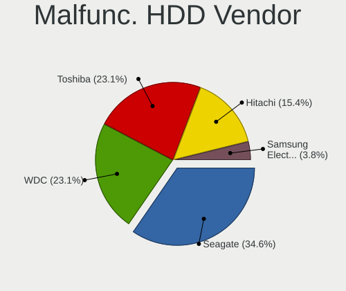

| Vendor              | Computers | Drives | Percent |
|---------------------|-----------|--------|---------|
| Seagate             | 9         | 10     | 34.62%  |
| WDC                 | 6         | 9      | 23.08%  |
| Toshiba             | 6         | 7      | 23.08%  |
| Hitachi             | 4         | 4      | 15.38%  |
| Samsung Electronics | 1         | 1      | 3.85%   |

Malfunc. Drive Kind
-------------------

Kinds of faulty drives

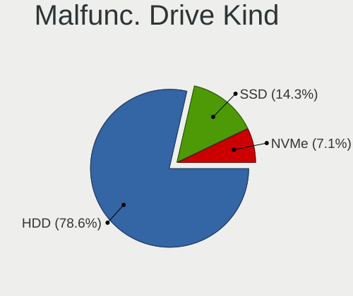

| Kind | Computers | Drives | Percent |
|------|-----------|--------|---------|
| HDD  | 23        | 31     | 65.71%  |
| SSD  | 9         | 10     | 25.71%  |
| NVMe | 3         | 3      | 8.57%   |

Failed Drives
-------------

Failed drive models

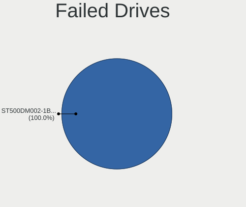

| Model                           | Computers | Drives | Percent |
|---------------------------------|-----------|--------|---------|
| Seagate ST500DM002-1BD142 500GB | 1         | 1      | 100%    |

Failed Drive Vendor
-------------------

Failed drive vendors

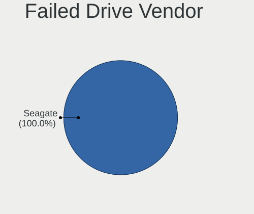

| Vendor  | Computers | Drives | Percent |
|---------|-----------|--------|---------|
| Seagate | 1         | 1      | 100%    |

Drive Status
------------

Number of failed and malfunc. drives

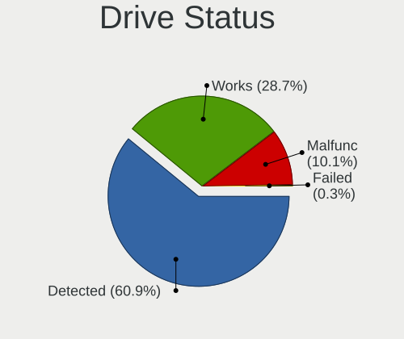

| Status   | Computers | Drives | Percent |
|----------|-----------|--------|---------|
| Detected | 206       | 456    | 60.95%  |
| Works    | 97        | 177    | 28.7%   |
| Malfunc  | 34        | 44     | 10.06%  |
| Failed   | 1         | 1      | 0.3%    |

Storage controller
------------------

Storage Vendor
--------------

Storage controller vendors

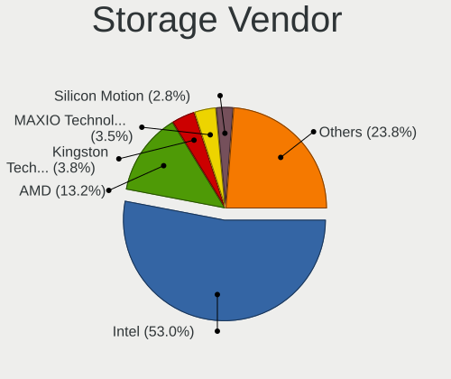

| Vendor                         | Computers | Percent |
|--------------------------------|-----------|---------|
| Intel                          | 212       | 53%     |
| AMD                            | 53        | 13.25%  |
| Kingston Technology Company    | 15        | 3.75%   |
| MAXIO Technology (Hangzhou)    | 14        | 3.5%    |
| Silicon Motion                 | 11        | 2.75%   |
| Samsung Electronics            | 11        | 2.75%   |
| SK hynix                       | 10        | 2.5%    |
| Micron/Crucial Technology      | 10        | 2.5%    |
| SanDisk                        | 8         | 2%      |
| ADATA Technology               | 8         | 2%      |
| ASMedia Technology             | 7         | 1.75%   |
| Realtek Semiconductor          | 5         | 1.25%   |
| Micron Technology              | 5         | 1.25%   |
| Solid State Storage Technology | 4         | 1%      |
| JMicron Technology             | 4         | 1%      |
| VIA Technologies               | 3         | 0.75%   |
| Shenzhen Longsys Electronics   | 3         | 0.75%   |
| Nvidia                         | 3         | 0.75%   |
| Union Memory (Shenzhen)        | 2         | 0.5%    |
| Netac Technology               | 2         | 0.5%    |
| Marvell Technology Group       | 2         | 0.5%    |
| INNOGRIT                       | 2         | 0.5%    |
| Solidigm                       | 1         | 0.25%   |
| Phison Electronics             | 1         | 0.25%   |
| LSI Logic / Symbios Logic      | 1         | 0.25%   |
| Lite-On IT Corp. / Plextor     | 1         | 0.25%   |
| KIOXIA                         | 1         | 0.25%   |
| Hosin Global Electronics       | 1         | 0.25%   |

Storage Model
-------------

Storage controller models

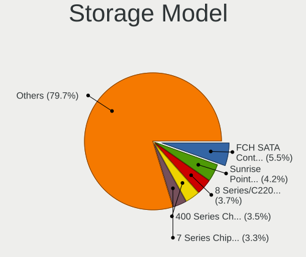

| Model                                                                                   | Computers | Percent |
|-----------------------------------------------------------------------------------------|-----------|---------|
| AMD FCH SATA Controller [AHCI mode]                                                     | 25        | 5.51%   |
| Intel Sunrise Point-LP SATA Controller [AHCI mode]                                      | 19        | 4.19%   |
| Intel 8 Series/C220 Series Chipset Family 6-port SATA Controller 1 [AHCI mode]          | 17        | 3.74%   |
| AMD 400 Series Chipset SATA Controller                                                  | 16        | 3.52%   |
| Intel 7 Series Chipset Family 6-port SATA Controller [AHCI mode]                        | 15        | 3.3%    |
| Intel 6 Series/C200 Series Chipset Family 6 port Mobile SATA AHCI Controller            | 15        | 3.3%    |
| Intel 6 Series/C200 Series Chipset Family 6 port Desktop SATA AHCI Controller           | 14        | 3.08%   |
| AMD 500 Series Chipset SATA Controller                                                  | 12        | 2.64%   |
| MAXIO (Hangzhou) NVMe SSD Controller MAP1202 (DRAM-less)                                | 11        | 2.42%   |
| Silicon Motion SM2263EN/SM2263XT (DRAM-less) NVMe SSD Controllers                       | 8         | 1.76%   |
| Intel Q170/Q150/B150/H170/H110/Z170/CM236 Chipset SATA Controller [AHCI Mode]           | 8         | 1.76%   |
| Intel 82801 Mobile SATA Controller [RAID mode]                                          | 8         | 1.76%   |
| Intel 7 Series/C210 Series Chipset Family 6-port SATA Controller [AHCI mode]            | 8         | 1.76%   |
| Micron/Crucial P2 [Nick P2] / P3 / P3 Plus NVMe PCIe SSD (DRAM-less)                    | 7         | 1.54%   |
| Intel NM10/ICH7 Family SATA Controller [IDE mode]                                       | 7         | 1.54%   |
| Intel Celeron/Pentium Silver Processor SATA Controller                                  | 6         | 1.32%   |
| Intel 8 Series SATA Controller 1 [AHCI mode]                                            | 6         | 1.32%   |
| Intel 6 Series/C200 Series Chipset Family Desktop SATA Controller (IDE mode, ports 4-5) | 6         | 1.32%   |
| Intel 6 Series/C200 Series Chipset Family Desktop SATA Controller (IDE mode, ports 0-3) | 6         | 1.32%   |
| ASMedia ASM1061/ASM1062 Serial ATA Controller                                           | 6         | 1.32%   |
| AMD SB7x0/SB8x0/SB9x0 IDE Controller                                                    | 6         | 1.32%   |
| SK hynix BC901 NVMe Solid State Drive (DRAM-less)                                       | 5         | 1.1%    |
| Samsung NVMe SSD Controller SM981/PM981/PM983                                           | 5         | 1.1%    |
| Kingston Company NV2 NVMe SSD [SM2267XT] (DRAM-less)                                    | 5         | 1.1%    |
| Intel Wildcat Point-LP SATA Controller [AHCI Mode]                                      | 5         | 1.1%    |
| Intel Volume Management Device NVMe RAID Controller                                     | 5         | 1.1%    |
| Intel Cannon Lake PCH SATA AHCI Controller                                              | 5         | 1.1%    |
| Intel 82801G (ICH7 Family) IDE Controller                                               | 5         | 1.1%    |
| AMD SB7x0/SB8x0/SB9x0 SATA Controller [IDE mode]                                        | 5         | 1.1%    |
| Intel Tiger Lake-LP SATA Controller                                                     | 4         | 0.88%   |
| Intel 9 Series Chipset Family SATA Controller [AHCI Mode]                               | 4         | 0.88%   |
| Intel 82801IBM/IEM (ICH9M/ICH9M-E) 4 port SATA Controller [AHCI mode]                   | 4         | 0.88%   |
| Intel 5 Series/3400 Series Chipset 6 port SATA AHCI Controller                          | 4         | 0.88%   |
| Intel 5 Series/3400 Series Chipset 4 port SATA AHCI Controller                          | 4         | 0.88%   |
| AMD SB7x0/SB8x0/SB9x0 SATA Controller [AHCI mode]                                       | 4         | 0.88%   |
| AMD 600 Series Chipset SATA Controller                                                  | 4         | 0.88%   |
| VIA VT82C586A/B/VT82C686/A/B/VT823x/A/C PIPC Bus Master IDE                             | 3         | 0.66%   |
| Silicon Motion SM2262/SM2262EN SSD Controller                                           | 3         | 0.66%   |
| Samsung NVMe SSD Controller 980 (DRAM-less)                                             | 3         | 0.66%   |
| Micron 2400 NVMe SSD (DRAM-less)                                                        | 3         | 0.66%   |

Storage Kind
------------

Kind of storage controller (IDE, SATA, NVMe, SAS, ...)

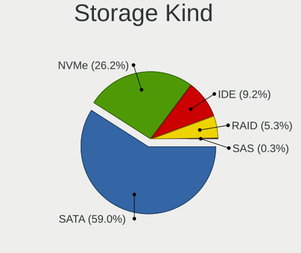

| Kind | Computers | Percent |
|------|-----------|---------|
| SATA | 232       | 59.03%  |
| NVMe | 103       | 26.21%  |
| IDE  | 36        | 9.16%   |
| RAID | 21        | 5.34%   |
| SAS  | 1         | 0.25%   |

Processor
---------

CPU Vendor
----------

Processor vendors

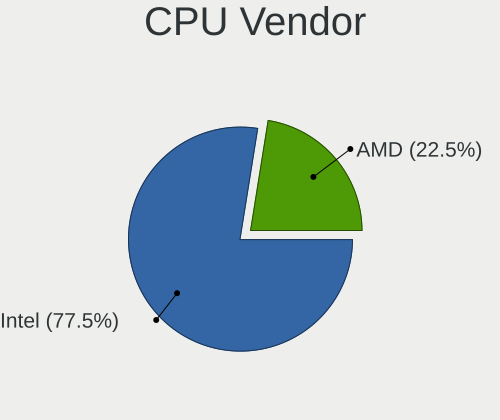

| Vendor | Computers | Percent |
|--------|-----------|---------|
| Intel  | 238       | 77.52%  |
| AMD    | 69        | 22.48%  |

CPU Model
---------

Processor models

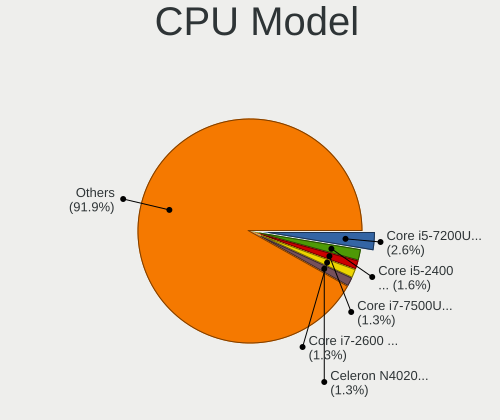

| Model                                   | Computers | Percent |
|-----------------------------------------|-----------|---------|
| Intel Core i5-7200U CPU @ 2.50GHz       | 8         | 2.61%   |
| Intel Core i5-2400 CPU @ 3.10GHz        | 5         | 1.63%   |
| Intel Core i7-7500U CPU @ 2.70GHz       | 4         | 1.3%    |
| Intel Core i7-2600 CPU @ 3.40GHz        | 4         | 1.3%    |
| Intel Celeron N4020 CPU @ 1.10GHz       | 4         | 1.3%    |
| AMD Ryzen 5 3600 6-Core Processor       | 4         | 1.3%    |
| Intel Core i7-4790K CPU @ 4.00GHz       | 3         | 0.98%   |
| Intel Core i7-4700MQ CPU @ 2.40GHz      | 3         | 0.98%   |
| Intel Core i7-2630QM CPU @ 2.00GHz      | 3         | 0.98%   |
| Intel Core i5-3570 CPU @ 3.40GHz        | 3         | 0.98%   |
| Intel Core i5-1035G1 CPU @ 1.00GHz      | 3         | 0.98%   |
| Intel Core i5-10210U CPU @ 1.60GHz      | 3         | 0.98%   |
| Intel Core i3-5005U CPU @ 2.00GHz       | 3         | 0.98%   |
| Intel 11th Gen Core i5-1135G7 @ 2.40GHz | 3         | 0.98%   |
| AMD Ryzen 7 5700G with Radeon Graphics  | 3         | 0.98%   |
| AMD Ryzen 5 4600H with Radeon Graphics  | 3         | 0.98%   |
| AMD Ryzen 5 4600G with Radeon Graphics  | 3         | 0.98%   |
| Intel Xeon CPU E5-2680 v4 @ 2.40GHz     | 2         | 0.65%   |
| Intel Pentium D CPU 3.00GHz             | 2         | 0.65%   |
| Intel Core i7-8550U CPU @ 1.80GHz       | 2         | 0.65%   |
| Intel Core i7-6700 CPU @ 3.40GHz        | 2         | 0.65%   |
| Intel Core i7-4770K CPU @ 3.50GHz       | 2         | 0.65%   |
| Intel Core i7-4500U CPU @ 1.80GHz       | 2         | 0.65%   |
| Intel Core i7-2670QM CPU @ 2.20GHz      | 2         | 0.65%   |
| Intel Core i5-9600K CPU @ 3.70GHz       | 2         | 0.65%   |
| Intel Core i5-7400 CPU @ 3.00GHz        | 2         | 0.65%   |
| Intel Core i5-7300U CPU @ 2.60GHz       | 2         | 0.65%   |
| Intel Core i5-4440 CPU @ 3.10GHz        | 2         | 0.65%   |
| Intel Core i5-3470 CPU @ 3.20GHz        | 2         | 0.65%   |
| Intel Core i5-3330 CPU @ 3.00GHz        | 2         | 0.65%   |
| Intel Core i5-3210M CPU @ 2.50GHz       | 2         | 0.65%   |
| Intel Core i5-2520M CPU @ 2.50GHz       | 2         | 0.65%   |
| Intel Core i5-2450M CPU @ 2.50GHz       | 2         | 0.65%   |
| Intel Core i5-2410M CPU @ 2.30GHz       | 2         | 0.65%   |
| Intel Core i3-7020U CPU @ 2.30GHz       | 2         | 0.65%   |
| Intel Core i3-6100 CPU @ 3.70GHz        | 2         | 0.65%   |
| Intel Core i3-2370M CPU @ 2.40GHz       | 2         | 0.65%   |
| Intel Core i3 CPU M 370 @ 2.40GHz       | 2         | 0.65%   |
| Intel Core 2 Duo CPU P8400 @ 2.26GHz    | 2         | 0.65%   |
| Intel Celeron N4120 CPU @ 1.10GHz       | 2         | 0.65%   |

CPU Model Family
----------------

Processor model prefix

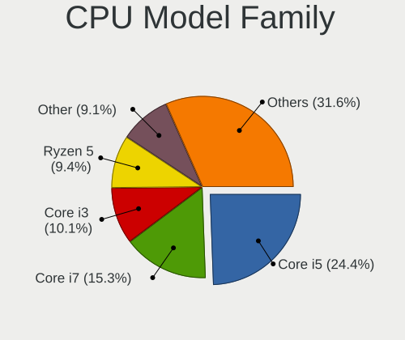

| Model                                | Computers | Percent |
|--------------------------------------|-----------|---------|
| Intel Core i5                        | 75        | 24.43%  |
| Intel Core i7                        | 47        | 15.31%  |
| Intel Core i3                        | 31        | 10.1%   |
| AMD Ryzen 5                          | 29        | 9.45%   |
| Other                                | 28        | 9.12%   |
| Intel Celeron                        | 24        | 7.82%   |
| AMD Ryzen 7                          | 15        | 4.89%   |
| Intel Xeon                           | 9         | 2.93%   |
| Intel Core 2 Duo                     | 7         | 2.28%   |
| Intel Pentium Dual-Core              | 4         | 1.3%    |
| AMD Ryzen 5 PRO                      | 4         | 1.3%    |
| Intel Pentium Dual                   | 3         | 0.98%   |
| AMD FX                               | 3         | 0.98%   |
| Intel Pentium D                      | 2         | 0.65%   |
| Intel Pentium                        | 2         | 0.65%   |
| Intel Core 2 Quad                    | 2         | 0.65%   |
| Intel Atom                           | 2         | 0.65%   |
| AMD Ryzen 9                          | 2         | 0.65%   |
| AMD Phenom II X6                     | 2         | 0.65%   |
| Intel Pentium Silver                 | 1         | 0.33%   |
| Intel Pentium 4                      | 1         | 0.33%   |
| Intel Core i9                        | 1         | 0.33%   |
| Intel Core 2                         | 1         | 0.33%   |
| AMD Turion X2 Ultra Dual-Core Mobile | 1         | 0.33%   |
| AMD Ryzen Threadripper               | 1         | 0.33%   |
| AMD Ryzen 3                          | 1         | 0.33%   |
| AMD Phenom II X2                     | 1         | 0.33%   |
| AMD E                                | 1         | 0.33%   |
| AMD C-70                             | 1         | 0.33%   |
| AMD C-60                             | 1         | 0.33%   |
| AMD Athlon                           | 1         | 0.33%   |
| AMD A8                               | 1         | 0.33%   |
| AMD A6                               | 1         | 0.33%   |
| AMD A4                               | 1         | 0.33%   |
| AMD A12                              | 1         | 0.33%   |

CPU Cores
---------

Number of processor cores

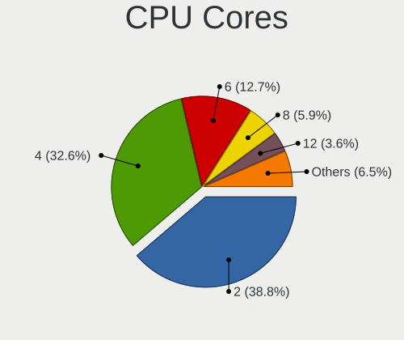

| Number | Computers | Percent |
|--------|-----------|---------|
| 2      | 119       | 38.76%  |
| 4      | 100       | 32.57%  |
| 6      | 39        | 12.7%   |
| 8      | 18        | 5.86%   |
| 12     | 11        | 3.58%   |
| 14     | 7         | 2.28%   |
| 10     | 5         | 1.63%   |
| 1      | 5         | 1.63%   |
| 20     | 1         | 0.33%   |
| 16     | 1         | 0.33%   |
| 3      | 1         | 0.33%   |

CPU Sockets
-----------

Number of sockets

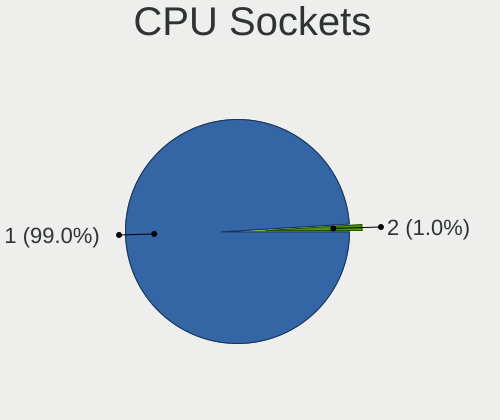

| Number | Computers | Percent |
|--------|-----------|---------|
| 1      | 304       | 99.02%  |
| 2      | 3         | 0.98%   |

CPU Threads
-----------

Threads per core (Hyper-Threading)

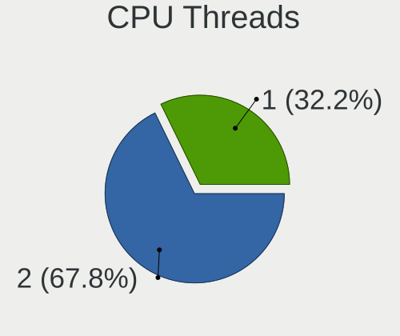

| Number | Computers | Percent |
|--------|-----------|---------|
| 2      | 208       | 67.75%  |
| 1      | 99        | 32.25%  |

CPU Op-Modes
------------

CPU Operation Modes (32-bit, 64-bit)

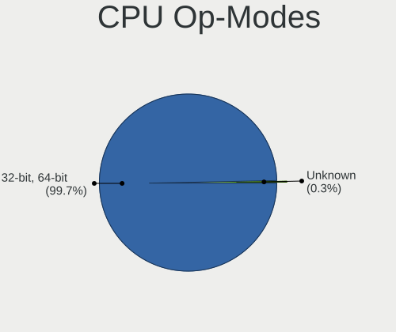

| Op mode        | Computers | Percent |
|----------------|-----------|---------|
| 32-bit, 64-bit | 306       | 99.67%  |
| Unknown        | 1         | 0.33%   |

CPU Microcode
-------------

Microcode number

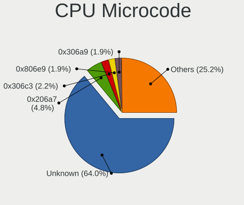

| Number     | Computers | Percent |
|------------|-----------|---------|
| Unknown    | 201       | 64.01%  |
| 0x206a7    | 15        | 4.78%   |
| 0x306c3    | 7         | 2.23%   |
| 0x806e9    | 6         | 1.91%   |
| 0x306a9    | 6         | 1.91%   |
| 0x1067a    | 5         | 1.59%   |
| 0x506e3    | 4         | 1.27%   |
| 0x08600106 | 4         | 1.27%   |
| 0x806ea    | 3         | 0.96%   |
| 0x0a50000d | 3         | 0.96%   |
| 0x08108109 | 3         | 0.96%   |
| 0x0800820d | 3         | 0.96%   |
| 0xf64      | 2         | 0.64%   |
| 0x906a3    | 2         | 0.64%   |
| 0x806d1    | 2         | 0.64%   |
| 0x706e5    | 2         | 0.64%   |
| 0x706a8    | 2         | 0.64%   |
| 0x6fd      | 2         | 0.64%   |
| 0x6fb      | 2         | 0.64%   |
| 0x08600109 | 2         | 0.64%   |
| 0x06000852 | 2         | 0.64%   |
| 0x05000119 | 2         | 0.64%   |
| 0x010000dc | 2         | 0.64%   |
| 0xa0671    | 1         | 0.32%   |
| 0xa0660    | 1         | 0.32%   |
| 0x906ed    | 1         | 0.32%   |
| 0x906c0    | 1         | 0.32%   |
| 0x806ec    | 1         | 0.32%   |
| 0x406e3    | 1         | 0.32%   |
| 0x406c4    | 1         | 0.32%   |
| 0x40651    | 1         | 0.32%   |
| 0x306f2    | 1         | 0.32%   |
| 0x306e4    | 1         | 0.32%   |
| 0x306d4    | 1         | 0.32%   |
| 0x30678    | 1         | 0.32%   |
| 0x20655    | 1         | 0.32%   |
| 0x20652    | 1         | 0.32%   |
| 0x106a5    | 1         | 0.32%   |
| 0x10676    | 1         | 0.32%   |
| 0x0a601201 | 1         | 0.32%   |

CPU Microarch
-------------

Microarchitecture

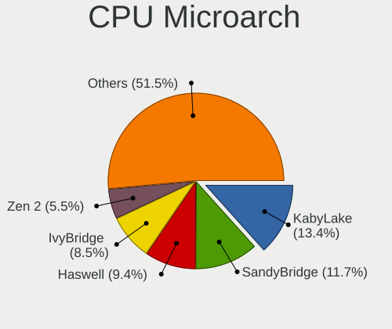

| Name             | Computers | Percent |
|------------------|-----------|---------|
| KabyLake         | 41        | 13.36%  |
| SandyBridge      | 36        | 11.73%  |
| Haswell          | 29        | 9.45%   |
| IvyBridge        | 26        | 8.47%   |
| Zen 2            | 17        | 5.54%   |
| Alderlake Hybrid | 16        | 5.21%   |
| Zen 3            | 14        | 4.56%   |
| Unknown          | 14        | 4.56%   |
| Penryn           | 13        | 4.23%   |
| Skylake          | 12        | 3.91%   |
| Silvermont       | 9         | 2.93%   |
| Zen+             | 8         | 2.61%   |
| Goldmont plus    | 8         | 2.61%   |
| Icelake          | 7         | 2.28%   |
| Broadwell        | 7         | 2.28%   |
| Westmere         | 6         | 1.95%   |
| TigerLake        | 6         | 1.95%   |
| Core             | 6         | 1.95%   |
| Piledriver       | 4         | 1.3%    |
| Nehalem          | 4         | 1.3%    |
| CometLake        | 4         | 1.3%    |
| Zen              | 3         | 0.98%   |
| NetBurst         | 3         | 0.98%   |
| K10              | 3         | 0.98%   |
| Excavator        | 3         | 0.98%   |
| Bobcat           | 3         | 0.98%   |
| Tremont          | 1         | 0.33%   |
| Steamroller      | 1         | 0.33%   |
| K8 Hammer        | 1         | 0.33%   |
| K8 & K10 hybrid  | 1         | 0.33%   |
| Gracemont        | 1         | 0.33%   |

Graphics
--------

GPU Vendor
----------

Vendors of graphics cards

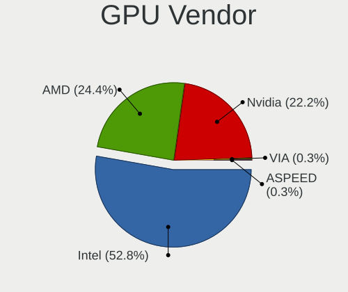

| Vendor            | Computers | Percent |
|-------------------|-----------|---------|
| Intel             | 190       | 52.78%  |
| AMD               | 88        | 24.44%  |
| Nvidia            | 80        | 22.22%  |
| VIA Technologies  | 1         | 0.28%   |
| ASPEED Technology | 1         | 0.28%   |

GPU Model
---------

Graphics card models

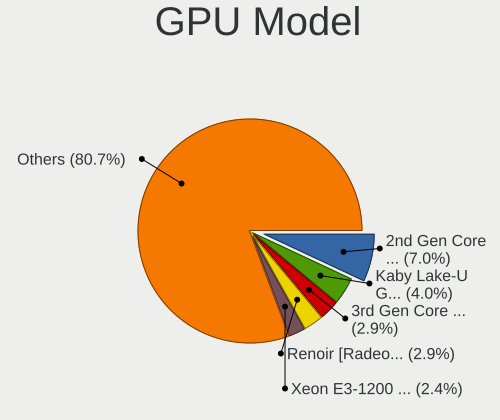

| Model                                                                                    | Computers | Percent |
|------------------------------------------------------------------------------------------|-----------|---------|
| Intel 2nd Generation Core Processor Family Integrated Graphics Controller                | 26        | 6.97%   |
| Intel Kaby Lake-U GT2 [HD Graphics 620]                                                  | 15        | 4.02%   |
| Intel 3rd Gen Core processor Graphics Controller                                         | 11        | 2.95%   |
| AMD Renoir [Radeon Vega Series / Radeon Vega Mobile Series]                              | 11        | 2.95%   |
| Intel Xeon E3-1200 v2/3rd Gen Core processor Graphics Controller                         | 9         | 2.41%   |
| Intel Xeon E3-1200 v3/4th Gen Core Processor Integrated Graphics Controller              | 8         | 2.14%   |
| Intel GeminiLake [UHD Graphics 600]                                                      | 8         | 2.14%   |
| Intel Kaby Lake-R GT2 [UHD Graphics 620]                                                 | 6         | 1.61%   |
| Intel Haswell-ULT Integrated Graphics Controller                                         | 6         | 1.61%   |
| Intel Core Processor Integrated Graphics Controller                                      | 6         | 1.61%   |
| Intel 4th Gen Core Processor Integrated Graphics Controller                              | 6         | 1.61%   |
| AMD Navi 33 [Radeon RX 7600/7600 XT/7600M XT/7600S/7700S / PRO W7600]                    | 6         | 1.61%   |
| Intel Skylake-S GT2 [HD Graphics 530]                                                    | 5         | 1.34%   |
| Intel Raptor Lake-P [Iris Xe Graphics]                                                   | 5         | 1.34%   |
| Intel Broadwell-U GT2 [HD Graphics 5500]                                                 | 5         | 1.34%   |
| Intel Atom Processor Z36xxx/Z37xxx Series Graphics & Display                             | 5         | 1.34%   |
| Intel Alder Lake-P GT2 [Iris Xe Graphics]                                                | 5         | 1.34%   |
| AMD Ellesmere [Radeon RX 470/480/570/570X/580/580X/590]                                  | 5         | 1.34%   |
| AMD Cezanne [Radeon Vega Series / Radeon Vega Mobile Series]                             | 5         | 1.34%   |
| Nvidia GP107 [GeForce GTX 1050]                                                          | 4         | 1.07%   |
| Nvidia GM108M [GeForce 940MX]                                                            | 4         | 1.07%   |
| Intel Mobile 4 Series Chipset Integrated Graphics Controller                             | 4         | 1.07%   |
| Intel Atom/Celeron/Pentium Processor x5-E8000/J3xxx/N3xxx Integrated Graphics Controller | 4         | 1.07%   |
| Intel 4 Series Chipset Integrated Graphics Controller                                    | 4         | 1.07%   |
| AMD Rembrandt [Radeon 680M]                                                              | 4         | 1.07%   |
| AMD Picasso/Raven 2 [Radeon Vega Series / Radeon Vega Mobile Series]                     | 4         | 1.07%   |
| AMD Cedar [Radeon HD 5000/6000/7350/8350 Series]                                         | 4         | 1.07%   |
| Nvidia TU117M [GeForce GTX 1650 Mobile / Max-Q]                                          | 3         | 0.8%    |
| Nvidia GP108 [GeForce GT 1030]                                                           | 3         | 0.8%    |
| Nvidia GP107 [GeForce GTX 1050 Ti]                                                       | 3         | 0.8%    |
| Nvidia GF108M [GeForce GT 540M]                                                          | 3         | 0.8%    |
| Nvidia AD107M [GeForce RTX 4060 Max-Q / Mobile]                                          | 3         | 0.8%    |
| Intel TigerLake-LP GT2 [Iris Xe Graphics]                                                | 3         | 0.8%    |
| Intel Tiger Lake-LP GT2 [UHD Graphics G4]                                                | 3         | 0.8%    |
| Intel Mobile GM965/GL960 Integrated Graphics Controller (secondary)                      | 3         | 0.8%    |
| Intel Mobile GM965/GL960 Integrated Graphics Controller (primary)                        | 3         | 0.8%    |
| Intel Kaby Lake-S GT2 [HD Graphics 630]                                                  | 3         | 0.8%    |
| Intel Iris Plus Graphics G1 (Ice Lake)                                                   | 3         | 0.8%    |
| Intel CoffeeLake-S GT2 [UHD Graphics 630]                                                | 3         | 0.8%    |
| AMD Raphael                                                                              | 3         | 0.8%    |

GPU Combo
---------

Combinations of graphics cards

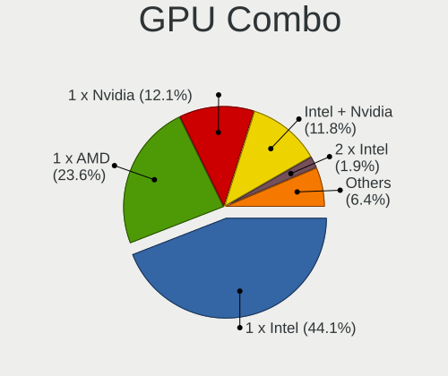

| Name            | Computers | Percent |
|-----------------|-----------|---------|
| 1 x Intel       | 138       | 44.09%  |
| 1 x AMD         | 74        | 23.64%  |
| 1 x Nvidia      | 38        | 12.14%  |
| Intel + Nvidia  | 37        | 11.82%  |
| 2 x Intel       | 6         | 1.92%   |
| 2 x AMD         | 6         | 1.92%   |
| Intel + AMD     | 5         | 1.6%    |
| AMD + Nvidia    | 5         | 1.6%    |
| Other           | 2         | 0.64%   |
| 1 x VIA         | 1         | 0.32%   |
| Nvidia + ASPEED | 1         | 0.32%   |

GPU Driver
----------

Free vs proprietary

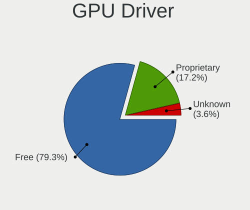

| Driver      | Computers | Percent |
|-------------|-----------|---------|
| Free        | 245       | 79.29%  |
| Proprietary | 53        | 17.15%  |
| Unknown     | 11        | 3.56%   |

GPU Memory
----------

Total video memory

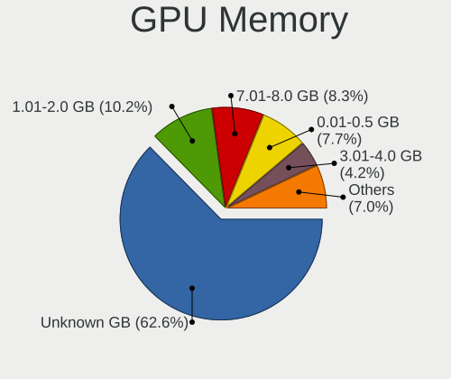

| Size in GB | Computers | Percent |
|------------|-----------|---------|
| Unknown    | 196       | 62.62%  |
| 1.01-2.0   | 32        | 10.22%  |
| 7.01-8.0   | 26        | 8.31%   |
| 0.01-0.5   | 24        | 7.67%   |
| 3.01-4.0   | 13        | 4.15%   |
| 0.51-1.0   | 12        | 3.83%   |
| 5.01-6.0   | 4         | 1.28%   |
| 8.01-16.0  | 3         | 0.96%   |
| 16.01-24.0 | 2         | 0.64%   |
| 2.01-3.0   | 1         | 0.32%   |

Monitor
-------

Monitor Vendor
--------------

Monitor vendors

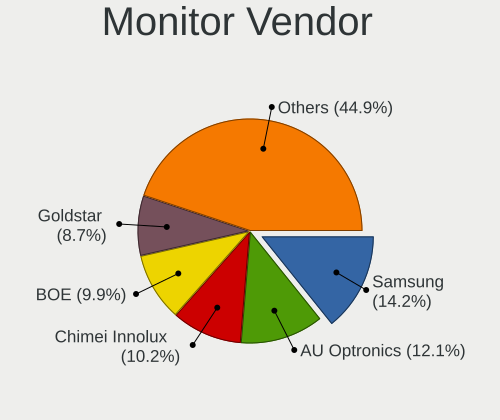

| Vendor                  | Computers | Percent |
|-------------------------|-----------|---------|
| Samsung Electronics     | 46        | 14.24%  |
| AU Optronics            | 39        | 12.07%  |
| Chimei Innolux          | 33        | 10.22%  |
| BOE                     | 32        | 9.91%   |
| Goldstar                | 28        | 8.67%   |
| LG Display              | 24        | 7.43%   |
| AOC                     | 18        | 5.57%   |
| Dell                    | 11        | 3.41%   |
| Philips                 | 9         | 2.79%   |
| Lenovo                  | 8         | 2.48%   |
| Hewlett-Packard         | 5         | 1.55%   |
| Acer                    | 5         | 1.55%   |
| Sony                    | 4         | 1.24%   |
| Chi Mei Optoelectronics | 4         | 1.24%   |
| ASUSTek Computer        | 4         | 1.24%   |
| Apple                   | 4         | 1.24%   |
| Unknown (XXX)           | 3         | 0.93%   |
| Panasonic               | 3         | 0.93%   |
| GDH                     | 3         | 0.93%   |
| BenQ                    | 3         | 0.93%   |
| Unknown                 | 2         | 0.62%   |
| Positivo                | 2         | 0.62%   |
| NEC Computers           | 2         | 0.62%   |
| Multilaser              | 2         | 0.62%   |
| Denver                  | 2         | 0.62%   |
| Wacom                   | 1         | 0.31%   |
| Vizio                   | 1         | 0.31%   |
| VIZ                     | 1         | 0.31%   |
| Unknown (ABC)           | 1         | 0.31%   |
| RS                      | 1         | 0.31%   |
| Roku                    | 1         | 0.31%   |
| Philco                  | 1         | 0.31%   |
| PANDA                   | 1         | 0.31%   |
| MTD                     | 1         | 0.31%   |
| MiTAC                   | 1         | 0.31%   |
| Mi                      | 1         | 0.31%   |
| LRX                     | 1         | 0.31%   |
| LG Electronics          | 1         | 0.31%   |
| KDB                     | 1         | 0.31%   |
| JDZ                     | 1         | 0.31%   |

Monitor Model
-------------

Monitor models

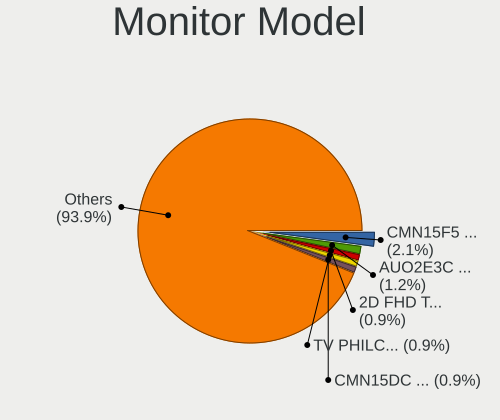

| Model                                                                | Computers | Percent |
|----------------------------------------------------------------------|-----------|---------|
| Chimei Innolux LCD Monitor CMN15F5 1920x1080 344x193mm 15.5-inch     | 7         | 2.12%   |
| AU Optronics LCD Monitor AUO2E3C 1366x768 309x173mm 13.9-inch        | 4         | 1.21%   |
| Goldstar 2D FHD TV GSM59C6 1920x1080 509x286mm 23.0-inch             | 3         | 0.91%   |
| GDH TV PHILCO GDH0030 1920x540                                       | 3         | 0.91%   |
| Chimei Innolux LCD Monitor CMN15DC 1366x768 344x193mm 15.5-inch      | 3         | 0.91%   |
| Samsung Electronics SyncMaster SAM037A 1680x1050 433x271mm 20.1-inch | 2         | 0.61%   |
| Samsung Electronics SMT22A300 SAM087B 1920x1080 477x268mm 21.5-inch  | 2         | 0.61%   |
| Samsung Electronics SA300/SA350 SAM0788 1366x768 410x230mm 18.5-inch | 2         | 0.61%   |
| Samsung Electronics LF24T35 SAM707D 1920x1080 528x297mm 23.9-inch    | 2         | 0.61%   |
| Samsung Electronics LCD Monitor SEC5441 1280x800 331x207mm 15.4-inch | 2         | 0.61%   |
| Panasonic TV MEIC10C 1920x540 697x392mm 31.5-inch                    | 2         | 0.61%   |
| Multilaser Multilaser MUL0030 1920x1080 708x398mm 32.0-inch          | 2         | 0.61%   |
| LG Display LCD Monitor LGD045E 1366x768 310x174mm 14.0-inch          | 2         | 0.61%   |
| LG Display LCD Monitor LGD0385 1366x768 309x174mm 14.0-inch          | 2         | 0.61%   |
| LG Display LCD Monitor LGD02E9 1366x768 309x174mm 14.0-inch          | 2         | 0.61%   |
| Goldstar ULTRAWIDE GSM5C0C 2560x1080 601x254mm 25.7-inch             | 2         | 0.61%   |
| Goldstar TV GSM9CF6 1360x768 700x392mm 31.6-inch                     | 2         | 0.61%   |
| Goldstar HDR WFHD GSM7714 2560x1080 798x334mm 34.1-inch              | 2         | 0.61%   |
| Goldstar 2D HD TV GSM59CA 1366x768 509x286mm 23.0-inch               | 2         | 0.61%   |
| Goldstar 23MP55 GSM5A23 1920x1080 510x290mm 23.1-inch                | 2         | 0.61%   |
| Dell AW2724HF DELA22F 1920x1080 597x336mm 27.0-inch                  | 2         | 0.61%   |
| Chimei Innolux LCD Monitor CMN14D6 1366x768 309x173mm 13.9-inch      | 2         | 0.61%   |
| BOE LCD Monitor BOE0913 1366x768 309x174mm 14.0-inch                 | 2         | 0.61%   |
| BOE LCD Monitor BOE0812 1920x1080 344x194mm 15.5-inch                | 2         | 0.61%   |
| AU Optronics LCD Monitor AUOE495 2560x1600 344x215mm 16.0-inch       | 2         | 0.61%   |
| AU Optronics LCD Monitor AUO81EC 1366x768 344x193mm 15.5-inch        | 2         | 0.61%   |
| AU Optronics LCD Monitor AUO323C 1366x768 309x173mm 13.9-inch        | 2         | 0.61%   |
| AU Optronics LCD Monitor AUO23EC 1366x768 344x193mm 15.5-inch        | 2         | 0.61%   |
| AU Optronics LCD Monitor AUO183C 1366x768 309x173mm 13.9-inch        | 2         | 0.61%   |
| AOC 27G2G4 AOC2702 1920x1080 598x336mm 27.0-inch                     | 2         | 0.61%   |
| Wacom Cintiq21UX WAC1014 1600x1200 432x324mm 21.3-inch               | 1         | 0.3%    |
| Vizio D43f-F1 VIZ1027 1920x1080 940x529mm 42.5-inch                  | 1         | 0.3%    |
| VIZ LCD Monitor M190VA 1360x768                                      | 1         | 0.3%    |
| Unknown LCD Monitor XXX Beyond TV                                    | 1         | 0.3%    |
| Unknown LCD Monitor FFFF 2288x1287 2550x2550mm 142.0-inch            | 1         | 0.3%    |
| Unknown (XXX) Union TV XXX2841 1920x1080 1209x680mm 54.6-inch        | 1         | 0.3%    |
| Unknown (XXX) Beyond TV XXX9221 1920x1080 1209x680mm 54.6-inch       | 1         | 0.3%    |
| Unknown (XXX) Beyond TV XXX2851 3840x2160 1209x680mm 54.6-inch       | 1         | 0.3%    |
| Unknown (ABC) LED MONITOR ABC952D 1920x1080 443x249mm 20.0-inch      | 1         | 0.3%    |
| Sony TV SNYDB01 1920x1080                                            | 1         | 0.3%    |

Monitor Resolution
------------------

Monitor screen resolution

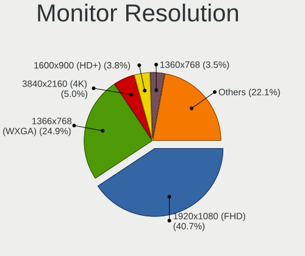

| Resolution         | Computers | Percent |
|--------------------|-----------|---------|
| 1920x1080 (FHD)    | 129       | 40.69%  |
| 1366x768 (WXGA)    | 79        | 24.92%  |
| 3840x2160 (4K)     | 16        | 5.05%   |
| 1600x900 (HD+)     | 12        | 3.79%   |
| 1360x768           | 11        | 3.47%   |
| 2560x1440 (QHD)    | 8         | 2.52%   |
| 2560x1080          | 8         | 2.52%   |
| 1920x1200 (WUXGA)  | 7         | 2.21%   |
| 1680x1050 (WSXGA+) | 6         | 1.89%   |
| 1280x800 (WXGA)    | 6         | 1.89%   |
| 1280x1024 (SXGA)   | 6         | 1.89%   |
| 1440x900 (WXGA+)   | 5         | 1.58%   |
| 2880x1800          | 4         | 1.26%   |
| 1920x540           | 4         | 1.26%   |
| 2560x1600          | 3         | 0.95%   |
| 1600x1200          | 2         | 0.63%   |
| 1024x768 (XGA)     | 2         | 0.63%   |
| Unknown            | 2         | 0.63%   |
| 4240x1280          | 1         | 0.32%   |
| 3840x1200          | 1         | 0.32%   |
| 3200x1080          | 1         | 0.32%   |
| 2880x1920          | 1         | 0.32%   |
| 2288x1287          | 1         | 0.32%   |
| 2240x1400          | 1         | 0.32%   |
| 1280x960           | 1         | 0.32%   |

Monitor Diagonal
----------------

Diagonal size in inches

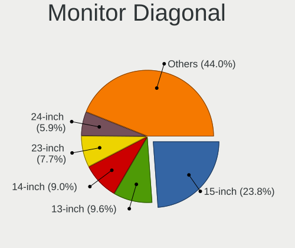

| Inches  | Computers | Percent |
|---------|-----------|---------|
| 15      | 77        | 23.84%  |
| 13      | 31        | 9.6%    |
| 14      | 29        | 8.98%   |
| 23      | 25        | 7.74%   |
| 24      | 19        | 5.88%   |
| 27      | 18        | 5.57%   |
| 17      | 17        | 5.26%   |
| 21      | 16        | 4.95%   |
| 18      | 11        | 3.41%   |
| 20      | 9         | 2.79%   |
| 72      | 7         | 2.17%   |
| Unknown | 7         | 2.17%   |
| 52      | 6         | 1.86%   |
| 31      | 6         | 1.86%   |
| 19      | 6         | 1.86%   |
| 16      | 6         | 1.86%   |
| 40      | 4         | 1.24%   |
| 63      | 3         | 0.93%   |
| 54      | 3         | 0.93%   |
| 32      | 3         | 0.93%   |
| 22      | 3         | 0.93%   |
| 84      | 2         | 0.62%   |
| 49      | 2         | 0.62%   |
| 34      | 2         | 0.62%   |
| 25      | 2         | 0.62%   |
| 12      | 2         | 0.62%   |
| 142     | 1         | 0.31%   |
| 48      | 1         | 0.31%   |
| 43      | 1         | 0.31%   |
| 36      | 1         | 0.31%   |
| 29      | 1         | 0.31%   |
| 28      | 1         | 0.31%   |
| 11      | 1         | 0.31%   |

Monitor Width
-------------

Physical width

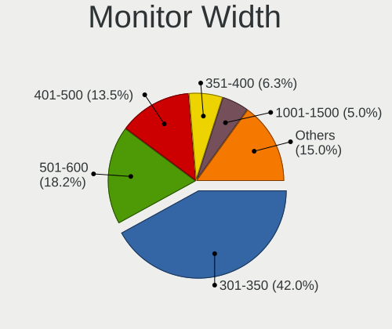

| Width in mm    | Computers | Percent |
|----------------|-----------|---------|
| 301-350        | 134       | 42.01%  |
| 501-600        | 58        | 18.18%  |
| 401-500        | 43        | 13.48%  |
| 351-400        | 20        | 6.27%   |
| 1001-1500      | 16        | 5.02%   |
| 201-300        | 11        | 3.45%   |
| 601-700        | 10        | 3.13%   |
| 1501-2000      | 9         | 2.82%   |
| Unknown        | 7         | 2.19%   |
| 701-800        | 6         | 1.88%   |
| 801-900        | 4         | 1.25%   |
| More than 2000 | 1         | 0.31%   |

Aspect Ratio
------------

Proportional relationship between the width and the height

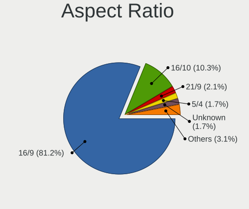

| Ratio   | Computers | Percent |
|---------|-----------|---------|
| 16/9    | 237       | 81.16%  |
| 16/10   | 30        | 10.27%  |
| 21/9    | 6         | 2.05%   |
| 5/4     | 5         | 1.71%   |
| Unknown | 5         | 1.71%   |
| 4/3     | 4         | 1.37%   |
| 3/2     | 2         | 0.68%   |
| 32/9    | 1         | 0.34%   |
| 3.20    | 1         | 0.34%   |
| 1.00    | 1         | 0.34%   |

Monitor Area
------------

Area in inch²

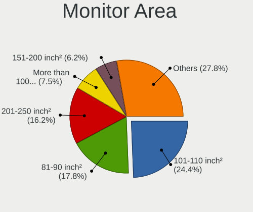

| Area in inch² | Computers | Percent |
|----------------|-----------|---------|
| 101-110        | 78        | 24.38%  |
| 81-90          | 57        | 17.81%  |
| 201-250        | 52        | 16.25%  |
| More than 1000 | 24        | 7.5%    |
| 151-200        | 20        | 6.25%   |
| 301-350        | 19        | 5.94%   |
| 141-150        | 13        | 4.06%   |
| 121-130        | 12        | 3.75%   |
| 351-500        | 11        | 3.44%   |
| 251-300        | 7         | 2.19%   |
| 501-1000       | 7         | 2.19%   |
| Unknown        | 7         | 2.19%   |
| 111-120        | 5         | 1.56%   |
| 71-80          | 3         | 0.94%   |
| 61-70          | 2         | 0.63%   |
| 131-140        | 2         | 0.63%   |
| 51-60          | 1         | 0.31%   |

Pixel Density
-------------

Pixels per inch

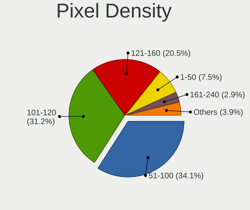

| Density       | Computers | Percent |
|---------------|-----------|---------|
| 51-100        | 105       | 34.09%  |
| 101-120       | 96        | 31.17%  |
| 121-160       | 63        | 20.45%  |
| 1-50          | 23        | 7.47%   |
| 161-240       | 9         | 2.92%   |
| Unknown       | 7         | 2.27%   |
| More than 240 | 5         | 1.62%   |

Multiple Monitors
-----------------

Total monitors connected

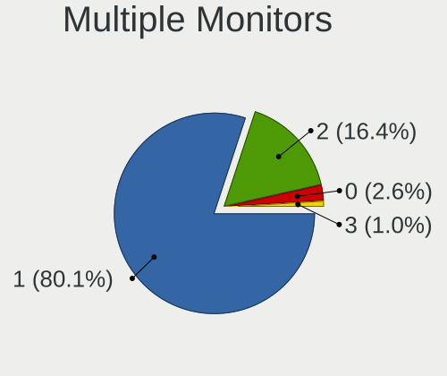

| Total | Computers | Percent |
|-------|-----------|---------|
| 1     | 249       | 80.06%  |
| 2     | 51        | 16.4%   |
| 0     | 8         | 2.57%   |
| 3     | 3         | 0.96%   |

Network
-------

Net Controller Vendor
---------------------

Controller vendors

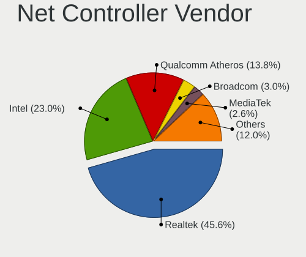

| Vendor                   | Computers | Percent |
|--------------------------|-----------|---------|
| Realtek Semiconductor    | 212       | 45.59%  |
| Intel                    | 107       | 23.01%  |
| Qualcomm Atheros         | 64        | 13.76%  |
| Broadcom                 | 14        | 3.01%   |
| MediaTek                 | 12        | 2.58%   |
| TP-Link                  | 8         | 1.72%   |
| Ralink Technology        | 7         | 1.51%   |
| Ralink                   | 4         | 0.86%   |
| Marvell Technology Group | 4         | 0.86%   |
| VIA Technologies         | 3         | 0.65%   |
| Sierra Wireless          | 3         | 0.65%   |
| ASIX Electronics         | 3         | 0.65%   |
| Xiaomi                   | 2         | 0.43%   |
| Samsung Electronics      | 2         | 0.43%   |
| Nvidia                   | 2         | 0.43%   |
| Microsoft                | 2         | 0.43%   |
| JMicron Technology       | 2         | 0.43%   |
| D-Link System            | 2         | 0.43%   |
| D-Link                   | 2         | 0.43%   |
| SysKonnect               | 1         | 0.22%   |
| Prolific Technology      | 1         | 0.22%   |
| OPPO Electronics         | 1         | 0.22%   |
| Motorola PCS             | 1         | 0.22%   |
| Lenovo                   | 1         | 0.22%   |
| Huawei Technologies      | 1         | 0.22%   |
| Edimax Technology        | 1         | 0.22%   |
| Broadcom Limited         | 1         | 0.22%   |
| Belkin Components        | 1         | 0.22%   |
| ASUSTek Computer         | 1         | 0.22%   |

Net Controller Model
--------------------

Controller models

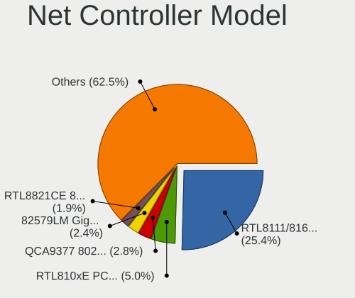

| Model                                                                  | Computers | Percent |
|------------------------------------------------------------------------|-----------|---------|
| Realtek RTL8111/8168/8211/8411 PCI Express Gigabit Ethernet Controller | 137       | 25.42%  |
| Realtek RTL810xE PCI Express Fast Ethernet controller                  | 27        | 5.01%   |
| Qualcomm Atheros QCA9377 802.11ac Wireless Network Adapter             | 15        | 2.78%   |
| Intel 82579LM Gigabit Network Connection (Lewisville)                  | 13        | 2.41%   |
| Realtek RTL8821CE 802.11ac PCIe Wireless Network Adapter               | 10        | 1.86%   |
| Realtek RTL8125 2.5GbE Controller                                      | 10        | 1.86%   |
| Qualcomm Atheros QCA9565 / AR9565 Wireless Network Adapter             | 9         | 1.67%   |
| Realtek RTL8153 Gigabit Ethernet Adapter                               | 8         | 1.48%   |
| Realtek 802.11ac NIC                                                   | 8         | 1.48%   |
| Qualcomm Atheros AR9285 Wireless Network Adapter (PCI-Express)         | 8         | 1.48%   |
| Intel Alder Lake-P PCH CNVi WiFi                                       | 6         | 1.11%   |
| Qualcomm Atheros QCA6174 802.11ac Wireless Network Adapter             | 5         | 0.93%   |
| Intel Wi-Fi 6 AX200                                                    | 5         | 0.93%   |
| Intel Ethernet Connection I217-LM                                      | 5         | 0.93%   |
| Intel Dual Band Wireless-AC 3165 Plus Bluetooth                        | 5         | 0.93%   |
| Realtek RTL8822CE 802.11ac PCIe Wireless Network Adapter               | 4         | 0.74%   |
| Realtek RTL8188EE Wireless Network Adapter                             | 4         | 0.74%   |
| Qualcomm Atheros AR9485 Wireless Network Adapter                       | 4         | 0.74%   |
| MediaTek MT7922 802.11ax PCI Express Wireless Network Adapter          | 4         | 0.74%   |
| Intel Wireless 8265 / 8275                                             | 4         | 0.74%   |
| Intel Wireless 7260                                                    | 4         | 0.74%   |
| Intel Wi-Fi 6E(802.11ax) AX210/AX1675* 2x2 [Typhoon Peak]              | 4         | 0.74%   |
| Intel Wi-Fi 6 AX201                                                    | 4         | 0.74%   |
| Intel Dual Band Wireless-AC 3168NGW [Stone Peak]                       | 4         | 0.74%   |
| VIA VT6102/VT6103 [Rhine-II]                                           | 3         | 0.56%   |
| Realtek RTL8188FTV 802.11b/g/n 1T1R 2.4G WLAN Adapter                  | 3         | 0.56%   |
| Realtek RTL8188ETV Wireless LAN 802.11n Network Adapter                | 3         | 0.56%   |
| Realtek RTL8188CE 802.11b/g/n WiFi Adapter                             | 3         | 0.56%   |
| Realtek RTL8152 Fast Ethernet Adapter                                  | 3         | 0.56%   |
| Realtek Killer E2600 GbE Controller                                    | 3         | 0.56%   |
| Ralink RT5370 Wireless Adapter                                         | 3         | 0.56%   |
| Ralink MT7601U Wireless Adapter                                        | 3         | 0.56%   |
| Qualcomm Atheros Killer E220x Gigabit Ethernet Controller              | 3         | 0.56%   |
| Qualcomm Atheros AR928X Wireless Network Adapter (PCI-Express)         | 3         | 0.56%   |
| Qualcomm Atheros AR9287 Wireless Network Adapter (PCI-Express)         | 3         | 0.56%   |
| MediaTek MT7902 802.11ax PCIe Wireless Network Adapter [Filogic 310]   | 3         | 0.56%   |
| Intel Wireless 8260                                                    | 3         | 0.56%   |
| Intel Wireless 3160                                                    | 3         | 0.56%   |
| Intel Raptor Lake PCH CNVi WiFi                                        | 3         | 0.56%   |
| Intel Ethernet Connection I217-V                                       | 3         | 0.56%   |

Wireless Vendor
---------------

Wireless vendors

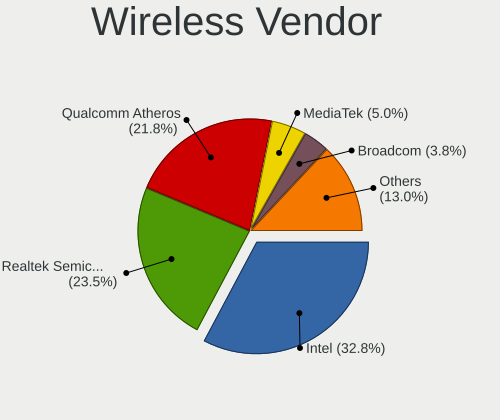

| Vendor                   | Computers | Percent |
|--------------------------|-----------|---------|
| Intel                    | 78        | 32.77%  |
| Realtek Semiconductor    | 56        | 23.53%  |
| Qualcomm Atheros         | 52        | 21.85%  |
| MediaTek                 | 12        | 5.04%   |
| Broadcom                 | 9         | 3.78%   |
| TP-Link                  | 8         | 3.36%   |
| Ralink Technology        | 7         | 2.94%   |
| Ralink                   | 4         | 1.68%   |
| Sierra Wireless          | 3         | 1.26%   |
| Microsoft                | 2         | 0.84%   |
| Marvell Technology Group | 2         | 0.84%   |
| D-Link                   | 2         | 0.84%   |
| Edimax Technology        | 1         | 0.42%   |
| Belkin Components        | 1         | 0.42%   |
| ASUSTek Computer         | 1         | 0.42%   |

Wireless Model
--------------

Wireless models

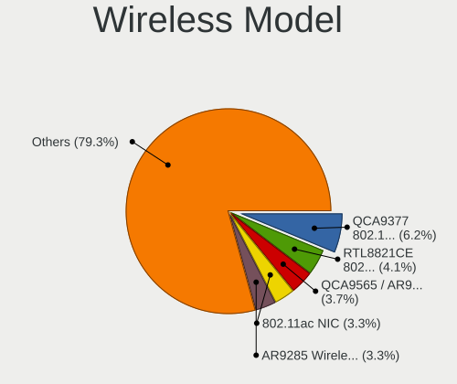

| Model                                                                | Computers | Percent |
|----------------------------------------------------------------------|-----------|---------|
| Qualcomm Atheros QCA9377 802.11ac Wireless Network Adapter           | 15        | 6.22%   |
| Realtek RTL8821CE 802.11ac PCIe Wireless Network Adapter             | 10        | 4.15%   |
| Qualcomm Atheros QCA9565 / AR9565 Wireless Network Adapter           | 9         | 3.73%   |
| Realtek 802.11ac NIC                                                 | 8         | 3.32%   |
| Qualcomm Atheros AR9285 Wireless Network Adapter (PCI-Express)       | 8         | 3.32%   |
| Qualcomm Atheros QCA6174 802.11ac Wireless Network Adapter           | 5         | 2.07%   |
| Intel Wi-Fi 6 AX200                                                  | 5         | 2.07%   |
| Intel Dual Band Wireless-AC 3165 Plus Bluetooth                      | 5         | 2.07%   |
| Realtek RTL8822CE 802.11ac PCIe Wireless Network Adapter             | 4         | 1.66%   |
| Realtek RTL8188EE Wireless Network Adapter                           | 4         | 1.66%   |
| Qualcomm Atheros AR9485 Wireless Network Adapter                     | 4         | 1.66%   |
| MediaTek MT7922 802.11ax PCI Express Wireless Network Adapter        | 4         | 1.66%   |
| Intel Wireless 8265 / 8275                                           | 4         | 1.66%   |
| Intel Wireless 7260                                                  | 4         | 1.66%   |
| Intel Wi-Fi 6E(802.11ax) AX210/AX1675* 2x2 [Typhoon Peak]            | 4         | 1.66%   |
| Intel Wi-Fi 6 AX201                                                  | 4         | 1.66%   |
| Intel Dual Band Wireless-AC 3168NGW [Stone Peak]                     | 4         | 1.66%   |
| Intel Alder Lake-P PCH CNVi WiFi                                     | 4         | 1.66%   |
| Realtek RTL8188FTV 802.11b/g/n 1T1R 2.4G WLAN Adapter                | 3         | 1.24%   |
| Realtek RTL8188ETV Wireless LAN 802.11n Network Adapter              | 3         | 1.24%   |
| Realtek RTL8188CE 802.11b/g/n WiFi Adapter                           | 3         | 1.24%   |
| Ralink RT5370 Wireless Adapter                                       | 3         | 1.24%   |
| Ralink MT7601U Wireless Adapter                                      | 3         | 1.24%   |
| Qualcomm Atheros AR928X Wireless Network Adapter (PCI-Express)       | 3         | 1.24%   |
| Qualcomm Atheros AR9287 Wireless Network Adapter (PCI-Express)       | 3         | 1.24%   |
| MediaTek MT7902 802.11ax PCIe Wireless Network Adapter [Filogic 310] | 3         | 1.24%   |
| Intel Wireless 8260                                                  | 3         | 1.24%   |
| Intel Wireless 3160                                                  | 3         | 1.24%   |
| Intel Comet Lake PCH-LP CNVi WiFi                                    | 3         | 1.24%   |
| Intel Centrino Wireless-N 2230                                       | 3         | 1.24%   |
| TP-Link TL-WN821N v5/v6 [RTL8192EU]                                  | 2         | 0.83%   |
| Sierra Wireless EM7345 4G LTE                                        | 2         | 0.83%   |
| Realtek RTL8852BE PCIe 802.11ax Wireless Network Controller          | 2         | 0.83%   |
| Realtek RTL8723BU 802.11b/g/n WLAN Adapter                           | 2         | 0.83%   |
| Realtek RTL8192CE PCIe Wireless Network Adapter                      | 2         | 0.83%   |
| Realtek RTL8187B Wireless 802.11g 54Mbps Network Adapter             | 2         | 0.83%   |
| Realtek 802.11n WLAN Adapter                                         | 2         | 0.83%   |
| Qualcomm Atheros AR9462 Wireless Network Adapter                     | 2         | 0.83%   |
| MediaTek MT7921 802.11ax PCIe Wireless Network Adapter [Filogic 330] | 2         | 0.83%   |
| Marvell Group 88W8897 [AVASTAR] 802.11ac Wireless                    | 2         | 0.83%   |

Ethernet Vendor
---------------

Ethernet vendors

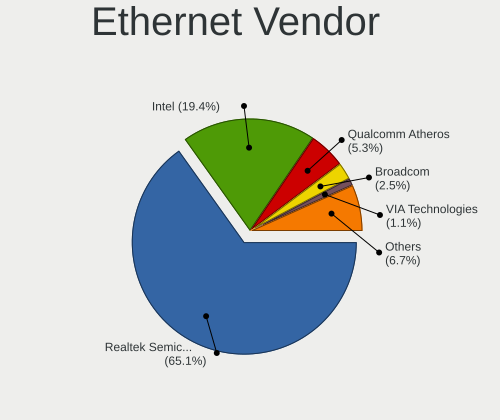

| Vendor                   | Computers | Percent |
|--------------------------|-----------|---------|
| Realtek Semiconductor    | 185       | 65.14%  |
| Intel                    | 55        | 19.37%  |
| Qualcomm Atheros         | 15        | 5.28%   |
| Broadcom                 | 7         | 2.46%   |
| VIA Technologies         | 3         | 1.06%   |
| ASIX Electronics         | 3         | 1.06%   |
| Xiaomi                   | 2         | 0.7%    |
| Samsung Electronics      | 2         | 0.7%    |
| Nvidia                   | 2         | 0.7%    |
| Marvell Technology Group | 2         | 0.7%    |
| JMicron Technology       | 2         | 0.7%    |
| D-Link System            | 2         | 0.7%    |
| SysKonnect               | 1         | 0.35%   |
| OPPO Electronics         | 1         | 0.35%   |
| Motorola PCS             | 1         | 0.35%   |
| Broadcom Limited         | 1         | 0.35%   |

Ethernet Model
--------------

Ethernet models

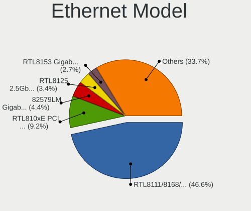

| Model                                                                  | Computers | Percent |
|------------------------------------------------------------------------|-----------|---------|
| Realtek RTL8111/8168/8211/8411 PCI Express Gigabit Ethernet Controller | 137       | 46.6%   |
| Realtek RTL810xE PCI Express Fast Ethernet controller                  | 27        | 9.18%   |
| Intel 82579LM Gigabit Network Connection (Lewisville)                  | 13        | 4.42%   |
| Realtek RTL8125 2.5GbE Controller                                      | 10        | 3.4%    |
| Realtek RTL8153 Gigabit Ethernet Adapter                               | 8         | 2.72%   |
| Intel Ethernet Connection I217-LM                                      | 5         | 1.7%    |
| VIA VT6102/VT6103 [Rhine-II]                                           | 3         | 1.02%   |
| Realtek RTL8152 Fast Ethernet Adapter                                  | 3         | 1.02%   |
| Realtek Killer E2600 GbE Controller                                    | 3         | 1.02%   |
| Qualcomm Atheros Killer E220x Gigabit Ethernet Controller              | 3         | 1.02%   |
| Intel Ethernet Connection I217-V                                       | 3         | 1.02%   |
| Intel Ethernet Connection (7) I219-V                                   | 3         | 1.02%   |
| Intel Ethernet Connection (4) I219-LM                                  | 3         | 1.02%   |
| Intel Ethernet Connection (2) I219-LM                                  | 3         | 1.02%   |
| ASIX AX88179 Gigabit Ethernet                                          | 3         | 1.02%   |
| Xiaomi Mi/Redmi series (RNDIS)                                         | 2         | 0.68%   |
| Realtek Killer E3000 2.5GbE Controller                                 | 2         | 0.68%   |
| Qualcomm Atheros QCA8171 Gigabit Ethernet                              | 2         | 0.68%   |
| Qualcomm Atheros AR8161 Gigabit Ethernet                               | 2         | 0.68%   |
| Qualcomm Atheros AR8152 v2.0 Fast Ethernet                             | 2         | 0.68%   |
| JMicron JMC250 PCI Express Gigabit Ethernet Controller                 | 2         | 0.68%   |
| Intel I211 Gigabit Network Connection                                  | 2         | 0.68%   |
| Intel Ethernet Controller I225-V                                       | 2         | 0.68%   |
| Intel Ethernet Connection (2) I219-V                                   | 2         | 0.68%   |
| Intel Alder Lake-P PCH CNVi WiFi                                       | 2         | 0.68%   |
| Intel 82579V Gigabit Network Connection                                | 2         | 0.68%   |
| D-Link System DGE-528T Gigabit Ethernet Adapter                        | 2         | 0.68%   |
| Broadcom NetLink BCM57780 Gigabit Ethernet PCIe                        | 2         | 0.68%   |
| SysKonnect SK-98xx V2.0 Gigabit Ethernet Adapter [Marvell 88E8001]     | 1         | 0.34%   |
| Samsung GT-I9070 (network tethering, USB debugging enabled)            | 1         | 0.34%   |
| Samsung Galaxy series, misc. (tethering mode)                          | 1         | 0.34%   |
| Realtek RTL8169 PCI Gigabit Ethernet Controller                        | 1         | 0.34%   |
| Realtek RTL8111/8168/8411 PCI Express Gigabit Ethernet Controller      | 1         | 0.34%   |
| Realtek RTL-8110SC/8169SC Gigabit Ethernet                             | 1         | 0.34%   |
| Realtek RTL-8100/8101L/8139 PCI Fast Ethernet Adapter                  | 1         | 0.34%   |
| Qualcomm Atheros QCA8172 Fast Ethernet                                 | 1         | 0.34%   |
| Qualcomm Atheros Killer E2400 Gigabit Ethernet Controller              | 1         | 0.34%   |
| Qualcomm Atheros AR8151 v2.0 Gigabit Ethernet                          | 1         | 0.34%   |
| Qualcomm Atheros AR8151 v1.0 Gigabit Ethernet                          | 1         | 0.34%   |
| Qualcomm Atheros AR8131 Gigabit Ethernet                               | 1         | 0.34%   |

Net Controller Kind
-------------------

Ethernet, WiFi or modem

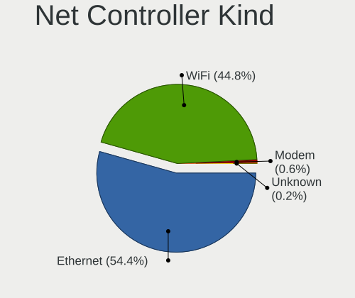

| Kind     | Computers | Percent |
|----------|-----------|---------|
| Ethernet | 268       | 54.36%  |
| WiFi     | 221       | 44.83%  |
| Modem    | 3         | 0.61%   |
| Unknown  | 1         | 0.2%    |

Used Controller
---------------

Currently used network controller

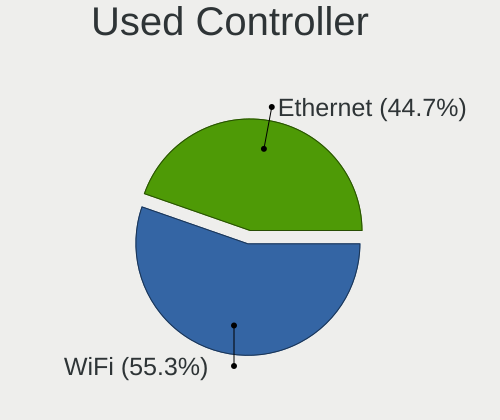

| Kind     | Computers | Percent |
|----------|-----------|---------|
| WiFi     | 171       | 55.34%  |
| Ethernet | 138       | 44.66%  |

NICs
----

Total network controllers on board

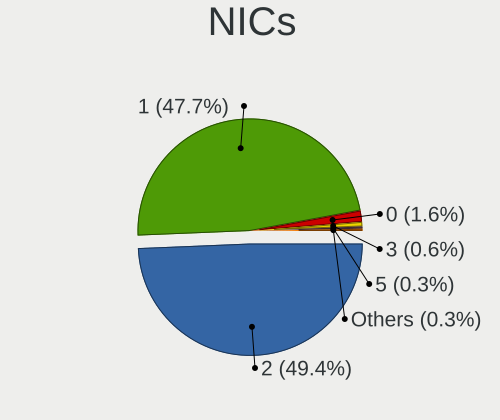

| Total | Computers | Percent |
|-------|-----------|---------|
| 2     | 152       | 49.35%  |
| 1     | 147       | 47.73%  |
| 0     | 5         | 1.62%   |
| 3     | 2         | 0.65%   |
| 5     | 1         | 0.32%   |
| 4     | 1         | 0.32%   |

IPv6
----

IPv6 vs IPv4

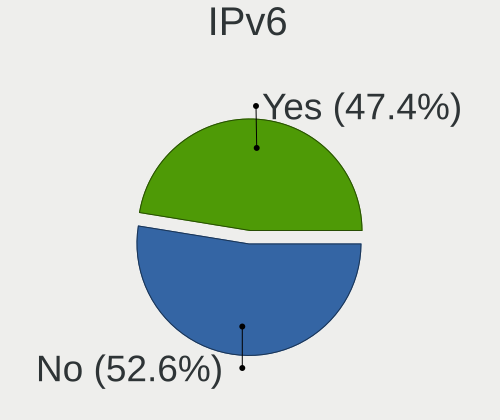

| Used | Computers | Percent |
|------|-----------|---------|
| No   | 164       | 52.56%  |
| Yes  | 148       | 47.44%  |

Bluetooth
---------

Bluetooth Vendor
----------------

Controller vendors

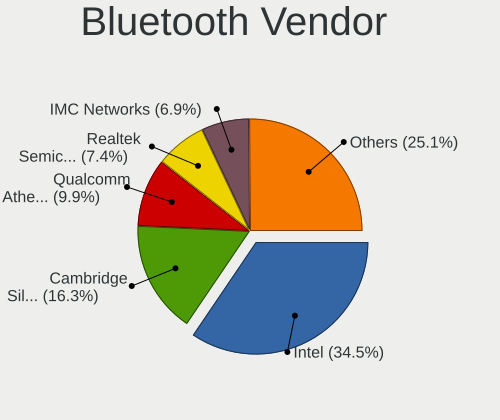

| Vendor                          | Computers | Percent |
|---------------------------------|-----------|---------|
| Intel                           | 70        | 34.48%  |
| Cambridge Silicon Radio         | 33        | 16.26%  |
| Qualcomm Atheros Communications | 20        | 9.85%   |
| Realtek Semiconductor           | 15        | 7.39%   |
| IMC Networks                    | 14        | 6.9%    |
| Lite-On Technology              | 11        | 5.42%   |
| Foxconn / Hon Hai               | 7         | 3.45%   |
| Broadcom                        | 7         | 3.45%   |
| MediaTek                        | 5         | 2.46%   |
| Apple                           | 4         | 1.97%   |
| TP-Link                         | 3         | 1.48%   |
| Hewlett-Packard                 | 3         | 1.48%   |
| Marvell Semiconductor           | 2         | 0.99%   |
| ASUSTek Computer                | 2         | 0.99%   |
| Actions                         | 2         | 0.99%   |
| Ralink                          | 1         | 0.49%   |
| Integrated System Solution      | 1         | 0.49%   |
| Dell                            | 1         | 0.49%   |
| Chicony Electronics             | 1         | 0.49%   |
| AboCom Systems                  | 1         | 0.49%   |

Bluetooth Model
---------------

Controller models

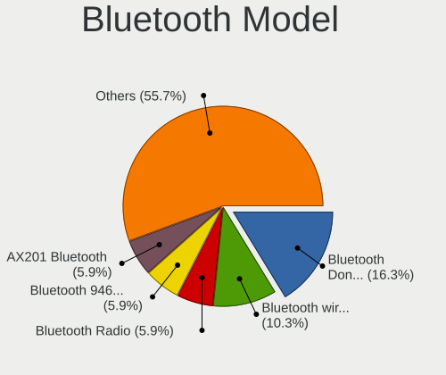

| Model                                                                               | Computers | Percent |
|-------------------------------------------------------------------------------------|-----------|---------|
| Cambridge Silicon Radio Bluetooth Dongle (HCI mode)                                 | 33        | 16.26%  |
| Intel Bluetooth wireless interface                                                  | 21        | 10.34%  |
| Realtek Bluetooth Radio                                                             | 12        | 5.91%   |
| Intel Bluetooth 9460/9560 Jefferson Peak (JfP)                                      | 12        | 5.91%   |
| Intel AX201 Bluetooth                                                               | 12        | 5.91%   |
| Lite-On Qualcomm Atheros QCA9377 Bluetooth                                          | 8         | 3.94%   |
| Qualcomm Atheros  Bluetooth Device                                                  | 7         | 3.45%   |
| Qualcomm Atheros AR3012 Bluetooth 4.0                                               | 5         | 2.46%   |
| MediaTek Wireless_Device                                                            | 5         | 2.46%   |
| Intel Centrino Bluetooth Wireless Transceiver                                       | 5         | 2.46%   |
| Intel AX200 Bluetooth                                                               | 5         | 2.46%   |
| IMC Networks Bluetooth Radio                                                        | 5         | 2.46%   |
| Qualcomm Atheros QCA61x4 Bluetooth 4.0                                              | 4         | 1.97%   |
| Qualcomm Atheros AR3011 Bluetooth                                                   | 4         | 1.97%   |
| Intel Wireless-AC 3168 Bluetooth                                                    | 4         | 1.97%   |
| Intel Bluetooth Device                                                              | 4         | 1.97%   |
| Intel AX210 Bluetooth                                                               | 4         | 1.97%   |
| IMC Networks Wireless_Device                                                        | 4         | 1.97%   |
| TP-Link TP-T@- UB500 Adapter                                                        | 3         | 1.48%   |
| Foxconn / Hon Hai Wireless_Device                                                   | 3         | 1.48%   |
| Realtek  Bluetooth 4.2 Adapter                                                      | 2         | 0.99%   |
| Intel Centrino Advanced-N 6230 Bluetooth adapter                                    | 2         | 0.99%   |
| IMC Networks Bluetooth Device                                                       | 2         | 0.99%   |
| HP Broadcom 2070 Bluetooth Combo                                                    | 2         | 0.99%   |
| Apple Bluetooth USB Host Controller                                                 | 2         | 0.99%   |
| Actions general adapter                                                             | 2         | 0.99%   |
| Realtek RTL8822BE Bluetooth 4.2 Adapter                                             | 1         | 0.49%   |
| Ralink RT3290 Bluetooth                                                             | 1         | 0.49%   |
| Marvell Bluetooth and Wireless LAN Composite Device                                 | 1         | 0.49%   |
| Marvell Bluetooth and Wireless LAN Composite                                        | 1         | 0.49%   |
| Lite-On Qualcomm Atheros Bluetooth                                                  | 1         | 0.49%   |
| Lite-On Bluetooth Device                                                            | 1         | 0.49%   |
| Lite-On Atheros AR3012 Bluetooth                                                    | 1         | 0.49%   |
| Intel Wireless-AC 9260 Bluetooth Adapter                                            | 1         | 0.49%   |
| Integrated System Solution KY-BT100 Bluetooth Adapter                               | 1         | 0.49%   |
| IMC Networks Bluetooth USB Host Controller                                          | 1         | 0.49%   |
| IMC Networks BCM20702A0                                                             | 1         | 0.49%   |
| IMC Networks Atheros AR3012 Bluetooth 4.0 Adapter                                   | 1         | 0.49%   |
| HP Bluetooth 2.0 Interface [Broadcom BCM2045]                                       | 1         | 0.49%   |
| Foxconn / Hon Hai Foxconn T77H114 BCM2070 [Single-Chip Bluetooth 2.1 + EDR Adapter] | 1         | 0.49%   |

Sound
-----

Sound Vendor
------------

Sound card vendors

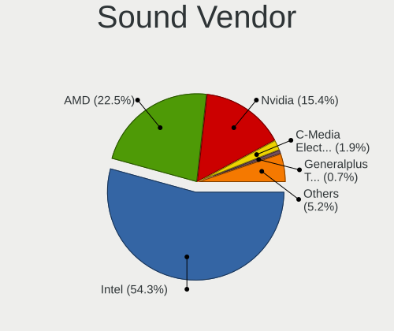

| Vendor                               | Computers | Percent |
|--------------------------------------|-----------|---------|
| Intel                                | 229       | 54.27%  |
| AMD                                  | 95        | 22.51%  |
| Nvidia                               | 65        | 15.4%   |
| C-Media Electronics                  | 8         | 1.9%    |
| Generalplus Technology               | 3         | 0.71%   |
| Creative Labs                        | 3         | 0.71%   |
| VIA Technologies                     | 2         | 0.47%   |
| Walmart                              | 1         | 0.24%   |
| USB Audio                            | 1         | 0.24%   |
| Thesycon Systemsoftware & Consulting | 1         | 0.24%   |
| Texas Instruments                    | 1         | 0.24%   |
| Samsung Electronics                  | 1         | 0.24%   |
| Roland                               | 1         | 0.24%   |
| Realtek Semiconductor                | 1         | 0.24%   |
| Razer USA                            | 1         | 0.24%   |
| Micro Star International             | 1         | 0.24%   |
| KTMicro                              | 1         | 0.24%   |
| JMTek                                | 1         | 0.24%   |
| Jieli Technology                     | 1         | 0.24%   |
| iCON                                 | 1         | 0.24%   |
| Focusrite-Novation                   | 1         | 0.24%   |
| ESS Technology                       | 1         | 0.24%   |
| ASRock                               | 1         | 0.24%   |
| Actions Semiconductor                | 1         | 0.24%   |

Sound Model
-----------

Sound card models

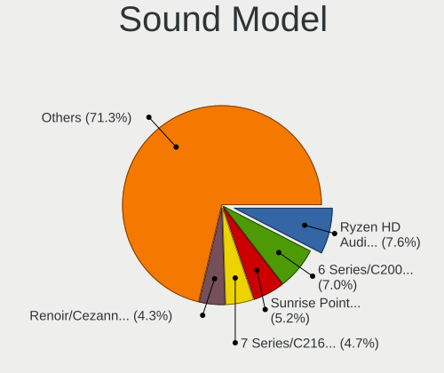

| Model                                                                             | Computers | Percent |
|-----------------------------------------------------------------------------------|-----------|---------|
| AMD Ryzen HD Audio Controller                                                     | 39        | 7.57%   |
| Intel 6 Series/C200 Series Chipset Family High Definition Audio Controller        | 36        | 6.99%   |
| Intel Sunrise Point-LP HD Audio                                                   | 27        | 5.24%   |
| Intel 7 Series/C216 Chipset Family High Definition Audio Controller               | 24        | 4.66%   |
| AMD Renoir/Cezanne HDMI/DP Audio Controller                                       | 22        | 4.27%   |
| Intel 8 Series/C220 Series Chipset High Definition Audio Controller               | 16        | 3.11%   |
| Intel Xeon E3-1200 v3/4th Gen Core Processor HD Audio Controller                  | 15        | 2.91%   |
| AMD Radeon High Definition Audio Controller                                       | 10        | 1.94%   |
| Nvidia GP107GL High Definition Audio Controller                                   | 9         | 1.75%   |
| Intel 100 Series/C230 Series Chipset Family HD Audio Controller                   | 9         | 1.75%   |
| AMD Starship/Matisse HD Audio Controller                                          | 9         | 1.75%   |
| Intel NM10/ICH7 Family High Definition Audio Controller                           | 8         | 1.55%   |
| Intel Celeron/Pentium Silver Processor High Definition Audio                      | 8         | 1.55%   |
| Intel 5 Series/3400 Series Chipset High Definition Audio                          | 8         | 1.55%   |
| AMD SBx00 Azalia (Intel HDA)                                                      | 8         | 1.55%   |
| AMD Navi 31 HDMI/DP Audio                                                         | 8         | 1.55%   |
| Intel Cannon Lake PCH cAVS                                                        | 7         | 1.36%   |
| Intel Alder Lake PCH-P High Definition Audio Controller                           | 7         | 1.36%   |
| AMD Ellesmere HDMI Audio [Radeon RX 470/480 / 570/580/590]                        | 7         | 1.36%   |
| Intel Tiger Lake-LP Smart Sound Technology Audio Controller                       | 6         | 1.17%   |
| Intel Haswell-ULT HD Audio Controller                                             | 6         | 1.17%   |
| Intel 8 Series HD Audio Controller                                                | 6         | 1.17%   |
| AMD Raven/Raven2/Fenghuang HDMI/DP Audio Controller                               | 6         | 1.17%   |
| Nvidia TU106 High Definition Audio Controller                                     | 5         | 0.97%   |
| Nvidia GM107 High Definition Audio Controller [GeForce 940MX]                     | 5         | 0.97%   |
| Nvidia GA106 High Definition Audio Controller                                     | 5         | 0.97%   |
| Nvidia AD107 High Definition Audio Controller                                     | 5         | 0.97%   |
| Intel Wildcat Point-LP High Definition Audio Controller                           | 5         | 0.97%   |
| Intel Raptor Lake-P/U/H cAVS                                                      | 5         | 0.97%   |
| Intel Broadwell-U Audio Controller                                                | 5         | 0.97%   |
| Intel 82801I (ICH9 Family) HD Audio Controller                                    | 5         | 0.97%   |
| AMD Navi 21/23 HDMI/DP Audio Controller                                           | 5         | 0.97%   |
| AMD Family 17h (Models 00h-0fh) HD Audio Controller                               | 5         | 0.97%   |
| AMD Caicos HDMI Audio [Radeon HD 6450 / 7450/8450/8490 OEM / R5 230/235/235X OEM] | 5         | 0.97%   |
| Nvidia TU107 GeForce GTX 1650 High Definition Audio Controller                    | 4         | 0.78%   |
| Nvidia GK208 HDMI/DP Audio Controller                                             | 4         | 0.78%   |
| Intel Tiger Lake-H HD Audio Controller                                            | 4         | 0.78%   |
| Intel Raptor Lake High Definition Audio Controller                                | 4         | 0.78%   |
| Intel Ice Lake-LP Smart Sound Technology Audio Controller                         | 4         | 0.78%   |
| Intel Atom Processor Z36xxx/Z37xxx Series High Definition Audio Controller        | 4         | 0.78%   |

Memory
------

Memory Vendor
-------------

Memory module vendors

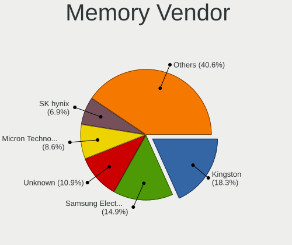

| Vendor              | Computers | Percent |
|---------------------|-----------|---------|
| Kingston            | 32        | 18.29%  |
| Samsung Electronics | 26        | 14.86%  |
| Unknown             | 19        | 10.86%  |
| Micron Technology   | 15        | 8.57%   |
| SK hynix            | 12        | 6.86%   |
| Smart               | 11        | 6.29%   |
| Crucial             | 10        | 5.71%   |
| Corsair             | 8         | 4.57%   |
| Unknown             | 8         | 4.57%   |
| A-DATA Technology   | 5         | 2.86%   |
| Ramaxel Technology  | 4         | 2.29%   |
| Team                | 3         | 1.71%   |
| Kllisre             | 3         | 1.71%   |
| Teikon              | 2         | 1.14%   |
| Nanya Technology    | 2         | 1.14%   |
| Hikvision           | 2         | 1.14%   |
| G.Skill             | 2         | 1.14%   |
| Walton Chaintech    | 1         | 0.57%   |
| Unknown (B98C)      | 1         | 0.57%   |
| Unknown (ABCD)      | 1         | 0.57%   |
| Unknown (8A6B)      | 1         | 0.57%   |
| Timetec             | 1         | 0.57%   |
| Smart Brazil        | 1         | 0.57%   |
| PLEXHD              | 1         | 0.57%   |
| Multilaser          | 1         | 0.57%   |
| Kembona             | 1         | 0.57%   |
| GOODRAM             | 1         | 0.57%   |
| Asgard              | 1         | 0.57%   |

Memory Model
------------

Memory module models

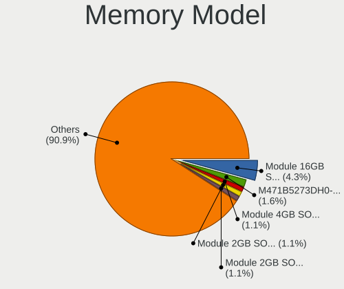

| Model                                                            | Computers | Percent |
|------------------------------------------------------------------|-----------|---------|
| Unknown                                                          | 8         | 4.3%    |
| Samsung RAM M471B5273DH0-CH9 4GB SODIMM DDR3 1600MT/s            | 3         | 1.61%   |
| Unknown RAM Module 4GB SODIMM DDR4 2133MT/s                      | 2         | 1.08%   |
| Unknown RAM Module 2GB SODIMM DDR2 667MT/s                       | 2         | 1.08%   |
| Unknown RAM Module 2GB SODIMM DDR2                               | 2         | 1.08%   |
| Unknown RAM Module 2GB DIMM SDRAM                                | 2         | 1.08%   |
| Smart RAM SH564128FH8NZQNSCG 4GB SODIMM DDR3 1600MT/s            | 2         | 1.08%   |
| Smart RAM SH564128FH8N6TNSQG 4GB DIMM DDR3 1600MT/s              | 2         | 1.08%   |
| Samsung RAM M471A1K43BB1-CRC 8GB SODIMM DDR4 2667MT/s            | 2         | 1.08%   |
| Samsung RAM M425R2GA3BB0-CQKOL 16GB SODIMM DDR5 4800MT/s         | 2         | 1.08%   |
| Micron RAM MICRON/MT60B1G16HC-4 8GB SODIMM DDR5 4800MT/s         | 2         | 1.08%   |
| Kllisre RAM KRE-D3U1600M/8G 8GB DIMM DDR3 1600MT/s               | 2         | 1.08%   |
| Kingston RAM KHX1600C10D3/8G 8GB DIMM DDR3 2133MT/s              | 2         | 1.08%   |
| Hikvision RAM HKED4161CAB2F1HB2 16GB DIMM DDR4 3200MT/s          | 2         | 1.08%   |
| Crucial RAM CT16G4DFRA32A.M16FE 16GB DIMM DDR4 3200MT/s          | 2         | 1.08%   |
| Walton Chaintech RAM AS2G732-800P005 2GB SODIMM DDR2 800MT/s     | 1         | 0.54%   |
| Unknown RAM Module 8GB SODIMM DDR3 1600MT/s                      | 1         | 0.54%   |
| Unknown RAM Module 8GB DIMM SDRAM                                | 1         | 0.54%   |
| Unknown RAM Module 8GB DIMM DDR4 2667MT/s                        | 1         | 0.54%   |
| Unknown RAM Module 8GB DIMM DDR3 1333MT/s                        | 1         | 0.54%   |
| Unknown RAM Module 512MB SODIMM DDR2                             | 1         | 0.54%   |
| Unknown RAM Module 4GB SODIMM DDR3                               | 1         | 0.54%   |
| Unknown RAM Module 4GB DIMM DDR3 1333MT/s                        | 1         | 0.54%   |
| Unknown RAM Module 2GB SODIMM DDR3 1600MT/s                      | 1         | 0.54%   |
| Unknown RAM Module 2GB DIMM DDR2 266MT/s                         | 1         | 0.54%   |
| Unknown RAM Module 2GB DIMM 1333MT/s                             | 1         | 0.54%   |
| Unknown RAM Module 1GB SODIMM SDRAM                              | 1         | 0.54%   |
| Unknown RAM Module 1GB SODIMM DDR2 667MT/s                       | 1         | 0.54%   |
| Unknown RAM Module 16GB DIMM DDR4 3200MT/s                       | 1         | 0.54%   |
| Unknown (B98C) RAM Module 8GB DIMM DDR4 2667MT/s                 | 1         | 0.54%   |
| Unknown (ABCD) RAM 123456789012345678 2GB SODIMM LPDDR4 2400MT/s | 1         | 0.54%   |
| Unknown (8A6B) RAM BL.9BWWA.221 8GB DIMM DDR4 2667MT/s           | 1         | 0.54%   |
| Timetec RAM Module 4GB SODIMM DDR3 1067MT/s                      | 1         | 0.54%   |
| Teikon RAM TMT351S6EFR8A-PBHJ 4GB SODIMM DDR3 1600MT/s           | 1         | 0.54%   |
| Teikon RAM TMA81GS6AFR8N-UHSC 8GB SODIMM DDR4 2400MT/s           | 1         | 0.54%   |
| Team RAM TEAMGROUP-UD4-3200 8GB DIMM DDR4 3733MT/s               | 1         | 0.54%   |
| Team RAM TEAMGROUP-UD4-3000 8GB DIMM DDR4 3200MT/s               | 1         | 0.54%   |
| Team RAM SD5-5600 16GB SODIMM DDR5 5600MT/s                      | 1         | 0.54%   |
| Smart RAM SMS4WEC3C1J0446SAG 8GB SODIMM DDR4 3200MT/s            | 1         | 0.54%   |
| Smart RAM SMS4TDC3C0K0446SCG 4GB SODIMM DDR4 2667MT/s            | 1         | 0.54%   |

Memory Kind
-----------

Memory module kinds

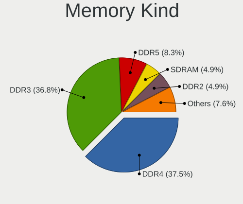

| Kind    | Computers | Percent |
|---------|-----------|---------|
| DDR4    | 54        | 37.5%   |
| DDR3    | 53        | 36.81%  |
| DDR5    | 12        | 8.33%   |
| SDRAM   | 7         | 4.86%   |
| DDR2    | 7         | 4.86%   |
| LPDDR5  | 3         | 2.08%   |
| LPDDR4  | 3         | 2.08%   |
| LPDDR3  | 3         | 2.08%   |
| DRAM    | 1         | 0.69%   |
| Unknown | 1         | 0.69%   |

Memory Form Factor
------------------

Physical design of the memory module

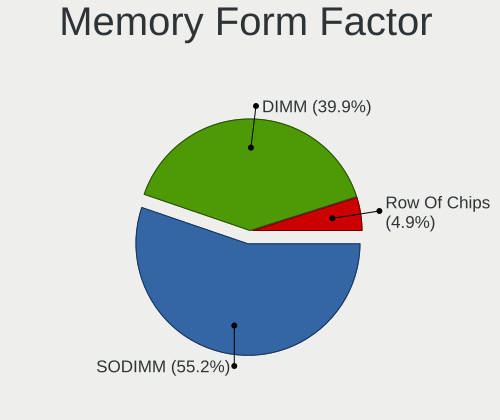

| Name         | Computers | Percent |
|--------------|-----------|---------|
| SODIMM       | 79        | 55.24%  |
| DIMM         | 57        | 39.86%  |
| Row Of Chips | 7         | 4.9%    |

Memory Size
-----------

Memory module size

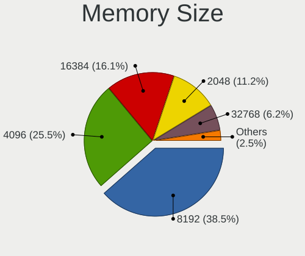

| Size  | Computers | Percent |
|-------|-----------|---------|
| 8192  | 62        | 38.51%  |
| 4096  | 41        | 25.47%  |
| 16384 | 26        | 16.15%  |
| 2048  | 18        | 11.18%  |
| 32768 | 10        | 6.21%   |
| 1024  | 3         | 1.86%   |
| 512   | 1         | 0.62%   |

Memory Speed
------------

Memory module speed

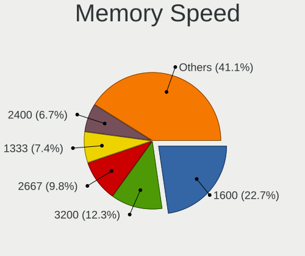

| Speed   | Computers | Percent |
|---------|-----------|---------|
| 1600    | 37        | 22.7%   |
| 3200    | 20        | 12.27%  |
| 2667    | 16        | 9.82%   |
| 1333    | 12        | 7.36%   |
| 2400    | 11        | 6.75%   |
| 4800    | 9         | 5.52%   |
| 2133    | 9         | 5.52%   |
| Unknown | 8         | 4.91%   |
| 1334    | 4         | 2.45%   |
| 5600    | 3         | 1.84%   |
| 4000    | 3         | 1.84%   |
| 3600    | 3         | 1.84%   |
| 667     | 3         | 1.84%   |
| 6400    | 2         | 1.23%   |
| 3733    | 2         | 1.23%   |
| 2666    | 2         | 1.23%   |
| 1866    | 2         | 1.23%   |
| 1067    | 2         | 1.23%   |
| 12800   | 1         | 0.61%   |
| 7500    | 1         | 0.61%   |
| 4267    | 1         | 0.61%   |
| 4266    | 1         | 0.61%   |
| 4199    | 1         | 0.61%   |
| 3800    | 1         | 0.61%   |
| 3466    | 1         | 0.61%   |
| 3000    | 1         | 0.61%   |
| 2200    | 1         | 0.61%   |
| 2048    | 1         | 0.61%   |
| 1867    | 1         | 0.61%   |
| 1066    | 1         | 0.61%   |
| 975     | 1         | 0.61%   |
| 800     | 1         | 0.61%   |
| 266     | 1         | 0.61%   |

Printers & scanners
-------------------

Printer Vendor
--------------

Printer device vendors

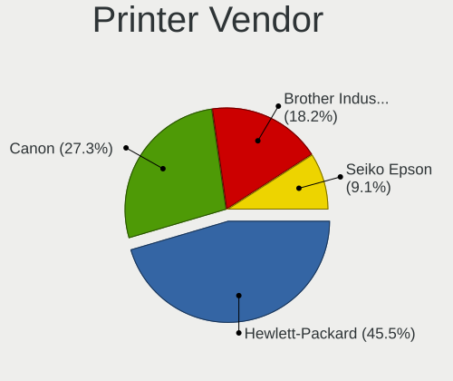

| Vendor             | Computers | Percent |
|--------------------|-----------|---------|
| Hewlett-Packard    | 5         | 45.45%  |
| Canon              | 3         | 27.27%  |
| Brother Industries | 2         | 18.18%  |
| Seiko Epson        | 1         | 9.09%   |

Printer Model
-------------

Printer device models

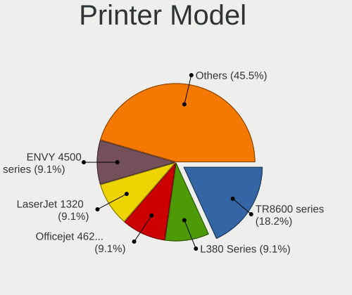

| Model                         | Computers | Percent |
|-------------------------------|-----------|---------|
| Canon TR8600 series           | 2         | 18.18%  |
| Seiko Epson L380 Series       | 1         | 9.09%   |
| HP Officejet 4620 series      | 1         | 9.09%   |
| HP LaserJet 1320              | 1         | 9.09%   |
| HP ENVY 4500 series           | 1         | 9.09%   |
| HP Deskjet 3050 J610 series   | 1         | 9.09%   |
| HP DeskJet 2700 series        | 1         | 9.09%   |
| Canon E410 series             | 1         | 9.09%   |
| Brother QL-710W Label Printer | 1         | 9.09%   |
| Brother DCP-T500W             | 1         | 9.09%   |

Scanner Vendor
--------------

Scanner device vendors

| Vendor | Computers | Percent |
|--------|-----------|---------|
| Canon  | 1         | 100%    |

Scanner Model
-------------

Scanner device models

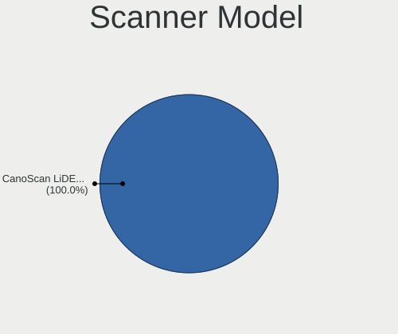

| Model                   | Computers | Percent |
|-------------------------|-----------|---------|
| Canon CanoScan LiDE 210 | 1         | 100%    |

Camera
------

Camera Vendor
-------------

Camera device vendors

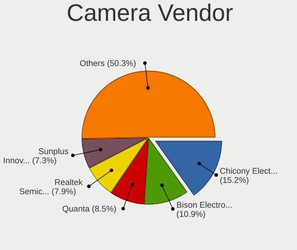

| Vendor                                 | Computers | Percent |
|----------------------------------------|-----------|---------|
| Chicony Electronics                    | 25        | 15.15%  |
| Bison Electronics                      | 18        | 10.91%  |
| Quanta                                 | 14        | 8.48%   |
| Realtek Semiconductor                  | 13        | 7.88%   |
| Sunplus Innovation Technology          | 12        | 7.27%   |
| IMC Networks                           | 9         | 5.45%   |
| Microdia                               | 7         | 4.24%   |
| Syntek                                 | 5         | 3.03%   |
| Shine-optics                           | 5         | 3.03%   |
| Logitech                               | 5         | 3.03%   |
| Suyin                                  | 4         | 2.42%   |
| Silicon Motion                         | 4         | 2.42%   |
| Luxvisions Innotech Limited            | 4         | 2.42%   |
| Cheng Uei Precision Industry (Foxlink) | 4         | 2.42%   |
| Alcor Micro                            | 4         | 2.42%   |
| Microsoft                              | 3         | 1.82%   |
| Lenovo                                 | 3         | 1.82%   |
| Apple                                  | 3         | 1.82%   |
| SunplusIT                              | 2         | 1.21%   |
| Shinetech                              | 2         | 1.21%   |
| Ricoh                                  | 2         | 1.21%   |
| Jieli Technology                       | 2         | 1.21%   |
| Anker PowerConf C200                   | 2         | 1.21%   |
| ALi                                    | 2         | 1.21%   |
| Unknown                                | 2         | 1.21%   |
| Y Media                                | 1         | 0.61%   |
| USB Camera CS                          | 1         | 0.61%   |
| Sonix Technology                       | 1         | 0.61%   |
| Samsung Electronics                    | 1         | 0.61%   |
| Lite-On Technology                     | 1         | 0.61%   |
| LianYi                                 | 1         | 0.61%   |
| Leap Motion                            | 1         | 0.61%   |
| Generalplus Technology                 | 1         | 0.61%   |
| GEMBIRD                                | 1         | 0.61%   |

Camera Model
------------

Camera device models

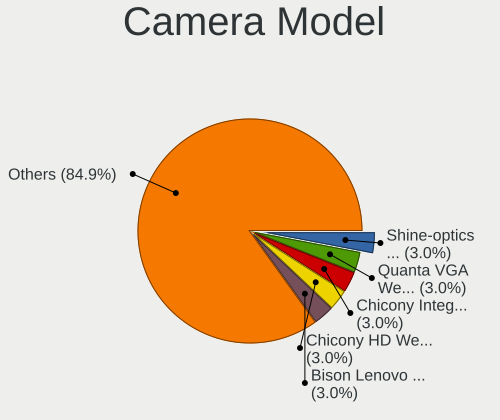

| Model                                                       | Computers | Percent |
|-------------------------------------------------------------|-----------|---------|
| Shine-optics USB2.0 HD UVC WebCam                           | 5         | 3.01%   |
| Quanta VGA WebCam                                           | 5         | 3.01%   |
| Chicony Integrated Camera                                   | 5         | 3.01%   |
| Chicony HD WebCam                                           | 5         | 3.01%   |
| Bison Lenovo EasyCamera                                     | 5         | 3.01%   |
| Bison Integrated Camera                                     | 5         | 3.01%   |
| Realtek Integrated_Webcam_HD                                | 4         | 2.41%   |
| Syntek Integrated Camera                                    | 3         | 1.81%   |
| Sunplus Integrated Camera                                   | 3         | 1.81%   |
| Silicon Motion Web Camera                                   | 3         | 1.81%   |
| Realtek USB Camera                                          | 3         | 1.81%   |
| Quanta HD Webcam                                            | 3         | 1.81%   |
| Quanta ACER HD User Facing                                  | 3         | 1.81%   |
| Bison HD Webcam                                             | 3         | 1.81%   |
| Bison EasyCamera                                            | 3         | 1.81%   |
| Syntek Lenovo EasyCamera                                    | 2         | 1.2%    |
| SunplusIT MTD camera                                        | 2         | 1.2%    |
| Realtek Integrated Webcam                                   | 2         | 1.2%    |
| Microdia Integrated_Webcam_HD                               | 2         | 1.2%    |
| Microdia Integrated Camera                                  | 2         | 1.2%    |
| Luxvisions Innotech Limited HP Wide Vision HD Camera        | 2         | 1.2%    |
| Jieli USB PHY 2.0                                           | 2         | 1.2%    |
| IMC Networks USB2.0 HD UVC WebCam                           | 2         | 1.2%    |
| IMC Networks Integrated Camera                              | 2         | 1.2%    |
| Chicony HP HD Webcam [Fixed]                                | 2         | 1.2%    |
| Apple Built-in iSight                                       | 2         | 1.2%    |
| Anker PowerConf C200 Anker PowerConf C200                   | 2         | 1.2%    |
| Unknown                                                     | 2         | 1.2%    |
| Y Media USB Camera                                          | 1         | 0.6%    |
| USB Camera CS USB Camera CS                                 | 1         | 0.6%    |
| Suyin USB 2.0 Webcam Device                                 | 1         | 0.6%    |
| Suyin Acer/Lenovo Webcam [CN0316]                           | 1         | 0.6%    |
| Suyin Acer/HP Integrated Webcam [CN0314]                    | 1         | 0.6%    |
| Suyin 1.3M WebCam (notebook emachines E730, Acer sub-brand) | 1         | 0.6%    |
| Sunplus MTD Camera                                          | 1         | 0.6%    |
| Sunplus Laptop_Integrated_Webcam_HD                         | 1         | 0.6%    |
| Sunplus Laptop_Integrated_Webcam_FHD                        | 1         | 0.6%    |
| Sunplus Laptop Integrated Webcam FHD                        | 1         | 0.6%    |
| Sunplus HP Universal Camera                                 | 1         | 0.6%    |
| Sunplus HP TrueVision HD Camera                             | 1         | 0.6%    |

Security
--------

Fingerprint Vendor
------------------

Fingerprint sensor vendors

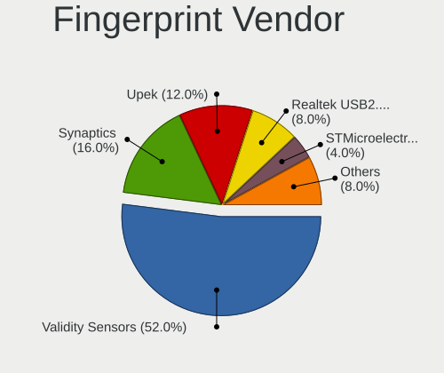

| Vendor                             | Computers | Percent |
|------------------------------------|-----------|---------|
| Validity Sensors                   | 13        | 52%     |
| Synaptics                          | 4         | 16%     |
| Upek                               | 3         | 12%     |
| Realtek USB2.0 Finger Print Bridge | 2         | 8%      |
| STMicroelectronics                 | 1         | 4%      |
| Elan Microelectronics              | 1         | 4%      |
| DigitalPersona                     | 1         | 4%      |

Fingerprint Model
-----------------

Fingerprint sensor models

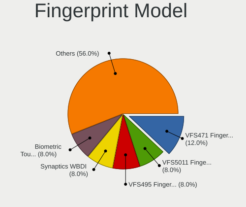

| Model                                                           | Computers | Percent |
|-----------------------------------------------------------------|-----------|---------|
| Validity Sensors VFS471 Fingerprint Reader                      | 3         | 12%     |
| Validity Sensors VFS5011 Fingerprint Reader                     | 2         | 8%      |
| Validity Sensors VFS495 Fingerprint Reader                      | 2         | 8%      |
| Validity Sensors Synaptics WBDI                                 | 2         | 8%      |
| Upek Biometric Touchchip/Touchstrip Fingerprint Sensor          | 2         | 8%      |
| Synaptics  WBDI                                                 | 2         | 8%      |
| Realtek USB2.0 Finger Print Bridge FocalTech Fingerprint Device | 2         | 8%      |
| Validity Sensors VFS491                                         | 1         | 4%      |
| Validity Sensors VFS101 Fingerprint Reader                      | 1         | 4%      |
| Validity Sensors VFS 5011 fingerprint sensor                    | 1         | 4%      |
| Validity Sensors Swipe Fingerprint Sensor                       | 1         | 4%      |
| Upek TCS5B Fingerprint sensor                                   | 1         | 4%      |
| Synaptics Metallica MIS Touch Fingerprint Reader                | 1         | 4%      |
| Synaptics Fingerprint reader [HP G6]                            | 1         | 4%      |
| STMicroelectronics Fingerprint Reader                           | 1         | 4%      |
| Elan ELAN:Fingerprint                                           | 1         | 4%      |
| DigitalPersona Fingerprint Reader                               | 1         | 4%      |

Chipcard Vendor
---------------

Chipcard module vendors

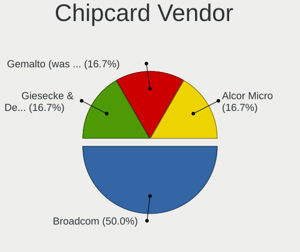

| Vendor                | Computers | Percent |
|-----------------------|-----------|---------|
| Broadcom              | 3         | 50%     |
| Giesecke & Devrient   | 1         | 16.67%  |
| Gemalto (was Gemplus) | 1         | 16.67%  |
| Alcor Micro           | 1         | 16.67%  |

Chipcard Model
--------------

Chipcard module models

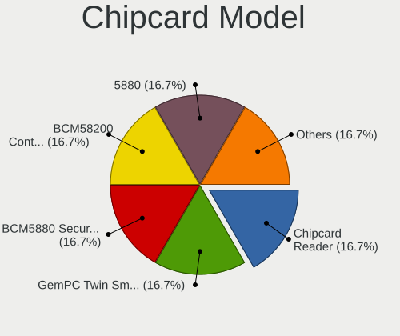

| Model                                                                       | Computers | Percent |
|-----------------------------------------------------------------------------|-----------|---------|
| Giesecke & Devrient Chipcard Reader                                         | 1         | 16.67%  |
| Gemalto (was Gemplus) GemPC Twin SmartCard Reader                           | 1         | 16.67%  |
| Broadcom BCM5880 Secure Applications Processor                              | 1         | 16.67%  |
| Broadcom BCM58200 ControlVault 3 (FingerPrint sensor + Contacted SmartCard) | 1         | 16.67%  |
| Broadcom 5880                                                               | 1         | 16.67%  |
| Alcor Micro AU9540 Smartcard Reader                                         | 1         | 16.67%  |

Unsupported
-----------

Unsupported Devices
-------------------

Total unsupported devices on board

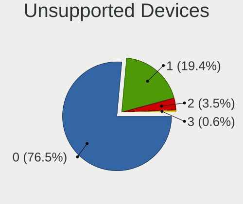

| Total | Computers | Percent |
|-------|-----------|---------|
| 0     | 237       | 76.45%  |
| 1     | 60        | 19.35%  |
| 2     | 11        | 3.55%   |
| 3     | 2         | 0.65%   |

Unsupported Device Types
------------------------

Types of unsupported devices

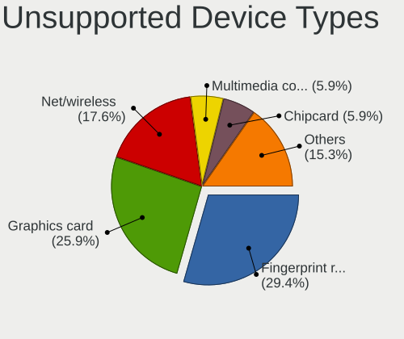

| Type                     | Computers | Percent |
|--------------------------|-----------|---------|
| Fingerprint reader       | 25        | 29.41%  |
| Graphics card            | 22        | 25.88%  |
| Net/wireless             | 15        | 17.65%  |
| Multimedia controller    | 5         | 5.88%   |
| Chipcard                 | 5         | 5.88%   |
| Unassigned class         | 3         | 3.53%   |
| Bluetooth                | 3         | 3.53%   |
| Sound                    | 2         | 2.35%   |
| Network                  | 2         | 2.35%   |
| Tv card                  | 1         | 1.18%   |
| Storage                  | 1         | 1.18%   |
| Communication controller | 1         | 1.18%   |

