BigLinux - Tested Hardware & Statistics
---------------------------------------

A project to collect tested hardware configurations for BigLinux.

Anyone can contribute to this report by the [hw-probe](https://github.com/linuxhw/hw-probe) tool:

    sudo -E hw-probe -all -upload

Please contribute! Especially if your hardware is rare.

This is a report for all computer types. See also reports for [desktops](/Dist/BigLinux/Desktop/README.md) and [notebooks](/Dist/BigLinux/Notebook/README.md).

Contents
--------

* [ Test Cases ](#test-cases)

* [ System ](#system)
  - [ OS                       ](#os)
  - [ OS Family                ](#os-family)
  - [ Kernel                   ](#kernel)
  - [ Kernel Family            ](#kernel-family)
  - [ Kernel Major Ver.        ](#kernel-major-ver)
  - [ Arch                     ](#arch)
  - [ DE                       ](#de)
  - [ Display Server           ](#display-server)
  - [ Display Manager          ](#display-manager)
  - [ OS Lang                  ](#os-lang)
  - [ Boot Mode                ](#boot-mode)
  - [ Filesystem               ](#filesystem)
  - [ Part. scheme             ](#part-scheme)
  - [ Dual Boot with Linux/BSD ](#dual-boot-with-linuxbsd)
  - [ Dual Boot (Win)          ](#dual-boot-win)

* [ Board ](#board)
  - [ Vendor                   ](#vendor)
  - [ Model                    ](#model)
  - [ Model Family             ](#model-family)
  - [ MFG Year                 ](#mfg-year)
  - [ Form Factor              ](#form-factor)
  - [ Secure Boot              ](#secure-boot)
  - [ Coreboot                 ](#coreboot)
  - [ RAM Size                 ](#ram-size)
  - [ RAM Used                 ](#ram-used)
  - [ Total Drives             ](#total-drives)
  - [ Has CD-ROM               ](#has-cd-rom)
  - [ Has Ethernet             ](#has-ethernet)
  - [ Has WiFi                 ](#has-wifi)
  - [ Has Bluetooth            ](#has-bluetooth)

* [ Location ](#location)
  - [ Country                  ](#country)
  - [ City                     ](#city)

* [ Drives ](#drives)
  - [ Drive Vendor             ](#drive-vendor)
  - [ Drive Model              ](#drive-model)
  - [ HDD Vendor               ](#hdd-vendor)
  - [ SSD Vendor               ](#ssd-vendor)
  - [ Drive Kind               ](#drive-kind)
  - [ Drive Connector          ](#drive-connector)
  - [ Drive Size               ](#drive-size)
  - [ Space Total              ](#space-total)
  - [ Space Used               ](#space-used)
  - [ Malfunc. Drives          ](#malfunc-drives)
  - [ Malfunc. Drive Vendor    ](#malfunc-drive-vendor)
  - [ Malfunc. HDD Vendor      ](#malfunc-hdd-vendor)
  - [ Malfunc. Drive Kind      ](#malfunc-drive-kind)
  - [ Failed Drives            ](#failed-drives)
  - [ Failed Drive Vendor      ](#failed-drive-vendor)
  - [ Drive Status             ](#drive-status)

* [ Storage controller ](#storage-controller)
  - [ Storage Vendor           ](#storage-vendor)
  - [ Storage Model            ](#storage-model)
  - [ Storage Kind             ](#storage-kind)

* [ Processor ](#processor)
  - [ CPU Vendor               ](#cpu-vendor)
  - [ CPU Model                ](#cpu-model)
  - [ CPU Model Family         ](#cpu-model-family)
  - [ CPU Cores                ](#cpu-cores)
  - [ CPU Sockets              ](#cpu-sockets)
  - [ CPU Threads              ](#cpu-threads)
  - [ CPU Op-Modes             ](#cpu-op-modes)
  - [ CPU Microcode            ](#cpu-microcode)
  - [ CPU Microarch            ](#cpu-microarch)

* [ Graphics ](#graphics)
  - [ GPU Vendor               ](#gpu-vendor)
  - [ GPU Model                ](#gpu-model)
  - [ GPU Combo                ](#gpu-combo)
  - [ GPU Driver               ](#gpu-driver)
  - [ GPU Memory               ](#gpu-memory)

* [ Monitor ](#monitor)
  - [ Monitor Vendor           ](#monitor-vendor)
  - [ Monitor Model            ](#monitor-model)
  - [ Monitor Resolution       ](#monitor-resolution)
  - [ Monitor Diagonal         ](#monitor-diagonal)
  - [ Monitor Width            ](#monitor-width)
  - [ Aspect Ratio             ](#aspect-ratio)
  - [ Monitor Area             ](#monitor-area)
  - [ Pixel Density            ](#pixel-density)
  - [ Multiple Monitors        ](#multiple-monitors)

* [ Network ](#network)
  - [ Net Controller Vendor    ](#net-controller-vendor)
  - [ Net Controller Model     ](#net-controller-model)
  - [ Wireless Vendor          ](#wireless-vendor)
  - [ Wireless Model           ](#wireless-model)
  - [ Ethernet Vendor          ](#ethernet-vendor)
  - [ Ethernet Model           ](#ethernet-model)
  - [ Net Controller Kind      ](#net-controller-kind)
  - [ Used Controller          ](#used-controller)
  - [ NICs                     ](#nics)
  - [ IPv6                     ](#ipv6)

* [ Bluetooth ](#bluetooth)
  - [ Bluetooth Vendor         ](#bluetooth-vendor)
  - [ Bluetooth Model          ](#bluetooth-model)

* [ Sound ](#sound)
  - [ Sound Vendor             ](#sound-vendor)
  - [ Sound Model              ](#sound-model)

* [ Memory ](#memory)
  - [ Memory Vendor            ](#memory-vendor)
  - [ Memory Model             ](#memory-model)
  - [ Memory Kind              ](#memory-kind)
  - [ Memory Form Factor       ](#memory-form-factor)
  - [ Memory Size              ](#memory-size)
  - [ Memory Speed             ](#memory-speed)

* [ Printers & scanners ](#printers--scanners)
  - [ Printer Vendor           ](#printer-vendor)
  - [ Printer Model            ](#printer-model)
  - [ Scanner Vendor           ](#scanner-vendor)
  - [ Scanner Model            ](#scanner-model)

* [ Camera ](#camera)
  - [ Camera Vendor            ](#camera-vendor)
  - [ Camera Model             ](#camera-model)

* [ Security ](#security)
  - [ Fingerprint Vendor       ](#fingerprint-vendor)
  - [ Fingerprint Model        ](#fingerprint-model)
  - [ Chipcard Vendor          ](#chipcard-vendor)
  - [ Chipcard Model           ](#chipcard-model)

* [ Unsupported ](#unsupported)
  - [ Unsupported Devices      ](#unsupported-devices)
  - [ Unsupported Device Types ](#unsupported-device-types)

Test Cases
----------

Total: 111

| Vendor        | Model                       | Form-Factor | Probe                                                      | Date         |
|---------------|-----------------------------|-------------|------------------------------------------------------------|--------------|
| Positivo      | C41TF                       | Notebook    | [4bb5f6150c](https://linux-hardware.org/?probe=4bb5f6150c) | Nov 06, 2023 |
| Gigabyte      | Z87-HD3                     | Desktop     | [f6db4cc5a7](https://linux-hardware.org/?probe=f6db4cc5a7) | Oct 31, 2023 |
| Gigabyte      | Z87-HD3                     | Desktop     | [35fabc6811](https://linux-hardware.org/?probe=35fabc6811) | Oct 31, 2023 |
| Gigabyte      | H370 AORUS GAMING 3 WIFI... | Desktop     | [439b0a3497](https://linux-hardware.org/?probe=439b0a3497) | Oct 28, 2023 |
| Acer          | Aspire A315-42G             | Notebook    | [65494c95ec](https://linux-hardware.org/?probe=65494c95ec) | Oct 23, 2023 |
| Dell          | 0KJCC5 A00                  | Desktop     | [f904697713](https://linux-hardware.org/?probe=f904697713) | Oct 23, 2023 |
| Acer          | Nitro AN515-51              | Notebook    | [be03ed57d8](https://linux-hardware.org/?probe=be03ed57d8) | Oct 20, 2023 |
| Acer          | Nitro AN515-51              | Notebook    | [e648a8c32a](https://linux-hardware.org/?probe=e648a8c32a) | Oct 20, 2023 |
| Gigabyte      | G41MT-S2                    | Desktop     | [50aa4fc1e1](https://linux-hardware.org/?probe=50aa4fc1e1) | Oct 18, 2023 |
| Microsoft     | Surface Pro                 | Tablet      | [952772fde5](https://linux-hardware.org/?probe=952772fde5) | Oct 14, 2023 |
| Lenovo        | ThinkPad T480s 20L70028U... | Notebook    | [673113259c](https://linux-hardware.org/?probe=673113259c) | Oct 14, 2023 |
| Gigabyte      | G41MT-S2                    | Desktop     | [d45a6f5bf2](https://linux-hardware.org/?probe=d45a6f5bf2) | Oct 14, 2023 |
| Acer          | Nitro AN515-47              | Notebook    | [0592faaf34](https://linux-hardware.org/?probe=0592faaf34) | Oct 12, 2023 |
| HP            | ZBook 15 G3                 | Notebook    | [cd9071e2ad](https://linux-hardware.org/?probe=cd9071e2ad) | Oct 12, 2023 |
| Dell          | Latitude E6420              | Notebook    | [7508b7cf4f](https://linux-hardware.org/?probe=7508b7cf4f) | Oct 10, 2023 |
| Gigabyte      | GA-880GMA-UD2H              | Desktop     | [45a4c0fbe0](https://linux-hardware.org/?probe=45a4c0fbe0) | Oct 06, 2023 |
| Dell          | Latitude E6420              | Notebook    | [90883fd019](https://linux-hardware.org/?probe=90883fd019) | Oct 02, 2023 |
| Intel         | H61                         | Desktop     | [5dd60be36a](https://linux-hardware.org/?probe=5dd60be36a) | Sep 14, 2023 |
| PCWare        | IPMH81G1                    | Desktop     | [181367c2db](https://linux-hardware.org/?probe=181367c2db) | Sep 12, 2023 |
| Biostar       | G31M+                       | Desktop     | [24eb0eb2db](https://linux-hardware.org/?probe=24eb0eb2db) | Sep 06, 2023 |
| ASUSTek       | Z170 PRO GAMING             | Desktop     | [73e3b8ef8a](https://linux-hardware.org/?probe=73e3b8ef8a) | Sep 04, 2023 |
| ASUSTek       | PRIME H410M-D               | Desktop     | [332e78dfba](https://linux-hardware.org/?probe=332e78dfba) | Sep 01, 2023 |
| Gigabyte      | B550M AORUS ELITE           | Desktop     | [9cf292357b](https://linux-hardware.org/?probe=9cf292357b) | Aug 30, 2023 |
| Acer          | Aspire E5-411G              | Notebook    | [1986877980](https://linux-hardware.org/?probe=1986877980) | Aug 25, 2023 |
| ASUSTek       | X455LA                      | Notebook    | [8b60fb0411](https://linux-hardware.org/?probe=8b60fb0411) | Aug 08, 2023 |
| HP            | EliteBook 8760w             | Notebook    | [30ea6db008](https://linux-hardware.org/?probe=30ea6db008) | Jul 23, 2023 |
| Multilaser    | MLSH1H LINUX                | Notebook    | [e699ffe719](https://linux-hardware.org/?probe=e699ffe719) | Jul 08, 2023 |
| Daten Tecn... | DH110MXV                    | Desktop     | [a2487119a6](https://linux-hardware.org/?probe=a2487119a6) | Jul 08, 2023 |
| Daten Tecn... | DH110MXV                    | Desktop     | [f9a1d993b2](https://linux-hardware.org/?probe=f9a1d993b2) | Jul 07, 2023 |
| ASUSTek       | VX7SX                       | Notebook    | [2ef4295d22](https://linux-hardware.org/?probe=2ef4295d22) | Jul 05, 2023 |
| Positivo      | Q464B                       | Notebook    | [9dad5f0aa1](https://linux-hardware.org/?probe=9dad5f0aa1) | Jul 02, 2023 |
| Multilaser    | MLSH1H LINUX                | Notebook    | [3aa4a11068](https://linux-hardware.org/?probe=3aa4a11068) | Jun 30, 2023 |
| Multilaser    | MLSH1H LINUX                | Notebook    | [3a8a822af9](https://linux-hardware.org/?probe=3a8a822af9) | Jun 30, 2023 |
| Apple         | MacBookPro9,2               | Notebook    | [5223ed2efd](https://linux-hardware.org/?probe=5223ed2efd) | Jun 13, 2023 |
| Apple         | MacBookPro9,2               | Notebook    | [e25224b362](https://linux-hardware.org/?probe=e25224b362) | Jun 13, 2023 |
| Intel         | X79 (INTEL Xeon E5/Corei... | Desktop     | [613d703a17](https://linux-hardware.org/?probe=613d703a17) | Jun 10, 2023 |
| Lenovo        | IdeaPad 5 Pro 14ACN6 82L... | Notebook    | [91d11f8da1](https://linux-hardware.org/?probe=91d11f8da1) | Jun 04, 2023 |
| Toshiba       | STI 005492G                 | Desktop     | [4f161f4ed0](https://linux-hardware.org/?probe=4f161f4ed0) | May 26, 2023 |
| LG Electro... | V720                        | All in one  | [686e013b62](https://linux-hardware.org/?probe=686e013b62) | May 25, 2023 |
| Samsung       | 300E5M/300E5L               | Notebook    | [ebd65238d8](https://linux-hardware.org/?probe=ebd65238d8) | May 22, 2023 |
| Dell          | Inspiron 7460               | Notebook    | [696014fc68](https://linux-hardware.org/?probe=696014fc68) | May 01, 2023 |
| MSI           | MAG B550 TOMAHAWK           | Desktop     | [620668d216](https://linux-hardware.org/?probe=620668d216) | Apr 25, 2023 |
| Dell          | G15 5520                    | Notebook    | [d2cc8527a5](https://linux-hardware.org/?probe=d2cc8527a5) | Apr 23, 2023 |
| HP            | 1495                        | Desktop     | [96283c0a09](https://linux-hardware.org/?probe=96283c0a09) | Apr 01, 2023 |
| HP            | 1495                        | Desktop     | [f25125625a](https://linux-hardware.org/?probe=f25125625a) | Apr 01, 2023 |
| MSI           | B550M PRO-VDH WIFI          | Desktop     | [e3a13c69ef](https://linux-hardware.org/?probe=e3a13c69ef) | Apr 01, 2023 |
| Acer          | Nitro AN517-54              | Notebook    | [ebe6cc115e](https://linux-hardware.org/?probe=ebe6cc115e) | Mar 22, 2023 |
| Clevo         | W340EU                      | Notebook    | [fb9df7f581](https://linux-hardware.org/?probe=fb9df7f581) | Mar 18, 2023 |
| Clevo         | W340EU                      | Notebook    | [176b7d75bf](https://linux-hardware.org/?probe=176b7d75bf) | Mar 18, 2023 |
| Avell High... | STORM TWO                   | Notebook    | [e6b20084b5](https://linux-hardware.org/?probe=e6b20084b5) | Mar 16, 2023 |
| HP            | 3397                        | Desktop     | [0b74e11cdd](https://linux-hardware.org/?probe=0b74e11cdd) | Mar 12, 2023 |
| HP            | 1495                        | Desktop     | [058beaa7d1](https://linux-hardware.org/?probe=058beaa7d1) | Mar 12, 2023 |
| HP            | 1495                        | Desktop     | [517a7a6401](https://linux-hardware.org/?probe=517a7a6401) | Mar 12, 2023 |
| Lenovo        | NOK                         | Desktop     | [2e90ce2e87](https://linux-hardware.org/?probe=2e90ce2e87) | Mar 10, 2023 |
| Gigabyte      | B560M AORUS ELITE           | Desktop     | [066cc238c4](https://linux-hardware.org/?probe=066cc238c4) | Feb 26, 2023 |
| Intel         | H61                         | Desktop     | [5e26cd7b85](https://linux-hardware.org/?probe=5e26cd7b85) | Feb 23, 2023 |
| Gigabyte      | B560M AORUS ELITE           | Desktop     | [789bcfe82f](https://linux-hardware.org/?probe=789bcfe82f) | Feb 22, 2023 |
| Lenovo        | SHARKBAY 0B98401 WIN        | Desktop     | [7c6973f1fa](https://linux-hardware.org/?probe=7c6973f1fa) | Feb 21, 2023 |
| Gigabyte      | X399 DESIGNARE EX-CF        | Desktop     | [4bcfe32668](https://linux-hardware.org/?probe=4bcfe32668) | Feb 12, 2023 |
| Intel         | H61                         | Desktop     | [81e14fd083](https://linux-hardware.org/?probe=81e14fd083) | Feb 08, 2023 |
| BESSTAR Te... | HM90                        | Desktop     | [3f958de9bb](https://linux-hardware.org/?probe=3f958de9bb) | Feb 01, 2023 |
| Acer          | Aspire A315-53              | Notebook    | [fd498f882b](https://linux-hardware.org/?probe=fd498f882b) | Jan 18, 2023 |
| ASUSTek       | VivoBook_ASUSLaptop X515... | Notebook    | [009adbd75c](https://linux-hardware.org/?probe=009adbd75c) | Jan 18, 2023 |
| Intel         | H55                         | Desktop     | [4fdea85eec](https://linux-hardware.org/?probe=4fdea85eec) | Jan 14, 2023 |
| Intel         | H55                         | Desktop     | [d875a18037](https://linux-hardware.org/?probe=d875a18037) | Jan 14, 2023 |
| HP            | 255 G7 Notebook PC          | Notebook    | [b1a7adefab](https://linux-hardware.org/?probe=b1a7adefab) | Jan 09, 2023 |
| Lenovo        | ThinkPad A485 20MVS0LG00    | Notebook    | [12b3654541](https://linux-hardware.org/?probe=12b3654541) | Dec 15, 2022 |
| Lenovo        | Yoga Slim 7 14ARE05 82A2    | Notebook    | [89e97c7099](https://linux-hardware.org/?probe=89e97c7099) | Nov 29, 2022 |
| Toshiba       | Satellite S55-A             | Notebook    | [c188e01f20](https://linux-hardware.org/?probe=c188e01f20) | Nov 20, 2022 |
| Toshiba       | Satellite S55-A             | Notebook    | [d5e9f0d98a](https://linux-hardware.org/?probe=d5e9f0d98a) | Nov 19, 2022 |
| Intel         | NUC11DBBi7 M17027-403       | Mini pc     | [d0d37dd251](https://linux-hardware.org/?probe=d0d37dd251) | Nov 17, 2022 |
| Lenovo        | IdeaPad 300-15ISK 80RS      | Notebook    | [16dc745785](https://linux-hardware.org/?probe=16dc745785) | Nov 16, 2022 |
| Gigabyte      | Z87-HD3                     | Desktop     | [9b43ddbe11](https://linux-hardware.org/?probe=9b43ddbe11) | Nov 09, 2022 |
| Gigabyte      | Z87-HD3                     | Desktop     | [8e89ed396e](https://linux-hardware.org/?probe=8e89ed396e) | Nov 05, 2022 |
| ASUSTek       | TUF Gaming B450M-PRO S      | Desktop     | [8cb2cd8c19](https://linux-hardware.org/?probe=8cb2cd8c19) | Oct 26, 2022 |
| eMachines     | EMCP61M                     | Desktop     | [711594c5b4](https://linux-hardware.org/?probe=711594c5b4) | Oct 09, 2022 |
| ASUSTek       | TUF Gaming B450M-PRO S      | Desktop     | [75502d8d96](https://linux-hardware.org/?probe=75502d8d96) | Oct 09, 2022 |
| Dell          | System XPS L502X            | Notebook    | [cd40a3f168](https://linux-hardware.org/?probe=cd40a3f168) | Oct 08, 2022 |
| ASUSTek       | TUF Gaming B450M-PRO S      | Desktop     | [94c783f944](https://linux-hardware.org/?probe=94c783f944) | Sep 11, 2022 |
| ASUSTek       | X45U                        | Notebook    | [3efe835653](https://linux-hardware.org/?probe=3efe835653) | Aug 22, 2022 |
| Positivo      | C14RV01                     | Notebook    | [818c67da93](https://linux-hardware.org/?probe=818c67da93) | Aug 21, 2022 |
| Intel         | DH61WW AAG23116-203         | Desktop     | [43a16c5e88](https://linux-hardware.org/?probe=43a16c5e88) | Aug 21, 2022 |
| Sony          | VGN-NR230AE                 | Notebook    | [ba78970975](https://linux-hardware.org/?probe=ba78970975) | Aug 15, 2022 |
| ASUSTek       | Z87M-PLUS                   | Desktop     | [0efc94e34d](https://linux-hardware.org/?probe=0efc94e34d) | Jul 24, 2022 |
| Intel         | DH61WW AAG23116-203         | Desktop     | [cfd6e87e09](https://linux-hardware.org/?probe=cfd6e87e09) | Jul 23, 2022 |
| Lenovo        | IdeaPad S400 VIUS3          | Notebook    | [2f8b49e4f8](https://linux-hardware.org/?probe=2f8b49e4f8) | Jul 23, 2022 |
| ASUSTek       | Z87M-PLUS                   | Desktop     | [c30806c628](https://linux-hardware.org/?probe=c30806c628) | Jul 23, 2022 |
| ASUSTek       | Z87M-PLUS                   | Desktop     | [b805fa0cd8](https://linux-hardware.org/?probe=b805fa0cd8) | Jul 23, 2022 |
| Positivo      | C14RV01                     | Notebook    | [fc6fa07b38](https://linux-hardware.org/?probe=fc6fa07b38) | Sep 10, 2021 |
| Acer          | Predator G9-793             | Notebook    | [6004b8b462](https://linux-hardware.org/?probe=6004b8b462) | Jun 24, 2021 |
| Dell          | System Inspiron N7110       | Notebook    | [e58da0d3ca](https://linux-hardware.org/?probe=e58da0d3ca) | Jun 23, 2021 |
| Acer          | Predator G9-793             | Notebook    | [ae4824f52e](https://linux-hardware.org/?probe=ae4824f52e) | Jun 20, 2021 |
| Dell          | System Inspiron N7110       | Notebook    | [41512cfc6a](https://linux-hardware.org/?probe=41512cfc6a) | Jun 20, 2021 |
| ECS           | H67H2-M2                    | Desktop     | [d82e4c4eb4](https://linux-hardware.org/?probe=d82e4c4eb4) | Apr 10, 2021 |
| Positivo      | C14RV01                     | Notebook    | [36efae3128](https://linux-hardware.org/?probe=36efae3128) | Feb 03, 2021 |
| Acer          | A315-41                     | Notebook    | [021dc9110e](https://linux-hardware.org/?probe=021dc9110e) | Nov 11, 2020 |
| Lenovo        | ThinkPad T410 25379N2       | Notebook    | [ed777f25b7](https://linux-hardware.org/?probe=ed777f25b7) | Nov 09, 2020 |
| Dell          | Inspiron 3480               | Notebook    | [1f0823c074](https://linux-hardware.org/?probe=1f0823c074) | Oct 13, 2020 |
| ASUSTek       | H110M-C/BR                  | Desktop     | [0c4cd978f2](https://linux-hardware.org/?probe=0c4cd978f2) | Jul 24, 2020 |
| ASUSTek       | TUF B360M-PLUS GAMING/BR    | Desktop     | [3cef63e59d](https://linux-hardware.org/?probe=3cef63e59d) | Jul 17, 2020 |
| Acer          | Aspire A515-51G             | Notebook    | [8b89f99351](https://linux-hardware.org/?probe=8b89f99351) | Jul 17, 2020 |
| Acer          | Aspire A515-51G             | Notebook    | [07fb6950a2](https://linux-hardware.org/?probe=07fb6950a2) | Jul 11, 2020 |
| PCWare        | IPX1800E2                   | Desktop     | [0990462881](https://linux-hardware.org/?probe=0990462881) | Jun 21, 2020 |
| PCWare        | IPX1800E2                   | Desktop     | [93916c17f2](https://linux-hardware.org/?probe=93916c17f2) | Jun 21, 2020 |
| ASRock        | 775Dual-VSTA                | Desktop     | [0e5ac5a0bf](https://linux-hardware.org/?probe=0e5ac5a0bf) | Jun 12, 2020 |
| ASRock        | 775Dual-VSTA                | Desktop     | [a4f3841c00](https://linux-hardware.org/?probe=a4f3841c00) | May 29, 2020 |
| ASRock        | 775Dual-VSTA                | Desktop     | [3fe70d9fdd](https://linux-hardware.org/?probe=3fe70d9fdd) | May 06, 2020 |
| ASRock        | 775Dual-VSTA                | Desktop     | [8fa9935547](https://linux-hardware.org/?probe=8fa9935547) | Apr 27, 2020 |
| Lenovo        | IdeaPad Z470                | Notebook    | [3a8f141df4](https://linux-hardware.org/?probe=3a8f141df4) | Mar 28, 2020 |
| Alienware     | 17                          | Notebook    | [14abe97f88](https://linux-hardware.org/?probe=14abe97f88) | Oct 23, 2019 |
| Lenovo        | Yoga 520-14IKB 80YM         | Convertible | [419565138f](https://linux-hardware.org/?probe=419565138f) | Aug 30, 2019 |

System
------

OS
--

Installed operating systems

| Name                      | Computers | Percent |
|---------------------------|-----------|---------|
| BigLinux 20.04            | 11        | 13.25%  |
| BigLinux                  | 9         | 10.84%  |
| BigLinux 23.0.0           | 7         | 8.43%   |
| BigLinux 22.0.0           | 6         | 7.23%   |
| BigLinux 19.04            | 5         | 6.02%   |
| BigLinux 22.1.0           | 4         | 4.82%   |
| BigLinux 22.0.4           | 4         | 4.82%   |
| BigLinux 21.3.7           | 3         | 3.61%   |
| BigLinux 21.3.5           | 3         | 3.61%   |
| BigLinux 23.02.20         | 2         | 2.41%   |
| BigLinux 23.0.3           | 2         | 2.41%   |
| BigLinux 23.0.1           | 2         | 2.41%   |
| BigLinux 2023-06-30_08-01 | 2         | 2.41%   |
| BigLinux 23.02.24         | 1         | 1.2%    |
| BigLinux 23.02.07         | 1         | 1.2%    |
| BigLinux 23.01.30         | 1         | 1.2%    |
| BigLinux 23.01.06         | 1         | 1.2%    |
| BigLinux 23.0.4           | 1         | 1.2%    |
| BigLinux 22.12.24         | 1         | 1.2%    |
| BigLinux 22.11.19         | 1         | 1.2%    |
| BigLinux 22.11.14         | 1         | 1.2%    |
| BigLinux 22.10.28         | 1         | 1.2%    |
| BigLinux 22.10.06         | 1         | 1.2%    |
| BigLinux 22.1.1           | 1         | 1.2%    |
| BigLinux 22.09.09         | 1         | 1.2%    |
| BigLinux 22.0.5           | 1         | 1.2%    |
| BigLinux 22.0.2           | 1         | 1.2%    |
| BigLinux 21.3.6           | 1         | 1.2%    |
| BigLinux 21.1.2           | 1         | 1.2%    |
| BigLinux 2023-10-14_01-04 | 1         | 1.2%    |
| BigLinux 2023-08-04_06-17 | 1         | 1.2%    |
| BigLinux 2023-06-23_06-21 | 1         | 1.2%    |
| BigLinux 2023-06-07_06-02 | 1         | 1.2%    |
| BigLinux 2023-06-03_00-55 | 1         | 1.2%    |
| BigLinux 2023-04-11_15-10 | 1         | 1.2%    |
| BigLinux 2023-03-17_19-23 | 1         | 1.2%    |

OS Family
---------

OS without a version

| Name     | Computers | Percent |
|----------|-----------|---------|
| BigLinux | 78        | 100%    |

Kernel
------

Version of the Linux kernel

| Version                    | Computers | Percent |
|----------------------------|-----------|---------|
| 6.1.55-1-MANJARO           | 6         | 7.06%   |
| 6.5.5-1-MANJARO            | 4         | 4.71%   |
| 6.1.31-2-MANJARO           | 4         | 4.71%   |
| 6.1.12-1-MANJARO           | 4         | 4.71%   |
| 6.1.23-1-MANJARO           | 3         | 3.53%   |
| 5.15.94-1-MANJARO          | 3         | 3.53%   |
| 5.15.85-1-MANJARO          | 3         | 3.53%   |
| 5.15.60-1-MANJARO          | 3         | 3.53%   |
| 6.4.12-1-MANJARO           | 2         | 2.35%   |
| 6.2.12-1-MANJARO           | 2         | 2.35%   |
| 6.1.51-1-MANJARO           | 2         | 2.35%   |
| 6.0.8-1-MANJARO            | 2         | 2.35%   |
| 5.8.0-43-generic           | 2         | 2.35%   |
| 5.4.0-37-generic           | 2         | 2.35%   |
| 5.2.8-xanmod8              | 2         | 2.35%   |
| 5.15.78-1-MANJARO          | 2         | 2.35%   |
| 5.15.71-1-MANJARO          | 2         | 2.35%   |
| 5.15.102-1-MANJARO         | 2         | 2.35%   |
| 6.5.10-x64v2-xanmod1-1     | 1         | 1.18%   |
| 6.4.6-1-MANJARO            | 1         | 1.18%   |
| 6.3.5-2-MANJARO            | 1         | 1.18%   |
| 6.3.5-1-MANJARO            | 1         | 1.18%   |
| 6.3.13-1-MANJARO           | 1         | 1.18%   |
| 6.1.9-x64v1-xanmod1-1      | 1         | 1.18%   |
| 6.1.9-1-MANJARO            | 1         | 1.18%   |
| 6.1.57-x64v2-xanmod1-1-lts | 1         | 1.18%   |
| 6.1.49-1-MANJARO           | 1         | 1.18%   |
| 6.1.26-1-MANJARO           | 1         | 1.18%   |
| 6.1.1-1-MANJARO            | 1         | 1.18%   |
| 5.9.3-xanmod1              | 1         | 1.18%   |
| 5.8.0-48-generic           | 1         | 1.18%   |
| 5.8.0-28-generic           | 1         | 1.18%   |
| 5.7.9-xanmod1              | 1         | 1.18%   |
| 5.6.6-xanmod1              | 1         | 1.18%   |
| 5.6.10-xanmod1             | 1         | 1.18%   |
| 5.4.0-48-generic           | 1         | 1.18%   |
| 5.4.0-33-generic           | 1         | 1.18%   |
| 5.4.0-31-generic           | 1         | 1.18%   |
| 5.3.6-xanmod5              | 1         | 1.18%   |
| 5.2.10-xanmod9             | 1         | 1.18%   |

Kernel Family
-------------

Linux kernel without a distro release

| Version  | Computers | Percent |
|----------|-----------|---------|
| 6.1.55   | 6         | 7.14%   |
| 6.5.5    | 4         | 4.76%   |
| 6.1.31   | 4         | 4.76%   |
| 6.1.12   | 4         | 4.76%   |
| 5.8.0    | 4         | 4.76%   |
| 5.4.0    | 4         | 4.76%   |
| 6.1.23   | 3         | 3.57%   |
| 5.15.94  | 3         | 3.57%   |
| 5.15.85  | 3         | 3.57%   |
| 5.15.60  | 3         | 3.57%   |
| 6.4.12   | 2         | 2.38%   |
| 6.3.5    | 2         | 2.38%   |
| 6.2.12   | 2         | 2.38%   |
| 6.1.9    | 2         | 2.38%   |
| 6.1.51   | 2         | 2.38%   |
| 6.0.8    | 2         | 2.38%   |
| 5.2.8    | 2         | 2.38%   |
| 5.15.78  | 2         | 2.38%   |
| 5.15.71  | 2         | 2.38%   |
| 5.15.102 | 2         | 2.38%   |
| 6.5.10   | 1         | 1.19%   |
| 6.4.6    | 1         | 1.19%   |
| 6.3.13   | 1         | 1.19%   |
| 6.1.57   | 1         | 1.19%   |
| 6.1.49   | 1         | 1.19%   |
| 6.1.26   | 1         | 1.19%   |
| 6.1.1    | 1         | 1.19%   |
| 5.9.3    | 1         | 1.19%   |
| 5.7.9    | 1         | 1.19%   |
| 5.6.6    | 1         | 1.19%   |
| 5.6.10   | 1         | 1.19%   |
| 5.3.6    | 1         | 1.19%   |
| 5.2.10   | 1         | 1.19%   |
| 5.19.13  | 1         | 1.19%   |
| 5.17.15  | 1         | 1.19%   |
| 5.16.11  | 1         | 1.19%   |
| 5.15.89  | 1         | 1.19%   |
| 5.15.76  | 1         | 1.19%   |
| 5.15.55  | 1         | 1.19%   |
| 5.15.114 | 1         | 1.19%   |

Kernel Major Ver.
-----------------

Linux kernel major version

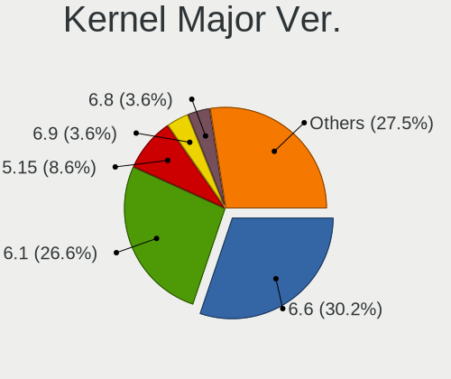

| Version | Computers | Percent |
|---------|-----------|---------|
| 6.1     | 25        | 31.65%  |
| 5.15    | 17        | 21.52%  |
| 6.5     | 5         | 6.33%   |
| 5.8     | 4         | 5.06%   |
| 5.4     | 4         | 5.06%   |
| 5.10    | 4         | 5.06%   |
| 6.4     | 3         | 3.8%    |
| 6.3     | 3         | 3.8%    |
| 5.2     | 3         | 3.8%    |
| 6.2     | 2         | 2.53%   |
| 6.0     | 2         | 2.53%   |
| 5.9     | 1         | 1.27%   |
| 5.7     | 1         | 1.27%   |
| 5.6     | 1         | 1.27%   |
| 5.3     | 1         | 1.27%   |
| 5.19    | 1         | 1.27%   |
| 5.17    | 1         | 1.27%   |
| 5.16    | 1         | 1.27%   |

Arch
----

OS architecture (x86_64, i586, etc.)

| Name   | Computers | Percent |
|--------|-----------|---------|
| x86_64 | 78        | 100%    |

DE
--

Desktop Environment

| Name     | Computers | Percent |
|----------|-----------|---------|
| KDE5     | 69        | 88.46%  |
| KDE      | 6         | 7.69%   |
| Unknown  | 2         | 2.56%   |
| Cinnamon | 1         | 1.28%   |

Display Server
--------------

X11 or Wayland

| Name    | Computers | Percent |
|---------|-----------|---------|
| X11     | 76        | 97.44%  |
| Wayland | 1         | 1.28%   |
| Unknown | 1         | 1.28%   |

Display Manager
---------------

SDDM, LightDM, etc.

| Name    | Computers | Percent |
|---------|-----------|---------|
| SDDM    | 60        | 75.95%  |
| Unknown | 16        | 20.25%  |
| LightDM | 2         | 2.53%   |
| LXDM    | 1         | 1.27%   |

OS Lang
-------

Language

| Lang    | Computers | Percent |
|---------|-----------|---------|
| pt_BR   | 48        | 61.54%  |
| en_US   | 13        | 16.67%  |
| es_MX   | 3         | 3.85%   |
| pt_PT   | 2         | 2.56%   |
| en_GB   | 2         | 2.56%   |
| Unknown | 2         | 2.56%   |
| fr_BE   | 1         | 1.28%   |
| fi_FI   | 1         | 1.28%   |
| es_ES   | 1         | 1.28%   |
| es_CR   | 1         | 1.28%   |
| es_AR   | 1         | 1.28%   |
| el_GR   | 1         | 1.28%   |
| de_DE   | 1         | 1.28%   |
| de_AT   | 1         | 1.28%   |

Boot Mode
---------

EFI or BIOS

| Mode | Computers | Percent |
|------|-----------|---------|
| EFI  | 48        | 60.76%  |
| BIOS | 31        | 39.24%  |

Filesystem
----------

Type of filesystem

| Type    | Computers | Percent |
|---------|-----------|---------|
| Btrfs   | 69        | 88.46%  |
| Ext4    | 6         | 7.69%   |
| Overlay | 2         | 2.56%   |
| Unknown | 1         | 1.28%   |

Part. scheme
------------

Scheme of partitioning

| Type    | Computers | Percent |
|---------|-----------|---------|
| GPT     | 43        | 53.09%  |
| MBR     | 20        | 24.69%  |
| Unknown | 18        | 22.22%  |

Dual Boot with Linux/BSD
------------------------

Hosting more than one Linux/BSD

| Dual boot | Computers | Percent |
|-----------|-----------|---------|
| No        | 75        | 94.94%  |
| Yes       | 4         | 5.06%   |

Dual Boot (Win)
---------------

Hosting Linux and Windows

| Dual boot | Computers | Percent |
|-----------|-----------|---------|
| No        | 44        | 55.7%   |
| Yes       | 35        | 44.3%   |

Board
-----

Vendor
------

Motherboard manufacturer

| Name                   | Computers | Percent |
|------------------------|-----------|---------|
| Lenovo                 | 10        | 12.82%  |
| ASUSTek Computer       | 10        | 12.82%  |
| Acer                   | 8         | 10.26%  |
| Intel                  | 7         | 8.97%   |
| Gigabyte Technology    | 7         | 8.97%   |
| Dell                   | 7         | 8.97%   |
| Hewlett-Packard        | 5         | 6.41%   |
| Positivo               | 3         | 3.85%   |
| PCWare                 | 2         | 2.56%   |
| MSI                    | 2         | 2.56%   |
| ASRock                 | 2         | 2.56%   |
| Toshiba                | 1         | 1.28%   |
| Sony                   | 1         | 1.28%   |
| Semp Toshiba           | 1         | 1.28%   |
| Samsung Electronics    | 1         | 1.28%   |
| Multilaser             | 1         | 1.28%   |
| Microsoft              | 1         | 1.28%   |
| eMachines              | 1         | 1.28%   |
| ECS                    | 1         | 1.28%   |
| Daten Tecnologia       | 1         | 1.28%   |
| Clevo                  | 1         | 1.28%   |
| Biostar                | 1         | 1.28%   |
| BESSTAR Tech           | 1         | 1.28%   |
| Avell High Performance | 1         | 1.28%   |
| Apple                  | 1         | 1.28%   |
| Alienware              | 1         | 1.28%   |

Model
-----

Motherboard model

| Name                                                         | Computers | Percent |
|--------------------------------------------------------------|-----------|---------|
| Intel H61                                                    | 3         | 3.85%   |
| ASRock 775Dual-VSTA                                          | 2         | 2.56%   |
| Toshiba Satellite S55-A                                      | 1         | 1.28%   |
| Sony VGN-NR230AE                                             | 1         | 1.28%   |
| Semp Toshiba STI                                             | 1         | 1.28%   |
| Samsung 300E5M/300E5L                                        | 1         | 1.28%   |
| Positivo Q464B                                               | 1         | 1.28%   |
| Positivo C41TF                                               | 1         | 1.28%   |
| Positivo C14RV01                                             | 1         | 1.28%   |
| PCWare IPX1800E2                                             | 1         | 1.28%   |
| PCWare IPMH81G1                                              | 1         | 1.28%   |
| Multilaser MLSH1H LINUX                                      | 1         | 1.28%   |
| MSI MS-7C95                                                  | 1         | 1.28%   |
| MSI MS-7C91                                                  | 1         | 1.28%   |
| Microsoft Surface Pro                                        | 1         | 1.28%   |
| Lenovo Yoga Slim 7 14ARE05 82A2                              | 1         | 1.28%   |
| Lenovo Yoga 520-14IKB 80YM                                   | 1         | 1.28%   |
| Lenovo ThinkPad T480s 20L70028US                             | 1         | 1.28%   |
| Lenovo ThinkPad T410 25379N2                                 | 1         | 1.28%   |
| Lenovo ThinkCentre M93p 10AB0010US                           | 1         | 1.28%   |
| Lenovo IdeaPad Z470                                          | 1         | 1.28%   |
| Lenovo IdeaPad S400 VIUS3                                    | 1         | 1.28%   |
| Lenovo IdeaPad 5 Pro 14ACN6 82L7                             | 1         | 1.28%   |
| Lenovo IdeaPad 300-15ISK 80RS                                | 1         | 1.28%   |
| Lenovo 63 90AT0002BR                                         | 1         | 1.28%   |
| Intel X79 (INTEL Xeon E5/Corei7 DMI2 - C600/C200 Cipset V307 | 1         | 1.28%   |
| Intel NUC11BTMi7                                             | 1         | 1.28%   |
| Intel H55                                                    | 1         | 1.28%   |
| Intel DH61WW AAG23116-203                                    | 1         | 1.28%   |
| HP ZBook 15 G3                                               | 1         | 1.28%   |
| HP EliteBook 8760w                                           | 1         | 1.28%   |
| HP Compaq Elite 8300 SFF                                     | 1         | 1.28%   |
| HP Compaq 8200 Elite SFF PC                                  | 1         | 1.28%   |
| HP 255 G7 Notebook PC                                        | 1         | 1.28%   |
| Gigabyte Z87-HD3                                             | 1         | 1.28%   |
| Gigabyte X399 DESIGNARE EX                                   | 1         | 1.28%   |
| Gigabyte H370AORUSGAMING3WIFI                                | 1         | 1.28%   |
| Gigabyte GA-880GMA-UD2H                                      | 1         | 1.28%   |
| Gigabyte G41MT-S2                                            | 1         | 1.28%   |
| Gigabyte B560M AORUS ELITE                                   | 1         | 1.28%   |

Model Family
------------

Motherboard model prefix

| Name                          | Computers | Percent |
|-------------------------------|-----------|---------|
| Lenovo IdeaPad                | 4         | 5.13%   |
| Intel H61                     | 3         | 3.85%   |
| Acer Nitro                    | 3         | 3.85%   |
| Acer Aspire                   | 3         | 3.85%   |
| Lenovo Yoga                   | 2         | 2.56%   |
| Lenovo ThinkPad               | 2         | 2.56%   |
| HP Compaq                     | 2         | 2.56%   |
| Dell System                   | 2         | 2.56%   |
| Dell Inspiron                 | 2         | 2.56%   |
| ASUS TUF                      | 2         | 2.56%   |
| ASRock 775Dual-VSTA           | 2         | 2.56%   |
| Toshiba Satellite             | 1         | 1.28%   |
| Sony VGN-NR230AE              | 1         | 1.28%   |
| Semp Toshiba STI              | 1         | 1.28%   |
| Samsung 300E5M                | 1         | 1.28%   |
| Positivo Q464B                | 1         | 1.28%   |
| Positivo C41TF                | 1         | 1.28%   |
| Positivo C14RV01              | 1         | 1.28%   |
| PCWare IPX1800E2              | 1         | 1.28%   |
| PCWare IPMH81G1               | 1         | 1.28%   |
| Multilaser MLSH1H             | 1         | 1.28%   |
| MSI MS-7C95                   | 1         | 1.28%   |
| MSI MS-7C91                   | 1         | 1.28%   |
| Microsoft Surface             | 1         | 1.28%   |
| Lenovo ThinkCentre            | 1         | 1.28%   |
| Lenovo 63                     | 1         | 1.28%   |
| Intel X79                     | 1         | 1.28%   |
| Intel NUC11BTMi7              | 1         | 1.28%   |
| Intel H55                     | 1         | 1.28%   |
| Intel DH61WW                  | 1         | 1.28%   |
| HP ZBook                      | 1         | 1.28%   |
| HP EliteBook                  | 1         | 1.28%   |
| HP 255                        | 1         | 1.28%   |
| Gigabyte Z87-HD3              | 1         | 1.28%   |
| Gigabyte X399                 | 1         | 1.28%   |
| Gigabyte H370AORUSGAMING3WIFI | 1         | 1.28%   |
| Gigabyte GA-880GMA-UD2H       | 1         | 1.28%   |
| Gigabyte G41MT-S2             | 1         | 1.28%   |
| Gigabyte B560M                | 1         | 1.28%   |
| Gigabyte B550M                | 1         | 1.28%   |

MFG Year
--------

Motherboard manufacture year

| Year | Computers | Percent |
|------|-----------|---------|
| 2017 | 10        | 12.82%  |
| 2021 | 8         | 10.26%  |
| 2012 | 7         | 8.97%   |
| 2011 | 7         | 8.97%   |
| 2020 | 6         | 7.69%   |
| 2018 | 6         | 7.69%   |
| 2016 | 5         | 6.41%   |
| 2014 | 5         | 6.41%   |
| 2013 | 5         | 6.41%   |
| 2019 | 4         | 5.13%   |
| 2022 | 3         | 3.85%   |
| 2010 | 3         | 3.85%   |
| 2009 | 3         | 3.85%   |
| 2015 | 2         | 2.56%   |
| 2006 | 2         | 2.56%   |
| 2023 | 1         | 1.28%   |
| 2007 | 1         | 1.28%   |

Form Factor
-----------

Physical design of the computer

| Name        | Computers | Percent |
|-------------|-----------|---------|
| Notebook    | 39        | 50%     |
| Desktop     | 36        | 46.15%  |
| Tablet      | 1         | 1.28%   |
| Convertible | 1         | 1.28%   |
| Mini pc     | 1         | 1.28%   |

Secure Boot
-----------

Enabled or disabled

| State    | Computers | Percent |
|----------|-----------|---------|
| Disabled | 77        | 98.72%  |
| Enabled  | 1         | 1.28%   |

Coreboot
--------

Have coreboot on board

| Used | Computers | Percent |
|------|-----------|---------|
| No   | 78        | 100%    |

RAM Size
--------

Total RAM memory

| Size in GB  | Computers | Percent |
|-------------|-----------|---------|
| 3.01-4.0    | 17        | 21.52%  |
| 4.01-8.0    | 14        | 17.72%  |
| 32.01-64.0  | 13        | 16.46%  |
| 16.01-24.0  | 13        | 16.46%  |
| 8.01-16.0   | 13        | 16.46%  |
| 2.01-3.0    | 4         | 5.06%   |
| 24.01-32.0  | 2         | 2.53%   |
| 1.01-2.0    | 2         | 2.53%   |
| 64.01-256.0 | 1         | 1.27%   |

RAM Used
--------

Used RAM memory

| Used GB    | Computers | Percent |
|------------|-----------|---------|
| 2.01-3.0   | 30        | 36.14%  |
| 1.01-2.0   | 26        | 31.33%  |
| 4.01-8.0   | 9         | 10.84%  |
| 3.01-4.0   | 8         | 9.64%   |
| 8.01-16.0  | 4         | 4.82%   |
| 0.51-1.0   | 4         | 4.82%   |
| 24.01-32.0 | 1         | 1.2%    |
| 0.01-0.5   | 1         | 1.2%    |

Total Drives
------------

Number of drives on board

| Drives | Computers | Percent |
|--------|-----------|---------|
| 1      | 39        | 48.75%  |
| 2      | 18        | 22.5%   |
| 3      | 13        | 16.25%  |
| 4      | 7         | 8.75%   |
| 6      | 2         | 2.5%    |
| 0      | 1         | 1.25%   |

Has CD-ROM
----------

Has CD-ROM on board

| Presented | Computers | Percent |
|-----------|-----------|---------|
| No        | 54        | 68.35%  |
| Yes       | 25        | 31.65%  |

Has Ethernet
------------

Has Ethernet on board

| Presented | Computers | Percent |
|-----------|-----------|---------|
| Yes       | 73        | 93.59%  |
| No        | 5         | 6.41%   |

Has WiFi
--------

Has WiFi module

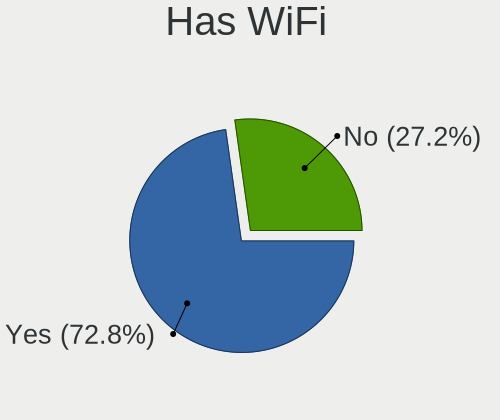

| Presented | Computers | Percent |
|-----------|-----------|---------|
| Yes       | 57        | 73.08%  |
| No        | 21        | 26.92%  |

Has Bluetooth
-------------

Has Bluetooth module

| Presented | Computers | Percent |
|-----------|-----------|---------|
| Yes       | 47        | 60.26%  |
| No        | 31        | 39.74%  |

Location
--------

Country
-------

Geographic location (country)

| Country    | Computers | Percent |
|------------|-----------|---------|
| Brazil     | 52        | 66.67%  |
| USA        | 7         | 8.97%   |
| UK         | 3         | 3.85%   |
| Mexico     | 3         | 3.85%   |
| Greece     | 3         | 3.85%   |
| Portugal   | 2         | 2.56%   |
| Spain      | 1         | 1.28%   |
| Japan      | 1         | 1.28%   |
| Germany    | 1         | 1.28%   |
| Finland    | 1         | 1.28%   |
| Costa Rica | 1         | 1.28%   |
| Belgium    | 1         | 1.28%   |
| Austria    | 1         | 1.28%   |
| Argentina  | 1         | 1.28%   |

City
----

Geographic location (city)

| City                   | Computers | Percent |
|------------------------|-----------|---------|
| Sao Paulo              | 5         | 6.25%   |
| Rio de Janeiro         | 4         | 5%      |
| Brasília              | 4         | 5%      |
| Belo Horizonte         | 3         | 3.75%   |
| Thessaloniki           | 2         | 2.5%    |
| Sao Domingos do Capim  | 2         | 2.5%    |
| Curitiba               | 2         | 2.5%    |
| Castanhal              | 2         | 2.5%    |
| Caratinga              | 2         | 2.5%    |
| Wiener Neustadt        | 1         | 1.25%   |
| Vitória da Conquista  | 1         | 1.25%   |
| Vila Velha             | 1         | 1.25%   |
| Vila Nova de Famalicao | 1         | 1.25%   |
| Tokyo                  | 1         | 1.25%   |
| Tlajomulco de Zuniga   | 1         | 1.25%   |
| The Villages           | 1         | 1.25%   |
| Texarkana              | 1         | 1.25%   |
| Sao Jose do Rio Preto  | 1         | 1.25%   |
| Sao Joaquim da Barra   | 1         | 1.25%   |
| Santo André           | 1         | 1.25%   |
| Santa Cruz de Tenerife | 1         | 1.25%   |
| San José              | 1         | 1.25%   |
| Salvador               | 1         | 1.25%   |
| Ribeirao Grande        | 1         | 1.25%   |
| Queimados              | 1         | 1.25%   |
| Osasco                 | 1         | 1.25%   |
| Oklahoma City          | 1         | 1.25%   |
| Mirassol               | 1         | 1.25%   |
| Minneapolis            | 1         | 1.25%   |
| Metepec                | 1         | 1.25%   |
| Martin Coronado        | 1         | 1.25%   |
| Maringá               | 1         | 1.25%   |
| Marataizes             | 1         | 1.25%   |
| Maidstone              | 1         | 1.25%   |
| Macapa                 | 1         | 1.25%   |
| Londrina               | 1         | 1.25%   |
| Juazeiro do Norte      | 1         | 1.25%   |
| Joensuu                | 1         | 1.25%   |
| Joao Monlevade         | 1         | 1.25%   |
| Ivinhema               | 1         | 1.25%   |

Drives
------

Drive Vendor
------------

Hard drive vendors

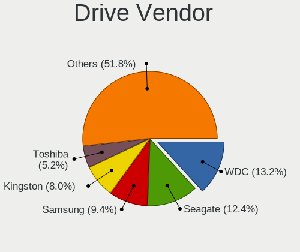

| Vendor                      | Computers | Drives | Percent |
|-----------------------------|-----------|--------|---------|
| WDC                         | 24        | 32     | 18.32%  |
| Seagate                     | 19        | 31     | 14.5%   |
| Samsung Electronics         | 12        | 15     | 9.16%   |
| Kingston                    | 7         | 10     | 5.34%   |
| China                       | 7         | 9      | 5.34%   |
| SanDisk                     | 6         | 6      | 4.58%   |
| Hitachi                     | 6         | 7      | 4.58%   |
| KingSpec                    | 5         | 5      | 3.82%   |
| Toshiba                     | 4         | 5      | 3.05%   |
| Crucial                     | 4         | 4      | 3.05%   |
| ADATA Technology            | 4         | 4      | 3.05%   |
| Unknown                     | 3         | 3      | 2.29%   |
| PNY                         | 3         | 4      | 2.29%   |
| XrayDisk                    | 2         | 2      | 1.53%   |
| SK hynix                    | 2         | 2      | 1.53%   |
| Netac                       | 2         | 3      | 1.53%   |
| Micron/Crucial Technology   | 2         | 2      | 1.53%   |
| MAXIO Technology (Hangzhou) | 2         | 2      | 1.53%   |
| LITEON                      | 2         | 3      | 1.53%   |
| JMicron Technology          | 2         | 2      | 1.53%   |
| HGST                        | 2         | 2      | 1.53%   |
| A-DATA Technology           | 2         | 2      | 1.53%   |
| WALRAM                      | 1         | 1      | 0.76%   |
| Silicon Motion              | 1         | 1      | 0.76%   |
| Micron Technology           | 1         | 1      | 0.76%   |
| Kingston Technology Company | 1         | 1      | 0.76%   |
| Intel                       | 1         | 1      | 0.76%   |
| EYOTA                       | 1         | 1      | 0.76%   |
| BHT                         | 1         | 1      | 0.76%   |
| Apacer                      | 1         | 1      | 0.76%   |
| Unknown                     | 1         | 1      | 0.76%   |

Drive Model
-----------

Hard drive models

| Model                                             | Computers | Percent |
|---------------------------------------------------|-----------|---------|
| Samsung NVMe SSD Controller SM981/PM981/PM983 1TB | 5         | 3.52%   |
| WDC WD10SPZX-21Z10T0 1TB                          | 4         | 2.82%   |
| Seagate ST1000DM010-2EP102 1TB                    | 3         | 2.11%   |
| Unknown MMC Card  64GB                            | 2         | 1.41%   |
| Toshiba MQ04ABF100 1TB                            | 2         | 1.41%   |
| Seagate ST500DM002-1BD142 500GB                   | 2         | 1.41%   |
| Seagate ST4000DM004-2CV104 4TB                    | 2         | 1.41%   |
| Micron/Crucial CT500P5SSD8 500GB                  | 2         | 1.41%   |
| Kingston SV300S37A240G 240GB SSD                  | 2         | 1.41%   |
| Kingston SA400S37480G 480GB SSD                   | 2         | 1.41%   |
| Kingston SA400S37240G 240GB SSD                   | 2         | 1.41%   |
| KingSpec P3-512 512GB                             | 2         | 1.41%   |
| JMicron Tech 250GB                                | 2         | 1.41%   |
| China SSD 120GB                                   | 2         | 1.41%   |
| XrayDisk 512GB SSD                                | 1         | 0.7%    |
| XrayDisk 120GB                                    | 1         | 0.7%    |
| WDC WDS480G2G0A-00JH30 480GB SSD                  | 1         | 0.7%    |
| WDC WDS100T2G0A-00JH30 1TB SSD                    | 1         | 0.7%    |
| WDC WD800BD-22MRA1 80GB                           | 1         | 0.7%    |
| WDC WD800AAJS-75M0A0 80GB                         | 1         | 0.7%    |
| WDC WD7500BPKX-75HPJT0 752GB                      | 1         | 0.7%    |
| WDC WD5000LPVX-75V0TT0 500GB                      | 1         | 0.7%    |
| WDC WD5000LPVT-08G33T1 500GB                      | 1         | 0.7%    |
| WDC WD5000LPCX-24VHAT0 500GB                      | 1         | 0.7%    |
| WDC WD5000AVDS-63U7B1 500GB                       | 1         | 0.7%    |
| WDC WD5000AAKX-08U6AA0 500GB                      | 1         | 0.7%    |
| WDC WD40EZRX-00SPEB0 4TB                          | 1         | 0.7%    |
| WDC WD3200BPVT-22JJ5T0 320GB                      | 1         | 0.7%    |
| WDC WD3200BPVT-00JJ5T0 320GB                      | 1         | 0.7%    |
| WDC WD3200AAKS-75L9A0 320GB                       | 1         | 0.7%    |
| WDC WD3200AAJS-56M0A0 320GB                       | 1         | 0.7%    |
| WDC WD30EFAX-68JH4N0 3TB                          | 1         | 0.7%    |
| WDC WD1600AAJS-08L7A0 160GB                       | 1         | 0.7%    |
| WDC WD10SPZX-80Z10T2 1TB                          | 1         | 0.7%    |
| WDC WD10SPZX-75Z10T3 1TB                          | 1         | 0.7%    |
| WDC WD10EZEX-60WN4A0 1TB                          | 1         | 0.7%    |
| WDC WD10EZEX-08M2NA0 1TB                          | 1         | 0.7%    |
| WDC WD10EZEX-00KUWA0 1TB                          | 1         | 0.7%    |
| WDC WD1001FALS-41Y6A1 1TB                         | 1         | 0.7%    |
| WALRAM 240G                                       | 1         | 0.7%    |

HDD Vendor
----------

Hard disk drive vendors

| Vendor              | Computers | Drives | Percent |
|---------------------|-----------|--------|---------|
| WDC                 | 22        | 30     | 39.29%  |
| Seagate             | 19        | 31     | 33.93%  |
| Hitachi             | 6         | 7      | 10.71%  |
| Toshiba             | 4         | 5      | 7.14%   |
| Samsung Electronics | 2         | 4      | 3.57%   |
| HGST                | 2         | 2      | 3.57%   |
| Unknown             | 1         | 1      | 1.79%   |

SSD Vendor
----------

Solid state drive vendors

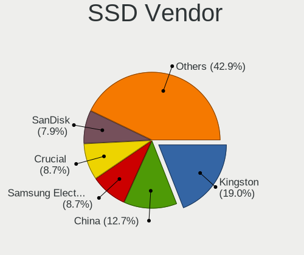

| Vendor              | Computers | Drives | Percent |
|---------------------|-----------|--------|---------|
| Kingston            | 7         | 9      | 15.56%  |
| China               | 7         | 9      | 15.56%  |
| KingSpec            | 5         | 5      | 11.11%  |
| SanDisk             | 4         | 4      | 8.89%   |
| Samsung Electronics | 4         | 5      | 8.89%   |
| Crucial             | 4         | 4      | 8.89%   |
| PNY                 | 3         | 4      | 6.67%   |
| WDC                 | 2         | 2      | 4.44%   |
| LITEON              | 2         | 3      | 4.44%   |
| A-DATA Technology   | 2         | 2      | 4.44%   |
| XrayDisk            | 1         | 1      | 2.22%   |
| Micron Technology   | 1         | 1      | 2.22%   |
| BHT                 | 1         | 1      | 2.22%   |
| Apacer              | 1         | 1      | 2.22%   |
| Unknown             | 1         | 1      | 2.22%   |

Drive Kind
----------

HDD or SSD

| Kind    | Computers | Drives | Percent |
|---------|-----------|--------|---------|
| HDD     | 47        | 80     | 41.23%  |
| SSD     | 38        | 52     | 33.33%  |
| NVMe    | 22        | 25     | 19.3%   |
| Unknown | 5         | 5      | 4.39%   |
| MMC     | 2         | 2      | 1.75%   |

Drive Connector
---------------

SATA, SAS, NVMe, etc.

| Type | Computers | Drives | Percent |
|------|-----------|--------|---------|
| SATA | 68        | 132    | 70.1%   |
| NVMe | 22        | 25     | 22.68%  |
| SAS  | 5         | 5      | 5.15%   |
| MMC  | 2         | 2      | 2.06%   |

Drive Size
----------

Size of hard drive

| Size in TB | Computers | Drives | Percent |
|------------|-----------|--------|---------|
| 0.01-0.5   | 48        | 73     | 53.93%  |
| 0.51-1.0   | 30        | 42     | 33.71%  |
| 1.01-2.0   | 5         | 6      | 5.62%   |
| 3.01-4.0   | 3         | 7      | 3.37%   |
| 4.01-10.0  | 2         | 3      | 2.25%   |
| 2.01-3.0   | 1         | 1      | 1.12%   |

Space Total
-----------

Amount of disk space available on the file system

| Size in GB     | Computers | Percent |
|----------------|-----------|---------|
| 1001-2000      | 20        | 25.32%  |
| 2001-3000      | 17        | 21.52%  |
| 251-500        | 14        | 17.72%  |
| 101-250        | 11        | 13.92%  |
| More than 3000 | 8         | 10.13%  |
| 501-1000       | 7         | 8.86%   |
| 1-20           | 2         | 2.53%   |

Space Used
----------

Amount of used disk space

| Used GB        | Computers | Percent |
|----------------|-----------|---------|
| 21-50          | 25        | 30.12%  |
| 51-100         | 20        | 24.1%   |
| 251-500        | 11        | 13.25%  |
| 101-250        | 11        | 13.25%  |
| 1-20           | 6         | 7.23%   |
| 501-1000       | 6         | 7.23%   |
| 2001-3000      | 2         | 2.41%   |
| More than 3000 | 1         | 1.2%    |
| 1001-2000      | 1         | 1.2%    |

Malfunc. Drives
---------------

Drive models with a malfunction

| Model                                  | Computers | Drives | Percent |
|----------------------------------------|-----------|--------|---------|
| WDC WD800AAJS-75M0A0 80GB              | 1         | 1      | 6.67%   |
| WDC WD5000AAKX-08U6AA0 500GB           | 1         | 1      | 6.67%   |
| WDC WD3200BPVT-00JJ5T0 320GB           | 1         | 3      | 6.67%   |
| WDC WD1001FALS-41Y6A1 1TB              | 1         | 2      | 6.67%   |
| Seagate ST9100824AS 100GB              | 1         | 1      | 6.67%   |
| Seagate ST8000AS0002-1NA17Z 8TB        | 1         | 1      | 6.67%   |
| Seagate ST500DM002-1BD142 500GB        | 1         | 2      | 6.67%   |
| Seagate ST3320613AS 320GB              | 1         | 1      | 6.67%   |
| Seagate ST1000LM024 HN-M101MBB 1TB     | 1         | 1      | 6.67%   |
| Hitachi HTS727575A9E364 752GB          | 1         | 1      | 6.67%   |
| Hitachi HTS545032A7E380 320GB          | 1         | 1      | 6.67%   |
| Hitachi HDS721050DLE630 500GB          | 1         | 1      | 6.67%   |
| Crucial CT500MX200SSD3 500GB           | 1         | 1      | 6.67%   |
| China SATA SSD 240GB                   | 1         | 1      | 6.67%   |
| ADATA Technology SM2P32A8-512GC1 512GB | 1         | 1      | 6.67%   |

Malfunc. Drive Vendor
---------------------

Vendors of faulty drives

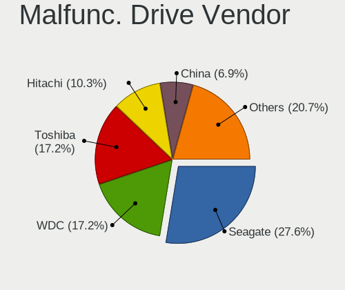

| Vendor           | Computers | Drives | Percent |
|------------------|-----------|--------|---------|
| Seagate          | 5         | 6      | 33.33%  |
| WDC              | 4         | 7      | 26.67%  |
| Hitachi          | 3         | 3      | 20%     |
| Crucial          | 1         | 1      | 6.67%   |
| China            | 1         | 1      | 6.67%   |
| ADATA Technology | 1         | 1      | 6.67%   |

Malfunc. HDD Vendor
-------------------

Vendors of faulty HDD drives

| Vendor  | Computers | Drives | Percent |
|---------|-----------|--------|---------|
| Seagate | 5         | 6      | 41.67%  |
| WDC     | 4         | 7      | 33.33%  |
| Hitachi | 3         | 3      | 25%     |

Malfunc. Drive Kind
-------------------

Kinds of faulty drives

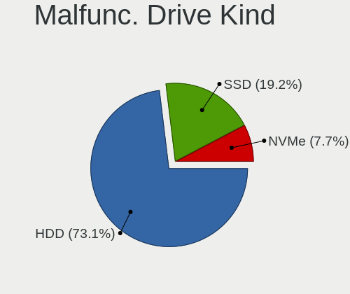

| Kind | Computers | Drives | Percent |
|------|-----------|--------|---------|
| HDD  | 11        | 16     | 78.57%  |
| SSD  | 2         | 2      | 14.29%  |
| NVMe | 1         | 1      | 7.14%   |

Failed Drives
-------------

Failed drive models

| Model                           | Computers | Drives | Percent |
|---------------------------------|-----------|--------|---------|
| Seagate ST500DM002-1BD142 500GB | 1         | 1      | 100%    |

Failed Drive Vendor
-------------------

Failed drive vendors

| Vendor  | Computers | Drives | Percent |
|---------|-----------|--------|---------|
| Seagate | 1         | 1      | 100%    |

Drive Status
------------

Number of failed and malfunc. drives

| Status   | Computers | Drives | Percent |
|----------|-----------|--------|---------|
| Detected | 43        | 79     | 46.24%  |
| Works    | 35        | 65     | 37.63%  |
| Malfunc  | 14        | 19     | 15.05%  |
| Failed   | 1         | 1      | 1.08%   |

Storage controller
------------------

Storage Vendor
--------------

Storage controller vendors

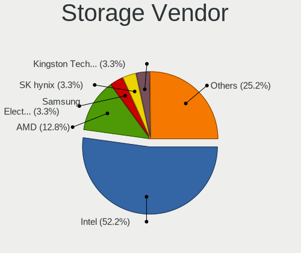

| Vendor                      | Computers | Percent |
|-----------------------------|-----------|---------|
| Intel                       | 55        | 58.51%  |
| AMD                         | 12        | 12.77%  |
| Samsung Electronics         | 5         | 5.32%   |
| ADATA Technology            | 4         | 4.26%   |
| VIA Technologies            | 2         | 2.13%   |
| SK hynix                    | 2         | 2.13%   |
| SanDisk                     | 2         | 2.13%   |
| Netac Technology            | 2         | 2.13%   |
| Micron/Crucial Technology   | 2         | 2.13%   |
| MAXIO Technology (Hangzhou) | 2         | 2.13%   |
| Kingston Technology Company | 2         | 2.13%   |
| Silicon Motion              | 1         | 1.06%   |
| Phison Electronics          | 1         | 1.06%   |
| Nvidia                      | 1         | 1.06%   |
| JMicron Technology          | 1         | 1.06%   |

Storage Model
-------------

Storage controller models

| Model                                                                          | Computers | Percent |
|--------------------------------------------------------------------------------|-----------|---------|
| AMD FCH SATA Controller [AHCI mode]                                            | 7         | 6.67%   |
| Intel 8 Series/C220 Series Chipset Family 6-port SATA Controller 1 [AHCI mode] | 6         | 5.71%   |
| Intel 6 Series/C200 Series Chipset Family 6 port Mobile SATA AHCI Controller   | 6         | 5.71%   |
| Intel Sunrise Point-LP SATA Controller [AHCI mode]                             | 5         | 4.76%   |
| Intel 7 Series Chipset Family 6-port SATA Controller [AHCI mode]               | 5         | 4.76%   |
| Intel 6 Series/C200 Series Chipset Family 6 port Desktop SATA AHCI Controller  | 5         | 4.76%   |
| Samsung NVMe SSD Controller SM981/PM981/PM983                                  | 4         | 3.81%   |
| Intel Q170/Q150/B150/H170/H110/Z170/CM236 Chipset SATA Controller [AHCI Mode]  | 4         | 3.81%   |
| Intel 82801 Mobile SATA Controller [RAID mode]                                 | 4         | 3.81%   |
| Intel NM10/ICH7 Family SATA Controller [IDE mode]                              | 3         | 2.86%   |
| AMD 500 Series Chipset SATA Controller                                         | 3         | 2.86%   |
| VIA VT82C586A/B/VT82C686/A/B/VT823x/A/C PIPC Bus Master IDE                    | 2         | 1.9%    |
| VIA VT8237A SATA 2-Port Controller                                             | 2         | 1.9%    |
| Micron/Crucial P5 NVMe PCIe SSD[SlashP5]                                       | 2         | 1.9%    |
| Intel Tiger Lake SATA AHCI Controller                                          | 2         | 1.9%    |
| Intel Cannon Lake PCH SATA AHCI Controller                                     | 2         | 1.9%    |
| Intel 82801G (ICH7 Family) IDE Controller                                      | 2         | 1.9%    |
| AMD SB7x0/SB8x0/SB9x0 SATA Controller [IDE mode]                               | 2         | 1.9%    |
| SK hynix Platinum P41/PC801 NVMe Solid State Drive                             | 1         | 0.95%   |
| SK hynix BC501 NVMe Solid State Drive                                          | 1         | 0.95%   |
| Silicon Motion SM2262/SM2262EN SSD Controller                                  | 1         | 0.95%   |
| SanDisk Ultra 3D / WD Blue SN570 NVMe SSD (DRAM-less)                          | 1         | 0.95%   |
| SanDisk Extreme Pro / WD Black 2018/SN750/PC SN720 NVMe SSD                    | 1         | 0.95%   |
| Samsung NVMe SSD SM0032L                                                       | 1         | 0.95%   |
| Phison E12 NVMe Controller                                                     | 1         | 0.95%   |
| Nvidia MCP61 SATA Controller                                                   | 1         | 0.95%   |
| Netac PCIe 4 NVMe SSD (DRAM-less)                                              | 1         | 0.95%   |
| Netac PCIe 4 INNOGRIT based NVMe SSD                                           | 1         | 0.95%   |
| MAXIO (Hangzhou) NVMe SSD Controller MAP1602                                   | 1         | 0.95%   |
| MAXIO (Hangzhou) NVMe SSD Controller MAP1202                                   | 1         | 0.95%   |
| Kingston Company OM3PDP3 NVMe SSD                                              | 1         | 0.95%   |
| Kingston Company NV1 NVMe SSD SM2263XT                                         | 1         | 0.95%   |
| JMicron JMB368 IDE controller                                                  | 1         | 0.95%   |
| Intel SSD 660P Series                                                          | 1         | 0.95%   |
| Intel HM170/QM170 Chipset SATA Controller [AHCI Mode]                          | 1         | 0.95%   |
| Intel Celeron/Pentium Silver Processor SATA Controller                         | 1         | 0.95%   |
| Intel Cannon Point-LP SATA Controller [AHCI Mode]                              | 1         | 0.95%   |
| Intel C610/X99 series chipset 6-Port SATA Controller [AHCI mode]               | 1         | 0.95%   |
| Intel Atom Processor E3800 Series SATA AHCI Controller                         | 1         | 0.95%   |
| Intel 82801HM/HEM (ICH8M/ICH8M-E) SATA Controller [AHCI mode]                  | 1         | 0.95%   |

Storage Kind
------------

Kind of storage controller (IDE, SATA, NVMe, SAS, ...)

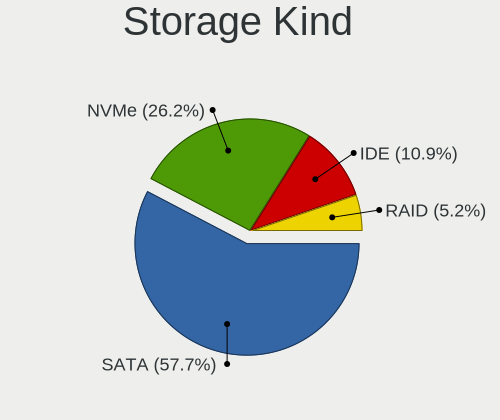

| Kind | Computers | Percent |
|------|-----------|---------|
| SATA | 59        | 62.11%  |
| NVMe | 21        | 22.11%  |
| IDE  | 9         | 9.47%   |
| RAID | 6         | 6.32%   |

Processor
---------

CPU Vendor
----------

Processor vendors

| Vendor | Computers | Percent |
|--------|-----------|---------|
| Intel  | 62        | 79.49%  |
| AMD    | 16        | 20.51%  |

CPU Model
---------

Processor models

| Model                                       | Computers | Percent |
|---------------------------------------------|-----------|---------|
| Intel Pentium D CPU 3.00GHz                 | 2         | 2.56%   |
| Intel Core i7-7500U CPU @ 2.70GHz           | 2         | 2.56%   |
| Intel Core i5-9600K CPU @ 3.70GHz           | 2         | 2.56%   |
| Intel Core i5-7200U CPU @ 2.50GHz           | 2         | 2.56%   |
| Intel Core i5-2400 CPU @ 3.10GHz            | 2         | 2.56%   |
| AMD Ryzen 5 5600 6-Core Processor           | 2         | 2.56%   |
| Intel Xeon CPU E5-2603 v3 @ 1.60GHz         | 1         | 1.28%   |
| Intel Xeon CPU E5-2420 v2 @ 2.20GHz         | 1         | 1.28%   |
| Intel Pentium Dual-Core CPU E5700 @ 3.00GHz | 1         | 1.28%   |
| Intel Pentium Dual-Core CPU E5400 @ 2.70GHz | 1         | 1.28%   |
| Intel Pentium Dual CPU T2330 @ 1.60GHz      | 1         | 1.28%   |
| Intel Pentium CPU G4400 @ 3.30GHz           | 1         | 1.28%   |
| Intel Core i7-8650U CPU @ 1.90GHz           | 1         | 1.28%   |
| Intel Core i7-6820HQ CPU @ 2.70GHz          | 1         | 1.28%   |
| Intel Core i7-6700HQ CPU @ 2.60GHz          | 1         | 1.28%   |
| Intel Core i7-6500U CPU @ 2.50GHz           | 1         | 1.28%   |
| Intel Core i7-4790K CPU @ 4.00GHz           | 1         | 1.28%   |
| Intel Core i7-4770K CPU @ 3.50GHz           | 1         | 1.28%   |
| Intel Core i7-4700MQ CPU @ 2.40GHz          | 1         | 1.28%   |
| Intel Core i7-2860QM CPU @ 2.50GHz          | 1         | 1.28%   |
| Intel Core i7-2670QM CPU @ 2.20GHz          | 1         | 1.28%   |
| Intel Core i7-2630QM CPU @ 2.00GHz          | 1         | 1.28%   |
| Intel Core i7 CPU S 860 @ 2.53GHz           | 1         | 1.28%   |
| Intel Core i5-8265U CPU @ 1.60GHz           | 1         | 1.28%   |
| Intel Core i5-7300U CPU @ 2.60GHz           | 1         | 1.28%   |
| Intel Core i5-7300HQ CPU @ 2.50GHz          | 1         | 1.28%   |
| Intel Core i5-6600K CPU @ 3.50GHz           | 1         | 1.28%   |
| Intel Core i5-4570T CPU @ 2.90GHz           | 1         | 1.28%   |
| Intel Core i5-4440 CPU @ 3.10GHz            | 1         | 1.28%   |
| Intel Core i5-3570 CPU @ 3.40GHz            | 1         | 1.28%   |
| Intel Core i5-3337U CPU @ 1.80GHz           | 1         | 1.28%   |
| Intel Core i5-3210M CPU @ 2.50GHz           | 1         | 1.28%   |
| Intel Core i5-2520M CPU @ 2.50GHz           | 1         | 1.28%   |
| Intel Core i5-2500 CPU @ 3.30GHz            | 1         | 1.28%   |
| Intel Core i5-2450M CPU @ 2.50GHz           | 1         | 1.28%   |
| Intel Core i5-2410M CPU @ 2.30GHz           | 1         | 1.28%   |
| Intel Core i5-2300 CPU @ 2.80GHz            | 1         | 1.28%   |
| Intel Core i5-1035G1 CPU @ 1.00GHz          | 1         | 1.28%   |
| Intel Core i5 CPU M 520 @ 2.40GHz           | 1         | 1.28%   |
| Intel Core i3-7100U CPU @ 2.40GHz           | 1         | 1.28%   |

CPU Model Family
----------------

Processor model prefix

| Model                   | Computers | Percent |
|-------------------------|-----------|---------|
| Intel Core i5           | 22        | 28.21%  |
| Intel Core i7           | 13        | 16.67%  |
| Intel Core i3           | 9         | 11.54%  |
| AMD Ryzen 5             | 7         | 8.97%   |
| Other                   | 5         | 6.41%   |
| Intel Celeron           | 3         | 3.85%   |
| AMD Ryzen 7             | 3         | 3.85%   |
| Intel Xeon              | 2         | 2.56%   |
| Intel Pentium Dual-Core | 2         | 2.56%   |
| Intel Pentium D         | 2         | 2.56%   |
| Intel Pentium Dual      | 1         | 1.28%   |
| Intel Pentium           | 1         | 1.28%   |
| Intel Core 2 Quad       | 1         | 1.28%   |
| Intel Atom              | 1         | 1.28%   |
| AMD Ryzen Threadripper  | 1         | 1.28%   |
| AMD Ryzen 9             | 1         | 1.28%   |
| AMD Phenom II X6        | 1         | 1.28%   |
| AMD C-70                | 1         | 1.28%   |
| AMD C-60                | 1         | 1.28%   |
| AMD Athlon              | 1         | 1.28%   |

CPU Cores
---------

Number of processor cores

| Number | Computers | Percent |
|--------|-----------|---------|
| 2      | 32        | 41.03%  |
| 4      | 26        | 33.33%  |
| 6      | 11        | 14.1%   |
| 8      | 4         | 5.13%   |
| 12     | 3         | 3.85%   |
| 14     | 1         | 1.28%   |
| 1      | 1         | 1.28%   |

CPU Sockets
-----------

Number of sockets

| Number | Computers | Percent |
|--------|-----------|---------|
| 1      | 77        | 98.72%  |
| 2      | 1         | 1.28%   |

CPU Threads
-----------

Threads per core (Hyper-Threading)

| Number | Computers | Percent |
|--------|-----------|---------|
| 2      | 51        | 65.38%  |
| 1      | 27        | 34.62%  |

CPU Op-Modes
------------

CPU Operation Modes (32-bit, 64-bit)

| Op mode        | Computers | Percent |
|----------------|-----------|---------|
| 32-bit, 64-bit | 77        | 98.72%  |
| Unknown        | 1         | 1.28%   |

CPU Microcode
-------------

Microcode number

| Number     | Computers | Percent |
|------------|-----------|---------|
| Unknown    | 15        | 19.23%  |
| 0x206a7    | 10        | 12.82%  |
| 0x806e9    | 5         | 6.41%   |
| 0x306c3    | 5         | 6.41%   |
| 0x506e3    | 4         | 5.13%   |
| 0x306a9    | 4         | 5.13%   |
| 0xf64      | 2         | 2.56%   |
| 0x906a3    | 2         | 2.56%   |
| 0x806d1    | 2         | 2.56%   |
| 0x1067a    | 2         | 2.56%   |
| 0x08108109 | 2         | 2.56%   |
| 0x05000119 | 2         | 2.56%   |
| 0xa0671    | 1         | 1.28%   |
| 0x906ed    | 1         | 1.28%   |
| 0x806ec    | 1         | 1.28%   |
| 0x806ea    | 1         | 1.28%   |
| 0x706e5    | 1         | 1.28%   |
| 0x6fd      | 1         | 1.28%   |
| 0x6fb      | 1         | 1.28%   |
| 0x406e3    | 1         | 1.28%   |
| 0x406c4    | 1         | 1.28%   |
| 0x306f2    | 1         | 1.28%   |
| 0x306e4    | 1         | 1.28%   |
| 0x30678    | 1         | 1.28%   |
| 0x20652    | 1         | 1.28%   |
| 0x0a50000d | 1         | 1.28%   |
| 0x0a404102 | 1         | 1.28%   |
| 0x0a20120a | 1         | 1.28%   |
| 0x0a201025 | 1         | 1.28%   |
| 0x08701021 | 1         | 1.28%   |
| 0x08600106 | 1         | 1.28%   |
| 0x0810100b | 1         | 1.28%   |
| 0x0800820d | 1         | 1.28%   |
| 0x08001137 | 1         | 1.28%   |
| 0x010000dc | 1         | 1.28%   |

CPU Microarch
-------------

Microarchitecture

| Name             | Computers | Percent |
|------------------|-----------|---------|
| SandyBridge      | 12        | 15.38%  |
| KabyLake         | 12        | 15.38%  |
| Haswell          | 8         | 10.26%  |
| Skylake          | 6         | 7.69%   |
| IvyBridge        | 6         | 7.69%   |
| Zen+             | 3         | 3.85%   |
| Zen 3            | 3         | 3.85%   |
| Zen 2            | 3         | 3.85%   |
| IceLake          | 3         | 3.85%   |
| Zen              | 2         | 2.56%   |
| Silvermont       | 2         | 2.56%   |
| Penryn           | 2         | 2.56%   |
| NetBurst         | 2         | 2.56%   |
| Core             | 2         | 2.56%   |
| Bobcat           | 2         | 2.56%   |
| Alderlake Hybrid | 2         | 2.56%   |
| Unknown          | 2         | 2.56%   |
| Westmere         | 1         | 1.28%   |
| Nehalem          | 1         | 1.28%   |
| K8 Hammer        | 1         | 1.28%   |
| K10              | 1         | 1.28%   |
| Goldmont plus    | 1         | 1.28%   |
| CometLake        | 1         | 1.28%   |

Graphics
--------

GPU Vendor
----------

Vendors of graphics cards

| Vendor | Computers | Percent |
|--------|-----------|---------|
| Intel  | 46        | 48.94%  |
| Nvidia | 29        | 30.85%  |
| AMD    | 19        | 20.21%  |

GPU Model
---------

Graphics card models

| Model                                                                       | Computers | Percent |
|-----------------------------------------------------------------------------|-----------|---------|
| Intel 2nd Generation Core Processor Family Integrated Graphics Controller   | 8         | 8.33%   |
| Intel HD Graphics 620                                                       | 7         | 7.29%   |
| Intel Xeon E3-1200 v3/4th Gen Core Processor Integrated Graphics Controller | 3         | 3.13%   |
| Intel 3rd Gen Core processor Graphics Controller                            | 3         | 3.13%   |
| Nvidia GP108 [GeForce GT 1030]                                              | 2         | 2.08%   |
| Nvidia GM108M [GeForce 940MX]                                               | 2         | 2.08%   |
| Intel Xeon E3-1200 v2/3rd Gen Core processor Graphics Controller            | 2         | 2.08%   |
| Intel TigerLake-H GT1 [UHD Graphics]                                        | 2         | 2.08%   |
| Intel HD Graphics 530                                                       | 2         | 2.08%   |
| Intel CoffeeLake-S GT2 [UHD Graphics 630]                                   | 2         | 2.08%   |
| Intel Alder Lake-P GT2 [Iris Xe Graphics]                                   | 2         | 2.08%   |
| AMD Renoir [Radeon RX Vega 6 (Ryzen 4000/5000 Mobile Series)]               | 2         | 2.08%   |
| AMD Picasso/Raven 2 [Radeon Vega Series / Radeon Vega Mobile Series]        | 2         | 2.08%   |
| AMD Caicos PRO [Radeon HD 7450]                                             | 2         | 2.08%   |
| AMD Bonaire XTX [Radeon R7 260X/360]                                        | 2         | 2.08%   |
| Nvidia TU117M [GeForce GTX 1650 Mobile / Max-Q]                             | 1         | 1.04%   |
| Nvidia TU116 [GeForce GTX 1660 Ti]                                          | 1         | 1.04%   |
| Nvidia TU116 [GeForce GTX 1650 SUPER]                                       | 1         | 1.04%   |
| Nvidia TU106 [GeForce RTX 2060 SUPER]                                       | 1         | 1.04%   |
| Nvidia TU106 [GeForce RTX 2060 Rev. A]                                      | 1         | 1.04%   |
| Nvidia TU106 [GeForce GTX 1650]                                             | 1         | 1.04%   |
| Nvidia TU102 [GeForce RTX 2080 Ti Rev. A]                                   | 1         | 1.04%   |
| Nvidia GP107M [GeForce GTX 1050 Mobile]                                     | 1         | 1.04%   |
| Nvidia GP104BM [GeForce GTX 1070 Mobile]                                    | 1         | 1.04%   |
| Nvidia GM206GL [Quadro M2000]                                               | 1         | 1.04%   |
| Nvidia GM206 [GeForce GTX 960]                                              | 1         | 1.04%   |
| Nvidia GM108M [GeForce 920MX]                                               | 1         | 1.04%   |
| Nvidia GM107GLM [Quadro M2000M]                                             | 1         | 1.04%   |
| Nvidia GM107 [GeForce GTX 750]                                              | 1         | 1.04%   |
| Nvidia GM107 [GeForce GTX 750 Ti]                                           | 1         | 1.04%   |
| Nvidia GK208B [GeForce GT 710]                                              | 1         | 1.04%   |
| Nvidia GK106M [GeForce GTX 770M]                                            | 1         | 1.04%   |
| Nvidia GF116M [GeForce GT 560M]                                             | 1         | 1.04%   |
| Nvidia GF108M [GeForce GT 540M]                                             | 1         | 1.04%   |
| Nvidia GA107M [GeForce RTX 3050 Mobile]                                     | 1         | 1.04%   |
| Nvidia GA107BM [GeForce RTX 3050 Mobile]                                    | 1         | 1.04%   |
| Nvidia GA104 [Geforce RTX 3070 Ti Laptop GPU]                               | 1         | 1.04%   |
| Nvidia GA104 [GeForce RTX 3060 Ti Lite Hash Rate]                           | 1         | 1.04%   |
| Nvidia G98 [GeForce 8400 GS Rev. 2]                                         | 1         | 1.04%   |
| Nvidia C61 [GeForce 6150SE nForce 430]                                      | 1         | 1.04%   |

GPU Combo
---------

Combinations of graphics cards

| Name           | Computers | Percent |
|----------------|-----------|---------|
| 1 x Intel      | 30        | 37.97%  |
| 1 x Nvidia     | 16        | 20.25%  |
| 1 x AMD        | 16        | 20.25%  |
| Intel + Nvidia | 12        | 15.19%  |
| Intel + AMD    | 2         | 2.53%   |
| 2 x Intel      | 1         | 1.27%   |
| 2 x AMD        | 1         | 1.27%   |
| AMD + Nvidia   | 1         | 1.27%   |

GPU Driver
----------

Free vs proprietary

| Driver      | Computers | Percent |
|-------------|-----------|---------|
| Free        | 55        | 70.51%  |
| Proprietary | 21        | 26.92%  |
| Unknown     | 2         | 2.56%   |

GPU Memory
----------

Total video memory

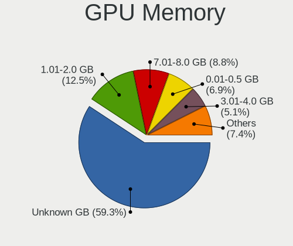

| Size in GB | Computers | Percent |
|------------|-----------|---------|
| Unknown    | 43        | 55.13%  |
| 1.01-2.0   | 14        | 17.95%  |
| 0.01-0.5   | 6         | 7.69%   |
| 3.01-4.0   | 5         | 6.41%   |
| 7.01-8.0   | 3         | 3.85%   |
| 0.51-1.0   | 3         | 3.85%   |
| 5.01-6.0   | 2         | 2.56%   |
| 2.01-3.0   | 1         | 1.28%   |
| 8.01-16.0  | 1         | 1.28%   |

Monitor
-------

Monitor Vendor
--------------

Monitor vendors

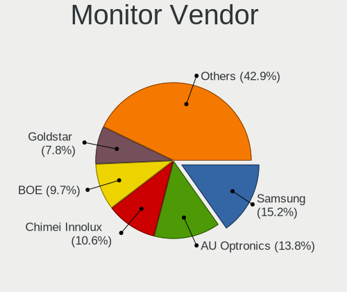

| Vendor                  | Computers | Percent |
|-------------------------|-----------|---------|
| Samsung Electronics     | 15        | 17.65%  |
| Goldstar                | 9         | 10.59%  |
| AU Optronics            | 9         | 10.59%  |
| LG Display              | 8         | 9.41%   |
| Chimei Innolux          | 8         | 9.41%   |
| BOE                     | 8         | 9.41%   |
| AOC                     | 4         | 4.71%   |
| Unknown (XXX)           | 2         | 2.35%   |
| Positivo                | 2         | 2.35%   |
| Philips                 | 2         | 2.35%   |
| Panasonic               | 2         | 2.35%   |
| Hewlett-Packard         | 2         | 2.35%   |
| Chi Mei Optoelectronics | 2         | 2.35%   |
| VIZ                     | 1         | 1.18%   |
| Philco                  | 1         | 1.18%   |
| NEC Computers           | 1         | 1.18%   |
| LG Electronics          | 1         | 1.18%   |
| Lenovo                  | 1         | 1.18%   |
| ITE                     | 1         | 1.18%   |
| GDH                     | 1         | 1.18%   |
| Dell                    | 1         | 1.18%   |
| CSO                     | 1         | 1.18%   |
| BenQ                    | 1         | 1.18%   |
| ASUSTek Computer        | 1         | 1.18%   |
| Apple                   | 1         | 1.18%   |

Monitor Model
-------------

Monitor models

| Model                                                                   | Computers | Percent |
|-------------------------------------------------------------------------|-----------|---------|
| Samsung Electronics SyncMaster SAM037A 1680x1050 433x271mm 20.1-inch    | 2         | 2.25%   |
| Panasonic TV MEIC10C 1920x540 697x392mm 31.5-inch                       | 2         | 2.25%   |
| Goldstar HDR WFHD GSM7714 2560x1080 798x334mm 34.1-inch                 | 2         | 2.25%   |
| Chimei Innolux LCD Monitor CMN14D6 1366x768 309x173mm 13.9-inch         | 2         | 2.25%   |
| AU Optronics LCD Monitor AUO2E3C 1366x768 309x173mm 13.9-inch           | 2         | 2.25%   |
| VIZ LCD Monitor M190VA 1360x768                                         | 1         | 1.12%   |
| Unknown (XXX) Union TV XXX2841 1920x1080 1209x680mm 54.6-inch           | 1         | 1.12%   |
| Unknown (XXX) Beyond TV XXX2851 3840x2160 1209x680mm 54.6-inch          | 1         | 1.12%   |
| Samsung Electronics T22B300 SAM092D 1920x1080 477x268mm 21.5-inch       | 1         | 1.12%   |
| Samsung Electronics SyncMaster SAM05EB 1920x1080 597x336mm 27.0-inch    | 1         | 1.12%   |
| Samsung Electronics SyncMaster SAM0471 1360x768 344x194mm 15.5-inch     | 1         | 1.12%   |
| Samsung Electronics SyncMaster SAM02E3 1440x900 367x229mm 17.0-inch     | 1         | 1.12%   |
| Samsung Electronics S24C450 SAM09CF 1920x1200 518x324mm 24.1-inch       | 1         | 1.12%   |
| Samsung Electronics S19B300 SAM08A5 1366x768 410x230mm 18.5-inch        | 1         | 1.12%   |
| Samsung Electronics LCD Monitor SEC544B 1600x900 382x214mm 17.2-inch    | 1         | 1.12%   |
| Samsung Electronics LCD Monitor SEC5441 1366x768 309x174mm 14.0-inch    | 1         | 1.12%   |
| Samsung Electronics LCD Monitor SAM0FEF 3840x2160 1872x1053mm 84.6-inch | 1         | 1.12%   |
| Samsung Electronics LCD Monitor SAM0E33 1920x1080 1210x680mm 54.6-inch  | 1         | 1.12%   |
| Samsung Electronics LCD Monitor SAM0C3C 1366x768 609x347mm 27.6-inch    | 1         | 1.12%   |
| Samsung Electronics LCD Monitor SAM02C9 1360x768 885x498mm 40.0-inch    | 1         | 1.12%   |
| Samsung Electronics LCD Monitor C24F390 1920x1080                       | 1         | 1.12%   |
| Positivo UNION NON1500 1360x768 344x194mm 15.5-inch                     | 1         | 1.12%   |
| Positivo FIT85X NON1801 1360x768 344x194mm 15.5-inch                    | 1         | 1.12%   |
| Philips PHL 221V8 PHLC211 1920x1080 477x268mm 21.5-inch                 | 1         | 1.12%   |
| Philips 237E4 PHLC0AD 1920x1080 509x286mm 23.0-inch                     | 1         | 1.12%   |
| Philco TV PLC0003 1440x900 708x398mm 32.0-inch                          | 1         | 1.12%   |
| NEC Computers LCD1770VX NEC6697 1280x960 338x270mm 17.0-inch            | 1         | 1.12%   |
| LG Electronics LCD Monitor LG FULL HD 3200x1080                         | 1         | 1.12%   |
| LG Electronics LCD Monitor LG FULL HD                                   | 1         | 1.12%   |
| LG Display LCD Monitor LGD0555 1536x1024 263x175mm 12.4-inch            | 1         | 1.12%   |
| LG Display LCD Monitor LGD04BD 1366x768 344x194mm 15.5-inch             | 1         | 1.12%   |
| LG Display LCD Monitor LGD046F 1920x1080 345x194mm 15.6-inch            | 1         | 1.12%   |
| LG Display LCD Monitor LGD0469 1920x1080 382x215mm 17.3-inch            | 1         | 1.12%   |
| LG Display LCD Monitor LGD039F 1366x768 345x194mm 15.6-inch             | 1         | 1.12%   |
| LG Display LCD Monitor LGD0385 1366x768 309x174mm 14.0-inch             | 1         | 1.12%   |
| LG Display LCD Monitor LGD02E9 1366x768 309x174mm 14.0-inch             | 1         | 1.12%   |
| LG Display LCD Monitor LGD02DA 1920x1080 382x215mm 17.3-inch            | 1         | 1.12%   |
| Lenovo LCD Monitor LEN4035 1280x800 303x189mm 14.1-inch                 | 1         | 1.12%   |
| ITE DP2VGA V226 ITE6516 1920x1080 600x340mm 27.2-inch                   | 1         | 1.12%   |
| Hewlett-Packard 25mx HPN359B 1920x1080 544x303mm 24.5-inch              | 1         | 1.12%   |

Monitor Resolution
------------------

Monitor screen resolution

| Resolution         | Computers | Percent |
|--------------------|-----------|---------|
| 1920x1080 (FHD)    | 27        | 31.4%   |
| 1366x768 (WXGA)    | 24        | 27.91%  |
| 3840x2160 (4K)     | 5         | 5.81%   |
| 2560x1080          | 5         | 5.81%   |
| 1360x768           | 5         | 5.81%   |
| 1920x540           | 3         | 3.49%   |
| 1600x900 (HD+)     | 3         | 3.49%   |
| 1680x1050 (WSXGA+) | 2         | 2.33%   |
| 1440x900 (WXGA+)   | 2         | 2.33%   |
| 1280x800 (WXGA)    | 2         | 2.33%   |
| 3200x1080          | 1         | 1.16%   |
| 2880x1800          | 1         | 1.16%   |
| 2736x1824          | 1         | 1.16%   |
| 2560x1440 (QHD)    | 1         | 1.16%   |
| 1920x1200 (WUXGA)  | 1         | 1.16%   |
| 1280x960           | 1         | 1.16%   |
| 1280x1024 (SXGA)   | 1         | 1.16%   |
| Unknown            | 1         | 1.16%   |

Monitor Diagonal
----------------

Diagonal size in inches

| Inches  | Computers | Percent |
|---------|-----------|---------|
| 15      | 18        | 20.93%  |
| 17      | 9         | 10.47%  |
| 14      | 9         | 10.47%  |
| 13      | 8         | 9.3%    |
| 18      | 6         | 6.98%   |
| 23      | 5         | 5.81%   |
| Unknown | 4         | 4.65%   |
| 54      | 3         | 3.49%   |
| 34      | 3         | 3.49%   |
| 31      | 3         | 3.49%   |
| 27      | 3         | 3.49%   |
| 24      | 3         | 3.49%   |
| 20      | 3         | 3.49%   |
| 21      | 2         | 2.33%   |
| 84      | 1         | 1.16%   |
| 52      | 1         | 1.16%   |
| 40      | 1         | 1.16%   |
| 32      | 1         | 1.16%   |
| 28      | 1         | 1.16%   |
| 25      | 1         | 1.16%   |
| 12      | 1         | 1.16%   |

Monitor Width
-------------

Physical width

| Width in mm | Computers | Percent |
|-------------|-----------|---------|
| 301-350     | 35        | 41.18%  |
| 401-500     | 11        | 12.94%  |
| 501-600     | 10        | 11.76%  |
| 351-400     | 8         | 9.41%   |
| 601-700     | 5         | 5.88%   |
| 701-800     | 4         | 4.71%   |
| 1001-1500   | 4         | 4.71%   |
| Unknown     | 4         | 4.71%   |
| 201-300     | 2         | 2.35%   |
| 801-900     | 1         | 1.18%   |
| 1501-2000   | 1         | 1.18%   |

Aspect Ratio
------------

Proportional relationship between the width and the height

| Ratio   | Computers | Percent |
|---------|-----------|---------|
| 16/9    | 57        | 74.03%  |
| 16/10   | 8         | 10.39%  |
| 21/9    | 5         | 6.49%   |
| Unknown | 4         | 5.19%   |
| 5/4     | 2         | 2.6%    |
| 3/2     | 1         | 1.3%    |

Monitor Area
------------

Area in inch²

| Area in inch² | Computers | Percent |
|----------------|-----------|---------|
| 101-110        | 18        | 21.18%  |
| 81-90          | 17        | 20%     |
| 201-250        | 8         | 9.41%   |
| 351-500        | 7         | 8.24%   |
| 141-150        | 7         | 8.24%   |
| 121-130        | 6         | 7.06%   |
| More than 1000 | 5         | 5.88%   |
| 151-200        | 4         | 4.71%   |
| Unknown        | 4         | 4.71%   |
| 301-350        | 3         | 3.53%   |
| 251-300        | 3         | 3.53%   |
| 71-80          | 1         | 1.18%   |
| 131-140        | 1         | 1.18%   |
| 501-1000       | 1         | 1.18%   |

Pixel Density
-------------

Pixels per inch

| Density       | Computers | Percent |
|---------------|-----------|---------|
| 51-100        | 30        | 37.04%  |
| 101-120       | 25        | 30.86%  |
| 121-160       | 15        | 18.52%  |
| 1-50          | 5         | 6.17%   |
| Unknown       | 4         | 4.94%   |
| More than 240 | 1         | 1.23%   |
| 161-240       | 1         | 1.23%   |

Multiple Monitors
-----------------

Total monitors connected

| Total | Computers | Percent |
|-------|-----------|---------|
| 1     | 58        | 73.42%  |
| 2     | 18        | 22.78%  |
| 0     | 3         | 3.8%    |

Network
-------

Net Controller Vendor
---------------------

Controller vendors

| Vendor                   | Computers | Percent |
|--------------------------|-----------|---------|
| Realtek Semiconductor    | 52        | 42.98%  |
| Intel                    | 28        | 23.14%  |
| Qualcomm Atheros         | 19        | 15.7%   |
| Broadcom                 | 3         | 2.48%   |
| VIA Technologies         | 2         | 1.65%   |
| Ralink Technology        | 2         | 1.65%   |
| MediaTek                 | 2         | 1.65%   |
| Marvell Technology Group | 2         | 1.65%   |
| D-Link System            | 2         | 1.65%   |
| TP-Link                  | 1         | 0.83%   |
| Samsung Electronics      | 1         | 0.83%   |
| Ralink                   | 1         | 0.83%   |
| Prolific Technology      | 1         | 0.83%   |
| JMicron Technology       | 1         | 0.83%   |
| Edimax Technology        | 1         | 0.83%   |
| D-Link                   | 1         | 0.83%   |
| Belkin Components        | 1         | 0.83%   |
| ASIX Electronics         | 1         | 0.83%   |

Net Controller Model
--------------------

Controller models

| Model                                                             | Computers | Percent |
|-------------------------------------------------------------------|-----------|---------|
| Realtek RTL8111/8168/8411 PCI Express Gigabit Ethernet Controller | 31        | 21.38%  |
| Realtek RTL810xE PCI Express Fast Ethernet controller             | 10        | 6.9%    |
| Qualcomm Atheros QCA9377 802.11ac Wireless Network Adapter        | 6         | 4.14%   |
| Realtek RTL8125 2.5GbE Controller                                 | 4         | 2.76%   |
| Intel 82579LM Gigabit Network Connection (Lewisville)             | 4         | 2.76%   |
| Realtek RTL8188FTV 802.11b/g/n 1T1R 2.4G WLAN Adapter             | 3         | 2.07%   |
| Realtek 802.11ac NIC                                              | 3         | 2.07%   |
| Qualcomm Atheros QCA6174 802.11ac Wireless Network Adapter        | 3         | 2.07%   |
| VIA VT6102/VT6103 [Rhine-II]                                      | 2         | 1.38%   |
| Realtek RTL8192CE PCIe Wireless Network Adapter                   | 2         | 1.38%   |
| Realtek RTL8188EE Wireless Network Adapter                        | 2         | 1.38%   |
| Realtek RTL8153 Gigabit Ethernet Adapter                          | 2         | 1.38%   |
| Realtek Killer E2600 Gigabit Ethernet Controller                  | 2         | 1.38%   |
| Qualcomm Atheros AR9285 Wireless Network Adapter (PCI-Express)    | 2         | 1.38%   |
| Intel Wireless 8265 / 8275                                        | 2         | 1.38%   |
| Intel Wi-Fi 6 AX200                                               | 2         | 1.38%   |
| Intel Ethernet Connection I217-LM                                 | 2         | 1.38%   |
| Intel Ethernet Connection (7) I219-V                              | 2         | 1.38%   |
| Intel Dual Band Wireless-AC 3168NGW [Stone Peak]                  | 2         | 1.38%   |
| Intel Alder Lake-P PCH CNVi WiFi                                  | 2         | 1.38%   |
| D-Link System DGE-528T Gigabit Ethernet Adapter                   | 2         | 1.38%   |
| TP-Link Archer T4U ver.3                                          | 1         | 0.69%   |
| Samsung Galaxy series, misc. (tethering mode)                     | 1         | 0.69%   |
| Realtek RTL8821CE 802.11ac PCIe Wireless Network Adapter          | 1         | 0.69%   |
| Realtek RTL8814AU 802.11a/b/g/n/ac Wireless Adapter               | 1         | 0.69%   |
| Realtek RTL8723BU 802.11b/g/n WLAN Adapter                        | 1         | 0.69%   |
| Realtek RTL8192EE PCIe Wireless Network Adapter                   | 1         | 0.69%   |
| Realtek RTL8152 Fast Ethernet Adapter                             | 1         | 0.69%   |
| Realtek RTL-8100/8101L/8139 PCI Fast Ethernet Adapter             | 1         | 0.69%   |
| Realtek 802.11n WLAN Adapter                                      | 1         | 0.69%   |
| Ralink RT5370 Wireless Adapter                                    | 1         | 0.69%   |
| Ralink MT7601U Wireless Adapter                                   | 1         | 0.69%   |
| Ralink RT5390 Wireless 802.11n 1T/1R PCIe                         | 1         | 0.69%   |
| Qualcomm Atheros QCA9565 / AR9565 Wireless Network Adapter        | 1         | 0.69%   |
| Qualcomm Atheros QCA8171 Gigabit Ethernet                         | 1         | 0.69%   |
| Qualcomm Atheros Killer E2400 Gigabit Ethernet Controller         | 1         | 0.69%   |
| Qualcomm Atheros Killer E220x Gigabit Ethernet Controller         | 1         | 0.69%   |
| Qualcomm Atheros AR8161 Gigabit Ethernet                          | 1         | 0.69%   |
| Qualcomm Atheros AR8152 v2.0 Fast Ethernet                        | 1         | 0.69%   |
| Qualcomm Atheros AR8151 v1.0 Gigabit Ethernet                     | 1         | 0.69%   |

Wireless Vendor
---------------

Wireless vendors

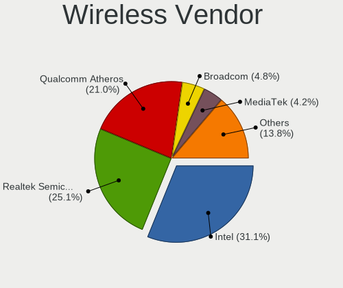

| Vendor                   | Computers | Percent |
|--------------------------|-----------|---------|
| Intel                    | 20        | 32.79%  |
| Realtek Semiconductor    | 14        | 22.95%  |
| Qualcomm Atheros         | 14        | 22.95%  |
| Broadcom                 | 3         | 4.92%   |
| Ralink Technology        | 2         | 3.28%   |
| MediaTek                 | 2         | 3.28%   |
| TP-Link                  | 1         | 1.64%   |
| Ralink                   | 1         | 1.64%   |
| Marvell Technology Group | 1         | 1.64%   |
| Edimax Technology        | 1         | 1.64%   |
| D-Link                   | 1         | 1.64%   |
| Belkin Components        | 1         | 1.64%   |

Wireless Model
--------------

Wireless models

| Model                                                                                 | Computers | Percent |
|---------------------------------------------------------------------------------------|-----------|---------|
| Qualcomm Atheros QCA9377 802.11ac Wireless Network Adapter                            | 6         | 9.68%   |
| Realtek RTL8188FTV 802.11b/g/n 1T1R 2.4G WLAN Adapter                                 | 3         | 4.84%   |
| Realtek 802.11ac NIC                                                                  | 3         | 4.84%   |
| Qualcomm Atheros QCA6174 802.11ac Wireless Network Adapter                            | 3         | 4.84%   |
| Realtek RTL8192CE PCIe Wireless Network Adapter                                       | 2         | 3.23%   |
| Realtek RTL8188EE Wireless Network Adapter                                            | 2         | 3.23%   |
| Qualcomm Atheros AR9285 Wireless Network Adapter (PCI-Express)                        | 2         | 3.23%   |
| Intel Wireless 8265 / 8275                                                            | 2         | 3.23%   |
| Intel Wi-Fi 6 AX200                                                                   | 2         | 3.23%   |
| Intel Dual Band Wireless-AC 3168NGW [Stone Peak]                                      | 2         | 3.23%   |
| Intel Alder Lake-P PCH CNVi WiFi                                                      | 2         | 3.23%   |
| TP-Link Archer T4U ver.3                                                              | 1         | 1.61%   |
| Realtek RTL8821CE 802.11ac PCIe Wireless Network Adapter                              | 1         | 1.61%   |
| Realtek RTL8814AU 802.11a/b/g/n/ac Wireless Adapter                                   | 1         | 1.61%   |
| Realtek RTL8723BU 802.11b/g/n WLAN Adapter                                            | 1         | 1.61%   |
| Realtek RTL8192EE PCIe Wireless Network Adapter                                       | 1         | 1.61%   |
| Realtek 802.11n WLAN Adapter                                                          | 1         | 1.61%   |
| Ralink RT5370 Wireless Adapter                                                        | 1         | 1.61%   |
| Ralink MT7601U Wireless Adapter                                                       | 1         | 1.61%   |
| Ralink RT5390 Wireless 802.11n 1T/1R PCIe                                             | 1         | 1.61%   |
| Qualcomm Atheros QCA9565 / AR9565 Wireless Network Adapter                            | 1         | 1.61%   |
| Qualcomm Atheros AR5418 Wireless Network Adapter [AR5008E 802.11(a)bgn] (PCI-Express) | 1         | 1.61%   |
| Qualcomm Atheros AR242x / AR542x Wireless Network Adapter (PCI-Express)               | 1         | 1.61%   |
| MediaTek MT7922 802.11ax PCI Express Wireless Network Adapter                         | 1         | 1.61%   |
| MediaTek MT7921K (RZ608) Wi-Fi 6E 80MHz                                               | 1         | 1.61%   |
| Marvell Group 88W8897 [AVASTAR] 802.11ac Wireless                                     | 1         | 1.61%   |
| Intel Wireless 8260                                                                   | 1         | 1.61%   |
| Intel Wireless 7265                                                                   | 1         | 1.61%   |
| Intel Wi-Fi 6 AX210/AX211/AX411 160MHz                                                | 1         | 1.61%   |
| Intel Tiger Lake PCH CNVi WiFi                                                        | 1         | 1.61%   |
| Intel Ice Lake-LP PCH CNVi WiFi                                                       | 1         | 1.61%   |
| Intel Centrino Wireless-N 105                                                         | 1         | 1.61%   |
| Intel Centrino Wireless-N 1030 [Rainbow Peak]                                         | 1         | 1.61%   |
| Intel Centrino Ultimate-N 6300                                                        | 1         | 1.61%   |
| Intel Centrino Advanced-N 6230 [Rainbow Peak]                                         | 1         | 1.61%   |
| Intel Centrino Advanced-N 6200                                                        | 1         | 1.61%   |
| Intel Cannon Point-LP CNVi [Wireless-AC]                                              | 1         | 1.61%   |
| Intel Cannon Lake PCH CNVi WiFi                                                       | 1         | 1.61%   |
| Edimax EW-7711MAC 802.11ac Wireless Adapter                                           | 1         | 1.61%   |
| D-Link DWA-171 AC600 DB Wireless Adapter(rev.A1) [Realtek RTL8811AU]                  | 1         | 1.61%   |

Ethernet Vendor
---------------

Ethernet vendors

| Vendor                   | Computers | Percent |
|--------------------------|-----------|---------|
| Realtek Semiconductor    | 47        | 60.26%  |
| Intel                    | 16        | 20.51%  |
| Qualcomm Atheros         | 6         | 7.69%   |
| VIA Technologies         | 2         | 2.56%   |
| D-Link System            | 2         | 2.56%   |
| Samsung Electronics      | 1         | 1.28%   |
| Marvell Technology Group | 1         | 1.28%   |
| JMicron Technology       | 1         | 1.28%   |
| Broadcom                 | 1         | 1.28%   |
| ASIX Electronics         | 1         | 1.28%   |

Ethernet Model
--------------

Ethernet models

| Model                                                             | Computers | Percent |
|-------------------------------------------------------------------|-----------|---------|
| Realtek RTL8111/8168/8411 PCI Express Gigabit Ethernet Controller | 31        | 37.8%   |
| Realtek RTL810xE PCI Express Fast Ethernet controller             | 10        | 12.2%   |
| Realtek RTL8125 2.5GbE Controller                                 | 4         | 4.88%   |
| Intel 82579LM Gigabit Network Connection (Lewisville)             | 4         | 4.88%   |
| VIA VT6102/VT6103 [Rhine-II]                                      | 2         | 2.44%   |
| Realtek RTL8153 Gigabit Ethernet Adapter                          | 2         | 2.44%   |
| Realtek Killer E2600 Gigabit Ethernet Controller                  | 2         | 2.44%   |
| Intel Ethernet Connection I217-LM                                 | 2         | 2.44%   |
| Intel Ethernet Connection (7) I219-V                              | 2         | 2.44%   |
| D-Link System DGE-528T Gigabit Ethernet Adapter                   | 2         | 2.44%   |
| Samsung Galaxy series, misc. (tethering mode)                     | 1         | 1.22%   |
| Realtek RTL8152 Fast Ethernet Adapter                             | 1         | 1.22%   |
| Realtek RTL-8100/8101L/8139 PCI Fast Ethernet Adapter             | 1         | 1.22%   |
| Qualcomm Atheros QCA8171 Gigabit Ethernet                         | 1         | 1.22%   |
| Qualcomm Atheros Killer E2400 Gigabit Ethernet Controller         | 1         | 1.22%   |
| Qualcomm Atheros Killer E220x Gigabit Ethernet Controller         | 1         | 1.22%   |
| Qualcomm Atheros AR8161 Gigabit Ethernet                          | 1         | 1.22%   |
| Qualcomm Atheros AR8152 v2.0 Fast Ethernet                        | 1         | 1.22%   |
| Qualcomm Atheros AR8151 v1.0 Gigabit Ethernet                     | 1         | 1.22%   |
| Marvell Group 88E8039 PCI-E Fast Ethernet Controller              | 1         | 1.22%   |
| JMicron JMC250 PCI Express Gigabit Ethernet Controller            | 1         | 1.22%   |
| Intel I211 Gigabit Network Connection                             | 1         | 1.22%   |
| Intel Ethernet Controller I225-V                                  | 1         | 1.22%   |
| Intel Ethernet Controller I225-LM                                 | 1         | 1.22%   |
| Intel Ethernet Connection (4) I219-LM                             | 1         | 1.22%   |
| Intel Ethernet Connection (2) I219-V                              | 1         | 1.22%   |
| Intel Ethernet Connection (2) I219-LM                             | 1         | 1.22%   |
| Intel 82579V Gigabit Network Connection                           | 1         | 1.22%   |
| Intel 82577LM Gigabit Network Connection                          | 1         | 1.22%   |
| Broadcom NetXtreme BCM57765 Gigabit Ethernet PCIe                 | 1         | 1.22%   |
| ASIX AX88179 Gigabit Ethernet                                     | 1         | 1.22%   |

Net Controller Kind
-------------------

Ethernet, WiFi or modem

| Kind     | Computers | Percent |
|----------|-----------|---------|
| Ethernet | 73        | 55.73%  |
| WiFi     | 57        | 43.51%  |
| Modem    | 1         | 0.76%   |

Used Controller
---------------

Currently used network controller

| Kind     | Computers | Percent |
|----------|-----------|---------|
| Ethernet | 41        | 52.56%  |
| WiFi     | 37        | 47.44%  |

NICs
----

Total network controllers on board

| Total | Computers | Percent |
|-------|-----------|---------|
| 2     | 45        | 57.69%  |
| 1     | 29        | 37.18%  |
| 3     | 2         | 2.56%   |
| 0     | 2         | 2.56%   |

IPv6
----

IPv6 vs IPv4

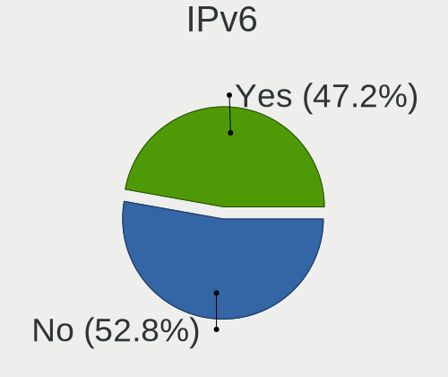

| Used | Computers | Percent |
|------|-----------|---------|
| No   | 45        | 57.69%  |
| Yes  | 33        | 42.31%  |

Bluetooth
---------

Bluetooth Vendor
----------------

Controller vendors

| Vendor                          | Computers | Percent |
|---------------------------------|-----------|---------|
| Intel                           | 17        | 36.17%  |
| Qualcomm Atheros Communications | 6         | 12.77%  |
| Cambridge Silicon Radio         | 6         | 12.77%  |
| Lite-On Technology              | 4         | 8.51%   |
| Realtek Semiconductor           | 3         | 6.38%   |
| Foxconn / Hon Hai               | 2         | 4.26%   |
| MediaTek                        | 1         | 2.13%   |
| Marvell Semiconductor           | 1         | 2.13%   |
| IMC Networks                    | 1         | 2.13%   |
| Hewlett-Packard                 | 1         | 2.13%   |
| Dell                            | 1         | 2.13%   |
| Broadcom                        | 1         | 2.13%   |
| Apple                           | 1         | 2.13%   |
| Actions                         | 1         | 2.13%   |
| AboCom Systems                  | 1         | 2.13%   |

Bluetooth Model
---------------

Controller models

| Model                                               | Computers | Percent |
|-----------------------------------------------------|-----------|---------|
| Cambridge Silicon Radio Bluetooth Dongle (HCI mode) | 6         | 12.77%  |
| Qualcomm Atheros  Bluetooth Device                  | 4         | 8.51%   |
| Intel Bluetooth wireless interface                  | 4         | 8.51%   |
| Lite-On Qualcomm Atheros QCA9377 Bluetooth          | 3         | 6.38%   |
| Intel Bluetooth 9460/9560 Jefferson Peak (JfP)      | 3         | 6.38%   |
| Intel AX201 Bluetooth                               | 3         | 6.38%   |
| Realtek Bluetooth Radio                             | 2         | 4.26%   |
| Qualcomm Atheros QCA61x4 Bluetooth 4.0              | 2         | 4.26%   |
| Intel Wireless-AC 3168 Bluetooth                    | 2         | 4.26%   |
| Intel Bluetooth Device                              | 2         | 4.26%   |
| Intel AX200 Bluetooth                               | 2         | 4.26%   |
| Realtek  Bluetooth 4.2 Adapter                      | 1         | 2.13%   |
| MediaTek Wireless_Device                            | 1         | 2.13%   |
| Marvell Bluetooth and Wireless LAN Composite        | 1         | 2.13%   |
| Lite-On Bluetooth Device                            | 1         | 2.13%   |
| Intel AX210 Bluetooth                               | 1         | 2.13%   |
| IMC Networks BCM20702A0                             | 1         | 2.13%   |
| HP Broadcom 2070 Bluetooth Combo                    | 1         | 2.13%   |
| Foxconn / Hon Hai Wireless_Device                   | 1         | 2.13%   |
| Foxconn / Hon Hai Broadcom Bluetooth 2.1 Device     | 1         | 2.13%   |
| Dell DW375 Bluetooth Module                         | 1         | 2.13%   |
| Broadcom BCM2045B (BDC-2.1)                         | 1         | 2.13%   |
| Apple Bluetooth USB Host Controller                 | 1         | 2.13%   |
| Actions general adapter                             | 1         | 2.13%   |
| AboCom Systems AboCom Bluetooth Device              | 1         | 2.13%   |

Sound
-----

Sound Vendor
------------

Sound card vendors

| Vendor                 | Computers | Percent |
|------------------------|-----------|---------|
| Intel                  | 59        | 50.43%  |
| Nvidia                 | 25        | 21.37%  |
| AMD                    | 22        | 18.8%   |
| C-Media Electronics    | 3         | 2.56%   |
| Generalplus Technology | 2         | 1.71%   |
| Creative Labs          | 2         | 1.71%   |
| Roland                 | 1         | 0.85%   |
| Realtek Semiconductor  | 1         | 0.85%   |
| Razer USA              | 1         | 0.85%   |
| DCMT Technology        | 1         | 0.85%   |

Sound Model
-----------

Sound card models

| Model                                                                             | Computers | Percent |
|-----------------------------------------------------------------------------------|-----------|---------|
| Intel 6 Series/C200 Series Chipset Family High Definition Audio Controller        | 12        | 9.02%   |
| Intel Sunrise Point-LP HD Audio                                                   | 9         | 6.77%   |
| AMD Family 17h/19h HD Audio Controller                                            | 7         | 5.26%   |
| Intel 8 Series/C220 Series Chipset High Definition Audio Controller               | 6         | 4.51%   |
| Intel 7 Series/C216 Chipset Family High Definition Audio Controller               | 6         | 4.51%   |
| Intel 100 Series/C230 Series Chipset Family HD Audio Controller                   | 5         | 3.76%   |
| Intel Xeon E3-1200 v3/4th Gen Core Processor HD Audio Controller                  | 4         | 3.01%   |
| Nvidia TU106 High Definition Audio Controller                                     | 3         | 2.26%   |
| Nvidia GM107 High Definition Audio Controller [GeForce 940MX]                     | 3         | 2.26%   |
| Intel Tiger Lake-H HD Audio Controller                                            | 3         | 2.26%   |
| Intel NM10/ICH7 Family High Definition Audio Controller                           | 3         | 2.26%   |
| AMD Starship/Matisse HD Audio Controller                                          | 3         | 2.26%   |
| AMD Renoir Radeon High Definition Audio Controller                                | 3         | 2.26%   |
| AMD Raven/Raven2/Fenghuang HDMI/DP Audio Controller                               | 3         | 2.26%   |
| AMD Caicos HDMI Audio [Radeon HD 6450 / 7450/8450/8490 OEM / R5 230/235/235X OEM] | 3         | 2.26%   |
| Nvidia TU116 High Definition Audio Controller                                     | 2         | 1.5%    |
| Nvidia GP108 High Definition Audio Controller                                     | 2         | 1.5%    |
| Nvidia GM206 High Definition Audio Controller                                     | 2         | 1.5%    |
| Nvidia GA104 High Definition Audio Controller                                     | 2         | 1.5%    |
| Nvidia Audio device                                                               | 2         | 1.5%    |
| Intel Cannon Lake PCH cAVS                                                        | 2         | 1.5%    |
| Intel Alder Lake PCH-P High Definition Audio Controller                           | 2         | 1.5%    |
| Intel 5 Series/3400 Series Chipset High Definition Audio                          | 2         | 1.5%    |
| Generalplus Technology USB Audio Device                                           | 2         | 1.5%    |
| Creative Labs CA0106/CA0111 [SB Live!/Audigy/X-Fi Series]                         | 2         | 1.5%    |
| AMD Wrestler HDMI Audio                                                           | 2         | 1.5%    |
| AMD Tobago HDMI Audio [Radeon R7 360 / R9 360 OEM]                                | 2         | 1.5%    |
| AMD SBx00 Azalia (Intel HDA)                                                      | 2         | 1.5%    |
| AMD Family 17h (Models 00h-0fh) HD Audio Controller                               | 2         | 1.5%    |
| AMD Baffin HDMI/DP Audio [Radeon RX 550 640SP / RX 560/560X]                      | 2         | 1.5%    |
| Roland QUAD-CAPTURE                                                               | 1         | 0.75%   |
| Realtek Semiconductor USB Audio                                                   | 1         | 0.75%   |
| Razer USA Razer Leviathan V2                                                      | 1         | 0.75%   |
| Nvidia TU107 GeForce GTX 1650 High Definition Audio Controller                    | 1         | 0.75%   |
| Nvidia TU102 High Definition Audio Controller                                     | 1         | 0.75%   |
| Nvidia MCP61 High Definition Audio                                                | 1         | 0.75%   |
| Nvidia GP107GL High Definition Audio Controller                                   | 1         | 0.75%   |
| Nvidia GP104 High Definition Audio Controller                                     | 1         | 0.75%   |
| Nvidia GK208 HDMI/DP Audio Controller                                             | 1         | 0.75%   |
| Nvidia GK106 HDMI Audio Controller                                                | 1         | 0.75%   |

Memory
------

Memory Vendor
-------------

Memory module vendors

| Vendor              | Computers | Percent |
|---------------------|-----------|---------|
| Unknown             | 11        | 16.42%  |
| Samsung Electronics | 11        | 16.42%  |
| Kingston            | 10        | 14.93%  |
| Smart               | 6         | 8.96%   |
| SK hynix            | 6         | 8.96%   |
| Micron Technology   | 5         | 7.46%   |
| Corsair             | 5         | 7.46%   |
| Teikon              | 2         | 2.99%   |
| Crucial             | 2         | 2.99%   |
| A-DATA Technology   | 2         | 2.99%   |
| Unknown             | 2         | 2.99%   |
| Ramaxel Technology  | 1         | 1.49%   |
| PLEXHD              | 1         | 1.49%   |
| Nanya Technology    | 1         | 1.49%   |
| Kembona             | 1         | 1.49%   |
| G.Skill             | 1         | 1.49%   |

Memory Model
------------

Memory module models

| Model                                                            | Computers | Percent |
|------------------------------------------------------------------|-----------|---------|
| Unknown RAM Module 2GB DIMM SDRAM                                | 2         | 2.74%   |
| Smart RAM SH564128FH8N6TNSQG 4GB DIMM DDR3 1600MT/s              | 2         | 2.74%   |
| Samsung RAM M471B5273DH0-CH9 4GB SODIMM DDR3 1334MT/s            | 2         | 2.74%   |
| Unknown                                                          | 2         | 2.74%   |
| Unknown RAM Module 8GB SODIMM DDR3 1600MT/s                      | 1         | 1.37%   |
| Unknown RAM Module 8GB DIMM SDRAM                                | 1         | 1.37%   |
| Unknown RAM Module 512MB SODIMM DDR2                             | 1         | 1.37%   |
| Unknown RAM Module 4GB SODIMM DDR4 2133MT/s                      | 1         | 1.37%   |
| Unknown RAM Module 4GB DIMM DDR3 1333MT/s                        | 1         | 1.37%   |
| Unknown RAM Module 2GB SODIMM DDR3 1600MT/s                      | 1         | 1.37%   |
| Unknown RAM Module 2GB SODIMM DDR2                               | 1         | 1.37%   |
| Unknown RAM Module 2GB DIMM DDR2 266MT/s                         | 1         | 1.37%   |
| Unknown RAM Module 2GB DIMM 1333MT/s                             | 1         | 1.37%   |
| Unknown RAM Module 16GB DIMM DDR4 3200MT/s                       | 1         | 1.37%   |
| Teikon RAM TMT351S6EFR8A-PBHJ 4GB SODIMM DDR3 1600MT/s           | 1         | 1.37%   |
| Teikon RAM TMA81GS6AFR8N-UHSC 8GB SODIMM DDR4 2400MT/s           | 1         | 1.37%   |
| Smart RAM SMS4TDC3C0K0446SCG 4GB SODIMM DDR4 2667MT/s            | 1         | 1.37%   |
| Smart RAM SH564568FH8NZPHSCR 2048MB SODIMM DDR3 1333MT/s         | 1         | 1.37%   |
| Smart RAM SH564128FH8NZQNSCG 4GB SODIMM DDR3 1600MT/s            | 1         | 1.37%   |
| Smart RAM SF4641G8CKHIWDFSEG 8GB SODIMM DDR4 2133MT/s            | 1         | 1.37%   |
| Smart RAM SF4641G8CK8IEHLSBG 8GB SODIMM DDR4 2667MT/s            | 1         | 1.37%   |
| SK hynix RAM Module 4GB SODIMM DDR3 1066MT/s                     | 1         | 1.37%   |
| SK hynix RAM MMXIV 4096MB SODIMM DDR3 1333MT/s                   | 1         | 1.37%   |
| SK hynix RAM MD4512NSE-CB3M2 00 4096MB DIMM DDR4 2400MT/s        | 1         | 1.37%   |
| SK hynix RAM HMT41GU6MFR8C-PB 8GB DIMM DDR3 1600MT/s             | 1         | 1.37%   |
| SK hynix RAM HMCG66MEBSA092N 8GB SODIMM DDR5 4800MT/s            | 1         | 1.37%   |
| SK hynix RAM H9CCNNNBJTALAR-NUD 4GB Row Of Chips LPDDR3 1867MT/s | 1         | 1.37%   |
| Samsung RAM Module 2GB Row Of Chips LPDDR3 1600MT/s              | 1         | 1.37%   |
| Samsung RAM M471B5673FH0-CF8 2GB SODIMM DDR3 1067MT/s            | 1         | 1.37%   |
| Samsung RAM M471B5273CH0-CH9 4GB SODIMM DDR3 1334MT/s            | 1         | 1.37%   |
| Samsung RAM M471B5173EB0-YK0 4GB SODIMM DDR3 1600MT/s            | 1         | 1.37%   |
| Samsung RAM M471B1G73BH0-CK0 8GB SODIMM DDR3 1600MT/s            | 1         | 1.37%   |
| Samsung RAM M471A1K43DB1-CTD 8GB SODIMM DDR4 2667MT/s            | 1         | 1.37%   |
| Samsung RAM M471A1G44AB0-CWE 8GB SODIMM DDR4 3200MT/s            | 1         | 1.37%   |
| Samsung RAM M425R2GA3BB0-CQKOL 16GB SODIMM DDR5 4800MT/s         | 1         | 1.37%   |
| Samsung RAM M378B5773DH0-CH9 2GB DIMM DDR3 1333MT/s              | 1         | 1.37%   |
| Samsung RAM M378B5273DH0-CK0 4GB DIMM DDR3 2200MT/s              | 1         | 1.37%   |
| Ramaxel RAM RMT3170ME68F9F1600 4096MB SODIMM DDR3 1600MT/s       | 1         | 1.37%   |
| Ramaxel RAM RMT3170EB68F9W1600 4GB SODIMM DDR3 1600MT/s          | 1         | 1.37%   |
| PLEXHD RAM er 4GB DIMM DDR3 1600MT/s                             | 1         | 1.37%   |

Memory Kind
-----------

Memory module kinds

| Kind    | Computers | Percent |
|---------|-----------|---------|
| DDR3    | 24        | 42.86%  |
| DDR4    | 19        | 33.93%  |
| SDRAM   | 4         | 7.14%   |
| DDR5    | 3         | 5.36%   |
| LPDDR3  | 2         | 3.57%   |
| DDR2    | 2         | 3.57%   |
| LPDDR4  | 1         | 1.79%   |
| Unknown | 1         | 1.79%   |

Memory Form Factor
------------------

Physical design of the memory module

| Name         | Computers | Percent |
|--------------|-----------|---------|
| SODIMM       | 29        | 51.79%  |
| DIMM         | 24        | 42.86%  |
| Row Of Chips | 3         | 5.36%   |

Memory Size
-----------

Memory module size

| Size  | Computers | Percent |
|-------|-----------|---------|
| 8192  | 22        | 34.38%  |
| 4096  | 18        | 28.13%  |
| 2048  | 12        | 18.75%  |
| 16384 | 8         | 12.5%   |
| 32768 | 2         | 3.13%   |
| 1024  | 1         | 1.56%   |
| 512   | 1         | 1.56%   |

Memory Speed
------------

Memory module speed

| Speed   | Computers | Percent |
|---------|-----------|---------|
| 1600    | 17        | 26.98%  |
| 1333    | 7         | 11.11%  |
| 3200    | 6         | 9.52%   |
| 2400    | 6         | 9.52%   |
| 2667    | 4         | 6.35%   |
| 2133    | 4         | 6.35%   |
| 1334    | 4         | 6.35%   |
| Unknown | 4         | 6.35%   |
| 4800    | 3         | 4.76%   |
| 1867    | 2         | 3.17%   |
| 4266    | 1         | 1.59%   |
| 3733    | 1         | 1.59%   |
| 2200    | 1         | 1.59%   |
| 1067    | 1         | 1.59%   |
| 1066    | 1         | 1.59%   |
| 266     | 1         | 1.59%   |

Printers & scanners
-------------------

Printer Vendor
--------------

Printer device vendors

| Vendor             | Computers | Percent |
|--------------------|-----------|---------|
| Seiko Epson        | 1         | 33.33%  |
| Hewlett-Packard    | 1         | 33.33%  |
| Brother Industries | 1         | 33.33%  |

Printer Model
-------------

Printer device models

| Model                    | Computers | Percent |
|--------------------------|-----------|---------|
| Seiko Epson L380 Series  | 1         | 33.33%  |
| HP Officejet 4620 series | 1         | 33.33%  |
| Brother DCP-T500W        | 1         | 33.33%  |

Scanner Vendor
--------------

Scanner device vendors

Zero info for selected period =(

Scanner Model
-------------

Scanner device models

Zero info for selected period =(

Camera
------

Camera Vendor
-------------

Camera device vendors

| Vendor                                 | Computers | Percent |
|----------------------------------------|-----------|---------|
| Quanta                                 | 8         | 18.6%   |
| Chicony Electronics                    | 6         | 13.95%  |
| Sunplus Innovation Technology          | 5         | 11.63%  |
| Microdia                               | 2         | 4.65%   |
| Lenovo                                 | 2         | 4.65%   |
| Cheng Uei Precision Industry (Foxlink) | 2         | 4.65%   |
| Bison Electronics                      | 2         | 4.65%   |
| Acer                                   | 2         | 4.65%   |
| Y Media                                | 1         | 2.33%   |
| SunplusIT                              | 1         | 2.33%   |
| Sonix Technology                       | 1         | 2.33%   |
| Silicon Motion                         | 1         | 2.33%   |
| Samsung Electronics                    | 1         | 2.33%   |
| Realtek Semiconductor                  | 1         | 2.33%   |
| Microsoft                              | 1         | 2.33%   |
| Lite-On Technology                     | 1         | 2.33%   |
| Jieli Technology                       | 1         | 2.33%   |
| IMC Networks                           | 1         | 2.33%   |
| Generalplus Technology                 | 1         | 2.33%   |
| GEMBIRD                                | 1         | 2.33%   |
| Apple                                  | 1         | 2.33%   |
| Alcor Micro                            | 1         | 2.33%   |

Camera Model
------------

Camera device models

| Model                                               | Computers | Percent |
|-----------------------------------------------------|-----------|---------|
| Quanta VGA WebCam                                   | 3         | 6.98%   |
| Quanta HD Webcam                                    | 2         | 4.65%   |
| Microdia Integrated_Webcam_HD                       | 2         | 4.65%   |
| Y Media USB Camera                                  | 1         | 2.33%   |
| SunplusIT MTD camera                                | 1         | 2.33%   |
| Sunplus MTD Camera                                  | 1         | 2.33%   |
| Sunplus Laptop_Integrated_Webcam_HD                 | 1         | 2.33%   |
| Sunplus Laptop_Integrated_Webcam_FHD                | 1         | 2.33%   |
| Sunplus Laptop Integrated Webcam FHD                | 1         | 2.33%   |
| Sunplus HP HD Webcam [Fixed]                        | 1         | 2.33%   |
| Sonix USB2.0 HD UVC WebCam                          | 1         | 2.33%   |
| Silicon Motion Web Camera                           | 1         | 2.33%   |
| Samsung Galaxy series, misc. (MTP mode)             | 1         | 2.33%   |
| Realtek USB Camera                                  | 1         | 2.33%   |
| Quanta Laptop_Integrated_Webcam_2HDM                | 1         | 2.33%   |
| Quanta HD User Facing                               | 1         | 2.33%   |
| Quanta ACER HD User Facing                          | 1         | 2.33%   |
| Microsoft LifeCam VX-2000                           | 1         | 2.33%   |
| Lite-On TOSHIBA Web Camera - HD                     | 1         | 2.33%   |
| Lenovo Integrated Webcam [R5U877]                   | 1         | 2.33%   |
| Lenovo FHD Webcam Audio                             | 1         | 2.33%   |
| Jieli USB PHY 2.0                                   | 1         | 2.33%   |
| IMC Networks Integrated Camera                      | 1         | 2.33%   |
| Generalplus 808 Camera #9 (web-cam mode)            | 1         | 2.33%   |
| GEMBIRD USB2.0 PC CAMERA                            | 1         | 2.33%   |
| Chicony Lenovo EasyCamera                           | 1         | 2.33%   |
| Chicony Integrated Camera (1280x720@30)             | 1         | 2.33%   |
| Chicony Integrated Camera                           | 1         | 2.33%   |
| Chicony HD WebCam                                   | 1         | 2.33%   |
| Chicony FHD Webcam                                  | 1         | 2.33%   |
| Chicony 2.0M UVC WebCam                             | 1         | 2.33%   |
| Cheng Uei Precision Industry (Foxlink) HP Webcam    | 1         | 2.33%   |
| Cheng Uei Precision Industry (Foxlink) HP HD Camera | 1         | 2.33%   |
| Bison Lenovo EasyCamera                             | 1         | 2.33%   |
| Bison HD Webcam                                     | 1         | 2.33%   |
| Apple FaceTime HD Camera                            | 1         | 2.33%   |
| Alcor Micro USB 2.0 Camera                          | 1         | 2.33%   |
| Acer Lenovo EasyCamera                              | 1         | 2.33%   |
| Acer EasyCamera                                     | 1         | 2.33%   |

Security
--------

Fingerprint Vendor
------------------

Fingerprint sensor vendors

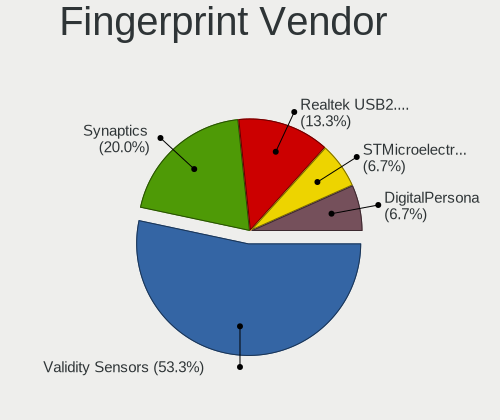

| Vendor           | Computers | Percent |
|------------------|-----------|---------|
| Synaptics        | 2         | 66.67%  |
| Validity Sensors | 1         | 33.33%  |

Fingerprint Model
-----------------

Fingerprint sensor models

| Model                                            | Computers | Percent |
|--------------------------------------------------|-----------|---------|
| Validity Sensors VFS471 Fingerprint Reader       | 1         | 33.33%  |
| Synaptics  WBDI                                  | 1         | 33.33%  |
| Synaptics Metallica MIS Touch Fingerprint Reader | 1         | 33.33%  |

Chipcard Vendor
---------------

Chipcard module vendors

| Vendor   | Computers | Percent |
|----------|-----------|---------|
| Broadcom | 1         | 100%    |

Chipcard Model
--------------

Chipcard module models

| Model                                          | Computers | Percent |
|------------------------------------------------|-----------|---------|
| Broadcom BCM5880 Secure Applications Processor | 1         | 100%    |

Unsupported
-----------

Unsupported Devices
-------------------

Total unsupported devices on board

| Total | Computers | Percent |
|-------|-----------|---------|
| 0     | 61        | 78.21%  |
| 1     | 14        | 17.95%  |
| 2     | 3         | 3.85%   |

Unsupported Device Types
------------------------

Types of unsupported devices

| Type               | Computers | Percent |
|--------------------|-----------|---------|
| Net/wireless       | 8         | 38.1%   |
| Graphics card      | 6         | 28.57%  |
| Fingerprint reader | 3         | 14.29%  |
| Unassigned class   | 1         | 4.76%   |
| Storage            | 1         | 4.76%   |
| Network            | 1         | 4.76%   |
| Chipcard           | 1         | 4.76%   |

