BigLinux - Tested Hardware & Statistics (Desktops)
--------------------------------------------------

A project to collect tested hardware configurations for BigLinux.

Anyone can contribute to this report by the [hw-probe](https://github.com/linuxhw/hw-probe) tool:

    sudo -E hw-probe -all -upload

Please contribute! Especially if your hardware is rare.

Contents
--------

* [ Test Cases ](#test-cases)

* [ System ](#system)
  - [ OS                       ](#os)
  - [ OS Family                ](#os-family)
  - [ Kernel                   ](#kernel)
  - [ Kernel Family            ](#kernel-family)
  - [ Kernel Major Ver.        ](#kernel-major-ver)
  - [ Arch                     ](#arch)
  - [ DE                       ](#de)
  - [ Display Server           ](#display-server)
  - [ Display Manager          ](#display-manager)
  - [ OS Lang                  ](#os-lang)
  - [ Boot Mode                ](#boot-mode)
  - [ Filesystem               ](#filesystem)
  - [ Part. scheme             ](#part-scheme)
  - [ Dual Boot with Linux/BSD ](#dual-boot-with-linuxbsd)
  - [ Dual Boot (Win)          ](#dual-boot-win)

* [ Board ](#board)
  - [ Vendor                   ](#vendor)
  - [ Model                    ](#model)
  - [ Model Family             ](#model-family)
  - [ MFG Year                 ](#mfg-year)
  - [ Form Factor              ](#form-factor)
  - [ Secure Boot              ](#secure-boot)
  - [ Coreboot                 ](#coreboot)
  - [ RAM Size                 ](#ram-size)
  - [ RAM Used                 ](#ram-used)
  - [ Total Drives             ](#total-drives)
  - [ Has CD-ROM               ](#has-cd-rom)
  - [ Has Ethernet             ](#has-ethernet)
  - [ Has WiFi                 ](#has-wifi)
  - [ Has Bluetooth            ](#has-bluetooth)

* [ Location ](#location)
  - [ Country                  ](#country)
  - [ City                     ](#city)

* [ Drives ](#drives)
  - [ Drive Vendor             ](#drive-vendor)
  - [ Drive Model              ](#drive-model)
  - [ HDD Vendor               ](#hdd-vendor)
  - [ SSD Vendor               ](#ssd-vendor)
  - [ Drive Kind               ](#drive-kind)
  - [ Drive Connector          ](#drive-connector)
  - [ Drive Size               ](#drive-size)
  - [ Space Total              ](#space-total)
  - [ Space Used               ](#space-used)
  - [ Malfunc. Drives          ](#malfunc-drives)
  - [ Malfunc. Drive Vendor    ](#malfunc-drive-vendor)
  - [ Malfunc. HDD Vendor      ](#malfunc-hdd-vendor)
  - [ Malfunc. Drive Kind      ](#malfunc-drive-kind)
  - [ Failed Drives            ](#failed-drives)
  - [ Failed Drive Vendor      ](#failed-drive-vendor)
  - [ Drive Status             ](#drive-status)

* [ Storage controller ](#storage-controller)
  - [ Storage Vendor           ](#storage-vendor)
  - [ Storage Model            ](#storage-model)
  - [ Storage Kind             ](#storage-kind)

* [ Processor ](#processor)
  - [ CPU Vendor               ](#cpu-vendor)
  - [ CPU Model                ](#cpu-model)
  - [ CPU Model Family         ](#cpu-model-family)
  - [ CPU Cores                ](#cpu-cores)
  - [ CPU Sockets              ](#cpu-sockets)
  - [ CPU Threads              ](#cpu-threads)
  - [ CPU Op-Modes             ](#cpu-op-modes)
  - [ CPU Microcode            ](#cpu-microcode)
  - [ CPU Microarch            ](#cpu-microarch)

* [ Graphics ](#graphics)
  - [ GPU Vendor               ](#gpu-vendor)
  - [ GPU Model                ](#gpu-model)
  - [ GPU Combo                ](#gpu-combo)
  - [ GPU Driver               ](#gpu-driver)
  - [ GPU Memory               ](#gpu-memory)

* [ Monitor ](#monitor)
  - [ Monitor Vendor           ](#monitor-vendor)
  - [ Monitor Model            ](#monitor-model)
  - [ Monitor Resolution       ](#monitor-resolution)
  - [ Monitor Diagonal         ](#monitor-diagonal)
  - [ Monitor Width            ](#monitor-width)
  - [ Aspect Ratio             ](#aspect-ratio)
  - [ Monitor Area             ](#monitor-area)
  - [ Pixel Density            ](#pixel-density)
  - [ Multiple Monitors        ](#multiple-monitors)

* [ Network ](#network)
  - [ Net Controller Vendor    ](#net-controller-vendor)
  - [ Net Controller Model     ](#net-controller-model)
  - [ Wireless Vendor          ](#wireless-vendor)
  - [ Wireless Model           ](#wireless-model)
  - [ Ethernet Vendor          ](#ethernet-vendor)
  - [ Ethernet Model           ](#ethernet-model)
  - [ Net Controller Kind      ](#net-controller-kind)
  - [ Used Controller          ](#used-controller)
  - [ NICs                     ](#nics)
  - [ IPv6                     ](#ipv6)

* [ Bluetooth ](#bluetooth)
  - [ Bluetooth Vendor         ](#bluetooth-vendor)
  - [ Bluetooth Model          ](#bluetooth-model)

* [ Sound ](#sound)
  - [ Sound Vendor             ](#sound-vendor)
  - [ Sound Model              ](#sound-model)

* [ Memory ](#memory)
  - [ Memory Vendor            ](#memory-vendor)
  - [ Memory Model             ](#memory-model)
  - [ Memory Kind              ](#memory-kind)
  - [ Memory Form Factor       ](#memory-form-factor)
  - [ Memory Size              ](#memory-size)
  - [ Memory Speed             ](#memory-speed)

* [ Printers & scanners ](#printers--scanners)
  - [ Printer Vendor           ](#printer-vendor)
  - [ Printer Model            ](#printer-model)
  - [ Scanner Vendor           ](#scanner-vendor)
  - [ Scanner Model            ](#scanner-model)

* [ Camera ](#camera)
  - [ Camera Vendor            ](#camera-vendor)
  - [ Camera Model             ](#camera-model)

* [ Security ](#security)
  - [ Fingerprint Vendor       ](#fingerprint-vendor)
  - [ Fingerprint Model        ](#fingerprint-model)
  - [ Chipcard Vendor          ](#chipcard-vendor)
  - [ Chipcard Model           ](#chipcard-model)

* [ Unsupported ](#unsupported)
  - [ Unsupported Devices      ](#unsupported-devices)
  - [ Unsupported Device Types ](#unsupported-device-types)

Test Cases
----------

Total: 205

| Vendor        | Model                       | Probe                                                      | Date         |
|---------------|-----------------------------|------------------------------------------------------------|--------------|
| ASUSTek       | M5A78L-M/USB3               | [b3b768b131](https://linux-hardware.org/?probe=b3b768b131) | Dec 29, 2025 |
| QIYIDA        | X99 K9S                     | [050a0da319](https://linux-hardware.org/?probe=050a0da319) | Dec 28, 2025 |
| ASUSTek       | M5A78L-M/USB3               | [b18db0e7d2](https://linux-hardware.org/?probe=b18db0e7d2) | Dec 28, 2025 |
| Intel         | DQ67SW AAG12527-310         | [8350b370fa](https://linux-hardware.org/?probe=8350b370fa) | Dec 27, 2025 |
| Intel         | H61                         | [da947ff567](https://linux-hardware.org/?probe=da947ff567) | Dec 22, 2025 |
| Positivo      | POS-MIH61CF POSITIVO        | [e51f3410af](https://linux-hardware.org/?probe=e51f3410af) | Dec 13, 2025 |
| Gigabyte      | B650 GAMING X AX            | [5fe22d18e7](https://linux-hardware.org/?probe=5fe22d18e7) | Dec 12, 2025 |
| Gigabyte      | AB350M-DS3H V2-CF           | [a62e37c81a](https://linux-hardware.org/?probe=a62e37c81a) | Dec 06, 2025 |
| DUEX          | A520 Ver:1.00               | [3f52da0ed2](https://linux-hardware.org/?probe=3f52da0ed2) | Dec 06, 2025 |
| MAXSUN        | MS-Challenger B760M         | [9d2183a169](https://linux-hardware.org/?probe=9d2183a169) | Nov 15, 2025 |
| Intel         | H61                         | [eb598432b7](https://linux-hardware.org/?probe=eb598432b7) | Oct 06, 2025 |
| Mancer        | B450M-DA V1.1               | [9278d0f4cd](https://linux-hardware.org/?probe=9278d0f4cd) | Oct 05, 2025 |
| HP            | 1998                        | [fec34f073d](https://linux-hardware.org/?probe=fec34f073d) | Sep 29, 2025 |
| HP            | 158A                        | [1a6b7e28be](https://linux-hardware.org/?probe=1a6b7e28be) | Sep 23, 2025 |
| ECS           | H55H-M2                     | [99772b2669](https://linux-hardware.org/?probe=99772b2669) | Sep 17, 2025 |
| ECS           | H55H-M2                     | [68235511f4](https://linux-hardware.org/?probe=68235511f4) | Sep 17, 2025 |
| Biostar       | A520MS                      | [b2bdec3edf](https://linux-hardware.org/?probe=b2bdec3edf) | Sep 15, 2025 |
| OEM           | MCR-A520M-DXV4 V1.0         | [dbdfa6614b](https://linux-hardware.org/?probe=dbdfa6614b) | Sep 06, 2025 |
| ASUSTek       | PRIME A520M-K               | [f89d65037a](https://linux-hardware.org/?probe=f89d65037a) | Aug 27, 2025 |
| Mancer        | B450M-DA V1.1               | [fcd95a7841](https://linux-hardware.org/?probe=fcd95a7841) | Aug 24, 2025 |
| Intel         | DQ67SW AAG12527-310         | [0b46779ea5](https://linux-hardware.org/?probe=0b46779ea5) | Aug 19, 2025 |
| Intel         | B75                         | [b98607e5d2](https://linux-hardware.org/?probe=b98607e5d2) | Aug 10, 2025 |
| AOpen         | i87QMx-DE R2.06             | [2288b5b41d](https://linux-hardware.org/?probe=2288b5b41d) | Aug 09, 2025 |
| ECS           | H55H-M2                     | [b5a499c4e1](https://linux-hardware.org/?probe=b5a499c4e1) | Jul 25, 2025 |
| OEM           | MCR-A520M-DXV4 V1.0         | [2e140eef40](https://linux-hardware.org/?probe=2e140eef40) | Jul 20, 2025 |
| ASUSTek       | P8H61-M LE/USB3             | [0641332190](https://linux-hardware.org/?probe=0641332190) | Jul 18, 2025 |
| ASUSTek       | P8H61-M LE/USB3             | [bc60681dae](https://linux-hardware.org/?probe=bc60681dae) | Jul 17, 2025 |
| Gigabyte      | B450M H                     | [33a2959e29](https://linux-hardware.org/?probe=33a2959e29) | Jun 30, 2025 |
| Intel         | B75                         | [2ccf896349](https://linux-hardware.org/?probe=2ccf896349) | Jun 16, 2025 |
| ECS           | H55H-M2                     | [cbeba2aac0](https://linux-hardware.org/?probe=cbeba2aac0) | Jun 05, 2025 |
| ASRock        | B450M Pro4-F R2.0           | [acdf71c2f5](https://linux-hardware.org/?probe=acdf71c2f5) | May 29, 2025 |
| Gigabyte      | H97-D3H-CF                  | [5308fca189](https://linux-hardware.org/?probe=5308fca189) | May 15, 2025 |
| Gigabyte      | H97-D3H-CF                  | [12be3932d4](https://linux-hardware.org/?probe=12be3932d4) | May 13, 2025 |
| HP            | 81C5 MVB                    | [5259e0daf1](https://linux-hardware.org/?probe=5259e0daf1) | May 03, 2025 |
| Biostar       | A520MS                      | [7068bba573](https://linux-hardware.org/?probe=7068bba573) | Apr 28, 2025 |
| AZW           | SEi                         | [c28abaf235](https://linux-hardware.org/?probe=c28abaf235) | Apr 17, 2025 |
| ASUSTek       | Z10PA-U8 Series             | [9831ac98a0](https://linux-hardware.org/?probe=9831ac98a0) | Apr 14, 2025 |
| Fujitsu       | D3230-A1 S26361-D3230-A1    | [c6a99a9d77](https://linux-hardware.org/?probe=c6a99a9d77) | Apr 10, 2025 |
| Gigabyte      | B450M H                     | [5ef87512fc](https://linux-hardware.org/?probe=5ef87512fc) | Apr 04, 2025 |
| Intel         | H110                        | [a1c3291198](https://linux-hardware.org/?probe=a1c3291198) | Apr 03, 2025 |
| MSI           | MAG B550 TOMAHAWK           | [c03f2a1931](https://linux-hardware.org/?probe=c03f2a1931) | Mar 30, 2025 |
| Positivo      | POS-RAX300ES 11191478       | [f5d513096a](https://linux-hardware.org/?probe=f5d513096a) | Mar 30, 2025 |
| Pegatron      | IPM41-D3                    | [e192f876e6](https://linux-hardware.org/?probe=e192f876e6) | Mar 21, 2025 |
| Biostar       | A520MS                      | [9f95956bec](https://linux-hardware.org/?probe=9f95956bec) | Mar 19, 2025 |
| Gigabyte      | B650 GAMING X AX            | [a130b6b1f4](https://linux-hardware.org/?probe=a130b6b1f4) | Mar 16, 2025 |
| ECS           | H55H-M2                     | [fd7e601088](https://linux-hardware.org/?probe=fd7e601088) | Mar 13, 2025 |
| ECS           | H55H-M2                     | [60c6f55344](https://linux-hardware.org/?probe=60c6f55344) | Mar 13, 2025 |
| Intel         | Z590                        | [5304c45dac](https://linux-hardware.org/?probe=5304c45dac) | Mar 06, 2025 |
| Itautec       | SM 3330 SM-3330 Padrao 0... | [a5e2587146](https://linux-hardware.org/?probe=a5e2587146) | Mar 05, 2025 |
| Intel         | Z590                        | [90fdcc97f3](https://linux-hardware.org/?probe=90fdcc97f3) | Feb 24, 2025 |
| MACHINIST     | E5-V2.82H V1.1              | [82ad3f46b6](https://linux-hardware.org/?probe=82ad3f46b6) | Feb 17, 2025 |
| ASUSTek       | PRIME B450M-K II            | [78ca8b1f3a](https://linux-hardware.org/?probe=78ca8b1f3a) | Feb 05, 2025 |
| ASUSTek       | PRIME B450M-K II            | [26e058e240](https://linux-hardware.org/?probe=26e058e240) | Feb 05, 2025 |
| ASUSTek       | PRIME H410M-K R2.0          | [6d743e1994](https://linux-hardware.org/?probe=6d743e1994) | Feb 03, 2025 |
| ASRock        | B650M PG Riptide            | [1e53a3c1b4](https://linux-hardware.org/?probe=1e53a3c1b4) | Jan 28, 2025 |
| PCWare        | IPX1800E2                   | [e5c1b2cd41](https://linux-hardware.org/?probe=e5c1b2cd41) | Jan 27, 2025 |
| Intel         | H61                         | [f2eb365928](https://linux-hardware.org/?probe=f2eb365928) | Jan 23, 2025 |
| Gigabyte      | H81M-S2H                    | [9863d98ad3](https://linux-hardware.org/?probe=9863d98ad3) | Jan 21, 2025 |
| HP            | 805D                        | [4552b6131c](https://linux-hardware.org/?probe=4552b6131c) | Jan 18, 2025 |
| Gigabyte      | B760M AORUS ELITE           | [a8ffc79f67](https://linux-hardware.org/?probe=a8ffc79f67) | Jan 18, 2025 |
| Gigabyte      | B450 AORUS M                | [22fa2e04c9](https://linux-hardware.org/?probe=22fa2e04c9) | Jan 08, 2025 |
| MAXSUN        | MS-Challenger B760M         | [d0da8b89ac](https://linux-hardware.org/?probe=d0da8b89ac) | Jan 05, 2025 |
| MAXSUN        | MS-Challenger B760M         | [468fb150c0](https://linux-hardware.org/?probe=468fb150c0) | Jan 04, 2025 |
| Intel         | B75                         | [e0b305feae](https://linux-hardware.org/?probe=e0b305feae) | Jan 01, 2025 |
| ASUSTek       | P8H61-M LX3 R2.0            | [dcfafc889c](https://linux-hardware.org/?probe=dcfafc889c) | Dec 19, 2024 |
| MSI           | MPG Z690 EDGE WIFI DDR4     | [aff41ee61b](https://linux-hardware.org/?probe=aff41ee61b) | Dec 07, 2024 |
| MSI           | Z87-G45 GAMING              | [7d5ba2293a](https://linux-hardware.org/?probe=7d5ba2293a) | Dec 06, 2024 |
| ASRock        | H77 Pro4-M                  | [ee78ad6501](https://linux-hardware.org/?probe=ee78ad6501) | Nov 30, 2024 |
| Lenovo        | NOK                         | [a761e22d35](https://linux-hardware.org/?probe=a761e22d35) | Nov 28, 2024 |
| Lenovo        | NOK                         | [7b4b2dc9f5](https://linux-hardware.org/?probe=7b4b2dc9f5) | Nov 28, 2024 |
| Positivo      | POS-EIH61CQ POSITIVO        | [1cdf6bce40](https://linux-hardware.org/?probe=1cdf6bce40) | Oct 27, 2024 |
| HP            | 225E                        | [942662301f](https://linux-hardware.org/?probe=942662301f) | Oct 21, 2024 |
| MSI           | Z97 MPOWER MAX AC           | [02bbeb1a17](https://linux-hardware.org/?probe=02bbeb1a17) | Oct 19, 2024 |
| Gigabyte      | H110M-S2H-CF                | [9599929595](https://linux-hardware.org/?probe=9599929595) | Oct 16, 2024 |
| MSI           | Z97 MPOWER MAX AC           | [b8fbfecc12](https://linux-hardware.org/?probe=b8fbfecc12) | Oct 06, 2024 |
| Dell          | 0NV0M7 A01                  | [7339ef4fdb](https://linux-hardware.org/?probe=7339ef4fdb) | Sep 21, 2024 |
| Itautec       | ST 4262                     | [e48d38d71f](https://linux-hardware.org/?probe=e48d38d71f) | Sep 17, 2024 |
| ASRock        | N68C-S UCC                  | [fb79062462](https://linux-hardware.org/?probe=fb79062462) | Sep 14, 2024 |
| ASRock        | N68C-S UCC                  | [d4b82fd204](https://linux-hardware.org/?probe=d4b82fd204) | Sep 14, 2024 |
| Intel         | H61                         | [902ef7bbb2](https://linux-hardware.org/?probe=902ef7bbb2) | Sep 10, 2024 |
| ASUSTek       | PRIME A520M-A II            | [90a1a80a14](https://linux-hardware.org/?probe=90a1a80a14) | Sep 09, 2024 |
| Gigabyte      | B450M GAMING                | [4ab83f05ff](https://linux-hardware.org/?probe=4ab83f05ff) | Sep 08, 2024 |
| Gigabyte      | B450M GAMING                | [7193ebf322](https://linux-hardware.org/?probe=7193ebf322) | Sep 05, 2024 |
| Intel         | G41AGB3 V1.01               | [a83fc33bbf](https://linux-hardware.org/?probe=a83fc33bbf) | Sep 03, 2024 |
| Intel         | G41AGB3 V1.01               | [e915d2750c](https://linux-hardware.org/?probe=e915d2750c) | Sep 03, 2024 |
| Itautec       | ST 4262                     | [ad107abe55](https://linux-hardware.org/?probe=ad107abe55) | Sep 01, 2024 |
| Itautec       | ST 4262                     | [e40e1ccf45](https://linux-hardware.org/?probe=e40e1ccf45) | Sep 01, 2024 |
| PCWare        | IPMH61R2                    | [8205829435](https://linux-hardware.org/?probe=8205829435) | Aug 23, 2024 |
| ASRock        | 775VM800                    | [e3fdbf1d31](https://linux-hardware.org/?probe=e3fdbf1d31) | Aug 22, 2024 |
| Biostar       | B450MH                      | [13c5cbc6a4](https://linux-hardware.org/?probe=13c5cbc6a4) | Aug 21, 2024 |
| Gigabyte      | Z87-HD3                     | [5a68f860a3](https://linux-hardware.org/?probe=5a68f860a3) | Aug 19, 2024 |
| ASRock        | B450M Steel Legend          | [7f73ce2553](https://linux-hardware.org/?probe=7f73ce2553) | Aug 15, 2024 |
| Gigabyte      | Z97X-SLI-CF                 | [9783e8262b](https://linux-hardware.org/?probe=9783e8262b) | Aug 14, 2024 |
| Unknown       | Unknown                     | [778b831403](https://linux-hardware.org/?probe=778b831403) | Aug 14, 2024 |
| PCWare        | IPMH61R2                    | [169c824cd8](https://linux-hardware.org/?probe=169c824cd8) | Aug 08, 2024 |
| PCWare        | IPMH61R2                    | [45f0d7d3ae](https://linux-hardware.org/?probe=45f0d7d3ae) | Aug 06, 2024 |
| MSI           | B250M PRO-VDH               | [54b1751462](https://linux-hardware.org/?probe=54b1751462) | Aug 03, 2024 |
| Biostar       | B450MH                      | [4146da7984](https://linux-hardware.org/?probe=4146da7984) | Jul 28, 2024 |
| Biostar       | B450MH                      | [9b728350df](https://linux-hardware.org/?probe=9b728350df) | Jul 28, 2024 |
| Dell          | 0XPDFK A01                  | [e37df86f48](https://linux-hardware.org/?probe=e37df86f48) | Jul 21, 2024 |
| PCWare        | IPMH61R2                    | [d2a1cd571c](https://linux-hardware.org/?probe=d2a1cd571c) | Jul 18, 2024 |
| Gigabyte      | 970A-DS3P                   | [58c9a67f99](https://linux-hardware.org/?probe=58c9a67f99) | Jul 17, 2024 |
| Gigabyte      | 970A-DS3P                   | [fce29bd6a0](https://linux-hardware.org/?probe=fce29bd6a0) | Jul 16, 2024 |
| Gigabyte      | H81M-H                      | [01d5fc3fa5](https://linux-hardware.org/?probe=01d5fc3fa5) | Jul 13, 2024 |
| Gigabyte      | B450M GAMING                | [53cdf8138a](https://linux-hardware.org/?probe=53cdf8138a) | Jul 10, 2024 |
| ASUSTek       | PRIME B450M-A               | [3ff5a5b36d](https://linux-hardware.org/?probe=3ff5a5b36d) | Jul 07, 2024 |
| ASRock        | X670E Taichi                | [fcb2f540af](https://linux-hardware.org/?probe=fcb2f540af) | Jul 06, 2024 |
| ASRock        | B450M Steel Legend          | [5350d48bab](https://linux-hardware.org/?probe=5350d48bab) | Jun 27, 2024 |
| MSI           | H97M-E35                    | [46a0e96695](https://linux-hardware.org/?probe=46a0e96695) | Jun 21, 2024 |
| ASRock        | B450M Steel Legend          | [50ab70f42c](https://linux-hardware.org/?probe=50ab70f42c) | Jun 21, 2024 |
| ASUSTek       | ROG STRIX X470-F GAMING     | [5e8c64f060](https://linux-hardware.org/?probe=5e8c64f060) | Jun 19, 2024 |
| Intel         | B360                        | [be71c9e5a7](https://linux-hardware.org/?probe=be71c9e5a7) | Jun 14, 2024 |
| PCWare        | IPMH61R2                    | [43e8dd6f94](https://linux-hardware.org/?probe=43e8dd6f94) | Jun 01, 2024 |
| Biostar       | B450MH                      | [963320d4e0](https://linux-hardware.org/?probe=963320d4e0) | May 31, 2024 |
| Gigabyte      | Z87-HD3                     | [a39e174db0](https://linux-hardware.org/?probe=a39e174db0) | May 18, 2024 |
| ASUSTek       | PRIME B450M-GAMING/BR       | [264f11732f](https://linux-hardware.org/?probe=264f11732f) | May 13, 2024 |
| ASUSTek       | P5QL-ASUS-SE                | [bc65c4e522](https://linux-hardware.org/?probe=bc65c4e522) | May 09, 2024 |
| PCWare        | IPMH61R3                    | [1f3c6428d2](https://linux-hardware.org/?probe=1f3c6428d2) | May 09, 2024 |
| ASUSTek       | PRIME A520M-E               | [ee738361ee](https://linux-hardware.org/?probe=ee738361ee) | May 01, 2024 |
| Positivo      | POS-RAX300ES 11191478       | [3e201c7230](https://linux-hardware.org/?probe=3e201c7230) | Apr 26, 2024 |
| Gigabyte      | Z790 UD AC                  | [59fff37f7f](https://linux-hardware.org/?probe=59fff37f7f) | Apr 24, 2024 |
| ASUSTek       | P5QL-ASUS-SE                | [8d6d79b4d7](https://linux-hardware.org/?probe=8d6d79b4d7) | Apr 13, 2024 |
| MSI           | B350 TOMAHAWK               | [e80bbf7d11](https://linux-hardware.org/?probe=e80bbf7d11) | Apr 12, 2024 |
| Gigabyte      | H77-D3H                     | [647ad74796](https://linux-hardware.org/?probe=647ad74796) | Apr 07, 2024 |
| ASUSTek       | PRIME A520M-A II            | [85db87031e](https://linux-hardware.org/?probe=85db87031e) | Mar 23, 2024 |
| ASRock        | Z390 Phantom Gaming 4S-I... | [2d0dc9eb8a](https://linux-hardware.org/?probe=2d0dc9eb8a) | Mar 22, 2024 |
| MSI           | MPG B550 GAMING CARBON W... | [92707b25ae](https://linux-hardware.org/?probe=92707b25ae) | Mar 14, 2024 |
| ASUSTek       | P5QL-ASUS-SE                | [2ca44d747e](https://linux-hardware.org/?probe=2ca44d747e) | Feb 29, 2024 |
| ASUSTek       | P5QL-ASUS-SE                | [a187c17778](https://linux-hardware.org/?probe=a187c17778) | Feb 20, 2024 |
| HP            | 8617                        | [4ea51313bd](https://linux-hardware.org/?probe=4ea51313bd) | Jan 15, 2024 |
| Gigabyte      | 970A-DS3P                   | [c8f6ccf6a8](https://linux-hardware.org/?probe=c8f6ccf6a8) | Jan 13, 2024 |
| Gigabyte      | A520M H                     | [0394447477](https://linux-hardware.org/?probe=0394447477) | Jan 12, 2024 |
| Intel         | D945GCPE AAD97209-201       | [d109d298a5](https://linux-hardware.org/?probe=d109d298a5) | Jan 11, 2024 |
| Intel         | D945GCPE AAD97209-201       | [585f20355c](https://linux-hardware.org/?probe=585f20355c) | Jan 11, 2024 |
| Digiboard     | NM70-TI                     | [9f740d246e](https://linux-hardware.org/?probe=9f740d246e) | Jan 08, 2024 |
| Lenovo        | ThinkCentre M91p 7005A21    | [043bcfc503](https://linux-hardware.org/?probe=043bcfc503) | Dec 31, 2023 |
| Lenovo        | ThinkCentre M91p 7005A21    | [e783d0ce11](https://linux-hardware.org/?probe=e783d0ce11) | Dec 31, 2023 |
| OEM           | B75 Ver:1.41                | [4117a986c8](https://linux-hardware.org/?probe=4117a986c8) | Dec 16, 2023 |
| Gigabyte      | Z87X-UD4H-CF                | [a960a2a5b7](https://linux-hardware.org/?probe=a960a2a5b7) | Dec 10, 2023 |
| Gigabyte      | B650 GAMING X AX            | [e04ad23cd3](https://linux-hardware.org/?probe=e04ad23cd3) | Dec 10, 2023 |
| Gigabyte      | B650 GAMING X AX            | [b5f3fbe4c5](https://linux-hardware.org/?probe=b5f3fbe4c5) | Dec 09, 2023 |
| Lenovo        | 3102 SDK0J40697 WIN 3305... | [b4efc55410](https://linux-hardware.org/?probe=b4efc55410) | Dec 05, 2023 |
| Gigabyte      | Z87X-UD4H-CF                | [15d4dc2fe9](https://linux-hardware.org/?probe=15d4dc2fe9) | Dec 05, 2023 |
| Gigabyte      | Z87-HD3                     | [b71e5d49a4](https://linux-hardware.org/?probe=b71e5d49a4) | Dec 04, 2023 |
| Gigabyte      | Z87-HD3                     | [638021e67d](https://linux-hardware.org/?probe=638021e67d) | Dec 04, 2023 |
| Positivo      | POS-EIH61CQ POSITIVO        | [bed32da0ed](https://linux-hardware.org/?probe=bed32da0ed) | Nov 26, 2023 |
| ASUSTek       | TUF B450-PLUS GAMING        | [c24820ad94](https://linux-hardware.org/?probe=c24820ad94) | Nov 24, 2023 |
| Gigabyte      | A520M DS3H                  | [713583bc52](https://linux-hardware.org/?probe=713583bc52) | Nov 22, 2023 |
| Intel         | B75                         | [0620da2ddb](https://linux-hardware.org/?probe=0620da2ddb) | Nov 21, 2023 |
| HP            | 1495                        | [c03adda1fa](https://linux-hardware.org/?probe=c03adda1fa) | Nov 20, 2023 |
| ASUSTek       | P5KPL-AM-CKD-VISUM-SI       | [fd1be084ac](https://linux-hardware.org/?probe=fd1be084ac) | Nov 12, 2023 |
| Gigabyte      | Z87-HD3                     | [f6db4cc5a7](https://linux-hardware.org/?probe=f6db4cc5a7) | Oct 31, 2023 |
| Gigabyte      | Z87-HD3                     | [35fabc6811](https://linux-hardware.org/?probe=35fabc6811) | Oct 31, 2023 |
| Gigabyte      | H370 AORUS GAMING 3 WIFI... | [439b0a3497](https://linux-hardware.org/?probe=439b0a3497) | Oct 28, 2023 |
| Dell          | 0KJCC5 A00                  | [f904697713](https://linux-hardware.org/?probe=f904697713) | Oct 23, 2023 |
| Gigabyte      | G41MT-S2                    | [50aa4fc1e1](https://linux-hardware.org/?probe=50aa4fc1e1) | Oct 18, 2023 |
| Gigabyte      | G41MT-S2                    | [d45a6f5bf2](https://linux-hardware.org/?probe=d45a6f5bf2) | Oct 14, 2023 |
| Gigabyte      | GA-880GMA-UD2H              | [45a4c0fbe0](https://linux-hardware.org/?probe=45a4c0fbe0) | Oct 06, 2023 |
| Intel         | H61                         | [5dd60be36a](https://linux-hardware.org/?probe=5dd60be36a) | Sep 14, 2023 |
| PCWare        | IPMH81G1                    | [181367c2db](https://linux-hardware.org/?probe=181367c2db) | Sep 12, 2023 |
| Biostar       | G31M+                       | [24eb0eb2db](https://linux-hardware.org/?probe=24eb0eb2db) | Sep 06, 2023 |
| ASUSTek       | Z170 PRO GAMING             | [73e3b8ef8a](https://linux-hardware.org/?probe=73e3b8ef8a) | Sep 04, 2023 |
| ASUSTek       | PRIME H410M-D               | [332e78dfba](https://linux-hardware.org/?probe=332e78dfba) | Sep 01, 2023 |
| Gigabyte      | B550M AORUS ELITE           | [9cf292357b](https://linux-hardware.org/?probe=9cf292357b) | Aug 30, 2023 |
| Daten Tecn... | DH110MXV                    | [a2487119a6](https://linux-hardware.org/?probe=a2487119a6) | Jul 08, 2023 |
| Daten Tecn... | DH110MXV                    | [f9a1d993b2](https://linux-hardware.org/?probe=f9a1d993b2) | Jul 07, 2023 |
| Intel         | X79 (INTEL Xeon E5/Corei... | [613d703a17](https://linux-hardware.org/?probe=613d703a17) | Jun 10, 2023 |
| Toshiba       | STI 005492G                 | [4f161f4ed0](https://linux-hardware.org/?probe=4f161f4ed0) | May 26, 2023 |
| MSI           | MAG B550 TOMAHAWK           | [620668d216](https://linux-hardware.org/?probe=620668d216) | Apr 25, 2023 |
| HP            | 1495                        | [96283c0a09](https://linux-hardware.org/?probe=96283c0a09) | Apr 01, 2023 |
| HP            | 1495                        | [f25125625a](https://linux-hardware.org/?probe=f25125625a) | Apr 01, 2023 |
| MSI           | B550M PRO-VDH WIFI          | [e3a13c69ef](https://linux-hardware.org/?probe=e3a13c69ef) | Apr 01, 2023 |
| HP            | 3397                        | [0b74e11cdd](https://linux-hardware.org/?probe=0b74e11cdd) | Mar 12, 2023 |
| HP            | 1495                        | [058beaa7d1](https://linux-hardware.org/?probe=058beaa7d1) | Mar 12, 2023 |
| HP            | 1495                        | [517a7a6401](https://linux-hardware.org/?probe=517a7a6401) | Mar 12, 2023 |
| Lenovo        | NOK                         | [2e90ce2e87](https://linux-hardware.org/?probe=2e90ce2e87) | Mar 10, 2023 |
| Gigabyte      | B560M AORUS ELITE           | [066cc238c4](https://linux-hardware.org/?probe=066cc238c4) | Feb 26, 2023 |
| Intel         | H61                         | [5e26cd7b85](https://linux-hardware.org/?probe=5e26cd7b85) | Feb 23, 2023 |
| Gigabyte      | B560M AORUS ELITE           | [789bcfe82f](https://linux-hardware.org/?probe=789bcfe82f) | Feb 22, 2023 |
| Lenovo        | SHARKBAY 0B98401 WIN        | [7c6973f1fa](https://linux-hardware.org/?probe=7c6973f1fa) | Feb 21, 2023 |
| Gigabyte      | X399 DESIGNARE EX-CF        | [4bcfe32668](https://linux-hardware.org/?probe=4bcfe32668) | Feb 12, 2023 |
| Intel         | H61                         | [81e14fd083](https://linux-hardware.org/?probe=81e14fd083) | Feb 08, 2023 |
| BESSTAR Te... | HM90                        | [3f958de9bb](https://linux-hardware.org/?probe=3f958de9bb) | Feb 01, 2023 |
| Intel         | H55                         | [4fdea85eec](https://linux-hardware.org/?probe=4fdea85eec) | Jan 14, 2023 |
| Intel         | H55                         | [d875a18037](https://linux-hardware.org/?probe=d875a18037) | Jan 14, 2023 |
| Gigabyte      | Z87-HD3                     | [9b43ddbe11](https://linux-hardware.org/?probe=9b43ddbe11) | Nov 09, 2022 |
| Gigabyte      | Z87-HD3                     | [8e89ed396e](https://linux-hardware.org/?probe=8e89ed396e) | Nov 05, 2022 |
| ASUSTek       | TUF Gaming B450M-PRO S      | [8cb2cd8c19](https://linux-hardware.org/?probe=8cb2cd8c19) | Oct 26, 2022 |
| eMachines     | EMCP61M                     | [711594c5b4](https://linux-hardware.org/?probe=711594c5b4) | Oct 09, 2022 |
| ASUSTek       | TUF Gaming B450M-PRO S      | [75502d8d96](https://linux-hardware.org/?probe=75502d8d96) | Oct 09, 2022 |
| ASUSTek       | TUF Gaming B450M-PRO S      | [94c783f944](https://linux-hardware.org/?probe=94c783f944) | Sep 11, 2022 |
| Intel         | DH61WW AAG23116-203         | [43a16c5e88](https://linux-hardware.org/?probe=43a16c5e88) | Aug 21, 2022 |
| ASUSTek       | Z87M-PLUS                   | [0efc94e34d](https://linux-hardware.org/?probe=0efc94e34d) | Jul 24, 2022 |
| Intel         | DH61WW AAG23116-203         | [cfd6e87e09](https://linux-hardware.org/?probe=cfd6e87e09) | Jul 23, 2022 |
| ASUSTek       | Z87M-PLUS                   | [c30806c628](https://linux-hardware.org/?probe=c30806c628) | Jul 23, 2022 |
| ASUSTek       | Z87M-PLUS                   | [b805fa0cd8](https://linux-hardware.org/?probe=b805fa0cd8) | Jul 23, 2022 |
| ECS           | H67H2-M2                    | [d82e4c4eb4](https://linux-hardware.org/?probe=d82e4c4eb4) | Apr 10, 2021 |
| ASUSTek       | H110M-C/BR                  | [0c4cd978f2](https://linux-hardware.org/?probe=0c4cd978f2) | Jul 24, 2020 |
| ASUSTek       | TUF B360M-PLUS GAMING/BR    | [3cef63e59d](https://linux-hardware.org/?probe=3cef63e59d) | Jul 17, 2020 |
| PCWare        | IPX1800E2                   | [0990462881](https://linux-hardware.org/?probe=0990462881) | Jun 21, 2020 |
| PCWare        | IPX1800E2                   | [93916c17f2](https://linux-hardware.org/?probe=93916c17f2) | Jun 21, 2020 |
| ASRock        | 775Dual-VSTA                | [0e5ac5a0bf](https://linux-hardware.org/?probe=0e5ac5a0bf) | Jun 12, 2020 |
| ASRock        | 775Dual-VSTA                | [a4f3841c00](https://linux-hardware.org/?probe=a4f3841c00) | May 29, 2020 |
| ASRock        | 775Dual-VSTA                | [3fe70d9fdd](https://linux-hardware.org/?probe=3fe70d9fdd) | May 06, 2020 |
| ASRock        | 775Dual-VSTA                | [8fa9935547](https://linux-hardware.org/?probe=8fa9935547) | Apr 27, 2020 |

System
------

OS
--

Installed operating systems

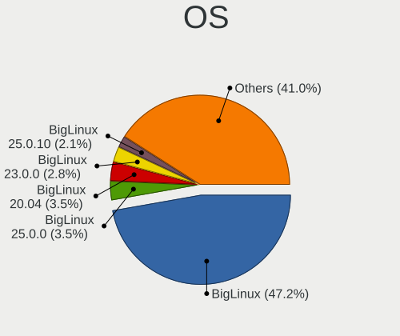

| Name                      | Desktops | Percent |
|---------------------------|----------|---------|
| BigLinux                  | 68       | 47.22%  |
| BigLinux 25.0.0           | 5        | 3.47%   |
| BigLinux 20.04            | 5        | 3.47%   |
| BigLinux 23.0.0           | 4        | 2.78%   |
| BigLinux 25.0.10          | 3        | 2.08%   |
| BigLinux 23.1.0           | 3        | 2.08%   |
| BigLinux 22.0.4           | 3        | 2.08%   |
| BigLinux 24.2.1           | 2        | 1.39%   |
| BigLinux 24.0.8           | 2        | 1.39%   |
| BigLinux 24.0.2           | 2        | 1.39%   |
| BigLinux 23.02.20         | 2        | 1.39%   |
| BigLinux 23.0.1           | 2        | 1.39%   |
| BigLinux 22.1.0           | 2        | 1.39%   |
| BigLinux 22.0.0           | 2        | 1.39%   |
| BigLinux 21.3.5           | 2        | 1.39%   |
| BigLinux 2024-12-20       | 2        | 1.39%   |
| BigLinux 2024-03-08_05-13 | 2        | 1.39%   |
| BigLinux 2023-12-01_05-13 | 2        | 1.39%   |
| BigLinux 25.1.0           | 1        | 0.69%   |
| BigLinux 25.0.9           | 1        | 0.69%   |
| BigLinux 25.0.8           | 1        | 0.69%   |
| BigLinux 25.0.7           | 1        | 0.69%   |
| BigLinux 24.1.1           | 1        | 0.69%   |
| BigLinux 24.0.6           | 1        | 0.69%   |
| BigLinux 24.0.4           | 1        | 0.69%   |
| BigLinux 24.0.0           | 1        | 0.69%   |
| BigLinux 23.1.3           | 1        | 0.69%   |
| BigLinux 23.1.2           | 1        | 0.69%   |
| BigLinux 23.02.24         | 1        | 0.69%   |
| BigLinux 23.02.07         | 1        | 0.69%   |
| BigLinux 23.01.30         | 1        | 0.69%   |
| BigLinux 23.0.3           | 1        | 0.69%   |
| BigLinux 22.12.24         | 1        | 0.69%   |
| BigLinux 22.10.28         | 1        | 0.69%   |
| BigLinux 22.1.1           | 1        | 0.69%   |
| BigLinux 22.09.09         | 1        | 0.69%   |
| BigLinux 22.0.2           | 1        | 0.69%   |
| BigLinux 21.3.7           | 1        | 0.69%   |
| BigLinux 2025-06-27       | 1        | 0.69%   |
| BigLinux 2025-03-15       | 1        | 0.69%   |

OS Family
---------

OS without a version

| Name     | Desktops | Percent |
|----------|----------|---------|
| BigLinux | 135      | 100%    |

Kernel
------

Version of the Linux kernel

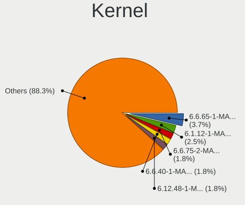

| Version                | Desktops | Percent |
|------------------------|----------|---------|
| 6.6.65-1-MANJARO       | 6        | 3.68%   |
| 6.1.12-1-MANJARO       | 4        | 2.45%   |
| 6.6.75-2-MANJARO       | 3        | 1.84%   |
| 6.6.40-1-MANJARO       | 3        | 1.84%   |
| 6.12.48-1-MANJARO      | 3        | 1.84%   |
| 6.10.6-10-MANJARO      | 3        | 1.84%   |
| 6.1.71-1-MANJARO       | 3        | 1.84%   |
| 6.1.55-1-MANJARO       | 3        | 1.84%   |
| 6.9.5-1-MANJARO        | 2        | 1.23%   |
| 6.6.83-1-MANJARO       | 2        | 1.23%   |
| 6.6.63-1-MANJARO       | 2        | 1.23%   |
| 6.6.54-2-MANJARO       | 2        | 1.23%   |
| 6.6.44-1-MANJARO       | 2        | 1.23%   |
| 6.6.34-1-MANJARO       | 2        | 1.23%   |
| 6.6.30-2-MANJARO       | 2        | 1.23%   |
| 6.6.3-1-MANJARO        | 2        | 1.23%   |
| 6.6.26-1-MANJARO       | 2        | 1.23%   |
| 6.4.12-1-MANJARO       | 2        | 1.23%   |
| 6.14.0-1-MANJARO       | 2        | 1.23%   |
| 6.12.41-1-MANJARO      | 2        | 1.23%   |
| 6.12.34-1-MANJARO      | 2        | 1.23%   |
| 6.12.28-1-MANJARO      | 2        | 1.23%   |
| 6.12.20-2-MANJARO      | 2        | 1.23%   |
| 6.12.19-1-MANJARO      | 2        | 1.23%   |
| 6.1.85-1-MANJARO       | 2        | 1.23%   |
| 6.1.64-1-MANJARO       | 2        | 1.23%   |
| 6.1.62-1-MANJARO       | 2        | 1.23%   |
| 6.1.51-1-MANJARO       | 2        | 1.23%   |
| 6.1.31-2-MANJARO       | 2        | 1.23%   |
| 6.1.106-1-MANJARO      | 2        | 1.23%   |
| 5.4.0-37-generic       | 2        | 1.23%   |
| 5.15.94-1-MANJARO      | 2        | 1.23%   |
| 5.15.71-1-MANJARO      | 2        | 1.23%   |
| 5.15.60-1-MANJARO      | 2        | 1.23%   |
| 6.9.3-3-MANJARO        | 1        | 0.61%   |
| 6.9.12-3-MANJARO       | 1        | 0.61%   |
| 6.9.10-1-MANJARO       | 1        | 0.61%   |
| 6.8.9-3-MANJARO        | 1        | 0.61%   |
| 6.8.5-1-MANJARO        | 1        | 0.61%   |
| 6.7.10-x64v2-xanmod1-1 | 1        | 0.61%   |

Kernel Family
-------------

Linux kernel without a distro release

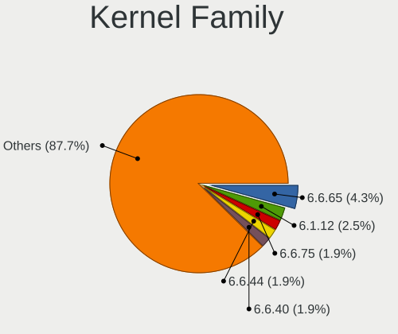

| Version | Desktops | Percent |
|---------|----------|---------|
| 6.6.65  | 7        | 4.32%   |
| 6.1.12  | 4        | 2.47%   |
| 6.6.75  | 3        | 1.85%   |
| 6.6.44  | 3        | 1.85%   |
| 6.6.40  | 3        | 1.85%   |
| 6.6.30  | 3        | 1.85%   |
| 6.12.48 | 3        | 1.85%   |
| 6.10.6  | 3        | 1.85%   |
| 6.1.71  | 3        | 1.85%   |
| 6.1.62  | 3        | 1.85%   |
| 6.1.55  | 3        | 1.85%   |
| 5.4.0   | 3        | 1.85%   |
| 6.9.5   | 2        | 1.23%   |
| 6.6.83  | 2        | 1.23%   |
| 6.6.63  | 2        | 1.23%   |
| 6.6.54  | 2        | 1.23%   |
| 6.6.34  | 2        | 1.23%   |
| 6.6.32  | 2        | 1.23%   |
| 6.6.3   | 2        | 1.23%   |
| 6.6.26  | 2        | 1.23%   |
| 6.4.12  | 2        | 1.23%   |
| 6.14.0  | 2        | 1.23%   |
| 6.12.61 | 2        | 1.23%   |
| 6.12.41 | 2        | 1.23%   |
| 6.12.34 | 2        | 1.23%   |
| 6.12.28 | 2        | 1.23%   |
| 6.12.20 | 2        | 1.23%   |
| 6.12.19 | 2        | 1.23%   |
| 6.1.9   | 2        | 1.23%   |
| 6.1.85  | 2        | 1.23%   |
| 6.1.64  | 2        | 1.23%   |
| 6.1.51  | 2        | 1.23%   |
| 6.1.31  | 2        | 1.23%   |
| 6.1.106 | 2        | 1.23%   |
| 5.15.94 | 2        | 1.23%   |
| 5.15.71 | 2        | 1.23%   |
| 5.15.60 | 2        | 1.23%   |
| 6.9.3   | 1        | 0.62%   |
| 6.9.12  | 1        | 0.62%   |
| 6.9.10  | 1        | 0.62%   |

Kernel Major Ver.
-----------------

Linux kernel major version

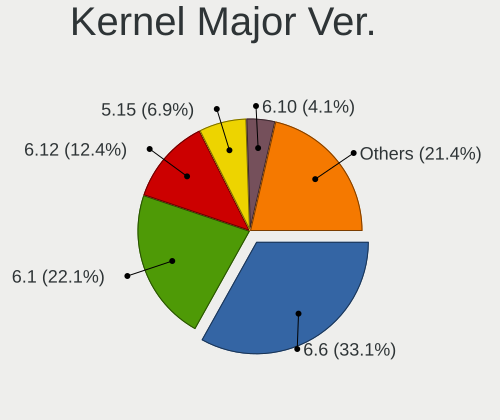

| Version | Desktops | Percent |
|---------|----------|---------|
| 6.6     | 48       | 33.1%   |
| 6.1     | 32       | 22.07%  |
| 6.12    | 18       | 12.41%  |
| 5.15    | 10       | 6.9%    |
| 6.10    | 6        | 4.14%   |
| 6.9     | 5        | 3.45%   |
| 5.4     | 3        | 2.07%   |
| 6.8     | 2        | 1.38%   |
| 6.7     | 2        | 1.38%   |
| 6.5     | 2        | 1.38%   |
| 6.4     | 2        | 1.38%   |
| 6.14    | 2        | 1.38%   |
| 6.11    | 2        | 1.38%   |
| 6.2     | 1        | 0.69%   |
| 6.18    | 1        | 0.69%   |
| 6.17    | 1        | 0.69%   |
| 6.16    | 1        | 0.69%   |
| 6.15    | 1        | 0.69%   |
| 6.13    | 1        | 0.69%   |
| 5.8     | 1        | 0.69%   |
| 5.7     | 1        | 0.69%   |
| 5.6     | 1        | 0.69%   |
| 5.17    | 1        | 0.69%   |
| 5.16    | 1        | 0.69%   |

Arch
----

OS architecture (x86_64, i586, etc.)

| Name   | Desktops | Percent |
|--------|----------|---------|
| x86_64 | 135      | 100%    |

DE
--

Desktop Environment

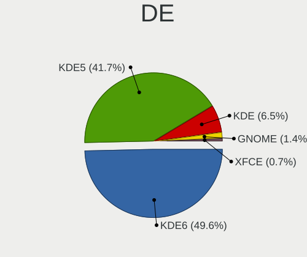

| Name  | Desktops | Percent |
|-------|----------|---------|
| KDE6  | 69       | 49.64%  |
| KDE5  | 58       | 41.73%  |
| KDE   | 9        | 6.47%   |
| GNOME | 2        | 1.44%   |
| XFCE  | 1        | 0.72%   |

Display Server
--------------

X11 or Wayland

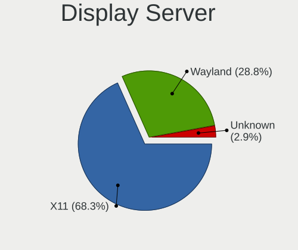

| Name    | Desktops | Percent |
|---------|----------|---------|
| X11     | 95       | 68.35%  |
| Wayland | 40       | 28.78%  |
| Unknown | 4        | 2.88%   |

Display Manager
---------------

SDDM, LightDM, etc.

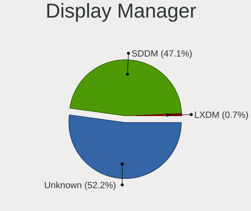

| Name    | Desktops | Percent |
|---------|----------|---------|
| Unknown | 72       | 52.17%  |
| SDDM    | 65       | 47.1%   |
| LXDM    | 1        | 0.72%   |

OS Lang
-------

Language

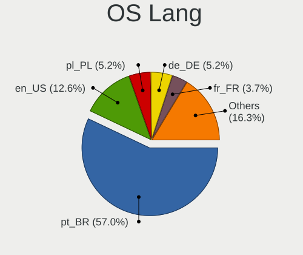

| Lang  | Desktops | Percent |
|-------|----------|---------|
| pt_BR | 77       | 57.04%  |
| en_US | 17       | 12.59%  |
| pl_PL | 7        | 5.19%   |
| de_DE | 7        | 5.19%   |
| fr_FR | 5        | 3.7%    |
| pt_PT | 4        | 2.96%   |
| it_IT | 3        | 2.22%   |
| es_AR | 3        | 2.22%   |
| en_GB | 3        | 2.22%   |
| hu_HU | 2        | 1.48%   |
| es_MX | 2        | 1.48%   |
| ru_RU | 1        | 0.74%   |
| es_ES | 1        | 0.74%   |
| es_CO | 1        | 0.74%   |
| es_CL | 1        | 0.74%   |
| de_AT | 1        | 0.74%   |

Boot Mode
---------

EFI or BIOS

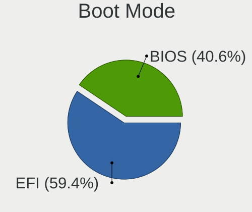

| Mode | Desktops | Percent |
|------|----------|---------|
| EFI  | 82       | 59.42%  |
| BIOS | 56       | 40.58%  |

Filesystem
----------

Type of filesystem

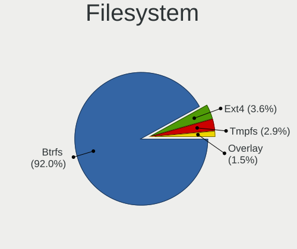

| Type    | Desktops | Percent |
|---------|----------|---------|
| Btrfs   | 126      | 91.97%  |
| Ext4    | 5        | 3.65%   |
| Tmpfs   | 4        | 2.92%   |
| Overlay | 2        | 1.46%   |

Part. scheme
------------

Scheme of partitioning

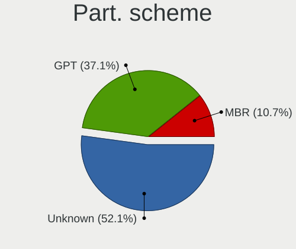

| Type    | Desktops | Percent |
|---------|----------|---------|
| Unknown | 73       | 52.14%  |
| GPT     | 52       | 37.14%  |
| MBR     | 15       | 10.71%  |

Dual Boot with Linux/BSD
------------------------

Hosting more than one Linux/BSD

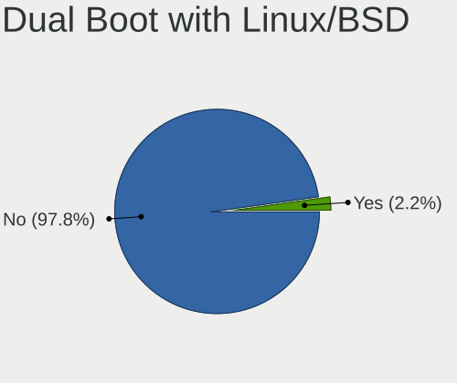

| Dual boot | Desktops | Percent |
|-----------|----------|---------|
| No        | 132      | 97.78%  |
| Yes       | 3        | 2.22%   |

Dual Boot (Win)
---------------

Hosting Linux and Windows

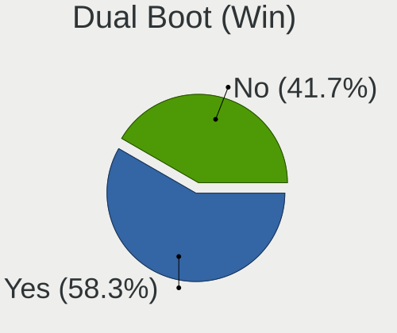

| Dual boot | Desktops | Percent |
|-----------|----------|---------|
| No        | 94       | 68.12%  |
| Yes       | 44       | 31.88%  |

Board
-----

Vendor
------

Motherboard manufacturer

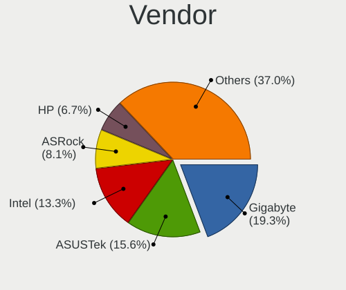

| Name                | Desktops | Percent |
|---------------------|----------|---------|
| Gigabyte Technology | 26       | 19.26%  |
| ASUSTek Computer    | 21       | 15.56%  |
| Intel               | 18       | 13.33%  |
| ASRock              | 11       | 8.15%   |
| Hewlett-Packard     | 9        | 6.67%   |
| MSI                 | 8        | 5.93%   |
| PCWare              | 6        | 4.44%   |
| Lenovo              | 5        | 3.7%    |
| Biostar             | 4        | 2.96%   |
| Positivo            | 3        | 2.22%   |
| Dell                | 3        | 2.22%   |
| OEM                 | 2        | 1.48%   |
| Itautec             | 2        | 1.48%   |
| ECS                 | 2        | 1.48%   |
| Semp Toshiba        | 1        | 0.74%   |
| QIYIDA              | 1        | 0.74%   |
| Pegatron            | 1        | 0.74%   |
| MAXSUN              | 1        | 0.74%   |
| Mancer              | 1        | 0.74%   |
| MACHINIST           | 1        | 0.74%   |
| Fujitsu             | 1        | 0.74%   |
| eMachines           | 1        | 0.74%   |
| DUEX                | 1        | 0.74%   |
| Digiboard           | 1        | 0.74%   |
| Daten Tecnologia    | 1        | 0.74%   |
| BESSTAR Tech        | 1        | 0.74%   |
| AZW                 | 1        | 0.74%   |
| AOpen               | 1        | 0.74%   |
| Unknown             | 1        | 0.74%   |

Model
-----

Motherboard model

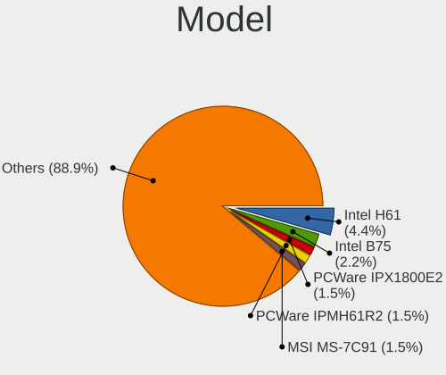

| Name                                                         | Desktops | Percent |
|--------------------------------------------------------------|----------|---------|
| Intel H61                                                    | 6        | 4.44%   |
| Intel B75                                                    | 3        | 2.22%   |
| PCWare IPX1800E2                                             | 2        | 1.48%   |
| PCWare IPMH61R2                                              | 2        | 1.48%   |
| MSI MS-7C91                                                  | 2        | 1.48%   |
| HP Compaq 8200 Elite SFF PC                                  | 2        | 1.48%   |
| Gigabyte B650 GAMING X AX                                    | 2        | 1.48%   |
| Gigabyte 970A-DS3P                                           | 2        | 1.48%   |
| Biostar B450MH                                               | 2        | 1.48%   |
| ASRock B450M Steel Legend                                    | 2        | 1.48%   |
| ASRock 775Dual-VSTA                                          | 2        | 1.48%   |
| Semp Toshiba STI                                             | 1        | 0.74%   |
| QIYIDA X99 K9S                                               | 1        | 0.74%   |
| Positivo POS-MIH61CF                                         | 1        | 0.74%   |
| Positivo POS-EIH61CQ                                         | 1        | 0.74%   |
| Positivo C4400                                               | 1        | 0.74%   |
| Pegatron IPM41-D3                                            | 1        | 0.74%   |
| PCWare IPMH81G1                                              | 1        | 0.74%   |
| PCWare IPMH61R3                                              | 1        | 0.74%   |
| OEM MCR-A520M-DXV4                                           | 1        | 0.74%   |
| OEM B75                                                      | 1        | 0.74%   |
| MSI MS-7D31                                                  | 1        | 0.74%   |
| MSI MS-7C95                                                  | 1        | 0.74%   |
| MSI MS-7A70                                                  | 1        | 0.74%   |
| MSI MS-7888                                                  | 1        | 0.74%   |
| MSI MS-7846                                                  | 1        | 0.74%   |
| MSI MS-7821                                                  | 1        | 0.74%   |
| MAXSUN MS-Challenger B760M                                   | 1        | 0.74%   |
| Mancer B450M-DA                                              | 1        | 0.74%   |
| MACHINIST E5-V2.82H V1.1                                     | 1        | 0.74%   |
| Lenovo ThinkCentre M93p 10AB0010US                           | 1        | 0.74%   |
| Lenovo ThinkCentre M91p 7005A21                              | 1        | 0.74%   |
| Lenovo ThinkCentre M710s 10M8SBAT00                          | 1        | 0.74%   |
| Lenovo 63 90AT005JBR                                         | 1        | 0.74%   |
| Lenovo 63 90AT0002BR                                         | 1        | 0.74%   |
| Itautec Infoway SM-3330                                      | 1        | 0.74%   |
| Itautec Infoway                                              | 1        | 0.74%   |
| Intel Z590                                                   | 1        | 0.74%   |
| Intel X79 (INTEL Xeon E5/Corei7 DMI2 - C600/C200 Cipset V307 | 1        | 0.74%   |
| Intel X64                                                    | 1        | 0.74%   |

Model Family
------------

Motherboard model prefix

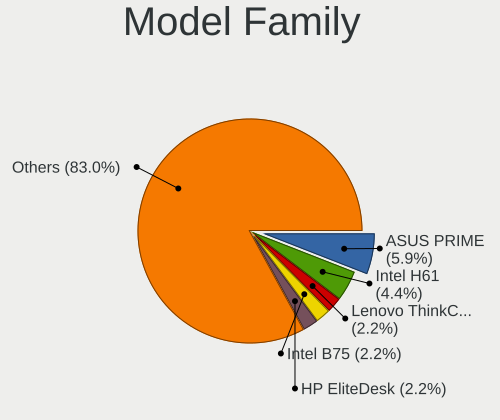

| Name                 | Desktops | Percent |
|----------------------|----------|---------|
| ASUS PRIME           | 8        | 5.93%   |
| Intel H61            | 6        | 4.44%   |
| Lenovo ThinkCentre   | 3        | 2.22%   |
| Intel B75            | 3        | 2.22%   |
| HP EliteDesk         | 3        | 2.22%   |
| HP Compaq            | 3        | 2.22%   |
| ASUS TUF             | 3        | 2.22%   |
| ASRock B450M         | 3        | 2.22%   |
| PCWare IPX1800E2     | 2        | 1.48%   |
| PCWare IPMH61R2      | 2        | 1.48%   |
| MSI MS-7C91          | 2        | 1.48%   |
| Lenovo 63            | 2        | 1.48%   |
| Itautec Infoway      | 2        | 1.48%   |
| Gigabyte B650        | 2        | 1.48%   |
| Gigabyte B450M       | 2        | 1.48%   |
| Gigabyte A520M       | 2        | 1.48%   |
| Gigabyte 970A-DS3P   | 2        | 1.48%   |
| Dell Precision       | 2        | 1.48%   |
| Biostar B450MH       | 2        | 1.48%   |
| ASUS P8H61-M         | 2        | 1.48%   |
| ASRock 775Dual-VSTA  | 2        | 1.48%   |
| Semp Toshiba STI     | 1        | 0.74%   |
| QIYIDA X99           | 1        | 0.74%   |
| Positivo POS-MIH61CF | 1        | 0.74%   |
| Positivo POS-EIH61CQ | 1        | 0.74%   |
| Positivo C4400       | 1        | 0.74%   |
| Pegatron IPM41-D3    | 1        | 0.74%   |
| PCWare IPMH81G1      | 1        | 0.74%   |
| PCWare IPMH61R3      | 1        | 0.74%   |
| OEM MCR-A520M-DXV4   | 1        | 0.74%   |
| OEM B75              | 1        | 0.74%   |
| MSI MS-7D31          | 1        | 0.74%   |
| MSI MS-7C95          | 1        | 0.74%   |
| MSI MS-7A70          | 1        | 0.74%   |
| MSI MS-7888          | 1        | 0.74%   |
| MSI MS-7846          | 1        | 0.74%   |
| MSI MS-7821          | 1        | 0.74%   |
| MAXSUN MS-Challenger | 1        | 0.74%   |
| Mancer B450M-DA      | 1        | 0.74%   |
| MACHINIST E5-V2.82H  | 1        | 0.74%   |

MFG Year
--------

Motherboard manufacture year

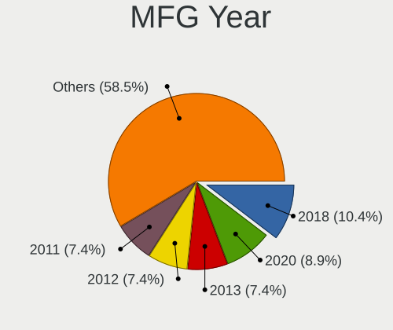

| Year | Desktops | Percent |
|------|----------|---------|
| 2018 | 14       | 10.37%  |
| 2020 | 12       | 8.89%   |
| 2013 | 10       | 7.41%   |
| 2012 | 10       | 7.41%   |
| 2011 | 10       | 7.41%   |
| 2009 | 10       | 7.41%   |
| 2023 | 9        | 6.67%   |
| 2014 | 9        | 6.67%   |
| 2010 | 8        | 5.93%   |
| 2021 | 7        | 5.19%   |
| 2017 | 7        | 5.19%   |
| 2022 | 6        | 4.44%   |
| 2019 | 5        | 3.7%    |
| 2016 | 5        | 3.7%    |
| 2024 | 4        | 2.96%   |
| 2015 | 3        | 2.22%   |
| 2008 | 2        | 1.48%   |
| 2006 | 2        | 1.48%   |
| 2007 | 1        | 0.74%   |
| 2005 | 1        | 0.74%   |

Form Factor
-----------

Physical design of the computer

| Name    | Desktops | Percent |
|---------|----------|---------|
| Desktop | 135      | 100%    |

Secure Boot
-----------

Enabled or disabled

| State    | Desktops | Percent |
|----------|----------|---------|
| Disabled | 134      | 99.26%  |
| Enabled  | 1        | 0.74%   |

Coreboot
--------

Have coreboot on board

| Used | Desktops | Percent |
|------|----------|---------|
| No   | 135      | 100%    |

RAM Size
--------

Total RAM memory

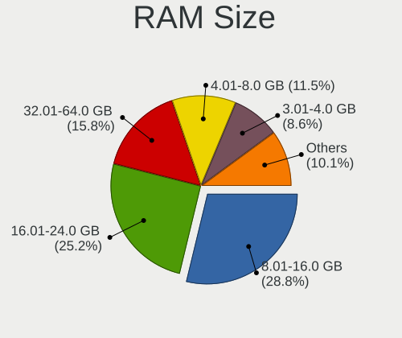

| Size in GB  | Desktops | Percent |
|-------------|----------|---------|
| 8.01-16.0   | 40       | 28.78%  |
| 16.01-24.0  | 35       | 25.18%  |
| 32.01-64.0  | 22       | 15.83%  |
| 4.01-8.0    | 16       | 11.51%  |
| 3.01-4.0    | 12       | 8.63%   |
| 24.01-32.0  | 6        | 4.32%   |
| 64.01-256.0 | 4        | 2.88%   |
| 2.01-3.0    | 3        | 2.16%   |
| 1.01-2.0    | 1        | 0.72%   |

RAM Used
--------

Used RAM memory

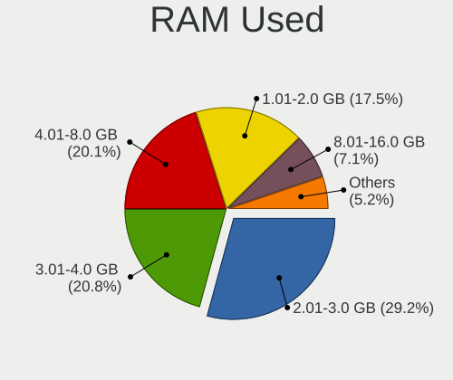

| Used GB    | Desktops | Percent |
|------------|----------|---------|
| 2.01-3.0   | 45       | 29.22%  |
| 3.01-4.0   | 32       | 20.78%  |
| 4.01-8.0   | 31       | 20.13%  |
| 1.01-2.0   | 27       | 17.53%  |
| 8.01-16.0  | 11       | 7.14%   |
| 0.51-1.0   | 5        | 3.25%   |
| 24.01-32.0 | 1        | 0.65%   |
| 16.01-24.0 | 1        | 0.65%   |
| 0.01-0.5   | 1        | 0.65%   |

Total Drives
------------

Number of drives on board

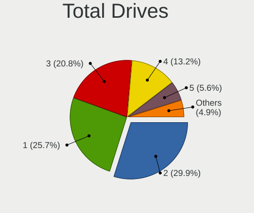

| Drives | Desktops | Percent |
|--------|----------|---------|
| 2      | 43       | 29.86%  |
| 1      | 37       | 25.69%  |
| 3      | 30       | 20.83%  |
| 4      | 19       | 13.19%  |
| 5      | 8        | 5.56%   |
| 6      | 4        | 2.78%   |
| 9      | 2        | 1.39%   |
| 0      | 1        | 0.69%   |

Has CD-ROM
----------

Has CD-ROM on board

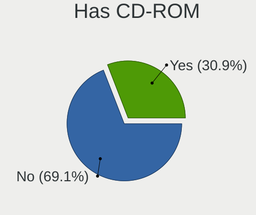

| Presented | Desktops | Percent |
|-----------|----------|---------|
| No        | 94       | 69.12%  |
| Yes       | 42       | 30.88%  |

Has Ethernet
------------

Has Ethernet on board

| Presented | Desktops | Percent |
|-----------|----------|---------|
| Yes       | 135      | 100%    |

Has WiFi
--------

Has WiFi module

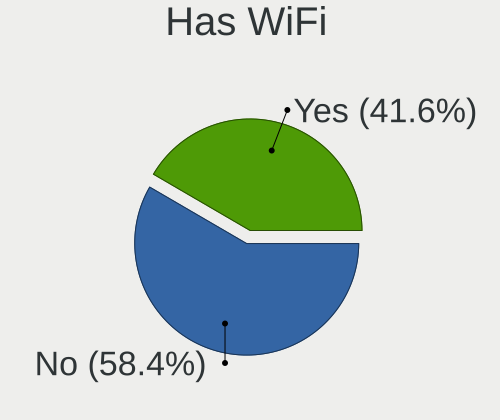

| Presented | Desktops | Percent |
|-----------|----------|---------|
| No        | 80       | 58.39%  |
| Yes       | 57       | 41.61%  |

Has Bluetooth
-------------

Has Bluetooth module

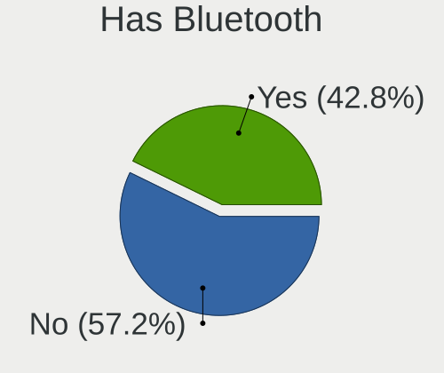

| Presented | Desktops | Percent |
|-----------|----------|---------|
| No        | 79       | 57.25%  |
| Yes       | 59       | 42.75%  |

Location
--------

Country
-------

Geographic location (country)

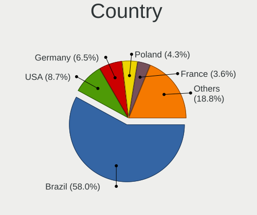

| Country         | Desktops | Percent |
|-----------------|----------|---------|
| Brazil          | 80       | 57.97%  |
| USA             | 12       | 8.7%    |
| Germany         | 9        | 6.52%   |
| Poland          | 6        | 4.35%   |
| France          | 5        | 3.62%   |
| UK              | 4        | 2.9%    |
| Portugal        | 3        | 2.17%   |
| Italy           | 3        | 2.17%   |
| Argentina       | 3        | 2.17%   |
| Mexico          | 2        | 1.45%   |
| The Netherlands | 1        | 0.72%   |
| Spain           | 1        | 0.72%   |
| Russia          | 1        | 0.72%   |
| Netherlands     | 1        | 0.72%   |
| Japan           | 1        | 0.72%   |
| Hungary         | 1        | 0.72%   |
| Greece          | 1        | 0.72%   |
| Colombia        | 1        | 0.72%   |
| Chile           | 1        | 0.72%   |
| Bangladesh      | 1        | 0.72%   |
| Austria         | 1        | 0.72%   |

City
----

Geographic location (city)

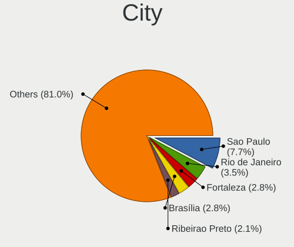

| City                   | Desktops | Percent |
|------------------------|----------|---------|
| Sao Paulo              | 11       | 7.75%   |
| Rio de Janeiro         | 5        | 3.52%   |
| Fortaleza              | 4        | 2.82%   |
| Brasília              | 4        | 2.82%   |
| Ribeirao Preto         | 3        | 2.11%   |
| Maringá               | 3        | 2.11%   |
| Goiânia               | 3        | 2.11%   |
| Belo Horizonte         | 3        | 2.11%   |
| Osasco                 | 2        | 1.41%   |
| Duque de Caxias        | 2        | 1.41%   |
| Darmstadt              | 2        | 1.41%   |
| Würzburg              | 1        | 0.7%    |
| Wiener Neustadt        | 1        | 0.7%    |
| Walsall                | 1        | 0.7%    |
| Villa Bosch            | 1        | 0.7%    |
| Vila Velha             | 1        | 0.7%    |
| Vila Nova de Famalicao | 1        | 0.7%    |
| Viçosa                | 1        | 0.7%    |
| Venda do Pinheiro      | 1        | 0.7%    |
| Tychy                  | 1        | 0.7%    |
| Toulouse               | 1        | 0.7%    |
| Torun                  | 1        | 0.7%    |
| Tomsk                  | 1        | 0.7%    |
| Tokyo                  | 1        | 0.7%    |
| Tlajomulco de Zuniga   | 1        | 0.7%    |
| Timon                  | 1        | 0.7%    |
| Thessaloniki           | 1        | 0.7%    |
| The Villages           | 1        | 0.7%    |
| Texarkana              | 1        | 0.7%    |
| Szigetujfalu           | 1        | 0.7%    |
| Shetland Islands       | 1        | 0.7%    |
| Serra                  | 1        | 0.7%    |
| Seattle                | 1        | 0.7%    |
| Sao Joaquim da Barra   | 1        | 0.7%    |
| Sao Domingos do Capim  | 1        | 0.7%    |
| Santo André           | 1        | 0.7%    |
| Santiago de Cali       | 1        | 0.7%    |
| Santa Maria            | 1        | 0.7%    |
| Santa Gertrudes        | 1        | 0.7%    |
| Santa Cruz de Tenerife | 1        | 0.7%    |

Drives
------

Drive Vendor
------------

Hard drive vendors

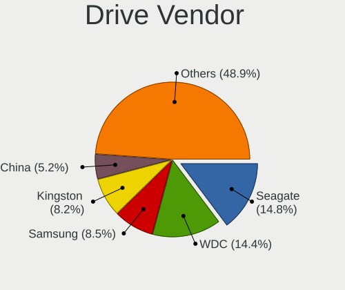

| Vendor                         | Desktops | Drives | Percent |
|--------------------------------|----------|--------|---------|
| Seagate                        | 45       | 70     | 14.75%  |
| WDC                            | 44       | 70     | 14.43%  |
| Samsung Electronics            | 26       | 39     | 8.52%   |
| Kingston                       | 25       | 32     | 8.2%    |
| China                          | 16       | 20     | 5.25%   |
| Toshiba                        | 14       | 15     | 4.59%   |
| SanDisk                        | 12       | 12     | 3.93%   |
| Silicon Motion                 | 10       | 13     | 3.28%   |
| Hitachi                        | 10       | 23     | 3.28%   |
| Crucial                        | 8        | 9      | 2.62%   |
| MAXIO Technology (Hangzhou)    | 7        | 10     | 2.3%    |
| Micron/Crucial Technology      | 6        | 6      | 1.97%   |
| PNY                            | 5        | 6      | 1.64%   |
| Kingston Technology Company    | 4        | 4      | 1.31%   |
| ADATA Technology               | 4        | 5      | 1.31%   |
| A-DATA Technology              | 4        | 6      | 1.31%   |
| Unknown                        | 3        | 3      | 0.98%   |
| KingSpec                       | 3        | 3      | 0.98%   |
| XrayDisk                       | 2        | 2      | 0.66%   |
| X12                            | 2        | 3      | 0.66%   |
| Team                           | 2        | 3      | 0.66%   |
| Shenzhen Longsys Electronics   | 2        | 2      | 0.66%   |
| Realtek Semiconductor          | 2        | 2      | 0.66%   |
| Patriot                        | 2        | 2      | 0.66%   |
| Lexar                          | 2        | 4      | 0.66%   |
| JMicron Technology             | 2        | 2      | 0.66%   |
| Intenso                        | 2        | 3      | 0.66%   |
| Intel                          | 2        | 2      | 0.66%   |
| HUSKY                          | 2        | 4      | 0.66%   |
| GOODRAM                        | 2        | 2      | 0.66%   |
| BHT                            | 2        | 2      | 0.66%   |
| Apacer                         | 2        | 2      | 0.66%   |
| Unknown                        | 2        | 2      | 0.66%   |
| XUM                            | 1        | 1      | 0.33%   |
| WALRAM                         | 1        | 1      | 0.33%   |
| Verbatim                       | 1        | 2      | 0.33%   |
| Solid State Storage Technology | 1        | 2      | 0.33%   |
| SABRENT                        | 1        | 2      | 0.33%   |
| S3+                            | 1        | 1      | 0.33%   |
| Realtek                        | 1        | 1      | 0.33%   |

Drive Model
-----------

Hard drive models

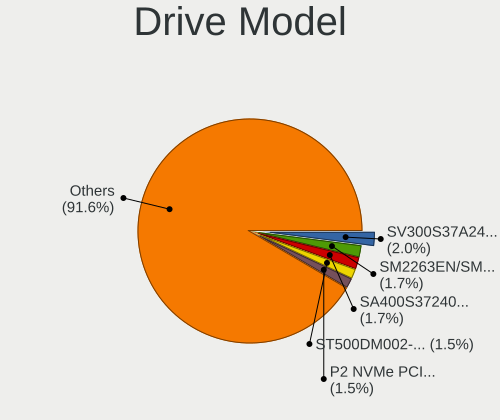

| Model                                                                 | Desktops | Percent |
|-----------------------------------------------------------------------|----------|---------|
| Kingston SV300S37A240G 240GB SSD                                      | 7        | 2.03%   |
| Silicon Motion SM2263EN/SM2263XT SSD Controller 512GB                 | 6        | 1.74%   |
| Kingston SA400S37240G 240GB SSD                                       | 6        | 1.74%   |
| Seagate ST500DM002-1BD142 500GB                                       | 5        | 1.45%   |
| Micron/Crucial P2 NVMe PCIe SSD 2TB                                   | 5        | 1.45%   |
| Kingston SA400S37480G 480GB SSD                                       | 5        | 1.45%   |
| Samsung SSD 870 QVO 2TB                                               | 4        | 1.16%   |
| WDC WD5000AVDS-63U7B1 500GB                                           | 3        | 0.87%   |
| WDC WD10SPZX-80Z10T2 1TB                                              | 3        | 0.87%   |
| Toshiba MQ01ABD050V -63 500GB                                         | 3        | 0.87%   |
| Toshiba DT01ACA050 500GB                                              | 3        | 0.87%   |
| Silicon Motion SM2262/SM2262EN SSD Controller 960GB                   | 3        | 0.87%   |
| Seagate ST500LM012 HN-M500MBB 500GB                                   | 3        | 0.87%   |
| Seagate ST1000DM010-2EP102 1TB                                        | 3        | 0.87%   |
| MAXIO (Hangzhou) NVMe SSD Controller MAP1202 2TB                      | 3        | 0.87%   |
| X12 SSD 512GB                                                         | 2        | 0.58%   |
| WDC WDS480G2G0A-00JH30 480GB SSD                                      | 2        | 0.58%   |
| WDC WD5000AAKX-60U6AA0 500GB                                          | 2        | 0.58%   |
| WDC WD20EZRX-00D8PB0 2TB                                              | 2        | 0.58%   |
| WDC WD10JPVX-22JC3T0 1TB                                              | 2        | 0.58%   |
| WDC WD10EZEX-08WN4A0 1TB                                              | 2        | 0.58%   |
| WDC WD1001FALS-41Y6A1 1TB                                             | 2        | 0.58%   |
| WDC WD Green 2.5 1000GB                                               | 2        | 0.58%   |
| Silicon Motion SM2263EN/SM2263XT (DRAM-less) NVMe SSD Controllers 1TB | 2        | 0.58%   |
| Seagate ST9250410AS 250GB                                             | 2        | 0.58%   |
| Seagate ST4000DM004-2CV104 4TB                                        | 2        | 0.58%   |
| Seagate ST31000528AS 1TB                                              | 2        | 0.58%   |
| Seagate ST2000DM008-2UB102 2TB                                        | 2        | 0.58%   |
| Seagate ST2000DM001-1ER164 2TB                                        | 2        | 0.58%   |
| Seagate ST1000DM003-1SB102 1TB                                        | 2        | 0.58%   |
| Seagate ST1000DM003-1ER162 1TB                                        | 2        | 0.58%   |
| Seagate Backup+ Hub BK 6TB                                            | 2        | 0.58%   |
| Samsung SSD 850 EVO 500GB                                             | 2        | 0.58%   |
| Samsung SSD 750 EVO 250GB                                             | 2        | 0.58%   |
| Samsung HM321HI 320GB                                                 | 2        | 0.58%   |
| Samsung HD502HJ 500GB                                                 | 2        | 0.58%   |
| Samsung HD322HJ 320GB                                                 | 2        | 0.58%   |
| Samsung HD161HJ 160GB                                                 | 2        | 0.58%   |
| PNY CS900 240GB SSD                                                   | 2        | 0.58%   |
| MAXIO (Hangzhou) SSD-M2-Blaze GD-704 1024GB                           | 2        | 0.58%   |

HDD Vendor
----------

Hard disk drive vendors

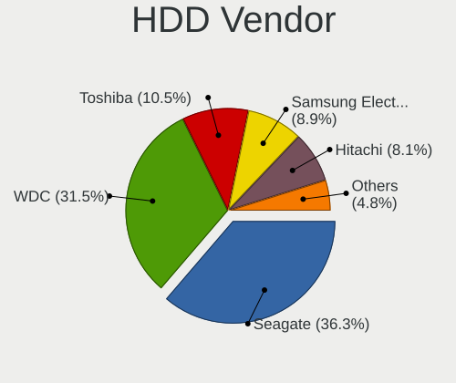

| Vendor              | Desktops | Drives | Percent |
|---------------------|----------|--------|---------|
| Seagate             | 45       | 70     | 36.29%  |
| WDC                 | 39       | 59     | 31.45%  |
| Toshiba             | 13       | 14     | 10.48%  |
| Samsung Electronics | 11       | 17     | 8.87%   |
| Hitachi             | 10       | 23     | 8.06%   |
| Unknown             | 1        | 1      | 0.81%   |
| PRO Z               | 1        | 1      | 0.81%   |
| Maxtor              | 1        | 1      | 0.81%   |
| HGST                | 1        | 3      | 0.81%   |
| ASMedia             | 1        | 1      | 0.81%   |
| Apple               | 1        | 3      | 0.81%   |

SSD Vendor
----------

Solid state drive vendors

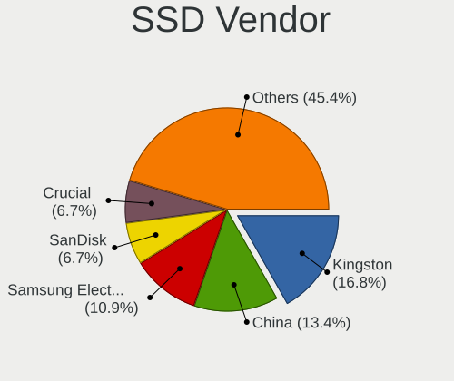

| Vendor              | Desktops | Drives | Percent |
|---------------------|----------|--------|---------|
| Kingston            | 20       | 26     | 16.81%  |
| China               | 16       | 20     | 13.45%  |
| Samsung Electronics | 13       | 19     | 10.92%  |
| SanDisk             | 8        | 8      | 6.72%   |
| Crucial             | 8        | 9      | 6.72%   |
| WDC                 | 7        | 11     | 5.88%   |
| PNY                 | 5        | 6      | 4.2%    |
| A-DATA Technology   | 4        | 6      | 3.36%   |
| KingSpec            | 3        | 3      | 2.52%   |
| X12                 | 2        | 3      | 1.68%   |
| Patriot             | 2        | 2      | 1.68%   |
| Lexar               | 2        | 4      | 1.68%   |
| Intenso             | 2        | 3      | 1.68%   |
| HUSKY               | 2        | 4      | 1.68%   |
| GOODRAM             | 2        | 2      | 1.68%   |
| BHT                 | 2        | 2      | 1.68%   |
| Apacer              | 2        | 2      | 1.68%   |
| Unknown             | 2        | 2      | 1.68%   |
| XUM                 | 1        | 1      | 0.84%   |
| XrayDisk            | 1        | 1      | 0.84%   |
| Verbatim            | 1        | 2      | 0.84%   |
| Toshiba             | 1        | 1      | 0.84%   |
| Team                | 1        | 2      | 0.84%   |
| SABRENT             | 1        | 2      | 0.84%   |
| S3+                 | 1        | 1      | 0.84%   |
| Plextor             | 1        | 1      | 0.84%   |
| Pichau              | 1        | 1      | 0.84%   |
| MACROVIP            | 1        | 1      | 0.84%   |
| LITEON              | 1        | 2      | 0.84%   |
| KLEVV               | 1        | 1      | 0.84%   |
| Kingchuxing         | 1        | 1      | 0.84%   |
| Intel               | 1        | 1      | 0.84%   |
| HS-SSD-C100         | 1        | 1      | 0.84%   |
| ASMT                | 1        | 1      | 0.84%   |
| AFOX                | 1        | 2      | 0.84%   |

Drive Kind
----------

HDD or SSD

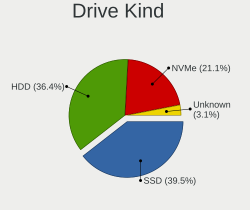

| Kind    | Desktops | Drives | Percent |
|---------|----------|--------|---------|
| SSD     | 90       | 154    | 39.47%  |
| HDD     | 83       | 193    | 36.4%   |
| NVMe    | 48       | 68     | 21.05%  |
| Unknown | 7        | 9      | 3.07%   |

Drive Connector
---------------

SATA, SAS, NVMe, etc.

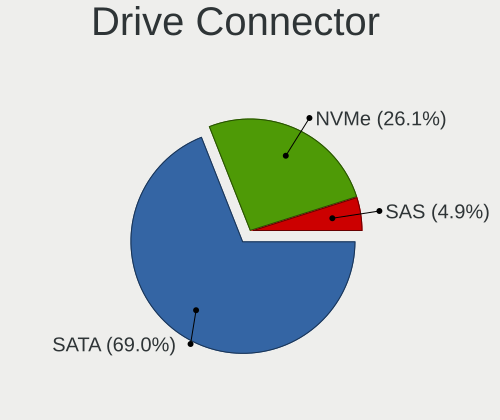

| Type | Desktops | Drives | Percent |
|------|----------|--------|---------|
| SATA | 127      | 341    | 69.02%  |
| NVMe | 48       | 67     | 26.09%  |
| SAS  | 9        | 16     | 4.89%   |

Drive Size
----------

Size of hard drive

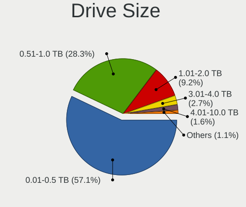

| Size in TB | Desktops | Drives | Percent |
|------------|----------|--------|---------|
| 0.01-0.5   | 105      | 205    | 57.07%  |
| 0.51-1.0   | 52       | 98     | 28.26%  |
| 1.01-2.0   | 17       | 25     | 9.24%   |
| 3.01-4.0   | 5        | 12     | 2.72%   |
| 4.01-10.0  | 3        | 5      | 1.63%   |
| 2.01-3.0   | 2        | 2      | 1.09%   |

Space Total
-----------

Amount of disk space available on the file system

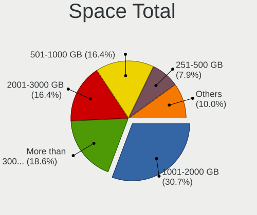

| Size in GB     | Desktops | Percent |
|----------------|----------|---------|
| 1001-2000      | 43       | 30.71%  |
| More than 3000 | 26       | 18.57%  |
| 2001-3000      | 23       | 16.43%  |
| 501-1000       | 23       | 16.43%  |
| 251-500        | 11       | 7.86%   |
| 101-250        | 9        | 6.43%   |
| Unknown        | 4        | 2.86%   |
| 1-20           | 1        | 0.71%   |

Space Used
----------

Amount of used disk space

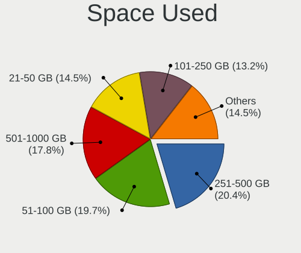

| Used GB        | Desktops | Percent |
|----------------|----------|---------|
| 251-500        | 31       | 20.39%  |
| 51-100         | 30       | 19.74%  |
| 501-1000       | 27       | 17.76%  |
| 21-50          | 22       | 14.47%  |
| 101-250        | 20       | 13.16%  |
| 1001-2000      | 9        | 5.92%   |
| 1-20           | 4        | 2.63%   |
| Unknown        | 4        | 2.63%   |
| 2001-3000      | 3        | 1.97%   |
| More than 3000 | 2        | 1.32%   |

Malfunc. Drives
---------------

Drive models with a malfunction

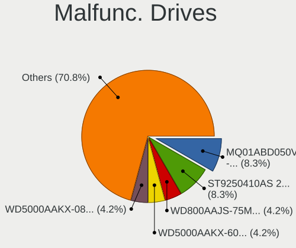

| Model                                                     | Desktops | Drives | Percent |
|-----------------------------------------------------------|----------|--------|---------|
| Toshiba MQ01ABD050V -63 500GB                             | 2        | 2      | 8.33%   |
| Seagate ST9250410AS 250GB                                 | 2        | 2      | 8.33%   |
| WDC WD800AAJS-75M0A0 80GB                                 | 1        | 1      | 4.17%   |
| WDC WD5000AAKX-60U6AA0 500GB                              | 1        | 1      | 4.17%   |
| WDC WD5000AAKX-08U6AA0 500GB                              | 1        | 1      | 4.17%   |
| WDC WD1001FALS-41Y6A1 1TB                                 | 1        | 2      | 4.17%   |
| Toshiba MQ01ABD100 1TB                                    | 1        | 1      | 4.17%   |
| Toshiba DT01ACA100 1TB                                    | 1        | 1      | 4.17%   |
| Toshiba DT01ACA050 500GB                                  | 1        | 1      | 4.17%   |
| Seagate ST9100824AS 100GB                                 | 1        | 1      | 4.17%   |
| Seagate ST8000AS0002-1NA17Z 8TB                           | 1        | 1      | 4.17%   |
| Seagate ST500DM002-1BD142 500GB                           | 1        | 2      | 4.17%   |
| Seagate ST3320613AS 320GB                                 | 1        | 1      | 4.17%   |
| Seagate ST2000LM007-1R8174 2TB                            | 1        | 1      | 4.17%   |
| SanDisk SSD PLUS 120GB                                    | 1        | 1      | 4.17%   |
| Realtek Semiconductor RTS5763DL NVMe SSD Controller 512GB | 1        | 1      | 4.17%   |
| MACROVIP MV240GB                                          | 1        | 1      | 4.17%   |
| Kingchuxing SSD 256GB                                     | 1        | 1      | 4.17%   |
| Hitachi HDS721050DLE630 500GB                             | 1        | 1      | 4.17%   |
| China SSD 500GB                                           | 1        | 1      | 4.17%   |
| China SSD 240GB                                           | 1        | 1      | 4.17%   |
| A-DATA Technology SU630 240GB SSD                         | 1        | 1      | 4.17%   |

Malfunc. Drive Vendor
---------------------

Vendors of faulty drives

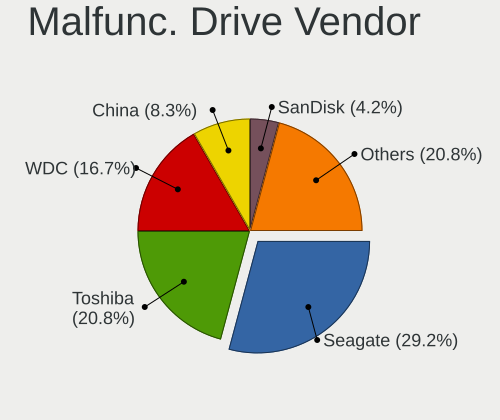

| Vendor                | Desktops | Drives | Percent |
|-----------------------|----------|--------|---------|
| Seagate               | 7        | 8      | 29.17%  |
| Toshiba               | 5        | 5      | 20.83%  |
| WDC                   | 4        | 5      | 16.67%  |
| China                 | 2        | 2      | 8.33%   |
| SanDisk               | 1        | 1      | 4.17%   |
| Realtek Semiconductor | 1        | 1      | 4.17%   |
| MACROVIP              | 1        | 1      | 4.17%   |
| Kingchuxing           | 1        | 1      | 4.17%   |
| Hitachi               | 1        | 1      | 4.17%   |
| A-DATA Technology     | 1        | 1      | 4.17%   |

Malfunc. HDD Vendor
-------------------

Vendors of faulty HDD drives

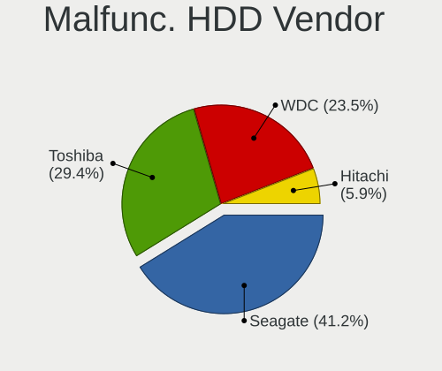

| Vendor  | Desktops | Drives | Percent |
|---------|----------|--------|---------|
| Seagate | 7        | 8      | 41.18%  |
| Toshiba | 5        | 5      | 29.41%  |
| WDC     | 4        | 5      | 23.53%  |
| Hitachi | 1        | 1      | 5.88%   |

Malfunc. Drive Kind
-------------------

Kinds of faulty drives

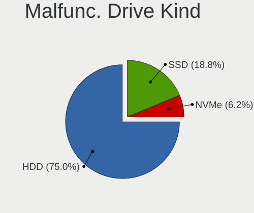

| Kind | Desktops | Drives | Percent |
|------|----------|--------|---------|
| HDD  | 14       | 19     | 70%     |
| SSD  | 5        | 6      | 25%     |
| NVMe | 1        | 1      | 5%      |

Failed Drives
-------------

Failed drive models

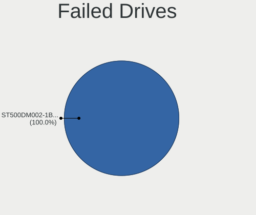

| Model                           | Desktops | Drives | Percent |
|---------------------------------|----------|--------|---------|
| Seagate ST500DM002-1BD142 500GB | 1        | 1      | 100%    |

Failed Drive Vendor
-------------------

Failed drive vendors

| Vendor  | Desktops | Drives | Percent |
|---------|----------|--------|---------|
| Seagate | 1        | 1      | 100%    |

Drive Status
------------

Number of failed and malfunc. drives

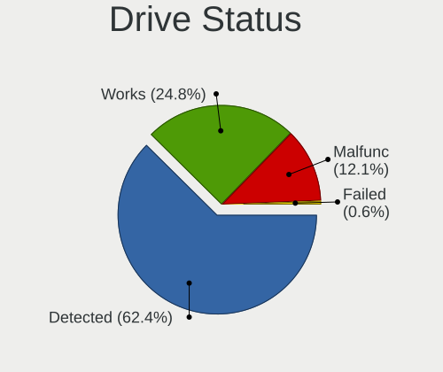

| Status   | Desktops | Drives | Percent |
|----------|----------|--------|---------|
| Detected | 98       | 298    | 62.42%  |
| Works    | 39       | 99     | 24.84%  |
| Malfunc  | 19       | 26     | 12.1%   |
| Failed   | 1        | 1      | 0.64%   |

Storage controller
------------------

Storage Vendor
--------------

Storage controller vendors

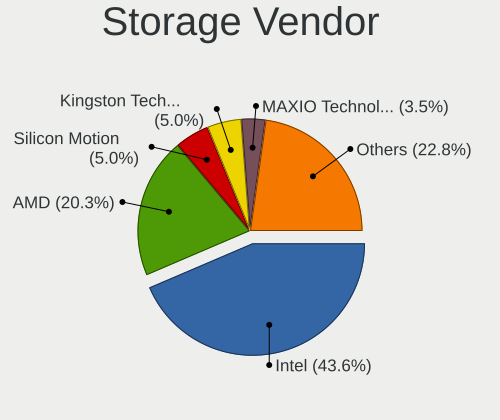

| Vendor                         | Desktops | Percent |
|--------------------------------|----------|---------|
| Intel                          | 88       | 43.56%  |
| AMD                            | 41       | 20.3%   |
| Silicon Motion                 | 10       | 4.95%   |
| Kingston Technology Company    | 10       | 4.95%   |
| MAXIO Technology (Hangzhou)    | 7        | 3.47%   |
| ASMedia Technology             | 7        | 3.47%   |
| Micron/Crucial Technology      | 6        | 2.97%   |
| SanDisk                        | 4        | 1.98%   |
| ADATA Technology               | 4        | 1.98%   |
| VIA Technologies               | 3        | 1.49%   |
| JMicron Technology             | 3        | 1.49%   |
| Shenzhen Longsys Electronics   | 2        | 0.99%   |
| Samsung Electronics            | 2        | 0.99%   |
| Realtek Semiconductor          | 2        | 0.99%   |
| Nvidia                         | 2        | 0.99%   |
| Marvell Technology Group       | 2        | 0.99%   |
| INNOGRIT                       | 2        | 0.99%   |
| Solidigm                       | 1        | 0.5%    |
| Solid State Storage Technology | 1        | 0.5%    |
| Phison Electronics             | 1        | 0.5%    |
| Netac Technology               | 1        | 0.5%    |
| Micron Technology              | 1        | 0.5%    |
| Lite-On IT Corp. / Plextor     | 1        | 0.5%    |
| Hosin Global Electronics       | 1        | 0.5%    |

Storage Model
-------------

Storage controller models

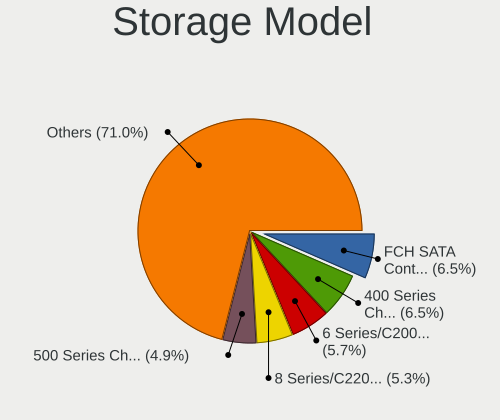

| Model                                                                                   | Desktops | Percent |
|-----------------------------------------------------------------------------------------|----------|---------|
| AMD FCH SATA Controller [AHCI mode]                                                     | 16       | 6.53%   |
| AMD 400 Series Chipset SATA Controller                                                  | 16       | 6.53%   |
| Intel 6 Series/C200 Series Chipset Family 6 port Desktop SATA AHCI Controller           | 14       | 5.71%   |
| Intel 8 Series/C220 Series Chipset Family 6-port SATA Controller 1 [AHCI mode]          | 13       | 5.31%   |
| AMD 500 Series Chipset SATA Controller                                                  | 12       | 4.9%    |
| Intel 7 Series/C210 Series Chipset Family 6-port SATA Controller [AHCI mode]            | 8        | 3.27%   |
| Silicon Motion SM2263EN/SM2263XT (DRAM-less) NVMe SSD Controllers                       | 7        | 2.86%   |
| Intel NM10/ICH7 Family SATA Controller [IDE mode]                                       | 7        | 2.86%   |
| Intel Q170/Q150/B150/H170/H110/Z170/CM236 Chipset SATA Controller [AHCI Mode]           | 6        | 2.45%   |
| Intel 6 Series/C200 Series Chipset Family Desktop SATA Controller (IDE mode, ports 4-5) | 6        | 2.45%   |
| Intel 6 Series/C200 Series Chipset Family Desktop SATA Controller (IDE mode, ports 0-3) | 6        | 2.45%   |
| ASMedia ASM1061/ASM1062 Serial ATA Controller                                           | 6        | 2.45%   |
| Micron/Crucial P2 [Nick P2] / P3 / P3 Plus NVMe PCIe SSD (DRAM-less)                    | 5        | 2.04%   |
| MAXIO (Hangzhou) NVMe SSD Controller MAP1202 (DRAM-less)                                | 5        | 2.04%   |
| Intel Cannon Lake PCH SATA AHCI Controller                                              | 5        | 2.04%   |
| Intel 82801G (ICH7 Family) IDE Controller                                               | 5        | 2.04%   |
| AMD SB7x0/SB8x0/SB9x0 IDE Controller                                                    | 5        | 2.04%   |
| Intel 9 Series Chipset Family SATA Controller [AHCI Mode]                               | 4        | 1.63%   |
| AMD SB7x0/SB8x0/SB9x0 SATA Controller [IDE mode]                                        | 4        | 1.63%   |
| AMD 600 Series Chipset SATA Controller                                                  | 4        | 1.63%   |
| VIA VT82C586A/B/VT82C686/A/B/VT823x/A/C PIPC Bus Master IDE                             | 3        | 1.22%   |
| Silicon Motion SM2262/SM2262EN SSD Controller                                           | 3        | 1.22%   |
| Kingston Company NV2 NVMe SSD [SM2267XT] (DRAM-less)                                    | 3        | 1.22%   |
| JMicron JMB368 IDE controller                                                           | 3        | 1.22%   |
| Intel Raptor Lake SATA AHCI Controller                                                  | 3        | 1.22%   |
| Intel C610/X99 series chipset 6-Port SATA Controller [AHCI mode]                        | 3        | 1.22%   |
| VIA VT8237A Integrated SATA RAID Controller                                             | 2        | 0.82%   |
| SanDisk WD Green SN350 240GB (DRAM-less) / SN560E NVMe SSD                              | 2        | 0.82%   |
| Samsung NVMe SSD Controller 980 (DRAM-less)                                             | 2        | 0.82%   |
| Nvidia MCP61 SATA Controller                                                            | 2        | 0.82%   |
| MAXIO (Hangzhou) NVMe SSD Controller MAP1602 (DRAM-less)                                | 2        | 0.82%   |
| Kingston Company NV2 NVMe SSD [E21T] (DRAM-less)                                        | 2        | 0.82%   |
| Kingston Company NV1 NVMe SSD [SM2263XT] (DRAM-less)                                    | 2        | 0.82%   |
| Intel SATA Controller [RAID Mode]                                                       | 2        | 0.82%   |
| Intel Atom Processor E3800 Series SATA AHCI Controller                                  | 2        | 0.82%   |
| Intel 7 Series Chipset Family 6-port SATA Controller [AHCI mode]                        | 2        | 0.82%   |
| Intel 200 Series PCH SATA controller [AHCI mode]                                        | 2        | 0.82%   |
| ADATA XPG SX8200 Pro PCIe Gen3x4 M.2 2280 Solid State Drive                             | 2        | 0.82%   |
| VIA VIA VT6420 SATA RAID Controller                                                     | 1        | 0.41%   |
| Solidigm P44 Pro NVMe SSD [Hollywood Beach]                                             | 1        | 0.41%   |

Storage Kind
------------

Kind of storage controller (IDE, SATA, NVMe, SAS, ...)

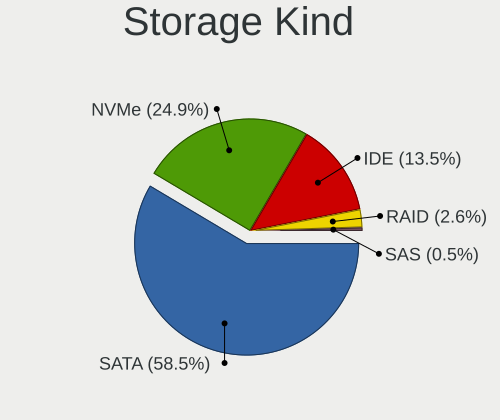

| Kind | Desktops | Percent |
|------|----------|---------|
| SATA | 113      | 58.55%  |
| NVMe | 48       | 24.87%  |
| IDE  | 26       | 13.47%  |
| RAID | 5        | 2.59%   |
| SAS  | 1        | 0.52%   |

Processor
---------

CPU Vendor
----------

Processor vendors

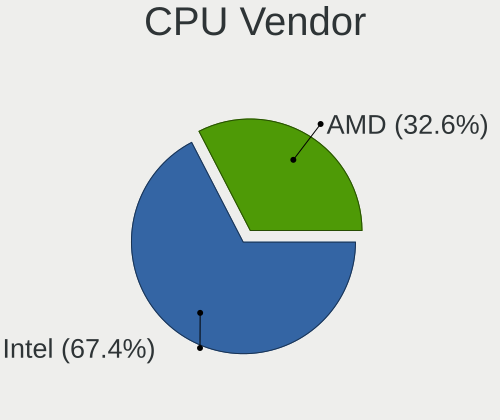

| Vendor | Desktops | Percent |
|--------|----------|---------|
| Intel  | 91       | 67.41%  |
| AMD    | 44       | 32.59%  |

CPU Model
---------

Processor models

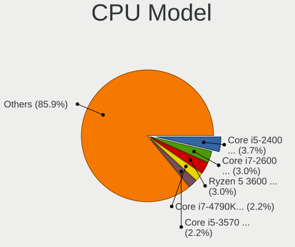

| Model                                       | Desktops | Percent |
|---------------------------------------------|----------|---------|
| Intel Core i5-2400 CPU @ 3.10GHz            | 5        | 3.7%    |
| Intel Core i7-2600 CPU @ 3.40GHz            | 4        | 2.96%   |
| AMD Ryzen 5 3600 6-Core Processor           | 4        | 2.96%   |
| Intel Core i7-4790K CPU @ 4.00GHz           | 3        | 2.22%   |
| Intel Core i5-3570 CPU @ 3.40GHz            | 3        | 2.22%   |
| AMD Ryzen 7 5700G with Radeon Graphics      | 3        | 2.22%   |
| AMD Ryzen 5 4600G with Radeon Graphics      | 3        | 2.22%   |
| Intel Xeon CPU E5-2680 v4 @ 2.40GHz         | 2        | 1.48%   |
| Intel Pentium D CPU 3.00GHz                 | 2        | 1.48%   |
| Intel Core i7-4770K CPU @ 3.50GHz           | 2        | 1.48%   |
| Intel Core i5-9600K CPU @ 3.70GHz           | 2        | 1.48%   |
| Intel Core i5-7400 CPU @ 3.00GHz            | 2        | 1.48%   |
| Intel Core i5-4440 CPU @ 3.10GHz            | 2        | 1.48%   |
| Intel Core i5-3470 CPU @ 3.20GHz            | 2        | 1.48%   |
| Intel Core i5-3330 CPU @ 3.00GHz            | 2        | 1.48%   |
| Intel Core i3-6100 CPU @ 3.70GHz            | 2        | 1.48%   |
| Intel Celeron CPU J1800 @ 2.41GHz           | 2        | 1.48%   |
| AMD Ryzen 7 7700X 8-Core Processor          | 2        | 1.48%   |
| AMD Ryzen 5 PRO 4650G with Radeon Graphics  | 2        | 1.48%   |
| AMD Ryzen 5 5600G with Radeon Graphics      | 2        | 1.48%   |
| AMD Ryzen 5 5600 6-Core Processor           | 2        | 1.48%   |
| AMD Ryzen 5 1600 Six-Core Processor         | 2        | 1.48%   |
| AMD Phenom II X6 1090T Processor            | 2        | 1.48%   |
| Intel Xeon CPU E5506 @ 2.13GHz              | 1        | 0.74%   |
| Intel Xeon CPU E5-2697 v2 @ 2.70GHz         | 1        | 0.74%   |
| Intel Xeon CPU E5-2640 v2 @ 2.00GHz         | 1        | 0.74%   |
| Intel Xeon CPU E5-2603 v3 @ 1.60GHz         | 1        | 0.74%   |
| Intel Xeon CPU E5-2420 v2 @ 2.20GHz         | 1        | 0.74%   |
| Intel Xeon CPU E3-1220 V2 @ 3.10GHz         | 1        | 0.74%   |
| Intel Pentium Dual-Core CPU E6300 @ 2.80GHz | 1        | 0.74%   |
| Intel Pentium Dual-Core CPU E5700 @ 3.00GHz | 1        | 0.74%   |
| Intel Pentium Dual-Core CPU E5400 @ 2.70GHz | 1        | 0.74%   |
| Intel Pentium Dual CPU E2200 @ 2.20GHz      | 1        | 0.74%   |
| Intel Pentium CPU G4400 @ 3.30GHz           | 1        | 0.74%   |
| Intel Pentium 4 CPU 2.80GHz                 | 1        | 0.74%   |
| Intel Core i9-9940X CPU @ 3.30GHz           | 1        | 0.74%   |
| Intel Core i7-9700K CPU @ 3.60GHz           | 1        | 0.74%   |
| Intel Core i7-6700 CPU @ 3.40GHz            | 1        | 0.74%   |
| Intel Core i7-4790 CPU @ 3.60GHz            | 1        | 0.74%   |
| Intel Core i7-4700MQ CPU @ 2.40GHz          | 1        | 0.74%   |

CPU Model Family
----------------

Processor model prefix

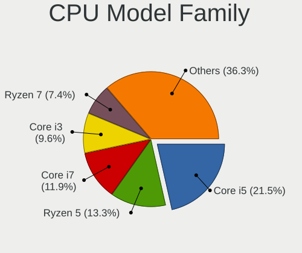

| Model                   | Desktops | Percent |
|-------------------------|----------|---------|
| Intel Core i5           | 29       | 21.48%  |
| AMD Ryzen 5             | 18       | 13.33%  |
| Intel Core i7           | 16       | 11.85%  |
| Intel Core i3           | 13       | 9.63%   |
| AMD Ryzen 7             | 10       | 7.41%   |
| Intel Xeon              | 8        | 5.93%   |
| Intel Celeron           | 7        | 5.19%   |
| Other                   | 5        | 3.7%    |
| AMD Ryzen 5 PRO         | 4        | 2.96%   |
| Intel Pentium Dual-Core | 3        | 2.22%   |
| AMD FX                  | 3        | 2.22%   |
| Intel Pentium D         | 2        | 1.48%   |
| Intel Core 2 Quad       | 2        | 1.48%   |
| Intel Core 2 Duo        | 2        | 1.48%   |
| AMD Ryzen 9             | 2        | 1.48%   |
| AMD Phenom II X6        | 2        | 1.48%   |
| Intel Pentium Dual      | 1        | 0.74%   |
| Intel Pentium 4         | 1        | 0.74%   |
| Intel Pentium           | 1        | 0.74%   |
| Intel Core i9           | 1        | 0.74%   |
| AMD Ryzen Threadripper  | 1        | 0.74%   |
| AMD Ryzen 3             | 1        | 0.74%   |
| AMD Phenom II X2        | 1        | 0.74%   |
| AMD Athlon              | 1        | 0.74%   |
| AMD A8                  | 1        | 0.74%   |

CPU Cores
---------

Number of processor cores

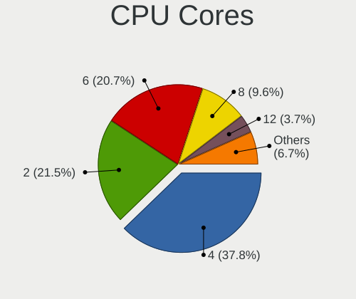

| Number | Desktops | Percent |
|--------|----------|---------|
| 4      | 51       | 37.78%  |
| 2      | 29       | 21.48%  |
| 6      | 28       | 20.74%  |
| 8      | 13       | 9.63%   |
| 12     | 5        | 3.7%    |
| 14     | 4        | 2.96%   |
| 1      | 2        | 1.48%   |
| 16     | 1        | 0.74%   |
| 10     | 1        | 0.74%   |
| 3      | 1        | 0.74%   |

CPU Sockets
-----------

Number of sockets

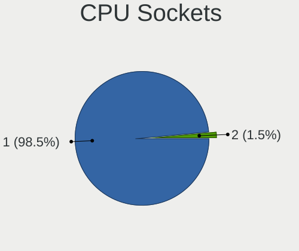

| Number | Desktops | Percent |
|--------|----------|---------|
| 1      | 133      | 98.52%  |
| 2      | 2        | 1.48%   |

CPU Threads
-----------

Threads per core (Hyper-Threading)

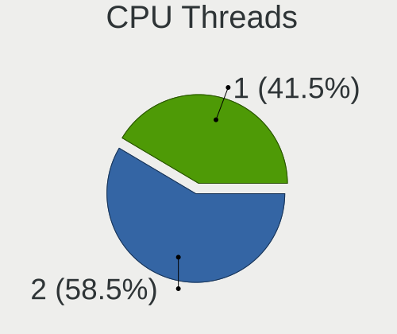

| Number | Desktops | Percent |
|--------|----------|---------|
| 2      | 79       | 58.52%  |
| 1      | 56       | 41.48%  |

CPU Op-Modes
------------

CPU Operation Modes (32-bit, 64-bit)

| Op mode        | Desktops | Percent |
|----------------|----------|---------|
| 32-bit, 64-bit | 135      | 100%    |

CPU Microcode
-------------

Microcode number

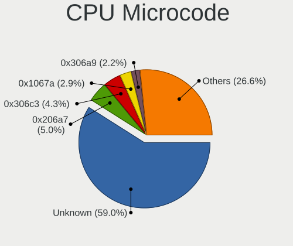

| Number     | Desktops | Percent |
|------------|----------|---------|
| Unknown    | 82       | 58.99%  |
| 0x206a7    | 7        | 5.04%   |
| 0x306c3    | 6        | 4.32%   |
| 0x1067a    | 4        | 2.88%   |
| 0x306a9    | 3        | 2.16%   |
| 0x08600106 | 3        | 2.16%   |
| 0x0800820d | 3        | 2.16%   |
| 0xf64      | 2        | 1.44%   |
| 0x506e3    | 2        | 1.44%   |
| 0x0a50000d | 2        | 1.44%   |
| 0x08600109 | 2        | 1.44%   |
| 0x06000852 | 2        | 1.44%   |
| 0x010000dc | 2        | 1.44%   |
| 0xa0671    | 1        | 0.72%   |
| 0x906ed    | 1        | 0.72%   |
| 0x6fd      | 1        | 0.72%   |
| 0x6fb      | 1        | 0.72%   |
| 0x306f2    | 1        | 0.72%   |
| 0x306e4    | 1        | 0.72%   |
| 0x30678    | 1        | 0.72%   |
| 0x106a5    | 1        | 0.72%   |
| 0x0a601201 | 1        | 0.72%   |
| 0x0a500011 | 1        | 0.72%   |
| 0x0a20120a | 1        | 0.72%   |
| 0x0a201205 | 1        | 0.72%   |
| 0x0a201025 | 1        | 0.72%   |
| 0x08701021 | 1        | 0.72%   |
| 0x08108109 | 1        | 0.72%   |
| 0x08101016 | 1        | 0.72%   |
| 0x08001137 | 1        | 0.72%   |
| 0x06003106 | 1        | 0.72%   |
| 0x010000c8 | 1        | 0.72%   |

CPU Microarch
-------------

Microarchitecture

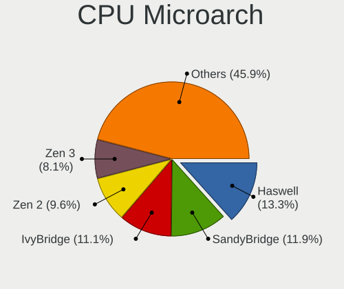

| Name             | Desktops | Percent |
|------------------|----------|---------|
| Haswell          | 18       | 13.33%  |
| SandyBridge      | 16       | 11.85%  |
| IvyBridge        | 15       | 11.11%  |
| Zen 2            | 13       | 9.63%   |
| Zen 3            | 11       | 8.15%   |
| KabyLake         | 8        | 5.93%   |
| Penryn           | 7        | 5.19%   |
| Zen+             | 6        | 4.44%   |
| Skylake          | 6        | 4.44%   |
| Alderlake Hybrid | 4        | 2.96%   |
| Unknown          | 4        | 2.96%   |
| Piledriver       | 3        | 2.22%   |
| NetBurst         | 3        | 2.22%   |
| K10              | 3        | 2.22%   |
| IceLake          | 3        | 2.22%   |
| Zen              | 2        | 1.48%   |
| Silvermont       | 2        | 1.48%   |
| Nehalem          | 2        | 1.48%   |
| Core             | 2        | 1.48%   |
| CometLake        | 2        | 1.48%   |
| Broadwell        | 2        | 1.48%   |
| Westmere         | 1        | 0.74%   |
| Steamroller      | 1        | 0.74%   |
| K8 Hammer        | 1        | 0.74%   |

Graphics
--------

GPU Vendor
----------

Vendors of graphics cards

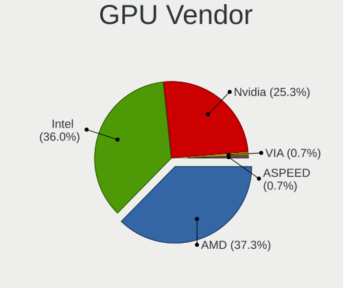

| Vendor            | Desktops | Percent |
|-------------------|----------|---------|
| AMD               | 56       | 37.33%  |
| Intel             | 54       | 36%     |
| Nvidia            | 38       | 25.33%  |
| VIA Technologies  | 1        | 0.67%   |
| ASPEED Technology | 1        | 0.67%   |

GPU Model
---------

Graphics card models

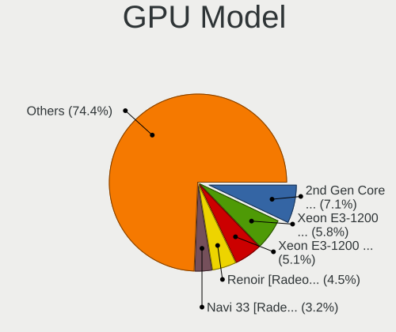

| Model                                                                         | Desktops | Percent |
|-------------------------------------------------------------------------------|----------|---------|
| Intel 2nd Generation Core Processor Family Integrated Graphics Controller     | 11       | 7.05%   |
| Intel Xeon E3-1200 v2/3rd Gen Core processor Graphics Controller              | 9        | 5.77%   |
| Intel Xeon E3-1200 v3/4th Gen Core Processor Integrated Graphics Controller   | 8        | 5.13%   |
| AMD Renoir [Radeon Vega Series / Radeon Vega Mobile Series]                   | 7        | 4.49%   |
| AMD Navi 33 [Radeon RX 7600/7600 XT/7600M XT/7600S/7700S / PRO W7600]         | 5        | 3.21%   |
| AMD Ellesmere [Radeon RX 470/480/570/570X/580/580X/590]                       | 5        | 3.21%   |
| Nvidia GP107 [GeForce GTX 1050]                                               | 4        | 2.56%   |
| Intel 4 Series Chipset Integrated Graphics Controller                         | 4        | 2.56%   |
| AMD Cezanne [Radeon Vega Series / Radeon Vega Mobile Series]                  | 4        | 2.56%   |
| AMD Cedar [Radeon HD 5000/6000/7350/8350 Series]                              | 4        | 2.56%   |
| Nvidia GP108 [GeForce GT 1030]                                                | 3        | 1.92%   |
| Nvidia GP107 [GeForce GTX 1050 Ti]                                            | 3        | 1.92%   |
| Intel Skylake-S GT2 [HD Graphics 530]                                         | 3        | 1.92%   |
| Intel Kaby Lake-S GT2 [HD Graphics 630]                                       | 3        | 1.92%   |
| Intel CoffeeLake-S GT2 [UHD Graphics 630]                                     | 3        | 1.92%   |
| AMD Raphael                                                                   | 3        | 1.92%   |
| AMD Navi 23 [Radeon RX 6600/6600 XT/6600M]                                    | 3        | 1.92%   |
| Nvidia TU106 [GeForce RTX 2060 Rev. A]                                        | 2        | 1.28%   |
| Nvidia GM206 [GeForce GTX 960]                                                | 2        | 1.28%   |
| Nvidia GA106 [GeForce RTX 3060]                                               | 2        | 1.28%   |
| Nvidia GA106 [GeForce RTX 3060 Lite Hash Rate]                                | 2        | 1.28%   |
| Nvidia G98 [GeForce 8400 GS Rev. 2]                                           | 2        | 1.28%   |
| Intel Atom Processor Z36xxx/Z37xxx Series Graphics & Display                  | 2        | 1.28%   |
| Intel Alder Lake-S GT1 [UHD Graphics 770]                                     | 2        | 1.28%   |
| AMD Polaris 20 XL [Radeon RX 580 2048SP]                                      | 2        | 1.28%   |
| AMD Picasso/Raven 2 [Radeon Vega Series / Radeon Vega Mobile Series]          | 2        | 1.28%   |
| AMD Navi 31 [Radeon RX 7900 XT/7900 XTX/7900 GRE/7900M]                       | 2        | 1.28%   |
| AMD Navi 14 [Radeon RX 5500/5500M / Pro 5500M]                                | 2        | 1.28%   |
| AMD Navi 10 [Radeon RX 5600 OEM/5600 XT / 5700/5700 XT]                       | 2        | 1.28%   |
| AMD Caicos [Radeon HD 6450/7450/8450 / R5 230 OEM]                            | 2        | 1.28%   |
| AMD Caicos PRO [Radeon HD 7450]                                               | 2        | 1.28%   |
| AMD Bonaire XTX [Radeon R7 260X/360]                                          | 2        | 1.28%   |
| VIA Technologies CN700/P4M800 Pro/P4M800 CE/VN800 Graphics [S3 UniChrome Pro] | 1        | 0.64%   |
| Nvidia TU116 [GeForce GTX 1660 Ti]                                            | 1        | 0.64%   |
| Nvidia TU116 [GeForce GTX 1650 SUPER]                                         | 1        | 0.64%   |
| Nvidia TU106 [GeForce RTX 2070 Rev. A]                                        | 1        | 0.64%   |
| Nvidia TU106 [GeForce RTX 2060 SUPER]                                         | 1        | 0.64%   |
| Nvidia TU106 [GeForce GTX 1650]                                               | 1        | 0.64%   |
| Nvidia TU104 [GeForce RTX 2080 SUPER]                                         | 1        | 0.64%   |
| Nvidia TU102 [GeForce RTX 2080 Ti Rev. A]                                     | 1        | 0.64%   |

GPU Combo
---------

Combinations of graphics cards

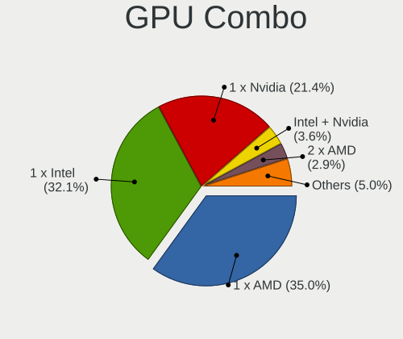

| Name            | Desktops | Percent |
|-----------------|----------|---------|
| 1 x AMD         | 49       | 35%     |
| 1 x Intel       | 45       | 32.14%  |
| 1 x Nvidia      | 30       | 21.43%  |
| Intel + Nvidia  | 5        | 3.57%   |
| 2 x AMD         | 4        | 2.86%   |
| AMD + Nvidia    | 3        | 2.14%   |
| Intel + AMD     | 2        | 1.43%   |
| 1 x VIA         | 1        | 0.71%   |
| Nvidia + ASPEED | 1        | 0.71%   |

GPU Driver
----------

Free vs proprietary

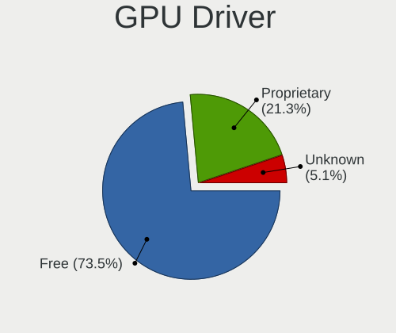

| Driver      | Desktops | Percent |
|-------------|----------|---------|
| Free        | 100      | 73.53%  |
| Proprietary | 29       | 21.32%  |
| Unknown     | 7        | 5.15%   |

GPU Memory
----------

Total video memory

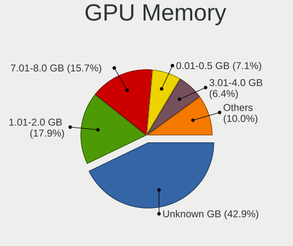

| Size in GB | Desktops | Percent |
|------------|----------|---------|
| Unknown    | 60       | 42.86%  |
| 1.01-2.0   | 25       | 17.86%  |
| 7.01-8.0   | 22       | 15.71%  |
| 0.01-0.5   | 10       | 7.14%   |
| 3.01-4.0   | 9        | 6.43%   |
| 0.51-1.0   | 5        | 3.57%   |
| 5.01-6.0   | 4        | 2.86%   |
| 8.01-16.0  | 3        | 2.14%   |
| 16.01-24.0 | 2        | 1.43%   |

Monitor
-------

Monitor Vendor
--------------

Monitor vendors

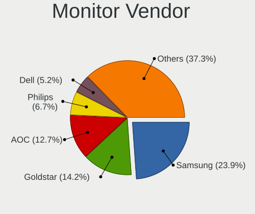

| Vendor               | Desktops | Percent |
|----------------------|----------|---------|
| Samsung Electronics  | 32       | 23.88%  |
| Goldstar             | 19       | 14.18%  |
| AOC                  | 17       | 12.69%  |
| Philips              | 9        | 6.72%   |
| Dell                 | 7        | 5.22%   |
| Sony                 | 4        | 2.99%   |
| ASUSTek Computer     | 4        | 2.99%   |
| Acer                 | 4        | 2.99%   |
| Lenovo               | 3        | 2.24%   |
| Hewlett-Packard      | 3        | 2.24%   |
| BenQ                 | 3        | 2.24%   |
| Unknown (XXX)        | 2        | 1.49%   |
| Unknown              | 2        | 1.49%   |
| Positivo             | 2        | 1.49%   |
| NEC Computers        | 2        | 1.49%   |
| Multilaser           | 2        | 1.49%   |
| Denver               | 2        | 1.49%   |
| Wacom                | 1        | 0.75%   |
| VIZ                  | 1        | 0.75%   |
| RS                   | 1        | 0.75%   |
| Roku                 | 1        | 0.75%   |
| Philco               | 1        | 0.75%   |
| Panasonic            | 1        | 0.75%   |
| MiTAC                | 1        | 0.75%   |
| Mi                   | 1        | 0.75%   |
| LG Electronics       | 1        | 0.75%   |
| ITE                  | 1        | 0.75%   |
| IPS                  | 1        | 0.75%   |
| Iiyama               | 1        | 0.75%   |
| HannStar             | 1        | 0.75%   |
| Eizo                 | 1        | 0.75%   |
| DTV                  | 1        | 0.75%   |
| Ancor Communications | 1        | 0.75%   |
| Unknown              | 1        | 0.75%   |

Monitor Model
-------------

Monitor models

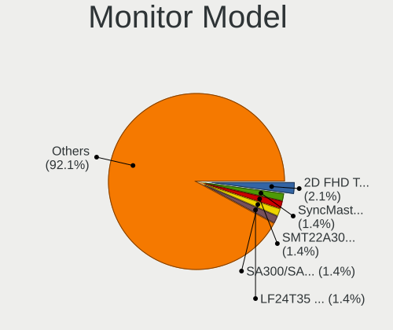

| Model                                                                  | Desktops | Percent |
|------------------------------------------------------------------------|----------|---------|
| Goldstar 2D FHD TV GSM59C6 1920x1080 509x286mm 23.0-inch               | 3        | 2.14%   |
| Samsung Electronics SyncMaster SAM037A 1680x1050 433x271mm 20.1-inch   | 2        | 1.43%   |
| Samsung Electronics SMT22A300 SAM087B 1920x1080 477x268mm 21.5-inch    | 2        | 1.43%   |
| Samsung Electronics SA300/SA350 SAM0788 1366x768 410x230mm 18.5-inch   | 2        | 1.43%   |
| Samsung Electronics LF24T35 SAM707D 1920x1080 528x297mm 23.9-inch      | 2        | 1.43%   |
| Multilaser Multilaser MUL0030 1920x1080 708x398mm 32.0-inch            | 2        | 1.43%   |
| AOC 27G2G4 AOC2702 1920x1080 598x336mm 27.0-inch                       | 2        | 1.43%   |
| Wacom Cintiq21UX WAC1014 1600x1200 432x324mm 21.3-inch                 | 1        | 0.71%   |
| VIZ LCD Monitor M190VA 1360x768                                        | 1        | 0.71%   |
| Unknown LCD Monitor XXX Beyond TV                                      | 1        | 0.71%   |
| Unknown LCD Monitor FFFF 2288x1287 2550x2550mm 142.0-inch              | 1        | 0.71%   |
| Unknown (XXX) Union TV XXX2841 1920x1080 1209x680mm 54.6-inch          | 1        | 0.71%   |
| Unknown (XXX) Beyond TV XXX2851 3840x2160 1209x680mm 54.6-inch         | 1        | 0.71%   |
| Sony TV SNYDB01 1920x1080                                              | 1        | 0.71%   |
| Sony TV SNY7E02 1920x1080                                              | 1        | 0.71%   |
| Sony TV SNY7901 1360x768                                               | 1        | 0.71%   |
| Sony TV SNY1A02 1920x1080                                              | 1        | 0.71%   |
| Samsung Electronics T24D310 SAM0B68 1366x768 521x293mm 23.5-inch       | 1        | 0.71%   |
| Samsung Electronics SyncMaster SAM05EB 1920x1080 597x336mm 27.0-inch   | 1        | 0.71%   |
| Samsung Electronics SyncMaster SAM047D 1360x768 410x230mm 18.5-inch    | 1        | 0.71%   |
| Samsung Electronics SyncMaster SAM0471 1360x768 344x194mm 15.5-inch    | 1        | 0.71%   |
| Samsung Electronics SyncMaster SAM0375 1680x1050 494x320mm 23.2-inch   | 1        | 0.71%   |
| Samsung Electronics SyncMaster SAM0322 1440x900 428x255mm 19.6-inch    | 1        | 0.71%   |
| Samsung Electronics SyncMaster SAM02E3 1440x900 367x229mm 17.0-inch    | 1        | 0.71%   |
| Samsung Electronics SMB2030N SAM0634 1600x900 443x249mm 20.0-inch      | 1        | 0.71%   |
| Samsung Electronics S24F350 SAM0D20 1920x1080 521x293mm 23.5-inch      | 1        | 0.71%   |
| Samsung Electronics S24C450 SAM09CF 1920x1200 518x324mm 24.1-inch      | 1        | 0.71%   |
| Samsung Electronics S22F350 SAM0D1A 1920x1080 477x268mm 21.5-inch      | 1        | 0.71%   |
| Samsung Electronics S19B300 SAM08A5 1366x768 410x230mm 18.5-inch       | 1        | 0.71%   |
| Samsung Electronics Odyssey G40B SAM727E 1920x1080 597x336mm 27.0-inch | 1        | 0.71%   |
| Samsung Electronics Odyssey G40B SAM727B 1920x1080 597x336mm 27.0-inch | 1        | 0.71%   |
| Samsung Electronics LS32A70 SAM7166 3840x2160 698x393mm 31.5-inch      | 1        | 0.71%   |
| Samsung Electronics LF22T35 SAM707B 1920x1080 477x268mm 21.5-inch      | 1        | 0.71%   |
| Samsung Electronics LCD Monitor SAM0E33 1920x1080 1210x680mm 54.6-inch | 1        | 0.71%   |
| Samsung Electronics LCD Monitor SAM0D47 1920x1080 480x270mm 21.7-inch  | 1        | 0.71%   |
| Samsung Electronics LCD Monitor SAM0C3C 1366x768 609x347mm 27.6-inch   | 1        | 0.71%   |
| Samsung Electronics LCD Monitor SAM0A7D 1920x1080 1060x626mm 48.5-inch | 1        | 0.71%   |
| Samsung Electronics LCD Monitor SAM04DB 1280x1024 886x498mm 40.0-inch  | 1        | 0.71%   |
| Samsung Electronics LCD Monitor SAM02C9 1360x768 885x498mm 40.0-inch   | 1        | 0.71%   |
| Samsung Electronics LCD Monitor SAM01D1 1360x768                       | 1        | 0.71%   |

Monitor Resolution
------------------

Monitor screen resolution

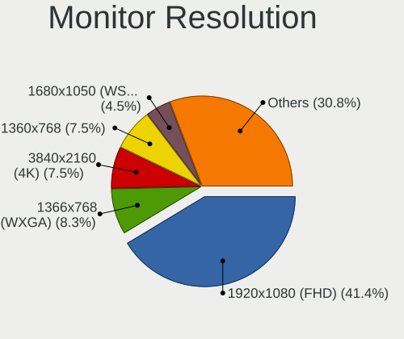

| Resolution         | Desktops | Percent |
|--------------------|----------|---------|
| 1920x1080 (FHD)    | 55       | 41.35%  |
| 1366x768 (WXGA)    | 11       | 8.27%   |
| 3840x2160 (4K)     | 10       | 7.52%   |
| 1360x768           | 10       | 7.52%   |
| 1680x1050 (WSXGA+) | 6        | 4.51%   |
| 1600x900 (HD+)     | 6        | 4.51%   |
| 1280x1024 (SXGA)   | 6        | 4.51%   |
| 1440x900 (WXGA+)   | 5        | 3.76%   |
| 2560x1440 (QHD)    | 4        | 3.01%   |
| 2560x1080          | 4        | 3.01%   |
| 1920x1200 (WUXGA)  | 3        | 2.26%   |
| 1920x540           | 2        | 1.5%    |
| 1600x1200          | 2        | 1.5%    |
| 1024x768 (XGA)     | 2        | 1.5%    |
| Unknown            | 2        | 1.5%    |
| 4240x1280          | 1        | 0.75%   |
| 3840x1200          | 1        | 0.75%   |
| 3200x1080          | 1        | 0.75%   |
| 2288x1287          | 1        | 0.75%   |
| 1280x960           | 1        | 0.75%   |

Monitor Diagonal
----------------

Diagonal size in inches

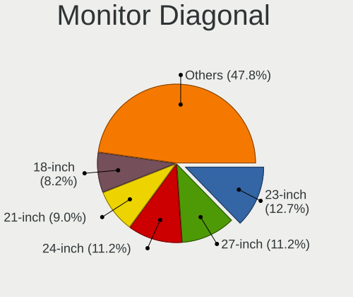

| Inches  | Desktops | Percent |
|---------|----------|---------|
| 23      | 17       | 12.69%  |
| 27      | 15       | 11.19%  |
| 24      | 15       | 11.19%  |
| 21      | 12       | 8.96%   |
| 18      | 11       | 8.21%   |
| 20      | 8        | 5.97%   |
| 72      | 6        | 4.48%   |
| 19      | 6        | 4.48%   |
| 15      | 6        | 4.48%   |
| Unknown | 6        | 4.48%   |
| 17      | 4        | 2.99%   |
| 52      | 3        | 2.24%   |
| 40      | 3        | 2.24%   |
| 32      | 3        | 2.24%   |
| 31      | 3        | 2.24%   |
| 22      | 3        | 2.24%   |
| 63      | 2        | 1.49%   |
| 54      | 2        | 1.49%   |
| 142     | 1        | 0.75%   |
| 84      | 1        | 0.75%   |
| 49      | 1        | 0.75%   |
| 48      | 1        | 0.75%   |
| 43      | 1        | 0.75%   |
| 36      | 1        | 0.75%   |
| 34      | 1        | 0.75%   |
| 29      | 1        | 0.75%   |
| 25      | 1        | 0.75%   |

Monitor Width
-------------

Physical width

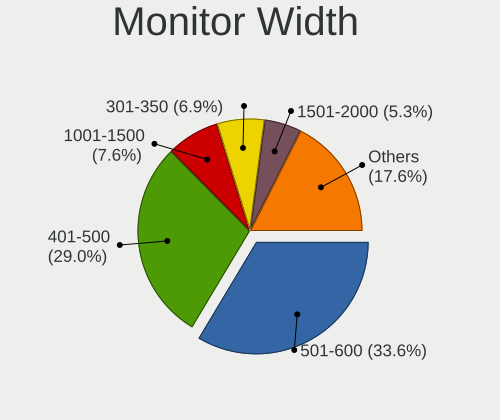

| Width in mm    | Desktops | Percent |
|----------------|----------|---------|
| 501-600        | 44       | 33.59%  |
| 401-500        | 38       | 29.01%  |
| 1001-1500      | 10       | 7.63%   |
| 301-350        | 9        | 6.87%   |
| 1501-2000      | 7        | 5.34%   |
| Unknown        | 6        | 4.58%   |
| 701-800        | 5        | 3.82%   |
| 601-700        | 5        | 3.82%   |
| 801-900        | 3        | 2.29%   |
| 351-400        | 3        | 2.29%   |
| More than 2000 | 1        | 0.76%   |

Aspect Ratio
------------

Proportional relationship between the width and the height

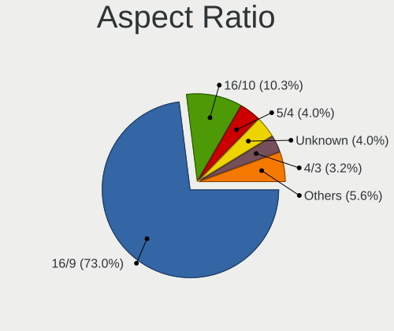

| Ratio   | Desktops | Percent |
|---------|----------|---------|
| 16/9    | 92       | 73.02%  |
| 16/10   | 13       | 10.32%  |
| 5/4     | 5        | 3.97%   |
| Unknown | 5        | 3.97%   |
| 4/3     | 4        | 3.17%   |
| 21/9    | 3        | 2.38%   |
| 32/9    | 1        | 0.79%   |
| 3/2     | 1        | 0.79%   |
| 3.20    | 1        | 0.79%   |
| 1.00    | 1        | 0.79%   |

Monitor Area
------------

Area in inch²

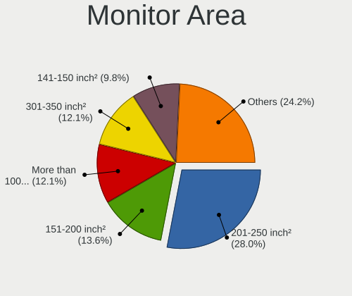

| Area in inch² | Desktops | Percent |
|----------------|----------|---------|
| 201-250        | 37       | 28.03%  |
| 151-200        | 18       | 13.64%  |
| More than 1000 | 16       | 12.12%  |
| 301-350        | 16       | 12.12%  |
| 141-150        | 13       | 9.85%   |
| 351-500        | 7        | 5.3%    |
| 251-300        | 6        | 4.55%   |
| 101-110        | 6        | 4.55%   |
| 501-1000       | 6        | 4.55%   |
| Unknown        | 6        | 4.55%   |
| 131-140        | 1        | 0.76%   |

Pixel Density
-------------

Pixels per inch

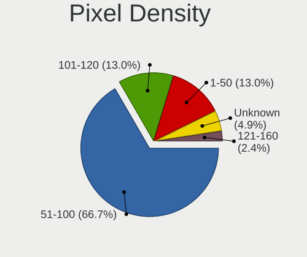

| Density | Desktops | Percent |
|---------|----------|---------|
| 51-100  | 82       | 66.67%  |
| 1-50    | 16       | 13.01%  |
| 101-120 | 16       | 13.01%  |
| Unknown | 6        | 4.88%   |
| 121-160 | 3        | 2.44%   |

Multiple Monitors
-----------------

Total monitors connected

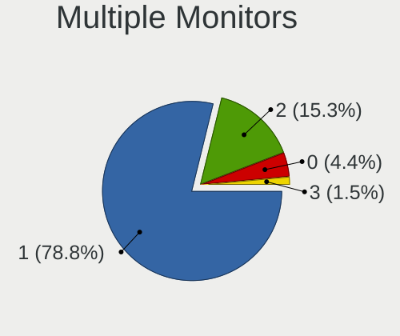

| Total | Desktops | Percent |
|-------|----------|---------|
| 1     | 108      | 78.83%  |
| 2     | 21       | 15.33%  |
| 0     | 6        | 4.38%   |
| 3     | 2        | 1.46%   |

Network
-------

Net Controller Vendor
---------------------

Controller vendors

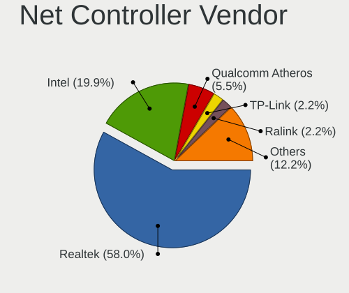

| Vendor                | Desktops | Percent |
|-----------------------|----------|---------|
| Realtek Semiconductor | 105      | 58.01%  |
| Intel                 | 36       | 19.89%  |
| Qualcomm Atheros      | 10       | 5.52%   |
| TP-Link               | 4        | 2.21%   |
| Ralink Technology     | 4        | 2.21%   |
| MediaTek              | 4        | 2.21%   |
| VIA Technologies      | 3        | 1.66%   |
| Samsung Electronics   | 2        | 1.1%    |
| Ralink                | 2        | 1.1%    |
| Microsoft             | 2        | 1.1%    |
| D-Link System         | 2        | 1.1%    |
| Broadcom              | 2        | 1.1%    |
| SysKonnect            | 1        | 0.55%   |
| Nvidia                | 1        | 0.55%   |
| D-Link                | 1        | 0.55%   |
| ASUSTek Computer      | 1        | 0.55%   |
| ASIX Electronics      | 1        | 0.55%   |

Net Controller Model
--------------------

Controller models

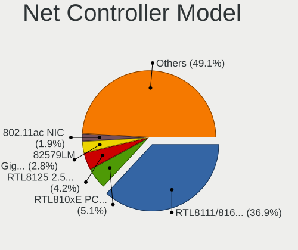

| Model                                                                  | Desktops | Percent |
|------------------------------------------------------------------------|----------|---------|
| Realtek RTL8111/8168/8211/8411 PCI Express Gigabit Ethernet Controller | 79       | 36.92%  |
| Realtek RTL810xE PCI Express Fast Ethernet controller                  | 11       | 5.14%   |
| Realtek RTL8125 2.5GbE Controller                                      | 9        | 4.21%   |
| Intel 82579LM Gigabit Network Connection (Lewisville)                  | 6        | 2.8%    |
| Realtek 802.11ac NIC                                                   | 4        | 1.87%   |
| Intel Ethernet Connection I217-LM                                      | 4        | 1.87%   |
| VIA VT6102/VT6103 [Rhine-II]                                           | 3        | 1.4%    |
| Realtek RTL8188FTV 802.11b/g/n 1T1R 2.4G WLAN Adapter                  | 3        | 1.4%    |
| Realtek RTL8188ETV Wireless LAN 802.11n Network Adapter                | 3        | 1.4%    |
| Ralink RT5370 Wireless Adapter                                         | 3        | 1.4%    |
| Intel Wi-Fi 6E(802.11ax) AX210/AX1675* 2x2 [Typhoon Peak]              | 3        | 1.4%    |
| Intel Ethernet Connection I217-V                                       | 3        | 1.4%    |
| Intel Ethernet Connection (7) I219-V                                   | 3        | 1.4%    |
| TP-Link TL-WN821N v5/v6 [RTL8192EU]                                    | 2        | 0.93%   |
| Realtek RTL8188EE Wireless Network Adapter                             | 2        | 0.93%   |
| Realtek RTL8153 Gigabit Ethernet Adapter                               | 2        | 0.93%   |
| MediaTek MT7922 802.11ax PCI Express Wireless Network Adapter          | 2        | 0.93%   |
| Intel Wi-Fi 6 AX200                                                    | 2        | 0.93%   |
| Intel I211 Gigabit Network Connection                                  | 2        | 0.93%   |
| Intel Ethernet Controller I225-V                                       | 2        | 0.93%   |
| Intel Ethernet Connection (2) I219-V                                   | 2        | 0.93%   |
| Intel Cannon Lake PCH CNVi WiFi                                        | 2        | 0.93%   |
| D-Link System DGE-528T Gigabit Ethernet Adapter                        | 2        | 0.93%   |
| TP-Link TL-WN722N v2/v3 [Realtek RTL8188EUS]                           | 1        | 0.47%   |
| TP-Link Archer T2U PLUS [RTL8821AU]                                    | 1        | 0.47%   |
| SysKonnect SK-98xx V2.0 Gigabit Ethernet Adapter [Marvell 88E8001]     | 1        | 0.47%   |
| Samsung GT-I9070 (network tethering, USB debugging enabled)            | 1        | 0.47%   |
| Samsung Galaxy series, misc. (tethering mode)                          | 1        | 0.47%   |
| Realtek RTL88x2bu [AC1200 Techkey]                                     | 1        | 0.47%   |
| Realtek RTL8852BE PCIe 802.11ax Wireless Network Controller            | 1        | 0.47%   |
| Realtek RTL8821CE 802.11ac PCIe Wireless Network Adapter               | 1        | 0.47%   |
| Realtek RTL8812AU 802.11a/b/g/n/ac 2T2R DB WLAN Adapter                | 1        | 0.47%   |
| Realtek RTL8812AE 802.11ac PCIe Wireless Network Adapter               | 1        | 0.47%   |
| Realtek RTL8192SE Wireless LAN Controller                              | 1        | 0.47%   |
| Realtek RTL8192EE PCIe Wireless Network Adapter                        | 1        | 0.47%   |
| Realtek RTL8192CE PCIe Wireless Network Adapter                        | 1        | 0.47%   |
| Realtek RTL8188CE 802.11b/g/n WiFi Adapter                             | 1        | 0.47%   |
| Realtek RTL8169 PCI Gigabit Ethernet Controller                        | 1        | 0.47%   |
| Realtek RTL8152 Fast Ethernet Adapter                                  | 1        | 0.47%   |
| Realtek RTL8111/8168/8411 PCI Express Gigabit Ethernet Controller      | 1        | 0.47%   |

Wireless Vendor
---------------

Wireless vendors

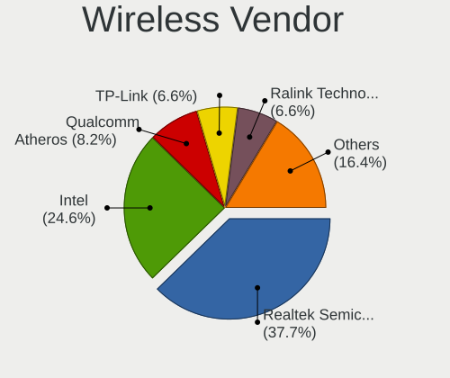

| Vendor                | Desktops | Percent |
|-----------------------|----------|---------|
| Realtek Semiconductor | 23       | 37.7%   |
| Intel                 | 15       | 24.59%  |
| Qualcomm Atheros      | 5        | 8.2%    |
| TP-Link               | 4        | 6.56%   |
| Ralink Technology     | 4        | 6.56%   |
| MediaTek              | 4        | 6.56%   |
| Ralink                | 2        | 3.28%   |
| Microsoft             | 2        | 3.28%   |
| D-Link                | 1        | 1.64%   |
| ASUSTek Computer      | 1        | 1.64%   |

Wireless Model
--------------

Wireless models

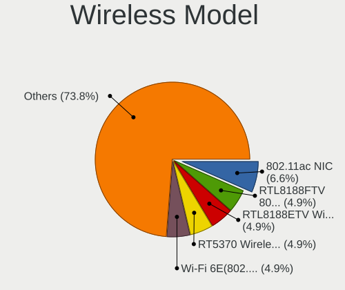

| Model                                                                                 | Desktops | Percent |
|---------------------------------------------------------------------------------------|----------|---------|
| Realtek 802.11ac NIC                                                                  | 4        | 6.56%   |
| Realtek RTL8188FTV 802.11b/g/n 1T1R 2.4G WLAN Adapter                                 | 3        | 4.92%   |
| Realtek RTL8188ETV Wireless LAN 802.11n Network Adapter                               | 3        | 4.92%   |
| Ralink RT5370 Wireless Adapter                                                        | 3        | 4.92%   |
| Intel Wi-Fi 6E(802.11ax) AX210/AX1675* 2x2 [Typhoon Peak]                             | 3        | 4.92%   |
| TP-Link TL-WN821N v5/v6 [RTL8192EU]                                                   | 2        | 3.28%   |
| Realtek RTL8188EE Wireless Network Adapter                                            | 2        | 3.28%   |
| MediaTek MT7922 802.11ax PCI Express Wireless Network Adapter                         | 2        | 3.28%   |
| Intel Wi-Fi 6 AX200                                                                   | 2        | 3.28%   |
| Intel Cannon Lake PCH CNVi WiFi                                                       | 2        | 3.28%   |
| TP-Link TL-WN722N v2/v3 [Realtek RTL8188EUS]                                          | 1        | 1.64%   |
| TP-Link Archer T2U PLUS [RTL8821AU]                                                   | 1        | 1.64%   |
| Realtek RTL88x2bu [AC1200 Techkey]                                                    | 1        | 1.64%   |
| Realtek RTL8852BE PCIe 802.11ax Wireless Network Controller                           | 1        | 1.64%   |
| Realtek RTL8821CE 802.11ac PCIe Wireless Network Adapter                              | 1        | 1.64%   |
| Realtek RTL8812AU 802.11a/b/g/n/ac 2T2R DB WLAN Adapter                               | 1        | 1.64%   |
| Realtek RTL8812AE 802.11ac PCIe Wireless Network Adapter                              | 1        | 1.64%   |
| Realtek RTL8192SE Wireless LAN Controller                                             | 1        | 1.64%   |
| Realtek RTL8192EE PCIe Wireless Network Adapter                                       | 1        | 1.64%   |
| Realtek RTL8192CE PCIe Wireless Network Adapter                                       | 1        | 1.64%   |
| Realtek RTL8188CE 802.11b/g/n WiFi Adapter                                            | 1        | 1.64%   |
| Realtek 802.11ax WLAN Adapter                                                         | 1        | 1.64%   |
| Realtek 802.11ac WLAN Adapter                                                         | 1        | 1.64%   |
| Ralink MT7601U Wireless Adapter                                                       | 1        | 1.64%   |
| Ralink RT5392 PCIe Wireless Network Adapter                                           | 1        | 1.64%   |
| Ralink RT3060 Wireless 802.11n 1T/1R                                                  | 1        | 1.64%   |
| Qualcomm Atheros QCA9377 802.11ac Wireless Network Adapter                            | 1        | 1.64%   |
| Qualcomm Atheros QCA6174 802.11ac Wireless Network Adapter                            | 1        | 1.64%   |
| Qualcomm Atheros AR9462 Wireless Network Adapter                                      | 1        | 1.64%   |
| Qualcomm Atheros AR5418 Wireless Network Adapter [AR5008E 802.11(a)bgn] (PCI-Express) | 1        | 1.64%   |
| Qualcomm Atheros AR5212/5213/2414 Wireless Network Adapter                            | 1        | 1.64%   |
| Microsoft Xbox 360 Wireless Adapter                                                   | 1        | 1.64%   |
| Microsoft Wireless XBox Controller Dongle                                             | 1        | 1.64%   |
| MediaTek MT7921K (RZ608) Wi-Fi 6E 80MHz                                               | 1        | 1.64%   |
| MediaTek MT7612U 802.11a/b/g/n/ac Wireless Adapter                                    | 1        | 1.64%   |
| Intel Wireless 8265 / 8275                                                            | 1        | 1.64%   |
| Intel Wireless 7260                                                                   | 1        | 1.64%   |
| Intel Wi-Fi 5(802.11ac) Wireless-AC 9x6x [Thunder Peak]                               | 1        | 1.64%   |
| Intel Ice Lake-LP PCH CNVi WiFi                                                       | 1        | 1.64%   |
| Intel Dual Band Wireless-AC 3168NGW [Stone Peak]                                      | 1        | 1.64%   |

Ethernet Vendor
---------------

Ethernet vendors

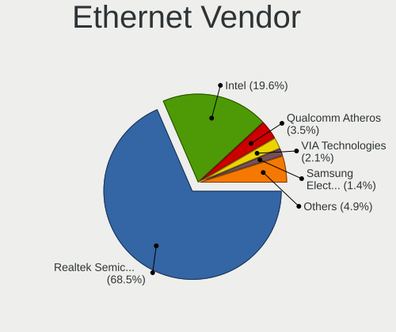

| Vendor                | Desktops | Percent |
|-----------------------|----------|---------|
| Realtek Semiconductor | 98       | 68.53%  |
| Intel                 | 28       | 19.58%  |
| Qualcomm Atheros      | 5        | 3.5%    |
| VIA Technologies      | 3        | 2.1%    |
| Samsung Electronics   | 2        | 1.4%    |
| D-Link System         | 2        | 1.4%    |
| Broadcom              | 2        | 1.4%    |
| SysKonnect            | 1        | 0.7%    |
| Nvidia                | 1        | 0.7%    |
| ASIX Electronics      | 1        | 0.7%    |

Ethernet Model
--------------

Ethernet models

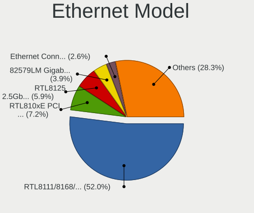

| Model                                                                  | Desktops | Percent |
|------------------------------------------------------------------------|----------|---------|
| Realtek RTL8111/8168/8211/8411 PCI Express Gigabit Ethernet Controller | 79       | 51.97%  |
| Realtek RTL810xE PCI Express Fast Ethernet controller                  | 11       | 7.24%   |
| Realtek RTL8125 2.5GbE Controller                                      | 9        | 5.92%   |
| Intel 82579LM Gigabit Network Connection (Lewisville)                  | 6        | 3.95%   |
| Intel Ethernet Connection I217-LM                                      | 4        | 2.63%   |
| VIA VT6102/VT6103 [Rhine-II]                                           | 3        | 1.97%   |
| Intel Ethernet Connection I217-V                                       | 3        | 1.97%   |
| Intel Ethernet Connection (7) I219-V                                   | 3        | 1.97%   |
| Realtek RTL8153 Gigabit Ethernet Adapter                               | 2        | 1.32%   |
| Intel I211 Gigabit Network Connection                                  | 2        | 1.32%   |
| Intel Ethernet Controller I225-V                                       | 2        | 1.32%   |
| Intel Ethernet Connection (2) I219-V                                   | 2        | 1.32%   |
| D-Link System DGE-528T Gigabit Ethernet Adapter                        | 2        | 1.32%   |
| SysKonnect SK-98xx V2.0 Gigabit Ethernet Adapter [Marvell 88E8001]     | 1        | 0.66%   |
| Samsung GT-I9070 (network tethering, USB debugging enabled)            | 1        | 0.66%   |
| Samsung Galaxy series, misc. (tethering mode)                          | 1        | 0.66%   |
| Realtek RTL8169 PCI Gigabit Ethernet Controller                        | 1        | 0.66%   |
| Realtek RTL8152 Fast Ethernet Adapter                                  | 1        | 0.66%   |
| Realtek RTL8111/8168/8411 PCI Express Gigabit Ethernet Controller      | 1        | 0.66%   |
| Realtek RTL-8100/8101L/8139 PCI Fast Ethernet Adapter                  | 1        | 0.66%   |
| Realtek Killer E3000 2.5GbE Controller                                 | 1        | 0.66%   |
| Qualcomm Atheros Killer E220x Gigabit Ethernet Controller              | 1        | 0.66%   |
| Qualcomm Atheros AR8161 Gigabit Ethernet                               | 1        | 0.66%   |
| Qualcomm Atheros AR8152 v2.0 Fast Ethernet                             | 1        | 0.66%   |
| Qualcomm Atheros AR8151 v2.0 Gigabit Ethernet                          | 1        | 0.66%   |
| Qualcomm Atheros AR8151 v1.0 Gigabit Ethernet                          | 1        | 0.66%   |
| Nvidia MCP61 Ethernet                                                  | 1        | 0.66%   |
| Intel I210 Gigabit Network Connection                                  | 1        | 0.66%   |
| Intel Ethernet Connection (2) I219-LM                                  | 1        | 0.66%   |
| Intel Ethernet Connection (2) I218-V                                   | 1        | 0.66%   |
| Intel Ethernet Connection (11) I219-V                                  | 1        | 0.66%   |
| Intel 82579V Gigabit Network Connection                                | 1        | 0.66%   |
| Intel 82574L Gigabit Network Connection                                | 1        | 0.66%   |
| Intel 82567LM-3 Gigabit Network Connection                             | 1        | 0.66%   |
| Broadcom NetXtreme BCM5762 Gigabit Ethernet PCIe                       | 1        | 0.66%   |
| Broadcom NetXtreme BCM5761 Gigabit Ethernet PCIe                       | 1        | 0.66%   |
| ASIX AX88179 Gigabit Ethernet                                          | 1        | 0.66%   |

Net Controller Kind
-------------------

Ethernet, WiFi or modem

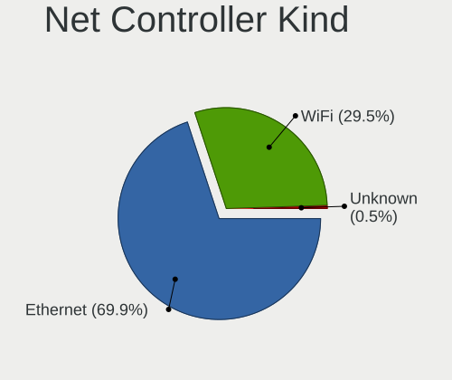

| Kind     | Desktops | Percent |
|----------|----------|---------|
| Ethernet | 135      | 69.95%  |
| WiFi     | 57       | 29.53%  |
| Unknown  | 1        | 0.52%   |

Used Controller
---------------

Currently used network controller

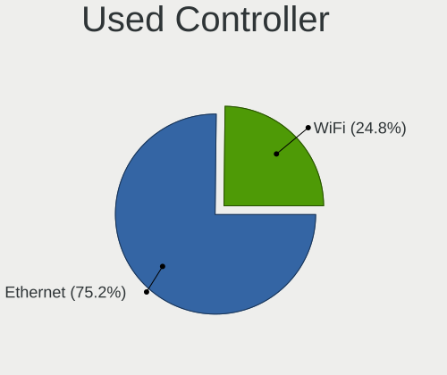

| Kind     | Desktops | Percent |
|----------|----------|---------|
| Ethernet | 106      | 75.18%  |
| WiFi     | 35       | 24.82%  |

NICs
----

Total network controllers on board

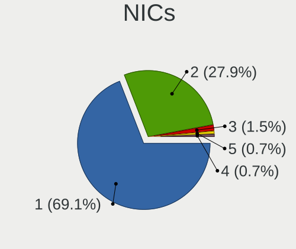

| Total | Desktops | Percent |
|-------|----------|---------|
| 1     | 94       | 69.12%  |
| 2     | 38       | 27.94%  |
| 3     | 2        | 1.47%   |
| 5     | 1        | 0.74%   |
| 4     | 1        | 0.74%   |

IPv6
----

IPv6 vs IPv4

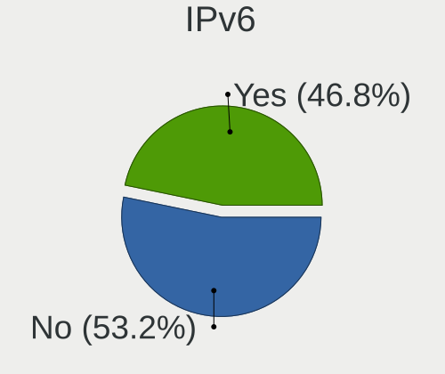

| Used | Desktops | Percent |
|------|----------|---------|
| No   | 74       | 53.24%  |
| Yes  | 65       | 46.76%  |

Bluetooth
---------

Bluetooth Vendor
----------------

Controller vendors

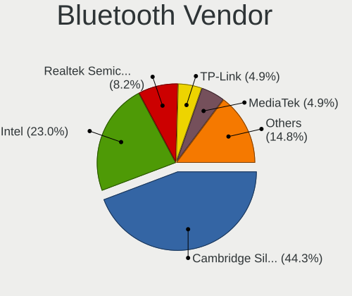

| Vendor                          | Desktops | Percent |
|---------------------------------|----------|---------|
| Cambridge Silicon Radio         | 27       | 44.26%  |
| Intel                           | 14       | 22.95%  |
| Realtek Semiconductor           | 5        | 8.2%    |
| TP-Link                         | 3        | 4.92%   |
| MediaTek                        | 3        | 4.92%   |
| Qualcomm Atheros Communications | 2        | 3.28%   |
| IMC Networks                    | 2        | 3.28%   |
| Integrated System Solution      | 1        | 1.64%   |
| Broadcom                        | 1        | 1.64%   |
| ASUSTek Computer                | 1        | 1.64%   |
| Actions                         | 1        | 1.64%   |
| AboCom Systems                  | 1        | 1.64%   |

Bluetooth Model
---------------

Controller models

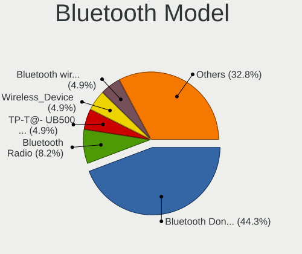

| Model                                                 | Desktops | Percent |
|-------------------------------------------------------|----------|---------|
| Cambridge Silicon Radio Bluetooth Dongle (HCI mode)   | 27       | 44.26%  |
| Realtek Bluetooth Radio                               | 5        | 8.2%    |
| TP-Link TP-T@- UB500 Adapter                          | 3        | 4.92%   |
| MediaTek Wireless_Device                              | 3        | 4.92%   |
| Intel Bluetooth wireless interface                    | 3        | 4.92%   |
| Intel AX210 Bluetooth                                 | 3        | 4.92%   |
| Intel Bluetooth 9460/9560 Jefferson Peak (JfP)        | 2        | 3.28%   |
| Intel AX201 Bluetooth                                 | 2        | 3.28%   |
| Intel AX200 Bluetooth                                 | 2        | 3.28%   |
| IMC Networks Bluetooth Radio                          | 2        | 3.28%   |
| Qualcomm Atheros  Bluetooth Device                    | 1        | 1.64%   |
| Qualcomm Atheros QCA61x4 Bluetooth 4.0                | 1        | 1.64%   |
| Intel Wireless-AC 9260 Bluetooth Adapter              | 1        | 1.64%   |
| Intel Wireless-AC 3168 Bluetooth                      | 1        | 1.64%   |
| Integrated System Solution KY-BT100 Bluetooth Adapter | 1        | 1.64%   |
| Broadcom BCM2035B3 Bluetooth Adapter                  | 1        | 1.64%   |
| ASUS ASUS USB-BT500                                   | 1        | 1.64%   |
| Actions general adapter                               | 1        | 1.64%   |
| AboCom Systems AboCom Bluetooth Device                | 1        | 1.64%   |

Sound
-----

Sound Vendor
------------

Sound card vendors

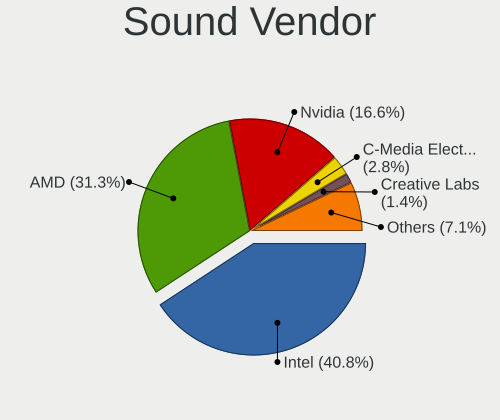

| Vendor                               | Desktops | Percent |
|--------------------------------------|----------|---------|
| Intel                                | 86       | 40.76%  |
| AMD                                  | 66       | 31.28%  |
| Nvidia                               | 35       | 16.59%  |
| C-Media Electronics                  | 6        | 2.84%   |
| Creative Labs                        | 3        | 1.42%   |
| VIA Technologies                     | 2        | 0.95%   |
| Generalplus Technology               | 2        | 0.95%   |
| USB Audio                            | 1        | 0.47%   |
| Thesycon Systemsoftware & Consulting | 1        | 0.47%   |
| Texas Instruments                    | 1        | 0.47%   |
| Razer USA                            | 1        | 0.47%   |
| Micro Star International             | 1        | 0.47%   |
| KTMicro                              | 1        | 0.47%   |
| JMTek                                | 1        | 0.47%   |
| Jieli Technology                     | 1        | 0.47%   |
| ESS Technology                       | 1        | 0.47%   |
| ASRock                               | 1        | 0.47%   |
| Actions Semiconductor                | 1        | 0.47%   |

Sound Model
-----------

Sound card models

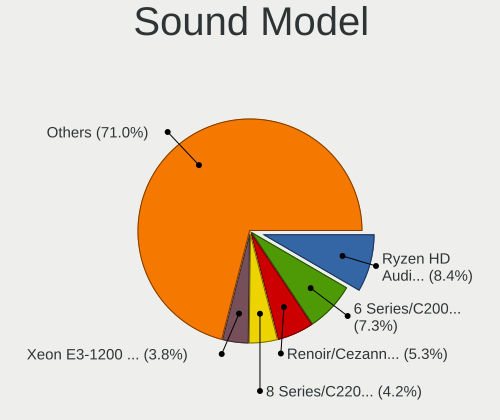

| Model                                                                             | Desktops | Percent |
|-----------------------------------------------------------------------------------|----------|---------|
| AMD Ryzen HD Audio Controller                                                     | 22       | 8.4%    |
| Intel 6 Series/C200 Series Chipset Family High Definition Audio Controller        | 19       | 7.25%   |
| AMD Renoir/Cezanne HDMI/DP Audio Controller                                       | 14       | 5.34%   |
| Intel 8 Series/C220 Series Chipset High Definition Audio Controller               | 11       | 4.2%    |
| Intel Xeon E3-1200 v3/4th Gen Core Processor HD Audio Controller                  | 10       | 3.82%   |
| Intel 7 Series/C216 Chipset Family High Definition Audio Controller               | 10       | 3.82%   |
| AMD Starship/Matisse HD Audio Controller                                          | 9        | 3.44%   |
| Nvidia GP107GL High Definition Audio Controller                                   | 7        | 2.67%   |
| Intel NM10/ICH7 Family High Definition Audio Controller                           | 7        | 2.67%   |
| AMD Navi 31 HDMI/DP Audio                                                         | 7        | 2.67%   |
| AMD Ellesmere HDMI Audio [Radeon RX 470/480 / 570/580/590]                        | 7        | 2.67%   |
| Intel 100 Series/C230 Series Chipset Family HD Audio Controller                   | 6        | 2.29%   |
| Nvidia TU106 High Definition Audio Controller                                     | 5        | 1.91%   |
| Intel Cannon Lake PCH cAVS                                                        | 5        | 1.91%   |
| AMD SBx00 Azalia (Intel HDA)                                                      | 5        | 1.91%   |
| AMD Navi 21/23 HDMI/DP Audio Controller                                           | 5        | 1.91%   |
| AMD Family 17h (Models 00h-0fh) HD Audio Controller                               | 5        | 1.91%   |
| AMD Caicos HDMI Audio [Radeon HD 6450 / 7450/8450/8490 OEM / R5 230/235/235X OEM] | 5        | 1.91%   |
| Nvidia GA106 High Definition Audio Controller                                     | 4        | 1.53%   |
| Intel 9 Series Chipset Family HD Audio Controller                                 | 4        | 1.53%   |
| AMD Radeon High Definition Audio Controller                                       | 4        | 1.53%   |
| AMD Navi 10 HDMI Audio                                                            | 4        | 1.53%   |
| AMD Cedar HDMI Audio [Radeon HD 5400/6300/7300 Series]                            | 4        | 1.53%   |
| Nvidia GP108 High Definition Audio Controller                                     | 3        | 1.15%   |
| Nvidia GM206 High Definition Audio Controller                                     | 3        | 1.15%   |
| Intel Raptor Lake High Definition Audio Controller                                | 3        | 1.15%   |
| Intel 200 Series PCH HD Audio                                                     | 3        | 1.15%   |
| AMD Raven/Raven2/Fenghuang HDMI/DP Audio Controller                               | 3        | 1.15%   |
| AMD Baffin HDMI/DP Audio [Radeon RX 550 640SP / RX 560/560X]                      | 3        | 1.15%   |
| Nvidia TU116 High Definition Audio Controller                                     | 2        | 0.76%   |
| Nvidia MCP61 High Definition Audio                                                | 2        | 0.76%   |
| Nvidia GP104 High Definition Audio Controller                                     | 2        | 0.76%   |
| Nvidia GM107 High Definition Audio Controller [GeForce 940MX]                     | 2        | 0.76%   |
| Intel Tiger Lake-H HD Audio Controller                                            | 2        | 0.76%   |
| Intel C610/X99 series chipset HD Audio Controller                                 | 2        | 0.76%   |
| Intel C600/X79 series chipset High Definition Audio Controller                    | 2        | 0.76%   |
| Intel Atom Processor Z36xxx/Z37xxx Series High Definition Audio Controller        | 2        | 0.76%   |
| Intel 82801JI (ICH10 Family) HD Audio Controller                                  | 2        | 0.76%   |
| Intel 5 Series/3400 Series Chipset High Definition Audio                          | 2        | 0.76%   |
| Generalplus Technology USB Audio Device                                           | 2        | 0.76%   |

Memory
------

Memory Vendor
-------------

Memory module vendors

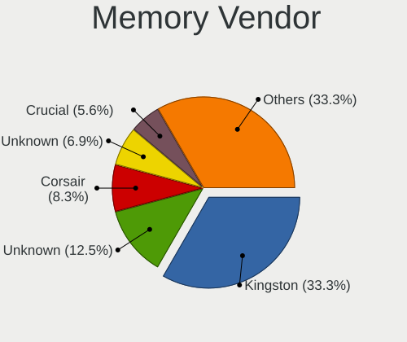

| Vendor              | Desktops | Percent |
|---------------------|----------|---------|
| Kingston            | 24       | 33.33%  |
| Unknown             | 9        | 12.5%   |
| Corsair             | 6        | 8.33%   |
| Unknown             | 5        | 6.94%   |
| Crucial             | 4        | 5.56%   |
| Micron Technology   | 3        | 4.17%   |
| Team                | 2        | 2.78%   |
| Smart               | 2        | 2.78%   |
| SK hynix            | 2        | 2.78%   |
| Samsung Electronics | 2        | 2.78%   |
| Ramaxel Technology  | 2        | 2.78%   |
| Kllisre             | 2        | 2.78%   |
| Hikvision           | 2        | 2.78%   |
| Unknown (B98C)      | 1        | 1.39%   |
| Unknown (8A6B)      | 1        | 1.39%   |
| PLEXHD              | 1        | 1.39%   |
| Nanya Technology    | 1        | 1.39%   |
| G.Skill             | 1        | 1.39%   |
| Asgard              | 1        | 1.39%   |
| A-DATA Technology   | 1        | 1.39%   |

Memory Model
------------

Memory module models

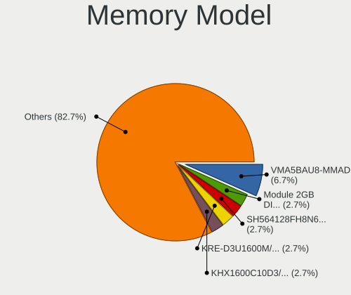

| Model                                                     | Desktops | Percent |
|-----------------------------------------------------------|----------|---------|
| Unknown                                                   | 5        | 6.67%   |
| Unknown RAM Module 2GB DIMM SDRAM                         | 2        | 2.67%   |
| Smart RAM SH564128FH8N6TNSQG 4GB DIMM DDR3 1600MT/s       | 2        | 2.67%   |
| Kllisre RAM KRE-D3U1600M/8G 8GB DIMM DDR3 1600MT/s        | 2        | 2.67%   |
| Kingston RAM KHX1600C10D3/8G 8GB DIMM DDR3 2133MT/s       | 2        | 2.67%   |
| Hikvision RAM HKED4161CAB2F1HB2 16GB DIMM DDR4 3200MT/s   | 2        | 2.67%   |
| Crucial RAM CT16G4DFRA32A.M16FE 16GB DIMM DDR4 3200MT/s   | 2        | 2.67%   |
| Unknown RAM Module 8GB DIMM SDRAM                         | 1        | 1.33%   |
| Unknown RAM Module 8GB DIMM DDR4 2667MT/s                 | 1        | 1.33%   |
| Unknown RAM Module 8GB DIMM DDR3 1333MT/s                 | 1        | 1.33%   |
| Unknown RAM Module 4GB DIMM DDR3 1333MT/s                 | 1        | 1.33%   |
| Unknown RAM Module 2GB DIMM DDR2 266MT/s                  | 1        | 1.33%   |
| Unknown RAM Module 2GB DIMM 1333MT/s                      | 1        | 1.33%   |
| Unknown RAM Module 16GB DIMM DDR4 3200MT/s                | 1        | 1.33%   |
| Unknown (B98C) RAM Module 8GB DIMM DDR4 2667MT/s          | 1        | 1.33%   |
| Unknown (8A6B) RAM BL.9BWWA.221 8GB DIMM DDR4 2667MT/s    | 1        | 1.33%   |
| Team RAM TEAMGROUP-UD4-3200 8GB DIMM DDR4 3733MT/s        | 1        | 1.33%   |
| Team RAM TEAMGROUP-UD4-3000 8GB DIMM DDR4 3200MT/s        | 1        | 1.33%   |
| SK hynix RAM MD4512NSE-CB3M2 00 4096MB DIMM DDR4 2400MT/s | 1        | 1.33%   |
| SK hynix RAM HMT41GU6MFR8C-PB 8GB DIMM DDR3 1600MT/s      | 1        | 1.33%   |
| Samsung RAM M378B5773DH0-CH9 2GB DIMM DDR3 1333MT/s       | 1        | 1.33%   |
| Samsung RAM M378B5273DH0-CK0 4GB DIMM DDR3 2200MT/s       | 1        | 1.33%   |
| Ramaxel RAM RMUA5110KE68H9F-2400 4GB DIMM DDR4 2400MT/s   | 1        | 1.33%   |
| Ramaxel RAM RMT3170ME68F9F1600 4GB SODIMM DDR3 1600MT/s   | 1        | 1.33%   |
| Ramaxel RAM RMT3170EB68F9W1600 4GB SODIMM DDR3 1600MT/s   | 1        | 1.33%   |
| PLEXHD RAM er 4GB DIMM DDR3 1600MT/s                      | 1        | 1.33%   |
| Nanya RAM Module 2GB DIMM DDR3 1333MT/s                   | 1        | 1.33%   |
| Micron RAM Module 4GB DIMM DDR3 1333MT/s                  | 1        | 1.33%   |
| Micron RAM 36JSZF51272PZ 4GB DIMM DDR3 1600MT/s           | 1        | 1.33%   |
| Micron RAM 36ASF2G72PZ-2G1A2 16GB DIMM DDR4 2400MT/s      | 1        | 1.33%   |
| Kingston RAM Module 8GB DIMM DDR3 1600MT/s                | 1        | 1.33%   |
| Kingston RAM Module 8GB DIMM DDR3                         | 1        | 1.33%   |
| Kingston RAM Module 4GB DIMM DDR3 1333MT/s                | 1        | 1.33%   |
| Kingston RAM KHX2666C16/8G 8GiB DIMM DDR4 3466MT/s        | 1        | 1.33%   |
| Kingston RAM KHX2133C14/8G 8GB DIMM DDR4 2666MT/s         | 1        | 1.33%   |
| Kingston RAM KHX1866C10D3/8G 8GB DIMM DDR3 1867MT/s       | 1        | 1.33%   |
| Kingston RAM KHX1866C10D3/4G 4GB DIMM DDR3 1867MT/s       | 1        | 1.33%   |
| Kingston RAM KHX1600C9D3/4GX 4GB DIMM DDR3 1867MT/s       | 1        | 1.33%   |
| Kingston RAM KF556C36-32 32GB DIMM DDR5 5600MT/s          | 1        | 1.33%   |
| Kingston RAM KF4000C19D4/8GX 8GB DIMM DDR4 4000MT/s       | 1        | 1.33%   |

Memory Kind
-----------

Memory module kinds

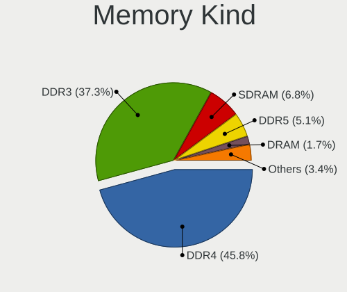

| Kind    | Desktops | Percent |
|---------|----------|---------|
| DDR4    | 27       | 45.76%  |
| DDR3    | 22       | 37.29%  |
| SDRAM   | 4        | 6.78%   |
| DDR5    | 3        | 5.08%   |
| DRAM    | 1        | 1.69%   |
| DDR2    | 1        | 1.69%   |
| Unknown | 1        | 1.69%   |

Memory Form Factor
------------------

Physical design of the memory module

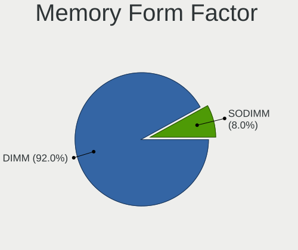

| Name   | Desktops | Percent |
|--------|----------|---------|
| DIMM   | 57       | 96.61%  |
| SODIMM | 2        | 3.39%   |

Memory Size
-----------

Memory module size

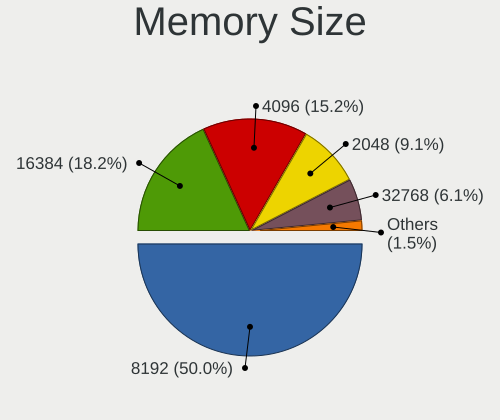

| Size  | Desktops | Percent |
|-------|----------|---------|
| 8192  | 33       | 50%     |
| 16384 | 12       | 18.18%  |
| 4096  | 10       | 15.15%  |
| 2048  | 6        | 9.09%   |
| 32768 | 4        | 6.06%   |
| 1024  | 1        | 1.52%   |

Memory Speed
------------

Memory module speed

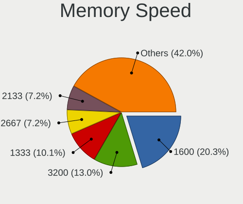

| Speed   | Desktops | Percent |
|---------|----------|---------|
| 1600    | 14       | 20.29%  |
| 3200    | 9        | 13.04%  |
| 1333    | 7        | 10.14%  |
| 2667    | 5        | 7.25%   |
| 2133    | 5        | 7.25%   |
| 2400    | 4        | 5.8%    |
| Unknown | 4        | 5.8%    |
| 4000    | 3        | 4.35%   |
| 3600    | 3        | 4.35%   |
| 4800    | 2        | 2.9%    |
| 3733    | 2        | 2.9%    |
| 2666    | 2        | 2.9%    |
| 1866    | 2        | 2.9%    |
| 6400    | 1        | 1.45%   |
| 5600    | 1        | 1.45%   |
| 3800    | 1        | 1.45%   |
| 3466    | 1        | 1.45%   |
| 3000    | 1        | 1.45%   |
| 2200    | 1        | 1.45%   |
| 266     | 1        | 1.45%   |

Printers & scanners
-------------------

Printer Vendor
--------------

Printer device vendors

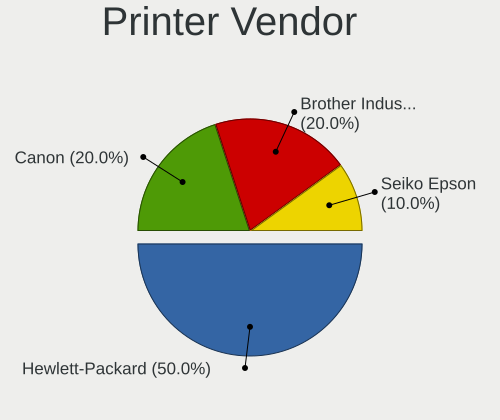

| Vendor             | Desktops | Percent |
|--------------------|----------|---------|
| Hewlett-Packard    | 5        | 50%     |
| Canon              | 2        | 20%     |
| Brother Industries | 2        | 20%     |
| Seiko Epson        | 1        | 10%     |

Printer Model
-------------

Printer device models

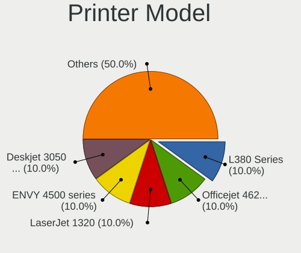

| Model                         | Desktops | Percent |
|-------------------------------|----------|---------|
| Seiko Epson L380 Series       | 1        | 10%     |
| HP Officejet 4620 series      | 1        | 10%     |
| HP LaserJet 1320              | 1        | 10%     |
| HP ENVY 4500 series           | 1        | 10%     |
| HP Deskjet 3050 J610 series   | 1        | 10%     |
| HP DeskJet 2700 series        | 1        | 10%     |
| Canon TR8600 series           | 1        | 10%     |
| Canon E410 series             | 1        | 10%     |
| Brother QL-710W Label Printer | 1        | 10%     |
| Brother DCP-T500W             | 1        | 10%     |

Scanner Vendor
--------------

Scanner device vendors

Zero info for selected period =(

Scanner Model
-------------

Scanner device models

Zero info for selected period =(

Camera
------

Camera Vendor
-------------

Camera device vendors

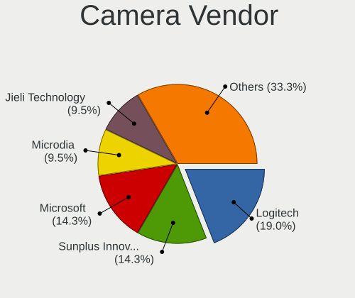

| Vendor                        | Desktops | Percent |
|-------------------------------|----------|---------|
| Logitech                      | 4        | 19.05%  |
| Sunplus Innovation Technology | 3        | 14.29%  |
| Microsoft                     | 3        | 14.29%  |
| Microdia                      | 2        | 9.52%   |
| Jieli Technology              | 2        | 9.52%   |
| Anker PowerConf C200          | 2        | 9.52%   |
| Samsung Electronics           | 1        | 4.76%   |
| Lenovo                        | 1        | 4.76%   |
| Leap Motion                   | 1        | 4.76%   |
| Generalplus Technology        | 1        | 4.76%   |
| GEMBIRD                       | 1        | 4.76%   |

Camera Model
------------

Camera device models

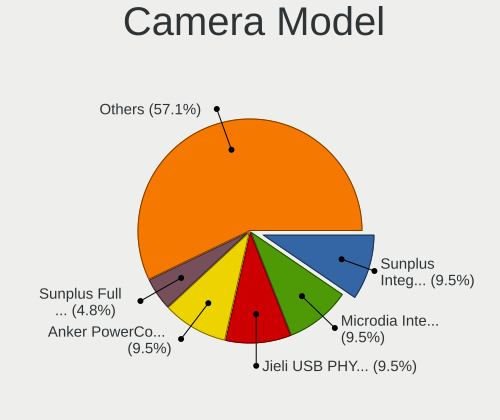

| Model                                     | Desktops | Percent |
|-------------------------------------------|----------|---------|
| Sunplus Integrated Camera                 | 2        | 9.52%   |
| Microdia Integrated Camera                | 2        | 9.52%   |
| Jieli USB PHY 2.0                         | 2        | 9.52%   |
| Anker PowerConf C200 Anker PowerConf C200 | 2        | 9.52%   |
| Sunplus Full HD webcam                    | 1        | 4.76%   |
| Samsung Galaxy series, misc. (MTP mode)   | 1        | 4.76%   |
| Microsoft LifeCam VX-2000                 | 1        | 4.76%   |
| Microsoft LifeCam Studio                  | 1        | 4.76%   |
| Microsoft LifeCam HD-3000                 | 1        | 4.76%   |
| Logitech Webcam C170                      | 1        | 4.76%   |
| Logitech VGA WebCam                       | 1        | 4.76%   |
| Logitech QuickCam E 3500                  | 1        | 4.76%   |
| Logitech Brio 100                         | 1        | 4.76%   |
| Lenovo Lenovo FHD Webcam Audio            | 1        | 4.76%   |
| Leap Motion Controller                    | 1        | 4.76%   |
| Generalplus 808 Camera #9 (web-cam mode)  | 1        | 4.76%   |
| GEMBIRD USB2.0 PC CAMERA                  | 1        | 4.76%   |

Security
--------

Fingerprint Vendor
------------------

Fingerprint sensor vendors

| Vendor         | Desktops | Percent |
|----------------|----------|---------|
| DigitalPersona | 1        | 100%    |

Fingerprint Model
-----------------

Fingerprint sensor models

| Model                             | Desktops | Percent |
|-----------------------------------|----------|---------|
| DigitalPersona Fingerprint Reader | 1        | 100%    |

Chipcard Vendor
---------------

Chipcard module vendors

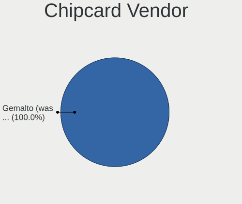

| Vendor                | Desktops | Percent |
|-----------------------|----------|---------|
| Gemalto (was Gemplus) | 1        | 100%    |

Chipcard Model
--------------

Chipcard module models

| Model                                             | Desktops | Percent |
|---------------------------------------------------|----------|---------|
| Gemalto (was Gemplus) GemPC Twin SmartCard Reader | 1        | 100%    |

Unsupported
-----------

Unsupported Devices
-------------------

Total unsupported devices on board

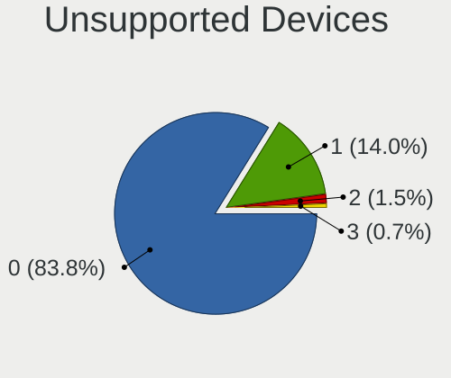

| Total | Desktops | Percent |
|-------|----------|---------|
| 0     | 114      | 83.82%  |
| 1     | 19       | 13.97%  |
| 2     | 2        | 1.47%   |
| 3     | 1        | 0.74%   |

Unsupported Device Types
------------------------

Types of unsupported devices

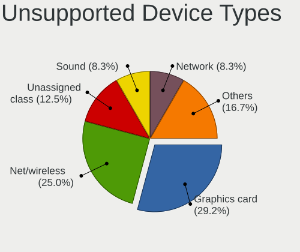

| Type                     | Desktops | Percent |
|--------------------------|----------|---------|
| Graphics card            | 7        | 29.17%  |
| Net/wireless             | 6        | 25%     |
| Unassigned class         | 3        | 12.5%   |
| Sound                    | 2        | 8.33%   |
| Network                  | 2        | 8.33%   |
| Fingerprint reader       | 1        | 4.17%   |
| Communication controller | 1        | 4.17%   |
| Chipcard                 | 1        | 4.17%   |
| Bluetooth                | 1        | 4.17%   |

