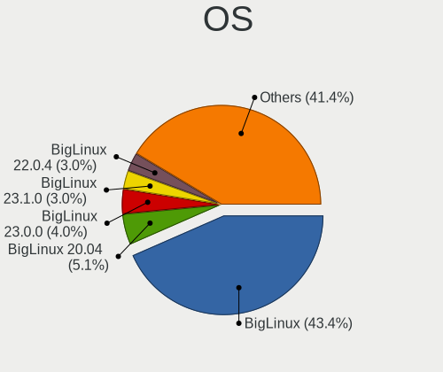
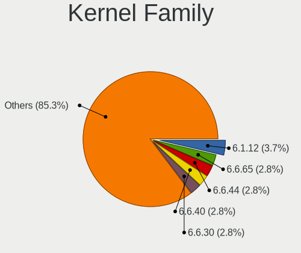
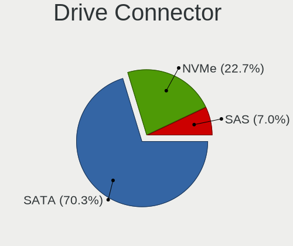
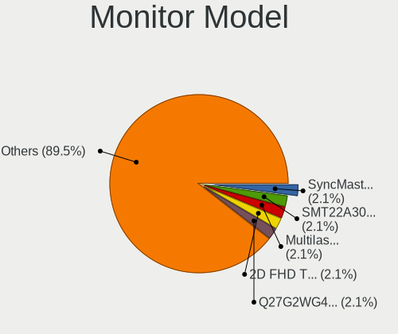
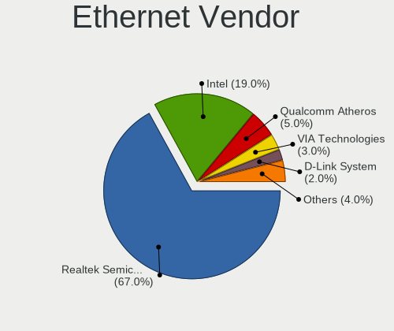
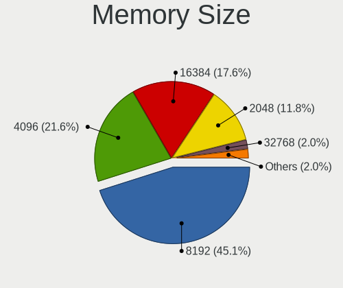
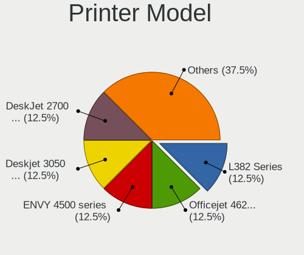
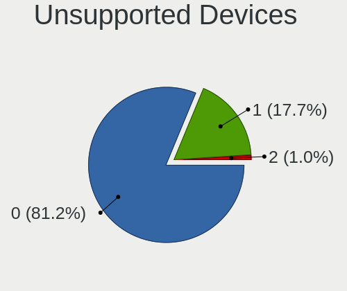

BigLinux - Tested Hardware & Statistics (Desktops)
--------------------------------------------------

A project to collect tested hardware configurations for BigLinux.

Anyone can contribute to this report by the [hw-probe](https://github.com/linuxhw/hw-probe) tool:

    sudo -E hw-probe -all -upload

Please contribute! Especially if your hardware is rare.

Contents
--------

* [ Test Cases ](#test-cases)

* [ System ](#system)
  - [ OS                       ](#os)
  - [ OS Family                ](#os-family)
  - [ Kernel                   ](#kernel)
  - [ Kernel Family            ](#kernel-family)
  - [ Kernel Major Ver.        ](#kernel-major-ver)
  - [ Arch                     ](#arch)
  - [ DE                       ](#de)
  - [ Display Server           ](#display-server)
  - [ Display Manager          ](#display-manager)
  - [ OS Lang                  ](#os-lang)
  - [ Boot Mode                ](#boot-mode)
  - [ Filesystem               ](#filesystem)
  - [ Part. scheme             ](#part-scheme)
  - [ Dual Boot with Linux/BSD ](#dual-boot-with-linuxbsd)
  - [ Dual Boot (Win)          ](#dual-boot-win)

* [ Board ](#board)
  - [ Vendor                   ](#vendor)
  - [ Model                    ](#model)
  - [ Model Family             ](#model-family)
  - [ MFG Year                 ](#mfg-year)
  - [ Form Factor              ](#form-factor)
  - [ Secure Boot              ](#secure-boot)
  - [ Coreboot                 ](#coreboot)
  - [ RAM Size                 ](#ram-size)
  - [ RAM Used                 ](#ram-used)
  - [ Total Drives             ](#total-drives)
  - [ Has CD-ROM               ](#has-cd-rom)
  - [ Has Ethernet             ](#has-ethernet)
  - [ Has WiFi                 ](#has-wifi)
  - [ Has Bluetooth            ](#has-bluetooth)

* [ Location ](#location)
  - [ Country                  ](#country)
  - [ City                     ](#city)

* [ Drives ](#drives)
  - [ Drive Vendor             ](#drive-vendor)
  - [ Drive Model              ](#drive-model)
  - [ HDD Vendor               ](#hdd-vendor)
  - [ SSD Vendor               ](#ssd-vendor)
  - [ Drive Kind               ](#drive-kind)
  - [ Drive Connector          ](#drive-connector)
  - [ Drive Size               ](#drive-size)
  - [ Space Total              ](#space-total)
  - [ Space Used               ](#space-used)
  - [ Malfunc. Drives          ](#malfunc-drives)
  - [ Malfunc. Drive Vendor    ](#malfunc-drive-vendor)
  - [ Malfunc. HDD Vendor      ](#malfunc-hdd-vendor)
  - [ Malfunc. Drive Kind      ](#malfunc-drive-kind)
  - [ Failed Drives            ](#failed-drives)
  - [ Failed Drive Vendor      ](#failed-drive-vendor)
  - [ Drive Status             ](#drive-status)

* [ Storage controller ](#storage-controller)
  - [ Storage Vendor           ](#storage-vendor)
  - [ Storage Model            ](#storage-model)
  - [ Storage Kind             ](#storage-kind)

* [ Processor ](#processor)
  - [ CPU Vendor               ](#cpu-vendor)
  - [ CPU Model                ](#cpu-model)
  - [ CPU Model Family         ](#cpu-model-family)
  - [ CPU Cores                ](#cpu-cores)
  - [ CPU Sockets              ](#cpu-sockets)
  - [ CPU Threads              ](#cpu-threads)
  - [ CPU Op-Modes             ](#cpu-op-modes)
  - [ CPU Microcode            ](#cpu-microcode)
  - [ CPU Microarch            ](#cpu-microarch)

* [ Graphics ](#graphics)
  - [ GPU Vendor               ](#gpu-vendor)
  - [ GPU Model                ](#gpu-model)
  - [ GPU Combo                ](#gpu-combo)
  - [ GPU Driver               ](#gpu-driver)
  - [ GPU Memory               ](#gpu-memory)

* [ Monitor ](#monitor)
  - [ Monitor Vendor           ](#monitor-vendor)
  - [ Monitor Model            ](#monitor-model)
  - [ Monitor Resolution       ](#monitor-resolution)
  - [ Monitor Diagonal         ](#monitor-diagonal)
  - [ Monitor Width            ](#monitor-width)
  - [ Aspect Ratio             ](#aspect-ratio)
  - [ Monitor Area             ](#monitor-area)
  - [ Pixel Density            ](#pixel-density)
  - [ Multiple Monitors        ](#multiple-monitors)

* [ Network ](#network)
  - [ Net Controller Vendor    ](#net-controller-vendor)
  - [ Net Controller Model     ](#net-controller-model)
  - [ Wireless Vendor          ](#wireless-vendor)
  - [ Wireless Model           ](#wireless-model)
  - [ Ethernet Vendor          ](#ethernet-vendor)
  - [ Ethernet Model           ](#ethernet-model)
  - [ Net Controller Kind      ](#net-controller-kind)
  - [ Used Controller          ](#used-controller)
  - [ NICs                     ](#nics)
  - [ IPv6                     ](#ipv6)

* [ Bluetooth ](#bluetooth)
  - [ Bluetooth Vendor         ](#bluetooth-vendor)
  - [ Bluetooth Model          ](#bluetooth-model)

* [ Sound ](#sound)
  - [ Sound Vendor             ](#sound-vendor)
  - [ Sound Model              ](#sound-model)

* [ Memory ](#memory)
  - [ Memory Vendor            ](#memory-vendor)
  - [ Memory Model             ](#memory-model)
  - [ Memory Kind              ](#memory-kind)
  - [ Memory Form Factor       ](#memory-form-factor)
  - [ Memory Size              ](#memory-size)
  - [ Memory Speed             ](#memory-speed)

* [ Printers & scanners ](#printers--scanners)
  - [ Printer Vendor           ](#printer-vendor)
  - [ Printer Model            ](#printer-model)
  - [ Scanner Vendor           ](#scanner-vendor)
  - [ Scanner Model            ](#scanner-model)

* [ Camera ](#camera)
  - [ Camera Vendor            ](#camera-vendor)
  - [ Camera Model             ](#camera-model)

* [ Security ](#security)
  - [ Fingerprint Vendor       ](#fingerprint-vendor)
  - [ Fingerprint Model        ](#fingerprint-model)
  - [ Chipcard Vendor          ](#chipcard-vendor)
  - [ Chipcard Model           ](#chipcard-model)

* [ Unsupported ](#unsupported)
  - [ Unsupported Devices      ](#unsupported-devices)
  - [ Unsupported Device Types ](#unsupported-device-types)

Test Cases
----------

Total: 144

| Vendor        | Model                       | Probe                                                      | Date         |
|---------------|-----------------------------|------------------------------------------------------------|--------------|
| MAXSUN        | MS-Challenger B760M         | [d0da8b89ac](https://linux-hardware.org/?probe=d0da8b89ac) | Jan 05, 2025 |
| MAXSUN        | MS-Challenger B760M         | [468fb150c0](https://linux-hardware.org/?probe=468fb150c0) | Jan 04, 2025 |
| Intel         | B75                         | [e0b305feae](https://linux-hardware.org/?probe=e0b305feae) | Jan 01, 2025 |
| ASUSTek       | P8H61-M LX3 R2.0            | [dcfafc889c](https://linux-hardware.org/?probe=dcfafc889c) | Dec 19, 2024 |
| MSI           | MPG Z690 EDGE WIFI DDR4     | [aff41ee61b](https://linux-hardware.org/?probe=aff41ee61b) | Dec 07, 2024 |
| MSI           | Z87-G45 GAMING              | [7d5ba2293a](https://linux-hardware.org/?probe=7d5ba2293a) | Dec 06, 2024 |
| ASRock        | H77 Pro4-M                  | [ee78ad6501](https://linux-hardware.org/?probe=ee78ad6501) | Nov 30, 2024 |
| Lenovo        | NOK                         | [a761e22d35](https://linux-hardware.org/?probe=a761e22d35) | Nov 28, 2024 |
| Lenovo        | NOK                         | [7b4b2dc9f5](https://linux-hardware.org/?probe=7b4b2dc9f5) | Nov 28, 2024 |
| Positivo      | POS-EIH61CQ POSITIVO        | [1cdf6bce40](https://linux-hardware.org/?probe=1cdf6bce40) | Oct 27, 2024 |
| HP            | 225E                        | [942662301f](https://linux-hardware.org/?probe=942662301f) | Oct 21, 2024 |
| MSI           | Z97 MPOWER MAX AC           | [02bbeb1a17](https://linux-hardware.org/?probe=02bbeb1a17) | Oct 19, 2024 |
| Gigabyte      | H110M-S2H-CF                | [9599929595](https://linux-hardware.org/?probe=9599929595) | Oct 16, 2024 |
| MSI           | Z97 MPOWER MAX AC           | [b8fbfecc12](https://linux-hardware.org/?probe=b8fbfecc12) | Oct 06, 2024 |
| Dell          | 0NV0M7 A01                  | [7339ef4fdb](https://linux-hardware.org/?probe=7339ef4fdb) | Sep 21, 2024 |
| Itautec       | ST 4262                     | [e48d38d71f](https://linux-hardware.org/?probe=e48d38d71f) | Sep 17, 2024 |
| ASRock        | N68C-S UCC                  | [fb79062462](https://linux-hardware.org/?probe=fb79062462) | Sep 14, 2024 |
| ASRock        | N68C-S UCC                  | [d4b82fd204](https://linux-hardware.org/?probe=d4b82fd204) | Sep 14, 2024 |
| Intel         | H61                         | [902ef7bbb2](https://linux-hardware.org/?probe=902ef7bbb2) | Sep 10, 2024 |
| ASUSTek       | PRIME A520M-A II            | [90a1a80a14](https://linux-hardware.org/?probe=90a1a80a14) | Sep 09, 2024 |
| Gigabyte      | B450M GAMING                | [4ab83f05ff](https://linux-hardware.org/?probe=4ab83f05ff) | Sep 08, 2024 |
| Gigabyte      | B450M GAMING                | [7193ebf322](https://linux-hardware.org/?probe=7193ebf322) | Sep 05, 2024 |
| Intel         | G41AGB3 V1.01               | [a83fc33bbf](https://linux-hardware.org/?probe=a83fc33bbf) | Sep 03, 2024 |
| Intel         | G41AGB3 V1.01               | [e915d2750c](https://linux-hardware.org/?probe=e915d2750c) | Sep 03, 2024 |
| Itautec       | ST 4262                     | [ad107abe55](https://linux-hardware.org/?probe=ad107abe55) | Sep 01, 2024 |
| Itautec       | ST 4262                     | [e40e1ccf45](https://linux-hardware.org/?probe=e40e1ccf45) | Sep 01, 2024 |
| PCWare        | IPMH61R2                    | [8205829435](https://linux-hardware.org/?probe=8205829435) | Aug 23, 2024 |
| ASRock        | 775VM800                    | [e3fdbf1d31](https://linux-hardware.org/?probe=e3fdbf1d31) | Aug 22, 2024 |
| Biostar       | B450MH                      | [13c5cbc6a4](https://linux-hardware.org/?probe=13c5cbc6a4) | Aug 21, 2024 |
| Gigabyte      | Z87-HD3                     | [5a68f860a3](https://linux-hardware.org/?probe=5a68f860a3) | Aug 19, 2024 |
| ASRock        | B450M Steel Legend          | [7f73ce2553](https://linux-hardware.org/?probe=7f73ce2553) | Aug 15, 2024 |
| Gigabyte      | Z97X-SLI-CF                 | [9783e8262b](https://linux-hardware.org/?probe=9783e8262b) | Aug 14, 2024 |
| Unknown       | Unknown                     | [778b831403](https://linux-hardware.org/?probe=778b831403) | Aug 14, 2024 |
| PCWare        | IPMH61R2                    | [169c824cd8](https://linux-hardware.org/?probe=169c824cd8) | Aug 08, 2024 |
| PCWare        | IPMH61R2                    | [45f0d7d3ae](https://linux-hardware.org/?probe=45f0d7d3ae) | Aug 06, 2024 |
| MSI           | B250M PRO-VDH               | [54b1751462](https://linux-hardware.org/?probe=54b1751462) | Aug 03, 2024 |
| Biostar       | B450MH                      | [4146da7984](https://linux-hardware.org/?probe=4146da7984) | Jul 28, 2024 |
| Biostar       | B450MH                      | [9b728350df](https://linux-hardware.org/?probe=9b728350df) | Jul 28, 2024 |
| Dell          | 0XPDFK A01                  | [e37df86f48](https://linux-hardware.org/?probe=e37df86f48) | Jul 21, 2024 |
| PCWare        | IPMH61R2                    | [d2a1cd571c](https://linux-hardware.org/?probe=d2a1cd571c) | Jul 18, 2024 |
| Gigabyte      | 970A-DS3P                   | [58c9a67f99](https://linux-hardware.org/?probe=58c9a67f99) | Jul 17, 2024 |
| Gigabyte      | 970A-DS3P                   | [fce29bd6a0](https://linux-hardware.org/?probe=fce29bd6a0) | Jul 16, 2024 |
| Gigabyte      | H81M-H                      | [01d5fc3fa5](https://linux-hardware.org/?probe=01d5fc3fa5) | Jul 13, 2024 |
| Gigabyte      | B450M GAMING                | [53cdf8138a](https://linux-hardware.org/?probe=53cdf8138a) | Jul 10, 2024 |
| ASUSTek       | PRIME B450M-A               | [3ff5a5b36d](https://linux-hardware.org/?probe=3ff5a5b36d) | Jul 07, 2024 |
| ASRock        | X670E Taichi                | [fcb2f540af](https://linux-hardware.org/?probe=fcb2f540af) | Jul 06, 2024 |
| ASRock        | B450M Steel Legend          | [5350d48bab](https://linux-hardware.org/?probe=5350d48bab) | Jun 27, 2024 |
| MSI           | H97M-E35                    | [46a0e96695](https://linux-hardware.org/?probe=46a0e96695) | Jun 21, 2024 |
| ASRock        | B450M Steel Legend          | [50ab70f42c](https://linux-hardware.org/?probe=50ab70f42c) | Jun 21, 2024 |
| ASUSTek       | ROG STRIX X470-F GAMING     | [5e8c64f060](https://linux-hardware.org/?probe=5e8c64f060) | Jun 19, 2024 |
| Intel         | B360                        | [be71c9e5a7](https://linux-hardware.org/?probe=be71c9e5a7) | Jun 14, 2024 |
| PCWare        | IPMH61R2                    | [43e8dd6f94](https://linux-hardware.org/?probe=43e8dd6f94) | Jun 01, 2024 |
| Biostar       | B450MH                      | [963320d4e0](https://linux-hardware.org/?probe=963320d4e0) | May 31, 2024 |
| Gigabyte      | Z87-HD3                     | [a39e174db0](https://linux-hardware.org/?probe=a39e174db0) | May 18, 2024 |
| ASUSTek       | PRIME B450M-GAMING/BR       | [264f11732f](https://linux-hardware.org/?probe=264f11732f) | May 13, 2024 |
| ASUSTek       | P5QL-ASUS-SE                | [bc65c4e522](https://linux-hardware.org/?probe=bc65c4e522) | May 09, 2024 |
| PCWare        | IPMH61R3                    | [1f3c6428d2](https://linux-hardware.org/?probe=1f3c6428d2) | May 09, 2024 |
| ASUSTek       | PRIME A520M-E               | [ee738361ee](https://linux-hardware.org/?probe=ee738361ee) | May 01, 2024 |
| Positivo      | POS-RAX300ES 11191478       | [3e201c7230](https://linux-hardware.org/?probe=3e201c7230) | Apr 26, 2024 |
| Gigabyte      | Z790 UD AC                  | [59fff37f7f](https://linux-hardware.org/?probe=59fff37f7f) | Apr 24, 2024 |
| ASUSTek       | P5QL-ASUS-SE                | [8d6d79b4d7](https://linux-hardware.org/?probe=8d6d79b4d7) | Apr 13, 2024 |
| MSI           | B350 TOMAHAWK               | [e80bbf7d11](https://linux-hardware.org/?probe=e80bbf7d11) | Apr 12, 2024 |
| Gigabyte      | H77-D3H                     | [647ad74796](https://linux-hardware.org/?probe=647ad74796) | Apr 07, 2024 |
| ASUSTek       | PRIME A520M-A II            | [85db87031e](https://linux-hardware.org/?probe=85db87031e) | Mar 23, 2024 |
| ASRock        | Z390 Phantom Gaming 4S-I... | [2d0dc9eb8a](https://linux-hardware.org/?probe=2d0dc9eb8a) | Mar 22, 2024 |
| MSI           | MPG B550 GAMING CARBON W... | [92707b25ae](https://linux-hardware.org/?probe=92707b25ae) | Mar 14, 2024 |
| ASUSTek       | P5QL-ASUS-SE                | [2ca44d747e](https://linux-hardware.org/?probe=2ca44d747e) | Feb 29, 2024 |
| ASUSTek       | P5QL-ASUS-SE                | [a187c17778](https://linux-hardware.org/?probe=a187c17778) | Feb 20, 2024 |
| HP            | 8617                        | [4ea51313bd](https://linux-hardware.org/?probe=4ea51313bd) | Jan 15, 2024 |
| Gigabyte      | 970A-DS3P                   | [c8f6ccf6a8](https://linux-hardware.org/?probe=c8f6ccf6a8) | Jan 13, 2024 |
| Gigabyte      | A520M H                     | [0394447477](https://linux-hardware.org/?probe=0394447477) | Jan 12, 2024 |
| Intel         | D945GCPE AAD97209-201       | [d109d298a5](https://linux-hardware.org/?probe=d109d298a5) | Jan 11, 2024 |
| Intel         | D945GCPE AAD97209-201       | [585f20355c](https://linux-hardware.org/?probe=585f20355c) | Jan 11, 2024 |
| Digiboard     | NM70-TI                     | [9f740d246e](https://linux-hardware.org/?probe=9f740d246e) | Jan 08, 2024 |
| Lenovo        | ThinkCentre M91p 7005A21    | [043bcfc503](https://linux-hardware.org/?probe=043bcfc503) | Dec 31, 2023 |
| Lenovo        | ThinkCentre M91p 7005A21    | [e783d0ce11](https://linux-hardware.org/?probe=e783d0ce11) | Dec 31, 2023 |
| OEM           | B75 Ver:1.41                | [4117a986c8](https://linux-hardware.org/?probe=4117a986c8) | Dec 16, 2023 |
| Gigabyte      | Z87X-UD4H-CF                | [a960a2a5b7](https://linux-hardware.org/?probe=a960a2a5b7) | Dec 10, 2023 |
| Gigabyte      | B650 GAMING X AX            | [e04ad23cd3](https://linux-hardware.org/?probe=e04ad23cd3) | Dec 10, 2023 |
| Gigabyte      | B650 GAMING X AX            | [b5f3fbe4c5](https://linux-hardware.org/?probe=b5f3fbe4c5) | Dec 09, 2023 |
| Lenovo        | 3102 SDK0J40697 WIN 3305... | [b4efc55410](https://linux-hardware.org/?probe=b4efc55410) | Dec 05, 2023 |
| Gigabyte      | Z87X-UD4H-CF                | [15d4dc2fe9](https://linux-hardware.org/?probe=15d4dc2fe9) | Dec 05, 2023 |
| Gigabyte      | Z87-HD3                     | [b71e5d49a4](https://linux-hardware.org/?probe=b71e5d49a4) | Dec 04, 2023 |
| Gigabyte      | Z87-HD3                     | [638021e67d](https://linux-hardware.org/?probe=638021e67d) | Dec 04, 2023 |
| Positivo      | POS-EIH61CQ POSITIVO        | [bed32da0ed](https://linux-hardware.org/?probe=bed32da0ed) | Nov 26, 2023 |
| ASUSTek       | TUF B450-PLUS GAMING        | [c24820ad94](https://linux-hardware.org/?probe=c24820ad94) | Nov 24, 2023 |
| Gigabyte      | A520M DS3H                  | [713583bc52](https://linux-hardware.org/?probe=713583bc52) | Nov 22, 2023 |
| Intel         | B75                         | [0620da2ddb](https://linux-hardware.org/?probe=0620da2ddb) | Nov 21, 2023 |
| HP            | 1495                        | [c03adda1fa](https://linux-hardware.org/?probe=c03adda1fa) | Nov 20, 2023 |
| ASUSTek       | P5KPL-AM-CKD-VISUM-SI       | [fd1be084ac](https://linux-hardware.org/?probe=fd1be084ac) | Nov 12, 2023 |
| Gigabyte      | Z87-HD3                     | [f6db4cc5a7](https://linux-hardware.org/?probe=f6db4cc5a7) | Oct 31, 2023 |
| Gigabyte      | Z87-HD3                     | [35fabc6811](https://linux-hardware.org/?probe=35fabc6811) | Oct 31, 2023 |
| Gigabyte      | H370 AORUS GAMING 3 WIFI... | [439b0a3497](https://linux-hardware.org/?probe=439b0a3497) | Oct 28, 2023 |
| Dell          | 0KJCC5 A00                  | [f904697713](https://linux-hardware.org/?probe=f904697713) | Oct 23, 2023 |
| Gigabyte      | G41MT-S2                    | [50aa4fc1e1](https://linux-hardware.org/?probe=50aa4fc1e1) | Oct 18, 2023 |
| Gigabyte      | G41MT-S2                    | [d45a6f5bf2](https://linux-hardware.org/?probe=d45a6f5bf2) | Oct 14, 2023 |
| Gigabyte      | GA-880GMA-UD2H              | [45a4c0fbe0](https://linux-hardware.org/?probe=45a4c0fbe0) | Oct 06, 2023 |
| Intel         | H61                         | [5dd60be36a](https://linux-hardware.org/?probe=5dd60be36a) | Sep 14, 2023 |
| PCWare        | IPMH81G1                    | [181367c2db](https://linux-hardware.org/?probe=181367c2db) | Sep 12, 2023 |
| Biostar       | G31M+                       | [24eb0eb2db](https://linux-hardware.org/?probe=24eb0eb2db) | Sep 06, 2023 |
| ASUSTek       | Z170 PRO GAMING             | [73e3b8ef8a](https://linux-hardware.org/?probe=73e3b8ef8a) | Sep 04, 2023 |
| ASUSTek       | PRIME H410M-D               | [332e78dfba](https://linux-hardware.org/?probe=332e78dfba) | Sep 01, 2023 |
| Gigabyte      | B550M AORUS ELITE           | [9cf292357b](https://linux-hardware.org/?probe=9cf292357b) | Aug 30, 2023 |
| Daten Tecn... | DH110MXV                    | [a2487119a6](https://linux-hardware.org/?probe=a2487119a6) | Jul 08, 2023 |
| Daten Tecn... | DH110MXV                    | [f9a1d993b2](https://linux-hardware.org/?probe=f9a1d993b2) | Jul 07, 2023 |
| Intel         | X79 (INTEL Xeon E5/Corei... | [613d703a17](https://linux-hardware.org/?probe=613d703a17) | Jun 10, 2023 |
| Toshiba       | STI 005492G                 | [4f161f4ed0](https://linux-hardware.org/?probe=4f161f4ed0) | May 26, 2023 |
| MSI           | MAG B550 TOMAHAWK           | [620668d216](https://linux-hardware.org/?probe=620668d216) | Apr 25, 2023 |
| HP            | 1495                        | [96283c0a09](https://linux-hardware.org/?probe=96283c0a09) | Apr 01, 2023 |
| HP            | 1495                        | [f25125625a](https://linux-hardware.org/?probe=f25125625a) | Apr 01, 2023 |
| MSI           | B550M PRO-VDH WIFI          | [e3a13c69ef](https://linux-hardware.org/?probe=e3a13c69ef) | Apr 01, 2023 |
| HP            | 3397                        | [0b74e11cdd](https://linux-hardware.org/?probe=0b74e11cdd) | Mar 12, 2023 |
| HP            | 1495                        | [058beaa7d1](https://linux-hardware.org/?probe=058beaa7d1) | Mar 12, 2023 |
| HP            | 1495                        | [517a7a6401](https://linux-hardware.org/?probe=517a7a6401) | Mar 12, 2023 |
| Lenovo        | NOK                         | [2e90ce2e87](https://linux-hardware.org/?probe=2e90ce2e87) | Mar 10, 2023 |
| Gigabyte      | B560M AORUS ELITE           | [066cc238c4](https://linux-hardware.org/?probe=066cc238c4) | Feb 26, 2023 |
| Intel         | H61                         | [5e26cd7b85](https://linux-hardware.org/?probe=5e26cd7b85) | Feb 23, 2023 |
| Gigabyte      | B560M AORUS ELITE           | [789bcfe82f](https://linux-hardware.org/?probe=789bcfe82f) | Feb 22, 2023 |
| Lenovo        | SHARKBAY 0B98401 WIN        | [7c6973f1fa](https://linux-hardware.org/?probe=7c6973f1fa) | Feb 21, 2023 |
| Gigabyte      | X399 DESIGNARE EX-CF        | [4bcfe32668](https://linux-hardware.org/?probe=4bcfe32668) | Feb 12, 2023 |
| Intel         | H61                         | [81e14fd083](https://linux-hardware.org/?probe=81e14fd083) | Feb 08, 2023 |
| BESSTAR Te... | HM90                        | [3f958de9bb](https://linux-hardware.org/?probe=3f958de9bb) | Feb 01, 2023 |
| Intel         | H55                         | [4fdea85eec](https://linux-hardware.org/?probe=4fdea85eec) | Jan 14, 2023 |
| Intel         | H55                         | [d875a18037](https://linux-hardware.org/?probe=d875a18037) | Jan 14, 2023 |
| Gigabyte      | Z87-HD3                     | [9b43ddbe11](https://linux-hardware.org/?probe=9b43ddbe11) | Nov 09, 2022 |
| Gigabyte      | Z87-HD3                     | [8e89ed396e](https://linux-hardware.org/?probe=8e89ed396e) | Nov 05, 2022 |
| ASUSTek       | TUF Gaming B450M-PRO S      | [8cb2cd8c19](https://linux-hardware.org/?probe=8cb2cd8c19) | Oct 26, 2022 |
| eMachines     | EMCP61M                     | [711594c5b4](https://linux-hardware.org/?probe=711594c5b4) | Oct 09, 2022 |
| ASUSTek       | TUF Gaming B450M-PRO S      | [75502d8d96](https://linux-hardware.org/?probe=75502d8d96) | Oct 09, 2022 |
| ASUSTek       | TUF Gaming B450M-PRO S      | [94c783f944](https://linux-hardware.org/?probe=94c783f944) | Sep 11, 2022 |
| Intel         | DH61WW AAG23116-203         | [43a16c5e88](https://linux-hardware.org/?probe=43a16c5e88) | Aug 21, 2022 |
| ASUSTek       | Z87M-PLUS                   | [0efc94e34d](https://linux-hardware.org/?probe=0efc94e34d) | Jul 24, 2022 |
| Intel         | DH61WW AAG23116-203         | [cfd6e87e09](https://linux-hardware.org/?probe=cfd6e87e09) | Jul 23, 2022 |
| ASUSTek       | Z87M-PLUS                   | [c30806c628](https://linux-hardware.org/?probe=c30806c628) | Jul 23, 2022 |
| ASUSTek       | Z87M-PLUS                   | [b805fa0cd8](https://linux-hardware.org/?probe=b805fa0cd8) | Jul 23, 2022 |
| ECS           | H67H2-M2                    | [d82e4c4eb4](https://linux-hardware.org/?probe=d82e4c4eb4) | Apr 10, 2021 |
| ASUSTek       | H110M-C/BR                  | [0c4cd978f2](https://linux-hardware.org/?probe=0c4cd978f2) | Jul 24, 2020 |
| ASUSTek       | TUF B360M-PLUS GAMING/BR    | [3cef63e59d](https://linux-hardware.org/?probe=3cef63e59d) | Jul 17, 2020 |
| PCWare        | IPX1800E2                   | [0990462881](https://linux-hardware.org/?probe=0990462881) | Jun 21, 2020 |
| PCWare        | IPX1800E2                   | [93916c17f2](https://linux-hardware.org/?probe=93916c17f2) | Jun 21, 2020 |
| ASRock        | 775Dual-VSTA                | [0e5ac5a0bf](https://linux-hardware.org/?probe=0e5ac5a0bf) | Jun 12, 2020 |
| ASRock        | 775Dual-VSTA                | [a4f3841c00](https://linux-hardware.org/?probe=a4f3841c00) | May 29, 2020 |
| ASRock        | 775Dual-VSTA                | [3fe70d9fdd](https://linux-hardware.org/?probe=3fe70d9fdd) | May 06, 2020 |
| ASRock        | 775Dual-VSTA                | [8fa9935547](https://linux-hardware.org/?probe=8fa9935547) | Apr 27, 2020 |

System
------

OS
--

Installed operating systems

| Name                      | Desktops | Percent |
|---------------------------|----------|---------|
| BigLinux                  | 43       | 43.43%  |
| BigLinux 20.04            | 5        | 5.05%   |
| BigLinux 23.0.0           | 4        | 4.04%   |
| BigLinux 23.1.0           | 3        | 3.03%   |
| BigLinux 22.0.4           | 3        | 3.03%   |
| BigLinux 24.0.8           | 2        | 2.02%   |
| BigLinux 24.0.2           | 2        | 2.02%   |
| BigLinux 23.02.20         | 2        | 2.02%   |
| BigLinux 23.0.1           | 2        | 2.02%   |
| BigLinux 22.1.0           | 2        | 2.02%   |
| BigLinux 22.0.0           | 2        | 2.02%   |
| BigLinux 21.3.5           | 2        | 2.02%   |
| BigLinux 2024-03-08_05-13 | 2        | 2.02%   |
| BigLinux 2023-12-01_05-13 | 2        | 2.02%   |
| BigLinux 24.1.1           | 1        | 1.01%   |
| BigLinux 24.0.6           | 1        | 1.01%   |
| BigLinux 24.0.4           | 1        | 1.01%   |
| BigLinux 24.0.0           | 1        | 1.01%   |
| BigLinux 23.1.3           | 1        | 1.01%   |
| BigLinux 23.1.2           | 1        | 1.01%   |
| BigLinux 23.02.24         | 1        | 1.01%   |
| BigLinux 23.02.07         | 1        | 1.01%   |
| BigLinux 23.01.30         | 1        | 1.01%   |
| BigLinux 23.0.3           | 1        | 1.01%   |
| BigLinux 22.12.24         | 1        | 1.01%   |
| BigLinux 22.10.28         | 1        | 1.01%   |
| BigLinux 22.1.1           | 1        | 1.01%   |
| BigLinux 22.09.09         | 1        | 1.01%   |
| BigLinux 22.0.2           | 1        | 1.01%   |
| BigLinux 21.3.7           | 1        | 1.01%   |
| BigLinux 2024-05-20_03-09 | 1        | 1.01%   |
| BigLinux 2024-02-10_15-30 | 1        | 1.01%   |
| BigLinux 2023-11-17_05-13 | 1        | 1.01%   |
| BigLinux 2023-11-13_03-10 | 1        | 1.01%   |
| BigLinux 2023-06-30_08-01 | 1        | 1.01%   |
| BigLinux 2023-06-07_06-02 | 1        | 1.01%   |
| BigLinux 19.04            | 1        | 1.01%   |

OS Family
---------

OS without a version

| Name     | Desktops | Percent |
|----------|----------|---------|
| BigLinux | 95       | 100%    |

Kernel
------

Version of the Linux kernel

| Version                    | Desktops | Percent |
|----------------------------|----------|---------|
| 6.1.12-1-MANJARO           | 4        | 3.64%   |
| 6.6.40-1-MANJARO           | 3        | 2.73%   |
| 6.1.71-1-MANJARO           | 3        | 2.73%   |
| 6.1.55-1-MANJARO           | 3        | 2.73%   |
| 6.9.5-1-MANJARO            | 2        | 1.82%   |
| 6.6.65-1-MANJARO           | 2        | 1.82%   |
| 6.6.63-1-MANJARO           | 2        | 1.82%   |
| 6.6.54-2-MANJARO           | 2        | 1.82%   |
| 6.6.44-1-MANJARO           | 2        | 1.82%   |
| 6.6.34-1-MANJARO           | 2        | 1.82%   |
| 6.6.30-2-MANJARO           | 2        | 1.82%   |
| 6.6.3-1-MANJARO            | 2        | 1.82%   |
| 6.6.26-1-MANJARO           | 2        | 1.82%   |
| 6.4.12-1-MANJARO           | 2        | 1.82%   |
| 6.10.6-10-MANJARO          | 2        | 1.82%   |
| 6.1.85-1-MANJARO           | 2        | 1.82%   |
| 6.1.64-1-MANJARO           | 2        | 1.82%   |
| 6.1.62-1-MANJARO           | 2        | 1.82%   |
| 6.1.51-1-MANJARO           | 2        | 1.82%   |
| 6.1.31-2-MANJARO           | 2        | 1.82%   |
| 6.1.106-1-MANJARO          | 2        | 1.82%   |
| 5.4.0-37-generic           | 2        | 1.82%   |
| 5.15.94-1-MANJARO          | 2        | 1.82%   |
| 5.15.71-1-MANJARO          | 2        | 1.82%   |
| 5.15.60-1-MANJARO          | 2        | 1.82%   |
| 6.9.3-3-MANJARO            | 1        | 0.91%   |
| 6.9.12-3-MANJARO           | 1        | 0.91%   |
| 6.9.10-1-MANJARO           | 1        | 0.91%   |
| 6.8.9-3-MANJARO            | 1        | 0.91%   |
| 6.8.5-1-MANJARO            | 1        | 0.91%   |
| 6.7.10-x64v2-xanmod1-1     | 1        | 0.91%   |
| 6.7.0-4-MANJARO            | 1        | 0.91%   |
| 6.6.8-2-MANJARO            | 1        | 0.91%   |
| 6.6.65-x64v1-xanmod1-1-lts | 1        | 0.91%   |
| 6.6.53-x64v1-xanmod1-1-lts | 1        | 0.91%   |
| 6.6.5-x64v2-xanmod1-1      | 1        | 0.91%   |
| 6.6.47-1-MANJARO           | 1        | 0.91%   |
| 6.6.46-1-MANJARO           | 1        | 0.91%   |
| 6.6.44-x64v1-xanmod1-1-lts | 1        | 0.91%   |
| 6.6.42-x64v1-xanmod1-1-lts | 1        | 0.91%   |

Kernel Family
-------------

Linux kernel without a distro release

| Version | Desktops | Percent |
|---------|----------|---------|
| 6.1.12  | 4        | 3.67%   |
| 6.6.65  | 3        | 2.75%   |
| 6.6.44  | 3        | 2.75%   |
| 6.6.40  | 3        | 2.75%   |
| 6.6.30  | 3        | 2.75%   |
| 6.1.71  | 3        | 2.75%   |
| 6.1.62  | 3        | 2.75%   |
| 6.1.55  | 3        | 2.75%   |
| 5.4.0   | 3        | 2.75%   |
| 6.9.5   | 2        | 1.83%   |
| 6.6.63  | 2        | 1.83%   |
| 6.6.54  | 2        | 1.83%   |
| 6.6.34  | 2        | 1.83%   |
| 6.6.32  | 2        | 1.83%   |
| 6.6.3   | 2        | 1.83%   |
| 6.6.26  | 2        | 1.83%   |
| 6.4.12  | 2        | 1.83%   |
| 6.10.6  | 2        | 1.83%   |
| 6.1.9   | 2        | 1.83%   |
| 6.1.85  | 2        | 1.83%   |
| 6.1.64  | 2        | 1.83%   |
| 6.1.51  | 2        | 1.83%   |
| 6.1.31  | 2        | 1.83%   |
| 6.1.106 | 2        | 1.83%   |
| 5.15.94 | 2        | 1.83%   |
| 5.15.71 | 2        | 1.83%   |
| 5.15.60 | 2        | 1.83%   |
| 6.9.3   | 1        | 0.92%   |
| 6.9.12  | 1        | 0.92%   |
| 6.9.10  | 1        | 0.92%   |
| 6.8.9   | 1        | 0.92%   |
| 6.8.5   | 1        | 0.92%   |
| 6.7.10  | 1        | 0.92%   |
| 6.7.0   | 1        | 0.92%   |
| 6.6.8   | 1        | 0.92%   |
| 6.6.53  | 1        | 0.92%   |
| 6.6.5   | 1        | 0.92%   |
| 6.6.47  | 1        | 0.92%   |
| 6.6.46  | 1        | 0.92%   |
| 6.6.42  | 1        | 0.92%   |

Kernel Major Ver.
-----------------

Linux kernel major version

| Version | Desktops | Percent |
|---------|----------|---------|
| 6.6     | 32       | 31.68%  |
| 6.1     | 32       | 31.68%  |
| 5.15    | 10       | 9.9%    |
| 6.9     | 5        | 4.95%   |
| 6.10    | 4        | 3.96%   |
| 5.4     | 3        | 2.97%   |
| 6.8     | 2        | 1.98%   |
| 6.7     | 2        | 1.98%   |
| 6.5     | 2        | 1.98%   |
| 6.4     | 2        | 1.98%   |
| 6.2     | 1        | 0.99%   |
| 6.11    | 1        | 0.99%   |
| 5.8     | 1        | 0.99%   |
| 5.7     | 1        | 0.99%   |
| 5.6     | 1        | 0.99%   |
| 5.17    | 1        | 0.99%   |
| 5.16    | 1        | 0.99%   |

Arch
----

OS architecture (x86_64, i586, etc.)

| Name   | Desktops | Percent |
|--------|----------|---------|
| x86_64 | 95       | 100%    |

DE
--

Desktop Environment

| Name | Desktops | Percent |
|------|----------|---------|
| KDE5 | 57       | 58.16%  |
| KDE6 | 34       | 34.69%  |
| KDE  | 6        | 6.12%   |
| XFCE | 1        | 1.02%   |

Display Server
--------------

X11 or Wayland

| Name    | Desktops | Percent |
|---------|----------|---------|
| X11     | 78       | 79.59%  |
| Wayland | 19       | 19.39%  |
| Unknown | 1        | 1.02%   |

Display Manager
---------------

SDDM, LightDM, etc.

| Name    | Desktops | Percent |
|---------|----------|---------|
| SDDM    | 48       | 50%     |
| Unknown | 47       | 48.96%  |
| LXDM    | 1        | 1.04%   |

OS Lang
-------

Language

| Lang  | Desktops | Percent |
|-------|----------|---------|
| pt_BR | 58       | 61.05%  |
| en_US | 13       | 13.68%  |
| pt_PT | 4        | 4.21%   |
| fr_FR | 4        | 4.21%   |
| pl_PL | 3        | 3.16%   |
| it_IT | 2        | 2.11%   |
| es_MX | 2        | 2.11%   |
| es_AR | 2        | 2.11%   |
| en_GB | 2        | 2.11%   |
| hu_HU | 1        | 1.05%   |
| es_ES | 1        | 1.05%   |
| es_CO | 1        | 1.05%   |
| de_DE | 1        | 1.05%   |
| de_AT | 1        | 1.05%   |

Boot Mode
---------

EFI or BIOS

| Mode | Desktops | Percent |
|------|----------|---------|
| EFI  | 54       | 55.67%  |
| BIOS | 43       | 44.33%  |

Filesystem
----------

Type of filesystem

| Type    | Desktops | Percent |
|---------|----------|---------|
| Btrfs   | 87       | 91.58%  |
| Ext4    | 5        | 5.26%   |
| Tmpfs   | 2        | 2.11%   |
| Overlay | 1        | 1.05%   |

Part. scheme
------------

Scheme of partitioning

| Type    | Desktops | Percent |
|---------|----------|---------|
| Unknown | 48       | 48.98%  |
| GPT     | 35       | 35.71%  |
| MBR     | 15       | 15.31%  |

Dual Boot with Linux/BSD
------------------------

Hosting more than one Linux/BSD

| Dual boot | Desktops | Percent |
|-----------|----------|---------|
| No        | 94       | 98.95%  |
| Yes       | 1        | 1.05%   |

Dual Boot (Win)
---------------

Hosting Linux and Windows

| Dual boot | Desktops | Percent |
|-----------|----------|---------|
| No        | 63       | 64.95%  |
| Yes       | 34       | 35.05%  |

Board
-----

Vendor
------

Motherboard manufacturer

| Name                | Desktops | Percent |
|---------------------|----------|---------|
| Gigabyte Technology | 19       | 20%     |
| ASUSTek Computer    | 15       | 15.79%  |
| Intel               | 12       | 12.63%  |
| ASRock              | 9        | 9.47%   |
| MSI                 | 7        | 7.37%   |
| PCWare              | 5        | 5.26%   |
| Lenovo              | 5        | 5.26%   |
| Hewlett-Packard     | 5        | 5.26%   |
| Dell                | 3        | 3.16%   |
| Biostar             | 3        | 3.16%   |
| Positivo            | 2        | 2.11%   |
| Semp Toshiba        | 1        | 1.05%   |
| OEM                 | 1        | 1.05%   |
| MAXSUN              | 1        | 1.05%   |
| Itautec             | 1        | 1.05%   |
| eMachines           | 1        | 1.05%   |
| ECS                 | 1        | 1.05%   |
| Digiboard           | 1        | 1.05%   |
| Daten Tecnologia    | 1        | 1.05%   |
| BESSTAR Tech        | 1        | 1.05%   |
| Unknown             | 1        | 1.05%   |

Model
-----

Motherboard model

| Name                                                         | Desktops | Percent |
|--------------------------------------------------------------|----------|---------|
| Intel H61                                                    | 4        | 4.21%   |
| PCWare IPMH61R2                                              | 2        | 2.11%   |
| Intel B75                                                    | 2        | 2.11%   |
| HP Compaq 8200 Elite SFF PC                                  | 2        | 2.11%   |
| Gigabyte 970A-DS3P                                           | 2        | 2.11%   |
| Biostar B450MH                                               | 2        | 2.11%   |
| ASRock B450M Steel Legend                                    | 2        | 2.11%   |
| ASRock 775Dual-VSTA                                          | 2        | 2.11%   |
| Semp Toshiba STI                                             | 1        | 1.05%   |
| Positivo POS-EIH61CQ                                         | 1        | 1.05%   |
| Positivo C4400                                               | 1        | 1.05%   |
| PCWare IPX1800E2                                             | 1        | 1.05%   |
| PCWare IPMH81G1                                              | 1        | 1.05%   |
| PCWare IPMH61R3                                              | 1        | 1.05%   |
| OEM B75                                                      | 1        | 1.05%   |
| MSI MS-7D31                                                  | 1        | 1.05%   |
| MSI MS-7C95                                                  | 1        | 1.05%   |
| MSI MS-7C91                                                  | 1        | 1.05%   |
| MSI MS-7A70                                                  | 1        | 1.05%   |
| MSI MS-7888                                                  | 1        | 1.05%   |
| MSI MS-7846                                                  | 1        | 1.05%   |
| MSI MS-7821                                                  | 1        | 1.05%   |
| MAXSUN MS-Challenger B760M                                   | 1        | 1.05%   |
| Lenovo ThinkCentre M93p 10AB0010US                           | 1        | 1.05%   |
| Lenovo ThinkCentre M91p 7005A21                              | 1        | 1.05%   |
| Lenovo ThinkCentre M710s 10M8SBAT00                          | 1        | 1.05%   |
| Lenovo 63 90AT005JBR                                         | 1        | 1.05%   |
| Lenovo 63 90AT0002BR                                         | 1        | 1.05%   |
| Itautec Infoway                                              | 1        | 1.05%   |
| Intel X79 (INTEL Xeon E5/Corei7 DMI2 - C600/C200 Cipset V307 | 1        | 1.05%   |
| Intel X64                                                    | 1        | 1.05%   |
| Intel H55                                                    | 1        | 1.05%   |
| Intel DH61WW AAG23116-203                                    | 1        | 1.05%   |
| Intel D945GCPE AAD97209-201                                  | 1        | 1.05%   |
| Intel B360                                                   | 1        | 1.05%   |
| HP EliteDesk 705 G5 SFF                                      | 1        | 1.05%   |
| HP EliteDesk 705 G1 DM                                       | 1        | 1.05%   |
| HP Compaq Elite 8300 SFF                                     | 1        | 1.05%   |
| Gigabyte Z97X-SLI                                            | 1        | 1.05%   |
| Gigabyte Z87X-UD4H                                           | 1        | 1.05%   |

Model Family
------------

Motherboard model prefix

| Name                 | Desktops | Percent |
|----------------------|----------|---------|
| ASUS PRIME           | 5        | 5.26%   |
| Intel H61            | 4        | 4.21%   |
| Lenovo ThinkCentre   | 3        | 3.16%   |
| HP Compaq            | 3        | 3.16%   |
| ASUS TUF             | 3        | 3.16%   |
| PCWare IPMH61R2      | 2        | 2.11%   |
| Lenovo 63            | 2        | 2.11%   |
| Intel B75            | 2        | 2.11%   |
| HP EliteDesk         | 2        | 2.11%   |
| Gigabyte A520M       | 2        | 2.11%   |
| Gigabyte 970A-DS3P   | 2        | 2.11%   |
| Dell Precision       | 2        | 2.11%   |
| Biostar B450MH       | 2        | 2.11%   |
| ASRock B450M         | 2        | 2.11%   |
| ASRock 775Dual-VSTA  | 2        | 2.11%   |
| Semp Toshiba STI     | 1        | 1.05%   |
| Positivo POS-EIH61CQ | 1        | 1.05%   |
| Positivo C4400       | 1        | 1.05%   |
| PCWare IPX1800E2     | 1        | 1.05%   |
| PCWare IPMH81G1      | 1        | 1.05%   |
| PCWare IPMH61R3      | 1        | 1.05%   |
| OEM B75              | 1        | 1.05%   |
| MSI MS-7D31          | 1        | 1.05%   |
| MSI MS-7C95          | 1        | 1.05%   |
| MSI MS-7C91          | 1        | 1.05%   |
| MSI MS-7A70          | 1        | 1.05%   |
| MSI MS-7888          | 1        | 1.05%   |
| MSI MS-7846          | 1        | 1.05%   |
| MSI MS-7821          | 1        | 1.05%   |
| MAXSUN MS-Challenger | 1        | 1.05%   |
| Itautec Infoway      | 1        | 1.05%   |
| Intel X79            | 1        | 1.05%   |
| Intel X64            | 1        | 1.05%   |
| Intel H55            | 1        | 1.05%   |
| Intel DH61WW         | 1        | 1.05%   |
| Intel D945GCPE       | 1        | 1.05%   |
| Intel B360           | 1        | 1.05%   |
| Gigabyte Z97X-SLI    | 1        | 1.05%   |
| Gigabyte Z87X-UD4H   | 1        | 1.05%   |
| Gigabyte Z87-HD3     | 1        | 1.05%   |

MFG Year
--------

Motherboard manufacture year

| Year | Desktops | Percent |
|------|----------|---------|
| 2020 | 10       | 10.53%  |
| 2018 | 9        | 9.47%   |
| 2017 | 8        | 8.42%   |
| 2013 | 8        | 8.42%   |
| 2012 | 8        | 8.42%   |
| 2021 | 7        | 7.37%   |
| 2014 | 6        | 6.32%   |
| 2010 | 6        | 6.32%   |
| 2016 | 5        | 5.26%   |
| 2011 | 5        | 5.26%   |
| 2009 | 4        | 4.21%   |
| 2023 | 3        | 3.16%   |
| 2022 | 3        | 3.16%   |
| 2019 | 3        | 3.16%   |
| 2015 | 3        | 3.16%   |
| 2008 | 2        | 2.11%   |
| 2006 | 2        | 2.11%   |
| 2024 | 1        | 1.05%   |
| 2007 | 1        | 1.05%   |
| 2005 | 1        | 1.05%   |

Form Factor
-----------

Physical design of the computer

| Name    | Desktops | Percent |
|---------|----------|---------|
| Desktop | 95       | 100%    |

Secure Boot
-----------

Enabled or disabled

| State    | Desktops | Percent |
|----------|----------|---------|
| Disabled | 94       | 98.95%  |
| Enabled  | 1        | 1.05%   |

Coreboot
--------

Have coreboot on board

| Used | Desktops | Percent |
|------|----------|---------|
| No   | 95       | 100%    |

RAM Size
--------

Total RAM memory

| Size in GB  | Desktops | Percent |
|-------------|----------|---------|
| 8.01-16.0   | 33       | 33.67%  |
| 16.01-24.0  | 19       | 19.39%  |
| 32.01-64.0  | 15       | 15.31%  |
| 4.01-8.0    | 11       | 11.22%  |
| 3.01-4.0    | 11       | 11.22%  |
| 24.01-32.0  | 4        | 4.08%   |
| 2.01-3.0    | 3        | 3.06%   |
| 64.01-256.0 | 1        | 1.02%   |
| 1.01-2.0    | 1        | 1.02%   |

RAM Used
--------

Used RAM memory

| Used GB    | Desktops | Percent |
|------------|----------|---------|
| 2.01-3.0   | 37       | 35.92%  |
| 1.01-2.0   | 21       | 20.39%  |
| 3.01-4.0   | 16       | 15.53%  |
| 4.01-8.0   | 15       | 14.56%  |
| 8.01-16.0  | 7        | 6.8%    |
| 0.51-1.0   | 5        | 4.85%   |
| 24.01-32.0 | 1        | 0.97%   |
| 0.01-0.5   | 1        | 0.97%   |

Total Drives
------------

Number of drives on board

| Drives | Desktops | Percent |
|--------|----------|---------|
| 2      | 32       | 31.68%  |
| 1      | 26       | 25.74%  |
| 3      | 20       | 19.8%   |
| 4      | 12       | 11.88%  |
| 6      | 4        | 3.96%   |
| 5      | 4        | 3.96%   |
| 9      | 2        | 1.98%   |
| 0      | 1        | 0.99%   |

Has CD-ROM
----------

Has CD-ROM on board

| Presented | Desktops | Percent |
|-----------|----------|---------|
| No        | 65       | 67.71%  |
| Yes       | 31       | 32.29%  |

Has Ethernet
------------

Has Ethernet on board

| Presented | Desktops | Percent |
|-----------|----------|---------|
| Yes       | 95       | 100%    |

Has WiFi
--------

Has WiFi module

| Presented | Desktops | Percent |
|-----------|----------|---------|
| No        | 53       | 55.79%  |
| Yes       | 42       | 44.21%  |

Has Bluetooth
-------------

Has Bluetooth module

| Presented | Desktops | Percent |
|-----------|----------|---------|
| No        | 49       | 51.58%  |
| Yes       | 46       | 48.42%  |

Location
--------

Country
-------

Geographic location (country)

| Country   | Desktops | Percent |
|-----------|----------|---------|
| Brazil    | 62       | 65.26%  |
| USA       | 8        | 8.42%   |
| France    | 4        | 4.21%   |
| Portugal  | 3        | 3.16%   |
| Poland    | 3        | 3.16%   |
| UK        | 2        | 2.11%   |
| Mexico    | 2        | 2.11%   |
| Italy     | 2        | 2.11%   |
| Germany   | 2        | 2.11%   |
| Argentina | 2        | 2.11%   |
| Spain     | 1        | 1.05%   |
| Japan     | 1        | 1.05%   |
| Greece    | 1        | 1.05%   |
| Colombia  | 1        | 1.05%   |
| Austria   | 1        | 1.05%   |

City
----

Geographic location (city)

| City                   | Desktops | Percent |
|------------------------|----------|---------|
| Sao Paulo              | 7        | 7.14%   |
| Rio de Janeiro         | 4        | 4.08%   |
| Brasília              | 4        | 4.08%   |
| Maringá               | 3        | 3.06%   |
| Goiânia               | 3        | 3.06%   |
| Fortaleza              | 3        | 3.06%   |
| Ribeirao Preto         | 2        | 2.04%   |
| Belo Horizonte         | 2        | 2.04%   |
| Wiener Neustadt        | 1        | 1.02%   |
| Villa Bosch            | 1        | 1.02%   |
| Vila Velha             | 1        | 1.02%   |
| Vila Nova de Famalicao | 1        | 1.02%   |
| Venda do Pinheiro      | 1        | 1.02%   |
| Tychy                  | 1        | 1.02%   |
| Torun                  | 1        | 1.02%   |
| Tokyo                  | 1        | 1.02%   |
| Tlajomulco de Zuniga   | 1        | 1.02%   |
| Timon                  | 1        | 1.02%   |
| Thessaloniki           | 1        | 1.02%   |
| The Villages           | 1        | 1.02%   |
| Texarkana              | 1        | 1.02%   |
| Serra                  | 1        | 1.02%   |
| Sao Joaquim da Barra   | 1        | 1.02%   |
| Sao Domingos do Capim  | 1        | 1.02%   |
| Santo André           | 1        | 1.02%   |
| Santiago de Cali       | 1        | 1.02%   |
| Santa Gertrudes        | 1        | 1.02%   |
| Santa Cruz de Tenerife | 1        | 1.02%   |
| Ribeirao Grande        | 1        | 1.02%   |
| Rennes                 | 1        | 1.02%   |
| Queimados              | 1        | 1.02%   |
| Presidente Prudente    | 1        | 1.02%   |
| Piracicaba             | 1        | 1.02%   |
| Paris                  | 1        | 1.02%   |
| Osasco                 | 1        | 1.02%   |
| Olsztyn                | 1        | 1.02%   |
| Oklahoma City          | 1        | 1.02%   |
| Niterói               | 1        | 1.02%   |
| Mühlhausen            | 1        | 1.02%   |
| Mogi das Cruzes        | 1        | 1.02%   |

Drives
------

Drive Vendor
------------

Hard drive vendors

| Vendor                         | Desktops | Drives | Percent |
|--------------------------------|----------|--------|---------|
| Seagate                        | 36       | 56     | 16.9%   |
| WDC                            | 30       | 47     | 14.08%  |
| Kingston                       | 19       | 25     | 8.92%   |
| Samsung Electronics            | 18       | 24     | 8.45%   |
| Toshiba                        | 11       | 11     | 5.16%   |
| China                          | 10       | 12     | 4.69%   |
| Hitachi                        | 8        | 20     | 3.76%   |
| Sandisk                        | 7        | 7      | 3.29%   |
| Silicon Motion                 | 6        | 8      | 2.82%   |
| Crucial                        | 5        | 6      | 2.35%   |
| PNY                            | 4        | 4      | 1.88%   |
| MAXIO Technology (Hangzhou)    | 4        | 5      | 1.88%   |
| Unknown                        | 3        | 3      | 1.41%   |
| Micron/Crucial Technology      | 3        | 3      | 1.41%   |
| KingSpec                       | 3        | 3      | 1.41%   |
| XrayDisk                       | 2        | 2      | 0.94%   |
| Realtek Semiconductor          | 2        | 2      | 0.94%   |
| Kingston Technology Company    | 2        | 2      | 0.94%   |
| JMicron Technology             | 2        | 2      | 0.94%   |
| HUSKY                          | 2        | 3      | 0.94%   |
| BHT                            | 2        | 2      | 0.94%   |
| Apacer                         | 2        | 2      | 0.94%   |
| ADATA Technology               | 2        | 2      | 0.94%   |
| X12                            | 1        | 1      | 0.47%   |
| WALRAM                         | 1        | 1      | 0.47%   |
| Team                           | 1        | 2      | 0.47%   |
| Solid State Storage Technology | 1        | 1      | 0.47%   |
| Shenzhen Longsys Electronics   | 1        | 1      | 0.47%   |
| SABRENT                        | 1        | 2      | 0.47%   |
| Realtek                        | 1        | 1      | 0.47%   |
| PRO Z                          | 1        | 1      | 0.47%   |
| Plextor                        | 1        | 1      | 0.47%   |
| Pichau                         | 1        | 1      | 0.47%   |
| Netac                          | 1        | 1      | 0.47%   |
| Maxtor                         | 1        | 1      | 0.47%   |
| Mancer                         | 1        | 1      | 0.47%   |
| LITEON                         | 1        | 2      | 0.47%   |
| Lexar                          | 1        | 1      | 0.47%   |
| KingFast                       | 1        | 1      | 0.47%   |
| Kingchuxing                    | 1        | 1      | 0.47%   |

Drive Model
-----------

Hard drive models

| Model                                                 | Desktops | Percent |
|-------------------------------------------------------|----------|---------|
| Kingston SA400S37480G 480GB SSD                       | 5        | 2.08%   |
| Seagate ST500DM002-1BD142 500GB                       | 4        | 1.67%   |
| Kingston SV300S37A240G 240GB SSD                      | 4        | 1.67%   |
| Kingston SA400S37240G 240GB SSD                       | 4        | 1.67%   |
| WDC WD10SPZX-80Z10T2 1TB                              | 3        | 1.25%   |
| Toshiba MQ01ABD050V -63 500GB                         | 3        | 1.25%   |
| Toshiba DT01ACA050 500GB                              | 3        | 1.25%   |
| Silicon Motion SM2263EN/SM2263XT SSD Controller 256GB | 3        | 1.25%   |
| Silicon Motion SM2262/SM2262EN SSD Controller 2TB     | 3        | 1.25%   |
| Seagate ST500LM012 HN-M500MBB 500GB                   | 3        | 1.25%   |
| Seagate ST1000DM010-2EP102 1TB                        | 3        | 1.25%   |
| WDC WD5000AVDS-63U7B1 500GB                           | 2        | 0.83%   |
| WDC WD20EZRX-00D8PB0 2TB                              | 2        | 0.83%   |
| Seagate ST9250410AS 250GB                             | 2        | 0.83%   |
| Seagate ST4000DM004-2CV104 4TB                        | 2        | 0.83%   |
| Seagate ST31000528AS 1TB                              | 2        | 0.83%   |
| Seagate ST2000DM008-2UB102 2TB                        | 2        | 0.83%   |
| Seagate ST1000DM003-1SB102 1TB                        | 2        | 0.83%   |
| Seagate ST1000DM003-1ER162 1TB                        | 2        | 0.83%   |
| Seagate Backup+ Hub BK 4TB                            | 2        | 0.83%   |
| Samsung SSD 870 QVO 2TB                               | 2        | 0.83%   |
| Samsung HD322HJ 320GB                                 | 2        | 0.83%   |
| Samsung HD161HJ 160GB                                 | 2        | 0.83%   |
| Micron/Crucial P2 NVMe PCIe SSD 500GB                 | 2        | 0.83%   |
| MAXIO (Hangzhou) SSD-M2-Blaze GD-704 1024GB           | 2        | 0.83%   |
| MAXIO (Hangzhou) NVMe SSD Controller MAP1202 512GB    | 2        | 0.83%   |
| JMicron Tech 250GB                                    | 2        | 0.83%   |
| HUSKY SSD 1TB                                         | 2        | 0.83%   |
| Hitachi HDS721050DLE630 500GB                         | 2        | 0.83%   |
| Hitachi HDS721010CLA332 1TB                           | 2        | 0.83%   |
| China SSD 240GB                                       | 2        | 0.83%   |
| BHT WR202F0032G 670270F5 32GB SSD                     | 2        | 0.83%   |
| XrayDisk 512GB SSD                                    | 1        | 0.42%   |
| XrayDisk 120GB                                        | 1        | 0.42%   |
| X12 SSD 512GB                                         | 1        | 0.42%   |
| WDC WDS480G2G0A-00JH30 480GB SSD                      | 1        | 0.42%   |
| WDC WDS240G2G0B-00EPW0 240GB SSD                      | 1        | 0.42%   |
| WDC WD800BD-22MRA1 80GB                               | 1        | 0.42%   |
| WDC WD800AAJS-75M0A0 80GB                             | 1        | 0.42%   |
| WDC WD5002ABYS-01B1B0 500GB                           | 1        | 0.42%   |

HDD Vendor
----------

Hard disk drive vendors

| Vendor              | Desktops | Drives | Percent |
|---------------------|----------|--------|---------|
| Seagate             | 36       | 56     | 36.36%  |
| WDC                 | 29       | 44     | 29.29%  |
| Toshiba             | 10       | 10     | 10.1%   |
| Samsung Electronics | 9        | 12     | 9.09%   |
| Hitachi             | 8        | 20     | 8.08%   |
| Unknown             | 1        | 1      | 1.01%   |
| SABRENT             | 1        | 1      | 1.01%   |
| Maxtor              | 1        | 1      | 1.01%   |
| HGST                | 1        | 3      | 1.01%   |
| ASMT                | 1        | 1      | 1.01%   |
| ASMedia             | 1        | 1      | 1.01%   |
| Apple               | 1        | 3      | 1.01%   |

SSD Vendor
----------

Solid state drive vendors

| Vendor              | Desktops | Drives | Percent |
|---------------------|----------|--------|---------|
| Kingston            | 15       | 20     | 20.83%  |
| China               | 10       | 12     | 13.89%  |
| Samsung Electronics | 7        | 9      | 9.72%   |
| SanDisk             | 5        | 5      | 6.94%   |
| Crucial             | 5        | 6      | 6.94%   |
| PNY                 | 4        | 4      | 5.56%   |
| KingSpec            | 3        | 3      | 4.17%   |
| WDC                 | 2        | 3      | 2.78%   |
| HUSKY               | 2        | 3      | 2.78%   |
| BHT                 | 2        | 2      | 2.78%   |
| Apacer              | 2        | 2      | 2.78%   |
| XrayDisk            | 1        | 1      | 1.39%   |
| X12                 | 1        | 1      | 1.39%   |
| Toshiba             | 1        | 1      | 1.39%   |
| Team                | 1        | 2      | 1.39%   |
| SABRENT             | 1        | 1      | 1.39%   |
| Plextor             | 1        | 1      | 1.39%   |
| Pichau              | 1        | 1      | 1.39%   |
| LITEON              | 1        | 2      | 1.39%   |
| Lexar               | 1        | 1      | 1.39%   |
| Kingchuxing         | 1        | 1      | 1.39%   |
| Intenso             | 1        | 2      | 1.39%   |
| HS-SSD-C100         | 1        | 1      | 1.39%   |
| GOODRAM             | 1        | 1      | 1.39%   |
| A-DATA Technology   | 1        | 2      | 1.39%   |
| Unknown             | 1        | 1      | 1.39%   |

Drive Kind
----------

HDD or SSD

| Kind    | Desktops | Drives | Percent |
|---------|----------|--------|---------|
| HDD     | 64       | 153    | 40%     |
| SSD     | 59       | 88     | 36.88%  |
| NVMe    | 29       | 39     | 18.13%  |
| Unknown | 8        | 10     | 5%      |

Drive Connector
---------------

SATA, SAS, NVMe, etc.

| Type | Desktops | Drives | Percent |
|------|----------|--------|---------|
| SATA | 90       | 236    | 70.31%  |
| NVMe | 29       | 38     | 22.66%  |
| SAS  | 9        | 16     | 7.03%   |

Drive Size
----------

Size of hard drive

| Size in TB | Desktops | Drives | Percent |
|------------|----------|--------|---------|
| 0.01-0.5   | 77       | 139    | 59.69%  |
| 0.51-1.0   | 35       | 72     | 27.13%  |
| 1.01-2.0   | 9        | 14     | 6.98%   |
| 3.01-4.0   | 5        | 11     | 3.88%   |
| 4.01-10.0  | 2        | 4      | 1.55%   |
| 2.01-3.0   | 1        | 1      | 0.78%   |

Space Total
-----------

Amount of disk space available on the file system

| Size in GB     | Desktops | Percent |
|----------------|----------|---------|
| 1001-2000      | 27       | 28.13%  |
| More than 3000 | 17       | 17.71%  |
| 2001-3000      | 15       | 15.63%  |
| 501-1000       | 15       | 15.63%  |
| 251-500        | 11       | 11.46%  |
| 101-250        | 9        | 9.38%   |
| 1-20           | 1        | 1.04%   |
| Unknown        | 1        | 1.04%   |

Space Used
----------

Amount of used disk space

| Used GB        | Desktops | Percent |
|----------------|----------|---------|
| 51-100         | 23       | 22.12%  |
| 21-50          | 20       | 19.23%  |
| 251-500        | 18       | 17.31%  |
| 501-1000       | 18       | 17.31%  |
| 101-250        | 14       | 13.46%  |
| 1-20           | 4        | 3.85%   |
| 1001-2000      | 3        | 2.88%   |
| 2001-3000      | 2        | 1.92%   |
| More than 3000 | 1        | 0.96%   |
| Unknown        | 1        | 0.96%   |

Malfunc. Drives
---------------

Drive models with a malfunction

| Model                                                     | Desktops | Drives | Percent |
|-----------------------------------------------------------|----------|--------|---------|
| Toshiba MQ01ABD050V -63 500GB                             | 2        | 2      | 10.53%  |
| Seagate ST9250410AS 250GB                                 | 2        | 2      | 10.53%  |
| WDC WD800AAJS-75M0A0 80GB                                 | 1        | 1      | 5.26%   |
| WDC WD5000AAKX-60U6AA0 500GB                              | 1        | 1      | 5.26%   |
| WDC WD5000AAKX-08U6AA0 500GB                              | 1        | 1      | 5.26%   |
| WDC WD1001FALS-41Y6A1 1TB                                 | 1        | 2      | 5.26%   |
| Toshiba MQ01ABD100 1TB                                    | 1        | 1      | 5.26%   |
| Toshiba DT01ACA050 500GB                                  | 1        | 1      | 5.26%   |
| Seagate ST9100824AS 100GB                                 | 1        | 1      | 5.26%   |
| Seagate ST8000AS0002-1NA17Z 8TB                           | 1        | 1      | 5.26%   |
| Seagate ST500DM002-1BD142 500GB                           | 1        | 2      | 5.26%   |
| Seagate ST3320613AS 320GB                                 | 1        | 1      | 5.26%   |
| Realtek Semiconductor RTS5763DL NVMe SSD Controller 256GB | 1        | 1      | 5.26%   |
| Kingchuxing SSD 256GB                                     | 1        | 1      | 5.26%   |
| Hitachi HDS721050DLE630 500GB                             | 1        | 1      | 5.26%   |
| China SSD 240GB                                           | 1        | 1      | 5.26%   |
| A-DATA Technology SU630 240GB SSD                         | 1        | 1      | 5.26%   |

Malfunc. Drive Vendor
---------------------

Vendors of faulty drives

| Vendor                | Desktops | Drives | Percent |
|-----------------------|----------|--------|---------|
| Seagate               | 6        | 7      | 31.58%  |
| WDC                   | 4        | 5      | 21.05%  |
| Toshiba               | 4        | 4      | 21.05%  |
| Realtek Semiconductor | 1        | 1      | 5.26%   |
| Kingchuxing           | 1        | 1      | 5.26%   |
| Hitachi               | 1        | 1      | 5.26%   |
| China                 | 1        | 1      | 5.26%   |
| A-DATA Technology     | 1        | 1      | 5.26%   |

Malfunc. HDD Vendor
-------------------

Vendors of faulty HDD drives

| Vendor  | Desktops | Drives | Percent |
|---------|----------|--------|---------|
| Seagate | 6        | 7      | 40%     |
| WDC     | 4        | 5      | 26.67%  |
| Toshiba | 4        | 4      | 26.67%  |
| Hitachi | 1        | 1      | 6.67%   |

Malfunc. Drive Kind
-------------------

Kinds of faulty drives

| Kind | Desktops | Drives | Percent |
|------|----------|--------|---------|
| HDD  | 12       | 17     | 75%     |
| SSD  | 3        | 3      | 18.75%  |
| NVMe | 1        | 1      | 6.25%   |

Failed Drives
-------------

Failed drive models

| Model                           | Desktops | Drives | Percent |
|---------------------------------|----------|--------|---------|
| Seagate ST500DM002-1BD142 500GB | 1        | 1      | 100%    |

Failed Drive Vendor
-------------------

Failed drive vendors

| Vendor  | Desktops | Drives | Percent |
|---------|----------|--------|---------|
| Seagate | 1        | 1      | 100%    |

Drive Status
------------

Number of failed and malfunc. drives

| Status   | Desktops | Drives | Percent |
|----------|----------|--------|---------|
| Detected | 73       | 216    | 64.6%   |
| Works    | 24       | 52     | 21.24%  |
| Malfunc  | 15       | 21     | 13.27%  |
| Failed   | 1        | 1      | 0.88%   |

Storage controller
------------------

Storage Vendor
--------------

Storage controller vendors

| Vendor                         | Desktops | Percent |
|--------------------------------|----------|---------|
| Intel                          | 63       | 45%     |
| AMD                            | 26       | 18.57%  |
| Kingston Technology Company    | 7        | 5%      |
| Silicon Motion                 | 6        | 4.29%   |
| ASMedia Technology             | 6        | 4.29%   |
| MAXIO Technology (Hangzhou)    | 4        | 2.86%   |
| VIA Technologies               | 3        | 2.14%   |
| Micron/Crucial Technology      | 3        | 2.14%   |
| JMicron Technology             | 3        | 2.14%   |
| SanDisk                        | 2        | 1.43%   |
| Samsung Electronics            | 2        | 1.43%   |
| Realtek Semiconductor          | 2        | 1.43%   |
| Nvidia                         | 2        | 1.43%   |
| Marvell Technology Group       | 2        | 1.43%   |
| ADATA Technology               | 2        | 1.43%   |
| Solidigm                       | 1        | 0.71%   |
| Solid State Storage Technology | 1        | 0.71%   |
| Shenzhen Longsys Electronics   | 1        | 0.71%   |
| Phison Electronics             | 1        | 0.71%   |
| Netac Technology               | 1        | 0.71%   |
| Lite-On IT Corp. / Plextor     | 1        | 0.71%   |
| INNOGRIT                       | 1        | 0.71%   |

Storage Model
-------------

Storage controller models

| Model                                                                                                              | Desktops | Percent |
|--------------------------------------------------------------------------------------------------------------------|----------|---------|
| AMD FCH SATA Controller [AHCI mode]                                                                                | 12       | 6.94%   |
| AMD 400 Series Chipset SATA Controller                                                                             | 11       | 6.36%   |
| Intel 6 Series/C200 Series Chipset Family 6 port Desktop SATA AHCI Controller                                      | 10       | 5.78%   |
| Intel 8 Series/C220 Series Chipset Family 6-port SATA Controller 1 [AHCI mode]                                     | 9        | 5.2%    |
| Intel 7 Series/C210 Series Chipset Family 6-port SATA Controller [AHCI mode]                                       | 7        | 4.05%   |
| AMD 500 Series Chipset SATA Controller                                                                             | 7        | 4.05%   |
| Intel NM10/ICH7 Family SATA Controller [IDE mode]                                                                  | 6        | 3.47%   |
| Intel Cannon Lake PCH SATA AHCI Controller                                                                         | 5        | 2.89%   |
| Intel 82801G (ICH7 Family) IDE Controller                                                                          | 5        | 2.89%   |
| Intel 6 Series/C200 Series Chipset Family Desktop SATA Controller (IDE mode, ports 4-5)                            | 5        | 2.89%   |
| Intel 6 Series/C200 Series Chipset Family Desktop SATA Controller (IDE mode, ports 0-3)                            | 5        | 2.89%   |
| ASMedia ASM1061/ASM1062 Serial ATA Controller                                                                      | 5        | 2.89%   |
| Intel Q170/Q150/B150/H170/H110/Z170/CM236 Chipset SATA Controller [AHCI Mode]                                      | 4        | 2.31%   |
| VIA VT82C586A/B/VT82C686/A/B/VT823x/A/C PIPC Bus Master IDE                                                        | 3        | 1.73%   |
| Silicon Motion SM2263EN/SM2263XT (DRAM-less) NVMe SSD Controllers                                                  | 3        | 1.73%   |
| Silicon Motion SM2262/SM2262EN SSD Controller                                                                      | 3        | 1.73%   |
| JMicron JMB368 IDE controller                                                                                      | 3        | 1.73%   |
| Intel 9 Series Chipset Family SATA Controller [AHCI Mode]                                                          | 3        | 1.73%   |
| AMD SB7x0/SB8x0/SB9x0 IDE Controller                                                                               | 3        | 1.73%   |
| VIA VT8237A SATA 2-Port Controller                                                                                 | 2        | 1.16%   |
| Samsung NVMe SSD Controller 980 (DRAM-less)                                                                        | 2        | 1.16%   |
| Nvidia MCP61 SATA Controller                                                                                       | 2        | 1.16%   |
| Micron/Crucial P2 [Nick P2] / P3 / P3 Plus NVMe PCIe SSD (DRAM-less)                                               | 2        | 1.16%   |
| MAXIO (Hangzhou) NVMe SSD Controller MAP1602 (DRAM-less)                                                           | 2        | 1.16%   |
| MAXIO (Hangzhou) NVMe SSD Controller MAP1202 (DRAM-less)                                                           | 2        | 1.16%   |
| Kingston Company NV2 NVMe SSD [E21T] (DRAM-less)                                                                   | 2        | 1.16%   |
| Intel Raptor Lake SATA AHCI Controller                                                                             | 2        | 1.16%   |
| Intel 7 Series Chipset Family 6-port SATA Controller [AHCI mode]                                                   | 2        | 1.16%   |
| AMD SB7x0/SB8x0/SB9x0 SATA Controller [IDE mode]                                                                   | 2        | 1.16%   |
| AMD 600 Series Chipset SATA Controller                                                                             | 2        | 1.16%   |
| VIA VIA VT6420 SATA RAID Controller                                                                                | 1        | 0.58%   |
| Solidigm P44 Pro NVMe SSD [Hollywood Beach]                                                                        | 1        | 0.58%   |
| Solid State Storage CL4-8D512 NVMe SSD M.2 (DRAM-less)                                                             | 1        | 0.58%   |
| Shenzhen Longsys FORESEE XP1000 / Lexar Professional CFexpress Type B Gold series, NM620 PCIe NVME SSD (DRAM-less) | 1        | 0.58%   |
| SanDisk Ultra 3D / WD Blue SN570 NVMe SSD (DRAM-less)                                                              | 1        | 0.58%   |
| SanDisk Extreme Pro / WD Black 2018/SN750/PC SN720 NVMe SSD                                                        | 1        | 0.58%   |
| Samsung NVMe SSD Controller SM981/PM981/PM983                                                                      | 1        | 0.58%   |
| Realtek RTS5765DL NVMe SSD Controller (DRAM-less)                                                                  | 1        | 0.58%   |
| Realtek RTS5762 NVMe SSD Controller                                                                                | 1        | 0.58%   |
| Phison E12 NVMe Controller                                                                                         | 1        | 0.58%   |

Storage Kind
------------

Kind of storage controller (IDE, SATA, NVMe, SAS, ...)

| Kind | Desktops | Percent |
|------|----------|---------|
| SATA | 76       | 58.46%  |
| NVMe | 29       | 22.31%  |
| IDE  | 21       | 16.15%  |
| RAID | 4        | 3.08%   |

Processor
---------

CPU Vendor
----------

Processor vendors

| Vendor | Desktops | Percent |
|--------|----------|---------|
| Intel  | 66       | 69.47%  |
| AMD    | 29       | 30.53%  |

CPU Model
---------

Processor models

| Model                                       | Desktops | Percent |
|---------------------------------------------|----------|---------|
| Intel Core i5-2400 CPU @ 3.10GHz            | 4        | 4.21%   |
| Intel Core i7-4790K CPU @ 4.00GHz           | 3        | 3.16%   |
| Intel Core i5-3570 CPU @ 3.40GHz            | 3        | 3.16%   |
| AMD Ryzen 7 5700G with Radeon Graphics      | 3        | 3.16%   |
| AMD Ryzen 5 4600G with Radeon Graphics      | 3        | 3.16%   |
| Intel Pentium D CPU 3.00GHz                 | 2        | 2.11%   |
| Intel Core i7-4770K CPU @ 3.50GHz           | 2        | 2.11%   |
| Intel Core i7-2600 CPU @ 3.40GHz            | 2        | 2.11%   |
| Intel Core i5-9600K CPU @ 3.70GHz           | 2        | 2.11%   |
| Intel Core i5-7400 CPU @ 3.00GHz            | 2        | 2.11%   |
| Intel Core i5-3330 CPU @ 3.00GHz            | 2        | 2.11%   |
| Intel Core i3-6100 CPU @ 3.70GHz            | 2        | 2.11%   |
| AMD Ryzen 5 5600 6-Core Processor           | 2        | 2.11%   |
| AMD Ryzen 5 3600 6-Core Processor           | 2        | 2.11%   |
| AMD Phenom II X6 1090T Processor            | 2        | 2.11%   |
| Intel Xeon CPU E5506 @ 2.13GHz              | 1        | 1.05%   |
| Intel Xeon CPU E5-2603 v3 @ 1.60GHz         | 1        | 1.05%   |
| Intel Xeon CPU E5-2420 v2 @ 2.20GHz         | 1        | 1.05%   |
| Intel Xeon CPU E3-1220 V2 @ 3.10GHz         | 1        | 1.05%   |
| Intel Pentium Dual-Core CPU E6300 @ 2.80GHz | 1        | 1.05%   |
| Intel Pentium Dual-Core CPU E5700 @ 3.00GHz | 1        | 1.05%   |
| Intel Pentium Dual-Core CPU E5400 @ 2.70GHz | 1        | 1.05%   |
| Intel Pentium Dual CPU E2200 @ 2.20GHz      | 1        | 1.05%   |
| Intel Pentium CPU G4400 @ 3.30GHz           | 1        | 1.05%   |
| Intel Pentium 4 CPU 2.80GHz                 | 1        | 1.05%   |
| Intel Core i7-9700K CPU @ 3.60GHz           | 1        | 1.05%   |
| Intel Core i7-3770 CPU @ 3.40GHz            | 1        | 1.05%   |
| Intel Core i7-2600K CPU @ 3.40GHz           | 1        | 1.05%   |
| Intel Core i7 CPU S 860 @ 2.53GHz           | 1        | 1.05%   |
| Intel Core i5-8500T CPU @ 2.10GHz           | 1        | 1.05%   |
| Intel Core i5-6600K CPU @ 3.50GHz           | 1        | 1.05%   |
| Intel Core i5-4690 CPU @ 3.50GHz            | 1        | 1.05%   |
| Intel Core i5-4570T CPU @ 2.90GHz           | 1        | 1.05%   |
| Intel Core i5-4440 CPU @ 3.10GHz            | 1        | 1.05%   |
| Intel Core i5-3470 CPU @ 3.20GHz            | 1        | 1.05%   |
| Intel Core i5-2500 CPU @ 3.30GHz            | 1        | 1.05%   |
| Intel Core i5-2300 CPU @ 2.80GHz            | 1        | 1.05%   |
| Intel Core i3-9100F CPU @ 3.60GHz           | 1        | 1.05%   |
| Intel Core i3-4170 CPU @ 3.70GHz            | 1        | 1.05%   |
| Intel Core i3-4160 CPU @ 3.60GHz            | 1        | 1.05%   |

CPU Model Family
----------------

Processor model prefix

| Model                   | Desktops | Percent |
|-------------------------|----------|---------|
| Intel Core i5           | 21       | 22.11%  |
| Intel Core i7           | 11       | 11.58%  |
| AMD Ryzen 5             | 10       | 10.53%  |
| Intel Core i3           | 9        | 9.47%   |
| AMD Ryzen 7             | 7        | 7.37%   |
| Intel Celeron           | 5        | 5.26%   |
| Other                   | 4        | 4.21%   |
| Intel Xeon              | 4        | 4.21%   |
| Intel Pentium Dual-Core | 3        | 3.16%   |
| AMD Ryzen 5 PRO         | 3        | 3.16%   |
| Intel Pentium D         | 2        | 2.11%   |
| Intel Core 2 Quad       | 2        | 2.11%   |
| Intel Core 2 Duo        | 2        | 2.11%   |
| AMD Ryzen 9             | 2        | 2.11%   |
| AMD Phenom II X6        | 2        | 2.11%   |
| AMD FX                  | 2        | 2.11%   |
| Intel Pentium Dual      | 1        | 1.05%   |
| Intel Pentium 4         | 1        | 1.05%   |
| Intel Pentium           | 1        | 1.05%   |
| AMD Ryzen Threadripper  | 1        | 1.05%   |
| AMD Athlon              | 1        | 1.05%   |
| AMD A8                  | 1        | 1.05%   |

CPU Cores
---------

Number of processor cores

| Number | Desktops | Percent |
|--------|----------|---------|
| 4      | 36       | 37.89%  |
| 2      | 23       | 24.21%  |
| 6      | 19       | 20%     |
| 8      | 9        | 9.47%   |
| 12     | 4        | 4.21%   |
| 1      | 2        | 2.11%   |
| 10     | 1        | 1.05%   |
| 3      | 1        | 1.05%   |

CPU Sockets
-----------

Number of sockets

| Number | Desktops | Percent |
|--------|----------|---------|
| 1      | 94       | 98.95%  |
| 2      | 1        | 1.05%   |

CPU Threads
-----------

Threads per core (Hyper-Threading)

| Number | Desktops | Percent |
|--------|----------|---------|
| 2      | 50       | 52.63%  |
| 1      | 45       | 47.37%  |

CPU Op-Modes
------------

CPU Operation Modes (32-bit, 64-bit)

| Op mode        | Desktops | Percent |
|----------------|----------|---------|
| 32-bit, 64-bit | 95       | 100%    |

CPU Microcode
-------------

Microcode number

| Number     | Desktops | Percent |
|------------|----------|---------|
| Unknown    | 43       | 43.88%  |
| 0x206a7    | 7        | 7.14%   |
| 0x306c3    | 6        | 6.12%   |
| 0x1067a    | 4        | 4.08%   |
| 0x306a9    | 3        | 3.06%   |
| 0x08600106 | 3        | 3.06%   |
| 0x0800820d | 3        | 3.06%   |
| 0xf64      | 2        | 2.04%   |
| 0x506e3    | 2        | 2.04%   |
| 0x0a50000d | 2        | 2.04%   |
| 0x08600109 | 2        | 2.04%   |
| 0x06000852 | 2        | 2.04%   |
| 0x010000dc | 2        | 2.04%   |
| 0xa0671    | 1        | 1.02%   |
| 0x906ed    | 1        | 1.02%   |
| 0x6fd      | 1        | 1.02%   |
| 0x6fb      | 1        | 1.02%   |
| 0x306f2    | 1        | 1.02%   |
| 0x306e4    | 1        | 1.02%   |
| 0x30678    | 1        | 1.02%   |
| 0x106a5    | 1        | 1.02%   |
| 0x0a601201 | 1        | 1.02%   |
| 0x0a20120a | 1        | 1.02%   |
| 0x0a201205 | 1        | 1.02%   |
| 0x0a201025 | 1        | 1.02%   |
| 0x08701021 | 1        | 1.02%   |
| 0x08108109 | 1        | 1.02%   |
| 0x08101016 | 1        | 1.02%   |
| 0x08001137 | 1        | 1.02%   |
| 0x06003106 | 1        | 1.02%   |

CPU Microarch
-------------

Microarchitecture

| Name             | Desktops | Percent |
|------------------|----------|---------|
| SandyBridge      | 13       | 13.68%  |
| Haswell          | 13       | 13.68%  |
| IvyBridge        | 10       | 10.53%  |
| Zen 2            | 9        | 9.47%   |
| KabyLake         | 7        | 7.37%   |
| Zen 3            | 6        | 6.32%   |
| Penryn           | 6        | 6.32%   |
| Zen+             | 4        | 4.21%   |
| Skylake          | 4        | 4.21%   |
| NetBurst         | 3        | 3.16%   |
| Alderlake Hybrid | 3        | 3.16%   |
| Zen              | 2        | 2.11%   |
| Piledriver       | 2        | 2.11%   |
| Nehalem          | 2        | 2.11%   |
| K10              | 2        | 2.11%   |
| Core             | 2        | 2.11%   |
| Unknown          | 2        | 2.11%   |
| Steamroller      | 1        | 1.05%   |
| Silvermont       | 1        | 1.05%   |
| K8 Hammer        | 1        | 1.05%   |
| Icelake          | 1        | 1.05%   |
| CometLake        | 1        | 1.05%   |

Graphics
--------

GPU Vendor
----------

Vendors of graphics cards

| Vendor           | Desktops | Percent |
|------------------|----------|---------|
| AMD              | 40       | 37.38%  |
| Intel            | 38       | 35.51%  |
| Nvidia           | 28       | 26.17%  |
| VIA Technologies | 1        | 0.93%   |

GPU Model
---------

Graphics card models

| Model                                                                         | Desktops | Percent |
|-------------------------------------------------------------------------------|----------|---------|
| Intel 2nd Generation Core Processor Family Integrated Graphics Controller     | 9        | 8.18%   |
| Intel Xeon E3-1200 v3/4th Gen Core Processor Integrated Graphics Controller   | 6        | 5.45%   |
| Intel Xeon E3-1200 v2/3rd Gen Core processor Graphics Controller              | 6        | 5.45%   |
| AMD Renoir [Radeon Vega Series / Radeon Vega Mobile Series]                   | 6        | 5.45%   |
| Nvidia GP108 [GeForce GT 1030]                                                | 3        | 2.73%   |
| Intel CoffeeLake-S GT2 [UHD Graphics 630]                                     | 3        | 2.73%   |
| Intel 4 Series Chipset Integrated Graphics Controller                         | 3        | 2.73%   |
| AMD Ellesmere [Radeon RX 470/480/570/570X/580/580X/590]                       | 3        | 2.73%   |
| Nvidia TU106 [GeForce RTX 2060 Rev. A]                                        | 2        | 1.82%   |
| Nvidia GM206 [GeForce GTX 960]                                                | 2        | 1.82%   |
| Nvidia GA106 [GeForce RTX 3060]                                               | 2        | 1.82%   |
| Nvidia G98 [GeForce 8400 GS Rev. 2]                                           | 2        | 1.82%   |
| Intel HD Graphics 630                                                         | 2        | 1.82%   |
| Intel HD Graphics 530                                                         | 2        | 1.82%   |
| Intel AlderLake-S GT1                                                         | 2        | 1.82%   |
| AMD Raphael                                                                   | 2        | 1.82%   |
| AMD Navi 33 [Radeon RX 7600/7600 XT/7600M XT/7600S/7700S / PRO W7600]         | 2        | 1.82%   |
| AMD Navi 23 [Radeon RX 6600/6600 XT/6600M]                                    | 2        | 1.82%   |
| AMD Navi 14 [Radeon RX 5500/5500M / Pro 5500M]                                | 2        | 1.82%   |
| AMD Navi 10 [Radeon RX 5600 OEM/5600 XT / 5700/5700 XT]                       | 2        | 1.82%   |
| AMD Cezanne [Radeon Vega Series / Radeon Vega Mobile Series]                  | 2        | 1.82%   |
| AMD Cedar [Radeon HD 5000/6000/7350/8350 Series]                              | 2        | 1.82%   |
| AMD Caicos [Radeon HD 6450/7450/8450 / R5 230 OEM]                            | 2        | 1.82%   |
| AMD Caicos PRO [Radeon HD 7450]                                               | 2        | 1.82%   |
| AMD Bonaire XTX [Radeon R7 260X/360]                                          | 2        | 1.82%   |
| VIA Technologies CN700/P4M800 Pro/P4M800 CE/VN800 Graphics [S3 UniChrome Pro] | 1        | 0.91%   |
| Nvidia TU116 [GeForce GTX 1660 Ti]                                            | 1        | 0.91%   |
| Nvidia TU116 [GeForce GTX 1650 SUPER]                                         | 1        | 0.91%   |
| Nvidia TU106 [GeForce RTX 2060 SUPER]                                         | 1        | 0.91%   |
| Nvidia TU106 [GeForce GTX 1650]                                               | 1        | 0.91%   |
| Nvidia TU104 [GeForce RTX 2080 SUPER]                                         | 1        | 0.91%   |
| Nvidia TU102 [GeForce RTX 2080 Ti Rev. A]                                     | 1        | 0.91%   |
| Nvidia GT218 [GeForce 210]                                                    | 1        | 0.91%   |
| Nvidia GP107 [GeForce GTX 1050 Ti]                                            | 1        | 0.91%   |
| Nvidia GP104 [GeForce GTX 1070 Ti]                                            | 1        | 0.91%   |
| Nvidia GM206GL [Quadro M2000]                                                 | 1        | 0.91%   |
| Nvidia GM107 [GeForce GTX 750]                                                | 1        | 0.91%   |
| Nvidia GM107 [GeForce GTX 750 Ti]                                             | 1        | 0.91%   |
| Nvidia GK208B [GeForce GT 710]                                                | 1        | 0.91%   |
| Nvidia GA106 [GeForce RTX 3060 Lite Hash Rate]                                | 1        | 0.91%   |

GPU Combo
---------

Combinations of graphics cards

| Name           | Desktops | Percent |
|----------------|----------|---------|
| 1 x AMD        | 35       | 35.35%  |
| 1 x Intel      | 30       | 30.3%   |
| 1 x Nvidia     | 22       | 22.22%  |
| Intel + Nvidia | 4        | 4.04%   |
| AMD + Nvidia   | 3        | 3.03%   |
| 2 x AMD        | 2        | 2.02%   |
| Intel + AMD    | 2        | 2.02%   |
| 1 x VIA        | 1        | 1.01%   |

GPU Driver
----------

Free vs proprietary

| Driver      | Desktops | Percent |
|-------------|----------|---------|
| Free        | 69       | 72.63%  |
| Proprietary | 20       | 21.05%  |
| Unknown     | 6        | 6.32%   |

GPU Memory
----------

Total video memory

| Size in GB | Desktops | Percent |
|------------|----------|---------|
| Unknown    | 39       | 39.8%   |
| 1.01-2.0   | 20       | 20.41%  |
| 7.01-8.0   | 15       | 15.31%  |
| 3.01-4.0   | 8        | 8.16%   |
| 0.01-0.5   | 5        | 5.1%    |
| 5.01-6.0   | 4        | 4.08%   |
| 0.51-1.0   | 4        | 4.08%   |
| 8.01-16.0  | 2        | 2.04%   |
| 16.01-24.0 | 1        | 1.02%   |

Monitor
-------

Monitor Vendor
--------------

Monitor vendors

| Vendor              | Desktops | Percent |
|---------------------|----------|---------|
| Samsung Electronics | 24       | 26.67%  |
| Goldstar            | 12       | 13.33%  |
| AOC                 | 9        | 10%     |
| Philips             | 5        | 5.56%   |
| Dell                | 5        | 5.56%   |
| Sony                | 3        | 3.33%   |
| Unknown (XXX)       | 2        | 2.22%   |
| Unknown             | 2        | 2.22%   |
| Positivo            | 2        | 2.22%   |
| Multilaser          | 2        | 2.22%   |
| Hewlett-Packard     | 2        | 2.22%   |
| Denver              | 2        | 2.22%   |
| BenQ                | 2        | 2.22%   |
| ASUSTek Computer    | 2        | 2.22%   |
| Acer                | 2        | 2.22%   |
| Wacom               | 1        | 1.11%   |
| VIZ                 | 1        | 1.11%   |
| RS                  | 1        | 1.11%   |
| Philco              | 1        | 1.11%   |
| Panasonic           | 1        | 1.11%   |
| NEC Computers       | 1        | 1.11%   |
| MiTAC               | 1        | 1.11%   |
| LG Electronics      | 1        | 1.11%   |
| Lenovo              | 1        | 1.11%   |
| ITE                 | 1        | 1.11%   |
| IPS                 | 1        | 1.11%   |
| Iiyama              | 1        | 1.11%   |
| DTV                 | 1        | 1.11%   |
| Unknown             | 1        | 1.11%   |

Monitor Model
-------------

Monitor models

| Model                                                                  | Desktops | Percent |
|------------------------------------------------------------------------|----------|---------|
| Samsung Electronics SyncMaster SAM037A 1680x1050 433x271mm 20.1-inch   | 2        | 2.11%   |
| Samsung Electronics SMT22A300 SAM087B 1920x1080 477x268mm 21.5-inch    | 2        | 2.11%   |
| Multilaser Multilaser MUL0030 1920x1080 708x398mm 32.0-inch            | 2        | 2.11%   |
| Goldstar 2D FHD TV GSM59C6 1920x1080 509x286mm 23.0-inch               | 2        | 2.11%   |
| AOC Q27G2WG4 AOC2702 2560x1440 597x336mm 27.0-inch                     | 2        | 2.11%   |
| Wacom Cintiq21UX WAC1014 1600x1200 432x324mm 21.3-inch                 | 1        | 1.05%   |
| VIZ LCD Monitor M190VA 1360x768                                        | 1        | 1.05%   |
| Unknown LCD Monitor XXX Beyond TV                                      | 1        | 1.05%   |
| Unknown LCD Monitor FFFF 2288x1287 2550x2550mm 142.0-inch              | 1        | 1.05%   |
| Unknown (XXX) Union TV XXX2841 1920x1080 1209x680mm 54.6-inch          | 1        | 1.05%   |
| Unknown (XXX) Beyond TV XXX2851 3840x2160 1210x680mm 54.6-inch         | 1        | 1.05%   |
| Sony TV SNYDB01 1920x1080                                              | 1        | 1.05%   |
| Sony TV SNY7E02 1920x1080                                              | 1        | 1.05%   |
| Sony TV SNY1A02 1920x1080                                              | 1        | 1.05%   |
| Samsung Electronics T24D310 SAM0B68 1366x768 521x293mm 23.5-inch       | 1        | 1.05%   |
| Samsung Electronics SyncMaster SAM05EB 1920x1080 597x336mm 27.0-inch   | 1        | 1.05%   |
| Samsung Electronics SyncMaster SAM047D 1360x768 410x230mm 18.5-inch    | 1        | 1.05%   |
| Samsung Electronics SyncMaster SAM0471 1360x768 344x194mm 15.5-inch    | 1        | 1.05%   |
| Samsung Electronics SyncMaster SAM0375 1680x1050 494x320mm 23.2-inch   | 1        | 1.05%   |
| Samsung Electronics SyncMaster SAM0322 1440x900 428x255mm 19.6-inch    | 1        | 1.05%   |
| Samsung Electronics SyncMaster SAM02E3 1440x900 367x229mm 17.0-inch    | 1        | 1.05%   |
| Samsung Electronics SA300/SA350 SAM0788 1366x768 410x230mm 18.5-inch   | 1        | 1.05%   |
| Samsung Electronics S24C450 SAM09CF 1920x1200 518x324mm 24.1-inch      | 1        | 1.05%   |
| Samsung Electronics S19B300 SAM08A5 1366x768 410x230mm 18.5-inch       | 1        | 1.05%   |
| Samsung Electronics LS32A70 SAM7166 3840x2160 698x393mm 31.5-inch      | 1        | 1.05%   |
| Samsung Electronics LF24T35 SAM707D 1920x1080 528x297mm 23.9-inch      | 1        | 1.05%   |
| Samsung Electronics LCD Monitor SAM0E33 1920x1080 1210x680mm 54.6-inch | 1        | 1.05%   |
| Samsung Electronics LCD Monitor SAM0C3C 1366x768 609x347mm 27.6-inch   | 1        | 1.05%   |
| Samsung Electronics LCD Monitor SAM0A7D 1920x1080 1060x626mm 48.5-inch | 1        | 1.05%   |
| Samsung Electronics LCD Monitor SAM04DB 1280x1024 886x498mm 40.0-inch  | 1        | 1.05%   |
| Samsung Electronics LCD Monitor SAM02C9 1360x768 885x498mm 40.0-inch   | 1        | 1.05%   |
| Samsung Electronics LCD Monitor SAM01D1 1360x768                       | 1        | 1.05%   |
| Samsung Electronics LCD Monitor C24F390 1920x1080                      | 1        | 1.05%   |
| Samsung Electronics C24F390 SAM0D2C 1920x1080 521x293mm 23.5-inch      | 1        | 1.05%   |
| RS LE22A3 BTC22A3 1680x1050 473x296mm 22.0-inch                        | 1        | 1.05%   |
| Positivo UNION NON1500 1360x768 344x194mm 15.5-inch                    | 1        | 1.05%   |
| Positivo SMILE85X NON1801 1360x768 344x194mm 15.5-inch                 | 1        | 1.05%   |
| Philips PHL 271V8 PHLC213 1920x1080 598x336mm 27.0-inch                | 1        | 1.05%   |
| Philips PHL 221V8 PHLC211 1920x1080 477x268mm 21.5-inch                | 1        | 1.05%   |
| Philips 24M1N3200ZA PHLC276 1920x1080 527x296mm 23.8-inch              | 1        | 1.05%   |

Monitor Resolution
------------------

Monitor screen resolution

| Resolution         | Desktops | Percent |
|--------------------|----------|---------|
| 1920x1080 (FHD)    | 34       | 37.36%  |
| 1360x768           | 9        | 9.89%   |
| 3840x2160 (4K)     | 7        | 7.69%   |
| 1366x768 (WXGA)    | 7        | 7.69%   |
| 1440x900 (WXGA+)   | 5        | 5.49%   |
| 1280x1024 (SXGA)   | 5        | 5.49%   |
| 1680x1050 (WSXGA+) | 4        | 4.4%    |
| 2560x1440 (QHD)    | 3        | 3.3%    |
| 2560x1080          | 3        | 3.3%    |
| 1600x900 (HD+)     | 3        | 3.3%    |
| 1920x540           | 2        | 2.2%    |
| Unknown            | 2        | 2.2%    |
| 4240x1280          | 1        | 1.1%    |
| 3840x1200          | 1        | 1.1%    |
| 3200x1080          | 1        | 1.1%    |
| 2288x1287          | 1        | 1.1%    |
| 1920x1200 (WUXGA)  | 1        | 1.1%    |
| 1600x1200          | 1        | 1.1%    |
| 1280x960           | 1        | 1.1%    |

Monitor Diagonal
----------------

Diagonal size in inches

| Inches  | Desktops | Percent |
|---------|----------|---------|
| 23      | 13       | 14.29%  |
| 18      | 9        | 9.89%   |
| 27      | 8        | 8.79%   |
| 24      | 8        | 8.79%   |
| Unknown | 6        | 6.59%   |
| 21      | 5        | 5.49%   |
| 19      | 5        | 5.49%   |
| 72      | 4        | 4.4%    |
| 20      | 4        | 4.4%    |
| 17      | 4        | 4.4%    |
| 54      | 3        | 3.3%    |
| 52      | 3        | 3.3%    |
| 32      | 3        | 3.3%    |
| 15      | 3        | 3.3%    |
| 40      | 2        | 2.2%    |
| 31      | 2        | 2.2%    |
| 142     | 1        | 1.1%    |
| 84      | 1        | 1.1%    |
| 49      | 1        | 1.1%    |
| 48      | 1        | 1.1%    |
| 43      | 1        | 1.1%    |
| 34      | 1        | 1.1%    |
| 29      | 1        | 1.1%    |
| 25      | 1        | 1.1%    |
| 22      | 1        | 1.1%    |

Monitor Width
-------------

Physical width

| Width in mm    | Desktops | Percent |
|----------------|----------|---------|
| 501-600        | 27       | 30%     |
| 401-500        | 24       | 26.67%  |
| 1001-1500      | 9        | 10%     |
| 301-350        | 6        | 6.67%   |
| Unknown        | 6        | 6.67%   |
| 1501-2000      | 5        | 5.56%   |
| 701-800        | 4        | 4.44%   |
| 601-700        | 4        | 4.44%   |
| 801-900        | 2        | 2.22%   |
| 351-400        | 2        | 2.22%   |
| More than 2000 | 1        | 1.11%   |

Aspect Ratio
------------

Proportional relationship between the width and the height

| Ratio   | Desktops | Percent |
|---------|----------|---------|
| 16/9    | 60       | 69.77%  |
| 16/10   | 9        | 10.47%  |
| Unknown | 5        | 5.81%   |
| 5/4     | 4        | 4.65%   |
| 21/9    | 3        | 3.49%   |
| 4/3     | 1        | 1.16%   |
| 32/9    | 1        | 1.16%   |
| 3/2     | 1        | 1.16%   |
| 3.20    | 1        | 1.16%   |
| 1.00    | 1        | 1.16%   |

Monitor Area
------------

Area in inch²

| Area in inch² | Desktops | Percent |
|----------------|----------|---------|
| 201-250        | 23       | 25.56%  |
| More than 1000 | 13       | 14.44%  |
| 141-150        | 11       | 12.22%  |
| 151-200        | 10       | 11.11%  |
| 301-350        | 9        | 10%     |
| 351-500        | 6        | 6.67%   |
| Unknown        | 6        | 6.67%   |
| 251-300        | 4        | 4.44%   |
| 501-1000       | 4        | 4.44%   |
| 101-110        | 3        | 3.33%   |
| 131-140        | 1        | 1.11%   |

Pixel Density
-------------

Pixels per inch

| Density | Desktops | Percent |
|---------|----------|---------|
| 51-100  | 55       | 64.71%  |
| 1-50    | 14       | 16.47%  |
| 101-120 | 9        | 10.59%  |
| Unknown | 6        | 7.06%   |
| 121-160 | 1        | 1.18%   |

Multiple Monitors
-----------------

Total monitors connected

| Total | Desktops | Percent |
|-------|----------|---------|
| 1     | 72       | 75.79%  |
| 2     | 16       | 16.84%  |
| 0     | 6        | 6.32%   |
| 3     | 1        | 1.05%   |

Network
-------

Net Controller Vendor
---------------------

Controller vendors

| Vendor                | Desktops | Percent |
|-----------------------|----------|---------|
| Realtek Semiconductor | 71       | 56.8%   |
| Intel                 | 25       | 20%     |
| Qualcomm Atheros      | 8        | 6.4%    |
| VIA Technologies      | 3        | 2.4%    |
| Ralink Technology     | 3        | 2.4%    |
| TP-Link               | 2        | 1.6%    |
| Samsung Electronics   | 2        | 1.6%    |
| Microsoft             | 2        | 1.6%    |
| MediaTek              | 2        | 1.6%    |
| D-Link System         | 2        | 1.6%    |
| Broadcom              | 2        | 1.6%    |
| Nvidia                | 1        | 0.8%    |
| D-Link                | 1        | 0.8%    |
| ASUSTek Computer      | 1        | 0.8%    |

Net Controller Model
--------------------

Controller models

| Model                                                                  | Desktops | Percent |
|------------------------------------------------------------------------|----------|---------|
| Realtek RTL8111/8168/8211/8411 PCI Express Gigabit Ethernet Controller | 51       | 33.77%  |
| Realtek RTL810xE PCI Express Fast Ethernet controller                  | 11       | 7.28%   |
| Realtek RTL8125 2.5GbE Controller                                      | 5        | 3.31%   |
| Intel 82579LM Gigabit Network Connection (Lewisville)                  | 4        | 2.65%   |
| VIA VT6102/VT6103 [Rhine-II]                                           | 3        | 1.99%   |
| Realtek RTL8188FTV 802.11b/g/n 1T1R 2.4G WLAN Adapter                  | 3        | 1.99%   |
| Realtek 802.11ac NIC                                                   | 3        | 1.99%   |
| Ralink RT5370 Wireless Adapter                                         | 3        | 1.99%   |
| Intel Ethernet Connection (7) I219-V                                   | 3        | 1.99%   |
| Realtek RTL8188ETV Wireless LAN 802.11n Network Adapter                | 2        | 1.32%   |
| Realtek RTL8153 Gigabit Ethernet Adapter                               | 2        | 1.32%   |
| Intel Wi-Fi 6E(802.11ax) AX210/AX1675* 2x2 [Typhoon Peak]              | 2        | 1.32%   |
| Intel Wi-Fi 6 AX200                                                    | 2        | 1.32%   |
| Intel I211 Gigabit Network Connection                                  | 2        | 1.32%   |
| Intel Ethernet Controller I225-V                                       | 2        | 1.32%   |
| Intel Ethernet Connection I217-V                                       | 2        | 1.32%   |
| Intel Ethernet Connection I217-LM                                      | 2        | 1.32%   |
| Intel Cannon Lake PCH CNVi WiFi                                        | 2        | 1.32%   |
| D-Link System DGE-528T Gigabit Ethernet Adapter                        | 2        | 1.32%   |
| TP-Link TL-WN821N v5/v6 [RTL8192EU]                                    | 1        | 0.66%   |
| TP-Link Archer T2U PLUS [RTL8821AU]                                    | 1        | 0.66%   |
| Samsung GT-I9070 (network tethering, USB debugging enabled)            | 1        | 0.66%   |
| Samsung Galaxy series, misc. (tethering mode)                          | 1        | 0.66%   |
| Realtek RTL88x2bu [AC1200 Techkey]                                     | 1        | 0.66%   |
| Realtek RTL8852BE PCIe 802.11ax Wireless Network Controller            | 1        | 0.66%   |
| Realtek RTL8821CE 802.11ac PCIe Wireless Network Adapter               | 1        | 0.66%   |
| Realtek RTL8812AU 802.11a/b/g/n/ac 2T2R DB WLAN Adapter                | 1        | 0.66%   |
| Realtek RTL8812AE 802.11ac PCIe Wireless Network Adapter               | 1        | 0.66%   |
| Realtek RTL8192SE Wireless LAN Controller                              | 1        | 0.66%   |
| Realtek RTL8192EE PCIe Wireless Network Adapter                        | 1        | 0.66%   |
| Realtek RTL8192CE PCIe Wireless Network Adapter                        | 1        | 0.66%   |
| Realtek RTL8188CE 802.11b/g/n WiFi Adapter                             | 1        | 0.66%   |
| Realtek RTL8169 PCI Gigabit Ethernet Controller                        | 1        | 0.66%   |
| Realtek RTL8111/8168/8411 PCI Express Gigabit Ethernet Controller      | 1        | 0.66%   |
| Realtek RTL-8100/8101L/8139 PCI Fast Ethernet Adapter                  | 1        | 0.66%   |
| Realtek Killer E3000 2.5GbE Controller                                 | 1        | 0.66%   |
| Qualcomm Atheros QCA9377 802.11ac Wireless Network Adapter             | 1        | 0.66%   |
| Qualcomm Atheros Killer E220x Gigabit Ethernet Controller              | 1        | 0.66%   |
| Qualcomm Atheros AR8161 Gigabit Ethernet                               | 1        | 0.66%   |
| Qualcomm Atheros AR8152 v2.0 Fast Ethernet                             | 1        | 0.66%   |

Wireless Vendor
---------------

Wireless vendors

| Vendor                | Desktops | Percent |
|-----------------------|----------|---------|
| Realtek Semiconductor | 17       | 38.64%  |
| Intel                 | 13       | 29.55%  |
| Ralink Technology     | 3        | 6.82%   |
| Qualcomm Atheros      | 3        | 6.82%   |
| TP-Link               | 2        | 4.55%   |
| Microsoft             | 2        | 4.55%   |
| MediaTek              | 2        | 4.55%   |
| D-Link                | 1        | 2.27%   |
| ASUSTek Computer      | 1        | 2.27%   |

Wireless Model
--------------

Wireless models

| Model                                                                                 | Desktops | Percent |
|---------------------------------------------------------------------------------------|----------|---------|
| Realtek RTL8188FTV 802.11b/g/n 1T1R 2.4G WLAN Adapter                                 | 3        | 6.82%   |
| Realtek 802.11ac NIC                                                                  | 3        | 6.82%   |
| Ralink RT5370 Wireless Adapter                                                        | 3        | 6.82%   |
| Realtek RTL8188ETV Wireless LAN 802.11n Network Adapter                               | 2        | 4.55%   |
| Intel Wi-Fi 6E(802.11ax) AX210/AX1675* 2x2 [Typhoon Peak]                             | 2        | 4.55%   |
| Intel Wi-Fi 6 AX200                                                                   | 2        | 4.55%   |
| Intel Cannon Lake PCH CNVi WiFi                                                       | 2        | 4.55%   |
| TP-Link TL-WN821N v5/v6 [RTL8192EU]                                                   | 1        | 2.27%   |
| TP-Link Archer T2U PLUS [RTL8821AU]                                                   | 1        | 2.27%   |
| Realtek RTL88x2bu [AC1200 Techkey]                                                    | 1        | 2.27%   |
| Realtek RTL8852BE PCIe 802.11ax Wireless Network Controller                           | 1        | 2.27%   |
| Realtek RTL8821CE 802.11ac PCIe Wireless Network Adapter                              | 1        | 2.27%   |
| Realtek RTL8812AU 802.11a/b/g/n/ac 2T2R DB WLAN Adapter                               | 1        | 2.27%   |
| Realtek RTL8812AE 802.11ac PCIe Wireless Network Adapter                              | 1        | 2.27%   |
| Realtek RTL8192SE Wireless LAN Controller                                             | 1        | 2.27%   |
| Realtek RTL8192EE PCIe Wireless Network Adapter                                       | 1        | 2.27%   |
| Realtek RTL8192CE PCIe Wireless Network Adapter                                       | 1        | 2.27%   |
| Realtek RTL8188CE 802.11b/g/n WiFi Adapter                                            | 1        | 2.27%   |
| Qualcomm Atheros QCA9377 802.11ac Wireless Network Adapter                            | 1        | 2.27%   |
| Qualcomm Atheros AR5418 Wireless Network Adapter [AR5008E 802.11(a)bgn] (PCI-Express) | 1        | 2.27%   |
| Qualcomm Atheros AR5212/5213/2414 Wireless Network Adapter                            | 1        | 2.27%   |
| Microsoft Xbox Wireless Adapter for Windows                                           | 1        | 2.27%   |
| Microsoft Xbox 360 Wireless Adapter                                                   | 1        | 2.27%   |
| MediaTek MT7922 802.11ax PCI Express Wireless Network Adapter                         | 1        | 2.27%   |
| MediaTek MT7921K (RZ608) Wi-Fi 6E 80MHz                                               | 1        | 2.27%   |
| Intel Wireless 8265 / 8275                                                            | 1        | 2.27%   |
| Intel Wireless 7260                                                                   | 1        | 2.27%   |
| Intel Wi-Fi 5(802.11ac) Wireless-AC 9x6x [Thunder Peak]                               | 1        | 2.27%   |
| Intel Dual Band Wireless-AC 3168NGW [Stone Peak]                                      | 1        | 2.27%   |
| Intel Dual Band Wireless-AC 3165 Plus Bluetooth                                       | 1        | 2.27%   |
| Intel Centrino Wireless-N 105                                                         | 1        | 2.27%   |
| Intel Alder Lake-S PCH CNVi WiFi                                                      | 1        | 2.27%   |
| D-Link DWA-171 AC600 DB Wireless Adapter(rev.A1) [Realtek RTL8811AU]                  | 1        | 2.27%   |
| ASUS N10 Nano 802.11n Network Adapter [Realtek RTL8192CU]                             | 1        | 2.27%   |

Ethernet Vendor
---------------

Ethernet vendors

| Vendor                | Desktops | Percent |
|-----------------------|----------|---------|
| Realtek Semiconductor | 67       | 67%     |
| Intel                 | 19       | 19%     |
| Qualcomm Atheros      | 5        | 5%      |
| VIA Technologies      | 3        | 3%      |
| D-Link System         | 2        | 2%      |
| Broadcom              | 2        | 2%      |
| Samsung Electronics   | 1        | 1%      |
| Nvidia                | 1        | 1%      |

Ethernet Model
--------------

Ethernet models

| Model                                                                  | Desktops | Percent |
|------------------------------------------------------------------------|----------|---------|
| Realtek RTL8111/8168/8211/8411 PCI Express Gigabit Ethernet Controller | 51       | 48.11%  |
| Realtek RTL810xE PCI Express Fast Ethernet controller                  | 11       | 10.38%  |
| Realtek RTL8125 2.5GbE Controller                                      | 5        | 4.72%   |
| Intel 82579LM Gigabit Network Connection (Lewisville)                  | 4        | 3.77%   |
| VIA VT6102/VT6103 [Rhine-II]                                           | 3        | 2.83%   |
| Intel Ethernet Connection (7) I219-V                                   | 3        | 2.83%   |
| Realtek RTL8153 Gigabit Ethernet Adapter                               | 2        | 1.89%   |
| Intel I211 Gigabit Network Connection                                  | 2        | 1.89%   |
| Intel Ethernet Controller I225-V                                       | 2        | 1.89%   |
| Intel Ethernet Connection I217-V                                       | 2        | 1.89%   |
| Intel Ethernet Connection I217-LM                                      | 2        | 1.89%   |
| D-Link System DGE-528T Gigabit Ethernet Adapter                        | 2        | 1.89%   |
| Samsung Galaxy series, misc. (tethering mode)                          | 1        | 0.94%   |
| Realtek RTL8169 PCI Gigabit Ethernet Controller                        | 1        | 0.94%   |
| Realtek RTL8111/8168/8411 PCI Express Gigabit Ethernet Controller      | 1        | 0.94%   |
| Realtek RTL-8100/8101L/8139 PCI Fast Ethernet Adapter                  | 1        | 0.94%   |
| Realtek Killer E3000 2.5GbE Controller                                 | 1        | 0.94%   |
| Qualcomm Atheros Killer E220x Gigabit Ethernet Controller              | 1        | 0.94%   |
| Qualcomm Atheros AR8161 Gigabit Ethernet                               | 1        | 0.94%   |
| Qualcomm Atheros AR8152 v2.0 Fast Ethernet                             | 1        | 0.94%   |
| Qualcomm Atheros AR8151 v2.0 Gigabit Ethernet                          | 1        | 0.94%   |
| Qualcomm Atheros AR8151 v1.0 Gigabit Ethernet                          | 1        | 0.94%   |
| Nvidia MCP61 Ethernet                                                  | 1        | 0.94%   |
| Intel Ethernet Connection (2) I219-V                                   | 1        | 0.94%   |
| Intel Ethernet Connection (2) I218-V                                   | 1        | 0.94%   |
| Intel 82579V Gigabit Network Connection                                | 1        | 0.94%   |
| Intel 82567LM-3 Gigabit Network Connection                             | 1        | 0.94%   |
| Broadcom NetXtreme BCM5762 Gigabit Ethernet PCIe                       | 1        | 0.94%   |
| Broadcom NetXtreme BCM5761 Gigabit Ethernet PCIe                       | 1        | 0.94%   |

Net Controller Kind
-------------------

Ethernet, WiFi or modem

| Kind     | Desktops | Percent |
|----------|----------|---------|
| Ethernet | 95       | 68.84%  |
| WiFi     | 42       | 30.43%  |
| Modem    | 1        | 0.72%   |

Used Controller
---------------

Currently used network controller

| Kind     | Desktops | Percent |
|----------|----------|---------|
| Ethernet | 75       | 75%     |
| WiFi     | 25       | 25%     |

NICs
----

Total network controllers on board

| Total | Desktops | Percent |
|-------|----------|---------|
| 1     | 64       | 67.37%  |
| 2     | 28       | 29.47%  |
| 3     | 2        | 2.11%   |
| 5     | 1        | 1.05%   |

IPv6
----

IPv6 vs IPv4

| Used | Desktops | Percent |
|------|----------|---------|
| No   | 51       | 53.13%  |
| Yes  | 45       | 46.88%  |

Bluetooth
---------

Bluetooth Vendor
----------------

Controller vendors

| Vendor                          | Desktops | Percent |
|---------------------------------|----------|---------|
| Cambridge Silicon Radio         | 21       | 44.68%  |
| Intel                           | 12       | 25.53%  |
| Realtek Semiconductor           | 3        | 6.38%   |
| TP-Link                         | 2        | 4.26%   |
| MediaTek                        | 2        | 4.26%   |
| IMC Networks                    | 2        | 4.26%   |
| Qualcomm Atheros Communications | 1        | 2.13%   |
| Integrated System Solution      | 1        | 2.13%   |
| Broadcom                        | 1        | 2.13%   |
| Actions                         | 1        | 2.13%   |
| AboCom Systems                  | 1        | 2.13%   |

Bluetooth Model
---------------

Controller models

| Model                                                 | Desktops | Percent |
|-------------------------------------------------------|----------|---------|
| Cambridge Silicon Radio Bluetooth Dongle (HCI mode)   | 21       | 44.68%  |
| Realtek Bluetooth Radio                               | 3        | 6.38%   |
| Intel Bluetooth wireless interface                    | 3        | 6.38%   |
| TP-Link TP-Link Bluetooth USB Adapter                 | 2        | 4.26%   |
| MediaTek Wireless_Device                              | 2        | 4.26%   |
| Intel Bluetooth 9460/9560 Jefferson Peak (JfP)        | 2        | 4.26%   |
| Intel AX210 Bluetooth                                 | 2        | 4.26%   |
| Intel AX200 Bluetooth                                 | 2        | 4.26%   |
| IMC Networks Bluetooth Radio                          | 2        | 4.26%   |
| Qualcomm Atheros  Bluetooth Device                    | 1        | 2.13%   |
| Intel Wireless-AC 9260 Bluetooth Adapter              | 1        | 2.13%   |
| Intel Wireless-AC 3168 Bluetooth                      | 1        | 2.13%   |
| Intel AX201 Bluetooth                                 | 1        | 2.13%   |
| Integrated System Solution KY-BT100 Bluetooth Adapter | 1        | 2.13%   |
| Broadcom BCM2035B3 Bluetooth Adapter                  | 1        | 2.13%   |
| Actions general adapter                               | 1        | 2.13%   |
| AboCom Systems AboCom Bluetooth Device                | 1        | 2.13%   |

Sound
-----

Sound Vendor
------------

Sound card vendors

| Vendor                   | Desktops | Percent |
|--------------------------|----------|---------|
| Intel                    | 62       | 41.33%  |
| AMD                      | 46       | 30.67%  |
| Nvidia                   | 25       | 16.67%  |
| C-Media Electronics      | 4        | 2.67%   |
| VIA Technologies         | 2        | 1.33%   |
| Generalplus Technology   | 2        | 1.33%   |
| Creative Labs            | 2        | 1.33%   |
| Razer USA                | 1        | 0.67%   |
| Micro Star International | 1        | 0.67%   |
| KTMicro                  | 1        | 0.67%   |
| JMTek                    | 1        | 0.67%   |
| ESS Technology           | 1        | 0.67%   |
| ASRock                   | 1        | 0.67%   |
| Actions Semiconductor    | 1        | 0.67%   |

Sound Model
-----------

Sound card models

| Model                                                                             | Desktops | Percent |
|-----------------------------------------------------------------------------------|----------|---------|
| Intel 6 Series/C200 Series Chipset Family High Definition Audio Controller        | 14       | 7.65%   |
| AMD Family 17h/19h/1ah HD Audio Controller                                        | 14       | 7.65%   |
| AMD Renoir Radeon High Definition Audio Controller                                | 10       | 5.46%   |
| Intel 7 Series/C216 Chipset Family High Definition Audio Controller               | 9        | 4.92%   |
| Intel 8 Series/C220 Series Chipset High Definition Audio Controller               | 8        | 4.37%   |
| Intel Xeon E3-1200 v3/4th Gen Core Processor HD Audio Controller                  | 7        | 3.83%   |
| Intel NM10/ICH7 Family High Definition Audio Controller                           | 6        | 3.28%   |
| Intel Cannon Lake PCH cAVS                                                        | 5        | 2.73%   |
| AMD Starship/Matisse HD Audio Controller                                          | 5        | 2.73%   |
| AMD Caicos HDMI Audio [Radeon HD 6450 / 7450/8450/8490 OEM / R5 230/235/235X OEM] | 5        | 2.73%   |
| Nvidia TU106 High Definition Audio Controller                                     | 4        | 2.19%   |
| Intel 100 Series/C230 Series Chipset Family HD Audio Controller                   | 4        | 2.19%   |
| AMD Navi 10 HDMI Audio                                                            | 4        | 2.19%   |
| AMD Family 17h (Models 00h-0fh) HD Audio Controller                               | 4        | 2.19%   |
| AMD Ellesmere HDMI Audio [Radeon RX 470/480 / 570/580/590]                        | 4        | 2.19%   |
| Nvidia GP108 High Definition Audio Controller                                     | 3        | 1.64%   |
| Nvidia GM206 High Definition Audio Controller                                     | 3        | 1.64%   |
| Nvidia GA106 High Definition Audio Controller                                     | 3        | 1.64%   |
| Intel 9 Series Chipset Family HD Audio Controller                                 | 3        | 1.64%   |
| AMD SBx00 Azalia (Intel HDA)                                                      | 3        | 1.64%   |
| AMD Navi 31 HDMI/DP Audio                                                         | 3        | 1.64%   |
| AMD Navi 21/23 HDMI/DP Audio Controller                                           | 3        | 1.64%   |
| AMD Baffin HDMI/DP Audio [Radeon RX 550 640SP / RX 560/560X]                      | 3        | 1.64%   |
| Nvidia TU116 High Definition Audio Controller                                     | 2        | 1.09%   |
| Nvidia MCP61 High Definition Audio                                                | 2        | 1.09%   |
| Nvidia GM107 High Definition Audio Controller [GeForce 940MX]                     | 2        | 1.09%   |
| Intel Raptor Lake High Definition Audio Controller                                | 2        | 1.09%   |
| Intel 82801JI (ICH10 Family) HD Audio Controller                                  | 2        | 1.09%   |
| Intel 200 Series PCH HD Audio                                                     | 2        | 1.09%   |
| Generalplus Technology USB Audio Device                                           | 2        | 1.09%   |
| Creative Labs CA0106/CA0111 [SB Live!/Audigy/X-Fi Series]                         | 2        | 1.09%   |
| C-Media Electronics CMI8738/CMI8768 PCI Audio                                     | 2        | 1.09%   |
| AMD Tobago HDMI Audio [Radeon R7 360 / R9 360 OEM]                                | 2        | 1.09%   |
| AMD Rembrandt Radeon High Definition Audio Controller                             | 2        | 1.09%   |
| AMD Raven/Raven2/Fenghuang HDMI/DP Audio Controller                               | 2        | 1.09%   |
| AMD Oland/Hainan/Cape Verde/Pitcairn HDMI Audio [Radeon HD 7000 Series]           | 2        | 1.09%   |
| AMD Cedar HDMI Audio [Radeon HD 5400/6300/7300 Series]                            | 2        | 1.09%   |
| VIA Technologies VT8233/A/8235/8237 AC97 Audio Controller                         | 1        | 0.55%   |
| VIA Technologies VT1720/24 [Envy24PT/HT] PCI Multi-Channel Audio Controller       | 1        | 0.55%   |
| Razer USA Razer Leviathan V2                                                      | 1        | 0.55%   |

Memory
------

Memory Vendor
-------------

Memory module vendors

| Vendor              | Desktops | Percent |
|---------------------|----------|---------|
| Kingston            | 17       | 30.91%  |
| Unknown             | 8        | 14.55%  |
| Corsair             | 5        | 9.09%   |
| Crucial             | 3        | 5.45%   |
| Unknown             | 3        | 5.45%   |
| Smart               | 2        | 3.64%   |
| SK hynix            | 2        | 3.64%   |
| Samsung Electronics | 2        | 3.64%   |
| Ramaxel Technology  | 2        | 3.64%   |
| Micron Technology   | 2        | 3.64%   |
| Kllisre             | 2        | 3.64%   |
| Hikvision           | 2        | 3.64%   |
| Unknown (B98C)      | 1        | 1.82%   |
| Unknown (8A6B)      | 1        | 1.82%   |
| PLEXHD              | 1        | 1.82%   |
| Nanya Technology    | 1        | 1.82%   |
| G.Skill             | 1        | 1.82%   |

Memory Model
------------

Memory module models

| Model                                                     | Desktops | Percent |
|-----------------------------------------------------------|----------|---------|
| Unknown                                                   | 3        | 5.17%   |
| Unknown RAM Module 2GB DIMM SDRAM                         | 2        | 3.45%   |
| Smart RAM SH564128FH8N6TNSQG 4GB DIMM DDR3 1600MT/s       | 2        | 3.45%   |
| Kllisre RAM KRE-D3U1600M/8G 8GB DIMM DDR3 1600MT/s        | 2        | 3.45%   |
| Kingston RAM KHX1600C10D3/8G 8GB DIMM DDR3 1600MT/s       | 2        | 3.45%   |
| Hikvision RAM HKED4161CAB2F1HB2 16GB DIMM DDR4 2667MT/s   | 2        | 3.45%   |
| Crucial RAM CT16G4DFRA32A.M16FE 16GB DIMM DDR4 3200MT/s   | 2        | 3.45%   |
| Unknown RAM Module 8GB DIMM SDRAM                         | 1        | 1.72%   |
| Unknown RAM Module 8GB DIMM DDR3 1333MT/s                 | 1        | 1.72%   |
| Unknown RAM Module 4GB DIMM DDR3 1333MT/s                 | 1        | 1.72%   |
| Unknown RAM Module 2GB DIMM DDR2 266MT/s                  | 1        | 1.72%   |
| Unknown RAM Module 2GB DIMM 1333MT/s                      | 1        | 1.72%   |
| Unknown RAM Module 16GB DIMM DDR4 3200MT/s                | 1        | 1.72%   |
| Unknown (B98C) RAM Module 8GB DIMM DDR4 2667MT/s          | 1        | 1.72%   |
| Unknown (8A6B) RAM BL.9BWWA.221 8GB DIMM DDR4 2667MT/s    | 1        | 1.72%   |
| SK hynix RAM MD4512NSE-CB3M2 00 4096MB DIMM DDR4 2400MT/s | 1        | 1.72%   |
| SK hynix RAM HMT41GU6MFR8C-PB 8GB DIMM DDR3 1600MT/s      | 1        | 1.72%   |
| Samsung RAM M378B5773DH0-CH9 2048MB DIMM DDR3 1333MT/s    | 1        | 1.72%   |
| Samsung RAM M378B5273DH0-CK0 4096MB DIMM DDR3 2200MT/s    | 1        | 1.72%   |
| Ramaxel RAM RMUA5110KE68H9F-2400 4GB DIMM DDR4 2400MT/s   | 1        | 1.72%   |
| Ramaxel RAM RMT3170ME68F9F1600 4GB SODIMM DDR3 1600MT/s   | 1        | 1.72%   |
| Ramaxel RAM RMT3170EB68F9W1600 4GB SODIMM DDR3 1600MT/s   | 1        | 1.72%   |
| PLEXHD RAM er 4GB DIMM DDR3 1600MT/s                      | 1        | 1.72%   |
| Nanya RAM Module 2GB DIMM DDR3 1333MT/s                   | 1        | 1.72%   |
| Micron RAM Module 4GB DIMM DDR3 1333MT/s                  | 1        | 1.72%   |
| Micron RAM 36JSZF51272PZ 4GB DIMM DDR3 1600MT/s           | 1        | 1.72%   |
| Kingston RAM Module 8GB DIMM DDR3 1600MT/s                | 1        | 1.72%   |
| Kingston RAM Module 4GB DIMM DDR3 1333MT/s                | 1        | 1.72%   |
| Kingston RAM KHX2666C16/8G 8GB DIMM DDR4 3466MT/s         | 1        | 1.72%   |
| Kingston RAM KHX1866C10D3/8G 8GB DIMM DDR3 2133MT/s       | 1        | 1.72%   |
| Kingston RAM KHX1866C10D3/4G 4GB DIMM DDR3 1923MT/s       | 1        | 1.72%   |
| Kingston RAM KHX1600C9D3/4GX 4GB DIMM DDR3 1800MT/s       | 1        | 1.72%   |
| Kingston RAM KF4000C19D4/8GX 8GB DIMM DDR4 4000MT/s       | 1        | 1.72%   |
| Kingston RAM KF3600C18D4/32GX 32GB DIMM DDR4 4000MT/s     | 1        | 1.72%   |
| Kingston RAM HX426C16FB/16 16GB DIMM DDR4 2667MT/s        | 1        | 1.72%   |
| Kingston RAM HX318C10FK2/16 8GB DIMM DDR3 1600MT/s        | 1        | 1.72%   |
| Kingston RAM HX316C10F/8 8GB DIMM DDR3                    | 1        | 1.72%   |
| Kingston RAM CBD32D4S2S8MF-16 16GB SODIMM DDR4 3200MT/s   | 1        | 1.72%   |
| Kingston RAM 99U5474-028.A00LF 4GB DIMM DDR3 1333MT/s     | 1        | 1.72%   |
| Kingston RAM 99U5471-052.A00LF 8GB DIMM DDR3 1333MT/s     | 1        | 1.72%   |

Memory Kind
-----------

Memory module kinds

| Kind    | Desktops | Percent |
|---------|----------|---------|
| DDR3    | 20       | 44.44%  |
| DDR4    | 18       | 40%     |
| SDRAM   | 4        | 8.89%   |
| DDR5    | 1        | 2.22%   |
| DDR2    | 1        | 2.22%   |
| Unknown | 1        | 2.22%   |

Memory Form Factor
------------------

Physical design of the memory module

| Name   | Desktops | Percent |
|--------|----------|---------|
| DIMM   | 43       | 95.56%  |
| SODIMM | 2        | 4.44%   |

Memory Size
-----------

Memory module size

| Size  | Desktops | Percent |
|-------|----------|---------|
| 8192  | 23       | 45.1%   |
| 4096  | 11       | 21.57%  |
| 16384 | 9        | 17.65%  |
| 2048  | 6        | 11.76%  |
| 32768 | 1        | 1.96%   |
| 1024  | 1        | 1.96%   |

Memory Speed
------------

Memory module speed

| Speed   | Desktops | Percent |
|---------|----------|---------|
| 1600    | 15       | 28.3%   |
| 1333    | 7        | 13.21%  |
| 3200    | 5        | 9.43%   |
| 2667    | 5        | 9.43%   |
| 4000    | 3        | 5.66%   |
| 2400    | 3        | 5.66%   |
| 2133    | 3        | 5.66%   |
| Unknown | 3        | 5.66%   |
| 1867    | 2        | 3.77%   |
| 4800    | 1        | 1.89%   |
| 3800    | 1        | 1.89%   |
| 3733    | 1        | 1.89%   |
| 3466    | 1        | 1.89%   |
| 2666    | 1        | 1.89%   |
| 2200    | 1        | 1.89%   |
| 266     | 1        | 1.89%   |

Printers & scanners
-------------------

Printer Vendor
--------------

Printer device vendors

| Vendor             | Desktops | Percent |
|--------------------|----------|---------|
| Hewlett-Packard    | 4        | 50%     |
| Brother Industries | 2        | 25%     |
| Seiko Epson        | 1        | 12.5%   |
| Canon              | 1        | 12.5%   |

Printer Model
-------------

Printer device models

| Model                         | Desktops | Percent |
|-------------------------------|----------|---------|
| Seiko Epson L382 Series       | 1        | 12.5%   |
| HP Officejet 4620 series      | 1        | 12.5%   |
| HP ENVY 4500 series           | 1        | 12.5%   |
| HP Deskjet 3050 J610 series   | 1        | 12.5%   |
| HP DeskJet 2700 series        | 1        | 12.5%   |
| Canon E410 series             | 1        | 12.5%   |
| Brother QL-710W Label Printer | 1        | 12.5%   |
| Brother DCP-T500W             | 1        | 12.5%   |

Scanner Vendor
--------------

Scanner device vendors

Zero info for selected period =(

Scanner Model
-------------

Scanner device models

Zero info for selected period =(

Camera
------

Camera Vendor
-------------

Camera device vendors

| Vendor                        | Desktops | Percent |
|-------------------------------|----------|---------|
| Logitech                      | 3        | 17.65%  |
| Sunplus Innovation Technology | 2        | 11.76%  |
| Microdia                      | 2        | 11.76%  |
| Jieli Technology              | 2        | 11.76%  |
| Anker PowerConf C200          | 2        | 11.76%  |
| Samsung Electronics           | 1        | 5.88%   |
| Microsoft                     | 1        | 5.88%   |
| Lenovo                        | 1        | 5.88%   |
| Leap Motion                   | 1        | 5.88%   |
| Generalplus Technology        | 1        | 5.88%   |
| GEMBIRD                       | 1        | 5.88%   |

Camera Model
------------

Camera device models

| Model                                     | Desktops | Percent |
|-------------------------------------------|----------|---------|
| Sunplus DICOTA 4K                         | 2        | 11.76%  |
| Microdia Integrated Camera                | 2        | 11.76%  |
| Jieli USB PHY 2.0                         | 2        | 11.76%  |
| Anker PowerConf C200 Anker PowerConf C200 | 2        | 11.76%  |
| Samsung Galaxy series, misc. (MTP mode)   | 1        | 5.88%   |
| Microsoft LifeCam VX-2000                 | 1        | 5.88%   |
| Logitech Webcam C170                      | 1        | 5.88%   |
| Logitech VGA WebCam                       | 1        | 5.88%   |
| Logitech QuickCam E 3500                  | 1        | 5.88%   |
| Lenovo Lenovo FHD Webcam Audio            | 1        | 5.88%   |
| Leap Motion Controller                    | 1        | 5.88%   |
| Generalplus 808 Camera #9 (web-cam mode)  | 1        | 5.88%   |
| GEMBIRD USB2.0 PC CAMERA                  | 1        | 5.88%   |

Security
--------

Fingerprint Vendor
------------------

Fingerprint sensor vendors

| Vendor         | Desktops | Percent |
|----------------|----------|---------|
| DigitalPersona | 1        | 100%    |

Fingerprint Model
-----------------

Fingerprint sensor models

| Model                             | Desktops | Percent |
|-----------------------------------|----------|---------|
| DigitalPersona Fingerprint Reader | 1        | 100%    |

Chipcard Vendor
---------------

Chipcard module vendors

| Vendor                | Desktops | Percent |
|-----------------------|----------|---------|
| Gemalto (was Gemplus) | 1        | 100%    |

Chipcard Model
--------------

Chipcard module models

| Model                                             | Desktops | Percent |
|---------------------------------------------------|----------|---------|
| Gemalto (was Gemplus) GemPC Twin SmartCard Reader | 1        | 100%    |

Unsupported
-----------

Unsupported Devices
-------------------

Total unsupported devices on board

| Total | Desktops | Percent |
|-------|----------|---------|
| 0     | 78       | 81.25%  |
| 1     | 17       | 17.71%  |
| 2     | 1        | 1.04%   |

Unsupported Device Types
------------------------

Types of unsupported devices

| Type               | Desktops | Percent |
|--------------------|----------|---------|
| Graphics card      | 7        | 38.89%  |
| Net/wireless       | 5        | 27.78%  |
| Unassigned class   | 1        | 5.56%   |
| Sound              | 1        | 5.56%   |
| Network            | 1        | 5.56%   |
| Fingerprint reader | 1        | 5.56%   |
| Chipcard           | 1        | 5.56%   |
| Bluetooth          | 1        | 5.56%   |

