BigLinux - Tested Hardware & Statistics (Notebooks)
---------------------------------------------------

A project to collect tested hardware configurations for BigLinux.

Anyone can contribute to this report by the [hw-probe](https://github.com/linuxhw/hw-probe) tool:

    sudo -E hw-probe -all -upload

Please contribute! Especially if your hardware is rare.

Contents
--------

* [ Test Cases ](#test-cases)

* [ System ](#system)
  - [ OS                       ](#os)
  - [ OS Family                ](#os-family)
  - [ Kernel                   ](#kernel)
  - [ Kernel Family            ](#kernel-family)
  - [ Kernel Major Ver.        ](#kernel-major-ver)
  - [ Arch                     ](#arch)
  - [ DE                       ](#de)
  - [ Display Server           ](#display-server)
  - [ Display Manager          ](#display-manager)
  - [ OS Lang                  ](#os-lang)
  - [ Boot Mode                ](#boot-mode)
  - [ Filesystem               ](#filesystem)
  - [ Part. scheme             ](#part-scheme)
  - [ Dual Boot with Linux/BSD ](#dual-boot-with-linuxbsd)
  - [ Dual Boot (Win)          ](#dual-boot-win)

* [ Board ](#board)
  - [ Vendor                   ](#vendor)
  - [ Model                    ](#model)
  - [ Model Family             ](#model-family)
  - [ MFG Year                 ](#mfg-year)
  - [ Form Factor              ](#form-factor)
  - [ Secure Boot              ](#secure-boot)
  - [ Coreboot                 ](#coreboot)
  - [ RAM Size                 ](#ram-size)
  - [ RAM Used                 ](#ram-used)
  - [ Total Drives             ](#total-drives)
  - [ Has CD-ROM               ](#has-cd-rom)
  - [ Has Ethernet             ](#has-ethernet)
  - [ Has WiFi                 ](#has-wifi)
  - [ Has Bluetooth            ](#has-bluetooth)

* [ Location ](#location)
  - [ Country                  ](#country)
  - [ City                     ](#city)

* [ Drives ](#drives)
  - [ Drive Vendor             ](#drive-vendor)
  - [ Drive Model              ](#drive-model)
  - [ HDD Vendor               ](#hdd-vendor)
  - [ SSD Vendor               ](#ssd-vendor)
  - [ Drive Kind               ](#drive-kind)
  - [ Drive Connector          ](#drive-connector)
  - [ Drive Size               ](#drive-size)
  - [ Space Total              ](#space-total)
  - [ Space Used               ](#space-used)
  - [ Malfunc. Drives          ](#malfunc-drives)
  - [ Malfunc. Drive Vendor    ](#malfunc-drive-vendor)
  - [ Malfunc. HDD Vendor      ](#malfunc-hdd-vendor)
  - [ Malfunc. Drive Kind      ](#malfunc-drive-kind)
  - [ Failed Drives            ](#failed-drives)
  - [ Failed Drive Vendor      ](#failed-drive-vendor)
  - [ Drive Status             ](#drive-status)

* [ Storage controller ](#storage-controller)
  - [ Storage Vendor           ](#storage-vendor)
  - [ Storage Model            ](#storage-model)
  - [ Storage Kind             ](#storage-kind)

* [ Processor ](#processor)
  - [ CPU Vendor               ](#cpu-vendor)
  - [ CPU Model                ](#cpu-model)
  - [ CPU Model Family         ](#cpu-model-family)
  - [ CPU Cores                ](#cpu-cores)
  - [ CPU Sockets              ](#cpu-sockets)
  - [ CPU Threads              ](#cpu-threads)
  - [ CPU Op-Modes             ](#cpu-op-modes)
  - [ CPU Microcode            ](#cpu-microcode)
  - [ CPU Microarch            ](#cpu-microarch)

* [ Graphics ](#graphics)
  - [ GPU Vendor               ](#gpu-vendor)
  - [ GPU Model                ](#gpu-model)
  - [ GPU Combo                ](#gpu-combo)
  - [ GPU Driver               ](#gpu-driver)
  - [ GPU Memory               ](#gpu-memory)

* [ Monitor ](#monitor)
  - [ Monitor Vendor           ](#monitor-vendor)
  - [ Monitor Model            ](#monitor-model)
  - [ Monitor Resolution       ](#monitor-resolution)
  - [ Monitor Diagonal         ](#monitor-diagonal)
  - [ Monitor Width            ](#monitor-width)
  - [ Aspect Ratio             ](#aspect-ratio)
  - [ Monitor Area             ](#monitor-area)
  - [ Pixel Density            ](#pixel-density)
  - [ Multiple Monitors        ](#multiple-monitors)

* [ Network ](#network)
  - [ Net Controller Vendor    ](#net-controller-vendor)
  - [ Net Controller Model     ](#net-controller-model)
  - [ Wireless Vendor          ](#wireless-vendor)
  - [ Wireless Model           ](#wireless-model)
  - [ Ethernet Vendor          ](#ethernet-vendor)
  - [ Ethernet Model           ](#ethernet-model)
  - [ Net Controller Kind      ](#net-controller-kind)
  - [ Used Controller          ](#used-controller)
  - [ NICs                     ](#nics)
  - [ IPv6                     ](#ipv6)

* [ Bluetooth ](#bluetooth)
  - [ Bluetooth Vendor         ](#bluetooth-vendor)
  - [ Bluetooth Model          ](#bluetooth-model)

* [ Sound ](#sound)
  - [ Sound Vendor             ](#sound-vendor)
  - [ Sound Model              ](#sound-model)

* [ Memory ](#memory)
  - [ Memory Vendor            ](#memory-vendor)
  - [ Memory Model             ](#memory-model)
  - [ Memory Kind              ](#memory-kind)
  - [ Memory Form Factor       ](#memory-form-factor)
  - [ Memory Size              ](#memory-size)
  - [ Memory Speed             ](#memory-speed)

* [ Printers & scanners ](#printers--scanners)
  - [ Printer Vendor           ](#printer-vendor)
  - [ Printer Model            ](#printer-model)
  - [ Scanner Vendor           ](#scanner-vendor)
  - [ Scanner Model            ](#scanner-model)

* [ Camera ](#camera)
  - [ Camera Vendor            ](#camera-vendor)
  - [ Camera Model             ](#camera-model)

* [ Security ](#security)
  - [ Fingerprint Vendor       ](#fingerprint-vendor)
  - [ Fingerprint Model        ](#fingerprint-model)
  - [ Chipcard Vendor          ](#chipcard-vendor)
  - [ Chipcard Model           ](#chipcard-model)

* [ Unsupported ](#unsupported)
  - [ Unsupported Devices      ](#unsupported-devices)
  - [ Unsupported Device Types ](#unsupported-device-types)

Test Cases
----------

Total: 67

| Vendor        | Model                       | Probe                                                      | Date         |
|---------------|-----------------------------|------------------------------------------------------------|--------------|
| Samsung       | 550XCJ/550XCR               | [daf43e4658](https://linux-hardware.org/?probe=daf43e4658) | Jan 02, 2024 |
| Acer          | Nitro AN515-51              | [de83793263](https://linux-hardware.org/?probe=de83793263) | Dec 16, 2023 |
| Toshiba       | IS 1412                     | [b5f0453a4b](https://linux-hardware.org/?probe=b5f0453a4b) | Dec 09, 2023 |
| HP            | 255 G6 Notebook PC          | [626135b546](https://linux-hardware.org/?probe=626135b546) | Dec 04, 2023 |
| Acer          | Aspire V5-472               | [c4839c409c](https://linux-hardware.org/?probe=c4839c409c) | Dec 02, 2023 |
| Acer          | Aspire V5-472               | [0dc4701502](https://linux-hardware.org/?probe=0dc4701502) | Dec 02, 2023 |
| Acer          | Aspire E5-575G              | [561cad738d](https://linux-hardware.org/?probe=561cad738d) | Dec 02, 2023 |
| Unknown       | Unknown                     | [ecae393240](https://linux-hardware.org/?probe=ecae393240) | Dec 02, 2023 |
| Acer          | Aspire E5-575G              | [c5dd65037d](https://linux-hardware.org/?probe=c5dd65037d) | Nov 29, 2023 |
| Positivo      | C41TF                       | [09be1cbd3a](https://linux-hardware.org/?probe=09be1cbd3a) | Nov 25, 2023 |
| Dell          | Inspiron N5010              | [688d81c63c](https://linux-hardware.org/?probe=688d81c63c) | Nov 22, 2023 |
| ASUSTek       | VivoBook_ASUSLaptop X515... | [d6c8994c15](https://linux-hardware.org/?probe=d6c8994c15) | Nov 20, 2023 |
| HP            | Pavilion g4                 | [37d7289eb6](https://linux-hardware.org/?probe=37d7289eb6) | Nov 16, 2023 |
| ASUSTek       | VivoBook_ASUSLaptop E510... | [3113cdd229](https://linux-hardware.org/?probe=3113cdd229) | Nov 11, 2023 |
| Positivo      | C41TF                       | [4bb5f6150c](https://linux-hardware.org/?probe=4bb5f6150c) | Nov 06, 2023 |
| Acer          | Aspire A315-42G             | [65494c95ec](https://linux-hardware.org/?probe=65494c95ec) | Oct 23, 2023 |
| Acer          | Nitro AN515-51              | [be03ed57d8](https://linux-hardware.org/?probe=be03ed57d8) | Oct 20, 2023 |
| Acer          | Nitro AN515-51              | [e648a8c32a](https://linux-hardware.org/?probe=e648a8c32a) | Oct 20, 2023 |
| Lenovo        | ThinkPad T480s 20L70028U... | [673113259c](https://linux-hardware.org/?probe=673113259c) | Oct 14, 2023 |
| Acer          | Nitro AN515-47              | [0592faaf34](https://linux-hardware.org/?probe=0592faaf34) | Oct 12, 2023 |
| HP            | ZBook 15 G3                 | [cd9071e2ad](https://linux-hardware.org/?probe=cd9071e2ad) | Oct 12, 2023 |
| Dell          | Latitude E6420              | [7508b7cf4f](https://linux-hardware.org/?probe=7508b7cf4f) | Oct 10, 2023 |
| Dell          | Latitude E6420              | [90883fd019](https://linux-hardware.org/?probe=90883fd019) | Oct 02, 2023 |
| Acer          | Aspire E5-411G              | [1986877980](https://linux-hardware.org/?probe=1986877980) | Aug 25, 2023 |
| ASUSTek       | X455LA                      | [8b60fb0411](https://linux-hardware.org/?probe=8b60fb0411) | Aug 08, 2023 |
| HP            | EliteBook 8760w             | [30ea6db008](https://linux-hardware.org/?probe=30ea6db008) | Jul 23, 2023 |
| Multilaser    | MLSH1H LINUX                | [e699ffe719](https://linux-hardware.org/?probe=e699ffe719) | Jul 08, 2023 |
| ASUSTek       | VX7SX                       | [2ef4295d22](https://linux-hardware.org/?probe=2ef4295d22) | Jul 05, 2023 |
| Positivo      | Q464B                       | [9dad5f0aa1](https://linux-hardware.org/?probe=9dad5f0aa1) | Jul 02, 2023 |
| Multilaser    | MLSH1H LINUX                | [3aa4a11068](https://linux-hardware.org/?probe=3aa4a11068) | Jun 30, 2023 |
| Multilaser    | MLSH1H LINUX                | [3a8a822af9](https://linux-hardware.org/?probe=3a8a822af9) | Jun 30, 2023 |
| Apple         | MacBookPro9,2               | [5223ed2efd](https://linux-hardware.org/?probe=5223ed2efd) | Jun 13, 2023 |
| Apple         | MacBookPro9,2               | [e25224b362](https://linux-hardware.org/?probe=e25224b362) | Jun 13, 2023 |
| Lenovo        | IdeaPad 5 Pro 14ACN6 82L... | [91d11f8da1](https://linux-hardware.org/?probe=91d11f8da1) | Jun 04, 2023 |
| Samsung       | 300E5M/300E5L               | [ebd65238d8](https://linux-hardware.org/?probe=ebd65238d8) | May 22, 2023 |
| Dell          | Inspiron 7460               | [696014fc68](https://linux-hardware.org/?probe=696014fc68) | May 01, 2023 |
| Dell          | G15 5520                    | [d2cc8527a5](https://linux-hardware.org/?probe=d2cc8527a5) | Apr 23, 2023 |
| Acer          | Nitro AN517-54              | [ebe6cc115e](https://linux-hardware.org/?probe=ebe6cc115e) | Mar 22, 2023 |
| Clevo         | W340EU                      | [fb9df7f581](https://linux-hardware.org/?probe=fb9df7f581) | Mar 18, 2023 |
| Clevo         | W340EU                      | [176b7d75bf](https://linux-hardware.org/?probe=176b7d75bf) | Mar 18, 2023 |
| Avell High... | STORM TWO                   | [e6b20084b5](https://linux-hardware.org/?probe=e6b20084b5) | Mar 16, 2023 |
| Acer          | Aspire A315-53              | [fd498f882b](https://linux-hardware.org/?probe=fd498f882b) | Jan 18, 2023 |
| ASUSTek       | VivoBook_ASUSLaptop X515... | [009adbd75c](https://linux-hardware.org/?probe=009adbd75c) | Jan 18, 2023 |
| HP            | 255 G7 Notebook PC          | [b1a7adefab](https://linux-hardware.org/?probe=b1a7adefab) | Jan 09, 2023 |
| Lenovo        | ThinkPad A485 20MVS0LG00    | [12b3654541](https://linux-hardware.org/?probe=12b3654541) | Dec 15, 2022 |
| Lenovo        | Yoga Slim 7 14ARE05 82A2    | [89e97c7099](https://linux-hardware.org/?probe=89e97c7099) | Nov 29, 2022 |
| Toshiba       | Satellite S55-A             | [c188e01f20](https://linux-hardware.org/?probe=c188e01f20) | Nov 20, 2022 |
| Toshiba       | Satellite S55-A             | [d5e9f0d98a](https://linux-hardware.org/?probe=d5e9f0d98a) | Nov 19, 2022 |
| Lenovo        | IdeaPad 300-15ISK 80RS      | [16dc745785](https://linux-hardware.org/?probe=16dc745785) | Nov 16, 2022 |
| Dell          | System XPS L502X            | [cd40a3f168](https://linux-hardware.org/?probe=cd40a3f168) | Oct 08, 2022 |
| ASUSTek       | X45U                        | [3efe835653](https://linux-hardware.org/?probe=3efe835653) | Aug 22, 2022 |
| Positivo      | C14RV01                     | [818c67da93](https://linux-hardware.org/?probe=818c67da93) | Aug 21, 2022 |
| Sony          | VGN-NR230AE                 | [ba78970975](https://linux-hardware.org/?probe=ba78970975) | Aug 15, 2022 |
| Lenovo        | IdeaPad S400 VIUS3          | [2f8b49e4f8](https://linux-hardware.org/?probe=2f8b49e4f8) | Jul 23, 2022 |
| Positivo      | C14RV01                     | [fc6fa07b38](https://linux-hardware.org/?probe=fc6fa07b38) | Sep 10, 2021 |
| Acer          | Predator G9-793             | [6004b8b462](https://linux-hardware.org/?probe=6004b8b462) | Jun 24, 2021 |
| Dell          | System Inspiron N7110       | [e58da0d3ca](https://linux-hardware.org/?probe=e58da0d3ca) | Jun 23, 2021 |
| Acer          | Predator G9-793             | [ae4824f52e](https://linux-hardware.org/?probe=ae4824f52e) | Jun 20, 2021 |
| Dell          | System Inspiron N7110       | [41512cfc6a](https://linux-hardware.org/?probe=41512cfc6a) | Jun 20, 2021 |
| Positivo      | C14RV01                     | [36efae3128](https://linux-hardware.org/?probe=36efae3128) | Feb 03, 2021 |
| Acer          | A315-41                     | [021dc9110e](https://linux-hardware.org/?probe=021dc9110e) | Nov 11, 2020 |
| Lenovo        | ThinkPad T410 25379N2       | [ed777f25b7](https://linux-hardware.org/?probe=ed777f25b7) | Nov 09, 2020 |
| Dell          | Inspiron 3480               | [1f0823c074](https://linux-hardware.org/?probe=1f0823c074) | Oct 13, 2020 |
| Acer          | Aspire A515-51G             | [8b89f99351](https://linux-hardware.org/?probe=8b89f99351) | Jul 17, 2020 |
| Acer          | Aspire A515-51G             | [07fb6950a2](https://linux-hardware.org/?probe=07fb6950a2) | Jul 11, 2020 |
| Lenovo        | IdeaPad Z470                | [3a8f141df4](https://linux-hardware.org/?probe=3a8f141df4) | Mar 28, 2020 |
| Alienware     | 17                          | [14abe97f88](https://linux-hardware.org/?probe=14abe97f88) | Oct 23, 2019 |

System
------

OS
--

Installed operating systems

| Name                      | Notebooks | Percent |
|---------------------------|-----------|---------|
| BigLinux                  | 13        | 25%     |
| BigLinux 20.04            | 6         | 11.54%  |
| BigLinux 23.0.0           | 3         | 5.77%   |
| BigLinux 22.0.0           | 3         | 5.77%   |
| BigLinux 19.04            | 3         | 5.77%   |
| BigLinux 22.1.0           | 2         | 3.85%   |
| BigLinux 21.3.7           | 2         | 3.85%   |
| BigLinux 23.01.06         | 1         | 1.92%   |
| BigLinux 23.0.3           | 1         | 1.92%   |
| BigLinux 22.11.19         | 1         | 1.92%   |
| BigLinux 22.11.14         | 1         | 1.92%   |
| BigLinux 22.10.06         | 1         | 1.92%   |
| BigLinux 22.0.5           | 1         | 1.92%   |
| BigLinux 22.0.4           | 1         | 1.92%   |
| BigLinux 21.3.6           | 1         | 1.92%   |
| BigLinux 21.3.5           | 1         | 1.92%   |
| BigLinux 21.1.2           | 1         | 1.92%   |
| BigLinux 2023-11-24_05-13 | 1         | 1.92%   |
| BigLinux 2023-11-21_03-11 | 1         | 1.92%   |
| BigLinux 2023-11-07_19-34 | 1         | 1.92%   |
| BigLinux 2023-10-14_01-04 | 1         | 1.92%   |
| BigLinux 2023-08-04_06-17 | 1         | 1.92%   |
| BigLinux 2023-06-30_08-01 | 1         | 1.92%   |
| BigLinux 2023-06-23_06-21 | 1         | 1.92%   |
| BigLinux 2023-06-03_00-55 | 1         | 1.92%   |
| BigLinux 2023-04-11_15-10 | 1         | 1.92%   |
| BigLinux 2023-03-17_19-23 | 1         | 1.92%   |

OS Family
---------

OS without a version

| Name     | Notebooks | Percent |
|----------|-----------|---------|
| BigLinux | 50        | 100%    |

Kernel
------

Version of the Linux kernel

| Version                    | Notebooks | Percent |
|----------------------------|-----------|---------|
| 6.1.55-1-MANJARO           | 4         | 7.55%   |
| 6.1.64-1-MANJARO           | 3         | 5.66%   |
| 6.5.5-1-MANJARO            | 2         | 3.77%   |
| 6.1.62-1-MANJARO           | 2         | 3.77%   |
| 6.1.31-2-MANJARO           | 2         | 3.77%   |
| 6.1.23-1-MANJARO           | 2         | 3.77%   |
| 6.0.8-1-MANJARO            | 2         | 3.77%   |
| 5.8.0-43-generic           | 2         | 3.77%   |
| 5.2.8-xanmod8              | 2         | 3.77%   |
| 5.15.85-1-MANJARO          | 2         | 3.77%   |
| 5.15.102-1-MANJARO         | 2         | 3.77%   |
| 6.6.3-1-MANJARO            | 1         | 1.89%   |
| 6.5.11-1-MANJARO           | 1         | 1.89%   |
| 6.5.10-x64v2-xanmod1-1     | 1         | 1.89%   |
| 6.4.6-1-MANJARO            | 1         | 1.89%   |
| 6.3.5-2-MANJARO            | 1         | 1.89%   |
| 6.3.5-1-MANJARO            | 1         | 1.89%   |
| 6.3.13-1-MANJARO           | 1         | 1.89%   |
| 6.2.12-1-MANJARO           | 1         | 1.89%   |
| 6.1.69-1-MANJARO           | 1         | 1.89%   |
| 6.1.64-x64v2-xanmod1-1-lts | 1         | 1.89%   |
| 6.1.63-1-MANJARO           | 1         | 1.89%   |
| 6.1.60-1-MANJARO           | 1         | 1.89%   |
| 6.1.1-1-MANJARO            | 1         | 1.89%   |
| 5.9.3-xanmod1              | 1         | 1.89%   |
| 5.8.0-28-generic           | 1         | 1.89%   |
| 5.4.0-48-generic           | 1         | 1.89%   |
| 5.3.6-xanmod5              | 1         | 1.89%   |
| 5.19.13-1-MANJARO          | 1         | 1.89%   |
| 5.15.94-1-MANJARO          | 1         | 1.89%   |
| 5.15.78-1-MANJARO          | 1         | 1.89%   |
| 5.15.60-1-MANJARO          | 1         | 1.89%   |
| 5.15.114-2-MANJARO         | 1         | 1.89%   |
| 5.10.61-1-MANJARO          | 1         | 1.89%   |
| 5.10.194-1-MANJARO         | 1         | 1.89%   |
| 5.10.136-1-MANJARO         | 1         | 1.89%   |
| 5.10.131-1-MANJARO         | 1         | 1.89%   |
| 5.10.129-1-MANJARO         | 1         | 1.89%   |
| 5.10.12-xanmod1            | 1         | 1.89%   |

Kernel Family
-------------

Linux kernel without a distro release

| Version  | Notebooks | Percent |
|----------|-----------|---------|
| 6.1.64   | 4         | 7.55%   |
| 6.1.55   | 4         | 7.55%   |
| 5.8.0    | 3         | 5.66%   |
| 6.5.5    | 2         | 3.77%   |
| 6.3.5    | 2         | 3.77%   |
| 6.1.62   | 2         | 3.77%   |
| 6.1.31   | 2         | 3.77%   |
| 6.1.23   | 2         | 3.77%   |
| 6.0.8    | 2         | 3.77%   |
| 5.2.8    | 2         | 3.77%   |
| 5.15.85  | 2         | 3.77%   |
| 5.15.102 | 2         | 3.77%   |
| 6.6.3    | 1         | 1.89%   |
| 6.5.11   | 1         | 1.89%   |
| 6.5.10   | 1         | 1.89%   |
| 6.4.6    | 1         | 1.89%   |
| 6.3.13   | 1         | 1.89%   |
| 6.2.12   | 1         | 1.89%   |
| 6.1.69   | 1         | 1.89%   |
| 6.1.63   | 1         | 1.89%   |
| 6.1.60   | 1         | 1.89%   |
| 6.1.1    | 1         | 1.89%   |
| 5.9.3    | 1         | 1.89%   |
| 5.4.0    | 1         | 1.89%   |
| 5.3.6    | 1         | 1.89%   |
| 5.19.13  | 1         | 1.89%   |
| 5.15.94  | 1         | 1.89%   |
| 5.15.78  | 1         | 1.89%   |
| 5.15.60  | 1         | 1.89%   |
| 5.15.114 | 1         | 1.89%   |
| 5.10.61  | 1         | 1.89%   |
| 5.10.194 | 1         | 1.89%   |
| 5.10.136 | 1         | 1.89%   |
| 5.10.131 | 1         | 1.89%   |
| 5.10.129 | 1         | 1.89%   |
| 5.10.12  | 1         | 1.89%   |

Kernel Major Ver.
-----------------

Linux kernel major version

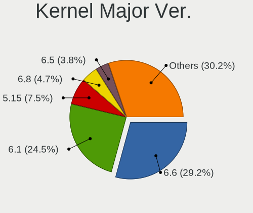

| Version | Notebooks | Percent |
|---------|-----------|---------|
| 6.1     | 17        | 34%     |
| 5.15    | 8         | 16%     |
| 6.5     | 4         | 8%      |
| 5.10    | 4         | 8%      |
| 6.3     | 3         | 6%      |
| 5.8     | 3         | 6%      |
| 6.0     | 2         | 4%      |
| 5.2     | 2         | 4%      |
| 6.6     | 1         | 2%      |
| 6.4     | 1         | 2%      |
| 6.2     | 1         | 2%      |
| 5.9     | 1         | 2%      |
| 5.4     | 1         | 2%      |
| 5.3     | 1         | 2%      |
| 5.19    | 1         | 2%      |

Arch
----

OS architecture (x86_64, i586, etc.)

| Name   | Notebooks | Percent |
|--------|-----------|---------|
| x86_64 | 50        | 100%    |

DE
--

Desktop Environment

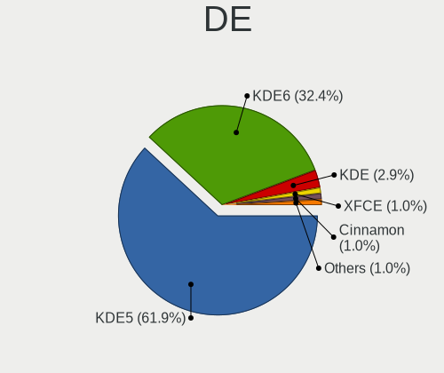

| Name     | Notebooks | Percent |
|----------|-----------|---------|
| KDE5     | 46        | 92%     |
| KDE      | 2         | 4%      |
| Cinnamon | 1         | 2%      |
| Unknown  | 1         | 2%      |

Display Server
--------------

X11 or Wayland

| Name    | Notebooks | Percent |
|---------|-----------|---------|
| X11     | 49        | 98%     |
| Wayland | 1         | 2%      |

Display Manager
---------------

SDDM, LightDM, etc.

| Name    | Notebooks | Percent |
|---------|-----------|---------|
| SDDM    | 32        | 64%     |
| Unknown | 16        | 32%     |
| LightDM | 2         | 4%      |

OS Lang
-------

Language

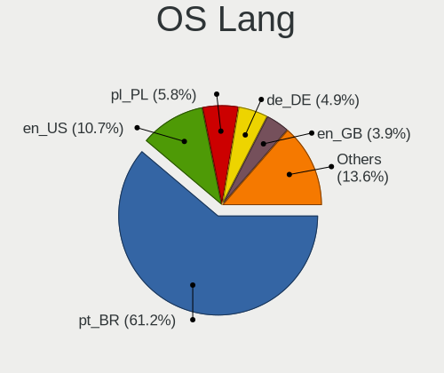

| Lang    | Notebooks | Percent |
|---------|-----------|---------|
| pt_BR   | 36        | 72%     |
| en_US   | 4         | 8%      |
| de_DE   | 3         | 6%      |
| es_MX   | 2         | 4%      |
| pl_PL   | 1         | 2%      |
| fi_FI   | 1         | 2%      |
| es_CR   | 1         | 2%      |
| el_GR   | 1         | 2%      |
| Unknown | 1         | 2%      |

Boot Mode
---------

EFI or BIOS

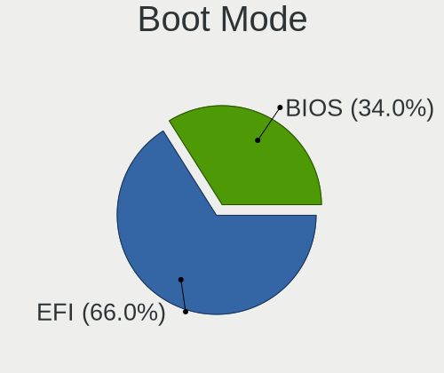

| Mode | Notebooks | Percent |
|------|-----------|---------|
| EFI  | 32        | 62.75%  |
| BIOS | 19        | 37.25%  |

Filesystem
----------

Type of filesystem

| Type    | Notebooks | Percent |
|---------|-----------|---------|
| Btrfs   | 41        | 82%     |
| Ext4    | 6         | 12%     |
| Overlay | 2         | 4%      |
| Unknown | 1         | 2%      |

Part. scheme
------------

Scheme of partitioning

| Type    | Notebooks | Percent |
|---------|-----------|---------|
| GPT     | 24        | 47.06%  |
| Unknown | 16        | 31.37%  |
| MBR     | 11        | 21.57%  |

Dual Boot with Linux/BSD
------------------------

Hosting more than one Linux/BSD

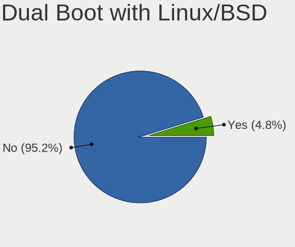

| Dual boot | Notebooks | Percent |
|-----------|-----------|---------|
| No        | 47        | 92.16%  |
| Yes       | 4         | 7.84%   |

Dual Boot (Win)
---------------

Hosting Linux and Windows

| Dual boot | Notebooks | Percent |
|-----------|-----------|---------|
| No        | 35        | 70%     |
| Yes       | 15        | 30%     |

Board
-----

Vendor
------

Motherboard manufacturer

| Name                   | Notebooks | Percent |
|------------------------|-----------|---------|
| Acer                   | 10        | 20%     |
| Lenovo                 | 7         | 14%     |
| Dell                   | 7         | 14%     |
| ASUSTek Computer       | 6         | 12%     |
| Hewlett-Packard        | 5         | 10%     |
| Positivo               | 4         | 8%      |
| Samsung Electronics    | 2         | 4%      |
| Toshiba                | 1         | 2%      |
| Sony                   | 1         | 2%      |
| Semp Toshiba           | 1         | 2%      |
| Multilaser             | 1         | 2%      |
| Clevo                  | 1         | 2%      |
| Avell High Performance | 1         | 2%      |
| Apple                  | 1         | 2%      |
| Alienware              | 1         | 2%      |
| Unknown                | 1         | 2%      |

Model
-----

Motherboard model

| Name                                   | Notebooks | Percent |
|----------------------------------------|-----------|---------|
| Positivo C41TF                         | 2         | 4%      |
| Toshiba Satellite S55-A                | 1         | 2%      |
| Sony VGN-NR230AE                       | 1         | 2%      |
| Semp Toshiba IS 1412                   | 1         | 2%      |
| Samsung 550XCJ/550XCR                  | 1         | 2%      |
| Samsung 300E5M/300E5L                  | 1         | 2%      |
| Positivo Q464B                         | 1         | 2%      |
| Positivo C14RV01                       | 1         | 2%      |
| Multilaser MLSH1H LINUX                | 1         | 2%      |
| Lenovo Yoga Slim 7 14ARE05 82A2        | 1         | 2%      |
| Lenovo ThinkPad T480s 20L70028US       | 1         | 2%      |
| Lenovo ThinkPad T410 25379N2           | 1         | 2%      |
| Lenovo IdeaPad Z470                    | 1         | 2%      |
| Lenovo IdeaPad S400 VIUS3              | 1         | 2%      |
| Lenovo IdeaPad 5 Pro 14ACN6 82L7       | 1         | 2%      |
| Lenovo IdeaPad 300-15ISK 80RS          | 1         | 2%      |
| HP ZBook 15 G3                         | 1         | 2%      |
| HP Pavilion g4                         | 1         | 2%      |
| HP EliteBook 8760w                     | 1         | 2%      |
| HP 255 G7 Notebook PC                  | 1         | 2%      |
| HP 255 G6 Notebook PC                  | 1         | 2%      |
| Dell System XPS L502X                  | 1         | 2%      |
| Dell System Inspiron N7110             | 1         | 2%      |
| Dell Latitude E6420                    | 1         | 2%      |
| Dell Inspiron N5010                    | 1         | 2%      |
| Dell Inspiron 7460                     | 1         | 2%      |
| Dell Inspiron 3480                     | 1         | 2%      |
| Dell G15 5520                          | 1         | 2%      |
| Clevo W340EU                           | 1         | 2%      |
| Avell High Performance STORM TWO       | 1         | 2%      |
| ASUS X45U                              | 1         | 2%      |
| ASUS X455LA                            | 1         | 2%      |
| ASUS VX7SX                             | 1         | 2%      |
| ASUS VivoBook_ASUSLaptop X515JF_X515JF | 1         | 2%      |
| ASUS VivoBook_ASUSLaptop X515JA_X515JA | 1         | 2%      |
| ASUS VivoBook_ASUSLaptop E510KA_E510KA | 1         | 2%      |
| Apple MacBookPro9,2                    | 1         | 2%      |
| Alienware 17                           | 1         | 2%      |
| Acer Predator G9-793                   | 1         | 2%      |
| Acer Nitro AN517-54                    | 1         | 2%      |

Model Family
------------

Motherboard model prefix

| Name                         | Notebooks | Percent |
|------------------------------|-----------|---------|
| Acer Aspire                  | 5         | 10%     |
| Lenovo IdeaPad               | 4         | 8%      |
| Dell Inspiron                | 3         | 6%      |
| ASUS VivoBook                | 3         | 6%      |
| Acer Nitro                   | 3         | 6%      |
| Positivo C41TF               | 2         | 4%      |
| Lenovo ThinkPad              | 2         | 4%      |
| HP 255                       | 2         | 4%      |
| Dell System                  | 2         | 4%      |
| Toshiba Satellite            | 1         | 2%      |
| Sony VGN-NR230AE             | 1         | 2%      |
| Semp Toshiba IS              | 1         | 2%      |
| Samsung 550XCJ               | 1         | 2%      |
| Samsung 300E5M               | 1         | 2%      |
| Positivo Q464B               | 1         | 2%      |
| Positivo C14RV01             | 1         | 2%      |
| Multilaser MLSH1H            | 1         | 2%      |
| Lenovo Yoga                  | 1         | 2%      |
| HP ZBook                     | 1         | 2%      |
| HP Pavilion                  | 1         | 2%      |
| HP EliteBook                 | 1         | 2%      |
| Dell Latitude                | 1         | 2%      |
| Dell G15                     | 1         | 2%      |
| Clevo W340EU                 | 1         | 2%      |
| Avell High Performance STORM | 1         | 2%      |
| ASUS X45U                    | 1         | 2%      |
| ASUS X455LA                  | 1         | 2%      |
| ASUS VX7SX                   | 1         | 2%      |
| Apple MacBookPro9            | 1         | 2%      |
| Alienware 17                 | 1         | 2%      |
| Acer Predator                | 1         | 2%      |
| Acer A315-41                 | 1         | 2%      |
| Unknown                      | 1         | 2%      |

MFG Year
--------

Motherboard manufacture year

| Year | Notebooks | Percent |
|------|-----------|---------|
| 2021 | 6         | 12%     |
| 2011 | 6         | 12%     |
| 2017 | 5         | 10%     |
| 2012 | 5         | 10%     |
| 2022 | 4         | 8%      |
| 2019 | 4         | 8%      |
| 2013 | 4         | 8%      |
| 2018 | 3         | 6%      |
| 2016 | 3         | 6%      |
| 2023 | 2         | 4%      |
| 2020 | 2         | 4%      |
| 2009 | 2         | 4%      |
| 2015 | 1         | 2%      |
| 2014 | 1         | 2%      |
| 2010 | 1         | 2%      |
| 2007 | 1         | 2%      |

Form Factor
-----------

Physical design of the computer

| Name     | Notebooks | Percent |
|----------|-----------|---------|
| Notebook | 50        | 100%    |

Secure Boot
-----------

Enabled or disabled

| State    | Notebooks | Percent |
|----------|-----------|---------|
| Disabled | 50        | 100%    |

Coreboot
--------

Have coreboot on board

| Used | Notebooks | Percent |
|------|-----------|---------|
| No   | 50        | 100%    |

RAM Size
--------

Total RAM memory

| Size in GB  | Notebooks | Percent |
|-------------|-----------|---------|
| 3.01-4.0    | 14        | 27.45%  |
| 4.01-8.0    | 12        | 23.53%  |
| 16.01-24.0  | 9         | 17.65%  |
| 8.01-16.0   | 6         | 11.76%  |
| 32.01-64.0  | 3         | 5.88%   |
| 1.01-2.0    | 3         | 5.88%   |
| 24.01-32.0  | 2         | 3.92%   |
| 2.01-3.0    | 1         | 1.96%   |
| 64.01-256.0 | 1         | 1.96%   |

RAM Used
--------

Used RAM memory

| Used GB   | Notebooks | Percent |
|-----------|-----------|---------|
| 1.01-2.0  | 23        | 44.23%  |
| 2.01-3.0  | 11        | 21.15%  |
| 3.01-4.0  | 8         | 15.38%  |
| 4.01-8.0  | 6         | 11.54%  |
| 0.51-1.0  | 3         | 5.77%   |
| 8.01-16.0 | 1         | 1.92%   |

Total Drives
------------

Number of drives on board

| Drives | Notebooks | Percent |
|--------|-----------|---------|
| 1      | 35        | 70%     |
| 2      | 10        | 20%     |
| 3      | 4         | 8%      |
| 4      | 1         | 2%      |

Has CD-ROM
----------

Has CD-ROM on board

| Presented | Notebooks | Percent |
|-----------|-----------|---------|
| No        | 31        | 62%     |
| Yes       | 19        | 38%     |

Has Ethernet
------------

Has Ethernet on board

| Presented | Notebooks | Percent |
|-----------|-----------|---------|
| Yes       | 42        | 84%     |
| No        | 8         | 16%     |

Has WiFi
--------

Has WiFi module

| Presented | Notebooks | Percent |
|-----------|-----------|---------|
| Yes       | 49        | 98%     |
| No        | 1         | 2%      |

Has Bluetooth
-------------

Has Bluetooth module

| Presented | Notebooks | Percent |
|-----------|-----------|---------|
| Yes       | 37        | 74%     |
| No        | 13        | 26%     |

Location
--------

Country
-------

Geographic location (country)

| Country    | Notebooks | Percent |
|------------|-----------|---------|
| Brazil     | 36        | 72%     |
| USA        | 3         | 6%      |
| Germany    | 3         | 6%      |
| Mexico     | 2         | 4%      |
| Greece     | 2         | 4%      |
| UK         | 1         | 2%      |
| Poland     | 1         | 2%      |
| Finland    | 1         | 2%      |
| Costa Rica | 1         | 2%      |

City
----

Geographic location (city)

| City                  | Notebooks | Percent |
|-----------------------|-----------|---------|
| Sao Paulo             | 3         | 5.88%   |
| Brasília             | 3         | 5.88%   |
| Curitiba              | 2         | 3.92%   |
| Castanhal             | 2         | 3.92%   |
| Campo Grande          | 2         | 3.92%   |
| Belo Horizonte        | 2         | 3.92%   |
| Vitória da Conquista | 1         | 1.96%   |
| Thessaloniki          | 1         | 1.96%   |
| Stralsund             | 1         | 1.96%   |
| Serafina Correa       | 1         | 1.96%   |
| Sao Jose do Rio Preto | 1         | 1.96%   |
| Sao Domingos do Capim | 1         | 1.96%   |
| San José             | 1         | 1.96%   |
| Salvador              | 1         | 1.96%   |
| Rio de Janeiro        | 1         | 1.96%   |
| Mirassol              | 1         | 1.96%   |
| Minneapolis           | 1         | 1.96%   |
| Metepec               | 1         | 1.96%   |
| Marataizes            | 1         | 1.96%   |
| Maidstone             | 1         | 1.96%   |
| Londrina              | 1         | 1.96%   |
| Koszalin              | 1         | 1.96%   |
| Joensuu               | 1         | 1.96%   |
| Joao Monlevade        | 1         | 1.96%   |
| Hortolândia          | 1         | 1.96%   |
| Hoffman               | 1         | 1.96%   |
| Guarai                | 1         | 1.96%   |
| Goiânia              | 1         | 1.96%   |
| Fortaleza             | 1         | 1.96%   |
| Fernandopolis         | 1         | 1.96%   |
| Dresden               | 1         | 1.96%   |
| Domingos Martins      | 1         | 1.96%   |
| Dallas                | 1         | 1.96%   |
| Cruz Alta             | 1         | 1.96%   |
| Contagem              | 1         | 1.96%   |
| Colombo               | 1         | 1.96%   |
| Caruaru               | 1         | 1.96%   |
| Caratinga             | 1         | 1.96%   |
| Campeche              | 1         | 1.96%   |
| Berlin                | 1         | 1.96%   |

Drives
------

Drive Vendor
------------

Hard drive vendors

| Vendor                      | Notebooks | Drives | Percent |
|-----------------------------|-----------|--------|---------|
| WDC                         | 10        | 12     | 14.71%  |
| Seagate                     | 6         | 6      | 8.82%   |
| Samsung Electronics         | 6         | 6      | 8.82%   |
| Crucial                     | 5         | 5      | 7.35%   |
| Unknown                     | 3         | 3      | 4.41%   |
| Toshiba                     | 3         | 4      | 4.41%   |
| Kingston                    | 3         | 3      | 4.41%   |
| KingSpec                    | 3         | 3      | 4.41%   |
| ADATA Technology            | 3         | 3      | 4.41%   |
| SK hynix                    | 2         | 2      | 2.94%   |
| Micron/Crucial Technology   | 2         | 2      | 2.94%   |
| Micron Technology           | 2         | 2      | 2.94%   |
| LITEON                      | 2         | 3      | 2.94%   |
| Hitachi                     | 2         | 2      | 2.94%   |
| HGST                        | 2         | 2      | 2.94%   |
| China                       | 2         | 2      | 2.94%   |
| A-DATA Technology           | 2         | 2      | 2.94%   |
| SanDisk                     | 1         | 1      | 1.47%   |
| Realtek Semiconductor       | 1         | 1      | 1.47%   |
| PNY                         | 1         | 2      | 1.47%   |
| NT-1TB                      | 1         | 1      | 1.47%   |
| Netac                       | 1         | 2      | 1.47%   |
| MAXIO Technology (Hangzhou) | 1         | 1      | 1.47%   |
| Kingston Technology Company | 1         | 1      | 1.47%   |
| JMicron Technology          | 1         | 1      | 1.47%   |
| GOODRAM                     | 1         | 2      | 1.47%   |
| EYOTA                       | 1         | 1      | 1.47%   |

Drive Model
-----------

Hard drive models

| Model                                               | Notebooks | Percent |
|-----------------------------------------------------|-----------|---------|
| Samsung NVMe SSD Controller SM981/PM981/PM983 512GB | 4         | 5.88%   |
| WDC WD10SPZX-21Z10T0 1TB                            | 3         | 4.41%   |
| Toshiba MQ04ABF100 1TB                              | 3         | 4.41%   |
| Unknown MMC Card  64GB                              | 2         | 2.94%   |
| Kingston SA400S37480G 480GB SSD                     | 2         | 2.94%   |
| KingSpec P3-512 512GB SSD                           | 2         | 2.94%   |
| WDC WDS100T2G0A-00JH30 1TB SSD                      | 1         | 1.47%   |
| WDC WD7500BPKX-75HPJT0 752GB                        | 1         | 1.47%   |
| WDC WD5000LPVX-75V0TT0 500GB                        | 1         | 1.47%   |
| WDC WD5000LPVT-08G33T1 500GB                        | 1         | 1.47%   |
| WDC WD3200BPVT-00JJ5T0 320GB                        | 1         | 1.47%   |
| WDC WD1200BEVT-75ZCT2 120GB                         | 1         | 1.47%   |
| WDC WD10SPZX-75Z10T3 1TB                            | 1         | 1.47%   |
| Unknown MMC Card  128GB                             | 1         | 1.47%   |
| SK hynix HFS512GEJ9X125N 512GB                      | 1         | 1.47%   |
| SK hynix BC501 NVMe Solid State Drive 512GB         | 1         | 1.47%   |
| Seagate ST500LM012 HN-M500MBB 500GB                 | 1         | 1.47%   |
| Seagate ST320LM001 HN-M320MBB 320GB                 | 1         | 1.47%   |
| Seagate ST2000LM003 HN-M201RAD 2TB                  | 1         | 1.47%   |
| Seagate ST1000LM024 HN-M101MBB 1TB                  | 1         | 1.47%   |
| Seagate ST1000LM014-1EJ164 1TB                      | 1         | 1.47%   |
| Seagate Expansion HDD 2TB                           | 1         | 1.47%   |
| SanDisk SDSSDH3256G 256GB                           | 1         | 1.47%   |
| Samsung SSD 870 QVO 4TB                             | 1         | 1.47%   |
| Samsung HM501II 500GB                               | 1         | 1.47%   |
| Realtek RTS5763DL NVMe SSD Controller 256GB         | 1         | 1.47%   |
| PNY CS900 500GB SSD                                 | 1         | 1.47%   |
| NT-1TB 2280 1024GB                                  | 1         | 1.47%   |
| Netac NVMe SSD 2TB                                  | 1         | 1.47%   |
| Micron/Crucial P2 NVMe PCIe SSD 4TB                 | 1         | 1.47%   |
| Micron/Crucial CT500P5SSD8 500GB                    | 1         | 1.47%   |
| Micron MTFDDAV512TBN-1AR15ABHA 512GB SSD            | 1         | 1.47%   |
| Micron MTFDDAV256TBN-1AR1ZABHA 256GB SSD            | 1         | 1.47%   |
| MAXIO (Hangzhou) YSSDHB-1TN7000 1024GB              | 1         | 1.47%   |
| LITEON CV3-8D128-11 SATA 128GB SSD                  | 1         | 1.47%   |
| LITEON CV1-8B128 128GB SSD                          | 1         | 1.47%   |
| Kingston Company SNV2S1000G 1TB                     | 1         | 1.47%   |
| Kingston SA400S37240G 240GB SSD                     | 1         | 1.47%   |
| KingSpec P4-120 120GB                               | 1         | 1.47%   |
| JMicron Tech 250GB                                  | 1         | 1.47%   |

HDD Vendor
----------

Hard disk drive vendors

| Vendor              | Notebooks | Drives | Percent |
|---------------------|-----------|--------|---------|
| WDC                 | 9         | 11     | 39.13%  |
| Seagate             | 6         | 6      | 26.09%  |
| Toshiba             | 3         | 4      | 13.04%  |
| Hitachi             | 2         | 2      | 8.7%    |
| HGST                | 2         | 2      | 8.7%    |
| Samsung Electronics | 1         | 1      | 4.35%   |

SSD Vendor
----------

Solid state drive vendors

| Vendor              | Notebooks | Drives | Percent |
|---------------------|-----------|--------|---------|
| Crucial             | 5         | 5      | 20%     |
| Kingston            | 3         | 3      | 12%     |
| KingSpec            | 3         | 3      | 12%     |
| Micron Technology   | 2         | 2      | 8%      |
| LITEON              | 2         | 3      | 8%      |
| China               | 2         | 2      | 8%      |
| A-DATA Technology   | 2         | 2      | 8%      |
| WDC                 | 1         | 1      | 4%      |
| SanDisk             | 1         | 1      | 4%      |
| Samsung Electronics | 1         | 1      | 4%      |
| PNY                 | 1         | 2      | 4%      |
| NT-1TB              | 1         | 1      | 4%      |
| GOODRAM             | 1         | 2      | 4%      |

Drive Kind
----------

HDD or SSD

| Kind    | Notebooks | Drives | Percent |
|---------|-----------|--------|---------|
| HDD     | 23        | 26     | 36.51%  |
| SSD     | 21        | 28     | 33.33%  |
| NVMe    | 14        | 16     | 22.22%  |
| MMC     | 3         | 3      | 4.76%   |
| Unknown | 2         | 2      | 3.17%   |

Drive Connector
---------------

SATA, SAS, NVMe, etc.

| Type | Notebooks | Drives | Percent |
|------|-----------|--------|---------|
| SATA | 41        | 54     | 68.33%  |
| NVMe | 14        | 16     | 23.33%  |
| MMC  | 3         | 3      | 5%      |
| SAS  | 2         | 2      | 3.33%   |

Drive Size
----------

Size of hard drive

| Size in TB | Notebooks | Drives | Percent |
|------------|-----------|--------|---------|
| 0.01-0.5   | 22        | 28     | 48.89%  |
| 0.51-1.0   | 19        | 22     | 42.22%  |
| 1.01-2.0   | 3         | 3      | 6.67%   |
| 3.01-4.0   | 1         | 1      | 2.22%   |

Space Total
-----------

Amount of disk space available on the file system

| Size in GB     | Notebooks | Percent |
|----------------|-----------|---------|
| 2001-3000      | 13        | 26%     |
| 1001-2000      | 10        | 20%     |
| 251-500        | 9         | 18%     |
| More than 3000 | 6         | 12%     |
| 101-250        | 6         | 12%     |
| 501-1000       | 4         | 8%      |
| 1-20           | 1         | 2%      |
| 51-100         | 1         | 2%      |

Space Used
----------

Amount of used disk space

| Used GB        | Notebooks | Percent |
|----------------|-----------|---------|
| 51-100         | 19        | 36.54%  |
| 21-50          | 10        | 19.23%  |
| 101-250        | 9         | 17.31%  |
| 251-500        | 4         | 7.69%   |
| 1-20           | 4         | 7.69%   |
| 501-1000       | 3         | 5.77%   |
| More than 3000 | 1         | 1.92%   |
| 2001-3000      | 1         | 1.92%   |
| 1001-2000      | 1         | 1.92%   |

Malfunc. Drives
---------------

Drive models with a malfunction

| Model                                  | Notebooks | Drives | Percent |
|----------------------------------------|-----------|--------|---------|
| WDC WD3200BPVT-00JJ5T0 320GB           | 1         | 3      | 14.29%  |
| Seagate ST1000LM024 HN-M101MBB 1TB     | 1         | 1      | 14.29%  |
| Hitachi HTS727575A9E364 752GB          | 1         | 1      | 14.29%  |
| Hitachi HTS545032A7E380 320GB          | 1         | 1      | 14.29%  |
| Crucial CT500MX200SSD3 500GB           | 1         | 1      | 14.29%  |
| China SATA SSD 240GB                   | 1         | 1      | 14.29%  |
| ADATA Technology SM2P32A8-512GC1 512GB | 1         | 1      | 14.29%  |

Malfunc. Drive Vendor
---------------------

Vendors of faulty drives

| Vendor           | Notebooks | Drives | Percent |
|------------------|-----------|--------|---------|
| Hitachi          | 2         | 2      | 28.57%  |
| WDC              | 1         | 3      | 14.29%  |
| Seagate          | 1         | 1      | 14.29%  |
| Crucial          | 1         | 1      | 14.29%  |
| China            | 1         | 1      | 14.29%  |
| ADATA Technology | 1         | 1      | 14.29%  |

Malfunc. HDD Vendor
-------------------

Vendors of faulty HDD drives

| Vendor  | Notebooks | Drives | Percent |
|---------|-----------|--------|---------|
| Hitachi | 2         | 2      | 50%     |
| WDC     | 1         | 3      | 25%     |
| Seagate | 1         | 1      | 25%     |

Malfunc. Drive Kind
-------------------

Kinds of faulty drives

| Kind | Notebooks | Drives | Percent |
|------|-----------|--------|---------|
| HDD  | 4         | 6      | 57.14%  |
| SSD  | 2         | 2      | 28.57%  |
| NVMe | 1         | 1      | 14.29%  |

Failed Drives
-------------

Failed drive models

Zero info for selected period =(

Failed Drive Vendor
-------------------

Failed drive vendors

Zero info for selected period =(

Drive Status
------------

Number of failed and malfunc. drives

| Status   | Notebooks | Drives | Percent |
|----------|-----------|--------|---------|
| Detected | 28        | 36     | 50%     |
| Works    | 21        | 30     | 37.5%   |
| Malfunc  | 7         | 9      | 12.5%   |

Storage controller
------------------

Storage Vendor
--------------

Storage controller vendors

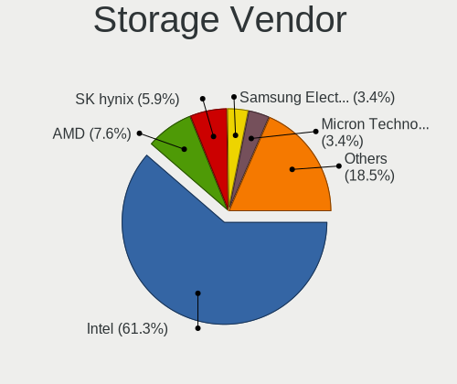

| Vendor                      | Notebooks | Percent |
|-----------------------------|-----------|---------|
| Intel                       | 36        | 64.29%  |
| AMD                         | 6         | 10.71%  |
| Samsung Electronics         | 3         | 5.36%   |
| ADATA Technology            | 3         | 5.36%   |
| SK hynix                    | 2         | 3.57%   |
| Micron/Crucial Technology   | 2         | 3.57%   |
| Realtek Semiconductor       | 1         | 1.79%   |
| Netac Technology            | 1         | 1.79%   |
| MAXIO Technology (Hangzhou) | 1         | 1.79%   |
| Kingston Technology Company | 1         | 1.79%   |

Storage Model
-------------

Storage controller models

| Model                                                                          | Notebooks | Percent |
|--------------------------------------------------------------------------------|-----------|---------|
| Intel 6 Series/C200 Series Chipset Family 6 port Mobile SATA AHCI Controller   | 7         | 12.07%  |
| Intel Sunrise Point-LP SATA Controller [AHCI mode]                             | 6         | 10.34%  |
| Intel 7 Series Chipset Family 6-port SATA Controller [AHCI mode]               | 5         | 8.62%   |
| AMD FCH SATA Controller [AHCI mode]                                            | 5         | 8.62%   |
| Intel 82801 Mobile SATA Controller [RAID mode]                                 | 4         | 6.9%    |
| Samsung NVMe SSD Controller SM981/PM981/PM983                                  | 3         | 5.17%   |
| Intel Celeron/Pentium Silver Processor SATA Controller                         | 3         | 5.17%   |
| Intel 5 Series/3400 Series Chipset 6 port SATA AHCI Controller                 | 2         | 3.45%   |
| SK hynix Platinum P41/PC801 NVMe Solid State Drive                             | 1         | 1.72%   |
| SK hynix BC501 NVMe Solid State Drive                                          | 1         | 1.72%   |
| Realtek RTS5762 NVMe SSD Controller                                            | 1         | 1.72%   |
| Netac PCIe 4 INNOGRIT based NVMe SSD                                           | 1         | 1.72%   |
| Micron/Crucial P5 NVMe PCIe SSD[SlashP5]                                       | 1         | 1.72%   |
| Micron/Crucial P2 [Nick P2] / P3 / P3 Plus NVMe PCIe SSD (DRAM-less)           | 1         | 1.72%   |
| MAXIO (Hangzhou) NVMe SSD Controller MAP1602                                   | 1         | 1.72%   |
| Kingston Company NV2 NVMe SSD SM2267XT                                         | 1         | 1.72%   |
| Intel Tiger Lake SATA AHCI Controller                                          | 1         | 1.72%   |
| Intel Q170/Q150/B150/H170/H110/Z170/CM236 Chipset SATA Controller [AHCI Mode]  | 1         | 1.72%   |
| Intel HM170/QM170 Chipset SATA Controller [AHCI Mode]                          | 1         | 1.72%   |
| Intel Comet Lake SATA AHCI Controller                                          | 1         | 1.72%   |
| Intel Cannon Point-LP SATA Controller [AHCI Mode]                              | 1         | 1.72%   |
| Intel 82801IBM/IEM (ICH9M/ICH9M-E) 2 port SATA Controller [IDE mode]           | 1         | 1.72%   |
| Intel 82801HM/HEM (ICH8M/ICH8M-E) SATA Controller [AHCI mode]                  | 1         | 1.72%   |
| Intel 82801HM/HEM (ICH8M/ICH8M-E) IDE Controller                               | 1         | 1.72%   |
| Intel 8 Series/C220 Series Chipset Family 6-port SATA Controller 1 [AHCI mode] | 1         | 1.72%   |
| Intel 8 Series SATA Controller 1 [AHCI mode]                                   | 1         | 1.72%   |
| AMD SB7x0/SB8x0/SB9x0 SATA Controller [IDE mode]                               | 1         | 1.72%   |
| AMD SB7x0/SB8x0/SB9x0 SATA Controller [AHCI mode]                              | 1         | 1.72%   |
| ADATA SM2P41C3 NVMe SSD (DRAM-less)                                            | 1         | 1.72%   |
| ADATA SM2P32A8 NVMe SSD (DRAM-less)                                            | 1         | 1.72%   |
| ADATA IM2P33F8 series NVMe SSD (DRAM-less)                                     | 1         | 1.72%   |

Storage Kind
------------

Kind of storage controller (IDE, SATA, NVMe, SAS, ...)

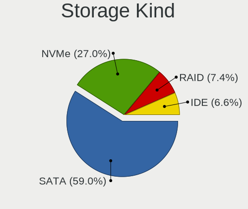

| Kind | Notebooks | Percent |
|------|-----------|---------|
| SATA | 37        | 66.07%  |
| NVMe | 13        | 23.21%  |
| RAID | 4         | 7.14%   |
| IDE  | 2         | 3.57%   |

Processor
---------

CPU Vendor
----------

Processor vendors

| Vendor | Notebooks | Percent |
|--------|-----------|---------|
| Intel  | 41        | 82%     |
| AMD    | 9         | 18%     |

CPU Model
---------

Processor models

| Model                                         | Notebooks | Percent |
|-----------------------------------------------|-----------|---------|
| Intel Core i5-7200U CPU @ 2.50GHz             | 3         | 6%      |
| Intel Core i7-7500U CPU @ 2.70GHz             | 2         | 4%      |
| Intel Core i5-1035G1 CPU @ 1.00GHz            | 2         | 4%      |
| Intel Celeron N4020 CPU @ 1.10GHz             | 2         | 4%      |
| Intel Pentium Silver N6000 @ 1.10GHz          | 1         | 2%      |
| Intel Pentium Dual-Core CPU T4400 @ 2.20GHz   | 1         | 2%      |
| Intel Pentium Dual CPU T2330 @ 1.60GHz        | 1         | 2%      |
| Intel Core i7-8650U CPU @ 1.90GHz             | 1         | 2%      |
| Intel Core i7-6820HQ CPU @ 2.70GHz            | 1         | 2%      |
| Intel Core i7-6700HQ CPU @ 2.60GHz            | 1         | 2%      |
| Intel Core i7-6500U CPU @ 2.50GHz             | 1         | 2%      |
| Intel Core i7-4700MQ CPU @ 2.40GHz            | 1         | 2%      |
| Intel Core i7-2860QM CPU @ 2.50GHz            | 1         | 2%      |
| Intel Core i7-2670QM CPU @ 2.20GHz            | 1         | 2%      |
| Intel Core i7-2630QM CPU @ 2.00GHz            | 1         | 2%      |
| Intel Core i5-8265U CPU @ 1.60GHz             | 1         | 2%      |
| Intel Core i5-7300HQ CPU @ 2.50GHz            | 1         | 2%      |
| Intel Core i5-3337U CPU @ 1.80GHz             | 1         | 2%      |
| Intel Core i5-3210M CPU @ 2.50GHz             | 1         | 2%      |
| Intel Core i5-2520M CPU @ 2.50GHz             | 1         | 2%      |
| Intel Core i5-2450M CPU @ 2.50GHz             | 1         | 2%      |
| Intel Core i5-2410M CPU @ 2.30GHz             | 1         | 2%      |
| Intel Core i5-10210U CPU @ 1.60GHz            | 1         | 2%      |
| Intel Core i5 CPU M 520 @ 2.40GHz             | 1         | 2%      |
| Intel Core i5 CPU M 480 @ 2.67GHz             | 1         | 2%      |
| Intel Core i3-7020U CPU @ 2.30GHz             | 1         | 2%      |
| Intel Core i3-4030U CPU @ 1.90GHz             | 1         | 2%      |
| Intel Core i3-3217U CPU @ 1.80GHz             | 1         | 2%      |
| Intel Core i3-3110M CPU @ 2.40GHz             | 1         | 2%      |
| Intel Core i3-2375M CPU @ 1.50GHz             | 1         | 2%      |
| Intel Core i3-2350M CPU @ 2.30GHz             | 1         | 2%      |
| Intel Celeron N4020C CPU @ 1.10GHz            | 1         | 2%      |
| Intel Atom x5-Z8350 CPU @ 1.44GHz             | 1         | 2%      |
| Intel 12th Gen Core i7-12700H                 | 1         | 2%      |
| Intel 12th Gen Core i5-12500H                 | 1         | 2%      |
| Intel 11th Gen Core i5-11400H @ 2.70GHz       | 1         | 2%      |
| AMD Ryzen 7 5800U with Radeon Graphics        | 1         | 2%      |
| AMD Ryzen 7 3700U with Radeon Vega Mobile Gfx | 1         | 2%      |
| AMD Ryzen 5 7535HS with Radeon Graphics       | 1         | 2%      |
| AMD Ryzen 5 4500U with Radeon Graphics        | 1         | 2%      |

CPU Model Family
----------------

Processor model prefix

| Model                   | Notebooks | Percent |
|-------------------------|-----------|---------|
| Intel Core i5           | 15        | 30%     |
| Intel Core i7           | 10        | 20%     |
| Intel Core i3           | 6         | 12%     |
| Other                   | 4         | 8%      |
| AMD Ryzen 5             | 4         | 8%      |
| Intel Celeron           | 3         | 6%      |
| AMD Ryzen 7             | 2         | 4%      |
| Intel Pentium Silver    | 1         | 2%      |
| Intel Pentium Dual-Core | 1         | 2%      |
| Intel Pentium Dual      | 1         | 2%      |
| Intel Atom              | 1         | 2%      |
| AMD C-70                | 1         | 2%      |
| AMD C-60                | 1         | 2%      |

CPU Cores
---------

Number of processor cores

| Number | Notebooks | Percent |
|--------|-----------|---------|
| 2      | 27        | 54%     |
| 4      | 17        | 34%     |
| 6      | 3         | 6%      |
| 14     | 1         | 2%      |
| 12     | 1         | 2%      |
| 8      | 1         | 2%      |

CPU Sockets
-----------

Number of sockets

| Number | Notebooks | Percent |
|--------|-----------|---------|
| 1      | 50        | 100%    |

CPU Threads
-----------

Threads per core (Hyper-Threading)

| Number | Notebooks | Percent |
|--------|-----------|---------|
| 2      | 38        | 76%     |
| 1      | 12        | 24%     |

CPU Op-Modes
------------

CPU Operation Modes (32-bit, 64-bit)

| Op mode        | Notebooks | Percent |
|----------------|-----------|---------|
| 32-bit, 64-bit | 49        | 98%     |
| Unknown        | 1         | 2%      |

CPU Microcode
-------------

Microcode number

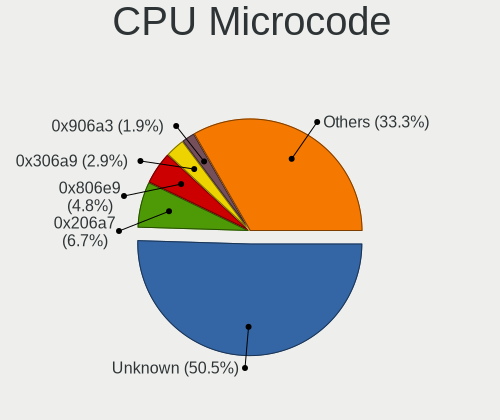

| Number     | Notebooks | Percent |
|------------|-----------|---------|
| Unknown    | 10        | 20%     |
| 0x206a7    | 6         | 12%     |
| 0x806e9    | 5         | 10%     |
| 0x306a9    | 3         | 6%      |
| 0x906a3    | 2         | 4%      |
| 0x706a8    | 2         | 4%      |
| 0x506e3    | 2         | 4%      |
| 0x08108109 | 2         | 4%      |
| 0x05000119 | 2         | 4%      |
| 0xa0660    | 1         | 2%      |
| 0x906c0    | 1         | 2%      |
| 0x806ec    | 1         | 2%      |
| 0x806ea    | 1         | 2%      |
| 0x806d1    | 1         | 2%      |
| 0x706e5    | 1         | 2%      |
| 0x6fd      | 1         | 2%      |
| 0x406e3    | 1         | 2%      |
| 0x406c4    | 1         | 2%      |
| 0x306c3    | 1         | 2%      |
| 0x20655    | 1         | 2%      |
| 0x20652    | 1         | 2%      |
| 0x0a50000d | 1         | 2%      |
| 0x0a404102 | 1         | 2%      |
| 0x0810100b | 1         | 2%      |
| 0x06006705 | 1         | 2%      |

CPU Microarch
-------------

Microarchitecture

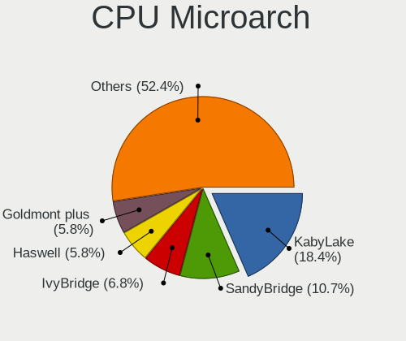

| Name             | Notebooks | Percent |
|------------------|-----------|---------|
| KabyLake         | 9         | 18%     |
| SandyBridge      | 8         | 16%     |
| IvyBridge        | 4         | 8%      |
| Skylake          | 3         | 6%      |
| Goldmont plus    | 3         | 6%      |
| Zen+             | 2         | 4%      |
| Westmere         | 2         | 4%      |
| IceLake          | 2         | 4%      |
| Haswell          | 2         | 4%      |
| Bobcat           | 2         | 4%      |
| Alderlake Hybrid | 2         | 4%      |
| Unknown          | 2         | 4%      |
| Zen 3            | 1         | 2%      |
| Zen 2            | 1         | 2%      |
| Zen              | 1         | 2%      |
| Tremont          | 1         | 2%      |
| Silvermont       | 1         | 2%      |
| Penryn           | 1         | 2%      |
| Excavator        | 1         | 2%      |
| Core             | 1         | 2%      |
| CometLake        | 1         | 2%      |

Graphics
--------

GPU Vendor
----------

Vendors of graphics cards

| Vendor | Notebooks | Percent |
|--------|-----------|---------|
| Intel  | 38        | 59.38%  |
| Nvidia | 15        | 23.44%  |
| AMD    | 11        | 17.19%  |

GPU Model
---------

Graphics card models

| Model                                                                                    | Notebooks | Percent |
|------------------------------------------------------------------------------------------|-----------|---------|
| Intel HD Graphics 620                                                                    | 6         | 9.09%   |
| Intel 2nd Generation Core Processor Family Integrated Graphics Controller                | 6         | 9.09%   |
| Intel 3rd Gen Core processor Graphics Controller                                         | 4         | 6.06%   |
| Intel GeminiLake [UHD Graphics 600]                                                      | 3         | 4.55%   |
| Nvidia GM108M [GeForce 940MX]                                                            | 2         | 3.03%   |
| Intel Iris Plus Graphics G1 (Ice Lake)                                                   | 2         | 3.03%   |
| Intel Core Processor Integrated Graphics Controller                                      | 2         | 3.03%   |
| Intel Alder Lake-P GT2 [Iris Xe Graphics]                                                | 2         | 3.03%   |
| AMD Picasso/Raven 2 [Radeon Vega Series / Radeon Vega Mobile Series]                     | 2         | 3.03%   |
| Nvidia TU117M [GeForce GTX 1650 Mobile / Max-Q]                                          | 1         | 1.52%   |
| Nvidia GP107M [GeForce GTX 1050 Mobile]                                                  | 1         | 1.52%   |
| Nvidia GP104BM [GeForce GTX 1070 Mobile]                                                 | 1         | 1.52%   |
| Nvidia GM108M [GeForce MX130]                                                            | 1         | 1.52%   |
| Nvidia GM108M [GeForce 920MX]                                                            | 1         | 1.52%   |
| Nvidia GM107GLM [Quadro M2000M]                                                          | 1         | 1.52%   |
| Nvidia GM107 [GeForce 940MX]                                                             | 1         | 1.52%   |
| Nvidia GK106M [GeForce GTX 770M]                                                         | 1         | 1.52%   |
| Nvidia GF116M [GeForce GT 560M]                                                          | 1         | 1.52%   |
| Nvidia GF108M [GeForce GT 540M]                                                          | 1         | 1.52%   |
| Nvidia GA107M [GeForce RTX 3050 Mobile]                                                  | 1         | 1.52%   |
| Nvidia GA107BM [GeForce RTX 3050 Mobile]                                                 | 1         | 1.52%   |
| Nvidia GA104 [Geforce RTX 3070 Ti Laptop GPU]                                            | 1         | 1.52%   |
| Intel WhiskeyLake-U GT2 [UHD Graphics 620]                                               | 1         | 1.52%   |
| Intel UHD Graphics 620                                                                   | 1         | 1.52%   |
| Intel TigerLake-H GT1 [UHD Graphics]                                                     | 1         | 1.52%   |
| Intel Skylake GT2 [HD Graphics 520]                                                      | 1         | 1.52%   |
| Intel Mobile GM965/GL960 Integrated Graphics Controller (secondary)                      | 1         | 1.52%   |
| Intel Mobile GM965/GL960 Integrated Graphics Controller (primary)                        | 1         | 1.52%   |
| Intel Mobile 4 Series Chipset Integrated Graphics Controller                             | 1         | 1.52%   |
| Intel JasperLake [UHD Graphics]                                                          | 1         | 1.52%   |
| Intel HD Graphics 630                                                                    | 1         | 1.52%   |
| Intel HD Graphics 530                                                                    | 1         | 1.52%   |
| Intel Haswell-ULT Integrated Graphics Controller                                         | 1         | 1.52%   |
| Intel Comet Lake UHD Graphics                                                            | 1         | 1.52%   |
| Intel Atom/Celeron/Pentium Processor x5-E8000/J3xxx/N3xxx Integrated Graphics Controller | 1         | 1.52%   |
| Intel 4th Gen Core Processor Integrated Graphics Controller                              | 1         | 1.52%   |
| AMD Wrestler [Radeon HD 7290]                                                            | 1         | 1.52%   |
| AMD Wrestler [Radeon HD 6290]                                                            | 1         | 1.52%   |
| AMD Whistler [Radeon HD 6730M/6770M/7690M XT]                                            | 1         | 1.52%   |
| AMD Sun XT [Radeon HD 8670A/8670M/8690M / R5 M330 / M430 / Radeon 520 Mobile]            | 1         | 1.52%   |

GPU Combo
---------

Combinations of graphics cards

| Name           | Notebooks | Percent |
|----------------|-----------|---------|
| 1 x Intel      | 23        | 46%     |
| Intel + Nvidia | 12        | 24%     |
| 1 x AMD        | 8         | 16%     |
| 2 x Intel      | 2         | 4%      |
| 1 x Nvidia     | 2         | 4%      |
| 2 x AMD        | 1         | 2%      |
| Intel + AMD    | 1         | 2%      |
| AMD + Nvidia   | 1         | 2%      |

GPU Driver
----------

Free vs proprietary

| Driver      | Notebooks | Percent |
|-------------|-----------|---------|
| Free        | 40        | 80%     |
| Proprietary | 10        | 20%     |

GPU Memory
----------

Total video memory

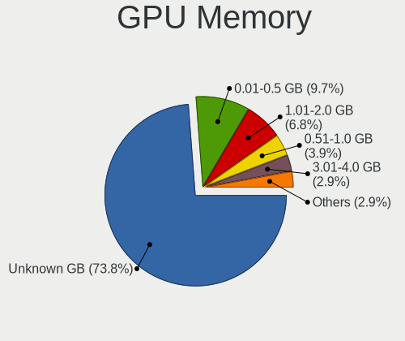

| Size in GB | Notebooks | Percent |
|------------|-----------|---------|
| Unknown    | 36        | 72%     |
| 1.01-2.0   | 5         | 10%     |
| 0.01-0.5   | 4         | 8%      |
| 0.51-1.0   | 2         | 4%      |
| 7.01-8.0   | 1         | 2%      |
| 3.01-4.0   | 1         | 2%      |
| 2.01-3.0   | 1         | 2%      |

Monitor
-------

Monitor Vendor
--------------

Monitor vendors

| Vendor                  | Notebooks | Percent |
|-------------------------|-----------|---------|
| BOE                     | 11        | 17.74%  |
| AU Optronics            | 11        | 17.74%  |
| LG Display              | 10        | 16.13%  |
| Chimei Innolux          | 9         | 14.52%  |
| Samsung Electronics     | 4         | 6.45%   |
| Goldstar                | 4         | 6.45%   |
| Panasonic               | 2         | 3.23%   |
| GDH                     | 2         | 3.23%   |
| Chi Mei Optoelectronics | 2         | 3.23%   |
| MTD                     | 1         | 1.61%   |
| LRX                     | 1         | 1.61%   |
| Lenovo                  | 1         | 1.61%   |
| Hewlett-Packard         | 1         | 1.61%   |
| Dell                    | 1         | 1.61%   |
| CSO                     | 1         | 1.61%   |
| Apple                   | 1         | 1.61%   |

Monitor Model
-------------

Monitor models

| Model                                                                    | Notebooks | Percent |
|--------------------------------------------------------------------------|-----------|---------|
| AU Optronics LCD Monitor AUO2E3C 1366x768 309x173mm 13.9-inch            | 3         | 4.84%   |
| Panasonic TV MEIC10C 1920x540 697x392mm 31.5-inch                        | 2         | 3.23%   |
| LG Display LCD Monitor LGD02E9 1366x768 309x174mm 14.0-inch              | 2         | 3.23%   |
| GDH Smart TV GDH0030 1920x1080 708x398mm 32.0-inch                       | 2         | 3.23%   |
| Chimei Innolux LCD Monitor CMN15F5 1920x1080 344x193mm 15.5-inch         | 2         | 3.23%   |
| Samsung Electronics T22B300 SAM092D 1920x1080 477x268mm 21.5-inch        | 1         | 1.61%   |
| Samsung Electronics LCD Monitor SEC544B 1600x900 382x215mm 17.3-inch     | 1         | 1.61%   |
| Samsung Electronics LCD Monitor SEC5441 1366x768 344x194mm 15.5-inch     | 1         | 1.61%   |
| Samsung Electronics LCD Monitor SAM0AC6 1920x1080 890x500mm 40.2-inch    | 1         | 1.61%   |
| MTD LCD Monitor MTD0001 1280x800 303x190mm 14.1-inch                     | 1         | 1.61%   |
| LRX '' LRX2281 1600x900                                                  | 1         | 1.61%   |
| LG Display LCD Monitor LGD0506 1366x768 344x194mm 15.5-inch              | 1         | 1.61%   |
| LG Display LCD Monitor LGD04BD 1366x768 344x194mm 15.5-inch              | 1         | 1.61%   |
| LG Display LCD Monitor LGD046F 1920x1080 344x194mm 15.5-inch             | 1         | 1.61%   |
| LG Display LCD Monitor LGD0469 1920x1080 382x215mm 17.3-inch             | 1         | 1.61%   |
| LG Display LCD Monitor LGD039F 1366x768 345x194mm 15.6-inch              | 1         | 1.61%   |
| LG Display LCD Monitor LGD0385 1366x768 309x174mm 14.0-inch              | 1         | 1.61%   |
| LG Display LCD Monitor LGD02DA 1920x1080 380x220mm 17.3-inch             | 1         | 1.61%   |
| LG Display LCD Monitor LGD0266 1366x768 344x194mm 15.5-inch              | 1         | 1.61%   |
| Lenovo LCD Monitor LEN4035 1280x800 303x189mm 14.1-inch                  | 1         | 1.61%   |
| Hewlett-Packard 23tm HWP3110 1920x1080 509x286mm 23.0-inch               | 1         | 1.61%   |
| Goldstar ULTRAWIDE GSM59F1 2560x1080 673x284mm 28.8-inch                 | 1         | 1.61%   |
| Goldstar HDR WFHD GSM7714 2560x1080 798x334mm 34.1-inch                  | 1         | 1.61%   |
| Goldstar 25UM58G GSM5B98 2560x1080 673x284mm 28.8-inch                   | 1         | 1.61%   |
| Goldstar 23MP55 GSM5A23 1920x1080 510x290mm 23.1-inch                    | 1         | 1.61%   |
| Dell P2314H DEL409A 1920x1080 509x286mm 23.0-inch                        | 1         | 1.61%   |
| CSO LCD Monitor CSO140C 2880x1800 302x188mm 14.0-inch                    | 1         | 1.61%   |
| Chimei Innolux LCD Monitor CMN15E3 1920x1080 344x193mm 15.5-inch         | 1         | 1.61%   |
| Chimei Innolux LCD Monitor CMN15DC 1366x768 344x193mm 15.5-inch          | 1         | 1.61%   |
| Chimei Innolux LCD Monitor CMN14D6 1366x768 309x173mm 13.9-inch          | 1         | 1.61%   |
| Chimei Innolux LCD Monitor CMN14C8 1920x1080 309x173mm 13.9-inch         | 1         | 1.61%   |
| Chimei Innolux LCD Monitor CMN1491 1366x768 309x174mm 14.0-inch          | 1         | 1.61%   |
| Chimei Innolux LCD Monitor CMN1476 1366x768 309x174mm 14.0-inch          | 1         | 1.61%   |
| Chimei Innolux LCD Monitor CMN1470 1366x768 309x174mm 14.0-inch          | 1         | 1.61%   |
| Chi Mei Optoelectronics LCD Monitor CMO1724 1600x900 382x215mm 17.3-inch | 1         | 1.61%   |
| Chi Mei Optoelectronics LCD Monitor CMO1465 1366x768 309x174mm 14.0-inch | 1         | 1.61%   |
| BOE LCD Monitor BOE0B1D 1366x768 344x194mm 15.5-inch                     | 1         | 1.61%   |
| BOE LCD Monitor BOE0B02 1920x1080 344x194mm 15.5-inch                    | 1         | 1.61%   |
| BOE LCD Monitor BOE0A8F 2560x1440 381x214mm 17.2-inch                    | 1         | 1.61%   |
| BOE LCD Monitor BOE09B4 1920x1080 382x215mm 17.3-inch                    | 1         | 1.61%   |

Monitor Resolution
------------------

Monitor screen resolution

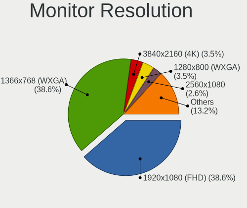

| Resolution      | Notebooks | Percent |
|-----------------|-----------|---------|
| 1366x768 (WXGA) | 24        | 39.34%  |
| 1920x1080 (FHD) | 22        | 36.07%  |
| 2560x1080       | 3         | 4.92%   |
| 1600x900 (HD+)  | 3         | 4.92%   |
| 1280x800 (WXGA) | 3         | 4.92%   |
| 3840x2160 (4K)  | 2         | 3.28%   |
| 1920x540        | 2         | 3.28%   |
| 2880x1800       | 1         | 1.64%   |
| 2560x1440 (QHD) | 1         | 1.64%   |

Monitor Diagonal
----------------

Diagonal size in inches

| Inches  | Notebooks | Percent |
|---------|-----------|---------|
| 15      | 23        | 37.1%   |
| 14      | 11        | 17.74%  |
| 13      | 9         | 14.52%  |
| 17      | 6         | 9.68%   |
| 23      | 3         | 4.84%   |
| 52      | 2         | 3.23%   |
| 34      | 2         | 3.23%   |
| 31      | 2         | 3.23%   |
| 40      | 1         | 1.61%   |
| 28      | 1         | 1.61%   |
| 21      | 1         | 1.61%   |
| Unknown | 1         | 1.61%   |

Monitor Width
-------------

Physical width

| Width in mm | Notebooks | Percent |
|-------------|-----------|---------|
| 301-350     | 41        | 66.13%  |
| 351-400     | 7         | 11.29%  |
| 601-700     | 3         | 4.84%   |
| 501-600     | 3         | 4.84%   |
| 701-800     | 2         | 3.23%   |
| 1001-1500   | 2         | 3.23%   |
| 801-900     | 1         | 1.61%   |
| 401-500     | 1         | 1.61%   |
| 201-300     | 1         | 1.61%   |
| Unknown     | 1         | 1.61%   |

Aspect Ratio
------------

Proportional relationship between the width and the height

| Ratio | Notebooks | Percent |
|-------|-----------|---------|
| 16/9  | 45        | 84.91%  |
| 16/10 | 4         | 7.55%   |
| 21/9  | 3         | 5.66%   |
| 5/4   | 1         | 1.89%   |

Monitor Area
------------

Area in inch²

| Area in inch² | Notebooks | Percent |
|----------------|-----------|---------|
| 101-110        | 23        | 37.1%   |
| 81-90          | 20        | 32.26%  |
| 121-130        | 6         | 9.68%   |
| 351-500        | 4         | 6.45%   |
| 201-250        | 4         | 6.45%   |
| More than 1000 | 2         | 3.23%   |
| 251-300        | 1         | 1.61%   |
| 501-1000       | 1         | 1.61%   |
| Unknown        | 1         | 1.61%   |

Pixel Density
-------------

Pixels per inch

| Density       | Notebooks | Percent |
|---------------|-----------|---------|
| 101-120       | 27        | 44.26%  |
| 121-160       | 18        | 29.51%  |
| 51-100        | 11        | 18.03%  |
| 1-50          | 2         | 3.28%   |
| More than 240 | 1         | 1.64%   |
| 161-240       | 1         | 1.64%   |
| Unknown       | 1         | 1.64%   |

Multiple Monitors
-----------------

Total monitors connected

| Total | Notebooks | Percent |
|-------|-----------|---------|
| 1     | 37        | 72.55%  |
| 2     | 14        | 27.45%  |

Network
-------

Net Controller Vendor
---------------------

Controller vendors

| Vendor                   | Notebooks | Percent |
|--------------------------|-----------|---------|
| Realtek Semiconductor    | 35        | 41.18%  |
| Qualcomm Atheros         | 18        | 21.18%  |
| Intel                    | 17        | 20%     |
| Broadcom                 | 5         | 5.88%   |
| Ralink Technology        | 2         | 2.35%   |
| TP-Link                  | 1         | 1.18%   |
| Ralink                   | 1         | 1.18%   |
| MediaTek                 | 1         | 1.18%   |
| Marvell Technology Group | 1         | 1.18%   |
| JMicron Technology       | 1         | 1.18%   |
| Edimax Technology        | 1         | 1.18%   |
| Belkin Components        | 1         | 1.18%   |
| ASIX Electronics         | 1         | 1.18%   |

Net Controller Model
--------------------

Controller models

| Model                                                                   | Notebooks | Percent |
|-------------------------------------------------------------------------|-----------|---------|
| Realtek RTL8111/8168/8411 PCI Express Gigabit Ethernet Controller       | 19        | 19.39%  |
| Realtek RTL810xE PCI Express Fast Ethernet controller                   | 7         | 7.14%   |
| Qualcomm Atheros QCA9377 802.11ac Wireless Network Adapter              | 7         | 7.14%   |
| Realtek RTL8821CE 802.11ac PCIe Wireless Network Adapter                | 3         | 3.06%   |
| Qualcomm Atheros QCA6174 802.11ac Wireless Network Adapter              | 3         | 3.06%   |
| Realtek RTL8723BU 802.11b/g/n WLAN Adapter                              | 2         | 2.04%   |
| Realtek RTL8188EE Wireless Network Adapter                              | 2         | 2.04%   |
| Realtek Killer E2600 Gigabit Ethernet Controller                        | 2         | 2.04%   |
| Qualcomm Atheros QCA9565 / AR9565 Wireless Network Adapter              | 2         | 2.04%   |
| Qualcomm Atheros AR9285 Wireless Network Adapter (PCI-Express)          | 2         | 2.04%   |
| Intel Dual Band Wireless-AC 3168NGW [Stone Peak]                        | 2         | 2.04%   |
| Intel Alder Lake-P PCH CNVi WiFi                                        | 2         | 2.04%   |
| Intel 82579LM Gigabit Network Connection (Lewisville)                   | 2         | 2.04%   |
| Broadcom BCM4313 802.11bgn Wireless Network Adapter                     | 2         | 2.04%   |
| TP-Link AC600 wireless Realtek RTL8811AU [Archer T2U Nano]              | 1         | 1.02%   |
| Realtek RTL8814AU 802.11a/b/g/n/ac Wireless Adapter                     | 1         | 1.02%   |
| Realtek RTL8192CE PCIe Wireless Network Adapter                         | 1         | 1.02%   |
| Realtek RTL8187B Wireless 802.11g 54Mbps Network Adapter                | 1         | 1.02%   |
| Realtek RTL8153 Gigabit Ethernet Adapter                                | 1         | 1.02%   |
| Realtek RTL8125 2.5GbE Controller                                       | 1         | 1.02%   |
| Realtek 802.11n WLAN Adapter                                            | 1         | 1.02%   |
| Realtek 802.11ac NIC                                                    | 1         | 1.02%   |
| Ralink RT3072 Wireless Adapter                                          | 1         | 1.02%   |
| Ralink MT7601U Wireless Adapter                                         | 1         | 1.02%   |
| Ralink RT5390 Wireless 802.11n 1T/1R PCIe                               | 1         | 1.02%   |
| Qualcomm Atheros QCA8171 Gigabit Ethernet                               | 1         | 1.02%   |
| Qualcomm Atheros Killer E2400 Gigabit Ethernet Controller               | 1         | 1.02%   |
| Qualcomm Atheros Killer E220x Gigabit Ethernet Controller               | 1         | 1.02%   |
| Qualcomm Atheros AR8161 Gigabit Ethernet                                | 1         | 1.02%   |
| Qualcomm Atheros AR242x / AR542x Wireless Network Adapter (PCI-Express) | 1         | 1.02%   |
| MediaTek MT7922 802.11ax PCI Express Wireless Network Adapter           | 1         | 1.02%   |
| Marvell Group 88E8039 PCI-E Fast Ethernet Controller                    | 1         | 1.02%   |
| JMicron JMC250 PCI Express Gigabit Ethernet Controller                  | 1         | 1.02%   |
| Intel Wireless 8265 / 8275                                              | 1         | 1.02%   |
| Intel Wireless 8260                                                     | 1         | 1.02%   |
| Intel Wireless 7265                                                     | 1         | 1.02%   |
| Intel Wi-Fi 6 AX200                                                     | 1         | 1.02%   |
| Intel Tiger Lake PCH CNVi WiFi                                          | 1         | 1.02%   |
| Intel Ice Lake-LP PCH CNVi WiFi                                         | 1         | 1.02%   |
| Intel Ethernet Connection (4) I219-LM                                   | 1         | 1.02%   |

Wireless Vendor
---------------

Wireless vendors

| Vendor                | Notebooks | Percent |
|-----------------------|-----------|---------|
| Intel                 | 16        | 29.63%  |
| Qualcomm Atheros      | 15        | 27.78%  |
| Realtek Semiconductor | 11        | 20.37%  |
| Broadcom              | 5         | 9.26%   |
| Ralink Technology     | 2         | 3.7%    |
| TP-Link               | 1         | 1.85%   |
| Ralink                | 1         | 1.85%   |
| MediaTek              | 1         | 1.85%   |
| Edimax Technology     | 1         | 1.85%   |
| Belkin Components     | 1         | 1.85%   |

Wireless Model
--------------

Wireless models

| Model                                                                                  | Notebooks | Percent |
|----------------------------------------------------------------------------------------|-----------|---------|
| Qualcomm Atheros QCA9377 802.11ac Wireless Network Adapter                             | 7         | 12.73%  |
| Realtek RTL8821CE 802.11ac PCIe Wireless Network Adapter                               | 3         | 5.45%   |
| Qualcomm Atheros QCA6174 802.11ac Wireless Network Adapter                             | 3         | 5.45%   |
| Realtek RTL8723BU 802.11b/g/n WLAN Adapter                                             | 2         | 3.64%   |
| Realtek RTL8188EE Wireless Network Adapter                                             | 2         | 3.64%   |
| Qualcomm Atheros QCA9565 / AR9565 Wireless Network Adapter                             | 2         | 3.64%   |
| Qualcomm Atheros AR9285 Wireless Network Adapter (PCI-Express)                         | 2         | 3.64%   |
| Intel Dual Band Wireless-AC 3168NGW [Stone Peak]                                       | 2         | 3.64%   |
| Intel Alder Lake-P PCH CNVi WiFi                                                       | 2         | 3.64%   |
| Broadcom BCM4313 802.11bgn Wireless Network Adapter                                    | 2         | 3.64%   |
| TP-Link AC600 wireless Realtek RTL8811AU [Archer T2U Nano]                             | 1         | 1.82%   |
| Realtek RTL8814AU 802.11a/b/g/n/ac Wireless Adapter                                    | 1         | 1.82%   |
| Realtek RTL8192CE PCIe Wireless Network Adapter                                        | 1         | 1.82%   |
| Realtek RTL8187B Wireless 802.11g 54Mbps Network Adapter                               | 1         | 1.82%   |
| Realtek 802.11n WLAN Adapter                                                           | 1         | 1.82%   |
| Realtek 802.11ac NIC                                                                   | 1         | 1.82%   |
| Ralink RT3072 Wireless Adapter                                                         | 1         | 1.82%   |
| Ralink MT7601U Wireless Adapter                                                        | 1         | 1.82%   |
| Ralink RT5390 Wireless 802.11n 1T/1R PCIe                                              | 1         | 1.82%   |
| Qualcomm Atheros AR242x / AR542x Wireless Network Adapter (PCI-Express)                | 1         | 1.82%   |
| MediaTek MT7922 802.11ax PCI Express Wireless Network Adapter                          | 1         | 1.82%   |
| Intel Wireless 8265 / 8275                                                             | 1         | 1.82%   |
| Intel Wireless 8260                                                                    | 1         | 1.82%   |
| Intel Wireless 7265                                                                    | 1         | 1.82%   |
| Intel Wi-Fi 6 AX200                                                                    | 1         | 1.82%   |
| Intel Tiger Lake PCH CNVi WiFi                                                         | 1         | 1.82%   |
| Intel Ice Lake-LP PCH CNVi WiFi                                                        | 1         | 1.82%   |
| Intel Comet Lake PCH-LP CNVi WiFi                                                      | 1         | 1.82%   |
| Intel Centrino Wireless-N 1030 [Rainbow Peak]                                          | 1         | 1.82%   |
| Intel Centrino Ultimate-N 6300                                                         | 1         | 1.82%   |
| Intel Centrino Advanced-N 6230 [Rainbow Peak]                                          | 1         | 1.82%   |
| Intel Centrino Advanced-N 6200                                                         | 1         | 1.82%   |
| Intel Cannon Point-LP CNVi [Wireless-AC]                                               | 1         | 1.82%   |
| Edimax EW-7711MAC 802.11ac Wireless Adapter                                            | 1         | 1.82%   |
| Broadcom BCM4352 802.11ac Dual Band Wireless Network Adapter                           | 1         | 1.82%   |
| Broadcom BCM4331 802.11a/b/g/n                                                         | 1         | 1.82%   |
| Broadcom BCM43228 802.11a/b/g/n                                                        | 1         | 1.82%   |
| Belkin Components F6D4050 N150 Enhanced Wireless Network Adapter v1000 [Ralink RT3070] | 1         | 1.82%   |

Ethernet Vendor
---------------

Ethernet vendors

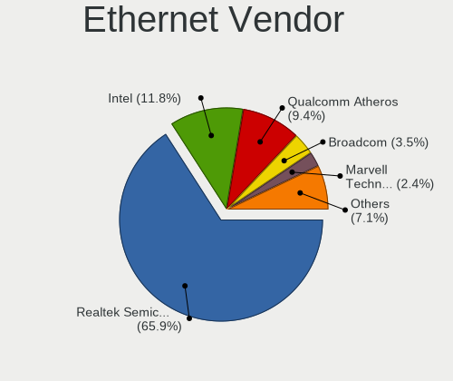

| Vendor                   | Notebooks | Percent |
|--------------------------|-----------|---------|
| Realtek Semiconductor    | 29        | 69.05%  |
| Intel                    | 5         | 11.9%   |
| Qualcomm Atheros         | 4         | 9.52%   |
| Marvell Technology Group | 1         | 2.38%   |
| JMicron Technology       | 1         | 2.38%   |
| Broadcom                 | 1         | 2.38%   |
| ASIX Electronics         | 1         | 2.38%   |

Ethernet Model
--------------

Ethernet models

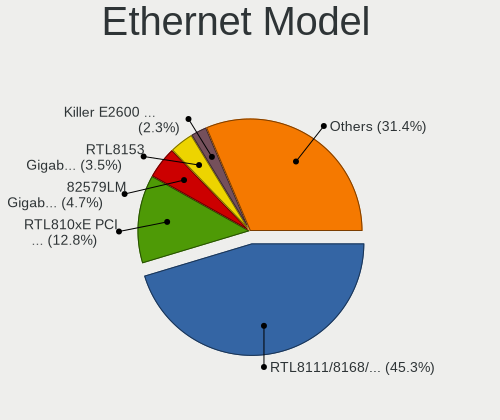

| Model                                                             | Notebooks | Percent |
|-------------------------------------------------------------------|-----------|---------|
| Realtek RTL8111/8168/8411 PCI Express Gigabit Ethernet Controller | 19        | 44.19%  |
| Realtek RTL810xE PCI Express Fast Ethernet controller             | 7         | 16.28%  |
| Realtek Killer E2600 Gigabit Ethernet Controller                  | 2         | 4.65%   |
| Intel 82579LM Gigabit Network Connection (Lewisville)             | 2         | 4.65%   |
| Realtek RTL8153 Gigabit Ethernet Adapter                          | 1         | 2.33%   |
| Realtek RTL8125 2.5GbE Controller                                 | 1         | 2.33%   |
| Qualcomm Atheros QCA8171 Gigabit Ethernet                         | 1         | 2.33%   |
| Qualcomm Atheros Killer E2400 Gigabit Ethernet Controller         | 1         | 2.33%   |
| Qualcomm Atheros Killer E220x Gigabit Ethernet Controller         | 1         | 2.33%   |
| Qualcomm Atheros AR8161 Gigabit Ethernet                          | 1         | 2.33%   |
| Marvell Group 88E8039 PCI-E Fast Ethernet Controller              | 1         | 2.33%   |
| JMicron JMC250 PCI Express Gigabit Ethernet Controller            | 1         | 2.33%   |
| Intel Ethernet Connection (4) I219-LM                             | 1         | 2.33%   |
| Intel Ethernet Connection (2) I219-LM                             | 1         | 2.33%   |
| Intel 82577LM Gigabit Network Connection                          | 1         | 2.33%   |
| Broadcom NetXtreme BCM57765 Gigabit Ethernet PCIe                 | 1         | 2.33%   |
| ASIX AX88179 Gigabit Ethernet                                     | 1         | 2.33%   |

Net Controller Kind
-------------------

Ethernet, WiFi or modem

| Kind     | Notebooks | Percent |
|----------|-----------|---------|
| WiFi     | 49        | 53.85%  |
| Ethernet | 42        | 46.15%  |

Used Controller
---------------

Currently used network controller

| Kind     | Notebooks | Percent |
|----------|-----------|---------|
| WiFi     | 40        | 81.63%  |
| Ethernet | 9         | 18.37%  |

NICs
----

Total network controllers on board

| Total | Notebooks | Percent |
|-------|-----------|---------|
| 2     | 38        | 76%     |
| 1     | 9         | 18%     |
| 0     | 3         | 6%      |

IPv6
----

IPv6 vs IPv4

| Used | Notebooks | Percent |
|------|-----------|---------|
| No   | 29        | 58%     |
| Yes  | 21        | 42%     |

Bluetooth
---------

Bluetooth Vendor
----------------

Controller vendors

| Vendor                          | Notebooks | Percent |
|---------------------------------|-----------|---------|
| Intel                           | 14        | 37.84%  |
| Lite-On Technology              | 6         | 16.22%  |
| Qualcomm Atheros Communications | 5         | 13.51%  |
| IMC Networks                    | 3         | 8.11%   |
| Realtek Semiconductor           | 2         | 5.41%   |
| Foxconn / Hon Hai               | 2         | 5.41%   |
| Broadcom                        | 2         | 5.41%   |
| Hewlett-Packard                 | 1         | 2.7%    |
| Dell                            | 1         | 2.7%    |
| Apple                           | 1         | 2.7%    |

Bluetooth Model
---------------

Controller models

| Model                                            | Notebooks | Percent |
|--------------------------------------------------|-----------|---------|
| Lite-On Qualcomm Atheros QCA9377 Bluetooth       | 4         | 10.81%  |
| Qualcomm Atheros  Bluetooth Device               | 3         | 8.11%   |
| Intel Bluetooth wireless interface               | 3         | 8.11%   |
| Intel Bluetooth Device                           | 3         | 8.11%   |
| Intel Bluetooth 9460/9560 Jefferson Peak (JfP)   | 3         | 8.11%   |
| Qualcomm Atheros QCA61x4 Bluetooth 4.0           | 2         | 5.41%   |
| Intel Wireless-AC 3168 Bluetooth                 | 2         | 5.41%   |
| Intel Centrino Advanced-N 6230 Bluetooth adapter | 2         | 5.41%   |
| Realtek  Bluetooth 4.2 Adapter                   | 1         | 2.7%    |
| Realtek Bluetooth Radio                          | 1         | 2.7%    |
| Lite-On Bluetooth Device                         | 1         | 2.7%    |
| Lite-On Atheros AR3012 Bluetooth                 | 1         | 2.7%    |
| Intel AX200 Bluetooth                            | 1         | 2.7%    |
| IMC Networks Bluetooth Radio                     | 1         | 2.7%    |
| IMC Networks Bluetooth Device                    | 1         | 2.7%    |
| IMC Networks BCM20702A0                          | 1         | 2.7%    |
| HP Broadcom 2070 Bluetooth Combo                 | 1         | 2.7%    |
| Foxconn / Hon Hai Wireless_Device                | 1         | 2.7%    |
| Foxconn / Hon Hai Broadcom Bluetooth 2.1 Device  | 1         | 2.7%    |
| Dell DW375 Bluetooth Module                      | 1         | 2.7%    |
| Broadcom BCM2070 Bluetooth 2.1 + EDR             | 1         | 2.7%    |
| Broadcom BCM2045B (BDC-2.1)                      | 1         | 2.7%    |
| Apple Bluetooth USB Host Controller              | 1         | 2.7%    |

Sound
-----

Sound Vendor
------------

Sound card vendors

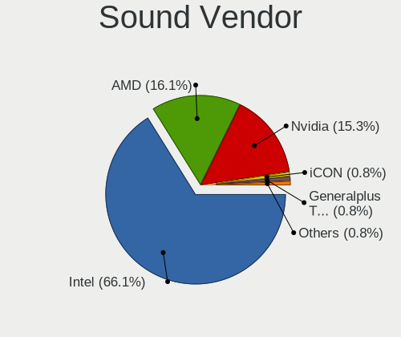

| Vendor                 | Notebooks | Percent |
|------------------------|-----------|---------|
| Intel                  | 40        | 64.52%  |
| Nvidia                 | 11        | 17.74%  |
| AMD                    | 10        | 16.13%  |
| Generalplus Technology | 1         | 1.61%   |

Sound Model
-----------

Sound card models

| Model                                                                      | Notebooks | Percent |
|----------------------------------------------------------------------------|-----------|---------|
| Intel Sunrise Point-LP HD Audio                                            | 8         | 10.96%  |
| Intel 6 Series/C200 Series Chipset Family High Definition Audio Controller | 7         | 9.59%   |
| AMD Family 17h/19h HD Audio Controller                                     | 6         | 8.22%   |
| Intel 7 Series/C216 Chipset Family High Definition Audio Controller        | 5         | 6.85%   |
| Intel Celeron/Pentium Silver Processor High Definition Audio               | 3         | 4.11%   |
| AMD Raven/Raven2/Fenghuang HDMI/DP Audio Controller                        | 3         | 4.11%   |
| Nvidia GM107 High Definition Audio Controller [GeForce 940MX]              | 2         | 2.74%   |
| Nvidia Audio device                                                        | 2         | 2.74%   |
| Intel Ice Lake-LP Smart Sound Technology Audio Controller                  | 2         | 2.74%   |
| Intel Alder Lake PCH-P High Definition Audio Controller                    | 2         | 2.74%   |
| Intel 5 Series/3400 Series Chipset High Definition Audio                   | 2         | 2.74%   |
| Intel 100 Series/C230 Series Chipset Family HD Audio Controller            | 2         | 2.74%   |
| AMD Wrestler HDMI Audio                                                    | 2         | 2.74%   |
| AMD Renoir Radeon High Definition Audio Controller                         | 2         | 2.74%   |
| Nvidia TU107 GeForce GTX 1650 High Definition Audio Controller             | 1         | 1.37%   |
| Nvidia GP107GL High Definition Audio Controller                            | 1         | 1.37%   |
| Nvidia GP104 High Definition Audio Controller                              | 1         | 1.37%   |
| Nvidia GK106 HDMI Audio Controller                                         | 1         | 1.37%   |
| Nvidia GF116 High Definition Audio Controller                              | 1         | 1.37%   |
| Nvidia GF108 High Definition Audio Controller                              | 1         | 1.37%   |
| Nvidia GA104 High Definition Audio Controller                              | 1         | 1.37%   |
| Intel Xeon E3-1200 v3/4th Gen Core Processor HD Audio Controller           | 1         | 1.37%   |
| Intel Tiger Lake-H HD Audio Controller                                     | 1         | 1.37%   |
| Intel Jasper Lake HD Audio                                                 | 1         | 1.37%   |
| Intel Haswell-ULT HD Audio Controller                                      | 1         | 1.37%   |
| Intel Comet Lake PCH-LP cAVS                                               | 1         | 1.37%   |
| Intel CM238 HD Audio Controller                                            | 1         | 1.37%   |
| Intel Cannon Point-LP High Definition Audio Controller                     | 1         | 1.37%   |
| Intel 82801I (ICH9 Family) HD Audio Controller                             | 1         | 1.37%   |
| Intel 82801H (ICH8 Family) HD Audio Controller                             | 1         | 1.37%   |
| Intel 8 Series/C220 Series Chipset High Definition Audio Controller        | 1         | 1.37%   |
| Intel 8 Series HD Audio Controller                                         | 1         | 1.37%   |
| Generalplus Technology USB Audio Device                                    | 1         | 1.37%   |
| AMD Turks HDMI Audio [Radeon HD 6500/6600 / 6700M Series]                  | 1         | 1.37%   |
| AMD SBx00 Azalia (Intel HDA)                                               | 1         | 1.37%   |
| AMD Rembrandt Radeon High Definition Audio Controller                      | 1         | 1.37%   |
| AMD High Definition Audio Controller                                       | 1         | 1.37%   |
| AMD FCH Azalia Controller                                                  | 1         | 1.37%   |
| AMD Family 15h (Models 60h-6fh) Audio Controller                           | 1         | 1.37%   |

Memory
------

Memory Vendor
-------------

Memory module vendors

| Vendor              | Notebooks | Percent |
|---------------------|-----------|---------|
| Samsung Electronics | 9         | 25%     |
| Smart               | 5         | 13.89%  |
| SK hynix            | 4         | 11.11%  |
| Micron Technology   | 4         | 11.11%  |
| Unknown             | 3         | 8.33%   |
| Kingston            | 2         | 5.56%   |
| A-DATA Technology   | 2         | 5.56%   |
| Walton Chaintech    | 1         | 2.78%   |
| Teikon              | 1         | 2.78%   |
| Kembona             | 1         | 2.78%   |
| G.Skill             | 1         | 2.78%   |
| Crucial             | 1         | 2.78%   |
| Corsair             | 1         | 2.78%   |
| Unknown             | 1         | 2.78%   |

Memory Model
------------

Memory module models

| Model                                                        | Notebooks | Percent |
|--------------------------------------------------------------|-----------|---------|
| Samsung RAM M471B5273DH0-CH9 4096MB SODIMM DDR3 1334MT/s     | 2         | 4.88%   |
| Walton Chaintech RAM AS2G732-800P005 2GB SODIMM DDR2 800MT/s | 1         | 2.44%   |
| Unknown RAM Module 512MB SODIMM DDR2                         | 1         | 2.44%   |
| Unknown RAM Module 4GB SODIMM DDR4 2133MT/s                  | 1         | 2.44%   |
| Unknown RAM Module 2GB SODIMM DDR3 1600MT/s                  | 1         | 2.44%   |
| Unknown RAM Module 2GB SODIMM DDR2                           | 1         | 2.44%   |
| Teikon RAM TMA81GS6AFR8N-UHSC 8GB SODIMM DDR4 2400MT/s       | 1         | 2.44%   |
| Smart RAM SMS4TDC3C0K0446SCG 4096MB SODIMM DDR4 2667MT/s     | 1         | 2.44%   |
| Smart RAM SH564568FH8NZPHSCR 2GB SODIMM DDR3 1333MT/s        | 1         | 2.44%   |
| Smart RAM SH564568FH8NWPHSFG 2GB SODIMM DDR3 1333MT/s        | 1         | 2.44%   |
| Smart RAM SH564128FH8NZQNSCG 4GB SODIMM DDR3 1600MT/s        | 1         | 2.44%   |
| Smart RAM SF4641G8CKHIWDFSEG 8GB SODIMM DDR4 2133MT/s        | 1         | 2.44%   |
| Smart RAM SF4641G8CK8IEHLSBG 8GB SODIMM DDR4 2667MT/s        | 1         | 2.44%   |
| SK hynix RAM Module 4GB SODIMM DDR3 1066MT/s                 | 1         | 2.44%   |
| SK hynix RAM MMXIV 4096MB SODIMM DDR3 1333MT/s               | 1         | 2.44%   |
| SK hynix RAM HYMP125S64CP8-S6 2GB SODIMM DDR2 975MT/s        | 1         | 2.44%   |
| SK hynix RAM HMCG66MEBSA092N 8GB SODIMM DDR5 4800MT/s        | 1         | 2.44%   |
| Samsung RAM Module 2GB Row Of Chips LPDDR3 1600MT/s          | 1         | 2.44%   |
| Samsung RAM M471B5673FH0-CF8 2GB SODIMM 1067MT/s             | 1         | 2.44%   |
| Samsung RAM M471B5273CH0-CH9 4096MB SODIMM DDR3 1334MT/s     | 1         | 2.44%   |
| Samsung RAM M471B5173EB0-YK0 4GB SODIMM DDR3 1600MT/s        | 1         | 2.44%   |
| Samsung RAM M471B1G73BH0-CK0 8GB SODIMM DDR3 1600MT/s        | 1         | 2.44%   |
| Samsung RAM M471A1K43DB1-CTD 8GB SODIMM DDR4 2667MT/s        | 1         | 2.44%   |
| Samsung RAM M471A1G44AB0-CWE 8GB SODIMM DDR4 3200MT/s        | 1         | 2.44%   |
| Samsung RAM M425R2GA3BB0-CQKOL 16GB SODIMM DDR5 4800MT/s     | 1         | 2.44%   |
| Micron RAM Module 4GB SODIMM DDR3 1600MT/s                   | 1         | 2.44%   |
| Micron RAM Module 4GB Row Of Chips LPDDR4 4266MT/s           | 1         | 2.44%   |
| Micron RAM Module 2GB SODIMM DDR3 1600MT/s                   | 1         | 2.44%   |
| Micron RAM 16ATF2G64HZ-2G1B1 16GB SODIMM DDR4 2133MT/s       | 1         | 2.44%   |
| Kingston RAM KF2666C15S4/16G 16GB SODIMM DDR4 2667MT/s       | 1         | 2.44%   |
| Kingston RAM ACR24D4S7S8MB-8 8GB SODIMM DDR4 2400MT/s        | 1         | 2.44%   |
| Kembona RAM KBN1333D3N9/8G 8GB SODIMM DDR3 1333MT/s          | 1         | 2.44%   |
| Kembona RAM KBN13333D3S9/8G 8GB SODIMM DDR3 1333MT/s         | 1         | 2.44%   |
| G.Skill RAM F4-2400C16-8GRS 8GB SODIMM DDR4 2400MT/s         | 1         | 2.44%   |
| Crucial RAM CT25664BF160B.C8FE 2GB SODIMM DDR3 1600MT/s      | 1         | 2.44%   |
| Corsair RAM CMSX32GX4M2A2400C16 16GB SODIMM DDR4 2400MT/s    | 1         | 2.44%   |
| A-DATA RAM Module 32GB SODIMM DDR4 3200MT/s                  | 1         | 2.44%   |
| A-DATA RAM AD5S480032G-B 32GB SODIMM DDR5 4800MT/s           | 1         | 2.44%   |
| A-DATA RAM AD4S320038G22-BHYD 8GB SODIMM DDR4 3200MT/s       | 1         | 2.44%   |
| Unknown                                                      | 1         | 2.44%   |

Memory Kind
-----------

Memory module kinds

| Kind   | Notebooks | Percent |
|--------|-----------|---------|
| DDR3   | 13        | 41.94%  |
| DDR4   | 11        | 35.48%  |
| DDR5   | 3         | 9.68%   |
| DDR2   | 2         | 6.45%   |
| LPDDR4 | 1         | 3.23%   |
| LPDDR3 | 1         | 3.23%   |

Memory Form Factor
------------------

Physical design of the memory module

| Name         | Notebooks | Percent |
|--------------|-----------|---------|
| SODIMM       | 29        | 93.55%  |
| Row Of Chips | 2         | 6.45%   |

Memory Size
-----------

Memory module size

| Size  | Notebooks | Percent |
|-------|-----------|---------|
| 8192  | 12        | 34.29%  |
| 4096  | 8         | 22.86%  |
| 2048  | 8         | 22.86%  |
| 16384 | 4         | 11.43%  |
| 32768 | 2         | 5.71%   |
| 512   | 1         | 2.86%   |

Memory Speed
------------

Memory module speed

| Speed   | Notebooks | Percent |
|---------|-----------|---------|
| 1600    | 8         | 22.22%  |
| 2667    | 4         | 11.11%  |
| 2400    | 4         | 11.11%  |
| 1334    | 4         | 11.11%  |
| 4800    | 3         | 8.33%   |
| 1333    | 3         | 8.33%   |
| 3200    | 2         | 5.56%   |
| 2133    | 2         | 5.56%   |
| 4266    | 1         | 2.78%   |
| 1067    | 1         | 2.78%   |
| 1066    | 1         | 2.78%   |
| 975     | 1         | 2.78%   |
| 800     | 1         | 2.78%   |
| Unknown | 1         | 2.78%   |

Printers & scanners
-------------------

Printer Vendor
--------------

Printer device vendors

Zero info for selected period =(

Printer Model
-------------

Printer device models

Zero info for selected period =(

Scanner Vendor
--------------

Scanner device vendors

Zero info for selected period =(

Scanner Model
-------------

Scanner device models

Zero info for selected period =(

Camera
------

Camera Vendor
-------------

Camera device vendors

| Vendor                                 | Notebooks | Percent |
|----------------------------------------|-----------|---------|
| Quanta                                 | 8         | 18.18%  |
| Chicony Electronics                    | 7         | 15.91%  |
| Sunplus Innovation Technology          | 4         | 9.09%   |
| Realtek Semiconductor                  | 3         | 6.82%   |
| Microdia                               | 3         | 6.82%   |
| Alcor Micro                            | 3         | 6.82%   |
| SunplusIT                              | 2         | 4.55%   |
| IMC Networks                           | 2         | 4.55%   |
| Cheng Uei Precision Industry (Foxlink) | 2         | 4.55%   |
| Bison Electronics                      | 2         | 4.55%   |
| Y Media                                | 1         | 2.27%   |
| USB Camera CS                          | 1         | 2.27%   |
| Sonix Technology                       | 1         | 2.27%   |
| Silicon Motion                         | 1         | 2.27%   |
| Lite-On Technology                     | 1         | 2.27%   |
| Lenovo                                 | 1         | 2.27%   |
| Apple                                  | 1         | 2.27%   |
| Acer                                   | 1         | 2.27%   |

Camera Model
------------

Camera device models

| Model                                               | Notebooks | Percent |
|-----------------------------------------------------|-----------|---------|
| Quanta VGA WebCam                                   | 3         | 6.82%   |
| SunplusIT MTD camera                                | 2         | 4.55%   |
| Quanta HD Webcam                                    | 2         | 4.55%   |
| Microdia Integrated_Webcam_HD                       | 2         | 4.55%   |
| Chicony HD WebCam                                   | 2         | 4.55%   |
| Y Media USB Camera                                  | 1         | 2.27%   |
| USB Camera CS USB Camera CS                         | 1         | 2.27%   |
| Sunplus Laptop_Integrated_Webcam_HD                 | 1         | 2.27%   |
| Sunplus Laptop_Integrated_Webcam_FHD                | 1         | 2.27%   |
| Sunplus Laptop Integrated Webcam FHD                | 1         | 2.27%   |
| Sunplus HP HD Webcam [Fixed]                        | 1         | 2.27%   |
| Sonix USB2.0 HD UVC WebCam                          | 1         | 2.27%   |
| Silicon Motion Web Camera                           | 1         | 2.27%   |
| Realtek USB Camera                                  | 1         | 2.27%   |
| Realtek HP Webcam                                   | 1         | 2.27%   |
| Realtek HD WebCam                                   | 1         | 2.27%   |
| Quanta Laptop_Integrated_Webcam_2HDM                | 1         | 2.27%   |
| Quanta HD User Facing                               | 1         | 2.27%   |
| Quanta ACER HD User Facing                          | 1         | 2.27%   |
| Microdia Sonix 1.3 MP Laptop Integrated Webcam      | 1         | 2.27%   |
| Lite-On TOSHIBA Web Camera - HD                     | 1         | 2.27%   |
| Lenovo Integrated Webcam [R5U877]                   | 1         | 2.27%   |
| IMC Networks USB2.0 VGA UVC WebCam                  | 1         | 2.27%   |
| IMC Networks Integrated Camera                      | 1         | 2.27%   |
| Chicony Lenovo EasyCamera                           | 1         | 2.27%   |
| Chicony Integrated Camera (1280x720@30)             | 1         | 2.27%   |
| Chicony Integrated Camera                           | 1         | 2.27%   |
| Chicony FHD Webcam                                  | 1         | 2.27%   |
| Chicony 2.0M UVC WebCam                             | 1         | 2.27%   |
| Cheng Uei Precision Industry (Foxlink) HP Webcam    | 1         | 2.27%   |
| Cheng Uei Precision Industry (Foxlink) HP HD Camera | 1         | 2.27%   |
| Bison Lenovo EasyCamera                             | 1         | 2.27%   |
| Bison HD Webcam                                     | 1         | 2.27%   |
| Apple FaceTime HD Camera                            | 1         | 2.27%   |
| Alcor Micro USB 2.0 PC Camera                       | 1         | 2.27%   |
| Alcor Micro USB 2.0 Camera                          | 1         | 2.27%   |
| Alcor Micro HP Webcam-101                           | 1         | 2.27%   |
| Acer Lenovo EasyCamera                              | 1         | 2.27%   |

Security
--------

Fingerprint Vendor
------------------

Fingerprint sensor vendors

| Vendor           | Notebooks | Percent |
|------------------|-----------|---------|
| Validity Sensors | 1         | 50%     |
| Synaptics        | 1         | 50%     |

Fingerprint Model
-----------------

Fingerprint sensor models

| Model                                            | Notebooks | Percent |
|--------------------------------------------------|-----------|---------|
| Validity Sensors VFS471 Fingerprint Reader       | 1         | 50%     |
| Synaptics Metallica MIS Touch Fingerprint Reader | 1         | 50%     |

Chipcard Vendor
---------------

Chipcard module vendors

| Vendor              | Notebooks | Percent |
|---------------------|-----------|---------|
| Giesecke & Devrient | 1         | 50%     |
| Broadcom            | 1         | 50%     |

Chipcard Model
--------------

Chipcard module models

| Model                                          | Notebooks | Percent |
|------------------------------------------------|-----------|---------|
| Giesecke & Devrient StarSign CUT               | 1         | 50%     |
| Broadcom BCM5880 Secure Applications Processor | 1         | 50%     |

Unsupported
-----------

Unsupported Devices
-------------------

Total unsupported devices on board

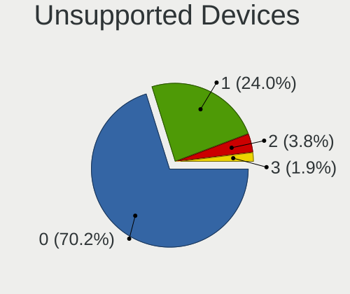

| Total | Notebooks | Percent |
|-------|-----------|---------|
| 0     | 41        | 82%     |
| 1     | 7         | 14%     |
| 2     | 2         | 4%      |

Unsupported Device Types
------------------------

Types of unsupported devices

| Type               | Notebooks | Percent |
|--------------------|-----------|---------|
| Graphics card      | 4         | 33.33%  |
| Net/wireless       | 3         | 25%     |
| Fingerprint reader | 2         | 16.67%  |
| Chipcard           | 2         | 16.67%  |
| Storage            | 1         | 8.33%   |

