BigLinux - Tested Hardware & Statistics (Notebooks)
---------------------------------------------------

A project to collect tested hardware configurations for BigLinux.

Anyone can contribute to this report by the [hw-probe](https://github.com/linuxhw/hw-probe) tool:

    sudo -E hw-probe -all -upload

Please contribute! Especially if your hardware is rare.

Contents
--------

* [ Test Cases ](#test-cases)

* [ System ](#system)
  - [ OS                       ](#os)
  - [ OS Family                ](#os-family)
  - [ Kernel                   ](#kernel)
  - [ Kernel Family            ](#kernel-family)
  - [ Kernel Major Ver.        ](#kernel-major-ver)
  - [ Arch                     ](#arch)
  - [ DE                       ](#de)
  - [ Display Server           ](#display-server)
  - [ Display Manager          ](#display-manager)
  - [ OS Lang                  ](#os-lang)
  - [ Boot Mode                ](#boot-mode)
  - [ Filesystem               ](#filesystem)
  - [ Part. scheme             ](#part-scheme)
  - [ Dual Boot with Linux/BSD ](#dual-boot-with-linuxbsd)
  - [ Dual Boot (Win)          ](#dual-boot-win)

* [ Board ](#board)
  - [ Vendor                   ](#vendor)
  - [ Model                    ](#model)
  - [ Model Family             ](#model-family)
  - [ MFG Year                 ](#mfg-year)
  - [ Form Factor              ](#form-factor)
  - [ Secure Boot              ](#secure-boot)
  - [ Coreboot                 ](#coreboot)
  - [ RAM Size                 ](#ram-size)
  - [ RAM Used                 ](#ram-used)
  - [ Total Drives             ](#total-drives)
  - [ Has CD-ROM               ](#has-cd-rom)
  - [ Has Ethernet             ](#has-ethernet)
  - [ Has WiFi                 ](#has-wifi)
  - [ Has Bluetooth            ](#has-bluetooth)

* [ Location ](#location)
  - [ Country                  ](#country)
  - [ City                     ](#city)

* [ Drives ](#drives)
  - [ Drive Vendor             ](#drive-vendor)
  - [ Drive Model              ](#drive-model)
  - [ HDD Vendor               ](#hdd-vendor)
  - [ SSD Vendor               ](#ssd-vendor)
  - [ Drive Kind               ](#drive-kind)
  - [ Drive Connector          ](#drive-connector)
  - [ Drive Size               ](#drive-size)
  - [ Space Total              ](#space-total)
  - [ Space Used               ](#space-used)
  - [ Malfunc. Drives          ](#malfunc-drives)
  - [ Malfunc. Drive Vendor    ](#malfunc-drive-vendor)
  - [ Malfunc. HDD Vendor      ](#malfunc-hdd-vendor)
  - [ Malfunc. Drive Kind      ](#malfunc-drive-kind)
  - [ Failed Drives            ](#failed-drives)
  - [ Failed Drive Vendor      ](#failed-drive-vendor)
  - [ Drive Status             ](#drive-status)

* [ Storage controller ](#storage-controller)
  - [ Storage Vendor           ](#storage-vendor)
  - [ Storage Model            ](#storage-model)
  - [ Storage Kind             ](#storage-kind)

* [ Processor ](#processor)
  - [ CPU Vendor               ](#cpu-vendor)
  - [ CPU Model                ](#cpu-model)
  - [ CPU Model Family         ](#cpu-model-family)
  - [ CPU Cores                ](#cpu-cores)
  - [ CPU Sockets              ](#cpu-sockets)
  - [ CPU Threads              ](#cpu-threads)
  - [ CPU Op-Modes             ](#cpu-op-modes)
  - [ CPU Microcode            ](#cpu-microcode)
  - [ CPU Microarch            ](#cpu-microarch)

* [ Graphics ](#graphics)
  - [ GPU Vendor               ](#gpu-vendor)
  - [ GPU Model                ](#gpu-model)
  - [ GPU Combo                ](#gpu-combo)
  - [ GPU Driver               ](#gpu-driver)
  - [ GPU Memory               ](#gpu-memory)

* [ Monitor ](#monitor)
  - [ Monitor Vendor           ](#monitor-vendor)
  - [ Monitor Model            ](#monitor-model)
  - [ Monitor Resolution       ](#monitor-resolution)
  - [ Monitor Diagonal         ](#monitor-diagonal)
  - [ Monitor Width            ](#monitor-width)
  - [ Aspect Ratio             ](#aspect-ratio)
  - [ Monitor Area             ](#monitor-area)
  - [ Pixel Density            ](#pixel-density)
  - [ Multiple Monitors        ](#multiple-monitors)

* [ Network ](#network)
  - [ Net Controller Vendor    ](#net-controller-vendor)
  - [ Net Controller Model     ](#net-controller-model)
  - [ Wireless Vendor          ](#wireless-vendor)
  - [ Wireless Model           ](#wireless-model)
  - [ Ethernet Vendor          ](#ethernet-vendor)
  - [ Ethernet Model           ](#ethernet-model)
  - [ Net Controller Kind      ](#net-controller-kind)
  - [ Used Controller          ](#used-controller)
  - [ NICs                     ](#nics)
  - [ IPv6                     ](#ipv6)

* [ Bluetooth ](#bluetooth)
  - [ Bluetooth Vendor         ](#bluetooth-vendor)
  - [ Bluetooth Model          ](#bluetooth-model)

* [ Sound ](#sound)
  - [ Sound Vendor             ](#sound-vendor)
  - [ Sound Model              ](#sound-model)

* [ Memory ](#memory)
  - [ Memory Vendor            ](#memory-vendor)
  - [ Memory Model             ](#memory-model)
  - [ Memory Kind              ](#memory-kind)
  - [ Memory Form Factor       ](#memory-form-factor)
  - [ Memory Size              ](#memory-size)
  - [ Memory Speed             ](#memory-speed)

* [ Printers & scanners ](#printers--scanners)
  - [ Printer Vendor           ](#printer-vendor)
  - [ Printer Model            ](#printer-model)
  - [ Scanner Vendor           ](#scanner-vendor)
  - [ Scanner Model            ](#scanner-model)

* [ Camera ](#camera)
  - [ Camera Vendor            ](#camera-vendor)
  - [ Camera Model             ](#camera-model)

* [ Security ](#security)
  - [ Fingerprint Vendor       ](#fingerprint-vendor)
  - [ Fingerprint Model        ](#fingerprint-model)
  - [ Chipcard Vendor          ](#chipcard-vendor)
  - [ Chipcard Model           ](#chipcard-model)

* [ Unsupported ](#unsupported)
  - [ Unsupported Devices      ](#unsupported-devices)
  - [ Unsupported Device Types ](#unsupported-device-types)

Test Cases
----------

Total: 140

| Vendor        | Model                       | Probe                                                      | Date         |
|---------------|-----------------------------|------------------------------------------------------------|--------------|
| Lenovo        | G500s Touch 20263           | [eb4512501c](https://linux-hardware.org/?probe=eb4512501c) | Jan 02, 2025 |
| ASUSTek       | VivoBook_ASUSLaptop M160... | [473fe2119f](https://linux-hardware.org/?probe=473fe2119f) | Jan 01, 2025 |
| ASUSTek       | S451LA                      | [3da156f5be](https://linux-hardware.org/?probe=3da156f5be) | Dec 31, 2024 |
| ASUSTek       | S451LA                      | [9837408f80](https://linux-hardware.org/?probe=9837408f80) | Dec 31, 2024 |
| Positivo B... | VJFE52F11X-B2291H           | [3c5b6bf03a](https://linux-hardware.org/?probe=3c5b6bf03a) | Dec 30, 2024 |
| Lenovo        | G500s Touch 20263           | [0dbe4fae1f](https://linux-hardware.org/?probe=0dbe4fae1f) | Dec 27, 2024 |
| Sony          | VPCF215FX                   | [96e5141db4](https://linux-hardware.org/?probe=96e5141db4) | Dec 20, 2024 |
| Acer          | Aspire E5-774G              | [19077cd048](https://linux-hardware.org/?probe=19077cd048) | Dec 17, 2024 |
| ASUSTek       | ASUS TUF Gaming A16 FA61... | [ab05b2a1ee](https://linux-hardware.org/?probe=ab05b2a1ee) | Dec 15, 2024 |
| Acer          | Aspire A515-51              | [615b9706b0](https://linux-hardware.org/?probe=615b9706b0) | Dec 12, 2024 |
| Dell          | Vostro 3550                 | [c45c7e2e64](https://linux-hardware.org/?probe=c45c7e2e64) | Dec 11, 2024 |
| Lenovo        | Yoga Slim 6 14IAP8 83C7     | [90bb1c3ab1](https://linux-hardware.org/?probe=90bb1c3ab1) | Dec 10, 2024 |
| HP            | Pavilion dv7                | [8d620075ce](https://linux-hardware.org/?probe=8d620075ce) | Dec 10, 2024 |
| Lenovo        | IdeaPad 3 15ITL6 82MD       | [fd49240dd9](https://linux-hardware.org/?probe=fd49240dd9) | Nov 23, 2024 |
| Lenovo        | IdeaPad 3 15ITL6 82MD       | [7767925a13](https://linux-hardware.org/?probe=7767925a13) | Nov 16, 2024 |
| Dell          | Inspiron 15 7000 Gaming     | [c81a415b4f](https://linux-hardware.org/?probe=c81a415b4f) | Nov 12, 2024 |
| HP            | Presario CQ42               | [afee708cb6](https://linux-hardware.org/?probe=afee708cb6) | Nov 08, 2024 |
| HP            | Presario CQ42               | [a71192175b](https://linux-hardware.org/?probe=a71192175b) | Nov 08, 2024 |
| Acer          | Aspire E5-575G              | [98fe0f8e24](https://linux-hardware.org/?probe=98fe0f8e24) | Nov 06, 2024 |
| HP            | EliteBook 8470p             | [0b97846718](https://linux-hardware.org/?probe=0b97846718) | Nov 04, 2024 |
| Acer          | Aspire A315-53              | [7210c6bb41](https://linux-hardware.org/?probe=7210c6bb41) | Oct 29, 2024 |
| Dell          | Latitude 5400               | [772d666dab](https://linux-hardware.org/?probe=772d666dab) | Oct 27, 2024 |
| eMachines     | eMD732                      | [0eb906c266](https://linux-hardware.org/?probe=0eb906c266) | Oct 09, 2024 |
| ASUSTek       | VivoBook_ASUSLaptop M150... | [8260fb5b8b](https://linux-hardware.org/?probe=8260fb5b8b) | Oct 08, 2024 |
| ASUSTek       | VivoBook_ASUSLaptop M150... | [a123744b71](https://linux-hardware.org/?probe=a123744b71) | Sep 26, 2024 |
| ALLDOCUBE     | i1405C                      | [9f39325af4](https://linux-hardware.org/?probe=9f39325af4) | Sep 18, 2024 |
| Dell          | Inspiron 5567               | [2aa09caab7](https://linux-hardware.org/?probe=2aa09caab7) | Sep 16, 2024 |
| Dell          | Inspiron 5567               | [369ac3b5ef](https://linux-hardware.org/?probe=369ac3b5ef) | Sep 16, 2024 |
| MSI           | Pulse GL66 12UEK            | [92157f1b1b](https://linux-hardware.org/?probe=92157f1b1b) | Sep 14, 2024 |
| MSI           | GS70 2PC Stealth            | [db7810c975](https://linux-hardware.org/?probe=db7810c975) | Sep 06, 2024 |
| Positivo B... | VJFE52F11X-B2291H           | [4f00dbcd1c](https://linux-hardware.org/?probe=4f00dbcd1c) | Aug 20, 2024 |
| MSI           | GS70 2PC Stealth            | [1be745f442](https://linux-hardware.org/?probe=1be745f442) | Aug 19, 2024 |
| HP            | Laptop 15-dy2xxx            | [dfe2f720f9](https://linux-hardware.org/?probe=dfe2f720f9) | Aug 11, 2024 |
| ASUSTek       | X450LCP                     | [607c09a587](https://linux-hardware.org/?probe=607c09a587) | Aug 09, 2024 |
| ASUSTek       | X450LCP                     | [3378c92fb9](https://linux-hardware.org/?probe=3378c92fb9) | Aug 05, 2024 |
| Itautec       | Infoway                     | [c916d2d58b](https://linux-hardware.org/?probe=c916d2d58b) | Jul 23, 2024 |
| HP            | ProBook 645 G1              | [a16f515745](https://linux-hardware.org/?probe=a16f515745) | Jul 23, 2024 |
| Lenovo        | IdeaPad S145-15IIL 82DJ     | [a49f2e2502](https://linux-hardware.org/?probe=a49f2e2502) | Jul 04, 2024 |
| Lenovo        | G500s Touch 20263           | [2a20141cbc](https://linux-hardware.org/?probe=2a20141cbc) | Jul 04, 2024 |
| Positivo B... | VJFE52F11X-B2291H           | [23c91aa018](https://linux-hardware.org/?probe=23c91aa018) | Jul 02, 2024 |
| Samsung       | 300E5K/300E5Q               | [1060190afc](https://linux-hardware.org/?probe=1060190afc) | Jun 28, 2024 |
| Multilaser    | PC204                       | [a2dc3be176](https://linux-hardware.org/?probe=a2dc3be176) | Jun 26, 2024 |
| Acer          | Aspire 4349                 | [cce9c00e41](https://linux-hardware.org/?probe=cce9c00e41) | Jun 22, 2024 |
| Acer          | Aspire 4349                 | [86b134f1c9](https://linux-hardware.org/?probe=86b134f1c9) | Jun 22, 2024 |
| Toshiba       | IS 1412                     | [6241552625](https://linux-hardware.org/?probe=6241552625) | Jun 21, 2024 |
| Lenovo        | IdeaPad 3 15ITL6 82MD       | [5eeba447a1](https://linux-hardware.org/?probe=5eeba447a1) | Jun 18, 2024 |
| Dell          | G3 3590                     | [f685aed1ca](https://linux-hardware.org/?probe=f685aed1ca) | May 25, 2024 |
| Lenovo        | ThinkPad X61s 7666WJ5       | [afefba8125](https://linux-hardware.org/?probe=afefba8125) | May 19, 2024 |
| Lenovo        | B50-30 80ES                 | [a1857bbe42](https://linux-hardware.org/?probe=a1857bbe42) | May 19, 2024 |
| Lenovo        | B50-30 80ES                 | [5cfe795600](https://linux-hardware.org/?probe=5cfe795600) | May 19, 2024 |
| ASUSTek       | VivoBook_ASUSLaptop M150... | [cb7a4ffa4f](https://linux-hardware.org/?probe=cb7a4ffa4f) | May 09, 2024 |
| ASUSTek       | VivoBook_ASUSLaptop M150... | [b81a572516](https://linux-hardware.org/?probe=b81a572516) | May 09, 2024 |
| MSI           | Cyborg 15 A12VF             | [1168634a54](https://linux-hardware.org/?probe=1168634a54) | May 06, 2024 |
| Itautec       | Itautec                     | [cb012e89fc](https://linux-hardware.org/?probe=cb012e89fc) | May 06, 2024 |
| Itautec       | Itautec                     | [e1d6b279b9](https://linux-hardware.org/?probe=e1d6b279b9) | May 06, 2024 |
| HP            | Victus by Gaming Laptop     | [7178fbf1eb](https://linux-hardware.org/?probe=7178fbf1eb) | Apr 23, 2024 |
| HP            | EliteBook Folio 9470m       | [72485d4ec0](https://linux-hardware.org/?probe=72485d4ec0) | Apr 20, 2024 |
| ASUSTek       | VivoBook_ASUSLaptop M560... | [96271e0269](https://linux-hardware.org/?probe=96271e0269) | Apr 10, 2024 |
| Lenovo        | IdeaPad 3 15ABA7 82RN       | [4fc00ab41f](https://linux-hardware.org/?probe=4fc00ab41f) | Apr 01, 2024 |
| Google        | Blooguard                   | [6c7218afa7](https://linux-hardware.org/?probe=6c7218afa7) | Mar 27, 2024 |
| Google        | Blooguard                   | [583f5aada6](https://linux-hardware.org/?probe=583f5aada6) | Mar 25, 2024 |
| ASUSTek       | X541SA                      | [4f1901506d](https://linux-hardware.org/?probe=4f1901506d) | Mar 22, 2024 |
| HP            | ENVY TS m7                  | [2b3732863e](https://linux-hardware.org/?probe=2b3732863e) | Mar 21, 2024 |
| Lenovo        | IdeaPad 3 15IGL05 82BU      | [e660816556](https://linux-hardware.org/?probe=e660816556) | Mar 20, 2024 |
| HP            | Laptop 15-bs1xx             | [fa1b40fdce](https://linux-hardware.org/?probe=fa1b40fdce) | Mar 17, 2024 |
| Apple         | MacBookPro5,5               | [73b6e42771](https://linux-hardware.org/?probe=73b6e42771) | Mar 16, 2024 |
| Apple         | MacBookPro14,1              | [ad99c77be4](https://linux-hardware.org/?probe=ad99c77be4) | Mar 13, 2024 |
| Acer          | TravelMate 5740             | [b1366802c6](https://linux-hardware.org/?probe=b1366802c6) | Mar 01, 2024 |
| Lenovo        | IdeaPad 3 15ITL6 82H8       | [270dd04b52](https://linux-hardware.org/?probe=270dd04b52) | Feb 28, 2024 |
| Acer          | Aspire E5-575G              | [3790ad9e05](https://linux-hardware.org/?probe=3790ad9e05) | Feb 10, 2024 |
| ASUSTek       | VivoBook_ASUSLaptop M560... | [975b3a3b77](https://linux-hardware.org/?probe=975b3a3b77) | Feb 05, 2024 |
| Lenovo        | G50-80 80R0                 | [980165425e](https://linux-hardware.org/?probe=980165425e) | Jan 27, 2024 |
| Lenovo        | G50-80 80R0                 | [eeee227df0](https://linux-hardware.org/?probe=eeee227df0) | Jan 26, 2024 |
| Samsung       | 550XCJ/550XCR               | [daf43e4658](https://linux-hardware.org/?probe=daf43e4658) | Jan 02, 2024 |
| Acer          | Nitro AN515-51              | [de83793263](https://linux-hardware.org/?probe=de83793263) | Dec 16, 2023 |
| Toshiba       | IS 1412                     | [b5f0453a4b](https://linux-hardware.org/?probe=b5f0453a4b) | Dec 09, 2023 |
| HP            | 255 G6 Notebook PC          | [626135b546](https://linux-hardware.org/?probe=626135b546) | Dec 04, 2023 |
| Acer          | Aspire V5-472               | [c4839c409c](https://linux-hardware.org/?probe=c4839c409c) | Dec 02, 2023 |
| Acer          | Aspire V5-472               | [0dc4701502](https://linux-hardware.org/?probe=0dc4701502) | Dec 02, 2023 |
| Acer          | Aspire E5-575G              | [561cad738d](https://linux-hardware.org/?probe=561cad738d) | Dec 02, 2023 |
| Unknown       | Unknown                     | [ecae393240](https://linux-hardware.org/?probe=ecae393240) | Dec 02, 2023 |
| Acer          | Aspire E5-575G              | [c5dd65037d](https://linux-hardware.org/?probe=c5dd65037d) | Nov 29, 2023 |
| Positivo      | C41TF                       | [09be1cbd3a](https://linux-hardware.org/?probe=09be1cbd3a) | Nov 25, 2023 |
| Dell          | Inspiron N5010              | [688d81c63c](https://linux-hardware.org/?probe=688d81c63c) | Nov 22, 2023 |
| ASUSTek       | VivoBook_ASUSLaptop X515... | [d6c8994c15](https://linux-hardware.org/?probe=d6c8994c15) | Nov 20, 2023 |
| HP            | Pavilion g4                 | [37d7289eb6](https://linux-hardware.org/?probe=37d7289eb6) | Nov 16, 2023 |
| ASUSTek       | VivoBook_ASUSLaptop E510... | [3113cdd229](https://linux-hardware.org/?probe=3113cdd229) | Nov 11, 2023 |
| Positivo      | C41TF                       | [4bb5f6150c](https://linux-hardware.org/?probe=4bb5f6150c) | Nov 06, 2023 |
| Acer          | Aspire A315-42G             | [65494c95ec](https://linux-hardware.org/?probe=65494c95ec) | Oct 23, 2023 |
| Acer          | Nitro AN515-51              | [be03ed57d8](https://linux-hardware.org/?probe=be03ed57d8) | Oct 20, 2023 |
| Acer          | Nitro AN515-51              | [e648a8c32a](https://linux-hardware.org/?probe=e648a8c32a) | Oct 20, 2023 |
| Lenovo        | ThinkPad T480s 20L70028U... | [673113259c](https://linux-hardware.org/?probe=673113259c) | Oct 14, 2023 |
| Acer          | Nitro AN515-47              | [0592faaf34](https://linux-hardware.org/?probe=0592faaf34) | Oct 12, 2023 |
| HP            | ZBook 15 G3                 | [cd9071e2ad](https://linux-hardware.org/?probe=cd9071e2ad) | Oct 12, 2023 |
| Dell          | Latitude E6420              | [7508b7cf4f](https://linux-hardware.org/?probe=7508b7cf4f) | Oct 10, 2023 |
| Dell          | Latitude E6420              | [90883fd019](https://linux-hardware.org/?probe=90883fd019) | Oct 02, 2023 |
| Acer          | Aspire E5-411G              | [1986877980](https://linux-hardware.org/?probe=1986877980) | Aug 25, 2023 |
| ASUSTek       | X455LA                      | [8b60fb0411](https://linux-hardware.org/?probe=8b60fb0411) | Aug 08, 2023 |
| HP            | EliteBook 8760w             | [30ea6db008](https://linux-hardware.org/?probe=30ea6db008) | Jul 23, 2023 |
| Multilaser    | MLSH1H LINUX                | [e699ffe719](https://linux-hardware.org/?probe=e699ffe719) | Jul 08, 2023 |
| ASUSTek       | VX7SX                       | [2ef4295d22](https://linux-hardware.org/?probe=2ef4295d22) | Jul 05, 2023 |
| Positivo      | Q464B                       | [9dad5f0aa1](https://linux-hardware.org/?probe=9dad5f0aa1) | Jul 02, 2023 |
| Multilaser    | MLSH1H LINUX                | [3aa4a11068](https://linux-hardware.org/?probe=3aa4a11068) | Jun 30, 2023 |
| Multilaser    | MLSH1H LINUX                | [3a8a822af9](https://linux-hardware.org/?probe=3a8a822af9) | Jun 30, 2023 |
| Apple         | MacBookPro9,2               | [5223ed2efd](https://linux-hardware.org/?probe=5223ed2efd) | Jun 13, 2023 |
| Apple         | MacBookPro9,2               | [e25224b362](https://linux-hardware.org/?probe=e25224b362) | Jun 13, 2023 |
| Lenovo        | IdeaPad 5 Pro 14ACN6 82L... | [91d11f8da1](https://linux-hardware.org/?probe=91d11f8da1) | Jun 04, 2023 |
| Samsung       | 300E5M/300E5L               | [ebd65238d8](https://linux-hardware.org/?probe=ebd65238d8) | May 22, 2023 |
| Dell          | Inspiron 7460               | [696014fc68](https://linux-hardware.org/?probe=696014fc68) | May 01, 2023 |
| Dell          | G15 5520                    | [d2cc8527a5](https://linux-hardware.org/?probe=d2cc8527a5) | Apr 23, 2023 |
| Acer          | Nitro AN517-54              | [ebe6cc115e](https://linux-hardware.org/?probe=ebe6cc115e) | Mar 22, 2023 |
| Clevo         | W340EU                      | [fb9df7f581](https://linux-hardware.org/?probe=fb9df7f581) | Mar 18, 2023 |
| Clevo         | W340EU                      | [176b7d75bf](https://linux-hardware.org/?probe=176b7d75bf) | Mar 18, 2023 |
| Avell High... | STORM TWO                   | [e6b20084b5](https://linux-hardware.org/?probe=e6b20084b5) | Mar 16, 2023 |
| Acer          | Aspire A315-53              | [fd498f882b](https://linux-hardware.org/?probe=fd498f882b) | Jan 18, 2023 |
| ASUSTek       | VivoBook_ASUSLaptop X515... | [009adbd75c](https://linux-hardware.org/?probe=009adbd75c) | Jan 18, 2023 |
| HP            | 255 G7 Notebook PC          | [b1a7adefab](https://linux-hardware.org/?probe=b1a7adefab) | Jan 09, 2023 |
| Lenovo        | ThinkPad A485 20MVS0LG00    | [12b3654541](https://linux-hardware.org/?probe=12b3654541) | Dec 15, 2022 |
| Lenovo        | Yoga Slim 7 14ARE05 82A2    | [89e97c7099](https://linux-hardware.org/?probe=89e97c7099) | Nov 29, 2022 |
| Toshiba       | Satellite S55-A             | [c188e01f20](https://linux-hardware.org/?probe=c188e01f20) | Nov 20, 2022 |
| Toshiba       | Satellite S55-A             | [d5e9f0d98a](https://linux-hardware.org/?probe=d5e9f0d98a) | Nov 19, 2022 |
| Lenovo        | IdeaPad 300-15ISK 80RS      | [16dc745785](https://linux-hardware.org/?probe=16dc745785) | Nov 16, 2022 |
| Dell          | System XPS L502X            | [cd40a3f168](https://linux-hardware.org/?probe=cd40a3f168) | Oct 08, 2022 |
| ASUSTek       | X45U                        | [3efe835653](https://linux-hardware.org/?probe=3efe835653) | Aug 22, 2022 |
| Positivo      | C14RV01                     | [818c67da93](https://linux-hardware.org/?probe=818c67da93) | Aug 21, 2022 |
| Sony          | VGN-NR230AE                 | [ba78970975](https://linux-hardware.org/?probe=ba78970975) | Aug 15, 2022 |
| Lenovo        | IdeaPad S400 VIUS3          | [2f8b49e4f8](https://linux-hardware.org/?probe=2f8b49e4f8) | Jul 23, 2022 |
| Positivo      | C14RV01                     | [fc6fa07b38](https://linux-hardware.org/?probe=fc6fa07b38) | Sep 10, 2021 |
| Acer          | Predator G9-793             | [6004b8b462](https://linux-hardware.org/?probe=6004b8b462) | Jun 24, 2021 |
| Dell          | System Inspiron N7110       | [e58da0d3ca](https://linux-hardware.org/?probe=e58da0d3ca) | Jun 23, 2021 |
| Acer          | Predator G9-793             | [ae4824f52e](https://linux-hardware.org/?probe=ae4824f52e) | Jun 20, 2021 |
| Dell          | System Inspiron N7110       | [41512cfc6a](https://linux-hardware.org/?probe=41512cfc6a) | Jun 20, 2021 |
| Positivo      | C14RV01                     | [36efae3128](https://linux-hardware.org/?probe=36efae3128) | Feb 03, 2021 |
| Acer          | A315-41                     | [021dc9110e](https://linux-hardware.org/?probe=021dc9110e) | Nov 11, 2020 |
| Lenovo        | ThinkPad T410 25379N2       | [ed777f25b7](https://linux-hardware.org/?probe=ed777f25b7) | Nov 09, 2020 |
| Dell          | Inspiron 3480               | [1f0823c074](https://linux-hardware.org/?probe=1f0823c074) | Oct 13, 2020 |
| Acer          | Aspire A515-51G             | [8b89f99351](https://linux-hardware.org/?probe=8b89f99351) | Jul 17, 2020 |
| Acer          | Aspire A515-51G             | [07fb6950a2](https://linux-hardware.org/?probe=07fb6950a2) | Jul 11, 2020 |
| Lenovo        | IdeaPad Z470                | [3a8f141df4](https://linux-hardware.org/?probe=3a8f141df4) | Mar 28, 2020 |
| Alienware     | 17                          | [14abe97f88](https://linux-hardware.org/?probe=14abe97f88) | Oct 23, 2019 |

System
------

OS
--

Installed operating systems

| Name                      | Notebooks | Percent |
|---------------------------|-----------|---------|
| BigLinux                  | 43        | 40.19%  |
| BigLinux 20.04            | 6         | 5.61%   |
| BigLinux 24.2.0           | 3         | 2.8%    |
| BigLinux 23.0.0           | 3         | 2.8%    |
| BigLinux 22.0.0           | 3         | 2.8%    |
| BigLinux 2024-03-15_05-13 | 3         | 2.8%    |
| BigLinux 19.04            | 3         | 2.8%    |
| BigLinux 24.0.8           | 2         | 1.87%   |
| BigLinux 24.0.6           | 2         | 1.87%   |
| BigLinux 24.0.2           | 2         | 1.87%   |
| BigLinux 23.1.4           | 2         | 1.87%   |
| BigLinux 22.1.0           | 2         | 1.87%   |
| BigLinux 21.3.7           | 2         | 1.87%   |
| BigLinux 24.2.1           | 1         | 0.93%   |
| BigLinux 24.1.1           | 1         | 0.93%   |
| BigLinux 24.0.4           | 1         | 0.93%   |
| BigLinux 23.01.06         | 1         | 0.93%   |
| BigLinux 23.0.3           | 1         | 0.93%   |
| BigLinux 22.11.19         | 1         | 0.93%   |
| BigLinux 22.11.14         | 1         | 0.93%   |
| BigLinux 22.10.06         | 1         | 0.93%   |
| BigLinux 22.0.5           | 1         | 0.93%   |
| BigLinux 22.0.4           | 1         | 0.93%   |
| BigLinux 21.3.6           | 1         | 0.93%   |
| BigLinux 21.3.5           | 1         | 0.93%   |
| BigLinux 21.1.2           | 1         | 0.93%   |
| BigLinux 2024-12-13_17-44 | 1         | 0.93%   |
| BigLinux 2024-11-04_04-23 | 1         | 0.93%   |
| BigLinux 2024-05-20_03-09 | 1         | 0.93%   |
| BigLinux 2024-05-03_00-50 | 1         | 0.93%   |
| BigLinux 2024-05-01_19-57 | 1         | 0.93%   |
| BigLinux 2024-03-08_05-13 | 1         | 0.93%   |
| BigLinux 2024-02-23_05-13 | 1         | 0.93%   |
| BigLinux 2024-02-02_05-14 | 1         | 0.93%   |
| BigLinux 2023-11-24_05-13 | 1         | 0.93%   |
| BigLinux 2023-11-21_03-11 | 1         | 0.93%   |
| BigLinux 2023-11-07_19-34 | 1         | 0.93%   |
| BigLinux 2023-10-14_01-04 | 1         | 0.93%   |
| BigLinux 2023-08-04_06-17 | 1         | 0.93%   |
| BigLinux 2023-06-30_08-01 | 1         | 0.93%   |

OS Family
---------

OS without a version

| Name     | Notebooks | Percent |
|----------|-----------|---------|
| BigLinux | 103       | 100%    |

Kernel
------

Version of the Linux kernel

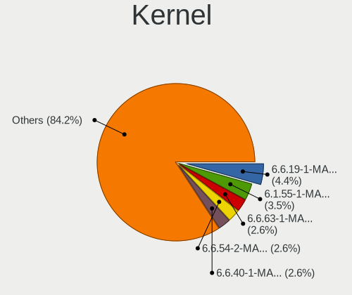

| Version                    | Notebooks | Percent |
|----------------------------|-----------|---------|
| 6.6.19-1-MANJARO           | 5         | 4.39%   |
| 6.1.55-1-MANJARO           | 4         | 3.51%   |
| 6.6.63-1-MANJARO           | 3         | 2.63%   |
| 6.6.54-2-MANJARO           | 3         | 2.63%   |
| 6.6.40-1-MANJARO           | 3         | 2.63%   |
| 6.6.30-2-MANJARO           | 3         | 2.63%   |
| 6.6.26-1-MANJARO           | 3         | 2.63%   |
| 6.1.64-1-MANJARO           | 3         | 2.63%   |
| 6.8.8-2-MANJARO            | 2         | 1.75%   |
| 6.7.7-1-MANJARO            | 2         | 1.75%   |
| 6.6.35-x64v1-xanmod1-1-lts | 2         | 1.75%   |
| 6.6.32-1-MANJARO           | 2         | 1.75%   |
| 6.5.5-1-MANJARO            | 2         | 1.75%   |
| 6.11.10-2-MANJARO          | 2         | 1.75%   |
| 6.1.69-1-MANJARO           | 2         | 1.75%   |
| 6.1.62-1-MANJARO           | 2         | 1.75%   |
| 6.1.31-2-MANJARO           | 2         | 1.75%   |
| 6.1.23-1-MANJARO           | 2         | 1.75%   |
| 6.0.8-1-MANJARO            | 2         | 1.75%   |
| 5.8.0-43-generic           | 2         | 1.75%   |
| 5.2.8-xanmod8              | 2         | 1.75%   |
| 5.15.85-1-MANJARO          | 2         | 1.75%   |
| 5.15.102-1-MANJARO         | 2         | 1.75%   |
| 6.9.9-1-MANJARO            | 1         | 0.88%   |
| 6.9.5-1-MANJARO            | 1         | 0.88%   |
| 6.9.12-3-MANJARO           | 1         | 0.88%   |
| 6.8.5-1-MANJARO            | 1         | 0.88%   |
| 6.8.4-1-MANJARO            | 1         | 0.88%   |
| 6.8.0-1-MANJARO            | 1         | 0.88%   |
| 6.7.4-2-MANJARO            | 1         | 0.88%   |
| 6.6.65-x64v1-xanmod1-1-lts | 1         | 0.88%   |
| 6.6.65-1-MANJARO           | 1         | 0.88%   |
| 6.6.60-x64v1-xanmod1-1-lts | 1         | 0.88%   |
| 6.6.53-x64v1-xanmod1-1-lts | 1         | 0.88%   |
| 6.6.52-1-MANJARO           | 1         | 0.88%   |
| 6.6.47-1-MANJARO           | 1         | 0.88%   |
| 6.6.44-1-MANJARO           | 1         | 0.88%   |
| 6.6.3-1-MANJARO            | 1         | 0.88%   |
| 6.6.16-2-MANJARO           | 1         | 0.88%   |
| 6.6.10-1-MANJARO           | 1         | 0.88%   |

Kernel Family
-------------

Linux kernel without a distro release

| Version  | Notebooks | Percent |
|----------|-----------|---------|
| 6.6.19   | 5         | 4.39%   |
| 6.1.64   | 4         | 3.51%   |
| 6.1.55   | 4         | 3.51%   |
| 6.6.63   | 3         | 2.63%   |
| 6.6.54   | 3         | 2.63%   |
| 6.6.40   | 3         | 2.63%   |
| 6.6.30   | 3         | 2.63%   |
| 6.6.26   | 3         | 2.63%   |
| 5.8.0    | 3         | 2.63%   |
| 6.8.8    | 2         | 1.75%   |
| 6.7.7    | 2         | 1.75%   |
| 6.6.65   | 2         | 1.75%   |
| 6.6.35   | 2         | 1.75%   |
| 6.6.32   | 2         | 1.75%   |
| 6.5.5    | 2         | 1.75%   |
| 6.3.5    | 2         | 1.75%   |
| 6.11.10  | 2         | 1.75%   |
| 6.1.69   | 2         | 1.75%   |
| 6.1.62   | 2         | 1.75%   |
| 6.1.31   | 2         | 1.75%   |
| 6.1.23   | 2         | 1.75%   |
| 6.0.8    | 2         | 1.75%   |
| 5.2.8    | 2         | 1.75%   |
| 5.15.85  | 2         | 1.75%   |
| 5.15.102 | 2         | 1.75%   |
| 6.9.9    | 1         | 0.88%   |
| 6.9.5    | 1         | 0.88%   |
| 6.9.12   | 1         | 0.88%   |
| 6.8.5    | 1         | 0.88%   |
| 6.8.4    | 1         | 0.88%   |
| 6.8.0    | 1         | 0.88%   |
| 6.7.4    | 1         | 0.88%   |
| 6.6.60   | 1         | 0.88%   |
| 6.6.53   | 1         | 0.88%   |
| 6.6.52   | 1         | 0.88%   |
| 6.6.47   | 1         | 0.88%   |
| 6.6.44   | 1         | 0.88%   |
| 6.6.3    | 1         | 0.88%   |
| 6.6.16   | 1         | 0.88%   |
| 6.6.10   | 1         | 0.88%   |

Kernel Major Ver.
-----------------

Linux kernel major version

| Version | Notebooks | Percent |
|---------|-----------|---------|
| 6.6     | 31        | 29.25%  |
| 6.1     | 26        | 24.53%  |
| 5.15    | 8         | 7.55%   |
| 6.8     | 5         | 4.72%   |
| 6.5     | 4         | 3.77%   |
| 6.11    | 4         | 3.77%   |
| 5.10    | 4         | 3.77%   |
| 6.7     | 3         | 2.83%   |
| 6.3     | 3         | 2.83%   |
| 5.8     | 3         | 2.83%   |
| 6.9     | 2         | 1.89%   |
| 6.10    | 2         | 1.89%   |
| 6.0     | 2         | 1.89%   |
| 5.2     | 2         | 1.89%   |
| 6.4     | 1         | 0.94%   |
| 6.2     | 1         | 0.94%   |
| 6.12    | 1         | 0.94%   |
| 5.9     | 1         | 0.94%   |
| 5.4     | 1         | 0.94%   |
| 5.3     | 1         | 0.94%   |
| 5.19    | 1         | 0.94%   |

Arch
----

OS architecture (x86_64, i586, etc.)

| Name   | Notebooks | Percent |
|--------|-----------|---------|
| x86_64 | 103       | 100%    |

DE
--

Desktop Environment

| Name     | Notebooks | Percent |
|----------|-----------|---------|
| KDE5     | 65        | 61.9%   |
| KDE6     | 34        | 32.38%  |
| KDE      | 3         | 2.86%   |
| XFCE     | 1         | 0.95%   |
| Cinnamon | 1         | 0.95%   |
| Unknown  | 1         | 0.95%   |

Display Server
--------------

X11 or Wayland

| Name    | Notebooks | Percent |
|---------|-----------|---------|
| X11     | 87        | 83.65%  |
| Wayland | 17        | 16.35%  |

Display Manager
---------------

SDDM, LightDM, etc.

| Name    | Notebooks | Percent |
|---------|-----------|---------|
| SDDM    | 54        | 52.43%  |
| Unknown | 46        | 44.66%  |
| LightDM | 3         | 2.91%   |

OS Lang
-------

Language

| Lang    | Notebooks | Percent |
|---------|-----------|---------|
| pt_BR   | 63        | 61.17%  |
| en_US   | 11        | 10.68%  |
| pl_PL   | 6         | 5.83%   |
| de_DE   | 5         | 4.85%   |
| en_GB   | 4         | 3.88%   |
| es_MX   | 3         | 2.91%   |
| el_GR   | 2         | 1.94%   |
| tr_TR   | 1         | 0.97%   |
| it_IT   | 1         | 0.97%   |
| fi_FI   | 1         | 0.97%   |
| es_ES   | 1         | 0.97%   |
| es_CR   | 1         | 0.97%   |
| en_ZA   | 1         | 0.97%   |
| en_IE   | 1         | 0.97%   |
| en_AU   | 1         | 0.97%   |
| Unknown | 1         | 0.97%   |

Boot Mode
---------

EFI or BIOS

| Mode | Notebooks | Percent |
|------|-----------|---------|
| EFI  | 70        | 66.04%  |
| BIOS | 36        | 33.96%  |

Filesystem
----------

Type of filesystem

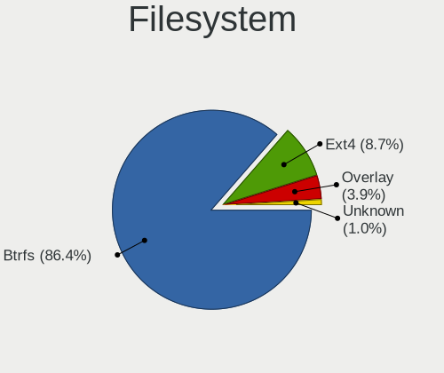

| Type    | Notebooks | Percent |
|---------|-----------|---------|
| Btrfs   | 89        | 86.41%  |
| Ext4    | 9         | 8.74%   |
| Overlay | 4         | 3.88%   |
| Unknown | 1         | 0.97%   |

Part. scheme
------------

Scheme of partitioning

| Type    | Notebooks | Percent |
|---------|-----------|---------|
| Unknown | 46        | 44.23%  |
| GPT     | 39        | 37.5%   |
| MBR     | 19        | 18.27%  |

Dual Boot with Linux/BSD
------------------------

Hosting more than one Linux/BSD

| Dual boot | Notebooks | Percent |
|-----------|-----------|---------|
| No        | 99        | 95.19%  |
| Yes       | 5         | 4.81%   |

Dual Boot (Win)
---------------

Hosting Linux and Windows

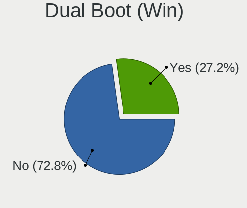

| Dual boot | Notebooks | Percent |
|-----------|-----------|---------|
| No        | 75        | 72.82%  |
| Yes       | 28        | 27.18%  |

Board
-----

Vendor
------

Motherboard manufacturer

| Name                   | Notebooks | Percent |
|------------------------|-----------|---------|
| Lenovo                 | 17        | 16.5%   |
| ASUSTek Computer       | 16        | 15.53%  |
| Acer                   | 15        | 14.56%  |
| Hewlett-Packard        | 14        | 13.59%  |
| Dell                   | 12        | 11.65%  |
| Positivo               | 4         | 3.88%   |
| Samsung Electronics    | 3         | 2.91%   |
| MSI                    | 3         | 2.91%   |
| Apple                  | 3         | 2.91%   |
| Sony                   | 2         | 1.94%   |
| Multilaser             | 2         | 1.94%   |
| Itautec                | 2         | 1.94%   |
| Google                 | 2         | 1.94%   |
| Toshiba                | 1         | 0.97%   |
| Semp Toshiba           | 1         | 0.97%   |
| Positivo Bahia - VAIO  | 1         | 0.97%   |
| eMachines              | 1         | 0.97%   |
| Clevo                  | 1         | 0.97%   |
| Avell High Performance | 1         | 0.97%   |
| Alienware              | 1         | 0.97%   |
| Unknown                | 1         | 0.97%   |

Model
-----

Motherboard model

| Name                                     | Notebooks | Percent |
|------------------------------------------|-----------|---------|
| ASUS VivoBook_ASUSLaptop M1502IA_M1502IA | 3         | 2.91%   |
| Positivo C41TF                           | 2         | 1.94%   |
| Google Blooguard                         | 2         | 1.94%   |
| ASUS VivoBook_ASUSLaptop M5602RA         | 2         | 1.94%   |
| Acer Aspire A315-53                      | 2         | 1.94%   |
| Toshiba Satellite S55-A                  | 1         | 0.97%   |
| Sony VPCF215FX                           | 1         | 0.97%   |
| Sony VGN-NR230AE                         | 1         | 0.97%   |
| Semp Toshiba IS 1412                     | 1         | 0.97%   |
| Samsung 550XCJ/550XCR                    | 1         | 0.97%   |
| Samsung 300E5M/300E5L                    | 1         | 0.97%   |
| Samsung 300E5K/300E5Q                    | 1         | 0.97%   |
| Positivo Q464B                           | 1         | 0.97%   |
| Positivo C14RV01                         | 1         | 0.97%   |
| Positivo Bahia - VAIO VJFE52F11X-B2291H  | 1         | 0.97%   |
| Multilaser PC204                         | 1         | 0.97%   |
| Multilaser MLSH1H LINUX                  | 1         | 0.97%   |
| MSI Pulse GL66 12UEK                     | 1         | 0.97%   |
| MSI GS70 2PC Stealth                     | 1         | 0.97%   |
| MSI Cyborg 15 A12VF                      | 1         | 0.97%   |
| Lenovo Yoga Slim 7 14ARE05 82A2          | 1         | 0.97%   |
| Lenovo Yoga Slim 6 14IAP8 83C7           | 1         | 0.97%   |
| Lenovo ThinkPad X61s 7666WJ5             | 1         | 0.97%   |
| Lenovo ThinkPad T480s 20L70028US         | 1         | 0.97%   |
| Lenovo ThinkPad T410 25379N2             | 1         | 0.97%   |
| Lenovo IdeaPad Z470                      | 1         | 0.97%   |
| Lenovo IdeaPad S400 VIUS3                | 1         | 0.97%   |
| Lenovo IdeaPad S145-15IIL 82DJ           | 1         | 0.97%   |
| Lenovo IdeaPad 5 Pro 14ACN6 82L7         | 1         | 0.97%   |
| Lenovo IdeaPad 300-15ISK 80RS            | 1         | 0.97%   |
| Lenovo IdeaPad 3 15ITL6 82MD             | 1         | 0.97%   |
| Lenovo IdeaPad 3 15ITL6 82H8             | 1         | 0.97%   |
| Lenovo IdeaPad 3 15IGL05 82BU            | 1         | 0.97%   |
| Lenovo IdeaPad 3 15ABA7 82RN             | 1         | 0.97%   |
| Lenovo G500s Touch 20263                 | 1         | 0.97%   |
| Lenovo G50-80 80R0                       | 1         | 0.97%   |
| Lenovo B50-30 80ES                       | 1         | 0.97%   |
| Itautec Itautec                          | 1         | 0.97%   |
| Itautec Infoway                          | 1         | 0.97%   |
| HP ZBook 15 G3                           | 1         | 0.97%   |

Model Family
------------

Motherboard model prefix

| Name                                    | Notebooks | Percent |
|-----------------------------------------|-----------|---------|
| Lenovo IdeaPad                          | 9         | 8.74%   |
| ASUS VivoBook                           | 9         | 8.74%   |
| Acer Aspire                             | 9         | 8.74%   |
| Dell Inspiron                           | 5         | 4.85%   |
| Lenovo ThinkPad                         | 3         | 2.91%   |
| HP EliteBook                            | 3         | 2.91%   |
| Acer Nitro                              | 3         | 2.91%   |
| Positivo C41TF                          | 2         | 1.94%   |
| Lenovo Yoga                             | 2         | 1.94%   |
| HP Pavilion                             | 2         | 1.94%   |
| HP Laptop                               | 2         | 1.94%   |
| HP 255                                  | 2         | 1.94%   |
| Google Blooguard                        | 2         | 1.94%   |
| Dell System                             | 2         | 1.94%   |
| Dell Latitude                           | 2         | 1.94%   |
| Toshiba Satellite                       | 1         | 0.97%   |
| Sony VPCF215FX                          | 1         | 0.97%   |
| Sony VGN-NR230AE                        | 1         | 0.97%   |
| Semp Toshiba IS                         | 1         | 0.97%   |
| Samsung 550XCJ                          | 1         | 0.97%   |
| Samsung 300E5M                          | 1         | 0.97%   |
| Samsung 300E5K                          | 1         | 0.97%   |
| Positivo Q464B                          | 1         | 0.97%   |
| Positivo C14RV01                        | 1         | 0.97%   |
| Positivo Bahia - VAIO VJFE52F11X-B2291H | 1         | 0.97%   |
| Multilaser PC204                        | 1         | 0.97%   |
| Multilaser MLSH1H                       | 1         | 0.97%   |
| MSI Pulse                               | 1         | 0.97%   |
| MSI GS70                                | 1         | 0.97%   |
| MSI Cyborg                              | 1         | 0.97%   |
| Lenovo G500s                            | 1         | 0.97%   |
| Lenovo G50-80                           | 1         | 0.97%   |
| Lenovo B50-30                           | 1         | 0.97%   |
| Itautec Itautec                         | 1         | 0.97%   |
| Itautec Infoway                         | 1         | 0.97%   |
| HP ZBook                                | 1         | 0.97%   |
| HP Victus                               | 1         | 0.97%   |
| HP ProBook                              | 1         | 0.97%   |
| HP Presario                             | 1         | 0.97%   |
| HP ENVY                                 | 1         | 0.97%   |

MFG Year
--------

Motherboard manufacture year

| Year | Notebooks | Percent |
|------|-----------|---------|
| 2022 | 11        | 10.68%  |
| 2021 | 10        | 9.71%   |
| 2017 | 10        | 9.71%   |
| 2011 | 10        | 9.71%   |
| 2016 | 8         | 7.77%   |
| 2023 | 7         | 6.8%    |
| 2013 | 7         | 6.8%    |
| 2019 | 6         | 5.83%   |
| 2012 | 6         | 5.83%   |
| 2020 | 5         | 4.85%   |
| 2018 | 4         | 3.88%   |
| 2014 | 4         | 3.88%   |
| 2010 | 4         | 3.88%   |
| 2015 | 3         | 2.91%   |
| 2009 | 3         | 2.91%   |
| 2007 | 3         | 2.91%   |
| 2008 | 2         | 1.94%   |

Form Factor
-----------

Physical design of the computer

| Name     | Notebooks | Percent |
|----------|-----------|---------|
| Notebook | 103       | 100%    |

Secure Boot
-----------

Enabled or disabled

| State    | Notebooks | Percent |
|----------|-----------|---------|
| Disabled | 103       | 100%    |

Coreboot
--------

Have coreboot on board

| Used | Notebooks | Percent |
|------|-----------|---------|
| No   | 101       | 98.06%  |
| Yes  | 2         | 1.94%   |

RAM Size
--------

Total RAM memory

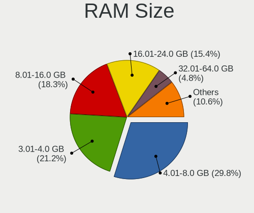

| Size in GB  | Notebooks | Percent |
|-------------|-----------|---------|
| 4.01-8.0    | 31        | 29.81%  |
| 3.01-4.0    | 22        | 21.15%  |
| 8.01-16.0   | 19        | 18.27%  |
| 16.01-24.0  | 16        | 15.38%  |
| 32.01-64.0  | 5         | 4.81%   |
| 1.01-2.0    | 5         | 4.81%   |
| 24.01-32.0  | 2         | 1.92%   |
| 2.01-3.0    | 2         | 1.92%   |
| 64.01-256.0 | 2         | 1.92%   |

RAM Used
--------

Used RAM memory

| Used GB   | Notebooks | Percent |
|-----------|-----------|---------|
| 1.01-2.0  | 38        | 34.55%  |
| 2.01-3.0  | 29        | 26.36%  |
| 3.01-4.0  | 19        | 17.27%  |
| 4.01-8.0  | 14        | 12.73%  |
| 0.51-1.0  | 7         | 6.36%   |
| 8.01-16.0 | 3         | 2.73%   |

Total Drives
------------

Number of drives on board

| Drives | Notebooks | Percent |
|--------|-----------|---------|
| 1      | 75        | 72.82%  |
| 2      | 21        | 20.39%  |
| 3      | 6         | 5.83%   |
| 4      | 1         | 0.97%   |

Has CD-ROM
----------

Has CD-ROM on board

| Presented | Notebooks | Percent |
|-----------|-----------|---------|
| No        | 65        | 63.11%  |
| Yes       | 38        | 36.89%  |

Has Ethernet
------------

Has Ethernet on board

| Presented | Notebooks | Percent |
|-----------|-----------|---------|
| Yes       | 84        | 81.55%  |
| No        | 19        | 18.45%  |

Has WiFi
--------

Has WiFi module

| Presented | Notebooks | Percent |
|-----------|-----------|---------|
| Yes       | 99        | 96.12%  |
| No        | 4         | 3.88%   |

Has Bluetooth
-------------

Has Bluetooth module

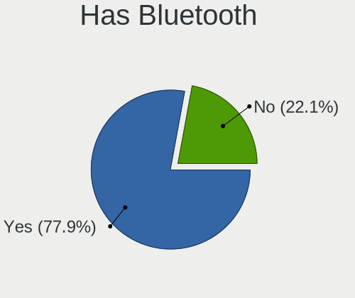

| Presented | Notebooks | Percent |
|-----------|-----------|---------|
| Yes       | 81        | 77.88%  |
| No        | 23        | 22.12%  |

Location
--------

Country
-------

Geographic location (country)

| Country      | Notebooks | Percent |
|--------------|-----------|---------|
| Brazil       | 62        | 59.62%  |
| USA          | 11        | 10.58%  |
| UK           | 5         | 4.81%   |
| Poland       | 5         | 4.81%   |
| Germany      | 4         | 3.85%   |
| Greece       | 3         | 2.88%   |
| Mexico       | 2         | 1.92%   |
| Turkey       | 1         | 0.96%   |
| Spain        | 1         | 0.96%   |
| South Korea  | 1         | 0.96%   |
| South Africa | 1         | 0.96%   |
| Saudi Arabia | 1         | 0.96%   |
| Portugal     | 1         | 0.96%   |
| Italy        | 1         | 0.96%   |
| Ireland      | 1         | 0.96%   |
| Finland      | 1         | 0.96%   |
| El Salvador  | 1         | 0.96%   |
| Costa Rica   | 1         | 0.96%   |
| Australia    | 1         | 0.96%   |

City
----

Geographic location (city)

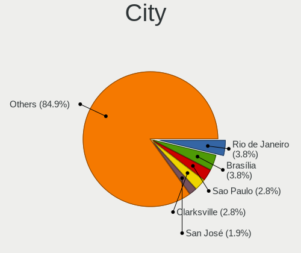

| City                  | Notebooks | Percent |
|-----------------------|-----------|---------|
| Rio de Janeiro        | 4         | 3.77%   |
| Brasília             | 4         | 3.77%   |
| Sao Paulo             | 3         | 2.83%   |
| Clarksville           | 3         | 2.83%   |
| San José             | 2         | 1.89%   |
| Recife                | 2         | 1.89%   |
| Jundiaí              | 2         | 1.89%   |
| Itatiba               | 2         | 1.89%   |
| Fortaleza             | 2         | 1.89%   |
| Curitiba              | 2         | 1.89%   |
| Castanhal             | 2         | 1.89%   |
| Campo Grande          | 2         | 1.89%   |
| Belo Horizonte        | 2         | 1.89%   |
| Zdzieszowice          | 1         | 0.94%   |
| Vitória da Conquista | 1         | 0.94%   |
| Tramandai             | 1         | 0.94%   |
| Thessaloniki          | 1         | 0.94%   |
| Tatuí                | 1         | 0.94%   |
| Szczyrk               | 1         | 0.94%   |
| Stralsund             | 1         | 0.94%   |
| Springfield           | 1         | 0.94%   |
| Sparti                | 1         | 0.94%   |
| Serafina Correa       | 1         | 0.94%   |
| Seoul                 | 1         | 0.94%   |
| Sao Paulo das Missoes | 1         | 0.94%   |
| Sao Jose do Rio Preto | 1         | 0.94%   |
| Sao Joao de Meriti    | 1         | 0.94%   |
| Sao Domingos do Capim | 1         | 0.94%   |
| San Salvador          | 1         | 0.94%   |
| Salvador              | 1         | 0.94%   |
| Ribeirao Preto        | 1         | 0.94%   |
| Praia Grande          | 1         | 0.94%   |
| Ponte Nova            | 1         | 0.94%   |
| Polokwane             | 1         | 0.94%   |
| Pevensey              | 1         | 0.94%   |
| Perth                 | 1         | 0.94%   |
| Nova Brasilia         | 1         | 0.94%   |
| New York              | 1         | 0.94%   |
| Mirassol              | 1         | 0.94%   |
| Minneapolis           | 1         | 0.94%   |

Drives
------

Drive Vendor
------------

Hard drive vendors

| Vendor                         | Notebooks | Drives | Percent |
|--------------------------------|-----------|--------|---------|
| WDC                            | 17        | 20     | 12.69%  |
| Samsung Electronics            | 12        | 12     | 8.96%   |
| Seagate                        | 9         | 11     | 6.72%   |
| Kingston                       | 9         | 11     | 6.72%   |
| Unknown                        | 8         | 8      | 5.97%   |
| Toshiba                        | 8         | 10     | 5.97%   |
| SK hynix                       | 7         | 8      | 5.22%   |
| SanDisk                        | 6         | 6      | 4.48%   |
| Micron Technology              | 6         | 6      | 4.48%   |
| Crucial                        | 6         | 6      | 4.48%   |
| MAXIO Technology (Hangzhou)    | 4         | 4      | 2.99%   |
| China                          | 4         | 4      | 2.99%   |
| LITEON                         | 3         | 4      | 2.24%   |
| KingSpec                       | 3         | 3      | 2.24%   |
| ADATA Technology               | 3         | 3      | 2.24%   |
| A-DATA Technology              | 3         | 3      | 2.24%   |
| Solid State Storage Technology | 2         | 4      | 1.49%   |
| Micron/Crucial Technology      | 2         | 2      | 1.49%   |
| Hitachi                        | 2         | 2      | 1.49%   |
| HGST                           | 2         | 2      | 1.49%   |
| GOODRAM                        | 2         | 5      | 1.49%   |
| Union Memory                   | 1         | 1      | 0.75%   |
| T-FORCE                        | 1         | 1      | 0.75%   |
| Silicon Motion                 | 1         | 2      | 0.75%   |
| Shenzhen Longsys Electronics   | 1         | 1      | 0.75%   |
| Realtek Semiconductor          | 1         | 1      | 0.75%   |
| QUANXING                       | 1         | 1      | 0.75%   |
| PNY                            | 1         | 2      | 0.75%   |
| NT-1TB                         | 1         | 1      | 0.75%   |
| Netac                          | 1         | 2      | 0.75%   |
| KIOXIA                         | 1         | 1      | 0.75%   |
| Kingston Technology Company    | 1         | 1      | 0.75%   |
| KEEPDATA                       | 1         | 1      | 0.75%   |
| JMicron Technology             | 1         | 1      | 0.75%   |
| Inland                         | 1         | 1      | 0.75%   |
| EYOTA                          | 1         | 1      | 0.75%   |
| Unknown                        | 1         | 1      | 0.75%   |

Drive Model
-----------

Hard drive models

| Model                                                 | Notebooks | Percent |
|-------------------------------------------------------|-----------|---------|
| WDC WD10SPZX-21Z10T0 1TB                              | 5         | 3.73%   |
| Unknown MMC Card  64GB                                | 4         | 2.99%   |
| Samsung NVMe SSD Controller SM981/PM981/PM983 512GB   | 4         | 2.99%   |
| Toshiba MQ04ABF100 1TB                                | 3         | 2.24%   |
| Toshiba MQ01ABD100 1TB                                | 3         | 2.24%   |
| SK hynix HFS256GEJ9X108N 256GB                        | 3         | 2.24%   |
| MAXIO (Hangzhou) NVMe SSD Controller MAP1202 512GB    | 3         | 2.24%   |
| Kingston SA400S37480G 480GB SSD                       | 3         | 2.24%   |
| Unknown MMC Card  128GB                               | 2         | 1.49%   |
| Seagate ST1000LM024 HN-M101MBB 1TB                    | 2         | 1.49%   |
| Micron 2400_MTFDKBA512QFM 512GB                       | 2         | 1.49%   |
| Kingston SA400S37240G 240GB SSD                       | 2         | 1.49%   |
| Kingston SA400S37120G 120GB SSD                       | 2         | 1.49%   |
| KingSpec P3-512 512GB SSD                             | 2         | 1.49%   |
| Crucial CT500MX500SSD1 500GB                          | 2         | 1.49%   |
| WDC WDS100T2G0A-00JH30 1TB SSD                        | 1         | 0.75%   |
| WDC WD7500BPKX-75HPJT0 752GB                          | 1         | 0.75%   |
| WDC WD5000LPVX-75V0TT0 500GB                          | 1         | 0.75%   |
| WDC WD5000LPVX-60V0TT0 500GB                          | 1         | 0.75%   |
| WDC WD5000LPVT-08G33T1 500GB                          | 1         | 0.75%   |
| WDC WD3200BPVT-00JJ5T0 320GB                          | 1         | 0.75%   |
| WDC WD1200BEVT-75ZCT2 120GB                           | 1         | 0.75%   |
| WDC WD10SPZX-75Z10T3 1TB                              | 1         | 0.75%   |
| WDC WD10SPZX-75Z10T2 1TB                              | 1         | 0.75%   |
| WDC WD10SPZX-75Z10T1 1TB                              | 1         | 0.75%   |
| WDC WD10JPCX-24UE4T0 1TB                              | 1         | 0.75%   |
| WDC WD Blue SA510 2.5 1TB                             | 1         | 0.75%   |
| Unknown xD/SD/M.S.                                    | 1         | 0.75%   |
| Unknown MMC Card  256GB                               | 1         | 0.75%   |
| Union Memory UMIS RPJTJ128MEE1MWX 128GB               | 1         | 0.75%   |
| Toshiba MQ01ABF050 500GB                              | 1         | 0.75%   |
| Toshiba MK6461GSY 640GB                               | 1         | 0.75%   |
| T-FORCE SSD 1TB                                       | 1         | 0.75%   |
| Solid State Storage SSSTC CL1-4D128 128GB             | 1         | 0.75%   |
| Solid State Storage NVMe CL1-8D512 512GB              | 1         | 0.75%   |
| SK hynix SKHynix_HFS512GEJ4X112N 512GB                | 1         | 0.75%   |
| SK hynix HFS512GEJ9X125N 512GB                        | 1         | 0.75%   |
| SK hynix BC711 HFM256GD3JX013N 256GB                  | 1         | 0.75%   |
| SK hynix BC501 NVMe Solid State Drive 512GB           | 1         | 0.75%   |
| Silicon Motion SM2263EN/SM2263XT SSD Controller 256GB | 1         | 0.75%   |

HDD Vendor
----------

Hard disk drive vendors

| Vendor              | Notebooks | Drives | Percent |
|---------------------|-----------|--------|---------|
| WDC                 | 15        | 18     | 38.46%  |
| Seagate             | 9         | 11     | 23.08%  |
| Toshiba             | 8         | 10     | 20.51%  |
| Samsung Electronics | 3         | 3      | 7.69%   |
| Hitachi             | 2         | 2      | 5.13%   |
| HGST                | 2         | 2      | 5.13%   |

SSD Vendor
----------

Solid state drive vendors

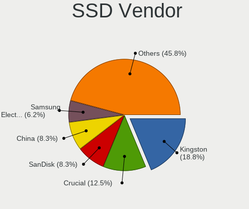

| Vendor              | Notebooks | Drives | Percent |
|---------------------|-----------|--------|---------|
| Kingston            | 9         | 11     | 18.75%  |
| Crucial             | 6         | 6      | 12.5%   |
| SanDisk             | 4         | 4      | 8.33%   |
| China               | 4         | 4      | 8.33%   |
| Samsung Electronics | 3         | 3      | 6.25%   |
| LITEON              | 3         | 4      | 6.25%   |
| KingSpec            | 3         | 3      | 6.25%   |
| A-DATA Technology   | 3         | 3      | 6.25%   |
| WDC                 | 2         | 2      | 4.17%   |
| Micron Technology   | 2         | 2      | 4.17%   |
| GOODRAM             | 2         | 5      | 4.17%   |
| T-FORCE             | 1         | 1      | 2.08%   |
| QUANXING            | 1         | 1      | 2.08%   |
| PNY                 | 1         | 2      | 2.08%   |
| NT-1TB              | 1         | 1      | 2.08%   |
| KEEPDATA            | 1         | 1      | 2.08%   |
| Inland              | 1         | 1      | 2.08%   |
| Unknown             | 1         | 1      | 2.08%   |

Drive Kind
----------

HDD or SSD

| Kind    | Notebooks | Drives | Percent |
|---------|-----------|--------|---------|
| SSD     | 41        | 55     | 32.8%   |
| HDD     | 39        | 46     | 31.2%   |
| NVMe    | 35        | 42     | 28%     |
| MMC     | 7         | 7      | 5.6%    |
| Unknown | 3         | 3      | 2.4%    |

Drive Connector
---------------

SATA, SAS, NVMe, etc.

| Type | Notebooks | Drives | Percent |
|------|-----------|--------|---------|
| SATA | 75        | 101    | 62.5%   |
| NVMe | 34        | 41     | 28.33%  |
| MMC  | 7         | 7      | 5.83%   |
| SAS  | 4         | 4      | 3.33%   |

Drive Size
----------

Size of hard drive

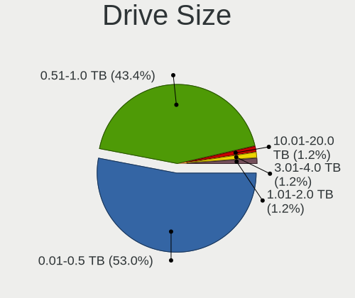

| Size in TB | Notebooks | Drives | Percent |
|------------|-----------|--------|---------|
| 0.01-0.5   | 44        | 54     | 53.01%  |
| 0.51-1.0   | 36        | 44     | 43.37%  |
| 3.01-4.0   | 1         | 1      | 1.2%    |
| 10.01-20.0 | 1         | 1      | 1.2%    |
| 1.01-2.0   | 1         | 1      | 1.2%    |

Space Total
-----------

Amount of disk space available on the file system

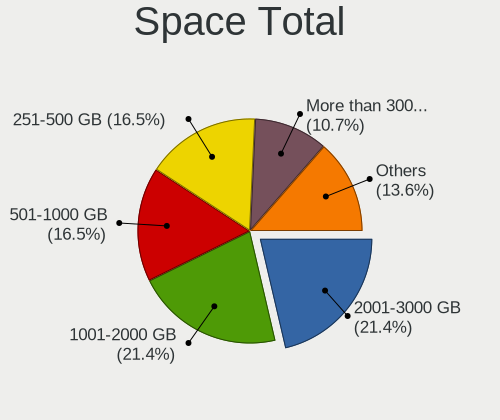

| Size in GB     | Notebooks | Percent |
|----------------|-----------|---------|
| 2001-3000      | 22        | 21.36%  |
| 1001-2000      | 22        | 21.36%  |
| 251-500        | 17        | 16.5%   |
| 501-1000       | 17        | 16.5%   |
| More than 3000 | 11        | 10.68%  |
| 101-250        | 9         | 8.74%   |
| 1-20           | 2         | 1.94%   |
| 51-100         | 2         | 1.94%   |
| Unknown        | 1         | 0.97%   |

Space Used
----------

Amount of used disk space

| Used GB        | Notebooks | Percent |
|----------------|-----------|---------|
| 51-100         | 34        | 31.19%  |
| 21-50          | 23        | 21.1%   |
| 101-250        | 17        | 15.6%   |
| 251-500        | 11        | 10.09%  |
| 1-20           | 9         | 8.26%   |
| 501-1000       | 9         | 8.26%   |
| 2001-3000      | 3         | 2.75%   |
| More than 3000 | 1         | 0.92%   |
| 1001-2000      | 1         | 0.92%   |
| Unknown        | 1         | 0.92%   |

Malfunc. Drives
---------------

Drive models with a malfunction

| Model                                  | Notebooks | Drives | Percent |
|----------------------------------------|-----------|--------|---------|
| WDC WD3200BPVT-00JJ5T0 320GB           | 1         | 3      | 10%     |
| Toshiba MQ01ABD100 1TB                 | 1         | 2      | 10%     |
| Seagate ST9500325AS 500GB              | 1         | 1      | 10%     |
| Seagate ST1000LM024 HN-M101MBB 1TB     | 1         | 1      | 10%     |
| Samsung Electronics HN-M500MBB 500GB   | 1         | 1      | 10%     |
| Hitachi HTS727575A9E364 752GB          | 1         | 1      | 10%     |
| Hitachi HTS545032A7E380 320GB          | 1         | 1      | 10%     |
| Crucial CT500MX200SSD3 500GB           | 1         | 1      | 10%     |
| China SATA SSD 240GB                   | 1         | 1      | 10%     |
| ADATA Technology SM2P32A8-512GC1 512GB | 1         | 1      | 10%     |

Malfunc. Drive Vendor
---------------------

Vendors of faulty drives

| Vendor              | Notebooks | Drives | Percent |
|---------------------|-----------|--------|---------|
| Seagate             | 2         | 2      | 20%     |
| Hitachi             | 2         | 2      | 20%     |
| WDC                 | 1         | 3      | 10%     |
| Toshiba             | 1         | 2      | 10%     |
| Samsung Electronics | 1         | 1      | 10%     |
| Crucial             | 1         | 1      | 10%     |
| China               | 1         | 1      | 10%     |
| ADATA Technology    | 1         | 1      | 10%     |

Malfunc. HDD Vendor
-------------------

Vendors of faulty HDD drives

| Vendor              | Notebooks | Drives | Percent |
|---------------------|-----------|--------|---------|
| Seagate             | 2         | 2      | 28.57%  |
| Hitachi             | 2         | 2      | 28.57%  |
| WDC                 | 1         | 3      | 14.29%  |
| Toshiba             | 1         | 2      | 14.29%  |
| Samsung Electronics | 1         | 1      | 14.29%  |

Malfunc. Drive Kind
-------------------

Kinds of faulty drives

| Kind | Notebooks | Drives | Percent |
|------|-----------|--------|---------|
| HDD  | 7         | 10     | 70%     |
| SSD  | 2         | 2      | 20%     |
| NVMe | 1         | 1      | 10%     |

Failed Drives
-------------

Failed drive models

Zero info for selected period =(

Failed Drive Vendor
-------------------

Failed drive vendors

Zero info for selected period =(

Drive Status
------------

Number of failed and malfunc. drives

| Status   | Notebooks | Drives | Percent |
|----------|-----------|--------|---------|
| Detected | 65        | 90     | 58.56%  |
| Works    | 36        | 50     | 32.43%  |
| Malfunc  | 10        | 13     | 9.01%   |

Storage controller
------------------

Storage Vendor
--------------

Storage controller vendors

| Vendor                         | Notebooks | Percent |
|--------------------------------|-----------|---------|
| Intel                          | 73        | 61.34%  |
| AMD                            | 9         | 7.56%   |
| SK hynix                       | 7         | 5.88%   |
| Samsung Electronics            | 4         | 3.36%   |
| Micron Technology              | 4         | 3.36%   |
| MAXIO Technology (Hangzhou)    | 4         | 3.36%   |
| ADATA Technology               | 3         | 2.52%   |
| Solid State Storage Technology | 2         | 1.68%   |
| SanDisk                        | 2         | 1.68%   |
| Micron/Crucial Technology      | 2         | 1.68%   |
| Union Memory (Shenzhen)        | 1         | 0.84%   |
| Silicon Motion                 | 1         | 0.84%   |
| Shenzhen Longsys Electronics   | 1         | 0.84%   |
| Realtek Semiconductor          | 1         | 0.84%   |
| Nvidia                         | 1         | 0.84%   |
| Netac Technology               | 1         | 0.84%   |
| KIOXIA                         | 1         | 0.84%   |
| Kingston Technology Company    | 1         | 0.84%   |
| JMicron Technology             | 1         | 0.84%   |

Storage Model
-------------

Storage controller models

| Model                                                                            | Notebooks | Percent |
|----------------------------------------------------------------------------------|-----------|---------|
| Intel Sunrise Point-LP SATA Controller [AHCI mode]                               | 11        | 8.73%   |
| Intel 6 Series/C200 Series Chipset Family 6 port Mobile SATA AHCI Controller     | 9         | 7.14%   |
| Intel 7 Series Chipset Family 6-port SATA Controller [AHCI mode]                 | 8         | 6.35%   |
| AMD FCH SATA Controller [AHCI mode]                                              | 7         | 5.56%   |
| Intel 82801 Mobile SATA Controller [RAID mode]                                   | 6         | 4.76%   |
| SK hynix BC901 NVMe Solid State Drive (DRAM-less)                                | 4         | 3.17%   |
| Intel Celeron/Pentium Silver Processor SATA Controller                           | 4         | 3.17%   |
| Samsung NVMe SSD Controller SM981/PM981/PM983                                    | 3         | 2.38%   |
| Micron 2400 NVMe SSD (DRAM-less)                                                 | 3         | 2.38%   |
| MAXIO (Hangzhou) NVMe SSD Controller MAP1202 (DRAM-less)                         | 3         | 2.38%   |
| Intel Volume Management Device NVMe RAID Controller                              | 3         | 2.38%   |
| Intel 82801HM/HEM (ICH8M/ICH8M-E) SATA Controller [AHCI mode]                    | 3         | 2.38%   |
| Intel 82801HM/HEM (ICH8M/ICH8M-E) IDE Controller                                 | 3         | 2.38%   |
| Intel 8 Series SATA Controller 1 [AHCI mode]                                     | 3         | 2.38%   |
| Solid State Storage CL1-3D256-Q11 NVMe SSD M.2                                   | 2         | 1.59%   |
| Intel Wildcat Point-LP SATA Controller [AHCI Mode]                               | 2         | 1.59%   |
| Intel Tiger Lake-LP SATA Controller                                              | 2         | 1.59%   |
| Intel HM170/QM170 Chipset SATA Controller [AHCI Mode]                            | 2         | 1.59%   |
| Intel Comet Lake SATA AHCI Controller                                            | 2         | 1.59%   |
| Intel Atom/Celeron/Pentium Processor x5-E8000/J3xxx/N3xxx Series SATA Controller | 2         | 1.59%   |
| Intel 8 Series/C220 Series Chipset Family 6-port SATA Controller 1 [AHCI mode]   | 2         | 1.59%   |
| Intel 5 Series/3400 Series Chipset 6 port SATA AHCI Controller                   | 2         | 1.59%   |
| Intel 5 Series/3400 Series Chipset 4 port SATA AHCI Controller                   | 2         | 1.59%   |
| AMD SB7x0/SB8x0/SB9x0 SATA Controller [AHCI mode]                                | 2         | 1.59%   |
| Union Memory (Shenzhen) AM620 PCIe 3.0 NVMe SSD 128GB                            | 1         | 0.79%   |
| SK hynix Platinum P41/PC801 NVMe Solid State Drive                               | 1         | 0.79%   |
| SK hynix Gold P31/BC711/PC711 NVMe Solid State Drive                             | 1         | 0.79%   |
| SK hynix BC501 NVMe Solid State Drive                                            | 1         | 0.79%   |
| Silicon Motion SM2263EN/SM2263XT (DRAM-less) NVMe SSD Controllers                | 1         | 0.79%   |
| Shenzhen Longsys Lexar NM790 NVME SSD (DRAM-less)                                | 1         | 0.79%   |
| SanDisk PC SN735 / WD_BLACK SN750 SE NVMe SSD (DRAM-less)                        | 1         | 0.79%   |
| SanDisk PC SN520 x2 M.2 2230 NVMe SSD                                            | 1         | 0.79%   |
| Samsung NVMe SSD Controller PM9B1 (DRAM-less)                                    | 1         | 0.79%   |
| Realtek RTS5762 NVMe SSD Controller                                              | 1         | 0.79%   |
| Nvidia MCP79 AHCI Controller                                                     | 1         | 0.79%   |
| Netac PCIe 4 INNOGRIT based NVMe SSD                                             | 1         | 0.79%   |
| Micron/Crucial P5 NVMe PCIe SSD[SlashP5]                                         | 1         | 0.79%   |
| Micron/Crucial P2 [Nick P2] / P3 / P3 Plus NVMe PCIe SSD (DRAM-less)             | 1         | 0.79%   |
| Micron 2450 NVMe SSD [HendrixV] (DRAM-less)                                      | 1         | 0.79%   |
| MAXIO (Hangzhou) NVMe SSD Controller MAP1602 (DRAM-less)                         | 1         | 0.79%   |

Storage Kind
------------

Kind of storage controller (IDE, SATA, NVMe, SAS, ...)

| Kind | Notebooks | Percent |
|------|-----------|---------|
| SATA | 72        | 59.02%  |
| NVMe | 33        | 27.05%  |
| RAID | 9         | 7.38%   |
| IDE  | 8         | 6.56%   |

Processor
---------

CPU Vendor
----------

Processor vendors

| Vendor | Notebooks | Percent |
|--------|-----------|---------|
| Intel  | 84        | 81.55%  |
| AMD    | 19        | 18.45%  |

CPU Model
---------

Processor models

| Model                                       | Notebooks | Percent |
|---------------------------------------------|-----------|---------|
| Intel Core i5-7200U CPU @ 2.50GHz           | 5         | 4.85%   |
| Intel Core i7-7500U CPU @ 2.70GHz           | 3         | 2.91%   |
| Intel Core i5-1035G1 CPU @ 1.00GHz          | 3         | 2.91%   |
| Intel Celeron N4020 CPU @ 1.10GHz           | 3         | 2.91%   |
| AMD Ryzen 5 4600H with Radeon Graphics      | 3         | 2.91%   |
| Intel Core i7-4700MQ CPU @ 2.40GHz          | 2         | 1.94%   |
| Intel Core i7-2630QM CPU @ 2.00GHz          | 2         | 1.94%   |
| Intel Core i5-2520M CPU @ 2.50GHz           | 2         | 1.94%   |
| Intel Core i5-10210U CPU @ 1.60GHz          | 2         | 1.94%   |
| Intel Core i3-7020U CPU @ 2.30GHz           | 2         | 1.94%   |
| Intel Core i3 CPU M 370 @ 2.40GHz           | 2         | 1.94%   |
| Intel Celeron N4120 CPU @ 1.10GHz           | 2         | 1.94%   |
| Intel Celeron CPU N3060 @ 1.60GHz           | 2         | 1.94%   |
| Intel 12th Gen Core i7-12700H               | 2         | 1.94%   |
| Intel 11th Gen Core i5-1135G7 @ 2.40GHz     | 2         | 1.94%   |
| AMD Ryzen 7 6800H with Radeon Graphics      | 2         | 1.94%   |
| Intel Pentium Silver N6000 @ 1.10GHz        | 1         | 0.97%   |
| Intel Pentium Dual-Core CPU T4400 @ 2.20GHz | 1         | 0.97%   |
| Intel Pentium Dual CPU T3400 @ 2.16GHz      | 1         | 0.97%   |
| Intel Pentium Dual CPU T2330 @ 1.60GHz      | 1         | 0.97%   |
| Intel Core i7-8650U CPU @ 1.90GHz           | 1         | 0.97%   |
| Intel Core i7-8550U CPU @ 1.80GHz           | 1         | 0.97%   |
| Intel Core i7-7700HQ CPU @ 2.80GHz          | 1         | 0.97%   |
| Intel Core i7-6820HQ CPU @ 2.70GHz          | 1         | 0.97%   |
| Intel Core i7-6700HQ CPU @ 2.60GHz          | 1         | 0.97%   |
| Intel Core i7-6500U CPU @ 2.50GHz           | 1         | 0.97%   |
| Intel Core i7-4710HQ CPU @ 2.50GHz          | 1         | 0.97%   |
| Intel Core i7-4500U CPU @ 1.80GHz           | 1         | 0.97%   |
| Intel Core i7-3740QM CPU @ 2.70GHz          | 1         | 0.97%   |
| Intel Core i7-3667U CPU @ 2.00GHz           | 1         | 0.97%   |
| Intel Core i7-2860QM CPU @ 2.50GHz          | 1         | 0.97%   |
| Intel Core i7-2670QM CPU @ 2.20GHz          | 1         | 0.97%   |
| Intel Core i5-9300H CPU @ 2.40GHz           | 1         | 0.97%   |
| Intel Core i5-8365U CPU @ 1.60GHz           | 1         | 0.97%   |
| Intel Core i5-8265U CPU @ 1.60GHz           | 1         | 0.97%   |
| Intel Core i5-7360U CPU @ 2.30GHz           | 1         | 0.97%   |
| Intel Core i5-7300HQ CPU @ 2.50GHz          | 1         | 0.97%   |
| Intel Core i5-5200U CPU @ 2.20GHz           | 1         | 0.97%   |
| Intel Core i5-4200U CPU @ 1.60GHz           | 1         | 0.97%   |
| Intel Core i5-3337U CPU @ 1.80GHz           | 1         | 0.97%   |

CPU Model Family
----------------

Processor model prefix

| Model                                | Notebooks | Percent |
|--------------------------------------|-----------|---------|
| Intel Core i5                        | 26        | 25.24%  |
| Intel Core i7                        | 19        | 18.45%  |
| Other                                | 11        | 10.68%  |
| Intel Core i3                        | 10        | 9.71%   |
| Intel Celeron                        | 10        | 9.71%   |
| AMD Ryzen 5                          | 9         | 8.74%   |
| AMD Ryzen 7                          | 5         | 4.85%   |
| Intel Core 2 Duo                     | 3         | 2.91%   |
| Intel Pentium Dual                   | 2         | 1.94%   |
| Intel Pentium Silver                 | 1         | 0.97%   |
| Intel Pentium Dual-Core              | 1         | 0.97%   |
| Intel Core 2                         | 1         | 0.97%   |
| Intel Atom                           | 1         | 0.97%   |
| AMD Turion X2 Ultra Dual-Core Mobile | 1         | 0.97%   |
| AMD C-70                             | 1         | 0.97%   |
| AMD C-60                             | 1         | 0.97%   |
| AMD A6                               | 1         | 0.97%   |

CPU Cores
---------

Number of processor cores

| Number | Notebooks | Percent |
|--------|-----------|---------|
| 2      | 52        | 50.49%  |
| 4      | 31        | 30.1%   |
| 6      | 8         | 7.77%   |
| 8      | 4         | 3.88%   |
| 12     | 3         | 2.91%   |
| 14     | 2         | 1.94%   |
| 1      | 2         | 1.94%   |
| 10     | 1         | 0.97%   |

CPU Sockets
-----------

Number of sockets

| Number | Notebooks | Percent |
|--------|-----------|---------|
| 1      | 103       | 100%    |

CPU Threads
-----------

Threads per core (Hyper-Threading)

| Number | Notebooks | Percent |
|--------|-----------|---------|
| 2      | 78        | 75.73%  |
| 1      | 25        | 24.27%  |

CPU Op-Modes
------------

CPU Operation Modes (32-bit, 64-bit)

| Op mode        | Notebooks | Percent |
|----------------|-----------|---------|
| 32-bit, 64-bit | 102       | 99.03%  |
| Unknown        | 1         | 0.97%   |

CPU Microcode
-------------

Microcode number

| Number     | Notebooks | Percent |
|------------|-----------|---------|
| Unknown    | 53        | 50.48%  |
| 0x206a7    | 7         | 6.67%   |
| 0x806e9    | 5         | 4.76%   |
| 0x306a9    | 3         | 2.86%   |
| 0x906a3    | 2         | 1.9%    |
| 0x806ea    | 2         | 1.9%    |
| 0x706e5    | 2         | 1.9%    |
| 0x706a8    | 2         | 1.9%    |
| 0x506e3    | 2         | 1.9%    |
| 0x08108109 | 2         | 1.9%    |
| 0x05000119 | 2         | 1.9%    |
| 0xa0660    | 1         | 0.95%   |
| 0x906c0    | 1         | 0.95%   |
| 0x806ec    | 1         | 0.95%   |
| 0x806d1    | 1         | 0.95%   |
| 0x6fd      | 1         | 0.95%   |
| 0x6fb      | 1         | 0.95%   |
| 0x406e3    | 1         | 0.95%   |
| 0x406c4    | 1         | 0.95%   |
| 0x40651    | 1         | 0.95%   |
| 0x306d4    | 1         | 0.95%   |
| 0x306c3    | 1         | 0.95%   |
| 0x20655    | 1         | 0.95%   |
| 0x20652    | 1         | 0.95%   |
| 0x1067a    | 1         | 0.95%   |
| 0x10676    | 1         | 0.95%   |
| 0x0a50000d | 1         | 0.95%   |
| 0x0a404107 | 1         | 0.95%   |
| 0x0a404102 | 1         | 0.95%   |
| 0x0a404101 | 1         | 0.95%   |
| 0x08600106 | 1         | 0.95%   |
| 0x0810100b | 1         | 0.95%   |
| 0x06006705 | 1         | 0.95%   |
| 0x0600111f | 1         | 0.95%   |

CPU Microarch
-------------

Microarchitecture

| Name             | Notebooks | Percent |
|------------------|-----------|---------|
| KabyLake         | 19        | 18.45%  |
| SandyBridge      | 11        | 10.68%  |
| IvyBridge        | 7         | 6.8%    |
| Haswell          | 6         | 5.83%   |
| Goldmont plus    | 6         | 5.83%   |
| Alderlake Hybrid | 6         | 5.83%   |
| Unknown          | 5         | 4.85%   |
| Zen 2            | 4         | 3.88%   |
| Westmere         | 4         | 3.88%   |
| Silvermont       | 4         | 3.88%   |
| Core             | 4         | 3.88%   |
| Zen 3            | 3         | 2.91%   |
| TigerLake        | 3         | 2.91%   |
| Skylake          | 3         | 2.91%   |
| Penryn           | 3         | 2.91%   |
| IceLake          | 3         | 2.91%   |
| Zen+             | 2         | 1.94%   |
| Broadwell        | 2         | 1.94%   |
| Bobcat           | 2         | 1.94%   |
| Zen              | 1         | 0.97%   |
| Tremont          | 1         | 0.97%   |
| Piledriver       | 1         | 0.97%   |
| K8 & K10 hybrid  | 1         | 0.97%   |
| Excavator        | 1         | 0.97%   |
| CometLake        | 1         | 0.97%   |

Graphics
--------

GPU Vendor
----------

Vendors of graphics cards

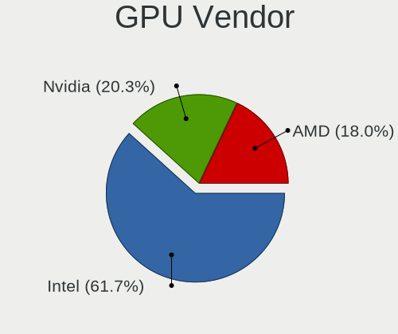

| Vendor | Notebooks | Percent |
|--------|-----------|---------|
| Intel  | 79        | 61.72%  |
| Nvidia | 26        | 20.31%  |
| AMD    | 23        | 17.97%  |

GPU Model
---------

Graphics card models

| Model                                                                                    | Notebooks | Percent |
|------------------------------------------------------------------------------------------|-----------|---------|
| Intel HD Graphics 620                                                                    | 10        | 7.46%   |
| Intel 2nd Generation Core Processor Family Integrated Graphics Controller                | 8         | 5.97%   |
| Intel 3rd Gen Core processor Graphics Controller                                         | 7         | 5.22%   |
| Intel GeminiLake [UHD Graphics 600]                                                      | 6         | 4.48%   |
| Intel Core Processor Integrated Graphics Controller                                      | 4         | 2.99%   |
| Intel Alder Lake-P GT2 [Iris Xe Graphics]                                                | 4         | 2.99%   |
| AMD Renoir [Radeon Vega Series / Radeon Vega Mobile Series]                              | 4         | 2.99%   |
| AMD Rembrandt [Radeon 680M]                                                              | 4         | 2.99%   |
| Nvidia GM108M [GeForce 940MX]                                                            | 3         | 2.24%   |
| Intel Mobile GM965/GL960 Integrated Graphics Controller (secondary)                      | 3         | 2.24%   |
| Intel Mobile GM965/GL960 Integrated Graphics Controller (primary)                        | 3         | 2.24%   |
| Intel Iris Plus Graphics G1 (Ice Lake)                                                   | 3         | 2.24%   |
| Intel Haswell-ULT Integrated Graphics Controller                                         | 3         | 2.24%   |
| Intel Atom/Celeron/Pentium Processor x5-E8000/J3xxx/N3xxx Integrated Graphics Controller | 3         | 2.24%   |
| Intel 4th Gen Core Processor Integrated Graphics Controller                              | 3         | 2.24%   |
| Nvidia TU117M [GeForce GTX 1650 Mobile / Max-Q]                                          | 2         | 1.49%   |
| Nvidia GF108M [GeForce GT 540M]                                                          | 2         | 1.49%   |
| Intel WhiskeyLake-U GT2 [UHD Graphics 620]                                               | 2         | 1.49%   |
| Intel UHD Graphics 620                                                                   | 2         | 1.49%   |
| Intel TigerLake-LP GT2 [Iris Xe Graphics]                                                | 2         | 1.49%   |
| Intel Mobile 4 Series Chipset Integrated Graphics Controller                             | 2         | 1.49%   |
| Intel HD Graphics 630                                                                    | 2         | 1.49%   |
| Intel HD Graphics 5500                                                                   | 2         | 1.49%   |
| AMD Topaz XT [Radeon R7 M260/M265 / M340/M360 / M440/M445 / 530/535 / 620/625 Mobile]    | 2         | 1.49%   |
| AMD Picasso/Raven 2 [Radeon Vega Series / Radeon Vega Mobile Series]                     | 2         | 1.49%   |
| AMD Barcelo                                                                              | 2         | 1.49%   |
| Nvidia GP107M [GeForce GTX 1050 Ti Mobile]                                               | 1         | 0.75%   |
| Nvidia GP107M [GeForce GTX 1050 Mobile]                                                  | 1         | 0.75%   |
| Nvidia GP104BM [GeForce GTX 1070 Mobile]                                                 | 1         | 0.75%   |
| Nvidia GM108M [GeForce MX130]                                                            | 1         | 0.75%   |
| Nvidia GM108M [GeForce 920MX]                                                            | 1         | 0.75%   |
| Nvidia GM107GLM [Quadro M2000M]                                                          | 1         | 0.75%   |
| Nvidia GM107 [GeForce 940MX]                                                             | 1         | 0.75%   |
| Nvidia GK208BM [GeForce 910M]                                                            | 1         | 0.75%   |
| Nvidia GK106M [GeForce GTX 770M]                                                         | 1         | 0.75%   |
| Nvidia GK104M [GeForce GTX 860M]                                                         | 1         | 0.75%   |
| Nvidia GF117M [GeForce 610M/710M/810M/820M / GT 620M/625M/630M/720M]                     | 1         | 0.75%   |
| Nvidia GF116M [GeForce GT 560M]                                                          | 1         | 0.75%   |
| Nvidia GA107M [GeForce RTX 3050 Mobile]                                                  | 1         | 0.75%   |
| Nvidia GA107BM [GeForce RTX 3050 Mobile]                                                 | 1         | 0.75%   |

GPU Combo
---------

Combinations of graphics cards

| Name           | Notebooks | Percent |
|----------------|-----------|---------|
| 1 x Intel      | 50        | 48.08%  |
| Intel + Nvidia | 21        | 20.19%  |
| 1 x AMD        | 17        | 16.35%  |
| 2 x Intel      | 4         | 3.85%   |
| 1 x Nvidia     | 4         | 3.85%   |
| Intel + AMD    | 3         | 2.88%   |
| Other          | 2         | 1.92%   |
| 2 x AMD        | 2         | 1.92%   |
| AMD + Nvidia   | 1         | 0.96%   |

GPU Driver
----------

Free vs proprietary

| Driver      | Notebooks | Percent |
|-------------|-----------|---------|
| Free        | 85        | 82.52%  |
| Proprietary | 17        | 16.5%   |
| Unknown     | 1         | 0.97%   |

GPU Memory
----------

Total video memory

| Size in GB | Notebooks | Percent |
|------------|-----------|---------|
| Unknown    | 76        | 73.79%  |
| 0.01-0.5   | 10        | 9.71%   |
| 1.01-2.0   | 7         | 6.8%    |
| 0.51-1.0   | 4         | 3.88%   |
| 3.01-4.0   | 3         | 2.91%   |
| 7.01-8.0   | 2         | 1.94%   |
| 2.01-3.0   | 1         | 0.97%   |

Monitor
-------

Monitor Vendor
--------------

Monitor vendors

| Vendor                  | Notebooks | Percent |
|-------------------------|-----------|---------|
| AU Optronics            | 28        | 24.35%  |
| Chimei Innolux          | 22        | 19.13%  |
| BOE                     | 20        | 17.39%  |
| LG Display              | 14        | 12.17%  |
| Samsung Electronics     | 6         | 5.22%   |
| Goldstar                | 5         | 4.35%   |
| GDH                     | 3         | 2.61%   |
| Chi Mei Optoelectronics | 3         | 2.61%   |
| Apple                   | 3         | 2.61%   |
| Panasonic               | 2         | 1.74%   |
| Lenovo                  | 2         | 1.74%   |
| Vizio                   | 1         | 0.87%   |
| MTD                     | 1         | 0.87%   |
| LRX                     | 1         | 0.87%   |
| Hewlett-Packard         | 1         | 0.87%   |
| Dell                    | 1         | 0.87%   |
| CSW                     | 1         | 0.87%   |
| CSO                     | 1         | 0.87%   |

Monitor Model
-------------

Monitor models

| Model                                                                 | Notebooks | Percent |
|-----------------------------------------------------------------------|-----------|---------|
| Chimei Innolux LCD Monitor CMN15F5 1920x1080 344x193mm 15.5-inch      | 7         | 6.09%   |
| GDH TV PHILCO GDH0030 1920x540                                        | 3         | 2.61%   |
| AU Optronics LCD Monitor AUO2E3C 1366x768 309x173mm 13.9-inch         | 3         | 2.61%   |
| Panasonic TV MEIC10C 1920x540 697x392mm 31.5-inch                     | 2         | 1.74%   |
| LG Display LCD Monitor LGD02E9 1366x768 309x174mm 14.0-inch           | 2         | 1.74%   |
| BOE LCD Monitor BOE0913 1366x768 309x174mm 14.0-inch                  | 2         | 1.74%   |
| AU Optronics LCD Monitor AUOE495 2560x1600 344x215mm 16.0-inch        | 2         | 1.74%   |
| AU Optronics LCD Monitor AUO323C 1366x768 309x173mm 13.9-inch         | 2         | 1.74%   |
| AU Optronics LCD Monitor AUO183C 1366x768 309x173mm 13.9-inch         | 2         | 1.74%   |
| Vizio D32f-E1 VIZ1027 1920x1080 698x392mm 31.5-inch                   | 1         | 0.87%   |
| Samsung Electronics T22B300 SAM092D 1920x1080 477x268mm 21.5-inch     | 1         | 0.87%   |
| Samsung Electronics LCD Monitor SEC544B 1600x900 382x215mm 17.3-inch  | 1         | 0.87%   |
| Samsung Electronics LCD Monitor SEC5441 1280x800 286x179mm 13.3-inch  | 1         | 0.87%   |
| Samsung Electronics LCD Monitor SDC4852 1366x768 344x194mm 15.5-inch  | 1         | 0.87%   |
| Samsung Electronics LCD Monitor SDC3252 1366x768 344x194mm 15.5-inch  | 1         | 0.87%   |
| Samsung Electronics LCD Monitor SAM0AC6 1920x1080 886x498mm 40.0-inch | 1         | 0.87%   |
| MTD LCD Monitor MTD0001 1280x800 303x190mm 14.1-inch                  | 1         | 0.87%   |
| LRX HDMI LRX2281 1600x900                                             | 1         | 0.87%   |
| LG Display LCD Monitor LGD0525 1366x768 344x194mm 15.5-inch           | 1         | 0.87%   |
| LG Display LCD Monitor LGD0506 1366x768 344x194mm 15.5-inch           | 1         | 0.87%   |
| LG Display LCD Monitor LGD04BD 1366x768 344x194mm 15.5-inch           | 1         | 0.87%   |
| LG Display LCD Monitor LGD046F 1920x1080 344x194mm 15.5-inch          | 1         | 0.87%   |
| LG Display LCD Monitor LGD0469 1920x1080 382x215mm 17.3-inch          | 1         | 0.87%   |
| LG Display LCD Monitor LGD045E 1366x768 309x174mm 14.0-inch           | 1         | 0.87%   |
| LG Display LCD Monitor LGD039F 1366x768 345x194mm 15.6-inch           | 1         | 0.87%   |
| LG Display LCD Monitor LGD0385 1366x768 309x174mm 14.0-inch           | 1         | 0.87%   |
| LG Display LCD Monitor LGD02F8 1366x768 309x174mm 14.0-inch           | 1         | 0.87%   |
| LG Display LCD Monitor LGD02DA 1920x1080 382x215mm 17.3-inch          | 1         | 0.87%   |
| LG Display LCD Monitor LGD028A 1366x768 344x194mm 15.5-inch           | 1         | 0.87%   |
| LG Display LCD Monitor LGD0266 1366x768 344x194mm 15.5-inch           | 1         | 0.87%   |
| Lenovo LCD Monitor LEN4035 1280x800 304x190mm 14.1-inch               | 1         | 0.87%   |
| Lenovo LCD Monitor LEN4000 1024x768 246x185mm 12.1-inch               | 1         | 0.87%   |
| Hewlett-Packard 23tm HWP3110 1920x1080 509x286mm 23.0-inch            | 1         | 0.87%   |
| Goldstar ULTRAWIDE GSM59F1 2560x1080 677x290mm 29.0-inch              | 1         | 0.87%   |
| Goldstar HDR WFHD GSM7714 2560x1080 798x334mm 34.1-inch               | 1         | 0.87%   |
| Goldstar 2D HD TV GSM59CA 1366x768 509x286mm 23.0-inch                | 1         | 0.87%   |
| Goldstar 25UM58G GSM5B98 2560x1080 673x284mm 28.8-inch                | 1         | 0.87%   |
| Goldstar 23MP55 GSM5A23 1920x1080 510x290mm 23.1-inch                 | 1         | 0.87%   |
| Dell P2314H DEL409A 1920x1080 509x286mm 23.0-inch                     | 1         | 0.87%   |
| CSW MNG007QA1-1 CSW1639 1920x1200 344x215mm 16.0-inch                 | 1         | 0.87%   |

Monitor Resolution
------------------

Monitor screen resolution

| Resolution        | Notebooks | Percent |
|-------------------|-----------|---------|
| 1920x1080 (FHD)   | 44        | 38.6%   |
| 1366x768 (WXGA)   | 44        | 38.6%   |
| 3840x2160 (4K)    | 4         | 3.51%   |
| 1280x800 (WXGA)   | 4         | 3.51%   |
| 2560x1080         | 3         | 2.63%   |
| 1920x1200 (WUXGA) | 3         | 2.63%   |
| 1600x900 (HD+)    | 3         | 2.63%   |
| 2880x1800         | 2         | 1.75%   |
| 2560x1600         | 2         | 1.75%   |
| 2560x1440 (QHD)   | 2         | 1.75%   |
| 1920x540          | 2         | 1.75%   |
| 2240x1400         | 1         | 0.88%   |

Monitor Diagonal
----------------

Diagonal size in inches

| Inches | Notebooks | Percent |
|--------|-----------|---------|
| 15     | 49        | 42.61%  |
| 13     | 18        | 15.65%  |
| 14     | 17        | 14.78%  |
| 17     | 9         | 7.83%   |
| 16     | 6         | 5.22%   |
| 23     | 5         | 4.35%   |
| 52     | 3         | 2.61%   |
| 34     | 2         | 1.74%   |
| 31     | 2         | 1.74%   |
| 49     | 1         | 0.87%   |
| 40     | 1         | 0.87%   |
| 28     | 1         | 0.87%   |
| 21     | 1         | 0.87%   |

Monitor Width
-------------

Physical width

| Width in mm | Notebooks | Percent |
|-------------|-----------|---------|
| 301-350     | 83        | 72.81%  |
| 351-400     | 11        | 9.65%   |
| 501-600     | 5         | 4.39%   |
| 201-300     | 4         | 3.51%   |
| 1001-1500   | 4         | 3.51%   |
| 601-700     | 3         | 2.63%   |
| 701-800     | 2         | 1.75%   |
| 801-900     | 1         | 0.88%   |
| 401-500     | 1         | 0.88%   |

Aspect Ratio
------------

Proportional relationship between the width and the height

| Ratio | Notebooks | Percent |
|-------|-----------|---------|
| 16/9  | 88        | 85.44%  |
| 16/10 | 11        | 10.68%  |
| 21/9  | 3         | 2.91%   |
| 4/3   | 1         | 0.97%   |

Monitor Area
------------

Area in inch²

| Area in inch² | Notebooks | Percent |
|----------------|-----------|---------|
| 101-110        | 50        | 43.48%  |
| 81-90          | 35        | 30.43%  |
| 121-130        | 9         | 7.83%   |
| 201-250        | 6         | 5.22%   |
| More than 1000 | 4         | 3.48%   |
| 351-500        | 4         | 3.48%   |
| 111-120        | 4         | 3.48%   |
| 251-300        | 1         | 0.87%   |
| 131-140        | 1         | 0.87%   |
| 501-1000       | 1         | 0.87%   |

Pixel Density
-------------

Pixels per inch

| Density       | Notebooks | Percent |
|---------------|-----------|---------|
| 101-120       | 50        | 43.86%  |
| 121-160       | 39        | 34.21%  |
| 51-100        | 14        | 12.28%  |
| 161-240       | 5         | 4.39%   |
| 1-50          | 4         | 3.51%   |
| More than 240 | 2         | 1.75%   |

Multiple Monitors
-----------------

Total monitors connected

| Total | Notebooks | Percent |
|-------|-----------|---------|
| 1     | 85        | 81.73%  |
| 2     | 19        | 18.27%  |

Network
-------

Net Controller Vendor
---------------------

Controller vendors

| Vendor                   | Notebooks | Percent |
|--------------------------|-----------|---------|
| Realtek Semiconductor    | 70        | 40%     |
| Intel                    | 37        | 21.14%  |
| Qualcomm Atheros         | 36        | 20.57%  |
| Broadcom                 | 10        | 5.71%   |
| MediaTek                 | 5         | 2.86%   |
| Ralink Technology        | 3         | 1.71%   |
| TP-Link                  | 2         | 1.14%   |
| Ralink                   | 2         | 1.14%   |
| Marvell Technology Group | 2         | 1.14%   |
| ASIX Electronics         | 2         | 1.14%   |
| Nvidia                   | 1         | 0.57%   |
| Motorola PCS             | 1         | 0.57%   |
| JMicron Technology       | 1         | 0.57%   |
| Edimax Technology        | 1         | 0.57%   |
| D-Link                   | 1         | 0.57%   |
| Belkin Components        | 1         | 0.57%   |

Net Controller Model
--------------------

Controller models

| Model                                                                  | Notebooks | Percent |
|------------------------------------------------------------------------|-----------|---------|
| Realtek RTL8111/8168/8211/8411 PCI Express Gigabit Ethernet Controller | 39        | 20%     |
| Realtek RTL810xE PCI Express Fast Ethernet controller                  | 11        | 5.64%   |
| Qualcomm Atheros QCA9377 802.11ac Wireless Network Adapter             | 11        | 5.64%   |
| Qualcomm Atheros QCA9565 / AR9565 Wireless Network Adapter             | 6         | 3.08%   |
| Realtek RTL8821CE 802.11ac PCIe Wireless Network Adapter               | 5         | 2.56%   |
| Intel Alder Lake-P PCH CNVi WiFi                                       | 5         | 2.56%   |
| Realtek RTL8822CE 802.11ac PCIe Wireless Network Adapter               | 4         | 2.05%   |
| Intel 82579LM Gigabit Network Connection (Lewisville)                  | 4         | 2.05%   |
| Realtek RTL8153 Gigabit Ethernet Adapter                               | 3         | 1.54%   |
| Qualcomm Atheros QCA6174 802.11ac Wireless Network Adapter             | 3         | 1.54%   |
| Qualcomm Atheros AR9287 Wireless Network Adapter (PCI-Express)         | 3         | 1.54%   |
| Qualcomm Atheros AR9285 Wireless Network Adapter (PCI-Express)         | 3         | 1.54%   |
| Intel Dual Band Wireless-AC 3168NGW [Stone Peak]                       | 3         | 1.54%   |
| Realtek RTL8723BU 802.11b/g/n WLAN Adapter                             | 2         | 1.03%   |
| Realtek RTL8188EE Wireless Network Adapter                             | 2         | 1.03%   |
| Realtek RTL8187B Wireless 802.11g 54Mbps Network Adapter               | 2         | 1.03%   |
| Realtek Killer E2600 GbE Controller                                    | 2         | 1.03%   |
| Realtek 802.11ac NIC                                                   | 2         | 1.03%   |
| Ralink MT7601U Wireless Adapter                                        | 2         | 1.03%   |
| Qualcomm Atheros QCA8171 Gigabit Ethernet                              | 2         | 1.03%   |
| Qualcomm Atheros Killer E220x Gigabit Ethernet Controller              | 2         | 1.03%   |
| Qualcomm Atheros AR9485 Wireless Network Adapter                       | 2         | 1.03%   |
| MediaTek MT7922 802.11ax PCI Express Wireless Network Adapter          | 2         | 1.03%   |
| MediaTek MT7921 802.11ax PCI Express Wireless Network Adapter          | 2         | 1.03%   |
| Intel Wi-Fi 6 AX200                                                    | 2         | 1.03%   |
| Intel Dual Band Wireless-AC 3165 Plus Bluetooth                        | 2         | 1.03%   |
| Intel Comet Lake PCH-LP CNVi WiFi                                      | 2         | 1.03%   |
| Intel Centrino Wireless-N 2230                                         | 2         | 1.03%   |
| Intel Cannon Point-LP CNVi [Wireless-AC]                               | 2         | 1.03%   |
| Broadcom NetLink BCM57780 Gigabit Ethernet PCIe                        | 2         | 1.03%   |
| Broadcom BCM43228 802.11a/b/g/n                                        | 2         | 1.03%   |
| Broadcom BCM4313 802.11bgn Wireless Network Adapter                    | 2         | 1.03%   |
| ASIX AX88179 Gigabit Ethernet                                          | 2         | 1.03%   |
| TP-Link Archer T3U [Realtek RTL8812BU]                                 | 1         | 0.51%   |
| TP-Link AC600 wireless Realtek RTL8811AU [Archer T2U Nano]             | 1         | 0.51%   |
| Realtek RTL8852BE PCIe 802.11ax Wireless Network Controller            | 1         | 0.51%   |
| Realtek RTL8814AU 802.11a/b/g/n/ac Wireless Adapter                    | 1         | 0.51%   |
| Realtek RTL8192CE PCIe Wireless Network Adapter                        | 1         | 0.51%   |
| Realtek RTL8191SEvA Wireless LAN Controller                            | 1         | 0.51%   |
| Realtek RTL8188CUS 802.11n WLAN Adapter                                | 1         | 0.51%   |

Wireless Vendor
---------------

Wireless vendors

| Vendor                | Notebooks | Percent |
|-----------------------|-----------|---------|
| Intel                 | 34        | 31.48%  |
| Qualcomm Atheros      | 30        | 27.78%  |
| Realtek Semiconductor | 22        | 20.37%  |
| Broadcom              | 8         | 7.41%   |
| MediaTek              | 4         | 3.7%    |
| Ralink Technology     | 3         | 2.78%   |
| TP-Link               | 2         | 1.85%   |
| Ralink                | 2         | 1.85%   |
| Edimax Technology     | 1         | 0.93%   |
| D-Link                | 1         | 0.93%   |
| Belkin Components     | 1         | 0.93%   |

Wireless Model
--------------

Wireless models

| Model                                                                   | Notebooks | Percent |
|-------------------------------------------------------------------------|-----------|---------|
| Qualcomm Atheros QCA9377 802.11ac Wireless Network Adapter              | 11        | 10.09%  |
| Qualcomm Atheros QCA9565 / AR9565 Wireless Network Adapter              | 6         | 5.5%    |
| Realtek RTL8821CE 802.11ac PCIe Wireless Network Adapter                | 5         | 4.59%   |
| Realtek RTL8822CE 802.11ac PCIe Wireless Network Adapter                | 4         | 3.67%   |
| Intel Alder Lake-P PCH CNVi WiFi                                        | 4         | 3.67%   |
| Qualcomm Atheros QCA6174 802.11ac Wireless Network Adapter              | 3         | 2.75%   |
| Qualcomm Atheros AR9287 Wireless Network Adapter (PCI-Express)          | 3         | 2.75%   |
| Qualcomm Atheros AR9285 Wireless Network Adapter (PCI-Express)          | 3         | 2.75%   |
| Intel Dual Band Wireless-AC 3168NGW [Stone Peak]                        | 3         | 2.75%   |
| Realtek RTL8723BU 802.11b/g/n WLAN Adapter                              | 2         | 1.83%   |
| Realtek RTL8188EE Wireless Network Adapter                              | 2         | 1.83%   |
| Realtek RTL8187B Wireless 802.11g 54Mbps Network Adapter                | 2         | 1.83%   |
| Realtek 802.11ac NIC                                                    | 2         | 1.83%   |
| Ralink MT7601U Wireless Adapter                                         | 2         | 1.83%   |
| Qualcomm Atheros AR9485 Wireless Network Adapter                        | 2         | 1.83%   |
| MediaTek MT7921 802.11ax PCI Express Wireless Network Adapter           | 2         | 1.83%   |
| Intel Wi-Fi 6 AX200                                                     | 2         | 1.83%   |
| Intel Dual Band Wireless-AC 3165 Plus Bluetooth                         | 2         | 1.83%   |
| Intel Comet Lake PCH-LP CNVi WiFi                                       | 2         | 1.83%   |
| Intel Centrino Wireless-N 2230                                          | 2         | 1.83%   |
| Intel Cannon Point-LP CNVi [Wireless-AC]                                | 2         | 1.83%   |
| Broadcom BCM43228 802.11a/b/g/n                                         | 2         | 1.83%   |
| Broadcom BCM4313 802.11bgn Wireless Network Adapter                     | 2         | 1.83%   |
| TP-Link Archer T3U [Realtek RTL8812BU]                                  | 1         | 0.92%   |
| TP-Link AC600 wireless Realtek RTL8811AU [Archer T2U Nano]              | 1         | 0.92%   |
| Realtek RTL8852BE PCIe 802.11ax Wireless Network Controller             | 1         | 0.92%   |
| Realtek RTL8814AU 802.11a/b/g/n/ac Wireless Adapter                     | 1         | 0.92%   |
| Realtek RTL8192CE PCIe Wireless Network Adapter                         | 1         | 0.92%   |
| Realtek RTL8191SEvA Wireless LAN Controller                             | 1         | 0.92%   |
| Realtek RTL8188CUS 802.11n WLAN Adapter                                 | 1         | 0.92%   |
| Realtek 802.11n WLAN Adapter                                            | 1         | 0.92%   |
| Ralink RT3072 Wireless Adapter                                          | 1         | 0.92%   |
| Ralink RT5390 Wireless 802.11n 1T/1R PCIe                               | 1         | 0.92%   |
| Ralink RT3290 Wireless 802.11n 1T/1R PCIe                               | 1         | 0.92%   |
| Qualcomm Atheros AR928X Wireless Network Adapter (PCI-Express)          | 1         | 0.92%   |
| Qualcomm Atheros AR242x / AR542x Wireless Network Adapter (PCI-Express) | 1         | 0.92%   |
| MediaTek Wi-Fi 6E MT7902 Wireless Network Adapter                       | 1         | 0.92%   |
| MediaTek MT7922 802.11ax PCI Express Wireless Network Adapter           | 1         | 0.92%   |
| Intel Wireless 8265 / 8275                                              | 1         | 0.92%   |
| Intel Wireless 8260                                                     | 1         | 0.92%   |

Ethernet Vendor
---------------

Ethernet vendors

| Vendor                   | Notebooks | Percent |
|--------------------------|-----------|---------|
| Realtek Semiconductor    | 56        | 65.88%  |
| Intel                    | 10        | 11.76%  |
| Qualcomm Atheros         | 8         | 9.41%   |
| Broadcom                 | 3         | 3.53%   |
| Marvell Technology Group | 2         | 2.35%   |
| ASIX Electronics         | 2         | 2.35%   |
| Nvidia                   | 1         | 1.18%   |
| Motorola PCS             | 1         | 1.18%   |
| MediaTek                 | 1         | 1.18%   |
| JMicron Technology       | 1         | 1.18%   |

Ethernet Model
--------------

Ethernet models

| Model                                                                  | Notebooks | Percent |
|------------------------------------------------------------------------|-----------|---------|
| Realtek RTL8111/8168/8211/8411 PCI Express Gigabit Ethernet Controller | 39        | 45.35%  |
| Realtek RTL810xE PCI Express Fast Ethernet controller                  | 11        | 12.79%  |
| Intel 82579LM Gigabit Network Connection (Lewisville)                  | 4         | 4.65%   |
| Realtek RTL8153 Gigabit Ethernet Adapter                               | 3         | 3.49%   |
| Realtek Killer E2600 GbE Controller                                    | 2         | 2.33%   |
| Qualcomm Atheros QCA8171 Gigabit Ethernet                              | 2         | 2.33%   |
| Qualcomm Atheros Killer E220x Gigabit Ethernet Controller              | 2         | 2.33%   |
| Broadcom NetLink BCM57780 Gigabit Ethernet PCIe                        | 2         | 2.33%   |
| ASIX AX88179 Gigabit Ethernet                                          | 2         | 2.33%   |
| Realtek RTL8125 2.5GbE Controller                                      | 1         | 1.16%   |
| Realtek RTL-8110SC/8169SC Gigabit Ethernet                             | 1         | 1.16%   |
| Qualcomm Atheros QCA8172 Fast Ethernet                                 | 1         | 1.16%   |
| Qualcomm Atheros Killer E2400 Gigabit Ethernet Controller              | 1         | 1.16%   |
| Qualcomm Atheros AR8161 Gigabit Ethernet                               | 1         | 1.16%   |
| Qualcomm Atheros AR8152 v2.0 Fast Ethernet                             | 1         | 1.16%   |
| Nvidia MCP79 Ethernet                                                  | 1         | 1.16%   |
| Motorola PCS moto g play - 2023                                        | 1         | 1.16%   |
| MediaTek MT7922 802.11ax PCI Express Wireless Network Adapter          | 1         | 1.16%   |
| Marvell Group 88E8055 PCI-E Gigabit Ethernet Controller                | 1         | 1.16%   |
| Marvell Group 88E8039 PCI-E Fast Ethernet Controller                   | 1         | 1.16%   |
| JMicron JMC250 PCI Express Gigabit Ethernet Controller                 | 1         | 1.16%   |
| Intel Ethernet Connection (6) I219-LM                                  | 1         | 1.16%   |
| Intel Ethernet Connection (4) I219-LM                                  | 1         | 1.16%   |
| Intel Ethernet Connection (2) I219-LM                                  | 1         | 1.16%   |
| Intel Alder Lake-P PCH CNVi WiFi                                       | 1         | 1.16%   |
| Intel 82577LM Gigabit Network Connection                               | 1         | 1.16%   |
| Intel 82566MM Gigabit Network Connection                               | 1         | 1.16%   |
| Broadcom NetXtreme BCM57765 Gigabit Ethernet PCIe                      | 1         | 1.16%   |

Net Controller Kind
-------------------

Ethernet, WiFi or modem

| Kind     | Notebooks | Percent |
|----------|-----------|---------|
| WiFi     | 99        | 54.7%   |
| Ethernet | 82        | 45.3%   |

Used Controller
---------------

Currently used network controller

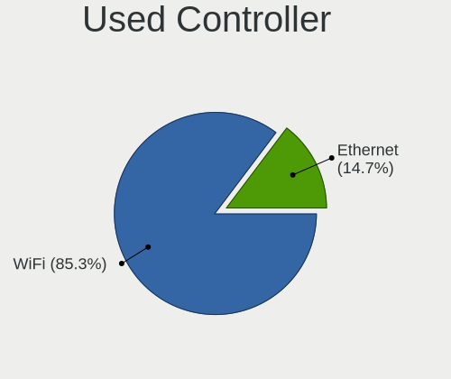

| Kind     | Notebooks | Percent |
|----------|-----------|---------|
| WiFi     | 87        | 85.29%  |
| Ethernet | 15        | 14.71%  |

NICs
----

Total network controllers on board

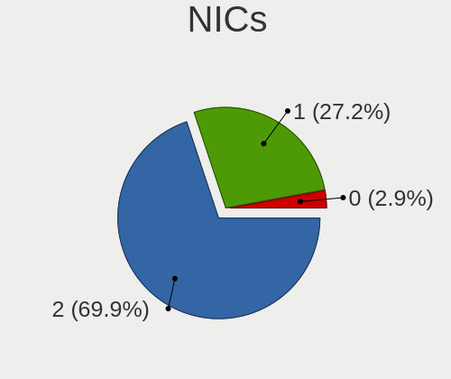

| Total | Notebooks | Percent |
|-------|-----------|---------|
| 2     | 72        | 69.9%   |
| 1     | 28        | 27.18%  |
| 0     | 3         | 2.91%   |

IPv6
----

IPv6 vs IPv4

| Used | Notebooks | Percent |
|------|-----------|---------|
| No   | 53        | 51.46%  |
| Yes  | 50        | 48.54%  |

Bluetooth
---------

Bluetooth Vendor
----------------

Controller vendors

| Vendor                          | Notebooks | Percent |
|---------------------------------|-----------|---------|
| Intel                           | 30        | 35.29%  |
| Qualcomm Atheros Communications | 10        | 11.76%  |
| IMC Networks                    | 10        | 11.76%  |
| Lite-On Technology              | 9         | 10.59%  |
| Realtek Semiconductor           | 6         | 7.06%   |
| Foxconn / Hon Hai               | 5         | 5.88%   |
| Broadcom                        | 4         | 4.71%   |
| Cambridge Silicon Radio         | 3         | 3.53%   |
| Hewlett-Packard                 | 2         | 2.35%   |
| Apple                           | 2         | 2.35%   |
| Ralink                          | 1         | 1.18%   |
| MediaTek                        | 1         | 1.18%   |
| Dell                            | 1         | 1.18%   |
| ASUSTek Computer                | 1         | 1.18%   |

Bluetooth Model
---------------

Controller models

| Model                                                                               | Notebooks | Percent |
|-------------------------------------------------------------------------------------|-----------|---------|
| Lite-On Qualcomm Atheros QCA9377 Bluetooth                                          | 7         | 8.24%   |
| Intel Bluetooth wireless interface                                                  | 7         | 8.24%   |
| Intel Bluetooth 9460/9560 Jefferson Peak (JfP)                                      | 7         | 8.24%   |
| Intel AX201 Bluetooth                                                               | 5         | 5.88%   |
| Qualcomm Atheros  Bluetooth Device                                                  | 4         | 4.71%   |
| Realtek Bluetooth Radio                                                             | 3         | 3.53%   |
| Qualcomm Atheros AR3012 Bluetooth 4.0                                               | 3         | 3.53%   |
| Intel Wireless-AC 3168 Bluetooth                                                    | 3         | 3.53%   |
| Intel Centrino Bluetooth Wireless Transceiver                                       | 3         | 3.53%   |
| IMC Networks Wireless_Device                                                        | 3         | 3.53%   |
| IMC Networks Bluetooth Radio                                                        | 3         | 3.53%   |
| Cambridge Silicon Radio Bluetooth Dongle (HCI mode)                                 | 3         | 3.53%   |
| Realtek 802.11ac WLAN Adapter                                                       | 2         | 2.35%   |
| Qualcomm Atheros QCA61x4 Bluetooth 4.0                                              | 2         | 2.35%   |
| Intel Centrino Advanced-N 6230 Bluetooth adapter                                    | 2         | 2.35%   |
| Intel AX200 Bluetooth                                                               | 2         | 2.35%   |
| IMC Networks Bluetooth Device                                                       | 2         | 2.35%   |
| Foxconn / Hon Hai Wireless_Device                                                   | 2         | 2.35%   |
| Realtek  Bluetooth 4.2 Adapter                                                      | 1         | 1.18%   |
| Ralink RT3290 Bluetooth                                                             | 1         | 1.18%   |
| Qualcomm Atheros AR3011 Bluetooth                                                   | 1         | 1.18%   |
| MediaTek Wireless_Device                                                            | 1         | 1.18%   |
| Lite-On Bluetooth Device                                                            | 1         | 1.18%   |
| Lite-On Atheros AR3012 Bluetooth                                                    | 1         | 1.18%   |
| Intel AX211 Bluetooth                                                               | 1         | 1.18%   |
| IMC Networks Bluetooth USB Host Controller                                          | 1         | 1.18%   |
| IMC Networks BCM20702A0                                                             | 1         | 1.18%   |
| HP Broadcom 2070 Bluetooth Combo                                                    | 1         | 1.18%   |
| HP Bluetooth 2.0 Interface [Broadcom BCM2045]                                       | 1         | 1.18%   |
| Foxconn / Hon Hai Foxconn T77H114 BCM2070 [Single-Chip Bluetooth 2.1 + EDR Adapter] | 1         | 1.18%   |
| Foxconn / Hon Hai Broadcom Bluetooth 2.1 Device                                     | 1         | 1.18%   |
| Foxconn / Hon Hai Bluetooth Radio                                                   | 1         | 1.18%   |
| Dell DW375 Bluetooth Module                                                         | 1         | 1.18%   |
| Broadcom HP Portable Bumble Bee                                                     | 1         | 1.18%   |
| Broadcom BCM2070 Bluetooth 2.1 + EDR                                                | 1         | 1.18%   |
| Broadcom BCM2045B (BDC-2.1)                                                         | 1         | 1.18%   |
| Broadcom BCM2045B (BDC-2) [Bluetooth Controller]                                    | 1         | 1.18%   |
| ASUS BT-183 Bluetooth 2.0+EDR adapter                                               | 1         | 1.18%   |
| Apple Bluetooth USB Host Controller                                                 | 1         | 1.18%   |
| Apple Bluetooth Host Controller                                                     | 1         | 1.18%   |

Sound
-----

Sound Vendor
------------

Sound card vendors

| Vendor                 | Notebooks | Percent |
|------------------------|-----------|---------|
| Intel                  | 82        | 66.13%  |
| AMD                    | 20        | 16.13%  |
| Nvidia                 | 19        | 15.32%  |
| iCON                   | 1         | 0.81%   |
| Generalplus Technology | 1         | 0.81%   |
| Focusrite-Novation     | 1         | 0.81%   |

Sound Model
-----------

Sound card models

| Model                                                                                             | Notebooks | Percent |
|---------------------------------------------------------------------------------------------------|-----------|---------|
| Intel Sunrise Point-LP HD Audio                                                                   | 14        | 9.21%   |
| AMD Family 17h/19h/1ah HD Audio Controller                                                        | 14        | 9.21%   |
| Intel 6 Series/C200 Series Chipset Family High Definition Audio Controller                        | 10        | 6.58%   |
| Intel 7 Series/C216 Chipset Family High Definition Audio Controller                               | 8         | 5.26%   |
| AMD Renoir Radeon High Definition Audio Controller                                                | 7         | 4.61%   |
| Intel Celeron/Pentium Silver Processor High Definition Audio                                      | 6         | 3.95%   |
| Intel Alder Lake PCH-P High Definition Audio Controller                                           | 5         | 3.29%   |
| Intel 5 Series/3400 Series Chipset High Definition Audio                                          | 4         | 2.63%   |
| AMD Rembrandt Radeon High Definition Audio Controller                                             | 4         | 2.63%   |
| Intel Xeon E3-1200 v3/4th Gen Core Processor HD Audio Controller                                  | 3         | 1.97%   |
| Intel Tiger Lake-LP Smart Sound Technology Audio Controller                                       | 3         | 1.97%   |
| Intel Ice Lake-LP Smart Sound Technology Audio Controller                                         | 3         | 1.97%   |
| Intel Haswell-ULT HD Audio Controller                                                             | 3         | 1.97%   |
| Intel 82801H (ICH8 Family) HD Audio Controller                                                    | 3         | 1.97%   |
| Intel 8 Series/C220 Series Chipset High Definition Audio Controller                               | 3         | 1.97%   |
| Intel 8 Series HD Audio Controller                                                                | 3         | 1.97%   |
| AMD Raven/Raven2/Fenghuang HDMI/DP Audio Controller                                               | 3         | 1.97%   |
| Nvidia TU107 GeForce GTX 1650 High Definition Audio Controller                                    | 2         | 1.32%   |
| Nvidia GP107GL High Definition Audio Controller                                                   | 2         | 1.32%   |
| Nvidia GM107 High Definition Audio Controller [GeForce 940MX]                                     | 2         | 1.32%   |
| Nvidia GF108 High Definition Audio Controller                                                     | 2         | 1.32%   |
| Nvidia GA107 High Definition Audio Controller                                                     | 2         | 1.32%   |
| Nvidia AD107 High Definition Audio Controller                                                     | 2         | 1.32%   |
| Intel Wildcat Point-LP High Definition Audio Controller                                           | 2         | 1.32%   |
| Intel Comet Lake PCH-LP cAVS                                                                      | 2         | 1.32%   |
| Intel CM238 HD Audio Controller                                                                   | 2         | 1.32%   |
| Intel Cannon Point-LP High Definition Audio Controller                                            | 2         | 1.32%   |
| Intel Broadwell-U Audio Controller                                                                | 2         | 1.32%   |
| Intel Atom/Celeron/Pentium Processor x5-E8000/J3xxx/N3xxx Series High Definition Audio Controller | 2         | 1.32%   |
| Intel 82801I (ICH9 Family) HD Audio Controller                                                    | 2         | 1.32%   |
| Intel 100 Series/C230 Series Chipset Family HD Audio Controller                                   | 2         | 1.32%   |
| AMD Wrestler HDMI Audio                                                                           | 2         | 1.32%   |
| AMD SBx00 Azalia (Intel HDA)                                                                      | 2         | 1.32%   |
| AMD FCH Azalia Controller                                                                         | 2         | 1.32%   |
| Nvidia MCP79 High Definition Audio                                                                | 1         | 0.66%   |
| Nvidia GP104 High Definition Audio Controller                                                     | 1         | 0.66%   |
| Nvidia GK208 HDMI/DP Audio Controller                                                             | 1         | 0.66%   |
| Nvidia GK106 HDMI Audio Controller                                                                | 1         | 0.66%   |
| Nvidia GF116 High Definition Audio Controller                                                     | 1         | 0.66%   |
| Nvidia GA106 High Definition Audio Controller                                                     | 1         | 0.66%   |

Memory
------

Memory Vendor
-------------

Memory module vendors

| Vendor              | Notebooks | Percent |
|---------------------|-----------|---------|
| Samsung Electronics | 17        | 26.15%  |
| Micron Technology   | 8         | 12.31%  |
| Smart               | 6         | 9.23%   |
| Unknown             | 5         | 7.69%   |
| SK hynix            | 5         | 7.69%   |
| Kingston            | 5         | 7.69%   |
| Crucial             | 4         | 6.15%   |
| A-DATA Technology   | 3         | 4.62%   |
| Unknown             | 2         | 3.08%   |
| Walton Chaintech    | 1         | 1.54%   |
| Timetec             | 1         | 1.54%   |
| Teikon              | 1         | 1.54%   |
| Smart Brazil        | 1         | 1.54%   |
| Ramaxel Technology  | 1         | 1.54%   |
| Multilaser          | 1         | 1.54%   |
| Kembona             | 1         | 1.54%   |
| GOODRAM             | 1         | 1.54%   |
| G.Skill             | 1         | 1.54%   |
| Corsair             | 1         | 1.54%   |

Memory Model
------------

Memory module models

| Model                                                        | Notebooks | Percent |
|--------------------------------------------------------------|-----------|---------|
| Smart RAM SH564128FH8NZQNSCG 4GB SODIMM DDR3 1600MT/s        | 2         | 2.74%   |
| Samsung RAM M471B5273DH0-CH9 4GB SODIMM DDR3 1334MT/s        | 2         | 2.74%   |
| Samsung RAM M425R2GA3BB0-CQKOL 16GB SODIMM DDR5 4800MT/s     | 2         | 2.74%   |
| Micron RAM MICRON/MT60B1G16HC-4 8GB SODIMM DDR5 4800MT/s     | 2         | 2.74%   |
| Unknown                                                      | 2         | 2.74%   |
| Walton Chaintech RAM AS2G732-800P005 2GB SODIMM DDR2 800MT/s | 1         | 1.37%   |
| Unknown RAM Module 512MB SODIMM DDR2                         | 1         | 1.37%   |
| Unknown RAM Module 4GB SODIMM DDR4 2133MT/s                  | 1         | 1.37%   |
| Unknown RAM Module 2GB SODIMM DDR3 1600MT/s                  | 1         | 1.37%   |
| Unknown RAM Module 2GB SODIMM DDR2 667MT/s                   | 1         | 1.37%   |
| Unknown RAM Module 2GB SODIMM DDR2                           | 1         | 1.37%   |
| Unknown RAM Module 1GB SODIMM SDRAM                          | 1         | 1.37%   |
| Unknown RAM Module 1GB SODIMM DDR2 667MT/s                   | 1         | 1.37%   |
| Timetec RAM Module 4GB SODIMM DDR3 1067MT/s                  | 1         | 1.37%   |
| Teikon RAM TMA81GS6AFR8N-UHSC 8GB SODIMM DDR4 2400MT/s       | 1         | 1.37%   |
| Smart RAM SMS4TDC3C0K0446SCG 4GB SODIMM DDR4 2667MT/s        | 1         | 1.37%   |
| Smart RAM SH564568FH8NZPHSCR 2GB SODIMM DDR3 1334MT/s        | 1         | 1.37%   |
| Smart RAM SH564568FH8NWPHSFG 2GB SODIMM DDR3 1333MT/s        | 1         | 1.37%   |
| Smart RAM SF4641G8CKHIWDFSEG 8GB SODIMM DDR4 2133MT/s        | 1         | 1.37%   |
| Smart RAM SF4641G8CK8IEHLSBG 8GB SODIMM DDR4 2667MT/s        | 1         | 1.37%   |
| Smart Brazil RAM Module 4GB Row Of Chips DDR4 2400MT/s       | 1         | 1.37%   |
| SK hynix RAM Module 4GB SODIMM DDR3 1066MT/s                 | 1         | 1.37%   |
| SK hynix RAM MMXIV 4096MB SODIMM DDR3 1333MT/s               | 1         | 1.37%   |
| SK hynix RAM HYMP125S64CP8-S6 2048MB SODIMM DDR2 975MT/s     | 1         | 1.37%   |
| SK hynix RAM HMCG66MEBSA092N 8GB SODIMM DDR5 4800MT/s        | 1         | 1.37%   |
| SK hynix RAM HMA851S6DJR6N-XN 4GB SODIMM DDR4 3200MT/s       | 1         | 1.37%   |
| Samsung RAM Module 4GB SODIMM LPDDR3 2133MT/s                | 1         | 1.37%   |
| Samsung RAM Module 2GB Row Of Chips LPDDR3 1600MT/s          | 1         | 1.37%   |
| Samsung RAM M471B5673FH0-CH9 2GB SODIMM DDR3 1334MT/s        | 1         | 1.37%   |
| Samsung RAM M471B5673FH0-CF8 2GB SODIMM DDR3 1067MT/s        | 1         | 1.37%   |
| Samsung RAM M471B5273DH0-CK0 4GB SODIMM DDR3 2400MT/s        | 1         | 1.37%   |
| Samsung RAM M471B5273CH0-CH9 4GB SODIMM DDR3 1334MT/s        | 1         | 1.37%   |
| Samsung RAM M471B5173EB0-YK0 4GB SODIMM DDR3 1600MT/s        | 1         | 1.37%   |
| Samsung RAM M471B1G73BH0-CK0 8GB SODIMM DDR3 1600MT/s        | 1         | 1.37%   |
| Samsung RAM M471A5244CB0-CWE 4096MB SODIMM DDR4 3200MT/s     | 1         | 1.37%   |
| Samsung RAM M471A1K43DB1-CTD 8GB SODIMM DDR4 2667MT/s        | 1         | 1.37%   |
| Samsung RAM M471A1K43BB1-CRC 8GB SODIMM DDR4 2667MT/s        | 1         | 1.37%   |
| Samsung RAM M471A1G44AB0-CWE 8GB SODIMM DDR4 3200MT/s        | 1         | 1.37%   |
| Samsung RAM M425R1GB4BB0-CQKOL 8GB SODIMM DDR5 4800MT/s      | 1         | 1.37%   |
| Samsung RAM M4 70T5663QZ3-CF7 2GB SODIMM DDR2 2048MT/s       | 1         | 1.37%   |

Memory Kind
-----------

Memory module kinds

| Kind   | Notebooks | Percent |
|--------|-----------|---------|
| DDR3   | 21        | 38.18%  |
| DDR4   | 18        | 32.73%  |
| DDR5   | 7         | 12.73%  |
| DDR2   | 4         | 7.27%   |
| SDRAM  | 2         | 3.64%   |
| LPDDR3 | 2         | 3.64%   |
| LPDDR4 | 1         | 1.82%   |

Memory Form Factor
------------------

Physical design of the memory module

| Name         | Notebooks | Percent |
|--------------|-----------|---------|
| SODIMM       | 51        | 94.44%  |
| Row Of Chips | 3         | 5.56%   |

Memory Size
-----------

Memory module size

| Size  | Notebooks | Percent |
|-------|-----------|---------|
| 8192  | 18        | 28.57%  |
| 4096  | 18        | 28.57%  |
| 2048  | 10        | 15.87%  |
| 16384 | 9         | 14.29%  |
| 32768 | 5         | 7.94%   |
| 1024  | 2         | 3.17%   |
| 512   | 1         | 1.59%   |

Memory Speed
------------

Memory module speed

| Speed   | Notebooks | Percent |
|---------|-----------|---------|
| 1600    | 15        | 24.19%  |
| 4800    | 6         | 9.68%   |
| 3200    | 6         | 9.68%   |
| 2400    | 6         | 9.68%   |
| 1334    | 6         | 9.68%   |
| 2667    | 5         | 8.06%   |
| 2133    | 3         | 4.84%   |
| 1333    | 3         | 4.84%   |
| 1067    | 2         | 3.23%   |
| 667     | 2         | 3.23%   |
| Unknown | 2         | 3.23%   |
| 5600    | 1         | 1.61%   |
| 4266    | 1         | 1.61%   |
| 2048    | 1         | 1.61%   |
| 1066    | 1         | 1.61%   |
| 975     | 1         | 1.61%   |
| 800     | 1         | 1.61%   |

Printers & scanners
-------------------

Printer Vendor
--------------

Printer device vendors

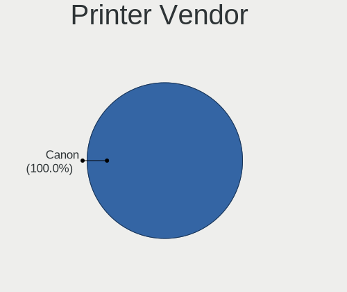

| Vendor | Notebooks | Percent |
|--------|-----------|---------|
| Canon  | 1         | 100%    |

Printer Model
-------------

Printer device models

| Model               | Notebooks | Percent |
|---------------------|-----------|---------|
| Canon TR8600 series | 1         | 100%    |

Scanner Vendor
--------------

Scanner device vendors

Zero info for selected period =(

Scanner Model
-------------

Scanner device models

Zero info for selected period =(

Camera
------

Camera Vendor
-------------

Camera device vendors

| Vendor                                 | Notebooks | Percent |
|----------------------------------------|-----------|---------|
| Chicony Electronics                    | 16        | 17.78%  |
| Quanta                                 | 10        | 11.11%  |
| Realtek Semiconductor                  | 9         | 10%     |
| Bison Electronics                      | 8         | 8.89%   |
| IMC Networks                           | 6         | 6.67%   |
| Sunplus Innovation Technology          | 5         | 5.56%   |
| Shine-optics                           | 4         | 4.44%   |
| Microdia                               | 3         | 3.33%   |
| Cheng Uei Precision Industry (Foxlink) | 3         | 3.33%   |
| Alcor Micro                            | 3         | 3.33%   |
| Suyin                                  | 2         | 2.22%   |
| SunplusIT                              | 2         | 2.22%   |
| Silicon Motion                         | 2         | 2.22%   |
| Ricoh                                  | 2         | 2.22%   |
| Luxvisions Innotech Limited            | 2         | 2.22%   |
| Apple                                  | 2         | 2.22%   |
| ALi                                    | 2         | 2.22%   |
| Y Media                                | 1         | 1.11%   |
| USB Camera CS                          | 1         | 1.11%   |
| Syntek                                 | 1         | 1.11%   |
| Sonix Technology                       | 1         | 1.11%   |
| ShineTech                              | 1         | 1.11%   |
| Logitech                               | 1         | 1.11%   |
| Lite-On Technology                     | 1         | 1.11%   |
| Lenovo                                 | 1         | 1.11%   |
| Unknown                                | 1         | 1.11%   |

Camera Model
------------

Camera device models

| Model                                                       | Notebooks | Percent |
|-------------------------------------------------------------|-----------|---------|
| Shine-optics USB2.0 HD UVC WebCam                           | 4         | 4.44%   |
| Quanta VGA WebCam                                           | 4         | 4.44%   |
| Chicony Integrated Camera                                   | 4         | 4.44%   |
| Quanta HD Webcam                                            | 3         | 3.33%   |
| Chicony HD WebCam                                           | 3         | 3.33%   |
| Bison Lenovo EasyCamera                                     | 3         | 3.33%   |
| Bison HD Webcam                                             | 3         | 3.33%   |
| SunplusIT MTD camera                                        | 2         | 2.22%   |
| Silicon Motion Web Camera                                   | 2         | 2.22%   |
| Realtek USB Camera                                          | 2         | 2.22%   |
| Realtek Integrated_Webcam_HD                                | 2         | 2.22%   |
| Realtek Integrated Webcam                                   | 2         | 2.22%   |
| Microdia Integrated_Webcam_HD                               | 2         | 2.22%   |
| Luxvisions Innotech Limited HP Wide Vision HD Camera        | 2         | 2.22%   |
| IMC Networks USB2.0 HD UVC WebCam                           | 2         | 2.22%   |
| Bison Integrated Camera                                     | 2         | 2.22%   |
| Y Media USB Camera                                          | 1         | 1.11%   |
| USB Camera CS USB Camera CS                                 | 1         | 1.11%   |
| Syntek Lenovo EasyCamera                                    | 1         | 1.11%   |
| Suyin USB 2.0 Webcam Device                                 | 1         | 1.11%   |
| Suyin 1.3M WebCam (notebook emachines E730, Acer sub-brand) | 1         | 1.11%   |
| Sunplus Laptop_Integrated_Webcam_HD                         | 1         | 1.11%   |
| Sunplus Laptop_Integrated_Webcam_FHD                        | 1         | 1.11%   |
| Sunplus Laptop Integrated Webcam FHD                        | 1         | 1.11%   |
| Sunplus HP TrueVision HD Camera                             | 1         | 1.11%   |
| Sunplus HP HD Webcam [Fixed]                                | 1         | 1.11%   |
| Sonix USB2.0 HD UVC WebCam                                  | 1         | 1.11%   |
| ShineTech USB2.0 HD UVC WebCam                              | 1         | 1.11%   |
| Ricoh USB2.0 Camera                                         | 1         | 1.11%   |
| Ricoh Laptop_Integrated_Webcam_FHD                          | 1         | 1.11%   |
| Realtek HP Webcam                                           | 1         | 1.11%   |
| Realtek HP Truevision HD                                    | 1         | 1.11%   |
| Realtek HD WebCam                                           | 1         | 1.11%   |
| Quanta Laptop_Integrated_Webcam_2HDM                        | 1         | 1.11%   |
| Quanta HD User Facing                                       | 1         | 1.11%   |
| Quanta ACER HD User Facing                                  | 1         | 1.11%   |
| Microdia Sonix 1.3 MP Laptop Integrated Webcam              | 1         | 1.11%   |
| Logitech HP Webcam                                          | 1         | 1.11%   |
| Lite-On TOSHIBA Web Camera - HD                             | 1         | 1.11%   |
| Lenovo Integrated Webcam [R5U877]                           | 1         | 1.11%   |

Security
--------

Fingerprint Vendor
------------------

Fingerprint sensor vendors

| Vendor                             | Notebooks | Percent |
|------------------------------------|-----------|---------|
| Validity Sensors                   | 6         | 60%     |
| Realtek USB2.0 Finger Print Bridge | 2         | 20%     |
| Synaptics                          | 1         | 10%     |
| STMicroelectronics                 | 1         | 10%     |

Fingerprint Model
-----------------

Fingerprint sensor models

| Model                                                           | Notebooks | Percent |
|-----------------------------------------------------------------|-----------|---------|
| Realtek USB2.0 Finger Print Bridge FocalTech Fingerprint Device | 2         | 20%     |
| Validity Sensors VFS5011 Fingerprint Reader                     | 1         | 10%     |
| Validity Sensors VFS495 Fingerprint Reader                      | 1         | 10%     |
| Validity Sensors VFS491                                         | 1         | 10%     |
| Validity Sensors VFS471 Fingerprint Reader                      | 1         | 10%     |
| Validity Sensors VFS101 Fingerprint Reader                      | 1         | 10%     |
| Validity Sensors Swipe Fingerprint Sensor                       | 1         | 10%     |
| Synaptics Metallica MIS Touch Fingerprint Reader                | 1         | 10%     |
| STMicroelectronics Fingerprint Reader                           | 1         | 10%     |

Chipcard Vendor
---------------

Chipcard module vendors

| Vendor              | Notebooks | Percent |
|---------------------|-----------|---------|
| Broadcom            | 2         | 66.67%  |
| Giesecke & Devrient | 1         | 33.33%  |

Chipcard Model
--------------

Chipcard module models

| Model                                          | Notebooks | Percent |
|------------------------------------------------|-----------|---------|
| Giesecke & Devrient StarSign CUT               | 1         | 33.33%  |
| Broadcom BCM5880 Secure Applications Processor | 1         | 33.33%  |
| Broadcom 58200                                 | 1         | 33.33%  |

Unsupported
-----------

Unsupported Devices
-------------------

Total unsupported devices on board

| Total | Notebooks | Percent |
|-------|-----------|---------|
| 0     | 73        | 70.19%  |
| 1     | 25        | 24.04%  |
| 2     | 4         | 3.85%   |
| 3     | 2         | 1.92%   |

Unsupported Device Types
------------------------

Types of unsupported devices

| Type                  | Notebooks | Percent |
|-----------------------|-----------|---------|
| Graphics card         | 11        | 28.95%  |
| Fingerprint reader    | 10        | 26.32%  |
| Net/wireless          | 6         | 15.79%  |
| Multimedia controller | 5         | 13.16%  |
| Chipcard              | 3         | 7.89%   |
| Tv card               | 1         | 2.63%   |
| Storage               | 1         | 2.63%   |
| Bluetooth             | 1         | 2.63%   |

