BigLinux - Tested Hardware & Statistics
---------------------------------------

A project to collect tested hardware configurations for BigLinux.

Anyone can contribute to this report by the [hw-probe](https://github.com/linuxhw/hw-probe) tool:

    sudo -E hw-probe -all -upload

Please contribute! Especially if your hardware is rare.

This is a report for all computer types. See also reports for [desktops](/Dist/BigLinux/Desktop/README.md) and [notebooks](/Dist/BigLinux/Notebook/README.md).

Contents
--------

* [ Test Cases ](#test-cases)

* [ System ](#system)
  - [ OS                       ](#os)
  - [ OS Family                ](#os-family)
  - [ Kernel                   ](#kernel)
  - [ Kernel Family            ](#kernel-family)
  - [ Kernel Major Ver.        ](#kernel-major-ver)
  - [ Arch                     ](#arch)
  - [ DE                       ](#de)
  - [ Display Server           ](#display-server)
  - [ Display Manager          ](#display-manager)
  - [ OS Lang                  ](#os-lang)
  - [ Boot Mode                ](#boot-mode)
  - [ Filesystem               ](#filesystem)
  - [ Part. scheme             ](#part-scheme)
  - [ Dual Boot with Linux/BSD ](#dual-boot-with-linuxbsd)
  - [ Dual Boot (Win)          ](#dual-boot-win)

* [ Board ](#board)
  - [ Vendor                   ](#vendor)
  - [ Model                    ](#model)
  - [ Model Family             ](#model-family)
  - [ MFG Year                 ](#mfg-year)
  - [ Form Factor              ](#form-factor)
  - [ Secure Boot              ](#secure-boot)
  - [ Coreboot                 ](#coreboot)
  - [ RAM Size                 ](#ram-size)
  - [ RAM Used                 ](#ram-used)
  - [ Total Drives             ](#total-drives)
  - [ Has CD-ROM               ](#has-cd-rom)
  - [ Has Ethernet             ](#has-ethernet)
  - [ Has WiFi                 ](#has-wifi)
  - [ Has Bluetooth            ](#has-bluetooth)

* [ Location ](#location)
  - [ Country                  ](#country)
  - [ City                     ](#city)

* [ Drives ](#drives)
  - [ Drive Vendor             ](#drive-vendor)
  - [ Drive Model              ](#drive-model)
  - [ HDD Vendor               ](#hdd-vendor)
  - [ SSD Vendor               ](#ssd-vendor)
  - [ Drive Kind               ](#drive-kind)
  - [ Drive Connector          ](#drive-connector)
  - [ Drive Size               ](#drive-size)
  - [ Space Total              ](#space-total)
  - [ Space Used               ](#space-used)
  - [ Malfunc. Drives          ](#malfunc-drives)
  - [ Malfunc. Drive Vendor    ](#malfunc-drive-vendor)
  - [ Malfunc. HDD Vendor      ](#malfunc-hdd-vendor)
  - [ Malfunc. Drive Kind      ](#malfunc-drive-kind)
  - [ Failed Drives            ](#failed-drives)
  - [ Failed Drive Vendor      ](#failed-drive-vendor)
  - [ Drive Status             ](#drive-status)

* [ Storage controller ](#storage-controller)
  - [ Storage Vendor           ](#storage-vendor)
  - [ Storage Model            ](#storage-model)
  - [ Storage Kind             ](#storage-kind)

* [ Processor ](#processor)
  - [ CPU Vendor               ](#cpu-vendor)
  - [ CPU Model                ](#cpu-model)
  - [ CPU Model Family         ](#cpu-model-family)
  - [ CPU Cores                ](#cpu-cores)
  - [ CPU Sockets              ](#cpu-sockets)
  - [ CPU Threads              ](#cpu-threads)
  - [ CPU Op-Modes             ](#cpu-op-modes)
  - [ CPU Microcode            ](#cpu-microcode)
  - [ CPU Microarch            ](#cpu-microarch)

* [ Graphics ](#graphics)
  - [ GPU Vendor               ](#gpu-vendor)
  - [ GPU Model                ](#gpu-model)
  - [ GPU Combo                ](#gpu-combo)
  - [ GPU Driver               ](#gpu-driver)
  - [ GPU Memory               ](#gpu-memory)

* [ Monitor ](#monitor)
  - [ Monitor Vendor           ](#monitor-vendor)
  - [ Monitor Model            ](#monitor-model)
  - [ Monitor Resolution       ](#monitor-resolution)
  - [ Monitor Diagonal         ](#monitor-diagonal)
  - [ Monitor Width            ](#monitor-width)
  - [ Aspect Ratio             ](#aspect-ratio)
  - [ Monitor Area             ](#monitor-area)
  - [ Pixel Density            ](#pixel-density)
  - [ Multiple Monitors        ](#multiple-monitors)

* [ Network ](#network)
  - [ Net Controller Vendor    ](#net-controller-vendor)
  - [ Net Controller Model     ](#net-controller-model)
  - [ Wireless Vendor          ](#wireless-vendor)
  - [ Wireless Model           ](#wireless-model)
  - [ Ethernet Vendor          ](#ethernet-vendor)
  - [ Ethernet Model           ](#ethernet-model)
  - [ Net Controller Kind      ](#net-controller-kind)
  - [ Used Controller          ](#used-controller)
  - [ NICs                     ](#nics)
  - [ IPv6                     ](#ipv6)

* [ Bluetooth ](#bluetooth)
  - [ Bluetooth Vendor         ](#bluetooth-vendor)
  - [ Bluetooth Model          ](#bluetooth-model)

* [ Sound ](#sound)
  - [ Sound Vendor             ](#sound-vendor)
  - [ Sound Model              ](#sound-model)

* [ Memory ](#memory)
  - [ Memory Vendor            ](#memory-vendor)
  - [ Memory Model             ](#memory-model)
  - [ Memory Kind              ](#memory-kind)
  - [ Memory Form Factor       ](#memory-form-factor)
  - [ Memory Size              ](#memory-size)
  - [ Memory Speed             ](#memory-speed)

* [ Printers & scanners ](#printers--scanners)
  - [ Printer Vendor           ](#printer-vendor)
  - [ Printer Model            ](#printer-model)
  - [ Scanner Vendor           ](#scanner-vendor)
  - [ Scanner Model            ](#scanner-model)

* [ Camera ](#camera)
  - [ Camera Vendor            ](#camera-vendor)
  - [ Camera Model             ](#camera-model)

* [ Security ](#security)
  - [ Fingerprint Vendor       ](#fingerprint-vendor)
  - [ Fingerprint Model        ](#fingerprint-model)
  - [ Chipcard Vendor          ](#chipcard-vendor)
  - [ Chipcard Model           ](#chipcard-model)

* [ Unsupported ](#unsupported)
  - [ Unsupported Devices      ](#unsupported-devices)
  - [ Unsupported Device Types ](#unsupported-device-types)

Test Cases
----------

Total: 303

| Vendor        | Model                       | Form-Factor | Probe                                                      | Date         |
|---------------|-----------------------------|-------------|------------------------------------------------------------|--------------|
| MAXSUN        | MS-Challenger B760M         | Desktop     | [d0da8b89ac](https://linux-hardware.org/?probe=d0da8b89ac) | Jan 05, 2025 |
| MAXSUN        | MS-Challenger B760M         | Desktop     | [468fb150c0](https://linux-hardware.org/?probe=468fb150c0) | Jan 04, 2025 |
| Lenovo        | G500s Touch 20263           | Notebook    | [eb4512501c](https://linux-hardware.org/?probe=eb4512501c) | Jan 02, 2025 |
| ASUSTek       | VivoBook_ASUSLaptop M160... | Notebook    | [473fe2119f](https://linux-hardware.org/?probe=473fe2119f) | Jan 01, 2025 |
| Intel         | B75                         | Desktop     | [e0b305feae](https://linux-hardware.org/?probe=e0b305feae) | Jan 01, 2025 |
| ASUSTek       | S451LA                      | Notebook    | [3da156f5be](https://linux-hardware.org/?probe=3da156f5be) | Dec 31, 2024 |
| ASUSTek       | S451LA                      | Notebook    | [9837408f80](https://linux-hardware.org/?probe=9837408f80) | Dec 31, 2024 |
| Positivo B... | VJFE52F11X-B2291H           | Notebook    | [3c5b6bf03a](https://linux-hardware.org/?probe=3c5b6bf03a) | Dec 30, 2024 |
| Lenovo        | G500s Touch 20263           | Notebook    | [0dbe4fae1f](https://linux-hardware.org/?probe=0dbe4fae1f) | Dec 27, 2024 |
| Sony          | VPCF215FX                   | Notebook    | [96e5141db4](https://linux-hardware.org/?probe=96e5141db4) | Dec 20, 2024 |
| ASUSTek       | P8H61-M LX3 R2.0            | Desktop     | [dcfafc889c](https://linux-hardware.org/?probe=dcfafc889c) | Dec 19, 2024 |
| Acer          | Aspire E5-774G              | Notebook    | [19077cd048](https://linux-hardware.org/?probe=19077cd048) | Dec 17, 2024 |
| ASUSTek       | ASUS TUF Gaming A16 FA61... | Notebook    | [ab05b2a1ee](https://linux-hardware.org/?probe=ab05b2a1ee) | Dec 15, 2024 |
| Acer          | Aspire A515-51              | Notebook    | [615b9706b0](https://linux-hardware.org/?probe=615b9706b0) | Dec 12, 2024 |
| Dell          | Vostro 3550                 | Notebook    | [c45c7e2e64](https://linux-hardware.org/?probe=c45c7e2e64) | Dec 11, 2024 |
| Lenovo        | Yoga Slim 6 14IAP8 83C7     | Notebook    | [90bb1c3ab1](https://linux-hardware.org/?probe=90bb1c3ab1) | Dec 10, 2024 |
| HP            | Pavilion dv7                | Notebook    | [8d620075ce](https://linux-hardware.org/?probe=8d620075ce) | Dec 10, 2024 |
| MSI           | MPG Z690 EDGE WIFI DDR4     | Desktop     | [aff41ee61b](https://linux-hardware.org/?probe=aff41ee61b) | Dec 07, 2024 |
| MSI           | Z87-G45 GAMING              | Desktop     | [7d5ba2293a](https://linux-hardware.org/?probe=7d5ba2293a) | Dec 06, 2024 |
| HP            | 829A                        | Mini pc     | [903bd9cfab](https://linux-hardware.org/?probe=903bd9cfab) | Dec 01, 2024 |
| ASRock        | H77 Pro4-M                  | Desktop     | [ee78ad6501](https://linux-hardware.org/?probe=ee78ad6501) | Nov 30, 2024 |
| Lenovo        | NOK                         | Desktop     | [a761e22d35](https://linux-hardware.org/?probe=a761e22d35) | Nov 28, 2024 |
| Lenovo        | NOK                         | Desktop     | [7b4b2dc9f5](https://linux-hardware.org/?probe=7b4b2dc9f5) | Nov 28, 2024 |
| Lenovo        | IdeaPad 3 15ITL6 82MD       | Notebook    | [fd49240dd9](https://linux-hardware.org/?probe=fd49240dd9) | Nov 23, 2024 |
| HP            | 829A                        | Mini pc     | [06020f861b](https://linux-hardware.org/?probe=06020f861b) | Nov 20, 2024 |
| Lenovo        | IdeaPad 3 15ITL6 82MD       | Notebook    | [7767925a13](https://linux-hardware.org/?probe=7767925a13) | Nov 16, 2024 |
| Dell          | Inspiron 15 7000 Gaming     | Notebook    | [c81a415b4f](https://linux-hardware.org/?probe=c81a415b4f) | Nov 12, 2024 |
| HP            | Presario CQ42               | Notebook    | [afee708cb6](https://linux-hardware.org/?probe=afee708cb6) | Nov 08, 2024 |
| HP            | Presario CQ42               | Notebook    | [a71192175b](https://linux-hardware.org/?probe=a71192175b) | Nov 08, 2024 |
| Acer          | Aspire E5-575G              | Notebook    | [98fe0f8e24](https://linux-hardware.org/?probe=98fe0f8e24) | Nov 06, 2024 |
| HP            | EliteBook 8470p             | Notebook    | [0b97846718](https://linux-hardware.org/?probe=0b97846718) | Nov 04, 2024 |
| Acer          | Aspire A315-53              | Notebook    | [7210c6bb41](https://linux-hardware.org/?probe=7210c6bb41) | Oct 29, 2024 |
| Dell          | Latitude 5400               | Notebook    | [772d666dab](https://linux-hardware.org/?probe=772d666dab) | Oct 27, 2024 |
| Positivo      | POS-EIH61CQ POSITIVO        | Desktop     | [1cdf6bce40](https://linux-hardware.org/?probe=1cdf6bce40) | Oct 27, 2024 |
| HP            | 225E                        | Desktop     | [942662301f](https://linux-hardware.org/?probe=942662301f) | Oct 21, 2024 |
| MSI           | Z97 MPOWER MAX AC           | Desktop     | [02bbeb1a17](https://linux-hardware.org/?probe=02bbeb1a17) | Oct 19, 2024 |
| Gigabyte      | H110M-S2H-CF                | Desktop     | [9599929595](https://linux-hardware.org/?probe=9599929595) | Oct 16, 2024 |
| eMachines     | eMD732                      | Notebook    | [0eb906c266](https://linux-hardware.org/?probe=0eb906c266) | Oct 09, 2024 |
| ASUSTek       | VivoBook_ASUSLaptop M150... | Notebook    | [8260fb5b8b](https://linux-hardware.org/?probe=8260fb5b8b) | Oct 08, 2024 |
| Dell          | Inspiron 5406 2n1           | Convertible | [e6dd031980](https://linux-hardware.org/?probe=e6dd031980) | Oct 07, 2024 |
| MSI           | Z97 MPOWER MAX AC           | Desktop     | [b8fbfecc12](https://linux-hardware.org/?probe=b8fbfecc12) | Oct 06, 2024 |
| ASUSTek       | ProArt PX13 HN7306WV_HN7... | Convertible | [b20f187d50](https://linux-hardware.org/?probe=b20f187d50) | Oct 03, 2024 |
| Dell          | Inspiron 5406 2n1           | Convertible | [45c92de072](https://linux-hardware.org/?probe=45c92de072) | Oct 01, 2024 |
| Dell          | Inspiron 5406 2n1           | Convertible | [302b981729](https://linux-hardware.org/?probe=302b981729) | Oct 01, 2024 |
| ASUSTek       | VivoBook_ASUSLaptop M150... | Notebook    | [a123744b71](https://linux-hardware.org/?probe=a123744b71) | Sep 26, 2024 |
| Dell          | 0NV0M7 A01                  | Desktop     | [7339ef4fdb](https://linux-hardware.org/?probe=7339ef4fdb) | Sep 21, 2024 |
| ALLDOCUBE     | i1405C                      | Notebook    | [9f39325af4](https://linux-hardware.org/?probe=9f39325af4) | Sep 18, 2024 |
| Lenovo        | Yoga 530-14IKB 81EK         | Convertible | [c33592b695](https://linux-hardware.org/?probe=c33592b695) | Sep 17, 2024 |
| Itautec       | ST 4262                     | Desktop     | [e48d38d71f](https://linux-hardware.org/?probe=e48d38d71f) | Sep 17, 2024 |
| Dell          | Inspiron 5567               | Notebook    | [2aa09caab7](https://linux-hardware.org/?probe=2aa09caab7) | Sep 16, 2024 |
| Dell          | Inspiron 5567               | Notebook    | [369ac3b5ef](https://linux-hardware.org/?probe=369ac3b5ef) | Sep 16, 2024 |
| ASRock        | N68C-S UCC                  | Desktop     | [fb79062462](https://linux-hardware.org/?probe=fb79062462) | Sep 14, 2024 |
| ASRock        | N68C-S UCC                  | Desktop     | [d4b82fd204](https://linux-hardware.org/?probe=d4b82fd204) | Sep 14, 2024 |
| MSI           | Pulse GL66 12UEK            | Notebook    | [92157f1b1b](https://linux-hardware.org/?probe=92157f1b1b) | Sep 14, 2024 |
| Intel         | H61                         | Desktop     | [902ef7bbb2](https://linux-hardware.org/?probe=902ef7bbb2) | Sep 10, 2024 |
| ASUSTek       | PRIME A520M-A II            | Desktop     | [90a1a80a14](https://linux-hardware.org/?probe=90a1a80a14) | Sep 09, 2024 |
| Gigabyte      | B450M GAMING                | Desktop     | [4ab83f05ff](https://linux-hardware.org/?probe=4ab83f05ff) | Sep 08, 2024 |
| MSI           | GS70 2PC Stealth            | Notebook    | [db7810c975](https://linux-hardware.org/?probe=db7810c975) | Sep 06, 2024 |
| Gigabyte      | B450M GAMING                | Desktop     | [7193ebf322](https://linux-hardware.org/?probe=7193ebf322) | Sep 05, 2024 |
| Intel         | G41AGB3 V1.01               | Desktop     | [a83fc33bbf](https://linux-hardware.org/?probe=a83fc33bbf) | Sep 03, 2024 |
| Intel         | G41AGB3 V1.01               | Desktop     | [e915d2750c](https://linux-hardware.org/?probe=e915d2750c) | Sep 03, 2024 |
| Itautec       | ST 4262                     | Desktop     | [ad107abe55](https://linux-hardware.org/?probe=ad107abe55) | Sep 01, 2024 |
| Itautec       | ST 4262                     | Desktop     | [e40e1ccf45](https://linux-hardware.org/?probe=e40e1ccf45) | Sep 01, 2024 |
| PCWare        | IPMH61R2                    | Desktop     | [8205829435](https://linux-hardware.org/?probe=8205829435) | Aug 23, 2024 |
| ASRock        | 775VM800                    | Desktop     | [e3fdbf1d31](https://linux-hardware.org/?probe=e3fdbf1d31) | Aug 22, 2024 |
| Biostar       | B450MH                      | Desktop     | [13c5cbc6a4](https://linux-hardware.org/?probe=13c5cbc6a4) | Aug 21, 2024 |
| Positivo B... | VJFE52F11X-B2291H           | Notebook    | [4f00dbcd1c](https://linux-hardware.org/?probe=4f00dbcd1c) | Aug 20, 2024 |
| Gigabyte      | Z87-HD3                     | Desktop     | [5a68f860a3](https://linux-hardware.org/?probe=5a68f860a3) | Aug 19, 2024 |
| MSI           | GS70 2PC Stealth            | Notebook    | [1be745f442](https://linux-hardware.org/?probe=1be745f442) | Aug 19, 2024 |
| ASRock        | B450M Steel Legend          | Desktop     | [7f73ce2553](https://linux-hardware.org/?probe=7f73ce2553) | Aug 15, 2024 |
| Gigabyte      | Z97X-SLI-CF                 | Desktop     | [9783e8262b](https://linux-hardware.org/?probe=9783e8262b) | Aug 14, 2024 |
| Intel         | NUC7i5BNB J31144-311        | Mini pc     | [e36f9fc3ff](https://linux-hardware.org/?probe=e36f9fc3ff) | Aug 14, 2024 |
| Unknown       | Unknown                     | Desktop     | [778b831403](https://linux-hardware.org/?probe=778b831403) | Aug 14, 2024 |
| HP            | Laptop 15-dy2xxx            | Notebook    | [dfe2f720f9](https://linux-hardware.org/?probe=dfe2f720f9) | Aug 11, 2024 |
| ASUSTek       | X450LCP                     | Notebook    | [607c09a587](https://linux-hardware.org/?probe=607c09a587) | Aug 09, 2024 |
| PCWare        | IPMH61R2                    | Desktop     | [169c824cd8](https://linux-hardware.org/?probe=169c824cd8) | Aug 08, 2024 |
| PCWare        | IPMH61R2                    | Desktop     | [45f0d7d3ae](https://linux-hardware.org/?probe=45f0d7d3ae) | Aug 06, 2024 |
| ASUSTek       | X450LCP                     | Notebook    | [3378c92fb9](https://linux-hardware.org/?probe=3378c92fb9) | Aug 05, 2024 |
| MSI           | B250M PRO-VDH               | Desktop     | [54b1751462](https://linux-hardware.org/?probe=54b1751462) | Aug 03, 2024 |
| Biostar       | B450MH                      | Desktop     | [4146da7984](https://linux-hardware.org/?probe=4146da7984) | Jul 28, 2024 |
| Biostar       | B450MH                      | Desktop     | [9b728350df](https://linux-hardware.org/?probe=9b728350df) | Jul 28, 2024 |
| Itautec       | Infoway                     | Notebook    | [c916d2d58b](https://linux-hardware.org/?probe=c916d2d58b) | Jul 23, 2024 |
| HP            | ProBook 645 G1              | Notebook    | [a16f515745](https://linux-hardware.org/?probe=a16f515745) | Jul 23, 2024 |
| Lenovo        | SKYBAY SDK0J40697 WIN 33... | All in one  | [fe3f87cd1c](https://linux-hardware.org/?probe=fe3f87cd1c) | Jul 22, 2024 |
| Dell          | 0XPDFK A01                  | Desktop     | [e37df86f48](https://linux-hardware.org/?probe=e37df86f48) | Jul 21, 2024 |
| PCWare        | IPMH61R2                    | Desktop     | [d2a1cd571c](https://linux-hardware.org/?probe=d2a1cd571c) | Jul 18, 2024 |
| Gigabyte      | 970A-DS3P                   | Desktop     | [58c9a67f99](https://linux-hardware.org/?probe=58c9a67f99) | Jul 17, 2024 |
| Gigabyte      | 970A-DS3P                   | Desktop     | [fce29bd6a0](https://linux-hardware.org/?probe=fce29bd6a0) | Jul 16, 2024 |
| Gigabyte      | H81M-H                      | Desktop     | [01d5fc3fa5](https://linux-hardware.org/?probe=01d5fc3fa5) | Jul 13, 2024 |
| Gigabyte      | B450M GAMING                | Desktop     | [53cdf8138a](https://linux-hardware.org/?probe=53cdf8138a) | Jul 10, 2024 |
| ASUSTek       | PRIME B450M-A               | Desktop     | [3ff5a5b36d](https://linux-hardware.org/?probe=3ff5a5b36d) | Jul 07, 2024 |
| ASRock        | X670E Taichi                | Desktop     | [fcb2f540af](https://linux-hardware.org/?probe=fcb2f540af) | Jul 06, 2024 |
| Lenovo        | IdeaPad S145-15IIL 82DJ     | Notebook    | [a49f2e2502](https://linux-hardware.org/?probe=a49f2e2502) | Jul 04, 2024 |
| Lenovo        | G500s Touch 20263           | Notebook    | [2a20141cbc](https://linux-hardware.org/?probe=2a20141cbc) | Jul 04, 2024 |
| Positivo B... | VJFE52F11X-B2291H           | Notebook    | [23c91aa018](https://linux-hardware.org/?probe=23c91aa018) | Jul 02, 2024 |
| Samsung       | 300E5K/300E5Q               | Notebook    | [1060190afc](https://linux-hardware.org/?probe=1060190afc) | Jun 28, 2024 |
| ASRock        | B450M Steel Legend          | Desktop     | [5350d48bab](https://linux-hardware.org/?probe=5350d48bab) | Jun 27, 2024 |
| Multilaser    | PC204                       | Notebook    | [a2dc3be176](https://linux-hardware.org/?probe=a2dc3be176) | Jun 26, 2024 |
| Acer          | Aspire 4349                 | Notebook    | [cce9c00e41](https://linux-hardware.org/?probe=cce9c00e41) | Jun 22, 2024 |
| Acer          | Aspire 4349                 | Notebook    | [86b134f1c9](https://linux-hardware.org/?probe=86b134f1c9) | Jun 22, 2024 |
| MSI           | H97M-E35                    | Desktop     | [46a0e96695](https://linux-hardware.org/?probe=46a0e96695) | Jun 21, 2024 |
| Toshiba       | IS 1412                     | Notebook    | [6241552625](https://linux-hardware.org/?probe=6241552625) | Jun 21, 2024 |
| ASRock        | B450M Steel Legend          | Desktop     | [50ab70f42c](https://linux-hardware.org/?probe=50ab70f42c) | Jun 21, 2024 |
| ASUSTek       | ROG STRIX X470-F GAMING     | Desktop     | [5e8c64f060](https://linux-hardware.org/?probe=5e8c64f060) | Jun 19, 2024 |
| Lenovo        | IdeaPad 3 15ITL6 82MD       | Notebook    | [5eeba447a1](https://linux-hardware.org/?probe=5eeba447a1) | Jun 18, 2024 |
| Intel         | B360                        | Desktop     | [be71c9e5a7](https://linux-hardware.org/?probe=be71c9e5a7) | Jun 14, 2024 |
| PCWare        | IPMH61R2                    | Desktop     | [43e8dd6f94](https://linux-hardware.org/?probe=43e8dd6f94) | Jun 01, 2024 |
| Biostar       | B450MH                      | Desktop     | [963320d4e0](https://linux-hardware.org/?probe=963320d4e0) | May 31, 2024 |
| Dell          | G3 3590                     | Notebook    | [f685aed1ca](https://linux-hardware.org/?probe=f685aed1ca) | May 25, 2024 |
| Lenovo        | ThinkPad X61s 7666WJ5       | Notebook    | [afefba8125](https://linux-hardware.org/?probe=afefba8125) | May 19, 2024 |
| Lenovo        | B50-30 80ES                 | Notebook    | [a1857bbe42](https://linux-hardware.org/?probe=a1857bbe42) | May 19, 2024 |
| Lenovo        | B50-30 80ES                 | Notebook    | [5cfe795600](https://linux-hardware.org/?probe=5cfe795600) | May 19, 2024 |
| HP            | Pavilion x2 Detachable      | Tablet      | [1c2db671df](https://linux-hardware.org/?probe=1c2db671df) | May 19, 2024 |
| Gigabyte      | Z87-HD3                     | Desktop     | [a39e174db0](https://linux-hardware.org/?probe=a39e174db0) | May 18, 2024 |
| ASUSTek       | PRIME B450M-GAMING/BR       | Desktop     | [264f11732f](https://linux-hardware.org/?probe=264f11732f) | May 13, 2024 |
| ASUSTek       | VivoBook_ASUSLaptop M150... | Notebook    | [cb7a4ffa4f](https://linux-hardware.org/?probe=cb7a4ffa4f) | May 09, 2024 |
| ASUSTek       | P5QL-ASUS-SE                | Desktop     | [bc65c4e522](https://linux-hardware.org/?probe=bc65c4e522) | May 09, 2024 |
| ASUSTek       | VivoBook_ASUSLaptop M150... | Notebook    | [b81a572516](https://linux-hardware.org/?probe=b81a572516) | May 09, 2024 |
| PCWare        | IPMH61R3                    | Desktop     | [1f3c6428d2](https://linux-hardware.org/?probe=1f3c6428d2) | May 09, 2024 |
| MSI           | Cyborg 15 A12VF             | Notebook    | [1168634a54](https://linux-hardware.org/?probe=1168634a54) | May 06, 2024 |
| Itautec       | Itautec                     | Notebook    | [cb012e89fc](https://linux-hardware.org/?probe=cb012e89fc) | May 06, 2024 |
| Itautec       | Itautec                     | Notebook    | [e1d6b279b9](https://linux-hardware.org/?probe=e1d6b279b9) | May 06, 2024 |
| ASUSTek       | PRIME A520M-E               | Desktop     | [ee738361ee](https://linux-hardware.org/?probe=ee738361ee) | May 01, 2024 |
| Positivo      | POS-RAX300ES 11191478       | Desktop     | [3e201c7230](https://linux-hardware.org/?probe=3e201c7230) | Apr 26, 2024 |
| Gigabyte      | Z790 UD AC                  | Desktop     | [59fff37f7f](https://linux-hardware.org/?probe=59fff37f7f) | Apr 24, 2024 |
| HP            | Victus by Gaming Laptop     | Notebook    | [7178fbf1eb](https://linux-hardware.org/?probe=7178fbf1eb) | Apr 23, 2024 |
| HP            | EliteBook Folio 9470m       | Notebook    | [72485d4ec0](https://linux-hardware.org/?probe=72485d4ec0) | Apr 20, 2024 |
| ASUSTek       | P5QL-ASUS-SE                | Desktop     | [8d6d79b4d7](https://linux-hardware.org/?probe=8d6d79b4d7) | Apr 13, 2024 |
| MSI           | B350 TOMAHAWK               | Desktop     | [e80bbf7d11](https://linux-hardware.org/?probe=e80bbf7d11) | Apr 12, 2024 |
| Lenovo        | Yoga 910-13IKB 80VF         | Convertible | [94efe11b98](https://linux-hardware.org/?probe=94efe11b98) | Apr 12, 2024 |
| ASUSTek       | VivoBook_ASUSLaptop M560... | Notebook    | [96271e0269](https://linux-hardware.org/?probe=96271e0269) | Apr 10, 2024 |
| Gigabyte      | H77-D3H                     | Desktop     | [647ad74796](https://linux-hardware.org/?probe=647ad74796) | Apr 07, 2024 |
| Lenovo        | IdeaPad 3 15ABA7 82RN       | Notebook    | [4fc00ab41f](https://linux-hardware.org/?probe=4fc00ab41f) | Apr 01, 2024 |
| Google        | Blooguard                   | Notebook    | [6c7218afa7](https://linux-hardware.org/?probe=6c7218afa7) | Mar 27, 2024 |
| Google        | Blooguard                   | Notebook    | [583f5aada6](https://linux-hardware.org/?probe=583f5aada6) | Mar 25, 2024 |
| ASUSTek       | PRIME A520M-A II            | Desktop     | [85db87031e](https://linux-hardware.org/?probe=85db87031e) | Mar 23, 2024 |
| ASRock        | Z390 Phantom Gaming 4S-I... | Desktop     | [2d0dc9eb8a](https://linux-hardware.org/?probe=2d0dc9eb8a) | Mar 22, 2024 |
| ASUSTek       | X541SA                      | Notebook    | [4f1901506d](https://linux-hardware.org/?probe=4f1901506d) | Mar 22, 2024 |
| HP            | ENVY TS m7                  | Notebook    | [2b3732863e](https://linux-hardware.org/?probe=2b3732863e) | Mar 21, 2024 |
| Lenovo        | IdeaPad 3 15IGL05 82BU      | Notebook    | [e660816556](https://linux-hardware.org/?probe=e660816556) | Mar 20, 2024 |
| HP            | Laptop 15-bs1xx             | Notebook    | [fa1b40fdce](https://linux-hardware.org/?probe=fa1b40fdce) | Mar 17, 2024 |
| Apple         | MacBookPro5,5               | Notebook    | [73b6e42771](https://linux-hardware.org/?probe=73b6e42771) | Mar 16, 2024 |
| MSI           | MPG B550 GAMING CARBON W... | Desktop     | [92707b25ae](https://linux-hardware.org/?probe=92707b25ae) | Mar 14, 2024 |
| Apple         | MacBookPro14,1              | Notebook    | [ad99c77be4](https://linux-hardware.org/?probe=ad99c77be4) | Mar 13, 2024 |
| Lenovo        | ThinkPad Yoga 370 20JJS2... | Convertible | [ed6bb738cc](https://linux-hardware.org/?probe=ed6bb738cc) | Mar 03, 2024 |
| Acer          | TravelMate 5740             | Notebook    | [b1366802c6](https://linux-hardware.org/?probe=b1366802c6) | Mar 01, 2024 |
| ASUSTek       | P5QL-ASUS-SE                | Desktop     | [2ca44d747e](https://linux-hardware.org/?probe=2ca44d747e) | Feb 29, 2024 |
| Lenovo        | IdeaPad 3 15ITL6 82H8       | Notebook    | [270dd04b52](https://linux-hardware.org/?probe=270dd04b52) | Feb 28, 2024 |
| ASUSTek       | P5QL-ASUS-SE                | Desktop     | [a187c17778](https://linux-hardware.org/?probe=a187c17778) | Feb 20, 2024 |
| Multilaser    | UB820                       | All in one  | [61d0d3731f](https://linux-hardware.org/?probe=61d0d3731f) | Feb 14, 2024 |
| Lenovo        | Yoga Book 9 13IRU8 82YQ     | Convertible | [d765abe84c](https://linux-hardware.org/?probe=d765abe84c) | Feb 11, 2024 |
| Acer          | Aspire E5-575G              | Notebook    | [3790ad9e05](https://linux-hardware.org/?probe=3790ad9e05) | Feb 10, 2024 |
| ASUSTek       | VivoBook_ASUSLaptop M560... | Notebook    | [975b3a3b77](https://linux-hardware.org/?probe=975b3a3b77) | Feb 05, 2024 |
| Microsoft     | Surface Pro 3               | Tablet      | [20ca543652](https://linux-hardware.org/?probe=20ca543652) | Jan 29, 2024 |
| Lenovo        | G50-80 80R0                 | Notebook    | [980165425e](https://linux-hardware.org/?probe=980165425e) | Jan 27, 2024 |
| Lenovo        | G50-80 80R0                 | Notebook    | [eeee227df0](https://linux-hardware.org/?probe=eeee227df0) | Jan 26, 2024 |
| HP            | 8617                        | Desktop     | [4ea51313bd](https://linux-hardware.org/?probe=4ea51313bd) | Jan 15, 2024 |
| Gigabyte      | 970A-DS3P                   | Desktop     | [c8f6ccf6a8](https://linux-hardware.org/?probe=c8f6ccf6a8) | Jan 13, 2024 |
| Gigabyte      | A520M H                     | Desktop     | [0394447477](https://linux-hardware.org/?probe=0394447477) | Jan 12, 2024 |
| Intel         | D945GCPE AAD97209-201       | Desktop     | [d109d298a5](https://linux-hardware.org/?probe=d109d298a5) | Jan 11, 2024 |
| Intel         | D945GCPE AAD97209-201       | Desktop     | [585f20355c](https://linux-hardware.org/?probe=585f20355c) | Jan 11, 2024 |
| Digiboard     | NM70-TI                     | Desktop     | [9f740d246e](https://linux-hardware.org/?probe=9f740d246e) | Jan 08, 2024 |
| Samsung       | 550XCJ/550XCR               | Notebook    | [daf43e4658](https://linux-hardware.org/?probe=daf43e4658) | Jan 02, 2024 |
| Lenovo        | ThinkCentre M91p 7005A21    | Desktop     | [043bcfc503](https://linux-hardware.org/?probe=043bcfc503) | Dec 31, 2023 |
| Lenovo        | ThinkCentre M91p 7005A21    | Desktop     | [e783d0ce11](https://linux-hardware.org/?probe=e783d0ce11) | Dec 31, 2023 |
| OEM           | B75 Ver:1.41                | Desktop     | [4117a986c8](https://linux-hardware.org/?probe=4117a986c8) | Dec 16, 2023 |
| Acer          | Nitro AN515-51              | Notebook    | [de83793263](https://linux-hardware.org/?probe=de83793263) | Dec 16, 2023 |
| Gigabyte      | Z87X-UD4H-CF                | Desktop     | [a960a2a5b7](https://linux-hardware.org/?probe=a960a2a5b7) | Dec 10, 2023 |
| Gigabyte      | B650 GAMING X AX            | Desktop     | [e04ad23cd3](https://linux-hardware.org/?probe=e04ad23cd3) | Dec 10, 2023 |
| Toshiba       | IS 1412                     | Notebook    | [b5f0453a4b](https://linux-hardware.org/?probe=b5f0453a4b) | Dec 09, 2023 |
| Gigabyte      | B650 GAMING X AX            | Desktop     | [b5f3fbe4c5](https://linux-hardware.org/?probe=b5f3fbe4c5) | Dec 09, 2023 |
| Lenovo        | 3102 SDK0J40697 WIN 3305... | Desktop     | [b4efc55410](https://linux-hardware.org/?probe=b4efc55410) | Dec 05, 2023 |
| Gigabyte      | Z87X-UD4H-CF                | Desktop     | [15d4dc2fe9](https://linux-hardware.org/?probe=15d4dc2fe9) | Dec 05, 2023 |
| Gigabyte      | Z87-HD3                     | Desktop     | [b71e5d49a4](https://linux-hardware.org/?probe=b71e5d49a4) | Dec 04, 2023 |
| Gigabyte      | Z87-HD3                     | Desktop     | [638021e67d](https://linux-hardware.org/?probe=638021e67d) | Dec 04, 2023 |
| HP            | 255 G6 Notebook PC          | Notebook    | [626135b546](https://linux-hardware.org/?probe=626135b546) | Dec 04, 2023 |
| Acer          | Aspire V5-472               | Notebook    | [c4839c409c](https://linux-hardware.org/?probe=c4839c409c) | Dec 02, 2023 |
| Acer          | Aspire V5-472               | Notebook    | [0dc4701502](https://linux-hardware.org/?probe=0dc4701502) | Dec 02, 2023 |
| Acer          | Aspire E5-575G              | Notebook    | [561cad738d](https://linux-hardware.org/?probe=561cad738d) | Dec 02, 2023 |
| Unknown       | Unknown                     | Notebook    | [ecae393240](https://linux-hardware.org/?probe=ecae393240) | Dec 02, 2023 |
| Acer          | Aspire E5-575G              | Notebook    | [c5dd65037d](https://linux-hardware.org/?probe=c5dd65037d) | Nov 29, 2023 |
| Positivo      | POS-EIH61CQ POSITIVO        | Desktop     | [bed32da0ed](https://linux-hardware.org/?probe=bed32da0ed) | Nov 26, 2023 |
| Positivo      | C41TF                       | Notebook    | [09be1cbd3a](https://linux-hardware.org/?probe=09be1cbd3a) | Nov 25, 2023 |
| ASUSTek       | TUF B450-PLUS GAMING        | Desktop     | [c24820ad94](https://linux-hardware.org/?probe=c24820ad94) | Nov 24, 2023 |
| Dell          | Inspiron N5010              | Notebook    | [688d81c63c](https://linux-hardware.org/?probe=688d81c63c) | Nov 22, 2023 |
| Gigabyte      | A520M DS3H                  | Desktop     | [713583bc52](https://linux-hardware.org/?probe=713583bc52) | Nov 22, 2023 |
| Intel         | B75                         | Desktop     | [0620da2ddb](https://linux-hardware.org/?probe=0620da2ddb) | Nov 21, 2023 |
| ASUSTek       | VivoBook_ASUSLaptop X515... | Notebook    | [d6c8994c15](https://linux-hardware.org/?probe=d6c8994c15) | Nov 20, 2023 |
| HP            | 1495                        | Desktop     | [c03adda1fa](https://linux-hardware.org/?probe=c03adda1fa) | Nov 20, 2023 |
| HP            | Pavilion g4                 | Notebook    | [37d7289eb6](https://linux-hardware.org/?probe=37d7289eb6) | Nov 16, 2023 |
| ASUSTek       | P5KPL-AM-CKD-VISUM-SI       | Desktop     | [fd1be084ac](https://linux-hardware.org/?probe=fd1be084ac) | Nov 12, 2023 |
| ASUSTek       | VivoBook_ASUSLaptop E510... | Notebook    | [3113cdd229](https://linux-hardware.org/?probe=3113cdd229) | Nov 11, 2023 |
| Positivo      | C41TF                       | Notebook    | [4bb5f6150c](https://linux-hardware.org/?probe=4bb5f6150c) | Nov 06, 2023 |
| Gigabyte      | Z87-HD3                     | Desktop     | [f6db4cc5a7](https://linux-hardware.org/?probe=f6db4cc5a7) | Oct 31, 2023 |
| Gigabyte      | Z87-HD3                     | Desktop     | [35fabc6811](https://linux-hardware.org/?probe=35fabc6811) | Oct 31, 2023 |
| Gigabyte      | H370 AORUS GAMING 3 WIFI... | Desktop     | [439b0a3497](https://linux-hardware.org/?probe=439b0a3497) | Oct 28, 2023 |
| Acer          | Aspire A315-42G             | Notebook    | [65494c95ec](https://linux-hardware.org/?probe=65494c95ec) | Oct 23, 2023 |
| Dell          | 0KJCC5 A00                  | Desktop     | [f904697713](https://linux-hardware.org/?probe=f904697713) | Oct 23, 2023 |
| Acer          | Nitro AN515-51              | Notebook    | [be03ed57d8](https://linux-hardware.org/?probe=be03ed57d8) | Oct 20, 2023 |
| Acer          | Nitro AN515-51              | Notebook    | [e648a8c32a](https://linux-hardware.org/?probe=e648a8c32a) | Oct 20, 2023 |
| Gigabyte      | G41MT-S2                    | Desktop     | [50aa4fc1e1](https://linux-hardware.org/?probe=50aa4fc1e1) | Oct 18, 2023 |
| Microsoft     | Surface Pro                 | Tablet      | [952772fde5](https://linux-hardware.org/?probe=952772fde5) | Oct 14, 2023 |
| Lenovo        | ThinkPad T480s 20L70028U... | Notebook    | [673113259c](https://linux-hardware.org/?probe=673113259c) | Oct 14, 2023 |
| Gigabyte      | G41MT-S2                    | Desktop     | [d45a6f5bf2](https://linux-hardware.org/?probe=d45a6f5bf2) | Oct 14, 2023 |
| Acer          | Nitro AN515-47              | Notebook    | [0592faaf34](https://linux-hardware.org/?probe=0592faaf34) | Oct 12, 2023 |
| HP            | ZBook 15 G3                 | Notebook    | [cd9071e2ad](https://linux-hardware.org/?probe=cd9071e2ad) | Oct 12, 2023 |
| Dell          | Latitude E6420              | Notebook    | [7508b7cf4f](https://linux-hardware.org/?probe=7508b7cf4f) | Oct 10, 2023 |
| Gigabyte      | GA-880GMA-UD2H              | Desktop     | [45a4c0fbe0](https://linux-hardware.org/?probe=45a4c0fbe0) | Oct 06, 2023 |
| Dell          | Latitude E6420              | Notebook    | [90883fd019](https://linux-hardware.org/?probe=90883fd019) | Oct 02, 2023 |
| Intel         | H61                         | Desktop     | [5dd60be36a](https://linux-hardware.org/?probe=5dd60be36a) | Sep 14, 2023 |
| PCWare        | IPMH81G1                    | Desktop     | [181367c2db](https://linux-hardware.org/?probe=181367c2db) | Sep 12, 2023 |
| Biostar       | G31M+                       | Desktop     | [24eb0eb2db](https://linux-hardware.org/?probe=24eb0eb2db) | Sep 06, 2023 |
| ASUSTek       | Z170 PRO GAMING             | Desktop     | [73e3b8ef8a](https://linux-hardware.org/?probe=73e3b8ef8a) | Sep 04, 2023 |
| ASUSTek       | PRIME H410M-D               | Desktop     | [332e78dfba](https://linux-hardware.org/?probe=332e78dfba) | Sep 01, 2023 |
| Gigabyte      | B550M AORUS ELITE           | Desktop     | [9cf292357b](https://linux-hardware.org/?probe=9cf292357b) | Aug 30, 2023 |
| Acer          | Aspire E5-411G              | Notebook    | [1986877980](https://linux-hardware.org/?probe=1986877980) | Aug 25, 2023 |
| ASUSTek       | X455LA                      | Notebook    | [8b60fb0411](https://linux-hardware.org/?probe=8b60fb0411) | Aug 08, 2023 |
| HP            | EliteBook 8760w             | Notebook    | [30ea6db008](https://linux-hardware.org/?probe=30ea6db008) | Jul 23, 2023 |
| Multilaser    | MLSH1H LINUX                | Notebook    | [e699ffe719](https://linux-hardware.org/?probe=e699ffe719) | Jul 08, 2023 |
| Daten Tecn... | DH110MXV                    | Desktop     | [a2487119a6](https://linux-hardware.org/?probe=a2487119a6) | Jul 08, 2023 |
| Daten Tecn... | DH110MXV                    | Desktop     | [f9a1d993b2](https://linux-hardware.org/?probe=f9a1d993b2) | Jul 07, 2023 |
| ASUSTek       | VX7SX                       | Notebook    | [2ef4295d22](https://linux-hardware.org/?probe=2ef4295d22) | Jul 05, 2023 |
| Positivo      | Q464B                       | Notebook    | [9dad5f0aa1](https://linux-hardware.org/?probe=9dad5f0aa1) | Jul 02, 2023 |
| Multilaser    | MLSH1H LINUX                | Notebook    | [3aa4a11068](https://linux-hardware.org/?probe=3aa4a11068) | Jun 30, 2023 |
| Multilaser    | MLSH1H LINUX                | Notebook    | [3a8a822af9](https://linux-hardware.org/?probe=3a8a822af9) | Jun 30, 2023 |
| Apple         | MacBookPro9,2               | Notebook    | [5223ed2efd](https://linux-hardware.org/?probe=5223ed2efd) | Jun 13, 2023 |
| Apple         | MacBookPro9,2               | Notebook    | [e25224b362](https://linux-hardware.org/?probe=e25224b362) | Jun 13, 2023 |
| Intel         | X79 (INTEL Xeon E5/Corei... | Desktop     | [613d703a17](https://linux-hardware.org/?probe=613d703a17) | Jun 10, 2023 |
| Lenovo        | IdeaPad 5 Pro 14ACN6 82L... | Notebook    | [91d11f8da1](https://linux-hardware.org/?probe=91d11f8da1) | Jun 04, 2023 |
| Toshiba       | STI 005492G                 | Desktop     | [4f161f4ed0](https://linux-hardware.org/?probe=4f161f4ed0) | May 26, 2023 |
| LG Electro... | V720                        | All in one  | [686e013b62](https://linux-hardware.org/?probe=686e013b62) | May 25, 2023 |
| Samsung       | 300E5M/300E5L               | Notebook    | [ebd65238d8](https://linux-hardware.org/?probe=ebd65238d8) | May 22, 2023 |
| Dell          | Inspiron 7460               | Notebook    | [696014fc68](https://linux-hardware.org/?probe=696014fc68) | May 01, 2023 |
| MSI           | MAG B550 TOMAHAWK           | Desktop     | [620668d216](https://linux-hardware.org/?probe=620668d216) | Apr 25, 2023 |
| Dell          | G15 5520                    | Notebook    | [d2cc8527a5](https://linux-hardware.org/?probe=d2cc8527a5) | Apr 23, 2023 |
| HP            | 1495                        | Desktop     | [96283c0a09](https://linux-hardware.org/?probe=96283c0a09) | Apr 01, 2023 |
| HP            | 1495                        | Desktop     | [f25125625a](https://linux-hardware.org/?probe=f25125625a) | Apr 01, 2023 |
| MSI           | B550M PRO-VDH WIFI          | Desktop     | [e3a13c69ef](https://linux-hardware.org/?probe=e3a13c69ef) | Apr 01, 2023 |
| Acer          | Nitro AN517-54              | Notebook    | [ebe6cc115e](https://linux-hardware.org/?probe=ebe6cc115e) | Mar 22, 2023 |
| Clevo         | W340EU                      | Notebook    | [fb9df7f581](https://linux-hardware.org/?probe=fb9df7f581) | Mar 18, 2023 |
| Clevo         | W340EU                      | Notebook    | [176b7d75bf](https://linux-hardware.org/?probe=176b7d75bf) | Mar 18, 2023 |
| Avell High... | STORM TWO                   | Notebook    | [e6b20084b5](https://linux-hardware.org/?probe=e6b20084b5) | Mar 16, 2023 |
| HP            | 3397                        | Desktop     | [0b74e11cdd](https://linux-hardware.org/?probe=0b74e11cdd) | Mar 12, 2023 |
| HP            | 1495                        | Desktop     | [058beaa7d1](https://linux-hardware.org/?probe=058beaa7d1) | Mar 12, 2023 |
| HP            | 1495                        | Desktop     | [517a7a6401](https://linux-hardware.org/?probe=517a7a6401) | Mar 12, 2023 |
| Lenovo        | NOK                         | Desktop     | [2e90ce2e87](https://linux-hardware.org/?probe=2e90ce2e87) | Mar 10, 2023 |
| Gigabyte      | B560M AORUS ELITE           | Desktop     | [066cc238c4](https://linux-hardware.org/?probe=066cc238c4) | Feb 26, 2023 |
| Intel         | H61                         | Desktop     | [5e26cd7b85](https://linux-hardware.org/?probe=5e26cd7b85) | Feb 23, 2023 |
| Gigabyte      | B560M AORUS ELITE           | Desktop     | [789bcfe82f](https://linux-hardware.org/?probe=789bcfe82f) | Feb 22, 2023 |
| Lenovo        | SHARKBAY 0B98401 WIN        | Desktop     | [7c6973f1fa](https://linux-hardware.org/?probe=7c6973f1fa) | Feb 21, 2023 |
| Gigabyte      | X399 DESIGNARE EX-CF        | Desktop     | [4bcfe32668](https://linux-hardware.org/?probe=4bcfe32668) | Feb 12, 2023 |
| Intel         | H61                         | Desktop     | [81e14fd083](https://linux-hardware.org/?probe=81e14fd083) | Feb 08, 2023 |
| BESSTAR Te... | HM90                        | Desktop     | [3f958de9bb](https://linux-hardware.org/?probe=3f958de9bb) | Feb 01, 2023 |
| Acer          | Aspire A315-53              | Notebook    | [fd498f882b](https://linux-hardware.org/?probe=fd498f882b) | Jan 18, 2023 |
| ASUSTek       | VivoBook_ASUSLaptop X515... | Notebook    | [009adbd75c](https://linux-hardware.org/?probe=009adbd75c) | Jan 18, 2023 |
| Intel         | H55                         | Desktop     | [4fdea85eec](https://linux-hardware.org/?probe=4fdea85eec) | Jan 14, 2023 |
| Intel         | H55                         | Desktop     | [d875a18037](https://linux-hardware.org/?probe=d875a18037) | Jan 14, 2023 |
| HP            | 255 G7 Notebook PC          | Notebook    | [b1a7adefab](https://linux-hardware.org/?probe=b1a7adefab) | Jan 09, 2023 |
| Lenovo        | ThinkPad A485 20MVS0LG00    | Notebook    | [12b3654541](https://linux-hardware.org/?probe=12b3654541) | Dec 15, 2022 |
| Lenovo        | Yoga Slim 7 14ARE05 82A2    | Notebook    | [89e97c7099](https://linux-hardware.org/?probe=89e97c7099) | Nov 29, 2022 |
| Toshiba       | Satellite S55-A             | Notebook    | [c188e01f20](https://linux-hardware.org/?probe=c188e01f20) | Nov 20, 2022 |
| Toshiba       | Satellite S55-A             | Notebook    | [d5e9f0d98a](https://linux-hardware.org/?probe=d5e9f0d98a) | Nov 19, 2022 |
| Intel         | NUC11DBBi7 M17027-403       | Mini pc     | [d0d37dd251](https://linux-hardware.org/?probe=d0d37dd251) | Nov 17, 2022 |
| Lenovo        | IdeaPad 300-15ISK 80RS      | Notebook    | [16dc745785](https://linux-hardware.org/?probe=16dc745785) | Nov 16, 2022 |
| Gigabyte      | Z87-HD3                     | Desktop     | [9b43ddbe11](https://linux-hardware.org/?probe=9b43ddbe11) | Nov 09, 2022 |
| Gigabyte      | Z87-HD3                     | Desktop     | [8e89ed396e](https://linux-hardware.org/?probe=8e89ed396e) | Nov 05, 2022 |
| ASUSTek       | TUF Gaming B450M-PRO S      | Desktop     | [8cb2cd8c19](https://linux-hardware.org/?probe=8cb2cd8c19) | Oct 26, 2022 |
| eMachines     | EMCP61M                     | Desktop     | [711594c5b4](https://linux-hardware.org/?probe=711594c5b4) | Oct 09, 2022 |
| ASUSTek       | TUF Gaming B450M-PRO S      | Desktop     | [75502d8d96](https://linux-hardware.org/?probe=75502d8d96) | Oct 09, 2022 |
| Dell          | System XPS L502X            | Notebook    | [cd40a3f168](https://linux-hardware.org/?probe=cd40a3f168) | Oct 08, 2022 |
| ASUSTek       | TUF Gaming B450M-PRO S      | Desktop     | [94c783f944](https://linux-hardware.org/?probe=94c783f944) | Sep 11, 2022 |
| ASUSTek       | X45U                        | Notebook    | [3efe835653](https://linux-hardware.org/?probe=3efe835653) | Aug 22, 2022 |
| Positivo      | C14RV01                     | Notebook    | [818c67da93](https://linux-hardware.org/?probe=818c67da93) | Aug 21, 2022 |
| Intel         | DH61WW AAG23116-203         | Desktop     | [43a16c5e88](https://linux-hardware.org/?probe=43a16c5e88) | Aug 21, 2022 |
| Sony          | VGN-NR230AE                 | Notebook    | [ba78970975](https://linux-hardware.org/?probe=ba78970975) | Aug 15, 2022 |
| ASUSTek       | Z87M-PLUS                   | Desktop     | [0efc94e34d](https://linux-hardware.org/?probe=0efc94e34d) | Jul 24, 2022 |
| Intel         | DH61WW AAG23116-203         | Desktop     | [cfd6e87e09](https://linux-hardware.org/?probe=cfd6e87e09) | Jul 23, 2022 |
| Lenovo        | IdeaPad S400 VIUS3          | Notebook    | [2f8b49e4f8](https://linux-hardware.org/?probe=2f8b49e4f8) | Jul 23, 2022 |
| ASUSTek       | Z87M-PLUS                   | Desktop     | [c30806c628](https://linux-hardware.org/?probe=c30806c628) | Jul 23, 2022 |
| ASUSTek       | Z87M-PLUS                   | Desktop     | [b805fa0cd8](https://linux-hardware.org/?probe=b805fa0cd8) | Jul 23, 2022 |
| Positivo      | C14RV01                     | Notebook    | [fc6fa07b38](https://linux-hardware.org/?probe=fc6fa07b38) | Sep 10, 2021 |
| Acer          | Predator G9-793             | Notebook    | [6004b8b462](https://linux-hardware.org/?probe=6004b8b462) | Jun 24, 2021 |
| Dell          | System Inspiron N7110       | Notebook    | [e58da0d3ca](https://linux-hardware.org/?probe=e58da0d3ca) | Jun 23, 2021 |
| Acer          | Predator G9-793             | Notebook    | [ae4824f52e](https://linux-hardware.org/?probe=ae4824f52e) | Jun 20, 2021 |
| Dell          | System Inspiron N7110       | Notebook    | [41512cfc6a](https://linux-hardware.org/?probe=41512cfc6a) | Jun 20, 2021 |
| ECS           | H67H2-M2                    | Desktop     | [d82e4c4eb4](https://linux-hardware.org/?probe=d82e4c4eb4) | Apr 10, 2021 |
| Positivo      | C14RV01                     | Notebook    | [36efae3128](https://linux-hardware.org/?probe=36efae3128) | Feb 03, 2021 |
| Acer          | A315-41                     | Notebook    | [021dc9110e](https://linux-hardware.org/?probe=021dc9110e) | Nov 11, 2020 |
| Lenovo        | ThinkPad T410 25379N2       | Notebook    | [ed777f25b7](https://linux-hardware.org/?probe=ed777f25b7) | Nov 09, 2020 |
| Dell          | Inspiron 3480               | Notebook    | [1f0823c074](https://linux-hardware.org/?probe=1f0823c074) | Oct 13, 2020 |
| ASUSTek       | H110M-C/BR                  | Desktop     | [0c4cd978f2](https://linux-hardware.org/?probe=0c4cd978f2) | Jul 24, 2020 |
| ASUSTek       | TUF B360M-PLUS GAMING/BR    | Desktop     | [3cef63e59d](https://linux-hardware.org/?probe=3cef63e59d) | Jul 17, 2020 |
| Acer          | Aspire A515-51G             | Notebook    | [8b89f99351](https://linux-hardware.org/?probe=8b89f99351) | Jul 17, 2020 |
| Acer          | Aspire A515-51G             | Notebook    | [07fb6950a2](https://linux-hardware.org/?probe=07fb6950a2) | Jul 11, 2020 |
| PCWare        | IPX1800E2                   | Desktop     | [0990462881](https://linux-hardware.org/?probe=0990462881) | Jun 21, 2020 |
| PCWare        | IPX1800E2                   | Desktop     | [93916c17f2](https://linux-hardware.org/?probe=93916c17f2) | Jun 21, 2020 |
| ASRock        | 775Dual-VSTA                | Desktop     | [0e5ac5a0bf](https://linux-hardware.org/?probe=0e5ac5a0bf) | Jun 12, 2020 |
| ASRock        | 775Dual-VSTA                | Desktop     | [a4f3841c00](https://linux-hardware.org/?probe=a4f3841c00) | May 29, 2020 |
| ASRock        | 775Dual-VSTA                | Desktop     | [3fe70d9fdd](https://linux-hardware.org/?probe=3fe70d9fdd) | May 06, 2020 |
| ASRock        | 775Dual-VSTA                | Desktop     | [8fa9935547](https://linux-hardware.org/?probe=8fa9935547) | Apr 27, 2020 |
| Lenovo        | IdeaPad Z470                | Notebook    | [3a8f141df4](https://linux-hardware.org/?probe=3a8f141df4) | Mar 28, 2020 |
| Alienware     | 17                          | Notebook    | [14abe97f88](https://linux-hardware.org/?probe=14abe97f88) | Oct 23, 2019 |
| Lenovo        | Yoga 520-14IKB 80YM         | Convertible | [419565138f](https://linux-hardware.org/?probe=419565138f) | Aug 30, 2019 |

System
------

OS
--

Installed operating systems

| Name                      | Computers | Percent |
|---------------------------|-----------|---------|
| BigLinux                  | 94        | 42.53%  |
| BigLinux 20.04            | 11        | 4.98%   |
| BigLinux 23.0.0           | 7         | 3.17%   |
| BigLinux 22.0.0           | 6         | 2.71%   |
| BigLinux 19.04            | 5         | 2.26%   |
| BigLinux 24.0.8           | 4         | 1.81%   |
| BigLinux 24.0.2           | 4         | 1.81%   |
| BigLinux 22.1.0           | 4         | 1.81%   |
| BigLinux 22.0.4           | 4         | 1.81%   |
| BigLinux 24.2.0           | 3         | 1.36%   |
| BigLinux 24.0.6           | 3         | 1.36%   |
| BigLinux 23.1.4           | 3         | 1.36%   |
| BigLinux 23.1.0           | 3         | 1.36%   |
| BigLinux 21.3.7           | 3         | 1.36%   |
| BigLinux 21.3.5           | 3         | 1.36%   |
| BigLinux 2024-03-15_05-13 | 3         | 1.36%   |
| BigLinux 2024-03-08_05-13 | 3         | 1.36%   |
| BigLinux 24.1.1           | 2         | 0.9%    |
| BigLinux 24.0.4           | 2         | 0.9%    |
| BigLinux 23.1.3           | 2         | 0.9%    |
| BigLinux 23.02.20         | 2         | 0.9%    |
| BigLinux 23.0.3           | 2         | 0.9%    |
| BigLinux 23.0.1           | 2         | 0.9%    |
| BigLinux 2024-05-20_03-09 | 2         | 0.9%    |
| BigLinux 2023-12-01_05-13 | 2         | 0.9%    |
| BigLinux 2023-06-30_08-01 | 2         | 0.9%    |
| BigLinux 24.2.1           | 1         | 0.45%   |
| BigLinux 24.1.0           | 1         | 0.45%   |
| BigLinux 24.0.0           | 1         | 0.45%   |
| BigLinux 23.1.2           | 1         | 0.45%   |
| BigLinux 23.02.24         | 1         | 0.45%   |
| BigLinux 23.02.07         | 1         | 0.45%   |
| BigLinux 23.01.30         | 1         | 0.45%   |
| BigLinux 23.01.06         | 1         | 0.45%   |
| BigLinux 23.0.4           | 1         | 0.45%   |
| BigLinux 22.12.24         | 1         | 0.45%   |
| BigLinux 22.11.19         | 1         | 0.45%   |
| BigLinux 22.11.14         | 1         | 0.45%   |
| BigLinux 22.10.28         | 1         | 0.45%   |
| BigLinux 22.10.06         | 1         | 0.45%   |

OS Family
---------

OS without a version

| Name     | Computers | Percent |
|----------|-----------|---------|
| BigLinux | 213       | 100%    |

Kernel
------

Version of the Linux kernel

| Version                    | Computers | Percent |
|----------------------------|-----------|---------|
| 6.1.55-1-MANJARO           | 7         | 2.93%   |
| 6.6.40-1-MANJARO           | 6         | 2.51%   |
| 6.6.30-2-MANJARO           | 6         | 2.51%   |
| 6.6.19-1-MANJARO           | 6         | 2.51%   |
| 6.6.63-1-MANJARO           | 5         | 2.09%   |
| 6.6.54-2-MANJARO           | 5         | 2.09%   |
| 6.6.26-1-MANJARO           | 5         | 2.09%   |
| 6.1.64-1-MANJARO           | 5         | 2.09%   |
| 6.6.44-1-MANJARO           | 4         | 1.67%   |
| 6.5.5-1-MANJARO            | 4         | 1.67%   |
| 6.1.71-1-MANJARO           | 4         | 1.67%   |
| 6.1.62-1-MANJARO           | 4         | 1.67%   |
| 6.1.31-2-MANJARO           | 4         | 1.67%   |
| 6.1.12-1-MANJARO           | 4         | 1.67%   |
| 6.9.5-1-MANJARO            | 3         | 1.26%   |
| 6.6.65-1-MANJARO           | 3         | 1.26%   |
| 6.6.32-1-MANJARO           | 3         | 1.26%   |
| 6.6.3-1-MANJARO            | 3         | 1.26%   |
| 6.10.6-10-MANJARO          | 3         | 1.26%   |
| 6.1.23-1-MANJARO           | 3         | 1.26%   |
| 6.1.106-1-MANJARO          | 3         | 1.26%   |
| 5.15.94-1-MANJARO          | 3         | 1.26%   |
| 5.15.85-1-MANJARO          | 3         | 1.26%   |
| 5.15.60-1-MANJARO          | 3         | 1.26%   |
| 6.9.12-3-MANJARO           | 2         | 0.84%   |
| 6.8.8-2-MANJARO            | 2         | 0.84%   |
| 6.8.5-1-MANJARO            | 2         | 0.84%   |
| 6.8.0-1-MANJARO            | 2         | 0.84%   |
| 6.7.7-1-MANJARO            | 2         | 0.84%   |
| 6.6.65-x64v1-xanmod1-1-lts | 2         | 0.84%   |
| 6.6.53-x64v1-xanmod1-1-lts | 2         | 0.84%   |
| 6.6.47-1-MANJARO           | 2         | 0.84%   |
| 6.6.35-x64v1-xanmod1-1-lts | 2         | 0.84%   |
| 6.6.34-1-MANJARO           | 2         | 0.84%   |
| 6.6.10-1-MANJARO           | 2         | 0.84%   |
| 6.5.11-1-MANJARO           | 2         | 0.84%   |
| 6.4.12-1-MANJARO           | 2         | 0.84%   |
| 6.2.12-1-MANJARO           | 2         | 0.84%   |
| 6.11.10-2-MANJARO          | 2         | 0.84%   |
| 6.10.13-3-MANJARO          | 2         | 0.84%   |

Kernel Family
-------------

Linux kernel without a distro release

| Version | Computers | Percent |
|---------|-----------|---------|
| 6.6.30  | 7         | 2.94%   |
| 6.1.55  | 7         | 2.94%   |
| 6.6.40  | 6         | 2.52%   |
| 6.6.19  | 6         | 2.52%   |
| 6.1.64  | 6         | 2.52%   |
| 6.6.65  | 5         | 2.1%    |
| 6.6.63  | 5         | 2.1%    |
| 6.6.54  | 5         | 2.1%    |
| 6.6.44  | 5         | 2.1%    |
| 6.6.26  | 5         | 2.1%    |
| 6.1.62  | 5         | 2.1%    |
| 6.6.32  | 4         | 1.68%   |
| 6.5.5   | 4         | 1.68%   |
| 6.1.71  | 4         | 1.68%   |
| 6.1.31  | 4         | 1.68%   |
| 6.1.12  | 4         | 1.68%   |
| 5.8.0   | 4         | 1.68%   |
| 5.4.0   | 4         | 1.68%   |
| 6.9.5   | 3         | 1.26%   |
| 6.6.3   | 3         | 1.26%   |
| 6.11.0  | 3         | 1.26%   |
| 6.10.6  | 3         | 1.26%   |
| 6.1.23  | 3         | 1.26%   |
| 6.1.106 | 3         | 1.26%   |
| 5.15.94 | 3         | 1.26%   |
| 5.15.85 | 3         | 1.26%   |
| 5.15.60 | 3         | 1.26%   |
| 6.9.12  | 2         | 0.84%   |
| 6.9.10  | 2         | 0.84%   |
| 6.8.8   | 2         | 0.84%   |
| 6.8.5   | 2         | 0.84%   |
| 6.8.0   | 2         | 0.84%   |
| 6.7.7   | 2         | 0.84%   |
| 6.7.0   | 2         | 0.84%   |
| 6.6.53  | 2         | 0.84%   |
| 6.6.47  | 2         | 0.84%   |
| 6.6.35  | 2         | 0.84%   |
| 6.6.34  | 2         | 0.84%   |
| 6.6.10  | 2         | 0.84%   |
| 6.5.11  | 2         | 0.84%   |

Kernel Major Ver.
-----------------

Linux kernel major version

| Version | Computers | Percent |
|---------|-----------|---------|
| 6.6     | 67        | 30.18%  |
| 6.1     | 59        | 26.58%  |
| 5.15    | 19        | 8.56%   |
| 6.9     | 8         | 3.6%    |
| 6.8     | 8         | 3.6%    |
| 6.5     | 7         | 3.15%   |
| 6.11    | 7         | 3.15%   |
| 6.10    | 7         | 3.15%   |
| 6.7     | 6         | 2.7%    |
| 5.8     | 4         | 1.8%    |
| 5.4     | 4         | 1.8%    |
| 5.10    | 4         | 1.8%    |
| 6.4     | 3         | 1.35%   |
| 6.3     | 3         | 1.35%   |
| 6.2     | 3         | 1.35%   |
| 5.2     | 3         | 1.35%   |
| 6.0     | 2         | 0.9%    |
| 6.12    | 1         | 0.45%   |
| 5.9     | 1         | 0.45%   |
| 5.7     | 1         | 0.45%   |
| 5.6     | 1         | 0.45%   |
| 5.3     | 1         | 0.45%   |
| 5.19    | 1         | 0.45%   |
| 5.17    | 1         | 0.45%   |
| 5.16    | 1         | 0.45%   |

Arch
----

OS architecture (x86_64, i586, etc.)

| Name   | Computers | Percent |
|--------|-----------|---------|
| x86_64 | 213       | 100%    |

DE
--

Desktop Environment

| Name     | Computers | Percent |
|----------|-----------|---------|
| KDE5     | 128       | 58.72%  |
| KDE6     | 75        | 34.4%   |
| KDE      | 9         | 4.13%   |
| XFCE     | 2         | 0.92%   |
| Unknown  | 2         | 0.92%   |
| Deepin   | 1         | 0.46%   |
| Cinnamon | 1         | 0.46%   |

Display Server
--------------

X11 or Wayland

| Name    | Computers | Percent |
|---------|-----------|---------|
| X11     | 176       | 81.11%  |
| Wayland | 40        | 18.43%  |
| Unknown | 1         | 0.46%   |

Display Manager
---------------

SDDM, LightDM, etc.

| Name    | Computers | Percent |
|---------|-----------|---------|
| SDDM    | 108       | 50.47%  |
| Unknown | 101       | 47.2%   |
| LightDM | 4         | 1.87%   |
| LXDM    | 1         | 0.47%   |

OS Lang
-------

Language

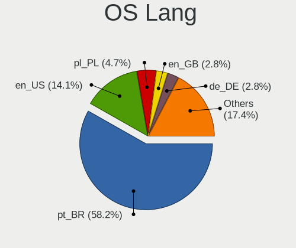

| Lang    | Computers | Percent |
|---------|-----------|---------|
| pt_BR   | 124       | 58.22%  |
| en_US   | 30        | 14.08%  |
| pl_PL   | 10        | 4.69%   |
| en_GB   | 6         | 2.82%   |
| de_DE   | 6         | 2.82%   |
| pt_PT   | 5         | 2.35%   |
| es_MX   | 5         | 2.35%   |
| fr_FR   | 4         | 1.88%   |
| it_IT   | 3         | 1.41%   |
| hu_HU   | 2         | 0.94%   |
| es_ES   | 2         | 0.94%   |
| es_AR   | 2         | 0.94%   |
| el_GR   | 2         | 0.94%   |
| Unknown | 2         | 0.94%   |
| tr_TR   | 1         | 0.47%   |
| nl_BE   | 1         | 0.47%   |
| fr_BE   | 1         | 0.47%   |
| fi_FI   | 1         | 0.47%   |
| es_CR   | 1         | 0.47%   |
| es_CO   | 1         | 0.47%   |
| en_ZA   | 1         | 0.47%   |
| en_IE   | 1         | 0.47%   |
| en_AU   | 1         | 0.47%   |
| de_AT   | 1         | 0.47%   |

Boot Mode
---------

EFI or BIOS

| Mode | Computers | Percent |
|------|-----------|---------|
| EFI  | 138       | 63.3%   |
| BIOS | 80        | 36.7%   |

Filesystem
----------

Type of filesystem

| Type    | Computers | Percent |
|---------|-----------|---------|
| Btrfs   | 191       | 89.67%  |
| Ext4    | 14        | 6.57%   |
| Overlay | 5         | 2.35%   |
| Tmpfs   | 2         | 0.94%   |
| Unknown | 1         | 0.47%   |

Part. scheme
------------

Scheme of partitioning

| Type    | Computers | Percent |
|---------|-----------|---------|
| Unknown | 103       | 47.47%  |
| GPT     | 80        | 36.87%  |
| MBR     | 34        | 15.67%  |

Dual Boot with Linux/BSD
------------------------

Hosting more than one Linux/BSD

| Dual boot | Computers | Percent |
|-----------|-----------|---------|
| No        | 208       | 97.2%   |
| Yes       | 6         | 2.8%    |

Dual Boot (Win)
---------------

Hosting Linux and Windows

| Dual boot | Computers | Percent |
|-----------|-----------|---------|
| No        | 149       | 69.3%   |
| Yes       | 66        | 30.7%   |

Board
-----

Vendor
------

Motherboard manufacturer

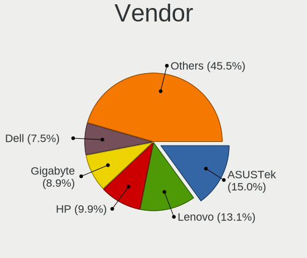

| Name                   | Computers | Percent |
|------------------------|-----------|---------|
| ASUSTek Computer       | 32        | 15.02%  |
| Lenovo                 | 28        | 13.15%  |
| Hewlett-Packard        | 21        | 9.86%   |
| Gigabyte Technology    | 19        | 8.92%   |
| Dell                   | 16        | 7.51%   |
| Acer                   | 15        | 7.04%   |
| Intel                  | 14        | 6.57%   |
| MSI                    | 10        | 4.69%   |
| ASRock                 | 9         | 4.23%   |
| Positivo               | 6         | 2.82%   |
| PCWare                 | 5         | 2.35%   |
| Samsung Electronics    | 3         | 1.41%   |
| Multilaser             | 3         | 1.41%   |
| Itautec                | 3         | 1.41%   |
| Biostar                | 3         | 1.41%   |
| Apple                  | 3         | 1.41%   |
| Sony                   | 2         | 0.94%   |
| Semp Toshiba           | 2         | 0.94%   |
| Microsoft              | 2         | 0.94%   |
| Google                 | 2         | 0.94%   |
| eMachines              | 2         | 0.94%   |
| Unknown                | 2         | 0.94%   |
| Toshiba                | 1         | 0.47%   |
| Positivo Bahia - VAIO  | 1         | 0.47%   |
| OEM                    | 1         | 0.47%   |
| MAXSUN                 | 1         | 0.47%   |
| ECS                    | 1         | 0.47%   |
| Digiboard              | 1         | 0.47%   |
| Daten Tecnologia       | 1         | 0.47%   |
| Clevo                  | 1         | 0.47%   |
| BESSTAR Tech           | 1         | 0.47%   |
| Avell High Performance | 1         | 0.47%   |
| Alienware              | 1         | 0.47%   |

Model
-----

Motherboard model

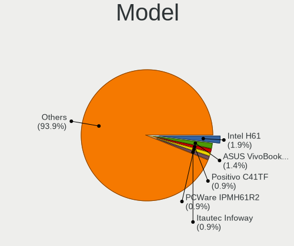

| Name                                     | Computers | Percent |
|------------------------------------------|-----------|---------|
| Intel H61                                | 4         | 1.88%   |
| ASUS VivoBook_ASUSLaptop M1502IA_M1502IA | 3         | 1.41%   |
| Positivo C41TF                           | 2         | 0.94%   |
| PCWare IPMH61R2                          | 2         | 0.94%   |
| Itautec Infoway                          | 2         | 0.94%   |
| Intel B75                                | 2         | 0.94%   |
| HP Compaq 8200 Elite SFF PC              | 2         | 0.94%   |
| Google Blooguard                         | 2         | 0.94%   |
| Gigabyte 970A-DS3P                       | 2         | 0.94%   |
| Biostar B450MH                           | 2         | 0.94%   |
| ASUS VivoBook_ASUSLaptop M5602RA         | 2         | 0.94%   |
| ASRock B450M Steel Legend                | 2         | 0.94%   |
| ASRock 775Dual-VSTA                      | 2         | 0.94%   |
| Acer Aspire A315-53                      | 2         | 0.94%   |
| Unknown                                  | 2         | 0.94%   |
| Toshiba Satellite S55-A                  | 1         | 0.47%   |
| Sony VPCF215FX                           | 1         | 0.47%   |
| Sony VGN-NR230AE                         | 1         | 0.47%   |
| Semp Toshiba STI                         | 1         | 0.47%   |
| Semp Toshiba IS 1412                     | 1         | 0.47%   |
| Samsung 550XCJ/550XCR                    | 1         | 0.47%   |
| Samsung 300E5M/300E5L                    | 1         | 0.47%   |
| Samsung 300E5K/300E5Q                    | 1         | 0.47%   |
| Positivo Q464B                           | 1         | 0.47%   |
| Positivo POS-EIH61CQ                     | 1         | 0.47%   |
| Positivo C4400                           | 1         | 0.47%   |
| Positivo C14RV01                         | 1         | 0.47%   |
| Positivo Bahia - VAIO VJFE52F11X-B2291H  | 1         | 0.47%   |
| PCWare IPX1800E2                         | 1         | 0.47%   |
| PCWare IPMH81G1                          | 1         | 0.47%   |
| PCWare IPMH61R3                          | 1         | 0.47%   |
| OEM B75                                  | 1         | 0.47%   |
| Multilaser UB82X                         | 1         | 0.47%   |
| Multilaser PC204                         | 1         | 0.47%   |
| Multilaser MLSH1H LINUX                  | 1         | 0.47%   |
| MSI Pulse GL66 12UEK                     | 1         | 0.47%   |
| MSI MS-7D31                              | 1         | 0.47%   |
| MSI MS-7C95                              | 1         | 0.47%   |
| MSI MS-7C91                              | 1         | 0.47%   |
| MSI MS-7A70                              | 1         | 0.47%   |

Model Family
------------

Motherboard model prefix

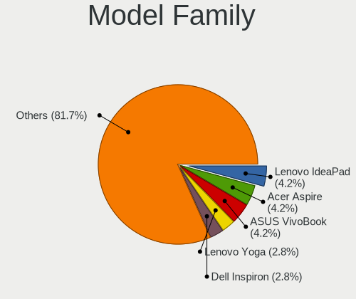

| Name                | Computers | Percent |
|---------------------|-----------|---------|
| Lenovo IdeaPad      | 9         | 4.23%   |
| ASUS VivoBook       | 9         | 4.23%   |
| Acer Aspire         | 9         | 4.23%   |
| Lenovo Yoga         | 6         | 2.82%   |
| Dell Inspiron       | 6         | 2.82%   |
| ASUS PRIME          | 5         | 2.35%   |
| Lenovo ThinkPad     | 4         | 1.88%   |
| Lenovo ThinkCentre  | 4         | 1.88%   |
| Intel H61           | 4         | 1.88%   |
| HP Pavilion         | 3         | 1.41%   |
| HP EliteDesk        | 3         | 1.41%   |
| HP EliteBook        | 3         | 1.41%   |
| HP Compaq           | 3         | 1.41%   |
| ASUS TUF            | 3         | 1.41%   |
| Acer Nitro          | 3         | 1.41%   |
| Positivo C41TF      | 2         | 0.94%   |
| PCWare IPMH61R2     | 2         | 0.94%   |
| Microsoft Surface   | 2         | 0.94%   |
| Lenovo 63           | 2         | 0.94%   |
| Itautec Infoway     | 2         | 0.94%   |
| Intel B75           | 2         | 0.94%   |
| HP Laptop           | 2         | 0.94%   |
| HP 255              | 2         | 0.94%   |
| Google Blooguard    | 2         | 0.94%   |
| Gigabyte A520M      | 2         | 0.94%   |
| Gigabyte 970A-DS3P  | 2         | 0.94%   |
| Dell System         | 2         | 0.94%   |
| Dell Precision      | 2         | 0.94%   |
| Dell Latitude       | 2         | 0.94%   |
| Biostar B450MH      | 2         | 0.94%   |
| ASRock B450M        | 2         | 0.94%   |
| ASRock 775Dual-VSTA | 2         | 0.94%   |
| Unknown             | 2         | 0.94%   |
| Toshiba Satellite   | 1         | 0.47%   |
| Sony VPCF215FX      | 1         | 0.47%   |
| Sony VGN-NR230AE    | 1         | 0.47%   |
| Semp Toshiba STI    | 1         | 0.47%   |
| Semp Toshiba IS     | 1         | 0.47%   |
| Samsung 550XCJ      | 1         | 0.47%   |
| Samsung 300E5M      | 1         | 0.47%   |

MFG Year
--------

Motherboard manufacture year

| Year | Computers | Percent |
|------|-----------|---------|
| 2017 | 21        | 9.86%   |
| 2021 | 18        | 8.45%   |
| 2020 | 18        | 8.45%   |
| 2022 | 15        | 7.04%   |
| 2016 | 15        | 7.04%   |
| 2013 | 15        | 7.04%   |
| 2011 | 15        | 7.04%   |
| 2018 | 14        | 6.57%   |
| 2012 | 14        | 6.57%   |
| 2023 | 11        | 5.16%   |
| 2014 | 10        | 4.69%   |
| 2010 | 10        | 4.69%   |
| 2019 | 9         | 4.23%   |
| 2015 | 8         | 3.76%   |
| 2009 | 7         | 3.29%   |
| 2008 | 4         | 1.88%   |
| 2007 | 4         | 1.88%   |
| 2024 | 2         | 0.94%   |
| 2006 | 2         | 0.94%   |
| 2005 | 1         | 0.47%   |

Form Factor
-----------

Physical design of the computer

| Name        | Computers | Percent |
|-------------|-----------|---------|
| Notebook    | 103       | 48.36%  |
| Desktop     | 95        | 44.6%   |
| Convertible | 7         | 3.29%   |
| Tablet      | 3         | 1.41%   |
| Mini pc     | 3         | 1.41%   |
| All in one  | 2         | 0.94%   |

Secure Boot
-----------

Enabled or disabled

| State    | Computers | Percent |
|----------|-----------|---------|
| Disabled | 212       | 99.53%  |
| Enabled  | 1         | 0.47%   |

Coreboot
--------

Have coreboot on board

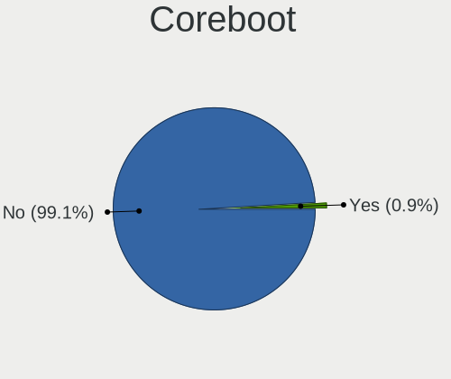

| Used | Computers | Percent |
|------|-----------|---------|
| No   | 211       | 99.06%  |
| Yes  | 2         | 0.94%   |

RAM Size
--------

Total RAM memory

| Size in GB  | Computers | Percent |
|-------------|-----------|---------|
| 8.01-16.0   | 53        | 24.42%  |
| 4.01-8.0    | 49        | 22.58%  |
| 16.01-24.0  | 36        | 16.59%  |
| 3.01-4.0    | 35        | 16.13%  |
| 32.01-64.0  | 22        | 10.14%  |
| 24.01-32.0  | 7         | 3.23%   |
| 1.01-2.0    | 7         | 3.23%   |
| 2.01-3.0    | 5         | 2.3%    |
| 64.01-256.0 | 3         | 1.38%   |

RAM Used
--------

Used RAM memory

| Used GB    | Computers | Percent |
|------------|-----------|---------|
| 2.01-3.0   | 72        | 31.44%  |
| 1.01-2.0   | 66        | 28.82%  |
| 3.01-4.0   | 36        | 15.72%  |
| 4.01-8.0   | 30        | 13.1%   |
| 0.51-1.0   | 13        | 5.68%   |
| 8.01-16.0  | 10        | 4.37%   |
| 24.01-32.0 | 1         | 0.44%   |
| 0.01-0.5   | 1         | 0.44%   |

Total Drives
------------

Number of drives on board

| Drives | Computers | Percent |
|--------|-----------|---------|
| 1      | 114       | 52.05%  |
| 2      | 55        | 25.11%  |
| 3      | 26        | 11.87%  |
| 4      | 13        | 5.94%   |
| 6      | 4         | 1.83%   |
| 5      | 4         | 1.83%   |
| 9      | 2         | 0.91%   |
| 0      | 1         | 0.46%   |

Has CD-ROM
----------

Has CD-ROM on board

| Presented | Computers | Percent |
|-----------|-----------|---------|
| No        | 144       | 67.29%  |
| Yes       | 70        | 32.71%  |

Has Ethernet
------------

Has Ethernet on board

| Presented | Computers | Percent |
|-----------|-----------|---------|
| Yes       | 186       | 87.32%  |
| No        | 27        | 12.68%  |

Has WiFi
--------

Has WiFi module

| Presented | Computers | Percent |
|-----------|-----------|---------|
| Yes       | 155       | 72.77%  |
| No        | 58        | 27.23%  |

Has Bluetooth
-------------

Has Bluetooth module

| Presented | Computers | Percent |
|-----------|-----------|---------|
| Yes       | 139       | 64.95%  |
| No        | 75        | 35.05%  |

Location
--------

Country
-------

Geographic location (country)

| Country      | Computers | Percent |
|--------------|-----------|---------|
| Brazil       | 128       | 59.81%  |
| USA          | 23        | 10.75%  |
| Poland       | 9         | 4.21%   |
| UK           | 7         | 3.27%   |
| Germany      | 6         | 2.8%    |
| Portugal     | 5         | 2.34%   |
| Mexico       | 4         | 1.87%   |
| Greece       | 4         | 1.87%   |
| France       | 4         | 1.87%   |
| Italy        | 3         | 1.4%    |
| Spain        | 2         | 0.93%   |
| Ireland      | 2         | 0.93%   |
| Belgium      | 2         | 0.93%   |
| Argentina    | 2         | 0.93%   |
| Turkey       | 1         | 0.47%   |
| South Korea  | 1         | 0.47%   |
| South Africa | 1         | 0.47%   |
| Saudi Arabia | 1         | 0.47%   |
| Japan        | 1         | 0.47%   |
| Hungary      | 1         | 0.47%   |
| Ghana        | 1         | 0.47%   |
| Finland      | 1         | 0.47%   |
| El Salvador  | 1         | 0.47%   |
| Costa Rica   | 1         | 0.47%   |
| Colombia     | 1         | 0.47%   |
| Austria      | 1         | 0.47%   |
| Australia    | 1         | 0.47%   |

City
----

Geographic location (city)

| City                   | Computers | Percent |
|------------------------|-----------|---------|
| Sao Paulo              | 10        | 4.57%   |
| Rio de Janeiro         | 9         | 4.11%   |
| Braslia              | 8         | 3.65%   |
| Fortaleza              | 5         | 2.28%   |
| Maring               | 4         | 1.83%   |
| Goinia               | 4         | 1.83%   |
| Belo Horizonte         | 4         | 1.83%   |
| Ribeirao Preto         | 3         | 1.37%   |
| Clarksville            | 3         | 1.37%   |
| Thessaloniki           | 2         | 0.91%   |
| Sao Domingos do Capim  | 2         | 0.91%   |
| San Jose               | 2         | 0.91%   |
| Recife                 | 2         | 0.91%   |
| Midleton               | 2         | 0.91%   |
| Londrina               | 2         | 0.91%   |
| Jundia               | 2         | 0.91%   |
| Itatiba                | 2         | 0.91%   |
| Curitiba               | 2         | 0.91%   |
| Castanhal              | 2         | 0.91%   |
| Caratinga              | 2         | 0.91%   |
| Campo Grande           | 2         | 0.91%   |
| Belm                 | 2         | 0.91%   |
| Zdzieszowice           | 1         | 0.46%   |
| Wiener Neustadt        | 1         | 0.46%   |
| Warsaw                 | 1         | 0.46%   |
| Vitria da Conquista  | 1         | 0.46%   |
| Villa Bosch            | 1         | 0.46%   |
| Vila Velha             | 1         | 0.46%   |
| Vila Nova de Famalicao | 1         | 0.46%   |
| Venda do Pinheiro      | 1         | 0.46%   |
| Tychy                  | 1         | 0.46%   |
| Tramandai              | 1         | 0.46%   |
| Torun                  | 1         | 0.46%   |
| Torres Vedras          | 1         | 0.46%   |
| Tokyo                  | 1         | 0.46%   |
| Tlajomulco de Zuniga   | 1         | 0.46%   |
| Timon                  | 1         | 0.46%   |
| The Villages           | 1         | 0.46%   |
| Texarkana              | 1         | 0.46%   |
| Tatu                 | 1         | 0.46%   |

Drives
------

Drive Vendor
------------

Hard drive vendors

| Vendor                         | Computers | Drives | Percent |
|--------------------------------|-----------|--------|---------|
| WDC                            | 48        | 68     | 13.22%  |
| Seagate                        | 45        | 67     | 12.4%   |
| Samsung Electronics            | 34        | 40     | 9.37%   |
| Kingston                       | 29        | 37     | 7.99%   |
| Toshiba                        | 19        | 21     | 5.23%   |
| China                          | 16        | 18     | 4.41%   |
| Sandisk                        | 15        | 15     | 4.13%   |
| Unknown                        | 12        | 13     | 3.31%   |
| Crucial                        | 11        | 12     | 3.03%   |
| Hitachi                        | 10        | 22     | 2.75%   |
| SK hynix                       | 9         | 10     | 2.48%   |
| MAXIO Technology (Hangzhou)    | 8         | 9      | 2.2%    |
| Silicon Motion                 | 7         | 10     | 1.93%   |
| Micron Technology              | 6         | 6      | 1.65%   |
| KingSpec                       | 6         | 6      | 1.65%   |
| PNY                            | 5         | 6      | 1.38%   |
| Micron/Crucial Technology      | 5         | 5      | 1.38%   |
| ADATA Technology               | 5         | 5      | 1.38%   |
| Realtek Semiconductor          | 4         | 4      | 1.1%    |
| LITEON                         | 4         | 6      | 1.1%    |
| GOODRAM                        | 4         | 7      | 1.1%    |
| A-DATA Technology              | 4         | 5      | 1.1%    |
| Solid State Storage Technology | 3         | 5      | 0.83%   |
| Kingston Technology Company    | 3         | 3      | 0.83%   |
| JMicron Technology             | 3         | 3      | 0.83%   |
| HGST                           | 3         | 5      | 0.83%   |
| Apacer                         | 3         | 4      | 0.83%   |
| XrayDisk                       | 2         | 2      | 0.55%   |
| Shenzhen Longsys Electronics   | 2         | 2      | 0.55%   |
| Netac                          | 2         | 3      | 0.55%   |
| HUSKY                          | 2         | 3      | 0.55%   |
| BHT                            | 2         | 2      | 0.55%   |
| Unknown                        | 2         | 2      | 0.55%   |
| X12                            | 1         | 1      | 0.28%   |
| WALRAM                         | 1         | 1      | 0.28%   |
| Union Memory                   | 1         | 1      | 0.28%   |
| Team                           | 1         | 2      | 0.28%   |
| T-FORCE                        | 1         | 1      | 0.28%   |
| SABRENT                        | 1         | 2      | 0.28%   |
| Realtek                        | 1         | 1      | 0.28%   |

Drive Model
-----------

Hard drive models

| Model                                                 | Computers | Percent |
|-------------------------------------------------------|-----------|---------|
| Kingston SA400S37480G 480GB SSD                       | 8         | 2.05%   |
| WDC WD10SPZX-21Z10T0 1TB                              | 6         | 1.53%   |
| Samsung NVMe SSD Controller SM981/PM981/PM983 512GB   | 6         | 1.53%   |
| Kingston SA400S37240G 240GB SSD                       | 6         | 1.53%   |
| Unknown MMC Card  64GB                                | 5         | 1.28%   |
| MAXIO (Hangzhou) NVMe SSD Controller MAP1202 512GB    | 5         | 1.28%   |
| Toshiba MQ01ABD100 1TB                                | 4         | 1.02%   |
| Silicon Motion SM2263EN/SM2263XT SSD Controller 256GB | 4         | 1.02%   |
| Seagate ST500LM012 HN-M500MBB 500GB                   | 4         | 1.02%   |
| Seagate ST500DM002-1BD142 500GB                       | 4         | 1.02%   |
| Kingston SV300S37A240G 240GB SSD                      | 4         | 1.02%   |
| WDC WD10SPZX-80Z10T2 1TB                              | 3         | 0.77%   |
| Toshiba MQ04ABF100 1TB                                | 3         | 0.77%   |
| Toshiba MQ01ABD050V -63 500GB                         | 3         | 0.77%   |
| Toshiba DT01ACA050 500GB                              | 3         | 0.77%   |
| SK hynix HFS256GEJ9X108N 256GB                        | 3         | 0.77%   |
| Silicon Motion SM2262/SM2262EN SSD Controller 2TB     | 3         | 0.77%   |
| Seagate ST1000DM010-2EP102 1TB                        | 3         | 0.77%   |
| Micron/Crucial P2 NVMe PCIe SSD 500GB                 | 3         | 0.77%   |
| Kingston SA400S37120G 120GB SSD                       | 3         | 0.77%   |
| JMicron Tech 250GB                                    | 3         | 0.77%   |
| Crucial CT500MX500SSD1 500GB                          | 3         | 0.77%   |
| China SSD 240GB                                       | 3         | 0.77%   |
| WDC WD5000AVDS-63U7B1 500GB                           | 2         | 0.51%   |
| WDC WD20EZRX-00D8PB0 2TB                              | 2         | 0.51%   |
| Unknown MMC Card  128GB                               | 2         | 0.51%   |
| Seagate ST9750420AS 752GB                             | 2         | 0.51%   |
| Seagate ST9500325AS 500GB                             | 2         | 0.51%   |
| Seagate ST9250410AS 250GB                             | 2         | 0.51%   |
| Seagate ST4000DM004-2CV104 4TB                        | 2         | 0.51%   |
| Seagate ST320LM001 HN-M320MBB 320GB                   | 2         | 0.51%   |
| Seagate ST31000528AS 1TB                              | 2         | 0.51%   |
| Seagate ST2000DM008-2UB102 2TB                        | 2         | 0.51%   |
| Seagate ST1000LM024 HN-M101MBB 1TB                    | 2         | 0.51%   |
| Seagate ST1000DM003-1SB102 1TB                        | 2         | 0.51%   |
| Seagate ST1000DM003-1ER162 1TB                        | 2         | 0.51%   |
| Seagate Backup+ Hub BK 4TB                            | 2         | 0.51%   |
| Samsung SSD 870 QVO 2TB                               | 2         | 0.51%   |
| Samsung HM320II 320GB                                 | 2         | 0.51%   |
| Samsung HD322HJ 320GB                                 | 2         | 0.51%   |

HDD Vendor
----------

Hard disk drive vendors

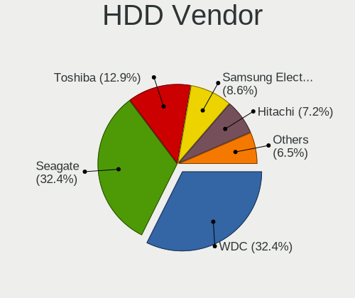

| Vendor              | Computers | Drives | Percent |
|---------------------|-----------|--------|---------|
| WDC                 | 45        | 63     | 32.37%  |
| Seagate             | 45        | 67     | 32.37%  |
| Toshiba             | 18        | 20     | 12.95%  |
| Samsung Electronics | 12        | 15     | 8.63%   |
| Hitachi             | 10        | 22     | 7.19%   |
| HGST                | 3         | 5      | 2.16%   |
| Unknown             | 1         | 1      | 0.72%   |
| SABRENT             | 1         | 1      | 0.72%   |
| Maxtor              | 1         | 1      | 0.72%   |
| ASMT                | 1         | 1      | 0.72%   |
| ASMedia             | 1         | 1      | 0.72%   |
| Apple               | 1         | 3      | 0.72%   |

SSD Vendor
----------

Solid state drive vendors

| Vendor              | Computers | Drives | Percent |
|---------------------|-----------|--------|---------|
| Kingston            | 24        | 31     | 19.05%  |
| China               | 16        | 18     | 12.7%   |
| Samsung Electronics | 11        | 13     | 8.73%   |
| Crucial             | 11        | 12     | 8.73%   |
| SanDisk             | 10        | 10     | 7.94%   |
| KingSpec            | 6         | 6      | 4.76%   |
| PNY                 | 5         | 6      | 3.97%   |
| WDC                 | 4         | 5      | 3.17%   |
| LITEON              | 4         | 6      | 3.17%   |
| GOODRAM             | 4         | 7      | 3.17%   |
| A-DATA Technology   | 4         | 5      | 3.17%   |
| Apacer              | 3         | 4      | 2.38%   |
| Micron Technology   | 2         | 2      | 1.59%   |
| HUSKY               | 2         | 3      | 1.59%   |
| BHT                 | 2         | 2      | 1.59%   |
| Unknown             | 2         | 2      | 1.59%   |
| XrayDisk            | 1         | 1      | 0.79%   |
| X12                 | 1         | 1      | 0.79%   |
| Toshiba             | 1         | 1      | 0.79%   |
| Team                | 1         | 2      | 0.79%   |
| T-FORCE             | 1         | 1      | 0.79%   |
| SABRENT             | 1         | 1      | 0.79%   |
| QUANXING            | 1         | 1      | 0.79%   |
| Plextor             | 1         | 1      | 0.79%   |
| Pichau              | 1         | 1      | 0.79%   |
| NT-1TB              | 1         | 1      | 0.79%   |
| Lexar               | 1         | 1      | 0.79%   |
| Kingchuxing         | 1         | 1      | 0.79%   |
| KEEPDATA            | 1         | 1      | 0.79%   |
| Intenso             | 1         | 2      | 0.79%   |
| Inland              | 1         | 1      | 0.79%   |
| HS-SSD-C100         | 1         | 1      | 0.79%   |

Drive Kind
----------

HDD or SSD

| Kind    | Computers | Drives | Percent |
|---------|-----------|--------|---------|
| SSD     | 106       | 150    | 35.22%  |
| HDD     | 104       | 200    | 34.55%  |
| NVMe    | 72        | 89     | 23.92%  |
| Unknown | 11        | 13     | 3.65%   |
| MMC     | 8         | 9      | 2.66%   |

Drive Connector
---------------

SATA, SAS, NVMe, etc.

| Type | Computers | Drives | Percent |
|------|-----------|--------|---------|
| SATA | 172       | 345    | 65.15%  |
| NVMe | 71        | 87     | 26.89%  |
| SAS  | 13        | 20     | 4.92%   |
| MMC  | 8         | 9      | 3.03%   |

Drive Size
----------

Size of hard drive

| Size in TB | Computers | Drives | Percent |
|------------|-----------|--------|---------|
| 0.01-0.5   | 126       | 198    | 57.53%  |
| 0.51-1.0   | 73        | 119    | 33.33%  |
| 1.01-2.0   | 10        | 15     | 4.57%   |
| 3.01-4.0   | 6         | 12     | 2.74%   |
| 4.01-10.0  | 2         | 4      | 0.91%   |
| 2.01-3.0   | 1         | 1      | 0.46%   |
| 10.01-20.0 | 1         | 1      | 0.46%   |

Space Total
-----------

Amount of disk space available on the file system

| Size in GB     | Computers | Percent |
|----------------|-----------|---------|
| 1001-2000      | 53        | 24.77%  |
| 2001-3000      | 41        | 19.16%  |
| 501-1000       | 36        | 16.82%  |
| 251-500        | 31        | 14.49%  |
| More than 3000 | 28        | 13.08%  |
| 101-250        | 18        | 8.41%   |
| 1-20           | 3         | 1.4%    |
| 51-100         | 2         | 0.93%   |
| Unknown        | 2         | 0.93%   |

Space Used
----------

Amount of used disk space

| Used GB        | Computers | Percent |
|----------------|-----------|---------|
| 51-100         | 63        | 27.63%  |
| 21-50          | 47        | 20.61%  |
| 101-250        | 33        | 14.47%  |
| 251-500        | 31        | 13.6%   |
| 501-1000       | 27        | 11.84%  |
| 1-20           | 14        | 6.14%   |
| 2001-3000      | 5         | 2.19%   |
| 1001-2000      | 4         | 1.75%   |
| More than 3000 | 2         | 0.88%   |
| Unknown        | 2         | 0.88%   |

Malfunc. Drives
---------------

Drive models with a malfunction

| Model                                                     | Computers | Drives | Percent |
|-----------------------------------------------------------|-----------|--------|---------|
| Toshiba MQ01ABD100 1TB                                    | 2         | 3      | 6.9%    |
| Toshiba MQ01ABD050V -63 500GB                             | 2         | 2      | 6.9%    |
| Seagate ST9250410AS 250GB                                 | 2         | 2      | 6.9%    |
| WDC WD800AAJS-75M0A0 80GB                                 | 1         | 1      | 3.45%   |
| WDC WD5000AAKX-60U6AA0 500GB                              | 1         | 1      | 3.45%   |
| WDC WD5000AAKX-08U6AA0 500GB                              | 1         | 1      | 3.45%   |
| WDC WD3200BPVT-00JJ5T0 320GB                              | 1         | 3      | 3.45%   |
| WDC WD1001FALS-41Y6A1 1TB                                 | 1         | 2      | 3.45%   |
| Toshiba DT01ACA050 500GB                                  | 1         | 1      | 3.45%   |
| Seagate ST9500325AS 500GB                                 | 1         | 1      | 3.45%   |
| Seagate ST9100824AS 100GB                                 | 1         | 1      | 3.45%   |
| Seagate ST8000AS0002-1NA17Z 8TB                           | 1         | 1      | 3.45%   |
| Seagate ST500DM002-1BD142 500GB                           | 1         | 2      | 3.45%   |
| Seagate ST3320613AS 320GB                                 | 1         | 1      | 3.45%   |
| Seagate ST1000LM024 HN-M101MBB 1TB                        | 1         | 1      | 3.45%   |
| Samsung Electronics HN-M500MBB 500GB                      | 1         | 1      | 3.45%   |
| Realtek Semiconductor RTS5763DL NVMe SSD Controller 256GB | 1         | 1      | 3.45%   |
| Kingchuxing SSD 256GB                                     | 1         | 1      | 3.45%   |
| Hitachi HTS727575A9E364 752GB                             | 1         | 1      | 3.45%   |
| Hitachi HTS545032A7E380 320GB                             | 1         | 1      | 3.45%   |
| Hitachi HDS721050DLE630 500GB                             | 1         | 1      | 3.45%   |
| Crucial CT500MX200SSD3 500GB                              | 1         | 1      | 3.45%   |
| China SSD 240GB                                           | 1         | 1      | 3.45%   |
| China SATA SSD 240GB                                      | 1         | 1      | 3.45%   |
| ADATA Technology SM2P32A8-512GC1 512GB                    | 1         | 1      | 3.45%   |
| A-DATA Technology SU630 240GB SSD                         | 1         | 1      | 3.45%   |

Malfunc. Drive Vendor
---------------------

Vendors of faulty drives

| Vendor                | Computers | Drives | Percent |
|-----------------------|-----------|--------|---------|
| Seagate               | 8         | 9      | 27.59%  |
| WDC                   | 5         | 8      | 17.24%  |
| Toshiba               | 5         | 6      | 17.24%  |
| Hitachi               | 3         | 3      | 10.34%  |
| China                 | 2         | 2      | 6.9%    |
| Samsung Electronics   | 1         | 1      | 3.45%   |
| Realtek Semiconductor | 1         | 1      | 3.45%   |
| Kingchuxing           | 1         | 1      | 3.45%   |
| Crucial               | 1         | 1      | 3.45%   |
| ADATA Technology      | 1         | 1      | 3.45%   |
| A-DATA Technology     | 1         | 1      | 3.45%   |

Malfunc. HDD Vendor
-------------------

Vendors of faulty HDD drives

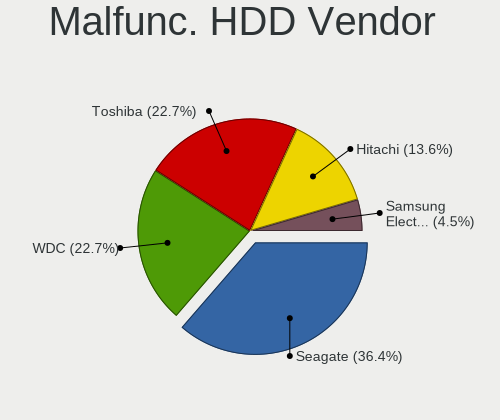

| Vendor              | Computers | Drives | Percent |
|---------------------|-----------|--------|---------|
| Seagate             | 8         | 9      | 36.36%  |
| WDC                 | 5         | 8      | 22.73%  |
| Toshiba             | 5         | 6      | 22.73%  |
| Hitachi             | 3         | 3      | 13.64%  |
| Samsung Electronics | 1         | 1      | 4.55%   |

Malfunc. Drive Kind
-------------------

Kinds of faulty drives

| Kind | Computers | Drives | Percent |
|------|-----------|--------|---------|
| HDD  | 19        | 27     | 73.08%  |
| SSD  | 5         | 5      | 19.23%  |
| NVMe | 2         | 2      | 7.69%   |

Failed Drives
-------------

Failed drive models

| Model                           | Computers | Drives | Percent |
|---------------------------------|-----------|--------|---------|
| Seagate ST500DM002-1BD142 500GB | 1         | 1      | 100%    |

Failed Drive Vendor
-------------------

Failed drive vendors

| Vendor  | Computers | Drives | Percent |
|---------|-----------|--------|---------|
| Seagate | 1         | 1      | 100%    |

Drive Status
------------

Number of failed and malfunc. drives

| Status   | Computers | Drives | Percent |
|----------|-----------|--------|---------|
| Detected | 150       | 321    | 62.76%  |
| Works    | 63        | 105    | 26.36%  |
| Malfunc  | 25        | 34     | 10.46%  |
| Failed   | 1         | 1      | 0.42%   |

Storage controller
------------------

Storage Vendor
--------------

Storage controller vendors

| Vendor                         | Computers | Percent |
|--------------------------------|-----------|---------|
| Intel                          | 143       | 52.19%  |
| AMD                            | 35        | 12.77%  |
| SK hynix                       | 9         | 3.28%   |
| Samsung Electronics            | 9         | 3.28%   |
| Kingston Technology Company    | 9         | 3.28%   |
| MAXIO Technology (Hangzhou)    | 8         | 2.92%   |
| Silicon Motion                 | 7         | 2.55%   |
| ASMedia Technology             | 6         | 2.19%   |
| SanDisk                        | 5         | 1.82%   |
| Micron/Crucial Technology      | 5         | 1.82%   |
| ADATA Technology               | 5         | 1.82%   |
| Realtek Semiconductor          | 4         | 1.46%   |
| Micron Technology              | 4         | 1.46%   |
| JMicron Technology             | 4         | 1.46%   |
| VIA Technologies               | 3         | 1.09%   |
| Solid State Storage Technology | 3         | 1.09%   |
| Nvidia                         | 3         | 1.09%   |
| Shenzhen Longsys Electronics   | 2         | 0.73%   |
| Netac Technology               | 2         | 0.73%   |
| Marvell Technology Group       | 2         | 0.73%   |
| Union Memory (Shenzhen)        | 1         | 0.36%   |
| Solidigm                       | 1         | 0.36%   |
| Phison Electronics             | 1         | 0.36%   |
| Lite-On IT Corp. / Plextor     | 1         | 0.36%   |
| KIOXIA                         | 1         | 0.36%   |
| INNOGRIT                       | 1         | 0.36%   |

Storage Model
-------------

Storage controller models

| Model                                                                                   | Computers | Percent |
|-----------------------------------------------------------------------------------------|-----------|---------|
| AMD FCH SATA Controller [AHCI mode]                                                     | 19        | 6.05%   |
| Intel Sunrise Point-LP SATA Controller [AHCI mode]                                      | 12        | 3.82%   |
| Intel 8 Series/C220 Series Chipset Family 6-port SATA Controller 1 [AHCI mode]          | 11        | 3.5%    |
| AMD 400 Series Chipset SATA Controller                                                  | 11        | 3.5%    |
| Intel 7 Series Chipset Family 6-port SATA Controller [AHCI mode]                        | 10        | 3.18%   |
| Intel 6 Series/C200 Series Chipset Family 6 port Desktop SATA AHCI Controller           | 10        | 3.18%   |
| Intel 6 Series/C200 Series Chipset Family 6 port Mobile SATA AHCI Controller            | 9         | 2.87%   |
| Intel 82801 Mobile SATA Controller [RAID mode]                                          | 7         | 2.23%   |
| Intel 7 Series/C210 Series Chipset Family 6-port SATA Controller [AHCI mode]            | 7         | 2.23%   |
| AMD 500 Series Chipset SATA Controller                                                  | 7         | 2.23%   |
| Intel Q170/Q150/B150/H170/H110/Z170/CM236 Chipset SATA Controller [AHCI Mode]           | 6         | 1.91%   |
| Intel NM10/ICH7 Family SATA Controller [IDE mode]                                       | 6         | 1.91%   |
| SK hynix BC901 NVMe Solid State Drive (DRAM-less)                                       | 5         | 1.59%   |
| Samsung NVMe SSD Controller SM981/PM981/PM983                                           | 5         | 1.59%   |
| MAXIO (Hangzhou) NVMe SSD Controller MAP1202 (DRAM-less)                                | 5         | 1.59%   |
| Intel Cannon Lake PCH SATA AHCI Controller                                              | 5         | 1.59%   |
| Intel 82801G (ICH7 Family) IDE Controller                                               | 5         | 1.59%   |
| Intel 6 Series/C200 Series Chipset Family Desktop SATA Controller (IDE mode, ports 4-5) | 5         | 1.59%   |
| Intel 6 Series/C200 Series Chipset Family Desktop SATA Controller (IDE mode, ports 0-3) | 5         | 1.59%   |
| ASMedia ASM1061/ASM1062 Serial ATA Controller                                           | 5         | 1.59%   |
| Silicon Motion SM2263EN/SM2263XT (DRAM-less) NVMe SSD Controllers                       | 4         | 1.27%   |
| Intel Celeron/Pentium Silver Processor SATA Controller                                  | 4         | 1.27%   |
| Intel 8 Series SATA Controller 1 [AHCI mode]                                            | 4         | 1.27%   |
| AMD SB7x0/SB8x0/SB9x0 IDE Controller                                                    | 4         | 1.27%   |
| VIA VT82C586A/B/VT82C686/A/B/VT823x/A/C PIPC Bus Master IDE                             | 3         | 0.96%   |
| Silicon Motion SM2262/SM2262EN SSD Controller                                           | 3         | 0.96%   |
| Micron/Crucial P2 [Nick P2] / P3 / P3 Plus NVMe PCIe SSD (DRAM-less)                    | 3         | 0.96%   |
| Micron 2400 NVMe SSD (DRAM-less)                                                        | 3         | 0.96%   |
| MAXIO (Hangzhou) NVMe SSD Controller MAP1602 (DRAM-less)                                | 3         | 0.96%   |
| JMicron JMB368 IDE controller                                                           | 3         | 0.96%   |
| Intel Volume Management Device NVMe RAID Controller                                     | 3         | 0.96%   |
| Intel Atom/Celeron/Pentium Processor x5-E8000/J3xxx/N3xxx Series SATA Controller        | 3         | 0.96%   |
| Intel 9 Series Chipset Family SATA Controller [AHCI Mode]                               | 3         | 0.96%   |
| Intel 82801HM/HEM (ICH8M/ICH8M-E) SATA Controller [AHCI mode]                           | 3         | 0.96%   |
| Intel 82801HM/HEM (ICH8M/ICH8M-E) IDE Controller                                        | 3         | 0.96%   |
| Intel 5 Series/3400 Series Chipset 4 port SATA AHCI Controller                          | 3         | 0.96%   |
| AMD SB7x0/SB8x0/SB9x0 SATA Controller [IDE mode]                                        | 3         | 0.96%   |
| AMD SB7x0/SB8x0/SB9x0 SATA Controller [AHCI mode]                                       | 3         | 0.96%   |
| VIA VT8237A SATA 2-Port Controller                                                      | 2         | 0.64%   |
| Solid State Storage CL1-3D256-Q11 NVMe SSD M.2                                          | 2         | 0.64%   |

Storage Kind
------------

Kind of storage controller (IDE, SATA, NVMe, SAS, ...)

| Kind | Computers | Percent |
|------|-----------|---------|
| SATA | 154       | 57.68%  |
| NVMe | 70        | 26.22%  |
| IDE  | 29        | 10.86%  |
| RAID | 14        | 5.24%   |

Processor
---------

CPU Vendor
----------

Processor vendors

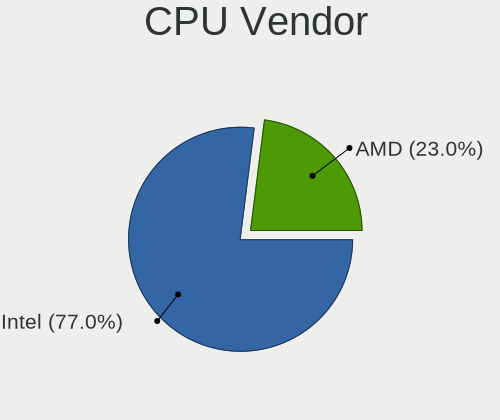

| Vendor | Computers | Percent |
|--------|-----------|---------|
| Intel  | 164       | 77%     |
| AMD    | 49        | 23%     |

CPU Model
---------

Processor models

| Model                                       | Computers | Percent |
|---------------------------------------------|-----------|---------|
| Intel Core i5-7200U CPU @ 2.50GHz           | 5         | 2.35%   |
| Intel Core i7-7500U CPU @ 2.70GHz           | 4         | 1.88%   |
| Intel Core i5-2400 CPU @ 3.10GHz            | 4         | 1.88%   |
| Intel Core i7-4790K CPU @ 4.00GHz           | 3         | 1.41%   |
| Intel Core i5-3570 CPU @ 3.40GHz            | 3         | 1.41%   |
| Intel Core i5-1035G1 CPU @ 1.00GHz          | 3         | 1.41%   |
| Intel Celeron N4020 CPU @ 1.10GHz           | 3         | 1.41%   |
| Intel 11th Gen Core i5-1135G7 @ 2.40GHz     | 3         | 1.41%   |
| AMD Ryzen 7 5700G with Radeon Graphics      | 3         | 1.41%   |
| AMD Ryzen 5 4600H with Radeon Graphics      | 3         | 1.41%   |
| AMD Ryzen 5 4600G with Radeon Graphics      | 3         | 1.41%   |
| Intel Pentium D CPU 3.00GHz                 | 2         | 0.94%   |
| Intel Core i7-4770K CPU @ 3.50GHz           | 2         | 0.94%   |
| Intel Core i7-4700MQ CPU @ 2.40GHz          | 2         | 0.94%   |
| Intel Core i7-2630QM CPU @ 2.00GHz          | 2         | 0.94%   |
| Intel Core i7-2600 CPU @ 3.40GHz            | 2         | 0.94%   |
| Intel Core i5-9600K CPU @ 3.70GHz           | 2         | 0.94%   |
| Intel Core i5-7400 CPU @ 3.00GHz            | 2         | 0.94%   |
| Intel Core i5-7300U CPU @ 2.60GHz           | 2         | 0.94%   |
| Intel Core i5-3330 CPU @ 3.00GHz            | 2         | 0.94%   |
| Intel Core i5-2520M CPU @ 2.50GHz           | 2         | 0.94%   |
| Intel Core i5-10210U CPU @ 1.60GHz          | 2         | 0.94%   |
| Intel Core i3-7020U CPU @ 2.30GHz           | 2         | 0.94%   |
| Intel Core i3-6100 CPU @ 3.70GHz            | 2         | 0.94%   |
| Intel Core i3 CPU M 370 @ 2.40GHz           | 2         | 0.94%   |
| Intel Celeron N4120 CPU @ 1.10GHz           | 2         | 0.94%   |
| Intel Celeron CPU N3060 @ 1.60GHz           | 2         | 0.94%   |
| Intel 12th Gen Core i7-12700H               | 2         | 0.94%   |
| AMD Ryzen 7 6800H with Radeon Graphics      | 2         | 0.94%   |
| AMD Ryzen 5 5600 6-Core Processor           | 2         | 0.94%   |
| AMD Ryzen 5 3600 6-Core Processor           | 2         | 0.94%   |
| AMD Phenom II X6 1090T Processor            | 2         | 0.94%   |
| Intel Xeon CPU E5506 @ 2.13GHz              | 1         | 0.47%   |
| Intel Xeon CPU E5-2603 v3 @ 1.60GHz         | 1         | 0.47%   |
| Intel Xeon CPU E5-2420 v2 @ 2.20GHz         | 1         | 0.47%   |
| Intel Xeon CPU E3-1220 V2 @ 3.10GHz         | 1         | 0.47%   |
| Intel Pentium Silver N6000 @ 1.10GHz        | 1         | 0.47%   |
| Intel Pentium Dual-Core CPU T4400 @ 2.20GHz | 1         | 0.47%   |
| Intel Pentium Dual-Core CPU E6300 @ 2.80GHz | 1         | 0.47%   |
| Intel Pentium Dual-Core CPU E5700 @ 3.00GHz | 1         | 0.47%   |

CPU Model Family
----------------

Processor model prefix

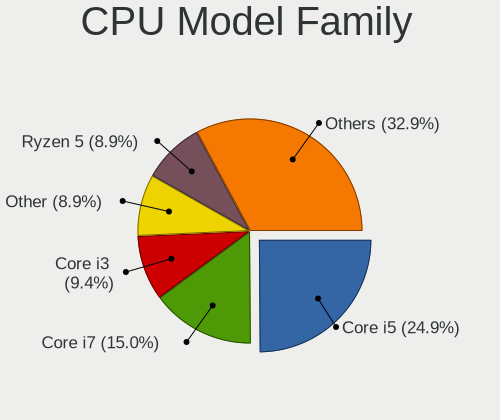

| Model                                | Computers | Percent |
|--------------------------------------|-----------|---------|
| Intel Core i5                        | 53        | 24.88%  |
| Intel Core i7                        | 32        | 15.02%  |
| Intel Core i3                        | 20        | 9.39%   |
| Other                                | 19        | 8.92%   |
| AMD Ryzen 5                          | 19        | 8.92%   |
| Intel Celeron                        | 15        | 7.04%   |
| AMD Ryzen 7                          | 12        | 5.63%   |
| Intel Core 2 Duo                     | 5         | 2.35%   |
| Intel Xeon                           | 4         | 1.88%   |
| Intel Pentium Dual-Core              | 4         | 1.88%   |
| Intel Pentium Dual                   | 3         | 1.41%   |
| AMD Ryzen 5 PRO                      | 3         | 1.41%   |
| Intel Pentium D                      | 2         | 0.94%   |
| Intel Pentium                        | 2         | 0.94%   |
| Intel Core 2 Quad                    | 2         | 0.94%   |
| Intel Atom                           | 2         | 0.94%   |
| AMD Ryzen 9                          | 2         | 0.94%   |
| AMD Phenom II X6                     | 2         | 0.94%   |
| AMD FX                               | 2         | 0.94%   |
| Intel Pentium Silver                 | 1         | 0.47%   |
| Intel Pentium 4                      | 1         | 0.47%   |
| Intel Core 2                         | 1         | 0.47%   |
| AMD Turion X2 Ultra Dual-Core Mobile | 1         | 0.47%   |
| AMD Ryzen Threadripper               | 1         | 0.47%   |
| AMD C-70                             | 1         | 0.47%   |
| AMD C-60                             | 1         | 0.47%   |
| AMD Athlon                           | 1         | 0.47%   |
| AMD A8                               | 1         | 0.47%   |
| AMD A6                               | 1         | 0.47%   |

CPU Cores
---------

Number of processor cores

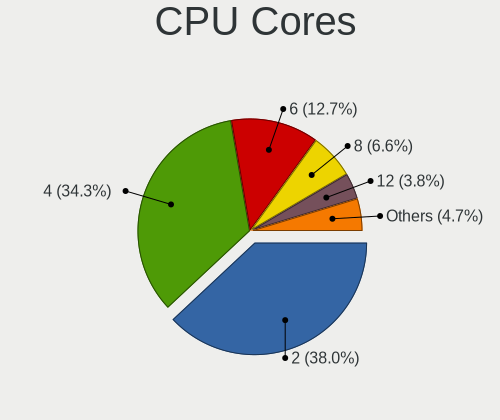

| Number | Computers | Percent |
|--------|-----------|---------|
| 2      | 81        | 38.03%  |
| 4      | 73        | 34.27%  |
| 6      | 27        | 12.68%  |
| 8      | 14        | 6.57%   |
| 12     | 8         | 3.76%   |
| 1      | 4         | 1.88%   |
| 10     | 3         | 1.41%   |
| 14     | 2         | 0.94%   |
| 3      | 1         | 0.47%   |

CPU Sockets
-----------

Number of sockets

| Number | Computers | Percent |
|--------|-----------|---------|
| 1      | 212       | 99.53%  |
| 2      | 1         | 0.47%   |

CPU Threads
-----------

Threads per core (Hyper-Threading)

| Number | Computers | Percent |
|--------|-----------|---------|
| 2      | 140       | 65.73%  |
| 1      | 73        | 34.27%  |

CPU Op-Modes
------------

CPU Operation Modes (32-bit, 64-bit)

| Op mode        | Computers | Percent |
|----------------|-----------|---------|
| 32-bit, 64-bit | 212       | 99.53%  |
| Unknown        | 1         | 0.47%   |

CPU Microcode
-------------

Microcode number

| Number     | Computers | Percent |
|------------|-----------|---------|
| Unknown    | 108       | 49.54%  |
| 0x206a7    | 14        | 6.42%   |
| 0x306c3    | 7         | 3.21%   |
| 0x806e9    | 6         | 2.75%   |
| 0x306a9    | 6         | 2.75%   |
| 0x1067a    | 5         | 2.29%   |
| 0x506e3    | 4         | 1.83%   |
| 0x08600106 | 4         | 1.83%   |
| 0x806ea    | 3         | 1.38%   |
| 0x0a50000d | 3         | 1.38%   |
| 0x08108109 | 3         | 1.38%   |
| 0x0800820d | 3         | 1.38%   |
| 0xf64      | 2         | 0.92%   |
| 0x906a3    | 2         | 0.92%   |
| 0x806d1    | 2         | 0.92%   |
| 0x706e5    | 2         | 0.92%   |
| 0x706a8    | 2         | 0.92%   |
| 0x6fd      | 2         | 0.92%   |
| 0x6fb      | 2         | 0.92%   |
| 0x08600109 | 2         | 0.92%   |
| 0x06000852 | 2         | 0.92%   |
| 0x05000119 | 2         | 0.92%   |
| 0x010000dc | 2         | 0.92%   |
| 0xa0671    | 1         | 0.46%   |
| 0xa0660    | 1         | 0.46%   |
| 0x906ed    | 1         | 0.46%   |
| 0x906c0    | 1         | 0.46%   |
| 0x806ec    | 1         | 0.46%   |
| 0x406e3    | 1         | 0.46%   |
| 0x406c4    | 1         | 0.46%   |
| 0x40651    | 1         | 0.46%   |
| 0x306f2    | 1         | 0.46%   |
| 0x306e4    | 1         | 0.46%   |
| 0x306d4    | 1         | 0.46%   |
| 0x30678    | 1         | 0.46%   |
| 0x20655    | 1         | 0.46%   |
| 0x20652    | 1         | 0.46%   |
| 0x106a5    | 1         | 0.46%   |
| 0x10676    | 1         | 0.46%   |
| 0x0a601201 | 1         | 0.46%   |

CPU Microarch
-------------

Microarchitecture

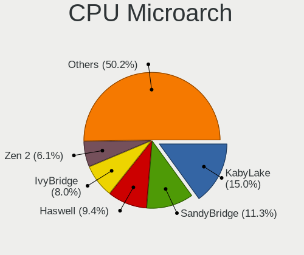

| Name             | Computers | Percent |
|------------------|-----------|---------|
| KabyLake         | 32        | 15.02%  |
| SandyBridge      | 24        | 11.27%  |
| Haswell          | 20        | 9.39%   |
| IvyBridge        | 17        | 7.98%   |
| Zen 2            | 13        | 6.1%    |
| Alderlake Hybrid | 10        | 4.69%   |
| Zen 3            | 9         | 4.23%   |
| Skylake          | 9         | 4.23%   |
| Penryn           | 9         | 4.23%   |
| Unknown          | 8         | 3.76%   |
| Silvermont       | 7         | 3.29%   |
| Zen+             | 6         | 2.82%   |
| Goldmont plus    | 6         | 2.82%   |
| Core             | 6         | 2.82%   |
| IceLake          | 5         | 2.35%   |
| Westmere         | 4         | 1.88%   |
| TigerLake        | 4         | 1.88%   |
| Zen              | 3         | 1.41%   |
| Piledriver       | 3         | 1.41%   |
| NetBurst         | 3         | 1.41%   |
| Nehalem          | 2         | 0.94%   |
| K10              | 2         | 0.94%   |
| CometLake        | 2         | 0.94%   |
| Broadwell        | 2         | 0.94%   |
| Bobcat           | 2         | 0.94%   |
| Tremont          | 1         | 0.47%   |
| Steamroller      | 1         | 0.47%   |
| K8 Hammer        | 1         | 0.47%   |
| K8 & K10 hybrid  | 1         | 0.47%   |
| Excavator        | 1         | 0.47%   |

Graphics
--------

GPU Vendor
----------

Vendors of graphics cards

| Vendor           | Computers | Percent |
|------------------|-----------|---------|
| Intel            | 131       | 51.98%  |
| AMD              | 64        | 25.4%   |
| Nvidia           | 56        | 22.22%  |
| VIA Technologies | 1         | 0.4%    |

GPU Model
---------

Graphics card models

| Model                                                                                    | Computers | Percent |
|------------------------------------------------------------------------------------------|-----------|---------|
| Intel 2nd Generation Core Processor Family Integrated Graphics Controller                | 17        | 6.51%   |
| Intel HD Graphics 620                                                                    | 14        | 5.36%   |
| AMD Renoir [Radeon Vega Series / Radeon Vega Mobile Series]                              | 10        | 3.83%   |
| Intel 3rd Gen Core processor Graphics Controller                                         | 7         | 2.68%   |
| Intel Xeon E3-1200 v3/4th Gen Core Processor Integrated Graphics Controller              | 6         | 2.3%    |
| Intel Xeon E3-1200 v2/3rd Gen Core processor Graphics Controller                         | 6         | 2.3%    |
| Intel GeminiLake [UHD Graphics 600]                                                      | 6         | 2.3%    |
| Intel HD Graphics 530                                                                    | 5         | 1.92%   |
| Intel HD Graphics 630                                                                    | 4         | 1.53%   |
| Intel Haswell-ULT Integrated Graphics Controller                                         | 4         | 1.53%   |
| Intel Core Processor Integrated Graphics Controller                                      | 4         | 1.53%   |
| Intel Atom/Celeron/Pentium Processor x5-E8000/J3xxx/N3xxx Integrated Graphics Controller | 4         | 1.53%   |
| Intel Alder Lake-P GT2 [Iris Xe Graphics]                                                | 4         | 1.53%   |
| AMD Rembrandt [Radeon 680M]                                                              | 4         | 1.53%   |
| Nvidia GP108 [GeForce GT 1030]                                                           | 3         | 1.15%   |
| Nvidia GM108M [GeForce 940MX]                                                            | 3         | 1.15%   |
| Intel UHD Graphics 620                                                                   | 3         | 1.15%   |
| Intel TigerLake-LP GT2 [Iris Xe Graphics]                                                | 3         | 1.15%   |
| Intel Mobile GM965/GL960 Integrated Graphics Controller (secondary)                      | 3         | 1.15%   |
| Intel Mobile GM965/GL960 Integrated Graphics Controller (primary)                        | 3         | 1.15%   |
| Intel Iris Plus Graphics G1 (Ice Lake)                                                   | 3         | 1.15%   |
| Intel CoffeeLake-S GT2 [UHD Graphics 630]                                                | 3         | 1.15%   |
| Intel Atom Processor Z36xxx/Z37xxx Series Graphics & Display                             | 3         | 1.15%   |
| Intel 4th Gen Core Processor Integrated Graphics Controller                              | 3         | 1.15%   |
| Intel 4 Series Chipset Integrated Graphics Controller                                    | 3         | 1.15%   |
| AMD Picasso/Raven 2 [Radeon Vega Series / Radeon Vega Mobile Series]                     | 3         | 1.15%   |
| AMD Navi 33 [Radeon RX 7600/7600 XT/7600M XT/7600S/7700S / PRO W7600]                    | 3         | 1.15%   |
| AMD Ellesmere [Radeon RX 470/480/570/570X/580/580X/590]                                  | 3         | 1.15%   |
| AMD Cezanne [Radeon Vega Series / Radeon Vega Mobile Series]                             | 3         | 1.15%   |
| Nvidia TU117M [GeForce GTX 1650 Mobile / Max-Q]                                          | 2         | 0.77%   |
| Nvidia TU106 [GeForce RTX 2060 Rev. A]                                                   | 2         | 0.77%   |
| Nvidia GM206 [GeForce GTX 960]                                                           | 2         | 0.77%   |
| Nvidia GF108M [GeForce GT 540M]                                                          | 2         | 0.77%   |
| Nvidia GA106 [GeForce RTX 3060]                                                          | 2         | 0.77%   |
| Nvidia G98 [GeForce 8400 GS Rev. 2]                                                      | 2         | 0.77%   |
| Nvidia AD107M [GeForce RTX 4060 Max-Q / Mobile]                                          | 2         | 0.77%   |
| Intel WhiskeyLake-U GT2 [UHD Graphics 620]                                               | 2         | 0.77%   |
| Intel TigerLake-H GT1 [UHD Graphics]                                                     | 2         | 0.77%   |
| Intel Raptor Lake-P [Iris Xe Graphics]                                                   | 2         | 0.77%   |
| Intel Mobile 4 Series Chipset Integrated Graphics Controller                             | 2         | 0.77%   |

GPU Combo
---------

Combinations of graphics cards

| Name           | Computers | Percent |
|----------------|-----------|---------|
| 1 x Intel      | 93        | 42.66%  |
| 1 x AMD        | 52        | 23.85%  |
| 1 x Nvidia     | 27        | 12.39%  |
| Intel + Nvidia | 25        | 11.47%  |
| Intel + AMD    | 5         | 2.29%   |
| AMD + Nvidia   | 5         | 2.29%   |
| 2 x Intel      | 4         | 1.83%   |
| 2 x AMD        | 4         | 1.83%   |
| Other          | 2         | 0.92%   |
| 1 x VIA        | 1         | 0.46%   |

GPU Driver
----------

Free vs proprietary

| Driver      | Computers | Percent |
|-------------|-----------|---------|
| Free        | 167       | 78.4%   |
| Proprietary | 39        | 18.31%  |
| Unknown     | 7         | 3.29%   |

GPU Memory
----------

Total video memory

| Size in GB | Computers | Percent |
|------------|-----------|---------|
| Unknown    | 128       | 59.26%  |
| 1.01-2.0   | 27        | 12.5%   |
| 7.01-8.0   | 19        | 8.8%    |
| 0.01-0.5   | 15        | 6.94%   |
| 3.01-4.0   | 11        | 5.09%   |
| 0.51-1.0   | 8         | 3.7%    |
| 5.01-6.0   | 4         | 1.85%   |
| 8.01-16.0  | 2         | 0.93%   |
| 2.01-3.0   | 1         | 0.46%   |
| 16.01-24.0 | 1         | 0.46%   |

Monitor
-------

Monitor Vendor
--------------

Monitor vendors

| Vendor                  | Computers | Percent |
|-------------------------|-----------|---------|
| Samsung Electronics     | 33        | 15.21%  |
| AU Optronics            | 30        | 13.82%  |
| Chimei Innolux          | 23        | 10.6%   |
| BOE                     | 21        | 9.68%   |
| Goldstar                | 17        | 7.83%   |
| LG Display              | 16        | 7.37%   |
| AOC                     | 9         | 4.15%   |
| Dell                    | 7         | 3.23%   |
| Philips                 | 5         | 2.3%    |
| Lenovo                  | 4         | 1.84%   |
| Hewlett-Packard         | 4         | 1.84%   |
| Sony                    | 3         | 1.38%   |
| Panasonic               | 3         | 1.38%   |
| GDH                     | 3         | 1.38%   |
| Chi Mei Optoelectronics | 3         | 1.38%   |
| Apple                   | 3         | 1.38%   |
| Unknown (XXX)           | 2         | 0.92%   |
| Unknown                 | 2         | 0.92%   |
| Positivo                | 2         | 0.92%   |
| Multilaser              | 2         | 0.92%   |
| Denver                  | 2         | 0.92%   |
| BenQ                    | 2         | 0.92%   |
| ASUSTek Computer        | 2         | 0.92%   |
| Acer                    | 2         | 0.92%   |
| Wacom                   | 1         | 0.46%   |
| Vizio                   | 1         | 0.46%   |
| VIZ                     | 1         | 0.46%   |
| RS                      | 1         | 0.46%   |
| Philco                  | 1         | 0.46%   |
| NEC Computers           | 1         | 0.46%   |
| MTD                     | 1         | 0.46%   |
| MiTAC                   | 1         | 0.46%   |
| LRX                     | 1         | 0.46%   |
| LG Electronics          | 1         | 0.46%   |
| ITE                     | 1         | 0.46%   |
| IPS                     | 1         | 0.46%   |
| Iiyama                  | 1         | 0.46%   |
| DTV                     | 1         | 0.46%   |
| CSW                     | 1         | 0.46%   |
| CSO                     | 1         | 0.46%   |

Monitor Model
-------------

Monitor models

| Model                                                                | Computers | Percent |
|----------------------------------------------------------------------|-----------|---------|
| Chimei Innolux LCD Monitor CMN15F5 1920x1080 344x193mm 15.5-inch     | 7         | 3.14%   |
| GDH TV PHILCO GDH0030 1920x540                                       | 3         | 1.35%   |
| AU Optronics LCD Monitor AUO2E3C 1366x768 309x173mm 13.9-inch        | 3         | 1.35%   |
| Samsung Electronics SyncMaster SAM037A 1680x1050 433x271mm 20.1-inch | 2         | 0.9%    |
| Samsung Electronics SMT22A300 SAM087B 1920x1080 477x268mm 21.5-inch  | 2         | 0.9%    |
| Panasonic TV MEIC10C 1920x540 697x392mm 31.5-inch                    | 2         | 0.9%    |
| Multilaser Multilaser MUL0030 1920x1080 708x398mm 32.0-inch          | 2         | 0.9%    |
| LG Display LCD Monitor LGD02E9 1366x768 309x174mm 14.0-inch          | 2         | 0.9%    |
| Goldstar HDR WFHD GSM7714 2560x1080 798x334mm 34.1-inch              | 2         | 0.9%    |
| Goldstar 2D FHD TV GSM59C6 1920x1080 509x286mm 23.0-inch             | 2         | 0.9%    |
| Goldstar 23MP55 GSM5A23 1920x1080 510x290mm 23.1-inch                | 2         | 0.9%    |
| Chimei Innolux LCD Monitor CMN14D6 1366x768 309x173mm 13.9-inch      | 2         | 0.9%    |
| BOE LCD Monitor BOE0913 1366x768 309x174mm 14.0-inch                 | 2         | 0.9%    |
| AU Optronics LCD Monitor AUOE495 2560x1600 344x215mm 16.0-inch       | 2         | 0.9%    |
| AU Optronics LCD Monitor AUO323C 1366x768 309x173mm 13.9-inch        | 2         | 0.9%    |
| AU Optronics LCD Monitor AUO183C 1366x768 309x173mm 13.9-inch        | 2         | 0.9%    |
| AOC Q27G2WG4 AOC2702 2560x1440 597x336mm 27.0-inch                   | 2         | 0.9%    |
| Wacom Cintiq21UX WAC1014 1600x1200 432x324mm 21.3-inch               | 1         | 0.45%   |
| Vizio D32f-E1 VIZ1027 1920x1080 698x392mm 31.5-inch                  | 1         | 0.45%   |
| VIZ LCD Monitor M190VA 1360x768                                      | 1         | 0.45%   |
| Unknown LCD Monitor XXX Beyond TV                                    | 1         | 0.45%   |
| Unknown LCD Monitor FFFF 2288x1287 2550x2550mm 142.0-inch            | 1         | 0.45%   |
| Unknown (XXX) Union TV XXX2841 1920x1080 1209x680mm 54.6-inch        | 1         | 0.45%   |
| Unknown (XXX) Beyond TV XXX2851 3840x2160 1210x680mm 54.6-inch       | 1         | 0.45%   |
| Sony TV SNYDB01 1920x1080                                            | 1         | 0.45%   |
| Sony TV SNY7E02 1920x1080                                            | 1         | 0.45%   |
| Sony TV SNY1A02 1920x1080                                            | 1         | 0.45%   |
| Samsung Electronics T24D310 SAM0B68 1366x768 521x293mm 23.5-inch     | 1         | 0.45%   |
| Samsung Electronics T22B300 SAM092D 1920x1080 477x268mm 21.5-inch    | 1         | 0.45%   |
| Samsung Electronics SyncMaster SAM05EB 1920x1080 597x336mm 27.0-inch | 1         | 0.45%   |
| Samsung Electronics SyncMaster SAM047D 1360x768 410x230mm 18.5-inch  | 1         | 0.45%   |
| Samsung Electronics SyncMaster SAM0471 1360x768 344x194mm 15.5-inch  | 1         | 0.45%   |
| Samsung Electronics SyncMaster SAM0375 1680x1050 494x320mm 23.2-inch | 1         | 0.45%   |
| Samsung Electronics SyncMaster SAM0322 1440x900 428x255mm 19.6-inch  | 1         | 0.45%   |
| Samsung Electronics SyncMaster SAM02E3 1440x900 367x229mm 17.0-inch  | 1         | 0.45%   |
| Samsung Electronics SA300/SA350 SAM0788 1366x768 410x230mm 18.5-inch | 1         | 0.45%   |
| Samsung Electronics S24C450 SAM09CF 1920x1200 518x324mm 24.1-inch    | 1         | 0.45%   |
| Samsung Electronics S19B300 SAM08A5 1366x768 410x230mm 18.5-inch     | 1         | 0.45%   |
| Samsung Electronics LS32A70 SAM7166 3840x2160 698x393mm 31.5-inch    | 1         | 0.45%   |
| Samsung Electronics LF24T35 SAM707D 1920x1080 528x297mm 23.9-inch    | 1         | 0.45%   |

Monitor Resolution
------------------

Monitor screen resolution

| Resolution         | Computers | Percent |
|--------------------|-----------|---------|
| 1920x1080 (FHD)    | 84        | 38.71%  |
| 1366x768 (WXGA)    | 53        | 24.42%  |
| 3840x2160 (4K)     | 12        | 5.53%   |
| 1360x768           | 9         | 4.15%   |
| 2560x1080          | 6         | 2.76%   |
| 1600x900 (HD+)     | 6         | 2.76%   |
| 2560x1440 (QHD)    | 5         | 2.3%    |
| 1440x900 (WXGA+)   | 5         | 2.3%    |
| 1280x1024 (SXGA)   | 5         | 2.3%    |
| 2880x1800          | 4         | 1.84%   |
| 1920x540           | 4         | 1.84%   |
| 1920x1200 (WUXGA)  | 4         | 1.84%   |
| 1680x1050 (WSXGA+) | 4         | 1.84%   |
| 1280x800 (WXGA)    | 4         | 1.84%   |
| 2560x1600          | 2         | 0.92%   |
| Unknown            | 2         | 0.92%   |
| 4240x1280          | 1         | 0.46%   |
| 3840x1200          | 1         | 0.46%   |
| 3200x1080          | 1         | 0.46%   |
| 2880x1920          | 1         | 0.46%   |
| 2288x1287          | 1         | 0.46%   |
| 2240x1400          | 1         | 0.46%   |
| 1600x1200          | 1         | 0.46%   |
| 1280x960           | 1         | 0.46%   |

Monitor Diagonal
----------------

Diagonal size in inches

| Inches  | Computers | Percent |
|---------|-----------|---------|
| 15      | 52        | 23.85%  |
| 13      | 24        | 11.01%  |
| 23      | 19        | 8.72%   |
| 14      | 19        | 8.72%   |
| 17      | 13        | 5.96%   |
| 24      | 9         | 4.13%   |
| 18      | 9         | 4.13%   |
| 27      | 8         | 3.67%   |
| 21      | 7         | 3.21%   |
| 52      | 6         | 2.75%   |
| 16      | 6         | 2.75%   |
| Unknown | 6         | 2.75%   |
| 19      | 5         | 2.29%   |
| 72      | 4         | 1.83%   |
| 31      | 4         | 1.83%   |
| 20      | 4         | 1.83%   |
| 54      | 3         | 1.38%   |
| 40      | 3         | 1.38%   |
| 34      | 3         | 1.38%   |
| 32      | 3         | 1.38%   |
| 84      | 2         | 0.92%   |
| 49      | 2         | 0.92%   |
| 142     | 1         | 0.46%   |
| 48      | 1         | 0.46%   |
| 43      | 1         | 0.46%   |
| 29      | 1         | 0.46%   |
| 28      | 1         | 0.46%   |
| 25      | 1         | 0.46%   |
| 22      | 1         | 0.46%   |

Monitor Width
-------------

Physical width

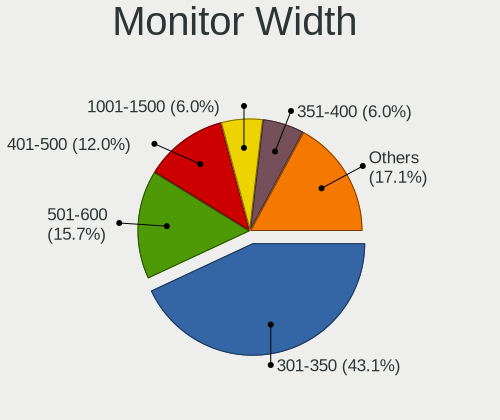

| Width in mm    | Computers | Percent |
|----------------|-----------|---------|
| 301-350        | 93        | 43.06%  |
| 501-600        | 34        | 15.74%  |
| 401-500        | 26        | 12.04%  |
| 351-400        | 13        | 6.02%   |
| 1001-1500      | 13        | 6.02%   |
| 201-300        | 8         | 3.7%    |
| 601-700        | 7         | 3.24%   |
| 701-800        | 6         | 2.78%   |
| 1501-2000      | 6         | 2.78%   |
| Unknown        | 6         | 2.78%   |
| 801-900        | 3         | 1.39%   |
| More than 2000 | 1         | 0.46%   |

Aspect Ratio
------------

Proportional relationship between the width and the height

| Ratio   | Computers | Percent |
|---------|-----------|---------|
| 16/9    | 157       | 78.11%  |
| 16/10   | 22        | 10.95%  |
| 21/9    | 6         | 2.99%   |
| Unknown | 5         | 2.49%   |
| 5/4     | 4         | 1.99%   |
| 4/3     | 2         | 1%      |
| 3/2     | 2         | 1%      |
| 32/9    | 1         | 0.5%    |
| 3.20    | 1         | 0.5%    |
| 1.00    | 1         | 0.5%    |

Monitor Area
------------

Area in inch

| Area in inch | Computers | Percent |
|----------------|-----------|---------|
| 101-110        | 53        | 24.42%  |
| 81-90          | 40        | 18.43%  |
| 201-250        | 32        | 14.75%  |
| More than 1000 | 18        | 8.29%   |
| 141-150        | 11        | 5.07%   |
| 351-500        | 10        | 4.61%   |
| 151-200        | 10        | 4.61%   |
| 301-350        | 9         | 4.15%   |
| 121-130        | 9         | 4.15%   |
| Unknown        | 6         | 2.76%   |
| 251-300        | 5         | 2.3%    |
| 501-1000       | 5         | 2.3%    |
| 111-120        | 4         | 1.84%   |
| 71-80          | 3         | 1.38%   |
| 131-140        | 2         | 0.92%   |

Pixel Density
-------------

Pixels per inch

| Density       | Computers | Percent |
|---------------|-----------|---------|
| 51-100        | 72        | 34.12%  |
| 101-120       | 62        | 29.38%  |
| 121-160       | 42        | 19.91%  |
| 1-50          | 18        | 8.53%   |
| 161-240       | 6         | 2.84%   |
| Unknown       | 6         | 2.84%   |
| More than 240 | 5         | 2.37%   |

Multiple Monitors
-----------------

Total monitors connected

| Total | Computers | Percent |
|-------|-----------|---------|
| 1     | 171       | 79.91%  |
| 2     | 36        | 16.82%  |
| 0     | 6         | 2.8%    |
| 3     | 1         | 0.47%   |

Network
-------

Net Controller Vendor
---------------------

Controller vendors

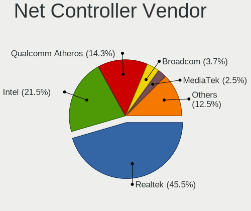

| Vendor                   | Computers | Percent |
|--------------------------|-----------|---------|
| Realtek Semiconductor    | 146       | 45.48%  |
| Intel                    | 69        | 21.5%   |
| Qualcomm Atheros         | 46        | 14.33%  |
| Broadcom                 | 12        | 3.74%   |
| MediaTek                 | 8         | 2.49%   |
| TP-Link                  | 6         | 1.87%   |
| Ralink Technology        | 6         | 1.87%   |
| Marvell Technology Group | 4         | 1.25%   |
| VIA Technologies         | 3         | 0.93%   |
| Samsung Electronics      | 2         | 0.62%   |
| Ralink                   | 2         | 0.62%   |
| Nvidia                   | 2         | 0.62%   |
| Microsoft                | 2         | 0.62%   |
| D-Link System            | 2         | 0.62%   |
| D-Link                   | 2         | 0.62%   |
| ASIX Electronics         | 2         | 0.62%   |
| Prolific Technology      | 1         | 0.31%   |
| Motorola PCS             | 1         | 0.31%   |
| Lenovo                   | 1         | 0.31%   |
| JMicron Technology       | 1         | 0.31%   |
| Edimax Technology        | 1         | 0.31%   |
| Belkin Components        | 1         | 0.31%   |
| ASUSTek Computer         | 1         | 0.31%   |

Net Controller Model
--------------------

Controller models

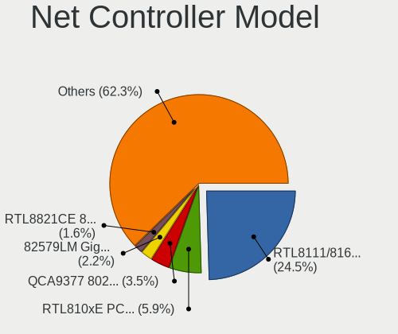

| Model                                                                  | Computers | Percent |
|------------------------------------------------------------------------|-----------|---------|
| Realtek RTL8111/8168/8211/8411 PCI Express Gigabit Ethernet Controller | 91        | 24.53%  |
| Realtek RTL810xE PCI Express Fast Ethernet controller                  | 22        | 5.93%   |
| Qualcomm Atheros QCA9377 802.11ac Wireless Network Adapter             | 13        | 3.5%    |
| Intel 82579LM Gigabit Network Connection (Lewisville)                  | 8         | 2.16%   |
| Realtek RTL8821CE 802.11ac PCIe Wireless Network Adapter               | 6         | 1.62%   |
| Realtek RTL8153 Gigabit Ethernet Adapter                               | 6         | 1.62%   |
| Realtek RTL8125 2.5GbE Controller                                      | 6         | 1.62%   |
| Realtek 802.11ac NIC                                                   | 6         | 1.62%   |
| Qualcomm Atheros QCA9565 / AR9565 Wireless Network Adapter             | 6         | 1.62%   |
| Intel Alder Lake-P PCH CNVi WiFi                                       | 5         | 1.35%   |
| Realtek RTL8822CE 802.11ac PCIe Wireless Network Adapter               | 4         | 1.08%   |
| Qualcomm Atheros QCA6174 802.11ac Wireless Network Adapter             | 4         | 1.08%   |
| Intel Wi-Fi 6 AX200                                                    | 4         | 1.08%   |
| Intel Dual Band Wireless-AC 3168NGW [Stone Peak]                       | 4         | 1.08%   |
| VIA VT6102/VT6103 [Rhine-II]                                           | 3         | 0.81%   |
| Realtek RTL8188FTV 802.11b/g/n 1T1R 2.4G WLAN Adapter                  | 3         | 0.81%   |
| Ralink RT5370 Wireless Adapter                                         | 3         | 0.81%   |
| Qualcomm Atheros Killer E220x Gigabit Ethernet Controller              | 3         | 0.81%   |
| Qualcomm Atheros AR9287 Wireless Network Adapter (PCI-Express)         | 3         | 0.81%   |
| Qualcomm Atheros AR9285 Wireless Network Adapter (PCI-Express)         | 3         | 0.81%   |
| MediaTek MT7922 802.11ax PCI Express Wireless Network Adapter          | 3         | 0.81%   |
| Intel Wireless 8265 / 8275                                             | 3         | 0.81%   |
| Intel Wi-Fi 6E(802.11ax) AX210/AX1675* 2x2 [Typhoon Peak]              | 3         | 0.81%   |
| Intel Ethernet Connection (7) I219-V                                   | 3         | 0.81%   |
| Intel Dual Band Wireless-AC 3165 Plus Bluetooth                        | 3         | 0.81%   |
| Realtek RTL8852BE PCIe 802.11ax Wireless Network Controller            | 2         | 0.54%   |
| Realtek RTL8723BU 802.11b/g/n WLAN Adapter                             | 2         | 0.54%   |
| Realtek RTL8192CE PCIe Wireless Network Adapter                        | 2         | 0.54%   |
| Realtek RTL8188ETV Wireless LAN 802.11n Network Adapter                | 2         | 0.54%   |
| Realtek RTL8188EE Wireless Network Adapter                             | 2         | 0.54%   |
| Realtek RTL8187B Wireless 802.11g 54Mbps Network Adapter               | 2         | 0.54%   |
| Realtek Killer E2600 GbE Controller                                    | 2         | 0.54%   |
| Ralink MT7601U Wireless Adapter                                        | 2         | 0.54%   |
| Qualcomm Atheros QCA8171 Gigabit Ethernet                              | 2         | 0.54%   |
| Qualcomm Atheros AR9485 Wireless Network Adapter                       | 2         | 0.54%   |
| Qualcomm Atheros AR8161 Gigabit Ethernet                               | 2         | 0.54%   |
| Qualcomm Atheros AR8152 v2.0 Fast Ethernet                             | 2         | 0.54%   |
| MediaTek MT7921 802.11ax PCI Express Wireless Network Adapter          | 2         | 0.54%   |
| Marvell Group 88W8897 [AVASTAR] 802.11ac Wireless                      | 2         | 0.54%   |
| Intel Wireless 8260                                                    | 2         | 0.54%   |

Wireless Vendor
---------------

Wireless vendors

| Vendor                   | Computers | Percent |
|--------------------------|-----------|---------|
| Intel                    | 52        | 31.14%  |
| Realtek Semiconductor    | 42        | 25.15%  |
| Qualcomm Atheros         | 35        | 20.96%  |
| Broadcom                 | 8         | 4.79%   |
| MediaTek                 | 7         | 4.19%   |
| TP-Link                  | 6         | 3.59%   |
| Ralink Technology        | 6         | 3.59%   |
| Ralink                   | 2         | 1.2%    |
| Microsoft                | 2         | 1.2%    |
| Marvell Technology Group | 2         | 1.2%    |
| D-Link                   | 2         | 1.2%    |
| Edimax Technology        | 1         | 0.6%    |
| Belkin Components        | 1         | 0.6%    |
| ASUSTek Computer         | 1         | 0.6%    |

Wireless Model
--------------

Wireless models

| Model                                                          | Computers | Percent |
|----------------------------------------------------------------|-----------|---------|
| Qualcomm Atheros QCA9377 802.11ac Wireless Network Adapter     | 13        | 7.74%   |
| Realtek RTL8821CE 802.11ac PCIe Wireless Network Adapter       | 6         | 3.57%   |
| Realtek 802.11ac NIC                                           | 6         | 3.57%   |
| Qualcomm Atheros QCA9565 / AR9565 Wireless Network Adapter     | 6         | 3.57%   |
| Realtek RTL8822CE 802.11ac PCIe Wireless Network Adapter       | 4         | 2.38%   |
| Qualcomm Atheros QCA6174 802.11ac Wireless Network Adapter     | 4         | 2.38%   |
| Intel Wi-Fi 6 AX200                                            | 4         | 2.38%   |
| Intel Dual Band Wireless-AC 3168NGW [Stone Peak]               | 4         | 2.38%   |
| Intel Alder Lake-P PCH CNVi WiFi                               | 4         | 2.38%   |
| Realtek RTL8188FTV 802.11b/g/n 1T1R 2.4G WLAN Adapter          | 3         | 1.79%   |
| Ralink RT5370 Wireless Adapter                                 | 3         | 1.79%   |
| Qualcomm Atheros AR9287 Wireless Network Adapter (PCI-Express) | 3         | 1.79%   |
| Qualcomm Atheros AR9285 Wireless Network Adapter (PCI-Express) | 3         | 1.79%   |
| Intel Wireless 8265 / 8275                                     | 3         | 1.79%   |
| Intel Wi-Fi 6E(802.11ax) AX210/AX1675* 2x2 [Typhoon Peak]      | 3         | 1.79%   |
| Intel Dual Band Wireless-AC 3165 Plus Bluetooth                | 3         | 1.79%   |
| Realtek RTL8852BE PCIe 802.11ax Wireless Network Controller    | 2         | 1.19%   |
| Realtek RTL8723BU 802.11b/g/n WLAN Adapter                     | 2         | 1.19%   |
| Realtek RTL8192CE PCIe Wireless Network Adapter                | 2         | 1.19%   |
| Realtek RTL8188ETV Wireless LAN 802.11n Network Adapter        | 2         | 1.19%   |
| Realtek RTL8188EE Wireless Network Adapter                     | 2         | 1.19%   |
| Realtek RTL8187B Wireless 802.11g 54Mbps Network Adapter       | 2         | 1.19%   |
| Ralink MT7601U Wireless Adapter                                | 2         | 1.19%   |
| Qualcomm Atheros AR9485 Wireless Network Adapter               | 2         | 1.19%   |
| MediaTek MT7922 802.11ax PCI Express Wireless Network Adapter  | 2         | 1.19%   |
| MediaTek MT7921 802.11ax PCI Express Wireless Network Adapter  | 2         | 1.19%   |
| Marvell Group 88W8897 [AVASTAR] 802.11ac Wireless              | 2         | 1.19%   |
| Intel Wireless 8260                                            | 2         | 1.19%   |
| Intel Wireless 7260                                            | 2         | 1.19%   |
| Intel Wi-Fi 6 AX201                                            | 2         | 1.19%   |
| Intel Comet Lake PCH-LP CNVi WiFi                              | 2         | 1.19%   |
| Intel Centrino Wireless-N 2230                                 | 2         | 1.19%   |
| Intel Cannon Point-LP CNVi [Wireless-AC]                       | 2         | 1.19%   |
| Intel Cannon Lake PCH CNVi WiFi                                | 2         | 1.19%   |
| Broadcom BCM43228 802.11a/b/g/n                                | 2         | 1.19%   |
| Broadcom BCM4313 802.11bgn Wireless Network Adapter            | 2         | 1.19%   |
| TP-Link TL-WN821N v5/v6 [RTL8192EU]                            | 1         | 0.6%    |
| TP-Link Archer T9UH v1 [Realtek RTL8814AU]                     | 1         | 0.6%    |
| TP-Link Archer T4U ver.3                                       | 1         | 0.6%    |
| TP-Link Archer T3U [Realtek RTL8812BU]                         | 1         | 0.6%    |

Ethernet Vendor
---------------

Ethernet vendors

| Vendor                   | Computers | Percent |
|--------------------------|-----------|---------|
| Realtek Semiconductor    | 126       | 65.28%  |
| Intel                    | 34        | 17.62%  |
| Qualcomm Atheros         | 13        | 6.74%   |
| Broadcom                 | 5         | 2.59%   |
| VIA Technologies         | 3         | 1.55%   |
| Nvidia                   | 2         | 1.04%   |
| Marvell Technology Group | 2         | 1.04%   |
| D-Link System            | 2         | 1.04%   |
| ASIX Electronics         | 2         | 1.04%   |
| Samsung Electronics      | 1         | 0.52%   |
| Motorola PCS             | 1         | 0.52%   |
| MediaTek                 | 1         | 0.52%   |
| JMicron Technology       | 1         | 0.52%   |

Ethernet Model
--------------

Ethernet models

| Model                                                                  | Computers | Percent |
|------------------------------------------------------------------------|-----------|---------|
| Realtek RTL8111/8168/8211/8411 PCI Express Gigabit Ethernet Controller | 91        | 45.5%   |
| Realtek RTL810xE PCI Express Fast Ethernet controller                  | 22        | 11%     |
| Intel 82579LM Gigabit Network Connection (Lewisville)                  | 8         | 4%      |
| Realtek RTL8153 Gigabit Ethernet Adapter                               | 6         | 3%      |
| Realtek RTL8125 2.5GbE Controller                                      | 6         | 3%      |
| VIA VT6102/VT6103 [Rhine-II]                                           | 3         | 1.5%    |
| Qualcomm Atheros Killer E220x Gigabit Ethernet Controller              | 3         | 1.5%    |
| Intel Ethernet Connection (7) I219-V                                   | 3         | 1.5%    |
| Realtek Killer E2600 GbE Controller                                    | 2         | 1%      |
| Qualcomm Atheros QCA8171 Gigabit Ethernet                              | 2         | 1%      |
| Qualcomm Atheros AR8161 Gigabit Ethernet                               | 2         | 1%      |
| Qualcomm Atheros AR8152 v2.0 Fast Ethernet                             | 2         | 1%      |
| Intel I211 Gigabit Network Connection                                  | 2         | 1%      |
| Intel Ethernet Controller I225-V                                       | 2         | 1%      |
| Intel Ethernet Connection I217-V                                       | 2         | 1%      |
| Intel Ethernet Connection I217-LM                                      | 2         | 1%      |
| Intel Ethernet Connection (4) I219-LM                                  | 2         | 1%      |
| Intel Ethernet Connection (2) I219-LM                                  | 2         | 1%      |
| D-Link System DGE-528T Gigabit Ethernet Adapter                        | 2         | 1%      |
| Broadcom NetLink BCM57780 Gigabit Ethernet PCIe                        | 2         | 1%      |
| ASIX AX88179 Gigabit Ethernet                                          | 2         | 1%      |
| Samsung Galaxy series, misc. (tethering mode)                          | 1         | 0.5%    |
| Realtek RTL8169 PCI Gigabit Ethernet Controller                        | 1         | 0.5%    |
| Realtek RTL8152 Fast Ethernet Adapter                                  | 1         | 0.5%    |
| Realtek RTL8111/8168/8411 PCI Express Gigabit Ethernet Controller      | 1         | 0.5%    |
| Realtek RTL-8110SC/8169SC Gigabit Ethernet                             | 1         | 0.5%    |
| Realtek RTL-8100/8101L/8139 PCI Fast Ethernet Adapter                  | 1         | 0.5%    |
| Realtek Killer E3000 2.5GbE Controller                                 | 1         | 0.5%    |
| Qualcomm Atheros QCA8172 Fast Ethernet                                 | 1         | 0.5%    |
| Qualcomm Atheros Killer E2400 Gigabit Ethernet Controller              | 1         | 0.5%    |
| Qualcomm Atheros AR8151 v2.0 Gigabit Ethernet                          | 1         | 0.5%    |
| Qualcomm Atheros AR8151 v1.0 Gigabit Ethernet                          | 1         | 0.5%    |
| Nvidia MCP79 Ethernet                                                  | 1         | 0.5%    |
| Nvidia MCP61 Ethernet                                                  | 1         | 0.5%    |
| Motorola PCS moto g play - 2023                                        | 1         | 0.5%    |
| MediaTek MT7922 802.11ax PCI Express Wireless Network Adapter          | 1         | 0.5%    |
| Marvell Group 88E8055 PCI-E Gigabit Ethernet Controller                | 1         | 0.5%    |
| Marvell Group 88E8039 PCI-E Fast Ethernet Controller                   | 1         | 0.5%    |
| JMicron JMC250 PCI Express Gigabit Ethernet Controller                 | 1         | 0.5%    |
| Intel Ethernet Controller I225-LM                                      | 1         | 0.5%    |

Net Controller Kind
-------------------

Ethernet, WiFi or modem

| Kind     | Computers | Percent |
|----------|-----------|---------|
| Ethernet | 184       | 53.8%   |
| WiFi     | 155       | 45.32%  |
| Modem    | 3         | 0.88%   |

Used Controller
---------------

Currently used network controller

| Kind     | Computers | Percent |
|----------|-----------|---------|
| WiFi     | 123       | 56.94%  |
| Ethernet | 93        | 43.06%  |

NICs
----

Total network controllers on board

| Total | Computers | Percent |
|-------|-----------|---------|
| 2     | 103       | 48.36%  |
| 1     | 103       | 48.36%  |
| 0     | 4         | 1.88%   |
| 3     | 2         | 0.94%   |
| 5     | 1         | 0.47%   |

IPv6
----

IPv6 vs IPv4

| Used | Computers | Percent |
|------|-----------|---------|
| No   | 113       | 52.8%   |
| Yes  | 101       | 47.2%   |

Bluetooth
---------

Bluetooth Vendor
----------------

Controller vendors

| Vendor                          | Computers | Percent |
|---------------------------------|-----------|---------|
| Intel                           | 47        | 32.64%  |
| Cambridge Silicon Radio         | 25        | 17.36%  |
| Qualcomm Atheros Communications | 13        | 9.03%   |
| IMC Networks                    | 12        | 8.33%   |
| Realtek Semiconductor           | 10        | 6.94%   |
| Lite-On Technology              | 9         | 6.25%   |
| Foxconn / Hon Hai               | 6         | 4.17%   |
| Broadcom                        | 5         | 3.47%   |
| MediaTek                        | 3         | 2.08%   |
| TP-Link                         | 2         | 1.39%   |
| Marvell Semiconductor           | 2         | 1.39%   |
| Hewlett-Packard                 | 2         | 1.39%   |
| Apple                           | 2         | 1.39%   |
| Ralink                          | 1         | 0.69%   |
| Integrated System Solution      | 1         | 0.69%   |
| Dell                            | 1         | 0.69%   |
| ASUSTek Computer                | 1         | 0.69%   |
| Actions                         | 1         | 0.69%   |
| AboCom Systems                  | 1         | 0.69%   |

Bluetooth Model
---------------

Controller models

| Model                                                                               | Computers | Percent |
|-------------------------------------------------------------------------------------|-----------|---------|
| Cambridge Silicon Radio Bluetooth Dongle (HCI mode)                                 | 25        | 17.36%  |
| Intel Bluetooth wireless interface                                                  | 12        | 8.33%   |
| Intel Bluetooth 9460/9560 Jefferson Peak (JfP)                                      | 9         | 6.25%   |
| Lite-On Qualcomm Atheros QCA9377 Bluetooth                                          | 7         | 4.86%   |
| Intel AX201 Bluetooth                                                               | 7         | 4.86%   |
| Realtek Bluetooth Radio                                                             | 6         | 4.17%   |
| Qualcomm Atheros  Bluetooth Device                                                  | 6         | 4.17%   |
| IMC Networks Bluetooth Radio                                                        | 5         | 3.47%   |
| Intel Wireless-AC 3168 Bluetooth                                                    | 4         | 2.78%   |
| Intel AX200 Bluetooth                                                               | 4         | 2.78%   |
| Qualcomm Atheros QCA61x4 Bluetooth 4.0                                              | 3         | 2.08%   |
| Qualcomm Atheros AR3012 Bluetooth 4.0                                               | 3         | 2.08%   |
| MediaTek Wireless_Device                                                            | 3         | 2.08%   |
| Intel Centrino Bluetooth Wireless Transceiver                                       | 3         | 2.08%   |
| Intel AX210 Bluetooth                                                               | 3         | 2.08%   |
| IMC Networks Wireless_Device                                                        | 3         | 2.08%   |
| Foxconn / Hon Hai Wireless_Device                                                   | 3         | 2.08%   |
| TP-Link TP-Link Bluetooth USB Adapter                                               | 2         | 1.39%   |
| Realtek 802.11ac WLAN Adapter                                                       | 2         | 1.39%   |
| Intel Centrino Advanced-N 6230 Bluetooth adapter                                    | 2         | 1.39%   |
| Intel AX211 Bluetooth                                                               | 2         | 1.39%   |
| IMC Networks Bluetooth Device                                                       | 2         | 1.39%   |
| Realtek RTL8822BE Bluetooth 4.2 Adapter                                             | 1         | 0.69%   |
| Realtek  Bluetooth 4.2 Adapter                                                      | 1         | 0.69%   |
| Ralink RT3290 Bluetooth                                                             | 1         | 0.69%   |
| Qualcomm Atheros AR3011 Bluetooth                                                   | 1         | 0.69%   |
| Marvell Bluetooth and Wireless LAN Composite Device                                 | 1         | 0.69%   |
| Marvell Bluetooth and Wireless LAN Composite                                        | 1         | 0.69%   |
| Lite-On Bluetooth Device                                                            | 1         | 0.69%   |
| Lite-On Atheros AR3012 Bluetooth                                                    | 1         | 0.69%   |
| Intel Wireless-AC 9260 Bluetooth Adapter                                            | 1         | 0.69%   |
| Integrated System Solution KY-BT100 Bluetooth Adapter                               | 1         | 0.69%   |
| IMC Networks Bluetooth USB Host Controller                                          | 1         | 0.69%   |
| IMC Networks BCM20702A0                                                             | 1         | 0.69%   |
| HP Broadcom 2070 Bluetooth Combo                                                    | 1         | 0.69%   |
| HP Bluetooth 2.0 Interface [Broadcom BCM2045]                                       | 1         | 0.69%   |
| Foxconn / Hon Hai Foxconn T77H114 BCM2070 [Single-Chip Bluetooth 2.1 + EDR Adapter] | 1         | 0.69%   |
| Foxconn / Hon Hai Broadcom Bluetooth 2.1 Device                                     | 1         | 0.69%   |
| Foxconn / Hon Hai Bluetooth Radio                                                   | 1         | 0.69%   |
| Dell DW375 Bluetooth Module                                                         | 1         | 0.69%   |

Sound
-----

Sound Vendor
------------

Sound card vendors

| Vendor                   | Computers | Percent |
|--------------------------|-----------|---------|
| Intel                    | 157       | 53.77%  |
| AMD                      | 67        | 22.95%  |
| Nvidia                   | 46        | 15.75%  |
| C-Media Electronics      | 4         | 1.37%   |
| Generalplus Technology   | 3         | 1.03%   |
| VIA Technologies         | 2         | 0.68%   |
| Creative Labs            | 2         | 0.68%   |
| Roland                   | 1         | 0.34%   |
| Realtek Semiconductor    | 1         | 0.34%   |
| Razer USA                | 1         | 0.34%   |
| Micro Star International | 1         | 0.34%   |
| KTMicro                  | 1         | 0.34%   |
| JMTek                    | 1         | 0.34%   |
| iCON                     | 1         | 0.34%   |
| Focusrite-Novation       | 1         | 0.34%   |
| ESS Technology           | 1         | 0.34%   |
| ASRock                   | 1         | 0.34%   |
| Actions Semiconductor    | 1         | 0.34%   |

Sound Model
-----------

Sound card models

| Model                                                                                             | Computers | Percent |
|---------------------------------------------------------------------------------------------------|-----------|---------|
| AMD Family 17h/19h/1ah HD Audio Controller                                                        | 29        | 8.17%   |
| Intel 6 Series/C200 Series Chipset Family High Definition Audio Controller                        | 24        | 6.76%   |
| Intel Sunrise Point-LP HD Audio                                                                   | 20        | 5.63%   |
| Intel 7 Series/C216 Chipset Family High Definition Audio Controller                               | 17        | 4.79%   |
| AMD Renoir Radeon High Definition Audio Controller                                                | 17        | 4.79%   |
| Intel 8 Series/C220 Series Chipset High Definition Audio Controller                               | 11        | 3.1%    |
| Intel Xeon E3-1200 v3/4th Gen Core Processor HD Audio Controller                                  | 10        | 2.82%   |
| Intel NM10/ICH7 Family High Definition Audio Controller                                           | 7         | 1.97%   |
| Intel 100 Series/C230 Series Chipset Family HD Audio Controller                                   | 7         | 1.97%   |
| AMD Rembrandt Radeon High Definition Audio Controller                                             | 7         | 1.97%   |
| Intel Celeron/Pentium Silver Processor High Definition Audio                                      | 6         | 1.69%   |
| Intel Cannon Lake PCH cAVS                                                                        | 6         | 1.69%   |
| Intel Alder Lake PCH-P High Definition Audio Controller                                           | 5         | 1.41%   |
| Intel 5 Series/3400 Series Chipset High Definition Audio                                          | 5         | 1.41%   |
| AMD Starship/Matisse HD Audio Controller                                                          | 5         | 1.41%   |
| AMD SBx00 Azalia (Intel HDA)                                                                      | 5         | 1.41%   |
| AMD Raven/Raven2/Fenghuang HDMI/DP Audio Controller                                               | 5         | 1.41%   |
| AMD Caicos HDMI Audio [Radeon HD 6450 / 7450/8450/8490 OEM / R5 230/235/235X OEM]                 | 5         | 1.41%   |
| Nvidia TU106 High Definition Audio Controller                                                     | 4         | 1.13%   |
| Nvidia GM107 High Definition Audio Controller [GeForce 940MX]                                     | 4         | 1.13%   |
| Nvidia GA106 High Definition Audio Controller                                                     | 4         | 1.13%   |
| Intel Tiger Lake-LP Smart Sound Technology Audio Controller                                       | 4         | 1.13%   |
| Intel Haswell-ULT HD Audio Controller                                                             | 4         | 1.13%   |
| Intel 8 Series HD Audio Controller                                                                | 4         | 1.13%   |
| AMD Navi 31 HDMI/DP Audio                                                                         | 4         | 1.13%   |
| AMD Navi 10 HDMI Audio                                                                            | 4         | 1.13%   |
| AMD Family 17h (Models 00h-0fh) HD Audio Controller                                               | 4         | 1.13%   |
| AMD Ellesmere HDMI Audio [Radeon RX 470/480 / 570/580/590]                                        | 4         | 1.13%   |
| Nvidia GP108 High Definition Audio Controller                                                     | 3         | 0.85%   |
| Nvidia GP107GL High Definition Audio Controller                                                   | 3         | 0.85%   |
| Nvidia GM206 High Definition Audio Controller                                                     | 3         | 0.85%   |
| Nvidia AD107 High Definition Audio Controller                                                     | 3         | 0.85%   |
| Intel Tiger Lake-H HD Audio Controller                                                            | 3         | 0.85%   |
| Intel Ice Lake-LP Smart Sound Technology Audio Controller                                         | 3         | 0.85%   |
| Intel Atom/Celeron/Pentium Processor x5-E8000/J3xxx/N3xxx Series High Definition Audio Controller | 3         | 0.85%   |
| Intel 9 Series Chipset Family HD Audio Controller                                                 | 3         | 0.85%   |
| Intel 82801H (ICH8 Family) HD Audio Controller                                                    | 3         | 0.85%   |
| Intel 200 Series PCH HD Audio                                                                     | 3         | 0.85%   |
| Generalplus Technology USB Audio Device                                                           | 3         | 0.85%   |
| AMD Navi 21/23 HDMI/DP Audio Controller                                                           | 3         | 0.85%   |

Memory
------

Memory Vendor
-------------

Memory module vendors

| Vendor              | Computers | Percent |
|---------------------|-----------|---------|
| Kingston            | 22        | 17.32%  |
| Samsung Electronics | 21        | 16.54%  |
| Unknown             | 15        | 11.81%  |
| Micron Technology   | 11        | 8.66%   |
| Smart               | 8         | 6.3%    |
| SK hynix            | 8         | 6.3%    |
| Crucial             | 7         | 5.51%   |
| Corsair             | 6         | 4.72%   |
| Unknown             | 5         | 3.94%   |
| Ramaxel Technology  | 3         | 2.36%   |
| A-DATA Technology   | 3         | 2.36%   |
| Teikon              | 2         | 1.57%   |
| Kllisre             | 2         | 1.57%   |
| Hikvision           | 2         | 1.57%   |
| G.Skill             | 2         | 1.57%   |
| Walton Chaintech    | 1         | 0.79%   |
| Unknown (B98C)      | 1         | 0.79%   |
| Unknown (8A6B)      | 1         | 0.79%   |
| Timetec             | 1         | 0.79%   |
| Smart Brazil        | 1         | 0.79%   |
| PLEXHD              | 1         | 0.79%   |
| Nanya Technology    | 1         | 0.79%   |
| Multilaser          | 1         | 0.79%   |
| Kembona             | 1         | 0.79%   |
| GOODRAM             | 1         | 0.79%   |

Memory Model
------------

Memory module models

| Model                                                        | Computers | Percent |
|--------------------------------------------------------------|-----------|---------|
| Unknown                                                      | 5         | 3.62%   |
| Unknown RAM Module 4GB SODIMM DDR4 2133MT/s                  | 2         | 1.45%   |
| Unknown RAM Module 2GB DIMM SDRAM                            | 2         | 1.45%   |
| Smart RAM SH564128FH8NZQNSCG 4GB SODIMM DDR3 1600MT/s        | 2         | 1.45%   |
| Smart RAM SH564128FH8N6TNSQG 4GB DIMM DDR3 1600MT/s          | 2         | 1.45%   |
| Samsung RAM M471B5273DH0-CH9 4GB SODIMM DDR3 1334MT/s        | 2         | 1.45%   |
| Samsung RAM M471A1K43BB1-CRC 8GB SODIMM DDR4 2667MT/s        | 2         | 1.45%   |
| Samsung RAM M425R2GA3BB0-CQKOL 16GB SODIMM DDR5 4800MT/s     | 2         | 1.45%   |
| Micron RAM MICRON/MT60B1G16HC-4 8GB SODIMM DDR5 4800MT/s     | 2         | 1.45%   |
| Kllisre RAM KRE-D3U1600M/8G 8GB DIMM DDR3 1600MT/s           | 2         | 1.45%   |
| Kingston RAM KHX1600C10D3/8G 8GB DIMM DDR3 1600MT/s          | 2         | 1.45%   |
| Hikvision RAM HKED4161CAB2F1HB2 16GB DIMM DDR4 2667MT/s      | 2         | 1.45%   |
| Crucial RAM CT16G4DFRA32A.M16FE 16GB DIMM DDR4 3200MT/s      | 2         | 1.45%   |
| Walton Chaintech RAM AS2G732-800P005 2GB SODIMM DDR2 800MT/s | 1         | 0.72%   |
| Unknown RAM Module 8GB SODIMM DDR3 1600MT/s                  | 1         | 0.72%   |
| Unknown RAM Module 8GB DIMM SDRAM                            | 1         | 0.72%   |
| Unknown RAM Module 8GB DIMM DDR3 1333MT/s                    | 1         | 0.72%   |
| Unknown RAM Module 512MB SODIMM DDR2                         | 1         | 0.72%   |
| Unknown RAM Module 4GB DIMM DDR3 1333MT/s                    | 1         | 0.72%   |
| Unknown RAM Module 2GB SODIMM DDR3 1600MT/s                  | 1         | 0.72%   |
| Unknown RAM Module 2GB SODIMM DDR2 667MT/s                   | 1         | 0.72%   |
| Unknown RAM Module 2GB SODIMM DDR2                           | 1         | 0.72%   |
| Unknown RAM Module 2GB DIMM DDR2 266MT/s                     | 1         | 0.72%   |
| Unknown RAM Module 2GB DIMM 1333MT/s                         | 1         | 0.72%   |
| Unknown RAM Module 1GB SODIMM SDRAM                          | 1         | 0.72%   |
| Unknown RAM Module 1GB SODIMM DDR2 667MT/s                   | 1         | 0.72%   |
| Unknown RAM Module 16GB DIMM DDR4 3200MT/s                   | 1         | 0.72%   |
| Unknown (B98C) RAM Module 8GB DIMM DDR4 2667MT/s             | 1         | 0.72%   |
| Unknown (8A6B) RAM BL.9BWWA.221 8GB DIMM DDR4 2667MT/s       | 1         | 0.72%   |
| Timetec RAM Module 4GB SODIMM DDR3 1067MT/s                  | 1         | 0.72%   |
| Teikon RAM TMT351S6EFR8A-PBHJ 4GB SODIMM DDR3 1600MT/s       | 1         | 0.72%   |
| Teikon RAM TMA81GS6AFR8N-UHSC 8GB SODIMM DDR4 2400MT/s       | 1         | 0.72%   |
| Smart RAM SMS4TDC3C0K0446SCG 4GB SODIMM DDR4 2667MT/s        | 1         | 0.72%   |
| Smart RAM SH564568FH8NZPHSCR 2GB SODIMM DDR3 1334MT/s        | 1         | 0.72%   |
| Smart RAM SH564568FH8NWPHSFG 2GB SODIMM DDR3 1333MT/s        | 1         | 0.72%   |
| Smart RAM SF4641G8CKHIWDFSEG 8GB SODIMM DDR4 2133MT/s        | 1         | 0.72%   |
| Smart RAM SF4641G8CK8IEHLSBG 8GB SODIMM DDR4 2667MT/s        | 1         | 0.72%   |
| Smart Brazil RAM Module 4GB Row Of Chips DDR4 2400MT/s       | 1         | 0.72%   |
| SK hynix RAM Module 4GB SODIMM DDR3 1066MT/s                 | 1         | 0.72%   |
| SK hynix RAM MMXIV 4096MB SODIMM DDR3 1333MT/s               | 1         | 0.72%   |

Memory Kind
-----------

Memory module kinds

| Kind    | Computers | Percent |
|---------|-----------|---------|
| DDR3    | 42        | 39.62%  |
| DDR4    | 38        | 35.85%  |
| DDR5    | 8         | 7.55%   |
| SDRAM   | 6         | 5.66%   |
| DDR2    | 5         | 4.72%   |
| LPDDR3  | 3         | 2.83%   |
| LPDDR5  | 2         | 1.89%   |
| LPDDR4  | 1         | 0.94%   |
| Unknown | 1         | 0.94%   |

Memory Form Factor
------------------

Physical design of the memory module

| Name         | Computers | Percent |
|--------------|-----------|---------|
| SODIMM       | 57        | 54.29%  |
| DIMM         | 43        | 40.95%  |
| Row Of Chips | 5         | 4.76%   |

Memory Size
-----------

Memory module size

| Size  | Computers | Percent |
|-------|-----------|---------|
| 8192  | 43        | 35.54%  |
| 4096  | 33        | 27.27%  |
| 16384 | 19        | 15.7%   |
| 2048  | 16        | 13.22%  |
| 32768 | 6         | 4.96%   |
| 1024  | 3         | 2.48%   |
| 512   | 1         | 0.83%   |

Memory Speed
------------

Memory module speed

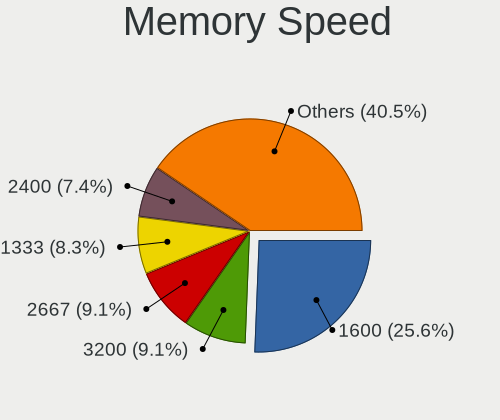

| Speed   | Computers | Percent |
|---------|-----------|---------|
| 1600    | 31        | 25.62%  |
| 3200    | 11        | 9.09%   |
| 2667    | 11        | 9.09%   |
| 1333    | 10        | 8.26%   |
| 2400    | 9         | 7.44%   |
| 4800    | 7         | 5.79%   |
| 2133    | 7         | 5.79%   |
| 1334    | 6         | 4.96%   |
| Unknown | 5         | 4.13%   |
| 4000    | 3         | 2.48%   |
| 1867    | 3         | 2.48%   |
| 1067    | 2         | 1.65%   |
| 667     | 2         | 1.65%   |
| 7500    | 1         | 0.83%   |
| 6400    | 1         | 0.83%   |
| 5600    | 1         | 0.83%   |
| 4266    | 1         | 0.83%   |
| 3800    | 1         | 0.83%   |
| 3733    | 1         | 0.83%   |
| 3466    | 1         | 0.83%   |
| 2666    | 1         | 0.83%   |
| 2200    | 1         | 0.83%   |
| 2048    | 1         | 0.83%   |
| 1066    | 1         | 0.83%   |
| 975     | 1         | 0.83%   |
| 800     | 1         | 0.83%   |
| 266     | 1         | 0.83%   |

Printers & scanners
-------------------

Printer Vendor
--------------

Printer device vendors

| Vendor             | Computers | Percent |
|--------------------|-----------|---------|
| Hewlett-Packard    | 4         | 44.44%  |
| Canon              | 2         | 22.22%  |
| Brother Industries | 2         | 22.22%  |
| Seiko Epson        | 1         | 11.11%  |

Printer Model
-------------

Printer device models

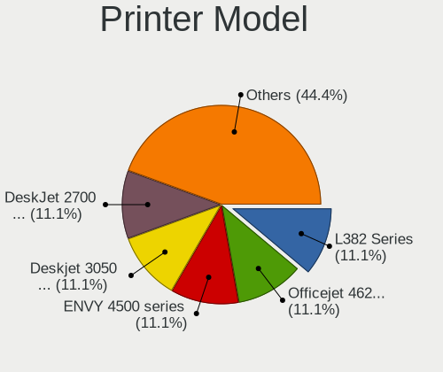

| Model                         | Computers | Percent |
|-------------------------------|-----------|---------|
| Seiko Epson L382 Series       | 1         | 11.11%  |
| HP Officejet 4620 series      | 1         | 11.11%  |
| HP ENVY 4500 series           | 1         | 11.11%  |
| HP Deskjet 3050 J610 series   | 1         | 11.11%  |
| HP DeskJet 2700 series        | 1         | 11.11%  |
| Canon TR8600 series           | 1         | 11.11%  |
| Canon E410 series             | 1         | 11.11%  |
| Brother QL-710W Label Printer | 1         | 11.11%  |
| Brother DCP-T500W             | 1         | 11.11%  |

Scanner Vendor
--------------

Scanner device vendors

Zero info for selected period =(

Scanner Model
-------------

Scanner device models

Zero info for selected period =(

Camera
------

Camera Vendor
-------------

Camera device vendors

| Vendor                                 | Computers | Percent |
|----------------------------------------|-----------|---------|
| Chicony Electronics                    | 16        | 13.91%  |
| Realtek Semiconductor                  | 10        | 8.7%    |
| Quanta                                 | 10        | 8.7%    |
| Bison Electronics                      | 10        | 8.7%    |
| IMC Networks                           | 8         | 6.96%   |
| Sunplus Innovation Technology          | 7         | 6.09%   |
| Microdia                               | 5         | 4.35%   |
| Shine-optics                           | 4         | 3.48%   |
| Logitech                               | 4         | 3.48%   |
| Cheng Uei Precision Industry (Foxlink) | 3         | 2.61%   |
| Alcor Micro                            | 3         | 2.61%   |
| Syntek                                 | 2         | 1.74%   |
| Suyin                                  | 2         | 1.74%   |
| SunplusIT                              | 2         | 1.74%   |
| Silicon Motion                         | 2         | 1.74%   |
| Shinetech                              | 2         | 1.74%   |
| Ricoh                                  | 2         | 1.74%   |
| Luxvisions Innotech Limited            | 2         | 1.74%   |
| Lenovo                                 | 2         | 1.74%   |
| Jieli Technology                       | 2         | 1.74%   |
| Apple                                  | 2         | 1.74%   |
| Anker PowerConf C200                   | 2         | 1.74%   |
| ALi                                    | 2         | 1.74%   |
| Y Media                                | 1         | 0.87%   |
| USB Camera CS                          | 1         | 0.87%   |
| Sonix Technology                       | 1         | 0.87%   |
| Samsung Electronics                    | 1         | 0.87%   |
| Microsoft                              | 1         | 0.87%   |
| Lite-On Technology                     | 1         | 0.87%   |
| Leap Motion                            | 1         | 0.87%   |
| Generalplus Technology                 | 1         | 0.87%   |
| GEMBIRD                                | 1         | 0.87%   |
| Acer                                   | 1         | 0.87%   |
| Unknown                                | 1         | 0.87%   |

Camera Model
------------

Camera device models

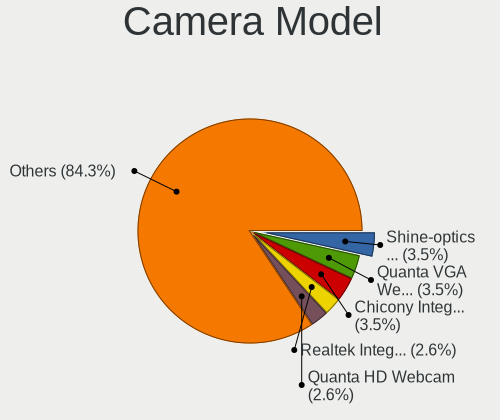

| Model                                                       | Computers | Percent |
|-------------------------------------------------------------|-----------|---------|
| Shine-optics USB2.0 HD UVC WebCam                           | 4         | 3.48%   |
| Quanta VGA WebCam                                           | 4         | 3.48%   |
| Chicony Integrated Camera                                   | 4         | 3.48%   |
| Realtek Integrated_Webcam_HD                                | 3         | 2.61%   |
| Quanta HD Webcam                                            | 3         | 2.61%   |
| Chicony HD WebCam                                           | 3         | 2.61%   |
| Bison Lenovo EasyCamera                                     | 3         | 2.61%   |
| Bison Integrated Camera                                     | 3         | 2.61%   |
| Bison HD Webcam                                             | 3         | 2.61%   |
| SunplusIT MTD camera                                        | 2         | 1.74%   |
| Sunplus DICOTA 4K                                           | 2         | 1.74%   |
| Silicon Motion Web Camera                                   | 2         | 1.74%   |
| Realtek USB Camera                                          | 2         | 1.74%   |
| Realtek Integrated Webcam                                   | 2         | 1.74%   |
| Microdia Integrated_Webcam_HD                               | 2         | 1.74%   |
| Microdia Integrated Camera                                  | 2         | 1.74%   |
| Luxvisions Innotech Limited HP Wide Vision HD Camera        | 2         | 1.74%   |
| Jieli USB PHY 2.0                                           | 2         | 1.74%   |
| IMC Networks USB2.0 HD UVC WebCam                           | 2         | 1.74%   |
| IMC Networks Integrated Camera                              | 2         | 1.74%   |
| Anker PowerConf C200 Anker PowerConf C200                   | 2         | 1.74%   |
| Y Media USB Camera                                          | 1         | 0.87%   |
| USB Camera CS USB Camera CS                                 | 1         | 0.87%   |
| Syntek Lenovo EasyCamera                                    | 1         | 0.87%   |
| Syntek Integrated Camera                                    | 1         | 0.87%   |
| Suyin USB 2.0 Webcam Device                                 | 1         | 0.87%   |
| Suyin 1.3M WebCam (notebook emachines E730, Acer sub-brand) | 1         | 0.87%   |
| Sunplus Laptop_Integrated_Webcam_HD                         | 1         | 0.87%   |
| Sunplus Laptop_Integrated_Webcam_FHD                        | 1         | 0.87%   |
| Sunplus Laptop Integrated Webcam FHD                        | 1         | 0.87%   |
| Sunplus HP TrueVision HD Camera                             | 1         | 0.87%   |
| Sunplus HP HD Webcam [Fixed]                                | 1         | 0.87%   |
| Sonix USB2.0 HD UVC WebCam                                  | 1         | 0.87%   |
| ShineTech USB2.0 HD UVC WebCam                              | 1         | 0.87%   |
| Shinetech ASUS FHD webcam                                   | 1         | 0.87%   |
| Samsung Galaxy series, misc. (MTP mode)                     | 1         | 0.87%   |
| Ricoh USB2.0 Camera                                         | 1         | 0.87%   |
| Ricoh Laptop_Integrated_Webcam_FHD                          | 1         | 0.87%   |
| Realtek HP Webcam                                           | 1         | 0.87%   |
| Realtek HP Truevision HD                                    | 1         | 0.87%   |

Security
--------

Fingerprint Vendor
------------------

Fingerprint sensor vendors

| Vendor                             | Computers | Percent |
|------------------------------------|-----------|---------|
| Validity Sensors                   | 8         | 53.33%  |
| Synaptics                          | 3         | 20%     |
| Realtek USB2.0 Finger Print Bridge | 2         | 13.33%  |
| STMicroelectronics                 | 1         | 6.67%   |
| DigitalPersona                     | 1         | 6.67%   |

Fingerprint Model
-----------------

Fingerprint sensor models

| Model                                                           | Computers | Percent |
|-----------------------------------------------------------------|-----------|---------|
| Validity Sensors Synaptics WBDI                                 | 2         | 13.33%  |
| Synaptics  WBDI                                                 | 2         | 13.33%  |
| Realtek USB2.0 Finger Print Bridge FocalTech Fingerprint Device | 2         | 13.33%  |
| Validity Sensors VFS5011 Fingerprint Reader                     | 1         | 6.67%   |
| Validity Sensors VFS495 Fingerprint Reader                      | 1         | 6.67%   |
| Validity Sensors VFS491                                         | 1         | 6.67%   |
| Validity Sensors VFS471 Fingerprint Reader                      | 1         | 6.67%   |
| Validity Sensors VFS101 Fingerprint Reader                      | 1         | 6.67%   |
| Validity Sensors Swipe Fingerprint Sensor                       | 1         | 6.67%   |
| Synaptics Metallica MIS Touch Fingerprint Reader                | 1         | 6.67%   |
| STMicroelectronics Fingerprint Reader                           | 1         | 6.67%   |
| DigitalPersona Fingerprint Reader                               | 1         | 6.67%   |

Chipcard Vendor
---------------

Chipcard module vendors

| Vendor                | Computers | Percent |
|-----------------------|-----------|---------|
| Broadcom              | 2         | 50%     |
| Giesecke & Devrient   | 1         | 25%     |
| Gemalto (was Gemplus) | 1         | 25%     |

Chipcard Model
--------------

Chipcard module models

| Model                                             | Computers | Percent |
|---------------------------------------------------|-----------|---------|
| Giesecke & Devrient StarSign CUT                  | 1         | 25%     |
| Gemalto (was Gemplus) GemPC Twin SmartCard Reader | 1         | 25%     |
| Broadcom BCM5880 Secure Applications Processor    | 1         | 25%     |
| Broadcom 58200                                    | 1         | 25%     |

Unsupported
-----------

Unsupported Devices
-------------------

Total unsupported devices on board

| Total | Computers | Percent |
|-------|-----------|---------|
| 0     | 162       | 75.35%  |
| 1     | 45        | 20.93%  |
| 2     | 6         | 2.79%   |
| 3     | 2         | 0.93%   |

Unsupported Device Types
------------------------

Types of unsupported devices

| Type                  | Computers | Percent |
|-----------------------|-----------|---------|
| Graphics card         | 18        | 29.51%  |
| Fingerprint reader    | 15        | 24.59%  |
| Net/wireless          | 12        | 19.67%  |
| Multimedia controller | 5         | 8.2%    |
| Chipcard              | 4         | 6.56%   |
| Bluetooth             | 2         | 3.28%   |
| Unassigned class      | 1         | 1.64%   |
| Tv card               | 1         | 1.64%   |
| Storage               | 1         | 1.64%   |
| Sound                 | 1         | 1.64%   |
| Network               | 1         | 1.64%   |

