BlackPanther - Tested Hardware & Statistics
-------------------------------------------

A project to collect tested hardware configurations for BlackPanther.

Anyone can contribute to this report by the [hw-probe](https://github.com/linuxhw/hw-probe) tool:

    sudo -E hw-probe -all -upload

Please contribute! Especially if your hardware is rare.

This is a report for all computer types. See also reports for [desktops](/Dist/BlackPanther/Desktop/README.md) and [notebooks](/Dist/BlackPanther/Notebook/README.md).

Contents
--------

* [ Test Cases ](#test-cases)

* [ System ](#system)
  - [ OS                       ](#os)
  - [ OS Family                ](#os-family)
  - [ Kernel                   ](#kernel)
  - [ Kernel Family            ](#kernel-family)
  - [ Kernel Major Ver.        ](#kernel-major-ver)
  - [ Arch                     ](#arch)
  - [ DE                       ](#de)
  - [ Display Server           ](#display-server)
  - [ Display Manager          ](#display-manager)
  - [ OS Lang                  ](#os-lang)
  - [ Boot Mode                ](#boot-mode)
  - [ Filesystem               ](#filesystem)
  - [ Part. scheme             ](#part-scheme)
  - [ Dual Boot with Linux/BSD ](#dual-boot-with-linuxbsd)
  - [ Dual Boot (Win)          ](#dual-boot-win)

* [ Board ](#board)
  - [ Vendor                   ](#vendor)
  - [ Model                    ](#model)
  - [ Model Family             ](#model-family)
  - [ MFG Year                 ](#mfg-year)
  - [ Form Factor              ](#form-factor)
  - [ Secure Boot              ](#secure-boot)
  - [ Coreboot                 ](#coreboot)
  - [ RAM Size                 ](#ram-size)
  - [ RAM Used                 ](#ram-used)
  - [ Total Drives             ](#total-drives)
  - [ Has CD-ROM               ](#has-cd-rom)
  - [ Has Ethernet             ](#has-ethernet)
  - [ Has WiFi                 ](#has-wifi)
  - [ Has Bluetooth            ](#has-bluetooth)

* [ Location ](#location)
  - [ Country                  ](#country)
  - [ City                     ](#city)

* [ Drives ](#drives)
  - [ Drive Vendor             ](#drive-vendor)
  - [ Drive Model              ](#drive-model)
  - [ HDD Vendor               ](#hdd-vendor)
  - [ SSD Vendor               ](#ssd-vendor)
  - [ Drive Kind               ](#drive-kind)
  - [ Drive Connector          ](#drive-connector)
  - [ Drive Size               ](#drive-size)
  - [ Space Total              ](#space-total)
  - [ Space Used               ](#space-used)
  - [ Malfunc. Drives          ](#malfunc-drives)
  - [ Malfunc. Drive Vendor    ](#malfunc-drive-vendor)
  - [ Malfunc. HDD Vendor      ](#malfunc-hdd-vendor)
  - [ Malfunc. Drive Kind      ](#malfunc-drive-kind)
  - [ Failed Drives            ](#failed-drives)
  - [ Failed Drive Vendor      ](#failed-drive-vendor)
  - [ Drive Status             ](#drive-status)

* [ Storage controller ](#storage-controller)
  - [ Storage Vendor           ](#storage-vendor)
  - [ Storage Model            ](#storage-model)
  - [ Storage Kind             ](#storage-kind)

* [ Processor ](#processor)
  - [ CPU Vendor               ](#cpu-vendor)
  - [ CPU Model                ](#cpu-model)
  - [ CPU Model Family         ](#cpu-model-family)
  - [ CPU Cores                ](#cpu-cores)
  - [ CPU Sockets              ](#cpu-sockets)
  - [ CPU Threads              ](#cpu-threads)
  - [ CPU Op-Modes             ](#cpu-op-modes)
  - [ CPU Microcode            ](#cpu-microcode)
  - [ CPU Microarch            ](#cpu-microarch)

* [ Graphics ](#graphics)
  - [ GPU Vendor               ](#gpu-vendor)
  - [ GPU Model                ](#gpu-model)
  - [ GPU Combo                ](#gpu-combo)
  - [ GPU Driver               ](#gpu-driver)
  - [ GPU Memory               ](#gpu-memory)

* [ Monitor ](#monitor)
  - [ Monitor Vendor           ](#monitor-vendor)
  - [ Monitor Model            ](#monitor-model)
  - [ Monitor Resolution       ](#monitor-resolution)
  - [ Monitor Diagonal         ](#monitor-diagonal)
  - [ Monitor Width            ](#monitor-width)
  - [ Aspect Ratio             ](#aspect-ratio)
  - [ Monitor Area             ](#monitor-area)
  - [ Pixel Density            ](#pixel-density)
  - [ Multiple Monitors        ](#multiple-monitors)

* [ Network ](#network)
  - [ Net Controller Vendor    ](#net-controller-vendor)
  - [ Net Controller Model     ](#net-controller-model)
  - [ Wireless Vendor          ](#wireless-vendor)
  - [ Wireless Model           ](#wireless-model)
  - [ Ethernet Vendor          ](#ethernet-vendor)
  - [ Ethernet Model           ](#ethernet-model)
  - [ Net Controller Kind      ](#net-controller-kind)
  - [ Used Controller          ](#used-controller)
  - [ NICs                     ](#nics)
  - [ IPv6                     ](#ipv6)

* [ Bluetooth ](#bluetooth)
  - [ Bluetooth Vendor         ](#bluetooth-vendor)
  - [ Bluetooth Model          ](#bluetooth-model)

* [ Sound ](#sound)
  - [ Sound Vendor             ](#sound-vendor)
  - [ Sound Model              ](#sound-model)

* [ Memory ](#memory)
  - [ Memory Vendor            ](#memory-vendor)
  - [ Memory Model             ](#memory-model)
  - [ Memory Kind              ](#memory-kind)
  - [ Memory Form Factor       ](#memory-form-factor)
  - [ Memory Size              ](#memory-size)
  - [ Memory Speed             ](#memory-speed)

* [ Printers & scanners ](#printers--scanners)
  - [ Printer Vendor           ](#printer-vendor)
  - [ Printer Model            ](#printer-model)
  - [ Scanner Vendor           ](#scanner-vendor)
  - [ Scanner Model            ](#scanner-model)

* [ Camera ](#camera)
  - [ Camera Vendor            ](#camera-vendor)
  - [ Camera Model             ](#camera-model)

* [ Security ](#security)
  - [ Fingerprint Vendor       ](#fingerprint-vendor)
  - [ Fingerprint Model        ](#fingerprint-model)
  - [ Chipcard Vendor          ](#chipcard-vendor)
  - [ Chipcard Model           ](#chipcard-model)

* [ Unsupported ](#unsupported)
  - [ Unsupported Devices      ](#unsupported-devices)
  - [ Unsupported Device Types ](#unsupported-device-types)

Test Cases
----------

Total: 10765

| Vendor        | Model                       | Form-Factor | Probe                                                      | Date         |
|---------------|-----------------------------|-------------|------------------------------------------------------------|--------------|
| Lenovo        | IdeaPad 330-15IKB 81DE      | Notebook    | [c6451c69d3](https://linux-hardware.org/?probe=c6451c69d3) | Jan 03, 2026 |
| Lenovo        | ThinkPad T430 2349KB4       | Notebook    | [8e572aee26](https://linux-hardware.org/?probe=8e572aee26) | Jan 03, 2026 |
| Dell          | Latitude E6410              | Notebook    | [242be79a5b](https://linux-hardware.org/?probe=242be79a5b) | Jan 02, 2026 |
| ASRock        | X299 Extreme4               | Desktop     | [e6bae0f608](https://linux-hardware.org/?probe=e6bae0f608) | Jan 01, 2026 |
| Dell          | Latitude E6520              | Notebook    | [68c8a0914f](https://linux-hardware.org/?probe=68c8a0914f) | Jan 01, 2026 |
| MSI           | MPG Z390 GAMING EDGE AC     | Desktop     | [5646e3ae0f](https://linux-hardware.org/?probe=5646e3ae0f) | Dec 31, 2025 |
| MSI           | MPG Z390 GAMING EDGE AC     | Desktop     | [9857a2d70e](https://linux-hardware.org/?probe=9857a2d70e) | Dec 31, 2025 |
| ASRock        | X299 Extreme4               | Desktop     | [77034d7839](https://linux-hardware.org/?probe=77034d7839) | Dec 31, 2025 |
| Lenovo        | ThinkPad T450 20BUA0AEHV    | Notebook    | [824c8bdc38](https://linux-hardware.org/?probe=824c8bdc38) | Dec 31, 2025 |
| HP            | Pavilion dv6                | Notebook    | [3d1becb26c](https://linux-hardware.org/?probe=3d1becb26c) | Dec 31, 2025 |
| HP            | Pavilion dv6                | Notebook    | [28336e5980](https://linux-hardware.org/?probe=28336e5980) | Dec 31, 2025 |
| Gigabyte      | P55-UD3                     | Desktop     | [23e605df8c](https://linux-hardware.org/?probe=23e605df8c) | Dec 29, 2025 |
| Gigabyte      | B150M-D3H-CF                | Desktop     | [034327f050](https://linux-hardware.org/?probe=034327f050) | Dec 27, 2025 |
| ASRock        | H81M-HDS                    | Desktop     | [456543fa7c](https://linux-hardware.org/?probe=456543fa7c) | Dec 27, 2025 |
| HP            | Pavilion Gaming Laptop 1... | Notebook    | [a6a0b5b1bf](https://linux-hardware.org/?probe=a6a0b5b1bf) | Dec 27, 2025 |
| Lenovo        | ThinkPad P1 Gen 2 20QUS0... | Notebook    | [a23c411797](https://linux-hardware.org/?probe=a23c411797) | Dec 26, 2025 |
| HP            | Laptop 15-bs1xx             | Notebook    | [14fc3f560e](https://linux-hardware.org/?probe=14fc3f560e) | Dec 26, 2025 |
| Fujitsu       | LIFEBOOK S710               | Notebook    | [28695d4961](https://linux-hardware.org/?probe=28695d4961) | Dec 26, 2025 |
| Samsung       | RV409/RV509/RV709           | Notebook    | [b7b1a6b4d3](https://linux-hardware.org/?probe=b7b1a6b4d3) | Dec 26, 2025 |
| ASUSTek       | X555LJ                      | Notebook    | [aaf3fdfc13](https://linux-hardware.org/?probe=aaf3fdfc13) | Dec 26, 2025 |
| Medion        | MS-7748                     | Desktop     | [6138675751](https://linux-hardware.org/?probe=6138675751) | Dec 25, 2025 |
| Gigabyte      | H61M-S1                     | Desktop     | [c686a3f39c](https://linux-hardware.org/?probe=c686a3f39c) | Dec 25, 2025 |
| Lenovo        | ThinkPad T450 20BUS06E00    | Notebook    | [7ff61d7afe](https://linux-hardware.org/?probe=7ff61d7afe) | Dec 25, 2025 |
| ASUSTek       | TUF Gaming B450-PLUS II     | Desktop     | [41df7c4977](https://linux-hardware.org/?probe=41df7c4977) | Dec 24, 2025 |
| Acer          | Aspire E1-532               | Notebook    | [dd001f8488](https://linux-hardware.org/?probe=dd001f8488) | Dec 24, 2025 |
| Acer          | Aspire E1-532               | Notebook    | [7e9927a22e](https://linux-hardware.org/?probe=7e9927a22e) | Dec 24, 2025 |
| Dell          | Inspiron 1090               | Notebook    | [f2d741e6fb](https://linux-hardware.org/?probe=f2d741e6fb) | Dec 24, 2025 |
| Lenovo        | ThinkCentre M58 7373Y2M     | Desktop     | [44b3c79320](https://linux-hardware.org/?probe=44b3c79320) | Dec 24, 2025 |
| Dell          | Inspiron 1090               | Notebook    | [d23876fe70](https://linux-hardware.org/?probe=d23876fe70) | Dec 23, 2025 |
| Dell          | 051FJ8 A02                  | Desktop     | [4dd756647b](https://linux-hardware.org/?probe=4dd756647b) | Dec 21, 2025 |
| Gigabyte      | A520M K V2                  | Desktop     | [efb402e3c7](https://linux-hardware.org/?probe=efb402e3c7) | Dec 19, 2025 |
| ASUSTek       | TUF Gaming B450-PLUS II     | Desktop     | [0636f1da44](https://linux-hardware.org/?probe=0636f1da44) | Dec 18, 2025 |
| ASUSTek       | PRIME A320M-R               | Desktop     | [cd93d45d08](https://linux-hardware.org/?probe=cd93d45d08) | Dec 18, 2025 |
| Lenovo        | ThinkPad X390 20Q1S17N0A    | Notebook    | [272a478de9](https://linux-hardware.org/?probe=272a478de9) | Dec 17, 2025 |
| Lenovo        | ThinkPad T460 20FMS0HG0G    | Notebook    | [f21ef35e60](https://linux-hardware.org/?probe=f21ef35e60) | Dec 17, 2025 |
| Lenovo        | ThinkPad T590 20N5S8LT00    | Notebook    | [2b3e384034](https://linux-hardware.org/?probe=2b3e384034) | Dec 14, 2025 |
| HP            | 805D                        | Desktop     | [cbc6dd8170](https://linux-hardware.org/?probe=cbc6dd8170) | Dec 12, 2025 |
| HP            | 8062                        | Desktop     | [8d1bcbda8b](https://linux-hardware.org/?probe=8d1bcbda8b) | Dec 10, 2025 |
| Medion        | E7218                       | Notebook    | [563f9c6a39](https://linux-hardware.org/?probe=563f9c6a39) | Dec 10, 2025 |
| Gigabyte      | H610M S2H V2                | Desktop     | [8e52b3affc](https://linux-hardware.org/?probe=8e52b3affc) | Dec 09, 2025 |
| Gigabyte      | H610M S2H V2                | Desktop     | [f1b5bda8fb](https://linux-hardware.org/?probe=f1b5bda8fb) | Dec 09, 2025 |
| AZW           | Gemini J45                  | Desktop     | [418b032ace](https://linux-hardware.org/?probe=418b032ace) | Dec 08, 2025 |
| AZW           | Gemini J45                  | Desktop     | [5880a600ec](https://linux-hardware.org/?probe=5880a600ec) | Dec 08, 2025 |
| ASRock        | N68C-S UCC                  | Desktop     | [31bd5f7c13](https://linux-hardware.org/?probe=31bd5f7c13) | Dec 08, 2025 |
| ASUSTek       | GL552JX                     | Notebook    | [c8dd297254](https://linux-hardware.org/?probe=c8dd297254) | Dec 07, 2025 |
| ASUSTek       | GL552JX                     | Notebook    | [75b70e396b](https://linux-hardware.org/?probe=75b70e396b) | Dec 06, 2025 |
| ASUSTek       | PRIME H610M-K D4            | Desktop     | [822f9fbc17](https://linux-hardware.org/?probe=822f9fbc17) | Dec 06, 2025 |
| Gigabyte      | A520M K V2                  | Desktop     | [b4ad8537b0](https://linux-hardware.org/?probe=b4ad8537b0) | Dec 04, 2025 |
| ASUSTek       | M5A78L-M PLUS/USB3          | Desktop     | [9674a95afd](https://linux-hardware.org/?probe=9674a95afd) | Dec 04, 2025 |
| ASUSTek       | M5A78L-M PLUS/USB3          | Desktop     | [c9a530bf7a](https://linux-hardware.org/?probe=c9a530bf7a) | Dec 04, 2025 |
| ASUSTek       | H110M-A/M.2                 | Desktop     | [d929eae8f3](https://linux-hardware.org/?probe=d929eae8f3) | Dec 04, 2025 |
| ASUSTek       | H110M-A/M.2                 | Desktop     | [d5e46d60c5](https://linux-hardware.org/?probe=d5e46d60c5) | Dec 04, 2025 |
| HP            | 250 G5 Notebook PC          | Notebook    | [4d2c756ea1](https://linux-hardware.org/?probe=4d2c756ea1) | Dec 04, 2025 |
| ASRock        | N68C-S UCC                  | Desktop     | [cc197d7945](https://linux-hardware.org/?probe=cc197d7945) | Dec 04, 2025 |
| Dell          | Latitude E6410              | Notebook    | [38f6da9c45](https://linux-hardware.org/?probe=38f6da9c45) | Dec 02, 2025 |
| Dell          | Latitude E6410              | Notebook    | [1997c92ee2](https://linux-hardware.org/?probe=1997c92ee2) | Dec 02, 2025 |
| ASUSTek       | X550CA                      | Notebook    | [47c7b887e8](https://linux-hardware.org/?probe=47c7b887e8) | Dec 01, 2025 |
| ASUSTek       | X55U                        | Notebook    | [a448a593cb](https://linux-hardware.org/?probe=a448a593cb) | Nov 30, 2025 |
| Dell          | Inspiron N5110              | Notebook    | [138ab0b50b](https://linux-hardware.org/?probe=138ab0b50b) | Nov 30, 2025 |
| Acer          | TravelMate 5710             | Notebook    | [700a96dc3c](https://linux-hardware.org/?probe=700a96dc3c) | Nov 30, 2025 |
| Shuttle       | FH110                       | Desktop     | [3fdeccca55](https://linux-hardware.org/?probe=3fdeccca55) | Nov 29, 2025 |
| eMachines     | E725                        | Notebook    | [2c1fb3a233](https://linux-hardware.org/?probe=2c1fb3a233) | Nov 28, 2025 |
| Dell          | 0HR330                      | Desktop     | [4be3f21b70](https://linux-hardware.org/?probe=4be3f21b70) | Nov 28, 2025 |
| MSI           | MPG Z390 GAMING EDGE AC     | Desktop     | [fe657bd14e](https://linux-hardware.org/?probe=fe657bd14e) | Nov 28, 2025 |
| MSI           | MPG Z390 GAMING EDGE AC     | Desktop     | [30a0223b4e](https://linux-hardware.org/?probe=30a0223b4e) | Nov 27, 2025 |
| Lenovo        | ThinkPad X395 20NMS0YG00    | Notebook    | [71167bb09b](https://linux-hardware.org/?probe=71167bb09b) | Nov 26, 2025 |
| Lenovo        | ThinkPad X395 20NMS0YG00    | Notebook    | [7042d35808](https://linux-hardware.org/?probe=7042d35808) | Nov 26, 2025 |
| Dell          | 0WWJRX A01                  | Desktop     | [106ed3becb](https://linux-hardware.org/?probe=106ed3becb) | Nov 26, 2025 |
| Lenovo        | ThinkCentre M58 7373Y2M     | Desktop     | [2fc53e3942](https://linux-hardware.org/?probe=2fc53e3942) | Nov 23, 2025 |
| Lenovo        | ThinkCentre M58 7373Y2M     | Desktop     | [83d17e5420](https://linux-hardware.org/?probe=83d17e5420) | Nov 23, 2025 |
| Dell          | Latitude E7440              | Notebook    | [782436a032](https://linux-hardware.org/?probe=782436a032) | Nov 21, 2025 |
| HP            | 250 G4 Notebook PC          | Notebook    | [9e02eab8d1](https://linux-hardware.org/?probe=9e02eab8d1) | Nov 19, 2025 |
| HP            | 250 G4 Notebook PC          | Notebook    | [7f2c55ddfb](https://linux-hardware.org/?probe=7f2c55ddfb) | Nov 19, 2025 |
| HP            | 8265                        | Desktop     | [9522e6ee12](https://linux-hardware.org/?probe=9522e6ee12) | Nov 17, 2025 |
| Lenovo        | ThinkCentre M58e 7303WQG    | Desktop     | [799b65229b](https://linux-hardware.org/?probe=799b65229b) | Nov 15, 2025 |
| Lenovo        | ThinkCentre M58e 7303WQG    | Desktop     | [11b6917f17](https://linux-hardware.org/?probe=11b6917f17) | Nov 15, 2025 |
| Lenovo        | ThinkPad T500 2241AK5       | Notebook    | [66f3264266](https://linux-hardware.org/?probe=66f3264266) | Nov 15, 2025 |
| MSI           | 880GM-E35                   | Desktop     | [13f04b0256](https://linux-hardware.org/?probe=13f04b0256) | Nov 15, 2025 |
| HP            | Pavilion dv6                | Notebook    | [733a0d47da](https://linux-hardware.org/?probe=733a0d47da) | Nov 14, 2025 |
| Lenovo        | 7052-A9G                    | Desktop     | [79514810b3](https://linux-hardware.org/?probe=79514810b3) | Nov 14, 2025 |
| Dell          | 0WWJRX A01                  | Desktop     | [e0c5b35f61](https://linux-hardware.org/?probe=e0c5b35f61) | Nov 14, 2025 |
| Lenovo        | 7052-A9G                    | Desktop     | [43f0e8828f](https://linux-hardware.org/?probe=43f0e8828f) | Nov 14, 2025 |
| Gigabyte      | F2A88XM-HD3                 | Desktop     | [8687d4261b](https://linux-hardware.org/?probe=8687d4261b) | Nov 13, 2025 |
| Gigabyte      | F2A88XM-HD3                 | Desktop     | [141450f5d0](https://linux-hardware.org/?probe=141450f5d0) | Nov 13, 2025 |
| Lenovo        | B50-30 20382                | Notebook    | [ea71357d4d](https://linux-hardware.org/?probe=ea71357d4d) | Nov 11, 2025 |
| Lenovo        | ThinkCentre M58 7373Y2M     | Desktop     | [516045d7a1](https://linux-hardware.org/?probe=516045d7a1) | Nov 11, 2025 |
| Acer          | Aspire A515-57              | Notebook    | [fb7910ba9f](https://linux-hardware.org/?probe=fb7910ba9f) | Nov 09, 2025 |
| ASUSTek       | X551CA                      | Notebook    | [2254db125b](https://linux-hardware.org/?probe=2254db125b) | Nov 09, 2025 |
| Dell          | Latitude D520               | Notebook    | [8620e93725](https://linux-hardware.org/?probe=8620e93725) | Nov 09, 2025 |
| Dell          | Latitude D520               | Notebook    | [cedde6aede](https://linux-hardware.org/?probe=cedde6aede) | Nov 09, 2025 |
| ASUSTek       | PRIME B760-PLUS             | Desktop     | [3de9444e35](https://linux-hardware.org/?probe=3de9444e35) | Nov 08, 2025 |
| Acer          | Nitro AN515-55              | Notebook    | [6658339fc8](https://linux-hardware.org/?probe=6658339fc8) | Nov 08, 2025 |
| Lenovo        | ThinkPad T430 2349KB4       | Notebook    | [d51ae95fb1](https://linux-hardware.org/?probe=d51ae95fb1) | Nov 07, 2025 |
| Acer          | Nitro AN515-55              | Notebook    | [9cffe189f8](https://linux-hardware.org/?probe=9cffe189f8) | Nov 07, 2025 |
| Gigabyte      | H110-D3A-CF                 | Desktop     | [0e1bbaf256](https://linux-hardware.org/?probe=0e1bbaf256) | Nov 05, 2025 |
| Gigabyte      | H110-D3A-CF                 | Desktop     | [a7547e1e12](https://linux-hardware.org/?probe=a7547e1e12) | Nov 05, 2025 |
| eMachines     | E725                        | Notebook    | [18c27b1c01](https://linux-hardware.org/?probe=18c27b1c01) | Nov 04, 2025 |
| ASUSTek       | X540LA                      | Notebook    | [0a24b142d1](https://linux-hardware.org/?probe=0a24b142d1) | Nov 02, 2025 |
| Dell          | 0WWJRX A01                  | Desktop     | [c3e72c7736](https://linux-hardware.org/?probe=c3e72c7736) | Nov 02, 2025 |
| ASUSTek       | PRIME B365M-A               | Desktop     | [4014e55d9f](https://linux-hardware.org/?probe=4014e55d9f) | Nov 02, 2025 |
| Lenovo        | ThinkPad E550 20DF007YRI    | Notebook    | [16b04f86c8](https://linux-hardware.org/?probe=16b04f86c8) | Nov 01, 2025 |
| HP            | Unknown                     | Notebook    | [d221a53a75](https://linux-hardware.org/?probe=d221a53a75) | Nov 01, 2025 |
| Lenovo        | ThinkPad T480s 20L8S2FV0... | Notebook    | [ae34af1544](https://linux-hardware.org/?probe=ae34af1544) | Oct 31, 2025 |
| Medion        | P2212T                      | Tablet      | [5e6d40e80c](https://linux-hardware.org/?probe=5e6d40e80c) | Oct 31, 2025 |
| HP            | Unknown                     | Notebook    | [7eb8cca147](https://linux-hardware.org/?probe=7eb8cca147) | Oct 31, 2025 |
| eMachines     | E725                        | Notebook    | [71b0bdfb9f](https://linux-hardware.org/?probe=71b0bdfb9f) | Oct 30, 2025 |
| Gigabyte      | M68MT-D3                    | Desktop     | [4aeff31111](https://linux-hardware.org/?probe=4aeff31111) | Oct 30, 2025 |
| Gigabyte      | M68MT-D3                    | Desktop     | [1a20854bb3](https://linux-hardware.org/?probe=1a20854bb3) | Oct 30, 2025 |
| ASUSTek       | TUF Gaming FX505DU          | Notebook    | [766d856abd](https://linux-hardware.org/?probe=766d856abd) | Oct 30, 2025 |
| ASUSTek       | 970 PRO GAMING/AURA         | Desktop     | [b0c08ff6ad](https://linux-hardware.org/?probe=b0c08ff6ad) | Oct 29, 2025 |
| ASUSTek       | PRIME A320M-R               | Desktop     | [adcdc732f9](https://linux-hardware.org/?probe=adcdc732f9) | Oct 28, 2025 |
| Acer          | Aspire E1-532               | Notebook    | [34e22bee15](https://linux-hardware.org/?probe=34e22bee15) | Oct 28, 2025 |
| Acer          | Aspire E1-532               | Notebook    | [d170b4d470](https://linux-hardware.org/?probe=d170b4d470) | Oct 28, 2025 |
| Gigabyte      | H110-D3A-CF                 | Desktop     | [40f6c95bd3](https://linux-hardware.org/?probe=40f6c95bd3) | Oct 27, 2025 |
| Medion        | MS-7748                     | Desktop     | [e1896048e9](https://linux-hardware.org/?probe=e1896048e9) | Oct 27, 2025 |
| ASUSTek       | PRIME H610M-K D4            | Desktop     | [ed3c06b8c8](https://linux-hardware.org/?probe=ed3c06b8c8) | Oct 27, 2025 |
| Medion        | MS-7616                     | Desktop     | [bd1e9d7656](https://linux-hardware.org/?probe=bd1e9d7656) | Oct 26, 2025 |
| MSI           | MS-7255 V2.0                | Desktop     | [75fdbf500c](https://linux-hardware.org/?probe=75fdbf500c) | Oct 25, 2025 |
| MSI           | MS-7255 V2.0                | Desktop     | [980b5212cb](https://linux-hardware.org/?probe=980b5212cb) | Oct 25, 2025 |
| Dell          | Latitude 7480               | Notebook    | [4e8a4e4cad](https://linux-hardware.org/?probe=4e8a4e4cad) | Oct 24, 2025 |
| MSI           | MAG B550 TOMAHAWK           | Desktop     | [c191947035](https://linux-hardware.org/?probe=c191947035) | Oct 24, 2025 |
| Lenovo        | ThinkPad T450 20BUS06E00    | Notebook    | [e341736187](https://linux-hardware.org/?probe=e341736187) | Oct 23, 2025 |
| Lenovo        | ThinkPad T450 20BUS06E00    | Notebook    | [d62888629a](https://linux-hardware.org/?probe=d62888629a) | Oct 23, 2025 |
| HP            | Compaq 6730s                | Notebook    | [276bfb5c96](https://linux-hardware.org/?probe=276bfb5c96) | Oct 22, 2025 |
| ASUSTek       | PRIME B365M-A               | Desktop     | [9d3c307d6e](https://linux-hardware.org/?probe=9d3c307d6e) | Oct 22, 2025 |
| HP            | EliteBook 2540p             | Notebook    | [c8ce631a86](https://linux-hardware.org/?probe=c8ce631a86) | Oct 21, 2025 |
| HP            | EliteBook 2540p             | Notebook    | [a03750e25c](https://linux-hardware.org/?probe=a03750e25c) | Oct 21, 2025 |
| Dell          | Inspiron 1501               | Notebook    | [4a315d201d](https://linux-hardware.org/?probe=4a315d201d) | Oct 20, 2025 |
| Dell          | Inspiron 1501               | Notebook    | [d76b2ee333](https://linux-hardware.org/?probe=d76b2ee333) | Oct 20, 2025 |
| MSI           | MS-7817                     | Desktop     | [da0ff253e8](https://linux-hardware.org/?probe=da0ff253e8) | Oct 19, 2025 |
| MSI           | MS-7817                     | Desktop     | [2916e72ad0](https://linux-hardware.org/?probe=2916e72ad0) | Oct 19, 2025 |
| Gigabyte      | H110-D3A-CF                 | Desktop     | [fe0d4df345](https://linux-hardware.org/?probe=fe0d4df345) | Oct 19, 2025 |
| Medion        | MS-7748                     | Desktop     | [1f11b699d9](https://linux-hardware.org/?probe=1f11b699d9) | Oct 19, 2025 |
| Sony          | SVS1311K9EB                 | Notebook    | [875176e301](https://linux-hardware.org/?probe=875176e301) | Oct 17, 2025 |
| Lenovo        | IdeaPad Z510 20287          | Notebook    | [c6d4858445](https://linux-hardware.org/?probe=c6d4858445) | Oct 17, 2025 |
| eMachines     | E725                        | Notebook    | [4945fc576e](https://linux-hardware.org/?probe=4945fc576e) | Oct 17, 2025 |
| Lenovo        | IdeaPad Z510 20287          | Notebook    | [ee4c6863cc](https://linux-hardware.org/?probe=ee4c6863cc) | Oct 17, 2025 |
| ASUSTek       | M4A785TD-V EVO              | Desktop     | [9c2418fb77](https://linux-hardware.org/?probe=9c2418fb77) | Oct 16, 2025 |
| NVISEN        | MU01                        | Notebook    | [7874871299](https://linux-hardware.org/?probe=7874871299) | Oct 15, 2025 |
| Gigabyte      | H310M A-CF x.x              | Desktop     | [a78c41c484](https://linux-hardware.org/?probe=a78c41c484) | Oct 14, 2025 |
| ASUSTek       | G551JW                      | Notebook    | [62fb8a443a](https://linux-hardware.org/?probe=62fb8a443a) | Oct 13, 2025 |
| ASUSTek       | G551JW                      | Notebook    | [5ed4de863f](https://linux-hardware.org/?probe=5ed4de863f) | Oct 13, 2025 |
| Acer          | Aspire V3-771               | Notebook    | [5cad34f243](https://linux-hardware.org/?probe=5cad34f243) | Oct 13, 2025 |
| Acer          | Aspire V3-771               | Notebook    | [8233fc3cbb](https://linux-hardware.org/?probe=8233fc3cbb) | Oct 13, 2025 |
| ASUSTek       | PRIME H610M-K D4            | Desktop     | [d28fb57bf7](https://linux-hardware.org/?probe=d28fb57bf7) | Oct 13, 2025 |
| Gigabyte      | B75M-D3H                    | Desktop     | [bc6072bd12](https://linux-hardware.org/?probe=bc6072bd12) | Oct 12, 2025 |
| HP            | 339A                        | Desktop     | [6f0edfddc6](https://linux-hardware.org/?probe=6f0edfddc6) | Oct 12, 2025 |
| Gigabyte      | B75M-D3H                    | Desktop     | [685ecd0c56](https://linux-hardware.org/?probe=685ecd0c56) | Oct 12, 2025 |
| Dell          | Latitude 7480               | Notebook    | [2eac75e1d6](https://linux-hardware.org/?probe=2eac75e1d6) | Oct 12, 2025 |
| Gigabyte      | B75M-D3H                    | Desktop     | [6b07af8ebf](https://linux-hardware.org/?probe=6b07af8ebf) | Oct 11, 2025 |
| Lenovo        | ThinkPad T450 20BUS06E00    | Notebook    | [32a5d8e1f8](https://linux-hardware.org/?probe=32a5d8e1f8) | Oct 09, 2025 |
| Dell          | Latitude D520               | Notebook    | [f1076b578a](https://linux-hardware.org/?probe=f1076b578a) | Oct 09, 2025 |
| Dell          | Latitude D520               | Notebook    | [810ebf8897](https://linux-hardware.org/?probe=810ebf8897) | Oct 09, 2025 |
| Microsoft     | Surface Go 2                | Tablet      | [4249916743](https://linux-hardware.org/?probe=4249916743) | Oct 09, 2025 |
| HP            | Pavilion dv6                | Notebook    | [b7d1434bb9](https://linux-hardware.org/?probe=b7d1434bb9) | Oct 08, 2025 |
| HP            | Pavilion dv6                | Notebook    | [aec082d61a](https://linux-hardware.org/?probe=aec082d61a) | Oct 08, 2025 |
| ASRock        | B550M Pro4                  | Desktop     | [84d521f53e](https://linux-hardware.org/?probe=84d521f53e) | Oct 05, 2025 |
| Toshiba       | Satellite Pro A120          | Notebook    | [00ecba7fd4](https://linux-hardware.org/?probe=00ecba7fd4) | Oct 05, 2025 |
| HP            | 250 G1                      | Notebook    | [a6b9a4116e](https://linux-hardware.org/?probe=a6b9a4116e) | Oct 05, 2025 |
| Lenovo        | ThinkPad S1 Yoga 12 20DK... | Notebook    | [a32c7802d8](https://linux-hardware.org/?probe=a32c7802d8) | Oct 04, 2025 |
| Sony          | SVS1311K9EB                 | Notebook    | [e48ce95d78](https://linux-hardware.org/?probe=e48ce95d78) | Oct 04, 2025 |
| HP            | Pavilion Gaming Laptop 1... | Notebook    | [009d5ff191](https://linux-hardware.org/?probe=009d5ff191) | Oct 03, 2025 |
| MSI           | 760GM -E51                  | Desktop     | [fce1d9c95d](https://linux-hardware.org/?probe=fce1d9c95d) | Oct 03, 2025 |
| Medion        | MS-7748                     | Desktop     | [9241271cb4](https://linux-hardware.org/?probe=9241271cb4) | Oct 03, 2025 |
| Gigabyte      | F2A68HM-DS2                 | Desktop     | [77eaed70f8](https://linux-hardware.org/?probe=77eaed70f8) | Oct 03, 2025 |
| Medion        | MS-7748                     | Desktop     | [73ac671030](https://linux-hardware.org/?probe=73ac671030) | Oct 03, 2025 |
| Gigabyte      | F2A68HM-DS2                 | Desktop     | [87c06ce29e](https://linux-hardware.org/?probe=87c06ce29e) | Oct 03, 2025 |
| Dell          | Inspiron 3737               | Notebook    | [8d03cf76d5](https://linux-hardware.org/?probe=8d03cf76d5) | Oct 03, 2025 |
| Fujitsu       | D3431-A1 S26361-D3431-A1    | Desktop     | [3075236a3e](https://linux-hardware.org/?probe=3075236a3e) | Oct 02, 2025 |
| Fujitsu       | D3227-A1 S26361-D3227-A1    | Desktop     | [48c93dec65](https://linux-hardware.org/?probe=48c93dec65) | Oct 02, 2025 |
| Dell          | Latitude 5290 2-in-1        | Notebook    | [43f2089e18](https://linux-hardware.org/?probe=43f2089e18) | Oct 02, 2025 |
| Dell          | 0JP3NX A01                  | Desktop     | [e58b9b2e44](https://linux-hardware.org/?probe=e58b9b2e44) | Oct 02, 2025 |
| Gigabyte      | AB350M-DS3H V2-CF           | Desktop     | [1133f261ff](https://linux-hardware.org/?probe=1133f261ff) | Oct 01, 2025 |
| Lenovo        | 3141 SDK0J40697 WIN 3305... | Desktop     | [2d32c6c192](https://linux-hardware.org/?probe=2d32c6c192) | Sep 30, 2025 |
| Lenovo        | 3141 SDK0J40697 WIN 3305... | Desktop     | [8e65bc71f2](https://linux-hardware.org/?probe=8e65bc71f2) | Sep 30, 2025 |
| Lenovo        | Yoga 530-14ARR 81H9         | Convertible | [e18ce443eb](https://linux-hardware.org/?probe=e18ce443eb) | Sep 30, 2025 |
| Lenovo        | Yoga 530-14ARR 81H9         | Convertible | [f2097c3641](https://linux-hardware.org/?probe=f2097c3641) | Sep 30, 2025 |
| ASUSTek       | N501JW                      | Notebook    | [a6fc9dc112](https://linux-hardware.org/?probe=a6fc9dc112) | Sep 30, 2025 |
| ASUSTek       | N501JW                      | Notebook    | [c57314f48c](https://linux-hardware.org/?probe=c57314f48c) | Sep 30, 2025 |
| Acer          | TPDS05 R3700                | Desktop     | [674c681ef5](https://linux-hardware.org/?probe=674c681ef5) | Sep 30, 2025 |
| Gigabyte      | H110-D3A-CF                 | Desktop     | [5252f4cf33](https://linux-hardware.org/?probe=5252f4cf33) | Sep 29, 2025 |
| ASRock        | X299 Extreme4               | Desktop     | [e1234e57b1](https://linux-hardware.org/?probe=e1234e57b1) | Sep 28, 2025 |
| ASRock        | X299 Extreme4               | Desktop     | [2da3bbedfd](https://linux-hardware.org/?probe=2da3bbedfd) | Sep 28, 2025 |
| Gigabyte      | H110-D3A-CF                 | Desktop     | [b7c3c1ce2f](https://linux-hardware.org/?probe=b7c3c1ce2f) | Sep 27, 2025 |
| Dell          | Latitude 5480               | Notebook    | [78c7fa2d94](https://linux-hardware.org/?probe=78c7fa2d94) | Sep 25, 2025 |
| Dell          | Latitude 5480               | Notebook    | [5146cce2eb](https://linux-hardware.org/?probe=5146cce2eb) | Sep 25, 2025 |
| Fujitsu       | D3220-A1 S26361-D3220-A1    | Desktop     | [b18fa6c704](https://linux-hardware.org/?probe=b18fa6c704) | Sep 24, 2025 |
| AWOW          | AK41                        | Notebook    | [a784a03ad8](https://linux-hardware.org/?probe=a784a03ad8) | Sep 23, 2025 |
| Acer          | Aspire ES1-523              | Notebook    | [de2cc8bc95](https://linux-hardware.org/?probe=de2cc8bc95) | Sep 21, 2025 |
| Acer          | Aspire ES1-523              | Notebook    | [74dbf65e76](https://linux-hardware.org/?probe=74dbf65e76) | Sep 21, 2025 |
| ASUSTek       | X550LN                      | Notebook    | [84db8b188e](https://linux-hardware.org/?probe=84db8b188e) | Sep 21, 2025 |
| Dell          | Latitude 5501               | Notebook    | [393ae130c5](https://linux-hardware.org/?probe=393ae130c5) | Sep 21, 2025 |
| Lenovo        | 1036 NO DPK                 | Desktop     | [c69cd663df](https://linux-hardware.org/?probe=c69cd663df) | Sep 21, 2025 |
| MSI           | FM2-A55M-E33                | Desktop     | [f1f2be85e9](https://linux-hardware.org/?probe=f1f2be85e9) | Sep 20, 2025 |
| Dell          | Latitude 5590               | Notebook    | [6fbaadc760](https://linux-hardware.org/?probe=6fbaadc760) | Sep 20, 2025 |
| Acer          | Aspire E1-570G              | Notebook    | [738fee85c1](https://linux-hardware.org/?probe=738fee85c1) | Sep 20, 2025 |
| Lenovo        | IdeaPad 330-15IKB 81DE      | Notebook    | [133d9ca143](https://linux-hardware.org/?probe=133d9ca143) | Sep 19, 2025 |
| Dell          | Latitude E5250              | Notebook    | [4f2be0aabd](https://linux-hardware.org/?probe=4f2be0aabd) | Sep 18, 2025 |
| ASRock        | B550M Pro4                  | Desktop     | [28960e2cc3](https://linux-hardware.org/?probe=28960e2cc3) | Sep 17, 2025 |
| Lenovo        | IdeaPad 700-15ISK 80RU      | Notebook    | [a9e8ecc3e8](https://linux-hardware.org/?probe=a9e8ecc3e8) | Sep 17, 2025 |
| ASUSTek       | ASUS EXPERTBOOK B1500CEA... | Notebook    | [67cae4df38](https://linux-hardware.org/?probe=67cae4df38) | Sep 16, 2025 |
| Lenovo        | B50-30 20382                | Notebook    | [b36e75577d](https://linux-hardware.org/?probe=b36e75577d) | Sep 16, 2025 |
| HP            | ProBook 6560b               | Notebook    | [fa091976fb](https://linux-hardware.org/?probe=fa091976fb) | Sep 16, 2025 |
| Medion        | MS-7748                     | Desktop     | [4c94315610](https://linux-hardware.org/?probe=4c94315610) | Sep 16, 2025 |
| Medion        | MS-7748                     | Desktop     | [05e071b9fb](https://linux-hardware.org/?probe=05e071b9fb) | Sep 16, 2025 |
| Dell          | Inspiron 17 7000 Series ... | Notebook    | [3fa0c5261d](https://linux-hardware.org/?probe=3fa0c5261d) | Sep 16, 2025 |
| Gigabyte      | A520M S2H                   | Desktop     | [2848e0076c](https://linux-hardware.org/?probe=2848e0076c) | Sep 16, 2025 |
| Lenovo        | 30BE SDK0J40697 WIN 3305... | Desktop     | [e520800a08](https://linux-hardware.org/?probe=e520800a08) | Sep 16, 2025 |
| HP            | Capirona                    | Desktop     | [c514e96098](https://linux-hardware.org/?probe=c514e96098) | Sep 16, 2025 |
| Gigabyte      | H61M-S2PV                   | Desktop     | [04bfcf800e](https://linux-hardware.org/?probe=04bfcf800e) | Sep 16, 2025 |
| HP            | Capirona                    | Desktop     | [4ecb6fda9d](https://linux-hardware.org/?probe=4ecb6fda9d) | Sep 16, 2025 |
| ASUSTek       | PRIME H610M-K D4            | Desktop     | [2115f934de](https://linux-hardware.org/?probe=2115f934de) | Sep 15, 2025 |
| Dell          | Latitude E7270              | Notebook    | [792299a461](https://linux-hardware.org/?probe=792299a461) | Sep 15, 2025 |
| Lenovo        | ThinkPad T430 2349KB4       | Notebook    | [af83210032](https://linux-hardware.org/?probe=af83210032) | Sep 15, 2025 |
| Lenovo        | ThinkPad L430 246834G       | Notebook    | [9c4562f911](https://linux-hardware.org/?probe=9c4562f911) | Sep 15, 2025 |
| Fujitsu Si... | D2824-A1 S26361-D2824-A1    | Desktop     | [fc4e46eb94](https://linux-hardware.org/?probe=fc4e46eb94) | Sep 15, 2025 |
| Lenovo        | V15-ADA 82C7                | Notebook    | [7e97bf610f](https://linux-hardware.org/?probe=7e97bf610f) | Sep 15, 2025 |
| HP            | EliteBook 8470p             | Notebook    | [f9c6456eff](https://linux-hardware.org/?probe=f9c6456eff) | Sep 15, 2025 |
| Medion        | MS-7748                     | Desktop     | [25795965ff](https://linux-hardware.org/?probe=25795965ff) | Sep 15, 2025 |
| Dell          | Inspiron 3593               | Notebook    | [ad04400422](https://linux-hardware.org/?probe=ad04400422) | Sep 15, 2025 |
| ASUSTek       | X55U                        | Notebook    | [fac8eca0e4](https://linux-hardware.org/?probe=fac8eca0e4) | Sep 15, 2025 |
| MSI           | H61M-P21                    | Desktop     | [3e58dbc515](https://linux-hardware.org/?probe=3e58dbc515) | Sep 15, 2025 |
| Acer          | Predator PHN18-71           | Notebook    | [7430791ffa](https://linux-hardware.org/?probe=7430791ffa) | Sep 15, 2025 |
| Lenovo        | 30BE SDK0J40697 WIN 3305... | Desktop     | [ca5004554d](https://linux-hardware.org/?probe=ca5004554d) | Sep 15, 2025 |
| Medion        | E7218                       | Notebook    | [078a536d80](https://linux-hardware.org/?probe=078a536d80) | Sep 15, 2025 |
| Google        | Candy                       | Notebook    | [195710d37f](https://linux-hardware.org/?probe=195710d37f) | Sep 15, 2025 |
| Dell          | Vostro 3500                 | Notebook    | [f971e347b9](https://linux-hardware.org/?probe=f971e347b9) | Sep 15, 2025 |
| ASRock        | 4X4-V1000                   | Desktop     | [6854283992](https://linux-hardware.org/?probe=6854283992) | Sep 15, 2025 |
| Google        | Candy                       | Notebook    | [57e9c6d33f](https://linux-hardware.org/?probe=57e9c6d33f) | Sep 15, 2025 |
| Lenovo        | ThinkPad T410 2537VFQ       | Notebook    | [5a20a62327](https://linux-hardware.org/?probe=5a20a62327) | Sep 15, 2025 |
| Fujitsu       | LIFEBOOK A555               | Notebook    | [683d61e84a](https://linux-hardware.org/?probe=683d61e84a) | Sep 15, 2025 |
| Acer          | Aspire E1-771               | Notebook    | [a34097be51](https://linux-hardware.org/?probe=a34097be51) | Sep 15, 2025 |
| HP            | 650                         | Notebook    | [1c337e4911](https://linux-hardware.org/?probe=1c337e4911) | Sep 15, 2025 |
| Fujitsu       | D3403-U1 S26361-D3403-U1    | Desktop     | [a9367b75c1](https://linux-hardware.org/?probe=a9367b75c1) | Sep 15, 2025 |
| Lenovo        | SHARKBAY NOK                | Desktop     | [37075f38f1](https://linux-hardware.org/?probe=37075f38f1) | Sep 15, 2025 |
| Dell          | 0HHV7N A00                  | Desktop     | [53506a6a16](https://linux-hardware.org/?probe=53506a6a16) | Sep 15, 2025 |
| Lenovo        | ThinkPad X230 2333A91       | Notebook    | [a5037524fb](https://linux-hardware.org/?probe=a5037524fb) | Sep 15, 2025 |
| ASUSTek       | PRIME A320M-R               | Desktop     | [9cbad25ed5](https://linux-hardware.org/?probe=9cbad25ed5) | Sep 15, 2025 |
| ASUSTek       | H110M-A                     | Desktop     | [e974aee1b9](https://linux-hardware.org/?probe=e974aee1b9) | Sep 14, 2025 |
| HP            | Laptop 15-dw1xxx            | Notebook    | [6077336cd3](https://linux-hardware.org/?probe=6077336cd3) | Sep 14, 2025 |
| ASRock        | B450M Pro4-F                | Desktop     | [52d4e4728a](https://linux-hardware.org/?probe=52d4e4728a) | Sep 14, 2025 |
| Fujitsu       | D3220-A1 S26361-D3220-A1    | Desktop     | [e6d941ec2c](https://linux-hardware.org/?probe=e6d941ec2c) | Sep 14, 2025 |
| eMachines     | E725                        | Notebook    | [edc2efe34c](https://linux-hardware.org/?probe=edc2efe34c) | Sep 14, 2025 |
| Acer          | Aspire A515-57              | Notebook    | [3ea4c6abc2](https://linux-hardware.org/?probe=3ea4c6abc2) | Sep 14, 2025 |
| eMachines     | E725                        | Notebook    | [d6204fdc16](https://linux-hardware.org/?probe=d6204fdc16) | Sep 14, 2025 |
| Dell          | Latitude E6410              | Notebook    | [6ae8363268](https://linux-hardware.org/?probe=6ae8363268) | Sep 14, 2025 |
| Dell          | Latitude 5480               | Notebook    | [0723bc9a92](https://linux-hardware.org/?probe=0723bc9a92) | Sep 11, 2025 |
| HP            | 18E5                        | Desktop     | [53b152583f](https://linux-hardware.org/?probe=53b152583f) | Sep 10, 2025 |
| ASRock        | B550M Pro4                  | Desktop     | [7b57de090d](https://linux-hardware.org/?probe=7b57de090d) | Sep 10, 2025 |
| HP            | EliteBook Folio 9480m       | Notebook    | [cfe9c5a713](https://linux-hardware.org/?probe=cfe9c5a713) | Sep 06, 2025 |
| ASUSTek       | PRIME A320M-R               | Desktop     | [cf34df6eaa](https://linux-hardware.org/?probe=cf34df6eaa) | Sep 06, 2025 |
| Gericom       | Unknown                     | Notebook    | [68eb062a12](https://linux-hardware.org/?probe=68eb062a12) | Sep 06, 2025 |
| ASRock        | 4X4-V1000                   | Desktop     | [522a49b0d8](https://linux-hardware.org/?probe=522a49b0d8) | Aug 30, 2025 |
| ASUSTek       | X555LJ                      | Notebook    | [f15565c2ff](https://linux-hardware.org/?probe=f15565c2ff) | Aug 24, 2025 |
| Lenovo        | B50-30 20382                | Notebook    | [48e73132cb](https://linux-hardware.org/?probe=48e73132cb) | Aug 23, 2025 |
| Dell          | 0D883F A06                  | Desktop     | [fbb9f43060](https://linux-hardware.org/?probe=fbb9f43060) | Aug 22, 2025 |
| Lenovo        | ThinkPad T470 W10DG 20JN... | Notebook    | [f6c9d8f5a0](https://linux-hardware.org/?probe=f6c9d8f5a0) | Aug 20, 2025 |
| Gigabyte      | H81M-HD3                    | Desktop     | [9b64565cb4](https://linux-hardware.org/?probe=9b64565cb4) | Aug 17, 2025 |
| Gigabyte      | H81M-HD3                    | Desktop     | [c7ede8dd9e](https://linux-hardware.org/?probe=c7ede8dd9e) | Aug 17, 2025 |
| Fujitsu       | D3220-A1 S26361-D3220-A1    | Desktop     | [f706b634b1](https://linux-hardware.org/?probe=f706b634b1) | Aug 17, 2025 |
| HP            | Compaq CQ58                 | Notebook    | [9e2ca3f824](https://linux-hardware.org/?probe=9e2ca3f824) | Aug 16, 2025 |
| HP            | Compaq CQ58                 | Notebook    | [7d228b5565](https://linux-hardware.org/?probe=7d228b5565) | Aug 16, 2025 |
| ASUSTek       | PRIME H610M-K D4            | Desktop     | [b7da8c1300](https://linux-hardware.org/?probe=b7da8c1300) | Aug 16, 2025 |
| Dell          | Inspiron 3542               | Notebook    | [0cb7989616](https://linux-hardware.org/?probe=0cb7989616) | Aug 16, 2025 |
| GMKtec        | M5 PLUS                     | Mini pc     | [cf812327c6](https://linux-hardware.org/?probe=cf812327c6) | Aug 16, 2025 |
| Dell          | Inspiron 3542               | Notebook    | [608731d671](https://linux-hardware.org/?probe=608731d671) | Aug 16, 2025 |
| ASUSTek       | ZenBook UX425UA_UM425UA     | Notebook    | [a258e30109](https://linux-hardware.org/?probe=a258e30109) | Aug 15, 2025 |
| ASUSTek       | ZenBook UX425UA_UM425UA     | Notebook    | [79b81f3a64](https://linux-hardware.org/?probe=79b81f3a64) | Aug 15, 2025 |
| Gigabyte      | H81M-HD3                    | Desktop     | [8bc8336ca3](https://linux-hardware.org/?probe=8bc8336ca3) | Aug 14, 2025 |
| GMKtec        | M5 PLUS                     | Mini pc     | [0d9d056a56](https://linux-hardware.org/?probe=0d9d056a56) | Aug 14, 2025 |
| Acer          | Aspire A515-57              | Notebook    | [6290d08bff](https://linux-hardware.org/?probe=6290d08bff) | Aug 11, 2025 |
| Unknown       | Unknown                     | Desktop     | [890999be81](https://linux-hardware.org/?probe=890999be81) | Aug 11, 2025 |
| Lenovo        | ThinkPad T470 W10DG 20JN... | Notebook    | [f047d69500](https://linux-hardware.org/?probe=f047d69500) | Aug 09, 2025 |
| ASUSTek       | PRIME A320M-R               | Desktop     | [7d4dc9a1d1](https://linux-hardware.org/?probe=7d4dc9a1d1) | Aug 09, 2025 |
| Gigabyte      | H110-D3A-CF                 | Desktop     | [6eea7f411e](https://linux-hardware.org/?probe=6eea7f411e) | Aug 08, 2025 |
| Gigabyte      | H110-D3A-CF                 | Desktop     | [a125410956](https://linux-hardware.org/?probe=a125410956) | Aug 08, 2025 |
| Dell          | Inspiron 1545               | Notebook    | [215c742858](https://linux-hardware.org/?probe=215c742858) | Aug 08, 2025 |
| ASUSTek       | PRIME A320M-R               | Desktop     | [2e82243916](https://linux-hardware.org/?probe=2e82243916) | Aug 07, 2025 |
| HP            | Pavilion dv6                | Notebook    | [6e0d4c6a16](https://linux-hardware.org/?probe=6e0d4c6a16) | Aug 07, 2025 |
| HP            | Pavilion dv6                | Notebook    | [d01e450a30](https://linux-hardware.org/?probe=d01e450a30) | Aug 06, 2025 |
| ASUSTek       | PRIME H610M-K D4            | Desktop     | [d80e97424a](https://linux-hardware.org/?probe=d80e97424a) | Aug 06, 2025 |
| ASUSTek       | N501JW                      | Notebook    | [31cfd96f50](https://linux-hardware.org/?probe=31cfd96f50) | Aug 06, 2025 |
| ASUSTek       | N501JW                      | Notebook    | [5a230265a2](https://linux-hardware.org/?probe=5a230265a2) | Aug 06, 2025 |
| Dell          | Inspiron 7537               | Notebook    | [605c4fe80e](https://linux-hardware.org/?probe=605c4fe80e) | Aug 05, 2025 |
| ASUSTek       | PRIME A320M-R               | Desktop     | [6ec4f2073f](https://linux-hardware.org/?probe=6ec4f2073f) | Aug 05, 2025 |
| Dell          | 0D883F A06                  | Desktop     | [6ee727896e](https://linux-hardware.org/?probe=6ee727896e) | Aug 05, 2025 |
| Gigabyte      | B450 AORUS ELITE            | Desktop     | [ee10dc63ff](https://linux-hardware.org/?probe=ee10dc63ff) | Aug 05, 2025 |
| Gigabyte      | B450 AORUS ELITE            | Desktop     | [99eb15032f](https://linux-hardware.org/?probe=99eb15032f) | Aug 05, 2025 |
| ASRock        | Z87 Extreme6                | Desktop     | [1af5542e2a](https://linux-hardware.org/?probe=1af5542e2a) | Aug 03, 2025 |
| ASRock        | Z87 Extreme6                | Desktop     | [e7fbe154ca](https://linux-hardware.org/?probe=e7fbe154ca) | Aug 03, 2025 |
| HP            | Laptop 15-bs1xx             | Notebook    | [a4e29ffcad](https://linux-hardware.org/?probe=a4e29ffcad) | Aug 03, 2025 |
| Fujitsu       | D2828-A2 S26361-D2828-A2    | Desktop     | [86c845d2a7](https://linux-hardware.org/?probe=86c845d2a7) | Aug 03, 2025 |
| Dell          | 0FM586                      | Desktop     | [4b5bf0048e](https://linux-hardware.org/?probe=4b5bf0048e) | Aug 02, 2025 |
| Dell          | 0FM586                      | Desktop     | [05b710c5ee](https://linux-hardware.org/?probe=05b710c5ee) | Aug 02, 2025 |
| Lenovo        | ThinkPad X220 42912WG       | Notebook    | [06c2f3bb92](https://linux-hardware.org/?probe=06c2f3bb92) | Jul 31, 2025 |
| Acer          | Aspire A315-59              | Notebook    | [c8ee725d68](https://linux-hardware.org/?probe=c8ee725d68) | Jul 31, 2025 |
| Unknown       | Unknown                     | Desktop     | [560361e811](https://linux-hardware.org/?probe=560361e811) | Jul 31, 2025 |
| Lenovo        | ThinkStation D20 4158AF8    | Desktop     | [0ab0b1bb5b](https://linux-hardware.org/?probe=0ab0b1bb5b) | Jul 31, 2025 |
| Gigabyte      | H61M-S1                     | Desktop     | [cf73b06a70](https://linux-hardware.org/?probe=cf73b06a70) | Jul 30, 2025 |
| HP            | 1495                        | Desktop     | [211ee5a5e4](https://linux-hardware.org/?probe=211ee5a5e4) | Jul 30, 2025 |
| MSI           | MAG B550 TOMAHAWK           | Desktop     | [0d3765d55d](https://linux-hardware.org/?probe=0d3765d55d) | Jul 30, 2025 |
| Lenovo        | ThinkPad X220 42912WG       | Notebook    | [835376df90](https://linux-hardware.org/?probe=835376df90) | Jul 30, 2025 |
| Lenovo        | 1036 NO DPK                 | Desktop     | [60f20747d1](https://linux-hardware.org/?probe=60f20747d1) | Jul 30, 2025 |
| Lenovo        | IdeaPad 3 15IAU7 82RK       | Notebook    | [6d7d1f6240](https://linux-hardware.org/?probe=6d7d1f6240) | Jul 29, 2025 |
| ASRock        | B550M-HDV                   | Desktop     | [878a04a232](https://linux-hardware.org/?probe=878a04a232) | Jul 29, 2025 |
| Samsung       | RF510/RF410/RF710           | Notebook    | [03d63c61ea](https://linux-hardware.org/?probe=03d63c61ea) | Jul 28, 2025 |
| Samsung       | RF510/RF410/RF710           | Notebook    | [ac2beb3613](https://linux-hardware.org/?probe=ac2beb3613) | Jul 28, 2025 |
| Lenovo        | 1036 NO DPK                 | Desktop     | [e4c1a300e3](https://linux-hardware.org/?probe=e4c1a300e3) | Jul 27, 2025 |
| MSI           | PRO H610M-E DDR4            | Desktop     | [8d747eeeb8](https://linux-hardware.org/?probe=8d747eeeb8) | Jul 25, 2025 |
| Dell          | 0RY206                      | Desktop     | [bd30d0bd64](https://linux-hardware.org/?probe=bd30d0bd64) | Jul 25, 2025 |
| Dell          | 0RY206                      | Desktop     | [3840466365](https://linux-hardware.org/?probe=3840466365) | Jul 25, 2025 |
| Fujitsu       | D3220-A1 S26361-D3220-A1    | Desktop     | [c5371dfea5](https://linux-hardware.org/?probe=c5371dfea5) | Jul 20, 2025 |
| Fujitsu       | D2828-A2 S26361-D2828-A2    | Desktop     | [7627eb4032](https://linux-hardware.org/?probe=7627eb4032) | Jul 20, 2025 |
| Lenovo        | ThinkPad T430 23444TG       | Notebook    | [9c28c015ad](https://linux-hardware.org/?probe=9c28c015ad) | Jul 19, 2025 |
| ASRock        | B550M Pro4                  | Desktop     | [bee27f8e24](https://linux-hardware.org/?probe=bee27f8e24) | Jul 19, 2025 |
| ASRock        | B550M Pro4                  | Desktop     | [b839e845b7](https://linux-hardware.org/?probe=b839e845b7) | Jul 18, 2025 |
| ASRock        | B550M Pro4                  | Desktop     | [56f7896917](https://linux-hardware.org/?probe=56f7896917) | Jul 18, 2025 |
| Lenovo        | ThinkPad T430 2349KB4       | Notebook    | [67e311a9f6](https://linux-hardware.org/?probe=67e311a9f6) | Jul 17, 2025 |
| Dell          | Latitude E7270              | Notebook    | [e4314d040d](https://linux-hardware.org/?probe=e4314d040d) | Jul 16, 2025 |
| ASUSTek       | M5A78L-M PLUS/USB3          | Desktop     | [e6fb2b0d46](https://linux-hardware.org/?probe=e6fb2b0d46) | Jul 15, 2025 |
| Lenovo        | IdeaPad 1 15IGL7 82V7       | Notebook    | [1af47143bb](https://linux-hardware.org/?probe=1af47143bb) | Jul 12, 2025 |
| Lenovo        | IdeaPad 1 15IGL7 82V7       | Notebook    | [c2df7e3fa3](https://linux-hardware.org/?probe=c2df7e3fa3) | Jul 12, 2025 |
| Gigabyte      | H61M-S2PV                   | Desktop     | [82fb278b0b](https://linux-hardware.org/?probe=82fb278b0b) | Jul 11, 2025 |
| Fujitsu       | D3220-A1 S26361-D3220-A1    | Desktop     | [bec285be6a](https://linux-hardware.org/?probe=bec285be6a) | Jul 10, 2025 |
| AWOW          | AK41                        | Notebook    | [ab0e51b880](https://linux-hardware.org/?probe=ab0e51b880) | Jul 09, 2025 |
| HP            | 18E5                        | Desktop     | [568a6f646e](https://linux-hardware.org/?probe=568a6f646e) | Jul 08, 2025 |
| HP            | 18E5                        | Desktop     | [05eaf1c771](https://linux-hardware.org/?probe=05eaf1c771) | Jul 08, 2025 |
| Gigabyte      | H110-D3A-CF                 | Desktop     | [085bdb461f](https://linux-hardware.org/?probe=085bdb461f) | Jul 04, 2025 |
| Lenovo        | IdeaPad 510-15IKB 80SV      | Notebook    | [911d88a076](https://linux-hardware.org/?probe=911d88a076) | Jul 03, 2025 |
| Dell          | Inspiron 5535               | Notebook    | [3bcc547aea](https://linux-hardware.org/?probe=3bcc547aea) | Jul 01, 2025 |
| Dell          | Inspiron 1545               | Notebook    | [4926a6faa2](https://linux-hardware.org/?probe=4926a6faa2) | Jul 01, 2025 |
| ASUSTek       | P5G41T-M LX                 | Desktop     | [3bb06fb7b6](https://linux-hardware.org/?probe=3bb06fb7b6) | Jul 01, 2025 |
| Lenovo        | G710 20252                  | Notebook    | [49fac4c627](https://linux-hardware.org/?probe=49fac4c627) | Jun 30, 2025 |
| Lenovo        | G710 20252                  | Notebook    | [82acb1f8fe](https://linux-hardware.org/?probe=82acb1f8fe) | Jun 30, 2025 |
| Gigabyte      | H110-D3A-CF                 | Desktop     | [e6ca8c54dd](https://linux-hardware.org/?probe=e6ca8c54dd) | Jun 29, 2025 |
| HP            | Pavilion Gaming Laptop 1... | Notebook    | [2dc21923c1](https://linux-hardware.org/?probe=2dc21923c1) | Jun 27, 2025 |
| Lenovo        | 3141 SDK0J40697 WIN 3305... | Desktop     | [737b20bd9c](https://linux-hardware.org/?probe=737b20bd9c) | Jun 27, 2025 |
| ASRock        | H55DE3                      | Desktop     | [98fce8892f](https://linux-hardware.org/?probe=98fce8892f) | Jun 23, 2025 |
| ASRock        | H55DE3                      | Desktop     | [f653b94b6a](https://linux-hardware.org/?probe=f653b94b6a) | Jun 23, 2025 |
| Dell          | Latitude E6410              | Notebook    | [9d385d5632](https://linux-hardware.org/?probe=9d385d5632) | Jun 23, 2025 |
| Gigabyte      | H61M-S1                     | Desktop     | [011250243d](https://linux-hardware.org/?probe=011250243d) | Jun 22, 2025 |
| Lenovo        | B50-30 20382                | Notebook    | [668d64232a](https://linux-hardware.org/?probe=668d64232a) | Jun 21, 2025 |
| Dell          | Vostro 1015                 | Notebook    | [b02811122e](https://linux-hardware.org/?probe=b02811122e) | Jun 21, 2025 |
| Dell          | Vostro 1015                 | Notebook    | [d9ac7aac16](https://linux-hardware.org/?probe=d9ac7aac16) | Jun 21, 2025 |
| Lenovo        | 1036 NO DPK                 | Desktop     | [6796cdbb60](https://linux-hardware.org/?probe=6796cdbb60) | Jun 20, 2025 |
| Dell          | Inspiron 3737               | Notebook    | [72c7b46de3](https://linux-hardware.org/?probe=72c7b46de3) | Jun 19, 2025 |
| Dell          | Inspiron 3737               | Notebook    | [d5832b1bbf](https://linux-hardware.org/?probe=d5832b1bbf) | Jun 19, 2025 |
| Dell          | Latitude E6410              | Notebook    | [4d3cb385e0](https://linux-hardware.org/?probe=4d3cb385e0) | Jun 19, 2025 |
| Dell          | Latitude E6400              | Notebook    | [8a093f4a39](https://linux-hardware.org/?probe=8a093f4a39) | Jun 18, 2025 |
| Dell          | Latitude E6400              | Notebook    | [32a0caf253](https://linux-hardware.org/?probe=32a0caf253) | Jun 18, 2025 |
| HP            | ProBook 640 G8 Notebook ... | Notebook    | [18cf122e76](https://linux-hardware.org/?probe=18cf122e76) | Jun 18, 2025 |
| AWOW          | AK41                        | Notebook    | [9e3a8c97f2](https://linux-hardware.org/?probe=9e3a8c97f2) | Jun 18, 2025 |
| Toshiba       | Satellite C660D             | Notebook    | [71ea73548e](https://linux-hardware.org/?probe=71ea73548e) | Jun 15, 2025 |
| Fujitsu       | D3431-A1 S26361-D3431-A1    | Desktop     | [e6f3a5a2ef](https://linux-hardware.org/?probe=e6f3a5a2ef) | Jun 14, 2025 |
| HP            | 255 G4 Notebook PC          | Notebook    | [4c0326bf1a](https://linux-hardware.org/?probe=4c0326bf1a) | Jun 12, 2025 |
| ASUSTek       | M4A88TD-V EVO/USB3          | Desktop     | [777b7c8702](https://linux-hardware.org/?probe=777b7c8702) | Jun 12, 2025 |
| Alcor         | Intel Education Tablet      | Notebook    | [72f8d189c6](https://linux-hardware.org/?probe=72f8d189c6) | Jun 12, 2025 |
| Alcor         | Intel Education Tablet      | Notebook    | [edda2e60bf](https://linux-hardware.org/?probe=edda2e60bf) | Jun 12, 2025 |
| ASUSTek       | K52Jr                       | Notebook    | [12d4d4dd66](https://linux-hardware.org/?probe=12d4d4dd66) | Jun 12, 2025 |
| ASUSTek       | K52Jr                       | Notebook    | [cd02a20aac](https://linux-hardware.org/?probe=cd02a20aac) | Jun 12, 2025 |
| Lenovo        | B50-30 20382                | Notebook    | [e5d53352da](https://linux-hardware.org/?probe=e5d53352da) | Jun 10, 2025 |
| ASUSTek       | X551MA                      | Notebook    | [f5afeb1823](https://linux-hardware.org/?probe=f5afeb1823) | Jun 10, 2025 |
| Dell          | 0JP3NX A01                  | Desktop     | [3721b09fd7](https://linux-hardware.org/?probe=3721b09fd7) | Jun 10, 2025 |
| HP            | 3397                        | Desktop     | [3455f6b801](https://linux-hardware.org/?probe=3455f6b801) | Jun 09, 2025 |
| HP            | 3397                        | Desktop     | [db2fe1f34e](https://linux-hardware.org/?probe=db2fe1f34e) | Jun 09, 2025 |
| Lenovo        | MIIX 320-10ICR 80XF         | Tablet      | [364acabba3](https://linux-hardware.org/?probe=364acabba3) | Jun 08, 2025 |
| Lenovo        | ThinkPad T430 2349KB4       | Notebook    | [df2e59d5da](https://linux-hardware.org/?probe=df2e59d5da) | Jun 07, 2025 |
| Dell          | Latitude 5501               | Notebook    | [e97cbfc463](https://linux-hardware.org/?probe=e97cbfc463) | Jun 07, 2025 |
| HP            | 255 G5 Notebook PC          | Notebook    | [29adc5eea2](https://linux-hardware.org/?probe=29adc5eea2) | Jun 07, 2025 |
| Dell          | Inspiron N5040              | Notebook    | [f6dc483c14](https://linux-hardware.org/?probe=f6dc483c14) | Jun 06, 2025 |
| Lenovo        | ThinkPad T530 2429NL6       | Notebook    | [1f8ec53fb4](https://linux-hardware.org/?probe=1f8ec53fb4) | Jun 05, 2025 |
| Dell          | 0VD5HY A07                  | Desktop     | [0c6fbdb0ff](https://linux-hardware.org/?probe=0c6fbdb0ff) | Jun 04, 2025 |
| Dell          | 0WPG9H A00                  | All in one  | [88445862b3](https://linux-hardware.org/?probe=88445862b3) | Jun 04, 2025 |
| HP            | EliteBook 840 G3            | Notebook    | [2d0ab5ec11](https://linux-hardware.org/?probe=2d0ab5ec11) | Jun 04, 2025 |
| Lenovo        | ThinkPad W530 2463A58       | Notebook    | [69df5346e5](https://linux-hardware.org/?probe=69df5346e5) | Jun 03, 2025 |
| HP            | ProBook 6560b               | Notebook    | [157d6dcfb4](https://linux-hardware.org/?probe=157d6dcfb4) | Jun 02, 2025 |
| Acer          | Aspire E1-570G              | Notebook    | [1dc9e6fc47](https://linux-hardware.org/?probe=1dc9e6fc47) | Jun 02, 2025 |
| Samsung       | RV411/RV511/E3511/S3511/... | Notebook    | [437267ee5d](https://linux-hardware.org/?probe=437267ee5d) | Jun 02, 2025 |
| Dell          | Inspiron 5570               | Notebook    | [30ea684389](https://linux-hardware.org/?probe=30ea684389) | Jun 02, 2025 |
| Lenovo        | ThinkPad T420 4236WRF       | Notebook    | [ebb46c2e30](https://linux-hardware.org/?probe=ebb46c2e30) | Jun 01, 2025 |
| Acer          | Aspire E1-570G              | Notebook    | [61762dfc7f](https://linux-hardware.org/?probe=61762dfc7f) | Jun 01, 2025 |
| ASRock        | X299 Extreme4               | Desktop     | [333b14ca1a](https://linux-hardware.org/?probe=333b14ca1a) | Jun 01, 2025 |
| ASRock        | X299 Extreme4               | Desktop     | [c8b17311d6](https://linux-hardware.org/?probe=c8b17311d6) | Jun 01, 2025 |
| ASUSTek       | ROG STRIX Z490-E GAMING     | Desktop     | [c5ae716555](https://linux-hardware.org/?probe=c5ae716555) | May 31, 2025 |
| ASUSTek       | ROG STRIX Z490-E GAMING     | Desktop     | [ff2591df79](https://linux-hardware.org/?probe=ff2591df79) | May 31, 2025 |
| Acer          | Aspire A315-24P             | Notebook    | [bd182bcfc5](https://linux-hardware.org/?probe=bd182bcfc5) | May 31, 2025 |
| Lenovo        | ThinkPad T500 2241AK5       | Notebook    | [e8717948d2](https://linux-hardware.org/?probe=e8717948d2) | May 31, 2025 |
| Dell          | Inspiron 5570               | Notebook    | [9880dd7721](https://linux-hardware.org/?probe=9880dd7721) | May 29, 2025 |
| Lenovo        | ThinkPad E550 20DF007YRI    | Notebook    | [86f73f24bc](https://linux-hardware.org/?probe=86f73f24bc) | May 28, 2025 |
| Fujitsu       | D3220-A1 S26361-D3220-A1    | Desktop     | [71d7b2b288](https://linux-hardware.org/?probe=71d7b2b288) | May 28, 2025 |
| Gigabyte      | H110-D3A-CF                 | Desktop     | [c2da2cad17](https://linux-hardware.org/?probe=c2da2cad17) | May 27, 2025 |
| Gigabyte      | H110-D3A-CF                 | Desktop     | [6645cf157f](https://linux-hardware.org/?probe=6645cf157f) | May 27, 2025 |
| Dell          | Latitude E7440              | Notebook    | [cc7c6aad15](https://linux-hardware.org/?probe=cc7c6aad15) | May 27, 2025 |
| Dell          | Precision M4500             | Notebook    | [6d9cdfe8d3](https://linux-hardware.org/?probe=6d9cdfe8d3) | May 25, 2025 |
| Dell          | Inspiron 3521               | Notebook    | [a0a47ad90c](https://linux-hardware.org/?probe=a0a47ad90c) | May 24, 2025 |
| Dell          | Inspiron 3521               | Notebook    | [4931b62ecc](https://linux-hardware.org/?probe=4931b62ecc) | May 24, 2025 |
| HP            | Presario CQ56               | Notebook    | [d1451ee8fa](https://linux-hardware.org/?probe=d1451ee8fa) | May 24, 2025 |
| MSI           | MPG Z390 GAMING EDGE AC     | Desktop     | [18a7d5f469](https://linux-hardware.org/?probe=18a7d5f469) | May 24, 2025 |
| Dell          | Precision M4500             | Notebook    | [f20320678b](https://linux-hardware.org/?probe=f20320678b) | May 24, 2025 |
| Gigabyte      | GA-78LMT-S2                 | Desktop     | [a4b245eb56](https://linux-hardware.org/?probe=a4b245eb56) | May 22, 2025 |
| Dell          | Latitude 5495               | Notebook    | [8cf3a2059e](https://linux-hardware.org/?probe=8cf3a2059e) | May 21, 2025 |
| Dell          | Latitude 5495               | Notebook    | [c0bfda6e67](https://linux-hardware.org/?probe=c0bfda6e67) | May 21, 2025 |
| HP            | 8265                        | Desktop     | [b2e1421eaa](https://linux-hardware.org/?probe=b2e1421eaa) | May 20, 2025 |
| Lenovo        | Legion 5 16IRX9 83DG        | Notebook    | [9ae367f6a3](https://linux-hardware.org/?probe=9ae367f6a3) | May 19, 2025 |
| Gigabyte      | F2A88XM-HD3                 | Desktop     | [c79a2da3cd](https://linux-hardware.org/?probe=c79a2da3cd) | May 18, 2025 |
| Acer          | Aspire A315-24P             | Notebook    | [57235e1770](https://linux-hardware.org/?probe=57235e1770) | May 18, 2025 |
| ASUSTek       | X550LN                      | Notebook    | [b1ca9b5b66](https://linux-hardware.org/?probe=b1ca9b5b66) | May 17, 2025 |
| Fujitsu       | D3229-A1 S26361-D3229-A1... | Server      | [c4576fa8a4](https://linux-hardware.org/?probe=c4576fa8a4) | May 17, 2025 |
| Fujitsu       | D3220-A1 S26361-D3220-A1    | Desktop     | [4ffcba4de4](https://linux-hardware.org/?probe=4ffcba4de4) | May 16, 2025 |
| Fujitsu       | D3220-A1 S26361-D3220-A1    | Desktop     | [0023b589e3](https://linux-hardware.org/?probe=0023b589e3) | May 16, 2025 |
| Fujitsu       | D3220-A1 S26361-D3220-A1    | Desktop     | [591c89ab88](https://linux-hardware.org/?probe=591c89ab88) | May 16, 2025 |
| Toshiba       | Satellite C660D             | Notebook    | [6865a50ecf](https://linux-hardware.org/?probe=6865a50ecf) | May 15, 2025 |
| Fujitsu       | D3229-A1 S26361-D3229-A1... | Server      | [920ee19d32](https://linux-hardware.org/?probe=920ee19d32) | May 15, 2025 |
| Dell          | 0D883F A06                  | Desktop     | [2f19052f50](https://linux-hardware.org/?probe=2f19052f50) | May 15, 2025 |
| Dell          | 0D883F A06                  | Desktop     | [520d6b15c5](https://linux-hardware.org/?probe=520d6b15c5) | May 15, 2025 |
| HP            | 18E5                        | Desktop     | [aa0dcea9d8](https://linux-hardware.org/?probe=aa0dcea9d8) | May 14, 2025 |
| Dell          | Latitude E6410              | Notebook    | [743ceeffeb](https://linux-hardware.org/?probe=743ceeffeb) | May 14, 2025 |
| Gigabyte      | GB-BSCE-3955                | Notebook    | [1e671a5253](https://linux-hardware.org/?probe=1e671a5253) | May 13, 2025 |
| Gigabyte      | GB-BSCE-3955                | Notebook    | [7012d17d5a](https://linux-hardware.org/?probe=7012d17d5a) | May 13, 2025 |
| Hungaro Fl... | Navon Stark NX14 PRO 201... | Notebook    | [53dd7cb707](https://linux-hardware.org/?probe=53dd7cb707) | May 13, 2025 |
| Dell          | Latitude 5480               | Notebook    | [00f6d9b934](https://linux-hardware.org/?probe=00f6d9b934) | May 12, 2025 |
| MSI           | GT60 2OC/2OD                | Notebook    | [0a9d7a2b34](https://linux-hardware.org/?probe=0a9d7a2b34) | May 12, 2025 |
| ASRock        | 4X4-V1000                   | Desktop     | [2f7d59e422](https://linux-hardware.org/?probe=2f7d59e422) | May 11, 2025 |
| ASUSTek       | H110M-A/M.2                 | Desktop     | [b92e97faa7](https://linux-hardware.org/?probe=b92e97faa7) | May 11, 2025 |
| Gigabyte      | A520M S2H                   | Desktop     | [a1e5a07581](https://linux-hardware.org/?probe=a1e5a07581) | May 11, 2025 |
| ASUSTek       | H110M-A/M.2                 | Desktop     | [f1e1709976](https://linux-hardware.org/?probe=f1e1709976) | May 10, 2025 |
| Dell          | 0JP3NX A01                  | Desktop     | [6e91c996f5](https://linux-hardware.org/?probe=6e91c996f5) | May 10, 2025 |
| Lenovo        | 1730-A1G                    | Desktop     | [f9da2259c2](https://linux-hardware.org/?probe=f9da2259c2) | May 10, 2025 |
| Lenovo        | G710 20252                  | Notebook    | [ec790e2699](https://linux-hardware.org/?probe=ec790e2699) | May 09, 2025 |
| Lenovo        | G710 20252                  | Notebook    | [139bd25196](https://linux-hardware.org/?probe=139bd25196) | May 09, 2025 |
| Lenovo        | ThinkPad L430 246834G       | Notebook    | [73576db868](https://linux-hardware.org/?probe=73576db868) | May 07, 2025 |
| Dell          | Latitude 7480               | Notebook    | [aa0dcbe31a](https://linux-hardware.org/?probe=aa0dcbe31a) | May 07, 2025 |
| ASUSTek       | SABERTOOTH 990FX R2.0       | Desktop     | [be06de4ff1](https://linux-hardware.org/?probe=be06de4ff1) | May 06, 2025 |
| Lenovo        | 1036 NO DPK                 | Desktop     | [6fcd064b46](https://linux-hardware.org/?probe=6fcd064b46) | May 06, 2025 |
| Gigabyte      | H61M-S2PV                   | Desktop     | [291b6fee08](https://linux-hardware.org/?probe=291b6fee08) | May 05, 2025 |
| Foxconn       | 2ABF                        | Desktop     | [877f79b530](https://linux-hardware.org/?probe=877f79b530) | May 05, 2025 |
| Shuttle       | FH110                       | Desktop     | [cf51cf331e](https://linux-hardware.org/?probe=cf51cf331e) | May 04, 2025 |
| Dell          | Latitude E5250              | Notebook    | [8a9fd6443b](https://linux-hardware.org/?probe=8a9fd6443b) | May 04, 2025 |
| ASUSTek       | Pro WS X570-ACE             | Desktop     | [c89d9a2bf7](https://linux-hardware.org/?probe=c89d9a2bf7) | May 04, 2025 |
| HP            | 250 G1                      | Notebook    | [ddb43a810d](https://linux-hardware.org/?probe=ddb43a810d) | May 04, 2025 |
| ASUSTek       | X200MA                      | Notebook    | [9348ff924b](https://linux-hardware.org/?probe=9348ff924b) | May 03, 2025 |
| Gigabyte      | H310M A-CF x.x              | Desktop     | [3a667761dd](https://linux-hardware.org/?probe=3a667761dd) | May 03, 2025 |
| Gigabyte      | H310M A-CF x.x              | Desktop     | [9c3efd9ed1](https://linux-hardware.org/?probe=9c3efd9ed1) | May 03, 2025 |
| Dell          | Vostro 3500                 | Notebook    | [64680c4a59](https://linux-hardware.org/?probe=64680c4a59) | May 03, 2025 |
| Lenovo        | ThinkPad P1 Gen 2 20QUS0... | Notebook    | [9bd1c2e2bf](https://linux-hardware.org/?probe=9bd1c2e2bf) | May 02, 2025 |
| ASUSTek       | X55U                        | Notebook    | [c21f6cdf28](https://linux-hardware.org/?probe=c21f6cdf28) | May 02, 2025 |
| ASUSTek       | PRIME Z390-A                | Desktop     | [17789d9c23](https://linux-hardware.org/?probe=17789d9c23) | May 02, 2025 |
| ASUSTek       | PRIME Z390-A                | Desktop     | [3baeea28dd](https://linux-hardware.org/?probe=3baeea28dd) | May 02, 2025 |
| Lenovo        | ThinkPad T450 20BUS06E00    | Notebook    | [b93bf5bca6](https://linux-hardware.org/?probe=b93bf5bca6) | May 01, 2025 |
| Gigabyte      | H61M-S1                     | Desktop     | [dc73e5f521](https://linux-hardware.org/?probe=dc73e5f521) | May 01, 2025 |
| ASRock        | 775i65G                     | Desktop     | [76e3206967](https://linux-hardware.org/?probe=76e3206967) | Apr 30, 2025 |
| ASRock        | 775i65G                     | Desktop     | [87b4b13178](https://linux-hardware.org/?probe=87b4b13178) | Apr 30, 2025 |
| Dell          | 0200DY A03                  | Desktop     | [9ad2c80a5d](https://linux-hardware.org/?probe=9ad2c80a5d) | Apr 30, 2025 |
| ASUSTek       | PRIME B365-PLUS             | Desktop     | [0d74c47079](https://linux-hardware.org/?probe=0d74c47079) | Apr 30, 2025 |
| ASUSTek       | PRIME B365-PLUS             | Desktop     | [b1b788faa2](https://linux-hardware.org/?probe=b1b788faa2) | Apr 30, 2025 |
| HP            | 18E5                        | Desktop     | [37f833b822](https://linux-hardware.org/?probe=37f833b822) | Apr 30, 2025 |
| HP            | 18E5                        | Desktop     | [63d22e9152](https://linux-hardware.org/?probe=63d22e9152) | Apr 30, 2025 |
| Fujitsu       | D3220-A1 S26361-D3220-A1    | Desktop     | [c06c1221e7](https://linux-hardware.org/?probe=c06c1221e7) | Apr 30, 2025 |
| HP            | Laptop 15-dw1xxx            | Notebook    | [41caad61bc](https://linux-hardware.org/?probe=41caad61bc) | Apr 30, 2025 |
| ASUSTek       | PRIME B365-PLUS             | Desktop     | [baf18ab91b](https://linux-hardware.org/?probe=baf18ab91b) | Apr 29, 2025 |
| Microsoft     | Surface Go 2                | Tablet      | [a7cfccd62c](https://linux-hardware.org/?probe=a7cfccd62c) | Apr 29, 2025 |
| Lenovo        | ThinkPad T430 2349KB4       | Notebook    | [1e8f7e6f57](https://linux-hardware.org/?probe=1e8f7e6f57) | Apr 28, 2025 |
| ASRock        | H310CM-DVS                  | Desktop     | [5bacd5e1f3](https://linux-hardware.org/?probe=5bacd5e1f3) | Apr 28, 2025 |
| Gigabyte      | H61M-S2PV                   | Desktop     | [b4752ab811](https://linux-hardware.org/?probe=b4752ab811) | Apr 28, 2025 |
| ASUSTek       | X540NA                      | Notebook    | [4cf6f592a3](https://linux-hardware.org/?probe=4cf6f592a3) | Apr 28, 2025 |
| ASUSTek       | VivoBook_ASUSLaptop X515... | Notebook    | [20cdbc6de0](https://linux-hardware.org/?probe=20cdbc6de0) | Apr 28, 2025 |
| Fujitsu       | LIFEBOOK A555               | Notebook    | [b534ad5b35](https://linux-hardware.org/?probe=b534ad5b35) | Apr 28, 2025 |
| MSI           | H61M-P21                    | Desktop     | [bd429a9818](https://linux-hardware.org/?probe=bd429a9818) | Apr 28, 2025 |
| Acer          | Aspire E5-575G              | Notebook    | [f5302240fa](https://linux-hardware.org/?probe=f5302240fa) | Apr 27, 2025 |
| Lenovo        | IdeaPad 700-15ISK 80RU      | Notebook    | [96c9e79f53](https://linux-hardware.org/?probe=96c9e79f53) | Apr 27, 2025 |
| Gigabyte      | H310M A-CF x.x              | Desktop     | [c82dadb4c8](https://linux-hardware.org/?probe=c82dadb4c8) | Apr 27, 2025 |
| ASUSTek       | ASUS EXPERTBOOK B1500CEA... | Notebook    | [76b479941a](https://linux-hardware.org/?probe=76b479941a) | Apr 27, 2025 |
| Acer          | Aspire E5-575G              | Notebook    | [be4d2af6b1](https://linux-hardware.org/?probe=be4d2af6b1) | Apr 27, 2025 |
| ASUSTek       | TUF Gaming FX505DU          | Notebook    | [4b4cda959e](https://linux-hardware.org/?probe=4b4cda959e) | Apr 26, 2025 |
| Lenovo        | V15-ADA 82C7                | Notebook    | [2b6d2a9703](https://linux-hardware.org/?probe=2b6d2a9703) | Apr 26, 2025 |
| Dell          | 0YXT71 A02                  | Desktop     | [e83daee230](https://linux-hardware.org/?probe=e83daee230) | Apr 26, 2025 |
| Lenovo        | SHARKBAY NOK                | Desktop     | [4aa500ed37](https://linux-hardware.org/?probe=4aa500ed37) | Apr 26, 2025 |
| Dell          | Latitude 5590               | Notebook    | [5b66ca4d06](https://linux-hardware.org/?probe=5b66ca4d06) | Apr 26, 2025 |
| HP            | EliteBook 8470p             | Notebook    | [c9ed835948](https://linux-hardware.org/?probe=c9ed835948) | Apr 26, 2025 |
| Lenovo        | ThinkPad T410 2537VFQ       | Notebook    | [efb9d02227](https://linux-hardware.org/?probe=efb9d02227) | Apr 26, 2025 |
| Dell          | 0HHV7N A00                  | Desktop     | [326667e729](https://linux-hardware.org/?probe=326667e729) | Apr 26, 2025 |
| Fujitsu       | D3220-A1 S26361-D3220-A1    | Desktop     | [8cc73d0a57](https://linux-hardware.org/?probe=8cc73d0a57) | Apr 26, 2025 |
| Gigabyte      | F2A88XN-WIFI                | Desktop     | [306787aa7d](https://linux-hardware.org/?probe=306787aa7d) | Apr 26, 2025 |
| ASRock        | B450M Pro4-F                | Desktop     | [58eae052fe](https://linux-hardware.org/?probe=58eae052fe) | Apr 25, 2025 |
| Gigabyte      | AB350M-DS3H V2-CF           | Desktop     | [9d49172f7c](https://linux-hardware.org/?probe=9d49172f7c) | Apr 25, 2025 |
| Dell          | Inspiron 17 7000 Series ... | Notebook    | [a4951c3466](https://linux-hardware.org/?probe=a4951c3466) | Apr 25, 2025 |
| Fujitsu       | LIFEBOOK S782               | Notebook    | [228df98641](https://linux-hardware.org/?probe=228df98641) | Apr 25, 2025 |
| MSI           | FM2-A55M-E33                | Desktop     | [73b69143ad](https://linux-hardware.org/?probe=73b69143ad) | Apr 25, 2025 |
| Fujitsu       | D3403-U1 S26361-D3403-U1    | Desktop     | [2437dccce3](https://linux-hardware.org/?probe=2437dccce3) | Apr 25, 2025 |
| ASUSTek       | PRIME H610M-K D4            | Desktop     | [7d6f304357](https://linux-hardware.org/?probe=7d6f304357) | Apr 25, 2025 |
| Lenovo        | ThinkPad X230 2333A91       | Notebook    | [295b5cc4f9](https://linux-hardware.org/?probe=295b5cc4f9) | Apr 24, 2025 |
| ASUSTek       | H110M-A                     | Desktop     | [1adcadf988](https://linux-hardware.org/?probe=1adcadf988) | Apr 24, 2025 |
| Gigabyte      | B250M-D3H-CF                | Desktop     | [be8a53def3](https://linux-hardware.org/?probe=be8a53def3) | Apr 24, 2025 |
| Gigabyte      | B250M-D3H-CF                | Desktop     | [4e4a2eb857](https://linux-hardware.org/?probe=4e4a2eb857) | Apr 24, 2025 |
| Fujitsu       | D3220-A1 S26361-D3220-A1    | Desktop     | [aaa39d8356](https://linux-hardware.org/?probe=aaa39d8356) | Apr 24, 2025 |
| NVISEN        | MU01                        | Notebook    | [2441c3712a](https://linux-hardware.org/?probe=2441c3712a) | Apr 24, 2025 |
| Acer          | Aspire E1-771               | Notebook    | [6070eb9b91](https://linux-hardware.org/?probe=6070eb9b91) | Apr 24, 2025 |
| Lenovo        | IdeaPad 330-15IKB 81DE      | Notebook    | [dead9d6449](https://linux-hardware.org/?probe=dead9d6449) | Apr 23, 2025 |
| Acer          | Predator PHN18-71           | Notebook    | [a558f4690f](https://linux-hardware.org/?probe=a558f4690f) | Apr 23, 2025 |
| Dell          | Latitude E6410              | Notebook    | [66d61bc747](https://linux-hardware.org/?probe=66d61bc747) | Apr 22, 2025 |
| Acer          | Aspire E1-571               | Notebook    | [ed684d9a6b](https://linux-hardware.org/?probe=ed684d9a6b) | Apr 21, 2025 |
| ASRock        | X299 Extreme4               | Desktop     | [82150525b6](https://linux-hardware.org/?probe=82150525b6) | Apr 21, 2025 |
| Dell          | 0JP3NX A01                  | Desktop     | [76b861385e](https://linux-hardware.org/?probe=76b861385e) | Apr 21, 2025 |
| Dell          | 0JP3NX A01                  | Desktop     | [8d6f80b3aa](https://linux-hardware.org/?probe=8d6f80b3aa) | Apr 21, 2025 |
| HP            | 339A                        | Desktop     | [5dc93050ea](https://linux-hardware.org/?probe=5dc93050ea) | Apr 20, 2025 |
| HP            | Laptop 15-bs0xx             | Notebook    | [bf0f9b6778](https://linux-hardware.org/?probe=bf0f9b6778) | Apr 20, 2025 |
| HP            | 339A                        | Desktop     | [38c93c4a69](https://linux-hardware.org/?probe=38c93c4a69) | Apr 20, 2025 |
| Lenovo        | ThinkPad L470 W10DG 20JV... | Notebook    | [88f7d3a167](https://linux-hardware.org/?probe=88f7d3a167) | Apr 20, 2025 |
| HP            | ProBook 650 G2              | Notebook    | [1bcacf3e28](https://linux-hardware.org/?probe=1bcacf3e28) | Apr 18, 2025 |
| ASUSTek       | X200MA                      | Notebook    | [76e006bd27](https://linux-hardware.org/?probe=76e006bd27) | Apr 17, 2025 |
| Lenovo        | G710 20252                  | Notebook    | [5ec83a9676](https://linux-hardware.org/?probe=5ec83a9676) | Apr 17, 2025 |
| Lenovo        | G710 20252                  | Notebook    | [b2aeea4e69](https://linux-hardware.org/?probe=b2aeea4e69) | Apr 17, 2025 |
| Foxconn       | 2ABF                        | Desktop     | [816745f139](https://linux-hardware.org/?probe=816745f139) | Apr 17, 2025 |
| ASRock        | X299 Extreme4               | Desktop     | [4d4c7d4322](https://linux-hardware.org/?probe=4d4c7d4322) | Apr 16, 2025 |
| ASUSTek       | A88XM-PLUS                  | Desktop     | [0c61b4122c](https://linux-hardware.org/?probe=0c61b4122c) | Apr 15, 2025 |
| HP            | 250 G5 Notebook PC          | Notebook    | [e01c65cb9f](https://linux-hardware.org/?probe=e01c65cb9f) | Apr 15, 2025 |
| HP            | Laptop 15-bs0xx             | Notebook    | [892ab91628](https://linux-hardware.org/?probe=892ab91628) | Apr 15, 2025 |
| ASUSTek       | K52Jr                       | Notebook    | [3b34d92848](https://linux-hardware.org/?probe=3b34d92848) | Apr 14, 2025 |
| ASUSTek       | K52Jr                       | Notebook    | [ad2c732111](https://linux-hardware.org/?probe=ad2c732111) | Apr 14, 2025 |
| Lenovo        | 1036 NO DPK                 | Desktop     | [f4d0fbb2d2](https://linux-hardware.org/?probe=f4d0fbb2d2) | Apr 14, 2025 |
| ASUSTek       | PRIME B365-PLUS             | Desktop     | [3a10156f5b](https://linux-hardware.org/?probe=3a10156f5b) | Apr 14, 2025 |
| Lenovo        | ThinkPad T430 2349KB4       | Notebook    | [2d904dc6d0](https://linux-hardware.org/?probe=2d904dc6d0) | Apr 13, 2025 |
| Dell          | Latitude 5495               | Notebook    | [4e28736db5](https://linux-hardware.org/?probe=4e28736db5) | Apr 13, 2025 |
| Acer          | Aspire 5732Z                | Notebook    | [67424aa74a](https://linux-hardware.org/?probe=67424aa74a) | Apr 11, 2025 |
| MSI           | 760GM -E51                  | Desktop     | [0f4de57c86](https://linux-hardware.org/?probe=0f4de57c86) | Apr 09, 2025 |
| HP            | ProBook 4530s               | Notebook    | [c5a459946a](https://linux-hardware.org/?probe=c5a459946a) | Apr 09, 2025 |
| Lenovo        | Legion 5 16IRX9 83DG        | Notebook    | [ce85fd13bf](https://linux-hardware.org/?probe=ce85fd13bf) | Apr 09, 2025 |
| Gigabyte      | H61M-S2PV                   | Desktop     | [c8a9c8f6cf](https://linux-hardware.org/?probe=c8a9c8f6cf) | Apr 08, 2025 |
| ASUSTek       | Pro WS X570-ACE             | Desktop     | [24d8545eef](https://linux-hardware.org/?probe=24d8545eef) | Apr 07, 2025 |
| Gigabyte      | H61M-S1                     | Desktop     | [bea07bf2dc](https://linux-hardware.org/?probe=bea07bf2dc) | Apr 07, 2025 |
| Lenovo        | ThinkPad T430 2349KB4       | Notebook    | [951159657e](https://linux-hardware.org/?probe=951159657e) | Apr 06, 2025 |
| Acer          | Aspire 5732Z                | Notebook    | [b83e416163](https://linux-hardware.org/?probe=b83e416163) | Apr 06, 2025 |
| ASRock        | H310CM-DVS                  | Desktop     | [dc572b7690](https://linux-hardware.org/?probe=dc572b7690) | Apr 06, 2025 |
| HP            | 1495                        | Desktop     | [27c23413f9](https://linux-hardware.org/?probe=27c23413f9) | Apr 06, 2025 |
| Gigabyte      | H310M A-CF x.x              | Desktop     | [9361131b79](https://linux-hardware.org/?probe=9361131b79) | Apr 06, 2025 |
| Lenovo        | Legion 5 16IRX9 83DG        | Notebook    | [3490bbe765](https://linux-hardware.org/?probe=3490bbe765) | Apr 05, 2025 |
| Dell          | 0WPG9H A00                  | All in one  | [d29d8f4749](https://linux-hardware.org/?probe=d29d8f4749) | Apr 04, 2025 |
| ASUSTek       | H110M-A                     | Desktop     | [6d7cbee9c1](https://linux-hardware.org/?probe=6d7cbee9c1) | Apr 04, 2025 |
| Lenovo        | ThinkPad S1 Yoga 12 20DK... | Notebook    | [800201059a](https://linux-hardware.org/?probe=800201059a) | Apr 03, 2025 |
| Lenovo        | ThinkPad W530 2463A58       | Notebook    | [e85e051446](https://linux-hardware.org/?probe=e85e051446) | Apr 03, 2025 |
| Unknown       | Unknown                     | Desktop     | [fd79c62a46](https://linux-hardware.org/?probe=fd79c62a46) | Apr 02, 2025 |
| HP            | 3646h                       | Desktop     | [dc2fd697e1](https://linux-hardware.org/?probe=dc2fd697e1) | Apr 02, 2025 |
| Dell          | Inspiron 3593               | Notebook    | [80dd5263f9](https://linux-hardware.org/?probe=80dd5263f9) | Apr 02, 2025 |
| ASUSTek       | PRIME H610M-K D4            | Desktop     | [50454ecc5f](https://linux-hardware.org/?probe=50454ecc5f) | Apr 02, 2025 |
| Dell          | 0200DY A03                  | Desktop     | [a331861fad](https://linux-hardware.org/?probe=a331861fad) | Apr 02, 2025 |
| Lenovo        | ThinkPad P1 Gen 2 20QUS0... | Notebook    | [b7e083552d](https://linux-hardware.org/?probe=b7e083552d) | Mar 31, 2025 |
| Gigabyte      | G31M-ES2L                   | Desktop     | [78f61ac3d1](https://linux-hardware.org/?probe=78f61ac3d1) | Mar 31, 2025 |
| Gigabyte      | G31M-ES2L                   | Desktop     | [618f6295d1](https://linux-hardware.org/?probe=618f6295d1) | Mar 31, 2025 |
| Dell          | Latitude 5501               | Notebook    | [d1e6de93ba](https://linux-hardware.org/?probe=d1e6de93ba) | Mar 31, 2025 |
| MSI           | GT60 2OC/2OD                | Notebook    | [f9d02b9f80](https://linux-hardware.org/?probe=f9d02b9f80) | Mar 31, 2025 |
| ASUSTek       | PRIME H610M-K D4            | Desktop     | [98e6c78c70](https://linux-hardware.org/?probe=98e6c78c70) | Mar 31, 2025 |
| MSI           | 2A9C                        | Desktop     | [ac7b0ba44b](https://linux-hardware.org/?probe=ac7b0ba44b) | Mar 31, 2025 |
| ASRock        | 4X4-V1000                   | Desktop     | [1d27954afc](https://linux-hardware.org/?probe=1d27954afc) | Mar 30, 2025 |
| MSI           | 2A9C                        | Desktop     | [b71f5204dd](https://linux-hardware.org/?probe=b71f5204dd) | Mar 30, 2025 |
| Lenovo        | ThinkPad T530 2429NL6       | Notebook    | [f25de18b16](https://linux-hardware.org/?probe=f25de18b16) | Mar 30, 2025 |
| Lenovo        | G50-30 80G0                 | Notebook    | [2dc7248470](https://linux-hardware.org/?probe=2dc7248470) | Mar 30, 2025 |
| Lenovo        | G50-30 80G0                 | Notebook    | [62ca8d6998](https://linux-hardware.org/?probe=62ca8d6998) | Mar 30, 2025 |
| HP            | EliteBook 8440p             | Notebook    | [6a6ffd12b0](https://linux-hardware.org/?probe=6a6ffd12b0) | Mar 30, 2025 |
| HP            | 250 G1                      | Notebook    | [2487a5472f](https://linux-hardware.org/?probe=2487a5472f) | Mar 30, 2025 |
| HP            | 650                         | Notebook    | [eb0859d52b](https://linux-hardware.org/?probe=eb0859d52b) | Mar 30, 2025 |
| Google        | Peppy                       | Notebook    | [12668d9feb](https://linux-hardware.org/?probe=12668d9feb) | Mar 30, 2025 |
| Lenovo        | ThinkPad T530 2429NL6       | Notebook    | [68958e00d0](https://linux-hardware.org/?probe=68958e00d0) | Mar 29, 2025 |
| HP            | ProBook 4730s               | Notebook    | [30744b7b16](https://linux-hardware.org/?probe=30744b7b16) | Mar 29, 2025 |
| HP            | Presario CQ56               | Notebook    | [859a5a3eeb](https://linux-hardware.org/?probe=859a5a3eeb) | Mar 29, 2025 |
| HP            | 805D                        | Desktop     | [a8e74454d6](https://linux-hardware.org/?probe=a8e74454d6) | Mar 29, 2025 |
| ASUSTek       | X55U                        | Notebook    | [61f75a3d62](https://linux-hardware.org/?probe=61f75a3d62) | Mar 29, 2025 |
| HP            | EliteBook 8440p             | Notebook    | [3da2635e2f](https://linux-hardware.org/?probe=3da2635e2f) | Mar 28, 2025 |
| MSI           | CR610                       | Notebook    | [482c6e7610](https://linux-hardware.org/?probe=482c6e7610) | Mar 27, 2025 |
| MSI           | CR610                       | Notebook    | [2e07626988](https://linux-hardware.org/?probe=2e07626988) | Mar 27, 2025 |
| Foxconn       | 2ABF                        | Desktop     | [b9bdbe7e0e](https://linux-hardware.org/?probe=b9bdbe7e0e) | Mar 27, 2025 |
| Gigabyte      | H61M-S1                     | Desktop     | [a2d0fa3f5e](https://linux-hardware.org/?probe=a2d0fa3f5e) | Mar 27, 2025 |
| ASRock        | X299 Extreme4               | Desktop     | [cfd5c5440b](https://linux-hardware.org/?probe=cfd5c5440b) | Mar 27, 2025 |
| Lenovo        | Legion 5 16IRX9 83DG        | Notebook    | [07a52043ce](https://linux-hardware.org/?probe=07a52043ce) | Mar 27, 2025 |
| Dell          | Latitude E6410              | Notebook    | [24f98e62bb](https://linux-hardware.org/?probe=24f98e62bb) | Mar 27, 2025 |
| Lenovo        | B50-30 20382                | Notebook    | [8783b47570](https://linux-hardware.org/?probe=8783b47570) | Mar 26, 2025 |
| ASUSTek       | AM1M-A                      | Desktop     | [c97bb442c7](https://linux-hardware.org/?probe=c97bb442c7) | Mar 26, 2025 |
| Dell          | 0VD5HY A07                  | Desktop     | [508d0ad6d2](https://linux-hardware.org/?probe=508d0ad6d2) | Mar 26, 2025 |
| Dell          | 0VD5HY A07                  | Desktop     | [9a08f5ac17](https://linux-hardware.org/?probe=9a08f5ac17) | Mar 26, 2025 |
| Acer          | Aspire A515-57              | Notebook    | [98b15c293d](https://linux-hardware.org/?probe=98b15c293d) | Mar 26, 2025 |
| ASRock        | X299 Extreme4               | Desktop     | [52f6e44a2b](https://linux-hardware.org/?probe=52f6e44a2b) | Mar 26, 2025 |
| Dell          | Latitude E6410              | Notebook    | [8247721163](https://linux-hardware.org/?probe=8247721163) | Mar 26, 2025 |
| Gigabyte      | F2A88XN-WIFI                | Desktop     | [c607d9a21d](https://linux-hardware.org/?probe=c607d9a21d) | Mar 25, 2025 |
| ASUSTek       | X551CA                      | Notebook    | [3f3a8eb992](https://linux-hardware.org/?probe=3f3a8eb992) | Mar 25, 2025 |
| Dell          | Inspiron 17 7000 Series ... | Notebook    | [1525a28b12](https://linux-hardware.org/?probe=1525a28b12) | Mar 25, 2025 |
| NVISEN        | MU01                        | Notebook    | [aae4bb413b](https://linux-hardware.org/?probe=aae4bb413b) | Mar 25, 2025 |
| Dell          | Latitude 5480               | Notebook    | [7d6e1b9567](https://linux-hardware.org/?probe=7d6e1b9567) | Mar 25, 2025 |
| Unknown       | Unknown                     | Desktop     | [eae0ed4bf6](https://linux-hardware.org/?probe=eae0ed4bf6) | Mar 25, 2025 |
| ASRock        | 4X4-V1000                   | Desktop     | [47af3e837f](https://linux-hardware.org/?probe=47af3e837f) | Mar 25, 2025 |
| ASUSTek       | H110M-A                     | Desktop     | [75bf4b45cb](https://linux-hardware.org/?probe=75bf4b45cb) | Mar 24, 2025 |
| HP            | 805D                        | Desktop     | [6996663441](https://linux-hardware.org/?probe=6996663441) | Mar 24, 2025 |
| Dell          | Latitude 5590               | Notebook    | [17bba5c408](https://linux-hardware.org/?probe=17bba5c408) | Mar 24, 2025 |
| Gigabyte      | G41MT-S2                    | Desktop     | [cf88f026af](https://linux-hardware.org/?probe=cf88f026af) | Mar 24, 2025 |
| Gigabyte      | G41MT-S2                    | Desktop     | [de10bcc757](https://linux-hardware.org/?probe=de10bcc757) | Mar 24, 2025 |
| Gigabyte      | H110-D3A-CF                 | Desktop     | [ea2b2d0e5a](https://linux-hardware.org/?probe=ea2b2d0e5a) | Mar 24, 2025 |
| Gigabyte      | H110-D3A-CF                 | Desktop     | [4355c74e23](https://linux-hardware.org/?probe=4355c74e23) | Mar 24, 2025 |
| HP            | EliteBook 8470p             | Notebook    | [4118f5fbb8](https://linux-hardware.org/?probe=4118f5fbb8) | Mar 24, 2025 |
| Dell          | 0HHV7N A00                  | Desktop     | [887323e44c](https://linux-hardware.org/?probe=887323e44c) | Mar 24, 2025 |
| ASUSTek       | ASUS EXPERTBOOK B1500CEA... | Notebook    | [bafbb1c186](https://linux-hardware.org/?probe=bafbb1c186) | Mar 24, 2025 |
| Lenovo        | ThinkPad T410 2537VFQ       | Notebook    | [9b918bc637](https://linux-hardware.org/?probe=9b918bc637) | Mar 24, 2025 |
| ASUSTek       | VivoBook_ASUSLaptop X515... | Notebook    | [bcb18e73ca](https://linux-hardware.org/?probe=bcb18e73ca) | Mar 24, 2025 |
| Lenovo        | IdeaPad 700-15ISK 80RU      | Notebook    | [18213a727a](https://linux-hardware.org/?probe=18213a727a) | Mar 24, 2025 |
| ASUSTek       | H110M-A                     | Desktop     | [766dc51b32](https://linux-hardware.org/?probe=766dc51b32) | Mar 23, 2025 |
| Lenovo        | ThinkPad X230 2333A91       | Notebook    | [fec90acf54](https://linux-hardware.org/?probe=fec90acf54) | Mar 23, 2025 |
| Insyde        | Braswell                    | Notebook    | [b6e3de943f](https://linux-hardware.org/?probe=b6e3de943f) | Mar 23, 2025 |
| HP            | 250 G1                      | Notebook    | [1c1794d0f5](https://linux-hardware.org/?probe=1c1794d0f5) | Mar 23, 2025 |
| ASUSTek       | ASUS EXPERTBOOK B1500CEA... | Notebook    | [3533dd9053](https://linux-hardware.org/?probe=3533dd9053) | Mar 23, 2025 |
| HP            | 650                         | Notebook    | [9dcd5a5a9a](https://linux-hardware.org/?probe=9dcd5a5a9a) | Mar 23, 2025 |
| Dell          | Inspiron 5566               | Notebook    | [826249b271](https://linux-hardware.org/?probe=826249b271) | Mar 23, 2025 |
| Lenovo        | Legion 5 16IRX9 83DG        | Notebook    | [015964ad1a](https://linux-hardware.org/?probe=015964ad1a) | Mar 23, 2025 |
| Lenovo        | ThinkPad T450 20BUS06E00    | Notebook    | [42b1a73a7c](https://linux-hardware.org/?probe=42b1a73a7c) | Mar 22, 2025 |
| HP            | 650                         | Notebook    | [24aec22e59](https://linux-hardware.org/?probe=24aec22e59) | Mar 22, 2025 |
| ASUSTek       | X555LJ                      | Notebook    | [0827c90f30](https://linux-hardware.org/?probe=0827c90f30) | Mar 21, 2025 |
| Dell          | Inspiron 1545               | Notebook    | [dbcd403cb9](https://linux-hardware.org/?probe=dbcd403cb9) | Mar 21, 2025 |
| Dell          | 0G919G A01                  | Desktop     | [e793298817](https://linux-hardware.org/?probe=e793298817) | Mar 21, 2025 |
| Dell          | 0G919G A01                  | Desktop     | [6c328cc7fe](https://linux-hardware.org/?probe=6c328cc7fe) | Mar 21, 2025 |
| Acer          | Aspire A315-24P             | Notebook    | [285b87d0de](https://linux-hardware.org/?probe=285b87d0de) | Mar 21, 2025 |
| Lenovo        | 3141 SDK0J40697 WIN 3305... | Desktop     | [01da3b7f7b](https://linux-hardware.org/?probe=01da3b7f7b) | Mar 21, 2025 |
| Lenovo        | G710 20252                  | Notebook    | [dbb66ba292](https://linux-hardware.org/?probe=dbb66ba292) | Mar 20, 2025 |
| Google        | Peppy                       | Notebook    | [177fe1b0cc](https://linux-hardware.org/?probe=177fe1b0cc) | Mar 20, 2025 |
| Fujitsu       | LIFEBOOK A555               | Notebook    | [c7eb370b4f](https://linux-hardware.org/?probe=c7eb370b4f) | Mar 20, 2025 |
| Lenovo        | Legion 5 16IRX9 83DG        | Notebook    | [7c4dd70fd5](https://linux-hardware.org/?probe=7c4dd70fd5) | Mar 20, 2025 |
| Dell          | Inspiron 17 7000 Series ... | Notebook    | [9c3cd8e7c7](https://linux-hardware.org/?probe=9c3cd8e7c7) | Mar 19, 2025 |
| Lenovo        | G710 20252                  | Notebook    | [485f62fcd3](https://linux-hardware.org/?probe=485f62fcd3) | Mar 19, 2025 |
| ASUSTek       | X55U                        | Notebook    | [a20529ef84](https://linux-hardware.org/?probe=a20529ef84) | Mar 19, 2025 |
| Lenovo        | ThinkPad L430 246834G       | Notebook    | [b3dfbe7d9a](https://linux-hardware.org/?probe=b3dfbe7d9a) | Mar 18, 2025 |
| GMKtec        | M5 PLUS                     | Mini pc     | [9d8948c109](https://linux-hardware.org/?probe=9d8948c109) | Mar 18, 2025 |
| Lenovo        | ThinkPad X230 2333A91       | Notebook    | [e6d157ba7c](https://linux-hardware.org/?probe=e6d157ba7c) | Mar 18, 2025 |
| Lenovo        | B50-30 20382                | Notebook    | [bec7f687e3](https://linux-hardware.org/?probe=bec7f687e3) | Mar 18, 2025 |
| Lenovo        | 1036 NO DPK                 | Desktop     | [97a62bdcf1](https://linux-hardware.org/?probe=97a62bdcf1) | Mar 18, 2025 |
| Acer          | Aspire E1-771               | Notebook    | [2aa6abe25d](https://linux-hardware.org/?probe=2aa6abe25d) | Mar 18, 2025 |
| Dell          | 0HHV7N A00                  | Desktop     | [04490e878d](https://linux-hardware.org/?probe=04490e878d) | Mar 18, 2025 |
| HP            | 1495                        | Desktop     | [b3222022e5](https://linux-hardware.org/?probe=b3222022e5) | Mar 18, 2025 |
| MSI           | H61M-P21                    | Desktop     | [4239999f52](https://linux-hardware.org/?probe=4239999f52) | Mar 18, 2025 |
| Toshiba       | Satellite C660D             | Notebook    | [efdad55a83](https://linux-hardware.org/?probe=efdad55a83) | Mar 17, 2025 |
| Dell          | Latitude E6410              | Notebook    | [772a783a43](https://linux-hardware.org/?probe=772a783a43) | Mar 17, 2025 |
| Gigabyte      | AB350M-DS3H V2-CF           | Desktop     | [aa70ff6188](https://linux-hardware.org/?probe=aa70ff6188) | Mar 17, 2025 |
| ASUSTek       | SABERTOOTH 990FX R2.0       | Desktop     | [9658db747c](https://linux-hardware.org/?probe=9658db747c) | Mar 17, 2025 |
| Lenovo        | IdeaPad Slim 3 15IRU8 82... | Notebook    | [28a5cde47d](https://linux-hardware.org/?probe=28a5cde47d) | Mar 17, 2025 |
| Lenovo        | ThinkPad X280 20KES35J00    | Notebook    | [385d4fec85](https://linux-hardware.org/?probe=385d4fec85) | Mar 17, 2025 |
| MSI           | B450 GAMING PLUS MAX        | Desktop     | [2a4715142c](https://linux-hardware.org/?probe=2a4715142c) | Mar 17, 2025 |
| Gigabyte      | A520M S2H                   | Desktop     | [150c88813b](https://linux-hardware.org/?probe=150c88813b) | Mar 17, 2025 |
| Lenovo        | IdeaPad 700-15ISK 80RU      | Notebook    | [f0ad2588c3](https://linux-hardware.org/?probe=f0ad2588c3) | Mar 17, 2025 |
| Fujitsu       | D3403-U1 S26361-D3403-U1    | Desktop     | [11d21fb62a](https://linux-hardware.org/?probe=11d21fb62a) | Mar 17, 2025 |
| Microsoft     | Surface Go 2                | Tablet      | [f09fc0567a](https://linux-hardware.org/?probe=f09fc0567a) | Mar 17, 2025 |
| NVISEN        | MU01                        | Notebook    | [3de549bce6](https://linux-hardware.org/?probe=3de549bce6) | Mar 17, 2025 |
| Acer          | Predator PHN18-71           | Notebook    | [577bde2b53](https://linux-hardware.org/?probe=577bde2b53) | Mar 17, 2025 |
| Lenovo        | ThinkPad T450 20BUS06E00    | Notebook    | [21c024d9be](https://linux-hardware.org/?probe=21c024d9be) | Mar 16, 2025 |
| Dell          | 0YXT71 A02                  | Desktop     | [5dfcd507c3](https://linux-hardware.org/?probe=5dfcd507c3) | Mar 16, 2025 |
| Dell          | 0YXT71 A02                  | Desktop     | [a843240b75](https://linux-hardware.org/?probe=a843240b75) | Mar 16, 2025 |
| Dell          | Latitude E7440              | Notebook    | [4841d53197](https://linux-hardware.org/?probe=4841d53197) | Mar 16, 2025 |
| Lenovo        | ThinkPad P1 Gen 2 20QUS0... | Notebook    | [a65238e28a](https://linux-hardware.org/?probe=a65238e28a) | Mar 16, 2025 |
| Gigabyte      | F2A88XN-WIFI                | Desktop     | [37fd19dd69](https://linux-hardware.org/?probe=37fd19dd69) | Mar 16, 2025 |
| ASRock        | H510M-H2/M.2 SE             | Desktop     | [6ddaae4125](https://linux-hardware.org/?probe=6ddaae4125) | Mar 15, 2025 |
| HP            | 250 G5 Notebook PC          | Notebook    | [a5c2967a77](https://linux-hardware.org/?probe=a5c2967a77) | Mar 15, 2025 |
| HP            | 250 G1                      | Notebook    | [04a14026e8](https://linux-hardware.org/?probe=04a14026e8) | Mar 15, 2025 |
| Dell          | Latitude 5590               | Notebook    | [1552f77812](https://linux-hardware.org/?probe=1552f77812) | Mar 14, 2025 |
| Google        | Peppy                       | Notebook    | [86ce5a11b2](https://linux-hardware.org/?probe=86ce5a11b2) | Mar 14, 2025 |
| Google        | Peppy                       | Notebook    | [b6bdbc0c55](https://linux-hardware.org/?probe=b6bdbc0c55) | Mar 14, 2025 |
| MSI           | Thin 15 B12VE               | Notebook    | [34783acbf0](https://linux-hardware.org/?probe=34783acbf0) | Mar 13, 2025 |
| Acer          | Aspire A315-24P             | Notebook    | [088af71c23](https://linux-hardware.org/?probe=088af71c23) | Mar 13, 2025 |
| Gigabyte      | H61M-S2PV                   | Desktop     | [b8cbc14bb4](https://linux-hardware.org/?probe=b8cbc14bb4) | Mar 13, 2025 |
| HP            | 650                         | Notebook    | [02662dd9d9](https://linux-hardware.org/?probe=02662dd9d9) | Mar 13, 2025 |
| ASUSTek       | M5A78L-M LX/BR              | Desktop     | [f97edb03fa](https://linux-hardware.org/?probe=f97edb03fa) | Mar 13, 2025 |
| Dell          | Latitude 5501               | Notebook    | [df8d8db639](https://linux-hardware.org/?probe=df8d8db639) | Mar 12, 2025 |
| HP            | Laptop 15-bs0xx             | Notebook    | [118a83c5c5](https://linux-hardware.org/?probe=118a83c5c5) | Mar 12, 2025 |
| ASUSTek       | T100TA                      | Notebook    | [709f4d8bf5](https://linux-hardware.org/?probe=709f4d8bf5) | Mar 12, 2025 |
| ASRock        | H510M-H2/M.2 SE             | Desktop     | [0a20add373](https://linux-hardware.org/?probe=0a20add373) | Mar 12, 2025 |
| Lenovo        | B50-30 20382                | Notebook    | [9b33b91135](https://linux-hardware.org/?probe=9b33b91135) | Mar 12, 2025 |
| Gigabyte      | H310M A-CF x.x              | Desktop     | [4dd3d4c938](https://linux-hardware.org/?probe=4dd3d4c938) | Mar 12, 2025 |
| Toshiba       | Satellite C660D             | Notebook    | [ca78a9ca38](https://linux-hardware.org/?probe=ca78a9ca38) | Mar 11, 2025 |
| ASRock        | B450M Pro4-F                | Desktop     | [38aec8e4ba](https://linux-hardware.org/?probe=38aec8e4ba) | Mar 11, 2025 |
| HP            | 1495                        | Desktop     | [cdd3b0b858](https://linux-hardware.org/?probe=cdd3b0b858) | Mar 11, 2025 |
| Fujitsu       | LIFEBOOK S782               | Notebook    | [55bd313c50](https://linux-hardware.org/?probe=55bd313c50) | Mar 11, 2025 |
| ASUSTek       | SABERTOOTH 990FX R2.0       | Desktop     | [8733ec1eb8](https://linux-hardware.org/?probe=8733ec1eb8) | Mar 11, 2025 |
| ASUSTek       | X550LN                      | Notebook    | [7910a791dc](https://linux-hardware.org/?probe=7910a791dc) | Mar 11, 2025 |
| Gigabyte      | AB350M-DS3H V2-CF           | Desktop     | [335f14f093](https://linux-hardware.org/?probe=335f14f093) | Mar 10, 2025 |
| Microsoft     | Surface Go 2                | Tablet      | [2ccc97887e](https://linux-hardware.org/?probe=2ccc97887e) | Mar 10, 2025 |
| ASRock        | B550M Pro4                  | Desktop     | [e9e308af23](https://linux-hardware.org/?probe=e9e308af23) | Mar 10, 2025 |
| ASUSTek       | T100TA                      | Notebook    | [b4611efe7c](https://linux-hardware.org/?probe=b4611efe7c) | Mar 10, 2025 |
| HP            | 1495                        | Desktop     | [c48dcb7f9b](https://linux-hardware.org/?probe=c48dcb7f9b) | Mar 10, 2025 |
| Fujitsu       | LIFEBOOK A555               | Notebook    | [e38396f21b](https://linux-hardware.org/?probe=e38396f21b) | Mar 10, 2025 |
| Dell          | Vostro 3500                 | Notebook    | [02a1923c41](https://linux-hardware.org/?probe=02a1923c41) | Mar 10, 2025 |
| ASUSTek       | ASUS EXPERTBOOK B1500CEA... | Notebook    | [3c93217621](https://linux-hardware.org/?probe=3c93217621) | Mar 10, 2025 |
| HP            | 1495                        | Desktop     | [c5876e8d12](https://linux-hardware.org/?probe=c5876e8d12) | Mar 10, 2025 |
| Lenovo        | IdeaPad 3 15IAU7 82RK       | Notebook    | [047ac47e5e](https://linux-hardware.org/?probe=047ac47e5e) | Mar 10, 2025 |
| Lenovo        | IdeaPad 700-15ISK 80RU      | Notebook    | [f393a8a788](https://linux-hardware.org/?probe=f393a8a788) | Mar 10, 2025 |
| Fujitsu       | D3403-U1 S26361-D3403-U1    | Desktop     | [49ac4ee693](https://linux-hardware.org/?probe=49ac4ee693) | Mar 10, 2025 |
| MSI           | H61M-P21                    | Desktop     | [730e1b1baf](https://linux-hardware.org/?probe=730e1b1baf) | Mar 10, 2025 |
| Lenovo        | IdeaPad 330-15IKB 81DE      | Notebook    | [6b87535141](https://linux-hardware.org/?probe=6b87535141) | Mar 10, 2025 |
| ASUSTek       | PRIME H610M-K D4            | Desktop     | [b7d1bff116](https://linux-hardware.org/?probe=b7d1bff116) | Mar 10, 2025 |
| Dell          | XPS 12-9Q33                 | Notebook    | [483f527b03](https://linux-hardware.org/?probe=483f527b03) | Mar 10, 2025 |
| Lenovo        | ThinkPad X230 2333A91       | Notebook    | [8654989ca6](https://linux-hardware.org/?probe=8654989ca6) | Mar 10, 2025 |
| ASUSTek       | Vivobook Go E1504GA_E150... | Notebook    | [a554a02fe0](https://linux-hardware.org/?probe=a554a02fe0) | Mar 09, 2025 |
| Lenovo        | V15-ADA 82C7                | Notebook    | [cd2455be6e](https://linux-hardware.org/?probe=cd2455be6e) | Mar 09, 2025 |
| ASUSTek       | H110M-A                     | Desktop     | [bd045c2f1c](https://linux-hardware.org/?probe=bd045c2f1c) | Mar 09, 2025 |
| Lenovo        | IdeaPad Slim 3 15IRU8 82... | Notebook    | [97f5ecb3f9](https://linux-hardware.org/?probe=97f5ecb3f9) | Mar 09, 2025 |
| Acer          | Aspire A515-57              | Notebook    | [882003ca3e](https://linux-hardware.org/?probe=882003ca3e) | Mar 09, 2025 |
| HP            | Laptop 15-dw1xxx            | Notebook    | [c9f02df683](https://linux-hardware.org/?probe=c9f02df683) | Mar 09, 2025 |
| HP            | ProBook 650 G2              | Notebook    | [0386806b83](https://linux-hardware.org/?probe=0386806b83) | Mar 09, 2025 |
| Dell          | Inspiron 3593               | Notebook    | [68cab72efb](https://linux-hardware.org/?probe=68cab72efb) | Mar 09, 2025 |
| Toshiba       | Satellite C660D             | Notebook    | [befb44ccce](https://linux-hardware.org/?probe=befb44ccce) | Mar 09, 2025 |
| HP            | 1495                        | Desktop     | [23e92061af](https://linux-hardware.org/?probe=23e92061af) | Mar 09, 2025 |
| HP            | EliteBook 8470p             | Notebook    | [a0f75de40d](https://linux-hardware.org/?probe=a0f75de40d) | Mar 09, 2025 |
| ASUSTek       | TUF Gaming FX505DU          | Notebook    | [185f330d66](https://linux-hardware.org/?probe=185f330d66) | Mar 09, 2025 |
| Dell          | Latitude E6230              | Notebook    | [f804eab0f3](https://linux-hardware.org/?probe=f804eab0f3) | Mar 09, 2025 |
| MSI           | FM2-A55M-E33                | Desktop     | [913d2a9954](https://linux-hardware.org/?probe=913d2a9954) | Mar 09, 2025 |
| Dell          | 0HHV7N A00                  | Desktop     | [eff2b3686a](https://linux-hardware.org/?probe=eff2b3686a) | Mar 09, 2025 |
| Lenovo        | SHARKBAY NOK                | Desktop     | [55e2d86a65](https://linux-hardware.org/?probe=55e2d86a65) | Mar 09, 2025 |
| ASUSTek       | X55U                        | Notebook    | [b0ce945dc4](https://linux-hardware.org/?probe=b0ce945dc4) | Mar 09, 2025 |
| ASUSTek       | VivoBook_ASUSLaptop X515... | Notebook    | [00ba0aa52d](https://linux-hardware.org/?probe=00ba0aa52d) | Mar 09, 2025 |
| Lenovo        | ThinkPad T410 2537VFQ       | Notebook    | [5602ea0517](https://linux-hardware.org/?probe=5602ea0517) | Mar 09, 2025 |
| Insyde        | Braswell                    | Notebook    | [b5ec72fe20](https://linux-hardware.org/?probe=b5ec72fe20) | Mar 08, 2025 |
| ASRock        | 775i945GZ                   | Desktop     | [a2fd2dca87](https://linux-hardware.org/?probe=a2fd2dca87) | Mar 08, 2025 |
| Acer          | Aspire E1-571               | Notebook    | [f4b449618c](https://linux-hardware.org/?probe=f4b449618c) | Mar 08, 2025 |
| HP            | Laptop 15-db0xxx            | Notebook    | [0c2783e4ef](https://linux-hardware.org/?probe=0c2783e4ef) | Mar 08, 2025 |
| Microsoft     | Surface Go 2                | Tablet      | [d991a9518f](https://linux-hardware.org/?probe=d991a9518f) | Mar 07, 2025 |
| Dell          | 0JP3NX A01                  | Desktop     | [d931288e42](https://linux-hardware.org/?probe=d931288e42) | Mar 06, 2025 |
| ASUSTek       | Z170-K                      | Desktop     | [851e647bc0](https://linux-hardware.org/?probe=851e647bc0) | Mar 06, 2025 |
| Dell          | Latitude 5495               | Notebook    | [61536a6dce](https://linux-hardware.org/?probe=61536a6dce) | Mar 04, 2025 |
| HP            | ProBook 650 G2              | Notebook    | [4f9860e2f2](https://linux-hardware.org/?probe=4f9860e2f2) | Mar 02, 2025 |
| Lenovo        | ThinkPad T400 6474W66       | Notebook    | [02d1f01d4f](https://linux-hardware.org/?probe=02d1f01d4f) | Mar 02, 2025 |
| Gigabyte      | F2A88XM-DS2                 | Desktop     | [2fe8a36821](https://linux-hardware.org/?probe=2fe8a36821) | Mar 02, 2025 |
| Lenovo        | ThinkPad L470 W10DG 20JV... | Notebook    | [05289ae412](https://linux-hardware.org/?probe=05289ae412) | Mar 02, 2025 |
| Dell          | 0D883F A06                  | Desktop     | [891c6a71f9](https://linux-hardware.org/?probe=891c6a71f9) | Mar 02, 2025 |
| Gigabyte      | F2A88XM-DS2                 | Desktop     | [7d6dc00a94](https://linux-hardware.org/?probe=7d6dc00a94) | Mar 02, 2025 |
| Lenovo        | Z710 20250                  | Notebook    | [debb80ef70](https://linux-hardware.org/?probe=debb80ef70) | Mar 02, 2025 |
| ASRock        | 4X4-V1000                   | Desktop     | [570dbf7feb](https://linux-hardware.org/?probe=570dbf7feb) | Mar 01, 2025 |
| Dell          | Latitude E5250              | Notebook    | [6de46ef8ad](https://linux-hardware.org/?probe=6de46ef8ad) | Mar 01, 2025 |
| HP            | 18E4                        | Desktop     | [737b016734](https://linux-hardware.org/?probe=737b016734) | Feb 28, 2025 |
| HP            | Laptop 14-bs0xx             | Notebook    | [6c16b3e986](https://linux-hardware.org/?probe=6c16b3e986) | Feb 27, 2025 |
| Toshiba       | Satellite Pro C850-1D5      | Notebook    | [dbdf6cbe43](https://linux-hardware.org/?probe=dbdf6cbe43) | Feb 27, 2025 |
| Lenovo        | B50-30 20382                | Notebook    | [c013aa387a](https://linux-hardware.org/?probe=c013aa387a) | Feb 26, 2025 |
| ASUSTek       | PRIME Z390-A                | Desktop     | [68aaa866d4](https://linux-hardware.org/?probe=68aaa866d4) | Feb 26, 2025 |
| Lenovo        | ThinkPad T500 2241AK5       | Notebook    | [4544e4630f](https://linux-hardware.org/?probe=4544e4630f) | Feb 25, 2025 |
| Lenovo        | ThinkPad W530 2463A58       | Notebook    | [d4dee9c9b1](https://linux-hardware.org/?probe=d4dee9c9b1) | Feb 25, 2025 |
| Gigabyte      | H110-D3A-CF                 | Desktop     | [a95f4dfaa9](https://linux-hardware.org/?probe=a95f4dfaa9) | Feb 24, 2025 |
| ASRock        | B550M-HDV                   | Desktop     | [7678247d54](https://linux-hardware.org/?probe=7678247d54) | Feb 24, 2025 |
| Toshiba       | Satellite Pro C850-1D5      | Notebook    | [0915e28586](https://linux-hardware.org/?probe=0915e28586) | Feb 23, 2025 |
| Dell          | Latitude E5530 non-vPro     | Notebook    | [a7b5ef8795](https://linux-hardware.org/?probe=a7b5ef8795) | Feb 23, 2025 |
| Fujitsu       | D3220-A1 S26361-D3220-A1    | Desktop     | [52948cd1e6](https://linux-hardware.org/?probe=52948cd1e6) | Feb 23, 2025 |
| ASUSTek       | ASUS TUF Gaming F15 FX50... | Notebook    | [199e2a59ca](https://linux-hardware.org/?probe=199e2a59ca) | Feb 23, 2025 |
| Gigabyte      | H61M-S2PV                   | Desktop     | [338b8bbe35](https://linux-hardware.org/?probe=338b8bbe35) | Feb 22, 2025 |
| Dell          | 0G919G A01                  | Desktop     | [fdabd00e28](https://linux-hardware.org/?probe=fdabd00e28) | Feb 22, 2025 |
| ASRock        | Q1900DC-ITX                 | Desktop     | [6151c571a7](https://linux-hardware.org/?probe=6151c571a7) | Feb 22, 2025 |
| ASRock        | Q1900DC-ITX                 | Desktop     | [1def657679](https://linux-hardware.org/?probe=1def657679) | Feb 22, 2025 |
| Dell          | 0G919G A01                  | Desktop     | [9d3c212003](https://linux-hardware.org/?probe=9d3c212003) | Feb 22, 2025 |
| ASUSTek       | SABERTOOTH 990FX R2.0       | Desktop     | [87a08c4de0](https://linux-hardware.org/?probe=87a08c4de0) | Feb 22, 2025 |
| ASRock        | H510M-H2/M.2 SE             | Desktop     | [73d6623eed](https://linux-hardware.org/?probe=73d6623eed) | Feb 19, 2025 |
| Lenovo        | ThinkPad W530 2463A58       | Notebook    | [3c207d503d](https://linux-hardware.org/?probe=3c207d503d) | Feb 19, 2025 |
| Dell          | Latitude E6230              | Notebook    | [66b35fdafd](https://linux-hardware.org/?probe=66b35fdafd) | Feb 19, 2025 |
| Medion        | MS-7748                     | Desktop     | [656cb42dfb](https://linux-hardware.org/?probe=656cb42dfb) | Feb 18, 2025 |
| GMKtec        | M5 PLUS                     | Mini pc     | [359d38e400](https://linux-hardware.org/?probe=359d38e400) | Feb 17, 2025 |
| GMKtec        | M5 PLUS                     | Mini pc     | [a7cd8dbca9](https://linux-hardware.org/?probe=a7cd8dbca9) | Feb 16, 2025 |
| ASUSTek       | X55U                        | Notebook    | [1c1498bd6e](https://linux-hardware.org/?probe=1c1498bd6e) | Feb 16, 2025 |
| Gigabyte      | H110-D3A-CF                 | Desktop     | [57da500499](https://linux-hardware.org/?probe=57da500499) | Feb 15, 2025 |
| ASRock        | 4X4-V1000                   | Desktop     | [f8aff99319](https://linux-hardware.org/?probe=f8aff99319) | Feb 14, 2025 |
| ASUSTek       | PRIME Z390-A                | Desktop     | [a29a2d5a8e](https://linux-hardware.org/?probe=a29a2d5a8e) | Feb 13, 2025 |
| Apple         | Mac-F221BEC8                | Desktop     | [b36c93a323](https://linux-hardware.org/?probe=b36c93a323) | Feb 12, 2025 |
| HP            | EliteBook 820 G1            | Notebook    | [b2115934fe](https://linux-hardware.org/?probe=b2115934fe) | Feb 10, 2025 |
| HP            | EliteBook 820 G1            | Notebook    | [e8d2a31194](https://linux-hardware.org/?probe=e8d2a31194) | Feb 10, 2025 |
| Medion        | E7218                       | Notebook    | [e8b3c20b72](https://linux-hardware.org/?probe=e8b3c20b72) | Feb 10, 2025 |
| Gigabyte      | H310M A-CF x.x              | Desktop     | [1a04466754](https://linux-hardware.org/?probe=1a04466754) | Feb 09, 2025 |
| ASUSTek       | X551CA                      | Notebook    | [2562a94c2c](https://linux-hardware.org/?probe=2562a94c2c) | Feb 09, 2025 |
| Lenovo        | ThinkPad T400 6474W66       | Notebook    | [413198a9cb](https://linux-hardware.org/?probe=413198a9cb) | Feb 09, 2025 |
| Medion        | MS-7748                     | Desktop     | [1b782afad3](https://linux-hardware.org/?probe=1b782afad3) | Feb 09, 2025 |
| Lenovo        | IdeaPad 510-15IKB 80SV      | Notebook    | [677faf9bbb](https://linux-hardware.org/?probe=677faf9bbb) | Feb 09, 2025 |
| Lenovo        | ThinkPad T500 2241AK5       | Notebook    | [f06f78bda8](https://linux-hardware.org/?probe=f06f78bda8) | Feb 08, 2025 |
| Dell          | Studio 1747                 | Notebook    | [02aadd2d57](https://linux-hardware.org/?probe=02aadd2d57) | Feb 07, 2025 |
| Packard Be... | EasyNote TK36               | Notebook    | [d6c759c81a](https://linux-hardware.org/?probe=d6c759c81a) | Feb 07, 2025 |
| Dell          | Studio 1747                 | Notebook    | [f37f8caf63](https://linux-hardware.org/?probe=f37f8caf63) | Feb 07, 2025 |
| Acer          | Aspire ES1-571              | Notebook    | [aa2c7b9a3a](https://linux-hardware.org/?probe=aa2c7b9a3a) | Feb 07, 2025 |
| Acer          | Aspire ES1-571              | Notebook    | [054537a352](https://linux-hardware.org/?probe=054537a352) | Feb 06, 2025 |
| Dell          | 0D883F A06                  | Desktop     | [f361c835ad](https://linux-hardware.org/?probe=f361c835ad) | Feb 06, 2025 |
| ASUSTek       | K50IE                       | Notebook    | [96bf168f71](https://linux-hardware.org/?probe=96bf168f71) | Feb 06, 2025 |
| Dell          | Latitude E5530 non-vPro     | Notebook    | [1d57c82f81](https://linux-hardware.org/?probe=1d57c82f81) | Feb 06, 2025 |
| ASUSTek       | TUF Gaming B550-PLUS WIF... | Desktop     | [a20db7c9c5](https://linux-hardware.org/?probe=a20db7c9c5) | Feb 05, 2025 |
| Dell          | 0VD5HY A07                  | Desktop     | [5b98f89ca2](https://linux-hardware.org/?probe=5b98f89ca2) | Feb 05, 2025 |
| Dell          | 0VD5HY A07                  | Desktop     | [303ed01fb8](https://linux-hardware.org/?probe=303ed01fb8) | Feb 05, 2025 |
| Dell          | 0VD5HY A07                  | Desktop     | [3376bc2e19](https://linux-hardware.org/?probe=3376bc2e19) | Feb 05, 2025 |
| ASUSTek       | PRIME H510M-D               | Desktop     | [30baeeacea](https://linux-hardware.org/?probe=30baeeacea) | Feb 05, 2025 |
| ASUSTek       | PRIME H510M-D               | Desktop     | [17a646d488](https://linux-hardware.org/?probe=17a646d488) | Feb 05, 2025 |
| Packard Be... | EasyNote TK36               | Notebook    | [c97227fce0](https://linux-hardware.org/?probe=c97227fce0) | Feb 04, 2025 |
| Acer          | Aspire E1-771               | Notebook    | [4cb1a9fa26](https://linux-hardware.org/?probe=4cb1a9fa26) | Feb 04, 2025 |
| Acer          | Aspire E1-771               | Notebook    | [337d6ec94c](https://linux-hardware.org/?probe=337d6ec94c) | Feb 04, 2025 |
| eMachines     | E725                        | Notebook    | [71e7b77ce5](https://linux-hardware.org/?probe=71e7b77ce5) | Feb 03, 2025 |
| ASUSTek       | M5A78L-M PLUS/USB3          | Desktop     | [8b36c84b61](https://linux-hardware.org/?probe=8b36c84b61) | Feb 03, 2025 |
| Dell          | Latitude E5250              | Notebook    | [34e972df7d](https://linux-hardware.org/?probe=34e972df7d) | Feb 02, 2025 |
| Lenovo        | 1036 NO DPK                 | Desktop     | [4ee37bcbb8](https://linux-hardware.org/?probe=4ee37bcbb8) | Feb 02, 2025 |
| MSI           | B450 GAMING PLUS MAX        | Desktop     | [1d8f5f684c](https://linux-hardware.org/?probe=1d8f5f684c) | Feb 02, 2025 |
| MSI           | B450 GAMING PLUS MAX        | Desktop     | [0bce1aded5](https://linux-hardware.org/?probe=0bce1aded5) | Feb 02, 2025 |
| Dell          | Latitude E5540              | Notebook    | [449696d249](https://linux-hardware.org/?probe=449696d249) | Feb 02, 2025 |
| ASUSTek       | K50IE                       | Notebook    | [8c8b79a1bd](https://linux-hardware.org/?probe=8c8b79a1bd) | Feb 02, 2025 |
| Intel         | DG41WV AAE90316-102         | Desktop     | [fba3fd6b63](https://linux-hardware.org/?probe=fba3fd6b63) | Feb 02, 2025 |
| Intel         | DG41WV AAE90316-102         | Desktop     | [95eef21677](https://linux-hardware.org/?probe=95eef21677) | Feb 01, 2025 |
| HP            | Pavilion dv6                | Notebook    | [fe23780b39](https://linux-hardware.org/?probe=fe23780b39) | Feb 01, 2025 |
| HP            | Pavilion dv6                | Notebook    | [3a7c3b9648](https://linux-hardware.org/?probe=3a7c3b9648) | Feb 01, 2025 |
| Toshiba       | Satellite C50-B             | Notebook    | [1cfedc145b](https://linux-hardware.org/?probe=1cfedc145b) | Feb 01, 2025 |
| ASUSTek       | K54C                        | Notebook    | [a6c16b9147](https://linux-hardware.org/?probe=a6c16b9147) | Feb 01, 2025 |
| Lenovo        | G50-80 80E5                 | Notebook    | [abeccf15aa](https://linux-hardware.org/?probe=abeccf15aa) | Feb 01, 2025 |
| ASRock        | FM2A88X Pro3+               | Desktop     | [1912ba89f7](https://linux-hardware.org/?probe=1912ba89f7) | Feb 01, 2025 |
| HP            | 3033h                       | Desktop     | [5e3292e1a1](https://linux-hardware.org/?probe=5e3292e1a1) | Feb 01, 2025 |
| Fujitsu Si... | MS-7504VP-PV                | Desktop     | [58a511353d](https://linux-hardware.org/?probe=58a511353d) | Feb 01, 2025 |
| ASRock        | FM2A88X Pro3+               | Desktop     | [52c859fa45](https://linux-hardware.org/?probe=52c859fa45) | Feb 01, 2025 |
| Toshiba       | Satellite C50-B             | Notebook    | [dccb2efb48](https://linux-hardware.org/?probe=dccb2efb48) | Jan 31, 2025 |
| Acer          | Aspire A315-24P             | Notebook    | [82447664e1](https://linux-hardware.org/?probe=82447664e1) | Jan 31, 2025 |
| ASUSTek       | K54C                        | Notebook    | [2ea23fac6f](https://linux-hardware.org/?probe=2ea23fac6f) | Jan 31, 2025 |
| ASUSTek       | M5A78L-M PLUS/USB3          | Desktop     | [32d21262e8](https://linux-hardware.org/?probe=32d21262e8) | Jan 31, 2025 |
| Acer          | Aspire A315-24P             | Notebook    | [d0c76b1097](https://linux-hardware.org/?probe=d0c76b1097) | Jan 30, 2025 |
| Acer          | Predator PH517-51           | Notebook    | [389ee8dc79](https://linux-hardware.org/?probe=389ee8dc79) | Jan 30, 2025 |
| MSI           | 760GM -E51                  | Desktop     | [8685bf95c4](https://linux-hardware.org/?probe=8685bf95c4) | Jan 30, 2025 |
| Fujitsu       | D3220-A1 S26361-D3220-A1    | Desktop     | [28f8f5b6b9](https://linux-hardware.org/?probe=28f8f5b6b9) | Jan 30, 2025 |
| MSI           | MS-7817                     | Desktop     | [fedb1ec567](https://linux-hardware.org/?probe=fedb1ec567) | Jan 29, 2025 |
| MSI           | MS-7817                     | Desktop     | [1ae9d0ba7d](https://linux-hardware.org/?probe=1ae9d0ba7d) | Jan 29, 2025 |
| ASUSTek       | X55U                        | Notebook    | [9f5987dd85](https://linux-hardware.org/?probe=9f5987dd85) | Jan 29, 2025 |
| Lenovo        | ThinkPad T530 2429NL6       | Notebook    | [0f3f6b96cf](https://linux-hardware.org/?probe=0f3f6b96cf) | Jan 29, 2025 |
| ASUSTek       | PRIME B450-PLUS             | Desktop     | [05e72704fd](https://linux-hardware.org/?probe=05e72704fd) | Jan 29, 2025 |
| HUAWEI        | HVY-WXX9                    | Notebook    | [4ddd57ba1e](https://linux-hardware.org/?probe=4ddd57ba1e) | Jan 29, 2025 |
| Dell          | XPS 730X                    | Desktop     | [c304d3a1c6](https://linux-hardware.org/?probe=c304d3a1c6) | Jan 28, 2025 |
| Dell          | Latitude E7270              | Notebook    | [9099d9c960](https://linux-hardware.org/?probe=9099d9c960) | Jan 27, 2025 |
| Dell          | 0VD5HY A07                  | Desktop     | [d193617914](https://linux-hardware.org/?probe=d193617914) | Jan 27, 2025 |
| Lenovo        | 1036 NO DPK                 | Desktop     | [ab70c270ad](https://linux-hardware.org/?probe=ab70c270ad) | Jan 27, 2025 |
| Lenovo        | ThinkPad E550 20DF007YRI    | Notebook    | [6cb33923cd](https://linux-hardware.org/?probe=6cb33923cd) | Jan 26, 2025 |
| HP            | 0B4Ch D                     | Desktop     | [ef03253b06](https://linux-hardware.org/?probe=ef03253b06) | Jan 26, 2025 |
| Acer          | Extensa 5230                | Notebook    | [c3e098af96](https://linux-hardware.org/?probe=c3e098af96) | Jan 26, 2025 |
| Lenovo        | 1730-A1G                    | Desktop     | [2d7610b1a6](https://linux-hardware.org/?probe=2d7610b1a6) | Jan 26, 2025 |
| Acer          | Aspire A515-51G             | Notebook    | [aee477d844](https://linux-hardware.org/?probe=aee477d844) | Jan 26, 2025 |
| Acer          | Aspire A515-51G             | Notebook    | [9e2e6059b1](https://linux-hardware.org/?probe=9e2e6059b1) | Jan 26, 2025 |
| ASUSTek       | ZenBook UX425UA_UM425UA     | Notebook    | [085df313c5](https://linux-hardware.org/?probe=085df313c5) | Jan 26, 2025 |
| ASUSTek       | ZenBook UX425UA_UM425UA     | Notebook    | [e280d84de6](https://linux-hardware.org/?probe=e280d84de6) | Jan 26, 2025 |
| ASUSTek       | ZenBook UX425UA_UM425UA     | Notebook    | [25851ae8f5](https://linux-hardware.org/?probe=25851ae8f5) | Jan 25, 2025 |
| Gigabyte      | F2A68HM-DS2                 | Desktop     | [91e4d826f9](https://linux-hardware.org/?probe=91e4d826f9) | Jan 25, 2025 |
| Gigabyte      | F2A68HM-DS2                 | Desktop     | [a0b5d59a8d](https://linux-hardware.org/?probe=a0b5d59a8d) | Jan 25, 2025 |
| Lenovo        | ThinkPad T420 4236S3T       | Notebook    | [e408257990](https://linux-hardware.org/?probe=e408257990) | Jan 25, 2025 |
| Dell          | 0JP3NX A01                  | Desktop     | [0bfd1b49f9](https://linux-hardware.org/?probe=0bfd1b49f9) | Jan 25, 2025 |
| ASUSTek       | X550LN                      | Notebook    | [c0c9acb4e7](https://linux-hardware.org/?probe=c0c9acb4e7) | Jan 25, 2025 |
| ASUSTek       | X550LN                      | Notebook    | [4ade7e81c6](https://linux-hardware.org/?probe=4ade7e81c6) | Jan 25, 2025 |
| Intel         | DG41WV AAE90316-102         | Desktop     | [40507bf9bf](https://linux-hardware.org/?probe=40507bf9bf) | Jan 24, 2025 |
| Intel         | DG41WV AAE90316-102         | Desktop     | [eae5ac24ad](https://linux-hardware.org/?probe=eae5ac24ad) | Jan 24, 2025 |
| ASRock        | B550M Pro4                  | Desktop     | [a38e7dca81](https://linux-hardware.org/?probe=a38e7dca81) | Jan 23, 2025 |
| HP            | 2AB6                        | Desktop     | [3695fda964](https://linux-hardware.org/?probe=3695fda964) | Jan 23, 2025 |
| ASRock        | B550M Pro4                  | Desktop     | [b89df4a726](https://linux-hardware.org/?probe=b89df4a726) | Jan 23, 2025 |
| HP            | 2AB6                        | Desktop     | [3c4d520876](https://linux-hardware.org/?probe=3c4d520876) | Jan 23, 2025 |
| ASUSTek       | VivoBook_ASUSLaptop X512... | Notebook    | [28d3d34bdd](https://linux-hardware.org/?probe=28d3d34bdd) | Jan 23, 2025 |
| ASUSTek       | VivoBook_ASUSLaptop X512... | Notebook    | [1b94b57439](https://linux-hardware.org/?probe=1b94b57439) | Jan 23, 2025 |
| Acer          | Predator PH517-51           | Notebook    | [e8262c6a0a](https://linux-hardware.org/?probe=e8262c6a0a) | Jan 22, 2025 |
| AWOW          | AK41                        | Notebook    | [637ccd6933](https://linux-hardware.org/?probe=637ccd6933) | Jan 21, 2025 |
| Packard Be... | EasyNote TE11HC             | Notebook    | [5f247b7cbe](https://linux-hardware.org/?probe=5f247b7cbe) | Jan 20, 2025 |
| ASUSTek       | ASUS TUF Gaming F15 FX50... | Notebook    | [fe43bf9a80](https://linux-hardware.org/?probe=fe43bf9a80) | Jan 20, 2025 |
| ASUSTek       | ASUS TUF Gaming F15 FX50... | Notebook    | [2fe60d0626](https://linux-hardware.org/?probe=2fe60d0626) | Jan 20, 2025 |
| Fujitsu       | LIFEBOOK S782               | Notebook    | [4cdad005c5](https://linux-hardware.org/?probe=4cdad005c5) | Jan 20, 2025 |
| HP            | ProBook 650 G2              | Notebook    | [0c438e9eae](https://linux-hardware.org/?probe=0c438e9eae) | Jan 19, 2025 |
| Fujitsu       | LIFEBOOK S782               | Notebook    | [e80160ff38](https://linux-hardware.org/?probe=e80160ff38) | Jan 19, 2025 |
| Acer          | Aspire A315-24P             | Notebook    | [50ab22e796](https://linux-hardware.org/?probe=50ab22e796) | Jan 19, 2025 |
| HP            | 0B4Ch D                     | Desktop     | [aff460227d](https://linux-hardware.org/?probe=aff460227d) | Jan 19, 2025 |
| Acer          | Aspire A315-24P             | Notebook    | [01f69f9217](https://linux-hardware.org/?probe=01f69f9217) | Jan 19, 2025 |
| ASUSTek       | TUF Gaming B550-PLUS WIF... | Desktop     | [79de5dbb21](https://linux-hardware.org/?probe=79de5dbb21) | Jan 18, 2025 |
| Packard Be... | EasyNote TE11HC             | Notebook    | [4676e0f2c7](https://linux-hardware.org/?probe=4676e0f2c7) | Jan 17, 2025 |
| ASUSTek       | VivoBook_ASUSLaptop X515... | Notebook    | [802256495c](https://linux-hardware.org/?probe=802256495c) | Jan 17, 2025 |
| HP            | Laptop 15-bs0xx             | Notebook    | [597d686bb1](https://linux-hardware.org/?probe=597d686bb1) | Jan 17, 2025 |
| eMachines     | E725                        | Notebook    | [e4512466f4](https://linux-hardware.org/?probe=e4512466f4) | Jan 17, 2025 |
| eMachines     | E725                        | Notebook    | [4590f23677](https://linux-hardware.org/?probe=4590f23677) | Jan 17, 2025 |
| ASUSTek       | K54C                        | Notebook    | [178044cd2d](https://linux-hardware.org/?probe=178044cd2d) | Jan 16, 2025 |
| ASRock        | H510M-H2/M.2 SE             | Desktop     | [0a1ef57d2b](https://linux-hardware.org/?probe=0a1ef57d2b) | Jan 16, 2025 |
| ASUSTek       | K54C                        | Notebook    | [99eae3dfb0](https://linux-hardware.org/?probe=99eae3dfb0) | Jan 16, 2025 |
| ASUSTek       | PRIME B450-PLUS             | Desktop     | [7069492dd0](https://linux-hardware.org/?probe=7069492dd0) | Jan 15, 2025 |
| ASUSTek       | H110M-A/M.2                 | Desktop     | [06e7a3b673](https://linux-hardware.org/?probe=06e7a3b673) | Jan 15, 2025 |
| Toshiba       | Satellite C660D             | Notebook    | [71395e22db](https://linux-hardware.org/?probe=71395e22db) | Jan 15, 2025 |
| Toshiba       | Satellite C660D             | Notebook    | [48c490476b](https://linux-hardware.org/?probe=48c490476b) | Jan 15, 2025 |
| Acer          | Aspire A315-24P             | Notebook    | [cf3cb3c40b](https://linux-hardware.org/?probe=cf3cb3c40b) | Jan 15, 2025 |
| ASRock        | H510M-H2/M.2 SE             | Desktop     | [5b57fb2f91](https://linux-hardware.org/?probe=5b57fb2f91) | Jan 15, 2025 |
| Dell          | Precision M4600             | Notebook    | [307eacfd84](https://linux-hardware.org/?probe=307eacfd84) | Jan 13, 2025 |
| Dell          | Precision M4600             | Notebook    | [ba8d6f15bb](https://linux-hardware.org/?probe=ba8d6f15bb) | Jan 12, 2025 |
| Lenovo        | ThinkPad P50 20EQS2CC00     | Notebook    | [a1a3370551](https://linux-hardware.org/?probe=a1a3370551) | Jan 12, 2025 |
| HP            | Pavilion Gaming Laptop 1... | Notebook    | [6140892a2d](https://linux-hardware.org/?probe=6140892a2d) | Jan 12, 2025 |
| HP            | 250 G1                      | Notebook    | [b04f39d821](https://linux-hardware.org/?probe=b04f39d821) | Jan 11, 2025 |
| HP            | 250 G1                      | Notebook    | [2c73feefdd](https://linux-hardware.org/?probe=2c73feefdd) | Jan 11, 2025 |
| Lenovo        | ThinkPad X395 20NMS0YG00    | Notebook    | [8e4add28ef](https://linux-hardware.org/?probe=8e4add28ef) | Jan 11, 2025 |
| HP            | 0B4Ch D                     | Desktop     | [0f2f9ebc11](https://linux-hardware.org/?probe=0f2f9ebc11) | Jan 11, 2025 |
| Lenovo        | ThinkPad X220 4291J60       | Notebook    | [bc1e888f05](https://linux-hardware.org/?probe=bc1e888f05) | Jan 11, 2025 |
| Lenovo        | ThinkPad X220 4291J60       | Notebook    | [71879afaf6](https://linux-hardware.org/?probe=71879afaf6) | Jan 11, 2025 |
| Lenovo        | ThinkPad X395 20NMS0YG00    | Notebook    | [ef99cee8b9](https://linux-hardware.org/?probe=ef99cee8b9) | Jan 10, 2025 |
| Dell          | 0PU052                      | Desktop     | [7b684eb652](https://linux-hardware.org/?probe=7b684eb652) | Jan 10, 2025 |
| Dell          | 0PU052                      | Desktop     | [7dec816bed](https://linux-hardware.org/?probe=7dec816bed) | Jan 10, 2025 |
| Acer          | Aspire A315-24P             | Notebook    | [ea9295963c](https://linux-hardware.org/?probe=ea9295963c) | Jan 08, 2025 |
| Lenovo        | IdeaPad 3-15ITL6 82H8       | Notebook    | [45ae2cf02b](https://linux-hardware.org/?probe=45ae2cf02b) | Jan 08, 2025 |
| Lenovo        | IdeaPad 3-15ITL6 82H8       | Notebook    | [99962133bb](https://linux-hardware.org/?probe=99962133bb) | Jan 08, 2025 |
| ASUSTek       | X402CA                      | Notebook    | [b461d07447](https://linux-hardware.org/?probe=b461d07447) | Jan 07, 2025 |
| Acer          | Aspire E5-571G              | Notebook    | [dca9f61420](https://linux-hardware.org/?probe=dca9f61420) | Jan 07, 2025 |
| Lenovo        | 3141 SDK0J40697 WIN 3305... | Desktop     | [b4e24a75ff](https://linux-hardware.org/?probe=b4e24a75ff) | Jan 07, 2025 |
| Dell          | 0HHV7N A00                  | Desktop     | [cd6ba4805b](https://linux-hardware.org/?probe=cd6ba4805b) | Jan 06, 2025 |
| Lenovo        | IdeaPad 3-15ITL6 82H8       | Notebook    | [58de0987c9](https://linux-hardware.org/?probe=58de0987c9) | Jan 05, 2025 |
| Lenovo        | IdeaPad 3-15ITL6 82H8       | Notebook    | [f033408474](https://linux-hardware.org/?probe=f033408474) | Jan 05, 2025 |
| Lenovo        | ThinkPad R400 7440EL1       | Notebook    | [dd61c503c2](https://linux-hardware.org/?probe=dd61c503c2) | Jan 04, 2025 |
| ASUSTek       | K50IE                       | Notebook    | [ff1622416c](https://linux-hardware.org/?probe=ff1622416c) | Jan 04, 2025 |
| Acer          | Aspire X1470                | Desktop     | [e645634cdf](https://linux-hardware.org/?probe=e645634cdf) | Jan 04, 2025 |
| ASUSTek       | K50IE                       | Notebook    | [42c7d66495](https://linux-hardware.org/?probe=42c7d66495) | Jan 04, 2025 |
| Fujitsu       | LIFEBOOK U745               | Notebook    | [518b2a257e](https://linux-hardware.org/?probe=518b2a257e) | Jan 03, 2025 |
| Acer          | Aspire X1470                | Desktop     | [5546dd82bb](https://linux-hardware.org/?probe=5546dd82bb) | Jan 03, 2025 |
| Fujitsu       | LIFEBOOK U745               | Notebook    | [28629fe967](https://linux-hardware.org/?probe=28629fe967) | Jan 03, 2025 |
| HP            | EliteBook 8470p             | Notebook    | [63e91f06ef](https://linux-hardware.org/?probe=63e91f06ef) | Jan 02, 2025 |
| HP            | 0B4Ch D                     | Desktop     | [bfc09a54d2](https://linux-hardware.org/?probe=bfc09a54d2) | Jan 02, 2025 |
| HP            | 0B4Ch D                     | Desktop     | [1416c7ff2b](https://linux-hardware.org/?probe=1416c7ff2b) | Jan 02, 2025 |
| Lenovo        | 1730-A1G                    | Desktop     | [7b80b5adbb](https://linux-hardware.org/?probe=7b80b5adbb) | Jan 02, 2025 |
| Lenovo        | 1730-A1G                    | Desktop     | [977ee06a31](https://linux-hardware.org/?probe=977ee06a31) | Jan 02, 2025 |
| Dell          | 0JP3NX A01                  | Desktop     | [a320c35e69](https://linux-hardware.org/?probe=a320c35e69) | Jan 02, 2025 |
| Intel         | DG43GT AAE62768-300         | Desktop     | [f33d4be91e](https://linux-hardware.org/?probe=f33d4be91e) | Jan 01, 2025 |
| Intel         | DG43GT AAE62768-300         | Desktop     | [c125d99d72](https://linux-hardware.org/?probe=c125d99d72) | Jan 01, 2025 |
| Apple         | MacBook7,1                  | Notebook    | [cee1ead4a5](https://linux-hardware.org/?probe=cee1ead4a5) | Jan 01, 2025 |
| HP            | EliteBook 8470p             | Notebook    | [e489955373](https://linux-hardware.org/?probe=e489955373) | Jan 01, 2025 |
| MSI           | EX600                       | Notebook    | [7cf72a2ecd](https://linux-hardware.org/?probe=7cf72a2ecd) | Jan 01, 2025 |
| MSI           | EX600                       | Notebook    | [1e51dc5052](https://linux-hardware.org/?probe=1e51dc5052) | Jan 01, 2025 |
| HP            | 0B4Ch D                     | Desktop     | [f81870b407](https://linux-hardware.org/?probe=f81870b407) | Dec 31, 2024 |
| HP            | 0B4Ch D                     | Desktop     | [3aa4052845](https://linux-hardware.org/?probe=3aa4052845) | Dec 31, 2024 |
| Lenovo        | ThinkPad E550 20DF007YRI    | Notebook    | [8ad38acc8a](https://linux-hardware.org/?probe=8ad38acc8a) | Dec 31, 2024 |
| HP            | ProBook 4535s               | Notebook    | [e0f48651c0](https://linux-hardware.org/?probe=e0f48651c0) | Dec 30, 2024 |
| Dell          | Latitude E6410              | Notebook    | [a9b5de08b4](https://linux-hardware.org/?probe=a9b5de08b4) | Dec 30, 2024 |
| HP            | Pavilion Gaming Laptop 1... | Notebook    | [cd3975c657](https://linux-hardware.org/?probe=cd3975c657) | Dec 28, 2024 |
| HP            | Laptop 15-bs0xx             | Notebook    | [3734fe1027](https://linux-hardware.org/?probe=3734fe1027) | Dec 28, 2024 |
| ASUSTek       | PRIME B365M-A               | Desktop     | [cc640facba](https://linux-hardware.org/?probe=cc640facba) | Dec 28, 2024 |
| ASUSTek       | Pro WS X570-ACE             | Desktop     | [b702a2759f](https://linux-hardware.org/?probe=b702a2759f) | Dec 28, 2024 |
| HP            | Laptop 15-bs0xx             | Notebook    | [3078dcda8e](https://linux-hardware.org/?probe=3078dcda8e) | Dec 28, 2024 |
| MSI           | CR610                       | Notebook    | [cdac4d6ac5](https://linux-hardware.org/?probe=cdac4d6ac5) | Dec 27, 2024 |
| Gigabyte      | 945GCM-S2L                  | Desktop     | [9ad1def3b0](https://linux-hardware.org/?probe=9ad1def3b0) | Dec 27, 2024 |
| Gigabyte      | 945GCM-S2L                  | Desktop     | [28f2ce4fde](https://linux-hardware.org/?probe=28f2ce4fde) | Dec 26, 2024 |
| HP            | HDX 16                      | Notebook    | [17ec6d80db](https://linux-hardware.org/?probe=17ec6d80db) | Dec 25, 2024 |
| HP            | HDX 16                      | Notebook    | [cae2b345f8](https://linux-hardware.org/?probe=cae2b345f8) | Dec 25, 2024 |
| Fujitsu Si... | AMILO Li 2727               | Notebook    | [582307f2f4](https://linux-hardware.org/?probe=582307f2f4) | Dec 24, 2024 |
| Fujitsu Si... | AMILO Li 2727               | Notebook    | [9485bf3c97](https://linux-hardware.org/?probe=9485bf3c97) | Dec 24, 2024 |
| Dell          | Vostro 1015                 | Notebook    | [a9e17cca23](https://linux-hardware.org/?probe=a9e17cca23) | Dec 24, 2024 |
| Dell          | Vostro 1015                 | Notebook    | [13644c036c](https://linux-hardware.org/?probe=13644c036c) | Dec 24, 2024 |
| Lenovo        | 1730-A1G                    | Desktop     | [bb3794b32b](https://linux-hardware.org/?probe=bb3794b32b) | Dec 23, 2024 |
| ASUSTek       | X200MA                      | Notebook    | [9ca1965839](https://linux-hardware.org/?probe=9ca1965839) | Dec 22, 2024 |
| Gigabyte      | B75M-D3H                    | Desktop     | [1bb966cb7d](https://linux-hardware.org/?probe=1bb966cb7d) | Dec 21, 2024 |
| Lenovo        | ThinkPad L430 246834G       | Notebook    | [cbc0d50579](https://linux-hardware.org/?probe=cbc0d50579) | Dec 20, 2024 |
| ASUSTek       | VivoBook_ASUSLaptop M350... | Notebook    | [9748115a00](https://linux-hardware.org/?probe=9748115a00) | Dec 20, 2024 |
| ASUSTek       | VivoBook_ASUSLaptop M350... | Notebook    | [09a86b3e16](https://linux-hardware.org/?probe=09a86b3e16) | Dec 20, 2024 |
| HP            | ProBook 440 G5              | Notebook    | [c5a9ba7441](https://linux-hardware.org/?probe=c5a9ba7441) | Dec 19, 2024 |
| HP            | ProBook 440 G5              | Notebook    | [da60bd4ae5](https://linux-hardware.org/?probe=da60bd4ae5) | Dec 19, 2024 |
| Microsoft     | Surface Go 2                | Tablet      | [51d7c66a4e](https://linux-hardware.org/?probe=51d7c66a4e) | Dec 18, 2024 |
| ASUSTek       | K50IE                       | Notebook    | [e19aa860da](https://linux-hardware.org/?probe=e19aa860da) | Dec 18, 2024 |
| ASUSTek       | ZenBook UX425UA_UM425UA     | Notebook    | [7e82e5049a](https://linux-hardware.org/?probe=7e82e5049a) | Dec 17, 2024 |
| HP            | EliteBook 850 G3            | Notebook    | [e01e3eeaf1](https://linux-hardware.org/?probe=e01e3eeaf1) | Dec 16, 2024 |
| HP            | 3397                        | Desktop     | [800fd186e6](https://linux-hardware.org/?probe=800fd186e6) | Dec 16, 2024 |
| HP            | 3397                        | Desktop     | [0bfc475fe7](https://linux-hardware.org/?probe=0bfc475fe7) | Dec 16, 2024 |
| Gigabyte      | H61M-S1                     | Desktop     | [0291930ebb](https://linux-hardware.org/?probe=0291930ebb) | Dec 16, 2024 |
| Lenovo        | ThinkPad T520 4242A25       | Notebook    | [85c87ae6e1](https://linux-hardware.org/?probe=85c87ae6e1) | Dec 16, 2024 |
| Gigabyte      | F2A68HM-DS2                 | Desktop     | [af28ef87b7](https://linux-hardware.org/?probe=af28ef87b7) | Dec 15, 2024 |
| Toshiba       | Satellite Pro A120          | Notebook    | [11c52f70d5](https://linux-hardware.org/?probe=11c52f70d5) | Dec 15, 2024 |
| ASRock        | 4X4-V1000                   | Desktop     | [6a76a8988e](https://linux-hardware.org/?probe=6a76a8988e) | Dec 15, 2024 |
| HP            | 250 G1                      | Notebook    | [bdcc1c77b0](https://linux-hardware.org/?probe=bdcc1c77b0) | Dec 15, 2024 |
| Foxconn       | 2ABF                        | Desktop     | [6aa0202528](https://linux-hardware.org/?probe=6aa0202528) | Dec 14, 2024 |
| Foxconn       | 2ABF                        | Desktop     | [7372c37954](https://linux-hardware.org/?probe=7372c37954) | Dec 14, 2024 |
| ASRock        | 4X4-V1000                   | Desktop     | [1741e70741](https://linux-hardware.org/?probe=1741e70741) | Dec 14, 2024 |
| HP            | 3646h                       | Desktop     | [bec40b8a76](https://linux-hardware.org/?probe=bec40b8a76) | Dec 14, 2024 |
| Dell          | Latitude 5590               | Notebook    | [308f71f2dd](https://linux-hardware.org/?probe=308f71f2dd) | Dec 14, 2024 |
| Dell          | 0JP3NX A01                  | Desktop     | [14849f1285](https://linux-hardware.org/?probe=14849f1285) | Dec 14, 2024 |
| HP            | 3646h                       | Desktop     | [6aba49858b](https://linux-hardware.org/?probe=6aba49858b) | Dec 13, 2024 |
| ASRock        | A55M-HVS                    | Desktop     | [6ec5d183ad](https://linux-hardware.org/?probe=6ec5d183ad) | Dec 13, 2024 |
| ASRock        | A55M-HVS                    | Desktop     | [a88f44e9e4](https://linux-hardware.org/?probe=a88f44e9e4) | Dec 13, 2024 |
| Acer          | Aspire E5-571G              | Notebook    | [b81f4da779](https://linux-hardware.org/?probe=b81f4da779) | Dec 12, 2024 |
| Gigabyte      | G41M-Combo                  | Desktop     | [be12e82a19](https://linux-hardware.org/?probe=be12e82a19) | Dec 12, 2024 |
| Fujitsu       | D3220-A1 S26361-D3220-A1    | Desktop     | [76eb88a8bd](https://linux-hardware.org/?probe=76eb88a8bd) | Dec 11, 2024 |
| Gigabyte      | H310M A-CF x.x              | Desktop     | [3f0128ce11](https://linux-hardware.org/?probe=3f0128ce11) | Dec 10, 2024 |
| Gigabyte      | H310M A-CF x.x              | Desktop     | [4e9d94f35e](https://linux-hardware.org/?probe=4e9d94f35e) | Dec 10, 2024 |
| MSI           | MS-7817                     | Desktop     | [f1e7840d6b](https://linux-hardware.org/?probe=f1e7840d6b) | Dec 10, 2024 |
| MSI           | MS-7817                     | Desktop     | [5311b73ce0](https://linux-hardware.org/?probe=5311b73ce0) | Dec 10, 2024 |
| Acer          | Aspire 5732Z                | Notebook    | [fd6a7390c7](https://linux-hardware.org/?probe=fd6a7390c7) | Dec 10, 2024 |
| Acer          | Aspire E5-571G              | Notebook    | [4e3d903b5d](https://linux-hardware.org/?probe=4e3d903b5d) | Dec 10, 2024 |
| ASUSTek       | ZenBook UX425UA_UM425UA     | Notebook    | [d48355806f](https://linux-hardware.org/?probe=d48355806f) | Dec 10, 2024 |
| ASRock        | 960GM-VGS3 FX               | Desktop     | [1302e07a62](https://linux-hardware.org/?probe=1302e07a62) | Dec 09, 2024 |
| ASRock        | 960GM-VGS3 FX               | Desktop     | [15e8e8f4f8](https://linux-hardware.org/?probe=15e8e8f4f8) | Dec 09, 2024 |
| Lenovo        | ThinkPad T410 2537KR6       | Notebook    | [9fde9fe106](https://linux-hardware.org/?probe=9fde9fe106) | Dec 09, 2024 |
| Gigabyte      | B450M GAMING                | Desktop     | [cbf3a10efc](https://linux-hardware.org/?probe=cbf3a10efc) | Dec 08, 2024 |
| Lenovo        | Z710 20250                  | Notebook    | [9ec30a66d1](https://linux-hardware.org/?probe=9ec30a66d1) | Dec 08, 2024 |
| Lenovo        | G550 20023                  | Notebook    | [f8b607f0af](https://linux-hardware.org/?probe=f8b607f0af) | Dec 08, 2024 |
| Gigabyte      | H310M A-CF x.x              | Desktop     | [491aa7568e](https://linux-hardware.org/?probe=491aa7568e) | Dec 08, 2024 |
| Lenovo        | 1730-A1G                    | Desktop     | [8437ab0ca5](https://linux-hardware.org/?probe=8437ab0ca5) | Dec 08, 2024 |
| Gigabyte      | F2A88XM-HD3                 | Desktop     | [f8b62a20e3](https://linux-hardware.org/?probe=f8b62a20e3) | Dec 08, 2024 |
| Dell          | 0D883F A06                  | Desktop     | [99948b5b1e](https://linux-hardware.org/?probe=99948b5b1e) | Dec 08, 2024 |
| Dell          | 0D883F A06                  | Desktop     | [c5f9a7eb19](https://linux-hardware.org/?probe=c5f9a7eb19) | Dec 08, 2024 |
| HP            | Pavilion Gaming Laptop 1... | Notebook    | [769c4b5be5](https://linux-hardware.org/?probe=769c4b5be5) | Dec 07, 2024 |
| Lenovo        | G550 20023                  | Notebook    | [efcb2e6de7](https://linux-hardware.org/?probe=efcb2e6de7) | Dec 07, 2024 |
| HP            | 0B4Ch D                     | Desktop     | [e19a27372d](https://linux-hardware.org/?probe=e19a27372d) | Dec 07, 2024 |
| ASUSTek       | P8Z77-V LX                  | Desktop     | [56c6e2da15](https://linux-hardware.org/?probe=56c6e2da15) | Dec 07, 2024 |
| Gigabyte      | F2A88XM-HD3                 | Desktop     | [635d67c028](https://linux-hardware.org/?probe=635d67c028) | Dec 07, 2024 |
| HP            | 620                         | Notebook    | [debb6026ee](https://linux-hardware.org/?probe=debb6026ee) | Dec 07, 2024 |
| Fujitsu       | D3220-A1 S26361-D3220-A1    | Desktop     | [58fc88417b](https://linux-hardware.org/?probe=58fc88417b) | Dec 04, 2024 |
| ASRock        | B85M Pro4                   | Desktop     | [87cc2b801a](https://linux-hardware.org/?probe=87cc2b801a) | Dec 02, 2024 |
| ASRock        | B85M Pro4                   | Desktop     | [6c15da3e1f](https://linux-hardware.org/?probe=6c15da3e1f) | Dec 02, 2024 |
| ASRock        | X299 Extreme4               | Desktop     | [d1ff3afc94](https://linux-hardware.org/?probe=d1ff3afc94) | Dec 02, 2024 |
| Gigabyte      | B450M GAMING                | Desktop     | [b22b8236a5](https://linux-hardware.org/?probe=b22b8236a5) | Dec 02, 2024 |
| Dell          | Latitude E6230              | Notebook    | [0d86402acb](https://linux-hardware.org/?probe=0d86402acb) | Dec 01, 2024 |
| Dell          | Inspiron 17 7000 Series ... | Notebook    | [d588437f56](https://linux-hardware.org/?probe=d588437f56) | Dec 01, 2024 |
| HP            | 3646h                       | Desktop     | [adf6e6dfea](https://linux-hardware.org/?probe=adf6e6dfea) | Dec 01, 2024 |
| HP            | 0B4Ch D                     | Desktop     | [816487e244](https://linux-hardware.org/?probe=816487e244) | Dec 01, 2024 |
| eMachines     | E725                        | Notebook    | [c90258d992](https://linux-hardware.org/?probe=c90258d992) | Dec 01, 2024 |
| eMachines     | E725                        | Notebook    | [e6b68a13a8](https://linux-hardware.org/?probe=e6b68a13a8) | Dec 01, 2024 |
| Samsung       | 300E4A/300E5A/300E7A/343... | Notebook    | [c400fc86cb](https://linux-hardware.org/?probe=c400fc86cb) | Nov 30, 2024 |
| ASUSTek       | X55U                        | Notebook    | [b227d1be26](https://linux-hardware.org/?probe=b227d1be26) | Nov 30, 2024 |
| Dell          | Inspiron 15-3573            | Notebook    | [9f15756447](https://linux-hardware.org/?probe=9f15756447) | Nov 30, 2024 |
| Dell          | Inspiron 15-3573            | Notebook    | [ffd2440975](https://linux-hardware.org/?probe=ffd2440975) | Nov 30, 2024 |

...

See full list of test cases in the file [Test_Cases.md](</Dist/BlackPanther/All/Test_Cases.md>).

System
------

OS
--

Installed operating systems

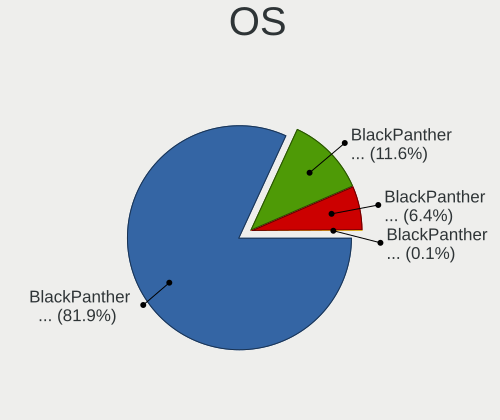

| Name              | Computers | Percent |
|-------------------|-----------|---------|
| BlackPanther 18.1 | 3395      | 81.87%  |
| BlackPanther 22.1 | 482       | 11.62%  |
| BlackPanther 16.2 | 266       | 6.41%   |
| BlackPanther 16.1 | 4         | 0.1%    |

OS Family
---------

OS without a version

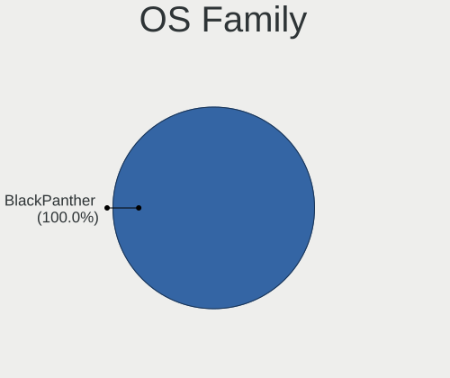

| Name         | Computers | Percent |
|--------------|-----------|---------|
| BlackPanther | 4002      | 100%    |

Kernel
------

Version of the Linux kernel

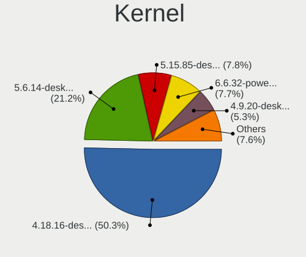

| Version                 | Computers | Percent |
|-------------------------|-----------|---------|
| 4.18.16-desktop-1bP     | 2340      | 50.34%  |
| 5.6.14-desktop-2bP      | 985       | 21.19%  |
| 5.15.85-desktop-1bP     | 363       | 7.81%   |
| 6.6.32-power-1bP        | 360       | 7.75%   |
| 4.9.20-desktop-pae-1bP  | 246       | 5.29%   |
| 5.1.15-desktop-1bP      | 121       | 2.6%    |
| 6.3.8-desktop-1bP       | 63        | 1.36%   |
| 6.6.34-power-1bP        | 32        | 0.69%   |
| 6.3.3-desktop-1bP       | 25        | 0.54%   |
| 6.4.3-desktop-1bP       | 14        | 0.3%    |
| 4.7.0-desktop-1bP       | 10        | 0.22%   |
| 6.2.9-desktop-1bP       | 9         | 0.19%   |
| 4.9.20-desktop-1bP      | 8         | 0.17%   |
| 6.6.11-power-1bP        | 6         | 0.13%   |
| 6.5.3-power-1bP         | 6         | 0.13%   |
| 6.5.7-power-1bP         | 4         | 0.09%   |
| 6.11.4-power-1bP        | 4         | 0.09%   |
| 6.9.3-power-1bP         | 3         | 0.06%   |
| 6.7.0-power-2bP         | 3         | 0.06%   |
| 6.10.3-server-1bP       | 3         | 0.06%   |
| 5.6.14-server-2bP       | 3         | 0.06%   |
| 4.14.14-desktop-pae-1bP | 3         | 0.06%   |
| 6.8.9-power-1bP         | 2         | 0.04%   |
| 6.7.2-tkg-pds           | 2         | 0.04%   |
| 6.7.0-rc4-tkg-eevdf     | 2         | 0.04%   |
| 6.16.0-power-1bP        | 2         | 0.04%   |
| 6.14.2-power-1bP        | 2         | 0.04%   |
| 6.13.7-power-1bP        | 2         | 0.04%   |
| 6.1.0-1bP               | 2         | 0.04%   |
| 5.10.1-desktop-2bP      | 2         | 0.04%   |
| 5.10.1-desktop-1bP      | 2         | 0.04%   |
| 5.1.15-server-1bP       | 2         | 0.04%   |
| 6.9.7-power-1bP         | 1         | 0.02%   |
| 6.9.5-power-1bP         | 1         | 0.02%   |
| 6.7.3_tkg_eevdf         | 1         | 0.02%   |
| 6.6.4-200.fc39.x86_64   | 1         | 0.02%   |
| 6.6.33-power-2bP        | 1         | 0.02%   |
| 6.6.30-power-1bP        | 1         | 0.02%   |
| 6.16.4-power-1bP        | 1         | 0.02%   |
| 6.13.4-power-1bP        | 1         | 0.02%   |

Kernel Family
-------------

Linux kernel without a distro release

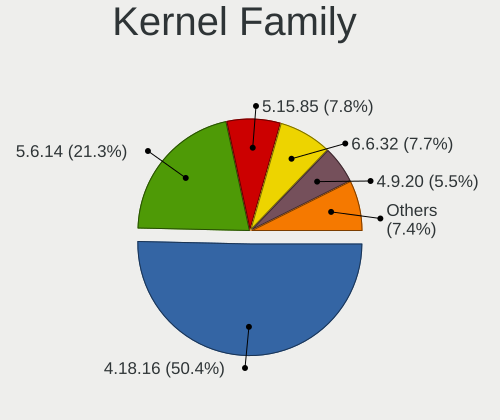

| Version | Computers | Percent |
|---------|-----------|---------|
| 4.18.16 | 2340      | 50.36%  |
| 5.6.14  | 988       | 21.26%  |
| 5.15.85 | 363       | 7.81%   |
| 6.6.32  | 360       | 7.75%   |
| 4.9.20  | 254       | 5.47%   |
| 5.1.15  | 122       | 2.63%   |
| 6.3.8   | 63        | 1.36%   |
| 6.6.34  | 32        | 0.69%   |
| 6.3.3   | 25        | 0.54%   |
| 6.4.3   | 14        | 0.3%    |
| 4.7.0   | 10        | 0.22%   |
| 6.2.9   | 9         | 0.19%   |
| 6.6.11  | 6         | 0.13%   |
| 6.5.3   | 6         | 0.13%   |
| 6.7.0   | 5         | 0.11%   |
| 6.5.7   | 4         | 0.09%   |
| 6.11.4  | 4         | 0.09%   |
| 5.10.1  | 4         | 0.09%   |
| 6.9.3   | 3         | 0.06%   |
| 6.10.3  | 3         | 0.06%   |
| 4.14.14 | 3         | 0.06%   |
| 6.8.9   | 2         | 0.04%   |
| 6.7.2   | 2         | 0.04%   |
| 6.16.0  | 2         | 0.04%   |
| 6.14.2  | 2         | 0.04%   |
| 6.13.7  | 2         | 0.04%   |
| 6.1.0   | 2         | 0.04%   |
| 6.9.7   | 1         | 0.02%   |
| 6.9.5   | 1         | 0.02%   |
| 6.7.3   | 1         | 0.02%   |
| 6.6.4   | 1         | 0.02%   |
| 6.6.33  | 1         | 0.02%   |
| 6.6.30  | 1         | 0.02%   |
| 6.16.4  | 1         | 0.02%   |
| 6.13.4  | 1         | 0.02%   |
| 6.12.12 | 1         | 0.02%   |
| 6.10.11 | 1         | 0.02%   |
| 5.8.11  | 1         | 0.02%   |
| 5.15.83 | 1         | 0.02%   |
| 5.15.6  | 1         | 0.02%   |

Kernel Major Ver.
-----------------

Linux kernel major version

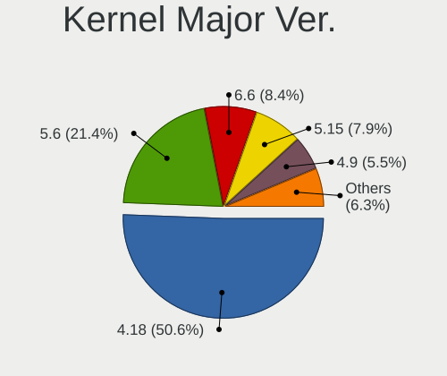

| Version | Computers | Percent |
|---------|-----------|---------|
| 4.18    | 2340      | 50.59%  |
| 5.6     | 988       | 21.36%  |
| 6.6     | 388       | 8.39%   |
| 5.15    | 365       | 7.89%   |
| 4.9     | 254       | 5.49%   |
| 5.1     | 122       | 2.64%   |
| 6.3     | 81        | 1.75%   |
| 6.4     | 14        | 0.3%    |
| 6.5     | 10        | 0.22%   |
| 4.7     | 10        | 0.22%   |
| 6.2     | 9         | 0.19%   |
| 6.7     | 7         | 0.15%   |
| 6.9     | 5         | 0.11%   |
| 6.11    | 4         | 0.09%   |
| 6.10    | 4         | 0.09%   |
| 5.10    | 4         | 0.09%   |
| 6.16    | 3         | 0.06%   |
| 6.13    | 3         | 0.06%   |
| 4.14    | 3         | 0.06%   |
| 6.8     | 2         | 0.04%   |
| 6.14    | 2         | 0.04%   |
| 6.1     | 2         | 0.04%   |
| 6.12    | 1         | 0.02%   |
| 5.8     | 1         | 0.02%   |
| 4.19    | 1         | 0.02%   |
| 4.15    | 1         | 0.02%   |
| 3.13    | 1         | 0.02%   |

Arch
----

OS architecture (x86_64, i586, etc.)

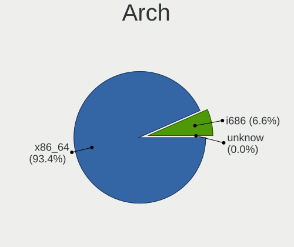

| Name   | Computers | Percent |
|--------|-----------|---------|
| x86_64 | 3787      | 93.39%  |
| i686   | 267       | 6.58%   |
| unknow | 1         | 0.02%   |

DE
--

Desktop Environment

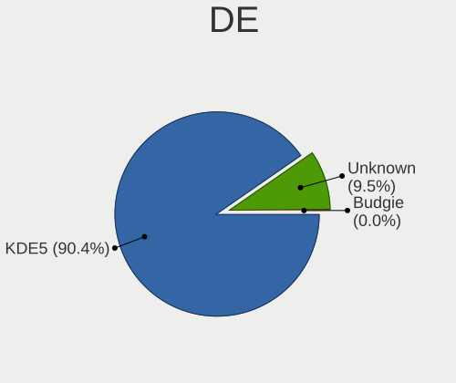

| Name     | Computers | Percent |
|----------|-----------|---------|
| KDE5     | 3625      | 90.35%  |
| Unknown  | 381       | 9.5%    |
| KDE      | 4         | 0.1%    |
| Cinnamon | 1         | 0.02%   |
| Budgie   | 1         | 0.02%   |

Display Server
--------------

X11 or Wayland

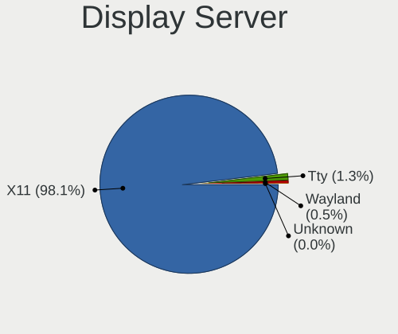

| Name    | Computers | Percent |
|---------|-----------|---------|
| X11     | 3937      | 98.11%  |
| Tty     | 52        | 1.3%    |
| Wayland | 22        | 0.55%   |
| Unknown | 2         | 0.05%   |

Display Manager
---------------

SDDM, LightDM, etc.

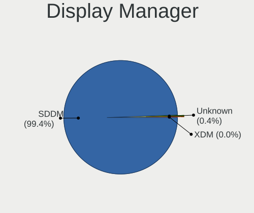

| Name    | Computers | Percent |
|---------|-----------|---------|
| SDDM    | 3987      | 99.4%   |
| Unknown | 17        | 0.42%   |
| LightDM | 6         | 0.15%   |
| XDM     | 1         | 0.02%   |

OS Lang
-------

Language

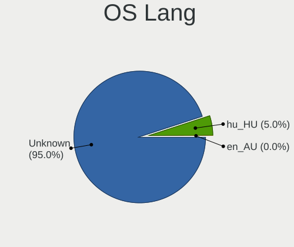

| Lang    | Computers | Percent |
|---------|-----------|---------|
| Unknown | 3807      | 94.99%  |
| hu_HU   | 199       | 4.97%   |
| ro_RO   | 1         | 0.02%   |
| en_AU   | 1         | 0.02%   |

Boot Mode
---------

EFI or BIOS

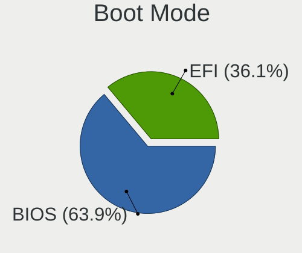

| Mode | Computers | Percent |
|------|-----------|---------|
| BIOS | 2688      | 63.92%  |
| EFI  | 1517      | 36.08%  |

Filesystem
----------

Type of filesystem

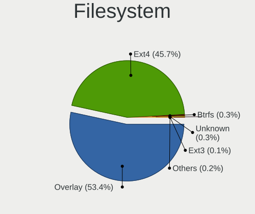

| Type    | Computers | Percent |
|---------|-----------|---------|
| Overlay | 2445      | 53.4%   |
| Ext4    | 2093      | 45.71%  |
| Btrfs   | 15        | 0.33%   |
| Unknown | 13        | 0.28%   |
| Ext3    | 5         | 0.11%   |
| Ext2    | 5         | 0.11%   |
| Ntfs    | 2         | 0.04%   |
| Xfs     | 1         | 0.02%   |

Part. scheme
------------

Scheme of partitioning

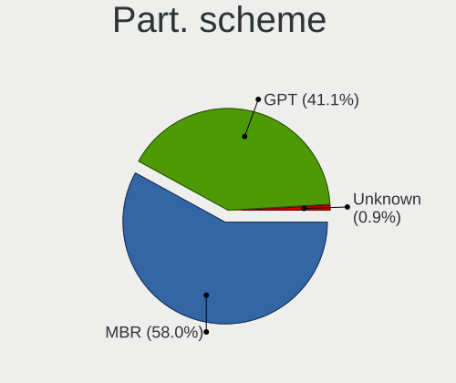

| Type    | Computers | Percent |
|---------|-----------|---------|
| MBR     | 2463      | 57.98%  |
| GPT     | 1745      | 41.08%  |
| Unknown | 40        | 0.94%   |

Dual Boot with Linux/BSD
------------------------

Hosting more than one Linux/BSD

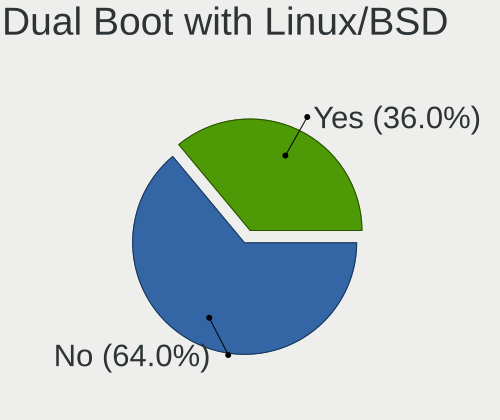

| Dual boot | Computers | Percent |
|-----------|-----------|---------|
| No        | 2863      | 63.96%  |
| Yes       | 1613      | 36.04%  |

Dual Boot (Win)
---------------

Hosting Linux and Windows

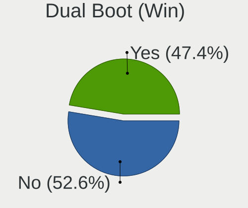

| Dual boot | Computers | Percent |
|-----------|-----------|---------|
| No        | 2302      | 52.63%  |
| Yes       | 2072      | 47.37%  |

Board
-----

Vendor
------

Motherboard manufacturer

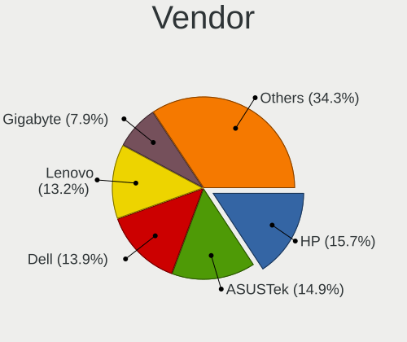

| Name                | Computers | Percent |
|---------------------|-----------|---------|
| Hewlett-Packard     | 630       | 15.74%  |
| ASUSTek Computer    | 596       | 14.89%  |
| Dell                | 557       | 13.92%  |
| Lenovo              | 530       | 13.24%  |
| Gigabyte Technology | 315       | 7.87%   |
| Acer                | 274       | 6.85%   |
| ASRock              | 249       | 6.22%   |
| MSI                 | 151       | 3.77%   |
| Fujitsu             | 101       | 2.52%   |
| Toshiba             | 95        | 2.37%   |
| Fujitsu Siemens     | 58        | 1.45%   |
| Samsung Electronics | 54        | 1.35%   |
| Packard Bell        | 37        | 0.92%   |
| Medion              | 36        | 0.9%    |
| Apple               | 36        | 0.9%    |
| Intel               | 30        | 0.75%   |
| Sony                | 26        | 0.65%   |
| eMachines           | 22        | 0.55%   |
| Foxconn             | 20        | 0.5%    |
| Unknown             | 17        | 0.42%   |
| Pegatron            | 12        | 0.3%    |
| Gateway             | 10        | 0.25%   |
| Shuttle             | 8         | 0.2%    |
| Biostar             | 7         | 0.17%   |
| Alcor               | 7         | 0.17%   |
| Hungaro Flotta Kft  | 6         | 0.15%   |
| Huanan              | 6         | 0.15%   |
| Microsoft           | 5         | 0.12%   |
| Google              | 5         | 0.12%   |
| ECS                 | 5         | 0.12%   |
| BANGHO              | 4         | 0.1%    |
| AWOW                | 4         | 0.1%    |
| Sapphire            | 3         | 0.07%   |
| NVISEN              | 3         | 0.07%   |
| Insyde              | 3         | 0.07%   |
| IBM                 | 3         | 0.07%   |
| GMKtec              | 3         | 0.07%   |
| AMI                 | 3         | 0.07%   |
| Alienware           | 3         | 0.07%   |
| ABIT                | 3         | 0.07%   |

Model
-----

Motherboard model

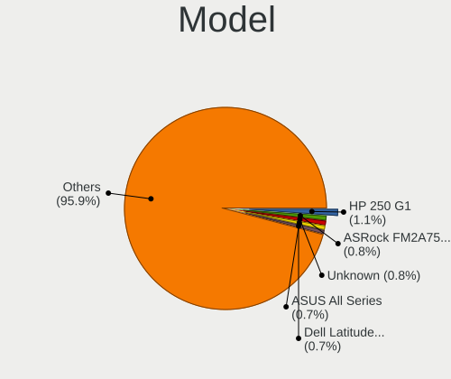

| Name                                | Computers | Percent |
|-------------------------------------|-----------|---------|
| HP 250 G1                           | 45        | 1.12%   |
| ASRock FM2A75M Pro4+                | 32        | 0.8%    |
| Unknown                             | 31        | 0.77%   |
| ASUS All Series                     | 29        | 0.72%   |
| Dell Latitude E6410                 | 27        | 0.67%   |
| Dell OptiPlex 3020                  | 19        | 0.47%   |
| Lenovo IdeaPad 330-15IKB 81DE       | 18        | 0.45%   |
| HP ProBook 455 G1                   | 18        | 0.45%   |
| Gigabyte H61M-S1                    | 16        | 0.4%    |
| Dell OptiPlex 780                   | 16        | 0.4%    |
| HP Notebook                         | 15        | 0.37%   |
| Dell OptiPlex 760                   | 14        | 0.35%   |
| Dell OptiPlex 755                   | 14        | 0.35%   |
| MSI MS-7680                         | 12        | 0.3%    |
| Gigabyte G31M-ES2L                  | 12        | 0.3%    |
| Lenovo G50-45 80E3                  | 11        | 0.27%   |
| Dell Latitude 5480                  | 11        | 0.27%   |
| Dell Inspiron 7737                  | 11        | 0.27%   |
| Lenovo ThinkStation D20 4158AF8     | 10        | 0.25%   |
| HP ProDesk 600 G2 SFF               | 10        | 0.25%   |
| HP EliteBook 8470p                  | 10        | 0.25%   |
| Dell OptiPlex 745                   | 10        | 0.25%   |
| Dell OptiPlex 7010                  | 10        | 0.25%   |
| ASUS P5KPL-AM EPU                   | 10        | 0.25%   |
| Toshiba Satellite C660              | 9         | 0.22%   |
| MSI MS-7721                         | 9         | 0.22%   |
| Lenovo IdeaPad 100-15IBD 80QQ       | 9         | 0.22%   |
| HP Pavilion Gaming Laptop 15-ec1xxx | 9         | 0.22%   |
| HP Pavilion g6                      | 9         | 0.22%   |
| HP Compaq 8000 Elite SFF PC         | 9         | 0.22%   |
| HP 650                              | 9         | 0.22%   |
| HP 620                              | 9         | 0.22%   |
| HP 250 G5 Notebook PC               | 9         | 0.22%   |
| Dell Inspiron 3521                  | 9         | 0.22%   |
| ASUS PRIME A320M-R                  | 9         | 0.22%   |
| ASUS K50IJ                          | 9         | 0.22%   |
| ASUS H110M-A                        | 9         | 0.22%   |
| ASRock G41M-VS3                     | 9         | 0.22%   |
| MSI MS-7C91                         | 8         | 0.2%    |
| HP Compaq 8200 Elite MT PC          | 8         | 0.2%    |

Model Family
------------

Motherboard model prefix

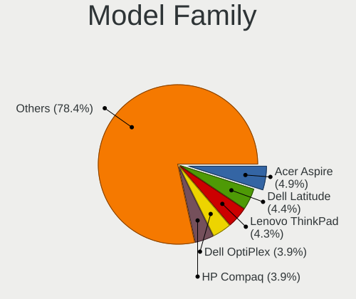

| Name                    | Computers | Percent |
|-------------------------|-----------|---------|
| Acer Aspire             | 198       | 4.95%   |
| Dell Latitude           | 178       | 4.45%   |
| Lenovo ThinkPad         | 174       | 4.35%   |
| Dell OptiPlex           | 158       | 3.95%   |
| HP Compaq               | 156       | 3.9%    |
| Dell Inspiron           | 140       | 3.5%    |
| Lenovo IdeaPad          | 114       | 2.85%   |
| Toshiba Satellite       | 85        | 2.12%   |
| HP ProBook              | 84        | 2.1%    |
| HP EliteBook            | 73        | 1.82%   |
| Lenovo ThinkCentre      | 67        | 1.67%   |
| HP 250                  | 64        | 1.6%    |
| HP Pavilion             | 60        | 1.5%    |
| ASUS PRIME              | 53        | 1.32%   |
| Fujitsu ESPRIMO         | 44        | 1.1%    |
| Fujitsu LIFEBOOK        | 37        | 0.92%   |
| ASUS VivoBook           | 36        | 0.9%    |
| Packard Bell EasyNote   | 33        | 0.82%   |
| ASRock FM2A75M          | 32        | 0.8%    |
| Unknown                 | 31        | 0.77%   |
| ASUS All                | 29        | 0.72%   |
| HP Laptop               | 25        | 0.62%   |
| Dell Precision          | 25        | 0.62%   |
| Fujitsu Siemens ESPRIMO | 24        | 0.6%    |
| Dell Vostro             | 24        | 0.6%    |
| Fujitsu Siemens AMILO   | 23        | 0.57%   |
| Lenovo ThinkStation     | 21        | 0.52%   |
| Acer TravelMate         | 21        | 0.52%   |
| HP ProDesk              | 17        | 0.42%   |
| HP EliteDesk            | 16        | 0.4%    |
| Gigabyte H61M-S1        | 16        | 0.4%    |
| ASUS P5KPL-AM           | 16        | 0.4%    |
| HP Notebook             | 15        | 0.37%   |
| ASUS ROG                | 15        | 0.37%   |
| MSI MS-7680             | 12        | 0.3%    |
| HP Presario             | 12        | 0.3%    |
| Gigabyte G31M-ES2L      | 12        | 0.3%    |
| Acer Veriton            | 12        | 0.3%    |
| Lenovo G50-45           | 11        | 0.27%   |
| ASUS H110M-A            | 11        | 0.27%   |

MFG Year
--------

Motherboard manufacture year

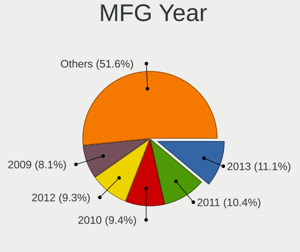

| Year    | Computers | Percent |
|---------|-----------|---------|
| 2013    | 444       | 11.09%  |
| 2011    | 418       | 10.44%  |
| 2010    | 376       | 9.4%    |
| 2012    | 374       | 9.35%   |
| 2009    | 324       | 8.1%    |
| 2014    | 319       | 7.97%   |
| 2008    | 309       | 7.72%   |
| 2015    | 216       | 5.4%    |
| 2007    | 213       | 5.32%   |
| 2018    | 207       | 5.17%   |
| 2016    | 186       | 4.65%   |
| 2017    | 171       | 4.27%   |
| 2019    | 122       | 3.05%   |
| 2006    | 94        | 2.35%   |
| 2020    | 84        | 2.1%    |
| 2021    | 48        | 1.2%    |
| 2022    | 28        | 0.7%    |
| 2024    | 24        | 0.6%    |
| 2005    | 24        | 0.6%    |
| 2023    | 14        | 0.35%   |
| 2004    | 5         | 0.12%   |
| 2003    | 1         | 0.02%   |
| Unknown | 1         | 0.02%   |

Form Factor
-----------

Physical design of the computer

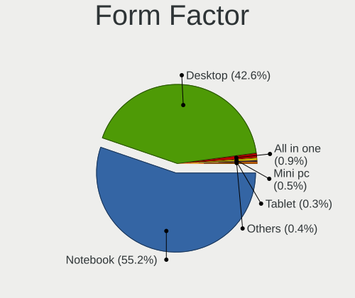

| Name        | Computers | Percent |
|-------------|-----------|---------|
| Notebook    | 2211      | 55.25%  |
| Desktop     | 1705      | 42.6%   |
| All in one  | 37        | 0.92%   |
| Mini pc     | 21        | 0.52%   |
| Tablet      | 11        | 0.27%   |
| Convertible | 9         | 0.22%   |
| Server      | 7         | 0.17%   |
| Stick pc    | 1         | 0.02%   |

Secure Boot
-----------

Enabled or disabled

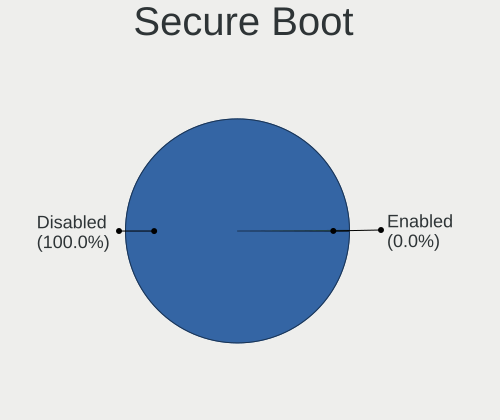

| State    | Computers | Percent |
|----------|-----------|---------|
| Disabled | 4002      | 99.98%  |
| Enabled  | 1         | 0.02%   |

Coreboot
--------

Have coreboot on board

| Used | Computers | Percent |
|------|-----------|---------|
| No   | 3997      | 99.88%  |
| Yes  | 5         | 0.12%   |

RAM Size
--------

Total RAM memory

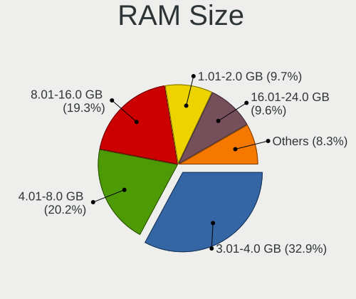

| Size in GB  | Computers | Percent |
|-------------|-----------|---------|
| 3.01-4.0    | 1369      | 32.86%  |
| 4.01-8.0    | 841       | 20.19%  |
| 8.01-16.0   | 805       | 19.32%  |
| 1.01-2.0    | 404       | 9.7%    |
| 16.01-24.0  | 401       | 9.63%   |
| 2.01-3.0    | 129       | 3.1%    |
| 32.01-64.0  | 111       | 2.66%   |
| 0.51-1.0    | 48        | 1.15%   |
| 24.01-32.0  | 46        | 1.1%    |
| 64.01-256.0 | 9         | 0.22%   |
| Unknown     | 3         | 0.07%   |

RAM Used
--------

Used RAM memory

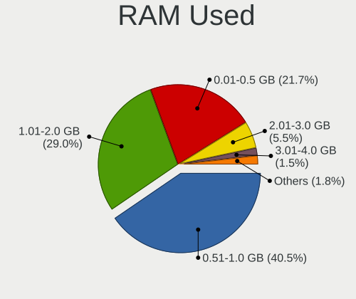

| Used GB    | Computers | Percent |
|------------|-----------|---------|
| 0.51-1.0   | 1976      | 40.46%  |
| 1.01-2.0   | 1414      | 28.95%  |
| 0.01-0.5   | 1062      | 21.74%  |
| 2.01-3.0   | 268       | 5.49%   |
| 3.01-4.0   | 75        | 1.54%   |
| 4.01-8.0   | 70        | 1.43%   |
| 8.01-16.0  | 11        | 0.23%   |
| 16.01-24.0 | 4         | 0.08%   |
| Unknown    | 4         | 0.08%   |

Total Drives
------------

Number of drives on board

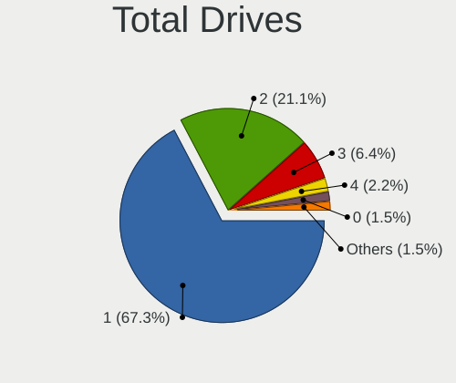

| Drives | Computers | Percent |
|--------|-----------|---------|
| 1      | 2920      | 67.3%   |
| 2      | 916       | 21.11%  |
| 3      | 279       | 6.43%   |
| 4      | 94        | 2.17%   |
| 0      | 65        | 1.5%    |
| 5      | 44        | 1.01%   |
| 6      | 11        | 0.25%   |
| 9      | 3         | 0.07%   |
| 8      | 3         | 0.07%   |
| 10     | 2         | 0.05%   |
| 7      | 2         | 0.05%   |

Has CD-ROM
----------

Has CD-ROM on board

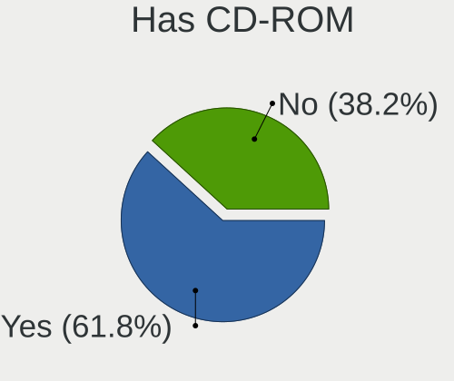

| Presented | Computers | Percent |
|-----------|-----------|---------|
| Yes       | 2538      | 61.81%  |
| No        | 1568      | 38.19%  |

Has Ethernet
------------

Has Ethernet on board

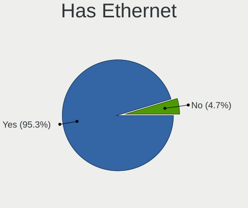

| Presented | Computers | Percent |
|-----------|-----------|---------|
| Yes       | 3819      | 95.31%  |
| No        | 188       | 4.69%   |

Has WiFi
--------

Has WiFi module

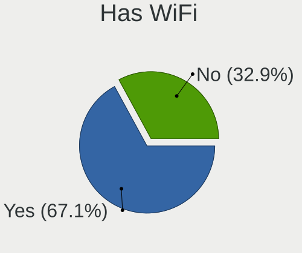

| Presented | Computers | Percent |
|-----------|-----------|---------|
| Yes       | 2721      | 67.07%  |
| No        | 1336      | 32.93%  |

Has Bluetooth
-------------

Has Bluetooth module

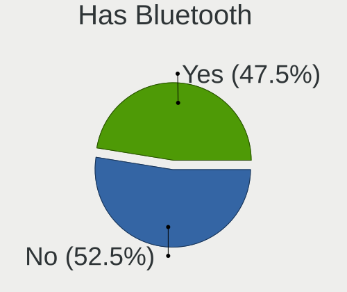

| Presented | Computers | Percent |
|-----------|-----------|---------|
| No        | 2152      | 52.54%  |
| Yes       | 1944      | 47.46%  |

Location
--------

Country
-------

Geographic location (country)

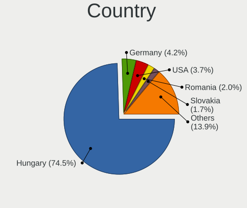

| Country      | Computers | Percent |
|--------------|-----------|---------|
| Hungary      | 2994      | 74.5%   |
| Germany      | 169       | 4.21%   |
| USA          | 148       | 3.68%   |
| Romania      | 80        | 1.99%   |
| Slovakia     | 69        | 1.72%   |
| UK           | 58        | 1.44%   |
| Italy        | 39        | 0.97%   |
| France       | 36        | 0.9%    |
| Canada       | 35        | 0.87%   |
| Austria      | 35        | 0.87%   |
| Brazil       | 32        | 0.8%    |
| Spain        | 31        | 0.77%   |
| Argentina    | 26        | 0.65%   |
| Serbia       | 21        | 0.52%   |
| Poland       | 19        | 0.47%   |
| Australia    | 19        | 0.47%   |
| Japan        | 18        | 0.45%   |
| Ireland      | 13        | 0.32%   |
| Philippines  | 10        | 0.25%   |
| Russia       | 9         | 0.22%   |
| South Africa | 8         | 0.2%    |
| Netherlands  | 8         | 0.2%    |
| Greece       | 8         | 0.2%    |
| Belgium      | 8         | 0.2%    |
| Switzerland  | 7         | 0.17%   |
| India        | 7         | 0.17%   |
| Ukraine      | 6         | 0.15%   |
| Finland      | 6         | 0.15%   |
| Czechia      | 5         | 0.12%   |
| Turkey       | 4         | 0.1%    |
| Sweden       | 4         | 0.1%    |
| Mexico       | 4         | 0.1%    |
| Egypt        | 4         | 0.1%    |
| China        | 4         | 0.1%    |
| Algeria      | 4         | 0.1%    |
| Uruguay      | 3         | 0.07%   |
| Puerto Rico  | 3         | 0.07%   |
| Israel       | 3         | 0.07%   |
| Denmark      | 3         | 0.07%   |
| Cyprus       | 3         | 0.07%   |

City
----

Geographic location (city)

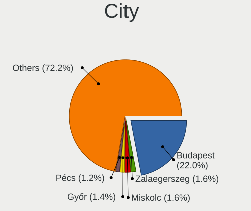

| City              | Computers | Percent |
|-------------------|-----------|---------|
| Budapest          | 1084      | 22%     |
| Zalaegerszeg      | 78        | 1.58%   |
| Miskolc           | 78        | 1.58%   |
| Győr             | 71        | 1.44%   |
| Pécs             | 59        | 1.2%    |
| Tatabánya        | 58        | 1.18%   |
| Debrecen          | 57        | 1.16%   |
| Kecskemét        | 55        | 1.12%   |
| Szeged            | 51        | 1.04%   |
| Karcag            | 47        | 0.95%   |
| Szigetszentmiklos | 45        | 0.91%   |
| Nyiregyhaza       | 42        | 0.85%   |
| Szombathely       | 41        | 0.83%   |
| Székesfehérvár | 41        | 0.83%   |
| Berettyóújfalu  | 38        | 0.77%   |
| Veszprém         | 34        | 0.69%   |
| Szolnok           | 33        | 0.67%   |
| Oroshaza          | 31        | 0.63%   |
| Szekszárd        | 30        | 0.61%   |
| Cegled            | 28        | 0.57%   |
| Érd              | 23        | 0.47%   |
| Eger              | 23        | 0.47%   |
| Vienna            | 22        | 0.45%   |
| Gödöllő        | 22        | 0.45%   |
| Salgotarjan       | 21        | 0.43%   |
| Pomaz             | 21        | 0.43%   |
| Tamasi            | 20        | 0.41%   |
| Bratislava        | 20        | 0.41%   |
| Toeroekbalint     | 19        | 0.39%   |
| Szentendre        | 19        | 0.39%   |
| Nagykanizsa       | 19        | 0.39%   |
| Kaposvár         | 19        | 0.39%   |
| Csongrad          | 19        | 0.39%   |
| Sarbogard         | 18        | 0.37%   |
| Hatvan            | 18        | 0.37%   |
| Dunaújváros     | 18        | 0.37%   |
| Ajka              | 17        | 0.35%   |
| Sopron            | 16        | 0.32%   |
| Regensburg        | 16        | 0.32%   |
| Gyomro            | 16        | 0.32%   |

Drives
------

Drive Vendor
------------

Hard drive vendors

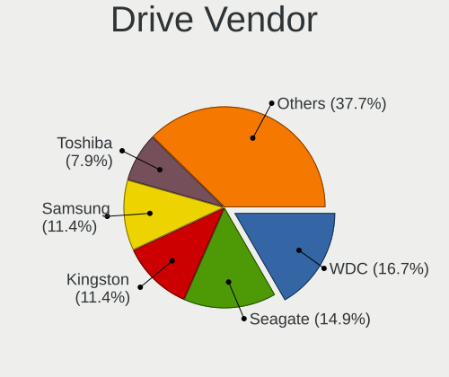

| Vendor                      | Computers | Drives | Percent |
|-----------------------------|-----------|--------|---------|
| WDC                         | 974       | 1897   | 16.66%  |
| Seagate                     | 874       | 1457   | 14.95%  |
| Kingston                    | 668       | 1331   | 11.42%  |
| Samsung Electronics         | 666       | 1400   | 11.39%  |
| Toshiba                     | 464       | 851    | 7.93%   |
| Hitachi                     | 298       | 447    | 5.1%    |
| HGST                        | 212       | 408    | 3.63%   |
| SanDisk                     | 182       | 343    | 3.11%   |
| A-DATA Technology           | 150       | 282    | 2.56%   |
| Unknown                     | 105       | 197    | 1.8%    |
| Crucial                     | 91        | 160    | 1.56%   |
| Intel                       | 86        | 148    | 1.47%   |
| SPCC                        | 74        | 114    | 1.27%   |
| Fujitsu                     | 72        | 88     | 1.23%   |
| SK hynix                    | 70        | 119    | 1.2%    |
| Intenso                     | 66        | 143    | 1.13%   |
| Maxtor                      | 61        | 78     | 1.04%   |
| Micron Technology           | 57        | 105    | 0.97%   |
| Apacer                      | 45        | 76     | 0.77%   |
| JMicron Technology          | 44        | 50     | 0.75%   |
| Patriot                     | 40        | 90     | 0.68%   |
| China                       | 35        | 56     | 0.6%    |
| PNY                         | 33        | 58     | 0.56%   |
| Kingmax                     | 24        | 56     | 0.41%   |
| Gigabyte Technology         | 24        | 67     | 0.41%   |
| OCZ                         | 22        | 28     | 0.38%   |
| Team                        | 19        | 29     | 0.32%   |
| LITEON                      | 19        | 33     | 0.32%   |
| Hewlett-Packard             | 19        | 26     | 0.32%   |
| Netac                       | 17        | 29     | 0.29%   |
| Unknown                     | 17        | 29     | 0.29%   |
| Verbatim                    | 15        | 32     | 0.26%   |
| GOODRAM                     | 15        | 20     | 0.26%   |
| XPG                         | 13        | 21     | 0.22%   |
| Transcend                   | 12        | 19     | 0.21%   |
| Apple                       | 12        | 25     | 0.21%   |
| Kingston Technology Company | 11        | 25     | 0.19%   |
| LITEONIT                    | 10        | 24     | 0.17%   |
| KIOXIA                      | 10        | 20     | 0.17%   |
| KingSpec                    | 10        | 13     | 0.17%   |

Drive Model
-----------

Hard drive models

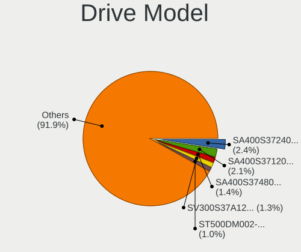

| Model                              | Computers | Percent |
|------------------------------------|-----------|---------|
| Kingston SA400S37240G 240GB SSD    | 154       | 2.42%   |
| Kingston SA400S37120G 120GB SSD    | 131       | 2.05%   |
| Kingston SA400S37480G 480GB SSD    | 87        | 1.36%   |
| Kingston SV300S37A120G 120GB SSD   | 80        | 1.25%   |
| Seagate ST500DM002-1BD142 500GB    | 62        | 0.97%   |
| Toshiba DT01ACA100 1TB             | 61        | 0.96%   |
| Seagate ST1000LM035-1RK172 1TB     | 53        | 0.83%   |
| Seagate ST1000LM024 HN-M101MBB 1TB | 53        | 0.83%   |
| Toshiba MQ01ABF050 500GB           | 50        | 0.78%   |
| Seagate ST500LT012-1DG142 500GB    | 49        | 0.77%   |
| Toshiba MQ01ABD100 1TB             | 47        | 0.74%   |
| Kingston SUV400S37120G 120GB SSD   | 41        | 0.64%   |
| HGST HTS545050A7E680 500GB         | 38        | 0.6%    |
| HGST HTS545032A7E380 320GB         | 36        | 0.56%   |
| A-DATA SU630 240GB SSD             | 35        | 0.55%   |
| JMicron Generic 320GB              | 34        | 0.53%   |
| Samsung SSD 860 EVO 500GB          | 33        | 0.52%   |
| Toshiba DT01ACA050 500GB           | 32        | 0.5%    |
| SPCC Solid State Disk 256GB        | 31        | 0.49%   |
| Samsung SSD 850 EVO 250GB          | 31        | 0.49%   |
| HGST HTS725050A7E630 500GB         | 31        | 0.49%   |
| Kingston SA400S37960G 960GB SSD    | 30        | 0.47%   |
| Seagate ST500LT012-9WS142 500GB    | 29        | 0.45%   |
| Seagate ST9500325AS 500GB          | 27        | 0.42%   |
| Samsung SSD 860 EVO 250GB          | 25        | 0.39%   |
| A-DATA SU700 120GB SSD             | 25        | 0.39%   |
| Toshiba MQ04ABF100 1TB             | 24        | 0.38%   |
| Seagate ST9320325AS 320GB          | 24        | 0.38%   |
| Seagate ST380815AS 80GB            | 23        | 0.36%   |
| WDC WDS240G2G0A-00JH30 240GB SSD   | 22        | 0.35%   |
| WDC WD10EZEX-08WN4A0 1TB           | 22        | 0.35%   |
| WDC WD10JPVX-22JC3T0 1TB           | 21        | 0.33%   |
| HGST HTS721010A9E630 1TB           | 21        | 0.33%   |
| HGST HTS541010A9E680 1TB           | 21        | 0.33%   |
| Samsung HD502HJ 500GB              | 20        | 0.31%   |
| Seagate ST3160815AS 160GB          | 19        | 0.3%    |
| Crucial CT120BX500SSD1 120GB       | 19        | 0.3%    |
| PNY CS900 120GB SSD                | 18        | 0.28%   |
| Patriot Burst 120GB SSD            | 18        | 0.28%   |
| Kingston SV300S37A240G 240GB SSD   | 18        | 0.28%   |

HDD Vendor
----------

Hard disk drive vendors

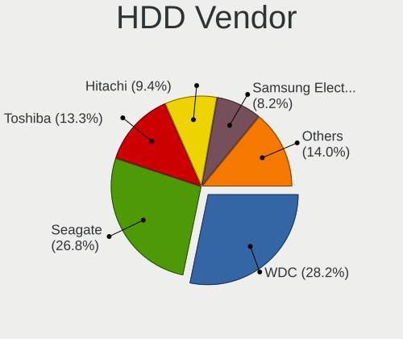

| Vendor              | Computers | Drives | Percent |
|---------------------|-----------|--------|---------|
| WDC                 | 897       | 1719   | 28.24%  |
| Seagate             | 852       | 1416   | 26.83%  |
| Toshiba             | 423       | 771    | 13.32%  |
| Hitachi             | 298       | 447    | 9.38%   |
| Samsung Electronics | 260       | 431    | 8.19%   |
| HGST                | 212       | 408    | 6.68%   |
| Fujitsu             | 72        | 88     | 2.27%   |
| Maxtor              | 60        | 77     | 1.89%   |
| JMicron Technology  | 34        | 39     | 1.07%   |
| Unknown             | 9         | 19     | 0.28%   |
| Hewlett-Packard     | 8         | 10     | 0.25%   |
| USB3.0              | 6         | 10     | 0.19%   |
| Apple               | 6         | 9      | 0.19%   |
| WD MediaMax         | 5         | 6      | 0.16%   |
| ASMT                | 5         | 8      | 0.16%   |
| ICY BOX             | 3         | 5      | 0.09%   |
| IBM/Hitachi         | 3         | 4      | 0.09%   |
| HGST HTS            | 3         | 8      | 0.09%   |
| USB                 | 2         | 3      | 0.06%   |
| TO Exter            | 2         | 3      | 0.06%   |
| SATAFIRM            | 2         | 2      | 0.06%   |
| Quantum             | 2         | 2      | 0.06%   |
| IB-1122             | 2         | 2      | 0.06%   |
| ExcelStor           | 2         | 2      | 0.06%   |
| Unknown             | 2         | 3      | 0.06%   |
| QC-FT-D             | 1         | 1      | 0.03%   |
| MARSHAL             | 1         | 2      | 0.03%   |
| Initio              | 1         | 2      | 0.03%   |
| HCG8e               | 1         | 1      | 0.03%   |
| Emphase             | 1         | 2      | 0.03%   |
| CSD                 | 1         | 2      | 0.03%   |

SSD Vendor
----------

Solid state drive vendors

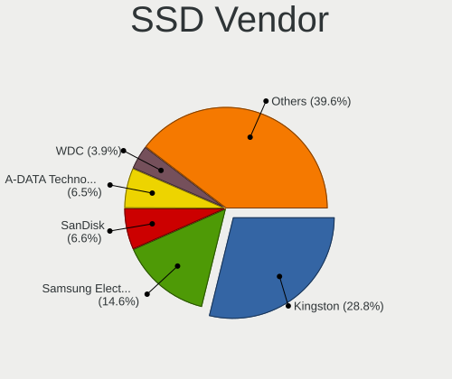

| Vendor              | Computers | Drives | Percent |
|---------------------|-----------|--------|---------|
| Kingston            | 616       | 1178   | 28.81%  |
| Samsung Electronics | 312       | 650    | 14.59%  |
| SanDisk             | 142       | 267    | 6.64%   |
| A-DATA Technology   | 138       | 264    | 6.45%   |
| WDC                 | 83        | 153    | 3.88%   |
| Crucial             | 81        | 144    | 3.79%   |
| SPCC                | 67        | 105    | 3.13%   |
| Intenso             | 66        | 143    | 3.09%   |
| Intel               | 64        | 103    | 2.99%   |
| Micron Technology   | 43        | 81     | 2.01%   |
| Apacer              | 42        | 71     | 1.96%   |
| Patriot             | 39        | 89     | 1.82%   |
| SK hynix            | 35        | 56     | 1.64%   |
| China               | 35        | 56     | 1.64%   |
| PNY                 | 33        | 58     | 1.54%   |
| Toshiba             | 24        | 52     | 1.12%   |
| Kingmax             | 23        | 54     | 1.08%   |
| OCZ                 | 22        | 28     | 1.03%   |
| Gigabyte Technology | 21        | 58     | 0.98%   |
| Team                | 18        | 28     | 0.84%   |
| Netac               | 17        | 29     | 0.8%    |
| LITEON              | 16        | 24     | 0.75%   |
| Verbatim            | 15        | 32     | 0.7%    |
| GOODRAM             | 14        | 18     | 0.65%   |
| Transcend           | 11        | 14     | 0.51%   |
| LITEONIT            | 10        | 24     | 0.47%   |
| KingSpec            | 10        | 13     | 0.47%   |
| Corsair             | 10        | 13     | 0.47%   |
| Hewlett-Packard     | 7         | 10     | 0.33%   |
| Seagate             | 6         | 6      | 0.28%   |
| Apple               | 6         | 16     | 0.28%   |
| Lexar               | 4         | 7      | 0.19%   |
| Go-Infinity         | 4         | 4      | 0.19%   |
| EAGET               | 4         | 4      | 0.19%   |
| BHT                 | 4         | 4      | 0.19%   |
| Unknown             | 4         | 7      | 0.19%   |
| Unknown             | 3         | 6      | 0.14%   |
| SPCC Sol            | 3         | 3      | 0.14%   |
| sobetter            | 3         | 3      | 0.14%   |
| SATA SSD            | 3         | 3      | 0.14%   |

Drive Kind
----------

HDD or SSD

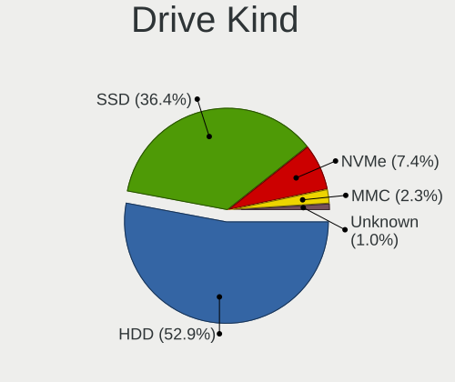

| Kind    | Computers | Drives | Percent |
|---------|-----------|--------|---------|
| HDD     | 2667      | 5502   | 52.95%  |
| SSD     | 1832      | 4015   | 36.37%  |
| NVMe    | 372       | 964    | 7.39%   |
| MMC     | 114       | 208    | 2.26%   |
| Unknown | 52        | 81     | 1.03%   |

Drive Connector
---------------

SATA, SAS, NVMe, etc.

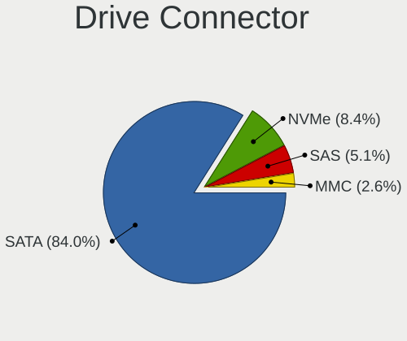

| Type | Computers | Drives | Percent |
|------|-----------|--------|---------|
| SATA | 3721      | 9225   | 83.96%  |
| NVMe | 371       | 960    | 8.37%   |
| SAS  | 226       | 377    | 5.1%    |
| MMC  | 114       | 208    | 2.57%   |

Drive Size
----------

Size of hard drive

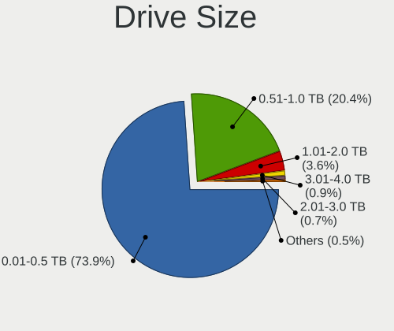

| Size in TB | Computers | Drives | Percent |
|------------|-----------|--------|---------|
| 0.01-0.5   | 3273      | 6987   | 73.92%  |
| 0.51-1.0   | 902       | 1899   | 20.37%  |
| 1.01-2.0   | 160       | 353    | 3.61%   |
| 3.01-4.0   | 41        | 117    | 0.93%   |
| 2.01-3.0   | 32        | 132    | 0.72%   |
| 4.01-10.0  | 18        | 26     | 0.41%   |
| 10.01-20.0 | 2         | 3      | 0.05%   |

Space Total
-----------

Amount of disk space available on the file system

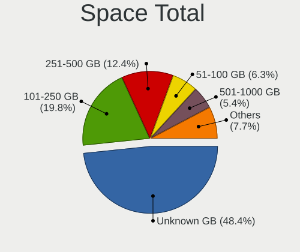

| Size in GB     | Computers | Percent |
|----------------|-----------|---------|
| Unknown        | 2369      | 48.36%  |
| 101-250        | 970       | 19.8%   |
| 251-500        | 609       | 12.43%  |
| 51-100         | 307       | 6.27%   |
| 501-1000       | 266       | 5.43%   |
| 21-50          | 171       | 3.49%   |
| 1001-2000      | 95        | 1.94%   |
| 1-20           | 56        | 1.14%   |
| 2001-3000      | 38        | 0.78%   |
| More than 3000 | 17        | 0.35%   |
| 0              | 1         | 0.02%   |

Space Used
----------

Amount of used disk space

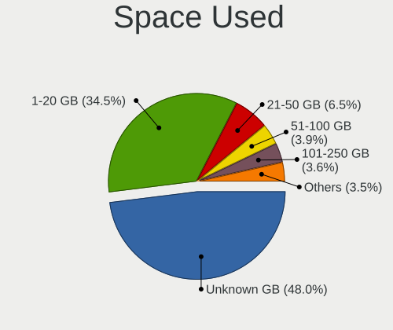

| Used GB        | Computers | Percent |
|----------------|-----------|---------|
| Unknown        | 2369      | 48.03%  |
| 1-20           | 1702      | 34.51%  |
| 21-50          | 320       | 6.49%   |
| 51-100         | 191       | 3.87%   |
| 101-250        | 176       | 3.57%   |
| 251-500        | 72        | 1.46%   |
| 501-1000       | 45        | 0.91%   |
| 1001-2000      | 41        | 0.83%   |
| 2001-3000      | 10        | 0.2%    |
| More than 3000 | 4         | 0.08%   |
| 0              | 2         | 0.04%   |

Malfunc. Drives
---------------

Drive models with a malfunction

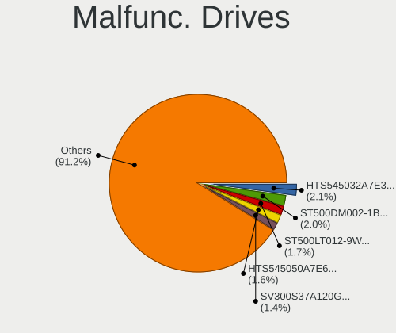

| Model                              | Computers | Drives | Percent |
|------------------------------------|-----------|--------|---------|
| HGST HTS545032A7E380 320GB         | 35        | 65     | 2.14%   |
| Seagate ST500DM002-1BD142 500GB    | 33        | 52     | 2.02%   |
| Seagate ST500LT012-9WS142 500GB    | 27        | 39     | 1.65%   |
| HGST HTS545050A7E680 500GB         | 26        | 36     | 1.59%   |
| Kingston SV300S37A120G 120GB SSD   | 23        | 31     | 1.41%   |
| Seagate ST1000LM024 HN-M101MBB 1TB | 22        | 29     | 1.34%   |
| HGST HTS725050A7E630 500GB         | 22        | 31     | 1.34%   |
| Seagate ST500LT012-1DG142 500GB    | 21        | 38     | 1.28%   |
| A-DATA Technology SU630 240GB SSD  | 20        | 40     | 1.22%   |
| Seagate ST9500325AS 500GB          | 16        | 28     | 0.98%   |
| HGST HTS541010A9E680 1TB           | 16        | 35     | 0.98%   |
| Toshiba DT01ACA100 1TB             | 15        | 31     | 0.92%   |
| Seagate ST9320325AS 320GB          | 14        | 30     | 0.86%   |
| Samsung Electronics HD103UJ 1TB    | 14        | 32     | 0.86%   |
| Toshiba MQ01ABD100 1TB             | 13        | 15     | 0.79%   |
| Toshiba MQ01ABF050 500GB           | 12        | 36     | 0.73%   |
| Toshiba DT01ACA050 500GB           | 12        | 17     | 0.73%   |
| Samsung Electronics HM160HI 160GB  | 12        | 17     | 0.73%   |
| Seagate ST9250315AS 250GB          | 11        | 16     | 0.67%   |
| HGST HTS545050A7E380 500GB         | 11        | 18     | 0.67%   |
| WDC WD5000AAKX-001CA0 500GB        | 10        | 10     | 0.61%   |
| WDC WD5000AAKS-007AA0 500GB        | 10        | 34     | 0.61%   |
| Seagate ST1000LM035-1RK172 1TB     | 10        | 12     | 0.61%   |
| Hitachi HTS545050B9A300 500GB      | 10        | 16     | 0.61%   |
| Hitachi HTS543232A7A384 320GB      | 10        | 14     | 0.61%   |
| Toshiba MQ01ABD050 500GB           | 9         | 12     | 0.55%   |
| Seagate ST9500420AS 500GB          | 9         | 20     | 0.55%   |
| Samsung Electronics HD161HJ 160GB  | 9         | 9      | 0.55%   |
| Hitachi HTS723232A7A364 320GB      | 9         | 9      | 0.55%   |
| Hitachi HTS545050A7E380 500GB      | 9         | 16     | 0.55%   |
| WDC WD5000AAKX-22ERMA0 500GB       | 8         | 9      | 0.49%   |
| Seagate ST980811AS 80GB            | 8         | 9      | 0.49%   |
| Seagate ST3160815AS 160GB          | 8         | 12     | 0.49%   |
| Samsung Electronics HM321HI 320GB  | 8         | 15     | 0.49%   |
| WDC WD5000AAKS-00UU3A0 500GB       | 7         | 19     | 0.43%   |
| WDC WD10PURZ-85U8XY0 1TB           | 7         | 15     | 0.43%   |
| WDC WD10JPVX-22JC3T0 1TB           | 7         | 14     | 0.43%   |
| Seagate ST9320423AS 320GB          | 7         | 8      | 0.43%   |
| Seagate ST3500418AS 500GB          | 7         | 12     | 0.43%   |
| Samsung Electronics HD321KJ 320GB  | 7         | 7      | 0.43%   |

Malfunc. Drive Vendor
---------------------

Vendors of faulty drives

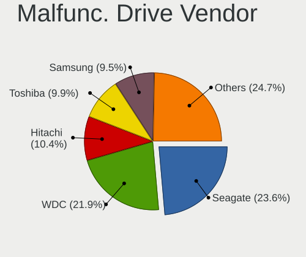

| Vendor              | Computers | Drives | Percent |
|---------------------|-----------|--------|---------|
| Seagate             | 371       | 574    | 23.62%  |
| WDC                 | 344       | 598    | 21.9%   |
| Hitachi             | 163       | 255    | 10.38%  |
| Toshiba             | 156       | 252    | 9.93%   |
| Samsung Electronics | 149       | 256    | 9.48%   |
| HGST                | 123       | 203    | 7.83%   |
| Kingston            | 60        | 97     | 3.82%   |
| Maxtor              | 36        | 50     | 2.29%   |
| A-DATA Technology   | 34        | 65     | 2.16%   |
| Fujitsu             | 28        | 40     | 1.78%   |
| Intel               | 23        | 48     | 1.46%   |
| SK hynix            | 11        | 16     | 0.7%    |
| OCZ                 | 9         | 12     | 0.57%   |
| SanDisk             | 6         | 7      | 0.38%   |
| WD MediaMax         | 5         | 6      | 0.32%   |
| China               | 5         | 5      | 0.32%   |
| SPCC                | 4         | 5      | 0.25%   |
| Crucial             | 4         | 7      | 0.25%   |
| Micron Technology   | 3         | 3      | 0.19%   |
| Intenso             | 3         | 3      | 0.19%   |
| Hewlett-Packard     | 3         | 3      | 0.19%   |
| Timetec             | 2         | 16     | 0.13%   |
| KingSpec            | 2         | 2      | 0.13%   |
| Kingmax             | 2         | 2      | 0.13%   |
| ICY BOX             | 2         | 2      | 0.13%   |
| IBM/Hitachi         | 2         | 2      | 0.13%   |
| Apple               | 2         | 12     | 0.13%   |
| Apacer              | 2         | 3      | 0.13%   |
| Team                | 1         | 1      | 0.06%   |
| SATAFIRM            | 1         | 1      | 0.06%   |
| QUANTUM             | 1         | 1      | 0.06%   |
| Patriot             | 1         | 1      | 0.06%   |
| Netac               | 1         | 1      | 0.06%   |
| MARSHAL             | 1         | 1      | 0.06%   |
| LITEONIT            | 1         | 2      | 0.06%   |
| LITEON              | 1         | 1      | 0.06%   |
| KING                | 1         | 1      | 0.06%   |
| JMicron Technology  | 1         | 1      | 0.06%   |
| Initio              | 1         | 2      | 0.06%   |
| ExcelStor           | 1         | 1      | 0.06%   |

Malfunc. HDD Vendor
-------------------

Vendors of faulty HDD drives

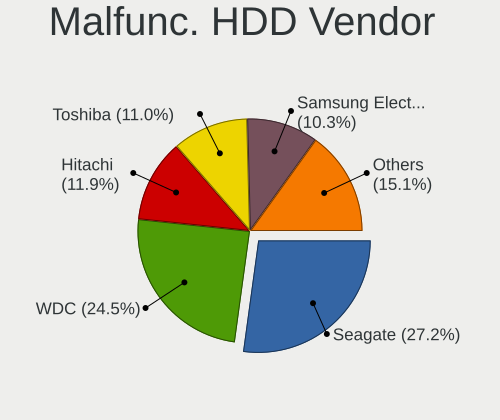

| Vendor              | Computers | Drives | Percent |
|---------------------|-----------|--------|---------|
| Seagate             | 371       | 574    | 27.16%  |
| WDC                 | 335       | 589    | 24.52%  |
| Hitachi             | 163       | 255    | 11.93%  |
| Toshiba             | 150       | 238    | 10.98%  |
| Samsung Electronics | 141       | 215    | 10.32%  |
| HGST                | 123       | 203    | 9%      |
| Maxtor              | 36        | 50     | 2.64%   |
| Fujitsu             | 28        | 40     | 2.05%   |
| WD MediaMax         | 5         | 6      | 0.37%   |
| ICY BOX             | 2         | 2      | 0.15%   |
| IBM/Hitachi         | 2         | 2      | 0.15%   |
| Hewlett-Packard     | 2         | 2      | 0.15%   |
| SATAFIRM            | 1         | 1      | 0.07%   |
| QUANTUM             | 1         | 1      | 0.07%   |
| MARSHAL             | 1         | 1      | 0.07%   |
| Initio              | 1         | 2      | 0.07%   |
| ExcelStor           | 1         | 1      | 0.07%   |
| CSD                 | 1         | 2      | 0.07%   |
| ASMT                | 1         | 1      | 0.07%   |
| Unknown             | 1         | 2      | 0.07%   |

Malfunc. Drive Kind
-------------------

Kinds of faulty drives

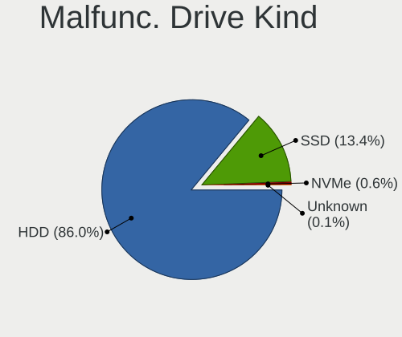

| Kind    | Computers | Drives | Percent |
|---------|-----------|--------|---------|
| HDD     | 1240      | 2187   | 85.99%  |
| SSD     | 193       | 366    | 13.38%  |
| NVMe    | 8         | 11     | 0.55%   |
| Unknown | 1         | 1      | 0.07%   |

Failed Drives
-------------

Failed drive models

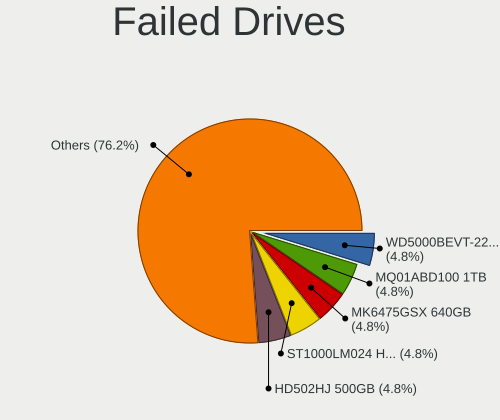

| Model                              | Computers | Drives | Percent |
|------------------------------------|-----------|--------|---------|
| WDC WD5000BEVT-22ZAT0 500GB        | 2         | 2      | 4.76%   |
| Toshiba MQ01ABD100 1TB             | 2         | 2      | 4.76%   |
| Toshiba MK6475GSX 640GB            | 2         | 2      | 4.76%   |
| Seagate ST1000LM024 HN-M101MBB 1TB | 2         | 2      | 4.76%   |
| Samsung Electronics HD502HJ 500GB  | 2         | 3      | 4.76%   |
| Samsung Electronics HD103SJ 1TB    | 2         | 2      | 4.76%   |
| Zheino CHN-NGFFNV2280-256 256GB    | 1         | 1      | 2.38%   |
| WDC WD5003ABYX-70WERA0 500GB       | 1         | 1      | 2.38%   |
| WDC WD5000BEVT-22A0RT0 500GB       | 1         | 7      | 2.38%   |
| WDC WD5000AAKS-00UU3A0 500GB       | 1         | 1      | 2.38%   |
| WDC WD3200BVVT-63A26Y0 320GB       | 1         | 1      | 2.38%   |
| WDC WD3200BPVT-24JJ5T0 320GB       | 1         | 1      | 2.38%   |
| WDC WD3200BEVT-08A23T1 320GB       | 1         | 1      | 2.38%   |
| WDC WD2500LPCX-24C6HT0 250GB       | 1         | 1      | 2.38%   |
| WDC WD1600BEVT-80A23T0 160GB       | 1         | 1      | 2.38%   |
| WDC WD1600BEVT-22ZCT0 160GB        | 1         | 1      | 2.38%   |
| Toshiba MQ01ABD050V 500GB          | 1         | 1      | 2.38%   |
| Toshiba MK5055GSX 500GB            | 1         | 1      | 2.38%   |
| Toshiba MK3275GSX 320GB            | 1         | 1      | 2.38%   |
| Toshiba MK1665GSX 160GB            | 1         | 1      | 2.38%   |
| Toshiba MK1646GSX 160GB            | 1         | 1      | 2.38%   |
| Seagate ST9320325AS 320GB          | 1         | 1      | 2.38%   |
| Seagate ST9160412AS 160GB          | 1         | 1      | 2.38%   |
| Seagate ST380815AS 80GB            | 1         | 3      | 2.38%   |
| Seagate ST3160815AS 160GB          | 1         | 1      | 2.38%   |
| Samsung Electronics SSD 980 500GB  | 1         | 1      | 2.38%   |
| Samsung Electronics SP0802N 80GB   | 1         | 1      | 2.38%   |
| Samsung Electronics HM060HI 64GB   | 1         | 1      | 2.38%   |
| Samsung Electronics HD204UI 2TB    | 1         | 1      | 2.38%   |
| Samsung Electronics HD103UJ 1TB    | 1         | 1      | 2.38%   |
| OCZ-AGIL ITY3 64GB SSD             | 1         | 1      | 2.38%   |
| Intel SSDPEKKW256G7 256GB          | 1         | 1      | 2.38%   |
| Hitachi HDS721075CLA332 752GB      | 1         | 1      | 2.38%   |
| Hitachi HDS721010DLE630 1TB        | 1         | 1      | 2.38%   |
| Hewlett-Packard SSD EX900 250GB    | 1         | 1      | 2.38%   |
| ExcelStor Technology J8160S 160GB  | 1         | 1      | 2.38%   |

Failed Drive Vendor
-------------------

Failed drive vendors

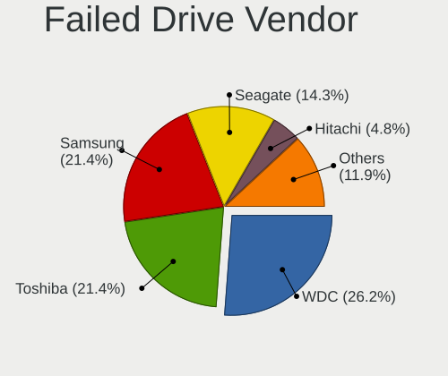

| Vendor              | Computers | Drives | Percent |
|---------------------|-----------|--------|---------|
| WDC                 | 11        | 17     | 26.19%  |
| Toshiba             | 9         | 9      | 21.43%  |
| Samsung Electronics | 9         | 10     | 21.43%  |
| Seagate             | 6         | 8      | 14.29%  |
| Hitachi             | 2         | 2      | 4.76%   |
| Zheino              | 1         | 1      | 2.38%   |
| OCZ-AGIL            | 1         | 1      | 2.38%   |
| Intel               | 1         | 1      | 2.38%   |
| Hewlett-Packard     | 1         | 1      | 2.38%   |
| ExcelStor           | 1         | 1      | 2.38%   |

Drive Status
------------

Number of failed and malfunc. drives

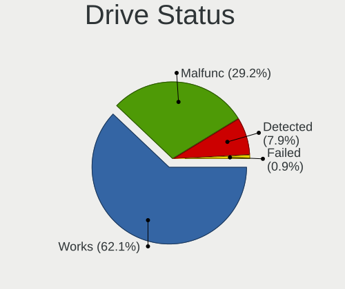

| Status   | Computers | Drives | Percent |
|----------|-----------|--------|---------|
| Works    | 2999      | 7475   | 62.09%  |
| Malfunc  | 1408      | 2565   | 29.15%  |
| Detected | 381       | 679    | 7.89%   |
| Failed   | 42        | 51     | 0.87%   |

Storage controller
------------------

Storage Vendor
--------------

Storage controller vendors

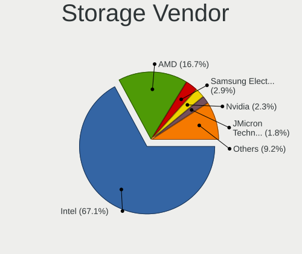

| Vendor                           | Computers | Percent |
|----------------------------------|-----------|---------|
| Intel                            | 3029      | 67.12%  |
| AMD                              | 752       | 16.66%  |
| Samsung Electronics              | 132       | 2.92%   |
| Nvidia                           | 105       | 2.33%   |
| JMicron Technology               | 82        | 1.82%   |
| Kingston Technology Company      | 71        | 1.57%   |
| ASMedia Technology               | 45        | 1%      |
| SanDisk                          | 42        | 0.93%   |
| Marvell Technology Group         | 33        | 0.73%   |
| SK hynix                         | 30        | 0.66%   |
| VIA Technologies                 | 27        | 0.6%    |
| Phison Electronics               | 18        | 0.4%    |
| Realtek Semiconductor            | 17        | 0.38%   |
| Toshiba America Info Systems     | 16        | 0.35%   |
| Silicon Motion                   | 15        | 0.33%   |
| Silicon Image                    | 15        | 0.33%   |
| Micron Technology                | 15        | 0.33%   |
| Solid State Storage Technology   | 9         | 0.2%    |
| KIOXIA                           | 9         | 0.2%    |
| Micron/Crucial Technology        | 8         | 0.18%   |
| MAXIO Technology (Hangzhou)      | 7         | 0.16%   |
| ADATA Technology                 | 7         | 0.16%   |
| Silicon Integrated Systems [SiS] | 5         | 0.11%   |
| Lite-On Technology               | 4         | 0.09%   |
| LSI Logic / Symbios Logic        | 3         | 0.07%   |
| O2 Micro                         | 2         | 0.04%   |
| Integrated Technology Express    | 2         | 0.04%   |
| Hewlett-Packard                  | 2         | 0.04%   |
| Adaptec                          | 2         | 0.04%   |
| 3ware                            | 2         | 0.04%   |
| Zhaoxin                          | 1         | 0.02%   |
| ULi Electronics                  | 1         | 0.02%   |
| Shenzhen Longsys Electronics     | 1         | 0.02%   |
| Promise Technology               | 1         | 0.02%   |
| INNOGRIT                         | 1         | 0.02%   |
| Broadcom / LSI                   | 1         | 0.02%   |
| Apple                            | 1         | 0.02%   |

Storage Model
-------------

Storage controller models

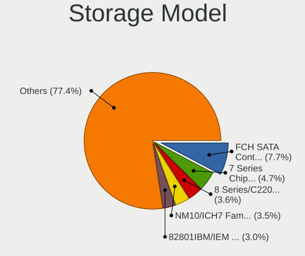

| Model                                                                                   | Computers | Percent |
|-----------------------------------------------------------------------------------------|-----------|---------|
| AMD FCH SATA Controller [AHCI mode]                                                     | 441       | 7.73%   |
| Intel 7 Series Chipset Family 6-port SATA Controller [AHCI mode]                        | 268       | 4.7%    |
| Intel 8 Series/C220 Series Chipset Family 6-port SATA Controller 1 [AHCI mode]          | 204       | 3.57%   |
| Intel NM10/ICH7 Family SATA Controller [IDE mode]                                       | 201       | 3.52%   |
| Intel 82801IBM/IEM (ICH9M/ICH9M-E) 4 port SATA Controller [AHCI mode]                   | 173       | 3.03%   |
| Intel 82801G (ICH7 Family) IDE Controller                                               | 173       | 3.03%   |
| Intel 6 Series/C200 Series Chipset Family 6 port Mobile SATA AHCI Controller            | 162       | 2.84%   |
| Intel Sunrise Point-LP SATA Controller [AHCI mode]                                      | 151       | 2.65%   |
| AMD SB7x0/SB8x0/SB9x0 SATA Controller [AHCI mode]                                       | 139       | 2.44%   |
| Intel 82801 Mobile SATA Controller [RAID mode]                                          | 127       | 2.23%   |
| AMD SB7x0/SB8x0/SB9x0 IDE Controller                                                    | 120       | 2.1%    |
| Intel 8 Series SATA Controller 1 [AHCI mode]                                            | 109       | 1.91%   |
| Intel 82801HM/HEM (ICH8M/ICH8M-E) IDE Controller                                        | 102       | 1.79%   |
| Intel 6 Series/C200 Series Chipset Family 6 port Desktop SATA AHCI Controller           | 98        | 1.72%   |
| Intel Q170/Q150/B150/H170/H110/Z170/CM236 Chipset SATA Controller [AHCI Mode]           | 92        | 1.61%   |
| Intel 5 Series/3400 Series Chipset 4 port SATA AHCI Controller                          | 92        | 1.61%   |
| Intel 82801HM/HEM (ICH8M/ICH8M-E) SATA Controller [AHCI mode]                           | 86        | 1.51%   |
| Intel Wildcat Point-LP SATA Controller [AHCI Mode]                                      | 85        | 1.49%   |
| AMD SB7x0/SB8x0/SB9x0 SATA Controller [IDE mode]                                        | 84        | 1.47%   |
| Intel 5 Series/3400 Series Chipset 6 port SATA AHCI Controller                          | 83        | 1.45%   |
| Intel 6 Series/C200 Series Chipset Family Desktop SATA Controller (IDE mode, ports 4-5) | 72        | 1.26%   |
| Intel 6 Series/C200 Series Chipset Family Desktop SATA Controller (IDE mode, ports 0-3) | 72        | 1.26%   |
| AMD FCH IDE Controller                                                                  | 71        | 1.24%   |
| Intel 200 Series PCH SATA controller [AHCI mode]                                        | 70        | 1.23%   |
| Intel Atom Processor E3800 Series SATA AHCI Controller                                  | 67        | 1.17%   |
| Intel 7 Series/C210 Series Chipset Family 6-port SATA Controller [AHCI mode]            | 67        | 1.17%   |
| Samsung NVMe SSD Controller SM981/PM981/PM983                                           | 66        | 1.16%   |
| Intel SATA Controller [RAID mode]                                                       | 66        | 1.16%   |
| Intel 4 Series Chipset PT IDER Controller                                               | 59        | 1.03%   |
| Intel Atom/Celeron/Pentium Processor x5-E8000/J3xxx/N3xxx Series SATA Controller        | 56        | 0.98%   |
| Intel 82801I (ICH9 Family) 2 port SATA Controller [IDE mode]                            | 51        | 0.89%   |
| AMD 400 Series Chipset SATA Controller                                                  | 51        | 0.89%   |
| JMicron JMB363 SATA/IDE Controller                                                      | 47        | 0.82%   |
| Intel 82801JD/DO (ICH10 Family) SATA AHCI Controller                                    | 47        | 0.82%   |
| Intel NM10/ICH7 Family SATA Controller [AHCI mode]                                      | 43        | 0.75%   |
| ASMedia ASM1061/ASM1062 Serial ATA Controller                                           | 43        | 0.75%   |
| Nvidia MCP61 SATA Controller                                                            | 39        | 0.68%   |
| Intel 5 Series/3400 Series Chipset 4 port SATA IDE Controller                           | 38        | 0.67%   |
| Intel 5 Series/3400 Series Chipset 2 port SATA IDE Controller                           | 37        | 0.65%   |
| Nvidia MCP61 IDE                                                                        | 36        | 0.63%   |

Storage Kind
------------

Kind of storage controller (IDE, SATA, NVMe, SAS, ...)

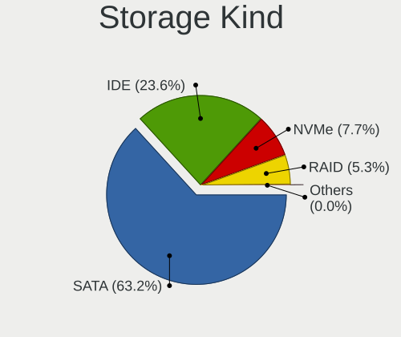

| Kind | Computers | Percent |
|------|-----------|---------|
| SATA | 3052      | 63.21%  |
| IDE  | 1138      | 23.57%  |
| NVMe | 372       | 7.71%   |
| RAID | 258       | 5.34%   |
| SCSI | 6         | 0.12%   |
| SAS  | 2         | 0.04%   |

Processor
---------

CPU Vendor
----------

Processor vendors

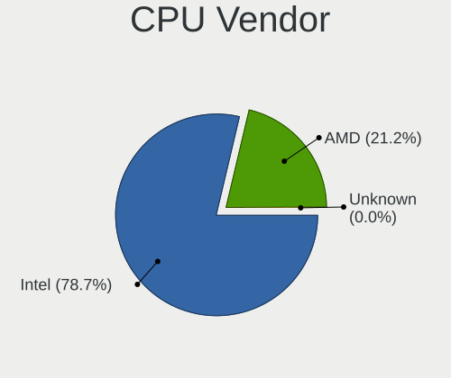

| Vendor       | Computers | Percent |
|--------------|-----------|---------|
| Intel        | 3150      | 78.69%  |
| AMD          | 850       | 21.23%  |
| CentaurHauls | 2         | 0.05%   |
| Unknown      | 1         | 0.02%   |

CPU Model
---------

Processor models

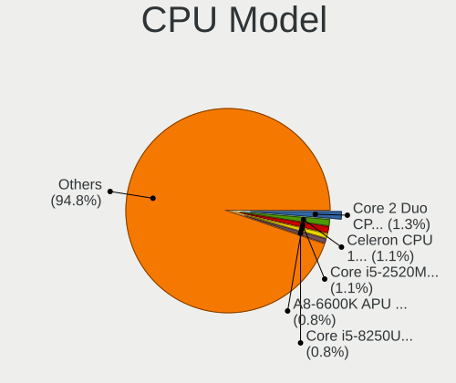

| Model                                       | Computers | Percent |
|---------------------------------------------|-----------|---------|
| Intel Core 2 Duo CPU E8400 @ 3.00GHz        | 53        | 1.32%   |
| Intel Celeron CPU 1000M @ 1.80GHz           | 46        | 1.14%   |
| Intel Core i5-2520M CPU @ 2.50GHz           | 45        | 1.12%   |
| AMD A8-6600K APU with Radeon HD Graphics    | 34        | 0.84%   |
| Intel Core i5-8250U CPU @ 1.60GHz           | 32        | 0.79%   |
| Intel Core i5-3470 CPU @ 3.20GHz            | 32        | 0.79%   |
| Intel Core i5-2400 CPU @ 3.10GHz            | 31        | 0.77%   |
| Intel Core i3-5005U CPU @ 2.00GHz           | 31        | 0.77%   |
| Intel Core i3-2120 CPU @ 3.30GHz            | 31        | 0.77%   |
| Intel Core i5-7200U CPU @ 2.50GHz           | 30        | 0.74%   |
| Intel Core i5-3320M CPU @ 2.60GHz           | 30        | 0.74%   |
| Intel Core i5 CPU M 520 @ 2.40GHz           | 30        | 0.74%   |
| Intel Core 2 Duo CPU E7500 @ 2.93GHz        | 30        | 0.74%   |
| Intel Core i5-6500 CPU @ 3.20GHz            | 27        | 0.67%   |
| Intel Core i5-3210M CPU @ 2.50GHz           | 26        | 0.65%   |
| Intel Core 2 Quad CPU Q6600 @ 2.40GHz       | 26        | 0.65%   |
| Intel Core i3-3220 CPU @ 3.30GHz            | 23        | 0.57%   |
| Intel Core 2 Duo CPU P8600 @ 2.40GHz        | 23        | 0.57%   |
| Intel Celeron CPU N3060 @ 1.60GHz           | 23        | 0.57%   |
| Intel Pentium Dual-Core CPU T4400 @ 2.20GHz | 22        | 0.55%   |
| Intel Core i3-6006U CPU @ 2.00GHz           | 22        | 0.55%   |
| Intel Core i3-4160 CPU @ 3.60GHz            | 22        | 0.55%   |
| Intel Celeron CPU N2840 @ 2.16GHz           | 22        | 0.55%   |
| Intel Core i3-3217U CPU @ 1.80GHz           | 20        | 0.5%    |
| Intel Core 2 Duo CPU P8400 @ 2.26GHz        | 20        | 0.5%    |
| Intel Pentium Dual-Core CPU T4500 @ 2.30GHz | 19        | 0.47%   |
| Intel Core i3-2310M CPU @ 2.10GHz           | 19        | 0.47%   |
| Intel Core i7-4510U CPU @ 2.00GHz           | 18        | 0.45%   |
| Intel Core i5-6200U CPU @ 2.30GHz           | 18        | 0.45%   |
| Intel Core i5-5200U CPU @ 2.20GHz           | 18        | 0.45%   |
| AMD FX-6300 Six-Core Processor              | 18        | 0.45%   |
| AMD A10-5750M APU with Radeon HD Graphics   | 18        | 0.45%   |
| Intel Core i5-4210U CPU @ 1.70GHz           | 17        | 0.42%   |
| Intel Core i5-2540M CPU @ 2.60GHz           | 17        | 0.42%   |
| Intel Core i3-7020U CPU @ 2.30GHz           | 17        | 0.42%   |
| Intel Core 2 CPU T5500 @ 1.66GHz            | 17        | 0.42%   |
| Intel Atom x5-Z8350 CPU @ 1.44GHz           | 17        | 0.42%   |
| Intel Atom CPU N455 @ 1.66GHz               | 17        | 0.42%   |
| Intel Atom CPU N450 @ 1.66GHz               | 17        | 0.42%   |
| Intel Core i5-3230M CPU @ 2.60GHz           | 16        | 0.4%    |

CPU Model Family
----------------

Processor model prefix

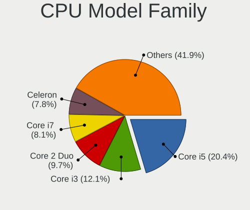

| Model                   | Computers | Percent |
|-------------------------|-----------|---------|
| Intel Core i5           | 821       | 20.41%  |
| Intel Core i3           | 487       | 12.11%  |
| Intel Core 2 Duo        | 391       | 9.72%   |
| Intel Core i7           | 326       | 8.11%   |
| Intel Celeron           | 313       | 7.78%   |
| Intel Pentium           | 178       | 4.43%   |
| Intel Pentium Dual-Core | 125       | 3.11%   |
| Intel Atom              | 103       | 2.56%   |
| AMD A8                  | 99        | 2.46%   |
| Intel Xeon              | 78        | 1.94%   |
| AMD Ryzen 5             | 75        | 1.86%   |
| Intel Core 2 Quad       | 71        | 1.77%   |
| Other                   | 69        | 1.72%   |
| AMD FX                  | 65        | 1.62%   |
| AMD A4                  | 61        | 1.52%   |
| Intel Core 2            | 58        | 1.44%   |
| AMD A10                 | 47        | 1.17%   |
| Intel Pentium Dual      | 46        | 1.14%   |
| AMD Ryzen 7             | 44        | 1.09%   |
| AMD Athlon II X2        | 40        | 0.99%   |
| AMD A6                  | 40        | 0.99%   |
| AMD Ryzen 3             | 39        | 0.97%   |
| AMD Athlon 64 X2        | 35        | 0.87%   |
| AMD E                   | 31        | 0.77%   |
| AMD Phenom II X4        | 30        | 0.75%   |
| Intel Pentium 4         | 24        | 0.6%    |
| AMD E1                  | 23        | 0.57%   |
| AMD E2                  | 22        | 0.55%   |
| Intel Genuine           | 17        | 0.42%   |
| Intel Pentium D         | 14        | 0.35%   |
| AMD Sempron             | 14        | 0.35%   |
| AMD Athlon II X4        | 14        | 0.35%   |
| Intel Celeron Dual-Core | 13        | 0.32%   |
| Intel Pentium Silver    | 10        | 0.25%   |
| Intel Celeron M         | 10        | 0.25%   |
| AMD Athlon X4           | 10        | 0.25%   |
| AMD Athlon Dual Core    | 10        | 0.25%   |
| AMD Athlon              | 10        | 0.25%   |
| Intel Core i9           | 8         | 0.2%    |
| Intel Pentium M         | 7         | 0.17%   |

CPU Cores
---------

Number of processor cores

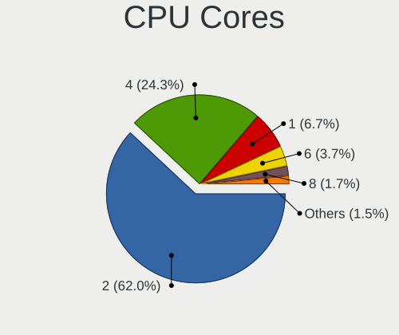

| Number  | Computers | Percent |
|---------|-----------|---------|
| 2       | 2499      | 61.96%  |
| 4       | 981       | 24.32%  |
| 1       | 271       | 6.72%   |
| 6       | 150       | 3.72%   |
| 8       | 70        | 1.74%   |
| 3       | 27        | 0.67%   |
| 10      | 8         | 0.2%    |
| 24      | 7         | 0.17%   |
| 16      | 7         | 0.17%   |
| 18      | 6         | 0.15%   |
| 12      | 5         | 0.12%   |
| Unknown | 2         | 0.05%   |

CPU Sockets
-----------

Number of sockets

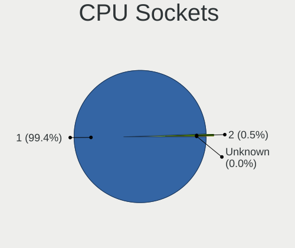

| Number  | Computers | Percent |
|---------|-----------|---------|
| 1       | 3982      | 99.43%  |
| 2       | 21        | 0.52%   |
| 4       | 1         | 0.02%   |
| Unknown | 1         | 0.02%   |

CPU Threads
-----------

Threads per core (Hyper-Threading)

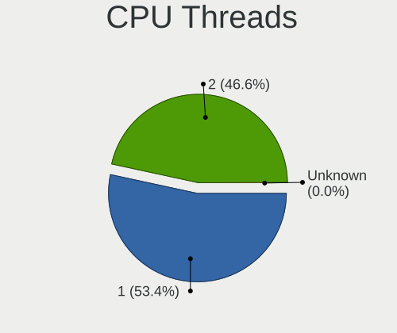

| Number  | Computers | Percent |
|---------|-----------|---------|
| 1       | 2155      | 53.39%  |
| 2       | 1879      | 46.56%  |
| Unknown | 2         | 0.05%   |

CPU Op-Modes
------------

CPU Operation Modes (32-bit, 64-bit)

| Op mode        | Computers | Percent |
|----------------|-----------|---------|
| 32-bit, 64-bit | 3946      | 98.5%   |
| 32-bit         | 51        | 1.27%   |
| Unknown        | 9         | 0.22%   |

CPU Microcode
-------------

Microcode number

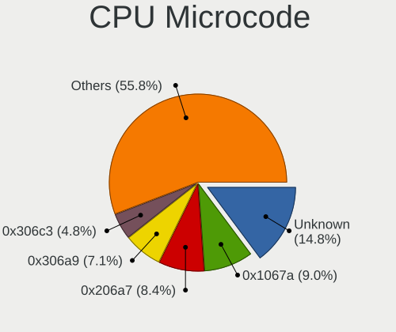

| Number     | Computers | Percent |
|------------|-----------|---------|
| Unknown    | 621       | 14.83%  |
| 0x1067a    | 378       | 9.03%   |
| 0x206a7    | 350       | 8.36%   |
| 0x306a9    | 299       | 7.14%   |
| 0x306c3    | 202       | 4.82%   |
| 0x20655    | 141       | 3.37%   |
| 0x6fd      | 109       | 2.6%    |
| 0x06001119 | 108       | 2.58%   |
| 0x10676    | 100       | 2.39%   |
| 0x40651    | 95        | 2.27%   |
| 0x010000c8 | 76        | 1.82%   |
| 0x306d4    | 69        | 1.65%   |
| 0x506e3    | 68        | 1.62%   |
| 0x6fb      | 63        | 1.5%    |
| 0x406e3    | 60        | 1.43%   |
| 0x906e9    | 57        | 1.36%   |
| 0x406c4    | 56        | 1.34%   |
| 0x20652    | 56        | 1.34%   |
| 0x906ea    | 53        | 1.27%   |
| 0x806e9    | 53        | 1.27%   |
| 0x30678    | 53        | 1.27%   |
| 0x106ca    | 52        | 1.24%   |
| 0x05000119 | 47        | 1.12%   |
| 0x07030105 | 37        | 0.88%   |
| 0x806ea    | 36        | 0.86%   |
| 0x06003106 | 32        | 0.76%   |
| 0x6f6      | 31        | 0.74%   |
| 0x6f2      | 30        | 0.72%   |
| 0x0700010f | 30        | 0.72%   |
| 0x06000852 | 27        | 0.64%   |
| 0x08101016 | 25        | 0.6%    |
| 0x406c3    | 24        | 0.57%   |
| 0x106c2    | 24        | 0.57%   |
| 0x03000027 | 22        | 0.53%   |
| 0x706a1    | 21        | 0.5%    |
| 0x106e5    | 21        | 0.5%    |
| 0x0600084f | 21        | 0.5%    |
| 0x806ec    | 20        | 0.48%   |
| 0x506c9    | 20        | 0.48%   |
| 0x10661    | 19        | 0.45%   |

CPU Microarch
-------------

Microarchitecture

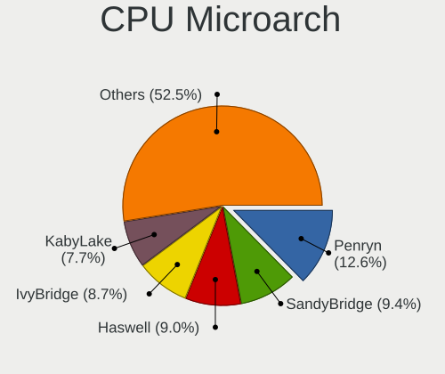

| Name             | Computers | Percent |
|------------------|-----------|---------|
| Penryn           | 505       | 12.61%  |
| SandyBridge      | 377       | 9.41%   |
| Haswell          | 362       | 9.04%   |
| IvyBridge        | 350       | 8.74%   |
| KabyLake         | 308       | 7.69%   |
| Core             | 262       | 6.54%   |
| Westmere         | 233       | 5.82%   |
| Skylake          | 174       | 4.34%   |
| Piledriver       | 159       | 3.97%   |
| Silvermont       | 157       | 3.92%   |
| K10              | 134       | 3.34%   |
| Broadwell        | 95        | 2.37%   |
| Bonnell          | 81        | 2.02%   |
| K8 Hammer        | 79        | 1.97%   |
| Bobcat           | 73        | 1.82%   |
| Zen              | 62        | 1.55%   |
| Puma             | 53        | 1.32%   |
| Excavator        | 50        | 1.25%   |
| NetBurst         | 46        | 1.15%   |
| Zen+             | 43        | 1.07%   |
| Steamroller      | 40        | 1%      |
| Zen 3            | 37        | 0.92%   |
| Nehalem          | 34        | 0.85%   |
| Jaguar           | 34        | 0.85%   |
| Goldmont plus    | 34        | 0.85%   |
| Zen 2            | 29        | 0.72%   |
| K10 Llano        | 28        | 0.7%    |
| P6               | 27        | 0.67%   |
| Goldmont         | 26        | 0.65%   |
| Alderlake Hybrid | 25        | 0.62%   |
| Unknown          | 21        | 0.52%   |
| TigerLake        | 20        | 0.5%    |
| CometLake        | 17        | 0.42%   |
| Bulldozer        | 15        | 0.37%   |
| K8 & K10 hybrid  | 7         | 0.17%   |
| IceLake          | 5         | 0.12%   |
| Gracemont        | 4         | 0.1%    |

Graphics
--------

GPU Vendor
----------

Vendors of graphics cards

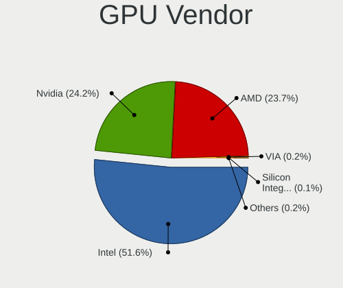

| Vendor                                       | Computers | Percent |
|----------------------------------------------|-----------|---------|
| Intel                                        | 2353      | 51.61%  |
| Nvidia                                       | 1104      | 24.22%  |
| AMD                                          | 1080      | 23.69%  |
| VIA Technologies                             | 11        | 0.24%   |
| Silicon Integrated Systems [SiS]             | 3         | 0.07%   |
| Matrox Electronics Systems                   | 3         | 0.07%   |
| XGI Technology (eXtreme Graphics Innovation) | 2         | 0.04%   |
| ATI Technologies                             | 2         | 0.04%   |
| Zhaoxin                                      | 1         | 0.02%   |

GPU Model
---------

Graphics card models

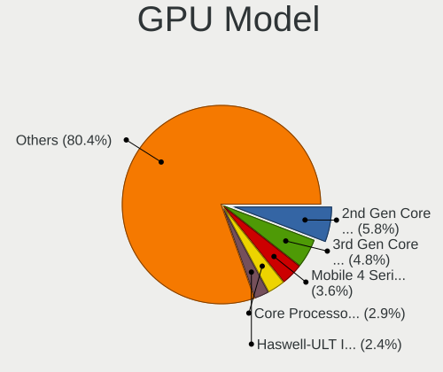

| Model                                                                                    | Computers | Percent |
|------------------------------------------------------------------------------------------|-----------|---------|
| Intel 2nd Generation Core Processor Family Integrated Graphics Controller                | 279       | 5.79%   |
| Intel 3rd Gen Core processor Graphics Controller                                         | 232       | 4.81%   |
| Intel Mobile 4 Series Chipset Integrated Graphics Controller                             | 175       | 3.63%   |
| Intel Core Processor Integrated Graphics Controller                                      | 141       | 2.93%   |
| Intel Haswell-ULT Integrated Graphics Controller                                         | 116       | 2.41%   |
| Intel 4 Series Chipset Integrated Graphics Controller                                    | 92        | 1.91%   |
| Intel Xeon E3-1200 v3/4th Gen Core Processor Integrated Graphics Controller              | 90        | 1.87%   |
| Intel Broadwell-U GT2 [HD Graphics 5500]                                                 | 86        | 1.78%   |
| Intel Atom/Celeron/Pentium Processor x5-E8000/J3xxx/N3xxx Integrated Graphics Controller | 83        | 1.72%   |
| Intel Atom Processor Z36xxx/Z37xxx Series Graphics & Display                             | 74        | 1.54%   |
| Intel Mobile GM965/GL960 Integrated Graphics Controller (secondary)                      | 69        | 1.43%   |
| Intel Mobile GM965/GL960 Integrated Graphics Controller (primary)                        | 69        | 1.43%   |
| Intel Skylake-U GT2 [HD Graphics 520]                                                    | 67        | 1.39%   |
| Intel Mobile 945GM/GMS/GME, 943/940GML Express Integrated Graphics Controller            | 66        | 1.37%   |
| Nvidia GK208B [GeForce GT 710]                                                           | 62        | 1.29%   |
| Intel 4th Gen Core Processor Integrated Graphics Controller                              | 56        | 1.16%   |
| Intel Xeon E3-1200 v2/3rd Gen Core processor Graphics Controller                         | 55        | 1.14%   |
| Intel Kaby Lake-U GT2 [HD Graphics 620]                                                  | 51        | 1.06%   |
| Intel Atom Processor D4xx/D5xx/N4xx/N5xx Integrated Graphics Controller                  | 49        | 1.02%   |
| Intel Mobile 945GM/GMS, 943/940GML Express Integrated Graphics Controller                | 48        | 1%      |
| Intel Kaby Lake-R GT2 [UHD Graphics 620]                                                 | 45        | 0.93%   |
| Intel 82G33/G31 Express Integrated Graphics Controller                                   | 44        | 0.91%   |
| Nvidia GT218 [GeForce 210]                                                               | 43        | 0.89%   |
| Intel Skylake-S GT2 [HD Graphics 530]                                                    | 42        | 0.87%   |
| AMD Caicos [Radeon HD 6450/7450/8450 / R5 230 OEM]                                       | 40        | 0.83%   |
| Nvidia GF117M [GeForce 610M/710M/810M/820M / GT 620M/625M/630M/720M]                     | 39        | 0.81%   |
| AMD Mullins [Radeon R4/R5 Graphics]                                                      | 38        | 0.79%   |
| AMD Cedar [Radeon HD 5000/6000/7350/8350 Series]                                         | 38        | 0.79%   |
| Intel 4th Generation Core Processor Family Integrated Graphics Controller                | 37        | 0.77%   |
| AMD Ellesmere [Radeon RX 470/480/570/570X/580/580X/590]                                  | 35        | 0.73%   |
| Nvidia GP107 [GeForce GTX 1050 Ti]                                                       | 34        | 0.71%   |
| AMD Richland [Radeon HD 8570D]                                                           | 34        | 0.71%   |
| AMD Raven Ridge [Radeon Vega Series / Radeon Vega Mobile Series]                         | 34        | 0.71%   |
| Intel CoffeeLake-S GT2 [UHD Graphics 630]                                                | 33        | 0.68%   |
| Intel 82945G/GZ Integrated Graphics Controller                                           | 27        | 0.56%   |
| AMD Sun XT [Radeon HD 8670A/8670M/8690M / R5 M330 / M430 / Radeon 520 Mobile]            | 27        | 0.56%   |
| AMD Seymour [Radeon HD 6400M/7400M Series]                                               | 27        | 0.56%   |
| AMD Oland PRO [Radeon R7 240/340 / Radeon 520]                                           | 27        | 0.56%   |
| Nvidia GK208BM [GeForce 920M]                                                            | 26        | 0.54%   |
| AMD Topaz XT [Radeon R7 M260/M265 / M340/M360 / M440/M445 / 530/535 / 620/625 Mobile]    | 26        | 0.54%   |

GPU Combo
---------

Combinations of graphics cards

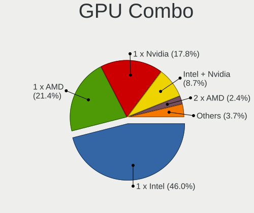

| Name           | Computers | Percent |
|----------------|-----------|---------|
| 1 x Intel      | 1874      | 46.02%  |
| 1 x AMD        | 872       | 21.41%  |
| 1 x Nvidia     | 725       | 17.8%   |
| Intel + Nvidia | 353       | 8.67%   |
| 2 x AMD        | 96        | 2.36%   |
| Intel + AMD    | 93        | 2.28%   |
| AMD + Nvidia   | 24        | 0.59%   |
| 2 x Intel      | 11        | 0.27%   |
| 1 x VIA        | 11        | 0.27%   |
| 2 x Nvidia     | 4         | 0.1%    |
| 1 x SiS        | 3         | 0.07%   |
| 1 x Matrox     | 3         | 0.07%   |
| 1 x Zhaoxin    | 1         | 0.02%   |
| 1 x XGI        | 1         | 0.02%   |
| AMD + XGI      | 1         | 0.02%   |

GPU Driver
----------

Free vs proprietary

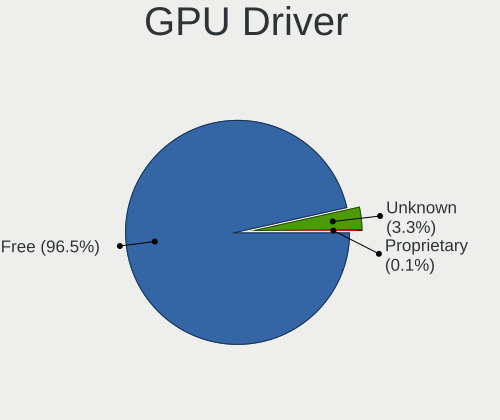

| Driver      | Computers | Percent |
|-------------|-----------|---------|
| Free        | 3894      | 96.51%  |
| Unknown     | 135       | 3.35%   |
| Proprietary | 6         | 0.15%   |

GPU Memory
----------

Total video memory

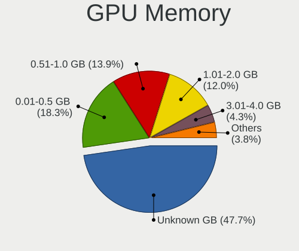

| Size in GB | Computers | Percent |
|------------|-----------|---------|
| Unknown    | 1990      | 47.7%   |
| 0.01-0.5   | 762       | 18.26%  |
| 0.51-1.0   | 580       | 13.9%   |
| 1.01-2.0   | 500       | 11.98%  |
| 3.01-4.0   | 180       | 4.31%   |
| 7.01-8.0   | 60        | 1.44%   |
| 5.01-6.0   | 40        | 0.96%   |
| 2.01-3.0   | 38        | 0.91%   |
| 8.01-16.0  | 21        | 0.5%    |
| 4.01-5.0   | 1         | 0.02%   |

Monitor
-------

Monitor Vendor
--------------

Monitor vendors

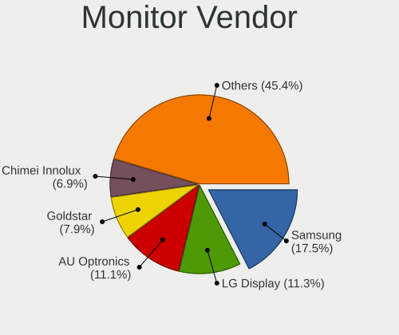

| Vendor                  | Computers | Percent |
|-------------------------|-----------|---------|
| Samsung Electronics     | 728       | 17.47%  |
| LG Display              | 470       | 11.28%  |
| AU Optronics            | 463       | 11.11%  |
| Goldstar                | 328       | 7.87%   |
| Chimei Innolux          | 286       | 6.86%   |
| BOE                     | 178       | 4.27%   |
| Dell                    | 160       | 3.84%   |
| Chi Mei Optoelectronics | 143       | 3.43%   |
| Philips                 | 120       | 2.88%   |
| Hewlett-Packard         | 119       | 2.86%   |
| BenQ                    | 112       | 2.69%   |
| Lenovo                  | 105       | 2.52%   |
| Acer                    | 101       | 2.42%   |
| Ancor Communications    | 97        | 2.33%   |
| AOC                     | 63        | 1.51%   |
| Fujitsu Siemens         | 59        | 1.42%   |
| LG Philips              | 37        | 0.89%   |
| Apple                   | 36        | 0.86%   |
| HannStar                | 33        | 0.79%   |
| Sony                    | 30        | 0.72%   |
| Vestel Elektronik       | 27        | 0.65%   |
| InfoVision              | 27        | 0.65%   |
| Eizo                    | 25        | 0.6%    |
| Iiyama                  | 24        | 0.58%   |
| NEC Computers           | 23        | 0.55%   |
| PANDA                   | 21        | 0.5%    |
| ASUSTek Computer        | 19        | 0.46%   |
| Medion                  | 18        | 0.43%   |
| CPT                     | 18        | 0.43%   |
| Toshiba                 | 17        | 0.41%   |
| HKC                     | 17        | 0.41%   |
| ViewSonic               | 15        | 0.36%   |
| InnoLux Display         | 13        | 0.31%   |
| Panasonic               | 12        | 0.29%   |
| MStar                   | 11        | 0.26%   |
| Quanta Display          | 10        | 0.24%   |
| Plain Tree Systems      | 10        | 0.24%   |
| OEM                     | 10        | 0.24%   |
| IBM                     | 10        | 0.24%   |
| Unknown                 | 9         | 0.22%   |

Monitor Model
-------------

Monitor models

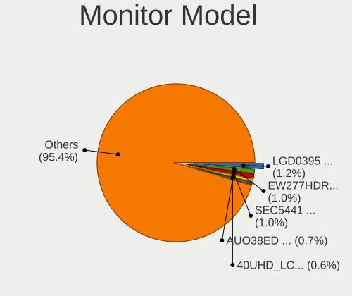

| Model                                                                    | Computers | Percent |
|--------------------------------------------------------------------------|-----------|---------|
| LG Display LCD Monitor LGD0395 1366x768 344x194mm 15.5-inch              | 52        | 1.22%   |
| BenQ EW277HDR BNQ7948 1920x1080 598x336mm 27.0-inch                      | 44        | 1.03%   |
| Samsung Electronics LCD Monitor SEC5441 1280x800 331x207mm 15.4-inch     | 43        | 1.01%   |
| AU Optronics LCD Monitor AUO38ED 1920x1080 344x193mm 15.5-inch           | 29        | 0.68%   |
| Vestel Elektronik 40UHD_LCD_TV VES3700 3840x2160 880x500mm 39.8-inch     | 27        | 0.63%   |
| LG Display LCD Monitor LGD02DC 1366x768 344x194mm 15.5-inch              | 27        | 0.63%   |
| Chi Mei Optoelectronics LCD Monitor CMO15A7 1366x768 344x193mm 15.5-inch | 27        | 0.63%   |
| AU Optronics LCD Monitor AUO22EC 1366x768 344x193mm 15.5-inch            | 27        | 0.63%   |
| BOE LCD Monitor BOE06A5 1366x768 344x194mm 15.5-inch                     | 24        | 0.56%   |
| Goldstar 2D HD TV GSM59CA 1366x768 509x286mm 23.0-inch                   | 19        | 0.45%   |
| Chimei Innolux LCD Monitor CMN15DB 1366x768 344x193mm 15.5-inch          | 19        | 0.45%   |
| AU Optronics LCD Monitor AUO26EC 1366x768 344x193mm 15.5-inch            | 19        | 0.45%   |
| Chimei Innolux LCD Monitor CMN15D5 1920x1080 344x193mm 15.5-inch         | 18        | 0.42%   |
| LG Display LCD Monitor LGD033A 1366x768 344x194mm 15.5-inch              | 17        | 0.4%    |
| Chi Mei Optoelectronics LCD Monitor CMO1592 1366x768 344x193mm 15.5-inch | 17        | 0.4%    |
| AU Optronics LCD Monitor AUO10EC 1366x768 344x193mm 15.5-inch            | 16        | 0.38%   |
| LG Display LP156WH2-TLAA LGD0230 1366x768 344x194mm 15.5-inch            | 15        | 0.35%   |
| Goldstar LG ULTRAWIDE GSM59F1 2560x1080 670x280mm 28.6-inch              | 14        | 0.33%   |
| Chimei Innolux LCD Monitor CMN15CA 1366x768 344x193mm 15.5-inch          | 14        | 0.33%   |
| BOE LCD Monitor BOE0675 1366x768 344x194mm 15.5-inch                     | 13        | 0.3%    |
| AU Optronics LCD Monitor AUO23EC 1366x768 344x193mm 15.5-inch            | 13        | 0.3%    |
| AOC 32G1WG4 AOC3201 1920x1080 697x392mm 31.5-inch                        | 13        | 0.3%    |
| Iiyama PL2473HD IVM6107 1920x1080 521x293mm 23.5-inch                    | 12        | 0.28%   |
| HKC Monitor HKC1850 1360x768 409x230mm 18.5-inch                         | 12        | 0.28%   |
| Goldstar E2260 GSM57DF 1920x1080 477x268mm 21.5-inch                     | 12        | 0.28%   |
| Chimei Innolux LCD Monitor CMN15BC 1366x768 344x193mm 15.5-inch          | 12        | 0.28%   |
| BOE LCD Monitor BOE0672 1366x768 344x194mm 15.5-inch                     | 12        | 0.28%   |
| AU Optronics LCD Monitor AUO106C 1366x768 276x155mm 12.5-inch            | 12        | 0.28%   |
| Ancor Communications ASUS VW193D ACI19D5 1440x900 408x255mm 18.9-inch    | 12        | 0.28%   |
| Samsung Electronics S19B150 SAM08A2 1366x768 410x230mm 18.5-inch         | 11        | 0.26%   |
| Samsung Electronics LS49A950U SAM71CC 3840x1080 1192x336mm 48.8-inch     | 11        | 0.26%   |
| Samsung Electronics C24F390 SAM0D2C 1920x1080 521x293mm 23.5-inch        | 11        | 0.26%   |
| MStar Demo MST0030 1920x1080 708x398mm 32.0-inch                         | 11        | 0.26%   |
| LG Display LCD Monitor LGD0365 1600x900 382x215mm 17.3-inch              | 11        | 0.26%   |
| Lenovo LCD Monitor LEN4036 1440x900 303x190mm 14.1-inch                  | 11        | 0.26%   |
| Chimei Innolux LCD Monitor CMN15BF 1366x768 344x194mm 15.5-inch          | 11        | 0.26%   |
| Chimei Innolux LCD Monitor CMN15AB 1366x768 344x193mm 15.5-inch          | 11        | 0.26%   |
| Chimei Innolux LCD Monitor CMN1119 1366x768 256x144mm 11.6-inch          | 11        | 0.26%   |
| Chi Mei Optoelectronics LCD Monitor CMO15A1 1366x768 344x193mm 15.5-inch | 11        | 0.26%   |
| AU Optronics LCD Monitor AUO46EC 1366x768 344x193mm 15.5-inch            | 11        | 0.26%   |

Monitor Resolution
------------------

Monitor screen resolution

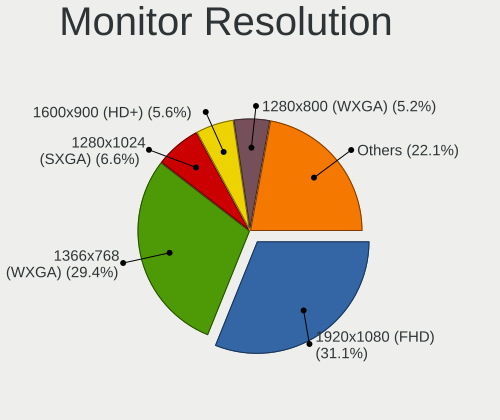

| Resolution         | Computers | Percent |
|--------------------|-----------|---------|
| 1920x1080 (FHD)    | 1266      | 31.11%  |
| 1366x768 (WXGA)    | 1195      | 29.36%  |
| 1280x1024 (SXGA)   | 270       | 6.63%   |
| 1600x900 (HD+)     | 226       | 5.55%   |
| 1280x800 (WXGA)    | 213       | 5.23%   |
| 1680x1050 (WSXGA+) | 195       | 4.79%   |
| 1440x900 (WXGA+)   | 189       | 4.64%   |
| 3840x2160 (4K)     | 137       | 3.37%   |
| 1920x1200 (WUXGA)  | 61        | 1.5%    |
| 1024x600           | 48        | 1.18%   |
| 2560x1080          | 43        | 1.06%   |
| 1360x768           | 43        | 1.06%   |
| 2560x1440 (QHD)    | 40        | 0.98%   |
| 1024x768 (XGA)     | 34        | 0.84%   |
| 1920x540           | 21        | 0.52%   |
| 3840x1080          | 15        | 0.37%   |
| 2560x1600          | 14        | 0.34%   |
| 1600x1200          | 9         | 0.22%   |
| 1280x720 (HD)      | 9         | 0.22%   |
| 2288x1287          | 8         | 0.2%    |
| 3440x1440          | 6         | 0.15%   |
| 1920x1280          | 4         | 0.1%    |
| 1152x864           | 4         | 0.1%    |
| 1280x768           | 3         | 0.07%   |
| 2880x1920          | 2         | 0.05%   |
| 1680x945           | 2         | 0.05%   |
| 1280x960           | 2         | 0.05%   |
| 800x600            | 1         | 0.02%   |
| 800x1280           | 1         | 0.02%   |
| 4093x4093          | 1         | 0.02%   |
| 3840x2400          | 1         | 0.02%   |
| 3840x1200          | 1         | 0.02%   |
| 2880x1200          | 1         | 0.02%   |
| 2160x1440          | 1         | 0.02%   |
| 2048x1536          | 1         | 0.02%   |
| 1400x1050          | 1         | 0.02%   |
| 1024x576           | 1         | 0.02%   |
| Unknown            | 1         | 0.02%   |

Monitor Diagonal
----------------

Diagonal size in inches

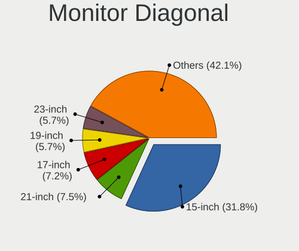

| Inches  | Computers | Percent |
|---------|-----------|---------|
| 15      | 1335      | 31.83%  |
| 21      | 315       | 7.51%   |
| 17      | 302       | 7.2%    |
| 19      | 239       | 5.7%    |
| 23      | 238       | 5.67%   |
| 14      | 238       | 5.67%   |
| 24      | 190       | 4.53%   |
| 27      | 188       | 4.48%   |
| 13      | 161       | 3.84%   |
| 18      | 153       | 3.65%   |
| 22      | 135       | 3.22%   |
| 12      | 94        | 2.24%   |
| 20      | 84        | 2%      |
| 11      | 58        | 1.38%   |
| 10      | 57        | 1.36%   |
| 31      | 53        | 1.26%   |
| Unknown | 50        | 1.19%   |
| 34      | 45        | 1.07%   |
| 84      | 41        | 0.98%   |
| 72      | 18        | 0.43%   |
| 40      | 18        | 0.43%   |
| 32      | 18        | 0.43%   |
| 54      | 15        | 0.36%   |
| 52      | 15        | 0.36%   |
| 48      | 13        | 0.31%   |
| 65      | 10        | 0.24%   |
| 42      | 9         | 0.21%   |
| 26      | 9         | 0.21%   |
| 49      | 8         | 0.19%   |
| 25      | 8         | 0.19%   |
| 16      | 8         | 0.19%   |
| 63      | 7         | 0.17%   |
| 50      | 7         | 0.17%   |
| 46      | 7         | 0.17%   |
| 142     | 5         | 0.12%   |
| 55      | 5         | 0.12%   |
| 8       | 5         | 0.12%   |
| 75      | 4         | 0.1%    |
| 60      | 3         | 0.07%   |
| 58      | 3         | 0.07%   |

Monitor Width
-------------

Physical width

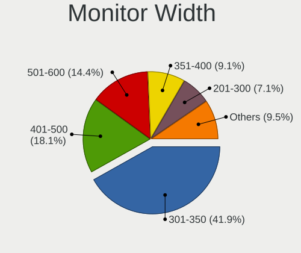

| Width in mm    | Computers | Percent |
|----------------|-----------|---------|
| 301-350        | 1730      | 41.87%  |
| 401-500        | 748       | 18.1%   |
| 501-600        | 593       | 14.35%  |
| 351-400        | 374       | 9.05%   |
| 201-300        | 293       | 7.09%   |
| 1001-1500      | 96        | 2.32%   |
| 601-700        | 71        | 1.72%   |
| 701-800        | 64        | 1.55%   |
| 1501-2000      | 64        | 1.55%   |
| Unknown        | 50        | 1.21%   |
| 801-900        | 24        | 0.58%   |
| 901-1000       | 13        | 0.31%   |
| 101-200        | 6         | 0.15%   |
| More than 2000 | 5         | 0.12%   |
| 1-100          | 1         | 0.02%   |

Aspect Ratio
------------

Proportional relationship between the width and the height

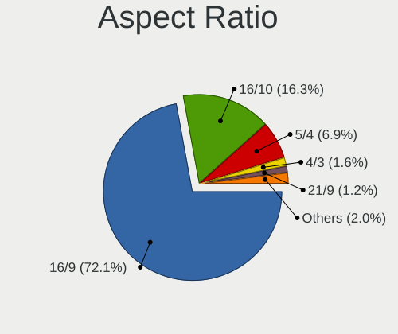

| Ratio   | Computers | Percent |
|---------|-----------|---------|
| 16/9    | 2819      | 72.12%  |
| 16/10   | 636       | 16.27%  |
| 5/4     | 268       | 6.86%   |
| 4/3     | 61        | 1.56%   |
| 21/9    | 47        | 1.2%    |
| 3/2     | 30        | 0.77%   |
| 32/9    | 17        | 0.43%   |
| Unknown | 16        | 0.41%   |
| 6/5     | 7         | 0.18%   |
| 1.00    | 6         | 0.15%   |
| 0.67    | 1         | 0.03%   |
| 0.62    | 1         | 0.03%   |

Monitor Area
------------

Area in inch²

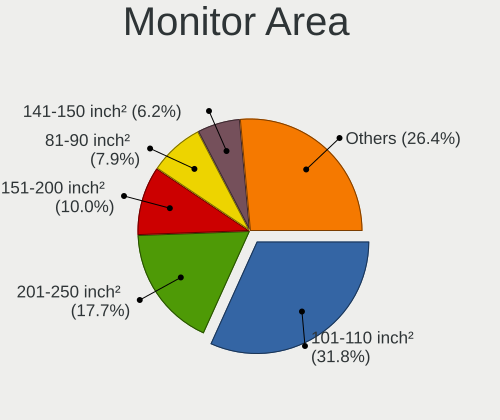

| Area in inch² | Computers | Percent |
|----------------|-----------|---------|
| 101-110        | 1320      | 31.76%  |
| 201-250        | 734       | 17.66%  |
| 151-200        | 415       | 9.99%   |
| 81-90          | 330       | 7.94%   |
| 141-150        | 258       | 6.21%   |
| 301-350        | 191       | 4.6%    |
| More than 1000 | 141       | 3.39%   |
| 121-130        | 127       | 3.06%   |
| 351-500        | 118       | 2.84%   |
| 61-70          | 86        | 2.07%   |
| 71-80          | 68        | 1.64%   |
| 251-300        | 67        | 1.61%   |
| 51-60          | 61        | 1.47%   |
| 501-1000       | 60        | 1.44%   |
| 41-50          | 54        | 1.3%    |
| Unknown        | 50        | 1.2%    |
| 131-140        | 40        | 0.96%   |
| 111-120        | 18        | 0.43%   |
| 91-100         | 11        | 0.26%   |
| 1-40           | 7         | 0.17%   |

Pixel Density
-------------

Pixels per inch

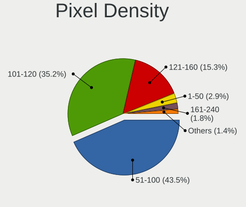

| Density       | Computers | Percent |
|---------------|-----------|---------|
| 51-100        | 1752      | 43.47%  |
| 101-120       | 1417      | 35.16%  |
| 121-160       | 616       | 15.29%  |
| 1-50          | 116       | 2.88%   |
| 161-240       | 71        | 1.76%   |
| Unknown       | 50        | 1.24%   |
| More than 240 | 8         | 0.2%    |

Multiple Monitors
-----------------

Total monitors connected

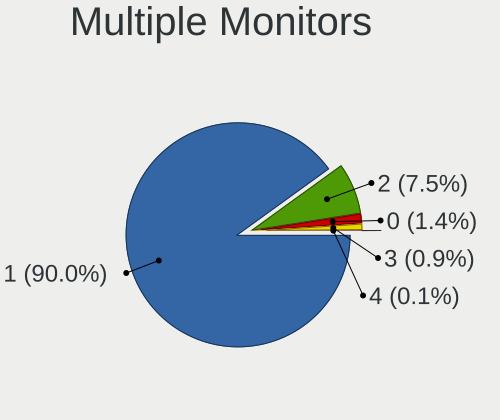

| Total | Computers | Percent |
|-------|-----------|---------|
| 1     | 3704      | 90.03%  |
| 2     | 307       | 7.46%   |
| 0     | 59        | 1.43%   |
| 3     | 39        | 0.95%   |
| 4     | 5         | 0.12%   |

Network
-------

Net Controller Vendor
---------------------

Controller vendors

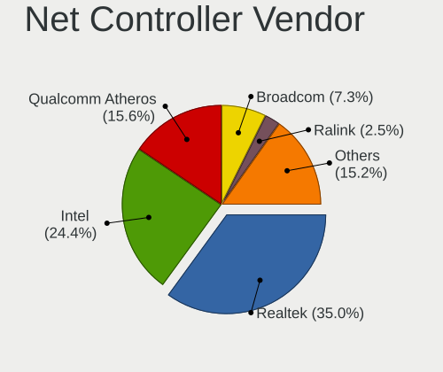

| Vendor                            | Computers | Percent |
|-----------------------------------|-----------|---------|
| Realtek Semiconductor             | 2118      | 35.02%  |
| Intel                             | 1476      | 24.4%   |
| Qualcomm Atheros                  | 943       | 15.59%  |
| Broadcom                          | 442       | 7.31%   |
| Ralink                            | 152       | 2.51%   |
| Broadcom Limited                  | 144       | 2.38%   |
| Marvell Technology Group          | 115       | 1.9%    |
| Ralink Technology                 | 92        | 1.52%   |
| Nvidia                            | 76        | 1.26%   |
| Qualcomm Atheros Communications   | 64        | 1.06%   |
| TP-Link                           | 54        | 0.89%   |
| Samsung Electronics               | 26        | 0.43%   |
| Huawei Technologies               | 25        | 0.41%   |
| Dell                              | 24        | 0.4%    |
| VIA Technologies                  | 21        | 0.35%   |
| MediaTek                          | 21        | 0.35%   |
| JMicron Technology                | 20        | 0.33%   |
| DisplayLink                       | 20        | 0.33%   |
| Ericsson Business Mobile Networks | 17        | 0.28%   |
| Hewlett-Packard                   | 15        | 0.25%   |
| Xiaomi                            | 14        | 0.23%   |
| ASUSTek Computer                  | 14        | 0.23%   |
| Sierra Wireless                   | 13        | 0.21%   |
| D-Link                            | 13        | 0.21%   |
| IMC Networks                      | 12        | 0.2%    |
| D-Link System                     | 9         | 0.15%   |
| Attansic Technology               | 9         | 0.15%   |
| ASIX Electronics                  | 8         | 0.13%   |
| NetGear                           | 7         | 0.12%   |
| Microsoft                         | 7         | 0.12%   |
| Shenzhen Goodix Technology        | 6         | 0.1%    |
| QinHeng Electronics               | 6         | 0.1%    |
| Belkin Components                 | 6         | 0.1%    |
| T & A Mobile Phones               | 5         | 0.08%   |
| Silicon Integrated Systems [SiS]  | 4         | 0.07%   |
| Edimax Technology                 | 4         | 0.07%   |
| Accton Technology                 | 4         | 0.07%   |
| ZyXEL Communications              | 2         | 0.03%   |
| Novatel Wireless                  | 2         | 0.03%   |
| LG Electronics                    | 2         | 0.03%   |

Net Controller Model
--------------------

Controller models

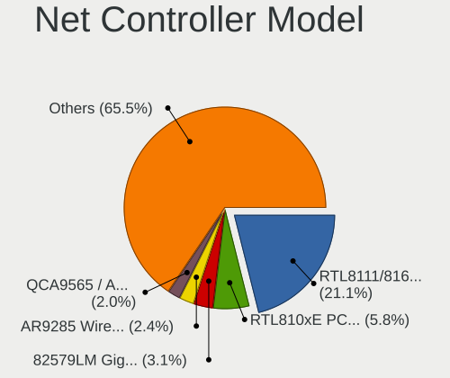

| Model                                                                   | Computers | Percent |
|-------------------------------------------------------------------------|-----------|---------|
| Realtek RTL8111/8168/8211/8411 PCI Express Gigabit Ethernet Controller  | 1473      | 21.09%  |
| Realtek RTL810xE PCI Express Fast Ethernet controller                   | 406       | 5.81%   |
| Intel 82579LM Gigabit Network Connection (Lewisville)                   | 219       | 3.14%   |
| Qualcomm Atheros AR9285 Wireless Network Adapter (PCI-Express)          | 167       | 2.39%   |
| Qualcomm Atheros QCA9565 / AR9565 Wireless Network Adapter              | 141       | 2.02%   |
| Qualcomm Atheros QCA9377 802.11ac Wireless Network Adapter              | 103       | 1.48%   |
| Qualcomm Atheros AR9485 Wireless Network Adapter                        | 96        | 1.37%   |
| Intel Wireless 7260                                                     | 91        | 1.3%    |
| Intel Centrino Advanced-N 6205 [Taylor Peak]                            | 91        | 1.3%    |
| Ralink RT3290 Wireless 802.11n 1T/1R PCIe                               | 86        | 1.23%   |
| Realtek RTL8723BE PCIe Wireless Network Adapter                         | 76        | 1.09%   |
| Intel PRO/Wireless 3945ABG [Golan] Network Connection                   | 76        | 1.09%   |
| Intel 82577LM Gigabit Network Connection                                | 74        | 1.06%   |
| Intel Ethernet Connection I217-LM                                       | 73        | 1.05%   |
| Intel 82567LM-3 Gigabit Network Connection                              | 68        | 0.97%   |
| Intel Wireless 7265                                                     | 66        | 0.95%   |
| Broadcom BCM4313 802.11bgn Wireless Network Adapter                     | 66        | 0.95%   |
| Intel Centrino Advanced-N 6200                                          | 57        | 0.82%   |
| Qualcomm Atheros AR9271 802.11n                                         | 56        | 0.8%    |
| Intel Wireless 8265 / 8275                                              | 56        | 0.8%    |
| Qualcomm Atheros AR242x / AR542x Wireless Network Adapter (PCI-Express) | 55        | 0.79%   |
| Intel Centrino Ultimate-N 6300                                          | 55        | 0.79%   |
| Intel Wireless 3165                                                     | 51        | 0.73%   |
| Intel 82567LM Gigabit Network Connection                                | 51        | 0.73%   |
| Realtek RTL-8100/8101L/8139 PCI Fast Ethernet Adapter                   | 48        | 0.69%   |
| Qualcomm Atheros QCA8171 Gigabit Ethernet                               | 48        | 0.69%   |
| Intel Ethernet Connection (2) I219-V                                    | 48        | 0.69%   |
| Qualcomm Atheros AR8151 v2.0 Gigabit Ethernet                           | 47        | 0.67%   |
| Realtek RTL8188EUS 802.11n Wireless Network Adapter                     | 41        | 0.59%   |
| Intel Wireless 3160                                                     | 40        | 0.57%   |
| Qualcomm Atheros AR8132 Fast Ethernet                                   | 39        | 0.56%   |
| Ralink MT7601U Wireless Adapter                                         | 38        | 0.54%   |
| Intel PRO/Wireless 5100 AGN [Shiloh] Network Connection                 | 37        | 0.53%   |
| Intel PRO/Wireless 4965 AG or AGN [Kedron] Network Connection           | 37        | 0.53%   |
| Intel I211 Gigabit Network Connection                                   | 37        | 0.53%   |
| Qualcomm Atheros AR8121/AR8113/AR8114 Gigabit or Fast Ethernet          | 36        | 0.52%   |
| Intel WiFi Link 5100                                                    | 36        | 0.52%   |
| Broadcom BCM43142 802.11b/g/n                                           | 36        | 0.52%   |
| Nvidia MCP61 Ethernet                                                   | 35        | 0.5%    |
| Realtek RTL8821AE 802.11ac PCIe Wireless Network Adapter                | 34        | 0.49%   |

Wireless Vendor
---------------

Wireless vendors

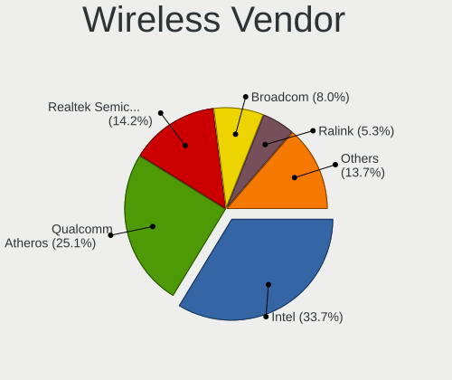

| Vendor                                | Computers | Percent |
|---------------------------------------|-----------|---------|
| Intel                                 | 965       | 33.69%  |
| Qualcomm Atheros                      | 720       | 25.14%  |
| Realtek Semiconductor                 | 406       | 14.18%  |
| Broadcom                              | 230       | 8.03%   |
| Ralink                                | 152       | 5.31%   |
| Ralink Technology                     | 92        | 3.21%   |
| Qualcomm Atheros Communications       | 64        | 2.23%   |
| TP-Link                               | 53        | 1.85%   |
| Broadcom Limited                      | 50        | 1.75%   |
| MediaTek                              | 18        | 0.63%   |
| Dell                                  | 15        | 0.52%   |
| ASUSTek Computer                      | 14        | 0.49%   |
| Sierra Wireless                       | 13        | 0.45%   |
| IMC Networks                          | 12        | 0.42%   |
| D-Link                                | 12        | 0.42%   |
| NetGear                               | 7         | 0.24%   |
| Microsoft                             | 7         | 0.24%   |
| Belkin Components                     | 6         | 0.21%   |
| D-Link System                         | 5         | 0.17%   |
| Edimax Technology                     | 4         | 0.14%   |
| Hewlett-Packard                       | 3         | 0.1%    |
| ZyXEL Communications                  | 2         | 0.07%   |
| Marvell Technology Group              | 2         | 0.07%   |
| Fujitsu Siemens Computers             | 2         | 0.07%   |
| ZyDAS                                 | 1         | 0.03%   |
| Wacom                                 | 1         | 0.03%   |
| TRENDnet                              | 1         | 0.03%   |
| Texas Instruments                     | 1         | 0.03%   |
| Micro Star International              | 1         | 0.03%   |
| Mercucys                              | 1         | 0.03%   |
| Gemtek                                | 1         | 0.03%   |
| Fibocom                               | 1         | 0.03%   |
| AVM                                   | 1         | 0.03%   |
| 802.11g Adapter [Linksys WUSB54GC v3] | 1         | 0.03%   |

Wireless Model
--------------

Wireless models

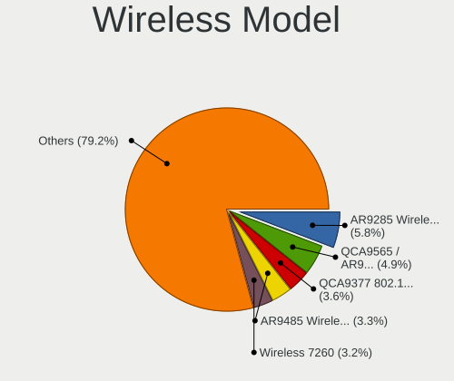

| Model                                                                   | Computers | Percent |
|-------------------------------------------------------------------------|-----------|---------|
| Qualcomm Atheros AR9285 Wireless Network Adapter (PCI-Express)          | 167       | 5.8%    |
| Qualcomm Atheros QCA9565 / AR9565 Wireless Network Adapter              | 141       | 4.9%    |
| Qualcomm Atheros QCA9377 802.11ac Wireless Network Adapter              | 103       | 3.58%   |
| Qualcomm Atheros AR9485 Wireless Network Adapter                        | 96        | 3.34%   |
| Intel Wireless 7260                                                     | 91        | 3.16%   |
| Intel Centrino Advanced-N 6205 [Taylor Peak]                            | 91        | 3.16%   |
| Ralink RT3290 Wireless 802.11n 1T/1R PCIe                               | 86        | 2.99%   |
| Realtek RTL8723BE PCIe Wireless Network Adapter                         | 76        | 2.64%   |
| Intel PRO/Wireless 3945ABG [Golan] Network Connection                   | 76        | 2.64%   |
| Intel Wireless 7265                                                     | 66        | 2.29%   |
| Broadcom BCM4313 802.11bgn Wireless Network Adapter                     | 66        | 2.29%   |
| Intel Centrino Advanced-N 6200                                          | 57        | 1.98%   |
| Qualcomm Atheros AR9271 802.11n                                         | 56        | 1.95%   |
| Intel Wireless 8265 / 8275                                              | 56        | 1.95%   |
| Qualcomm Atheros AR242x / AR542x Wireless Network Adapter (PCI-Express) | 55        | 1.91%   |
| Intel Centrino Ultimate-N 6300                                          | 55        | 1.91%   |
| Intel Wireless 3165                                                     | 51        | 1.77%   |
| Realtek RTL8188EUS 802.11n Wireless Network Adapter                     | 41        | 1.42%   |
| Intel Wireless 3160                                                     | 40        | 1.39%   |
| Ralink MT7601U Wireless Adapter                                         | 38        | 1.32%   |
| Intel PRO/Wireless 5100 AGN [Shiloh] Network Connection                 | 37        | 1.29%   |
| Intel PRO/Wireless 4965 AG or AGN [Kedron] Network Connection           | 37        | 1.29%   |
| Intel WiFi Link 5100                                                    | 36        | 1.25%   |
| Broadcom BCM43142 802.11b/g/n                                           | 36        | 1.25%   |
| Realtek RTL8821AE 802.11ac PCIe Wireless Network Adapter                | 34        | 1.18%   |
| Qualcomm Atheros AR9462 Wireless Network Adapter                        | 34        | 1.18%   |
| Realtek RTL8821CE 802.11ac PCIe Wireless Network Adapter                | 33        | 1.15%   |
| Realtek RTL8188CE 802.11b/g/n WiFi Adapter                              | 31        | 1.08%   |
| Qualcomm Atheros AR928X Wireless Network Adapter (PCI-Express)          | 31        | 1.08%   |
| Qualcomm Atheros AR9287 Wireless Network Adapter (PCI-Express)          | 30        | 1.04%   |
| Intel Wireless 8260                                                     | 28        | 0.97%   |
| Intel Dual Band Wireless-AC 3168NGW [Stone Peak]                        | 28        | 0.97%   |
| Broadcom BCM4312 802.11b/g LP-PHY                                       | 27        | 0.94%   |
| Realtek RTL8822CE 802.11ac PCIe Wireless Network Adapter                | 26        | 0.9%    |
| Broadcom Limited BCM4312 802.11b/g LP-PHY                               | 26        | 0.9%    |
| Realtek RTL8188EE Wireless Network Adapter                              | 25        | 0.87%   |
| Ralink RT3090 Wireless 802.11n 1T/1R PCIe                               | 23        | 0.8%    |
| Broadcom BCM43228 802.11a/b/g/n                                         | 22        | 0.76%   |
| Intel Wi-Fi 6 AX200                                                     | 21        | 0.73%   |
| Intel Cannon Lake PCH CNVi WiFi                                         | 21        | 0.73%   |

Ethernet Vendor
---------------

Ethernet vendors

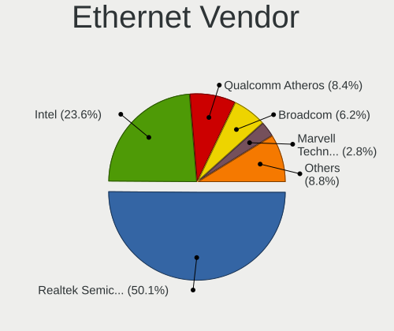

| Vendor                                 | Computers | Percent |
|----------------------------------------|-----------|---------|
| Realtek Semiconductor                  | 1998      | 50.11%  |
| Intel                                  | 940       | 23.58%  |
| Qualcomm Atheros                       | 336       | 8.43%   |
| Broadcom                               | 249       | 6.25%   |
| Marvell Technology Group               | 113       | 2.83%   |
| Broadcom Limited                       | 95        | 2.38%   |
| Nvidia                                 | 76        | 1.91%   |
| Samsung Electronics                    | 22        | 0.55%   |
| VIA Technologies                       | 20        | 0.5%    |
| JMicron Technology                     | 20        | 0.5%    |
| DisplayLink                            | 20        | 0.5%    |
| Huawei Technologies                    | 19        | 0.48%   |
| Xiaomi                                 | 14        | 0.35%   |
| Attansic Technology                    | 9         | 0.23%   |
| ASIX Electronics                       | 8         | 0.2%    |
| QinHeng Electronics                    | 6         | 0.15%   |
| T & A Mobile Phones                    | 5         | 0.13%   |
| Silicon Integrated Systems [SiS]       | 4         | 0.1%    |
| D-Link System                          | 4         | 0.1%    |
| Accton Technology                      | 4         | 0.1%    |
| Novatel Wireless                       | 2         | 0.05%   |
| MediaTek                               | 2         | 0.05%   |
| LG Electronics                         | 2         | 0.05%   |
| HMD Global                             | 2         | 0.05%   |
| Aquantia                               | 2         | 0.05%   |
| Westell                                | 1         | 0.03%   |
| TP-Link                                | 1         | 0.03%   |
| TOMTOM                                 | 1         | 0.03%   |
| Spreadtrum Communications              | 1         | 0.03%   |
| Sony Ericsson Mobile Communications AB | 1         | 0.03%   |
| Qualcomm                               | 1         | 0.03%   |
| OPPO Electronics                       | 1         | 0.03%   |
| Naxiang                                | 1         | 0.03%   |
| Motorola PCS                           | 1         | 0.03%   |
| ICS Advent                             | 1         | 0.03%   |
| IBM                                    | 1         | 0.03%   |
| Davicom Semiconductor                  | 1         | 0.03%   |
| D-Link                                 | 1         | 0.03%   |
| Compal Electronics                     | 1         | 0.03%   |
| 3Com                                   | 1         | 0.03%   |

Ethernet Model
--------------

Ethernet models

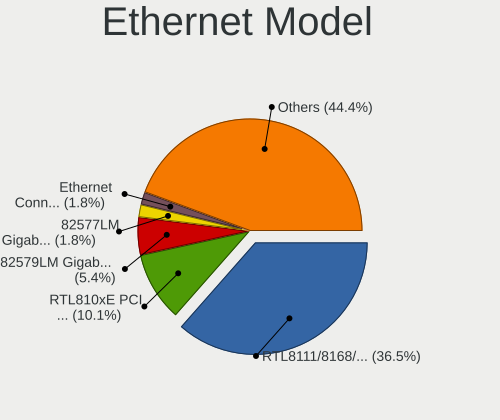

| Model                                                                  | Computers | Percent |
|------------------------------------------------------------------------|-----------|---------|
| Realtek RTL8111/8168/8211/8411 PCI Express Gigabit Ethernet Controller | 1473      | 36.5%   |
| Realtek RTL810xE PCI Express Fast Ethernet controller                  | 406       | 10.06%  |
| Intel 82579LM Gigabit Network Connection (Lewisville)                  | 219       | 5.43%   |
| Intel 82577LM Gigabit Network Connection                               | 74        | 1.83%   |
| Intel Ethernet Connection I217-LM                                      | 73        | 1.81%   |
| Intel 82567LM-3 Gigabit Network Connection                             | 68        | 1.68%   |
| Intel 82567LM Gigabit Network Connection                               | 51        | 1.26%   |
| Realtek RTL-8100/8101L/8139 PCI Fast Ethernet Adapter                  | 48        | 1.19%   |
| Qualcomm Atheros QCA8171 Gigabit Ethernet                              | 48        | 1.19%   |
| Intel Ethernet Connection (2) I219-V                                   | 48        | 1.19%   |
| Qualcomm Atheros AR8151 v2.0 Gigabit Ethernet                          | 47        | 1.16%   |
| Qualcomm Atheros AR8132 Fast Ethernet                                  | 39        | 0.97%   |
| Intel I211 Gigabit Network Connection                                  | 37        | 0.92%   |
| Qualcomm Atheros AR8121/AR8113/AR8114 Gigabit or Fast Ethernet         | 36        | 0.89%   |
| Nvidia MCP61 Ethernet                                                  | 35        | 0.87%   |
| Intel 82566DM-2 Gigabit Network Connection                             | 34        | 0.84%   |
| Qualcomm Atheros AR8131 Gigabit Ethernet                               | 33        | 0.82%   |
| Intel Ethernet Connection I218-LM                                      | 32        | 0.79%   |
| Intel Ethernet Connection (2) I219-LM                                  | 32        | 0.79%   |
| Qualcomm Atheros AR8152 v2.0 Fast Ethernet                             | 31        | 0.77%   |
| Intel 82579V Gigabit Network Connection                                | 31        | 0.77%   |
| Broadcom NetLink BCM57785 Gigabit Ethernet PCIe                        | 31        | 0.77%   |
| Marvell Group 88E8040 PCI-E Fast Ethernet Controller                   | 30        | 0.74%   |
| Broadcom NetXtreme BCM5754 Gigabit Ethernet PCI Express                | 27        | 0.67%   |
| Realtek RTL8169 PCI Gigabit Ethernet Controller                        | 26        | 0.64%   |
| Intel Ethernet Connection I217-V                                       | 26        | 0.64%   |
| Realtek RTL8153 Gigabit Ethernet Adapter                               | 23        | 0.57%   |
| Broadcom NetXtreme BCM5761 Gigabit Ethernet PCIe                       | 22        | 0.55%   |
| Realtek RTL8125 2.5GbE Controller                                      | 21        | 0.52%   |
| Intel 82566MM Gigabit Network Connection                               | 21        | 0.52%   |
| DisplayLink USB3 to HDMI                                               | 20        | 0.5%    |
| Marvell Group 88E8056 PCI-E Gigabit Ethernet Controller                | 19        | 0.47%   |
| VIA VT6102/VT6103 [Rhine-II]                                           | 18        | 0.45%   |
| Qualcomm Atheros QCA8172 Fast Ethernet                                 | 18        | 0.45%   |
| JMicron JMC250 PCI Express Gigabit Ethernet Controller                 | 18        | 0.45%   |
| Intel Ethernet Connection (7) I219-V                                   | 18        | 0.45%   |
| Intel Ethernet Connection (4) I219-LM                                  | 18        | 0.45%   |
| Broadcom NetLink BCM57780 Gigabit Ethernet PCIe                        | 18        | 0.45%   |
| Samsung Galaxy series, misc. (tethering mode)                          | 17        | 0.42%   |
| Qualcomm Atheros AR8161 Gigabit Ethernet                               | 17        | 0.42%   |

Net Controller Kind
-------------------

Ethernet, WiFi or modem

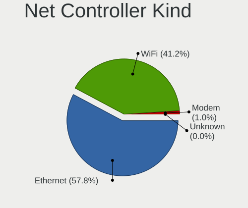

| Kind     | Computers | Percent |
|----------|-----------|---------|
| Ethernet | 3817      | 57.8%   |
| WiFi     | 2718      | 41.16%  |
| Modem    | 66        | 1%      |
| Unknown  | 3         | 0.05%   |

Used Controller
---------------

Currently used network controller

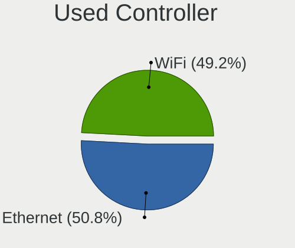

| Kind     | Computers | Percent |
|----------|-----------|---------|
| Ethernet | 2170      | 50.83%  |
| WiFi     | 2099      | 49.17%  |

NICs
----

Total network controllers on board

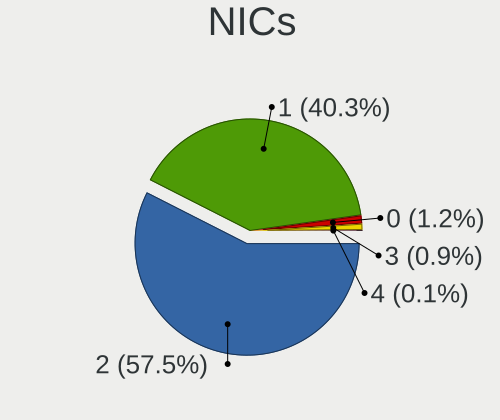

| Total | Computers | Percent |
|-------|-----------|---------|
| 2     | 2316      | 57.48%  |
| 1     | 1623      | 40.28%  |
| 0     | 48        | 1.19%   |
| 3     | 36        | 0.89%   |
| 4     | 6         | 0.15%   |

IPv6
----

IPv6 vs IPv4

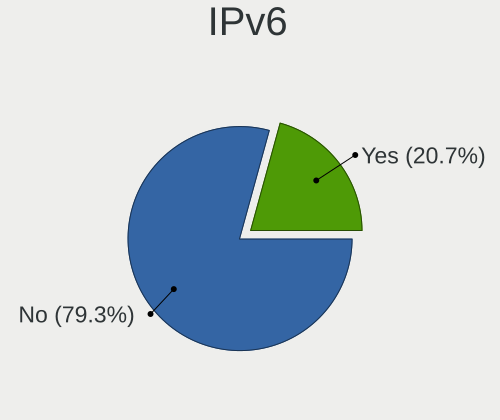

| Used | Computers | Percent |
|------|-----------|---------|
| No   | 3349      | 79.27%  |
| Yes  | 876       | 20.73%  |

Bluetooth
---------

Bluetooth Vendor
----------------

Controller vendors

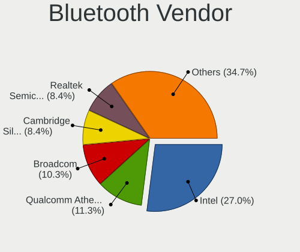

| Vendor                          | Computers | Percent |
|---------------------------------|-----------|---------|
| Intel                           | 529       | 26.99%  |
| Qualcomm Atheros Communications | 221       | 11.28%  |
| Broadcom                        | 201       | 10.26%  |
| Cambridge Silicon Radio         | 165       | 8.42%   |
| Realtek Semiconductor           | 164       | 8.37%   |
| Dell                            | 98        | 5%      |
| Lite-On Technology              | 87        | 4.44%   |
| Ralink                          | 86        | 4.39%   |
| Foxconn / Hon Hai               | 80        | 4.08%   |
| Hewlett-Packard                 | 78        | 3.98%   |
| IMC Networks                    | 72        | 3.67%   |
| Toshiba                         | 40        | 2.04%   |
| Apple                           | 36        | 1.84%   |
| ASUSTek Computer                | 23        | 1.17%   |
| Askey Computer                  | 10        | 0.51%   |
| Ralink Technology               | 9         | 0.46%   |
| Foxconn International           | 9         | 0.46%   |
| MediaTek                        | 5         | 0.26%   |
| Belkin Components               | 5         | 0.26%   |
| Alps Electric                   | 5         | 0.26%   |
| TP-Link                         | 4         | 0.2%    |
| Realtek                         | 4         | 0.2%    |
| Logitech                        | 4         | 0.2%    |
| Integrated System Solution      | 4         | 0.2%    |
| Conwise Technology              | 4         | 0.2%    |
| Chicony Electronics             | 4         | 0.2%    |
| Micro Star International        | 3         | 0.15%   |
| Taiyo Yuden                     | 2         | 0.1%    |
| Marvell Semiconductor           | 2         | 0.1%    |
| Edimax Technology               | 2         | 0.1%    |
| Roper                           | 1         | 0.05%   |
| Fujitsu Siemens Computers       | 1         | 0.05%   |
| Fujitsu                         | 1         | 0.05%   |
| Actions                         | 1         | 0.05%   |

Bluetooth Model
---------------

Controller models

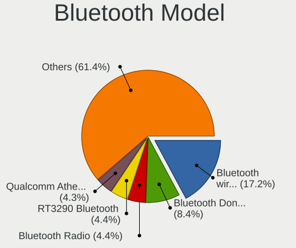

| Model                                               | Computers | Percent |
|-----------------------------------------------------|-----------|---------|
| Intel Bluetooth wireless interface                  | 337       | 17.16%  |
| Cambridge Silicon Radio Bluetooth Dongle (HCI mode) | 165       | 8.4%    |
| Realtek Bluetooth Radio                             | 87        | 4.43%   |
| Ralink RT3290 Bluetooth                             | 86        | 4.38%   |
| Qualcomm Atheros  Bluetooth Device                  | 84        | 4.28%   |
| Qualcomm Atheros AR3011 Bluetooth                   | 50        | 2.55%   |
| Dell DW375 Bluetooth Module                         | 48        | 2.44%   |
| Intel Bluetooth 9460/9560 Jefferson Peak (JfP)      | 46        | 2.34%   |
| Qualcomm Atheros AR3012 Bluetooth 4.0               | 43        | 2.19%   |
| HP Broadcom 2070 Bluetooth Combo                    | 42        | 2.14%   |
| Broadcom BCM2045B (BDC-2.1)                         | 36        | 1.83%   |
| HP Bluetooth 2.0 Interface [Broadcom BCM2045]       | 33        | 1.68%   |
| Intel AX201 Bluetooth                               | 32        | 1.63%   |
| Lite-On Atheros AR3012 Bluetooth                    | 30        | 1.53%   |
| Lite-On Qualcomm Atheros QCA9377 Bluetooth          | 28        | 1.43%   |
| Intel Wireless-AC 3168 Bluetooth                    | 28        | 1.43%   |
| Foxconn / Hon Hai Bluetooth Device                  | 27        | 1.37%   |
| Broadcom HP Portable SoftSailing                    | 27        | 1.37%   |
| Realtek RTL8821A Bluetooth                          | 26        | 1.32%   |
| Realtek  Bluetooth 4.2 Adapter                      | 26        | 1.32%   |
| Broadcom BCM20702 Bluetooth 4.0 [ThinkPad]          | 26        | 1.32%   |
| Intel Centrino Bluetooth Wireless Transceiver       | 25        | 1.27%   |
| IMC Networks Bluetooth Device                       | 24        | 1.22%   |
| Realtek RTL8723B Bluetooth                          | 23        | 1.17%   |
| Intel Centrino Advanced-N 6230 Bluetooth adapter    | 23        | 1.17%   |
| Intel AX200 Bluetooth                               | 20        | 1.02%   |
| Qualcomm Atheros AR9462 Bluetooth                   | 18        | 0.92%   |
| IMC Networks Bluetooth Radio                        | 18        | 0.92%   |
| Broadcom BCM2045B (BDC-2.1) [Bluetooth Controller]  | 17        | 0.87%   |
| Toshiba Bluetooth Device                            | 16        | 0.81%   |
| Lite-On Bluetooth Device                            | 16        | 0.81%   |
| Dell BCM20702A0 Bluetooth Module                    | 15        | 0.76%   |
| Apple Bluetooth Host Controller                     | 15        | 0.76%   |
| Foxconn / Hon Hai BCM20702A0                        | 14        | 0.71%   |
| Broadcom BCM2070 Bluetooth Device                   | 14        | 0.71%   |
| Intel Bluetooth Device                              | 12        | 0.61%   |
| Dell Wireless 365 Bluetooth                         | 12        | 0.61%   |
| Broadcom BCM2035 Bluetooth dongle                   | 11        | 0.56%   |
| Qualcomm Atheros QCA61x4 Bluetooth 4.0              | 10        | 0.51%   |
| Askey Bluetooth Device                              | 10        | 0.51%   |

Sound
-----

Sound Vendor
------------

Sound card vendors

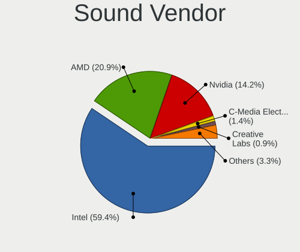

| Vendor                                       | Computers | Percent |
|----------------------------------------------|-----------|---------|
| Intel                                        | 3047      | 59.43%  |
| AMD                                          | 1069      | 20.85%  |
| Nvidia                                       | 726       | 14.16%  |
| C-Media Electronics                          | 72        | 1.4%    |
| Creative Labs                                | 44        | 0.86%   |
| VIA Technologies                             | 19        | 0.37%   |
| Logitech                                     | 15        | 0.29%   |
| Texas Instruments                            | 14        | 0.27%   |
| Creative Technology                          | 10        | 0.2%    |
| ASUSTek Computer                             | 8         | 0.16%   |
| JMTek                                        | 6         | 0.12%   |
| GN Netcom                                    | 6         | 0.12%   |
| Tenx Technology                              | 5         | 0.1%    |
| Silicon Integrated Systems [SiS]             | 5         | 0.1%    |
| Zoran Co. Personal Media Division (Nogatech) | 4         | 0.08%   |
| Realtek Semiconductor                        | 4         | 0.08%   |
| Razer USA                                    | 4         | 0.08%   |
| Plantronics                                  | 4         | 0.08%   |
| Kingston Technology                          | 4         | 0.08%   |
| Generalplus Technology                       | 4         | 0.08%   |
| Hewlett-Packard                              | 3         | 0.06%   |
| Ensoniq                                      | 3         | 0.06%   |
| BEHRINGER International                      | 3         | 0.06%   |
| Walmart                                      | 2         | 0.04%   |
| Syntek                                       | 2         | 0.04%   |
| Promethean Limited                           | 2         | 0.04%   |
| Nordic Semiconductor ASA                     | 2         | 0.04%   |
| M-Audio                                      | 2         | 0.04%   |
| Jieli Technology                             | 2         | 0.04%   |
| ESS Technology                               | 2         | 0.04%   |
| Dell                                         | 2         | 0.04%   |
| ATI Technologies                             | 2         | 0.04%   |
| Zhaoxin                                      | 1         | 0.02%   |
| USB MICROPHONE                               | 1         | 0.02%   |
| ULi Electronics                              | 1         | 0.02%   |
| Trust                                        | 1         | 0.02%   |
| Thesycon Systemsoftware & Consulting         | 1         | 0.02%   |
| Superlux digit                               | 1         | 0.02%   |
| Sunplus Technology                           | 1         | 0.02%   |
| SteelSeries ApS                              | 1         | 0.02%   |

Sound Model
-----------

Sound card models

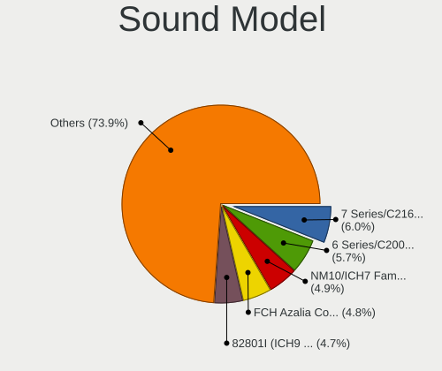

| Model                                                                                             | Computers | Percent |
|---------------------------------------------------------------------------------------------------|-----------|---------|
| Intel 7 Series/C216 Chipset Family High Definition Audio Controller                               | 369       | 6.02%   |
| Intel 6 Series/C200 Series Chipset Family High Definition Audio Controller                        | 350       | 5.71%   |
| Intel NM10/ICH7 Family High Definition Audio Controller                                           | 302       | 4.92%   |
| AMD FCH Azalia Controller                                                                         | 293       | 4.78%   |
| Intel 82801I (ICH9 Family) HD Audio Controller                                                    | 287       | 4.68%   |
| AMD SBx00 Azalia (Intel HDA)                                                                      | 232       | 3.78%   |
| Intel 5 Series/3400 Series Chipset High Definition Audio                                          | 227       | 3.7%    |
| Intel 8 Series/C220 Series Chipset High Definition Audio Controller                               | 224       | 3.65%   |
| Intel Sunrise Point-LP HD Audio                                                                   | 189       | 3.08%   |
| Intel Xeon E3-1200 v3/4th Gen Core Processor HD Audio Controller                                  | 166       | 2.71%   |
| Intel 82801H (ICH8 Family) HD Audio Controller                                                    | 135       | 2.2%    |
| Intel 8 Series HD Audio Controller                                                                | 119       | 1.94%   |
| Intel Haswell-ULT HD Audio Controller                                                             | 118       | 1.92%   |
| Intel 100 Series/C230 Series Chipset Family HD Audio Controller                                   | 109       | 1.78%   |
| AMD Ryzen HD Audio Controller                                                                     | 108       | 1.76%   |
| AMD Kabini HDMI/DP Audio                                                                          | 107       | 1.74%   |
| Nvidia GK208 HDMI/DP Audio Controller                                                             | 96        | 1.57%   |
| Intel Broadwell-U Audio Controller                                                                | 95        | 1.55%   |
| AMD Trinity HDMI Audio Controller                                                                 | 94        | 1.53%   |
| Intel Wildcat Point-LP High Definition Audio Controller                                           | 93        | 1.52%   |
| Nvidia High Definition Audio Controller                                                           | 80        | 1.3%    |
| Intel 82801JD/DO (ICH10 Family) HD Audio Controller                                               | 78        | 1.27%   |
| Intel 200 Series PCH HD Audio                                                                     | 77        | 1.26%   |
| Intel Atom Processor Z36xxx/Z37xxx Series High Definition Audio Controller                        | 72        | 1.17%   |
| AMD Oland/Hainan/Cape Verde/Pitcairn HDMI Audio [Radeon HD 7000 Series]                           | 72        | 1.17%   |
| Nvidia GF108 High Definition Audio Controller                                                     | 68        | 1.11%   |
| AMD Caicos HDMI Audio [Radeon HD 6450 / 7450/8450/8490 OEM / R5 230/235/235X OEM]                 | 67        | 1.09%   |
| Intel Atom/Celeron/Pentium Processor x5-E8000/J3xxx/N3xxx Series High Definition Audio Controller | 64        | 1.04%   |
| Intel 82801JI (ICH10 Family) HD Audio Controller                                                  | 60        | 0.98%   |
| AMD Cedar HDMI Audio [Radeon HD 5400/6300/7300 Series]                                            | 60        | 0.98%   |
| AMD Wrestler HDMI Audio                                                                           | 59        | 0.96%   |
| Intel Cannon Lake PCH cAVS                                                                        | 58        | 0.95%   |
| AMD Raven/Raven2/Fenghuang HDMI/DP Audio Controller                                               | 49        | 0.8%    |
| AMD Family 15h (Models 60h-6fh) Audio Controller                                                  | 49        | 0.8%    |
| Nvidia GP107GL High Definition Audio Controller                                                   | 45        | 0.73%   |
| AMD RV710/730 HDMI Audio [Radeon HD 4000 series]                                                  | 41        | 0.67%   |
| Nvidia GF119 HDMI Audio Controller                                                                | 38        | 0.62%   |
| Nvidia MCP61 High Definition Audio                                                                | 37        | 0.6%    |
| AMD Family 17h (Models 00h-0fh) HD Audio Controller                                               | 37        | 0.6%    |
| AMD Ellesmere HDMI Audio [Radeon RX 470/480 / 570/580/590]                                        | 36        | 0.59%   |

Memory
------

Memory Vendor
-------------

Memory module vendors

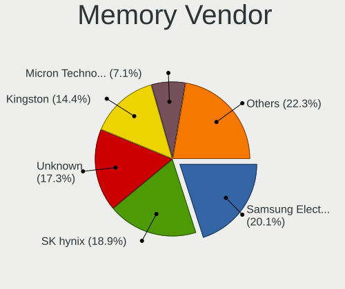

| Vendor                | Computers | Percent |
|-----------------------|-----------|---------|
| Samsung Electronics   | 966       | 20.07%  |
| SK hynix              | 910       | 18.9%   |
| Unknown               | 831       | 17.26%  |
| Kingston              | 691       | 14.35%  |
| Micron Technology     | 342       | 7.1%    |
| Nanya Technology      | 147       | 3.05%   |
| Crucial               | 118       | 2.45%   |
| Elpida                | 113       | 2.35%   |
| Kingmax               | 96        | 1.99%   |
| Corsair               | 94        | 1.95%   |
| Ramaxel Technology    | 88        | 1.83%   |
| G.Skill               | 73        | 1.52%   |
| A-DATA Technology     | 64        | 1.33%   |
| Transcend             | 23        | 0.48%   |
| Team                  | 20        | 0.42%   |
| Patriot               | 20        | 0.42%   |
| CSX                   | 19        | 0.39%   |
| Qimonda               | 17        | 0.35%   |
| Hikvision             | 16        | 0.33%   |
| ASint Technology      | 15        | 0.31%   |
| 48spaces              | 15        | 0.31%   |
| Unknown (ABCD)        | 11        | 0.23%   |
| Unknown               | 11        | 0.23%   |
| Apacer                | 10        | 0.21%   |
| Kingmax Semiconductor | 9         | 0.19%   |
| Toshiba               | 8         | 0.17%   |
| Melco                 | 7         | 0.15%   |
| GOODRAM               | 7         | 0.15%   |
| SHARETRONIC           | 5         | 0.1%    |
| OCZ                   | 4         | 0.08%   |
| H                     | 4         | 0.08%   |
| Unknown (0x0080)      | 3         | 0.06%   |
| Unifosa               | 3         | 0.06%   |
| Smart                 | 3         | 0.06%   |
| Infineon              | 3         | 0.06%   |
| GeIL                  | 3         | 0.06%   |
| Unknown (0BF7)        | 2         | 0.04%   |
| TwinMOS               | 2         | 0.04%   |
| Silicon Power         | 2         | 0.04%   |
| PUSKILL               | 2         | 0.04%   |

Memory Model
------------

Memory module models

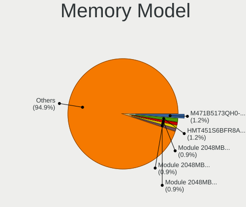

| Model                                                    | Computers | Percent |
|----------------------------------------------------------|-----------|---------|
| Samsung RAM M471B5173QH0-YK0 4GB SODIMM DDR3 1600MT/s    | 67        | 1.24%   |
| SK hynix RAM HMT451S6BFR8A-PB 4GB SODIMM DDR3 1600MT/s   | 64        | 1.19%   |
| Unknown RAM Module 2048MB SODIMM DDR2 667MT/s            | 50        | 0.93%   |
| Unknown RAM Module 2048MB DIMM SDRAM                     | 49        | 0.91%   |
| Unknown RAM Module 2048MB DIMM 800MT/s                   | 47        | 0.87%   |
| Samsung RAM M471B5173DB0-YK0 4GB SODIMM DDR3 1600MT/s    | 47        | 0.87%   |
| Samsung RAM M471B5273DH0-CH9 4GB SODIMM DDR3 1600MT/s    | 45        | 0.83%   |
| Samsung RAM M471B5173EB0-YK0 4GB SODIMM DDR3 1600MT/s    | 45        | 0.83%   |
| Kingston RAM KHX1600C10D3/4G 4GB DIMM DDR3 1866MT/s      | 44        | 0.82%   |
| Samsung RAM M471A5244CB0-CRC 4GB SODIMM DDR4 2667MT/s    | 40        | 0.74%   |
| SK hynix RAM HMT351S6EFR8A-PB 4GB SODIMM DDR3 1600MT/s   | 38        | 0.7%    |
| Samsung RAM M471B5273CH0-CH9 4GB SODIMM DDR3 1334MT/s    | 34        | 0.63%   |
| Samsung RAM M471B5773DH0-CH9 2GB SODIMM DDR3 1600MT/s    | 33        | 0.61%   |
| Samsung RAM M471B5773CHS-CH9 2GB SODIMM DDR3 4199MT/s    | 33        | 0.61%   |
| Samsung RAM M471A5244CB0-CTD 4GB SODIMM DDR4 3266MT/s    | 32        | 0.59%   |
| SK hynix RAM HMT41GS6BFR8A-PB 8GB SODIMM DDR3 2667MT/s   | 31        | 0.57%   |
| Samsung RAM M471B5273DH0-CK0 4GB SODIMM DDR3 2400MT/s    | 29        | 0.54%   |
| Unknown RAM Module 2048MB DIMM DDR2 800MT/s              | 27        | 0.5%    |
| SK hynix RAM HMT325S6CFR8A-PB 2GB SODIMM DDR3 1600MT/s   | 27        | 0.5%    |
| SK hynix RAM HMA851S6AFR6N-UH 4GB SODIMM DDR4 2667MT/s   | 26        | 0.48%   |
| Unknown RAM Module 2048MB SODIMM DDR2                    | 25        | 0.46%   |
| Unknown RAM Module 2048MB DIMM 1333MT/s                  | 25        | 0.46%   |
| SK hynix RAM HMT451S6AFR8A-PB 4GB SODIMM DDR3 1600MT/s   | 25        | 0.46%   |
| Samsung RAM M471B5673FH0-CF8 2048MB SODIMM DDR3 1067MT/s | 25        | 0.46%   |
| Kingston RAM KHX1600C9D3/4GX 4GB DIMM DDR3 1867MT/s      | 24        | 0.44%   |
| Unknown RAM Module 4096MB DIMM DDR3 1333MT/s             | 23        | 0.43%   |
| Unknown RAM Module 1024MB SODIMM DDR2 667MT/s            | 23        | 0.43%   |
| SK hynix RAM HMT351S6CFR8C-PB 4GB SODIMM DDR3 1600MT/s   | 23        | 0.43%   |
| Micron RAM 8KTF51264HZ-1G6E1 4GB SODIMM DDR3 1600MT/s    | 23        | 0.43%   |
| Kingston RAM KHX1600C10D3/8G 8GB DIMM DDR3 2133MT/s      | 23        | 0.43%   |
| Unknown RAM Module 1024MB DIMM SDRAM                     | 22        | 0.41%   |
| Unknown RAM Module 1024MB DIMM 800MT/s                   | 20        | 0.37%   |
| Samsung RAM M471B5673FH0-CH9 2048MB SODIMM DDR3 1600MT/s | 20        | 0.37%   |
| Unknown RAM Module 1024MB SODIMM DDR2                    | 19        | 0.35%   |
| Unknown RAM Module 4096MB DIMM 1333MT/s                  | 18        | 0.33%   |
| Unknown RAM Module 1024MB DIMM DDR2 667MT/s              | 18        | 0.33%   |
| SK hynix RAM HMT351S6EFR8C-PB 4GB SODIMM DDR3 1600MT/s   | 18        | 0.33%   |
| Unknown RAM Module 2048MB DIMM DDR2 667MT/s              | 17        | 0.31%   |
| SK hynix RAM HMT325S6EFR8A-PB 2GB SODIMM DDR3 1600MT/s   | 17        | 0.31%   |
| Samsung RAM M471B5273CH0-CK0 4GB SODIMM DDR3 1600MT/s    | 17        | 0.31%   |

Memory Kind
-----------

Memory module kinds

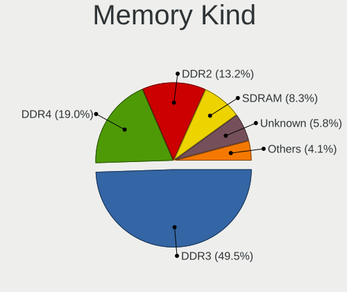

| Kind    | Computers | Percent |
|---------|-----------|---------|
| DDR3    | 2028      | 49.49%  |
| DDR4    | 779       | 19.01%  |
| DDR2    | 542       | 13.23%  |
| SDRAM   | 341       | 8.32%   |
| Unknown | 238       | 5.81%   |
| DDR     | 79        | 1.93%   |
| LPDDR4  | 44        | 1.07%   |
| DDR5    | 16        | 0.39%   |
| LPDDR3  | 13        | 0.32%   |
| DRAM    | 10        | 0.24%   |
| LPDDR5  | 8         | 0.2%    |

Memory Form Factor
------------------

Physical design of the memory module

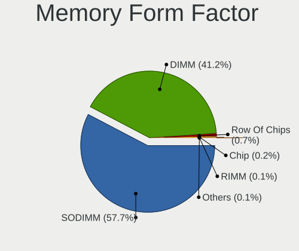

| Name         | Computers | Percent |
|--------------|-----------|---------|
| SODIMM       | 2255      | 57.69%  |
| DIMM         | 1612      | 41.24%  |
| Row Of Chips | 26        | 0.67%   |
| Chip         | 7         | 0.18%   |
| RIMM         | 5         | 0.13%   |
| Unknown      | 3         | 0.08%   |
| FB-DIMM      | 1         | 0.03%   |

Memory Size
-----------

Memory module size

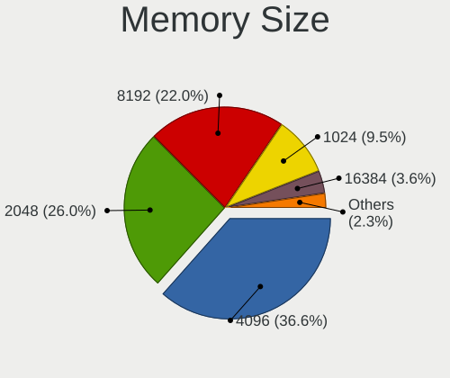

| Size    | Computers | Percent |
|---------|-----------|---------|
| 4096    | 1670      | 36.55%  |
| 2048    | 1187      | 25.98%  |
| 8192    | 1003      | 21.95%  |
| 1024    | 436       | 9.54%   |
| 16384   | 166       | 3.63%   |
| 512     | 67        | 1.47%   |
| 32768   | 27        | 0.59%   |
| 256     | 7         | 0.15%   |
| 16      | 2         | 0.04%   |
| Unknown | 2         | 0.04%   |
| 128     | 1         | 0.02%   |
| 13      | 1         | 0.02%   |

Memory Speed
------------

Memory module speed

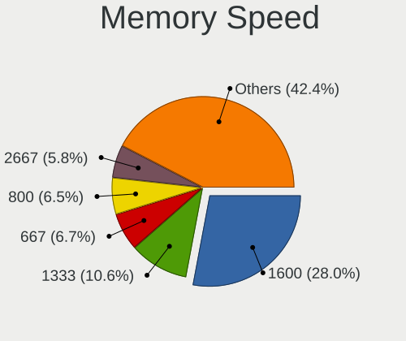

| Speed   | Computers | Percent |
|---------|-----------|---------|
| 1600    | 1287      | 27.97%  |
| 1333    | 487       | 10.58%  |
| 667     | 308       | 6.69%   |
| 800     | 300       | 6.52%   |
| 2667    | 268       | 5.82%   |
| 2400    | 254       | 5.52%   |
| 1334    | 211       | 4.58%   |
| Unknown | 188       | 4.09%   |
| 2133    | 159       | 3.46%   |
| 3200    | 154       | 3.35%   |
| 1067    | 129       | 2.8%    |
| 4199    | 78        | 1.69%   |
| 1866    | 77        | 1.67%   |
| 533     | 65        | 1.41%   |
| 1066    | 61        | 1.33%   |
| 2048    | 58        | 1.26%   |
| 3600    | 41        | 0.89%   |
| 1867    | 41        | 0.89%   |
| 400     | 36        | 0.78%   |
| 975     | 34        | 0.74%   |
| 3266    | 33        | 0.72%   |
| 1639    | 27        | 0.59%   |
| 3733    | 26        | 0.56%   |
| 2666    | 25        | 0.54%   |
| 333     | 24        | 0.52%   |
| 3000    | 18        | 0.39%   |
| 1800    | 15        | 0.33%   |
| 3400    | 14        | 0.3%    |
| 8400    | 13        | 0.28%   |
| 2000    | 13        | 0.28%   |
| 5600    | 12        | 0.26%   |
| 3466    | 12        | 0.26%   |
| 2933    | 12        | 0.26%   |
| 49926   | 9         | 0.2%    |
| 6400    | 7         | 0.15%   |
| 3333    | 7         | 0.15%   |
| 1648    | 7         | 0.15%   |
| 1331    | 6         | 0.13%   |
| 266     | 6         | 0.13%   |
| 3334    | 5         | 0.11%   |

Printers & scanners
-------------------

Printer Vendor
--------------

Printer device vendors

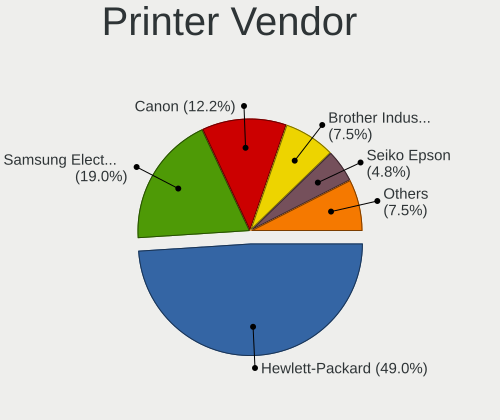

| Vendor                | Computers | Percent |
|-----------------------|-----------|---------|
| Hewlett-Packard       | 72        | 48.98%  |
| Samsung Electronics   | 28        | 19.05%  |
| Canon                 | 18        | 12.24%  |
| Brother Industries    | 11        | 7.48%   |
| Seiko Epson           | 7         | 4.76%   |
| Lexmark International | 5         | 3.4%    |
| QinHeng Electronics   | 2         | 1.36%   |
| Dymo-CoStar           | 2         | 1.36%   |
| STMicroelectronics    | 1         | 0.68%   |
| Oki Data              | 1         | 0.68%   |

Printer Model
-------------

Printer device models

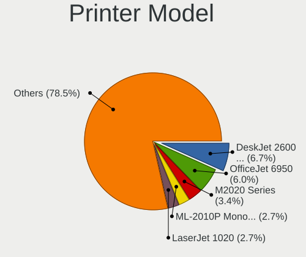

| Model                                                     | Computers | Percent |
|-----------------------------------------------------------|-----------|---------|
| HP DeskJet 2600 series                                    | 10        | 6.71%   |
| HP OfficeJet 6950                                         | 9         | 6.04%   |
| Samsung M2020 Series                                      | 5         | 3.36%   |
| Samsung ML-2010P Mono Laser Printer                       | 4         | 2.68%   |
| HP LaserJet 1020                                          | 4         | 2.68%   |
| HP DeskJet 2130 series                                    | 4         | 2.68%   |
| Samsung ML-1660 Series                                    | 3         | 2.01%   |
| Samsung ML-1640 Series Laser Printer                      | 3         | 2.01%   |
| Samsung C48x Series                                       | 3         | 2.01%   |
| Lexmark International Z35 Printer                         | 3         | 2.01%   |
| HP LaserJet 1010                                          | 3         | 2.01%   |
| HP Deskjet 1050 J410                                      | 3         | 2.01%   |
| Canon LiDE 300                                            | 3         | 2.01%   |
| Brother HL-L2300D series                                  | 3         | 2.01%   |
| Brother HL-1110 series                                    | 3         | 2.01%   |
| Seiko Epson L3110 Series                                  | 2         | 1.34%   |
| Samsung SCX-4623 Series                                   | 2         | 1.34%   |
| Samsung SCX-3400 Series                                   | 2         | 1.34%   |
| QinHeng CH340S                                            | 2         | 1.34%   |
| HP Officejet J4500 series                                 | 2         | 1.34%   |
| HP LaserJet P1005                                         | 2         | 1.34%   |
| HP LaserJet 1018                                          | 2         | 1.34%   |
| HP DeskJet F4100 Printer series                           | 2         | 1.34%   |
| HP Deskjet F2280 series                                   | 2         | 1.34%   |
| HP DeskJet 4100 series                                    | 2         | 1.34%   |
| HP Deskjet 3520 series                                    | 2         | 1.34%   |
| HP DeskJet 2700 series                                    | 2         | 1.34%   |
| HP Deskjet 1510                                           | 2         | 1.34%   |
| Dymo-CoStar LabelWriter 450                               | 2         | 1.34%   |
| Canon TS5100 series                                       | 2         | 1.34%   |
| Canon PIXMA MG3600 Series                                 | 2         | 1.34%   |
| Canon PIXMA MG2500 Series                                 | 2         | 1.34%   |
| Brother DCP-T310                                          | 2         | 1.34%   |
| STMicroelectronics LED badge -- mini LED display -- 11x44 | 1         | 0.67%   |
| Seiko Epson XP-240 Series                                 | 1         | 0.67%   |
| Seiko Epson WF-3010 Series                                | 1         | 0.67%   |
| Seiko Epson Printer                                       | 1         | 0.67%   |
| Seiko Epson L405 Series                                   | 1         | 0.67%   |
| Seiko Epson L3050 Series                                  | 1         | 0.67%   |
| Samsung Xerox Phaser 3117 Laser Printer                   | 1         | 0.67%   |

Scanner Vendor
--------------

Scanner device vendors

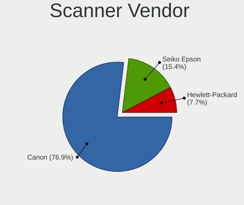

| Vendor          | Computers | Percent |
|-----------------|-----------|---------|
| Canon           | 11        | 73.33%  |
| Seiko Epson     | 2         | 13.33%  |
| Mustek Systems  | 1         | 6.67%   |
| Hewlett-Packard | 1         | 6.67%   |

Scanner Model
-------------

Scanner device models

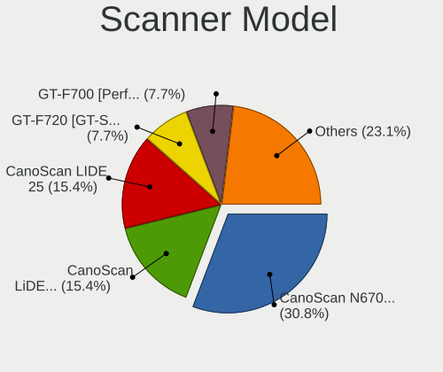

| Model                                                   | Computers | Percent |
|---------------------------------------------------------|-----------|---------|
| Canon CanoScan N670U/N676U/LiDE 20                      | 4         | 26.67%  |
| Canon CanoScan LiDE 120                                 | 3         | 20%     |
| Canon CanoScan LIDE 25                                  | 2         | 13.33%  |
| Seiko Epson GT-F720 [GT-S620/Perfection V30/V300 Photo] | 1         | 6.67%   |
| Seiko Epson GT-F700 [Perfection V350]                   | 1         | 6.67%   |
| Mustek Systems ScanExpress A3 USB 1200 PRO              | 1         | 6.67%   |
| HP ScanJet 3670                                         | 1         | 6.67%   |
| Canon CanoScan LiDE 110                                 | 1         | 6.67%   |
| Canon CanoScan LiDE 100                                 | 1         | 6.67%   |

Camera
------

Camera Vendor
-------------

Camera device vendors

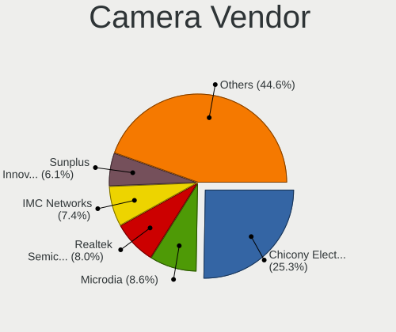

| Vendor                                 | Computers | Percent |
|----------------------------------------|-----------|---------|
| Chicony Electronics                    | 538       | 25.27%  |
| Microdia                               | 184       | 8.64%   |
| Realtek Semiconductor                  | 171       | 8.03%   |
| IMC Networks                           | 158       | 7.42%   |
| Sunplus Innovation Technology          | 129       | 6.06%   |
| Suyin                                  | 121       | 5.68%   |
| Bison Electronics                      | 109       | 5.12%   |
| Cheng Uei Precision Industry (Foxlink) | 74        | 3.48%   |
| Syntek                                 | 65        | 3.05%   |
| Logitech                               | 63        | 2.96%   |
| Quanta                                 | 52        | 2.44%   |
| Silicon Motion                         | 41        | 1.93%   |
| Lite-On Technology                     | 40        | 1.88%   |
| KYE Systems (Mouse Systems)            | 35        | 1.64%   |
| Apple                                  | 35        | 1.64%   |
| Lenovo                                 | 31        | 1.46%   |
| Alcor Micro                            | 30        | 1.41%   |
| Ricoh                                  | 29        | 1.36%   |
| Z-Star Microelectronics                | 27        | 1.27%   |
| Primax Electronics                     | 24        | 1.13%   |
| ALi                                    | 17        | 0.8%    |
| Microsoft                              | 16        | 0.75%   |
| GEMBIRD                                | 14        | 0.66%   |
| Samsung Electronics                    | 11        | 0.52%   |
| OmniVision Technologies                | 11        | 0.52%   |
| Importek                               | 11        | 0.52%   |
| Luxvisions Innotech Limited            | 10        | 0.47%   |
| Trust                                  | 9         | 0.42%   |
| Pixart Imaging                         | 7         | 0.33%   |
| DigiTech                               | 7         | 0.33%   |
| Cubeternet                             | 7         | 0.33%   |
| Acer                                   | 7         | 0.33%   |
| MacroSilicon                           | 4         | 0.19%   |
| Genesys Logic                          | 4         | 0.19%   |
| Generalplus Technology                 | 4         | 0.19%   |
| Intel                                  | 3         | 0.14%   |
| Hewlett-Packard                        | 3         | 0.14%   |
| Creative Technology                    | 3         | 0.14%   |
| Aveo Technology                        | 3         | 0.14%   |
| Arkmicro Technologies                  | 3         | 0.14%   |

Camera Model
------------

Camera device models

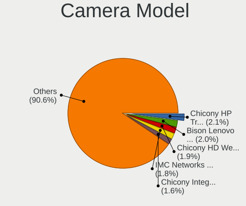

| Model                                                   | Computers | Percent |
|---------------------------------------------------------|-----------|---------|
| Chicony HP Truevision HD                                | 44        | 2.06%   |
| Bison Lenovo EasyCamera                                 | 43        | 2.02%   |
| Chicony HD WebCam                                       | 40        | 1.88%   |
| IMC Networks USB2.0 VGA UVC WebCam                      | 39        | 1.83%   |
| Chicony Integrated Camera                               | 35        | 1.64%   |
| Realtek USB Camera                                      | 29        | 1.36%   |
| Suyin Acer/HP Integrated Webcam [CN0314]                | 26        | 1.22%   |
| IMC Networks USB2.0 HD UVC WebCam                       | 26        | 1.22%   |
| Chicony USB2.0 VGA UVC WebCam                           | 26        | 1.22%   |
| Sunplus HD WebCam                                       | 25        | 1.17%   |
| Chicony USB2.0 HD UVC WebCam                            | 25        | 1.17%   |
| Sunplus Integrated_Webcam_HD                            | 24        | 1.13%   |
| Sunplus HP Truevision HD                                | 24        | 1.13%   |
| IMC Networks EasyCamera                                 | 24        | 1.13%   |
| Microdia Integrated Webcam                              | 23        | 1.08%   |
| Chicony FJ Camera                                       | 23        | 1.08%   |
| Syntek Integrated Camera                                | 20        | 0.94%   |
| Microdia Integrated_Webcam_HD                           | 20        | 0.94%   |
| Microdia Camera                                         | 20        | 0.94%   |
| Realtek Integrated_Webcam_HD                            | 19        | 0.89%   |
| Chicony Integrated HP HD Webcam                         | 19        | 0.89%   |
| Apple Built-in iSight                                   | 19        | 0.89%   |
| Realtek Lenovo EasyCamera                               | 18        | 0.84%   |
| Realtek Integrated Webcam HD                            | 18        | 0.84%   |
| Chicony Lenovo EasyCamera                               | 18        | 0.84%   |
| Syntek EasyCamera                                       | 17        | 0.8%    |
| Primax HP HD Webcam [Fixed]                             | 17        | 0.8%    |
| Microdia Sonix USB 2.0 Camera                           | 17        | 0.8%    |
| Microdia Integrated HD Webcam                           | 17        | 0.8%    |
| Lite-On HP HD Webcam                                    | 17        | 0.8%    |
| KYE Systems (Mouse Systems) FaceCam 1000X               | 17        | 0.8%    |
| Realtek Integrated Webcam                               | 16        | 0.75%   |
| Chicony TOSHIBA Web Camera - HD                         | 16        | 0.75%   |
| Chicony EasyCamera                                      | 16        | 0.75%   |
| Chicony 2.0M UVC Webcam / CNF7129                       | 16        | 0.75%   |
| Cheng Uei Precision Industry (Foxlink) HP Truevision HD | 16        | 0.75%   |
| Lenovo Integrated Webcam [R5U877]                       | 15        | 0.7%    |
| Logitech Webcam C270                                    | 14        | 0.66%   |
| Chicony HP TrueVision HD Camera                         | 14        | 0.66%   |
| Bison Lenovo Integrated Webcam                          | 14        | 0.66%   |

Security
--------

Fingerprint Vendor
------------------

Fingerprint sensor vendors

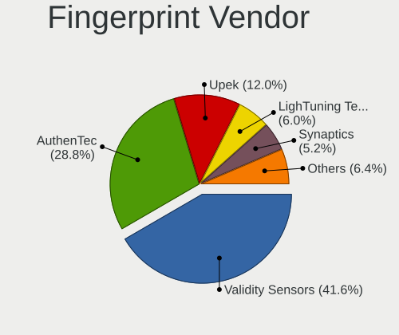

| Vendor                     | Computers | Percent |
|----------------------------|-----------|---------|
| Validity Sensors           | 97        | 41.63%  |
| AuthenTec                  | 67        | 28.76%  |
| Upek                       | 28        | 12.02%  |
| LighTuning Technology      | 14        | 6.01%   |
| Synaptics                  | 12        | 5.15%   |
| STMicroelectronics         | 10        | 4.29%   |
| Elan Microelectronics      | 3         | 1.29%   |
| Shenzhen Goodix Technology | 2         | 0.86%   |

Fingerprint Model
-----------------

Fingerprint sensor models

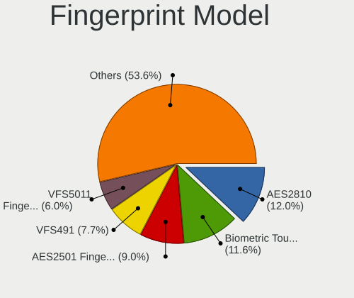

| Model                                                                      | Computers | Percent |
|----------------------------------------------------------------------------|-----------|---------|
| AuthenTec AES2810                                                          | 28        | 12.02%  |
| Upek Biometric Touchchip/Touchstrip Fingerprint Sensor                     | 27        | 11.59%  |
| AuthenTec AES2501 Fingerprint Sensor                                       | 21        | 9.01%   |
| Validity Sensors VFS491                                                    | 18        | 7.73%   |
| Validity Sensors VFS5011 Fingerprint Reader                                | 14        | 6.01%   |
| Validity Sensors VFS495 Fingerprint Reader                                 | 14        | 6.01%   |
| Validity Sensors VFS471 Fingerprint Reader                                 | 14        | 6.01%   |
| Validity Sensors VFS451 Fingerprint Reader                                 | 11        | 4.72%   |
| STMicroelectronics Fingerprint Reader                                      | 10        | 4.29%   |
| LighTuning Fingerprint Reader                                              | 9         | 3.86%   |
| AuthenTec Fingerprint Sensor                                               | 9         | 3.86%   |
| Validity Sensors VFS101 Fingerprint Reader                                 | 6         | 2.58%   |
| Validity Sensors VFS 5011 fingerprint sensor                               | 5         | 2.15%   |
| Validity Sensors Fingerprint scanner                                       | 4         | 1.72%   |
| Synaptics  WBDI                                                            | 4         | 1.72%   |
| AuthenTec AES1660 Fingerprint Sensor                                       | 4         | 1.72%   |
| AuthenTec AES1600                                                          | 4         | 1.72%   |
| Validity Sensors Swipe Fingerprint Sensor                                  | 3         | 1.29%   |
| Synaptics Prometheus MIS Touch Fingerprint Reader                          | 3         | 1.29%   |
| LighTuning ES603 Swipe Fingerprint Sensor                                  | 3         | 1.29%   |
| Validity Sensors VFS7500 Touch Fingerprint Sensor                          | 2         | 0.86%   |
| Validity Sensors VFS301 Fingerprint Reader                                 | 2         | 0.86%   |
| Validity Sensors Synaptics WBDI                                            | 2         | 0.86%   |
| Synaptics Metallica MIS Touch Fingerprint Reader                           | 2         | 0.86%   |
| Synaptics FS7604 Touch Fingerprint Sensor with PurePrint                   | 2         | 0.86%   |
| LighTuning EgisTec Touch Fingerprint Sensor                                | 2         | 0.86%   |
| Elan ELAN:Fingerprint                                                      | 2         | 0.86%   |
| Validity Sensors VFS300 Fingerprint Reader                                 | 1         | 0.43%   |
| Validity Sensors Synaptics VFS7552 Touch Fingerprint Sensor with PurePrint | 1         | 0.43%   |
| Upek TCS5B Fingerprint sensor                                              | 1         | 0.43%   |
| Synaptics WBDI                                                             | 1         | 0.43%   |
| Shenzhen Goodix  FingerPrint Device                                        | 1         | 0.43%   |
| Shenzhen Goodix Fingerprint Reader                                         | 1         | 0.43%   |
| Elan fingerprint sensor [FeinTech FPS00200]                                | 1         | 0.43%   |
| AuthenTec AES2550 Fingerprint Sensor                                       | 1         | 0.43%   |

Chipcard Vendor
---------------

Chipcard module vendors

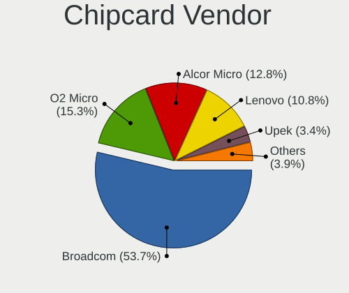

| Vendor                    | Computers | Percent |
|---------------------------|-----------|---------|
| Broadcom                  | 109       | 53.69%  |
| O2 Micro                  | 31        | 15.27%  |
| Alcor Micro               | 26        | 12.81%  |
| Lenovo                    | 22        | 10.84%  |
| Upek                      | 7         | 3.45%   |
| Reiner SCT Kartensysteme  | 3         | 1.48%   |
| Realtek Semiconductor     | 2         | 0.99%   |
| Gemalto (was Gemplus)     | 2         | 0.99%   |
| Aladdin Knowledge Systems | 1         | 0.49%   |

Chipcard Model
--------------

Chipcard module models

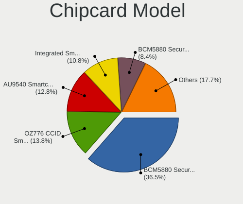

| Model                                                                        | Computers | Percent |
|------------------------------------------------------------------------------|-----------|---------|
| Broadcom BCM5880 Secure Applications Processor                               | 74        | 36.45%  |
| O2 Micro OZ776 CCID Smartcard Reader                                         | 28        | 13.79%  |
| Alcor Micro AU9540 Smartcard Reader                                          | 26        | 12.81%  |
| Lenovo Integrated Smart Card Reader                                          | 22        | 10.84%  |
| Broadcom BCM5880 Secure Applications Processor with fingerprint swipe sensor | 17        | 8.37%   |
| Broadcom 5880                                                                | 14        | 6.9%    |
| Upek TouchChip Fingerprint Coprocessor (WBF advanced mode)                   | 7         | 3.45%   |
| Broadcom 58200                                                               | 4         | 1.97%   |
| Reiner SCT Kartensysteme cyberJack RFID basis contactless smartcard reader   | 3         | 1.48%   |
| O2 Micro Oz776 SmartCard Reader                                              | 3         | 1.48%   |
| Realtek Semiconductor Smart Card Reader Interface                            | 2         | 0.99%   |
| Gemalto (was Gemplus) GemPC Twin SmartCard Reader                            | 1         | 0.49%   |
| Gemalto (was Gemplus) Compact Smart Card Reader Writer                       | 1         | 0.49%   |
| Aladdin Knowledge Systems Token JC                                           | 1         | 0.49%   |

Unsupported
-----------

Unsupported Devices
-------------------

Total unsupported devices on board

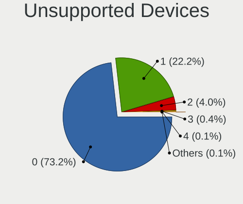

| Total | Computers | Percent |
|-------|-----------|---------|
| 0     | 3026      | 73.2%   |
| 1     | 917       | 22.18%  |
| 2     | 167       | 4.04%   |
| 3     | 15        | 0.36%   |
| 4     | 4         | 0.1%    |
| 10    | 2         | 0.05%   |
| 5     | 2         | 0.05%   |
| 9     | 1         | 0.02%   |

Unsupported Device Types
------------------------

Types of unsupported devices

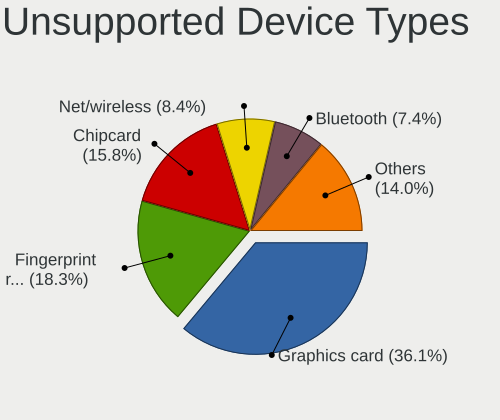

| Type                     | Computers | Percent |
|--------------------------|-----------|---------|
| Graphics card            | 460       | 36.08%  |
| Fingerprint reader       | 233       | 18.27%  |
| Chipcard                 | 202       | 15.84%  |
| Net/wireless             | 107       | 8.39%   |
| Bluetooth                | 94        | 7.37%   |
| Storage                  | 48        | 3.76%   |
| Multimedia controller    | 31        | 2.43%   |
| Communication controller | 29        | 2.27%   |
| Camera                   | 19        | 1.49%   |
| Flash memory             | 17        | 1.33%   |
| Unassigned class         | 8         | 0.63%   |
| Sound                    | 8         | 0.63%   |
| Net/ethernet             | 6         | 0.47%   |
| Card reader              | 4         | 0.31%   |
| Storage/raid             | 3         | 0.24%   |
| Storage/ata              | 2         | 0.16%   |
| Dvb card                 | 2         | 0.16%   |
| Storage/nvme             | 1         | 0.08%   |
| Network                  | 1         | 0.08%   |

