BlackPanther - Tested Hardware & Statistics
-------------------------------------------

A project to collect tested hardware configurations for BlackPanther.

Anyone can contribute to this report by the [hw-probe](https://github.com/linuxhw/hw-probe) tool:

    sudo -E hw-probe -all -upload

Please contribute! Especially if your hardware is rare.

This is a report for all computer types. See also reports for [desktops](/Dist/BlackPanther/Desktop/README.md) and [notebooks](/Dist/BlackPanther/Notebook/README.md).

Contents
--------

* [ Test Cases ](#test-cases)

* [ System ](#system)
  - [ OS                       ](#os)
  - [ OS Family                ](#os-family)
  - [ Kernel                   ](#kernel)
  - [ Kernel Family            ](#kernel-family)
  - [ Kernel Major Ver.        ](#kernel-major-ver)
  - [ Arch                     ](#arch)
  - [ DE                       ](#de)
  - [ Display Server           ](#display-server)
  - [ Display Manager          ](#display-manager)
  - [ OS Lang                  ](#os-lang)
  - [ Boot Mode                ](#boot-mode)
  - [ Filesystem               ](#filesystem)
  - [ Part. scheme             ](#part-scheme)
  - [ Dual Boot with Linux/BSD ](#dual-boot-with-linuxbsd)
  - [ Dual Boot (Win)          ](#dual-boot-win)

* [ Board ](#board)
  - [ Vendor                   ](#vendor)
  - [ Model                    ](#model)
  - [ Model Family             ](#model-family)
  - [ MFG Year                 ](#mfg-year)
  - [ Form Factor              ](#form-factor)
  - [ Secure Boot              ](#secure-boot)
  - [ Coreboot                 ](#coreboot)
  - [ RAM Size                 ](#ram-size)
  - [ RAM Used                 ](#ram-used)
  - [ Total Drives             ](#total-drives)
  - [ Has CD-ROM               ](#has-cd-rom)
  - [ Has Ethernet             ](#has-ethernet)
  - [ Has WiFi                 ](#has-wifi)
  - [ Has Bluetooth            ](#has-bluetooth)

* [ Location ](#location)
  - [ Country                  ](#country)
  - [ City                     ](#city)

* [ Drives ](#drives)
  - [ Drive Vendor             ](#drive-vendor)
  - [ Drive Model              ](#drive-model)
  - [ HDD Vendor               ](#hdd-vendor)
  - [ SSD Vendor               ](#ssd-vendor)
  - [ Drive Kind               ](#drive-kind)
  - [ Drive Connector          ](#drive-connector)
  - [ Drive Size               ](#drive-size)
  - [ Space Total              ](#space-total)
  - [ Space Used               ](#space-used)
  - [ Malfunc. Drives          ](#malfunc-drives)
  - [ Malfunc. Drive Vendor    ](#malfunc-drive-vendor)
  - [ Malfunc. HDD Vendor      ](#malfunc-hdd-vendor)
  - [ Malfunc. Drive Kind      ](#malfunc-drive-kind)
  - [ Failed Drives            ](#failed-drives)
  - [ Failed Drive Vendor      ](#failed-drive-vendor)
  - [ Drive Status             ](#drive-status)

* [ Storage controller ](#storage-controller)
  - [ Storage Vendor           ](#storage-vendor)
  - [ Storage Model            ](#storage-model)
  - [ Storage Kind             ](#storage-kind)

* [ Processor ](#processor)
  - [ CPU Vendor               ](#cpu-vendor)
  - [ CPU Model                ](#cpu-model)
  - [ CPU Model Family         ](#cpu-model-family)
  - [ CPU Cores                ](#cpu-cores)
  - [ CPU Sockets              ](#cpu-sockets)
  - [ CPU Threads              ](#cpu-threads)
  - [ CPU Op-Modes             ](#cpu-op-modes)
  - [ CPU Microcode            ](#cpu-microcode)
  - [ CPU Microarch            ](#cpu-microarch)

* [ Graphics ](#graphics)
  - [ GPU Vendor               ](#gpu-vendor)
  - [ GPU Model                ](#gpu-model)
  - [ GPU Combo                ](#gpu-combo)
  - [ GPU Driver               ](#gpu-driver)
  - [ GPU Memory               ](#gpu-memory)

* [ Monitor ](#monitor)
  - [ Monitor Vendor           ](#monitor-vendor)
  - [ Monitor Model            ](#monitor-model)
  - [ Monitor Resolution       ](#monitor-resolution)
  - [ Monitor Diagonal         ](#monitor-diagonal)
  - [ Monitor Width            ](#monitor-width)
  - [ Aspect Ratio             ](#aspect-ratio)
  - [ Monitor Area             ](#monitor-area)
  - [ Pixel Density            ](#pixel-density)
  - [ Multiple Monitors        ](#multiple-monitors)

* [ Network ](#network)
  - [ Net Controller Vendor    ](#net-controller-vendor)
  - [ Net Controller Model     ](#net-controller-model)
  - [ Wireless Vendor          ](#wireless-vendor)
  - [ Wireless Model           ](#wireless-model)
  - [ Ethernet Vendor          ](#ethernet-vendor)
  - [ Ethernet Model           ](#ethernet-model)
  - [ Net Controller Kind      ](#net-controller-kind)
  - [ Used Controller          ](#used-controller)
  - [ NICs                     ](#nics)
  - [ IPv6                     ](#ipv6)

* [ Bluetooth ](#bluetooth)
  - [ Bluetooth Vendor         ](#bluetooth-vendor)
  - [ Bluetooth Model          ](#bluetooth-model)

* [ Sound ](#sound)
  - [ Sound Vendor             ](#sound-vendor)
  - [ Sound Model              ](#sound-model)

* [ Memory ](#memory)
  - [ Memory Vendor            ](#memory-vendor)
  - [ Memory Model             ](#memory-model)
  - [ Memory Kind              ](#memory-kind)
  - [ Memory Form Factor       ](#memory-form-factor)
  - [ Memory Size              ](#memory-size)
  - [ Memory Speed             ](#memory-speed)

* [ Printers & scanners ](#printers--scanners)
  - [ Printer Vendor           ](#printer-vendor)
  - [ Printer Model            ](#printer-model)
  - [ Scanner Vendor           ](#scanner-vendor)
  - [ Scanner Model            ](#scanner-model)

* [ Camera ](#camera)
  - [ Camera Vendor            ](#camera-vendor)
  - [ Camera Model             ](#camera-model)

* [ Security ](#security)
  - [ Fingerprint Vendor       ](#fingerprint-vendor)
  - [ Fingerprint Model        ](#fingerprint-model)
  - [ Chipcard Vendor          ](#chipcard-vendor)
  - [ Chipcard Model           ](#chipcard-model)

* [ Unsupported ](#unsupported)
  - [ Unsupported Devices      ](#unsupported-devices)
  - [ Unsupported Device Types ](#unsupported-device-types)

Test Cases
----------

Total: 9093

| Vendor        | Model                       | Form-Factor | Probe                                                      | Date         |
|---------------|-----------------------------|-------------|------------------------------------------------------------|--------------|
| HP            | 805D                        | Desktop     | [208bd3b9dd](https://linux-hardware.org/?probe=208bd3b9dd) | May 09, 2024 |
| Lenovo        | ThinkPad L470 20J5S2RA00    | Notebook    | [9ce0d2cad0](https://linux-hardware.org/?probe=9ce0d2cad0) | May 09, 2024 |
| Dell          | 00V62H A01                  | Desktop     | [2ea426bed2](https://linux-hardware.org/?probe=2ea426bed2) | May 08, 2024 |
| Dell          | 00V62H A01                  | Desktop     | [bc8a5150c3](https://linux-hardware.org/?probe=bc8a5150c3) | May 08, 2024 |
| Lenovo        | ThinkPad X230 2333A91       | Notebook    | [3ad48e3ebe](https://linux-hardware.org/?probe=3ad48e3ebe) | May 08, 2024 |
| Dell          | 0M858N A01                  | Desktop     | [9b34c8bbc2](https://linux-hardware.org/?probe=9b34c8bbc2) | May 08, 2024 |
| ASUSTek       | K54HR                       | Notebook    | [67ddde3a75](https://linux-hardware.org/?probe=67ddde3a75) | May 08, 2024 |
| Dell          | Latitude E5520              | Notebook    | [1dc92b60a8](https://linux-hardware.org/?probe=1dc92b60a8) | May 08, 2024 |
| ASUSTek       | ASUS TUF Gaming F15 FX50... | Notebook    | [20ab787216](https://linux-hardware.org/?probe=20ab787216) | May 08, 2024 |
| Lenovo        | 1036 NO DPK                 | Desktop     | [ea4077ed1b](https://linux-hardware.org/?probe=ea4077ed1b) | May 08, 2024 |
| Fujitsu       | D3403-U1 S26361-D3403-U1    | Desktop     | [75811cd1df](https://linux-hardware.org/?probe=75811cd1df) | May 08, 2024 |
| MSI           | GT60 2OC/2OD                | Notebook    | [aa9d5951b9](https://linux-hardware.org/?probe=aa9d5951b9) | May 08, 2024 |
| HP            | 1495                        | Desktop     | [89464c1187](https://linux-hardware.org/?probe=89464c1187) | May 08, 2024 |
| ASRock        | B550M Pro4                  | Desktop     | [41c99b8030](https://linux-hardware.org/?probe=41c99b8030) | May 08, 2024 |
| Lenovo        | ThinkPad X250 20CLS1JN00    | Notebook    | [b1a0c45242](https://linux-hardware.org/?probe=b1a0c45242) | May 07, 2024 |
| Gigabyte      | F2A88XM-HD3                 | Desktop     | [14bb67e07a](https://linux-hardware.org/?probe=14bb67e07a) | May 07, 2024 |
| ASUSTek       | H110M-A                     | Desktop     | [e4868e57a3](https://linux-hardware.org/?probe=e4868e57a3) | May 07, 2024 |
| ASUSTek       | PRIME A320M-R               | Desktop     | [8b5ef47376](https://linux-hardware.org/?probe=8b5ef47376) | May 07, 2024 |
| ASRock        | Z390 Pro4                   | Desktop     | [ee53393400](https://linux-hardware.org/?probe=ee53393400) | May 07, 2024 |
| Dell          | Latitude 5501               | Notebook    | [35d264df4c](https://linux-hardware.org/?probe=35d264df4c) | May 07, 2024 |
| ASUSTek       | H110M-K                     | Desktop     | [373b9bdb5c](https://linux-hardware.org/?probe=373b9bdb5c) | May 07, 2024 |
| HP            | Laptop 15-dw1xxx            | Notebook    | [7d4c93ea72](https://linux-hardware.org/?probe=7d4c93ea72) | May 07, 2024 |
| Gigabyte      | H110M-S2V-CF                | Desktop     | [22eb41201e](https://linux-hardware.org/?probe=22eb41201e) | May 07, 2024 |
| Huanan        | X99-QD4 V0.1 693H           | Desktop     | [e8e1e2e2f8](https://linux-hardware.org/?probe=e8e1e2e2f8) | May 07, 2024 |
| MSI           | MAG B550 TOMAHAWK           | Desktop     | [07a4ffe918](https://linux-hardware.org/?probe=07a4ffe918) | May 07, 2024 |
| Lenovo        | SHARKBAY NOK                | Desktop     | [f696d03152](https://linux-hardware.org/?probe=f696d03152) | May 07, 2024 |
| AWOW          | AK41                        | Notebook    | [21d739c59c](https://linux-hardware.org/?probe=21d739c59c) | May 07, 2024 |
| Gigabyte      | A520M S2H                   | Desktop     | [c14a7e4724](https://linux-hardware.org/?probe=c14a7e4724) | May 07, 2024 |
| HP            | Pavilion Gaming Laptop 1... | Notebook    | [e27e19897e](https://linux-hardware.org/?probe=e27e19897e) | May 07, 2024 |
| Lenovo        | V15-ADA 82C7                | Notebook    | [db9ea4ffaf](https://linux-hardware.org/?probe=db9ea4ffaf) | May 07, 2024 |
| ASUSTek       | A88XM-E                     | Desktop     | [bba7d20511](https://linux-hardware.org/?probe=bba7d20511) | May 07, 2024 |
| Fujitsu       | LIFEBOOK AH530              | Notebook    | [b8e70b0693](https://linux-hardware.org/?probe=b8e70b0693) | May 07, 2024 |
| Fujitsu       | LIFEBOOK AH530              | Notebook    | [55fdc987e5](https://linux-hardware.org/?probe=55fdc987e5) | May 07, 2024 |
| ASUSTek       | ASUS EXPERTBOOK B1500CEA... | Notebook    | [3236268f3d](https://linux-hardware.org/?probe=3236268f3d) | May 06, 2024 |
| Dell          | Inspiron 7737               | Notebook    | [73f61be8b5](https://linux-hardware.org/?probe=73f61be8b5) | May 06, 2024 |
| MSI           | GT60 2OC/2OD                | Notebook    | [d71303b21c](https://linux-hardware.org/?probe=d71303b21c) | May 06, 2024 |
| MSI           | GT60 2OC/2OD                | Notebook    | [3330ada128](https://linux-hardware.org/?probe=3330ada128) | May 06, 2024 |
| Huanan        | X99-QD4 V0.1 693H           | Desktop     | [c23f1deec5](https://linux-hardware.org/?probe=c23f1deec5) | May 06, 2024 |
| Acer          | Aspire 5750                 | Notebook    | [c414f0202a](https://linux-hardware.org/?probe=c414f0202a) | May 06, 2024 |
| HP            | 650                         | Notebook    | [6e66ce7389](https://linux-hardware.org/?probe=6e66ce7389) | May 05, 2024 |
| HP            | 650                         | Notebook    | [aa4f605e5e](https://linux-hardware.org/?probe=aa4f605e5e) | May 05, 2024 |
| Gigabyte      | Z390 UD                     | Desktop     | [af2a20709c](https://linux-hardware.org/?probe=af2a20709c) | May 05, 2024 |
| MSI           | MAG B550 TOMAHAWK           | Desktop     | [b1077f633d](https://linux-hardware.org/?probe=b1077f633d) | May 04, 2024 |
| HP            | EliteBook 8570w             | Notebook    | [d18669833b](https://linux-hardware.org/?probe=d18669833b) | May 04, 2024 |
| Lenovo        | ThinkPad X1 Carbon 2nd 2... | Notebook    | [1342233681](https://linux-hardware.org/?probe=1342233681) | May 03, 2024 |
| Dell          | Inspiron 5558               | Notebook    | [f3e4760d0f](https://linux-hardware.org/?probe=f3e4760d0f) | May 03, 2024 |
| Dell          | Inspiron 5558               | Notebook    | [ded6bb6fdc](https://linux-hardware.org/?probe=ded6bb6fdc) | May 02, 2024 |
| HP            | 8062                        | Desktop     | [87c4c1fbfb](https://linux-hardware.org/?probe=87c4c1fbfb) | May 02, 2024 |
| Dell          | Inspiron 5558               | Notebook    | [6f084542fa](https://linux-hardware.org/?probe=6f084542fa) | May 02, 2024 |
| eMachines     | E725                        | Notebook    | [f8c6e397e1](https://linux-hardware.org/?probe=f8c6e397e1) | May 01, 2024 |
| HP            | 255 G5 Notebook PC          | Notebook    | [945efc5a98](https://linux-hardware.org/?probe=945efc5a98) | May 01, 2024 |
| MSI           | MAG B550 TOMAHAWK           | Desktop     | [ff55d733a4](https://linux-hardware.org/?probe=ff55d733a4) | May 01, 2024 |
| Packard Be... | EasyNote TE11BZ             | Notebook    | [fe163fcb48](https://linux-hardware.org/?probe=fe163fcb48) | May 01, 2024 |
| Packard Be... | EasyNote TE11BZ             | Notebook    | [db92c4f28a](https://linux-hardware.org/?probe=db92c4f28a) | May 01, 2024 |
| Gigabyte      | X570 AORUS XTREME           | Desktop     | [fbb11f7603](https://linux-hardware.org/?probe=fbb11f7603) | May 01, 2024 |
| HP            | 0B4Ch D                     | Desktop     | [db2b347526](https://linux-hardware.org/?probe=db2b347526) | Apr 30, 2024 |
| eMachines     | E725                        | Notebook    | [f48c8f52da](https://linux-hardware.org/?probe=f48c8f52da) | Apr 30, 2024 |
| Fujitsu       | D3061-A1 S26361-D3061-A1    | Desktop     | [120693fd0b](https://linux-hardware.org/?probe=120693fd0b) | Apr 29, 2024 |
| Lenovo        | ThinkPad T420 423662G       | Notebook    | [e67bde685e](https://linux-hardware.org/?probe=e67bde685e) | Apr 29, 2024 |
| Lenovo        | ThinkPad T420 423662G       | Notebook    | [c21e1e6ad3](https://linux-hardware.org/?probe=c21e1e6ad3) | Apr 29, 2024 |
| HP            | Laptop 15-dw1xxx            | Notebook    | [7332d6602f](https://linux-hardware.org/?probe=7332d6602f) | Apr 28, 2024 |
| HP            | Notebook                    | Notebook    | [43a6b1537a](https://linux-hardware.org/?probe=43a6b1537a) | Apr 28, 2024 |
| HP            | 0B4Ch D                     | Desktop     | [a4057cd447](https://linux-hardware.org/?probe=a4057cd447) | Apr 28, 2024 |
| HP            | Pavilion Gaming Laptop 1... | Notebook    | [3f7c1cff47](https://linux-hardware.org/?probe=3f7c1cff47) | Apr 28, 2024 |
| ASRock        | Z390 Pro4                   | Desktop     | [b50024c729](https://linux-hardware.org/?probe=b50024c729) | Apr 28, 2024 |
| HP            | Pavilion Gaming Laptop 1... | Notebook    | [4ea4b9b731](https://linux-hardware.org/?probe=4ea4b9b731) | Apr 28, 2024 |
| Gigabyte      | B450M GAMING                | Desktop     | [f81c1dea8d](https://linux-hardware.org/?probe=f81c1dea8d) | Apr 27, 2024 |
| Gigabyte      | B450M GAMING                | Desktop     | [0edf4e838c](https://linux-hardware.org/?probe=0edf4e838c) | Apr 27, 2024 |
| Dell          | 0D883F A06                  | Desktop     | [a82d507833](https://linux-hardware.org/?probe=a82d507833) | Apr 27, 2024 |
| Dell          | 0W0CHX A00                  | Desktop     | [9da5e84704](https://linux-hardware.org/?probe=9da5e84704) | Apr 27, 2024 |
| Dell          | 0W0CHX A00                  | Desktop     | [dd4600928f](https://linux-hardware.org/?probe=dd4600928f) | Apr 27, 2024 |
| Dell          | 0200DY A03                  | Desktop     | [96991fe0ba](https://linux-hardware.org/?probe=96991fe0ba) | Apr 27, 2024 |
| Dell          | Inspiron 3542               | Notebook    | [947b81aba4](https://linux-hardware.org/?probe=947b81aba4) | Apr 27, 2024 |
| HP            | ProBook 455 G1              | Notebook    | [b67b7fc16d](https://linux-hardware.org/?probe=b67b7fc16d) | Apr 26, 2024 |
| HP            | ProBook 455 G1              | Notebook    | [59808a41b2](https://linux-hardware.org/?probe=59808a41b2) | Apr 26, 2024 |
| ASUSTek       | A88XM-E                     | Desktop     | [96107974e8](https://linux-hardware.org/?probe=96107974e8) | Apr 25, 2024 |
| Lenovo        | 1036 NO DPK                 | Desktop     | [e69292ead4](https://linux-hardware.org/?probe=e69292ead4) | Apr 25, 2024 |
| ASRock        | B550M Pro4                  | Desktop     | [60952c8e62](https://linux-hardware.org/?probe=60952c8e62) | Apr 24, 2024 |
| Gigabyte      | H310M A-CF x.x              | Desktop     | [250df2037f](https://linux-hardware.org/?probe=250df2037f) | Apr 24, 2024 |
| HP            | 255 G5 Notebook PC          | Notebook    | [b3b73c7c85](https://linux-hardware.org/?probe=b3b73c7c85) | Apr 24, 2024 |
| Apple         | Mac-942B59F58194171B iMa... | All in one  | [7ff5e65027](https://linux-hardware.org/?probe=7ff5e65027) | Apr 24, 2024 |
| ASUSTek       | K53BY                       | Notebook    | [b00f35b89c](https://linux-hardware.org/?probe=b00f35b89c) | Apr 23, 2024 |
| Dell          | 0200DY A03                  | Desktop     | [a838cb0e0d](https://linux-hardware.org/?probe=a838cb0e0d) | Apr 23, 2024 |
| HP            | 1494                        | Desktop     | [82c9d00df1](https://linux-hardware.org/?probe=82c9d00df1) | Apr 22, 2024 |
| Dell          | 0HY9JP A02                  | Desktop     | [08e7641b37](https://linux-hardware.org/?probe=08e7641b37) | Apr 22, 2024 |
| Lenovo        | 1036 NO DPK                 | Desktop     | [1462b6d76a](https://linux-hardware.org/?probe=1462b6d76a) | Apr 22, 2024 |
| ASUSTek       | PRIME H610M-K D4            | Desktop     | [91735d80f4](https://linux-hardware.org/?probe=91735d80f4) | Apr 22, 2024 |
| ASUSTek       | PRIME H610M-K D4            | Desktop     | [ff2ff25197](https://linux-hardware.org/?probe=ff2ff25197) | Apr 22, 2024 |
| ASUSTek       | K54C                        | Notebook    | [9204edfa98](https://linux-hardware.org/?probe=9204edfa98) | Apr 21, 2024 |
| ASUSTek       | K54C                        | Notebook    | [0853f021e9](https://linux-hardware.org/?probe=0853f021e9) | Apr 21, 2024 |
| Packard Be... | EasyNote TK36               | Notebook    | [f44f785257](https://linux-hardware.org/?probe=f44f785257) | Apr 21, 2024 |
| Gigabyte      | Z390 UD                     | Desktop     | [60d76632dc](https://linux-hardware.org/?probe=60d76632dc) | Apr 21, 2024 |
| ASUSTek       | K53TA                       | Notebook    | [128c0946a5](https://linux-hardware.org/?probe=128c0946a5) | Apr 21, 2024 |
| ASUSTek       | K53TA                       | Notebook    | [411dc2f51d](https://linux-hardware.org/?probe=411dc2f51d) | Apr 21, 2024 |
| HP            | Presario CQ57               | Notebook    | [366b704066](https://linux-hardware.org/?probe=366b704066) | Apr 21, 2024 |
| Dell          | 0TY565                      | Desktop     | [f5c8cf7e9b](https://linux-hardware.org/?probe=f5c8cf7e9b) | Apr 21, 2024 |
| HP            | Laptop 15-dw1xxx            | Notebook    | [4a2376cdfa](https://linux-hardware.org/?probe=4a2376cdfa) | Apr 21, 2024 |
| Lenovo        | ThinkStation D20 4158AF8    | Desktop     | [8b93f4607f](https://linux-hardware.org/?probe=8b93f4607f) | Apr 20, 2024 |
| ASUSTek       | PRIME A320M-R               | Desktop     | [b10f7daaa1](https://linux-hardware.org/?probe=b10f7daaa1) | Apr 20, 2024 |
| HP            | Presario CQ57               | Notebook    | [956b5fe458](https://linux-hardware.org/?probe=956b5fe458) | Apr 20, 2024 |
| HP            | ProBook 640 G8 Notebook ... | Notebook    | [473affb537](https://linux-hardware.org/?probe=473affb537) | Apr 19, 2024 |
| ASUSTek       | ASUS TUF Gaming F15 FX50... | Notebook    | [6f826f9c64](https://linux-hardware.org/?probe=6f826f9c64) | Apr 18, 2024 |
| MSI           | X58 Pro-E                   | Desktop     | [4411cb9e36](https://linux-hardware.org/?probe=4411cb9e36) | Apr 18, 2024 |
| Dell          | Latitude D520               | Notebook    | [d0f7ecac0a](https://linux-hardware.org/?probe=d0f7ecac0a) | Apr 17, 2024 |
| Dell          | Latitude D520               | Notebook    | [faf18ae19f](https://linux-hardware.org/?probe=faf18ae19f) | Apr 17, 2024 |
| Lenovo        | IdeaPad 120S-14IAP 81A5     | Notebook    | [59cf1e0ea1](https://linux-hardware.org/?probe=59cf1e0ea1) | Apr 17, 2024 |
| Acer          | Aspire E1-571               | Notebook    | [3a38e7fc4f](https://linux-hardware.org/?probe=3a38e7fc4f) | Apr 16, 2024 |
| Dell          | 0HD5W2 A01                  | Desktop     | [1c7957de19](https://linux-hardware.org/?probe=1c7957de19) | Apr 16, 2024 |
| ASRock        | X370 Gaming X               | Desktop     | [db397e4511](https://linux-hardware.org/?probe=db397e4511) | Apr 15, 2024 |
| Dell          | 0VHWTR A02                  | Desktop     | [4e32c7cfca](https://linux-hardware.org/?probe=4e32c7cfca) | Apr 15, 2024 |
| Toshiba       | Satellite L650              | Notebook    | [b05f51b2c8](https://linux-hardware.org/?probe=b05f51b2c8) | Apr 15, 2024 |
| Toshiba       | Satellite L650              | Notebook    | [0a98edcca4](https://linux-hardware.org/?probe=0a98edcca4) | Apr 15, 2024 |
| Toshiba       | Satellite L650              | Notebook    | [e706aef914](https://linux-hardware.org/?probe=e706aef914) | Apr 15, 2024 |
| Toshiba       | Satellite L650              | Notebook    | [1ffbc9aa24](https://linux-hardware.org/?probe=1ffbc9aa24) | Apr 15, 2024 |
| ASUSTek       | X551CA                      | Notebook    | [5bf06a6ae1](https://linux-hardware.org/?probe=5bf06a6ae1) | Apr 14, 2024 |
| Lenovo        | ThinkPad T470 20HES58A1L    | Notebook    | [fd97b7444d](https://linux-hardware.org/?probe=fd97b7444d) | Apr 14, 2024 |
| Lenovo        | ThinkPad X200 74595FG       | Notebook    | [708440ed39](https://linux-hardware.org/?probe=708440ed39) | Apr 14, 2024 |
| Gigabyte      | B660M GAMING DDR4           | Desktop     | [88ad8806c3](https://linux-hardware.org/?probe=88ad8806c3) | Apr 13, 2024 |
| HP            | 8265                        | Desktop     | [c4d4cdac41](https://linux-hardware.org/?probe=c4d4cdac41) | Apr 13, 2024 |
| Gigabyte      | H310M A-CF x.x              | Desktop     | [5bc49637b9](https://linux-hardware.org/?probe=5bc49637b9) | Apr 12, 2024 |
| Gigabyte      | H61M-S1                     | Desktop     | [1a9697f39d](https://linux-hardware.org/?probe=1a9697f39d) | Apr 12, 2024 |
| ASUSTek       | P8Z77-V LX                  | Desktop     | [c108665460](https://linux-hardware.org/?probe=c108665460) | Apr 11, 2024 |
| Fujitsu       | D3220-A1 S26361-D3220-A1    | Desktop     | [5fb89da542](https://linux-hardware.org/?probe=5fb89da542) | Apr 11, 2024 |
| Fujitsu       | D3220-A1 S26361-D3220-A1    | Desktop     | [74dd149115](https://linux-hardware.org/?probe=74dd149115) | Apr 11, 2024 |
| HP            | 8062                        | Desktop     | [358bbe16f0](https://linux-hardware.org/?probe=358bbe16f0) | Apr 11, 2024 |
| Lenovo        | IdeaPad 120S-14IAP 81A5     | Notebook    | [8dd990563f](https://linux-hardware.org/?probe=8dd990563f) | Apr 11, 2024 |
| ASUSTek       | ZenBook UX425UA_UM425UA     | Notebook    | [a4cda4b4f0](https://linux-hardware.org/?probe=a4cda4b4f0) | Apr 10, 2024 |
| ASUSTek       | ZenBook UX425UA_UM425UA     | Notebook    | [2359c23a41](https://linux-hardware.org/?probe=2359c23a41) | Apr 10, 2024 |
| Packard Be... | EasyNote TV43HC             | Notebook    | [07aac9c6e6](https://linux-hardware.org/?probe=07aac9c6e6) | Apr 10, 2024 |
| Packard Be... | EasyNote TV43HC             | Notebook    | [036bbb75eb](https://linux-hardware.org/?probe=036bbb75eb) | Apr 10, 2024 |
| HP            | ProBook 455 G1              | Notebook    | [d332e44b92](https://linux-hardware.org/?probe=d332e44b92) | Apr 10, 2024 |
| Lenovo        | ThinkPad T530 2429NL6       | Notebook    | [d16f3981f4](https://linux-hardware.org/?probe=d16f3981f4) | Apr 10, 2024 |
| Gigabyte      | F2A88XN-WIFI                | Desktop     | [dd15f5797f](https://linux-hardware.org/?probe=dd15f5797f) | Apr 09, 2024 |
| Gigabyte      | F2A88XN-WIFI                | Desktop     | [2d897e4ab7](https://linux-hardware.org/?probe=2d897e4ab7) | Apr 09, 2024 |
| Dell          | Inspiron 5558               | Notebook    | [a583587fa0](https://linux-hardware.org/?probe=a583587fa0) | Apr 09, 2024 |
| ASUSTek       | X541NA                      | Notebook    | [4118d01689](https://linux-hardware.org/?probe=4118d01689) | Apr 09, 2024 |
| ASUSTek       | PRIME A320M-R               | Desktop     | [eb77201fa8](https://linux-hardware.org/?probe=eb77201fa8) | Apr 09, 2024 |
| HP            | ProBook 455 G1              | Notebook    | [9a0d60a4e6](https://linux-hardware.org/?probe=9a0d60a4e6) | Apr 09, 2024 |
| Gigabyte      | B75M-D3H                    | Desktop     | [fa4c48c242](https://linux-hardware.org/?probe=fa4c48c242) | Apr 09, 2024 |
| HP            | Notebook                    | Notebook    | [1ef4d18969](https://linux-hardware.org/?probe=1ef4d18969) | Apr 09, 2024 |
| ASUSTek       | ROG Maximus X CODE          | Desktop     | [446576913d](https://linux-hardware.org/?probe=446576913d) | Apr 08, 2024 |
| Lenovo        | ThinkPad T530 2429NL6       | Notebook    | [ee82d8efd8](https://linux-hardware.org/?probe=ee82d8efd8) | Apr 08, 2024 |
| Packard Be... | EasyNote TK36               | Notebook    | [7b4011aa67](https://linux-hardware.org/?probe=7b4011aa67) | Apr 08, 2024 |
| HP            | ProBook 455 G1              | Notebook    | [cf0a1167a4](https://linux-hardware.org/?probe=cf0a1167a4) | Apr 08, 2024 |
| HP            | ProBook 455 G1              | Notebook    | [aca7655496](https://linux-hardware.org/?probe=aca7655496) | Apr 08, 2024 |
| ASUSTek       | M4A785TD-V EVO              | Desktop     | [2dbe37af95](https://linux-hardware.org/?probe=2dbe37af95) | Apr 07, 2024 |
| HP            | 8265                        | Desktop     | [601051ee6c](https://linux-hardware.org/?probe=601051ee6c) | Apr 07, 2024 |
| ASUSTek       | K53BY                       | Notebook    | [fe40c5b1ae](https://linux-hardware.org/?probe=fe40c5b1ae) | Apr 07, 2024 |
| Gigabyte      | H61M-S1                     | Desktop     | [7fe942c453](https://linux-hardware.org/?probe=7fe942c453) | Apr 07, 2024 |
| Dell          | Latitude E6330              | Notebook    | [c32426747e](https://linux-hardware.org/?probe=c32426747e) | Apr 07, 2024 |
| Dell          | 0D883F A06                  | Desktop     | [74170027e8](https://linux-hardware.org/?probe=74170027e8) | Apr 07, 2024 |
| ASUSTek       | PRIME B365M-A               | Desktop     | [50b8d3eaf1](https://linux-hardware.org/?probe=50b8d3eaf1) | Apr 07, 2024 |
| Gigabyte      | Z390 UD                     | Desktop     | [3378d48eb3](https://linux-hardware.org/?probe=3378d48eb3) | Apr 07, 2024 |
| HP            | ProBook 650 G2              | Notebook    | [005b1cfa0d](https://linux-hardware.org/?probe=005b1cfa0d) | Apr 07, 2024 |
| HP            | ProBook 650 G2              | Notebook    | [fa83ab6042](https://linux-hardware.org/?probe=fa83ab6042) | Apr 07, 2024 |
| HP            | Presario CQ57               | Notebook    | [2506e7958a](https://linux-hardware.org/?probe=2506e7958a) | Apr 06, 2024 |
| Packard Be... | EasyNote TK36               | Notebook    | [a0d6051c56](https://linux-hardware.org/?probe=a0d6051c56) | Apr 06, 2024 |
| HP            | Presario CQ57               | Notebook    | [781ff00313](https://linux-hardware.org/?probe=781ff00313) | Apr 06, 2024 |
| ASUSTek       | K53BY                       | Notebook    | [c202d85a6a](https://linux-hardware.org/?probe=c202d85a6a) | Apr 06, 2024 |
| HP            | 8265                        | Desktop     | [b08747219b](https://linux-hardware.org/?probe=b08747219b) | Apr 06, 2024 |
| ASRock        | Z370 Extreme4               | Desktop     | [6354d3d2a2](https://linux-hardware.org/?probe=6354d3d2a2) | Apr 05, 2024 |
| ASRock        | Z370 Extreme4               | Desktop     | [f6925b3c88](https://linux-hardware.org/?probe=f6925b3c88) | Apr 05, 2024 |
| Lenovo        | Annapurna CRB 0B98401 PR... | Desktop     | [102e8ee904](https://linux-hardware.org/?probe=102e8ee904) | Apr 05, 2024 |
| HP            | Pavilion dv7                | Notebook    | [a84ff5282d](https://linux-hardware.org/?probe=a84ff5282d) | Apr 05, 2024 |
| HP            | 250 G3                      | Notebook    | [94b04f5a94](https://linux-hardware.org/?probe=94b04f5a94) | Apr 04, 2024 |
| HP            | 630                         | Notebook    | [35dd7e2dc4](https://linux-hardware.org/?probe=35dd7e2dc4) | Apr 04, 2024 |
| Acer          | TravelMate 8571             | Notebook    | [057645b066](https://linux-hardware.org/?probe=057645b066) | Apr 04, 2024 |
| Dell          | Inspiron 3521               | Notebook    | [ee70d25db0](https://linux-hardware.org/?probe=ee70d25db0) | Apr 04, 2024 |
| Fujitsu       | D3220-A1 S26361-D3220-A1    | Desktop     | [95a657f223](https://linux-hardware.org/?probe=95a657f223) | Apr 03, 2024 |
| ASRock        | 4CoreDual-SATA2             | Desktop     | [469a404c91](https://linux-hardware.org/?probe=469a404c91) | Apr 03, 2024 |
| Dell          | 0YP693 A02                  | Desktop     | [3c0b19e9f2](https://linux-hardware.org/?probe=3c0b19e9f2) | Apr 03, 2024 |
| Dell          | 0YP693 A02                  | Desktop     | [48ec750bd0](https://linux-hardware.org/?probe=48ec750bd0) | Apr 03, 2024 |
| Lenovo        | IdeaPad 330-15IKB 81DE      | Notebook    | [b165b6fe04](https://linux-hardware.org/?probe=b165b6fe04) | Apr 03, 2024 |
| Dell          | Latitude E6520              | Notebook    | [f27403f5b8](https://linux-hardware.org/?probe=f27403f5b8) | Apr 02, 2024 |
| Dell          | Vostro 1015                 | Notebook    | [807e851743](https://linux-hardware.org/?probe=807e851743) | Apr 02, 2024 |
| Gigabyte      | GA-890GPA-UD3H              | Desktop     | [6d4eaf0bc7](https://linux-hardware.org/?probe=6d4eaf0bc7) | Apr 01, 2024 |
| Dell          | Latitude 5480               | Notebook    | [3cfb6f8944](https://linux-hardware.org/?probe=3cfb6f8944) | Apr 01, 2024 |
| ASUSTek       | PRIME B450-PLUS             | Desktop     | [b4d733040a](https://linux-hardware.org/?probe=b4d733040a) | Mar 31, 2024 |
| ASUSTek       | PRIME B450-PLUS             | Desktop     | [b4555fa57d](https://linux-hardware.org/?probe=b4555fa57d) | Mar 31, 2024 |
| ASUSTek       | Pro WS X570-ACE             | Desktop     | [bc68546a92](https://linux-hardware.org/?probe=bc68546a92) | Mar 31, 2024 |
| Dell          | Latitude E6220              | Notebook    | [56d82e4651](https://linux-hardware.org/?probe=56d82e4651) | Mar 30, 2024 |
| ASUSTek       | PRIME A320M-R               | Desktop     | [c0736cef30](https://linux-hardware.org/?probe=c0736cef30) | Mar 29, 2024 |
| ASUSTek       | H110M-A                     | Desktop     | [d7699c7455](https://linux-hardware.org/?probe=d7699c7455) | Mar 29, 2024 |
| ASRock        | 4CoreDual-SATA2             | Desktop     | [30817e9020](https://linux-hardware.org/?probe=30817e9020) | Mar 29, 2024 |
| ASRock        | 4CoreDual-SATA2             | Desktop     | [cbccd74400](https://linux-hardware.org/?probe=cbccd74400) | Mar 29, 2024 |
| Lenovo        | 1036 NO DPK                 | Desktop     | [ba8b769eb3](https://linux-hardware.org/?probe=ba8b769eb3) | Mar 29, 2024 |
| HP            | Presario CQ57               | Notebook    | [f731d051bc](https://linux-hardware.org/?probe=f731d051bc) | Mar 28, 2024 |
| Fujitsu       | D2778-C1 S26361-D2778-C1    | Desktop     | [368a738712](https://linux-hardware.org/?probe=368a738712) | Mar 28, 2024 |
| ASUSTek       | ASUS TUF Gaming F15 FX50... | Notebook    | [3c061242d5](https://linux-hardware.org/?probe=3c061242d5) | Mar 27, 2024 |
| Fujitsu       | D3162-A1 S26361-D3162-A1    | Desktop     | [84c4c90a3f](https://linux-hardware.org/?probe=84c4c90a3f) | Mar 27, 2024 |
| Insyde        | Braswell                    | Notebook    | [36cefae839](https://linux-hardware.org/?probe=36cefae839) | Mar 26, 2024 |
| Fujitsu       | D3162-A1 S26361-D3162-A1    | Desktop     | [6c186bed7b](https://linux-hardware.org/?probe=6c186bed7b) | Mar 26, 2024 |
| HP            | 1495                        | Desktop     | [806af03d1c](https://linux-hardware.org/?probe=806af03d1c) | Mar 26, 2024 |
| ASRock        | B550M Pro4                  | Desktop     | [e9c2053699](https://linux-hardware.org/?probe=e9c2053699) | Mar 25, 2024 |
| ASUSTek       | X55U                        | Notebook    | [39ac7513a1](https://linux-hardware.org/?probe=39ac7513a1) | Mar 25, 2024 |
| Lenovo        | IdeaPad 100-15IBY 80MJ      | Notebook    | [4f6aeb519e](https://linux-hardware.org/?probe=4f6aeb519e) | Mar 25, 2024 |
| ASRock        | N68C-GS FX                  | Desktop     | [793650d556](https://linux-hardware.org/?probe=793650d556) | Mar 25, 2024 |
| HP            | 339A                        | Desktop     | [a07dca6a8c](https://linux-hardware.org/?probe=a07dca6a8c) | Mar 25, 2024 |
| Apple         | MacBookAir5,2               | Notebook    | [26a63eb1aa](https://linux-hardware.org/?probe=26a63eb1aa) | Mar 25, 2024 |
| Dell          | 0K240Y A01                  | Desktop     | [eff3389fdb](https://linux-hardware.org/?probe=eff3389fdb) | Mar 25, 2024 |
| Medion        | E7218                       | Notebook    | [276473d8eb](https://linux-hardware.org/?probe=276473d8eb) | Mar 25, 2024 |
| Lenovo        | ThinkPad L470 20J5S2RA00    | Notebook    | [1f780ec544](https://linux-hardware.org/?probe=1f780ec544) | Mar 25, 2024 |
| HP            | 1495                        | Desktop     | [50e1e9d3da](https://linux-hardware.org/?probe=50e1e9d3da) | Mar 25, 2024 |
| Lenovo        | ThinkPad T430 234452G       | Notebook    | [fe81289ee2](https://linux-hardware.org/?probe=fe81289ee2) | Mar 24, 2024 |
| Lenovo        | ThinkPad T430 234452G       | Notebook    | [cc4e22e5bb](https://linux-hardware.org/?probe=cc4e22e5bb) | Mar 24, 2024 |
| MSI           | P43i                        | Desktop     | [d56d55fd40](https://linux-hardware.org/?probe=d56d55fd40) | Mar 24, 2024 |
| Fujitsu       | D2828-A2 S26361-D2828-A2    | Desktop     | [fa1a2097f6](https://linux-hardware.org/?probe=fa1a2097f6) | Mar 24, 2024 |
| Gigabyte      | P67A-D3-B3                  | Desktop     | [1f06fd5eea](https://linux-hardware.org/?probe=1f06fd5eea) | Mar 24, 2024 |
| Samsung       | 300E4C/300E5C/300E7C        | Notebook    | [152813c2d7](https://linux-hardware.org/?probe=152813c2d7) | Mar 24, 2024 |
| Dell          | 0RN474                      | Desktop     | [665f831546](https://linux-hardware.org/?probe=665f831546) | Mar 24, 2024 |
| ASRock        | B85M                        | Desktop     | [4c906767aa](https://linux-hardware.org/?probe=4c906767aa) | Mar 24, 2024 |
| Sony          | VPCEB4M1E                   | Notebook    | [770546fc7a](https://linux-hardware.org/?probe=770546fc7a) | Mar 24, 2024 |
| ASUSTek       | Maximus VI HERO             | Desktop     | [4fac588ebc](https://linux-hardware.org/?probe=4fac588ebc) | Mar 23, 2024 |
| ASUSTek       | Maximus VI HERO             | Desktop     | [2016d6fb0a](https://linux-hardware.org/?probe=2016d6fb0a) | Mar 23, 2024 |
| HP            | Pavilion dv6                | Notebook    | [9070fdfab3](https://linux-hardware.org/?probe=9070fdfab3) | Mar 23, 2024 |
| Dell          | 0M858N A01                  | Desktop     | [fa3478bb8f](https://linux-hardware.org/?probe=fa3478bb8f) | Mar 23, 2024 |
| Fujitsu       | LIFEBOOK A555               | Notebook    | [5238348a6f](https://linux-hardware.org/?probe=5238348a6f) | Mar 23, 2024 |
| Gigabyte      | B85N PHOENIX-CF             | Desktop     | [1f9a0b4802](https://linux-hardware.org/?probe=1f9a0b4802) | Mar 23, 2024 |
| Lenovo        | SHARKBAY SDK0E50510 WIN     | Desktop     | [1a34385882](https://linux-hardware.org/?probe=1a34385882) | Mar 23, 2024 |
| Gigabyte      | B85N PHOENIX-CF             | Desktop     | [1ee4446988](https://linux-hardware.org/?probe=1ee4446988) | Mar 23, 2024 |
| HP            | 250 G1                      | Notebook    | [55e152c109](https://linux-hardware.org/?probe=55e152c109) | Mar 23, 2024 |
| Dell          | Latitude 5480               | Notebook    | [11476d6105](https://linux-hardware.org/?probe=11476d6105) | Mar 23, 2024 |
| Sony          | SVS13118GBB                 | Notebook    | [b21f07100b](https://linux-hardware.org/?probe=b21f07100b) | Mar 23, 2024 |
| Acer          | Aspire E1-571               | Notebook    | [fa4ac16f77](https://linux-hardware.org/?probe=fa4ac16f77) | Mar 23, 2024 |
| HP            | 650                         | Notebook    | [fcdc2e81ff](https://linux-hardware.org/?probe=fcdc2e81ff) | Mar 23, 2024 |
| Lenovo        | ThinkPad T400 2768WGB       | Notebook    | [903d677c51](https://linux-hardware.org/?probe=903d677c51) | Mar 23, 2024 |
| ASUSTek       | M5A78L-M PLUS/USB3          | Desktop     | [3d39374ca9](https://linux-hardware.org/?probe=3d39374ca9) | Mar 23, 2024 |
| Gigabyte      | Z390 UD                     | Desktop     | [9052435efd](https://linux-hardware.org/?probe=9052435efd) | Mar 23, 2024 |
| Gigabyte      | H310M A-CF x.x              | Desktop     | [ef274edd0e](https://linux-hardware.org/?probe=ef274edd0e) | Mar 23, 2024 |
| HP            | 250 G1                      | Notebook    | [37f1c0eef8](https://linux-hardware.org/?probe=37f1c0eef8) | Mar 23, 2024 |
| Lenovo        | Flex 2-15D 20377            | Notebook    | [e285a594eb](https://linux-hardware.org/?probe=e285a594eb) | Mar 23, 2024 |
| Fujitsu       | D2778-C1 S26361-D2778-C1    | Desktop     | [1368766d06](https://linux-hardware.org/?probe=1368766d06) | Mar 23, 2024 |
| Fujitsu       | D2828-A2 S26361-D2828-A2    | Desktop     | [5cf4153f8c](https://linux-hardware.org/?probe=5cf4153f8c) | Mar 23, 2024 |
| Gigabyte      | A520M S2H                   | Desktop     | [11901df61a](https://linux-hardware.org/?probe=11901df61a) | Mar 23, 2024 |
| Toshiba       | Satellite M50D-A            | Notebook    | [1551082716](https://linux-hardware.org/?probe=1551082716) | Mar 23, 2024 |
| Acer          | Aspire V5-121               | Notebook    | [3b266ed105](https://linux-hardware.org/?probe=3b266ed105) | Mar 22, 2024 |
| Dell          | Inspiron 17 7000 Series ... | Notebook    | [ba43b4e2f3](https://linux-hardware.org/?probe=ba43b4e2f3) | Mar 22, 2024 |
| Gigabyte      | H97-D3H-CF                  | Desktop     | [76ee872777](https://linux-hardware.org/?probe=76ee872777) | Mar 22, 2024 |
| ASUSTek       | H110M-A                     | Desktop     | [2d969a527b](https://linux-hardware.org/?probe=2d969a527b) | Mar 22, 2024 |
| HP            | ProBook 650 G2              | Notebook    | [f37b764c1f](https://linux-hardware.org/?probe=f37b764c1f) | Mar 22, 2024 |
| ASUSTek       | X200MA                      | Notebook    | [e6502ec467](https://linux-hardware.org/?probe=e6502ec467) | Mar 22, 2024 |
| Dell          | Latitude E7240              | Notebook    | [fba5ef74a3](https://linux-hardware.org/?probe=fba5ef74a3) | Mar 22, 2024 |
| eMachines     | E725                        | Notebook    | [ed7591a944](https://linux-hardware.org/?probe=ed7591a944) | Mar 22, 2024 |
| Gigabyte      | B250-HD3P-CF                | Desktop     | [a562caa39d](https://linux-hardware.org/?probe=a562caa39d) | Mar 22, 2024 |
| Gigabyte      | P61-USB3-B3                 | Desktop     | [bd7ae42260](https://linux-hardware.org/?probe=bd7ae42260) | Mar 22, 2024 |
| Apple         | Mac-F42386C8 PVT            | All in one  | [5dc85c1fff](https://linux-hardware.org/?probe=5dc85c1fff) | Mar 22, 2024 |
| Lenovo        | IdeaPad 110-15ACL 80TJ      | Notebook    | [20860dcb34](https://linux-hardware.org/?probe=20860dcb34) | Mar 22, 2024 |
| Dell          | Latitude 7390               | Notebook    | [ded1cffb21](https://linux-hardware.org/?probe=ded1cffb21) | Mar 22, 2024 |
| Dell          | 0200DY A03                  | Desktop     | [0838a0e911](https://linux-hardware.org/?probe=0838a0e911) | Mar 21, 2024 |
| ASUSTek       | PRIME B250M-PLUS            | Desktop     | [4276c6c62c](https://linux-hardware.org/?probe=4276c6c62c) | Mar 21, 2024 |
| Lenovo        | ThinkPad X250 20CLS1JN00    | Notebook    | [4922ac4c1e](https://linux-hardware.org/?probe=4922ac4c1e) | Mar 21, 2024 |
| ASUSTek       | K52N                        | Notebook    | [7f4a855bc0](https://linux-hardware.org/?probe=7f4a855bc0) | Mar 21, 2024 |
| Gigabyte      | AB350M-DS3H V2-CF           | Desktop     | [c8b0e932f7](https://linux-hardware.org/?probe=c8b0e932f7) | Mar 21, 2024 |
| ASUSTek       | K52N                        | Notebook    | [31c9cc7e95](https://linux-hardware.org/?probe=31c9cc7e95) | Mar 21, 2024 |
| ASUSTek       | X55U                        | Notebook    | [99ed199098](https://linux-hardware.org/?probe=99ed199098) | Mar 21, 2024 |
| Lenovo        | ThinkPad T540p 20BE003YU... | Notebook    | [2bcb8453c8](https://linux-hardware.org/?probe=2bcb8453c8) | Mar 21, 2024 |
| MSI           | A320M-A PRO MAX             | Desktop     | [faff855b6c](https://linux-hardware.org/?probe=faff855b6c) | Mar 21, 2024 |
| MSI           | GT60 2OC/2OD                | Notebook    | [11156842cb](https://linux-hardware.org/?probe=11156842cb) | Mar 21, 2024 |
| Lenovo        | ThinkPad T410 2537VFQ       | Notebook    | [6e650c99d9](https://linux-hardware.org/?probe=6e650c99d9) | Mar 21, 2024 |
| Acer          | Aspire 5750ZG               | Notebook    | [cd447c8d09](https://linux-hardware.org/?probe=cd447c8d09) | Mar 21, 2024 |
| Dell          | Latitude E5250              | Notebook    | [7afd8ad90c](https://linux-hardware.org/?probe=7afd8ad90c) | Mar 21, 2024 |
| Acer          | TravelMate P215-52          | Notebook    | [ea1412ec3b](https://linux-hardware.org/?probe=ea1412ec3b) | Mar 21, 2024 |
| Gigabyte      | H110M-S2V-CF                | Desktop     | [be31fe508d](https://linux-hardware.org/?probe=be31fe508d) | Mar 21, 2024 |
| MSI           | MS-7369                     | Desktop     | [0a36f4715f](https://linux-hardware.org/?probe=0a36f4715f) | Mar 21, 2024 |
| Fujitsu       | D3403-U1 S26361-D3403-U1    | Desktop     | [9d36d6bf2a](https://linux-hardware.org/?probe=9d36d6bf2a) | Mar 21, 2024 |
| HP            | ProBook 455 G1              | Notebook    | [deaf0f8deb](https://linux-hardware.org/?probe=deaf0f8deb) | Mar 21, 2024 |
| HP            | ProBook 455 G1              | Notebook    | [d6511f30e4](https://linux-hardware.org/?probe=d6511f30e4) | Mar 21, 2024 |
| HP            | ProBook 455 G1              | Notebook    | [81377c9f3c](https://linux-hardware.org/?probe=81377c9f3c) | Mar 21, 2024 |
| HP            | ProBook 455 G1              | Notebook    | [e56b916758](https://linux-hardware.org/?probe=e56b916758) | Mar 21, 2024 |
| HP            | ProBook 455 G1              | Notebook    | [ae202e3d04](https://linux-hardware.org/?probe=ae202e3d04) | Mar 21, 2024 |
| HP            | ProBook 455 G1              | Notebook    | [8a5c25a49d](https://linux-hardware.org/?probe=8a5c25a49d) | Mar 21, 2024 |
| HP            | ProBook 455 G1              | Notebook    | [9d4a29e34c](https://linux-hardware.org/?probe=9d4a29e34c) | Mar 21, 2024 |
| MSI           | H61M-P21                    | Desktop     | [feba614c1c](https://linux-hardware.org/?probe=feba614c1c) | Mar 21, 2024 |
| Gigabyte      | F2A88XN-WIFI                | Desktop     | [5de3598ad6](https://linux-hardware.org/?probe=5de3598ad6) | Mar 21, 2024 |
| Fujitsu       | D3003-C1 S26361-D3003-C1    | Desktop     | [a58bb79ea5](https://linux-hardware.org/?probe=a58bb79ea5) | Mar 20, 2024 |
| Toshiba       | Satellite M50D-A            | Notebook    | [28efb8633c](https://linux-hardware.org/?probe=28efb8633c) | Mar 20, 2024 |
| ASUSTek       | ASUS EXPERTBOOK B1500CEA... | Notebook    | [89bd2eb279](https://linux-hardware.org/?probe=89bd2eb279) | Mar 20, 2024 |
| Fujitsu       | D3003-C1 S26361-D3003-C1    | Desktop     | [98cfbdc7b2](https://linux-hardware.org/?probe=98cfbdc7b2) | Mar 20, 2024 |
| Lenovo        | V15-ADA 82C7                | Notebook    | [ad20e511df](https://linux-hardware.org/?probe=ad20e511df) | Mar 20, 2024 |
| Dell          | Inspiron 7737               | Notebook    | [d94c08d5bb](https://linux-hardware.org/?probe=d94c08d5bb) | Mar 20, 2024 |
| Lenovo        | ThinkPad X395 20NMS0YG00    | Notebook    | [dccc8e498c](https://linux-hardware.org/?probe=dccc8e498c) | Mar 20, 2024 |
| Lenovo        | ThinkPad X395 20NMS0YG00    | Notebook    | [54b4d8c3f7](https://linux-hardware.org/?probe=54b4d8c3f7) | Mar 20, 2024 |
| Insyde        | Braswell                    | Notebook    | [52052f3a4c](https://linux-hardware.org/?probe=52052f3a4c) | Mar 20, 2024 |
| ASUSTek       | PRIME A320M-R               | Desktop     | [50369a26af](https://linux-hardware.org/?probe=50369a26af) | Mar 19, 2024 |
| Valve         | Jupiter                     | Notebook    | [ea06aa4de3](https://linux-hardware.org/?probe=ea06aa4de3) | Mar 19, 2024 |
| Valve         | Jupiter                     | Notebook    | [49641a93e9](https://linux-hardware.org/?probe=49641a93e9) | Mar 19, 2024 |
| Sony          | SVS13118GBB                 | Notebook    | [e9ffb83f97](https://linux-hardware.org/?probe=e9ffb83f97) | Mar 19, 2024 |
| HP            | ProBook 455 G1              | Notebook    | [d49e68b665](https://linux-hardware.org/?probe=d49e68b665) | Mar 19, 2024 |
| HP            | ProBook 455 G1              | Notebook    | [ca61401c93](https://linux-hardware.org/?probe=ca61401c93) | Mar 19, 2024 |
| HP            | ProBook 455 G1              | Notebook    | [9af57393f1](https://linux-hardware.org/?probe=9af57393f1) | Mar 19, 2024 |
| ASUSTek       | PRIME A520M-E               | Desktop     | [fe6517ecf5](https://linux-hardware.org/?probe=fe6517ecf5) | Mar 18, 2024 |
| ASUSTek       | PRIME A520M-E               | Desktop     | [151ae9cdaf](https://linux-hardware.org/?probe=151ae9cdaf) | Mar 18, 2024 |
| ASUSTek       | G15DK                       | Desktop     | [1265b31544](https://linux-hardware.org/?probe=1265b31544) | Mar 18, 2024 |
| HP            | 250 G3                      | Notebook    | [df2aa0348f](https://linux-hardware.org/?probe=df2aa0348f) | Mar 18, 2024 |
| Dell          | Inspiron 1545               | Notebook    | [b71fbb3c42](https://linux-hardware.org/?probe=b71fbb3c42) | Mar 18, 2024 |
| Gigabyte      | P35-DS3R                    | Desktop     | [0e8135e5be](https://linux-hardware.org/?probe=0e8135e5be) | Mar 17, 2024 |
| Gigabyte      | P35-DS3R                    | Desktop     | [37d7839fa0](https://linux-hardware.org/?probe=37d7839fa0) | Mar 17, 2024 |
| HP            | Pavilion Gaming Laptop 1... | Notebook    | [f18e6f9a20](https://linux-hardware.org/?probe=f18e6f9a20) | Mar 17, 2024 |
| HP            | Pavilion Gaming Laptop 1... | Notebook    | [cbf9e80869](https://linux-hardware.org/?probe=cbf9e80869) | Mar 17, 2024 |
| HP            | 250 G1                      | Notebook    | [3562985bc8](https://linux-hardware.org/?probe=3562985bc8) | Mar 17, 2024 |
| Lenovo        | G550 20023                  | Notebook    | [cfc63cec90](https://linux-hardware.org/?probe=cfc63cec90) | Mar 17, 2024 |
| Dell          | Inspiron 1545               | Notebook    | [c941a3660f](https://linux-hardware.org/?probe=c941a3660f) | Mar 17, 2024 |
| Gigabyte      | Z170-Gaming K3-CF           | Desktop     | [e6b3e23ce6](https://linux-hardware.org/?probe=e6b3e23ce6) | Mar 16, 2024 |
| MSI           | A320M-A PRO MAX             | Desktop     | [1d1cd6ea78](https://linux-hardware.org/?probe=1d1cd6ea78) | Mar 15, 2024 |
| HP            | 650                         | Notebook    | [2504aba44f](https://linux-hardware.org/?probe=2504aba44f) | Mar 15, 2024 |
| Dell          | 0D883F A06                  | Desktop     | [6d25f1767a](https://linux-hardware.org/?probe=6d25f1767a) | Mar 15, 2024 |
| Dell          | 0K240Y A01                  | Desktop     | [01dc917dc9](https://linux-hardware.org/?probe=01dc917dc9) | Mar 15, 2024 |
| Gigabyte      | B250M-Gaming 3-CF           | Desktop     | [53e053987b](https://linux-hardware.org/?probe=53e053987b) | Mar 15, 2024 |
| ASUSTek       | PRIME H410M-A               | Desktop     | [5a5a67a0da](https://linux-hardware.org/?probe=5a5a67a0da) | Mar 14, 2024 |
| Fujitsu       | D3061-A1 S26361-D3061-A1    | Desktop     | [996e768c3b](https://linux-hardware.org/?probe=996e768c3b) | Mar 14, 2024 |
| Fujitsu       | D3061-A1 S26361-D3061-A1    | Desktop     | [86d3affb55](https://linux-hardware.org/?probe=86d3affb55) | Mar 14, 2024 |
| Medion        | MS-7748                     | Desktop     | [2936ceb830](https://linux-hardware.org/?probe=2936ceb830) | Mar 14, 2024 |
| HP            | ProBook 455 G1              | Notebook    | [6e6de8b85d](https://linux-hardware.org/?probe=6e6de8b85d) | Mar 14, 2024 |
| HP            | ProBook 455 G1              | Notebook    | [8d9d1c239d](https://linux-hardware.org/?probe=8d9d1c239d) | Mar 14, 2024 |
| ASUSTek       | PRIME A320M-R               | Desktop     | [f3d5cd78e2](https://linux-hardware.org/?probe=f3d5cd78e2) | Mar 14, 2024 |
| HP            | Notebook                    | Notebook    | [86866cc6d3](https://linux-hardware.org/?probe=86866cc6d3) | Mar 14, 2024 |
| HP            | Notebook                    | Notebook    | [a14e0f5083](https://linux-hardware.org/?probe=a14e0f5083) | Mar 14, 2024 |
| Lenovo        | IdeaPad 3 15ADA05 81W1      | Notebook    | [044b9f1cf9](https://linux-hardware.org/?probe=044b9f1cf9) | Mar 13, 2024 |
| Fujitsu Si... | AMILO Li 2727               | Notebook    | [4e7fe59e31](https://linux-hardware.org/?probe=4e7fe59e31) | Mar 13, 2024 |
| ASUSTek       | PRIME H410M-A               | Desktop     | [ad72304437](https://linux-hardware.org/?probe=ad72304437) | Mar 13, 2024 |
| Medion        | BTDD-TI                     | All in one  | [075a439ebe](https://linux-hardware.org/?probe=075a439ebe) | Mar 13, 2024 |
| Lenovo        | 1730-A1G                    | Desktop     | [7c5c30e4d7](https://linux-hardware.org/?probe=7c5c30e4d7) | Mar 13, 2024 |
| ASUSTek       | ASUS TUF Gaming F15 FX50... | Notebook    | [89f277edc6](https://linux-hardware.org/?probe=89f277edc6) | Mar 13, 2024 |
| Lenovo        | SHARKBAY NOK                | Desktop     | [ebf6bd7140](https://linux-hardware.org/?probe=ebf6bd7140) | Mar 13, 2024 |
| Dell          | Inspiron 3542               | Notebook    | [b1d7825b45](https://linux-hardware.org/?probe=b1d7825b45) | Mar 13, 2024 |
| Dell          | Inspiron 3542               | Notebook    | [8146ec44da](https://linux-hardware.org/?probe=8146ec44da) | Mar 13, 2024 |
| Dell          | Inspiron 3542               | Notebook    | [004f9952b4](https://linux-hardware.org/?probe=004f9952b4) | Mar 13, 2024 |
| Dell          | Latitude E6440              | Notebook    | [4f51ad06c1](https://linux-hardware.org/?probe=4f51ad06c1) | Mar 12, 2024 |
| Dell          | Latitude E6440              | Notebook    | [48d271828f](https://linux-hardware.org/?probe=48d271828f) | Mar 12, 2024 |
| Gigabyte      | B450M GAMING                | Desktop     | [712f217722](https://linux-hardware.org/?probe=712f217722) | Mar 12, 2024 |
| HP            | ProBook 455 G1              | Notebook    | [a61c8a52d5](https://linux-hardware.org/?probe=a61c8a52d5) | Mar 12, 2024 |
| HP            | ProBook 455 G1              | Notebook    | [b61326e2fe](https://linux-hardware.org/?probe=b61326e2fe) | Mar 12, 2024 |
| HP            | ProBook 455 G1              | Notebook    | [31ba38a204](https://linux-hardware.org/?probe=31ba38a204) | Mar 12, 2024 |
| HP            | ProBook 455 G1              | Notebook    | [b3fb9458f2](https://linux-hardware.org/?probe=b3fb9458f2) | Mar 12, 2024 |
| Lenovo        | IdeaPad 3 15ADA05 81W1      | Notebook    | [268fefa14b](https://linux-hardware.org/?probe=268fefa14b) | Mar 12, 2024 |
| HP            | ProBook 455 G1              | Notebook    | [33d6628f25](https://linux-hardware.org/?probe=33d6628f25) | Mar 12, 2024 |
| Gigabyte      | P61-USB3-B3                 | Desktop     | [b632a864a7](https://linux-hardware.org/?probe=b632a864a7) | Mar 11, 2024 |
| Gigabyte      | B85M-HD3G                   | Desktop     | [61d1a0a769](https://linux-hardware.org/?probe=61d1a0a769) | Mar 11, 2024 |
| Gigabyte      | B85M-HD3G                   | Desktop     | [827f0d1418](https://linux-hardware.org/?probe=827f0d1418) | Mar 11, 2024 |
| ASUSTek       | A88XM-E                     | Desktop     | [6dc26a8c1b](https://linux-hardware.org/?probe=6dc26a8c1b) | Mar 11, 2024 |
| Dell          | Latitude E6230              | Notebook    | [9f3d83bb2e](https://linux-hardware.org/?probe=9f3d83bb2e) | Mar 11, 2024 |
| Dell          | Latitude E6230              | Notebook    | [9d6a4dad8d](https://linux-hardware.org/?probe=9d6a4dad8d) | Mar 11, 2024 |
| HP            | ProBook 455 G1              | Notebook    | [8cf6a45c74](https://linux-hardware.org/?probe=8cf6a45c74) | Mar 11, 2024 |
| HP            | ProBook 455 G1              | Notebook    | [6db391732c](https://linux-hardware.org/?probe=6db391732c) | Mar 11, 2024 |
| HP            | ProBook 455 G1              | Notebook    | [f553df5906](https://linux-hardware.org/?probe=f553df5906) | Mar 11, 2024 |
| HP            | ProBook 455 G1              | Notebook    | [3e07d3db1c](https://linux-hardware.org/?probe=3e07d3db1c) | Mar 11, 2024 |
| Dell          | Latitude 5501               | Notebook    | [38df224a3f](https://linux-hardware.org/?probe=38df224a3f) | Mar 10, 2024 |
| Dell          | Latitude 5501               | Notebook    | [9bf3b70fdc](https://linux-hardware.org/?probe=9bf3b70fdc) | Mar 10, 2024 |
| HP            | Compaq 15                   | Notebook    | [933a624e6f](https://linux-hardware.org/?probe=933a624e6f) | Mar 10, 2024 |
| eMachines     | E525                        | Notebook    | [025c5c7d72](https://linux-hardware.org/?probe=025c5c7d72) | Mar 10, 2024 |
| ASUSTek       | K53BY                       | Notebook    | [16d91e8a4e](https://linux-hardware.org/?probe=16d91e8a4e) | Mar 10, 2024 |
| HP            | 530                         | Notebook    | [4027275e1e](https://linux-hardware.org/?probe=4027275e1e) | Mar 10, 2024 |
| Gigabyte      | B250M-Gaming 3-CF           | Desktop     | [dfa4480394](https://linux-hardware.org/?probe=dfa4480394) | Mar 10, 2024 |
| ASUSTek       | PRIME B250M-PLUS            | Desktop     | [7f8abbb276](https://linux-hardware.org/?probe=7f8abbb276) | Mar 09, 2024 |
| HP            | ProBook 430 G3              | Notebook    | [f631777def](https://linux-hardware.org/?probe=f631777def) | Mar 09, 2024 |
| Gigabyte      | H110M-S2V-CF                | Desktop     | [9eecf787b4](https://linux-hardware.org/?probe=9eecf787b4) | Mar 09, 2024 |
| HP            | ProBook 430 G3              | Notebook    | [9f3f002632](https://linux-hardware.org/?probe=9f3f002632) | Mar 09, 2024 |
| Dell          | 0VHWTR A02                  | Desktop     | [414f810f95](https://linux-hardware.org/?probe=414f810f95) | Mar 08, 2024 |
| Dell          | Latitude E4300              | Notebook    | [b5b51d6e8d](https://linux-hardware.org/?probe=b5b51d6e8d) | Mar 08, 2024 |
| Dell          | Latitude E4300              | Notebook    | [cdb623a5cf](https://linux-hardware.org/?probe=cdb623a5cf) | Mar 08, 2024 |
| Acer          | Aspire 5750                 | Notebook    | [5160c66ffb](https://linux-hardware.org/?probe=5160c66ffb) | Mar 08, 2024 |
| Acer          | Aspire 5750                 | Notebook    | [505c8aa361](https://linux-hardware.org/?probe=505c8aa361) | Mar 08, 2024 |
| ASUSTek       | PRIME A320M-K               | Desktop     | [bf70b84d81](https://linux-hardware.org/?probe=bf70b84d81) | Mar 08, 2024 |
| HP            | 805D                        | Desktop     | [853e435928](https://linux-hardware.org/?probe=853e435928) | Mar 08, 2024 |
| Lenovo        | SHARKBAY NOK                | Desktop     | [4076eb2209](https://linux-hardware.org/?probe=4076eb2209) | Mar 07, 2024 |
| ASUSTek       | PRIME A320M-K               | Desktop     | [90d69200ef](https://linux-hardware.org/?probe=90d69200ef) | Mar 07, 2024 |
| Medion        | MS-7748                     | Desktop     | [77a10d77ea](https://linux-hardware.org/?probe=77a10d77ea) | Mar 07, 2024 |
| HP            | ProBook 650 G2              | Notebook    | [93b1986cc2](https://linux-hardware.org/?probe=93b1986cc2) | Mar 07, 2024 |
| eMachines     | E725                        | Notebook    | [c9020b1bd8](https://linux-hardware.org/?probe=c9020b1bd8) | Mar 06, 2024 |
| ASUSTek       | UX32A                       | Notebook    | [2c11401160](https://linux-hardware.org/?probe=2c11401160) | Mar 06, 2024 |
| Lenovo        | ThinkStation C30 1097A34    | Desktop     | [c9d0284a9b](https://linux-hardware.org/?probe=c9d0284a9b) | Mar 06, 2024 |
| HP            | Pavilion dv7                | Notebook    | [f9ceb7f595](https://linux-hardware.org/?probe=f9ceb7f595) | Mar 06, 2024 |
| ASUSTek       | PN50                        | Mini pc     | [57f3617632](https://linux-hardware.org/?probe=57f3617632) | Mar 05, 2024 |
| ASUSTek       | PN50                        | Mini pc     | [4135a9a7be](https://linux-hardware.org/?probe=4135a9a7be) | Mar 05, 2024 |
| ASUSTek       | H110M-A                     | Desktop     | [695e54f273](https://linux-hardware.org/?probe=695e54f273) | Mar 05, 2024 |
| Acer          | Aspire 7738                 | Notebook    | [881cdc21ae](https://linux-hardware.org/?probe=881cdc21ae) | Mar 04, 2024 |
| Acer          | Aspire 7738                 | Notebook    | [799b49346a](https://linux-hardware.org/?probe=799b49346a) | Mar 04, 2024 |
| Lenovo        | IdeaPad 330-15IKB 81DE      | Notebook    | [7527854f8a](https://linux-hardware.org/?probe=7527854f8a) | Mar 04, 2024 |
| Gigabyte      | B450 GAMING X               | Desktop     | [ab4aeaa345](https://linux-hardware.org/?probe=ab4aeaa345) | Mar 03, 2024 |
| ASRock        | G41M-VS3                    | Desktop     | [03a42b8972](https://linux-hardware.org/?probe=03a42b8972) | Mar 03, 2024 |
| HP            | 3047h                       | Desktop     | [fb25a061b8](https://linux-hardware.org/?probe=fb25a061b8) | Mar 03, 2024 |
| HP            | 3047h                       | Desktop     | [171fc32e0a](https://linux-hardware.org/?probe=171fc32e0a) | Mar 03, 2024 |
| ASUSTek       | X550CL                      | Notebook    | [5805ba00d1](https://linux-hardware.org/?probe=5805ba00d1) | Mar 03, 2024 |
| Gigabyte      | GA-78LMT-USB3 R2            | Desktop     | [7f0877ee14](https://linux-hardware.org/?probe=7f0877ee14) | Mar 03, 2024 |
| Dell          | 0200DY A03                  | Desktop     | [b06d040c63](https://linux-hardware.org/?probe=b06d040c63) | Mar 03, 2024 |
| ASUSTek       | Pro WS X570-ACE             | Desktop     | [c9c10a188e](https://linux-hardware.org/?probe=c9c10a188e) | Mar 02, 2024 |
| Gigabyte      | B450M GAMING                | Desktop     | [5ffab2a305](https://linux-hardware.org/?probe=5ffab2a305) | Mar 02, 2024 |
| HP            | ProBook 455 G1              | Notebook    | [38bfa9d3ce](https://linux-hardware.org/?probe=38bfa9d3ce) | Mar 01, 2024 |
| Lenovo        | G550 20023                  | Notebook    | [8ba9bb5abb](https://linux-hardware.org/?probe=8ba9bb5abb) | Mar 01, 2024 |
| Lenovo        | IdeaPad 120S-14IAP 81A5     | Notebook    | [f308193329](https://linux-hardware.org/?probe=f308193329) | Mar 01, 2024 |
| HP            | ProBook 640 G8 Notebook ... | Notebook    | [5d4ce61a86](https://linux-hardware.org/?probe=5d4ce61a86) | Mar 01, 2024 |
| HP            | ProBook 640 G8 Notebook ... | Notebook    | [0196251cd6](https://linux-hardware.org/?probe=0196251cd6) | Mar 01, 2024 |
| Acer          | Aspire V5-121               | Notebook    | [9e2634a2f7](https://linux-hardware.org/?probe=9e2634a2f7) | Mar 01, 2024 |
| Lenovo        | IdeaPad 120S-14IAP 81A5     | Notebook    | [0eb65d42bc](https://linux-hardware.org/?probe=0eb65d42bc) | Feb 29, 2024 |
| HP            | ProBook 455 G1              | Notebook    | [fbe7d6e064](https://linux-hardware.org/?probe=fbe7d6e064) | Feb 29, 2024 |
| HP            | Compaq 6710b (KE121EA#AK... | Notebook    | [7d8b42acf1](https://linux-hardware.org/?probe=7d8b42acf1) | Feb 29, 2024 |
| ASUSTek       | X541NA                      | Notebook    | [8e85741592](https://linux-hardware.org/?probe=8e85741592) | Feb 29, 2024 |
| Samsung       | 300E4C/300E5C/300E7C        | Notebook    | [722c76a7ca](https://linux-hardware.org/?probe=722c76a7ca) | Feb 28, 2024 |
| Lenovo        | ThinkPad T440s 20ARA0Y50... | Notebook    | [fcca63a62e](https://linux-hardware.org/?probe=fcca63a62e) | Feb 28, 2024 |
| Gigabyte      | Z390 UD                     | Desktop     | [9cbfa725df](https://linux-hardware.org/?probe=9cbfa725df) | Feb 28, 2024 |
| ASRock        | B550M Pro4                  | Desktop     | [795e44e4cf](https://linux-hardware.org/?probe=795e44e4cf) | Feb 28, 2024 |
| Acer          | EX5235                      | Notebook    | [98b84f5c24](https://linux-hardware.org/?probe=98b84f5c24) | Feb 27, 2024 |
| HP            | 1497                        | Desktop     | [8fc0f49c19](https://linux-hardware.org/?probe=8fc0f49c19) | Feb 26, 2024 |
| Dell          | Latitude 7390               | Notebook    | [0fe5214832](https://linux-hardware.org/?probe=0fe5214832) | Feb 26, 2024 |
| Dell          | Latitude E7250              | Notebook    | [1e052f4295](https://linux-hardware.org/?probe=1e052f4295) | Feb 26, 2024 |
| HP            | Compaq 15                   | Notebook    | [d72d6ed080](https://linux-hardware.org/?probe=d72d6ed080) | Feb 26, 2024 |
| Samsung       | R530/R730/P530              | Notebook    | [a178c4f940](https://linux-hardware.org/?probe=a178c4f940) | Feb 26, 2024 |
| Gigabyte      | GA-78LMT-USB3 R2            | Desktop     | [7019e3f6f8](https://linux-hardware.org/?probe=7019e3f6f8) | Feb 25, 2024 |
| Dell          | Latitude E6520              | Notebook    | [572f49f06c](https://linux-hardware.org/?probe=572f49f06c) | Feb 25, 2024 |
| Gigabyte      | H310M A-CF x.x              | Desktop     | [af6ad45d24](https://linux-hardware.org/?probe=af6ad45d24) | Feb 25, 2024 |
| Lenovo        | 1730-A1G                    | Desktop     | [a6ca9cff31](https://linux-hardware.org/?probe=a6ca9cff31) | Feb 25, 2024 |
| HP            | 304Ah                       | Desktop     | [0c2c06e76f](https://linux-hardware.org/?probe=0c2c06e76f) | Feb 25, 2024 |
| HP            | 304Ah                       | Desktop     | [98ce8f9cf7](https://linux-hardware.org/?probe=98ce8f9cf7) | Feb 25, 2024 |
| Samsung       | R530/R730/P530              | Notebook    | [4a557d45bc](https://linux-hardware.org/?probe=4a557d45bc) | Feb 25, 2024 |
| Dell          | 0RN474                      | Desktop     | [c2ca6576b9](https://linux-hardware.org/?probe=c2ca6576b9) | Feb 25, 2024 |
| MSI           | MS-7369                     | Desktop     | [d771ce7ed3](https://linux-hardware.org/?probe=d771ce7ed3) | Feb 25, 2024 |
| Lenovo        | G505s 20255                 | Notebook    | [40385fdfe2](https://linux-hardware.org/?probe=40385fdfe2) | Feb 25, 2024 |
| Gigabyte      | F2A88XN-WIFI                | Desktop     | [bf94f23691](https://linux-hardware.org/?probe=bf94f23691) | Feb 24, 2024 |
| Toshiba       | Satellite L450              | Notebook    | [d5042332dd](https://linux-hardware.org/?probe=d5042332dd) | Feb 24, 2024 |
| Fujitsu       | D3220-A1 S26361-D3220-A1    | Desktop     | [6a9db010d9](https://linux-hardware.org/?probe=6a9db010d9) | Feb 24, 2024 |
| Acer          | EX5235                      | Notebook    | [898256f492](https://linux-hardware.org/?probe=898256f492) | Feb 24, 2024 |
| Lenovo        | IdeaPad Y700-15ISK 80NV     | Notebook    | [76aab23263](https://linux-hardware.org/?probe=76aab23263) | Feb 23, 2024 |
| Fujitsu       | D3222-A1 S26361-D3222-A1    | Desktop     | [2ae75f745e](https://linux-hardware.org/?probe=2ae75f745e) | Feb 23, 2024 |
| eMachines     | E725                        | Notebook    | [2f82c253cf](https://linux-hardware.org/?probe=2f82c253cf) | Feb 23, 2024 |
| Acer          | Aspire E5-575G              | Notebook    | [4c03371299](https://linux-hardware.org/?probe=4c03371299) | Feb 22, 2024 |
| Acer          | Aspire E5-575G              | Notebook    | [f26ddca849](https://linux-hardware.org/?probe=f26ddca849) | Feb 22, 2024 |
| ASUSTek       | X541SA                      | Notebook    | [5da541263b](https://linux-hardware.org/?probe=5da541263b) | Feb 21, 2024 |
| Dell          | 0D883F A06                  | Desktop     | [2f2b1cd47c](https://linux-hardware.org/?probe=2f2b1cd47c) | Feb 21, 2024 |
| Lenovo        | ThinkPad L470 20J5S2RA00    | Notebook    | [cafc678da6](https://linux-hardware.org/?probe=cafc678da6) | Feb 21, 2024 |
| HP            | Pavilion Gaming Laptop 1... | Notebook    | [d6abb294f4](https://linux-hardware.org/?probe=d6abb294f4) | Feb 20, 2024 |
| HP            | 8265                        | Desktop     | [530f502c52](https://linux-hardware.org/?probe=530f502c52) | Feb 20, 2024 |
| Gigabyte      | G31M-S2C                    | Desktop     | [678ad5ec54](https://linux-hardware.org/?probe=678ad5ec54) | Feb 20, 2024 |
| HP            | ProBook 640 G8 Notebook ... | Notebook    | [0d2fe29e16](https://linux-hardware.org/?probe=0d2fe29e16) | Feb 20, 2024 |
| HP            | ProBook 640 G8 Notebook ... | Notebook    | [7cccaa021a](https://linux-hardware.org/?probe=7cccaa021a) | Feb 20, 2024 |
| Lenovo        | IdeaPad 330-15IKB 81DE      | Notebook    | [13aee4c968](https://linux-hardware.org/?probe=13aee4c968) | Feb 19, 2024 |
| Lenovo        | IdeaPad 700-15ISK 80RU      | Notebook    | [e7f7c0235e](https://linux-hardware.org/?probe=e7f7c0235e) | Feb 19, 2024 |
| ASRock        | FM2A75M Pro4+               | Desktop     | [cbc49630c4](https://linux-hardware.org/?probe=cbc49630c4) | Feb 19, 2024 |
| Lenovo        | ThinkStation D20 4158AF8    | Desktop     | [3279f823cb](https://linux-hardware.org/?probe=3279f823cb) | Feb 19, 2024 |
| Lenovo        | ThinkStation D20 4158AF8    | Desktop     | [c301bbef33](https://linux-hardware.org/?probe=c301bbef33) | Feb 19, 2024 |
| Lenovo        | ThinkPad X200 74595FG       | Notebook    | [164d346b67](https://linux-hardware.org/?probe=164d346b67) | Feb 18, 2024 |
| Dell          | Inspiron 5558               | Notebook    | [8e1a67c565](https://linux-hardware.org/?probe=8e1a67c565) | Feb 18, 2024 |
| HP            | Pavilion dv6                | Notebook    | [30a1d043d5](https://linux-hardware.org/?probe=30a1d043d5) | Feb 18, 2024 |
| ASUSTek       | ZenBook UX425UA_UM425UA     | Notebook    | [d1ae872fcd](https://linux-hardware.org/?probe=d1ae872fcd) | Feb 18, 2024 |
| ASUSTek       | ZenBook UX425UA_UM425UA     | Notebook    | [1ec748cdd4](https://linux-hardware.org/?probe=1ec748cdd4) | Feb 18, 2024 |
| HP            | EliteBook 8570w             | Notebook    | [93fa82661b](https://linux-hardware.org/?probe=93fa82661b) | Feb 18, 2024 |
| Gigabyte      | H310M A-CF x.x              | Desktop     | [5df2e64ba9](https://linux-hardware.org/?probe=5df2e64ba9) | Feb 18, 2024 |
| Dell          | Inspiron 5567               | Notebook    | [77042df39a](https://linux-hardware.org/?probe=77042df39a) | Feb 18, 2024 |
| Gigabyte      | EP31-DS3L                   | Desktop     | [a2f2f76c2e](https://linux-hardware.org/?probe=a2f2f76c2e) | Feb 18, 2024 |
| Dell          | 0Y2MRG A00                  | Desktop     | [ddea40bc9b](https://linux-hardware.org/?probe=ddea40bc9b) | Feb 18, 2024 |
| Dell          | 0Y2MRG A00                  | Desktop     | [d23358d851](https://linux-hardware.org/?probe=d23358d851) | Feb 18, 2024 |
| Fujitsu       | D3220-A1 S26361-D3220-A1    | Desktop     | [ad35cbf450](https://linux-hardware.org/?probe=ad35cbf450) | Feb 17, 2024 |
| HP            | Pavilion Gaming Laptop 1... | Notebook    | [980a3f6e0e](https://linux-hardware.org/?probe=980a3f6e0e) | Feb 17, 2024 |
| Dell          | Latitude E6540              | Notebook    | [ac5c8c3a96](https://linux-hardware.org/?probe=ac5c8c3a96) | Feb 17, 2024 |
| Dell          | Latitude E5250              | Notebook    | [1079517ab7](https://linux-hardware.org/?probe=1079517ab7) | Feb 17, 2024 |
| Dell          | Latitude E6220              | Notebook    | [41583d4638](https://linux-hardware.org/?probe=41583d4638) | Feb 16, 2024 |
| HP            | 3047h                       | Desktop     | [45ba601c69](https://linux-hardware.org/?probe=45ba601c69) | Feb 16, 2024 |
| ASUSTek       | K54HR                       | Notebook    | [b573486a80](https://linux-hardware.org/?probe=b573486a80) | Feb 16, 2024 |
| ASRock        | B85M                        | Desktop     | [c9300aa54b](https://linux-hardware.org/?probe=c9300aa54b) | Feb 16, 2024 |
| Gigabyte      | A520M S2H                   | Desktop     | [ff0aa6019c](https://linux-hardware.org/?probe=ff0aa6019c) | Feb 16, 2024 |
| Dell          | Latitude E5250              | Notebook    | [9fc8178d12](https://linux-hardware.org/?probe=9fc8178d12) | Feb 15, 2024 |
| Medion        | E7220                       | Notebook    | [7ab5fb1ba6](https://linux-hardware.org/?probe=7ab5fb1ba6) | Feb 15, 2024 |
| Fujitsu       | D3222-A1 S26361-D3222-A1    | Desktop     | [0139a8dd1b](https://linux-hardware.org/?probe=0139a8dd1b) | Feb 15, 2024 |
| Gigabyte      | F2A88XM-HD3                 | Desktop     | [b116cf57b4](https://linux-hardware.org/?probe=b116cf57b4) | Feb 15, 2024 |
| Acer          | Aspire 5750ZG               | Notebook    | [2a57a4a8c6](https://linux-hardware.org/?probe=2a57a4a8c6) | Feb 15, 2024 |
| Lenovo        | ThinkPad T500 2056CL8       | Notebook    | [a50088ad4a](https://linux-hardware.org/?probe=a50088ad4a) | Feb 15, 2024 |
| Acer          | TravelMate P215-52          | Notebook    | [83bbc1c6c9](https://linux-hardware.org/?probe=83bbc1c6c9) | Feb 15, 2024 |
| Lenovo        | 1036 NO DPK                 | Desktop     | [125c31fd2c](https://linux-hardware.org/?probe=125c31fd2c) | Feb 15, 2024 |
| Dell          | Latitude E5410              | Notebook    | [530aadfacc](https://linux-hardware.org/?probe=530aadfacc) | Feb 15, 2024 |
| Gigabyte      | X570 AORUS XTREME           | Desktop     | [e962ebfe4d](https://linux-hardware.org/?probe=e962ebfe4d) | Feb 14, 2024 |
| HP            | 8265                        | Desktop     | [e4997d7fc2](https://linux-hardware.org/?probe=e4997d7fc2) | Feb 14, 2024 |
| HP            | 339A                        | Desktop     | [69c4f45b66](https://linux-hardware.org/?probe=69c4f45b66) | Feb 14, 2024 |
| Apple         | Mac-F42386C8 PVT            | All in one  | [4fbd4b68f0](https://linux-hardware.org/?probe=4fbd4b68f0) | Feb 14, 2024 |
| HP            | ProBook 650 G2              | Notebook    | [f304239696](https://linux-hardware.org/?probe=f304239696) | Feb 14, 2024 |
| ASUSTek       | K54HR                       | Notebook    | [c55115ae2a](https://linux-hardware.org/?probe=c55115ae2a) | Feb 13, 2024 |
| Gigabyte      | H97-D3H-CF                  | Desktop     | [a5117dd4fd](https://linux-hardware.org/?probe=a5117dd4fd) | Feb 13, 2024 |
| HP            | Laptop 15-dw1xxx            | Notebook    | [257ef56895](https://linux-hardware.org/?probe=257ef56895) | Feb 13, 2024 |
| Apple         | MacBookPro5,1               | Notebook    | [d75cce37b1](https://linux-hardware.org/?probe=d75cce37b1) | Feb 13, 2024 |
| ASUSTek       | PRIME B365M-A               | Desktop     | [2955560f16](https://linux-hardware.org/?probe=2955560f16) | Feb 13, 2024 |
| Dell          | Latitude E5520              | Notebook    | [a9081eadde](https://linux-hardware.org/?probe=a9081eadde) | Feb 13, 2024 |
| ASUSTek       | PN50                        | Mini pc     | [bf22b4be81](https://linux-hardware.org/?probe=bf22b4be81) | Feb 13, 2024 |
| HP            | 250 G1                      | Notebook    | [763a7bd9b9](https://linux-hardware.org/?probe=763a7bd9b9) | Feb 13, 2024 |
| ASUSTek       | PN50                        | Mini pc     | [445fc4f100](https://linux-hardware.org/?probe=445fc4f100) | Feb 13, 2024 |
| ASRock        | N68C-GS FX                  | Desktop     | [81bc175b9c](https://linux-hardware.org/?probe=81bc175b9c) | Feb 13, 2024 |
| ASRock        | B550M Pro4                  | Desktop     | [39aa1a05dd](https://linux-hardware.org/?probe=39aa1a05dd) | Feb 13, 2024 |
| Fujitsu       | LIFEBOOK U745               | Notebook    | [1688a50d1e](https://linux-hardware.org/?probe=1688a50d1e) | Feb 12, 2024 |
| Lenovo        | G550 20023                  | Notebook    | [aecea25db9](https://linux-hardware.org/?probe=aecea25db9) | Feb 12, 2024 |
| Fujitsu       | LIFEBOOK U745               | Notebook    | [e4aae3223d](https://linux-hardware.org/?probe=e4aae3223d) | Feb 12, 2024 |
| Dell          | Latitude 5480               | Notebook    | [94fe2aa10d](https://linux-hardware.org/?probe=94fe2aa10d) | Feb 12, 2024 |
| Dell          | 0200DY A03                  | Desktop     | [6075938249](https://linux-hardware.org/?probe=6075938249) | Feb 12, 2024 |
| Gigabyte      | H61M-S1                     | Desktop     | [5ba6bba9d7](https://linux-hardware.org/?probe=5ba6bba9d7) | Feb 11, 2024 |
| Gigabyte      | H61M-S2PV                   | Desktop     | [1f1cba872e](https://linux-hardware.org/?probe=1f1cba872e) | Feb 11, 2024 |
| Gigabyte      | P67A-D3-B3                  | Desktop     | [a1b482c4e5](https://linux-hardware.org/?probe=a1b482c4e5) | Feb 11, 2024 |
| ASUSTek       | P8Z77-V LX                  | Desktop     | [1db2b9826c](https://linux-hardware.org/?probe=1db2b9826c) | Feb 11, 2024 |
| Gigabyte      | H61M-S2PV                   | Desktop     | [214f3483d2](https://linux-hardware.org/?probe=214f3483d2) | Feb 11, 2024 |
| Gigabyte      | GA-890GPA-UD3H              | Desktop     | [1c432f8df1](https://linux-hardware.org/?probe=1c432f8df1) | Feb 11, 2024 |
| Dell          | Latitude E7240              | Notebook    | [53c500181c](https://linux-hardware.org/?probe=53c500181c) | Feb 11, 2024 |
| HP            | EliteBook 840 G8 Noteboo... | Notebook    | [8e1a4bf348](https://linux-hardware.org/?probe=8e1a4bf348) | Feb 11, 2024 |
| ASUSTek       | M5A78L-M PLUS/USB3          | Desktop     | [4086a071b2](https://linux-hardware.org/?probe=4086a071b2) | Feb 11, 2024 |
| HP            | 650                         | Notebook    | [ff19b46e6b](https://linux-hardware.org/?probe=ff19b46e6b) | Feb 11, 2024 |
| Lenovo        | ThinkCentre M58 9960ALU     | Desktop     | [2eaa6f55a6](https://linux-hardware.org/?probe=2eaa6f55a6) | Feb 11, 2024 |
| Fujitsu       | D2828-A2 S26361-D2828-A2    | Desktop     | [db64b21f5a](https://linux-hardware.org/?probe=db64b21f5a) | Feb 11, 2024 |
| Dell          | 0TY565                      | Desktop     | [d7a498944b](https://linux-hardware.org/?probe=d7a498944b) | Feb 11, 2024 |
| HP            | 250 G1                      | Notebook    | [c4666d7fd3](https://linux-hardware.org/?probe=c4666d7fd3) | Feb 11, 2024 |
| Lenovo        | Flex 2-15D 20377            | Notebook    | [d35bcfd4ab](https://linux-hardware.org/?probe=d35bcfd4ab) | Feb 11, 2024 |
| Lenovo        | IdeaPad 110-15ACL 80TJ      | Notebook    | [4c6b2bc534](https://linux-hardware.org/?probe=4c6b2bc534) | Feb 11, 2024 |
| Dell          | Inspiron 5558               | Notebook    | [aad0bc9f91](https://linux-hardware.org/?probe=aad0bc9f91) | Feb 11, 2024 |
| Intel         | DG35EC AAE29266-210         | Desktop     | [38bd2900f7](https://linux-hardware.org/?probe=38bd2900f7) | Feb 10, 2024 |
| Intel         | DG35EC AAE29266-210         | Desktop     | [5e6e7740d9](https://linux-hardware.org/?probe=5e6e7740d9) | Feb 10, 2024 |
| Gigabyte      | H110M-S2V-CF                | Desktop     | [02056c1523](https://linux-hardware.org/?probe=02056c1523) | Feb 10, 2024 |
| HP            | 8265                        | Desktop     | [e83158cda7](https://linux-hardware.org/?probe=e83158cda7) | Feb 10, 2024 |
| ASUSTek       | PRIME A320M-R               | Desktop     | [73ec818c35](https://linux-hardware.org/?probe=73ec818c35) | Feb 10, 2024 |
| ASUSTek       | M5A97 EVO R2.0              | Desktop     | [377976b6a3](https://linux-hardware.org/?probe=377976b6a3) | Feb 10, 2024 |
| Lenovo        | 36C7 SDK0J40697 WIN 3305... | Desktop     | [edb250e20a](https://linux-hardware.org/?probe=edb250e20a) | Feb 10, 2024 |
| Fujitsu       | LIFEBOOK A555               | Notebook    | [6680a7379f](https://linux-hardware.org/?probe=6680a7379f) | Feb 10, 2024 |
| Fujitsu       | LIFEBOOK A512               | Notebook    | [7ec4aa564c](https://linux-hardware.org/?probe=7ec4aa564c) | Feb 10, 2024 |
| Toshiba       | Satellite L500              | Notebook    | [cf27175afe](https://linux-hardware.org/?probe=cf27175afe) | Feb 10, 2024 |
| ASUSTek       | H110M-K                     | Desktop     | [5002d94a38](https://linux-hardware.org/?probe=5002d94a38) | Feb 09, 2024 |
| Fujitsu       | LIFEBOOK A530               | Notebook    | [0c29733abb](https://linux-hardware.org/?probe=0c29733abb) | Feb 09, 2024 |
| ASRock        | 775i945GZ                   | Desktop     | [38891b0920](https://linux-hardware.org/?probe=38891b0920) | Feb 09, 2024 |
| Dell          | Vostro 3500                 | Notebook    | [add4d7702b](https://linux-hardware.org/?probe=add4d7702b) | Feb 09, 2024 |
| Fujitsu       | D2778-B1 S26361-D2778-B1    | Desktop     | [e9f7f560fe](https://linux-hardware.org/?probe=e9f7f560fe) | Feb 09, 2024 |
| HP            | ProBook 450 G1              | Notebook    | [a7c4eba2e5](https://linux-hardware.org/?probe=a7c4eba2e5) | Feb 09, 2024 |
| Apple         | MacBookAir5,2               | Notebook    | [003eb18536](https://linux-hardware.org/?probe=003eb18536) | Feb 09, 2024 |
| Lenovo        | IdeaPad 110-15ACL 80TJ      | Notebook    | [69ed9fbfdd](https://linux-hardware.org/?probe=69ed9fbfdd) | Feb 09, 2024 |
| HP            | 1495                        | Desktop     | [6fff4b1751](https://linux-hardware.org/?probe=6fff4b1751) | Feb 09, 2024 |
| Dell          | Inspiron 17 7000 Series ... | Notebook    | [22b25994b5](https://linux-hardware.org/?probe=22b25994b5) | Feb 09, 2024 |
| Lenovo        | ThinkPad X250 20CLS1JN00    | Notebook    | [dd560cf505](https://linux-hardware.org/?probe=dd560cf505) | Feb 09, 2024 |
| Dell          | 0M858N A01                  | Desktop     | [e57e9094b4](https://linux-hardware.org/?probe=e57e9094b4) | Feb 08, 2024 |
| MSI           | P43i                        | Desktop     | [b4c30541fa](https://linux-hardware.org/?probe=b4c30541fa) | Feb 08, 2024 |
| ASUSTek       | H110M-A                     | Desktop     | [4515105b8d](https://linux-hardware.org/?probe=4515105b8d) | Feb 08, 2024 |
| Fujitsu       | LIFEBOOK A512               | Notebook    | [ecbc2a4791](https://linux-hardware.org/?probe=ecbc2a4791) | Feb 08, 2024 |
| Gigabyte      | AB350M-DS3H V2-CF           | Desktop     | [742d19f797](https://linux-hardware.org/?probe=742d19f797) | Feb 08, 2024 |
| Lenovo        | ThinkPad T400 2768WGB       | Notebook    | [b03d2cbb00](https://linux-hardware.org/?probe=b03d2cbb00) | Feb 08, 2024 |
| HP            | Notebook                    | Notebook    | [325c3db46c](https://linux-hardware.org/?probe=325c3db46c) | Feb 08, 2024 |
| Lenovo        | ThinkPad T540p 20BE003YU... | Notebook    | [64d88e023c](https://linux-hardware.org/?probe=64d88e023c) | Feb 08, 2024 |
| Dell          | Latitude E6230              | Notebook    | [be690710c1](https://linux-hardware.org/?probe=be690710c1) | Feb 08, 2024 |
| Gigabyte      | H110M-S2V-CF                | Desktop     | [84a355a004](https://linux-hardware.org/?probe=84a355a004) | Feb 08, 2024 |
| Lenovo        | ThinkPad T410 2537VFQ       | Notebook    | [c1ed2f5d1d](https://linux-hardware.org/?probe=c1ed2f5d1d) | Feb 08, 2024 |
| Acer          | Aspire E1-571               | Notebook    | [8dfa1ec3ed](https://linux-hardware.org/?probe=8dfa1ec3ed) | Feb 08, 2024 |
| eMachines     | E725                        | Notebook    | [f476a7c5da](https://linux-hardware.org/?probe=f476a7c5da) | Feb 08, 2024 |
| Fujitsu       | D3403-U1 S26361-D3403-U1    | Desktop     | [90a5d44bde](https://linux-hardware.org/?probe=90a5d44bde) | Feb 08, 2024 |
| HP            | ProBook 650 G2              | Notebook    | [f24353913b](https://linux-hardware.org/?probe=f24353913b) | Feb 08, 2024 |
| MSI           | A320M-A PRO MAX             | Desktop     | [986691347b](https://linux-hardware.org/?probe=986691347b) | Feb 07, 2024 |
| Dell          | 0VHWTR A02                  | Desktop     | [d37b4c9999](https://linux-hardware.org/?probe=d37b4c9999) | Feb 07, 2024 |
| ASUSTek       | X541SA                      | Notebook    | [e763494c80](https://linux-hardware.org/?probe=e763494c80) | Feb 07, 2024 |
| HP            | EliteBook 840 G8 Noteboo... | Notebook    | [b416d53662](https://linux-hardware.org/?probe=b416d53662) | Feb 07, 2024 |
| Fujitsu       | D3222-A1 S26361-D3222-A1    | Desktop     | [d1be9e4f66](https://linux-hardware.org/?probe=d1be9e4f66) | Feb 07, 2024 |
| Lenovo        | 1730-A1G                    | Desktop     | [9f50a00ce2](https://linux-hardware.org/?probe=9f50a00ce2) | Feb 07, 2024 |
| Lenovo        | 1730-A1G                    | Desktop     | [52d70892db](https://linux-hardware.org/?probe=52d70892db) | Feb 07, 2024 |
| HP            | 1495                        | Desktop     | [72869998f4](https://linux-hardware.org/?probe=72869998f4) | Feb 07, 2024 |
| Acer          | TravelMate P215-52          | Notebook    | [ba98fb542b](https://linux-hardware.org/?probe=ba98fb542b) | Feb 06, 2024 |
| ASUSTek       | M5A97 EVO R2.0              | Desktop     | [0c0a1d2651](https://linux-hardware.org/?probe=0c0a1d2651) | Feb 06, 2024 |
| HP            | 250 G1                      | Notebook    | [ae71670f43](https://linux-hardware.org/?probe=ae71670f43) | Feb 06, 2024 |
| HP            | 0B4Ch D                     | Desktop     | [9258e387e7](https://linux-hardware.org/?probe=9258e387e7) | Feb 06, 2024 |
| Gigabyte      | H61M-S1                     | Desktop     | [89b53566aa](https://linux-hardware.org/?probe=89b53566aa) | Feb 06, 2024 |
| Lenovo        | 1036 NO DPK                 | Desktop     | [90b0945a98](https://linux-hardware.org/?probe=90b0945a98) | Feb 06, 2024 |
| Acer          | Aspire A114-31              | Notebook    | [067304d657](https://linux-hardware.org/?probe=067304d657) | Feb 06, 2024 |
| ASUSTek       | X55U                        | Notebook    | [e11bc4cf1c](https://linux-hardware.org/?probe=e11bc4cf1c) | Feb 06, 2024 |
| Apple         | MacBookAir5,2               | Notebook    | [4936c65b66](https://linux-hardware.org/?probe=4936c65b66) | Feb 06, 2024 |
| HP            | 250 G1                      | Notebook    | [2183b2a7c8](https://linux-hardware.org/?probe=2183b2a7c8) | Feb 06, 2024 |
| HP            | Pavilion Gaming Laptop 1... | Notebook    | [63bb44eed5](https://linux-hardware.org/?probe=63bb44eed5) | Feb 06, 2024 |
| Toshiba       | Satellite L450              | Notebook    | [b2e699c155](https://linux-hardware.org/?probe=b2e699c155) | Feb 06, 2024 |
| Toshiba       | Satellite L450              | Notebook    | [49a92fe54f](https://linux-hardware.org/?probe=49a92fe54f) | Feb 06, 2024 |
| AWOW          | AK41                        | Notebook    | [622838c8ff](https://linux-hardware.org/?probe=622838c8ff) | Feb 06, 2024 |
| MSI           | GT60 2OC/2OD                | Notebook    | [77186f987a](https://linux-hardware.org/?probe=77186f987a) | Feb 05, 2024 |
| Dell          | 0M858N A01                  | Desktop     | [efe0f9fc26](https://linux-hardware.org/?probe=efe0f9fc26) | Feb 05, 2024 |
| Gigabyte      | AB350M-DS3H V2-CF           | Desktop     | [5013c4bba6](https://linux-hardware.org/?probe=5013c4bba6) | Feb 05, 2024 |
| Lenovo        | ThinkPad T410 2537VFQ       | Notebook    | [677162fdcb](https://linux-hardware.org/?probe=677162fdcb) | Feb 05, 2024 |
| Lenovo        | ThinkPad T480s 20L70059M... | Notebook    | [19b52f3744](https://linux-hardware.org/?probe=19b52f3744) | Feb 05, 2024 |
| Gigabyte      | H310M A-CF x.x              | Desktop     | [e9ae02c21e](https://linux-hardware.org/?probe=e9ae02c21e) | Feb 05, 2024 |
| Dell          | Inspiron 17 7000 Series ... | Notebook    | [ac5865b6df](https://linux-hardware.org/?probe=ac5865b6df) | Feb 04, 2024 |
| ASUSTek       | X200MA                      | Notebook    | [0ad5383685](https://linux-hardware.org/?probe=0ad5383685) | Feb 04, 2024 |
| Gigabyte      | A520M S2H                   | Desktop     | [a5467dc900](https://linux-hardware.org/?probe=a5467dc900) | Feb 04, 2024 |
| Dell          | 0D883F A06                  | Desktop     | [79200de704](https://linux-hardware.org/?probe=79200de704) | Feb 04, 2024 |
| ASUSTek       | M5A78L-M PLUS/USB3          | Desktop     | [ca1fce3f2f](https://linux-hardware.org/?probe=ca1fce3f2f) | Feb 04, 2024 |
| Dell          | 0D883F A06                  | Desktop     | [553aeec0a5](https://linux-hardware.org/?probe=553aeec0a5) | Feb 04, 2024 |
| Google        | Kefka                       | Notebook    | [fe649957f9](https://linux-hardware.org/?probe=fe649957f9) | Feb 04, 2024 |
| Gigabyte      | GA-890GPA-UD3H              | Desktop     | [a0c3cd5ffd](https://linux-hardware.org/?probe=a0c3cd5ffd) | Feb 04, 2024 |
| Google        | Kefka                       | Notebook    | [133aedd402](https://linux-hardware.org/?probe=133aedd402) | Feb 04, 2024 |
| MSI           | CR620                       | Notebook    | [738e384612](https://linux-hardware.org/?probe=738e384612) | Feb 04, 2024 |
| ASUSTek       | PRIME A320M-R               | Desktop     | [533592b8f0](https://linux-hardware.org/?probe=533592b8f0) | Feb 04, 2024 |
| Gigabyte      | X570 AORUS XTREME           | Desktop     | [e70b13c7d6](https://linux-hardware.org/?probe=e70b13c7d6) | Feb 04, 2024 |
| Lenovo        | Flex 2-15D 20377            | Notebook    | [c1e928308b](https://linux-hardware.org/?probe=c1e928308b) | Feb 04, 2024 |
| ASUSTek       | H110M-A                     | Desktop     | [684ac8da19](https://linux-hardware.org/?probe=684ac8da19) | Feb 04, 2024 |
| HP            | Laptop 15-dw1xxx            | Notebook    | [bb65d3b37c](https://linux-hardware.org/?probe=bb65d3b37c) | Feb 04, 2024 |
| Dell          | 0200DY A03                  | Desktop     | [07d45f5532](https://linux-hardware.org/?probe=07d45f5532) | Feb 03, 2024 |
| Toshiba       | Satellite L500              | Notebook    | [1bf3363342](https://linux-hardware.org/?probe=1bf3363342) | Feb 03, 2024 |
| Gigabyte      | H97-D3H-CF                  | Desktop     | [9c4309b1ea](https://linux-hardware.org/?probe=9c4309b1ea) | Feb 03, 2024 |
| ASUSTek       | K54HR                       | Notebook    | [d19f02e6c7](https://linux-hardware.org/?probe=d19f02e6c7) | Feb 03, 2024 |
| Fujitsu       | D3220-A1 S26361-D3220-A1    | Desktop     | [6068e871ed](https://linux-hardware.org/?probe=6068e871ed) | Feb 03, 2024 |
| Lenovo        | ThinkPad X230 2333A91       | Notebook    | [6b6678eed7](https://linux-hardware.org/?probe=6b6678eed7) | Feb 03, 2024 |
| Lenovo        | IdeaPad Y700-15ISK 80NV     | Notebook    | [92429be3e2](https://linux-hardware.org/?probe=92429be3e2) | Feb 03, 2024 |
| HP            | 650                         | Notebook    | [02e7184f0a](https://linux-hardware.org/?probe=02e7184f0a) | Feb 03, 2024 |
| Dell          | Latitude E6220              | Notebook    | [b8c542661d](https://linux-hardware.org/?probe=b8c542661d) | Feb 03, 2024 |
| Fujitsu       | D2828-A2 S26361-D2828-A2    | Desktop     | [5eb37a9fb2](https://linux-hardware.org/?probe=5eb37a9fb2) | Feb 03, 2024 |
| Lenovo        | IdeaPad 110-15ACL 80TJ      | Notebook    | [6300a79454](https://linux-hardware.org/?probe=6300a79454) | Feb 02, 2024 |
| HP            | 1497                        | Desktop     | [ae90a32790](https://linux-hardware.org/?probe=ae90a32790) | Feb 02, 2024 |
| Gigabyte      | G31M-S2C                    | Desktop     | [b0e201e74a](https://linux-hardware.org/?probe=b0e201e74a) | Feb 02, 2024 |
| ASUSTek       | M5A97 EVO R2.0              | Desktop     | [4009a96bd4](https://linux-hardware.org/?probe=4009a96bd4) | Feb 02, 2024 |
| eMachines     | E725                        | Notebook    | [e421aa20d1](https://linux-hardware.org/?probe=e421aa20d1) | Feb 02, 2024 |
| ASUSTek       | M5A97 EVO R2.0              | Desktop     | [ab60a0a3b4](https://linux-hardware.org/?probe=ab60a0a3b4) | Feb 02, 2024 |
| Dell          | Inspiron 5567               | Notebook    | [51c9bc9ff2](https://linux-hardware.org/?probe=51c9bc9ff2) | Feb 02, 2024 |
| Apple         | Mac-F42386C8 PVT            | All in one  | [5e93071787](https://linux-hardware.org/?probe=5e93071787) | Feb 02, 2024 |
| Medion        | E7218                       | Notebook    | [d99d2a5d9c](https://linux-hardware.org/?probe=d99d2a5d9c) | Feb 02, 2024 |
| Lenovo        | G505s 20255                 | Notebook    | [f1903f6323](https://linux-hardware.org/?probe=f1903f6323) | Feb 02, 2024 |
| ASRock        | B550M Pro4                  | Desktop     | [ce95a21f31](https://linux-hardware.org/?probe=ce95a21f31) | Feb 01, 2024 |
| Acer          | TravelMate P215-52          | Notebook    | [917516e40b](https://linux-hardware.org/?probe=917516e40b) | Feb 01, 2024 |
| ASRock        | X370 Gaming X               | Desktop     | [54fa92de97](https://linux-hardware.org/?probe=54fa92de97) | Feb 01, 2024 |
| HP            | 250 G1                      | Notebook    | [af6c2e58b5](https://linux-hardware.org/?probe=af6c2e58b5) | Feb 01, 2024 |
| HP            | 250 G1                      | Notebook    | [1cc61ac6b5](https://linux-hardware.org/?probe=1cc61ac6b5) | Feb 01, 2024 |
| Lenovo        | Annapurna CRB 0B98401 PR... | Desktop     | [1cee0ab81d](https://linux-hardware.org/?probe=1cee0ab81d) | Feb 01, 2024 |
| HP            | 250 G1                      | Notebook    | [b99ad906cf](https://linux-hardware.org/?probe=b99ad906cf) | Feb 01, 2024 |
| ASUSTek       | H110M-A                     | Desktop     | [ef9ec58561](https://linux-hardware.org/?probe=ef9ec58561) | Jan 31, 2024 |
| ASUSTek       | X541SA                      | Notebook    | [6bd34cb6e0](https://linux-hardware.org/?probe=6bd34cb6e0) | Jan 31, 2024 |
| ASUSTek       | PRIME A320M-R               | Desktop     | [c85924bf6f](https://linux-hardware.org/?probe=c85924bf6f) | Jan 31, 2024 |
| ASUSTek       | X541SA                      | Notebook    | [8477157f76](https://linux-hardware.org/?probe=8477157f76) | Jan 31, 2024 |
| Gigabyte      | F2A88XN-WIFI                | Desktop     | [aad32e443a](https://linux-hardware.org/?probe=aad32e443a) | Jan 31, 2024 |
| ASUSTek       | PRIME A320M-R               | Desktop     | [4995dfcd57](https://linux-hardware.org/?probe=4995dfcd57) | Jan 31, 2024 |
| MSI           | MS-7817                     | Desktop     | [e67644d160](https://linux-hardware.org/?probe=e67644d160) | Jan 31, 2024 |
| ASRock        | B550M Pro4                  | Desktop     | [562a7e84b6](https://linux-hardware.org/?probe=562a7e84b6) | Jan 31, 2024 |
| Gigabyte      | B365M DS3H                  | Desktop     | [bb6bab84d0](https://linux-hardware.org/?probe=bb6bab84d0) | Jan 31, 2024 |
| Gigabyte      | B365M DS3H                  | Desktop     | [8a8a84c18b](https://linux-hardware.org/?probe=8a8a84c18b) | Jan 31, 2024 |
| Dell          | 0TY565                      | Desktop     | [7b0be6d329](https://linux-hardware.org/?probe=7b0be6d329) | Jan 31, 2024 |
| Dell          | 0TY565                      | Desktop     | [a1dd2e6d5d](https://linux-hardware.org/?probe=a1dd2e6d5d) | Jan 31, 2024 |
| Fujitsu       | D2778-B1 S26361-D2778-B1    | Desktop     | [2f08f48285](https://linux-hardware.org/?probe=2f08f48285) | Jan 31, 2024 |
| Apple         | MacBookPro5,1               | Notebook    | [85b45c9a2f](https://linux-hardware.org/?probe=85b45c9a2f) | Jan 31, 2024 |
| Apple         | MacBook5,1                  | Notebook    | [e12d7e5691](https://linux-hardware.org/?probe=e12d7e5691) | Jan 31, 2024 |
| Apple         | MacBook5,1                  | Notebook    | [68076b1cbd](https://linux-hardware.org/?probe=68076b1cbd) | Jan 31, 2024 |
| Lenovo        | ThinkPad T540p 20BE003YU... | Notebook    | [809fd2e9fa](https://linux-hardware.org/?probe=809fd2e9fa) | Jan 30, 2024 |
| HP            | ProBook 650 G2              | Notebook    | [cd22b7035d](https://linux-hardware.org/?probe=cd22b7035d) | Jan 30, 2024 |
| HP            | EliteBook 8570w             | Notebook    | [90936fe065](https://linux-hardware.org/?probe=90936fe065) | Jan 30, 2024 |
| Dell          | Latitude E7240              | Notebook    | [3093481906](https://linux-hardware.org/?probe=3093481906) | Jan 30, 2024 |
| HP            | 8265                        | Desktop     | [77473b5bd8](https://linux-hardware.org/?probe=77473b5bd8) | Jan 30, 2024 |
| ASUSTek       | ZenBook UX425UA_UM425UA     | Notebook    | [2585f65922](https://linux-hardware.org/?probe=2585f65922) | Jan 30, 2024 |
| Acer          | Aspire E1-571               | Notebook    | [261ad8d1d0](https://linux-hardware.org/?probe=261ad8d1d0) | Jan 30, 2024 |
| AWOW          | AK41                        | Notebook    | [4e8816ed0c](https://linux-hardware.org/?probe=4e8816ed0c) | Jan 30, 2024 |
| HP            | 1495                        | Desktop     | [1c71a50dfc](https://linux-hardware.org/?probe=1c71a50dfc) | Jan 30, 2024 |
| Lenovo        | IdeaPad 110-15ACL 80TJ      | Notebook    | [e94c77f59d](https://linux-hardware.org/?probe=e94c77f59d) | Jan 30, 2024 |
| HP            | 250 G1                      | Notebook    | [2e10da4cf7](https://linux-hardware.org/?probe=2e10da4cf7) | Jan 30, 2024 |
| Dell          | Latitude 7390               | Notebook    | [defc75091c](https://linux-hardware.org/?probe=defc75091c) | Jan 30, 2024 |
| Toshiba       | Satellite M50D-A            | Notebook    | [4d7778b932](https://linux-hardware.org/?probe=4d7778b932) | Jan 30, 2024 |
| Lenovo        | ThinkPad X250 20CLS1JN00    | Notebook    | [8ee7ee6174](https://linux-hardware.org/?probe=8ee7ee6174) | Jan 30, 2024 |
| ASUSTek       | H110M-A                     | Desktop     | [e72fb50bf3](https://linux-hardware.org/?probe=e72fb50bf3) | Jan 29, 2024 |
| Dell          | 0M858N A01                  | Desktop     | [ea55d99987](https://linux-hardware.org/?probe=ea55d99987) | Jan 29, 2024 |
| HP            | Notebook                    | Notebook    | [9203e745cd](https://linux-hardware.org/?probe=9203e745cd) | Jan 29, 2024 |
| MSI           | P43i                        | Desktop     | [ff8e7e4853](https://linux-hardware.org/?probe=ff8e7e4853) | Jan 29, 2024 |
| Gigabyte      | AB350M-DS3H V2-CF           | Desktop     | [bf9584029c](https://linux-hardware.org/?probe=bf9584029c) | Jan 29, 2024 |
| Acer          | Aspire E5-575G              | Notebook    | [d4fdcb8580](https://linux-hardware.org/?probe=d4fdcb8580) | Jan 29, 2024 |
| ASUSTek       | K54HR                       | Notebook    | [171ab4ceee](https://linux-hardware.org/?probe=171ab4ceee) | Jan 29, 2024 |
| ASUSTek       | X55U                        | Notebook    | [d62fec19c9](https://linux-hardware.org/?probe=d62fec19c9) | Jan 29, 2024 |
| Gigabyte      | P67A-D3-B3                  | Desktop     | [5241c055ad](https://linux-hardware.org/?probe=5241c055ad) | Jan 29, 2024 |
| Acer          | Aspire A114-31              | Notebook    | [9c767147fc](https://linux-hardware.org/?probe=9c767147fc) | Jan 29, 2024 |
| Dell          | Latitude E5520              | Notebook    | [904d3d23cb](https://linux-hardware.org/?probe=904d3d23cb) | Jan 29, 2024 |
| ASRock        | B85M                        | Desktop     | [2f1c8ac5f5](https://linux-hardware.org/?probe=2f1c8ac5f5) | Jan 29, 2024 |
| MSI           | GT60 2OC/2OD                | Notebook    | [182643a957](https://linux-hardware.org/?probe=182643a957) | Jan 29, 2024 |
| Lenovo        | IdeaPad 330-15IKB 81DE      | Notebook    | [169bc52190](https://linux-hardware.org/?probe=169bc52190) | Jan 29, 2024 |
| ASUSTek       | PRIME B365M-A               | Desktop     | [f046e20a98](https://linux-hardware.org/?probe=f046e20a98) | Jan 29, 2024 |
| Lenovo        | ThinkPad T410 2537VFQ       | Notebook    | [e007b6155a](https://linux-hardware.org/?probe=e007b6155a) | Jan 29, 2024 |
| Apple         | MacBookAir5,2               | Notebook    | [7d2b32915e](https://linux-hardware.org/?probe=7d2b32915e) | Jan 29, 2024 |
| Gigabyte      | H61M-S1                     | Desktop     | [9a7978bd86](https://linux-hardware.org/?probe=9a7978bd86) | Jan 29, 2024 |
| Dell          | Latitude E6540              | Notebook    | [1d94b95f41](https://linux-hardware.org/?probe=1d94b95f41) | Jan 28, 2024 |
| HP            | Pavilion dv6                | Notebook    | [68d4e31014](https://linux-hardware.org/?probe=68d4e31014) | Jan 28, 2024 |
| HP            | Pavilion Gaming Laptop 1... | Notebook    | [2b39dd89e1](https://linux-hardware.org/?probe=2b39dd89e1) | Jan 28, 2024 |
| Dell          | Inspiron 5567               | Notebook    | [6dcfbe7bb7](https://linux-hardware.org/?probe=6dcfbe7bb7) | Jan 28, 2024 |
| Dell          | Inspiron 5558               | Notebook    | [d4df85a4b6](https://linux-hardware.org/?probe=d4df85a4b6) | Jan 28, 2024 |
| Dell          | 0200DY A03                  | Desktop     | [26d8100c96](https://linux-hardware.org/?probe=26d8100c96) | Jan 28, 2024 |
| Dell          | Latitude E6230              | Notebook    | [9225ea832f](https://linux-hardware.org/?probe=9225ea832f) | Jan 28, 2024 |
| Dell          | Inspiron 3521               | Notebook    | [c1602b9504](https://linux-hardware.org/?probe=c1602b9504) | Jan 28, 2024 |
| Dell          | Inspiron 17 7000 Series ... | Notebook    | [f9adbc6592](https://linux-hardware.org/?probe=f9adbc6592) | Jan 28, 2024 |
| Lenovo        | 1036 NO DPK                 | Desktop     | [aa54fcaee1](https://linux-hardware.org/?probe=aa54fcaee1) | Jan 28, 2024 |
| Lenovo        | ThinkPad T400 2768WGB       | Notebook    | [dd4a6395ad](https://linux-hardware.org/?probe=dd4a6395ad) | Jan 28, 2024 |
| Gigabyte      | X570 AORUS XTREME           | Desktop     | [32a41e8aff](https://linux-hardware.org/?probe=32a41e8aff) | Jan 28, 2024 |
| Lenovo        | Flex 2-15D 20377            | Notebook    | [4f358fd188](https://linux-hardware.org/?probe=4f358fd188) | Jan 28, 2024 |
| Lenovo        | ThinkPad T440s 20ARA0Y50... | Notebook    | [4010d9f5db](https://linux-hardware.org/?probe=4010d9f5db) | Jan 27, 2024 |
| Dell          | Latitude 5480               | Notebook    | [1af6d00744](https://linux-hardware.org/?probe=1af6d00744) | Jan 27, 2024 |
| eMachines     | E725                        | Notebook    | [84147d8349](https://linux-hardware.org/?probe=84147d8349) | Jan 27, 2024 |
| Gigabyte      | H61M-S2PV                   | Desktop     | [b313d408fc](https://linux-hardware.org/?probe=b313d408fc) | Jan 27, 2024 |
| ASUSTek       | X551CA                      | Notebook    | [2147b3f8f3](https://linux-hardware.org/?probe=2147b3f8f3) | Jan 27, 2024 |
| Gigabyte      | GA-890GPA-UD3H              | Desktop     | [f17f689f78](https://linux-hardware.org/?probe=f17f689f78) | Jan 27, 2024 |
| Lenovo        | IdeaPad 110-15ACL 80TJ      | Notebook    | [4d86c780d1](https://linux-hardware.org/?probe=4d86c780d1) | Jan 27, 2024 |
| HP            | Laptop 15-dw1xxx            | Notebook    | [a7ed96434c](https://linux-hardware.org/?probe=a7ed96434c) | Jan 27, 2024 |
| MSI           | MS-7817                     | Desktop     | [53d14e5734](https://linux-hardware.org/?probe=53d14e5734) | Jan 26, 2024 |
| ASUSTek       | P5LD2-X/1333                | Desktop     | [6175179da0](https://linux-hardware.org/?probe=6175179da0) | Jan 26, 2024 |
| ASUSTek       | P5KPL-AM SE                 | Desktop     | [c0926b6944](https://linux-hardware.org/?probe=c0926b6944) | Jan 26, 2024 |
| Dell          | Latitude E6230              | Notebook    | [37f5e13538](https://linux-hardware.org/?probe=37f5e13538) | Jan 26, 2024 |
| ASUSTek       | P5KPL-AM SE                 | Desktop     | [fd8742e98a](https://linux-hardware.org/?probe=fd8742e98a) | Jan 26, 2024 |
| Gigabyte      | H61M-S2PV                   | Desktop     | [ec7c2fd28c](https://linux-hardware.org/?probe=ec7c2fd28c) | Jan 26, 2024 |
| HP            | 1497                        | Desktop     | [70ed07412a](https://linux-hardware.org/?probe=70ed07412a) | Jan 26, 2024 |
| Acer          | Aspire E1-571               | Notebook    | [312d47e134](https://linux-hardware.org/?probe=312d47e134) | Jan 26, 2024 |
| HP            | 250 G1                      | Notebook    | [521decddfe](https://linux-hardware.org/?probe=521decddfe) | Jan 26, 2024 |
| Fujitsu       | D2778-B1 S26361-D2778-B1    | Desktop     | [f1397d3500](https://linux-hardware.org/?probe=f1397d3500) | Jan 26, 2024 |
| eMachines     | E725                        | Notebook    | [112f370e34](https://linux-hardware.org/?probe=112f370e34) | Jan 26, 2024 |
| Lenovo        | G505s 20255                 | Notebook    | [b3fb33d826](https://linux-hardware.org/?probe=b3fb33d826) | Jan 25, 2024 |
| HP            | ProBook 650 G2              | Notebook    | [169fd21256](https://linux-hardware.org/?probe=169fd21256) | Jan 25, 2024 |
| Fujitsu Si... | D2660-A1 S26361-D2660-A1    | Desktop     | [919e1d0d1a](https://linux-hardware.org/?probe=919e1d0d1a) | Jan 25, 2024 |
| Lenovo        | ThinkPad X250 20CLS1JN00    | Notebook    | [7e4faa6c08](https://linux-hardware.org/?probe=7e4faa6c08) | Jan 25, 2024 |
| ASRock        | FM2A75M Pro4+               | Desktop     | [b13e328c84](https://linux-hardware.org/?probe=b13e328c84) | Jan 25, 2024 |
| Fujitsu       | D3222-A1 S26361-D3222-A1    | Desktop     | [ecec004de9](https://linux-hardware.org/?probe=ecec004de9) | Jan 25, 2024 |
| Dell          | Latitude 7390               | Notebook    | [ba979ded0e](https://linux-hardware.org/?probe=ba979ded0e) | Jan 24, 2024 |
| ASUSTek       | H110M-K                     | Desktop     | [e187cbf4f0](https://linux-hardware.org/?probe=e187cbf4f0) | Jan 24, 2024 |
| Acer          | TravelMate P215-52          | Notebook    | [6796026981](https://linux-hardware.org/?probe=6796026981) | Jan 24, 2024 |
| Lenovo        | ThinkPad T410 2537VFQ       | Notebook    | [50080cf267](https://linux-hardware.org/?probe=50080cf267) | Jan 24, 2024 |
| Acer          | TravelMate 8371             | Notebook    | [e8e5b4c378](https://linux-hardware.org/?probe=e8e5b4c378) | Jan 24, 2024 |
| Acer          | TravelMate 8371             | Notebook    | [fb2f053fd4](https://linux-hardware.org/?probe=fb2f053fd4) | Jan 24, 2024 |
| HP            | 650                         | Notebook    | [dd3291b0b8](https://linux-hardware.org/?probe=dd3291b0b8) | Jan 24, 2024 |
| Fujitsu       | D3222-A1 S26361-D3222-A1    | Desktop     | [9aa36d0ef2](https://linux-hardware.org/?probe=9aa36d0ef2) | Jan 24, 2024 |
| Gigabyte      | A520M S2H                   | Desktop     | [3c14c44a2e](https://linux-hardware.org/?probe=3c14c44a2e) | Jan 24, 2024 |
| Fujitsu       | D2828-A2 S26361-D2828-A2    | Desktop     | [5cc29f2f4d](https://linux-hardware.org/?probe=5cc29f2f4d) | Jan 24, 2024 |
| Gigabyte      | H97-D3H-CF                  | Desktop     | [5b4d20246c](https://linux-hardware.org/?probe=5b4d20246c) | Jan 23, 2024 |
| Acer          | Aspire A114-31              | Notebook    | [f08742602c](https://linux-hardware.org/?probe=f08742602c) | Jan 23, 2024 |
| Lenovo        | IdeaPad 330-15IKB 81DE      | Notebook    | [c4dcf1f288](https://linux-hardware.org/?probe=c4dcf1f288) | Jan 23, 2024 |
| Gigabyte      | B660M GAMING DDR4           | Desktop     | [4c6536c12f](https://linux-hardware.org/?probe=4c6536c12f) | Jan 23, 2024 |
| Dell          | Latitude 5480               | Notebook    | [c833a05833](https://linux-hardware.org/?probe=c833a05833) | Jan 23, 2024 |
| MSI           | GT60 2OC/2OD                | Notebook    | [2a30b19d47](https://linux-hardware.org/?probe=2a30b19d47) | Jan 23, 2024 |
| Dell          | Inspiron 7737               | Notebook    | [6b9c1b8d86](https://linux-hardware.org/?probe=6b9c1b8d86) | Jan 23, 2024 |
| Fujitsu       | LIFEBOOK A555               | Notebook    | [136059d131](https://linux-hardware.org/?probe=136059d131) | Jan 23, 2024 |
| ASUSTek       | ASUS EXPERTBOOK B1500CEA... | Notebook    | [09cb74358d](https://linux-hardware.org/?probe=09cb74358d) | Jan 23, 2024 |
| HP            | 250 G1                      | Notebook    | [1fe3185392](https://linux-hardware.org/?probe=1fe3185392) | Jan 23, 2024 |
| Dell          | Latitude E6220              | Notebook    | [4a2011df5b](https://linux-hardware.org/?probe=4a2011df5b) | Jan 23, 2024 |
| MSI           | P43i                        | Desktop     | [96ed9e6412](https://linux-hardware.org/?probe=96ed9e6412) | Jan 23, 2024 |
| Lenovo        | IdeaPad 700-15ISK 80RU      | Notebook    | [4ae03ead13](https://linux-hardware.org/?probe=4ae03ead13) | Jan 22, 2024 |
| Lenovo        | V15-ADA 82C7                | Notebook    | [84e28771e9](https://linux-hardware.org/?probe=84e28771e9) | Jan 22, 2024 |
| Gigabyte      | AB350M-DS3H V2-CF           | Desktop     | [d3cf795f5d](https://linux-hardware.org/?probe=d3cf795f5d) | Jan 22, 2024 |
| Toshiba       | Satellite L500              | Notebook    | [3a68e22a09](https://linux-hardware.org/?probe=3a68e22a09) | Jan 22, 2024 |
| Gigabyte      | X570 AORUS XTREME           | Desktop     | [b63d070fe7](https://linux-hardware.org/?probe=b63d070fe7) | Jan 22, 2024 |
| Gigabyte      | H61M-S1                     | Desktop     | [f0a97be10f](https://linux-hardware.org/?probe=f0a97be10f) | Jan 22, 2024 |
| ASUSTek       | X55U                        | Notebook    | [2f57cfccb4](https://linux-hardware.org/?probe=2f57cfccb4) | Jan 22, 2024 |
| Dell          | 0K240Y A01                  | Desktop     | [ea975a38d2](https://linux-hardware.org/?probe=ea975a38d2) | Jan 22, 2024 |
| Fujitsu       | D3403-U1 S26361-D3403-U1    | Desktop     | [448b20e8f3](https://linux-hardware.org/?probe=448b20e8f3) | Jan 22, 2024 |
| Samsung       | NC10                        | Notebook    | [75275f27da](https://linux-hardware.org/?probe=75275f27da) | Jan 22, 2024 |
| Gigabyte      | B85N PHOENIX-CF             | Desktop     | [f18016d0b6](https://linux-hardware.org/?probe=f18016d0b6) | Jan 22, 2024 |
| Gigabyte      | B85N PHOENIX-CF             | Desktop     | [f55473c84d](https://linux-hardware.org/?probe=f55473c84d) | Jan 22, 2024 |
| HP            | 0B4Ch D                     | Desktop     | [382a956d11](https://linux-hardware.org/?probe=382a956d11) | Jan 22, 2024 |
| Dell          | 0GY6Y8 A01                  | Desktop     | [70ed7265d7](https://linux-hardware.org/?probe=70ed7265d7) | Jan 22, 2024 |
| HP            | 0B4Ch D                     | Desktop     | [ac643dc1d4](https://linux-hardware.org/?probe=ac643dc1d4) | Jan 21, 2024 |
| Fujitsu       | LIFEBOOK A512               | Notebook    | [be9e04db5f](https://linux-hardware.org/?probe=be9e04db5f) | Jan 21, 2024 |
| Fujitsu       | LIFEBOOK A512               | Notebook    | [2b0f56de19](https://linux-hardware.org/?probe=2b0f56de19) | Jan 21, 2024 |
| HP            | Pavilion Gaming Laptop 1... | Notebook    | [2a24247ca2](https://linux-hardware.org/?probe=2a24247ca2) | Jan 20, 2024 |
| ASRock        | N68C-S UCC                  | Desktop     | [dc2724d2ca](https://linux-hardware.org/?probe=dc2724d2ca) | Jan 20, 2024 |
| Lenovo        | ThinkPad T440s 20ARA0Y50... | Notebook    | [04f5d15e0c](https://linux-hardware.org/?probe=04f5d15e0c) | Jan 20, 2024 |
| Fujitsu Si... | LIFEBOOK S7110              | Notebook    | [c5b364eec0](https://linux-hardware.org/?probe=c5b364eec0) | Jan 19, 2024 |
| ASUSTek       | G551JW                      | Notebook    | [60145f8dc4](https://linux-hardware.org/?probe=60145f8dc4) | Jan 19, 2024 |
| ASUSTek       | G551JW                      | Notebook    | [de74c01024](https://linux-hardware.org/?probe=de74c01024) | Jan 19, 2024 |
| Medion        | MS-7748                     | Desktop     | [0da6204fe7](https://linux-hardware.org/?probe=0da6204fe7) | Jan 19, 2024 |
| ASUSTek       | PRIME A320M-R               | Desktop     | [314cb08407](https://linux-hardware.org/?probe=314cb08407) | Jan 18, 2024 |
| Lenovo        | 1036 NO DPK                 | Desktop     | [fe04dc8528](https://linux-hardware.org/?probe=fe04dc8528) | Jan 18, 2024 |
| Medion        | E7218                       | Notebook    | [4d82edaf22](https://linux-hardware.org/?probe=4d82edaf22) | Jan 18, 2024 |
| ASRock        | B550M-HDV                   | Desktop     | [382d54efe4](https://linux-hardware.org/?probe=382d54efe4) | Jan 18, 2024 |
| ASRock        | B550M-HDV                   | Desktop     | [f2ae4fae96](https://linux-hardware.org/?probe=f2ae4fae96) | Jan 18, 2024 |
| Fujitsu Si... | LIFEBOOK S7110              | Notebook    | [59e61beacb](https://linux-hardware.org/?probe=59e61beacb) | Jan 17, 2024 |
| ASUSTek       | P5LD2-X/1333                | Desktop     | [7670d862e1](https://linux-hardware.org/?probe=7670d862e1) | Jan 17, 2024 |
| ASRock        | FM2A75M Pro4+               | Desktop     | [8b6cc378c3](https://linux-hardware.org/?probe=8b6cc378c3) | Jan 16, 2024 |
| Lenovo        | ThinkPad T420 4236B87       | Notebook    | [e7afcc3ce9](https://linux-hardware.org/?probe=e7afcc3ce9) | Jan 14, 2024 |
| Lenovo        | B50-30 20382                | Notebook    | [e98a3e78f4](https://linux-hardware.org/?probe=e98a3e78f4) | Jan 14, 2024 |
| Lenovo        | ThinkPad T420 4236B87       | Notebook    | [e6f7ad5a81](https://linux-hardware.org/?probe=e6f7ad5a81) | Jan 14, 2024 |
| Lenovo        | IdeaPad 100-15IBY 80MJ      | Notebook    | [60d61005cb](https://linux-hardware.org/?probe=60d61005cb) | Jan 14, 2024 |
| Lenovo        | IdeaPad 100-15IBY 80MJ      | Notebook    | [a4ccd82a41](https://linux-hardware.org/?probe=a4ccd82a41) | Jan 14, 2024 |
| Fujitsu Si... | ESPRIMO Mobile U9210        | Notebook    | [0a6e40447c](https://linux-hardware.org/?probe=0a6e40447c) | Jan 14, 2024 |
| Gigabyte      | H61M-S2PV                   | Desktop     | [3e4a544656](https://linux-hardware.org/?probe=3e4a544656) | Jan 13, 2024 |
| Acer          | Aspire V5-121               | Notebook    | [95cd91d3ff](https://linux-hardware.org/?probe=95cd91d3ff) | Jan 13, 2024 |
| Acer          | Aspire V5-121               | Notebook    | [278f45c6db](https://linux-hardware.org/?probe=278f45c6db) | Jan 13, 2024 |
| Dell          | Inspiron 3521               | Notebook    | [5569799f07](https://linux-hardware.org/?probe=5569799f07) | Jan 13, 2024 |
| Fujitsu Si... | D2660-A1 S26361-D2660-A1    | Desktop     | [ea74a34365](https://linux-hardware.org/?probe=ea74a34365) | Jan 13, 2024 |
| ASUSTek       | X541NA                      | Notebook    | [f909e0ce7b](https://linux-hardware.org/?probe=f909e0ce7b) | Jan 13, 2024 |
| Dell          | Latitude 3350               | Notebook    | [cadeab67e5](https://linux-hardware.org/?probe=cadeab67e5) | Jan 12, 2024 |
| ASRock        | B550M Pro4                  | Desktop     | [f4660fbf02](https://linux-hardware.org/?probe=f4660fbf02) | Jan 12, 2024 |
| Gigabyte      | H310M A-CF x.x              | Desktop     | [4b838199f5](https://linux-hardware.org/?probe=4b838199f5) | Jan 11, 2024 |
| Gigabyte      | H310M A-CF x.x              | Desktop     | [cb71ddc06e](https://linux-hardware.org/?probe=cb71ddc06e) | Jan 11, 2024 |
| Medion        | MS-7748                     | Desktop     | [fd6786798c](https://linux-hardware.org/?probe=fd6786798c) | Jan 11, 2024 |
| Dell          | Inspiron 5559               | Notebook    | [cab13bdc85](https://linux-hardware.org/?probe=cab13bdc85) | Jan 11, 2024 |
| Lenovo        | G505s 20255                 | Notebook    | [2d6c3b77e9](https://linux-hardware.org/?probe=2d6c3b77e9) | Jan 10, 2024 |
| Dell          | Vostro 1015                 | Notebook    | [4a3e247dd8](https://linux-hardware.org/?probe=4a3e247dd8) | Jan 09, 2024 |
| Samsung       | 300E4C/300E5C/300E7C        | Notebook    | [070c844364](https://linux-hardware.org/?probe=070c844364) | Jan 09, 2024 |
| ASRock        | N68C-S UCC                  | Desktop     | [fb39fef7a4](https://linux-hardware.org/?probe=fb39fef7a4) | Jan 09, 2024 |
| HP            | Notebook                    | Notebook    | [45febe4c2e](https://linux-hardware.org/?probe=45febe4c2e) | Jan 08, 2024 |
| Dell          | Latitude 5480               | Notebook    | [1ac1a307dc](https://linux-hardware.org/?probe=1ac1a307dc) | Jan 08, 2024 |
| Dell          | Inspiron 3521               | Notebook    | [2b8bf09bd1](https://linux-hardware.org/?probe=2b8bf09bd1) | Jan 08, 2024 |
| Dell          | Inspiron 3521               | Notebook    | [2a29a6c24b](https://linux-hardware.org/?probe=2a29a6c24b) | Jan 08, 2024 |
| Lenovo        | IdeaPad 3-15ITL6 82H8       | Notebook    | [a50c2be0bd](https://linux-hardware.org/?probe=a50c2be0bd) | Jan 08, 2024 |
| HP            | EliteBook 8570w             | Notebook    | [2c4d04c553](https://linux-hardware.org/?probe=2c4d04c553) | Jan 08, 2024 |
| Fujitsu Si... | D2721-A1 S26361-D2721-A1    | Desktop     | [177fdc1d8d](https://linux-hardware.org/?probe=177fdc1d8d) | Jan 08, 2024 |
| Dell          | 0T0MHW A02                  | Desktop     | [a71fc6258c](https://linux-hardware.org/?probe=a71fc6258c) | Jan 08, 2024 |
| AWOW          | AK41                        | Notebook    | [62d6e6b631](https://linux-hardware.org/?probe=62d6e6b631) | Jan 08, 2024 |
| HP            | 250 G1                      | Notebook    | [74853cc60e](https://linux-hardware.org/?probe=74853cc60e) | Jan 08, 2024 |
| Dell          | Inspiron 15-3567            | Notebook    | [fe8b450484](https://linux-hardware.org/?probe=fe8b450484) | Jan 07, 2024 |
| Acer          | Aspire E5-575G              | Notebook    | [54ae8808da](https://linux-hardware.org/?probe=54ae8808da) | Jan 07, 2024 |
| HP            | 339A                        | Desktop     | [7f31e925d5](https://linux-hardware.org/?probe=7f31e925d5) | Jan 07, 2024 |
| Lenovo        | Yoga 530-14ARR 81H9         | Convertible | [67f5d4afea](https://linux-hardware.org/?probe=67f5d4afea) | Jan 07, 2024 |
| Lenovo        | Yoga 530-14ARR 81H9         | Convertible | [68c5aba845](https://linux-hardware.org/?probe=68c5aba845) | Jan 07, 2024 |
| Dell          | 0200DY A03                  | Desktop     | [398cb20c88](https://linux-hardware.org/?probe=398cb20c88) | Jan 07, 2024 |
| ASUSTek       | H110M-A                     | Desktop     | [d24e2d377c](https://linux-hardware.org/?probe=d24e2d377c) | Jan 07, 2024 |
| ASUSTek       | 1001PX                      | Notebook    | [c1b065d9d5](https://linux-hardware.org/?probe=c1b065d9d5) | Jan 07, 2024 |
| Dell          | Inspiron 5558               | Notebook    | [ee83fbddaf](https://linux-hardware.org/?probe=ee83fbddaf) | Jan 07, 2024 |
| ASUSTek       | X551CA                      | Notebook    | [78faa77bac](https://linux-hardware.org/?probe=78faa77bac) | Jan 06, 2024 |
| Gigabyte      | GA-890GPA-UD3H              | Desktop     | [c5f32d31a4](https://linux-hardware.org/?probe=c5f32d31a4) | Jan 06, 2024 |
| Lenovo        | B50-30 20382                | Notebook    | [d4e763662a](https://linux-hardware.org/?probe=d4e763662a) | Jan 06, 2024 |
| Acer          | Aspire 5750ZG               | Notebook    | [8325c5264f](https://linux-hardware.org/?probe=8325c5264f) | Jan 06, 2024 |
| eMachines     | E725                        | Notebook    | [2f966d5eeb](https://linux-hardware.org/?probe=2f966d5eeb) | Jan 06, 2024 |
| Fujitsu       | LIFEBOOK A530               | Notebook    | [6b26d6ac5e](https://linux-hardware.org/?probe=6b26d6ac5e) | Jan 06, 2024 |
| Fujitsu       | LIFEBOOK A530               | Notebook    | [d01bdc4286](https://linux-hardware.org/?probe=d01bdc4286) | Jan 06, 2024 |
| Lenovo        | ThinkStation C30 1097A34    | Desktop     | [db15f78582](https://linux-hardware.org/?probe=db15f78582) | Jan 06, 2024 |
| Gigabyte      | GA-MA78GPM-DS2H             | Desktop     | [22e4df864b](https://linux-hardware.org/?probe=22e4df864b) | Jan 06, 2024 |
| Dell          | Inspiron MXC061             | Notebook    | [bbc09ef129](https://linux-hardware.org/?probe=bbc09ef129) | Jan 05, 2024 |
| HP            | 8265                        | Desktop     | [227d139424](https://linux-hardware.org/?probe=227d139424) | Jan 05, 2024 |
| ASUSTek       | K54HR                       | Notebook    | [8e42bbee46](https://linux-hardware.org/?probe=8e42bbee46) | Jan 05, 2024 |
| ASUSTek       | A88XM-E                     | Desktop     | [671224ec71](https://linux-hardware.org/?probe=671224ec71) | Jan 05, 2024 |
| Lenovo        | 312A NOK                    | Desktop     | [0a4ab17035](https://linux-hardware.org/?probe=0a4ab17035) | Jan 05, 2024 |
| Lenovo        | 312A NOK                    | Desktop     | [a6bd11e06b](https://linux-hardware.org/?probe=a6bd11e06b) | Jan 05, 2024 |
| ASRock        | X370 Gaming X               | Desktop     | [b780de408a](https://linux-hardware.org/?probe=b780de408a) | Jan 05, 2024 |
| HP            | Pavilion dv6                | Notebook    | [d0a6270f74](https://linux-hardware.org/?probe=d0a6270f74) | Jan 04, 2024 |
| Dell          | 0M858N A01                  | Desktop     | [115fd937a1](https://linux-hardware.org/?probe=115fd937a1) | Jan 04, 2024 |
| ASRock        | B85M                        | Desktop     | [093643c0f0](https://linux-hardware.org/?probe=093643c0f0) | Jan 04, 2024 |
| Lenovo        | Flex 2-15D 20377            | Notebook    | [69b6518a5c](https://linux-hardware.org/?probe=69b6518a5c) | Jan 04, 2024 |
| ASRock        | G41M-VS3                    | Desktop     | [4a19917cf2](https://linux-hardware.org/?probe=4a19917cf2) | Jan 04, 2024 |
| Sony          | VPCS13V9E                   | Notebook    | [5dbb868168](https://linux-hardware.org/?probe=5dbb868168) | Jan 03, 2024 |
| ASUSTek       | X200MA                      | Notebook    | [8898e6d6d3](https://linux-hardware.org/?probe=8898e6d6d3) | Jan 03, 2024 |
| Lenovo        | ThinkPad T540p 20BE003YU... | Notebook    | [934cb11b0b](https://linux-hardware.org/?probe=934cb11b0b) | Jan 03, 2024 |
| Gigabyte      | GA-78LMT-USB3 R2            | Desktop     | [d99098989d](https://linux-hardware.org/?probe=d99098989d) | Jan 03, 2024 |
| Fujitsu       | D3220-A1 S26361-D3220-A1    | Desktop     | [76a2205872](https://linux-hardware.org/?probe=76a2205872) | Jan 03, 2024 |
| HP            | 650                         | Notebook    | [11be3085af](https://linux-hardware.org/?probe=11be3085af) | Jan 03, 2024 |
| eMachines     | E725                        | Notebook    | [e3c0315f84](https://linux-hardware.org/?probe=e3c0315f84) | Jan 03, 2024 |
| MSI           | MAG B550M MORTAR WIFI       | Desktop     | [74e244eb6c](https://linux-hardware.org/?probe=74e244eb6c) | Jan 02, 2024 |
| MSI           | MAG B550M MORTAR WIFI       | Desktop     | [7f438185af](https://linux-hardware.org/?probe=7f438185af) | Jan 02, 2024 |
| Dell          | Latitude E7240              | Notebook    | [1ddcf15c95](https://linux-hardware.org/?probe=1ddcf15c95) | Jan 02, 2024 |
| eMachines     | E725                        | Notebook    | [1c62e8a613](https://linux-hardware.org/?probe=1c62e8a613) | Jan 02, 2024 |
| eMachines     | E725                        | Notebook    | [6485437ffb](https://linux-hardware.org/?probe=6485437ffb) | Jan 01, 2024 |
| Gigabyte      | F2A88XM-HD3                 | Desktop     | [79b5e7c7b0](https://linux-hardware.org/?probe=79b5e7c7b0) | Jan 01, 2024 |
| ASUSTek       | K54HR                       | Notebook    | [c84a5fe9d7](https://linux-hardware.org/?probe=c84a5fe9d7) | Jan 01, 2024 |
| Gigabyte      | H61M-S1                     | Desktop     | [1e34cd1559](https://linux-hardware.org/?probe=1e34cd1559) | Jan 01, 2024 |
| ASUSTek       | K54HR                       | Notebook    | [03ce083285](https://linux-hardware.org/?probe=03ce083285) | Jan 01, 2024 |
| eMachines     | E525                        | Notebook    | [a99f0e3394](https://linux-hardware.org/?probe=a99f0e3394) | Jan 01, 2024 |
| Dell          | Inspiron 15-3567            | Notebook    | [54e9b80fb3](https://linux-hardware.org/?probe=54e9b80fb3) | Jan 01, 2024 |
| Dell          | Inspiron 15-3567            | Notebook    | [c67f642893](https://linux-hardware.org/?probe=c67f642893) | Jan 01, 2024 |
| Gigabyte      | P67A-D3-B3                  | Desktop     | [28494e9d46](https://linux-hardware.org/?probe=28494e9d46) | Jan 01, 2024 |
| Gigabyte      | F2A88XM-HD3                 | Desktop     | [23eb635b4e](https://linux-hardware.org/?probe=23eb635b4e) | Jan 01, 2024 |
| Fujitsu       | LIFEBOOK A530               | Notebook    | [044d66edb4](https://linux-hardware.org/?probe=044d66edb4) | Jan 01, 2024 |
| Lenovo        | ThinkPad T410 2537BF9       | Notebook    | [5d62cfc80b](https://linux-hardware.org/?probe=5d62cfc80b) | Jan 01, 2024 |
| ASUSTek       | PRIME A320M-R               | Desktop     | [da76fd5108](https://linux-hardware.org/?probe=da76fd5108) | Jan 01, 2024 |
| ASUSTek       | PRIME A320M-R               | Desktop     | [d646e8d5fb](https://linux-hardware.org/?probe=d646e8d5fb) | Jan 01, 2024 |
| Apple         | MacBookPro8,1               | Notebook    | [85665aae4c](https://linux-hardware.org/?probe=85665aae4c) | Dec 31, 2023 |
| ASUSTek       | K54HR                       | Notebook    | [0e5edd355d](https://linux-hardware.org/?probe=0e5edd355d) | Dec 31, 2023 |
| ASUSTek       | 1001PX                      | Notebook    | [e0e36774e8](https://linux-hardware.org/?probe=e0e36774e8) | Dec 31, 2023 |
| Dell          | Inspiron 5567               | Notebook    | [c271898460](https://linux-hardware.org/?probe=c271898460) | Dec 31, 2023 |
| Acer          | EX5235                      | Notebook    | [c92709aa57](https://linux-hardware.org/?probe=c92709aa57) | Dec 31, 2023 |
| Acer          | EX5235                      | Notebook    | [4a0cb756ff](https://linux-hardware.org/?probe=4a0cb756ff) | Dec 31, 2023 |
| Dell          | Latitude E6540              | Notebook    | [aa122de07a](https://linux-hardware.org/?probe=aa122de07a) | Dec 31, 2023 |
| MSI           | P43i                        | Desktop     | [a31ae3403f](https://linux-hardware.org/?probe=a31ae3403f) | Dec 31, 2023 |
| HP            | ProBook 450 G1              | Notebook    | [a83eb9d306](https://linux-hardware.org/?probe=a83eb9d306) | Dec 31, 2023 |
| HP            | 250 G1                      | Notebook    | [da6bcc5b27](https://linux-hardware.org/?probe=da6bcc5b27) | Dec 31, 2023 |
| HP            | EliteBook 840 G8 Noteboo... | Notebook    | [1258df680a](https://linux-hardware.org/?probe=1258df680a) | Dec 31, 2023 |
| Dell          | Latitude 5480               | Notebook    | [3d096bf8e4](https://linux-hardware.org/?probe=3d096bf8e4) | Dec 31, 2023 |
| MSI           | A320M-A PRO MAX             | Desktop     | [e89341eb95](https://linux-hardware.org/?probe=e89341eb95) | Dec 31, 2023 |
| MSI           | A320M-A PRO MAX             | Desktop     | [b24918bdbc](https://linux-hardware.org/?probe=b24918bdbc) | Dec 31, 2023 |
| Gigabyte      | AB350M-DS3H V2-CF           | Desktop     | [f59bee0805](https://linux-hardware.org/?probe=f59bee0805) | Dec 31, 2023 |
| Lenovo        | ThinkPad T400 2768WGB       | Notebook    | [9894c7bf9f](https://linux-hardware.org/?probe=9894c7bf9f) | Dec 31, 2023 |
| ASUSTek       | Pro WS X570-ACE             | Desktop     | [99950d43fc](https://linux-hardware.org/?probe=99950d43fc) | Dec 31, 2023 |
| Lenovo        | IdeaPad 330-15IKB 81DE      | Notebook    | [4582e28453](https://linux-hardware.org/?probe=4582e28453) | Dec 31, 2023 |
| ASUSTek       | H110M-A                     | Desktop     | [f2fd99d70d](https://linux-hardware.org/?probe=f2fd99d70d) | Dec 30, 2023 |
| Dell          | Latitude E5520              | Notebook    | [bdc879aa29](https://linux-hardware.org/?probe=bdc879aa29) | Dec 30, 2023 |
| Intel         | S5500HCV E40912-458         | Server      | [8fd119823a](https://linux-hardware.org/?probe=8fd119823a) | Dec 30, 2023 |
| Intel         | S5500HCV E40912-458         | Server      | [5931ff74f5](https://linux-hardware.org/?probe=5931ff74f5) | Dec 30, 2023 |
| Dell          | 0TY565                      | Desktop     | [97111d45ea](https://linux-hardware.org/?probe=97111d45ea) | Dec 30, 2023 |
| ASUSTek       | M5A78L-M PLUS/USB3          | Desktop     | [6cb0db7e23](https://linux-hardware.org/?probe=6cb0db7e23) | Dec 30, 2023 |
| Gigabyte      | EP31-DS3L                   | Desktop     | [428843cfe5](https://linux-hardware.org/?probe=428843cfe5) | Dec 30, 2023 |
| ASUSTek       | Pro WS X570-ACE             | Desktop     | [a2ba669444](https://linux-hardware.org/?probe=a2ba669444) | Dec 30, 2023 |
| Gigabyte      | H310M A-CF x.x              | Desktop     | [85efe53330](https://linux-hardware.org/?probe=85efe53330) | Dec 29, 2023 |
| ASUSTek       | PRIME B365M-A               | Desktop     | [d094c3b4e3](https://linux-hardware.org/?probe=d094c3b4e3) | Dec 29, 2023 |
| Dell          | Inspiron 17 7000 Series ... | Notebook    | [63794eecd3](https://linux-hardware.org/?probe=63794eecd3) | Dec 29, 2023 |
| HP            | Pavilion dv5                | Notebook    | [f347184b5c](https://linux-hardware.org/?probe=f347184b5c) | Dec 29, 2023 |
| Dell          | Latitude 5480               | Notebook    | [ddcc69c02c](https://linux-hardware.org/?probe=ddcc69c02c) | Dec 29, 2023 |
| Dell          | Latitude E6220              | Notebook    | [c106ee001b](https://linux-hardware.org/?probe=c106ee001b) | Dec 29, 2023 |
| Lenovo        | IdeaPad 110-15ACL 80TJ      | Notebook    | [55a9c00e34](https://linux-hardware.org/?probe=55a9c00e34) | Dec 29, 2023 |
| ASUSTek       | K54HR                       | Notebook    | [ce4e5d4a5b](https://linux-hardware.org/?probe=ce4e5d4a5b) | Dec 29, 2023 |
| HP            | 250 G1                      | Notebook    | [c0c195904c](https://linux-hardware.org/?probe=c0c195904c) | Dec 29, 2023 |
| MSI           | GP75 Leopard 9SE            | Notebook    | [29e0740b9d](https://linux-hardware.org/?probe=29e0740b9d) | Dec 29, 2023 |
| HP            | 3033h                       | Desktop     | [05bb2e9644](https://linux-hardware.org/?probe=05bb2e9644) | Dec 29, 2023 |
| Lenovo        | IdeaPad 110-15ACL 80TJ      | Notebook    | [bb3e77da36](https://linux-hardware.org/?probe=bb3e77da36) | Dec 29, 2023 |
| Fujitsu       | D2828-A2 S26361-D2828-A2    | Desktop     | [780047716e](https://linux-hardware.org/?probe=780047716e) | Dec 29, 2023 |
| Apple         | Mac-F42386C8 PVT            | All in one  | [296860f199](https://linux-hardware.org/?probe=296860f199) | Dec 29, 2023 |
| ASUSTek       | PRIME A320M-R               | Desktop     | [d5b19de2f0](https://linux-hardware.org/?probe=d5b19de2f0) | Dec 29, 2023 |
| HP            | ProBook 650 G2              | Notebook    | [1dd3970627](https://linux-hardware.org/?probe=1dd3970627) | Dec 29, 2023 |
| Dell          | Inspiron 5558               | Notebook    | [be6a80140f](https://linux-hardware.org/?probe=be6a80140f) | Dec 29, 2023 |
| Gigabyte      | H97-D3H-CF                  | Desktop     | [0d64ace463](https://linux-hardware.org/?probe=0d64ace463) | Dec 29, 2023 |
| eMachines     | E725                        | Notebook    | [b3be8d374c](https://linux-hardware.org/?probe=b3be8d374c) | Dec 28, 2023 |
| Lenovo        | ThinkPad X250 20CLS1JN00    | Notebook    | [fd565ed585](https://linux-hardware.org/?probe=fd565ed585) | Dec 28, 2023 |
| ASUSTek       | K54HR                       | Notebook    | [dca5908bc4](https://linux-hardware.org/?probe=dca5908bc4) | Dec 28, 2023 |
| HP            | EliteBook Folio 9480m       | Notebook    | [45adbe7c2a](https://linux-hardware.org/?probe=45adbe7c2a) | Dec 28, 2023 |
| Gigabyte      | A520M S2H                   | Desktop     | [8cc62b9497](https://linux-hardware.org/?probe=8cc62b9497) | Dec 28, 2023 |
| Lenovo        | IdeaPad 110-15ACL 80TJ      | Notebook    | [324bfb9f22](https://linux-hardware.org/?probe=324bfb9f22) | Dec 28, 2023 |
| HP            | Laptop 15-dw1xxx            | Notebook    | [86c11fc47f](https://linux-hardware.org/?probe=86c11fc47f) | Dec 28, 2023 |
| Lenovo        | ThinkPad X230 2333A91       | Notebook    | [ecd05eabd6](https://linux-hardware.org/?probe=ecd05eabd6) | Dec 28, 2023 |
| Lenovo        | IdeaPad 320-17ABR 80YN      | Notebook    | [88fe73b44c](https://linux-hardware.org/?probe=88fe73b44c) | Dec 28, 2023 |
| ASUSTek       | H81M-E                      | Desktop     | [9cd2a6ed45](https://linux-hardware.org/?probe=9cd2a6ed45) | Dec 28, 2023 |
| ASUSTek       | H110M-K                     | Desktop     | [b3a423171f](https://linux-hardware.org/?probe=b3a423171f) | Dec 28, 2023 |
| MSI           | GT60 2OC/2OD                | Notebook    | [d0a3fb037a](https://linux-hardware.org/?probe=d0a3fb037a) | Dec 28, 2023 |
| Fujitsu       | D2778-B1 S26361-D2778-B1    | Desktop     | [5b652d7eba](https://linux-hardware.org/?probe=5b652d7eba) | Dec 28, 2023 |
| Apple         | MacBookAir5,2               | Notebook    | [14b41c4c72](https://linux-hardware.org/?probe=14b41c4c72) | Dec 28, 2023 |
| Lenovo        | G70-70 80HW                 | Notebook    | [3b6b661f7d](https://linux-hardware.org/?probe=3b6b661f7d) | Dec 28, 2023 |
| HP            | 1495                        | Desktop     | [91f12e4a03](https://linux-hardware.org/?probe=91f12e4a03) | Dec 28, 2023 |
| ASUSTek       | PRIME A320M-R               | Desktop     | [b30cb3fc14](https://linux-hardware.org/?probe=b30cb3fc14) | Dec 28, 2023 |
| AWOW          | AK41                        | Notebook    | [d081509ed9](https://linux-hardware.org/?probe=d081509ed9) | Dec 28, 2023 |
| Acer          | TravelMate P215-52          | Notebook    | [4191cc3d32](https://linux-hardware.org/?probe=4191cc3d32) | Dec 28, 2023 |
| eMachines     | E725                        | Notebook    | [1b90f2bf06](https://linux-hardware.org/?probe=1b90f2bf06) | Dec 27, 2023 |
| HP            | Pavilion Gaming Laptop 1... | Notebook    | [594935ef8c](https://linux-hardware.org/?probe=594935ef8c) | Dec 27, 2023 |
| ASUSTek       | M5A97 EVO R2.0              | Desktop     | [6023618793](https://linux-hardware.org/?probe=6023618793) | Dec 27, 2023 |
| HP            | 1497                        | Desktop     | [9c80dd9de3](https://linux-hardware.org/?probe=9c80dd9de3) | Dec 27, 2023 |
| Lenovo        | IdeaPad 700-15ISK 80RU      | Notebook    | [6ce71dea49](https://linux-hardware.org/?probe=6ce71dea49) | Dec 27, 2023 |
| Acer          | Aspire A114-31              | Notebook    | [dfa2a6458d](https://linux-hardware.org/?probe=dfa2a6458d) | Dec 27, 2023 |
| HP            | EliteBook 8570w             | Notebook    | [4cd7501dc7](https://linux-hardware.org/?probe=4cd7501dc7) | Dec 27, 2023 |
| ASUSTek       | X55U                        | Notebook    | [a29a0b8a23](https://linux-hardware.org/?probe=a29a0b8a23) | Dec 27, 2023 |
| Lenovo        | ThinkPad T410 2537VFQ       | Notebook    | [9d710b8199](https://linux-hardware.org/?probe=9d710b8199) | Dec 27, 2023 |
| ASUSTek       | H110M-A                     | Desktop     | [6add1ba46c](https://linux-hardware.org/?probe=6add1ba46c) | Dec 27, 2023 |
| Dell          | Latitude 7390               | Notebook    | [32c3fcc941](https://linux-hardware.org/?probe=32c3fcc941) | Dec 27, 2023 |
| Medion        | MS-7748                     | Desktop     | [029849e475](https://linux-hardware.org/?probe=029849e475) | Dec 27, 2023 |
| Dell          | Inspiron 7737               | Notebook    | [b0bde36cc7](https://linux-hardware.org/?probe=b0bde36cc7) | Dec 27, 2023 |
| HP            | EliteBook 2540p             | Notebook    | [a23b223ac4](https://linux-hardware.org/?probe=a23b223ac4) | Dec 27, 2023 |
| Gigabyte      | H61M-S1                     | Desktop     | [e741a22dc6](https://linux-hardware.org/?probe=e741a22dc6) | Dec 27, 2023 |
| Gigabyte      | H61M-S1                     | Desktop     | [ab14001c30](https://linux-hardware.org/?probe=ab14001c30) | Dec 27, 2023 |
| Lenovo        | IdeaPad 3-15ITL6 82H8       | Notebook    | [b465280108](https://linux-hardware.org/?probe=b465280108) | Dec 27, 2023 |
| Lenovo        | IdeaPad 3-15ITL6 82H8       | Notebook    | [67849c584b](https://linux-hardware.org/?probe=67849c584b) | Dec 26, 2023 |
| ASUSTek       | H81M-E                      | Desktop     | [55173f5056](https://linux-hardware.org/?probe=55173f5056) | Dec 26, 2023 |
| Acer          | Aspire E1-532               | Notebook    | [c7d5bac798](https://linux-hardware.org/?probe=c7d5bac798) | Dec 26, 2023 |
| Fujitsu       | D3220-A1 S26361-D3220-A1    | Desktop     | [8c5b941b48](https://linux-hardware.org/?probe=8c5b941b48) | Dec 26, 2023 |
| Gigabyte      | Z390 UD                     | Desktop     | [82333229d6](https://linux-hardware.org/?probe=82333229d6) | Dec 26, 2023 |
| Gigabyte      | Z390 UD                     | Desktop     | [a87c271e68](https://linux-hardware.org/?probe=a87c271e68) | Dec 26, 2023 |
| Gigabyte      | Z390 UD                     | Desktop     | [30780ea209](https://linux-hardware.org/?probe=30780ea209) | Dec 26, 2023 |
| Gigabyte      | H61M-S2PV                   | Desktop     | [a8007743a8](https://linux-hardware.org/?probe=a8007743a8) | Dec 25, 2023 |
| Gigabyte      | H61M-S2PV                   | Desktop     | [2825577fd0](https://linux-hardware.org/?probe=2825577fd0) | Dec 25, 2023 |
| ASUSTek       | X55U                        | Notebook    | [a467fa6d5e](https://linux-hardware.org/?probe=a467fa6d5e) | Dec 25, 2023 |
| Lenovo        | IdeaPad 320-17ABR 80YN      | Notebook    | [4b67581412](https://linux-hardware.org/?probe=4b67581412) | Dec 25, 2023 |
| MSI           | H110M PRO-VD                | Desktop     | [624b1cbd0b](https://linux-hardware.org/?probe=624b1cbd0b) | Dec 24, 2023 |
| Medion        | MS-7748                     | Desktop     | [4df862d09e](https://linux-hardware.org/?probe=4df862d09e) | Dec 24, 2023 |
| MSI           | H110M PRO-VD                | Desktop     | [121d2e0b06](https://linux-hardware.org/?probe=121d2e0b06) | Dec 24, 2023 |
| Sony          | VPCS13V9E                   | Notebook    | [61230cc69b](https://linux-hardware.org/?probe=61230cc69b) | Dec 24, 2023 |
| ASUSTek       | H110M-A                     | Desktop     | [63306d22b2](https://linux-hardware.org/?probe=63306d22b2) | Dec 23, 2023 |
| Lenovo        | IdeaPad 320-17ABR 80YN      | Notebook    | [fd501fc946](https://linux-hardware.org/?probe=fd501fc946) | Dec 23, 2023 |
| Sony          | VPCS13V9E                   | Notebook    | [05f387de9b](https://linux-hardware.org/?probe=05f387de9b) | Dec 23, 2023 |
| Lenovo        | IdeaPad 320-17ABR 80YN      | Notebook    | [7d9fabde46](https://linux-hardware.org/?probe=7d9fabde46) | Dec 23, 2023 |
| Samsung       | 300E4C/300E5C/300E7C        | Notebook    | [bf31061d97](https://linux-hardware.org/?probe=bf31061d97) | Dec 23, 2023 |
| Samsung       | 300E4C/300E5C/300E7C        | Notebook    | [a4ecaaf236](https://linux-hardware.org/?probe=a4ecaaf236) | Dec 23, 2023 |
| Dell          | Latitude E6410              | Notebook    | [7e14c30601](https://linux-hardware.org/?probe=7e14c30601) | Dec 23, 2023 |
| Gigabyte      | Z390 UD                     | Desktop     | [cd36fc0dc1](https://linux-hardware.org/?probe=cd36fc0dc1) | Dec 23, 2023 |
| Fujitsu Si... | ESPRIMO Mobile U9210        | Notebook    | [2cc486fed2](https://linux-hardware.org/?probe=2cc486fed2) | Dec 23, 2023 |
| HP            | Notebook                    | Notebook    | [bb4cdbdf05](https://linux-hardware.org/?probe=bb4cdbdf05) | Dec 22, 2023 |
| HP            | Notebook                    | Notebook    | [1b95abcc1b](https://linux-hardware.org/?probe=1b95abcc1b) | Dec 22, 2023 |
| Dell          | Inspiron 3537               | Notebook    | [e4c0a2d0d7](https://linux-hardware.org/?probe=e4c0a2d0d7) | Dec 22, 2023 |
| HP            | EliteBook 840 G8 Noteboo... | Notebook    | [b8f11e5aeb](https://linux-hardware.org/?probe=b8f11e5aeb) | Dec 22, 2023 |
| Dell          | Inspiron 3537               | Notebook    | [41b209e906](https://linux-hardware.org/?probe=41b209e906) | Dec 22, 2023 |
| HP            | EliteBook 840 G8 Noteboo... | Notebook    | [7d521242f4](https://linux-hardware.org/?probe=7d521242f4) | Dec 22, 2023 |
| Lenovo        | Flex 2-15D 20377            | Notebook    | [a22602448b](https://linux-hardware.org/?probe=a22602448b) | Dec 22, 2023 |
| Lenovo        | SHARKBAY SDK0E50510 WIN     | Desktop     | [0bc1c80333](https://linux-hardware.org/?probe=0bc1c80333) | Dec 21, 2023 |
| Lenovo        | G70-70 80HW                 | Notebook    | [b5d6e26b97](https://linux-hardware.org/?probe=b5d6e26b97) | Dec 21, 2023 |
| Gigabyte      | B660M GAMING DDR4           | Desktop     | [544fdd3054](https://linux-hardware.org/?probe=544fdd3054) | Dec 21, 2023 |
| Dell          | Inspiron 5559               | Notebook    | [7666e1047d](https://linux-hardware.org/?probe=7666e1047d) | Dec 21, 2023 |
| ASUSTek       | H110M-A                     | Desktop     | [3b149d0e20](https://linux-hardware.org/?probe=3b149d0e20) | Dec 21, 2023 |
| ASRock        | B550M Pro4                  | Desktop     | [0f7957917e](https://linux-hardware.org/?probe=0f7957917e) | Dec 21, 2023 |
| eMachines     | E725                        | Notebook    | [7b9f0ee917](https://linux-hardware.org/?probe=7b9f0ee917) | Dec 20, 2023 |
| eMachines     | E725                        | Notebook    | [950542e12b](https://linux-hardware.org/?probe=950542e12b) | Dec 20, 2023 |
| Apple         | MacBookPro5,4               | Notebook    | [da996ce093](https://linux-hardware.org/?probe=da996ce093) | Dec 18, 2023 |
| Apple         | MacBookPro5,4               | Notebook    | [ee0f91ec22](https://linux-hardware.org/?probe=ee0f91ec22) | Dec 18, 2023 |
| HP            | Compaq 6710b                | Notebook    | [8a4026815f](https://linux-hardware.org/?probe=8a4026815f) | Dec 18, 2023 |
| HP            | Compaq 6710b                | Notebook    | [01324b2772](https://linux-hardware.org/?probe=01324b2772) | Dec 18, 2023 |
| Gigabyte      | F2A88XM-HD3                 | Desktop     | [d688c80ef7](https://linux-hardware.org/?probe=d688c80ef7) | Dec 18, 2023 |
| Fujitsu       | LIFEBOOK A512               | Notebook    | [a7d805aa7c](https://linux-hardware.org/?probe=a7d805aa7c) | Dec 18, 2023 |
| Fujitsu       | LIFEBOOK A512               | Notebook    | [72663c66da](https://linux-hardware.org/?probe=72663c66da) | Dec 18, 2023 |
| Lenovo        | G70-70 80HW                 | Notebook    | [dc86fb0437](https://linux-hardware.org/?probe=dc86fb0437) | Dec 18, 2023 |
| Gigabyte      | F2A88XM-HD3                 | Desktop     | [b4c4267477](https://linux-hardware.org/?probe=b4c4267477) | Dec 17, 2023 |
| Acer          | Aspire 7738                 | Notebook    | [1333627761](https://linux-hardware.org/?probe=1333627761) | Dec 17, 2023 |
| Acer          | Aspire 7738                 | Notebook    | [96b31f90ac](https://linux-hardware.org/?probe=96b31f90ac) | Dec 17, 2023 |
| ASUSTek       | K53BY                       | Notebook    | [db6b177a99](https://linux-hardware.org/?probe=db6b177a99) | Dec 17, 2023 |
| Fujitsu       | D3220-A1 S26361-D3220-A1    | Desktop     | [4302968166](https://linux-hardware.org/?probe=4302968166) | Dec 17, 2023 |
| Fujitsu       | D3220-A1 S26361-D3220-A1    | Desktop     | [0eb62b79e1](https://linux-hardware.org/?probe=0eb62b79e1) | Dec 17, 2023 |
| HP            | 1497                        | Desktop     | [20ba1e3df2](https://linux-hardware.org/?probe=20ba1e3df2) | Dec 17, 2023 |
| Lenovo        | 1036 NO DPK                 | Desktop     | [2262526770](https://linux-hardware.org/?probe=2262526770) | Dec 17, 2023 |
| Lenovo        | 1036 NO DPK                 | Desktop     | [ed366a10ca](https://linux-hardware.org/?probe=ed366a10ca) | Dec 17, 2023 |
| Lenovo        | 1036 NO DPK                 | Desktop     | [9b32bafcb5](https://linux-hardware.org/?probe=9b32bafcb5) | Dec 17, 2023 |
| Gigabyte      | F2A88XM-HD3                 | Desktop     | [6d3774729f](https://linux-hardware.org/?probe=6d3774729f) | Dec 16, 2023 |
| Gigabyte      | H310M A-CF x.x              | Desktop     | [24522df925](https://linux-hardware.org/?probe=24522df925) | Dec 16, 2023 |
| Gigabyte      | H310M A-CF x.x              | Desktop     | [528bd3903d](https://linux-hardware.org/?probe=528bd3903d) | Dec 16, 2023 |
| Lenovo        | ThinkPad T410 2537AL8       | Notebook    | [8749a1d67d](https://linux-hardware.org/?probe=8749a1d67d) | Dec 16, 2023 |
| Lenovo        | ThinkPad T410 2537AL8       | Notebook    | [9e40928011](https://linux-hardware.org/?probe=9e40928011) | Dec 15, 2023 |
| Lenovo        | 1036 NO DPK                 | Desktop     | [08f10e4a70](https://linux-hardware.org/?probe=08f10e4a70) | Dec 15, 2023 |
| Fujitsu       | D3222-A1 S26361-D3222-A1    | Desktop     | [7701847681](https://linux-hardware.org/?probe=7701847681) | Dec 15, 2023 |
| Gigabyte      | F2A88XM-HD3                 | Desktop     | [470281aedd](https://linux-hardware.org/?probe=470281aedd) | Dec 15, 2023 |
| Apple         | MacBookPro5,4               | Notebook    | [89a318eaa6](https://linux-hardware.org/?probe=89a318eaa6) | Dec 14, 2023 |
| Apple         | MacBookPro5,4               | Notebook    | [1160e51426](https://linux-hardware.org/?probe=1160e51426) | Dec 14, 2023 |
| HP            | 0B4Ch D                     | Desktop     | [e40498b1d1](https://linux-hardware.org/?probe=e40498b1d1) | Dec 14, 2023 |
| HP            | 0B4Ch D                     | Desktop     | [bb8a731dab](https://linux-hardware.org/?probe=bb8a731dab) | Dec 14, 2023 |
| Gigabyte      | B450M GAMING                | Desktop     | [02b6b32440](https://linux-hardware.org/?probe=02b6b32440) | Dec 13, 2023 |
| Gigabyte      | B450M GAMING                | Desktop     | [016f269490](https://linux-hardware.org/?probe=016f269490) | Dec 13, 2023 |
| HP            | EliteBook 840 G8 Noteboo... | Notebook    | [a3ef12171e](https://linux-hardware.org/?probe=a3ef12171e) | Dec 13, 2023 |
| HP            | EliteBook 840 G8 Noteboo... | Notebook    | [3cfb1663a2](https://linux-hardware.org/?probe=3cfb1663a2) | Dec 13, 2023 |
| Gigabyte      | P35-DS3R                    | Desktop     | [d55fed29c1](https://linux-hardware.org/?probe=d55fed29c1) | Dec 13, 2023 |
| Gigabyte      | P35-DS3R                    | Desktop     | [fc0fe04fab](https://linux-hardware.org/?probe=fc0fe04fab) | Dec 13, 2023 |
| Acer          | Aspire A515-51G             | Notebook    | [00de2ee3d8](https://linux-hardware.org/?probe=00de2ee3d8) | Dec 12, 2023 |
| ASUSTek       | K51AE                       | Notebook    | [382bc13632](https://linux-hardware.org/?probe=382bc13632) | Dec 12, 2023 |
| Acer          | Aspire A515-51G             | Notebook    | [13c7114723](https://linux-hardware.org/?probe=13c7114723) | Dec 12, 2023 |
| ASUSTek       | M5A97 EVO R2.0              | Desktop     | [2199e3dc0f](https://linux-hardware.org/?probe=2199e3dc0f) | Dec 12, 2023 |
| HP            | 3033h                       | Desktop     | [3dddd6881a](https://linux-hardware.org/?probe=3dddd6881a) | Dec 11, 2023 |
| Lenovo        | G505s 20255                 | Notebook    | [446bcccc18](https://linux-hardware.org/?probe=446bcccc18) | Dec 11, 2023 |
| Dell          | Latitude 5480               | Notebook    | [cdc50c85ce](https://linux-hardware.org/?probe=cdc50c85ce) | Dec 10, 2023 |

...

See full list of test cases in the file [Test_Cases.md](</Dist/BlackPanther/All/Test_Cases.md>).

System
------

OS
--

Installed operating systems

| Name              | Computers | Percent |
|-------------------|-----------|---------|
| BlackPanther 18.1 | 3119      | 90.2%   |
| BlackPanther 16.2 | 266       | 7.69%   |
| BlackPanther 22.1 | 69        | 2%      |
| BlackPanther 16.1 | 4         | 0.12%   |

OS Family
---------

OS without a version

| Name         | Computers | Percent |
|--------------|-----------|---------|
| BlackPanther | 3391      | 100%    |

Kernel
------

Version of the Linux kernel

| Version                 | Computers | Percent |
|-------------------------|-----------|---------|
| 4.18.16-desktop-1bP     | 2223      | 57.01%  |
| 5.6.14-desktop-2bP      | 940       | 24.11%  |
| 4.9.20-desktop-pae-1bP  | 246       | 6.31%   |
| 5.15.85-desktop-1bP     | 229       | 5.87%   |
| 5.1.15-desktop-1bP      | 121       | 3.1%    |
| 6.3.8-desktop-1bP       | 45        | 1.15%   |
| 6.3.3-desktop-1bP       | 19        | 0.49%   |
| 4.7.0-desktop-1bP       | 10        | 0.26%   |
| 6.4.3-desktop-1bP       | 9         | 0.23%   |
| 4.9.20-desktop-1bP      | 8         | 0.21%   |
| 6.2.9-desktop-1bP       | 7         | 0.18%   |
| 6.5.3-power-1bP         | 5         | 0.13%   |
| 6.6.11-power-1bP        | 4         | 0.1%    |
| 6.5.7-power-1bP         | 4         | 0.1%    |
| 6.7.0-power-2bP         | 3         | 0.08%   |
| 5.6.14-server-2bP       | 3         | 0.08%   |
| 4.14.14-desktop-pae-1bP | 3         | 0.08%   |
| 6.7.2-tkg-pds           | 2         | 0.05%   |
| 6.7.0-rc4-tkg-eevdf     | 2         | 0.05%   |
| 6.1.0-1bP               | 2         | 0.05%   |
| 5.10.1-desktop-1bP      | 2         | 0.05%   |
| 5.1.15-server-1bP       | 2         | 0.05%   |
| 6.8.9-power-1bP         | 1         | 0.03%   |
| 6.7.3_tkg_eevdf         | 1         | 0.03%   |
| 6.6.4-200.fc39.x86_64   | 1         | 0.03%   |
| 5.8.11-desktop-2bP      | 1         | 0.03%   |
| 5.15.83-1-lts           | 1         | 0.03%   |
| 5.15.6-desktop-1bP      | 1         | 0.03%   |
| 5.10.1-desktop-2bP      | 1         | 0.03%   |
| 4.19.0-6-amd64          | 1         | 0.03%   |
| 4.15.0-desktop-pae-1bP  | 1         | 0.03%   |
| 3.13.0-35-generic       | 1         | 0.03%   |

Kernel Family
-------------

Linux kernel without a distro release

| Version | Computers | Percent |
|---------|-----------|---------|
| 4.18.16 | 2223      | 57.03%  |
| 5.6.14  | 943       | 24.19%  |
| 4.9.20  | 254       | 6.52%   |
| 5.15.85 | 229       | 5.87%   |
| 5.1.15  | 122       | 3.13%   |
| 6.3.8   | 45        | 1.15%   |
| 6.3.3   | 19        | 0.49%   |
| 4.7.0   | 10        | 0.26%   |
| 6.4.3   | 9         | 0.23%   |
| 6.2.9   | 7         | 0.18%   |
| 6.7.0   | 5         | 0.13%   |
| 6.5.3   | 5         | 0.13%   |
| 6.6.11  | 4         | 0.1%    |
| 6.5.7   | 4         | 0.1%    |
| 5.10.1  | 3         | 0.08%   |
| 4.14.14 | 3         | 0.08%   |
| 6.7.2   | 2         | 0.05%   |
| 6.1.0   | 2         | 0.05%   |
| 6.8.9   | 1         | 0.03%   |
| 6.7.3   | 1         | 0.03%   |
| 6.6.4   | 1         | 0.03%   |
| 5.8.11  | 1         | 0.03%   |
| 5.15.83 | 1         | 0.03%   |
| 5.15.6  | 1         | 0.03%   |
| 4.19.0  | 1         | 0.03%   |
| 4.15.0  | 1         | 0.03%   |
| 3.13.0  | 1         | 0.03%   |

Kernel Major Ver.
-----------------

Linux kernel major version

| Version | Computers | Percent |
|---------|-----------|---------|
| 4.18    | 2223      | 57.12%  |
| 5.6     | 943       | 24.23%  |
| 4.9     | 254       | 6.53%   |
| 5.15    | 231       | 5.94%   |
| 5.1     | 122       | 3.13%   |
| 6.3     | 59        | 1.52%   |
| 4.7     | 10        | 0.26%   |
| 6.5     | 9         | 0.23%   |
| 6.4     | 9         | 0.23%   |
| 6.7     | 7         | 0.18%   |
| 6.2     | 7         | 0.18%   |
| 6.6     | 5         | 0.13%   |
| 5.10    | 3         | 0.08%   |
| 4.14    | 3         | 0.08%   |
| 6.1     | 2         | 0.05%   |
| 6.8     | 1         | 0.03%   |
| 5.8     | 1         | 0.03%   |
| 4.19    | 1         | 0.03%   |
| 4.15    | 1         | 0.03%   |
| 3.13    | 1         | 0.03%   |

Arch
----

OS architecture (x86_64, i586, etc.)

| Name   | Computers | Percent |
|--------|-----------|---------|
| x86_64 | 3176      | 92.22%  |
| i686   | 267       | 7.75%   |
| unknow | 1         | 0.03%   |

DE
--

Desktop Environment

| Name     | Computers | Percent |
|----------|-----------|---------|
| KDE5     | 3299      | 97%     |
| Unknown  | 96        | 2.82%   |
| KDE      | 4         | 0.12%   |
| Cinnamon | 1         | 0.03%   |
| Budgie   | 1         | 0.03%   |

Display Server
--------------

X11 or Wayland

| Name    | Computers | Percent |
|---------|-----------|---------|
| X11     | 3379      | 99.41%  |
| Wayland | 18        | 0.53%   |
| Unknown | 2         | 0.06%   |

Display Manager
---------------

SDDM, LightDM, etc.

| Name    | Computers | Percent |
|---------|-----------|---------|
| SDDM    | 3382      | 99.53%  |
| Unknown | 15        | 0.44%   |
| LightDM | 1         | 0.03%   |

OS Lang
-------

Language

| Lang    | Computers | Percent |
|---------|-----------|---------|
| Unknown | 3389      | 99.79%  |
| hu_HU   | 6         | 0.18%   |
| en_AU   | 1         | 0.03%   |

Boot Mode
---------

EFI or BIOS

| Mode | Computers | Percent |
|------|-----------|---------|
| BIOS | 2412      | 67.54%  |
| EFI  | 1159      | 32.46%  |

Filesystem
----------

Type of filesystem

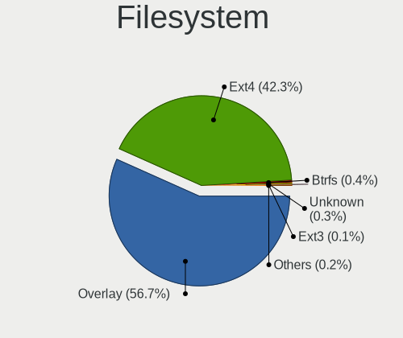

| Type    | Computers | Percent |
|---------|-----------|---------|
| Overlay | 2266      | 58.16%  |
| Ext4    | 1591      | 40.84%  |
| Btrfs   | 14        | 0.36%   |
| Unknown | 12        | 0.31%   |
| Ext3    | 5         | 0.13%   |
| Ext2    | 5         | 0.13%   |
| Ntfs    | 2         | 0.05%   |
| Xfs     | 1         | 0.03%   |

Part. scheme
------------

Scheme of partitioning

| Type    | Computers | Percent |
|---------|-----------|---------|
| MBR     | 2229      | 62%     |
| GPT     | 1329      | 36.97%  |
| Unknown | 37        | 1.03%   |

Dual Boot with Linux/BSD
------------------------

Hosting more than one Linux/BSD

| Dual boot | Computers | Percent |
|-----------|-----------|---------|
| No        | 2362      | 62.24%  |
| Yes       | 1433      | 37.76%  |

Dual Boot (Win)
---------------

Hosting Linux and Windows

| Dual boot | Computers | Percent |
|-----------|-----------|---------|
| No        | 1865      | 50.2%   |
| Yes       | 1850      | 49.8%   |

Board
-----

Vendor
------

Motherboard manufacturer

| Name                | Computers | Percent |
|---------------------|-----------|---------|
| Hewlett-Packard     | 547       | 16.13%  |
| ASUSTek Computer    | 518       | 15.28%  |
| Dell                | 457       | 13.48%  |
| Lenovo              | 426       | 12.56%  |
| Gigabyte Technology | 272       | 8.02%   |
| Acer                | 232       | 6.84%   |
| ASRock              | 215       | 6.34%   |
| MSI                 | 125       | 3.69%   |
| Toshiba             | 81        | 2.39%   |
| Fujitsu             | 80        | 2.36%   |
| Fujitsu Siemens     | 52        | 1.53%   |
| Samsung Electronics | 45        | 1.33%   |
| Packard Bell        | 33        | 0.97%   |
| Apple               | 31        | 0.91%   |
| Medion              | 29        | 0.86%   |
| Intel               | 29        | 0.86%   |
| Sony                | 23        | 0.68%   |
| eMachines           | 22        | 0.65%   |
| Foxconn             | 17        | 0.5%    |
| Unknown             | 14        | 0.41%   |
| Pegatron            | 12        | 0.35%   |
| Gateway             | 10        | 0.29%   |
| Biostar             | 7         | 0.21%   |
| Alcor               | 6         | 0.18%   |
| Hungaro Flotta Kft  | 5         | 0.15%   |
| Huanan              | 5         | 0.15%   |
| ECS                 | 5         | 0.15%   |
| BANGHO              | 4         | 0.12%   |
| Shuttle             | 3         | 0.09%   |
| Sapphire            | 3         | 0.09%   |
| Microsoft           | 3         | 0.09%   |
| Insyde              | 3         | 0.09%   |
| IBM                 | 3         | 0.09%   |
| AMI                 | 3         | 0.09%   |
| Alienware           | 3         | 0.09%   |
| ABIT                | 3         | 0.09%   |
| ZOTAC               | 2         | 0.06%   |
| Supermicro          | 2         | 0.06%   |
| speedmaster         | 2         | 0.06%   |
| Positivo            | 2         | 0.06%   |

Model
-----

Motherboard model

| Name                                 | Computers | Percent |
|--------------------------------------|-----------|---------|
| HP 250 G1                            | 40        | 1.18%   |
| ASRock FM2A75M Pro4+                 | 32        | 0.94%   |
| Unknown                              | 27        | 0.8%    |
| ASUS All Series                      | 26        | 0.77%   |
| Dell Latitude E6410                  | 20        | 0.59%   |
| Dell OptiPlex 3020                   | 18        | 0.53%   |
| HP ProBook 455 G1                    | 15        | 0.44%   |
| HP Notebook                          | 15        | 0.44%   |
| Dell OptiPlex 780                    | 14        | 0.41%   |
| Dell OptiPlex 760                    | 13        | 0.38%   |
| Dell OptiPlex 755                    | 13        | 0.38%   |
| Lenovo IdeaPad 330-15IKB 81DE        | 12        | 0.35%   |
| Lenovo G50-45 80E3                   | 11        | 0.32%   |
| Gigabyte H61M-S1                     | 11        | 0.32%   |
| Gigabyte G31M-ES2L                   | 11        | 0.32%   |
| Dell Inspiron 7737                   | 10        | 0.29%   |
| ASUS P5KPL-AM EPU                    | 10        | 0.29%   |
| Toshiba Satellite C660               | 9         | 0.27%   |
| Lenovo IdeaPad 100-15IBD 80QQ        | 9         | 0.27%   |
| HP Pavilion g6                       | 9         | 0.27%   |
| HP 650                               | 9         | 0.27%   |
| Dell OptiPlex 745                    | 9         | 0.27%   |
| HP ProDesk 600 G2 SFF                | 8         | 0.24%   |
| HP 620                               | 8         | 0.24%   |
| Dell OptiPlex 7010                   | 8         | 0.24%   |
| Dell Latitude 5480                   | 8         | 0.24%   |
| Dell Inspiron 3521                   | 8         | 0.24%   |
| ASUS X550CC                          | 8         | 0.24%   |
| ASUS K50IJ                           | 8         | 0.24%   |
| ASRock G41M-VS3                      | 8         | 0.24%   |
| MSI MS-7817                          | 7         | 0.21%   |
| MSI MS-7680                          | 7         | 0.21%   |
| Lenovo ThinkStation D20 4158AF8      | 7         | 0.21%   |
| HP Pavilion Notebook                 | 7         | 0.21%   |
| HP Compaq dc5800 Small Form Factor   | 7         | 0.21%   |
| HP 250 G5 Notebook PC                | 7         | 0.21%   |
| Gigabyte 970A-DS3P                   | 7         | 0.21%   |
| Dell Latitude E6430                  | 7         | 0.21%   |
| Dell Latitude E6400                  | 7         | 0.21%   |
| ASUS VivoBook 15_ASUS Laptop X540UBR | 7         | 0.21%   |

Model Family
------------

Motherboard model prefix

| Name                    | Computers | Percent |
|-------------------------|-----------|---------|
| Acer Aspire             | 168       | 4.95%   |
| Dell Latitude           | 141       | 4.16%   |
| HP Compaq               | 140       | 4.13%   |
| Dell OptiPlex           | 138       | 4.07%   |
| Lenovo ThinkPad         | 125       | 3.69%   |
| Dell Inspiron           | 113       | 3.33%   |
| Lenovo IdeaPad          | 96        | 2.83%   |
| Toshiba Satellite       | 73        | 2.15%   |
| HP ProBook              | 70        | 2.06%   |
| HP EliteBook            | 60        | 1.77%   |
| HP Pavilion             | 55        | 1.62%   |
| HP 250                  | 55        | 1.62%   |
| Lenovo ThinkCentre      | 51        | 1.5%    |
| ASUS PRIME              | 39        | 1.15%   |
| Fujitsu ESPRIMO         | 33        | 0.97%   |
| ASRock FM2A75M          | 32        | 0.94%   |
| ASUS VivoBook           | 30        | 0.88%   |
| Packard Bell EasyNote   | 29        | 0.86%   |
| Fujitsu LIFEBOOK        | 29        | 0.86%   |
| Unknown                 | 27        | 0.8%    |
| ASUS All                | 26        | 0.77%   |
| Fujitsu Siemens AMILO   | 21        | 0.62%   |
| Dell Precision          | 21        | 0.62%   |
| Fujitsu Siemens ESPRIMO | 20        | 0.59%   |
| Dell Vostro             | 19        | 0.56%   |
| Acer TravelMate         | 18        | 0.53%   |
| HP Laptop               | 16        | 0.47%   |
| ASUS P5KPL-AM           | 16        | 0.47%   |
| Lenovo ThinkStation     | 15        | 0.44%   |
| HP ProDesk              | 15        | 0.44%   |
| HP Notebook             | 15        | 0.44%   |
| ASUS ROG                | 14        | 0.41%   |
| Acer Veriton            | 12        | 0.35%   |
| Lenovo G50-45           | 11        | 0.32%   |
| Gigabyte H61M-S1        | 11        | 0.32%   |
| Gigabyte G31M-ES2L      | 11        | 0.32%   |
| Lenovo 3000             | 10        | 0.29%   |
| HP Presario             | 10        | 0.29%   |
| HP EliteDesk            | 10        | 0.29%   |
| HP 650                  | 9         | 0.27%   |

MFG Year
--------

Motherboard manufacture year

| Year    | Computers | Percent |
|---------|-----------|---------|
| 2013    | 368       | 10.85%  |
| 2011    | 366       | 10.79%  |
| 2010    | 331       | 9.76%   |
| 2012    | 317       | 9.35%   |
| 2009    | 286       | 8.43%   |
| 2008    | 284       | 8.38%   |
| 2014    | 274       | 8.08%   |
| 2007    | 204       | 6.02%   |
| 2015    | 181       | 5.34%   |
| 2018    | 177       | 5.22%   |
| 2016    | 158       | 4.66%   |
| 2017    | 137       | 4.04%   |
| 2019    | 95        | 2.8%    |
| 2006    | 83        | 2.45%   |
| 2020    | 58        | 1.71%   |
| 2021    | 29        | 0.86%   |
| 2005    | 24        | 0.71%   |
| 2022    | 7         | 0.21%   |
| 2004    | 4         | 0.12%   |
| 2024    | 3         | 0.09%   |
| 2023    | 3         | 0.09%   |
| 2003    | 1         | 0.03%   |
| Unknown | 1         | 0.03%   |

Form Factor
-----------

Physical design of the computer

| Name        | Computers | Percent |
|-------------|-----------|---------|
| Notebook    | 1861      | 54.88%  |
| Desktop     | 1457      | 42.97%  |
| All in one  | 33        | 0.97%   |
| Mini pc     | 17        | 0.5%    |
| Convertible | 9         | 0.27%   |
| Tablet      | 7         | 0.21%   |
| Server      | 6         | 0.18%   |
| Stick pc    | 1         | 0.03%   |

Secure Boot
-----------

Enabled or disabled

| State    | Computers | Percent |
|----------|-----------|---------|
| Disabled | 3391      | 99.97%  |
| Enabled  | 1         | 0.03%   |

Coreboot
--------

Have coreboot on board

| Used | Computers | Percent |
|------|-----------|---------|
| No   | 3389      | 99.94%  |
| Yes  | 2         | 0.06%   |

RAM Size
--------

Total RAM memory

| Size in GB  | Computers | Percent |
|-------------|-----------|---------|
| 3.01-4.0    | 1248      | 35.4%   |
| 4.01-8.0    | 675       | 19.15%  |
| 8.01-16.0   | 672       | 19.06%  |
| 1.01-2.0    | 379       | 10.75%  |
| 16.01-24.0  | 277       | 7.86%   |
| 2.01-3.0    | 124       | 3.52%   |
| 32.01-64.0  | 65        | 1.84%   |
| 0.51-1.0    | 46        | 1.3%    |
| 24.01-32.0  | 31        | 0.88%   |
| 64.01-256.0 | 6         | 0.17%   |
| Unknown     | 2         | 0.06%   |

RAM Used
--------

Used RAM memory

| Used GB    | Computers | Percent |
|------------|-----------|---------|
| 0.51-1.0   | 1828      | 44.19%  |
| 1.01-2.0   | 1057      | 25.55%  |
| 0.01-0.5   | 997       | 24.1%   |
| 2.01-3.0   | 160       | 3.87%   |
| 3.01-4.0   | 50        | 1.21%   |
| 4.01-8.0   | 36        | 0.87%   |
| 8.01-16.0  | 4         | 0.1%    |
| Unknown    | 3         | 0.07%   |
| 16.01-24.0 | 2         | 0.05%   |

Total Drives
------------

Number of drives on board

| Drives | Computers | Percent |
|--------|-----------|---------|
| 1      | 2483      | 67.62%  |
| 2      | 762       | 20.75%  |
| 3      | 235       | 6.4%    |
| 4      | 79        | 2.15%   |
| 0      | 55        | 1.5%    |
| 5      | 39        | 1.06%   |
| 6      | 10        | 0.27%   |
| 9      | 3         | 0.08%   |
| 10     | 2         | 0.05%   |
| 8      | 2         | 0.05%   |
| 7      | 2         | 0.05%   |

Has CD-ROM
----------

Has CD-ROM on board

| Presented | Computers | Percent |
|-----------|-----------|---------|
| Yes       | 2242      | 64.39%  |
| No        | 1240      | 35.61%  |

Has Ethernet
------------

Has Ethernet on board

| Presented | Computers | Percent |
|-----------|-----------|---------|
| Yes       | 3246      | 95.67%  |
| No        | 147       | 4.33%   |

Has WiFi
--------

Has WiFi module

| Presented | Computers | Percent |
|-----------|-----------|---------|
| Yes       | 2291      | 66.7%   |
| No        | 1144      | 33.3%   |

Has Bluetooth
-------------

Has Bluetooth module

| Presented | Computers | Percent |
|-----------|-----------|---------|
| No        | 1882      | 54.28%  |
| Yes       | 1585      | 45.72%  |

Location
--------

Country
-------

Geographic location (country)

| Country      | Computers | Percent |
|--------------|-----------|---------|
| Hungary      | 2465      | 72.33%  |
| Germany      | 161       | 4.72%   |
| USA          | 140       | 4.11%   |
| Romania      | 64        | 1.88%   |
| Slovakia     | 56        | 1.64%   |
| UK           | 50        | 1.47%   |
| Italy        | 37        | 1.09%   |
| France       | 36        | 1.06%   |
| Austria      | 32        | 0.94%   |
| Spain        | 30        | 0.88%   |
| Brazil       | 30        | 0.88%   |
| Canada       | 28        | 0.82%   |
| Argentina    | 24        | 0.7%    |
| Serbia       | 20        | 0.59%   |
| Poland       | 19        | 0.56%   |
| Australia    | 19        | 0.56%   |
| Japan        | 18        | 0.53%   |
| Philippines  | 10        | 0.29%   |
| Russia       | 9         | 0.26%   |
| Ireland      | 8         | 0.23%   |
| Greece       | 8         | 0.23%   |
| Belgium      | 8         | 0.23%   |
| Switzerland  | 7         | 0.21%   |
| South Africa | 7         | 0.21%   |
| Netherlands  | 7         | 0.21%   |
| India        | 7         | 0.21%   |
| Ukraine      | 6         | 0.18%   |
| Finland      | 6         | 0.18%   |
| Turkey       | 4         | 0.12%   |
| Sweden       | 4         | 0.12%   |
| Mexico       | 4         | 0.12%   |
| Egypt        | 4         | 0.12%   |
| Czechia      | 4         | 0.12%   |
| China        | 4         | 0.12%   |
| Uruguay      | 3         | 0.09%   |
| Puerto Rico  | 3         | 0.09%   |
| Israel       | 3         | 0.09%   |
| Denmark      | 3         | 0.09%   |
| Cyprus       | 3         | 0.09%   |
| Belarus      | 3         | 0.09%   |

City
----

Geographic location (city)

| City              | Computers | Percent |
|-------------------|-----------|---------|
| Budapest          | 908       | 21.69%  |
| Gyr             | 60        | 1.43%   |
| Pcs             | 56        | 1.34%   |
| Miskolc           | 56        | 1.34%   |
| Debrecen          | 54        | 1.29%   |
| Zalaegerszeg      | 53        | 1.27%   |
| Szeged            | 47        | 1.12%   |
| Tatabnya        | 46        | 1.1%    |
| Szombathely       | 38        | 0.91%   |
| Szkesfehrvr | 37        | 0.88%   |
| Nyiregyhaza       | 34        | 0.81%   |
| Kecskemt        | 32        | 0.76%   |
| Karcag            | 32        | 0.76%   |
| Veszprm         | 31        | 0.74%   |
| Szolnok           | 29        | 0.69%   |
| Szigetszentmiklos | 28        | 0.67%   |
| Berettyjfalu  | 26        | 0.62%   |
| Szekszrd        | 25        | 0.6%    |
| Oroshaza          | 24        | 0.57%   |
| Eger              | 22        | 0.53%   |
| Gdll        | 21        | 0.5%    |
| Vienna            | 20        | 0.48%   |
| Salgotarjan       | 20        | 0.48%   |
| rd              | 20        | 0.48%   |
| Toeroekbalint     | 19        | 0.45%   |
| Nagykanizsa       | 19        | 0.45%   |
| Bratislava        | 19        | 0.45%   |
| Cegled            | 18        | 0.43%   |
| Ajka              | 17        | 0.41%   |
| Regensburg        | 16        | 0.38%   |
| Pomaz             | 16        | 0.38%   |
| Kaposvr         | 16        | 0.38%   |
| Szorgalmatos      | 15        | 0.36%   |
| Dunajvros     | 15        | 0.36%   |
| Toekoel           | 14        | 0.33%   |
| Trgu Mure     | 14        | 0.33%   |
| Papa              | 14        | 0.33%   |
| Kazincbarcika     | 14        | 0.33%   |
| Hatvan            | 14        | 0.33%   |
| Tiszaujvaros      | 13        | 0.31%   |

Drives
------

Drive Vendor
------------

Hard drive vendors

| Vendor              | Computers | Drives | Percent |
|---------------------|-----------|--------|---------|
| WDC                 | 869       | 1680   | 17.64%  |
| Seagate             | 794       | 1293   | 16.12%  |
| Samsung Electronics | 556       | 1138   | 11.29%  |
| Kingston            | 531       | 1048   | 10.78%  |
| Toshiba             | 414       | 741    | 8.4%    |
| Hitachi             | 275       | 418    | 5.58%   |
| HGST                | 193       | 341    | 3.92%   |
| SanDisk             | 143       | 275    | 2.9%    |
| A-DATA Technology   | 118       | 215    | 2.4%    |
| Unknown             | 96        | 179    | 1.95%   |
| Crucial             | 84        | 144    | 1.71%   |
| Fujitsu             | 69        | 81     | 1.4%    |
| Intel               | 67        | 116    | 1.36%   |
| Maxtor              | 57        | 73     | 1.16%   |
| SPCC                | 51        | 81     | 1.04%   |
| Intenso             | 47        | 104    | 0.95%   |
| SK hynix            | 43        | 72     | 0.87%   |
| Apacer              | 37        | 59     | 0.75%   |
| JMicron Technology  | 31        | 35     | 0.63%   |
| Patriot             | 30        | 72     | 0.61%   |
| PNY                 | 29        | 49     | 0.59%   |
| China               | 29        | 47     | 0.59%   |
| Micron Technology   | 26        | 57     | 0.53%   |
| OCZ                 | 21        | 27     | 0.43%   |
| Gigabyte Technology | 21        | 59     | 0.43%   |
| Kingmax             | 19        | 42     | 0.39%   |
| LITEON              | 16        | 30     | 0.32%   |
| Hewlett-Packard     | 15        | 21     | 0.3%    |
| Transcend           | 12        | 19     | 0.24%   |
| Team                | 12        | 19     | 0.24%   |
| XPG                 | 10        | 17     | 0.2%    |
| KingSpec            | 10        | 13     | 0.2%    |
| Corsair             | 9         | 12     | 0.18%   |
| Apple               | 9         | 19     | 0.18%   |
| Verbatim            | 8         | 16     | 0.16%   |
| Netac               | 8         | 15     | 0.16%   |
| LITEONIT            | 8         | 19     | 0.16%   |
| GOODRAM             | 8         | 8      | 0.16%   |
| Unknown             | 8         | 15     | 0.16%   |
| Zheino              | 7         | 23     | 0.14%   |

Drive Model
-----------

Hard drive models

| Model                              | Computers | Percent |
|------------------------------------|-----------|---------|
| Kingston SA400S37120G 120GB SSD    | 122       | 2.27%   |
| Kingston SA400S37240G 240GB SSD    | 117       | 2.18%   |
| Kingston SV300S37A120G 120GB SSD   | 73        | 1.36%   |
| Seagate ST500DM002-1BD142 500GB    | 58        | 1.08%   |
| Kingston SA400S37480G 480GB SSD    | 55        | 1.02%   |
| Seagate ST1000LM035-1RK172 1TB     | 51        | 0.95%   |
| Seagate ST1000LM024 HN-M101MBB 1TB | 48        | 0.89%   |
| Toshiba DT01ACA100 1TB             | 47        | 0.87%   |
| Toshiba MQ01ABD100 1TB             | 46        | 0.86%   |
| Seagate ST500LT012-1DG142 500GB    | 45        | 0.84%   |
| Toshiba MQ01ABF050 500GB           | 44        | 0.82%   |
| HGST HTS545050A7E680 500GB         | 38        | 0.71%   |
| Kingston SUV400S37120G 120GB SSD   | 35        | 0.65%   |
| HGST HTS545032A7E380 320GB         | 33        | 0.61%   |
| Toshiba DT01ACA050 500GB           | 31        | 0.58%   |
| A-DATA SU630 240GB SSD             | 31        | 0.58%   |
| Samsung SSD 860 EVO 500GB          | 28        | 0.52%   |
| HGST HTS725050A7E630 500GB         | 26        | 0.48%   |
| Samsung SSD 850 EVO 250GB          | 25        | 0.46%   |
| Toshiba MQ04ABF100 1TB             | 24        | 0.45%   |
| Seagate ST9500325AS 500GB          | 24        | 0.45%   |
| JMicron Generic 320GB              | 24        | 0.45%   |
| Seagate ST9320325AS 320GB          | 23        | 0.43%   |
| Seagate ST500LT012-9WS142 500GB    | 23        | 0.43%   |
| Seagate ST380815AS 80GB            | 23        | 0.43%   |
| WDC WD10JPVX-22JC3T0 1TB           | 21        | 0.39%   |
| A-DATA SU700 120GB SSD             | 20        | 0.37%   |
| WDC WD10EZEX-08WN4A0 1TB           | 19        | 0.35%   |
| Samsung SSD 860 EVO 250GB          | 19        | 0.35%   |
| Samsung HD502HJ 500GB              | 19        | 0.35%   |
| Kingston SA400S37960G 960GB SSD    | 19        | 0.35%   |
| HGST HTS721010A9E630 1TB           | 19        | 0.35%   |
| Crucial CT120BX500SSD1 120GB       | 19        | 0.35%   |
| SPCC Solid State Disk 256GB        | 18        | 0.33%   |
| WDC WDS240G2G0A-00JH30 240GB SSD   | 17        | 0.32%   |
| Seagate ST3160815AS 160GB          | 17        | 0.32%   |
| HGST HTS541010A9E680 1TB           | 17        | 0.32%   |
| Toshiba MQ01ABD050 500GB           | 16        | 0.3%    |
| Seagate ST9250315AS 250GB          | 16        | 0.3%    |
| SanDisk SSD PLUS 240GB             | 16        | 0.3%    |

HDD Vendor
----------

Hard disk drive vendors

| Vendor              | Computers | Drives | Percent |
|---------------------|-----------|--------|---------|
| WDC                 | 806       | 1530   | 27.95%  |
| Seagate             | 780       | 1272   | 27.05%  |
| Toshiba             | 385       | 679    | 13.35%  |
| Hitachi             | 275       | 418    | 9.54%   |
| Samsung Electronics | 239       | 396    | 8.29%   |
| HGST                | 193       | 341    | 6.69%   |
| Fujitsu             | 69        | 81     | 2.39%   |
| Maxtor              | 56        | 72     | 1.94%   |
| JMicron Technology  | 25        | 28     | 0.87%   |
| Unknown             | 9         | 18     | 0.31%   |
| Hewlett-Packard     | 7         | 9      | 0.24%   |
| WD MediaMax         | 5         | 6      | 0.17%   |
| Apple               | 5         | 6      | 0.17%   |
| USB3.0              | 4         | 8      | 0.14%   |
| ASMT                | 4         | 6      | 0.14%   |
| IBM/Hitachi         | 3         | 4      | 0.1%    |
| USB                 | 2         | 3      | 0.07%   |
| TO Exter            | 2         | 3      | 0.07%   |
| Quantum             | 2         | 2      | 0.07%   |
| ICY BOX             | 2         | 4      | 0.07%   |
| HGST HTS            | 2         | 7      | 0.07%   |
| ExcelStor           | 2         | 2      | 0.07%   |
| QC-FT-D             | 1         | 1      | 0.03%   |
| MARSHAL             | 1         | 2      | 0.03%   |
| Initio              | 1         | 2      | 0.03%   |
| IB-1122             | 1         | 1      | 0.03%   |
| Emphase             | 1         | 2      | 0.03%   |
| CSD                 | 1         | 2      | 0.03%   |
| Unknown             | 1         | 1      | 0.03%   |

SSD Vendor
----------

Solid state drive vendors

| Vendor              | Computers | Drives | Percent |
|---------------------|-----------|--------|---------|
| Kingston            | 497       | 957    | 29.48%  |
| Samsung Electronics | 254       | 530    | 15.07%  |
| SanDisk             | 122       | 230    | 7.24%   |
| A-DATA Technology   | 108       | 199    | 6.41%   |
| Crucial             | 77        | 132    | 4.57%   |
| WDC                 | 69        | 127    | 4.09%   |
| Intel               | 48        | 80     | 2.85%   |
| Intenso             | 47        | 104    | 2.79%   |
| SPCC                | 45        | 74     | 2.67%   |
| Apacer              | 35        | 55     | 2.08%   |
| SK hynix            | 31        | 51     | 1.84%   |
| PNY                 | 29        | 49     | 1.72%   |
| Patriot             | 29        | 71     | 1.72%   |
| China               | 29        | 47     | 1.72%   |
| Micron Technology   | 23        | 49     | 1.36%   |
| OCZ                 | 21        | 27     | 1.25%   |
| Kingmax             | 18        | 41     | 1.07%   |
| Gigabyte Technology | 18        | 52     | 1.07%   |
| Toshiba             | 17        | 39     | 1.01%   |
| LITEON              | 15        | 23     | 0.89%   |
| Team                | 12        | 19     | 0.71%   |
| Transcend           | 11        | 14     | 0.65%   |
| KingSpec            | 10        | 13     | 0.59%   |
| Corsair             | 9         | 12     | 0.53%   |
| Verbatim            | 8         | 16     | 0.47%   |
| Netac               | 8         | 15     | 0.47%   |
| LITEONIT            | 8         | 19     | 0.47%   |
| GOODRAM             | 8         | 8      | 0.47%   |
| Hewlett-Packard     | 4         | 6      | 0.24%   |
| BHT                 | 4         | 4      | 0.24%   |
| Apple               | 4         | 13     | 0.24%   |
| Unknown             | 3         | 6      | 0.18%   |
| sobetter            | 3         | 3      | 0.18%   |
| KingFast            | 3         | 4      | 0.18%   |
| HS-SSD-C100         | 3         | 3      | 0.18%   |
| Emtec               | 3         | 3      | 0.18%   |
| Wibtek              | 2         | 2      | 0.12%   |
| StoreJet            | 2         | 2      | 0.12%   |
| ShanDianZhe         | 2         | 2      | 0.12%   |
| Seagate             | 2         | 2      | 0.12%   |

Drive Kind
----------

HDD or SSD

| Kind    | Computers | Drives | Percent |
|---------|-----------|--------|---------|
| HDD     | 2420      | 4906   | 56.71%  |
| SSD     | 1471      | 3185   | 34.47%  |
| NVMe    | 233       | 585    | 5.46%   |
| MMC     | 102       | 185    | 2.39%   |
| Unknown | 41        | 57     | 0.96%   |

Drive Connector
---------------

SATA, SAS, NVMe, etc.

| Type | Computers | Drives | Percent |
|------|-----------|--------|---------|
| SATA | 3213      | 7865   | 86.42%  |
| NVMe | 233       | 585    | 6.27%   |
| SAS  | 170       | 283    | 4.57%   |
| MMC  | 102       | 185    | 2.74%   |

Drive Size
----------

Size of hard drive

| Size in TB      | Computers | Drives | Percent |
|-----------------|-----------|--------|---------|
| 0.01-0.5        | 2817      | 5980   | 73.94%  |
| 0.51-1.0        | 776       | 1588   | 20.37%  |
| 1.01-2.0        | 129       | 286    | 3.39%   |
| 3.01-4.0        | 36        | 88     | 0.94%   |
| 2.01-3.0        | 30        | 121    | 0.79%   |
| 4.01-10.0       | 15        | 20     | 0.39%   |
| More than 100.0 | 4         | 4      | 0.1%    |
| 10.01-20.0      | 3         | 4      | 0.08%   |

Space Total
-----------

Amount of disk space available on the file system

| Size in GB     | Computers | Percent |
|----------------|-----------|---------|
| Unknown        | 2194      | 52.89%  |
| 101-250        | 733       | 17.67%  |
| 251-500        | 447       | 10.78%  |
| 51-100         | 266       | 6.41%   |
| 501-1000       | 196       | 4.73%   |
| 21-50          | 160       | 3.86%   |
| 1001-2000      | 72        | 1.74%   |
| 1-20           | 48        | 1.16%   |
| 2001-3000      | 18        | 0.43%   |
| More than 3000 | 13        | 0.31%   |
| 0              | 1         | 0.02%   |

Space Used
----------

Amount of used disk space

| Used GB        | Computers | Percent |
|----------------|-----------|---------|
| Unknown        | 2194      | 52.68%  |
| 1-20           | 1377      | 33.06%  |
| 21-50          | 213       | 5.11%   |
| 51-100         | 142       | 3.41%   |
| 101-250        | 120       | 2.88%   |
| 251-500        | 47        | 1.13%   |
| 501-1000       | 34        | 0.82%   |
| 1001-2000      | 29        | 0.7%    |
| More than 3000 | 4         | 0.1%    |
| 2001-3000      | 4         | 0.1%    |
| 0              | 1         | 0.02%   |

Malfunc. Drives
---------------

Drive models with a malfunction

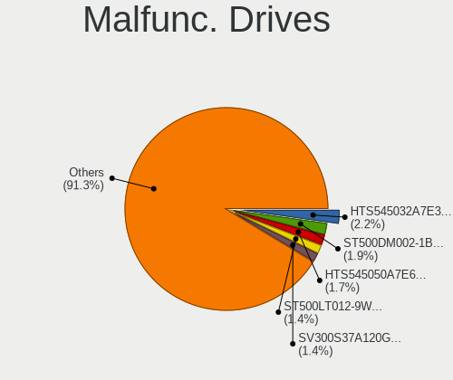

| Model                              | Computers | Drives | Percent |
|------------------------------------|-----------|--------|---------|
| HGST HTS545032A7E380 320GB         | 32        | 59     | 2.19%   |
| Seagate ST500DM002-1BD142 500GB    | 29        | 46     | 1.99%   |
| HGST HTS545050A7E680 500GB         | 26        | 36     | 1.78%   |
| Kingston SV300S37A120G 120GB SSD   | 22        | 29     | 1.51%   |
| Seagate ST500LT012-9WS142 500GB    | 21        | 27     | 1.44%   |
| Seagate ST500LT012-1DG142 500GB    | 20        | 35     | 1.37%   |
| HGST HTS725050A7E630 500GB         | 19        | 20     | 1.3%    |
| A-DATA Technology SU630 240GB SSD  | 19        | 33     | 1.3%    |
| Seagate ST1000LM024 HN-M101MBB 1TB | 18        | 24     | 1.23%   |
| Seagate ST9500325AS 500GB          | 14        | 26     | 0.96%   |
| Samsung Electronics HD103UJ 1TB    | 14        | 31     | 0.96%   |
| Seagate ST9320325AS 320GB          | 13        | 29     | 0.89%   |
| Toshiba MQ01ABD100 1TB             | 12        | 13     | 0.82%   |
| HGST HTS541010A9E680 1TB           | 12        | 26     | 0.82%   |
| Toshiba MQ01ABF050 500GB           | 11        | 35     | 0.75%   |
| Toshiba DT01ACA050 500GB           | 11        | 14     | 0.75%   |
| Seagate ST9250315AS 250GB          | 11        | 16     | 0.75%   |
| Samsung Electronics HM160HI 160GB  | 11        | 16     | 0.75%   |
| WDC WD5000AAKX-001CA0 500GB        | 10        | 10     | 0.69%   |
| Toshiba DT01ACA100 1TB             | 10        | 20     | 0.69%   |
| Seagate ST1000LM035-1RK172 1TB     | 10        | 12     | 0.69%   |
| Hitachi HTS543232A7A384 320GB      | 10        | 14     | 0.69%   |
| HGST HTS545050A7E380 500GB         | 10        | 16     | 0.69%   |
| Hitachi HTS723232A7A364 320GB      | 9         | 9      | 0.62%   |
| Hitachi HTS545050B9A300 500GB      | 9         | 15     | 0.62%   |
| Toshiba MQ01ABD050 500GB           | 8         | 10     | 0.55%   |
| Hitachi HTS545050A7E380 500GB      | 8         | 15     | 0.55%   |
| WDC WD5000AAKS-007AA0 500GB        | 7         | 26     | 0.48%   |
| WDC WD10JPVX-22JC3T0 1TB           | 7         | 11     | 0.48%   |
| Seagate ST980811AS 80GB            | 7         | 8      | 0.48%   |
| Seagate ST9320423AS 320GB          | 7         | 8      | 0.48%   |
| Seagate ST3500418AS 500GB          | 7         | 12     | 0.48%   |
| Seagate ST3160815AS 160GB          | 7         | 9      | 0.48%   |
| WDC WD5000AAKS-00UU3A0 500GB       | 6         | 13     | 0.41%   |
| WDC WD5000AADS-00S9B0 500GB        | 6         | 8      | 0.41%   |
| WDC WD10EARS-00Y5B1 1TB            | 6         | 15     | 0.41%   |
| Seagate ST9500420AS 500GB          | 6         | 15     | 0.41%   |
| Samsung Electronics SP2504C 250GB  | 6         | 10     | 0.41%   |
| Samsung Electronics HM321HI 320GB  | 6         | 10     | 0.41%   |
| Samsung Electronics HD321KJ 320GB  | 6         | 6      | 0.41%   |

Malfunc. Drive Vendor
---------------------

Vendors of faulty drives

| Vendor              | Computers | Drives | Percent |
|---------------------|-----------|--------|---------|
| Seagate             | 339       | 516    | 24.18%  |
| WDC                 | 294       | 510    | 20.97%  |
| Hitachi             | 155       | 246    | 11.06%  |
| Toshiba             | 141       | 222    | 10.06%  |
| Samsung Electronics | 137       | 226    | 9.77%   |
| HGST                | 112       | 175    | 7.99%   |
| Kingston            | 51        | 82     | 3.64%   |
| Maxtor              | 33        | 46     | 2.35%   |
| A-DATA Technology   | 28        | 51     | 2%      |
| Fujitsu             | 25        | 34     | 1.78%   |
| Intel               | 18        | 40     | 1.28%   |
| SK hynix            | 9         | 13     | 0.64%   |
| OCZ                 | 8         | 11     | 0.57%   |
| SanDisk             | 6         | 7      | 0.43%   |
| WD MediaMax         | 5         | 6      | 0.36%   |
| Intenso             | 3         | 3      | 0.21%   |
| Hewlett-Packard     | 3         | 3      | 0.21%   |
| Crucial             | 3         | 3      | 0.21%   |
| China               | 3         | 3      | 0.21%   |
| KingSpec            | 2         | 2      | 0.14%   |
| Kingmax             | 2         | 2      | 0.14%   |
| IBM/Hitachi         | 2         | 2      | 0.14%   |
| Apple               | 2         | 11     | 0.14%   |
| Apacer              | 2         | 3      | 0.14%   |
| Timetec             | 1         | 9      | 0.07%   |
| SPCC                | 1         | 1      | 0.07%   |
| SATAFIRM            | 1         | 1      | 0.07%   |
| QUANTUM             | 1         | 1      | 0.07%   |
| Patriot             | 1         | 1      | 0.07%   |
| Netac               | 1         | 1      | 0.07%   |
| Micron Technology   | 1         | 1      | 0.07%   |
| MARSHAL             | 1         | 1      | 0.07%   |
| LITEONIT            | 1         | 2      | 0.07%   |
| LITEON              | 1         | 1      | 0.07%   |
| KING                | 1         | 1      | 0.07%   |
| JMicron Technology  | 1         | 1      | 0.07%   |
| Initio              | 1         | 2      | 0.07%   |
| ICY BOX             | 1         | 1      | 0.07%   |
| ExcelStor           | 1         | 1      | 0.07%   |
| CSD                 | 1         | 2      | 0.07%   |

Malfunc. HDD Vendor
-------------------

Vendors of faulty HDD drives

| Vendor              | Computers | Drives | Percent |
|---------------------|-----------|--------|---------|
| Seagate             | 339       | 516    | 27.47%  |
| WDC                 | 289       | 505    | 23.42%  |
| Hitachi             | 155       | 246    | 12.56%  |
| Toshiba             | 135       | 208    | 10.94%  |
| Samsung Electronics | 130       | 196    | 10.53%  |
| HGST                | 112       | 175    | 9.08%   |
| Maxtor              | 33        | 46     | 2.67%   |
| Fujitsu             | 25        | 34     | 2.03%   |
| WD MediaMax         | 5         | 6      | 0.41%   |
| IBM/Hitachi         | 2         | 2      | 0.16%   |
| Hewlett-Packard     | 2         | 2      | 0.16%   |
| QUANTUM             | 1         | 1      | 0.08%   |
| MARSHAL             | 1         | 1      | 0.08%   |
| Initio              | 1         | 2      | 0.08%   |
| ICY BOX             | 1         | 1      | 0.08%   |
| ExcelStor           | 1         | 1      | 0.08%   |
| CSD                 | 1         | 2      | 0.08%   |
| ASMT                | 1         | 1      | 0.08%   |

Malfunc. Drive Kind
-------------------

Kinds of faulty drives

| Kind    | Computers | Drives | Percent |
|---------|-----------|--------|---------|
| HDD     | 1119      | 1945   | 87.15%  |
| SSD     | 159       | 295    | 12.38%  |
| NVMe    | 5         | 6      | 0.39%   |
| Unknown | 1         | 1      | 0.08%   |

Failed Drives
-------------

Failed drive models

| Model                              | Computers | Drives | Percent |
|------------------------------------|-----------|--------|---------|
| WDC WD5000BEVT-22ZAT0 500GB        | 2         | 2      | 5%      |
| Toshiba MQ01ABD100 1TB             | 2         | 2      | 5%      |
| Toshiba MK6475GSX 640GB            | 2         | 2      | 5%      |
| Seagate ST1000LM024 HN-M101MBB 1TB | 2         | 2      | 5%      |
| Samsung Electronics HD502HJ 500GB  | 2         | 3      | 5%      |
| Samsung Electronics HD103SJ 1TB    | 2         | 2      | 5%      |
| Zheino CHN-NGFFNV2280-256 256GB    | 1         | 1      | 2.5%    |
| WDC WD5000BEVT-22A0RT0 500GB       | 1         | 7      | 2.5%    |
| WDC WD3200BVVT-63A26Y0 320GB       | 1         | 1      | 2.5%    |
| WDC WD3200BPVT-24JJ5T0 320GB       | 1         | 1      | 2.5%    |
| WDC WD3200BEVT-08A23T1 320GB       | 1         | 1      | 2.5%    |
| WDC WD2500LPCX-24C6HT0 250GB       | 1         | 1      | 2.5%    |
| WDC WD1600BEVT-80A23T0 160GB       | 1         | 1      | 2.5%    |
| WDC WD1600BEVT-22ZCT0 160GB        | 1         | 1      | 2.5%    |
| Toshiba MQ01ABD050V 500GB          | 1         | 1      | 2.5%    |
| Toshiba MK5055GSX 500GB            | 1         | 1      | 2.5%    |
| Toshiba MK3275GSX 320GB            | 1         | 1      | 2.5%    |
| Toshiba MK1665GSX 160GB            | 1         | 1      | 2.5%    |
| Toshiba MK1646GSX 160GB            | 1         | 1      | 2.5%    |
| Seagate ST9320325AS 320GB          | 1         | 1      | 2.5%    |
| Seagate ST9160412AS 160GB          | 1         | 1      | 2.5%    |
| Seagate ST380815AS 80GB            | 1         | 3      | 2.5%    |
| Seagate ST3160815AS 160GB          | 1         | 1      | 2.5%    |
| Samsung Electronics SSD 980 500GB  | 1         | 1      | 2.5%    |
| Samsung Electronics SP0802N 80GB   | 1         | 1      | 2.5%    |
| Samsung Electronics HM060HI 64GB   | 1         | 1      | 2.5%    |
| Samsung Electronics HD204UI 2TB    | 1         | 1      | 2.5%    |
| Samsung Electronics HD103UJ 1TB    | 1         | 1      | 2.5%    |
| OCZ-AGIL ITY3 64GB SSD             | 1         | 1      | 2.5%    |
| Intel SSDPEKKW256G7 256GB          | 1         | 1      | 2.5%    |
| Hitachi HDS721075CLA332 752GB      | 1         | 1      | 2.5%    |
| Hitachi HDS721010DLE630 1TB        | 1         | 1      | 2.5%    |
| Hewlett-Packard SSD EX900 250GB    | 1         | 1      | 2.5%    |
| ExcelStor Technology J8160S 160GB  | 1         | 1      | 2.5%    |

Failed Drive Vendor
-------------------

Failed drive vendors

| Vendor              | Computers | Drives | Percent |
|---------------------|-----------|--------|---------|
| WDC                 | 9         | 15     | 22.5%   |
| Toshiba             | 9         | 9      | 22.5%   |
| Samsung Electronics | 9         | 10     | 22.5%   |
| Seagate             | 6         | 8      | 15%     |
| Hitachi             | 2         | 2      | 5%      |
| Zheino              | 1         | 1      | 2.5%    |
| OCZ-AGIL            | 1         | 1      | 2.5%    |
| Intel               | 1         | 1      | 2.5%    |
| Hewlett-Packard     | 1         | 1      | 2.5%    |
| ExcelStor           | 1         | 1      | 2.5%    |

Drive Status
------------

Number of failed and malfunc. drives

| Status   | Computers | Drives | Percent |
|----------|-----------|--------|---------|
| Works    | 2508      | 6065   | 61.07%  |
| Malfunc  | 1252      | 2247   | 30.48%  |
| Detected | 307       | 557    | 7.48%   |
| Failed   | 40        | 49     | 0.97%   |

Storage controller
------------------

Storage Vendor
--------------

Storage controller vendors

| Vendor                           | Computers | Percent |
|----------------------------------|-----------|---------|
| Intel                            | 2570      | 68.22%  |
| AMD                              | 649       | 17.23%  |
| Nvidia                           | 96        | 2.55%   |
| Samsung Electronics              | 92        | 2.44%   |
| JMicron Technology               | 79        | 2.1%    |
| Kingston Technology Company      | 43        | 1.14%   |
| ASMedia Technology               | 38        | 1.01%   |
| Marvell Technology Group         | 33        | 0.88%   |
| VIA Technologies                 | 23        | 0.61%   |
| SanDisk                          | 22        | 0.58%   |
| Silicon Motion                   | 14        | 0.37%   |
| Phison Electronics               | 14        | 0.37%   |
| Silicon Image                    | 13        | 0.35%   |
| Toshiba America Info Systems     | 10        | 0.27%   |
| Realtek Semiconductor            | 10        | 0.27%   |
| SK hynix                         | 8         | 0.21%   |
| Solid State Storage Technology   | 7         | 0.19%   |
| ADATA Technology                 | 7         | 0.19%   |
| Micron/Crucial Technology        | 6         | 0.16%   |
| Silicon Integrated Systems [SiS] | 4         | 0.11%   |
| Micron Technology                | 4         | 0.11%   |
| KIOXIA                           | 4         | 0.11%   |
| LSI Logic / Symbios Logic        | 3         | 0.08%   |
| Lite-On Technology               | 3         | 0.08%   |
| Integrated Technology Express    | 2         | 0.05%   |
| Hewlett-Packard                  | 2         | 0.05%   |
| Adaptec                          | 2         | 0.05%   |
| 3ware                            | 2         | 0.05%   |
| Zhaoxin                          | 1         | 0.03%   |
| ULi Electronics                  | 1         | 0.03%   |
| Promise Technology               | 1         | 0.03%   |
| O2 Micro                         | 1         | 0.03%   |
| MAXIO Technology (Hangzhou)      | 1         | 0.03%   |
| Broadcom / LSI                   | 1         | 0.03%   |
| Apple                            | 1         | 0.03%   |

Storage Model
-------------

Storage controller models

| Model                                                                                   | Computers | Percent |
|-----------------------------------------------------------------------------------------|-----------|---------|
| AMD FCH SATA Controller [AHCI mode]                                                     | 376       | 7.76%   |
| Intel 7 Series Chipset Family 6-port SATA Controller [AHCI mode]                        | 219       | 4.52%   |
| Intel NM10/ICH7 Family SATA Controller [IDE mode]                                       | 188       | 3.88%   |
| Intel 8 Series/C220 Series Chipset Family 6-port SATA Controller 1 [AHCI mode]          | 167       | 3.45%   |
| Intel 82801G (ICH7 Family) IDE Controller                                               | 164       | 3.38%   |
| Intel 82801IBM/IEM (ICH9M/ICH9M-E) 4 port SATA Controller [AHCI mode]                   | 157       | 3.24%   |
| Intel 6 Series/C200 Series Chipset Family 6 port Mobile SATA AHCI Controller            | 143       | 2.95%   |
| Intel Sunrise Point-LP SATA Controller [AHCI mode]                                      | 123       | 2.54%   |
| AMD SB7x0/SB8x0/SB9x0 SATA Controller [AHCI mode]                                       | 123       | 2.54%   |
| AMD SB7x0/SB8x0/SB9x0 IDE Controller                                                    | 113       | 2.33%   |
| Intel 82801HM/HEM (ICH8M/ICH8M-E) IDE Controller                                        | 100       | 2.06%   |
| Intel 82801 Mobile SATA Controller [RAID mode]                                          | 99        | 2.04%   |
| Intel 8 Series SATA Controller 1 [AHCI mode]                                            | 88        | 1.82%   |
| Intel 6 Series/C200 Series Chipset Family 6 port Desktop SATA AHCI Controller           | 87        | 1.8%    |
| Intel 82801HM/HEM (ICH8M/ICH8M-E) SATA Controller [AHCI mode]                           | 84        | 1.73%   |
| Intel 5 Series/3400 Series Chipset 4 port SATA AHCI Controller                          | 84        | 1.73%   |
| AMD SB7x0/SB8x0/SB9x0 SATA Controller [IDE mode]                                        | 80        | 1.65%   |
| Intel 5 Series/3400 Series Chipset 6 port SATA AHCI Controller                          | 70        | 1.44%   |
| AMD FCH IDE Controller                                                                  | 69        | 1.42%   |
| Intel Q170/Q150/B150/H170/H110/Z170/CM236 Chipset SATA Controller [AHCI Mode]           | 67        | 1.38%   |
| Intel Wildcat Point-LP SATA Controller [AHCI Mode]                                      | 62        | 1.28%   |
| Intel 7 Series/C210 Series Chipset Family 6-port SATA Controller [AHCI mode]            | 60        | 1.24%   |
| Intel 6 Series/C200 Series Chipset Family Desktop SATA Controller (IDE mode, ports 4-5) | 56        | 1.16%   |
| Intel 6 Series/C200 Series Chipset Family Desktop SATA Controller (IDE mode, ports 0-3) | 56        | 1.16%   |
| Intel Atom Processor E3800 Series SATA AHCI Controller                                  | 55        | 1.13%   |
| Intel 200 Series PCH SATA controller [AHCI mode]                                        | 55        | 1.13%   |
| Intel SATA Controller [RAID mode]                                                       | 53        | 1.09%   |
| Intel Atom/Celeron/Pentium Processor x5-E8000/J3xxx/N3xxx Series SATA Controller        | 51        | 1.05%   |
| Intel 4 Series Chipset PT IDER Controller                                               | 51        | 1.05%   |
| Intel 82801I (ICH9 Family) 2 port SATA Controller [IDE mode]                            | 50        | 1.03%   |
| Samsung NVMe SSD Controller SM981/PM981/PM983                                           | 49        | 1.01%   |
| JMicron JMB363 SATA/IDE Controller                                                      | 44        | 0.91%   |
| Intel NM10/ICH7 Family SATA Controller [AHCI mode]                                      | 40        | 0.83%   |
| AMD 400 Series Chipset SATA Controller                                                  | 40        | 0.83%   |
| Intel 5 Series/3400 Series Chipset 4 port SATA IDE Controller                           | 36        | 0.74%   |
| ASMedia ASM1061/ASM1062 Serial ATA Controller                                           | 36        | 0.74%   |
| Nvidia MCP61 SATA Controller                                                            | 35        | 0.72%   |
| Intel 82801JD/DO (ICH10 Family) SATA AHCI Controller                                    | 35        | 0.72%   |
| Intel 5 Series/3400 Series Chipset 2 port SATA IDE Controller                           | 35        | 0.72%   |
| Intel 82801IBM/IEM (ICH9M/ICH9M-E) 2 port SATA Controller [IDE mode]                    | 33        | 0.68%   |

Storage Kind
------------

Kind of storage controller (IDE, SATA, NVMe, SAS, ...)

| Kind | Computers | Percent |
|------|-----------|---------|
| SATA | 2570      | 63.25%  |
| IDE  | 1058      | 26.04%  |
| NVMe | 234       | 5.76%   |
| RAID | 193       | 4.75%   |
| SCSI | 6         | 0.15%   |
| SAS  | 2         | 0.05%   |

Processor
---------

CPU Vendor
----------

Processor vendors

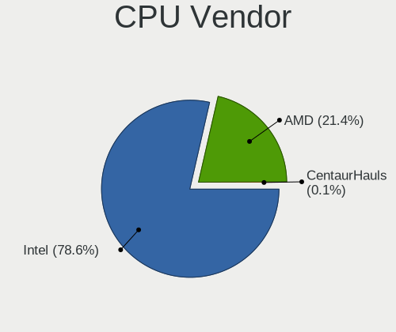

| Vendor       | Computers | Percent |
|--------------|-----------|---------|
| Intel        | 2660      | 78.44%  |
| AMD          | 729       | 21.5%   |
| CentaurHauls | 2         | 0.06%   |

CPU Model
---------

Processor models

| Model                                       | Computers | Percent |
|---------------------------------------------|-----------|---------|
| Intel Core 2 Duo CPU E8400 @ 3.00GHz        | 48        | 1.41%   |
| Intel Celeron CPU 1000M @ 1.80GHz           | 41        | 1.2%    |
| Intel Core i5-2520M CPU @ 2.50GHz           | 40        | 1.17%   |
| AMD A8-6600K APU with Radeon HD Graphics    | 34        | 1%      |
| Intel Core i5-7200U CPU @ 2.50GHz           | 28        | 0.82%   |
| Intel Core i3-5005U CPU @ 2.00GHz           | 25        | 0.73%   |
| Intel Core i3-2120 CPU @ 3.30GHz            | 25        | 0.73%   |
| Intel Core 2 Quad CPU Q6600 @ 2.40GHz       | 25        | 0.73%   |
| Intel Core 2 Duo CPU E7500 @ 2.93GHz        | 25        | 0.73%   |
| Intel Core i5-3470 CPU @ 3.20GHz            | 24        | 0.7%    |
| Intel Core i5 CPU M 520 @ 2.40GHz           | 24        | 0.7%    |
| Intel Core i5-2400 CPU @ 3.10GHz            | 23        | 0.67%   |
| Intel Core i5-8250U CPU @ 1.60GHz           | 22        | 0.64%   |
| Intel Core i3-6006U CPU @ 2.00GHz           | 22        | 0.64%   |
| Intel Core i3-4160 CPU @ 3.60GHz            | 22        | 0.64%   |
| Intel Core i3-3220 CPU @ 3.30GHz            | 22        | 0.64%   |
| Intel Core 2 Duo CPU P8600 @ 2.40GHz        | 22        | 0.64%   |
| Intel Pentium Dual-Core CPU T4400 @ 2.20GHz | 21        | 0.61%   |
| Intel Celeron CPU N3060 @ 1.60GHz           | 21        | 0.61%   |
| Intel Core i5-6500 CPU @ 3.20GHz            | 20        | 0.59%   |
| Intel Celeron CPU N2840 @ 2.16GHz           | 20        | 0.59%   |
| Intel Core i5-3210M CPU @ 2.50GHz           | 19        | 0.56%   |
| Intel Core i5-5200U CPU @ 2.20GHz           | 18        | 0.53%   |
| Intel Core i5-4210U CPU @ 1.70GHz           | 17        | 0.5%    |
| Intel Core i3-7020U CPU @ 2.30GHz           | 17        | 0.5%    |
| Intel Atom CPU N455 @ 1.66GHz               | 17        | 0.5%    |
| AMD FX-6300 Six-Core Processor              | 17        | 0.5%    |
| Intel Core i7-4510U CPU @ 2.00GHz           | 16        | 0.47%   |
| Intel Core i5-3320M CPU @ 2.60GHz           | 16        | 0.47%   |
| Intel Core i3-3217U CPU @ 1.80GHz           | 16        | 0.47%   |
| Intel Core i3 CPU M 370 @ 2.40GHz           | 16        | 0.47%   |
| Intel Core 2 Duo CPU T7500 @ 2.20GHz        | 16        | 0.47%   |
| Intel Core 2 Duo CPU P8400 @ 2.26GHz        | 16        | 0.47%   |
| Intel Core 2 Duo CPU E7300 @ 2.66GHz        | 16        | 0.47%   |
| Intel Atom CPU N450 @ 1.66GHz               | 16        | 0.47%   |
| Intel Pentium Dual-Core CPU T4500 @ 2.30GHz | 15        | 0.44%   |
| Intel Core i5-6200U CPU @ 2.30GHz           | 15        | 0.44%   |
| Intel Core i3-2310M CPU @ 2.10GHz           | 15        | 0.44%   |
| Intel Core i3 CPU M 350 @ 2.27GHz           | 15        | 0.44%   |
| Intel Celeron CPU N3350 @ 1.10GHz           | 15        | 0.44%   |

CPU Model Family
----------------

Processor model prefix

| Model                   | Computers | Percent |
|-------------------------|-----------|---------|
| Intel Core i5           | 657       | 19.28%  |
| Intel Core i3           | 413       | 12.12%  |
| Intel Core 2 Duo        | 356       | 10.45%  |
| Intel Celeron           | 274       | 8.04%   |
| Intel Core i7           | 257       | 7.54%   |
| Intel Pentium           | 159       | 4.67%   |
| Intel Pentium Dual-Core | 111       | 3.26%   |
| Intel Atom              | 96        | 2.82%   |
| AMD A8                  | 91        | 2.67%   |
| Intel Core 2 Quad       | 67        | 1.97%   |
| AMD Ryzen 5             | 60        | 1.76%   |
| Intel Xeon              | 59        | 1.73%   |
| AMD FX                  | 59        | 1.73%   |
| AMD A4                  | 55        | 1.61%   |
| Intel Core 2            | 52        | 1.53%   |
| Intel Pentium Dual      | 45        | 1.32%   |
| AMD A10                 | 42        | 1.23%   |
| AMD Athlon II X2        | 40        | 1.17%   |
| AMD A6                  | 39        | 1.14%   |
| Other                   | 38        | 1.12%   |
| AMD Athlon 64 X2        | 33        | 0.97%   |
| AMD Ryzen 7             | 25        | 0.73%   |
| AMD Ryzen 3             | 25        | 0.73%   |
| AMD E                   | 25        | 0.73%   |
| AMD Phenom II X4        | 24        | 0.7%    |
| Intel Pentium 4         | 23        | 0.67%   |
| AMD E1                  | 22        | 0.65%   |
| AMD E2                  | 19        | 0.56%   |
| Intel Genuine           | 16        | 0.47%   |
| Intel Pentium D         | 13        | 0.38%   |
| Intel Celeron Dual-Core | 13        | 0.38%   |
| AMD Sempron             | 13        | 0.38%   |
| AMD Athlon II X4        | 13        | 0.38%   |
| Intel Pentium Silver    | 10        | 0.29%   |
| Intel Celeron M         | 10        | 0.29%   |
| AMD Athlon Dual Core    | 9         | 0.26%   |
| AMD Athlon              | 9         | 0.26%   |
| AMD Athlon X4           | 8         | 0.23%   |
| Intel Pentium M         | 7         | 0.21%   |
| Intel Core Duo          | 7         | 0.21%   |

CPU Cores
---------

Number of processor cores

| Number  | Computers | Percent |
|---------|-----------|---------|
| 2       | 2185      | 63.93%  |
| 4       | 782       | 22.88%  |
| 1       | 252       | 7.37%   |
| 6       | 111       | 3.25%   |
| 8       | 46        | 1.35%   |
| 3       | 26        | 0.76%   |
| 18      | 5         | 0.15%   |
| 12      | 4         | 0.12%   |
| 16      | 3         | 0.09%   |
| 10      | 3         | 0.09%   |
| Unknown | 1         | 0.03%   |

CPU Sockets
-----------

Number of sockets

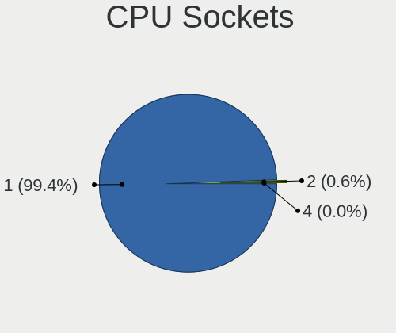

| Number | Computers | Percent |
|--------|-----------|---------|
| 1      | 3374      | 99.44%  |
| 2      | 18        | 0.53%   |
| 4      | 1         | 0.03%   |

CPU Threads
-----------

Threads per core (Hyper-Threading)

| Number  | Computers | Percent |
|---------|-----------|---------|
| 1       | 1910      | 55.86%  |
| 2       | 1508      | 44.11%  |
| Unknown | 1         | 0.03%   |

CPU Op-Modes
------------

CPU Operation Modes (32-bit, 64-bit)

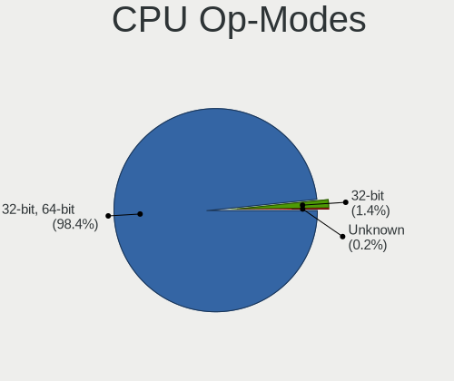

| Op mode        | Computers | Percent |
|----------------|-----------|---------|
| 32-bit, 64-bit | 3335      | 98.26%  |
| 32-bit         | 51        | 1.5%    |
| Unknown        | 8         | 0.24%   |

CPU Microcode
-------------

Microcode number

| Number     | Computers | Percent |
|------------|-----------|---------|
| 0x1067a    | 350       | 9.97%   |
| 0x206a7    | 325       | 9.26%   |
| Unknown    | 287       | 8.18%   |
| 0x306a9    | 282       | 8.03%   |
| 0x306c3    | 187       | 5.33%   |
| 0x20655    | 129       | 3.68%   |
| 0x6fd      | 105       | 2.99%   |
| 0x06001119 | 99        | 2.82%   |
| 0x10676    | 94        | 2.68%   |
| 0x40651    | 82        | 2.34%   |
| 0x010000c8 | 68        | 1.94%   |
| 0x306d4    | 63        | 1.79%   |
| 0x506e3    | 60        | 1.71%   |
| 0x6fb      | 59        | 1.68%   |
| 0x20652    | 54        | 1.54%   |
| 0x906ea    | 52        | 1.48%   |
| 0x906e9    | 51        | 1.45%   |
| 0x406c4    | 51        | 1.45%   |
| 0x806e9    | 50        | 1.42%   |
| 0x406e3    | 50        | 1.42%   |
| 0x106ca    | 49        | 1.4%    |
| 0x30678    | 45        | 1.28%   |
| 0x05000119 | 44        | 1.25%   |
| 0x07030105 | 36        | 1.03%   |
| 0x806ea    | 35        | 1%      |
| 0x0700010f | 29        | 0.83%   |
| 0x6f6      | 28        | 0.8%    |
| 0x6f2      | 27        | 0.77%   |
| 0x06003106 | 27        | 0.77%   |
| 0x06000852 | 26        | 0.74%   |
| 0x106c2    | 24        | 0.68%   |
| 0x03000027 | 22        | 0.63%   |
| 0x706a1    | 21        | 0.6%    |
| 0x406c3    | 21        | 0.6%    |
| 0x506c9    | 19        | 0.54%   |
| 0x0600084f | 19        | 0.54%   |
| 0x806ec    | 18        | 0.51%   |
| 0x10661    | 18        | 0.51%   |
| 0x06006705 | 17        | 0.48%   |
| 0x0800820d | 16        | 0.46%   |

CPU Microarch
-------------

Microarchitecture

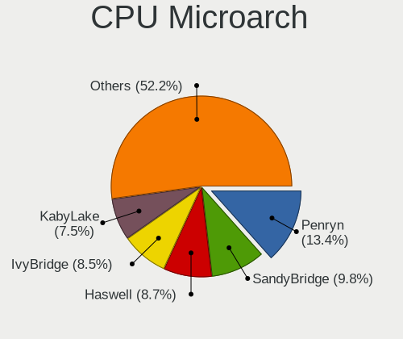

| Name             | Computers | Percent |
|------------------|-----------|---------|
| Penryn           | 458       | 13.49%  |
| SandyBridge      | 329       | 9.69%   |
| Haswell          | 292       | 8.6%    |
| IvyBridge        | 290       | 8.54%   |
| KabyLake         | 247       | 7.28%   |
| Core             | 246       | 7.25%   |
| Westmere         | 205       | 6.04%   |
| Piledriver       | 146       | 4.3%    |
| Silvermont       | 133       | 3.92%   |
| Skylake          | 129       | 3.8%    |
| K10              | 125       | 3.68%   |
| Bonnell          | 78        | 2.3%    |
| K8 Hammer        | 74        | 2.18%   |
| Broadwell        | 70        | 2.06%   |
| Bobcat           | 62        | 1.83%   |
| Puma             | 52        | 1.53%   |
| Excavator        | 46        | 1.36%   |
| NetBurst         | 44        | 1.3%    |
| Zen              | 41        | 1.21%   |
| Zen+             | 35        | 1.03%   |
| Steamroller      | 34        | 1%      |
| Jaguar           | 33        | 0.97%   |
| Goldmont plus    | 30        | 0.88%   |
| Nehalem          | 28        | 0.82%   |
| P6               | 27        | 0.8%    |
| Zen 2            | 23        | 0.68%   |
| Goldmont         | 23        | 0.68%   |
| K10 Llano        | 22        | 0.65%   |
| Zen 3            | 17        | 0.5%    |
| TigerLake        | 14        | 0.41%   |
| CometLake        | 13        | 0.38%   |
| Bulldozer        | 13        | 0.38%   |
| K8 & K10 hybrid  | 7         | 0.21%   |
| Unknown          | 5         | 0.15%   |
| Alderlake Hybrid | 3         | 0.09%   |

Graphics
--------

GPU Vendor
----------

Vendors of graphics cards

| Vendor                                       | Computers | Percent |
|----------------------------------------------|-----------|---------|
| Intel                                        | 1964      | 51.17%  |
| Nvidia                                       | 929       | 24.21%  |
| AMD                                          | 925       | 24.1%   |
| VIA Technologies                             | 11        | 0.29%   |
| XGI Technology (eXtreme Graphics Innovation) | 2         | 0.05%   |
| Silicon Integrated Systems [SiS]             | 2         | 0.05%   |
| Matrox Electronics Systems                   | 2         | 0.05%   |
| ATI Technologies                             | 2         | 0.05%   |
| Zhaoxin                                      | 1         | 0.03%   |

GPU Model
---------

Graphics card models

| Model                                                                                    | Computers | Percent |
|------------------------------------------------------------------------------------------|-----------|---------|
| Intel 2nd Generation Core Processor Family Integrated Graphics Controller                | 245       | 5.99%   |
| Intel 3rd Gen Core processor Graphics Controller                                         | 191       | 4.67%   |
| Intel Mobile 4 Series Chipset Integrated Graphics Controller                             | 157       | 3.84%   |
| Intel Core Processor Integrated Graphics Controller                                      | 123       | 3.01%   |
| Intel Haswell-ULT Integrated Graphics Controller                                         | 90        | 2.2%    |
| Intel 4 Series Chipset Integrated Graphics Controller                                    | 78        | 1.91%   |
| Intel Atom/Celeron/Pentium Processor x5-E8000/J3xxx/N3xxx Integrated Graphics Controller | 74        | 1.81%   |
| Intel Xeon E3-1200 v3/4th Gen Core Processor Integrated Graphics Controller              | 68        | 1.66%   |
| Intel Mobile GM965/GL960 Integrated Graphics Controller (secondary)                      | 68        | 1.66%   |
| Intel Mobile GM965/GL960 Integrated Graphics Controller (primary)                        | 68        | 1.66%   |
| Intel HD Graphics 5500                                                                   | 62        | 1.52%   |
| Intel Mobile 945GM/GMS/GME, 943/940GML Express Integrated Graphics Controller            | 61        | 1.49%   |
| Intel Atom Processor Z36xxx/Z37xxx Series Graphics & Display                             | 59        | 1.44%   |
| Intel HD Graphics 620                                                                    | 56        | 1.37%   |
| Nvidia GK208B [GeForce GT 710]                                                           | 52        | 1.27%   |
| Intel Skylake GT2 [HD Graphics 520]                                                      | 52        | 1.27%   |
| Intel 4th Gen Core Processor Integrated Graphics Controller                              | 49        | 1.2%    |
| Intel Atom Processor D4xx/D5xx/N4xx/N5xx Integrated Graphics Controller                  | 47        | 1.15%   |
| Intel HD Graphics 530                                                                    | 45        | 1.1%    |
| Intel Xeon E3-1200 v2/3rd Gen Core processor Graphics Controller                         | 43        | 1.05%   |
| Intel Mobile 945GM/GMS, 943/940GML Express Integrated Graphics Controller                | 43        | 1.05%   |
| Nvidia GT218 [GeForce 210]                                                               | 42        | 1.03%   |
| Intel 82G33/G31 Express Integrated Graphics Controller                                   | 42        | 1.03%   |
| AMD Mullins [Radeon R4/R5 Graphics]                                                      | 37        | 0.91%   |
| AMD Caicos [Radeon HD 6450/7450/8450 / R5 230 OEM]                                       | 36        | 0.88%   |
| Intel 4th Generation Core Processor Family Integrated Graphics Controller                | 35        | 0.86%   |
| AMD Richland [Radeon HD 8570D]                                                           | 34        | 0.83%   |
| AMD Ellesmere [Radeon RX 470/480/570/570X/580/580X/590]                                  | 32        | 0.78%   |
| Intel UHD Graphics 620                                                                   | 30        | 0.73%   |
| Intel CoffeeLake-S GT2 [UHD Graphics 630]                                                | 30        | 0.73%   |
| AMD Cedar [Radeon HD 5000/6000/7350/8350 Series]                                         | 30        | 0.73%   |
| Nvidia GF117M [GeForce 610M/710M/810M/820M / GT 620M/625M/630M/720M]                     | 29        | 0.71%   |
| AMD Sun XT [Radeon HD 8670A/8670M/8690M / R5 M330 / M430 / Radeon 520 Mobile]            | 26        | 0.64%   |
| Intel 82945G/GZ Integrated Graphics Controller                                           | 25        | 0.61%   |
| AMD Oland PRO [Radeon R7 240/340 / Radeon 520]                                           | 24        | 0.59%   |
| Nvidia GK208BM [GeForce 920M]                                                            | 23        | 0.56%   |
| AMD Topaz XT [Radeon R7 M260/M265 / M340/M360 / M440/M445 / 530/535 / 620/625 Mobile]    | 23        | 0.56%   |
| AMD Stoney [Radeon R2/R3/R4/R5 Graphics]                                                 | 23        | 0.56%   |
| Nvidia GP107 [GeForce GTX 1050 Ti]                                                       | 22        | 0.54%   |
| Intel HD Graphics 630                                                                    | 22        | 0.54%   |

GPU Combo
---------

Combinations of graphics cards

| Name           | Computers | Percent |
|----------------|-----------|---------|
| 1 x Intel      | 1578      | 45.79%  |
| 1 x AMD        | 745       | 21.62%  |
| 1 x Nvidia     | 633       | 18.37%  |
| Intel + Nvidia | 282       | 8.18%   |
| 2 x AMD        | 93        | 2.7%    |
| Intel + AMD    | 82        | 2.38%   |
| 1 x VIA        | 11        | 0.32%   |
| AMD + Nvidia   | 11        | 0.32%   |
| 2 x Nvidia     | 4         | 0.12%   |
| 1 x SiS        | 2         | 0.06%   |
| 1 x Matrox     | 2         | 0.06%   |
| 1 x Zhaoxin    | 1         | 0.03%   |
| 1 x XGI        | 1         | 0.03%   |
| AMD + XGI      | 1         | 0.03%   |

GPU Driver
----------

Free vs proprietary

| Driver      | Computers | Percent |
|-------------|-----------|---------|
| Free        | 3312      | 96.93%  |
| Unknown     | 99        | 2.9%    |
| Proprietary | 6         | 0.18%   |

GPU Memory
----------

Total video memory

| Size in GB | Computers | Percent |
|------------|-----------|---------|
| Unknown    | 1644      | 46.38%  |
| 0.01-0.5   | 693       | 19.55%  |
| 0.51-1.0   | 524       | 14.78%  |
| 1.01-2.0   | 440       | 12.41%  |
| 3.01-4.0   | 132       | 3.72%   |
| 7.01-8.0   | 40        | 1.13%   |
| 5.01-6.0   | 33        | 0.93%   |
| 2.01-3.0   | 25        | 0.71%   |
| 8.01-16.0  | 13        | 0.37%   |
| 4.01-5.0   | 1         | 0.03%   |

Monitor
-------

Monitor Vendor
--------------

Monitor vendors

| Vendor                  | Computers | Percent |
|-------------------------|-----------|---------|
| Samsung Electronics     | 607       | 17.44%  |
| LG Display              | 400       | 11.49%  |
| AU Optronics            | 370       | 10.63%  |
| Goldstar                | 271       | 7.79%   |
| Chimei Innolux          | 221       | 6.35%   |
| BOE                     | 159       | 4.57%   |
| Dell                    | 134       | 3.85%   |
| Chi Mei Optoelectronics | 134       | 3.85%   |
| Hewlett-Packard         | 109       | 3.13%   |
| Philips                 | 92        | 2.64%   |
| Lenovo                  | 92        | 2.64%   |
| Acer                    | 89        | 2.56%   |
| BenQ                    | 84        | 2.41%   |
| Ancor Communications    | 79        | 2.27%   |
| AOC                     | 52        | 1.49%   |
| Fujitsu Siemens         | 48        | 1.38%   |
| LG Philips              | 35        | 1.01%   |
| Apple                   | 32        | 0.92%   |
| HannStar                | 29        | 0.83%   |
| Vestel Elektronik       | 25        | 0.72%   |
| InfoVision              | 24        | 0.69%   |
| Eizo                    | 23        | 0.66%   |
| Iiyama                  | 21        | 0.6%    |
| Sony                    | 20        | 0.57%   |
| NEC Computers           | 17        | 0.49%   |
| HKC                     | 17        | 0.49%   |
| CPT                     | 16        | 0.46%   |
| ASUSTek Computer        | 15        | 0.43%   |
| ViewSonic               | 14        | 0.4%    |
| Toshiba                 | 14        | 0.4%    |
| Medion                  | 14        | 0.4%    |
| PANDA                   | 12        | 0.34%   |
| InnoLux Display         | 11        | 0.32%   |
| Plain Tree Systems      | 10        | 0.29%   |
| Panasonic               | 10        | 0.29%   |
| IBM                     | 10        | 0.29%   |
| Quanta Display          | 9         | 0.26%   |
| OEM                     | 9         | 0.26%   |
| Belinea                 | 9         | 0.26%   |
| MStar                   | 8         | 0.23%   |

Monitor Model
-------------

Monitor models

| Model                                                                    | Computers | Percent |
|--------------------------------------------------------------------------|-----------|---------|
| LG Display LCD Monitor LGD0395 1366x768 344x194mm 15.5-inch              | 47        | 1.32%   |
| Samsung Electronics LCD Monitor SEC5441 1366x768 344x194mm 15.5-inch     | 32        | 0.9%    |
| BenQ EW277HDR BNQ7948 1920x1080 598x336mm 27.0-inch                      | 30        | 0.84%   |
| AU Optronics LCD Monitor AUO38ED 1920x1080 344x193mm 15.5-inch           | 27        | 0.76%   |
| Chi Mei Optoelectronics LCD Monitor CMO15A7 1366x768 344x193mm 15.5-inch | 26        | 0.73%   |
| Vestel Elektronik 22W_LCD_TV VES3700 1920x540                            | 25        | 0.7%    |
| LG Display LCD Monitor LGD02DC 1366x768 344x194mm 15.5-inch              | 25        | 0.7%    |
| AU Optronics LCD Monitor AUO22EC 1366x768 344x193mm 15.5-inch            | 24        | 0.67%   |
| BOE LCD Monitor BOE06A5 1366x768 344x194mm 15.5-inch                     | 23        | 0.65%   |
| AU Optronics LCD Monitor AUO26EC 1366x768 344x193mm 15.5-inch            | 19        | 0.53%   |
| Chimei Innolux LCD Monitor CMN15DB 1366x768 344x193mm 15.5-inch          | 18        | 0.51%   |
| LG Display LCD Monitor LGD033A 1366x768 344x194mm 15.5-inch              | 16        | 0.45%   |
| Chi Mei Optoelectronics LCD Monitor CMO1592 1366x768 344x193mm 15.5-inch | 15        | 0.42%   |
| Goldstar 2D HD TV GSM59CA 1366x768 509x286mm 23.0-inch                   | 14        | 0.39%   |
| LG Display LP156WH2-TLAA LGD0230 1366x768 344x194mm 15.5-inch            | 13        | 0.37%   |
| Chimei Innolux LCD Monitor CMN15CA 1366x768 344x193mm 15.5-inch          | 13        | 0.37%   |
| BOE LCD Monitor BOE0675 1366x768 344x194mm 15.5-inch                     | 13        | 0.37%   |
| HKC '' HKC1850 1360x768 304x228mm 15.0-inch                              | 12        | 0.34%   |
| BOE LCD Monitor BOE0672 1366x768 344x194mm 15.5-inch                     | 12        | 0.34%   |
| AU Optronics LCD Monitor AUO10EC 1366x768 344x193mm 15.5-inch            | 12        | 0.34%   |
| Samsung Electronics S19B150 SAM08A2 1366x768 410x230mm 18.5-inch         | 11        | 0.31%   |
| Chimei Innolux LCD Monitor CMN15AB 1366x768 344x193mm 15.5-inch          | 11        | 0.31%   |
| Ancor Communications ASUS VW193D ACI19D5 1440x900 408x255mm 18.9-inch    | 11        | 0.31%   |
| LG Display LCD Monitor LGD0365 1600x900 382x215mm 17.3-inch              | 10        | 0.28%   |
| Chimei Innolux LCD Monitor CMN1734 1600x900 382x214mm 17.2-inch          | 10        | 0.28%   |
| Chimei Innolux LCD Monitor CMN15BC 1366x768 344x194mm 15.5-inch          | 10        | 0.28%   |
| AU Optronics LCD Monitor AUO23EC 1366x768 344x193mm 15.5-inch            | 10        | 0.28%   |
| AU Optronics LCD Monitor AUO20EC 1366x768 344x193mm 15.5-inch            | 10        | 0.28%   |
| AOC Q32G1WG4 AOC3201 2560x1440 697x393mm 31.5-inch                       | 10        | 0.28%   |
| Samsung Electronics SyncMaster SAM011E 1280x1024 338x270mm 17.0-inch     | 9         | 0.25%   |
| Samsung Electronics LCD Monitor SEC3046 1366x768 344x193mm 15.5-inch     | 9         | 0.25%   |
| Samsung Electronics C24F390 SAM0D2C 1920x1080 521x293mm 23.5-inch        | 9         | 0.25%   |
| OEM 26W_LCD_TV OEM3700 1920x540                                          | 9         | 0.25%   |
| LG Display LCD Monitor LGD03AB 1366x768 344x194mm 15.5-inch              | 9         | 0.25%   |
| Iiyama PL2473HD IVM6107 1920x1080 521x293mm 23.5-inch                    | 9         | 0.25%   |
| Goldstar W1934 GSM4B7A 1440x900 410x256mm 19.0-inch                      | 9         | 0.25%   |
| Goldstar E1940 GSM4BD6 1360x768 406x229mm 18.4-inch                      | 9         | 0.25%   |
| Chimei Innolux LCD Monitor CMN1119 1366x768 256x144mm 11.6-inch          | 9         | 0.25%   |
| AU Optronics LCD Monitor AUO46EC 1366x768 344x193mm 15.5-inch            | 9         | 0.25%   |
| AU Optronics LCD Monitor AUO21ED 1920x1080 344x193mm 15.5-inch           | 9         | 0.25%   |

Monitor Resolution
------------------

Monitor screen resolution

| Resolution         | Computers | Percent |
|--------------------|-----------|---------|
| 1366x768 (WXGA)    | 1022      | 29.98%  |
| 1920x1080 (FHD)    | 985       | 28.89%  |
| 1280x1024 (SXGA)   | 250       | 7.33%   |
| 1280x800 (WXGA)    | 195       | 5.72%   |
| 1600x900 (HD+)     | 190       | 5.57%   |
| 1680x1050 (WSXGA+) | 171       | 5.02%   |
| 1440x900 (WXGA+)   | 167       | 4.9%    |
| 3840x2160 (4K)     | 110       | 3.23%   |
| 1360x768           | 49        | 1.44%   |
| 1920x1200 (WUXGA)  | 48        | 1.41%   |
| 1024x600           | 47        | 1.38%   |
| 1024x768 (XGA)     | 33        | 0.97%   |
| 2560x1440 (QHD)    | 32        | 0.94%   |
| 2560x1080          | 27        | 0.79%   |
| 1920x540           | 19        | 0.56%   |
| 3840x1080          | 9         | 0.26%   |
| 1600x1200          | 9         | 0.26%   |
| 1280x720 (HD)      | 9         | 0.26%   |
| 2288x1287          | 7         | 0.21%   |
| 1152x864           | 4         | 0.12%   |
| 3440x1440          | 3         | 0.09%   |
| 1280x768           | 3         | 0.09%   |
| 2736x1824          | 2         | 0.06%   |
| 2560x1600          | 2         | 0.06%   |
| 1680x945           | 2         | 0.06%   |
| 1280x960           | 2         | 0.06%   |
| 800x600            | 1         | 0.03%   |
| 800x1280           | 1         | 0.03%   |
| 4093x4093          | 1         | 0.03%   |
| 3840x2400          | 1         | 0.03%   |
| 3840x1200          | 1         | 0.03%   |
| 2880x1200          | 1         | 0.03%   |
| 2160x1440          | 1         | 0.03%   |
| 2048x1536          | 1         | 0.03%   |
| 1920x1280          | 1         | 0.03%   |
| 1400x1050          | 1         | 0.03%   |
| 1024x576           | 1         | 0.03%   |
| Unknown            | 1         | 0.03%   |

Monitor Diagonal
----------------

Diagonal size in inches

| Inches  | Computers | Percent |
|---------|-----------|---------|
| 15      | 1141      | 32.6%   |
| 17      | 269       | 7.69%   |
| 21      | 262       | 7.49%   |
| 19      | 225       | 6.43%   |
| 14      | 197       | 5.63%   |
| 23      | 195       | 5.57%   |
| 24      | 144       | 4.11%   |
| 27      | 139       | 3.97%   |
| 13      | 127       | 3.63%   |
| 18      | 124       | 3.54%   |
| 22      | 116       | 3.31%   |
| 20      | 79        | 2.26%   |
| 12      | 71        | 2.03%   |
| 10      | 54        | 1.54%   |
| 11      | 51        | 1.46%   |
| Unknown | 44        | 1.26%   |
| 31      | 39        | 1.11%   |
| 84      | 35        | 1%      |
| 34      | 29        | 0.83%   |
| 72      | 17        | 0.49%   |
| 40      | 16        | 0.46%   |
| 32      | 16        | 0.46%   |
| 65      | 11        | 0.31%   |
| 54      | 11        | 0.31%   |
| 52      | 10        | 0.29%   |
| 49      | 7         | 0.2%    |
| 48      | 7         | 0.2%    |
| 42      | 7         | 0.2%    |
| 26      | 6         | 0.17%   |
| 25      | 6         | 0.17%   |
| 8       | 5         | 0.14%   |
| 142     | 4         | 0.11%   |
| 46      | 4         | 0.11%   |
| 16      | 4         | 0.11%   |
| 60      | 3         | 0.09%   |
| 58      | 3         | 0.09%   |
| 39      | 3         | 0.09%   |
| 29      | 3         | 0.09%   |
| 55      | 2         | 0.06%   |
| 85      | 1         | 0.03%   |

Monitor Width
-------------

Physical width

| Width in mm    | Computers | Percent |
|----------------|-----------|---------|
| 301-350        | 1466      | 42.47%  |
| 401-500        | 645       | 18.68%  |
| 501-600        | 465       | 13.47%  |
| 351-400        | 330       | 9.56%   |
| 201-300        | 250       | 7.24%   |
| 1001-1500      | 63        | 1.83%   |
| 1501-2000      | 53        | 1.54%   |
| 601-700        | 48        | 1.39%   |
| 701-800        | 46        | 1.33%   |
| Unknown        | 44        | 1.27%   |
| 801-900        | 22        | 0.64%   |
| 901-1000       | 9         | 0.26%   |
| 101-200        | 6         | 0.17%   |
| More than 2000 | 4         | 0.12%   |
| 1-100          | 1         | 0.03%   |

Aspect Ratio
------------

Proportional relationship between the width and the height

| Ratio   | Computers | Percent |
|---------|-----------|---------|
| 16/9    | 2331      | 70.92%  |
| 16/10   | 554       | 16.85%  |
| 5/4     | 248       | 7.54%   |
| 4/3     | 60        | 1.83%   |
| 21/9    | 31        | 0.94%   |
| 3/2     | 26        | 0.79%   |
| Unknown | 12        | 0.37%   |
| 32/9    | 10        | 0.3%    |
| 6/5     | 7         | 0.21%   |
| 1.00    | 6         | 0.18%   |
| 0.67    | 1         | 0.03%   |
| 0.62    | 1         | 0.03%   |

Monitor Area
------------

Area in inch

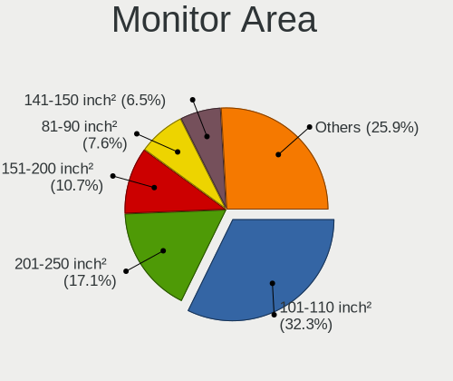

| Area in inch | Computers | Percent |
|----------------|-----------|---------|
| 101-110        | 1127      | 32.47%  |
| 201-250        | 593       | 17.08%  |
| 151-200        | 379       | 10.92%  |
| 81-90          | 263       | 7.58%   |
| 141-150        | 224       | 6.45%   |
| 301-350        | 142       | 4.09%   |
| 121-130        | 108       | 3.11%   |
| More than 1000 | 104       | 3%      |
| 351-500        | 87        | 2.51%   |
| 71-80          | 61        | 1.76%   |
| 61-70          | 61        | 1.76%   |
| 251-300        | 57        | 1.64%   |
| 41-50          | 53        | 1.53%   |
| 51-60          | 52        | 1.5%    |
| 501-1000       | 44        | 1.27%   |
| Unknown        | 44        | 1.27%   |
| 131-140        | 40        | 1.15%   |
| 111-120        | 14        | 0.4%    |
| 91-100         | 11        | 0.32%   |
| 1-40           | 7         | 0.2%    |

Pixel Density
-------------

Pixels per inch

| Density       | Computers | Percent |
|---------------|-----------|---------|
| 51-100        | 1467      | 43.66%  |
| 101-120       | 1236      | 36.79%  |
| 121-160       | 481       | 14.32%  |
| 1-50          | 84        | 2.5%    |
| Unknown       | 44        | 1.31%   |
| 161-240       | 43        | 1.28%   |
| More than 240 | 5         | 0.15%   |

Multiple Monitors
-----------------

Total monitors connected

| Total | Computers | Percent |
|-------|-----------|---------|
| 1     | 3160      | 90.75%  |
| 2     | 247       | 7.09%   |
| 0     | 47        | 1.35%   |
| 3     | 23        | 0.66%   |
| 4     | 5         | 0.14%   |

Network
-------

Net Controller Vendor
---------------------

Controller vendors

| Vendor                            | Computers | Percent |
|-----------------------------------|-----------|---------|
| Realtek Semiconductor             | 1795      | 34.98%  |
| Intel                             | 1197      | 23.32%  |
| Qualcomm Atheros                  | 837       | 16.31%  |
| Broadcom                          | 400       | 7.79%   |
| Broadcom Limited                  | 134       | 2.61%   |
| Ralink                            | 130       | 2.53%   |
| Marvell Technology Group          | 101       | 1.97%   |
| Ralink Technology                 | 77        | 1.5%    |
| Nvidia                            | 69        | 1.34%   |
| Qualcomm Atheros Communications   | 57        | 1.11%   |
| TP-Link                           | 36        | 0.7%    |
| Huawei Technologies               | 24        | 0.47%   |
| Samsung Electronics               | 23        | 0.45%   |
| VIA Technologies                  | 20        | 0.39%   |
| JMicron Technology                | 19        | 0.37%   |
| Dell                              | 18        | 0.35%   |
| Hewlett-Packard                   | 15        | 0.29%   |
| Ericsson Business Mobile Networks | 14        | 0.27%   |
| Xiaomi                            | 13        | 0.25%   |
| D-Link                            | 13        | 0.25%   |
| ASUSTek Computer                  | 13        | 0.25%   |
| DisplayLink                       | 11        | 0.21%   |
| Sierra Wireless                   | 10        | 0.19%   |
| D-Link System                     | 9         | 0.18%   |
| Attansic Technology               | 9         | 0.18%   |
| ASIX Electronics                  | 8         | 0.16%   |
| IMC Networks                      | 7         | 0.14%   |
| NetGear                           | 6         | 0.12%   |
| MediaTek                          | 6         | 0.12%   |
| Belkin Components                 | 6         | 0.12%   |
| Microsoft                         | 5         | 0.1%    |
| T & A Mobile Phones               | 4         | 0.08%   |
| Edimax Technology                 | 4         | 0.08%   |
| Accton Technology                 | 4         | 0.08%   |
| Silicon Integrated Systems [SiS]  | 3         | 0.06%   |
| LG Electronics                    | 2         | 0.04%   |
| HMD Global                        | 2         | 0.04%   |
| Fujitsu Siemens Computers         | 2         | 0.04%   |
| Aquantia                          | 2         | 0.04%   |
| AMD                               | 2         | 0.04%   |

Net Controller Model
--------------------

Controller models

| Model                                                                   | Computers | Percent |
|-------------------------------------------------------------------------|-----------|---------|
| Realtek RTL8111/8168/8211/8411 PCI Express Gigabit Ethernet Controller  | 1231      | 20.9%   |
| Realtek RTL810xE PCI Express Fast Ethernet controller                   | 375       | 6.37%   |
| Intel 82579LM Gigabit Network Connection (Lewisville)                   | 177       | 3.01%   |
| Qualcomm Atheros AR9285 Wireless Network Adapter (PCI-Express)          | 152       | 2.58%   |
| Qualcomm Atheros QCA9565 / AR9565 Wireless Network Adapter              | 123       | 2.09%   |
| Qualcomm Atheros AR9485 Wireless Network Adapter                        | 89        | 1.51%   |
| Qualcomm Atheros QCA9377 802.11ac Wireless Network Adapter              | 84        | 1.43%   |
| Intel Centrino Advanced-N 6205 [Taylor Peak]                            | 77        | 1.31%   |
| Intel Wireless 7260                                                     | 76        | 1.29%   |
| Realtek RTL8723BE PCIe Wireless Network Adapter                         | 73        | 1.24%   |
| Ralink RT3290 Wireless 802.11n 1T/1R PCIe                               | 73        | 1.24%   |
| Intel PRO/Wireless 3945ABG [Golan] Network Connection                   | 71        | 1.21%   |
| Broadcom BCM4313 802.11bgn Wireless Network Adapter                     | 59        | 1%      |
| Intel 82577LM Gigabit Network Connection                                | 58        | 0.98%   |
| Intel 82567LM-3 Gigabit Network Connection                              | 56        | 0.95%   |
| Intel Ethernet Connection I217-LM                                       | 55        | 0.93%   |
| Qualcomm Atheros AR242x / AR542x Wireless Network Adapter (PCI-Express) | 53        | 0.9%    |
| Qualcomm Atheros AR9271 802.11n                                         | 49        | 0.83%   |
| Qualcomm Atheros QCA8171 Gigabit Ethernet                               | 48        | 0.82%   |
| Intel Wireless 7265                                                     | 47        | 0.8%    |
| Realtek RTL-8100/8101L/8139 PCI Fast Ethernet Adapter                   | 46        | 0.78%   |
| Intel Centrino Advanced-N 6200                                          | 46        | 0.78%   |
| Intel 82567LM Gigabit Network Connection                                | 46        | 0.78%   |
| Intel Wireless 3165                                                     | 44        | 0.75%   |
| Intel Wireless 8265 / 8275                                              | 43        | 0.73%   |
| Qualcomm Atheros AR8132 Fast Ethernet                                   | 38        | 0.65%   |
| Qualcomm Atheros AR8151 v2.0 Gigabit Ethernet                           | 37        | 0.63%   |
| Intel Wireless 3160                                                     | 36        | 0.61%   |
| Intel Ethernet Connection (2) I219-V                                    | 36        | 0.61%   |
| Intel Centrino Ultimate-N 6300                                          | 36        | 0.61%   |
| Qualcomm Atheros AR8121/AR8113/AR8114 Gigabit or Fast Ethernet          | 35        | 0.59%   |
| Intel PRO/Wireless 4965 AG or AGN [Kedron] Network Connection           | 35        | 0.59%   |
| Realtek RTL8188EUS 802.11n Wireless Network Adapter                     | 33        | 0.56%   |
| Intel WiFi Link 5100                                                    | 33        | 0.56%   |
| Intel PRO/Wireless 5100 AGN [Shiloh] Network Connection                 | 33        | 0.56%   |
| Intel 82566DM-2 Gigabit Network Connection                              | 33        | 0.56%   |
| Broadcom BCM43142 802.11b/g/n                                           | 33        | 0.56%   |
| Qualcomm Atheros AR8131 Gigabit Ethernet                                | 31        | 0.53%   |
| Nvidia MCP61 Ethernet                                                   | 31        | 0.53%   |
| Realtek RTL8821AE 802.11ac PCIe Wireless Network Adapter                | 30        | 0.51%   |

Wireless Vendor
---------------

Wireless vendors

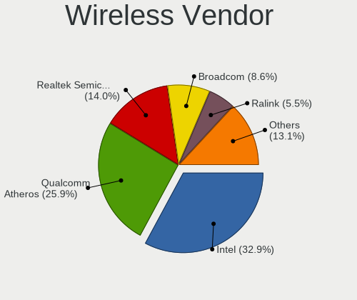

| Vendor                                | Computers | Percent |
|---------------------------------------|-----------|---------|
| Intel                                 | 779       | 32.43%  |
| Qualcomm Atheros                      | 634       | 26.39%  |
| Realtek Semiconductor                 | 335       | 13.95%  |
| Broadcom                              | 213       | 8.87%   |
| Ralink                                | 130       | 5.41%   |
| Ralink Technology                     | 77        | 3.21%   |
| Qualcomm Atheros Communications       | 57        | 2.37%   |
| Broadcom Limited                      | 43        | 1.79%   |
| TP-Link                               | 36        | 1.5%    |
| ASUSTek Computer                      | 13        | 0.54%   |
| D-Link                                | 12        | 0.5%    |
| Sierra Wireless                       | 10        | 0.42%   |
| Dell                                  | 10        | 0.42%   |
| IMC Networks                          | 7         | 0.29%   |
| NetGear                               | 6         | 0.25%   |
| Belkin Components                     | 6         | 0.25%   |
| Microsoft                             | 5         | 0.21%   |
| D-Link System                         | 5         | 0.21%   |
| Edimax Technology                     | 4         | 0.17%   |
| MediaTek                              | 3         | 0.12%   |
| Hewlett-Packard                       | 3         | 0.12%   |
| Marvell Technology Group              | 2         | 0.08%   |
| Fujitsu Siemens Computers             | 2         | 0.08%   |
| ZyXEL Communications                  | 1         | 0.04%   |
| ZyDAS                                 | 1         | 0.04%   |
| Wacom                                 | 1         | 0.04%   |
| TRENDnet                              | 1         | 0.04%   |
| Texas Instruments                     | 1         | 0.04%   |
| Micro Star International              | 1         | 0.04%   |
| Mercucys                              | 1         | 0.04%   |
| Gemtek                                | 1         | 0.04%   |
| AVM                                   | 1         | 0.04%   |
| 802.11g Adapter [Linksys WUSB54GC v3] | 1         | 0.04%   |

Wireless Model
--------------

Wireless models

| Model                                                                   | Computers | Percent |
|-------------------------------------------------------------------------|-----------|---------|
| Qualcomm Atheros AR9285 Wireless Network Adapter (PCI-Express)          | 152       | 6.29%   |
| Qualcomm Atheros QCA9565 / AR9565 Wireless Network Adapter              | 123       | 5.09%   |
| Qualcomm Atheros AR9485 Wireless Network Adapter                        | 89        | 3.68%   |
| Qualcomm Atheros QCA9377 802.11ac Wireless Network Adapter              | 84        | 3.48%   |
| Intel Centrino Advanced-N 6205 [Taylor Peak]                            | 77        | 3.19%   |
| Intel Wireless 7260                                                     | 76        | 3.15%   |
| Realtek RTL8723BE PCIe Wireless Network Adapter                         | 73        | 3.02%   |
| Ralink RT3290 Wireless 802.11n 1T/1R PCIe                               | 73        | 3.02%   |
| Intel PRO/Wireless 3945ABG [Golan] Network Connection                   | 71        | 2.94%   |
| Broadcom BCM4313 802.11bgn Wireless Network Adapter                     | 59        | 2.44%   |
| Qualcomm Atheros AR242x / AR542x Wireless Network Adapter (PCI-Express) | 53        | 2.19%   |
| Qualcomm Atheros AR9271 802.11n                                         | 49        | 2.03%   |
| Intel Wireless 7265                                                     | 47        | 1.95%   |
| Intel Centrino Advanced-N 6200                                          | 46        | 1.9%    |
| Intel Wireless 3165                                                     | 44        | 1.82%   |
| Intel Wireless 8265 / 8275                                              | 43        | 1.78%   |
| Intel Wireless 3160                                                     | 36        | 1.49%   |
| Intel Centrino Ultimate-N 6300                                          | 36        | 1.49%   |
| Intel PRO/Wireless 4965 AG or AGN [Kedron] Network Connection           | 35        | 1.45%   |
| Realtek RTL8188EUS 802.11n Wireless Network Adapter                     | 33        | 1.37%   |
| Intel WiFi Link 5100                                                    | 33        | 1.37%   |
| Intel PRO/Wireless 5100 AGN [Shiloh] Network Connection                 | 33        | 1.37%   |
| Broadcom BCM43142 802.11b/g/n                                           | 33        | 1.37%   |
| Realtek RTL8821AE 802.11ac PCIe Wireless Network Adapter                | 30        | 1.24%   |
| Qualcomm Atheros AR928X Wireless Network Adapter (PCI-Express)          | 30        | 1.24%   |
| Ralink MT7601U Wireless Adapter                                         | 28        | 1.16%   |
| Qualcomm Atheros AR9462 Wireless Network Adapter                        | 27        | 1.12%   |
| Broadcom BCM4312 802.11b/g LP-PHY                                       | 27        | 1.12%   |
| Realtek RTL8821CE 802.11ac PCIe Wireless Network Adapter                | 26        | 1.08%   |
| Qualcomm Atheros AR9287 Wireless Network Adapter (PCI-Express)          | 23        | 0.95%   |
| Realtek RTL8188CE 802.11b/g/n WiFi Adapter                              | 22        | 0.91%   |
| Realtek RTL8188EE Wireless Network Adapter                              | 21        | 0.87%   |
| Broadcom Limited BCM4312 802.11b/g LP-PHY                               | 21        | 0.87%   |
| Broadcom BCM43228 802.11a/b/g/n                                         | 21        | 0.87%   |
| Intel Dual Band Wireless-AC 3168NGW [Stone Peak]                        | 20        | 0.83%   |
| Ralink RT3090 Wireless 802.11n 1T/1R PCIe                               | 19        | 0.79%   |
| Ralink RT5370 Wireless Adapter                                          | 17        | 0.7%    |
| Intel Ultimate N WiFi Link 5300                                         | 17        | 0.7%    |
| Intel Cannon Lake PCH CNVi WiFi                                         | 17        | 0.7%    |
| Realtek RTL8191SEvB Wireless LAN Controller                             | 15        | 0.62%   |

Ethernet Vendor
---------------

Ethernet vendors

| Vendor                                 | Computers | Percent |
|----------------------------------------|-----------|---------|
| Realtek Semiconductor                  | 1699      | 50.19%  |
| Intel                                  | 746       | 22.04%  |
| Qualcomm Atheros                       | 305       | 9.01%   |
| Broadcom                               | 220       | 6.5%    |
| Marvell Technology Group               | 99        | 2.92%   |
| Broadcom Limited                       | 92        | 2.72%   |
| Nvidia                                 | 69        | 2.04%   |
| Samsung Electronics                    | 22        | 0.65%   |
| VIA Technologies                       | 19        | 0.56%   |
| JMicron Technology                     | 19        | 0.56%   |
| Huawei Technologies                    | 18        | 0.53%   |
| Xiaomi                                 | 13        | 0.38%   |
| DisplayLink                            | 11        | 0.32%   |
| Attansic Technology                    | 9         | 0.27%   |
| ASIX Electronics                       | 8         | 0.24%   |
| T & A Mobile Phones                    | 4         | 0.12%   |
| D-Link System                          | 4         | 0.12%   |
| Accton Technology                      | 4         | 0.12%   |
| Silicon Integrated Systems [SiS]       | 3         | 0.09%   |
| MediaTek                               | 2         | 0.06%   |
| LG Electronics                         | 2         | 0.06%   |
| HMD Global                             | 2         | 0.06%   |
| Aquantia                               | 2         | 0.06%   |
| ZTE WCDMA Technologies MSM             | 1         | 0.03%   |
| Westell                                | 1         | 0.03%   |
| TOMTOM                                 | 1         | 0.03%   |
| Spreadtrum Communications              | 1         | 0.03%   |
| Sony Ericsson Mobile Communications AB | 1         | 0.03%   |
| Qualcomm                               | 1         | 0.03%   |
| OPPO Electronics                       | 1         | 0.03%   |
| Motorola PCS                           | 1         | 0.03%   |
| ICS Advent                             | 1         | 0.03%   |
| IBM                                    | 1         | 0.03%   |
| Davicom Semiconductor                  | 1         | 0.03%   |
| D-Link                                 | 1         | 0.03%   |
| 3Com                                   | 1         | 0.03%   |

Ethernet Model
--------------

Ethernet models

| Model                                                                  | Computers | Percent |
|------------------------------------------------------------------------|-----------|---------|
| Realtek RTL8111/8168/8211/8411 PCI Express Gigabit Ethernet Controller | 1231      | 36%     |
| Realtek RTL810xE PCI Express Fast Ethernet controller                  | 375       | 10.97%  |
| Intel 82579LM Gigabit Network Connection (Lewisville)                  | 177       | 5.18%   |
| Intel 82577LM Gigabit Network Connection                               | 58        | 1.7%    |
| Intel 82567LM-3 Gigabit Network Connection                             | 56        | 1.64%   |
| Intel Ethernet Connection I217-LM                                      | 55        | 1.61%   |
| Qualcomm Atheros QCA8171 Gigabit Ethernet                              | 48        | 1.4%    |
| Realtek RTL-8100/8101L/8139 PCI Fast Ethernet Adapter                  | 46        | 1.35%   |
| Intel 82567LM Gigabit Network Connection                               | 46        | 1.35%   |
| Qualcomm Atheros AR8132 Fast Ethernet                                  | 38        | 1.11%   |
| Qualcomm Atheros AR8151 v2.0 Gigabit Ethernet                          | 37        | 1.08%   |
| Intel Ethernet Connection (2) I219-V                                   | 36        | 1.05%   |
| Qualcomm Atheros AR8121/AR8113/AR8114 Gigabit or Fast Ethernet         | 35        | 1.02%   |
| Intel 82566DM-2 Gigabit Network Connection                             | 33        | 0.97%   |
| Qualcomm Atheros AR8131 Gigabit Ethernet                               | 31        | 0.91%   |
| Nvidia MCP61 Ethernet                                                  | 31        | 0.91%   |
| Intel I211 Gigabit Network Connection                                  | 29        | 0.85%   |
| Intel 82579V Gigabit Network Connection                                | 29        | 0.85%   |
| Realtek RTL8169 PCI Gigabit Ethernet Controller                        | 26        | 0.76%   |
| Broadcom NetLink BCM57785 Gigabit Ethernet PCIe                        | 26        | 0.76%   |
| Intel Ethernet Connection I218-LM                                      | 25        | 0.73%   |
| Qualcomm Atheros AR8152 v2.0 Fast Ethernet                             | 24        | 0.7%    |
| Marvell Group 88E8040 PCI-E Fast Ethernet Controller                   | 23        | 0.67%   |
| Intel Ethernet Connection (2) I219-LM                                  | 23        | 0.67%   |
| Broadcom NetXtreme BCM5754 Gigabit Ethernet PCI Express                | 23        | 0.67%   |
| Intel 82566MM Gigabit Network Connection                               | 20        | 0.58%   |
| Broadcom NetXtreme BCM5761 Gigabit Ethernet PCIe                       | 20        | 0.58%   |
| Marvell Group 88E8056 PCI-E Gigabit Ethernet Controller                | 19        | 0.56%   |
| Intel Ethernet Connection I217-V                                       | 18        | 0.53%   |
| VIA VT6102/VT6103 [Rhine-II]                                           | 17        | 0.5%    |
| Qualcomm Atheros QCA8172 Fast Ethernet                                 | 17        | 0.5%    |
| JMicron JMC250 PCI Express Gigabit Ethernet Controller                 | 17        | 0.5%    |
| Broadcom NetLink BCM57780 Gigabit Ethernet PCIe                        | 17        | 0.5%    |
| Huawei VTR-L09                                                         | 16        | 0.47%   |
| Broadcom Limited NetLink BCM5787M Gigabit Ethernet PCI Express         | 16        | 0.47%   |
| Samsung Galaxy series, misc. (tethering mode)                          | 15        | 0.44%   |
| Nvidia MCP79 Ethernet                                                  | 15        | 0.44%   |
| Marvell Group 88E8055 PCI-E Gigabit Ethernet Controller                | 15        | 0.44%   |
| Intel Ethernet Connection (7) I219-V                                   | 15        | 0.44%   |
| Qualcomm Atheros AR8161 Gigabit Ethernet                               | 14        | 0.41%   |

Net Controller Kind
-------------------

Ethernet, WiFi or modem

| Kind     | Computers | Percent |
|----------|-----------|---------|
| Ethernet | 3245      | 58.08%  |
| WiFi     | 2288      | 40.95%  |
| Modem    | 52        | 0.93%   |
| Unknown  | 2         | 0.04%   |

Used Controller
---------------

Currently used network controller

| Kind     | Computers | Percent |
|----------|-----------|---------|
| Ethernet | 1842      | 51%     |
| WiFi     | 1770      | 49%     |

NICs
----

Total network controllers on board

| Total | Computers | Percent |
|-------|-----------|---------|
| 2     | 1964      | 57.49%  |
| 1     | 1382      | 40.46%  |
| 0     | 41        | 1.2%    |
| 3     | 23        | 0.67%   |
| 4     | 6         | 0.18%   |

IPv6
----

IPv6 vs IPv4

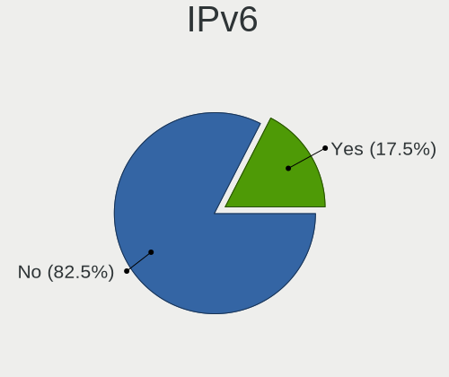

| Used | Computers | Percent |
|------|-----------|---------|
| No   | 3004      | 84.22%  |
| Yes  | 563       | 15.78%  |

Bluetooth
---------

Bluetooth Vendor
----------------

Controller vendors

| Vendor                          | Computers | Percent |
|---------------------------------|-----------|---------|
| Intel                           | 404       | 25.25%  |
| Qualcomm Atheros Communications | 182       | 11.38%  |
| Broadcom                        | 165       | 10.31%  |
| Cambridge Silicon Radio         | 137       | 8.56%   |
| Realtek Semiconductor           | 134       | 8.38%   |
| Dell                            | 84        | 5.25%   |
| Lite-On Technology              | 76        | 4.75%   |
| Ralink                          | 73        | 4.56%   |
| Hewlett-Packard                 | 68        | 4.25%   |
| Foxconn / Hon Hai               | 68        | 4.25%   |
| IMC Networks                    | 53        | 3.31%   |
| Toshiba                         | 36        | 2.25%   |
| Apple                           | 31        | 1.94%   |
| ASUSTek Computer                | 21        | 1.31%   |
| Foxconn International           | 8         | 0.5%    |
| Askey Computer                  | 8         | 0.5%    |
| Ralink Technology               | 7         | 0.44%   |
| Belkin Components               | 5         | 0.31%   |
| Alps Electric                   | 5         | 0.31%   |
| TP-Link                         | 4         | 0.25%   |
| Logitech                        | 4         | 0.25%   |
| Integrated System Solution      | 4         | 0.25%   |
| Conwise Technology              | 4         | 0.25%   |
| Chicony Electronics             | 4         | 0.25%   |
| Realtek                         | 3         | 0.19%   |
| Micro Star International        | 3         | 0.19%   |
| Taiyo Yuden                     | 2         | 0.13%   |
| Marvell Semiconductor           | 2         | 0.13%   |
| Edimax Technology               | 2         | 0.13%   |
| MediaTek                        | 1         | 0.06%   |
| Fujitsu Siemens Computers       | 1         | 0.06%   |
| Fujitsu                         | 1         | 0.06%   |

Bluetooth Model
---------------

Controller models

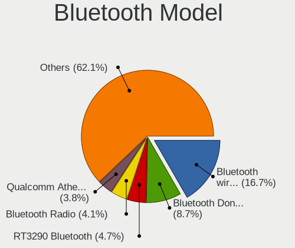

| Model                                               | Computers | Percent |
|-----------------------------------------------------|-----------|---------|
| Intel Bluetooth wireless interface                  | 211       | 13.16%  |
| Cambridge Silicon Radio Bluetooth Dongle (HCI mode) | 137       | 8.55%   |
| Ralink RT3290 Bluetooth                             | 73        | 4.55%   |
| Realtek Bluetooth Radio                             | 66        | 4.12%   |
| Qualcomm Atheros  Bluetooth Device                  | 63        | 3.93%   |
| Intel Bluetooth Device                              | 53        | 3.31%   |
| Qualcomm Atheros AR3011 Bluetooth                   | 43        | 2.68%   |
| Qualcomm Atheros AR3012 Bluetooth 4.0               | 37        | 2.31%   |
| Intel Bluetooth 9460/9560 Jefferson Peak (JfP)      | 37        | 2.31%   |
| Dell DW375 Bluetooth Module                         | 37        | 2.31%   |
| HP Broadcom 2070 Bluetooth Combo                    | 33        | 2.06%   |
| HP Bluetooth 2.0 Interface [Broadcom BCM2045]       | 32        | 2%      |
| Broadcom BCM2045B (BDC-2.1)                         | 30        | 1.87%   |
| Lite-On Qualcomm Atheros QCA9377 Bluetooth          | 26        | 1.62%   |
| Foxconn / Hon Hai Bluetooth Device                  | 24        | 1.5%    |
| Realtek RTL8821A Bluetooth                          | 23        | 1.43%   |
| Intel AX201 Bluetooth                               | 23        | 1.43%   |
| Broadcom HP Portable SoftSailing                    | 23        | 1.43%   |
| Lite-On Atheros AR3012 Bluetooth                    | 22        | 1.37%   |
| IMC Networks Bluetooth Device                       | 22        | 1.37%   |
| Realtek RTL8723B Bluetooth                          | 21        | 1.31%   |
| Intel Centrino Bluetooth Wireless Transceiver       | 21        | 1.31%   |
| Intel Centrino Advanced-N 6230 Bluetooth adapter    | 21        | 1.31%   |
| Intel Wireless-AC 3168 Bluetooth                    | 20        | 1.25%   |
| Broadcom BCM2045B (BDC-2.1) [Bluetooth Controller]  | 17        | 1.06%   |
| Realtek  Bluetooth 4.2 Adapter                      | 16        | 1%      |
| Toshiba Bluetooth Device                            | 15        | 0.94%   |
| Qualcomm Atheros AR9462 Bluetooth                   | 15        | 0.94%   |
| Lite-On Bluetooth Device                            | 15        | 0.94%   |
| Dell BCM20702A0 Bluetooth Module                    | 14        | 0.87%   |
| Broadcom BCM2070 Bluetooth Device                   | 13        | 0.81%   |
| Apple Bluetooth Host Controller                     | 13        | 0.81%   |
| Intel AX200 Bluetooth                               | 12        | 0.75%   |
| Dell Wireless 365 Bluetooth                         | 12        | 0.75%   |
| Broadcom BCM20702 Bluetooth 4.0 [ThinkPad]          | 12        | 0.75%   |
| IMC Networks Bluetooth Radio                        | 11        | 0.69%   |
| Foxconn / Hon Hai BCM20702A0                        | 10        | 0.62%   |
| Qualcomm Atheros QCA61x4 Bluetooth 4.0              | 9         | 0.56%   |
| IMC Networks Atheros AR3012 Bluetooth 4.0 Adapter   | 9         | 0.56%   |
| Broadcom BCM43142A0 Bluetooth 4.0                   | 9         | 0.56%   |

Sound
-----

Sound Vendor
------------

Sound card vendors

| Vendor                           | Computers | Percent |
|----------------------------------|-----------|---------|
| Intel                            | 2569      | 59.59%  |
| AMD                              | 908       | 21.06%  |
| Nvidia                           | 601       | 13.94%  |
| C-Media Electronics              | 62        | 1.44%   |
| Creative Labs                    | 41        | 0.95%   |
| VIA Technologies                 | 18        | 0.42%   |
| Logitech                         | 14        | 0.32%   |
| Texas Instruments                | 12        | 0.28%   |
| Creative Technology              | 9         | 0.21%   |
| JMTek                            | 6         | 0.14%   |
| Tenx Technology                  | 5         | 0.12%   |
| ASUSTek Computer                 | 5         | 0.12%   |
| Silicon Integrated Systems [SiS] | 4         | 0.09%   |
| Plantronics                      | 4         | 0.09%   |
| GN Netcom                        | 4         | 0.09%   |
| Generalplus Technology           | 3         | 0.07%   |
| Ensoniq                          | 3         | 0.07%   |
| BEHRINGER International          | 3         | 0.07%   |
| Syntek                           | 2         | 0.05%   |
| Razer USA                        | 2         | 0.05%   |
| Promethean Limited               | 2         | 0.05%   |
| Kingston Technology              | 2         | 0.05%   |
| Hewlett-Packard                  | 2         | 0.05%   |
| ATI Technologies                 | 2         | 0.05%   |
| Zhaoxin                          | 1         | 0.02%   |
| ULi Electronics                  | 1         | 0.02%   |
| Trust                            | 1         | 0.02%   |
| Superlux digit                   | 1         | 0.02%   |
| Sunplus Technology               | 1         | 0.02%   |
| SteelSeries ApS                  | 1         | 0.02%   |
| Sony                             | 1         | 0.02%   |
| SM950T Microphone                | 1         | 0.02%   |
| Reloop                           | 1         | 0.02%   |
| PreSonus Audio Electronics       | 1         | 0.02%   |
| Numark                           | 1         | 0.02%   |
| Nektar                           | 1         | 0.02%   |
| Native Instruments               | 1         | 0.02%   |
| MCS                              | 1         | 0.02%   |
| M-Audio                          | 1         | 0.02%   |
| KORG                             | 1         | 0.02%   |

Sound Model
-----------

Sound card models

| Model                                                                                             | Computers | Percent |
|---------------------------------------------------------------------------------------------------|-----------|---------|
| Intel 7 Series/C216 Chipset Family High Definition Audio Controller                               | 311       | 6.04%   |
| Intel 6 Series/C200 Series Chipset Family High Definition Audio Controller                        | 300       | 5.83%   |
| Intel NM10/ICH7 Family High Definition Audio Controller                                           | 282       | 5.48%   |
| Intel 82801I (ICH9 Family) HD Audio Controller                                                    | 265       | 5.15%   |
| AMD FCH Azalia Controller                                                                         | 265       | 5.15%   |
| AMD SBx00 Azalia (Intel HDA)                                                                      | 212       | 4.12%   |
| Intel 5 Series/3400 Series Chipset High Definition Audio                                          | 199       | 3.86%   |
| Intel 8 Series/C220 Series Chipset High Definition Audio Controller                               | 183       | 3.55%   |
| Intel Sunrise Point-LP HD Audio                                                                   | 149       | 2.89%   |
| Intel Xeon E3-1200 v3/4th Gen Core Processor HD Audio Controller                                  | 136       | 2.64%   |
| Intel 82801H (ICH8 Family) HD Audio Controller                                                    | 129       | 2.51%   |
| AMD Kabini HDMI/DP Audio                                                                          | 102       | 1.98%   |
| Intel 8 Series HD Audio Controller                                                                | 93        | 1.81%   |
| Intel Haswell-ULT HD Audio Controller                                                             | 92        | 1.79%   |
| AMD Trinity HDMI Audio Controller                                                                 | 90        | 1.75%   |
| Nvidia GK208 HDMI/DP Audio Controller                                                             | 82        | 1.59%   |
| Intel 100 Series/C230 Series Chipset Family HD Audio Controller                                   | 78        | 1.51%   |
| Nvidia High Definition Audio Controller                                                           | 74        | 1.44%   |
| Intel Broadwell-U Audio Controller                                                                | 70        | 1.36%   |
| Intel Wildcat Point-LP High Definition Audio Controller                                           | 68        | 1.32%   |
| Intel 82801JD/DO (ICH10 Family) HD Audio Controller                                               | 65        | 1.26%   |
| AMD Oland/Hainan/Cape Verde/Pitcairn HDMI Audio [Radeon HD 7000 Series]                           | 61        | 1.18%   |
| Nvidia GF108 High Definition Audio Controller                                                     | 60        | 1.17%   |
| Intel 200 Series PCH HD Audio                                                                     | 60        | 1.17%   |
| AMD Caicos HDMI Audio [Radeon HD 6450 / 7450/8450/8490 OEM / R5 230/235/235X OEM]                 | 60        | 1.17%   |
| AMD Family 17h/19h HD Audio Controller                                                            | 59        | 1.15%   |
| Intel Atom/Celeron/Pentium Processor x5-E8000/J3xxx/N3xxx Series High Definition Audio Controller | 58        | 1.13%   |
| Intel Atom Processor Z36xxx/Z37xxx Series High Definition Audio Controller                        | 58        | 1.13%   |
| Intel 82801JI (ICH10 Family) HD Audio Controller                                                  | 54        | 1.05%   |
| AMD Wrestler HDMI Audio                                                                           | 53        | 1.03%   |
| Intel Cannon Lake PCH cAVS                                                                        | 50        | 0.97%   |
| AMD Cedar HDMI Audio [Radeon HD 5400/6300/7300 Series]                                            | 50        | 0.97%   |
| AMD Family 15h (Models 60h-6fh) Audio Controller                                                  | 46        | 0.89%   |
| AMD RV710/730 HDMI Audio [Radeon HD 4000 series]                                                  | 36        | 0.7%    |
| Nvidia MCP61 High Definition Audio                                                                | 34        | 0.66%   |
| AMD Family 17h (Models 00h-0fh) HD Audio Controller                                               | 34        | 0.66%   |
| Nvidia GP107GL High Definition Audio Controller                                                   | 33        | 0.64%   |
| Nvidia GF119 HDMI Audio Controller                                                                | 33        | 0.64%   |
| AMD Raven/Raven2/Fenghuang HDMI/DP Audio Controller                                               | 33        | 0.64%   |
| AMD Ellesmere HDMI Audio [Radeon RX 470/480 / 570/580/590]                                        | 33        | 0.64%   |

Memory
------

Memory Vendor
-------------

Memory module vendors

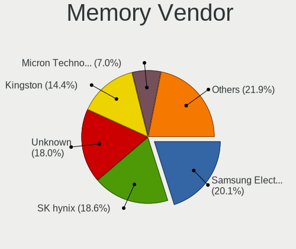

| Vendor                | Computers | Percent |
|-----------------------|-----------|---------|
| Samsung Electronics   | 811       | 20.03%  |
| SK hynix              | 757       | 18.7%   |
| Unknown               | 745       | 18.4%   |
| Kingston              | 578       | 14.28%  |
| Micron Technology     | 280       | 6.92%   |
| Nanya Technology      | 131       | 3.24%   |
| Elpida                | 109       | 2.69%   |
| Crucial               | 90        | 2.22%   |
| Kingmax               | 78        | 1.93%   |
| Corsair               | 75        | 1.85%   |
| Ramaxel Technology    | 70        | 1.73%   |
| G.Skill               | 50        | 1.24%   |
| A-DATA Technology     | 48        | 1.19%   |
| Transcend             | 23        | 0.57%   |
| CSX                   | 18        | 0.44%   |
| Team                  | 17        | 0.42%   |
| Patriot               | 16        | 0.4%    |
| Qimonda               | 14        | 0.35%   |
| ASint Technology      | 14        | 0.35%   |
| 48spaces              | 14        | 0.35%   |
| Unknown (ABCD)        | 9         | 0.22%   |
| Apacer                | 9         | 0.22%   |
| Kingmax Semiconductor | 8         | 0.2%    |
| Melco                 | 7         | 0.17%   |
| Goodram               | 7         | 0.17%   |
| Toshiba               | 6         | 0.15%   |
| SHARETRONIC           | 4         | 0.1%    |
| OCZ                   | 4         | 0.1%    |
| H                     | 4         | 0.1%    |
| Infineon              | 3         | 0.07%   |
| Hikvision             | 3         | 0.07%   |
| GeIL                  | 3         | 0.07%   |
| Unknown               | 3         | 0.07%   |
| Unifosa               | 2         | 0.05%   |
| TwinMOS               | 2         | 0.05%   |
| Smart                 | 2         | 0.05%   |
| Silicon Power         | 2         | 0.05%   |
| Multilaser            | 2         | 0.05%   |
| Axiom                 | 2         | 0.05%   |
| Uroad                 | 1         | 0.02%   |

Memory Model
------------

Memory module models

| Model                                                     | Computers | Percent |
|-----------------------------------------------------------|-----------|---------|
| Samsung RAM M471B5173QH0-YK0 4GB SODIMM DDR3 1600MT/s     | 58        | 1.28%   |
| SK hynix RAM HMT451S6BFR8A-PB 4GB SODIMM DDR3 1600MT/s    | 57        | 1.26%   |
| Unknown RAM Module 2048MB SODIMM DDR2 667MT/s             | 47        | 1.04%   |
| Unknown RAM Module 2048MB DIMM SDRAM                      | 47        | 1.04%   |
| Unknown RAM Module 2048MB DIMM 800MT/s                    | 45        | 0.99%   |
| Kingston RAM KHX1600C10D3/4G 4GB DIMM DDR3 1600MT/s       | 44        | 0.97%   |
| Samsung RAM M471B5173EB0-YK0 4GB SODIMM DDR3 1600MT/s     | 41        | 0.91%   |
| Samsung RAM M471B5273DH0-CH9 4GB SODIMM DDR3 1334MT/s     | 40        | 0.88%   |
| Samsung RAM M471B5173DB0-YK0 4GB SODIMM DDR3 1600MT/s     | 39        | 0.86%   |
| SK hynix RAM HMT351S6CFR8C-PB 4GB SODIMM DDR3 1600MT/s    | 36        | 0.8%    |
| Samsung RAM M471A5244CB0-CRC 4GB SODIMM DDR4 2667MT/s     | 33        | 0.73%   |
| Unknown RAM Module 2048MB DIMM DDR2 800MT/s               | 27        | 0.6%    |
| Samsung RAM M471A5244CB0-CTD 4GB SODIMM DDR4 3266MT/s     | 27        | 0.6%    |
| SK hynix RAM HMT41GS6BFR8A-PB 8GB SODIMM DDR3 1600MT/s    | 25        | 0.55%   |
| SK hynix RAM HMT325S6CFR8A-PB 2048MB SODIMM DDR3 1600MT/s | 25        | 0.55%   |
| Samsung RAM M471B5773DH0-CH9 2GB SODIMM DDR3 1600MT/s     | 25        | 0.55%   |
| Samsung RAM M471B5273DH0-CK0 4096MB SODIMM DDR3 1600MT/s  | 25        | 0.55%   |
| Samsung RAM M471B5273CH0-CH9 4GB SODIMM DDR3 1334MT/s     | 25        | 0.55%   |
| Unknown RAM Module 2048MB SODIMM DDR2                     | 24        | 0.53%   |
| Samsung RAM M471B5673FH0-CF8 2GB SODIMM DDR3 1067MT/s     | 24        | 0.53%   |
| Unknown RAM Module 2048MB DIMM 1333MT/s                   | 23        | 0.51%   |
| Kingston RAM KHX1600C9D3/4GX 4GB DIMM DDR3 1600MT/s       | 23        | 0.51%   |
| Unknown RAM Module 4096MB DIMM DDR3 1333MT/s              | 22        | 0.49%   |
| SK hynix RAM HMA851S6AFR6N-UH 4GB SODIMM DDR4 2667MT/s    | 22        | 0.49%   |
| Samsung RAM M471B5773CHS-CH9 2048MB SODIMM DDR3 4199MT/s  | 22        | 0.49%   |
| Kingston RAM KHX1600C10D3/8G 8GB DIMM DDR3 1648MT/s       | 22        | 0.49%   |
| Unknown RAM Module 1024MB SODIMM DDR2 667MT/s             | 20        | 0.44%   |
| Unknown RAM Module 1024MB DIMM SDRAM                      | 20        | 0.44%   |
| Micron RAM 8KTF51264HZ-1G6E1 4GB SODIMM DDR3 1600MT/s     | 20        | 0.44%   |
| Unknown RAM Module 1024MB DIMM 800MT/s                    | 19        | 0.42%   |
| SK hynix RAM HMT351S6EFR8A-PB 4GB SODIMM DDR3 1600MT/s    | 19        | 0.42%   |
| Unknown RAM Module 4096MB DIMM 1333MT/s                   | 18        | 0.4%    |
| Unknown RAM Module 1024MB SODIMM DDR2                     | 18        | 0.4%    |
| Unknown RAM Module 1024MB DIMM DDR2 667MT/s               | 17        | 0.38%   |
| Samsung RAM M471B5673FH0-CH9 2GB SODIMM DDR3 1334MT/s     | 17        | 0.38%   |
| Unknown RAM Module 2048MB DIMM DDR2 667MT/s               | 16        | 0.35%   |
| Kingston RAM 99U5584-005.A00LF 4GB DIMM DDR3 1600MT/s     | 16        | 0.35%   |
| Unknown RAM Module 2048MB SODIMM 800MT/s                  | 15        | 0.33%   |
| SK hynix RAM HMT325S6EFR8A-PB 2048MB SODIMM DDR3 1600MT/s | 15        | 0.33%   |
| Samsung RAM M471B1G73DB0-YK0 8GB SODIMM DDR3 1600MT/s     | 15        | 0.33%   |

Memory Kind
-----------

Memory module kinds

| Kind    | Computers | Percent |
|---------|-----------|---------|
| DDR3    | 1752      | 50.65%  |
| DDR4    | 561       | 16.22%  |
| DDR2    | 505       | 14.6%   |
| SDRAM   | 286       | 8.27%   |
| Unknown | 221       | 6.39%   |
| DDR     | 79        | 2.28%   |
| LPDDR4  | 36        | 1.04%   |
| LPDDR3  | 9         | 0.26%   |
| DRAM    | 8         | 0.23%   |
| LPDDR5  | 1         | 0.03%   |
| DDR5    | 1         | 0.03%   |

Memory Form Factor
------------------

Physical design of the memory module

| Name         | Computers | Percent |
|--------------|-----------|---------|
| SODIMM       | 1879      | 56.77%  |
| DIMM         | 1402      | 42.36%  |
| Row Of Chips | 17        | 0.51%   |
| Chip         | 7         | 0.21%   |
| RIMM         | 3         | 0.09%   |
| FB-DIMM      | 1         | 0.03%   |
| Unknown      | 1         | 0.03%   |

Memory Size
-----------

Memory module size

| Size    | Computers | Percent |
|---------|-----------|---------|
| 4096    | 1435      | 37.1%   |
| 2048    | 1134      | 29.32%  |
| 8192    | 699       | 18.07%  |
| 1024    | 406       | 10.5%   |
| 16384   | 98        | 2.53%   |
| 512     | 64        | 1.65%   |
| 32768   | 19        | 0.49%   |
| 256     | 7         | 0.18%   |
| 16      | 2         | 0.05%   |
| Unknown | 2         | 0.05%   |
| 128     | 1         | 0.03%   |
| 13      | 1         | 0.03%   |

Memory Speed
------------

Memory module speed

| Speed   | Computers | Percent |
|---------|-----------|---------|
| 1600    | 1067      | 27.69%  |
| 1333    | 416       | 10.8%   |
| 667     | 285       | 7.4%    |
| 800     | 279       | 7.24%   |
| 1334    | 240       | 6.23%   |
| 2667    | 196       | 5.09%   |
| 2400    | 180       | 4.67%   |
| Unknown | 170       | 4.41%   |
| 1067    | 116       | 3.01%   |
| 2133    | 101       | 2.62%   |
| 3200    | 83        | 2.15%   |
| 1866    | 68        | 1.76%   |
| 533     | 64        | 1.66%   |
| 1066    | 59        | 1.53%   |
| 2048    | 58        | 1.51%   |
| 4199    | 56        | 1.45%   |
| 1867    | 53        | 1.38%   |
| 975     | 31        | 0.8%    |
| 400     | 30        | 0.78%   |
| 3266    | 28        | 0.73%   |
| 3600    | 25        | 0.65%   |
| 1639    | 23        | 0.6%    |
| 333     | 23        | 0.6%    |
| 2666    | 20        | 0.52%   |
| 1800    | 16        | 0.42%   |
| 3733    | 14        | 0.36%   |
| 2933    | 13        | 0.34%   |
| 3400    | 12        | 0.31%   |
| 3000    | 12        | 0.31%   |
| 3466    | 11        | 0.29%   |
| 49926   | 9         | 0.23%   |
| 2000    | 8         | 0.21%   |
| 1648    | 7         | 0.18%   |
| 266     | 6         | 0.16%   |
| 3334    | 5         | 0.13%   |
| 1400    | 5         | 0.13%   |
| 1331    | 5         | 0.13%   |
| 2733    | 4         | 0.1%    |
| 3800    | 3         | 0.08%   |
| 3333    | 3         | 0.08%   |

Printers & scanners
-------------------

Printer Vendor
--------------

Printer device vendors

| Vendor                | Computers | Percent |
|-----------------------|-----------|---------|
| Hewlett-Packard       | 61        | 49.19%  |
| Samsung Electronics   | 25        | 20.16%  |
| Canon                 | 16        | 12.9%   |
| Brother Industries    | 9         | 7.26%   |
| Seiko Epson           | 4         | 3.23%   |
| Lexmark International | 4         | 3.23%   |
| QinHeng Electronics   | 2         | 1.61%   |
| STMicroelectronics    | 1         | 0.81%   |
| Oki Data              | 1         | 0.81%   |
| Dymo-CoStar           | 1         | 0.81%   |

Printer Model
-------------

Printer device models

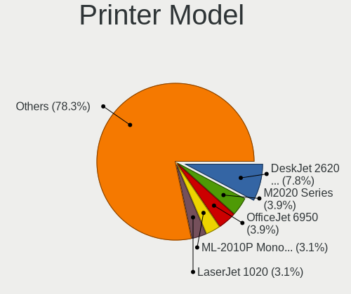

| Model                                                     | Computers | Percent |
|-----------------------------------------------------------|-----------|---------|
| HP DeskJet 2600 series                                    | 10        | 8%      |
| Samsung M2020 Series                                      | 5         | 4%      |
| Samsung ML-2010P Mono Laser Printer                       | 4         | 3.2%    |
| HP LaserJet 1020                                          | 4         | 3.2%    |
| HP DeskJet 2130 series                                    | 4         | 3.2%    |
| Samsung ML-1640 Series Laser Printer                      | 3         | 2.4%    |
| HP OfficeJet 6950                                         | 3         | 2.4%    |
| Brother HL-L2300D series                                  | 3         | 2.4%    |
| Brother HL-1110 series                                    | 3         | 2.4%    |
| Samsung SCX-3400 Series                                   | 2         | 1.6%    |
| Samsung ML-1660 Series                                    | 2         | 1.6%    |
| Samsung C48x Series Color Laser Multifunction Printer     | 2         | 1.6%    |
| QinHeng CH340S                                            | 2         | 1.6%    |
| Lexmark International Z35 Printer                         | 2         | 1.6%    |
| HP Officejet J4500 series                                 | 2         | 1.6%    |
| HP LaserJet P1005                                         | 2         | 1.6%    |
| HP LaserJet 1018                                          | 2         | 1.6%    |
| HP LaserJet 1010                                          | 2         | 1.6%    |
| HP DeskJet F4100 Printer series                           | 2         | 1.6%    |
| HP Deskjet F2280 series                                   | 2         | 1.6%    |
| HP Deskjet 3520 series                                    | 2         | 1.6%    |
| HP Deskjet 1510                                           | 2         | 1.6%    |
| HP Deskjet 1050 J410                                      | 2         | 1.6%    |
| Canon TS5100 series                                       | 2         | 1.6%    |
| Canon PIXMA MG3600 Series                                 | 2         | 1.6%    |
| Canon PIXMA MG2500 Series                                 | 2         | 1.6%    |
| STMicroelectronics LED badge -- mini LED display -- 11x44 | 1         | 0.8%    |
| Seiko Epson XP-240 Series                                 | 1         | 0.8%    |
| Seiko Epson WF-3010 Series                                | 1         | 0.8%    |
| Seiko Epson Printer                                       | 1         | 0.8%    |
| Seiko Epson L395 Series                                   | 1         | 0.8%    |
| Samsung Xerox Phaser 3117 Laser Printer                   | 1         | 0.8%    |
| Samsung SCX-4623 Series                                   | 1         | 0.8%    |
| Samsung SCX-3200 Series                                   | 1         | 0.8%    |
| Samsung ML-1630 Series                                    | 1         | 0.8%    |
| Samsung M2070 Series                                      | 1         | 0.8%    |
| Samsung Composite Device                                  | 1         | 0.8%    |
| Samsung CLP-310 Color Laser Printer                       | 1         | 0.8%    |
| Oki Data USB Device                                       | 1         | 0.8%    |
| Lexmark International Lexmark X203n                       | 1         | 0.8%    |

Scanner Vendor
--------------

Scanner device vendors

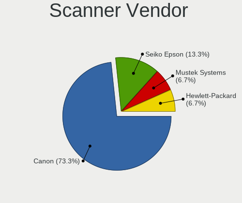

| Vendor          | Computers | Percent |
|-----------------|-----------|---------|
| Canon           | 10        | 76.92%  |
| Seiko Epson     | 2         | 15.38%  |
| Hewlett-Packard | 1         | 7.69%   |

Scanner Model
-------------

Scanner device models

| Model                                                   | Computers | Percent |
|---------------------------------------------------------|-----------|---------|
| Canon CanoScan N670U/N676U/LiDE 20                      | 4         | 30.77%  |
| Canon CanoScan LIDE 25                                  | 2         | 15.38%  |
| Canon CanoScan LiDE 120                                 | 2         | 15.38%  |
| Seiko Epson GT-F720 [GT-S620/Perfection V30/V300 Photo] | 1         | 7.69%   |
| Seiko Epson GT-F700 [Perfection V350]                   | 1         | 7.69%   |
| HP ScanJet 3670                                         | 1         | 7.69%   |
| Canon CanoScan LiDE 110                                 | 1         | 7.69%   |
| Canon CanoScan LiDE 100                                 | 1         | 7.69%   |

Camera
------

Camera Vendor
-------------

Camera device vendors

| Vendor                                 | Computers | Percent |
|----------------------------------------|-----------|---------|
| Chicony Electronics                    | 446       | 25.11%  |
| Microdia                               | 149       | 8.39%   |
| Realtek Semiconductor                  | 141       | 7.94%   |
| IMC Networks                           | 137       | 7.71%   |
| Suyin                                  | 109       | 6.14%   |
| Sunplus Innovation Technology          | 106       | 5.97%   |
| Cheng Uei Precision Industry (Foxlink) | 66        | 3.72%   |
| Syntek                                 | 56        | 3.15%   |
| Logitech                               | 52        | 2.93%   |
| Acer                                   | 50        | 2.82%   |
| Bison Electronics                      | 48        | 2.7%    |
| Quanta                                 | 36        | 2.03%   |
| Silicon Motion                         | 34        | 1.91%   |
| Lite-On Technology                     | 32        | 1.8%    |
| Apple                                  | 31        | 1.75%   |
| Alcor Micro                            | 27        | 1.52%   |
| Z-Star Microelectronics                | 26        | 1.46%   |
| Lenovo                                 | 24        | 1.35%   |
| Ricoh                                  | 23        | 1.3%    |
| Primax Electronics                     | 22        | 1.24%   |
| KYE Systems (Mouse Systems)            | 21        | 1.18%   |
| ALi                                    | 16        | 0.9%    |
| Microsoft                              | 15        | 0.84%   |
| GEMBIRD                                | 12        | 0.68%   |
| OmniVision Technologies                | 11        | 0.62%   |
| Samsung Electronics                    | 10        | 0.56%   |
| Importek                               | 10        | 0.56%   |
| Pixart Imaging                         | 7         | 0.39%   |
| Cubeternet                             | 7         | 0.39%   |
| Trust                                  | 6         | 0.34%   |
| DigiTech                               | 6         | 0.34%   |
| Genesys Logic                          | 4         | 0.23%   |
| Hewlett-Packard                        | 3         | 0.17%   |
| Generalplus Technology                 | 3         | 0.17%   |
| Aveo Technology                        | 3         | 0.17%   |
| Arkmicro Technologies                  | 3         | 0.17%   |
| SHENZHEN EMEET TECHNOLOGY              | 2         | 0.11%   |
| Nebraska Furniture Mart                | 2         | 0.11%   |
| MacroSilicon                           | 2         | 0.11%   |
| Luxvisions Innotech Limited            | 2         | 0.11%   |

Camera Model
------------

Camera device models

| Model                                                   | Computers | Percent |
|---------------------------------------------------------|-----------|---------|
| Chicony HP Truevision HD                                | 39        | 2.19%   |
| IMC Networks USB2.0 VGA UVC WebCam                      | 36        | 2.02%   |
| Chicony HD WebCam                                       | 32        | 1.8%    |
| Realtek USB Camera                                      | 29        | 1.63%   |
| Chicony USB2.0 VGA UVC WebCam                           | 25        | 1.41%   |
| Suyin Acer/HP Integrated Webcam [CN0314]                | 24        | 1.35%   |
| Sunplus HP Truevision HD                                | 24        | 1.35%   |
| Chicony Integrated Camera                               | 24        | 1.35%   |
| Acer Lenovo EasyCamera                                  | 22        | 1.24%   |
| Microdia Integrated Webcam                              | 20        | 1.12%   |
| Chicony USB2.0 HD UVC WebCam                            | 20        | 1.12%   |
| Chicony FJ Camera                                       | 20        | 1.12%   |
| Sunplus Integrated_Webcam_HD                            | 18        | 1.01%   |
| Sunplus HD WebCam                                       | 18        | 1.01%   |
| IMC Networks USB2.0 HD UVC WebCam                       | 18        | 1.01%   |
| IMC Networks EasyCamera                                 | 18        | 1.01%   |
| Chicony Lenovo EasyCamera                               | 18        | 1.01%   |
| Syntek EasyCamera                                       | 17        | 0.96%   |
| Realtek Lenovo EasyCamera                               | 17        | 0.96%   |
| Apple Built-in iSight                                   | 17        | 0.96%   |
| Primax HP HD Webcam [Fixed]                             | 16        | 0.9%    |
| Chicony EasyCamera                                      | 16        | 0.9%    |
| Syntek Integrated Camera                                | 15        | 0.84%   |
| Microdia Camera                                         | 15        | 0.84%   |
| Chicony 2.0M UVC Webcam / CNF7129                       | 15        | 0.84%   |
| Cheng Uei Precision Industry (Foxlink) HP Truevision HD | 15        | 0.84%   |
| Realtek Integrated Webcam HD                            | 14        | 0.79%   |
| Microdia Sonix USB 2.0 Camera                           | 14        | 0.79%   |
| Microdia Integrated_Webcam_HD                           | 14        | 0.79%   |
| Lite-On HP HD Webcam                                    | 14        | 0.79%   |
| Realtek Integrated Webcam                               | 13        | 0.73%   |
| Chicony VGA WebCam                                      | 13        | 0.73%   |
| Chicony TOSHIBA Web Camera - HD                         | 13        | 0.73%   |
| Bison Lenovo EasyCamera                                 | 13        | 0.73%   |
| ALi Gateway Webcam                                      | 13        | 0.73%   |
| Realtek USB2.0 VGA UVC WebCam                           | 12        | 0.67%   |
| Realtek Integrated_Webcam_HD                            | 12        | 0.67%   |
| Quanta VGA Webcam                                       | 12        | 0.67%   |
| Chicony Integrated HP HD Webcam                         | 12        | 0.67%   |
| Chicony HP Webcam                                       | 12        | 0.67%   |

Security
--------

Fingerprint Vendor
------------------

Fingerprint sensor vendors

| Vendor                     | Computers | Percent |
|----------------------------|-----------|---------|
| Validity Sensors           | 74        | 40.22%  |
| AuthenTec                  | 57        | 30.98%  |
| Upek                       | 20        | 10.87%  |
| LighTuning Technology      | 12        | 6.52%   |
| STMicroelectronics         | 9         | 4.89%   |
| Synaptics                  | 7         | 3.8%    |
| Elan Microelectronics      | 3         | 1.63%   |
| Shenzhen Goodix Technology | 2         | 1.09%   |

Fingerprint Model
-----------------

Fingerprint sensor models

| Model                                                                      | Computers | Percent |
|----------------------------------------------------------------------------|-----------|---------|
| AuthenTec AES2810                                                          | 23        | 12.5%   |
| AuthenTec AES2501 Fingerprint Sensor                                       | 20        | 10.87%  |
| Upek Biometric Touchchip/Touchstrip Fingerprint Sensor                     | 19        | 10.33%  |
| Validity Sensors VFS491                                                    | 13        | 7.07%   |
| Validity Sensors VFS471 Fingerprint Reader                                 | 11        | 5.98%   |
| Validity Sensors VFS451 Fingerprint Reader                                 | 9         | 4.89%   |
| STMicroelectronics Fingerprint Reader                                      | 9         | 4.89%   |
| Validity Sensors VFS5011 Fingerprint Reader                                | 8         | 4.35%   |
| Validity Sensors VFS495 Fingerprint Reader                                 | 8         | 4.35%   |
| LighTuning Fingerprint Reader                                              | 8         | 4.35%   |
| AuthenTec Fingerprint Sensor                                               | 8         | 4.35%   |
| Validity Sensors VFS101 Fingerprint Reader                                 | 6         | 3.26%   |
| Validity Sensors VFS 5011 fingerprint sensor                               | 5         | 2.72%   |
| Validity Sensors Fingerprint scanner                                       | 4         | 2.17%   |
| Synaptics  WBDI                                                            | 4         | 2.17%   |
| AuthenTec AES1600                                                          | 4         | 2.17%   |
| Validity Sensors Swipe Fingerprint Sensor                                  | 3         | 1.63%   |
| Validity Sensors VFS301 Fingerprint Reader                                 | 2         | 1.09%   |
| Validity Sensors Synaptics WBDI                                            | 2         | 1.09%   |
| LighTuning ES603 Swipe Fingerprint Sensor                                  | 2         | 1.09%   |
| LighTuning EgisTec Touch Fingerprint Sensor                                | 2         | 1.09%   |
| Elan ELAN:Fingerprint                                                      | 2         | 1.09%   |
| Validity Sensors VFS7500 Touch Fingerprint Sensor                          | 1         | 0.54%   |
| Validity Sensors VFS300 Fingerprint Reader                                 | 1         | 0.54%   |
| Validity Sensors Synaptics VFS7552 Touch Fingerprint Sensor with PurePrint | 1         | 0.54%   |
| Upek TCS5B Fingerprint sensor                                              | 1         | 0.54%   |
| Synaptics WBDI                                                             | 1         | 0.54%   |
| Synaptics Metallica MIS Touch Fingerprint Reader                           | 1         | 0.54%   |
| Synaptics FS7604 Touch Fingerprint Sensor with PurePrint                   | 1         | 0.54%   |
| Shenzhen Goodix  FingerPrint Device                                        | 1         | 0.54%   |
| Shenzhen Goodix Fingerprint Reader                                         | 1         | 0.54%   |
| Elan fingerprint sensor [FeinTech FPS00200]                                | 1         | 0.54%   |
| AuthenTec AES2550 Fingerprint Sensor                                       | 1         | 0.54%   |
| AuthenTec AES1660 Fingerprint Sensor                                       | 1         | 0.54%   |

Chipcard Vendor
---------------

Chipcard module vendors

| Vendor                    | Computers | Percent |
|---------------------------|-----------|---------|
| Broadcom                  | 81        | 54.36%  |
| O2 Micro                  | 27        | 18.12%  |
| Lenovo                    | 19        | 12.75%  |
| Alcor Micro               | 13        | 8.72%   |
| Upek                      | 5         | 3.36%   |
| Gemalto (was Gemplus)     | 2         | 1.34%   |
| Reiner SCT Kartensysteme  | 1         | 0.67%   |
| Aladdin Knowledge Systems | 1         | 0.67%   |

Chipcard Model
--------------

Chipcard module models

| Model                                                                        | Computers | Percent |
|------------------------------------------------------------------------------|-----------|---------|
| Broadcom BCM5880 Secure Applications Processor                               | 60        | 40.27%  |
| O2 Micro OZ776 CCID Smartcard Reader                                         | 24        | 16.11%  |
| Lenovo Integrated Smart Card Reader                                          | 19        | 12.75%  |
| Broadcom BCM5880 Secure Applications Processor with fingerprint swipe sensor | 15        | 10.07%  |
| Alcor Micro AU9540 Smartcard Reader                                          | 13        | 8.72%   |
| Upek TouchChip Fingerprint Coprocessor (WBF advanced mode)                   | 5         | 3.36%   |
| Broadcom 5880                                                                | 4         | 2.68%   |
| O2 Micro Oz776 SmartCard Reader                                              | 3         | 2.01%   |
| Broadcom 58200                                                               | 2         | 1.34%   |
| Reiner SCT Kartensysteme cyberJack RFID basis contactless smartcard reader   | 1         | 0.67%   |
| Gemalto (was Gemplus) GemPC Twin SmartCard Reader                            | 1         | 0.67%   |
| Gemalto (was Gemplus) Compact Smart Card Reader Writer                       | 1         | 0.67%   |
| Aladdin Knowledge Systems Token JC                                           | 1         | 0.67%   |

Unsupported
-----------

Unsupported Devices
-------------------

Total unsupported devices on board

| Total | Computers | Percent |
|-------|-----------|---------|
| 0     | 2670      | 76.35%  |
| 1     | 708       | 20.25%  |
| 2     | 103       | 2.95%   |
| 3     | 10        | 0.29%   |
| 5     | 2         | 0.06%   |
| 4     | 2         | 0.06%   |
| 10    | 1         | 0.03%   |
| 9     | 1         | 0.03%   |

Unsupported Device Types
------------------------

Types of unsupported devices

| Type                     | Computers | Percent |
|--------------------------|-----------|---------|
| Graphics card            | 282       | 30.42%  |
| Fingerprint reader       | 184       | 19.85%  |
| Chipcard                 | 148       | 15.97%  |
| Net/wireless             | 84        | 9.06%   |
| Bluetooth                | 77        | 8.31%   |
| Storage                  | 39        | 4.21%   |
| Multimedia controller    | 25        | 2.7%    |
| Communication controller | 25        | 2.7%    |
| Camera                   | 18        | 1.94%   |
| Flash memory             | 17        | 1.83%   |
| Sound                    | 7         | 0.76%   |
| Unassigned class         | 6         | 0.65%   |
| Net/ethernet             | 4         | 0.43%   |
| Card reader              | 4         | 0.43%   |
| Storage/raid             | 2         | 0.22%   |
| Storage/ata              | 2         | 0.22%   |
| Storage/nvme             | 1         | 0.11%   |
| Network                  | 1         | 0.11%   |
| Dvb card                 | 1         | 0.11%   |

