BlackPanther - Tested Hardware & Statistics
-------------------------------------------

A project to collect tested hardware configurations for BlackPanther.

Anyone can contribute to this report by the [hw-probe](https://github.com/linuxhw/hw-probe) tool:

    sudo -E hw-probe -all -upload

Please contribute! Especially if your hardware is rare.

This is a report for all computer types. See also reports for [desktops](/Dist/BlackPanther/Desktop/README.md) and [notebooks](/Dist/BlackPanther/Notebook/README.md).

Contents
--------

* [ Test Cases ](#test-cases)

* [ System ](#system)
  - [ OS                       ](#os)
  - [ OS Family                ](#os-family)
  - [ Kernel                   ](#kernel)
  - [ Kernel Family            ](#kernel-family)
  - [ Kernel Major Ver.        ](#kernel-major-ver)
  - [ Arch                     ](#arch)
  - [ DE                       ](#de)
  - [ Display Server           ](#display-server)
  - [ Display Manager          ](#display-manager)
  - [ OS Lang                  ](#os-lang)
  - [ Boot Mode                ](#boot-mode)
  - [ Filesystem               ](#filesystem)
  - [ Part. scheme             ](#part-scheme)
  - [ Dual Boot with Linux/BSD ](#dual-boot-with-linuxbsd)
  - [ Dual Boot (Win)          ](#dual-boot-win)

* [ Board ](#board)
  - [ Vendor                   ](#vendor)
  - [ Model                    ](#model)
  - [ Model Family             ](#model-family)
  - [ MFG Year                 ](#mfg-year)
  - [ Form Factor              ](#form-factor)
  - [ Secure Boot              ](#secure-boot)
  - [ Coreboot                 ](#coreboot)
  - [ RAM Size                 ](#ram-size)
  - [ RAM Used                 ](#ram-used)
  - [ Total Drives             ](#total-drives)
  - [ Has CD-ROM               ](#has-cd-rom)
  - [ Has Ethernet             ](#has-ethernet)
  - [ Has WiFi                 ](#has-wifi)
  - [ Has Bluetooth            ](#has-bluetooth)

* [ Location ](#location)
  - [ Country                  ](#country)
  - [ City                     ](#city)

* [ Drives ](#drives)
  - [ Drive Vendor             ](#drive-vendor)
  - [ Drive Model              ](#drive-model)
  - [ HDD Vendor               ](#hdd-vendor)
  - [ SSD Vendor               ](#ssd-vendor)
  - [ Drive Kind               ](#drive-kind)
  - [ Drive Connector          ](#drive-connector)
  - [ Drive Size               ](#drive-size)
  - [ Space Total              ](#space-total)
  - [ Space Used               ](#space-used)
  - [ Malfunc. Drives          ](#malfunc-drives)
  - [ Malfunc. Drive Vendor    ](#malfunc-drive-vendor)
  - [ Malfunc. HDD Vendor      ](#malfunc-hdd-vendor)
  - [ Malfunc. Drive Kind      ](#malfunc-drive-kind)
  - [ Failed Drives            ](#failed-drives)
  - [ Failed Drive Vendor      ](#failed-drive-vendor)
  - [ Drive Status             ](#drive-status)

* [ Storage controller ](#storage-controller)
  - [ Storage Vendor           ](#storage-vendor)
  - [ Storage Model            ](#storage-model)
  - [ Storage Kind             ](#storage-kind)

* [ Processor ](#processor)
  - [ CPU Vendor               ](#cpu-vendor)
  - [ CPU Model                ](#cpu-model)
  - [ CPU Model Family         ](#cpu-model-family)
  - [ CPU Cores                ](#cpu-cores)
  - [ CPU Sockets              ](#cpu-sockets)
  - [ CPU Threads              ](#cpu-threads)
  - [ CPU Op-Modes             ](#cpu-op-modes)
  - [ CPU Microcode            ](#cpu-microcode)
  - [ CPU Microarch            ](#cpu-microarch)

* [ Graphics ](#graphics)
  - [ GPU Vendor               ](#gpu-vendor)
  - [ GPU Model                ](#gpu-model)
  - [ GPU Combo                ](#gpu-combo)
  - [ GPU Driver               ](#gpu-driver)
  - [ GPU Memory               ](#gpu-memory)

* [ Monitor ](#monitor)
  - [ Monitor Vendor           ](#monitor-vendor)
  - [ Monitor Model            ](#monitor-model)
  - [ Monitor Resolution       ](#monitor-resolution)
  - [ Monitor Diagonal         ](#monitor-diagonal)
  - [ Monitor Width            ](#monitor-width)
  - [ Aspect Ratio             ](#aspect-ratio)
  - [ Monitor Area             ](#monitor-area)
  - [ Pixel Density            ](#pixel-density)
  - [ Multiple Monitors        ](#multiple-monitors)

* [ Network ](#network)
  - [ Net Controller Vendor    ](#net-controller-vendor)
  - [ Net Controller Model     ](#net-controller-model)
  - [ Wireless Vendor          ](#wireless-vendor)
  - [ Wireless Model           ](#wireless-model)
  - [ Ethernet Vendor          ](#ethernet-vendor)
  - [ Ethernet Model           ](#ethernet-model)
  - [ Net Controller Kind      ](#net-controller-kind)
  - [ Used Controller          ](#used-controller)
  - [ NICs                     ](#nics)
  - [ IPv6                     ](#ipv6)

* [ Bluetooth ](#bluetooth)
  - [ Bluetooth Vendor         ](#bluetooth-vendor)
  - [ Bluetooth Model          ](#bluetooth-model)

* [ Sound ](#sound)
  - [ Sound Vendor             ](#sound-vendor)
  - [ Sound Model              ](#sound-model)

* [ Memory ](#memory)
  - [ Memory Vendor            ](#memory-vendor)
  - [ Memory Model             ](#memory-model)
  - [ Memory Kind              ](#memory-kind)
  - [ Memory Form Factor       ](#memory-form-factor)
  - [ Memory Size              ](#memory-size)
  - [ Memory Speed             ](#memory-speed)

* [ Printers & scanners ](#printers--scanners)
  - [ Printer Vendor           ](#printer-vendor)
  - [ Printer Model            ](#printer-model)
  - [ Scanner Vendor           ](#scanner-vendor)
  - [ Scanner Model            ](#scanner-model)

* [ Camera ](#camera)
  - [ Camera Vendor            ](#camera-vendor)
  - [ Camera Model             ](#camera-model)

* [ Security ](#security)
  - [ Fingerprint Vendor       ](#fingerprint-vendor)
  - [ Fingerprint Model        ](#fingerprint-model)
  - [ Chipcard Vendor          ](#chipcard-vendor)
  - [ Chipcard Model           ](#chipcard-model)

* [ Unsupported ](#unsupported)
  - [ Unsupported Devices      ](#unsupported-devices)
  - [ Unsupported Device Types ](#unsupported-device-types)

Test Cases
----------

Total: 9876

| Vendor        | Model                       | Form-Factor | Probe                                                      | Date         |
|---------------|-----------------------------|-------------|------------------------------------------------------------|--------------|
| Dell          | 0HHV7N A00                  | Desktop     | [cd6ba4805b](https://linux-hardware.org/?probe=cd6ba4805b) | Jan 06, 2025 |
| Lenovo        | IdeaPad 3-15ITL6 82H8       | Notebook    | [58de0987c9](https://linux-hardware.org/?probe=58de0987c9) | Jan 05, 2025 |
| Lenovo        | IdeaPad 3-15ITL6 82H8       | Notebook    | [f033408474](https://linux-hardware.org/?probe=f033408474) | Jan 05, 2025 |
| Lenovo        | ThinkPad R400 7440EL1       | Notebook    | [dd61c503c2](https://linux-hardware.org/?probe=dd61c503c2) | Jan 04, 2025 |
| ASUSTek       | K50IE                       | Notebook    | [ff1622416c](https://linux-hardware.org/?probe=ff1622416c) | Jan 04, 2025 |
| Acer          | Aspire X1470                | Desktop     | [e645634cdf](https://linux-hardware.org/?probe=e645634cdf) | Jan 04, 2025 |
| ASUSTek       | K50IE                       | Notebook    | [42c7d66495](https://linux-hardware.org/?probe=42c7d66495) | Jan 04, 2025 |
| Fujitsu       | LIFEBOOK U745               | Notebook    | [518b2a257e](https://linux-hardware.org/?probe=518b2a257e) | Jan 03, 2025 |
| Acer          | Aspire X1470                | Desktop     | [5546dd82bb](https://linux-hardware.org/?probe=5546dd82bb) | Jan 03, 2025 |
| Fujitsu       | LIFEBOOK U745               | Notebook    | [28629fe967](https://linux-hardware.org/?probe=28629fe967) | Jan 03, 2025 |
| HP            | EliteBook 8470p             | Notebook    | [63e91f06ef](https://linux-hardware.org/?probe=63e91f06ef) | Jan 02, 2025 |
| HP            | 0B4Ch D                     | Desktop     | [bfc09a54d2](https://linux-hardware.org/?probe=bfc09a54d2) | Jan 02, 2025 |
| HP            | 0B4Ch D                     | Desktop     | [1416c7ff2b](https://linux-hardware.org/?probe=1416c7ff2b) | Jan 02, 2025 |
| Lenovo        | 1730-A1G                    | Desktop     | [7b80b5adbb](https://linux-hardware.org/?probe=7b80b5adbb) | Jan 02, 2025 |
| Lenovo        | 1730-A1G                    | Desktop     | [977ee06a31](https://linux-hardware.org/?probe=977ee06a31) | Jan 02, 2025 |
| Dell          | 0JP3NX A01                  | Desktop     | [a320c35e69](https://linux-hardware.org/?probe=a320c35e69) | Jan 02, 2025 |
| Intel         | DG43GT AAE62768-300         | Desktop     | [f33d4be91e](https://linux-hardware.org/?probe=f33d4be91e) | Jan 01, 2025 |
| Intel         | DG43GT AAE62768-300         | Desktop     | [c125d99d72](https://linux-hardware.org/?probe=c125d99d72) | Jan 01, 2025 |
| Apple         | MacBook7,1                  | Notebook    | [cee1ead4a5](https://linux-hardware.org/?probe=cee1ead4a5) | Jan 01, 2025 |
| HP            | EliteBook 8470p             | Notebook    | [e489955373](https://linux-hardware.org/?probe=e489955373) | Jan 01, 2025 |
| MSI           | EX600                       | Notebook    | [7cf72a2ecd](https://linux-hardware.org/?probe=7cf72a2ecd) | Jan 01, 2025 |
| MSI           | EX600                       | Notebook    | [1e51dc5052](https://linux-hardware.org/?probe=1e51dc5052) | Jan 01, 2025 |
| HP            | 0B4Ch D                     | Desktop     | [f81870b407](https://linux-hardware.org/?probe=f81870b407) | Dec 31, 2024 |
| HP            | 0B4Ch D                     | Desktop     | [3aa4052845](https://linux-hardware.org/?probe=3aa4052845) | Dec 31, 2024 |
| Lenovo        | ThinkPad E550 20DF007YRI    | Notebook    | [8ad38acc8a](https://linux-hardware.org/?probe=8ad38acc8a) | Dec 31, 2024 |
| HP            | ProBook 4535s               | Notebook    | [e0f48651c0](https://linux-hardware.org/?probe=e0f48651c0) | Dec 30, 2024 |
| Dell          | Latitude E6410              | Notebook    | [a9b5de08b4](https://linux-hardware.org/?probe=a9b5de08b4) | Dec 30, 2024 |
| HP            | Pavilion Gaming Laptop 1... | Notebook    | [cd3975c657](https://linux-hardware.org/?probe=cd3975c657) | Dec 28, 2024 |
| HP            | Laptop 15-bs0xx             | Notebook    | [3734fe1027](https://linux-hardware.org/?probe=3734fe1027) | Dec 28, 2024 |
| ASUSTek       | PRIME B365M-A               | Desktop     | [cc640facba](https://linux-hardware.org/?probe=cc640facba) | Dec 28, 2024 |
| ASUSTek       | Pro WS X570-ACE             | Desktop     | [b702a2759f](https://linux-hardware.org/?probe=b702a2759f) | Dec 28, 2024 |
| HP            | Laptop 15-bs0xx             | Notebook    | [3078dcda8e](https://linux-hardware.org/?probe=3078dcda8e) | Dec 28, 2024 |
| MSI           | CR610                       | Notebook    | [cdac4d6ac5](https://linux-hardware.org/?probe=cdac4d6ac5) | Dec 27, 2024 |
| Gigabyte      | 945GCM-S2L                  | Desktop     | [9ad1def3b0](https://linux-hardware.org/?probe=9ad1def3b0) | Dec 27, 2024 |
| Gigabyte      | 945GCM-S2L                  | Desktop     | [28f2ce4fde](https://linux-hardware.org/?probe=28f2ce4fde) | Dec 26, 2024 |
| HP            | HDX 16                      | Notebook    | [17ec6d80db](https://linux-hardware.org/?probe=17ec6d80db) | Dec 25, 2024 |
| HP            | HDX 16                      | Notebook    | [cae2b345f8](https://linux-hardware.org/?probe=cae2b345f8) | Dec 25, 2024 |
| Fujitsu Si... | AMILO Li 2727               | Notebook    | [582307f2f4](https://linux-hardware.org/?probe=582307f2f4) | Dec 24, 2024 |
| Fujitsu Si... | AMILO Li 2727               | Notebook    | [9485bf3c97](https://linux-hardware.org/?probe=9485bf3c97) | Dec 24, 2024 |
| Dell          | Vostro 1015                 | Notebook    | [a9e17cca23](https://linux-hardware.org/?probe=a9e17cca23) | Dec 24, 2024 |
| Dell          | Vostro 1015                 | Notebook    | [13644c036c](https://linux-hardware.org/?probe=13644c036c) | Dec 24, 2024 |
| Lenovo        | 1730-A1G                    | Desktop     | [bb3794b32b](https://linux-hardware.org/?probe=bb3794b32b) | Dec 23, 2024 |
| ASUSTek       | X200MA                      | Notebook    | [9ca1965839](https://linux-hardware.org/?probe=9ca1965839) | Dec 22, 2024 |
| Gigabyte      | B75M-D3H                    | Desktop     | [1bb966cb7d](https://linux-hardware.org/?probe=1bb966cb7d) | Dec 21, 2024 |
| Lenovo        | ThinkPad L430 246834G       | Notebook    | [cbc0d50579](https://linux-hardware.org/?probe=cbc0d50579) | Dec 20, 2024 |
| ASUSTek       | VivoBook_ASUSLaptop M350... | Notebook    | [9748115a00](https://linux-hardware.org/?probe=9748115a00) | Dec 20, 2024 |
| ASUSTek       | VivoBook_ASUSLaptop M350... | Notebook    | [09a86b3e16](https://linux-hardware.org/?probe=09a86b3e16) | Dec 20, 2024 |
| HP            | ProBook 440 G5              | Notebook    | [c5a9ba7441](https://linux-hardware.org/?probe=c5a9ba7441) | Dec 19, 2024 |
| HP            | ProBook 440 G5              | Notebook    | [da60bd4ae5](https://linux-hardware.org/?probe=da60bd4ae5) | Dec 19, 2024 |
| Microsoft     | Surface Go 2                | Tablet      | [51d7c66a4e](https://linux-hardware.org/?probe=51d7c66a4e) | Dec 18, 2024 |
| ASUSTek       | K50IE                       | Notebook    | [e19aa860da](https://linux-hardware.org/?probe=e19aa860da) | Dec 18, 2024 |
| ASUSTek       | ZenBook UX425UA_UM425UA     | Notebook    | [7e82e5049a](https://linux-hardware.org/?probe=7e82e5049a) | Dec 17, 2024 |
| HP            | EliteBook 850 G3            | Notebook    | [e01e3eeaf1](https://linux-hardware.org/?probe=e01e3eeaf1) | Dec 16, 2024 |
| HP            | 3397                        | Desktop     | [800fd186e6](https://linux-hardware.org/?probe=800fd186e6) | Dec 16, 2024 |
| HP            | 3397                        | Desktop     | [0bfc475fe7](https://linux-hardware.org/?probe=0bfc475fe7) | Dec 16, 2024 |
| Gigabyte      | H61M-S1                     | Desktop     | [0291930ebb](https://linux-hardware.org/?probe=0291930ebb) | Dec 16, 2024 |
| Lenovo        | ThinkPad T520 4242A25       | Notebook    | [85c87ae6e1](https://linux-hardware.org/?probe=85c87ae6e1) | Dec 16, 2024 |
| Gigabyte      | F2A68HM-DS2                 | Desktop     | [af28ef87b7](https://linux-hardware.org/?probe=af28ef87b7) | Dec 15, 2024 |
| Toshiba       | Satellite Pro A120          | Notebook    | [11c52f70d5](https://linux-hardware.org/?probe=11c52f70d5) | Dec 15, 2024 |
| ASRock        | 4X4-V1000                   | Desktop     | [6a76a8988e](https://linux-hardware.org/?probe=6a76a8988e) | Dec 15, 2024 |
| HP            | 250 G1                      | Notebook    | [bdcc1c77b0](https://linux-hardware.org/?probe=bdcc1c77b0) | Dec 15, 2024 |
| Foxconn       | 2ABF                        | Desktop     | [6aa0202528](https://linux-hardware.org/?probe=6aa0202528) | Dec 14, 2024 |
| Foxconn       | 2ABF                        | Desktop     | [7372c37954](https://linux-hardware.org/?probe=7372c37954) | Dec 14, 2024 |
| ASRock        | 4X4-V1000                   | Desktop     | [1741e70741](https://linux-hardware.org/?probe=1741e70741) | Dec 14, 2024 |
| HP            | 3646h                       | Desktop     | [bec40b8a76](https://linux-hardware.org/?probe=bec40b8a76) | Dec 14, 2024 |
| Dell          | Latitude 5590               | Notebook    | [308f71f2dd](https://linux-hardware.org/?probe=308f71f2dd) | Dec 14, 2024 |
| Dell          | 0JP3NX A01                  | Desktop     | [14849f1285](https://linux-hardware.org/?probe=14849f1285) | Dec 14, 2024 |
| HP            | 3646h                       | Desktop     | [6aba49858b](https://linux-hardware.org/?probe=6aba49858b) | Dec 13, 2024 |
| ASRock        | A55M-HVS                    | Desktop     | [6ec5d183ad](https://linux-hardware.org/?probe=6ec5d183ad) | Dec 13, 2024 |
| ASRock        | A55M-HVS                    | Desktop     | [a88f44e9e4](https://linux-hardware.org/?probe=a88f44e9e4) | Dec 13, 2024 |
| Acer          | Aspire E5-571G              | Notebook    | [b81f4da779](https://linux-hardware.org/?probe=b81f4da779) | Dec 12, 2024 |
| Gigabyte      | G41M-Combo                  | Desktop     | [be12e82a19](https://linux-hardware.org/?probe=be12e82a19) | Dec 12, 2024 |
| Fujitsu       | D3220-A1 S26361-D3220-A1    | Desktop     | [76eb88a8bd](https://linux-hardware.org/?probe=76eb88a8bd) | Dec 11, 2024 |
| Gigabyte      | H310M A-CF x.x              | Desktop     | [3f0128ce11](https://linux-hardware.org/?probe=3f0128ce11) | Dec 10, 2024 |
| Gigabyte      | H310M A-CF x.x              | Desktop     | [4e9d94f35e](https://linux-hardware.org/?probe=4e9d94f35e) | Dec 10, 2024 |
| MSI           | MS-7817                     | Desktop     | [f1e7840d6b](https://linux-hardware.org/?probe=f1e7840d6b) | Dec 10, 2024 |
| MSI           | MS-7817                     | Desktop     | [5311b73ce0](https://linux-hardware.org/?probe=5311b73ce0) | Dec 10, 2024 |
| Acer          | Aspire 5732Z                | Notebook    | [fd6a7390c7](https://linux-hardware.org/?probe=fd6a7390c7) | Dec 10, 2024 |
| Acer          | Aspire E5-571G              | Notebook    | [4e3d903b5d](https://linux-hardware.org/?probe=4e3d903b5d) | Dec 10, 2024 |
| ASUSTek       | ZenBook UX425UA_UM425UA     | Notebook    | [d48355806f](https://linux-hardware.org/?probe=d48355806f) | Dec 10, 2024 |
| ASRock        | 960GM-VGS3 FX               | Desktop     | [1302e07a62](https://linux-hardware.org/?probe=1302e07a62) | Dec 09, 2024 |
| ASRock        | 960GM-VGS3 FX               | Desktop     | [15e8e8f4f8](https://linux-hardware.org/?probe=15e8e8f4f8) | Dec 09, 2024 |
| Lenovo        | ThinkPad T410 2537KR6       | Notebook    | [9fde9fe106](https://linux-hardware.org/?probe=9fde9fe106) | Dec 09, 2024 |
| Gigabyte      | B450M GAMING                | Desktop     | [cbf3a10efc](https://linux-hardware.org/?probe=cbf3a10efc) | Dec 08, 2024 |
| Lenovo        | Z710 20250                  | Notebook    | [9ec30a66d1](https://linux-hardware.org/?probe=9ec30a66d1) | Dec 08, 2024 |
| Lenovo        | G550 20023                  | Notebook    | [f8b607f0af](https://linux-hardware.org/?probe=f8b607f0af) | Dec 08, 2024 |
| Gigabyte      | H310M A-CF x.x              | Desktop     | [491aa7568e](https://linux-hardware.org/?probe=491aa7568e) | Dec 08, 2024 |
| Lenovo        | 1730-A1G                    | Desktop     | [8437ab0ca5](https://linux-hardware.org/?probe=8437ab0ca5) | Dec 08, 2024 |
| Gigabyte      | F2A88XM-HD3                 | Desktop     | [f8b62a20e3](https://linux-hardware.org/?probe=f8b62a20e3) | Dec 08, 2024 |
| Dell          | 0D883F A06                  | Desktop     | [99948b5b1e](https://linux-hardware.org/?probe=99948b5b1e) | Dec 08, 2024 |
| Dell          | 0D883F A06                  | Desktop     | [c5f9a7eb19](https://linux-hardware.org/?probe=c5f9a7eb19) | Dec 08, 2024 |
| HP            | Pavilion Gaming Laptop 1... | Notebook    | [769c4b5be5](https://linux-hardware.org/?probe=769c4b5be5) | Dec 07, 2024 |
| Lenovo        | G550 20023                  | Notebook    | [efcb2e6de7](https://linux-hardware.org/?probe=efcb2e6de7) | Dec 07, 2024 |
| HP            | 0B4Ch D                     | Desktop     | [e19a27372d](https://linux-hardware.org/?probe=e19a27372d) | Dec 07, 2024 |
| ASUSTek       | P8Z77-V LX                  | Desktop     | [56c6e2da15](https://linux-hardware.org/?probe=56c6e2da15) | Dec 07, 2024 |
| Gigabyte      | F2A88XM-HD3                 | Desktop     | [635d67c028](https://linux-hardware.org/?probe=635d67c028) | Dec 07, 2024 |
| HP            | 620                         | Notebook    | [debb6026ee](https://linux-hardware.org/?probe=debb6026ee) | Dec 07, 2024 |
| Fujitsu       | D3220-A1 S26361-D3220-A1    | Desktop     | [58fc88417b](https://linux-hardware.org/?probe=58fc88417b) | Dec 04, 2024 |
| ASRock        | B85M Pro4                   | Desktop     | [87cc2b801a](https://linux-hardware.org/?probe=87cc2b801a) | Dec 02, 2024 |
| ASRock        | B85M Pro4                   | Desktop     | [6c15da3e1f](https://linux-hardware.org/?probe=6c15da3e1f) | Dec 02, 2024 |
| ASRock        | X299 Extreme4               | Desktop     | [d1ff3afc94](https://linux-hardware.org/?probe=d1ff3afc94) | Dec 02, 2024 |
| Gigabyte      | B450M GAMING                | Desktop     | [b22b8236a5](https://linux-hardware.org/?probe=b22b8236a5) | Dec 02, 2024 |
| Dell          | Latitude E6230              | Notebook    | [0d86402acb](https://linux-hardware.org/?probe=0d86402acb) | Dec 01, 2024 |
| Dell          | Inspiron 17 7000 Series ... | Notebook    | [d588437f56](https://linux-hardware.org/?probe=d588437f56) | Dec 01, 2024 |
| HP            | 3646h                       | Desktop     | [adf6e6dfea](https://linux-hardware.org/?probe=adf6e6dfea) | Dec 01, 2024 |
| HP            | 0B4Ch D                     | Desktop     | [816487e244](https://linux-hardware.org/?probe=816487e244) | Dec 01, 2024 |
| eMachines     | E725                        | Notebook    | [c90258d992](https://linux-hardware.org/?probe=c90258d992) | Dec 01, 2024 |
| eMachines     | E725                        | Notebook    | [e6b68a13a8](https://linux-hardware.org/?probe=e6b68a13a8) | Dec 01, 2024 |
| Samsung       | 300E4A/300E5A/300E7A/343... | Notebook    | [c400fc86cb](https://linux-hardware.org/?probe=c400fc86cb) | Nov 30, 2024 |
| ASUSTek       | X55U                        | Notebook    | [b227d1be26](https://linux-hardware.org/?probe=b227d1be26) | Nov 30, 2024 |
| Dell          | Inspiron 15-3573            | Notebook    | [9f15756447](https://linux-hardware.org/?probe=9f15756447) | Nov 30, 2024 |
| Dell          | Inspiron 15-3573            | Notebook    | [ffd2440975](https://linux-hardware.org/?probe=ffd2440975) | Nov 30, 2024 |
| Samsung       | 300E4A/300E5A/300E7A/343... | Notebook    | [cdeefac044](https://linux-hardware.org/?probe=cdeefac044) | Nov 30, 2024 |
| ASUSTek       | X401U                       | Notebook    | [a311a92d34](https://linux-hardware.org/?probe=a311a92d34) | Nov 30, 2024 |
| ASUSTek       | X401U                       | Notebook    | [b43b40d15d](https://linux-hardware.org/?probe=b43b40d15d) | Nov 30, 2024 |
| Gigabyte      | H61M-S1                     | Desktop     | [d4ffafd2f5](https://linux-hardware.org/?probe=d4ffafd2f5) | Nov 29, 2024 |
| ASUSTek       | PRIME A320M-R               | Desktop     | [f8273a878e](https://linux-hardware.org/?probe=f8273a878e) | Nov 29, 2024 |
| Gigabyte      | F2A68HM-DS2                 | Desktop     | [5a1f3f02f5](https://linux-hardware.org/?probe=5a1f3f02f5) | Nov 28, 2024 |
| ASRock        | X299 Extreme4               | Desktop     | [ebfb054460](https://linux-hardware.org/?probe=ebfb054460) | Nov 28, 2024 |
| HP            | 805D                        | Desktop     | [9ddf70c273](https://linux-hardware.org/?probe=9ddf70c273) | Nov 26, 2024 |
| ASUSTek       | Maximus VIII HERO           | Desktop     | [f0eddec4ed](https://linux-hardware.org/?probe=f0eddec4ed) | Nov 26, 2024 |
| ASUSTek       | PRIME B365M-A               | Desktop     | [c83451790b](https://linux-hardware.org/?probe=c83451790b) | Nov 26, 2024 |
| HP            | 805D                        | Desktop     | [bcb3dfcc19](https://linux-hardware.org/?probe=bcb3dfcc19) | Nov 26, 2024 |
| Dell          | 0T7D40 A01                  | Desktop     | [3597056176](https://linux-hardware.org/?probe=3597056176) | Nov 26, 2024 |
| Dell          | 0T7D40 A01                  | Desktop     | [ab3c886551](https://linux-hardware.org/?probe=ab3c886551) | Nov 26, 2024 |
| ASUSTek       | Maximus VIII HERO           | Desktop     | [64d558663e](https://linux-hardware.org/?probe=64d558663e) | Nov 25, 2024 |
| Lenovo        | ThinkPad E550 20DF007YRI    | Notebook    | [8be5fd8c72](https://linux-hardware.org/?probe=8be5fd8c72) | Nov 25, 2024 |
| ASRock        | B550M Pro4                  | Desktop     | [97763a7a84](https://linux-hardware.org/?probe=97763a7a84) | Nov 24, 2024 |
| ASRock        | B550M Pro4                  | Desktop     | [375c90560b](https://linux-hardware.org/?probe=375c90560b) | Nov 24, 2024 |
| ASUSTek       | P8Z77-V LX                  | Desktop     | [b04b80b8c1](https://linux-hardware.org/?probe=b04b80b8c1) | Nov 24, 2024 |
| ASUSTek       | K50IE                       | Notebook    | [554cc7d2da](https://linux-hardware.org/?probe=554cc7d2da) | Nov 24, 2024 |
| Dell          | Vostro 3500                 | Notebook    | [97daaed0c7](https://linux-hardware.org/?probe=97daaed0c7) | Nov 24, 2024 |
| Gigabyte      | G41M-Combo                  | Desktop     | [e719982d13](https://linux-hardware.org/?probe=e719982d13) | Nov 23, 2024 |
| Lenovo        | ThinkPad E550 20DF007YRI    | Notebook    | [f652a62a8c](https://linux-hardware.org/?probe=f652a62a8c) | Nov 23, 2024 |
| ASUSTek       | K50IE                       | Notebook    | [9de648a95f](https://linux-hardware.org/?probe=9de648a95f) | Nov 23, 2024 |
| Gigabyte      | G41M-Combo                  | Desktop     | [fe480aafdc](https://linux-hardware.org/?probe=fe480aafdc) | Nov 23, 2024 |
| Lenovo        | ThinkPad X280 20KES35J00    | Notebook    | [72a362e0ce](https://linux-hardware.org/?probe=72a362e0ce) | Nov 23, 2024 |
| Toshiba       | PORTEGE Z930                | Notebook    | [a6549dee5e](https://linux-hardware.org/?probe=a6549dee5e) | Nov 22, 2024 |
| Toshiba       | PORTEGE Z930                | Notebook    | [b1a189cb58](https://linux-hardware.org/?probe=b1a189cb58) | Nov 22, 2024 |
| Apple         | MacBookPro11,1              | Notebook    | [a315c80c2c](https://linux-hardware.org/?probe=a315c80c2c) | Nov 22, 2024 |
| ASUSTek       | K50IE                       | Notebook    | [88afa62033](https://linux-hardware.org/?probe=88afa62033) | Nov 21, 2024 |
| Gigabyte      | H61M-S1                     | Desktop     | [1490996600](https://linux-hardware.org/?probe=1490996600) | Nov 21, 2024 |
| ASRock        | N68C-S UCC                  | Desktop     | [24b5436040](https://linux-hardware.org/?probe=24b5436040) | Nov 21, 2024 |
| Dell          | Latitude 5501               | Notebook    | [d5ff7909f7](https://linux-hardware.org/?probe=d5ff7909f7) | Nov 21, 2024 |
| Acer          | Aspire 5742G                | Notebook    | [c117d227dd](https://linux-hardware.org/?probe=c117d227dd) | Nov 21, 2024 |
| Acer          | Aspire 5742G                | Notebook    | [87ecfdfb41](https://linux-hardware.org/?probe=87ecfdfb41) | Nov 20, 2024 |
| Dell          | Latitude E7270              | Notebook    | [3aa67229b8](https://linux-hardware.org/?probe=3aa67229b8) | Nov 20, 2024 |
| Insyde        | Braswell                    | Notebook    | [317bc41ff8](https://linux-hardware.org/?probe=317bc41ff8) | Nov 20, 2024 |
| Fujitsu       | LIFEBOOK E782               | Notebook    | [cfb43c6627](https://linux-hardware.org/?probe=cfb43c6627) | Nov 20, 2024 |
| Fujitsu       | LIFEBOOK E782               | Notebook    | [4ebc12b553](https://linux-hardware.org/?probe=4ebc12b553) | Nov 20, 2024 |
| Packard Be... | EasyNote TS44HR             | Notebook    | [43524f1599](https://linux-hardware.org/?probe=43524f1599) | Nov 19, 2024 |
| Valve         | Jupiter                     | Notebook    | [0d1a908294](https://linux-hardware.org/?probe=0d1a908294) | Nov 19, 2024 |
| Valve         | Jupiter                     | Notebook    | [2262bd5974](https://linux-hardware.org/?probe=2262bd5974) | Nov 19, 2024 |
| HP            | Compaq 6710b (KE121EA#AK... | Notebook    | [e02fd427cb](https://linux-hardware.org/?probe=e02fd427cb) | Nov 19, 2024 |
| ASUSTek       | VivoBook_ASUSLaptop M350... | Notebook    | [ad9200ca27](https://linux-hardware.org/?probe=ad9200ca27) | Nov 19, 2024 |
| Samsung       | RV415/RV515/E3415           | Notebook    | [03e8547704](https://linux-hardware.org/?probe=03e8547704) | Nov 18, 2024 |
| ASUSTek       | 970 PRO GAMING/AURA         | Desktop     | [b0aea64800](https://linux-hardware.org/?probe=b0aea64800) | Nov 18, 2024 |
| Lenovo        | ThinkPad P50 20EQS2CC00     | Notebook    | [ee47266bd4](https://linux-hardware.org/?probe=ee47266bd4) | Nov 17, 2024 |
| HP            | Pavilion Gaming Laptop 1... | Notebook    | [4bcb60287c](https://linux-hardware.org/?probe=4bcb60287c) | Nov 17, 2024 |
| ASUSTek       | P5G41-M SI/DVI              | Desktop     | [2c4a36ab8f](https://linux-hardware.org/?probe=2c4a36ab8f) | Nov 17, 2024 |
| Lenovo        | ThinkStation D20 4158AF8    | Desktop     | [acd9211269](https://linux-hardware.org/?probe=acd9211269) | Nov 16, 2024 |
| Apple         | MacBookAir7,2               | Notebook    | [b899e73287](https://linux-hardware.org/?probe=b899e73287) | Nov 16, 2024 |
| Toshiba       | Satellite Pro L550          | Notebook    | [f41b33701f](https://linux-hardware.org/?probe=f41b33701f) | Nov 16, 2024 |
| MSI           | MAG B550 TOMAHAWK           | Desktop     | [8e9b066c80](https://linux-hardware.org/?probe=8e9b066c80) | Nov 16, 2024 |
| MSI           | MAG B550 TOMAHAWK           | Desktop     | [0c95c596cd](https://linux-hardware.org/?probe=0c95c596cd) | Nov 16, 2024 |
| ASUSTek       | X550LN                      | Notebook    | [f0d77d344b](https://linux-hardware.org/?probe=f0d77d344b) | Nov 15, 2024 |
| Lenovo        | ThinkPad P50 20EQS2CC00     | Notebook    | [8815cf243a](https://linux-hardware.org/?probe=8815cf243a) | Nov 14, 2024 |
| Toshiba       | Satellite Pro L550          | Notebook    | [d39da20aec](https://linux-hardware.org/?probe=d39da20aec) | Nov 14, 2024 |
| Lenovo        | IdeaPad Slim 3 15IRU8 82... | Notebook    | [a32fbc9189](https://linux-hardware.org/?probe=a32fbc9189) | Nov 14, 2024 |
| Microsoft     | Surface Go 2                | Tablet      | [9e8e9937f4](https://linux-hardware.org/?probe=9e8e9937f4) | Nov 13, 2024 |
| Dell          | Latitude E7270              | Notebook    | [dba418a89f](https://linux-hardware.org/?probe=dba418a89f) | Nov 12, 2024 |
| Gigabyte      | H61M-S1                     | Desktop     | [ed13d9f493](https://linux-hardware.org/?probe=ed13d9f493) | Nov 12, 2024 |
| Apple         | MacBookAir7,2               | Notebook    | [9f8aadd091](https://linux-hardware.org/?probe=9f8aadd091) | Nov 11, 2024 |
| MSI           | GT60 2OC/2OD                | Notebook    | [d4624f582f](https://linux-hardware.org/?probe=d4624f582f) | Nov 11, 2024 |
| ASUSTek       | TUF Gaming B450-PLUS II     | Desktop     | [cc7ab8446b](https://linux-hardware.org/?probe=cc7ab8446b) | Nov 10, 2024 |
| Dell          | Latitude E6230              | Notebook    | [73b9f97d94](https://linux-hardware.org/?probe=73b9f97d94) | Nov 10, 2024 |
| Apple         | Mac-F2268CC8                | All in one  | [77f0edea77](https://linux-hardware.org/?probe=77f0edea77) | Nov 10, 2024 |
| Gigabyte      | H310M A-CF x.x              | Desktop     | [64ef79648d](https://linux-hardware.org/?probe=64ef79648d) | Nov 09, 2024 |
| ASUSTek       | ZenBook UX425UA_UM425UA     | Notebook    | [455db089b7](https://linux-hardware.org/?probe=455db089b7) | Nov 08, 2024 |
| HP            | EliteBook Folio 9480m       | Notebook    | [2f9be02490](https://linux-hardware.org/?probe=2f9be02490) | Nov 08, 2024 |
| Lenovo        | Annapurna CRB 0B98401 PR... | Desktop     | [3da6bd30af](https://linux-hardware.org/?probe=3da6bd30af) | Nov 07, 2024 |
| Packard Be... | EasyNote TK11BZ             | Notebook    | [610e6cd0aa](https://linux-hardware.org/?probe=610e6cd0aa) | Nov 07, 2024 |
| Packard Be... | EasyNote TK11BZ             | Notebook    | [1a19aa0d42](https://linux-hardware.org/?probe=1a19aa0d42) | Nov 07, 2024 |
| HP            | Laptop 15-db0xxx            | Notebook    | [47b6df1477](https://linux-hardware.org/?probe=47b6df1477) | Nov 07, 2024 |
| Toshiba       | Satellite L650              | Notebook    | [49f804a9fc](https://linux-hardware.org/?probe=49f804a9fc) | Nov 07, 2024 |
| Toshiba       | Satellite L650              | Notebook    | [5d1d0b74f1](https://linux-hardware.org/?probe=5d1d0b74f1) | Nov 06, 2024 |
| HP            | Laptop 15-db0xxx            | Notebook    | [9d2ab8f727](https://linux-hardware.org/?probe=9d2ab8f727) | Nov 06, 2024 |
| ASUSTek       | TUF Gaming FX505DU          | Notebook    | [81def84e4a](https://linux-hardware.org/?probe=81def84e4a) | Nov 06, 2024 |
| ASUSTek       | ZenBook UX425UA_UM425UA     | Notebook    | [c7e836cc68](https://linux-hardware.org/?probe=c7e836cc68) | Nov 05, 2024 |
| HP            | 18E5                        | Desktop     | [b4c19621ca](https://linux-hardware.org/?probe=b4c19621ca) | Nov 04, 2024 |
| Dell          | 0D883F A06                  | Desktop     | [a55fa3f5de](https://linux-hardware.org/?probe=a55fa3f5de) | Nov 03, 2024 |
| ASRock        | 4X4-V1000                   | Desktop     | [e4f92f939d](https://linux-hardware.org/?probe=e4f92f939d) | Nov 03, 2024 |
| Dell          | 0D883F A06                  | Desktop     | [ba2871b501](https://linux-hardware.org/?probe=ba2871b501) | Nov 03, 2024 |
| Gigabyte      | B660M GAMING DDR4           | Desktop     | [3e0226aec6](https://linux-hardware.org/?probe=3e0226aec6) | Nov 03, 2024 |
| Gigabyte      | B250M-Gaming 3-CF           | Desktop     | [c2cf996702](https://linux-hardware.org/?probe=c2cf996702) | Nov 03, 2024 |
| Gigabyte      | B250M-Gaming 3-CF           | Desktop     | [5ff13f15c9](https://linux-hardware.org/?probe=5ff13f15c9) | Nov 02, 2024 |
| Acer          | Aspire ES1-571              | Notebook    | [f307a1d91c](https://linux-hardware.org/?probe=f307a1d91c) | Nov 02, 2024 |
| Lenovo        | ThinkPad T420 4236B87       | Notebook    | [168db3bc7f](https://linux-hardware.org/?probe=168db3bc7f) | Nov 01, 2024 |
| Fujitsu       | D3220-A1 S26361-D3220-A1    | Desktop     | [327a5ec885](https://linux-hardware.org/?probe=327a5ec885) | Nov 01, 2024 |
| HP            | 250 G1                      | Notebook    | [ea7fd9f0ad](https://linux-hardware.org/?probe=ea7fd9f0ad) | Nov 01, 2024 |
| Lenovo        | ThinkPad T420 4236B87       | Notebook    | [0726eeb9fe](https://linux-hardware.org/?probe=0726eeb9fe) | Oct 31, 2024 |
| Gigabyte      | F2A88XN-WIFI                | Desktop     | [b1bb7ebff5](https://linux-hardware.org/?probe=b1bb7ebff5) | Oct 31, 2024 |
| Medion        | MS-7748                     | Desktop     | [dda2d79844](https://linux-hardware.org/?probe=dda2d79844) | Oct 31, 2024 |
| Dell          | 0KH290                      | Desktop     | [1a0ac895ae](https://linux-hardware.org/?probe=1a0ac895ae) | Oct 31, 2024 |
| MSI           | MS-7817                     | Desktop     | [bed68b38eb](https://linux-hardware.org/?probe=bed68b38eb) | Oct 30, 2024 |
| Lenovo        | G40-30 80FY                 | Notebook    | [2af3b2835a](https://linux-hardware.org/?probe=2af3b2835a) | Oct 30, 2024 |
| PCWare        | IPX847P1                    | Desktop     | [fc7aeb019e](https://linux-hardware.org/?probe=fc7aeb019e) | Oct 30, 2024 |
| ASUSTek       | X555LJ                      | Notebook    | [9e5c496f61](https://linux-hardware.org/?probe=9e5c496f61) | Oct 28, 2024 |
| Shuttle       | FH110                       | Desktop     | [c55fa883e2](https://linux-hardware.org/?probe=c55fa883e2) | Oct 28, 2024 |
| Dell          | Inspiron 17 7000 Series ... | Notebook    | [3c9f89ea2c](https://linux-hardware.org/?probe=3c9f89ea2c) | Oct 27, 2024 |
| HP            | Pavilion Gaming Laptop 1... | Notebook    | [523b7a9651](https://linux-hardware.org/?probe=523b7a9651) | Oct 27, 2024 |
| Gigabyte      | H61M-S1                     | Desktop     | [0d7062b12c](https://linux-hardware.org/?probe=0d7062b12c) | Oct 26, 2024 |
| Lenovo        | IdeaPad 330-15IKB 81DE      | Notebook    | [71dd2a69e3](https://linux-hardware.org/?probe=71dd2a69e3) | Oct 25, 2024 |
| ASUSTek       | PRIME A320M-R               | Desktop     | [23a4fd4923](https://linux-hardware.org/?probe=23a4fd4923) | Oct 25, 2024 |
| HP            | 17E2                        | Mini pc     | [e7dc3222f7](https://linux-hardware.org/?probe=e7dc3222f7) | Oct 25, 2024 |
| HP            | 17E2                        | Mini pc     | [3f27bea2c0](https://linux-hardware.org/?probe=3f27bea2c0) | Oct 25, 2024 |
| HP            | 250 G5 Notebook PC          | Notebook    | [3d903fc0d5](https://linux-hardware.org/?probe=3d903fc0d5) | Oct 25, 2024 |
| ASUSTek       | H110M-A                     | Desktop     | [be07c84e95](https://linux-hardware.org/?probe=be07c84e95) | Oct 25, 2024 |
| MSI           | MS-7817                     | Desktop     | [9023f6d41b](https://linux-hardware.org/?probe=9023f6d41b) | Oct 24, 2024 |
| Gigabyte      | B450M GAMING                | Desktop     | [1cbb55fdfd](https://linux-hardware.org/?probe=1cbb55fdfd) | Oct 24, 2024 |
| Huanan        | X99-QD4 V0.1 693H           | Desktop     | [335bfff363](https://linux-hardware.org/?probe=335bfff363) | Oct 24, 2024 |
| Lenovo        | IdeaPad 3 15IAU7 82RK       | Notebook    | [29ef72f5d5](https://linux-hardware.org/?probe=29ef72f5d5) | Oct 24, 2024 |
| HP            | 650                         | Notebook    | [f849b8c96e](https://linux-hardware.org/?probe=f849b8c96e) | Oct 23, 2024 |
| ASUSTek       | PRIME H610M-K D4            | Desktop     | [284f072af5](https://linux-hardware.org/?probe=284f072af5) | Oct 23, 2024 |
| Lenovo        | 1036 NO DPK                 | Desktop     | [c2bde2f6b0](https://linux-hardware.org/?probe=c2bde2f6b0) | Oct 23, 2024 |
| ASUSTek       | PRIME H610M-K D4            | Desktop     | [f843af5859](https://linux-hardware.org/?probe=f843af5859) | Oct 23, 2024 |
| Lenovo        | 1036 NO DPK                 | Desktop     | [e1a69d185b](https://linux-hardware.org/?probe=e1a69d185b) | Oct 23, 2024 |
| Dell          | 0R230R A00                  | Desktop     | [d5a47b1f8f](https://linux-hardware.org/?probe=d5a47b1f8f) | Oct 22, 2024 |
| Gigabyte      | AB350M-DS3H V2-CF           | Desktop     | [2cbcb598ea](https://linux-hardware.org/?probe=2cbcb598ea) | Oct 22, 2024 |
| ASUSTek       | K54HR                       | Notebook    | [794912c4c5](https://linux-hardware.org/?probe=794912c4c5) | Oct 22, 2024 |
| Gigabyte      | P61-USB3-B3                 | Desktop     | [9a83f9e71c](https://linux-hardware.org/?probe=9a83f9e71c) | Oct 22, 2024 |
| MSI           | FM2-A55M-E33                | Desktop     | [2ae0dae8a2](https://linux-hardware.org/?probe=2ae0dae8a2) | Oct 22, 2024 |
| Fujitsu       | D3220-A1 S26361-D3220-A1    | Desktop     | [a52ed881b1](https://linux-hardware.org/?probe=a52ed881b1) | Oct 22, 2024 |
| Lenovo        | SHARKBAY NOK                | Desktop     | [b3e5c587ea](https://linux-hardware.org/?probe=b3e5c587ea) | Oct 22, 2024 |
| ASRock        | N68C-S UCC                  | Desktop     | [d7c2f9e86c](https://linux-hardware.org/?probe=d7c2f9e86c) | Oct 22, 2024 |
| NVISEN        | MU01                        | Notebook    | [d383333ed3](https://linux-hardware.org/?probe=d383333ed3) | Oct 22, 2024 |
| ASRock        | 4X4-V1000                   | Desktop     | [4a5d9de5de](https://linux-hardware.org/?probe=4a5d9de5de) | Oct 22, 2024 |
| Dell          | Latitude 5480               | Notebook    | [35580984a7](https://linux-hardware.org/?probe=35580984a7) | Oct 22, 2024 |
| ASUSTek       | B85M-E/DASH                 | Desktop     | [2ec1f53712](https://linux-hardware.org/?probe=2ec1f53712) | Oct 22, 2024 |
| HP            | Presario CQ57               | Notebook    | [c061615cbe](https://linux-hardware.org/?probe=c061615cbe) | Oct 22, 2024 |
| ASUSTek       | H110M-A                     | Desktop     | [5f2472aaa7](https://linux-hardware.org/?probe=5f2472aaa7) | Oct 21, 2024 |
| Huanan        | X99-QD4 V0.1 693H           | Desktop     | [1152be8474](https://linux-hardware.org/?probe=1152be8474) | Oct 21, 2024 |
| Dell          | Latitude 5501               | Notebook    | [017aaa4343](https://linux-hardware.org/?probe=017aaa4343) | Oct 21, 2024 |
| Gigabyte      | H61M-S2PV                   | Desktop     | [2478c2ee64](https://linux-hardware.org/?probe=2478c2ee64) | Oct 20, 2024 |
| Acer          | Predator PHN18-71           | Notebook    | [96aa39db09](https://linux-hardware.org/?probe=96aa39db09) | Oct 20, 2024 |
| Toshiba       | PORTEGE Z20t-C              | Notebook    | [b07a566014](https://linux-hardware.org/?probe=b07a566014) | Oct 20, 2024 |
| Toshiba       | PORTEGE Z20t-C              | Notebook    | [2c1d79c7b6](https://linux-hardware.org/?probe=2c1d79c7b6) | Oct 20, 2024 |
| ASUSTek       | M2N-E                       | Desktop     | [3a2762bede](https://linux-hardware.org/?probe=3a2762bede) | Oct 18, 2024 |
| ASUSTek       | M2N-E                       | Desktop     | [0588174384](https://linux-hardware.org/?probe=0588174384) | Oct 18, 2024 |
| Fujitsu Si... | AMILO Li 2727               | Notebook    | [ffe04d97c2](https://linux-hardware.org/?probe=ffe04d97c2) | Oct 17, 2024 |
| Fujitsu Si... | AMILO Li 2727               | Notebook    | [83cf97184f](https://linux-hardware.org/?probe=83cf97184f) | Oct 17, 2024 |
| ASUSTek       | X556UQK                     | Notebook    | [5352e1a931](https://linux-hardware.org/?probe=5352e1a931) | Oct 16, 2024 |
| ASUSTek       | VivoBook_ASUSLaptop M350... | Notebook    | [d6137f1d53](https://linux-hardware.org/?probe=d6137f1d53) | Oct 13, 2024 |
| Huanan        | X99-QD4 V0.1 693H           | Desktop     | [5a267f0d63](https://linux-hardware.org/?probe=5a267f0d63) | Oct 13, 2024 |
| Acer          | Aspire ES1-571              | Notebook    | [2421f59e29](https://linux-hardware.org/?probe=2421f59e29) | Oct 12, 2024 |
| Gigabyte      | H310M A-CF x.x              | Desktop     | [874bef7155](https://linux-hardware.org/?probe=874bef7155) | Oct 12, 2024 |
| Samsung       | RF510/RF410/RF710           | Notebook    | [e905d56a2d](https://linux-hardware.org/?probe=e905d56a2d) | Oct 12, 2024 |
| Samsung       | RF510/RF410/RF710           | Notebook    | [7b87f88a5a](https://linux-hardware.org/?probe=7b87f88a5a) | Oct 12, 2024 |
| HP            | 1497                        | Desktop     | [9748a78c93](https://linux-hardware.org/?probe=9748a78c93) | Oct 11, 2024 |
| HP            | 1497                        | Desktop     | [bbe179ab22](https://linux-hardware.org/?probe=bbe179ab22) | Oct 10, 2024 |
| MSI           | MS-7817                     | Desktop     | [2c83298254](https://linux-hardware.org/?probe=2c83298254) | Oct 10, 2024 |
| Gigabyte      | H61M-S1                     | Desktop     | [1e54eccb05](https://linux-hardware.org/?probe=1e54eccb05) | Oct 10, 2024 |
| Lenovo        | MAHOBAY                     | Desktop     | [76652c9013](https://linux-hardware.org/?probe=76652c9013) | Oct 06, 2024 |
| ASUSTek       | H81I-PLUS                   | Desktop     | [ed26135201](https://linux-hardware.org/?probe=ed26135201) | Oct 06, 2024 |
| ASUSTek       | H81I-PLUS                   | Desktop     | [19591661c5](https://linux-hardware.org/?probe=19591661c5) | Oct 06, 2024 |
| Fujitsu Si... | AMILO Pro V3205             | Notebook    | [b42a8282e2](https://linux-hardware.org/?probe=b42a8282e2) | Oct 05, 2024 |
| Dell          | Inspiron 1545               | Notebook    | [7e10bcffe5](https://linux-hardware.org/?probe=7e10bcffe5) | Oct 05, 2024 |
| Fujitsu       | LIFEBOOK U745               | Notebook    | [c152afbda7](https://linux-hardware.org/?probe=c152afbda7) | Oct 05, 2024 |
| Fujitsu       | LIFEBOOK U745               | Notebook    | [fb6df6137e](https://linux-hardware.org/?probe=fb6df6137e) | Oct 05, 2024 |
| Fujitsu Si... | D2721-A1 S26361-D2721-A1    | Desktop     | [0d9d1e3143](https://linux-hardware.org/?probe=0d9d1e3143) | Oct 02, 2024 |
| Fujitsu Si... | D2721-A1 S26361-D2721-A1    | Desktop     | [98c54c08cb](https://linux-hardware.org/?probe=98c54c08cb) | Oct 02, 2024 |
| Lenovo        | ThinkPad L470 W10DG 20JV... | Notebook    | [5122894a2f](https://linux-hardware.org/?probe=5122894a2f) | Oct 02, 2024 |
| MSI           | MS-B0A21                    | Desktop     | [dbda14b87c](https://linux-hardware.org/?probe=dbda14b87c) | Oct 01, 2024 |
| Dell          | 0JP3NX A01                  | Desktop     | [cd26982f25](https://linux-hardware.org/?probe=cd26982f25) | Oct 01, 2024 |
| ASUSTek       | PRIME A320M-K               | Desktop     | [685b56cfb0](https://linux-hardware.org/?probe=685b56cfb0) | Sep 29, 2024 |
| ASUSTek       | PRIME A320M-K               | Desktop     | [36245021f3](https://linux-hardware.org/?probe=36245021f3) | Sep 29, 2024 |
| Lenovo        | ThinkPad X280 20KES35J00    | Notebook    | [92e6899ce0](https://linux-hardware.org/?probe=92e6899ce0) | Sep 28, 2024 |
| ASUSTek       | P5Q-PRO                     | Desktop     | [ef27e1122b](https://linux-hardware.org/?probe=ef27e1122b) | Sep 28, 2024 |
| ASUSTek       | PRIME A320M-R               | Desktop     | [6698bffa60](https://linux-hardware.org/?probe=6698bffa60) | Sep 28, 2024 |
| HP            | ProBook 650 G2              | Notebook    | [6d71a656f2](https://linux-hardware.org/?probe=6d71a656f2) | Sep 28, 2024 |
| Lenovo        | IdeaPad 3 15IAU7 82RK       | Notebook    | [cdca4fcda4](https://linux-hardware.org/?probe=cdca4fcda4) | Sep 27, 2024 |
| ASRock        | 4X4-V1000                   | Desktop     | [163d361d29](https://linux-hardware.org/?probe=163d361d29) | Sep 24, 2024 |
| Fujitsu       | D3220-A1 S26361-D3220-A1    | Desktop     | [c319a8c95e](https://linux-hardware.org/?probe=c319a8c95e) | Sep 23, 2024 |
| HP            | EliteBook 8440p             | Notebook    | [28d6c731df](https://linux-hardware.org/?probe=28d6c731df) | Sep 23, 2024 |
| HP            | EliteBook 8440p             | Notebook    | [b738b40ff9](https://linux-hardware.org/?probe=b738b40ff9) | Sep 23, 2024 |
| Gigabyte      | H310M A-CF x.x              | Desktop     | [bfbc14e927](https://linux-hardware.org/?probe=bfbc14e927) | Sep 23, 2024 |
| Gigabyte      | H310M A-CF x.x              | Desktop     | [004b08ef53](https://linux-hardware.org/?probe=004b08ef53) | Sep 23, 2024 |
| Gigabyte      | EP31-DS3L                   | Desktop     | [38afdbcca5](https://linux-hardware.org/?probe=38afdbcca5) | Sep 21, 2024 |
| ASRock        | J3455-ITX                   | Desktop     | [e8f83c57ae](https://linux-hardware.org/?probe=e8f83c57ae) | Sep 20, 2024 |
| Gigabyte      | H61M-S2PV                   | Desktop     | [26211343c9](https://linux-hardware.org/?probe=26211343c9) | Sep 19, 2024 |
| ASUSTek       | PRIME H610M-K D4            | Desktop     | [22bb07fac9](https://linux-hardware.org/?probe=22bb07fac9) | Sep 18, 2024 |
| HP            | 3031h                       | Desktop     | [063670bea1](https://linux-hardware.org/?probe=063670bea1) | Sep 17, 2024 |
| HP            | 3031h                       | Desktop     | [1da91bca9f](https://linux-hardware.org/?probe=1da91bca9f) | Sep 17, 2024 |
| Gigabyte      | Z390 UD                     | Desktop     | [87365dacf6](https://linux-hardware.org/?probe=87365dacf6) | Sep 16, 2024 |
| ASRock        | 4X4-V1000                   | Desktop     | [a422d276cb](https://linux-hardware.org/?probe=a422d276cb) | Sep 16, 2024 |
| HP            | 3646h                       | Desktop     | [3e05367f15](https://linux-hardware.org/?probe=3e05367f15) | Sep 15, 2024 |
| HP            | ProBook 640 G8 Notebook ... | Notebook    | [c045aea9f8](https://linux-hardware.org/?probe=c045aea9f8) | Sep 15, 2024 |
| HP            | Pavilion dv6                | Notebook    | [f4e2729ed2](https://linux-hardware.org/?probe=f4e2729ed2) | Sep 14, 2024 |
| HP            | Pavilion dv6                | Notebook    | [0ffe1545df](https://linux-hardware.org/?probe=0ffe1545df) | Sep 14, 2024 |
| MSI           | MAG B550 TOMAHAWK           | Desktop     | [f3761f99d3](https://linux-hardware.org/?probe=f3761f99d3) | Sep 14, 2024 |
| MSI           | MAG B550 TOMAHAWK           | Desktop     | [367544541b](https://linux-hardware.org/?probe=367544541b) | Sep 13, 2024 |
| Acer          | TravelMate 8571             | Notebook    | [f4d875d702](https://linux-hardware.org/?probe=f4d875d702) | Sep 13, 2024 |
| Acer          | TravelMate 8571             | Notebook    | [8d636145a9](https://linux-hardware.org/?probe=8d636145a9) | Sep 13, 2024 |
| Dell          | 0JP3NX A01                  | Desktop     | [8678ecc8af](https://linux-hardware.org/?probe=8678ecc8af) | Sep 13, 2024 |
| Acer          | Aspire 5750                 | Notebook    | [e4744fdd71](https://linux-hardware.org/?probe=e4744fdd71) | Sep 13, 2024 |
| Toshiba       | Satellite C660D             | Notebook    | [a42039bbd8](https://linux-hardware.org/?probe=a42039bbd8) | Sep 12, 2024 |
| Toshiba       | Satellite C660D             | Notebook    | [c07c39b882](https://linux-hardware.org/?probe=c07c39b882) | Sep 12, 2024 |
| Gigabyte      | H61M-S1                     | Desktop     | [0b2a56e1e2](https://linux-hardware.org/?probe=0b2a56e1e2) | Sep 12, 2024 |
| Dell          | Latitude E6410              | Notebook    | [f4784ee22f](https://linux-hardware.org/?probe=f4784ee22f) | Sep 11, 2024 |
| Medion        | MS-7748                     | Desktop     | [310b00a3a5](https://linux-hardware.org/?probe=310b00a3a5) | Sep 10, 2024 |
| eMachines     | E725                        | Notebook    | [8f337cd36a](https://linux-hardware.org/?probe=8f337cd36a) | Sep 10, 2024 |
| Dell          | 0D883F A06                  | Desktop     | [73ba45c13d](https://linux-hardware.org/?probe=73ba45c13d) | Sep 09, 2024 |
| Dell          | 0D883F A06                  | Desktop     | [5cb6d4941a](https://linux-hardware.org/?probe=5cb6d4941a) | Sep 09, 2024 |
| HP            | 3646h                       | Desktop     | [e1f13881e0](https://linux-hardware.org/?probe=e1f13881e0) | Sep 08, 2024 |
| Acer          | Aspire M1930                | Desktop     | [6935bec83d](https://linux-hardware.org/?probe=6935bec83d) | Sep 07, 2024 |
| Acer          | Aspire M1930                | Desktop     | [02eaf44b15](https://linux-hardware.org/?probe=02eaf44b15) | Sep 07, 2024 |
| Lenovo        | IdeaPad 3-15ITL6 82H8       | Notebook    | [d5537d0a74](https://linux-hardware.org/?probe=d5537d0a74) | Sep 06, 2024 |
| Toshiba       | Satellite C660D             | Notebook    | [8fb0696edc](https://linux-hardware.org/?probe=8fb0696edc) | Sep 06, 2024 |
| ASUSTek       | X200MA                      | Notebook    | [e683cda350](https://linux-hardware.org/?probe=e683cda350) | Sep 06, 2024 |
| ASUSTek       | PRIME B365M-A               | Desktop     | [e2f1e583a8](https://linux-hardware.org/?probe=e2f1e583a8) | Sep 06, 2024 |
| Lenovo        | ThinkPad R400 7440EL1       | Notebook    | [7ae1076887](https://linux-hardware.org/?probe=7ae1076887) | Sep 06, 2024 |
| Lenovo        | ThinkPad R400 7440EL1       | Notebook    | [48ea54144b](https://linux-hardware.org/?probe=48ea54144b) | Sep 06, 2024 |
| Toshiba       | Satellite C660D             | Notebook    | [601966494b](https://linux-hardware.org/?probe=601966494b) | Sep 06, 2024 |
| ASUSTek       | PRIME B365M-A               | Desktop     | [01e21e3a94](https://linux-hardware.org/?probe=01e21e3a94) | Sep 06, 2024 |
| Lenovo        | ThinkPad T500 2241AK5       | Notebook    | [a55ee00215](https://linux-hardware.org/?probe=a55ee00215) | Sep 05, 2024 |
| ASRock        | 4X4-V1000                   | Desktop     | [c4df548274](https://linux-hardware.org/?probe=c4df548274) | Sep 05, 2024 |
| ASUSTek       | P5G41T-M LX                 | Desktop     | [f3a12a1000](https://linux-hardware.org/?probe=f3a12a1000) | Sep 05, 2024 |
| ASUSTek       | P5G41T-M LX                 | Desktop     | [b6f76ce650](https://linux-hardware.org/?probe=b6f76ce650) | Sep 05, 2024 |
| Gigabyte      | H310M A-CF x.x              | Desktop     | [f058e0e121](https://linux-hardware.org/?probe=f058e0e121) | Sep 05, 2024 |
| ASRock        | 4X4-V1000                   | Desktop     | [7b2170f9e6](https://linux-hardware.org/?probe=7b2170f9e6) | Sep 04, 2024 |
| eMachines     | E725                        | Notebook    | [5dcbbe3e40](https://linux-hardware.org/?probe=5dcbbe3e40) | Sep 04, 2024 |
| Lenovo        | ThinkPad T500 2241AK5       | Notebook    | [4b4b6c1e84](https://linux-hardware.org/?probe=4b4b6c1e84) | Sep 04, 2024 |
| Gigabyte      | F2A88XM-HD3                 | Desktop     | [1f0d247a7d](https://linux-hardware.org/?probe=1f0d247a7d) | Sep 03, 2024 |
| eMachines     | E725                        | Notebook    | [9e6ac6f05a](https://linux-hardware.org/?probe=9e6ac6f05a) | Sep 02, 2024 |
| ASUSTek       | ZenBook UX425UA_UM425UA     | Notebook    | [3c5e306348](https://linux-hardware.org/?probe=3c5e306348) | Sep 02, 2024 |
| Lenovo        | Flex 2-15D 20377            | Notebook    | [cb1b7cf825](https://linux-hardware.org/?probe=cb1b7cf825) | Sep 02, 2024 |
| Samsung       | RV409/RV509/RV709           | Notebook    | [60cd573aa7](https://linux-hardware.org/?probe=60cd573aa7) | Sep 01, 2024 |
| ASRock        | G41MH/USB3                  | Desktop     | [e076faa995](https://linux-hardware.org/?probe=e076faa995) | Sep 01, 2024 |
| ASRock        | G41MH/USB3                  | Desktop     | [56ac103f26](https://linux-hardware.org/?probe=56ac103f26) | Sep 01, 2024 |
| Valve         | Jupiter                     | Notebook    | [f91d938389](https://linux-hardware.org/?probe=f91d938389) | Sep 01, 2024 |
| Valve         | Jupiter                     | Notebook    | [8de5f2b188](https://linux-hardware.org/?probe=8de5f2b188) | Sep 01, 2024 |
| Dell          | 0M5DCD A00                  | Desktop     | [674bfb55d7](https://linux-hardware.org/?probe=674bfb55d7) | Sep 01, 2024 |
| Samsung       | RV409/RV509/RV709           | Notebook    | [d04dd86976](https://linux-hardware.org/?probe=d04dd86976) | Aug 31, 2024 |
| Dell          | 0M5DCD A00                  | Desktop     | [485e76f95f](https://linux-hardware.org/?probe=485e76f95f) | Aug 31, 2024 |
| Fujitsu       | D3220-A1 S26361-D3220-A1    | Desktop     | [e6a913ae8d](https://linux-hardware.org/?probe=e6a913ae8d) | Aug 31, 2024 |
| MSI           | GT60 2OC/2OD                | Notebook    | [4266a67086](https://linux-hardware.org/?probe=4266a67086) | Aug 30, 2024 |
| HP            | 3646h                       | Desktop     | [ff20575292](https://linux-hardware.org/?probe=ff20575292) | Aug 30, 2024 |
| Lenovo        | MAHOBAY                     | Desktop     | [066219d111](https://linux-hardware.org/?probe=066219d111) | Aug 30, 2024 |
| HP            | 0B4Ch D                     | Desktop     | [63640e2f86](https://linux-hardware.org/?probe=63640e2f86) | Aug 29, 2024 |
| Lenovo        | IdeaPad Slim 3 15IRU8 82... | Notebook    | [e81c51a77c](https://linux-hardware.org/?probe=e81c51a77c) | Aug 29, 2024 |
| HP            | 0B4Ch D                     | Desktop     | [6627c51273](https://linux-hardware.org/?probe=6627c51273) | Aug 29, 2024 |
| Intel         | DG43GT AAE62768-300         | Desktop     | [83220ccc0e](https://linux-hardware.org/?probe=83220ccc0e) | Aug 28, 2024 |
| Intel         | DG43GT AAE62768-300         | Desktop     | [10741a1de9](https://linux-hardware.org/?probe=10741a1de9) | Aug 28, 2024 |
| Dell          | Inspiron 5558               | Notebook    | [cf488da03c](https://linux-hardware.org/?probe=cf488da03c) | Aug 26, 2024 |
| ASUSTek       | ZenBook UX425UA_UM425UA     | Notebook    | [4adf7833f2](https://linux-hardware.org/?probe=4adf7833f2) | Aug 25, 2024 |
| Lenovo        | MAHOBAY                     | Desktop     | [e222263171](https://linux-hardware.org/?probe=e222263171) | Aug 25, 2024 |
| ASRock        | B450M Pro4-F                | Desktop     | [d7523db401](https://linux-hardware.org/?probe=d7523db401) | Aug 25, 2024 |
| Dell          | Latitude E6540              | Notebook    | [2b2c3eaaf2](https://linux-hardware.org/?probe=2b2c3eaaf2) | Aug 22, 2024 |
| ASUSTek       | VivoBook_ASUSLaptop E410... | Notebook    | [323797ef6d](https://linux-hardware.org/?probe=323797ef6d) | Aug 22, 2024 |
| Fujitsu       | D3220-A1 S26361-D3220-A1    | Desktop     | [8f2d2876e1](https://linux-hardware.org/?probe=8f2d2876e1) | Aug 22, 2024 |
| Lenovo        | IdeaPad Slim 3 15IRU8 82... | Notebook    | [e371b64a4f](https://linux-hardware.org/?probe=e371b64a4f) | Aug 21, 2024 |
| Fujitsu Si... | D2721-A1 S26361-D2721-A1    | Desktop     | [5862cffd7e](https://linux-hardware.org/?probe=5862cffd7e) | Aug 20, 2024 |
| Fujitsu       | LIFEBOOK A512               | Notebook    | [e689cb79d7](https://linux-hardware.org/?probe=e689cb79d7) | Aug 20, 2024 |
| ASUSTek       | PRIME B450-PLUS             | Desktop     | [7dc83a52f8](https://linux-hardware.org/?probe=7dc83a52f8) | Aug 20, 2024 |
| HP            | EliteBook 840 G1            | Notebook    | [2968ed0be9](https://linux-hardware.org/?probe=2968ed0be9) | Aug 19, 2024 |
| HP            | EliteBook 840 G1            | Notebook    | [33ec2cb9ef](https://linux-hardware.org/?probe=33ec2cb9ef) | Aug 19, 2024 |
| ASUSTek       | X551MA                      | Notebook    | [73073769aa](https://linux-hardware.org/?probe=73073769aa) | Aug 17, 2024 |
| Gigabyte      | H310M A-CF x.x              | Desktop     | [a509a63974](https://linux-hardware.org/?probe=a509a63974) | Aug 17, 2024 |
| Dell          | 0D883F A06                  | Desktop     | [8d7853301d](https://linux-hardware.org/?probe=8d7853301d) | Aug 17, 2024 |
| Dell          | 0D883F A06                  | Desktop     | [b84658a951](https://linux-hardware.org/?probe=b84658a951) | Aug 17, 2024 |
| HP            | EliteBook 8570w             | Notebook    | [cf4f55c38d](https://linux-hardware.org/?probe=cf4f55c38d) | Aug 16, 2024 |
| ASUSTek       | P5G41-M SI/DVI              | Desktop     | [ff689261f9](https://linux-hardware.org/?probe=ff689261f9) | Aug 16, 2024 |
| ASUSTek       | P5G41-M SI/DVI              | Desktop     | [1c2ac5e49e](https://linux-hardware.org/?probe=1c2ac5e49e) | Aug 16, 2024 |
| Gigabyte      | H61M-S2PV                   | Desktop     | [5031301c61](https://linux-hardware.org/?probe=5031301c61) | Aug 16, 2024 |
| MSI           | FM2-A55M-E33                | Desktop     | [9b747e3bd4](https://linux-hardware.org/?probe=9b747e3bd4) | Aug 15, 2024 |
| Fujitsu Si... | D2721-A1 S26361-D2721-A1    | Desktop     | [36ab79a347](https://linux-hardware.org/?probe=36ab79a347) | Aug 15, 2024 |
| Fujitsu       | D3220-A1 S26361-D3220-A1    | Desktop     | [21899d80a8](https://linux-hardware.org/?probe=21899d80a8) | Aug 14, 2024 |
| ASUSTek       | P5G41-M SI/DVI              | Desktop     | [15e1dbbe91](https://linux-hardware.org/?probe=15e1dbbe91) | Aug 13, 2024 |
| Gigabyte      | F2A88XN-WIFI                | Desktop     | [ea097380f7](https://linux-hardware.org/?probe=ea097380f7) | Aug 12, 2024 |
| Gigabyte      | F2A88XN-WIFI                | Desktop     | [4533fe6d88](https://linux-hardware.org/?probe=4533fe6d88) | Aug 12, 2024 |
| Gericom       | Unknown                     | Notebook    | [153bbb049b](https://linux-hardware.org/?probe=153bbb049b) | Aug 11, 2024 |
| Packard Be... | EasyNote TV43HC             | Notebook    | [edbae7eead](https://linux-hardware.org/?probe=edbae7eead) | Aug 09, 2024 |
| Packard Be... | EasyNote TV43HC             | Notebook    | [a5375f025b](https://linux-hardware.org/?probe=a5375f025b) | Aug 09, 2024 |
| ASRock        | 4X4-V1000                   | Desktop     | [014cfd3666](https://linux-hardware.org/?probe=014cfd3666) | Aug 09, 2024 |
| HP            | 0B4Ch D                     | Desktop     | [ca1b71e2ae](https://linux-hardware.org/?probe=ca1b71e2ae) | Aug 08, 2024 |
| Gigabyte      | P61-USB3-B3                 | Desktop     | [963ce2ad8d](https://linux-hardware.org/?probe=963ce2ad8d) | Aug 08, 2024 |
| ASRock        | 4X4-V1000                   | Desktop     | [fe9749295b](https://linux-hardware.org/?probe=fe9749295b) | Aug 08, 2024 |
| Lenovo        | G505 20240                  | Notebook    | [a5bd4d3150](https://linux-hardware.org/?probe=a5bd4d3150) | Aug 07, 2024 |
| Dell          | Latitude 5480               | Notebook    | [919786dc13](https://linux-hardware.org/?probe=919786dc13) | Aug 07, 2024 |
| Gigabyte      | H61M-S2PV                   | Desktop     | [07e6b8c1c4](https://linux-hardware.org/?probe=07e6b8c1c4) | Aug 07, 2024 |
| Dell          | Inspiron 5558               | Notebook    | [252d2eeb0e](https://linux-hardware.org/?probe=252d2eeb0e) | Aug 07, 2024 |
| MSI           | MAG B550 TOMAHAWK           | Desktop     | [3f906cffbc](https://linux-hardware.org/?probe=3f906cffbc) | Aug 07, 2024 |
| ASUSTek       | PRIME H610M-K D4            | Desktop     | [c7d8ac8e22](https://linux-hardware.org/?probe=c7d8ac8e22) | Aug 06, 2024 |
| Gigabyte      | H310M A-CF x.x              | Desktop     | [84df7b298d](https://linux-hardware.org/?probe=84df7b298d) | Aug 06, 2024 |
| MSI           | GT60 2OC/2OD                | Notebook    | [a7e9801aa5](https://linux-hardware.org/?probe=a7e9801aa5) | Aug 05, 2024 |
| Dell          | Latitude E6520              | Notebook    | [ff98fc991b](https://linux-hardware.org/?probe=ff98fc991b) | Aug 05, 2024 |
| Lenovo        | ThinkPad X240 20AMA0YDHV    | Notebook    | [dda75993d2](https://linux-hardware.org/?probe=dda75993d2) | Aug 04, 2024 |
| Lenovo        | ThinkPad X240 20AMA0YDHV    | Notebook    | [0b6472b7d4](https://linux-hardware.org/?probe=0b6472b7d4) | Aug 04, 2024 |
| ASUSTek       | X555LJ                      | Notebook    | [740054e26e](https://linux-hardware.org/?probe=740054e26e) | Aug 03, 2024 |
| Fujitsu       | D3028-A1 S26361-D3028-A1    | Desktop     | [bd390404f2](https://linux-hardware.org/?probe=bd390404f2) | Aug 03, 2024 |
| Fujitsu       | D3028-A1 S26361-D3028-A1    | Desktop     | [fde8e6244f](https://linux-hardware.org/?probe=fde8e6244f) | Aug 03, 2024 |
| HP            | Pavilion Gaming Laptop 1... | Notebook    | [febff2f437](https://linux-hardware.org/?probe=febff2f437) | Aug 03, 2024 |
| ASUSTek       | X555LJ                      | Notebook    | [af9ad3b380](https://linux-hardware.org/?probe=af9ad3b380) | Aug 03, 2024 |
| Packard Be... | EasyNote TS44HR             | Notebook    | [81463008aa](https://linux-hardware.org/?probe=81463008aa) | Aug 02, 2024 |
| Shuttle       | FH110                       | Desktop     | [056120fbd0](https://linux-hardware.org/?probe=056120fbd0) | Aug 02, 2024 |
| Shuttle       | FH110                       | Desktop     | [286239ff53](https://linux-hardware.org/?probe=286239ff53) | Aug 02, 2024 |
| Lenovo        | SHARKBAY 31900058 STD       | All in one  | [90a6071c01](https://linux-hardware.org/?probe=90a6071c01) | Aug 01, 2024 |
| Lenovo        | SHARKBAY 31900058 STD       | All in one  | [6daf15a240](https://linux-hardware.org/?probe=6daf15a240) | Aug 01, 2024 |
| ASUSTek       | TUF Gaming FX505DU          | Notebook    | [2acfea96de](https://linux-hardware.org/?probe=2acfea96de) | Jul 31, 2024 |
| ASUSTek       | TUF Gaming FX505DU          | Notebook    | [9383e42283](https://linux-hardware.org/?probe=9383e42283) | Jul 31, 2024 |
| Packard Be... | EasyNote TS44HR             | Notebook    | [5441df8d03](https://linux-hardware.org/?probe=5441df8d03) | Jul 31, 2024 |
| Samsung       | RV409/RV509/RV709           | Notebook    | [76845a949d](https://linux-hardware.org/?probe=76845a949d) | Jul 28, 2024 |
| Samsung       | RV409/RV509/RV709           | Notebook    | [3ee1da45f4](https://linux-hardware.org/?probe=3ee1da45f4) | Jul 28, 2024 |
| Gigabyte      | H110M-S2V-CF                | Desktop     | [bf3790e50b](https://linux-hardware.org/?probe=bf3790e50b) | Jul 27, 2024 |
| Gigabyte      | H110M-S2V-CF                | Desktop     | [a2bfeb3927](https://linux-hardware.org/?probe=a2bfeb3927) | Jul 27, 2024 |
| Lenovo        | 1730-A1G                    | Desktop     | [2f9748fa6a](https://linux-hardware.org/?probe=2f9748fa6a) | Jul 27, 2024 |
| Lenovo        | 1730-A1G                    | Desktop     | [0237f8e4da](https://linux-hardware.org/?probe=0237f8e4da) | Jul 27, 2024 |
| Acer          | Aspire ES1-531              | Notebook    | [4f2fc221ca](https://linux-hardware.org/?probe=4f2fc221ca) | Jul 27, 2024 |
| Acer          | Aspire ES1-531              | Notebook    | [f0b8b05eb6](https://linux-hardware.org/?probe=f0b8b05eb6) | Jul 27, 2024 |
| Lenovo        | SHARKBAY NOK                | Desktop     | [276d7e9e8c](https://linux-hardware.org/?probe=276d7e9e8c) | Jul 26, 2024 |
| Fujitsu Si... | D2660-A1 S26361-D2660-A1    | Desktop     | [eeeeadfde6](https://linux-hardware.org/?probe=eeeeadfde6) | Jul 25, 2024 |
| ASUSTek       | ZenBook UX425UA_UM425UA     | Notebook    | [1409e51ce8](https://linux-hardware.org/?probe=1409e51ce8) | Jul 25, 2024 |
| ASRock        | G41MH/USB3                  | Desktop     | [81bc78887c](https://linux-hardware.org/?probe=81bc78887c) | Jul 25, 2024 |
| ASRock        | G41MH/USB3                  | Desktop     | [3564068156](https://linux-hardware.org/?probe=3564068156) | Jul 25, 2024 |
| ASRock        | Z370 Extreme4               | Desktop     | [03c9d6db28](https://linux-hardware.org/?probe=03c9d6db28) | Jul 25, 2024 |
| ASRock        | Z370 Extreme4               | Desktop     | [c375bf45c1](https://linux-hardware.org/?probe=c375bf45c1) | Jul 25, 2024 |
| ASUSTek       | ZenBook UX425UA_UM425UA     | Notebook    | [ebec078714](https://linux-hardware.org/?probe=ebec078714) | Jul 25, 2024 |
| ASUSTek       | TUF Gaming FX505DU          | Notebook    | [2f3174294e](https://linux-hardware.org/?probe=2f3174294e) | Jul 25, 2024 |
| ASRock        | Z390 Pro4                   | Desktop     | [cf1805eb68](https://linux-hardware.org/?probe=cf1805eb68) | Jul 25, 2024 |
| ASUSTek       | Maximus VIII HERO           | Desktop     | [bb4dba4fee](https://linux-hardware.org/?probe=bb4dba4fee) | Jul 24, 2024 |
| Dell          | Inspiron 1545               | Notebook    | [ea8cee568c](https://linux-hardware.org/?probe=ea8cee568c) | Jul 24, 2024 |
| HP            | ProBook 650 G2              | Notebook    | [275e64bf16](https://linux-hardware.org/?probe=275e64bf16) | Jul 24, 2024 |
| Medion        | MS-7748                     | Desktop     | [64469c14f6](https://linux-hardware.org/?probe=64469c14f6) | Jul 23, 2024 |
| Medion        | MS-7748                     | Desktop     | [5f9ec92f54](https://linux-hardware.org/?probe=5f9ec92f54) | Jul 22, 2024 |
| Lenovo        | B50-30 20382                | Notebook    | [944499ba13](https://linux-hardware.org/?probe=944499ba13) | Jul 22, 2024 |
| AWOW          | AK41                        | Notebook    | [f74132aa25](https://linux-hardware.org/?probe=f74132aa25) | Jul 22, 2024 |
| AWOW          | AK41                        | Notebook    | [4de34b7a2d](https://linux-hardware.org/?probe=4de34b7a2d) | Jul 22, 2024 |
| Lenovo        | B50-30 20382                | Notebook    | [1e1ad98eab](https://linux-hardware.org/?probe=1e1ad98eab) | Jul 21, 2024 |
| ASUSTek       | PRIME A320M-R               | Desktop     | [e946cc82cc](https://linux-hardware.org/?probe=e946cc82cc) | Jul 21, 2024 |
| Dell          | 0M5DCD A00                  | Desktop     | [05a6b7317f](https://linux-hardware.org/?probe=05a6b7317f) | Jul 20, 2024 |
| Dell          | 0M5DCD A00                  | Desktop     | [6d9c28f0f3](https://linux-hardware.org/?probe=6d9c28f0f3) | Jul 20, 2024 |
| Dell          | Latitude E6230              | Notebook    | [7a1fb6fdd4](https://linux-hardware.org/?probe=7a1fb6fdd4) | Jul 20, 2024 |
| HP            | 650                         | Notebook    | [1fcbfe0601](https://linux-hardware.org/?probe=1fcbfe0601) | Jul 20, 2024 |
| ASUSTek       | K54C                        | Notebook    | [9c5567184d](https://linux-hardware.org/?probe=9c5567184d) | Jul 19, 2024 |
| ASUSTek       | K54C                        | Notebook    | [9b6917ee3a](https://linux-hardware.org/?probe=9b6917ee3a) | Jul 19, 2024 |
| Samsung       | RV410/RV510/S3510/E3510     | Notebook    | [c7935356db](https://linux-hardware.org/?probe=c7935356db) | Jul 19, 2024 |
| Samsung       | RV410/RV510/S3510/E3510     | Notebook    | [c972da89d0](https://linux-hardware.org/?probe=c972da89d0) | Jul 19, 2024 |
| HP            | 250 G5 Notebook PC          | Notebook    | [c3bf5f71da](https://linux-hardware.org/?probe=c3bf5f71da) | Jul 19, 2024 |
| ASUSTek       | H110M-A                     | Desktop     | [0841a1a981](https://linux-hardware.org/?probe=0841a1a981) | Jul 18, 2024 |
| ASUSTek       | K54HR                       | Notebook    | [97282062cf](https://linux-hardware.org/?probe=97282062cf) | Jul 18, 2024 |
| Gigabyte      | B450M GAMING                | Desktop     | [bfba7e752e](https://linux-hardware.org/?probe=bfba7e752e) | Jul 18, 2024 |
| Fujitsu       | D3403-U1 S26361-D3403-U1    | Desktop     | [c2451127ea](https://linux-hardware.org/?probe=c2451127ea) | Jul 18, 2024 |
| Lenovo        | 1036 NO DPK                 | Desktop     | [c9eea3ddc0](https://linux-hardware.org/?probe=c9eea3ddc0) | Jul 18, 2024 |
| HP            | 339A                        | Desktop     | [62ee692b26](https://linux-hardware.org/?probe=62ee692b26) | Jul 18, 2024 |
| Fujitsu       | LIFEBOOK A555               | Notebook    | [70542d3e5f](https://linux-hardware.org/?probe=70542d3e5f) | Jul 18, 2024 |
| Apple         | Mac-F42386C8 PVT            | All in one  | [48b100d355](https://linux-hardware.org/?probe=48b100d355) | Jul 17, 2024 |
| HP            | Laptop 15-dw1xxx            | Notebook    | [3894a31e21](https://linux-hardware.org/?probe=3894a31e21) | Jul 17, 2024 |
| Lenovo        | V15-ADA 82C7                | Notebook    | [e4754b62e9](https://linux-hardware.org/?probe=e4754b62e9) | Jul 17, 2024 |
| Acer          | Aspire E1-532               | Notebook    | [90ce36b10f](https://linux-hardware.org/?probe=90ce36b10f) | Jul 17, 2024 |
| Acer          | Aspire E1-532               | Notebook    | [a62e6a1eb9](https://linux-hardware.org/?probe=a62e6a1eb9) | Jul 17, 2024 |
| Foxconn       | 2ABF                        | Desktop     | [ad83a2a53b](https://linux-hardware.org/?probe=ad83a2a53b) | Jul 17, 2024 |
| Lenovo        | 1036 NO DPK                 | Desktop     | [f98bb7f8f0](https://linux-hardware.org/?probe=f98bb7f8f0) | Jul 17, 2024 |
| ASUSTek       | ASUS EXPERTBOOK B1500CEA... | Notebook    | [d1f69d6fa7](https://linux-hardware.org/?probe=d1f69d6fa7) | Jul 17, 2024 |
| ASRock        | B550M Pro4                  | Desktop     | [ff45603528](https://linux-hardware.org/?probe=ff45603528) | Jul 17, 2024 |
| HP            | Laptop 15-dw1xxx            | Notebook    | [a2a511102e](https://linux-hardware.org/?probe=a2a511102e) | Jul 17, 2024 |
| Gigabyte      | AB350M-DS3H V2-CF           | Desktop     | [fbd77590c6](https://linux-hardware.org/?probe=fbd77590c6) | Jul 16, 2024 |
| Lenovo        | ThinkPad T500 2241AK5       | Notebook    | [2597e98159](https://linux-hardware.org/?probe=2597e98159) | Jul 16, 2024 |
| Lenovo        | SHARKBAY NOK                | Desktop     | [177bf6432a](https://linux-hardware.org/?probe=177bf6432a) | Jul 15, 2024 |
| MSI           | H61M-P21                    | Desktop     | [34fbdae75b](https://linux-hardware.org/?probe=34fbdae75b) | Jul 15, 2024 |
| MSI           | B450 GAMING PLUS MAX        | Desktop     | [3a1a09b9ff](https://linux-hardware.org/?probe=3a1a09b9ff) | Jul 14, 2024 |
| Dell          | Inspiron 17 7000 Series ... | Notebook    | [94e11f4f64](https://linux-hardware.org/?probe=94e11f4f64) | Jul 14, 2024 |
| HP            | Laptop 15-dw1xxx            | Notebook    | [87afecec6b](https://linux-hardware.org/?probe=87afecec6b) | Jul 14, 2024 |
| Lenovo        | V15-ADA 82C7                | Notebook    | [1d04b111a5](https://linux-hardware.org/?probe=1d04b111a5) | Jul 13, 2024 |
| ASUSTek       | X55U                        | Notebook    | [0250c5901e](https://linux-hardware.org/?probe=0250c5901e) | Jul 13, 2024 |
| Lenovo        | ThinkPad T500 2241AK5       | Notebook    | [bc14cc0c9b](https://linux-hardware.org/?probe=bc14cc0c9b) | Jul 13, 2024 |
| ASUSTek       | B85M-E/DASH                 | Desktop     | [3f337466df](https://linux-hardware.org/?probe=3f337466df) | Jul 13, 2024 |
| Lenovo        | ThinkPad T530 2429NL6       | Notebook    | [21a6af16a8](https://linux-hardware.org/?probe=21a6af16a8) | Jul 13, 2024 |
| Acer          | Predator PHN18-71           | Notebook    | [38cbe6953e](https://linux-hardware.org/?probe=38cbe6953e) | Jul 12, 2024 |
| Dell          | Inspiron 5558               | Notebook    | [8365e4fb51](https://linux-hardware.org/?probe=8365e4fb51) | Jul 12, 2024 |
| HP            | 304Ah                       | Desktop     | [1c2dc5a535](https://linux-hardware.org/?probe=1c2dc5a535) | Jul 12, 2024 |
| Gigabyte      | H310M A-CF x.x              | Desktop     | [9694054fa1](https://linux-hardware.org/?probe=9694054fa1) | Jul 11, 2024 |
| HP            | 650                         | Notebook    | [8b9b76f1b6](https://linux-hardware.org/?probe=8b9b76f1b6) | Jul 10, 2024 |
| HP            | Pavilion Gaming Laptop 1... | Notebook    | [42a3c0928f](https://linux-hardware.org/?probe=42a3c0928f) | Jul 10, 2024 |
| Gigabyte      | B450M GAMING                | Desktop     | [a2d2862d77](https://linux-hardware.org/?probe=a2d2862d77) | Jul 10, 2024 |
| ASUSTek       | PRIME A320M-R               | Desktop     | [37f9d6aecb](https://linux-hardware.org/?probe=37f9d6aecb) | Jul 10, 2024 |
| Foxconn       | 2ABF                        | Desktop     | [f6d887e1d1](https://linux-hardware.org/?probe=f6d887e1d1) | Jul 10, 2024 |
| HP            | 250 G5 Notebook PC          | Notebook    | [2ba3e3018d](https://linux-hardware.org/?probe=2ba3e3018d) | Jul 10, 2024 |
| Lenovo        | ThinkPad X230 2333A91       | Notebook    | [ae52b86cf3](https://linux-hardware.org/?probe=ae52b86cf3) | Jul 09, 2024 |
| ASUSTek       | K54HR                       | Notebook    | [a4a8b55064](https://linux-hardware.org/?probe=a4a8b55064) | Jul 09, 2024 |
| Lenovo        | IdeaPad 700-15ISK 80RU      | Notebook    | [7f6a57a5ac](https://linux-hardware.org/?probe=7f6a57a5ac) | Jul 09, 2024 |
| Fujitsu       | LIFEBOOK A555               | Notebook    | [619774655b](https://linux-hardware.org/?probe=619774655b) | Jul 09, 2024 |
| ASUSTek       | H110M-A                     | Desktop     | [8ac167f783](https://linux-hardware.org/?probe=8ac167f783) | Jul 08, 2024 |
| HP            | 304Ah                       | Desktop     | [4ee01b67ba](https://linux-hardware.org/?probe=4ee01b67ba) | Jul 08, 2024 |
| Dell          | Inspiron 1545               | Notebook    | [85747e200c](https://linux-hardware.org/?probe=85747e200c) | Jul 08, 2024 |
| Fujitsu Si... | D2721-A1 S26361-D2721-A1    | Desktop     | [5f824e560e](https://linux-hardware.org/?probe=5f824e560e) | Jul 08, 2024 |
| Fujitsu Si... | D2721-A1 S26361-D2721-A1    | Desktop     | [0d418fcb80](https://linux-hardware.org/?probe=0d418fcb80) | Jul 08, 2024 |
| Fujitsu       | D3403-U1 S26361-D3403-U1    | Desktop     | [894b8e0662](https://linux-hardware.org/?probe=894b8e0662) | Jul 08, 2024 |
| ASUSTek       | Maximus VIII HERO           | Desktop     | [dac3a8c694](https://linux-hardware.org/?probe=dac3a8c694) | Jul 07, 2024 |
| HP            | 250 G1                      | Notebook    | [d5da3e9f11](https://linux-hardware.org/?probe=d5da3e9f11) | Jul 07, 2024 |
| ASUSTek       | X541NA                      | Notebook    | [4978b7c152](https://linux-hardware.org/?probe=4978b7c152) | Jul 07, 2024 |
| ASRock        | B550M Pro4                  | Desktop     | [c09c17083f](https://linux-hardware.org/?probe=c09c17083f) | Jul 07, 2024 |
| MSI           | GT60 2OC/2OD                | Notebook    | [a05ce4ae88](https://linux-hardware.org/?probe=a05ce4ae88) | Jul 07, 2024 |
| ASUSTek       | Maximus VIII HERO           | Desktop     | [d6fd5fc900](https://linux-hardware.org/?probe=d6fd5fc900) | Jul 07, 2024 |
| ASUSTek       | Maximus VIII HERO           | Desktop     | [ed373b0ad2](https://linux-hardware.org/?probe=ed373b0ad2) | Jul 07, 2024 |
| Gigabyte      | B450M GAMING                | Desktop     | [9317b3e84d](https://linux-hardware.org/?probe=9317b3e84d) | Jul 06, 2024 |
| HP            | 304Ah                       | Desktop     | [7e5c30dfa7](https://linux-hardware.org/?probe=7e5c30dfa7) | Jul 06, 2024 |
| Lenovo        | SHARKBAY SDK0E50510 WIN     | Desktop     | [ffd23edb63](https://linux-hardware.org/?probe=ffd23edb63) | Jul 06, 2024 |
| Lenovo        | B50-30 20382                | Notebook    | [3563e89348](https://linux-hardware.org/?probe=3563e89348) | Jul 06, 2024 |
| ASUSTek       | X55U                        | Notebook    | [b1184e8c81](https://linux-hardware.org/?probe=b1184e8c81) | Jul 06, 2024 |
| Gigabyte      | AB350M-DS3H V2-CF           | Desktop     | [241bc8c16f](https://linux-hardware.org/?probe=241bc8c16f) | Jul 06, 2024 |
| ASUSTek       | K54HR                       | Notebook    | [47b4ec1529](https://linux-hardware.org/?probe=47b4ec1529) | Jul 06, 2024 |
| HP            | 650                         | Notebook    | [86465473fa](https://linux-hardware.org/?probe=86465473fa) | Jul 06, 2024 |
| ASUSTek       | H110M-A                     | Desktop     | [e1f03f7315](https://linux-hardware.org/?probe=e1f03f7315) | Jul 05, 2024 |
| Dell          | Inspiron 5558               | Notebook    | [742273c039](https://linux-hardware.org/?probe=742273c039) | Jul 05, 2024 |
| ASUSTek       | B85M-E/DASH                 | Desktop     | [e5d5d9bd26](https://linux-hardware.org/?probe=e5d5d9bd26) | Jul 05, 2024 |
| Fujitsu       | D3403-U1 S26361-D3403-U1    | Desktop     | [51393e3078](https://linux-hardware.org/?probe=51393e3078) | Jul 05, 2024 |
| Lenovo        | ThinkPad T530 2429NL6       | Notebook    | [dffeea22e4](https://linux-hardware.org/?probe=dffeea22e4) | Jul 05, 2024 |
| HP            | 304Ah                       | Desktop     | [2e4778cef9](https://linux-hardware.org/?probe=2e4778cef9) | Jul 05, 2024 |
| Gigabyte      | P61-USB3-B3                 | Desktop     | [e33c41ab47](https://linux-hardware.org/?probe=e33c41ab47) | Jul 05, 2024 |
| Fujitsu       | D3220-A1 S26361-D3220-A1    | Desktop     | [94c565fdd8](https://linux-hardware.org/?probe=94c565fdd8) | Jul 04, 2024 |
| HP            | Pavilion Gaming Laptop 1... | Notebook    | [1be6e9cd49](https://linux-hardware.org/?probe=1be6e9cd49) | Jul 04, 2024 |
| Lenovo        | IdeaPad 700-15ISK 80RU      | Notebook    | [99ceb1f6ba](https://linux-hardware.org/?probe=99ceb1f6ba) | Jul 04, 2024 |
| ASUSTek       | ASUS EXPERTBOOK B1500CEA... | Notebook    | [dd7c5a0658](https://linux-hardware.org/?probe=dd7c5a0658) | Jul 04, 2024 |
| Dell          | Latitude 5480               | Notebook    | [1d703076b9](https://linux-hardware.org/?probe=1d703076b9) | Jul 04, 2024 |
| Lenovo        | 1036 NO DPK                 | Desktop     | [bb1959d7ec](https://linux-hardware.org/?probe=bb1959d7ec) | Jul 04, 2024 |
| Dell          | 0KH290                      | Desktop     | [5bb79e98fc](https://linux-hardware.org/?probe=5bb79e98fc) | Jul 04, 2024 |
| Medion        | MS-7748                     | Desktop     | [3e1a512e70](https://linux-hardware.org/?probe=3e1a512e70) | Jul 04, 2024 |
| AWOW          | AK41                        | Notebook    | [fae9aeeb30](https://linux-hardware.org/?probe=fae9aeeb30) | Jul 04, 2024 |
| ASUSTek       | K54HR                       | Notebook    | [df54dfec9b](https://linux-hardware.org/?probe=df54dfec9b) | Jul 03, 2024 |
| Gigabyte      | H310M A-CF x.x              | Desktop     | [da88e89b8a](https://linux-hardware.org/?probe=da88e89b8a) | Jul 03, 2024 |
| Lenovo        | SHARKBAY NOK                | Desktop     | [bea51624aa](https://linux-hardware.org/?probe=bea51624aa) | Jul 03, 2024 |
| Dell          | 0D6H9T A01                  | Desktop     | [ecaf2d712b](https://linux-hardware.org/?probe=ecaf2d712b) | Jul 03, 2024 |
| Lenovo        | V15-ADA 82C7                | Notebook    | [207b3e1b5f](https://linux-hardware.org/?probe=207b3e1b5f) | Jul 02, 2024 |
| ASUSTek       | PRIME A320M-R               | Desktop     | [3281acef4d](https://linux-hardware.org/?probe=3281acef4d) | Jul 02, 2024 |
| ASUSTek       | ASUS EXPERTBOOK B1500CEA... | Notebook    | [9cae1483de](https://linux-hardware.org/?probe=9cae1483de) | Jul 02, 2024 |
| Gigabyte      | F2A68HM-H                   | Desktop     | [e4bf80206c](https://linux-hardware.org/?probe=e4bf80206c) | Jul 02, 2024 |
| Dell          | Inspiron 1545               | Notebook    | [982360e1d0](https://linux-hardware.org/?probe=982360e1d0) | Jun 30, 2024 |
| Dell          | Inspiron 1545               | Notebook    | [4086d535a5](https://linux-hardware.org/?probe=4086d535a5) | Jun 30, 2024 |
| Acer          | Aspire 5750ZG               | Notebook    | [c1138e3566](https://linux-hardware.org/?probe=c1138e3566) | Jun 30, 2024 |
| Lenovo        | SHARKBAY NOK                | Desktop     | [7055960e2f](https://linux-hardware.org/?probe=7055960e2f) | Jun 30, 2024 |
| HP            | 530                         | Notebook    | [83a0e6b7d6](https://linux-hardware.org/?probe=83a0e6b7d6) | Jun 30, 2024 |
| Dell          | 0KH290                      | Desktop     | [22c6478289](https://linux-hardware.org/?probe=22c6478289) | Jun 30, 2024 |
| Fujitsu Si... | D2721-A1 S26361-D2721-A1    | Desktop     | [57f9fb8233](https://linux-hardware.org/?probe=57f9fb8233) | Jun 29, 2024 |
| Dell          | 0M5DCD A00                  | Desktop     | [a7c1176c97](https://linux-hardware.org/?probe=a7c1176c97) | Jun 29, 2024 |
| Lenovo        | 1730-A1G                    | Desktop     | [e59e681f5f](https://linux-hardware.org/?probe=e59e681f5f) | Jun 29, 2024 |
| Lenovo        | 1730-A1G                    | Desktop     | [b9f00b08d6](https://linux-hardware.org/?probe=b9f00b08d6) | Jun 29, 2024 |
| Gigabyte      | H61M-S1                     | Desktop     | [6c5dbc9da0](https://linux-hardware.org/?probe=6c5dbc9da0) | Jun 29, 2024 |
| Dell          | 0M5DCD A00                  | Desktop     | [4469e32777](https://linux-hardware.org/?probe=4469e32777) | Jun 29, 2024 |
| ASUSTek       | PRIME A320M-K               | Desktop     | [2825c82b88](https://linux-hardware.org/?probe=2825c82b88) | Jun 29, 2024 |
| Gigabyte      | A520M S2H                   | Desktop     | [f31c64c53f](https://linux-hardware.org/?probe=f31c64c53f) | Jun 28, 2024 |
| HP            | Pavilion dv6                | Notebook    | [9223a7cb0e](https://linux-hardware.org/?probe=9223a7cb0e) | Jun 28, 2024 |
| Dell          | Inspiron 17 7000 Series ... | Notebook    | [99644748f5](https://linux-hardware.org/?probe=99644748f5) | Jun 28, 2024 |
| ASUSTek       | PRIME H610M-K D4            | Desktop     | [88674cc88c](https://linux-hardware.org/?probe=88674cc88c) | Jun 26, 2024 |
| Lenovo        | IdeaPad 700-15ISK 80RU      | Notebook    | [689543a8b3](https://linux-hardware.org/?probe=689543a8b3) | Jun 26, 2024 |
| Gigabyte      | H61M-S2PV                   | Desktop     | [452372da60](https://linux-hardware.org/?probe=452372da60) | Jun 26, 2024 |
| Gigabyte      | GA-78LMT-USB3 R2            | Desktop     | [0a596b3a15](https://linux-hardware.org/?probe=0a596b3a15) | Jun 25, 2024 |
| Gigabyte      | GA-78LMT-USB3 R2            | Desktop     | [541dd376fe](https://linux-hardware.org/?probe=541dd376fe) | Jun 25, 2024 |
| HP            | EliteBook Folio 9480m       | Notebook    | [1506a344e9](https://linux-hardware.org/?probe=1506a344e9) | Jun 24, 2024 |
| Lenovo        | V15-ADA 82C7                | Notebook    | [3eba6dc5d3](https://linux-hardware.org/?probe=3eba6dc5d3) | Jun 24, 2024 |
| Dell          | 0VD5HY A07                  | Desktop     | [e727d4984d](https://linux-hardware.org/?probe=e727d4984d) | Jun 24, 2024 |
| Lenovo        | ThinkStation D20 4158AF8    | Desktop     | [68dad3008c](https://linux-hardware.org/?probe=68dad3008c) | Jun 24, 2024 |
| Dell          | 0VD5HY A07                  | Desktop     | [315931e6fe](https://linux-hardware.org/?probe=315931e6fe) | Jun 24, 2024 |
| Dell          | Inspiron 3542               | Notebook    | [ae70c14ece](https://linux-hardware.org/?probe=ae70c14ece) | Jun 24, 2024 |
| Dell          | 00V62H A01                  | Desktop     | [ce7763c951](https://linux-hardware.org/?probe=ce7763c951) | Jun 23, 2024 |
| MSI           | GT60 2OC/2OD                | Notebook    | [60f48f36ca](https://linux-hardware.org/?probe=60f48f36ca) | Jun 23, 2024 |
| Dell          | Latitude 5501               | Notebook    | [d5c5b53590](https://linux-hardware.org/?probe=d5c5b53590) | Jun 23, 2024 |
| Intel         | S5500HCV E40912-458         | Server      | [d074a45ca2](https://linux-hardware.org/?probe=d074a45ca2) | Jun 23, 2024 |
| Intel         | S5500HCV E40912-458         | Server      | [903d2bed59](https://linux-hardware.org/?probe=903d2bed59) | Jun 23, 2024 |
| Acer          | Aspire E5-571G              | Notebook    | [82c55dfff1](https://linux-hardware.org/?probe=82c55dfff1) | Jun 22, 2024 |
| Dell          | Latitude 5480               | Notebook    | [2734079498](https://linux-hardware.org/?probe=2734079498) | Jun 22, 2024 |
| HP            | ProBook 650 G2              | Notebook    | [5b51e02595](https://linux-hardware.org/?probe=5b51e02595) | Jun 22, 2024 |
| Foxconn       | 2ABF                        | Desktop     | [077530ceed](https://linux-hardware.org/?probe=077530ceed) | Jun 22, 2024 |
| Lenovo        | B50-30 20382                | Notebook    | [d5b7ee8cb0](https://linux-hardware.org/?probe=d5b7ee8cb0) | Jun 22, 2024 |
| Foxconn       | 2ABF                        | Desktop     | [27289dbbc2](https://linux-hardware.org/?probe=27289dbbc2) | Jun 21, 2024 |
| HP            | ProBook 6560b               | Notebook    | [ae0a25d0f0](https://linux-hardware.org/?probe=ae0a25d0f0) | Jun 21, 2024 |
| Dell          | Latitude E6230              | Notebook    | [bdfda0d359](https://linux-hardware.org/?probe=bdfda0d359) | Jun 21, 2024 |
| ASUSTek       | X55U                        | Notebook    | [e4002664c8](https://linux-hardware.org/?probe=e4002664c8) | Jun 20, 2024 |
| PC Special... | P65_67RSRP                  | Notebook    | [7ac90d298c](https://linux-hardware.org/?probe=7ac90d298c) | Jun 20, 2024 |
| Fujitsu       | LIFEBOOK A555               | Notebook    | [0bde7623e7](https://linux-hardware.org/?probe=0bde7623e7) | Jun 20, 2024 |
| ASUSTek       | Pro WS X570-ACE             | Desktop     | [a114a32ca4](https://linux-hardware.org/?probe=a114a32ca4) | Jun 20, 2024 |
| MSI           | MAG B550 TOMAHAWK           | Desktop     | [d453d72cbd](https://linux-hardware.org/?probe=d453d72cbd) | Jun 19, 2024 |
| Gigabyte      | 945GCM-S2L                  | Desktop     | [87f752d0a6](https://linux-hardware.org/?probe=87f752d0a6) | Jun 18, 2024 |
| ASUSTek       | PRIME A520M-E               | Desktop     | [c16cfcbcc5](https://linux-hardware.org/?probe=c16cfcbcc5) | Jun 18, 2024 |
| Dell          | Latitude 5501               | Notebook    | [bfdb7a13ee](https://linux-hardware.org/?probe=bfdb7a13ee) | Jun 18, 2024 |
| Gigabyte      | G41M-Combo                  | Desktop     | [147b8d13a1](https://linux-hardware.org/?probe=147b8d13a1) | Jun 17, 2024 |
| ASRock        | Z390 Pro4                   | Desktop     | [42ac7a1fdd](https://linux-hardware.org/?probe=42ac7a1fdd) | Jun 17, 2024 |
| ASUSTek       | ASUS TUF Gaming F15 FX50... | Notebook    | [4679a6da39](https://linux-hardware.org/?probe=4679a6da39) | Jun 15, 2024 |
| ASUSTek       | ASUS TUF Gaming A15 FA50... | Notebook    | [78b16b8b40](https://linux-hardware.org/?probe=78b16b8b40) | Jun 15, 2024 |
| HP            | EliteBook 820 G3            | Notebook    | [ebdc8ae5c0](https://linux-hardware.org/?probe=ebdc8ae5c0) | Jun 15, 2024 |
| HP            | EliteBook 820 G3            | Notebook    | [14c8f290a6](https://linux-hardware.org/?probe=14c8f290a6) | Jun 15, 2024 |
| Samsung       | N150/N210/N220              | Notebook    | [fa863c2663](https://linux-hardware.org/?probe=fa863c2663) | Jun 14, 2024 |
| Dell          | Inspiron 17 7000 Series ... | Notebook    | [20d6d11248](https://linux-hardware.org/?probe=20d6d11248) | Jun 13, 2024 |
| Gigabyte      | 945GCM-S2L                  | Desktop     | [682d4840e6](https://linux-hardware.org/?probe=682d4840e6) | Jun 13, 2024 |
| Dell          | 0D6H9T A01                  | Desktop     | [fc61008277](https://linux-hardware.org/?probe=fc61008277) | Jun 13, 2024 |
| ASRock        | B550M Pro4                  | Desktop     | [71a0e443db](https://linux-hardware.org/?probe=71a0e443db) | Jun 13, 2024 |
| ASUSTek       | P5QL-E                      | Desktop     | [6a6f4a7f73](https://linux-hardware.org/?probe=6a6f4a7f73) | Jun 12, 2024 |
| Dell          | 0D883F A06                  | Desktop     | [079225b3fa](https://linux-hardware.org/?probe=079225b3fa) | Jun 12, 2024 |
| ASUSTek       | P5QL-E                      | Desktop     | [65be90ddff](https://linux-hardware.org/?probe=65be90ddff) | Jun 12, 2024 |
| Acer          | TravelMate B117-M           | Notebook    | [0072129fca](https://linux-hardware.org/?probe=0072129fca) | Jun 12, 2024 |
| Acer          | TravelMate B117-M           | Notebook    | [bebe4f0911](https://linux-hardware.org/?probe=bebe4f0911) | Jun 12, 2024 |
| Lenovo        | IdeaPad 330-15IKB 81DE      | Notebook    | [6afaa51855](https://linux-hardware.org/?probe=6afaa51855) | Jun 11, 2024 |
| ASUSTek       | ASUS EXPERTBOOK B1500CEA... | Notebook    | [e711ead01f](https://linux-hardware.org/?probe=e711ead01f) | Jun 11, 2024 |
| Lenovo        | SHARKBAY NOK                | Desktop     | [d0ad7e441c](https://linux-hardware.org/?probe=d0ad7e441c) | Jun 11, 2024 |
| Lenovo        | G550 20023                  | Notebook    | [f00e748380](https://linux-hardware.org/?probe=f00e748380) | Jun 11, 2024 |
| ASUSTek       | K54HR                       | Notebook    | [bada9b31bc](https://linux-hardware.org/?probe=bada9b31bc) | Jun 10, 2024 |
| Acer          | Predator PHN18-71           | Notebook    | [d46a0dc35e](https://linux-hardware.org/?probe=d46a0dc35e) | Jun 10, 2024 |
| Dell          | Inspiron 7737               | Notebook    | [6df32534aa](https://linux-hardware.org/?probe=6df32534aa) | Jun 08, 2024 |
| Gigabyte      | H310M A-CF x.x              | Desktop     | [c711afbafc](https://linux-hardware.org/?probe=c711afbafc) | Jun 08, 2024 |
| Dell          | Vostro 1015                 | Notebook    | [e48492dbd6](https://linux-hardware.org/?probe=e48492dbd6) | Jun 08, 2024 |
| ASUSTek       | M5A78L-M PLUS/USB3          | Desktop     | [2d4ca599f0](https://linux-hardware.org/?probe=2d4ca599f0) | Jun 06, 2024 |
| Dell          | Latitude 7390               | Notebook    | [66814a0f0d](https://linux-hardware.org/?probe=66814a0f0d) | Jun 04, 2024 |
| Lenovo        | ThinkPad T420 4236B87       | Notebook    | [085cf1747a](https://linux-hardware.org/?probe=085cf1747a) | Jun 04, 2024 |
| Lenovo        | ThinkPad T500 2056CL8       | Notebook    | [56de2a45c3](https://linux-hardware.org/?probe=56de2a45c3) | Jun 04, 2024 |
| Fujitsu Si... | ESPRIMO Mobile V6505        | Notebook    | [c95dfdb10d](https://linux-hardware.org/?probe=c95dfdb10d) | Jun 03, 2024 |
| Medion        | MS-7748                     | Desktop     | [8da5b84f14](https://linux-hardware.org/?probe=8da5b84f14) | Jun 03, 2024 |
| HP            | ProBook 6560b               | Notebook    | [d459b37896](https://linux-hardware.org/?probe=d459b37896) | Jun 02, 2024 |
| Acer          | TravelMate 8571             | Notebook    | [dad5e5839b](https://linux-hardware.org/?probe=dad5e5839b) | Jun 01, 2024 |
| Gigabyte      | B760M DS3H                  | Desktop     | [e31a124d8f](https://linux-hardware.org/?probe=e31a124d8f) | Jun 01, 2024 |
| Lenovo        | 1036 NO DPK                 | Desktop     | [cebf97eec0](https://linux-hardware.org/?probe=cebf97eec0) | May 31, 2024 |
| Lenovo        | Flex 2-15D 20377            | Notebook    | [d34245a835](https://linux-hardware.org/?probe=d34245a835) | May 31, 2024 |
| Samsung       | R530/R730/R540              | Notebook    | [0223b457d4](https://linux-hardware.org/?probe=0223b457d4) | May 30, 2024 |
| Samsung       | R530/R730/R540              | Notebook    | [87d0731ced](https://linux-hardware.org/?probe=87d0731ced) | May 30, 2024 |
| MSI           | MAG B550 TOMAHAWK           | Desktop     | [03b2af62ce](https://linux-hardware.org/?probe=03b2af62ce) | May 28, 2024 |
| HP            | Compaq 6910p                | Notebook    | [c16cb9bd5a](https://linux-hardware.org/?probe=c16cb9bd5a) | May 28, 2024 |
| Dell          | 0VHWTR A02                  | Desktop     | [ad1a0ed72b](https://linux-hardware.org/?probe=ad1a0ed72b) | May 28, 2024 |
| Gigabyte      | Z390 UD                     | Desktop     | [65e0663229](https://linux-hardware.org/?probe=65e0663229) | May 27, 2024 |
| ASRock        | B365M Phantom Gaming 4      | Desktop     | [517f623f65](https://linux-hardware.org/?probe=517f623f65) | May 27, 2024 |
| ASRock        | B365M Phantom Gaming 4      | Desktop     | [40e95df3b4](https://linux-hardware.org/?probe=40e95df3b4) | May 27, 2024 |
| ASUSTek       | VivoBook_ASUSLaptop TP40... | Convertible | [20b96224f6](https://linux-hardware.org/?probe=20b96224f6) | May 26, 2024 |
| ASUSTek       | VivoBook_ASUSLaptop TP40... | Convertible | [e8d5012e2e](https://linux-hardware.org/?probe=e8d5012e2e) | May 26, 2024 |
| Dell          | 00V62H A01                  | Desktop     | [be4ffeac93](https://linux-hardware.org/?probe=be4ffeac93) | May 25, 2024 |
| ASRock        | X370 Gaming X               | Desktop     | [4dbaba7984](https://linux-hardware.org/?probe=4dbaba7984) | May 24, 2024 |
| Acer          | Aspire A114-31              | Notebook    | [c374bb1a0f](https://linux-hardware.org/?probe=c374bb1a0f) | May 23, 2024 |
| Fujitsu Si... | D2721-A1 S26361-D2721-A1    | Desktop     | [f241c2c732](https://linux-hardware.org/?probe=f241c2c732) | May 22, 2024 |
| HP            | 250 G5 Notebook PC          | Notebook    | [ffce0e75ec](https://linux-hardware.org/?probe=ffce0e75ec) | May 22, 2024 |
| Toshiba       | Satellite L750              | Notebook    | [d33147236e](https://linux-hardware.org/?probe=d33147236e) | May 22, 2024 |
| ASUSTek       | ZenBook UX425UA_UM425UA     | Notebook    | [c113ecf132](https://linux-hardware.org/?probe=c113ecf132) | May 22, 2024 |
| ASUSTek       | S451LN                      | Notebook    | [931eab97f8](https://linux-hardware.org/?probe=931eab97f8) | May 22, 2024 |
| Gigabyte      | Z390 UD                     | Desktop     | [48e5c09090](https://linux-hardware.org/?probe=48e5c09090) | May 22, 2024 |
| HP            | 250 G5 Notebook PC          | Notebook    | [4928a31c8e](https://linux-hardware.org/?probe=4928a31c8e) | May 22, 2024 |
| HP            | ProBook 455 G1              | Notebook    | [c07d680d8d](https://linux-hardware.org/?probe=c07d680d8d) | May 22, 2024 |
| HP            | EliteBook 840 G8 Noteboo... | Notebook    | [924b987f12](https://linux-hardware.org/?probe=924b987f12) | May 21, 2024 |
| HP            | Pavilion Gaming Laptop 1... | Notebook    | [b5b1f1efbd](https://linux-hardware.org/?probe=b5b1f1efbd) | May 21, 2024 |
| HP            | 0B4Ch D                     | Desktop     | [8fd2dd1d53](https://linux-hardware.org/?probe=8fd2dd1d53) | May 21, 2024 |
| HP            | 0B4Ch D                     | Desktop     | [12c9e86045](https://linux-hardware.org/?probe=12c9e86045) | May 21, 2024 |
| Gigabyte      | F2A88XN-WIFI                | Desktop     | [cd94ebefb1](https://linux-hardware.org/?probe=cd94ebefb1) | May 20, 2024 |
| HP            | ProBook 450 G1              | Notebook    | [38973e9fe2](https://linux-hardware.org/?probe=38973e9fe2) | May 20, 2024 |
| ASUSTek       | X541SA                      | Notebook    | [5c49cf42c1](https://linux-hardware.org/?probe=5c49cf42c1) | May 20, 2024 |
| Lenovo        | ThinkStation C30 1097A34    | Desktop     | [438ad0c3e2](https://linux-hardware.org/?probe=438ad0c3e2) | May 20, 2024 |
| Lenovo        | ThinkStation C30 1097A34    | Desktop     | [3a559c71f1](https://linux-hardware.org/?probe=3a559c71f1) | May 20, 2024 |
| Gigabyte      | H310M A-CF x.x              | Desktop     | [26cce211b7](https://linux-hardware.org/?probe=26cce211b7) | May 20, 2024 |
| Gigabyte      | H310M A-CF x.x              | Desktop     | [490e30cf9a](https://linux-hardware.org/?probe=490e30cf9a) | May 20, 2024 |
| Lenovo        | ThinkPad T400 2768WGB       | Notebook    | [66e5502a86](https://linux-hardware.org/?probe=66e5502a86) | May 19, 2024 |
| HP            | ProBook 640 G8 Notebook ... | Notebook    | [642792f7e6](https://linux-hardware.org/?probe=642792f7e6) | May 19, 2024 |
| HP            | ProBook 640 G8 Notebook ... | Notebook    | [e65060a787](https://linux-hardware.org/?probe=e65060a787) | May 19, 2024 |
| HP            | ProBook 640 G8 Notebook ... | Notebook    | [ae9dfd3201](https://linux-hardware.org/?probe=ae9dfd3201) | May 19, 2024 |
| HP            | ProBook 640 G8 Notebook ... | Notebook    | [4151c6d3bc](https://linux-hardware.org/?probe=4151c6d3bc) | May 19, 2024 |
| Dell          | Latitude E4300              | Notebook    | [21b77cff4e](https://linux-hardware.org/?probe=21b77cff4e) | May 19, 2024 |
| ASUSTek       | X551CA                      | Notebook    | [c93aa8e9a7](https://linux-hardware.org/?probe=c93aa8e9a7) | May 19, 2024 |
| Packard Be... | EasyNote TE11BZ             | Notebook    | [22f47c5591](https://linux-hardware.org/?probe=22f47c5591) | May 19, 2024 |
| Dell          | 0D883F A06                  | Desktop     | [6cee89fe3e](https://linux-hardware.org/?probe=6cee89fe3e) | May 19, 2024 |
| Dell          | Latitude 5480               | Notebook    | [6c8a85ad01](https://linux-hardware.org/?probe=6c8a85ad01) | May 19, 2024 |
| Google        | Cyan                        | Notebook    | [fc8ad8fa30](https://linux-hardware.org/?probe=fc8ad8fa30) | May 19, 2024 |
| Google        | Cyan                        | Notebook    | [d2752f0518](https://linux-hardware.org/?probe=d2752f0518) | May 19, 2024 |
| Dell          | Latitude E6220              | Notebook    | [9a6ada02ca](https://linux-hardware.org/?probe=9a6ada02ca) | May 18, 2024 |
| HP            | ProBook 650 G2              | Notebook    | [48674210ca](https://linux-hardware.org/?probe=48674210ca) | May 18, 2024 |
| ASUSTek       | K54HR                       | Notebook    | [2b01c432ef](https://linux-hardware.org/?probe=2b01c432ef) | May 18, 2024 |
| HP            | 1495                        | Desktop     | [7e67c6b901](https://linux-hardware.org/?probe=7e67c6b901) | May 18, 2024 |
| Acer          | Aspire V5-121               | Notebook    | [eafe1478f2](https://linux-hardware.org/?probe=eafe1478f2) | May 17, 2024 |
| Fujitsu Si... | ESPRIMO Mobile U9200        | Notebook    | [a3af70482b](https://linux-hardware.org/?probe=a3af70482b) | May 17, 2024 |
| ASUSTek       | ASUS TUF Gaming F15 FX50... | Notebook    | [9f3b4b3929](https://linux-hardware.org/?probe=9f3b4b3929) | May 17, 2024 |
| HP            | 250 G1                      | Notebook    | [5bf0db04e2](https://linux-hardware.org/?probe=5bf0db04e2) | May 17, 2024 |
| Gigabyte      | P67A-D3-B3                  | Desktop     | [9bcfdc38a6](https://linux-hardware.org/?probe=9bcfdc38a6) | May 17, 2024 |
| HP            | 250 G1                      | Notebook    | [7f743550c9](https://linux-hardware.org/?probe=7f743550c9) | May 17, 2024 |
| HP            | ProBook 640 G8 Notebook ... | Notebook    | [2d0b76f767](https://linux-hardware.org/?probe=2d0b76f767) | May 17, 2024 |
| Lenovo        | ThinkPad X200 74595FG       | Notebook    | [19fd63383c](https://linux-hardware.org/?probe=19fd63383c) | May 16, 2024 |
| Acer          | Aspire E5-575G              | Notebook    | [4399be7a39](https://linux-hardware.org/?probe=4399be7a39) | May 16, 2024 |
| Dell          | Inspiron 17 7000 Series ... | Notebook    | [dc144668fc](https://linux-hardware.org/?probe=dc144668fc) | May 16, 2024 |
| Lenovo        | ThinkStation D20 4158AF8    | Desktop     | [a11388c91d](https://linux-hardware.org/?probe=a11388c91d) | May 16, 2024 |
| Apple         | Mac-F42386C8 PVT            | All in one  | [d83e30654c](https://linux-hardware.org/?probe=d83e30654c) | May 16, 2024 |
| Gigabyte      | A520M S2H                   | Desktop     | [1d5d18b2c5](https://linux-hardware.org/?probe=1d5d18b2c5) | May 16, 2024 |
| Dell          | Inspiron 5558               | Notebook    | [44736fae17](https://linux-hardware.org/?probe=44736fae17) | May 16, 2024 |
| Gigabyte      | AB350M-DS3H V2-CF           | Desktop     | [d3ac0dd23b](https://linux-hardware.org/?probe=d3ac0dd23b) | May 15, 2024 |
| Gigabyte      | F2A88XM-HD3                 | Desktop     | [b131839670](https://linux-hardware.org/?probe=b131839670) | May 15, 2024 |
| Gigabyte      | B450M GAMING                | Desktop     | [a78c5b9bb0](https://linux-hardware.org/?probe=a78c5b9bb0) | May 15, 2024 |
| Lenovo        | IdeaPad 700-15ISK 80RU      | Notebook    | [1394803f10](https://linux-hardware.org/?probe=1394803f10) | May 15, 2024 |
| Dell          | 0TY565                      | Desktop     | [a151e79876](https://linux-hardware.org/?probe=a151e79876) | May 15, 2024 |
| HP            | ProBook 455 G1              | Notebook    | [59337b1bc0](https://linux-hardware.org/?probe=59337b1bc0) | May 15, 2024 |
| Fujitsu       | LIFEBOOK A555               | Notebook    | [a11be2fab6](https://linux-hardware.org/?probe=a11be2fab6) | May 15, 2024 |
| ASUSTek       | PRIME A320M-R               | Desktop     | [ffd28789be](https://linux-hardware.org/?probe=ffd28789be) | May 15, 2024 |
| Dell          | 0M858N A01                  | Desktop     | [e829626861](https://linux-hardware.org/?probe=e829626861) | May 14, 2024 |
| HP            | 250 G3                      | Notebook    | [f71884e89d](https://linux-hardware.org/?probe=f71884e89d) | May 14, 2024 |
| HP            | 250 G3                      | Notebook    | [87f2bfdf19](https://linux-hardware.org/?probe=87f2bfdf19) | May 14, 2024 |
| Samsung       | RV410/RV510/S3510/E3510     | Notebook    | [5d00aa63da](https://linux-hardware.org/?probe=5d00aa63da) | May 14, 2024 |
| Samsung       | RV410/RV510/S3510/E3510     | Notebook    | [f3f96332ec](https://linux-hardware.org/?probe=f3f96332ec) | May 14, 2024 |
| ASUSTek       | S451LN                      | Notebook    | [82b29aa333](https://linux-hardware.org/?probe=82b29aa333) | May 14, 2024 |
| Lenovo        | IdeaPad 330-15IKB 81DE      | Notebook    | [d05298bbb0](https://linux-hardware.org/?probe=d05298bbb0) | May 14, 2024 |
| HP            | ProBook 455 G1              | Notebook    | [9f414c8bce](https://linux-hardware.org/?probe=9f414c8bce) | May 14, 2024 |
| HP            | ProBook 455 G1              | Notebook    | [fed6cb4f5b](https://linux-hardware.org/?probe=fed6cb4f5b) | May 14, 2024 |
| HP            | ProBook 455 G1              | Notebook    | [8af3a5ddc9](https://linux-hardware.org/?probe=8af3a5ddc9) | May 14, 2024 |
| HP            | ProBook 455 G1              | Notebook    | [133cd95b5e](https://linux-hardware.org/?probe=133cd95b5e) | May 14, 2024 |
| HP            | ProBook 455 G1              | Notebook    | [beb28c3a23](https://linux-hardware.org/?probe=beb28c3a23) | May 14, 2024 |
| ASRock        | G41M-VS3                    | Desktop     | [49d869ab09](https://linux-hardware.org/?probe=49d869ab09) | May 14, 2024 |
| HP            | EliteBook 2540p             | Notebook    | [b0eb4a80cc](https://linux-hardware.org/?probe=b0eb4a80cc) | May 14, 2024 |
| Insyde        | Braswell                    | Notebook    | [6f164df894](https://linux-hardware.org/?probe=6f164df894) | May 14, 2024 |
| HP            | 1495                        | Desktop     | [479a944647](https://linux-hardware.org/?probe=479a944647) | May 14, 2024 |
| Lenovo        | ThinkPad X250 20CLS1JN00    | Notebook    | [0090956ce9](https://linux-hardware.org/?probe=0090956ce9) | May 14, 2024 |
| ASUSTek       | H110M-K                     | Desktop     | [ec1cf7d3a7](https://linux-hardware.org/?probe=ec1cf7d3a7) | May 13, 2024 |
| Gigabyte      | H97-D3H-CF                  | Desktop     | [d960436ffd](https://linux-hardware.org/?probe=d960436ffd) | May 13, 2024 |
| Lenovo        | ThinkPad T540p 20BE003YU... | Notebook    | [63cdd989ae](https://linux-hardware.org/?probe=63cdd989ae) | May 13, 2024 |
| Gigabyte      | Z390 UD                     | Desktop     | [e19d7dd8ae](https://linux-hardware.org/?probe=e19d7dd8ae) | May 13, 2024 |
| HP            | Laptop 15-dw1xxx            | Notebook    | [019867d274](https://linux-hardware.org/?probe=019867d274) | May 13, 2024 |
| Gigabyte      | X570 AORUS XTREME           | Desktop     | [d5b0e021f9](https://linux-hardware.org/?probe=d5b0e021f9) | May 13, 2024 |
| Fujitsu       | D3220-A1 S26361-D3220-A1    | Desktop     | [16e661b316](https://linux-hardware.org/?probe=16e661b316) | May 13, 2024 |
| ASUSTek       | M5A97 EVO R2.0              | Desktop     | [0b368a7c31](https://linux-hardware.org/?probe=0b368a7c31) | May 13, 2024 |
| ASUSTek       | V-P7H55E                    | Desktop     | [53226b04a1](https://linux-hardware.org/?probe=53226b04a1) | May 13, 2024 |
| Dell          | Latitude E7240              | Notebook    | [df5ebf9574](https://linux-hardware.org/?probe=df5ebf9574) | May 13, 2024 |
| Fujitsu       | LIFEBOOK AH530              | Notebook    | [73acc31380](https://linux-hardware.org/?probe=73acc31380) | May 13, 2024 |
| Dell          | Inspiron 5567               | Notebook    | [86cb8ecc04](https://linux-hardware.org/?probe=86cb8ecc04) | May 13, 2024 |
| Fujitsu       | LIFEBOOK AH530              | Notebook    | [b7113b7875](https://linux-hardware.org/?probe=b7113b7875) | May 13, 2024 |
| Fujitsu       | D3403-U1 S26361-D3403-U1    | Desktop     | [5634be510c](https://linux-hardware.org/?probe=5634be510c) | May 13, 2024 |
| Lenovo        | ThinkPad T530 2429NL6       | Notebook    | [a6178c67e6](https://linux-hardware.org/?probe=a6178c67e6) | May 13, 2024 |
| Apple         | MacBookAir5,2               | Notebook    | [3fdb7bdd77](https://linux-hardware.org/?probe=3fdb7bdd77) | May 13, 2024 |
| HP            | ProBook 455 G1              | Notebook    | [d7ab415bd5](https://linux-hardware.org/?probe=d7ab415bd5) | May 13, 2024 |
| HP            | ProBook 455 G1              | Notebook    | [e03cdaf4b0](https://linux-hardware.org/?probe=e03cdaf4b0) | May 13, 2024 |
| HP            | ProBook 455 G1              | Notebook    | [2a15e43462](https://linux-hardware.org/?probe=2a15e43462) | May 13, 2024 |
| HP            | ProBook 455 G1              | Notebook    | [dd137249bc](https://linux-hardware.org/?probe=dd137249bc) | May 13, 2024 |
| Lenovo        | ThinkPad L470 20J5S2RA00    | Notebook    | [6151d8f73e](https://linux-hardware.org/?probe=6151d8f73e) | May 13, 2024 |
| HP            | ProBook 455 G1              | Notebook    | [f7590ccc6a](https://linux-hardware.org/?probe=f7590ccc6a) | May 13, 2024 |
| HP            | ProBook 455 G1              | Notebook    | [cf1874cc22](https://linux-hardware.org/?probe=cf1874cc22) | May 13, 2024 |
| MSI           | H61M-P21                    | Desktop     | [f2b1198573](https://linux-hardware.org/?probe=f2b1198573) | May 13, 2024 |
| Lenovo        | IdeaPad 110-15ACL 80TJ      | Notebook    | [ec78abd233](https://linux-hardware.org/?probe=ec78abd233) | May 13, 2024 |
| ASUSTek       | PRIME H610M-K D4            | Desktop     | [806df98697](https://linux-hardware.org/?probe=806df98697) | May 13, 2024 |
| HP            | 339A                        | Desktop     | [d226354020](https://linux-hardware.org/?probe=d226354020) | May 12, 2024 |
| ASUSTek       | PRIME A520M-E               | Desktop     | [38f64dd422](https://linux-hardware.org/?probe=38f64dd422) | May 12, 2024 |
| ASUSTek       | K53BY                       | Notebook    | [c5e44d7870](https://linux-hardware.org/?probe=c5e44d7870) | May 12, 2024 |
| ASUSTek       | M5A78L-M PLUS/USB3          | Desktop     | [cfa00a5d7a](https://linux-hardware.org/?probe=cfa00a5d7a) | May 12, 2024 |
| HP            | 1497                        | Desktop     | [d75445b909](https://linux-hardware.org/?probe=d75445b909) | May 12, 2024 |
| Sony          | SVS13118GBB                 | Notebook    | [dab837b7df](https://linux-hardware.org/?probe=dab837b7df) | May 12, 2024 |
| Gigabyte      | G41M-Combo                  | Desktop     | [e0f1b89130](https://linux-hardware.org/?probe=e0f1b89130) | May 12, 2024 |
| Acer          | TravelMate P215-52          | Notebook    | [ff4a17bc17](https://linux-hardware.org/?probe=ff4a17bc17) | May 12, 2024 |
| Lenovo        | ThinkPad T410 2537VFQ       | Notebook    | [1884d3b36b](https://linux-hardware.org/?probe=1884d3b36b) | May 12, 2024 |
| Acer          | Aspire E1-571               | Notebook    | [cc373fe540](https://linux-hardware.org/?probe=cc373fe540) | May 12, 2024 |
| HP            | Presario CQ57               | Notebook    | [b3f66446d1](https://linux-hardware.org/?probe=b3f66446d1) | May 12, 2024 |
| Gigabyte      | H110M-S2V-CF                | Desktop     | [ffe1372ffa](https://linux-hardware.org/?probe=ffe1372ffa) | May 12, 2024 |
| Gigabyte      | GA-890GPA-UD3H              | Desktop     | [c7cb63d9fb](https://linux-hardware.org/?probe=c7cb63d9fb) | May 12, 2024 |
| Fujitsu       | D2778-B1 S26361-D2778-B1    | Desktop     | [7298f5a42c](https://linux-hardware.org/?probe=7298f5a42c) | May 11, 2024 |
| Lenovo        | IdeaPad Y700-15ISK 80NV     | Notebook    | [d5e8d7f1ef](https://linux-hardware.org/?probe=d5e8d7f1ef) | May 11, 2024 |
| ASUSTek       | K50IJ                       | Notebook    | [4a578f13b0](https://linux-hardware.org/?probe=4a578f13b0) | May 11, 2024 |
| MSI           | P43i                        | Desktop     | [51fe0060b1](https://linux-hardware.org/?probe=51fe0060b1) | May 11, 2024 |
| ASUSTek       | K50IJ                       | Notebook    | [64f0dd7f2c](https://linux-hardware.org/?probe=64f0dd7f2c) | May 11, 2024 |
| Gigabyte      | H61M-S1                     | Desktop     | [93a1cc6269](https://linux-hardware.org/?probe=93a1cc6269) | May 11, 2024 |
| Toshiba       | Satellite Pro U200          | Notebook    | [1f1490f08a](https://linux-hardware.org/?probe=1f1490f08a) | May 11, 2024 |
| HP            | ProBook 6560b               | Notebook    | [f653119178](https://linux-hardware.org/?probe=f653119178) | May 11, 2024 |
| eMachines     | E725                        | Notebook    | [f5c5030551](https://linux-hardware.org/?probe=f5c5030551) | May 11, 2024 |
| Packard Be... | EasyNote TV43HC             | Notebook    | [f38a75c703](https://linux-hardware.org/?probe=f38a75c703) | May 11, 2024 |
| ASUSTek       | K54HR                       | Notebook    | [115cd40622](https://linux-hardware.org/?probe=115cd40622) | May 11, 2024 |
| Lenovo        | ThinkPad T420 4236B87       | Notebook    | [17cc739380](https://linux-hardware.org/?probe=17cc739380) | May 11, 2024 |
| ASUSTek       | A88XM-E                     | Desktop     | [bf26bf2028](https://linux-hardware.org/?probe=bf26bf2028) | May 11, 2024 |
| Lenovo        | 36C7 SDK0J40697 WIN 3305... | Desktop     | [29ae07a4b2](https://linux-hardware.org/?probe=29ae07a4b2) | May 11, 2024 |
| Lenovo        | ThinkCentre M58 9960ALU     | Desktop     | [122d9a348a](https://linux-hardware.org/?probe=122d9a348a) | May 11, 2024 |
| Dell          | Latitude E4300              | Notebook    | [f395e4e486](https://linux-hardware.org/?probe=f395e4e486) | May 11, 2024 |
| ASUSTek       | PRIME B250M-PLUS            | Desktop     | [1c054115b1](https://linux-hardware.org/?probe=1c054115b1) | May 11, 2024 |
| Dell          | Latitude E5250              | Notebook    | [054a837b99](https://linux-hardware.org/?probe=054a837b99) | May 11, 2024 |
| HP            | 650                         | Notebook    | [1f5d510c0e](https://linux-hardware.org/?probe=1f5d510c0e) | May 11, 2024 |
| Fujitsu       | D2828-A2 S26361-D2828-A2    | Desktop     | [d42f60f8b8](https://linux-hardware.org/?probe=d42f60f8b8) | May 11, 2024 |
| Lenovo        | ThinkPad T420 4236B87       | Notebook    | [8d20c2d866](https://linux-hardware.org/?probe=8d20c2d866) | May 11, 2024 |
| ASUSTek       | Pro WS X570-ACE             | Desktop     | [62c5375519](https://linux-hardware.org/?probe=62c5375519) | May 11, 2024 |
| Gigabyte      | P61-USB3-B3                 | Desktop     | [1cb5ba39ca](https://linux-hardware.org/?probe=1cb5ba39ca) | May 10, 2024 |
| ASUSTek       | PRIME B250M-PLUS            | Desktop     | [432b3aeaeb](https://linux-hardware.org/?probe=432b3aeaeb) | May 10, 2024 |
| ASUSTek       | PRIME B250M-PLUS            | Desktop     | [03cb58bfd8](https://linux-hardware.org/?probe=03cb58bfd8) | May 10, 2024 |
| ASUSTek       | H110M-A                     | Desktop     | [0d9c011ed5](https://linux-hardware.org/?probe=0d9c011ed5) | May 10, 2024 |
| Dell          | Inspiron 7737               | Notebook    | [2c1682294d](https://linux-hardware.org/?probe=2c1682294d) | May 10, 2024 |
| Samsung       | 300E4C/300E5C/300E7C        | Notebook    | [97411fc9fc](https://linux-hardware.org/?probe=97411fc9fc) | May 10, 2024 |
| Dell          | Latitude 5480               | Notebook    | [cf0bdc109e](https://linux-hardware.org/?probe=cf0bdc109e) | May 10, 2024 |
| HP            | Pavilion dv6                | Notebook    | [1abf1a3f44](https://linux-hardware.org/?probe=1abf1a3f44) | May 10, 2024 |
| HP            | 250 G1                      | Notebook    | [3469b0f316](https://linux-hardware.org/?probe=3469b0f316) | May 10, 2024 |
| Lenovo        | ThinkPad T500 2056CL8       | Notebook    | [3f74cf450e](https://linux-hardware.org/?probe=3f74cf450e) | May 10, 2024 |
| HP            | 250 G1                      | Notebook    | [4ce3297fe2](https://linux-hardware.org/?probe=4ce3297fe2) | May 10, 2024 |
| Dell          | 0M5DCD A00                  | Desktop     | [be5bd35f96](https://linux-hardware.org/?probe=be5bd35f96) | May 09, 2024 |
| HP            | 0B4Ch D                     | Desktop     | [c1829c21ab](https://linux-hardware.org/?probe=c1829c21ab) | May 09, 2024 |
| AWOW          | AK41                        | Notebook    | [3b50d599c3](https://linux-hardware.org/?probe=3b50d599c3) | May 09, 2024 |
| Dell          | Latitude E5520              | Notebook    | [b8cb5edd95](https://linux-hardware.org/?probe=b8cb5edd95) | May 09, 2024 |
| HP            | 805D                        | Desktop     | [208bd3b9dd](https://linux-hardware.org/?probe=208bd3b9dd) | May 09, 2024 |
| Lenovo        | ThinkPad L470 20J5S2RA00    | Notebook    | [9ce0d2cad0](https://linux-hardware.org/?probe=9ce0d2cad0) | May 09, 2024 |
| Dell          | 00V62H A01                  | Desktop     | [2ea426bed2](https://linux-hardware.org/?probe=2ea426bed2) | May 08, 2024 |
| Dell          | 00V62H A01                  | Desktop     | [bc8a5150c3](https://linux-hardware.org/?probe=bc8a5150c3) | May 08, 2024 |
| Lenovo        | ThinkPad X230 2333A91       | Notebook    | [3ad48e3ebe](https://linux-hardware.org/?probe=3ad48e3ebe) | May 08, 2024 |
| Dell          | 0M858N A01                  | Desktop     | [9b34c8bbc2](https://linux-hardware.org/?probe=9b34c8bbc2) | May 08, 2024 |
| ASUSTek       | K54HR                       | Notebook    | [67ddde3a75](https://linux-hardware.org/?probe=67ddde3a75) | May 08, 2024 |
| Dell          | Latitude E5520              | Notebook    | [1dc92b60a8](https://linux-hardware.org/?probe=1dc92b60a8) | May 08, 2024 |
| ASUSTek       | ASUS TUF Gaming F15 FX50... | Notebook    | [20ab787216](https://linux-hardware.org/?probe=20ab787216) | May 08, 2024 |
| Lenovo        | 1036 NO DPK                 | Desktop     | [ea4077ed1b](https://linux-hardware.org/?probe=ea4077ed1b) | May 08, 2024 |
| Fujitsu       | D3403-U1 S26361-D3403-U1    | Desktop     | [75811cd1df](https://linux-hardware.org/?probe=75811cd1df) | May 08, 2024 |
| MSI           | GT60 2OC/2OD                | Notebook    | [aa9d5951b9](https://linux-hardware.org/?probe=aa9d5951b9) | May 08, 2024 |
| HP            | 1495                        | Desktop     | [89464c1187](https://linux-hardware.org/?probe=89464c1187) | May 08, 2024 |
| ASRock        | B550M Pro4                  | Desktop     | [41c99b8030](https://linux-hardware.org/?probe=41c99b8030) | May 08, 2024 |
| Lenovo        | ThinkPad X250 20CLS1JN00    | Notebook    | [b1a0c45242](https://linux-hardware.org/?probe=b1a0c45242) | May 07, 2024 |
| Gigabyte      | F2A88XM-HD3                 | Desktop     | [14bb67e07a](https://linux-hardware.org/?probe=14bb67e07a) | May 07, 2024 |
| ASUSTek       | H110M-A                     | Desktop     | [e4868e57a3](https://linux-hardware.org/?probe=e4868e57a3) | May 07, 2024 |
| ASUSTek       | PRIME A320M-R               | Desktop     | [8b5ef47376](https://linux-hardware.org/?probe=8b5ef47376) | May 07, 2024 |
| ASRock        | Z390 Pro4                   | Desktop     | [ee53393400](https://linux-hardware.org/?probe=ee53393400) | May 07, 2024 |
| Dell          | Latitude 5501               | Notebook    | [35d264df4c](https://linux-hardware.org/?probe=35d264df4c) | May 07, 2024 |
| ASUSTek       | H110M-K                     | Desktop     | [373b9bdb5c](https://linux-hardware.org/?probe=373b9bdb5c) | May 07, 2024 |
| HP            | Laptop 15-dw1xxx            | Notebook    | [7d4c93ea72](https://linux-hardware.org/?probe=7d4c93ea72) | May 07, 2024 |
| Gigabyte      | H110M-S2V-CF                | Desktop     | [22eb41201e](https://linux-hardware.org/?probe=22eb41201e) | May 07, 2024 |
| Huanan        | X99-QD4 V0.1 693H           | Desktop     | [e8e1e2e2f8](https://linux-hardware.org/?probe=e8e1e2e2f8) | May 07, 2024 |
| MSI           | MAG B550 TOMAHAWK           | Desktop     | [07a4ffe918](https://linux-hardware.org/?probe=07a4ffe918) | May 07, 2024 |
| Lenovo        | SHARKBAY NOK                | Desktop     | [f696d03152](https://linux-hardware.org/?probe=f696d03152) | May 07, 2024 |
| AWOW          | AK41                        | Notebook    | [21d739c59c](https://linux-hardware.org/?probe=21d739c59c) | May 07, 2024 |
| Gigabyte      | A520M S2H                   | Desktop     | [c14a7e4724](https://linux-hardware.org/?probe=c14a7e4724) | May 07, 2024 |
| HP            | Pavilion Gaming Laptop 1... | Notebook    | [e27e19897e](https://linux-hardware.org/?probe=e27e19897e) | May 07, 2024 |
| Lenovo        | V15-ADA 82C7                | Notebook    | [db9ea4ffaf](https://linux-hardware.org/?probe=db9ea4ffaf) | May 07, 2024 |
| ASUSTek       | A88XM-E                     | Desktop     | [bba7d20511](https://linux-hardware.org/?probe=bba7d20511) | May 07, 2024 |
| Fujitsu       | LIFEBOOK AH530              | Notebook    | [b8e70b0693](https://linux-hardware.org/?probe=b8e70b0693) | May 07, 2024 |
| Fujitsu       | LIFEBOOK AH530              | Notebook    | [55fdc987e5](https://linux-hardware.org/?probe=55fdc987e5) | May 07, 2024 |
| ASUSTek       | ASUS EXPERTBOOK B1500CEA... | Notebook    | [3236268f3d](https://linux-hardware.org/?probe=3236268f3d) | May 06, 2024 |
| Dell          | Inspiron 7737               | Notebook    | [73f61be8b5](https://linux-hardware.org/?probe=73f61be8b5) | May 06, 2024 |
| MSI           | GT60 2OC/2OD                | Notebook    | [d71303b21c](https://linux-hardware.org/?probe=d71303b21c) | May 06, 2024 |
| MSI           | GT60 2OC/2OD                | Notebook    | [3330ada128](https://linux-hardware.org/?probe=3330ada128) | May 06, 2024 |
| Huanan        | X99-QD4 V0.1 693H           | Desktop     | [c23f1deec5](https://linux-hardware.org/?probe=c23f1deec5) | May 06, 2024 |
| Acer          | Aspire 5750                 | Notebook    | [c414f0202a](https://linux-hardware.org/?probe=c414f0202a) | May 06, 2024 |
| HP            | 650                         | Notebook    | [6e66ce7389](https://linux-hardware.org/?probe=6e66ce7389) | May 05, 2024 |
| HP            | 650                         | Notebook    | [aa4f605e5e](https://linux-hardware.org/?probe=aa4f605e5e) | May 05, 2024 |
| Gigabyte      | Z390 UD                     | Desktop     | [af2a20709c](https://linux-hardware.org/?probe=af2a20709c) | May 05, 2024 |
| MSI           | MAG B550 TOMAHAWK           | Desktop     | [b1077f633d](https://linux-hardware.org/?probe=b1077f633d) | May 04, 2024 |
| HP            | EliteBook 8570w             | Notebook    | [d18669833b](https://linux-hardware.org/?probe=d18669833b) | May 04, 2024 |
| Lenovo        | ThinkPad X1 Carbon 2nd 2... | Notebook    | [1342233681](https://linux-hardware.org/?probe=1342233681) | May 03, 2024 |
| Dell          | Inspiron 5558               | Notebook    | [f3e4760d0f](https://linux-hardware.org/?probe=f3e4760d0f) | May 03, 2024 |
| Dell          | Inspiron 5558               | Notebook    | [ded6bb6fdc](https://linux-hardware.org/?probe=ded6bb6fdc) | May 02, 2024 |
| HP            | 8062                        | Desktop     | [87c4c1fbfb](https://linux-hardware.org/?probe=87c4c1fbfb) | May 02, 2024 |
| Dell          | Inspiron 5558               | Notebook    | [6f084542fa](https://linux-hardware.org/?probe=6f084542fa) | May 02, 2024 |
| eMachines     | E725                        | Notebook    | [f8c6e397e1](https://linux-hardware.org/?probe=f8c6e397e1) | May 01, 2024 |
| HP            | 255 G5 Notebook PC          | Notebook    | [945efc5a98](https://linux-hardware.org/?probe=945efc5a98) | May 01, 2024 |
| MSI           | MAG B550 TOMAHAWK           | Desktop     | [ff55d733a4](https://linux-hardware.org/?probe=ff55d733a4) | May 01, 2024 |
| Packard Be... | EasyNote TE11BZ             | Notebook    | [fe163fcb48](https://linux-hardware.org/?probe=fe163fcb48) | May 01, 2024 |
| Packard Be... | EasyNote TE11BZ             | Notebook    | [db92c4f28a](https://linux-hardware.org/?probe=db92c4f28a) | May 01, 2024 |
| Gigabyte      | X570 AORUS XTREME           | Desktop     | [fbb11f7603](https://linux-hardware.org/?probe=fbb11f7603) | May 01, 2024 |
| HP            | 0B4Ch D                     | Desktop     | [db2b347526](https://linux-hardware.org/?probe=db2b347526) | Apr 30, 2024 |
| eMachines     | E725                        | Notebook    | [f48c8f52da](https://linux-hardware.org/?probe=f48c8f52da) | Apr 30, 2024 |
| Fujitsu       | D3061-A1 S26361-D3061-A1    | Desktop     | [120693fd0b](https://linux-hardware.org/?probe=120693fd0b) | Apr 29, 2024 |
| Lenovo        | ThinkPad T420 423662G       | Notebook    | [e67bde685e](https://linux-hardware.org/?probe=e67bde685e) | Apr 29, 2024 |
| Lenovo        | ThinkPad T420 423662G       | Notebook    | [c21e1e6ad3](https://linux-hardware.org/?probe=c21e1e6ad3) | Apr 29, 2024 |
| HP            | Laptop 15-dw1xxx            | Notebook    | [7332d6602f](https://linux-hardware.org/?probe=7332d6602f) | Apr 28, 2024 |
| HP            | Notebook                    | Notebook    | [43a6b1537a](https://linux-hardware.org/?probe=43a6b1537a) | Apr 28, 2024 |
| HP            | 0B4Ch D                     | Desktop     | [a4057cd447](https://linux-hardware.org/?probe=a4057cd447) | Apr 28, 2024 |
| HP            | Pavilion Gaming Laptop 1... | Notebook    | [3f7c1cff47](https://linux-hardware.org/?probe=3f7c1cff47) | Apr 28, 2024 |
| ASRock        | Z390 Pro4                   | Desktop     | [b50024c729](https://linux-hardware.org/?probe=b50024c729) | Apr 28, 2024 |
| HP            | Pavilion Gaming Laptop 1... | Notebook    | [4ea4b9b731](https://linux-hardware.org/?probe=4ea4b9b731) | Apr 28, 2024 |
| Gigabyte      | B450M GAMING                | Desktop     | [f81c1dea8d](https://linux-hardware.org/?probe=f81c1dea8d) | Apr 27, 2024 |
| Gigabyte      | B450M GAMING                | Desktop     | [0edf4e838c](https://linux-hardware.org/?probe=0edf4e838c) | Apr 27, 2024 |
| Dell          | 0D883F A06                  | Desktop     | [a82d507833](https://linux-hardware.org/?probe=a82d507833) | Apr 27, 2024 |
| Dell          | 0W0CHX A00                  | Desktop     | [9da5e84704](https://linux-hardware.org/?probe=9da5e84704) | Apr 27, 2024 |
| Dell          | 0W0CHX A00                  | Desktop     | [dd4600928f](https://linux-hardware.org/?probe=dd4600928f) | Apr 27, 2024 |
| Dell          | 0200DY A03                  | Desktop     | [96991fe0ba](https://linux-hardware.org/?probe=96991fe0ba) | Apr 27, 2024 |
| Dell          | Inspiron 3542               | Notebook    | [947b81aba4](https://linux-hardware.org/?probe=947b81aba4) | Apr 27, 2024 |
| HP            | ProBook 455 G1              | Notebook    | [b67b7fc16d](https://linux-hardware.org/?probe=b67b7fc16d) | Apr 26, 2024 |
| HP            | ProBook 455 G1              | Notebook    | [59808a41b2](https://linux-hardware.org/?probe=59808a41b2) | Apr 26, 2024 |
| ASUSTek       | A88XM-E                     | Desktop     | [96107974e8](https://linux-hardware.org/?probe=96107974e8) | Apr 25, 2024 |
| Lenovo        | 1036 NO DPK                 | Desktop     | [e69292ead4](https://linux-hardware.org/?probe=e69292ead4) | Apr 25, 2024 |
| ASRock        | B550M Pro4                  | Desktop     | [60952c8e62](https://linux-hardware.org/?probe=60952c8e62) | Apr 24, 2024 |
| Gigabyte      | H310M A-CF x.x              | Desktop     | [250df2037f](https://linux-hardware.org/?probe=250df2037f) | Apr 24, 2024 |
| HP            | 255 G5 Notebook PC          | Notebook    | [b3b73c7c85](https://linux-hardware.org/?probe=b3b73c7c85) | Apr 24, 2024 |
| Apple         | Mac-942B59F58194171B iMa... | All in one  | [7ff5e65027](https://linux-hardware.org/?probe=7ff5e65027) | Apr 24, 2024 |
| ASUSTek       | K53BY                       | Notebook    | [b00f35b89c](https://linux-hardware.org/?probe=b00f35b89c) | Apr 23, 2024 |
| Dell          | 0200DY A03                  | Desktop     | [a838cb0e0d](https://linux-hardware.org/?probe=a838cb0e0d) | Apr 23, 2024 |
| HP            | 1494                        | Desktop     | [82c9d00df1](https://linux-hardware.org/?probe=82c9d00df1) | Apr 22, 2024 |
| Dell          | 0HY9JP A02                  | Desktop     | [08e7641b37](https://linux-hardware.org/?probe=08e7641b37) | Apr 22, 2024 |
| Lenovo        | 1036 NO DPK                 | Desktop     | [1462b6d76a](https://linux-hardware.org/?probe=1462b6d76a) | Apr 22, 2024 |
| ASUSTek       | PRIME H610M-K D4            | Desktop     | [91735d80f4](https://linux-hardware.org/?probe=91735d80f4) | Apr 22, 2024 |
| ASUSTek       | PRIME H610M-K D4            | Desktop     | [ff2ff25197](https://linux-hardware.org/?probe=ff2ff25197) | Apr 22, 2024 |
| ASUSTek       | K54C                        | Notebook    | [9204edfa98](https://linux-hardware.org/?probe=9204edfa98) | Apr 21, 2024 |
| ASUSTek       | K54C                        | Notebook    | [0853f021e9](https://linux-hardware.org/?probe=0853f021e9) | Apr 21, 2024 |
| Packard Be... | EasyNote TK36               | Notebook    | [f44f785257](https://linux-hardware.org/?probe=f44f785257) | Apr 21, 2024 |
| Gigabyte      | Z390 UD                     | Desktop     | [60d76632dc](https://linux-hardware.org/?probe=60d76632dc) | Apr 21, 2024 |
| ASUSTek       | K53TA                       | Notebook    | [128c0946a5](https://linux-hardware.org/?probe=128c0946a5) | Apr 21, 2024 |
| ASUSTek       | K53TA                       | Notebook    | [411dc2f51d](https://linux-hardware.org/?probe=411dc2f51d) | Apr 21, 2024 |
| HP            | Presario CQ57               | Notebook    | [366b704066](https://linux-hardware.org/?probe=366b704066) | Apr 21, 2024 |
| Dell          | 0TY565                      | Desktop     | [f5c8cf7e9b](https://linux-hardware.org/?probe=f5c8cf7e9b) | Apr 21, 2024 |
| HP            | Laptop 15-dw1xxx            | Notebook    | [4a2376cdfa](https://linux-hardware.org/?probe=4a2376cdfa) | Apr 21, 2024 |
| Lenovo        | ThinkStation D20 4158AF8    | Desktop     | [8b93f4607f](https://linux-hardware.org/?probe=8b93f4607f) | Apr 20, 2024 |
| ASUSTek       | PRIME A320M-R               | Desktop     | [b10f7daaa1](https://linux-hardware.org/?probe=b10f7daaa1) | Apr 20, 2024 |
| HP            | Presario CQ57               | Notebook    | [956b5fe458](https://linux-hardware.org/?probe=956b5fe458) | Apr 20, 2024 |
| HP            | ProBook 640 G8 Notebook ... | Notebook    | [473affb537](https://linux-hardware.org/?probe=473affb537) | Apr 19, 2024 |
| ASUSTek       | ASUS TUF Gaming F15 FX50... | Notebook    | [6f826f9c64](https://linux-hardware.org/?probe=6f826f9c64) | Apr 18, 2024 |
| MSI           | X58 Pro-E                   | Desktop     | [4411cb9e36](https://linux-hardware.org/?probe=4411cb9e36) | Apr 18, 2024 |
| Dell          | Latitude D520               | Notebook    | [d0f7ecac0a](https://linux-hardware.org/?probe=d0f7ecac0a) | Apr 17, 2024 |
| Dell          | Latitude D520               | Notebook    | [faf18ae19f](https://linux-hardware.org/?probe=faf18ae19f) | Apr 17, 2024 |
| Lenovo        | IdeaPad 120S-14IAP 81A5     | Notebook    | [59cf1e0ea1](https://linux-hardware.org/?probe=59cf1e0ea1) | Apr 17, 2024 |
| Acer          | Aspire E1-571               | Notebook    | [3a38e7fc4f](https://linux-hardware.org/?probe=3a38e7fc4f) | Apr 16, 2024 |
| Dell          | 0HD5W2 A01                  | Desktop     | [1c7957de19](https://linux-hardware.org/?probe=1c7957de19) | Apr 16, 2024 |
| ASRock        | X370 Gaming X               | Desktop     | [db397e4511](https://linux-hardware.org/?probe=db397e4511) | Apr 15, 2024 |
| Dell          | 0VHWTR A02                  | Desktop     | [4e32c7cfca](https://linux-hardware.org/?probe=4e32c7cfca) | Apr 15, 2024 |
| Toshiba       | Satellite L650              | Notebook    | [b05f51b2c8](https://linux-hardware.org/?probe=b05f51b2c8) | Apr 15, 2024 |
| Toshiba       | Satellite L650              | Notebook    | [0a98edcca4](https://linux-hardware.org/?probe=0a98edcca4) | Apr 15, 2024 |
| Toshiba       | Satellite L650              | Notebook    | [e706aef914](https://linux-hardware.org/?probe=e706aef914) | Apr 15, 2024 |
| Toshiba       | Satellite L650              | Notebook    | [1ffbc9aa24](https://linux-hardware.org/?probe=1ffbc9aa24) | Apr 15, 2024 |
| ASUSTek       | X551CA                      | Notebook    | [5bf06a6ae1](https://linux-hardware.org/?probe=5bf06a6ae1) | Apr 14, 2024 |
| Lenovo        | ThinkPad T470 20HES58A1L    | Notebook    | [fd97b7444d](https://linux-hardware.org/?probe=fd97b7444d) | Apr 14, 2024 |
| Lenovo        | ThinkPad X200 74595FG       | Notebook    | [708440ed39](https://linux-hardware.org/?probe=708440ed39) | Apr 14, 2024 |
| Gigabyte      | B660M GAMING DDR4           | Desktop     | [88ad8806c3](https://linux-hardware.org/?probe=88ad8806c3) | Apr 13, 2024 |
| HP            | 8265                        | Desktop     | [c4d4cdac41](https://linux-hardware.org/?probe=c4d4cdac41) | Apr 13, 2024 |
| Gigabyte      | H310M A-CF x.x              | Desktop     | [5bc49637b9](https://linux-hardware.org/?probe=5bc49637b9) | Apr 12, 2024 |
| Gigabyte      | H61M-S1                     | Desktop     | [1a9697f39d](https://linux-hardware.org/?probe=1a9697f39d) | Apr 12, 2024 |
| ASUSTek       | P8Z77-V LX                  | Desktop     | [c108665460](https://linux-hardware.org/?probe=c108665460) | Apr 11, 2024 |
| Fujitsu       | D3220-A1 S26361-D3220-A1    | Desktop     | [5fb89da542](https://linux-hardware.org/?probe=5fb89da542) | Apr 11, 2024 |
| Fujitsu       | D3220-A1 S26361-D3220-A1    | Desktop     | [74dd149115](https://linux-hardware.org/?probe=74dd149115) | Apr 11, 2024 |
| HP            | 8062                        | Desktop     | [358bbe16f0](https://linux-hardware.org/?probe=358bbe16f0) | Apr 11, 2024 |
| Lenovo        | IdeaPad 120S-14IAP 81A5     | Notebook    | [8dd990563f](https://linux-hardware.org/?probe=8dd990563f) | Apr 11, 2024 |
| ASUSTek       | ZenBook UX425UA_UM425UA     | Notebook    | [a4cda4b4f0](https://linux-hardware.org/?probe=a4cda4b4f0) | Apr 10, 2024 |
| ASUSTek       | ZenBook UX425UA_UM425UA     | Notebook    | [2359c23a41](https://linux-hardware.org/?probe=2359c23a41) | Apr 10, 2024 |
| Packard Be... | EasyNote TV43HC             | Notebook    | [07aac9c6e6](https://linux-hardware.org/?probe=07aac9c6e6) | Apr 10, 2024 |
| Packard Be... | EasyNote TV43HC             | Notebook    | [036bbb75eb](https://linux-hardware.org/?probe=036bbb75eb) | Apr 10, 2024 |
| HP            | ProBook 455 G1              | Notebook    | [d332e44b92](https://linux-hardware.org/?probe=d332e44b92) | Apr 10, 2024 |
| Lenovo        | ThinkPad T530 2429NL6       | Notebook    | [d16f3981f4](https://linux-hardware.org/?probe=d16f3981f4) | Apr 10, 2024 |
| Gigabyte      | F2A88XN-WIFI                | Desktop     | [dd15f5797f](https://linux-hardware.org/?probe=dd15f5797f) | Apr 09, 2024 |
| Gigabyte      | F2A88XN-WIFI                | Desktop     | [2d897e4ab7](https://linux-hardware.org/?probe=2d897e4ab7) | Apr 09, 2024 |
| Dell          | Inspiron 5558               | Notebook    | [a583587fa0](https://linux-hardware.org/?probe=a583587fa0) | Apr 09, 2024 |
| ASUSTek       | X541NA                      | Notebook    | [4118d01689](https://linux-hardware.org/?probe=4118d01689) | Apr 09, 2024 |
| ASUSTek       | PRIME A320M-R               | Desktop     | [eb77201fa8](https://linux-hardware.org/?probe=eb77201fa8) | Apr 09, 2024 |
| HP            | ProBook 455 G1              | Notebook    | [9a0d60a4e6](https://linux-hardware.org/?probe=9a0d60a4e6) | Apr 09, 2024 |
| Gigabyte      | B75M-D3H                    | Desktop     | [fa4c48c242](https://linux-hardware.org/?probe=fa4c48c242) | Apr 09, 2024 |
| HP            | Notebook                    | Notebook    | [1ef4d18969](https://linux-hardware.org/?probe=1ef4d18969) | Apr 09, 2024 |
| ASUSTek       | ROG Maximus X CODE          | Desktop     | [446576913d](https://linux-hardware.org/?probe=446576913d) | Apr 08, 2024 |
| Lenovo        | ThinkPad T530 2429NL6       | Notebook    | [ee82d8efd8](https://linux-hardware.org/?probe=ee82d8efd8) | Apr 08, 2024 |
| Packard Be... | EasyNote TK36               | Notebook    | [7b4011aa67](https://linux-hardware.org/?probe=7b4011aa67) | Apr 08, 2024 |
| HP            | ProBook 455 G1              | Notebook    | [cf0a1167a4](https://linux-hardware.org/?probe=cf0a1167a4) | Apr 08, 2024 |
| HP            | ProBook 455 G1              | Notebook    | [aca7655496](https://linux-hardware.org/?probe=aca7655496) | Apr 08, 2024 |
| ASUSTek       | M4A785TD-V EVO              | Desktop     | [2dbe37af95](https://linux-hardware.org/?probe=2dbe37af95) | Apr 07, 2024 |
| HP            | 8265                        | Desktop     | [601051ee6c](https://linux-hardware.org/?probe=601051ee6c) | Apr 07, 2024 |
| ASUSTek       | K53BY                       | Notebook    | [fe40c5b1ae](https://linux-hardware.org/?probe=fe40c5b1ae) | Apr 07, 2024 |
| Gigabyte      | H61M-S1                     | Desktop     | [7fe942c453](https://linux-hardware.org/?probe=7fe942c453) | Apr 07, 2024 |
| Dell          | Latitude E6330              | Notebook    | [c32426747e](https://linux-hardware.org/?probe=c32426747e) | Apr 07, 2024 |
| Dell          | 0D883F A06                  | Desktop     | [74170027e8](https://linux-hardware.org/?probe=74170027e8) | Apr 07, 2024 |
| ASUSTek       | PRIME B365M-A               | Desktop     | [50b8d3eaf1](https://linux-hardware.org/?probe=50b8d3eaf1) | Apr 07, 2024 |
| Gigabyte      | Z390 UD                     | Desktop     | [3378d48eb3](https://linux-hardware.org/?probe=3378d48eb3) | Apr 07, 2024 |
| HP            | ProBook 650 G2              | Notebook    | [005b1cfa0d](https://linux-hardware.org/?probe=005b1cfa0d) | Apr 07, 2024 |
| HP            | ProBook 650 G2              | Notebook    | [fa83ab6042](https://linux-hardware.org/?probe=fa83ab6042) | Apr 07, 2024 |
| HP            | Presario CQ57               | Notebook    | [2506e7958a](https://linux-hardware.org/?probe=2506e7958a) | Apr 06, 2024 |
| Packard Be... | EasyNote TK36               | Notebook    | [a0d6051c56](https://linux-hardware.org/?probe=a0d6051c56) | Apr 06, 2024 |
| HP            | Presario CQ57               | Notebook    | [781ff00313](https://linux-hardware.org/?probe=781ff00313) | Apr 06, 2024 |
| ASUSTek       | K53BY                       | Notebook    | [c202d85a6a](https://linux-hardware.org/?probe=c202d85a6a) | Apr 06, 2024 |
| HP            | 8265                        | Desktop     | [b08747219b](https://linux-hardware.org/?probe=b08747219b) | Apr 06, 2024 |
| ASRock        | Z370 Extreme4               | Desktop     | [6354d3d2a2](https://linux-hardware.org/?probe=6354d3d2a2) | Apr 05, 2024 |
| ASRock        | Z370 Extreme4               | Desktop     | [f6925b3c88](https://linux-hardware.org/?probe=f6925b3c88) | Apr 05, 2024 |
| Lenovo        | Annapurna CRB 0B98401 PR... | Desktop     | [102e8ee904](https://linux-hardware.org/?probe=102e8ee904) | Apr 05, 2024 |
| HP            | Pavilion dv7                | Notebook    | [a84ff5282d](https://linux-hardware.org/?probe=a84ff5282d) | Apr 05, 2024 |
| HP            | 250 G3                      | Notebook    | [94b04f5a94](https://linux-hardware.org/?probe=94b04f5a94) | Apr 04, 2024 |
| HP            | 630                         | Notebook    | [35dd7e2dc4](https://linux-hardware.org/?probe=35dd7e2dc4) | Apr 04, 2024 |
| Acer          | TravelMate 8571             | Notebook    | [057645b066](https://linux-hardware.org/?probe=057645b066) | Apr 04, 2024 |
| Dell          | Inspiron 3521               | Notebook    | [ee70d25db0](https://linux-hardware.org/?probe=ee70d25db0) | Apr 04, 2024 |
| Fujitsu       | D3220-A1 S26361-D3220-A1    | Desktop     | [95a657f223](https://linux-hardware.org/?probe=95a657f223) | Apr 03, 2024 |
| ASRock        | 4CoreDual-SATA2             | Desktop     | [469a404c91](https://linux-hardware.org/?probe=469a404c91) | Apr 03, 2024 |
| Dell          | 0YP693 A02                  | Desktop     | [3c0b19e9f2](https://linux-hardware.org/?probe=3c0b19e9f2) | Apr 03, 2024 |
| Dell          | 0YP693 A02                  | Desktop     | [48ec750bd0](https://linux-hardware.org/?probe=48ec750bd0) | Apr 03, 2024 |
| Lenovo        | IdeaPad 330-15IKB 81DE      | Notebook    | [b165b6fe04](https://linux-hardware.org/?probe=b165b6fe04) | Apr 03, 2024 |
| Dell          | Latitude E6520              | Notebook    | [f27403f5b8](https://linux-hardware.org/?probe=f27403f5b8) | Apr 02, 2024 |
| Dell          | Vostro 1015                 | Notebook    | [807e851743](https://linux-hardware.org/?probe=807e851743) | Apr 02, 2024 |
| Gigabyte      | GA-890GPA-UD3H              | Desktop     | [6d4eaf0bc7](https://linux-hardware.org/?probe=6d4eaf0bc7) | Apr 01, 2024 |
| Dell          | Latitude 5480               | Notebook    | [3cfb6f8944](https://linux-hardware.org/?probe=3cfb6f8944) | Apr 01, 2024 |
| ASUSTek       | PRIME B450-PLUS             | Desktop     | [b4d733040a](https://linux-hardware.org/?probe=b4d733040a) | Mar 31, 2024 |
| ASUSTek       | PRIME B450-PLUS             | Desktop     | [b4555fa57d](https://linux-hardware.org/?probe=b4555fa57d) | Mar 31, 2024 |
| ASUSTek       | Pro WS X570-ACE             | Desktop     | [bc68546a92](https://linux-hardware.org/?probe=bc68546a92) | Mar 31, 2024 |
| Dell          | Latitude E6220              | Notebook    | [56d82e4651](https://linux-hardware.org/?probe=56d82e4651) | Mar 30, 2024 |
| ASUSTek       | PRIME A320M-R               | Desktop     | [c0736cef30](https://linux-hardware.org/?probe=c0736cef30) | Mar 29, 2024 |
| ASUSTek       | H110M-A                     | Desktop     | [d7699c7455](https://linux-hardware.org/?probe=d7699c7455) | Mar 29, 2024 |
| ASRock        | 4CoreDual-SATA2             | Desktop     | [30817e9020](https://linux-hardware.org/?probe=30817e9020) | Mar 29, 2024 |
| ASRock        | 4CoreDual-SATA2             | Desktop     | [cbccd74400](https://linux-hardware.org/?probe=cbccd74400) | Mar 29, 2024 |
| Lenovo        | 1036 NO DPK                 | Desktop     | [ba8b769eb3](https://linux-hardware.org/?probe=ba8b769eb3) | Mar 29, 2024 |
| HP            | Presario CQ57               | Notebook    | [f731d051bc](https://linux-hardware.org/?probe=f731d051bc) | Mar 28, 2024 |
| Fujitsu       | D2778-C1 S26361-D2778-C1    | Desktop     | [368a738712](https://linux-hardware.org/?probe=368a738712) | Mar 28, 2024 |
| ASUSTek       | ASUS TUF Gaming F15 FX50... | Notebook    | [3c061242d5](https://linux-hardware.org/?probe=3c061242d5) | Mar 27, 2024 |
| Fujitsu       | D3162-A1 S26361-D3162-A1    | Desktop     | [84c4c90a3f](https://linux-hardware.org/?probe=84c4c90a3f) | Mar 27, 2024 |
| Insyde        | Braswell                    | Notebook    | [36cefae839](https://linux-hardware.org/?probe=36cefae839) | Mar 26, 2024 |
| Fujitsu       | D3162-A1 S26361-D3162-A1    | Desktop     | [6c186bed7b](https://linux-hardware.org/?probe=6c186bed7b) | Mar 26, 2024 |
| HP            | 1495                        | Desktop     | [806af03d1c](https://linux-hardware.org/?probe=806af03d1c) | Mar 26, 2024 |
| ASRock        | B550M Pro4                  | Desktop     | [e9c2053699](https://linux-hardware.org/?probe=e9c2053699) | Mar 25, 2024 |
| ASUSTek       | X55U                        | Notebook    | [39ac7513a1](https://linux-hardware.org/?probe=39ac7513a1) | Mar 25, 2024 |
| Lenovo        | IdeaPad 100-15IBY 80MJ      | Notebook    | [4f6aeb519e](https://linux-hardware.org/?probe=4f6aeb519e) | Mar 25, 2024 |
| ASRock        | N68C-GS FX                  | Desktop     | [793650d556](https://linux-hardware.org/?probe=793650d556) | Mar 25, 2024 |
| HP            | 339A                        | Desktop     | [a07dca6a8c](https://linux-hardware.org/?probe=a07dca6a8c) | Mar 25, 2024 |
| Apple         | MacBookAir5,2               | Notebook    | [26a63eb1aa](https://linux-hardware.org/?probe=26a63eb1aa) | Mar 25, 2024 |
| Dell          | 0K240Y A01                  | Desktop     | [eff3389fdb](https://linux-hardware.org/?probe=eff3389fdb) | Mar 25, 2024 |
| Medion        | E7218                       | Notebook    | [276473d8eb](https://linux-hardware.org/?probe=276473d8eb) | Mar 25, 2024 |
| Lenovo        | ThinkPad L470 20J5S2RA00    | Notebook    | [1f780ec544](https://linux-hardware.org/?probe=1f780ec544) | Mar 25, 2024 |
| HP            | 1495                        | Desktop     | [50e1e9d3da](https://linux-hardware.org/?probe=50e1e9d3da) | Mar 25, 2024 |
| Lenovo        | ThinkPad T430 234452G       | Notebook    | [fe81289ee2](https://linux-hardware.org/?probe=fe81289ee2) | Mar 24, 2024 |
| Lenovo        | ThinkPad T430 234452G       | Notebook    | [cc4e22e5bb](https://linux-hardware.org/?probe=cc4e22e5bb) | Mar 24, 2024 |
| MSI           | P43i                        | Desktop     | [d56d55fd40](https://linux-hardware.org/?probe=d56d55fd40) | Mar 24, 2024 |
| Fujitsu       | D2828-A2 S26361-D2828-A2    | Desktop     | [fa1a2097f6](https://linux-hardware.org/?probe=fa1a2097f6) | Mar 24, 2024 |
| Gigabyte      | P67A-D3-B3                  | Desktop     | [1f06fd5eea](https://linux-hardware.org/?probe=1f06fd5eea) | Mar 24, 2024 |
| Samsung       | 300E4C/300E5C/300E7C        | Notebook    | [152813c2d7](https://linux-hardware.org/?probe=152813c2d7) | Mar 24, 2024 |
| Dell          | 0RN474                      | Desktop     | [665f831546](https://linux-hardware.org/?probe=665f831546) | Mar 24, 2024 |
| ASRock        | B85M                        | Desktop     | [4c906767aa](https://linux-hardware.org/?probe=4c906767aa) | Mar 24, 2024 |
| Sony          | VPCEB4M1E                   | Notebook    | [770546fc7a](https://linux-hardware.org/?probe=770546fc7a) | Mar 24, 2024 |
| ASUSTek       | Maximus VI HERO             | Desktop     | [4fac588ebc](https://linux-hardware.org/?probe=4fac588ebc) | Mar 23, 2024 |
| ASUSTek       | Maximus VI HERO             | Desktop     | [2016d6fb0a](https://linux-hardware.org/?probe=2016d6fb0a) | Mar 23, 2024 |
| HP            | Pavilion dv6                | Notebook    | [9070fdfab3](https://linux-hardware.org/?probe=9070fdfab3) | Mar 23, 2024 |
| Dell          | 0M858N A01                  | Desktop     | [fa3478bb8f](https://linux-hardware.org/?probe=fa3478bb8f) | Mar 23, 2024 |
| Fujitsu       | LIFEBOOK A555               | Notebook    | [5238348a6f](https://linux-hardware.org/?probe=5238348a6f) | Mar 23, 2024 |
| Gigabyte      | B85N PHOENIX-CF             | Desktop     | [1f9a0b4802](https://linux-hardware.org/?probe=1f9a0b4802) | Mar 23, 2024 |

...

See full list of test cases in the file [Test_Cases.md](</Dist/BlackPanther/All/Test_Cases.md>).

System
------

OS
--

Installed operating systems

| Name              | Computers | Percent |
|-------------------|-----------|---------|
| BlackPanther 18.1 | 3265      | 87.96%  |
| BlackPanther 16.2 | 266       | 7.17%   |
| BlackPanther 22.1 | 177       | 4.77%   |
| BlackPanther 16.1 | 4         | 0.11%   |

OS Family
---------

OS without a version

| Name         | Computers | Percent |
|--------------|-----------|---------|
| BlackPanther | 3602      | 100%    |

Kernel
------

Version of the Linux kernel

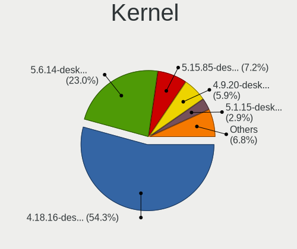

| Version                 | Computers | Percent |
|-------------------------|-----------|---------|
| 4.18.16-desktop-1bP     | 2275      | 54.26%  |
| 5.6.14-desktop-2bP      | 965       | 23.01%  |
| 5.15.85-desktop-1bP     | 301       | 7.18%   |
| 4.9.20-desktop-pae-1bP  | 246       | 5.87%   |
| 5.1.15-desktop-1bP      | 121       | 2.89%   |
| 6.6.32-power-1bP        | 86        | 2.05%   |
| 6.3.8-desktop-1bP       | 63        | 1.5%    |
| 6.3.3-desktop-1bP       | 24        | 0.57%   |
| 6.6.34-power-1bP        | 19        | 0.45%   |
| 6.4.3-desktop-1bP       | 11        | 0.26%   |
| 4.7.0-desktop-1bP       | 10        | 0.24%   |
| 4.9.20-desktop-1bP      | 8         | 0.19%   |
| 6.2.9-desktop-1bP       | 7         | 0.17%   |
| 6.6.11-power-1bP        | 6         | 0.14%   |
| 6.5.3-power-1bP         | 6         | 0.14%   |
| 6.5.7-power-1bP         | 4         | 0.1%    |
| 6.7.0-power-2bP         | 3         | 0.07%   |
| 5.6.14-server-2bP       | 3         | 0.07%   |
| 4.14.14-desktop-pae-1bP | 3         | 0.07%   |
| 6.9.3-power-1bP         | 2         | 0.05%   |
| 6.8.9-power-1bP         | 2         | 0.05%   |
| 6.7.2-tkg-pds           | 2         | 0.05%   |
| 6.7.0-rc4-tkg-eevdf     | 2         | 0.05%   |
| 6.11.4-power-1bP        | 2         | 0.05%   |
| 6.1.0-1bP               | 2         | 0.05%   |
| 5.10.1-desktop-2bP      | 2         | 0.05%   |
| 5.10.1-desktop-1bP      | 2         | 0.05%   |
| 5.1.15-server-1bP       | 2         | 0.05%   |
| 6.9.7-power-1bP         | 1         | 0.02%   |
| 6.9.5-power-1bP         | 1         | 0.02%   |
| 6.7.3_tkg_eevdf         | 1         | 0.02%   |
| 6.6.4-200.fc39.x86_64   | 1         | 0.02%   |
| 6.6.33-power-2bP        | 1         | 0.02%   |
| 6.6.30-power-1bP        | 1         | 0.02%   |
| 6.10.3-server-1bP       | 1         | 0.02%   |
| 5.8.11-desktop-2bP      | 1         | 0.02%   |
| 5.15.83-1-lts           | 1         | 0.02%   |
| 5.15.6-desktop-1bP      | 1         | 0.02%   |
| 5.15.160-desktop-1bP    | 1         | 0.02%   |
| 4.19.0-6-amd64          | 1         | 0.02%   |

Kernel Family
-------------

Linux kernel without a distro release

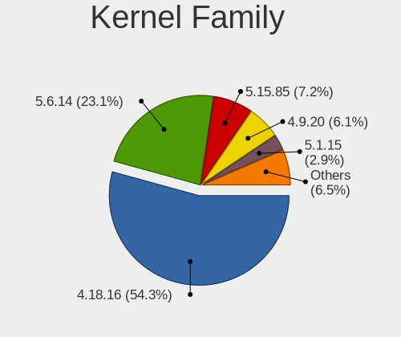

| Version  | Computers | Percent |
|----------|-----------|---------|
| 4.18.16  | 2275      | 54.27%  |
| 5.6.14   | 968       | 23.09%  |
| 5.15.85  | 301       | 7.18%   |
| 4.9.20   | 254       | 6.06%   |
| 5.1.15   | 122       | 2.91%   |
| 6.6.32   | 86        | 2.05%   |
| 6.3.8    | 63        | 1.5%    |
| 6.3.3    | 24        | 0.57%   |
| 6.6.34   | 19        | 0.45%   |
| 6.4.3    | 11        | 0.26%   |
| 4.7.0    | 10        | 0.24%   |
| 6.2.9    | 7         | 0.17%   |
| 6.6.11   | 6         | 0.14%   |
| 6.5.3    | 6         | 0.14%   |
| 6.7.0    | 5         | 0.12%   |
| 6.5.7    | 4         | 0.1%    |
| 5.10.1   | 4         | 0.1%    |
| 4.14.14  | 3         | 0.07%   |
| 6.9.3    | 2         | 0.05%   |
| 6.8.9    | 2         | 0.05%   |
| 6.7.2    | 2         | 0.05%   |
| 6.11.4   | 2         | 0.05%   |
| 6.1.0    | 2         | 0.05%   |
| 6.9.7    | 1         | 0.02%   |
| 6.9.5    | 1         | 0.02%   |
| 6.7.3    | 1         | 0.02%   |
| 6.6.4    | 1         | 0.02%   |
| 6.6.33   | 1         | 0.02%   |
| 6.6.30   | 1         | 0.02%   |
| 6.10.3   | 1         | 0.02%   |
| 5.8.11   | 1         | 0.02%   |
| 5.15.83  | 1         | 0.02%   |
| 5.15.6   | 1         | 0.02%   |
| 5.15.160 | 1         | 0.02%   |
| 4.19.0   | 1         | 0.02%   |
| 4.15.0   | 1         | 0.02%   |
| 3.13.0   | 1         | 0.02%   |

Kernel Major Ver.
-----------------

Linux kernel major version

| Version | Computers | Percent |
|---------|-----------|---------|
| 4.18    | 2275      | 54.56%  |
| 5.6     | 968       | 23.21%  |
| 5.15    | 303       | 7.27%   |
| 4.9     | 254       | 6.09%   |
| 5.1     | 122       | 2.93%   |
| 6.6     | 101       | 2.42%   |
| 6.3     | 80        | 1.92%   |
| 6.4     | 11        | 0.26%   |
| 6.5     | 10        | 0.24%   |
| 4.7     | 10        | 0.24%   |
| 6.7     | 7         | 0.17%   |
| 6.2     | 7         | 0.17%   |
| 6.9     | 4         | 0.1%    |
| 5.10    | 4         | 0.1%    |
| 4.14    | 3         | 0.07%   |
| 6.8     | 2         | 0.05%   |
| 6.11    | 2         | 0.05%   |
| 6.1     | 2         | 0.05%   |
| 6.10    | 1         | 0.02%   |
| 5.8     | 1         | 0.02%   |
| 4.19    | 1         | 0.02%   |
| 4.15    | 1         | 0.02%   |
| 3.13    | 1         | 0.02%   |

Arch
----

OS architecture (x86_64, i586, etc.)

| Name   | Computers | Percent |
|--------|-----------|---------|
| x86_64 | 3387      | 92.67%  |
| i686   | 267       | 7.31%   |
| unknow | 1         | 0.03%   |

DE
--

Desktop Environment

| Name     | Computers | Percent |
|----------|-----------|---------|
| KDE5     | 3426      | 94.85%  |
| Unknown  | 180       | 4.98%   |
| KDE      | 4         | 0.11%   |
| Cinnamon | 1         | 0.03%   |
| Budgie   | 1         | 0.03%   |

Display Server
--------------

X11 or Wayland

| Name    | Computers | Percent |
|---------|-----------|---------|
| X11     | 3585      | 99.28%  |
| Wayland | 20        | 0.55%   |
| Tty     | 4         | 0.11%   |
| Unknown | 2         | 0.06%   |

Display Manager
---------------

SDDM, LightDM, etc.

| Name    | Computers | Percent |
|---------|-----------|---------|
| SDDM    | 3590      | 99.45%  |
| Unknown | 17        | 0.47%   |
| LightDM | 2         | 0.06%   |
| XDM     | 1         | 0.03%   |

OS Lang
-------

Language

| Lang    | Computers | Percent |
|---------|-----------|---------|
| Unknown | 3596      | 99.7%   |
| hu_HU   | 10        | 0.28%   |
| en_AU   | 1         | 0.03%   |

Boot Mode
---------

EFI or BIOS

| Mode | Computers | Percent |
|------|-----------|---------|
| BIOS | 2526      | 66.65%  |
| EFI  | 1264      | 33.35%  |

Filesystem
----------

Type of filesystem

| Type    | Computers | Percent |
|---------|-----------|---------|
| Overlay | 2350      | 56.69%  |
| Ext4    | 1755      | 42.34%  |
| Btrfs   | 15        | 0.36%   |
| Unknown | 12        | 0.29%   |
| Ext3    | 5         | 0.12%   |
| Ext2    | 5         | 0.12%   |
| Ntfs    | 2         | 0.05%   |
| Xfs     | 1         | 0.02%   |

Part. scheme
------------

Scheme of partitioning

| Type    | Computers | Percent |
|---------|-----------|---------|
| MBR     | 2331      | 60.93%  |
| GPT     | 1457      | 38.08%  |
| Unknown | 38        | 0.99%   |

Dual Boot with Linux/BSD
------------------------

Hosting more than one Linux/BSD

| Dual boot | Computers | Percent |
|-----------|-----------|---------|
| No        | 2536      | 62.71%  |
| Yes       | 1508      | 37.29%  |

Dual Boot (Win)
---------------

Hosting Linux and Windows

| Dual boot | Computers | Percent |
|-----------|-----------|---------|
| No        | 2012      | 50.87%  |
| Yes       | 1943      | 49.13%  |

Board
-----

Vendor
------

Motherboard manufacturer

| Name                | Computers | Percent |
|---------------------|-----------|---------|
| Hewlett-Packard     | 581       | 16.13%  |
| ASUSTek Computer    | 548       | 15.21%  |
| Dell                | 481       | 13.35%  |
| Lenovo              | 454       | 12.6%   |
| Gigabyte Technology | 288       | 8%      |
| Acer                | 244       | 6.77%   |
| ASRock              | 228       | 6.33%   |
| MSI                 | 135       | 3.75%   |
| Toshiba             | 89        | 2.47%   |
| Fujitsu             | 83        | 2.3%    |
| Fujitsu Siemens     | 56        | 1.55%   |
| Samsung Electronics | 53        | 1.47%   |
| Packard Bell        | 36        | 1%      |
| Apple               | 35        | 0.97%   |
| Medion              | 30        | 0.83%   |
| Intel               | 29        | 0.81%   |
| Sony                | 24        | 0.67%   |
| eMachines           | 22        | 0.61%   |
| Foxconn             | 19        | 0.53%   |
| Unknown             | 14        | 0.39%   |
| Pegatron            | 12        | 0.33%   |
| Gateway             | 10        | 0.28%   |
| Biostar             | 7         | 0.19%   |
| Shuttle             | 6         | 0.17%   |
| Huanan              | 6         | 0.17%   |
| Alcor               | 6         | 0.17%   |
| Hungaro Flotta Kft  | 5         | 0.14%   |
| ECS                 | 5         | 0.14%   |
| Microsoft           | 4         | 0.11%   |
| BANGHO              | 4         | 0.11%   |
| Sapphire            | 3         | 0.08%   |
| Insyde              | 3         | 0.08%   |
| IBM                 | 3         | 0.08%   |
| Google              | 3         | 0.08%   |
| AMI                 | 3         | 0.08%   |
| Alienware           | 3         | 0.08%   |
| ABIT                | 3         | 0.08%   |
| ZOTAC               | 2         | 0.06%   |
| Supermicro          | 2         | 0.06%   |
| speedmaster         | 2         | 0.06%   |

Model
-----

Motherboard model

| Name                               | Computers | Percent |
|------------------------------------|-----------|---------|
| HP 250 G1                          | 43        | 1.19%   |
| ASRock FM2A75M Pro4+               | 32        | 0.89%   |
| ASUS All Series                    | 28        | 0.78%   |
| Unknown                            | 28        | 0.78%   |
| Dell Latitude E6410                | 21        | 0.58%   |
| Dell OptiPlex 3020                 | 19        | 0.53%   |
| HP ProBook 455 G1                  | 18        | 0.5%    |
| HP Notebook                        | 15        | 0.42%   |
| Lenovo IdeaPad 330-15IKB 81DE      | 14        | 0.39%   |
| Dell OptiPlex 780                  | 14        | 0.39%   |
| Dell OptiPlex 760                  | 13        | 0.36%   |
| Dell OptiPlex 755                  | 13        | 0.36%   |
| Gigabyte H61M-S1                   | 12        | 0.33%   |
| Lenovo G50-45 80E3                 | 11        | 0.31%   |
| Gigabyte G31M-ES2L                 | 11        | 0.31%   |
| Dell Inspiron 7737                 | 11        | 0.31%   |
| ASUS P5KPL-AM EPU                  | 10        | 0.28%   |
| Toshiba Satellite C660             | 9         | 0.25%   |
| MSI MS-7680                        | 9         | 0.25%   |
| Lenovo ThinkStation D20 4158AF8    | 9         | 0.25%   |
| Lenovo IdeaPad 100-15IBD 80QQ      | 9         | 0.25%   |
| HP ProDesk 600 G2 SFF              | 9         | 0.25%   |
| HP Pavilion g6                     | 9         | 0.25%   |
| HP 650                             | 9         | 0.25%   |
| HP 620                             | 9         | 0.25%   |
| Dell OptiPlex 745                  | 9         | 0.25%   |
| Dell Latitude 5480                 | 9         | 0.25%   |
| ASUS K50IJ                         | 9         | 0.25%   |
| ASRock G41M-VS3                    | 9         | 0.25%   |
| HP Compaq 8000 Elite SFF PC        | 8         | 0.22%   |
| HP 250 G5 Notebook PC              | 8         | 0.22%   |
| Dell OptiPlex 7010                 | 8         | 0.22%   |
| Dell Inspiron 3521                 | 8         | 0.22%   |
| ASUS X550CC                        | 8         | 0.22%   |
| MSI MS-7817                        | 7         | 0.19%   |
| HP Pavilion Notebook               | 7         | 0.19%   |
| HP EliteBook 8470p                 | 7         | 0.19%   |
| HP Compaq dc5800 Small Form Factor | 7         | 0.19%   |
| Gigabyte Z390 UD                   | 7         | 0.19%   |
| Gigabyte 970A-DS3P                 | 7         | 0.19%   |

Model Family
------------

Motherboard model prefix

| Name                    | Computers | Percent |
|-------------------------|-----------|---------|
| Acer Aspire             | 175       | 4.86%   |
| Dell Latitude           | 151       | 4.19%   |
| HP Compaq               | 146       | 4.05%   |
| Dell OptiPlex           | 143       | 3.97%   |
| Lenovo ThinkPad         | 138       | 3.83%   |
| Dell Inspiron           | 118       | 3.28%   |
| Lenovo IdeaPad          | 102       | 2.83%   |
| Toshiba Satellite       | 79        | 2.19%   |
| HP ProBook              | 78        | 2.17%   |
| HP EliteBook            | 67        | 1.86%   |
| HP 250                  | 60        | 1.67%   |
| HP Pavilion             | 57        | 1.58%   |
| Lenovo ThinkCentre      | 56        | 1.55%   |
| ASUS PRIME              | 41        | 1.14%   |
| Fujitsu ESPRIMO         | 34        | 0.94%   |
| Packard Bell EasyNote   | 32        | 0.89%   |
| ASUS VivoBook           | 32        | 0.89%   |
| ASRock FM2A75M          | 32        | 0.89%   |
| Fujitsu LIFEBOOK        | 31        | 0.86%   |
| ASUS All                | 28        | 0.78%   |
| Unknown                 | 28        | 0.78%   |
| Fujitsu Siemens ESPRIMO | 23        | 0.64%   |
| Fujitsu Siemens AMILO   | 22        | 0.61%   |
| Dell Precision          | 22        | 0.61%   |
| Dell Vostro             | 21        | 0.58%   |
| Acer TravelMate         | 20        | 0.56%   |
| Lenovo ThinkStation     | 17        | 0.47%   |
| HP Laptop               | 17        | 0.47%   |
| HP ProDesk              | 16        | 0.44%   |
| ASUS P5KPL-AM           | 16        | 0.44%   |
| HP Notebook             | 15        | 0.42%   |
| ASUS ROG                | 14        | 0.39%   |
| Gigabyte H61M-S1        | 12        | 0.33%   |
| Acer Veriton            | 12        | 0.33%   |
| Lenovo G50-45           | 11        | 0.31%   |
| HP EliteDesk            | 11        | 0.31%   |
| Gigabyte G31M-ES2L      | 11        | 0.31%   |
| Lenovo 3000             | 10        | 0.28%   |
| HP Presario             | 10        | 0.28%   |
| ASUS M5A97              | 10        | 0.28%   |

MFG Year
--------

Motherboard manufacture year

| Year    | Computers | Percent |
|---------|-----------|---------|
| 2013    | 393       | 10.91%  |
| 2011    | 389       | 10.8%   |
| 2010    | 355       | 9.86%   |
| 2012    | 337       | 9.36%   |
| 2009    | 298       | 8.27%   |
| 2008    | 294       | 8.16%   |
| 2014    | 284       | 7.88%   |
| 2007    | 210       | 5.83%   |
| 2015    | 193       | 5.36%   |
| 2018    | 185       | 5.14%   |
| 2016    | 172       | 4.78%   |
| 2017    | 145       | 4.03%   |
| 2019    | 102       | 2.83%   |
| 2006    | 89        | 2.47%   |
| 2020    | 66        | 1.83%   |
| 2021    | 37        | 1.03%   |
| 2005    | 24        | 0.67%   |
| 2024    | 9         | 0.25%   |
| 2022    | 8         | 0.22%   |
| 2023    | 6         | 0.17%   |
| 2004    | 4         | 0.11%   |
| 2003    | 1         | 0.03%   |
| Unknown | 1         | 0.03%   |

Form Factor
-----------

Physical design of the computer

| Name        | Computers | Percent |
|-------------|-----------|---------|
| Notebook    | 1985      | 55.11%  |
| Desktop     | 1540      | 42.75%  |
| All in one  | 35        | 0.97%   |
| Mini pc     | 18        | 0.5%    |
| Convertible | 9         | 0.25%   |
| Tablet      | 8         | 0.22%   |
| Server      | 6         | 0.17%   |
| Stick pc    | 1         | 0.03%   |

Secure Boot
-----------

Enabled or disabled

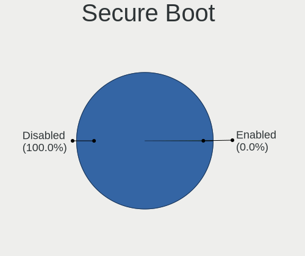

| State    | Computers | Percent |
|----------|-----------|---------|
| Disabled | 3602      | 99.97%  |
| Enabled  | 1         | 0.03%   |

Coreboot
--------

Have coreboot on board

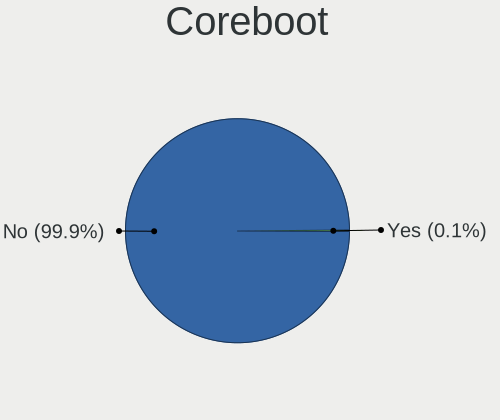

| Used | Computers | Percent |
|------|-----------|---------|
| No   | 3599      | 99.92%  |
| Yes  | 3         | 0.08%   |

RAM Size
--------

Total RAM memory

| Size in GB  | Computers | Percent |
|-------------|-----------|---------|
| 3.01-4.0    | 1302      | 34.73%  |
| 4.01-8.0    | 734       | 19.58%  |
| 8.01-16.0   | 715       | 19.07%  |
| 1.01-2.0    | 388       | 10.35%  |
| 16.01-24.0  | 311       | 8.3%    |
| 2.01-3.0    | 127       | 3.39%   |
| 32.01-64.0  | 78        | 2.08%   |
| 0.51-1.0    | 47        | 1.25%   |
| 24.01-32.0  | 38        | 1.01%   |
| 64.01-256.0 | 7         | 0.19%   |
| Unknown     | 2         | 0.05%   |

RAM Used
--------

Used RAM memory

| Used GB    | Computers | Percent |
|------------|-----------|---------|
| 0.51-1.0   | 1895      | 42.92%  |
| 1.01-2.0   | 1177      | 26.66%  |
| 0.01-0.5   | 1029      | 23.31%  |
| 2.01-3.0   | 200       | 4.53%   |
| 3.01-4.0   | 57        | 1.29%   |
| 4.01-8.0   | 44        | 1%      |
| 8.01-16.0  | 7         | 0.16%   |
| 16.01-24.0 | 3         | 0.07%   |
| Unknown    | 3         | 0.07%   |

Total Drives
------------

Number of drives on board

| Drives | Computers | Percent |
|--------|-----------|---------|
| 1      | 2627      | 67.17%  |
| 2      | 818       | 20.92%  |
| 3      | 258       | 6.6%    |
| 4      | 86        | 2.2%    |
| 0      | 62        | 1.59%   |
| 5      | 41        | 1.05%   |
| 6      | 10        | 0.26%   |
| 9      | 3         | 0.08%   |
| 10     | 2         | 0.05%   |
| 8      | 2         | 0.05%   |
| 7      | 2         | 0.05%   |

Has CD-ROM
----------

Has CD-ROM on board

| Presented | Computers | Percent |
|-----------|-----------|---------|
| Yes       | 2368      | 63.93%  |
| No        | 1336      | 36.07%  |

Has Ethernet
------------

Has Ethernet on board

| Presented | Computers | Percent |
|-----------|-----------|---------|
| Yes       | 3448      | 95.62%  |
| No        | 158       | 4.38%   |

Has WiFi
--------

Has WiFi module

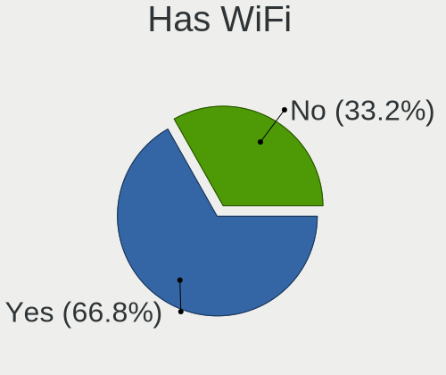

| Presented | Computers | Percent |
|-----------|-----------|---------|
| Yes       | 2437      | 66.8%   |
| No        | 1211      | 33.2%   |

Has Bluetooth
-------------

Has Bluetooth module

| Presented | Computers | Percent |
|-----------|-----------|---------|
| No        | 1984      | 53.83%  |
| Yes       | 1702      | 46.17%  |

Location
--------

Country
-------

Geographic location (country)

| Country      | Computers | Percent |
|--------------|-----------|---------|
| Hungary      | 2650      | 73.22%  |
| Germany      | 166       | 4.59%   |
| USA          | 141       | 3.9%    |
| Romania      | 66        | 1.82%   |
| Slovakia     | 58        | 1.6%    |
| UK           | 55        | 1.52%   |
| Italy        | 37        | 1.02%   |
| France       | 36        | 0.99%   |
| Austria      | 34        | 0.94%   |
| Spain        | 31        | 0.86%   |
| Brazil       | 31        | 0.86%   |
| Canada       | 29        | 0.8%    |
| Argentina    | 26        | 0.72%   |
| Serbia       | 21        | 0.58%   |
| Poland       | 19        | 0.53%   |
| Australia    | 19        | 0.53%   |
| Japan        | 18        | 0.5%    |
| Philippines  | 10        | 0.28%   |
| Ireland      | 10        | 0.28%   |
| Russia       | 9         | 0.25%   |
| Netherlands  | 8         | 0.22%   |
| Greece       | 8         | 0.22%   |
| Belgium      | 8         | 0.22%   |
| Switzerland  | 7         | 0.19%   |
| South Africa | 7         | 0.19%   |
| India        | 7         | 0.19%   |
| Ukraine      | 6         | 0.17%   |
| Finland      | 6         | 0.17%   |
| Turkey       | 4         | 0.11%   |
| Sweden       | 4         | 0.11%   |
| Mexico       | 4         | 0.11%   |
| Egypt        | 4         | 0.11%   |
| Czechia      | 4         | 0.11%   |
| China        | 4         | 0.11%   |
| Uruguay      | 3         | 0.08%   |
| Puerto Rico  | 3         | 0.08%   |
| Israel       | 3         | 0.08%   |
| Denmark      | 3         | 0.08%   |
| Cyprus       | 3         | 0.08%   |
| Belarus      | 3         | 0.08%   |

City
----

Geographic location (city)

| City              | Computers | Percent |
|-------------------|-----------|---------|
| Budapest          | 974       | 21.82%  |
| Miskolc           | 68        | 1.52%   |
| Zalaegerszeg      | 65        | 1.46%   |
| Gyr             | 64        | 1.43%   |
| Pcs             | 59        | 1.32%   |
| Debrecen          | 54        | 1.21%   |
| Tatabnya        | 50        | 1.12%   |
| Szeged            | 50        | 1.12%   |
| Szombathely       | 38        | 0.85%   |
| Szkesfehrvr | 38        | 0.85%   |
| Nyiregyhaza       | 38        | 0.85%   |
| Kecskemt        | 35        | 0.78%   |
| Veszprm         | 32        | 0.72%   |
| Szigetszentmiklos | 32        | 0.72%   |
| Karcag            | 32        | 0.72%   |
| Berettyjfalu  | 32        | 0.72%   |
| Szolnok           | 30        | 0.67%   |
| Szekszrd        | 28        | 0.63%   |
| Oroshaza          | 26        | 0.58%   |
| Eger              | 23        | 0.52%   |
| Cegled            | 23        | 0.52%   |
| Vienna            | 21        | 0.47%   |
| Gdll        | 21        | 0.47%   |
| Salgotarjan       | 20        | 0.45%   |
| rd              | 20        | 0.45%   |
| Bratislava        | 20        | 0.45%   |
| Toeroekbalint     | 19        | 0.43%   |
| Pomaz             | 19        | 0.43%   |
| Nagykanizsa       | 19        | 0.43%   |
| Ajka              | 17        | 0.38%   |
| Regensburg        | 16        | 0.36%   |
| Kaposvr         | 16        | 0.36%   |
| Dunajvros     | 16        | 0.36%   |
| Szorgalmatos      | 15        | 0.34%   |
| Kazincbarcika     | 15        | 0.34%   |
| Toekoel           | 14        | 0.31%   |
| Trgu Mure     | 14        | 0.31%   |
| Sopron            | 14        | 0.31%   |
| Papa              | 14        | 0.31%   |
| Hatvan            | 14        | 0.31%   |

Drives
------

Drive Vendor
------------

Hard drive vendors

| Vendor              | Computers | Drives | Percent |
|---------------------|-----------|--------|---------|
| WDC                 | 913       | 1798   | 17.34%  |
| Seagate             | 827       | 1372   | 15.71%  |
| Samsung Electronics | 598       | 1257   | 11.36%  |
| Kingston            | 579       | 1182   | 11%     |
| Toshiba             | 435       | 794    | 8.26%   |
| Hitachi             | 288       | 432    | 5.47%   |
| HGST                | 203       | 377    | 3.86%   |
| SanDisk             | 160       | 306    | 3.04%   |
| A-DATA Technology   | 125       | 237    | 2.37%   |
| Unknown             | 98        | 189    | 1.86%   |
| Crucial             | 86        | 155    | 1.63%   |
| Intel               | 73        | 126    | 1.39%   |
| Fujitsu             | 70        | 85     | 1.33%   |
| Maxtor              | 59        | 76     | 1.12%   |
| Intenso             | 57        | 127    | 1.08%   |
| SPCC                | 56        | 92     | 1.06%   |
| SK hynix            | 49        | 89     | 0.93%   |
| Apacer              | 38        | 66     | 0.72%   |
| JMicron Technology  | 37        | 42     | 0.7%    |
| Patriot             | 32        | 77     | 0.61%   |
| Micron Technology   | 32        | 70     | 0.61%   |
| China               | 31        | 50     | 0.59%   |
| PNY                 | 30        | 52     | 0.57%   |
| Gigabyte Technology | 22        | 63     | 0.42%   |
| OCZ                 | 21        | 27     | 0.4%    |
| Kingmax             | 21        | 51     | 0.4%    |
| LITEON              | 18        | 32     | 0.34%   |
| Hewlett-Packard     | 15        | 21     | 0.28%   |
| Team                | 13        | 21     | 0.25%   |
| Unknown             | 13        | 23     | 0.25%   |
| Verbatim            | 12        | 25     | 0.23%   |
| Transcend           | 12        | 19     | 0.23%   |
| Apple               | 12        | 24     | 0.23%   |
| XPG                 | 10        | 18     | 0.19%   |
| Netac               | 10        | 20     | 0.19%   |
| KingSpec            | 10        | 13     | 0.19%   |
| GOODRAM             | 10        | 12     | 0.19%   |
| Corsair             | 9         | 12     | 0.17%   |
| LITEONIT            | 8         | 20     | 0.15%   |
| Zheino              | 7         | 26     | 0.13%   |

Drive Model
-----------

Hard drive models

| Model                              | Computers | Percent |
|------------------------------------|-----------|---------|
| Kingston SA400S37240G 240GB SSD    | 129       | 2.24%   |
| Kingston SA400S37120G 120GB SSD    | 125       | 2.17%   |
| Kingston SV300S37A120G 120GB SSD   | 73        | 1.27%   |
| Kingston SA400S37480G 480GB SSD    | 68        | 1.18%   |
| Seagate ST500DM002-1BD142 500GB    | 58        | 1.01%   |
| Toshiba DT01ACA100 1TB             | 53        | 0.92%   |
| Seagate ST1000LM024 HN-M101MBB 1TB | 52        | 0.9%    |
| Seagate ST1000LM035-1RK172 1TB     | 51        | 0.89%   |
| Seagate ST500LT012-1DG142 500GB    | 47        | 0.82%   |
| Toshiba MQ01ABF050 500GB           | 46        | 0.8%    |
| Toshiba MQ01ABD100 1TB             | 46        | 0.8%    |
| Kingston SUV400S37120G 120GB SSD   | 38        | 0.66%   |
| HGST HTS545050A7E680 500GB         | 38        | 0.66%   |
| HGST HTS545032A7E380 320GB         | 35        | 0.61%   |
| Toshiba DT01ACA050 500GB           | 31        | 0.54%   |
| A-DATA SU630 240GB SSD             | 31        | 0.54%   |
| Samsung SSD 860 EVO 500GB          | 30        | 0.52%   |
| JMicron Generic 500GB              | 30        | 0.52%   |
| HGST HTS725050A7E630 500GB         | 30        | 0.52%   |
| Samsung SSD 850 EVO 250GB          | 28        | 0.49%   |
| Seagate ST9500325AS 500GB          | 27        | 0.47%   |
| Toshiba MQ04ABF100 1TB             | 24        | 0.42%   |
| Seagate ST500LT012-9WS142 500GB    | 24        | 0.42%   |
| Kingston SA400S37960G 960GB SSD    | 24        | 0.42%   |
| Seagate ST9320325AS 320GB          | 23        | 0.4%    |
| Seagate ST380815AS 80GB            | 23        | 0.4%    |
| WDC WD10JPVX-22JC3T0 1TB           | 21        | 0.36%   |
| SPCC Solid State Disk 256GB        | 21        | 0.36%   |
| Samsung SSD 860 EVO 250GB          | 21        | 0.36%   |
| A-DATA SU700 120GB SSD             | 21        | 0.36%   |
| WDC WD10EZEX-08WN4A0 1TB           | 20        | 0.35%   |
| Samsung HD502HJ 500GB              | 20        | 0.35%   |
| HGST HTS721010A9E630 1TB           | 20        | 0.35%   |
| Crucial CT120BX500SSD1 120GB       | 19        | 0.33%   |
| WDC WDS240G2G0A-00JH30 240GB SSD   | 18        | 0.31%   |
| Seagate ST3160815AS 160GB          | 18        | 0.31%   |
| HGST HTS541010A9E680 1TB           | 18        | 0.31%   |
| Toshiba MQ01ABD050 500GB           | 17        | 0.3%    |
| Kingston SV300S37A240G 240GB SSD   | 17        | 0.3%    |
| Hitachi HTS543232A7A384 320GB      | 17        | 0.3%    |

HDD Vendor
----------

Hard disk drive vendors

| Vendor              | Computers | Drives | Percent |
|---------------------|-----------|--------|---------|
| WDC                 | 848       | 1638   | 28.09%  |
| Seagate             | 811       | 1344   | 26.86%  |
| Toshiba             | 401       | 723    | 13.28%  |
| Hitachi             | 288       | 432    | 9.54%   |
| Samsung Electronics | 249       | 417    | 8.25%   |
| HGST                | 203       | 377    | 6.72%   |
| Fujitsu             | 70        | 85     | 2.32%   |
| Maxtor              | 58        | 75     | 1.92%   |
| JMicron Technology  | 31        | 35     | 1.03%   |
| Unknown             | 9         | 19     | 0.3%    |
| Hewlett-Packard     | 7         | 9      | 0.23%   |
| Apple               | 6         | 8      | 0.2%    |
| WD MediaMax         | 5         | 6      | 0.17%   |
| USB3.0              | 4         | 8      | 0.13%   |
| ASMT                | 4         | 6      | 0.13%   |
| ICY BOX             | 3         | 5      | 0.1%    |
| IBM/Hitachi         | 3         | 4      | 0.1%    |
| HGST HTS            | 3         | 8      | 0.1%    |
| USB                 | 2         | 3      | 0.07%   |
| TO Exter            | 2         | 3      | 0.07%   |
| QUANTUM             | 2         | 2      | 0.07%   |
| ExcelStor           | 2         | 2      | 0.07%   |
| Unknown             | 2         | 2      | 0.07%   |
| QC-FT-D             | 1         | 1      | 0.03%   |
| MARSHAL             | 1         | 2      | 0.03%   |
| Initio              | 1         | 2      | 0.03%   |
| IB-1122             | 1         | 1      | 0.03%   |
| Emphase             | 1         | 2      | 0.03%   |
| CSD                 | 1         | 2      | 0.03%   |

SSD Vendor
----------

Solid state drive vendors

| Vendor              | Computers | Drives | Percent |
|---------------------|-----------|--------|---------|
| Kingston            | 539       | 1057   | 29.36%  |
| Samsung Electronics | 275       | 585    | 14.98%  |
| SanDisk             | 136       | 252    | 7.41%   |
| A-DATA Technology   | 114       | 220    | 6.21%   |
| Crucial             | 78        | 141    | 4.25%   |
| WDC                 | 71        | 136    | 3.87%   |
| Intenso             | 57        | 127    | 3.1%    |
| Intel               | 54        | 87     | 2.94%   |
| SPCC                | 49        | 84     | 2.67%   |
| Apacer              | 36        | 62     | 1.96%   |
| SK hynix            | 31        | 52     | 1.69%   |
| Patriot             | 31        | 76     | 1.69%   |
| China               | 31        | 50     | 1.69%   |
| PNY                 | 30        | 52     | 1.63%   |
| Micron Technology   | 27        | 60     | 1.47%   |
| OCZ                 | 21        | 27     | 1.14%   |
| Toshiba             | 20        | 46     | 1.09%   |
| Kingmax             | 20        | 49     | 1.09%   |
| Gigabyte Technology | 19        | 55     | 1.03%   |
| LITEON              | 16        | 24     | 0.87%   |
| Team                | 13        | 21     | 0.71%   |
| Verbatim            | 12        | 25     | 0.65%   |
| Transcend           | 11        | 14     | 0.6%    |
| Netac               | 10        | 20     | 0.54%   |
| KingSpec            | 10        | 13     | 0.54%   |
| GOODRAM             | 9         | 11     | 0.49%   |
| Corsair             | 9         | 12     | 0.49%   |
| LITEONIT            | 8         | 20     | 0.44%   |
| Apple               | 6         | 16     | 0.33%   |
| Hewlett-Packard     | 4         | 6      | 0.22%   |
| BHT                 | 4         | 4      | 0.22%   |
| Unknown             | 3         | 6      | 0.16%   |
| sobetter            | 3         | 3      | 0.16%   |
| Seagate             | 3         | 3      | 0.16%   |
| KingFast            | 3         | 4      | 0.16%   |
| Integral            | 3         | 4      | 0.16%   |
| HS-SSD-C100         | 3         | 3      | 0.16%   |
| Emtec               | 3         | 3      | 0.16%   |
| Wibtek              | 2         | 2      | 0.11%   |
| USB3.0              | 2         | 2      | 0.11%   |

Drive Kind
----------

HDD or SSD

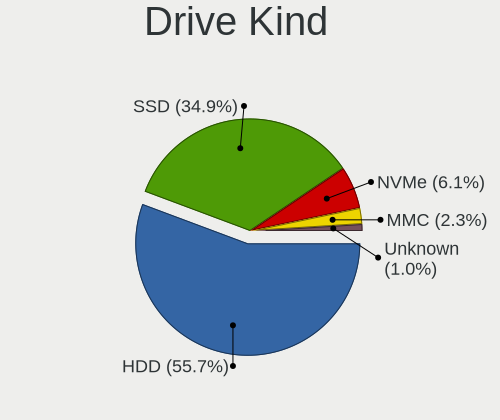

| Kind    | Computers | Drives | Percent |
|---------|-----------|--------|---------|
| HDD     | 2533      | 5221   | 55.69%  |
| SSD     | 1587      | 3539   | 34.89%  |
| NVMe    | 278       | 738    | 6.11%   |
| MMC     | 105       | 196    | 2.31%   |
| Unknown | 45        | 67     | 0.99%   |

Drive Connector
---------------

SATA, SAS, NVMe, etc.

| Type | Computers | Drives | Percent |
|------|-----------|--------|---------|
| SATA | 3395      | 8506   | 85.56%  |
| NVMe | 278       | 738    | 7.01%   |
| SAS  | 190       | 321    | 4.79%   |
| MMC  | 105       | 196    | 2.65%   |

Drive Size
----------

Size of hard drive

| Size in TB | Computers | Drives | Percent |
|------------|-----------|--------|---------|
| 0.01-0.5   | 2977      | 6417   | 73.62%  |
| 0.51-1.0   | 841       | 1775   | 20.8%   |
| 1.01-2.0   | 134       | 304    | 3.31%   |
| 3.01-4.0   | 36        | 96     | 0.89%   |
| 2.01-3.0   | 33        | 132    | 0.82%   |
| 4.01-10.0  | 21        | 33     | 0.52%   |
| 10.01-20.0 | 2         | 3      | 0.05%   |

Space Total
-----------

Amount of disk space available on the file system

| Size in GB     | Computers | Percent |
|----------------|-----------|---------|
| Unknown        | 2277      | 51.33%  |
| 101-250        | 806       | 18.17%  |
| 251-500        | 508       | 11.45%  |
| 51-100         | 281       | 6.33%   |
| 501-1000       | 223       | 5.03%   |
| 21-50          | 163       | 3.67%   |
| 1001-2000      | 87        | 1.96%   |
| 1-20           | 51        | 1.15%   |
| 2001-3000      | 25        | 0.56%   |
| More than 3000 | 14        | 0.32%   |
| 0              | 1         | 0.02%   |

Space Used
----------

Amount of used disk space

| Used GB        | Computers | Percent |
|----------------|-----------|---------|
| Unknown        | 2277      | 51.15%  |
| 1-20           | 1478      | 33.2%   |
| 21-50          | 258       | 5.8%    |
| 51-100         | 164       | 3.68%   |
| 101-250        | 137       | 3.08%   |
| 251-500        | 57        | 1.28%   |
| 501-1000       | 37        | 0.83%   |
| 1001-2000      | 34        | 0.76%   |
| 2001-3000      | 5         | 0.11%   |
| More than 3000 | 4         | 0.09%   |
| 0              | 1         | 0.02%   |

Malfunc. Drives
---------------

Drive models with a malfunction

| Model                              | Computers | Drives | Percent |
|------------------------------------|-----------|--------|---------|
| HGST HTS545032A7E380 320GB         | 34        | 63     | 2.21%   |
| Seagate ST500DM002-1BD142 500GB    | 29        | 46     | 1.89%   |
| HGST HTS545050A7E680 500GB         | 26        | 36     | 1.69%   |
| Seagate ST500LT012-9WS142 500GB    | 22        | 29     | 1.43%   |
| Kingston SV300S37A120G 120GB SSD   | 22        | 30     | 1.43%   |
| HGST HTS725050A7E630 500GB         | 22        | 31     | 1.43%   |
| Seagate ST500LT012-1DG142 500GB    | 21        | 38     | 1.37%   |
| Seagate ST1000LM024 HN-M101MBB 1TB | 21        | 28     | 1.37%   |
| A-DATA Technology SU630 240GB SSD  | 19        | 39     | 1.24%   |
| Seagate ST9500325AS 500GB          | 16        | 28     | 1.04%   |
| Samsung Electronics HD103UJ 1TB    | 14        | 32     | 0.91%   |
| Seagate ST9320325AS 320GB          | 13        | 29     | 0.85%   |
| HGST HTS541010A9E680 1TB           | 13        | 29     | 0.85%   |
| Toshiba MQ01ABF050 500GB           | 12        | 36     | 0.78%   |
| Toshiba MQ01ABD100 1TB             | 12        | 14     | 0.78%   |
| Toshiba DT01ACA100 1TB             | 12        | 25     | 0.78%   |
| Toshiba DT01ACA050 500GB           | 11        | 15     | 0.72%   |
| Seagate ST9250315AS 250GB          | 11        | 16     | 0.72%   |
| Samsung Electronics HM160HI 160GB  | 11        | 16     | 0.72%   |
| HGST HTS545050A7E380 500GB         | 11        | 18     | 0.72%   |
| WDC WD5000AAKX-001CA0 500GB        | 10        | 10     | 0.65%   |
| WDC WD5000AAKS-007AA0 500GB        | 10        | 31     | 0.65%   |
| Seagate ST1000LM035-1RK172 1TB     | 10        | 12     | 0.65%   |
| Hitachi HTS545050B9A300 500GB      | 10        | 16     | 0.65%   |
| Hitachi HTS543232A7A384 320GB      | 10        | 14     | 0.65%   |
| Toshiba MQ01ABD050 500GB           | 9         | 12     | 0.59%   |
| Hitachi HTS723232A7A364 320GB      | 9         | 9      | 0.59%   |
| Hitachi HTS545050A7E380 500GB      | 9         | 16     | 0.59%   |
| Seagate ST980811AS 80GB            | 8         | 9      | 0.52%   |
| Seagate ST3160815AS 160GB          | 8         | 12     | 0.52%   |
| Samsung Electronics HM321HI 320GB  | 8         | 14     | 0.52%   |
| WDC WD5000AAKS-00UU3A0 500GB       | 7         | 19     | 0.46%   |
| WDC WD10JPVX-22JC3T0 1TB           | 7         | 14     | 0.46%   |
| Seagate ST9500420AS 500GB          | 7         | 16     | 0.46%   |
| Seagate ST9320423AS 320GB          | 7         | 8      | 0.46%   |
| Seagate ST3500418AS 500GB          | 7         | 12     | 0.46%   |
| Samsung Electronics HD321KJ 320GB  | 7         | 7      | 0.46%   |
| WDC WD5000AADS-00S9B0 500GB        | 6         | 8      | 0.39%   |
| WDC WD10EARS-00Y5B1 1TB            | 6         | 16     | 0.39%   |
| Seagate ST3250318AS 250GB          | 6         | 9      | 0.39%   |

Malfunc. Drive Vendor
---------------------

Vendors of faulty drives

| Vendor              | Computers | Drives | Percent |
|---------------------|-----------|--------|---------|
| Seagate             | 353       | 544    | 23.93%  |
| WDC                 | 318       | 562    | 21.56%  |
| Hitachi             | 160       | 251    | 10.85%  |
| Toshiba             | 147       | 235    | 9.97%   |
| Samsung Electronics | 144       | 243    | 9.76%   |
| HGST                | 119       | 195    | 8.07%   |
| Kingston            | 52        | 86     | 3.53%   |
| Maxtor              | 34        | 48     | 2.31%   |
| A-DATA Technology   | 29        | 59     | 1.97%   |
| Fujitsu             | 26        | 38     | 1.76%   |
| Intel               | 21        | 44     | 1.42%   |
| SK hynix            | 9         | 14     | 0.61%   |
| OCZ                 | 8         | 11     | 0.54%   |
| SanDisk             | 6         | 7      | 0.41%   |
| WD MediaMax         | 5         | 6      | 0.34%   |
| Crucial             | 4         | 7      | 0.27%   |
| Intenso             | 3         | 3      | 0.2%    |
| Hewlett-Packard     | 3         | 3      | 0.2%    |
| China               | 3         | 3      | 0.2%    |
| KingSpec            | 2         | 2      | 0.14%   |
| Kingmax             | 2         | 2      | 0.14%   |
| ICY BOX             | 2         | 2      | 0.14%   |
| IBM/Hitachi         | 2         | 2      | 0.14%   |
| Apple               | 2         | 12     | 0.14%   |
| Apacer              | 2         | 3      | 0.14%   |
| Timetec             | 1         | 13     | 0.07%   |
| SPCC                | 1         | 1      | 0.07%   |
| SATAFIRM            | 1         | 1      | 0.07%   |
| QUANTUM             | 1         | 1      | 0.07%   |
| Patriot             | 1         | 1      | 0.07%   |
| Netac               | 1         | 1      | 0.07%   |
| Micron Technology   | 1         | 1      | 0.07%   |
| MARSHAL             | 1         | 1      | 0.07%   |
| LITEONIT            | 1         | 2      | 0.07%   |
| LITEON              | 1         | 1      | 0.07%   |
| KING                | 1         | 1      | 0.07%   |
| JMicron Technology  | 1         | 1      | 0.07%   |
| Initio              | 1         | 2      | 0.07%   |
| ExcelStor           | 1         | 1      | 0.07%   |
| CSD                 | 1         | 2      | 0.07%   |

Malfunc. HDD Vendor
-------------------

Vendors of faulty HDD drives

| Vendor              | Computers | Drives | Percent |
|---------------------|-----------|--------|---------|
| Seagate             | 353       | 544    | 27.13%  |
| WDC                 | 313       | 557    | 24.06%  |
| Hitachi             | 160       | 251    | 12.3%   |
| Toshiba             | 141       | 221    | 10.84%  |
| Samsung Electronics | 137       | 210    | 10.53%  |
| HGST                | 119       | 195    | 9.15%   |
| Maxtor              | 34        | 48     | 2.61%   |
| Fujitsu             | 26        | 38     | 2%      |
| WD MediaMax         | 5         | 6      | 0.38%   |
| ICY BOX             | 2         | 2      | 0.15%   |
| IBM/Hitachi         | 2         | 2      | 0.15%   |
| Hewlett-Packard     | 2         | 2      | 0.15%   |
| QUANTUM             | 1         | 1      | 0.08%   |
| MARSHAL             | 1         | 1      | 0.08%   |
| Initio              | 1         | 2      | 0.08%   |
| ExcelStor           | 1         | 1      | 0.08%   |
| CSD                 | 1         | 2      | 0.08%   |
| ASMT                | 1         | 1      | 0.08%   |
| Unknown             | 1         | 1      | 0.08%   |

Malfunc. Drive Kind
-------------------

Kinds of faulty drives

| Kind    | Computers | Drives | Percent |
|---------|-----------|--------|---------|
| HDD     | 1180      | 2085   | 87.34%  |
| SSD     | 164       | 323    | 12.14%  |
| NVMe    | 6         | 7      | 0.44%   |
| Unknown | 1         | 1      | 0.07%   |

Failed Drives
-------------

Failed drive models

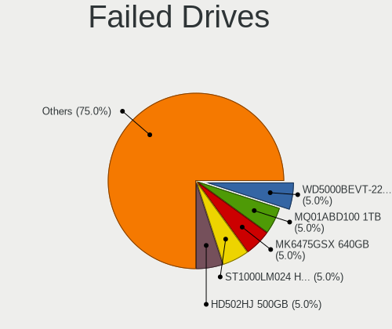

| Model                              | Computers | Drives | Percent |
|------------------------------------|-----------|--------|---------|
| WDC WD5000BEVT-22ZAT0 500GB        | 2         | 2      | 5%      |
| Toshiba MQ01ABD100 1TB             | 2         | 2      | 5%      |
| Toshiba MK6475GSX 640GB            | 2         | 2      | 5%      |
| Seagate ST1000LM024 HN-M101MBB 1TB | 2         | 2      | 5%      |
| Samsung Electronics HD502HJ 500GB  | 2         | 3      | 5%      |
| Samsung Electronics HD103SJ 1TB    | 2         | 2      | 5%      |
| Zheino CHN-NGFFNV2280-256 256GB    | 1         | 1      | 2.5%    |
| WDC WD5000BEVT-22A0RT0 500GB       | 1         | 7      | 2.5%    |
| WDC WD3200BVVT-63A26Y0 320GB       | 1         | 1      | 2.5%    |
| WDC WD3200BPVT-24JJ5T0 320GB       | 1         | 1      | 2.5%    |
| WDC WD3200BEVT-08A23T1 320GB       | 1         | 1      | 2.5%    |
| WDC WD2500LPCX-24C6HT0 250GB       | 1         | 1      | 2.5%    |
| WDC WD1600BEVT-80A23T0 160GB       | 1         | 1      | 2.5%    |
| WDC WD1600BEVT-22ZCT0 160GB        | 1         | 1      | 2.5%    |
| Toshiba MQ01ABD050V 500GB          | 1         | 1      | 2.5%    |
| Toshiba MK5055GSX 500GB            | 1         | 1      | 2.5%    |
| Toshiba MK3275GSX 320GB            | 1         | 1      | 2.5%    |
| Toshiba MK1665GSX 160GB            | 1         | 1      | 2.5%    |
| Toshiba MK1646GSX 160GB            | 1         | 1      | 2.5%    |
| Seagate ST9320325AS 320GB          | 1         | 1      | 2.5%    |
| Seagate ST9160412AS 160GB          | 1         | 1      | 2.5%    |
| Seagate ST380815AS 80GB            | 1         | 3      | 2.5%    |
| Seagate ST3160815AS 160GB          | 1         | 1      | 2.5%    |
| Samsung Electronics SSD 980 500GB  | 1         | 1      | 2.5%    |
| Samsung Electronics SP0802N 80GB   | 1         | 1      | 2.5%    |
| Samsung Electronics HM060HI 64GB   | 1         | 1      | 2.5%    |
| Samsung Electronics HD204UI 2TB    | 1         | 1      | 2.5%    |
| Samsung Electronics HD103UJ 1TB    | 1         | 1      | 2.5%    |
| OCZ-AGIL ITY3 64GB SSD             | 1         | 1      | 2.5%    |
| Intel SSDPEKKW256G7 256GB          | 1         | 1      | 2.5%    |
| Hitachi HDS721075CLA332 752GB      | 1         | 1      | 2.5%    |
| Hitachi HDS721010DLE630 1TB        | 1         | 1      | 2.5%    |
| Hewlett-Packard SSD EX900 250GB    | 1         | 1      | 2.5%    |
| ExcelStor Technology J8160S 165GB  | 1         | 1      | 2.5%    |

Failed Drive Vendor
-------------------

Failed drive vendors

| Vendor              | Computers | Drives | Percent |
|---------------------|-----------|--------|---------|
| WDC                 | 9         | 15     | 22.5%   |
| Toshiba             | 9         | 9      | 22.5%   |
| Samsung Electronics | 9         | 10     | 22.5%   |
| Seagate             | 6         | 8      | 15%     |
| Hitachi             | 2         | 2      | 5%      |
| Zheino              | 1         | 1      | 2.5%    |
| OCZ-AGIL            | 1         | 1      | 2.5%    |
| Intel               | 1         | 1      | 2.5%    |
| Hewlett-Packard     | 1         | 1      | 2.5%    |
| ExcelStor           | 1         | 1      | 2.5%    |

Drive Status
------------

Number of failed and malfunc. drives

| Status   | Computers | Drives | Percent |
|----------|-----------|--------|---------|
| Works    | 2676      | 6689   | 61.29%  |
| Malfunc  | 1319      | 2416   | 30.21%  |
| Detected | 331       | 607    | 7.58%   |
| Failed   | 40        | 49     | 0.92%   |

Storage controller
------------------

Storage Vendor
--------------

Storage controller vendors

| Vendor                           | Computers | Percent |
|----------------------------------|-----------|---------|
| Intel                            | 2728      | 67.78%  |
| AMD                              | 685       | 17.02%  |
| Samsung Electronics              | 108       | 2.68%   |
| Nvidia                           | 101       | 2.51%   |
| JMicron Technology               | 80        | 1.99%   |
| Kingston Technology Company      | 55        | 1.37%   |
| ASMedia Technology               | 41        | 1.02%   |
| Marvell Technology Group         | 33        | 0.82%   |
| SanDisk                          | 26        | 0.65%   |
| VIA Technologies                 | 24        | 0.6%    |
| Silicon Motion                   | 15        | 0.37%   |
| Phison Electronics               | 15        | 0.37%   |
| SK hynix                         | 14        | 0.35%   |
| Silicon Image                    | 14        | 0.35%   |
| Realtek Semiconductor            | 12        | 0.3%    |
| Toshiba America Info Systems     | 11        | 0.27%   |
| Solid State Storage Technology   | 7         | 0.17%   |
| Micron/Crucial Technology        | 7         | 0.17%   |
| ADATA Technology                 | 7         | 0.17%   |
| Micron Technology                | 6         | 0.15%   |
| Silicon Integrated Systems [SiS] | 5         | 0.12%   |
| KIOXIA                           | 5         | 0.12%   |
| Lite-On Technology               | 4         | 0.1%    |
| LSI Logic / Symbios Logic        | 3         | 0.07%   |
| O2 Micro                         | 2         | 0.05%   |
| MAXIO Technology (Hangzhou)      | 2         | 0.05%   |
| Integrated Technology Express    | 2         | 0.05%   |
| Hewlett-Packard                  | 2         | 0.05%   |
| Adaptec                          | 2         | 0.05%   |
| 3ware                            | 2         | 0.05%   |
| Zhaoxin                          | 1         | 0.02%   |
| ULi Electronics                  | 1         | 0.02%   |
| Shenzhen Longsys Electronics     | 1         | 0.02%   |
| Promise Technology               | 1         | 0.02%   |
| INNOGRIT                         | 1         | 0.02%   |
| Broadcom / LSI                   | 1         | 0.02%   |
| Apple                            | 1         | 0.02%   |

Storage Model
-------------

Storage controller models

| Model                                                                                   | Computers | Percent |
|-----------------------------------------------------------------------------------------|-----------|---------|
| AMD FCH SATA Controller [AHCI mode]                                                     | 396       | 7.69%   |
| Intel 7 Series Chipset Family 6-port SATA Controller [AHCI mode]                        | 233       | 4.53%   |
| Intel NM10/ICH7 Family SATA Controller [IDE mode]                                       | 196       | 3.81%   |
| Intel 8 Series/C220 Series Chipset Family 6-port SATA Controller 1 [AHCI mode]          | 176       | 3.42%   |
| Intel 82801G (ICH7 Family) IDE Controller                                               | 170       | 3.3%    |
| Intel 82801IBM/IEM (ICH9M/ICH9M-E) 4 port SATA Controller [AHCI mode]                   | 167       | 3.24%   |
| Intel 6 Series/C200 Series Chipset Family 6 port Mobile SATA AHCI Controller            | 152       | 2.95%   |
| Intel Sunrise Point-LP SATA Controller [AHCI mode]                                      | 135       | 2.62%   |
| AMD SB7x0/SB8x0/SB9x0 SATA Controller [AHCI mode]                                       | 131       | 2.55%   |
| AMD SB7x0/SB8x0/SB9x0 IDE Controller                                                    | 116       | 2.25%   |
| Intel 82801 Mobile SATA Controller [RAID mode]                                          | 107       | 2.08%   |
| Intel 82801HM/HEM (ICH8M/ICH8M-E) IDE Controller                                        | 102       | 1.98%   |
| Intel 8 Series SATA Controller 1 [AHCI mode]                                            | 95        | 1.85%   |
| Intel 6 Series/C200 Series Chipset Family 6 port Desktop SATA AHCI Controller           | 93        | 1.81%   |
| Intel 5 Series/3400 Series Chipset 4 port SATA AHCI Controller                          | 90        | 1.75%   |
| Intel 82801HM/HEM (ICH8M/ICH8M-E) SATA Controller [AHCI mode]                           | 86        | 1.67%   |
| AMD SB7x0/SB8x0/SB9x0 SATA Controller [IDE mode]                                        | 81        | 1.57%   |
| Intel Q170/Q150/B150/H170/H110/Z170/CM236 Chipset SATA Controller [AHCI Mode]           | 76        | 1.48%   |
| Intel 5 Series/3400 Series Chipset 6 port SATA AHCI Controller                          | 74        | 1.44%   |
| AMD FCH IDE Controller                                                                  | 70        | 1.36%   |
| Intel Wildcat Point-LP SATA Controller [AHCI Mode]                                      | 67        | 1.3%    |
| Intel 7 Series/C210 Series Chipset Family 6-port SATA Controller [AHCI mode]            | 63        | 1.22%   |
| Intel 200 Series PCH SATA controller [AHCI mode]                                        | 61        | 1.19%   |
| Intel SATA Controller [RAID Mode]                                                       | 59        | 1.15%   |
| Intel Atom Processor E3800 Series SATA AHCI Controller                                  | 59        | 1.15%   |
| Intel 6 Series/C200 Series Chipset Family Desktop SATA Controller (IDE mode, ports 4-5) | 59        | 1.15%   |
| Intel 6 Series/C200 Series Chipset Family Desktop SATA Controller (IDE mode, ports 0-3) | 59        | 1.15%   |
| Samsung NVMe SSD Controller SM981/PM981/PM983                                           | 56        | 1.09%   |
| Intel 4 Series Chipset PT IDER Controller                                               | 54        | 1.05%   |
| Intel Atom/Celeron/Pentium Processor x5-E8000/J3xxx/N3xxx Series SATA Controller        | 52        | 1.01%   |
| Intel 82801I (ICH9 Family) 2 port SATA Controller [IDE mode]                            | 50        | 0.97%   |
| JMicron JMB363 SATA/IDE Controller                                                      | 45        | 0.87%   |
| AMD 400 Series Chipset SATA Controller                                                  | 44        | 0.85%   |
| Intel NM10/ICH7 Family SATA Controller [AHCI mode]                                      | 41        | 0.8%    |
| Intel 82801JD/DO (ICH10 Family) SATA AHCI Controller                                    | 39        | 0.76%   |
| ASMedia ASM1061/ASM1062 Serial ATA Controller                                           | 39        | 0.76%   |
| Nvidia MCP61 SATA Controller                                                            | 36        | 0.7%    |
| Intel 5 Series/3400 Series Chipset 4 port SATA IDE Controller                           | 36        | 0.7%    |
| Intel 82801GBM/GHM (ICH7-M Family) SATA Controller [IDE mode]                           | 35        | 0.68%   |
| Intel 5 Series/3400 Series Chipset 2 port SATA IDE Controller                           | 35        | 0.68%   |

Storage Kind
------------

Kind of storage controller (IDE, SATA, NVMe, SAS, ...)

| Kind | Computers | Percent |
|------|-----------|---------|
| SATA | 2739      | 63.23%  |
| IDE  | 1092      | 25.21%  |
| NVMe | 279       | 6.44%   |
| RAID | 214       | 4.94%   |
| SCSI | 6         | 0.14%   |
| SAS  | 2         | 0.05%   |

Processor
---------

CPU Vendor
----------

Processor vendors

| Vendor       | Computers | Percent |
|--------------|-----------|---------|
| Intel        | 2830      | 78.57%  |
| AMD          | 770       | 21.38%  |
| CentaurHauls | 2         | 0.06%   |

CPU Model
---------

Processor models

| Model                                       | Computers | Percent |
|---------------------------------------------|-----------|---------|
| Intel Core 2 Duo CPU E8400 @ 3.00GHz        | 52        | 1.43%   |
| Intel Celeron CPU 1000M @ 1.80GHz           | 44        | 1.21%   |
| Intel Core i5-2520M CPU @ 2.50GHz           | 42        | 1.16%   |
| AMD A8-6600K APU with Radeon HD Graphics    | 34        | 0.94%   |
| Intel Core i5-7200U CPU @ 2.50GHz           | 30        | 0.83%   |
| Intel Core i5 CPU M 520 @ 2.40GHz           | 28        | 0.77%   |
| Intel Core i3-2120 CPU @ 3.30GHz            | 28        | 0.77%   |
| Intel Core 2 Duo CPU E7500 @ 2.93GHz        | 27        | 0.74%   |
| Intel Core i3-5005U CPU @ 2.00GHz           | 26        | 0.72%   |
| Intel Core i5-8250U CPU @ 1.60GHz           | 25        | 0.69%   |
| Intel Core 2 Quad CPU Q6600 @ 2.40GHz       | 25        | 0.69%   |
| Intel Core i5-3470 CPU @ 3.20GHz            | 24        | 0.66%   |
| Intel Core i5-2400 CPU @ 3.10GHz            | 24        | 0.66%   |
| Intel Core i5-6500 CPU @ 3.20GHz            | 23        | 0.63%   |
| Intel Core 2 Duo CPU P8600 @ 2.40GHz        | 23        | 0.63%   |
| Intel Pentium Dual-Core CPU T4400 @ 2.20GHz | 22        | 0.61%   |
| Intel Core i3-6006U CPU @ 2.00GHz           | 22        | 0.61%   |
| Intel Core i3-4160 CPU @ 3.60GHz            | 22        | 0.61%   |
| Intel Core i3-3220 CPU @ 3.30GHz            | 22        | 0.61%   |
| Intel Celeron CPU N3060 @ 1.60GHz           | 21        | 0.58%   |
| Intel Celeron CPU N2840 @ 2.16GHz           | 21        | 0.58%   |
| Intel Core i5-3210M CPU @ 2.50GHz           | 20        | 0.55%   |
| Intel Pentium Dual-Core CPU T4500 @ 2.30GHz | 19        | 0.52%   |
| Intel Core i5-3320M CPU @ 2.60GHz           | 19        | 0.52%   |
| Intel Core i7-4510U CPU @ 2.00GHz           | 18        | 0.5%    |
| Intel Core i5-5200U CPU @ 2.20GHz           | 18        | 0.5%    |
| Intel Core i3-2310M CPU @ 2.10GHz           | 18        | 0.5%    |
| AMD FX-6300 Six-Core Processor              | 18        | 0.5%    |
| AMD A10-5750M APU with Radeon HD Graphics   | 18        | 0.5%    |
| Intel Core i5-6200U CPU @ 2.30GHz           | 17        | 0.47%   |
| Intel Core i5-4210U CPU @ 1.70GHz           | 17        | 0.47%   |
| Intel Core i3-7020U CPU @ 2.30GHz           | 17        | 0.47%   |
| Intel Core 2 Duo CPU P8400 @ 2.26GHz        | 17        | 0.47%   |
| Intel Atom CPU N455 @ 1.66GHz               | 17        | 0.47%   |
| Intel Atom CPU N450 @ 1.66GHz               | 17        | 0.47%   |
| Intel Core i3-3217U CPU @ 1.80GHz           | 16        | 0.44%   |
| Intel Core i3 CPU M 370 @ 2.40GHz           | 16        | 0.44%   |
| Intel Core 2 Duo CPU T7500 @ 2.20GHz        | 16        | 0.44%   |
| Intel Core 2 Duo CPU E7300 @ 2.66GHz        | 16        | 0.44%   |
| Intel Core i5-2540M CPU @ 2.60GHz           | 15        | 0.41%   |

CPU Model Family
----------------

Processor model prefix

| Model                   | Computers | Percent |
|-------------------------|-----------|---------|
| Intel Core i5           | 701       | 19.36%  |
| Intel Core i3           | 444       | 12.27%  |
| Intel Core 2 Duo        | 377       | 10.41%  |
| Intel Celeron           | 289       | 7.98%   |
| Intel Core i7           | 276       | 7.62%   |
| Intel Pentium           | 169       | 4.67%   |
| Intel Pentium Dual-Core | 118       | 3.26%   |
| Intel Atom              | 97        | 2.68%   |
| AMD A8                  | 93        | 2.57%   |
| Intel Core 2 Quad       | 68        | 1.88%   |
| Intel Xeon              | 66        | 1.82%   |
| AMD Ryzen 5             | 64        | 1.77%   |
| AMD FX                  | 62        | 1.71%   |
| AMD A4                  | 58        | 1.6%    |
| Intel Core 2            | 55        | 1.52%   |
| AMD A10                 | 46        | 1.27%   |
| Intel Pentium Dual      | 45        | 1.24%   |
| Other                   | 44        | 1.22%   |
| AMD Athlon II X2        | 40        | 1.1%    |
| AMD A6                  | 39        | 1.08%   |
| AMD Ryzen 7             | 34        | 0.94%   |
| AMD Athlon 64 X2        | 34        | 0.94%   |
| AMD E                   | 28        | 0.77%   |
| AMD Ryzen 3             | 27        | 0.75%   |
| AMD Phenom II X4        | 26        | 0.72%   |
| Intel Pentium 4         | 23        | 0.64%   |
| AMD E1                  | 22        | 0.61%   |
| AMD E2                  | 20        | 0.55%   |
| Intel Genuine           | 16        | 0.44%   |
| Intel Pentium D         | 14        | 0.39%   |
| AMD Sempron             | 14        | 0.39%   |
| AMD Athlon II X4        | 14        | 0.39%   |
| Intel Celeron Dual-Core | 13        | 0.36%   |
| Intel Pentium Silver    | 10        | 0.28%   |
| Intel Celeron M         | 10        | 0.28%   |
| AMD Athlon Dual Core    | 10        | 0.28%   |
| AMD Athlon X4           | 9         | 0.25%   |
| AMD Athlon              | 9         | 0.25%   |
| Intel Pentium M         | 7         | 0.19%   |
| Intel Core Duo          | 7         | 0.19%   |

CPU Cores
---------

Number of processor cores

| Number  | Computers | Percent |
|---------|-----------|---------|
| 2       | 2313      | 63.72%  |
| 4       | 835       | 23%     |
| 1       | 258       | 7.11%   |
| 6       | 121       | 3.33%   |
| 8       | 55        | 1.52%   |
| 3       | 27        | 0.74%   |
| 18      | 6         | 0.17%   |
| 12      | 4         | 0.11%   |
| 10      | 4         | 0.11%   |
| 24      | 3         | 0.08%   |
| 16      | 3         | 0.08%   |
| Unknown | 1         | 0.03%   |

CPU Sockets
-----------

Number of sockets

| Number | Computers | Percent |
|--------|-----------|---------|
| 1      | 3583      | 99.42%  |
| 2      | 20        | 0.55%   |
| 4      | 1         | 0.03%   |

CPU Threads
-----------

Threads per core (Hyper-Threading)

| Number  | Computers | Percent |
|---------|-----------|---------|
| 1       | 2006      | 55.2%   |
| 2       | 1627      | 44.77%  |
| Unknown | 1         | 0.03%   |

CPU Op-Modes
------------

CPU Operation Modes (32-bit, 64-bit)

| Op mode        | Computers | Percent |
|----------------|-----------|---------|
| 32-bit, 64-bit | 3546      | 98.36%  |
| 32-bit         | 51        | 1.41%   |
| Unknown        | 8         | 0.22%   |

CPU Microcode
-------------

Microcode number

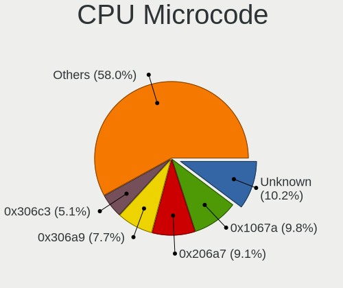

| Number     | Computers | Percent |
|------------|-----------|---------|
| Unknown    | 385       | 10.25%  |
| 0x1067a    | 367       | 9.77%   |
| 0x206a7    | 342       | 9.1%    |
| 0x306a9    | 290       | 7.72%   |
| 0x306c3    | 193       | 5.14%   |
| 0x20655    | 137       | 3.65%   |
| 0x6fd      | 107       | 2.85%   |
| 0x06001119 | 104       | 2.77%   |
| 0x10676    | 99        | 2.64%   |
| 0x40651    | 87        | 2.32%   |
| 0x010000c8 | 70        | 1.86%   |
| 0x306d4    | 65        | 1.73%   |
| 0x506e3    | 64        | 1.7%    |
| 0x6fb      | 61        | 1.62%   |
| 0x20652    | 55        | 1.46%   |
| 0x906e9    | 54        | 1.44%   |
| 0x406e3    | 54        | 1.44%   |
| 0x806e9    | 53        | 1.41%   |
| 0x906ea    | 52        | 1.38%   |
| 0x406c4    | 51        | 1.36%   |
| 0x106ca    | 50        | 1.33%   |
| 0x30678    | 47        | 1.25%   |
| 0x05000119 | 46        | 1.22%   |
| 0x07030105 | 36        | 0.96%   |
| 0x806ea    | 35        | 0.93%   |
| 0x6f6      | 30        | 0.8%    |
| 0x06003106 | 30        | 0.8%    |
| 0x0700010f | 29        | 0.77%   |
| 0x6f2      | 28        | 0.75%   |
| 0x06000852 | 27        | 0.72%   |
| 0x106c2    | 24        | 0.64%   |
| 0x406c3    | 23        | 0.61%   |
| 0x03000027 | 22        | 0.59%   |
| 0x706a1    | 21        | 0.56%   |
| 0x0600084f | 20        | 0.53%   |
| 0x806ec    | 19        | 0.51%   |
| 0x506c9    | 19        | 0.51%   |
| 0x10661    | 19        | 0.51%   |
| 0x0800820d | 17        | 0.45%   |
| 0x06006705 | 17        | 0.45%   |

CPU Microarch
-------------

Microarchitecture

| Name             | Computers | Percent |
|------------------|-----------|---------|
| Penryn           | 483       | 13.4%   |
| SandyBridge      | 352       | 9.76%   |
| Haswell          | 312       | 8.65%   |
| IvyBridge        | 305       | 8.46%   |
| KabyLake         | 271       | 7.52%   |
| Core             | 255       | 7.07%   |
| Westmere         | 218       | 6.05%   |
| Piledriver       | 153       | 4.24%   |
| Skylake          | 144       | 3.99%   |
| Silvermont       | 139       | 3.86%   |
| K10              | 128       | 3.55%   |
| Bonnell          | 79        | 2.19%   |
| K8 Hammer        | 76        | 2.11%   |
| Broadwell        | 76        | 2.11%   |
| Bobcat           | 67        | 1.86%   |
| Puma             | 52        | 1.44%   |
| Excavator        | 47        | 1.3%    |
| NetBurst         | 45        | 1.25%   |
| Zen              | 43        | 1.19%   |
| Zen+             | 38        | 1.05%   |
| Steamroller      | 37        | 1.03%   |
| Jaguar           | 33        | 0.92%   |
| Goldmont plus    | 31        | 0.86%   |
| Nehalem          | 29        | 0.8%    |
| P6               | 27        | 0.75%   |
| Zen 3            | 25        | 0.69%   |
| Zen 2            | 25        | 0.69%   |
| K10 Llano        | 25        | 0.69%   |
| Goldmont         | 24        | 0.67%   |
| TigerLake        | 16        | 0.44%   |
| Bulldozer        | 14        | 0.39%   |
| CometLake        | 13        | 0.36%   |
| Alderlake Hybrid | 8         | 0.22%   |
| K8 & K10 hybrid  | 7         | 0.19%   |
| Unknown          | 7         | 0.19%   |
| Gracemont        | 1         | 0.03%   |

Graphics
--------

GPU Vendor
----------

Vendors of graphics cards

| Vendor                                       | Computers | Percent |
|----------------------------------------------|-----------|---------|
| Intel                                        | 2095      | 51.21%  |
| Nvidia                                       | 989       | 24.18%  |
| AMD                                          | 986       | 24.1%   |
| VIA Technologies                             | 11        | 0.27%   |
| Silicon Integrated Systems [SiS]             | 3         | 0.07%   |
| XGI Technology (eXtreme Graphics Innovation) | 2         | 0.05%   |
| Matrox Electronics Systems                   | 2         | 0.05%   |
| ATI Technologies                             | 2         | 0.05%   |
| Zhaoxin                                      | 1         | 0.02%   |

GPU Model
---------

Graphics card models

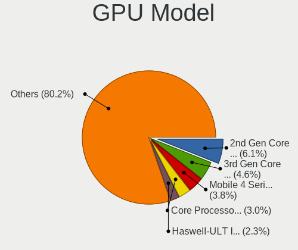

| Model                                                                                    | Computers | Percent |
|------------------------------------------------------------------------------------------|-----------|---------|
| Intel 2nd Generation Core Processor Family Integrated Graphics Controller                | 263       | 6.05%   |
| Intel 3rd Gen Core processor Graphics Controller                                         | 200       | 4.6%    |
| Intel Mobile 4 Series Chipset Integrated Graphics Controller                             | 167       | 3.84%   |
| Intel Core Processor Integrated Graphics Controller                                      | 131       | 3.01%   |
| Intel Haswell-ULT Integrated Graphics Controller                                         | 98        | 2.25%   |
| Intel 4 Series Chipset Integrated Graphics Controller                                    | 84        | 1.93%   |
| Intel Atom/Celeron/Pentium Processor x5-E8000/J3xxx/N3xxx Integrated Graphics Controller | 76        | 1.75%   |
| Intel Xeon E3-1200 v3/4th Gen Core Processor Integrated Graphics Controller              | 72        | 1.66%   |
| Intel Mobile GM965/GL960 Integrated Graphics Controller (secondary)                      | 69        | 1.59%   |
| Intel Mobile GM965/GL960 Integrated Graphics Controller (primary)                        | 69        | 1.59%   |
| Intel HD Graphics 5500                                                                   | 67        | 1.54%   |
| Intel Mobile 945GM/GMS/GME, 943/940GML Express Integrated Graphics Controller            | 64        | 1.47%   |
| Intel Atom Processor Z36xxx/Z37xxx Series Graphics & Display                             | 63        | 1.45%   |
| Intel HD Graphics 620                                                                    | 60        | 1.38%   |
| Intel Skylake GT2 [HD Graphics 520]                                                      | 57        | 1.31%   |
| Nvidia GK208B [GeForce GT 710]                                                           | 54        | 1.24%   |
| Intel 4th Gen Core Processor Integrated Graphics Controller                              | 51        | 1.17%   |
| Intel Xeon E3-1200 v2/3rd Gen Core processor Graphics Controller                         | 49        | 1.13%   |
| Intel HD Graphics 530                                                                    | 49        | 1.13%   |
| Intel Atom Processor D4xx/D5xx/N4xx/N5xx Integrated Graphics Controller                  | 48        | 1.1%    |
| Intel Mobile 945GM/GMS, 943/940GML Express Integrated Graphics Controller                | 46        | 1.06%   |
| Nvidia GT218 [GeForce 210]                                                               | 43        | 0.99%   |
| Intel 82G33/G31 Express Integrated Graphics Controller                                   | 42        | 0.97%   |
| AMD Caicos [Radeon HD 6450/7450/8450 / R5 230 OEM]                                       | 39        | 0.9%    |
| Intel 4th Generation Core Processor Family Integrated Graphics Controller                | 37        | 0.85%   |
| AMD Mullins [Radeon R4/R5 Graphics]                                                      | 37        | 0.85%   |
| Intel UHD Graphics 620                                                                   | 35        | 0.81%   |
| AMD Richland [Radeon HD 8570D]                                                           | 34        | 0.78%   |
| AMD Ellesmere [Radeon RX 470/480/570/570X/580/580X/590]                                  | 33        | 0.76%   |
| AMD Cedar [Radeon HD 5000/6000/7350/8350 Series]                                         | 33        | 0.76%   |
| Intel CoffeeLake-S GT2 [UHD Graphics 630]                                                | 32        | 0.74%   |
| Nvidia GF117M [GeForce 610M/710M/810M/820M / GT 620M/625M/630M/720M]                     | 31        | 0.71%   |
| Intel 82945G/GZ Integrated Graphics Controller                                           | 27        | 0.62%   |
| Intel HD Graphics 630                                                                    | 26        | 0.6%    |
| AMD Sun XT [Radeon HD 8670A/8670M/8690M / R5 M330 / M430 / Radeon 520 Mobile]            | 26        | 0.6%    |
| AMD Oland PRO [Radeon R7 240/340 / Radeon 520]                                           | 26        | 0.6%    |
| AMD Seymour [Radeon HD 6400M/7400M Series]                                               | 25        | 0.58%   |
| Nvidia GP107 [GeForce GTX 1050 Ti]                                                       | 24        | 0.55%   |
| Nvidia GK208BM [GeForce 920M]                                                            | 24        | 0.55%   |
| AMD Topaz XT [Radeon R7 M260/M265 / M340/M360 / M440/M445 / 530/535 / 620/625 Mobile]    | 23        | 0.53%   |

GPU Combo
---------

Combinations of graphics cards

| Name           | Computers | Percent |
|----------------|-----------|---------|
| 1 x Intel      | 1682      | 45.87%  |
| 1 x AMD        | 795       | 21.68%  |
| 1 x Nvidia     | 665       | 18.13%  |
| Intel + Nvidia | 304       | 8.29%   |
| 2 x AMD        | 94        | 2.56%   |
| Intel + AMD    | 85        | 2.32%   |
| AMD + Nvidia   | 17        | 0.46%   |
| 1 x VIA        | 11        | 0.3%    |
| 2 x Nvidia     | 4         | 0.11%   |
| 1 x SiS        | 3         | 0.08%   |
| 2 x Intel      | 2         | 0.05%   |
| 1 x Matrox     | 2         | 0.05%   |
| 1 x Zhaoxin    | 1         | 0.03%   |
| 1 x XGI        | 1         | 0.03%   |
| AMD + XGI      | 1         | 0.03%   |

GPU Driver
----------

Free vs proprietary

| Driver      | Computers | Percent |
|-------------|-----------|---------|
| Free        | 3514      | 96.72%  |
| Unknown     | 113       | 3.11%   |
| Proprietary | 6         | 0.17%   |

GPU Memory
----------

Total video memory

| Size in GB | Computers | Percent |
|------------|-----------|---------|
| Unknown    | 1769      | 46.95%  |
| 0.01-0.5   | 719       | 19.08%  |
| 0.51-1.0   | 548       | 14.54%  |
| 1.01-2.0   | 458       | 12.15%  |
| 3.01-4.0   | 148       | 3.93%   |
| 7.01-8.0   | 46        | 1.22%   |
| 5.01-6.0   | 36        | 0.96%   |
| 2.01-3.0   | 28        | 0.74%   |
| 8.01-16.0  | 15        | 0.4%    |
| 4.01-5.0   | 1         | 0.03%   |

Monitor
-------

Monitor Vendor
--------------

Monitor vendors

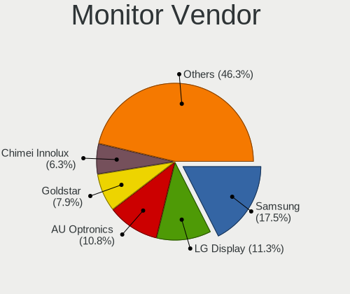

| Vendor                  | Computers | Percent |
|-------------------------|-----------|---------|
| Samsung Electronics     | 651       | 17.5%   |
| LG Display              | 421       | 11.32%  |
| AU Optronics            | 400       | 10.75%  |
| Goldstar                | 293       | 7.88%   |
| Chimei Innolux          | 233       | 6.26%   |
| BOE                     | 166       | 4.46%   |
| Dell                    | 147       | 3.95%   |
| Chi Mei Optoelectronics | 143       | 3.84%   |
| Hewlett-Packard         | 114       | 3.06%   |
| Philips                 | 98        | 2.63%   |
| Lenovo                  | 98        | 2.63%   |
| BenQ                    | 92        | 2.47%   |
| Acer                    | 92        | 2.47%   |
| Ancor Communications    | 84        | 2.26%   |
| AOC                     | 57        | 1.53%   |
| Fujitsu Siemens         | 52        | 1.4%    |
| LG Philips              | 36        | 0.97%   |
| Apple                   | 36        | 0.97%   |
| HannStar                | 32        | 0.86%   |
| Vestel Elektronik       | 27        | 0.73%   |
| InfoVision              | 26        | 0.7%    |
| Sony                    | 24        | 0.65%   |
| Iiyama                  | 24        | 0.65%   |
| Eizo                    | 23        | 0.62%   |
| Toshiba                 | 17        | 0.46%   |
| NEC Computers           | 17        | 0.46%   |
| HKC                     | 17        | 0.46%   |
| CPT                     | 17        | 0.46%   |
| PANDA                   | 16        | 0.43%   |
| ASUSTek Computer        | 16        | 0.43%   |
| ViewSonic               | 15        | 0.4%    |
| Medion                  | 15        | 0.4%    |
| InnoLux Display         | 12        | 0.32%   |
| Panasonic               | 11        | 0.3%    |
| Quanta Display          | 10        | 0.27%   |
| Plain Tree Systems      | 10        | 0.27%   |
| IBM                     | 10        | 0.27%   |
| OEM                     | 9         | 0.24%   |
| Belinea                 | 9         | 0.24%   |
| MStar                   | 8         | 0.22%   |

Monitor Model
-------------

Monitor models

| Model                                                                    | Computers | Percent |
|--------------------------------------------------------------------------|-----------|---------|
| LG Display LCD Monitor LGD0395 1366x768 344x194mm 15.5-inch              | 50        | 1.31%   |
| Samsung Electronics LCD Monitor SEC5441 1280x800 286x179mm 13.3-inch     | 36        | 0.95%   |
| BenQ EW277HDR BNQ7948 1920x1080 598x336mm 27.0-inch                      | 30        | 0.79%   |
| AU Optronics LCD Monitor AUO38ED 1920x1080 344x193mm 15.5-inch           | 28        | 0.74%   |
| Vestel Elektronik 49FHD_LCD_TV VES3700 1920x1080 1280x720mm 57.8-inch    | 27        | 0.71%   |
| Chi Mei Optoelectronics LCD Monitor CMO15A7 1366x768 344x193mm 15.5-inch | 27        | 0.71%   |
| AU Optronics LCD Monitor AUO22EC 1366x768 344x193mm 15.5-inch            | 26        | 0.68%   |
| LG Display LCD Monitor LGD02DC 1366x768 344x194mm 15.5-inch              | 25        | 0.66%   |
| BOE LCD Monitor BOE06A5 1366x768 344x194mm 15.5-inch                     | 23        | 0.6%    |
| AU Optronics LCD Monitor AUO26EC 1366x768 344x193mm 15.5-inch            | 19        | 0.5%    |
| Chimei Innolux LCD Monitor CMN15DB 1366x768 344x193mm 15.5-inch          | 18        | 0.47%   |
| Goldstar 2D HD TV GSM59CA 1366x768 509x286mm 23.0-inch                   | 17        | 0.45%   |
| Chi Mei Optoelectronics LCD Monitor CMO1592 1366x768 350x190mm 15.7-inch | 17        | 0.45%   |
| LG Display LCD Monitor LGD033A 1366x768 340x190mm 15.3-inch              | 16        | 0.42%   |
| LG Display LP156WH2-TLAA LGD0230 1366x768 344x194mm 15.5-inch            | 15        | 0.39%   |
| Chimei Innolux LCD Monitor CMN15CA 1366x768 344x193mm 15.5-inch          | 13        | 0.34%   |
| BOE LCD Monitor BOE0675 1366x768 344x194mm 15.5-inch                     | 13        | 0.34%   |
| AU Optronics LCD Monitor AUO10EC 1366x768 344x193mm 15.5-inch            | 13        | 0.34%   |
| Iiyama PL2473HD IVM6107 1920x1080 521x293mm 23.5-inch                    | 12        | 0.32%   |
| HKC Monitor HKC1850 1366x768 409x230mm 18.5-inch                         | 12        | 0.32%   |
| Chimei Innolux LCD Monitor CMN15BC 1366x768 344x194mm 15.5-inch          | 12        | 0.32%   |
| BOE LCD Monitor BOE0672 1366x768 344x194mm 15.5-inch                     | 12        | 0.32%   |
| Ancor Communications ASUS VW193D ACI19D5 1440x900 408x255mm 18.9-inch    | 12        | 0.32%   |
| Samsung Electronics S19B150 SAM08A2 1366x768 410x230mm 18.5-inch         | 11        | 0.29%   |
| LG Display LCD Monitor LGD0365 1600x900 382x215mm 17.3-inch              | 11        | 0.29%   |
| Chimei Innolux LCD Monitor CMN15AB 1366x768 344x193mm 15.5-inch          | 11        | 0.29%   |
| Chi Mei Optoelectronics LCD Monitor CMO15A1 1366x768 344x193mm 15.5-inch | 11        | 0.29%   |
| AU Optronics LCD Monitor AUO20EC 1366x768 344x193mm 15.5-inch            | 11        | 0.29%   |
| Samsung Electronics C24F390 SAM0D2C 1920x1080 521x293mm 23.5-inch        | 10        | 0.26%   |
| Chimei Innolux LCD Monitor CMN1734 1600x900 382x214mm 17.2-inch          | 10        | 0.26%   |
| Chimei Innolux LCD Monitor CMN15D5 1920x1080 344x193mm 15.5-inch         | 10        | 0.26%   |
| Chimei Innolux LCD Monitor CMN1119 1366x768 256x144mm 11.6-inch          | 10        | 0.26%   |
| AU Optronics LCD Monitor AUO46EC 1366x768 344x193mm 15.5-inch            | 10        | 0.26%   |
| AU Optronics LCD Monitor AUO23EC 1366x768 344x193mm 15.5-inch            | 10        | 0.26%   |
| AU Optronics LCD Monitor AUO21ED 1920x1080 344x193mm 15.5-inch           | 10        | 0.26%   |
| AOC Q32G1WG4 AOC3201 2560x1440 697x393mm 31.5-inch                       | 10        | 0.26%   |
| Samsung Electronics SyncMaster SAM011E 1280x1024 338x270mm 17.0-inch     | 9         | 0.24%   |
| Samsung Electronics LS49A950U SAM71CC 3840x1080 1192x336mm 48.8-inch     | 9         | 0.24%   |
| Samsung Electronics LCD Monitor SEC324A 1366x768 344x194mm 15.5-inch     | 9         | 0.24%   |
| Samsung Electronics LCD Monitor SEC3245 1366x768 344x194mm 15.5-inch     | 9         | 0.24%   |

Monitor Resolution
------------------

Monitor screen resolution

| Resolution         | Computers | Percent |
|--------------------|-----------|---------|
| 1366x768 (WXGA)    | 1098      | 30.17%  |
| 1920x1080 (FHD)    | 1065      | 29.27%  |
| 1280x1024 (SXGA)   | 261       | 7.17%   |
| 1280x800 (WXGA)    | 207       | 5.69%   |
| 1600x900 (HD+)     | 202       | 5.55%   |
| 1680x1050 (WSXGA+) | 179       | 4.92%   |
| 1440x900 (WXGA+)   | 175       | 4.81%   |
| 3840x2160 (4K)     | 117       | 3.22%   |
| 1920x1200 (WUXGA)  | 54        | 1.48%   |
| 1024x600           | 48        | 1.32%   |
| 1360x768           | 41        | 1.13%   |
| 2560x1440 (QHD)    | 33        | 0.91%   |
| 2560x1080          | 33        | 0.91%   |
| 1024x768 (XGA)     | 33        | 0.91%   |
| 1920x540           | 19        | 0.52%   |
| 3840x1080          | 12        | 0.33%   |
| 1600x1200          | 9         | 0.25%   |
| 1280x720 (HD)      | 9         | 0.25%   |
| 2288x1287          | 7         | 0.19%   |
| 2560x1600          | 6         | 0.16%   |
| 3440x1440          | 5         | 0.14%   |
| 1152x864           | 4         | 0.11%   |
| 1280x768           | 3         | 0.08%   |
| 2880x1920          | 2         | 0.05%   |
| 1920x1280          | 2         | 0.05%   |
| 1680x945           | 2         | 0.05%   |
| 1280x960           | 2         | 0.05%   |
| 800x600            | 1         | 0.03%   |
| 800x1280           | 1         | 0.03%   |
| 4093x4093          | 1         | 0.03%   |
| 3840x2400          | 1         | 0.03%   |
| 3840x1200          | 1         | 0.03%   |
| 2880x1200          | 1         | 0.03%   |
| 2160x1440          | 1         | 0.03%   |
| 2048x1536          | 1         | 0.03%   |
| 1400x1050          | 1         | 0.03%   |
| 1024x576           | 1         | 0.03%   |
| Unknown            | 1         | 0.03%   |

Monitor Diagonal
----------------

Diagonal size in inches

| Inches  | Computers | Percent |
|---------|-----------|---------|
| 15      | 1211      | 32.35%  |
| 17      | 284       | 7.59%   |
| 21      | 274       | 7.32%   |
| 19      | 230       | 6.14%   |
| 23      | 217       | 5.8%    |
| 14      | 205       | 5.48%   |
| 24      | 155       | 4.14%   |
| 27      | 151       | 4.03%   |
| 13      | 141       | 3.77%   |
| 18      | 137       | 3.66%   |
| 22      | 123       | 3.29%   |
| 20      | 82        | 2.19%   |
| 12      | 82        | 2.19%   |
| 10      | 56        | 1.5%    |
| 11      | 53        | 1.42%   |
| Unknown | 47        | 1.26%   |
| 31      | 45        | 1.2%    |
| 84      | 38        | 1.02%   |
| 34      | 35        | 0.94%   |
| 72      | 18        | 0.48%   |
| 32      | 18        | 0.48%   |
| 40      | 16        | 0.43%   |
| 54      | 13        | 0.35%   |
| 52      | 11        | 0.29%   |
| 65      | 10        | 0.27%   |
| 48      | 10        | 0.27%   |
| 49      | 7         | 0.19%   |
| 42      | 7         | 0.19%   |
| 26      | 7         | 0.19%   |
| 25      | 7         | 0.19%   |
| 46      | 5         | 0.13%   |
| 8       | 5         | 0.13%   |
| 142     | 4         | 0.11%   |
| 55      | 4         | 0.11%   |
| 16      | 4         | 0.11%   |
| 60      | 3         | 0.08%   |
| 58      | 3         | 0.08%   |
| 50      | 3         | 0.08%   |
| 39      | 3         | 0.08%   |
| 29      | 3         | 0.08%   |

Monitor Width
-------------

Physical width

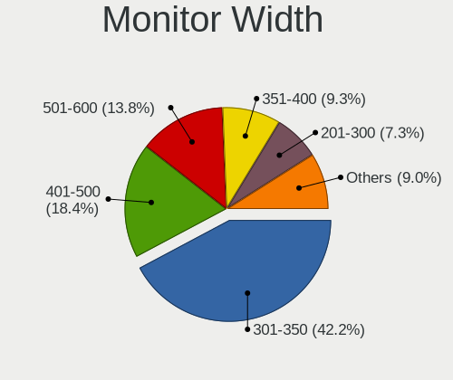

| Width in mm    | Computers | Percent |
|----------------|-----------|---------|
| 301-350        | 1557      | 42.21%  |
| 401-500        | 677       | 18.35%  |
| 501-600        | 509       | 13.8%   |
| 351-400        | 344       | 9.33%   |
| 201-300        | 271       | 7.35%   |
| 1001-1500      | 72        | 1.95%   |
| 1501-2000      | 58        | 1.57%   |
| 601-700        | 57        | 1.55%   |
| 701-800        | 54        | 1.46%   |
| Unknown        | 47        | 1.27%   |
| 801-900        | 22        | 0.6%    |
| 901-1000       | 10        | 0.27%   |
| 101-200        | 6         | 0.16%   |
| More than 2000 | 4         | 0.11%   |
| 1-100          | 1         | 0.03%   |

Aspect Ratio
------------

Proportional relationship between the width and the height

| Ratio   | Computers | Percent |
|---------|-----------|---------|
| 16/9    | 2491      | 71.05%  |
| 16/10   | 590       | 16.83%  |
| 5/4     | 259       | 7.39%   |
| 4/3     | 60        | 1.71%   |
| 21/9    | 38        | 1.08%   |
| 3/2     | 27        | 0.77%   |
| Unknown | 14        | 0.4%    |
| 32/9    | 13        | 0.37%   |
| 6/5     | 7         | 0.2%    |
| 1.00    | 5         | 0.14%   |
| 0.67    | 1         | 0.03%   |
| 0.62    | 1         | 0.03%   |

Monitor Area
------------

Area in inch

| Area in inch | Computers | Percent |
|----------------|-----------|---------|
| 101-110        | 1196      | 32.26%  |
| 201-250        | 634       | 17.1%   |
| 151-200        | 395       | 10.66%  |
| 81-90          | 280       | 7.55%   |
| 141-150        | 242       | 6.53%   |
| 301-350        | 154       | 4.15%   |
| More than 1000 | 115       | 3.1%    |
| 121-130        | 113       | 3.05%   |
| 351-500        | 100       | 2.7%    |
| 61-70          | 74        | 2%      |
| 71-80          | 65        | 1.75%   |
| 251-300        | 62        | 1.67%   |
| 51-60          | 55        | 1.48%   |
| 41-50          | 54        | 1.46%   |
| 501-1000       | 49        | 1.32%   |
| Unknown        | 47        | 1.27%   |
| 131-140        | 40        | 1.08%   |
| 111-120        | 14        | 0.38%   |
| 91-100         | 11        | 0.3%    |
| 1-40           | 7         | 0.19%   |

Pixel Density
-------------

Pixels per inch

| Density       | Computers | Percent |
|---------------|-----------|---------|
| 51-100        | 1574      | 43.8%   |
| 101-120       | 1300      | 36.17%  |
| 121-160       | 519       | 14.44%  |
| 1-50          | 94        | 2.62%   |
| 161-240       | 53        | 1.47%   |
| Unknown       | 47        | 1.31%   |
| More than 240 | 7         | 0.19%   |

Multiple Monitors
-----------------

Total monitors connected

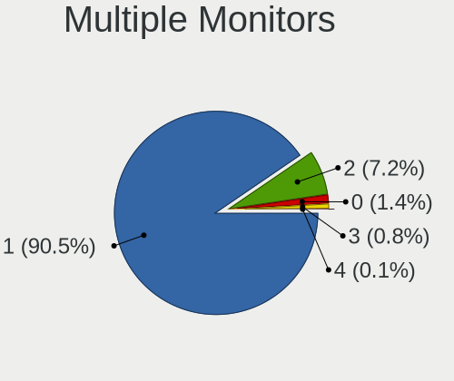

| Total | Computers | Percent |
|-------|-----------|---------|
| 1     | 3350      | 90.47%  |
| 2     | 265       | 7.16%   |
| 0     | 53        | 1.43%   |
| 3     | 30        | 0.81%   |
| 4     | 5         | 0.14%   |

Network
-------

Net Controller Vendor
---------------------

Controller vendors

| Vendor                            | Computers | Percent |
|-----------------------------------|-----------|---------|
| Realtek Semiconductor             | 1906      | 35.03%  |
| Intel                             | 1287      | 23.65%  |
| Qualcomm Atheros                  | 873       | 16.04%  |
| Broadcom                          | 415       | 7.63%   |
| Ralink                            | 140       | 2.57%   |
| Broadcom Limited                  | 140       | 2.57%   |
| Marvell Technology Group          | 108       | 1.98%   |
| Ralink Technology                 | 81        | 1.49%   |
| Nvidia                            | 72        | 1.32%   |
| Qualcomm Atheros Communications   | 61        | 1.12%   |
| TP-Link                           | 41        | 0.75%   |
| Samsung Electronics               | 24        | 0.44%   |
| Huawei Technologies               | 24        | 0.44%   |
| VIA Technologies                  | 20        | 0.37%   |
| JMicron Technology                | 19        | 0.35%   |
| Dell                              | 19        | 0.35%   |
| Hewlett-Packard                   | 15        | 0.28%   |
| Ericsson Business Mobile Networks | 15        | 0.28%   |
| Xiaomi                            | 14        | 0.26%   |
| DisplayLink                       | 14        | 0.26%   |
| ASUSTek Computer                  | 14        | 0.26%   |
| D-Link                            | 13        | 0.24%   |
| Sierra Wireless                   | 10        | 0.18%   |
| MediaTek                          | 9         | 0.17%   |
| D-Link System                     | 9         | 0.17%   |
| Attansic Technology               | 9         | 0.17%   |
| IMC Networks                      | 8         | 0.15%   |
| ASIX Electronics                  | 8         | 0.15%   |
| NetGear                           | 6         | 0.11%   |
| Microsoft                         | 6         | 0.11%   |
| Belkin Components                 | 6         | 0.11%   |
| T & A Mobile Phones               | 4         | 0.07%   |
| Silicon Integrated Systems [SiS]  | 4         | 0.07%   |
| Edimax Technology                 | 4         | 0.07%   |
| Accton Technology                 | 4         | 0.07%   |
| QinHeng Electronics               | 2         | 0.04%   |
| LG Electronics                    | 2         | 0.04%   |
| HMD Global                        | 2         | 0.04%   |
| Fujitsu Siemens Computers         | 2         | 0.04%   |
| Aquantia                          | 2         | 0.04%   |

Net Controller Model
--------------------

Controller models

| Model                                                                   | Computers | Percent |
|-------------------------------------------------------------------------|-----------|---------|
| Realtek RTL8111/8168/8211/8411 PCI Express Gigabit Ethernet Controller  | 1321      | 21.1%   |
| Realtek RTL810xE PCI Express Fast Ethernet controller                   | 381       | 6.08%   |
| Intel 82579LM Gigabit Network Connection (Lewisville)                   | 190       | 3.03%   |
| Qualcomm Atheros AR9285 Wireless Network Adapter (PCI-Express)          | 162       | 2.59%   |
| Qualcomm Atheros QCA9565 / AR9565 Wireless Network Adapter              | 124       | 1.98%   |
| Qualcomm Atheros AR9485 Wireless Network Adapter                        | 94        | 1.5%    |
| Qualcomm Atheros QCA9377 802.11ac Wireless Network Adapter              | 88        | 1.41%   |
| Intel Centrino Advanced-N 6205 [Taylor Peak]                            | 82        | 1.31%   |
| Ralink RT3290 Wireless 802.11n 1T/1R PCIe                               | 81        | 1.29%   |
| Intel Wireless 7260                                                     | 81        | 1.29%   |
| Realtek RTL8723BE PCIe Wireless Network Adapter                         | 74        | 1.18%   |
| Intel PRO/Wireless 3945ABG [Golan] Network Connection                   | 74        | 1.18%   |
| Intel 82577LM Gigabit Network Connection                                | 63        | 1.01%   |
| Broadcom BCM4313 802.11bgn Wireless Network Adapter                     | 62        | 0.99%   |
| Intel 82567LM-3 Gigabit Network Connection                              | 61        | 0.97%   |
| Intel Ethernet Connection I217-LM                                       | 60        | 0.96%   |
| Qualcomm Atheros AR242x / AR542x Wireless Network Adapter (PCI-Express) | 54        | 0.86%   |
| Qualcomm Atheros AR9271 802.11n                                         | 53        | 0.85%   |
| Intel Wireless 7265                                                     | 51        | 0.81%   |
| Intel Centrino Advanced-N 6200                                          | 49        | 0.78%   |
| Qualcomm Atheros QCA8171 Gigabit Ethernet                               | 48        | 0.77%   |
| Intel 82567LM Gigabit Network Connection                                | 48        | 0.77%   |
| Intel Wireless 8265 / 8275                                              | 47        | 0.75%   |
| Realtek RTL-8100/8101L/8139 PCI Fast Ethernet Adapter                   | 46        | 0.73%   |
| Intel Wireless 3165                                                     | 46        | 0.73%   |
| Intel Ethernet Connection (2) I219-V                                    | 44        | 0.7%    |
| Qualcomm Atheros AR8151 v2.0 Gigabit Ethernet                           | 41        | 0.65%   |
| Intel Centrino Ultimate-N 6300                                          | 41        | 0.65%   |
| Qualcomm Atheros AR8132 Fast Ethernet                                   | 39        | 0.62%   |
| Intel Wireless 3160                                                     | 37        | 0.59%   |
| Intel PRO/Wireless 4965 AG or AGN [Kedron] Network Connection           | 37        | 0.59%   |
| Qualcomm Atheros AR8121/AR8113/AR8114 Gigabit or Fast Ethernet          | 36        | 0.57%   |
| Realtek RTL8188EUS 802.11n Wireless Network Adapter                     | 35        | 0.56%   |
| Intel WiFi Link 5100                                                    | 35        | 0.56%   |
| Intel PRO/Wireless 5100 AGN [Shiloh] Network Connection                 | 34        | 0.54%   |
| Intel I211 Gigabit Network Connection                                   | 33        | 0.53%   |
| Intel 82566DM-2 Gigabit Network Connection                              | 33        | 0.53%   |
| Broadcom BCM43142 802.11b/g/n                                           | 33        | 0.53%   |
| Realtek RTL8821AE 802.11ac PCIe Wireless Network Adapter                | 32        | 0.51%   |
| Qualcomm Atheros AR8131 Gigabit Ethernet                                | 32        | 0.51%   |

Wireless Vendor
---------------

Wireless vendors

| Vendor                                | Computers | Percent |
|---------------------------------------|-----------|---------|
| Intel                                 | 840       | 32.88%  |
| Qualcomm Atheros                      | 661       | 25.87%  |
| Realtek Semiconductor                 | 358       | 14.01%  |
| Broadcom                              | 221       | 8.65%   |
| Ralink                                | 140       | 5.48%   |
| Ralink Technology                     | 81        | 3.17%   |
| Qualcomm Atheros Communications       | 61        | 2.39%   |
| Broadcom Limited                      | 47        | 1.84%   |
| TP-Link                               | 41        | 1.6%    |
| ASUSTek Computer                      | 14        | 0.55%   |
| D-Link                                | 12        | 0.47%   |
| Dell                                  | 11        | 0.43%   |
| Sierra Wireless                       | 10        | 0.39%   |
| IMC Networks                          | 8         | 0.31%   |
| NetGear                               | 6         | 0.23%   |
| Microsoft                             | 6         | 0.23%   |
| MediaTek                              | 6         | 0.23%   |
| Belkin Components                     | 6         | 0.23%   |
| D-Link System                         | 5         | 0.2%    |
| Edimax Technology                     | 4         | 0.16%   |
| Hewlett-Packard                       | 3         | 0.12%   |
| Marvell Technology Group              | 2         | 0.08%   |
| Fujitsu Siemens Computers             | 2         | 0.08%   |
| ZyXEL Communications                  | 1         | 0.04%   |
| ZyDAS                                 | 1         | 0.04%   |
| Wacom                                 | 1         | 0.04%   |
| TRENDnet                              | 1         | 0.04%   |
| Texas Instruments                     | 1         | 0.04%   |
| Micro Star International              | 1         | 0.04%   |
| Mercucys                              | 1         | 0.04%   |
| Gemtek                                | 1         | 0.04%   |
| AVM                                   | 1         | 0.04%   |
| 802.11g Adapter [Linksys WUSB54GC v3] | 1         | 0.04%   |

Wireless Model
--------------

Wireless models

| Model                                                                   | Computers | Percent |
|-------------------------------------------------------------------------|-----------|---------|
| Qualcomm Atheros AR9285 Wireless Network Adapter (PCI-Express)          | 162       | 6.31%   |
| Qualcomm Atheros QCA9565 / AR9565 Wireless Network Adapter              | 124       | 4.83%   |
| Qualcomm Atheros AR9485 Wireless Network Adapter                        | 94        | 3.66%   |
| Qualcomm Atheros QCA9377 802.11ac Wireless Network Adapter              | 88        | 3.43%   |
| Intel Centrino Advanced-N 6205 [Taylor Peak]                            | 82        | 3.19%   |
| Ralink RT3290 Wireless 802.11n 1T/1R PCIe                               | 81        | 3.15%   |
| Intel Wireless 7260                                                     | 81        | 3.15%   |
| Realtek RTL8723BE PCIe Wireless Network Adapter                         | 74        | 2.88%   |
| Intel PRO/Wireless 3945ABG [Golan] Network Connection                   | 74        | 2.88%   |
| Broadcom BCM4313 802.11bgn Wireless Network Adapter                     | 62        | 2.41%   |
| Qualcomm Atheros AR242x / AR542x Wireless Network Adapter (PCI-Express) | 54        | 2.1%    |
| Qualcomm Atheros AR9271 802.11n                                         | 53        | 2.06%   |
| Intel Wireless 7265                                                     | 51        | 1.99%   |
| Intel Centrino Advanced-N 6200                                          | 49        | 1.91%   |
| Intel Wireless 8265 / 8275                                              | 47        | 1.83%   |
| Intel Wireless 3165                                                     | 46        | 1.79%   |
| Intel Centrino Ultimate-N 6300                                          | 41        | 1.6%    |
| Intel Wireless 3160                                                     | 37        | 1.44%   |
| Intel PRO/Wireless 4965 AG or AGN [Kedron] Network Connection           | 37        | 1.44%   |
| Realtek RTL8188EUS 802.11n Wireless Network Adapter                     | 35        | 1.36%   |
| Intel WiFi Link 5100                                                    | 35        | 1.36%   |
| Intel PRO/Wireless 5100 AGN [Shiloh] Network Connection                 | 34        | 1.32%   |
| Broadcom BCM43142 802.11b/g/n                                           | 33        | 1.28%   |
| Realtek RTL8821AE 802.11ac PCIe Wireless Network Adapter                | 32        | 1.25%   |
| Qualcomm Atheros AR928X Wireless Network Adapter (PCI-Express)          | 30        | 1.17%   |
| Ralink MT7601U Wireless Adapter                                         | 29        | 1.13%   |
| Qualcomm Atheros AR9462 Wireless Network Adapter                        | 28        | 1.09%   |
| Realtek RTL8821CE 802.11ac PCIe Wireless Network Adapter                | 27        | 1.05%   |
| Qualcomm Atheros AR9287 Wireless Network Adapter (PCI-Express)          | 27        | 1.05%   |
| Broadcom BCM4312 802.11b/g LP-PHY                                       | 27        | 1.05%   |
| Realtek RTL8188CE 802.11b/g/n WiFi Adapter                              | 24        | 0.93%   |
| Broadcom Limited BCM4312 802.11b/g LP-PHY                               | 23        | 0.9%    |
| Realtek RTL8188EE Wireless Network Adapter                              | 22        | 0.86%   |
| Intel Dual Band Wireless-AC 3168NGW [Stone Peak]                        | 22        | 0.86%   |
| Broadcom BCM43228 802.11a/b/g/n                                         | 22        | 0.86%   |
| Ralink RT3090 Wireless 802.11n 1T/1R PCIe                               | 19        | 0.74%   |
| Intel Wireless 8260                                                     | 19        | 0.74%   |
| Intel Ultimate N WiFi Link 5300                                         | 18        | 0.7%    |
| Realtek RTL8822CE 802.11ac PCIe Wireless Network Adapter                | 17        | 0.66%   |
| Ralink RT5370 Wireless Adapter                                          | 17        | 0.66%   |

Ethernet Vendor
---------------

Ethernet vendors

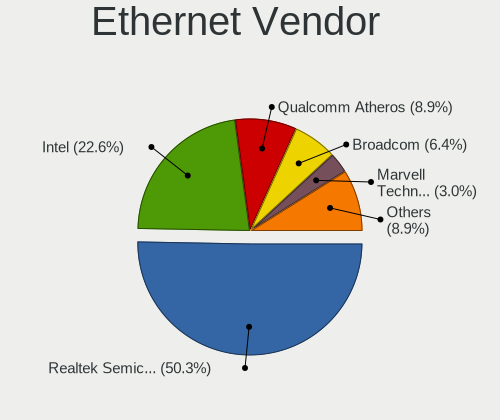

| Vendor                                 | Computers | Percent |
|----------------------------------------|-----------|---------|
| Realtek Semiconductor                  | 1804      | 50.29%  |
| Intel                                  | 810       | 22.58%  |
| Qualcomm Atheros                       | 318       | 8.87%   |
| Broadcom                               | 229       | 6.38%   |
| Marvell Technology Group               | 106       | 2.96%   |
| Broadcom Limited                       | 94        | 2.62%   |
| Nvidia                                 | 72        | 2.01%   |
| VIA Technologies                       | 19        | 0.53%   |
| JMicron Technology                     | 19        | 0.53%   |
| Huawei Technologies                    | 18        | 0.5%    |
| Samsung Electronics                    | 15        | 0.42%   |
| Xiaomi                                 | 14        | 0.39%   |
| DisplayLink                            | 14        | 0.39%   |
| Attansic Technology                    | 9         | 0.25%   |
| ASIX Electronics                       | 8         | 0.22%   |
| T & A Mobile Phones                    | 4         | 0.11%   |
| Silicon Integrated Systems [SiS]       | 4         | 0.11%   |
| D-Link System                          | 4         | 0.11%   |
| Accton Technology                      | 4         | 0.11%   |
| QinHeng Electronics                    | 2         | 0.06%   |
| MediaTek                               | 2         | 0.06%   |
| LG Electronics                         | 2         | 0.06%   |
| HMD Global                             | 2         | 0.06%   |
| Aquantia                               | 2         | 0.06%   |
| Westell                                | 1         | 0.03%   |
| TOMTOM                                 | 1         | 0.03%   |
| Spreadtrum Communications              | 1         | 0.03%   |
| Sony Ericsson Mobile Communications AB | 1         | 0.03%   |
| Qualcomm                               | 1         | 0.03%   |
| OPPO Electronics                       | 1         | 0.03%   |
| Motorola PCS                           | 1         | 0.03%   |
| ICS Advent                             | 1         | 0.03%   |
| IBM                                    | 1         | 0.03%   |
| Davicom Semiconductor                  | 1         | 0.03%   |
| D-Link                                 | 1         | 0.03%   |
| 3Com                                   | 1         | 0.03%   |

Ethernet Model
--------------

Ethernet models

| Model                                                                  | Computers | Percent |
|------------------------------------------------------------------------|-----------|---------|
| Realtek RTL8111/8168/8211/8411 PCI Express Gigabit Ethernet Controller | 1321      | 36.43%  |
| Realtek RTL810xE PCI Express Fast Ethernet controller                  | 381       | 10.51%  |
| Intel 82579LM Gigabit Network Connection (Lewisville)                  | 190       | 5.24%   |
| Intel 82577LM Gigabit Network Connection                               | 63        | 1.74%   |
| Intel 82567LM-3 Gigabit Network Connection                             | 61        | 1.68%   |
| Intel Ethernet Connection I217-LM                                      | 60        | 1.65%   |
| Qualcomm Atheros QCA8171 Gigabit Ethernet                              | 48        | 1.32%   |
| Intel 82567LM Gigabit Network Connection                               | 48        | 1.32%   |
| Realtek RTL-8100/8101L/8139 PCI Fast Ethernet Adapter                  | 46        | 1.27%   |
| Intel Ethernet Connection (2) I219-V                                   | 44        | 1.21%   |
| Qualcomm Atheros AR8151 v2.0 Gigabit Ethernet                          | 41        | 1.13%   |
| Qualcomm Atheros AR8132 Fast Ethernet                                  | 39        | 1.08%   |
| Qualcomm Atheros AR8121/AR8113/AR8114 Gigabit or Fast Ethernet         | 36        | 0.99%   |
| Intel I211 Gigabit Network Connection                                  | 33        | 0.91%   |
| Intel 82566DM-2 Gigabit Network Connection                             | 33        | 0.91%   |
| Qualcomm Atheros AR8131 Gigabit Ethernet                               | 32        | 0.88%   |
| Nvidia MCP61 Ethernet                                                  | 32        | 0.88%   |
| Intel 82579V Gigabit Network Connection                                | 31        | 0.85%   |
| Qualcomm Atheros AR8152 v2.0 Fast Ethernet                             | 28        | 0.77%   |
| Broadcom NetLink BCM57785 Gigabit Ethernet PCIe                        | 28        | 0.77%   |
| Marvell Group 88E8040 PCI-E Fast Ethernet Controller                   | 27        | 0.74%   |
| Intel Ethernet Connection I218-LM                                      | 27        | 0.74%   |
| Realtek RTL8169 PCI Gigabit Ethernet Controller                        | 26        | 0.72%   |
| Intel Ethernet Connection (2) I219-LM                                  | 26        | 0.72%   |
| Broadcom NetXtreme BCM5754 Gigabit Ethernet PCI Express                | 25        | 0.69%   |
| Intel 82566MM Gigabit Network Connection                               | 21        | 0.58%   |
| Broadcom NetXtreme BCM5761 Gigabit Ethernet PCIe                       | 21        | 0.58%   |
| Marvell Group 88E8056 PCI-E Gigabit Ethernet Controller                | 19        | 0.52%   |
| Intel Ethernet Connection I217-V                                       | 19        | 0.52%   |
| Broadcom NetLink BCM57780 Gigabit Ethernet PCIe                        | 18        | 0.5%    |
| VIA VT6102/VT6103 [Rhine-II]                                           | 17        | 0.47%   |
| Realtek RTL8153 Gigabit Ethernet Adapter                               | 17        | 0.47%   |
| Qualcomm Atheros QCA8172 Fast Ethernet                                 | 17        | 0.47%   |
| JMicron JMC250 PCI Express Gigabit Ethernet Controller                 | 17        | 0.47%   |
| Marvell Group 88E8055 PCI-E Gigabit Ethernet Controller                | 16        | 0.44%   |
| Intel Ethernet Connection (7) I219-V                                   | 16        | 0.44%   |
| Huawei FOA-LX9                                                         | 16        | 0.44%   |
| Broadcom Limited NetLink BCM5787M Gigabit Ethernet PCI Express         | 16        | 0.44%   |
| Samsung Galaxy series, misc. (tethering mode)                          | 15        | 0.41%   |
| Nvidia MCP79 Ethernet                                                  | 15        | 0.41%   |

Net Controller Kind
-------------------

Ethernet, WiFi or modem

| Kind     | Computers | Percent |
|----------|-----------|---------|
| Ethernet | 3447      | 57.95%  |
| WiFi     | 2434      | 40.92%  |
| Modem    | 64        | 1.08%   |
| Unknown  | 3         | 0.05%   |

Used Controller
---------------

Currently used network controller

| Kind     | Computers | Percent |
|----------|-----------|---------|
| Ethernet | 1961      | 51.03%  |
| WiFi     | 1881      | 48.95%  |
| Modem    | 1         | 0.03%   |

NICs
----

Total network controllers on board

| Total | Computers | Percent |
|-------|-----------|---------|
| 2     | 2089      | 57.6%   |
| 1     | 1465      | 40.39%  |
| 0     | 43        | 1.19%   |
| 3     | 24        | 0.66%   |
| 4     | 6         | 0.17%   |

IPv6
----

IPv6 vs IPv4

| Used | Computers | Percent |
|------|-----------|---------|
| No   | 3138      | 82.54%  |
| Yes  | 664       | 17.46%  |

Bluetooth
---------

Bluetooth Vendor
----------------

Controller vendors

| Vendor                          | Computers | Percent |
|---------------------------------|-----------|---------|
| Intel                           | 441       | 25.68%  |
| Qualcomm Atheros Communications | 189       | 11.01%  |
| Broadcom                        | 176       | 10.25%  |
| Cambridge Silicon Radio         | 149       | 8.68%   |
| Realtek Semiconductor           | 143       | 8.33%   |
| Dell                            | 88        | 5.13%   |
| Ralink                          | 81        | 4.72%   |
| Lite-On Technology              | 78        | 4.54%   |
| Hewlett-Packard                 | 73        | 4.25%   |
| Foxconn / Hon Hai               | 73        | 4.25%   |
| IMC Networks                    | 60        | 3.49%   |
| Toshiba                         | 38        | 2.21%   |
| Apple                           | 35        | 2.04%   |
| ASUSTek Computer                | 22        | 1.28%   |
| Askey Computer                  | 9         | 0.52%   |
| Foxconn International           | 8         | 0.47%   |
| Ralink Technology               | 7         | 0.41%   |
| Belkin Components               | 5         | 0.29%   |
| Alps Electric                   | 5         | 0.29%   |
| TP-Link                         | 4         | 0.23%   |
| Logitech                        | 4         | 0.23%   |
| Integrated System Solution      | 4         | 0.23%   |
| Conwise Technology              | 4         | 0.23%   |
| Chicony Electronics             | 4         | 0.23%   |
| Realtek                         | 3         | 0.17%   |
| Micro Star International        | 3         | 0.17%   |
| Taiyo Yuden                     | 2         | 0.12%   |
| MediaTek                        | 2         | 0.12%   |
| Marvell Semiconductor           | 2         | 0.12%   |
| Edimax Technology               | 2         | 0.12%   |
| Roper                           | 1         | 0.06%   |
| Fujitsu Siemens Computers       | 1         | 0.06%   |
| Fujitsu                         | 1         | 0.06%   |

Bluetooth Model
---------------

Controller models

| Model                                               | Computers | Percent |
|-----------------------------------------------------|-----------|---------|
| Intel Bluetooth wireless interface                  | 287       | 16.68%  |
| Cambridge Silicon Radio Bluetooth Dongle (HCI mode) | 149       | 8.66%   |
| Ralink RT3290 Bluetooth                             | 81        | 4.71%   |
| Realtek Bluetooth Radio                             | 71        | 4.13%   |
| Qualcomm Atheros  Bluetooth Device                  | 65        | 3.78%   |
| Qualcomm Atheros AR3011 Bluetooth                   | 47        | 2.73%   |
| Dell DW375 Bluetooth Module                         | 40        | 2.32%   |
| Qualcomm Atheros AR3012 Bluetooth 4.0               | 38        | 2.21%   |
| Intel Bluetooth 9460/9560 Jefferson Peak (JfP)      | 38        | 2.21%   |
| HP Broadcom 2070 Bluetooth Combo                    | 38        | 2.21%   |
| Broadcom BCM2045B (BDC-2.1)                         | 33        | 1.92%   |
| HP Bluetooth 2.0 Interface [Broadcom BCM2045]       | 32        | 1.86%   |
| Lite-On Qualcomm Atheros QCA9377 Bluetooth          | 27        | 1.57%   |
| Intel AX201 Bluetooth                               | 26        | 1.51%   |
| Foxconn / Hon Hai Bluetooth Device                  | 25        | 1.45%   |
| Realtek RTL8821A Bluetooth                          | 24        | 1.39%   |
| Broadcom HP Portable SoftSailing                    | 24        | 1.39%   |
| Lite-On Atheros AR3012 Bluetooth                    | 23        | 1.34%   |
| Intel Centrino Bluetooth Wireless Transceiver       | 23        | 1.34%   |
| IMC Networks Bluetooth Device                       | 23        | 1.34%   |
| Realtek RTL8723B Bluetooth                          | 22        | 1.28%   |
| Intel Wireless-AC 3168 Bluetooth                    | 22        | 1.28%   |
| Intel Centrino Advanced-N 6230 Bluetooth adapter    | 22        | 1.28%   |
| Realtek  Bluetooth 4.2 Adapter                      | 21        | 1.22%   |
| Broadcom BCM2045B (BDC-2.1) [Bluetooth Controller]  | 17        | 0.99%   |
| Toshiba Bluetooth Device                            | 15        | 0.87%   |
| Qualcomm Atheros AR9462 Bluetooth                   | 15        | 0.87%   |
| Lite-On Bluetooth Device                            | 15        | 0.87%   |
| IMC Networks Bluetooth Radio                        | 15        | 0.87%   |
| Apple Bluetooth Host Controller                     | 15        | 0.87%   |
| Intel AX200 Bluetooth                               | 14        | 0.81%   |
| Dell BCM20702A0 Bluetooth Module                    | 14        | 0.81%   |
| Broadcom BCM20702 Bluetooth 4.0 [ThinkPad]          | 14        | 0.81%   |
| Broadcom BCM2070 Bluetooth Device                   | 14        | 0.81%   |
| Dell Wireless 365 Bluetooth                         | 12        | 0.7%    |
| Foxconn / Hon Hai BCM20702A0                        | 11        | 0.64%   |
| Qualcomm Atheros QCA61x4 Bluetooth 4.0              | 9         | 0.52%   |
| IMC Networks Atheros AR3012 Bluetooth 4.0 Adapter   | 9         | 0.52%   |
| Broadcom BCM43142A0 Bluetooth 4.0                   | 9         | 0.52%   |
| Broadcom BCM2045B (BDC-2) [Bluetooth Controller]    | 9         | 0.52%   |

Sound
-----

Sound Vendor
------------

Sound card vendors

| Vendor                                       | Computers | Percent |
|----------------------------------------------|-----------|---------|
| Intel                                        | 2734      | 59.41%  |
| AMD                                          | 968       | 21.03%  |
| Nvidia                                       | 644       | 13.99%  |
| C-Media Electronics                          | 67        | 1.46%   |
| Creative Labs                                | 44        | 0.96%   |
| VIA Technologies                             | 18        | 0.39%   |
| Logitech                                     | 15        | 0.33%   |
| Texas Instruments                            | 14        | 0.3%    |
| Creative Technology                          | 10        | 0.22%   |
| JMTek                                        | 6         | 0.13%   |
| Tenx Technology                              | 5         | 0.11%   |
| Silicon Integrated Systems [SiS]             | 5         | 0.11%   |
| GN Netcom                                    | 5         | 0.11%   |
| ASUSTek Computer                             | 5         | 0.11%   |
| Plantronics                                  | 4         | 0.09%   |
| Generalplus Technology                       | 4         | 0.09%   |
| Razer USA                                    | 3         | 0.07%   |
| Kingston Technology                          | 3         | 0.07%   |
| Hewlett-Packard                              | 3         | 0.07%   |
| Ensoniq                                      | 3         | 0.07%   |
| BEHRINGER International                      | 3         | 0.07%   |
| Syntek                                       | 2         | 0.04%   |
| Promethean Limited                           | 2         | 0.04%   |
| M-Audio                                      | 2         | 0.04%   |
| ATI Technologies                             | 2         | 0.04%   |
| Zoran Co. Personal Media Division (Nogatech) | 1         | 0.02%   |
| Zhaoxin                                      | 1         | 0.02%   |
| ULi Electronics                              | 1         | 0.02%   |
| Trust                                        | 1         | 0.02%   |
| Superlux digit                               | 1         | 0.02%   |
| Sunplus Technology                           | 1         | 0.02%   |
| SteelSeries ApS                              | 1         | 0.02%   |
| Sony                                         | 1         | 0.02%   |
| SM950T Microphone                            | 1         | 0.02%   |
| Reloop                                       | 1         | 0.02%   |
| Realtek Semiconductor                        | 1         | 0.02%   |
| PreSonus Audio Electronics                   | 1         | 0.02%   |
| Numark                                       | 1         | 0.02%   |
| Nektar                                       | 1         | 0.02%   |
| Native Instruments                           | 1         | 0.02%   |

Sound Model
-----------

Sound card models

| Model                                                                                             | Computers | Percent |
|---------------------------------------------------------------------------------------------------|-----------|---------|
| Intel 7 Series/C216 Chipset Family High Definition Audio Controller                               | 328       | 5.97%   |
| Intel 6 Series/C200 Series Chipset Family High Definition Audio Controller                        | 321       | 5.84%   |
| Intel NM10/ICH7 Family High Definition Audio Controller                                           | 293       | 5.33%   |
| Intel 82801I (ICH9 Family) HD Audio Controller                                                    | 277       | 5.04%   |
| AMD FCH Azalia Controller                                                                         | 277       | 5.04%   |
| AMD SBx00 Azalia (Intel HDA)                                                                      | 220       | 4.01%   |
| Intel 5 Series/3400 Series Chipset High Definition Audio                                          | 210       | 3.82%   |
| Intel 8 Series/C220 Series Chipset High Definition Audio Controller                               | 194       | 3.53%   |
| Intel Sunrise Point-LP HD Audio                                                                   | 164       | 2.99%   |
| Intel Xeon E3-1200 v3/4th Gen Core Processor HD Audio Controller                                  | 144       | 2.62%   |
| Intel 82801H (ICH8 Family) HD Audio Controller                                                    | 133       | 2.42%   |
| AMD Kabini HDMI/DP Audio                                                                          | 103       | 1.88%   |
| Intel 8 Series HD Audio Controller                                                                | 101       | 1.84%   |
| Intel Haswell-ULT HD Audio Controller                                                             | 100       | 1.82%   |
| AMD Trinity HDMI Audio Controller                                                                 | 93        | 1.69%   |
| Intel 100 Series/C230 Series Chipset Family HD Audio Controller                                   | 90        | 1.64%   |
| Nvidia GK208 HDMI/DP Audio Controller                                                             | 86        | 1.57%   |
| Nvidia High Definition Audio Controller                                                           | 78        | 1.42%   |
| Intel Broadwell-U Audio Controller                                                                | 76        | 1.38%   |
| Intel Wildcat Point-LP High Definition Audio Controller                                           | 74        | 1.35%   |
| Intel 82801JD/DO (ICH10 Family) HD Audio Controller                                               | 70        | 1.27%   |
| AMD Family 17h/19h/1ah HD Audio Controller                                                        | 70        | 1.27%   |
| Intel 200 Series PCH HD Audio                                                                     | 66        | 1.2%    |
| AMD Oland/Hainan/Cape Verde/Pitcairn HDMI Audio [Radeon HD 7000 Series]                           | 66        | 1.2%    |
| AMD Caicos HDMI Audio [Radeon HD 6450 / 7450/8450/8490 OEM / R5 230/235/235X OEM]                 | 66        | 1.2%    |
| Nvidia GF108 High Definition Audio Controller                                                     | 62        | 1.13%   |
| Intel Atom Processor Z36xxx/Z37xxx Series High Definition Audio Controller                        | 62        | 1.13%   |
| Intel Atom/Celeron/Pentium Processor x5-E8000/J3xxx/N3xxx Series High Definition Audio Controller | 60        | 1.09%   |
| Intel 82801JI (ICH10 Family) HD Audio Controller                                                  | 57        | 1.04%   |
| AMD Wrestler HDMI Audio                                                                           | 56        | 1.02%   |
| AMD Cedar HDMI Audio [Radeon HD 5400/6300/7300 Series]                                            | 54        | 0.98%   |
| Intel Cannon Lake PCH cAVS                                                                        | 52        | 0.95%   |
| AMD Family 15h (Models 60h-6fh) Audio Controller                                                  | 47        | 0.86%   |
| AMD RV710/730 HDMI Audio [Radeon HD 4000 series]                                                  | 38        | 0.69%   |
| Nvidia GF119 HDMI Audio Controller                                                                | 36        | 0.66%   |
| Nvidia GP107GL High Definition Audio Controller                                                   | 35        | 0.64%   |
| AMD Family 17h (Models 00h-0fh) HD Audio Controller                                               | 35        | 0.64%   |
| Nvidia MCP61 High Definition Audio                                                                | 34        | 0.62%   |
| AMD Raven/Raven2/Fenghuang HDMI/DP Audio Controller                                               | 34        | 0.62%   |
| AMD Ellesmere HDMI Audio [Radeon RX 470/480 / 570/580/590]                                        | 34        | 0.62%   |

Memory
------

Memory Vendor
-------------

Memory module vendors

| Vendor                | Computers | Percent |
|-----------------------|-----------|---------|
| Samsung Electronics   | 871       | 20.13%  |
| SK hynix              | 805       | 18.6%   |
| Unknown               | 781       | 18.05%  |
| Kingston              | 621       | 14.35%  |
| Micron Technology     | 303       | 7%      |
| Nanya Technology      | 136       | 3.14%   |
| Elpida                | 110       | 2.54%   |
| Crucial               | 102       | 2.36%   |
| Kingmax               | 85        | 1.96%   |
| Corsair               | 81        | 1.87%   |
| Ramaxel Technology    | 74        | 1.71%   |
| G.Skill               | 57        | 1.32%   |
| A-DATA Technology     | 54        | 1.25%   |
| Transcend             | 23        | 0.53%   |
| Team                  | 19        | 0.44%   |
| Patriot               | 19        | 0.44%   |
| CSX                   | 18        | 0.42%   |
| 48spaces              | 15        | 0.35%   |
| Qimonda               | 14        | 0.32%   |
| ASint Technology      | 14        | 0.32%   |
| Apacer                | 10        | 0.23%   |
| Unknown (ABCD)        | 9         | 0.21%   |
| Toshiba               | 8         | 0.18%   |
| Kingmax Semiconductor | 8         | 0.18%   |
| Melco                 | 7         | 0.16%   |
| Hikvision             | 7         | 0.16%   |
| Goodram               | 7         | 0.16%   |
| Unknown               | 6         | 0.14%   |
| SHARETRONIC           | 4         | 0.09%   |
| OCZ                   | 4         | 0.09%   |
| H                     | 4         | 0.09%   |
| Smart                 | 3         | 0.07%   |
| Infineon              | 3         | 0.07%   |
| GeIL                  | 3         | 0.07%   |
| Unifosa               | 2         | 0.05%   |
| TwinMOS               | 2         | 0.05%   |
| Silicon Power         | 2         | 0.05%   |
| PUSKILL               | 2         | 0.05%   |
| Multilaser            | 2         | 0.05%   |
| Axiom                 | 2         | 0.05%   |

Memory Model
------------

Memory module models

| Model                                                     | Computers | Percent |
|-----------------------------------------------------------|-----------|---------|
| Samsung RAM M471B5173QH0-YK0 4GB SODIMM DDR3 1600MT/s     | 61        | 1.26%   |
| Unknown RAM Module 2048MB SODIMM DDR2 667MT/s             | 49        | 1.01%   |
| Unknown RAM Module 2048MB DIMM SDRAM                      | 47        | 0.97%   |
| Unknown RAM Module 2048MB DIMM 800MT/s                    | 46        | 0.95%   |
| Samsung RAM M471B5273DH0-CH9 4GB SODIMM DDR3 1334MT/s     | 44        | 0.91%   |
| Kingston RAM KHX1600C10D3/4G 4GB DIMM DDR3 1600MT/s       | 44        | 0.91%   |
| Samsung RAM M471B5173DB0-YK0 4GB SODIMM DDR3 1600MT/s     | 43        | 0.89%   |
| SK hynix RAM HMT451S6BFR8A-PB 4096MB SODIMM DDR3 1600MT/s | 42        | 0.87%   |
| Samsung RAM M471B5173EB0-YK0 4GB SODIMM DDR3 1600MT/s     | 41        | 0.84%   |
| SK hynix RAM HMT351S6CFR8C-PB 4GB SODIMM DDR3 1600MT/s    | 37        | 0.76%   |
| Samsung RAM M471A5244CB0-CRC 4GB SODIMM DDR4 2667MT/s     | 36        | 0.74%   |
| SK hynix RAM HMT351S6EFR8A-PB 4GB SODIMM DDR3 1600MT/s    | 33        | 0.68%   |
| Samsung RAM M471B5773DH0-CH9 2GB SODIMM DDR3 1600MT/s     | 30        | 0.62%   |
| Samsung RAM M471B5273CH0-CH9 4GB SODIMM DDR3 1334MT/s     | 30        | 0.62%   |
| Unknown RAM Module 2048MB DIMM DDR2 800MT/s               | 27        | 0.56%   |
| SK hynix RAM HMT41GS6BFR8A-PB 8GB SODIMM DDR3 1600MT/s    | 27        | 0.56%   |
| Samsung RAM M471B5273DH0-CK0 4GB SODIMM DDR3 2400MT/s     | 27        | 0.56%   |
| Samsung RAM M471A5244CB0-CTD 4GB SODIMM DDR4 3266MT/s     | 27        | 0.56%   |
| Samsung RAM M471B5773CHS-CH9 2GB SODIMM DDR3 4199MT/s     | 26        | 0.54%   |
| Unknown RAM Module 2048MB SODIMM DDR2                     | 25        | 0.52%   |
| SK hynix RAM HMT325S6CFR8A-PB 2048MB SODIMM DDR3 1600MT/s | 25        | 0.52%   |
| Samsung RAM M471B5673FH0-CF8 2GB SODIMM DDR3 1067MT/s     | 25        | 0.52%   |
| Unknown RAM Module 2048MB DIMM 1333MT/s                   | 24        | 0.49%   |
| Unknown RAM Module 4096MB DIMM DDR3 1333MT/s              | 23        | 0.47%   |
| Unknown RAM Module 1024MB SODIMM DDR2 667MT/s             | 23        | 0.47%   |
| SK hynix RAM HMA851S6AFR6N-UH 4GB SODIMM DDR4 2667MT/s    | 23        | 0.47%   |
| Kingston RAM KHX1600C9D3/4GX 4GB DIMM DDR3 1800MT/s       | 23        | 0.47%   |
| Kingston RAM KHX1600C10D3/8G 8GB DIMM DDR3 1600MT/s       | 23        | 0.47%   |
| SK hynix RAM HMT451S6AFR8A-PB 4GB SODIMM DDR3 1600MT/s    | 22        | 0.45%   |
| Micron RAM 8KTF51264HZ-1G6E1 4GB SODIMM DDR3 1600MT/s     | 21        | 0.43%   |
| Unknown RAM Module 1024MB DIMM SDRAM                      | 20        | 0.41%   |
| Unknown RAM Module 1024MB DIMM 800MT/s                    | 19        | 0.39%   |
| SK hynix RAM HMT451S6BFR8A-PB 4GB SODIMM DDR3 1600MT/s    | 19        | 0.39%   |
| Samsung RAM M471B5673FH0-CH9 2GB SODIMM DDR3 1334MT/s     | 19        | 0.39%   |
| Unknown RAM Module 4096MB DIMM 1333MT/s                   | 18        | 0.37%   |
| Unknown RAM Module 1024MB SODIMM DDR2                     | 18        | 0.37%   |
| Unknown RAM Module 1024MB DIMM DDR2 667MT/s               | 18        | 0.37%   |
| Unknown RAM Module 2048MB DIMM DDR2 667MT/s               | 17        | 0.35%   |
| SK hynix RAM HMT325S6EFR8A-PB 2GB SODIMM DDR3 1600MT/s    | 17        | 0.35%   |
| Kingston RAM 99U5584-005.A00LF 4GB DIMM DDR3 1600MT/s     | 17        | 0.35%   |

Memory Kind
-----------

Memory module kinds

| Kind    | Computers | Percent |
|---------|-----------|---------|
| DDR3    | 1850      | 50.11%  |
| DDR4    | 645       | 17.47%  |
| DDR2    | 525       | 14.22%  |
| SDRAM   | 298       | 8.07%   |
| Unknown | 230       | 6.23%   |
| DDR     | 79        | 2.14%   |
| LPDDR4  | 37        | 1%      |
| LPDDR3  | 11        | 0.3%    |
| DRAM    | 9         | 0.24%   |
| DDR5    | 6         | 0.16%   |
| LPDDR5  | 2         | 0.05%   |

Memory Form Factor
------------------

Physical design of the memory module

| Name         | Computers | Percent |
|--------------|-----------|---------|
| SODIMM       | 2010      | 57.1%   |
| DIMM         | 1476      | 41.93%  |
| Row Of Chips | 20        | 0.57%   |
| Chip         | 7         | 0.2%    |
| RIMM         | 4         | 0.11%   |
| Unknown      | 2         | 0.06%   |
| FB-DIMM      | 1         | 0.03%   |

Memory Size
-----------

Memory module size

| Size    | Computers | Percent |
|---------|-----------|---------|
| 4096    | 1535      | 37.21%  |
| 2048    | 1158      | 28.07%  |
| 8192    | 793       | 19.22%  |
| 1024    | 419       | 10.16%  |
| 16384   | 121       | 2.93%   |
| 512     | 66        | 1.6%    |
| 32768   | 20        | 0.48%   |
| 256     | 7         | 0.17%   |
| 16      | 2         | 0.05%   |
| Unknown | 2         | 0.05%   |
| 128     | 1         | 0.02%   |
| 13      | 1         | 0.02%   |

Memory Speed
------------

Memory module speed

| Speed   | Computers | Percent |
|---------|-----------|---------|
| 1600    | 1123      | 27.17%  |
| 1333    | 445       | 10.77%  |
| 667     | 299       | 7.23%   |
| 800     | 288       | 6.97%   |
| 1334    | 264       | 6.39%   |
| 2400    | 227       | 5.49%   |
| 2667    | 210       | 5.08%   |
| Unknown | 178       | 4.31%   |
| 1067    | 119       | 2.88%   |
| 2133    | 114       | 2.76%   |
| 3200    | 102       | 2.47%   |
| 1866    | 70        | 1.69%   |
| 533     | 65        | 1.57%   |
| 4199    | 64        | 1.55%   |
| 1066    | 61        | 1.48%   |
| 1867    | 59        | 1.43%   |
| 2048    | 58        | 1.4%    |
| 975     | 34        | 0.82%   |
| 400     | 33        | 0.8%    |
| 3266    | 28        | 0.68%   |
| 3600    | 27        | 0.65%   |
| 333     | 24        | 0.58%   |
| 1639    | 23        | 0.56%   |
| 2666    | 21        | 0.51%   |
| 3733    | 16        | 0.39%   |
| 1800    | 16        | 0.39%   |
| 3000    | 15        | 0.36%   |
| 2933    | 13        | 0.31%   |
| 3400    | 12        | 0.29%   |
| 3466    | 11        | 0.27%   |
| 49926   | 9         | 0.22%   |
| 2000    | 8         | 0.19%   |
| 1648    | 7         | 0.17%   |
| 266     | 6         | 0.15%   |
| 3334    | 5         | 0.12%   |
| 1400    | 5         | 0.12%   |
| 1331    | 5         | 0.12%   |
| 3800    | 4         | 0.1%    |
| 2733    | 4         | 0.1%    |
| 5600    | 3         | 0.07%   |

Printers & scanners
-------------------

Printer Vendor
--------------

Printer device vendors

| Vendor                | Computers | Percent |
|-----------------------|-----------|---------|
| Hewlett-Packard       | 64        | 50%     |
| Samsung Electronics   | 26        | 20.31%  |
| Canon                 | 16        | 12.5%   |
| Brother Industries    | 9         | 7.03%   |
| Seiko Epson           | 4         | 3.13%   |
| Lexmark International | 4         | 3.13%   |
| QinHeng Electronics   | 2         | 1.56%   |
| STMicroelectronics    | 1         | 0.78%   |
| Oki Data              | 1         | 0.78%   |
| Dymo-CoStar           | 1         | 0.78%   |

Printer Model
-------------

Printer device models

| Model                                                     | Computers | Percent |
|-----------------------------------------------------------|-----------|---------|
| HP DeskJet 2620 All-in-One Printer                        | 10        | 7.75%   |
| Samsung M2020 Series                                      | 5         | 3.88%   |
| HP OfficeJet 6950                                         | 5         | 3.88%   |
| Samsung ML-2010P Mono Laser Printer                       | 4         | 3.1%    |
| HP LaserJet 1020                                          | 4         | 3.1%    |
| HP DeskJet 2130 series                                    | 4         | 3.1%    |
| Samsung ML-1640 Series Laser Printer                      | 3         | 2.33%   |
| Samsung C48x Series Color Laser Multifunction Printer     | 3         | 2.33%   |
| HP Deskjet 1050 J410                                      | 3         | 2.33%   |
| Brother HL-L2300D series                                  | 3         | 2.33%   |
| Brother HL-1110 series                                    | 3         | 2.33%   |
| Samsung SCX-3400 Series                                   | 2         | 1.55%   |
| Samsung ML-1660 Series                                    | 2         | 1.55%   |
| QinHeng CH340S                                            | 2         | 1.55%   |
| Lexmark International Z35 Printer                         | 2         | 1.55%   |
| HP Officejet J4500 series                                 | 2         | 1.55%   |
| HP LaserJet P1005                                         | 2         | 1.55%   |
| HP LaserJet 1018                                          | 2         | 1.55%   |
| HP LaserJet 1010                                          | 2         | 1.55%   |
| HP DeskJet F4100 Printer series                           | 2         | 1.55%   |
| HP Deskjet F2280 series                                   | 2         | 1.55%   |
| HP Deskjet 3520 series                                    | 2         | 1.55%   |
| HP Deskjet 1510                                           | 2         | 1.55%   |
| Canon TS5100 series                                       | 2         | 1.55%   |
| Canon PIXMA MG3600 Series                                 | 2         | 1.55%   |
| Canon PIXMA MG2500 Series                                 | 2         | 1.55%   |
| STMicroelectronics LED badge -- mini LED display -- 11x44 | 1         | 0.78%   |
| Seiko Epson XP-243 245 247 Series                         | 1         | 0.78%   |
| Seiko Epson WF-3010 Series                                | 1         | 0.78%   |
| Seiko Epson Printer                                       | 1         | 0.78%   |
| Seiko Epson ET-2600 Series                                | 1         | 0.78%   |
| Samsung Xerox Phaser 3117 Laser Printer                   | 1         | 0.78%   |
| Samsung SCX-4623 Series                                   | 1         | 0.78%   |
| Samsung SCX-3200 Series                                   | 1         | 0.78%   |
| Samsung ML-1630 Series                                    | 1         | 0.78%   |
| Samsung M2070 Series                                      | 1         | 0.78%   |
| Samsung Composite Device                                  | 1         | 0.78%   |
| Samsung CLP-310 Color Laser Printer                       | 1         | 0.78%   |
| Oki Data USB Device                                       | 1         | 0.78%   |
| Lexmark International Lexmark X203n                       | 1         | 0.78%   |

Scanner Vendor
--------------

Scanner device vendors

| Vendor          | Computers | Percent |
|-----------------|-----------|---------|
| Canon           | 11        | 73.33%  |
| Seiko Epson     | 2         | 13.33%  |
| Mustek Systems  | 1         | 6.67%   |
| Hewlett-Packard | 1         | 6.67%   |

Scanner Model
-------------

Scanner device models

| Model                                                   | Computers | Percent |
|---------------------------------------------------------|-----------|---------|
| Canon CanoScan N670U/N676U/LiDE 20                      | 4         | 26.67%  |
| Canon CanoScan LiDE 120                                 | 3         | 20%     |
| Canon CanoScan LIDE 25                                  | 2         | 13.33%  |
| Seiko Epson GT-F720 [GT-S620/Perfection V30/V300 Photo] | 1         | 6.67%   |
| Seiko Epson GT-F700 [Perfection V350]                   | 1         | 6.67%   |
| Mustek Systems ScanExpress A3 USB 1200 PRO              | 1         | 6.67%   |
| HP ScanJet 3670                                         | 1         | 6.67%   |
| Canon CanoScan LiDE 110                                 | 1         | 6.67%   |
| Canon CanoScan LiDE 100                                 | 1         | 6.67%   |

Camera
------

Camera Vendor
-------------

Camera device vendors

| Vendor                                 | Computers | Percent |
|----------------------------------------|-----------|---------|
| Chicony Electronics                    | 480       | 25.29%  |
| Microdia                               | 159       | 8.38%   |
| Realtek Semiconductor                  | 149       | 7.85%   |
| IMC Networks                           | 146       | 7.69%   |
| Suyin                                  | 112       | 5.9%    |
| Sunplus Innovation Technology          | 110       | 5.8%    |
| Bison Electronics                      | 80        | 4.21%   |
| Cheng Uei Precision Industry (Foxlink) | 70        | 3.69%   |
| Syntek                                 | 60        | 3.16%   |
| Logitech                               | 54        | 2.85%   |
| Silicon Motion                         | 40        | 2.11%   |
| Quanta                                 | 40        | 2.11%   |
| Lite-On Technology                     | 35        | 1.84%   |
| Apple                                  | 34        | 1.79%   |
| Alcor Micro                            | 28        | 1.48%   |
| Z-Star Microelectronics                | 27        | 1.42%   |
| Lenovo                                 | 27        | 1.42%   |
| Ricoh                                  | 24        | 1.26%   |
| Primax Electronics                     | 24        | 1.26%   |
| KYE Systems (Mouse Systems)            | 24        | 1.26%   |
| Acer                                   | 23        | 1.21%   |
| ALi                                    | 17        | 0.9%    |
| Microsoft                              | 15        | 0.79%   |
| GEMBIRD                                | 13        | 0.68%   |
| OmniVision Technologies                | 11        | 0.58%   |
| Importek                               | 11        | 0.58%   |
| Samsung Electronics                    | 10        | 0.53%   |
| Trust                                  | 7         | 0.37%   |
| Pixart Imaging                         | 7         | 0.37%   |
| DigiTech                               | 7         | 0.37%   |
| Cubeternet                             | 7         | 0.37%   |
| Genesys Logic                          | 4         | 0.21%   |
| Generalplus Technology                 | 4         | 0.21%   |
| MacroSilicon                           | 3         | 0.16%   |
| Luxvisions Innotech Limited            | 3         | 0.16%   |
| Intel                                  | 3         | 0.16%   |
| Hewlett-Packard                        | 3         | 0.16%   |
| Creative Technology                    | 3         | 0.16%   |
| Aveo Technology                        | 3         | 0.16%   |
| Arkmicro Technologies                  | 3         | 0.16%   |

Camera Model
------------

Camera device models

| Model                                                   | Computers | Percent |
|---------------------------------------------------------|-----------|---------|
| Chicony HP Truevision HD                                | 42        | 2.21%   |
| IMC Networks USB2.0 VGA UVC WebCam                      | 38        | 2%      |
| Chicony HD WebCam                                       | 32        | 1.68%   |
| Bison Lenovo EasyCamera                                 | 28        | 1.47%   |
| Chicony Integrated Camera                               | 27        | 1.42%   |
| Suyin Acer/HP Integrated Webcam [CN0314]                | 25        | 1.31%   |
| Chicony USB2.0 VGA UVC WebCam                           | 25        | 1.31%   |
| Sunplus HP Truevision HD                                | 24        | 1.26%   |
| Realtek USB Camera                                      | 24        | 1.26%   |
| Chicony USB2.0 HD UVC WebCam                            | 23        | 1.21%   |
| IMC Networks USB2.0 HD UVC WebCam                       | 22        | 1.16%   |
| Microdia Integrated Webcam                              | 21        | 1.1%    |
| Chicony FJ Camera                                       | 21        | 1.1%    |
| IMC Networks EasyCamera                                 | 20        | 1.05%   |
| Sunplus HD WebCam                                       | 19        | 1%      |
| Apple Built-in iSight                                   | 19        | 1%      |
| Sunplus Integrated_Webcam_HD                            | 18        | 0.95%   |
| Chicony Lenovo EasyCamera                               | 18        | 0.95%   |
| Syntek Integrated Camera                                | 17        | 0.89%   |
| Syntek EasyCamera                                       | 17        | 0.89%   |
| Realtek Lenovo EasyCamera                               | 17        | 0.89%   |
| Primax HP HD Webcam [Fixed]                             | 17        | 0.89%   |
| Lite-On HP HD Webcam                                    | 17        | 0.89%   |
| Microdia Sonix USB 2.0 Camera                           | 16        | 0.84%   |
| Microdia Camera                                         | 16        | 0.84%   |
| Chicony EasyCamera                                      | 16        | 0.84%   |
| Chicony 2.0M UVC Webcam / CNF7129                       | 16        | 0.84%   |
| Cheng Uei Precision Industry (Foxlink) HP TrueVision HD | 16        | 0.84%   |
| Realtek Integrated Webcam HD                            | 15        | 0.79%   |
| Microdia Integrated_Webcam_HD                           | 15        | 0.79%   |
| Bison Integrated Camera                                 | 15        | 0.79%   |
| Chicony TOSHIBA Web Camera - HD                         | 14        | 0.74%   |
| ALi Gateway Webcam                                      | 14        | 0.74%   |
| Silicon Motion WebCam SC-0311139N                       | 13        | 0.68%   |
| Realtek Integrated_Webcam_HD                            | 13        | 0.68%   |
| Realtek Integrated Webcam                               | 13        | 0.68%   |
| Microdia Integrated HD Webcam                           | 13        | 0.68%   |
| Lenovo Integrated Webcam [R5U877]                       | 13        | 0.68%   |
| KYE Systems (Mouse Systems) FaceCam 1000X               | 13        | 0.68%   |
| Chicony VGA WebCam                                      | 13        | 0.68%   |

Security
--------

Fingerprint Vendor
------------------

Fingerprint sensor vendors

| Vendor                     | Computers | Percent |
|----------------------------|-----------|---------|
| Validity Sensors           | 81        | 40.3%   |
| AuthenTec                  | 61        | 30.35%  |
| Upek                       | 22        | 10.95%  |
| LighTuning Technology      | 14        | 6.97%   |
| STMicroelectronics         | 10        | 4.98%   |
| Synaptics                  | 8         | 3.98%   |
| Elan Microelectronics      | 3         | 1.49%   |
| Shenzhen Goodix Technology | 2         | 1%      |

Fingerprint Model
-----------------

Fingerprint sensor models

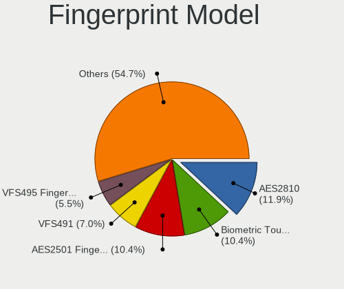

| Model                                                                      | Computers | Percent |
|----------------------------------------------------------------------------|-----------|---------|
| AuthenTec AES2810                                                          | 24        | 11.94%  |
| Upek Biometric Touchchip/Touchstrip Fingerprint Sensor                     | 21        | 10.45%  |
| AuthenTec AES2501 Fingerprint Sensor                                       | 21        | 10.45%  |
| Validity Sensors VFS491                                                    | 14        | 6.97%   |
| Validity Sensors VFS495 Fingerprint Reader                                 | 11        | 5.47%   |
| Validity Sensors VFS471 Fingerprint Reader                                 | 11        | 5.47%   |
| Validity Sensors VFS451 Fingerprint Reader                                 | 10        | 4.98%   |
| STMicroelectronics Fingerprint Reader                                      | 10        | 4.98%   |
| Validity Sensors VFS5011 Fingerprint Reader                                | 9         | 4.48%   |
| LighTuning Fingerprint Reader                                              | 9         | 4.48%   |
| AuthenTec Fingerprint Sensor                                               | 9         | 4.48%   |
| Validity Sensors VFS101 Fingerprint Reader                                 | 6         | 2.99%   |
| Validity Sensors VFS 5011 fingerprint sensor                               | 5         | 2.49%   |
| Validity Sensors Fingerprint scanner                                       | 4         | 1.99%   |
| Synaptics  WBDI                                                            | 4         | 1.99%   |
| AuthenTec AES1600                                                          | 4         | 1.99%   |
| Validity Sensors Swipe Fingerprint Sensor                                  | 3         | 1.49%   |
| LighTuning ES603 Swipe Fingerprint Sensor                                  | 3         | 1.49%   |
| Validity Sensors VFS7500 Touch Fingerprint Sensor                          | 2         | 1%      |
| Validity Sensors VFS301 Fingerprint Reader                                 | 2         | 1%      |
| Validity Sensors Synaptics WBDI                                            | 2         | 1%      |
| Synaptics FS7604 Touch Fingerprint Sensor with PurePrint                   | 2         | 1%      |
| LighTuning EgisTec Touch Fingerprint Sensor                                | 2         | 1%      |
| AuthenTec AES1660 Fingerprint Sensor                                       | 2         | 1%      |
| Validity Sensors VFS300 Fingerprint Reader                                 | 1         | 0.5%    |
| Validity Sensors Synaptics VFS7552 Touch Fingerprint Sensor with PurePrint | 1         | 0.5%    |
| Upek TCS5B Fingerprint sensor                                              | 1         | 0.5%    |
| Synaptics WBDI                                                             | 1         | 0.5%    |
| Synaptics Metallica MIS Touch Fingerprint Reader                           | 1         | 0.5%    |
| Shenzhen Goodix  FingerPrint Device                                        | 1         | 0.5%    |
| Shenzhen Goodix Fingerprint Reader                                         | 1         | 0.5%    |
| Elan WBF Fingerprint Sensor                                                | 1         | 0.5%    |
| Elan fingerprint sensor [FeinTech FPS00200]                                | 1         | 0.5%    |
| Elan ELAN:Fingerprint                                                      | 1         | 0.5%    |
| AuthenTec AES2550 Fingerprint Sensor                                       | 1         | 0.5%    |

Chipcard Vendor
---------------

Chipcard module vendors

| Vendor                    | Computers | Percent |
|---------------------------|-----------|---------|
| Broadcom                  | 88        | 53.66%  |
| O2 Micro                  | 27        | 16.46%  |
| Lenovo                    | 21        | 12.8%   |
| Alcor Micro               | 18        | 10.98%  |
| Upek                      | 5         | 3.05%   |
| Reiner SCT Kartensysteme  | 2         | 1.22%   |
| Gemalto (was Gemplus)     | 2         | 1.22%   |
| Aladdin Knowledge Systems | 1         | 0.61%   |

Chipcard Model
--------------

Chipcard module models

| Model                                                                        | Computers | Percent |
|------------------------------------------------------------------------------|-----------|---------|
| Broadcom BCM5880 Secure Applications Processor                               | 64        | 39.02%  |
| O2 Micro OZ776 CCID Smartcard Reader                                         | 24        | 14.63%  |
| Lenovo Integrated Smart Card Reader                                          | 21        | 12.8%   |
| Alcor Micro AU9540 Smartcard Reader                                          | 18        | 10.98%  |
| Broadcom BCM5880 Secure Applications Processor with fingerprint swipe sensor | 16        | 9.76%   |
| Broadcom 5880                                                                | 6         | 3.66%   |
| Upek TouchChip Fingerprint Coprocessor (WBF advanced mode)                   | 5         | 3.05%   |
| O2 Micro Oz776 SmartCard Reader                                              | 3         | 1.83%   |
| Reiner SCT Kartensysteme cyberJack RFID basis contactless smartcard reader   | 2         | 1.22%   |
| Broadcom 58200                                                               | 2         | 1.22%   |
| Gemalto (was Gemplus) GemPC Twin SmartCard Reader                            | 1         | 0.61%   |
| Gemalto (was Gemplus) Compact Smart Card Reader Writer                       | 1         | 0.61%   |
| Aladdin Knowledge Systems Token JC                                           | 1         | 0.61%   |

Unsupported
-----------

Unsupported Devices
-------------------

Total unsupported devices on board

| Total | Computers | Percent |
|-------|-----------|---------|
| 0     | 2750      | 73.89%  |
| 1     | 812       | 21.82%  |
| 2     | 143       | 3.84%   |
| 3     | 10        | 0.27%   |
| 4     | 3         | 0.08%   |
| 5     | 2         | 0.05%   |
| 10    | 1         | 0.03%   |
| 9     | 1         | 0.03%   |

Unsupported Device Types
------------------------

Types of unsupported devices

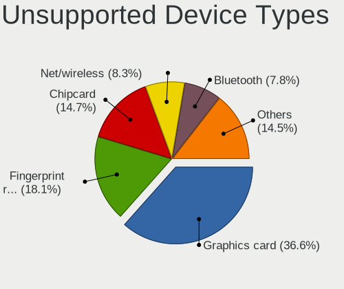

| Type                     | Computers | Percent |
|--------------------------|-----------|---------|
| Graphics card            | 406       | 36.58%  |
| Fingerprint reader       | 201       | 18.11%  |
| Chipcard                 | 163       | 14.68%  |
| Net/wireless             | 92        | 8.29%   |
| Bluetooth                | 87        | 7.84%   |
| Storage                  | 43        | 3.87%   |
| Multimedia controller    | 27        | 2.43%   |
| Communication controller | 25        | 2.25%   |
| Camera                   | 19        | 1.71%   |
| Flash memory             | 17        | 1.53%   |
| Unassigned class         | 7         | 0.63%   |
| Sound                    | 7         | 0.63%   |
| Net/ethernet             | 4         | 0.36%   |
| Card reader              | 4         | 0.36%   |
| Storage/raid             | 2         | 0.18%   |
| Storage/ata              | 2         | 0.18%   |
| Dvb card                 | 2         | 0.18%   |
| Storage/nvme             | 1         | 0.09%   |
| Network                  | 1         | 0.09%   |

