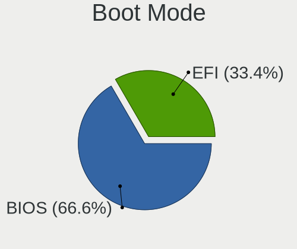
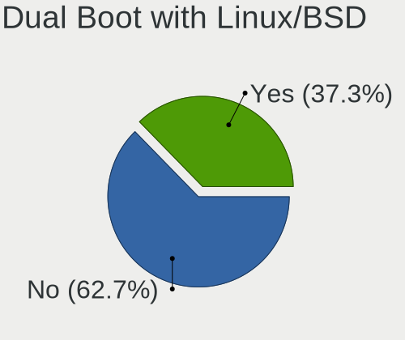
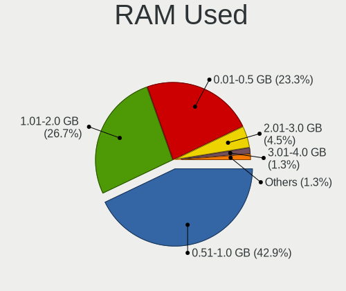
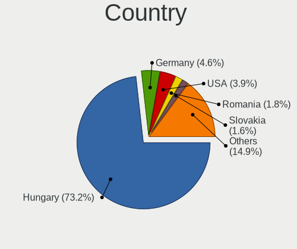
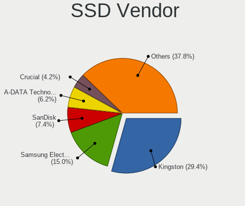
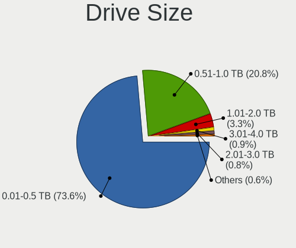
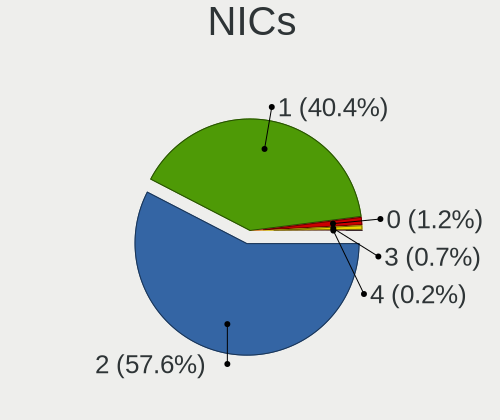
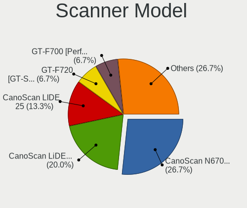
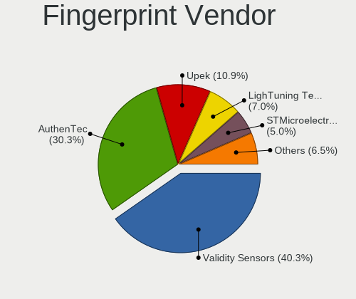

BlackPanther - Tested Hardware & Statistics
-------------------------------------------

A project to collect tested hardware configurations for BlackPanther.

Anyone can contribute to this report by the [hw-probe](https://github.com/linuxhw/hw-probe) tool:

    sudo -E hw-probe -all -upload

Please contribute! Especially if your hardware is rare.

This is a report for all computer types. See also reports for [desktops](/Dist/BlackPanther/Desktop/README.md) and [notebooks](/Dist/BlackPanther/Notebook/README.md).

Contents
--------

* [ Test Cases ](#test-cases)

* [ System ](#system)
  - [ OS                       ](#os)
  - [ OS Family                ](#os-family)
  - [ Kernel                   ](#kernel)
  - [ Kernel Family            ](#kernel-family)
  - [ Kernel Major Ver.        ](#kernel-major-ver)
  - [ Arch                     ](#arch)
  - [ DE                       ](#de)
  - [ Display Server           ](#display-server)
  - [ Display Manager          ](#display-manager)
  - [ OS Lang                  ](#os-lang)
  - [ Boot Mode                ](#boot-mode)
  - [ Filesystem               ](#filesystem)
  - [ Part. scheme             ](#part-scheme)
  - [ Dual Boot with Linux/BSD ](#dual-boot-with-linuxbsd)
  - [ Dual Boot (Win)          ](#dual-boot-win)

* [ Board ](#board)
  - [ Vendor                   ](#vendor)
  - [ Model                    ](#model)
  - [ Model Family             ](#model-family)
  - [ MFG Year                 ](#mfg-year)
  - [ Form Factor              ](#form-factor)
  - [ Secure Boot              ](#secure-boot)
  - [ Coreboot                 ](#coreboot)
  - [ RAM Size                 ](#ram-size)
  - [ RAM Used                 ](#ram-used)
  - [ Total Drives             ](#total-drives)
  - [ Has CD-ROM               ](#has-cd-rom)
  - [ Has Ethernet             ](#has-ethernet)
  - [ Has WiFi                 ](#has-wifi)
  - [ Has Bluetooth            ](#has-bluetooth)

* [ Location ](#location)
  - [ Country                  ](#country)
  - [ City                     ](#city)

* [ Drives ](#drives)
  - [ Drive Vendor             ](#drive-vendor)
  - [ Drive Model              ](#drive-model)
  - [ HDD Vendor               ](#hdd-vendor)
  - [ SSD Vendor               ](#ssd-vendor)
  - [ Drive Kind               ](#drive-kind)
  - [ Drive Connector          ](#drive-connector)
  - [ Drive Size               ](#drive-size)
  - [ Space Total              ](#space-total)
  - [ Space Used               ](#space-used)
  - [ Malfunc. Drives          ](#malfunc-drives)
  - [ Malfunc. Drive Vendor    ](#malfunc-drive-vendor)
  - [ Malfunc. HDD Vendor      ](#malfunc-hdd-vendor)
  - [ Malfunc. Drive Kind      ](#malfunc-drive-kind)
  - [ Failed Drives            ](#failed-drives)
  - [ Failed Drive Vendor      ](#failed-drive-vendor)
  - [ Drive Status             ](#drive-status)

* [ Storage controller ](#storage-controller)
  - [ Storage Vendor           ](#storage-vendor)
  - [ Storage Model            ](#storage-model)
  - [ Storage Kind             ](#storage-kind)

* [ Processor ](#processor)
  - [ CPU Vendor               ](#cpu-vendor)
  - [ CPU Model                ](#cpu-model)
  - [ CPU Model Family         ](#cpu-model-family)
  - [ CPU Cores                ](#cpu-cores)
  - [ CPU Sockets              ](#cpu-sockets)
  - [ CPU Threads              ](#cpu-threads)
  - [ CPU Op-Modes             ](#cpu-op-modes)
  - [ CPU Microcode            ](#cpu-microcode)
  - [ CPU Microarch            ](#cpu-microarch)

* [ Graphics ](#graphics)
  - [ GPU Vendor               ](#gpu-vendor)
  - [ GPU Model                ](#gpu-model)
  - [ GPU Combo                ](#gpu-combo)
  - [ GPU Driver               ](#gpu-driver)
  - [ GPU Memory               ](#gpu-memory)

* [ Monitor ](#monitor)
  - [ Monitor Vendor           ](#monitor-vendor)
  - [ Monitor Model            ](#monitor-model)
  - [ Monitor Resolution       ](#monitor-resolution)
  - [ Monitor Diagonal         ](#monitor-diagonal)
  - [ Monitor Width            ](#monitor-width)
  - [ Aspect Ratio             ](#aspect-ratio)
  - [ Monitor Area             ](#monitor-area)
  - [ Pixel Density            ](#pixel-density)
  - [ Multiple Monitors        ](#multiple-monitors)

* [ Network ](#network)
  - [ Net Controller Vendor    ](#net-controller-vendor)
  - [ Net Controller Model     ](#net-controller-model)
  - [ Wireless Vendor          ](#wireless-vendor)
  - [ Wireless Model           ](#wireless-model)
  - [ Ethernet Vendor          ](#ethernet-vendor)
  - [ Ethernet Model           ](#ethernet-model)
  - [ Net Controller Kind      ](#net-controller-kind)
  - [ Used Controller          ](#used-controller)
  - [ NICs                     ](#nics)
  - [ IPv6                     ](#ipv6)

* [ Bluetooth ](#bluetooth)
  - [ Bluetooth Vendor         ](#bluetooth-vendor)
  - [ Bluetooth Model          ](#bluetooth-model)

* [ Sound ](#sound)
  - [ Sound Vendor             ](#sound-vendor)
  - [ Sound Model              ](#sound-model)

* [ Memory ](#memory)
  - [ Memory Vendor            ](#memory-vendor)
  - [ Memory Model             ](#memory-model)
  - [ Memory Kind              ](#memory-kind)
  - [ Memory Form Factor       ](#memory-form-factor)
  - [ Memory Size              ](#memory-size)
  - [ Memory Speed             ](#memory-speed)

* [ Printers & scanners ](#printers--scanners)
  - [ Printer Vendor           ](#printer-vendor)
  - [ Printer Model            ](#printer-model)
  - [ Scanner Vendor           ](#scanner-vendor)
  - [ Scanner Model            ](#scanner-model)

* [ Camera ](#camera)
  - [ Camera Vendor            ](#camera-vendor)
  - [ Camera Model             ](#camera-model)

* [ Security ](#security)
  - [ Fingerprint Vendor       ](#fingerprint-vendor)
  - [ Fingerprint Model        ](#fingerprint-model)
  - [ Chipcard Vendor          ](#chipcard-vendor)
  - [ Chipcard Model           ](#chipcard-model)

* [ Unsupported ](#unsupported)
  - [ Unsupported Devices      ](#unsupported-devices)
  - [ Unsupported Device Types ](#unsupported-device-types)

Test Cases
----------

Total: 7352

| Vendor        | Model                       | Form-Factor | Probe                                                      | Date         |
|---------------|-----------------------------|-------------|------------------------------------------------------------|--------------|
| Acer          | Aspire E1-532               | Notebook    | [84cbdf027b](https://linux-hardware.org/?probe=84cbdf027b) | Aug 12, 2023 |
| Gigabyte      | H61M-S1                     | Desktop     | [b92a6f8a9e](https://linux-hardware.org/?probe=b92a6f8a9e) | Aug 12, 2023 |
| Gigabyte      | H61M-S1                     | Desktop     | [031ed1d4e7](https://linux-hardware.org/?probe=031ed1d4e7) | Aug 12, 2023 |
| HP            | 1495                        | Desktop     | [837afb7bfa](https://linux-hardware.org/?probe=837afb7bfa) | Aug 12, 2023 |
| HP            | 1495                        | Desktop     | [9e8b73f16e](https://linux-hardware.org/?probe=9e8b73f16e) | Aug 11, 2023 |
| Huanan        | X99-QD4 V1.0                | Desktop     | [17e503622d](https://linux-hardware.org/?probe=17e503622d) | Aug 11, 2023 |
| Lenovo        | SDK0E50510 WIN              | Desktop     | [485a8bf15d](https://linux-hardware.org/?probe=485a8bf15d) | Aug 10, 2023 |
| HP            | 1495                        | Desktop     | [6c458bf059](https://linux-hardware.org/?probe=6c458bf059) | Aug 10, 2023 |
| HP            | ProBook 650 G2              | Notebook    | [8fbbf1483d](https://linux-hardware.org/?probe=8fbbf1483d) | Aug 09, 2023 |
| HP            | 0AA4h                       | Desktop     | [e4da6a6aaf](https://linux-hardware.org/?probe=e4da6a6aaf) | Aug 09, 2023 |
| HP            | Notebook                    | Notebook    | [59e006f729](https://linux-hardware.org/?probe=59e006f729) | Aug 09, 2023 |
| HP            | 0AA4h                       | Desktop     | [4081f7bbda](https://linux-hardware.org/?probe=4081f7bbda) | Aug 09, 2023 |
| ASUSTek       | X540LJ                      | Notebook    | [e28870563c](https://linux-hardware.org/?probe=e28870563c) | Aug 09, 2023 |
| Dell          | 0RN474                      | Desktop     | [61153fe575](https://linux-hardware.org/?probe=61153fe575) | Aug 09, 2023 |
| HP            | ProBook 650 G2              | Notebook    | [78859b39fb](https://linux-hardware.org/?probe=78859b39fb) | Aug 09, 2023 |
| Gigabyte      | H61M-S1                     | Desktop     | [c160e44518](https://linux-hardware.org/?probe=c160e44518) | Aug 08, 2023 |
| HP            | Notebook                    | Notebook    | [5cfbf14023](https://linux-hardware.org/?probe=5cfbf14023) | Aug 07, 2023 |
| ASUSTek       | X540SA                      | Notebook    | [db952b584b](https://linux-hardware.org/?probe=db952b584b) | Aug 07, 2023 |
| ASRock        | H81M-HDS                    | Desktop     | [64dc45c007](https://linux-hardware.org/?probe=64dc45c007) | Aug 07, 2023 |
| Huanan        | X99-QD4 V1.0                | Desktop     | [b62c8c40f5](https://linux-hardware.org/?probe=b62c8c40f5) | Aug 07, 2023 |
| Gigabyte      | J4005ND2P-CF                | Desktop     | [f3644b56ad](https://linux-hardware.org/?probe=f3644b56ad) | Aug 06, 2023 |
| Huanan        | X99-QD4 V1.0                | Desktop     | [9aaaaec131](https://linux-hardware.org/?probe=9aaaaec131) | Aug 05, 2023 |
| HP            | 1495                        | Desktop     | [17ae98cda8](https://linux-hardware.org/?probe=17ae98cda8) | Aug 05, 2023 |
| Dell          | Inspiron 15-3567            | Notebook    | [cf49ab1496](https://linux-hardware.org/?probe=cf49ab1496) | Aug 04, 2023 |
| Dell          | Inspiron 15-3567            | Notebook    | [49e694bb22](https://linux-hardware.org/?probe=49e694bb22) | Aug 04, 2023 |
| Lenovo        | V15-ADA 82C7                | Notebook    | [effe3c3d6d](https://linux-hardware.org/?probe=effe3c3d6d) | Aug 04, 2023 |
| ASUSTek       | PRIME A320M-K               | Desktop     | [91b8e07f0d](https://linux-hardware.org/?probe=91b8e07f0d) | Aug 04, 2023 |
| HP            | Laptop 17-ak0xx             | Notebook    | [30b14bc4f6](https://linux-hardware.org/?probe=30b14bc4f6) | Aug 04, 2023 |
| Gigabyte      | H61M-S1                     | Desktop     | [64803a4cd7](https://linux-hardware.org/?probe=64803a4cd7) | Aug 04, 2023 |
| HP            | Laptop 17-ak0xx             | Notebook    | [0e36ac41e4](https://linux-hardware.org/?probe=0e36ac41e4) | Aug 04, 2023 |
| HP            | 1495                        | Desktop     | [75dae4c3a6](https://linux-hardware.org/?probe=75dae4c3a6) | Aug 04, 2023 |
| HP            | Pavilion 17                 | Notebook    | [e0cf9c4fce](https://linux-hardware.org/?probe=e0cf9c4fce) | Aug 03, 2023 |
| MSI           | P43i                        | Desktop     | [683b26e344](https://linux-hardware.org/?probe=683b26e344) | Aug 03, 2023 |
| Acer          | Aspire ES1-533              | Notebook    | [4c45ace98b](https://linux-hardware.org/?probe=4c45ace98b) | Aug 03, 2023 |
| Acer          | Aspire ES1-533              | Notebook    | [b7ffeb681e](https://linux-hardware.org/?probe=b7ffeb681e) | Aug 03, 2023 |
| ASUSTek       | X541NA                      | Notebook    | [b8ece2fce1](https://linux-hardware.org/?probe=b8ece2fce1) | Aug 03, 2023 |
| Medion        | MS-7748                     | Desktop     | [413b9e74a6](https://linux-hardware.org/?probe=413b9e74a6) | Aug 03, 2023 |
| Huanan        | X99-QD4 V1.0                | Desktop     | [e47b01848a](https://linux-hardware.org/?probe=e47b01848a) | Aug 03, 2023 |
| HP            | Pavilion 17                 | Notebook    | [abad0a7963](https://linux-hardware.org/?probe=abad0a7963) | Aug 02, 2023 |
| Fujitsu       | D3403-U1 S26361-D3403-U1    | Desktop     | [99cae22846](https://linux-hardware.org/?probe=99cae22846) | Aug 02, 2023 |
| HP            | Notebook                    | Notebook    | [b73fa31837](https://linux-hardware.org/?probe=b73fa31837) | Aug 02, 2023 |
| Lenovo        | Z50-75 80EC                 | Notebook    | [0b22fa6444](https://linux-hardware.org/?probe=0b22fa6444) | Aug 02, 2023 |
| Huanan        | X99-QD4 V1.0                | Desktop     | [56573f8499](https://linux-hardware.org/?probe=56573f8499) | Aug 01, 2023 |
| Gigabyte      | F2A88XM-D3HP                | Desktop     | [6202f3b97e](https://linux-hardware.org/?probe=6202f3b97e) | Jul 31, 2023 |
| HP            | Notebook                    | Notebook    | [329c725795](https://linux-hardware.org/?probe=329c725795) | Jul 31, 2023 |
| Dell          | 0WMJ54 A01                  | Desktop     | [908f49c376](https://linux-hardware.org/?probe=908f49c376) | Jul 31, 2023 |
| Dell          | Inspiron 17 7000 Series ... | Notebook    | [c3b01ce24d](https://linux-hardware.org/?probe=c3b01ce24d) | Jul 30, 2023 |
| Dell          | Inspiron 17 7000 Series ... | Notebook    | [8e26feba38](https://linux-hardware.org/?probe=8e26feba38) | Jul 30, 2023 |
| Fujitsu       | LIFEBOOK A512               | Notebook    | [7bcd0d7683](https://linux-hardware.org/?probe=7bcd0d7683) | Jul 30, 2023 |
| Dell          | Inspiron 7737               | Notebook    | [6fd92e6150](https://linux-hardware.org/?probe=6fd92e6150) | Jul 29, 2023 |
| ASUSTek       | ASUS EXPERTBOOK B1500CEA... | Notebook    | [68d5cb02bf](https://linux-hardware.org/?probe=68d5cb02bf) | Jul 29, 2023 |
| ASUSTek       | X550CL                      | Notebook    | [3c326304ab](https://linux-hardware.org/?probe=3c326304ab) | Jul 29, 2023 |
| ASUSTek       | X550CL                      | Notebook    | [4e19477a40](https://linux-hardware.org/?probe=4e19477a40) | Jul 29, 2023 |
| Fujitsu       | LIFEBOOK A512               | Notebook    | [404f75d04c](https://linux-hardware.org/?probe=404f75d04c) | Jul 28, 2023 |
| HP            | ProBook 640 G8 Notebook ... | Notebook    | [19d341d49d](https://linux-hardware.org/?probe=19d341d49d) | Jul 28, 2023 |
| HP            | ProBook 640 G8 Notebook ... | Notebook    | [a7c322fa40](https://linux-hardware.org/?probe=a7c322fa40) | Jul 28, 2023 |
| Lenovo        | SDK0E50510 WIN              | Desktop     | [385c97c1d3](https://linux-hardware.org/?probe=385c97c1d3) | Jul 28, 2023 |
| Gigabyte      | H61M-S1                     | Desktop     | [ec84069efb](https://linux-hardware.org/?probe=ec84069efb) | Jul 28, 2023 |
| Gigabyte      | H61M-S1                     | Desktop     | [89557d5880](https://linux-hardware.org/?probe=89557d5880) | Jul 28, 2023 |
| HP            | 1495                        | Desktop     | [b4e2031d1e](https://linux-hardware.org/?probe=b4e2031d1e) | Jul 27, 2023 |
| MSI           | MAG B550 TOMAHAWK           | Desktop     | [ea550fb04c](https://linux-hardware.org/?probe=ea550fb04c) | Jul 26, 2023 |
| MSI           | MAG B550 TOMAHAWK           | Desktop     | [5b17937c10](https://linux-hardware.org/?probe=5b17937c10) | Jul 26, 2023 |
| Dell          | 0D883F A06                  | Desktop     | [ebaacb8057](https://linux-hardware.org/?probe=ebaacb8057) | Jul 26, 2023 |
| Dell          | 0D883F A06                  | Desktop     | [3988b909c7](https://linux-hardware.org/?probe=3988b909c7) | Jul 26, 2023 |
| ASUSTek       | Z170 PRO GAMING             | Desktop     | [de48c51732](https://linux-hardware.org/?probe=de48c51732) | Jul 26, 2023 |
| ASUSTek       | Z170 PRO GAMING             | Desktop     | [f2bef973eb](https://linux-hardware.org/?probe=f2bef973eb) | Jul 26, 2023 |
| Lenovo        | SDK0E50510 WIN              | Desktop     | [04a75d9e0c](https://linux-hardware.org/?probe=04a75d9e0c) | Jul 26, 2023 |
| Lenovo        | ThinkPad T500 2056CL8       | Notebook    | [180a80b4fe](https://linux-hardware.org/?probe=180a80b4fe) | Jul 26, 2023 |
| HP            | 8265                        | Desktop     | [96a99f0e8f](https://linux-hardware.org/?probe=96a99f0e8f) | Jul 25, 2023 |
| Dell          | Latitude E5410              | Notebook    | [e26148754b](https://linux-hardware.org/?probe=e26148754b) | Jul 25, 2023 |
| Acer          | Veriton M4610G              | Desktop     | [aef65d0501](https://linux-hardware.org/?probe=aef65d0501) | Jul 25, 2023 |
| Lenovo        | SDK0E50510 WIN              | Desktop     | [4c5c8def02](https://linux-hardware.org/?probe=4c5c8def02) | Jul 24, 2023 |
| Gigabyte      | G31M-S2C                    | Desktop     | [828f20c8bb](https://linux-hardware.org/?probe=828f20c8bb) | Jul 24, 2023 |
| Dell          | 0XGMD0 A00                  | All in one  | [516f42eb27](https://linux-hardware.org/?probe=516f42eb27) | Jul 23, 2023 |
| Acer          | Veriton M4610G              | Desktop     | [57cdc7820f](https://linux-hardware.org/?probe=57cdc7820f) | Jul 23, 2023 |
| Gigabyte      | G31M-ES2L                   | Desktop     | [91d19df4b4](https://linux-hardware.org/?probe=91d19df4b4) | Jul 23, 2023 |
| HP            | 8265                        | Desktop     | [0e5a193692](https://linux-hardware.org/?probe=0e5a193692) | Jul 23, 2023 |
| Dell          | 0XGMD0 A00                  | All in one  | [441c83b694](https://linux-hardware.org/?probe=441c83b694) | Jul 23, 2023 |
| HP            | 1495                        | Desktop     | [a9bd3f59e8](https://linux-hardware.org/?probe=a9bd3f59e8) | Jul 23, 2023 |
| Toshiba       | Satellite C660              | Notebook    | [11a6a3a607](https://linux-hardware.org/?probe=11a6a3a607) | Jul 23, 2023 |
| Acer          | Aspire ES1-571              | Notebook    | [8f2c838141](https://linux-hardware.org/?probe=8f2c838141) | Jul 22, 2023 |
| Dell          | 0PU052                      | Desktop     | [43454a5114](https://linux-hardware.org/?probe=43454a5114) | Jul 22, 2023 |
| Dell          | 0PU052                      | Desktop     | [b1ba2d4239](https://linux-hardware.org/?probe=b1ba2d4239) | Jul 22, 2023 |
| ASUSTek       | X550CL                      | Notebook    | [c4da72acde](https://linux-hardware.org/?probe=c4da72acde) | Jul 21, 2023 |
| ASUSTek       | X550CL                      | Notebook    | [2d8ae98d9c](https://linux-hardware.org/?probe=2d8ae98d9c) | Jul 21, 2023 |
| Acer          | Aspire ES1-571              | Notebook    | [e022b7bd64](https://linux-hardware.org/?probe=e022b7bd64) | Jul 21, 2023 |
| Dell          | Inspiron 7737               | Notebook    | [1faafe201d](https://linux-hardware.org/?probe=1faafe201d) | Jul 19, 2023 |
| Acer          | Aspire One 753              | Notebook    | [f2b71747bc](https://linux-hardware.org/?probe=f2b71747bc) | Jul 18, 2023 |
| Acer          | Aspire One 753              | Notebook    | [53d0821b75](https://linux-hardware.org/?probe=53d0821b75) | Jul 18, 2023 |
| Huanan        | X99-QD4 V1.0                | Desktop     | [fc1e32f937](https://linux-hardware.org/?probe=fc1e32f937) | Jul 17, 2023 |
| Acer          | Aspire 8930                 | Notebook    | [8b9534387b](https://linux-hardware.org/?probe=8b9534387b) | Jul 17, 2023 |
| MSI           | B85M-E33                    | Desktop     | [6d2ee4521b](https://linux-hardware.org/?probe=6d2ee4521b) | Jul 17, 2023 |
| MSI           | B85M-E33                    | Desktop     | [a8bbbd8c49](https://linux-hardware.org/?probe=a8bbbd8c49) | Jul 17, 2023 |
| Dell          | Inspiron 17 7000 Series ... | Notebook    | [b6925518be](https://linux-hardware.org/?probe=b6925518be) | Jul 16, 2023 |
| HP            | EliteBook 8570w             | Notebook    | [05a330fa6c](https://linux-hardware.org/?probe=05a330fa6c) | Jul 16, 2023 |
| HP            | ProBook 640 G8 Notebook ... | Notebook    | [60947b35a4](https://linux-hardware.org/?probe=60947b35a4) | Jul 16, 2023 |
| HP            | ProBook 640 G8 Notebook ... | Notebook    | [856a25b9d5](https://linux-hardware.org/?probe=856a25b9d5) | Jul 16, 2023 |
| Dell          | Inspiron 17 7000 Series ... | Notebook    | [1ccdf38dfa](https://linux-hardware.org/?probe=1ccdf38dfa) | Jul 16, 2023 |
| Samsung       | RV411/RV511/E3511/S3511/... | Notebook    | [71045dea53](https://linux-hardware.org/?probe=71045dea53) | Jul 16, 2023 |
| Gigabyte      | Z97MX-Gaming 5              | Desktop     | [f04f199334](https://linux-hardware.org/?probe=f04f199334) | Jul 16, 2023 |
| Lenovo        | ThinkPad R400 7440EL1       | Notebook    | [8cc38e55a2](https://linux-hardware.org/?probe=8cc38e55a2) | Jul 15, 2023 |
| Lenovo        | ThinkPad R400 7440EL1       | Notebook    | [c0101c7ae1](https://linux-hardware.org/?probe=c0101c7ae1) | Jul 15, 2023 |
| Huanan        | X99-QD4 V1.0                | Desktop     | [b5588d7209](https://linux-hardware.org/?probe=b5588d7209) | Jul 15, 2023 |
| Dell          | 0GY6Y8 A01                  | Desktop     | [a562b6518f](https://linux-hardware.org/?probe=a562b6518f) | Jul 15, 2023 |
| Gigabyte      | H310M A-CF x.x              | Desktop     | [655cb31a8a](https://linux-hardware.org/?probe=655cb31a8a) | Jul 14, 2023 |
| Acer          | Aspire 6930G                | Notebook    | [ba12b5ff3e](https://linux-hardware.org/?probe=ba12b5ff3e) | Jul 14, 2023 |
| Lenovo        | SDK0E50510 WIN              | Desktop     | [0d773629f2](https://linux-hardware.org/?probe=0d773629f2) | Jul 14, 2023 |
| Dell          | 0VHWTR A02                  | Desktop     | [e695d46a05](https://linux-hardware.org/?probe=e695d46a05) | Jul 14, 2023 |
| Dell          | 0VHWTR A02                  | Desktop     | [93a455ac9b](https://linux-hardware.org/?probe=93a455ac9b) | Jul 14, 2023 |
| Gigabyte      | G31M-ES2C                   | Desktop     | [202ada5369](https://linux-hardware.org/?probe=202ada5369) | Jul 13, 2023 |
| Gigabyte      | G31M-ES2C                   | Desktop     | [88982c878a](https://linux-hardware.org/?probe=88982c878a) | Jul 13, 2023 |
| RM            | Mobile ONE WIDESCREEN       | Notebook    | [34e242c377](https://linux-hardware.org/?probe=34e242c377) | Jul 13, 2023 |
| RM            | Mobile ONE WIDESCREEN       | Notebook    | [bc67d71f5f](https://linux-hardware.org/?probe=bc67d71f5f) | Jul 13, 2023 |
| HP            | EliteBook 8570w             | Notebook    | [5d1ed4c0a4](https://linux-hardware.org/?probe=5d1ed4c0a4) | Jul 12, 2023 |
| Gigabyte      | B450M GAMING                | Desktop     | [2f3da717f3](https://linux-hardware.org/?probe=2f3da717f3) | Jul 12, 2023 |
| Gigabyte      | B450M GAMING                | Desktop     | [bfe4c07a40](https://linux-hardware.org/?probe=bfe4c07a40) | Jul 12, 2023 |
| Fujitsu       | LIFEBOOK U745               | Notebook    | [c23f2219b4](https://linux-hardware.org/?probe=c23f2219b4) | Jul 12, 2023 |
| Fujitsu       | LIFEBOOK U745               | Notebook    | [e169b67c63](https://linux-hardware.org/?probe=e169b67c63) | Jul 12, 2023 |
| Toshiba       | Satellite C55-A-1NV         | Notebook    | [8528943b9e](https://linux-hardware.org/?probe=8528943b9e) | Jul 11, 2023 |
| Toshiba       | Satellite C55-A-1NV         | Notebook    | [1f9c336539](https://linux-hardware.org/?probe=1f9c336539) | Jul 11, 2023 |
| eMachines     | E725                        | Notebook    | [69e7b54469](https://linux-hardware.org/?probe=69e7b54469) | Jul 10, 2023 |
| eMachines     | E725                        | Notebook    | [307f75ef0a](https://linux-hardware.org/?probe=307f75ef0a) | Jul 09, 2023 |
| Lenovo        | B50-30 20382                | Notebook    | [fe0bc25044](https://linux-hardware.org/?probe=fe0bc25044) | Jul 09, 2023 |
| Lenovo        | B50-30 20382                | Notebook    | [70e2ac254a](https://linux-hardware.org/?probe=70e2ac254a) | Jul 09, 2023 |
| ASUSTek       | PRIME B450-PLUS             | Desktop     | [657750190f](https://linux-hardware.org/?probe=657750190f) | Jul 08, 2023 |
| eMachines     | E725                        | Notebook    | [c70b217933](https://linux-hardware.org/?probe=c70b217933) | Jul 08, 2023 |
| ASUSTek       | PRIME B450-PLUS             | Desktop     | [81dd9a0120](https://linux-hardware.org/?probe=81dd9a0120) | Jul 08, 2023 |
| Acer          | Aspire One 753              | Notebook    | [f47888ce55](https://linux-hardware.org/?probe=f47888ce55) | Jul 08, 2023 |
| Acer          | Aspire One 753              | Notebook    | [9f56cc566d](https://linux-hardware.org/?probe=9f56cc566d) | Jul 08, 2023 |
| Sony          | VPCYB3V1E                   | Notebook    | [2dd9b76ce0](https://linux-hardware.org/?probe=2dd9b76ce0) | Jul 06, 2023 |
| Gigabyte      | H61M-S2PV                   | Desktop     | [5a62a75599](https://linux-hardware.org/?probe=5a62a75599) | Jul 05, 2023 |
| Acer          | Aspire E5-575G              | Notebook    | [713b52b0c5](https://linux-hardware.org/?probe=713b52b0c5) | Jul 05, 2023 |
| Lenovo        | SDK0E50510 WIN              | Desktop     | [bd3b079d0d](https://linux-hardware.org/?probe=bd3b079d0d) | Jul 04, 2023 |
| Samsung       | 300E4C/300E5C/300E7C        | Notebook    | [11537fb0f5](https://linux-hardware.org/?probe=11537fb0f5) | Jul 04, 2023 |
| ASRock        | FM2A75M Pro4+               | Desktop     | [7390114024](https://linux-hardware.org/?probe=7390114024) | Jul 03, 2023 |
| Acer          | Aspire E5-575G              | Notebook    | [fe616ea0ed](https://linux-hardware.org/?probe=fe616ea0ed) | Jul 03, 2023 |
| Lenovo        | SDK0E50510 WIN              | Desktop     | [84a32e1b42](https://linux-hardware.org/?probe=84a32e1b42) | Jul 03, 2023 |
| Fujitsu Si... | D2721-A1 S26361-D2721-A1    | Desktop     | [9393d317b6](https://linux-hardware.org/?probe=9393d317b6) | Jul 03, 2023 |
| Dell          | Inspiron 5558               | Notebook    | [22879dbc9e](https://linux-hardware.org/?probe=22879dbc9e) | Jul 03, 2023 |
| Fujitsu Si... | D2721-A1 S26361-D2721-A1    | Desktop     | [2a7725896c](https://linux-hardware.org/?probe=2a7725896c) | Jul 03, 2023 |
| Dell          | Inspiron 5558               | Notebook    | [496b83b6b8](https://linux-hardware.org/?probe=496b83b6b8) | Jul 03, 2023 |
| eMachines     | E725                        | Notebook    | [ca2b670023](https://linux-hardware.org/?probe=ca2b670023) | Jul 03, 2023 |
| Dell          | Inspiron 15-3567            | Notebook    | [efa8ecd790](https://linux-hardware.org/?probe=efa8ecd790) | Jul 03, 2023 |
| Dell          | Inspiron 15-3567            | Notebook    | [72af61849b](https://linux-hardware.org/?probe=72af61849b) | Jul 03, 2023 |
| Gigabyte      | Z390 UD                     | Desktop     | [12bdaa446f](https://linux-hardware.org/?probe=12bdaa446f) | Jul 03, 2023 |
| Lenovo        | SDK0E50510 WIN              | Desktop     | [eb7ec8410d](https://linux-hardware.org/?probe=eb7ec8410d) | Jul 02, 2023 |
| eMachines     | E725                        | Notebook    | [622425a84f](https://linux-hardware.org/?probe=622425a84f) | Jul 02, 2023 |
| Dell          | Inspiron 15-3567            | Notebook    | [ef1c856eb5](https://linux-hardware.org/?probe=ef1c856eb5) | Jul 02, 2023 |
| Dell          | 0D883F A06                  | Desktop     | [b27b2b3825](https://linux-hardware.org/?probe=b27b2b3825) | Jul 01, 2023 |
| Dell          | 0D883F A06                  | Desktop     | [e50079b95e](https://linux-hardware.org/?probe=e50079b95e) | Jul 01, 2023 |
| Lenovo        | SDK0E50510 WIN              | Desktop     | [ca1817783e](https://linux-hardware.org/?probe=ca1817783e) | Jul 01, 2023 |
| HP            | 650                         | Notebook    | [279f48a7df](https://linux-hardware.org/?probe=279f48a7df) | Jul 01, 2023 |
| HP            | Notebook                    | Notebook    | [552c6713e1](https://linux-hardware.org/?probe=552c6713e1) | Jun 30, 2023 |
| Fujitsu Si... | D2721-A1 S26361-D2721-A1    | Desktop     | [908af533fc](https://linux-hardware.org/?probe=908af533fc) | Jun 30, 2023 |
| Fujitsu Si... | D2721-A1 S26361-D2721-A1    | Desktop     | [298a4bf290](https://linux-hardware.org/?probe=298a4bf290) | Jun 30, 2023 |
| ASRock        | G41M-VS3                    | Desktop     | [344a5eda20](https://linux-hardware.org/?probe=344a5eda20) | Jun 28, 2023 |
| Lenovo        | SDK0E50510 WIN              | Desktop     | [565c1ea1c2](https://linux-hardware.org/?probe=565c1ea1c2) | Jun 28, 2023 |
| Lenovo        | SDK0E50510 WIN              | Desktop     | [545a2c4e26](https://linux-hardware.org/?probe=545a2c4e26) | Jun 28, 2023 |
| Dell          | Inspiron 15-3567            | Notebook    | [d3f7bcfb2c](https://linux-hardware.org/?probe=d3f7bcfb2c) | Jun 27, 2023 |
| HP            | Pavilion Gaming Laptop 1... | Notebook    | [1efefadbdf](https://linux-hardware.org/?probe=1efefadbdf) | Jun 27, 2023 |
| HP            | Pavilion Gaming Laptop 1... | Notebook    | [e304e9beeb](https://linux-hardware.org/?probe=e304e9beeb) | Jun 27, 2023 |
| Dell          | Inspiron 5558               | Notebook    | [126187748f](https://linux-hardware.org/?probe=126187748f) | Jun 27, 2023 |
| eMachines     | E725                        | Notebook    | [e1ed487442](https://linux-hardware.org/?probe=e1ed487442) | Jun 26, 2023 |
| eMachines     | E725                        | Notebook    | [909f61c87a](https://linux-hardware.org/?probe=909f61c87a) | Jun 26, 2023 |
| HP            | Notebook                    | Notebook    | [ce52423528](https://linux-hardware.org/?probe=ce52423528) | Jun 26, 2023 |
| Lenovo        | IdeaPad 330-15AST 81D6      | Notebook    | [604d6b2b6f](https://linux-hardware.org/?probe=604d6b2b6f) | Jun 26, 2023 |
| HP            | ProBook 650 G2              | Notebook    | [d34d125de2](https://linux-hardware.org/?probe=d34d125de2) | Jun 26, 2023 |
| HP            | ProBook 650 G2              | Notebook    | [1858ae62ee](https://linux-hardware.org/?probe=1858ae62ee) | Jun 26, 2023 |
| Dell          | 0D883F A06                  | Desktop     | [b26a7fb008](https://linux-hardware.org/?probe=b26a7fb008) | Jun 25, 2023 |
| Dell          | 0D883F A06                  | Desktop     | [04f61a169e](https://linux-hardware.org/?probe=04f61a169e) | Jun 25, 2023 |
| Lenovo        | SDK0E50510 WIN              | Desktop     | [839490cb5a](https://linux-hardware.org/?probe=839490cb5a) | Jun 25, 2023 |
| Dell          | Inspiron 5558               | Notebook    | [43849169cb](https://linux-hardware.org/?probe=43849169cb) | Jun 25, 2023 |
| ASUSTek       | H110M-A/M.2                 | Desktop     | [6b36aca9e6](https://linux-hardware.org/?probe=6b36aca9e6) | Jun 25, 2023 |
| HP            | EliteBook 2540p             | Notebook    | [2b3a2327fb](https://linux-hardware.org/?probe=2b3a2327fb) | Jun 24, 2023 |
| Lenovo        | SHARKBAY No DPK             | Desktop     | [75cab0a675](https://linux-hardware.org/?probe=75cab0a675) | Jun 24, 2023 |
| HP            | Pavilion Gaming Laptop 1... | Notebook    | [186b2c5cb7](https://linux-hardware.org/?probe=186b2c5cb7) | Jun 24, 2023 |
| HP            | 8265                        | Desktop     | [863a585141](https://linux-hardware.org/?probe=863a585141) | Jun 23, 2023 |
| Acer          | Aspire A114-31              | Notebook    | [3cb015a09d](https://linux-hardware.org/?probe=3cb015a09d) | Jun 23, 2023 |
| Lenovo        | SHARKBAY SDK0E50510 WIN     | Desktop     | [0a065bce17](https://linux-hardware.org/?probe=0a065bce17) | Jun 22, 2023 |
| HP            | Notebook                    | Notebook    | [6710ed8c9c](https://linux-hardware.org/?probe=6710ed8c9c) | Jun 21, 2023 |
| ASRock        | FM2A75M Pro4+               | Desktop     | [a3f0d3cbc6](https://linux-hardware.org/?probe=a3f0d3cbc6) | Jun 21, 2023 |
| ASRock        | FM2A75M Pro4+               | Desktop     | [8cfeb06220](https://linux-hardware.org/?probe=8cfeb06220) | Jun 21, 2023 |
| Dell          | Latitude E6410              | Notebook    | [1d89edd254](https://linux-hardware.org/?probe=1d89edd254) | Jun 20, 2023 |
| Dell          | Latitude E6410              | Notebook    | [5230b985a8](https://linux-hardware.org/?probe=5230b985a8) | Jun 20, 2023 |
| ASUSTek       | ASUS EXPERTBOOK B1500CEA... | Notebook    | [9fa828d2e4](https://linux-hardware.org/?probe=9fa828d2e4) | Jun 20, 2023 |
| Gigabyte      | B450M GAMING                | Desktop     | [a6f14223ae](https://linux-hardware.org/?probe=a6f14223ae) | Jun 20, 2023 |
| Gigabyte      | B450M GAMING                | Desktop     | [076a78c151](https://linux-hardware.org/?probe=076a78c151) | Jun 20, 2023 |
| Dell          | Latitude E6400              | Notebook    | [9dca1fab41](https://linux-hardware.org/?probe=9dca1fab41) | Jun 20, 2023 |
| Fujitsu       | D3403-U1 S26361-D3403-U1    | Desktop     | [d09be5d97c](https://linux-hardware.org/?probe=d09be5d97c) | Jun 20, 2023 |
| Lenovo        | IdeaPad Y700-15ISK 80NV     | Notebook    | [53b1d3f262](https://linux-hardware.org/?probe=53b1d3f262) | Jun 20, 2023 |
| Dell          | Latitude 7390               | Notebook    | [98d09ed56c](https://linux-hardware.org/?probe=98d09ed56c) | Jun 20, 2023 |
| eMachines     | E725                        | Notebook    | [4317f04272](https://linux-hardware.org/?probe=4317f04272) | Jun 19, 2023 |
| Lenovo        | V15-ADA 82C7                | Notebook    | [0423e23a21](https://linux-hardware.org/?probe=0423e23a21) | Jun 19, 2023 |
| Dell          | Inspiron 7737               | Notebook    | [8ccea52f65](https://linux-hardware.org/?probe=8ccea52f65) | Jun 19, 2023 |
| Dell          | 0WMJ54 A01                  | Desktop     | [0cbbe081c8](https://linux-hardware.org/?probe=0cbbe081c8) | Jun 19, 2023 |
| Dell          | 0WMJ54 A01                  | Desktop     | [41c5ad600b](https://linux-hardware.org/?probe=41c5ad600b) | Jun 19, 2023 |
| Gigabyte      | GA-890GPA-UD3H              | Desktop     | [eeb6dfe9be](https://linux-hardware.org/?probe=eeb6dfe9be) | Jun 18, 2023 |
| Gigabyte      | G31M-ES2L                   | Desktop     | [b90840dbba](https://linux-hardware.org/?probe=b90840dbba) | Jun 18, 2023 |
| ASRock        | G41M-VS3                    | Desktop     | [6bd02aa0f2](https://linux-hardware.org/?probe=6bd02aa0f2) | Jun 18, 2023 |
| ASRock        | A520M-HDV                   | Desktop     | [e0d2c8f040](https://linux-hardware.org/?probe=e0d2c8f040) | Jun 18, 2023 |
| Dell          | 0XGMD0 A00                  | All in one  | [77f7dcbc1d](https://linux-hardware.org/?probe=77f7dcbc1d) | Jun 17, 2023 |
| Dell          | 0XGMD0 A00                  | All in one  | [a96d7f89ca](https://linux-hardware.org/?probe=a96d7f89ca) | Jun 17, 2023 |
| Dell          | Inspiron 5558               | Notebook    | [a1bb681c50](https://linux-hardware.org/?probe=a1bb681c50) | Jun 17, 2023 |
| Fujitsu       | D3162-A1 S26361-D3162-A1    | Desktop     | [24624ec732](https://linux-hardware.org/?probe=24624ec732) | Jun 17, 2023 |
| ASUSTek       | K54HR                       | Notebook    | [6fd4c94830](https://linux-hardware.org/?probe=6fd4c94830) | Jun 16, 2023 |
| ASRock        | A520M-HDV                   | Desktop     | [4f97748920](https://linux-hardware.org/?probe=4f97748920) | Jun 16, 2023 |
| Dell          | 0WMJ54 A01                  | Desktop     | [11c34f6cde](https://linux-hardware.org/?probe=11c34f6cde) | Jun 16, 2023 |
| eMachines     | E725                        | Notebook    | [c2ffc64913](https://linux-hardware.org/?probe=c2ffc64913) | Jun 15, 2023 |
| Lenovo        | SDK0E50510 WIN              | Desktop     | [6adbb0811a](https://linux-hardware.org/?probe=6adbb0811a) | Jun 15, 2023 |
| ASUSTek       | PRIME B365M-A               | Desktop     | [bab5e06a26](https://linux-hardware.org/?probe=bab5e06a26) | Jun 15, 2023 |
| MSI           | MAG B550 TOMAHAWK           | Desktop     | [b560ba8109](https://linux-hardware.org/?probe=b560ba8109) | Jun 14, 2023 |
| MSI           | MAG B550 TOMAHAWK           | Desktop     | [9111abbf0e](https://linux-hardware.org/?probe=9111abbf0e) | Jun 14, 2023 |
| eMachines     | E725                        | Notebook    | [6a88f4f2be](https://linux-hardware.org/?probe=6a88f4f2be) | Jun 14, 2023 |
| Fujitsu Si... | MS-7504VP-PV                | Desktop     | [817c9acfa2](https://linux-hardware.org/?probe=817c9acfa2) | Jun 14, 2023 |
| Dell          | Latitude 7390               | Notebook    | [aad70ac5b5](https://linux-hardware.org/?probe=aad70ac5b5) | Jun 14, 2023 |
| Dell          | Latitude 7390               | Notebook    | [b718d8d672](https://linux-hardware.org/?probe=b718d8d672) | Jun 14, 2023 |
| MSI           | MS-7309                     | Desktop     | [fc85dd07ed](https://linux-hardware.org/?probe=fc85dd07ed) | Jun 14, 2023 |
| Samsung       | RV410/RV510/S3510/E3510     | Notebook    | [26493eeedc](https://linux-hardware.org/?probe=26493eeedc) | Jun 13, 2023 |
| HP            | ProBook 640 G8 Notebook ... | Notebook    | [03f59dc88a](https://linux-hardware.org/?probe=03f59dc88a) | Jun 13, 2023 |
| ASUSTek       | PRIME B365M-A               | Desktop     | [807fe357c7](https://linux-hardware.org/?probe=807fe357c7) | Jun 13, 2023 |
| Samsung       | RV410/RV510/S3510/E3510     | Notebook    | [e68c648de4](https://linux-hardware.org/?probe=e68c648de4) | Jun 13, 2023 |
| HP            | Laptop 15-dw1xxx            | Notebook    | [058f5805e3](https://linux-hardware.org/?probe=058f5805e3) | Jun 13, 2023 |
| HP            | Pavilion Gaming Laptop 1... | Notebook    | [8c939c89a3](https://linux-hardware.org/?probe=8c939c89a3) | Jun 13, 2023 |
| Fujitsu       | D2778-B1 S26361-D2778-B1    | Desktop     | [6385fdf921](https://linux-hardware.org/?probe=6385fdf921) | Jun 13, 2023 |
| Dell          | Latitude E5520              | Notebook    | [a86c677685](https://linux-hardware.org/?probe=a86c677685) | Jun 13, 2023 |
| HP            | 250 G1                      | Notebook    | [f8406758e3](https://linux-hardware.org/?probe=f8406758e3) | Jun 13, 2023 |
| Dell          | 0WMJ54 A01                  | Desktop     | [9e5b8610e3](https://linux-hardware.org/?probe=9e5b8610e3) | Jun 13, 2023 |
| HP            | 339A                        | Desktop     | [a8e90edbdb](https://linux-hardware.org/?probe=a8e90edbdb) | Jun 13, 2023 |
| HP            | 250 G1                      | Notebook    | [477f9bbabd](https://linux-hardware.org/?probe=477f9bbabd) | Jun 13, 2023 |
| HP            | Notebook                    | Notebook    | [aa5016380c](https://linux-hardware.org/?probe=aa5016380c) | Jun 13, 2023 |
| MSI           | GP75 Leopard 9SE            | Notebook    | [9e763f2e63](https://linux-hardware.org/?probe=9e763f2e63) | Jun 12, 2023 |
| Gigabyte      | AB350M-DS3H V2-CF           | Desktop     | [0c2fae415b](https://linux-hardware.org/?probe=0c2fae415b) | Jun 12, 2023 |
| ASUSTek       | H110M-A                     | Desktop     | [a6333257c7](https://linux-hardware.org/?probe=a6333257c7) | Jun 12, 2023 |
| Fujitsu       | D2828-A2 S26361-D2828-A2    | Desktop     | [7d188dbdfa](https://linux-hardware.org/?probe=7d188dbdfa) | Jun 12, 2023 |
| ASUSTek       | ASUS EXPERTBOOK B1500CEA... | Notebook    | [93fe499e47](https://linux-hardware.org/?probe=93fe499e47) | Jun 12, 2023 |
| Gigabyte      | H61M-S1                     | Desktop     | [edbcec7f32](https://linux-hardware.org/?probe=edbcec7f32) | Jun 12, 2023 |
| Fujitsu       | D2828-A2 S26361-D2828-A2    | Desktop     | [75b330369d](https://linux-hardware.org/?probe=75b330369d) | Jun 12, 2023 |
| Acer          | TravelMate P259-G2-M        | Notebook    | [abc5444c45](https://linux-hardware.org/?probe=abc5444c45) | Jun 12, 2023 |
| Lenovo        | IdeaPad Gaming 3 15ACH6 ... | Notebook    | [c0d6d68272](https://linux-hardware.org/?probe=c0d6d68272) | Jun 12, 2023 |
| MSI           | GT60 2OC/2OD                | Notebook    | [f5a1226b72](https://linux-hardware.org/?probe=f5a1226b72) | Jun 12, 2023 |
| Lenovo        | ThinkPad X200 74595FG       | Notebook    | [6d6fb0c276](https://linux-hardware.org/?probe=6d6fb0c276) | Jun 12, 2023 |
| Apple         | MacBookAir5,2               | Notebook    | [4b84ec2ade](https://linux-hardware.org/?probe=4b84ec2ade) | Jun 12, 2023 |
| Gigabyte      | Z390 UD                     | Desktop     | [62965b4b77](https://linux-hardware.org/?probe=62965b4b77) | Jun 12, 2023 |
| Gigabyte      | F2A88XM-D3HP                | Desktop     | [9e9746b2bc](https://linux-hardware.org/?probe=9e9746b2bc) | Jun 12, 2023 |
| ASUSTek       | M5A97 EVO R2.0              | Desktop     | [b2e6e1ed18](https://linux-hardware.org/?probe=b2e6e1ed18) | Jun 12, 2023 |
| Gigabyte      | H110M-S2V-CF                | Desktop     | [5e96ddeeac](https://linux-hardware.org/?probe=5e96ddeeac) | Jun 12, 2023 |
| Lenovo        | ThinkPad T540p 20BE003YU... | Notebook    | [5286f937d8](https://linux-hardware.org/?probe=5286f937d8) | Jun 11, 2023 |
| Dell          | Latitude E6230              | Notebook    | [c46f103733](https://linux-hardware.org/?probe=c46f103733) | Jun 11, 2023 |
| Dell          | Latitude E6230              | Notebook    | [390606f3f6](https://linux-hardware.org/?probe=390606f3f6) | Jun 11, 2023 |
| Dell          | Inspiron 17 7000 Series ... | Notebook    | [43d52c8efe](https://linux-hardware.org/?probe=43d52c8efe) | Jun 11, 2023 |
| HP            | 250 G1                      | Notebook    | [e229888d41](https://linux-hardware.org/?probe=e229888d41) | Jun 11, 2023 |
| Lenovo        | V15-ADA 82C7                | Notebook    | [aee2df0fb7](https://linux-hardware.org/?probe=aee2df0fb7) | Jun 11, 2023 |
| HP            | 8265                        | Desktop     | [fb5cbd10fa](https://linux-hardware.org/?probe=fb5cbd10fa) | Jun 11, 2023 |
| Gigabyte      | Z390 UD                     | Desktop     | [d9ff4ccb1c](https://linux-hardware.org/?probe=d9ff4ccb1c) | Jun 11, 2023 |
| Gigabyte      | Z390 UD                     | Desktop     | [5adb23a979](https://linux-hardware.org/?probe=5adb23a979) | Jun 11, 2023 |
| Dell          | Inspiron 7737               | Notebook    | [eff8eec9d8](https://linux-hardware.org/?probe=eff8eec9d8) | Jun 11, 2023 |
| ASUSTek       | H110M-A/M.2                 | Desktop     | [e98ac1bb4c](https://linux-hardware.org/?probe=e98ac1bb4c) | Jun 11, 2023 |
| Dell          | Inspiron 17 7000 Series ... | Notebook    | [068826c25b](https://linux-hardware.org/?probe=068826c25b) | Jun 10, 2023 |
| Gigabyte      | P35-S3G                     | Desktop     | [71339b40ec](https://linux-hardware.org/?probe=71339b40ec) | Jun 10, 2023 |
| HP            | 250 G1                      | Notebook    | [1b9c881cae](https://linux-hardware.org/?probe=1b9c881cae) | Jun 10, 2023 |
| HP            | 250 G1                      | Notebook    | [0591407196](https://linux-hardware.org/?probe=0591407196) | Jun 10, 2023 |
| MSI           | MS-7309                     | Desktop     | [9c6db3b61d](https://linux-hardware.org/?probe=9c6db3b61d) | Jun 10, 2023 |
| ASUSTek       | K54HR                       | Notebook    | [6eada916c0](https://linux-hardware.org/?probe=6eada916c0) | Jun 10, 2023 |
| Fujitsu       | D2828-A2 S26361-D2828-A2    | Desktop     | [dfac11ccad](https://linux-hardware.org/?probe=dfac11ccad) | Jun 10, 2023 |
| Gigabyte      | P67A-D3-B3                  | Desktop     | [142fc47b59](https://linux-hardware.org/?probe=142fc47b59) | Jun 09, 2023 |
| Gigabyte      | G41M-ES2L                   | Desktop     | [22e9021ae3](https://linux-hardware.org/?probe=22e9021ae3) | Jun 09, 2023 |
| Toshiba       | Satellite C660D             | Notebook    | [a6c222681d](https://linux-hardware.org/?probe=a6c222681d) | Jun 09, 2023 |
| Acer          | Aspire 8930                 | Notebook    | [f8eb3278fe](https://linux-hardware.org/?probe=f8eb3278fe) | Jun 09, 2023 |
| HP            | 18E7                        | Desktop     | [d80810b7f8](https://linux-hardware.org/?probe=d80810b7f8) | Jun 08, 2023 |
| Gigabyte      | G41M-ES2L                   | Desktop     | [a707a562b8](https://linux-hardware.org/?probe=a707a562b8) | Jun 08, 2023 |
| Gigabyte      | H61M-S1                     | Desktop     | [3063c26aca](https://linux-hardware.org/?probe=3063c26aca) | Jun 08, 2023 |
| Dell          | Inspiron 7737               | Notebook    | [6f7077634a](https://linux-hardware.org/?probe=6f7077634a) | Jun 08, 2023 |
| Fujitsu       | D3403-U1 S26361-D3403-U1    | Desktop     | [9de320e96f](https://linux-hardware.org/?probe=9de320e96f) | Jun 08, 2023 |
| ASUSTek       | H110M-A                     | Desktop     | [a9ca37ac88](https://linux-hardware.org/?probe=a9ca37ac88) | Jun 07, 2023 |
| Gigabyte      | GA-880GM-D2H                | Desktop     | [328aaf23c9](https://linux-hardware.org/?probe=328aaf23c9) | Jun 07, 2023 |
| ASUSTek       | NARRA2                      | Desktop     | [e33a2ba9dc](https://linux-hardware.org/?probe=e33a2ba9dc) | Jun 07, 2023 |
| Fujitsu Si... | MS-7504VP-PV                | Desktop     | [3c89a2a6a2](https://linux-hardware.org/?probe=3c89a2a6a2) | Jun 07, 2023 |
| ASUSTek       | NARRA2                      | Desktop     | [e05fc7beed](https://linux-hardware.org/?probe=e05fc7beed) | Jun 07, 2023 |
| Gigabyte      | Z270N-WIFI-CF               | Desktop     | [26be42ecb8](https://linux-hardware.org/?probe=26be42ecb8) | Jun 07, 2023 |
| Lenovo        | ThinkPad X200 74595FG       | Notebook    | [26f1962805](https://linux-hardware.org/?probe=26f1962805) | Jun 07, 2023 |
| HP            | EliteBook 2540p             | Notebook    | [96a6ae8f4d](https://linux-hardware.org/?probe=96a6ae8f4d) | Jun 07, 2023 |
| Apple         | MacBookAir5,2               | Notebook    | [8ef73cacf2](https://linux-hardware.org/?probe=8ef73cacf2) | Jun 07, 2023 |
| Gigabyte      | Z270N-WIFI-CF               | Desktop     | [6ba5aae544](https://linux-hardware.org/?probe=6ba5aae544) | Jun 07, 2023 |
| HP            | 250 G1                      | Notebook    | [f5c0548f17](https://linux-hardware.org/?probe=f5c0548f17) | Jun 07, 2023 |
| ASUSTek       | K73SJ                       | Notebook    | [a77a12f870](https://linux-hardware.org/?probe=a77a12f870) | Jun 06, 2023 |
| Lenovo        | IdeaPad 330-15IKB 81DE      | Notebook    | [bb5f9c1964](https://linux-hardware.org/?probe=bb5f9c1964) | Jun 06, 2023 |
| ASUSTek       | X200MA                      | Notebook    | [7c0552ad30](https://linux-hardware.org/?probe=7c0552ad30) | Jun 06, 2023 |
| Gigabyte      | Z390 UD                     | Desktop     | [1bf88bda62](https://linux-hardware.org/?probe=1bf88bda62) | Jun 06, 2023 |
| MSI           | GP75 Leopard 9SE            | Notebook    | [05530e670e](https://linux-hardware.org/?probe=05530e670e) | Jun 06, 2023 |
| HP            | 250 G1                      | Notebook    | [f6cab30981](https://linux-hardware.org/?probe=f6cab30981) | Jun 06, 2023 |
| ASUSTek       | PRIME B365M-A               | Desktop     | [c33a9e5ccb](https://linux-hardware.org/?probe=c33a9e5ccb) | Jun 06, 2023 |
| eMachines     | E725                        | Notebook    | [4e50fbb5a2](https://linux-hardware.org/?probe=4e50fbb5a2) | Jun 05, 2023 |
| ASRock        | X370 Gaming X               | Desktop     | [558e181232](https://linux-hardware.org/?probe=558e181232) | Jun 05, 2023 |
| Lenovo        | ThinkPad T540p 20BE003YU... | Notebook    | [413ef09459](https://linux-hardware.org/?probe=413ef09459) | Jun 05, 2023 |
| Gigabyte      | AB350M-DS3H V2-CF           | Desktop     | [fa3bffbe76](https://linux-hardware.org/?probe=fa3bffbe76) | Jun 05, 2023 |
| MSI           | MAG B550 TOMAHAWK           | Desktop     | [0b48c563e5](https://linux-hardware.org/?probe=0b48c563e5) | Jun 05, 2023 |
| MSI           | MAG B550 TOMAHAWK           | Desktop     | [6f1c2a6a61](https://linux-hardware.org/?probe=6f1c2a6a61) | Jun 05, 2023 |
| ASUSTek       | ASUS EXPERTBOOK B1500CEA... | Notebook    | [5b7617b9c0](https://linux-hardware.org/?probe=5b7617b9c0) | Jun 05, 2023 |
| MSI           | GT60 2OC/2OD                | Notebook    | [ed3b6abc56](https://linux-hardware.org/?probe=ed3b6abc56) | Jun 05, 2023 |
| Gigabyte      | G31M-ES2L                   | Desktop     | [6f15ff21e4](https://linux-hardware.org/?probe=6f15ff21e4) | Jun 05, 2023 |
| Dell          | Latitude E5520              | Notebook    | [ab87df9910](https://linux-hardware.org/?probe=ab87df9910) | Jun 05, 2023 |
| Dell          | 0VD5HY A07                  | Desktop     | [4e11e5ab66](https://linux-hardware.org/?probe=4e11e5ab66) | Jun 05, 2023 |
| Lenovo        | IdeaPad 330-15IKB 81DE      | Notebook    | [e1fabecae3](https://linux-hardware.org/?probe=e1fabecae3) | Jun 04, 2023 |
| Lenovo        | IdeaPad 330-15IKB 81DE      | Notebook    | [66ed048f40](https://linux-hardware.org/?probe=66ed048f40) | Jun 04, 2023 |
| Lenovo        | V15-ADA 82C7                | Notebook    | [0fb6670b07](https://linux-hardware.org/?probe=0fb6670b07) | Jun 03, 2023 |
| ASUSTek       | X540SA                      | Notebook    | [e9e8995d2e](https://linux-hardware.org/?probe=e9e8995d2e) | Jun 03, 2023 |
| Samsung       | RV411/RV511/E3511/S3511/... | Notebook    | [bcf794dd14](https://linux-hardware.org/?probe=bcf794dd14) | Jun 03, 2023 |
| Dell          | Inspiron 5558               | Notebook    | [746c0d0644](https://linux-hardware.org/?probe=746c0d0644) | Jun 03, 2023 |
| Dell          | Vostro 1015                 | Notebook    | [055866f703](https://linux-hardware.org/?probe=055866f703) | Jun 02, 2023 |
| Dell          | Inspiron 5558               | Notebook    | [c747f45c48](https://linux-hardware.org/?probe=c747f45c48) | Jun 02, 2023 |
| Gigabyte      | Z390 UD                     | Desktop     | [b66cbe20f8](https://linux-hardware.org/?probe=b66cbe20f8) | Jun 01, 2023 |
| Gigabyte      | Z390 UD                     | Desktop     | [3cca879110](https://linux-hardware.org/?probe=3cca879110) | Jun 01, 2023 |
| ASUSTek       | ASUS EXPERTBOOK B1500CEA... | Notebook    | [c0d0a7cb50](https://linux-hardware.org/?probe=c0d0a7cb50) | Jun 01, 2023 |
| Fujitsu       | LIFEBOOK A555               | Notebook    | [f7e3bde58c](https://linux-hardware.org/?probe=f7e3bde58c) | Jun 01, 2023 |
| Samsung       | 300E4C/300E5C/300E7C        | Notebook    | [871cbcbb88](https://linux-hardware.org/?probe=871cbcbb88) | May 31, 2023 |
| Lenovo        | Z50-75 80EC                 | Notebook    | [6dd815a00b](https://linux-hardware.org/?probe=6dd815a00b) | May 31, 2023 |
| Lenovo        | Z50-75 80EC                 | Notebook    | [36767ec389](https://linux-hardware.org/?probe=36767ec389) | May 31, 2023 |
| HP            | Notebook                    | Notebook    | [7d7934f727](https://linux-hardware.org/?probe=7d7934f727) | May 31, 2023 |
| HP            | Notebook                    | Notebook    | [161aaf4150](https://linux-hardware.org/?probe=161aaf4150) | May 31, 2023 |
| Samsung       | 300E4C/300E5C/300E7C        | Notebook    | [f0d7ab6b7e](https://linux-hardware.org/?probe=f0d7ab6b7e) | May 31, 2023 |
| ASUSTek       | PRIME B365M-A               | Desktop     | [0005e56720](https://linux-hardware.org/?probe=0005e56720) | May 31, 2023 |
| ASUSTek       | X550CL                      | Notebook    | [ac1e17e897](https://linux-hardware.org/?probe=ac1e17e897) | May 30, 2023 |
| Gigabyte      | H61M-S1                     | Desktop     | [5d33af1d5a](https://linux-hardware.org/?probe=5d33af1d5a) | May 30, 2023 |
| Gigabyte      | H61M-S1                     | Desktop     | [6872b07bb6](https://linux-hardware.org/?probe=6872b07bb6) | May 30, 2023 |
| MSI           | MAG B550 TOMAHAWK           | Desktop     | [03d2cac76c](https://linux-hardware.org/?probe=03d2cac76c) | May 29, 2023 |
| MSI           | MAG B550 TOMAHAWK           | Desktop     | [54d3fad8f3](https://linux-hardware.org/?probe=54d3fad8f3) | May 29, 2023 |
| HP            | 8265                        | Desktop     | [a554e3bddf](https://linux-hardware.org/?probe=a554e3bddf) | May 29, 2023 |
| Gigabyte      | H81M-S2H                    | Desktop     | [e681025f33](https://linux-hardware.org/?probe=e681025f33) | May 29, 2023 |
| HP            | 8265                        | Desktop     | [66f0a2d631](https://linux-hardware.org/?probe=66f0a2d631) | May 29, 2023 |
| Gigabyte      | H81M-S2H                    | Desktop     | [68ec8b84a1](https://linux-hardware.org/?probe=68ec8b84a1) | May 29, 2023 |
| ASUSTek       | PRIME B365M-A               | Desktop     | [8c6f8829e2](https://linux-hardware.org/?probe=8c6f8829e2) | May 29, 2023 |
| MSI           | MAG B550 TOMAHAWK           | Desktop     | [035161324d](https://linux-hardware.org/?probe=035161324d) | May 28, 2023 |
| MSI           | MAG B550 TOMAHAWK           | Desktop     | [8656657a77](https://linux-hardware.org/?probe=8656657a77) | May 28, 2023 |
| Dell          | 0D883F A06                  | Desktop     | [82fa1dfa46](https://linux-hardware.org/?probe=82fa1dfa46) | May 28, 2023 |
| Dell          | 0D883F A06                  | Desktop     | [c301857917](https://linux-hardware.org/?probe=c301857917) | May 28, 2023 |
| Lenovo        | ThinkStation D20 4158AF8    | Desktop     | [1718d8d65e](https://linux-hardware.org/?probe=1718d8d65e) | May 28, 2023 |
| Gigabyte      | GA-MA785GMT-UD2H            | Desktop     | [7d4df58daf](https://linux-hardware.org/?probe=7d4df58daf) | May 27, 2023 |
| ASUSTek       | M5A97 EVO R2.0              | Desktop     | [0aac24410d](https://linux-hardware.org/?probe=0aac24410d) | May 27, 2023 |
| Dell          | 0XGMD0 A00                  | All in one  | [fef3f47b89](https://linux-hardware.org/?probe=fef3f47b89) | May 27, 2023 |
| HP            | 8265                        | Desktop     | [33488b045e](https://linux-hardware.org/?probe=33488b045e) | May 26, 2023 |
| Dell          | 0WMJ54 A01                  | Desktop     | [d26d09ef64](https://linux-hardware.org/?probe=d26d09ef64) | May 26, 2023 |
| ASUSTek       | PRIME B450-PLUS             | Desktop     | [512abef14b](https://linux-hardware.org/?probe=512abef14b) | May 25, 2023 |
| ASUSTek       | PRIME B450-PLUS             | Desktop     | [d93a5e7c70](https://linux-hardware.org/?probe=d93a5e7c70) | May 25, 2023 |
| ASRock        | G41M-VS3                    | Desktop     | [575d3814e9](https://linux-hardware.org/?probe=575d3814e9) | May 25, 2023 |
| ASRock        | G41M-VS3                    | Desktop     | [d7d112d2f0](https://linux-hardware.org/?probe=d7d112d2f0) | May 25, 2023 |
| Toshiba       | Satellite M50D-A            | Notebook    | [9f7a16aa7b](https://linux-hardware.org/?probe=9f7a16aa7b) | May 25, 2023 |
| Toshiba       | Satellite M50D-A            | Notebook    | [bbb23b2823](https://linux-hardware.org/?probe=bbb23b2823) | May 25, 2023 |
| Gigabyte      | GA-MA785GMT-UD2H            | Desktop     | [8fd8cdb823](https://linux-hardware.org/?probe=8fd8cdb823) | May 24, 2023 |
| ASRock        | E350M1                      | Desktop     | [d366f5f318](https://linux-hardware.org/?probe=d366f5f318) | May 24, 2023 |
| Fujitsu       | LIFEBOOK A555               | Notebook    | [920a4901d9](https://linux-hardware.org/?probe=920a4901d9) | May 24, 2023 |
| Lenovo        | SHARKBAY SDK0E50510 WIN     | Desktop     | [5837575ac6](https://linux-hardware.org/?probe=5837575ac6) | May 23, 2023 |
| Lenovo        | SHARKBAY SDK0E50510 WIN     | Desktop     | [dc47e13a60](https://linux-hardware.org/?probe=dc47e13a60) | May 23, 2023 |
| ASRock        | E350M1                      | Desktop     | [1debe3dcdf](https://linux-hardware.org/?probe=1debe3dcdf) | May 23, 2023 |
| Lenovo        | V15-ADA 82C7                | Notebook    | [5fff4f66c1](https://linux-hardware.org/?probe=5fff4f66c1) | May 22, 2023 |
| Gigabyte      | G31M-ES2L                   | Desktop     | [5798ed934b](https://linux-hardware.org/?probe=5798ed934b) | May 22, 2023 |
| Gigabyte      | B450M GAMING                | Desktop     | [9320baf9c8](https://linux-hardware.org/?probe=9320baf9c8) | May 22, 2023 |
| Medion        | MS-7748                     | Desktop     | [84765690f5](https://linux-hardware.org/?probe=84765690f5) | May 22, 2023 |
| Gigabyte      | B450M GAMING                | Desktop     | [88ffb8b020](https://linux-hardware.org/?probe=88ffb8b020) | May 22, 2023 |
| eMachines     | E725                        | Notebook    | [c75d7eb314](https://linux-hardware.org/?probe=c75d7eb314) | May 22, 2023 |
| eMachines     | E725                        | Notebook    | [f32fb866fa](https://linux-hardware.org/?probe=f32fb866fa) | May 22, 2023 |
| Gigabyte      | G31M-ES2L                   | Desktop     | [5f83edfb1e](https://linux-hardware.org/?probe=5f83edfb1e) | May 22, 2023 |
| HP            | 8265                        | Desktop     | [5ce02f4648](https://linux-hardware.org/?probe=5ce02f4648) | May 22, 2023 |
| Gigabyte      | G31M-ES2L                   | Desktop     | [c0330d366f](https://linux-hardware.org/?probe=c0330d366f) | May 21, 2023 |
| Gigabyte      | F2A88XM-D3HP                | Desktop     | [2ab72e28d7](https://linux-hardware.org/?probe=2ab72e28d7) | May 21, 2023 |
| Lenovo        | V15-ADA 82C7                | Notebook    | [6e859c48e1](https://linux-hardware.org/?probe=6e859c48e1) | May 21, 2023 |
| Medion        | MS-7748                     | Desktop     | [dc5431a93b](https://linux-hardware.org/?probe=dc5431a93b) | May 21, 2023 |
| MSI           | MS-7309                     | Desktop     | [0b5d330939](https://linux-hardware.org/?probe=0b5d330939) | May 21, 2023 |
| Medion        | MS-7748                     | Desktop     | [d2fa9ef11a](https://linux-hardware.org/?probe=d2fa9ef11a) | May 21, 2023 |
| ASUSTek       | H110M-K                     | Desktop     | [74122892bc](https://linux-hardware.org/?probe=74122892bc) | May 21, 2023 |
| ASUSTek       | H110M-A/M.2                 | Desktop     | [3f97487981](https://linux-hardware.org/?probe=3f97487981) | May 21, 2023 |
| ASUSTek       | H110M-K                     | Desktop     | [4e4024bced](https://linux-hardware.org/?probe=4e4024bced) | May 21, 2023 |
| Dell          | Inspiron 5558               | Notebook    | [958b40f42c](https://linux-hardware.org/?probe=958b40f42c) | May 21, 2023 |
| Dell          | Inspiron 5558               | Notebook    | [5043ac245f](https://linux-hardware.org/?probe=5043ac245f) | May 21, 2023 |
| Gigabyte      | G31M-ES2L                   | Desktop     | [562bec5076](https://linux-hardware.org/?probe=562bec5076) | May 20, 2023 |
| Dell          | Inspiron 15-3567            | Notebook    | [7db14b0f6f](https://linux-hardware.org/?probe=7db14b0f6f) | May 20, 2023 |
| eMachines     | E725                        | Notebook    | [517ba05822](https://linux-hardware.org/?probe=517ba05822) | May 19, 2023 |
| Gigabyte      | M61SME-S2                   | Desktop     | [1d729ae4ea](https://linux-hardware.org/?probe=1d729ae4ea) | May 19, 2023 |
| Dell          | Latitude D630               | Notebook    | [9526ff1765](https://linux-hardware.org/?probe=9526ff1765) | May 19, 2023 |
| Lenovo        | ThinkStation D20 4158AF8    | Desktop     | [c791e54f97](https://linux-hardware.org/?probe=c791e54f97) | May 19, 2023 |
| Lenovo        | SDK0E50510 WIN              | Desktop     | [edbc15eb75](https://linux-hardware.org/?probe=edbc15eb75) | May 18, 2023 |
| Lenovo        | SDK0E50510 WIN              | Desktop     | [4587e40310](https://linux-hardware.org/?probe=4587e40310) | May 18, 2023 |
| Gigabyte      | H110M-S2V-CF                | Desktop     | [75c2a22eb5](https://linux-hardware.org/?probe=75c2a22eb5) | May 18, 2023 |
| Dell          | Latitude D630               | Notebook    | [7a7497a4b3](https://linux-hardware.org/?probe=7a7497a4b3) | May 18, 2023 |
| Gigabyte      | M61SME-S2                   | Desktop     | [b3b39b07a5](https://linux-hardware.org/?probe=b3b39b07a5) | May 18, 2023 |
| HUAWEI        | HVY-WXX9                    | Notebook    | [eb15dc415d](https://linux-hardware.org/?probe=eb15dc415d) | May 18, 2023 |
| HUAWEI        | HVY-WXX9                    | Notebook    | [b30078ae71](https://linux-hardware.org/?probe=b30078ae71) | May 18, 2023 |
| Fujitsu       | LIFEBOOK A555               | Notebook    | [400b91098c](https://linux-hardware.org/?probe=400b91098c) | May 18, 2023 |
| Gigabyte      | GA-990X-Gaming SLI-CF       | Desktop     | [a7f0d5509c](https://linux-hardware.org/?probe=a7f0d5509c) | May 17, 2023 |
| Gigabyte      | GA-990X-Gaming SLI-CF       | Desktop     | [30c42f6f19](https://linux-hardware.org/?probe=30c42f6f19) | May 17, 2023 |
| Lenovo        | V15-ADA 82C7                | Notebook    | [6856deb5d7](https://linux-hardware.org/?probe=6856deb5d7) | May 16, 2023 |
| Dell          | 0GY6Y8 A01                  | Desktop     | [6b606c0c57](https://linux-hardware.org/?probe=6b606c0c57) | May 16, 2023 |
| Gigabyte      | F2A88XM-D3HP                | Desktop     | [f9672e78a2](https://linux-hardware.org/?probe=f9672e78a2) | May 16, 2023 |
| ASUSTek       | H110M-A/M.2                 | Desktop     | [e2878f2250](https://linux-hardware.org/?probe=e2878f2250) | May 16, 2023 |
| HP            | ProBook 640 G8 Notebook ... | Notebook    | [e228d9926b](https://linux-hardware.org/?probe=e228d9926b) | May 16, 2023 |
| ASUSTek       | PRIME X370-PRO              | Desktop     | [f977ce9be3](https://linux-hardware.org/?probe=f977ce9be3) | May 15, 2023 |
| HP            | ProBook 640 G8 Notebook ... | Notebook    | [f286932235](https://linux-hardware.org/?probe=f286932235) | May 15, 2023 |
| Lenovo        | ThinkStation D20 4158AF8    | Desktop     | [d3bc261952](https://linux-hardware.org/?probe=d3bc261952) | May 15, 2023 |
| Samsung       | R530/R730/P530              | Notebook    | [9f619133b7](https://linux-hardware.org/?probe=9f619133b7) | May 15, 2023 |
| ASUSTek       | M5A97 EVO R2.0              | Desktop     | [8661cb20d2](https://linux-hardware.org/?probe=8661cb20d2) | May 14, 2023 |
| eMachines     | E725                        | Notebook    | [32c12bfb05](https://linux-hardware.org/?probe=32c12bfb05) | May 14, 2023 |
| ASUSTek       | PRIME X370-PRO              | Desktop     | [ba63571489](https://linux-hardware.org/?probe=ba63571489) | May 14, 2023 |
| ASUSTek       | PRIME B365M-A               | Desktop     | [d72abd1f09](https://linux-hardware.org/?probe=d72abd1f09) | May 14, 2023 |
| eMachines     | E725                        | Notebook    | [8768af826f](https://linux-hardware.org/?probe=8768af826f) | May 14, 2023 |
| Lenovo        | G580 20150                  | Notebook    | [f6cf41154f](https://linux-hardware.org/?probe=f6cf41154f) | May 14, 2023 |
| eMachines     | E725                        | Notebook    | [fed9273467](https://linux-hardware.org/?probe=fed9273467) | May 14, 2023 |
| HP            | ProBook 640 G8 Notebook ... | Notebook    | [ae4ee3c43d](https://linux-hardware.org/?probe=ae4ee3c43d) | May 13, 2023 |
| HP            | ProBook 640 G8 Notebook ... | Notebook    | [0ae54cb7c4](https://linux-hardware.org/?probe=0ae54cb7c4) | May 13, 2023 |
| Dell          | Latitude 5480               | Notebook    | [63cd615fa8](https://linux-hardware.org/?probe=63cd615fa8) | May 13, 2023 |
| Gigabyte      | B450M GAMING                | Desktop     | [60ac4f3964](https://linux-hardware.org/?probe=60ac4f3964) | May 13, 2023 |
| Gigabyte      | B450M GAMING                | Desktop     | [1e8aca1c49](https://linux-hardware.org/?probe=1e8aca1c49) | May 13, 2023 |
| HP            | Notebook                    | Notebook    | [9840f334f5](https://linux-hardware.org/?probe=9840f334f5) | May 13, 2023 |
| HP            | Notebook                    | Notebook    | [db9aaf4ce9](https://linux-hardware.org/?probe=db9aaf4ce9) | May 13, 2023 |
| eMachines     | E725                        | Notebook    | [52848aa6bd](https://linux-hardware.org/?probe=52848aa6bd) | May 13, 2023 |
| Toshiba       | Satellite C55-A-1NV         | Notebook    | [d06987bfd6](https://linux-hardware.org/?probe=d06987bfd6) | May 12, 2023 |
| HP            | 8055                        | Desktop     | [7f692f60e6](https://linux-hardware.org/?probe=7f692f60e6) | May 12, 2023 |
| HP            | Notebook                    | Notebook    | [bc25329bce](https://linux-hardware.org/?probe=bc25329bce) | May 12, 2023 |
| Gigabyte      | P67A-D3-B3                  | Desktop     | [024b4d4f97](https://linux-hardware.org/?probe=024b4d4f97) | May 12, 2023 |
| Acer          | Aspire TC-605               | Desktop     | [f9ccb88980](https://linux-hardware.org/?probe=f9ccb88980) | May 12, 2023 |
| Medion        | MS-7748                     | Desktop     | [c5b24a357f](https://linux-hardware.org/?probe=c5b24a357f) | May 12, 2023 |
| Lenovo        | IdeaPad Y700-15ISK 80NV     | Notebook    | [8bad0045f6](https://linux-hardware.org/?probe=8bad0045f6) | May 12, 2023 |
| Lenovo        | IdeaPad Y700-15ISK 80NV     | Notebook    | [78e2c8b948](https://linux-hardware.org/?probe=78e2c8b948) | May 12, 2023 |
| HP            | Notebook                    | Notebook    | [d527d781af](https://linux-hardware.org/?probe=d527d781af) | May 11, 2023 |
| Dell          | 0D883F A06                  | Desktop     | [e69c9bb60f](https://linux-hardware.org/?probe=e69c9bb60f) | May 11, 2023 |
| Dell          | 0D883F A06                  | Desktop     | [17cf022069](https://linux-hardware.org/?probe=17cf022069) | May 11, 2023 |
| Dell          | Latitude 7390               | Notebook    | [ab2ea4f7a0](https://linux-hardware.org/?probe=ab2ea4f7a0) | May 11, 2023 |
| eMachines     | E725                        | Notebook    | [94e51437e6](https://linux-hardware.org/?probe=94e51437e6) | May 11, 2023 |
| Sony          | VPCEH2J1E                   | Notebook    | [fb307bc1bb](https://linux-hardware.org/?probe=fb307bc1bb) | May 11, 2023 |
| Lenovo        | V15-ADA 82C7                | Notebook    | [0c8d19bdf0](https://linux-hardware.org/?probe=0c8d19bdf0) | May 10, 2023 |
| Dell          | Inspiron 5558               | Notebook    | [dbc75c5600](https://linux-hardware.org/?probe=dbc75c5600) | May 10, 2023 |
| Dell          | Inspiron 5558               | Notebook    | [396be908b5](https://linux-hardware.org/?probe=396be908b5) | May 10, 2023 |
| Lenovo        | ThinkStation D20 4158AF8    | Desktop     | [56d9faa756](https://linux-hardware.org/?probe=56d9faa756) | May 10, 2023 |
| Acer          | Aspire TC-605               | Desktop     | [d4846b3b14](https://linux-hardware.org/?probe=d4846b3b14) | May 10, 2023 |
| HP            | 250 G1                      | Notebook    | [09879bd463](https://linux-hardware.org/?probe=09879bd463) | May 10, 2023 |
| Apple         | MacBookAir5,2               | Notebook    | [bd3934d526](https://linux-hardware.org/?probe=bd3934d526) | May 10, 2023 |
| Fujitsu       | LIFEBOOK U745               | Notebook    | [7a97cdf93b](https://linux-hardware.org/?probe=7a97cdf93b) | May 09, 2023 |
| Fujitsu Si... | MS-7504VP-PV                | Desktop     | [78b60f4ad9](https://linux-hardware.org/?probe=78b60f4ad9) | May 09, 2023 |
| HP            | Pavilion dv6                | Notebook    | [733703c761](https://linux-hardware.org/?probe=733703c761) | May 09, 2023 |
| Gigabyte      | GA-A75M-D2H                 | Desktop     | [3d378ca82d](https://linux-hardware.org/?probe=3d378ca82d) | May 09, 2023 |
| Gigabyte      | GA-A75M-D2H                 | Desktop     | [4d3e8cb0e9](https://linux-hardware.org/?probe=4d3e8cb0e9) | May 09, 2023 |
| Gigabyte      | H110M-S2V-CF                | Desktop     | [fc9004551b](https://linux-hardware.org/?probe=fc9004551b) | May 09, 2023 |
| ASRock        | X370 Gaming X               | Desktop     | [229861cf59](https://linux-hardware.org/?probe=229861cf59) | May 09, 2023 |
| Dell          | Inspiron 7737               | Notebook    | [f900658289](https://linux-hardware.org/?probe=f900658289) | May 09, 2023 |
| Packard Be... | EasyNote TK36               | Notebook    | [18f7e68fb1](https://linux-hardware.org/?probe=18f7e68fb1) | May 09, 2023 |
| Gigabyte      | Z270N-WIFI-CF               | Desktop     | [65b039a3f5](https://linux-hardware.org/?probe=65b039a3f5) | May 08, 2023 |
| ASUSTek       | H110M-K                     | Desktop     | [e5c5cd0fcf](https://linux-hardware.org/?probe=e5c5cd0fcf) | May 08, 2023 |
| Acer          | V5-131                      | Notebook    | [d68eaead66](https://linux-hardware.org/?probe=d68eaead66) | May 08, 2023 |
| Lenovo        | G570 20079                  | Notebook    | [bd15eaa1e6](https://linux-hardware.org/?probe=bd15eaa1e6) | May 08, 2023 |
| Fujitsu Si... | MS-7504VP-PV                | Desktop     | [1d06735e36](https://linux-hardware.org/?probe=1d06735e36) | May 08, 2023 |
| Dell          | 0VD5HY A07                  | Desktop     | [d17791f116](https://linux-hardware.org/?probe=d17791f116) | May 08, 2023 |
| Gigabyte      | Z390 UD                     | Desktop     | [19d78d1685](https://linux-hardware.org/?probe=19d78d1685) | May 08, 2023 |
| Lenovo        | IdeaPad 700-15ISK 80RU      | Notebook    | [ad9af07a7c](https://linux-hardware.org/?probe=ad9af07a7c) | May 08, 2023 |
| eMachines     | E725                        | Notebook    | [bb9c7992f8](https://linux-hardware.org/?probe=bb9c7992f8) | May 08, 2023 |
| HP            | 339A                        | Desktop     | [3b40b9b869](https://linux-hardware.org/?probe=3b40b9b869) | May 07, 2023 |
| HP            | 339A                        | Desktop     | [b0200f5262](https://linux-hardware.org/?probe=b0200f5262) | May 07, 2023 |
| HP            | Laptop 15-dw1xxx            | Notebook    | [1f677501c0](https://linux-hardware.org/?probe=1f677501c0) | May 07, 2023 |
| HP            | 650                         | Notebook    | [3ece9ca18a](https://linux-hardware.org/?probe=3ece9ca18a) | May 07, 2023 |
| Lenovo        | ThinkStation D20 4158AF8    | Desktop     | [8c80fd3109](https://linux-hardware.org/?probe=8c80fd3109) | May 07, 2023 |
| Gigabyte      | Z390 UD                     | Desktop     | [b5a495cf0a](https://linux-hardware.org/?probe=b5a495cf0a) | May 07, 2023 |
| Acer          | TravelMate P215-52          | Notebook    | [b76e0e7397](https://linux-hardware.org/?probe=b76e0e7397) | May 06, 2023 |
| Gigabyte      | GA-890GPA-UD3H              | Desktop     | [b1fb1bdecf](https://linux-hardware.org/?probe=b1fb1bdecf) | May 06, 2023 |
| Acer          | TravelMate P215-52          | Notebook    | [5cad7b7e28](https://linux-hardware.org/?probe=5cad7b7e28) | May 06, 2023 |
| Fujitsu Si... | MS-7504VP-PV                | Desktop     | [58de65fdbd](https://linux-hardware.org/?probe=58de65fdbd) | May 06, 2023 |
| HP            | 3033h                       | Desktop     | [a322bec919](https://linux-hardware.org/?probe=a322bec919) | May 06, 2023 |
| ASRock        | G41M-VS3                    | Desktop     | [e9a4f752c5](https://linux-hardware.org/?probe=e9a4f752c5) | May 06, 2023 |
| ASRock        | G41M-VS3                    | Desktop     | [2bd846964e](https://linux-hardware.org/?probe=2bd846964e) | May 06, 2023 |
| Lenovo        | ThinkPad T540p 20BE003YU... | Notebook    | [a7ef6c976c](https://linux-hardware.org/?probe=a7ef6c976c) | May 06, 2023 |
| Fujitsu       | D2778-B1 S26361-D2778-B1    | Desktop     | [1495984c3f](https://linux-hardware.org/?probe=1495984c3f) | May 06, 2023 |
| ASUSTek       | K53BY                       | Notebook    | [6a9ae368ba](https://linux-hardware.org/?probe=6a9ae368ba) | May 06, 2023 |
| Fujitsu       | D3162-A1 S26361-D3162-A1    | Desktop     | [78bb45767d](https://linux-hardware.org/?probe=78bb45767d) | May 06, 2023 |
| eMachines     | E725                        | Notebook    | [15807b1086](https://linux-hardware.org/?probe=15807b1086) | May 06, 2023 |
| eMachines     | E725                        | Notebook    | [290d356d4c](https://linux-hardware.org/?probe=290d356d4c) | May 05, 2023 |
| Lenovo        | SDK0E50510 WIN              | Desktop     | [e409298467](https://linux-hardware.org/?probe=e409298467) | May 05, 2023 |
| Acer          | Aspire A114-31              | Notebook    | [a7e0c2d3b6](https://linux-hardware.org/?probe=a7e0c2d3b6) | May 05, 2023 |
| Fujitsu       | LIFEBOOK A555               | Notebook    | [9640ef7fa5](https://linux-hardware.org/?probe=9640ef7fa5) | May 05, 2023 |
| Toshiba       | Satellite U300              | Notebook    | [470632e542](https://linux-hardware.org/?probe=470632e542) | May 05, 2023 |
| ASUSTek       | M5A78L-M PLUS/USB3          | Desktop     | [862ef64565](https://linux-hardware.org/?probe=862ef64565) | May 05, 2023 |
| HP            | 339A                        | Desktop     | [920b722009](https://linux-hardware.org/?probe=920b722009) | May 05, 2023 |
| Lenovo        | ThinkPad T500 2056CL8       | Notebook    | [df56d361ef](https://linux-hardware.org/?probe=df56d361ef) | May 05, 2023 |
| ASUSTek       | X550CC                      | Notebook    | [0e338f138d](https://linux-hardware.org/?probe=0e338f138d) | May 04, 2023 |
| ASUSTek       | K54HR                       | Notebook    | [4114d6e81c](https://linux-hardware.org/?probe=4114d6e81c) | May 04, 2023 |
| Fujitsu Si... | MS-7504VP-PV                | Desktop     | [3678c25be6](https://linux-hardware.org/?probe=3678c25be6) | May 04, 2023 |
| Sony          | VPCEH2J1E                   | Notebook    | [c9b6063699](https://linux-hardware.org/?probe=c9b6063699) | May 04, 2023 |
| Gigabyte      | H110M-S2V-CF                | Desktop     | [61d04b0e4c](https://linux-hardware.org/?probe=61d04b0e4c) | May 04, 2023 |
| Lenovo        | SDK0E50510 WIN              | Desktop     | [6014477aa0](https://linux-hardware.org/?probe=6014477aa0) | May 04, 2023 |
| Lenovo        | ThinkPad T420 4236W8L       | Notebook    | [aaad7b3a55](https://linux-hardware.org/?probe=aaad7b3a55) | May 04, 2023 |
| ASUSTek       | PRIME B365M-A               | Desktop     | [ba51ad63e8](https://linux-hardware.org/?probe=ba51ad63e8) | May 04, 2023 |
| Lenovo        | ThinkPad X200 74595FG       | Notebook    | [45035a5981](https://linux-hardware.org/?probe=45035a5981) | May 04, 2023 |
| ASUSTek       | K54HR                       | Notebook    | [77cbfa62cd](https://linux-hardware.org/?probe=77cbfa62cd) | May 04, 2023 |
| Fujitsu       | D2828-A2 S26361-D2828-A2    | Desktop     | [b7b6981f65](https://linux-hardware.org/?probe=b7b6981f65) | May 04, 2023 |
| Lenovo        | ThinkPad X250 20CLS1JN00    | Notebook    | [438c1a31ea](https://linux-hardware.org/?probe=438c1a31ea) | May 04, 2023 |
| MSI           | GT60 2OC/2OD                | Notebook    | [8754e79840](https://linux-hardware.org/?probe=8754e79840) | May 04, 2023 |
| HP            | ProBook 640 G8 Notebook ... | Notebook    | [182df1bb15](https://linux-hardware.org/?probe=182df1bb15) | May 04, 2023 |
| MSI           | GP75 Leopard 9SE            | Notebook    | [425ecbf896](https://linux-hardware.org/?probe=425ecbf896) | May 04, 2023 |
| Acer          | Aspire 8930                 | Notebook    | [6e2629de4d](https://linux-hardware.org/?probe=6e2629de4d) | May 03, 2023 |
| Lenovo        | E50-80 80J2                 | Notebook    | [c82dd5d579](https://linux-hardware.org/?probe=c82dd5d579) | May 03, 2023 |
| Lenovo        | ThinkStation C30 1097A34    | Desktop     | [0eb86a808a](https://linux-hardware.org/?probe=0eb86a808a) | May 03, 2023 |
| Gigabyte      | AB350M-DS3H V2-CF           | Desktop     | [117d914e84](https://linux-hardware.org/?probe=117d914e84) | May 03, 2023 |
| ASUSTek       | H110M-A                     | Desktop     | [3aed695405](https://linux-hardware.org/?probe=3aed695405) | May 03, 2023 |
| Dell          | Latitude E5520              | Notebook    | [0861e85947](https://linux-hardware.org/?probe=0861e85947) | May 03, 2023 |
| Lenovo        | IdeaPad 110-15ACL 80TJ      | Notebook    | [7e731cb85c](https://linux-hardware.org/?probe=7e731cb85c) | May 03, 2023 |
| ASUSTek       | 1001PX                      | Notebook    | [7a04e30859](https://linux-hardware.org/?probe=7a04e30859) | May 03, 2023 |
| ASUSTek       | X200MA                      | Notebook    | [31e08853ae](https://linux-hardware.org/?probe=31e08853ae) | May 03, 2023 |
| Lenovo        | V15-ADA 82C7                | Notebook    | [c8a19f5567](https://linux-hardware.org/?probe=c8a19f5567) | May 02, 2023 |
| MSI           | MS-7817                     | Desktop     | [71aac2d171](https://linux-hardware.org/?probe=71aac2d171) | May 02, 2023 |
| MSI           | MS-7817                     | Desktop     | [b9689d9c27](https://linux-hardware.org/?probe=b9689d9c27) | May 02, 2023 |
| Fujitsu       | D2618-C1 S26361-D2618-C1    | Desktop     | [bdb1e8c4a7](https://linux-hardware.org/?probe=bdb1e8c4a7) | May 02, 2023 |
| Fujitsu       | D2618-C1 S26361-D2618-C1    | Desktop     | [735d6f53e9](https://linux-hardware.org/?probe=735d6f53e9) | May 02, 2023 |
| Fujitsu       | LIFEBOOK A555               | Notebook    | [2280876e20](https://linux-hardware.org/?probe=2280876e20) | May 02, 2023 |
| HP            | 8265                        | Desktop     | [b2c0b909f0](https://linux-hardware.org/?probe=b2c0b909f0) | May 02, 2023 |
| HP            | 8265                        | Desktop     | [05641bda97](https://linux-hardware.org/?probe=05641bda97) | May 02, 2023 |
| Dell          | Inspiron 7737               | Notebook    | [9fcb4f708c](https://linux-hardware.org/?probe=9fcb4f708c) | May 02, 2023 |
| HP            | ProBook 640 G8 Notebook ... | Notebook    | [31e13940be](https://linux-hardware.org/?probe=31e13940be) | May 01, 2023 |
| HP            | 8265                        | Desktop     | [5fca5b8edd](https://linux-hardware.org/?probe=5fca5b8edd) | May 01, 2023 |
| Lenovo        | ThinkPad T420 4236W8L       | Notebook    | [96a8ba3062](https://linux-hardware.org/?probe=96a8ba3062) | May 01, 2023 |
| Lenovo        | ThinkPad T420 4236W8L       | Notebook    | [856577ad04](https://linux-hardware.org/?probe=856577ad04) | May 01, 2023 |
| HP            | ProBook 640 G8 Notebook ... | Notebook    | [f84a692777](https://linux-hardware.org/?probe=f84a692777) | Apr 30, 2023 |
| eMachines     | E725                        | Notebook    | [282c0c9f11](https://linux-hardware.org/?probe=282c0c9f11) | Apr 30, 2023 |
| Fujitsu       | D2828-A2 S26361-D2828-A2    | Desktop     | [8bf9a1841e](https://linux-hardware.org/?probe=8bf9a1841e) | Apr 30, 2023 |
| Fujitsu       | D2828-A2 S26361-D2828-A2    | Desktop     | [7afb6268da](https://linux-hardware.org/?probe=7afb6268da) | Apr 30, 2023 |
| eMachines     | E725                        | Notebook    | [25da91560d](https://linux-hardware.org/?probe=25da91560d) | Apr 30, 2023 |
| Lenovo        | ThinkPad T420 4236W8L       | Notebook    | [25c6042b4e](https://linux-hardware.org/?probe=25c6042b4e) | Apr 30, 2023 |
| Lenovo        | ThinkPad T420 4236W8L       | Notebook    | [230f3dd04b](https://linux-hardware.org/?probe=230f3dd04b) | Apr 30, 2023 |
| HP            | ProBook 640 G8 Notebook ... | Notebook    | [9d5cd21a8f](https://linux-hardware.org/?probe=9d5cd21a8f) | Apr 30, 2023 |
| HP            | ProBook 640 G8 Notebook ... | Notebook    | [9bb7a9b712](https://linux-hardware.org/?probe=9bb7a9b712) | Apr 30, 2023 |
| Gigabyte      | AB350M-DS3H V2-CF           | Desktop     | [292f489feb](https://linux-hardware.org/?probe=292f489feb) | Apr 29, 2023 |
| HP            | 8265                        | Desktop     | [5cdb9f6a93](https://linux-hardware.org/?probe=5cdb9f6a93) | Apr 28, 2023 |
| Acer          | Aspire 5110                 | Notebook    | [b43b059257](https://linux-hardware.org/?probe=b43b059257) | Apr 28, 2023 |
| Dell          | Inspiron 5558               | Notebook    | [ada78ae33d](https://linux-hardware.org/?probe=ada78ae33d) | Apr 28, 2023 |
| Dell          | Inspiron 5558               | Notebook    | [9c2dd52f1e](https://linux-hardware.org/?probe=9c2dd52f1e) | Apr 28, 2023 |
| HP            | 8265                        | Desktop     | [71a48b0229](https://linux-hardware.org/?probe=71a48b0229) | Apr 27, 2023 |
| eMachines     | E725                        | Notebook    | [668de483ca](https://linux-hardware.org/?probe=668de483ca) | Apr 27, 2023 |
| Dell          | Latitude E5410              | Notebook    | [1efb62110c](https://linux-hardware.org/?probe=1efb62110c) | Apr 27, 2023 |
| Dell          | Latitude E5410              | Notebook    | [02be2c8f0b](https://linux-hardware.org/?probe=02be2c8f0b) | Apr 26, 2023 |
| Dell          | Inspiron 5558               | Notebook    | [9dd9301581](https://linux-hardware.org/?probe=9dd9301581) | Apr 26, 2023 |
| Lenovo        | ThinkPad T400 2768WGB       | Notebook    | [6b9130ca88](https://linux-hardware.org/?probe=6b9130ca88) | Apr 23, 2023 |
| Dell          | Latitude E6230              | Notebook    | [3ec9acadaa](https://linux-hardware.org/?probe=3ec9acadaa) | Apr 23, 2023 |
| Dell          | Latitude E6230              | Notebook    | [8114b606fb](https://linux-hardware.org/?probe=8114b606fb) | Apr 23, 2023 |
| Gigabyte      | Z390 UD                     | Desktop     | [418754830b](https://linux-hardware.org/?probe=418754830b) | Apr 23, 2023 |
| ASUSTek       | M5A78L-M PLUS/USB3          | Desktop     | [481c5a9169](https://linux-hardware.org/?probe=481c5a9169) | Apr 23, 2023 |
| Lenovo        | ThinkPad T420 4236B87       | Notebook    | [f855722ff3](https://linux-hardware.org/?probe=f855722ff3) | Apr 23, 2023 |
| Gigabyte      | G41MT-S2                    | Desktop     | [89464ddc07](https://linux-hardware.org/?probe=89464ddc07) | Apr 22, 2023 |
| Dell          | Inspiron 5558               | Notebook    | [174aa789ca](https://linux-hardware.org/?probe=174aa789ca) | Apr 22, 2023 |
| Gigabyte      | F2A88XM-HD3                 | Desktop     | [bf4fe08c1f](https://linux-hardware.org/?probe=bf4fe08c1f) | Apr 21, 2023 |
| ASUSTek       | M5A78L-M PLUS/USB3          | Desktop     | [1127dfa79c](https://linux-hardware.org/?probe=1127dfa79c) | Apr 21, 2023 |
| Lenovo        | IdeaPad Y700-15ISK 80NV     | Notebook    | [dfbfce9d2e](https://linux-hardware.org/?probe=dfbfce9d2e) | Apr 21, 2023 |
| Sony          | VPCS13V9E                   | Notebook    | [c0f35fa0d2](https://linux-hardware.org/?probe=c0f35fa0d2) | Apr 21, 2023 |
| Lenovo        | IdeaPad Y700-15ISK 80NV     | Notebook    | [66f95f2851](https://linux-hardware.org/?probe=66f95f2851) | Apr 21, 2023 |
| MSI           | MS-7817                     | Desktop     | [337a6f2676](https://linux-hardware.org/?probe=337a6f2676) | Apr 20, 2023 |
| Gigabyte      | B450M GAMING                | Desktop     | [201add17b6](https://linux-hardware.org/?probe=201add17b6) | Apr 20, 2023 |
| Gigabyte      | B450M GAMING                | Desktop     | [12fa5cb019](https://linux-hardware.org/?probe=12fa5cb019) | Apr 20, 2023 |
| HP            | 8265                        | Desktop     | [edff983879](https://linux-hardware.org/?probe=edff983879) | Apr 20, 2023 |
| Gigabyte      | P67A-D3-B3                  | Desktop     | [b44e010551](https://linux-hardware.org/?probe=b44e010551) | Apr 20, 2023 |
| Dell          | Latitude D630               | Notebook    | [4e4c4f519b](https://linux-hardware.org/?probe=4e4c4f519b) | Apr 18, 2023 |
| Samsung       | RV411/RV511/E3511/S3511/... | Notebook    | [bd73c6ceb9](https://linux-hardware.org/?probe=bd73c6ceb9) | Apr 18, 2023 |
| Fujitsu       | D2618-C1 S26361-D2618-C1    | Desktop     | [211aa29e44](https://linux-hardware.org/?probe=211aa29e44) | Apr 18, 2023 |
| Lenovo        | ThinkStation D20 4158AF8    | Desktop     | [f0a442ee36](https://linux-hardware.org/?probe=f0a442ee36) | Apr 17, 2023 |
| Fujitsu       | LIFEBOOK U745               | Notebook    | [fd7551020f](https://linux-hardware.org/?probe=fd7551020f) | Apr 17, 2023 |
| Fujitsu       | D2618-C1 S26361-D2618-C1    | Desktop     | [6d8f13d1df](https://linux-hardware.org/?probe=6d8f13d1df) | Apr 16, 2023 |
| MSI           | GT60 2OC/2OD                | Notebook    | [2a389c9c58](https://linux-hardware.org/?probe=2a389c9c58) | Apr 16, 2023 |
| MSI           | GT60 2OC/2OD                | Notebook    | [af0678336d](https://linux-hardware.org/?probe=af0678336d) | Apr 16, 2023 |
| Sony          | VPCS13V9E                   | Notebook    | [40d1573897](https://linux-hardware.org/?probe=40d1573897) | Apr 16, 2023 |
| Fujitsu Si... | D2660-A1 S26361-D2660-A1    | Desktop     | [a8d5f3a546](https://linux-hardware.org/?probe=a8d5f3a546) | Apr 15, 2023 |
| Samsung       | RV411/RV511/E3511/S3511/... | Notebook    | [f9b8914504](https://linux-hardware.org/?probe=f9b8914504) | Apr 15, 2023 |
| Fujitsu       | LIFEBOOK U745               | Notebook    | [3c0ca40bc5](https://linux-hardware.org/?probe=3c0ca40bc5) | Apr 15, 2023 |
| Toshiba       | Satellite M50D-A            | Notebook    | [17fc6af63a](https://linux-hardware.org/?probe=17fc6af63a) | Apr 15, 2023 |
| MSI           | FM2-A55M-E33                | Desktop     | [17beff29fa](https://linux-hardware.org/?probe=17beff29fa) | Apr 15, 2023 |
| MSI           | FM2-A55M-E33                | Desktop     | [53070e97ae](https://linux-hardware.org/?probe=53070e97ae) | Apr 15, 2023 |
| ASUSTek       | M5A78L-M LX3                | Desktop     | [1a2b2a323f](https://linux-hardware.org/?probe=1a2b2a323f) | Apr 14, 2023 |
| ASUSTek       | M5A78L-M LX3                | Desktop     | [c54473354b](https://linux-hardware.org/?probe=c54473354b) | Apr 14, 2023 |
| HP            | 8265                        | Desktop     | [d50c7e97cb](https://linux-hardware.org/?probe=d50c7e97cb) | Apr 13, 2023 |
| eMachines     | E725                        | Notebook    | [bd87462ced](https://linux-hardware.org/?probe=bd87462ced) | Apr 13, 2023 |
| Lenovo        | ThinkPad T420 4236B87       | Notebook    | [6d2971f926](https://linux-hardware.org/?probe=6d2971f926) | Apr 13, 2023 |
| eMachines     | E725                        | Notebook    | [7cd5cba939](https://linux-hardware.org/?probe=7cd5cba939) | Apr 13, 2023 |
| Fujitsu Si... | D2660-A1 S26361-D2660-A1    | Desktop     | [ef975644ad](https://linux-hardware.org/?probe=ef975644ad) | Apr 12, 2023 |
| THD           | PX1 01                      | Notebook    | [c2c6b63123](https://linux-hardware.org/?probe=c2c6b63123) | Apr 12, 2023 |
| THD           | PX1 01                      | Notebook    | [f4efc1c20d](https://linux-hardware.org/?probe=f4efc1c20d) | Apr 12, 2023 |
| Dell          | Latitude D630               | Notebook    | [8c211bb7c5](https://linux-hardware.org/?probe=8c211bb7c5) | Apr 12, 2023 |
| Gigabyte      | Z390 UD                     | Desktop     | [9a5ae96f52](https://linux-hardware.org/?probe=9a5ae96f52) | Apr 11, 2023 |
| Dell          | Inspiron M5030              | Notebook    | [a5dd0e262b](https://linux-hardware.org/?probe=a5dd0e262b) | Apr 10, 2023 |
| Dell          | Inspiron M5030              | Notebook    | [03fb4c2b22](https://linux-hardware.org/?probe=03fb4c2b22) | Apr 10, 2023 |
| Gigabyte      | H61M-S2PV                   | Desktop     | [28e5e7ba81](https://linux-hardware.org/?probe=28e5e7ba81) | Apr 09, 2023 |
| Gigabyte      | H61M-S2PV                   | Desktop     | [4688a4353a](https://linux-hardware.org/?probe=4688a4353a) | Apr 09, 2023 |
| ASUSTek       | VivoBook_ASUSLaptop TP40... | Convertible | [280e9879aa](https://linux-hardware.org/?probe=280e9879aa) | Apr 09, 2023 |
| ASUSTek       | VivoBook_ASUSLaptop TP40... | Convertible | [fd65306a4f](https://linux-hardware.org/?probe=fd65306a4f) | Apr 09, 2023 |
| Lenovo        | SDK0E50510 WIN              | Desktop     | [776313bab4](https://linux-hardware.org/?probe=776313bab4) | Apr 09, 2023 |
| ASUSTek       | M5A97 EVO R2.0              | Desktop     | [1ae6e29131](https://linux-hardware.org/?probe=1ae6e29131) | Apr 09, 2023 |
| ASUSTek       | M5A97 EVO R2.0              | Desktop     | [1fd391d90b](https://linux-hardware.org/?probe=1fd391d90b) | Apr 09, 2023 |
| Dell          | Inspiron 5558               | Notebook    | [57ed286290](https://linux-hardware.org/?probe=57ed286290) | Apr 09, 2023 |
| Shuttle       | B10IE01                     | Desktop     | [9888356d3d](https://linux-hardware.org/?probe=9888356d3d) | Apr 08, 2023 |
| Lenovo        | SHARKBAY SDK0E50510 WIN     | Desktop     | [d01569c067](https://linux-hardware.org/?probe=d01569c067) | Apr 08, 2023 |
| HP            | 8055                        | Desktop     | [6eebbfc5bd](https://linux-hardware.org/?probe=6eebbfc5bd) | Apr 08, 2023 |
| Dell          | 0D883F A06                  | Desktop     | [7ebca35151](https://linux-hardware.org/?probe=7ebca35151) | Apr 08, 2023 |
| HP            | 8055                        | Desktop     | [f937179590](https://linux-hardware.org/?probe=f937179590) | Apr 08, 2023 |
| Gigabyte      | Z270N-WIFI-CF               | Desktop     | [0db60d0843](https://linux-hardware.org/?probe=0db60d0843) | Apr 06, 2023 |
| Dell          | 0D883F A06                  | Desktop     | [9a6876e458](https://linux-hardware.org/?probe=9a6876e458) | Apr 06, 2023 |
| Lenovo        | ThinkPad T400 2768WGB       | Notebook    | [ae224a45a1](https://linux-hardware.org/?probe=ae224a45a1) | Apr 06, 2023 |
| Gigabyte      | Z270N-WIFI-CF               | Desktop     | [37e8de5b1b](https://linux-hardware.org/?probe=37e8de5b1b) | Apr 06, 2023 |
| Dell          | 0HY9JP A00                  | Desktop     | [c8dd0aae14](https://linux-hardware.org/?probe=c8dd0aae14) | Apr 06, 2023 |
| HP            | 8265                        | Desktop     | [487cae97c1](https://linux-hardware.org/?probe=487cae97c1) | Apr 05, 2023 |
| ASUSTek       | VivoBook_ASUS Laptop E40... | Notebook    | [a451cfcce3](https://linux-hardware.org/?probe=a451cfcce3) | Apr 05, 2023 |
| Dell          | 0XGMD0 A00                  | All in one  | [eb106fa5d3](https://linux-hardware.org/?probe=eb106fa5d3) | Apr 05, 2023 |
| Lenovo        | ThinkPad T400 2768WGB       | Notebook    | [1e40d6be20](https://linux-hardware.org/?probe=1e40d6be20) | Apr 04, 2023 |
| HP            | Notebook                    | Notebook    | [d8951b66b8](https://linux-hardware.org/?probe=d8951b66b8) | Apr 03, 2023 |
| HP            | Notebook                    | Notebook    | [05bdafdb5a](https://linux-hardware.org/?probe=05bdafdb5a) | Apr 03, 2023 |
| Gigabyte      | P67A-D3-B3                  | Desktop     | [024b88194a](https://linux-hardware.org/?probe=024b88194a) | Apr 03, 2023 |
| Fujitsu       | D3061-B1 S26361-D3061-B1    | Desktop     | [851f006807](https://linux-hardware.org/?probe=851f006807) | Apr 03, 2023 |
| Dell          | 0XGMD0 A00                  | All in one  | [f83ac785da](https://linux-hardware.org/?probe=f83ac785da) | Apr 02, 2023 |
| Gigabyte      | H61M-S2PV                   | Desktop     | [1994529ccc](https://linux-hardware.org/?probe=1994529ccc) | Apr 02, 2023 |
| HP            | 2820h                       | Desktop     | [8303a62d9a](https://linux-hardware.org/?probe=8303a62d9a) | Apr 02, 2023 |
| HP            | 2820h                       | Desktop     | [142a0ab5b0](https://linux-hardware.org/?probe=142a0ab5b0) | Apr 02, 2023 |
| HP            | 8265                        | Desktop     | [b1e10a48ef](https://linux-hardware.org/?probe=b1e10a48ef) | Apr 01, 2023 |
| Lenovo        | SHARKBAY SDK0E50510 WIN     | Desktop     | [79ef948789](https://linux-hardware.org/?probe=79ef948789) | Apr 01, 2023 |
| HP            | Notebook                    | Notebook    | [7b9f1f44c9](https://linux-hardware.org/?probe=7b9f1f44c9) | Mar 31, 2023 |
| HP            | Notebook                    | Notebook    | [ad90621225](https://linux-hardware.org/?probe=ad90621225) | Mar 31, 2023 |
| Lenovo        | SHARKBAY SDK0E50510 WIN     | Desktop     | [76e09994d0](https://linux-hardware.org/?probe=76e09994d0) | Mar 30, 2023 |
| Dell          | 0K240Y A01                  | Desktop     | [ca97d61896](https://linux-hardware.org/?probe=ca97d61896) | Mar 29, 2023 |
| Dell          | 0K240Y A01                  | Desktop     | [4071aa0407](https://linux-hardware.org/?probe=4071aa0407) | Mar 29, 2023 |
| Dell          | Inspiron 5558               | Notebook    | [796d0b6775](https://linux-hardware.org/?probe=796d0b6775) | Mar 28, 2023 |
| Intel         | DN2820FYK H24582-203        | Desktop     | [11c83c2356](https://linux-hardware.org/?probe=11c83c2356) | Mar 27, 2023 |
| Intel         | DN2820FYK H24582-203        | Desktop     | [ee7de6c56e](https://linux-hardware.org/?probe=ee7de6c56e) | Mar 27, 2023 |
| Lenovo        | ThinkPad T420 4236W8L       | Notebook    | [bc301a57a0](https://linux-hardware.org/?probe=bc301a57a0) | Mar 27, 2023 |
| Lenovo        | ThinkPad T420 4236W8L       | Notebook    | [e31b586083](https://linux-hardware.org/?probe=e31b586083) | Mar 27, 2023 |
| Dell          | Inspiron 5558               | Notebook    | [fd675e2bf8](https://linux-hardware.org/?probe=fd675e2bf8) | Mar 27, 2023 |
| ASUSTek       | X540SA                      | Notebook    | [b2586a8e30](https://linux-hardware.org/?probe=b2586a8e30) | Mar 27, 2023 |
| ASUSTek       | X540SA                      | Notebook    | [b165f6aa7a](https://linux-hardware.org/?probe=b165f6aa7a) | Mar 27, 2023 |
| Gigabyte      | H310M A-CF x.x              | Desktop     | [42f3323eed](https://linux-hardware.org/?probe=42f3323eed) | Mar 27, 2023 |
| Gigabyte      | H310M A-CF x.x              | Desktop     | [f24b69538d](https://linux-hardware.org/?probe=f24b69538d) | Mar 27, 2023 |
| Toshiba       | Satellite L650              | Notebook    | [5006536f60](https://linux-hardware.org/?probe=5006536f60) | Mar 27, 2023 |
| eMachines     | E725                        | Notebook    | [5212ab8375](https://linux-hardware.org/?probe=5212ab8375) | Mar 26, 2023 |
| eMachines     | E725                        | Notebook    | [8e1945a2c2](https://linux-hardware.org/?probe=8e1945a2c2) | Mar 26, 2023 |
| Dell          | Latitude 5480               | Notebook    | [a663d3bc84](https://linux-hardware.org/?probe=a663d3bc84) | Mar 26, 2023 |
| Dell          | 0RN474                      | Desktop     | [1fb7cf06d1](https://linux-hardware.org/?probe=1fb7cf06d1) | Mar 25, 2023 |
| Dell          | 0RN474                      | Desktop     | [88b56f0530](https://linux-hardware.org/?probe=88b56f0530) | Mar 24, 2023 |
| MSI           | G41M-P26                    | Desktop     | [b51977b3e0](https://linux-hardware.org/?probe=b51977b3e0) | Mar 24, 2023 |
| MSI           | G41M-P26                    | Desktop     | [a3f7279278](https://linux-hardware.org/?probe=a3f7279278) | Mar 24, 2023 |
| Lenovo        | G570 20079                  | Notebook    | [ed6328937a](https://linux-hardware.org/?probe=ed6328937a) | Mar 24, 2023 |
| MSI           | MAG B550 TOMAHAWK           | Desktop     | [5d056a33d2](https://linux-hardware.org/?probe=5d056a33d2) | Mar 24, 2023 |
| ASUSTek       | X540SA                      | Notebook    | [bbb8b8bc48](https://linux-hardware.org/?probe=bbb8b8bc48) | Mar 23, 2023 |
| eMachines     | E725                        | Notebook    | [a5d9ff191b](https://linux-hardware.org/?probe=a5d9ff191b) | Mar 23, 2023 |
| eMachines     | E725                        | Notebook    | [4204fbff83](https://linux-hardware.org/?probe=4204fbff83) | Mar 23, 2023 |
| ASUSTek       | X540SA                      | Notebook    | [7216fd6d18](https://linux-hardware.org/?probe=7216fd6d18) | Mar 22, 2023 |
| MSI           | MAG B550 TOMAHAWK           | Desktop     | [7000eb0f54](https://linux-hardware.org/?probe=7000eb0f54) | Mar 22, 2023 |
| THD           | PX1 01                      | Notebook    | [d210243a53](https://linux-hardware.org/?probe=d210243a53) | Mar 20, 2023 |
| ASUSTek       | PRIME B365M-A               | Desktop     | [a5b4163b7b](https://linux-hardware.org/?probe=a5b4163b7b) | Mar 20, 2023 |
| THD           | PX1 01                      | Notebook    | [246c888564](https://linux-hardware.org/?probe=246c888564) | Mar 20, 2023 |
| HP            | 339A                        | Desktop     | [44b186c1a1](https://linux-hardware.org/?probe=44b186c1a1) | Mar 19, 2023 |
| HP            | ProBook 6470b               | Notebook    | [dd23ab1a2e](https://linux-hardware.org/?probe=dd23ab1a2e) | Mar 19, 2023 |
| Gigabyte      | H310M A-CF x.x              | Desktop     | [41d461b7c7](https://linux-hardware.org/?probe=41d461b7c7) | Mar 19, 2023 |
| ASUSTek       | PRIME B365M-A               | Desktop     | [0b8157ef19](https://linux-hardware.org/?probe=0b8157ef19) | Mar 19, 2023 |
| Dell          | Inspiron 5558               | Notebook    | [79324bb5ca](https://linux-hardware.org/?probe=79324bb5ca) | Mar 19, 2023 |
| Dell          | Inspiron 5558               | Notebook    | [aad9ecc316](https://linux-hardware.org/?probe=aad9ecc316) | Mar 19, 2023 |
| HP            | Pavilion Gaming Laptop 1... | Notebook    | [c89c2e1369](https://linux-hardware.org/?probe=c89c2e1369) | Mar 18, 2023 |
| HP            | Pavilion Gaming Laptop 1... | Notebook    | [31299394e0](https://linux-hardware.org/?probe=31299394e0) | Mar 18, 2023 |
| Toshiba       | Satellite C50-B             | Notebook    | [338da8730f](https://linux-hardware.org/?probe=338da8730f) | Mar 18, 2023 |
| Gigabyte      | B450M GAMING                | Desktop     | [f955acfdcd](https://linux-hardware.org/?probe=f955acfdcd) | Mar 18, 2023 |
| HP            | Notebook                    | Notebook    | [aa27725a50](https://linux-hardware.org/?probe=aa27725a50) | Mar 18, 2023 |
| MSI           | A55M-E33                    | Desktop     | [88511d02b5](https://linux-hardware.org/?probe=88511d02b5) | Mar 17, 2023 |
| MSI           | A55M-E33                    | Desktop     | [17422a4444](https://linux-hardware.org/?probe=17422a4444) | Mar 17, 2023 |
| HP            | Laptop 17-ak0xx             | Notebook    | [32fbf8242d](https://linux-hardware.org/?probe=32fbf8242d) | Mar 17, 2023 |
| HP            | EliteBook 2570p             | Notebook    | [374bab39d7](https://linux-hardware.org/?probe=374bab39d7) | Mar 17, 2023 |
| Dell          | Inspiron 5558               | Notebook    | [b0fa0d95b6](https://linux-hardware.org/?probe=b0fa0d95b6) | Mar 17, 2023 |
| Dell          | Inspiron 5558               | Notebook    | [871677af38](https://linux-hardware.org/?probe=871677af38) | Mar 17, 2023 |
| Gigabyte      | H310M A-CF x.x              | Desktop     | [a2fe86f9f4](https://linux-hardware.org/?probe=a2fe86f9f4) | Mar 17, 2023 |
| eMachines     | E725                        | Notebook    | [0ea3d3a0ca](https://linux-hardware.org/?probe=0ea3d3a0ca) | Mar 17, 2023 |
| ASUSTek       | PRIME B365M-A               | Desktop     | [afb256fb37](https://linux-hardware.org/?probe=afb256fb37) | Mar 16, 2023 |
| MSI           | CR500                       | Notebook    | [28eeb3bd71](https://linux-hardware.org/?probe=28eeb3bd71) | Mar 16, 2023 |
| ASUSTek       | PRIME B365M-A               | Desktop     | [63015b2f93](https://linux-hardware.org/?probe=63015b2f93) | Mar 16, 2023 |
| Dell          | 0D883F A06                  | Desktop     | [c5b3c4f484](https://linux-hardware.org/?probe=c5b3c4f484) | Mar 15, 2023 |
| Dell          | 0D883F A06                  | Desktop     | [809ad5e6ec](https://linux-hardware.org/?probe=809ad5e6ec) | Mar 15, 2023 |
| Gigabyte      | B450M GAMING                | Desktop     | [0f5be9d999](https://linux-hardware.org/?probe=0f5be9d999) | Mar 15, 2023 |
| Gigabyte      | AB350M-DS3H V2-CF           | Desktop     | [cbb7c488cc](https://linux-hardware.org/?probe=cbb7c488cc) | Mar 15, 2023 |
| Gigabyte      | EG41MFT-US2H                | Desktop     | [992f5c7e77](https://linux-hardware.org/?probe=992f5c7e77) | Mar 15, 2023 |
| Gigabyte      | EG41MFT-US2H                | Desktop     | [fd4d8fac5f](https://linux-hardware.org/?probe=fd4d8fac5f) | Mar 15, 2023 |
| HP            | ProBook 640 G8 Notebook ... | Notebook    | [d7fbdbbc9f](https://linux-hardware.org/?probe=d7fbdbbc9f) | Mar 15, 2023 |
| HP            | ProBook 640 G8 Notebook ... | Notebook    | [34a0e74a78](https://linux-hardware.org/?probe=34a0e74a78) | Mar 15, 2023 |
| Dell          | 0W0CHX A00                  | Desktop     | [8086e2dcee](https://linux-hardware.org/?probe=8086e2dcee) | Mar 14, 2023 |
| Lenovo        | G570 20079                  | Notebook    | [aad6765ba3](https://linux-hardware.org/?probe=aad6765ba3) | Mar 14, 2023 |
| Gigabyte      | Z390 UD                     | Desktop     | [5f205e8b6f](https://linux-hardware.org/?probe=5f205e8b6f) | Mar 14, 2023 |
| Gigabyte      | Z390 UD                     | Desktop     | [916ea037f9](https://linux-hardware.org/?probe=916ea037f9) | Mar 14, 2023 |
| HP            | Laptop 17-ak0xx             | Notebook    | [0acca6eb92](https://linux-hardware.org/?probe=0acca6eb92) | Mar 14, 2023 |
| ASUSTek       | X551CA                      | Notebook    | [08924a17f9](https://linux-hardware.org/?probe=08924a17f9) | Mar 14, 2023 |
| ASUSTek       | X551CA                      | Notebook    | [ba5c82bc14](https://linux-hardware.org/?probe=ba5c82bc14) | Mar 14, 2023 |
| Gigabyte      | H310M A-CF x.x              | Desktop     | [fbd3d08c57](https://linux-hardware.org/?probe=fbd3d08c57) | Mar 14, 2023 |
| ASUSTek       | P7H55D-M EVO                | Desktop     | [c628d02374](https://linux-hardware.org/?probe=c628d02374) | Mar 13, 2023 |
| ASUSTek       | P7H55D-M EVO                | Desktop     | [93effe5e22](https://linux-hardware.org/?probe=93effe5e22) | Mar 13, 2023 |
| eMachines     | E725                        | Notebook    | [9a49d6defc](https://linux-hardware.org/?probe=9a49d6defc) | Mar 12, 2023 |
| HP            | ProBook 650 G2              | Notebook    | [2eb6d39ced](https://linux-hardware.org/?probe=2eb6d39ced) | Mar 12, 2023 |
| HP            | ProBook 650 G2              | Notebook    | [01f61fad51](https://linux-hardware.org/?probe=01f61fad51) | Mar 12, 2023 |
| ASRock        | H81M-VG4                    | Desktop     | [f3354208de](https://linux-hardware.org/?probe=f3354208de) | Mar 11, 2023 |
| ASRock        | H81M-VG4                    | Desktop     | [dfe2fe939b](https://linux-hardware.org/?probe=dfe2fe939b) | Mar 11, 2023 |
| ASUSTek       | P7H55D-M EVO                | Desktop     | [5bd46158a2](https://linux-hardware.org/?probe=5bd46158a2) | Mar 09, 2023 |
| ASUSTek       | V-P7H55E                    | Desktop     | [58123ca697](https://linux-hardware.org/?probe=58123ca697) | Mar 09, 2023 |
| ASUSTek       | P7H55D-M EVO                | Desktop     | [119aa3cec3](https://linux-hardware.org/?probe=119aa3cec3) | Mar 09, 2023 |
| ASUSTek       | V-P7H55E                    | Desktop     | [9d2a7db234](https://linux-hardware.org/?probe=9d2a7db234) | Mar 09, 2023 |
| Fujitsu       | LIFEBOOK AH530              | Notebook    | [eca94a98c0](https://linux-hardware.org/?probe=eca94a98c0) | Mar 09, 2023 |
| eMachines     | E725                        | Notebook    | [a4a1665906](https://linux-hardware.org/?probe=a4a1665906) | Mar 09, 2023 |
| eMachines     | E725                        | Notebook    | [8efce0fe6f](https://linux-hardware.org/?probe=8efce0fe6f) | Mar 08, 2023 |
| HP            | Laptop 17-ak0xx             | Notebook    | [cda5fafaf9](https://linux-hardware.org/?probe=cda5fafaf9) | Mar 07, 2023 |
| HP            | Laptop 17-ak0xx             | Notebook    | [c27eecca48](https://linux-hardware.org/?probe=c27eecca48) | Mar 07, 2023 |
| Fujitsu       | LIFEBOOK AH530              | Notebook    | [5f336adb00](https://linux-hardware.org/?probe=5f336adb00) | Mar 07, 2023 |
| Toshiba       | Satellite L650              | Notebook    | [ee9717cba3](https://linux-hardware.org/?probe=ee9717cba3) | Mar 07, 2023 |
| Toshiba       | Satellite L650              | Notebook    | [77f0d6b014](https://linux-hardware.org/?probe=77f0d6b014) | Mar 07, 2023 |
| Toshiba       | Satellite L650              | Notebook    | [267c62f49a](https://linux-hardware.org/?probe=267c62f49a) | Mar 07, 2023 |
| ASUSTek       | AM1M-A                      | Desktop     | [f3cffe6df3](https://linux-hardware.org/?probe=f3cffe6df3) | Mar 06, 2023 |
| Dell          | 0D883F A06                  | Desktop     | [da9dedfafa](https://linux-hardware.org/?probe=da9dedfafa) | Mar 05, 2023 |
| Dell          | 0D883F A06                  | Desktop     | [31d91c2f18](https://linux-hardware.org/?probe=31d91c2f18) | Mar 05, 2023 |
| Alcor         | SnugBook Q series           | Notebook    | [3b3c4fd9fd](https://linux-hardware.org/?probe=3b3c4fd9fd) | Mar 05, 2023 |
| HP            | ProBook 650 G2              | Notebook    | [886fdbe7c9](https://linux-hardware.org/?probe=886fdbe7c9) | Mar 05, 2023 |
| HP            | ProBook 650 G2              | Notebook    | [2fdc151d2f](https://linux-hardware.org/?probe=2fdc151d2f) | Mar 05, 2023 |
| Lenovo        | Y50-70 20378                | Notebook    | [c564adb32c](https://linux-hardware.org/?probe=c564adb32c) | Mar 04, 2023 |
| HP            | 650                         | Notebook    | [f595da7b8c](https://linux-hardware.org/?probe=f595da7b8c) | Mar 04, 2023 |
| HP            | 650                         | Notebook    | [9d0b38c967](https://linux-hardware.org/?probe=9d0b38c967) | Mar 04, 2023 |
| Gigabyte      | Z390 UD                     | Desktop     | [98447e1aa7](https://linux-hardware.org/?probe=98447e1aa7) | Mar 02, 2023 |
| ASUSTek       | X540SA                      | Notebook    | [497c564d49](https://linux-hardware.org/?probe=497c564d49) | Mar 01, 2023 |
| ASUSTek       | X540SA                      | Notebook    | [b2c4dbb868](https://linux-hardware.org/?probe=b2c4dbb868) | Mar 01, 2023 |
| Acer          | Nitro AN515-51              | Notebook    | [984b6e660d](https://linux-hardware.org/?probe=984b6e660d) | Feb 28, 2023 |
| Lenovo        | 7052-A9G                    | Desktop     | [677c1ecc11](https://linux-hardware.org/?probe=677c1ecc11) | Feb 28, 2023 |
| Lenovo        | 7052-A9G                    | Desktop     | [4f30a3b58d](https://linux-hardware.org/?probe=4f30a3b58d) | Feb 28, 2023 |
| Gigabyte      | Z390 UD                     | Desktop     | [f3dfd93cc9](https://linux-hardware.org/?probe=f3dfd93cc9) | Feb 28, 2023 |
| ASUSTek       | P8H61-M LX2                 | Desktop     | [b4efb334ea](https://linux-hardware.org/?probe=b4efb334ea) | Feb 28, 2023 |
| Intel         | DN2820FYK H24582-203        | Desktop     | [28e2b31136](https://linux-hardware.org/?probe=28e2b31136) | Feb 27, 2023 |
| Intel         | DN2820FYK H24582-203        | Desktop     | [ad2f612788](https://linux-hardware.org/?probe=ad2f612788) | Feb 27, 2023 |
| Dell          | 0K240Y A01                  | Desktop     | [9548586341](https://linux-hardware.org/?probe=9548586341) | Feb 27, 2023 |
| Dell          | 0K240Y A01                  | Desktop     | [9cdb0f865a](https://linux-hardware.org/?probe=9cdb0f865a) | Feb 27, 2023 |
| Gigabyte      | Z390 UD                     | Desktop     | [be3ac3e778](https://linux-hardware.org/?probe=be3ac3e778) | Feb 27, 2023 |
| HP            | ProBook 650 G2              | Notebook    | [a9a8184201](https://linux-hardware.org/?probe=a9a8184201) | Feb 27, 2023 |
| HP            | ProBook 650 G2              | Notebook    | [07f46e8e62](https://linux-hardware.org/?probe=07f46e8e62) | Feb 27, 2023 |
| Acer          | Nitro AN515-51              | Notebook    | [e5fa16c859](https://linux-hardware.org/?probe=e5fa16c859) | Feb 25, 2023 |
| HP            | Unknown                     | Notebook    | [18a8d556cb](https://linux-hardware.org/?probe=18a8d556cb) | Feb 25, 2023 |
| HP            | Unknown                     | Notebook    | [dc26b08a65](https://linux-hardware.org/?probe=dc26b08a65) | Feb 25, 2023 |
| ASUSTek       | AM1M-A                      | Desktop     | [5f15361f57](https://linux-hardware.org/?probe=5f15361f57) | Feb 25, 2023 |
| Dell          | 0M5DCD A00                  | Desktop     | [3259617752](https://linux-hardware.org/?probe=3259617752) | Feb 23, 2023 |
| HP            | Laptop 15-dw1xxx            | Notebook    | [bf47e38ec4](https://linux-hardware.org/?probe=bf47e38ec4) | Feb 22, 2023 |
| Lenovo        | 7052-A9G                    | Desktop     | [f2c76dc169](https://linux-hardware.org/?probe=f2c76dc169) | Feb 22, 2023 |
| Lenovo        | 7052-A9G                    | Desktop     | [fab92ac66f](https://linux-hardware.org/?probe=fab92ac66f) | Feb 22, 2023 |
| Acer          | Nitro AN515-51              | Notebook    | [c2be84fb6c](https://linux-hardware.org/?probe=c2be84fb6c) | Feb 21, 2023 |
| HP            | Laptop 17-ak0xx             | Notebook    | [d282ac975d](https://linux-hardware.org/?probe=d282ac975d) | Feb 21, 2023 |
| eMachines     | E725                        | Notebook    | [d982b1aa72](https://linux-hardware.org/?probe=d982b1aa72) | Feb 20, 2023 |
| Acer          | Nitro AN515-51              | Notebook    | [5df682e5d6](https://linux-hardware.org/?probe=5df682e5d6) | Feb 20, 2023 |
| ASUSTek       | K52F                        | Notebook    | [2cbb8f3f38](https://linux-hardware.org/?probe=2cbb8f3f38) | Feb 20, 2023 |
| HP            | Laptop 15-dw1xxx            | Notebook    | [22dfb58516](https://linux-hardware.org/?probe=22dfb58516) | Feb 19, 2023 |
| Dell          | 0K240Y A01                  | Desktop     | [5fc896968e](https://linux-hardware.org/?probe=5fc896968e) | Feb 19, 2023 |
| ASUSTek       | PRIME B365M-A               | Desktop     | [c96027c178](https://linux-hardware.org/?probe=c96027c178) | Feb 19, 2023 |
| ASUSTek       | PRIME B365M-A               | Desktop     | [54d3430de9](https://linux-hardware.org/?probe=54d3430de9) | Feb 19, 2023 |
| HP            | ProBook 650 G2              | Notebook    | [58ca93166c](https://linux-hardware.org/?probe=58ca93166c) | Feb 18, 2023 |
| HP            | ProBook 650 G2              | Notebook    | [9ab628bcf2](https://linux-hardware.org/?probe=9ab628bcf2) | Feb 18, 2023 |
| HP            | ProBook 650 G2              | Notebook    | [33d9c73cb9](https://linux-hardware.org/?probe=33d9c73cb9) | Feb 17, 2023 |
| Dell          | Inspiron 5558               | Notebook    | [40f71233c4](https://linux-hardware.org/?probe=40f71233c4) | Feb 17, 2023 |
| Dell          | Inspiron 5558               | Notebook    | [44e9817292](https://linux-hardware.org/?probe=44e9817292) | Feb 17, 2023 |
| HP            | Pavilion Gaming Laptop 1... | Notebook    | [a4f7bc0d84](https://linux-hardware.org/?probe=a4f7bc0d84) | Feb 17, 2023 |
| HP            | Pavilion Gaming Laptop 1... | Notebook    | [a6bde6db60](https://linux-hardware.org/?probe=a6bde6db60) | Feb 17, 2023 |
| Fujitsu       | LIFEBOOK U745               | Notebook    | [4f0e88ce52](https://linux-hardware.org/?probe=4f0e88ce52) | Feb 16, 2023 |
| Fujitsu       | LIFEBOOK U745               | Notebook    | [eac8d6ab9d](https://linux-hardware.org/?probe=eac8d6ab9d) | Feb 16, 2023 |
| HP            | 250 G1                      | Notebook    | [a673746c67](https://linux-hardware.org/?probe=a673746c67) | Feb 16, 2023 |
| Dell          | 0UT806                      | Desktop     | [0d1cdcdbe9](https://linux-hardware.org/?probe=0d1cdcdbe9) | Feb 16, 2023 |
| HP            | 250 G1                      | Notebook    | [cc5e272ca9](https://linux-hardware.org/?probe=cc5e272ca9) | Feb 16, 2023 |
| HP            | Pavilion Gaming Laptop 1... | Notebook    | [33b1f65ec0](https://linux-hardware.org/?probe=33b1f65ec0) | Feb 15, 2023 |
| Lenovo        | Z710 20250                  | Notebook    | [7b40745c7f](https://linux-hardware.org/?probe=7b40745c7f) | Feb 14, 2023 |
| Lenovo        | Z710 20250                  | Notebook    | [903deba17a](https://linux-hardware.org/?probe=903deba17a) | Feb 14, 2023 |
| HP            | Pavilion dv5                | Notebook    | [fd6bd7275b](https://linux-hardware.org/?probe=fd6bd7275b) | Feb 14, 2023 |
| ZOTAC         | ZBOXNANO-AD12               | Mini pc     | [3a6297d90b](https://linux-hardware.org/?probe=3a6297d90b) | Feb 13, 2023 |
| ZOTAC         | ZBOXNANO-AD12               | Mini pc     | [fdc4af9146](https://linux-hardware.org/?probe=fdc4af9146) | Feb 13, 2023 |
| Gigabyte      | B450M GAMING                | Desktop     | [9538925092](https://linux-hardware.org/?probe=9538925092) | Feb 13, 2023 |
| Acer          | TravelMate 8571             | Notebook    | [609cc404fb](https://linux-hardware.org/?probe=609cc404fb) | Feb 12, 2023 |
| HP            | Compaq 6910p                | Notebook    | [328acaf5ee](https://linux-hardware.org/?probe=328acaf5ee) | Feb 12, 2023 |
| ASUSTek       | K52F                        | Notebook    | [ee35b00a7e](https://linux-hardware.org/?probe=ee35b00a7e) | Feb 12, 2023 |
| Gigabyte      | H61M-S1                     | Desktop     | [aef266643c](https://linux-hardware.org/?probe=aef266643c) | Feb 11, 2023 |
| Gigabyte      | H61M-S1                     | Desktop     | [a4791d2bc4](https://linux-hardware.org/?probe=a4791d2bc4) | Feb 11, 2023 |
| ASUSTek       | K52F                        | Notebook    | [364c41f9aa](https://linux-hardware.org/?probe=364c41f9aa) | Feb 11, 2023 |
| Gigabyte      | H61M-S1                     | Desktop     | [e6c7ea049a](https://linux-hardware.org/?probe=e6c7ea049a) | Feb 10, 2023 |
| Gigabyte      | H61M-S1                     | Desktop     | [9cbe5cf2b6](https://linux-hardware.org/?probe=9cbe5cf2b6) | Feb 10, 2023 |
| GIADA         | SHARKBAY JHS60C             | Desktop     | [71ce3b4e41](https://linux-hardware.org/?probe=71ce3b4e41) | Feb 09, 2023 |
| Gigabyte      | B450M GAMING                | Desktop     | [05a6c712af](https://linux-hardware.org/?probe=05a6c712af) | Feb 09, 2023 |
| Gigabyte      | B450M GAMING                | Desktop     | [4c34dd05d8](https://linux-hardware.org/?probe=4c34dd05d8) | Feb 09, 2023 |
| Dell          | Latitude E6230              | Notebook    | [d0a04b130a](https://linux-hardware.org/?probe=d0a04b130a) | Feb 09, 2023 |
| Dell          | Latitude E6230              | Notebook    | [11a1ba46f3](https://linux-hardware.org/?probe=11a1ba46f3) | Feb 09, 2023 |
| GIADA         | SHARKBAY JHS60C             | Desktop     | [91ca210b25](https://linux-hardware.org/?probe=91ca210b25) | Feb 09, 2023 |
| HP            | Unknown                     | Notebook    | [eb01c0393d](https://linux-hardware.org/?probe=eb01c0393d) | Feb 07, 2023 |
| HP            | Unknown                     | Notebook    | [db607a1e03](https://linux-hardware.org/?probe=db607a1e03) | Feb 07, 2023 |
| ASUSTek       | AM1M-A                      | Desktop     | [560142c79d](https://linux-hardware.org/?probe=560142c79d) | Feb 07, 2023 |
| ASUSTek       | AM1M-A                      | Desktop     | [a1aa0cc1e1](https://linux-hardware.org/?probe=a1aa0cc1e1) | Feb 06, 2023 |
| Gigabyte      | AB350M-DS3H V2-CF           | Desktop     | [349dc10d17](https://linux-hardware.org/?probe=349dc10d17) | Feb 05, 2023 |
| Dell          | 0D883F A06                  | Desktop     | [4fd635a0c1](https://linux-hardware.org/?probe=4fd635a0c1) | Feb 04, 2023 |
| Gigabyte      | H61M-S2PV                   | Desktop     | [62e5203c26](https://linux-hardware.org/?probe=62e5203c26) | Feb 04, 2023 |
| MSI           | MS-7817                     | Desktop     | [8ce9e243df](https://linux-hardware.org/?probe=8ce9e243df) | Feb 04, 2023 |
| MSI           | MS-7817                     | Desktop     | [bc7ccb9f9c](https://linux-hardware.org/?probe=bc7ccb9f9c) | Feb 04, 2023 |
| Dell          | Latitude D630               | Notebook    | [a1ea4874cf](https://linux-hardware.org/?probe=a1ea4874cf) | Feb 03, 2023 |
| Toshiba       | Satellite C660              | Notebook    | [9cabffbc86](https://linux-hardware.org/?probe=9cabffbc86) | Feb 03, 2023 |
| Gigabyte      | AB350M-DS3H V2-CF           | Desktop     | [b77d4e1211](https://linux-hardware.org/?probe=b77d4e1211) | Feb 02, 2023 |
| Gigabyte      | AB350M-DS3H V2-CF           | Desktop     | [0e7aba127e](https://linux-hardware.org/?probe=0e7aba127e) | Feb 02, 2023 |
| Dell          | Latitude D630               | Notebook    | [7f34868246](https://linux-hardware.org/?probe=7f34868246) | Feb 02, 2023 |
| Dell          | Inspiron 7737               | Notebook    | [fb42f48fbe](https://linux-hardware.org/?probe=fb42f48fbe) | Feb 01, 2023 |
| eMachines     | E725                        | Notebook    | [4b1805b3f6](https://linux-hardware.org/?probe=4b1805b3f6) | Feb 01, 2023 |
| Apple         | MacBookAir5,2               | Notebook    | [8a90f64e68](https://linux-hardware.org/?probe=8a90f64e68) | Feb 01, 2023 |
| HP            | 250 G1                      | Notebook    | [41f3eccf2e](https://linux-hardware.org/?probe=41f3eccf2e) | Feb 01, 2023 |
| Apple         | MacBookAir5,2               | Notebook    | [2bdd007ce6](https://linux-hardware.org/?probe=2bdd007ce6) | Feb 01, 2023 |
| HP            | 250 G1                      | Notebook    | [345cb01bcc](https://linux-hardware.org/?probe=345cb01bcc) | Feb 01, 2023 |
| Acer          | Aspire A315-21G             | Notebook    | [1a3af834c9](https://linux-hardware.org/?probe=1a3af834c9) | Feb 01, 2023 |
| Acer          | Aspire A315-21G             | Notebook    | [78f5b5c42b](https://linux-hardware.org/?probe=78f5b5c42b) | Feb 01, 2023 |
| Lenovo        | Y50-70 20378                | Notebook    | [04c77927f5](https://linux-hardware.org/?probe=04c77927f5) | Jan 31, 2023 |
| Lenovo        | Y50-70 20378                | Notebook    | [5dc21f30b5](https://linux-hardware.org/?probe=5dc21f30b5) | Jan 31, 2023 |
| Gigabyte      | H61M-S2PV                   | Desktop     | [4aa843346a](https://linux-hardware.org/?probe=4aa843346a) | Jan 31, 2023 |
| Lenovo        | G580 20150                  | Notebook    | [339aef175f](https://linux-hardware.org/?probe=339aef175f) | Jan 30, 2023 |
| Lenovo        | G580 20150                  | Notebook    | [e0b08d335b](https://linux-hardware.org/?probe=e0b08d335b) | Jan 30, 2023 |
| Lenovo        | NO DPK                      | Desktop     | [35edbda29f](https://linux-hardware.org/?probe=35edbda29f) | Jan 30, 2023 |
| Lenovo        | NO DPK                      | Desktop     | [e21e3e152b](https://linux-hardware.org/?probe=e21e3e152b) | Jan 30, 2023 |
| Lenovo        | ThinkPad W510 431924G       | Notebook    | [c899463c77](https://linux-hardware.org/?probe=c899463c77) | Jan 30, 2023 |
| Gigabyte      | H61M-S2PV                   | Desktop     | [a3e79a2330](https://linux-hardware.org/?probe=a3e79a2330) | Jan 30, 2023 |
| Gigabyte      | H61M-S2PV                   | Desktop     | [5181ba0a3d](https://linux-hardware.org/?probe=5181ba0a3d) | Jan 30, 2023 |
| Dell          | 0D883F A06                  | Desktop     | [5fe35cda58](https://linux-hardware.org/?probe=5fe35cda58) | Jan 29, 2023 |
| Dell          | 0D883F A06                  | Desktop     | [ec1220585a](https://linux-hardware.org/?probe=ec1220585a) | Jan 29, 2023 |
| Samsung       | N102S                       | Notebook    | [c23908cf42](https://linux-hardware.org/?probe=c23908cf42) | Jan 28, 2023 |
| Dell          | 0XGMD0 A00                  | All in one  | [c3438c97e8](https://linux-hardware.org/?probe=c3438c97e8) | Jan 28, 2023 |
| Gigabyte      | AB350M-DS3H V2-CF           | Desktop     | [f3530a6a1f](https://linux-hardware.org/?probe=f3530a6a1f) | Jan 28, 2023 |
| MSI           | 880G-E45                    | Desktop     | [ef6e95cf66](https://linux-hardware.org/?probe=ef6e95cf66) | Jan 28, 2023 |
| Lenovo        | G580 20150                  | Notebook    | [7597b19143](https://linux-hardware.org/?probe=7597b19143) | Jan 26, 2023 |
| MSI           | MS-9661 SA                  | Server      | [eb8c03cb10](https://linux-hardware.org/?probe=eb8c03cb10) | Jan 25, 2023 |
| Lenovo        | IdeaPad 700-15ISK 80RU      | Notebook    | [4804425adc](https://linux-hardware.org/?probe=4804425adc) | Jan 25, 2023 |
| ASUSTek       | PRIME B365M-A               | Desktop     | [60fffa5422](https://linux-hardware.org/?probe=60fffa5422) | Jan 25, 2023 |
| MSI           | MS-7817                     | Desktop     | [93d29f37d8](https://linux-hardware.org/?probe=93d29f37d8) | Jan 24, 2023 |
| MSI           | MS-7817                     | Desktop     | [db9c2416af](https://linux-hardware.org/?probe=db9c2416af) | Jan 24, 2023 |
| Gigabyte      | H61M-S1                     | Desktop     | [7a3b58d6a7](https://linux-hardware.org/?probe=7a3b58d6a7) | Jan 24, 2023 |
| HP            | EliteBook Folio 9480m       | Notebook    | [39c54a5f09](https://linux-hardware.org/?probe=39c54a5f09) | Jan 24, 2023 |
| ASUSTek       | PRIME B365M-A               | Desktop     | [6727a94c5e](https://linux-hardware.org/?probe=6727a94c5e) | Jan 23, 2023 |
| ASUSTek       | PRIME B365M-A               | Desktop     | [b3e3fd8775](https://linux-hardware.org/?probe=b3e3fd8775) | Jan 23, 2023 |
| ASUSTek       | PRIME B365M-A               | Desktop     | [561b2897e2](https://linux-hardware.org/?probe=561b2897e2) | Jan 23, 2023 |
| Fujitsu       | D2828-A2 S26361-D2828-A2    | Desktop     | [00f2a52261](https://linux-hardware.org/?probe=00f2a52261) | Jan 22, 2023 |
| Gigabyte      | M52LT-D3                    | Desktop     | [b53ddd69a6](https://linux-hardware.org/?probe=b53ddd69a6) | Jan 22, 2023 |
| HP            | EliteBook Folio 9480m       | Notebook    | [ae139e78a0](https://linux-hardware.org/?probe=ae139e78a0) | Jan 22, 2023 |
| HP            | EliteBook Folio 9480m       | Notebook    | [d43d26ff9f](https://linux-hardware.org/?probe=d43d26ff9f) | Jan 22, 2023 |
| MSI           | MS-7817                     | Desktop     | [8eac0961cc](https://linux-hardware.org/?probe=8eac0961cc) | Jan 17, 2023 |
| MSI           | MS-7817                     | Desktop     | [14ae598595](https://linux-hardware.org/?probe=14ae598595) | Jan 17, 2023 |
| Gigabyte      | P67A-D3-B3                  | Desktop     | [3117124412](https://linux-hardware.org/?probe=3117124412) | Jan 16, 2023 |
| Gigabyte      | H61M-S2PV                   | Desktop     | [61f16ccc60](https://linux-hardware.org/?probe=61f16ccc60) | Jan 15, 2023 |
| Acer          | TravelMate 8571             | Notebook    | [2933c64a6d](https://linux-hardware.org/?probe=2933c64a6d) | Jan 15, 2023 |
| Acer          | TravelMate 8571             | Notebook    | [ad01651917](https://linux-hardware.org/?probe=ad01651917) | Jan 15, 2023 |
| ASUSTek       | H81M-C                      | Desktop     | [25f5800974](https://linux-hardware.org/?probe=25f5800974) | Jan 15, 2023 |
| ASUSTek       | H81M-C                      | Desktop     | [f1516ea54d](https://linux-hardware.org/?probe=f1516ea54d) | Jan 15, 2023 |
| Acer          | TravelMate B117-M           | Notebook    | [c760a021bf](https://linux-hardware.org/?probe=c760a021bf) | Jan 14, 2023 |
| Acer          | TravelMate B117-M           | Notebook    | [bee982f325](https://linux-hardware.org/?probe=bee982f325) | Jan 14, 2023 |
| Fujitsu       | D2828-A2 S26361-D2828-A2    | Desktop     | [1eb9f8fa55](https://linux-hardware.org/?probe=1eb9f8fa55) | Jan 14, 2023 |
| Dell          | Inspiron 5558               | Notebook    | [798c78aaf7](https://linux-hardware.org/?probe=798c78aaf7) | Jan 14, 2023 |
| Fujitsu       | LIFEBOOK U745               | Notebook    | [e3eb62db83](https://linux-hardware.org/?probe=e3eb62db83) | Jan 12, 2023 |
| Fujitsu       | LIFEBOOK U745               | Notebook    | [b36d8e79ea](https://linux-hardware.org/?probe=b36d8e79ea) | Jan 12, 2023 |
| HP            | 8265                        | Desktop     | [ff276ee116](https://linux-hardware.org/?probe=ff276ee116) | Jan 11, 2023 |
| HP            | EliteBook 2540p             | Notebook    | [9eebe49454](https://linux-hardware.org/?probe=9eebe49454) | Jan 11, 2023 |
| HP            | EliteBook 2540p             | Notebook    | [106e3d9073](https://linux-hardware.org/?probe=106e3d9073) | Jan 11, 2023 |
| Lenovo        | G580 20150                  | Notebook    | [b1fb0a1f64](https://linux-hardware.org/?probe=b1fb0a1f64) | Jan 10, 2023 |
| Dell          | 0K240Y A01                  | Desktop     | [2baa58c11e](https://linux-hardware.org/?probe=2baa58c11e) | Jan 10, 2023 |
| HP            | 3032h                       | Desktop     | [1e729e9b75](https://linux-hardware.org/?probe=1e729e9b75) | Jan 09, 2023 |
| ASUSTek       | Strix 15 GL503GE            | Notebook    | [07b77ef803](https://linux-hardware.org/?probe=07b77ef803) | Jan 09, 2023 |
| HP            | Laptop 17-ak0xx             | Notebook    | [beef7a74d4](https://linux-hardware.org/?probe=beef7a74d4) | Jan 08, 2023 |
| HP            | ProBook 6570b               | Notebook    | [ac7eff1b5e](https://linux-hardware.org/?probe=ac7eff1b5e) | Jan 08, 2023 |
| HP            | ProBook 6570b               | Notebook    | [819a1c02df](https://linux-hardware.org/?probe=819a1c02df) | Jan 08, 2023 |
| HP            | Laptop 17-ak0xx             | Notebook    | [ffed123536](https://linux-hardware.org/?probe=ffed123536) | Jan 07, 2023 |
| Lenovo        | G580 20150                  | Notebook    | [daad153e9a](https://linux-hardware.org/?probe=daad153e9a) | Jan 06, 2023 |
| HP            | 255 G5 Notebook PC          | Notebook    | [7c62a0a238](https://linux-hardware.org/?probe=7c62a0a238) | Jan 06, 2023 |
| Dell          | Inspiron 5558               | Notebook    | [1473e6f0d9](https://linux-hardware.org/?probe=1473e6f0d9) | Jan 06, 2023 |
| Dell          | Inspiron 5558               | Notebook    | [74f479bd3e](https://linux-hardware.org/?probe=74f479bd3e) | Jan 06, 2023 |
| ASUSTek       | H81M-C                      | Desktop     | [ca27e27e15](https://linux-hardware.org/?probe=ca27e27e15) | Jan 06, 2023 |
| ASUSTek       | H81M-C                      | Desktop     | [7535d6b22b](https://linux-hardware.org/?probe=7535d6b22b) | Jan 05, 2023 |
| Lenovo        | G580 20150                  | Notebook    | [9a16949691](https://linux-hardware.org/?probe=9a16949691) | Jan 05, 2023 |
| Lenovo        | G580 20150                  | Notebook    | [b7119b52a7](https://linux-hardware.org/?probe=b7119b52a7) | Jan 05, 2023 |
| Lenovo        | ThinkPad T410 2537BF9       | Notebook    | [30195a4ca0](https://linux-hardware.org/?probe=30195a4ca0) | Jan 04, 2023 |
| Lenovo        | ThinkPad T410 2537BF9       | Notebook    | [2e29dd8142](https://linux-hardware.org/?probe=2e29dd8142) | Jan 04, 2023 |
| HP            | Pavilion Gaming Laptop 1... | Notebook    | [4247d8d8b0](https://linux-hardware.org/?probe=4247d8d8b0) | Jan 04, 2023 |
| HP            | 255 G5 Notebook PC          | Notebook    | [cdb140b891](https://linux-hardware.org/?probe=cdb140b891) | Jan 03, 2023 |
| Fujitsu       | D2828-A2 S26361-D2828-A2    | Desktop     | [8268625d25](https://linux-hardware.org/?probe=8268625d25) | Jan 02, 2023 |
| MSI           | MS-7817                     | Desktop     | [658352807e](https://linux-hardware.org/?probe=658352807e) | Jan 01, 2023 |
| MSI           | MS-7817                     | Desktop     | [135f56eb99](https://linux-hardware.org/?probe=135f56eb99) | Jan 01, 2023 |
| HP            | Pavilion Gaming Laptop 1... | Notebook    | [ed9ddacdce](https://linux-hardware.org/?probe=ed9ddacdce) | Jan 01, 2023 |
| Lenovo        | IdeaPad 330-15IKB 81DE      | Notebook    | [cc19d2cf24](https://linux-hardware.org/?probe=cc19d2cf24) | Dec 31, 2022 |
| HP            | Pavilion Gaming Laptop 1... | Notebook    | [e0f696a9b9](https://linux-hardware.org/?probe=e0f696a9b9) | Dec 31, 2022 |
| HP            | Pavilion Gaming Laptop 1... | Notebook    | [6c00206f7e](https://linux-hardware.org/?probe=6c00206f7e) | Dec 30, 2022 |
| Dell          | Latitude 5480               | Notebook    | [e02be15b45](https://linux-hardware.org/?probe=e02be15b45) | Dec 30, 2022 |
| Dell          | Latitude 5480               | Notebook    | [5afd8e73be](https://linux-hardware.org/?probe=5afd8e73be) | Dec 30, 2022 |
| Dell          | Latitude 5480               | Notebook    | [64aa4b9161](https://linux-hardware.org/?probe=64aa4b9161) | Dec 30, 2022 |
| Gigabyte      | B450M GAMING                | Desktop     | [199a8927b8](https://linux-hardware.org/?probe=199a8927b8) | Dec 29, 2022 |
| Gigabyte      | B450M GAMING                | Desktop     | [012f398d07](https://linux-hardware.org/?probe=012f398d07) | Dec 29, 2022 |
| Dell          | Latitude 5480               | Notebook    | [b578e196dd](https://linux-hardware.org/?probe=b578e196dd) | Dec 29, 2022 |
| Dell          | Latitude E6230              | Notebook    | [a8df3d8262](https://linux-hardware.org/?probe=a8df3d8262) | Dec 29, 2022 |
| Dell          | Latitude E6230              | Notebook    | [a57d2f5ccb](https://linux-hardware.org/?probe=a57d2f5ccb) | Dec 29, 2022 |
| ASUSTek       | ROG STRIX B550-A GAMING     | Desktop     | [447852c33b](https://linux-hardware.org/?probe=447852c33b) | Dec 28, 2022 |
| Dell          | Latitude 5480               | Notebook    | [4b2fda33f4](https://linux-hardware.org/?probe=4b2fda33f4) | Dec 28, 2022 |
| Dell          | Latitude 5480               | Notebook    | [abcd3bea2f](https://linux-hardware.org/?probe=abcd3bea2f) | Dec 28, 2022 |
| Lenovo        | IdeaPadFlex 15 20309        | Notebook    | [5cbcee30c7](https://linux-hardware.org/?probe=5cbcee30c7) | Dec 28, 2022 |
| Lenovo        | IdeaPadFlex 15 20309        | Notebook    | [743ed4d93a](https://linux-hardware.org/?probe=743ed4d93a) | Dec 27, 2022 |
| HP            | Pavilion Gaming Laptop 1... | Notebook    | [819f9be803](https://linux-hardware.org/?probe=819f9be803) | Dec 27, 2022 |
| HP            | Pavilion Gaming Laptop 1... | Notebook    | [ad4d919e36](https://linux-hardware.org/?probe=ad4d919e36) | Dec 27, 2022 |
| ASUSTek       | B85M-E/DASH                 | Desktop     | [b2acfa6e70](https://linux-hardware.org/?probe=b2acfa6e70) | Dec 26, 2022 |
| ASUSTek       | B85M-E/DASH                 | Desktop     | [59e6ec4132](https://linux-hardware.org/?probe=59e6ec4132) | Dec 26, 2022 |
| ASRock        | Z370 Extreme4               | Desktop     | [8b02482c16](https://linux-hardware.org/?probe=8b02482c16) | Dec 26, 2022 |
| Acer          | Aspire A515-51G             | Notebook    | [56ceb67978](https://linux-hardware.org/?probe=56ceb67978) | Dec 26, 2022 |
| Acer          | Aspire A515-51G             | Notebook    | [e44b069b44](https://linux-hardware.org/?probe=e44b069b44) | Dec 26, 2022 |
| HP            | Compaq 610                  | Notebook    | [198b4d0586](https://linux-hardware.org/?probe=198b4d0586) | Dec 25, 2022 |
| HP            | Compaq 610                  | Notebook    | [0e9ab46e66](https://linux-hardware.org/?probe=0e9ab46e66) | Dec 25, 2022 |
| ASUSTek       | M5A97 EVO R2.0              | Desktop     | [3f022cb1a7](https://linux-hardware.org/?probe=3f022cb1a7) | Dec 24, 2022 |
| ASUSTek       | M5A97 EVO R2.0              | Desktop     | [7c5a7b9036](https://linux-hardware.org/?probe=7c5a7b9036) | Dec 24, 2022 |
| Acer          | E1-510                      | Notebook    | [463c668d4e](https://linux-hardware.org/?probe=463c668d4e) | Dec 23, 2022 |
| HP            | Laptop 17-ak0xx             | Notebook    | [7e77870894](https://linux-hardware.org/?probe=7e77870894) | Dec 21, 2022 |
| HP            | Laptop 17-ak0xx             | Notebook    | [04c205c943](https://linux-hardware.org/?probe=04c205c943) | Dec 21, 2022 |
| Gigabyte      | Z690 UD AX                  | Desktop     | [95a82c6f4d](https://linux-hardware.org/?probe=95a82c6f4d) | Dec 19, 2022 |
| Gigabyte      | B450M GAMING                | Desktop     | [3b2deb36cb](https://linux-hardware.org/?probe=3b2deb36cb) | Dec 19, 2022 |
| Dell          | Latitude E6230              | Notebook    | [80012cb415](https://linux-hardware.org/?probe=80012cb415) | Dec 19, 2022 |
| Gigabyte      | B450M GAMING                | Desktop     | [477947ea20](https://linux-hardware.org/?probe=477947ea20) | Dec 17, 2022 |
| Dell          | Latitude E6230              | Notebook    | [ba7fa25841](https://linux-hardware.org/?probe=ba7fa25841) | Dec 17, 2022 |
| Dell          | Inspiron M5030              | Notebook    | [265739601c](https://linux-hardware.org/?probe=265739601c) | Dec 16, 2022 |
| HP            | Laptop 17-ak0xx             | Notebook    | [0ed9c8a241](https://linux-hardware.org/?probe=0ed9c8a241) | Dec 16, 2022 |
| Gigabyte      | F2A88XM-HD3                 | Desktop     | [96929b34ef](https://linux-hardware.org/?probe=96929b34ef) | Dec 15, 2022 |
| ASUSTek       | M5A97 R2.0                  | Desktop     | [bc8782be9a](https://linux-hardware.org/?probe=bc8782be9a) | Dec 15, 2022 |
| ASUSTek       | M5A97 R2.0                  | Desktop     | [d320b71c77](https://linux-hardware.org/?probe=d320b71c77) | Dec 15, 2022 |
| ASUSTek       | M5A97 EVO R2.0              | Desktop     | [a7c03c5bfd](https://linux-hardware.org/?probe=a7c03c5bfd) | Dec 14, 2022 |
| ASUSTek       | M5A97 EVO R2.0              | Desktop     | [42eef61903](https://linux-hardware.org/?probe=42eef61903) | Dec 14, 2022 |
| ASUSTek       | GL10DH                      | Desktop     | [ca2fb9f1a2](https://linux-hardware.org/?probe=ca2fb9f1a2) | Dec 13, 2022 |
| ASUSTek       | GL10DH                      | Desktop     | [5c148c3a41](https://linux-hardware.org/?probe=5c148c3a41) | Dec 13, 2022 |
| Lenovo        | E50-80 80J2                 | Notebook    | [9dc9070ae6](https://linux-hardware.org/?probe=9dc9070ae6) | Dec 13, 2022 |
| Lenovo        | E50-80 80J2                 | Notebook    | [cf9f4d4a79](https://linux-hardware.org/?probe=cf9f4d4a79) | Dec 13, 2022 |
| HP            | 650                         | Notebook    | [add4ca69e3](https://linux-hardware.org/?probe=add4ca69e3) | Dec 11, 2022 |
| Acer          | TravelMate 8571             | Notebook    | [63aa77ba8d](https://linux-hardware.org/?probe=63aa77ba8d) | Dec 10, 2022 |
| ASUSTek       | X540SA                      | Notebook    | [ac26a0f572](https://linux-hardware.org/?probe=ac26a0f572) | Dec 10, 2022 |
| ASUSTek       | K54HR                       | Notebook    | [32870f2fa3](https://linux-hardware.org/?probe=32870f2fa3) | Dec 10, 2022 |
| ASUSTek       | K54HR                       | Notebook    | [fac8091847](https://linux-hardware.org/?probe=fac8091847) | Dec 10, 2022 |
| Dell          | 0GY6Y8 A01                  | Desktop     | [afda77c820](https://linux-hardware.org/?probe=afda77c820) | Dec 10, 2022 |
| ASUSTek       | X540SA                      | Notebook    | [abda33d50f](https://linux-hardware.org/?probe=abda33d50f) | Dec 10, 2022 |
| ASUSTek       | X200MA                      | Notebook    | [1cb00c612b](https://linux-hardware.org/?probe=1cb00c612b) | Dec 09, 2022 |
| HP            | Laptop 15-db0xxx            | Notebook    | [9617825518](https://linux-hardware.org/?probe=9617825518) | Dec 09, 2022 |
| HP            | Laptop 15-db0xxx            | Notebook    | [7b1075fd9b](https://linux-hardware.org/?probe=7b1075fd9b) | Dec 09, 2022 |
| Acer          | TravelMate 8571             | Notebook    | [89270d1f7c](https://linux-hardware.org/?probe=89270d1f7c) | Dec 08, 2022 |
| Acer          | Nitro AN515-51              | Notebook    | [177d3d8e16](https://linux-hardware.org/?probe=177d3d8e16) | Dec 08, 2022 |
| Dell          | Inspiron M5030              | Notebook    | [f73021e3c7](https://linux-hardware.org/?probe=f73021e3c7) | Dec 08, 2022 |
| ASUSTek       | K54HR                       | Notebook    | [66433bdc5e](https://linux-hardware.org/?probe=66433bdc5e) | Dec 07, 2022 |
| Acer          | TravelMate 8571             | Notebook    | [9e7f0672b2](https://linux-hardware.org/?probe=9e7f0672b2) | Dec 06, 2022 |
| ASUSTek       | M5A97 EVO R2.0              | Desktop     | [639497d7e0](https://linux-hardware.org/?probe=639497d7e0) | Dec 05, 2022 |
| ASUSTek       | M5A97 EVO R2.0              | Desktop     | [6a477d4759](https://linux-hardware.org/?probe=6a477d4759) | Dec 05, 2022 |
| ASRock        | N68C-S UCC                  | Desktop     | [cdd460e503](https://linux-hardware.org/?probe=cdd460e503) | Dec 04, 2022 |
| ASUSTek       | K54HR                       | Notebook    | [264d0d02bb](https://linux-hardware.org/?probe=264d0d02bb) | Dec 04, 2022 |
| ASUSTek       | H110M-A                     | Desktop     | [6136553624](https://linux-hardware.org/?probe=6136553624) | Dec 03, 2022 |
| ASUSTek       | H110M-A                     | Desktop     | [9ac464aa29](https://linux-hardware.org/?probe=9ac464aa29) | Dec 03, 2022 |
| Acer          | TravelMate 8571             | Notebook    | [df032cacb6](https://linux-hardware.org/?probe=df032cacb6) | Dec 03, 2022 |
| HP            | Pavilion Gaming Laptop 1... | Notebook    | [32dbbbf380](https://linux-hardware.org/?probe=32dbbbf380) | Dec 03, 2022 |
| Lenovo        | SDK0E50510 WIN              | Desktop     | [76b79932d5](https://linux-hardware.org/?probe=76b79932d5) | Nov 29, 2022 |
| Dell          | Latitude E5520              | Notebook    | [1b3b69b19f](https://linux-hardware.org/?probe=1b3b69b19f) | Nov 28, 2022 |
| MSI           | MS-7817                     | Desktop     | [3a740dd46a](https://linux-hardware.org/?probe=3a740dd46a) | Nov 28, 2022 |
| MSI           | MS-7817                     | Desktop     | [48ae0e1997](https://linux-hardware.org/?probe=48ae0e1997) | Nov 28, 2022 |
| ASUSTek       | PRIME A320M-K               | Desktop     | [c56c5e5a10](https://linux-hardware.org/?probe=c56c5e5a10) | Nov 28, 2022 |
| ASUSTek       | PRIME A320M-K               | Desktop     | [e853b09dfa](https://linux-hardware.org/?probe=e853b09dfa) | Nov 28, 2022 |
| Fujitsu       | D2828-A2 S26361-D2828-A2    | Desktop     | [550b448753](https://linux-hardware.org/?probe=550b448753) | Nov 27, 2022 |
| Dell          | Latitude E5520              | Notebook    | [ce72f1c2a9](https://linux-hardware.org/?probe=ce72f1c2a9) | Nov 25, 2022 |
| Gigabyte      | Z390 UD                     | Desktop     | [06e25ffa57](https://linux-hardware.org/?probe=06e25ffa57) | Nov 25, 2022 |
| Gigabyte      | Z390 UD                     | Desktop     | [447045be5d](https://linux-hardware.org/?probe=447045be5d) | Nov 24, 2022 |
| ASUSTek       | H110M-A                     | Desktop     | [03d5c6e735](https://linux-hardware.org/?probe=03d5c6e735) | Nov 23, 2022 |
| Gigabyte      | B450M GAMING                | Desktop     | [ac5deb8230](https://linux-hardware.org/?probe=ac5deb8230) | Nov 22, 2022 |
| Gigabyte      | B450M GAMING                | Desktop     | [ffc3ff8f31](https://linux-hardware.org/?probe=ffc3ff8f31) | Nov 22, 2022 |
| ASUSTek       | M5A97 EVO R2.0              | Desktop     | [855f11c57b](https://linux-hardware.org/?probe=855f11c57b) | Nov 21, 2022 |
| MSI           | MS-7817                     | Desktop     | [b2c48fde2c](https://linux-hardware.org/?probe=b2c48fde2c) | Nov 20, 2022 |
| MSI           | MS-7817                     | Desktop     | [ffc17a7303](https://linux-hardware.org/?probe=ffc17a7303) | Nov 20, 2022 |
| ASUSTek       | P8H61-M LX2                 | Desktop     | [4db9e36520](https://linux-hardware.org/?probe=4db9e36520) | Nov 20, 2022 |
| ASUSTek       | P8H61-M LX2                 | Desktop     | [716649aa59](https://linux-hardware.org/?probe=716649aa59) | Nov 20, 2022 |
| ASUSTek       | H110M-A                     | Desktop     | [fd460bcba6](https://linux-hardware.org/?probe=fd460bcba6) | Nov 18, 2022 |
| Dell          | 0D6H9T A01                  | Desktop     | [a50bca5670](https://linux-hardware.org/?probe=a50bca5670) | Nov 17, 2022 |
| Dell          | 0T1D10 A01                  | Desktop     | [8129799662](https://linux-hardware.org/?probe=8129799662) | Nov 17, 2022 |
| Dell          | 0T1D10 A01                  | Desktop     | [661bd1c501](https://linux-hardware.org/?probe=661bd1c501) | Nov 17, 2022 |
| HP            | Unknown                     | Notebook    | [f76118ac5f](https://linux-hardware.org/?probe=f76118ac5f) | Nov 13, 2022 |
| HP            | Unknown                     | Notebook    | [8cd95516d0](https://linux-hardware.org/?probe=8cd95516d0) | Nov 13, 2022 |
| HP            | 650                         | Notebook    | [100707d1eb](https://linux-hardware.org/?probe=100707d1eb) | Nov 13, 2022 |
| ASUSTek       | AM1M-A                      | Desktop     | [11bffbe5e4](https://linux-hardware.org/?probe=11bffbe5e4) | Nov 12, 2022 |
| Acer          | Veriton M2631 V:1.0         | Desktop     | [9ed32f5227](https://linux-hardware.org/?probe=9ed32f5227) | Nov 12, 2022 |
| Acer          | Veriton M2631 V:1.0         | Desktop     | [99a2e00654](https://linux-hardware.org/?probe=99a2e00654) | Nov 11, 2022 |
| Gigabyte      | H61M-S1                     | Desktop     | [718971a0f8](https://linux-hardware.org/?probe=718971a0f8) | Nov 11, 2022 |
| Gigabyte      | H61M-S1                     | Desktop     | [b0f1fc9e0f](https://linux-hardware.org/?probe=b0f1fc9e0f) | Nov 11, 2022 |
| ASUSTek       | AM1M-A                      | Desktop     | [1af38f67c6](https://linux-hardware.org/?probe=1af38f67c6) | Nov 10, 2022 |
| Gigabyte      | P67A-D3-B3                  | Desktop     | [a5492a9260](https://linux-hardware.org/?probe=a5492a9260) | Nov 07, 2022 |
| HP            | 650                         | Notebook    | [fd3b93e8fb](https://linux-hardware.org/?probe=fd3b93e8fb) | Nov 05, 2022 |
| Fujitsu       | D2828-A2 S26361-D2828-A2    | Desktop     | [a9bb64111f](https://linux-hardware.org/?probe=a9bb64111f) | Nov 05, 2022 |
| Gigabyte      | H61M-S1                     | Desktop     | [d5125861d0](https://linux-hardware.org/?probe=d5125861d0) | Nov 03, 2022 |
| ASRock        | 4CoreDual-SATA2             | Desktop     | [0a598dc332](https://linux-hardware.org/?probe=0a598dc332) | Nov 02, 2022 |
| Dell          | 0K240Y A01                  | Desktop     | [41707b16d1](https://linux-hardware.org/?probe=41707b16d1) | Nov 02, 2022 |
| Fujitsu       | D2828-A2 S26361-D2828-A2    | Desktop     | [cf394ed108](https://linux-hardware.org/?probe=cf394ed108) | Nov 01, 2022 |
| ASRock        | 4CoreDual-SATA2             | Desktop     | [446799aa8e](https://linux-hardware.org/?probe=446799aa8e) | Nov 01, 2022 |
| Dell          | Inspiron 5558               | Notebook    | [416655ce7d](https://linux-hardware.org/?probe=416655ce7d) | Oct 30, 2022 |
| Dell          | Inspiron 5558               | Notebook    | [ae71fe1a19](https://linux-hardware.org/?probe=ae71fe1a19) | Oct 30, 2022 |
| HP            | Compaq nx6310 (EY589ES#A... | Notebook    | [a80d2e7626](https://linux-hardware.org/?probe=a80d2e7626) | Oct 27, 2022 |
| Fujitsu       | LIFEBOOK U745               | Notebook    | [7cb792e432](https://linux-hardware.org/?probe=7cb792e432) | Oct 27, 2022 |
| Fujitsu       | LIFEBOOK U745               | Notebook    | [0c33d71210](https://linux-hardware.org/?probe=0c33d71210) | Oct 27, 2022 |
| Dell          | 0K240Y A01                  | Desktop     | [4be40e9739](https://linux-hardware.org/?probe=4be40e9739) | Oct 27, 2022 |
| Dell          | 0K240Y A01                  | Desktop     | [fc26c82789](https://linux-hardware.org/?probe=fc26c82789) | Oct 27, 2022 |
| HP            | Compaq 6910p (GH717AW#AB... | Notebook    | [02d31506a2](https://linux-hardware.org/?probe=02d31506a2) | Oct 24, 2022 |
| Dell          | Latitude E6230              | Notebook    | [73ee8be4e9](https://linux-hardware.org/?probe=73ee8be4e9) | Oct 23, 2022 |
| Dell          | Latitude E6230              | Notebook    | [52ee15a8f5](https://linux-hardware.org/?probe=52ee15a8f5) | Oct 23, 2022 |
| eMachines     | E725                        | Notebook    | [ea21ca2d78](https://linux-hardware.org/?probe=ea21ca2d78) | Oct 19, 2022 |
| eMachines     | E725                        | Notebook    | [6d5ddca6c9](https://linux-hardware.org/?probe=6d5ddca6c9) | Oct 18, 2022 |
| eMachines     | E725                        | Notebook    | [f365f1eaa7](https://linux-hardware.org/?probe=f365f1eaa7) | Oct 17, 2022 |
| eMachines     | E725                        | Notebook    | [7003528b88](https://linux-hardware.org/?probe=7003528b88) | Oct 17, 2022 |
| Dell          | 0W0CHX A00                  | Desktop     | [f305948282](https://linux-hardware.org/?probe=f305948282) | Oct 16, 2022 |
| ASRock        | 4CoreDual-SATA2             | Desktop     | [a0c85cb9ab](https://linux-hardware.org/?probe=a0c85cb9ab) | Oct 15, 2022 |
| Fujitsu       | D3313-S4 S26361-D3313-S4    | Desktop     | [e92144b22a](https://linux-hardware.org/?probe=e92144b22a) | Oct 15, 2022 |
| Unknown       | Unknown                     | Notebook    | [07a141abbb](https://linux-hardware.org/?probe=07a141abbb) | Oct 14, 2022 |
| eMachines     | E725                        | Notebook    | [77e7244d88](https://linux-hardware.org/?probe=77e7244d88) | Oct 14, 2022 |
| eMachines     | E725                        | Notebook    | [34538c32c5](https://linux-hardware.org/?probe=34538c32c5) | Oct 14, 2022 |
| Unknown       | Unknown                     | Notebook    | [0d8c24c367](https://linux-hardware.org/?probe=0d8c24c367) | Oct 13, 2022 |
| ASRock        | 4CoreDual-SATA2             | Desktop     | [9743b0896c](https://linux-hardware.org/?probe=9743b0896c) | Oct 13, 2022 |

...

See full list of test cases in the file [Test_Cases.md](</Dist/BlackPanther/All/Test_Cases.md>).

System
------

OS
--

Installed operating systems

| Name              | Computers | Percent |
|-------------------|-----------|---------|
| BlackPanther 18.1 | 2853      | 90.89%  |
| BlackPanther 16.2 | 265       | 8.44%   |
| BlackPanther 22.1 | 18        | 0.57%   |
| BlackPanther 16.1 | 3         | 0.1%    |

OS Family
---------

OS without a version

| Name         | Computers | Percent |
|--------------|-----------|---------|
| BlackPanther | 3080      | 100%    |

Kernel
------

Version of the Linux kernel

| Version                 | Computers | Percent |
|-------------------------|-----------|---------|
| 4.18.16-desktop-1bP     | 2138      | 61.86%  |
| 5.6.14-desktop-2bP      | 857       | 24.8%   |
| 4.9.20-desktop-pae-1bP  | 245       | 7.09%   |
| 5.1.15-desktop-1bP      | 121       | 3.5%    |
| 5.15.85-desktop-1bP     | 42        | 1.22%   |
| 4.7.0-desktop-1bP       | 9         | 0.26%   |
| 4.9.20-desktop-1bP      | 8         | 0.23%   |
| 6.3.3-desktop-1bP       | 7         | 0.2%    |
| 6.2.9-desktop-1bP       | 5         | 0.14%   |
| 6.3.8-desktop-1bP       | 4         | 0.12%   |
| 4.14.14-desktop-pae-1bP | 3         | 0.09%   |
| 6.4.3-desktop-1bP       | 2         | 0.06%   |
| 6.1.0-1bP               | 2         | 0.06%   |
| 5.6.14-server-2bP       | 2         | 0.06%   |
| 5.10.1-desktop-1bP      | 2         | 0.06%   |
| 5.1.15-server-1bP       | 2         | 0.06%   |
| 5.8.11-desktop-2bP      | 1         | 0.03%   |
| 5.15.83-1-lts           | 1         | 0.03%   |
| 5.15.6-desktop-1bP      | 1         | 0.03%   |
| 5.10.1-desktop-2bP      | 1         | 0.03%   |
| 4.19.0-6-amd64          | 1         | 0.03%   |
| 4.15.0-desktop-pae-1bP  | 1         | 0.03%   |
| 3.13.0-35-generic       | 1         | 0.03%   |

Kernel Family
-------------

Linux kernel without a distro release

| Version | Computers | Percent |
|---------|-----------|---------|
| 4.18.16 | 2138      | 61.88%  |
| 5.6.14  | 859       | 24.86%  |
| 4.9.20  | 253       | 7.32%   |
| 5.1.15  | 122       | 3.53%   |
| 5.15.85 | 42        | 1.22%   |
| 4.7.0   | 9         | 0.26%   |
| 6.3.3   | 7         | 0.2%    |
| 6.2.9   | 5         | 0.14%   |
| 6.3.8   | 4         | 0.12%   |
| 5.10.1  | 3         | 0.09%   |
| 4.14.14 | 3         | 0.09%   |
| 6.4.3   | 2         | 0.06%   |
| 6.1.0   | 2         | 0.06%   |
| 5.8.11  | 1         | 0.03%   |
| 5.15.83 | 1         | 0.03%   |
| 5.15.6  | 1         | 0.03%   |
| 4.19.0  | 1         | 0.03%   |
| 4.15.0  | 1         | 0.03%   |
| 3.13.0  | 1         | 0.03%   |

Kernel Major Ver.
-----------------

Linux kernel major version

| Version | Computers | Percent |
|---------|-----------|---------|
| 4.18    | 2138      | 61.9%   |
| 5.6     | 859       | 24.87%  |
| 4.9     | 253       | 7.32%   |
| 5.1     | 122       | 3.53%   |
| 5.15    | 44        | 1.27%   |
| 6.3     | 10        | 0.29%   |
| 4.7     | 9         | 0.26%   |
| 6.2     | 5         | 0.14%   |
| 5.10    | 3         | 0.09%   |
| 4.14    | 3         | 0.09%   |
| 6.4     | 2         | 0.06%   |
| 6.1     | 2         | 0.06%   |
| 5.8     | 1         | 0.03%   |
| 4.19    | 1         | 0.03%   |
| 4.15    | 1         | 0.03%   |
| 3.13    | 1         | 0.03%   |

Arch
----

OS architecture (x86_64, i586, etc.)

| Name   | Computers | Percent |
|--------|-----------|---------|
| x86_64 | 2865      | 91.48%  |
| i686   | 266       | 8.49%   |
| unknow | 1         | 0.03%   |

DE
--

Desktop Environment

| Name     | Computers | Percent |
|----------|-----------|---------|
| KDE5     | 3056      | 98.9%   |
| Unknown  | 28        | 0.91%   |
| KDE      | 4         | 0.13%   |
| Cinnamon | 1         | 0.03%   |
| Budgie   | 1         | 0.03%   |

Display Server
--------------

X11 or Wayland

| Name    | Computers | Percent |
|---------|-----------|---------|
| X11     | 3069      | 99.42%  |
| Wayland | 17        | 0.55%   |
| Unknown | 1         | 0.03%   |

Display Manager
---------------

SDDM, LightDM, etc.

| Name    | Computers | Percent |
|---------|-----------|---------|
| SDDM    | 3073      | 99.58%  |
| Unknown | 12        | 0.39%   |
| LightDM | 1         | 0.03%   |

OS Lang
-------

Language

| Lang    | Computers | Percent |
|---------|-----------|---------|
| Unknown | 3078      | 99.81%  |
| hu_HU   | 5         | 0.16%   |
| en_AU   | 1         | 0.03%   |

Boot Mode
---------

EFI or BIOS

| Mode | Computers | Percent |
|------|-----------|---------|
| BIOS | 2235      | 69.11%  |
| EFI  | 999       | 30.89%  |

Filesystem
----------

Type of filesystem

| Type    | Computers | Percent |
|---------|-----------|---------|
| Overlay | 2156      | 62.01%  |
| Ext4    | 1286      | 36.99%  |
| Btrfs   | 11        | 0.32%   |
| Unknown | 11        | 0.32%   |
| Ext3    | 6         | 0.17%   |
| Ext2    | 5         | 0.14%   |
| Xfs     | 1         | 0.03%   |
| Ntfs    | 1         | 0.03%   |

Part. scheme
------------

Scheme of partitioning

| Type    | Computers | Percent |
|---------|-----------|---------|
| MBR     | 2083      | 64.11%  |
| GPT     | 1134      | 34.9%   |
| Unknown | 32        | 0.98%   |

Dual Boot with Linux/BSD
------------------------

Hosting more than one Linux/BSD

| Dual boot | Computers | Percent |
|-----------|-----------|---------|
| No        | 2097      | 61.32%  |
| Yes       | 1323      | 38.68%  |

Dual Boot (Win)
---------------

Hosting Linux and Windows

| Dual boot | Computers | Percent |
|-----------|-----------|---------|
| Yes       | 1720      | 51.59%  |
| No        | 1614      | 48.41%  |

Board
-----

Vendor
------

Motherboard manufacturer

| Name                | Computers | Percent |
|---------------------|-----------|---------|
| Hewlett-Packard     | 496       | 16.1%   |
| ASUSTek Computer    | 478       | 15.52%  |
| Dell                | 406       | 13.18%  |
| Lenovo              | 379       | 12.31%  |
| Gigabyte Technology | 241       | 7.82%   |
| Acer                | 223       | 7.24%   |
| ASRock              | 205       | 6.66%   |
| MSI                 | 109       | 3.54%   |
| Toshiba             | 79        | 2.56%   |
| Fujitsu             | 66        | 2.14%   |
| Fujitsu Siemens     | 49        | 1.59%   |
| Samsung Electronics | 40        | 1.3%    |
| Packard Bell        | 29        | 0.94%   |
| Medion              | 26        | 0.84%   |
| Intel               | 26        | 0.84%   |
| Apple               | 24        | 0.78%   |
| Sony                | 23        | 0.75%   |
| eMachines           | 20        | 0.65%   |
| Foxconn             | 17        | 0.55%   |
| Unknown             | 14        | 0.45%   |
| Pegatron            | 11        | 0.36%   |
| Gateway             | 9         | 0.29%   |
| Biostar             | 7         | 0.23%   |
| Alcor               | 6         | 0.19%   |
| Hungaro Flotta Kft  | 5         | 0.16%   |
| ECS                 | 5         | 0.16%   |
| BANGHO              | 4         | 0.13%   |
| Shuttle             | 3         | 0.1%    |
| Sapphire            | 3         | 0.1%    |
| Insyde              | 3         | 0.1%    |
| IBM                 | 3         | 0.1%    |
| Huanan              | 3         | 0.1%    |
| AMI                 | 3         | 0.1%    |
| Alienware           | 3         | 0.1%    |
| ABIT                | 3         | 0.1%    |
| ZOTAC               | 2         | 0.06%   |
| Supermicro          | 2         | 0.06%   |
| speedmaster         | 2         | 0.06%   |
| Positivo            | 2         | 0.06%   |
| Panasonic           | 2         | 0.06%   |

Model
-----

Motherboard model

| Name                                 | Computers | Percent |
|--------------------------------------|-----------|---------|
| HP 250 G1                            | 40        | 1.3%    |
| ASRock FM2A75M Pro4+                 | 32        | 1.04%   |
| Unknown                              | 27        | 0.88%   |
| ASUS All Series                      | 25        | 0.81%   |
| Dell Latitude E6410                  | 19        | 0.62%   |
| Dell OptiPlex 3020                   | 18        | 0.58%   |
| HP Notebook                          | 15        | 0.49%   |
| Dell OptiPlex 755                    | 13        | 0.42%   |
| Lenovo IdeaPad 330-15IKB 81DE        | 11        | 0.36%   |
| Gigabyte G31M-ES2L                   | 11        | 0.36%   |
| Dell OptiPlex 760                    | 11        | 0.36%   |
| Lenovo G50-45 80E3                   | 10        | 0.32%   |
| Dell OptiPlex 780                    | 10        | 0.32%   |
| ASUS P5KPL-AM EPU                    | 10        | 0.32%   |
| Toshiba Satellite C660               | 9         | 0.29%   |
| Lenovo IdeaPad 100-15IBD 80QQ        | 9         | 0.29%   |
| HP Pavilion g6                       | 9         | 0.29%   |
| HP 650                               | 9         | 0.29%   |
| Gigabyte H61M-S1                     | 9         | 0.29%   |
| Dell OptiPlex 745                    | 8         | 0.26%   |
| Dell OptiPlex 7010                   | 8         | 0.26%   |
| ASUS X550CC                          | 8         | 0.26%   |
| ASUS K50IJ                           | 8         | 0.26%   |
| ASRock G41M-VS3                      | 8         | 0.26%   |
| HP ProDesk 600 G2 SFF                | 7         | 0.23%   |
| HP Pavilion Notebook                 | 7         | 0.23%   |
| HP Compaq dc5800 Small Form Factor   | 7         | 0.23%   |
| HP 620                               | 7         | 0.23%   |
| Gigabyte 970A-DS3P                   | 7         | 0.23%   |
| Dell Latitude E6430                  | 7         | 0.23%   |
| Dell Latitude E6400                  | 7         | 0.23%   |
| ASUS VivoBook 15_ASUS Laptop X540UBR | 7         | 0.23%   |
| MSI MS-7592                          | 6         | 0.19%   |
| HP Pavilion dv6                      | 6         | 0.19%   |
| HP EliteBook 8470p                   | 6         | 0.19%   |
| HP EliteBook 8460p                   | 6         | 0.19%   |
| HP Compaq 8000 Elite SFF PC          | 6         | 0.19%   |
| Dell Latitude E6420                  | 6         | 0.19%   |
| Dell Latitude E4310                  | 6         | 0.19%   |
| ASUS VivoBook 15_ASUS Laptop X540UAR | 6         | 0.19%   |

Model Family
------------

Motherboard model prefix

| Name                    | Computers | Percent |
|-------------------------|-----------|---------|
| Acer Aspire             | 162       | 5.26%   |
| Dell OptiPlex           | 127       | 4.12%   |
| HP Compaq               | 125       | 4.06%   |
| Dell Latitude           | 124       | 4.03%   |
| Lenovo ThinkPad         | 110       | 3.57%   |
| Dell Inspiron           | 96        | 3.12%   |
| Lenovo IdeaPad          | 89        | 2.89%   |
| Toshiba Satellite       | 71        | 2.31%   |
| HP EliteBook            | 58        | 1.88%   |
| HP Pavilion             | 52        | 1.69%   |
| HP 250                  | 52        | 1.69%   |
| HP ProBook              | 51        | 1.66%   |
| Lenovo ThinkCentre      | 46        | 1.49%   |
| ASUS PRIME              | 33        | 1.07%   |
| ASRock FM2A75M          | 32        | 1.04%   |
| ASUS VivoBook           | 30        | 0.97%   |
| Fujitsu ESPRIMO         | 27        | 0.88%   |
| Unknown                 | 27        | 0.88%   |
| Packard Bell EasyNote   | 25        | 0.81%   |
| ASUS All                | 25        | 0.81%   |
| Fujitsu LIFEBOOK        | 23        | 0.75%   |
| Fujitsu Siemens ESPRIMO | 19        | 0.62%   |
| Fujitsu Siemens AMILO   | 19        | 0.62%   |
| Dell Precision          | 19        | 0.62%   |
| Acer TravelMate         | 17        | 0.55%   |
| Dell Vostro             | 16        | 0.52%   |
| HP Notebook             | 15        | 0.49%   |
| HP Laptop               | 15        | 0.49%   |
| ASUS P5KPL-AM           | 15        | 0.49%   |
| HP ProDesk              | 13        | 0.42%   |
| ASUS ROG                | 12        | 0.39%   |
| Acer Veriton            | 12        | 0.39%   |
| Gigabyte G31M-ES2L      | 11        | 0.36%   |
| Lenovo G50-45           | 10        | 0.32%   |
| Lenovo 3000             | 10        | 0.32%   |
| HP EliteDesk            | 10        | 0.32%   |
| HP 650                  | 9         | 0.29%   |
| Gigabyte H61M-S1        | 9         | 0.29%   |
| HP Presario             | 8         | 0.26%   |
| ASUS X550CC             | 8         | 0.26%   |

MFG Year
--------

Motherboard manufacture year

| Year    | Computers | Percent |
|---------|-----------|---------|
| 2013    | 332       | 10.78%  |
| 2011    | 330       | 10.71%  |
| 2010    | 306       | 9.94%   |
| 2012    | 291       | 9.45%   |
| 2008    | 271       | 8.8%    |
| 2009    | 261       | 8.47%   |
| 2014    | 246       | 7.99%   |
| 2007    | 190       | 6.17%   |
| 2018    | 162       | 5.26%   |
| 2015    | 160       | 5.19%   |
| 2016    | 150       | 4.87%   |
| 2017    | 129       | 4.19%   |
| 2019    | 85        | 2.76%   |
| 2006    | 80        | 2.6%    |
| 2020    | 39        | 1.27%   |
| 2005    | 23        | 0.75%   |
| 2021    | 14        | 0.45%   |
| 2022    | 4         | 0.13%   |
| 2004    | 4         | 0.13%   |
| 2023    | 1         | 0.03%   |
| 2003    | 1         | 0.03%   |
| Unknown | 1         | 0.03%   |

Form Factor
-----------

Physical design of the computer

| Name        | Computers | Percent |
|-------------|-----------|---------|
| Notebook    | 1694      | 55%     |
| Desktop     | 1328      | 43.12%  |
| All in one  | 25        | 0.81%   |
| Mini pc     | 16        | 0.52%   |
| Convertible | 8         | 0.26%   |
| Tablet      | 4         | 0.13%   |
| Server      | 4         | 0.13%   |
| Stick pc    | 1         | 0.03%   |

Secure Boot
-----------

Enabled or disabled

| State    | Computers | Percent |
|----------|-----------|---------|
| Disabled | 3080      | 100%    |

Coreboot
--------

Have coreboot on board

| Used | Computers | Percent |
|------|-----------|---------|
| No   | 3079      | 99.97%  |
| Yes  | 1         | 0.03%   |

RAM Size
--------

Total RAM memory

| Size in GB  | Computers | Percent |
|-------------|-----------|---------|
| 3.01-4.0    | 1152      | 36.15%  |
| 4.01-8.0    | 600       | 18.83%  |
| 8.01-16.0   | 598       | 18.76%  |
| 1.01-2.0    | 364       | 11.42%  |
| 16.01-24.0  | 241       | 7.56%   |
| 2.01-3.0    | 115       | 3.61%   |
| 0.51-1.0    | 47        | 1.47%   |
| 32.01-64.0  | 46        | 1.44%   |
| 24.01-32.0  | 20        | 0.63%   |
| 64.01-256.0 | 3         | 0.09%   |
| Unknown     | 1         | 0.03%   |

RAM Used
--------

Used RAM memory

| Used GB   | Computers | Percent |
|-----------|-----------|---------|
| 0.51-1.0  | 1662      | 45.87%  |
| 0.01-0.5  | 937       | 25.86%  |
| 1.01-2.0  | 883       | 24.37%  |
| 2.01-3.0  | 101       | 2.79%   |
| 3.01-4.0  | 24        | 0.66%   |
| 4.01-8.0  | 13        | 0.36%   |
| Unknown   | 2         | 0.06%   |
| 8.01-16.0 | 1         | 0.03%   |

Total Drives
------------

Number of drives on board

| Drives | Computers | Percent |
|--------|-----------|---------|
| 1      | 2261      | 68.37%  |
| 2      | 684       | 20.68%  |
| 3      | 199       | 6.02%   |
| 4      | 65        | 1.97%   |
| 0      | 47        | 1.42%   |
| 5      | 33        | 1%      |
| 6      | 9         | 0.27%   |
| 9      | 3         | 0.09%   |
| 10     | 2         | 0.06%   |
| 8      | 2         | 0.06%   |
| 7      | 2         | 0.06%   |

Has CD-ROM
----------

Has CD-ROM on board

| Presented | Computers | Percent |
|-----------|-----------|---------|
| Yes       | 2069      | 65.68%  |
| No        | 1081      | 34.32%  |

Has Ethernet
------------

Has Ethernet on board

| Presented | Computers | Percent |
|-----------|-----------|---------|
| Yes       | 2951      | 95.78%  |
| No        | 130       | 4.22%   |

Has WiFi
--------

Has WiFi module

| Presented | Computers | Percent |
|-----------|-----------|---------|
| Yes       | 2082      | 66.82%  |
| No        | 1034      | 33.18%  |

Has Bluetooth
-------------

Has Bluetooth module

| Presented | Computers | Percent |
|-----------|-----------|---------|
| No        | 1734      | 55.21%  |
| Yes       | 1407      | 44.79%  |

Location
--------

Country
-------

Geographic location (country)

| Country      | Computers | Percent |
|--------------|-----------|---------|
| Hungary      | 2198      | 71.02%  |
| Germany      | 155       | 5.01%   |
| USA          | 136       | 4.39%   |
| Romania      | 63        | 2.04%   |
| Slovakia     | 49        | 1.58%   |
| UK           | 42        | 1.36%   |
| Italy        | 35        | 1.13%   |
| France       | 35        | 1.13%   |
| Brazil       | 30        | 0.97%   |
| Spain        | 29        | 0.94%   |
| Canada       | 28        | 0.9%    |
| Austria      | 25        | 0.81%   |
| Argentina    | 24        | 0.78%   |
| Serbia       | 20        | 0.65%   |
| Australia    | 19        | 0.61%   |
| Poland       | 18        | 0.58%   |
| Japan        | 18        | 0.58%   |
| Philippines  | 10        | 0.32%   |
| Russia       | 9         | 0.29%   |
| Belgium      | 8         | 0.26%   |
| Switzerland  | 7         | 0.23%   |
| Ireland      | 7         | 0.23%   |
| Greece       | 7         | 0.23%   |
| Ukraine      | 6         | 0.19%   |
| Netherlands  | 6         | 0.19%   |
| India        | 6         | 0.19%   |
| Finland      | 6         | 0.19%   |
| South Africa | 5         | 0.16%   |
| Turkey       | 4         | 0.13%   |
| Sweden       | 4         | 0.13%   |
| Mexico       | 4         | 0.13%   |
| Egypt        | 4         | 0.13%   |
| Czechia      | 4         | 0.13%   |
| China        | 4         | 0.13%   |
| Uruguay      | 3         | 0.1%    |
| Puerto Rico  | 3         | 0.1%    |
| Israel       | 3         | 0.1%    |
| Denmark      | 3         | 0.1%    |
| Cyprus       | 3         | 0.1%    |
| Belarus      | 3         | 0.1%    |

City
----

Geographic location (city)

| City              | Computers | Percent |
|-------------------|-----------|---------|
| Budapest          | 785       | 21.16%  |
| Gyr             | 56        | 1.51%   |
| Pcs             | 54        | 1.46%   |
| Miskolc           | 51        | 1.38%   |
| Debrecen          | 50        | 1.35%   |
| Tatabnya        | 39        | 1.05%   |
| Szeged            | 38        | 1.02%   |
| Zalaegerszeg      | 36        | 0.97%   |
| Szkesfehrvr | 33        | 0.89%   |
| Karcag            | 31        | 0.84%   |
| Szombathely       | 30        | 0.81%   |
| Nyiregyhaza       | 29        | 0.78%   |
| Veszprm         | 27        | 0.73%   |
| Kecskemt        | 26        | 0.7%    |
| Szolnok           | 24        | 0.65%   |
| Szekszrd        | 23        | 0.62%   |
| Oroshaza          | 22        | 0.59%   |
| Gdll        | 21        | 0.57%   |
| Szigetszentmiklos | 20        | 0.54%   |
| Berettyjfalu  | 19        | 0.51%   |
| rd              | 18        | 0.49%   |
| Eger              | 18        | 0.49%   |
| Salgotarjan       | 17        | 0.46%   |
| Nagykanizsa       | 17        | 0.46%   |
| Bratislava        | 16        | 0.43%   |
| Ajka              | 16        | 0.43%   |
| Vienna            | 15        | 0.4%    |
| Toekoel           | 15        | 0.4%    |
| Szorgalmatos      | 15        | 0.4%    |
| Regensburg        | 15        | 0.4%    |
| Toeroekbalint     | 14        | 0.38%   |
| Trgu Mure     | 14        | 0.38%   |
| Dunajvros     | 14        | 0.38%   |
| Papa              | 13        | 0.35%   |
| North Hollywood   | 13        | 0.35%   |
| Mosonmagyarvr | 13        | 0.35%   |
| Kiskunfelegyhaza  | 13        | 0.35%   |
| Kaposvr         | 13        | 0.35%   |
| Cegled            | 13        | 0.35%   |
| Bucharest         | 13        | 0.35%   |

Drives
------

Drive Vendor
------------

Hard drive vendors

| Vendor              | Computers | Drives | Percent |
|---------------------|-----------|--------|---------|
| WDC                 | 805       | 1410   | 18.34%  |
| Seagate             | 741       | 1133   | 16.88%  |
| Samsung Electronics | 487       | 863    | 11.09%  |
| Kingston            | 462       | 789    | 10.52%  |
| Toshiba             | 379       | 625    | 8.63%   |
| Hitachi             | 263       | 377    | 5.99%   |
| HGST                | 168       | 262    | 3.83%   |
| SanDisk             | 121       | 213    | 2.76%   |
| A-DATA Technology   | 103       | 163    | 2.35%   |
| Unknown             | 86        | 132    | 1.96%   |
| Crucial             | 75        | 121    | 1.71%   |
| Fujitsu             | 64        | 74     | 1.46%   |
| Maxtor              | 54        | 69     | 1.23%   |
| Intel               | 54        | 87     | 1.23%   |
| SK hynix            | 36        | 52     | 0.82%   |
| SPCC                | 34        | 44     | 0.77%   |
| Intenso             | 32        | 57     | 0.73%   |
| Patriot             | 29        | 60     | 0.66%   |
| Apacer              | 28        | 44     | 0.64%   |
| PNY                 | 26        | 36     | 0.59%   |
| China               | 23        | 39     | 0.52%   |
| Micron Technology   | 22        | 41     | 0.5%    |
| OCZ                 | 21        | 27     | 0.48%   |
| JMicron Technology  | 20        | 23     | 0.46%   |
| LITEON              | 16        | 20     | 0.36%   |
| Gigabyte Technology | 16        | 40     | 0.36%   |
| Kingmax             | 15        | 26     | 0.34%   |
| Hewlett-Packard     | 13        | 17     | 0.3%    |
| Transcend           | 11        | 14     | 0.25%   |
| KingSpec            | 10        | 12     | 0.23%   |
| Team                | 9         | 14     | 0.21%   |
| Apple               | 9         | 12     | 0.21%   |
| LITEONIT            | 8         | 13     | 0.18%   |
| Corsair             | 8         | 11     | 0.18%   |
| Zheino              | 7         | 15     | 0.16%   |
| Verbatim            | 7         | 14     | 0.16%   |
| Goodram             | 7         | 7      | 0.16%   |
| ASMT                | 6         | 8      | 0.14%   |
| Unknown             | 6         | 7      | 0.14%   |
| XPG                 | 5         | 7      | 0.11%   |

Drive Model
-----------

Hard drive models

| Model                              | Computers | Percent |
|------------------------------------|-----------|---------|
| Kingston SA400S37120G 120GB SSD    | 110       | 2.3%    |
| Kingston SA400S37240G 240GB SSD    | 103       | 2.15%   |
| Kingston SV300S37A120G 120GB SSD   | 70        | 1.46%   |
| Seagate ST500DM002-1BD142 500GB    | 53        | 1.11%   |
| Seagate ST1000LM035-1RK172 1TB     | 50        | 1.05%   |
| Toshiba MQ01ABF050 500GB           | 42        | 0.88%   |
| Seagate ST500LT012-1DG142 500GB    | 42        | 0.88%   |
| Toshiba DT01ACA100 1TB             | 41        | 0.86%   |
| Seagate ST1000LM024 HN-M101MBB 1TB | 41        | 0.86%   |
| Toshiba MQ01ABD100 1TB             | 40        | 0.84%   |
| Kingston SA400S37480G 480GB SSD    | 40        | 0.84%   |
| HGST HTS545050A7E680 500GB         | 37        | 0.77%   |
| HGST HTS545032A7E380 320GB         | 33        | 0.69%   |
| Kingston SUV400S37120G 120GB SSD   | 32        | 0.67%   |
| A-DATA SU630 240GB SSD             | 29        | 0.61%   |
| Toshiba DT01ACA050 500GB           | 28        | 0.59%   |
| Samsung SSD 860 EVO 500GB          | 26        | 0.54%   |
| Toshiba MQ04ABF100 1TB             | 23        | 0.48%   |
| Seagate ST380815AS 80GB            | 23        | 0.48%   |
| WDC WD10JPVX-22JC3T0 1TB           | 21        | 0.44%   |
| Seagate ST9500325AS 500GB          | 21        | 0.44%   |
| Seagate ST9320325AS 320GB          | 21        | 0.44%   |
| Seagate ST500LT012-9WS142 500GB    | 20        | 0.42%   |
| Samsung SSD 850 EVO 250GB          | 20        | 0.42%   |
| A-DATA SU700 120GB SSD             | 20        | 0.42%   |
| WDC WD10EZEX-08WN4A0 1TB           | 18        | 0.38%   |
| Samsung HD502HJ 500GB              | 18        | 0.38%   |
| HGST HTS721010A9E630 1TB           | 18        | 0.38%   |
| WDC WDS240G2G0A-00JH30 240GB SSD   | 17        | 0.36%   |
| Crucial CT120BX500SSD1 120GB       | 17        | 0.36%   |
| Seagate ST9250315AS 250GB          | 16        | 0.33%   |
| Seagate ST3160815AS 160GB          | 16        | 0.33%   |
| SanDisk SSD PLUS 240GB             | 16        | 0.33%   |
| Samsung HD103UJ 1TB                | 16        | 0.33%   |
| Seagate ST1000DM010-2EP102 1TB     | 15        | 0.31%   |
| PNY CS900 120GB SSD                | 15        | 0.31%   |
| Kingston SV300S37A240G 240GB SSD   | 15        | 0.31%   |
| Hitachi HTS543232A7A384 320GB      | 15        | 0.31%   |
| HGST HTS541010A9E680 1TB           | 15        | 0.31%   |
| Seagate ST3250318AS 250GB          | 14        | 0.29%   |

HDD Vendor
----------

Hard disk drive vendors

| Vendor              | Computers | Drives | Percent |
|---------------------|-----------|--------|---------|
| WDC                 | 746       | 1282   | 27.98%  |
| Seagate             | 728       | 1113   | 27.31%  |
| Toshiba             | 352       | 572    | 13.2%   |
| Hitachi             | 263       | 377    | 9.86%   |
| Samsung Electronics | 229       | 348    | 8.59%   |
| HGST                | 168       | 262    | 6.3%    |
| Fujitsu             | 64        | 74     | 2.4%    |
| Maxtor              | 53        | 68     | 1.99%   |
| JMicron Technology  | 14        | 16     | 0.53%   |
| Unknown             | 7         | 10     | 0.26%   |
| WD MediaMax         | 5         | 6      | 0.19%   |
| Hewlett-Packard     | 5         | 5      | 0.19%   |
| Apple               | 5         | 6      | 0.19%   |
| USB3.0              | 4         | 8      | 0.15%   |
| ASMT                | 4         | 6      | 0.15%   |
| IBM/Hitachi         | 3         | 4      | 0.11%   |
| USB                 | 2         | 3      | 0.08%   |
| Quantum             | 2         | 2      | 0.08%   |
| HGST HTS            | 2         | 7      | 0.08%   |
| QC-FT-D             | 1         | 1      | 0.04%   |
| MARSHAL             | 1         | 2      | 0.04%   |
| Initio              | 1         | 2      | 0.04%   |
| ICY BOX             | 1         | 2      | 0.04%   |
| IB-1122             | 1         | 1      | 0.04%   |
| ExcelStor           | 1         | 1      | 0.04%   |
| Emphase             | 1         | 2      | 0.04%   |
| CSD                 | 1         | 2      | 0.04%   |
| ASMedia             | 1         | 1      | 0.04%   |
| Unknown             | 1         | 1      | 0.04%   |

SSD Vendor
----------

Solid state drive vendors

| Vendor              | Computers | Drives | Percent |
|---------------------|-----------|--------|---------|
| Kingston            | 443       | 736    | 30.43%  |
| Samsung Electronics | 217       | 386    | 14.9%   |
| SanDisk             | 105       | 185    | 7.21%   |
| A-DATA Technology   | 94        | 148    | 6.46%   |
| Crucial             | 70        | 113    | 4.81%   |
| WDC                 | 64        | 108    | 4.4%    |
| Intel               | 39        | 60     | 2.68%   |
| Intenso             | 32        | 57     | 2.2%    |
| SPCC                | 30        | 40     | 2.06%   |
| SK hynix            | 30        | 41     | 2.06%   |
| Patriot             | 28        | 59     | 1.92%   |
| PNY                 | 26        | 36     | 1.79%   |
| Apacer              | 26        | 42     | 1.79%   |
| China               | 23        | 39     | 1.58%   |
| OCZ                 | 21        | 27     | 1.44%   |
| Micron Technology   | 19        | 33     | 1.3%    |
| Toshiba             | 17        | 33     | 1.17%   |
| LITEON              | 15        | 19     | 1.03%   |
| Kingmax             | 15        | 26     | 1.03%   |
| Gigabyte Technology | 14        | 37     | 0.96%   |
| Transcend           | 10        | 12     | 0.69%   |
| KingSpec            | 10        | 12     | 0.69%   |
| Team                | 9         | 14     | 0.62%   |
| LITEONIT            | 8         | 13     | 0.55%   |
| Corsair             | 8         | 11     | 0.55%   |
| Verbatim            | 7         | 14     | 0.48%   |
| Goodram             | 7         | 7      | 0.48%   |
| Netac               | 5         | 10     | 0.34%   |
| Hewlett-Packard     | 4         | 6      | 0.27%   |
| BHT                 | 4         | 4      | 0.27%   |
| Apple               | 4         | 6      | 0.27%   |
| Unknown             | 3         | 6      | 0.21%   |
| HS-SSD-C100         | 3         | 3      | 0.21%   |
| Emtec               | 3         | 3      | 0.21%   |
| ShanDianZhe         | 2         | 2      | 0.14%   |
| Seagate             | 2         | 2      | 0.14%   |
| SATAFIRM            | 2         | 2      | 0.14%   |
| Leven               | 2         | 2      | 0.14%   |
| KingFast            | 2         | 2      | 0.14%   |
| FORESEE             | 2         | 3      | 0.14%   |

Drive Kind
----------

HDD or SSD

| Kind    | Computers | Drives | Percent |
|---------|-----------|--------|---------|
| HDD     | 2248      | 4184   | 58.62%  |
| SSD     | 1291      | 2409   | 33.66%  |
| NVMe    | 165       | 352    | 4.3%    |
| MMC     | 92        | 148    | 2.4%    |
| Unknown | 39        | 43     | 1.02%   |

Drive Connector
---------------

SATA, SAS, NVMe, etc.

| Type | Computers | Drives | Percent |
|------|-----------|--------|---------|
| SATA | 2951      | 6446   | 88.49%  |
| NVMe | 165       | 352    | 4.95%   |
| SAS  | 127       | 190    | 3.81%   |
| MMC  | 92        | 148    | 2.76%   |

Drive Size
----------

Size of hard drive

| Size in TB      | Computers | Drives | Percent |
|-----------------|-----------|--------|---------|
| 0.01-0.5        | 2581      | 4886   | 74.4%   |
| 0.51-1.0        | 706       | 1327   | 20.35%  |
| 1.01-2.0        | 106       | 211    | 3.06%   |
| 3.01-4.0        | 29        | 58     | 0.84%   |
| 2.01-3.0        | 27        | 85     | 0.78%   |
| 4.01-10.0       | 14        | 19     | 0.4%    |
| More than 100.0 | 4         | 4      | 0.12%   |
| 10.01-20.0      | 2         | 3      | 0.06%   |

Space Total
-----------

Amount of disk space available on the file system

| Size in GB     | Computers | Percent |
|----------------|-----------|---------|
| Unknown        | 2087      | 56.94%  |
| 101-250        | 593       | 16.18%  |
| 251-500        | 349       | 9.52%   |
| 51-100         | 229       | 6.25%   |
| 501-1000       | 145       | 3.96%   |
| 21-50          | 144       | 3.93%   |
| 1001-2000      | 50        | 1.36%   |
| 1-20           | 46        | 1.26%   |
| 2001-3000      | 13        | 0.35%   |
| More than 3000 | 8         | 0.22%   |
| 0              | 1         | 0.03%   |

Space Used
----------

Amount of used disk space

| Used GB        | Computers | Percent |
|----------------|-----------|---------|
| Unknown        | 2087      | 57.12%  |
| 1-20           | 1157      | 31.66%  |
| 21-50          | 149       | 4.08%   |
| 51-100         | 95        | 2.6%    |
| 101-250        | 77        | 2.11%   |
| 251-500        | 39        | 1.07%   |
| 501-1000       | 27        | 0.74%   |
| 1001-2000      | 17        | 0.47%   |
| More than 3000 | 3         | 0.08%   |
| 2001-3000      | 2         | 0.05%   |
| 0              | 1         | 0.03%   |

Malfunc. Drives
---------------

Drive models with a malfunction

| Model                              | Computers | Drives | Percent |
|------------------------------------|-----------|--------|---------|
| HGST HTS545032A7E380 320GB         | 32        | 47     | 2.42%   |
| Seagate ST500DM002-1BD142 500GB    | 27        | 42     | 2.04%   |
| HGST HTS545050A7E680 500GB         | 25        | 35     | 1.89%   |
| Kingston SV300S37A120G 120GB SSD   | 22        | 26     | 1.66%   |
| Seagate ST500LT012-9WS142 500GB    | 18        | 21     | 1.36%   |
| A-DATA Technology SU630 240GB SSD  | 18        | 24     | 1.36%   |
| Seagate ST500LT012-1DG142 500GB    | 16        | 22     | 1.21%   |
| Seagate ST1000LM024 HN-M101MBB 1TB | 14        | 18     | 1.06%   |
| Samsung Electronics HD103UJ 1TB    | 14        | 23     | 1.06%   |
| Seagate ST9500325AS 500GB          | 13        | 20     | 0.98%   |
| Toshiba MQ01ABD100 1TB             | 11        | 12     | 0.83%   |
| Seagate ST9320325AS 320GB          | 11        | 22     | 0.83%   |
| Seagate ST9250315AS 250GB          | 11        | 16     | 0.83%   |
| Samsung Electronics HM160HI 160GB  | 11        | 16     | 0.83%   |
| HGST HTS541010A9E680 1TB           | 11        | 21     | 0.83%   |
| WDC WD5000AAKX-001CA0 500GB        | 10        | 10     | 0.76%   |
| Toshiba MQ01ABF050 500GB           | 10        | 30     | 0.76%   |
| Toshiba DT01ACA050 500GB           | 10        | 11     | 0.76%   |
| Hitachi HTS545050B9A300 500GB      | 9         | 13     | 0.68%   |
| Hitachi HTS543232A7A384 320GB      | 9         | 13     | 0.68%   |
| Seagate ST1000LM035-1RK172 1TB     | 8         | 9      | 0.61%   |
| Hitachi HTS723232A7A364 320GB      | 8         | 8      | 0.61%   |
| HGST HTS545050A7E380 500GB         | 8         | 12     | 0.61%   |
| Toshiba MQ01ABD050 500GB           | 7         | 8      | 0.53%   |
| Toshiba DT01ACA100 1TB             | 7         | 13     | 0.53%   |
| Seagate ST980811AS 80GB            | 7         | 8      | 0.53%   |
| Seagate ST9320423AS 320GB          | 7         | 8      | 0.53%   |
| HGST HTS725050A7E630 500GB         | 7         | 7      | 0.53%   |
| WDC WD5000AAKS-00UU3A0 500GB       | 6         | 10     | 0.45%   |
| WDC WD5000AADS-00S9B0 500GB        | 6         | 8      | 0.45%   |
| WDC WD10JPVX-22JC3T0 1TB           | 6         | 9      | 0.45%   |
| Seagate ST9500420AS 500GB          | 6         | 8      | 0.45%   |
| Seagate ST3160815AS 160GB          | 6         | 7      | 0.45%   |
| Samsung Electronics HD321KJ 320GB  | 6         | 6      | 0.45%   |
| Samsung Electronics HD161HJ 160GB  | 6         | 6      | 0.45%   |
| Samsung Electronics HD103SI 1TB    | 6         | 6      | 0.45%   |
| Hitachi HTS547550A9E384 500GB      | 6         | 17     | 0.45%   |
| Hitachi HTS545050A7E380 500GB      | 6         | 8      | 0.45%   |
| Hitachi HTS541680J9SA00 80GB       | 6         | 6      | 0.45%   |
| Hitachi HDS721050CLA362 500GB      | 6         | 11     | 0.45%   |

Malfunc. Drive Vendor
---------------------

Vendors of faulty drives

| Vendor              | Computers | Drives | Percent |
|---------------------|-----------|--------|---------|
| Seagate             | 308       | 434    | 24.18%  |
| WDC                 | 262       | 417    | 20.57%  |
| Hitachi             | 146       | 216    | 11.46%  |
| Toshiba             | 131       | 189    | 10.28%  |
| Samsung Electronics | 130       | 195    | 10.2%   |
| HGST                | 95        | 137    | 7.46%   |
| Kingston            | 48        | 62     | 3.77%   |
| Maxtor              | 32        | 45     | 2.51%   |
| A-DATA Technology   | 25        | 36     | 1.96%   |
| Fujitsu             | 22        | 29     | 1.73%   |
| Intel               | 13        | 24     | 1.02%   |
| SK hynix            | 8         | 12     | 0.63%   |
| OCZ                 | 8         | 11     | 0.63%   |
| WD MediaMax         | 5         | 6      | 0.39%   |
| SanDisk             | 5         | 6      | 0.39%   |
| Intenso             | 3         | 3      | 0.24%   |
| Hewlett-Packard     | 3         | 3      | 0.24%   |
| Crucial             | 3         | 3      | 0.24%   |
| KingSpec            | 2         | 2      | 0.16%   |
| Kingmax             | 2         | 2      | 0.16%   |
| IBM/Hitachi         | 2         | 2      | 0.16%   |
| Apple               | 2         | 4      | 0.16%   |
| Apacer              | 2         | 3      | 0.16%   |
| Timetec             | 1         | 2      | 0.08%   |
| SPCC                | 1         | 1      | 0.08%   |
| SATAFIRM            | 1         | 1      | 0.08%   |
| QUANTUM             | 1         | 1      | 0.08%   |
| Patriot             | 1         | 1      | 0.08%   |
| Netac               | 1         | 1      | 0.08%   |
| Micron Technology   | 1         | 1      | 0.08%   |
| MARSHAL             | 1         | 1      | 0.08%   |
| LITEONIT            | 1         | 2      | 0.08%   |
| LITEON              | 1         | 1      | 0.08%   |
| JMicron Technology  | 1         | 1      | 0.08%   |
| Initio              | 1         | 2      | 0.08%   |
| ExcelStor           | 1         | 1      | 0.08%   |
| CSD                 | 1         | 2      | 0.08%   |
| Corsair             | 1         | 1      | 0.08%   |
| China               | 1         | 1      | 0.08%   |
| ASMT                | 1         | 1      | 0.08%   |

Malfunc. HDD Vendor
-------------------

Vendors of faulty HDD drives

| Vendor              | Computers | Drives | Percent |
|---------------------|-----------|--------|---------|
| Seagate             | 308       | 434    | 27.35%  |
| WDC                 | 259       | 414    | 23%     |
| Hitachi             | 146       | 216    | 12.97%  |
| Toshiba             | 125       | 175    | 11.1%   |
| Samsung Electronics | 124       | 178    | 11.01%  |
| HGST                | 95        | 137    | 8.44%   |
| Maxtor              | 32        | 45     | 2.84%   |
| Fujitsu             | 22        | 29     | 1.95%   |
| WD MediaMax         | 5         | 6      | 0.44%   |
| IBM/Hitachi         | 2         | 2      | 0.18%   |
| Hewlett-Packard     | 2         | 2      | 0.18%   |
| QUANTUM             | 1         | 1      | 0.09%   |
| MARSHAL             | 1         | 1      | 0.09%   |
| Initio              | 1         | 2      | 0.09%   |
| ExcelStor           | 1         | 1      | 0.09%   |
| CSD                 | 1         | 2      | 0.09%   |
| ASMT                | 1         | 1      | 0.09%   |

Malfunc. Drive Kind
-------------------

Kinds of faulty drives

| Kind    | Computers | Drives | Percent |
|---------|-----------|--------|---------|
| HDD     | 1030      | 1646   | 87.51%  |
| SSD     | 141       | 209    | 11.98%  |
| NVMe    | 5         | 6      | 0.42%   |
| Unknown | 1         | 1      | 0.08%   |

Failed Drives
-------------

Failed drive models

| Model                              | Computers | Drives | Percent |
|------------------------------------|-----------|--------|---------|
| WDC WD5000BEVT-22ZAT0 500GB        | 2         | 2      | 5.41%   |
| Toshiba MQ01ABD100 1TB             | 2         | 2      | 5.41%   |
| Toshiba MK6475GSX 640GB            | 2         | 2      | 5.41%   |
| Seagate ST1000LM024 HN-M101MBB 1TB | 2         | 2      | 5.41%   |
| Samsung Electronics HD502HJ 500GB  | 2         | 2      | 5.41%   |
| Samsung Electronics HD103SJ 1TB    | 2         | 2      | 5.41%   |
| Zheino CHN-NGFFNV2280-256 256GB    | 1         | 1      | 2.7%    |
| WDC WD5000BEVT-22A0RT0 500GB       | 1         | 7      | 2.7%    |
| WDC WD3200BVVT-63A26Y0 320GB       | 1         | 1      | 2.7%    |
| WDC WD3200BPVT-24JJ5T0 320GB       | 1         | 1      | 2.7%    |
| WDC WD3200BEVT-08A23T1 320GB       | 1         | 1      | 2.7%    |
| WDC WD2500LPCX-24C6HT0 250GB       | 1         | 1      | 2.7%    |
| WDC WD1600BEVT-80A23T0 160GB       | 1         | 1      | 2.7%    |
| WDC WD1600BEVT-22ZCT0 160GB        | 1         | 1      | 2.7%    |
| Toshiba MQ01ABD050V 500GB          | 1         | 1      | 2.7%    |
| Toshiba MK5055GSX 500GB            | 1         | 1      | 2.7%    |
| Toshiba MK3275GSX 320GB            | 1         | 1      | 2.7%    |
| Toshiba MK1665GSX 160GB            | 1         | 1      | 2.7%    |
| Toshiba MK1646GSX 160GB            | 1         | 1      | 2.7%    |
| Seagate ST9320325AS 320GB          | 1         | 1      | 2.7%    |
| Seagate ST380815AS 80GB            | 1         | 3      | 2.7%    |
| Seagate ST3160815AS 160GB          | 1         | 1      | 2.7%    |
| Samsung Electronics SP0802N 80GB   | 1         | 1      | 2.7%    |
| Samsung Electronics HM060HI 64GB   | 1         | 1      | 2.7%    |
| Samsung Electronics HD204UI 2TB    | 1         | 1      | 2.7%    |
| Samsung Electronics HD103UJ 1TB    | 1         | 1      | 2.7%    |
| OCZ-AGIL ITY3 64GB SSD             | 1         | 1      | 2.7%    |
| Intel SSDPEKKW256G7 256GB          | 1         | 1      | 2.7%    |
| Hitachi HDS721075CLA332 752GB      | 1         | 1      | 2.7%    |
| Hitachi HDS721010DLE630 1TB        | 1         | 1      | 2.7%    |
| Hewlett-Packard SSD EX900 250GB    | 1         | 1      | 2.7%    |

Failed Drive Vendor
-------------------

Failed drive vendors

| Vendor              | Computers | Drives | Percent |
|---------------------|-----------|--------|---------|
| WDC                 | 9         | 15     | 24.32%  |
| Toshiba             | 9         | 9      | 24.32%  |
| Samsung Electronics | 8         | 8      | 21.62%  |
| Seagate             | 5         | 7      | 13.51%  |
| Hitachi             | 2         | 2      | 5.41%   |
| Zheino              | 1         | 1      | 2.7%    |
| OCZ-AGIL            | 1         | 1      | 2.7%    |
| Intel               | 1         | 1      | 2.7%    |
| Hewlett-Packard     | 1         | 1      | 2.7%    |

Drive Status
------------

Number of failed and malfunc. drives

| Status   | Computers | Drives | Percent |
|----------|-----------|--------|---------|
| Works    | 2254      | 4799   | 60.97%  |
| Malfunc  | 1148      | 1862   | 31.05%  |
| Detected | 258       | 430    | 6.98%   |
| Failed   | 37        | 45     | 1%      |

Storage controller
------------------

Storage Vendor
--------------

Storage controller vendors

| Vendor                           | Computers | Percent |
|----------------------------------|-----------|---------|
| Intel                            | 2357      | 69.55%  |
| AMD                              | 577       | 17.03%  |
| Nvidia                           | 87        | 2.57%   |
| JMicron Technology               | 75        | 2.21%   |
| Samsung Electronics              | 67        | 1.98%   |
| ASMedia Technology               | 36        | 1.06%   |
| Marvell Technology Group         | 33        | 0.97%   |
| VIA Technologies                 | 22        | 0.65%   |
| Kingston Technology Company      | 22        | 0.65%   |
| SanDisk                          | 17        | 0.5%    |
| Silicon Motion                   | 14        | 0.41%   |
| Silicon Image                    | 12        | 0.35%   |
| Phison Electronics               | 11        | 0.32%   |
| Toshiba America Info Systems     | 8         | 0.24%   |
| ADATA Technology                 | 6         | 0.18%   |
| Realtek Semiconductor            | 5         | 0.15%   |
| Micron/Crucial Technology        | 5         | 0.15%   |
| Silicon Integrated Systems [SiS] | 4         | 0.12%   |
| Micron Technology                | 4         | 0.12%   |
| Solid State Storage Technology   | 3         | 0.09%   |
| SK hynix                         | 3         | 0.09%   |
| LSI Logic / Symbios Logic        | 3         | 0.09%   |
| Lite-On Technology               | 3         | 0.09%   |
| KIOXIA                           | 3         | 0.09%   |
| Integrated Technology Express    | 2         | 0.06%   |
| Hewlett-Packard                  | 2         | 0.06%   |
| Zhaoxin                          | 1         | 0.03%   |
| ULi Electronics                  | 1         | 0.03%   |
| Promise Technology               | 1         | 0.03%   |
| MAXIO Technology (Hangzhou)      | 1         | 0.03%   |
| Broadcom / LSI                   | 1         | 0.03%   |
| Apple                            | 1         | 0.03%   |
| Adaptec                          | 1         | 0.03%   |
| 3ware                            | 1         | 0.03%   |

Storage Model
-------------

Storage controller models

| Model                                                                                   | Computers | Percent |
|-----------------------------------------------------------------------------------------|-----------|---------|
| AMD FCH SATA Controller [AHCI mode]                                                     | 333       | 7.57%   |
| Intel 7 Series Chipset Family 6-port SATA Controller [AHCI mode]                        | 206       | 4.69%   |
| Intel NM10/ICH7 Family SATA Controller [IDE mode]                                       | 181       | 4.12%   |
| Intel 82801G (ICH7 Family) IDE Controller                                               | 159       | 3.62%   |
| Intel 8 Series/C220 Series Chipset Family 6-port SATA Controller 1 [AHCI mode]          | 152       | 3.46%   |
| Intel 82801IBM/IEM (ICH9M/ICH9M-E) 4 port SATA Controller [AHCI mode]                   | 145       | 3.3%    |
| Intel 6 Series/C200 Series Chipset Family 6 port Mobile SATA AHCI Controller            | 133       | 3.02%   |
| Intel Sunrise Point-LP SATA Controller [AHCI mode]                                      | 117       | 2.66%   |
| AMD SB7x0/SB8x0/SB9x0 SATA Controller [AHCI mode]                                       | 109       | 2.48%   |
| AMD SB7x0/SB8x0/SB9x0 IDE Controller                                                    | 108       | 2.46%   |
| Intel 82801HM/HEM (ICH8M/ICH8M-E) IDE Controller                                        | 95        | 2.16%   |
| Intel 82801 Mobile SATA Controller [RAID mode]                                          | 92        | 2.09%   |
| Intel 5 Series/3400 Series Chipset 4 port SATA AHCI Controller                          | 80        | 1.82%   |
| Intel 82801HM/HEM (ICH8M/ICH8M-E) SATA Controller [AHCI mode]                           | 79        | 1.8%    |
| AMD SB7x0/SB8x0/SB9x0 SATA Controller [IDE mode]                                        | 77        | 1.75%   |
| Intel 8 Series SATA Controller 1 [AHCI mode]                                            | 76        | 1.73%   |
| Intel 6 Series/C200 Series Chipset Family 6 port Desktop SATA AHCI Controller           | 76        | 1.73%   |
| AMD FCH IDE Controller                                                                  | 68        | 1.55%   |
| Intel 5 Series/3400 Series Chipset 6 port SATA AHCI Controller                          | 67        | 1.52%   |
| Intel 7 Series/C210 Series Chipset Family 6-port SATA Controller [AHCI mode]            | 58        | 1.32%   |
| Intel Q170/Q150/B150/H170/H110/Z170/CM236 Chipset SATA Controller [AHCI Mode]           | 57        | 1.3%    |
| Intel Wildcat Point-LP SATA Controller [AHCI Mode]                                      | 55        | 1.25%   |
| Intel Atom/Celeron/Pentium Processor x5-E8000/J3xxx/N3xxx Series SATA Controller        | 49        | 1.11%   |
| Intel 6 Series/C200 Series Chipset Family Desktop SATA Controller (IDE mode, ports 4-5) | 49        | 1.11%   |
| Intel 6 Series/C200 Series Chipset Family Desktop SATA Controller (IDE mode, ports 0-3) | 49        | 1.11%   |
| Intel SATA Controller [RAID mode]                                                       | 48        | 1.09%   |
| Intel Atom Processor E3800 Series SATA AHCI Controller                                  | 47        | 1.07%   |
| Intel 82801I (ICH9 Family) 2 port SATA Controller [IDE mode]                            | 47        | 1.07%   |
| Intel 4 Series Chipset PT IDER Controller                                               | 46        | 1.05%   |
| Intel 200 Series PCH SATA controller [AHCI mode]                                        | 46        | 1.05%   |
| Samsung NVMe SSD Controller SM981/PM981/PM983                                           | 41        | 0.93%   |
| JMicron JMB363 SATA/IDE Controller                                                      | 41        | 0.93%   |
| Intel NM10/ICH7 Family SATA Controller [AHCI mode]                                      | 40        | 0.91%   |
| AMD 400 Series Chipset SATA Controller                                                  | 37        | 0.84%   |
| Intel 5 Series/3400 Series Chipset 4 port SATA IDE Controller                           | 36        | 0.82%   |
| Intel 5 Series/3400 Series Chipset 2 port SATA IDE Controller                           | 35        | 0.8%    |
| ASMedia ASM1062 Serial ATA Controller                                                   | 34        | 0.77%   |
| Nvidia MCP61 SATA Controller                                                            | 32        | 0.73%   |
| Intel 82801JD/DO (ICH10 Family) SATA AHCI Controller                                    | 31        | 0.71%   |
| Intel 82801GBM/GHM (ICH7-M Family) SATA Controller [IDE mode]                           | 31        | 0.71%   |

Storage Kind
------------

Kind of storage controller (IDE, SATA, NVMe, SAS, ...)

| Kind | Computers | Percent |
|------|-----------|---------|
| SATA | 2328      | 63.43%  |
| IDE  | 1001      | 27.28%  |
| RAID | 168       | 4.58%   |
| NVMe | 166       | 4.52%   |
| SCSI | 5         | 0.14%   |
| SAS  | 2         | 0.05%   |

Processor
---------

CPU Vendor
----------

Processor vendors

| Vendor       | Computers | Percent |
|--------------|-----------|---------|
| Intel        | 2431      | 78.93%  |
| AMD          | 647       | 21.01%  |
| CentaurHauls | 2         | 0.06%   |

CPU Model
---------

Processor models

| Model                                       | Computers | Percent |
|---------------------------------------------|-----------|---------|
| Intel Core 2 Duo CPU E8400 @ 3.00GHz        | 44        | 1.42%   |
| Intel Celeron CPU 1000M @ 1.80GHz           | 41        | 1.33%   |
| Intel Core i5-2520M CPU @ 2.50GHz           | 39        | 1.26%   |
| AMD A8-6600K APU with Radeon HD Graphics    | 34        | 1.1%    |
| Intel Core i5-7200U CPU @ 2.50GHz           | 26        | 0.84%   |
| Intel Core i5-3470 CPU @ 3.20GHz            | 23        | 0.74%   |
| Intel Core i5 CPU M 520 @ 2.40GHz           | 23        | 0.74%   |
| Intel Core 2 Quad CPU Q6600 @ 2.40GHz       | 23        | 0.74%   |
| Intel Core 2 Duo CPU E7500 @ 2.93GHz        | 23        | 0.74%   |
| Intel Core i3-6006U CPU @ 2.00GHz           | 22        | 0.71%   |
| Intel Core i3-5005U CPU @ 2.00GHz           | 22        | 0.71%   |
| Intel Core i3-3220 CPU @ 3.30GHz            | 22        | 0.71%   |
| Intel Core i3-4160 CPU @ 3.60GHz            | 21        | 0.68%   |
| Intel Core i3-2120 CPU @ 3.30GHz            | 21        | 0.68%   |
| Intel Pentium Dual-Core CPU T4400 @ 2.20GHz | 20        | 0.65%   |
| Intel Core i5-8250U CPU @ 1.60GHz           | 19        | 0.61%   |
| Intel Core i5-2400 CPU @ 3.10GHz            | 19        | 0.61%   |
| Intel Celeron CPU N3060 @ 1.60GHz           | 19        | 0.61%   |
| Intel Core i5-6500 CPU @ 3.20GHz            | 18        | 0.58%   |
| Intel Core i5-3210M CPU @ 2.50GHz           | 18        | 0.58%   |
| Intel Core 2 Duo CPU P8600 @ 2.40GHz        | 18        | 0.58%   |
| Intel Core i5-5200U CPU @ 2.20GHz           | 17        | 0.55%   |
| Intel Core i3-7020U CPU @ 2.30GHz           | 17        | 0.55%   |
| Intel Celeron CPU N2840 @ 2.16GHz           | 17        | 0.55%   |
| Intel Atom CPU N455 @ 1.66GHz               | 17        | 0.55%   |
| Intel Core 2 Duo CPU T7500 @ 2.20GHz        | 16        | 0.52%   |
| Intel Core 2 Duo CPU P8400 @ 2.26GHz        | 16        | 0.52%   |
| Intel Core 2 Duo CPU E7300 @ 2.66GHz        | 16        | 0.52%   |
| AMD FX-6300 Six-Core Processor              | 16        | 0.52%   |
| Intel Core i5-4210U CPU @ 1.70GHz           | 15        | 0.48%   |
| Intel Core i3-3217U CPU @ 1.80GHz           | 15        | 0.48%   |
| Intel Core i3 CPU M 370 @ 2.40GHz           | 15        | 0.48%   |
| Intel Celeron CPU N3350 @ 1.10GHz           | 15        | 0.48%   |
| Intel Atom CPU N450 @ 1.66GHz               | 15        | 0.48%   |
| Intel Core i3-2350M CPU @ 2.30GHz           | 14        | 0.45%   |
| Intel Core i3 CPU M 350 @ 2.27GHz           | 14        | 0.45%   |
| Intel Atom x5-Z8350 CPU @ 1.44GHz           | 14        | 0.45%   |
| Intel Pentium Dual-Core CPU E5700 @ 3.00GHz | 13        | 0.42%   |
| Intel Core i5-3320M CPU @ 2.60GHz           | 13        | 0.42%   |
| Intel Core i5 CPU M 560 @ 2.67GHz           | 13        | 0.42%   |

CPU Model Family
----------------

Processor model prefix

| Model                   | Computers | Percent |
|-------------------------|-----------|---------|
| Intel Core i5           | 578       | 18.72%  |
| Intel Core i3           | 383       | 12.4%   |
| Intel Core 2 Duo        | 330       | 10.69%  |
| Intel Celeron           | 259       | 8.39%   |
| Intel Core i7           | 233       | 7.55%   |
| Intel Pentium           | 152       | 4.92%   |
| Intel Pentium Dual-Core | 106       | 3.43%   |
| Intel Atom              | 93        | 3.01%   |
| AMD A8                  | 88        | 2.85%   |
| Intel Core 2 Quad       | 61        | 1.98%   |
| AMD FX                  | 55        | 1.78%   |
| AMD A4                  | 53        | 1.72%   |
| Intel Core 2            | 50        | 1.62%   |
| AMD Ryzen 5             | 48        | 1.55%   |
| Intel Pentium Dual      | 44        | 1.42%   |
| Intel Xeon              | 42        | 1.36%   |
| AMD A6                  | 37        | 1.2%    |
| AMD Athlon II X2        | 36        | 1.17%   |
| AMD Athlon 64 X2        | 32        | 1.04%   |
| AMD A10                 | 25        | 0.81%   |
| Other                   | 24        | 0.78%   |
| Intel Pentium 4         | 22        | 0.71%   |
| AMD E                   | 22        | 0.71%   |
| AMD Ryzen 3             | 20        | 0.65%   |
| AMD Phenom II X4        | 20        | 0.65%   |
| AMD E1                  | 19        | 0.62%   |
| AMD E2                  | 18        | 0.58%   |
| AMD Ryzen 7             | 17        | 0.55%   |
| Intel Genuine           | 15        | 0.49%   |
| Intel Pentium D         | 13        | 0.42%   |
| AMD Sempron             | 13        | 0.42%   |
| AMD Athlon II X4        | 12        | 0.39%   |
| Intel Celeron M         | 10        | 0.32%   |
| Intel Celeron Dual-Core | 10        | 0.32%   |
| AMD Athlon Dual Core    | 9         | 0.29%   |
| AMD Athlon              | 9         | 0.29%   |
| Intel Pentium Silver    | 8         | 0.26%   |
| Intel Pentium M         | 7         | 0.23%   |
| Intel Core Duo          | 7         | 0.23%   |
| AMD Turion 64 X2 Mobile | 7         | 0.23%   |

CPU Cores
---------

Number of processor cores

| Number  | Computers | Percent |
|---------|-----------|---------|
| 2       | 2012      | 64.92%  |
| 4       | 691       | 22.3%   |
| 1       | 243       | 7.84%   |
| 6       | 87        | 2.81%   |
| 8       | 34        | 1.1%    |
| 3       | 25        | 0.81%   |
| 10      | 3         | 0.1%    |
| 12      | 2         | 0.06%   |
| 16      | 1         | 0.03%   |
| Unknown | 1         | 0.03%   |

CPU Sockets
-----------

Number of sockets

| Number | Computers | Percent |
|--------|-----------|---------|
| 1      | 3069      | 99.58%  |
| 2      | 12        | 0.39%   |
| 4      | 1         | 0.03%   |

CPU Threads
-----------

Threads per core (Hyper-Threading)

| Number  | Computers | Percent |
|---------|-----------|---------|
| 1       | 1762      | 56.86%  |
| 2       | 1336      | 43.11%  |
| Unknown | 1         | 0.03%   |

CPU Op-Modes
------------

CPU Operation Modes (32-bit, 64-bit)

| Op mode        | Computers | Percent |
|----------------|-----------|---------|
| 32-bit, 64-bit | 3026      | 98.15%  |
| 32-bit         | 50        | 1.62%   |
| Unknown        | 7         | 0.23%   |

CPU Microcode
-------------

Microcode number

| Number     | Computers | Percent |
|------------|-----------|---------|
| 0x1067a    | 320       | 10.13%  |
| 0x206a7    | 298       | 9.44%   |
| 0x306a9    | 269       | 8.52%   |
| Unknown    | 198       | 6.27%   |
| 0x306c3    | 172       | 5.45%   |
| 0x20655    | 122       | 3.86%   |
| 0x6fd      | 103       | 3.26%   |
| 0x10676    | 90        | 2.85%   |
| 0x06001119 | 84        | 2.66%   |
| 0x40651    | 76        | 2.41%   |
| 0x010000c8 | 61        | 1.93%   |
| 0x306d4    | 59        | 1.87%   |
| 0x506e3    | 56        | 1.77%   |
| 0x6fb      | 55        | 1.74%   |
| 0x20652    | 53        | 1.68%   |
| 0x406c4    | 48        | 1.52%   |
| 0x106ca    | 48        | 1.52%   |
| 0x906ea    | 46        | 1.46%   |
| 0x906e9    | 45        | 1.42%   |
| 0x806e9    | 44        | 1.39%   |
| 0x406e3    | 43        | 1.36%   |
| 0x30678    | 41        | 1.3%    |
| 0x05000119 | 39        | 1.23%   |
| 0x806ea    | 33        | 1.04%   |
| 0x07030105 | 33        | 1.04%   |
| 0x6f6      | 28        | 0.89%   |
| 0x0700010f | 27        | 0.85%   |
| 0x6f2      | 26        | 0.82%   |
| 0x06000852 | 24        | 0.76%   |
| 0x106c2    | 23        | 0.73%   |
| 0x06003106 | 23        | 0.73%   |
| 0x706a1    | 20        | 0.63%   |
| 0x406c3    | 20        | 0.63%   |
| 0x03000027 | 20        | 0.63%   |
| 0x0600084f | 19        | 0.6%    |
| 0x506c9    | 18        | 0.57%   |
| 0x806ec    | 17        | 0.54%   |
| 0x10661    | 17        | 0.54%   |
| 0x06006705 | 17        | 0.54%   |
| 0x106e5    | 15        | 0.47%   |

CPU Microarch
-------------

Microarchitecture

| Name             | Computers | Percent |
|------------------|-----------|---------|
| Penryn           | 422       | 13.7%   |
| SandyBridge      | 302       | 9.81%   |
| IvyBridge        | 272       | 8.83%   |
| Haswell          | 259       | 8.41%   |
| Core             | 238       | 7.73%   |
| KabyLake         | 217       | 7.05%   |
| Westmere         | 190       | 6.17%   |
| Piledriver       | 129       | 4.19%   |
| Silvermont       | 121       | 3.93%   |
| K10              | 114       | 3.7%    |
| Skylake          | 111       | 3.6%    |
| Bonnell          | 76        | 2.47%   |
| K8 Hammer        | 72        | 2.34%   |
| Broadwell        | 62        | 2.01%   |
| Bobcat           | 53        | 1.72%   |
| Puma             | 48        | 1.56%   |
| Excavator        | 45        | 1.46%   |
| NetBurst         | 41        | 1.33%   |
| Zen              | 38        | 1.23%   |
| Steamroller      | 30        | 0.97%   |
| Jaguar           | 30        | 0.97%   |
| Zen+             | 29        | 0.94%   |
| P6               | 27        | 0.88%   |
| Nehalem          | 27        | 0.88%   |
| Goldmont plus    | 26        | 0.84%   |
| Goldmont         | 22        | 0.71%   |
| K10 Llano        | 20        | 0.65%   |
| Zen 2            | 17        | 0.55%   |
| CometLake        | 12        | 0.39%   |
| Bulldozer        | 11        | 0.36%   |
| K8 & K10 hybrid  | 7         | 0.23%   |
| TigerLake        | 5         | 0.16%   |
| Zen 3            | 4         | 0.13%   |
| Unknown          | 2         | 0.06%   |
| Alderlake Hybrid | 1         | 0.03%   |

Graphics
--------

GPU Vendor
----------

Vendors of graphics cards

| Vendor                                       | Computers | Percent |
|----------------------------------------------|-----------|---------|
| Intel                                        | 1792      | 51.54%  |
| Nvidia                                       | 846       | 24.33%  |
| AMD                                          | 819       | 23.55%  |
| VIA Technologies                             | 11        | 0.32%   |
| XGI Technology (eXtreme Graphics Innovation) | 2         | 0.06%   |
| Silicon Integrated Systems [SiS]             | 2         | 0.06%   |
| Matrox Electronics Systems                   | 2         | 0.06%   |
| ATI Technologies                             | 2         | 0.06%   |
| Zhaoxin                                      | 1         | 0.03%   |

GPU Model
---------

Graphics card models

| Model                                                                                    | Computers | Percent |
|------------------------------------------------------------------------------------------|-----------|---------|
| Intel 2nd Generation Core Processor Family Integrated Graphics Controller                | 226       | 6.09%   |
| Intel 3rd Gen Core processor Graphics Controller                                         | 181       | 4.88%   |
| Intel Mobile 4 Series Chipset Integrated Graphics Controller                             | 143       | 3.86%   |
| Intel Core Processor Integrated Graphics Controller                                      | 119       | 3.21%   |
| Intel Haswell-ULT Integrated Graphics Controller                                         | 78        | 2.1%    |
| Intel 4 Series Chipset Integrated Graphics Controller                                    | 73        | 1.97%   |
| Intel Atom/Celeron/Pentium Processor x5-E8000/J3xxx/N3xxx Integrated Graphics Controller | 70        | 1.89%   |
| Intel Mobile GM965/GL960 Integrated Graphics Controller (secondary)                      | 64        | 1.73%   |
| Intel Mobile GM965/GL960 Integrated Graphics Controller (primary)                        | 64        | 1.73%   |
| Intel Xeon E3-1200 v3/4th Gen Core Processor Integrated Graphics Controller              | 60        | 1.62%   |
| Intel Mobile 945GM/GMS/GME, 943/940GML Express Integrated Graphics Controller            | 59        | 1.59%   |
| Intel HD Graphics 5500                                                                   | 54        | 1.46%   |
| Intel HD Graphics 620                                                                    | 51        | 1.38%   |
| Intel Atom Processor Z36xxx/Z37xxx Series Graphics & Display                             | 51        | 1.38%   |
| Nvidia GK208B [GeForce GT 710]                                                           | 47        | 1.27%   |
| Intel Atom Processor D4xx/D5xx/N4xx/N5xx Integrated Graphics Controller                  | 46        | 1.24%   |
| Intel Skylake GT2 [HD Graphics 520]                                                      | 45        | 1.21%   |
| Intel 4th Gen Core Processor Integrated Graphics Controller                              | 45        | 1.21%   |
| Intel Mobile 945GM/GMS, 943/940GML Express Integrated Graphics Controller                | 42        | 1.13%   |
| Nvidia GT218 [GeForce 210]                                                               | 40        | 1.08%   |
| Intel 82G33/G31 Express Integrated Graphics Controller                                   | 40        | 1.08%   |
| Intel HD Graphics 530                                                                    | 39        | 1.05%   |
| Intel Xeon E3-1200 v2/3rd Gen Core processor Graphics Controller                         | 38        | 1.02%   |
| AMD Richland [Radeon HD 8570D]                                                           | 34        | 0.92%   |
| AMD Mullins [Radeon R4/R5 Graphics]                                                      | 34        | 0.92%   |
| AMD Caicos [Radeon HD 6450/7450/8450 / R5 230 OEM]                                       | 34        | 0.92%   |
| Intel 4th Generation Core Processor Family Integrated Graphics Controller                | 32        | 0.86%   |
| AMD Ellesmere [Radeon RX 470/480/570/570X/580/580X/590]                                  | 30        | 0.81%   |
| AMD Cedar [Radeon HD 5000/6000/7350/8350 Series]                                         | 28        | 0.75%   |
| Nvidia GF117M [GeForce 610M/710M/810M/820M / GT 620M/625M/630M/720M]                     | 26        | 0.7%    |
| Intel UHD Graphics 620                                                                   | 26        | 0.7%    |
| Nvidia GK208BM [GeForce 920M]                                                            | 23        | 0.62%   |
| Intel 82945G/GZ Integrated Graphics Controller                                           | 23        | 0.62%   |
| AMD Topaz XT [Radeon R7 M260/M265 / M340/M360 / M440/M445 / 530/535 / 620/625 Mobile]    | 23        | 0.62%   |
| AMD Stoney [Radeon R2/R3/R4/R5 Graphics]                                                 | 23        | 0.62%   |
| AMD Sun XT [Radeon HD 8670A/8670M/8690M / R5 M330 / M430 / Radeon 520 Mobile]            | 21        | 0.57%   |
| Intel HD Graphics 630                                                                    | 20        | 0.54%   |
| Intel CoffeeLake-S GT2 [UHD Graphics 630]                                                | 20        | 0.54%   |
| AMD Oland PRO [Radeon R7 240/340 / Radeon 520]                                           | 20        | 0.54%   |
| Nvidia GP107 [GeForce GTX 1050 Ti]                                                       | 19        | 0.51%   |

GPU Combo
---------

Combinations of graphics cards

| Name           | Computers | Percent |
|----------------|-----------|---------|
| 1 x Intel      | 1444      | 46.27%  |
| 1 x AMD        | 655       | 20.99%  |
| 1 x Nvidia     | 577       | 18.49%  |
| Intel + Nvidia | 258       | 8.27%   |
| 2 x AMD        | 89        | 2.85%   |
| Intel + AMD    | 71        | 2.27%   |
| 1 x VIA        | 11        | 0.35%   |
| AMD + Nvidia   | 7         | 0.22%   |
| 2 x Nvidia     | 2         | 0.06%   |
| 1 x SiS        | 2         | 0.06%   |
| 1 x Matrox     | 2         | 0.06%   |
| 1 x Zhaoxin    | 1         | 0.03%   |
| 1 x XGI        | 1         | 0.03%   |
| AMD + XGI      | 1         | 0.03%   |

GPU Driver
----------

Free vs proprietary

| Driver      | Computers | Percent |
|-------------|-----------|---------|
| Free        | 3010      | 97.22%  |
| Unknown     | 80        | 2.58%   |
| Proprietary | 6         | 0.19%   |

GPU Memory
----------

Total video memory

| Size in GB | Computers | Percent |
|------------|-----------|---------|
| Unknown    | 1476      | 46.15%  |
| 0.01-0.5   | 635       | 19.86%  |
| 0.51-1.0   | 471       | 14.73%  |
| 1.01-2.0   | 408       | 12.76%  |
| 3.01-4.0   | 118       | 3.69%   |
| 7.01-8.0   | 33        | 1.03%   |
| 5.01-6.0   | 29        | 0.91%   |
| 2.01-3.0   | 22        | 0.69%   |
| 8.01-16.0  | 5         | 0.16%   |
| 4.01-5.0   | 1         | 0.03%   |

Monitor
-------

Monitor Vendor
--------------

Monitor vendors

| Vendor                  | Computers | Percent |
|-------------------------|-----------|---------|
| Samsung Electronics     | 556       | 17.91%  |
| LG Display              | 358       | 11.53%  |
| AU Optronics            | 335       | 10.79%  |
| Goldstar                | 233       | 7.51%   |
| Chimei Innolux          | 190       | 6.12%   |
| BOE                     | 147       | 4.74%   |
| Dell                    | 125       | 4.03%   |
| Chi Mei Optoelectronics | 123       | 3.96%   |
| Hewlett-Packard         | 95        | 3.06%   |
| Lenovo                  | 85        | 2.74%   |
| Acer                    | 81        | 2.61%   |
| BenQ                    | 75        | 2.42%   |
| Philips                 | 74        | 2.38%   |
| Ancor Communications    | 67        | 2.16%   |
| Fujitsu Siemens         | 42        | 1.35%   |
| AOC                     | 42        | 1.35%   |
| LG Philips              | 35        | 1.13%   |
| HannStar                | 28        | 0.9%    |
| Apple                   | 25        | 0.81%   |
| Eizo                    | 23        | 0.74%   |
| Vestel Elektronik       | 22        | 0.71%   |
| InfoVision              | 22        | 0.71%   |
| Sony                    | 20        | 0.64%   |
| HKC                     | 16        | 0.52%   |
| NEC Computers           | 15        | 0.48%   |
| Iiyama                  | 15        | 0.48%   |
| CPT                     | 15        | 0.48%   |
| Medion                  | 14        | 0.45%   |
| ASUSTek Computer        | 13        | 0.42%   |
| ViewSonic               | 12        | 0.39%   |
| Toshiba                 | 11        | 0.35%   |
| Plain Tree Systems      | 10        | 0.32%   |
| IBM                     | 10        | 0.32%   |
| Quanta Display          | 9         | 0.29%   |
| InnoLux Display         | 9         | 0.29%   |
| Belinea                 | 9         | 0.29%   |
| PANDA                   | 8         | 0.26%   |
| Panasonic               | 8         | 0.26%   |
| Unknown                 | 7         | 0.23%   |
| Sharp                   | 7         | 0.23%   |

Monitor Model
-------------

Monitor models

| Model                                                                    | Computers | Percent |
|--------------------------------------------------------------------------|-----------|---------|
| LG Display LCD Monitor LGD0395 1366x768 344x194mm 15.5-inch              | 47        | 1.49%   |
| Samsung Electronics LCD Monitor SEC5441 1366x768 344x194mm 15.5-inch     | 30        | 0.95%   |
| BenQ EW277HDR BNQ7948 1920x1080 598x336mm 27.0-inch                      | 29        | 0.92%   |
| AU Optronics LCD Monitor AUO38ED 1920x1080 344x193mm 15.5-inch           | 26        | 0.82%   |
| LG Display LCD Monitor LGD02DC 1366x768 344x194mm 15.5-inch              | 24        | 0.76%   |
| Chi Mei Optoelectronics LCD Monitor CMO15A7 1366x768 344x193mm 15.5-inch | 24        | 0.76%   |
| Vestel Elektronik 42 FHD_LCD-TV VES3700 1920x540                         | 22        | 0.7%    |
| BOE LCD Monitor BOE06A5 1366x768 344x194mm 15.5-inch                     | 22        | 0.7%    |
| AU Optronics LCD Monitor AUO22EC 1366x768 344x193mm 15.5-inch            | 21        | 0.67%   |
| Chimei Innolux LCD Monitor CMN15DB 1366x768 344x193mm 15.5-inch          | 18        | 0.57%   |
| AU Optronics LCD Monitor AUO26EC 1366x768 344x193mm 15.5-inch            | 17        | 0.54%   |
| LG Display LCD Monitor LGD033A 1366x768 344x194mm 15.5-inch              | 16        | 0.51%   |
| Chimei Innolux LCD Monitor CMN15CA 1366x768 344x193mm 15.5-inch          | 13        | 0.41%   |
| BOE LCD Monitor BOE0675 1366x768 344x194mm 15.5-inch                     | 13        | 0.41%   |
| LG Display LP156WH2-TLAA LGD0230 1366x768 344x194mm 15.5-inch            | 12        | 0.38%   |
| HKC LCD Monitor HKC1850 1360x768 304x228mm 15.0-inch                     | 12        | 0.38%   |
| Chi Mei Optoelectronics LCD Monitor CMO1592 1366x768 344x193mm 15.5-inch | 12        | 0.38%   |
| BOE LCD Monitor BOE0672 1366x768 344x194mm 15.5-inch                     | 12        | 0.38%   |
| Samsung Electronics S19B150 SAM08A2 1366x768 410x230mm 18.5-inch         | 11        | 0.35%   |
| Goldstar 2D HD TV GSM59CA 1366x768 509x286mm 23.0-inch                   | 10        | 0.32%   |
| Chimei Innolux LCD Monitor CMN15AB 1366x768 344x194mm 15.5-inch          | 10        | 0.32%   |
| AU Optronics LCD Monitor AUO20EC 1366x768 344x193mm 15.5-inch            | 10        | 0.32%   |
| AU Optronics LCD Monitor AUO10EC 1366x768 344x193mm 15.5-inch            | 10        | 0.32%   |
| Ancor Communications ASUS VW193D ACI19D5 1440x900 410x260mm 19.1-inch    | 10        | 0.32%   |
| Samsung Electronics LCD Monitor SEC3046 1366x768 344x193mm 15.5-inch     | 9         | 0.29%   |
| AU Optronics LCD Monitor AUO46EC 1366x768 344x193mm 15.5-inch            | 9         | 0.29%   |
| AU Optronics LCD Monitor AUO21ED 1920x1080 344x194mm 15.5-inch           | 9         | 0.29%   |
| Samsung Electronics SyncMaster SAM011E 1280x1024 338x270mm 17.0-inch     | 8         | 0.25%   |
| Samsung Electronics C24F390 SAM0D2C 1920x1080 521x293mm 23.5-inch        | 8         | 0.25%   |
| Philips PHL 223V5 PHLC0CF 1920x1080 477x268mm 21.5-inch                  | 8         | 0.25%   |
| LG Display LCD Monitor LGD038E 1366x768 344x194mm 15.5-inch              | 8         | 0.25%   |
| Lenovo LCD Monitor LEN4035 1280x800 303x189mm 14.1-inch                  | 8         | 0.25%   |
| HannStar Hanns.G HQ191 HSD0013 1280x1024 376x301mm 19.0-inch             | 8         | 0.25%   |
| Goldstar W1934 GSM4B7A 1440x900 410x256mm 19.0-inch                      | 8         | 0.25%   |
| Goldstar E1940 GSM4BD6 1360x768 410x230mm 18.5-inch                      | 8         | 0.25%   |
| Chimei Innolux LCD Monitor CMN1734 1600x900 382x214mm 17.2-inch          | 8         | 0.25%   |
| Chimei Innolux LCD Monitor CMN15C4 1920x1080 344x193mm 15.5-inch         | 8         | 0.25%   |
| Chi Mei Optoelectronics LCD Monitor CMO15A1 1366x768 344x193mm 15.5-inch | 8         | 0.25%   |
| AU Optronics LCD Monitor AUO23EC 1366x768 344x193mm 15.5-inch            | 8         | 0.25%   |
| Samsung Electronics SyncMaster SAM036F 1440x900 428x255mm 19.6-inch      | 7         | 0.22%   |

Monitor Resolution
------------------

Monitor screen resolution

| Resolution         | Computers | Percent |
|--------------------|-----------|---------|
| 1366x768 (WXGA)    | 928       | 30.42%  |
| 1920x1080 (FHD)    | 853       | 27.96%  |
| 1280x1024 (SXGA)   | 235       | 7.7%    |
| 1280x800 (WXGA)    | 187       | 6.13%   |
| 1600x900 (HD+)     | 173       | 5.67%   |
| 1440x900 (WXGA+)   | 154       | 5.05%   |
| 1680x1050 (WSXGA+) | 153       | 5.01%   |
| 3840x2160 (4K)     | 91        | 2.98%   |
| 1360x768           | 46        | 1.51%   |
| 1024x600           | 44        | 1.44%   |
| 1920x1200 (WUXGA)  | 40        | 1.31%   |
| 1024x768 (XGA)     | 31        | 1.02%   |
| 2560x1440 (QHD)    | 26        | 0.85%   |
| 2560x1080          | 20        | 0.66%   |
| 1920x540           | 17        | 0.56%   |
| 1600x1200          | 9         | 0.29%   |
| 1280x720 (HD)      | 9         | 0.29%   |
| 2288x1287          | 7         | 0.23%   |
| 1152x864           | 4         | 0.13%   |
| 3840x1080          | 3         | 0.1%    |
| 3440x1440          | 3         | 0.1%    |
| 1280x768           | 3         | 0.1%    |
| 2560x1600          | 2         | 0.07%   |
| 1280x960           | 2         | 0.07%   |
| 800x600            | 1         | 0.03%   |
| 4093x4093          | 1         | 0.03%   |
| 3840x2400          | 1         | 0.03%   |
| 3840x1200          | 1         | 0.03%   |
| 2880x1200          | 1         | 0.03%   |
| 2160x1440          | 1         | 0.03%   |
| 2048x1536          | 1         | 0.03%   |
| 1680x945           | 1         | 0.03%   |
| 1400x1050          | 1         | 0.03%   |
| 1024x576           | 1         | 0.03%   |
| Unknown            | 1         | 0.03%   |

Monitor Diagonal
----------------

Diagonal size in inches

| Inches  | Computers | Percent |
|---------|-----------|---------|
| 15      | 1042      | 33.46%  |
| 17      | 247       | 7.93%   |
| 19      | 218       | 7%      |
| 21      | 212       | 6.81%   |
| 14      | 184       | 5.91%   |
| 23      | 170       | 5.46%   |
| 27      | 125       | 4.01%   |
| 24      | 124       | 3.98%   |
| 18      | 111       | 3.56%   |
| 13      | 105       | 3.37%   |
| 22      | 104       | 3.34%   |
| 20      | 70        | 2.25%   |
| 12      | 62        | 1.99%   |
| 10      | 50        | 1.61%   |
| 11      | 46        | 1.48%   |
| Unknown | 33        | 1.06%   |
| 84      | 30        | 0.96%   |
| 31      | 29        | 0.93%   |
| 34      | 23        | 0.74%   |
| 72      | 16        | 0.51%   |
| 32      | 16        | 0.51%   |
| 40      | 15        | 0.48%   |
| 65      | 9         | 0.29%   |
| 54      | 7         | 0.22%   |
| 52      | 7         | 0.22%   |
| 49      | 7         | 0.22%   |
| 42      | 7         | 0.22%   |
| 8       | 5         | 0.16%   |
| 142     | 4         | 0.13%   |
| 46      | 4         | 0.13%   |
| 26      | 4         | 0.13%   |
| 60      | 3         | 0.1%    |
| 58      | 3         | 0.1%    |
| 39      | 3         | 0.1%    |
| 55      | 2         | 0.06%   |
| 16      | 2         | 0.06%   |
| 75      | 1         | 0.03%   |
| 64      | 1         | 0.03%   |
| 63      | 1         | 0.03%   |
| 59      | 1         | 0.03%   |

Monitor Width
-------------

Physical width

| Width in mm    | Computers | Percent |
|----------------|-----------|---------|
| 301-350        | 1335      | 43.34%  |
| 401-500        | 567       | 18.41%  |
| 501-600        | 404       | 13.12%  |
| 351-400        | 313       | 10.16%  |
| 201-300        | 218       | 7.08%   |
| 1001-1500      | 48        | 1.56%   |
| 1501-2000      | 47        | 1.53%   |
| 701-800        | 40        | 1.3%    |
| 601-700        | 36        | 1.17%   |
| Unknown        | 33        | 1.07%   |
| 801-900        | 21        | 0.68%   |
| 901-1000       | 8         | 0.26%   |
| 101-200        | 6         | 0.19%   |
| More than 2000 | 4         | 0.13%   |

Aspect Ratio
------------

Proportional relationship between the width and the height

| Ratio   | Computers | Percent |
|---------|-----------|---------|
| 16/9    | 2086      | 70.74%  |
| 16/10   | 508       | 17.23%  |
| 5/4     | 232       | 7.87%   |
| 4/3     | 58        | 1.97%   |
| 21/9    | 24        | 0.81%   |
| 3/2     | 19        | 0.64%   |
| 6/5     | 7         | 0.24%   |
| 1.00    | 6         | 0.2%    |
| 32/9    | 4         | 0.14%   |
| Unknown | 4         | 0.14%   |
| 0.62    | 1         | 0.03%   |

Monitor Area
------------

Area in inch

| Area in inch | Computers | Percent |
|----------------|-----------|---------|
| 101-110        | 1027      | 33.27%  |
| 201-250        | 506       | 16.39%  |
| 151-200        | 348       | 11.27%  |
| 81-90          | 241       | 7.81%   |
| 141-150        | 205       | 6.64%   |
| 301-350        | 126       | 4.08%   |
| 121-130        | 96        | 3.11%   |
| More than 1000 | 89        | 2.88%   |
| 351-500        | 70        | 2.27%   |
| 61-70          | 55        | 1.78%   |
| 41-50          | 50        | 1.62%   |
| 71-80          | 47        | 1.52%   |
| 51-60          | 46        | 1.49%   |
| 251-300        | 44        | 1.43%   |
| 131-140        | 38        | 1.23%   |
| 501-1000       | 36        | 1.17%   |
| Unknown        | 33        | 1.07%   |
| 111-120        | 14        | 0.45%   |
| 91-100         | 10        | 0.32%   |
| 1-40           | 6         | 0.19%   |

Pixel Density
-------------

Pixels per inch

| Density       | Computers | Percent |
|---------------|-----------|---------|
| 51-100        | 1317      | 43.77%  |
| 101-120       | 1116      | 37.09%  |
| 121-160       | 427       | 14.19%  |
| 1-50          | 76        | 2.53%   |
| 161-240       | 35        | 1.16%   |
| Unknown       | 33        | 1.1%    |
| More than 240 | 5         | 0.17%   |

Multiple Monitors
-----------------

Total monitors connected

| Total | Computers | Percent |
|-------|-----------|---------|
| 1     | 2887      | 91.68%  |
| 2     | 213       | 6.76%   |
| 0     | 37        | 1.17%   |
| 3     | 9         | 0.29%   |
| 4     | 3         | 0.1%    |

Network
-------

Net Controller Vendor
---------------------

Controller vendors

| Vendor                            | Computers | Percent |
|-----------------------------------|-----------|---------|
| Realtek Semiconductor             | 1639      | 35.29%  |
| Intel                             | 1067      | 22.98%  |
| Qualcomm Atheros                  | 776       | 16.71%  |
| Broadcom                          | 365       | 7.86%   |
| Broadcom Limited                  | 121       | 2.61%   |
| Ralink                            | 111       | 2.39%   |
| Marvell Technology Group          | 93        | 2%      |
| Ralink Technology                 | 66        | 1.42%   |
| Nvidia                            | 62        | 1.34%   |
| Qualcomm Atheros Communications   | 52        | 1.12%   |
| TP-Link                           | 30        | 0.65%   |
| Huawei Technologies               | 23        | 0.5%    |
| Samsung Electronics               | 20        | 0.43%   |
| VIA Technologies                  | 19        | 0.41%   |
| JMicron Technology                | 18        | 0.39%   |
| Hewlett-Packard                   | 15        | 0.32%   |
| Dell                              | 15        | 0.32%   |
| Ericsson Business Mobile Networks | 14        | 0.3%    |
| ASUSTek Computer                  | 12        | 0.26%   |
| Xiaomi                            | 10        | 0.22%   |
| D-Link                            | 10        | 0.22%   |
| Sierra Wireless                   | 9         | 0.19%   |
| D-Link System                     | 8         | 0.17%   |
| Attansic Technology               | 8         | 0.17%   |
| IMC Networks                      | 7         | 0.15%   |
| ASIX Electronics                  | 7         | 0.15%   |
| NetGear                           | 6         | 0.13%   |
| Belkin Components                 | 6         | 0.13%   |
| MediaTek                          | 5         | 0.11%   |
| Microsoft                         | 4         | 0.09%   |
| Edimax Technology                 | 4         | 0.09%   |
| Accton Technology                 | 4         | 0.09%   |
| T & A Mobile Phones               | 3         | 0.06%   |
| Silicon Integrated Systems [SiS]  | 3         | 0.06%   |
| LG Electronics                    | 2         | 0.04%   |
| HMD Global                        | 2         | 0.04%   |
| Fujitsu Siemens Computers         | 2         | 0.04%   |
| AMD                               | 2         | 0.04%   |
| ZyDAS                             | 1         | 0.02%   |
| ZTE WCDMA Technologies MSM        | 1         | 0.02%   |

Net Controller Model
--------------------

Controller models

| Model                                                                   | Computers | Percent |
|-------------------------------------------------------------------------|-----------|---------|
| Realtek RTL8111/8168/8411 PCI Express Gigabit Ethernet Controller       | 1117      | 20.95%  |
| Realtek RTL810xE PCI Express Fast Ethernet controller                   | 350       | 6.56%   |
| Intel 82579LM Gigabit Network Connection (Lewisville)                   | 161       | 3.02%   |
| Qualcomm Atheros AR9285 Wireless Network Adapter (PCI-Express)          | 138       | 2.59%   |
| Qualcomm Atheros QCA9565 / AR9565 Wireless Network Adapter              | 114       | 2.14%   |
| Qualcomm Atheros AR9485 Wireless Network Adapter                        | 84        | 1.58%   |
| Qualcomm Atheros QCA9377 802.11ac Wireless Network Adapter              | 81        | 1.52%   |
| Intel Centrino Advanced-N 6205 [Taylor Peak]                            | 71        | 1.33%   |
| Realtek RTL8723BE PCIe Wireless Network Adapter                         | 69        | 1.29%   |
| Intel PRO/Wireless 3945ABG [Golan] Network Connection                   | 69        | 1.29%   |
| Intel Wireless 7260                                                     | 65        | 1.22%   |
| Ralink RT3290 Wireless 802.11n 1T/1R PCIe                               | 57        | 1.07%   |
| Intel 82577LM Gigabit Network Connection                                | 56        | 1.05%   |
| Broadcom BCM4313 802.11bgn Wireless Network Adapter                     | 56        | 1.05%   |
| Qualcomm Atheros AR242x / AR542x Wireless Network Adapter (PCI-Express) | 50        | 0.94%   |
| Qualcomm Atheros QCA8171 Gigabit Ethernet                               | 48        | 0.9%    |
| Intel 82567LM-3 Gigabit Network Connection                              | 48        | 0.9%    |
| Intel Ethernet Connection I217-LM                                       | 47        | 0.88%   |
| Realtek RTL-8100/8101L/8139 PCI Fast Ethernet Adapter                   | 45        | 0.84%   |
| Qualcomm Atheros AR9271 802.11n                                         | 45        | 0.84%   |
| Intel 82567LM Gigabit Network Connection                                | 45        | 0.84%   |
| Intel Centrino Advanced-N 6200                                          | 44        | 0.83%   |
| Intel Wireless 3165                                                     | 40        | 0.75%   |
| Intel Wireless 7265                                                     | 37        | 0.69%   |
| Qualcomm Atheros AR8132 Fast Ethernet                                   | 36        | 0.68%   |
| Intel Wireless 3160                                                     | 34        | 0.64%   |
| Intel PRO/Wireless 4965 AG or AGN [Kedron] Network Connection           | 34        | 0.64%   |
| Qualcomm Atheros AR8121/AR8113/AR8114 Gigabit or Fast Ethernet          | 33        | 0.62%   |
| Intel Wireless 8265 / 8275                                              | 33        | 0.62%   |
| Intel Centrino Ultimate-N 6300                                          | 33        | 0.62%   |
| Qualcomm Atheros AR8151 v2.0 Gigabit Ethernet                           | 32        | 0.6%    |
| Intel Ethernet Connection (2) I219-V                                    | 32        | 0.6%    |
| Intel 82566DM-2 Gigabit Network Connection                              | 32        | 0.6%    |
| Realtek RTL8188EUS 802.11n Wireless Network Adapter                     | 31        | 0.58%   |
| Intel PRO/Wireless 5100 AGN [Shiloh] Network Connection                 | 31        | 0.58%   |
| Qualcomm Atheros AR8131 Gigabit Ethernet                                | 30        | 0.56%   |
| Intel WiFi Link 5100                                                    | 30        | 0.56%   |
| Broadcom BCM43142 802.11b/g/n                                           | 30        | 0.56%   |
| Qualcomm Atheros AR928X Wireless Network Adapter (PCI-Express)          | 29        | 0.54%   |
| Realtek RTL8821AE 802.11ac PCIe Wireless Network Adapter                | 28        | 0.53%   |

Wireless Vendor
---------------

Wireless vendors

| Vendor                                | Computers | Percent |
|---------------------------------------|-----------|---------|
| Intel                                 | 699       | 32.11%  |
| Qualcomm Atheros                      | 585       | 26.87%  |
| Realtek Semiconductor                 | 313       | 14.38%  |
| Broadcom                              | 195       | 8.96%   |
| Ralink                                | 111       | 5.1%    |
| Ralink Technology                     | 66        | 3.03%   |
| Qualcomm Atheros Communications       | 52        | 2.39%   |
| Broadcom Limited                      | 39        | 1.79%   |
| TP-Link                               | 30        | 1.38%   |
| ASUSTek Computer                      | 12        | 0.55%   |
| Sierra Wireless                       | 9         | 0.41%   |
| D-Link                                | 9         | 0.41%   |
| Dell                                  | 8         | 0.37%   |
| IMC Networks                          | 7         | 0.32%   |
| NetGear                               | 6         | 0.28%   |
| Belkin Components                     | 6         | 0.28%   |
| Microsoft                             | 4         | 0.18%   |
| Edimax Technology                     | 4         | 0.18%   |
| D-Link System                         | 4         | 0.18%   |
| Hewlett-Packard                       | 3         | 0.14%   |
| MediaTek                              | 2         | 0.09%   |
| Fujitsu Siemens Computers             | 2         | 0.09%   |
| Ericsson Business Mobile Networks     | 2         | 0.09%   |
| ZyDAS                                 | 1         | 0.05%   |
| Wacom                                 | 1         | 0.05%   |
| TRENDnet                              | 1         | 0.05%   |
| Texas Instruments                     | 1         | 0.05%   |
| Micro Star International              | 1         | 0.05%   |
| Mercucys                              | 1         | 0.05%   |
| Gemtek                                | 1         | 0.05%   |
| AVM                                   | 1         | 0.05%   |
| 802.11g Adapter [Linksys WUSB54GC v3] | 1         | 0.05%   |

Wireless Model
--------------

Wireless models

| Model                                                                   | Computers | Percent |
|-------------------------------------------------------------------------|-----------|---------|
| Qualcomm Atheros AR9285 Wireless Network Adapter (PCI-Express)          | 138       | 6.31%   |
| Qualcomm Atheros QCA9565 / AR9565 Wireless Network Adapter              | 114       | 5.21%   |
| Qualcomm Atheros AR9485 Wireless Network Adapter                        | 84        | 3.84%   |
| Qualcomm Atheros QCA9377 802.11ac Wireless Network Adapter              | 81        | 3.7%    |
| Intel Centrino Advanced-N 6205 [Taylor Peak]                            | 71        | 3.24%   |
| Realtek RTL8723BE PCIe Wireless Network Adapter                         | 69        | 3.15%   |
| Intel PRO/Wireless 3945ABG [Golan] Network Connection                   | 69        | 3.15%   |
| Intel Wireless 7260                                                     | 65        | 2.97%   |
| Ralink RT3290 Wireless 802.11n 1T/1R PCIe                               | 57        | 2.61%   |
| Broadcom BCM4313 802.11bgn Wireless Network Adapter                     | 56        | 2.56%   |
| Qualcomm Atheros AR242x / AR542x Wireless Network Adapter (PCI-Express) | 50        | 2.29%   |
| Qualcomm Atheros AR9271 802.11n                                         | 45        | 2.06%   |
| Intel Centrino Advanced-N 6200                                          | 44        | 2.01%   |
| Intel Wireless 3165                                                     | 40        | 1.83%   |
| Intel Wireless 7265                                                     | 37        | 1.69%   |
| Intel Wireless 3160                                                     | 34        | 1.55%   |
| Intel PRO/Wireless 4965 AG or AGN [Kedron] Network Connection           | 34        | 1.55%   |
| Intel Wireless 8265 / 8275                                              | 33        | 1.51%   |
| Intel Centrino Ultimate-N 6300                                          | 33        | 1.51%   |
| Realtek RTL8188EUS 802.11n Wireless Network Adapter                     | 31        | 1.42%   |
| Intel PRO/Wireless 5100 AGN [Shiloh] Network Connection                 | 31        | 1.42%   |
| Intel WiFi Link 5100                                                    | 30        | 1.37%   |
| Broadcom BCM43142 802.11b/g/n                                           | 30        | 1.37%   |
| Qualcomm Atheros AR928X Wireless Network Adapter (PCI-Express)          | 29        | 1.33%   |
| Realtek RTL8821AE 802.11ac PCIe Wireless Network Adapter                | 28        | 1.28%   |
| Broadcom BCM4312 802.11b/g LP-PHY                                       | 26        | 1.19%   |
| Realtek RTL8821CE 802.11ac PCIe Wireless Network Adapter                | 25        | 1.14%   |
| Qualcomm Atheros AR9462 Wireless Network Adapter                        | 23        | 1.05%   |
| Ralink MT7601U Wireless Adapter                                         | 22        | 1.01%   |
| Realtek RTL8188EE Wireless Network Adapter                              | 21        | 0.96%   |
| Realtek RTL8188CE 802.11b/g/n WiFi Adapter                              | 21        | 0.96%   |
| Ralink RT3090 Wireless 802.11n 1T/1R PCIe                               | 19        | 0.87%   |
| Qualcomm Atheros AR9287 Wireless Network Adapter (PCI-Express)          | 19        | 0.87%   |
| Intel Dual Band Wireless-AC 3168NGW [Stone Peak]                        | 19        | 0.87%   |
| Broadcom BCM43228 802.11a/b/g/n                                         | 19        | 0.87%   |
| Intel Ultimate N WiFi Link 5300                                         | 17        | 0.78%   |
| Broadcom Limited BCM4312 802.11b/g LP-PHY                               | 17        | 0.78%   |
| Ralink RT5370 Wireless Adapter                                          | 16        | 0.73%   |
| Realtek RTL8191SEvB Wireless LAN Controller                             | 15        | 0.69%   |
| Intel Cannon Lake PCH CNVi WiFi                                         | 15        | 0.69%   |

Ethernet Vendor
---------------

Ethernet vendors

| Vendor                                 | Computers | Percent |
|----------------------------------------|-----------|---------|
| Realtek Semiconductor                  | 1551      | 50.69%  |
| Intel                                  | 661       | 21.6%   |
| Qualcomm Atheros                       | 285       | 9.31%   |
| Broadcom                               | 199       | 6.5%    |
| Marvell Technology Group               | 93        | 3.04%   |
| Broadcom Limited                       | 83        | 2.71%   |
| Nvidia                                 | 62        | 2.03%   |
| VIA Technologies                       | 18        | 0.59%   |
| JMicron Technology                     | 18        | 0.59%   |
| Huawei Technologies                    | 17        | 0.56%   |
| Samsung Electronics                    | 15        | 0.49%   |
| Xiaomi                                 | 10        | 0.33%   |
| Attansic Technology                    | 8         | 0.26%   |
| ASIX Electronics                       | 7         | 0.23%   |
| D-Link System                          | 4         | 0.13%   |
| Accton Technology                      | 4         | 0.13%   |
| T & A Mobile Phones                    | 3         | 0.1%    |
| Silicon Integrated Systems [SiS]       | 3         | 0.1%    |
| MediaTek                               | 2         | 0.07%   |
| LG Electronics                         | 2         | 0.07%   |
| HMD Global                             | 2         | 0.07%   |
| ZTE WCDMA Technologies MSM             | 1         | 0.03%   |
| Westell                                | 1         | 0.03%   |
| Spreadtrum Communications              | 1         | 0.03%   |
| Sony Ericsson Mobile Communications AB | 1         | 0.03%   |
| Qualcomm                               | 1         | 0.03%   |
| OPPO Electronics                       | 1         | 0.03%   |
| Motorola PCS                           | 1         | 0.03%   |
| ICS Advent                             | 1         | 0.03%   |
| IBM                                    | 1         | 0.03%   |
| Davicom Semiconductor                  | 1         | 0.03%   |
| D-Link                                 | 1         | 0.03%   |
| Aquantia                               | 1         | 0.03%   |
| 3Com                                   | 1         | 0.03%   |

Ethernet Model
--------------

Ethernet models

| Model                                                             | Computers | Percent |
|-------------------------------------------------------------------|-----------|---------|
| Realtek RTL8111/8168/8411 PCI Express Gigabit Ethernet Controller | 1117      | 36.16%  |
| Realtek RTL810xE PCI Express Fast Ethernet controller             | 350       | 11.33%  |
| Intel 82579LM Gigabit Network Connection (Lewisville)             | 161       | 5.21%   |
| Intel 82577LM Gigabit Network Connection                          | 56        | 1.81%   |
| Qualcomm Atheros QCA8171 Gigabit Ethernet                         | 48        | 1.55%   |
| Intel 82567LM-3 Gigabit Network Connection                        | 48        | 1.55%   |
| Intel Ethernet Connection I217-LM                                 | 47        | 1.52%   |
| Realtek RTL-8100/8101L/8139 PCI Fast Ethernet Adapter             | 45        | 1.46%   |
| Intel 82567LM Gigabit Network Connection                          | 45        | 1.46%   |
| Qualcomm Atheros AR8132 Fast Ethernet                             | 36        | 1.17%   |
| Qualcomm Atheros AR8121/AR8113/AR8114 Gigabit or Fast Ethernet    | 33        | 1.07%   |
| Qualcomm Atheros AR8151 v2.0 Gigabit Ethernet                     | 32        | 1.04%   |
| Intel Ethernet Connection (2) I219-V                              | 32        | 1.04%   |
| Intel 82566DM-2 Gigabit Network Connection                        | 32        | 1.04%   |
| Qualcomm Atheros AR8131 Gigabit Ethernet                          | 30        | 0.97%   |
| Nvidia MCP61 Ethernet                                             | 28        | 0.91%   |
| Intel 82579V Gigabit Network Connection                           | 28        | 0.91%   |
| Realtek RTL8169 PCI Gigabit Ethernet Controller                   | 26        | 0.84%   |
| Intel I211 Gigabit Network Connection                             | 26        | 0.84%   |
| Intel Ethernet Connection I218-LM                                 | 23        | 0.74%   |
| Broadcom NetLink BCM57785 Gigabit Ethernet PCIe                   | 22        | 0.71%   |
| Qualcomm Atheros AR8152 v2.0 Fast Ethernet                        | 20        | 0.65%   |
| Marvell Group 88E8040 PCI-E Fast Ethernet Controller              | 20        | 0.65%   |
| Marvell Group 88E8056 PCI-E Gigabit Ethernet Controller           | 19        | 0.62%   |
| Intel 82566MM Gigabit Network Connection                          | 19        | 0.62%   |
| Intel Ethernet Connection (2) I219-LM                             | 17        | 0.55%   |
| Broadcom NetXtreme BCM5761 Gigabit Ethernet PCIe                  | 17        | 0.55%   |
| Broadcom NetXtreme BCM5754 Gigabit Ethernet PCI Express           | 17        | 0.55%   |
| Broadcom NetLink BCM57780 Gigabit Ethernet PCIe                   | 17        | 0.55%   |
| VIA VT6102/VT6103 [Rhine-II]                                      | 16        | 0.52%   |
| Qualcomm Atheros QCA8172 Fast Ethernet                            | 16        | 0.52%   |
| JMicron JMC250 PCI Express Gigabit Ethernet Controller            | 16        | 0.52%   |
| Huawei WLZ-AN00                                                   | 15        | 0.49%   |
| Marvell Group 88E8055 PCI-E Gigabit Ethernet Controller           | 14        | 0.45%   |
| Broadcom Limited NetLink BCM5787M Gigabit Ethernet PCI Express    | 14        | 0.45%   |
| Samsung Galaxy series, misc. (tethering mode)                     | 13        | 0.42%   |
| Qualcomm Atheros AR8161 Gigabit Ethernet                          | 13        | 0.42%   |
| Broadcom NetLink BCM5787M Gigabit Ethernet PCI Express            | 13        | 0.42%   |
| Broadcom NetLink BCM5784M Gigabit Ethernet PCIe                   | 13        | 0.42%   |
| Broadcom Limited NetXtreme BCM5761 Gigabit Ethernet PCIe          | 13        | 0.42%   |

Net Controller Kind
-------------------

Ethernet, WiFi or modem

| Kind     | Computers | Percent |
|----------|-----------|---------|
| Ethernet | 2950      | 58.01%  |
| WiFi     | 2079      | 40.88%  |
| Modem    | 54        | 1.06%   |
| Unknown  | 2         | 0.04%   |

Used Controller
---------------

Currently used network controller

| Kind     | Computers | Percent |
|----------|-----------|---------|
| Ethernet | 1658      | 50.73%  |
| WiFi     | 1609      | 49.24%  |
| Modem    | 1         | 0.03%   |

NICs
----

Total network controllers on board

| Total | Computers | Percent |
|-------|-----------|---------|
| 2     | 1789      | 57.75%  |
| 1     | 1246      | 40.22%  |
| 0     | 37        | 1.19%   |
| 3     | 21        | 0.68%   |
| 4     | 5         | 0.16%   |

IPv6
----

IPv6 vs IPv4

| Used | Computers | Percent |
|------|-----------|---------|
| No   | 2800      | 87.39%  |
| Yes  | 404       | 12.61%  |

Bluetooth
---------

Bluetooth Vendor
----------------

Controller vendors

| Vendor                          | Computers | Percent |
|---------------------------------|-----------|---------|
| Intel                           | 346       | 24.4%   |
| Qualcomm Atheros Communications | 163       | 11.5%   |
| Broadcom                        | 150       | 10.58%  |
| Realtek Semiconductor           | 124       | 8.74%   |
| Cambridge Silicon Radio         | 114       | 8.04%   |
| Lite-On Technology              | 76        | 5.36%   |
| Dell                            | 74        | 5.22%   |
| Hewlett-Packard                 | 66        | 4.65%   |
| Foxconn / Hon Hai               | 64        | 4.51%   |
| Ralink                          | 57        | 4.02%   |
| IMC Networks                    | 49        | 3.46%   |
| Toshiba                         | 34        | 2.4%    |
| Apple                           | 24        | 1.69%   |
| ASUSTek Computer                | 20        | 1.41%   |
| Ralink Technology               | 7         | 0.49%   |
| Foxconn International           | 7         | 0.49%   |
| Askey Computer                  | 6         | 0.42%   |
| Alps Electric                   | 5         | 0.35%   |
| Logitech                        | 4         | 0.28%   |
| Integrated System Solution      | 4         | 0.28%   |
| Realtek                         | 3         | 0.21%   |
| Micro Star International        | 3         | 0.21%   |
| Conwise Technology              | 3         | 0.21%   |
| Chicony Electronics             | 3         | 0.21%   |
| Belkin Components               | 3         | 0.21%   |
| TP-Link                         | 2         | 0.14%   |
| Taiyo Yuden                     | 2         | 0.14%   |
| Edimax Technology               | 2         | 0.14%   |
| MediaTek                        | 1         | 0.07%   |
| Fujitsu Siemens Computers       | 1         | 0.07%   |
| Fujitsu                         | 1         | 0.07%   |

Bluetooth Model
---------------

Controller models

| Model                                               | Computers | Percent |
|-----------------------------------------------------|-----------|---------|
| Intel Bluetooth wireless interface                  | 229       | 16.12%  |
| Cambridge Silicon Radio Bluetooth Dongle (HCI mode) | 114       | 8.02%   |
| Realtek Bluetooth Radio                             | 62        | 4.36%   |
| Qualcomm Atheros  Bluetooth Device                  | 59        | 4.15%   |
| Ralink RT3290 Bluetooth                             | 57        | 4.01%   |
| Qualcomm Atheros AR3011 Bluetooth                   | 40        | 2.81%   |
| Dell DW375 Bluetooth Module                         | 34        | 2.39%   |
| Qualcomm Atheros AR3012 Bluetooth 4.0               | 32        | 2.25%   |
| Intel Bluetooth 9460/9560 Jefferson Peak (JfP)      | 32        | 2.25%   |
| HP Broadcom 2070 Bluetooth Combo                    | 32        | 2.25%   |
| HP Bluetooth 2.0 Interface [Broadcom BCM2045]       | 31        | 2.18%   |
| Broadcom BCM2045B (BDC-2.1)                         | 28        | 1.97%   |
| Lite-On Qualcomm Atheros QCA9377 Bluetooth          | 26        | 1.83%   |
| Foxconn / Hon Hai Bluetooth Device                  | 23        | 1.62%   |
| Lite-On Atheros AR3012 Bluetooth                    | 22        | 1.55%   |
| Broadcom HP Portable SoftSailing                    | 22        | 1.55%   |
| Realtek RTL8821A Bluetooth                          | 21        | 1.48%   |
| IMC Networks Bluetooth Device                       | 21        | 1.48%   |
| Realtek  Bluetooth 4.2 Adapter                      | 20        | 1.41%   |
| Intel Centrino Bluetooth Wireless Transceiver       | 20        | 1.41%   |
| Intel Centrino Advanced-N 6230 Bluetooth adapter    | 20        | 1.41%   |
| Intel Wireless-AC 3168 Bluetooth                    | 19        | 1.34%   |
| Realtek RTL8723B Bluetooth                          | 18        | 1.27%   |
| Broadcom BCM2045B (BDC-2.1) [Bluetooth Controller]  | 17        | 1.2%    |
| Lite-On Bluetooth Device                            | 15        | 1.06%   |
| Intel AX201 Bluetooth                               | 15        | 1.06%   |
| Toshiba Bluetooth Device                            | 14        | 0.99%   |
| Dell BCM20702A0 Bluetooth Module                    | 13        | 0.91%   |
| Broadcom BCM2070 Bluetooth Device                   | 11        | 0.77%   |
| Qualcomm Atheros AR9462 Bluetooth                   | 10        | 0.7%    |
| IMC Networks Bluetooth Radio                        | 10        | 0.7%    |
| IMC Networks Atheros AR3012 Bluetooth 4.0 Adapter   | 9         | 0.63%   |
| Foxconn / Hon Hai BCM20702A0                        | 9         | 0.63%   |
| Broadcom BCM43142A0 Bluetooth 4.0                   | 9         | 0.63%   |
| Broadcom BCM2045B (BDC-2) [Bluetooth Controller]    | 9         | 0.63%   |
| Intel AX200 Bluetooth                               | 8         | 0.56%   |
| Dell Wireless 365 Bluetooth                         | 8         | 0.56%   |
| Dell Wireless 355 Bluetooth                         | 8         | 0.56%   |
| Broadcom BCM20702 Bluetooth 4.0 [ThinkPad]          | 8         | 0.56%   |
| Apple Bluetooth Host Controller                     | 8         | 0.56%   |

Sound
-----

Sound Vendor
------------

Sound card vendors

| Vendor                           | Computers | Percent |
|----------------------------------|-----------|---------|
| Intel                            | 2348      | 60.47%  |
| AMD                              | 798       | 20.55%  |
| Nvidia                           | 535       | 13.78%  |
| C-Media Electronics              | 54        | 1.39%   |
| Creative Labs                    | 34        | 0.88%   |
| VIA Technologies                 | 17        | 0.44%   |
| Texas Instruments                | 10        | 0.26%   |
| Logitech                         | 10        | 0.26%   |
| Creative Technology              | 6         | 0.15%   |
| Tenx Technology                  | 5         | 0.13%   |
| JMTek                            | 5         | 0.13%   |
| ASUSTek Computer                 | 5         | 0.13%   |
| Silicon Integrated Systems [SiS] | 4         | 0.1%    |
| Plantronics                      | 4         | 0.1%    |
| Generalplus Technology           | 3         | 0.08%   |
| Ensoniq                          | 3         | 0.08%   |
| BEHRINGER International          | 3         | 0.08%   |
| Syntek                           | 2         | 0.05%   |
| Razer USA                        | 2         | 0.05%   |
| Promethean Limited               | 2         | 0.05%   |
| Kingston Technology              | 2         | 0.05%   |
| GN Netcom                        | 2         | 0.05%   |
| ATI Technologies                 | 2         | 0.05%   |
| Zhaoxin                          | 1         | 0.03%   |
| ULi Electronics                  | 1         | 0.03%   |
| Trust                            | 1         | 0.03%   |
| Superlux digit                   | 1         | 0.03%   |
| Sunplus Technology               | 1         | 0.03%   |
| SteelSeries ApS                  | 1         | 0.03%   |
| Sony                             | 1         | 0.03%   |
| SM950T Microphone                | 1         | 0.03%   |
| Reloop                           | 1         | 0.03%   |
| PreSonus Audio Electronics       | 1         | 0.03%   |
| Numark                           | 1         | 0.03%   |
| Nektar                           | 1         | 0.03%   |
| Native Instruments               | 1         | 0.03%   |
| MCS                              | 1         | 0.03%   |
| M-Audio                          | 1         | 0.03%   |
| KORG                             | 1         | 0.03%   |
| Jieli Technology                 | 1         | 0.03%   |

Sound Model
-----------

Sound card models

| Model                                                                                             | Computers | Percent |
|---------------------------------------------------------------------------------------------------|-----------|---------|
| Intel 7 Series/C216 Chipset Family High Definition Audio Controller                               | 294       | 6.36%   |
| Intel NM10/ICH7 Family High Definition Audio Controller                                           | 273       | 5.91%   |
| Intel 6 Series/C200 Series Chipset Family High Definition Audio Controller                        | 272       | 5.89%   |
| Intel 82801I (ICH9 Family) HD Audio Controller                                                    | 244       | 5.28%   |
| AMD FCH Azalia Controller                                                                         | 234       | 5.06%   |
| AMD SBx00 Azalia (Intel HDA)                                                                      | 195       | 4.22%   |
| Intel 5 Series/3400 Series Chipset High Definition Audio                                          | 191       | 4.13%   |
| Intel 8 Series/C220 Series Chipset High Definition Audio Controller                               | 166       | 3.59%   |
| Intel Sunrise Point-LP HD Audio                                                                   | 132       | 2.86%   |
| Intel Xeon E3-1200 v3/4th Gen Core Processor HD Audio Controller                                  | 123       | 2.66%   |
| Intel 82801H (ICH8 Family) HD Audio Controller                                                    | 122       | 2.64%   |
| AMD Kabini HDMI/DP Audio                                                                          | 94        | 2.03%   |
| Intel 8 Series HD Audio Controller                                                                | 81        | 1.75%   |
| Intel Haswell-ULT HD Audio Controller                                                             | 80        | 1.73%   |
| Nvidia GK208 HDMI/DP Audio Controller                                                             | 75        | 1.62%   |
| AMD Trinity HDMI Audio Controller                                                                 | 75        | 1.62%   |
| Nvidia High Definition Audio Controller                                                           | 67        | 1.45%   |
| Intel 100 Series/C230 Series Chipset Family HD Audio Controller                                   | 67        | 1.45%   |
| Intel Broadwell-U Audio Controller                                                                | 62        | 1.34%   |
| Intel Wildcat Point-LP High Definition Audio Controller                                           | 60        | 1.3%    |
| Intel 82801JD/DO (ICH10 Family) HD Audio Controller                                               | 57        | 1.23%   |
| Intel Atom/Celeron/Pentium Processor x5-E8000/J3xxx/N3xxx Series High Definition Audio Controller | 55        | 1.19%   |
| AMD Caicos HDMI Audio [Radeon HD 6450 / 7450/8450/8490 OEM / R5 230/235/235X OEM]                 | 55        | 1.19%   |
| Nvidia GF108 High Definition Audio Controller                                                     | 54        | 1.17%   |
| Intel 200 Series PCH HD Audio                                                                     | 51        | 1.1%    |
| Intel Atom Processor Z36xxx/Z37xxx Series High Definition Audio Controller                        | 50        | 1.08%   |
| AMD Oland/Hainan/Cape Verde/Pitcairn HDMI Audio [Radeon HD 7000 Series]                           | 49        | 1.06%   |
| Intel 82801JI (ICH10 Family) HD Audio Controller                                                  | 48        | 1.04%   |
| AMD Wrestler HDMI Audio                                                                           | 48        | 1.04%   |
| AMD Cedar HDMI Audio [Radeon HD 5400/6300/7300 Series]                                            | 47        | 1.02%   |
| AMD Family 15h (Models 60h-6fh) Audio Controller                                                  | 45        | 0.97%   |
| AMD Family 17h/19h HD Audio Controller                                                            | 42        | 0.91%   |
| Intel Cannon Lake PCH cAVS                                                                        | 40        | 0.87%   |
| AMD RV710/730 HDMI Audio [Radeon HD 4000 series]                                                  | 33        | 0.71%   |
| AMD Family 17h (Models 00h-0fh) HD Audio Controller                                               | 33        | 0.71%   |
| Nvidia MCP61 High Definition Audio                                                                | 31        | 0.67%   |
| AMD Ellesmere HDMI Audio [Radeon RX 470/480 / 570/580/590]                                        | 31        | 0.67%   |
| Nvidia GP107GL High Definition Audio Controller                                                   | 30        | 0.65%   |
| Nvidia GF119 HDMI Audio Controller                                                                | 30        | 0.65%   |
| Nvidia GP106 High Definition Audio Controller                                                     | 28        | 0.61%   |

Memory
------

Memory Vendor
-------------

Memory module vendors

| Vendor                     | Computers | Percent |
|----------------------------|-----------|---------|
| Samsung Electronics        | 721       | 19.75%  |
| Unknown                    | 705       | 19.32%  |
| SK hynix                   | 670       | 18.36%  |
| Kingston                   | 508       | 13.92%  |
| Micron Technology          | 259       | 7.1%    |
| Nanya Technology           | 124       | 3.4%    |
| Elpida                     | 103       | 2.82%   |
| Corsair                    | 72        | 1.97%   |
| Crucial                    | 69        | 1.89%   |
| Kingmax                    | 64        | 1.75%   |
| Ramaxel Technology         | 63        | 1.73%   |
| A-DATA Technology          | 47        | 1.29%   |
| G.Skill                    | 44        | 1.21%   |
| Transcend                  | 22        | 0.6%    |
| CSX                        | 18        | 0.49%   |
| Patriot                    | 15        | 0.41%   |
| Qimonda                    | 14        | 0.38%   |
| 48spaces                   | 14        | 0.38%   |
| Team                       | 12        | 0.33%   |
| ASint Technology           | 12        | 0.33%   |
| Unknown (ABCD)             | 7         | 0.19%   |
| Melco                      | 7         | 0.19%   |
| Kingmax Semiconductor      | 6         | 0.16%   |
| Goodram                    | 6         | 0.16%   |
| Apacer                     | 6         | 0.16%   |
| Toshiba                    | 5         | 0.14%   |
| OCZ                        | 4         | 0.11%   |
| H                          | 4         | 0.11%   |
| SHARETRONIC                | 3         | 0.08%   |
| Infineon                   | 3         | 0.08%   |
| GeIL                       | 3         | 0.08%   |
| Unifosa                    | 2         | 0.05%   |
| TwinMOS                    | 2         | 0.05%   |
| Smart                      | 2         | 0.05%   |
| Silicon Power              | 2         | 0.05%   |
| Multilaser                 | 2         | 0.05%   |
| Hikvision                  | 2         | 0.05%   |
| Axiom                      | 2         | 0.05%   |
| Uroad                      | 1         | 0.03%   |
| Unknown (7F7F7F7F7F970000) | 1         | 0.03%   |

Memory Model
------------

Memory module models

| Model                                                     | Computers | Percent |
|-----------------------------------------------------------|-----------|---------|
| SK hynix RAM HMT451S6BFR8A-PB 4GB SODIMM DDR3 1600MT/s    | 50        | 1.23%   |
| Unknown RAM Module 2048MB DIMM SDRAM                      | 45        | 1.1%    |
| Kingston RAM KHX1600C10D3/4G 4GB DIMM DDR3                | 43        | 1.05%   |
| Unknown RAM Module 2048MB SODIMM DDR2 667MT/s             | 42        | 1.03%   |
| Samsung RAM M471B5173EB0-YK0 4GB SODIMM DDR3 1600MT/s     | 41        | 1.01%   |
| Unknown RAM Module 2048MB DIMM 800MT/s                    | 40        | 0.98%   |
| Samsung RAM M471B5273DH0-CH9 4GB SODIMM DDR3 1334MT/s     | 39        | 0.96%   |
| Samsung RAM M471B5173QH0-YK0 4096MB SODIMM DDR3 1600MT/s  | 38        | 0.93%   |
| Samsung RAM M471B5173DB0-YK0 4GB SODIMM DDR3 1600MT/s     | 34        | 0.83%   |
| SK hynix RAM HMT351S6CFR8C-PB 4GB SODIMM DDR3 1600MT/s    | 33        | 0.81%   |
| Samsung RAM M471A5244CB0-CRC 4GB SODIMM DDR4 2667MT/s     | 32        | 0.78%   |
| Unknown RAM Module 2048MB DIMM DDR2 800MT/s               | 27        | 0.66%   |
| SK hynix RAM HMT325S6CFR8A-PB 2048MB SODIMM DDR3 1600MT/s | 25        | 0.61%   |
| Samsung RAM M471B5273DH0-CK0 4GB SODIMM DDR3 1600MT/s     | 25        | 0.61%   |
| Unknown RAM Module 2048MB SODIMM DDR2                     | 24        | 0.59%   |
| Unknown RAM Module 2048MB DIMM 1333MT/s                   | 23        | 0.56%   |
| Samsung RAM M471B5673FH0-CF8 2048MB SODIMM DDR3 1067MT/s  | 23        | 0.56%   |
| Samsung RAM M471A5244CB0-CTD 4GB SODIMM DDR4 3266MT/s     | 23        | 0.56%   |
| SK hynix RAM HMT351S6EFR8A-PB 4GB SODIMM DDR3 1600MT/s    | 22        | 0.54%   |
| Samsung RAM M471B5773DH0-CH9 2GB SODIMM 1600MT/s          | 22        | 0.54%   |
| Kingston RAM KHX1600C9D3/4GX 4GB DIMM DDR3 1600MT/s       | 22        | 0.54%   |
| Unknown RAM Module 4096MB DIMM DDR3 1333MT/s              | 21        | 0.52%   |
| SK hynix RAM HMA851S6AFR6N-UH 4096MB SODIMM DDR4 2667MT/s | 21        | 0.52%   |
| Samsung RAM M471B5273CH0-CH9 4GB SODIMM DDR3 1334MT/s     | 21        | 0.52%   |
| SK hynix RAM HMT451S6AFR8A-PB 4GB SODIMM DDR3 1600MT/s    | 20        | 0.49%   |
| Kingston RAM KHX1600C10D3/8G 8GB DIMM DDR3 1600MT/s       | 20        | 0.49%   |
| Unknown RAM Module 1024MB SODIMM DDR2 667MT/s             | 19        | 0.47%   |
| Unknown RAM Module 1024MB DIMM SDRAM                      | 19        | 0.47%   |
| Unknown RAM Module 1024MB DIMM 800MT/s                    | 19        | 0.47%   |
| Samsung RAM M471B5773CHS-CH9 2048MB SODIMM DDR3 4199MT/s  | 19        | 0.47%   |
| Micron RAM 8KTF51264HZ-1G6E1 4GB SODIMM DDR3 1600MT/s     | 19        | 0.47%   |
| Unknown RAM Module 4096MB DIMM 1333MT/s                   | 18        | 0.44%   |
| Unknown RAM Module 1024MB SODIMM DDR2                     | 18        | 0.44%   |
| SK hynix RAM HMT41GS6BFR8A-PB 8GB SODIMM DDR3 1600MT/s    | 18        | 0.44%   |
| Unknown RAM Module 2048MB DIMM DDR2 667MT/s               | 16        | 0.39%   |
| Unknown RAM Module 1024MB DIMM DDR2 667MT/s               | 16        | 0.39%   |
| SK hynix RAM HMT325S6EFR8A-PB 2GB SODIMM DDR3 1600MT/s    | 16        | 0.39%   |
| Kingston RAM 99U5584-005.A00LF 4GB DIMM DDR3 1600MT/s     | 16        | 0.39%   |
| Samsung RAM M471B5673FH0-CH9 2GB SODIMM DDR3 1334MT/s     | 14        | 0.34%   |
| Samsung RAM M471B1G73DB0-YK0 8GB SODIMM DDR3 1600MT/s     | 14        | 0.34%   |

Memory Kind
-----------

Memory module kinds

| Kind    | Computers | Percent |
|---------|-----------|---------|
| DDR3    | 1588      | 50.78%  |
| DDR2    | 471       | 15.06%  |
| DDR4    | 467       | 14.93%  |
| SDRAM   | 271       | 8.67%   |
| Unknown | 209       | 6.68%   |
| DDR     | 76        | 2.43%   |
| LPDDR4  | 31        | 0.99%   |
| DRAM    | 8         | 0.26%   |
| LPDDR3  | 5         | 0.16%   |
| DDR5    | 1         | 0.03%   |

Memory Form Factor
------------------

Physical design of the memory module

| Name         | Computers | Percent |
|--------------|-----------|---------|
| SODIMM       | 1702      | 56.81%  |
| DIMM         | 1277      | 42.62%  |
| Row Of Chips | 10        | 0.33%   |
| Chip         | 5         | 0.17%   |
| RIMM         | 1         | 0.03%   |
| FB-DIMM      | 1         | 0.03%   |

Memory Size
-----------

Memory module size

| Size    | Computers | Percent |
|---------|-----------|---------|
| 4096    | 1304      | 37.27%  |
| 2048    | 1061      | 30.32%  |
| 8192    | 598       | 17.09%  |
| 1024    | 386       | 11.03%  |
| 16384   | 69        | 1.97%   |
| 512     | 62        | 1.77%   |
| 256     | 7         | 0.2%    |
| 32768   | 6         | 0.17%   |
| 16      | 2         | 0.06%   |
| Unknown | 2         | 0.06%   |
| 128     | 1         | 0.03%   |
| 13      | 1         | 0.03%   |

Memory Speed
------------

Memory module speed

| Speed   | Computers | Percent |
|---------|-----------|---------|
| 1600    | 957       | 27.59%  |
| 1333    | 372       | 10.72%  |
| 667     | 269       | 7.75%   |
| 800     | 263       | 7.58%   |
| 1334    | 220       | 6.34%   |
| 2667    | 181       | 5.22%   |
| Unknown | 168       | 4.84%   |
| 2400    | 159       | 4.58%   |
| 1067    | 109       | 3.14%   |
| 2133    | 90        | 2.59%   |
| 1866    | 65        | 1.87%   |
| 533     | 61        | 1.76%   |
| 2048    | 54        | 1.56%   |
| 1066    | 53        | 1.53%   |
| 4199    | 49        | 1.41%   |
| 1867    | 47        | 1.35%   |
| 3200    | 45        | 1.3%    |
| 400     | 30        | 0.86%   |
| 975     | 25        | 0.72%   |
| 3600    | 24        | 0.69%   |
| 3266    | 24        | 0.69%   |
| 1639    | 23        | 0.66%   |
| 333     | 19        | 0.55%   |
| 1800    | 16        | 0.46%   |
| 3466    | 11        | 0.32%   |
| 3000    | 11        | 0.32%   |
| 2666    | 11        | 0.32%   |
| 2933    | 10        | 0.29%   |
| 49926   | 9         | 0.26%   |
| 3400    | 8         | 0.23%   |
| 2000    | 8         | 0.23%   |
| 1648    | 7         | 0.2%    |
| 266     | 6         | 0.17%   |
| 1400    | 5         | 0.14%   |
| 3733    | 4         | 0.12%   |
| 3334    | 4         | 0.12%   |
| 2733    | 4         | 0.12%   |
| 3333    | 3         | 0.09%   |
| 2800    | 3         | 0.09%   |
| 2134    | 3         | 0.09%   |

Printers & scanners
-------------------

Printer Vendor
--------------

Printer device vendors

| Vendor                | Computers | Percent |
|-----------------------|-----------|---------|
| Hewlett-Packard       | 53        | 50.96%  |
| Samsung Electronics   | 20        | 19.23%  |
| Canon                 | 12        | 11.54%  |
| Brother Industries    | 8         | 7.69%   |
| Seiko Epson           | 4         | 3.85%   |
| QinHeng Electronics   | 2         | 1.92%   |
| Lexmark International | 2         | 1.92%   |
| STMicroelectronics    | 1         | 0.96%   |
| Oki Data              | 1         | 0.96%   |
| Dymo-CoStar           | 1         | 0.96%   |

Printer Model
-------------

Printer device models

| Model                                                     | Computers | Percent |
|-----------------------------------------------------------|-----------|---------|
| HP DeskJet 2620 All-in-One Printer                        | 9         | 8.57%   |
| Samsung M2020 Series                                      | 4         | 3.81%   |
| HP LaserJet 1020                                          | 4         | 3.81%   |
| HP DeskJet 2130 series                                    | 4         | 3.81%   |
| Samsung ML-2010P Mono Laser Printer                       | 3         | 2.86%   |
| Samsung ML-1640 Series Laser Printer                      | 3         | 2.86%   |
| Brother HL-1110 series                                    | 3         | 2.86%   |
| Samsung SCX-3400 Series                                   | 2         | 1.9%    |
| QinHeng CH340S                                            | 2         | 1.9%    |
| HP Officejet J4500 series                                 | 2         | 1.9%    |
| HP LaserJet P1005                                         | 2         | 1.9%    |
| HP LaserJet 1018                                          | 2         | 1.9%    |
| HP LaserJet 1010                                          | 2         | 1.9%    |
| HP DeskJet F4100 Printer series                           | 2         | 1.9%    |
| HP Deskjet F2280 series                                   | 2         | 1.9%    |
| HP Deskjet 3520 series                                    | 2         | 1.9%    |
| HP Deskjet 1510                                           | 2         | 1.9%    |
| HP Deskjet 1050 J410                                      | 2         | 1.9%    |
| Canon TS5100 series                                       | 2         | 1.9%    |
| Brother HL-L2300D series                                  | 2         | 1.9%    |
| STMicroelectronics LED badge -- mini LED display -- 11x44 | 1         | 0.95%   |
| Seiko Epson XP-240 Series                                 | 1         | 0.95%   |
| Seiko Epson WF-3010 Series                                | 1         | 0.95%   |
| Seiko Epson Printer                                       | 1         | 0.95%   |
| Seiko Epson L396 Series                                   | 1         | 0.95%   |
| Samsung Xerox Phaser 3117 Laser Printer                   | 1         | 0.95%   |
| Samsung SCX-4623 Series                                   | 1         | 0.95%   |
| Samsung SCX-3200 Series                                   | 1         | 0.95%   |
| Samsung ML-1660 Series                                    | 1         | 0.95%   |
| Samsung ML-1630 Series                                    | 1         | 0.95%   |
| Samsung Composite Device                                  | 1         | 0.95%   |
| Samsung CLP-310 Color Laser Printer                       | 1         | 0.95%   |
| Samsung C48x Series Color Laser Multifunction Printer     | 1         | 0.95%   |
| Oki Data USB Device                                       | 1         | 0.95%   |
| Lexmark International Lexmark X203n                       | 1         | 0.95%   |
| Lexmark International InkJet Color Printer                | 1         | 0.95%   |
| HP OfficeJet Pro 69                                       | 1         | 0.95%   |
| HP LaserJet P1102                                         | 1         | 0.95%   |
| HP LaserJet 2600n                                         | 1         | 0.95%   |
| HP LaserJet 1300                                          | 1         | 0.95%   |

Scanner Vendor
--------------

Scanner device vendors

| Vendor          | Computers | Percent |
|-----------------|-----------|---------|
| Canon           | 9         | 75%     |
| Seiko Epson     | 2         | 16.67%  |
| Hewlett-Packard | 1         | 8.33%   |

Scanner Model
-------------

Scanner device models

| Model                                                   | Computers | Percent |
|---------------------------------------------------------|-----------|---------|
| Canon CanoScan N670U/N676U/LiDE 20                      | 4         | 33.33%  |
| Canon CanoScan LIDE 25                                  | 2         | 16.67%  |
| Seiko Epson GT-F720 [GT-S620/Perfection V30/V300 Photo] | 1         | 8.33%   |
| Seiko Epson GT-F700 [Perfection V350]                   | 1         | 8.33%   |
| HP ScanJet 3670                                         | 1         | 8.33%   |
| Canon CanoScan LiDE 120                                 | 1         | 8.33%   |
| Canon CanoScan LiDE 110                                 | 1         | 8.33%   |
| Canon CanoScan LiDE 100                                 | 1         | 8.33%   |

Camera
------

Camera Vendor
-------------

Camera device vendors

| Vendor                                 | Computers | Percent |
|----------------------------------------|-----------|---------|
| Chicony Electronics                    | 404       | 25.47%  |
| Realtek Semiconductor                  | 128       | 8.07%   |
| Microdia                               | 128       | 8.07%   |
| IMC Networks                           | 127       | 8.01%   |
| Suyin                                  | 102       | 6.43%   |
| Sunplus Innovation Technology          | 95        | 5.99%   |
| Bison Electronics                      | 71        | 4.48%   |
| Cheng Uei Precision Industry (Foxlink) | 62        | 3.91%   |
| Syntek                                 | 49        | 3.09%   |
| Logitech                               | 47        | 2.96%   |
| Silicon Motion                         | 31        | 1.95%   |
| Quanta                                 | 31        | 1.95%   |
| Apple                                  | 24        | 1.51%   |
| Alcor Micro                            | 24        | 1.51%   |
| Z-Star Microelectronics                | 23        | 1.45%   |
| Lenovo                                 | 23        | 1.45%   |
| Primax Electronics                     | 21        | 1.32%   |
| Acer                                   | 21        | 1.32%   |
| Ricoh                                  | 20        | 1.26%   |
| ALi                                    | 15        | 0.95%   |
| Microsoft                              | 14        | 0.88%   |
| Lite-On Technology                     | 14        | 0.88%   |
| KYE Systems (Mouse Systems)            | 12        | 0.76%   |
| GEMBIRD                                | 12        | 0.76%   |
| OmniVision Technologies                | 11        | 0.69%   |
| Importek                               | 10        | 0.63%   |
| Samsung Electronics                    | 8         | 0.5%    |
| Pixart Imaging                         | 7         | 0.44%   |
| Trust                                  | 5         | 0.32%   |
| DigiTech                               | 5         | 0.32%   |
| Cubeternet                             | 5         | 0.32%   |
| Genesys Logic                          | 4         | 0.25%   |
| Hewlett-Packard                        | 3         | 0.19%   |
| Aveo Technology                        | 3         | 0.19%   |
| Arkmicro Technologies                  | 3         | 0.19%   |
| SHENZHEN EMEET TECHNOLOGY              | 2         | 0.13%   |
| Nebraska Furniture Mart                | 2         | 0.13%   |
| LG Electronics                         | 2         | 0.13%   |
| Intel                                  | 2         | 0.13%   |
| Generalplus Technology                 | 2         | 0.13%   |

Camera Model
------------

Camera device models

| Model                                                   | Computers | Percent |
|---------------------------------------------------------|-----------|---------|
| Chicony HP Truevision HD                                | 39        | 2.45%   |
| IMC Networks USB2.0 VGA UVC WebCam                      | 36        | 2.27%   |
| Chicony HD Webcam                                       | 32        | 2.01%   |
| Bison Lenovo EasyCamera                                 | 27        | 1.7%    |
| Sunplus HP Truevision HD                                | 24        | 1.51%   |
| Chicony USB2.0 VGA UVC WebCam                           | 24        | 1.51%   |
| Suyin Acer/HP Integrated Webcam [CN0314]                | 22        | 1.38%   |
| Realtek USB Camera                                      | 21        | 1.32%   |
| Microdia Integrated Webcam                              | 20        | 1.26%   |
| Chicony integrated camera                               | 20        | 1.26%   |
| Chicony Lenovo EasyCamera                               | 18        | 1.13%   |
| Sunplus HD WebCam                                       | 17        | 1.07%   |
| IMC Networks EasyCamera                                 | 17        | 1.07%   |
| Chicony USB2.0 HD UVC WebCam                            | 17        | 1.07%   |
| Chicony FJ Camera                                       | 17        | 1.07%   |
| Syntek EasyCamera                                       | 16        | 1.01%   |
| Sunplus Integrated_Webcam_HD                            | 16        | 1.01%   |
| Primax HP HD Webcam [Fixed]                             | 15        | 0.94%   |
| Chicony EasyCamera                                      | 15        | 0.94%   |
| Cheng Uei Precision Industry (Foxlink) HP Truevision HD | 15        | 0.94%   |
| Microdia Sonix USB 2.0 Camera                           | 14        | 0.88%   |
| Realtek Lenovo EasyCamera                               | 13        | 0.82%   |
| IMC Networks USB2.0 HD UVC WebCam                       | 13        | 0.82%   |
| Chicony VGA Webcam                                      | 13        | 0.82%   |
| Chicony TOSHIBA Web Camera - HD                         | 13        | 0.82%   |
| Chicony 2.0M UVC Webcam / CNF7129                       | 13        | 0.82%   |
| Realtek USB2.0 VGA UVC WebCam                           | 12        | 0.76%   |
| Realtek Integrated Webcam                               | 12        | 0.76%   |
| Microdia Camera                                         | 12        | 0.76%   |
| Chicony Integrated HP HD Webcam                         | 12        | 0.76%   |
| Apple Built-in iSight                                   | 12        | 0.76%   |
| ALi Gateway Webcam                                      | 12        | 0.76%   |
| Silicon Motion WebCam SC-0311139N                       | 11        | 0.69%   |
| Quanta VGA Webcam                                       | 11        | 0.69%   |
| OmniVision OV2640 Webcam                                | 11        | 0.69%   |
| IMC Networks Integrated Webcam                          | 11        | 0.69%   |
| Chicony CNF9055 Toshiba Webcam                          | 11        | 0.69%   |
| Bison Lenovo Integrated Webcam                          | 11        | 0.69%   |
| Syntek Integrated Camera                                | 10        | 0.63%   |
| Suyin HD WebCam                                         | 10        | 0.63%   |

Security
--------

Fingerprint Vendor
------------------

Fingerprint sensor vendors

| Vendor                     | Computers | Percent |
|----------------------------|-----------|---------|
| Validity Sensors           | 68        | 39.77%  |
| AuthenTec                  | 57        | 33.33%  |
| Upek                       | 19        | 11.11%  |
| LighTuning Technology      | 10        | 5.85%   |
| STMicroelectronics         | 8         | 4.68%   |
| Synaptics                  | 4         | 2.34%   |
| Elan Microelectronics      | 3         | 1.75%   |
| Shenzhen Goodix Technology | 2         | 1.17%   |

Fingerprint Model
-----------------

Fingerprint sensor models

| Model                                                                      | Computers | Percent |
|----------------------------------------------------------------------------|-----------|---------|
| AuthenTec AES2810                                                          | 23        | 13.45%  |
| AuthenTec AES2501 Fingerprint Sensor                                       | 20        | 11.7%   |
| Upek Biometric Touchchip/Touchstrip Fingerprint Sensor                     | 18        | 10.53%  |
| Validity Sensors VFS491                                                    | 12        | 7.02%   |
| Validity Sensors VFS471 Fingerprint Reader                                 | 11        | 6.43%   |
| Validity Sensors VFS451 Fingerprint Reader                                 | 9         | 5.26%   |
| Validity Sensors VFS495 Fingerprint Reader                                 | 8         | 4.68%   |
| STMicroelectronics Fingerprint Reader                                      | 8         | 4.68%   |
| AuthenTec Fingerprint Sensor                                               | 8         | 4.68%   |
| Validity Sensors VFS5011 Fingerprint Reader                                | 7         | 4.09%   |
| LighTuning Fingerprint Reader                                              | 6         | 3.51%   |
| Validity Sensors VFS101 Fingerprint Reader                                 | 5         | 2.92%   |
| Validity Sensors Fingerprint scanner                                       | 4         | 2.34%   |
| AuthenTec AES1600                                                          | 4         | 2.34%   |
| Validity Sensors VFS 5011 fingerprint sensor                               | 3         | 1.75%   |
| Validity Sensors Swipe Fingerprint Sensor                                  | 3         | 1.75%   |
| Synaptics  WBDI                                                            | 3         | 1.75%   |
| Validity Sensors VFS301 Fingerprint Reader                                 | 2         | 1.17%   |
| LighTuning ES603 Swipe Fingerprint Sensor                                  | 2         | 1.17%   |
| LighTuning EgisTec Touch Fingerprint Sensor                                | 2         | 1.17%   |
| Elan ELAN:Fingerprint                                                      | 2         | 1.17%   |
| Validity Sensors VFS7500 Touch Fingerprint Sensor                          | 1         | 0.58%   |
| Validity Sensors VFS300 Fingerprint Reader                                 | 1         | 0.58%   |
| Validity Sensors Synaptics WBDI                                            | 1         | 0.58%   |
| Validity Sensors Synaptics VFS7552 Touch Fingerprint Sensor with PurePrint | 1         | 0.58%   |
| Upek TCS5B Fingerprint sensor                                              | 1         | 0.58%   |
| Synaptics WBDI                                                             | 1         | 0.58%   |
| Shenzhen Goodix  FingerPrint Device                                        | 1         | 0.58%   |
| Shenzhen Goodix Fingerprint Reader                                         | 1         | 0.58%   |
| Elan fingerprint sensor [FeinTech FPS00200]                                | 1         | 0.58%   |
| AuthenTec AES2550 Fingerprint Sensor                                       | 1         | 0.58%   |
| AuthenTec AES1660 Fingerprint Sensor                                       | 1         | 0.58%   |

Chipcard Vendor
---------------

Chipcard module vendors

| Vendor                    | Computers | Percent |
|---------------------------|-----------|---------|
| Broadcom                  | 74        | 54.41%  |
| O2 Micro                  | 25        | 18.38%  |
| Lenovo                    | 19        | 13.97%  |
| Alcor Micro               | 11        | 8.09%   |
| Upek                      | 4         | 2.94%   |
| Gemalto (was Gemplus)     | 2         | 1.47%   |
| Aladdin Knowledge Systems | 1         | 0.74%   |

Chipcard Model
--------------

Chipcard module models

| Model                                                                        | Computers | Percent |
|------------------------------------------------------------------------------|-----------|---------|
| Broadcom BCM5880 Secure Applications Processor                               | 59        | 43.38%  |
| O2 Micro OZ776 CCID Smartcard Reader                                         | 22        | 16.18%  |
| Lenovo Integrated Smart Card Reader                                          | 19        | 13.97%  |
| Broadcom BCM5880 Secure Applications Processor with fingerprint swipe sensor | 11        | 8.09%   |
| Alcor Micro AU9540 Smartcard Reader                                          | 11        | 8.09%   |
| Upek TouchChip Fingerprint Coprocessor (WBF advanced mode)                   | 4         | 2.94%   |
| Broadcom 5880                                                                | 4         | 2.94%   |
| O2 Micro Oz776 SmartCard Reader                                              | 3         | 2.21%   |
| Gemalto (was Gemplus) GemPC Twin SmartCard Reader                            | 1         | 0.74%   |
| Gemalto (was Gemplus) Compact Smart Card Reader Writer                       | 1         | 0.74%   |
| Aladdin Knowledge Systems Token JC                                           | 1         | 0.74%   |

Unsupported
-----------

Unsupported Devices
-------------------

Total unsupported devices on board

| Total | Computers | Percent |
|-------|-----------|---------|
| 0     | 2452      | 77.57%  |
| 1     | 609       | 19.27%  |
| 2     | 89        | 2.82%   |
| 3     | 6         | 0.19%   |
| 5     | 2         | 0.06%   |
| 4     | 2         | 0.06%   |
| 10    | 1         | 0.03%   |

Unsupported Device Types
------------------------

Types of unsupported devices

| Type                     | Computers | Percent |
|--------------------------|-----------|---------|
| Graphics card            | 225       | 28.37%  |
| Fingerprint reader       | 171       | 21.56%  |
| Chipcard                 | 136       | 17.15%  |
| Net/wireless             | 64        | 8.07%   |
| Bluetooth                | 61        | 7.69%   |
| Storage                  | 37        | 4.67%   |
| Communication controller | 22        | 2.77%   |
| Multimedia controller    | 21        | 2.65%   |
| Camera                   | 18        | 2.27%   |
| Flash memory             | 17        | 2.14%   |
| Sound                    | 6         | 0.76%   |
| Unassigned class         | 3         | 0.38%   |
| Net/ethernet             | 3         | 0.38%   |
| Card reader              | 3         | 0.38%   |
| Storage/raid             | 2         | 0.25%   |
| Storage/nvme             | 1         | 0.13%   |
| Storage/ata              | 1         | 0.13%   |
| Network                  | 1         | 0.13%   |
| Dvb card                 | 1         | 0.13%   |

