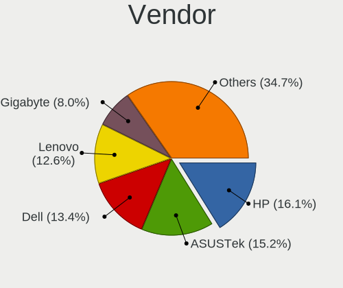
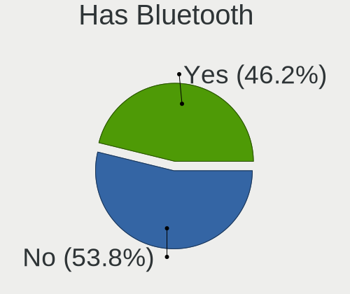
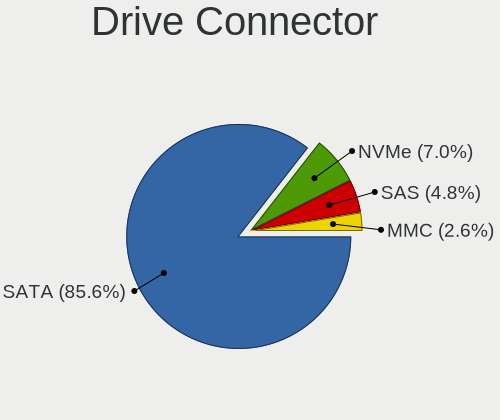
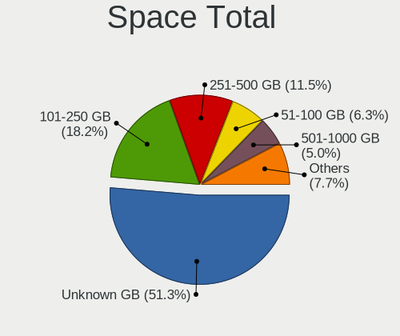
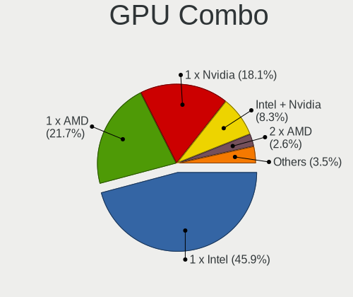
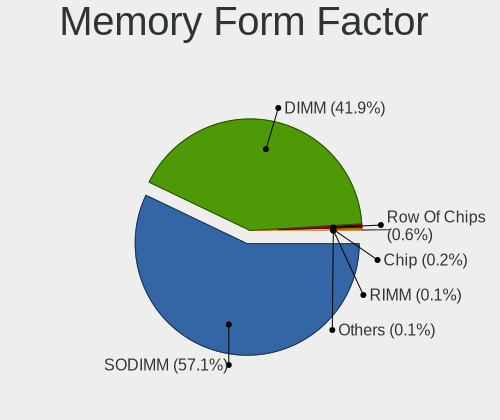
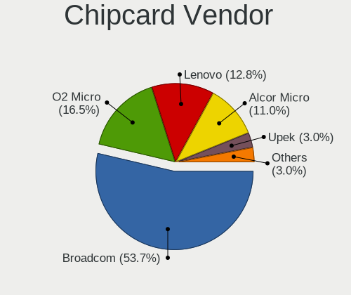
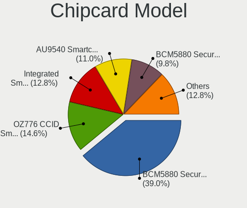

BlackPanther - Tested Hardware & Statistics
-------------------------------------------

A project to collect tested hardware configurations for BlackPanther.

Anyone can contribute to this report by the [hw-probe](https://github.com/linuxhw/hw-probe) tool:

    sudo -E hw-probe -all -upload

Please contribute! Especially if your hardware is rare.

This is a report for all computer types. See also reports for [desktops](/Dist/BlackPanther/Desktop/README.md) and [notebooks](/Dist/BlackPanther/Notebook/README.md).

Contents
--------

* [ Test Cases ](#test-cases)

* [ System ](#system)
  - [ OS                       ](#os)
  - [ OS Family                ](#os-family)
  - [ Kernel                   ](#kernel)
  - [ Kernel Family            ](#kernel-family)
  - [ Kernel Major Ver.        ](#kernel-major-ver)
  - [ Arch                     ](#arch)
  - [ DE                       ](#de)
  - [ Display Server           ](#display-server)
  - [ Display Manager          ](#display-manager)
  - [ OS Lang                  ](#os-lang)
  - [ Boot Mode                ](#boot-mode)
  - [ Filesystem               ](#filesystem)
  - [ Part. scheme             ](#part-scheme)
  - [ Dual Boot with Linux/BSD ](#dual-boot-with-linuxbsd)
  - [ Dual Boot (Win)          ](#dual-boot-win)

* [ Board ](#board)
  - [ Vendor                   ](#vendor)
  - [ Model                    ](#model)
  - [ Model Family             ](#model-family)
  - [ MFG Year                 ](#mfg-year)
  - [ Form Factor              ](#form-factor)
  - [ Secure Boot              ](#secure-boot)
  - [ Coreboot                 ](#coreboot)
  - [ RAM Size                 ](#ram-size)
  - [ RAM Used                 ](#ram-used)
  - [ Total Drives             ](#total-drives)
  - [ Has CD-ROM               ](#has-cd-rom)
  - [ Has Ethernet             ](#has-ethernet)
  - [ Has WiFi                 ](#has-wifi)
  - [ Has Bluetooth            ](#has-bluetooth)

* [ Location ](#location)
  - [ Country                  ](#country)
  - [ City                     ](#city)

* [ Drives ](#drives)
  - [ Drive Vendor             ](#drive-vendor)
  - [ Drive Model              ](#drive-model)
  - [ HDD Vendor               ](#hdd-vendor)
  - [ SSD Vendor               ](#ssd-vendor)
  - [ Drive Kind               ](#drive-kind)
  - [ Drive Connector          ](#drive-connector)
  - [ Drive Size               ](#drive-size)
  - [ Space Total              ](#space-total)
  - [ Space Used               ](#space-used)
  - [ Malfunc. Drives          ](#malfunc-drives)
  - [ Malfunc. Drive Vendor    ](#malfunc-drive-vendor)
  - [ Malfunc. HDD Vendor      ](#malfunc-hdd-vendor)
  - [ Malfunc. Drive Kind      ](#malfunc-drive-kind)
  - [ Failed Drives            ](#failed-drives)
  - [ Failed Drive Vendor      ](#failed-drive-vendor)
  - [ Drive Status             ](#drive-status)

* [ Storage controller ](#storage-controller)
  - [ Storage Vendor           ](#storage-vendor)
  - [ Storage Model            ](#storage-model)
  - [ Storage Kind             ](#storage-kind)

* [ Processor ](#processor)
  - [ CPU Vendor               ](#cpu-vendor)
  - [ CPU Model                ](#cpu-model)
  - [ CPU Model Family         ](#cpu-model-family)
  - [ CPU Cores                ](#cpu-cores)
  - [ CPU Sockets              ](#cpu-sockets)
  - [ CPU Threads              ](#cpu-threads)
  - [ CPU Op-Modes             ](#cpu-op-modes)
  - [ CPU Microcode            ](#cpu-microcode)
  - [ CPU Microarch            ](#cpu-microarch)

* [ Graphics ](#graphics)
  - [ GPU Vendor               ](#gpu-vendor)
  - [ GPU Model                ](#gpu-model)
  - [ GPU Combo                ](#gpu-combo)
  - [ GPU Driver               ](#gpu-driver)
  - [ GPU Memory               ](#gpu-memory)

* [ Monitor ](#monitor)
  - [ Monitor Vendor           ](#monitor-vendor)
  - [ Monitor Model            ](#monitor-model)
  - [ Monitor Resolution       ](#monitor-resolution)
  - [ Monitor Diagonal         ](#monitor-diagonal)
  - [ Monitor Width            ](#monitor-width)
  - [ Aspect Ratio             ](#aspect-ratio)
  - [ Monitor Area             ](#monitor-area)
  - [ Pixel Density            ](#pixel-density)
  - [ Multiple Monitors        ](#multiple-monitors)

* [ Network ](#network)
  - [ Net Controller Vendor    ](#net-controller-vendor)
  - [ Net Controller Model     ](#net-controller-model)
  - [ Wireless Vendor          ](#wireless-vendor)
  - [ Wireless Model           ](#wireless-model)
  - [ Ethernet Vendor          ](#ethernet-vendor)
  - [ Ethernet Model           ](#ethernet-model)
  - [ Net Controller Kind      ](#net-controller-kind)
  - [ Used Controller          ](#used-controller)
  - [ NICs                     ](#nics)
  - [ IPv6                     ](#ipv6)

* [ Bluetooth ](#bluetooth)
  - [ Bluetooth Vendor         ](#bluetooth-vendor)
  - [ Bluetooth Model          ](#bluetooth-model)

* [ Sound ](#sound)
  - [ Sound Vendor             ](#sound-vendor)
  - [ Sound Model              ](#sound-model)

* [ Memory ](#memory)
  - [ Memory Vendor            ](#memory-vendor)
  - [ Memory Model             ](#memory-model)
  - [ Memory Kind              ](#memory-kind)
  - [ Memory Form Factor       ](#memory-form-factor)
  - [ Memory Size              ](#memory-size)
  - [ Memory Speed             ](#memory-speed)

* [ Printers & scanners ](#printers--scanners)
  - [ Printer Vendor           ](#printer-vendor)
  - [ Printer Model            ](#printer-model)
  - [ Scanner Vendor           ](#scanner-vendor)
  - [ Scanner Model            ](#scanner-model)

* [ Camera ](#camera)
  - [ Camera Vendor            ](#camera-vendor)
  - [ Camera Model             ](#camera-model)

* [ Security ](#security)
  - [ Fingerprint Vendor       ](#fingerprint-vendor)
  - [ Fingerprint Model        ](#fingerprint-model)
  - [ Chipcard Vendor          ](#chipcard-vendor)
  - [ Chipcard Model           ](#chipcard-model)

* [ Unsupported ](#unsupported)
  - [ Unsupported Devices      ](#unsupported-devices)
  - [ Unsupported Device Types ](#unsupported-device-types)

Test Cases
----------

Total: 6481

| Vendor        | Model                       | Form-Factor | Probe                                                      | Date         |
|---------------|-----------------------------|-------------|------------------------------------------------------------|--------------|
| Lenovo        | IdeaPad 330-15IKB 81DE      | Notebook    | [cc19d2cf24](https://linux-hardware.org/?probe=cc19d2cf24) | Dec 31, 2022 |
| HP            | Pavilion Gaming Laptop 1... | Notebook    | [e0f696a9b9](https://linux-hardware.org/?probe=e0f696a9b9) | Dec 31, 2022 |
| HP            | Pavilion Gaming Laptop 1... | Notebook    | [6c00206f7e](https://linux-hardware.org/?probe=6c00206f7e) | Dec 30, 2022 |
| Dell          | Latitude 5480               | Notebook    | [e02be15b45](https://linux-hardware.org/?probe=e02be15b45) | Dec 30, 2022 |
| Dell          | Latitude 5480               | Notebook    | [5afd8e73be](https://linux-hardware.org/?probe=5afd8e73be) | Dec 30, 2022 |
| Dell          | Latitude 5480               | Notebook    | [64aa4b9161](https://linux-hardware.org/?probe=64aa4b9161) | Dec 30, 2022 |
| Gigabyte      | B450M GAMING                | Desktop     | [199a8927b8](https://linux-hardware.org/?probe=199a8927b8) | Dec 29, 2022 |
| Gigabyte      | B450M GAMING                | Desktop     | [012f398d07](https://linux-hardware.org/?probe=012f398d07) | Dec 29, 2022 |
| Dell          | Latitude 5480               | Notebook    | [b578e196dd](https://linux-hardware.org/?probe=b578e196dd) | Dec 29, 2022 |
| Dell          | Latitude E6230              | Notebook    | [a8df3d8262](https://linux-hardware.org/?probe=a8df3d8262) | Dec 29, 2022 |
| Dell          | Latitude E6230              | Notebook    | [a57d2f5ccb](https://linux-hardware.org/?probe=a57d2f5ccb) | Dec 29, 2022 |
| ASUSTek       | ROG STRIX B550-A GAMING     | Desktop     | [447852c33b](https://linux-hardware.org/?probe=447852c33b) | Dec 28, 2022 |
| Dell          | Latitude 5480               | Notebook    | [4b2fda33f4](https://linux-hardware.org/?probe=4b2fda33f4) | Dec 28, 2022 |
| Dell          | Latitude 5480               | Notebook    | [abcd3bea2f](https://linux-hardware.org/?probe=abcd3bea2f) | Dec 28, 2022 |
| Lenovo        | IdeaPadFlex 15 20309        | Notebook    | [5cbcee30c7](https://linux-hardware.org/?probe=5cbcee30c7) | Dec 28, 2022 |
| Lenovo        | IdeaPadFlex 15 20309        | Notebook    | [743ed4d93a](https://linux-hardware.org/?probe=743ed4d93a) | Dec 27, 2022 |
| HP            | Pavilion Gaming Laptop 1... | Notebook    | [819f9be803](https://linux-hardware.org/?probe=819f9be803) | Dec 27, 2022 |
| HP            | Pavilion Gaming Laptop 1... | Notebook    | [ad4d919e36](https://linux-hardware.org/?probe=ad4d919e36) | Dec 27, 2022 |
| ASUSTek       | B85M-E/DASH                 | Desktop     | [b2acfa6e70](https://linux-hardware.org/?probe=b2acfa6e70) | Dec 26, 2022 |
| ASUSTek       | B85M-E/DASH                 | Desktop     | [59e6ec4132](https://linux-hardware.org/?probe=59e6ec4132) | Dec 26, 2022 |
| ASRock        | Z370 Extreme4               | Desktop     | [8b02482c16](https://linux-hardware.org/?probe=8b02482c16) | Dec 26, 2022 |
| Acer          | Aspire A515-51G             | Notebook    | [56ceb67978](https://linux-hardware.org/?probe=56ceb67978) | Dec 26, 2022 |
| Acer          | Aspire A515-51G             | Notebook    | [e44b069b44](https://linux-hardware.org/?probe=e44b069b44) | Dec 26, 2022 |
| HP            | Compaq 610                  | Notebook    | [198b4d0586](https://linux-hardware.org/?probe=198b4d0586) | Dec 25, 2022 |
| HP            | Compaq 610                  | Notebook    | [0e9ab46e66](https://linux-hardware.org/?probe=0e9ab46e66) | Dec 25, 2022 |
| ASUSTek       | M5A97 EVO R2.0              | Desktop     | [3f022cb1a7](https://linux-hardware.org/?probe=3f022cb1a7) | Dec 24, 2022 |
| ASUSTek       | M5A97 EVO R2.0              | Desktop     | [7c5a7b9036](https://linux-hardware.org/?probe=7c5a7b9036) | Dec 24, 2022 |
| Acer          | E1-510                      | Notebook    | [463c668d4e](https://linux-hardware.org/?probe=463c668d4e) | Dec 23, 2022 |
| HP            | Laptop 17-ak0xx             | Notebook    | [7e77870894](https://linux-hardware.org/?probe=7e77870894) | Dec 21, 2022 |
| HP            | Laptop 17-ak0xx             | Notebook    | [04c205c943](https://linux-hardware.org/?probe=04c205c943) | Dec 21, 2022 |
| Gigabyte      | Z690 UD AX                  | Desktop     | [95a82c6f4d](https://linux-hardware.org/?probe=95a82c6f4d) | Dec 19, 2022 |
| Gigabyte      | B450M GAMING                | Desktop     | [3b2deb36cb](https://linux-hardware.org/?probe=3b2deb36cb) | Dec 19, 2022 |
| Dell          | Latitude E6230              | Notebook    | [80012cb415](https://linux-hardware.org/?probe=80012cb415) | Dec 19, 2022 |
| Gigabyte      | B450M GAMING                | Desktop     | [477947ea20](https://linux-hardware.org/?probe=477947ea20) | Dec 17, 2022 |
| Dell          | Latitude E6230              | Notebook    | [ba7fa25841](https://linux-hardware.org/?probe=ba7fa25841) | Dec 17, 2022 |
| Dell          | Inspiron M5030              | Notebook    | [265739601c](https://linux-hardware.org/?probe=265739601c) | Dec 16, 2022 |
| HP            | Laptop 17-ak0xx             | Notebook    | [0ed9c8a241](https://linux-hardware.org/?probe=0ed9c8a241) | Dec 16, 2022 |
| Gigabyte      | F2A88XM-HD3                 | Desktop     | [96929b34ef](https://linux-hardware.org/?probe=96929b34ef) | Dec 15, 2022 |
| ASUSTek       | M5A97 R2.0                  | Desktop     | [bc8782be9a](https://linux-hardware.org/?probe=bc8782be9a) | Dec 15, 2022 |
| ASUSTek       | M5A97 R2.0                  | Desktop     | [d320b71c77](https://linux-hardware.org/?probe=d320b71c77) | Dec 15, 2022 |
| ASUSTek       | M5A97 EVO R2.0              | Desktop     | [a7c03c5bfd](https://linux-hardware.org/?probe=a7c03c5bfd) | Dec 14, 2022 |
| ASUSTek       | M5A97 EVO R2.0              | Desktop     | [42eef61903](https://linux-hardware.org/?probe=42eef61903) | Dec 14, 2022 |
| ASUSTek       | GL10DH                      | Desktop     | [ca2fb9f1a2](https://linux-hardware.org/?probe=ca2fb9f1a2) | Dec 13, 2022 |
| ASUSTek       | GL10DH                      | Desktop     | [5c148c3a41](https://linux-hardware.org/?probe=5c148c3a41) | Dec 13, 2022 |
| Lenovo        | E50-80 80J2                 | Notebook    | [9dc9070ae6](https://linux-hardware.org/?probe=9dc9070ae6) | Dec 13, 2022 |
| Lenovo        | E50-80 80J2                 | Notebook    | [cf9f4d4a79](https://linux-hardware.org/?probe=cf9f4d4a79) | Dec 13, 2022 |
| HP            | 650                         | Notebook    | [add4ca69e3](https://linux-hardware.org/?probe=add4ca69e3) | Dec 11, 2022 |
| Acer          | TravelMate 8571             | Notebook    | [63aa77ba8d](https://linux-hardware.org/?probe=63aa77ba8d) | Dec 10, 2022 |
| ASUSTek       | X540SA                      | Notebook    | [ac26a0f572](https://linux-hardware.org/?probe=ac26a0f572) | Dec 10, 2022 |
| ASUSTek       | K54HR                       | Notebook    | [32870f2fa3](https://linux-hardware.org/?probe=32870f2fa3) | Dec 10, 2022 |
| ASUSTek       | K54HR                       | Notebook    | [fac8091847](https://linux-hardware.org/?probe=fac8091847) | Dec 10, 2022 |
| Dell          | 0GY6Y8 A01                  | Desktop     | [afda77c820](https://linux-hardware.org/?probe=afda77c820) | Dec 10, 2022 |
| ASUSTek       | X540SA                      | Notebook    | [abda33d50f](https://linux-hardware.org/?probe=abda33d50f) | Dec 10, 2022 |
| ASUSTek       | X200MA                      | Notebook    | [1cb00c612b](https://linux-hardware.org/?probe=1cb00c612b) | Dec 09, 2022 |
| HP            | Laptop 15-db0xxx            | Notebook    | [9617825518](https://linux-hardware.org/?probe=9617825518) | Dec 09, 2022 |
| HP            | Laptop 15-db0xxx            | Notebook    | [7b1075fd9b](https://linux-hardware.org/?probe=7b1075fd9b) | Dec 09, 2022 |
| Acer          | TravelMate 8571             | Notebook    | [89270d1f7c](https://linux-hardware.org/?probe=89270d1f7c) | Dec 08, 2022 |
| Acer          | Nitro AN515-51              | Notebook    | [177d3d8e16](https://linux-hardware.org/?probe=177d3d8e16) | Dec 08, 2022 |
| Dell          | Inspiron M5030              | Notebook    | [f73021e3c7](https://linux-hardware.org/?probe=f73021e3c7) | Dec 08, 2022 |
| ASUSTek       | K54HR                       | Notebook    | [66433bdc5e](https://linux-hardware.org/?probe=66433bdc5e) | Dec 07, 2022 |
| Acer          | TravelMate 8571             | Notebook    | [9e7f0672b2](https://linux-hardware.org/?probe=9e7f0672b2) | Dec 06, 2022 |
| ASUSTek       | M5A97 EVO R2.0              | Desktop     | [639497d7e0](https://linux-hardware.org/?probe=639497d7e0) | Dec 05, 2022 |
| ASUSTek       | M5A97 EVO R2.0              | Desktop     | [6a477d4759](https://linux-hardware.org/?probe=6a477d4759) | Dec 05, 2022 |
| ASRock        | N68C-S UCC                  | Desktop     | [cdd460e503](https://linux-hardware.org/?probe=cdd460e503) | Dec 04, 2022 |
| ASUSTek       | K54HR                       | Notebook    | [264d0d02bb](https://linux-hardware.org/?probe=264d0d02bb) | Dec 04, 2022 |
| ASUSTek       | H110M-A                     | Desktop     | [6136553624](https://linux-hardware.org/?probe=6136553624) | Dec 03, 2022 |
| ASUSTek       | H110M-A                     | Desktop     | [9ac464aa29](https://linux-hardware.org/?probe=9ac464aa29) | Dec 03, 2022 |
| Acer          | TravelMate 8571             | Notebook    | [df032cacb6](https://linux-hardware.org/?probe=df032cacb6) | Dec 03, 2022 |
| HP            | Pavilion Gaming Laptop 1... | Notebook    | [32dbbbf380](https://linux-hardware.org/?probe=32dbbbf380) | Dec 03, 2022 |
| Lenovo        | SDK0E50510 WIN              | Desktop     | [76b79932d5](https://linux-hardware.org/?probe=76b79932d5) | Nov 29, 2022 |
| Dell          | Latitude E5520              | Notebook    | [1b3b69b19f](https://linux-hardware.org/?probe=1b3b69b19f) | Nov 28, 2022 |
| MSI           | MS-7817                     | Desktop     | [3a740dd46a](https://linux-hardware.org/?probe=3a740dd46a) | Nov 28, 2022 |
| MSI           | MS-7817                     | Desktop     | [48ae0e1997](https://linux-hardware.org/?probe=48ae0e1997) | Nov 28, 2022 |
| ASUSTek       | PRIME A320M-K               | Desktop     | [c56c5e5a10](https://linux-hardware.org/?probe=c56c5e5a10) | Nov 28, 2022 |
| ASUSTek       | PRIME A320M-K               | Desktop     | [e853b09dfa](https://linux-hardware.org/?probe=e853b09dfa) | Nov 28, 2022 |
| Fujitsu       | D2828-A2 S26361-D2828-A2    | Desktop     | [550b448753](https://linux-hardware.org/?probe=550b448753) | Nov 27, 2022 |
| Dell          | Latitude E5520              | Notebook    | [ce72f1c2a9](https://linux-hardware.org/?probe=ce72f1c2a9) | Nov 25, 2022 |
| Gigabyte      | Z390 UD                     | Desktop     | [06e25ffa57](https://linux-hardware.org/?probe=06e25ffa57) | Nov 25, 2022 |
| Gigabyte      | Z390 UD                     | Desktop     | [447045be5d](https://linux-hardware.org/?probe=447045be5d) | Nov 24, 2022 |
| ASUSTek       | H110M-A                     | Desktop     | [03d5c6e735](https://linux-hardware.org/?probe=03d5c6e735) | Nov 23, 2022 |
| Gigabyte      | B450M GAMING                | Desktop     | [ac5deb8230](https://linux-hardware.org/?probe=ac5deb8230) | Nov 22, 2022 |
| Gigabyte      | B450M GAMING                | Desktop     | [ffc3ff8f31](https://linux-hardware.org/?probe=ffc3ff8f31) | Nov 22, 2022 |
| ASUSTek       | M5A97 EVO R2.0              | Desktop     | [855f11c57b](https://linux-hardware.org/?probe=855f11c57b) | Nov 21, 2022 |
| MSI           | MS-7817                     | Desktop     | [b2c48fde2c](https://linux-hardware.org/?probe=b2c48fde2c) | Nov 20, 2022 |
| MSI           | MS-7817                     | Desktop     | [ffc17a7303](https://linux-hardware.org/?probe=ffc17a7303) | Nov 20, 2022 |
| ASUSTek       | P8H61-M LX2                 | Desktop     | [4db9e36520](https://linux-hardware.org/?probe=4db9e36520) | Nov 20, 2022 |
| ASUSTek       | P8H61-M LX2                 | Desktop     | [716649aa59](https://linux-hardware.org/?probe=716649aa59) | Nov 20, 2022 |
| ASUSTek       | H110M-A                     | Desktop     | [fd460bcba6](https://linux-hardware.org/?probe=fd460bcba6) | Nov 18, 2022 |
| Dell          | 0D6H9T A01                  | Desktop     | [a50bca5670](https://linux-hardware.org/?probe=a50bca5670) | Nov 17, 2022 |
| Dell          | 0T1D10 A01                  | Desktop     | [8129799662](https://linux-hardware.org/?probe=8129799662) | Nov 17, 2022 |
| Dell          | 0T1D10 A01                  | Desktop     | [661bd1c501](https://linux-hardware.org/?probe=661bd1c501) | Nov 17, 2022 |
| HP            | Unknown                     | Notebook    | [f76118ac5f](https://linux-hardware.org/?probe=f76118ac5f) | Nov 13, 2022 |
| HP            | Unknown                     | Notebook    | [8cd95516d0](https://linux-hardware.org/?probe=8cd95516d0) | Nov 13, 2022 |
| HP            | 650                         | Notebook    | [100707d1eb](https://linux-hardware.org/?probe=100707d1eb) | Nov 13, 2022 |
| ASUSTek       | AM1M-A                      | Desktop     | [11bffbe5e4](https://linux-hardware.org/?probe=11bffbe5e4) | Nov 12, 2022 |
| Acer          | Veriton M2631 V:1.0         | Desktop     | [9ed32f5227](https://linux-hardware.org/?probe=9ed32f5227) | Nov 12, 2022 |
| Acer          | Veriton M2631 V:1.0         | Desktop     | [99a2e00654](https://linux-hardware.org/?probe=99a2e00654) | Nov 11, 2022 |
| Gigabyte      | H61M-S1                     | Desktop     | [718971a0f8](https://linux-hardware.org/?probe=718971a0f8) | Nov 11, 2022 |
| Gigabyte      | H61M-S1                     | Desktop     | [b0f1fc9e0f](https://linux-hardware.org/?probe=b0f1fc9e0f) | Nov 11, 2022 |
| ASUSTek       | AM1M-A                      | Desktop     | [1af38f67c6](https://linux-hardware.org/?probe=1af38f67c6) | Nov 10, 2022 |
| Gigabyte      | P67A-D3-B3                  | Desktop     | [a5492a9260](https://linux-hardware.org/?probe=a5492a9260) | Nov 07, 2022 |
| HP            | 650                         | Notebook    | [fd3b93e8fb](https://linux-hardware.org/?probe=fd3b93e8fb) | Nov 05, 2022 |
| Fujitsu       | D2828-A2 S26361-D2828-A2    | Desktop     | [a9bb64111f](https://linux-hardware.org/?probe=a9bb64111f) | Nov 05, 2022 |
| Gigabyte      | H61M-S1                     | Desktop     | [d5125861d0](https://linux-hardware.org/?probe=d5125861d0) | Nov 03, 2022 |
| ASRock        | 4CoreDual-SATA2             | Desktop     | [0a598dc332](https://linux-hardware.org/?probe=0a598dc332) | Nov 02, 2022 |
| Dell          | 0K240Y A01                  | Desktop     | [41707b16d1](https://linux-hardware.org/?probe=41707b16d1) | Nov 02, 2022 |
| Fujitsu       | D2828-A2 S26361-D2828-A2    | Desktop     | [cf394ed108](https://linux-hardware.org/?probe=cf394ed108) | Nov 01, 2022 |
| ASRock        | 4CoreDual-SATA2             | Desktop     | [446799aa8e](https://linux-hardware.org/?probe=446799aa8e) | Nov 01, 2022 |
| Dell          | Inspiron 5558               | Notebook    | [416655ce7d](https://linux-hardware.org/?probe=416655ce7d) | Oct 30, 2022 |
| Dell          | Inspiron 5558               | Notebook    | [ae71fe1a19](https://linux-hardware.org/?probe=ae71fe1a19) | Oct 30, 2022 |
| HP            | Compaq nx6310 (EY589ES#A... | Notebook    | [a80d2e7626](https://linux-hardware.org/?probe=a80d2e7626) | Oct 27, 2022 |
| Fujitsu       | LIFEBOOK U745               | Notebook    | [7cb792e432](https://linux-hardware.org/?probe=7cb792e432) | Oct 27, 2022 |
| Fujitsu       | LIFEBOOK U745               | Notebook    | [0c33d71210](https://linux-hardware.org/?probe=0c33d71210) | Oct 27, 2022 |
| Dell          | 0K240Y A01                  | Desktop     | [4be40e9739](https://linux-hardware.org/?probe=4be40e9739) | Oct 27, 2022 |
| Dell          | 0K240Y A01                  | Desktop     | [fc26c82789](https://linux-hardware.org/?probe=fc26c82789) | Oct 27, 2022 |
| HP            | Compaq 6910p (GH717AW#AB... | Notebook    | [02d31506a2](https://linux-hardware.org/?probe=02d31506a2) | Oct 24, 2022 |
| Dell          | Latitude E6230              | Notebook    | [73ee8be4e9](https://linux-hardware.org/?probe=73ee8be4e9) | Oct 23, 2022 |
| Dell          | Latitude E6230              | Notebook    | [52ee15a8f5](https://linux-hardware.org/?probe=52ee15a8f5) | Oct 23, 2022 |
| eMachines     | E725                        | Notebook    | [ea21ca2d78](https://linux-hardware.org/?probe=ea21ca2d78) | Oct 19, 2022 |
| eMachines     | E725                        | Notebook    | [6d5ddca6c9](https://linux-hardware.org/?probe=6d5ddca6c9) | Oct 18, 2022 |
| eMachines     | E725                        | Notebook    | [f365f1eaa7](https://linux-hardware.org/?probe=f365f1eaa7) | Oct 17, 2022 |
| eMachines     | E725                        | Notebook    | [7003528b88](https://linux-hardware.org/?probe=7003528b88) | Oct 17, 2022 |
| Dell          | 0W0CHX A00                  | Desktop     | [f305948282](https://linux-hardware.org/?probe=f305948282) | Oct 16, 2022 |
| ASRock        | 4CoreDual-SATA2             | Desktop     | [a0c85cb9ab](https://linux-hardware.org/?probe=a0c85cb9ab) | Oct 15, 2022 |
| Fujitsu       | D3313-S4 S26361-D3313-S4    | Desktop     | [e92144b22a](https://linux-hardware.org/?probe=e92144b22a) | Oct 15, 2022 |
| Unknown       | Unknown                     | Notebook    | [07a141abbb](https://linux-hardware.org/?probe=07a141abbb) | Oct 14, 2022 |
| eMachines     | E725                        | Notebook    | [77e7244d88](https://linux-hardware.org/?probe=77e7244d88) | Oct 14, 2022 |
| eMachines     | E725                        | Notebook    | [34538c32c5](https://linux-hardware.org/?probe=34538c32c5) | Oct 14, 2022 |
| Unknown       | Unknown                     | Notebook    | [0d8c24c367](https://linux-hardware.org/?probe=0d8c24c367) | Oct 13, 2022 |
| ASRock        | 4CoreDual-SATA2             | Desktop     | [9743b0896c](https://linux-hardware.org/?probe=9743b0896c) | Oct 13, 2022 |
| Lenovo        | ThinkPad W530 2463A58       | Notebook    | [dc933df0a9](https://linux-hardware.org/?probe=dc933df0a9) | Oct 10, 2022 |
| Gigabyte      | P67A-D3-B3                  | Desktop     | [000e5389a8](https://linux-hardware.org/?probe=000e5389a8) | Oct 10, 2022 |
| ASUSTek       | X550VX                      | Notebook    | [63a8f1baa1](https://linux-hardware.org/?probe=63a8f1baa1) | Oct 10, 2022 |
| ASUSTek       | X550VX                      | Notebook    | [7f9e9ab40b](https://linux-hardware.org/?probe=7f9e9ab40b) | Oct 10, 2022 |
| Lenovo        | V145-15AST 81MT             | Notebook    | [91163f885b](https://linux-hardware.org/?probe=91163f885b) | Oct 07, 2022 |
| HP            | 3047h                       | Desktop     | [b29b0b1ef4](https://linux-hardware.org/?probe=b29b0b1ef4) | Oct 07, 2022 |
| HP            | 339A                        | Desktop     | [62912b232a](https://linux-hardware.org/?probe=62912b232a) | Oct 06, 2022 |
| HP            | 339A                        | Desktop     | [b73b4a02bd](https://linux-hardware.org/?probe=b73b4a02bd) | Oct 06, 2022 |
| eMachines     | E725                        | Notebook    | [9a77e04f3c](https://linux-hardware.org/?probe=9a77e04f3c) | Oct 05, 2022 |
| eMachines     | E725                        | Notebook    | [e413d82fa5](https://linux-hardware.org/?probe=e413d82fa5) | Oct 05, 2022 |
| Gigabyte      | P67A-D3-B3                  | Desktop     | [73c9f25932](https://linux-hardware.org/?probe=73c9f25932) | Oct 04, 2022 |
| Dell          | Latitude D630               | Notebook    | [90dc2dddf8](https://linux-hardware.org/?probe=90dc2dddf8) | Oct 02, 2022 |
| Sony          | SVS13118GBB                 | Notebook    | [48dd8fb419](https://linux-hardware.org/?probe=48dd8fb419) | Oct 01, 2022 |
| Fujitsu       | LIFEBOOK S904               | Notebook    | [c9c83f0112](https://linux-hardware.org/?probe=c9c83f0112) | Oct 01, 2022 |
| Dell          | Latitude D630               | Notebook    | [d00c756052](https://linux-hardware.org/?probe=d00c756052) | Oct 01, 2022 |
| Sony          | SVS13118GBB                 | Notebook    | [75e6dbe3d2](https://linux-hardware.org/?probe=75e6dbe3d2) | Oct 01, 2022 |
| ASUSTek       | Strix 15 GL503GE            | Notebook    | [e48bab666f](https://linux-hardware.org/?probe=e48bab666f) | Oct 01, 2022 |
| Sony          | SVS13118GBB                 | Notebook    | [0e0ca26d00](https://linux-hardware.org/?probe=0e0ca26d00) | Sep 30, 2022 |
| Sony          | SVS13118GBB                 | Notebook    | [12868cf90f](https://linux-hardware.org/?probe=12868cf90f) | Sep 30, 2022 |
| Lenovo        | IdeaPad 320-17ABR 80YN      | Notebook    | [1ff8e037f4](https://linux-hardware.org/?probe=1ff8e037f4) | Sep 30, 2022 |
| Dell          | Latitude E6420              | Notebook    | [cdd7bd1cc2](https://linux-hardware.org/?probe=cdd7bd1cc2) | Sep 29, 2022 |
| HP            | 3047h                       | Desktop     | [9426ee3f59](https://linux-hardware.org/?probe=9426ee3f59) | Sep 28, 2022 |
| eMachines     | E725                        | Notebook    | [04c9a24d86](https://linux-hardware.org/?probe=04c9a24d86) | Sep 28, 2022 |
| eMachines     | E725                        | Notebook    | [f99f2244c7](https://linux-hardware.org/?probe=f99f2244c7) | Sep 28, 2022 |
| Acer          | Aspire E1-531               | Notebook    | [b7d37d0c6f](https://linux-hardware.org/?probe=b7d37d0c6f) | Sep 27, 2022 |
| Acer          | Aspire E1-531               | Notebook    | [90856d2122](https://linux-hardware.org/?probe=90856d2122) | Sep 27, 2022 |
| ASUSTek       | 1015BX                      | Notebook    | [5190c360db](https://linux-hardware.org/?probe=5190c360db) | Sep 25, 2022 |
| HP            | 650                         | Notebook    | [f835e52a64](https://linux-hardware.org/?probe=f835e52a64) | Sep 25, 2022 |
| Fujitsu Si... | MS-7504VP-PV                | Desktop     | [fa75c2dfde](https://linux-hardware.org/?probe=fa75c2dfde) | Sep 24, 2022 |
| HP            | Compaq 6710b (KE125ET#AB... | Notebook    | [fc7831b371](https://linux-hardware.org/?probe=fc7831b371) | Sep 23, 2022 |
| HP            | Compaq 6710b (KE125ET#AB... | Notebook    | [15cffbb03b](https://linux-hardware.org/?probe=15cffbb03b) | Sep 23, 2022 |
| Gigabyte      | H61M-S1                     | Desktop     | [b28077e806](https://linux-hardware.org/?probe=b28077e806) | Sep 23, 2022 |
| Pegatron      | A15                         | Notebook    | [a865984ad5](https://linux-hardware.org/?probe=a865984ad5) | Sep 23, 2022 |
| Pegatron      | A15                         | Notebook    | [ea527d6d5a](https://linux-hardware.org/?probe=ea527d6d5a) | Sep 23, 2022 |
| Fujitsu Si... | MS-7504VP-PV                | Desktop     | [f0916efbf9](https://linux-hardware.org/?probe=f0916efbf9) | Sep 23, 2022 |
| Fujitsu       | LIFEBOOK U745               | Notebook    | [0570d2318c](https://linux-hardware.org/?probe=0570d2318c) | Sep 23, 2022 |
| ASUSTek       | K54HR                       | Notebook    | [dbf0f3b1c8](https://linux-hardware.org/?probe=dbf0f3b1c8) | Sep 21, 2022 |
| ASUSTek       | K54HR                       | Notebook    | [25fd2ae90c](https://linux-hardware.org/?probe=25fd2ae90c) | Sep 21, 2022 |
| ASUSTek       | PRIME A320M-K               | Desktop     | [d62d1ed9fd](https://linux-hardware.org/?probe=d62d1ed9fd) | Sep 21, 2022 |
| Toshiba       | Satellite L450              | Notebook    | [20b85987c4](https://linux-hardware.org/?probe=20b85987c4) | Sep 20, 2022 |
| Toshiba       | Satellite L450              | Notebook    | [9f694612d3](https://linux-hardware.org/?probe=9f694612d3) | Sep 20, 2022 |
| ASUSTek       | X550CL                      | Notebook    | [16d313fefa](https://linux-hardware.org/?probe=16d313fefa) | Sep 20, 2022 |
| MSI           | Z77A-G45                    | Desktop     | [b5a8d40602](https://linux-hardware.org/?probe=b5a8d40602) | Sep 18, 2022 |
| eMachines     | E725                        | Notebook    | [141723a3e2](https://linux-hardware.org/?probe=141723a3e2) | Sep 16, 2022 |
| eMachines     | E725                        | Notebook    | [bf27205286](https://linux-hardware.org/?probe=bf27205286) | Sep 15, 2022 |
| Acer          | Aspire 5310                 | Notebook    | [963a5bcade](https://linux-hardware.org/?probe=963a5bcade) | Sep 15, 2022 |
| ASUSTek       | P7P55D                      | Desktop     | [10c83deaa9](https://linux-hardware.org/?probe=10c83deaa9) | Sep 15, 2022 |
| ASUSTek       | P7P55D                      | Desktop     | [4b6fca3ab4](https://linux-hardware.org/?probe=4b6fca3ab4) | Sep 15, 2022 |
| Lenovo        | SHARKBAY NOK                | Desktop     | [f10e559655](https://linux-hardware.org/?probe=f10e559655) | Sep 11, 2022 |
| Acer          | Aspire 5820                 | Notebook    | [1820ffa037](https://linux-hardware.org/?probe=1820ffa037) | Sep 09, 2022 |
| Gigabyte      | P67A-D3-B3                  | Desktop     | [eba0d1ad0c](https://linux-hardware.org/?probe=eba0d1ad0c) | Sep 09, 2022 |
| Acer          | Aspire 5820                 | Notebook    | [3f0d8d8ff5](https://linux-hardware.org/?probe=3f0d8d8ff5) | Sep 09, 2022 |
| Acer          | Aspire R3-471T              | Notebook    | [05edd6d4ae](https://linux-hardware.org/?probe=05edd6d4ae) | Sep 08, 2022 |
| Dell          | Latitude E6230              | Notebook    | [41c1130440](https://linux-hardware.org/?probe=41c1130440) | Sep 07, 2022 |
| Dell          | Latitude E6230              | Notebook    | [5e0436a64a](https://linux-hardware.org/?probe=5e0436a64a) | Sep 07, 2022 |
| Lenovo        | IdeaPad 110-15ISK 80UD      | Notebook    | [32715c6eb9](https://linux-hardware.org/?probe=32715c6eb9) | Sep 06, 2022 |
| Lenovo        | IdeaPad 110-15ISK 80UD      | Notebook    | [cbc35f08cb](https://linux-hardware.org/?probe=cbc35f08cb) | Sep 06, 2022 |
| Gigabyte      | P67A-D3-B3                  | Desktop     | [8c34a6ec8c](https://linux-hardware.org/?probe=8c34a6ec8c) | Sep 05, 2022 |
| HP            | 650                         | Notebook    | [526b86a559](https://linux-hardware.org/?probe=526b86a559) | Sep 04, 2022 |
| HP            | 650                         | Notebook    | [6f184e96df](https://linux-hardware.org/?probe=6f184e96df) | Sep 04, 2022 |
| Acer          | Aspire R3-471T              | Notebook    | [eeedafee37](https://linux-hardware.org/?probe=eeedafee37) | Sep 04, 2022 |
| ASUSTek       | PRIME A320M-K               | Desktop     | [7cfd7da775](https://linux-hardware.org/?probe=7cfd7da775) | Sep 03, 2022 |
| ASUSTek       | PRIME A320M-K               | Desktop     | [6552f796e2](https://linux-hardware.org/?probe=6552f796e2) | Sep 01, 2022 |
| ASUSTek       | V-M3N8200                   | Desktop     | [f593540c1c](https://linux-hardware.org/?probe=f593540c1c) | Sep 01, 2022 |
| ASUSTek       | V-M3N8200                   | Desktop     | [f3cc0c0bd5](https://linux-hardware.org/?probe=f3cc0c0bd5) | Sep 01, 2022 |
| Acer          | Aspire R3-471T              | Notebook    | [01b021f810](https://linux-hardware.org/?probe=01b021f810) | Aug 31, 2022 |
| eMachines     | E725                        | Notebook    | [3e5c01d133](https://linux-hardware.org/?probe=3e5c01d133) | Aug 28, 2022 |
| Lenovo        | IdeaPad 110-15ISK 80UD      | Notebook    | [1dd156b433](https://linux-hardware.org/?probe=1dd156b433) | Aug 27, 2022 |
| ASUSTek       | X200MA                      | Notebook    | [dcadb94c69](https://linux-hardware.org/?probe=dcadb94c69) | Aug 27, 2022 |
| ASUSTek       | X200MA                      | Notebook    | [5d22a1baa9](https://linux-hardware.org/?probe=5d22a1baa9) | Aug 27, 2022 |
| Lenovo        | Dory CRB                    | Desktop     | [aa633e1f74](https://linux-hardware.org/?probe=aa633e1f74) | Aug 26, 2022 |
| Lenovo        | Dory CRB                    | Desktop     | [34492f12b7](https://linux-hardware.org/?probe=34492f12b7) | Aug 26, 2022 |
| eMachines     | E725                        | Notebook    | [b73baa0850](https://linux-hardware.org/?probe=b73baa0850) | Aug 25, 2022 |
| ASUSTek       | X200MA                      | Notebook    | [8d375ef1fd](https://linux-hardware.org/?probe=8d375ef1fd) | Aug 24, 2022 |
| ASUSTek       | X200MA                      | Notebook    | [69af3fb82a](https://linux-hardware.org/?probe=69af3fb82a) | Aug 24, 2022 |
| Lenovo        | ThinkPad T410 2537BF9       | Notebook    | [be0227ed47](https://linux-hardware.org/?probe=be0227ed47) | Aug 23, 2022 |
| ASUSTek       | 1015BX                      | Notebook    | [94f3284833](https://linux-hardware.org/?probe=94f3284833) | Aug 21, 2022 |
| Lenovo        | ThinkPad X220 4290L39       | Notebook    | [31a7893b95](https://linux-hardware.org/?probe=31a7893b95) | Aug 20, 2022 |
| Dell          | Latitude 5580               | Notebook    | [5c9db9ff58](https://linux-hardware.org/?probe=5c9db9ff58) | Aug 18, 2022 |
| Gigabyte      | G31M-ES2L                   | Desktop     | [c51689de69](https://linux-hardware.org/?probe=c51689de69) | Aug 16, 2022 |
| Lenovo        | IdeaPad 110-15ISK 80UD      | Notebook    | [6649d66a82](https://linux-hardware.org/?probe=6649d66a82) | Aug 15, 2022 |
| eMachines     | E725                        | Notebook    | [928cfd8881](https://linux-hardware.org/?probe=928cfd8881) | Aug 13, 2022 |
| eMachines     | E725                        | Notebook    | [e1d0d38a1c](https://linux-hardware.org/?probe=e1d0d38a1c) | Aug 13, 2022 |
| Lenovo        | IdeaPad 320-15ABR 80XS      | Notebook    | [1d7c1c5212](https://linux-hardware.org/?probe=1d7c1c5212) | Aug 13, 2022 |
| Lenovo        | IdeaPad 320-15ABR 80XS      | Notebook    | [70b0d2bb45](https://linux-hardware.org/?probe=70b0d2bb45) | Aug 13, 2022 |
| Packard Be... | P5N-E SLI                   | Desktop     | [6f2bf70c0b](https://linux-hardware.org/?probe=6f2bf70c0b) | Aug 09, 2022 |
| ASUSTek       | AM1M-A                      | Desktop     | [e778ebd72b](https://linux-hardware.org/?probe=e778ebd72b) | Aug 08, 2022 |
| Packard Be... | P5N-E SLI                   | Desktop     | [cdc88569bc](https://linux-hardware.org/?probe=cdc88569bc) | Aug 07, 2022 |
| eMachines     | E520 V1.10                  | Notebook    | [a5c7ca58d9](https://linux-hardware.org/?probe=a5c7ca58d9) | Aug 06, 2022 |
| Fujitsu       | LIFEBOOK U745               | Notebook    | [c6d5fcceee](https://linux-hardware.org/?probe=c6d5fcceee) | Aug 05, 2022 |
| Fujitsu       | LIFEBOOK U745               | Notebook    | [0e067ccc56](https://linux-hardware.org/?probe=0e067ccc56) | Aug 05, 2022 |
| ASUSTek       | AM1M-A                      | Desktop     | [687f213628](https://linux-hardware.org/?probe=687f213628) | Aug 05, 2022 |
| eMachines     | E725                        | Notebook    | [8028786618](https://linux-hardware.org/?probe=8028786618) | Aug 04, 2022 |
| ASUSTek       | X550JX                      | Notebook    | [469c737a9b](https://linux-hardware.org/?probe=469c737a9b) | Aug 03, 2022 |
| Lenovo        | SDK0E50510 WIN              | Desktop     | [566648ca6d](https://linux-hardware.org/?probe=566648ca6d) | Aug 02, 2022 |
| eMachines     | E725                        | Notebook    | [fe35b6624b](https://linux-hardware.org/?probe=fe35b6624b) | Aug 02, 2022 |
| eMachines     | E725                        | Notebook    | [25d51b3945](https://linux-hardware.org/?probe=25d51b3945) | Aug 02, 2022 |
| ASUSTek       | X550JX                      | Notebook    | [edf8c765aa](https://linux-hardware.org/?probe=edf8c765aa) | Aug 02, 2022 |
| ASRock        | FM2A75M Pro4+               | Desktop     | [a446c446ae](https://linux-hardware.org/?probe=a446c446ae) | Aug 02, 2022 |
| eMachines     | E520 V1.10                  | Notebook    | [bb16305e18](https://linux-hardware.org/?probe=bb16305e18) | Aug 01, 2022 |
| HP            | EliteBook 8470p             | Notebook    | [a1d5593420](https://linux-hardware.org/?probe=a1d5593420) | Aug 01, 2022 |
| HP            | EliteBook 8470p             | Notebook    | [0cecb854f4](https://linux-hardware.org/?probe=0cecb854f4) | Jul 31, 2022 |
| ASRock        | A780LM-S                    | Desktop     | [83b44b9bd6](https://linux-hardware.org/?probe=83b44b9bd6) | Jul 31, 2022 |
| ASRock        | A780LM-S                    | Desktop     | [2a1ce55c1b](https://linux-hardware.org/?probe=2a1ce55c1b) | Jul 31, 2022 |
| HP            | EliteBook 8470p             | Notebook    | [5e73e33a77](https://linux-hardware.org/?probe=5e73e33a77) | Jul 31, 2022 |
| eMachines     | E725                        | Notebook    | [ca033cf053](https://linux-hardware.org/?probe=ca033cf053) | Jul 26, 2022 |
| Lenovo        | Dory CRB                    | Desktop     | [1aa1f63a2d](https://linux-hardware.org/?probe=1aa1f63a2d) | Jul 25, 2022 |
| Lenovo        | Dory CRB                    | Desktop     | [81e755d9a1](https://linux-hardware.org/?probe=81e755d9a1) | Jul 25, 2022 |
| eMachines     | E725                        | Notebook    | [b975298e85](https://linux-hardware.org/?probe=b975298e85) | Jul 25, 2022 |
| Dell          | 054KM3 A00                  | Desktop     | [f84c50a2ae](https://linux-hardware.org/?probe=f84c50a2ae) | Jul 25, 2022 |
| Dell          | 054KM3 A00                  | Desktop     | [37fc6a278e](https://linux-hardware.org/?probe=37fc6a278e) | Jul 25, 2022 |
| Alcor         | Intel Education Tablet      | Notebook    | [a04ad41c5a](https://linux-hardware.org/?probe=a04ad41c5a) | Jul 24, 2022 |
| Alcor         | Intel Education Tablet      | Notebook    | [700f83a555](https://linux-hardware.org/?probe=700f83a555) | Jul 24, 2022 |
| Dell          | Latitude D630               | Notebook    | [a9fc5a41aa](https://linux-hardware.org/?probe=a9fc5a41aa) | Jul 24, 2022 |
| Dell          | Latitude D630               | Notebook    | [7476af3363](https://linux-hardware.org/?probe=7476af3363) | Jul 23, 2022 |
| ASUSTek       | Strix 15 GL503GE            | Notebook    | [e543e58f00](https://linux-hardware.org/?probe=e543e58f00) | Jul 22, 2022 |
| MSI           | X58 Pro-E                   | Desktop     | [a448d7e654](https://linux-hardware.org/?probe=a448d7e654) | Jul 21, 2022 |
| MSI           | X58 Pro-E                   | Desktop     | [af97aaa970](https://linux-hardware.org/?probe=af97aaa970) | Jul 21, 2022 |
| Lenovo        | IdeaPad 320-15ISK 80XH      | Notebook    | [33f5176a6c](https://linux-hardware.org/?probe=33f5176a6c) | Jul 21, 2022 |
| Dell          | 054KM3 A00                  | Desktop     | [228194fb04](https://linux-hardware.org/?probe=228194fb04) | Jul 21, 2022 |
| Dell          | 054KM3 A00                  | Desktop     | [406a93be76](https://linux-hardware.org/?probe=406a93be76) | Jul 21, 2022 |
| Dell          | Precision M4400             | Notebook    | [cf3bbe255a](https://linux-hardware.org/?probe=cf3bbe255a) | Jul 20, 2022 |
| ASUSTek       | PRIME A320M-K               | Desktop     | [09a3fc75e9](https://linux-hardware.org/?probe=09a3fc75e9) | Jul 18, 2022 |
| Gigabyte      | F2A88XM-DS2                 | Desktop     | [fcbd85f698](https://linux-hardware.org/?probe=fcbd85f698) | Jul 17, 2022 |
| Dell          | 054KM3 A00                  | Desktop     | [2c14be3e6c](https://linux-hardware.org/?probe=2c14be3e6c) | Jul 17, 2022 |
| Gigabyte      | F2A88XM-DS2                 | Desktop     | [391df88f80](https://linux-hardware.org/?probe=391df88f80) | Jul 17, 2022 |
| Dell          | Latitude D630C              | Notebook    | [124c9fa2bd](https://linux-hardware.org/?probe=124c9fa2bd) | Jul 15, 2022 |
| eMachines     | E725                        | Notebook    | [771942dd5e](https://linux-hardware.org/?probe=771942dd5e) | Jul 15, 2022 |
| Dell          | Latitude D630C              | Notebook    | [41d2b7ede2](https://linux-hardware.org/?probe=41d2b7ede2) | Jul 15, 2022 |
| HP            | 255 G5 Notebook PC          | Notebook    | [86b8dc8c6d](https://linux-hardware.org/?probe=86b8dc8c6d) | Jul 15, 2022 |
| ASUSTek       | ASUS TUF Gaming F15 FX50... | Notebook    | [23077c70b2](https://linux-hardware.org/?probe=23077c70b2) | Jul 14, 2022 |
| ASUSTek       | ASUS TUF Gaming F15 FX50... | Notebook    | [10192c3d0b](https://linux-hardware.org/?probe=10192c3d0b) | Jul 14, 2022 |
| HP            | 255 G5 Notebook PC          | Notebook    | [fa6486dcd9](https://linux-hardware.org/?probe=fa6486dcd9) | Jul 13, 2022 |
| eMachines     | E725                        | Notebook    | [27fb6a6cab](https://linux-hardware.org/?probe=27fb6a6cab) | Jul 12, 2022 |
| ASUSTek       | VivoBook_ASUSLaptop X530... | Notebook    | [9ae6c29438](https://linux-hardware.org/?probe=9ae6c29438) | Jul 08, 2022 |
| Dell          | 0UT806                      | Desktop     | [7d63f287bc](https://linux-hardware.org/?probe=7d63f287bc) | Jul 08, 2022 |
| Dell          | Latitude D630C              | Notebook    | [5e5cd08804](https://linux-hardware.org/?probe=5e5cd08804) | Jul 08, 2022 |
| Packard Be... | EasyNote ML65               | Notebook    | [c8c6125dc3](https://linux-hardware.org/?probe=c8c6125dc3) | Jul 06, 2022 |
| Packard Be... | EasyNote ML65               | Notebook    | [09d1580fd5](https://linux-hardware.org/?probe=09d1580fd5) | Jul 06, 2022 |
| Sony          | VPCEH2J1E                   | Notebook    | [e51b908744](https://linux-hardware.org/?probe=e51b908744) | Jul 06, 2022 |
| Gigabyte      | B450M GAMING                | Desktop     | [b7cc7cee98](https://linux-hardware.org/?probe=b7cc7cee98) | Jul 05, 2022 |
| Lenovo        | ThinkPad W510 431924G       | Notebook    | [d65b149a5f](https://linux-hardware.org/?probe=d65b149a5f) | Jul 04, 2022 |
| Fujitsu       | D3028-A1 S26361-D3028-A1    | Desktop     | [64cb4f60fb](https://linux-hardware.org/?probe=64cb4f60fb) | Jul 04, 2022 |
| Dell          | 0C27VV A01                  | Desktop     | [bc4f34c375](https://linux-hardware.org/?probe=bc4f34c375) | Jul 04, 2022 |
| Dell          | 0C27VV A01                  | Desktop     | [03cd99ca9f](https://linux-hardware.org/?probe=03cd99ca9f) | Jul 04, 2022 |
| eMachines     | E725                        | Notebook    | [18d7561b19](https://linux-hardware.org/?probe=18d7561b19) | Jul 04, 2022 |
| Gigabyte      | H61M-S1                     | Desktop     | [a38b0e0209](https://linux-hardware.org/?probe=a38b0e0209) | Jul 02, 2022 |
| eMachines     | E725                        | Notebook    | [8ba1579921](https://linux-hardware.org/?probe=8ba1579921) | Jul 01, 2022 |
| eMachines     | E725                        | Notebook    | [874b6bd7de](https://linux-hardware.org/?probe=874b6bd7de) | Jul 01, 2022 |
| eMachines     | E725                        | Notebook    | [021bcca061](https://linux-hardware.org/?probe=021bcca061) | Jun 30, 2022 |
| eMachines     | E725                        | Notebook    | [b8b332e92f](https://linux-hardware.org/?probe=b8b332e92f) | Jun 30, 2022 |
| eMachines     | E725                        | Notebook    | [3b272a4e25](https://linux-hardware.org/?probe=3b272a4e25) | Jun 26, 2022 |
| Fujitsu       | D2828-A2 S26361-D2828-A2    | Desktop     | [4889364145](https://linux-hardware.org/?probe=4889364145) | Jun 26, 2022 |
| Dell          | Latitude E5500              | Notebook    | [8002c78586](https://linux-hardware.org/?probe=8002c78586) | Jun 25, 2022 |
| Dell          | 0TY915                      | Desktop     | [d6faa2c9f1](https://linux-hardware.org/?probe=d6faa2c9f1) | Jun 25, 2022 |
| Lenovo        | IdeaPad 320-17ABR 80YN      | Notebook    | [a26161ba2f](https://linux-hardware.org/?probe=a26161ba2f) | Jun 23, 2022 |
| Gigabyte      | H410M S2 V2                 | Desktop     | [c37f67ba4b](https://linux-hardware.org/?probe=c37f67ba4b) | Jun 23, 2022 |
| Dell          | Latitude D630               | Notebook    | [60c9b1089c](https://linux-hardware.org/?probe=60c9b1089c) | Jun 23, 2022 |
| Dell          | Latitude E5500              | Notebook    | [ad849dbfe7](https://linux-hardware.org/?probe=ad849dbfe7) | Jun 22, 2022 |
| HP            | 255 G5 Notebook PC          | Notebook    | [d230e8311a](https://linux-hardware.org/?probe=d230e8311a) | Jun 21, 2022 |
| HP            | 255 G5 Notebook PC          | Notebook    | [7d1b0cfc99](https://linux-hardware.org/?probe=7d1b0cfc99) | Jun 21, 2022 |
| HP            | 339A                        | Desktop     | [4f244ada14](https://linux-hardware.org/?probe=4f244ada14) | Jun 19, 2022 |
| eMachines     | E725                        | Notebook    | [6e81be09d2](https://linux-hardware.org/?probe=6e81be09d2) | Jun 19, 2022 |
| Fujitsu       | D2828-A2 S26361-D2828-A2    | Desktop     | [3b5fb60639](https://linux-hardware.org/?probe=3b5fb60639) | Jun 19, 2022 |
| Lenovo        | IdeaPad 320-15IAP 80XR      | Notebook    | [e9eb39efa4](https://linux-hardware.org/?probe=e9eb39efa4) | Jun 16, 2022 |
| Lenovo        | IdeaPad 320-15IAP 80XR      | Notebook    | [bffb7f61cb](https://linux-hardware.org/?probe=bffb7f61cb) | Jun 15, 2022 |
| Dell          | 0VD5HY A07                  | Desktop     | [6a66d72bc1](https://linux-hardware.org/?probe=6a66d72bc1) | Jun 14, 2022 |
| Dell          | 0VD5HY A07                  | Desktop     | [5d7c3bee0c](https://linux-hardware.org/?probe=5d7c3bee0c) | Jun 14, 2022 |
| Lenovo        | Z50-75 80EC                 | Notebook    | [2600b8aa7a](https://linux-hardware.org/?probe=2600b8aa7a) | Jun 14, 2022 |
| HP            | Compaq 6710b (KE121EA#AK... | Notebook    | [940eb51107](https://linux-hardware.org/?probe=940eb51107) | Jun 09, 2022 |
| Gigabyte      | F2A88XM-HD3                 | Desktop     | [f57b643831](https://linux-hardware.org/?probe=f57b643831) | Jun 08, 2022 |
| Lenovo        | SDK0E50510 WIN              | Desktop     | [0c00fb9fe4](https://linux-hardware.org/?probe=0c00fb9fe4) | Jun 07, 2022 |
| Lenovo        | SDK0E50510 WIN              | Desktop     | [4b8eab59e2](https://linux-hardware.org/?probe=4b8eab59e2) | Jun 07, 2022 |
| HP            | ProBook 640 G8 Notebook ... | Notebook    | [15e4cca5bc](https://linux-hardware.org/?probe=15e4cca5bc) | Jun 03, 2022 |
| HP            | ProBook 640 G8 Notebook ... | Notebook    | [b99a9b1bce](https://linux-hardware.org/?probe=b99a9b1bce) | Jun 03, 2022 |
| HP            | ProBook 640 G8 Notebook ... | Notebook    | [96768b6e5c](https://linux-hardware.org/?probe=96768b6e5c) | Jun 02, 2022 |
| ASRock        | G41MH/USB3                  | Desktop     | [8cb0243666](https://linux-hardware.org/?probe=8cb0243666) | Jun 02, 2022 |
| HP            | Pavilion Laptop 14-ce0xx... | Notebook    | [d11a49f42b](https://linux-hardware.org/?probe=d11a49f42b) | Jun 02, 2022 |
| HP            | Pavilion Laptop 14-ce0xx... | Notebook    | [968decd1af](https://linux-hardware.org/?probe=968decd1af) | Jun 02, 2022 |
| Dell          | Latitude E6400              | Notebook    | [cea3337908](https://linux-hardware.org/?probe=cea3337908) | Jun 01, 2022 |
| ASUSTek       | M5A78L-M PLUS/USB3          | Desktop     | [a02283c272](https://linux-hardware.org/?probe=a02283c272) | Jun 01, 2022 |
| ASUSTek       | M5A78L-M PLUS/USB3          | Desktop     | [2bb0b663d7](https://linux-hardware.org/?probe=2bb0b663d7) | Jun 01, 2022 |
| HP            | 255 G5 Notebook PC          | Notebook    | [4ff7c85a84](https://linux-hardware.org/?probe=4ff7c85a84) | May 31, 2022 |
| HP            | 255 G5 Notebook PC          | Notebook    | [c65fb5ddb9](https://linux-hardware.org/?probe=c65fb5ddb9) | May 31, 2022 |
| ASUSTek       | K53U                        | Notebook    | [efd067c3a8](https://linux-hardware.org/?probe=efd067c3a8) | May 30, 2022 |
| ASUSTek       | K53U                        | Notebook    | [a26756238b](https://linux-hardware.org/?probe=a26756238b) | May 30, 2022 |
| Lenovo        | ThinkCentre A57 98517HG     | Desktop     | [254fda14c1](https://linux-hardware.org/?probe=254fda14c1) | May 30, 2022 |
| Gigabyte      | B450M GAMING                | Desktop     | [2f4ff624ba](https://linux-hardware.org/?probe=2f4ff624ba) | May 29, 2022 |
| Gigabyte      | B450M GAMING                | Desktop     | [726cb8d22e](https://linux-hardware.org/?probe=726cb8d22e) | May 29, 2022 |
| Dell          | Latitude E6230              | Notebook    | [068d9b4143](https://linux-hardware.org/?probe=068d9b4143) | May 29, 2022 |
| Dell          | Latitude E6230              | Notebook    | [c50bb14e9a](https://linux-hardware.org/?probe=c50bb14e9a) | May 29, 2022 |
| Gigabyte      | H61M-S1                     | Desktop     | [444e61772c](https://linux-hardware.org/?probe=444e61772c) | May 29, 2022 |
| Gigabyte      | H61M-S1                     | Desktop     | [09b39cf91e](https://linux-hardware.org/?probe=09b39cf91e) | May 29, 2022 |
| Gigabyte      | G41MT-S2                    | Desktop     | [255d32d2b3](https://linux-hardware.org/?probe=255d32d2b3) | May 28, 2022 |
| HP            | 255 G5 Notebook PC          | Notebook    | [672f924aec](https://linux-hardware.org/?probe=672f924aec) | May 28, 2022 |
| HP            | 255 G5 Notebook PC          | Notebook    | [7f91291747](https://linux-hardware.org/?probe=7f91291747) | May 28, 2022 |
| Gigabyte      | H61M-S1                     | Desktop     | [3db842adc9](https://linux-hardware.org/?probe=3db842adc9) | May 27, 2022 |
| MSI           | X370 GAMING PLUS            | Desktop     | [2f96ea6c22](https://linux-hardware.org/?probe=2f96ea6c22) | May 26, 2022 |
| HP            | 620                         | Notebook    | [b5bf98b16a](https://linux-hardware.org/?probe=b5bf98b16a) | May 23, 2022 |
| HP            | 620                         | Notebook    | [8bf9517a97](https://linux-hardware.org/?probe=8bf9517a97) | May 23, 2022 |
| Lenovo        | SDK0E50510 WIN              | Desktop     | [1f8b067cca](https://linux-hardware.org/?probe=1f8b067cca) | May 23, 2022 |
| HP            | Presario CQ58               | Notebook    | [bdf8b7e229](https://linux-hardware.org/?probe=bdf8b7e229) | May 22, 2022 |
| HP            | Presario CQ58               | Notebook    | [383a27dd29](https://linux-hardware.org/?probe=383a27dd29) | May 22, 2022 |
| Fujitsu       | D2828-A2 S26361-D2828-A2    | Desktop     | [43d5dce3ee](https://linux-hardware.org/?probe=43d5dce3ee) | May 22, 2022 |
| MSI           | GT60 2OC/2OD                | Notebook    | [c3b5eb704d](https://linux-hardware.org/?probe=c3b5eb704d) | May 22, 2022 |
| MSI           | GT60 2OC/2OD                | Notebook    | [96f6fda5d5](https://linux-hardware.org/?probe=96f6fda5d5) | May 22, 2022 |
| Lenovo        | B590 20208                  | Notebook    | [b32a821a4c](https://linux-hardware.org/?probe=b32a821a4c) | May 21, 2022 |
| Lenovo        | B590 20208                  | Notebook    | [3386aeef48](https://linux-hardware.org/?probe=3386aeef48) | May 21, 2022 |
| Fujitsu       | LIFEBOOK U745               | Notebook    | [9003466ff8](https://linux-hardware.org/?probe=9003466ff8) | May 21, 2022 |
| Fujitsu       | LIFEBOOK U745               | Notebook    | [2e05001696](https://linux-hardware.org/?probe=2e05001696) | May 21, 2022 |
| HP            | 620                         | Notebook    | [babb1f392a](https://linux-hardware.org/?probe=babb1f392a) | May 21, 2022 |
| Lenovo        | SDK0E50510 WIN              | Desktop     | [0044468fc2](https://linux-hardware.org/?probe=0044468fc2) | May 19, 2022 |
| Lenovo        | SDK0E50510 WIN              | Desktop     | [ae6f7ab64b](https://linux-hardware.org/?probe=ae6f7ab64b) | May 19, 2022 |
| ASUSTek       | P8B75-M LX PLUS             | Desktop     | [5995dc5192](https://linux-hardware.org/?probe=5995dc5192) | May 18, 2022 |
| Lenovo        | SDK0E50510 WIN              | Desktop     | [26837853fd](https://linux-hardware.org/?probe=26837853fd) | May 17, 2022 |
| Lenovo        | ThinkCentre M90p 5536WAZ    | Desktop     | [45d6eb4008](https://linux-hardware.org/?probe=45d6eb4008) | May 17, 2022 |
| Lenovo        | G570 20079                  | Notebook    | [f4b9c3997d](https://linux-hardware.org/?probe=f4b9c3997d) | May 16, 2022 |
| Gigabyte      | H61M-S1                     | Desktop     | [153c3cb471](https://linux-hardware.org/?probe=153c3cb471) | May 16, 2022 |
| Toshiba       | Satellite L775-18R          | Notebook    | [ec012c6b3d](https://linux-hardware.org/?probe=ec012c6b3d) | May 16, 2022 |
| Dell          | 0W0CHX A00                  | Desktop     | [e545d0925d](https://linux-hardware.org/?probe=e545d0925d) | May 15, 2022 |
| Lenovo        | G580 20150                  | Notebook    | [75f2c0ab4e](https://linux-hardware.org/?probe=75f2c0ab4e) | May 15, 2022 |
| Lenovo        | G580 20150                  | Notebook    | [8d710ae7c3](https://linux-hardware.org/?probe=8d710ae7c3) | May 15, 2022 |
| Lenovo        | IdeaPad 320-17ABR 80YN      | Notebook    | [758e2b869d](https://linux-hardware.org/?probe=758e2b869d) | May 15, 2022 |
| Dell          | 0W0CHX A00                  | Desktop     | [4b8a2d1eec](https://linux-hardware.org/?probe=4b8a2d1eec) | May 15, 2022 |
| Lenovo        | IdeaPad 320-17ABR 80YN      | Notebook    | [91c6da69a9](https://linux-hardware.org/?probe=91c6da69a9) | May 15, 2022 |
| Dell          | Latitude E6430              | Notebook    | [e805d60a6b](https://linux-hardware.org/?probe=e805d60a6b) | May 14, 2022 |
| MSI           | B85M-P32                    | Desktop     | [9585181994](https://linux-hardware.org/?probe=9585181994) | May 14, 2022 |
| HP            | ProBook 640 G8 Notebook ... | Notebook    | [bfc1a518db](https://linux-hardware.org/?probe=bfc1a518db) | May 14, 2022 |
| HP            | 620                         | Notebook    | [62369d924a](https://linux-hardware.org/?probe=62369d924a) | May 12, 2022 |
| Gigabyte      | B450M GAMING                | Desktop     | [146d11b8f2](https://linux-hardware.org/?probe=146d11b8f2) | May 10, 2022 |
| Gigabyte      | B450M GAMING                | Desktop     | [6c4bf376bd](https://linux-hardware.org/?probe=6c4bf376bd) | May 10, 2022 |
| Lenovo        | Yoga 300-11IBY 80M0         | Notebook    | [af186fe9e3](https://linux-hardware.org/?probe=af186fe9e3) | May 10, 2022 |
| Lenovo        | Yoga 300-11IBY 80M0         | Notebook    | [b6fed1d4fe](https://linux-hardware.org/?probe=b6fed1d4fe) | May 10, 2022 |
| ASUSTek       | PRIME B365M-A               | Desktop     | [5a694d9de8](https://linux-hardware.org/?probe=5a694d9de8) | May 10, 2022 |
| ASUSTek       | PRIME B365M-A               | Desktop     | [af7f41e61f](https://linux-hardware.org/?probe=af7f41e61f) | May 10, 2022 |
| Dell          | Latitude E6230              | Notebook    | [d9d1e38394](https://linux-hardware.org/?probe=d9d1e38394) | May 09, 2022 |
| Acer          | Aspire 6930G                | Notebook    | [49228d9f61](https://linux-hardware.org/?probe=49228d9f61) | May 08, 2022 |
| Acer          | Aspire 6930G                | Notebook    | [912dbb8280](https://linux-hardware.org/?probe=912dbb8280) | May 08, 2022 |
| Fujitsu       | D2828-A2 S26361-D2828-A2    | Desktop     | [f1bdc60827](https://linux-hardware.org/?probe=f1bdc60827) | May 08, 2022 |
| Gigabyte      | H61M-S1                     | Desktop     | [e4030c65d7](https://linux-hardware.org/?probe=e4030c65d7) | May 07, 2022 |
| MSI           | GT60 2OC/2OD                | Notebook    | [21f08dbab6](https://linux-hardware.org/?probe=21f08dbab6) | May 06, 2022 |
| HUAWEI        | HVY-WXX9                    | Notebook    | [fbd1c44f53](https://linux-hardware.org/?probe=fbd1c44f53) | May 02, 2022 |
| Dell          | 0TY915                      | Desktop     | [7de07e1186](https://linux-hardware.org/?probe=7de07e1186) | May 01, 2022 |
| Fujitsu Si... | D2660-A1 S26361-D2660-A1    | Desktop     | [bb192229b3](https://linux-hardware.org/?probe=bb192229b3) | Apr 30, 2022 |
| Fujitsu Si... | D2660-A1 S26361-D2660-A1    | Desktop     | [a5ce52429c](https://linux-hardware.org/?probe=a5ce52429c) | Apr 30, 2022 |
| Sony          | VPCEH2J1E                   | Notebook    | [86f6b8c750](https://linux-hardware.org/?probe=86f6b8c750) | Apr 30, 2022 |
| Dell          | Inspiron MP061              | Notebook    | [e41e5725a7](https://linux-hardware.org/?probe=e41e5725a7) | Apr 28, 2022 |
| ASUSTek       | B85M-E                      | Desktop     | [05896f4d55](https://linux-hardware.org/?probe=05896f4d55) | Apr 27, 2022 |
| ASUSTek       | B85M-E                      | Desktop     | [c4ccc166be](https://linux-hardware.org/?probe=c4ccc166be) | Apr 27, 2022 |
| ASRock        | FM2A75M Pro4+               | Desktop     | [0fc510a45a](https://linux-hardware.org/?probe=0fc510a45a) | Apr 26, 2022 |
| Toshiba       | NB550D                      | Notebook    | [386409d233](https://linux-hardware.org/?probe=386409d233) | Apr 24, 2022 |
| ASRock        | FM2A75M Pro4+               | Desktop     | [2ccbcae022](https://linux-hardware.org/?probe=2ccbcae022) | Apr 23, 2022 |
| ASRock        | FM2A75M Pro4+               | Desktop     | [ec77795911](https://linux-hardware.org/?probe=ec77795911) | Apr 23, 2022 |
| Lenovo        | Gardenia CRB SDK0J40709 ... | All in one  | [e8e0b5fd5d](https://linux-hardware.org/?probe=e8e0b5fd5d) | Apr 22, 2022 |
| Lenovo        | Gardenia CRB SDK0J40709 ... | All in one  | [df18833e16](https://linux-hardware.org/?probe=df18833e16) | Apr 21, 2022 |
| Dell          | 0T1D10 A01                  | Desktop     | [2cb73e0d8b](https://linux-hardware.org/?probe=2cb73e0d8b) | Apr 21, 2022 |
| HP            | 339A                        | Desktop     | [229032eb98](https://linux-hardware.org/?probe=229032eb98) | Apr 19, 2022 |
| MSI           | AMETHYST-M                  | Desktop     | [73864e97e4](https://linux-hardware.org/?probe=73864e97e4) | Apr 19, 2022 |
| Lenovo        | B590 20208                  | Notebook    | [af6b076e21](https://linux-hardware.org/?probe=af6b076e21) | Apr 18, 2022 |
| Hungaro Fl... | Navon Loop 360              | Notebook    | [48b6f0e313](https://linux-hardware.org/?probe=48b6f0e313) | Apr 18, 2022 |
| Lenovo        | ThinkCentre A57 98517HG     | Desktop     | [d624a31b69](https://linux-hardware.org/?probe=d624a31b69) | Apr 18, 2022 |
| Hungaro Fl... | Navon Loop 360              | Notebook    | [cde65f88c1](https://linux-hardware.org/?probe=cde65f88c1) | Apr 17, 2022 |
| ASUSTek       | TP201SA                     | Notebook    | [2898b67bff](https://linux-hardware.org/?probe=2898b67bff) | Apr 16, 2022 |
| ASRock        | ConRoe1333-D667             | Desktop     | [d2bba273a0](https://linux-hardware.org/?probe=d2bba273a0) | Apr 15, 2022 |
| ASUSTek       | M4A78 PRO                   | Desktop     | [9ed3f59682](https://linux-hardware.org/?probe=9ed3f59682) | Apr 14, 2022 |
| Gigabyte      | GA-MA74GM-S2                | Desktop     | [5e30e0e56d](https://linux-hardware.org/?probe=5e30e0e56d) | Apr 12, 2022 |
| Gigabyte      | GA-MA74GM-S2                | Desktop     | [67175f0019](https://linux-hardware.org/?probe=67175f0019) | Apr 12, 2022 |
| Gigabyte      | GA-MA74GM-S2                | Desktop     | [c11ab04912](https://linux-hardware.org/?probe=c11ab04912) | Apr 12, 2022 |
| HP            | ProBook 470 G1              | Notebook    | [ee1f05022a](https://linux-hardware.org/?probe=ee1f05022a) | Apr 10, 2022 |
| Lenovo        | G580 20150                  | Notebook    | [00215e25c0](https://linux-hardware.org/?probe=00215e25c0) | Apr 10, 2022 |
| Apple         | Mac-F4208DC8 PVT            | Desktop     | [3d91f855bc](https://linux-hardware.org/?probe=3d91f855bc) | Apr 09, 2022 |
| Lenovo        | ThinkCentre M70e 0832A26    | Desktop     | [6130d7e1e6](https://linux-hardware.org/?probe=6130d7e1e6) | Apr 09, 2022 |
| Gigabyte      | G41MT-S2PT                  | Desktop     | [7dde5fefd1](https://linux-hardware.org/?probe=7dde5fefd1) | Apr 09, 2022 |
| Acer          | Aspire A114-31              | Notebook    | [8779ba2891](https://linux-hardware.org/?probe=8779ba2891) | Apr 09, 2022 |
| Fujitsu       | LIFEBOOK U745               | Notebook    | [9dc3653255](https://linux-hardware.org/?probe=9dc3653255) | Apr 09, 2022 |
| Acer          | Aspire A114-31              | Notebook    | [298acab48c](https://linux-hardware.org/?probe=298acab48c) | Apr 08, 2022 |
| Lenovo        | ThinkPad T61 6458WK6        | Notebook    | [5303af9863](https://linux-hardware.org/?probe=5303af9863) | Apr 07, 2022 |
| ASUSTek       | N75SF                       | Notebook    | [e3f8003fb7](https://linux-hardware.org/?probe=e3f8003fb7) | Apr 07, 2022 |
| HP            | 0AA8h                       | Desktop     | [0de7915496](https://linux-hardware.org/?probe=0de7915496) | Apr 06, 2022 |
| Fujitsu       | LIFEBOOK U745               | Notebook    | [5d73ae026b](https://linux-hardware.org/?probe=5d73ae026b) | Apr 05, 2022 |
| ASRock        | B85M                        | Desktop     | [5e03e9532d](https://linux-hardware.org/?probe=5e03e9532d) | Apr 04, 2022 |
| Acer          | TravelMate P215-52          | Notebook    | [a5d16dc93e](https://linux-hardware.org/?probe=a5d16dc93e) | Apr 03, 2022 |
| Samsung       | RV410/RV510/S3510/E3510     | Notebook    | [495e271511](https://linux-hardware.org/?probe=495e271511) | Apr 03, 2022 |
| Dell          | Latitude E5420              | Notebook    | [a60c1a4785](https://linux-hardware.org/?probe=a60c1a4785) | Apr 03, 2022 |
| Gigabyte      | H61M-S1                     | Desktop     | [a10a00d2f1](https://linux-hardware.org/?probe=a10a00d2f1) | Apr 03, 2022 |
| Lenovo        | G780 20138                  | Notebook    | [a7cad8a09a](https://linux-hardware.org/?probe=a7cad8a09a) | Apr 02, 2022 |
| Acer          | TravelMate P215-52          | Notebook    | [752d283e54](https://linux-hardware.org/?probe=752d283e54) | Apr 01, 2022 |
| ASUSTek       | X540LA                      | Notebook    | [732406d8b0](https://linux-hardware.org/?probe=732406d8b0) | Apr 01, 2022 |
| Samsung       | RV410/RV510/S3510/E3510     | Notebook    | [666c8daa31](https://linux-hardware.org/?probe=666c8daa31) | Apr 01, 2022 |
| HP            | Unknown                     | Notebook    | [c6a02a2df5](https://linux-hardware.org/?probe=c6a02a2df5) | Apr 01, 2022 |
| HP            | Unknown                     | Notebook    | [71ae764e9f](https://linux-hardware.org/?probe=71ae764e9f) | Apr 01, 2022 |
| ASRock        | B75 Pro3                    | Desktop     | [01c8b92976](https://linux-hardware.org/?probe=01c8b92976) | Mar 31, 2022 |
| HP            | 18E7                        | Desktop     | [4503b657fe](https://linux-hardware.org/?probe=4503b657fe) | Mar 30, 2022 |
| Apple         | Mac-F226BEC8 PVT            | All in one  | [6e9d4f3b25](https://linux-hardware.org/?probe=6e9d4f3b25) | Mar 30, 2022 |
| Apple         | Mac-F226BEC8 PVT            | All in one  | [2362d1fd43](https://linux-hardware.org/?probe=2362d1fd43) | Mar 30, 2022 |
| HP            | Compaq nx6125 (PZ896UA#A... | Notebook    | [bba6b8d33d](https://linux-hardware.org/?probe=bba6b8d33d) | Mar 30, 2022 |
| HP            | Compaq nx6125 (PZ896UA#A... | Notebook    | [9f382b5166](https://linux-hardware.org/?probe=9f382b5166) | Mar 30, 2022 |
| HP            | Pavilion dv8000 (EP409UA... | Notebook    | [56c91c9396](https://linux-hardware.org/?probe=56c91c9396) | Mar 29, 2022 |
| eMachines     | E725                        | Notebook    | [475f79831d](https://linux-hardware.org/?probe=475f79831d) | Mar 29, 2022 |
| eMachines     | E725                        | Notebook    | [f8e777c318](https://linux-hardware.org/?probe=f8e777c318) | Mar 29, 2022 |
| HP            | ProBook 640 G8 Notebook ... | Notebook    | [60da33f3aa](https://linux-hardware.org/?probe=60da33f3aa) | Mar 28, 2022 |
| Gigabyte      | B450M GAMING                | Desktop     | [6cff18109b](https://linux-hardware.org/?probe=6cff18109b) | Mar 28, 2022 |
| Gigabyte      | B450M GAMING                | Desktop     | [b650c90413](https://linux-hardware.org/?probe=b650c90413) | Mar 28, 2022 |
| Dell          | Latitude E5540              | Notebook    | [838350f357](https://linux-hardware.org/?probe=838350f357) | Mar 28, 2022 |
| Lenovo        | ThinkPad W530 2463A58       | Notebook    | [8e8bd0aad5](https://linux-hardware.org/?probe=8e8bd0aad5) | Mar 28, 2022 |
| Sony          | VPCEH2J1E                   | Notebook    | [23d5b99aca](https://linux-hardware.org/?probe=23d5b99aca) | Mar 27, 2022 |
| Lenovo        | G580 20150                  | Notebook    | [ec430f1afc](https://linux-hardware.org/?probe=ec430f1afc) | Mar 27, 2022 |
| Dell          | Inspiron M5030              | Notebook    | [a36af1ef0f](https://linux-hardware.org/?probe=a36af1ef0f) | Mar 27, 2022 |
| Dell          | Inspiron M5030              | Notebook    | [c3b9926b94](https://linux-hardware.org/?probe=c3b9926b94) | Mar 27, 2022 |
| Fujitsu       | D3161-A1 S26361-D3161-A1    | Desktop     | [5d62943116](https://linux-hardware.org/?probe=5d62943116) | Mar 27, 2022 |
| Gigabyte      | H61M-D2-B3                  | Desktop     | [e807733708](https://linux-hardware.org/?probe=e807733708) | Mar 26, 2022 |
| Gigabyte      | H61M-D2-B3                  | Desktop     | [59df12dc12](https://linux-hardware.org/?probe=59df12dc12) | Mar 26, 2022 |
| Lenovo        | ThinkCentre M70e 0832A26    | Desktop     | [fd041828d0](https://linux-hardware.org/?probe=fd041828d0) | Mar 26, 2022 |
| Lenovo        | IdeaPad 320-17ABR 80YN      | Notebook    | [ed4ed6851f](https://linux-hardware.org/?probe=ed4ed6851f) | Mar 23, 2022 |
| Lenovo        | IdeaPad 330-15IKB 81DE      | Notebook    | [5b8c4678af](https://linux-hardware.org/?probe=5b8c4678af) | Mar 22, 2022 |
| ASUSTek       | M5A78L-M PLUS/USB3          | Desktop     | [d2e30b1d8b](https://linux-hardware.org/?probe=d2e30b1d8b) | Mar 22, 2022 |
| ASUSTek       | M5A78L-M PLUS/USB3          | Desktop     | [72e8662f26](https://linux-hardware.org/?probe=72e8662f26) | Mar 22, 2022 |
| Acer          | TravelMate P238-G2-M        | Notebook    | [7aa968ca84](https://linux-hardware.org/?probe=7aa968ca84) | Mar 22, 2022 |
| Apple         | MacBookPro6,2               | Notebook    | [5611c90f20](https://linux-hardware.org/?probe=5611c90f20) | Mar 21, 2022 |
| Apple         | MacBookPro6,2               | Notebook    | [2a71c88e71](https://linux-hardware.org/?probe=2a71c88e71) | Mar 21, 2022 |
| Lenovo        | G505s 20255                 | Notebook    | [9f18cfb328](https://linux-hardware.org/?probe=9f18cfb328) | Mar 19, 2022 |
| Sony          | VPCEH2J1E                   | Notebook    | [ae54fc4033](https://linux-hardware.org/?probe=ae54fc4033) | Mar 19, 2022 |
| Gigabyte      | GA-78LMT-USB3 R2            | Desktop     | [399ab158b9](https://linux-hardware.org/?probe=399ab158b9) | Mar 19, 2022 |
| Lenovo        | G505s 20255                 | Notebook    | [716d4ed3be](https://linux-hardware.org/?probe=716d4ed3be) | Mar 18, 2022 |
| Gigabyte      | GA-78LMT-USB3 R2            | Desktop     | [661d9fcffa](https://linux-hardware.org/?probe=661d9fcffa) | Mar 18, 2022 |
| ASUSTek       | X201EP                      | Notebook    | [864fc80ac3](https://linux-hardware.org/?probe=864fc80ac3) | Mar 17, 2022 |
| HP            | Compaq CQ58                 | Notebook    | [ef6cbc7487](https://linux-hardware.org/?probe=ef6cbc7487) | Mar 17, 2022 |
| MSI           | X470 GAMING PRO CARBON      | Desktop     | [46af9af40c](https://linux-hardware.org/?probe=46af9af40c) | Mar 17, 2022 |
| MSI           | X470 GAMING PRO CARBON      | Desktop     | [1b697ade27](https://linux-hardware.org/?probe=1b697ade27) | Mar 17, 2022 |
| ASUSTek       | Rampage III Extreme         | Desktop     | [6533ff3270](https://linux-hardware.org/?probe=6533ff3270) | Mar 16, 2022 |
| ASUSTek       | Rampage III Extreme         | Desktop     | [1e13431147](https://linux-hardware.org/?probe=1e13431147) | Mar 16, 2022 |
| Lenovo        | IdeaPad 320-17ABR 80YN      | Notebook    | [6ae5708fe3](https://linux-hardware.org/?probe=6ae5708fe3) | Mar 16, 2022 |
| Fujitsu       | LIFEBOOK U745               | Notebook    | [e8e4e5d953](https://linux-hardware.org/?probe=e8e4e5d953) | Mar 15, 2022 |
| HP            | 650                         | Notebook    | [3266dba7df](https://linux-hardware.org/?probe=3266dba7df) | Mar 14, 2022 |
| HP            | 650                         | Notebook    | [54df12f572](https://linux-hardware.org/?probe=54df12f572) | Mar 14, 2022 |
| HP            | Pavilion 17                 | Notebook    | [d623639513](https://linux-hardware.org/?probe=d623639513) | Mar 14, 2022 |
| ASUSTek       | Strix 15 GL503GE            | Notebook    | [29c3688c05](https://linux-hardware.org/?probe=29c3688c05) | Mar 13, 2022 |
| Dell          | 0GM819                      | Desktop     | [e06d400f29](https://linux-hardware.org/?probe=e06d400f29) | Mar 13, 2022 |
| ASUSTek       | X541UVK                     | Notebook    | [74ba6d5353](https://linux-hardware.org/?probe=74ba6d5353) | Mar 12, 2022 |
| ASRock        | FM2A75M Pro4+               | Desktop     | [912b670e0f](https://linux-hardware.org/?probe=912b670e0f) | Mar 12, 2022 |
| ASRock        | FM2A75M Pro4+               | Desktop     | [64f83fa328](https://linux-hardware.org/?probe=64f83fa328) | Mar 12, 2022 |
| eMachines     | E725                        | Notebook    | [05b157a340](https://linux-hardware.org/?probe=05b157a340) | Mar 12, 2022 |
| Acer          | Veriton M4610G              | Desktop     | [ec980460ed](https://linux-hardware.org/?probe=ec980460ed) | Mar 12, 2022 |
| HP            | Pavilion 17                 | Notebook    | [f5ff2a8a14](https://linux-hardware.org/?probe=f5ff2a8a14) | Mar 10, 2022 |
| HP            | Pavilion 17                 | Notebook    | [b6bfe40827](https://linux-hardware.org/?probe=b6bfe40827) | Mar 10, 2022 |
| ASUSTek       | ASUS TUF Gaming A15 FA50... | Notebook    | [299209635a](https://linux-hardware.org/?probe=299209635a) | Mar 09, 2022 |
| Dell          | Latitude E6230              | Notebook    | [20ca54a46c](https://linux-hardware.org/?probe=20ca54a46c) | Mar 09, 2022 |
| Sony          | VPCEH2J1E                   | Notebook    | [713f08757a](https://linux-hardware.org/?probe=713f08757a) | Mar 09, 2022 |
| Gigabyte      | H61M-S2PV                   | Desktop     | [71e8b113b4](https://linux-hardware.org/?probe=71e8b113b4) | Mar 09, 2022 |
| Gigabyte      | H61M-S2PV                   | Desktop     | [0148e15f51](https://linux-hardware.org/?probe=0148e15f51) | Mar 09, 2022 |
| Sony          | SVS13118GBB                 | Notebook    | [64dc07d0af](https://linux-hardware.org/?probe=64dc07d0af) | Mar 08, 2022 |
| Sony          | SVS13118GBB                 | Notebook    | [76afe39f5e](https://linux-hardware.org/?probe=76afe39f5e) | Mar 08, 2022 |
| Lenovo        | Dory CRB                    | Desktop     | [e8cfaeca24](https://linux-hardware.org/?probe=e8cfaeca24) | Mar 08, 2022 |
| Fujitsu Si... | MS-7504VP-PV                | Desktop     | [8dcdbb2b22](https://linux-hardware.org/?probe=8dcdbb2b22) | Mar 07, 2022 |
| ASUSTek       | M5A78L-M PLUS/USB3          | Desktop     | [378234e501](https://linux-hardware.org/?probe=378234e501) | Mar 07, 2022 |
| Toshiba       | Satellite Pro C50-A-1E5     | Notebook    | [ac3b4acda7](https://linux-hardware.org/?probe=ac3b4acda7) | Mar 06, 2022 |
| ASUSTek       | ROG STRIX X370-F GAMING     | Desktop     | [e45f91366e](https://linux-hardware.org/?probe=e45f91366e) | Mar 06, 2022 |
| Lenovo        | ThinkPad T60 6370A55        | Notebook    | [3a01549416](https://linux-hardware.org/?probe=3a01549416) | Mar 06, 2022 |
| Lenovo        | ThinkPad T60 6370A55        | Notebook    | [48d2d5d234](https://linux-hardware.org/?probe=48d2d5d234) | Mar 06, 2022 |
| ASUSTek       | T101HA                      | Tablet      | [05983a1e06](https://linux-hardware.org/?probe=05983a1e06) | Mar 06, 2022 |
| HP            | Compaq 6710b (GB890EA#AK... | Notebook    | [c313b8ee39](https://linux-hardware.org/?probe=c313b8ee39) | Mar 05, 2022 |
| ASUSTek       | ROG STRIX X370-F GAMING     | Desktop     | [a74b04333e](https://linux-hardware.org/?probe=a74b04333e) | Mar 05, 2022 |
| HP            | Compaq 6720s                | Notebook    | [f83b83214e](https://linux-hardware.org/?probe=f83b83214e) | Mar 04, 2022 |
| Toshiba       | dynabook RX3 SN240Y/3HD     | Notebook    | [2f2d99c83f](https://linux-hardware.org/?probe=2f2d99c83f) | Mar 03, 2022 |
| Toshiba       | dynabook RX3 SN240Y/3HD     | Notebook    | [0d0a2bab7a](https://linux-hardware.org/?probe=0d0a2bab7a) | Mar 03, 2022 |
| Gigabyte      | H61M-D2-B3                  | Desktop     | [ad003c1394](https://linux-hardware.org/?probe=ad003c1394) | Mar 02, 2022 |
| Gigabyte      | H61M-D2-B3                  | Desktop     | [8225572009](https://linux-hardware.org/?probe=8225572009) | Mar 02, 2022 |
| MSI           | GP75 Leopard 9SE            | Notebook    | [6090fb66ea](https://linux-hardware.org/?probe=6090fb66ea) | Mar 02, 2022 |
| Dell          | Latitude E5540              | Notebook    | [0e5ce3685b](https://linux-hardware.org/?probe=0e5ce3685b) | Mar 02, 2022 |
| HP            | G60                         | Notebook    | [3921a7d345](https://linux-hardware.org/?probe=3921a7d345) | Mar 02, 2022 |
| HP            | Compaq 6720s                | Notebook    | [9d3882f4c5](https://linux-hardware.org/?probe=9d3882f4c5) | Mar 02, 2022 |
| MSI           | GP75 Leopard 9SE            | Notebook    | [c56a98389f](https://linux-hardware.org/?probe=c56a98389f) | Mar 01, 2022 |
| HP            | 339A                        | Desktop     | [59d197fac4](https://linux-hardware.org/?probe=59d197fac4) | Mar 01, 2022 |
| Acer          | Aspire ES1-571              | Notebook    | [acc272ef5a](https://linux-hardware.org/?probe=acc272ef5a) | Feb 28, 2022 |
| Acer          | Aspire ES1-571              | Notebook    | [cf51003466](https://linux-hardware.org/?probe=cf51003466) | Feb 28, 2022 |
| Dell          | Latitude 5480               | Notebook    | [43ae797918](https://linux-hardware.org/?probe=43ae797918) | Feb 28, 2022 |
| ASUSTek       | K53U                        | Notebook    | [16c5ebe7c3](https://linux-hardware.org/?probe=16c5ebe7c3) | Feb 27, 2022 |
| HP            | Pavilion g6                 | Notebook    | [2aea4ab8f4](https://linux-hardware.org/?probe=2aea4ab8f4) | Feb 27, 2022 |
| HP            | ProBook 6470b               | Notebook    | [76e9b5f896](https://linux-hardware.org/?probe=76e9b5f896) | Feb 26, 2022 |
| HP            | ProBook 6470b               | Notebook    | [3b86510929](https://linux-hardware.org/?probe=3b86510929) | Feb 26, 2022 |
| Lenovo        | ThinkPad T430 2350B58       | Notebook    | [f247d6c3ca](https://linux-hardware.org/?probe=f247d6c3ca) | Feb 25, 2022 |
| Lenovo        | ThinkPad T430 2350B58       | Notebook    | [ececeadefe](https://linux-hardware.org/?probe=ececeadefe) | Feb 25, 2022 |
| Gigabyte      | B85M-DS3H-A                 | Desktop     | [e1284695f2](https://linux-hardware.org/?probe=e1284695f2) | Feb 24, 2022 |
| Gigabyte      | B85M-DS3H-A                 | Desktop     | [c7c60ad7ac](https://linux-hardware.org/?probe=c7c60ad7ac) | Feb 24, 2022 |
| Shenzhen W... | GB1                         | Mini pc     | [78762d9561](https://linux-hardware.org/?probe=78762d9561) | Feb 24, 2022 |
| Shenzhen W... | GB1                         | Mini pc     | [25f0f61205](https://linux-hardware.org/?probe=25f0f61205) | Feb 24, 2022 |
| Gigabyte      | Z370 AORUS Gaming 7         | Desktop     | [f1f42dcf94](https://linux-hardware.org/?probe=f1f42dcf94) | Feb 22, 2022 |
| HP            | Pavilion 17                 | Notebook    | [97c44abef4](https://linux-hardware.org/?probe=97c44abef4) | Feb 22, 2022 |
| Gigabyte      | Z370 AORUS Gaming 7         | Desktop     | [0dbe303c5a](https://linux-hardware.org/?probe=0dbe303c5a) | Feb 22, 2022 |
| Lenovo        | IdeaPad 330-15IKB 81DE      | Notebook    | [80ceccfdc7](https://linux-hardware.org/?probe=80ceccfdc7) | Feb 22, 2022 |
| eMachines     | E725                        | Notebook    | [4aa5e2b180](https://linux-hardware.org/?probe=4aa5e2b180) | Feb 21, 2022 |
| Lenovo        | IdeaPad Y700-15ISK 80NV     | Notebook    | [d1f67de0fb](https://linux-hardware.org/?probe=d1f67de0fb) | Feb 21, 2022 |
| Dell          | Latitude D630               | Notebook    | [067e57eab9](https://linux-hardware.org/?probe=067e57eab9) | Feb 20, 2022 |
| Gigabyte      | H61M-S1                     | Desktop     | [e667cfc4cf](https://linux-hardware.org/?probe=e667cfc4cf) | Feb 20, 2022 |
| Fujitsu       | D3162-A1 S26361-D3162-A1    | Desktop     | [ee84460851](https://linux-hardware.org/?probe=ee84460851) | Feb 20, 2022 |
| Fujitsu       | D3162-A1 S26361-D3162-A1    | Desktop     | [158e5bd3bb](https://linux-hardware.org/?probe=158e5bd3bb) | Feb 20, 2022 |
| Packard Be... | EasyNote ENLG81BA           | Notebook    | [fb281e6c00](https://linux-hardware.org/?probe=fb281e6c00) | Feb 20, 2022 |
| Packard Be... | EasyNote ENLG81BA           | Notebook    | [58e5e2c95c](https://linux-hardware.org/?probe=58e5e2c95c) | Feb 20, 2022 |
| ASUSTek       | X550VX                      | Notebook    | [2cf18df101](https://linux-hardware.org/?probe=2cf18df101) | Feb 19, 2022 |
| HP            | Compaq 6530b (NJ641UC#AB... | Notebook    | [ab91a058c0](https://linux-hardware.org/?probe=ab91a058c0) | Feb 19, 2022 |
| HP            | Compaq 6530b (NJ641UC#AB... | Notebook    | [70ab79b3b4](https://linux-hardware.org/?probe=70ab79b3b4) | Feb 19, 2022 |
| Gigabyte      | B85M-D3H                    | Desktop     | [7b5e16621e](https://linux-hardware.org/?probe=7b5e16621e) | Feb 18, 2022 |
| Gigabyte      | B85M-D3H                    | Desktop     | [85a5aca2eb](https://linux-hardware.org/?probe=85a5aca2eb) | Feb 18, 2022 |
| Lenovo        | IdeaPad S145-15IGM 81MX     | Notebook    | [dc8d1eb5eb](https://linux-hardware.org/?probe=dc8d1eb5eb) | Feb 18, 2022 |
| Lenovo        | IdeaPad S145-15IGM 81MX     | Notebook    | [58b92a0176](https://linux-hardware.org/?probe=58b92a0176) | Feb 18, 2022 |
| HP            | ProBook 6470b               | Notebook    | [4c37154dc3](https://linux-hardware.org/?probe=4c37154dc3) | Feb 17, 2022 |
| Medion        | MS-7748                     | Desktop     | [0f9283e5e9](https://linux-hardware.org/?probe=0f9283e5e9) | Feb 17, 2022 |
| Dell          | Latitude E5430 non-vPro     | Notebook    | [a7afdd9d95](https://linux-hardware.org/?probe=a7afdd9d95) | Feb 17, 2022 |
| ASUSTek       | P5KPL-AM IN/ROEM/SI         | Desktop     | [8b373bbfec](https://linux-hardware.org/?probe=8b373bbfec) | Feb 17, 2022 |
| Medion        | MS-7748                     | Desktop     | [72e17bd510](https://linux-hardware.org/?probe=72e17bd510) | Feb 17, 2022 |
| HP            | 2820h                       | Desktop     | [ecf8b8bc60](https://linux-hardware.org/?probe=ecf8b8bc60) | Feb 17, 2022 |
| HP            | 2820h                       | Desktop     | [89f7abcbf4](https://linux-hardware.org/?probe=89f7abcbf4) | Feb 17, 2022 |
| HP            | Pavilion 17                 | Notebook    | [166e1147d2](https://linux-hardware.org/?probe=166e1147d2) | Feb 17, 2022 |
| Lenovo        | IdeaPad 330S-15IKB 81F5     | Notebook    | [934591472d](https://linux-hardware.org/?probe=934591472d) | Feb 16, 2022 |
| Lenovo        | IdeaPad 320-15ABR 80XS      | Notebook    | [c5eab4c7d9](https://linux-hardware.org/?probe=c5eab4c7d9) | Feb 16, 2022 |
| HP            | EliteBook 8570w             | Notebook    | [bdfcf410e6](https://linux-hardware.org/?probe=bdfcf410e6) | Feb 16, 2022 |
| Samsung       | RV411/RV511/E3511/S3511/... | Notebook    | [23e6094c83](https://linux-hardware.org/?probe=23e6094c83) | Feb 16, 2022 |
| Samsung       | RV411/RV511/E3511/S3511/... | Notebook    | [a0a9cf96a8](https://linux-hardware.org/?probe=a0a9cf96a8) | Feb 15, 2022 |
| HP            | 1850                        | Desktop     | [5a4288672d](https://linux-hardware.org/?probe=5a4288672d) | Feb 15, 2022 |
| HP            | Compaq 6530b (NJ641UC#AB... | Notebook    | [357881c642](https://linux-hardware.org/?probe=357881c642) | Feb 15, 2022 |
| Dell          | Latitude D630               | Notebook    | [17929b78ff](https://linux-hardware.org/?probe=17929b78ff) | Feb 15, 2022 |
| MSI           | B85M-P32                    | Desktop     | [e0a962d224](https://linux-hardware.org/?probe=e0a962d224) | Feb 15, 2022 |
| ASRock        | B550M Pro4                  | Desktop     | [5897907111](https://linux-hardware.org/?probe=5897907111) | Feb 15, 2022 |
| AMI           | Aptio CRB                   | Mini pc     | [85a08428df](https://linux-hardware.org/?probe=85a08428df) | Feb 14, 2022 |
| ASUSTek       | Crosshair IV Formula        | Desktop     | [f33f7c184e](https://linux-hardware.org/?probe=f33f7c184e) | Feb 14, 2022 |
| AMI           | Aptio CRB                   | Mini pc     | [65bc09e992](https://linux-hardware.org/?probe=65bc09e992) | Feb 14, 2022 |
| MSI           | H61M-P20                    | Desktop     | [63dbb68d31](https://linux-hardware.org/?probe=63dbb68d31) | Feb 14, 2022 |
| HP            | Compaq 6530b (NJ641UC#AB... | Notebook    | [1cfe8d6cc4](https://linux-hardware.org/?probe=1cfe8d6cc4) | Feb 14, 2022 |
| HP            | 250 G1                      | Notebook    | [0c35eb7e0c](https://linux-hardware.org/?probe=0c35eb7e0c) | Feb 14, 2022 |
| HP            | 250 G1                      | Notebook    | [0e47dcd6ff](https://linux-hardware.org/?probe=0e47dcd6ff) | Feb 14, 2022 |
| Lenovo        | ThinkPad T410 2537VFQ       | Notebook    | [004fd97714](https://linux-hardware.org/?probe=004fd97714) | Feb 13, 2022 |
| Gigabyte      | Z370 AORUS Gaming 7         | Desktop     | [ead5c5ff20](https://linux-hardware.org/?probe=ead5c5ff20) | Feb 13, 2022 |
| Lenovo        | 3000 N500 423332G           | Notebook    | [5f673420ca](https://linux-hardware.org/?probe=5f673420ca) | Feb 13, 2022 |
| Gigabyte      | Z370 AORUS Gaming 7         | Desktop     | [2e1614e8b3](https://linux-hardware.org/?probe=2e1614e8b3) | Feb 13, 2022 |
| MSI           | H61M-P20                    | Desktop     | [d0996e1c65](https://linux-hardware.org/?probe=d0996e1c65) | Feb 13, 2022 |
| Fujitsu Si... | LIFEBOOK S7110              | Notebook    | [a3f36901a2](https://linux-hardware.org/?probe=a3f36901a2) | Feb 13, 2022 |
| ASUSTek       | P5KPL-AM IN/ROEM/SI         | Desktop     | [7968062d45](https://linux-hardware.org/?probe=7968062d45) | Feb 13, 2022 |
| HP            | 255 G6 Notebook PC          | Notebook    | [30c3320bb3](https://linux-hardware.org/?probe=30c3320bb3) | Feb 12, 2022 |
| HP            | 255 G6 Notebook PC          | Notebook    | [d4f9b2d0e3](https://linux-hardware.org/?probe=d4f9b2d0e3) | Feb 12, 2022 |
| ASRock        | B550M Pro4                  | Desktop     | [18b9c160a9](https://linux-hardware.org/?probe=18b9c160a9) | Feb 12, 2022 |
| Lenovo        | 3000 N500 423332G           | Notebook    | [aa5079471b](https://linux-hardware.org/?probe=aa5079471b) | Feb 12, 2022 |
| Gigabyte      | AB350M-D3H-CF               | Desktop     | [406bd79f86](https://linux-hardware.org/?probe=406bd79f86) | Feb 11, 2022 |
| ASUSTek       | V222GA                      | All in one  | [23082ab8ca](https://linux-hardware.org/?probe=23082ab8ca) | Feb 11, 2022 |
| ASUSTek       | V222GA                      | All in one  | [40dcd4cb7e](https://linux-hardware.org/?probe=40dcd4cb7e) | Feb 11, 2022 |
| Acer          | TravelMate 8571             | Notebook    | [df168b8134](https://linux-hardware.org/?probe=df168b8134) | Feb 11, 2022 |
| Acer          | TravelMate 8571             | Notebook    | [c8493474f0](https://linux-hardware.org/?probe=c8493474f0) | Feb 11, 2022 |
| Gigabyte      | H61M-D2-B3                  | Desktop     | [4a05dcdd20](https://linux-hardware.org/?probe=4a05dcdd20) | Feb 11, 2022 |
| Acer          | Predator PH517-51           | Notebook    | [de32d3b86d](https://linux-hardware.org/?probe=de32d3b86d) | Feb 10, 2022 |
| Acer          | F                           | Notebook    | [a5dd4a459a](https://linux-hardware.org/?probe=a5dd4a459a) | Feb 10, 2022 |
| HP            | 0AA8h                       | Desktop     | [a78b5c3460](https://linux-hardware.org/?probe=a78b5c3460) | Feb 10, 2022 |
| MSI           | MS-7253                     | Desktop     | [c6d4e8933e](https://linux-hardware.org/?probe=c6d4e8933e) | Feb 10, 2022 |
| MSI           | MS-7253                     | Desktop     | [ee60e146a7](https://linux-hardware.org/?probe=ee60e146a7) | Feb 10, 2022 |
| Acer          | Aspire X1470                | Desktop     | [323c95ffdc](https://linux-hardware.org/?probe=323c95ffdc) | Feb 10, 2022 |
| ASUSTek       | X550VX                      | Notebook    | [8fd69ee74c](https://linux-hardware.org/?probe=8fd69ee74c) | Feb 09, 2022 |
| Fujitsu Si... | D2811-A1 S26361-D2811-A1    | Desktop     | [b56694aaf5](https://linux-hardware.org/?probe=b56694aaf5) | Feb 09, 2022 |
| Dell          | Latitude 5480               | Notebook    | [0d2e568733](https://linux-hardware.org/?probe=0d2e568733) | Feb 09, 2022 |
| Gigabyte      | H310M H x.x                 | Desktop     | [1ca3e5ad44](https://linux-hardware.org/?probe=1ca3e5ad44) | Feb 08, 2022 |
| ASUSTek       | X541UVK                     | Notebook    | [c4556ed732](https://linux-hardware.org/?probe=c4556ed732) | Feb 08, 2022 |
| Fanless Mi... | PCG02 GLE                   | Stick pc    | [9670ac12a4](https://linux-hardware.org/?probe=9670ac12a4) | Feb 08, 2022 |
| Fanless Mi... | PCG02 GLE                   | Stick pc    | [fe65919edc](https://linux-hardware.org/?probe=fe65919edc) | Feb 08, 2022 |
| Dell          | Latitude E6410              | Notebook    | [c71db9d118](https://linux-hardware.org/?probe=c71db9d118) | Feb 08, 2022 |
| Dell          | Latitude E6410              | Notebook    | [61aae88463](https://linux-hardware.org/?probe=61aae88463) | Feb 08, 2022 |
| Gigabyte      | F2A88XM-HD3                 | Desktop     | [a76a47a11f](https://linux-hardware.org/?probe=a76a47a11f) | Feb 07, 2022 |
| Gigabyte      | F2A88XM-HD3                 | Desktop     | [071fcc6209](https://linux-hardware.org/?probe=071fcc6209) | Feb 07, 2022 |
| HP            | 805D                        | Desktop     | [c60a6bdbbe](https://linux-hardware.org/?probe=c60a6bdbbe) | Feb 07, 2022 |
| HP            | 805D                        | Desktop     | [c744f9c342](https://linux-hardware.org/?probe=c744f9c342) | Feb 07, 2022 |
| ASUSTek       | X541UVK                     | Notebook    | [f293b3a040](https://linux-hardware.org/?probe=f293b3a040) | Feb 07, 2022 |
| Fujitsu       | D2778-B1 S26361-D2778-B1    | Desktop     | [43f1fc6098](https://linux-hardware.org/?probe=43f1fc6098) | Feb 06, 2022 |
| Dell          | Inspiron 15-3567            | Notebook    | [e897975636](https://linux-hardware.org/?probe=e897975636) | Feb 06, 2022 |
| Dell          | Latitude D630               | Notebook    | [553512c6fa](https://linux-hardware.org/?probe=553512c6fa) | Feb 06, 2022 |
| Fujitsu       | D3161-A1 S26361-D3161-A1    | Desktop     | [f45c4ae60c](https://linux-hardware.org/?probe=f45c4ae60c) | Feb 05, 2022 |
| Fanless Mi... | PCG02 GLE                   | Stick pc    | [8853c3aff1](https://linux-hardware.org/?probe=8853c3aff1) | Feb 05, 2022 |
| Acer          | Aspire A114-31              | Notebook    | [caa9365785](https://linux-hardware.org/?probe=caa9365785) | Feb 04, 2022 |
| Sony          | VPCEH2J1E                   | Notebook    | [f5ed0cbaa4](https://linux-hardware.org/?probe=f5ed0cbaa4) | Feb 04, 2022 |
| HP            | 805D                        | Desktop     | [a1c655471b](https://linux-hardware.org/?probe=a1c655471b) | Feb 04, 2022 |
| HP            | 805D                        | Desktop     | [1d5437358e](https://linux-hardware.org/?probe=1d5437358e) | Feb 04, 2022 |
| HP            | 2820h                       | Desktop     | [29ca2cd67e](https://linux-hardware.org/?probe=29ca2cd67e) | Feb 04, 2022 |
| HP            | 2820h                       | Desktop     | [81782756a3](https://linux-hardware.org/?probe=81782756a3) | Feb 04, 2022 |
| ASUSTek       | VM40B                       | Desktop     | [81ae77ad68](https://linux-hardware.org/?probe=81ae77ad68) | Feb 03, 2022 |
| ASUSTek       | VM40B                       | Desktop     | [3f29251c4f](https://linux-hardware.org/?probe=3f29251c4f) | Feb 03, 2022 |
| HP            | 650                         | Notebook    | [63c7a9f5bc](https://linux-hardware.org/?probe=63c7a9f5bc) | Feb 03, 2022 |
| Gigabyte      | P67A-D3-B3                  | Desktop     | [e490dd8875](https://linux-hardware.org/?probe=e490dd8875) | Feb 02, 2022 |
| Sony          | SVS13118GBB                 | Notebook    | [44ef5a252e](https://linux-hardware.org/?probe=44ef5a252e) | Feb 01, 2022 |
| ASUSTek       | AM1M-A                      | Desktop     | [7967848128](https://linux-hardware.org/?probe=7967848128) | Feb 01, 2022 |
| HP            | Unknown                     | Notebook    | [6aa3eb854c](https://linux-hardware.org/?probe=6aa3eb854c) | Jan 31, 2022 |
| HP            | 18E7                        | Desktop     | [fb9b13b49b](https://linux-hardware.org/?probe=fb9b13b49b) | Jan 30, 2022 |
| ASUSTek       | X541UVK                     | Notebook    | [e923d26564](https://linux-hardware.org/?probe=e923d26564) | Jan 30, 2022 |
| Gigabyte      | P35-S3G                     | Desktop     | [21f5490cc5](https://linux-hardware.org/?probe=21f5490cc5) | Jan 30, 2022 |
| Fujitsu       | D3012-A1 S26361-D3012-A1    | Desktop     | [88218319a7](https://linux-hardware.org/?probe=88218319a7) | Jan 30, 2022 |
| Fujitsu       | D3012-A1 S26361-D3012-A1    | Desktop     | [1ddd377c2c](https://linux-hardware.org/?probe=1ddd377c2c) | Jan 30, 2022 |
| ASUSTek       | X541UVK                     | Notebook    | [01a2239429](https://linux-hardware.org/?probe=01a2239429) | Jan 30, 2022 |
| Lenovo        | Dory CRB                    | Desktop     | [6c48175227](https://linux-hardware.org/?probe=6c48175227) | Jan 30, 2022 |
| Gigabyte      | H61M-D2-B3                  | Desktop     | [19f3d984b0](https://linux-hardware.org/?probe=19f3d984b0) | Jan 30, 2022 |
| ASUSTek       | X541UVK                     | Notebook    | [d231ae37d8](https://linux-hardware.org/?probe=d231ae37d8) | Jan 29, 2022 |
| ASUSTek       | PRIME H370-PLUS             | Desktop     | [c5e9f1b68c](https://linux-hardware.org/?probe=c5e9f1b68c) | Jan 29, 2022 |
| Sony          | SVS13118GBB                 | Notebook    | [1e7063ddb5](https://linux-hardware.org/?probe=1e7063ddb5) | Jan 28, 2022 |
| HP            | 250 G6 Notebook PC          | Notebook    | [1168d4d65b](https://linux-hardware.org/?probe=1168d4d65b) | Jan 28, 2022 |
| HP            | 250 G6 Notebook PC          | Notebook    | [975facb986](https://linux-hardware.org/?probe=975facb986) | Jan 28, 2022 |
| Lenovo        | ThinkPad T61 6458Y56        | Notebook    | [4cef262fd4](https://linux-hardware.org/?probe=4cef262fd4) | Jan 28, 2022 |
| Unknown       | P4M800CE-8237               | Desktop     | [ff8ade4a5a](https://linux-hardware.org/?probe=ff8ade4a5a) | Jan 28, 2022 |
| Apple         | MacBookPro6,2               | Notebook    | [a2475cad56](https://linux-hardware.org/?probe=a2475cad56) | Jan 27, 2022 |
| HP            | ProBook 6470b               | Notebook    | [81afdce4bb](https://linux-hardware.org/?probe=81afdce4bb) | Jan 27, 2022 |
| Dell          | 02YYK5 A00                  | Desktop     | [af828f5f84](https://linux-hardware.org/?probe=af828f5f84) | Jan 26, 2022 |
| ASUSTek       | X550VX                      | Notebook    | [a92b98a4cf](https://linux-hardware.org/?probe=a92b98a4cf) | Jan 26, 2022 |
| Insyde        | Braswell                    | Notebook    | [0d8764b0d5](https://linux-hardware.org/?probe=0d8764b0d5) | Jan 26, 2022 |
| Dell          | 02YYK5 A00                  | Desktop     | [d357a59431](https://linux-hardware.org/?probe=d357a59431) | Jan 26, 2022 |
| Samsung       | RV411/RV511/E3511/S3511/... | Notebook    | [242f7d0fec](https://linux-hardware.org/?probe=242f7d0fec) | Jan 25, 2022 |
| ASUSTek       | V222GA                      | All in one  | [e003990aa9](https://linux-hardware.org/?probe=e003990aa9) | Jan 25, 2022 |
| Insyde        | Braswell                    | Notebook    | [c082266f28](https://linux-hardware.org/?probe=c082266f28) | Jan 25, 2022 |
| HP            | ProBook 6470b               | Notebook    | [820d0a16ea](https://linux-hardware.org/?probe=820d0a16ea) | Jan 24, 2022 |
| Lenovo        | Yoga 310-11IAP 80U2         | Convertible | [3121064ff5](https://linux-hardware.org/?probe=3121064ff5) | Jan 24, 2022 |
| Sony          | VGN-N31S_W                  | Notebook    | [ce8de203fb](https://linux-hardware.org/?probe=ce8de203fb) | Jan 24, 2022 |
| Lenovo        | Yoga 310-11IAP 80U2         | Convertible | [24bb7a61dc](https://linux-hardware.org/?probe=24bb7a61dc) | Jan 24, 2022 |
| Medion        | MS-7748                     | Desktop     | [859e4baa04](https://linux-hardware.org/?probe=859e4baa04) | Jan 24, 2022 |
| Sony          | VGN-N31S_W                  | Notebook    | [fed17ac82e](https://linux-hardware.org/?probe=fed17ac82e) | Jan 24, 2022 |
| Dell          | Inspiron M5030              | Notebook    | [0918a672e0](https://linux-hardware.org/?probe=0918a672e0) | Jan 22, 2022 |
| ASUSTek       | VM40B                       | Desktop     | [35ab4cf978](https://linux-hardware.org/?probe=35ab4cf978) | Jan 22, 2022 |
| Lenovo        | ThinkPad L420 78544UG       | Notebook    | [26c13c7d16](https://linux-hardware.org/?probe=26c13c7d16) | Jan 22, 2022 |
| Lenovo        | ThinkPad L420 78544UG       | Notebook    | [dc6c0d3559](https://linux-hardware.org/?probe=dc6c0d3559) | Jan 22, 2022 |
| ASUSTek       | K50IN                       | Notebook    | [64a1640588](https://linux-hardware.org/?probe=64a1640588) | Jan 21, 2022 |
| ASUSTek       | K50IN                       | Notebook    | [43c8a1b1ec](https://linux-hardware.org/?probe=43c8a1b1ec) | Jan 21, 2022 |
| Dell          | Inspiron 5558               | Notebook    | [fc8a233818](https://linux-hardware.org/?probe=fc8a233818) | Jan 21, 2022 |
| HP            | 3647h                       | Desktop     | [8c83ed4e1a](https://linux-hardware.org/?probe=8c83ed4e1a) | Jan 21, 2022 |
| ASUSTek       | VM40B                       | Desktop     | [64aa40b399](https://linux-hardware.org/?probe=64aa40b399) | Jan 21, 2022 |
| Gigabyte      | P35-S3G                     | Desktop     | [64049e547a](https://linux-hardware.org/?probe=64049e547a) | Jan 21, 2022 |
| ASUSTek       | P6T7 WS SUPERCOMPUTER       | Desktop     | [918378014c](https://linux-hardware.org/?probe=918378014c) | Jan 21, 2022 |
| ASUSTek       | P6T7 WS SUPERCOMPUTER       | Desktop     | [d258269f4e](https://linux-hardware.org/?probe=d258269f4e) | Jan 20, 2022 |
| HP            | 3647h                       | Desktop     | [b393fe2f3a](https://linux-hardware.org/?probe=b393fe2f3a) | Jan 19, 2022 |
| Lenovo        | IdeaPad 320-15IAP 80XR      | Notebook    | [87bd7d315f](https://linux-hardware.org/?probe=87bd7d315f) | Jan 18, 2022 |
| Gigabyte      | H61M-S2PV                   | Desktop     | [330f414282](https://linux-hardware.org/?probe=330f414282) | Jan 18, 2022 |
| Lenovo        | IdeaPad S145-15IGM 81MX     | Notebook    | [42a841fb5b](https://linux-hardware.org/?probe=42a841fb5b) | Jan 17, 2022 |
| ASUSTek       | VivoBook 14_ASUS Laptop ... | Notebook    | [10983d5883](https://linux-hardware.org/?probe=10983d5883) | Jan 17, 2022 |
| ASUSTek       | VivoBook 14_ASUS Laptop ... | Notebook    | [0bd3f0c6c1](https://linux-hardware.org/?probe=0bd3f0c6c1) | Jan 17, 2022 |
| MSI           | 890GXM-G65                  | Desktop     | [62c8eab51c](https://linux-hardware.org/?probe=62c8eab51c) | Jan 16, 2022 |
| MSI           | 890GXM-G65                  | Desktop     | [e59fd1ba13](https://linux-hardware.org/?probe=e59fd1ba13) | Jan 16, 2022 |
| HP            | Pavilion Gaming Laptop 1... | Notebook    | [30c367f8ca](https://linux-hardware.org/?probe=30c367f8ca) | Jan 15, 2022 |
| Packard Be... | EasyNote TK37               | Notebook    | [4b9de8a4a2](https://linux-hardware.org/?probe=4b9de8a4a2) | Jan 15, 2022 |
| Packard Be... | EasyNote TK37               | Notebook    | [b511ea2a93](https://linux-hardware.org/?probe=b511ea2a93) | Jan 14, 2022 |
| Packard Be... | EasyNote TK37               | Notebook    | [28b9c9ef8e](https://linux-hardware.org/?probe=28b9c9ef8e) | Jan 14, 2022 |
| HP            | 255 G5 Notebook PC          | Notebook    | [6f20015e15](https://linux-hardware.org/?probe=6f20015e15) | Jan 13, 2022 |
| ASRock        | G31M-VS                     | Desktop     | [016c34dc7a](https://linux-hardware.org/?probe=016c34dc7a) | Jan 13, 2022 |
| ASRock        | G31M-VS                     | Desktop     | [c9d6ddaddc](https://linux-hardware.org/?probe=c9d6ddaddc) | Jan 13, 2022 |
| Medion        | CRAWLER E10                 | Notebook    | [d658e7cd88](https://linux-hardware.org/?probe=d658e7cd88) | Jan 13, 2022 |
| Medion        | MS-7748                     | Desktop     | [a5a11345ba](https://linux-hardware.org/?probe=a5a11345ba) | Jan 12, 2022 |
| ASRock        | G31M-VS                     | Desktop     | [cbf7421335](https://linux-hardware.org/?probe=cbf7421335) | Jan 11, 2022 |
| Medion        | MS-7646                     | Desktop     | [9bc224fcf4](https://linux-hardware.org/?probe=9bc224fcf4) | Jan 10, 2022 |
| Lenovo        | ThinkPad T500 2056CL8       | Notebook    | [ef244e06d3](https://linux-hardware.org/?probe=ef244e06d3) | Jan 10, 2022 |
| Lenovo        | ThinkPad X61 76753BJ        | Notebook    | [8f0b1342b0](https://linux-hardware.org/?probe=8f0b1342b0) | Jan 10, 2022 |
| Lenovo        | IdeaPad 320-17ABR 80YN      | Notebook    | [81f7bfbced](https://linux-hardware.org/?probe=81f7bfbced) | Jan 10, 2022 |
| Lenovo        | ThinkPad X61 76753BJ        | Notebook    | [73ff2bcb33](https://linux-hardware.org/?probe=73ff2bcb33) | Jan 10, 2022 |
| ASUSTek       | K53U                        | Notebook    | [d39f634e72](https://linux-hardware.org/?probe=d39f634e72) | Jan 10, 2022 |
| ASUSTek       | K53U                        | Notebook    | [a174ee5aa1](https://linux-hardware.org/?probe=a174ee5aa1) | Jan 10, 2022 |
| Gigabyte      | F2A88XN-WIFI                | Desktop     | [d3117e8b94](https://linux-hardware.org/?probe=d3117e8b94) | Jan 10, 2022 |
| Gigabyte      | F2A88XN-WIFI                | Desktop     | [2a515d8620](https://linux-hardware.org/?probe=2a515d8620) | Jan 10, 2022 |
| Dell          | Latitude E6430              | Notebook    | [e25ec7e140](https://linux-hardware.org/?probe=e25ec7e140) | Jan 09, 2022 |
| Acer          | Aspire ES1-532G             | Notebook    | [7cecf04619](https://linux-hardware.org/?probe=7cecf04619) | Jan 09, 2022 |
| Acer          | Aspire ES1-532G             | Notebook    | [d2dfc8da4c](https://linux-hardware.org/?probe=d2dfc8da4c) | Jan 09, 2022 |
| Acer          | Aspire F5-573G              | Notebook    | [719238f99c](https://linux-hardware.org/?probe=719238f99c) | Jan 08, 2022 |
| Acer          | Aspire F5-573G              | Notebook    | [3d833877a7](https://linux-hardware.org/?probe=3d833877a7) | Jan 08, 2022 |
| HP            | 1496                        | Desktop     | [9b373bd8f1](https://linux-hardware.org/?probe=9b373bd8f1) | Jan 08, 2022 |
| ASUSTek       | PRIME H370-PLUS             | Desktop     | [4af527ae61](https://linux-hardware.org/?probe=4af527ae61) | Jan 05, 2022 |
| Gigabyte      | B450M GAMING                | Desktop     | [0c8a502a11](https://linux-hardware.org/?probe=0c8a502a11) | Jan 04, 2022 |
| Gigabyte      | H310M H x.x                 | Desktop     | [45f7689f8d](https://linux-hardware.org/?probe=45f7689f8d) | Jan 03, 2022 |
| Gigabyte      | H61M-S2PV                   | Desktop     | [f527f05637](https://linux-hardware.org/?probe=f527f05637) | Jan 02, 2022 |
| Dell          | Inspiron 1525               | Notebook    | [11ecdbec1b](https://linux-hardware.org/?probe=11ecdbec1b) | Jan 02, 2022 |
| Dell          | Inspiron 1525               | Notebook    | [c1c0a04b87](https://linux-hardware.org/?probe=c1c0a04b87) | Jan 02, 2022 |
| HP            | EliteBook 820 G1            | Notebook    | [a474addf38](https://linux-hardware.org/?probe=a474addf38) | Jan 01, 2022 |
| Dell          | 0M859N A00                  | Desktop     | [64c79ba7c1](https://linux-hardware.org/?probe=64c79ba7c1) | Jan 01, 2022 |
| HP            | 3029h                       | Desktop     | [94547ef9f8](https://linux-hardware.org/?probe=94547ef9f8) | Jan 01, 2022 |
| Dell          | 0DFRFW A00                  | Desktop     | [f27e8a7f9e](https://linux-hardware.org/?probe=f27e8a7f9e) | Dec 30, 2021 |
| ASUSTek       | H110M-A/M.2                 | Desktop     | [8d180dcd18](https://linux-hardware.org/?probe=8d180dcd18) | Dec 30, 2021 |
| ASUSTek       | H110M-A/M.2                 | Desktop     | [9c9af63993](https://linux-hardware.org/?probe=9c9af63993) | Dec 30, 2021 |
| Lenovo        | ThinkPad W510 431924G       | Notebook    | [c0ef5f6b84](https://linux-hardware.org/?probe=c0ef5f6b84) | Dec 29, 2021 |
| Lenovo        | B590 20208                  | Notebook    | [84ca821541](https://linux-hardware.org/?probe=84ca821541) | Dec 29, 2021 |
| ASUSTek       | M5A78L-M LE/USB3            | Desktop     | [649d41e3f8](https://linux-hardware.org/?probe=649d41e3f8) | Dec 29, 2021 |
| ASUSTek       | M5A78L-M LE/USB3            | Desktop     | [4d94e6a36c](https://linux-hardware.org/?probe=4d94e6a36c) | Dec 29, 2021 |
| ASUSTek       | PRIME H310M-E R2.0          | Desktop     | [3b7ee11eda](https://linux-hardware.org/?probe=3b7ee11eda) | Dec 29, 2021 |
| Lenovo        | Dory CRB                    | Desktop     | [b5d2b24d12](https://linux-hardware.org/?probe=b5d2b24d12) | Dec 29, 2021 |
| MSI           | GP75 Leopard 9SE            | Notebook    | [af923f06cc](https://linux-hardware.org/?probe=af923f06cc) | Dec 29, 2021 |
| ASUSTek       | PRIME H310M-E R2.0          | Desktop     | [01bfccb835](https://linux-hardware.org/?probe=01bfccb835) | Dec 29, 2021 |
| Toshiba       | dynabook RX3 SN240Y/3HD     | Notebook    | [0b20db823c](https://linux-hardware.org/?probe=0b20db823c) | Dec 29, 2021 |
| MSI           | GP75 Leopard 9SE            | Notebook    | [a7a37c26c7](https://linux-hardware.org/?probe=a7a37c26c7) | Dec 29, 2021 |
| Medion        | MS-7646                     | Desktop     | [ab5dc2c634](https://linux-hardware.org/?probe=ab5dc2c634) | Dec 27, 2021 |
| Lenovo        | No DPK                      | Desktop     | [373571fe93](https://linux-hardware.org/?probe=373571fe93) | Dec 27, 2021 |
| Lenovo        | No DPK                      | Desktop     | [393b6187f9](https://linux-hardware.org/?probe=393b6187f9) | Dec 27, 2021 |
| HP            | 15                          | Notebook    | [76fef17b30](https://linux-hardware.org/?probe=76fef17b30) | Dec 27, 2021 |
| Gigabyte      | EG41MF-US2H                 | Desktop     | [82d9c23e0a](https://linux-hardware.org/?probe=82d9c23e0a) | Dec 25, 2021 |
| ASUSTek       | ASUS TUF Gaming A15 FA50... | Notebook    | [988628f6b6](https://linux-hardware.org/?probe=988628f6b6) | Dec 25, 2021 |
| Dell          | 0M858N A01                  | Desktop     | [ecc633d588](https://linux-hardware.org/?probe=ecc633d588) | Dec 24, 2021 |
| Dell          | Latitude E6410              | Notebook    | [0588df88b2](https://linux-hardware.org/?probe=0588df88b2) | Dec 24, 2021 |
| Dell          | Latitude E6410              | Notebook    | [c30a066afc](https://linux-hardware.org/?probe=c30a066afc) | Dec 24, 2021 |
| HP            | EliteBook 8760w             | Notebook    | [5eac4e1b94](https://linux-hardware.org/?probe=5eac4e1b94) | Dec 24, 2021 |
| Dell          | 0M858N A01                  | Desktop     | [3889da20c0](https://linux-hardware.org/?probe=3889da20c0) | Dec 23, 2021 |
| Dell          | 0M858N A01                  | Desktop     | [5f084eff7c](https://linux-hardware.org/?probe=5f084eff7c) | Dec 23, 2021 |
| Acer          | MCP73VE NVIDIA MCP73        | Desktop     | [db48e82f65](https://linux-hardware.org/?probe=db48e82f65) | Dec 23, 2021 |
| ASUSTek       | PRIME A320M-K               | Desktop     | [9820c373d7](https://linux-hardware.org/?probe=9820c373d7) | Dec 23, 2021 |
| Dell          | Precision M6600             | Notebook    | [6be07fde65](https://linux-hardware.org/?probe=6be07fde65) | Dec 23, 2021 |
| Dell          | Precision M6600             | Notebook    | [a4f1415897](https://linux-hardware.org/?probe=a4f1415897) | Dec 23, 2021 |
| Medion        | E7218                       | Notebook    | [8d6ee5cd3e](https://linux-hardware.org/?probe=8d6ee5cd3e) | Dec 23, 2021 |
| Medion        | E7218                       | Notebook    | [6b930af32f](https://linux-hardware.org/?probe=6b930af32f) | Dec 22, 2021 |
| Gigabyte      | P67A-D3-B3                  | Desktop     | [8d4aef89ae](https://linux-hardware.org/?probe=8d4aef89ae) | Dec 22, 2021 |
| HP            | EliteBook 8570w             | Notebook    | [3d19abb9a8](https://linux-hardware.org/?probe=3d19abb9a8) | Dec 22, 2021 |
| ASUSTek       | PRIME A320M-K               | Desktop     | [c09ffa2786](https://linux-hardware.org/?probe=c09ffa2786) | Dec 22, 2021 |
| Acer          | Aspire 3050                 | Notebook    | [888f7795aa](https://linux-hardware.org/?probe=888f7795aa) | Dec 22, 2021 |
| Acer          | Aspire 3050                 | Notebook    | [cfec9fece6](https://linux-hardware.org/?probe=cfec9fece6) | Dec 21, 2021 |
| Dell          | 0XPDFK A00                  | Desktop     | [5c8f9aee8c](https://linux-hardware.org/?probe=5c8f9aee8c) | Dec 21, 2021 |
| Dell          | 0XPDFK A00                  | Desktop     | [1ed5e7631a](https://linux-hardware.org/?probe=1ed5e7631a) | Dec 21, 2021 |
| Gigabyte      | H61M-DS2 DVI                | Desktop     | [02ccd7fb7d](https://linux-hardware.org/?probe=02ccd7fb7d) | Dec 21, 2021 |
| Gigabyte      | B450 AORUS ELITE            | Desktop     | [75bff2c415](https://linux-hardware.org/?probe=75bff2c415) | Dec 20, 2021 |
| HP            | 1905                        | Desktop     | [e153d159bf](https://linux-hardware.org/?probe=e153d159bf) | Dec 20, 2021 |
| Acer          | Aspire ES1-532G             | Notebook    | [cf832b7bf6](https://linux-hardware.org/?probe=cf832b7bf6) | Dec 19, 2021 |
| Acer          | Aspire ES1-532G             | Notebook    | [23d3dd911d](https://linux-hardware.org/?probe=23d3dd911d) | Dec 19, 2021 |
| Dell          | Latitude E6430              | Notebook    | [5b026ea45f](https://linux-hardware.org/?probe=5b026ea45f) | Dec 19, 2021 |
| Dell          | Latitude E6430              | Notebook    | [ae951db282](https://linux-hardware.org/?probe=ae951db282) | Dec 18, 2021 |
| TYAN Compu... | S2925                       | Desktop     | [139d3a4d16](https://linux-hardware.org/?probe=139d3a4d16) | Dec 18, 2021 |
| ASRock        | AM1B-ITX                    | Desktop     | [e66952c0c4](https://linux-hardware.org/?probe=e66952c0c4) | Dec 18, 2021 |
| Lenovo        | Dory CRB                    | Desktop     | [a6f93a8b7f](https://linux-hardware.org/?probe=a6f93a8b7f) | Dec 17, 2021 |
| Gigabyte      | A520M S2H                   | Desktop     | [c266bd78d7](https://linux-hardware.org/?probe=c266bd78d7) | Dec 17, 2021 |
| Gigabyte      | A520M S2H                   | Desktop     | [b23ba421f5](https://linux-hardware.org/?probe=b23ba421f5) | Dec 17, 2021 |
| Foxconn       | 2ABF                        | Desktop     | [a27e441ee7](https://linux-hardware.org/?probe=a27e441ee7) | Dec 17, 2021 |
| Foxconn       | 2ABF                        | Desktop     | [eb78990a42](https://linux-hardware.org/?probe=eb78990a42) | Dec 17, 2021 |
| MSI           | B460M-A PRO                 | Desktop     | [5cd26fcd62](https://linux-hardware.org/?probe=5cd26fcd62) | Dec 15, 2021 |
| MSI           | B460M-A PRO                 | Desktop     | [eb08e1c888](https://linux-hardware.org/?probe=eb08e1c888) | Dec 15, 2021 |
| ASRock        | FM2A75M Pro4+               | Desktop     | [88d54712f5](https://linux-hardware.org/?probe=88d54712f5) | Dec 15, 2021 |
| ASRock        | AM1B-ITX                    | Desktop     | [7b567d7211](https://linux-hardware.org/?probe=7b567d7211) | Dec 14, 2021 |
| Gigabyte      | P67A-D3-B3                  | Desktop     | [481ac9664e](https://linux-hardware.org/?probe=481ac9664e) | Dec 14, 2021 |
| Dell          | 0KP561                      | Desktop     | [a39e88c6a1](https://linux-hardware.org/?probe=a39e88c6a1) | Dec 14, 2021 |
| ASUSTek       | PRIME H310M-E R2.0          | Desktop     | [79238447b1](https://linux-hardware.org/?probe=79238447b1) | Dec 14, 2021 |
| ASRock        | FM2A75M Pro4+               | Desktop     | [bb9e6067a6](https://linux-hardware.org/?probe=bb9e6067a6) | Dec 12, 2021 |
| ASRock        | FM2A75M Pro4+               | Desktop     | [06bcf3473b](https://linux-hardware.org/?probe=06bcf3473b) | Dec 12, 2021 |
| Dell          | Precision M2800             | Notebook    | [0a3b99488f](https://linux-hardware.org/?probe=0a3b99488f) | Dec 11, 2021 |
| ASUSTek       | TUF X470-PLUS GAMING        | Desktop     | [de13fff449](https://linux-hardware.org/?probe=de13fff449) | Dec 08, 2021 |
| ASUSTek       | TUF X470-PLUS GAMING        | Desktop     | [782e5be1e8](https://linux-hardware.org/?probe=782e5be1e8) | Dec 08, 2021 |
| Gigabyte      | B450 AORUS ELITE            | Desktop     | [82e5fa3606](https://linux-hardware.org/?probe=82e5fa3606) | Dec 08, 2021 |
| HP            | Pavilion dv7                | Notebook    | [394ba3e1b7](https://linux-hardware.org/?probe=394ba3e1b7) | Dec 06, 2021 |
| Dell          | Latitude E6420              | Notebook    | [51073dcf26](https://linux-hardware.org/?probe=51073dcf26) | Dec 05, 2021 |
| Dell          | Latitude E6420              | Notebook    | [6826928218](https://linux-hardware.org/?probe=6826928218) | Dec 05, 2021 |
| MSI           | CX600                       | Notebook    | [38b84f0feb](https://linux-hardware.org/?probe=38b84f0feb) | Dec 05, 2021 |
| Dell          | Latitude 5480               | Notebook    | [412919400e](https://linux-hardware.org/?probe=412919400e) | Dec 05, 2021 |
| Foxconn       | 2ABF                        | Desktop     | [6f668098a9](https://linux-hardware.org/?probe=6f668098a9) | Dec 05, 2021 |
| ASUSTek       | M4A88TD-V EVO/USB3          | Desktop     | [d9f0e2da32](https://linux-hardware.org/?probe=d9f0e2da32) | Dec 05, 2021 |
| Dell          | Latitude D630               | Notebook    | [718e2268fa](https://linux-hardware.org/?probe=718e2268fa) | Dec 04, 2021 |
| Lenovo        | ThinkPad T61 6458WK6        | Notebook    | [e24ba2f637](https://linux-hardware.org/?probe=e24ba2f637) | Dec 03, 2021 |
| HP            | Pavilion dv7                | Notebook    | [445f67242b](https://linux-hardware.org/?probe=445f67242b) | Dec 03, 2021 |
| Gigabyte      | G41MT-S2PT                  | Desktop     | [77e63c266d](https://linux-hardware.org/?probe=77e63c266d) | Dec 02, 2021 |
| Foxconn       | 2ABF                        | Desktop     | [f194eb6d68](https://linux-hardware.org/?probe=f194eb6d68) | Dec 01, 2021 |
| Dell          | Latitude 5480               | Notebook    | [d1a9d603a9](https://linux-hardware.org/?probe=d1a9d603a9) | Nov 30, 2021 |
| ASRock        | FM2A75M Pro4+               | Desktop     | [ca55fa2fac](https://linux-hardware.org/?probe=ca55fa2fac) | Nov 30, 2021 |
| Apple         | MacBookPro5,5               | Notebook    | [c32c22a4b9](https://linux-hardware.org/?probe=c32c22a4b9) | Nov 30, 2021 |
| Apple         | MacBookPro5,5               | Notebook    | [01a1e9ffb0](https://linux-hardware.org/?probe=01a1e9ffb0) | Nov 30, 2021 |
| ASUSTek       | P5B-PLUS Series             | Desktop     | [ab546ec9e3](https://linux-hardware.org/?probe=ab546ec9e3) | Nov 30, 2021 |
| Fujitsu       | D3162-A1 S26361-D3162-A1    | Desktop     | [e065a179a8](https://linux-hardware.org/?probe=e065a179a8) | Nov 30, 2021 |
| Fujitsu       | D3162-A1 S26361-D3162-A1    | Desktop     | [fd4ce799f3](https://linux-hardware.org/?probe=fd4ce799f3) | Nov 30, 2021 |
| ASUSTek       | P5B-PLUS Series             | Desktop     | [7ac4ce7fff](https://linux-hardware.org/?probe=7ac4ce7fff) | Nov 30, 2021 |
| Acer          | Aspire 5930                 | Notebook    | [17eed17c54](https://linux-hardware.org/?probe=17eed17c54) | Nov 29, 2021 |
| Acer          | Aspire 5930                 | Notebook    | [9a4712d7ad](https://linux-hardware.org/?probe=9a4712d7ad) | Nov 29, 2021 |
| Medion        | MS-7646                     | Desktop     | [44d5c45bcb](https://linux-hardware.org/?probe=44d5c45bcb) | Nov 29, 2021 |
| ASUSTek       | V222GA                      | All in one  | [c1b34bb918](https://linux-hardware.org/?probe=c1b34bb918) | Nov 29, 2021 |
| Dell          | Latitude E6430              | Notebook    | [39087042b7](https://linux-hardware.org/?probe=39087042b7) | Nov 28, 2021 |
| ASUSTek       | H81M-D                      | Desktop     | [b08d192653](https://linux-hardware.org/?probe=b08d192653) | Nov 28, 2021 |
| ASUSTek       | H81M-D                      | Desktop     | [822d1d4f8c](https://linux-hardware.org/?probe=822d1d4f8c) | Nov 28, 2021 |
| Dell          | Latitude 5480               | Notebook    | [70e231854b](https://linux-hardware.org/?probe=70e231854b) | Nov 28, 2021 |
| HP            | 339A                        | Desktop     | [e12ad89244](https://linux-hardware.org/?probe=e12ad89244) | Nov 27, 2021 |
| HP            | 339A                        | Desktop     | [94bb470b5e](https://linux-hardware.org/?probe=94bb470b5e) | Nov 27, 2021 |
| HP            | EliteBook 8540p             | Notebook    | [38dd850a7c](https://linux-hardware.org/?probe=38dd850a7c) | Nov 26, 2021 |
| HP            | EliteBook 8540p             | Notebook    | [e6df5b59a8](https://linux-hardware.org/?probe=e6df5b59a8) | Nov 26, 2021 |
| BenQ          | Joybook A52                 | Notebook    | [f11e0f093f](https://linux-hardware.org/?probe=f11e0f093f) | Nov 26, 2021 |
| Lenovo        | G40-45 80E1                 | Notebook    | [0460c1b728](https://linux-hardware.org/?probe=0460c1b728) | Nov 25, 2021 |
| Dell          | Latitude 5480               | Notebook    | [c2079e6c03](https://linux-hardware.org/?probe=c2079e6c03) | Nov 23, 2021 |
| HP            | ProBook 4330s               | Notebook    | [74e6151748](https://linux-hardware.org/?probe=74e6151748) | Nov 23, 2021 |
| Dell          | Latitude E6230              | Notebook    | [5df4406c5b](https://linux-hardware.org/?probe=5df4406c5b) | Nov 23, 2021 |
| HP            | 805D                        | Desktop     | [38636001e3](https://linux-hardware.org/?probe=38636001e3) | Nov 22, 2021 |
| Gigabyte      | H510M H                     | Desktop     | [0c1d0d8398](https://linux-hardware.org/?probe=0c1d0d8398) | Nov 22, 2021 |
| Medion        | MS-7748                     | Desktop     | [76cc89176e](https://linux-hardware.org/?probe=76cc89176e) | Nov 22, 2021 |
| Medion        | MS-7748                     | Desktop     | [acf3d75c25](https://linux-hardware.org/?probe=acf3d75c25) | Nov 22, 2021 |
| ASRock        | ION3D-HT                    | Desktop     | [915f7c5918](https://linux-hardware.org/?probe=915f7c5918) | Nov 21, 2021 |
| ASRock        | ION3D-HT                    | Desktop     | [2ca36fa3fc](https://linux-hardware.org/?probe=2ca36fa3fc) | Nov 21, 2021 |
| Dell          | 0GY6Y8 A01                  | Desktop     | [341c878a77](https://linux-hardware.org/?probe=341c878a77) | Nov 21, 2021 |
| Toshiba       | NB550D                      | Notebook    | [ff322fa9a1](https://linux-hardware.org/?probe=ff322fa9a1) | Nov 21, 2021 |
| Apple         | MacBookPro6,2               | Notebook    | [33f1433007](https://linux-hardware.org/?probe=33f1433007) | Nov 21, 2021 |
| ASRock        | B85M Pro4                   | Desktop     | [b628dc0d86](https://linux-hardware.org/?probe=b628dc0d86) | Nov 21, 2021 |
| ASRock        | B85M Pro4                   | Desktop     | [0000384b9e](https://linux-hardware.org/?probe=0000384b9e) | Nov 20, 2021 |
| Lenovo        | G550 20023                  | Notebook    | [531304bd76](https://linux-hardware.org/?probe=531304bd76) | Nov 20, 2021 |
| MSI           | CR610                       | Notebook    | [63411cafc4](https://linux-hardware.org/?probe=63411cafc4) | Nov 20, 2021 |
| MSI           | CR610                       | Notebook    | [6f2f218e21](https://linux-hardware.org/?probe=6f2f218e21) | Nov 20, 2021 |
| Apple         | Mac-F227BEC8 PVT            | All in one  | [294296289e](https://linux-hardware.org/?probe=294296289e) | Nov 20, 2021 |
| Lenovo        | G550 20023                  | Notebook    | [ce28fd38d4](https://linux-hardware.org/?probe=ce28fd38d4) | Nov 20, 2021 |
| HP            | ENVY 15                     | Notebook    | [f4752615c9](https://linux-hardware.org/?probe=f4752615c9) | Nov 19, 2021 |
| Lenovo        | ThinkPad T530 2429NL6       | Notebook    | [44649d8cb3](https://linux-hardware.org/?probe=44649d8cb3) | Nov 19, 2021 |
| Lenovo        | ThinkPad T530 2429NL6       | Notebook    | [40e07deebb](https://linux-hardware.org/?probe=40e07deebb) | Nov 19, 2021 |
| Lenovo        | IdeaPad 330S-15IKB 81F5     | Notebook    | [2f5c8e09bf](https://linux-hardware.org/?probe=2f5c8e09bf) | Nov 19, 2021 |
| Dell          | Latitude E6410              | Notebook    | [17e575c418](https://linux-hardware.org/?probe=17e575c418) | Nov 19, 2021 |
| Dell          | Latitude E7470              | Notebook    | [9fb42a7a17](https://linux-hardware.org/?probe=9fb42a7a17) | Nov 19, 2021 |
| Apple         | MacBookPro6,2               | Notebook    | [0dd964d22b](https://linux-hardware.org/?probe=0dd964d22b) | Nov 18, 2021 |
| Gigabyte      | B450M S2H                   | Desktop     | [7781307d3c](https://linux-hardware.org/?probe=7781307d3c) | Nov 18, 2021 |
| Lenovo        | ThinkPad A475 20KMS0EJ00    | Notebook    | [e029652647](https://linux-hardware.org/?probe=e029652647) | Nov 18, 2021 |
| Fujitsu       | LIFEBOOK U745               | Notebook    | [647cd257ec](https://linux-hardware.org/?probe=647cd257ec) | Nov 18, 2021 |
| Apple         | MacBookPro5,5               | Notebook    | [e56e34b28a](https://linux-hardware.org/?probe=e56e34b28a) | Nov 18, 2021 |
| Apple         | MacBookPro5,5               | Notebook    | [35206eb5d3](https://linux-hardware.org/?probe=35206eb5d3) | Nov 18, 2021 |
| Dell          | Inspiron 5558               | Notebook    | [e86c8890fa](https://linux-hardware.org/?probe=e86c8890fa) | Nov 18, 2021 |
| Lenovo        | ThinkPad A475 20KMS0EJ00    | Notebook    | [26a144a0c7](https://linux-hardware.org/?probe=26a144a0c7) | Nov 17, 2021 |
| ASUSTek       | PRIME H270-PLUS             | Desktop     | [050f65927b](https://linux-hardware.org/?probe=050f65927b) | Nov 17, 2021 |
| Lenovo        | Z50-75 80EC                 | Notebook    | [cbca714862](https://linux-hardware.org/?probe=cbca714862) | Nov 17, 2021 |
| ASUSTek       | PRIME H270-PLUS             | Desktop     | [a809aa1e3c](https://linux-hardware.org/?probe=a809aa1e3c) | Nov 17, 2021 |
| Dell          | Latitude E5430 non-vPro     | Notebook    | [d4cf8a16f2](https://linux-hardware.org/?probe=d4cf8a16f2) | Nov 16, 2021 |
| Dell          | Latitude E5430 non-vPro     | Notebook    | [8d694f749f](https://linux-hardware.org/?probe=8d694f749f) | Nov 16, 2021 |
| Toshiba       | Satellite L750              | Notebook    | [f6ddfdb8ce](https://linux-hardware.org/?probe=f6ddfdb8ce) | Nov 16, 2021 |
| Toshiba       | Satellite L750              | Notebook    | [cc7c9dddca](https://linux-hardware.org/?probe=cc7c9dddca) | Nov 16, 2021 |
| HP            | 304Bh                       | Desktop     | [0983c3daf2](https://linux-hardware.org/?probe=0983c3daf2) | Nov 16, 2021 |
| Lenovo        | B50-70 20384                | Notebook    | [da69364d7a](https://linux-hardware.org/?probe=da69364d7a) | Nov 16, 2021 |
| Lenovo        | B50-70 20384                | Notebook    | [ec91da9f30](https://linux-hardware.org/?probe=ec91da9f30) | Nov 16, 2021 |
| Lenovo        | G550 20023                  | Notebook    | [520ebfcf8a](https://linux-hardware.org/?probe=520ebfcf8a) | Nov 16, 2021 |
| ASUSTek       | PRIME A320M-R               | Desktop     | [2932e00969](https://linux-hardware.org/?probe=2932e00969) | Nov 15, 2021 |
| HP            | 3047h                       | Desktop     | [13eea6a00c](https://linux-hardware.org/?probe=13eea6a00c) | Nov 15, 2021 |
| HP            | ProBook 4330s               | Notebook    | [4682329a97](https://linux-hardware.org/?probe=4682329a97) | Nov 14, 2021 |
| Lenovo        | IdeaPad 330S-15IKB 81F5     | Notebook    | [1db693cc35](https://linux-hardware.org/?probe=1db693cc35) | Nov 14, 2021 |
| Acer          | Aspire A315-55KG            | Notebook    | [eddf767a4f](https://linux-hardware.org/?probe=eddf767a4f) | Nov 13, 2021 |
| Lenovo        | IdeaPad 330-15IKB 81DE      | Notebook    | [9b3707de59](https://linux-hardware.org/?probe=9b3707de59) | Nov 13, 2021 |
| Samsung       | NC210/NC110                 | Notebook    | [126116dbac](https://linux-hardware.org/?probe=126116dbac) | Nov 12, 2021 |
| Fujitsu       | D3221-A1 S26361-D3221-A1    | Desktop     | [57d648d573](https://linux-hardware.org/?probe=57d648d573) | Nov 11, 2021 |
| Fujitsu       | D3221-A1 S26361-D3221-A1    | Desktop     | [9234274a5e](https://linux-hardware.org/?probe=9234274a5e) | Nov 11, 2021 |
| Acer          | Aspire ES1-572              | Notebook    | [871bd7121a](https://linux-hardware.org/?probe=871bd7121a) | Nov 11, 2021 |
| Lenovo        | Z50-75 80EC                 | Notebook    | [f49b4f30dc](https://linux-hardware.org/?probe=f49b4f30dc) | Nov 11, 2021 |
| ASUSTek       | PRIME B450-PLUS             | Desktop     | [51dd491e34](https://linux-hardware.org/?probe=51dd491e34) | Nov 11, 2021 |
| Dell          | Latitude D630               | Notebook    | [bd546ec46b](https://linux-hardware.org/?probe=bd546ec46b) | Nov 11, 2021 |
| ASUSTek       | H110-PLUS                   | Desktop     | [a6bfcee068](https://linux-hardware.org/?probe=a6bfcee068) | Nov 11, 2021 |
| ASUSTek       | H110-PLUS                   | Desktop     | [e50d021703](https://linux-hardware.org/?probe=e50d021703) | Nov 11, 2021 |
| Shanghai Z... | EA170_ TBD                  | Desktop     | [edc1846e0f](https://linux-hardware.org/?probe=edc1846e0f) | Nov 10, 2021 |
| Shanghai Z... | EA170_ TBD                  | Desktop     | [9f839630ac](https://linux-hardware.org/?probe=9f839630ac) | Nov 10, 2021 |
| Jumper        | EZbook                      | Notebook    | [f1391c1f4b](https://linux-hardware.org/?probe=f1391c1f4b) | Nov 10, 2021 |
| MSI           | IONA                        | Desktop     | [1b000ee1a0](https://linux-hardware.org/?probe=1b000ee1a0) | Nov 10, 2021 |
| Dell          | Latitude 7280               | Notebook    | [c59152a648](https://linux-hardware.org/?probe=c59152a648) | Nov 10, 2021 |
| MSI           | IONA                        | Desktop     | [060bfa8681](https://linux-hardware.org/?probe=060bfa8681) | Nov 10, 2021 |
| eMachines     | eME732G                     | Notebook    | [1e7c39c762](https://linux-hardware.org/?probe=1e7c39c762) | Nov 09, 2021 |
| Acer          | Aspire A315-55KG            | Notebook    | [14826ce238](https://linux-hardware.org/?probe=14826ce238) | Nov 09, 2021 |
| eMachines     | eME732G                     | Notebook    | [b0c186d2e4](https://linux-hardware.org/?probe=b0c186d2e4) | Nov 09, 2021 |
| Gigabyte      | H110M-S2H-CF                | Desktop     | [a180319758](https://linux-hardware.org/?probe=a180319758) | Nov 08, 2021 |
| HP            | Pavilion Notebook           | Notebook    | [6ed0c89edd](https://linux-hardware.org/?probe=6ed0c89edd) | Nov 08, 2021 |
| Toshiba       | Satellite L500              | Notebook    | [82d6b16382](https://linux-hardware.org/?probe=82d6b16382) | Nov 08, 2021 |
| Toshiba       | Satellite L500              | Notebook    | [70e2057cff](https://linux-hardware.org/?probe=70e2057cff) | Nov 07, 2021 |
| Lenovo        | IdeaPad 320-17ABR 80YN      | Notebook    | [3ad8721d2a](https://linux-hardware.org/?probe=3ad8721d2a) | Nov 07, 2021 |
| Lenovo        | IdeaPad 320-17ABR 80YN      | Notebook    | [0807858e11](https://linux-hardware.org/?probe=0807858e11) | Nov 07, 2021 |
| Dell          | Vostro 1540                 | Notebook    | [1372b6afee](https://linux-hardware.org/?probe=1372b6afee) | Nov 07, 2021 |
| Fujitsu Si... | LIFEBOOK S7110              | Notebook    | [6787f46858](https://linux-hardware.org/?probe=6787f46858) | Nov 06, 2021 |
| Sony          | VPCEH2J1E                   | Notebook    | [02a4a3ea01](https://linux-hardware.org/?probe=02a4a3ea01) | Nov 06, 2021 |
| HP            | 250 G4                      | Notebook    | [8167957b46](https://linux-hardware.org/?probe=8167957b46) | Nov 06, 2021 |
| Sony          | SVS13118GBB                 | Notebook    | [741a2c8c9e](https://linux-hardware.org/?probe=741a2c8c9e) | Nov 06, 2021 |
| ASUSTek       | P6T7 WS SUPERCOMPUTER       | Desktop     | [fd49440f09](https://linux-hardware.org/?probe=fd49440f09) | Nov 06, 2021 |
| ASUSTek       | K53U                        | Notebook    | [6c7d579e49](https://linux-hardware.org/?probe=6c7d579e49) | Nov 05, 2021 |
| Dell          | 0HH807                      | Desktop     | [60b8032ffc](https://linux-hardware.org/?probe=60b8032ffc) | Nov 05, 2021 |
| ASUSTek       | K50IN                       | Notebook    | [8c356405f0](https://linux-hardware.org/?probe=8c356405f0) | Nov 05, 2021 |
| Dell          | 0HH807                      | Desktop     | [4b5694433e](https://linux-hardware.org/?probe=4b5694433e) | Nov 05, 2021 |
| Toshiba       | Satellite U400              | Notebook    | [7b2364e53a](https://linux-hardware.org/?probe=7b2364e53a) | Nov 04, 2021 |
| Gigabyte      | GA-E350N                    | Desktop     | [7a1569cd1b](https://linux-hardware.org/?probe=7a1569cd1b) | Nov 04, 2021 |
| Gigabyte      | GA-E350N                    | Desktop     | [636653cd60](https://linux-hardware.org/?probe=636653cd60) | Nov 04, 2021 |
| ASRock        | G31M-GS                     | Desktop     | [4c527af865](https://linux-hardware.org/?probe=4c527af865) | Nov 04, 2021 |
| Lenovo        | G505s 20255                 | Notebook    | [c9fb91eefc](https://linux-hardware.org/?probe=c9fb91eefc) | Nov 04, 2021 |
| ASUSTek       | K53U                        | Notebook    | [15adf4f30a](https://linux-hardware.org/?probe=15adf4f30a) | Nov 03, 2021 |
| Dell          | 0XCR8D A02                  | Desktop     | [cb9a694f6a](https://linux-hardware.org/?probe=cb9a694f6a) | Nov 02, 2021 |
| ASUSTek       | K50IN                       | Notebook    | [570da581ab](https://linux-hardware.org/?probe=570da581ab) | Nov 02, 2021 |
| ASUSTek       | PRIME A320M-R               | Desktop     | [f47dd27f3d](https://linux-hardware.org/?probe=f47dd27f3d) | Nov 02, 2021 |
| Dell          | Vostro 1540                 | Notebook    | [0e6d351a5f](https://linux-hardware.org/?probe=0e6d351a5f) | Nov 01, 2021 |
| Fujitsu Si... | LIFEBOOK S7110              | Notebook    | [e5a8a22561](https://linux-hardware.org/?probe=e5a8a22561) | Nov 01, 2021 |
| Gigabyte      | J4005ND2P-CF                | Desktop     | [9f1fa5a3cf](https://linux-hardware.org/?probe=9f1fa5a3cf) | Nov 01, 2021 |
| Gigabyte      | J4005ND2P-CF                | Desktop     | [29a98234db](https://linux-hardware.org/?probe=29a98234db) | Nov 01, 2021 |
| Lenovo        | IdeaPad S145-15IWL 81MV     | Notebook    | [f55ff834af](https://linux-hardware.org/?probe=f55ff834af) | Nov 01, 2021 |
| Lenovo        | IdeaPad S145-15IWL 81MV     | Notebook    | [56fe9a754b](https://linux-hardware.org/?probe=56fe9a754b) | Nov 01, 2021 |
| Dell          | 051FJ8 A00                  | Desktop     | [304737ad06](https://linux-hardware.org/?probe=304737ad06) | Nov 01, 2021 |
| Dell          | Latitude E6530              | Notebook    | [40d78b6ddd](https://linux-hardware.org/?probe=40d78b6ddd) | Nov 01, 2021 |
| Dell          | 051FJ8 A00                  | Desktop     | [ee0915d7d7](https://linux-hardware.org/?probe=ee0915d7d7) | Nov 01, 2021 |
| ASUSTek       | P5KPL-AM IN/ROEM/SI         | Desktop     | [183f547eb4](https://linux-hardware.org/?probe=183f547eb4) | Nov 01, 2021 |
| ASUSTek       | P5KPL-AM IN/ROEM/SI         | Desktop     | [29f9ae21ee](https://linux-hardware.org/?probe=29f9ae21ee) | Nov 01, 2021 |
| Lenovo        | 7052-A9G                    | Desktop     | [40df1b0b1a](https://linux-hardware.org/?probe=40df1b0b1a) | Nov 01, 2021 |
| Lenovo        | 7052-A9G                    | Desktop     | [af48c29603](https://linux-hardware.org/?probe=af48c29603) | Nov 01, 2021 |
| Acer          | TravelMate 8571             | Notebook    | [57ed306b65](https://linux-hardware.org/?probe=57ed306b65) | Oct 31, 2021 |
| HP            | 3561                        | All in one  | [41323f324c](https://linux-hardware.org/?probe=41323f324c) | Oct 31, 2021 |
| Dell          | Vostro 1700                 | Notebook    | [a9ba9df656](https://linux-hardware.org/?probe=a9ba9df656) | Oct 30, 2021 |
| Medion        | B75MA-P45                   | Desktop     | [c483a48272](https://linux-hardware.org/?probe=c483a48272) | Oct 30, 2021 |
| Fujitsu Si... | AMILO Pro Edition V3505     | Notebook    | [1517ac0d45](https://linux-hardware.org/?probe=1517ac0d45) | Oct 30, 2021 |
| Gigabyte      | EX58-UD3R                   | Desktop     | [45661425ff](https://linux-hardware.org/?probe=45661425ff) | Oct 30, 2021 |
| Gigabyte      | H61M-S1                     | Desktop     | [17d03d73f7](https://linux-hardware.org/?probe=17d03d73f7) | Oct 30, 2021 |
| Fujitsu       | D3162-A1 S26361-D3162-A1    | Desktop     | [79a9123be0](https://linux-hardware.org/?probe=79a9123be0) | Oct 29, 2021 |
| Gigabyte      | B560M H                     | Desktop     | [be8b71d264](https://linux-hardware.org/?probe=be8b71d264) | Oct 29, 2021 |
| HP            | Pavilion 15                 | Notebook    | [1014243935](https://linux-hardware.org/?probe=1014243935) | Oct 29, 2021 |
| Lenovo        | IdeaPad S145-15IWL 81MV     | Notebook    | [dad06f3e70](https://linux-hardware.org/?probe=dad06f3e70) | Oct 29, 2021 |
| Lenovo        | G570 20079                  | Notebook    | [b2f7ab7e8a](https://linux-hardware.org/?probe=b2f7ab7e8a) | Oct 28, 2021 |
| Lenovo        | G570 20079                  | Notebook    | [b16cb4d0dc](https://linux-hardware.org/?probe=b16cb4d0dc) | Oct 28, 2021 |
| ASUSTek       | H81M-C                      | Desktop     | [67b9ea1699](https://linux-hardware.org/?probe=67b9ea1699) | Oct 28, 2021 |
| HP            | EliteBook 6930p             | Notebook    | [77895f2a3b](https://linux-hardware.org/?probe=77895f2a3b) | Oct 28, 2021 |
| HP            | ProBook 6475b               | Notebook    | [c4c890f06a](https://linux-hardware.org/?probe=c4c890f06a) | Oct 27, 2021 |
| ASRock        | FM2A75M Pro4+               | Desktop     | [7b85c81082](https://linux-hardware.org/?probe=7b85c81082) | Oct 27, 2021 |
| ASRock        | FM2A75M Pro4+               | Desktop     | [5e6e002dd7](https://linux-hardware.org/?probe=5e6e002dd7) | Oct 27, 2021 |
| Packard Be... | IMEDIA S1350                | Desktop     | [9da4beff51](https://linux-hardware.org/?probe=9da4beff51) | Oct 27, 2021 |
| Packard Be... | IMEDIA S1350                | Desktop     | [7a6881c4be](https://linux-hardware.org/?probe=7a6881c4be) | Oct 27, 2021 |
| MSI           | 970 GAMING                  | Desktop     | [648fd9dac9](https://linux-hardware.org/?probe=648fd9dac9) | Oct 27, 2021 |
| ASRock        | FM2A68M-DG3+                | Desktop     | [0564545bcd](https://linux-hardware.org/?probe=0564545bcd) | Oct 27, 2021 |
| ASRock        | FM2A68M-DG3+                | Desktop     | [59e7bb5715](https://linux-hardware.org/?probe=59e7bb5715) | Oct 27, 2021 |
| Gigabyte      | EP41-UD3L                   | Desktop     | [77c4005bd9](https://linux-hardware.org/?probe=77c4005bd9) | Oct 26, 2021 |
| Lenovo        | G70-70 80HW                 | Notebook    | [3cdde1061c](https://linux-hardware.org/?probe=3cdde1061c) | Oct 26, 2021 |
| HP            | ProBook 6470b               | Notebook    | [1b2fbcdfa0](https://linux-hardware.org/?probe=1b2fbcdfa0) | Oct 26, 2021 |
| HP            | OMEN by Laptop 17-an0xx     | Notebook    | [57cd00ef8b](https://linux-hardware.org/?probe=57cd00ef8b) | Oct 25, 2021 |
| ASRock        | FM2A75M Pro4+               | Desktop     | [2575618c9d](https://linux-hardware.org/?probe=2575618c9d) | Oct 24, 2021 |
| ASRock        | FM2A75M Pro4+               | Desktop     | [219c9e69dd](https://linux-hardware.org/?probe=219c9e69dd) | Oct 24, 2021 |
| Acer          | Aspire X1935                | Desktop     | [b4ed3c0529](https://linux-hardware.org/?probe=b4ed3c0529) | Oct 24, 2021 |
| HP            | OMEN by Laptop 17-an0xx     | Notebook    | [e6f20aae28](https://linux-hardware.org/?probe=e6f20aae28) | Oct 24, 2021 |
| HP            | ProBook 6470b               | Notebook    | [bef890f3d9](https://linux-hardware.org/?probe=bef890f3d9) | Oct 23, 2021 |
| HP            | Presario CQ57               | Notebook    | [8e3ceb5db9](https://linux-hardware.org/?probe=8e3ceb5db9) | Oct 23, 2021 |
| HP            | 255 G5 Notebook PC          | Notebook    | [421c375338](https://linux-hardware.org/?probe=421c375338) | Oct 22, 2021 |
| Acer          | Aspire A315-53G             | Notebook    | [ebb8572b41](https://linux-hardware.org/?probe=ebb8572b41) | Oct 22, 2021 |
| ASRock        | G31M-GS                     | Desktop     | [28e9f5e95f](https://linux-hardware.org/?probe=28e9f5e95f) | Oct 22, 2021 |
| ASRock        | G31M-GS                     | Desktop     | [94acb8fa87](https://linux-hardware.org/?probe=94acb8fa87) | Oct 21, 2021 |
| Fujitsu Si... | AMILO Li1705                | Notebook    | [a61c777014](https://linux-hardware.org/?probe=a61c777014) | Oct 21, 2021 |
| Fujitsu Si... | AMILO Li1705                | Notebook    | [3a627aab0a](https://linux-hardware.org/?probe=3a627aab0a) | Oct 21, 2021 |
| Acer          | Aspire A315-53G             | Notebook    | [9231eabdb2](https://linux-hardware.org/?probe=9231eabdb2) | Oct 21, 2021 |
| HP            | Presario CQ57               | Notebook    | [78828b2790](https://linux-hardware.org/?probe=78828b2790) | Oct 21, 2021 |
| HP            | 250 G1                      | Notebook    | [b0ed67249e](https://linux-hardware.org/?probe=b0ed67249e) | Oct 21, 2021 |
| Dell          | 040DDP A01                  | Desktop     | [c401dcdeb5](https://linux-hardware.org/?probe=c401dcdeb5) | Oct 21, 2021 |
| HP            | 250 G1                      | Notebook    | [0790e099fa](https://linux-hardware.org/?probe=0790e099fa) | Oct 21, 2021 |
| Lenovo        | ThinkCentre M57 6066A11     | Desktop     | [f094a159cc](https://linux-hardware.org/?probe=f094a159cc) | Oct 21, 2021 |
| speedmaste... | E131x series                | Notebook    | [44a79e6330](https://linux-hardware.org/?probe=44a79e6330) | Oct 21, 2021 |
| speedmaste... | E131x series                | Notebook    | [e539db1fcd](https://linux-hardware.org/?probe=e539db1fcd) | Oct 20, 2021 |
| Medion        | MS-7646                     | Desktop     | [2656cf8992](https://linux-hardware.org/?probe=2656cf8992) | Oct 20, 2021 |
| Medion        | MS-7646                     | Desktop     | [107a002bf4](https://linux-hardware.org/?probe=107a002bf4) | Oct 20, 2021 |
| ASRock        | AB350M-HDV R3.0             | Desktop     | [ac305398b3](https://linux-hardware.org/?probe=ac305398b3) | Oct 20, 2021 |
| Fujitsu       | LIFEBOOK AH531              | Notebook    | [e8729886f0](https://linux-hardware.org/?probe=e8729886f0) | Oct 19, 2021 |
| Dell          | 042P49 A00                  | Desktop     | [534a66a78e](https://linux-hardware.org/?probe=534a66a78e) | Oct 18, 2021 |
| Fujitsu       | LIFEBOOK A530               | Notebook    | [1c293cc8f0](https://linux-hardware.org/?probe=1c293cc8f0) | Oct 18, 2021 |
| ASRock        | M3A785GXH/128M              | Desktop     | [9268bda6a2](https://linux-hardware.org/?probe=9268bda6a2) | Oct 17, 2021 |
| HP            | 650                         | Notebook    | [f27e07a82b](https://linux-hardware.org/?probe=f27e07a82b) | Oct 17, 2021 |
| Dell          | 0HH807                      | Desktop     | [79fdffe8ec](https://linux-hardware.org/?probe=79fdffe8ec) | Oct 17, 2021 |
| Lenovo        | Z710 20250                  | Notebook    | [d2a9cd32b1](https://linux-hardware.org/?probe=d2a9cd32b1) | Oct 17, 2021 |
| Acer          | Aspire A315-21G             | Notebook    | [e740a4de27](https://linux-hardware.org/?probe=e740a4de27) | Oct 17, 2021 |
| Fujitsu       | LIFEBOOK A512               | Notebook    | [7a71621dde](https://linux-hardware.org/?probe=7a71621dde) | Oct 17, 2021 |
| ASRock        | A320M-HDV R3.0              | Desktop     | [e5f58b5d76](https://linux-hardware.org/?probe=e5f58b5d76) | Oct 17, 2021 |
| ASRock        | A320M-HDV R3.0              | Desktop     | [4bf3c6eea6](https://linux-hardware.org/?probe=4bf3c6eea6) | Oct 17, 2021 |
| Dell          | Latitude D630               | Notebook    | [b3e12559af](https://linux-hardware.org/?probe=b3e12559af) | Oct 17, 2021 |
| HP            | 3048h                       | Desktop     | [66aba742a1](https://linux-hardware.org/?probe=66aba742a1) | Oct 16, 2021 |
| HP            | 3048h                       | Desktop     | [e10815e28b](https://linux-hardware.org/?probe=e10815e28b) | Oct 16, 2021 |
| Gigabyte      | Z590 AORUS ELITE AX         | Desktop     | [2dc6a1d295](https://linux-hardware.org/?probe=2dc6a1d295) | Oct 16, 2021 |
| Gigabyte      | Z590 AORUS ELITE AX         | Desktop     | [1112150233](https://linux-hardware.org/?probe=1112150233) | Oct 16, 2021 |
| ASUSTek       | N50Vn                       | Notebook    | [3494a7c5b6](https://linux-hardware.org/?probe=3494a7c5b6) | Oct 16, 2021 |
| ASUSTek       | N50Vn                       | Notebook    | [a725c6feba](https://linux-hardware.org/?probe=a725c6feba) | Oct 16, 2021 |
| Gigabyte      | GA-78LMT-USB3 R2            | Desktop     | [4c78e0cb2b](https://linux-hardware.org/?probe=4c78e0cb2b) | Oct 15, 2021 |
| Fujitsu       | D2901-A1 S26361-D2901-A1    | Desktop     | [8fe0fccc66](https://linux-hardware.org/?probe=8fe0fccc66) | Oct 15, 2021 |
| Fujitsu       | D2901-A1 S26361-D2901-A1    | Desktop     | [42d90aa70b](https://linux-hardware.org/?probe=42d90aa70b) | Oct 15, 2021 |
| Fujitsu       | LIFEBOOK A530               | Notebook    | [8bf8b89539](https://linux-hardware.org/?probe=8bf8b89539) | Oct 15, 2021 |
| Samsung       | 300E4Z/300E5Z/300E7Z        | Notebook    | [70cb0eacd3](https://linux-hardware.org/?probe=70cb0eacd3) | Oct 15, 2021 |
| Gigabyte      | GA-MA790X-UD4P              | Desktop     | [5c680571ad](https://linux-hardware.org/?probe=5c680571ad) | Oct 15, 2021 |
| Samsung       | 300E4Z/300E5Z/300E7Z        | Notebook    | [b2342ea37d](https://linux-hardware.org/?probe=b2342ea37d) | Oct 15, 2021 |
| Lenovo        | ThinkPad R500 27147KG       | Notebook    | [610e2ba453](https://linux-hardware.org/?probe=610e2ba453) | Oct 14, 2021 |
| HP            | Presario CQ58               | Notebook    | [595d5385bc](https://linux-hardware.org/?probe=595d5385bc) | Oct 14, 2021 |
| HP            | Presario CQ58               | Notebook    | [8c8587b079](https://linux-hardware.org/?probe=8c8587b079) | Oct 14, 2021 |
| Fujitsu       | D2901-A1 S26361-D2901-A1    | Desktop     | [8cb5f6619c](https://linux-hardware.org/?probe=8cb5f6619c) | Oct 14, 2021 |
| HP            | 250 G1                      | Notebook    | [2ec296247f](https://linux-hardware.org/?probe=2ec296247f) | Oct 14, 2021 |
| HP            | 250 G1                      | Notebook    | [c0cff54f9d](https://linux-hardware.org/?probe=c0cff54f9d) | Oct 14, 2021 |
| Toshiba       | Satellite C55D-A            | Notebook    | [087fc97d07](https://linux-hardware.org/?probe=087fc97d07) | Oct 13, 2021 |
| Fujitsu       | D3162-A1 S26361-D3162-A1    | Desktop     | [297e015743](https://linux-hardware.org/?probe=297e015743) | Oct 13, 2021 |
| ASUSTek       | P5G41T-M LX                 | Desktop     | [da72dae510](https://linux-hardware.org/?probe=da72dae510) | Oct 12, 2021 |
| ASRock        | AB350M-HDV R3.0             | Desktop     | [a214b95fb1](https://linux-hardware.org/?probe=a214b95fb1) | Oct 11, 2021 |
| Fujitsu Si... | AMILO Xi 3650               | Notebook    | [6b1cf875fd](https://linux-hardware.org/?probe=6b1cf875fd) | Oct 11, 2021 |
| ASUSTek       | P5G41T-M LX                 | Desktop     | [3d26775340](https://linux-hardware.org/?probe=3d26775340) | Oct 11, 2021 |
| HUAWEI        | HVY-WXX9                    | Notebook    | [0ef9f6ae5f](https://linux-hardware.org/?probe=0ef9f6ae5f) | Oct 11, 2021 |
| HP            | Pavilion Gaming Laptop 1... | Notebook    | [bf181ddf64](https://linux-hardware.org/?probe=bf181ddf64) | Oct 10, 2021 |
| Dell          | 0HH807                      | Desktop     | [692c125ea1](https://linux-hardware.org/?probe=692c125ea1) | Oct 10, 2021 |
| Gigabyte      | H61M-S1                     | Desktop     | [d7a1eaa74f](https://linux-hardware.org/?probe=d7a1eaa74f) | Oct 10, 2021 |
| Gigabyte      | H61M-S1                     | Desktop     | [e7294698d5](https://linux-hardware.org/?probe=e7294698d5) | Oct 10, 2021 |
| HP            | ProBook 645 G1              | Notebook    | [102902cf2b](https://linux-hardware.org/?probe=102902cf2b) | Oct 10, 2021 |
| HP            | Pavilion dv6                | Notebook    | [dbfa388218](https://linux-hardware.org/?probe=dbfa388218) | Oct 10, 2021 |
| ASRock        | QC5000-ITX/WiFi             | Desktop     | [74391da331](https://linux-hardware.org/?probe=74391da331) | Oct 09, 2021 |
| ASUSTek       | PRIME B450M-A               | Desktop     | [34bd8d1731](https://linux-hardware.org/?probe=34bd8d1731) | Oct 08, 2021 |
| HP            | 1850                        | Desktop     | [f015e1d723](https://linux-hardware.org/?probe=f015e1d723) | Oct 08, 2021 |

...

See full list of test cases in the file [Test_Cases.md](</Dist/BlackPanther/All/Test_Cases.md>).

System
------

OS
--

Installed operating systems

| Name              | Computers | Percent |
|-------------------|-----------|---------|
| BlackPanther 18.1 | 2717      | 91.08%  |
| BlackPanther 16.2 | 263       | 8.82%   |
| BlackPanther 16.1 | 3         | 0.1%    |

OS Family
---------

OS without a version

| Name         | Computers | Percent |
|--------------|-----------|---------|
| BlackPanther | 2931      | 100%    |

Kernel
------

Version of the Linux kernel

| Version                 | Computers | Percent |
|-------------------------|-----------|---------|
| 4.18.16-desktop-1bP     | 2075      | 64.2%   |
| 5.6.14-desktop-2bP      | 763       | 23.61%  |
| 4.9.20-desktop-pae-1bP  | 243       | 7.52%   |
| 5.1.15-desktop-1bP      | 120       | 3.71%   |
| 4.7.0-desktop-1bP       | 9         | 0.28%   |
| 4.9.20-desktop-1bP      | 8         | 0.25%   |
| 4.14.14-desktop-pae-1bP | 3         | 0.09%   |
| 5.10.1-desktop-1bP      | 2         | 0.06%   |
| 5.1.15-server-1bP       | 2         | 0.06%   |
| 5.8.11-desktop-2bP      | 1         | 0.03%   |
| 5.6.14-server-2bP       | 1         | 0.03%   |
| 5.15.83-1-lts           | 1         | 0.03%   |
| 5.10.1-desktop-2bP      | 1         | 0.03%   |
| 4.19.0-6-amd64          | 1         | 0.03%   |
| 4.15.0-desktop-pae-1bP  | 1         | 0.03%   |
| 3.13.0-35-generic       | 1         | 0.03%   |

Kernel Family
-------------

Linux kernel without a distro release

| Version | Computers | Percent |
|---------|-----------|---------|
| 4.18.16 | 2075      | 64.22%  |
| 5.6.14  | 764       | 23.65%  |
| 4.9.20  | 251       | 7.77%   |
| 5.1.15  | 121       | 3.74%   |
| 4.7.0   | 9         | 0.28%   |
| 5.10.1  | 3         | 0.09%   |
| 4.14.14 | 3         | 0.09%   |
| 5.8.11  | 1         | 0.03%   |
| 5.15.83 | 1         | 0.03%   |
| 4.19.0  | 1         | 0.03%   |
| 4.15.0  | 1         | 0.03%   |
| 3.13.0  | 1         | 0.03%   |

Kernel Major Ver.
-----------------

Linux kernel major version

| Version | Computers | Percent |
|---------|-----------|---------|
| 4.18    | 2075      | 64.22%  |
| 5.6     | 764       | 23.65%  |
| 4.9     | 251       | 7.77%   |
| 5.1     | 121       | 3.74%   |
| 4.7     | 9         | 0.28%   |
| 5.10    | 3         | 0.09%   |
| 4.14    | 3         | 0.09%   |
| 5.8     | 1         | 0.03%   |
| 5.15    | 1         | 0.03%   |
| 4.19    | 1         | 0.03%   |
| 4.15    | 1         | 0.03%   |
| 3.13    | 1         | 0.03%   |

Arch
----

OS architecture (x86_64, i586, etc.)

| Name   | Computers | Percent |
|--------|-----------|---------|
| x86_64 | 2717      | 91.11%  |
| i686   | 264       | 8.85%   |
| unknow | 1         | 0.03%   |

DE
--

Desktop Environment

| Name     | Computers | Percent |
|----------|-----------|---------|
| KDE5     | 2921      | 99.35%  |
| Unknown  | 13        | 0.44%   |
| KDE      | 4         | 0.14%   |
| Cinnamon | 1         | 0.03%   |
| Budgie   | 1         | 0.03%   |

Display Server
--------------

X11 or Wayland

| Name    | Computers | Percent |
|---------|-----------|---------|
| X11     | 2920      | 99.42%  |
| Wayland | 17        | 0.58%   |

Display Manager
---------------

SDDM, LightDM, etc.

| Name    | Computers | Percent |
|---------|-----------|---------|
| SDDM    | 2926      | 99.66%  |
| Unknown | 9         | 0.31%   |
| LightDM | 1         | 0.03%   |

OS Lang
-------

Language

| Lang    | Computers | Percent |
|---------|-----------|---------|
| Unknown | 2929      | 99.8%   |
| hu_HU   | 5         | 0.17%   |
| en_AU   | 1         | 0.03%   |

Boot Mode
---------

EFI or BIOS

| Mode | Computers | Percent |
|------|-----------|---------|
| BIOS | 2132      | 69.47%  |
| EFI  | 937       | 30.53%  |

Filesystem
----------

Type of filesystem

| Type    | Computers | Percent |
|---------|-----------|---------|
| Overlay | 2043      | 62.46%  |
| Ext4    | 1195      | 36.53%  |
| Btrfs   | 11        | 0.34%   |
| Unknown | 10        | 0.31%   |
| Ext3    | 6         | 0.18%   |
| Ext2    | 5         | 0.15%   |
| Ntfs    | 1         | 0.03%   |

Part. scheme
------------

Scheme of partitioning

| Type    | Computers | Percent |
|---------|-----------|---------|
| MBR     | 1985      | 64.57%  |
| GPT     | 1062      | 34.55%  |
| Unknown | 27        | 0.88%   |

Dual Boot with Linux/BSD
------------------------

Hosting more than one Linux/BSD

| Dual boot | Computers | Percent |
|-----------|-----------|---------|
| No        | 1991      | 61.49%  |
| Yes       | 1247      | 38.51%  |

Dual Boot (Win)
---------------

Hosting Linux and Windows

| Dual boot | Computers | Percent |
|-----------|-----------|---------|
| Yes       | 1632      | 51.79%  |
| No        | 1519      | 48.21%  |

Board
-----

Vendor
------

Motherboard manufacturer

| Name                | Computers | Percent |
|---------------------|-----------|---------|
| Hewlett-Packard     | 473       | 16.14%  |
| ASUSTek Computer    | 460       | 15.69%  |
| Dell                | 387       | 13.2%   |
| Lenovo              | 365       | 12.45%  |
| Gigabyte Technology | 223       | 7.61%   |
| Acer                | 213       | 7.27%   |
| ASRock              | 201       | 6.86%   |
| MSI                 | 102       | 3.48%   |
| Toshiba             | 72        | 2.46%   |
| Fujitsu             | 59        | 2.01%   |
| Fujitsu Siemens     | 46        | 1.57%   |
| Samsung Electronics | 37        | 1.26%   |
| Packard Bell        | 29        | 0.99%   |
| Medion              | 26        | 0.89%   |
| Intel               | 24        | 0.82%   |
| Apple               | 23        | 0.78%   |
| Sony                | 21        | 0.72%   |
| eMachines           | 18        | 0.61%   |
| Foxconn             | 17        | 0.58%   |
| Unknown             | 14        | 0.48%   |
| Pegatron            | 11        | 0.38%   |
| Gateway             | 9         | 0.31%   |
| Biostar             | 7         | 0.24%   |
| Hungaro Flotta Kft  | 5         | 0.17%   |
| ECS                 | 5         | 0.17%   |
| Alcor               | 5         | 0.17%   |
| BANGHO              | 4         | 0.14%   |
| Sapphire            | 3         | 0.1%    |
| Insyde              | 3         | 0.1%    |
| IBM                 | 3         | 0.1%    |
| AMI                 | 3         | 0.1%    |
| Alienware           | 3         | 0.1%    |
| ABIT                | 3         | 0.1%    |
| Supermicro          | 2         | 0.07%   |
| speedmaster         | 2         | 0.07%   |
| Shuttle             | 2         | 0.07%   |
| Positivo            | 2         | 0.07%   |
| Panasonic           | 2         | 0.07%   |
| Nvidia              | 2         | 0.07%   |
| Notebook            | 2         | 0.07%   |

Model
-----

Motherboard model

| Name                                 | Computers | Percent |
|--------------------------------------|-----------|---------|
| HP 250 G1                            | 40        | 1.36%   |
| ASRock FM2A75M Pro4+                 | 32        | 1.09%   |
| Unknown                              | 27        | 0.92%   |
| ASUS All Series                      | 24        | 0.82%   |
| Dell Latitude E6410                  | 18        | 0.61%   |
| HP Notebook                          | 13        | 0.44%   |
| Dell OptiPlex 3020                   | 13        | 0.44%   |
| Dell OptiPlex 755                    | 12        | 0.41%   |
| Lenovo IdeaPad 330-15IKB 81DE        | 11        | 0.38%   |
| Dell OptiPlex 760                    | 11        | 0.38%   |
| Lenovo G50-45 80E3                   | 10        | 0.34%   |
| Dell OptiPlex 780                    | 10        | 0.34%   |
| ASUS P5KPL-AM EPU                    | 10        | 0.34%   |
| Lenovo IdeaPad 100-15IBD 80QQ        | 9         | 0.31%   |
| HP Pavilion g6                       | 9         | 0.31%   |
| HP 650                               | 9         | 0.31%   |
| Gigabyte H61M-S1                     | 9         | 0.31%   |
| Gigabyte G31M-ES2L                   | 9         | 0.31%   |
| Dell OptiPlex 745                    | 8         | 0.27%   |
| Dell OptiPlex 7010                   | 8         | 0.27%   |
| ASUS X550CC                          | 8         | 0.27%   |
| ASUS K50IJ                           | 8         | 0.27%   |
| ASRock G41M-VS3                      | 8         | 0.27%   |
| Toshiba Satellite C660               | 7         | 0.24%   |
| HP ProDesk 600 G2 SFF                | 7         | 0.24%   |
| HP Pavilion Notebook                 | 7         | 0.24%   |
| HP 620                               | 7         | 0.24%   |
| Gigabyte 970A-DS3P                   | 7         | 0.24%   |
| Dell Latitude E6430                  | 7         | 0.24%   |
| Dell Latitude E6400                  | 7         | 0.24%   |
| ASUS VivoBook 15_ASUS Laptop X540UBR | 7         | 0.24%   |
| HP EliteBook 8470p                   | 6         | 0.2%    |
| HP EliteBook 8460p                   | 6         | 0.2%    |
| HP Compaq dc5800 Small Form Factor   | 6         | 0.2%    |
| HP Compaq 8000 Elite SFF PC          | 6         | 0.2%    |
| Dell Latitude E6420                  | 6         | 0.2%    |
| Dell Latitude E4310                  | 6         | 0.2%    |
| ASUS VivoBook 15_ASUS Laptop X540UAR | 6         | 0.2%    |
| Acer Aspire 5732Z                    | 6         | 0.2%    |
| Toshiba Satellite L300               | 5         | 0.17%   |

Model Family
------------

Motherboard model prefix

| Name                    | Computers | Percent |
|-------------------------|-----------|---------|
| Acer Aspire             | 155       | 5.29%   |
| HP Compaq               | 121       | 4.13%   |
| Dell Latitude           | 120       | 4.09%   |
| Dell OptiPlex           | 118       | 4.03%   |
| Lenovo ThinkPad         | 104       | 3.55%   |
| Dell Inspiron           | 93        | 3.17%   |
| Lenovo IdeaPad          | 87        | 2.97%   |
| Toshiba Satellite       | 64        | 2.18%   |
| HP EliteBook            | 55        | 1.88%   |
| HP 250                  | 52        | 1.77%   |
| HP ProBook              | 49        | 1.67%   |
| HP Pavilion             | 49        | 1.67%   |
| Lenovo ThinkCentre      | 45        | 1.54%   |
| ASRock FM2A75M          | 32        | 1.09%   |
| ASUS PRIME              | 31        | 1.06%   |
| ASUS VivoBook           | 28        | 0.96%   |
| Unknown                 | 27        | 0.92%   |
| Packard Bell EasyNote   | 25        | 0.85%   |
| Fujitsu ESPRIMO         | 24        | 0.82%   |
| ASUS All                | 24        | 0.82%   |
| Fujitsu LIFEBOOK        | 21        | 0.72%   |
| Fujitsu Siemens AMILO   | 19        | 0.65%   |
| Dell Precision          | 18        | 0.61%   |
| Fujitsu Siemens ESPRIMO | 16        | 0.55%   |
| ASUS P5KPL-AM           | 15        | 0.51%   |
| Acer TravelMate         | 15        | 0.51%   |
| HP Laptop               | 14        | 0.48%   |
| Dell Vostro             | 14        | 0.48%   |
| HP Notebook             | 13        | 0.44%   |
| HP ProDesk              | 12        | 0.41%   |
| ASUS ROG                | 12        | 0.41%   |
| Acer Veriton            | 12        | 0.41%   |
| Lenovo G50-45           | 10        | 0.34%   |
| Lenovo 3000             | 10        | 0.34%   |
| HP 650                  | 9         | 0.31%   |
| Gigabyte H61M-S1        | 9         | 0.31%   |
| Gigabyte G31M-ES2L      | 9         | 0.31%   |
| HP Presario             | 8         | 0.27%   |
| ASUS X550CC             | 8         | 0.27%   |
| ASUS M5A97              | 8         | 0.27%   |

MFG Year
--------

Motherboard manufacture year

| Year    | Computers | Percent |
|---------|-----------|---------|
| 2013    | 320       | 10.92%  |
| 2011    | 320       | 10.92%  |
| 2010    | 285       | 9.72%   |
| 2012    | 279       | 9.52%   |
| 2008    | 260       | 8.87%   |
| 2009    | 252       | 8.6%    |
| 2014    | 227       | 7.74%   |
| 2007    | 180       | 6.14%   |
| 2018    | 156       | 5.32%   |
| 2015    | 150       | 5.12%   |
| 2016    | 145       | 4.95%   |
| 2017    | 118       | 4.03%   |
| 2019    | 83        | 2.83%   |
| 2006    | 78        | 2.66%   |
| 2020    | 37        | 1.26%   |
| 2005    | 23        | 0.78%   |
| 2021    | 12        | 0.41%   |
| 2004    | 4         | 0.14%   |
| 2003    | 1         | 0.03%   |
| Unknown | 1         | 0.03%   |

Form Factor
-----------

Physical design of the computer

| Name        | Computers | Percent |
|-------------|-----------|---------|
| Notebook    | 1626      | 55.48%  |
| Desktop     | 1250      | 42.65%  |
| All in one  | 25        | 0.85%   |
| Mini pc     | 15        | 0.51%   |
| Convertible | 7         | 0.24%   |
| Tablet      | 4         | 0.14%   |
| Server      | 3         | 0.1%    |
| Stick pc    | 1         | 0.03%   |

Secure Boot
-----------

Enabled or disabled

| State    | Computers | Percent |
|----------|-----------|---------|
| Disabled | 2931      | 100%    |

Coreboot
--------

Have coreboot on board

| Used | Computers | Percent |
|------|-----------|---------|
| No   | 2930      | 99.97%  |
| Yes  | 1         | 0.03%   |

RAM Size
--------

Total RAM memory

| Size in GB  | Computers | Percent |
|-------------|-----------|---------|
| 3.01-4.0    | 1097      | 36.28%  |
| 8.01-16.0   | 574       | 18.98%  |
| 4.01-8.0    | 563       | 18.62%  |
| 1.01-2.0    | 345       | 11.41%  |
| 16.01-24.0  | 227       | 7.51%   |
| 2.01-3.0    | 115       | 3.8%    |
| 0.51-1.0    | 45        | 1.49%   |
| 32.01-64.0  | 39        | 1.29%   |
| 24.01-32.0  | 16        | 0.53%   |
| 64.01-256.0 | 3         | 0.1%    |

RAM Used
--------

Used RAM memory

| Used GB   | Computers | Percent |
|-----------|-----------|---------|
| 0.51-1.0  | 1574      | 46.39%  |
| 0.01-0.5  | 893       | 26.32%  |
| 1.01-2.0  | 808       | 23.81%  |
| 2.01-3.0  | 88        | 2.59%   |
| 3.01-4.0  | 20        | 0.59%   |
| 4.01-8.0  | 8         | 0.24%   |
| 8.01-16.0 | 1         | 0.03%   |
| Unknown   | 1         | 0.03%   |

Total Drives
------------

Number of drives on board

| Drives | Computers | Percent |
|--------|-----------|---------|
| 1      | 2151      | 68.81%  |
| 2      | 632       | 20.22%  |
| 3      | 189       | 6.05%   |
| 4      | 61        | 1.95%   |
| 0      | 43        | 1.38%   |
| 5      | 32        | 1.02%   |
| 6      | 9         | 0.29%   |
| 9      | 3         | 0.1%    |
| 10     | 2         | 0.06%   |
| 8      | 2         | 0.06%   |
| 7      | 2         | 0.06%   |

Has CD-ROM
----------

Has CD-ROM on board

| Presented | Computers | Percent |
|-----------|-----------|---------|
| Yes       | 1966      | 65.69%  |
| No        | 1027      | 34.31%  |

Has Ethernet
------------

Has Ethernet on board

| Presented | Computers | Percent |
|-----------|-----------|---------|
| Yes       | 2810      | 95.81%  |
| No        | 123       | 4.19%   |

Has WiFi
--------

Has WiFi module

| Presented | Computers | Percent |
|-----------|-----------|---------|
| Yes       | 1983      | 66.95%  |
| No        | 979       | 33.05%  |

Has Bluetooth
-------------

Has Bluetooth module

| Presented | Computers | Percent |
|-----------|-----------|---------|
| No        | 1647      | 55.25%  |
| Yes       | 1334      | 44.75%  |

Location
--------

Country
-------

Geographic location (country)

| Country      | Computers | Percent |
|--------------|-----------|---------|
| Hungary      | 2073      | 70.49%  |
| Germany      | 153       | 5.2%    |
| USA          | 134       | 4.56%   |
| Romania      | 59        | 2.01%   |
| Slovakia     | 42        | 1.43%   |
| UK           | 40        | 1.36%   |
| Italy        | 35        | 1.19%   |
| France       | 32        | 1.09%   |
| Brazil       | 30        | 1.02%   |
| Spain        | 28        | 0.95%   |
| Canada       | 27        | 0.92%   |
| Austria      | 23        | 0.78%   |
| Argentina    | 23        | 0.78%   |
| Serbia       | 20        | 0.68%   |
| Japan        | 18        | 0.61%   |
| Poland       | 17        | 0.58%   |
| Australia    | 17        | 0.58%   |
| Philippines  | 10        | 0.34%   |
| Russia       | 9         | 0.31%   |
| Belgium      | 8         | 0.27%   |
| Switzerland  | 7         | 0.24%   |
| Ireland      | 7         | 0.24%   |
| Greece       | 7         | 0.24%   |
| Ukraine      | 6         | 0.2%    |
| Netherlands  | 6         | 0.2%    |
| India        | 6         | 0.2%    |
| Finland      | 6         | 0.2%    |
| Turkey       | 4         | 0.14%   |
| Sweden       | 4         | 0.14%   |
| South Africa | 4         | 0.14%   |
| Mexico       | 4         | 0.14%   |
| Egypt        | 4         | 0.14%   |
| Czechia      | 4         | 0.14%   |
| China        | 4         | 0.14%   |
| Uruguay      | 3         | 0.1%    |
| Puerto Rico  | 3         | 0.1%    |
| Israel       | 3         | 0.1%    |
| Denmark      | 3         | 0.1%    |
| Cyprus       | 3         | 0.1%    |
| Belarus      | 3         | 0.1%    |

City
----

Geographic location (city)

| City              | Computers | Percent |
|-------------------|-----------|---------|
| Budapest          | 743       | 21.48%  |
| Pcs             | 52        | 1.5%    |
| Miskolc           | 50        | 1.45%   |
| Gyr             | 50        | 1.45%   |
| Debrecen          | 49        | 1.42%   |
| Szeged            | 37        | 1.07%   |
| Tatabnya        | 35        | 1.01%   |
| Szkesfehrvr | 32        | 0.93%   |
| Karcag            | 29        | 0.84%   |
| Szombathely       | 28        | 0.81%   |
| Zalaegerszeg      | 27        | 0.78%   |
| Veszprm         | 27        | 0.78%   |
| Nyiregyhaza       | 27        | 0.78%   |
| Kecskemt        | 24        | 0.69%   |
| Szekszrd        | 21        | 0.61%   |
| Oroshaza          | 21        | 0.61%   |
| Gdll        | 18        | 0.52%   |
| rd              | 18        | 0.52%   |
| Szolnok           | 17        | 0.49%   |
| Szigetszentmiklos | 17        | 0.49%   |
| Eger              | 17        | 0.49%   |
| Salgotarjan       | 16        | 0.46%   |
| Nagykanizsa       | 16        | 0.46%   |
| Ajka              | 16        | 0.46%   |
| Toekoel           | 15        | 0.43%   |
| Szorgalmatos      | 15        | 0.43%   |
| Regensburg        | 15        | 0.43%   |
| Vienna            | 14        | 0.4%    |
| Trgu Mure     | 14        | 0.4%    |
| North Hollywood   | 13        | 0.38%   |
| Mosonmagyarvr | 13        | 0.38%   |
| Kiskunfelegyhaza  | 13        | 0.38%   |
| Kaposvr         | 13        | 0.38%   |
| Dunajvros     | 13        | 0.38%   |
| Toeroekbalint     | 12        | 0.35%   |
| Papa              | 12        | 0.35%   |
| Kazincbarcika     | 12        | 0.35%   |
| Bucharest         | 12        | 0.35%   |
| Bratislava        | 12        | 0.35%   |
| Tiszafured        | 11        | 0.32%   |

Drives
------

Drive Vendor
------------

Hard drive vendors

| Vendor              | Computers | Drives | Percent |
|---------------------|-----------|--------|---------|
| WDC                 | 766       | 1279   | 18.44%  |
| Seagate             | 714       | 1073   | 17.19%  |
| Samsung Electronics | 461       | 750    | 11.1%   |
| Kingston            | 427       | 686    | 10.28%  |
| Toshiba             | 365       | 578    | 8.79%   |
| Hitachi             | 257       | 363    | 6.19%   |
| HGST                | 162       | 233    | 3.9%    |
| SanDisk             | 115       | 195    | 2.77%   |
| A-DATA Technology   | 97        | 147    | 2.34%   |
| Unknown             | 80        | 120    | 1.93%   |
| Crucial             | 70        | 105    | 1.69%   |
| Fujitsu             | 60        | 70     | 1.44%   |
| Maxtor              | 53        | 68     | 1.28%   |
| Intel               | 50        | 77     | 1.2%    |
| SK hynix            | 34        | 49     | 0.82%   |
| SPCC                | 29        | 37     | 0.7%    |
| Patriot             | 27        | 44     | 0.65%   |
| PNY                 | 25        | 34     | 0.6%    |
| Intenso             | 25        | 37     | 0.6%    |
| Apacer              | 24        | 40     | 0.58%   |
| China               | 21        | 34     | 0.51%   |
| OCZ                 | 20        | 26     | 0.48%   |
| JMicron Technology  | 19        | 21     | 0.46%   |
| Micron Technology   | 17        | 31     | 0.41%   |
| Gigabyte Technology | 16        | 32     | 0.39%   |
| LITEON              | 15        | 16     | 0.36%   |
| Kingmax             | 13        | 19     | 0.31%   |
| Hewlett-Packard     | 12        | 15     | 0.29%   |
| Transcend           | 11        | 13     | 0.26%   |
| KingSpec            | 10        | 12     | 0.24%   |
| Team                | 9         | 14     | 0.22%   |
| LITEONIT            | 8         | 12     | 0.19%   |
| Corsair             | 8         | 11     | 0.19%   |
| Apple               | 8         | 9      | 0.19%   |
| Zheino              | 7         | 10     | 0.17%   |
| GOODRAM             | 7         | 7      | 0.17%   |
| Verbatim            | 6         | 12     | 0.14%   |
| ASMT                | 6         | 8      | 0.14%   |
| WD MediaMax         | 5         | 6      | 0.12%   |
| Netac               | 5         | 9      | 0.12%   |

Drive Model
-----------

Hard drive models

| Model                              | Computers | Percent |
|------------------------------------|-----------|---------|
| Kingston SA400S37120G 120GB SSD    | 108       | 2.39%   |
| Kingston SA400S37240G 240GB SSD    | 96        | 2.13%   |
| Kingston SV300S37A120G 120GB SSD   | 66        | 1.46%   |
| Seagate ST500DM002-1BD142 500GB    | 48        | 1.06%   |
| Seagate ST1000LM035-1RK172 1TB     | 46        | 1.02%   |
| Toshiba MQ01ABF050 500GB           | 41        | 0.91%   |
| Seagate ST500LT012-1DG142 500GB    | 41        | 0.91%   |
| Toshiba MQ01ABD100 1TB             | 39        | 0.86%   |
| Toshiba DT01ACA100 1TB             | 39        | 0.86%   |
| Seagate ST1000LM024 HN-M101MBB 1TB | 37        | 0.82%   |
| HGST HTS545050A7E680 500GB         | 36        | 0.8%    |
| HGST HTS545032A7E380 320GB         | 33        | 0.73%   |
| Kingston SUV400S37120G 120GB SSD   | 30        | 0.66%   |
| Kingston SA400S37480G 480GB SSD    | 29        | 0.64%   |
| A-DATA SU630 240GB SSD             | 29        | 0.64%   |
| Toshiba DT01ACA050 500GB           | 28        | 0.62%   |
| Toshiba MQ04ABF100 1TB             | 23        | 0.51%   |
| Seagate ST380815AS 80GB            | 23        | 0.51%   |
| Seagate ST9500325AS 500GB          | 21        | 0.46%   |
| Seagate ST9320325AS 320GB          | 21        | 0.46%   |
| Samsung SSD 860 EVO 500GB          | 21        | 0.46%   |
| WDC WD10JPVX-22JC3T0 1TB           | 20        | 0.44%   |
| A-DATA SU700 120GB SSD             | 20        | 0.44%   |
| WDC WD10EZEX-08WN4A0 1TB           | 18        | 0.4%    |
| Samsung SSD 850 EVO 250GB          | 18        | 0.4%    |
| HGST HTS721010A9E630 1TB           | 18        | 0.4%    |
| WDC WDS240G2G0A-00JH30 240GB SSD   | 17        | 0.38%   |
| Seagate ST500LT012-9WS142 500GB    | 17        | 0.38%   |
| Crucial CT120BX500SSD1 120GB       | 17        | 0.38%   |
| Seagate ST3160815AS 160GB          | 16        | 0.35%   |
| SanDisk SSD PLUS 240GB             | 16        | 0.35%   |
| Samsung HD502HJ 500GB              | 16        | 0.35%   |
| Samsung HD103UJ 1TB                | 16        | 0.35%   |
| Seagate ST9250315AS 250GB          | 15        | 0.33%   |
| Seagate ST1000DM010-2EP102 1TB     | 15        | 0.33%   |
| PNY CS900 120GB SSD                | 15        | 0.33%   |
| Kingston SV300S37A240G 240GB SSD   | 15        | 0.33%   |
| Hitachi HTS543232A7A384 320GB      | 15        | 0.33%   |
| HGST HTS541010A9E680 1TB           | 15        | 0.33%   |
| Samsung SSD 860 EVO 250GB          | 14        | 0.31%   |

HDD Vendor
----------

Hard disk drive vendors

| Vendor              | Computers | Drives | Percent |
|---------------------|-----------|--------|---------|
| WDC                 | 709       | 1160   | 27.86%  |
| Seagate             | 701       | 1053   | 27.54%  |
| Toshiba             | 340       | 530    | 13.36%  |
| Hitachi             | 257       | 363    | 10.1%   |
| Samsung Electronics | 220       | 324    | 8.64%   |
| HGST                | 162       | 233    | 6.37%   |
| Fujitsu             | 60        | 70     | 2.36%   |
| Maxtor              | 52        | 67     | 2.04%   |
| Unknown             | 7         | 10     | 0.28%   |
| WD MediaMax         | 5         | 6      | 0.2%    |
| Hewlett-Packard     | 5         | 5      | 0.2%    |
| Apple               | 5         | 6      | 0.2%    |
| USB3.0              | 4         | 8      | 0.16%   |
| ASMT                | 4         | 6      | 0.16%   |
| IBM/Hitachi         | 3         | 4      | 0.12%   |
| USB                 | 2         | 3      | 0.08%   |
| HGST HTS            | 2         | 7      | 0.08%   |
| Quantum             | 1         | 1      | 0.04%   |
| QC-FT-D             | 1         | 1      | 0.04%   |
| MARSHAL             | 1         | 2      | 0.04%   |
| JMicron Technology  | 1         | 1      | 0.04%   |
| ICY BOX             | 1         | 2      | 0.04%   |
| ExcelStor           | 1         | 1      | 0.04%   |
| Emphase             | 1         | 2      | 0.04%   |

SSD Vendor
----------

Solid state drive vendors

| Vendor              | Computers | Drives | Percent |
|---------------------|-----------|--------|---------|
| Kingston            | 411       | 646    | 30.02%  |
| Samsung Electronics | 202       | 320    | 14.76%  |
| SanDisk             | 101       | 171    | 7.38%   |
| A-DATA Technology   | 90        | 136    | 6.57%   |
| Crucial             | 65        | 97     | 4.75%   |
| WDC                 | 64        | 101    | 4.67%   |
| Intel               | 36        | 52     | 2.63%   |
| SK hynix            | 28        | 38     | 2.05%   |
| Patriot             | 26        | 43     | 1.9%    |
| SPCC                | 25        | 33     | 1.83%   |
| PNY                 | 25        | 34     | 1.83%   |
| Intenso             | 25        | 37     | 1.83%   |
| Apacer              | 23        | 39     | 1.68%   |
| China               | 21        | 34     | 1.53%   |
| OCZ                 | 20        | 26     | 1.46%   |
| Toshiba             | 16        | 29     | 1.17%   |
| LITEON              | 15        | 16     | 1.1%    |
| Micron Technology   | 14        | 23     | 1.02%   |
| Gigabyte Technology | 14        | 29     | 1.02%   |
| Kingmax             | 13        | 19     | 0.95%   |
| JMicron Technology  | 12        | 13     | 0.88%   |
| Transcend           | 10        | 12     | 0.73%   |
| KingSpec            | 10        | 12     | 0.73%   |
| Team                | 9         | 14     | 0.66%   |
| LITEONIT            | 8         | 12     | 0.58%   |
| Corsair             | 8         | 11     | 0.58%   |
| GOODRAM             | 7         | 7      | 0.51%   |
| Verbatim            | 6         | 12     | 0.44%   |
| Netac               | 5         | 9      | 0.37%   |
| BHT                 | 4         | 4      | 0.29%   |
| Unknown             | 3         | 6      | 0.22%   |
| HS-SSD-C100         | 3         | 3      | 0.22%   |
| Hewlett-Packard     | 3         | 4      | 0.22%   |
| Emtec               | 3         | 3      | 0.22%   |
| Apple               | 3         | 3      | 0.22%   |
| ShanDianZhe         | 2         | 2      | 0.15%   |
| Seagate             | 2         | 2      | 0.15%   |
| SATAFIRM            | 2         | 2      | 0.15%   |
| Leven               | 2         | 2      | 0.15%   |
| KingFast            | 2         | 2      | 0.15%   |

Drive Kind
----------

HDD or SSD

| Kind    | Computers | Drives | Percent |
|---------|-----------|--------|---------|
| HDD     | 2155      | 3865   | 59.28%  |
| SSD     | 1208      | 2105   | 33.23%  |
| NVMe    | 149       | 283    | 4.1%    |
| MMC     | 86        | 136    | 2.37%   |
| Unknown | 37        | 41     | 1.02%   |

Drive Connector
---------------

SATA, SAS, NVMe, etc.

| Type | Computers | Drives | Percent |
|------|-----------|--------|---------|
| SATA | 2810      | 5836   | 88.81%  |
| NVMe | 149       | 283    | 4.71%   |
| SAS  | 119       | 175    | 3.76%   |
| MMC  | 86        | 136    | 2.72%   |

Drive Size
----------

Size of hard drive

| Size in TB | Computers | Drives | Percent |
|------------|-----------|--------|---------|
| 0.01-0.5   | 2458      | 4457   | 74.67%  |
| 0.51-1.0   | 661       | 1168   | 20.08%  |
| 1.01-2.0   | 100       | 201    | 3.04%   |
| 3.01-4.0   | 33        | 55     | 1%      |
| 2.01-3.0   | 26        | 69     | 0.79%   |
| 4.01-10.0  | 12        | 17     | 0.36%   |
| 10.01-20.0 | 2         | 3      | 0.06%   |

Space Total
-----------

Amount of disk space available on the file system

| Size in GB     | Computers | Percent |
|----------------|-----------|---------|
| Unknown        | 1974      | 57.37%  |
| 101-250        | 550       | 15.98%  |
| 251-500        | 328       | 9.53%   |
| 51-100         | 221       | 6.42%   |
| 21-50          | 134       | 3.89%   |
| 501-1000       | 128       | 3.72%   |
| 1001-2000      | 44        | 1.28%   |
| 1-20           | 44        | 1.28%   |
| 2001-3000      | 11        | 0.32%   |
| More than 3000 | 6         | 0.17%   |
| 0              | 1         | 0.03%   |

Space Used
----------

Amount of used disk space

| Used GB        | Computers | Percent |
|----------------|-----------|---------|
| Unknown        | 1974      | 57.7%   |
| 1-20           | 1103      | 32.24%  |
| 21-50          | 126       | 3.68%   |
| 51-100         | 79        | 2.31%   |
| 101-250        | 66        | 1.93%   |
| 251-500        | 33        | 0.96%   |
| 501-1000       | 23        | 0.67%   |
| 1001-2000      | 13        | 0.38%   |
| More than 3000 | 2         | 0.06%   |
| 2001-3000      | 1         | 0.03%   |
| 0              | 1         | 0.03%   |

Malfunc. Drives
---------------

Drive models with a malfunction

| Model                               | Computers | Drives | Percent |
|-------------------------------------|-----------|--------|---------|
| HGST HTS545032A7E380 320GB          | 31        | 42     | 2.47%   |
| Seagate ST500DM002-1BD142 500GB     | 25        | 39     | 1.99%   |
| HGST HTS545050A7E680 500GB          | 25        | 35     | 1.99%   |
| Kingston SV300S37A120G 120GB SSD    | 19        | 23     | 1.51%   |
| A-DATA Technology SU630 240GB SSD   | 18        | 20     | 1.43%   |
| Seagate ST500LT012-1DG142 500GB     | 16        | 22     | 1.27%   |
| Seagate ST500LT012-9WS142 500GB     | 15        | 17     | 1.19%   |
| Samsung Electronics HD103UJ 1TB     | 14        | 20     | 1.11%   |
| Seagate ST9500325AS 500GB           | 13        | 19     | 1.03%   |
| Toshiba MQ01ABD100 1TB              | 11        | 12     | 0.88%   |
| Seagate ST9320325AS 320GB           | 11        | 22     | 0.88%   |
| Seagate ST1000LM024 HN-M101MBB 1TB  | 11        | 15     | 0.88%   |
| HGST HTS541010A9E680 1TB            | 11        | 18     | 0.88%   |
| WDC WD5000AAKX-001CA0 500GB         | 10        | 10     | 0.8%    |
| Seagate ST9250315AS 250GB           | 10        | 15     | 0.8%    |
| Samsung Electronics HM160HI 160GB   | 10        | 14     | 0.8%    |
| Toshiba MQ01ABF050 500GB            | 9         | 26     | 0.72%   |
| Toshiba DT01ACA050 500GB            | 9         | 10     | 0.72%   |
| Hitachi HTS543232A7A384 320GB       | 9         | 13     | 0.72%   |
| Seagate ST1000LM035-1RK172 1TB      | 8         | 8      | 0.64%   |
| Hitachi HTS723232A7A364 320GB       | 8         | 8      | 0.64%   |
| Hitachi HTS545050B9A300 500GB       | 8         | 9      | 0.64%   |
| HGST HTS545050A7E380 500GB          | 8         | 12     | 0.64%   |
| Toshiba MQ01ABD050 500GB            | 7         | 8      | 0.56%   |
| Toshiba DT01ACA100 1TB              | 7         | 13     | 0.56%   |
| Seagate ST980811AS 80GB             | 7         | 8      | 0.56%   |
| Seagate ST9320423AS 320GB           | 7         | 8      | 0.56%   |
| WDC WD5000AADS-00S9B0 500GB         | 6         | 8      | 0.48%   |
| WDC WD10JPVX-22JC3T0 1TB            | 6         | 9      | 0.48%   |
| Seagate ST9500420AS 500GB           | 6         | 8      | 0.48%   |
| Seagate ST3160815AS 160GB           | 6         | 7      | 0.48%   |
| Samsung Electronics HD321KJ 320GB   | 6         | 6      | 0.48%   |
| Samsung Electronics HD103SI 1TB     | 6         | 6      | 0.48%   |
| Hitachi HTS547550A9E384 500GB       | 6         | 14     | 0.48%   |
| Hitachi HTS541680J9SA00 80GB        | 6         | 6      | 0.48%   |
| Hitachi HDS721050CLA362 500GB       | 6         | 11     | 0.48%   |
| WDC WD5000AAKS-00UU3A0 500GB        | 5         | 8      | 0.4%    |
| WDC WD10EARS-00Y5B1 1TB             | 5         | 8      | 0.4%    |
| Seagate ST500LM012 HN-M500MBB 500GB | 5         | 7      | 0.4%    |
| Seagate ST380815AS 80GB             | 5         | 8      | 0.4%    |

Malfunc. Drive Vendor
---------------------

Vendors of faulty drives

| Vendor              | Computers | Drives | Percent |
|---------------------|-----------|--------|---------|
| Seagate             | 296       | 413    | 24.4%   |
| WDC                 | 247       | 374    | 20.36%  |
| Hitachi             | 144       | 208    | 11.87%  |
| Samsung Electronics | 125       | 175    | 10.31%  |
| Toshiba             | 124       | 173    | 10.22%  |
| HGST                | 92        | 127    | 7.58%   |
| Kingston            | 43        | 57     | 3.54%   |
| Maxtor              | 32        | 45     | 2.64%   |
| A-DATA Technology   | 24        | 31     | 1.98%   |
| Fujitsu             | 19        | 26     | 1.57%   |
| Intel               | 11        | 17     | 0.91%   |
| SK hynix            | 8         | 12     | 0.66%   |
| OCZ                 | 8         | 11     | 0.66%   |
| WD MediaMax         | 5         | 6      | 0.41%   |
| SanDisk             | 5         | 6      | 0.41%   |
| Intenso             | 3         | 3      | 0.25%   |
| Hewlett-Packard     | 3         | 3      | 0.25%   |
| Crucial             | 3         | 3      | 0.25%   |
| KingSpec            | 2         | 2      | 0.16%   |
| Kingmax             | 2         | 2      | 0.16%   |
| IBM/Hitachi         | 2         | 2      | 0.16%   |
| Apacer              | 2         | 3      | 0.16%   |
| SPCC                | 1         | 1      | 0.08%   |
| SATAFIRM            | 1         | 1      | 0.08%   |
| Patriot             | 1         | 1      | 0.08%   |
| Netac               | 1         | 1      | 0.08%   |
| Micron Technology   | 1         | 1      | 0.08%   |
| MARSHAL             | 1         | 1      | 0.08%   |
| LITEONIT            | 1         | 2      | 0.08%   |
| LITEON              | 1         | 1      | 0.08%   |
| JMicron Technology  | 1         | 1      | 0.08%   |
| ExcelStor           | 1         | 1      | 0.08%   |
| Corsair             | 1         | 1      | 0.08%   |
| ASMT                | 1         | 1      | 0.08%   |
| Apple               | 1         | 1      | 0.08%   |

Malfunc. HDD Vendor
-------------------

Vendors of faulty HDD drives

| Vendor              | Computers | Drives | Percent |
|---------------------|-----------|--------|---------|
| Seagate             | 296       | 413    | 27.43%  |
| WDC                 | 244       | 371    | 22.61%  |
| Hitachi             | 144       | 208    | 13.35%  |
| Samsung Electronics | 121       | 169    | 11.21%  |
| Toshiba             | 119       | 161    | 11.03%  |
| HGST                | 92        | 127    | 8.53%   |
| Maxtor              | 32        | 45     | 2.97%   |
| Fujitsu             | 19        | 26     | 1.76%   |
| WD MediaMax         | 5         | 6      | 0.46%   |
| IBM/Hitachi         | 2         | 2      | 0.19%   |
| Hewlett-Packard     | 2         | 2      | 0.19%   |
| MARSHAL             | 1         | 1      | 0.09%   |
| ExcelStor           | 1         | 1      | 0.09%   |
| ASMT                | 1         | 1      | 0.09%   |

Malfunc. Drive Kind
-------------------

Kinds of faulty drives

| Kind    | Computers | Drives | Percent |
|---------|-----------|--------|---------|
| HDD     | 986       | 1533   | 88.11%  |
| SSD     | 128       | 174    | 11.44%  |
| NVMe    | 4         | 5      | 0.36%   |
| Unknown | 1         | 1      | 0.09%   |

Failed Drives
-------------

Failed drive models

| Model                              | Computers | Drives | Percent |
|------------------------------------|-----------|--------|---------|
| WDC WD5000BEVT-22ZAT0 500GB        | 2         | 2      | 5.71%   |
| Toshiba MQ01ABD100 1TB             | 2         | 2      | 5.71%   |
| Toshiba MK6475GSX 640GB            | 2         | 2      | 5.71%   |
| Seagate ST1000LM024 HN-M101MBB 1TB | 2         | 2      | 5.71%   |
| Samsung Electronics HD502HJ 500GB  | 2         | 2      | 5.71%   |
| Zheino CHN-NGFFNV2280-256 256GB    | 1         | 1      | 2.86%   |
| WDC WD5000BEVT-22A0RT0 500GB       | 1         | 7      | 2.86%   |
| WDC WD3200BVVT-63A26Y0 320GB       | 1         | 1      | 2.86%   |
| WDC WD3200BPVT-24JJ5T0 320GB       | 1         | 1      | 2.86%   |
| WDC WD3200BEVT-08A23T1 320GB       | 1         | 1      | 2.86%   |
| WDC WD2500LPCX-24C6HT0 250GB       | 1         | 1      | 2.86%   |
| WDC WD1600BEVT-80A23T0 160GB       | 1         | 1      | 2.86%   |
| WDC WD1600BEVT-22ZCT0 160GB        | 1         | 1      | 2.86%   |
| Toshiba MQ01ABD050V 500GB          | 1         | 1      | 2.86%   |
| Toshiba MK5055GSX 500GB            | 1         | 1      | 2.86%   |
| Toshiba MK3275GSX 320GB            | 1         | 1      | 2.86%   |
| Toshiba MK1665GSX 160GB            | 1         | 1      | 2.86%   |
| Toshiba MK1646GSX 160GB            | 1         | 1      | 2.86%   |
| Seagate ST9320325AS 320GB          | 1         | 1      | 2.86%   |
| Seagate ST380815AS 80GB            | 1         | 3      | 2.86%   |
| Seagate ST3160815AS 160GB          | 1         | 1      | 2.86%   |
| Samsung Electronics SP0802N 80GB   | 1         | 1      | 2.86%   |
| Samsung Electronics HM060HI 64GB   | 1         | 1      | 2.86%   |
| Samsung Electronics HD204UI 2TB    | 1         | 1      | 2.86%   |
| Samsung Electronics HD103UJ 1TB    | 1         | 1      | 2.86%   |
| Samsung Electronics HD103SJ 1TB    | 1         | 1      | 2.86%   |
| OCZ-AGIL ITY3 120GB SSD            | 1         | 1      | 2.86%   |
| Hitachi HDS721075CLA332 752GB      | 1         | 1      | 2.86%   |
| Hitachi HDS721010DLE630 1TB        | 1         | 1      | 2.86%   |
| Hewlett-Packard SSD EX900 250GB    | 1         | 1      | 2.86%   |

Failed Drive Vendor
-------------------

Failed drive vendors

| Vendor              | Computers | Drives | Percent |
|---------------------|-----------|--------|---------|
| WDC                 | 9         | 15     | 25.71%  |
| Toshiba             | 9         | 9      | 25.71%  |
| Samsung Electronics | 7         | 7      | 20%     |
| Seagate             | 5         | 7      | 14.29%  |
| Hitachi             | 2         | 2      | 5.71%   |
| Zheino              | 1         | 1      | 2.86%   |
| OCZ-AGIL            | 1         | 1      | 2.86%   |
| Hewlett-Packard     | 1         | 1      | 2.86%   |

Drive Status
------------

Number of failed and malfunc. drives

| Status   | Computers | Drives | Percent |
|----------|-----------|--------|---------|
| Works    | 2134      | 4271   | 60.87%  |
| Malfunc  | 1094      | 1713   | 31.2%   |
| Detected | 243       | 403    | 6.93%   |
| Failed   | 35        | 43     | 1%      |

Storage controller
------------------

Storage Vendor
--------------

Storage controller vendors

| Vendor                           | Computers | Percent |
|----------------------------------|-----------|---------|
| Intel                            | 2244      | 69.73%  |
| AMD                              | 546       | 16.97%  |
| Nvidia                           | 82        | 2.55%   |
| JMicron Technology               | 74        | 2.3%    |
| Samsung Electronics              | 62        | 1.93%   |
| ASMedia Technology               | 36        | 1.12%   |
| Marvell Technology Group         | 32        | 0.99%   |
| VIA Technologies                 | 22        | 0.68%   |
| Kingston Technology Company      | 19        | 0.59%   |
| Silicon Motion                   | 13        | 0.4%    |
| SanDisk                          | 13        | 0.4%    |
| Silicon Image                    | 12        | 0.37%   |
| Phison Electronics               | 10        | 0.31%   |
| Toshiba America Info Systems     | 6         | 0.19%   |
| ADATA Technology                 | 6         | 0.19%   |
| Micron/Crucial Technology        | 5         | 0.16%   |
| Silicon Integrated Systems [SiS] | 4         | 0.12%   |
| Micron Technology                | 4         | 0.12%   |
| Solid State Storage Technology   | 3         | 0.09%   |
| SK hynix                         | 3         | 0.09%   |
| LSI Logic / Symbios Logic        | 3         | 0.09%   |
| KIOXIA                           | 3         | 0.09%   |
| Realtek Semiconductor            | 2         | 0.06%   |
| Lite-On Technology               | 2         | 0.06%   |
| Integrated Technology Express    | 2         | 0.06%   |
| Hewlett-Packard                  | 2         | 0.06%   |
| Zhaoxin                          | 1         | 0.03%   |
| ULi Electronics                  | 1         | 0.03%   |
| Promise Technology               | 1         | 0.03%   |
| MAXIO Technology (Hangzhou)      | 1         | 0.03%   |
| Broadcom / LSI                   | 1         | 0.03%   |
| Apple                            | 1         | 0.03%   |
| Adaptec                          | 1         | 0.03%   |
| 3ware                            | 1         | 0.03%   |

Storage Model
-------------

Storage controller models

| Model                                                                                   | Computers | Percent |
|-----------------------------------------------------------------------------------------|-----------|---------|
| AMD FCH SATA Controller [AHCI mode]                                                     | 317       | 7.58%   |
| Intel 7 Series Chipset Family 6-port SATA Controller [AHCI mode]                        | 199       | 4.76%   |
| Intel NM10/ICH7 Family SATA Controller [IDE mode]                                       | 170       | 4.06%   |
| Intel 82801G (ICH7 Family) IDE Controller                                               | 157       | 3.75%   |
| Intel 82801IBM/IEM (ICH9M/ICH9M-E) 4 port SATA Controller [AHCI mode]                   | 138       | 3.3%    |
| Intel 8 Series/C220 Series Chipset Family 6-port SATA Controller 1 [AHCI mode]          | 135       | 3.23%   |
| Intel 6 Series/C200 Series Chipset Family 6 port Mobile SATA AHCI Controller            | 129       | 3.08%   |
| Intel Sunrise Point-LP SATA Controller [AHCI mode]                                      | 115       | 2.75%   |
| AMD SB7x0/SB8x0/SB9x0 SATA Controller [AHCI mode]                                       | 104       | 2.49%   |
| AMD SB7x0/SB8x0/SB9x0 IDE Controller                                                    | 102       | 2.44%   |
| Intel 82801HM/HEM (ICH8M/ICH8M-E) IDE Controller                                        | 93        | 2.22%   |
| Intel 82801 Mobile SATA Controller [RAID mode]                                          | 88        | 2.1%    |
| Intel 82801HM/HEM (ICH8M/ICH8M-E) SATA Controller [AHCI mode]                           | 77        | 1.84%   |
| Intel 6 Series/C200 Series Chipset Family 6 port Desktop SATA AHCI Controller           | 74        | 1.77%   |
| AMD SB7x0/SB8x0/SB9x0 SATA Controller [IDE mode]                                        | 73        | 1.74%   |
| Intel 8 Series SATA Controller 1 [AHCI mode]                                            | 71        | 1.7%    |
| Intel 5 Series/3400 Series Chipset 4 port SATA AHCI Controller                          | 71        | 1.7%    |
| Intel 5 Series/3400 Series Chipset 6 port SATA AHCI Controller                          | 65        | 1.55%   |
| AMD FCH IDE Controller                                                                  | 65        | 1.55%   |
| Intel 7 Series/C210 Series Chipset Family 6-port SATA Controller [AHCI mode]            | 57        | 1.36%   |
| Intel Wildcat Point-LP SATA Controller [AHCI Mode]                                      | 52        | 1.24%   |
| Intel Q170/Q150/B150/H170/H110/Z170/CM236 Chipset SATA Controller [AHCI Mode]           | 49        | 1.17%   |
| Intel Atom/Celeron/Pentium Processor x5-E8000/J3xxx/N3xxx Series SATA Controller        | 48        | 1.15%   |
| Intel SATA Controller [RAID mode]                                                       | 47        | 1.12%   |
| Intel 6 Series/C200 Series Chipset Family Desktop SATA Controller (IDE mode, ports 4-5) | 46        | 1.1%    |
| Intel 6 Series/C200 Series Chipset Family Desktop SATA Controller (IDE mode, ports 0-3) | 46        | 1.1%    |
| Intel 4 Series Chipset PT IDER Controller                                               | 46        | 1.1%    |
| Intel 82801I (ICH9 Family) 2 port SATA Controller [IDE mode]                            | 44        | 1.05%   |
| Intel 200 Series PCH SATA controller [AHCI mode]                                        | 44        | 1.05%   |
| Intel Atom Processor E3800 Series SATA AHCI Controller                                  | 43        | 1.03%   |
| JMicron JMB363 SATA/IDE Controller                                                      | 41        | 0.98%   |
| Samsung NVMe SSD Controller SM981/PM981/PM983                                           | 38        | 0.91%   |
| Intel NM10/ICH7 Family SATA Controller [AHCI mode]                                      | 38        | 0.91%   |
| AMD 400 Series Chipset SATA Controller                                                  | 36        | 0.86%   |
| Intel 5 Series/3400 Series Chipset 4 port SATA IDE Controller                           | 35        | 0.84%   |
| Intel 5 Series/3400 Series Chipset 2 port SATA IDE Controller                           | 34        | 0.81%   |
| ASMedia ASM1062 Serial ATA Controller                                                   | 34        | 0.81%   |
| Intel 82801JD/DO (ICH10 Family) SATA AHCI Controller                                    | 31        | 0.74%   |
| Intel 82801GBM/GHM (ICH7-M Family) SATA Controller [IDE mode]                           | 31        | 0.74%   |
| Intel 82801GBM/GHM (ICH7-M Family) SATA Controller [AHCI mode]                          | 31        | 0.74%   |

Storage Kind
------------

Kind of storage controller (IDE, SATA, NVMe, SAS, ...)

| Kind | Computers | Percent |
|------|-----------|---------|
| SATA | 2208      | 63.32%  |
| IDE  | 961       | 27.56%  |
| RAID | 161       | 4.62%   |
| NVMe | 150       | 4.3%    |
| SCSI | 5         | 0.14%   |
| SAS  | 2         | 0.06%   |

Processor
---------

CPU Vendor
----------

Processor vendors

| Vendor       | Computers | Percent |
|--------------|-----------|---------|
| Intel        | 2317      | 79.05%  |
| AMD          | 612       | 20.88%  |
| CentaurHauls | 2         | 0.07%   |

CPU Model
---------

Processor models

| Model                                       | Computers | Percent |
|---------------------------------------------|-----------|---------|
| Intel Core 2 Duo CPU E8400 @ 3.00GHz        | 44        | 1.5%    |
| Intel Celeron CPU 1000M @ 1.80GHz           | 41        | 1.39%   |
| Intel Core i5-2520M CPU @ 2.50GHz           | 38        | 1.29%   |
| AMD A8-6600K APU with Radeon HD Graphics    | 34        | 1.16%   |
| Intel Core i5-7200U CPU @ 2.50GHz           | 24        | 0.82%   |
| Intel Core i5-3470 CPU @ 3.20GHz            | 23        | 0.78%   |
| Intel Core i5 CPU M 520 @ 2.40GHz           | 22        | 0.75%   |
| Intel Core i3-6006U CPU @ 2.00GHz           | 22        | 0.75%   |
| Intel Core 2 Quad CPU Q6600 @ 2.40GHz       | 22        | 0.75%   |
| Intel Core 2 Duo CPU E7500 @ 2.93GHz        | 22        | 0.75%   |
| Intel Core i3-5005U CPU @ 2.00GHz           | 21        | 0.71%   |
| Intel Core i3-3220 CPU @ 3.30GHz            | 20        | 0.68%   |
| Intel Core i3-2120 CPU @ 3.30GHz            | 20        | 0.68%   |
| Intel Pentium Dual-Core CPU T4400 @ 2.20GHz | 19        | 0.65%   |
| Intel Celeron CPU N3060 @ 1.60GHz           | 19        | 0.65%   |
| Intel Core i5-8250U CPU @ 1.60GHz           | 18        | 0.61%   |
| Intel Core i5-6500 CPU @ 3.20GHz            | 18        | 0.61%   |
| Intel Core i5-3210M CPU @ 2.50GHz           | 18        | 0.61%   |
| Intel Core i5-2400 CPU @ 3.10GHz            | 18        | 0.61%   |
| Intel Core i3-7020U CPU @ 2.30GHz           | 17        | 0.58%   |
| Intel Core 2 Duo CPU P8600 @ 2.40GHz        | 17        | 0.58%   |
| Intel Core i5-5200U CPU @ 2.20GHz           | 16        | 0.54%   |
| Intel Core 2 Duo CPU P8400 @ 2.26GHz        | 16        | 0.54%   |
| Intel Celeron CPU N2840 @ 2.16GHz           | 16        | 0.54%   |
| Intel Atom CPU N455 @ 1.66GHz               | 16        | 0.54%   |
| Intel Core i5-4210U CPU @ 1.70GHz           | 15        | 0.51%   |
| Intel Core i3-4160 CPU @ 3.60GHz            | 15        | 0.51%   |
| Intel Core i3 CPU M 370 @ 2.40GHz           | 15        | 0.51%   |
| Intel Core 2 Duo CPU T7500 @ 2.20GHz        | 15        | 0.51%   |
| Intel Core 2 Duo CPU E7300 @ 2.66GHz        | 15        | 0.51%   |
| Intel Celeron CPU N3350 @ 1.10GHz           | 15        | 0.51%   |
| AMD FX-6300 Six-Core Processor              | 15        | 0.51%   |
| Intel Core i3-3217U CPU @ 1.80GHz           | 14        | 0.48%   |
| Intel Core i3-2350M CPU @ 2.30GHz           | 14        | 0.48%   |
| Intel Atom CPU N450 @ 1.66GHz               | 14        | 0.48%   |
| Intel Pentium Dual-Core CPU E5700 @ 3.00GHz | 13        | 0.44%   |
| Intel Core i5-3320M CPU @ 2.60GHz           | 13        | 0.44%   |
| Intel Core i5 CPU M 540 @ 2.53GHz           | 13        | 0.44%   |
| Intel Core i3 CPU M 350 @ 2.27GHz           | 13        | 0.44%   |
| Intel Atom x5-Z8350 CPU @ 1.44GHz           | 13        | 0.44%   |

CPU Model Family
----------------

Processor model prefix

| Model                   | Computers | Percent |
|-------------------------|-----------|---------|
| Intel Core i5           | 560       | 19.06%  |
| Intel Core i3           | 352       | 11.98%  |
| Intel Core 2 Duo        | 318       | 10.82%  |
| Intel Celeron           | 248       | 8.44%   |
| Intel Core i7           | 220       | 7.49%   |
| Intel Pentium           | 145       | 4.94%   |
| Intel Pentium Dual-Core | 101       | 3.44%   |
| Intel Atom              | 88        | 3%      |
| AMD A8                  | 86        | 2.93%   |
| Intel Core 2 Quad       | 60        | 2.04%   |
| AMD FX                  | 53        | 1.8%    |
| AMD A4                  | 51        | 1.74%   |
| Intel Core 2            | 50        | 1.7%    |
| AMD Ryzen 5             | 44        | 1.5%    |
| Intel Pentium Dual      | 42        | 1.43%   |
| AMD A6                  | 36        | 1.23%   |
| Intel Xeon              | 35        | 1.19%   |
| AMD Athlon II X2        | 34        | 1.16%   |
| AMD Athlon 64 X2        | 31        | 1.06%   |
| AMD A10                 | 23        | 0.78%   |
| Intel Pentium 4         | 21        | 0.71%   |
| AMD E                   | 20        | 0.68%   |
| AMD Ryzen 3             | 19        | 0.65%   |
| AMD E1                  | 19        | 0.65%   |
| Other                   | 18        | 0.61%   |
| AMD Phenom II X4        | 18        | 0.61%   |
| AMD E2                  | 17        | 0.58%   |
| Intel Genuine           | 15        | 0.51%   |
| AMD Ryzen 7             | 15        | 0.51%   |
| Intel Pentium D         | 13        | 0.44%   |
| AMD Sempron             | 13        | 0.44%   |
| AMD Athlon II X4        | 12        | 0.41%   |
| Intel Celeron M         | 10        | 0.34%   |
| Intel Celeron Dual-Core | 10        | 0.34%   |
| AMD Athlon              | 9         | 0.31%   |
| AMD Athlon Dual Core    | 8         | 0.27%   |
| Intel Pentium Silver    | 7         | 0.24%   |
| Intel Pentium M         | 7         | 0.24%   |
| Intel Core Duo          | 7         | 0.24%   |
| AMD C-60                | 7         | 0.24%   |

CPU Cores
---------

Number of processor cores

| Number  | Computers | Percent |
|---------|-----------|---------|
| 2       | 1917      | 65.05%  |
| 4       | 664       | 22.53%  |
| 1       | 228       | 7.74%   |
| 6       | 82        | 2.78%   |
| 8       | 27        | 0.92%   |
| 3       | 24        | 0.81%   |
| 12      | 2         | 0.07%   |
| 16      | 1         | 0.03%   |
| 10      | 1         | 0.03%   |
| Unknown | 1         | 0.03%   |

CPU Sockets
-----------

Number of sockets

| Number | Computers | Percent |
|--------|-----------|---------|
| 1      | 2922      | 99.66%  |
| 2      | 9         | 0.31%   |
| 4      | 1         | 0.03%   |

CPU Threads
-----------

Threads per core (Hyper-Threading)

| Number  | Computers | Percent |
|---------|-----------|---------|
| 1       | 1698      | 57.62%  |
| 2       | 1248      | 42.35%  |
| Unknown | 1         | 0.03%   |

CPU Op-Modes
------------

CPU Operation Modes (32-bit, 64-bit)

| Op mode        | Computers | Percent |
|----------------|-----------|---------|
| 32-bit, 64-bit | 2878      | 98.12%  |
| 32-bit         | 50        | 1.7%    |
| Unknown        | 5         | 0.17%   |

CPU Microcode
-------------

Microcode number

| Number     | Computers | Percent |
|------------|-----------|---------|
| 0x1067a    | 309       | 10.31%  |
| 0x206a7    | 290       | 9.67%   |
| 0x306a9    | 260       | 8.67%   |
| Unknown    | 176       | 5.87%   |
| 0x306c3    | 156       | 5.2%    |
| 0x20655    | 116       | 3.87%   |
| 0x6fd      | 100       | 3.34%   |
| 0x10676    | 88        | 2.94%   |
| 0x06001119 | 83        | 2.77%   |
| 0x40651    | 73        | 2.43%   |
| 0x010000c8 | 58        | 1.93%   |
| 0x306d4    | 56        | 1.87%   |
| 0x506e3    | 51        | 1.7%    |
| 0x6fb      | 50        | 1.67%   |
| 0x20652    | 47        | 1.57%   |
| 0x406c4    | 46        | 1.53%   |
| 0x906ea    | 45        | 1.5%    |
| 0x106ca    | 44        | 1.47%   |
| 0x906e9    | 43        | 1.43%   |
| 0x806e9    | 42        | 1.4%    |
| 0x406e3    | 42        | 1.4%    |
| 0x30678    | 37        | 1.23%   |
| 0x05000119 | 37        | 1.23%   |
| 0x806ea    | 32        | 1.07%   |
| 0x07030105 | 32        | 1.07%   |
| 0x6f6      | 28        | 0.93%   |
| 0x0700010f | 27        | 0.9%    |
| 0x6f2      | 26        | 0.87%   |
| 0x06000852 | 24        | 0.8%    |
| 0x106c2    | 23        | 0.77%   |
| 0x406c3    | 20        | 0.67%   |
| 0x06003106 | 20        | 0.67%   |
| 0x03000027 | 20        | 0.67%   |
| 0x706a1    | 19        | 0.63%   |
| 0x506c9    | 17        | 0.57%   |
| 0x06006705 | 17        | 0.57%   |
| 0x0600084f | 17        | 0.57%   |
| 0x806ec    | 16        | 0.53%   |
| 0x106e5    | 15        | 0.5%    |
| 0x10661    | 15        | 0.5%    |

CPU Microarch
-------------

Microarchitecture

| Name             | Computers | Percent |
|------------------|-----------|---------|
| Penryn           | 409       | 13.95%  |
| SandyBridge      | 294       | 10.03%  |
| IvyBridge        | 263       | 8.97%   |
| Haswell          | 235       | 8.02%   |
| Core             | 228       | 7.78%   |
| KabyLake         | 209       | 7.13%   |
| Westmere         | 176       | 6%      |
| Piledriver       | 126       | 4.3%    |
| Silvermont       | 115       | 3.92%   |
| K10              | 107       | 3.65%   |
| Skylake          | 102       | 3.48%   |
| Bonnell          | 72        | 2.46%   |
| K8 Hammer        | 69        | 2.35%   |
| Broadwell        | 59        | 2.01%   |
| Bobcat           | 50        | 1.71%   |
| Puma             | 47        | 1.6%    |
| NetBurst         | 40        | 1.36%   |
| Excavator        | 39        | 1.33%   |
| Zen              | 37        | 1.26%   |
| Jaguar           | 30        | 1.02%   |
| Zen+             | 27        | 0.92%   |
| P6               | 27        | 0.92%   |
| Steamroller      | 26        | 0.89%   |
| Nehalem          | 26        | 0.89%   |
| Goldmont plus    | 24        | 0.82%   |
| Goldmont         | 21        | 0.72%   |
| K10 Llano        | 20        | 0.68%   |
| Zen 2            | 15        | 0.51%   |
| CometLake        | 12        | 0.41%   |
| Bulldozer        | 11        | 0.38%   |
| K8 & K10 hybrid  | 6         | 0.2%    |
| TigerLake        | 4         | 0.14%   |
| Zen 3            | 2         | 0.07%   |
| Unknown          | 2         | 0.07%   |
| Alderlake Hybrid | 1         | 0.03%   |

Graphics
--------

GPU Vendor
----------

Vendors of graphics cards

| Vendor                                       | Computers | Percent |
|----------------------------------------------|-----------|---------|
| Intel                                        | 1707      | 51.62%  |
| Nvidia                                       | 801       | 24.22%  |
| AMD                                          | 780       | 23.59%  |
| VIA Technologies                             | 11        | 0.33%   |
| Silicon Integrated Systems [SiS]             | 2         | 0.06%   |
| Matrox Electronics Systems                   | 2         | 0.06%   |
| ATI Technologies                             | 2         | 0.06%   |
| Zhaoxin                                      | 1         | 0.03%   |
| XGI Technology (eXtreme Graphics Innovation) | 1         | 0.03%   |

GPU Model
---------

Graphics card models

| Model                                                                                    | Computers | Percent |
|------------------------------------------------------------------------------------------|-----------|---------|
| Intel 2nd Generation Core Processor Family Integrated Graphics Controller                | 219       | 6.2%    |
| Intel 3rd Gen Core processor Graphics Controller                                         | 175       | 4.96%   |
| Intel Mobile 4 Series Chipset Integrated Graphics Controller                             | 137       | 3.88%   |
| Intel Core Processor Integrated Graphics Controller                                      | 110       | 3.12%   |
| Intel Haswell-ULT Integrated Graphics Controller                                         | 73        | 2.07%   |
| Intel 4 Series Chipset Integrated Graphics Controller                                    | 72        | 2.04%   |
| Intel Atom/Celeron/Pentium Processor x5-E8000/J3xxx/N3xxx Integrated Graphics Controller | 68        | 1.93%   |
| Intel Mobile GM965/GL960 Integrated Graphics Controller (secondary)                      | 61        | 1.73%   |
| Intel Mobile GM965/GL960 Integrated Graphics Controller (primary)                        | 61        | 1.73%   |
| Intel Mobile 945GM/GMS/GME, 943/940GML Express Integrated Graphics Controller            | 59        | 1.67%   |
| Intel Xeon E3-1200 v3/4th Gen Core Processor Integrated Graphics Controller              | 56        | 1.59%   |
| Intel HD Graphics 5500                                                                   | 51        | 1.44%   |
| Intel HD Graphics 620                                                                    | 49        | 1.39%   |
| Intel Atom Processor Z36xxx/Z37xxx Series Graphics & Display                             | 47        | 1.33%   |
| Intel Skylake GT2 [HD Graphics 520]                                                      | 44        | 1.25%   |
| Nvidia GK208B [GeForce GT 710]                                                           | 43        | 1.22%   |
| Intel 4th Gen Core Processor Integrated Graphics Controller                              | 43        | 1.22%   |
| Intel Mobile 945GM/GMS, 943/940GML Express Integrated Graphics Controller                | 42        | 1.19%   |
| Intel Atom Processor D4xx/D5xx/N4xx/N5xx Integrated Graphics Controller                  | 42        | 1.19%   |
| Nvidia GT218 [GeForce 210]                                                               | 39        | 1.1%    |
| Intel Xeon E3-1200 v2/3rd Gen Core processor Graphics Controller                         | 37        | 1.05%   |
| Intel 82G33/G31 Express Integrated Graphics Controller                                   | 37        | 1.05%   |
| AMD Richland [Radeon HD 8570D]                                                           | 34        | 0.96%   |
| AMD Caicos [Radeon HD 6450/7450/8450 / R5 230 OEM]                                       | 34        | 0.96%   |
| AMD Mullins [Radeon R4/R5 Graphics]                                                      | 33        | 0.93%   |
| Intel HD Graphics 530                                                                    | 32        | 0.91%   |
| AMD Ellesmere [Radeon RX 470/480/570/570X/580/580X/590]                                  | 30        | 0.85%   |
| Nvidia GF117M [GeForce 610M/710M/810M/820M / GT 620M/625M/630M/720M]                     | 25        | 0.71%   |
| Intel UHD Graphics 620                                                                   | 25        | 0.71%   |
| Intel 4th Generation Core Processor Family Integrated Graphics Controller                | 25        | 0.71%   |
| AMD Cedar [Radeon HD 5000/6000/7350/8350 Series]                                         | 24        | 0.68%   |
| Nvidia GK208BM [GeForce 920M]                                                            | 22        | 0.62%   |
| Intel 82945G/GZ Integrated Graphics Controller                                           | 22        | 0.62%   |
| AMD Topaz XT [Radeon R7 M260/M265 / M340/M360 / M440/M445 / 530/535 / 620/625 Mobile]    | 22        | 0.62%   |
| AMD Stoney [Radeon R2/R3/R4/R5 Graphics]                                                 | 22        | 0.62%   |
| AMD Sun XT [Radeon HD 8670A/8670M/8690M / R5 M330 / M430 / Radeon 520 Mobile]            | 21        | 0.59%   |
| Intel HD Graphics 630                                                                    | 20        | 0.57%   |
| Intel CoffeeLake-S GT2 [UHD Graphics 630]                                                | 20        | 0.57%   |
| AMD Oland PRO [Radeon R7 240/340 / Radeon 520]                                           | 19        | 0.54%   |
| Nvidia GP107 [GeForce GTX 1050 Ti]                                                       | 18        | 0.51%   |

GPU Combo
---------

Combinations of graphics cards

| Name           | Computers | Percent |
|----------------|-----------|---------|
| 1 x Intel      | 1371      | 46.22%  |
| 1 x AMD        | 622       | 20.97%  |
| 1 x Nvidia     | 545       | 18.37%  |
| Intel + Nvidia | 248       | 8.36%   |
| 2 x AMD        | 87        | 2.93%   |
| Intel + AMD    | 70        | 2.36%   |
| 1 x VIA        | 11        | 0.37%   |
| AMD + Nvidia   | 5         | 0.17%   |
| 1 x SiS        | 2         | 0.07%   |
| 1 x Matrox     | 2         | 0.07%   |
| 2 x Nvidia     | 1         | 0.03%   |
| 1 x Zhaoxin    | 1         | 0.03%   |
| 1 x XGI        | 1         | 0.03%   |

GPU Driver
----------

Free vs proprietary

| Driver      | Computers | Percent |
|-------------|-----------|---------|
| Free        | 2866      | 97.35%  |
| Unknown     | 72        | 2.45%   |
| Proprietary | 6         | 0.2%    |

GPU Memory
----------

Total video memory

| Size in GB | Computers | Percent |
|------------|-----------|---------|
| Unknown    | 1394      | 45.92%  |
| 0.01-0.5   | 607       | 19.99%  |
| 0.51-1.0   | 448       | 14.76%  |
| 1.01-2.0   | 393       | 12.94%  |
| 3.01-4.0   | 110       | 3.62%   |
| 7.01-8.0   | 28        | 0.92%   |
| 5.01-6.0   | 28        | 0.92%   |
| 2.01-3.0   | 22        | 0.72%   |
| 8.01-16.0  | 5         | 0.16%   |
| 4.01-5.0   | 1         | 0.03%   |

Monitor
-------

Monitor Vendor
--------------

Monitor vendors

| Vendor                  | Computers | Percent |
|-------------------------|-----------|---------|
| Samsung Electronics     | 528       | 17.88%  |
| LG Display              | 344       | 11.65%  |
| AU Optronics            | 331       | 11.21%  |
| Goldstar                | 216       | 7.31%   |
| Chimei Innolux          | 179       | 6.06%   |
| BOE                     | 143       | 4.84%   |
| Dell                    | 118       | 4%      |
| Chi Mei Optoelectronics | 112       | 3.79%   |
| Hewlett-Packard         | 93        | 3.15%   |
| Lenovo                  | 83        | 2.81%   |
| Acer                    | 76        | 2.57%   |
| BenQ                    | 72        | 2.44%   |
| Philips                 | 70        | 2.37%   |
| Ancor Communications    | 61        | 2.07%   |
| Fujitsu Siemens         | 41        | 1.39%   |
| AOC                     | 39        | 1.32%   |
| LG Philips              | 35        | 1.19%   |
| HannStar                | 28        | 0.95%   |
| Eizo                    | 23        | 0.78%   |
| Apple                   | 22        | 0.75%   |
| Vestel Elektronik       | 21        | 0.71%   |
| InfoVision              | 21        | 0.71%   |
| Sony                    | 17        | 0.58%   |
| HKC                     | 16        | 0.54%   |
| CPT                     | 15        | 0.51%   |
| NEC Computers           | 14        | 0.47%   |
| ASUSTek Computer        | 13        | 0.44%   |
| Iiyama                  | 12        | 0.41%   |
| ViewSonic               | 11        | 0.37%   |
| Toshiba                 | 11        | 0.37%   |
| Medion                  | 11        | 0.37%   |
| Plain Tree Systems      | 10        | 0.34%   |
| IBM                     | 10        | 0.34%   |
| InnoLux Display         | 9         | 0.3%    |
| Belinea                 | 9         | 0.3%    |
| Quanta Display          | 8         | 0.27%   |
| PANDA                   | 8         | 0.27%   |
| Panasonic               | 8         | 0.27%   |
| Sharp                   | 7         | 0.24%   |
| OEM                     | 6         | 0.2%    |

Monitor Model
-------------

Monitor models

| Model                                                                    | Computers | Percent |
|--------------------------------------------------------------------------|-----------|---------|
| LG Display LCD Monitor LGD0395 1366x768 344x194mm 15.5-inch              | 47        | 1.57%   |
| BenQ EW277HDR BNQ7948 1920x1080 598x336mm 27.0-inch                      | 29        | 0.97%   |
| Samsung Electronics LCD Monitor SEC5441 1366x768 344x194mm 15.5-inch     | 28        | 0.94%   |
| AU Optronics LCD Monitor AUO38ED 1920x1080 344x193mm 15.5-inch           | 26        | 0.87%   |
| LG Display LCD Monitor LGD02DC 1366x768 344x194mm 15.5-inch              | 24        | 0.8%    |
| Chi Mei Optoelectronics LCD Monitor CMO15A7 1366x768 344x193mm 15.5-inch | 23        | 0.77%   |
| BOE LCD Monitor BOE06A5 1366x768 344x194mm 15.5-inch                     | 22        | 0.74%   |
| Vestel Elektronik 40UHD_LCD_TV VES3700 3840x2160 890x500mm 40.2-inch     | 21        | 0.7%    |
| AU Optronics LCD Monitor AUO22EC 1366x768 344x193mm 15.5-inch            | 21        | 0.7%    |
| Chimei Innolux LCD Monitor CMN15DB 1366x768 344x193mm 15.5-inch          | 18        | 0.6%    |
| AU Optronics LCD Monitor AUO26EC 1366x768 344x193mm 15.5-inch            | 17        | 0.57%   |
| LG Display LCD Monitor LGD033A 1366x768 344x194mm 15.5-inch              | 16        | 0.54%   |
| BOE LCD Monitor BOE0675 1366x768 344x194mm 15.5-inch                     | 13        | 0.44%   |
| HKC Monitor HKC1850 1360x768 409x230mm 18.5-inch                         | 12        | 0.4%    |
| Chimei Innolux LCD Monitor CMN15CA 1366x768 344x193mm 15.5-inch          | 12        | 0.4%    |
| Chi Mei Optoelectronics LCD Monitor CMO1592 1366x768 344x193mm 15.5-inch | 12        | 0.4%    |
| BOE LCD Monitor BOE0672 1366x768 344x194mm 15.5-inch                     | 12        | 0.4%    |
| Samsung Electronics S19B150 SAM08A2 1366x768 410x230mm 18.5-inch         | 11        | 0.37%   |
| Chimei Innolux LCD Monitor CMN15AB 1366x768 344x194mm 15.5-inch          | 10        | 0.33%   |
| AU Optronics LCD Monitor AUO20EC 1366x768 344x193mm 15.5-inch            | 10        | 0.33%   |
| AU Optronics LCD Monitor AUO46EC 1366x768 344x193mm 15.5-inch            | 9         | 0.3%    |
| AU Optronics LCD Monitor AUO21ED 1920x1080 344x193mm 15.5-inch           | 9         | 0.3%    |
| AU Optronics LCD Monitor AUO10EC 1366x768 344x193mm 15.5-inch            | 9         | 0.3%    |
| Ancor Communications ASUS VW193D ACI19D5 1440x900 408x255mm 18.9-inch    | 9         | 0.3%    |
| Samsung Electronics SyncMaster SAM011E 1280x1024 338x270mm 17.0-inch     | 8         | 0.27%   |
| Samsung Electronics LCD Monitor SEC3046 1366x768 344x193mm 15.5-inch     | 8         | 0.27%   |
| LG Display LP156WH2-TLAA LGD0230 1366x768 344x194mm 15.5-inch            | 8         | 0.27%   |
| LG Display LCD Monitor LGD038E 1366x768 344x194mm 15.5-inch              | 8         | 0.27%   |
| HannStar HannsG HS191D HSD0013 1280x1024 376x301mm 19.0-inch             | 8         | 0.27%   |
| Goldstar W1934 GSM4B7A 1440x900 410x256mm 19.0-inch                      | 8         | 0.27%   |
| Chimei Innolux LCD Monitor CMN1734 1600x900 382x214mm 17.2-inch          | 8         | 0.27%   |
| Chi Mei Optoelectronics LCD Monitor CMO15A1 1366x768 344x193mm 15.5-inch | 8         | 0.27%   |
| AU Optronics LCD Monitor AUO61ED 1920x1080 344x194mm 15.5-inch           | 8         | 0.27%   |
| AU Optronics LCD Monitor AUO23EC 1366x768 344x193mm 15.5-inch            | 8         | 0.27%   |
| Samsung Electronics SyncMaster SAM036F 1440x900 428x255mm 19.6-inch      | 7         | 0.23%   |
| Samsung Electronics LCD Monitor SEC325A 1366x768 344x194mm 15.5-inch     | 7         | 0.23%   |
| Samsung Electronics LCD Monitor SEC324A 1366x768 344x194mm 15.5-inch     | 7         | 0.23%   |
| Samsung Electronics LCD Monitor SEC3245 1366x768 344x194mm 15.5-inch     | 7         | 0.23%   |
| Samsung Electronics C24F390 SAM0D2C 1920x1080 521x293mm 23.5-inch        | 7         | 0.23%   |
| Philips PHL 223V5 PHLC0CF 1920x1080 477x268mm 21.5-inch                  | 7         | 0.23%   |

Monitor Resolution
------------------

Monitor screen resolution

| Resolution         | Computers | Percent |
|--------------------|-----------|---------|
| 1366x768 (WXGA)    | 895       | 30.89%  |
| 1920x1080 (FHD)    | 801       | 27.65%  |
| 1280x1024 (SXGA)   | 220       | 7.59%   |
| 1280x800 (WXGA)    | 181       | 6.25%   |
| 1600x900 (HD+)     | 163       | 5.63%   |
| 1440x900 (WXGA+)   | 149       | 5.14%   |
| 1680x1050 (WSXGA+) | 145       | 5.01%   |
| 3840x2160 (4K)     | 82        | 2.83%   |
| 1360x768           | 42        | 1.45%   |
| 1024x600           | 42        | 1.45%   |
| 1920x1200 (WUXGA)  | 40        | 1.38%   |
| 1024x768 (XGA)     | 31        | 1.07%   |
| 2560x1440 (QHD)    | 25        | 0.86%   |
| 2560x1080          | 19        | 0.66%   |
| 1920x540           | 16        | 0.55%   |
| 1600x1200          | 10        | 0.35%   |
| 1280x720 (HD)      | 9         | 0.31%   |
| 2288x1287          | 5         | 0.17%   |
| 3440x1440          | 3         | 0.1%    |
| 1152x864           | 3         | 0.1%    |
| 2560x1600          | 2         | 0.07%   |
| 1280x960           | 2         | 0.07%   |
| 1280x768           | 2         | 0.07%   |
| 800x600            | 1         | 0.03%   |
| 4093x4093          | 1         | 0.03%   |
| 3840x2400          | 1         | 0.03%   |
| 3840x1200          | 1         | 0.03%   |
| 3840x1080          | 1         | 0.03%   |
| 2160x1440          | 1         | 0.03%   |
| 2048x1536          | 1         | 0.03%   |
| 1680x945           | 1         | 0.03%   |
| 1400x1050          | 1         | 0.03%   |
| 1024x576           | 1         | 0.03%   |

Monitor Diagonal
----------------

Diagonal size in inches

| Inches  | Computers | Percent |
|---------|-----------|---------|
| 15      | 1015      | 34.35%  |
| 17      | 237       | 8.02%   |
| 19      | 199       | 6.73%   |
| 21      | 191       | 6.46%   |
| 14      | 172       | 5.82%   |
| 23      | 158       | 5.35%   |
| 27      | 122       | 4.13%   |
| 24      | 116       | 3.93%   |
| 18      | 106       | 3.59%   |
| 22      | 100       | 3.38%   |
| 13      | 100       | 3.38%   |
| 20      | 67        | 2.27%   |
| 12      | 58        | 1.96%   |
| 10      | 48        | 1.62%   |
| 11      | 42        | 1.42%   |
| Unknown | 29        | 0.98%   |
| 84      | 28        | 0.95%   |
| 31      | 25        | 0.85%   |
| 34      | 22        | 0.74%   |
| 72      | 16        | 0.54%   |
| 32      | 16        | 0.54%   |
| 40      | 15        | 0.51%   |
| 65      | 8         | 0.27%   |
| 54      | 7         | 0.24%   |
| 52      | 7         | 0.24%   |
| 42      | 6         | 0.2%    |
| 8       | 5         | 0.17%   |
| 49      | 4         | 0.14%   |
| 26      | 4         | 0.14%   |
| 60      | 3         | 0.1%    |
| 58      | 3         | 0.1%    |
| 46      | 3         | 0.1%    |
| 39      | 3         | 0.1%    |
| 142     | 2         | 0.07%   |
| 55      | 2         | 0.07%   |
| 47      | 2         | 0.07%   |
| 16      | 2         | 0.07%   |
| 64      | 1         | 0.03%   |
| 63      | 1         | 0.03%   |
| 59      | 1         | 0.03%   |

Monitor Width
-------------

Physical width

| Width in mm    | Computers | Percent |
|----------------|-----------|---------|
| 301-350        | 1293      | 44.21%  |
| 401-500        | 531       | 18.15%  |
| 501-600        | 381       | 13.03%  |
| 351-400        | 291       | 9.95%   |
| 201-300        | 205       | 7.01%   |
| 1501-2000      | 44        | 1.5%    |
| 1001-1500      | 44        | 1.5%    |
| 701-800        | 38        | 1.3%    |
| 601-700        | 33        | 1.13%   |
| Unknown        | 29        | 0.99%   |
| 801-900        | 21        | 0.72%   |
| 901-1000       | 7         | 0.24%   |
| 101-200        | 6         | 0.21%   |
| More than 2000 | 2         | 0.07%   |

Aspect Ratio
------------

Proportional relationship between the width and the height

| Ratio   | Computers | Percent |
|---------|-----------|---------|
| 16/9    | 1994      | 70.99%  |
| 16/10   | 489       | 17.41%  |
| 5/4     | 216       | 7.69%   |
| 4/3     | 54        | 1.92%   |
| 21/9    | 23        | 0.82%   |
| 3/2     | 17        | 0.61%   |
| 6/5     | 7         | 0.25%   |
| 1.00    | 4         | 0.14%   |
| 32/9    | 2         | 0.07%   |
| Unknown | 2         | 0.07%   |
| 0.62    | 1         | 0.04%   |

Monitor Area
------------

Area in inch

| Area in inch | Computers | Percent |
|----------------|-----------|---------|
| 101-110        | 1002      | 34.15%  |
| 201-250        | 471       | 16.05%  |
| 151-200        | 327       | 11.15%  |
| 81-90          | 225       | 7.67%   |
| 141-150        | 196       | 6.68%   |
| 301-350        | 123       | 4.19%   |
| 121-130        | 92        | 3.14%   |
| More than 1000 | 83        | 2.83%   |
| 351-500        | 65        | 2.22%   |
| 61-70          | 55        | 1.87%   |
| 41-50          | 48        | 1.64%   |
| 71-80          | 42        | 1.43%   |
| 51-60          | 42        | 1.43%   |
| 251-300        | 39        | 1.33%   |
| 131-140        | 35        | 1.19%   |
| 501-1000       | 32        | 1.09%   |
| Unknown        | 29        | 0.99%   |
| 111-120        | 13        | 0.44%   |
| 91-100         | 9         | 0.31%   |
| 1-40           | 6         | 0.2%    |

Pixel Density
-------------

Pixels per inch

| Density       | Computers | Percent |
|---------------|-----------|---------|
| 51-100        | 1251      | 43.68%  |
| 101-120       | 1065      | 37.19%  |
| 121-160       | 411       | 14.35%  |
| 1-50          | 73        | 2.55%   |
| 161-240       | 30        | 1.05%   |
| Unknown       | 29        | 1.01%   |
| More than 240 | 5         | 0.17%   |

Multiple Monitors
-----------------

Total monitors connected

| Total | Computers | Percent |
|-------|-----------|---------|
| 1     | 2750      | 91.94%  |
| 2     | 200       | 6.69%   |
| 0     | 32        | 1.07%   |
| 3     | 9         | 0.3%    |

Network
-------

Net Controller Vendor
---------------------

Controller vendors

| Vendor                            | Computers | Percent |
|-----------------------------------|-----------|---------|
| Realtek Semiconductor             | 1555      | 35.22%  |
| Intel                             | 1015      | 22.99%  |
| Qualcomm Atheros                  | 734       | 16.63%  |
| Broadcom                          | 349       | 7.9%    |
| Broadcom Limited                  | 119       | 2.7%    |
| Ralink                            | 107       | 2.42%   |
| Marvell Technology Group          | 92        | 2.08%   |
| Ralink Technology                 | 62        | 1.4%    |
| Nvidia                            | 59        | 1.34%   |
| Qualcomm Atheros Communications   | 51        | 1.16%   |
| TP-Link                           | 25        | 0.57%   |
| Huawei Technologies               | 21        | 0.48%   |
| VIA Technologies                  | 19        | 0.43%   |
| Samsung Electronics               | 17        | 0.39%   |
| JMicron Technology                | 16        | 0.36%   |
| Dell                              | 15        | 0.34%   |
| Hewlett-Packard                   | 14        | 0.32%   |
| Ericsson Business Mobile Networks | 12        | 0.27%   |
| ASUSTek Computer                  | 12        | 0.27%   |
| D-Link                            | 10        | 0.23%   |
| Sierra Wireless                   | 9         | 0.2%    |
| Xiaomi                            | 8         | 0.18%   |
| D-Link System                     | 8         | 0.18%   |
| Attansic Technology               | 8         | 0.18%   |
| IMC Networks                      | 7         | 0.16%   |
| ASIX Electronics                  | 7         | 0.16%   |
| NetGear                           | 6         | 0.14%   |
| Belkin Components                 | 6         | 0.14%   |
| MediaTek                          | 5         | 0.11%   |
| Accton Technology                 | 4         | 0.09%   |
| T & A Mobile Phones               | 3         | 0.07%   |
| Silicon Integrated Systems [SiS]  | 3         | 0.07%   |
| Microsoft                         | 3         | 0.07%   |
| Edimax Technology                 | 3         | 0.07%   |
| LG Electronics                    | 2         | 0.05%   |
| HMD Global                        | 2         | 0.05%   |
| Fujitsu Siemens Computers         | 2         | 0.05%   |
| AMD                               | 2         | 0.05%   |
| ZyDAS                             | 1         | 0.02%   |
| ZTE WCDMA Technologies MSM        | 1         | 0.02%   |

Net Controller Model
--------------------

Controller models

| Model                                                                   | Computers | Percent |
|-------------------------------------------------------------------------|-----------|---------|
| Realtek RTL8111/8168/8411 PCI Express Gigabit Ethernet Controller       | 1056      | 20.86%  |
| Realtek RTL810xE PCI Express Fast Ethernet controller                   | 338       | 6.68%   |
| Intel 82579LM Gigabit Network Connection (Lewisville)                   | 153       | 3.02%   |
| Qualcomm Atheros AR9285 Wireless Network Adapter (PCI-Express)          | 129       | 2.55%   |
| Qualcomm Atheros QCA9565 / AR9565 Wireless Network Adapter              | 108       | 2.13%   |
| Qualcomm Atheros AR9485 Wireless Network Adapter                        | 82        | 1.62%   |
| Qualcomm Atheros QCA9377 802.11ac Wireless Network Adapter              | 80        | 1.58%   |
| Intel PRO/Wireless 3945ABG [Golan] Network Connection                   | 69        | 1.36%   |
| Intel Centrino Advanced-N 6205 [Taylor Peak]                            | 68        | 1.34%   |
| Realtek RTL8723BE PCIe Wireless Network Adapter                         | 66        | 1.3%    |
| Intel Wireless 7260                                                     | 57        | 1.13%   |
| Ralink RT3290 Wireless 802.11n 1T/1R PCIe                               | 56        | 1.11%   |
| Intel 82577LM Gigabit Network Connection                                | 55        | 1.09%   |
| Broadcom BCM4313 802.11bgn Wireless Network Adapter                     | 51        | 1.01%   |
| Qualcomm Atheros AR242x / AR542x Wireless Network Adapter (PCI-Express) | 49        | 0.97%   |
| Intel 82567LM-3 Gigabit Network Connection                              | 48        | 0.95%   |
| Qualcomm Atheros QCA8171 Gigabit Ethernet                               | 47        | 0.93%   |
| Qualcomm Atheros AR9271 802.11n                                         | 44        | 0.87%   |
| Intel 82567LM Gigabit Network Connection                                | 44        | 0.87%   |
| Realtek RTL-8100/8101L/8139 PCI Fast Ethernet Adapter                   | 43        | 0.85%   |
| Intel Ethernet Connection I217-LM                                       | 43        | 0.85%   |
| Intel Centrino Advanced-N 6200                                          | 42        | 0.83%   |
| Intel Wireless 3165                                                     | 39        | 0.77%   |
| Intel Wireless 7265                                                     | 34        | 0.67%   |
| Intel Wireless 3160                                                     | 34        | 0.67%   |
| Qualcomm Atheros AR8121/AR8113/AR8114 Gigabit or Fast Ethernet          | 33        | 0.65%   |
| Qualcomm Atheros AR8151 v2.0 Gigabit Ethernet                           | 31        | 0.61%   |
| Qualcomm Atheros AR8132 Fast Ethernet                                   | 31        | 0.61%   |
| Intel PRO/Wireless 4965 AG or AGN [Kedron] Network Connection           | 31        | 0.61%   |
| Intel Centrino Ultimate-N 6300                                          | 31        | 0.61%   |
| Intel WiFi Link 5100                                                    | 30        | 0.59%   |
| Broadcom BCM43142 802.11b/g/n                                           | 30        | 0.59%   |
| Realtek RTL8188EUS 802.11n Wireless Network Adapter                     | 29        | 0.57%   |
| Intel Wireless 8265 / 8275                                              | 29        | 0.57%   |
| Intel PRO/Wireless 5100 AGN [Shiloh] Network Connection                 | 29        | 0.57%   |
| Intel 82566DM-2 Gigabit Network Connection                              | 29        | 0.57%   |
| Realtek RTL8821AE 802.11ac PCIe Wireless Network Adapter                | 28        | 0.55%   |
| Qualcomm Atheros AR928X Wireless Network Adapter (PCI-Express)          | 28        | 0.55%   |
| Intel Ethernet Connection (2) I219-V                                    | 28        | 0.55%   |
| Intel 82579V Gigabit Network Connection                                 | 27        | 0.53%   |

Wireless Vendor
---------------

Wireless vendors

| Vendor                                | Computers | Percent |
|---------------------------------------|-----------|---------|
| Intel                                 | 665       | 32.19%  |
| Qualcomm Atheros                      | 554       | 26.82%  |
| Realtek Semiconductor                 | 293       | 14.18%  |
| Broadcom                              | 188       | 9.1%    |
| Ralink                                | 107       | 5.18%   |
| Ralink Technology                     | 62        | 3%      |
| Qualcomm Atheros Communications       | 51        | 2.47%   |
| Broadcom Limited                      | 38        | 1.84%   |
| TP-Link                               | 25        | 1.21%   |
| ASUSTek Computer                      | 12        | 0.58%   |
| Sierra Wireless                       | 9         | 0.44%   |
| D-Link                                | 9         | 0.44%   |
| Dell                                  | 8         | 0.39%   |
| IMC Networks                          | 7         | 0.34%   |
| NetGear                               | 6         | 0.29%   |
| Belkin Components                     | 6         | 0.29%   |
| D-Link System                         | 4         | 0.19%   |
| Microsoft                             | 3         | 0.15%   |
| Hewlett-Packard                       | 3         | 0.15%   |
| Edimax Technology                     | 3         | 0.15%   |
| MediaTek                              | 2         | 0.1%    |
| Fujitsu Siemens Computers             | 2         | 0.1%    |
| ZyDAS                                 | 1         | 0.05%   |
| Wacom                                 | 1         | 0.05%   |
| TRENDnet                              | 1         | 0.05%   |
| Texas Instruments                     | 1         | 0.05%   |
| Micro Star International              | 1         | 0.05%   |
| Mercucys                              | 1         | 0.05%   |
| Gemtek                                | 1         | 0.05%   |
| AVM                                   | 1         | 0.05%   |
| 802.11g Adapter [Linksys WUSB54GC v3] | 1         | 0.05%   |

Wireless Model
--------------

Wireless models

| Model                                                                   | Computers | Percent |
|-------------------------------------------------------------------------|-----------|---------|
| Qualcomm Atheros AR9285 Wireless Network Adapter (PCI-Express)          | 129       | 6.22%   |
| Qualcomm Atheros QCA9565 / AR9565 Wireless Network Adapter              | 108       | 5.21%   |
| Qualcomm Atheros AR9485 Wireless Network Adapter                        | 82        | 3.95%   |
| Qualcomm Atheros QCA9377 802.11ac Wireless Network Adapter              | 80        | 3.86%   |
| Intel PRO/Wireless 3945ABG [Golan] Network Connection                   | 69        | 3.33%   |
| Intel Centrino Advanced-N 6205 [Taylor Peak]                            | 68        | 3.28%   |
| Realtek RTL8723BE PCIe Wireless Network Adapter                         | 66        | 3.18%   |
| Intel Wireless 7260                                                     | 57        | 2.75%   |
| Ralink RT3290 Wireless 802.11n 1T/1R PCIe                               | 56        | 2.7%    |
| Broadcom BCM4313 802.11bgn Wireless Network Adapter                     | 51        | 2.46%   |
| Qualcomm Atheros AR242x / AR542x Wireless Network Adapter (PCI-Express) | 49        | 2.36%   |
| Qualcomm Atheros AR9271 802.11n                                         | 44        | 2.12%   |
| Intel Centrino Advanced-N 6200                                          | 42        | 2.03%   |
| Intel Wireless 3165                                                     | 39        | 1.88%   |
| Intel Wireless 7265                                                     | 34        | 1.64%   |
| Intel Wireless 3160                                                     | 34        | 1.64%   |
| Intel PRO/Wireless 4965 AG or AGN [Kedron] Network Connection           | 31        | 1.49%   |
| Intel Centrino Ultimate-N 6300                                          | 31        | 1.49%   |
| Intel WiFi Link 5100                                                    | 30        | 1.45%   |
| Broadcom BCM43142 802.11b/g/n                                           | 30        | 1.45%   |
| Realtek RTL8188EUS 802.11n Wireless Network Adapter                     | 29        | 1.4%    |
| Intel Wireless 8265 / 8275                                              | 29        | 1.4%    |
| Intel PRO/Wireless 5100 AGN [Shiloh] Network Connection                 | 29        | 1.4%    |
| Realtek RTL8821AE 802.11ac PCIe Wireless Network Adapter                | 28        | 1.35%   |
| Qualcomm Atheros AR928X Wireless Network Adapter (PCI-Express)          | 28        | 1.35%   |
| Broadcom BCM4312 802.11b/g LP-PHY                                       | 26        | 1.25%   |
| Realtek RTL8821CE 802.11ac PCIe Wireless Network Adapter                | 24        | 1.16%   |
| Qualcomm Atheros AR9462 Wireless Network Adapter                        | 21        | 1.01%   |
| Ralink MT7601U Wireless Adapter                                         | 19        | 0.92%   |
| Ralink RT3090 Wireless 802.11n 1T/1R PCIe                               | 19        | 0.92%   |
| Realtek RTL8188EE Wireless Network Adapter                              | 18        | 0.87%   |
| Realtek RTL8188CE 802.11b/g/n WiFi Adapter                              | 18        | 0.87%   |
| Broadcom BCM43228 802.11a/b/g/n                                         | 18        | 0.87%   |
| Intel Ultimate N WiFi Link 5300                                         | 17        | 0.82%   |
| Intel Dual Band Wireless-AC 3168NGW [Stone Peak]                        | 17        | 0.82%   |
| Ralink RT5370 Wireless Adapter                                          | 16        | 0.77%   |
| Broadcom Limited BCM4312 802.11b/g LP-PHY                               | 16        | 0.77%   |
| Intel Cannon Lake PCH CNVi WiFi                                         | 15        | 0.72%   |
| Realtek RTL8191SEvB Wireless LAN Controller                             | 14        | 0.68%   |
| Qualcomm Atheros AR9287 Wireless Network Adapter (PCI-Express)          | 14        | 0.68%   |

Ethernet Vendor
---------------

Ethernet vendors

| Vendor                           | Computers | Percent |
|----------------------------------|-----------|---------|
| Realtek Semiconductor            | 1473      | 50.58%  |
| Intel                            | 626       | 21.5%   |
| Qualcomm Atheros                 | 270       | 9.27%   |
| Broadcom                         | 189       | 6.49%   |
| Marvell Technology Group         | 92        | 3.16%   |
| Broadcom Limited                 | 82        | 2.82%   |
| Nvidia                           | 59        | 2.03%   |
| VIA Technologies                 | 18        | 0.62%   |
| Samsung Electronics              | 17        | 0.58%   |
| JMicron Technology               | 16        | 0.55%   |
| Huawei Technologies              | 15        | 0.52%   |
| Xiaomi                           | 8         | 0.27%   |
| Attansic Technology              | 8         | 0.27%   |
| ASIX Electronics                 | 7         | 0.24%   |
| D-Link System                    | 4         | 0.14%   |
| Accton Technology                | 4         | 0.14%   |
| T & A Mobile Phones              | 3         | 0.1%    |
| Silicon Integrated Systems [SiS] | 3         | 0.1%    |
| MediaTek                         | 2         | 0.07%   |
| LG Electronics                   | 2         | 0.07%   |
| HMD Global                       | 2         | 0.07%   |
| ZTE WCDMA Technologies MSM       | 1         | 0.03%   |
| Westell                          | 1         | 0.03%   |
| Spreadtrum Communications        | 1         | 0.03%   |
| Qualcomm                         | 1         | 0.03%   |
| OPPO Electronics                 | 1         | 0.03%   |
| Motorola PCS                     | 1         | 0.03%   |
| ICS Advent                       | 1         | 0.03%   |
| IBM                              | 1         | 0.03%   |
| Davicom Semiconductor            | 1         | 0.03%   |
| D-Link                           | 1         | 0.03%   |
| Aquantia                         | 1         | 0.03%   |
| 3Com                             | 1         | 0.03%   |

Ethernet Model
--------------

Ethernet models

| Model                                                             | Computers | Percent |
|-------------------------------------------------------------------|-----------|---------|
| Realtek RTL8111/8168/8411 PCI Express Gigabit Ethernet Controller | 1056      | 35.93%  |
| Realtek RTL810xE PCI Express Fast Ethernet controller             | 338       | 11.5%   |
| Intel 82579LM Gigabit Network Connection (Lewisville)             | 153       | 5.21%   |
| Intel 82577LM Gigabit Network Connection                          | 55        | 1.87%   |
| Intel 82567LM-3 Gigabit Network Connection                        | 48        | 1.63%   |
| Qualcomm Atheros QCA8171 Gigabit Ethernet                         | 47        | 1.6%    |
| Intel 82567LM Gigabit Network Connection                          | 44        | 1.5%    |
| Realtek RTL-8100/8101L/8139 PCI Fast Ethernet Adapter             | 43        | 1.46%   |
| Intel Ethernet Connection I217-LM                                 | 43        | 1.46%   |
| Qualcomm Atheros AR8121/AR8113/AR8114 Gigabit or Fast Ethernet    | 33        | 1.12%   |
| Qualcomm Atheros AR8151 v2.0 Gigabit Ethernet                     | 31        | 1.05%   |
| Qualcomm Atheros AR8132 Fast Ethernet                             | 31        | 1.05%   |
| Intel 82566DM-2 Gigabit Network Connection                        | 29        | 0.99%   |
| Intel Ethernet Connection (2) I219-V                              | 28        | 0.95%   |
| Intel 82579V Gigabit Network Connection                           | 27        | 0.92%   |
| Qualcomm Atheros AR8131 Gigabit Ethernet                          | 26        | 0.88%   |
| Nvidia MCP61 Ethernet                                             | 26        | 0.88%   |
| Realtek RTL8169 PCI Gigabit Ethernet Controller                   | 24        | 0.82%   |
| Intel I211 Gigabit Network Connection                             | 23        | 0.78%   |
| Intel Ethernet Connection I218-LM                                 | 21        | 0.71%   |
| Broadcom NetLink BCM57785 Gigabit Ethernet PCIe                   | 21        | 0.71%   |
| Qualcomm Atheros AR8152 v2.0 Fast Ethernet                        | 20        | 0.68%   |
| Marvell Group 88E8040 PCI-E Fast Ethernet Controller              | 20        | 0.68%   |
| Marvell Group 88E8056 PCI-E Gigabit Ethernet Controller           | 19        | 0.65%   |
| Intel 82566MM Gigabit Network Connection                          | 18        | 0.61%   |
| Broadcom NetLink BCM57780 Gigabit Ethernet PCIe                   | 17        | 0.58%   |
| VIA VT6102/VT6103 [Rhine-II]                                      | 16        | 0.54%   |
| Qualcomm Atheros QCA8172 Fast Ethernet                            | 16        | 0.54%   |
| Broadcom NetXtreme BCM5761 Gigabit Ethernet PCIe                  | 16        | 0.54%   |
| Broadcom NetXtreme BCM5754 Gigabit Ethernet PCI Express           | 16        | 0.54%   |
| JMicron JMC250 PCI Express Gigabit Ethernet Controller            | 15        | 0.51%   |
| Intel Ethernet Connection (2) I219-LM                             | 15        | 0.51%   |
| Marvell Group 88E8055 PCI-E Gigabit Ethernet Controller           | 14        | 0.48%   |
| Broadcom Limited NetLink BCM5787M Gigabit Ethernet PCI Express    | 14        | 0.48%   |
| Qualcomm Atheros AR8161 Gigabit Ethernet                          | 13        | 0.44%   |
| Huawei STK-L21                                                    | 13        | 0.44%   |
| Broadcom NetLink BCM5787M Gigabit Ethernet PCI Express            | 13        | 0.44%   |
| Broadcom NetLink BCM5784M Gigabit Ethernet PCIe                   | 13        | 0.44%   |
| Broadcom Limited NetXtreme BCM5761 Gigabit Ethernet PCIe          | 13        | 0.44%   |
| Broadcom BCM4401-B0 100Base-TX                                    | 13        | 0.44%   |

Net Controller Kind
-------------------

Ethernet, WiFi or modem

| Kind     | Computers | Percent |
|----------|-----------|---------|
| Ethernet | 2809      | 58.06%  |
| WiFi     | 1980      | 40.93%  |
| Modem    | 47        | 0.97%   |
| Unknown  | 2         | 0.04%   |

Used Controller
---------------

Currently used network controller

| Kind     | Computers | Percent |
|----------|-----------|---------|
| Ethernet | 1571      | 50.69%  |
| WiFi     | 1528      | 49.31%  |

NICs
----

Total network controllers on board

| Total | Computers | Percent |
|-------|-----------|---------|
| 2     | 1702      | 57.77%  |
| 1     | 1187      | 40.29%  |
| 0     | 34        | 1.15%   |
| 3     | 19        | 0.64%   |
| 4     | 4         | 0.14%   |

IPv6
----

IPv6 vs IPv4

| Used | Computers | Percent |
|------|-----------|---------|
| No   | 2713      | 89.83%  |
| Yes  | 307       | 10.17%  |

Bluetooth
---------

Bluetooth Vendor
----------------

Controller vendors

| Vendor                          | Computers | Percent |
|---------------------------------|-----------|---------|
| Intel                           | 323       | 24.05%  |
| Qualcomm Atheros Communications | 159       | 11.84%  |
| Broadcom                        | 146       | 10.87%  |
| Realtek Semiconductor           | 116       | 8.64%   |
| Cambridge Silicon Radio         | 101       | 7.52%   |
| Dell                            | 74        | 5.51%   |
| Lite-On Technology              | 70        | 5.21%   |
| Hewlett-Packard                 | 65        | 4.84%   |
| Foxconn / Hon Hai               | 62        | 4.62%   |
| Ralink                          | 56        | 4.17%   |
| IMC Networks                    | 48        | 3.57%   |
| Toshiba                         | 28        | 2.08%   |
| Apple                           | 23        | 1.71%   |
| ASUSTek Computer                | 20        | 1.49%   |
| Ralink Technology               | 7         | 0.52%   |
| Foxconn International           | 7         | 0.52%   |
| Askey Computer                  | 5         | 0.37%   |
| Alps Electric                   | 5         | 0.37%   |
| Integrated System Solution      | 4         | 0.3%    |
| Realtek                         | 3         | 0.22%   |
| Micro Star International        | 3         | 0.22%   |
| Conwise Technology              | 3         | 0.22%   |
| Chicony Electronics             | 3         | 0.22%   |
| Taiyo Yuden                     | 2         | 0.15%   |
| Logitech                        | 2         | 0.15%   |
| Edimax Technology               | 2         | 0.15%   |
| Belkin Components               | 2         | 0.15%   |
| TP-Link                         | 1         | 0.07%   |
| MediaTek                        | 1         | 0.07%   |
| Fujitsu Siemens Computers       | 1         | 0.07%   |
| Fujitsu                         | 1         | 0.07%   |

Bluetooth Model
---------------

Controller models

| Model                                               | Computers | Percent |
|-----------------------------------------------------|-----------|---------|
| Intel Bluetooth wireless interface                  | 212       | 15.75%  |
| Cambridge Silicon Radio Bluetooth Dongle (HCI mode) | 101       | 7.5%    |
| Qualcomm Atheros  Bluetooth Device                  | 58        | 4.31%   |
| Realtek Bluetooth Radio                             | 57        | 4.23%   |
| Ralink RT3290 Bluetooth                             | 56        | 4.16%   |
| Qualcomm Atheros AR3011 Bluetooth                   | 39        | 2.9%    |
| Dell DW375 Bluetooth Module                         | 34        | 2.53%   |
| HP Broadcom 2070 Bluetooth Combo                    | 32        | 2.38%   |
| Intel Bluetooth 9460/9560 Jefferson Peak (JfP)      | 31        | 2.3%    |
| Qualcomm Atheros AR3012 Bluetooth 4.0               | 30        | 2.23%   |
| HP Bluetooth 2.0 Interface [Broadcom BCM2045]       | 30        | 2.23%   |
| Broadcom BCM2045B (BDC-2.1)                         | 27        | 2.01%   |
| Lite-On Qualcomm Atheros QCA9377 Bluetooth          | 25        | 1.86%   |
| Foxconn / Hon Hai Bluetooth Device                  | 23        | 1.71%   |
| Realtek RTL8821A Bluetooth                          | 21        | 1.56%   |
| Realtek  Bluetooth 4.2 Adapter                      | 20        | 1.49%   |
| Lite-On Atheros AR3012 Bluetooth                    | 20        | 1.49%   |
| IMC Networks Bluetooth Device                       | 20        | 1.49%   |
| Broadcom HP Portable SoftSailing                    | 20        | 1.49%   |
| Intel Centrino Bluetooth Wireless Transceiver       | 19        | 1.41%   |
| Intel Centrino Advanced-N 6230 Bluetooth adapter    | 19        | 1.41%   |
| Realtek RTL8723B Bluetooth                          | 17        | 1.26%   |
| Intel Wireless-AC 3168 Bluetooth                    | 17        | 1.26%   |
| Broadcom BCM2045B (BDC-2.1) [Bluetooth Controller]  | 16        | 1.19%   |
| Lite-On Bluetooth Device                            | 14        | 1.04%   |
| Intel AX201 Bluetooth                               | 14        | 1.04%   |
| Toshiba Bluetooth Device                            | 13        | 0.97%   |
| Dell BCM20702A0 Bluetooth Module                    | 13        | 0.97%   |
| Broadcom BCM2070 Bluetooth Device                   | 11        | 0.82%   |
| Qualcomm Atheros AR9462 Bluetooth                   | 10        | 0.74%   |
| IMC Networks Bluetooth Radio                        | 10        | 0.74%   |
| Foxconn / Hon Hai BCM20702A0                        | 10        | 0.74%   |
| IMC Networks Atheros AR3012 Bluetooth 4.0 Adapter   | 9         | 0.67%   |
| Broadcom BCM43142A0 Bluetooth 4.0                   | 9         | 0.67%   |
| Broadcom BCM2045B (BDC-2) [Bluetooth Controller]    | 9         | 0.67%   |
| Intel AX200 Bluetooth                               | 8         | 0.59%   |
| Dell Wireless 365 Bluetooth                         | 8         | 0.59%   |
| Dell Wireless 355 Bluetooth                         | 8         | 0.59%   |
| Broadcom BCM20702 Bluetooth 4.0 [ThinkPad]          | 8         | 0.59%   |
| Apple Bluetooth Host Controller                     | 8         | 0.59%   |

Sound
-----

Sound Vendor
------------

Sound card vendors

| Vendor                           | Computers | Percent |
|----------------------------------|-----------|---------|
| Intel                            | 2235      | 60.63%  |
| AMD                              | 756       | 20.51%  |
| Nvidia                           | 505       | 13.7%   |
| C-Media Electronics              | 52        | 1.41%   |
| Creative Labs                    | 31        | 0.84%   |
| VIA Technologies                 | 17        | 0.46%   |
| Logitech                         | 9         | 0.24%   |
| Texas Instruments                | 8         | 0.22%   |
| Tenx Technology                  | 5         | 0.14%   |
| JMTek                            | 5         | 0.14%   |
| Creative Technology              | 5         | 0.14%   |
| ASUSTek Computer                 | 5         | 0.14%   |
| Silicon Integrated Systems [SiS] | 4         | 0.11%   |
| Generalplus Technology           | 3         | 0.08%   |
| Ensoniq                          | 3         | 0.08%   |
| BEHRINGER International          | 3         | 0.08%   |
| Syntek                           | 2         | 0.05%   |
| Razer USA                        | 2         | 0.05%   |
| Plantronics                      | 2         | 0.05%   |
| Kingston Technology              | 2         | 0.05%   |
| GN Netcom                        | 2         | 0.05%   |
| ATI Technologies                 | 2         | 0.05%   |
| Zhaoxin                          | 1         | 0.03%   |
| ULi Electronics                  | 1         | 0.03%   |
| Trust                            | 1         | 0.03%   |
| Superlux digit                   | 1         | 0.03%   |
| Sunplus Technology               | 1         | 0.03%   |
| SteelSeries ApS                  | 1         | 0.03%   |
| Sony                             | 1         | 0.03%   |
| SM950T Microphone                | 1         | 0.03%   |
| Reloop                           | 1         | 0.03%   |
| Promethean Limited               | 1         | 0.03%   |
| PreSonus Audio Electronics       | 1         | 0.03%   |
| Numark                           | 1         | 0.03%   |
| Nektar                           | 1         | 0.03%   |
| Native Instruments               | 1         | 0.03%   |
| MCS                              | 1         | 0.03%   |
| M-Audio                          | 1         | 0.03%   |
| KORG                             | 1         | 0.03%   |
| Hewlett-Packard                  | 1         | 0.03%   |

Sound Model
-----------

Sound card models

| Model                                                                                             | Computers | Percent |
|---------------------------------------------------------------------------------------------------|-----------|---------|
| Intel 7 Series/C216 Chipset Family High Definition Audio Controller                               | 285       | 6.51%   |
| Intel 6 Series/C200 Series Chipset Family High Definition Audio Controller                        | 264       | 6.03%   |
| Intel NM10/ICH7 Family High Definition Audio Controller                                           | 261       | 5.96%   |
| Intel 82801I (ICH9 Family) HD Audio Controller                                                    | 233       | 5.32%   |
| AMD FCH Azalia Controller                                                                         | 227       | 5.18%   |
| AMD SBx00 Azalia (Intel HDA)                                                                      | 186       | 4.25%   |
| Intel 5 Series/3400 Series Chipset High Definition Audio                                          | 179       | 4.09%   |
| Intel 8 Series/C220 Series Chipset High Definition Audio Controller                               | 148       | 3.38%   |
| Intel Sunrise Point-LP HD Audio                                                                   | 128       | 2.92%   |
| Intel 82801H (ICH8 Family) HD Audio Controller                                                    | 119       | 2.72%   |
| Intel Xeon E3-1200 v3/4th Gen Core Processor HD Audio Controller                                  | 111       | 2.53%   |
| AMD Kabini HDMI/DP Audio                                                                          | 88        | 2.01%   |
| Intel 8 Series HD Audio Controller                                                                | 76        | 1.74%   |
| Intel Haswell-ULT HD Audio Controller                                                             | 75        | 1.71%   |
| AMD Trinity HDMI Audio Controller                                                                 | 75        | 1.71%   |
| Nvidia GK208 HDMI/DP Audio Controller                                                             | 71        | 1.62%   |
| Nvidia High Definition Audio Controller                                                           | 63        | 1.44%   |
| Intel Broadwell-U Audio Controller                                                                | 59        | 1.35%   |
| Intel 100 Series/C230 Series Chipset Family HD Audio Controller                                   | 58        | 1.32%   |
| Intel Wildcat Point-LP High Definition Audio Controller                                           | 57        | 1.3%    |
| Intel 82801JD/DO (ICH10 Family) HD Audio Controller                                               | 57        | 1.3%    |
| Nvidia GF108 High Definition Audio Controller                                                     | 54        | 1.23%   |
| Intel Atom/Celeron/Pentium Processor x5-E8000/J3xxx/N3xxx Series High Definition Audio Controller | 54        | 1.23%   |
| AMD Caicos HDMI Audio [Radeon HD 6450 / 7450/8450/8490 OEM / R5 230/235/235X OEM]                 | 54        | 1.23%   |
| Intel 200 Series PCH HD Audio                                                                     | 49        | 1.12%   |
| Intel Atom Processor Z36xxx/Z37xxx Series High Definition Audio Controller                        | 46        | 1.05%   |
| AMD Oland/Hainan/Cape Verde/Pitcairn HDMI Audio [Radeon HD 7000 Series]                           | 46        | 1.05%   |
| AMD Wrestler HDMI Audio                                                                           | 45        | 1.03%   |
| Intel 82801JI (ICH10 Family) HD Audio Controller                                                  | 44        | 1%      |
| AMD Cedar HDMI Audio [Radeon HD 5400/6300/7300 Series]                                            | 43        | 0.98%   |
| Intel Cannon Lake PCH cAVS                                                                        | 39        | 0.89%   |
| AMD Family 15h (Models 60h-6fh) Audio Controller                                                  | 39        | 0.89%   |
| AMD Family 17h/19h HD Audio Controller                                                            | 38        | 0.87%   |
| AMD RV710/730 HDMI Audio [Radeon HD 4000 series]                                                  | 32        | 0.73%   |
| AMD Family 17h (Models 00h-0fh) HD Audio Controller                                               | 31        | 0.71%   |
| AMD Ellesmere HDMI Audio [Radeon RX 470/480 / 570/580/590]                                        | 31        | 0.71%   |
| Nvidia GP107GL High Definition Audio Controller                                                   | 29        | 0.66%   |
| Nvidia GF119 HDMI Audio Controller                                                                | 29        | 0.66%   |
| Nvidia MCP61 High Definition Audio                                                                | 28        | 0.64%   |
| Nvidia GP106 High Definition Audio Controller                                                     | 27        | 0.62%   |

Memory
------

Memory Vendor
-------------

Memory module vendors

| Vendor                     | Computers | Percent |
|----------------------------|-----------|---------|
| Samsung Electronics        | 685       | 19.69%  |
| Unknown                    | 675       | 19.4%   |
| SK hynix                   | 640       | 18.4%   |
| Kingston                   | 480       | 13.8%   |
| Micron Technology          | 247       | 7.1%    |
| Nanya Technology           | 120       | 3.45%   |
| Elpida                     | 101       | 2.9%    |
| Corsair                    | 70        | 2.01%   |
| Crucial                    | 65        | 1.87%   |
| Kingmax                    | 61        | 1.75%   |
| Ramaxel Technology         | 57        | 1.64%   |
| A-DATA Technology          | 45        | 1.29%   |
| G.Skill                    | 40        | 1.15%   |
| Transcend                  | 22        | 0.63%   |
| CSX                        | 18        | 0.52%   |
| Qimonda                    | 14        | 0.4%    |
| Patriot                    | 13        | 0.37%   |
| 48spaces                   | 13        | 0.37%   |
| ASint Technology           | 12        | 0.34%   |
| Team                       | 11        | 0.32%   |
| Unknown (ABCD)             | 7         | 0.2%    |
| Melco                      | 7         | 0.2%    |
| Kingmax Semiconductor      | 6         | 0.17%   |
| GOODRAM                    | 6         | 0.17%   |
| Apacer                     | 6         | 0.17%   |
| OCZ                        | 4         | 0.11%   |
| H                          | 4         | 0.11%   |
| Toshiba                    | 3         | 0.09%   |
| SHARETRONIC                | 3         | 0.09%   |
| Infineon                   | 3         | 0.09%   |
| GeIL                       | 3         | 0.09%   |
| Unifosa                    | 2         | 0.06%   |
| TwinMOS                    | 2         | 0.06%   |
| Smart                      | 2         | 0.06%   |
| Silicon Power              | 2         | 0.06%   |
| Multilaser                 | 2         | 0.06%   |
| Axiom                      | 2         | 0.06%   |
| Uroad                      | 1         | 0.03%   |
| Unknown (7F7F7F7F7F970000) | 1         | 0.03%   |
| Unknown (0x29E)            | 1         | 0.03%   |

Memory Model
------------

Memory module models

| Model                                                    | Computers | Percent |
|----------------------------------------------------------|-----------|---------|
| SK hynix RAM HMT451S6BFR8A-PB 4GB SODIMM DDR3 1600MT/s   | 48        | 1.24%   |
| Unknown RAM Module 2048MB DIMM SDRAM                     | 45        | 1.16%   |
| Kingston RAM KHX1600C10D3/4G 4GB DIMM DDR3 1866MT/s      | 42        | 1.08%   |
| Unknown RAM Module 2048MB SODIMM DDR2 667MT/s            | 40        | 1.03%   |
| Samsung RAM M471B5173EB0-YK0 4GB SODIMM DDR3 1600MT/s    | 38        | 0.98%   |
| Samsung RAM M471B5273DH0-CH9 4096MB SODIMM DDR3 1334MT/s | 37        | 0.95%   |
| Unknown RAM Module 2048MB DIMM 800MT/s                   | 35        | 0.9%    |
| Samsung RAM M471B5173QH0-YK0 4GB SODIMM DDR3 1600MT/s    | 34        | 0.88%   |
| Samsung RAM M471B5173DB0-YK0 4GB SODIMM DDR3 1600MT/s    | 33        | 0.85%   |
| Samsung RAM M471A5244CB0-CRC 4GB SODIMM DDR4 2667MT/s    | 32        | 0.83%   |
| SK hynix RAM HMT351S6CFR8C-PB 4GB SODIMM DDR3 1600MT/s   | 31        | 0.8%    |
| Unknown RAM Module 2048MB DIMM DDR2 800MT/s              | 27        | 0.7%    |
| Samsung RAM M471B5273DH0-CK0 4GB SODIMM DDR3 1600MT/s    | 25        | 0.64%   |
| SK hynix RAM HMT325S6CFR8A-PB 2GB SODIMM DDR3 1600MT/s   | 24        | 0.62%   |
| Unknown RAM Module 2048MB SODIMM DDR2                    | 23        | 0.59%   |
| Unknown RAM Module 2048MB DIMM 1333MT/s                  | 22        | 0.57%   |
| Samsung RAM M471A5244CB0-CTD 4GB SODIMM DDR4 3266MT/s    | 22        | 0.57%   |
| Samsung RAM M471B5773DH0-CH9 2GB SODIMM DDR3 1600MT/s    | 21        | 0.54%   |
| Unknown RAM Module 4096MB DIMM DDR3 1333MT/s             | 20        | 0.52%   |
| SK hynix RAM HMT451S6AFR8A-PB 4GB SODIMM DDR3 1600MT/s   | 20        | 0.52%   |
| SK hynix RAM HMA851S6AFR6N-UH 2GB SODIMM LPDDR4 2667MT/s | 20        | 0.52%   |
| Samsung RAM M471B5673FH0-CF8 2GB SODIMM DDR3 1067MT/s    | 20        | 0.52%   |
| Samsung RAM M471B5273CH0-CH9 4GB SODIMM DDR3 1334MT/s    | 20        | 0.52%   |
| Kingston RAM KHX1600C9D3/4GX 4GB DIMM DDR3 2400MT/s      | 20        | 0.52%   |
| Kingston RAM KHX1600C10D3/8G 8192MB DIMM DDR3 1600MT/s   | 20        | 0.52%   |
| Unknown RAM Module 1024MB DIMM SDRAM                     | 19        | 0.49%   |
| Micron RAM 8KTF51264HZ-1G6E1 4GB SODIMM DDR3 1600MT/s    | 19        | 0.49%   |
| Unknown RAM Module 4096MB DIMM 1333MT/s                  | 18        | 0.46%   |
| Unknown RAM Module 1024MB SODIMM DDR2                    | 18        | 0.46%   |
| Unknown RAM Module 1024MB DIMM 800MT/s                   | 18        | 0.46%   |
| Unknown RAM Module 1024MB SODIMM DDR2 667MT/s            | 17        | 0.44%   |
| SK hynix RAM HMT41GS6BFR8A-PB 8GB SODIMM DDR3 1600MT/s   | 17        | 0.44%   |
| Samsung RAM M471B5773CHS-CH9 2GB SODIMM DDR3 4199MT/s    | 17        | 0.44%   |
| SK hynix RAM HMT325S6EFR8A-PB 2GB SODIMM DDR3 1600MT/s   | 16        | 0.41%   |
| Kingston RAM 99U5584-005.A00LF 4GB DIMM DDR3 1600MT/s    | 16        | 0.41%   |
| Unknown RAM Module 2048MB DIMM DDR2 667MT/s              | 14        | 0.36%   |
| Unknown RAM Module 1024MB DIMM DDR2 667MT/s              | 14        | 0.36%   |
| Unknown RAM Module 1024MB DIMM DDR2 800MT/s              | 13        | 0.34%   |
| Samsung RAM M471B5673FH0-CH9 2GB SODIMM DDR3 1334MT/s    | 13        | 0.34%   |
| Samsung RAM M471B1G73DB0-YK0 8GB SODIMM DDR3 1600MT/s    | 13        | 0.34%   |

Memory Kind
-----------

Memory module kinds

| Kind    | Computers | Percent |
|---------|-----------|---------|
| DDR3    | 1517      | 51.01%  |
| DDR2    | 454       | 15.27%  |
| DDR4    | 431       | 14.49%  |
| SDRAM   | 258       | 8.68%   |
| Unknown | 197       | 6.62%   |
| DDR     | 73        | 2.45%   |
| LPDDR4  | 30        | 1.01%   |
| DRAM    | 8         | 0.27%   |
| LPDDR3  | 5         | 0.17%   |
| DDR5    | 1         | 0.03%   |

Memory Form Factor
------------------

Physical design of the memory module

| Name         | Computers | Percent |
|--------------|-----------|---------|
| SODIMM       | 1627      | 57.17%  |
| DIMM         | 1202      | 42.23%  |
| Row Of Chips | 10        | 0.35%   |
| Chip         | 5         | 0.18%   |
| RIMM         | 1         | 0.04%   |
| FB-DIMM      | 1         | 0.04%   |

Memory Size
-----------

Memory module size

| Size    | Computers | Percent |
|---------|-----------|---------|
| 4096    | 1261      | 38.19%  |
| 2048    | 1019      | 30.86%  |
| 8192    | 513       | 15.54%  |
| 1024    | 371       | 11.24%  |
| 512     | 61        | 1.85%   |
| 16384   | 58        | 1.76%   |
| 256     | 7         | 0.21%   |
| 32768   | 6         | 0.18%   |
| 16      | 2         | 0.06%   |
| Unknown | 2         | 0.06%   |
| 128     | 1         | 0.03%   |
| 13      | 1         | 0.03%   |

Memory Speed
------------

Memory module speed

| Speed   | Computers | Percent |
|---------|-----------|---------|
| 1600    | 912       | 27.64%  |
| 1333    | 363       | 11%     |
| 667     | 256       | 7.76%   |
| 800     | 254       | 7.7%    |
| 1334    | 211       | 6.39%   |
| 2667    | 174       | 5.27%   |
| Unknown | 164       | 4.97%   |
| 2400    | 146       | 4.42%   |
| 1067    | 104       | 3.15%   |
| 2133    | 81        | 2.45%   |
| 1866    | 62        | 1.88%   |
| 533     | 59        | 1.79%   |
| 2048    | 53        | 1.61%   |
| 1066    | 48        | 1.45%   |
| 1867    | 46        | 1.39%   |
| 4199    | 45        | 1.36%   |
| 3200    | 37        | 1.12%   |
| 400     | 30        | 0.91%   |
| 975     | 25        | 0.76%   |
| 1639    | 23        | 0.7%    |
| 3600    | 22        | 0.67%   |
| 3266    | 22        | 0.67%   |
| 333     | 19        | 0.58%   |
| 3466    | 13        | 0.39%   |
| 3000    | 12        | 0.36%   |
| 1800    | 11        | 0.33%   |
| 2666    | 10        | 0.3%    |
| 49926   | 8         | 0.24%   |
| 3400    | 8         | 0.24%   |
| 2000    | 8         | 0.24%   |
| 2933    | 7         | 0.21%   |
| 266     | 6         | 0.18%   |
| 3733    | 4         | 0.12%   |
| 2733    | 4         | 0.12%   |
| 1400    | 4         | 0.12%   |
| 3334    | 3         | 0.09%   |
| 3333    | 3         | 0.09%   |
| 2134    | 3         | 0.09%   |
| 1776    | 3         | 0.09%   |
| 1648    | 3         | 0.09%   |

Printers & scanners
-------------------

Printer Vendor
--------------

Printer device vendors

| Vendor                | Computers | Percent |
|-----------------------|-----------|---------|
| Hewlett-Packard       | 52        | 50.98%  |
| Samsung Electronics   | 19        | 18.63%  |
| Canon                 | 12        | 11.76%  |
| Brother Industries    | 8         | 7.84%   |
| Seiko Epson           | 4         | 3.92%   |
| QinHeng Electronics   | 2         | 1.96%   |
| Lexmark International | 2         | 1.96%   |
| STMicroelectronics    | 1         | 0.98%   |
| Oki Data              | 1         | 0.98%   |
| Dymo-CoStar           | 1         | 0.98%   |

Printer Model
-------------

Printer device models

| Model                                                     | Computers | Percent |
|-----------------------------------------------------------|-----------|---------|
| HP DeskJet 2620 All-in-One Printer                        | 9         | 8.74%   |
| Samsung M2020 Series                                      | 4         | 3.88%   |
| HP LaserJet 1020                                          | 4         | 3.88%   |
| HP DeskJet 2130 series                                    | 4         | 3.88%   |
| Samsung ML-2010P Mono Laser Printer                       | 3         | 2.91%   |
| Brother HL-1110 series                                    | 3         | 2.91%   |
| Samsung SCX-3400 Series                                   | 2         | 1.94%   |
| Samsung ML-1640 Series Laser Printer                      | 2         | 1.94%   |
| QinHeng CH340S                                            | 2         | 1.94%   |
| HP Officejet J4500 series                                 | 2         | 1.94%   |
| HP LaserJet P1005                                         | 2         | 1.94%   |
| HP LaserJet 1018                                          | 2         | 1.94%   |
| HP LaserJet 1010                                          | 2         | 1.94%   |
| HP DeskJet F4100 Printer series                           | 2         | 1.94%   |
| HP Deskjet F2280 series                                   | 2         | 1.94%   |
| HP Deskjet 3520 series                                    | 2         | 1.94%   |
| HP Deskjet 1510                                           | 2         | 1.94%   |
| HP Deskjet 1050 J410                                      | 2         | 1.94%   |
| Canon TS5100 series                                       | 2         | 1.94%   |
| Brother HL-L2300D series                                  | 2         | 1.94%   |
| STMicroelectronics LED badge -- mini LED display -- 11x44 | 1         | 0.97%   |
| Seiko Epson XP-243 245 247 Series                         | 1         | 0.97%   |
| Seiko Epson WF-3010 Series                                | 1         | 0.97%   |
| Seiko Epson Printer                                       | 1         | 0.97%   |
| Seiko Epson ET-2600 Series                                | 1         | 0.97%   |
| Samsung Xerox Phaser 3117 Laser Printer                   | 1         | 0.97%   |
| Samsung SCX-4623 Series                                   | 1         | 0.97%   |
| Samsung SCX-3200 Series                                   | 1         | 0.97%   |
| Samsung ML-1660 Series                                    | 1         | 0.97%   |
| Samsung ML-1630 Series                                    | 1         | 0.97%   |
| Samsung Composite Device                                  | 1         | 0.97%   |
| Samsung CLP-310 Color Laser Printer                       | 1         | 0.97%   |
| Samsung C48x Series                                       | 1         | 0.97%   |
| Oki Data USB Device                                       | 1         | 0.97%   |
| Lexmark International Lexmark X203n                       | 1         | 0.97%   |
| Lexmark International InkJet Color Printer                | 1         | 0.97%   |
| HP OfficeJet Pro 69                                       | 1         | 0.97%   |
| HP LaserJet P1102                                         | 1         | 0.97%   |
| HP LaserJet 1300                                          | 1         | 0.97%   |
| HP LaserJet 1022                                          | 1         | 0.97%   |

Scanner Vendor
--------------

Scanner device vendors

| Vendor          | Computers | Percent |
|-----------------|-----------|---------|
| Canon           | 8         | 72.73%  |
| Seiko Epson     | 2         | 18.18%  |
| Hewlett-Packard | 1         | 9.09%   |

Scanner Model
-------------

Scanner device models

| Model                                                   | Computers | Percent |
|---------------------------------------------------------|-----------|---------|
| Canon CanoScan N670U/N676U/LiDE 20                      | 3         | 27.27%  |
| Canon CanoScan LIDE 25                                  | 2         | 18.18%  |
| Seiko Epson GT-F720 [GT-S620/Perfection V30/V300 Photo] | 1         | 9.09%   |
| Seiko Epson GT-F700 [Perfection V350]                   | 1         | 9.09%   |
| HP ScanJet 3670                                         | 1         | 9.09%   |
| Canon CanoScan LiDE 120                                 | 1         | 9.09%   |
| Canon CanoScan LiDE 110                                 | 1         | 9.09%   |
| Canon CanoScan LiDE 100                                 | 1         | 9.09%   |

Camera
------

Camera Vendor
-------------

Camera device vendors

| Vendor                                 | Computers | Percent |
|----------------------------------------|-----------|---------|
| Chicony Electronics                    | 385       | 25.68%  |
| Realtek Semiconductor                  | 121       | 8.07%   |
| Microdia                               | 120       | 8.01%   |
| IMC Networks                           | 119       | 7.94%   |
| Suyin                                  | 97        | 6.47%   |
| Sunplus Innovation Technology          | 94        | 6.27%   |
| Acer                                   | 88        | 5.87%   |
| Cheng Uei Precision Industry (Foxlink) | 59        | 3.94%   |
| Syntek                                 | 47        | 3.14%   |
| Logitech                               | 47        | 3.14%   |
| Silicon Motion                         | 29        | 1.93%   |
| Quanta                                 | 27        | 1.8%    |
| Alcor Micro                            | 23        | 1.53%   |
| Lenovo                                 | 22        | 1.47%   |
| Z-Star Microelectronics                | 21        | 1.4%    |
| Primax Electronics                     | 21        | 1.4%    |
| Apple                                  | 21        | 1.4%    |
| Ricoh                                  | 18        | 1.2%    |
| ALi                                    | 15        | 1%      |
| Lite-On Technology                     | 14        | 0.93%   |
| Microsoft                              | 13        | 0.87%   |
| OmniVision Technologies                | 11        | 0.73%   |
| KYE Systems (Mouse Systems)            | 11        | 0.73%   |
| Importek                               | 8         | 0.53%   |
| Pixart Imaging                         | 7         | 0.47%   |
| Samsung Electronics                    | 6         | 0.4%    |
| GEMBIRD                                | 6         | 0.4%    |
| Trust                                  | 5         | 0.33%   |
| Cubeternet                             | 5         | 0.33%   |
| Genesys Logic                          | 4         | 0.27%   |
| DigiTech                               | 4         | 0.27%   |
| Hewlett-Packard                        | 3         | 0.2%    |
| Aveo Technology                        | 3         | 0.2%    |
| Arkmicro Technologies                  | 3         | 0.2%    |
| SHENZHEN EMEET TECHNOLOGY              | 2         | 0.13%   |
| Nebraska Furniture Mart                | 2         | 0.13%   |
| LG Electronics                         | 2         | 0.13%   |
| Intel                                  | 2         | 0.13%   |
| HD 2MP WEBCAM                          | 2         | 0.13%   |
| Creative Technology                    | 2         | 0.13%   |

Camera Model
------------

Camera device models

| Model                                                   | Computers | Percent |
|---------------------------------------------------------|-----------|---------|
| Chicony HP Truevision HD                                | 39        | 2.6%    |
| IMC Networks USB2.0 VGA UVC WebCam                      | 35        | 2.33%   |
| Chicony HD WebCam                                       | 31        | 2.06%   |
| Acer Lenovo EasyCamera                                  | 30        | 2%      |
| Realtek USB Camera                                      | 27        | 1.8%    |
| Sunplus HP Truevision HD                                | 24        | 1.6%    |
| Chicony USB2.0 VGA UVC WebCam                           | 23        | 1.53%   |
| Suyin Acer/HP Integrated Webcam [CN0314]                | 21        | 1.4%    |
| Microdia Integrated Webcam                              | 19        | 1.26%   |
| Chicony Lenovo EasyCamera                               | 18        | 1.2%    |
| IMC Networks EasyCamera                                 | 17        | 1.13%   |
| Chicony integrated camera                               | 17        | 1.13%   |
| Sunplus Integrated_Webcam_HD                            | 16        | 1.07%   |
| Chicony USB2.0 HD UVC WebCam                            | 16        | 1.07%   |
| Chicony FJ Camera                                       | 16        | 1.07%   |
| Syntek EasyCamera                                       | 15        | 1%      |
| Sunplus HD WebCam                                       | 15        | 1%      |
| Realtek Integrated_Webcam_HD                            | 15        | 1%      |
| Primax HP HD Webcam [Fixed]                             | 15        | 1%      |
| Chicony EasyCamera                                      | 15        | 1%      |
| Cheng Uei Precision Industry (Foxlink) HP Truevision HD | 15        | 1%      |
| Chicony 2.0M UVC Webcam / CNF7129                       | 13        | 0.87%   |
| Acer Lenovo Integrated Webcam                           | 13        | 0.87%   |
| Realtek USB2.0 VGA UVC WebCam                           | 12        | 0.8%    |
| Realtek Lenovo EasyCamera                               | 12        | 0.8%    |
| Realtek Integrated Webcam                               | 12        | 0.8%    |
| Microdia Sonix USB 2.0 Camera                           | 12        | 0.8%    |
| IMC Networks USB2.0 HD UVC WebCam                       | 12        | 0.8%    |
| Chicony VGA WebCam                                      | 12        | 0.8%    |
| Chicony TOSHIBA Web Camera - HD                         | 12        | 0.8%    |
| Chicony Integrated HP HD Webcam                         | 12        | 0.8%    |
| Apple Built-in iSight                                   | 12        | 0.8%    |
| ALi Gateway Webcam                                      | 12        | 0.8%    |
| OmniVision OV2640 Webcam                                | 11        | 0.73%   |
| Microdia Camera                                         | 11        | 0.73%   |
| Acer Integrated Camera                                  | 11        | 0.73%   |
| Syntek Integrated Camera                                | 10        | 0.67%   |
| Suyin Acer CrystalEye Webcam                            | 10        | 0.67%   |
| Silicon Motion WebCam SC-0311139N                       | 10        | 0.67%   |
| Quanta VGA WebCam                                       | 10        | 0.67%   |

Security
--------

Fingerprint Vendor
------------------

Fingerprint sensor vendors

| Vendor                     | Computers | Percent |
|----------------------------|-----------|---------|
| Validity Sensors           | 61        | 37.89%  |
| AuthenTec                  | 57        | 35.4%   |
| Upek                       | 16        | 9.94%   |
| LighTuning Technology      | 10        | 6.21%   |
| STMicroelectronics         | 8         | 4.97%   |
| Synaptics                  | 4         | 2.48%   |
| Elan Microelectronics      | 3         | 1.86%   |
| Shenzhen Goodix Technology | 2         | 1.24%   |

Fingerprint Model
-----------------

Fingerprint sensor models

| Model                                                                      | Computers | Percent |
|----------------------------------------------------------------------------|-----------|---------|
| AuthenTec AES2810                                                          | 23        | 14.29%  |
| AuthenTec AES2501 Fingerprint Sensor                                       | 20        | 12.42%  |
| Upek Biometric Touchchip/Touchstrip Fingerprint Sensor                     | 16        | 9.94%   |
| Validity Sensors VFS471 Fingerprint Reader                                 | 11        | 6.83%   |
| Validity Sensors VFS491                                                    | 9         | 5.59%   |
| Validity Sensors VFS451 Fingerprint Reader                                 | 9         | 5.59%   |
| STMicroelectronics Fingerprint Reader                                      | 8         | 4.97%   |
| AuthenTec Fingerprint Sensor                                               | 8         | 4.97%   |
| Validity Sensors VFS495 Fingerprint Reader                                 | 7         | 4.35%   |
| Validity Sensors VFS5011 Fingerprint Reader                                | 6         | 3.73%   |
| LighTuning Fingerprint Reader                                              | 6         | 3.73%   |
| Validity Sensors VFS101 Fingerprint Reader                                 | 5         | 3.11%   |
| Validity Sensors Fingerprint scanner                                       | 4         | 2.48%   |
| AuthenTec AES1600                                                          | 4         | 2.48%   |
| Validity Sensors Swipe Fingerprint Sensor                                  | 3         | 1.86%   |
| Synaptics  WBDI                                                            | 3         | 1.86%   |
| Validity Sensors VFS 5011 fingerprint sensor                               | 2         | 1.24%   |
| LighTuning ES603 Swipe Fingerprint Sensor                                  | 2         | 1.24%   |
| LighTuning EgisTec Touch Fingerprint Sensor                                | 2         | 1.24%   |
| Elan ELAN:Fingerprint                                                      | 2         | 1.24%   |
| Validity Sensors VFS7500 Touch Fingerprint Sensor                          | 1         | 0.62%   |
| Validity Sensors VFS301 Fingerprint Reader                                 | 1         | 0.62%   |
| Validity Sensors VFS300 Fingerprint Reader                                 | 1         | 0.62%   |
| Validity Sensors Synaptics WBDI                                            | 1         | 0.62%   |
| Validity Sensors Synaptics VFS7552 Touch Fingerprint Sensor with PurePrint | 1         | 0.62%   |
| Shenzhen Goodix  FingerPrint Device                                        | 1         | 0.62%   |
| Shenzhen Goodix Fingerprint Reader                                         | 1         | 0.62%   |
| Elan fingerprint sensor [FeinTech FPS00200]                                | 1         | 0.62%   |
| AuthenTec AES2550 Fingerprint Sensor                                       | 1         | 0.62%   |
| AuthenTec AES1660 Fingerprint Sensor                                       | 1         | 0.62%   |
| Unknown                                                                    | 1         | 0.62%   |

Chipcard Vendor
---------------

Chipcard module vendors

| Vendor                    | Computers | Percent |
|---------------------------|-----------|---------|
| Broadcom                  | 73        | 55.3%   |
| O2 Micro                  | 25        | 18.94%  |
| Lenovo                    | 17        | 12.88%  |
| Alcor Micro               | 10        | 7.58%   |
| Upek                      | 4         | 3.03%   |
| Gemalto (was Gemplus)     | 2         | 1.52%   |
| Aladdin Knowledge Systems | 1         | 0.76%   |

Chipcard Model
--------------

Chipcard module models

| Model                                                                        | Computers | Percent |
|------------------------------------------------------------------------------|-----------|---------|
| Broadcom BCM5880 Secure Applications Processor                               | 58        | 43.94%  |
| O2 Micro OZ776 CCID Smartcard Reader                                         | 22        | 16.67%  |
| Lenovo Integrated Smart Card Reader                                          | 17        | 12.88%  |
| Broadcom BCM5880 Secure Applications Processor with fingerprint swipe sensor | 11        | 8.33%   |
| Alcor Micro AU9540 Smartcard Reader                                          | 10        | 7.58%   |
| Upek TouchChip Fingerprint Coprocessor (WBF advanced mode)                   | 4         | 3.03%   |
| Broadcom 5880                                                                | 4         | 3.03%   |
| O2 Micro Oz776 SmartCard Reader                                              | 3         | 2.27%   |
| Gemalto (was Gemplus) GemPC Twin SmartCard Reader                            | 1         | 0.76%   |
| Gemalto (was Gemplus) Compact Smart Card Reader Writer                       | 1         | 0.76%   |
| Aladdin Knowledge Systems Token JC                                           | 1         | 0.76%   |

Unsupported
-----------

Unsupported Devices
-------------------

Total unsupported devices on board

| Total | Computers | Percent |
|-------|-----------|---------|
| 0     | 2344      | 78.06%  |
| 1     | 565       | 18.81%  |
| 2     | 84        | 2.8%    |
| 3     | 6         | 0.2%    |
| 5     | 2         | 0.07%   |
| 4     | 2         | 0.07%   |

Unsupported Device Types
------------------------

Types of unsupported devices

| Type                     | Computers | Percent |
|--------------------------|-----------|---------|
| Graphics card            | 192       | 26.19%  |
| Fingerprint reader       | 161       | 21.96%  |
| Chipcard                 | 132       | 18.01%  |
| Net/wireless             | 62        | 8.46%   |
| Bluetooth                | 60        | 8.19%   |
| Storage                  | 37        | 5.05%   |
| Communication controller | 21        | 2.86%   |
| Multimedia controller    | 20        | 2.73%   |
| Flash memory             | 16        | 2.18%   |
| Camera                   | 15        | 2.05%   |
| Sound                    | 5         | 0.68%   |
| Unassigned class         | 3         | 0.41%   |
| Storage/raid             | 2         | 0.27%   |
| Net/ethernet             | 2         | 0.27%   |
| Card reader              | 2         | 0.27%   |
| Storage/nvme             | 1         | 0.14%   |
| Network                  | 1         | 0.14%   |
| Dvb card                 | 1         | 0.14%   |

