BlackPanther - Tested Hardware & Statistics
-------------------------------------------

A project to collect tested hardware configurations for BlackPanther.

Anyone can contribute to this report by the [hw-probe](https://github.com/linuxhw/hw-probe) tool:

    sudo -E hw-probe -all -upload

Please contribute! Especially if your hardware is rare.

This is a report for all computer types. See also reports for [desktops](/Dist/BlackPanther/Desktop/README.md) and [notebooks](/Dist/BlackPanther/Notebook/README.md).

Contents
--------

* [ Test Cases ](#test-cases)

* [ System ](#system)
  - [ OS                       ](#os)
  - [ OS Family                ](#os-family)
  - [ Kernel                   ](#kernel)
  - [ Kernel Family            ](#kernel-family)
  - [ Kernel Major Ver.        ](#kernel-major-ver)
  - [ Arch                     ](#arch)
  - [ DE                       ](#de)
  - [ Display Server           ](#display-server)
  - [ Display Manager          ](#display-manager)
  - [ OS Lang                  ](#os-lang)
  - [ Boot Mode                ](#boot-mode)
  - [ Filesystem               ](#filesystem)
  - [ Part. scheme             ](#part-scheme)
  - [ Dual Boot with Linux/BSD ](#dual-boot-with-linuxbsd)
  - [ Dual Boot (Win)          ](#dual-boot-win)

* [ Board ](#board)
  - [ Vendor                   ](#vendor)
  - [ Model                    ](#model)
  - [ Model Family             ](#model-family)
  - [ MFG Year                 ](#mfg-year)
  - [ Form Factor              ](#form-factor)
  - [ Secure Boot              ](#secure-boot)
  - [ Coreboot                 ](#coreboot)
  - [ RAM Size                 ](#ram-size)
  - [ RAM Used                 ](#ram-used)
  - [ Total Drives             ](#total-drives)
  - [ Has CD-ROM               ](#has-cd-rom)
  - [ Has Ethernet             ](#has-ethernet)
  - [ Has WiFi                 ](#has-wifi)
  - [ Has Bluetooth            ](#has-bluetooth)

* [ Location ](#location)
  - [ Country                  ](#country)
  - [ City                     ](#city)

* [ Drives ](#drives)
  - [ Drive Vendor             ](#drive-vendor)
  - [ Drive Model              ](#drive-model)
  - [ HDD Vendor               ](#hdd-vendor)
  - [ SSD Vendor               ](#ssd-vendor)
  - [ Drive Kind               ](#drive-kind)
  - [ Drive Connector          ](#drive-connector)
  - [ Drive Size               ](#drive-size)
  - [ Space Total              ](#space-total)
  - [ Space Used               ](#space-used)
  - [ Malfunc. Drives          ](#malfunc-drives)
  - [ Malfunc. Drive Vendor    ](#malfunc-drive-vendor)
  - [ Malfunc. HDD Vendor      ](#malfunc-hdd-vendor)
  - [ Malfunc. Drive Kind      ](#malfunc-drive-kind)
  - [ Failed Drives            ](#failed-drives)
  - [ Failed Drive Vendor      ](#failed-drive-vendor)
  - [ Drive Status             ](#drive-status)

* [ Storage controller ](#storage-controller)
  - [ Storage Vendor           ](#storage-vendor)
  - [ Storage Model            ](#storage-model)
  - [ Storage Kind             ](#storage-kind)

* [ Processor ](#processor)
  - [ CPU Vendor               ](#cpu-vendor)
  - [ CPU Model                ](#cpu-model)
  - [ CPU Model Family         ](#cpu-model-family)
  - [ CPU Cores                ](#cpu-cores)
  - [ CPU Sockets              ](#cpu-sockets)
  - [ CPU Threads              ](#cpu-threads)
  - [ CPU Op-Modes             ](#cpu-op-modes)
  - [ CPU Microcode            ](#cpu-microcode)
  - [ CPU Microarch            ](#cpu-microarch)

* [ Graphics ](#graphics)
  - [ GPU Vendor               ](#gpu-vendor)
  - [ GPU Model                ](#gpu-model)
  - [ GPU Combo                ](#gpu-combo)
  - [ GPU Driver               ](#gpu-driver)
  - [ GPU Memory               ](#gpu-memory)

* [ Monitor ](#monitor)
  - [ Monitor Vendor           ](#monitor-vendor)
  - [ Monitor Model            ](#monitor-model)
  - [ Monitor Resolution       ](#monitor-resolution)
  - [ Monitor Diagonal         ](#monitor-diagonal)
  - [ Monitor Width            ](#monitor-width)
  - [ Aspect Ratio             ](#aspect-ratio)
  - [ Monitor Area             ](#monitor-area)
  - [ Pixel Density            ](#pixel-density)
  - [ Multiple Monitors        ](#multiple-monitors)

* [ Network ](#network)
  - [ Net Controller Vendor    ](#net-controller-vendor)
  - [ Net Controller Model     ](#net-controller-model)
  - [ Wireless Vendor          ](#wireless-vendor)
  - [ Wireless Model           ](#wireless-model)
  - [ Ethernet Vendor          ](#ethernet-vendor)
  - [ Ethernet Model           ](#ethernet-model)
  - [ Net Controller Kind      ](#net-controller-kind)
  - [ Used Controller          ](#used-controller)
  - [ NICs                     ](#nics)
  - [ IPv6                     ](#ipv6)

* [ Bluetooth ](#bluetooth)
  - [ Bluetooth Vendor         ](#bluetooth-vendor)
  - [ Bluetooth Model          ](#bluetooth-model)

* [ Sound ](#sound)
  - [ Sound Vendor             ](#sound-vendor)
  - [ Sound Model              ](#sound-model)

* [ Memory ](#memory)
  - [ Memory Vendor            ](#memory-vendor)
  - [ Memory Model             ](#memory-model)
  - [ Memory Kind              ](#memory-kind)
  - [ Memory Form Factor       ](#memory-form-factor)
  - [ Memory Size              ](#memory-size)
  - [ Memory Speed             ](#memory-speed)

* [ Printers & scanners ](#printers--scanners)
  - [ Printer Vendor           ](#printer-vendor)
  - [ Printer Model            ](#printer-model)
  - [ Scanner Vendor           ](#scanner-vendor)
  - [ Scanner Model            ](#scanner-model)

* [ Camera ](#camera)
  - [ Camera Vendor            ](#camera-vendor)
  - [ Camera Model             ](#camera-model)

* [ Security ](#security)
  - [ Fingerprint Vendor       ](#fingerprint-vendor)
  - [ Fingerprint Model        ](#fingerprint-model)
  - [ Chipcard Vendor          ](#chipcard-vendor)
  - [ Chipcard Model           ](#chipcard-model)

* [ Unsupported ](#unsupported)
  - [ Unsupported Devices      ](#unsupported-devices)
  - [ Unsupported Device Types ](#unsupported-device-types)

Test Cases
----------

Total: 8269

| Vendor        | Model                       | Form-Factor | Probe                                                      | Date         |
|---------------|-----------------------------|-------------|------------------------------------------------------------|--------------|
| eMachines     | E725                        | Notebook    | [1c62e8a613](https://linux-hardware.org/?probe=1c62e8a613) | Jan 02, 2024 |
| eMachines     | E725                        | Notebook    | [6485437ffb](https://linux-hardware.org/?probe=6485437ffb) | Jan 01, 2024 |
| Gigabyte      | F2A88XM-HD3                 | Desktop     | [79b5e7c7b0](https://linux-hardware.org/?probe=79b5e7c7b0) | Jan 01, 2024 |
| ASUSTek       | K54HR                       | Notebook    | [c84a5fe9d7](https://linux-hardware.org/?probe=c84a5fe9d7) | Jan 01, 2024 |
| Gigabyte      | H61M-S1                     | Desktop     | [1e34cd1559](https://linux-hardware.org/?probe=1e34cd1559) | Jan 01, 2024 |
| ASUSTek       | K54HR                       | Notebook    | [03ce083285](https://linux-hardware.org/?probe=03ce083285) | Jan 01, 2024 |
| eMachines     | E525                        | Notebook    | [a99f0e3394](https://linux-hardware.org/?probe=a99f0e3394) | Jan 01, 2024 |
| Dell          | Inspiron 15-3567            | Notebook    | [54e9b80fb3](https://linux-hardware.org/?probe=54e9b80fb3) | Jan 01, 2024 |
| Dell          | Inspiron 15-3567            | Notebook    | [c67f642893](https://linux-hardware.org/?probe=c67f642893) | Jan 01, 2024 |
| Gigabyte      | P67A-D3-B3                  | Desktop     | [28494e9d46](https://linux-hardware.org/?probe=28494e9d46) | Jan 01, 2024 |
| Gigabyte      | F2A88XM-HD3                 | Desktop     | [23eb635b4e](https://linux-hardware.org/?probe=23eb635b4e) | Jan 01, 2024 |
| Fujitsu       | LIFEBOOK A530               | Notebook    | [044d66edb4](https://linux-hardware.org/?probe=044d66edb4) | Jan 01, 2024 |
| Lenovo        | ThinkPad T410 2537BF9       | Notebook    | [5d62cfc80b](https://linux-hardware.org/?probe=5d62cfc80b) | Jan 01, 2024 |
| ASUSTek       | PRIME A320M-R               | Desktop     | [da76fd5108](https://linux-hardware.org/?probe=da76fd5108) | Jan 01, 2024 |
| ASUSTek       | PRIME A320M-R               | Desktop     | [d646e8d5fb](https://linux-hardware.org/?probe=d646e8d5fb) | Jan 01, 2024 |
| Apple         | MacBookPro8,1               | Notebook    | [85665aae4c](https://linux-hardware.org/?probe=85665aae4c) | Dec 31, 2023 |
| ASUSTek       | K54HR                       | Notebook    | [0e5edd355d](https://linux-hardware.org/?probe=0e5edd355d) | Dec 31, 2023 |
| ASUSTek       | 1001PX                      | Notebook    | [e0e36774e8](https://linux-hardware.org/?probe=e0e36774e8) | Dec 31, 2023 |
| Dell          | Inspiron 5567               | Notebook    | [c271898460](https://linux-hardware.org/?probe=c271898460) | Dec 31, 2023 |
| Acer          | EX5235                      | Notebook    | [c92709aa57](https://linux-hardware.org/?probe=c92709aa57) | Dec 31, 2023 |
| Acer          | EX5235                      | Notebook    | [4a0cb756ff](https://linux-hardware.org/?probe=4a0cb756ff) | Dec 31, 2023 |
| Dell          | Latitude E6540              | Notebook    | [aa122de07a](https://linux-hardware.org/?probe=aa122de07a) | Dec 31, 2023 |
| MSI           | P43i                        | Desktop     | [a31ae3403f](https://linux-hardware.org/?probe=a31ae3403f) | Dec 31, 2023 |
| HP            | ProBook 450 G1              | Notebook    | [a83eb9d306](https://linux-hardware.org/?probe=a83eb9d306) | Dec 31, 2023 |
| HP            | 250 G1                      | Notebook    | [da6bcc5b27](https://linux-hardware.org/?probe=da6bcc5b27) | Dec 31, 2023 |
| HP            | EliteBook 840 G8 Noteboo... | Notebook    | [1258df680a](https://linux-hardware.org/?probe=1258df680a) | Dec 31, 2023 |
| Dell          | Latitude 5480               | Notebook    | [3d096bf8e4](https://linux-hardware.org/?probe=3d096bf8e4) | Dec 31, 2023 |
| MSI           | A320M-A PRO MAX             | Desktop     | [e89341eb95](https://linux-hardware.org/?probe=e89341eb95) | Dec 31, 2023 |
| MSI           | A320M-A PRO MAX             | Desktop     | [b24918bdbc](https://linux-hardware.org/?probe=b24918bdbc) | Dec 31, 2023 |
| Gigabyte      | AB350M-DS3H V2-CF           | Desktop     | [f59bee0805](https://linux-hardware.org/?probe=f59bee0805) | Dec 31, 2023 |
| Lenovo        | ThinkPad T400 2768WGB       | Notebook    | [9894c7bf9f](https://linux-hardware.org/?probe=9894c7bf9f) | Dec 31, 2023 |
| ASUSTek       | Pro WS X570-ACE             | Desktop     | [99950d43fc](https://linux-hardware.org/?probe=99950d43fc) | Dec 31, 2023 |
| Lenovo        | IdeaPad 330-15IKB 81DE      | Notebook    | [4582e28453](https://linux-hardware.org/?probe=4582e28453) | Dec 31, 2023 |
| ASUSTek       | H110M-A                     | Desktop     | [f2fd99d70d](https://linux-hardware.org/?probe=f2fd99d70d) | Dec 30, 2023 |
| Dell          | Latitude E5520              | Notebook    | [bdc879aa29](https://linux-hardware.org/?probe=bdc879aa29) | Dec 30, 2023 |
| Intel         | S5500HCV E40912-458         | Server      | [8fd119823a](https://linux-hardware.org/?probe=8fd119823a) | Dec 30, 2023 |
| Intel         | S5500HCV E40912-458         | Server      | [5931ff74f5](https://linux-hardware.org/?probe=5931ff74f5) | Dec 30, 2023 |
| Dell          | 0TY565                      | Desktop     | [97111d45ea](https://linux-hardware.org/?probe=97111d45ea) | Dec 30, 2023 |
| ASUSTek       | M5A78L-M PLUS/USB3          | Desktop     | [6cb0db7e23](https://linux-hardware.org/?probe=6cb0db7e23) | Dec 30, 2023 |
| Gigabyte      | EP31-DS3L                   | Desktop     | [428843cfe5](https://linux-hardware.org/?probe=428843cfe5) | Dec 30, 2023 |
| ASUSTek       | Pro WS X570-ACE             | Desktop     | [a2ba669444](https://linux-hardware.org/?probe=a2ba669444) | Dec 30, 2023 |
| Gigabyte      | H310M A-CF x.x              | Desktop     | [85efe53330](https://linux-hardware.org/?probe=85efe53330) | Dec 29, 2023 |
| ASUSTek       | PRIME B365M-A               | Desktop     | [d094c3b4e3](https://linux-hardware.org/?probe=d094c3b4e3) | Dec 29, 2023 |
| Dell          | Inspiron 17 7000 Series ... | Notebook    | [63794eecd3](https://linux-hardware.org/?probe=63794eecd3) | Dec 29, 2023 |
| HP            | Pavilion dv5                | Notebook    | [f347184b5c](https://linux-hardware.org/?probe=f347184b5c) | Dec 29, 2023 |
| Dell          | Latitude 5480               | Notebook    | [ddcc69c02c](https://linux-hardware.org/?probe=ddcc69c02c) | Dec 29, 2023 |
| Dell          | Latitude E6220              | Notebook    | [c106ee001b](https://linux-hardware.org/?probe=c106ee001b) | Dec 29, 2023 |
| Lenovo        | IdeaPad 110-15ACL 80TJ      | Notebook    | [55a9c00e34](https://linux-hardware.org/?probe=55a9c00e34) | Dec 29, 2023 |
| ASUSTek       | K54HR                       | Notebook    | [ce4e5d4a5b](https://linux-hardware.org/?probe=ce4e5d4a5b) | Dec 29, 2023 |
| HP            | 250 G1                      | Notebook    | [c0c195904c](https://linux-hardware.org/?probe=c0c195904c) | Dec 29, 2023 |
| MSI           | GP75 Leopard 9SE            | Notebook    | [29e0740b9d](https://linux-hardware.org/?probe=29e0740b9d) | Dec 29, 2023 |
| HP            | 3033h                       | Desktop     | [05bb2e9644](https://linux-hardware.org/?probe=05bb2e9644) | Dec 29, 2023 |
| Lenovo        | IdeaPad 110-15ACL 80TJ      | Notebook    | [bb3e77da36](https://linux-hardware.org/?probe=bb3e77da36) | Dec 29, 2023 |
| Fujitsu       | D2828-A2 S26361-D2828-A2    | Desktop     | [780047716e](https://linux-hardware.org/?probe=780047716e) | Dec 29, 2023 |
| Apple         | Mac-F42386C8 PVT            | All in one  | [296860f199](https://linux-hardware.org/?probe=296860f199) | Dec 29, 2023 |
| ASUSTek       | PRIME A320M-R               | Desktop     | [d5b19de2f0](https://linux-hardware.org/?probe=d5b19de2f0) | Dec 29, 2023 |
| HP            | ProBook 650 G2              | Notebook    | [1dd3970627](https://linux-hardware.org/?probe=1dd3970627) | Dec 29, 2023 |
| Dell          | Inspiron 5558               | Notebook    | [be6a80140f](https://linux-hardware.org/?probe=be6a80140f) | Dec 29, 2023 |
| Gigabyte      | H97-D3H-CF                  | Desktop     | [0d64ace463](https://linux-hardware.org/?probe=0d64ace463) | Dec 29, 2023 |
| eMachines     | E725                        | Notebook    | [b3be8d374c](https://linux-hardware.org/?probe=b3be8d374c) | Dec 28, 2023 |
| Lenovo        | ThinkPad X250 20CLS1JN00    | Notebook    | [fd565ed585](https://linux-hardware.org/?probe=fd565ed585) | Dec 28, 2023 |
| ASUSTek       | K54HR                       | Notebook    | [dca5908bc4](https://linux-hardware.org/?probe=dca5908bc4) | Dec 28, 2023 |
| HP            | EliteBook Folio 9480m       | Notebook    | [45adbe7c2a](https://linux-hardware.org/?probe=45adbe7c2a) | Dec 28, 2023 |
| Gigabyte      | A520M S2H                   | Desktop     | [8cc62b9497](https://linux-hardware.org/?probe=8cc62b9497) | Dec 28, 2023 |
| Lenovo        | IdeaPad 110-15ACL 80TJ      | Notebook    | [324bfb9f22](https://linux-hardware.org/?probe=324bfb9f22) | Dec 28, 2023 |
| HP            | Laptop 15-dw1xxx            | Notebook    | [86c11fc47f](https://linux-hardware.org/?probe=86c11fc47f) | Dec 28, 2023 |
| Lenovo        | ThinkPad X230 2333A91       | Notebook    | [ecd05eabd6](https://linux-hardware.org/?probe=ecd05eabd6) | Dec 28, 2023 |
| Lenovo        | IdeaPad 320-17ABR 80YN      | Notebook    | [88fe73b44c](https://linux-hardware.org/?probe=88fe73b44c) | Dec 28, 2023 |
| ASUSTek       | H81M-E                      | Desktop     | [9cd2a6ed45](https://linux-hardware.org/?probe=9cd2a6ed45) | Dec 28, 2023 |
| ASUSTek       | H110M-K                     | Desktop     | [b3a423171f](https://linux-hardware.org/?probe=b3a423171f) | Dec 28, 2023 |
| MSI           | GT60 2OC/2OD                | Notebook    | [d0a3fb037a](https://linux-hardware.org/?probe=d0a3fb037a) | Dec 28, 2023 |
| Fujitsu       | D2778-B1 S26361-D2778-B1    | Desktop     | [5b652d7eba](https://linux-hardware.org/?probe=5b652d7eba) | Dec 28, 2023 |
| Apple         | MacBookAir5,2               | Notebook    | [14b41c4c72](https://linux-hardware.org/?probe=14b41c4c72) | Dec 28, 2023 |
| Lenovo        | G70-70 80HW                 | Notebook    | [3b6b661f7d](https://linux-hardware.org/?probe=3b6b661f7d) | Dec 28, 2023 |
| HP            | 1495                        | Desktop     | [91f12e4a03](https://linux-hardware.org/?probe=91f12e4a03) | Dec 28, 2023 |
| ASUSTek       | PRIME A320M-R               | Desktop     | [b30cb3fc14](https://linux-hardware.org/?probe=b30cb3fc14) | Dec 28, 2023 |
| AWOW          | AK41                        | Notebook    | [d081509ed9](https://linux-hardware.org/?probe=d081509ed9) | Dec 28, 2023 |
| Acer          | TravelMate P215-52          | Notebook    | [4191cc3d32](https://linux-hardware.org/?probe=4191cc3d32) | Dec 28, 2023 |
| eMachines     | E725                        | Notebook    | [1b90f2bf06](https://linux-hardware.org/?probe=1b90f2bf06) | Dec 27, 2023 |
| HP            | Pavilion Gaming Laptop 1... | Notebook    | [594935ef8c](https://linux-hardware.org/?probe=594935ef8c) | Dec 27, 2023 |
| ASUSTek       | M5A97 EVO R2.0              | Desktop     | [6023618793](https://linux-hardware.org/?probe=6023618793) | Dec 27, 2023 |
| HP            | 1497                        | Desktop     | [9c80dd9de3](https://linux-hardware.org/?probe=9c80dd9de3) | Dec 27, 2023 |
| Lenovo        | IdeaPad 700-15ISK 80RU      | Notebook    | [6ce71dea49](https://linux-hardware.org/?probe=6ce71dea49) | Dec 27, 2023 |
| Acer          | Aspire A114-31              | Notebook    | [dfa2a6458d](https://linux-hardware.org/?probe=dfa2a6458d) | Dec 27, 2023 |
| HP            | EliteBook 8570w             | Notebook    | [4cd7501dc7](https://linux-hardware.org/?probe=4cd7501dc7) | Dec 27, 2023 |
| ASUSTek       | X55U                        | Notebook    | [a29a0b8a23](https://linux-hardware.org/?probe=a29a0b8a23) | Dec 27, 2023 |
| Lenovo        | ThinkPad T410 2537VFQ       | Notebook    | [9d710b8199](https://linux-hardware.org/?probe=9d710b8199) | Dec 27, 2023 |
| ASUSTek       | H110M-A                     | Desktop     | [6add1ba46c](https://linux-hardware.org/?probe=6add1ba46c) | Dec 27, 2023 |
| Dell          | Latitude 7390               | Notebook    | [32c3fcc941](https://linux-hardware.org/?probe=32c3fcc941) | Dec 27, 2023 |
| Medion        | MS-7748                     | Desktop     | [029849e475](https://linux-hardware.org/?probe=029849e475) | Dec 27, 2023 |
| Dell          | Inspiron 7737               | Notebook    | [b0bde36cc7](https://linux-hardware.org/?probe=b0bde36cc7) | Dec 27, 2023 |
| HP            | EliteBook 2540p             | Notebook    | [a23b223ac4](https://linux-hardware.org/?probe=a23b223ac4) | Dec 27, 2023 |
| Gigabyte      | H61M-S1                     | Desktop     | [e741a22dc6](https://linux-hardware.org/?probe=e741a22dc6) | Dec 27, 2023 |
| Gigabyte      | H61M-S1                     | Desktop     | [ab14001c30](https://linux-hardware.org/?probe=ab14001c30) | Dec 27, 2023 |
| Lenovo        | IdeaPad 3-15ITL6 82H8       | Notebook    | [b465280108](https://linux-hardware.org/?probe=b465280108) | Dec 27, 2023 |
| Lenovo        | IdeaPad 3-15ITL6 82H8       | Notebook    | [67849c584b](https://linux-hardware.org/?probe=67849c584b) | Dec 26, 2023 |
| ASUSTek       | H81M-E                      | Desktop     | [55173f5056](https://linux-hardware.org/?probe=55173f5056) | Dec 26, 2023 |
| Acer          | Aspire E1-532               | Notebook    | [c7d5bac798](https://linux-hardware.org/?probe=c7d5bac798) | Dec 26, 2023 |
| Fujitsu       | D3220-A1 S26361-D3220-A1    | Desktop     | [8c5b941b48](https://linux-hardware.org/?probe=8c5b941b48) | Dec 26, 2023 |
| Gigabyte      | Z390 UD                     | Desktop     | [82333229d6](https://linux-hardware.org/?probe=82333229d6) | Dec 26, 2023 |
| Gigabyte      | Z390 UD                     | Desktop     | [a87c271e68](https://linux-hardware.org/?probe=a87c271e68) | Dec 26, 2023 |
| Gigabyte      | Z390 UD                     | Desktop     | [30780ea209](https://linux-hardware.org/?probe=30780ea209) | Dec 26, 2023 |
| Gigabyte      | H61M-S2PV                   | Desktop     | [a8007743a8](https://linux-hardware.org/?probe=a8007743a8) | Dec 25, 2023 |
| Gigabyte      | H61M-S2PV                   | Desktop     | [2825577fd0](https://linux-hardware.org/?probe=2825577fd0) | Dec 25, 2023 |
| ASUSTek       | X55U                        | Notebook    | [a467fa6d5e](https://linux-hardware.org/?probe=a467fa6d5e) | Dec 25, 2023 |
| Lenovo        | IdeaPad 320-17ABR 80YN      | Notebook    | [4b67581412](https://linux-hardware.org/?probe=4b67581412) | Dec 25, 2023 |
| MSI           | H110M PRO-VD                | Desktop     | [624b1cbd0b](https://linux-hardware.org/?probe=624b1cbd0b) | Dec 24, 2023 |
| Medion        | MS-7748                     | Desktop     | [4df862d09e](https://linux-hardware.org/?probe=4df862d09e) | Dec 24, 2023 |
| MSI           | H110M PRO-VD                | Desktop     | [121d2e0b06](https://linux-hardware.org/?probe=121d2e0b06) | Dec 24, 2023 |
| Sony          | VPCS13V9E                   | Notebook    | [61230cc69b](https://linux-hardware.org/?probe=61230cc69b) | Dec 24, 2023 |
| ASUSTek       | H110M-A                     | Desktop     | [63306d22b2](https://linux-hardware.org/?probe=63306d22b2) | Dec 23, 2023 |
| Lenovo        | IdeaPad 320-17ABR 80YN      | Notebook    | [fd501fc946](https://linux-hardware.org/?probe=fd501fc946) | Dec 23, 2023 |
| Sony          | VPCS13V9E                   | Notebook    | [05f387de9b](https://linux-hardware.org/?probe=05f387de9b) | Dec 23, 2023 |
| Lenovo        | IdeaPad 320-17ABR 80YN      | Notebook    | [7d9fabde46](https://linux-hardware.org/?probe=7d9fabde46) | Dec 23, 2023 |
| Samsung       | 300E4C/300E5C/300E7C        | Notebook    | [bf31061d97](https://linux-hardware.org/?probe=bf31061d97) | Dec 23, 2023 |
| Samsung       | 300E4C/300E5C/300E7C        | Notebook    | [a4ecaaf236](https://linux-hardware.org/?probe=a4ecaaf236) | Dec 23, 2023 |
| Dell          | Latitude E6410              | Notebook    | [7e14c30601](https://linux-hardware.org/?probe=7e14c30601) | Dec 23, 2023 |
| Gigabyte      | Z390 UD                     | Desktop     | [cd36fc0dc1](https://linux-hardware.org/?probe=cd36fc0dc1) | Dec 23, 2023 |
| Fujitsu Si... | ESPRIMO Mobile U9210        | Notebook    | [2cc486fed2](https://linux-hardware.org/?probe=2cc486fed2) | Dec 23, 2023 |
| HP            | Notebook                    | Notebook    | [bb4cdbdf05](https://linux-hardware.org/?probe=bb4cdbdf05) | Dec 22, 2023 |
| HP            | Notebook                    | Notebook    | [1b95abcc1b](https://linux-hardware.org/?probe=1b95abcc1b) | Dec 22, 2023 |
| Dell          | Inspiron 3537               | Notebook    | [e4c0a2d0d7](https://linux-hardware.org/?probe=e4c0a2d0d7) | Dec 22, 2023 |
| HP            | EliteBook 840 G8 Noteboo... | Notebook    | [b8f11e5aeb](https://linux-hardware.org/?probe=b8f11e5aeb) | Dec 22, 2023 |
| Dell          | Inspiron 3537               | Notebook    | [41b209e906](https://linux-hardware.org/?probe=41b209e906) | Dec 22, 2023 |
| HP            | EliteBook 840 G8 Noteboo... | Notebook    | [7d521242f4](https://linux-hardware.org/?probe=7d521242f4) | Dec 22, 2023 |
| Lenovo        | Flex 2-15D 20377            | Notebook    | [a22602448b](https://linux-hardware.org/?probe=a22602448b) | Dec 22, 2023 |
| Lenovo        | SHARKBAY SDK0E50510 WIN     | Desktop     | [0bc1c80333](https://linux-hardware.org/?probe=0bc1c80333) | Dec 21, 2023 |
| Lenovo        | G70-70 80HW                 | Notebook    | [b5d6e26b97](https://linux-hardware.org/?probe=b5d6e26b97) | Dec 21, 2023 |
| Gigabyte      | B660M GAMING DDR4           | Desktop     | [544fdd3054](https://linux-hardware.org/?probe=544fdd3054) | Dec 21, 2023 |
| Dell          | Inspiron 5559               | Notebook    | [7666e1047d](https://linux-hardware.org/?probe=7666e1047d) | Dec 21, 2023 |
| ASUSTek       | H110M-A                     | Desktop     | [3b149d0e20](https://linux-hardware.org/?probe=3b149d0e20) | Dec 21, 2023 |
| ASRock        | B550M Pro4                  | Desktop     | [0f7957917e](https://linux-hardware.org/?probe=0f7957917e) | Dec 21, 2023 |
| eMachines     | E725                        | Notebook    | [7b9f0ee917](https://linux-hardware.org/?probe=7b9f0ee917) | Dec 20, 2023 |
| eMachines     | E725                        | Notebook    | [950542e12b](https://linux-hardware.org/?probe=950542e12b) | Dec 20, 2023 |
| Apple         | MacBookPro5,4               | Notebook    | [da996ce093](https://linux-hardware.org/?probe=da996ce093) | Dec 18, 2023 |
| Apple         | MacBookPro5,4               | Notebook    | [ee0f91ec22](https://linux-hardware.org/?probe=ee0f91ec22) | Dec 18, 2023 |
| HP            | Compaq 6710b                | Notebook    | [8a4026815f](https://linux-hardware.org/?probe=8a4026815f) | Dec 18, 2023 |
| HP            | Compaq 6710b                | Notebook    | [01324b2772](https://linux-hardware.org/?probe=01324b2772) | Dec 18, 2023 |
| Gigabyte      | F2A88XM-HD3                 | Desktop     | [d688c80ef7](https://linux-hardware.org/?probe=d688c80ef7) | Dec 18, 2023 |
| Fujitsu       | LIFEBOOK A512               | Notebook    | [a7d805aa7c](https://linux-hardware.org/?probe=a7d805aa7c) | Dec 18, 2023 |
| Fujitsu       | LIFEBOOK A512               | Notebook    | [72663c66da](https://linux-hardware.org/?probe=72663c66da) | Dec 18, 2023 |
| Lenovo        | G70-70 80HW                 | Notebook    | [dc86fb0437](https://linux-hardware.org/?probe=dc86fb0437) | Dec 18, 2023 |
| Gigabyte      | F2A88XM-HD3                 | Desktop     | [b4c4267477](https://linux-hardware.org/?probe=b4c4267477) | Dec 17, 2023 |
| Acer          | Aspire 7738                 | Notebook    | [1333627761](https://linux-hardware.org/?probe=1333627761) | Dec 17, 2023 |
| Acer          | Aspire 7738                 | Notebook    | [96b31f90ac](https://linux-hardware.org/?probe=96b31f90ac) | Dec 17, 2023 |
| ASUSTek       | K53BY                       | Notebook    | [db6b177a99](https://linux-hardware.org/?probe=db6b177a99) | Dec 17, 2023 |
| Fujitsu       | D3220-A1 S26361-D3220-A1    | Desktop     | [4302968166](https://linux-hardware.org/?probe=4302968166) | Dec 17, 2023 |
| Fujitsu       | D3220-A1 S26361-D3220-A1    | Desktop     | [0eb62b79e1](https://linux-hardware.org/?probe=0eb62b79e1) | Dec 17, 2023 |
| HP            | 1497                        | Desktop     | [20ba1e3df2](https://linux-hardware.org/?probe=20ba1e3df2) | Dec 17, 2023 |
| Lenovo        | 1036 NO DPK                 | Desktop     | [2262526770](https://linux-hardware.org/?probe=2262526770) | Dec 17, 2023 |
| Lenovo        | 1036 NO DPK                 | Desktop     | [ed366a10ca](https://linux-hardware.org/?probe=ed366a10ca) | Dec 17, 2023 |
| Lenovo        | 1036 NO DPK                 | Desktop     | [9b32bafcb5](https://linux-hardware.org/?probe=9b32bafcb5) | Dec 17, 2023 |
| Gigabyte      | F2A88XM-HD3                 | Desktop     | [6d3774729f](https://linux-hardware.org/?probe=6d3774729f) | Dec 16, 2023 |
| Gigabyte      | H310M A-CF x.x              | Desktop     | [24522df925](https://linux-hardware.org/?probe=24522df925) | Dec 16, 2023 |
| Gigabyte      | H310M A-CF x.x              | Desktop     | [528bd3903d](https://linux-hardware.org/?probe=528bd3903d) | Dec 16, 2023 |
| Lenovo        | ThinkPad T410 2537AL8       | Notebook    | [8749a1d67d](https://linux-hardware.org/?probe=8749a1d67d) | Dec 16, 2023 |
| Lenovo        | ThinkPad T410 2537AL8       | Notebook    | [9e40928011](https://linux-hardware.org/?probe=9e40928011) | Dec 15, 2023 |
| Lenovo        | 1036 NO DPK                 | Desktop     | [08f10e4a70](https://linux-hardware.org/?probe=08f10e4a70) | Dec 15, 2023 |
| Fujitsu       | D3222-A1 S26361-D3222-A1    | Desktop     | [7701847681](https://linux-hardware.org/?probe=7701847681) | Dec 15, 2023 |
| Gigabyte      | F2A88XM-HD3                 | Desktop     | [470281aedd](https://linux-hardware.org/?probe=470281aedd) | Dec 15, 2023 |
| Apple         | MacBookPro5,4               | Notebook    | [89a318eaa6](https://linux-hardware.org/?probe=89a318eaa6) | Dec 14, 2023 |
| Apple         | MacBookPro5,4               | Notebook    | [1160e51426](https://linux-hardware.org/?probe=1160e51426) | Dec 14, 2023 |
| HP            | 0B4Ch D                     | Desktop     | [e40498b1d1](https://linux-hardware.org/?probe=e40498b1d1) | Dec 14, 2023 |
| HP            | 0B4Ch D                     | Desktop     | [bb8a731dab](https://linux-hardware.org/?probe=bb8a731dab) | Dec 14, 2023 |
| Gigabyte      | B450M GAMING                | Desktop     | [02b6b32440](https://linux-hardware.org/?probe=02b6b32440) | Dec 13, 2023 |
| Gigabyte      | B450M GAMING                | Desktop     | [016f269490](https://linux-hardware.org/?probe=016f269490) | Dec 13, 2023 |
| HP            | EliteBook 840 G8 Noteboo... | Notebook    | [a3ef12171e](https://linux-hardware.org/?probe=a3ef12171e) | Dec 13, 2023 |
| HP            | EliteBook 840 G8 Noteboo... | Notebook    | [3cfb1663a2](https://linux-hardware.org/?probe=3cfb1663a2) | Dec 13, 2023 |
| Gigabyte      | P35-DS3R                    | Desktop     | [d55fed29c1](https://linux-hardware.org/?probe=d55fed29c1) | Dec 13, 2023 |
| Gigabyte      | P35-DS3R                    | Desktop     | [fc0fe04fab](https://linux-hardware.org/?probe=fc0fe04fab) | Dec 13, 2023 |
| Acer          | Aspire A515-51G             | Notebook    | [00de2ee3d8](https://linux-hardware.org/?probe=00de2ee3d8) | Dec 12, 2023 |
| ASUSTek       | K51AE                       | Notebook    | [382bc13632](https://linux-hardware.org/?probe=382bc13632) | Dec 12, 2023 |
| Acer          | Aspire A515-51G             | Notebook    | [13c7114723](https://linux-hardware.org/?probe=13c7114723) | Dec 12, 2023 |
| ASUSTek       | M5A97 EVO R2.0              | Desktop     | [2199e3dc0f](https://linux-hardware.org/?probe=2199e3dc0f) | Dec 12, 2023 |
| HP            | 3033h                       | Desktop     | [3dddd6881a](https://linux-hardware.org/?probe=3dddd6881a) | Dec 11, 2023 |
| Lenovo        | G505s 20255                 | Notebook    | [446bcccc18](https://linux-hardware.org/?probe=446bcccc18) | Dec 11, 2023 |
| Dell          | Latitude 5480               | Notebook    | [cdc50c85ce](https://linux-hardware.org/?probe=cdc50c85ce) | Dec 10, 2023 |
| Lenovo        | ThinkPad T540p 20BE003YU... | Notebook    | [f604df3e48](https://linux-hardware.org/?probe=f604df3e48) | Dec 10, 2023 |
| HP            | Pavilion dv7                | Notebook    | [853bcfa739](https://linux-hardware.org/?probe=853bcfa739) | Dec 10, 2023 |
| HP            | Pavilion dv7                | Notebook    | [354a9cc9b6](https://linux-hardware.org/?probe=354a9cc9b6) | Dec 10, 2023 |
| Acer          | Nitro AN515-51              | Notebook    | [5c9d12b2c0](https://linux-hardware.org/?probe=5c9d12b2c0) | Dec 10, 2023 |
| ASRock        | X370 Gaming X               | Desktop     | [3cba3acfa9](https://linux-hardware.org/?probe=3cba3acfa9) | Dec 10, 2023 |
| Gigabyte      | X570 AORUS XTREME           | Desktop     | [840ffb67be](https://linux-hardware.org/?probe=840ffb67be) | Dec 10, 2023 |
| Acer          | Aspire E5-575G              | Notebook    | [2c8df80a5f](https://linux-hardware.org/?probe=2c8df80a5f) | Dec 09, 2023 |
| Gigabyte      | H61MA-D3V                   | Desktop     | [1b2d2135d4](https://linux-hardware.org/?probe=1b2d2135d4) | Dec 09, 2023 |
| Gigabyte      | X570 AORUS XTREME           | Desktop     | [8ec0cd2d39](https://linux-hardware.org/?probe=8ec0cd2d39) | Dec 09, 2023 |
| eMachines     | E525                        | Notebook    | [0b83a89d59](https://linux-hardware.org/?probe=0b83a89d59) | Dec 09, 2023 |
| Dell          | Latitude 5480               | Notebook    | [0dd9110b39](https://linux-hardware.org/?probe=0dd9110b39) | Dec 09, 2023 |
| ASUSTek       | Pro WS X570-ACE             | Desktop     | [bdff414c43](https://linux-hardware.org/?probe=bdff414c43) | Dec 09, 2023 |
| MSI           | H110M PRO-VD                | Desktop     | [a691f52012](https://linux-hardware.org/?probe=a691f52012) | Dec 08, 2023 |
| MSI           | H110M PRO-VD                | Desktop     | [aa3ae99bf2](https://linux-hardware.org/?probe=aa3ae99bf2) | Dec 08, 2023 |
| eMachines     | E725                        | Notebook    | [7c8234f296](https://linux-hardware.org/?probe=7c8234f296) | Dec 08, 2023 |
| HP            | Notebook                    | Notebook    | [4d688ddd0c](https://linux-hardware.org/?probe=4d688ddd0c) | Dec 08, 2023 |
| Lenovo        | 1036 NO DPK                 | Desktop     | [6be53926db](https://linux-hardware.org/?probe=6be53926db) | Dec 08, 2023 |
| Fujitsu       | D3222-A1 S26361-D3222-A1    | Desktop     | [1c2750202f](https://linux-hardware.org/?probe=1c2750202f) | Dec 08, 2023 |
| Fujitsu       | D3222-A1 S26361-D3222-A1    | Desktop     | [ba4f3255bc](https://linux-hardware.org/?probe=ba4f3255bc) | Dec 08, 2023 |
| Gigabyte      | X570 AORUS ELITE            | Desktop     | [ae2fdd9470](https://linux-hardware.org/?probe=ae2fdd9470) | Dec 08, 2023 |
| Gigabyte      | G31M-S2C                    | Desktop     | [dc50493c88](https://linux-hardware.org/?probe=dc50493c88) | Dec 08, 2023 |
| Gigabyte      | G31M-S2C                    | Desktop     | [9f5a520013](https://linux-hardware.org/?probe=9f5a520013) | Dec 08, 2023 |
| ASUSTek       | X541NA                      | Notebook    | [82c95b312a](https://linux-hardware.org/?probe=82c95b312a) | Dec 07, 2023 |
| Dell          | 0TY565                      | Desktop     | [f037c10bc9](https://linux-hardware.org/?probe=f037c10bc9) | Dec 07, 2023 |
| Medion        | MS-7748                     | Desktop     | [1f11eab8f8](https://linux-hardware.org/?probe=1f11eab8f8) | Dec 06, 2023 |
| Gigabyte      | X570 AORUS ELITE            | Desktop     | [e9436c2809](https://linux-hardware.org/?probe=e9436c2809) | Dec 06, 2023 |
| HP            | ProBook 640 G8 Notebook ... | Notebook    | [ba710398bd](https://linux-hardware.org/?probe=ba710398bd) | Dec 06, 2023 |
| ASUSTek       | H110M-K                     | Desktop     | [2ebb7abc4c](https://linux-hardware.org/?probe=2ebb7abc4c) | Dec 06, 2023 |
| ASUSTek       | Pro WS X570-ACE             | Desktop     | [d658b900e7](https://linux-hardware.org/?probe=d658b900e7) | Dec 05, 2023 |
| HP            | 1495                        | Desktop     | [626fcfb788](https://linux-hardware.org/?probe=626fcfb788) | Dec 05, 2023 |
| Medion        | MS-7748                     | Desktop     | [8c5106d00b](https://linux-hardware.org/?probe=8c5106d00b) | Dec 05, 2023 |
| HP            | ProBook 640 G8 Notebook ... | Notebook    | [4389884ac0](https://linux-hardware.org/?probe=4389884ac0) | Dec 05, 2023 |
| Fujitsu Si... | ESPRIMO Mobile U9210        | Notebook    | [84cbb3e6b5](https://linux-hardware.org/?probe=84cbb3e6b5) | Dec 05, 2023 |
| ASRock        | 960GC-GS FX                 | Desktop     | [524de55da0](https://linux-hardware.org/?probe=524de55da0) | Dec 04, 2023 |
| HP            | 339A                        | Desktop     | [b596b82bf1](https://linux-hardware.org/?probe=b596b82bf1) | Dec 04, 2023 |
| Dell          | 0PU052                      | Desktop     | [a436be0e88](https://linux-hardware.org/?probe=a436be0e88) | Dec 04, 2023 |
| HP            | ProBook 650 G2              | Notebook    | [16cd39b5e2](https://linux-hardware.org/?probe=16cd39b5e2) | Dec 04, 2023 |
| ASRock        | H310CM-DVS                  | Desktop     | [1bf52989ef](https://linux-hardware.org/?probe=1bf52989ef) | Dec 03, 2023 |
| Gigabyte      | P67A-D3-B3                  | Desktop     | [77472c25c8](https://linux-hardware.org/?probe=77472c25c8) | Dec 03, 2023 |
| ASUSTek       | H110M-K                     | Desktop     | [e21f4b08b1](https://linux-hardware.org/?probe=e21f4b08b1) | Dec 03, 2023 |
| Dell          | Latitude E6230              | Notebook    | [4c2a286dd8](https://linux-hardware.org/?probe=4c2a286dd8) | Dec 03, 2023 |
| Dell          | Latitude E6230              | Notebook    | [6ac9013399](https://linux-hardware.org/?probe=6ac9013399) | Dec 03, 2023 |
| Gigabyte      | Z390 UD                     | Desktop     | [694abd409f](https://linux-hardware.org/?probe=694abd409f) | Dec 03, 2023 |
| ASUSTek       | X551CA                      | Notebook    | [08ce611291](https://linux-hardware.org/?probe=08ce611291) | Dec 02, 2023 |
| Acer          | Aspire 7738                 | Notebook    | [f41b4f3bd4](https://linux-hardware.org/?probe=f41b4f3bd4) | Dec 02, 2023 |
| Acer          | Aspire 7738                 | Notebook    | [fc1e5f26f3](https://linux-hardware.org/?probe=fc1e5f26f3) | Dec 02, 2023 |
| HP            | Pavilion dv6                | Notebook    | [6c2a58400d](https://linux-hardware.org/?probe=6c2a58400d) | Dec 01, 2023 |
| HP            | Pavilion dv6                | Notebook    | [6ee138ba11](https://linux-hardware.org/?probe=6ee138ba11) | Dec 01, 2023 |
| Fujitsu       | D2828-A2 S26361-D2828-A2    | Desktop     | [b70c84adcf](https://linux-hardware.org/?probe=b70c84adcf) | Dec 01, 2023 |
| HP            | ProBook 640 G8 Notebook ... | Notebook    | [71ecd72ded](https://linux-hardware.org/?probe=71ecd72ded) | Dec 01, 2023 |
| Lenovo        | ThinkPad T400 2768WGB       | Notebook    | [dd5b07ee50](https://linux-hardware.org/?probe=dd5b07ee50) | Dec 01, 2023 |
| Acer          | Aspire 5750ZG               | Notebook    | [6578e9c195](https://linux-hardware.org/?probe=6578e9c195) | Dec 01, 2023 |
| Acer          | Nitro AN515-51              | Notebook    | [116d65dc76](https://linux-hardware.org/?probe=116d65dc76) | Dec 01, 2023 |
| HP            | ProBook 650 G2              | Notebook    | [ce6f82a6b0](https://linux-hardware.org/?probe=ce6f82a6b0) | Nov 30, 2023 |
| Lenovo        | IdeaPad 700-15ISK 80RU      | Notebook    | [ff4348f86f](https://linux-hardware.org/?probe=ff4348f86f) | Nov 30, 2023 |
| HP            | 620                         | Notebook    | [3b69da88c5](https://linux-hardware.org/?probe=3b69da88c5) | Nov 30, 2023 |
| Lenovo        | G550 20023                  | Notebook    | [dab859b1f5](https://linux-hardware.org/?probe=dab859b1f5) | Nov 30, 2023 |
| Lenovo        | G550 20023                  | Notebook    | [6115cb75f9](https://linux-hardware.org/?probe=6115cb75f9) | Nov 30, 2023 |
| Apple         | Mac-F42386C8 PVT            | All in one  | [9eab855ea7](https://linux-hardware.org/?probe=9eab855ea7) | Nov 30, 2023 |
| Gigabyte      | A520M S2H                   | Desktop     | [cdfe1883bc](https://linux-hardware.org/?probe=cdfe1883bc) | Nov 30, 2023 |
| ASUSTek       | K54HR                       | Notebook    | [ca91d466bf](https://linux-hardware.org/?probe=ca91d466bf) | Nov 29, 2023 |
| Lenovo        | IdeaPad Y700-15ISK 80NV     | Notebook    | [f2b1e6e4a9](https://linux-hardware.org/?probe=f2b1e6e4a9) | Nov 28, 2023 |
| Dell          | Latitude 7390               | Notebook    | [4cacd41fee](https://linux-hardware.org/?probe=4cacd41fee) | Nov 28, 2023 |
| Dell          | 0XGMD0 A00                  | All in one  | [5f18814bd9](https://linux-hardware.org/?probe=5f18814bd9) | Nov 28, 2023 |
| Lenovo        | ThinkPad X230 2333A91       | Notebook    | [ce03712596](https://linux-hardware.org/?probe=ce03712596) | Nov 28, 2023 |
| Gigabyte      | AB350M-DS3H V2-CF           | Desktop     | [18ce09355c](https://linux-hardware.org/?probe=18ce09355c) | Nov 28, 2023 |
| AWOW          | AK41                        | Notebook    | [34d9bc9a34](https://linux-hardware.org/?probe=34d9bc9a34) | Nov 28, 2023 |
| AWOW          | AK41                        | Notebook    | [17f3a70619](https://linux-hardware.org/?probe=17f3a70619) | Nov 28, 2023 |
| HP            | Presario CQ57               | Notebook    | [d8178138ad](https://linux-hardware.org/?probe=d8178138ad) | Nov 28, 2023 |
| ASUSTek       | K54HR                       | Notebook    | [d75b3fd958](https://linux-hardware.org/?probe=d75b3fd958) | Nov 28, 2023 |
| HP            | 250 G1                      | Notebook    | [01e4d8a87b](https://linux-hardware.org/?probe=01e4d8a87b) | Nov 28, 2023 |
| Fujitsu       | LIFEBOOK A555               | Notebook    | [988c87ee59](https://linux-hardware.org/?probe=988c87ee59) | Nov 28, 2023 |
| Gigabyte      | H110M-S2V-CF                | Desktop     | [875f72f0f7](https://linux-hardware.org/?probe=875f72f0f7) | Nov 28, 2023 |
| Dell          | 0K240Y A01                  | Desktop     | [d5440204b6](https://linux-hardware.org/?probe=d5440204b6) | Nov 28, 2023 |
| Fujitsu       | D3403-U1 S26361-D3403-U1    | Desktop     | [05686c86bb](https://linux-hardware.org/?probe=05686c86bb) | Nov 28, 2023 |
| eMachines     | E725                        | Notebook    | [5035b9380f](https://linux-hardware.org/?probe=5035b9380f) | Nov 28, 2023 |
| Lenovo        | IdeaPad 110-15ACL 80TJ      | Notebook    | [ee62c7d97a](https://linux-hardware.org/?probe=ee62c7d97a) | Nov 28, 2023 |
| Dell          | Inspiron 5567               | Notebook    | [b67bf4064d](https://linux-hardware.org/?probe=b67bf4064d) | Nov 28, 2023 |
| HP            | 620                         | Notebook    | [80b7a22522](https://linux-hardware.org/?probe=80b7a22522) | Nov 28, 2023 |
| MSI           | GP75 Leopard 9SE            | Notebook    | [60c7835d8c](https://linux-hardware.org/?probe=60c7835d8c) | Nov 27, 2023 |
| MSI           | P43i                        | Desktop     | [3291b84f5e](https://linux-hardware.org/?probe=3291b84f5e) | Nov 27, 2023 |
| Gigabyte      | H97-D3H-CF                  | Desktop     | [5e1e9b6a9e](https://linux-hardware.org/?probe=5e1e9b6a9e) | Nov 27, 2023 |
| Acer          | TravelMate P215-52          | Notebook    | [ada0d60fb5](https://linux-hardware.org/?probe=ada0d60fb5) | Nov 27, 2023 |
| Gigabyte      | 970A-UD3P                   | Desktop     | [206d92bed2](https://linux-hardware.org/?probe=206d92bed2) | Nov 27, 2023 |
| Gigabyte      | 970A-UD3P                   | Desktop     | [bd533274c5](https://linux-hardware.org/?probe=bd533274c5) | Nov 27, 2023 |
| Acer          | Aspire A114-31              | Notebook    | [43921895ea](https://linux-hardware.org/?probe=43921895ea) | Nov 27, 2023 |
| ASUSTek       | M5A78L-M PLUS/USB3          | Desktop     | [159ce7eba2](https://linux-hardware.org/?probe=159ce7eba2) | Nov 27, 2023 |
| Lenovo        | ThinkPad T410 2537VFQ       | Notebook    | [f6574b2aaa](https://linux-hardware.org/?probe=f6574b2aaa) | Nov 27, 2023 |
| ASUSTek       | M5A78L-M PLUS/USB3          | Desktop     | [bfc194ba14](https://linux-hardware.org/?probe=bfc194ba14) | Nov 27, 2023 |
| ASRock        | B85M                        | Desktop     | [0d3f6ceeea](https://linux-hardware.org/?probe=0d3f6ceeea) | Nov 27, 2023 |
| HP            | 250 G1                      | Notebook    | [16a3ccd98e](https://linux-hardware.org/?probe=16a3ccd98e) | Nov 27, 2023 |
| Apple         | MacBookAir5,2               | Notebook    | [d828fc6b62](https://linux-hardware.org/?probe=d828fc6b62) | Nov 27, 2023 |
| MSI           | H61M-P21                    | Desktop     | [5c106c49f4](https://linux-hardware.org/?probe=5c106c49f4) | Nov 27, 2023 |
| ASUSTek       | M5A97 EVO R2.0              | Desktop     | [1e0fa8c965](https://linux-hardware.org/?probe=1e0fa8c965) | Nov 27, 2023 |
| Lenovo        | ThinkPad X250 20CLS1JN00    | Notebook    | [a83678b03b](https://linux-hardware.org/?probe=a83678b03b) | Nov 27, 2023 |
| eMachines     | E725                        | Notebook    | [fd646483cd](https://linux-hardware.org/?probe=fd646483cd) | Nov 26, 2023 |
| Lenovo        | IdeaPad 330-15IKB 81DE      | Notebook    | [bb7da237ac](https://linux-hardware.org/?probe=bb7da237ac) | Nov 26, 2023 |
| Dell          | Latitude E7240              | Notebook    | [0da1cb9f68](https://linux-hardware.org/?probe=0da1cb9f68) | Nov 26, 2023 |
| Gigabyte      | F2A88XN-WIFI                | Desktop     | [c9dd5240c4](https://linux-hardware.org/?probe=c9dd5240c4) | Nov 26, 2023 |
| Gigabyte      | H61M-S1                     | Desktop     | [4618c61b6c](https://linux-hardware.org/?probe=4618c61b6c) | Nov 26, 2023 |
| HP            | 250 G1                      | Notebook    | [1d14f29955](https://linux-hardware.org/?probe=1d14f29955) | Nov 26, 2023 |
| Dell          | Latitude 5480               | Notebook    | [748c349ec3](https://linux-hardware.org/?probe=748c349ec3) | Nov 26, 2023 |
| HP            | EliteBook 8570w             | Notebook    | [4ded3f7409](https://linux-hardware.org/?probe=4ded3f7409) | Nov 26, 2023 |
| Gigabyte      | H61M-S1                     | Desktop     | [bb4bd3eceb](https://linux-hardware.org/?probe=bb4bd3eceb) | Nov 26, 2023 |
| Dell          | Latitude 7390               | Notebook    | [b68d99c176](https://linux-hardware.org/?probe=b68d99c176) | Nov 26, 2023 |
| ASRock        | G41M-VS3                    | Desktop     | [c2e61e0cf9](https://linux-hardware.org/?probe=c2e61e0cf9) | Nov 26, 2023 |
| ASUSTek       | X55U                        | Notebook    | [ba9269363a](https://linux-hardware.org/?probe=ba9269363a) | Nov 26, 2023 |
| ASUSTek       | PRIME B365M-A               | Desktop     | [200ddef2b0](https://linux-hardware.org/?probe=200ddef2b0) | Nov 26, 2023 |
| Fujitsu       | D2778-B1 S26361-D2778-B1    | Desktop     | [250bd9f1df](https://linux-hardware.org/?probe=250bd9f1df) | Nov 26, 2023 |
| MSI           | GT60 2OC/2OD                | Notebook    | [11086675c9](https://linux-hardware.org/?probe=11086675c9) | Nov 26, 2023 |
| HP            | 650                         | Notebook    | [00a115705f](https://linux-hardware.org/?probe=00a115705f) | Nov 26, 2023 |
| Lenovo        | ThinkCentre M58 9960ALU     | Desktop     | [61b5003420](https://linux-hardware.org/?probe=61b5003420) | Nov 25, 2023 |
| Lenovo        | ThinkCentre M58 9960ALU     | Desktop     | [c02d4a69b7](https://linux-hardware.org/?probe=c02d4a69b7) | Nov 25, 2023 |
| Lenovo        | IdeaPad 330-15IKB 81DE      | Notebook    | [efa6660bf5](https://linux-hardware.org/?probe=efa6660bf5) | Nov 25, 2023 |
| ASUSTek       | X55U                        | Notebook    | [02daf65c45](https://linux-hardware.org/?probe=02daf65c45) | Nov 24, 2023 |
| Gigabyte      | J4005ND2P-CF                | Desktop     | [04b5574c35](https://linux-hardware.org/?probe=04b5574c35) | Nov 24, 2023 |
| Lenovo        | SDK0E50510 WIN              | Desktop     | [86b63c1acf](https://linux-hardware.org/?probe=86b63c1acf) | Nov 24, 2023 |
| Lenovo        | SDK0E50510 WIN              | Desktop     | [8c071d6cda](https://linux-hardware.org/?probe=8c071d6cda) | Nov 24, 2023 |
| ASRock        | B550M Pro4                  | Desktop     | [4a05411844](https://linux-hardware.org/?probe=4a05411844) | Nov 24, 2023 |
| Dell          | Latitude E6220              | Notebook    | [c252669c37](https://linux-hardware.org/?probe=c252669c37) | Nov 24, 2023 |
| Lenovo        | Flex 2-15D 20377            | Notebook    | [668dae74ed](https://linux-hardware.org/?probe=668dae74ed) | Nov 24, 2023 |
| Samsung       | RV415/RV515/E3415           | Notebook    | [c66c77566e](https://linux-hardware.org/?probe=c66c77566e) | Nov 24, 2023 |
| ASUSTek       | PRIME A320M-R               | Desktop     | [cbdb153211](https://linux-hardware.org/?probe=cbdb153211) | Nov 24, 2023 |
| Samsung       | 300E4C/300E5C/300E7C        | Notebook    | [73f8815e36](https://linux-hardware.org/?probe=73f8815e36) | Nov 24, 2023 |
| Sony          | SVS13118GBB                 | Notebook    | [2eb3722ea1](https://linux-hardware.org/?probe=2eb3722ea1) | Nov 24, 2023 |
| Sony          | SVS13118GBB                 | Notebook    | [65ac45c622](https://linux-hardware.org/?probe=65ac45c622) | Nov 24, 2023 |
| Gigabyte      | GA-MA78GPM-DS2H             | Desktop     | [aed927ecb5](https://linux-hardware.org/?probe=aed927ecb5) | Nov 24, 2023 |
| HP            | Notebook                    | Notebook    | [a4488a0c34](https://linux-hardware.org/?probe=a4488a0c34) | Nov 23, 2023 |
| HP            | Pavilion Gaming Laptop 1... | Notebook    | [fd89a2eed5](https://linux-hardware.org/?probe=fd89a2eed5) | Nov 23, 2023 |
| Gigabyte      | H61M-S1                     | Desktop     | [38e1d661bf](https://linux-hardware.org/?probe=38e1d661bf) | Nov 23, 2023 |
| Fujitsu       | D3220-A1 S26361-D3220-A1    | Desktop     | [977d9e09f1](https://linux-hardware.org/?probe=977d9e09f1) | Nov 23, 2023 |
| Dell          | Latitude E5520              | Notebook    | [603704ca41](https://linux-hardware.org/?probe=603704ca41) | Nov 23, 2023 |
| Gigabyte      | F2A88XM-D3HP                | Desktop     | [b99f6e4f94](https://linux-hardware.org/?probe=b99f6e4f94) | Nov 23, 2023 |
| HP            | 1494                        | Desktop     | [3ff4bec1f2](https://linux-hardware.org/?probe=3ff4bec1f2) | Nov 23, 2023 |
| HP            | 1495                        | Desktop     | [630e59993e](https://linux-hardware.org/?probe=630e59993e) | Nov 23, 2023 |
| HP            | Presario CQ57               | Notebook    | [1aaa046b20](https://linux-hardware.org/?probe=1aaa046b20) | Nov 22, 2023 |
| Dell          | Inspiron 17 7000 Series ... | Notebook    | [ce2d61136c](https://linux-hardware.org/?probe=ce2d61136c) | Nov 22, 2023 |
| Dell          | 0TY565                      | Desktop     | [bf643a514f](https://linux-hardware.org/?probe=bf643a514f) | Nov 22, 2023 |
| Dell          | Inspiron 7737               | Notebook    | [c5551bb38d](https://linux-hardware.org/?probe=c5551bb38d) | Nov 22, 2023 |
| HP            | ProBook 640 G8 Notebook ... | Notebook    | [feccf655c5](https://linux-hardware.org/?probe=feccf655c5) | Nov 21, 2023 |
| Fujitsu       | D3220-A1 S26361-D3220-A1    | Desktop     | [d2a213e349](https://linux-hardware.org/?probe=d2a213e349) | Nov 21, 2023 |
| Lenovo        | ThinkStation D20 4158AF8    | Desktop     | [d5cdc3089f](https://linux-hardware.org/?probe=d5cdc3089f) | Nov 21, 2023 |
| Lenovo        | G50-45 80E3                 | Notebook    | [7f6fbb3c44](https://linux-hardware.org/?probe=7f6fbb3c44) | Nov 21, 2023 |
| Lenovo        | G50-45 80E3                 | Notebook    | [497645938f](https://linux-hardware.org/?probe=497645938f) | Nov 21, 2023 |
| HP            | Pavilion Gaming Laptop 1... | Notebook    | [91a346655b](https://linux-hardware.org/?probe=91a346655b) | Nov 21, 2023 |
| Dell          | 0XPDFK A00                  | Desktop     | [280e97cc34](https://linux-hardware.org/?probe=280e97cc34) | Nov 20, 2023 |
| Samsung       | RV415/RV515/E3415           | Notebook    | [7920ff517f](https://linux-hardware.org/?probe=7920ff517f) | Nov 20, 2023 |
| HP            | ProBook 640 G8 Notebook ... | Notebook    | [6269fd26e0](https://linux-hardware.org/?probe=6269fd26e0) | Nov 20, 2023 |
| HP            | Pavilion Gaming Laptop 1... | Notebook    | [6a2ddf8e53](https://linux-hardware.org/?probe=6a2ddf8e53) | Nov 19, 2023 |
| Intel         | S5500HCV E40912-458         | Server      | [4a100d6164](https://linux-hardware.org/?probe=4a100d6164) | Nov 19, 2023 |
| Dell          | Inspiron 3542               | Notebook    | [488ac4cac6](https://linux-hardware.org/?probe=488ac4cac6) | Nov 18, 2023 |
| Dell          | Inspiron 3542               | Notebook    | [cbdd99c4fc](https://linux-hardware.org/?probe=cbdd99c4fc) | Nov 18, 2023 |
| Lenovo        | Gardenia CRB SDK0J40709 ... | All in one  | [2565965b03](https://linux-hardware.org/?probe=2565965b03) | Nov 18, 2023 |
| Gigabyte      | B450M GAMING                | Desktop     | [dbf835efbb](https://linux-hardware.org/?probe=dbf835efbb) | Nov 17, 2023 |
| Dell          | Latitude E6230              | Notebook    | [230d462f11](https://linux-hardware.org/?probe=230d462f11) | Nov 17, 2023 |
| Dell          | Latitude E6230              | Notebook    | [0e87890c4c](https://linux-hardware.org/?probe=0e87890c4c) | Nov 17, 2023 |
| HP            | EliteBook 8570w             | Notebook    | [2c22b9f725](https://linux-hardware.org/?probe=2c22b9f725) | Nov 16, 2023 |
| Lenovo        | SDK0E50510 WIN              | Desktop     | [795b0f6741](https://linux-hardware.org/?probe=795b0f6741) | Nov 16, 2023 |
| MSI           | GT60 2OC/2OD                | Notebook    | [a29bea944f](https://linux-hardware.org/?probe=a29bea944f) | Nov 16, 2023 |
| MSI           | GT60 2OC/2OD                | Notebook    | [3648bc5b55](https://linux-hardware.org/?probe=3648bc5b55) | Nov 16, 2023 |
| Dell          | 0TY565                      | Desktop     | [bd5ec5457e](https://linux-hardware.org/?probe=bd5ec5457e) | Nov 16, 2023 |
| HP            | EliteBook 8570w             | Notebook    | [4b06d87b96](https://linux-hardware.org/?probe=4b06d87b96) | Nov 15, 2023 |
| Fujitsu       | D3403-U1 S26361-D3403-U1    | Desktop     | [c79a431698](https://linux-hardware.org/?probe=c79a431698) | Nov 15, 2023 |
| AWOW          | AK41                        | Notebook    | [5d9f671218](https://linux-hardware.org/?probe=5d9f671218) | Nov 14, 2023 |
| AWOW          | AK41                        | Notebook    | [89e2926ff6](https://linux-hardware.org/?probe=89e2926ff6) | Nov 14, 2023 |
| Lenovo        | ThinkPad T420 4236B87       | Notebook    | [55665c76e2](https://linux-hardware.org/?probe=55665c76e2) | Nov 14, 2023 |
| HP            | ProBook 640 G8 Notebook ... | Notebook    | [39186e5754](https://linux-hardware.org/?probe=39186e5754) | Nov 13, 2023 |
| HP            | Pavilion Gaming Laptop 1... | Notebook    | [22c504ad97](https://linux-hardware.org/?probe=22c504ad97) | Nov 13, 2023 |
| HP            | ProBook 640 G8 Notebook ... | Notebook    | [aa66857d17](https://linux-hardware.org/?probe=aa66857d17) | Nov 13, 2023 |
| ASUSTek       | M5A78L-M PLUS/USB3          | Desktop     | [d5cb68f63d](https://linux-hardware.org/?probe=d5cb68f63d) | Nov 12, 2023 |
| Fujitsu       | LIFEBOOK E744               | Notebook    | [2f9f860b8f](https://linux-hardware.org/?probe=2f9f860b8f) | Nov 12, 2023 |
| Dell          | Inspiron 5558               | Notebook    | [84d60633b1](https://linux-hardware.org/?probe=84d60633b1) | Nov 12, 2023 |
| Dell          | Inspiron 5558               | Notebook    | [bf78e4de12](https://linux-hardware.org/?probe=bf78e4de12) | Nov 12, 2023 |
| Dell          | Latitude E6520              | Notebook    | [4d1bb1f947](https://linux-hardware.org/?probe=4d1bb1f947) | Nov 11, 2023 |
| Dell          | Latitude E6520              | Notebook    | [ecbec01a36](https://linux-hardware.org/?probe=ecbec01a36) | Nov 11, 2023 |
| Fujitsu       | LIFEBOOK E744               | Notebook    | [85c42caa7f](https://linux-hardware.org/?probe=85c42caa7f) | Nov 11, 2023 |
| GPU Compan... | GWAP42424                   | All in one  | [2221f40781](https://linux-hardware.org/?probe=2221f40781) | Nov 11, 2023 |
| Dell          | Vostro 3500                 | Notebook    | [6de94ed555](https://linux-hardware.org/?probe=6de94ed555) | Nov 11, 2023 |
| Dell          | 0XGMD0 A00                  | All in one  | [543d2a5108](https://linux-hardware.org/?probe=543d2a5108) | Nov 11, 2023 |
| HP            | ProBook 650 G2              | Notebook    | [c4fc402545](https://linux-hardware.org/?probe=c4fc402545) | Nov 11, 2023 |
| HP            | ProBook 650 G2              | Notebook    | [0523c4d3fd](https://linux-hardware.org/?probe=0523c4d3fd) | Nov 11, 2023 |
| ASUSTek       | PRIME A320M-R               | Desktop     | [e02cd94d67](https://linux-hardware.org/?probe=e02cd94d67) | Nov 10, 2023 |
| Lenovo        | ThinkPad T420 4236B87       | Notebook    | [a1ba3b47c2](https://linux-hardware.org/?probe=a1ba3b47c2) | Nov 10, 2023 |
| HP            | ProBook 640 G8 Notebook ... | Notebook    | [b6ce2c01d3](https://linux-hardware.org/?probe=b6ce2c01d3) | Nov 10, 2023 |
| ASUSTek       | PRIME A320M-R               | Desktop     | [ce2c43cb86](https://linux-hardware.org/?probe=ce2c43cb86) | Nov 10, 2023 |
| Fujitsu       | D2618-C1 S26361-D2618-C1    | Desktop     | [f45397a161](https://linux-hardware.org/?probe=f45397a161) | Nov 09, 2023 |
| Acer          | Nitro AN515-51              | Notebook    | [8dda111b6a](https://linux-hardware.org/?probe=8dda111b6a) | Nov 09, 2023 |
| Fujitsu       | D2618-C1 S26361-D2618-C1    | Desktop     | [5e0d19391e](https://linux-hardware.org/?probe=5e0d19391e) | Nov 09, 2023 |
| ASUSTek       | PRIME B365M-A               | Desktop     | [1399a1f267](https://linux-hardware.org/?probe=1399a1f267) | Nov 09, 2023 |
| Dell          | 0XGMD0 A00                  | All in one  | [d67c8b1bbc](https://linux-hardware.org/?probe=d67c8b1bbc) | Nov 09, 2023 |
| Medion        | E7220                       | Notebook    | [2a13846d8f](https://linux-hardware.org/?probe=2a13846d8f) | Nov 09, 2023 |
| Gigabyte      | Z97MX-Gaming 5              | Desktop     | [4c8dc5f59a](https://linux-hardware.org/?probe=4c8dc5f59a) | Nov 08, 2023 |
| Medion        | E7220                       | Notebook    | [f0e0b97ea6](https://linux-hardware.org/?probe=f0e0b97ea6) | Nov 08, 2023 |
| Gigabyte      | Z97MX-Gaming 5              | Desktop     | [420d0d1ddc](https://linux-hardware.org/?probe=420d0d1ddc) | Nov 08, 2023 |
| Dell          | Latitude D520               | Notebook    | [de71d8ccf8](https://linux-hardware.org/?probe=de71d8ccf8) | Nov 08, 2023 |
| ASUSTek       | ASUS EXPERTBOOK B1500CEA... | Notebook    | [4eb5901f8c](https://linux-hardware.org/?probe=4eb5901f8c) | Nov 08, 2023 |
| Dell          | Latitude D520               | Notebook    | [5beff5a82d](https://linux-hardware.org/?probe=5beff5a82d) | Nov 08, 2023 |
| Microsoft     | Surface Pro                 | Tablet      | [396f92d0c1](https://linux-hardware.org/?probe=396f92d0c1) | Nov 08, 2023 |
| Microsoft     | Surface Pro                 | Tablet      | [f4ca40f3c9](https://linux-hardware.org/?probe=f4ca40f3c9) | Nov 08, 2023 |
| Lenovo        | 1036 NO DPK                 | Desktop     | [ae88c578fa](https://linux-hardware.org/?probe=ae88c578fa) | Nov 08, 2023 |
| Fujitsu       | D3403-U1 S26361-D3403-U1    | Desktop     | [9c7020c9cc](https://linux-hardware.org/?probe=9c7020c9cc) | Nov 08, 2023 |
| Lenovo        | SDK0E50510 WIN              | Desktop     | [72a7ba6dde](https://linux-hardware.org/?probe=72a7ba6dde) | Nov 08, 2023 |
| ASUSTek       | PN50                        | Mini pc     | [02f177cbd8](https://linux-hardware.org/?probe=02f177cbd8) | Nov 08, 2023 |
| Gigabyte      | H61M-S1                     | Desktop     | [ef707f88ea](https://linux-hardware.org/?probe=ef707f88ea) | Nov 08, 2023 |
| ASUSTek       | PRIME B365M-A               | Desktop     | [813b0c06e0](https://linux-hardware.org/?probe=813b0c06e0) | Nov 08, 2023 |
| Gigabyte      | H61M-S1                     | Desktop     | [68f36bd8cc](https://linux-hardware.org/?probe=68f36bd8cc) | Nov 08, 2023 |
| Lenovo        | V15-ADA 82C7                | Notebook    | [eecf9896e7](https://linux-hardware.org/?probe=eecf9896e7) | Nov 07, 2023 |
| Acer          | Aspire 7738                 | Notebook    | [06df3c94e1](https://linux-hardware.org/?probe=06df3c94e1) | Nov 07, 2023 |
| HP            | HDX 16                      | Notebook    | [faeb7886e4](https://linux-hardware.org/?probe=faeb7886e4) | Nov 07, 2023 |
| HP            | HDX 16                      | Notebook    | [321b191f5f](https://linux-hardware.org/?probe=321b191f5f) | Nov 07, 2023 |
| Gigabyte      | GA-78LMT-USB3 R2            | Desktop     | [0d04acd22d](https://linux-hardware.org/?probe=0d04acd22d) | Nov 07, 2023 |
| Gigabyte      | GA-78LMT-USB3 R2            | Desktop     | [982bf3ea4c](https://linux-hardware.org/?probe=982bf3ea4c) | Nov 07, 2023 |
| Lenovo        | G50-45 80E3                 | Notebook    | [518823b9dc](https://linux-hardware.org/?probe=518823b9dc) | Nov 07, 2023 |
| Lenovo        | G50-45 80E3                 | Notebook    | [a9978280c9](https://linux-hardware.org/?probe=a9978280c9) | Nov 07, 2023 |
| Dell          | 0TY565                      | Desktop     | [086bd4ec8f](https://linux-hardware.org/?probe=086bd4ec8f) | Nov 06, 2023 |
| Lenovo        | 1036 NO DPK                 | Desktop     | [6e0b8b9df9](https://linux-hardware.org/?probe=6e0b8b9df9) | Nov 06, 2023 |
| Dell          | Vostro 1015                 | Notebook    | [c4d9d2cd13](https://linux-hardware.org/?probe=c4d9d2cd13) | Nov 06, 2023 |
| Dell          | Latitude E6410              | Notebook    | [ebdd852a85](https://linux-hardware.org/?probe=ebdd852a85) | Nov 05, 2023 |
| Dell          | Latitude D520               | Notebook    | [99c85f2153](https://linux-hardware.org/?probe=99c85f2153) | Nov 05, 2023 |
| Dell          | Latitude D520               | Notebook    | [d56819f452](https://linux-hardware.org/?probe=d56819f452) | Nov 05, 2023 |
| Lenovo        | SDK0E50510 WIN              | Desktop     | [038e8719ec](https://linux-hardware.org/?probe=038e8719ec) | Nov 05, 2023 |
| HP            | 650                         | Notebook    | [5b72d0e471](https://linux-hardware.org/?probe=5b72d0e471) | Nov 05, 2023 |
| Lenovo        | SDK0E50510 WIN              | Desktop     | [1e59a67f24](https://linux-hardware.org/?probe=1e59a67f24) | Nov 05, 2023 |
| Medion        | E7220                       | Notebook    | [a8643a8082](https://linux-hardware.org/?probe=a8643a8082) | Nov 05, 2023 |
| HP            | Pavilion Gaming Laptop 1... | Notebook    | [b1c2db4297](https://linux-hardware.org/?probe=b1c2db4297) | Nov 05, 2023 |
| Medion        | E7220                       | Notebook    | [f093abab73](https://linux-hardware.org/?probe=f093abab73) | Nov 05, 2023 |
| HP            | Pavilion dv5                | Notebook    | [6a122b29a9](https://linux-hardware.org/?probe=6a122b29a9) | Nov 05, 2023 |
| Dell          | Vostro 3500                 | Notebook    | [08d79042a7](https://linux-hardware.org/?probe=08d79042a7) | Nov 04, 2023 |
| HP            | 650                         | Notebook    | [c472e54502](https://linux-hardware.org/?probe=c472e54502) | Nov 04, 2023 |
| ASUSTek       | K53U                        | Notebook    | [eb44961984](https://linux-hardware.org/?probe=eb44961984) | Nov 04, 2023 |
| HP            | 8265                        | Desktop     | [f6b38e869b](https://linux-hardware.org/?probe=f6b38e869b) | Nov 04, 2023 |
| HP            | 8265                        | Desktop     | [49cb61db2e](https://linux-hardware.org/?probe=49cb61db2e) | Nov 04, 2023 |
| Dell          | Inspiron 3542               | Notebook    | [f36f4e888c](https://linux-hardware.org/?probe=f36f4e888c) | Nov 04, 2023 |
| HP            | Pavilion dv6                | Notebook    | [bf6361ff84](https://linux-hardware.org/?probe=bf6361ff84) | Nov 03, 2023 |
| Dell          | 0VHWTR A02                  | Desktop     | [7663b608dd](https://linux-hardware.org/?probe=7663b608dd) | Nov 03, 2023 |
| Gigabyte      | H61M-S1                     | Desktop     | [3b14b40bc9](https://linux-hardware.org/?probe=3b14b40bc9) | Nov 02, 2023 |
| Gigabyte      | GA-78LMT-USB3 R2            | Desktop     | [0af35bd53b](https://linux-hardware.org/?probe=0af35bd53b) | Nov 02, 2023 |
| Gigabyte      | GA-78LMT-USB3 R2            | Desktop     | [32a001fb07](https://linux-hardware.org/?probe=32a001fb07) | Nov 02, 2023 |
| Lenovo        | Annapurna CRB 0B98401 PR... | Desktop     | [dacdb79776](https://linux-hardware.org/?probe=dacdb79776) | Nov 01, 2023 |
| HP            | EliteBook Folio 9480m       | Notebook    | [3d5b8068af](https://linux-hardware.org/?probe=3d5b8068af) | Nov 01, 2023 |
| HP            | EliteBook Folio 9480m       | Notebook    | [135443bd2d](https://linux-hardware.org/?probe=135443bd2d) | Nov 01, 2023 |
| HP            | Pavilion Gaming Laptop 1... | Notebook    | [f8a1a5a5fa](https://linux-hardware.org/?probe=f8a1a5a5fa) | Nov 01, 2023 |
| Gigabyte      | EP31-DS3L                   | Desktop     | [0a33a8b925](https://linux-hardware.org/?probe=0a33a8b925) | Nov 01, 2023 |
| MSI           | P43i                        | Desktop     | [847f1890e2](https://linux-hardware.org/?probe=847f1890e2) | Nov 01, 2023 |
| Dell          | 0RN474                      | Desktop     | [0ae8ddb9b3](https://linux-hardware.org/?probe=0ae8ddb9b3) | Nov 01, 2023 |
| ASRock        | G41M-VS3                    | Desktop     | [1d5b98622d](https://linux-hardware.org/?probe=1d5b98622d) | Oct 31, 2023 |
| ASRock        | G41M-VS3                    | Desktop     | [1a0da2bf85](https://linux-hardware.org/?probe=1a0da2bf85) | Oct 31, 2023 |
| Gigabyte      | H81M-HD3                    | Desktop     | [5f6ce5dbfb](https://linux-hardware.org/?probe=5f6ce5dbfb) | Oct 31, 2023 |
| Dell          | Inspiron 5558               | Notebook    | [a6c79e3211](https://linux-hardware.org/?probe=a6c79e3211) | Oct 31, 2023 |
| Dell          | Inspiron 5558               | Notebook    | [2327e785db](https://linux-hardware.org/?probe=2327e785db) | Oct 31, 2023 |
| Gigabyte      | GA-MA78GPM-DS2H             | Desktop     | [4cf4e845eb](https://linux-hardware.org/?probe=4cf4e845eb) | Oct 30, 2023 |
| Dell          | 0D883F A06                  | Desktop     | [1813899897](https://linux-hardware.org/?probe=1813899897) | Oct 30, 2023 |
| Dell          | 0D883F A06                  | Desktop     | [6cf499a771](https://linux-hardware.org/?probe=6cf499a771) | Oct 30, 2023 |
| Fujitsu Si... | AMILO Si 2636               | Notebook    | [bc3acc8006](https://linux-hardware.org/?probe=bc3acc8006) | Oct 30, 2023 |
| Samsung       | RV411/RV511/E3511/S3511/... | Notebook    | [abd35a7e37](https://linux-hardware.org/?probe=abd35a7e37) | Oct 30, 2023 |
| Lenovo        | 1730-A1G                    | Desktop     | [2a5fda7baf](https://linux-hardware.org/?probe=2a5fda7baf) | Oct 30, 2023 |
| Lenovo        | 1730-A1G                    | Desktop     | [7d99dba1af](https://linux-hardware.org/?probe=7d99dba1af) | Oct 30, 2023 |
| AWOW          | AK41                        | Notebook    | [bed4203da6](https://linux-hardware.org/?probe=bed4203da6) | Oct 30, 2023 |
| HP            | Notebook                    | Notebook    | [dae22f458b](https://linux-hardware.org/?probe=dae22f458b) | Oct 30, 2023 |
| HP            | Notebook                    | Notebook    | [373777c65a](https://linux-hardware.org/?probe=373777c65a) | Oct 30, 2023 |
| ASUSTek       | H81M-E                      | Desktop     | [b48b015b4c](https://linux-hardware.org/?probe=b48b015b4c) | Oct 29, 2023 |
| Dell          | Inspiron 1545               | Notebook    | [9902963d1d](https://linux-hardware.org/?probe=9902963d1d) | Oct 29, 2023 |
| Dell          | Inspiron 1545               | Notebook    | [39c5db1614](https://linux-hardware.org/?probe=39c5db1614) | Oct 29, 2023 |
| ASUSTek       | X551CA                      | Notebook    | [1a14a8f0c4](https://linux-hardware.org/?probe=1a14a8f0c4) | Oct 29, 2023 |
| ASUSTek       | X551CA                      | Notebook    | [a43802c314](https://linux-hardware.org/?probe=a43802c314) | Oct 29, 2023 |
| Dell          | Inspiron 15-3573            | Notebook    | [de8470b056](https://linux-hardware.org/?probe=de8470b056) | Oct 29, 2023 |
| Dell          | 0XGMD0 A00                  | All in one  | [f3fe5293ae](https://linux-hardware.org/?probe=f3fe5293ae) | Oct 29, 2023 |
| ASUSTek       | K54C                        | Notebook    | [d36a0a583b](https://linux-hardware.org/?probe=d36a0a583b) | Oct 29, 2023 |
| Dell          | Inspiron 15-3573            | Notebook    | [db205eed37](https://linux-hardware.org/?probe=db205eed37) | Oct 29, 2023 |
| Dell          | Inspiron 3521               | Notebook    | [67aa25e9ff](https://linux-hardware.org/?probe=67aa25e9ff) | Oct 28, 2023 |
| Dell          | 0XGMD0 A00                  | All in one  | [27d90e68ae](https://linux-hardware.org/?probe=27d90e68ae) | Oct 28, 2023 |
| Fujitsu       | D3222-A1 S26361-D3222-A1    | Desktop     | [2c3cefb71a](https://linux-hardware.org/?probe=2c3cefb71a) | Oct 28, 2023 |
| MSI           | MS-7817                     | Desktop     | [06344ac320](https://linux-hardware.org/?probe=06344ac320) | Oct 27, 2023 |
| MSI           | MS-7817                     | Desktop     | [dc9cc99096](https://linux-hardware.org/?probe=dc9cc99096) | Oct 27, 2023 |
| Dell          | Inspiron N5010              | Notebook    | [5d60a750af](https://linux-hardware.org/?probe=5d60a750af) | Oct 27, 2023 |
| Dell          | Inspiron N5010              | Notebook    | [6ca7ed2683](https://linux-hardware.org/?probe=6ca7ed2683) | Oct 27, 2023 |
| ASUSTek       | PRIME A320M-R               | Desktop     | [0306fca319](https://linux-hardware.org/?probe=0306fca319) | Oct 27, 2023 |
| HP            | HDX 16                      | Notebook    | [e2c3147b80](https://linux-hardware.org/?probe=e2c3147b80) | Oct 27, 2023 |
| HP            | HDX 16                      | Notebook    | [9ec532aa3c](https://linux-hardware.org/?probe=9ec532aa3c) | Oct 27, 2023 |
| Lenovo        | G505 20240                  | Notebook    | [efe15b2600](https://linux-hardware.org/?probe=efe15b2600) | Oct 26, 2023 |
| Lenovo        | G505 20240                  | Notebook    | [9d4b52edfe](https://linux-hardware.org/?probe=9d4b52edfe) | Oct 26, 2023 |
| ASUSTek       | M5A97 LE R2.0               | Desktop     | [b58a3b7e3a](https://linux-hardware.org/?probe=b58a3b7e3a) | Oct 26, 2023 |
| ASUSTek       | M5A97 LE R2.0               | Desktop     | [220d49592e](https://linux-hardware.org/?probe=220d49592e) | Oct 26, 2023 |
| AWOW          | AK41                        | Notebook    | [e40c573853](https://linux-hardware.org/?probe=e40c573853) | Oct 26, 2023 |
| Lenovo        | G50-30 80G0                 | Notebook    | [5e16db7192](https://linux-hardware.org/?probe=5e16db7192) | Oct 26, 2023 |
| Lenovo        | G50-30 80G0                 | Notebook    | [a2731cd16e](https://linux-hardware.org/?probe=a2731cd16e) | Oct 26, 2023 |
| Gigabyte      | GA-A75M-D2H                 | Desktop     | [64693f6b03](https://linux-hardware.org/?probe=64693f6b03) | Oct 26, 2023 |
| Gigabyte      | GA-A75M-D2H                 | Desktop     | [7a96d2e495](https://linux-hardware.org/?probe=7a96d2e495) | Oct 26, 2023 |
| Fujitsu       | LIFEBOOK A512               | Notebook    | [f6b735de42](https://linux-hardware.org/?probe=f6b735de42) | Oct 25, 2023 |
| ASUSTek       | 1015BX                      | Notebook    | [676f3b81ce](https://linux-hardware.org/?probe=676f3b81ce) | Oct 25, 2023 |
| Fujitsu       | D3222-A1 S26361-D3222-A1    | Desktop     | [828dbad92c](https://linux-hardware.org/?probe=828dbad92c) | Oct 25, 2023 |
| Lenovo        | G505s 20255                 | Notebook    | [4bc0dc73b1](https://linux-hardware.org/?probe=4bc0dc73b1) | Oct 25, 2023 |
| Gigabyte      | GA-MA78GPM-DS2H             | Desktop     | [4f6c606196](https://linux-hardware.org/?probe=4f6c606196) | Oct 24, 2023 |
| MSI           | MAG B550 TOMAHAWK           | Desktop     | [7e2c80a1d7](https://linux-hardware.org/?probe=7e2c80a1d7) | Oct 24, 2023 |
| Fujitsu       | LIFEBOOK A512               | Notebook    | [3deed5f633](https://linux-hardware.org/?probe=3deed5f633) | Oct 24, 2023 |
| HP            | 339A                        | Desktop     | [119fec0a9d](https://linux-hardware.org/?probe=119fec0a9d) | Oct 24, 2023 |
| HP            | 339A                        | Desktop     | [b35bc69c82](https://linux-hardware.org/?probe=b35bc69c82) | Oct 24, 2023 |
| Gigabyte      | F2A88XN-WIFI                | Desktop     | [50bdbf100d](https://linux-hardware.org/?probe=50bdbf100d) | Oct 23, 2023 |
| MSI           | MAG B550 TOMAHAWK           | Desktop     | [3824135292](https://linux-hardware.org/?probe=3824135292) | Oct 23, 2023 |
| Gigabyte      | F2A88XN-WIFI                | Desktop     | [875d62cbac](https://linux-hardware.org/?probe=875d62cbac) | Oct 23, 2023 |
| ASUSTek       | M5A78L-M PLUS/USB3          | Desktop     | [a7a49e3d3f](https://linux-hardware.org/?probe=a7a49e3d3f) | Oct 23, 2023 |
| Acer          | TravelMate P215-52          | Notebook    | [b834df3a83](https://linux-hardware.org/?probe=b834df3a83) | Oct 23, 2023 |
| Acer          | TravelMate P215-52          | Notebook    | [a62011100d](https://linux-hardware.org/?probe=a62011100d) | Oct 23, 2023 |
| Lenovo        | ThinkPad T420 4236B87       | Notebook    | [86dc35496a](https://linux-hardware.org/?probe=86dc35496a) | Oct 23, 2023 |
| Lenovo        | IdeaPad 330-15IKB 81DE      | Notebook    | [2ae3b33ae8](https://linux-hardware.org/?probe=2ae3b33ae8) | Oct 22, 2023 |
| Lenovo        | IdeaPad 330-15IKB 81DE      | Notebook    | [5f54128707](https://linux-hardware.org/?probe=5f54128707) | Oct 22, 2023 |
| Dell          | Latitude E6540              | Notebook    | [5249645843](https://linux-hardware.org/?probe=5249645843) | Oct 22, 2023 |
| Lenovo        | ThinkPad T420 4236B87       | Notebook    | [e681e567ad](https://linux-hardware.org/?probe=e681e567ad) | Oct 22, 2023 |
| Gigabyte      | Z390 UD                     | Desktop     | [c926b51230](https://linux-hardware.org/?probe=c926b51230) | Oct 22, 2023 |
| Gigabyte      | Z390 UD                     | Desktop     | [ce8bac4075](https://linux-hardware.org/?probe=ce8bac4075) | Oct 22, 2023 |
| Microsoft     | Surface Pro                 | Tablet      | [3543df08ee](https://linux-hardware.org/?probe=3543df08ee) | Oct 21, 2023 |
| Microsoft     | Surface Pro                 | Tablet      | [79d3058ad1](https://linux-hardware.org/?probe=79d3058ad1) | Oct 21, 2023 |
| Dell          | 0D883F A06                  | Desktop     | [f687230e43](https://linux-hardware.org/?probe=f687230e43) | Oct 21, 2023 |
| Lenovo        | ThinkPad X230 2333A91       | Notebook    | [6e43e8e97a](https://linux-hardware.org/?probe=6e43e8e97a) | Oct 20, 2023 |
| Lenovo        | ThinkPad X230 2333A91       | Notebook    | [1ba3f61a85](https://linux-hardware.org/?probe=1ba3f61a85) | Oct 20, 2023 |
| Lenovo        | E50-80 80J2                 | Notebook    | [539584b79f](https://linux-hardware.org/?probe=539584b79f) | Oct 20, 2023 |
| Lenovo        | ThinkPad T420 4236B87       | Notebook    | [ba440cffa8](https://linux-hardware.org/?probe=ba440cffa8) | Oct 20, 2023 |
| Fujitsu       | LIFEBOOK A512               | Notebook    | [91503bb9a7](https://linux-hardware.org/?probe=91503bb9a7) | Oct 19, 2023 |
| ASUSTek       | H110M-A                     | Desktop     | [2cff132417](https://linux-hardware.org/?probe=2cff132417) | Oct 19, 2023 |
| Fujitsu       | LIFEBOOK A512               | Notebook    | [74d8675dfc](https://linux-hardware.org/?probe=74d8675dfc) | Oct 19, 2023 |
| Gigabyte      | B450M GAMING                | Desktop     | [dad965a109](https://linux-hardware.org/?probe=dad965a109) | Oct 19, 2023 |
| Lenovo        | 1036 NO DPK                 | Desktop     | [0733e9c4ae](https://linux-hardware.org/?probe=0733e9c4ae) | Oct 19, 2023 |
| Gigabyte      | B450M GAMING                | Desktop     | [8ca65eabee](https://linux-hardware.org/?probe=8ca65eabee) | Oct 19, 2023 |
| Sony          | VPCS13V9E                   | Notebook    | [af74c8aeff](https://linux-hardware.org/?probe=af74c8aeff) | Oct 19, 2023 |
| MSI           | H61M-P21                    | Desktop     | [ba5fb8f49c](https://linux-hardware.org/?probe=ba5fb8f49c) | Oct 19, 2023 |
| ASRock        | B550M Pro4                  | Desktop     | [330170d5d7](https://linux-hardware.org/?probe=330170d5d7) | Oct 19, 2023 |
| ASRock        | B550M Pro4                  | Desktop     | [e6840ccb2f](https://linux-hardware.org/?probe=e6840ccb2f) | Oct 19, 2023 |
| Dell          | 0K240Y A01                  | Desktop     | [e57b8986ab](https://linux-hardware.org/?probe=e57b8986ab) | Oct 18, 2023 |
| Gigabyte      | J4005ND2P-CF                | Desktop     | [23efcaf7a2](https://linux-hardware.org/?probe=23efcaf7a2) | Oct 18, 2023 |
| Dell          | Latitude E6230              | Notebook    | [6b95eceb6d](https://linux-hardware.org/?probe=6b95eceb6d) | Oct 18, 2023 |
| Dell          | Latitude E6230              | Notebook    | [80ef815864](https://linux-hardware.org/?probe=80ef815864) | Oct 18, 2023 |
| Lenovo        | ThinkStation D20 4158AF8    | Desktop     | [ce65c73e40](https://linux-hardware.org/?probe=ce65c73e40) | Oct 18, 2023 |
| Fujitsu       | LIFEBOOK A555               | Notebook    | [6495c7be9b](https://linux-hardware.org/?probe=6495c7be9b) | Oct 18, 2023 |
| Lenovo        | V15-ADA 82C7                | Notebook    | [9cf2098fd0](https://linux-hardware.org/?probe=9cf2098fd0) | Oct 17, 2023 |
| Gigabyte      | F2A88XM-D3HP                | Desktop     | [64e28141f8](https://linux-hardware.org/?probe=64e28141f8) | Oct 17, 2023 |
| HP            | Notebook                    | Notebook    | [62bc59c216](https://linux-hardware.org/?probe=62bc59c216) | Oct 17, 2023 |
| HP            | Notebook                    | Notebook    | [4ee408f659](https://linux-hardware.org/?probe=4ee408f659) | Oct 17, 2023 |
| HP            | 8265                        | Desktop     | [4e8e0ea26a](https://linux-hardware.org/?probe=4e8e0ea26a) | Oct 17, 2023 |
| Lenovo        | ThinkPad T61 889855G        | Notebook    | [d2cf744079](https://linux-hardware.org/?probe=d2cf744079) | Oct 17, 2023 |
| Fujitsu       | D3403-U1 S26361-D3403-U1    | Desktop     | [9e3034f710](https://linux-hardware.org/?probe=9e3034f710) | Oct 17, 2023 |
| Dell          | Inspiron 7737               | Notebook    | [4f8ecd431c](https://linux-hardware.org/?probe=4f8ecd431c) | Oct 17, 2023 |
| Fujitsu       | D3403-U1 S26361-D3403-U1    | Desktop     | [ea34b890ed](https://linux-hardware.org/?probe=ea34b890ed) | Oct 17, 2023 |
| ASUSTek       | ASUS EXPERTBOOK B1500CEA... | Notebook    | [67ad226870](https://linux-hardware.org/?probe=67ad226870) | Oct 17, 2023 |
| HP            | 8265                        | Desktop     | [8f4c84f4f4](https://linux-hardware.org/?probe=8f4c84f4f4) | Oct 16, 2023 |
| Microsoft     | Surface Pro                 | Tablet      | [f04e1a56a4](https://linux-hardware.org/?probe=f04e1a56a4) | Oct 16, 2023 |
| ASUSTek       | PRIME B365M-A               | Desktop     | [b7fb2c5300](https://linux-hardware.org/?probe=b7fb2c5300) | Oct 16, 2023 |
| MSI           | MAG B550 TOMAHAWK           | Desktop     | [707b8c0acd](https://linux-hardware.org/?probe=707b8c0acd) | Oct 15, 2023 |
| ASUSTek       | PRIME B365M-A               | Desktop     | [59a2975041](https://linux-hardware.org/?probe=59a2975041) | Oct 15, 2023 |
| Acer          | Aspire ES1-571              | Notebook    | [031455773c](https://linux-hardware.org/?probe=031455773c) | Oct 14, 2023 |
| Acer          | Aspire 5750ZG               | Notebook    | [23a48d0873](https://linux-hardware.org/?probe=23a48d0873) | Oct 13, 2023 |
| Acer          | Aspire 5750ZG               | Notebook    | [da6b006c58](https://linux-hardware.org/?probe=da6b006c58) | Oct 13, 2023 |
| Dell          | Vostro 3500                 | Notebook    | [7af22eb528](https://linux-hardware.org/?probe=7af22eb528) | Oct 12, 2023 |
| Lenovo        | SHARKBAY SDK0E50510 WIN     | Desktop     | [2c2a10deb9](https://linux-hardware.org/?probe=2c2a10deb9) | Oct 12, 2023 |
| Apple         | Mac-F2268CC8                | All in one  | [df2e146cf0](https://linux-hardware.org/?probe=df2e146cf0) | Oct 12, 2023 |
| ASRock        | H310CM-DVS                  | Desktop     | [1ae8fcd28c](https://linux-hardware.org/?probe=1ae8fcd28c) | Oct 12, 2023 |
| Medion        | MS-7748                     | Desktop     | [8b625acaae](https://linux-hardware.org/?probe=8b625acaae) | Oct 12, 2023 |
| Pegatron      | 2AB6                        | Desktop     | [50fbeed34d](https://linux-hardware.org/?probe=50fbeed34d) | Oct 11, 2023 |
| Pegatron      | 2AB6                        | Desktop     | [e97e82006c](https://linux-hardware.org/?probe=e97e82006c) | Oct 11, 2023 |
| Dell          | 0D883F A06                  | Desktop     | [d1e2846467](https://linux-hardware.org/?probe=d1e2846467) | Oct 11, 2023 |
| GPU Compan... | GWAP42424                   | All in one  | [7875ad06ee](https://linux-hardware.org/?probe=7875ad06ee) | Oct 11, 2023 |
| ASUSTek       | X55U                        | Notebook    | [82866b3b8b](https://linux-hardware.org/?probe=82866b3b8b) | Oct 11, 2023 |
| Lenovo        | ThinkPad T420 4236B87       | Notebook    | [55e5cd7abc](https://linux-hardware.org/?probe=55e5cd7abc) | Oct 11, 2023 |
| MSI           | GT60 2OC/2OD                | Notebook    | [1d1d1e17eb](https://linux-hardware.org/?probe=1d1d1e17eb) | Oct 11, 2023 |
| HP            | 0AA8h                       | Desktop     | [5b821194a7](https://linux-hardware.org/?probe=5b821194a7) | Oct 11, 2023 |
| MSI           | GT60 2OC/2OD                | Notebook    | [12d88836d5](https://linux-hardware.org/?probe=12d88836d5) | Oct 11, 2023 |
| HP            | 0AA8h                       | Desktop     | [d88c5dced7](https://linux-hardware.org/?probe=d88c5dced7) | Oct 11, 2023 |
| eMachines     | E725                        | Notebook    | [1efc1e7a3a](https://linux-hardware.org/?probe=1efc1e7a3a) | Oct 10, 2023 |
| MSI           | MS-7817                     | Desktop     | [ed5e21c562](https://linux-hardware.org/?probe=ed5e21c562) | Oct 10, 2023 |
| Dell          | Inspiron 17 7000 Series ... | Notebook    | [602dbf9ee0](https://linux-hardware.org/?probe=602dbf9ee0) | Oct 10, 2023 |
| Gigabyte      | B660M GAMING DDR4           | Desktop     | [abca75fa11](https://linux-hardware.org/?probe=abca75fa11) | Oct 10, 2023 |
| eMachines     | EL1358G                     | Desktop     | [0548d7e6c7](https://linux-hardware.org/?probe=0548d7e6c7) | Oct 10, 2023 |
| Gigabyte      | GA-MA78GPM-DS2H             | Desktop     | [2cba957b98](https://linux-hardware.org/?probe=2cba957b98) | Oct 09, 2023 |
| ASUSTek       | X200MA                      | Notebook    | [731177232b](https://linux-hardware.org/?probe=731177232b) | Oct 09, 2023 |
| Gigabyte      | H310M A-CF x.x              | Desktop     | [be9975c532](https://linux-hardware.org/?probe=be9975c532) | Oct 09, 2023 |
| ASUSTek       | K51AE                       | Notebook    | [9c3d05354e](https://linux-hardware.org/?probe=9c3d05354e) | Oct 09, 2023 |
| Gigabyte      | H310M A-CF x.x              | Desktop     | [c3d3003248](https://linux-hardware.org/?probe=c3d3003248) | Oct 09, 2023 |
| Lenovo        | IdeaPad 110-15ISK 80UD      | Notebook    | [d3bd6d1c84](https://linux-hardware.org/?probe=d3bd6d1c84) | Oct 08, 2023 |
| Dell          | 0XGMD0 A00                  | All in one  | [4438e4ffc0](https://linux-hardware.org/?probe=4438e4ffc0) | Oct 08, 2023 |
| Gigabyte      | P67A-D3-B3                  | Desktop     | [d935714c39](https://linux-hardware.org/?probe=d935714c39) | Oct 08, 2023 |
| Lenovo        | IdeaPad 110-15ISK 80UD      | Notebook    | [af810081c9](https://linux-hardware.org/?probe=af810081c9) | Oct 08, 2023 |
| eMachines     | E525                        | Notebook    | [4eb2312418](https://linux-hardware.org/?probe=4eb2312418) | Oct 08, 2023 |
| Dell          | 0XGMD0 A00                  | All in one  | [870f54c9bf](https://linux-hardware.org/?probe=870f54c9bf) | Oct 08, 2023 |
| MSI           | H97 GUARD-PRO               | Desktop     | [ffb2b71ce7](https://linux-hardware.org/?probe=ffb2b71ce7) | Oct 07, 2023 |
| ASUSTek       | H110M-K                     | Desktop     | [5fad8d4e39](https://linux-hardware.org/?probe=5fad8d4e39) | Oct 07, 2023 |
| MSI           | H97 GUARD-PRO               | Desktop     | [047ec55668](https://linux-hardware.org/?probe=047ec55668) | Oct 07, 2023 |
| Lenovo        | 36C7 SDK0J40697 WIN 3305... | Desktop     | [29adc32704](https://linux-hardware.org/?probe=29adc32704) | Oct 07, 2023 |
| ASRock        | 775i945GZ                   | Desktop     | [ef1dd349c2](https://linux-hardware.org/?probe=ef1dd349c2) | Oct 07, 2023 |
| ASRock        | 775i945GZ                   | Desktop     | [168713fd05](https://linux-hardware.org/?probe=168713fd05) | Oct 07, 2023 |
| ASUSTek       | PRIME A320M-R               | Desktop     | [2043b1ed85](https://linux-hardware.org/?probe=2043b1ed85) | Oct 07, 2023 |
| Gigabyte      | H61MA-D3V                   | Desktop     | [53f61c91bf](https://linux-hardware.org/?probe=53f61c91bf) | Oct 07, 2023 |
| Lenovo        | SDK0E50510 WIN              | Desktop     | [ceaac5726a](https://linux-hardware.org/?probe=ceaac5726a) | Oct 07, 2023 |
| ASUSTek       | H110M-A                     | Desktop     | [a2cc2d051e](https://linux-hardware.org/?probe=a2cc2d051e) | Oct 06, 2023 |
| Gigabyte      | B75M-D3H                    | Desktop     | [c585e7e5c4](https://linux-hardware.org/?probe=c585e7e5c4) | Oct 06, 2023 |
| Gigabyte      | B75M-D3H                    | Desktop     | [276b8cea5f](https://linux-hardware.org/?probe=276b8cea5f) | Oct 06, 2023 |
| Gigabyte      | Z390 UD                     | Desktop     | [539e4b56a6](https://linux-hardware.org/?probe=539e4b56a6) | Oct 06, 2023 |
| Medion        | MS-7748                     | Desktop     | [01b345394a](https://linux-hardware.org/?probe=01b345394a) | Oct 06, 2023 |
| Gigabyte      | B660M GAMING DDR4           | Desktop     | [9e00c6f4b0](https://linux-hardware.org/?probe=9e00c6f4b0) | Oct 06, 2023 |
| HP            | 8265                        | Desktop     | [6fffe02648](https://linux-hardware.org/?probe=6fffe02648) | Oct 05, 2023 |
| Dell          | Latitude 7390               | Notebook    | [6204f328e3](https://linux-hardware.org/?probe=6204f328e3) | Oct 05, 2023 |
| HP            | 8265                        | Desktop     | [fe09b6a8e0](https://linux-hardware.org/?probe=fe09b6a8e0) | Oct 04, 2023 |
| ASUSTek       | PRIME A320M-R               | Desktop     | [d247c129c4](https://linux-hardware.org/?probe=d247c129c4) | Oct 04, 2023 |
| Gigabyte      | GA-MA790X-UD3P              | Desktop     | [d6cc456788](https://linux-hardware.org/?probe=d6cc456788) | Oct 04, 2023 |
| Fujitsu Si... | D2721-A1 S26361-D2721-A1    | Desktop     | [78c456d55d](https://linux-hardware.org/?probe=78c456d55d) | Oct 04, 2023 |
| Sony          | VPCEH2N1E                   | Notebook    | [b983141e0f](https://linux-hardware.org/?probe=b983141e0f) | Oct 03, 2023 |
| Dell          | Inspiron 17 7000 Series ... | Notebook    | [aefdc00927](https://linux-hardware.org/?probe=aefdc00927) | Oct 03, 2023 |
| Lenovo        | 36C7 SDK0J40697 WIN 3305... | Desktop     | [2c0427d154](https://linux-hardware.org/?probe=2c0427d154) | Oct 03, 2023 |
| ASUSTek       | TUF B450M-PRO GAMING        | Desktop     | [0a765bb242](https://linux-hardware.org/?probe=0a765bb242) | Oct 03, 2023 |
| HP            | ProBook 6570b               | Notebook    | [77a44e0363](https://linux-hardware.org/?probe=77a44e0363) | Oct 03, 2023 |
| Gigabyte      | GA-MA790X-UD3P              | Desktop     | [ee08a8d73a](https://linux-hardware.org/?probe=ee08a8d73a) | Oct 02, 2023 |
| Gigabyte      | GA-MA78GPM-DS2H             | Desktop     | [913fafd8a7](https://linux-hardware.org/?probe=913fafd8a7) | Oct 02, 2023 |
| Lenovo        | SDK0E50510 WIN              | Desktop     | [c64f3bbdbd](https://linux-hardware.org/?probe=c64f3bbdbd) | Oct 02, 2023 |
| HP            | 1494                        | Desktop     | [1c5842d2b7](https://linux-hardware.org/?probe=1c5842d2b7) | Oct 01, 2023 |
| HP            | 1494                        | Desktop     | [4ffbf86079](https://linux-hardware.org/?probe=4ffbf86079) | Oct 01, 2023 |
| Lenovo        | IdeaPad Y700-15ISK 80NV     | Notebook    | [8cc4ccdbec](https://linux-hardware.org/?probe=8cc4ccdbec) | Oct 01, 2023 |
| Apple         | Mac-F42386C8 PVT            | All in one  | [b091100361](https://linux-hardware.org/?probe=b091100361) | Oct 01, 2023 |
| ASUSTek       | X55U                        | Notebook    | [029b7ab708](https://linux-hardware.org/?probe=029b7ab708) | Oct 01, 2023 |
| Apple         | Mac-F42386C8 PVT            | All in one  | [5ba74bb868](https://linux-hardware.org/?probe=5ba74bb868) | Oct 01, 2023 |
| HP            | 339A                        | Desktop     | [cd104d3996](https://linux-hardware.org/?probe=cd104d3996) | Oct 01, 2023 |
| Apple         | Mac-F42386C8 PVT            | All in one  | [fa948b8e32](https://linux-hardware.org/?probe=fa948b8e32) | Oct 01, 2023 |
| HP            | 1494                        | Desktop     | [5250e1dc1c](https://linux-hardware.org/?probe=5250e1dc1c) | Oct 01, 2023 |
| Gigabyte      | Z390 UD                     | Desktop     | [e470a4941a](https://linux-hardware.org/?probe=e470a4941a) | Oct 01, 2023 |
| Lenovo        | Flex 2-15D 20377            | Notebook    | [8f9e71f454](https://linux-hardware.org/?probe=8f9e71f454) | Oct 01, 2023 |
| Gigabyte      | Z390 UD                     | Desktop     | [864f9a143f](https://linux-hardware.org/?probe=864f9a143f) | Sep 30, 2023 |
| HP            | ProBook 640 G8 Notebook ... | Notebook    | [4567599161](https://linux-hardware.org/?probe=4567599161) | Sep 29, 2023 |
| HP            | ProBook 640 G8 Notebook ... | Notebook    | [526458167b](https://linux-hardware.org/?probe=526458167b) | Sep 29, 2023 |
| ASRock        | B550M Pro4                  | Desktop     | [a355202f8a](https://linux-hardware.org/?probe=a355202f8a) | Sep 28, 2023 |
| Dell          | Inspiron 5559               | Notebook    | [ea6622fcde](https://linux-hardware.org/?probe=ea6622fcde) | Sep 28, 2023 |
| Dell          | Inspiron 5559               | Notebook    | [a7e3c38a52](https://linux-hardware.org/?probe=a7e3c38a52) | Sep 28, 2023 |
| eMachines     | E725                        | Notebook    | [2c76723d59](https://linux-hardware.org/?probe=2c76723d59) | Sep 28, 2023 |
| HP            | 250 G1                      | Notebook    | [0ec87fea6c](https://linux-hardware.org/?probe=0ec87fea6c) | Sep 27, 2023 |
| ASRock        | X370 Gaming X               | Desktop     | [ee8f74ab5e](https://linux-hardware.org/?probe=ee8f74ab5e) | Sep 27, 2023 |
| Dell          | Inspiron 5558               | Notebook    | [e8577ce363](https://linux-hardware.org/?probe=e8577ce363) | Sep 27, 2023 |
| ASUSTek       | P5KPL-AM EPU                | Desktop     | [4cbe33187c](https://linux-hardware.org/?probe=4cbe33187c) | Sep 26, 2023 |
| ASUSTek       | X551CA                      | Notebook    | [1fdceb9309](https://linux-hardware.org/?probe=1fdceb9309) | Sep 26, 2023 |
| ASUSTek       | PRIME B365M-A               | Desktop     | [a3fc0915cd](https://linux-hardware.org/?probe=a3fc0915cd) | Sep 26, 2023 |
| Dell          | 0GY6Y8 A01                  | Desktop     | [3ffed1f144](https://linux-hardware.org/?probe=3ffed1f144) | Sep 26, 2023 |
| Dell          | 0GY6Y8 A01                  | Desktop     | [e6eff7d60d](https://linux-hardware.org/?probe=e6eff7d60d) | Sep 25, 2023 |
| ASRock        | B550M Pro4                  | Desktop     | [263bf34c40](https://linux-hardware.org/?probe=263bf34c40) | Sep 25, 2023 |
| HP            | 250 G1                      | Notebook    | [1aa0ca441a](https://linux-hardware.org/?probe=1aa0ca441a) | Sep 25, 2023 |
| Dell          | 0200DY A02                  | Desktop     | [0ecd2d60b4](https://linux-hardware.org/?probe=0ecd2d60b4) | Sep 25, 2023 |
| ASUSTek       | X550CL                      | Notebook    | [9a2c66690c](https://linux-hardware.org/?probe=9a2c66690c) | Sep 25, 2023 |
| MSI           | B85M-E33                    | Desktop     | [1e246dda8b](https://linux-hardware.org/?probe=1e246dda8b) | Sep 25, 2023 |
| HP            | 09F8h                       | Desktop     | [3d8c4a9ace](https://linux-hardware.org/?probe=3d8c4a9ace) | Sep 25, 2023 |
| HP            | 09F8h                       | Desktop     | [f844e52238](https://linux-hardware.org/?probe=f844e52238) | Sep 25, 2023 |
| Apple         | MacBookAir5,2               | Notebook    | [137fbb8afb](https://linux-hardware.org/?probe=137fbb8afb) | Sep 25, 2023 |
| HP            | 09F8h                       | Desktop     | [d2ade2ea70](https://linux-hardware.org/?probe=d2ade2ea70) | Sep 24, 2023 |
| Lenovo        | SDK0E50510 WIN              | Desktop     | [f94c540fde](https://linux-hardware.org/?probe=f94c540fde) | Sep 24, 2023 |
| Lenovo        | IdeaPad 700-15ISK 80RU      | Notebook    | [fcdc931f2b](https://linux-hardware.org/?probe=fcdc931f2b) | Sep 24, 2023 |
| Toshiba       | Satellite C55-A-1NV         | Notebook    | [2d441ed803](https://linux-hardware.org/?probe=2d441ed803) | Sep 24, 2023 |
| ASRock        | G41M-VS3                    | Desktop     | [1dd60939d2](https://linux-hardware.org/?probe=1dd60939d2) | Sep 24, 2023 |
| HP            | ProBook 640 G8 Notebook ... | Notebook    | [0c9651a144](https://linux-hardware.org/?probe=0c9651a144) | Sep 24, 2023 |
| HP            | Notebook                    | Notebook    | [b222ca41de](https://linux-hardware.org/?probe=b222ca41de) | Sep 24, 2023 |
| Lenovo        | ThinkPad T400 2768WGB       | Notebook    | [b4a2e6cb0a](https://linux-hardware.org/?probe=b4a2e6cb0a) | Sep 24, 2023 |
| Dell          | Inspiron 5558               | Notebook    | [22a7b0cc9c](https://linux-hardware.org/?probe=22a7b0cc9c) | Sep 24, 2023 |
| Sony          | VPCEH2J1E                   | Notebook    | [2a09805fe9](https://linux-hardware.org/?probe=2a09805fe9) | Sep 24, 2023 |
| ASUSTek       | PRIME B365M-A               | Desktop     | [ce1b08cdf9](https://linux-hardware.org/?probe=ce1b08cdf9) | Sep 23, 2023 |
| Lenovo        | ThinkPad T410 2537VFQ       | Notebook    | [8d4bdbafa8](https://linux-hardware.org/?probe=8d4bdbafa8) | Sep 23, 2023 |
| Lenovo        | ThinkPad T540p 20BE003YU... | Notebook    | [083c0510ac](https://linux-hardware.org/?probe=083c0510ac) | Sep 23, 2023 |
| HP            | 1497                        | Desktop     | [cbbd6a0182](https://linux-hardware.org/?probe=cbbd6a0182) | Sep 23, 2023 |
| HP            | Compaq 6710b (KE121EA#AK... | Notebook    | [a5b9ab6a07](https://linux-hardware.org/?probe=a5b9ab6a07) | Sep 23, 2023 |
| MSI           | MS-7309                     | Desktop     | [356be353d5](https://linux-hardware.org/?probe=356be353d5) | Sep 23, 2023 |
| ASUSTek       | PRIME B365M-A               | Desktop     | [b519a4adea](https://linux-hardware.org/?probe=b519a4adea) | Sep 23, 2023 |
| Fujitsu       | D2828-A2 S26361-D2828-A2    | Desktop     | [8d7c00fcd2](https://linux-hardware.org/?probe=8d7c00fcd2) | Sep 23, 2023 |
| HP            | 650                         | Notebook    | [3c45902b7c](https://linux-hardware.org/?probe=3c45902b7c) | Sep 23, 2023 |
| Gigabyte      | GA-890GPA-UD3H              | Desktop     | [1752297c85](https://linux-hardware.org/?probe=1752297c85) | Sep 22, 2023 |
| Gigabyte      | A520M S2H                   | Desktop     | [134cfff173](https://linux-hardware.org/?probe=134cfff173) | Sep 22, 2023 |
| Dell          | Latitude 7390               | Notebook    | [1aab1b313f](https://linux-hardware.org/?probe=1aab1b313f) | Sep 22, 2023 |
| HP            | 250 G1                      | Notebook    | [44dde35a76](https://linux-hardware.org/?probe=44dde35a76) | Sep 22, 2023 |
| Dell          | Latitude E5520              | Notebook    | [ae034f7a6b](https://linux-hardware.org/?probe=ae034f7a6b) | Sep 22, 2023 |
| HP            | Laptop 15-dw1xxx            | Notebook    | [18581b1af5](https://linux-hardware.org/?probe=18581b1af5) | Sep 22, 2023 |
| Acer          | Aspire A114-31              | Notebook    | [968cd24afa](https://linux-hardware.org/?probe=968cd24afa) | Sep 22, 2023 |
| ASRock        | B550M Pro4                  | Desktop     | [daa9128e32](https://linux-hardware.org/?probe=daa9128e32) | Sep 22, 2023 |
| Acer          | Aspire E5-575G              | Notebook    | [bb5eff384a](https://linux-hardware.org/?probe=bb5eff384a) | Sep 22, 2023 |
| Gigabyte      | H97-D3H-CF                  | Desktop     | [61ce9ed478](https://linux-hardware.org/?probe=61ce9ed478) | Sep 22, 2023 |
| Gigabyte      | H110M-S2V-CF                | Desktop     | [96ba82f38e](https://linux-hardware.org/?probe=96ba82f38e) | Sep 22, 2023 |
| Lenovo        | IdeaPad 330-15IKB 81DE      | Notebook    | [942f5325d2](https://linux-hardware.org/?probe=942f5325d2) | Sep 22, 2023 |
| Gigabyte      | EP31-DS3L                   | Desktop     | [701abaeb8f](https://linux-hardware.org/?probe=701abaeb8f) | Sep 22, 2023 |
| ASUSTek       | M5A97 EVO R2.0              | Desktop     | [ff935c4dbe](https://linux-hardware.org/?probe=ff935c4dbe) | Sep 22, 2023 |
| Gigabyte      | H61M-S1                     | Desktop     | [caa45f79f6](https://linux-hardware.org/?probe=caa45f79f6) | Sep 22, 2023 |
| ASRock        | B85M                        | Desktop     | [5b78620442](https://linux-hardware.org/?probe=5b78620442) | Sep 22, 2023 |
| MSI           | GT60 2OC/2OD                | Notebook    | [0b5a8a95dc](https://linux-hardware.org/?probe=0b5a8a95dc) | Sep 22, 2023 |
| Lenovo        | ThinkPad X250 20CLS1JN00    | Notebook    | [c71bb49dcd](https://linux-hardware.org/?probe=c71bb49dcd) | Sep 21, 2023 |
| Fujitsu       | D2778-B1 S26361-D2778-B1    | Desktop     | [60976010ac](https://linux-hardware.org/?probe=60976010ac) | Sep 21, 2023 |
| Dell          | Inspiron 5567               | Notebook    | [25e14aaf2b](https://linux-hardware.org/?probe=25e14aaf2b) | Sep 21, 2023 |
| ASUSTek       | H110M-A                     | Desktop     | [b21f53b9e1](https://linux-hardware.org/?probe=b21f53b9e1) | Sep 21, 2023 |
| Gigabyte      | AB350M-DS3H V2-CF           | Desktop     | [d1b966125a](https://linux-hardware.org/?probe=d1b966125a) | Sep 21, 2023 |
| Dell          | Latitude E7240              | Notebook    | [3e8e36e3ea](https://linux-hardware.org/?probe=3e8e36e3ea) | Sep 21, 2023 |
| ASUSTek       | K54HR                       | Notebook    | [8552d31b3c](https://linux-hardware.org/?probe=8552d31b3c) | Sep 21, 2023 |
| Samsung       | 300E4C/300E5C/300E7C        | Notebook    | [32e2046699](https://linux-hardware.org/?probe=32e2046699) | Sep 21, 2023 |
| Lenovo        | IdeaPad 110-15ACL 80TJ      | Notebook    | [22733fb7ba](https://linux-hardware.org/?probe=22733fb7ba) | Sep 21, 2023 |
| MSI           | GP75 Leopard 9SE            | Notebook    | [07431109a7](https://linux-hardware.org/?probe=07431109a7) | Sep 21, 2023 |
| Lenovo        | IdeaPad Gaming 3 15ACH6 ... | Notebook    | [ed4753b8e2](https://linux-hardware.org/?probe=ed4753b8e2) | Sep 21, 2023 |
| Dell          | Latitude E6220              | Notebook    | [dd26ec3c45](https://linux-hardware.org/?probe=dd26ec3c45) | Sep 21, 2023 |
| Lenovo        | SDK0E50510 WIN              | Desktop     | [6b9f9348c0](https://linux-hardware.org/?probe=6b9f9348c0) | Sep 21, 2023 |
| HP            | 1495                        | Desktop     | [9c5926d73b](https://linux-hardware.org/?probe=9c5926d73b) | Sep 21, 2023 |
| Dell          | Inspiron 15-3567            | Notebook    | [cff5fbdefd](https://linux-hardware.org/?probe=cff5fbdefd) | Sep 21, 2023 |
| HP            | Pavilion Gaming Laptop 1... | Notebook    | [9f1f1562ed](https://linux-hardware.org/?probe=9f1f1562ed) | Sep 21, 2023 |
| HP            | ProBook 650 G2              | Notebook    | [215bdc7f1c](https://linux-hardware.org/?probe=215bdc7f1c) | Sep 20, 2023 |
| Gigabyte      | J4005ND2P-CF                | Desktop     | [f3deee7792](https://linux-hardware.org/?probe=f3deee7792) | Sep 20, 2023 |
| Lenovo        | 1730-A1G                    | Desktop     | [9f9580c81f](https://linux-hardware.org/?probe=9f9580c81f) | Sep 19, 2023 |
| Fujitsu Si... | AMILO Li3910                | Notebook    | [14714d058e](https://linux-hardware.org/?probe=14714d058e) | Sep 19, 2023 |
| Lenovo        | 1730-A1G                    | Desktop     | [e58cd05ca6](https://linux-hardware.org/?probe=e58cd05ca6) | Sep 19, 2023 |
| Gigabyte      | H310M A-CF x.x              | Desktop     | [12a4225b04](https://linux-hardware.org/?probe=12a4225b04) | Sep 18, 2023 |
| Dell          | 0D883F A06                  | Desktop     | [851a7301bc](https://linux-hardware.org/?probe=851a7301bc) | Sep 18, 2023 |
| Dell          | 0D883F A06                  | Desktop     | [8ee590e888](https://linux-hardware.org/?probe=8ee590e888) | Sep 18, 2023 |
| Gigabyte      | H310M A-CF x.x              | Desktop     | [42ade99539](https://linux-hardware.org/?probe=42ade99539) | Sep 18, 2023 |
| HP            | 1494                        | Desktop     | [f7dcc5924c](https://linux-hardware.org/?probe=f7dcc5924c) | Sep 17, 2023 |
| HP            | 1494                        | Desktop     | [35c90d3fb2](https://linux-hardware.org/?probe=35c90d3fb2) | Sep 17, 2023 |
| Dell          | 0R230R A00                  | Desktop     | [92ff22e072](https://linux-hardware.org/?probe=92ff22e072) | Sep 17, 2023 |
| Dell          | 0R230R A00                  | Desktop     | [7d679bbf7f](https://linux-hardware.org/?probe=7d679bbf7f) | Sep 17, 2023 |
| Microsoft     | Surface Go 2                | Tablet      | [15e259376e](https://linux-hardware.org/?probe=15e259376e) | Sep 16, 2023 |
| Microsoft     | Surface Go 2                | Tablet      | [fb0eee9917](https://linux-hardware.org/?probe=fb0eee9917) | Sep 16, 2023 |
| Huanan        | X99-QD4 V1.0                | Desktop     | [ae9c2e3978](https://linux-hardware.org/?probe=ae9c2e3978) | Sep 16, 2023 |
| Huanan        | X99-QD4 V1.0                | Desktop     | [8076be0adb](https://linux-hardware.org/?probe=8076be0adb) | Sep 16, 2023 |
| HP            | 650                         | Notebook    | [f648ca59f3](https://linux-hardware.org/?probe=f648ca59f3) | Sep 16, 2023 |
| Dell          | 0K240Y A01                  | Desktop     | [bd5fae0639](https://linux-hardware.org/?probe=bd5fae0639) | Sep 15, 2023 |
| HP            | 0B4Ch D                     | Desktop     | [781590255d](https://linux-hardware.org/?probe=781590255d) | Sep 15, 2023 |
| HP            | 0B4Ch D                     | Desktop     | [382acd4186](https://linux-hardware.org/?probe=382acd4186) | Sep 15, 2023 |
| Dell          | Latitude 7390               | Notebook    | [c2529c08a4](https://linux-hardware.org/?probe=c2529c08a4) | Sep 14, 2023 |
| HP            | 250 G1                      | Notebook    | [05483d5695](https://linux-hardware.org/?probe=05483d5695) | Sep 14, 2023 |
| Gigabyte      | P67A-D3-B3                  | Desktop     | [14a4828110](https://linux-hardware.org/?probe=14a4828110) | Sep 14, 2023 |
| Insyde        | Braswell                    | Notebook    | [1fb0864056](https://linux-hardware.org/?probe=1fb0864056) | Sep 14, 2023 |
| HP            | ProBook 650 G2              | Notebook    | [654bee8844](https://linux-hardware.org/?probe=654bee8844) | Sep 14, 2023 |
| HP            | 8265                        | Desktop     | [1e16a47683](https://linux-hardware.org/?probe=1e16a47683) | Sep 13, 2023 |
| ASRock        | G41M-VS3                    | Desktop     | [bc19e0cdbb](https://linux-hardware.org/?probe=bc19e0cdbb) | Sep 13, 2023 |
| HP            | ProBook 640 G8 Notebook ... | Notebook    | [8dba4d978a](https://linux-hardware.org/?probe=8dba4d978a) | Sep 13, 2023 |
| Dell          | Latitude E6220              | Notebook    | [f34fd65819](https://linux-hardware.org/?probe=f34fd65819) | Sep 12, 2023 |
| Dell          | Inspiron 5558               | Notebook    | [ec4efd4d4d](https://linux-hardware.org/?probe=ec4efd4d4d) | Sep 11, 2023 |
| Intel         | S5500HCV E40912-455         | Server      | [1f7dfe194c](https://linux-hardware.org/?probe=1f7dfe194c) | Sep 11, 2023 |
| Fujitsu Si... | D2721-A1 S26361-D2721-A1    | Desktop     | [60b271e896](https://linux-hardware.org/?probe=60b271e896) | Sep 11, 2023 |
| HP            | 8265                        | Desktop     | [f7e98e0f58](https://linux-hardware.org/?probe=f7e98e0f58) | Sep 10, 2023 |
| HP            | 3047h                       | Desktop     | [1070c2f57a](https://linux-hardware.org/?probe=1070c2f57a) | Sep 10, 2023 |
| HP            | 3047h                       | Desktop     | [746e154eaf](https://linux-hardware.org/?probe=746e154eaf) | Sep 10, 2023 |
| ASRock        | 775i945GZ                   | Desktop     | [31f5d64453](https://linux-hardware.org/?probe=31f5d64453) | Sep 10, 2023 |
| ASRock        | 775i945GZ                   | Desktop     | [625c711748](https://linux-hardware.org/?probe=625c711748) | Sep 10, 2023 |
| Dell          | Inspiron 15-3567            | Notebook    | [933a72acff](https://linux-hardware.org/?probe=933a72acff) | Sep 10, 2023 |
| ASUSTek       | PRIME B450-PLUS             | Desktop     | [9c9441fa1c](https://linux-hardware.org/?probe=9c9441fa1c) | Sep 10, 2023 |
| ASUSTek       | PRIME B450-PLUS             | Desktop     | [2706096498](https://linux-hardware.org/?probe=2706096498) | Sep 10, 2023 |
| HP            | Notebook                    | Notebook    | [231eb17318](https://linux-hardware.org/?probe=231eb17318) | Sep 10, 2023 |
| HP            | 339A                        | Desktop     | [f19d37b028](https://linux-hardware.org/?probe=f19d37b028) | Sep 10, 2023 |
| HP            | 339A                        | Desktop     | [794685ff75](https://linux-hardware.org/?probe=794685ff75) | Sep 10, 2023 |
| Dell          | Vostro 1015                 | Notebook    | [06e4b83617](https://linux-hardware.org/?probe=06e4b83617) | Sep 09, 2023 |
| HP            | 1497                        | Desktop     | [e420bbd661](https://linux-hardware.org/?probe=e420bbd661) | Sep 09, 2023 |
| Lenovo        | IdeaPad Y700-15ISK 80NV     | Notebook    | [a03aa3f52d](https://linux-hardware.org/?probe=a03aa3f52d) | Sep 09, 2023 |
| Intel         | S5500HCV E40912-455         | Server      | [f034939e2e](https://linux-hardware.org/?probe=f034939e2e) | Sep 09, 2023 |
| HP            | 1497                        | Desktop     | [6de463b204](https://linux-hardware.org/?probe=6de463b204) | Sep 09, 2023 |
| Dell          | 0XGMD0 A00                  | All in one  | [aa332cc883](https://linux-hardware.org/?probe=aa332cc883) | Sep 09, 2023 |
| Dell          | 0XGMD0 A00                  | All in one  | [5c050dd160](https://linux-hardware.org/?probe=5c050dd160) | Sep 08, 2023 |
| Lenovo        | IdeaPad 700-15ISK 80RU      | Notebook    | [7f678086c3](https://linux-hardware.org/?probe=7f678086c3) | Sep 08, 2023 |
| ASUSTek       | M5A97 EVO R2.0              | Desktop     | [8a383606e3](https://linux-hardware.org/?probe=8a383606e3) | Sep 08, 2023 |
| ASUSTek       | H110M-A/M.2                 | Desktop     | [7ccec4335d](https://linux-hardware.org/?probe=7ccec4335d) | Sep 08, 2023 |
| ASUSTek       | H110M-A/M.2                 | Desktop     | [566a29eb5e](https://linux-hardware.org/?probe=566a29eb5e) | Sep 08, 2023 |
| ASUSTek       | X200MA                      | Notebook    | [77bd4e57e6](https://linux-hardware.org/?probe=77bd4e57e6) | Sep 08, 2023 |
| Toshiba       | Satellite C55-A-1NV         | Notebook    | [d0f37c70e7](https://linux-hardware.org/?probe=d0f37c70e7) | Sep 08, 2023 |
| Gigabyte      | A520M S2H                   | Desktop     | [49adfda956](https://linux-hardware.org/?probe=49adfda956) | Sep 08, 2023 |
| Gateway       | NE56R                       | Notebook    | [ec2415b16d](https://linux-hardware.org/?probe=ec2415b16d) | Sep 08, 2023 |
| Gateway       | NE56R                       | Notebook    | [4871fca687](https://linux-hardware.org/?probe=4871fca687) | Sep 08, 2023 |
| Lenovo        | ThinkPad T540p 20BE003YU... | Notebook    | [2614f063f8](https://linux-hardware.org/?probe=2614f063f8) | Sep 07, 2023 |
| Dell          | Vostro 1015                 | Notebook    | [9c672d2801](https://linux-hardware.org/?probe=9c672d2801) | Sep 07, 2023 |
| ASUSTek       | PRIME B365M-A               | Desktop     | [898930f2b1](https://linux-hardware.org/?probe=898930f2b1) | Sep 07, 2023 |
| Gigabyte      | A520M S2H                   | Desktop     | [132fa17be7](https://linux-hardware.org/?probe=132fa17be7) | Sep 06, 2023 |
| Gigabyte      | A520M S2H                   | Desktop     | [36e10816ea](https://linux-hardware.org/?probe=36e10816ea) | Sep 06, 2023 |
| Dell          | Latitude E6540              | Notebook    | [2832b1dd0d](https://linux-hardware.org/?probe=2832b1dd0d) | Sep 06, 2023 |
| ASUSTek       | X200MA                      | Notebook    | [e5a99beac7](https://linux-hardware.org/?probe=e5a99beac7) | Sep 06, 2023 |
| Fujitsu Si... | D2721-A1 S26361-D2721-A1    | Desktop     | [c19df6a939](https://linux-hardware.org/?probe=c19df6a939) | Sep 06, 2023 |
| Huanan        | X99-QD4 V1.0                | Desktop     | [86a4e0d5b8](https://linux-hardware.org/?probe=86a4e0d5b8) | Sep 06, 2023 |
| Gigabyte      | B450M GAMING                | Desktop     | [d729a17611](https://linux-hardware.org/?probe=d729a17611) | Sep 06, 2023 |
| Gigabyte      | B450M GAMING                | Desktop     | [857d41cc6a](https://linux-hardware.org/?probe=857d41cc6a) | Sep 06, 2023 |
| Gateway       | NE56R                       | Notebook    | [ade8432ca6](https://linux-hardware.org/?probe=ade8432ca6) | Sep 06, 2023 |
| ASUSTek       | PRIME B365M-A               | Desktop     | [65bbed09ce](https://linux-hardware.org/?probe=65bbed09ce) | Sep 06, 2023 |
| Apple         | Mac-F2268CC8                | All in one  | [abad0fc559](https://linux-hardware.org/?probe=abad0fc559) | Sep 05, 2023 |
| Apple         | Mac-F2268CC8                | All in one  | [999a713227](https://linux-hardware.org/?probe=999a713227) | Sep 05, 2023 |
| Gigabyte      | H61M-S1                     | Desktop     | [8f2ba921b5](https://linux-hardware.org/?probe=8f2ba921b5) | Sep 05, 2023 |
| ASRock        | H310CM-DVS                  | Desktop     | [6d7631e83a](https://linux-hardware.org/?probe=6d7631e83a) | Sep 05, 2023 |
| ASRock        | H310CM-DVS                  | Desktop     | [304ccb5f7e](https://linux-hardware.org/?probe=304ccb5f7e) | Sep 05, 2023 |
| Gigabyte      | F2A88XM-D3HP                | Desktop     | [6d1d81c7b3](https://linux-hardware.org/?probe=6d1d81c7b3) | Sep 05, 2023 |
| Fujitsu Si... | D2721-A1 S26361-D2721-A1    | Desktop     | [4297e9f110](https://linux-hardware.org/?probe=4297e9f110) | Sep 05, 2023 |
| Gigabyte      | H61M-S1                     | Desktop     | [e6eb36b583](https://linux-hardware.org/?probe=e6eb36b583) | Sep 05, 2023 |
| Dell          | Latitude 7390               | Notebook    | [4d913a8444](https://linux-hardware.org/?probe=4d913a8444) | Sep 05, 2023 |
| Gigabyte      | H61M-S1                     | Desktop     | [7647c25446](https://linux-hardware.org/?probe=7647c25446) | Sep 05, 2023 |
| Gigabyte      | GA-890GPA-UD3H              | Desktop     | [d66af7c01e](https://linux-hardware.org/?probe=d66af7c01e) | Sep 05, 2023 |
| Huanan        | X99-QD4 V1.0                | Desktop     | [9051992ac5](https://linux-hardware.org/?probe=9051992ac5) | Sep 05, 2023 |
| Acer          | Aspire C24-865              | All in one  | [62ba0d2a97](https://linux-hardware.org/?probe=62ba0d2a97) | Sep 05, 2023 |
| Dell          | Inspiron 15-3567            | Notebook    | [2fe06014b3](https://linux-hardware.org/?probe=2fe06014b3) | Sep 05, 2023 |
| Acer          | Aspire C24-865              | All in one  | [66f268deab](https://linux-hardware.org/?probe=66f268deab) | Sep 05, 2023 |
| HP            | 1495                        | Desktop     | [272f11edff](https://linux-hardware.org/?probe=272f11edff) | Sep 05, 2023 |
| Dell          | Latitude 7390               | Notebook    | [2c6e7f955b](https://linux-hardware.org/?probe=2c6e7f955b) | Sep 05, 2023 |
| HP            | Notebook                    | Notebook    | [76a4d54b3b](https://linux-hardware.org/?probe=76a4d54b3b) | Sep 04, 2023 |
| Dell          | 0VHWTR A02                  | Desktop     | [8e4830d581](https://linux-hardware.org/?probe=8e4830d581) | Sep 04, 2023 |
| MSI           | H61M-P21                    | Desktop     | [9eddb8442b](https://linux-hardware.org/?probe=9eddb8442b) | Sep 04, 2023 |
| Gateway       | NE56R                       | Notebook    | [99b1c83e93](https://linux-hardware.org/?probe=99b1c83e93) | Sep 04, 2023 |
| Dell          | Latitude 7390               | Notebook    | [cdee70b142](https://linux-hardware.org/?probe=cdee70b142) | Sep 04, 2023 |
| HP            | Laptop 15-dw1xxx            | Notebook    | [435d20add8](https://linux-hardware.org/?probe=435d20add8) | Sep 04, 2023 |
| Dell          | 0TY565                      | Desktop     | [c1a456e342](https://linux-hardware.org/?probe=c1a456e342) | Sep 04, 2023 |
| MSI           | B85M-E33                    | Desktop     | [13b7edd351](https://linux-hardware.org/?probe=13b7edd351) | Sep 04, 2023 |
| Fujitsu       | D3403-U1 S26361-D3403-U1    | Desktop     | [6dd9f72144](https://linux-hardware.org/?probe=6dd9f72144) | Sep 04, 2023 |
| eMachines     | E725                        | Notebook    | [cb1c5bd673](https://linux-hardware.org/?probe=cb1c5bd673) | Sep 03, 2023 |
| HP            | Pavilion dv6                | Notebook    | [cf6a67d073](https://linux-hardware.org/?probe=cf6a67d073) | Sep 03, 2023 |
| Lenovo        | Flex 2-15D 20377            | Notebook    | [88c1e6be3b](https://linux-hardware.org/?probe=88c1e6be3b) | Sep 03, 2023 |
| HP            | Pavilion x2 Detachable      | Notebook    | [c98b2d5aba](https://linux-hardware.org/?probe=c98b2d5aba) | Sep 03, 2023 |
| HP            | ProBook 640 G8 Notebook ... | Notebook    | [90fb74ac63](https://linux-hardware.org/?probe=90fb74ac63) | Sep 03, 2023 |
| Lenovo        | Flex 2-15D 20377            | Notebook    | [7b0445b6d8](https://linux-hardware.org/?probe=7b0445b6d8) | Sep 03, 2023 |
| HP            | ProBook 640 G8 Notebook ... | Notebook    | [3e196c9509](https://linux-hardware.org/?probe=3e196c9509) | Sep 03, 2023 |
| Gigabyte      | A520M S2H                   | Desktop     | [a6957d8672](https://linux-hardware.org/?probe=a6957d8672) | Sep 03, 2023 |
| Gigabyte      | A520M S2H                   | Desktop     | [8bbf469df8](https://linux-hardware.org/?probe=8bbf469df8) | Sep 03, 2023 |
| Fujitsu Si... | D2721-A1 S26361-D2721-A1    | Desktop     | [c450c306b1](https://linux-hardware.org/?probe=c450c306b1) | Sep 03, 2023 |
| Microsoft     | Surface Pro                 | Tablet      | [a9a436edee](https://linux-hardware.org/?probe=a9a436edee) | Sep 03, 2023 |
| Fujitsu Si... | D2721-A1 S26361-D2721-A1    | Desktop     | [f56611f610](https://linux-hardware.org/?probe=f56611f610) | Sep 03, 2023 |
| ASUSTek       | PRIME B365M-A               | Desktop     | [29553c1c51](https://linux-hardware.org/?probe=29553c1c51) | Sep 03, 2023 |
| Dell          | Inspiron 5558               | Notebook    | [87cb36af8d](https://linux-hardware.org/?probe=87cb36af8d) | Sep 03, 2023 |
| ASUSTek       | ASUS EXPERTBOOK B1500CEA... | Notebook    | [4764776393](https://linux-hardware.org/?probe=4764776393) | Sep 02, 2023 |
| Huanan        | X99-QD4 V1.0                | Desktop     | [adaa4a1718](https://linux-hardware.org/?probe=adaa4a1718) | Sep 02, 2023 |
| Dell          | Inspiron 7737               | Notebook    | [c1ad093dbb](https://linux-hardware.org/?probe=c1ad093dbb) | Sep 02, 2023 |
| Gigabyte      | F2A88XM-D3HP                | Desktop     | [b6a5325068](https://linux-hardware.org/?probe=b6a5325068) | Sep 02, 2023 |
| HP            | ProBook 650 G2              | Notebook    | [a00c4f0a62](https://linux-hardware.org/?probe=a00c4f0a62) | Sep 02, 2023 |
| ASUSTek       | PRIME B450-PLUS             | Desktop     | [f8bb43e243](https://linux-hardware.org/?probe=f8bb43e243) | Sep 01, 2023 |
| HP            | 250 G5 Notebook PC          | Notebook    | [75ad357b16](https://linux-hardware.org/?probe=75ad357b16) | Sep 01, 2023 |
| ASUSTek       | PRIME B450-PLUS             | Desktop     | [e705d0ef10](https://linux-hardware.org/?probe=e705d0ef10) | Sep 01, 2023 |
| ASUSTek       | X550CL                      | Notebook    | [e1eb9c4b56](https://linux-hardware.org/?probe=e1eb9c4b56) | Sep 01, 2023 |
| ASRock        | H81M-HDS                    | Desktop     | [d5df2de977](https://linux-hardware.org/?probe=d5df2de977) | Sep 01, 2023 |
| Gigabyte      | H110M-S2H-CF                | Desktop     | [e3bd6a8273](https://linux-hardware.org/?probe=e3bd6a8273) | Aug 31, 2023 |
| Gigabyte      | H110M-S2H-CF                | Desktop     | [37523b5aa3](https://linux-hardware.org/?probe=37523b5aa3) | Aug 31, 2023 |
| MSI           | MS-7817                     | Desktop     | [badd4016f3](https://linux-hardware.org/?probe=badd4016f3) | Aug 31, 2023 |
| HP            | 339A                        | Desktop     | [4b43fa6951](https://linux-hardware.org/?probe=4b43fa6951) | Aug 31, 2023 |
| MSI           | P43i                        | Desktop     | [b7c88acd7e](https://linux-hardware.org/?probe=b7c88acd7e) | Aug 31, 2023 |
| Sony          | VPCEH2J1E                   | Notebook    | [0d1017e65a](https://linux-hardware.org/?probe=0d1017e65a) | Aug 31, 2023 |
| HP            | 0B4Ch D                     | Desktop     | [47cb0a10f7](https://linux-hardware.org/?probe=47cb0a10f7) | Aug 31, 2023 |
| Dell          | 0TY915                      | Desktop     | [5ad1572cf2](https://linux-hardware.org/?probe=5ad1572cf2) | Aug 31, 2023 |
| Dell          | 0TY915                      | Desktop     | [e66372d79b](https://linux-hardware.org/?probe=e66372d79b) | Aug 31, 2023 |
| Lenovo        | IdeaPad 330-15IKB 81DE      | Notebook    | [458b3b6310](https://linux-hardware.org/?probe=458b3b6310) | Aug 31, 2023 |
| Dell          | 0XPDFK A00                  | Desktop     | [b7df67e39a](https://linux-hardware.org/?probe=b7df67e39a) | Aug 31, 2023 |
| HP            | Pavilion Gaming Laptop 1... | Notebook    | [4d1e47297b](https://linux-hardware.org/?probe=4d1e47297b) | Aug 30, 2023 |
| HP            | 8265                        | Desktop     | [2c26b2823c](https://linux-hardware.org/?probe=2c26b2823c) | Aug 30, 2023 |
| Dell          | Inspiron 5567               | Notebook    | [0eddf6dfcd](https://linux-hardware.org/?probe=0eddf6dfcd) | Aug 30, 2023 |
| Gigabyte      | H61M-S1                     | Desktop     | [f341ee514c](https://linux-hardware.org/?probe=f341ee514c) | Aug 30, 2023 |
| Dell          | Latitude E7240              | Notebook    | [ba4d78320f](https://linux-hardware.org/?probe=ba4d78320f) | Aug 30, 2023 |
| Apple         | MacBookAir5,2               | Notebook    | [8e595f3214](https://linux-hardware.org/?probe=8e595f3214) | Aug 30, 2023 |
| Acer          | Aspire A114-31              | Notebook    | [6bf92318e7](https://linux-hardware.org/?probe=6bf92318e7) | Aug 30, 2023 |
| HP            | Pavilion Gaming Laptop 1... | Notebook    | [41797b2df4](https://linux-hardware.org/?probe=41797b2df4) | Aug 30, 2023 |
| HP            | 250 G1                      | Notebook    | [6821396f96](https://linux-hardware.org/?probe=6821396f96) | Aug 29, 2023 |
| Gigabyte      | AB350M-DS3H V2-CF           | Desktop     | [ebfb32e1a8](https://linux-hardware.org/?probe=ebfb32e1a8) | Aug 29, 2023 |
| Fujitsu       | D2778-B1 S26361-D2778-B1    | Desktop     | [cc92a730bc](https://linux-hardware.org/?probe=cc92a730bc) | Aug 29, 2023 |
| Fujitsu       | D2828-A2 S26361-D2828-A2    | Desktop     | [33fbfa4413](https://linux-hardware.org/?probe=33fbfa4413) | Aug 29, 2023 |
| Intel         | S5500HCV E40912-455         | Server      | [d6f93cea95](https://linux-hardware.org/?probe=d6f93cea95) | Aug 29, 2023 |
| Lenovo        | G70-35 80Q5                 | Notebook    | [0e3563cf3e](https://linux-hardware.org/?probe=0e3563cf3e) | Aug 29, 2023 |
| Dell          | 0M5DCD A00                  | Desktop     | [8a109f7691](https://linux-hardware.org/?probe=8a109f7691) | Aug 29, 2023 |
| Dell          | 0M5DCD A00                  | Desktop     | [c806d70c9d](https://linux-hardware.org/?probe=c806d70c9d) | Aug 29, 2023 |
| Lenovo        | IdeaPad 110-15ACL 80TJ      | Notebook    | [0f7047f2c2](https://linux-hardware.org/?probe=0f7047f2c2) | Aug 29, 2023 |
| Acer          | Aspire E5-575G              | Notebook    | [9c733aac9d](https://linux-hardware.org/?probe=9c733aac9d) | Aug 28, 2023 |
| ASUSTek       | H110M-K                     | Desktop     | [3869234a03](https://linux-hardware.org/?probe=3869234a03) | Aug 28, 2023 |
| Gigabyte      | Z390 UD                     | Desktop     | [9cbff867a4](https://linux-hardware.org/?probe=9cbff867a4) | Aug 28, 2023 |
| Toshiba       | Satellite C55D-A-14W        | Notebook    | [9f725ce1a7](https://linux-hardware.org/?probe=9f725ce1a7) | Aug 28, 2023 |
| Gigabyte      | Z390 UD                     | Desktop     | [8cc632de8d](https://linux-hardware.org/?probe=8cc632de8d) | Aug 28, 2023 |
| Apple         | MacBookPro5,1               | Notebook    | [62464b6b0d](https://linux-hardware.org/?probe=62464b6b0d) | Aug 28, 2023 |
| Lenovo        | SDK0E50510 WIN              | Desktop     | [ebf28922af](https://linux-hardware.org/?probe=ebf28922af) | Aug 28, 2023 |
| Gigabyte      | Z390 UD                     | Desktop     | [16c1728f79](https://linux-hardware.org/?probe=16c1728f79) | Aug 28, 2023 |
| Sony          | VPCEH2N1E                   | Notebook    | [a3e59b2f83](https://linux-hardware.org/?probe=a3e59b2f83) | Aug 28, 2023 |
| Lenovo        | ThinkStation D20 4158AF8    | Desktop     | [39db55a5e2](https://linux-hardware.org/?probe=39db55a5e2) | Aug 28, 2023 |
| Toshiba       | Satellite C55D-A-14W        | Notebook    | [c091e0bc8b](https://linux-hardware.org/?probe=c091e0bc8b) | Aug 28, 2023 |
| HP            | 339A                        | Desktop     | [56775507f8](https://linux-hardware.org/?probe=56775507f8) | Aug 28, 2023 |
| Gigabyte      | H110M-S2V-CF                | Desktop     | [21b85ec9f3](https://linux-hardware.org/?probe=21b85ec9f3) | Aug 28, 2023 |
| Apple         | MacBookAir5,2               | Notebook    | [635743c7d4](https://linux-hardware.org/?probe=635743c7d4) | Aug 28, 2023 |
| Gigabyte      | B450M GAMING                | Desktop     | [9b898e43e7](https://linux-hardware.org/?probe=9b898e43e7) | Aug 28, 2023 |
| Gigabyte      | B450M GAMING                | Desktop     | [43c8f5f7bd](https://linux-hardware.org/?probe=43c8f5f7bd) | Aug 28, 2023 |
| ASUSTek       | H110M-A/M.2                 | Desktop     | [d8c81e6e37](https://linux-hardware.org/?probe=d8c81e6e37) | Aug 28, 2023 |
| ASRock        | X370 Gaming X               | Desktop     | [d9efc054ab](https://linux-hardware.org/?probe=d9efc054ab) | Aug 28, 2023 |
| Lenovo        | ThinkPad X250 20CLS1JN00    | Notebook    | [cb57dd666e](https://linux-hardware.org/?probe=cb57dd666e) | Aug 28, 2023 |
| MSI           | GP75 Leopard 9SE            | Notebook    | [a8a97f9555](https://linux-hardware.org/?probe=a8a97f9555) | Aug 27, 2023 |
| ASUSTek       | M5A78L-M PLUS/USB3          | Desktop     | [8169effdbe](https://linux-hardware.org/?probe=8169effdbe) | Aug 27, 2023 |
| eMachines     | E725                        | Notebook    | [415b4166b9](https://linux-hardware.org/?probe=415b4166b9) | Aug 27, 2023 |
| eMachines     | E725                        | Notebook    | [edb02e1501](https://linux-hardware.org/?probe=edb02e1501) | Aug 27, 2023 |
| ASUSTek       | H110M-A                     | Desktop     | [c7ee25be08](https://linux-hardware.org/?probe=c7ee25be08) | Aug 27, 2023 |
| Gigabyte      | H97-D3H-CF                  | Desktop     | [579e64039e](https://linux-hardware.org/?probe=579e64039e) | Aug 27, 2023 |
| ASUSTek       | K54HR                       | Notebook    | [28217feff7](https://linux-hardware.org/?probe=28217feff7) | Aug 27, 2023 |
| Dell          | Inspiron 17 7000 Series ... | Notebook    | [7f67a243d7](https://linux-hardware.org/?probe=7f67a243d7) | Aug 27, 2023 |
| HP            | Compaq 6730b (NB025EA#AB... | Notebook    | [3f742c8393](https://linux-hardware.org/?probe=3f742c8393) | Aug 27, 2023 |
| HP            | Compaq 6730b (NB025EA#AB... | Notebook    | [3b462ade1a](https://linux-hardware.org/?probe=3b462ade1a) | Aug 27, 2023 |
| ASRock        | B85M                        | Desktop     | [e1030ad449](https://linux-hardware.org/?probe=e1030ad449) | Aug 27, 2023 |
| ASUSTek       | H110M-K                     | Desktop     | [bfaf77795d](https://linux-hardware.org/?probe=bfaf77795d) | Aug 27, 2023 |
| HP            | 250 G1                      | Notebook    | [27baf9b755](https://linux-hardware.org/?probe=27baf9b755) | Aug 27, 2023 |
| Acer          | Aspire One 753              | Notebook    | [6070c05860](https://linux-hardware.org/?probe=6070c05860) | Aug 27, 2023 |
| HP            | EliteBook 2540p             | Notebook    | [6641de7018](https://linux-hardware.org/?probe=6641de7018) | Aug 27, 2023 |
| MSI           | GT60 2OC/2OD                | Notebook    | [998ee50b04](https://linux-hardware.org/?probe=998ee50b04) | Aug 27, 2023 |
| Fujitsu       | D2828-A2 S26361-D2828-A2    | Desktop     | [7a3378b6eb](https://linux-hardware.org/?probe=7a3378b6eb) | Aug 27, 2023 |
| HP            | 650                         | Notebook    | [ed399f8cfb](https://linux-hardware.org/?probe=ed399f8cfb) | Aug 27, 2023 |
| Acer          | Aspire One 753              | Notebook    | [f8ae4bfb92](https://linux-hardware.org/?probe=f8ae4bfb92) | Aug 27, 2023 |
| ASUSTek       | X550CL                      | Notebook    | [679808ec60](https://linux-hardware.org/?probe=679808ec60) | Aug 26, 2023 |
| Lenovo        | ThinkPad X250 20CLS1JN00    | Notebook    | [e8e1a3d429](https://linux-hardware.org/?probe=e8e1a3d429) | Aug 26, 2023 |
| Lenovo        | ThinkPad T470 20HES58A1L    | Notebook    | [b1fe190515](https://linux-hardware.org/?probe=b1fe190515) | Aug 26, 2023 |
| HP            | 8265                        | Desktop     | [39f6952188](https://linux-hardware.org/?probe=39f6952188) | Aug 26, 2023 |
| ASRock        | B85M                        | Desktop     | [70af81b1a1](https://linux-hardware.org/?probe=70af81b1a1) | Aug 26, 2023 |
| ASUSTek       | H110M-A                     | Desktop     | [56f9a82624](https://linux-hardware.org/?probe=56f9a82624) | Aug 26, 2023 |
| Lenovo        | ThinkPad T470 20HES58A1L    | Notebook    | [bc1cdf2ce7](https://linux-hardware.org/?probe=bc1cdf2ce7) | Aug 26, 2023 |
| Gigabyte      | H110M-S2V-CF                | Desktop     | [855ad99ea5](https://linux-hardware.org/?probe=855ad99ea5) | Aug 26, 2023 |
| ASUSTek       | M5A78L-M PLUS/USB3          | Desktop     | [78a62eeefe](https://linux-hardware.org/?probe=78a62eeefe) | Aug 26, 2023 |
| MSI           | P43i                        | Desktop     | [3f3ea5ff94](https://linux-hardware.org/?probe=3f3ea5ff94) | Aug 26, 2023 |
| ASUSTek       | PRIME B365M-A               | Desktop     | [e226d45872](https://linux-hardware.org/?probe=e226d45872) | Aug 26, 2023 |
| MSI           | GP75 Leopard 9SE            | Notebook    | [db9336b4db](https://linux-hardware.org/?probe=db9336b4db) | Aug 26, 2023 |
| Lenovo        | ThinkPad T410 2537VFQ       | Notebook    | [d8b8b7565b](https://linux-hardware.org/?probe=d8b8b7565b) | Aug 26, 2023 |
| HP            | 250 G1                      | Notebook    | [d2989d3be0](https://linux-hardware.org/?probe=d2989d3be0) | Aug 26, 2023 |
| ASRock        | G41M-VS3                    | Desktop     | [b1e5815ba9](https://linux-hardware.org/?probe=b1e5815ba9) | Aug 26, 2023 |
| Dell          | Inspiron 5558               | Notebook    | [8a59de1138](https://linux-hardware.org/?probe=8a59de1138) | Aug 26, 2023 |
| ASUSTek       | K54HR                       | Notebook    | [55da0d1667](https://linux-hardware.org/?probe=55da0d1667) | Aug 26, 2023 |
| ASUSTek       | H81M-E                      | Desktop     | [5e884e12a0](https://linux-hardware.org/?probe=5e884e12a0) | Aug 26, 2023 |
| Dell          | Latitude E6410              | Notebook    | [20134aee31](https://linux-hardware.org/?probe=20134aee31) | Aug 25, 2023 |
| MSI           | MS-7817                     | Desktop     | [9b7cfe20df](https://linux-hardware.org/?probe=9b7cfe20df) | Aug 25, 2023 |
| Gigabyte      | H97-D3H-CF                  | Desktop     | [675c426397](https://linux-hardware.org/?probe=675c426397) | Aug 25, 2023 |
| Lenovo        | G70-35 80Q5                 | Notebook    | [1025de1dcf](https://linux-hardware.org/?probe=1025de1dcf) | Aug 25, 2023 |
| Dell          | Latitude E5520              | Notebook    | [6e27e77275](https://linux-hardware.org/?probe=6e27e77275) | Aug 25, 2023 |
| Fujitsu       | LIFEBOOK A555               | Notebook    | [1dc34b7cc5](https://linux-hardware.org/?probe=1dc34b7cc5) | Aug 25, 2023 |
| Lenovo        | IdeaPad 110-15ACL 80TJ      | Notebook    | [7d90deb5b1](https://linux-hardware.org/?probe=7d90deb5b1) | Aug 25, 2023 |
| Dell          | Latitude E6220              | Notebook    | [6afbb8e146](https://linux-hardware.org/?probe=6afbb8e146) | Aug 24, 2023 |
| Gateway       | ZX4800                      | All in one  | [ca5095843f](https://linux-hardware.org/?probe=ca5095843f) | Aug 23, 2023 |
| Dell          | Precision M6600             | Notebook    | [60acc9bcb0](https://linux-hardware.org/?probe=60acc9bcb0) | Aug 23, 2023 |
| ASRock        | H81M-HDS                    | Desktop     | [9d18657882](https://linux-hardware.org/?probe=9d18657882) | Aug 22, 2023 |
| HP            | 0B4Ch D                     | Desktop     | [4cb50f9265](https://linux-hardware.org/?probe=4cb50f9265) | Aug 22, 2023 |
| Microsoft     | Surface Pro                 | Tablet      | [54ce83065f](https://linux-hardware.org/?probe=54ce83065f) | Aug 21, 2023 |
| MSI           | GT60 2OC/2OD                | Notebook    | [e610051fdc](https://linux-hardware.org/?probe=e610051fdc) | Aug 20, 2023 |
| Gigabyte      | H310M A-CF x.x              | Desktop     | [76d74daf52](https://linux-hardware.org/?probe=76d74daf52) | Aug 19, 2023 |
| Gigabyte      | H310M A-CF x.x              | Desktop     | [2f0cd6e6d3](https://linux-hardware.org/?probe=2f0cd6e6d3) | Aug 19, 2023 |
| Dell          | 0D883F A06                  | Desktop     | [25fbe59866](https://linux-hardware.org/?probe=25fbe59866) | Aug 19, 2023 |
| Dell          | 0D883F A06                  | Desktop     | [a6cf8bf5f2](https://linux-hardware.org/?probe=a6cf8bf5f2) | Aug 19, 2023 |
| Dell          | 03NVJ6 A00                  | Desktop     | [97a587e6ad](https://linux-hardware.org/?probe=97a587e6ad) | Aug 19, 2023 |
| Dell          | Latitude E6230              | Notebook    | [7888184dd0](https://linux-hardware.org/?probe=7888184dd0) | Aug 19, 2023 |
| Dell          | Latitude E6230              | Notebook    | [1672d92536](https://linux-hardware.org/?probe=1672d92536) | Aug 19, 2023 |
| HP            | Notebook                    | Notebook    | [661cb258ef](https://linux-hardware.org/?probe=661cb258ef) | Aug 19, 2023 |
| Dell          | 03NVJ6 A00                  | Desktop     | [5ac356a22f](https://linux-hardware.org/?probe=5ac356a22f) | Aug 19, 2023 |
| Dell          | Precision M6600             | Notebook    | [15df8fbaaf](https://linux-hardware.org/?probe=15df8fbaaf) | Aug 18, 2023 |
| HP            | Pavilion dv6                | Notebook    | [a6d62bc041](https://linux-hardware.org/?probe=a6d62bc041) | Aug 18, 2023 |
| Gigabyte      | B450M GAMING                | Desktop     | [68bfd376a0](https://linux-hardware.org/?probe=68bfd376a0) | Aug 18, 2023 |
| HP            | 3031h                       | Desktop     | [4ce70764b2](https://linux-hardware.org/?probe=4ce70764b2) | Aug 16, 2023 |
| HP            | 1495                        | Desktop     | [1d04585fac](https://linux-hardware.org/?probe=1d04585fac) | Aug 16, 2023 |
| Lenovo        | SDK0E50510 WIN              | Desktop     | [7b48c318ed](https://linux-hardware.org/?probe=7b48c318ed) | Aug 15, 2023 |
| Dell          | Latitude E6410              | Notebook    | [9cc0b91505](https://linux-hardware.org/?probe=9cc0b91505) | Aug 14, 2023 |
| HP            | 250 G5 Notebook PC          | Notebook    | [d5b2c3b80a](https://linux-hardware.org/?probe=d5b2c3b80a) | Aug 14, 2023 |
| HP            | ProBook 650 G2              | Notebook    | [b310a70636](https://linux-hardware.org/?probe=b310a70636) | Aug 14, 2023 |
| Gigabyte      | H61M-S1                     | Desktop     | [e63deac9b1](https://linux-hardware.org/?probe=e63deac9b1) | Aug 13, 2023 |
| Huanan        | X99-QD4 V1.0                | Desktop     | [72977f6f8a](https://linux-hardware.org/?probe=72977f6f8a) | Aug 13, 2023 |
| HP            | 3395                        | All in one  | [1dc6b38792](https://linux-hardware.org/?probe=1dc6b38792) | Aug 12, 2023 |
| Acer          | Extensa 5220                | Notebook    | [92605dd73d](https://linux-hardware.org/?probe=92605dd73d) | Aug 12, 2023 |
| Acer          | Aspire E1-532               | Notebook    | [84cbdf027b](https://linux-hardware.org/?probe=84cbdf027b) | Aug 12, 2023 |
| Gigabyte      | H61M-S1                     | Desktop     | [b92a6f8a9e](https://linux-hardware.org/?probe=b92a6f8a9e) | Aug 12, 2023 |
| Gigabyte      | H61M-S1                     | Desktop     | [031ed1d4e7](https://linux-hardware.org/?probe=031ed1d4e7) | Aug 12, 2023 |
| HP            | 1495                        | Desktop     | [837afb7bfa](https://linux-hardware.org/?probe=837afb7bfa) | Aug 12, 2023 |
| HP            | 1495                        | Desktop     | [9e8b73f16e](https://linux-hardware.org/?probe=9e8b73f16e) | Aug 11, 2023 |
| Huanan        | X99-QD4 V1.0                | Desktop     | [17e503622d](https://linux-hardware.org/?probe=17e503622d) | Aug 11, 2023 |
| Lenovo        | SDK0E50510 WIN              | Desktop     | [485a8bf15d](https://linux-hardware.org/?probe=485a8bf15d) | Aug 10, 2023 |
| HP            | 1495                        | Desktop     | [6c458bf059](https://linux-hardware.org/?probe=6c458bf059) | Aug 10, 2023 |
| HP            | ProBook 650 G2              | Notebook    | [8fbbf1483d](https://linux-hardware.org/?probe=8fbbf1483d) | Aug 09, 2023 |
| HP            | 0AA4h                       | Desktop     | [e4da6a6aaf](https://linux-hardware.org/?probe=e4da6a6aaf) | Aug 09, 2023 |
| HP            | Notebook                    | Notebook    | [59e006f729](https://linux-hardware.org/?probe=59e006f729) | Aug 09, 2023 |
| HP            | 0AA4h                       | Desktop     | [4081f7bbda](https://linux-hardware.org/?probe=4081f7bbda) | Aug 09, 2023 |
| ASUSTek       | X540LJ                      | Notebook    | [e28870563c](https://linux-hardware.org/?probe=e28870563c) | Aug 09, 2023 |
| Dell          | 0RN474                      | Desktop     | [61153fe575](https://linux-hardware.org/?probe=61153fe575) | Aug 09, 2023 |
| HP            | ProBook 650 G2              | Notebook    | [78859b39fb](https://linux-hardware.org/?probe=78859b39fb) | Aug 09, 2023 |
| Gigabyte      | H61M-S1                     | Desktop     | [c160e44518](https://linux-hardware.org/?probe=c160e44518) | Aug 08, 2023 |
| HP            | Notebook                    | Notebook    | [5cfbf14023](https://linux-hardware.org/?probe=5cfbf14023) | Aug 07, 2023 |
| ASUSTek       | X540SA                      | Notebook    | [db952b584b](https://linux-hardware.org/?probe=db952b584b) | Aug 07, 2023 |
| ASRock        | H81M-HDS                    | Desktop     | [64dc45c007](https://linux-hardware.org/?probe=64dc45c007) | Aug 07, 2023 |
| Huanan        | X99-QD4 V1.0                | Desktop     | [b62c8c40f5](https://linux-hardware.org/?probe=b62c8c40f5) | Aug 07, 2023 |
| Gigabyte      | J4005ND2P-CF                | Desktop     | [f3644b56ad](https://linux-hardware.org/?probe=f3644b56ad) | Aug 06, 2023 |
| Huanan        | X99-QD4 V1.0                | Desktop     | [9aaaaec131](https://linux-hardware.org/?probe=9aaaaec131) | Aug 05, 2023 |
| HP            | 1495                        | Desktop     | [17ae98cda8](https://linux-hardware.org/?probe=17ae98cda8) | Aug 05, 2023 |
| Dell          | Inspiron 15-3567            | Notebook    | [cf49ab1496](https://linux-hardware.org/?probe=cf49ab1496) | Aug 04, 2023 |
| Dell          | Inspiron 15-3567            | Notebook    | [49e694bb22](https://linux-hardware.org/?probe=49e694bb22) | Aug 04, 2023 |
| Lenovo        | V15-ADA 82C7                | Notebook    | [effe3c3d6d](https://linux-hardware.org/?probe=effe3c3d6d) | Aug 04, 2023 |
| ASUSTek       | PRIME A320M-K               | Desktop     | [91b8e07f0d](https://linux-hardware.org/?probe=91b8e07f0d) | Aug 04, 2023 |
| HP            | Laptop 17-ak0xx             | Notebook    | [30b14bc4f6](https://linux-hardware.org/?probe=30b14bc4f6) | Aug 04, 2023 |
| Gigabyte      | H61M-S1                     | Desktop     | [64803a4cd7](https://linux-hardware.org/?probe=64803a4cd7) | Aug 04, 2023 |
| HP            | Laptop 17-ak0xx             | Notebook    | [0e36ac41e4](https://linux-hardware.org/?probe=0e36ac41e4) | Aug 04, 2023 |
| HP            | 1495                        | Desktop     | [75dae4c3a6](https://linux-hardware.org/?probe=75dae4c3a6) | Aug 04, 2023 |
| HP            | Pavilion 17                 | Notebook    | [e0cf9c4fce](https://linux-hardware.org/?probe=e0cf9c4fce) | Aug 03, 2023 |
| MSI           | P43i                        | Desktop     | [683b26e344](https://linux-hardware.org/?probe=683b26e344) | Aug 03, 2023 |
| Acer          | Aspire ES1-533              | Notebook    | [4c45ace98b](https://linux-hardware.org/?probe=4c45ace98b) | Aug 03, 2023 |
| Acer          | Aspire ES1-533              | Notebook    | [b7ffeb681e](https://linux-hardware.org/?probe=b7ffeb681e) | Aug 03, 2023 |
| ASUSTek       | X541NA                      | Notebook    | [b8ece2fce1](https://linux-hardware.org/?probe=b8ece2fce1) | Aug 03, 2023 |
| Medion        | MS-7748                     | Desktop     | [413b9e74a6](https://linux-hardware.org/?probe=413b9e74a6) | Aug 03, 2023 |
| Huanan        | X99-QD4 V1.0                | Desktop     | [e47b01848a](https://linux-hardware.org/?probe=e47b01848a) | Aug 03, 2023 |
| HP            | Pavilion 17                 | Notebook    | [abad0a7963](https://linux-hardware.org/?probe=abad0a7963) | Aug 02, 2023 |
| Fujitsu       | D3403-U1 S26361-D3403-U1    | Desktop     | [99cae22846](https://linux-hardware.org/?probe=99cae22846) | Aug 02, 2023 |
| HP            | Notebook                    | Notebook    | [b73fa31837](https://linux-hardware.org/?probe=b73fa31837) | Aug 02, 2023 |
| Lenovo        | Z50-75 80EC                 | Notebook    | [0b22fa6444](https://linux-hardware.org/?probe=0b22fa6444) | Aug 02, 2023 |
| Huanan        | X99-QD4 V1.0                | Desktop     | [56573f8499](https://linux-hardware.org/?probe=56573f8499) | Aug 01, 2023 |
| Gigabyte      | F2A88XM-D3HP                | Desktop     | [6202f3b97e](https://linux-hardware.org/?probe=6202f3b97e) | Jul 31, 2023 |
| HP            | Notebook                    | Notebook    | [329c725795](https://linux-hardware.org/?probe=329c725795) | Jul 31, 2023 |
| Dell          | 0WMJ54 A01                  | Desktop     | [908f49c376](https://linux-hardware.org/?probe=908f49c376) | Jul 31, 2023 |
| Dell          | Inspiron 17 7000 Series ... | Notebook    | [c3b01ce24d](https://linux-hardware.org/?probe=c3b01ce24d) | Jul 30, 2023 |
| Dell          | Inspiron 17 7000 Series ... | Notebook    | [8e26feba38](https://linux-hardware.org/?probe=8e26feba38) | Jul 30, 2023 |
| Fujitsu       | LIFEBOOK A512               | Notebook    | [7bcd0d7683](https://linux-hardware.org/?probe=7bcd0d7683) | Jul 30, 2023 |
| Dell          | Inspiron 7737               | Notebook    | [6fd92e6150](https://linux-hardware.org/?probe=6fd92e6150) | Jul 29, 2023 |
| ASUSTek       | ASUS EXPERTBOOK B1500CEA... | Notebook    | [68d5cb02bf](https://linux-hardware.org/?probe=68d5cb02bf) | Jul 29, 2023 |
| ASUSTek       | X550CL                      | Notebook    | [3c326304ab](https://linux-hardware.org/?probe=3c326304ab) | Jul 29, 2023 |
| ASUSTek       | X550CL                      | Notebook    | [4e19477a40](https://linux-hardware.org/?probe=4e19477a40) | Jul 29, 2023 |
| Fujitsu       | LIFEBOOK A512               | Notebook    | [404f75d04c](https://linux-hardware.org/?probe=404f75d04c) | Jul 28, 2023 |
| HP            | ProBook 640 G8 Notebook ... | Notebook    | [19d341d49d](https://linux-hardware.org/?probe=19d341d49d) | Jul 28, 2023 |
| HP            | ProBook 640 G8 Notebook ... | Notebook    | [a7c322fa40](https://linux-hardware.org/?probe=a7c322fa40) | Jul 28, 2023 |
| Lenovo        | SDK0E50510 WIN              | Desktop     | [385c97c1d3](https://linux-hardware.org/?probe=385c97c1d3) | Jul 28, 2023 |
| Gigabyte      | H61M-S1                     | Desktop     | [ec84069efb](https://linux-hardware.org/?probe=ec84069efb) | Jul 28, 2023 |
| Gigabyte      | H61M-S1                     | Desktop     | [89557d5880](https://linux-hardware.org/?probe=89557d5880) | Jul 28, 2023 |
| HP            | 1495                        | Desktop     | [b4e2031d1e](https://linux-hardware.org/?probe=b4e2031d1e) | Jul 27, 2023 |
| MSI           | MAG B550 TOMAHAWK           | Desktop     | [ea550fb04c](https://linux-hardware.org/?probe=ea550fb04c) | Jul 26, 2023 |
| MSI           | MAG B550 TOMAHAWK           | Desktop     | [5b17937c10](https://linux-hardware.org/?probe=5b17937c10) | Jul 26, 2023 |
| Dell          | 0D883F A06                  | Desktop     | [ebaacb8057](https://linux-hardware.org/?probe=ebaacb8057) | Jul 26, 2023 |
| Dell          | 0D883F A06                  | Desktop     | [3988b909c7](https://linux-hardware.org/?probe=3988b909c7) | Jul 26, 2023 |
| ASUSTek       | Z170 PRO GAMING             | Desktop     | [de48c51732](https://linux-hardware.org/?probe=de48c51732) | Jul 26, 2023 |
| ASUSTek       | Z170 PRO GAMING             | Desktop     | [f2bef973eb](https://linux-hardware.org/?probe=f2bef973eb) | Jul 26, 2023 |
| Lenovo        | SDK0E50510 WIN              | Desktop     | [04a75d9e0c](https://linux-hardware.org/?probe=04a75d9e0c) | Jul 26, 2023 |
| Lenovo        | ThinkPad T500 2056CL8       | Notebook    | [180a80b4fe](https://linux-hardware.org/?probe=180a80b4fe) | Jul 26, 2023 |
| HP            | 8265                        | Desktop     | [96a99f0e8f](https://linux-hardware.org/?probe=96a99f0e8f) | Jul 25, 2023 |
| Dell          | Latitude E5410              | Notebook    | [e26148754b](https://linux-hardware.org/?probe=e26148754b) | Jul 25, 2023 |
| Acer          | Veriton M4610G              | Desktop     | [aef65d0501](https://linux-hardware.org/?probe=aef65d0501) | Jul 25, 2023 |
| Lenovo        | SDK0E50510 WIN              | Desktop     | [4c5c8def02](https://linux-hardware.org/?probe=4c5c8def02) | Jul 24, 2023 |
| Dell          | 0TY565                      | Desktop     | [828f20c8bb](https://linux-hardware.org/?probe=828f20c8bb) | Jul 24, 2023 |
| Dell          | 0XGMD0 A00                  | All in one  | [516f42eb27](https://linux-hardware.org/?probe=516f42eb27) | Jul 23, 2023 |
| Acer          | Veriton M4610G              | Desktop     | [57cdc7820f](https://linux-hardware.org/?probe=57cdc7820f) | Jul 23, 2023 |
| Gigabyte      | G31M-ES2L                   | Desktop     | [91d19df4b4](https://linux-hardware.org/?probe=91d19df4b4) | Jul 23, 2023 |
| HP            | 8265                        | Desktop     | [0e5a193692](https://linux-hardware.org/?probe=0e5a193692) | Jul 23, 2023 |
| Dell          | 0XGMD0 A00                  | All in one  | [441c83b694](https://linux-hardware.org/?probe=441c83b694) | Jul 23, 2023 |
| HP            | 1495                        | Desktop     | [a9bd3f59e8](https://linux-hardware.org/?probe=a9bd3f59e8) | Jul 23, 2023 |
| Toshiba       | Satellite C660              | Notebook    | [11a6a3a607](https://linux-hardware.org/?probe=11a6a3a607) | Jul 23, 2023 |
| Acer          | Aspire ES1-571              | Notebook    | [8f2c838141](https://linux-hardware.org/?probe=8f2c838141) | Jul 22, 2023 |
| Dell          | 0PU052                      | Desktop     | [43454a5114](https://linux-hardware.org/?probe=43454a5114) | Jul 22, 2023 |
| Dell          | 0PU052                      | Desktop     | [b1ba2d4239](https://linux-hardware.org/?probe=b1ba2d4239) | Jul 22, 2023 |
| ASUSTek       | X550CL                      | Notebook    | [c4da72acde](https://linux-hardware.org/?probe=c4da72acde) | Jul 21, 2023 |

...

See full list of test cases in the file [Test_Cases.md](</Dist/BlackPanther/All/Test_Cases.md>).

System
------

OS
--

Installed operating systems

| Name              | Computers | Percent |
|-------------------|-----------|---------|
| BlackPanther 18.1 | 2977      | 90.65%  |
| BlackPanther 16.2 | 266       | 8.1%    |
| BlackPanther 22.1 | 38        | 1.16%   |
| BlackPanther 16.1 | 3         | 0.09%   |

OS Family
---------

OS without a version

| Name         | Computers | Percent |
|--------------|-----------|---------|
| BlackPanther | 3220      | 100%    |

Kernel
------

Version of the Linux kernel

| Version                 | Computers | Percent |
|-------------------------|-----------|---------|
| 4.18.16-desktop-1bP     | 2191      | 59.67%  |
| 5.6.14-desktop-2bP      | 916       | 24.95%  |
| 4.9.20-desktop-pae-1bP  | 246       | 6.7%    |
| 5.1.15-desktop-1bP      | 121       | 3.3%    |
| 5.15.85-desktop-1bP     | 106       | 2.89%   |
| 6.3.8-desktop-1bP       | 23        | 0.63%   |
| 6.3.3-desktop-1bP       | 11        | 0.3%    |
| 4.7.0-desktop-1bP       | 9         | 0.25%   |
| 4.9.20-desktop-1bP      | 8         | 0.22%   |
| 6.4.3-desktop-1bP       | 7         | 0.19%   |
| 6.2.9-desktop-1bP       | 7         | 0.19%   |
| 6.5.7-power-1bP         | 4         | 0.11%   |
| 6.5.3-power-1bP         | 3         | 0.08%   |
| 4.14.14-desktop-pae-1bP | 3         | 0.08%   |
| 6.1.0-1bP               | 2         | 0.05%   |
| 5.6.14-server-2bP       | 2         | 0.05%   |
| 5.10.1-desktop-1bP      | 2         | 0.05%   |
| 5.1.15-server-1bP       | 2         | 0.05%   |
| 6.7.0-rc4-tkg-eevdf     | 1         | 0.03%   |
| 6.6.4-200.fc39.x86_64   | 1         | 0.03%   |
| 5.8.11-desktop-2bP      | 1         | 0.03%   |
| 5.15.83-1-lts           | 1         | 0.03%   |
| 5.15.6-desktop-1bP      | 1         | 0.03%   |
| 5.10.1-desktop-2bP      | 1         | 0.03%   |
| 4.19.0-6-amd64          | 1         | 0.03%   |
| 4.15.0-desktop-pae-1bP  | 1         | 0.03%   |
| 3.13.0-35-generic       | 1         | 0.03%   |

Kernel Family
-------------

Linux kernel without a distro release

| Version | Computers | Percent |
|---------|-----------|---------|
| 4.18.16 | 2191      | 59.68%  |
| 5.6.14  | 918       | 25.01%  |
| 4.9.20  | 254       | 6.92%   |
| 5.1.15  | 122       | 3.32%   |
| 5.15.85 | 106       | 2.89%   |
| 6.3.8   | 23        | 0.63%   |
| 6.3.3   | 11        | 0.3%    |
| 4.7.0   | 9         | 0.25%   |
| 6.4.3   | 7         | 0.19%   |
| 6.2.9   | 7         | 0.19%   |
| 6.5.7   | 4         | 0.11%   |
| 6.5.3   | 3         | 0.08%   |
| 5.10.1  | 3         | 0.08%   |
| 4.14.14 | 3         | 0.08%   |
| 6.1.0   | 2         | 0.05%   |
| 6.7.0   | 1         | 0.03%   |
| 6.6.4   | 1         | 0.03%   |
| 5.8.11  | 1         | 0.03%   |
| 5.15.83 | 1         | 0.03%   |
| 5.15.6  | 1         | 0.03%   |
| 4.19.0  | 1         | 0.03%   |
| 4.15.0  | 1         | 0.03%   |
| 3.13.0  | 1         | 0.03%   |

Kernel Major Ver.
-----------------

Linux kernel major version

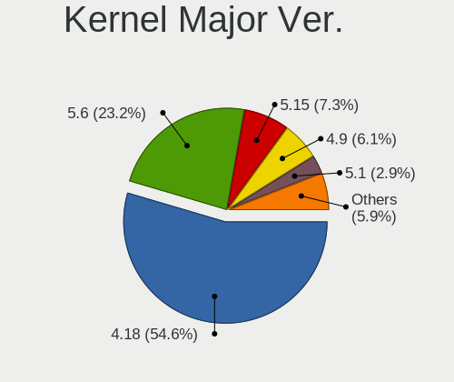

| Version | Computers | Percent |
|---------|-----------|---------|
| 4.18    | 2191      | 59.77%  |
| 5.6     | 918       | 25.04%  |
| 4.9     | 254       | 6.93%   |
| 5.1     | 122       | 3.33%   |
| 5.15    | 108       | 2.95%   |
| 6.3     | 29        | 0.79%   |
| 4.7     | 9         | 0.25%   |
| 6.5     | 7         | 0.19%   |
| 6.4     | 7         | 0.19%   |
| 6.2     | 7         | 0.19%   |
| 5.10    | 3         | 0.08%   |
| 4.14    | 3         | 0.08%   |
| 6.1     | 2         | 0.05%   |
| 6.7     | 1         | 0.03%   |
| 6.6     | 1         | 0.03%   |
| 5.8     | 1         | 0.03%   |
| 4.19    | 1         | 0.03%   |
| 4.15    | 1         | 0.03%   |
| 3.13    | 1         | 0.03%   |

Arch
----

OS architecture (x86_64, i586, etc.)

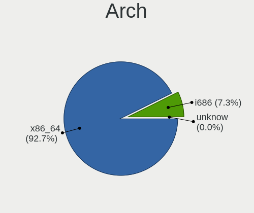

| Name   | Computers | Percent |
|--------|-----------|---------|
| x86_64 | 3005      | 91.84%  |
| i686   | 266       | 8.13%   |
| unknow | 1         | 0.03%   |

DE
--

Desktop Environment

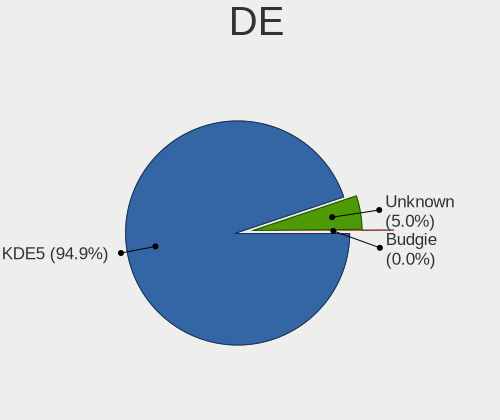

| Name     | Computers | Percent |
|----------|-----------|---------|
| KDE5     | 3174      | 98.27%  |
| Unknown  | 50        | 1.55%   |
| KDE      | 4         | 0.12%   |
| Cinnamon | 1         | 0.03%   |
| Budgie   | 1         | 0.03%   |

Display Server
--------------

X11 or Wayland

| Name    | Computers | Percent |
|---------|-----------|---------|
| X11     | 3207      | 99.35%  |
| Wayland | 19        | 0.59%   |
| Unknown | 2         | 0.06%   |

Display Manager
---------------

SDDM, LightDM, etc.

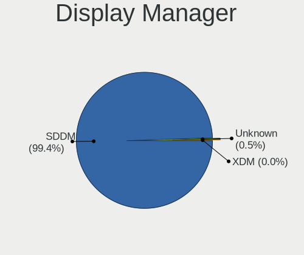

| Name    | Computers | Percent |
|---------|-----------|---------|
| SDDM    | 3212      | 99.57%  |
| Unknown | 13        | 0.4%    |
| LightDM | 1         | 0.03%   |

OS Lang
-------

Language

| Lang    | Computers | Percent |
|---------|-----------|---------|
| Unknown | 3218      | 99.81%  |
| hu_HU   | 5         | 0.16%   |
| en_AU   | 1         | 0.03%   |

Boot Mode
---------

EFI or BIOS

| Mode | Computers | Percent |
|------|-----------|---------|
| BIOS | 2315      | 68.35%  |
| EFI  | 1072      | 31.65%  |

Filesystem
----------

Type of filesystem

| Type    | Computers | Percent |
|---------|-----------|---------|
| Overlay | 2254      | 61.53%  |
| Ext4    | 1370      | 37.4%   |
| Btrfs   | 13        | 0.35%   |
| Unknown | 12        | 0.33%   |
| Ext3    | 6         | 0.16%   |
| Ext2    | 5         | 0.14%   |
| Ntfs    | 2         | 0.05%   |
| Xfs     | 1         | 0.03%   |

Part. scheme
------------

Scheme of partitioning

| Type    | Computers | Percent |
|---------|-----------|---------|
| MBR     | 2157      | 63.18%  |
| GPT     | 1223      | 35.82%  |
| Unknown | 34        | 1%      |

Dual Boot with Linux/BSD
------------------------

Hosting more than one Linux/BSD

| Dual boot | Computers | Percent |
|-----------|-----------|---------|
| No        | 2202      | 61.34%  |
| Yes       | 1388      | 38.66%  |

Dual Boot (Win)
---------------

Hosting Linux and Windows

| Dual boot | Computers | Percent |
|-----------|-----------|---------|
| Yes       | 1789      | 51.03%  |
| No        | 1717      | 48.97%  |

Board
-----

Vendor
------

Motherboard manufacturer

| Name                | Computers | Percent |
|---------------------|-----------|---------|
| Hewlett-Packard     | 517       | 16.06%  |
| ASUSTek Computer    | 489       | 15.19%  |
| Dell                | 428       | 13.29%  |
| Lenovo              | 398       | 12.36%  |
| Gigabyte Technology | 259       | 8.04%   |
| Acer                | 228       | 7.08%   |
| ASRock              | 208       | 6.46%   |
| MSI                 | 118       | 3.66%   |
| Toshiba             | 80        | 2.48%   |
| Fujitsu             | 73        | 2.27%   |
| Fujitsu Siemens     | 52        | 1.61%   |
| Samsung Electronics | 43        | 1.34%   |
| Packard Bell        | 29        | 0.9%    |
| Apple               | 29        | 0.9%    |
| Intel               | 28        | 0.87%   |
| Medion              | 27        | 0.84%   |
| Sony                | 23        | 0.71%   |
| eMachines           | 22        | 0.68%   |
| Foxconn             | 17        | 0.53%   |
| Unknown             | 14        | 0.43%   |
| Pegatron            | 12        | 0.37%   |
| Gateway             | 10        | 0.31%   |
| Biostar             | 7         | 0.22%   |
| Alcor               | 6         | 0.19%   |
| Hungaro Flotta Kft  | 5         | 0.16%   |
| ECS                 | 5         | 0.16%   |
| BANGHO              | 4         | 0.12%   |
| Shuttle             | 3         | 0.09%   |
| Sapphire            | 3         | 0.09%   |
| Microsoft           | 3         | 0.09%   |
| Insyde              | 3         | 0.09%   |
| IBM                 | 3         | 0.09%   |
| Huanan              | 3         | 0.09%   |
| AMI                 | 3         | 0.09%   |
| Alienware           | 3         | 0.09%   |
| ABIT                | 3         | 0.09%   |
| ZOTAC               | 2         | 0.06%   |
| Supermicro          | 2         | 0.06%   |
| speedmaster         | 2         | 0.06%   |
| Positivo            | 2         | 0.06%   |

Model
-----

Motherboard model

| Name                                 | Computers | Percent |
|--------------------------------------|-----------|---------|
| HP 250 G1                            | 40        | 1.24%   |
| ASRock FM2A75M Pro4+                 | 32        | 0.99%   |
| Unknown                              | 27        | 0.84%   |
| ASUS All Series                      | 25        | 0.78%   |
| Dell Latitude E6410                  | 20        | 0.62%   |
| Dell OptiPlex 3020                   | 18        | 0.56%   |
| HP Notebook                          | 15        | 0.47%   |
| Dell OptiPlex 755                    | 13        | 0.4%    |
| Dell OptiPlex 780                    | 12        | 0.37%   |
| Lenovo IdeaPad 330-15IKB 81DE        | 11        | 0.34%   |
| Lenovo G50-45 80E3                   | 11        | 0.34%   |
| Gigabyte G31M-ES2L                   | 11        | 0.34%   |
| Dell OptiPlex 760                    | 11        | 0.34%   |
| Gigabyte H61M-S1                     | 10        | 0.31%   |
| ASUS P5KPL-AM EPU                    | 10        | 0.31%   |
| Toshiba Satellite C660               | 9         | 0.28%   |
| Lenovo IdeaPad 100-15IBD 80QQ        | 9         | 0.28%   |
| HP Pavilion g6                       | 9         | 0.28%   |
| HP 650                               | 9         | 0.28%   |
| Dell OptiPlex 745                    | 9         | 0.28%   |
| HP 620                               | 8         | 0.25%   |
| Dell OptiPlex 7010                   | 8         | 0.25%   |
| ASUS X550CC                          | 8         | 0.25%   |
| ASUS K50IJ                           | 8         | 0.25%   |
| ASRock G41M-VS3                      | 8         | 0.25%   |
| MSI MS-7817                          | 7         | 0.22%   |
| HP ProDesk 600 G2 SFF                | 7         | 0.22%   |
| HP Pavilion Notebook                 | 7         | 0.22%   |
| HP Compaq dc5800 Small Form Factor   | 7         | 0.22%   |
| HP 250 G5 Notebook PC                | 7         | 0.22%   |
| Gigabyte 970A-DS3P                   | 7         | 0.22%   |
| Dell Latitude E6430                  | 7         | 0.22%   |
| Dell Latitude E6400                  | 7         | 0.22%   |
| Dell Inspiron 7737                   | 7         | 0.22%   |
| ASUS VivoBook 15_ASUS Laptop X540UBR | 7         | 0.22%   |
| MSI MS-7680                          | 6         | 0.19%   |
| MSI MS-7592                          | 6         | 0.19%   |
| Lenovo G50-30 80G0                   | 6         | 0.19%   |
| HP Pavilion dv6                      | 6         | 0.19%   |
| HP EliteBook 8470p                   | 6         | 0.19%   |

Model Family
------------

Motherboard model prefix

| Name                    | Computers | Percent |
|-------------------------|-----------|---------|
| Acer Aspire             | 165       | 5.12%   |
| HP Compaq               | 136       | 4.22%   |
| Dell OptiPlex           | 130       | 4.04%   |
| Dell Latitude           | 130       | 4.04%   |
| Lenovo ThinkPad         | 114       | 3.54%   |
| Dell Inspiron           | 105       | 3.26%   |
| Lenovo IdeaPad          | 91        | 2.83%   |
| Toshiba Satellite       | 72        | 2.24%   |
| HP EliteBook            | 60        | 1.86%   |
| HP 250                  | 54        | 1.68%   |
| HP Pavilion             | 53        | 1.65%   |
| HP ProBook              | 52        | 1.61%   |
| Lenovo ThinkCentre      | 48        | 1.49%   |
| ASUS PRIME              | 33        | 1.02%   |
| ASRock FM2A75M          | 32        | 0.99%   |
| Fujitsu ESPRIMO         | 30        | 0.93%   |
| ASUS VivoBook           | 30        | 0.93%   |
| Fujitsu LIFEBOOK        | 27        | 0.84%   |
| Unknown                 | 27        | 0.84%   |
| Packard Bell EasyNote   | 25        | 0.78%   |
| ASUS All                | 25        | 0.78%   |
| Fujitsu Siemens AMILO   | 21        | 0.65%   |
| Fujitsu Siemens ESPRIMO | 20        | 0.62%   |
| Dell Precision          | 20        | 0.62%   |
| Dell Vostro             | 19        | 0.59%   |
| Acer TravelMate         | 17        | 0.53%   |
| HP Notebook             | 15        | 0.47%   |
| HP Laptop               | 15        | 0.47%   |
| ASUS P5KPL-AM           | 15        | 0.47%   |
| HP ProDesk              | 13        | 0.4%    |
| ASUS ROG                | 12        | 0.37%   |
| Acer Veriton            | 12        | 0.37%   |
| Lenovo ThinkStation     | 11        | 0.34%   |
| Lenovo G50-45           | 11        | 0.34%   |
| Gigabyte G31M-ES2L      | 11        | 0.34%   |
| Lenovo 3000             | 10        | 0.31%   |
| HP EliteDesk            | 10        | 0.31%   |
| Gigabyte H61M-S1        | 10        | 0.31%   |
| HP Presario             | 9         | 0.28%   |
| HP 650                  | 9         | 0.28%   |

MFG Year
--------

Motherboard manufacture year

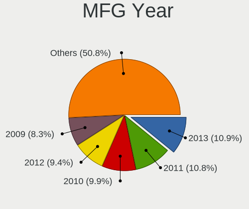

| Year    | Computers | Percent |
|---------|-----------|---------|
| 2011    | 350       | 10.87%  |
| 2013    | 344       | 10.68%  |
| 2010    | 320       | 9.94%   |
| 2012    | 304       | 9.44%   |
| 2008    | 277       | 8.6%    |
| 2009    | 276       | 8.57%   |
| 2014    | 258       | 8.01%   |
| 2007    | 200       | 6.21%   |
| 2015    | 169       | 5.25%   |
| 2018    | 168       | 5.22%   |
| 2016    | 152       | 4.72%   |
| 2017    | 131       | 4.07%   |
| 2019    | 89        | 2.76%   |
| 2006    | 82        | 2.55%   |
| 2020    | 44        | 1.37%   |
| 2005    | 24        | 0.75%   |
| 2021    | 18        | 0.56%   |
| 2022    | 6         | 0.19%   |
| 2004    | 4         | 0.12%   |
| 2023    | 2         | 0.06%   |
| 2003    | 1         | 0.03%   |
| Unknown | 1         | 0.03%   |

Form Factor
-----------

Physical design of the computer

| Name        | Computers | Percent |
|-------------|-----------|---------|
| Notebook    | 1764      | 54.78%  |
| Desktop     | 1386      | 43.04%  |
| All in one  | 31        | 0.96%   |
| Mini pc     | 17        | 0.53%   |
| Convertible | 8         | 0.25%   |
| Tablet      | 7         | 0.22%   |
| Server      | 6         | 0.19%   |
| Stick pc    | 1         | 0.03%   |

Secure Boot
-----------

Enabled or disabled

| State    | Computers | Percent |
|----------|-----------|---------|
| Disabled | 3220      | 99.97%  |
| Enabled  | 1         | 0.03%   |

Coreboot
--------

Have coreboot on board

| Used | Computers | Percent |
|------|-----------|---------|
| No   | 3219      | 99.97%  |
| Yes  | 1         | 0.03%   |

RAM Size
--------

Total RAM memory

| Size in GB  | Computers | Percent |
|-------------|-----------|---------|
| 3.01-4.0    | 1193      | 35.7%   |
| 8.01-16.0   | 639       | 19.12%  |
| 4.01-8.0    | 632       | 18.91%  |
| 1.01-2.0    | 372       | 11.13%  |
| 16.01-24.0  | 254       | 7.6%    |
| 2.01-3.0    | 120       | 3.59%   |
| 32.01-64.0  | 55        | 1.65%   |
| 0.51-1.0    | 47        | 1.41%   |
| 24.01-32.0  | 24        | 0.72%   |
| 64.01-256.0 | 4         | 0.12%   |
| Unknown     | 2         | 0.06%   |

RAM Used
--------

Used RAM memory

| Used GB    | Computers | Percent |
|------------|-----------|---------|
| 0.51-1.0   | 1731      | 44.68%  |
| 0.01-0.5   | 973       | 25.12%  |
| 1.01-2.0   | 971       | 25.06%  |
| 2.01-3.0   | 126       | 3.25%   |
| 3.01-4.0   | 39        | 1.01%   |
| 4.01-8.0   | 27        | 0.7%    |
| 8.01-16.0  | 3         | 0.08%   |
| Unknown    | 3         | 0.08%   |
| 16.01-24.0 | 1         | 0.03%   |

Total Drives
------------

Number of drives on board

| Drives | Computers | Percent |
|--------|-----------|---------|
| 1      | 2365      | 68.21%  |
| 2      | 712       | 20.54%  |
| 3      | 212       | 6.11%   |
| 4      | 73        | 2.11%   |
| 0      | 51        | 1.47%   |
| 5      | 35        | 1.01%   |
| 6      | 10        | 0.29%   |
| 9      | 3         | 0.09%   |
| 10     | 2         | 0.06%   |
| 8      | 2         | 0.06%   |
| 7      | 2         | 0.06%   |

Has CD-ROM
----------

Has CD-ROM on board

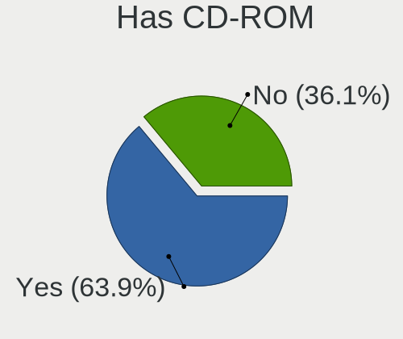

| Presented | Computers | Percent |
|-----------|-----------|---------|
| Yes       | 2156      | 65.37%  |
| No        | 1142      | 34.63%  |

Has Ethernet
------------

Has Ethernet on board

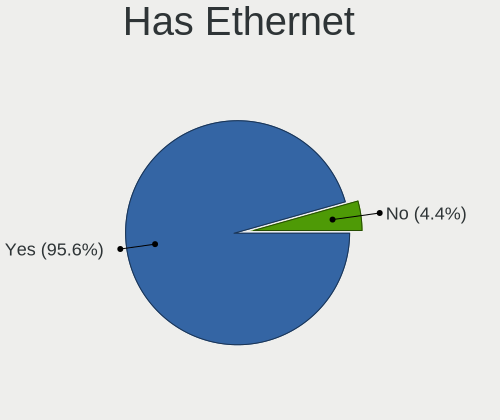

| Presented | Computers | Percent |
|-----------|-----------|---------|
| Yes       | 3084      | 95.75%  |
| No        | 137       | 4.25%   |

Has WiFi
--------

Has WiFi module

| Presented | Computers | Percent |
|-----------|-----------|---------|
| Yes       | 2177      | 66.72%  |
| No        | 1086      | 33.28%  |

Has Bluetooth
-------------

Has Bluetooth module

| Presented | Computers | Percent |
|-----------|-----------|---------|
| No        | 1808      | 54.94%  |
| Yes       | 1483      | 45.06%  |

Location
--------

Country
-------

Geographic location (country)

| Country      | Computers | Percent |
|--------------|-----------|---------|
| Hungary      | 2315      | 71.52%  |
| Germany      | 160       | 4.94%   |
| USA          | 139       | 4.29%   |
| Romania      | 64        | 1.98%   |
| Slovakia     | 52        | 1.61%   |
| UK           | 45        | 1.39%   |
| Italy        | 36        | 1.11%   |
| France       | 36        | 1.11%   |
| Spain        | 30        | 0.93%   |
| Brazil       | 30        | 0.93%   |
| Austria      | 29        | 0.9%    |
| Canada       | 28        | 0.86%   |
| Argentina    | 24        | 0.74%   |
| Serbia       | 20        | 0.62%   |
| Australia    | 19        | 0.59%   |
| Poland       | 18        | 0.56%   |
| Japan        | 18        | 0.56%   |
| Philippines  | 10        | 0.31%   |
| Russia       | 9         | 0.28%   |
| Greece       | 8         | 0.25%   |
| Belgium      | 8         | 0.25%   |
| Switzerland  | 7         | 0.22%   |
| Ireland      | 7         | 0.22%   |
| India        | 7         | 0.22%   |
| Ukraine      | 6         | 0.19%   |
| Netherlands  | 6         | 0.19%   |
| Finland      | 6         | 0.19%   |
| South Africa | 5         | 0.15%   |
| Turkey       | 4         | 0.12%   |
| Sweden       | 4         | 0.12%   |
| Mexico       | 4         | 0.12%   |
| Egypt        | 4         | 0.12%   |
| Czechia      | 4         | 0.12%   |
| China        | 4         | 0.12%   |
| Uruguay      | 3         | 0.09%   |
| Puerto Rico  | 3         | 0.09%   |
| Israel       | 3         | 0.09%   |
| Denmark      | 3         | 0.09%   |
| Cyprus       | 3         | 0.09%   |
| Belarus      | 3         | 0.09%   |

City
----

Geographic location (city)

| City              | Computers | Percent |
|-------------------|-----------|---------|
| Budapest          | 836       | 21.22%  |
| Gyr             | 60        | 1.52%   |
| Pcs             | 56        | 1.42%   |
| Miskolc           | 52        | 1.32%   |
| Debrecen          | 51        | 1.29%   |
| Zalaegerszeg      | 44        | 1.12%   |
| Tatabnya        | 43        | 1.09%   |
| Szeged            | 39        | 0.99%   |
| Szombathely       | 37        | 0.94%   |
| Szkesfehrvr | 36        | 0.91%   |
| Karcag            | 32        | 0.81%   |
| Nyiregyhaza       | 29        | 0.74%   |
| Veszprm         | 28        | 0.71%   |
| Szigetszentmiklos | 27        | 0.69%   |
| Kecskemt        | 27        | 0.69%   |
| Szolnok           | 26        | 0.66%   |
| Oroshaza          | 24        | 0.61%   |
| Szekszrd        | 23        | 0.58%   |
| Gdll        | 21        | 0.53%   |
| rd              | 20        | 0.51%   |
| Eger              | 20        | 0.51%   |
| Berettyjfalu  | 20        | 0.51%   |
| Toeroekbalint     | 19        | 0.48%   |
| Salgotarjan       | 19        | 0.48%   |
| Nagykanizsa       | 18        | 0.46%   |
| Vienna            | 17        | 0.43%   |
| Regensburg        | 16        | 0.41%   |
| Bratislava        | 16        | 0.41%   |
| Ajka              | 16        | 0.41%   |
| Toekoel           | 15        | 0.38%   |
| Szorgalmatos      | 15        | 0.38%   |
| Dunajvros     | 15        | 0.38%   |
| Cegled            | 15        | 0.38%   |
| Trgu Mure     | 14        | 0.36%   |
| Papa              | 14        | 0.36%   |
| Kaposvr         | 14        | 0.36%   |
| Tiszaujvaros      | 13        | 0.33%   |
| North Hollywood   | 13        | 0.33%   |
| Mosonmagyarvr | 13        | 0.33%   |
| Kiskunfelegyhaza  | 13        | 0.33%   |

Drives
------

Drive Vendor
------------

Hard drive vendors

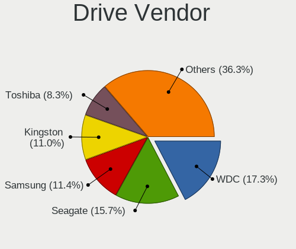

| Vendor              | Computers | Drives | Percent |
|---------------------|-----------|--------|---------|
| WDC                 | 841       | 1564   | 18.14%  |
| Seagate             | 767       | 1214   | 16.54%  |
| Samsung Electronics | 518       | 1000   | 11.17%  |
| Kingston            | 488       | 911    | 10.53%  |
| Toshiba             | 396       | 685    | 8.54%   |
| Hitachi             | 271       | 398    | 5.85%   |
| HGST                | 176       | 298    | 3.8%    |
| SanDisk             | 131       | 246    | 2.83%   |
| A-DATA Technology   | 110       | 185    | 2.37%   |
| Unknown             | 92        | 156    | 1.98%   |
| Crucial             | 79        | 131    | 1.7%    |
| Fujitsu             | 68        | 79     | 1.47%   |
| Intel               | 62        | 103    | 1.34%   |
| Maxtor              | 55        | 70     | 1.19%   |
| SPCC                | 44        | 66     | 0.95%   |
| Intenso             | 40        | 81     | 0.86%   |
| SK hynix            | 39        | 61     | 0.84%   |
| Apacer              | 33        | 53     | 0.71%   |
| PNY                 | 29        | 42     | 0.63%   |
| Patriot             | 29        | 69     | 0.63%   |
| China               | 26        | 43     | 0.56%   |
| Micron Technology   | 23        | 49     | 0.5%    |
| JMicron Technology  | 22        | 25     | 0.47%   |
| OCZ                 | 21        | 27     | 0.45%   |
| Gigabyte Technology | 20        | 50     | 0.43%   |
| LITEON              | 16        | 26     | 0.35%   |
| Kingmax             | 16        | 31     | 0.35%   |
| Hewlett-Packard     | 13        | 17     | 0.28%   |
| Transcend           | 11        | 17     | 0.24%   |
| KingSpec            | 10        | 12     | 0.22%   |
| Team                | 9         | 16     | 0.19%   |
| Corsair             | 9         | 12     | 0.19%   |
| Apple               | 9         | 16     | 0.19%   |
| XPG                 | 8         | 13     | 0.17%   |
| LITEONIT            | 8         | 16     | 0.17%   |
| Zheino              | 7         | 20     | 0.15%   |
| Verbatim            | 7         | 15     | 0.15%   |
| GOODRAM             | 7         | 7      | 0.15%   |
| Netac               | 6         | 11     | 0.13%   |
| ASMT                | 6         | 8      | 0.13%   |

Drive Model
-----------

Hard drive models

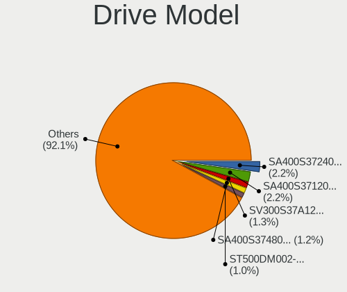

| Model                              | Computers | Percent |
|------------------------------------|-----------|---------|
| Kingston SA400S37120G 120GB SSD    | 116       | 2.29%   |
| Kingston SA400S37240G 240GB SSD    | 111       | 2.19%   |
| Kingston SV300S37A120G 120GB SSD   | 71        | 1.4%    |
| Seagate ST500DM002-1BD142 500GB    | 56        | 1.11%   |
| Seagate ST1000LM035-1RK172 1TB     | 51        | 1.01%   |
| Kingston SA400S37480G 480GB SSD    | 45        | 0.89%   |
| Seagate ST1000LM024 HN-M101MBB 1TB | 44        | 0.87%   |
| Toshiba MQ01ABF050 500GB           | 43        | 0.85%   |
| Toshiba DT01ACA100 1TB             | 43        | 0.85%   |
| Toshiba MQ01ABD100 1TB             | 42        | 0.83%   |
| Seagate ST500LT012-1DG142 500GB    | 42        | 0.83%   |
| HGST HTS545050A7E680 500GB         | 38        | 0.75%   |
| Kingston SUV400S37120G 120GB SSD   | 34        | 0.67%   |
| HGST HTS545032A7E380 320GB         | 33        | 0.65%   |
| Toshiba DT01ACA050 500GB           | 31        | 0.61%   |
| A-DATA SU630 240GB SSD             | 30        | 0.59%   |
| Samsung SSD 860 EVO 500GB          | 27        | 0.53%   |
| Samsung SSD 850 EVO 250GB          | 25        | 0.49%   |
| Toshiba MQ04ABF100 1TB             | 24        | 0.47%   |
| Seagate ST380815AS 80GB            | 23        | 0.45%   |
| Seagate ST9320325AS 320GB          | 22        | 0.43%   |
| WDC WD10JPVX-22JC3T0 1TB           | 21        | 0.42%   |
| Seagate ST9500325AS 500GB          | 21        | 0.42%   |
| Seagate ST500LT012-9WS142 500GB    | 21        | 0.42%   |
| A-DATA SU700 120GB SSD             | 20        | 0.4%    |
| Crucial CT120BX500SSD1 120GB       | 19        | 0.38%   |
| WDC WD10EZEX-08WN4A0 1TB           | 18        | 0.36%   |
| Samsung HD502HJ 500GB              | 18        | 0.36%   |
| HGST HTS721010A9E630 1TB           | 18        | 0.36%   |
| WDC WDS240G2G0A-00JH30 240GB SSD   | 17        | 0.34%   |
| Seagate ST3160815AS 160GB          | 17        | 0.34%   |
| Seagate ST9250315AS 250GB          | 16        | 0.32%   |
| SanDisk SSD PLUS 240GB             | 16        | 0.32%   |
| Samsung SSD 860 EVO 250GB          | 16        | 0.32%   |
| Samsung HD103UJ 1TB                | 16        | 0.32%   |
| PNY CS900 120GB SSD                | 16        | 0.32%   |
| Toshiba MQ01ABD050 500GB           | 15        | 0.3%    |
| SPCC Solid State Disk 256GB        | 15        | 0.3%    |
| Seagate ST1000DM010-2EP102 1TB     | 15        | 0.3%    |
| Kingston SV300S37A240G 240GB SSD   | 15        | 0.3%    |

HDD Vendor
----------

Hard disk drive vendors

| Vendor              | Computers | Drives | Percent |
|---------------------|-----------|--------|---------|
| WDC                 | 781       | 1425   | 28.33%  |
| Seagate             | 754       | 1194   | 27.35%  |
| Toshiba             | 367       | 626    | 13.31%  |
| Hitachi             | 271       | 398    | 9.83%   |
| Samsung Electronics | 235       | 375    | 8.52%   |
| HGST                | 176       | 298    | 6.38%   |
| Fujitsu             | 68        | 79     | 2.47%   |
| Maxtor              | 54        | 69     | 1.96%   |
| Unknown             | 7         | 13     | 0.25%   |
| WD MediaMax         | 5         | 6      | 0.18%   |
| Hewlett-Packard     | 5         | 5      | 0.18%   |
| Apple               | 5         | 6      | 0.18%   |
| USB3.0              | 4         | 8      | 0.15%   |
| ASMT                | 4         | 6      | 0.15%   |
| IBM/Hitachi         | 3         | 4      | 0.11%   |
| USB                 | 2         | 3      | 0.07%   |
| QUANTUM             | 2         | 2      | 0.07%   |
| HGST HTS            | 2         | 7      | 0.07%   |
| TO Exter            | 1         | 1      | 0.04%   |
| StoreJet            | 1         | 1      | 0.04%   |
| QC-FT-D             | 1         | 1      | 0.04%   |
| MARSHAL             | 1         | 2      | 0.04%   |
| JMicron Technology  | 1         | 1      | 0.04%   |
| Initio              | 1         | 2      | 0.04%   |
| ICY BOX             | 1         | 2      | 0.04%   |
| IB-1122             | 1         | 1      | 0.04%   |
| ExcelStor           | 1         | 1      | 0.04%   |
| Emphase             | 1         | 2      | 0.04%   |
| CSD                 | 1         | 2      | 0.04%   |
| Unknown             | 1         | 1      | 0.04%   |

SSD Vendor
----------

Solid state drive vendors

| Vendor              | Computers | Drives | Percent |
|---------------------|-----------|--------|---------|
| Kingston            | 468       | 845    | 29.6%   |
| Samsung Electronics | 236       | 461    | 14.93%  |
| SanDisk             | 113       | 209    | 7.15%   |
| A-DATA Technology   | 101       | 170    | 6.39%   |
| Crucial             | 74        | 123    | 4.68%   |
| WDC                 | 67        | 118    | 4.24%   |
| Intel               | 46        | 73     | 2.91%   |
| Intenso             | 40        | 81     | 2.53%   |
| SPCC                | 38        | 60     | 2.4%    |
| Apacer              | 31        | 49     | 1.96%   |
| SK hynix            | 30        | 46     | 1.9%    |
| PNY                 | 29        | 42     | 1.83%   |
| Patriot             | 28        | 68     | 1.77%   |
| China               | 26        | 43     | 1.64%   |
| OCZ                 | 21        | 27     | 1.33%   |
| Micron Technology   | 20        | 41     | 1.27%   |
| Toshiba             | 17        | 36     | 1.08%   |
| Gigabyte Technology | 17        | 45     | 1.08%   |
| Kingmax             | 16        | 31     | 1.01%   |
| LITEON              | 15        | 22     | 0.95%   |
| JMicron Technology  | 15        | 17     | 0.95%   |
| Transcend           | 10        | 12     | 0.63%   |
| KingSpec            | 10        | 12     | 0.63%   |
| Team                | 9         | 16     | 0.57%   |
| Corsair             | 9         | 12     | 0.57%   |
| LITEONIT            | 8         | 16     | 0.51%   |
| Verbatim            | 7         | 15     | 0.44%   |
| GOODRAM             | 7         | 7      | 0.44%   |
| Netac               | 6         | 11     | 0.38%   |
| Hewlett-Packard     | 4         | 6      | 0.25%   |
| BHT                 | 4         | 4      | 0.25%   |
| Apple               | 4         | 10     | 0.25%   |
| Unknown             | 3         | 6      | 0.19%   |
| KingFast            | 3         | 3      | 0.19%   |
| HS-SSD-C100         | 3         | 3      | 0.19%   |
| Emtec               | 3         | 3      | 0.19%   |
| Wibtek              | 2         | 2      | 0.13%   |
| ShanDianZhe         | 2         | 2      | 0.13%   |
| Seagate             | 2         | 2      | 0.13%   |
| SATAFIRM            | 2         | 2      | 0.13%   |

Drive Kind
----------

HDD or SSD

| Kind    | Computers | Drives | Percent |
|---------|-----------|--------|---------|
| HDD     | 2326      | 4541   | 57.75%  |
| SSD     | 1377      | 2814   | 34.19%  |
| NVMe    | 186       | 455    | 4.62%   |
| MMC     | 98        | 169    | 2.43%   |
| Unknown | 41        | 48     | 1.02%   |

Drive Connector
---------------

SATA, SAS, NVMe, etc.

| Type | Computers | Drives | Percent |
|------|-----------|--------|---------|
| SATA | 3075      | 7181   | 87.83%  |
| NVMe | 186       | 455    | 5.31%   |
| SAS  | 142       | 222    | 4.06%   |
| MMC  | 98        | 169    | 2.8%    |

Drive Size
----------

Size of hard drive

| Size in TB      | Computers | Drives | Percent |
|-----------------|-----------|--------|---------|
| 0.01-0.5        | 2677      | 5382   | 73.58%  |
| 0.51-1.0        | 750       | 1497   | 20.62%  |
| 1.01-2.0        | 128       | 265    | 3.52%   |
| 3.01-4.0        | 33        | 72     | 0.91%   |
| 2.01-3.0        | 29        | 111    | 0.8%    |
| 4.01-10.0       | 13        | 18     | 0.36%   |
| More than 100.0 | 4         | 4      | 0.11%   |
| 10.01-20.0      | 4         | 6      | 0.11%   |

Space Total
-----------

Amount of disk space available on the file system

| Size in GB     | Computers | Percent |
|----------------|-----------|---------|
| Unknown        | 2182      | 56.15%  |
| 101-250        | 643       | 16.55%  |
| 251-500        | 375       | 9.65%   |
| 51-100         | 238       | 6.12%   |
| 501-1000       | 165       | 4.25%   |
| 21-50          | 147       | 3.78%   |
| 1001-2000      | 58        | 1.49%   |
| 1-20           | 47        | 1.21%   |
| 2001-3000      | 16        | 0.41%   |
| More than 3000 | 14        | 0.36%   |
| 0              | 1         | 0.03%   |

Space Used
----------

Amount of used disk space

| Used GB        | Computers | Percent |
|----------------|-----------|---------|
| Unknown        | 2182      | 55.95%  |
| 1-20           | 1213      | 31.1%   |
| 21-50          | 184       | 4.72%   |
| 51-100         | 118       | 3.03%   |
| 101-250        | 96        | 2.46%   |
| 251-500        | 43        | 1.1%    |
| 501-1000       | 30        | 0.77%   |
| 1001-2000      | 24        | 0.62%   |
| More than 3000 | 5         | 0.13%   |
| 2001-3000      | 4         | 0.1%    |
| 0              | 1         | 0.03%   |

Malfunc. Drives
---------------

Drive models with a malfunction

| Model                              | Computers | Drives | Percent |
|------------------------------------|-----------|--------|---------|
| HGST HTS545032A7E380 320GB         | 32        | 53     | 2.3%    |
| Seagate ST500DM002-1BD142 500GB    | 28        | 44     | 2.01%   |
| HGST HTS545050A7E680 500GB         | 26        | 36     | 1.87%   |
| Kingston SV300S37A120G 120GB SSD   | 22        | 27     | 1.58%   |
| Seagate ST500LT012-9WS142 500GB    | 19        | 24     | 1.36%   |
| A-DATA Technology SU630 240GB SSD  | 19        | 28     | 1.36%   |
| Seagate ST500LT012-1DG142 500GB    | 18        | 28     | 1.29%   |
| Seagate ST1000LM024 HN-M101MBB 1TB | 16        | 21     | 1.15%   |
| Samsung Electronics HD103UJ 1TB    | 14        | 28     | 1.01%   |
| Seagate ST9500325AS 500GB          | 13        | 24     | 0.93%   |
| Seagate ST9320325AS 320GB          | 12        | 25     | 0.86%   |
| Toshiba MQ01ABF050 500GB           | 11        | 34     | 0.79%   |
| Toshiba MQ01ABD100 1TB             | 11        | 12     | 0.79%   |
| Toshiba DT01ACA050 500GB           | 11        | 14     | 0.79%   |
| Seagate ST9250315AS 250GB          | 11        | 16     | 0.79%   |
| Samsung Electronics HM160HI 160GB  | 11        | 16     | 0.79%   |
| HGST HTS541010A9E680 1TB           | 11        | 24     | 0.79%   |
| WDC WD5000AAKX-001CA0 500GB        | 10        | 10     | 0.72%   |
| Seagate ST1000LM035-1RK172 1TB     | 10        | 11     | 0.72%   |
| HGST HTS545050A7E380 500GB         | 10        | 14     | 0.72%   |
| Hitachi HTS723232A7A364 320GB      | 9         | 9      | 0.65%   |
| Hitachi HTS545050B9A300 500GB      | 9         | 14     | 0.65%   |
| Hitachi HTS543232A7A384 320GB      | 9         | 13     | 0.65%   |
| Toshiba MQ01ABD050 500GB           | 8         | 10     | 0.57%   |
| Toshiba DT01ACA100 1TB             | 8         | 16     | 0.57%   |
| Hitachi HTS545050A7E380 500GB      | 8         | 12     | 0.57%   |
| Seagate ST980811AS 80GB            | 7         | 8      | 0.5%    |
| Seagate ST9320423AS 320GB          | 7         | 8      | 0.5%    |
| Seagate ST3500418AS 500GB          | 7         | 11     | 0.5%    |
| Seagate ST3160815AS 160GB          | 7         | 9      | 0.5%    |
| HGST HTS725050A7E630 500GB         | 7         | 7      | 0.5%    |
| WDC WD5000AAKS-00UU3A0 500GB       | 6         | 12     | 0.43%   |
| WDC WD5000AAKS-007AA0 500GB        | 6         | 22     | 0.43%   |
| WDC WD5000AADS-00S9B0 500GB        | 6         | 8      | 0.43%   |
| WDC WD10JPVX-22JC3T0 1TB           | 6         | 9      | 0.43%   |
| WDC WD10EARS-00Y5B1 1TB            | 6         | 12     | 0.43%   |
| Seagate ST9500420AS 500GB          | 6         | 12     | 0.43%   |
| Samsung Electronics SP2504C 250GB  | 6         | 9      | 0.43%   |
| Samsung Electronics HD321KJ 320GB  | 6         | 6      | 0.43%   |
| Samsung Electronics HD161HJ 160GB  | 6         | 6      | 0.43%   |

Malfunc. Drive Vendor
---------------------

Vendors of faulty drives

| Vendor              | Computers | Drives | Percent |
|---------------------|-----------|--------|---------|
| Seagate             | 329       | 477    | 24.55%  |
| WDC                 | 277       | 463    | 20.67%  |
| Hitachi             | 153       | 231    | 11.42%  |
| Toshiba             | 135       | 204    | 10.07%  |
| Samsung Electronics | 135       | 213    | 10.07%  |
| HGST                | 99        | 152    | 7.39%   |
| Kingston            | 50        | 73     | 3.73%   |
| Maxtor              | 32        | 45     | 2.39%   |
| A-DATA Technology   | 27        | 42     | 2.01%   |
| Fujitsu             | 24        | 32     | 1.79%   |
| Intel               | 17        | 34     | 1.27%   |
| SK hynix            | 8         | 12     | 0.6%    |
| OCZ                 | 8         | 11     | 0.6%    |
| WD MediaMax         | 5         | 6      | 0.37%   |
| SanDisk             | 5         | 6      | 0.37%   |
| Intenso             | 3         | 3      | 0.22%   |
| Hewlett-Packard     | 3         | 3      | 0.22%   |
| Crucial             | 3         | 3      | 0.22%   |
| KingSpec            | 2         | 2      | 0.15%   |
| Kingmax             | 2         | 2      | 0.15%   |
| IBM/Hitachi         | 2         | 2      | 0.15%   |
| Apple               | 2         | 8      | 0.15%   |
| Apacer              | 2         | 3      | 0.15%   |
| Timetec             | 1         | 5      | 0.07%   |
| SPCC                | 1         | 1      | 0.07%   |
| SATAFIRM            | 1         | 1      | 0.07%   |
| QUANTUM             | 1         | 1      | 0.07%   |
| Patriot             | 1         | 1      | 0.07%   |
| Netac               | 1         | 1      | 0.07%   |
| Micron Technology   | 1         | 1      | 0.07%   |
| MARSHAL             | 1         | 1      | 0.07%   |
| LITEONIT            | 1         | 2      | 0.07%   |
| LITEON              | 1         | 1      | 0.07%   |
| JMicron Technology  | 1         | 1      | 0.07%   |
| Initio              | 1         | 2      | 0.07%   |
| ExcelStor           | 1         | 1      | 0.07%   |
| CSD                 | 1         | 2      | 0.07%   |
| Corsair             | 1         | 1      | 0.07%   |
| China               | 1         | 1      | 0.07%   |
| ASMT                | 1         | 1      | 0.07%   |

Malfunc. HDD Vendor
-------------------

Vendors of faulty HDD drives

| Vendor              | Computers | Drives | Percent |
|---------------------|-----------|--------|---------|
| Seagate             | 329       | 477    | 27.81%  |
| WDC                 | 274       | 460    | 23.16%  |
| Hitachi             | 153       | 231    | 12.93%  |
| Toshiba             | 129       | 190    | 10.9%   |
| Samsung Electronics | 128       | 188    | 10.82%  |
| HGST                | 99        | 152    | 8.37%   |
| Maxtor              | 32        | 45     | 2.7%    |
| Fujitsu             | 24        | 32     | 2.03%   |
| WD MediaMax         | 5         | 6      | 0.42%   |
| IBM/Hitachi         | 2         | 2      | 0.17%   |
| Hewlett-Packard     | 2         | 2      | 0.17%   |
| QUANTUM             | 1         | 1      | 0.08%   |
| MARSHAL             | 1         | 1      | 0.08%   |
| Initio              | 1         | 2      | 0.08%   |
| ExcelStor           | 1         | 1      | 0.08%   |
| CSD                 | 1         | 2      | 0.08%   |
| ASMT                | 1         | 1      | 0.08%   |

Malfunc. Drive Kind
-------------------

Kinds of faulty drives

| Kind    | Computers | Drives | Percent |
|---------|-----------|--------|---------|
| HDD     | 1077      | 1793   | 87.35%  |
| SSD     | 150       | 251    | 12.17%  |
| NVMe    | 5         | 6      | 0.41%   |
| Unknown | 1         | 1      | 0.08%   |

Failed Drives
-------------

Failed drive models

| Model                              | Computers | Drives | Percent |
|------------------------------------|-----------|--------|---------|
| WDC WD5000BEVT-22ZAT0 500GB        | 2         | 2      | 5.41%   |
| Toshiba MQ01ABD100 1TB             | 2         | 2      | 5.41%   |
| Toshiba MK6475GSX 640GB            | 2         | 2      | 5.41%   |
| Seagate ST1000LM024 HN-M101MBB 1TB | 2         | 2      | 5.41%   |
| Samsung Electronics HD502HJ 500GB  | 2         | 3      | 5.41%   |
| Samsung Electronics HD103SJ 1TB    | 2         | 2      | 5.41%   |
| Zheino CHN-NGFFNV2280-256 256GB    | 1         | 1      | 2.7%    |
| WDC WD5000BEVT-22A0RT0 500GB       | 1         | 7      | 2.7%    |
| WDC WD3200BVVT-63A26Y0 320GB       | 1         | 1      | 2.7%    |
| WDC WD3200BPVT-24JJ5T0 320GB       | 1         | 1      | 2.7%    |
| WDC WD3200BEVT-08A23T1 320GB       | 1         | 1      | 2.7%    |
| WDC WD2500LPCX-24C6HT0 250GB       | 1         | 1      | 2.7%    |
| WDC WD1600BEVT-80A23T0 160GB       | 1         | 1      | 2.7%    |
| WDC WD1600BEVT-22ZCT0 160GB        | 1         | 1      | 2.7%    |
| Toshiba MQ01ABD050V 500GB          | 1         | 1      | 2.7%    |
| Toshiba MK5055GSX 500GB            | 1         | 1      | 2.7%    |
| Toshiba MK3275GSX 320GB            | 1         | 1      | 2.7%    |
| Toshiba MK1665GSX 160GB            | 1         | 1      | 2.7%    |
| Toshiba MK1646GSX 160GB            | 1         | 1      | 2.7%    |
| Seagate ST9320325AS 320GB          | 1         | 1      | 2.7%    |
| Seagate ST380815AS 80GB            | 1         | 3      | 2.7%    |
| Seagate ST3160815AS 160GB          | 1         | 1      | 2.7%    |
| Samsung Electronics SP0802N 80GB   | 1         | 1      | 2.7%    |
| Samsung Electronics HM060HI 64GB   | 1         | 1      | 2.7%    |
| Samsung Electronics HD204UI 2TB    | 1         | 1      | 2.7%    |
| Samsung Electronics HD103UJ 1TB    | 1         | 1      | 2.7%    |
| OCZ-AGIL ITY3 64GB SSD             | 1         | 1      | 2.7%    |
| Intel SSDPEKKW256G7 256GB          | 1         | 1      | 2.7%    |
| Hitachi HDS721075CLA332 752GB      | 1         | 1      | 2.7%    |
| Hitachi HDS721010DLE630 1TB        | 1         | 1      | 2.7%    |
| Hewlett-Packard SSD EX900 250GB    | 1         | 1      | 2.7%    |

Failed Drive Vendor
-------------------

Failed drive vendors

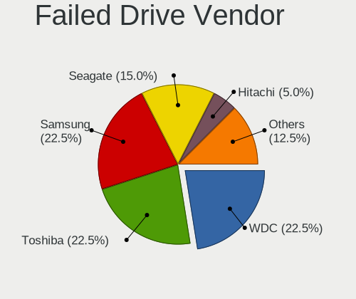

| Vendor              | Computers | Drives | Percent |
|---------------------|-----------|--------|---------|
| WDC                 | 9         | 15     | 24.32%  |
| Toshiba             | 9         | 9      | 24.32%  |
| Samsung Electronics | 8         | 9      | 21.62%  |
| Seagate             | 5         | 7      | 13.51%  |
| Hitachi             | 2         | 2      | 5.41%   |
| Zheino              | 1         | 1      | 2.7%    |
| OCZ-AGIL            | 1         | 1      | 2.7%    |
| Intel               | 1         | 1      | 2.7%    |
| Hewlett-Packard     | 1         | 1      | 2.7%    |

Drive Status
------------

Number of failed and malfunc. drives

| Status   | Computers | Drives | Percent |
|----------|-----------|--------|---------|
| Works    | 2368      | 5448   | 60.94%  |
| Malfunc  | 1203      | 2051   | 30.96%  |
| Detected | 278       | 482    | 7.15%   |
| Failed   | 37        | 46     | 0.95%   |

Storage controller
------------------

Storage Vendor
--------------

Storage controller vendors

| Vendor                           | Computers | Percent |
|----------------------------------|-----------|---------|
| Intel                            | 2456      | 69.2%   |
| AMD                              | 608       | 17.13%  |
| Nvidia                           | 91        | 2.56%   |
| JMicron Technology               | 77        | 2.17%   |
| Samsung Electronics              | 75        | 2.11%   |
| ASMedia Technology               | 37        | 1.04%   |
| Marvell Technology Group         | 33        | 0.93%   |
| Kingston Technology Company      | 23        | 0.65%   |
| VIA Technologies                 | 22        | 0.62%   |
| SanDisk                          | 19        | 0.54%   |
| Silicon Motion                   | 14        | 0.39%   |
| Silicon Image                    | 13        | 0.37%   |
| Phison Electronics               | 13        | 0.37%   |
| Toshiba America Info Systems     | 9         | 0.25%   |
| Realtek Semiconductor            | 7         | 0.2%    |
| ADATA Technology                 | 7         | 0.2%    |
| Solid State Storage Technology   | 5         | 0.14%   |
| SK hynix                         | 5         | 0.14%   |
| Micron/Crucial Technology        | 5         | 0.14%   |
| Silicon Integrated Systems [SiS] | 4         | 0.11%   |
| Micron Technology                | 4         | 0.11%   |
| KIOXIA                           | 4         | 0.11%   |
| LSI Logic / Symbios Logic        | 3         | 0.08%   |
| Lite-On Technology               | 3         | 0.08%   |
| Integrated Technology Express    | 2         | 0.06%   |
| Hewlett-Packard                  | 2         | 0.06%   |
| Zhaoxin                          | 1         | 0.03%   |
| ULi Electronics                  | 1         | 0.03%   |
| Promise Technology               | 1         | 0.03%   |
| MAXIO Technology (Hangzhou)      | 1         | 0.03%   |
| Broadcom / LSI                   | 1         | 0.03%   |
| Apple                            | 1         | 0.03%   |
| Adaptec                          | 1         | 0.03%   |
| 3ware                            | 1         | 0.03%   |

Storage Model
-------------

Storage controller models

| Model                                                                                   | Computers | Percent |
|-----------------------------------------------------------------------------------------|-----------|---------|
| AMD FCH SATA Controller [AHCI mode]                                                     | 347       | 7.55%   |
| Intel 7 Series Chipset Family 6-port SATA Controller [AHCI mode]                        | 210       | 4.57%   |
| Intel NM10/ICH7 Family SATA Controller [IDE mode]                                       | 185       | 4.02%   |
| Intel 82801G (ICH7 Family) IDE Controller                                               | 161       | 3.5%    |
| Intel 8 Series/C220 Series Chipset Family 6-port SATA Controller 1 [AHCI mode]          | 158       | 3.44%   |
| Intel 82801IBM/IEM (ICH9M/ICH9M-E) 4 port SATA Controller [AHCI mode]                   | 153       | 3.33%   |
| Intel 6 Series/C200 Series Chipset Family 6 port Mobile SATA AHCI Controller            | 137       | 2.98%   |
| Intel Sunrise Point-LP SATA Controller [AHCI mode]                                      | 120       | 2.61%   |
| AMD SB7x0/SB8x0/SB9x0 SATA Controller [AHCI mode]                                       | 119       | 2.59%   |
| AMD SB7x0/SB8x0/SB9x0 IDE Controller                                                    | 112       | 2.44%   |
| Intel 82801HM/HEM (ICH8M/ICH8M-E) IDE Controller                                        | 100       | 2.17%   |
| Intel 82801 Mobile SATA Controller [RAID mode]                                          | 96        | 2.09%   |
| Intel 82801HM/HEM (ICH8M/ICH8M-E) SATA Controller [AHCI mode]                           | 84        | 1.83%   |
| Intel 6 Series/C200 Series Chipset Family 6 port Desktop SATA AHCI Controller           | 83        | 1.8%    |
| Intel 8 Series SATA Controller 1 [AHCI mode]                                            | 82        | 1.78%   |
| Intel 5 Series/3400 Series Chipset 4 port SATA AHCI Controller                          | 81        | 1.76%   |
| AMD SB7x0/SB8x0/SB9x0 SATA Controller [IDE mode]                                        | 79        | 1.72%   |
| Intel 5 Series/3400 Series Chipset 6 port SATA AHCI Controller                          | 69        | 1.5%    |
| AMD FCH IDE Controller                                                                  | 69        | 1.5%    |
| Intel Q170/Q150/B150/H170/H110/Z170/CM236 Chipset SATA Controller [AHCI Mode]           | 59        | 1.28%   |
| Intel 7 Series/C210 Series Chipset Family 6-port SATA Controller [AHCI mode]            | 58        | 1.26%   |
| Intel Wildcat Point-LP SATA Controller [AHCI Mode]                                      | 57        | 1.24%   |
| Intel 6 Series/C200 Series Chipset Family Desktop SATA Controller (IDE mode, ports 4-5) | 53        | 1.15%   |
| Intel 6 Series/C200 Series Chipset Family Desktop SATA Controller (IDE mode, ports 0-3) | 53        | 1.15%   |
| Intel SATA Controller [RAID mode]                                                       | 51        | 1.11%   |
| Intel Atom/Celeron/Pentium Processor x5-E8000/J3xxx/N3xxx Series SATA Controller        | 50        | 1.09%   |
| Intel 4 Series Chipset PT IDER Controller                                               | 50        | 1.09%   |
| Intel 82801I (ICH9 Family) 2 port SATA Controller [IDE mode]                            | 49        | 1.07%   |
| Intel 200 Series PCH SATA controller [AHCI mode]                                        | 49        | 1.07%   |
| Intel Atom Processor E3800 Series SATA AHCI Controller                                  | 48        | 1.04%   |
| Samsung NVMe SSD Controller SM981/PM981/PM983                                           | 44        | 0.96%   |
| JMicron JMB363 SATA/IDE Controller                                                      | 43        | 0.93%   |
| Intel NM10/ICH7 Family SATA Controller [AHCI mode]                                      | 40        | 0.87%   |
| AMD 400 Series Chipset SATA Controller                                                  | 39        | 0.85%   |
| Intel 5 Series/3400 Series Chipset 4 port SATA IDE Controller                           | 36        | 0.78%   |
| Intel 5 Series/3400 Series Chipset 2 port SATA IDE Controller                           | 35        | 0.76%   |
| ASMedia ASM1062 Serial ATA Controller                                                   | 35        | 0.76%   |
| Nvidia MCP61 SATA Controller                                                            | 33        | 0.72%   |
| Intel 82801JD/DO (ICH10 Family) SATA AHCI Controller                                    | 33        | 0.72%   |
| Intel 82801GBM/GHM (ICH7-M Family) SATA Controller [IDE mode]                           | 32        | 0.7%    |

Storage Kind
------------

Kind of storage controller (IDE, SATA, NVMe, SAS, ...)

| Kind | Computers | Percent |
|------|-----------|---------|
| SATA | 2436      | 63.32%  |
| IDE  | 1036      | 26.93%  |
| NVMe | 187       | 4.86%   |
| RAID | 181       | 4.7%    |
| SCSI | 5         | 0.13%   |
| SAS  | 2         | 0.05%   |

Processor
---------

CPU Vendor
----------

Processor vendors

| Vendor       | Computers | Percent |
|--------------|-----------|---------|
| Intel        | 2539      | 78.85%  |
| AMD          | 679       | 21.09%  |
| CentaurHauls | 2         | 0.06%   |

CPU Model
---------

Processor models

| Model                                       | Computers | Percent |
|---------------------------------------------|-----------|---------|
| Intel Core 2 Duo CPU E8400 @ 3.00GHz        | 47        | 1.45%   |
| Intel Celeron CPU 1000M @ 1.80GHz           | 41        | 1.27%   |
| Intel Core i5-2520M CPU @ 2.50GHz           | 39        | 1.2%    |
| AMD A8-6600K APU with Radeon HD Graphics    | 34        | 1.05%   |
| Intel Core i5-7200U CPU @ 2.50GHz           | 26        | 0.8%    |
| Intel Core 2 Quad CPU Q6600 @ 2.40GHz       | 25        | 0.77%   |
| Intel Core i5 CPU M 520 @ 2.40GHz           | 24        | 0.74%   |
| Intel Core i3-5005U CPU @ 2.00GHz           | 24        | 0.74%   |
| Intel Core 2 Duo CPU E7500 @ 2.93GHz        | 24        | 0.74%   |
| Intel Core i5-3470 CPU @ 3.20GHz            | 23        | 0.71%   |
| Intel Core i5-2400 CPU @ 3.10GHz            | 23        | 0.71%   |
| Intel Core i3-2120 CPU @ 3.30GHz            | 23        | 0.71%   |
| Intel Core i3-6006U CPU @ 2.00GHz           | 22        | 0.68%   |
| Intel Core i3-4160 CPU @ 3.60GHz            | 22        | 0.68%   |
| Intel Core i3-3220 CPU @ 3.30GHz            | 22        | 0.68%   |
| Intel Pentium Dual-Core CPU T4400 @ 2.20GHz | 20        | 0.62%   |
| Intel Core i5-8250U CPU @ 1.60GHz           | 20        | 0.62%   |
| Intel Core 2 Duo CPU P8600 @ 2.40GHz        | 20        | 0.62%   |
| Intel Celeron CPU N3060 @ 1.60GHz           | 20        | 0.62%   |
| Intel Core i5-6500 CPU @ 3.20GHz            | 18        | 0.56%   |
| Intel Core i5-3210M CPU @ 2.50GHz           | 18        | 0.56%   |
| Intel Core i5-5200U CPU @ 2.20GHz           | 17        | 0.52%   |
| Intel Core i3-7020U CPU @ 2.30GHz           | 17        | 0.52%   |
| Intel Celeron CPU N2840 @ 2.16GHz           | 17        | 0.52%   |
| Intel Atom CPU N455 @ 1.66GHz               | 17        | 0.52%   |
| AMD FX-6300 Six-Core Processor              | 17        | 0.52%   |
| Intel Core i5-4210U CPU @ 1.70GHz           | 16        | 0.49%   |
| Intel Core 2 Duo CPU T7500 @ 2.20GHz        | 16        | 0.49%   |
| Intel Core 2 Duo CPU P8400 @ 2.26GHz        | 16        | 0.49%   |
| Intel Core 2 Duo CPU E7300 @ 2.66GHz        | 16        | 0.49%   |
| Intel Atom CPU N450 @ 1.66GHz               | 16        | 0.49%   |
| Intel Core i3-3217U CPU @ 1.80GHz           | 15        | 0.46%   |
| Intel Core i3 CPU M 370 @ 2.40GHz           | 15        | 0.46%   |
| Intel Celeron CPU N3350 @ 1.10GHz           | 15        | 0.46%   |
| Intel Core i5-3320M CPU @ 2.60GHz           | 14        | 0.43%   |
| Intel Core i3-2350M CPU @ 2.30GHz           | 14        | 0.43%   |
| Intel Core i3 CPU M 350 @ 2.27GHz           | 14        | 0.43%   |
| Intel Core 2 Duo CPU P8700 @ 2.53GHz        | 14        | 0.43%   |
| Intel Atom x5-Z8350 CPU @ 1.44GHz           | 14        | 0.43%   |
| Intel Pentium Dual-Core CPU T4500 @ 2.30GHz | 13        | 0.4%    |

CPU Model Family
----------------

Processor model prefix

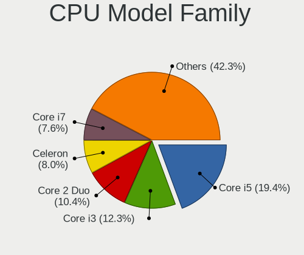

| Model                   | Computers | Percent |
|-------------------------|-----------|---------|
| Intel Core i5           | 612       | 18.93%  |
| Intel Core i3           | 395       | 12.22%  |
| Intel Core 2 Duo        | 348       | 10.76%  |
| Intel Celeron           | 264       | 8.17%   |
| Intel Core i7           | 243       | 7.52%   |
| Intel Pentium           | 155       | 4.79%   |
| Intel Pentium Dual-Core | 108       | 3.34%   |
| Intel Atom              | 95        | 2.94%   |
| AMD A8                  | 90        | 2.78%   |
| Intel Core 2 Quad       | 64        | 1.98%   |
| AMD FX                  | 57        | 1.76%   |
| AMD A4                  | 55        | 1.7%    |
| Intel Xeon              | 51        | 1.58%   |
| Intel Core 2            | 51        | 1.58%   |
| AMD Ryzen 5             | 50        | 1.55%   |
| Intel Pentium Dual      | 44        | 1.36%   |
| AMD Athlon II X2        | 40        | 1.24%   |
| AMD A6                  | 38        | 1.18%   |
| AMD Athlon 64 X2        | 32        | 0.99%   |
| Other                   | 30        | 0.93%   |
| AMD A10                 | 27        | 0.84%   |
| AMD E                   | 25        | 0.77%   |
| Intel Pentium 4         | 23        | 0.71%   |
| AMD Ryzen 3             | 22        | 0.68%   |
| AMD Phenom II X4        | 22        | 0.68%   |
| AMD E1                  | 20        | 0.62%   |
| AMD Ryzen 7             | 19        | 0.59%   |
| AMD E2                  | 19        | 0.59%   |
| Intel Genuine           | 15        | 0.46%   |
| Intel Pentium D         | 13        | 0.4%    |
| AMD Sempron             | 13        | 0.4%    |
| AMD Athlon II X4        | 13        | 0.4%    |
| Intel Celeron Dual-Core | 12        | 0.37%   |
| Intel Pentium Silver    | 10        | 0.31%   |
| Intel Celeron M         | 10        | 0.31%   |
| AMD Athlon Dual Core    | 9         | 0.28%   |
| AMD Athlon              | 9         | 0.28%   |
| Intel Pentium M         | 7         | 0.22%   |
| Intel Core Duo          | 7         | 0.22%   |
| AMD Turion 64 X2 Mobile | 7         | 0.22%   |

CPU Cores
---------

Number of processor cores

| Number  | Computers | Percent |
|---------|-----------|---------|
| 2       | 2092      | 64.49%  |
| 4       | 731       | 22.53%  |
| 1       | 248       | 7.64%   |
| 6       | 96        | 2.96%   |
| 8       | 38        | 1.17%   |
| 3       | 26        | 0.8%    |
| 12      | 4         | 0.12%   |
| 16      | 3         | 0.09%   |
| 10      | 3         | 0.09%   |
| 18      | 2         | 0.06%   |
| Unknown | 1         | 0.03%   |

CPU Sockets
-----------

Number of sockets

| Number | Computers | Percent |
|--------|-----------|---------|
| 1      | 3205      | 99.47%  |
| 2      | 16        | 0.5%    |
| 4      | 1         | 0.03%   |

CPU Threads
-----------

Threads per core (Hyper-Threading)

| Number  | Computers | Percent |
|---------|-----------|---------|
| 1       | 1842      | 56.8%   |
| 2       | 1400      | 43.17%  |
| Unknown | 1         | 0.03%   |

CPU Op-Modes
------------

CPU Operation Modes (32-bit, 64-bit)

| Op mode        | Computers | Percent |
|----------------|-----------|---------|
| 32-bit, 64-bit | 3165      | 98.2%   |
| 32-bit         | 50        | 1.55%   |
| Unknown        | 8         | 0.25%   |

CPU Microcode
-------------

Microcode number

| Number     | Computers | Percent |
|------------|-----------|---------|
| 0x1067a    | 338       | 10.17%  |
| 0x206a7    | 314       | 9.45%   |
| 0x306a9    | 272       | 8.19%   |
| Unknown    | 238       | 7.16%   |
| 0x306c3    | 180       | 5.42%   |
| 0x20655    | 125       | 3.76%   |
| 0x6fd      | 104       | 3.13%   |
| 0x10676    | 93        | 2.8%    |
| 0x06001119 | 84        | 2.53%   |
| 0x40651    | 79        | 2.38%   |
| 0x010000c8 | 64        | 1.93%   |
| 0x306d4    | 59        | 1.78%   |
| 0x6fb      | 58        | 1.75%   |
| 0x506e3    | 56        | 1.69%   |
| 0x20652    | 54        | 1.63%   |
| 0x906ea    | 49        | 1.48%   |
| 0x406c4    | 49        | 1.48%   |
| 0x106ca    | 49        | 1.48%   |
| 0x806e9    | 48        | 1.44%   |
| 0x906e9    | 47        | 1.41%   |
| 0x406e3    | 47        | 1.41%   |
| 0x30678    | 42        | 1.26%   |
| 0x05000119 | 41        | 1.23%   |
| 0x07030105 | 36        | 1.08%   |
| 0x806ea    | 34        | 1.02%   |
| 0x0700010f | 29        | 0.87%   |
| 0x6f6      | 28        | 0.84%   |
| 0x6f2      | 27        | 0.81%   |
| 0x06000852 | 26        | 0.78%   |
| 0x06003106 | 25        | 0.75%   |
| 0x106c2    | 23        | 0.69%   |
| 0x706a1    | 21        | 0.63%   |
| 0x406c3    | 21        | 0.63%   |
| 0x03000027 | 21        | 0.63%   |
| 0x0600084f | 19        | 0.57%   |
| 0x506c9    | 18        | 0.54%   |
| 0x10661    | 18        | 0.54%   |
| 0x806ec    | 17        | 0.51%   |
| 0x06006705 | 17        | 0.51%   |
| 0x0800820d | 16        | 0.48%   |

CPU Microarch
-------------

Microarchitecture

| Name             | Computers | Percent |
|------------------|-----------|---------|
| Penryn           | 443       | 13.75%  |
| SandyBridge      | 318       | 9.87%   |
| IvyBridge        | 278       | 8.63%   |
| Haswell          | 274       | 8.5%    |
| Core             | 244       | 7.57%   |
| KabyLake         | 229       | 7.11%   |
| Westmere         | 199       | 6.18%   |
| Piledriver       | 131       | 4.07%   |
| Silvermont       | 124       | 3.85%   |
| K10              | 122       | 3.79%   |
| Skylake          | 117       | 3.63%   |
| Bonnell          | 77        | 2.39%   |
| K8 Hammer        | 72        | 2.23%   |
| Broadwell        | 64        | 1.99%   |
| Bobcat           | 58        | 1.8%    |
| Puma             | 52        | 1.61%   |
| Excavator        | 46        | 1.43%   |
| NetBurst         | 43        | 1.33%   |
| Zen              | 38        | 1.18%   |
| Steamroller      | 32        | 0.99%   |
| Jaguar           | 32        | 0.99%   |
| Zen+             | 31        | 0.96%   |
| Goldmont plus    | 29        | 0.9%    |
| P6               | 27        | 0.84%   |
| Nehalem          | 27        | 0.84%   |
| Goldmont         | 22        | 0.68%   |
| K10 Llano        | 21        | 0.65%   |
| Zen 2            | 19        | 0.59%   |
| CometLake        | 12        | 0.37%   |
| Bulldozer        | 11        | 0.34%   |
| TigerLake        | 10        | 0.31%   |
| Zen 3            | 9         | 0.28%   |
| K8 & K10 hybrid  | 7         | 0.22%   |
| Alderlake Hybrid | 2         | 0.06%   |
| Unknown          | 2         | 0.06%   |

Graphics
--------

GPU Vendor
----------

Vendors of graphics cards

| Vendor                                       | Computers | Percent |
|----------------------------------------------|-----------|---------|
| Intel                                        | 1872      | 51.37%  |
| Nvidia                                       | 885       | 24.29%  |
| AMD                                          | 867       | 23.79%  |
| VIA Technologies                             | 11        | 0.3%    |
| XGI Technology (eXtreme Graphics Innovation) | 2         | 0.05%   |
| Silicon Integrated Systems [SiS]             | 2         | 0.05%   |
| Matrox Electronics Systems                   | 2         | 0.05%   |
| ATI Technologies                             | 2         | 0.05%   |
| Zhaoxin                                      | 1         | 0.03%   |

GPU Model
---------

Graphics card models

| Model                                                                                    | Computers | Percent |
|------------------------------------------------------------------------------------------|-----------|---------|
| Intel 2nd Generation Core Processor Family Integrated Graphics Controller                | 238       | 6.12%   |
| Intel 3rd Gen Core processor Graphics Controller                                         | 183       | 4.71%   |
| Intel Mobile 4 Series Chipset Integrated Graphics Controller                             | 151       | 3.88%   |
| Intel Core Processor Integrated Graphics Controller                                      | 120       | 3.09%   |
| Intel Haswell-ULT Integrated Graphics Controller                                         | 84        | 2.16%   |
| Intel 4 Series Chipset Integrated Graphics Controller                                    | 76        | 1.95%   |
| Intel Atom/Celeron/Pentium Processor x5-E8000/J3xxx/N3xxx Integrated Graphics Controller | 72        | 1.85%   |
| Intel Mobile GM965/GL960 Integrated Graphics Controller (secondary)                      | 68        | 1.75%   |
| Intel Mobile GM965/GL960 Integrated Graphics Controller (primary)                        | 68        | 1.75%   |
| Intel Xeon E3-1200 v3/4th Gen Core Processor Integrated Graphics Controller              | 63        | 1.62%   |
| Intel Mobile 945GM/GMS/GME, 943/940GML Express Integrated Graphics Controller            | 60        | 1.54%   |
| Intel HD Graphics 5500                                                                   | 56        | 1.44%   |
| Intel HD Graphics 620                                                                    | 54        | 1.39%   |
| Intel Atom Processor Z36xxx/Z37xxx Series Graphics & Display                             | 52        | 1.34%   |
| Intel Skylake GT2 [HD Graphics 520]                                                      | 49        | 1.26%   |
| Nvidia GK208B [GeForce GT 710]                                                           | 48        | 1.23%   |
| Intel Atom Processor D4xx/D5xx/N4xx/N5xx Integrated Graphics Controller                  | 47        | 1.21%   |
| Intel 4th Gen Core Processor Integrated Graphics Controller                              | 46        | 1.18%   |
| Intel Mobile 945GM/GMS, 943/940GML Express Integrated Graphics Controller                | 43        | 1.11%   |
| Intel Xeon E3-1200 v2/3rd Gen Core processor Graphics Controller                         | 41        | 1.05%   |
| Intel 82G33/G31 Express Integrated Graphics Controller                                   | 41        | 1.05%   |
| Nvidia GT218 [GeForce 210]                                                               | 40        | 1.03%   |
| Intel HD Graphics 530                                                                    | 39        | 1%      |
| AMD Mullins [Radeon R4/R5 Graphics]                                                      | 37        | 0.95%   |
| Intel 4th Generation Core Processor Family Integrated Graphics Controller                | 35        | 0.9%    |
| AMD Richland [Radeon HD 8570D]                                                           | 34        | 0.87%   |
| AMD Caicos [Radeon HD 6450/7450/8450 / R5 230 OEM]                                       | 34        | 0.87%   |
| AMD Ellesmere [Radeon RX 470/480/570/570X/580/580X/590]                                  | 31        | 0.8%    |
| AMD Cedar [Radeon HD 5000/6000/7350/8350 Series]                                         | 29        | 0.75%   |
| Nvidia GF117M [GeForce 610M/710M/810M/820M / GT 620M/625M/630M/720M]                     | 28        | 0.72%   |
| Intel UHD Graphics 620                                                                   | 28        | 0.72%   |
| Intel 82945G/GZ Integrated Graphics Controller                                           | 25        | 0.64%   |
| AMD Sun XT [Radeon HD 8670A/8670M/8690M / R5 M330 / M430 / Radeon 520 Mobile]            | 25        | 0.64%   |
| Intel CoffeeLake-S GT2 [UHD Graphics 630]                                                | 24        | 0.62%   |
| Nvidia GK208BM [GeForce 920M]                                                            | 23        | 0.59%   |
| AMD Topaz XT [Radeon R7 M260/M265 / M340/M360 / M440/M445 / 530/535 / 620/625 Mobile]    | 23        | 0.59%   |
| AMD Stoney [Radeon R2/R3/R4/R5 Graphics]                                                 | 23        | 0.59%   |
| AMD Oland PRO [Radeon R7 240/340 / Radeon 520]                                           | 23        | 0.59%   |
| Intel HD Graphics 630                                                                    | 20        | 0.51%   |
| AMD Seymour [Radeon HD 6400M/7400M Series]                                               | 20        | 0.51%   |

GPU Combo
---------

Combinations of graphics cards

| Name           | Computers | Percent |
|----------------|-----------|---------|
| 1 x Intel      | 1504      | 46.02%  |
| 1 x AMD        | 693       | 21.21%  |
| 1 x Nvidia     | 601       | 18.39%  |
| Intel + Nvidia | 270       | 8.26%   |
| 2 x AMD        | 91        | 2.78%   |
| Intel + AMD    | 78        | 2.39%   |
| 1 x VIA        | 11        | 0.34%   |
| AMD + Nvidia   | 9         | 0.28%   |
| 2 x Nvidia     | 4         | 0.12%   |
| 1 x SiS        | 2         | 0.06%   |
| 1 x Matrox     | 2         | 0.06%   |
| 1 x Zhaoxin    | 1         | 0.03%   |
| 1 x XGI        | 1         | 0.03%   |
| AMD + XGI      | 1         | 0.03%   |

GPU Driver
----------

Free vs proprietary

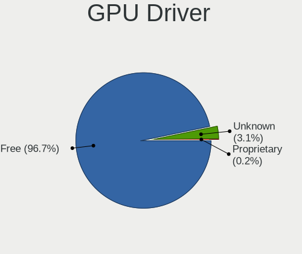

| Driver      | Computers | Percent |
|-------------|-----------|---------|
| Free        | 3147      | 97.04%  |
| Unknown     | 90        | 2.78%   |
| Proprietary | 6         | 0.19%   |

GPU Memory
----------

Total video memory

| Size in GB | Computers | Percent |
|------------|-----------|---------|
| Unknown    | 1554      | 46.28%  |
| 0.01-0.5   | 667       | 19.86%  |
| 0.51-1.0   | 493       | 14.68%  |
| 1.01-2.0   | 423       | 12.6%   |
| 3.01-4.0   | 122       | 3.63%   |
| 7.01-8.0   | 36        | 1.07%   |
| 5.01-6.0   | 31        | 0.92%   |
| 2.01-3.0   | 23        | 0.68%   |
| 8.01-16.0  | 8         | 0.24%   |
| 4.01-5.0   | 1         | 0.03%   |

Monitor
-------

Monitor Vendor
--------------

Monitor vendors

| Vendor                  | Computers | Percent |
|-------------------------|-----------|---------|
| Samsung Electronics     | 575       | 17.55%  |
| LG Display              | 379       | 11.57%  |
| AU Optronics            | 349       | 10.65%  |
| Goldstar                | 248       | 7.57%   |
| Chimei Innolux          | 197       | 6.01%   |
| BOE                     | 154       | 4.7%    |
| Chi Mei Optoelectronics | 128       | 3.91%   |
| Dell                    | 127       | 3.88%   |
| Hewlett-Packard         | 106       | 3.24%   |
| Lenovo                  | 89        | 2.72%   |
| Acer                    | 83        | 2.53%   |
| BenQ                    | 82        | 2.5%    |
| Philips                 | 79        | 2.41%   |
| Ancor Communications    | 75        | 2.29%   |
| AOC                     | 47        | 1.43%   |
| Fujitsu Siemens         | 45        | 1.37%   |
| LG Philips              | 35        | 1.07%   |
| Apple                   | 30        | 0.92%   |
| HannStar                | 29        | 0.89%   |
| Vestel Elektronik       | 25        | 0.76%   |
| InfoVision              | 23        | 0.7%    |
| Eizo                    | 23        | 0.7%    |
| Sony                    | 20        | 0.61%   |
| NEC Computers           | 16        | 0.49%   |
| Iiyama                  | 16        | 0.49%   |
| HKC                     | 16        | 0.49%   |
| CPT                     | 15        | 0.46%   |
| ViewSonic               | 14        | 0.43%   |
| Medion                  | 14        | 0.43%   |
| Toshiba                 | 13        | 0.4%    |
| ASUSTek Computer        | 13        | 0.4%    |
| InnoLux Display         | 11        | 0.34%   |
| Plain Tree Systems      | 10        | 0.31%   |
| Panasonic               | 10        | 0.31%   |
| IBM                     | 10        | 0.31%   |
| Quanta Display          | 9         | 0.27%   |
| PANDA                   | 9         | 0.27%   |
| Belinea                 | 9         | 0.27%   |
| Unknown                 | 7         | 0.21%   |
| Sharp                   | 7         | 0.21%   |

Monitor Model
-------------

Monitor models

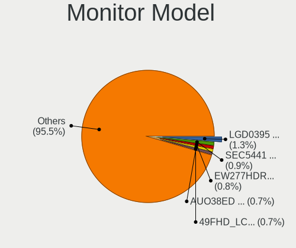

| Model                                                                    | Computers | Percent |
|--------------------------------------------------------------------------|-----------|---------|
| LG Display LCD Monitor LGD0395 1366x768 344x194mm 15.5-inch              | 47        | 1.41%   |
| Samsung Electronics LCD Monitor SEC5441 1366x768 344x194mm 15.5-inch     | 31        | 0.93%   |
| BenQ EW277HDR BNQ7948 1920x1080 598x336mm 27.0-inch                      | 30        | 0.9%    |
| AU Optronics LCD Monitor AUO38ED 1920x1080 344x193mm 15.5-inch           | 27        | 0.81%   |
| Vestel Elektronik 55UHD_LCD_TV VES3700 3840x2160 1872x1053mm 84.6-inch   | 25        | 0.75%   |
| LG Display LCD Monitor LGD02DC 1366x768 344x194mm 15.5-inch              | 25        | 0.75%   |
| Chi Mei Optoelectronics LCD Monitor CMO15A7 1366x768 344x193mm 15.5-inch | 25        | 0.75%   |
| BOE LCD Monitor BOE06A5 1366x768 344x194mm 15.5-inch                     | 23        | 0.69%   |
| AU Optronics LCD Monitor AUO22EC 1366x768 344x193mm 15.5-inch            | 22        | 0.66%   |
| Chimei Innolux LCD Monitor CMN15DB 1366x768 344x193mm 15.5-inch          | 18        | 0.54%   |
| AU Optronics LCD Monitor AUO26EC 1366x768 344x193mm 15.5-inch            | 18        | 0.54%   |
| LG Display LCD Monitor LGD033A 1366x768 344x194mm 15.5-inch              | 16        | 0.48%   |
| Goldstar 2D HD TV GSM59CA 1366x768 509x286mm 23.0-inch                   | 13        | 0.39%   |
| Chimei Innolux LCD Monitor CMN15CA 1366x768 344x193mm 15.5-inch          | 13        | 0.39%   |
| Chi Mei Optoelectronics LCD Monitor CMO1592 1366x768 344x193mm 15.5-inch | 13        | 0.39%   |
| BOE LCD Monitor BOE0675 1366x768 344x194mm 15.5-inch                     | 13        | 0.39%   |
| LG Display LP156WH2-TLAA LGD0230 1366x768 344x194mm 15.5-inch            | 12        | 0.36%   |
| HKC '' HKC1850 1360x768 304x228mm 15.0-inch                              | 12        | 0.36%   |
| BOE LCD Monitor BOE0672 1366x768 344x194mm 15.5-inch                     | 12        | 0.36%   |
| Samsung Electronics S19B150 SAM08A2 1366x768 410x230mm 18.5-inch         | 11        | 0.33%   |
| AU Optronics LCD Monitor AUO10EC 1366x768 344x193mm 15.5-inch            | 11        | 0.33%   |
| Ancor Communications ASUS VW193D ACI19D5 1440x900 408x255mm 18.9-inch    | 11        | 0.33%   |
| Chimei Innolux LCD Monitor CMN1734 1600x900 382x214mm 17.2-inch          | 10        | 0.3%    |
| Chimei Innolux LCD Monitor CMN15AB 1366x768 344x193mm 15.5-inch          | 10        | 0.3%    |
| AU Optronics LCD Monitor AUO23EC 1366x768 344x193mm 15.5-inch            | 10        | 0.3%    |
| AU Optronics LCD Monitor AUO20EC 1366x768 344x193mm 15.5-inch            | 10        | 0.3%    |
| Samsung Electronics LCD Monitor SEC3046 1366x768 344x193mm 15.5-inch     | 9         | 0.27%   |
| Goldstar E1940 GSM4BD6 1360x768 406x229mm 18.4-inch                      | 9         | 0.27%   |
| AU Optronics LCD Monitor AUO46EC 1366x768 344x193mm 15.5-inch            | 9         | 0.27%   |
| AU Optronics LCD Monitor AUO21ED 1920x1080 344x193mm 15.5-inch           | 9         | 0.27%   |
| Samsung Electronics SyncMaster SAM011E 1280x1024 338x270mm 17.0-inch     | 8         | 0.24%   |
| Samsung Electronics LCD Monitor SEC324A 1366x768 344x194mm 15.5-inch     | 8         | 0.24%   |
| Samsung Electronics C24F390 SAM0D2C 1920x1080 521x293mm 23.5-inch        | 8         | 0.24%   |
| Philips PHL 223V5 PHLC0CF 1920x1080 480x270mm 21.7-inch                  | 8         | 0.24%   |
| LG Display LCD Monitor LGD03AB 1366x768 344x194mm 15.5-inch              | 8         | 0.24%   |
| LG Display LCD Monitor LGD038E 1366x768 344x194mm 15.5-inch              | 8         | 0.24%   |
| Lenovo LCD Monitor LEN4036 1440x900 303x190mm 14.1-inch                  | 8         | 0.24%   |
| Lenovo LCD Monitor LEN4035 1280x800 303x189mm 14.1-inch                  | 8         | 0.24%   |
| HannStar LCD Monitor HSD03E9 1024x600 220x129mm 10.0-inch                | 8         | 0.24%   |
| HannStar Hanns.G HQ191 HSD0013 1280x1024 376x301mm 19.0-inch             | 8         | 0.24%   |

Monitor Resolution
------------------

Monitor screen resolution

| Resolution         | Computers | Percent |
|--------------------|-----------|---------|
| 1366x768 (WXGA)    | 962       | 29.91%  |
| 1920x1080 (FHD)    | 913       | 28.39%  |
| 1280x1024 (SXGA)   | 240       | 7.46%   |
| 1280x800 (WXGA)    | 193       | 6%      |
| 1600x900 (HD+)     | 181       | 5.63%   |
| 1680x1050 (WSXGA+) | 165       | 5.13%   |
| 1440x900 (WXGA+)   | 163       | 5.07%   |
| 3840x2160 (4K)     | 101       | 3.14%   |
| 1360x768           | 48        | 1.49%   |
| 1920x1200 (WUXGA)  | 46        | 1.43%   |
| 1024x600           | 46        | 1.43%   |
| 1024x768 (XGA)     | 33        | 1.03%   |
| 2560x1440 (QHD)    | 28        | 0.87%   |
| 2560x1080          | 23        | 0.72%   |
| 1920x540           | 17        | 0.53%   |
| 1600x1200          | 9         | 0.28%   |
| 1280x720 (HD)      | 9         | 0.28%   |
| 2288x1287          | 7         | 0.22%   |
| 1152x864           | 4         | 0.12%   |
| 3840x1080          | 3         | 0.09%   |
| 3440x1440          | 3         | 0.09%   |
| 1280x768           | 3         | 0.09%   |
| 2736x1824          | 2         | 0.06%   |
| 2560x1600          | 2         | 0.06%   |
| 1680x945           | 2         | 0.06%   |
| 1280x960           | 2         | 0.06%   |
| 800x600            | 1         | 0.03%   |
| 4093x4093          | 1         | 0.03%   |
| 3840x2400          | 1         | 0.03%   |
| 3840x1200          | 1         | 0.03%   |
| 2880x1200          | 1         | 0.03%   |
| 2160x1440          | 1         | 0.03%   |
| 2048x1536          | 1         | 0.03%   |
| 1920x1280          | 1         | 0.03%   |
| 1400x1050          | 1         | 0.03%   |
| 1024x576           | 1         | 0.03%   |
| Unknown            | 1         | 0.03%   |

Monitor Diagonal
----------------

Diagonal size in inches

| Inches  | Computers | Percent |
|---------|-----------|---------|
| 15      | 1085      | 32.94%  |
| 17      | 259       | 7.86%   |
| 21      | 235       | 7.13%   |
| 19      | 220       | 6.68%   |
| 14      | 191       | 5.8%    |
| 23      | 184       | 5.59%   |
| 24      | 132       | 4.01%   |
| 27      | 131       | 3.98%   |
| 18      | 118       | 3.58%   |
| 22      | 111       | 3.37%   |
| 13      | 111       | 3.37%   |
| 20      | 75        | 2.28%   |
| 12      | 67        | 2.03%   |
| 10      | 53        | 1.61%   |
| 11      | 46        | 1.4%    |
| Unknown | 41        | 1.24%   |
| 84      | 35        | 1.06%   |
| 31      | 35        | 1.06%   |
| 34      | 25        | 0.76%   |
| 72      | 16        | 0.49%   |
| 32      | 16        | 0.49%   |
| 40      | 15        | 0.46%   |
| 65      | 9         | 0.27%   |
| 54      | 9         | 0.27%   |
| 52      | 7         | 0.21%   |
| 49      | 7         | 0.21%   |
| 42      | 7         | 0.21%   |
| 26      | 5         | 0.15%   |
| 25      | 5         | 0.15%   |
| 8       | 5         | 0.15%   |
| 142     | 4         | 0.12%   |
| 46      | 4         | 0.12%   |
| 16      | 4         | 0.12%   |
| 60      | 3         | 0.09%   |
| 58      | 3         | 0.09%   |
| 39      | 3         | 0.09%   |
| 55      | 2         | 0.06%   |
| 29      | 2         | 0.06%   |
| 85      | 1         | 0.03%   |
| 64      | 1         | 0.03%   |

Monitor Width
-------------

Physical width

| Width in mm    | Computers | Percent |
|----------------|-----------|---------|
| 301-350        | 1390      | 42.74%  |
| 401-500        | 605       | 18.6%   |
| 501-600        | 434       | 13.35%  |
| 351-400        | 323       | 9.93%   |
| 201-300        | 232       | 7.13%   |
| 1501-2000      | 52        | 1.6%    |
| 1001-1500      | 50        | 1.54%   |
| 601-700        | 43        | 1.32%   |
| 701-800        | 42        | 1.29%   |
| Unknown        | 41        | 1.26%   |
| 801-900        | 21        | 0.65%   |
| 901-1000       | 9         | 0.28%   |
| 101-200        | 6         | 0.18%   |
| More than 2000 | 4         | 0.12%   |

Aspect Ratio
------------

Proportional relationship between the width and the height

| Ratio   | Computers | Percent |
|---------|-----------|---------|
| 16/9    | 2184      | 70.36%  |
| 16/10   | 539       | 17.36%  |
| 5/4     | 238       | 7.67%   |
| 4/3     | 62        | 2%      |
| 21/9    | 27        | 0.87%   |
| 3/2     | 25        | 0.81%   |
| Unknown | 11        | 0.35%   |
| 6/5     | 7         | 0.23%   |
| 1.00    | 6         | 0.19%   |
| 32/9    | 4         | 0.13%   |
| 0.62    | 1         | 0.03%   |

Monitor Area
------------

Area in inch

| Area in inch | Computers | Percent |
|----------------|-----------|---------|
| 101-110        | 1071      | 32.79%  |
| 201-250        | 545       | 16.69%  |
| 151-200        | 366       | 11.21%  |
| 81-90          | 249       | 7.62%   |
| 141-150        | 214       | 6.55%   |
| 301-350        | 134       | 4.1%    |
| 121-130        | 104       | 3.18%   |
| More than 1000 | 96        | 2.94%   |
| 351-500        | 78        | 2.39%   |
| 61-70          | 57        | 1.75%   |
| 71-80          | 53        | 1.62%   |
| 41-50          | 52        | 1.59%   |
| 251-300        | 52        | 1.59%   |
| 51-60          | 47        | 1.44%   |
| Unknown        | 41        | 1.26%   |
| 131-140        | 39        | 1.19%   |
| 501-1000       | 37        | 1.13%   |
| 111-120        | 14        | 0.43%   |
| 91-100         | 11        | 0.34%   |
| 1-40           | 6         | 0.18%   |

Pixel Density
-------------

Pixels per inch

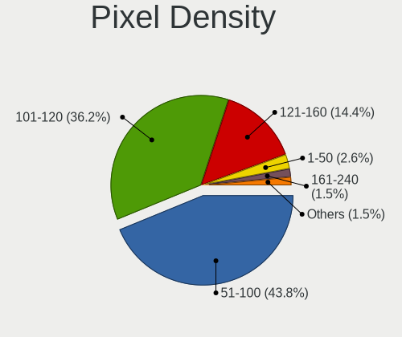

| Density       | Computers | Percent |
|---------------|-----------|---------|
| 51-100        | 1386      | 43.72%  |
| 101-120       | 1173      | 37%     |
| 121-160       | 449       | 14.16%  |
| 1-50          | 77        | 2.43%   |
| Unknown       | 41        | 1.29%   |
| 161-240       | 39        | 1.23%   |
| More than 240 | 5         | 0.16%   |

Multiple Monitors
-----------------

Total monitors connected

| Total | Computers | Percent |
|-------|-----------|---------|
| 1     | 3009      | 91.04%  |
| 2     | 235       | 7.11%   |
| 0     | 44        | 1.33%   |
| 3     | 12        | 0.36%   |
| 4     | 5         | 0.15%   |

Network
-------

Net Controller Vendor
---------------------

Controller vendors

| Vendor                            | Computers | Percent |
|-----------------------------------|-----------|---------|
| Realtek Semiconductor             | 1708      | 35.04%  |
| Intel                             | 1128      | 23.14%  |
| Qualcomm Atheros                  | 803       | 16.48%  |
| Broadcom                          | 387       | 7.94%   |
| Broadcom Limited                  | 129       | 2.65%   |
| Ralink                            | 113       | 2.32%   |
| Marvell Technology Group          | 98        | 2.01%   |
| Ralink Technology                 | 75        | 1.54%   |
| Nvidia                            | 66        | 1.35%   |
| Qualcomm Atheros Communications   | 55        | 1.13%   |
| TP-Link                           | 31        | 0.64%   |
| Huawei Technologies               | 24        | 0.49%   |
| Samsung Electronics               | 22        | 0.45%   |
| VIA Technologies                  | 19        | 0.39%   |
| JMicron Technology                | 18        | 0.37%   |
| Hewlett-Packard                   | 15        | 0.31%   |
| Dell                              | 15        | 0.31%   |
| Ericsson Business Mobile Networks | 14        | 0.29%   |
| ASUSTek Computer                  | 13        | 0.27%   |
| D-Link                            | 11        | 0.23%   |
| Xiaomi                            | 10        | 0.21%   |
| Sierra Wireless                   | 9         | 0.18%   |
| D-Link System                     | 9         | 0.18%   |
| Attansic Technology               | 9         | 0.18%   |
| ASIX Electronics                  | 8         | 0.16%   |
| IMC Networks                      | 7         | 0.14%   |
| DisplayLink                       | 7         | 0.14%   |
| NetGear                           | 6         | 0.12%   |
| Belkin Components                 | 6         | 0.12%   |
| Microsoft                         | 5         | 0.1%    |
| MediaTek                          | 5         | 0.1%    |
| Edimax Technology                 | 4         | 0.08%   |
| Accton Technology                 | 4         | 0.08%   |
| T & A Mobile Phones               | 3         | 0.06%   |
| Silicon Integrated Systems [SiS]  | 3         | 0.06%   |
| LG Electronics                    | 2         | 0.04%   |
| HMD Global                        | 2         | 0.04%   |
| Fujitsu Siemens Computers         | 2         | 0.04%   |
| Aquantia                          | 2         | 0.04%   |
| AMD                               | 2         | 0.04%   |

Net Controller Model
--------------------

Controller models

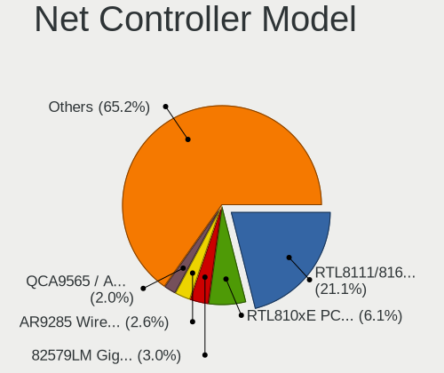

| Model                                                                   | Computers | Percent |
|-------------------------------------------------------------------------|-----------|---------|
| Realtek RTL8111/8168/8411 PCI Express Gigabit Ethernet Controller       | 1166      | 20.85%  |
| Realtek RTL810xE PCI Express Fast Ethernet controller                   | 361       | 6.46%   |
| Intel 82579LM Gigabit Network Connection (Lewisville)                   | 170       | 3.04%   |
| Qualcomm Atheros AR9285 Wireless Network Adapter (PCI-Express)          | 145       | 2.59%   |
| Qualcomm Atheros QCA9565 / AR9565 Wireless Network Adapter              | 118       | 2.11%   |
| Qualcomm Atheros AR9485 Wireless Network Adapter                        | 86        | 1.54%   |
| Qualcomm Atheros QCA9377 802.11ac Wireless Network Adapter              | 82        | 1.47%   |
| Realtek RTL8723BE PCIe Wireless Network Adapter                         | 72        | 1.29%   |
| Intel Centrino Advanced-N 6205 [Taylor Peak]                            | 72        | 1.29%   |
| Intel PRO/Wireless 3945ABG [Golan] Network Connection                   | 71        | 1.27%   |
| Intel Wireless 7260                                                     | 70        | 1.25%   |
| Broadcom BCM4313 802.11bgn Wireless Network Adapter                     | 59        | 1.06%   |
| Intel 82577LM Gigabit Network Connection                                | 58        | 1.04%   |
| Ralink RT3290 Wireless 802.11n 1T/1R PCIe                               | 57        | 1.02%   |
| Qualcomm Atheros AR242x / AR542x Wireless Network Adapter (PCI-Express) | 52        | 0.93%   |
| Intel 82567LM-3 Gigabit Network Connection                              | 52        | 0.93%   |
| Intel Ethernet Connection I217-LM                                       | 50        | 0.89%   |
| Qualcomm Atheros QCA8171 Gigabit Ethernet                               | 48        | 0.86%   |
| Qualcomm Atheros AR9271 802.11n                                         | 47        | 0.84%   |
| Realtek RTL-8100/8101L/8139 PCI Fast Ethernet Adapter                   | 46        | 0.82%   |
| Intel Centrino Advanced-N 6200                                          | 46        | 0.82%   |
| Intel 82567LM Gigabit Network Connection                                | 45        | 0.8%    |
| Intel Wireless 3165                                                     | 43        | 0.77%   |
| Intel Wireless 7265                                                     | 41        | 0.73%   |
| Qualcomm Atheros AR8132 Fast Ethernet                                   | 38        | 0.68%   |
| Intel Wireless 8265 / 8275                                              | 37        | 0.66%   |
| Qualcomm Atheros AR8121/AR8113/AR8114 Gigabit or Fast Ethernet          | 35        | 0.63%   |
| Intel Wireless 3160                                                     | 35        | 0.63%   |
| Intel PRO/Wireless 4965 AG or AGN [Kedron] Network Connection           | 35        | 0.63%   |
| Intel Centrino Ultimate-N 6300                                          | 35        | 0.63%   |
| Qualcomm Atheros AR8151 v2.0 Gigabit Ethernet                           | 34        | 0.61%   |
| Intel PRO/Wireless 5100 AGN [Shiloh] Network Connection                 | 33        | 0.59%   |
| Intel 82566DM-2 Gigabit Network Connection                              | 33        | 0.59%   |
| Broadcom BCM43142 802.11b/g/n                                           | 33        | 0.59%   |
| Realtek RTL8188EUS 802.11n Wireless Network Adapter                     | 32        | 0.57%   |
| Intel Ethernet Connection (2) I219-V                                    | 32        | 0.57%   |
| Qualcomm Atheros AR8131 Gigabit Ethernet                                | 31        | 0.55%   |
| Intel WiFi Link 5100                                                    | 31        | 0.55%   |
| Qualcomm Atheros AR928X Wireless Network Adapter (PCI-Express)          | 30        | 0.54%   |
| Realtek RTL8821AE 802.11ac PCIe Wireless Network Adapter                | 29        | 0.52%   |

Wireless Vendor
---------------

Wireless vendors

| Vendor                                | Computers | Percent |
|---------------------------------------|-----------|---------|
| Intel                                 | 737       | 32.31%  |
| Qualcomm Atheros                      | 605       | 26.52%  |
| Realtek Semiconductor                 | 323       | 14.16%  |
| Broadcom                              | 208       | 9.12%   |
| Ralink                                | 113       | 4.95%   |
| Ralink Technology                     | 75        | 3.29%   |
| Qualcomm Atheros Communications       | 55        | 2.41%   |
| Broadcom Limited                      | 42        | 1.84%   |
| TP-Link                               | 31        | 1.36%   |
| ASUSTek Computer                      | 13        | 0.57%   |
| D-Link                                | 10        | 0.44%   |
| Sierra Wireless                       | 9         | 0.39%   |
| Dell                                  | 8         | 0.35%   |
| IMC Networks                          | 7         | 0.31%   |
| NetGear                               | 6         | 0.26%   |
| Belkin Components                     | 6         | 0.26%   |
| Microsoft                             | 5         | 0.22%   |
| D-Link System                         | 5         | 0.22%   |
| Hewlett-Packard                       | 3         | 0.13%   |
| MediaTek                              | 2         | 0.09%   |
| Marvell Technology Group              | 2         | 0.09%   |
| Fujitsu Siemens Computers             | 2         | 0.09%   |
| Ericsson Business Mobile Networks     | 2         | 0.09%   |
| Edimax Technology                     | 2         | 0.09%   |
| ZyXEL Communications                  | 1         | 0.04%   |
| ZyDAS                                 | 1         | 0.04%   |
| Wacom                                 | 1         | 0.04%   |
| TRENDnet                              | 1         | 0.04%   |
| Texas Instruments                     | 1         | 0.04%   |
| Micro Star International              | 1         | 0.04%   |
| Mercucys                              | 1         | 0.04%   |
| Gemtek                                | 1         | 0.04%   |
| AVM                                   | 1         | 0.04%   |
| 802.11g Adapter [Linksys WUSB54GC v3] | 1         | 0.04%   |

Wireless Model
--------------

Wireless models

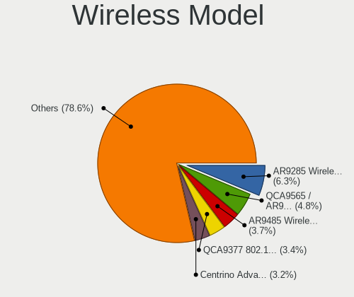

| Model                                                                   | Computers | Percent |
|-------------------------------------------------------------------------|-----------|---------|
| Qualcomm Atheros AR9285 Wireless Network Adapter (PCI-Express)          | 145       | 6.32%   |
| Qualcomm Atheros QCA9565 / AR9565 Wireless Network Adapter              | 118       | 5.14%   |
| Qualcomm Atheros AR9485 Wireless Network Adapter                        | 86        | 3.75%   |
| Qualcomm Atheros QCA9377 802.11ac Wireless Network Adapter              | 82        | 3.57%   |
| Realtek RTL8723BE PCIe Wireless Network Adapter                         | 72        | 3.14%   |
| Intel Centrino Advanced-N 6205 [Taylor Peak]                            | 72        | 3.14%   |
| Intel PRO/Wireless 3945ABG [Golan] Network Connection                   | 71        | 3.1%    |
| Intel Wireless 7260                                                     | 70        | 3.05%   |
| Broadcom BCM4313 802.11bgn Wireless Network Adapter                     | 59        | 2.57%   |
| Ralink RT3290 Wireless 802.11n 1T/1R PCIe                               | 57        | 2.48%   |
| Qualcomm Atheros AR242x / AR542x Wireless Network Adapter (PCI-Express) | 52        | 2.27%   |
| Qualcomm Atheros AR9271 802.11n                                         | 47        | 2.05%   |
| Intel Centrino Advanced-N 6200                                          | 46        | 2.01%   |
| Intel Wireless 3165                                                     | 43        | 1.87%   |
| Intel Wireless 7265                                                     | 41        | 1.79%   |
| Intel Wireless 8265 / 8275                                              | 37        | 1.61%   |
| Intel Wireless 3160                                                     | 35        | 1.53%   |
| Intel PRO/Wireless 4965 AG or AGN [Kedron] Network Connection           | 35        | 1.53%   |
| Intel Centrino Ultimate-N 6300                                          | 35        | 1.53%   |
| Intel PRO/Wireless 5100 AGN [Shiloh] Network Connection                 | 33        | 1.44%   |
| Broadcom BCM43142 802.11b/g/n                                           | 33        | 1.44%   |
| Realtek RTL8188EUS 802.11n Wireless Network Adapter                     | 32        | 1.39%   |
| Intel WiFi Link 5100                                                    | 31        | 1.35%   |
| Qualcomm Atheros AR928X Wireless Network Adapter (PCI-Express)          | 30        | 1.31%   |
| Realtek RTL8821AE 802.11ac PCIe Wireless Network Adapter                | 29        | 1.26%   |
| Ralink MT7601U Wireless Adapter                                         | 27        | 1.18%   |
| Broadcom BCM4312 802.11b/g LP-PHY                                       | 26        | 1.13%   |
| Realtek RTL8821CE 802.11ac PCIe Wireless Network Adapter                | 25        | 1.09%   |
| Qualcomm Atheros AR9462 Wireless Network Adapter                        | 23        | 1%      |
| Realtek RTL8188EE Wireless Network Adapter                              | 21        | 0.92%   |
| Realtek RTL8188CE 802.11b/g/n WiFi Adapter                              | 21        | 0.92%   |
| Qualcomm Atheros AR9287 Wireless Network Adapter (PCI-Express)          | 20        | 0.87%   |
| Intel Dual Band Wireless-AC 3168NGW [Stone Peak]                        | 20        | 0.87%   |
| Broadcom Limited BCM4312 802.11b/g LP-PHY                               | 20        | 0.87%   |
| Ralink RT3090 Wireless 802.11n 1T/1R PCIe                               | 19        | 0.83%   |
| Broadcom BCM43228 802.11a/b/g/n                                         | 19        | 0.83%   |
| Intel Ultimate N WiFi Link 5300                                         | 17        | 0.74%   |
| Ralink RT5370 Wireless Adapter                                          | 16        | 0.7%    |
| Realtek RTL8191SEvB Wireless LAN Controller                             | 15        | 0.65%   |
| Intel Cannon Lake PCH CNVi WiFi                                         | 15        | 0.65%   |

Ethernet Vendor
---------------

Ethernet vendors

| Vendor                                 | Computers | Percent |
|----------------------------------------|-----------|---------|
| Realtek Semiconductor                  | 1616      | 50.31%  |
| Intel                                  | 697       | 21.7%   |
| Qualcomm Atheros                       | 298       | 9.28%   |
| Broadcom                               | 209       | 6.51%   |
| Marvell Technology Group               | 96        | 2.99%   |
| Broadcom Limited                       | 88        | 2.74%   |
| Nvidia                                 | 66        | 2.05%   |
| VIA Technologies                       | 18        | 0.56%   |
| JMicron Technology                     | 18        | 0.56%   |
| Huawei Technologies                    | 18        | 0.56%   |
| Samsung Electronics                    | 17        | 0.53%   |
| Xiaomi                                 | 10        | 0.31%   |
| Attansic Technology                    | 9         | 0.28%   |
| ASIX Electronics                       | 8         | 0.25%   |
| DisplayLink                            | 7         | 0.22%   |
| D-Link System                          | 4         | 0.12%   |
| Accton Technology                      | 4         | 0.12%   |
| T & A Mobile Phones                    | 3         | 0.09%   |
| Silicon Integrated Systems [SiS]       | 3         | 0.09%   |
| MediaTek                               | 2         | 0.06%   |
| LG Electronics                         | 2         | 0.06%   |
| HMD Global                             | 2         | 0.06%   |
| Edimax Technology                      | 2         | 0.06%   |
| Aquantia                               | 2         | 0.06%   |
| ZTE WCDMA Technologies MSM             | 1         | 0.03%   |
| Westell                                | 1         | 0.03%   |
| TOMTOM                                 | 1         | 0.03%   |
| Spreadtrum Communications              | 1         | 0.03%   |
| Sony Ericsson Mobile Communications AB | 1         | 0.03%   |
| Qualcomm                               | 1         | 0.03%   |
| OPPO Electronics                       | 1         | 0.03%   |
| Motorola PCS                           | 1         | 0.03%   |
| ICS Advent                             | 1         | 0.03%   |
| IBM                                    | 1         | 0.03%   |
| Davicom Semiconductor                  | 1         | 0.03%   |
| D-Link                                 | 1         | 0.03%   |
| 3Com                                   | 1         | 0.03%   |

Ethernet Model
--------------

Ethernet models

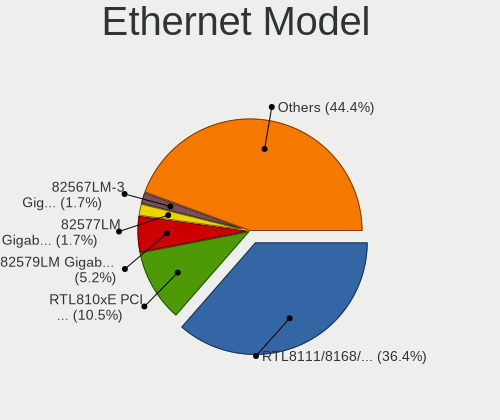

| Model                                                             | Computers | Percent |
|-------------------------------------------------------------------|-----------|---------|
| Realtek RTL8111/8168/8411 PCI Express Gigabit Ethernet Controller | 1166      | 35.97%  |
| Realtek RTL810xE PCI Express Fast Ethernet controller             | 361       | 11.14%  |
| Intel 82579LM Gigabit Network Connection (Lewisville)             | 170       | 5.24%   |
| Intel 82577LM Gigabit Network Connection                          | 58        | 1.79%   |
| Intel 82567LM-3 Gigabit Network Connection                        | 52        | 1.6%    |
| Intel Ethernet Connection I217-LM                                 | 50        | 1.54%   |
| Qualcomm Atheros QCA8171 Gigabit Ethernet                         | 48        | 1.48%   |
| Realtek RTL-8100/8101L/8139 PCI Fast Ethernet Adapter             | 46        | 1.42%   |
| Intel 82567LM Gigabit Network Connection                          | 45        | 1.39%   |
| Qualcomm Atheros AR8132 Fast Ethernet                             | 38        | 1.17%   |
| Qualcomm Atheros AR8121/AR8113/AR8114 Gigabit or Fast Ethernet    | 35        | 1.08%   |
| Qualcomm Atheros AR8151 v2.0 Gigabit Ethernet                     | 34        | 1.05%   |
| Intel 82566DM-2 Gigabit Network Connection                        | 33        | 1.02%   |
| Intel Ethernet Connection (2) I219-V                              | 32        | 0.99%   |
| Qualcomm Atheros AR8131 Gigabit Ethernet                          | 31        | 0.96%   |
| Nvidia MCP61 Ethernet                                             | 29        | 0.89%   |
| Intel I211 Gigabit Network Connection                             | 29        | 0.89%   |
| Intel 82579V Gigabit Network Connection                           | 28        | 0.86%   |
| Realtek RTL8169 PCI Gigabit Ethernet Controller                   | 26        | 0.8%    |
| Qualcomm Atheros AR8152 v2.0 Fast Ethernet                        | 23        | 0.71%   |
| Intel Ethernet Connection I218-LM                                 | 23        | 0.71%   |
| Broadcom NetLink BCM57785 Gigabit Ethernet PCIe                   | 23        | 0.71%   |
| Marvell Group 88E8040 PCI-E Fast Ethernet Controller              | 21        | 0.65%   |
| Intel 82566MM Gigabit Network Connection                          | 20        | 0.62%   |
| Broadcom NetXtreme BCM5754 Gigabit Ethernet PCI Express           | 20        | 0.62%   |
| Marvell Group 88E8056 PCI-E Gigabit Ethernet Controller           | 19        | 0.59%   |
| Intel Ethernet Connection (2) I219-LM                             | 19        | 0.59%   |
| Broadcom NetXtreme BCM5761 Gigabit Ethernet PCIe                  | 18        | 0.56%   |
| Qualcomm Atheros QCA8172 Fast Ethernet                            | 17        | 0.52%   |
| Broadcom NetLink BCM57780 Gigabit Ethernet PCIe                   | 17        | 0.52%   |
| VIA VT6102/VT6103 [Rhine-II]                                      | 16        | 0.49%   |
| JMicron JMC250 PCI Express Gigabit Ethernet Controller            | 16        | 0.49%   |
| Huawei MAR-LX1M                                                   | 16        | 0.49%   |
| Broadcom Limited NetLink BCM5787M Gigabit Ethernet PCI Express    | 16        | 0.49%   |
| Samsung Galaxy series, misc. (tethering mode)                     | 15        | 0.46%   |
| Marvell Group 88E8055 PCI-E Gigabit Ethernet Controller           | 15        | 0.46%   |
| Intel Ethernet Connection I217-V                                  | 15        | 0.46%   |
| Qualcomm Atheros AR8161 Gigabit Ethernet                          | 14        | 0.43%   |
| Nvidia MCP79 Ethernet                                             | 14        | 0.43%   |
| Broadcom NetLink BCM5787M Gigabit Ethernet PCI Express            | 14        | 0.43%   |

Net Controller Kind
-------------------

Ethernet, WiFi or modem

| Kind     | Computers | Percent |
|----------|-----------|---------|
| Ethernet | 3083      | 58.03%  |
| WiFi     | 2174      | 40.92%  |
| Modem    | 54        | 1.02%   |
| Unknown  | 2         | 0.04%   |

Used Controller
---------------

Currently used network controller

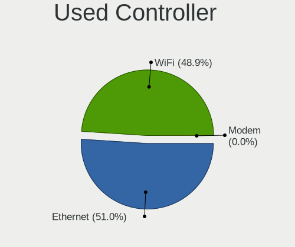

| Kind     | Computers | Percent |
|----------|-----------|---------|
| Ethernet | 1745      | 50.93%  |
| WiFi     | 1680      | 49.04%  |
| Modem    | 1         | 0.03%   |

NICs
----

Total network controllers on board

| Total | Computers | Percent |
|-------|-----------|---------|
| 2     | 1866      | 57.54%  |
| 1     | 1312      | 40.46%  |
| 0     | 38        | 1.17%   |
| 3     | 22        | 0.68%   |
| 4     | 5         | 0.15%   |

IPv6
----

IPv6 vs IPv4

| Used | Computers | Percent |
|------|-----------|---------|
| No   | 2901      | 85.9%   |
| Yes  | 476       | 14.1%   |

Bluetooth
---------

Bluetooth Vendor
----------------

Controller vendors

| Vendor                          | Computers | Percent |
|---------------------------------|-----------|---------|
| Intel                           | 372       | 24.87%  |
| Qualcomm Atheros Communications | 170       | 11.36%  |
| Broadcom                        | 159       | 10.63%  |
| Realtek Semiconductor           | 128       | 8.56%   |
| Cambridge Silicon Radio         | 124       | 8.29%   |
| Dell                            | 81        | 5.41%   |
| Lite-On Technology              | 76        | 5.08%   |
| Hewlett-Packard                 | 68        | 4.55%   |
| Foxconn / Hon Hai               | 65        | 4.34%   |
| Ralink                          | 57        | 3.81%   |
| IMC Networks                    | 49        | 3.28%   |
| Toshiba                         | 35        | 2.34%   |
| Apple                           | 29        | 1.94%   |
| ASUSTek Computer                | 19        | 1.27%   |
| Foxconn International           | 8         | 0.53%   |
| Ralink Technology               | 7         | 0.47%   |
| Askey Computer                  | 7         | 0.47%   |
| Alps Electric                   | 5         | 0.33%   |
| TP-Link                         | 4         | 0.27%   |
| Logitech                        | 4         | 0.27%   |
| Integrated System Solution      | 4         | 0.27%   |
| Conwise Technology              | 4         | 0.27%   |
| Realtek                         | 3         | 0.2%    |
| Micro Star International        | 3         | 0.2%    |
| Chicony Electronics             | 3         | 0.2%    |
| Belkin Components               | 3         | 0.2%    |
| Taiyo Yuden                     | 2         | 0.13%   |
| Marvell Semiconductor           | 2         | 0.13%   |
| Edimax Technology               | 2         | 0.13%   |
| MediaTek                        | 1         | 0.07%   |
| Fujitsu Siemens Computers       | 1         | 0.07%   |
| Fujitsu                         | 1         | 0.07%   |

Bluetooth Model
---------------

Controller models

| Model                                               | Computers | Percent |
|-----------------------------------------------------|-----------|---------|
| Intel Bluetooth wireless interface                  | 244       | 16.28%  |
| Cambridge Silicon Radio Bluetooth Dongle (HCI mode) | 124       | 8.27%   |
| Realtek Bluetooth Radio                             | 62        | 4.14%   |
| Qualcomm Atheros  Bluetooth Device                  | 60        | 4%      |
| Ralink RT3290 Bluetooth                             | 57        | 3.8%    |
| Qualcomm Atheros AR3011 Bluetooth                   | 41        | 2.74%   |
| Dell DW375 Bluetooth Module                         | 37        | 2.47%   |
| Qualcomm Atheros AR3012 Bluetooth 4.0               | 35        | 2.33%   |
| Intel Bluetooth 9460/9560 Jefferson Peak (JfP)      | 34        | 2.27%   |
| HP Broadcom 2070 Bluetooth Combo                    | 33        | 2.2%    |
| HP Bluetooth 2.0 Interface [Broadcom BCM2045]       | 32        | 2.13%   |
| Broadcom BCM2045B (BDC-2.1)                         | 29        | 1.93%   |
| Lite-On Qualcomm Atheros QCA9377 Bluetooth          | 26        | 1.73%   |
| Foxconn / Hon Hai Bluetooth Device                  | 23        | 1.53%   |
| Broadcom HP Portable SoftSailing                    | 23        | 1.53%   |
| Realtek RTL8821A Bluetooth                          | 22        | 1.47%   |
| Lite-On Atheros AR3012 Bluetooth                    | 22        | 1.47%   |
| Realtek RTL8723B Bluetooth                          | 21        | 1.4%    |
| Intel Centrino Advanced-N 6230 Bluetooth adapter    | 21        | 1.4%    |
| IMC Networks Bluetooth Device                       | 21        | 1.4%    |
| Realtek  Bluetooth 4.2 Adapter                      | 20        | 1.33%   |
| Intel Wireless-AC 3168 Bluetooth                    | 20        | 1.33%   |
| Intel Centrino Bluetooth Wireless Transceiver       | 20        | 1.33%   |
| Intel Bluetooth Device                              | 18        | 1.2%    |
| Broadcom BCM2045B (BDC-2.1) [Bluetooth Controller]  | 17        | 1.13%   |
| Toshiba Bluetooth Device                            | 15        | 1%      |
| Lite-On Bluetooth Device                            | 15        | 1%      |
| Dell BCM20702A0 Bluetooth Module                    | 13        | 0.87%   |
| Broadcom Broadcom BCM2070 Bluetooth Device          | 13        | 0.87%   |
| Qualcomm Atheros AR9462 Bluetooth                   | 12        | 0.8%    |
| Intel AX200 Bluetooth                               | 11        | 0.73%   |
| Apple Bluetooth Host Controller                     | 11        | 0.73%   |
| IMC Networks Bluetooth Radio                        | 10        | 0.67%   |
| Dell Wireless 365 Bluetooth                         | 10        | 0.67%   |
| IMC Networks Atheros AR3012 Bluetooth 4.0 Adapter   | 9         | 0.6%    |
| Foxconn / Hon Hai BCM20702A0                        | 9         | 0.6%    |
| Broadcom BCM43142A0 Bluetooth 4.0                   | 9         | 0.6%    |
| Broadcom BCM20702 Bluetooth 4.0 [ThinkPad]          | 9         | 0.6%    |
| Broadcom BCM2045B (BDC-2) [Bluetooth Controller]    | 9         | 0.6%    |
| Foxconn International BCM43142A0 Bluetooth module   | 8         | 0.53%   |

Sound
-----

Sound Vendor
------------

Sound card vendors

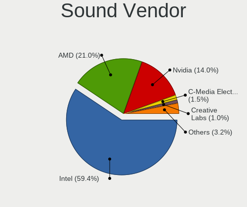

| Vendor                           | Computers | Percent |
|----------------------------------|-----------|---------|
| Intel                            | 2450      | 60.09%  |
| AMD                              | 844       | 20.7%   |
| Nvidia                           | 565       | 13.86%  |
| C-Media Electronics              | 58        | 1.42%   |
| Creative Labs                    | 39        | 0.96%   |
| VIA Technologies                 | 17        | 0.42%   |
| Texas Instruments                | 12        | 0.29%   |
| Logitech                         | 11        | 0.27%   |
| Creative Technology              | 7         | 0.17%   |
| Tenx Technology                  | 5         | 0.12%   |
| JMTek                            | 5         | 0.12%   |
| ASUSTek Computer                 | 5         | 0.12%   |
| Silicon Integrated Systems [SiS] | 4         | 0.1%    |
| Plantronics                      | 4         | 0.1%    |
| GN Netcom                        | 3         | 0.07%   |
| Generalplus Technology           | 3         | 0.07%   |
| Ensoniq                          | 3         | 0.07%   |
| BEHRINGER International          | 3         | 0.07%   |
| Syntek                           | 2         | 0.05%   |
| Razer USA                        | 2         | 0.05%   |
| Promethean Limited               | 2         | 0.05%   |
| Kingston Technology              | 2         | 0.05%   |
| Hewlett-Packard                  | 2         | 0.05%   |
| ATI Technologies                 | 2         | 0.05%   |
| Zhaoxin                          | 1         | 0.02%   |
| ULi Electronics                  | 1         | 0.02%   |
| Trust                            | 1         | 0.02%   |
| Superlux digit                   | 1         | 0.02%   |
| Sunplus Technology               | 1         | 0.02%   |
| SteelSeries ApS                  | 1         | 0.02%   |
| Sony                             | 1         | 0.02%   |
| SM950T Microphone                | 1         | 0.02%   |
| Reloop                           | 1         | 0.02%   |
| PreSonus Audio Electronics       | 1         | 0.02%   |
| Numark                           | 1         | 0.02%   |
| Nektar                           | 1         | 0.02%   |
| Native Instruments               | 1         | 0.02%   |
| MCS                              | 1         | 0.02%   |
| M-Audio                          | 1         | 0.02%   |
| KORG                             | 1         | 0.02%   |

Sound Model
-----------

Sound card models

| Model                                                                                             | Computers | Percent |
|---------------------------------------------------------------------------------------------------|-----------|---------|
| Intel 7 Series/C216 Chipset Family High Definition Audio Controller                               | 300       | 6.18%   |
| Intel 6 Series/C200 Series Chipset Family High Definition Audio Controller                        | 288       | 5.93%   |
| Intel NM10/ICH7 Family High Definition Audio Controller                                           | 278       | 5.72%   |
| Intel 82801I (ICH9 Family) HD Audio Controller                                                    | 257       | 5.29%   |
| AMD FCH Azalia Controller                                                                         | 244       | 5.02%   |
| AMD SBx00 Azalia (Intel HDA)                                                                      | 207       | 4.26%   |
| Intel 5 Series/3400 Series Chipset High Definition Audio                                          | 195       | 4.01%   |
| Intel 8 Series/C220 Series Chipset High Definition Audio Controller                               | 172       | 3.54%   |
| Intel Sunrise Point-LP HD Audio                                                                   | 142       | 2.92%   |
| Intel Xeon E3-1200 v3/4th Gen Core Processor HD Audio Controller                                  | 129       | 2.66%   |
| Intel 82801H (ICH8 Family) HD Audio Controller                                                    | 128       | 2.64%   |
| AMD Kabini HDMI/DP Audio                                                                          | 101       | 2.08%   |
| Intel 8 Series HD Audio Controller                                                                | 87        | 1.79%   |
| Intel Haswell-ULT HD Audio Controller                                                             | 86        | 1.77%   |
| Nvidia GK208 HDMI/DP Audio Controller                                                             | 78        | 1.61%   |
| AMD Trinity HDMI Audio Controller                                                                 | 75        | 1.54%   |
| Nvidia High Definition Audio Controller                                                           | 69        | 1.42%   |
| Intel 100 Series/C230 Series Chipset Family HD Audio Controller                                   | 69        | 1.42%   |
| Intel Broadwell-U Audio Controller                                                                | 64        | 1.32%   |
| Intel Wildcat Point-LP High Definition Audio Controller                                           | 62        | 1.28%   |
| Intel 82801JD/DO (ICH10 Family) HD Audio Controller                                               | 61        | 1.26%   |
| Nvidia GF108 High Definition Audio Controller                                                     | 58        | 1.19%   |
| AMD Caicos HDMI Audio [Radeon HD 6450 / 7450/8450/8490 OEM / R5 230/235/235X OEM]                 | 57        | 1.17%   |
| Intel Atom/Celeron/Pentium Processor x5-E8000/J3xxx/N3xxx Series High Definition Audio Controller | 56        | 1.15%   |
| AMD Oland/Hainan/Cape Verde/Pitcairn HDMI Audio [Radeon HD 7000 Series]                           | 56        | 1.15%   |
| Intel 200 Series PCH HD Audio                                                                     | 54        | 1.11%   |
| Intel Atom Processor Z36xxx/Z37xxx Series High Definition Audio Controller                        | 51        | 1.05%   |
| Intel 82801JI (ICH10 Family) HD Audio Controller                                                  | 51        | 1.05%   |
| AMD Wrestler HDMI Audio                                                                           | 50        | 1.03%   |
| AMD Cedar HDMI Audio [Radeon HD 5400/6300/7300 Series]                                            | 49        | 1.01%   |
| AMD Family 15h (Models 60h-6fh) Audio Controller                                                  | 46        | 0.95%   |
| AMD Family 17h/19h HD Audio Controller                                                            | 45        | 0.93%   |
| Intel Cannon Lake PCH cAVS                                                                        | 43        | 0.89%   |
| AMD RV710/730 HDMI Audio [Radeon HD 4000 series]                                                  | 35        | 0.72%   |
| AMD Family 17h (Models 00h-0fh) HD Audio Controller                                               | 34        | 0.7%    |
| Nvidia MCP61 High Definition Audio                                                                | 32        | 0.66%   |
| AMD Ellesmere HDMI Audio [Radeon RX 470/480 / 570/580/590]                                        | 32        | 0.66%   |
| Nvidia GF119 HDMI Audio Controller                                                                | 31        | 0.64%   |
| Nvidia GP107GL High Definition Audio Controller                                                   | 30        | 0.62%   |
| Nvidia GP106 High Definition Audio Controller                                                     | 29        | 0.6%    |

Memory
------

Memory Vendor
-------------

Memory module vendors

| Vendor                | Computers | Percent |
|-----------------------|-----------|---------|
| Samsung Electronics   | 758       | 19.76%  |
| Unknown               | 727       | 18.95%  |
| SK hynix              | 707       | 18.43%  |
| Kingston              | 544       | 14.18%  |
| Micron Technology     | 267       | 6.96%   |
| Nanya Technology      | 127       | 3.31%   |
| Elpida                | 107       | 2.79%   |
| Crucial               | 80        | 2.08%   |
| Corsair               | 73        | 1.9%    |
| Kingmax               | 72        | 1.88%   |
| Ramaxel Technology    | 68        | 1.77%   |
| G.Skill               | 48        | 1.25%   |
| A-DATA Technology     | 47        | 1.22%   |
| Transcend             | 23        | 0.6%    |
| CSX                   | 18        | 0.47%   |
| Patriot               | 15        | 0.39%   |
| Team                  | 14        | 0.36%   |
| Qimonda               | 14        | 0.36%   |
| 48spaces              | 14        | 0.36%   |
| ASint Technology      | 13        | 0.34%   |
| Unknown (ABCD)        | 8         | 0.21%   |
| Apacer                | 8         | 0.21%   |
| Melco                 | 7         | 0.18%   |
| Kingmax Semiconductor | 7         | 0.18%   |
| Goodram               | 6         | 0.16%   |
| Toshiba               | 5         | 0.13%   |
| OCZ                   | 4         | 0.1%    |
| H                     | 4         | 0.1%    |
| SHARETRONIC           | 3         | 0.08%   |
| Infineon              | 3         | 0.08%   |
| GeIL                  | 3         | 0.08%   |
| Unknown               | 3         | 0.08%   |
| Unifosa               | 2         | 0.05%   |
| TwinMOS               | 2         | 0.05%   |
| Smart                 | 2         | 0.05%   |
| Silicon Power         | 2         | 0.05%   |
| Multilaser            | 2         | 0.05%   |
| Hikvision             | 2         | 0.05%   |
| Axiom                 | 2         | 0.05%   |
| Uroad                 | 1         | 0.03%   |

Memory Model
------------

Memory module models

| Model                                                     | Computers | Percent |
|-----------------------------------------------------------|-----------|---------|
| SK hynix RAM HMT451S6BFR8A-PB 4GB SODIMM DDR3 1600MT/s    | 54        | 1.26%   |
| Unknown RAM Module 2048MB SODIMM DDR2 667MT/s             | 47        | 1.1%    |
| Unknown RAM Module 2048MB DIMM SDRAM                      | 46        | 1.07%   |
| Unknown RAM Module 2048MB DIMM 800MT/s                    | 43        | 1%      |
| Samsung RAM M471B5173QH0-YK0 4GB SODIMM DDR3 1600MT/s     | 43        | 1%      |
| Kingston RAM KHX1600C10D3/4G 4GB DIMM DDR3 1600MT/s       | 43        | 1%      |
| Samsung RAM M471B5173EB0-YK0 4GB SODIMM DDR3 1600MT/s     | 41        | 0.96%   |
| Samsung RAM M471B5273DH0-CH9 4096MB SODIMM DDR3 1334MT/s  | 40        | 0.93%   |
| Samsung RAM M471B5173DB0-YK0 4GB SODIMM DDR3 1600MT/s     | 37        | 0.86%   |
| SK hynix RAM HMT351S6CFR8C-PB 4GB SODIMM DDR3 1600MT/s    | 35        | 0.82%   |
| Samsung RAM M471A5244CB0-CRC 4096MB SODIMM DDR4 2667MT/s  | 32        | 0.75%   |
| Unknown RAM Module 2048MB DIMM DDR2 800MT/s               | 27        | 0.63%   |
| SK hynix RAM HMT325S6CFR8A-PB 2048MB SODIMM DDR3 1600MT/s | 25        | 0.58%   |
| Samsung RAM M471B5273DH0-CK0 4GB SODIMM DDR3 1600MT/s     | 25        | 0.58%   |
| Unknown RAM Module 2048MB SODIMM DDR2                     | 24        | 0.56%   |
| Samsung RAM M471B5273CH0-CH9 4096MB SODIMM DDR3 1334MT/s  | 24        | 0.56%   |
| Unknown RAM Module 2048MB DIMM 1333MT/s                   | 23        | 0.54%   |
| Samsung RAM M471B5773DH0-CH9 2048MB SODIMM DDR3 1600MT/s  | 23        | 0.54%   |
| Samsung RAM M471B5673FH0-CF8 2GB SODIMM 1067MT/s          | 23        | 0.54%   |
| Samsung RAM M471A5244CB0-CTD 4GB SODIMM DDR4 3266MT/s     | 23        | 0.54%   |
| Kingston RAM KHX1600C9D3/4GX 4096MB DIMM DDR3 1600MT/s    | 23        | 0.54%   |
| Unknown RAM Module 4096MB DIMM DDR3 1333MT/s              | 22        | 0.51%   |
| SK hynix RAM HMA851S6AFR6N-UH 4096MB SODIMM DDR4 2667MT/s | 22        | 0.51%   |
| Unknown RAM Module 1024MB SODIMM DDR2 667MT/s             | 20        | 0.47%   |
| Unknown RAM Module 1024MB DIMM SDRAM                      | 20        | 0.47%   |
| SK hynix RAM HMT41GS6BFR8A-PB 8GB SODIMM DDR3 1600MT/s    | 20        | 0.47%   |
| Samsung RAM M471B5773CHS-CH9 2GB SODIMM DDR3 4199MT/s     | 20        | 0.47%   |
| Micron RAM 8KTF51264HZ-1G6E1 4096MB SODIMM DDR3 1600MT/s  | 20        | 0.47%   |
| Kingston RAM KHX1600C10D3/8G 8GB DIMM DDR3 1648MT/s       | 20        | 0.47%   |
| Unknown RAM Module 1024MB DIMM 800MT/s                    | 19        | 0.44%   |
| Unknown RAM Module 4096MB DIMM 1333MT/s                   | 18        | 0.42%   |
| Unknown RAM Module 1024MB SODIMM DDR2                     | 18        | 0.42%   |
| SK hynix RAM HMT351S6EFR8A-PB 4GB SODIMM DDR3 1600MT/s    | 18        | 0.42%   |
| Unknown RAM Module 2048MB DIMM DDR2 667MT/s               | 16        | 0.37%   |
| Unknown RAM Module 1024MB DIMM DDR2 667MT/s               | 16        | 0.37%   |
| SK hynix RAM HMT325S6EFR8A-PB 2048MB SODIMM DDR3 1600MT/s | 16        | 0.37%   |
| Kingston RAM 99U5584-005.A00LF 4GB DIMM DDR3 1600MT/s     | 16        | 0.37%   |
| Samsung RAM M471B1G73DB0-YK0 8GB SODIMM DDR3 1600MT/s     | 15        | 0.35%   |
| Unknown RAM Module 2048MB SODIMM 800MT/s                  | 14        | 0.33%   |
| Unknown RAM Module 1024MB DIMM 667MT/s                    | 14        | 0.33%   |

Memory Kind
-----------

Memory module kinds

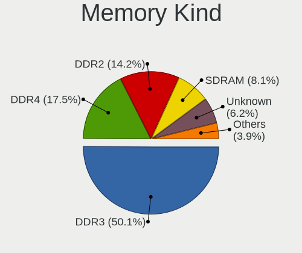

| Kind    | Computers | Percent |
|---------|-----------|---------|
| DDR3    | 1662      | 50.7%   |
| DDR4    | 499       | 15.22%  |
| DDR2    | 494       | 15.07%  |
| SDRAM   | 278       | 8.48%   |
| Unknown | 216       | 6.59%   |
| DDR     | 79        | 2.41%   |
| LPDDR4  | 33        | 1.01%   |
| LPDDR3  | 8         | 0.24%   |
| DRAM    | 8         | 0.24%   |
| DDR5    | 1         | 0.03%   |

Memory Form Factor
------------------

Physical design of the memory module

| Name         | Computers | Percent |
|--------------|-----------|---------|
| SODIMM       | 1779      | 56.75%  |
| DIMM         | 1334      | 42.55%  |
| Row Of Chips | 14        | 0.45%   |
| Chip         | 5         | 0.16%   |
| RIMM         | 2         | 0.06%   |
| FB-DIMM      | 1         | 0.03%   |

Memory Size
-----------

Memory module size

| Size    | Computers | Percent |
|---------|-----------|---------|
| 4096    | 1360      | 37.12%  |
| 2048    | 1103      | 30.1%   |
| 8192    | 635       | 17.33%  |
| 1024    | 397       | 10.84%  |
| 16384   | 77        | 2.1%    |
| 512     | 63        | 1.72%   |
| 32768   | 16        | 0.44%   |
| 256     | 7         | 0.19%   |
| 16      | 2         | 0.05%   |
| Unknown | 2         | 0.05%   |
| 128     | 1         | 0.03%   |
| 13      | 1         | 0.03%   |

Memory Speed
------------

Memory module speed

| Speed   | Computers | Percent |
|---------|-----------|---------|
| 1600    | 1004      | 27.51%  |
| 1333    | 394       | 10.8%   |
| 667     | 282       | 7.73%   |
| 800     | 273       | 7.48%   |
| 1334    | 228       | 6.25%   |
| 2667    | 183       | 5.02%   |
| Unknown | 169       | 4.63%   |
| 2400    | 165       | 4.52%   |
| 1067    | 114       | 3.12%   |
| 2133    | 95        | 2.6%    |
| 1866    | 67        | 1.84%   |
| 3200    | 64        | 1.75%   |
| 533     | 62        | 1.7%    |
| 2048    | 57        | 1.56%   |
| 1066    | 54        | 1.48%   |
| 1867    | 51        | 1.4%    |
| 4199    | 50        | 1.37%   |
| 400     | 30        | 0.82%   |
| 975     | 29        | 0.79%   |
| 3266    | 23        | 0.63%   |
| 1639    | 23        | 0.63%   |
| 333     | 21        | 0.58%   |
| 3600    | 20        | 0.55%   |
| 2666    | 18        | 0.49%   |
| 1800    | 16        | 0.44%   |
| 3733    | 13        | 0.36%   |
| 3000    | 13        | 0.36%   |
| 2933    | 12        | 0.33%   |
| 3466    | 11        | 0.3%    |
| 49926   | 9         | 0.25%   |
| 3400    | 9         | 0.25%   |
| 2000    | 8         | 0.22%   |
| 1648    | 7         | 0.19%   |
| 266     | 6         | 0.16%   |
| 3334    | 5         | 0.14%   |
| 1400    | 5         | 0.14%   |
| 1331    | 5         | 0.14%   |
| 2733    | 4         | 0.11%   |
| 3333    | 3         | 0.08%   |
| 2800    | 3         | 0.08%   |

Printers & scanners
-------------------

Printer Vendor
--------------

Printer device vendors

| Vendor                | Computers | Percent |
|-----------------------|-----------|---------|
| Hewlett-Packard       | 59        | 51.75%  |
| Samsung Electronics   | 22        | 19.3%   |
| Canon                 | 12        | 10.53%  |
| Brother Industries    | 8         | 7.02%   |
| Seiko Epson           | 4         | 3.51%   |
| Lexmark International | 4         | 3.51%   |
| QinHeng Electronics   | 2         | 1.75%   |
| STMicroelectronics    | 1         | 0.88%   |
| Oki Data              | 1         | 0.88%   |
| Dymo-CoStar           | 1         | 0.88%   |

Printer Model
-------------

Printer device models

| Model                                                     | Computers | Percent |
|-----------------------------------------------------------|-----------|---------|
| HP DeskJet 2600 series                                    | 10        | 8.7%    |
| Samsung M2020 Series                                      | 4         | 3.48%   |
| HP LaserJet 1020                                          | 4         | 3.48%   |
| HP DeskJet 2130 series                                    | 4         | 3.48%   |
| Samsung ML-2010P Mono Laser Printer                       | 3         | 2.61%   |
| Samsung ML-1640 Series Laser Printer                      | 3         | 2.61%   |
| Brother HL-1110 series                                    | 3         | 2.61%   |
| Samsung SCX-3400 Series                                   | 2         | 1.74%   |
| Samsung C48x Series                                       | 2         | 1.74%   |
| QinHeng CH340S                                            | 2         | 1.74%   |
| Lexmark International Z35 Printer                         | 2         | 1.74%   |
| HP Officejet J4500 series                                 | 2         | 1.74%   |
| HP OfficeJet 6950                                         | 2         | 1.74%   |
| HP LaserJet P1005                                         | 2         | 1.74%   |
| HP LaserJet 1018                                          | 2         | 1.74%   |
| HP LaserJet 1010                                          | 2         | 1.74%   |
| HP DeskJet F4100 Printer series                           | 2         | 1.74%   |
| HP Deskjet F2280 series                                   | 2         | 1.74%   |
| HP Deskjet 3520 series                                    | 2         | 1.74%   |
| HP Deskjet 1510                                           | 2         | 1.74%   |
| HP Deskjet 1050 J410                                      | 2         | 1.74%   |
| Canon TS5100 series                                       | 2         | 1.74%   |
| Brother HL-L2300D series                                  | 2         | 1.74%   |
| STMicroelectronics LED badge -- mini LED display -- 11x44 | 1         | 0.87%   |
| Seiko Epson XP-240 Series                                 | 1         | 0.87%   |
| Seiko Epson WF-3010 Series                                | 1         | 0.87%   |
| Seiko Epson Printer                                       | 1         | 0.87%   |
| Seiko Epson ET-2600 Series                                | 1         | 0.87%   |
| Samsung Xerox Phaser 3117 Laser Printer                   | 1         | 0.87%   |
| Samsung SCX-4623 Series                                   | 1         | 0.87%   |
| Samsung SCX-3200 Series                                   | 1         | 0.87%   |
| Samsung ML-1660 Series                                    | 1         | 0.87%   |
| Samsung ML-1630 Series                                    | 1         | 0.87%   |
| Samsung M2070 Series                                      | 1         | 0.87%   |
| Samsung Composite Device                                  | 1         | 0.87%   |
| Samsung CLP-310 Color Laser Printer                       | 1         | 0.87%   |
| Oki Data USB Device                                       | 1         | 0.87%   |
| Lexmark International Lexmark X203n                       | 1         | 0.87%   |
| Lexmark International InkJet Color Printer                | 1         | 0.87%   |
| HP OfficeJet Pro 69                                       | 1         | 0.87%   |

Scanner Vendor
--------------

Scanner device vendors

| Vendor          | Computers | Percent |
|-----------------|-----------|---------|
| Canon           | 9         | 75%     |
| Seiko Epson     | 2         | 16.67%  |
| Hewlett-Packard | 1         | 8.33%   |

Scanner Model
-------------

Scanner device models

| Model                                                   | Computers | Percent |
|---------------------------------------------------------|-----------|---------|
| Canon CanoScan N670U/N676U/LiDE 20                      | 4         | 33.33%  |
| Canon CanoScan LIDE 25                                  | 2         | 16.67%  |
| Seiko Epson GT-F720 [GT-S620/Perfection V30/V300 Photo] | 1         | 8.33%   |
| Seiko Epson GT-F700 [Perfection V350]                   | 1         | 8.33%   |
| HP ScanJet 3670                                         | 1         | 8.33%   |
| Canon CanoScan LiDE 120                                 | 1         | 8.33%   |
| Canon CanoScan LiDE 110                                 | 1         | 8.33%   |
| Canon CanoScan LiDE 100                                 | 1         | 8.33%   |

Camera
------

Camera Vendor
-------------

Camera device vendors

| Vendor                                 | Computers | Percent |
|----------------------------------------|-----------|---------|
| Chicony Electronics                    | 416       | 25.05%  |
| Microdia                               | 138       | 8.31%   |
| Realtek Semiconductor                  | 136       | 8.19%   |
| IMC Networks                           | 131       | 7.89%   |
| Suyin                                  | 108       | 6.5%    |
| Sunplus Innovation Technology          | 101       | 6.08%   |
| Bison Electronics                      | 65        | 3.91%   |
| Cheng Uei Precision Industry (Foxlink) | 63        | 3.79%   |
| Syntek                                 | 52        | 3.13%   |
| Logitech                               | 49        | 2.95%   |
| Silicon Motion                         | 34        | 2.05%   |
| Quanta                                 | 34        | 2.05%   |
| Apple                                  | 29        | 1.75%   |
| Acer                                   | 28        | 1.69%   |
| Z-Star Microelectronics                | 25        | 1.51%   |
| Lenovo                                 | 24        | 1.44%   |
| Alcor Micro                            | 24        | 1.44%   |
| Ricoh                                  | 23        | 1.38%   |
| Primax Electronics                     | 22        | 1.32%   |
| Lite-On Technology                     | 15        | 0.9%    |
| ALi                                    | 15        | 0.9%    |
| Microsoft                              | 14        | 0.84%   |
| KYE Systems (Mouse Systems)            | 13        | 0.78%   |
| GEMBIRD                                | 12        | 0.72%   |
| OmniVision Technologies                | 11        | 0.66%   |
| Importek                               | 10        | 0.6%    |
| Samsung Electronics                    | 8         | 0.48%   |
| Pixart Imaging                         | 7         | 0.42%   |
| Trust                                  | 5         | 0.3%    |
| DigiTech                               | 5         | 0.3%    |
| Cubeternet                             | 5         | 0.3%    |
| Genesys Logic                          | 4         | 0.24%   |
| Hewlett-Packard                        | 3         | 0.18%   |
| Generalplus Technology                 | 3         | 0.18%   |
| Aveo Technology                        | 3         | 0.18%   |
| Arkmicro Technologies                  | 3         | 0.18%   |
| SHENZHEN EMEET TECHNOLOGY              | 2         | 0.12%   |
| Nebraska Furniture Mart                | 2         | 0.12%   |
| MacroSilicon                           | 2         | 0.12%   |
| LG Electronics                         | 2         | 0.12%   |

Camera Model
------------

Camera device models

| Model                                                   | Computers | Percent |
|---------------------------------------------------------|-----------|---------|
| Chicony HP Truevision HD                                | 39        | 2.34%   |
| IMC Networks USB2.0 VGA UVC WebCam                      | 36        | 2.16%   |
| Chicony HD Webcam                                       | 31        | 1.86%   |
| Realtek USB Camera                                      | 29        | 1.74%   |
| Bison Lenovo EasyCamera                                 | 26        | 1.56%   |
| Suyin Acer/HP Integrated Webcam [CN0314]                | 24        | 1.44%   |
| Sunplus HP Truevision HD                                | 24        | 1.44%   |
| Chicony USB2.0 VGA UVC WebCam                           | 24        | 1.44%   |
| Chicony Integrated Camera                               | 21        | 1.26%   |
| Microdia Integrated Webcam                              | 20        | 1.2%    |
| Chicony FJ Camera                                       | 19        | 1.14%   |
| Sunplus Integrated_Webcam_HD                            | 18        | 1.08%   |
| Chicony Lenovo EasyCamera                               | 18        | 1.08%   |
| Syntek EasyCamera                                       | 17        | 1.02%   |
| Realtek Lenovo EasyCamera                               | 17        | 1.02%   |
| IMC Networks EasyCamera                                 | 17        | 1.02%   |
| Chicony USB2.0 HD UVC WebCam                            | 17        | 1.02%   |
| Sunplus HD WebCam                                       | 16        | 0.96%   |
| Primax HP HD Webcam [Fixed]                             | 16        | 0.96%   |
| Apple Built-in iSight                                   | 16        | 0.96%   |
| Chicony EasyCamera                                      | 15        | 0.9%    |
| Chicony 2.0M UVC Webcam / CNF7129                       | 15        | 0.9%    |
| Cheng Uei Precision Industry (Foxlink) HP Truevision HD | 15        | 0.9%    |
| Microdia Sonix USB 2.0 Camera                           | 14        | 0.84%   |
| IMC Networks USB2.0 HD UVC WebCam                       | 14        | 0.84%   |
| Chicony VGA WebCam                                      | 13        | 0.78%   |
| Chicony TOSHIBA Web Camera - HD                         | 13        | 0.78%   |
| Bison Lenovo Integrated Webcam                          | 13        | 0.78%   |
| Realtek USB2.0 VGA UVC WebCam                           | 12        | 0.72%   |
| Realtek Integrated Webcam HD                            | 12        | 0.72%   |
| Realtek Integrated Webcam                               | 12        | 0.72%   |
| Microdia Integrated_Webcam_HD                           | 12        | 0.72%   |
| Microdia Camera                                         | 12        | 0.72%   |
| Chicony Integrated HP HD Webcam                         | 12        | 0.72%   |
| Chicony HP Webcam                                       | 12        | 0.72%   |
| ALi Gateway Webcam                                      | 12        | 0.72%   |
| Syntek Integrated Camera                                | 11        | 0.66%   |
| Silicon Motion WebCam SC-0311139N                       | 11        | 0.66%   |
| Quanta VGA Webcam                                       | 11        | 0.66%   |
| OmniVision OV2640 Webcam                                | 11        | 0.66%   |

Security
--------

Fingerprint Vendor
------------------

Fingerprint sensor vendors

| Vendor                     | Computers | Percent |
|----------------------------|-----------|---------|
| Validity Sensors           | 71        | 39.89%  |
| AuthenTec                  | 57        | 32.02%  |
| Upek                       | 20        | 11.24%  |
| LighTuning Technology      | 11        | 6.18%   |
| STMicroelectronics         | 9         | 5.06%   |
| Synaptics                  | 5         | 2.81%   |
| Elan Microelectronics      | 3         | 1.69%   |
| Shenzhen Goodix Technology | 2         | 1.12%   |

Fingerprint Model
-----------------

Fingerprint sensor models

| Model                                                                      | Computers | Percent |
|----------------------------------------------------------------------------|-----------|---------|
| AuthenTec AES2810                                                          | 23        | 12.92%  |
| AuthenTec AES2501 Fingerprint Sensor                                       | 20        | 11.24%  |
| Upek Biometric Touchchip/Touchstrip Fingerprint Sensor                     | 19        | 10.67%  |
| Validity Sensors VFS491                                                    | 13        | 7.3%    |
| Validity Sensors VFS471 Fingerprint Reader                                 | 11        | 6.18%   |
| Validity Sensors VFS451 Fingerprint Reader                                 | 9         | 5.06%   |
| STMicroelectronics Fingerprint Reader                                      | 9         | 5.06%   |
| Validity Sensors VFS495 Fingerprint Reader                                 | 8         | 4.49%   |
| AuthenTec Fingerprint Sensor                                               | 8         | 4.49%   |
| Validity Sensors VFS5011 Fingerprint Reader                                | 7         | 3.93%   |
| LighTuning Fingerprint Reader                                              | 7         | 3.93%   |
| Validity Sensors VFS101 Fingerprint Reader                                 | 6         | 3.37%   |
| Validity Sensors Fingerprint scanner                                       | 4         | 2.25%   |
| AuthenTec AES1600                                                          | 4         | 2.25%   |
| Validity Sensors VFS 5011 fingerprint sensor                               | 3         | 1.69%   |
| Validity Sensors Swipe Fingerprint Sensor                                  | 3         | 1.69%   |
| Synaptics  WBDI                                                            | 3         | 1.69%   |
| Validity Sensors VFS301 Fingerprint Reader                                 | 2         | 1.12%   |
| Validity Sensors Synaptics WBDI                                            | 2         | 1.12%   |
| LighTuning ES603 Swipe Fingerprint Sensor                                  | 2         | 1.12%   |
| LighTuning EgisTec Touch Fingerprint Sensor                                | 2         | 1.12%   |
| Elan ELAN:Fingerprint                                                      | 2         | 1.12%   |
| Validity Sensors VFS7500 Touch Fingerprint Sensor                          | 1         | 0.56%   |
| Validity Sensors VFS300 Fingerprint Reader                                 | 1         | 0.56%   |
| Validity Sensors Synaptics VFS7552 Touch Fingerprint Sensor with PurePrint | 1         | 0.56%   |
| Upek TCS5B Fingerprint sensor                                              | 1         | 0.56%   |
| Synaptics WBDI                                                             | 1         | 0.56%   |
| Synaptics FS7604 Touch Fingerprint Sensor with PurePrint                   | 1         | 0.56%   |
| Shenzhen Goodix  FingerPrint Device                                        | 1         | 0.56%   |
| Shenzhen Goodix Fingerprint Reader                                         | 1         | 0.56%   |
| Elan fingerprint sensor [FeinTech FPS00200]                                | 1         | 0.56%   |
| AuthenTec AES2550 Fingerprint Sensor                                       | 1         | 0.56%   |
| AuthenTec AES1660 Fingerprint Sensor                                       | 1         | 0.56%   |

Chipcard Vendor
---------------

Chipcard module vendors

| Vendor                    | Computers | Percent |
|---------------------------|-----------|---------|
| Broadcom                  | 76        | 53.9%   |
| O2 Micro                  | 27        | 19.15%  |
| Lenovo                    | 19        | 13.48%  |
| Alcor Micro               | 11        | 7.8%    |
| Upek                      | 4         | 2.84%   |
| Gemalto (was Gemplus)     | 2         | 1.42%   |
| Reiner SCT Kartensysteme  | 1         | 0.71%   |
| Aladdin Knowledge Systems | 1         | 0.71%   |

Chipcard Model
--------------

Chipcard module models

| Model                                                                        | Computers | Percent |
|------------------------------------------------------------------------------|-----------|---------|
| Broadcom BCM5880 Secure Applications Processor                               | 60        | 42.55%  |
| O2 Micro OZ776 CCID Smartcard Reader                                         | 24        | 17.02%  |
| Lenovo Integrated Smart Card Reader                                          | 19        | 13.48%  |
| Broadcom BCM5880 Secure Applications Processor with fingerprint swipe sensor | 12        | 8.51%   |
| Alcor Micro AU9540 Smartcard Reader                                          | 11        | 7.8%    |
| Upek TouchChip Fingerprint Coprocessor (WBF advanced mode)                   | 4         | 2.84%   |
| Broadcom 5880                                                                | 4         | 2.84%   |
| O2 Micro Oz776 SmartCard Reader                                              | 3         | 2.13%   |
| Reiner SCT Kartensysteme cyberJack RFID basis contactless smartcard reader   | 1         | 0.71%   |
| Gemalto (was Gemplus) GemPC Twin SmartCard Reader                            | 1         | 0.71%   |
| Gemalto (was Gemplus) Compact Smart Card Reader Writer                       | 1         | 0.71%   |
| Aladdin Knowledge Systems Token JC                                           | 1         | 0.71%   |

Unsupported
-----------

Unsupported Devices
-------------------

Total unsupported devices on board

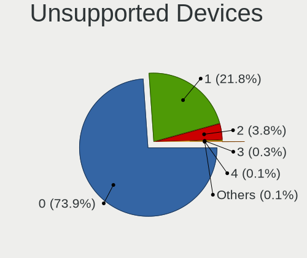

| Total | Computers | Percent |
|-------|-----------|---------|
| 0     | 2521      | 76%     |
| 1     | 671       | 20.23%  |
| 2     | 110       | 3.32%   |
| 3     | 9         | 0.27%   |
| 5     | 2         | 0.06%   |
| 4     | 2         | 0.06%   |
| 10    | 1         | 0.03%   |
| 9     | 1         | 0.03%   |

Unsupported Device Types
------------------------

Types of unsupported devices

| Type                     | Computers | Percent |
|--------------------------|-----------|---------|
| Graphics card            | 297       | 32.93%  |
| Fingerprint reader       | 178       | 19.73%  |
| Chipcard                 | 140       | 15.52%  |
| Net/wireless             | 76        | 8.43%   |
| Bluetooth                | 61        | 6.76%   |
| Storage                  | 38        | 4.21%   |
| Multimedia controller    | 25        | 2.77%   |
| Communication controller | 25        | 2.77%   |
| Camera                   | 18        | 2%      |
| Flash memory             | 17        | 1.88%   |
| Sound                    | 7         | 0.78%   |
| Unassigned class         | 5         | 0.55%   |
| Net/ethernet             | 4         | 0.44%   |
| Card reader              | 4         | 0.44%   |
| Storage/raid             | 2         | 0.22%   |
| Storage/ata              | 2         | 0.22%   |
| Storage/nvme             | 1         | 0.11%   |
| Network                  | 1         | 0.11%   |
| Dvb card                 | 1         | 0.11%   |

