BlackPanther - Tested Hardware & Statistics (Desktops)
------------------------------------------------------

A project to collect tested hardware configurations for BlackPanther.

Anyone can contribute to this report by the [hw-probe](https://github.com/linuxhw/hw-probe) tool:

    sudo -E hw-probe -all -upload

Please contribute! Especially if your hardware is rare.

Contents
--------

* [ Test Cases ](#test-cases)

* [ System ](#system)
  - [ OS                       ](#os)
  - [ OS Family                ](#os-family)
  - [ Kernel                   ](#kernel)
  - [ Kernel Family            ](#kernel-family)
  - [ Kernel Major Ver.        ](#kernel-major-ver)
  - [ Arch                     ](#arch)
  - [ DE                       ](#de)
  - [ Display Server           ](#display-server)
  - [ Display Manager          ](#display-manager)
  - [ OS Lang                  ](#os-lang)
  - [ Boot Mode                ](#boot-mode)
  - [ Filesystem               ](#filesystem)
  - [ Part. scheme             ](#part-scheme)
  - [ Dual Boot with Linux/BSD ](#dual-boot-with-linuxbsd)
  - [ Dual Boot (Win)          ](#dual-boot-win)

* [ Board ](#board)
  - [ Vendor                   ](#vendor)
  - [ Model                    ](#model)
  - [ Model Family             ](#model-family)
  - [ MFG Year                 ](#mfg-year)
  - [ Form Factor              ](#form-factor)
  - [ Secure Boot              ](#secure-boot)
  - [ Coreboot                 ](#coreboot)
  - [ RAM Size                 ](#ram-size)
  - [ RAM Used                 ](#ram-used)
  - [ Total Drives             ](#total-drives)
  - [ Has CD-ROM               ](#has-cd-rom)
  - [ Has Ethernet             ](#has-ethernet)
  - [ Has WiFi                 ](#has-wifi)
  - [ Has Bluetooth            ](#has-bluetooth)

* [ Location ](#location)
  - [ Country                  ](#country)
  - [ City                     ](#city)

* [ Drives ](#drives)
  - [ Drive Vendor             ](#drive-vendor)
  - [ Drive Model              ](#drive-model)
  - [ HDD Vendor               ](#hdd-vendor)
  - [ SSD Vendor               ](#ssd-vendor)
  - [ Drive Kind               ](#drive-kind)
  - [ Drive Connector          ](#drive-connector)
  - [ Drive Size               ](#drive-size)
  - [ Space Total              ](#space-total)
  - [ Space Used               ](#space-used)
  - [ Malfunc. Drives          ](#malfunc-drives)
  - [ Malfunc. Drive Vendor    ](#malfunc-drive-vendor)
  - [ Malfunc. HDD Vendor      ](#malfunc-hdd-vendor)
  - [ Malfunc. Drive Kind      ](#malfunc-drive-kind)
  - [ Failed Drives            ](#failed-drives)
  - [ Failed Drive Vendor      ](#failed-drive-vendor)
  - [ Drive Status             ](#drive-status)

* [ Storage controller ](#storage-controller)
  - [ Storage Vendor           ](#storage-vendor)
  - [ Storage Model            ](#storage-model)
  - [ Storage Kind             ](#storage-kind)

* [ Processor ](#processor)
  - [ CPU Vendor               ](#cpu-vendor)
  - [ CPU Model                ](#cpu-model)
  - [ CPU Model Family         ](#cpu-model-family)
  - [ CPU Cores                ](#cpu-cores)
  - [ CPU Sockets              ](#cpu-sockets)
  - [ CPU Threads              ](#cpu-threads)
  - [ CPU Op-Modes             ](#cpu-op-modes)
  - [ CPU Microcode            ](#cpu-microcode)
  - [ CPU Microarch            ](#cpu-microarch)

* [ Graphics ](#graphics)
  - [ GPU Vendor               ](#gpu-vendor)
  - [ GPU Model                ](#gpu-model)
  - [ GPU Combo                ](#gpu-combo)
  - [ GPU Driver               ](#gpu-driver)
  - [ GPU Memory               ](#gpu-memory)

* [ Monitor ](#monitor)
  - [ Monitor Vendor           ](#monitor-vendor)
  - [ Monitor Model            ](#monitor-model)
  - [ Monitor Resolution       ](#monitor-resolution)
  - [ Monitor Diagonal         ](#monitor-diagonal)
  - [ Monitor Width            ](#monitor-width)
  - [ Aspect Ratio             ](#aspect-ratio)
  - [ Monitor Area             ](#monitor-area)
  - [ Pixel Density            ](#pixel-density)
  - [ Multiple Monitors        ](#multiple-monitors)

* [ Network ](#network)
  - [ Net Controller Vendor    ](#net-controller-vendor)
  - [ Net Controller Model     ](#net-controller-model)
  - [ Wireless Vendor          ](#wireless-vendor)
  - [ Wireless Model           ](#wireless-model)
  - [ Ethernet Vendor          ](#ethernet-vendor)
  - [ Ethernet Model           ](#ethernet-model)
  - [ Net Controller Kind      ](#net-controller-kind)
  - [ Used Controller          ](#used-controller)
  - [ NICs                     ](#nics)
  - [ IPv6                     ](#ipv6)

* [ Bluetooth ](#bluetooth)
  - [ Bluetooth Vendor         ](#bluetooth-vendor)
  - [ Bluetooth Model          ](#bluetooth-model)

* [ Sound ](#sound)
  - [ Sound Vendor             ](#sound-vendor)
  - [ Sound Model              ](#sound-model)

* [ Memory ](#memory)
  - [ Memory Vendor            ](#memory-vendor)
  - [ Memory Model             ](#memory-model)
  - [ Memory Kind              ](#memory-kind)
  - [ Memory Form Factor       ](#memory-form-factor)
  - [ Memory Size              ](#memory-size)
  - [ Memory Speed             ](#memory-speed)

* [ Printers & scanners ](#printers--scanners)
  - [ Printer Vendor           ](#printer-vendor)
  - [ Printer Model            ](#printer-model)
  - [ Scanner Vendor           ](#scanner-vendor)
  - [ Scanner Model            ](#scanner-model)

* [ Camera ](#camera)
  - [ Camera Vendor            ](#camera-vendor)
  - [ Camera Model             ](#camera-model)

* [ Security ](#security)
  - [ Fingerprint Vendor       ](#fingerprint-vendor)
  - [ Fingerprint Model        ](#fingerprint-model)
  - [ Chipcard Vendor          ](#chipcard-vendor)
  - [ Chipcard Model           ](#chipcard-model)

* [ Unsupported ](#unsupported)
  - [ Unsupported Devices      ](#unsupported-devices)
  - [ Unsupported Device Types ](#unsupported-device-types)

Test Cases
----------

Total: 4783

| Vendor        | Model                       | Probe                                                      | Date         |
|---------------|-----------------------------|------------------------------------------------------------|--------------|
| ASRock        | X299 Extreme4               | [e6bae0f608](https://linux-hardware.org/?probe=e6bae0f608) | Jan 01, 2026 |
| MSI           | MPG Z390 GAMING EDGE AC     | [5646e3ae0f](https://linux-hardware.org/?probe=5646e3ae0f) | Dec 31, 2025 |
| MSI           | MPG Z390 GAMING EDGE AC     | [9857a2d70e](https://linux-hardware.org/?probe=9857a2d70e) | Dec 31, 2025 |
| ASRock        | X299 Extreme4               | [77034d7839](https://linux-hardware.org/?probe=77034d7839) | Dec 31, 2025 |
| Gigabyte      | P55-UD3                     | [23e605df8c](https://linux-hardware.org/?probe=23e605df8c) | Dec 29, 2025 |
| Gigabyte      | B150M-D3H-CF                | [034327f050](https://linux-hardware.org/?probe=034327f050) | Dec 27, 2025 |
| ASRock        | H81M-HDS                    | [456543fa7c](https://linux-hardware.org/?probe=456543fa7c) | Dec 27, 2025 |
| Medion        | MS-7748                     | [6138675751](https://linux-hardware.org/?probe=6138675751) | Dec 25, 2025 |
| Gigabyte      | H61M-S1                     | [c686a3f39c](https://linux-hardware.org/?probe=c686a3f39c) | Dec 25, 2025 |
| ASUSTek       | TUF Gaming B450-PLUS II     | [41df7c4977](https://linux-hardware.org/?probe=41df7c4977) | Dec 24, 2025 |
| Lenovo        | ThinkCentre M58 7373Y2M     | [44b3c79320](https://linux-hardware.org/?probe=44b3c79320) | Dec 24, 2025 |
| Dell          | 051FJ8 A02                  | [4dd756647b](https://linux-hardware.org/?probe=4dd756647b) | Dec 21, 2025 |
| Gigabyte      | A520M K V2                  | [efb402e3c7](https://linux-hardware.org/?probe=efb402e3c7) | Dec 19, 2025 |
| ASUSTek       | TUF Gaming B450-PLUS II     | [0636f1da44](https://linux-hardware.org/?probe=0636f1da44) | Dec 18, 2025 |
| ASUSTek       | PRIME A320M-R               | [cd93d45d08](https://linux-hardware.org/?probe=cd93d45d08) | Dec 18, 2025 |
| HP            | 805D                        | [cbc6dd8170](https://linux-hardware.org/?probe=cbc6dd8170) | Dec 12, 2025 |
| HP            | 8062                        | [8d1bcbda8b](https://linux-hardware.org/?probe=8d1bcbda8b) | Dec 10, 2025 |
| Gigabyte      | H610M S2H V2                | [8e52b3affc](https://linux-hardware.org/?probe=8e52b3affc) | Dec 09, 2025 |
| Gigabyte      | H610M S2H V2                | [f1b5bda8fb](https://linux-hardware.org/?probe=f1b5bda8fb) | Dec 09, 2025 |
| AZW           | Gemini J45                  | [418b032ace](https://linux-hardware.org/?probe=418b032ace) | Dec 08, 2025 |
| AZW           | Gemini J45                  | [5880a600ec](https://linux-hardware.org/?probe=5880a600ec) | Dec 08, 2025 |
| ASRock        | N68C-S UCC                  | [31bd5f7c13](https://linux-hardware.org/?probe=31bd5f7c13) | Dec 08, 2025 |
| ASUSTek       | PRIME H610M-K D4            | [822f9fbc17](https://linux-hardware.org/?probe=822f9fbc17) | Dec 06, 2025 |
| Gigabyte      | A520M K V2                  | [b4ad8537b0](https://linux-hardware.org/?probe=b4ad8537b0) | Dec 04, 2025 |
| ASUSTek       | M5A78L-M PLUS/USB3          | [9674a95afd](https://linux-hardware.org/?probe=9674a95afd) | Dec 04, 2025 |
| ASUSTek       | M5A78L-M PLUS/USB3          | [c9a530bf7a](https://linux-hardware.org/?probe=c9a530bf7a) | Dec 04, 2025 |
| ASUSTek       | H110M-A/M.2                 | [d929eae8f3](https://linux-hardware.org/?probe=d929eae8f3) | Dec 04, 2025 |
| ASUSTek       | H110M-A/M.2                 | [d5e46d60c5](https://linux-hardware.org/?probe=d5e46d60c5) | Dec 04, 2025 |
| ASRock        | N68C-S UCC                  | [cc197d7945](https://linux-hardware.org/?probe=cc197d7945) | Dec 04, 2025 |
| Shuttle       | FH110                       | [3fdeccca55](https://linux-hardware.org/?probe=3fdeccca55) | Nov 29, 2025 |
| Dell          | 0HR330                      | [4be3f21b70](https://linux-hardware.org/?probe=4be3f21b70) | Nov 28, 2025 |
| MSI           | MPG Z390 GAMING EDGE AC     | [fe657bd14e](https://linux-hardware.org/?probe=fe657bd14e) | Nov 28, 2025 |
| MSI           | MPG Z390 GAMING EDGE AC     | [30a0223b4e](https://linux-hardware.org/?probe=30a0223b4e) | Nov 27, 2025 |
| Dell          | 0WWJRX A01                  | [106ed3becb](https://linux-hardware.org/?probe=106ed3becb) | Nov 26, 2025 |
| Lenovo        | ThinkCentre M58 7373Y2M     | [2fc53e3942](https://linux-hardware.org/?probe=2fc53e3942) | Nov 23, 2025 |
| Lenovo        | ThinkCentre M58 7373Y2M     | [83d17e5420](https://linux-hardware.org/?probe=83d17e5420) | Nov 23, 2025 |
| HP            | 8265                        | [9522e6ee12](https://linux-hardware.org/?probe=9522e6ee12) | Nov 17, 2025 |
| Lenovo        | ThinkCentre M58e 7303WQG    | [799b65229b](https://linux-hardware.org/?probe=799b65229b) | Nov 15, 2025 |
| Lenovo        | ThinkCentre M58e 7303WQG    | [11b6917f17](https://linux-hardware.org/?probe=11b6917f17) | Nov 15, 2025 |
| MSI           | 880GM-E35                   | [13f04b0256](https://linux-hardware.org/?probe=13f04b0256) | Nov 15, 2025 |
| Lenovo        | 7052-A9G                    | [79514810b3](https://linux-hardware.org/?probe=79514810b3) | Nov 14, 2025 |
| Dell          | 0WWJRX A01                  | [e0c5b35f61](https://linux-hardware.org/?probe=e0c5b35f61) | Nov 14, 2025 |
| Lenovo        | 7052-A9G                    | [43f0e8828f](https://linux-hardware.org/?probe=43f0e8828f) | Nov 14, 2025 |
| Gigabyte      | F2A88XM-HD3                 | [8687d4261b](https://linux-hardware.org/?probe=8687d4261b) | Nov 13, 2025 |
| Gigabyte      | F2A88XM-HD3                 | [141450f5d0](https://linux-hardware.org/?probe=141450f5d0) | Nov 13, 2025 |
| Lenovo        | ThinkCentre M58 7373Y2M     | [516045d7a1](https://linux-hardware.org/?probe=516045d7a1) | Nov 11, 2025 |
| ASUSTek       | PRIME B760-PLUS             | [3de9444e35](https://linux-hardware.org/?probe=3de9444e35) | Nov 08, 2025 |
| Gigabyte      | H110-D3A-CF                 | [0e1bbaf256](https://linux-hardware.org/?probe=0e1bbaf256) | Nov 05, 2025 |
| Gigabyte      | H110-D3A-CF                 | [a7547e1e12](https://linux-hardware.org/?probe=a7547e1e12) | Nov 05, 2025 |
| Dell          | 0WWJRX A01                  | [c3e72c7736](https://linux-hardware.org/?probe=c3e72c7736) | Nov 02, 2025 |
| ASUSTek       | PRIME B365M-A               | [4014e55d9f](https://linux-hardware.org/?probe=4014e55d9f) | Nov 02, 2025 |
| Gigabyte      | M68MT-D3                    | [4aeff31111](https://linux-hardware.org/?probe=4aeff31111) | Oct 30, 2025 |
| Gigabyte      | M68MT-D3                    | [1a20854bb3](https://linux-hardware.org/?probe=1a20854bb3) | Oct 30, 2025 |
| ASUSTek       | 970 PRO GAMING/AURA         | [b0c08ff6ad](https://linux-hardware.org/?probe=b0c08ff6ad) | Oct 29, 2025 |
| ASUSTek       | PRIME A320M-R               | [adcdc732f9](https://linux-hardware.org/?probe=adcdc732f9) | Oct 28, 2025 |
| Gigabyte      | H110-D3A-CF                 | [40f6c95bd3](https://linux-hardware.org/?probe=40f6c95bd3) | Oct 27, 2025 |
| Medion        | MS-7748                     | [e1896048e9](https://linux-hardware.org/?probe=e1896048e9) | Oct 27, 2025 |
| ASUSTek       | PRIME H610M-K D4            | [ed3c06b8c8](https://linux-hardware.org/?probe=ed3c06b8c8) | Oct 27, 2025 |
| Medion        | MS-7616                     | [bd1e9d7656](https://linux-hardware.org/?probe=bd1e9d7656) | Oct 26, 2025 |
| MSI           | MS-7255 V2.0                | [75fdbf500c](https://linux-hardware.org/?probe=75fdbf500c) | Oct 25, 2025 |
| MSI           | MS-7255 V2.0                | [980b5212cb](https://linux-hardware.org/?probe=980b5212cb) | Oct 25, 2025 |
| MSI           | MAG B550 TOMAHAWK           | [c191947035](https://linux-hardware.org/?probe=c191947035) | Oct 24, 2025 |
| ASUSTek       | PRIME B365M-A               | [9d3c307d6e](https://linux-hardware.org/?probe=9d3c307d6e) | Oct 22, 2025 |
| MSI           | MS-7817                     | [da0ff253e8](https://linux-hardware.org/?probe=da0ff253e8) | Oct 19, 2025 |
| MSI           | MS-7817                     | [2916e72ad0](https://linux-hardware.org/?probe=2916e72ad0) | Oct 19, 2025 |
| Gigabyte      | H110-D3A-CF                 | [fe0d4df345](https://linux-hardware.org/?probe=fe0d4df345) | Oct 19, 2025 |
| Medion        | MS-7748                     | [1f11b699d9](https://linux-hardware.org/?probe=1f11b699d9) | Oct 19, 2025 |
| ASUSTek       | M4A785TD-V EVO              | [9c2418fb77](https://linux-hardware.org/?probe=9c2418fb77) | Oct 16, 2025 |
| Gigabyte      | H310M A-CF x.x              | [a78c41c484](https://linux-hardware.org/?probe=a78c41c484) | Oct 14, 2025 |
| ASUSTek       | PRIME H610M-K D4            | [d28fb57bf7](https://linux-hardware.org/?probe=d28fb57bf7) | Oct 13, 2025 |
| Gigabyte      | B75M-D3H                    | [bc6072bd12](https://linux-hardware.org/?probe=bc6072bd12) | Oct 12, 2025 |
| HP            | 339A                        | [6f0edfddc6](https://linux-hardware.org/?probe=6f0edfddc6) | Oct 12, 2025 |
| Gigabyte      | B75M-D3H                    | [685ecd0c56](https://linux-hardware.org/?probe=685ecd0c56) | Oct 12, 2025 |
| Gigabyte      | B75M-D3H                    | [6b07af8ebf](https://linux-hardware.org/?probe=6b07af8ebf) | Oct 11, 2025 |
| ASRock        | B550M Pro4                  | [84d521f53e](https://linux-hardware.org/?probe=84d521f53e) | Oct 05, 2025 |
| MSI           | 760GM -E51                  | [fce1d9c95d](https://linux-hardware.org/?probe=fce1d9c95d) | Oct 03, 2025 |
| Medion        | MS-7748                     | [9241271cb4](https://linux-hardware.org/?probe=9241271cb4) | Oct 03, 2025 |
| Gigabyte      | F2A68HM-DS2                 | [77eaed70f8](https://linux-hardware.org/?probe=77eaed70f8) | Oct 03, 2025 |
| Medion        | MS-7748                     | [73ac671030](https://linux-hardware.org/?probe=73ac671030) | Oct 03, 2025 |
| Gigabyte      | F2A68HM-DS2                 | [87c06ce29e](https://linux-hardware.org/?probe=87c06ce29e) | Oct 03, 2025 |
| Fujitsu       | D3431-A1 S26361-D3431-A1    | [3075236a3e](https://linux-hardware.org/?probe=3075236a3e) | Oct 02, 2025 |
| Fujitsu       | D3227-A1 S26361-D3227-A1    | [48c93dec65](https://linux-hardware.org/?probe=48c93dec65) | Oct 02, 2025 |
| Dell          | 0JP3NX A01                  | [e58b9b2e44](https://linux-hardware.org/?probe=e58b9b2e44) | Oct 02, 2025 |
| Gigabyte      | AB350M-DS3H V2-CF           | [1133f261ff](https://linux-hardware.org/?probe=1133f261ff) | Oct 01, 2025 |
| Lenovo        | 3141 SDK0J40697 WIN 3305... | [2d32c6c192](https://linux-hardware.org/?probe=2d32c6c192) | Sep 30, 2025 |
| Lenovo        | 3141 SDK0J40697 WIN 3305... | [8e65bc71f2](https://linux-hardware.org/?probe=8e65bc71f2) | Sep 30, 2025 |
| Acer          | TPDS05 R3700                | [674c681ef5](https://linux-hardware.org/?probe=674c681ef5) | Sep 30, 2025 |
| Gigabyte      | H110-D3A-CF                 | [5252f4cf33](https://linux-hardware.org/?probe=5252f4cf33) | Sep 29, 2025 |
| ASRock        | X299 Extreme4               | [e1234e57b1](https://linux-hardware.org/?probe=e1234e57b1) | Sep 28, 2025 |
| ASRock        | X299 Extreme4               | [2da3bbedfd](https://linux-hardware.org/?probe=2da3bbedfd) | Sep 28, 2025 |
| Gigabyte      | H110-D3A-CF                 | [b7c3c1ce2f](https://linux-hardware.org/?probe=b7c3c1ce2f) | Sep 27, 2025 |
| Fujitsu       | D3220-A1 S26361-D3220-A1    | [b18fa6c704](https://linux-hardware.org/?probe=b18fa6c704) | Sep 24, 2025 |
| Lenovo        | 1036 NO DPK                 | [c69cd663df](https://linux-hardware.org/?probe=c69cd663df) | Sep 21, 2025 |
| MSI           | FM2-A55M-E33                | [f1f2be85e9](https://linux-hardware.org/?probe=f1f2be85e9) | Sep 20, 2025 |
| ASRock        | B550M Pro4                  | [28960e2cc3](https://linux-hardware.org/?probe=28960e2cc3) | Sep 17, 2025 |
| Medion        | MS-7748                     | [4c94315610](https://linux-hardware.org/?probe=4c94315610) | Sep 16, 2025 |
| Medion        | MS-7748                     | [05e071b9fb](https://linux-hardware.org/?probe=05e071b9fb) | Sep 16, 2025 |
| Gigabyte      | A520M S2H                   | [2848e0076c](https://linux-hardware.org/?probe=2848e0076c) | Sep 16, 2025 |
| Lenovo        | 30BE SDK0J40697 WIN 3305... | [e520800a08](https://linux-hardware.org/?probe=e520800a08) | Sep 16, 2025 |
| HP            | Capirona                    | [c514e96098](https://linux-hardware.org/?probe=c514e96098) | Sep 16, 2025 |
| Gigabyte      | H61M-S2PV                   | [04bfcf800e](https://linux-hardware.org/?probe=04bfcf800e) | Sep 16, 2025 |
| HP            | Capirona                    | [4ecb6fda9d](https://linux-hardware.org/?probe=4ecb6fda9d) | Sep 16, 2025 |
| ASUSTek       | PRIME H610M-K D4            | [2115f934de](https://linux-hardware.org/?probe=2115f934de) | Sep 15, 2025 |
| Fujitsu Si... | D2824-A1 S26361-D2824-A1    | [fc4e46eb94](https://linux-hardware.org/?probe=fc4e46eb94) | Sep 15, 2025 |
| Medion        | MS-7748                     | [25795965ff](https://linux-hardware.org/?probe=25795965ff) | Sep 15, 2025 |
| MSI           | H61M-P21                    | [3e58dbc515](https://linux-hardware.org/?probe=3e58dbc515) | Sep 15, 2025 |
| Lenovo        | 30BE SDK0J40697 WIN 3305... | [ca5004554d](https://linux-hardware.org/?probe=ca5004554d) | Sep 15, 2025 |
| ASRock        | 4X4-V1000                   | [6854283992](https://linux-hardware.org/?probe=6854283992) | Sep 15, 2025 |
| Fujitsu       | D3403-U1 S26361-D3403-U1    | [a9367b75c1](https://linux-hardware.org/?probe=a9367b75c1) | Sep 15, 2025 |
| Lenovo        | SHARKBAY NOK                | [37075f38f1](https://linux-hardware.org/?probe=37075f38f1) | Sep 15, 2025 |
| Dell          | 0HHV7N A00                  | [53506a6a16](https://linux-hardware.org/?probe=53506a6a16) | Sep 15, 2025 |
| ASUSTek       | PRIME A320M-R               | [9cbad25ed5](https://linux-hardware.org/?probe=9cbad25ed5) | Sep 15, 2025 |
| ASUSTek       | H110M-A                     | [e974aee1b9](https://linux-hardware.org/?probe=e974aee1b9) | Sep 14, 2025 |
| ASRock        | B450M Pro4-F                | [52d4e4728a](https://linux-hardware.org/?probe=52d4e4728a) | Sep 14, 2025 |
| Fujitsu       | D3220-A1 S26361-D3220-A1    | [e6d941ec2c](https://linux-hardware.org/?probe=e6d941ec2c) | Sep 14, 2025 |
| HP            | 18E5                        | [53b152583f](https://linux-hardware.org/?probe=53b152583f) | Sep 10, 2025 |
| ASRock        | B550M Pro4                  | [7b57de090d](https://linux-hardware.org/?probe=7b57de090d) | Sep 10, 2025 |
| ASUSTek       | PRIME A320M-R               | [cf34df6eaa](https://linux-hardware.org/?probe=cf34df6eaa) | Sep 06, 2025 |
| ASRock        | 4X4-V1000                   | [522a49b0d8](https://linux-hardware.org/?probe=522a49b0d8) | Aug 30, 2025 |
| Dell          | 0D883F A06                  | [fbb9f43060](https://linux-hardware.org/?probe=fbb9f43060) | Aug 22, 2025 |
| Gigabyte      | H81M-HD3                    | [9b64565cb4](https://linux-hardware.org/?probe=9b64565cb4) | Aug 17, 2025 |
| Gigabyte      | H81M-HD3                    | [c7ede8dd9e](https://linux-hardware.org/?probe=c7ede8dd9e) | Aug 17, 2025 |
| Fujitsu       | D3220-A1 S26361-D3220-A1    | [f706b634b1](https://linux-hardware.org/?probe=f706b634b1) | Aug 17, 2025 |
| ASUSTek       | PRIME H610M-K D4            | [b7da8c1300](https://linux-hardware.org/?probe=b7da8c1300) | Aug 16, 2025 |
| Gigabyte      | H81M-HD3                    | [8bc8336ca3](https://linux-hardware.org/?probe=8bc8336ca3) | Aug 14, 2025 |
| Unknown       | Unknown                     | [890999be81](https://linux-hardware.org/?probe=890999be81) | Aug 11, 2025 |
| ASUSTek       | PRIME A320M-R               | [7d4dc9a1d1](https://linux-hardware.org/?probe=7d4dc9a1d1) | Aug 09, 2025 |
| Gigabyte      | H110-D3A-CF                 | [6eea7f411e](https://linux-hardware.org/?probe=6eea7f411e) | Aug 08, 2025 |
| Gigabyte      | H110-D3A-CF                 | [a125410956](https://linux-hardware.org/?probe=a125410956) | Aug 08, 2025 |
| ASUSTek       | PRIME A320M-R               | [2e82243916](https://linux-hardware.org/?probe=2e82243916) | Aug 07, 2025 |
| ASUSTek       | PRIME H610M-K D4            | [d80e97424a](https://linux-hardware.org/?probe=d80e97424a) | Aug 06, 2025 |
| ASUSTek       | PRIME A320M-R               | [6ec4f2073f](https://linux-hardware.org/?probe=6ec4f2073f) | Aug 05, 2025 |
| Dell          | 0D883F A06                  | [6ee727896e](https://linux-hardware.org/?probe=6ee727896e) | Aug 05, 2025 |
| Gigabyte      | B450 AORUS ELITE            | [ee10dc63ff](https://linux-hardware.org/?probe=ee10dc63ff) | Aug 05, 2025 |
| Gigabyte      | B450 AORUS ELITE            | [99eb15032f](https://linux-hardware.org/?probe=99eb15032f) | Aug 05, 2025 |
| ASRock        | Z87 Extreme6                | [1af5542e2a](https://linux-hardware.org/?probe=1af5542e2a) | Aug 03, 2025 |
| ASRock        | Z87 Extreme6                | [e7fbe154ca](https://linux-hardware.org/?probe=e7fbe154ca) | Aug 03, 2025 |
| Fujitsu       | D2828-A2 S26361-D2828-A2    | [86c845d2a7](https://linux-hardware.org/?probe=86c845d2a7) | Aug 03, 2025 |
| Dell          | 0FM586                      | [4b5bf0048e](https://linux-hardware.org/?probe=4b5bf0048e) | Aug 02, 2025 |
| Dell          | 0FM586                      | [05b710c5ee](https://linux-hardware.org/?probe=05b710c5ee) | Aug 02, 2025 |
| Unknown       | Unknown                     | [560361e811](https://linux-hardware.org/?probe=560361e811) | Jul 31, 2025 |
| Lenovo        | ThinkStation D20 4158AF8    | [0ab0b1bb5b](https://linux-hardware.org/?probe=0ab0b1bb5b) | Jul 31, 2025 |
| Gigabyte      | H61M-S1                     | [cf73b06a70](https://linux-hardware.org/?probe=cf73b06a70) | Jul 30, 2025 |
| HP            | 1495                        | [211ee5a5e4](https://linux-hardware.org/?probe=211ee5a5e4) | Jul 30, 2025 |
| MSI           | MAG B550 TOMAHAWK           | [0d3765d55d](https://linux-hardware.org/?probe=0d3765d55d) | Jul 30, 2025 |
| Lenovo        | 1036 NO DPK                 | [60f20747d1](https://linux-hardware.org/?probe=60f20747d1) | Jul 30, 2025 |
| ASRock        | B550M-HDV                   | [878a04a232](https://linux-hardware.org/?probe=878a04a232) | Jul 29, 2025 |
| Lenovo        | 1036 NO DPK                 | [e4c1a300e3](https://linux-hardware.org/?probe=e4c1a300e3) | Jul 27, 2025 |
| MSI           | PRO H610M-E DDR4            | [8d747eeeb8](https://linux-hardware.org/?probe=8d747eeeb8) | Jul 25, 2025 |
| Dell          | 0RY206                      | [bd30d0bd64](https://linux-hardware.org/?probe=bd30d0bd64) | Jul 25, 2025 |
| Dell          | 0RY206                      | [3840466365](https://linux-hardware.org/?probe=3840466365) | Jul 25, 2025 |
| Fujitsu       | D3220-A1 S26361-D3220-A1    | [c5371dfea5](https://linux-hardware.org/?probe=c5371dfea5) | Jul 20, 2025 |
| Fujitsu       | D2828-A2 S26361-D2828-A2    | [7627eb4032](https://linux-hardware.org/?probe=7627eb4032) | Jul 20, 2025 |
| ASRock        | B550M Pro4                  | [bee27f8e24](https://linux-hardware.org/?probe=bee27f8e24) | Jul 19, 2025 |
| ASRock        | B550M Pro4                  | [b839e845b7](https://linux-hardware.org/?probe=b839e845b7) | Jul 18, 2025 |
| ASRock        | B550M Pro4                  | [56f7896917](https://linux-hardware.org/?probe=56f7896917) | Jul 18, 2025 |
| ASUSTek       | M5A78L-M PLUS/USB3          | [e6fb2b0d46](https://linux-hardware.org/?probe=e6fb2b0d46) | Jul 15, 2025 |
| Gigabyte      | H61M-S2PV                   | [82fb278b0b](https://linux-hardware.org/?probe=82fb278b0b) | Jul 11, 2025 |
| Fujitsu       | D3220-A1 S26361-D3220-A1    | [bec285be6a](https://linux-hardware.org/?probe=bec285be6a) | Jul 10, 2025 |
| HP            | 18E5                        | [568a6f646e](https://linux-hardware.org/?probe=568a6f646e) | Jul 08, 2025 |
| HP            | 18E5                        | [05eaf1c771](https://linux-hardware.org/?probe=05eaf1c771) | Jul 08, 2025 |
| Gigabyte      | H110-D3A-CF                 | [085bdb461f](https://linux-hardware.org/?probe=085bdb461f) | Jul 04, 2025 |
| ASUSTek       | P5G41T-M LX                 | [3bb06fb7b6](https://linux-hardware.org/?probe=3bb06fb7b6) | Jul 01, 2025 |
| Gigabyte      | H110-D3A-CF                 | [e6ca8c54dd](https://linux-hardware.org/?probe=e6ca8c54dd) | Jun 29, 2025 |
| Lenovo        | 3141 SDK0J40697 WIN 3305... | [737b20bd9c](https://linux-hardware.org/?probe=737b20bd9c) | Jun 27, 2025 |
| ASRock        | H55DE3                      | [98fce8892f](https://linux-hardware.org/?probe=98fce8892f) | Jun 23, 2025 |
| ASRock        | H55DE3                      | [f653b94b6a](https://linux-hardware.org/?probe=f653b94b6a) | Jun 23, 2025 |
| Gigabyte      | H61M-S1                     | [011250243d](https://linux-hardware.org/?probe=011250243d) | Jun 22, 2025 |
| Lenovo        | 1036 NO DPK                 | [6796cdbb60](https://linux-hardware.org/?probe=6796cdbb60) | Jun 20, 2025 |
| Fujitsu       | D3431-A1 S26361-D3431-A1    | [e6f3a5a2ef](https://linux-hardware.org/?probe=e6f3a5a2ef) | Jun 14, 2025 |
| ASUSTek       | M4A88TD-V EVO/USB3          | [777b7c8702](https://linux-hardware.org/?probe=777b7c8702) | Jun 12, 2025 |
| Dell          | 0JP3NX A01                  | [3721b09fd7](https://linux-hardware.org/?probe=3721b09fd7) | Jun 10, 2025 |
| HP            | 3397                        | [3455f6b801](https://linux-hardware.org/?probe=3455f6b801) | Jun 09, 2025 |
| HP            | 3397                        | [db2fe1f34e](https://linux-hardware.org/?probe=db2fe1f34e) | Jun 09, 2025 |
| Dell          | 0VD5HY A07                  | [0c6fbdb0ff](https://linux-hardware.org/?probe=0c6fbdb0ff) | Jun 04, 2025 |
| ASRock        | X299 Extreme4               | [333b14ca1a](https://linux-hardware.org/?probe=333b14ca1a) | Jun 01, 2025 |
| ASRock        | X299 Extreme4               | [c8b17311d6](https://linux-hardware.org/?probe=c8b17311d6) | Jun 01, 2025 |
| ASUSTek       | ROG STRIX Z490-E GAMING     | [c5ae716555](https://linux-hardware.org/?probe=c5ae716555) | May 31, 2025 |
| ASUSTek       | ROG STRIX Z490-E GAMING     | [ff2591df79](https://linux-hardware.org/?probe=ff2591df79) | May 31, 2025 |
| Fujitsu       | D3220-A1 S26361-D3220-A1    | [71d7b2b288](https://linux-hardware.org/?probe=71d7b2b288) | May 28, 2025 |
| Gigabyte      | H110-D3A-CF                 | [c2da2cad17](https://linux-hardware.org/?probe=c2da2cad17) | May 27, 2025 |
| Gigabyte      | H110-D3A-CF                 | [6645cf157f](https://linux-hardware.org/?probe=6645cf157f) | May 27, 2025 |
| MSI           | MPG Z390 GAMING EDGE AC     | [18a7d5f469](https://linux-hardware.org/?probe=18a7d5f469) | May 24, 2025 |
| Gigabyte      | GA-78LMT-S2                 | [a4b245eb56](https://linux-hardware.org/?probe=a4b245eb56) | May 22, 2025 |
| HP            | 8265                        | [b2e1421eaa](https://linux-hardware.org/?probe=b2e1421eaa) | May 20, 2025 |
| Gigabyte      | F2A88XM-HD3                 | [c79a2da3cd](https://linux-hardware.org/?probe=c79a2da3cd) | May 18, 2025 |
| Fujitsu       | D3220-A1 S26361-D3220-A1    | [4ffcba4de4](https://linux-hardware.org/?probe=4ffcba4de4) | May 16, 2025 |
| Fujitsu       | D3220-A1 S26361-D3220-A1    | [0023b589e3](https://linux-hardware.org/?probe=0023b589e3) | May 16, 2025 |
| Fujitsu       | D3220-A1 S26361-D3220-A1    | [591c89ab88](https://linux-hardware.org/?probe=591c89ab88) | May 16, 2025 |
| Dell          | 0D883F A06                  | [2f19052f50](https://linux-hardware.org/?probe=2f19052f50) | May 15, 2025 |
| Dell          | 0D883F A06                  | [520d6b15c5](https://linux-hardware.org/?probe=520d6b15c5) | May 15, 2025 |
| HP            | 18E5                        | [aa0dcea9d8](https://linux-hardware.org/?probe=aa0dcea9d8) | May 14, 2025 |
| ASRock        | 4X4-V1000                   | [2f7d59e422](https://linux-hardware.org/?probe=2f7d59e422) | May 11, 2025 |
| ASUSTek       | H110M-A/M.2                 | [b92e97faa7](https://linux-hardware.org/?probe=b92e97faa7) | May 11, 2025 |
| Gigabyte      | A520M S2H                   | [a1e5a07581](https://linux-hardware.org/?probe=a1e5a07581) | May 11, 2025 |
| ASUSTek       | H110M-A/M.2                 | [f1e1709976](https://linux-hardware.org/?probe=f1e1709976) | May 10, 2025 |
| Dell          | 0JP3NX A01                  | [6e91c996f5](https://linux-hardware.org/?probe=6e91c996f5) | May 10, 2025 |
| Lenovo        | 1730-A1G                    | [f9da2259c2](https://linux-hardware.org/?probe=f9da2259c2) | May 10, 2025 |
| ASUSTek       | SABERTOOTH 990FX R2.0       | [be06de4ff1](https://linux-hardware.org/?probe=be06de4ff1) | May 06, 2025 |
| Lenovo        | 1036 NO DPK                 | [6fcd064b46](https://linux-hardware.org/?probe=6fcd064b46) | May 06, 2025 |
| Gigabyte      | H61M-S2PV                   | [291b6fee08](https://linux-hardware.org/?probe=291b6fee08) | May 05, 2025 |
| Foxconn       | 2ABF                        | [877f79b530](https://linux-hardware.org/?probe=877f79b530) | May 05, 2025 |
| Shuttle       | FH110                       | [cf51cf331e](https://linux-hardware.org/?probe=cf51cf331e) | May 04, 2025 |
| ASUSTek       | Pro WS X570-ACE             | [c89d9a2bf7](https://linux-hardware.org/?probe=c89d9a2bf7) | May 04, 2025 |
| Gigabyte      | H310M A-CF x.x              | [3a667761dd](https://linux-hardware.org/?probe=3a667761dd) | May 03, 2025 |
| Gigabyte      | H310M A-CF x.x              | [9c3efd9ed1](https://linux-hardware.org/?probe=9c3efd9ed1) | May 03, 2025 |
| ASUSTek       | PRIME Z390-A                | [17789d9c23](https://linux-hardware.org/?probe=17789d9c23) | May 02, 2025 |
| ASUSTek       | PRIME Z390-A                | [3baeea28dd](https://linux-hardware.org/?probe=3baeea28dd) | May 02, 2025 |
| Gigabyte      | H61M-S1                     | [dc73e5f521](https://linux-hardware.org/?probe=dc73e5f521) | May 01, 2025 |
| ASRock        | 775i65G                     | [76e3206967](https://linux-hardware.org/?probe=76e3206967) | Apr 30, 2025 |
| ASRock        | 775i65G                     | [87b4b13178](https://linux-hardware.org/?probe=87b4b13178) | Apr 30, 2025 |
| Dell          | 0200DY A03                  | [9ad2c80a5d](https://linux-hardware.org/?probe=9ad2c80a5d) | Apr 30, 2025 |
| ASUSTek       | PRIME B365-PLUS             | [0d74c47079](https://linux-hardware.org/?probe=0d74c47079) | Apr 30, 2025 |
| ASUSTek       | PRIME B365-PLUS             | [b1b788faa2](https://linux-hardware.org/?probe=b1b788faa2) | Apr 30, 2025 |
| HP            | 18E5                        | [37f833b822](https://linux-hardware.org/?probe=37f833b822) | Apr 30, 2025 |
| HP            | 18E5                        | [63d22e9152](https://linux-hardware.org/?probe=63d22e9152) | Apr 30, 2025 |
| Fujitsu       | D3220-A1 S26361-D3220-A1    | [c06c1221e7](https://linux-hardware.org/?probe=c06c1221e7) | Apr 30, 2025 |
| ASUSTek       | PRIME B365-PLUS             | [baf18ab91b](https://linux-hardware.org/?probe=baf18ab91b) | Apr 29, 2025 |
| ASRock        | H310CM-DVS                  | [5bacd5e1f3](https://linux-hardware.org/?probe=5bacd5e1f3) | Apr 28, 2025 |
| Gigabyte      | H61M-S2PV                   | [b4752ab811](https://linux-hardware.org/?probe=b4752ab811) | Apr 28, 2025 |
| MSI           | H61M-P21                    | [bd429a9818](https://linux-hardware.org/?probe=bd429a9818) | Apr 28, 2025 |
| Gigabyte      | H310M A-CF x.x              | [c82dadb4c8](https://linux-hardware.org/?probe=c82dadb4c8) | Apr 27, 2025 |
| Dell          | 0YXT71 A02                  | [e83daee230](https://linux-hardware.org/?probe=e83daee230) | Apr 26, 2025 |
| Lenovo        | SHARKBAY NOK                | [4aa500ed37](https://linux-hardware.org/?probe=4aa500ed37) | Apr 26, 2025 |
| Dell          | 0HHV7N A00                  | [326667e729](https://linux-hardware.org/?probe=326667e729) | Apr 26, 2025 |
| Fujitsu       | D3220-A1 S26361-D3220-A1    | [8cc73d0a57](https://linux-hardware.org/?probe=8cc73d0a57) | Apr 26, 2025 |
| Gigabyte      | F2A88XN-WIFI                | [306787aa7d](https://linux-hardware.org/?probe=306787aa7d) | Apr 26, 2025 |
| ASRock        | B450M Pro4-F                | [58eae052fe](https://linux-hardware.org/?probe=58eae052fe) | Apr 25, 2025 |
| Gigabyte      | AB350M-DS3H V2-CF           | [9d49172f7c](https://linux-hardware.org/?probe=9d49172f7c) | Apr 25, 2025 |
| MSI           | FM2-A55M-E33                | [73b69143ad](https://linux-hardware.org/?probe=73b69143ad) | Apr 25, 2025 |
| Fujitsu       | D3403-U1 S26361-D3403-U1    | [2437dccce3](https://linux-hardware.org/?probe=2437dccce3) | Apr 25, 2025 |
| ASUSTek       | PRIME H610M-K D4            | [7d6f304357](https://linux-hardware.org/?probe=7d6f304357) | Apr 25, 2025 |
| ASUSTek       | H110M-A                     | [1adcadf988](https://linux-hardware.org/?probe=1adcadf988) | Apr 24, 2025 |
| Gigabyte      | B250M-D3H-CF                | [be8a53def3](https://linux-hardware.org/?probe=be8a53def3) | Apr 24, 2025 |
| Gigabyte      | B250M-D3H-CF                | [4e4a2eb857](https://linux-hardware.org/?probe=4e4a2eb857) | Apr 24, 2025 |
| Fujitsu       | D3220-A1 S26361-D3220-A1    | [aaa39d8356](https://linux-hardware.org/?probe=aaa39d8356) | Apr 24, 2025 |
| ASRock        | X299 Extreme4               | [82150525b6](https://linux-hardware.org/?probe=82150525b6) | Apr 21, 2025 |
| Dell          | 0JP3NX A01                  | [76b861385e](https://linux-hardware.org/?probe=76b861385e) | Apr 21, 2025 |
| Dell          | 0JP3NX A01                  | [8d6f80b3aa](https://linux-hardware.org/?probe=8d6f80b3aa) | Apr 21, 2025 |
| HP            | 339A                        | [5dc93050ea](https://linux-hardware.org/?probe=5dc93050ea) | Apr 20, 2025 |
| HP            | 339A                        | [38c93c4a69](https://linux-hardware.org/?probe=38c93c4a69) | Apr 20, 2025 |
| Foxconn       | 2ABF                        | [816745f139](https://linux-hardware.org/?probe=816745f139) | Apr 17, 2025 |
| ASRock        | X299 Extreme4               | [4d4c7d4322](https://linux-hardware.org/?probe=4d4c7d4322) | Apr 16, 2025 |
| ASUSTek       | A88XM-PLUS                  | [0c61b4122c](https://linux-hardware.org/?probe=0c61b4122c) | Apr 15, 2025 |
| Lenovo        | 1036 NO DPK                 | [f4d0fbb2d2](https://linux-hardware.org/?probe=f4d0fbb2d2) | Apr 14, 2025 |
| ASUSTek       | PRIME B365-PLUS             | [3a10156f5b](https://linux-hardware.org/?probe=3a10156f5b) | Apr 14, 2025 |
| MSI           | 760GM -E51                  | [0f4de57c86](https://linux-hardware.org/?probe=0f4de57c86) | Apr 09, 2025 |
| Gigabyte      | H61M-S2PV                   | [c8a9c8f6cf](https://linux-hardware.org/?probe=c8a9c8f6cf) | Apr 08, 2025 |
| ASUSTek       | Pro WS X570-ACE             | [24d8545eef](https://linux-hardware.org/?probe=24d8545eef) | Apr 07, 2025 |
| Gigabyte      | H61M-S1                     | [bea07bf2dc](https://linux-hardware.org/?probe=bea07bf2dc) | Apr 07, 2025 |
| ASRock        | H310CM-DVS                  | [dc572b7690](https://linux-hardware.org/?probe=dc572b7690) | Apr 06, 2025 |
| HP            | 1495                        | [27c23413f9](https://linux-hardware.org/?probe=27c23413f9) | Apr 06, 2025 |
| Gigabyte      | H310M A-CF x.x              | [9361131b79](https://linux-hardware.org/?probe=9361131b79) | Apr 06, 2025 |
| ASUSTek       | H110M-A                     | [6d7cbee9c1](https://linux-hardware.org/?probe=6d7cbee9c1) | Apr 04, 2025 |
| Unknown       | Unknown                     | [fd79c62a46](https://linux-hardware.org/?probe=fd79c62a46) | Apr 02, 2025 |
| HP            | 3646h                       | [dc2fd697e1](https://linux-hardware.org/?probe=dc2fd697e1) | Apr 02, 2025 |
| ASUSTek       | PRIME H610M-K D4            | [50454ecc5f](https://linux-hardware.org/?probe=50454ecc5f) | Apr 02, 2025 |
| Dell          | 0200DY A03                  | [a331861fad](https://linux-hardware.org/?probe=a331861fad) | Apr 02, 2025 |
| Gigabyte      | G31M-ES2L                   | [78f61ac3d1](https://linux-hardware.org/?probe=78f61ac3d1) | Mar 31, 2025 |
| Gigabyte      | G31M-ES2L                   | [618f6295d1](https://linux-hardware.org/?probe=618f6295d1) | Mar 31, 2025 |
| ASUSTek       | PRIME H610M-K D4            | [98e6c78c70](https://linux-hardware.org/?probe=98e6c78c70) | Mar 31, 2025 |
| MSI           | 2A9C                        | [ac7b0ba44b](https://linux-hardware.org/?probe=ac7b0ba44b) | Mar 31, 2025 |
| ASRock        | 4X4-V1000                   | [1d27954afc](https://linux-hardware.org/?probe=1d27954afc) | Mar 30, 2025 |
| MSI           | 2A9C                        | [b71f5204dd](https://linux-hardware.org/?probe=b71f5204dd) | Mar 30, 2025 |
| HP            | 805D                        | [a8e74454d6](https://linux-hardware.org/?probe=a8e74454d6) | Mar 29, 2025 |
| Foxconn       | 2ABF                        | [b9bdbe7e0e](https://linux-hardware.org/?probe=b9bdbe7e0e) | Mar 27, 2025 |
| Gigabyte      | H61M-S1                     | [a2d0fa3f5e](https://linux-hardware.org/?probe=a2d0fa3f5e) | Mar 27, 2025 |
| ASRock        | X299 Extreme4               | [cfd5c5440b](https://linux-hardware.org/?probe=cfd5c5440b) | Mar 27, 2025 |
| ASUSTek       | AM1M-A                      | [c97bb442c7](https://linux-hardware.org/?probe=c97bb442c7) | Mar 26, 2025 |
| Dell          | 0VD5HY A07                  | [508d0ad6d2](https://linux-hardware.org/?probe=508d0ad6d2) | Mar 26, 2025 |
| Dell          | 0VD5HY A07                  | [9a08f5ac17](https://linux-hardware.org/?probe=9a08f5ac17) | Mar 26, 2025 |
| ASRock        | X299 Extreme4               | [52f6e44a2b](https://linux-hardware.org/?probe=52f6e44a2b) | Mar 26, 2025 |
| Gigabyte      | F2A88XN-WIFI                | [c607d9a21d](https://linux-hardware.org/?probe=c607d9a21d) | Mar 25, 2025 |
| Unknown       | Unknown                     | [eae0ed4bf6](https://linux-hardware.org/?probe=eae0ed4bf6) | Mar 25, 2025 |
| ASRock        | 4X4-V1000                   | [47af3e837f](https://linux-hardware.org/?probe=47af3e837f) | Mar 25, 2025 |
| ASUSTek       | H110M-A                     | [75bf4b45cb](https://linux-hardware.org/?probe=75bf4b45cb) | Mar 24, 2025 |
| HP            | 805D                        | [6996663441](https://linux-hardware.org/?probe=6996663441) | Mar 24, 2025 |
| Gigabyte      | G41MT-S2                    | [cf88f026af](https://linux-hardware.org/?probe=cf88f026af) | Mar 24, 2025 |
| Gigabyte      | G41MT-S2                    | [de10bcc757](https://linux-hardware.org/?probe=de10bcc757) | Mar 24, 2025 |
| Gigabyte      | H110-D3A-CF                 | [ea2b2d0e5a](https://linux-hardware.org/?probe=ea2b2d0e5a) | Mar 24, 2025 |
| Gigabyte      | H110-D3A-CF                 | [4355c74e23](https://linux-hardware.org/?probe=4355c74e23) | Mar 24, 2025 |
| Dell          | 0HHV7N A00                  | [887323e44c](https://linux-hardware.org/?probe=887323e44c) | Mar 24, 2025 |
| ASUSTek       | H110M-A                     | [766dc51b32](https://linux-hardware.org/?probe=766dc51b32) | Mar 23, 2025 |
| Dell          | 0G919G A01                  | [e793298817](https://linux-hardware.org/?probe=e793298817) | Mar 21, 2025 |
| Dell          | 0G919G A01                  | [6c328cc7fe](https://linux-hardware.org/?probe=6c328cc7fe) | Mar 21, 2025 |
| Lenovo        | 3141 SDK0J40697 WIN 3305... | [01da3b7f7b](https://linux-hardware.org/?probe=01da3b7f7b) | Mar 21, 2025 |
| Lenovo        | 1036 NO DPK                 | [97a62bdcf1](https://linux-hardware.org/?probe=97a62bdcf1) | Mar 18, 2025 |
| Dell          | 0HHV7N A00                  | [04490e878d](https://linux-hardware.org/?probe=04490e878d) | Mar 18, 2025 |
| HP            | 1495                        | [b3222022e5](https://linux-hardware.org/?probe=b3222022e5) | Mar 18, 2025 |
| MSI           | H61M-P21                    | [4239999f52](https://linux-hardware.org/?probe=4239999f52) | Mar 18, 2025 |
| Gigabyte      | AB350M-DS3H V2-CF           | [aa70ff6188](https://linux-hardware.org/?probe=aa70ff6188) | Mar 17, 2025 |
| ASUSTek       | SABERTOOTH 990FX R2.0       | [9658db747c](https://linux-hardware.org/?probe=9658db747c) | Mar 17, 2025 |
| MSI           | B450 GAMING PLUS MAX        | [2a4715142c](https://linux-hardware.org/?probe=2a4715142c) | Mar 17, 2025 |
| Gigabyte      | A520M S2H                   | [150c88813b](https://linux-hardware.org/?probe=150c88813b) | Mar 17, 2025 |
| Fujitsu       | D3403-U1 S26361-D3403-U1    | [11d21fb62a](https://linux-hardware.org/?probe=11d21fb62a) | Mar 17, 2025 |
| Dell          | 0YXT71 A02                  | [5dfcd507c3](https://linux-hardware.org/?probe=5dfcd507c3) | Mar 16, 2025 |
| Dell          | 0YXT71 A02                  | [a843240b75](https://linux-hardware.org/?probe=a843240b75) | Mar 16, 2025 |
| Gigabyte      | F2A88XN-WIFI                | [37fd19dd69](https://linux-hardware.org/?probe=37fd19dd69) | Mar 16, 2025 |
| ASRock        | H510M-H2/M.2 SE             | [6ddaae4125](https://linux-hardware.org/?probe=6ddaae4125) | Mar 15, 2025 |
| Gigabyte      | H61M-S2PV                   | [b8cbc14bb4](https://linux-hardware.org/?probe=b8cbc14bb4) | Mar 13, 2025 |
| ASUSTek       | M5A78L-M LX/BR              | [f97edb03fa](https://linux-hardware.org/?probe=f97edb03fa) | Mar 13, 2025 |
| ASRock        | H510M-H2/M.2 SE             | [0a20add373](https://linux-hardware.org/?probe=0a20add373) | Mar 12, 2025 |
| Gigabyte      | H310M A-CF x.x              | [4dd3d4c938](https://linux-hardware.org/?probe=4dd3d4c938) | Mar 12, 2025 |
| ASRock        | B450M Pro4-F                | [38aec8e4ba](https://linux-hardware.org/?probe=38aec8e4ba) | Mar 11, 2025 |
| HP            | 1495                        | [cdd3b0b858](https://linux-hardware.org/?probe=cdd3b0b858) | Mar 11, 2025 |
| ASUSTek       | SABERTOOTH 990FX R2.0       | [8733ec1eb8](https://linux-hardware.org/?probe=8733ec1eb8) | Mar 11, 2025 |
| Gigabyte      | AB350M-DS3H V2-CF           | [335f14f093](https://linux-hardware.org/?probe=335f14f093) | Mar 10, 2025 |
| ASRock        | B550M Pro4                  | [e9e308af23](https://linux-hardware.org/?probe=e9e308af23) | Mar 10, 2025 |
| HP            | 1495                        | [c48dcb7f9b](https://linux-hardware.org/?probe=c48dcb7f9b) | Mar 10, 2025 |
| HP            | 1495                        | [c5876e8d12](https://linux-hardware.org/?probe=c5876e8d12) | Mar 10, 2025 |
| Fujitsu       | D3403-U1 S26361-D3403-U1    | [49ac4ee693](https://linux-hardware.org/?probe=49ac4ee693) | Mar 10, 2025 |
| MSI           | H61M-P21                    | [730e1b1baf](https://linux-hardware.org/?probe=730e1b1baf) | Mar 10, 2025 |
| ASUSTek       | PRIME H610M-K D4            | [b7d1bff116](https://linux-hardware.org/?probe=b7d1bff116) | Mar 10, 2025 |
| ASUSTek       | H110M-A                     | [bd045c2f1c](https://linux-hardware.org/?probe=bd045c2f1c) | Mar 09, 2025 |
| HP            | 1495                        | [23e92061af](https://linux-hardware.org/?probe=23e92061af) | Mar 09, 2025 |
| MSI           | FM2-A55M-E33                | [913d2a9954](https://linux-hardware.org/?probe=913d2a9954) | Mar 09, 2025 |
| Dell          | 0HHV7N A00                  | [eff2b3686a](https://linux-hardware.org/?probe=eff2b3686a) | Mar 09, 2025 |
| Lenovo        | SHARKBAY NOK                | [55e2d86a65](https://linux-hardware.org/?probe=55e2d86a65) | Mar 09, 2025 |
| ASRock        | 775i945GZ                   | [a2fd2dca87](https://linux-hardware.org/?probe=a2fd2dca87) | Mar 08, 2025 |
| Dell          | 0JP3NX A01                  | [d931288e42](https://linux-hardware.org/?probe=d931288e42) | Mar 06, 2025 |
| ASUSTek       | Z170-K                      | [851e647bc0](https://linux-hardware.org/?probe=851e647bc0) | Mar 06, 2025 |
| Gigabyte      | F2A88XM-DS2                 | [2fe8a36821](https://linux-hardware.org/?probe=2fe8a36821) | Mar 02, 2025 |
| Dell          | 0D883F A06                  | [891c6a71f9](https://linux-hardware.org/?probe=891c6a71f9) | Mar 02, 2025 |
| Gigabyte      | F2A88XM-DS2                 | [7d6dc00a94](https://linux-hardware.org/?probe=7d6dc00a94) | Mar 02, 2025 |
| ASRock        | 4X4-V1000                   | [570dbf7feb](https://linux-hardware.org/?probe=570dbf7feb) | Mar 01, 2025 |
| HP            | 18E4                        | [737b016734](https://linux-hardware.org/?probe=737b016734) | Feb 28, 2025 |
| ASUSTek       | PRIME Z390-A                | [68aaa866d4](https://linux-hardware.org/?probe=68aaa866d4) | Feb 26, 2025 |
| Gigabyte      | H110-D3A-CF                 | [a95f4dfaa9](https://linux-hardware.org/?probe=a95f4dfaa9) | Feb 24, 2025 |
| ASRock        | B550M-HDV                   | [7678247d54](https://linux-hardware.org/?probe=7678247d54) | Feb 24, 2025 |
| Fujitsu       | D3220-A1 S26361-D3220-A1    | [52948cd1e6](https://linux-hardware.org/?probe=52948cd1e6) | Feb 23, 2025 |
| Gigabyte      | H61M-S2PV                   | [338b8bbe35](https://linux-hardware.org/?probe=338b8bbe35) | Feb 22, 2025 |
| Dell          | 0G919G A01                  | [fdabd00e28](https://linux-hardware.org/?probe=fdabd00e28) | Feb 22, 2025 |
| ASRock        | Q1900DC-ITX                 | [6151c571a7](https://linux-hardware.org/?probe=6151c571a7) | Feb 22, 2025 |
| ASRock        | Q1900DC-ITX                 | [1def657679](https://linux-hardware.org/?probe=1def657679) | Feb 22, 2025 |
| Dell          | 0G919G A01                  | [9d3c212003](https://linux-hardware.org/?probe=9d3c212003) | Feb 22, 2025 |
| ASUSTek       | SABERTOOTH 990FX R2.0       | [87a08c4de0](https://linux-hardware.org/?probe=87a08c4de0) | Feb 22, 2025 |
| ASRock        | H510M-H2/M.2 SE             | [73d6623eed](https://linux-hardware.org/?probe=73d6623eed) | Feb 19, 2025 |
| Medion        | MS-7748                     | [656cb42dfb](https://linux-hardware.org/?probe=656cb42dfb) | Feb 18, 2025 |
| Gigabyte      | H110-D3A-CF                 | [57da500499](https://linux-hardware.org/?probe=57da500499) | Feb 15, 2025 |
| ASRock        | 4X4-V1000                   | [f8aff99319](https://linux-hardware.org/?probe=f8aff99319) | Feb 14, 2025 |
| ASUSTek       | PRIME Z390-A                | [a29a2d5a8e](https://linux-hardware.org/?probe=a29a2d5a8e) | Feb 13, 2025 |
| Apple         | Mac-F221BEC8                | [b36c93a323](https://linux-hardware.org/?probe=b36c93a323) | Feb 12, 2025 |
| Gigabyte      | H310M A-CF x.x              | [1a04466754](https://linux-hardware.org/?probe=1a04466754) | Feb 09, 2025 |
| Medion        | MS-7748                     | [1b782afad3](https://linux-hardware.org/?probe=1b782afad3) | Feb 09, 2025 |
| Dell          | 0D883F A06                  | [f361c835ad](https://linux-hardware.org/?probe=f361c835ad) | Feb 06, 2025 |
| ASUSTek       | TUF Gaming B550-PLUS WIF... | [a20db7c9c5](https://linux-hardware.org/?probe=a20db7c9c5) | Feb 05, 2025 |
| Dell          | 0VD5HY A07                  | [5b98f89ca2](https://linux-hardware.org/?probe=5b98f89ca2) | Feb 05, 2025 |
| Dell          | 0VD5HY A07                  | [303ed01fb8](https://linux-hardware.org/?probe=303ed01fb8) | Feb 05, 2025 |
| Dell          | 0VD5HY A07                  | [3376bc2e19](https://linux-hardware.org/?probe=3376bc2e19) | Feb 05, 2025 |
| ASUSTek       | PRIME H510M-D               | [30baeeacea](https://linux-hardware.org/?probe=30baeeacea) | Feb 05, 2025 |
| ASUSTek       | PRIME H510M-D               | [17a646d488](https://linux-hardware.org/?probe=17a646d488) | Feb 05, 2025 |
| ASUSTek       | M5A78L-M PLUS/USB3          | [8b36c84b61](https://linux-hardware.org/?probe=8b36c84b61) | Feb 03, 2025 |
| Lenovo        | 1036 NO DPK                 | [4ee37bcbb8](https://linux-hardware.org/?probe=4ee37bcbb8) | Feb 02, 2025 |
| MSI           | B450 GAMING PLUS MAX        | [1d8f5f684c](https://linux-hardware.org/?probe=1d8f5f684c) | Feb 02, 2025 |
| MSI           | B450 GAMING PLUS MAX        | [0bce1aded5](https://linux-hardware.org/?probe=0bce1aded5) | Feb 02, 2025 |
| Intel         | DG41WV AAE90316-102         | [fba3fd6b63](https://linux-hardware.org/?probe=fba3fd6b63) | Feb 02, 2025 |
| Intel         | DG41WV AAE90316-102         | [95eef21677](https://linux-hardware.org/?probe=95eef21677) | Feb 01, 2025 |
| ASRock        | FM2A88X Pro3+               | [1912ba89f7](https://linux-hardware.org/?probe=1912ba89f7) | Feb 01, 2025 |
| HP            | 3033h                       | [5e3292e1a1](https://linux-hardware.org/?probe=5e3292e1a1) | Feb 01, 2025 |
| Fujitsu Si... | MS-7504VP-PV                | [58a511353d](https://linux-hardware.org/?probe=58a511353d) | Feb 01, 2025 |
| ASRock        | FM2A88X Pro3+               | [52c859fa45](https://linux-hardware.org/?probe=52c859fa45) | Feb 01, 2025 |
| ASUSTek       | M5A78L-M PLUS/USB3          | [32d21262e8](https://linux-hardware.org/?probe=32d21262e8) | Jan 31, 2025 |
| MSI           | 760GM -E51                  | [8685bf95c4](https://linux-hardware.org/?probe=8685bf95c4) | Jan 30, 2025 |
| Fujitsu       | D3220-A1 S26361-D3220-A1    | [28f8f5b6b9](https://linux-hardware.org/?probe=28f8f5b6b9) | Jan 30, 2025 |
| MSI           | MS-7817                     | [fedb1ec567](https://linux-hardware.org/?probe=fedb1ec567) | Jan 29, 2025 |
| MSI           | MS-7817                     | [1ae9d0ba7d](https://linux-hardware.org/?probe=1ae9d0ba7d) | Jan 29, 2025 |
| ASUSTek       | PRIME B450-PLUS             | [05e72704fd](https://linux-hardware.org/?probe=05e72704fd) | Jan 29, 2025 |
| Dell          | XPS 730X                    | [c304d3a1c6](https://linux-hardware.org/?probe=c304d3a1c6) | Jan 28, 2025 |
| Dell          | 0VD5HY A07                  | [d193617914](https://linux-hardware.org/?probe=d193617914) | Jan 27, 2025 |
| Lenovo        | 1036 NO DPK                 | [ab70c270ad](https://linux-hardware.org/?probe=ab70c270ad) | Jan 27, 2025 |
| HP            | 0B4Ch D                     | [ef03253b06](https://linux-hardware.org/?probe=ef03253b06) | Jan 26, 2025 |
| Lenovo        | 1730-A1G                    | [2d7610b1a6](https://linux-hardware.org/?probe=2d7610b1a6) | Jan 26, 2025 |
| Gigabyte      | F2A68HM-DS2                 | [91e4d826f9](https://linux-hardware.org/?probe=91e4d826f9) | Jan 25, 2025 |
| Gigabyte      | F2A68HM-DS2                 | [a0b5d59a8d](https://linux-hardware.org/?probe=a0b5d59a8d) | Jan 25, 2025 |
| Dell          | 0JP3NX A01                  | [0bfd1b49f9](https://linux-hardware.org/?probe=0bfd1b49f9) | Jan 25, 2025 |
| Intel         | DG41WV AAE90316-102         | [40507bf9bf](https://linux-hardware.org/?probe=40507bf9bf) | Jan 24, 2025 |
| Intel         | DG41WV AAE90316-102         | [eae5ac24ad](https://linux-hardware.org/?probe=eae5ac24ad) | Jan 24, 2025 |
| ASRock        | B550M Pro4                  | [a38e7dca81](https://linux-hardware.org/?probe=a38e7dca81) | Jan 23, 2025 |
| HP            | 2AB6                        | [3695fda964](https://linux-hardware.org/?probe=3695fda964) | Jan 23, 2025 |
| ASRock        | B550M Pro4                  | [b89df4a726](https://linux-hardware.org/?probe=b89df4a726) | Jan 23, 2025 |
| HP            | 2AB6                        | [3c4d520876](https://linux-hardware.org/?probe=3c4d520876) | Jan 23, 2025 |
| HP            | 0B4Ch D                     | [aff460227d](https://linux-hardware.org/?probe=aff460227d) | Jan 19, 2025 |
| ASUSTek       | TUF Gaming B550-PLUS WIF... | [79de5dbb21](https://linux-hardware.org/?probe=79de5dbb21) | Jan 18, 2025 |
| ASRock        | H510M-H2/M.2 SE             | [0a1ef57d2b](https://linux-hardware.org/?probe=0a1ef57d2b) | Jan 16, 2025 |
| ASUSTek       | PRIME B450-PLUS             | [7069492dd0](https://linux-hardware.org/?probe=7069492dd0) | Jan 15, 2025 |
| ASUSTek       | H110M-A/M.2                 | [06e7a3b673](https://linux-hardware.org/?probe=06e7a3b673) | Jan 15, 2025 |
| ASRock        | H510M-H2/M.2 SE             | [5b57fb2f91](https://linux-hardware.org/?probe=5b57fb2f91) | Jan 15, 2025 |
| HP            | 0B4Ch D                     | [0f2f9ebc11](https://linux-hardware.org/?probe=0f2f9ebc11) | Jan 11, 2025 |
| Dell          | 0PU052                      | [7b684eb652](https://linux-hardware.org/?probe=7b684eb652) | Jan 10, 2025 |
| Dell          | 0PU052                      | [7dec816bed](https://linux-hardware.org/?probe=7dec816bed) | Jan 10, 2025 |
| Lenovo        | 3141 SDK0J40697 WIN 3305... | [b4e24a75ff](https://linux-hardware.org/?probe=b4e24a75ff) | Jan 07, 2025 |
| Dell          | 0HHV7N A00                  | [cd6ba4805b](https://linux-hardware.org/?probe=cd6ba4805b) | Jan 06, 2025 |
| Acer          | Aspire X1470                | [e645634cdf](https://linux-hardware.org/?probe=e645634cdf) | Jan 04, 2025 |
| Acer          | Aspire X1470                | [5546dd82bb](https://linux-hardware.org/?probe=5546dd82bb) | Jan 03, 2025 |
| HP            | 0B4Ch D                     | [bfc09a54d2](https://linux-hardware.org/?probe=bfc09a54d2) | Jan 02, 2025 |
| HP            | 0B4Ch D                     | [1416c7ff2b](https://linux-hardware.org/?probe=1416c7ff2b) | Jan 02, 2025 |
| Lenovo        | 1730-A1G                    | [7b80b5adbb](https://linux-hardware.org/?probe=7b80b5adbb) | Jan 02, 2025 |
| Lenovo        | 1730-A1G                    | [977ee06a31](https://linux-hardware.org/?probe=977ee06a31) | Jan 02, 2025 |
| Dell          | 0JP3NX A01                  | [a320c35e69](https://linux-hardware.org/?probe=a320c35e69) | Jan 02, 2025 |
| Intel         | DG43GT AAE62768-300         | [f33d4be91e](https://linux-hardware.org/?probe=f33d4be91e) | Jan 01, 2025 |
| Intel         | DG43GT AAE62768-300         | [c125d99d72](https://linux-hardware.org/?probe=c125d99d72) | Jan 01, 2025 |
| HP            | 0B4Ch D                     | [f81870b407](https://linux-hardware.org/?probe=f81870b407) | Dec 31, 2024 |
| HP            | 0B4Ch D                     | [3aa4052845](https://linux-hardware.org/?probe=3aa4052845) | Dec 31, 2024 |
| ASUSTek       | PRIME B365M-A               | [cc640facba](https://linux-hardware.org/?probe=cc640facba) | Dec 28, 2024 |
| ASUSTek       | Pro WS X570-ACE             | [b702a2759f](https://linux-hardware.org/?probe=b702a2759f) | Dec 28, 2024 |
| Gigabyte      | 945GCM-S2L                  | [9ad1def3b0](https://linux-hardware.org/?probe=9ad1def3b0) | Dec 27, 2024 |
| Gigabyte      | 945GCM-S2L                  | [28f2ce4fde](https://linux-hardware.org/?probe=28f2ce4fde) | Dec 26, 2024 |
| Lenovo        | 1730-A1G                    | [bb3794b32b](https://linux-hardware.org/?probe=bb3794b32b) | Dec 23, 2024 |
| Gigabyte      | B75M-D3H                    | [1bb966cb7d](https://linux-hardware.org/?probe=1bb966cb7d) | Dec 21, 2024 |
| HP            | 3397                        | [800fd186e6](https://linux-hardware.org/?probe=800fd186e6) | Dec 16, 2024 |
| HP            | 3397                        | [0bfc475fe7](https://linux-hardware.org/?probe=0bfc475fe7) | Dec 16, 2024 |
| Gigabyte      | H61M-S1                     | [0291930ebb](https://linux-hardware.org/?probe=0291930ebb) | Dec 16, 2024 |
| Gigabyte      | F2A68HM-DS2                 | [af28ef87b7](https://linux-hardware.org/?probe=af28ef87b7) | Dec 15, 2024 |
| ASRock        | 4X4-V1000                   | [6a76a8988e](https://linux-hardware.org/?probe=6a76a8988e) | Dec 15, 2024 |
| Foxconn       | 2ABF                        | [6aa0202528](https://linux-hardware.org/?probe=6aa0202528) | Dec 14, 2024 |
| Foxconn       | 2ABF                        | [7372c37954](https://linux-hardware.org/?probe=7372c37954) | Dec 14, 2024 |
| ASRock        | 4X4-V1000                   | [1741e70741](https://linux-hardware.org/?probe=1741e70741) | Dec 14, 2024 |
| HP            | 3646h                       | [bec40b8a76](https://linux-hardware.org/?probe=bec40b8a76) | Dec 14, 2024 |
| Dell          | 0JP3NX A01                  | [14849f1285](https://linux-hardware.org/?probe=14849f1285) | Dec 14, 2024 |
| HP            | 3646h                       | [6aba49858b](https://linux-hardware.org/?probe=6aba49858b) | Dec 13, 2024 |
| ASRock        | A55M-HVS                    | [6ec5d183ad](https://linux-hardware.org/?probe=6ec5d183ad) | Dec 13, 2024 |
| ASRock        | A55M-HVS                    | [a88f44e9e4](https://linux-hardware.org/?probe=a88f44e9e4) | Dec 13, 2024 |
| Gigabyte      | G41M-Combo                  | [be12e82a19](https://linux-hardware.org/?probe=be12e82a19) | Dec 12, 2024 |
| Fujitsu       | D3220-A1 S26361-D3220-A1    | [76eb88a8bd](https://linux-hardware.org/?probe=76eb88a8bd) | Dec 11, 2024 |
| Gigabyte      | H310M A-CF x.x              | [3f0128ce11](https://linux-hardware.org/?probe=3f0128ce11) | Dec 10, 2024 |
| Gigabyte      | H310M A-CF x.x              | [4e9d94f35e](https://linux-hardware.org/?probe=4e9d94f35e) | Dec 10, 2024 |
| MSI           | MS-7817                     | [f1e7840d6b](https://linux-hardware.org/?probe=f1e7840d6b) | Dec 10, 2024 |
| MSI           | MS-7817                     | [5311b73ce0](https://linux-hardware.org/?probe=5311b73ce0) | Dec 10, 2024 |
| ASRock        | 960GM-VGS3 FX               | [1302e07a62](https://linux-hardware.org/?probe=1302e07a62) | Dec 09, 2024 |
| ASRock        | 960GM-VGS3 FX               | [15e8e8f4f8](https://linux-hardware.org/?probe=15e8e8f4f8) | Dec 09, 2024 |
| Gigabyte      | B450M GAMING                | [cbf3a10efc](https://linux-hardware.org/?probe=cbf3a10efc) | Dec 08, 2024 |
| Gigabyte      | H310M A-CF x.x              | [491aa7568e](https://linux-hardware.org/?probe=491aa7568e) | Dec 08, 2024 |
| Lenovo        | 1730-A1G                    | [8437ab0ca5](https://linux-hardware.org/?probe=8437ab0ca5) | Dec 08, 2024 |
| Gigabyte      | F2A88XM-HD3                 | [f8b62a20e3](https://linux-hardware.org/?probe=f8b62a20e3) | Dec 08, 2024 |
| Dell          | 0D883F A06                  | [99948b5b1e](https://linux-hardware.org/?probe=99948b5b1e) | Dec 08, 2024 |
| Dell          | 0D883F A06                  | [c5f9a7eb19](https://linux-hardware.org/?probe=c5f9a7eb19) | Dec 08, 2024 |
| HP            | 0B4Ch D                     | [e19a27372d](https://linux-hardware.org/?probe=e19a27372d) | Dec 07, 2024 |
| ASUSTek       | P8Z77-V LX                  | [56c6e2da15](https://linux-hardware.org/?probe=56c6e2da15) | Dec 07, 2024 |
| Gigabyte      | F2A88XM-HD3                 | [635d67c028](https://linux-hardware.org/?probe=635d67c028) | Dec 07, 2024 |
| Fujitsu       | D3220-A1 S26361-D3220-A1    | [58fc88417b](https://linux-hardware.org/?probe=58fc88417b) | Dec 04, 2024 |
| ASRock        | B85M Pro4                   | [87cc2b801a](https://linux-hardware.org/?probe=87cc2b801a) | Dec 02, 2024 |
| ASRock        | B85M Pro4                   | [6c15da3e1f](https://linux-hardware.org/?probe=6c15da3e1f) | Dec 02, 2024 |
| ASRock        | X299 Extreme4               | [d1ff3afc94](https://linux-hardware.org/?probe=d1ff3afc94) | Dec 02, 2024 |
| Gigabyte      | B450M GAMING                | [b22b8236a5](https://linux-hardware.org/?probe=b22b8236a5) | Dec 02, 2024 |
| HP            | 3646h                       | [adf6e6dfea](https://linux-hardware.org/?probe=adf6e6dfea) | Dec 01, 2024 |
| HP            | 0B4Ch D                     | [816487e244](https://linux-hardware.org/?probe=816487e244) | Dec 01, 2024 |
| Gigabyte      | H61M-S1                     | [d4ffafd2f5](https://linux-hardware.org/?probe=d4ffafd2f5) | Nov 29, 2024 |
| ASUSTek       | PRIME A320M-R               | [f8273a878e](https://linux-hardware.org/?probe=f8273a878e) | Nov 29, 2024 |
| Gigabyte      | F2A68HM-DS2                 | [5a1f3f02f5](https://linux-hardware.org/?probe=5a1f3f02f5) | Nov 28, 2024 |
| ASRock        | X299 Extreme4               | [ebfb054460](https://linux-hardware.org/?probe=ebfb054460) | Nov 28, 2024 |
| HP            | 805D                        | [9ddf70c273](https://linux-hardware.org/?probe=9ddf70c273) | Nov 26, 2024 |
| ASUSTek       | Maximus VIII HERO           | [f0eddec4ed](https://linux-hardware.org/?probe=f0eddec4ed) | Nov 26, 2024 |
| ASUSTek       | PRIME B365M-A               | [c83451790b](https://linux-hardware.org/?probe=c83451790b) | Nov 26, 2024 |
| HP            | 805D                        | [bcb3dfcc19](https://linux-hardware.org/?probe=bcb3dfcc19) | Nov 26, 2024 |
| Dell          | 0T7D40 A01                  | [3597056176](https://linux-hardware.org/?probe=3597056176) | Nov 26, 2024 |
| Dell          | 0T7D40 A01                  | [ab3c886551](https://linux-hardware.org/?probe=ab3c886551) | Nov 26, 2024 |
| ASUSTek       | Maximus VIII HERO           | [64d558663e](https://linux-hardware.org/?probe=64d558663e) | Nov 25, 2024 |
| ASRock        | B550M Pro4                  | [97763a7a84](https://linux-hardware.org/?probe=97763a7a84) | Nov 24, 2024 |
| ASRock        | B550M Pro4                  | [375c90560b](https://linux-hardware.org/?probe=375c90560b) | Nov 24, 2024 |
| ASUSTek       | P8Z77-V LX                  | [b04b80b8c1](https://linux-hardware.org/?probe=b04b80b8c1) | Nov 24, 2024 |
| Gigabyte      | G41M-Combo                  | [e719982d13](https://linux-hardware.org/?probe=e719982d13) | Nov 23, 2024 |
| Gigabyte      | G41M-Combo                  | [fe480aafdc](https://linux-hardware.org/?probe=fe480aafdc) | Nov 23, 2024 |
| Gigabyte      | H61M-S1                     | [1490996600](https://linux-hardware.org/?probe=1490996600) | Nov 21, 2024 |
| ASRock        | N68C-S UCC                  | [24b5436040](https://linux-hardware.org/?probe=24b5436040) | Nov 21, 2024 |
| ASUSTek       | 970 PRO GAMING/AURA         | [b0aea64800](https://linux-hardware.org/?probe=b0aea64800) | Nov 18, 2024 |
| ASUSTek       | P5G41-M SI/DVI              | [2c4a36ab8f](https://linux-hardware.org/?probe=2c4a36ab8f) | Nov 17, 2024 |
| Lenovo        | ThinkStation D20 4158AF8    | [acd9211269](https://linux-hardware.org/?probe=acd9211269) | Nov 16, 2024 |
| MSI           | MAG B550 TOMAHAWK           | [8e9b066c80](https://linux-hardware.org/?probe=8e9b066c80) | Nov 16, 2024 |
| MSI           | MAG B550 TOMAHAWK           | [0c95c596cd](https://linux-hardware.org/?probe=0c95c596cd) | Nov 16, 2024 |
| Gigabyte      | H61M-S1                     | [ed13d9f493](https://linux-hardware.org/?probe=ed13d9f493) | Nov 12, 2024 |
| ASUSTek       | TUF Gaming B450-PLUS II     | [cc7ab8446b](https://linux-hardware.org/?probe=cc7ab8446b) | Nov 10, 2024 |
| Gigabyte      | H310M A-CF x.x              | [64ef79648d](https://linux-hardware.org/?probe=64ef79648d) | Nov 09, 2024 |
| Lenovo        | Annapurna CRB 0B98401 PR... | [3da6bd30af](https://linux-hardware.org/?probe=3da6bd30af) | Nov 07, 2024 |
| HP            | 18E5                        | [b4c19621ca](https://linux-hardware.org/?probe=b4c19621ca) | Nov 04, 2024 |
| Dell          | 0D883F A06                  | [a55fa3f5de](https://linux-hardware.org/?probe=a55fa3f5de) | Nov 03, 2024 |
| ASRock        | 4X4-V1000                   | [e4f92f939d](https://linux-hardware.org/?probe=e4f92f939d) | Nov 03, 2024 |
| Dell          | 0D883F A06                  | [ba2871b501](https://linux-hardware.org/?probe=ba2871b501) | Nov 03, 2024 |
| Gigabyte      | B660M GAMING DDR4           | [3e0226aec6](https://linux-hardware.org/?probe=3e0226aec6) | Nov 03, 2024 |
| Gigabyte      | B250M-Gaming 3-CF           | [c2cf996702](https://linux-hardware.org/?probe=c2cf996702) | Nov 03, 2024 |
| Gigabyte      | B250M-Gaming 3-CF           | [5ff13f15c9](https://linux-hardware.org/?probe=5ff13f15c9) | Nov 02, 2024 |
| Fujitsu       | D3220-A1 S26361-D3220-A1    | [327a5ec885](https://linux-hardware.org/?probe=327a5ec885) | Nov 01, 2024 |
| Gigabyte      | F2A88XN-WIFI                | [b1bb7ebff5](https://linux-hardware.org/?probe=b1bb7ebff5) | Oct 31, 2024 |
| Medion        | MS-7748                     | [dda2d79844](https://linux-hardware.org/?probe=dda2d79844) | Oct 31, 2024 |
| Dell          | 0KH290                      | [1a0ac895ae](https://linux-hardware.org/?probe=1a0ac895ae) | Oct 31, 2024 |
| MSI           | MS-7817                     | [bed68b38eb](https://linux-hardware.org/?probe=bed68b38eb) | Oct 30, 2024 |
| PCWare        | IPX847P1                    | [fc7aeb019e](https://linux-hardware.org/?probe=fc7aeb019e) | Oct 30, 2024 |
| Shuttle       | FH110                       | [c55fa883e2](https://linux-hardware.org/?probe=c55fa883e2) | Oct 28, 2024 |
| Gigabyte      | H61M-S1                     | [0d7062b12c](https://linux-hardware.org/?probe=0d7062b12c) | Oct 26, 2024 |
| ASUSTek       | PRIME A320M-R               | [23a4fd4923](https://linux-hardware.org/?probe=23a4fd4923) | Oct 25, 2024 |
| ASUSTek       | H110M-A                     | [be07c84e95](https://linux-hardware.org/?probe=be07c84e95) | Oct 25, 2024 |
| MSI           | MS-7817                     | [9023f6d41b](https://linux-hardware.org/?probe=9023f6d41b) | Oct 24, 2024 |
| Gigabyte      | B450M GAMING                | [1cbb55fdfd](https://linux-hardware.org/?probe=1cbb55fdfd) | Oct 24, 2024 |
| Huanan        | X99-QD4 V0.1 693H           | [335bfff363](https://linux-hardware.org/?probe=335bfff363) | Oct 24, 2024 |
| ASUSTek       | PRIME H610M-K D4            | [284f072af5](https://linux-hardware.org/?probe=284f072af5) | Oct 23, 2024 |
| Lenovo        | 1036 NO DPK                 | [c2bde2f6b0](https://linux-hardware.org/?probe=c2bde2f6b0) | Oct 23, 2024 |
| ASUSTek       | PRIME H610M-K D4            | [f843af5859](https://linux-hardware.org/?probe=f843af5859) | Oct 23, 2024 |
| Lenovo        | 1036 NO DPK                 | [e1a69d185b](https://linux-hardware.org/?probe=e1a69d185b) | Oct 23, 2024 |
| Dell          | 0R230R A00                  | [d5a47b1f8f](https://linux-hardware.org/?probe=d5a47b1f8f) | Oct 22, 2024 |
| Gigabyte      | AB350M-DS3H V2-CF           | [2cbcb598ea](https://linux-hardware.org/?probe=2cbcb598ea) | Oct 22, 2024 |
| Gigabyte      | P61-USB3-B3                 | [9a83f9e71c](https://linux-hardware.org/?probe=9a83f9e71c) | Oct 22, 2024 |
| MSI           | FM2-A55M-E33                | [2ae0dae8a2](https://linux-hardware.org/?probe=2ae0dae8a2) | Oct 22, 2024 |
| Fujitsu       | D3220-A1 S26361-D3220-A1    | [a52ed881b1](https://linux-hardware.org/?probe=a52ed881b1) | Oct 22, 2024 |
| Lenovo        | SHARKBAY NOK                | [b3e5c587ea](https://linux-hardware.org/?probe=b3e5c587ea) | Oct 22, 2024 |
| ASRock        | N68C-S UCC                  | [d7c2f9e86c](https://linux-hardware.org/?probe=d7c2f9e86c) | Oct 22, 2024 |
| ASRock        | 4X4-V1000                   | [4a5d9de5de](https://linux-hardware.org/?probe=4a5d9de5de) | Oct 22, 2024 |
| ASUSTek       | B85M-E/DASH                 | [2ec1f53712](https://linux-hardware.org/?probe=2ec1f53712) | Oct 22, 2024 |
| ASUSTek       | H110M-A                     | [5f2472aaa7](https://linux-hardware.org/?probe=5f2472aaa7) | Oct 21, 2024 |
| Huanan        | X99-QD4 V0.1 693H           | [1152be8474](https://linux-hardware.org/?probe=1152be8474) | Oct 21, 2024 |
| Gigabyte      | H61M-S2PV                   | [2478c2ee64](https://linux-hardware.org/?probe=2478c2ee64) | Oct 20, 2024 |
| ASUSTek       | M2N-E                       | [3a2762bede](https://linux-hardware.org/?probe=3a2762bede) | Oct 18, 2024 |
| ASUSTek       | M2N-E                       | [0588174384](https://linux-hardware.org/?probe=0588174384) | Oct 18, 2024 |
| Huanan        | X99-QD4 V0.1 693H           | [5a267f0d63](https://linux-hardware.org/?probe=5a267f0d63) | Oct 13, 2024 |
| Gigabyte      | H310M A-CF x.x              | [874bef7155](https://linux-hardware.org/?probe=874bef7155) | Oct 12, 2024 |
| HP            | 1497                        | [9748a78c93](https://linux-hardware.org/?probe=9748a78c93) | Oct 11, 2024 |
| HP            | 1497                        | [bbe179ab22](https://linux-hardware.org/?probe=bbe179ab22) | Oct 10, 2024 |
| MSI           | MS-7817                     | [2c83298254](https://linux-hardware.org/?probe=2c83298254) | Oct 10, 2024 |
| Gigabyte      | H61M-S1                     | [1e54eccb05](https://linux-hardware.org/?probe=1e54eccb05) | Oct 10, 2024 |
| Lenovo        | MAHOBAY                     | [76652c9013](https://linux-hardware.org/?probe=76652c9013) | Oct 06, 2024 |
| ASUSTek       | H81I-PLUS                   | [ed26135201](https://linux-hardware.org/?probe=ed26135201) | Oct 06, 2024 |
| ASUSTek       | H81I-PLUS                   | [19591661c5](https://linux-hardware.org/?probe=19591661c5) | Oct 06, 2024 |
| Fujitsu Si... | D2721-A1 S26361-D2721-A1    | [0d9d1e3143](https://linux-hardware.org/?probe=0d9d1e3143) | Oct 02, 2024 |
| Fujitsu Si... | D2721-A1 S26361-D2721-A1    | [98c54c08cb](https://linux-hardware.org/?probe=98c54c08cb) | Oct 02, 2024 |
| MSI           | MS-B0A21                    | [dbda14b87c](https://linux-hardware.org/?probe=dbda14b87c) | Oct 01, 2024 |
| Dell          | 0JP3NX A01                  | [cd26982f25](https://linux-hardware.org/?probe=cd26982f25) | Oct 01, 2024 |
| ASUSTek       | PRIME A320M-K               | [685b56cfb0](https://linux-hardware.org/?probe=685b56cfb0) | Sep 29, 2024 |
| ASUSTek       | PRIME A320M-K               | [36245021f3](https://linux-hardware.org/?probe=36245021f3) | Sep 29, 2024 |
| ASUSTek       | P5Q-PRO                     | [ef27e1122b](https://linux-hardware.org/?probe=ef27e1122b) | Sep 28, 2024 |
| ASUSTek       | PRIME A320M-R               | [6698bffa60](https://linux-hardware.org/?probe=6698bffa60) | Sep 28, 2024 |
| ASRock        | 4X4-V1000                   | [163d361d29](https://linux-hardware.org/?probe=163d361d29) | Sep 24, 2024 |
| Fujitsu       | D3220-A1 S26361-D3220-A1    | [c319a8c95e](https://linux-hardware.org/?probe=c319a8c95e) | Sep 23, 2024 |
| Gigabyte      | H310M A-CF x.x              | [bfbc14e927](https://linux-hardware.org/?probe=bfbc14e927) | Sep 23, 2024 |
| Gigabyte      | H310M A-CF x.x              | [004b08ef53](https://linux-hardware.org/?probe=004b08ef53) | Sep 23, 2024 |
| Gigabyte      | EP31-DS3L                   | [38afdbcca5](https://linux-hardware.org/?probe=38afdbcca5) | Sep 21, 2024 |
| ASRock        | J3455-ITX                   | [e8f83c57ae](https://linux-hardware.org/?probe=e8f83c57ae) | Sep 20, 2024 |
| Gigabyte      | H61M-S2PV                   | [26211343c9](https://linux-hardware.org/?probe=26211343c9) | Sep 19, 2024 |
| ASUSTek       | PRIME H610M-K D4            | [22bb07fac9](https://linux-hardware.org/?probe=22bb07fac9) | Sep 18, 2024 |
| HP            | 3031h                       | [063670bea1](https://linux-hardware.org/?probe=063670bea1) | Sep 17, 2024 |
| HP            | 3031h                       | [1da91bca9f](https://linux-hardware.org/?probe=1da91bca9f) | Sep 17, 2024 |
| Gigabyte      | Z390 UD                     | [87365dacf6](https://linux-hardware.org/?probe=87365dacf6) | Sep 16, 2024 |
| ASRock        | 4X4-V1000                   | [a422d276cb](https://linux-hardware.org/?probe=a422d276cb) | Sep 16, 2024 |
| HP            | 3646h                       | [3e05367f15](https://linux-hardware.org/?probe=3e05367f15) | Sep 15, 2024 |
| MSI           | MAG B550 TOMAHAWK           | [f3761f99d3](https://linux-hardware.org/?probe=f3761f99d3) | Sep 14, 2024 |
| MSI           | MAG B550 TOMAHAWK           | [367544541b](https://linux-hardware.org/?probe=367544541b) | Sep 13, 2024 |
| Dell          | 0JP3NX A01                  | [8678ecc8af](https://linux-hardware.org/?probe=8678ecc8af) | Sep 13, 2024 |
| Gigabyte      | H61M-S1                     | [0b2a56e1e2](https://linux-hardware.org/?probe=0b2a56e1e2) | Sep 12, 2024 |
| Medion        | MS-7748                     | [310b00a3a5](https://linux-hardware.org/?probe=310b00a3a5) | Sep 10, 2024 |
| Dell          | 0D883F A06                  | [73ba45c13d](https://linux-hardware.org/?probe=73ba45c13d) | Sep 09, 2024 |
| Dell          | 0D883F A06                  | [5cb6d4941a](https://linux-hardware.org/?probe=5cb6d4941a) | Sep 09, 2024 |
| HP            | 3646h                       | [e1f13881e0](https://linux-hardware.org/?probe=e1f13881e0) | Sep 08, 2024 |
| Acer          | Aspire M1930                | [6935bec83d](https://linux-hardware.org/?probe=6935bec83d) | Sep 07, 2024 |
| Acer          | Aspire M1930                | [02eaf44b15](https://linux-hardware.org/?probe=02eaf44b15) | Sep 07, 2024 |
| ASUSTek       | PRIME B365M-A               | [e2f1e583a8](https://linux-hardware.org/?probe=e2f1e583a8) | Sep 06, 2024 |
| ASUSTek       | PRIME B365M-A               | [01e21e3a94](https://linux-hardware.org/?probe=01e21e3a94) | Sep 06, 2024 |
| ASRock        | 4X4-V1000                   | [c4df548274](https://linux-hardware.org/?probe=c4df548274) | Sep 05, 2024 |
| ASUSTek       | P5G41T-M LX                 | [f3a12a1000](https://linux-hardware.org/?probe=f3a12a1000) | Sep 05, 2024 |
| ASUSTek       | P5G41T-M LX                 | [b6f76ce650](https://linux-hardware.org/?probe=b6f76ce650) | Sep 05, 2024 |
| Gigabyte      | H310M A-CF x.x              | [f058e0e121](https://linux-hardware.org/?probe=f058e0e121) | Sep 05, 2024 |
| ASRock        | 4X4-V1000                   | [7b2170f9e6](https://linux-hardware.org/?probe=7b2170f9e6) | Sep 04, 2024 |
| Gigabyte      | F2A88XM-HD3                 | [1f0d247a7d](https://linux-hardware.org/?probe=1f0d247a7d) | Sep 03, 2024 |
| ASRock        | G41MH/USB3                  | [e076faa995](https://linux-hardware.org/?probe=e076faa995) | Sep 01, 2024 |
| ASRock        | G41MH/USB3                  | [56ac103f26](https://linux-hardware.org/?probe=56ac103f26) | Sep 01, 2024 |
| Dell          | 0M5DCD A00                  | [674bfb55d7](https://linux-hardware.org/?probe=674bfb55d7) | Sep 01, 2024 |
| Dell          | 0M5DCD A00                  | [485e76f95f](https://linux-hardware.org/?probe=485e76f95f) | Aug 31, 2024 |
| Fujitsu       | D3220-A1 S26361-D3220-A1    | [e6a913ae8d](https://linux-hardware.org/?probe=e6a913ae8d) | Aug 31, 2024 |
| HP            | 3646h                       | [ff20575292](https://linux-hardware.org/?probe=ff20575292) | Aug 30, 2024 |
| Lenovo        | MAHOBAY                     | [066219d111](https://linux-hardware.org/?probe=066219d111) | Aug 30, 2024 |
| HP            | 0B4Ch D                     | [63640e2f86](https://linux-hardware.org/?probe=63640e2f86) | Aug 29, 2024 |
| HP            | 0B4Ch D                     | [6627c51273](https://linux-hardware.org/?probe=6627c51273) | Aug 29, 2024 |
| Intel         | DG43GT AAE62768-300         | [83220ccc0e](https://linux-hardware.org/?probe=83220ccc0e) | Aug 28, 2024 |
| Intel         | DG43GT AAE62768-300         | [10741a1de9](https://linux-hardware.org/?probe=10741a1de9) | Aug 28, 2024 |
| Lenovo        | MAHOBAY                     | [e222263171](https://linux-hardware.org/?probe=e222263171) | Aug 25, 2024 |
| ASRock        | B450M Pro4-F                | [d7523db401](https://linux-hardware.org/?probe=d7523db401) | Aug 25, 2024 |
| Fujitsu       | D3220-A1 S26361-D3220-A1    | [8f2d2876e1](https://linux-hardware.org/?probe=8f2d2876e1) | Aug 22, 2024 |
| Fujitsu Si... | D2721-A1 S26361-D2721-A1    | [5862cffd7e](https://linux-hardware.org/?probe=5862cffd7e) | Aug 20, 2024 |
| ASUSTek       | PRIME B450-PLUS             | [7dc83a52f8](https://linux-hardware.org/?probe=7dc83a52f8) | Aug 20, 2024 |
| Gigabyte      | H310M A-CF x.x              | [a509a63974](https://linux-hardware.org/?probe=a509a63974) | Aug 17, 2024 |
| Dell          | 0D883F A06                  | [8d7853301d](https://linux-hardware.org/?probe=8d7853301d) | Aug 17, 2024 |
| Dell          | 0D883F A06                  | [b84658a951](https://linux-hardware.org/?probe=b84658a951) | Aug 17, 2024 |
| ASUSTek       | P5G41-M SI/DVI              | [ff689261f9](https://linux-hardware.org/?probe=ff689261f9) | Aug 16, 2024 |
| ASUSTek       | P5G41-M SI/DVI              | [1c2ac5e49e](https://linux-hardware.org/?probe=1c2ac5e49e) | Aug 16, 2024 |
| Gigabyte      | H61M-S2PV                   | [5031301c61](https://linux-hardware.org/?probe=5031301c61) | Aug 16, 2024 |
| MSI           | FM2-A55M-E33                | [9b747e3bd4](https://linux-hardware.org/?probe=9b747e3bd4) | Aug 15, 2024 |
| Fujitsu Si... | D2721-A1 S26361-D2721-A1    | [36ab79a347](https://linux-hardware.org/?probe=36ab79a347) | Aug 15, 2024 |
| Fujitsu       | D3220-A1 S26361-D3220-A1    | [21899d80a8](https://linux-hardware.org/?probe=21899d80a8) | Aug 14, 2024 |
| ASUSTek       | P5G41-M SI/DVI              | [15e1dbbe91](https://linux-hardware.org/?probe=15e1dbbe91) | Aug 13, 2024 |
| Gigabyte      | F2A88XN-WIFI                | [ea097380f7](https://linux-hardware.org/?probe=ea097380f7) | Aug 12, 2024 |
| Gigabyte      | F2A88XN-WIFI                | [4533fe6d88](https://linux-hardware.org/?probe=4533fe6d88) | Aug 12, 2024 |
| ASRock        | 4X4-V1000                   | [014cfd3666](https://linux-hardware.org/?probe=014cfd3666) | Aug 09, 2024 |
| HP            | 0B4Ch D                     | [ca1b71e2ae](https://linux-hardware.org/?probe=ca1b71e2ae) | Aug 08, 2024 |
| Gigabyte      | P61-USB3-B3                 | [963ce2ad8d](https://linux-hardware.org/?probe=963ce2ad8d) | Aug 08, 2024 |
| ASRock        | 4X4-V1000                   | [fe9749295b](https://linux-hardware.org/?probe=fe9749295b) | Aug 08, 2024 |
| Gigabyte      | H61M-S2PV                   | [07e6b8c1c4](https://linux-hardware.org/?probe=07e6b8c1c4) | Aug 07, 2024 |
| MSI           | MAG B550 TOMAHAWK           | [3f906cffbc](https://linux-hardware.org/?probe=3f906cffbc) | Aug 07, 2024 |
| ASUSTek       | PRIME H610M-K D4            | [c7d8ac8e22](https://linux-hardware.org/?probe=c7d8ac8e22) | Aug 06, 2024 |
| Gigabyte      | H310M A-CF x.x              | [84df7b298d](https://linux-hardware.org/?probe=84df7b298d) | Aug 06, 2024 |
| Fujitsu       | D3028-A1 S26361-D3028-A1    | [bd390404f2](https://linux-hardware.org/?probe=bd390404f2) | Aug 03, 2024 |
| Fujitsu       | D3028-A1 S26361-D3028-A1    | [fde8e6244f](https://linux-hardware.org/?probe=fde8e6244f) | Aug 03, 2024 |
| Shuttle       | FH110                       | [056120fbd0](https://linux-hardware.org/?probe=056120fbd0) | Aug 02, 2024 |
| Shuttle       | FH110                       | [286239ff53](https://linux-hardware.org/?probe=286239ff53) | Aug 02, 2024 |
| Gigabyte      | H110M-S2V-CF                | [bf3790e50b](https://linux-hardware.org/?probe=bf3790e50b) | Jul 27, 2024 |
| Gigabyte      | H110M-S2V-CF                | [a2bfeb3927](https://linux-hardware.org/?probe=a2bfeb3927) | Jul 27, 2024 |
| Lenovo        | 1730-A1G                    | [2f9748fa6a](https://linux-hardware.org/?probe=2f9748fa6a) | Jul 27, 2024 |
| Lenovo        | 1730-A1G                    | [0237f8e4da](https://linux-hardware.org/?probe=0237f8e4da) | Jul 27, 2024 |
| Lenovo        | SHARKBAY NOK                | [276d7e9e8c](https://linux-hardware.org/?probe=276d7e9e8c) | Jul 26, 2024 |
| Fujitsu Si... | D2660-A1 S26361-D2660-A1    | [eeeeadfde6](https://linux-hardware.org/?probe=eeeeadfde6) | Jul 25, 2024 |
| ASRock        | G41MH/USB3                  | [81bc78887c](https://linux-hardware.org/?probe=81bc78887c) | Jul 25, 2024 |
| ASRock        | G41MH/USB3                  | [3564068156](https://linux-hardware.org/?probe=3564068156) | Jul 25, 2024 |
| ASRock        | Z370 Extreme4               | [03c9d6db28](https://linux-hardware.org/?probe=03c9d6db28) | Jul 25, 2024 |
| ASRock        | Z370 Extreme4               | [c375bf45c1](https://linux-hardware.org/?probe=c375bf45c1) | Jul 25, 2024 |
| ASRock        | Z390 Pro4                   | [cf1805eb68](https://linux-hardware.org/?probe=cf1805eb68) | Jul 25, 2024 |
| ASUSTek       | Maximus VIII HERO           | [bb4dba4fee](https://linux-hardware.org/?probe=bb4dba4fee) | Jul 24, 2024 |
| Medion        | MS-7748                     | [64469c14f6](https://linux-hardware.org/?probe=64469c14f6) | Jul 23, 2024 |
| Medion        | MS-7748                     | [5f9ec92f54](https://linux-hardware.org/?probe=5f9ec92f54) | Jul 22, 2024 |
| ASUSTek       | PRIME A320M-R               | [e946cc82cc](https://linux-hardware.org/?probe=e946cc82cc) | Jul 21, 2024 |
| Dell          | 0M5DCD A00                  | [05a6b7317f](https://linux-hardware.org/?probe=05a6b7317f) | Jul 20, 2024 |
| Dell          | 0M5DCD A00                  | [6d9c28f0f3](https://linux-hardware.org/?probe=6d9c28f0f3) | Jul 20, 2024 |
| ASUSTek       | H110M-A                     | [0841a1a981](https://linux-hardware.org/?probe=0841a1a981) | Jul 18, 2024 |
| Gigabyte      | B450M GAMING                | [bfba7e752e](https://linux-hardware.org/?probe=bfba7e752e) | Jul 18, 2024 |
| Fujitsu       | D3403-U1 S26361-D3403-U1    | [c2451127ea](https://linux-hardware.org/?probe=c2451127ea) | Jul 18, 2024 |
| Lenovo        | 1036 NO DPK                 | [c9eea3ddc0](https://linux-hardware.org/?probe=c9eea3ddc0) | Jul 18, 2024 |
| HP            | 339A                        | [62ee692b26](https://linux-hardware.org/?probe=62ee692b26) | Jul 18, 2024 |
| Foxconn       | 2ABF                        | [ad83a2a53b](https://linux-hardware.org/?probe=ad83a2a53b) | Jul 17, 2024 |
| Lenovo        | 1036 NO DPK                 | [f98bb7f8f0](https://linux-hardware.org/?probe=f98bb7f8f0) | Jul 17, 2024 |
| ASRock        | B550M Pro4                  | [ff45603528](https://linux-hardware.org/?probe=ff45603528) | Jul 17, 2024 |
| Gigabyte      | AB350M-DS3H V2-CF           | [fbd77590c6](https://linux-hardware.org/?probe=fbd77590c6) | Jul 16, 2024 |
| Lenovo        | SHARKBAY NOK                | [177bf6432a](https://linux-hardware.org/?probe=177bf6432a) | Jul 15, 2024 |
| MSI           | H61M-P21                    | [34fbdae75b](https://linux-hardware.org/?probe=34fbdae75b) | Jul 15, 2024 |
| MSI           | B450 GAMING PLUS MAX        | [3a1a09b9ff](https://linux-hardware.org/?probe=3a1a09b9ff) | Jul 14, 2024 |
| ASUSTek       | B85M-E/DASH                 | [3f337466df](https://linux-hardware.org/?probe=3f337466df) | Jul 13, 2024 |
| HP            | 304Ah                       | [1c2dc5a535](https://linux-hardware.org/?probe=1c2dc5a535) | Jul 12, 2024 |
| Gigabyte      | H310M A-CF x.x              | [9694054fa1](https://linux-hardware.org/?probe=9694054fa1) | Jul 11, 2024 |
| Gigabyte      | B450M GAMING                | [a2d2862d77](https://linux-hardware.org/?probe=a2d2862d77) | Jul 10, 2024 |
| ASUSTek       | PRIME A320M-R               | [37f9d6aecb](https://linux-hardware.org/?probe=37f9d6aecb) | Jul 10, 2024 |
| Foxconn       | 2ABF                        | [f6d887e1d1](https://linux-hardware.org/?probe=f6d887e1d1) | Jul 10, 2024 |
| ASUSTek       | H110M-A                     | [8ac167f783](https://linux-hardware.org/?probe=8ac167f783) | Jul 08, 2024 |
| HP            | 304Ah                       | [4ee01b67ba](https://linux-hardware.org/?probe=4ee01b67ba) | Jul 08, 2024 |
| Fujitsu Si... | D2721-A1 S26361-D2721-A1    | [5f824e560e](https://linux-hardware.org/?probe=5f824e560e) | Jul 08, 2024 |
| Fujitsu Si... | D2721-A1 S26361-D2721-A1    | [0d418fcb80](https://linux-hardware.org/?probe=0d418fcb80) | Jul 08, 2024 |
| Fujitsu       | D3403-U1 S26361-D3403-U1    | [894b8e0662](https://linux-hardware.org/?probe=894b8e0662) | Jul 08, 2024 |
| ASUSTek       | Maximus VIII HERO           | [dac3a8c694](https://linux-hardware.org/?probe=dac3a8c694) | Jul 07, 2024 |
| ASRock        | B550M Pro4                  | [c09c17083f](https://linux-hardware.org/?probe=c09c17083f) | Jul 07, 2024 |
| ASUSTek       | Maximus VIII HERO           | [d6fd5fc900](https://linux-hardware.org/?probe=d6fd5fc900) | Jul 07, 2024 |
| ASUSTek       | Maximus VIII HERO           | [ed373b0ad2](https://linux-hardware.org/?probe=ed373b0ad2) | Jul 07, 2024 |
| Gigabyte      | B450M GAMING                | [9317b3e84d](https://linux-hardware.org/?probe=9317b3e84d) | Jul 06, 2024 |
| HP            | 304Ah                       | [7e5c30dfa7](https://linux-hardware.org/?probe=7e5c30dfa7) | Jul 06, 2024 |
| Lenovo        | SHARKBAY SDK0E50510 WIN     | [ffd23edb63](https://linux-hardware.org/?probe=ffd23edb63) | Jul 06, 2024 |
| Gigabyte      | AB350M-DS3H V2-CF           | [241bc8c16f](https://linux-hardware.org/?probe=241bc8c16f) | Jul 06, 2024 |
| ASUSTek       | H110M-A                     | [e1f03f7315](https://linux-hardware.org/?probe=e1f03f7315) | Jul 05, 2024 |
| ASUSTek       | B85M-E/DASH                 | [e5d5d9bd26](https://linux-hardware.org/?probe=e5d5d9bd26) | Jul 05, 2024 |
| Fujitsu       | D3403-U1 S26361-D3403-U1    | [51393e3078](https://linux-hardware.org/?probe=51393e3078) | Jul 05, 2024 |
| HP            | 304Ah                       | [2e4778cef9](https://linux-hardware.org/?probe=2e4778cef9) | Jul 05, 2024 |
| Gigabyte      | P61-USB3-B3                 | [e33c41ab47](https://linux-hardware.org/?probe=e33c41ab47) | Jul 05, 2024 |
| Fujitsu       | D3220-A1 S26361-D3220-A1    | [94c565fdd8](https://linux-hardware.org/?probe=94c565fdd8) | Jul 04, 2024 |
| Lenovo        | 1036 NO DPK                 | [bb1959d7ec](https://linux-hardware.org/?probe=bb1959d7ec) | Jul 04, 2024 |
| Dell          | 0KH290                      | [5bb79e98fc](https://linux-hardware.org/?probe=5bb79e98fc) | Jul 04, 2024 |
| Medion        | MS-7748                     | [3e1a512e70](https://linux-hardware.org/?probe=3e1a512e70) | Jul 04, 2024 |
| Gigabyte      | H310M A-CF x.x              | [da88e89b8a](https://linux-hardware.org/?probe=da88e89b8a) | Jul 03, 2024 |
| Lenovo        | SHARKBAY NOK                | [bea51624aa](https://linux-hardware.org/?probe=bea51624aa) | Jul 03, 2024 |
| Dell          | 0D6H9T A01                  | [ecaf2d712b](https://linux-hardware.org/?probe=ecaf2d712b) | Jul 03, 2024 |
| ASUSTek       | PRIME A320M-R               | [3281acef4d](https://linux-hardware.org/?probe=3281acef4d) | Jul 02, 2024 |
| Gigabyte      | F2A68HM-H                   | [e4bf80206c](https://linux-hardware.org/?probe=e4bf80206c) | Jul 02, 2024 |
| Lenovo        | SHARKBAY NOK                | [7055960e2f](https://linux-hardware.org/?probe=7055960e2f) | Jun 30, 2024 |
| Dell          | 0KH290                      | [22c6478289](https://linux-hardware.org/?probe=22c6478289) | Jun 30, 2024 |
| Fujitsu Si... | D2721-A1 S26361-D2721-A1    | [57f9fb8233](https://linux-hardware.org/?probe=57f9fb8233) | Jun 29, 2024 |
| Dell          | 0M5DCD A00                  | [a7c1176c97](https://linux-hardware.org/?probe=a7c1176c97) | Jun 29, 2024 |
| Lenovo        | 1730-A1G                    | [e59e681f5f](https://linux-hardware.org/?probe=e59e681f5f) | Jun 29, 2024 |
| Lenovo        | 1730-A1G                    | [b9f00b08d6](https://linux-hardware.org/?probe=b9f00b08d6) | Jun 29, 2024 |
| Gigabyte      | H61M-S1                     | [6c5dbc9da0](https://linux-hardware.org/?probe=6c5dbc9da0) | Jun 29, 2024 |
| Dell          | 0M5DCD A00                  | [4469e32777](https://linux-hardware.org/?probe=4469e32777) | Jun 29, 2024 |
| ASUSTek       | PRIME A320M-K               | [2825c82b88](https://linux-hardware.org/?probe=2825c82b88) | Jun 29, 2024 |
| Gigabyte      | A520M S2H                   | [f31c64c53f](https://linux-hardware.org/?probe=f31c64c53f) | Jun 28, 2024 |
| ASUSTek       | PRIME H610M-K D4            | [88674cc88c](https://linux-hardware.org/?probe=88674cc88c) | Jun 26, 2024 |
| Gigabyte      | H61M-S2PV                   | [452372da60](https://linux-hardware.org/?probe=452372da60) | Jun 26, 2024 |
| Gigabyte      | GA-78LMT-USB3 R2            | [0a596b3a15](https://linux-hardware.org/?probe=0a596b3a15) | Jun 25, 2024 |
| Gigabyte      | GA-78LMT-USB3 R2            | [541dd376fe](https://linux-hardware.org/?probe=541dd376fe) | Jun 25, 2024 |
| Dell          | 0VD5HY A07                  | [e727d4984d](https://linux-hardware.org/?probe=e727d4984d) | Jun 24, 2024 |
| Lenovo        | ThinkStation D20 4158AF8    | [68dad3008c](https://linux-hardware.org/?probe=68dad3008c) | Jun 24, 2024 |
| Dell          | 0VD5HY A07                  | [315931e6fe](https://linux-hardware.org/?probe=315931e6fe) | Jun 24, 2024 |
| Dell          | 00V62H A01                  | [ce7763c951](https://linux-hardware.org/?probe=ce7763c951) | Jun 23, 2024 |
| Foxconn       | 2ABF                        | [077530ceed](https://linux-hardware.org/?probe=077530ceed) | Jun 22, 2024 |
| Foxconn       | 2ABF                        | [27289dbbc2](https://linux-hardware.org/?probe=27289dbbc2) | Jun 21, 2024 |
| ASUSTek       | Pro WS X570-ACE             | [a114a32ca4](https://linux-hardware.org/?probe=a114a32ca4) | Jun 20, 2024 |
| MSI           | MAG B550 TOMAHAWK           | [d453d72cbd](https://linux-hardware.org/?probe=d453d72cbd) | Jun 19, 2024 |
| Gigabyte      | 945GCM-S2L                  | [87f752d0a6](https://linux-hardware.org/?probe=87f752d0a6) | Jun 18, 2024 |
| ASUSTek       | PRIME A520M-E               | [c16cfcbcc5](https://linux-hardware.org/?probe=c16cfcbcc5) | Jun 18, 2024 |
| Gigabyte      | G41M-Combo                  | [147b8d13a1](https://linux-hardware.org/?probe=147b8d13a1) | Jun 17, 2024 |
| ASRock        | Z390 Pro4                   | [42ac7a1fdd](https://linux-hardware.org/?probe=42ac7a1fdd) | Jun 17, 2024 |
| Gigabyte      | 945GCM-S2L                  | [682d4840e6](https://linux-hardware.org/?probe=682d4840e6) | Jun 13, 2024 |
| Dell          | 0D6H9T A01                  | [fc61008277](https://linux-hardware.org/?probe=fc61008277) | Jun 13, 2024 |
| ASRock        | B550M Pro4                  | [71a0e443db](https://linux-hardware.org/?probe=71a0e443db) | Jun 13, 2024 |
| ASUSTek       | P5QL-E                      | [6a6f4a7f73](https://linux-hardware.org/?probe=6a6f4a7f73) | Jun 12, 2024 |
| Dell          | 0D883F A06                  | [079225b3fa](https://linux-hardware.org/?probe=079225b3fa) | Jun 12, 2024 |
| ASUSTek       | P5QL-E                      | [65be90ddff](https://linux-hardware.org/?probe=65be90ddff) | Jun 12, 2024 |
| Lenovo        | SHARKBAY NOK                | [d0ad7e441c](https://linux-hardware.org/?probe=d0ad7e441c) | Jun 11, 2024 |
| Gigabyte      | H310M A-CF x.x              | [c711afbafc](https://linux-hardware.org/?probe=c711afbafc) | Jun 08, 2024 |
| ASUSTek       | M5A78L-M PLUS/USB3          | [2d4ca599f0](https://linux-hardware.org/?probe=2d4ca599f0) | Jun 06, 2024 |
| Medion        | MS-7748                     | [8da5b84f14](https://linux-hardware.org/?probe=8da5b84f14) | Jun 03, 2024 |
| Gigabyte      | B760M DS3H                  | [e31a124d8f](https://linux-hardware.org/?probe=e31a124d8f) | Jun 01, 2024 |
| Lenovo        | 1036 NO DPK                 | [cebf97eec0](https://linux-hardware.org/?probe=cebf97eec0) | May 31, 2024 |
| MSI           | MAG B550 TOMAHAWK           | [03b2af62ce](https://linux-hardware.org/?probe=03b2af62ce) | May 28, 2024 |
| Dell          | 0VHWTR A02                  | [ad1a0ed72b](https://linux-hardware.org/?probe=ad1a0ed72b) | May 28, 2024 |
| Gigabyte      | Z390 UD                     | [65e0663229](https://linux-hardware.org/?probe=65e0663229) | May 27, 2024 |
| ASRock        | B365M Phantom Gaming 4      | [517f623f65](https://linux-hardware.org/?probe=517f623f65) | May 27, 2024 |
| ASRock        | B365M Phantom Gaming 4      | [40e95df3b4](https://linux-hardware.org/?probe=40e95df3b4) | May 27, 2024 |
| Dell          | 00V62H A01                  | [be4ffeac93](https://linux-hardware.org/?probe=be4ffeac93) | May 25, 2024 |
| ASRock        | X370 Gaming X               | [4dbaba7984](https://linux-hardware.org/?probe=4dbaba7984) | May 24, 2024 |
| Fujitsu Si... | D2721-A1 S26361-D2721-A1    | [f241c2c732](https://linux-hardware.org/?probe=f241c2c732) | May 22, 2024 |
| Gigabyte      | Z390 UD                     | [48e5c09090](https://linux-hardware.org/?probe=48e5c09090) | May 22, 2024 |
| HP            | 0B4Ch D                     | [8fd2dd1d53](https://linux-hardware.org/?probe=8fd2dd1d53) | May 21, 2024 |
| HP            | 0B4Ch D                     | [12c9e86045](https://linux-hardware.org/?probe=12c9e86045) | May 21, 2024 |
| Gigabyte      | F2A88XN-WIFI                | [cd94ebefb1](https://linux-hardware.org/?probe=cd94ebefb1) | May 20, 2024 |
| Lenovo        | ThinkStation C30 1097A34    | [438ad0c3e2](https://linux-hardware.org/?probe=438ad0c3e2) | May 20, 2024 |
| Lenovo        | ThinkStation C30 1097A34    | [3a559c71f1](https://linux-hardware.org/?probe=3a559c71f1) | May 20, 2024 |
| Gigabyte      | H310M A-CF x.x              | [26cce211b7](https://linux-hardware.org/?probe=26cce211b7) | May 20, 2024 |
| Gigabyte      | H310M A-CF x.x              | [490e30cf9a](https://linux-hardware.org/?probe=490e30cf9a) | May 20, 2024 |
| Dell          | 0D883F A06                  | [6cee89fe3e](https://linux-hardware.org/?probe=6cee89fe3e) | May 19, 2024 |
| HP            | 1495                        | [7e67c6b901](https://linux-hardware.org/?probe=7e67c6b901) | May 18, 2024 |
| Gigabyte      | P67A-D3-B3                  | [9bcfdc38a6](https://linux-hardware.org/?probe=9bcfdc38a6) | May 17, 2024 |
| Lenovo        | ThinkStation D20 4158AF8    | [a11388c91d](https://linux-hardware.org/?probe=a11388c91d) | May 16, 2024 |
| Gigabyte      | A520M S2H                   | [1d5d18b2c5](https://linux-hardware.org/?probe=1d5d18b2c5) | May 16, 2024 |
| Gigabyte      | AB350M-DS3H V2-CF           | [d3ac0dd23b](https://linux-hardware.org/?probe=d3ac0dd23b) | May 15, 2024 |
| Gigabyte      | F2A88XM-HD3                 | [b131839670](https://linux-hardware.org/?probe=b131839670) | May 15, 2024 |
| Gigabyte      | B450M GAMING                | [a78c5b9bb0](https://linux-hardware.org/?probe=a78c5b9bb0) | May 15, 2024 |
| Dell          | 0TY565                      | [a151e79876](https://linux-hardware.org/?probe=a151e79876) | May 15, 2024 |
| ASUSTek       | PRIME A320M-R               | [ffd28789be](https://linux-hardware.org/?probe=ffd28789be) | May 15, 2024 |
| Dell          | 0M858N A01                  | [e829626861](https://linux-hardware.org/?probe=e829626861) | May 14, 2024 |
| ASRock        | G41M-VS3                    | [49d869ab09](https://linux-hardware.org/?probe=49d869ab09) | May 14, 2024 |
| HP            | 1495                        | [479a944647](https://linux-hardware.org/?probe=479a944647) | May 14, 2024 |
| ASUSTek       | H110M-K                     | [ec1cf7d3a7](https://linux-hardware.org/?probe=ec1cf7d3a7) | May 13, 2024 |
| Gigabyte      | H97-D3H-CF                  | [d960436ffd](https://linux-hardware.org/?probe=d960436ffd) | May 13, 2024 |
| Gigabyte      | Z390 UD                     | [e19d7dd8ae](https://linux-hardware.org/?probe=e19d7dd8ae) | May 13, 2024 |
| Gigabyte      | X570 AORUS XTREME           | [d5b0e021f9](https://linux-hardware.org/?probe=d5b0e021f9) | May 13, 2024 |
| Fujitsu       | D3220-A1 S26361-D3220-A1    | [16e661b316](https://linux-hardware.org/?probe=16e661b316) | May 13, 2024 |
| ASUSTek       | M5A97 EVO R2.0              | [0b368a7c31](https://linux-hardware.org/?probe=0b368a7c31) | May 13, 2024 |
| ASUSTek       | V-P7H55E                    | [53226b04a1](https://linux-hardware.org/?probe=53226b04a1) | May 13, 2024 |
| Fujitsu       | D3403-U1 S26361-D3403-U1    | [5634be510c](https://linux-hardware.org/?probe=5634be510c) | May 13, 2024 |
| MSI           | H61M-P21                    | [f2b1198573](https://linux-hardware.org/?probe=f2b1198573) | May 13, 2024 |
| ASUSTek       | PRIME H610M-K D4            | [806df98697](https://linux-hardware.org/?probe=806df98697) | May 13, 2024 |
| HP            | 339A                        | [d226354020](https://linux-hardware.org/?probe=d226354020) | May 12, 2024 |
| ASUSTek       | PRIME A520M-E               | [38f64dd422](https://linux-hardware.org/?probe=38f64dd422) | May 12, 2024 |
| ASUSTek       | M5A78L-M PLUS/USB3          | [cfa00a5d7a](https://linux-hardware.org/?probe=cfa00a5d7a) | May 12, 2024 |
| HP            | 1497                        | [d75445b909](https://linux-hardware.org/?probe=d75445b909) | May 12, 2024 |
| Gigabyte      | G41M-Combo                  | [e0f1b89130](https://linux-hardware.org/?probe=e0f1b89130) | May 12, 2024 |
| Gigabyte      | H110M-S2V-CF                | [ffe1372ffa](https://linux-hardware.org/?probe=ffe1372ffa) | May 12, 2024 |
| Gigabyte      | GA-890GPA-UD3H              | [c7cb63d9fb](https://linux-hardware.org/?probe=c7cb63d9fb) | May 12, 2024 |
| Fujitsu       | D2778-B1 S26361-D2778-B1    | [7298f5a42c](https://linux-hardware.org/?probe=7298f5a42c) | May 11, 2024 |
| MSI           | P43i                        | [51fe0060b1](https://linux-hardware.org/?probe=51fe0060b1) | May 11, 2024 |
| Gigabyte      | H61M-S1                     | [93a1cc6269](https://linux-hardware.org/?probe=93a1cc6269) | May 11, 2024 |
| ASUSTek       | A88XM-E                     | [bf26bf2028](https://linux-hardware.org/?probe=bf26bf2028) | May 11, 2024 |
| Lenovo        | 36C7 SDK0J40697 WIN 3305... | [29ae07a4b2](https://linux-hardware.org/?probe=29ae07a4b2) | May 11, 2024 |
| Lenovo        | ThinkCentre M58 9960ALU     | [122d9a348a](https://linux-hardware.org/?probe=122d9a348a) | May 11, 2024 |
| ASUSTek       | PRIME B250M-PLUS            | [1c054115b1](https://linux-hardware.org/?probe=1c054115b1) | May 11, 2024 |
| Fujitsu       | D2828-A2 S26361-D2828-A2    | [d42f60f8b8](https://linux-hardware.org/?probe=d42f60f8b8) | May 11, 2024 |
| ASUSTek       | Pro WS X570-ACE             | [62c5375519](https://linux-hardware.org/?probe=62c5375519) | May 11, 2024 |
| Gigabyte      | P61-USB3-B3                 | [1cb5ba39ca](https://linux-hardware.org/?probe=1cb5ba39ca) | May 10, 2024 |
| ASUSTek       | PRIME B250M-PLUS            | [432b3aeaeb](https://linux-hardware.org/?probe=432b3aeaeb) | May 10, 2024 |
| ASUSTek       | PRIME B250M-PLUS            | [03cb58bfd8](https://linux-hardware.org/?probe=03cb58bfd8) | May 10, 2024 |
| ASUSTek       | H110M-A                     | [0d9c011ed5](https://linux-hardware.org/?probe=0d9c011ed5) | May 10, 2024 |
| Dell          | 0M5DCD A00                  | [be5bd35f96](https://linux-hardware.org/?probe=be5bd35f96) | May 09, 2024 |
| HP            | 0B4Ch D                     | [c1829c21ab](https://linux-hardware.org/?probe=c1829c21ab) | May 09, 2024 |
| HP            | 805D                        | [208bd3b9dd](https://linux-hardware.org/?probe=208bd3b9dd) | May 09, 2024 |
| Dell          | 00V62H A01                  | [2ea426bed2](https://linux-hardware.org/?probe=2ea426bed2) | May 08, 2024 |
| Dell          | 00V62H A01                  | [bc8a5150c3](https://linux-hardware.org/?probe=bc8a5150c3) | May 08, 2024 |
| Dell          | 0M858N A01                  | [9b34c8bbc2](https://linux-hardware.org/?probe=9b34c8bbc2) | May 08, 2024 |
| Lenovo        | 1036 NO DPK                 | [ea4077ed1b](https://linux-hardware.org/?probe=ea4077ed1b) | May 08, 2024 |
| Fujitsu       | D3403-U1 S26361-D3403-U1    | [75811cd1df](https://linux-hardware.org/?probe=75811cd1df) | May 08, 2024 |
| HP            | 1495                        | [89464c1187](https://linux-hardware.org/?probe=89464c1187) | May 08, 2024 |
| ASRock        | B550M Pro4                  | [41c99b8030](https://linux-hardware.org/?probe=41c99b8030) | May 08, 2024 |
| Gigabyte      | F2A88XM-HD3                 | [14bb67e07a](https://linux-hardware.org/?probe=14bb67e07a) | May 07, 2024 |
| ASUSTek       | H110M-A                     | [e4868e57a3](https://linux-hardware.org/?probe=e4868e57a3) | May 07, 2024 |
| ASUSTek       | PRIME A320M-R               | [8b5ef47376](https://linux-hardware.org/?probe=8b5ef47376) | May 07, 2024 |
| ASRock        | Z390 Pro4                   | [ee53393400](https://linux-hardware.org/?probe=ee53393400) | May 07, 2024 |
| ASUSTek       | H110M-K                     | [373b9bdb5c](https://linux-hardware.org/?probe=373b9bdb5c) | May 07, 2024 |
| Gigabyte      | H110M-S2V-CF                | [22eb41201e](https://linux-hardware.org/?probe=22eb41201e) | May 07, 2024 |
| Huanan        | X99-QD4 V0.1 693H           | [e8e1e2e2f8](https://linux-hardware.org/?probe=e8e1e2e2f8) | May 07, 2024 |
| MSI           | MAG B550 TOMAHAWK           | [07a4ffe918](https://linux-hardware.org/?probe=07a4ffe918) | May 07, 2024 |
| Lenovo        | SHARKBAY NOK                | [f696d03152](https://linux-hardware.org/?probe=f696d03152) | May 07, 2024 |
| Gigabyte      | A520M S2H                   | [c14a7e4724](https://linux-hardware.org/?probe=c14a7e4724) | May 07, 2024 |
| ASUSTek       | A88XM-E                     | [bba7d20511](https://linux-hardware.org/?probe=bba7d20511) | May 07, 2024 |
| Huanan        | X99-QD4 V0.1 693H           | [c23f1deec5](https://linux-hardware.org/?probe=c23f1deec5) | May 06, 2024 |
| Gigabyte      | Z390 UD                     | [af2a20709c](https://linux-hardware.org/?probe=af2a20709c) | May 05, 2024 |
| MSI           | MAG B550 TOMAHAWK           | [b1077f633d](https://linux-hardware.org/?probe=b1077f633d) | May 04, 2024 |
| HP            | 8062                        | [87c4c1fbfb](https://linux-hardware.org/?probe=87c4c1fbfb) | May 02, 2024 |
| MSI           | MAG B550 TOMAHAWK           | [ff55d733a4](https://linux-hardware.org/?probe=ff55d733a4) | May 01, 2024 |
| Gigabyte      | X570 AORUS XTREME           | [fbb11f7603](https://linux-hardware.org/?probe=fbb11f7603) | May 01, 2024 |
| HP            | 0B4Ch D                     | [db2b347526](https://linux-hardware.org/?probe=db2b347526) | Apr 30, 2024 |
| Fujitsu       | D3061-A1 S26361-D3061-A1    | [120693fd0b](https://linux-hardware.org/?probe=120693fd0b) | Apr 29, 2024 |
| HP            | 0B4Ch D                     | [a4057cd447](https://linux-hardware.org/?probe=a4057cd447) | Apr 28, 2024 |
| ASRock        | Z390 Pro4                   | [b50024c729](https://linux-hardware.org/?probe=b50024c729) | Apr 28, 2024 |
| Gigabyte      | B450M GAMING                | [f81c1dea8d](https://linux-hardware.org/?probe=f81c1dea8d) | Apr 27, 2024 |
| Gigabyte      | B450M GAMING                | [0edf4e838c](https://linux-hardware.org/?probe=0edf4e838c) | Apr 27, 2024 |
| Dell          | 0D883F A06                  | [a82d507833](https://linux-hardware.org/?probe=a82d507833) | Apr 27, 2024 |
| Dell          | 0W0CHX A00                  | [9da5e84704](https://linux-hardware.org/?probe=9da5e84704) | Apr 27, 2024 |
| Dell          | 0W0CHX A00                  | [dd4600928f](https://linux-hardware.org/?probe=dd4600928f) | Apr 27, 2024 |
| Dell          | 0200DY A03                  | [96991fe0ba](https://linux-hardware.org/?probe=96991fe0ba) | Apr 27, 2024 |
| ASUSTek       | A88XM-E                     | [96107974e8](https://linux-hardware.org/?probe=96107974e8) | Apr 25, 2024 |
| Lenovo        | 1036 NO DPK                 | [e69292ead4](https://linux-hardware.org/?probe=e69292ead4) | Apr 25, 2024 |
| ASRock        | B550M Pro4                  | [60952c8e62](https://linux-hardware.org/?probe=60952c8e62) | Apr 24, 2024 |
| Gigabyte      | H310M A-CF x.x              | [250df2037f](https://linux-hardware.org/?probe=250df2037f) | Apr 24, 2024 |
| Dell          | 0200DY A03                  | [a838cb0e0d](https://linux-hardware.org/?probe=a838cb0e0d) | Apr 23, 2024 |
| HP            | 1494                        | [82c9d00df1](https://linux-hardware.org/?probe=82c9d00df1) | Apr 22, 2024 |
| Dell          | 0HY9JP A02                  | [08e7641b37](https://linux-hardware.org/?probe=08e7641b37) | Apr 22, 2024 |
| Lenovo        | 1036 NO DPK                 | [1462b6d76a](https://linux-hardware.org/?probe=1462b6d76a) | Apr 22, 2024 |
| ASUSTek       | PRIME H610M-K D4            | [91735d80f4](https://linux-hardware.org/?probe=91735d80f4) | Apr 22, 2024 |
| ASUSTek       | PRIME H610M-K D4            | [ff2ff25197](https://linux-hardware.org/?probe=ff2ff25197) | Apr 22, 2024 |
| Gigabyte      | Z390 UD                     | [60d76632dc](https://linux-hardware.org/?probe=60d76632dc) | Apr 21, 2024 |
| Dell          | 0TY565                      | [f5c8cf7e9b](https://linux-hardware.org/?probe=f5c8cf7e9b) | Apr 21, 2024 |
| Lenovo        | ThinkStation D20 4158AF8    | [8b93f4607f](https://linux-hardware.org/?probe=8b93f4607f) | Apr 20, 2024 |
| ASUSTek       | PRIME A320M-R               | [b10f7daaa1](https://linux-hardware.org/?probe=b10f7daaa1) | Apr 20, 2024 |
| MSI           | X58 Pro-E                   | [4411cb9e36](https://linux-hardware.org/?probe=4411cb9e36) | Apr 18, 2024 |
| Dell          | 0HD5W2 A01                  | [1c7957de19](https://linux-hardware.org/?probe=1c7957de19) | Apr 16, 2024 |
| ASRock        | X370 Gaming X               | [db397e4511](https://linux-hardware.org/?probe=db397e4511) | Apr 15, 2024 |
| Dell          | 0VHWTR A02                  | [4e32c7cfca](https://linux-hardware.org/?probe=4e32c7cfca) | Apr 15, 2024 |
| Gigabyte      | B660M GAMING DDR4           | [88ad8806c3](https://linux-hardware.org/?probe=88ad8806c3) | Apr 13, 2024 |
| HP            | 8265                        | [c4d4cdac41](https://linux-hardware.org/?probe=c4d4cdac41) | Apr 13, 2024 |
| Gigabyte      | H310M A-CF x.x              | [5bc49637b9](https://linux-hardware.org/?probe=5bc49637b9) | Apr 12, 2024 |
| Gigabyte      | H61M-S1                     | [1a9697f39d](https://linux-hardware.org/?probe=1a9697f39d) | Apr 12, 2024 |
| ASUSTek       | P8Z77-V LX                  | [c108665460](https://linux-hardware.org/?probe=c108665460) | Apr 11, 2024 |
| Fujitsu       | D3220-A1 S26361-D3220-A1    | [5fb89da542](https://linux-hardware.org/?probe=5fb89da542) | Apr 11, 2024 |
| Fujitsu       | D3220-A1 S26361-D3220-A1    | [74dd149115](https://linux-hardware.org/?probe=74dd149115) | Apr 11, 2024 |
| HP            | 8062                        | [358bbe16f0](https://linux-hardware.org/?probe=358bbe16f0) | Apr 11, 2024 |
| Gigabyte      | F2A88XN-WIFI                | [dd15f5797f](https://linux-hardware.org/?probe=dd15f5797f) | Apr 09, 2024 |
| Gigabyte      | F2A88XN-WIFI                | [2d897e4ab7](https://linux-hardware.org/?probe=2d897e4ab7) | Apr 09, 2024 |
| ASUSTek       | PRIME A320M-R               | [eb77201fa8](https://linux-hardware.org/?probe=eb77201fa8) | Apr 09, 2024 |
| Gigabyte      | B75M-D3H                    | [fa4c48c242](https://linux-hardware.org/?probe=fa4c48c242) | Apr 09, 2024 |
| ASUSTek       | ROG Maximus X CODE          | [446576913d](https://linux-hardware.org/?probe=446576913d) | Apr 08, 2024 |
| ASUSTek       | M4A785TD-V EVO              | [2dbe37af95](https://linux-hardware.org/?probe=2dbe37af95) | Apr 07, 2024 |
| HP            | 8265                        | [601051ee6c](https://linux-hardware.org/?probe=601051ee6c) | Apr 07, 2024 |
| Gigabyte      | H61M-S1                     | [7fe942c453](https://linux-hardware.org/?probe=7fe942c453) | Apr 07, 2024 |
| Dell          | 0D883F A06                  | [74170027e8](https://linux-hardware.org/?probe=74170027e8) | Apr 07, 2024 |
| ASUSTek       | PRIME B365M-A               | [50b8d3eaf1](https://linux-hardware.org/?probe=50b8d3eaf1) | Apr 07, 2024 |
| Gigabyte      | Z390 UD                     | [3378d48eb3](https://linux-hardware.org/?probe=3378d48eb3) | Apr 07, 2024 |
| HP            | 8265                        | [b08747219b](https://linux-hardware.org/?probe=b08747219b) | Apr 06, 2024 |
| ASRock        | Z370 Extreme4               | [6354d3d2a2](https://linux-hardware.org/?probe=6354d3d2a2) | Apr 05, 2024 |
| ASRock        | Z370 Extreme4               | [f6925b3c88](https://linux-hardware.org/?probe=f6925b3c88) | Apr 05, 2024 |
| Lenovo        | Annapurna CRB 0B98401 PR... | [102e8ee904](https://linux-hardware.org/?probe=102e8ee904) | Apr 05, 2024 |
| Fujitsu       | D3220-A1 S26361-D3220-A1    | [95a657f223](https://linux-hardware.org/?probe=95a657f223) | Apr 03, 2024 |
| ASRock        | 4CoreDual-SATA2             | [469a404c91](https://linux-hardware.org/?probe=469a404c91) | Apr 03, 2024 |
| Dell          | 0YP693 A02                  | [3c0b19e9f2](https://linux-hardware.org/?probe=3c0b19e9f2) | Apr 03, 2024 |
| Dell          | 0YP693 A02                  | [48ec750bd0](https://linux-hardware.org/?probe=48ec750bd0) | Apr 03, 2024 |
| Gigabyte      | GA-890GPA-UD3H              | [6d4eaf0bc7](https://linux-hardware.org/?probe=6d4eaf0bc7) | Apr 01, 2024 |
| ASUSTek       | PRIME B450-PLUS             | [b4d733040a](https://linux-hardware.org/?probe=b4d733040a) | Mar 31, 2024 |
| ASUSTek       | PRIME B450-PLUS             | [b4555fa57d](https://linux-hardware.org/?probe=b4555fa57d) | Mar 31, 2024 |
| ASUSTek       | Pro WS X570-ACE             | [bc68546a92](https://linux-hardware.org/?probe=bc68546a92) | Mar 31, 2024 |
| ASUSTek       | PRIME A320M-R               | [c0736cef30](https://linux-hardware.org/?probe=c0736cef30) | Mar 29, 2024 |
| ASUSTek       | H110M-A                     | [d7699c7455](https://linux-hardware.org/?probe=d7699c7455) | Mar 29, 2024 |
| ASRock        | 4CoreDual-SATA2             | [30817e9020](https://linux-hardware.org/?probe=30817e9020) | Mar 29, 2024 |
| ASRock        | 4CoreDual-SATA2             | [cbccd74400](https://linux-hardware.org/?probe=cbccd74400) | Mar 29, 2024 |
| Lenovo        | 1036 NO DPK                 | [ba8b769eb3](https://linux-hardware.org/?probe=ba8b769eb3) | Mar 29, 2024 |
| Fujitsu       | D2778-C1 S26361-D2778-C1    | [368a738712](https://linux-hardware.org/?probe=368a738712) | Mar 28, 2024 |
| Fujitsu       | D3162-A1 S26361-D3162-A1    | [84c4c90a3f](https://linux-hardware.org/?probe=84c4c90a3f) | Mar 27, 2024 |
| Fujitsu       | D3162-A1 S26361-D3162-A1    | [6c186bed7b](https://linux-hardware.org/?probe=6c186bed7b) | Mar 26, 2024 |
| HP            | 1495                        | [806af03d1c](https://linux-hardware.org/?probe=806af03d1c) | Mar 26, 2024 |
| ASRock        | B550M Pro4                  | [e9c2053699](https://linux-hardware.org/?probe=e9c2053699) | Mar 25, 2024 |
| ASRock        | N68C-GS FX                  | [793650d556](https://linux-hardware.org/?probe=793650d556) | Mar 25, 2024 |
| HP            | 339A                        | [a07dca6a8c](https://linux-hardware.org/?probe=a07dca6a8c) | Mar 25, 2024 |
| Dell          | 0K240Y A01                  | [eff3389fdb](https://linux-hardware.org/?probe=eff3389fdb) | Mar 25, 2024 |
| HP            | 1495                        | [50e1e9d3da](https://linux-hardware.org/?probe=50e1e9d3da) | Mar 25, 2024 |
| MSI           | P43i                        | [d56d55fd40](https://linux-hardware.org/?probe=d56d55fd40) | Mar 24, 2024 |
| Fujitsu       | D2828-A2 S26361-D2828-A2    | [fa1a2097f6](https://linux-hardware.org/?probe=fa1a2097f6) | Mar 24, 2024 |
| Gigabyte      | P67A-D3-B3                  | [1f06fd5eea](https://linux-hardware.org/?probe=1f06fd5eea) | Mar 24, 2024 |
| Dell          | 0RN474                      | [665f831546](https://linux-hardware.org/?probe=665f831546) | Mar 24, 2024 |
| ASRock        | B85M                        | [4c906767aa](https://linux-hardware.org/?probe=4c906767aa) | Mar 24, 2024 |
| ASUSTek       | Maximus VI HERO             | [4fac588ebc](https://linux-hardware.org/?probe=4fac588ebc) | Mar 23, 2024 |
| ASUSTek       | Maximus VI HERO             | [2016d6fb0a](https://linux-hardware.org/?probe=2016d6fb0a) | Mar 23, 2024 |
| Dell          | 0M858N A01                  | [fa3478bb8f](https://linux-hardware.org/?probe=fa3478bb8f) | Mar 23, 2024 |
| Gigabyte      | B85N PHOENIX-CF             | [1f9a0b4802](https://linux-hardware.org/?probe=1f9a0b4802) | Mar 23, 2024 |
| Lenovo        | SHARKBAY SDK0E50510 WIN     | [1a34385882](https://linux-hardware.org/?probe=1a34385882) | Mar 23, 2024 |
| Gigabyte      | B85N PHOENIX-CF             | [1ee4446988](https://linux-hardware.org/?probe=1ee4446988) | Mar 23, 2024 |
| ASUSTek       | M5A78L-M PLUS/USB3          | [3d39374ca9](https://linux-hardware.org/?probe=3d39374ca9) | Mar 23, 2024 |
| Gigabyte      | Z390 UD                     | [9052435efd](https://linux-hardware.org/?probe=9052435efd) | Mar 23, 2024 |
| Gigabyte      | H310M A-CF x.x              | [ef274edd0e](https://linux-hardware.org/?probe=ef274edd0e) | Mar 23, 2024 |
| Fujitsu       | D2778-C1 S26361-D2778-C1    | [1368766d06](https://linux-hardware.org/?probe=1368766d06) | Mar 23, 2024 |
| Fujitsu       | D2828-A2 S26361-D2828-A2    | [5cf4153f8c](https://linux-hardware.org/?probe=5cf4153f8c) | Mar 23, 2024 |
| Gigabyte      | A520M S2H                   | [11901df61a](https://linux-hardware.org/?probe=11901df61a) | Mar 23, 2024 |
| Gigabyte      | H97-D3H-CF                  | [76ee872777](https://linux-hardware.org/?probe=76ee872777) | Mar 22, 2024 |
| ASUSTek       | H110M-A                     | [2d969a527b](https://linux-hardware.org/?probe=2d969a527b) | Mar 22, 2024 |
| Gigabyte      | B250-HD3P-CF                | [a562caa39d](https://linux-hardware.org/?probe=a562caa39d) | Mar 22, 2024 |
| Gigabyte      | P61-USB3-B3                 | [bd7ae42260](https://linux-hardware.org/?probe=bd7ae42260) | Mar 22, 2024 |
| Dell          | 0200DY A03                  | [0838a0e911](https://linux-hardware.org/?probe=0838a0e911) | Mar 21, 2024 |
| ASUSTek       | PRIME B250M-PLUS            | [4276c6c62c](https://linux-hardware.org/?probe=4276c6c62c) | Mar 21, 2024 |
| Gigabyte      | AB350M-DS3H V2-CF           | [c8b0e932f7](https://linux-hardware.org/?probe=c8b0e932f7) | Mar 21, 2024 |
| MSI           | A320M-A PRO MAX             | [faff855b6c](https://linux-hardware.org/?probe=faff855b6c) | Mar 21, 2024 |
| Gigabyte      | H110M-S2V-CF                | [be31fe508d](https://linux-hardware.org/?probe=be31fe508d) | Mar 21, 2024 |
| MSI           | MS-7369                     | [0a36f4715f](https://linux-hardware.org/?probe=0a36f4715f) | Mar 21, 2024 |
| Fujitsu       | D3403-U1 S26361-D3403-U1    | [9d36d6bf2a](https://linux-hardware.org/?probe=9d36d6bf2a) | Mar 21, 2024 |
| MSI           | H61M-P21                    | [feba614c1c](https://linux-hardware.org/?probe=feba614c1c) | Mar 21, 2024 |
| Gigabyte      | F2A88XN-WIFI                | [5de3598ad6](https://linux-hardware.org/?probe=5de3598ad6) | Mar 21, 2024 |
| Fujitsu       | D3003-C1 S26361-D3003-C1    | [a58bb79ea5](https://linux-hardware.org/?probe=a58bb79ea5) | Mar 20, 2024 |
| Fujitsu       | D3003-C1 S26361-D3003-C1    | [98cfbdc7b2](https://linux-hardware.org/?probe=98cfbdc7b2) | Mar 20, 2024 |
| ASUSTek       | PRIME A320M-R               | [50369a26af](https://linux-hardware.org/?probe=50369a26af) | Mar 19, 2024 |
| ASUSTek       | PRIME A520M-E               | [fe6517ecf5](https://linux-hardware.org/?probe=fe6517ecf5) | Mar 18, 2024 |
| ASUSTek       | PRIME A520M-E               | [151ae9cdaf](https://linux-hardware.org/?probe=151ae9cdaf) | Mar 18, 2024 |
| ASUSTek       | G15DK                       | [1265b31544](https://linux-hardware.org/?probe=1265b31544) | Mar 18, 2024 |
| Gigabyte      | P35-DS3R                    | [0e8135e5be](https://linux-hardware.org/?probe=0e8135e5be) | Mar 17, 2024 |
| Gigabyte      | P35-DS3R                    | [37d7839fa0](https://linux-hardware.org/?probe=37d7839fa0) | Mar 17, 2024 |
| Gigabyte      | Z170-Gaming K3-CF           | [e6b3e23ce6](https://linux-hardware.org/?probe=e6b3e23ce6) | Mar 16, 2024 |
| MSI           | A320M-A PRO MAX             | [1d1cd6ea78](https://linux-hardware.org/?probe=1d1cd6ea78) | Mar 15, 2024 |
| Dell          | 0D883F A06                  | [6d25f1767a](https://linux-hardware.org/?probe=6d25f1767a) | Mar 15, 2024 |
| Dell          | 0K240Y A01                  | [01dc917dc9](https://linux-hardware.org/?probe=01dc917dc9) | Mar 15, 2024 |
| Gigabyte      | B250M-Gaming 3-CF           | [53e053987b](https://linux-hardware.org/?probe=53e053987b) | Mar 15, 2024 |
| ASUSTek       | PRIME H410M-A               | [5a5a67a0da](https://linux-hardware.org/?probe=5a5a67a0da) | Mar 14, 2024 |
| Fujitsu       | D3061-A1 S26361-D3061-A1    | [996e768c3b](https://linux-hardware.org/?probe=996e768c3b) | Mar 14, 2024 |
| Fujitsu       | D3061-A1 S26361-D3061-A1    | [86d3affb55](https://linux-hardware.org/?probe=86d3affb55) | Mar 14, 2024 |
| Medion        | MS-7748                     | [2936ceb830](https://linux-hardware.org/?probe=2936ceb830) | Mar 14, 2024 |
| ASUSTek       | PRIME A320M-R               | [f3d5cd78e2](https://linux-hardware.org/?probe=f3d5cd78e2) | Mar 14, 2024 |
| ASUSTek       | PRIME H410M-A               | [ad72304437](https://linux-hardware.org/?probe=ad72304437) | Mar 13, 2024 |
| Lenovo        | 1730-A1G                    | [7c5c30e4d7](https://linux-hardware.org/?probe=7c5c30e4d7) | Mar 13, 2024 |
| Lenovo        | SHARKBAY NOK                | [ebf6bd7140](https://linux-hardware.org/?probe=ebf6bd7140) | Mar 13, 2024 |
| Gigabyte      | B450M GAMING                | [712f217722](https://linux-hardware.org/?probe=712f217722) | Mar 12, 2024 |
| Gigabyte      | P61-USB3-B3                 | [b632a864a7](https://linux-hardware.org/?probe=b632a864a7) | Mar 11, 2024 |
| Gigabyte      | B85M-HD3G                   | [61d1a0a769](https://linux-hardware.org/?probe=61d1a0a769) | Mar 11, 2024 |
| Gigabyte      | B85M-HD3G                   | [827f0d1418](https://linux-hardware.org/?probe=827f0d1418) | Mar 11, 2024 |
| ASUSTek       | A88XM-E                     | [6dc26a8c1b](https://linux-hardware.org/?probe=6dc26a8c1b) | Mar 11, 2024 |
| Gigabyte      | B250M-Gaming 3-CF           | [dfa4480394](https://linux-hardware.org/?probe=dfa4480394) | Mar 10, 2024 |
| ASUSTek       | PRIME B250M-PLUS            | [7f8abbb276](https://linux-hardware.org/?probe=7f8abbb276) | Mar 09, 2024 |
| Gigabyte      | H110M-S2V-CF                | [9eecf787b4](https://linux-hardware.org/?probe=9eecf787b4) | Mar 09, 2024 |
| Dell          | 0VHWTR A02                  | [414f810f95](https://linux-hardware.org/?probe=414f810f95) | Mar 08, 2024 |
| ASUSTek       | PRIME A320M-K               | [bf70b84d81](https://linux-hardware.org/?probe=bf70b84d81) | Mar 08, 2024 |
| HP            | 805D                        | [853e435928](https://linux-hardware.org/?probe=853e435928) | Mar 08, 2024 |
| Lenovo        | SHARKBAY NOK                | [4076eb2209](https://linux-hardware.org/?probe=4076eb2209) | Mar 07, 2024 |
| ASUSTek       | PRIME A320M-K               | [90d69200ef](https://linux-hardware.org/?probe=90d69200ef) | Mar 07, 2024 |
| Medion        | MS-7748                     | [77a10d77ea](https://linux-hardware.org/?probe=77a10d77ea) | Mar 07, 2024 |
| Lenovo        | ThinkStation C30 1097A34    | [c9d0284a9b](https://linux-hardware.org/?probe=c9d0284a9b) | Mar 06, 2024 |
| ASUSTek       | H110M-A                     | [695e54f273](https://linux-hardware.org/?probe=695e54f273) | Mar 05, 2024 |
| Gigabyte      | B450 GAMING X               | [ab4aeaa345](https://linux-hardware.org/?probe=ab4aeaa345) | Mar 03, 2024 |
| ASRock        | G41M-VS3                    | [03a42b8972](https://linux-hardware.org/?probe=03a42b8972) | Mar 03, 2024 |
| HP            | 3047h                       | [fb25a061b8](https://linux-hardware.org/?probe=fb25a061b8) | Mar 03, 2024 |
| HP            | 3047h                       | [171fc32e0a](https://linux-hardware.org/?probe=171fc32e0a) | Mar 03, 2024 |
| Gigabyte      | GA-78LMT-USB3 R2            | [7f0877ee14](https://linux-hardware.org/?probe=7f0877ee14) | Mar 03, 2024 |
| Dell          | 0200DY A03                  | [b06d040c63](https://linux-hardware.org/?probe=b06d040c63) | Mar 03, 2024 |
| ASUSTek       | Pro WS X570-ACE             | [c9c10a188e](https://linux-hardware.org/?probe=c9c10a188e) | Mar 02, 2024 |
| Gigabyte      | B450M GAMING                | [5ffab2a305](https://linux-hardware.org/?probe=5ffab2a305) | Mar 02, 2024 |
| Gigabyte      | Z390 UD                     | [9cbfa725df](https://linux-hardware.org/?probe=9cbfa725df) | Feb 28, 2024 |
| ASRock        | B550M Pro4                  | [795e44e4cf](https://linux-hardware.org/?probe=795e44e4cf) | Feb 28, 2024 |
| HP            | 1497                        | [8fc0f49c19](https://linux-hardware.org/?probe=8fc0f49c19) | Feb 26, 2024 |
| Gigabyte      | GA-78LMT-USB3 R2            | [7019e3f6f8](https://linux-hardware.org/?probe=7019e3f6f8) | Feb 25, 2024 |
| Gigabyte      | H310M A-CF x.x              | [af6ad45d24](https://linux-hardware.org/?probe=af6ad45d24) | Feb 25, 2024 |
| Lenovo        | 1730-A1G                    | [a6ca9cff31](https://linux-hardware.org/?probe=a6ca9cff31) | Feb 25, 2024 |
| HP            | 304Ah                       | [0c2c06e76f](https://linux-hardware.org/?probe=0c2c06e76f) | Feb 25, 2024 |
| HP            | 304Ah                       | [98ce8f9cf7](https://linux-hardware.org/?probe=98ce8f9cf7) | Feb 25, 2024 |
| Dell          | 0RN474                      | [c2ca6576b9](https://linux-hardware.org/?probe=c2ca6576b9) | Feb 25, 2024 |
| MSI           | MS-7369                     | [d771ce7ed3](https://linux-hardware.org/?probe=d771ce7ed3) | Feb 25, 2024 |
| Gigabyte      | F2A88XN-WIFI                | [bf94f23691](https://linux-hardware.org/?probe=bf94f23691) | Feb 24, 2024 |
| Fujitsu       | D3220-A1 S26361-D3220-A1    | [6a9db010d9](https://linux-hardware.org/?probe=6a9db010d9) | Feb 24, 2024 |
| Fujitsu       | D3222-A1 S26361-D3222-A1    | [2ae75f745e](https://linux-hardware.org/?probe=2ae75f745e) | Feb 23, 2024 |
| Dell          | 0D883F A06                  | [2f2b1cd47c](https://linux-hardware.org/?probe=2f2b1cd47c) | Feb 21, 2024 |
| HP            | 8265                        | [530f502c52](https://linux-hardware.org/?probe=530f502c52) | Feb 20, 2024 |
| Gigabyte      | G31M-S2C                    | [678ad5ec54](https://linux-hardware.org/?probe=678ad5ec54) | Feb 20, 2024 |
| ASRock        | FM2A75M Pro4+               | [cbc49630c4](https://linux-hardware.org/?probe=cbc49630c4) | Feb 19, 2024 |
| Lenovo        | ThinkStation D20 4158AF8    | [3279f823cb](https://linux-hardware.org/?probe=3279f823cb) | Feb 19, 2024 |
| Lenovo        | ThinkStation D20 4158AF8    | [c301bbef33](https://linux-hardware.org/?probe=c301bbef33) | Feb 19, 2024 |
| Gigabyte      | H310M A-CF x.x              | [5df2e64ba9](https://linux-hardware.org/?probe=5df2e64ba9) | Feb 18, 2024 |
| Gigabyte      | EP31-DS3L                   | [a2f2f76c2e](https://linux-hardware.org/?probe=a2f2f76c2e) | Feb 18, 2024 |
| Dell          | 0Y2MRG A00                  | [ddea40bc9b](https://linux-hardware.org/?probe=ddea40bc9b) | Feb 18, 2024 |
| Dell          | 0Y2MRG A00                  | [d23358d851](https://linux-hardware.org/?probe=d23358d851) | Feb 18, 2024 |
| Fujitsu       | D3220-A1 S26361-D3220-A1    | [ad35cbf450](https://linux-hardware.org/?probe=ad35cbf450) | Feb 17, 2024 |
| HP            | 3047h                       | [45ba601c69](https://linux-hardware.org/?probe=45ba601c69) | Feb 16, 2024 |
| ASRock        | B85M                        | [c9300aa54b](https://linux-hardware.org/?probe=c9300aa54b) | Feb 16, 2024 |
| Gigabyte      | A520M S2H                   | [ff0aa6019c](https://linux-hardware.org/?probe=ff0aa6019c) | Feb 16, 2024 |
| Fujitsu       | D3222-A1 S26361-D3222-A1    | [0139a8dd1b](https://linux-hardware.org/?probe=0139a8dd1b) | Feb 15, 2024 |
| Gigabyte      | F2A88XM-HD3                 | [b116cf57b4](https://linux-hardware.org/?probe=b116cf57b4) | Feb 15, 2024 |
| Lenovo        | 1036 NO DPK                 | [125c31fd2c](https://linux-hardware.org/?probe=125c31fd2c) | Feb 15, 2024 |
| Gigabyte      | X570 AORUS XTREME           | [e962ebfe4d](https://linux-hardware.org/?probe=e962ebfe4d) | Feb 14, 2024 |
| HP            | 8265                        | [e4997d7fc2](https://linux-hardware.org/?probe=e4997d7fc2) | Feb 14, 2024 |
| HP            | 339A                        | [69c4f45b66](https://linux-hardware.org/?probe=69c4f45b66) | Feb 14, 2024 |
| Gigabyte      | H97-D3H-CF                  | [a5117dd4fd](https://linux-hardware.org/?probe=a5117dd4fd) | Feb 13, 2024 |
| ASUSTek       | PRIME B365M-A               | [2955560f16](https://linux-hardware.org/?probe=2955560f16) | Feb 13, 2024 |
| ASRock        | N68C-GS FX                  | [81bc175b9c](https://linux-hardware.org/?probe=81bc175b9c) | Feb 13, 2024 |
| ASRock        | B550M Pro4                  | [39aa1a05dd](https://linux-hardware.org/?probe=39aa1a05dd) | Feb 13, 2024 |
| Dell          | 0200DY A03                  | [6075938249](https://linux-hardware.org/?probe=6075938249) | Feb 12, 2024 |
| Gigabyte      | H61M-S1                     | [5ba6bba9d7](https://linux-hardware.org/?probe=5ba6bba9d7) | Feb 11, 2024 |
| Gigabyte      | H61M-S2PV                   | [1f1cba872e](https://linux-hardware.org/?probe=1f1cba872e) | Feb 11, 2024 |
| Gigabyte      | P67A-D3-B3                  | [a1b482c4e5](https://linux-hardware.org/?probe=a1b482c4e5) | Feb 11, 2024 |
| ASUSTek       | P8Z77-V LX                  | [1db2b9826c](https://linux-hardware.org/?probe=1db2b9826c) | Feb 11, 2024 |
| Gigabyte      | H61M-S2PV                   | [214f3483d2](https://linux-hardware.org/?probe=214f3483d2) | Feb 11, 2024 |
| Gigabyte      | GA-890GPA-UD3H              | [1c432f8df1](https://linux-hardware.org/?probe=1c432f8df1) | Feb 11, 2024 |
| ASUSTek       | M5A78L-M PLUS/USB3          | [4086a071b2](https://linux-hardware.org/?probe=4086a071b2) | Feb 11, 2024 |
| Lenovo        | ThinkCentre M58 9960ALU     | [2eaa6f55a6](https://linux-hardware.org/?probe=2eaa6f55a6) | Feb 11, 2024 |
| Fujitsu       | D2828-A2 S26361-D2828-A2    | [db64b21f5a](https://linux-hardware.org/?probe=db64b21f5a) | Feb 11, 2024 |
| Dell          | 0TY565                      | [d7a498944b](https://linux-hardware.org/?probe=d7a498944b) | Feb 11, 2024 |
| Intel         | DG35EC AAE29266-210         | [38bd2900f7](https://linux-hardware.org/?probe=38bd2900f7) | Feb 10, 2024 |
| Intel         | DG35EC AAE29266-210         | [5e6e7740d9](https://linux-hardware.org/?probe=5e6e7740d9) | Feb 10, 2024 |
| Gigabyte      | H110M-S2V-CF                | [02056c1523](https://linux-hardware.org/?probe=02056c1523) | Feb 10, 2024 |
| HP            | 8265                        | [e83158cda7](https://linux-hardware.org/?probe=e83158cda7) | Feb 10, 2024 |
| ASUSTek       | PRIME A320M-R               | [73ec818c35](https://linux-hardware.org/?probe=73ec818c35) | Feb 10, 2024 |
| ASUSTek       | M5A97 EVO R2.0              | [377976b6a3](https://linux-hardware.org/?probe=377976b6a3) | Feb 10, 2024 |
| Lenovo        | 36C7 SDK0J40697 WIN 3305... | [edb250e20a](https://linux-hardware.org/?probe=edb250e20a) | Feb 10, 2024 |
| ASUSTek       | H110M-K                     | [5002d94a38](https://linux-hardware.org/?probe=5002d94a38) | Feb 09, 2024 |
| ASRock        | 775i945GZ                   | [38891b0920](https://linux-hardware.org/?probe=38891b0920) | Feb 09, 2024 |
| Fujitsu       | D2778-B1 S26361-D2778-B1    | [e9f7f560fe](https://linux-hardware.org/?probe=e9f7f560fe) | Feb 09, 2024 |
| HP            | 1495                        | [6fff4b1751](https://linux-hardware.org/?probe=6fff4b1751) | Feb 09, 2024 |
| Dell          | 0M858N A01                  | [e57e9094b4](https://linux-hardware.org/?probe=e57e9094b4) | Feb 08, 2024 |
| MSI           | P43i                        | [b4c30541fa](https://linux-hardware.org/?probe=b4c30541fa) | Feb 08, 2024 |
| ASUSTek       | H110M-A                     | [4515105b8d](https://linux-hardware.org/?probe=4515105b8d) | Feb 08, 2024 |
| Gigabyte      | AB350M-DS3H V2-CF           | [742d19f797](https://linux-hardware.org/?probe=742d19f797) | Feb 08, 2024 |
| Gigabyte      | H110M-S2V-CF                | [84a355a004](https://linux-hardware.org/?probe=84a355a004) | Feb 08, 2024 |
| Fujitsu       | D3403-U1 S26361-D3403-U1    | [90a5d44bde](https://linux-hardware.org/?probe=90a5d44bde) | Feb 08, 2024 |
| MSI           | A320M-A PRO MAX             | [986691347b](https://linux-hardware.org/?probe=986691347b) | Feb 07, 2024 |
| Dell          | 0VHWTR A02                  | [d37b4c9999](https://linux-hardware.org/?probe=d37b4c9999) | Feb 07, 2024 |
| Fujitsu       | D3222-A1 S26361-D3222-A1    | [d1be9e4f66](https://linux-hardware.org/?probe=d1be9e4f66) | Feb 07, 2024 |

...

See full list of test cases in the file [Test_Cases.md](</Dist/BlackPanther/Desktop/Test_Cases.md>).

System
------

OS
--

Installed operating systems

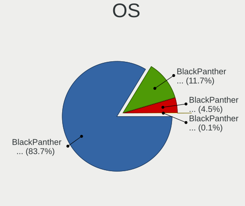

| Name              | Desktops | Percent |
|-------------------|----------|---------|
| BlackPanther 18.1 | 1480     | 83.71%  |
| BlackPanther 22.1 | 207      | 11.71%  |
| BlackPanther 16.2 | 79       | 4.47%   |
| BlackPanther 16.1 | 2        | 0.11%   |

OS Family
---------

OS without a version

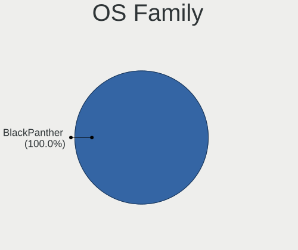

| Name         | Desktops | Percent |
|--------------|----------|---------|
| BlackPanther | 1705     | 100%    |

Kernel
------

Version of the Linux kernel

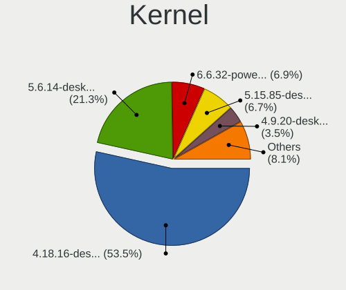

| Version                 | Desktops | Percent |
|-------------------------|----------|---------|
| 4.18.16-desktop-1bP     | 1057     | 53.46%  |
| 5.6.14-desktop-2bP      | 421      | 21.29%  |
| 6.6.32-power-1bP        | 136      | 6.88%   |
| 5.15.85-desktop-1bP     | 133      | 6.73%   |
| 4.9.20-desktop-pae-1bP  | 69       | 3.49%   |
| 5.1.15-desktop-1bP      | 40       | 2.02%   |
| 6.3.8-desktop-1bP       | 32       | 1.62%   |
| 6.3.3-desktop-1bP       | 17       | 0.86%   |
| 6.6.34-power-1bP        | 11       | 0.56%   |
| 6.4.3-desktop-1bP       | 11       | 0.56%   |
| 4.7.0-desktop-1bP       | 6        | 0.3%    |
| 6.2.9-desktop-1bP       | 5        | 0.25%   |
| 6.9.3-power-1bP         | 3        | 0.15%   |
| 6.7.0-power-2bP         | 3        | 0.15%   |
| 6.11.4-power-1bP        | 3        | 0.15%   |
| 6.10.3-server-1bP       | 3        | 0.15%   |
| 4.9.20-desktop-1bP      | 3        | 0.15%   |
| 6.8.9-power-1bP         | 2        | 0.1%    |
| 6.7.2-tkg-pds           | 2        | 0.1%    |
| 6.7.0-rc4-tkg-eevdf     | 2        | 0.1%    |
| 6.5.7-power-1bP         | 2        | 0.1%    |
| 6.16.0-power-1bP        | 2        | 0.1%    |
| 6.9.5-power-1bP         | 1        | 0.05%   |
| 6.7.3_tkg_eevdf         | 1        | 0.05%   |
| 6.14.2-power-1bP        | 1        | 0.05%   |
| 6.13.7-power-1bP        | 1        | 0.05%   |
| 6.13.4-power-1bP        | 1        | 0.05%   |
| 6.12.12-power-1bP       | 1        | 0.05%   |
| 6.1.0-1bP               | 1        | 0.05%   |
| 5.6.14-server-2bP       | 1        | 0.05%   |
| 5.15.83-1-lts           | 1        | 0.05%   |
| 5.10.1-desktop-2bP      | 1        | 0.05%   |
| 5.1.15-server-1bP       | 1        | 0.05%   |
| 4.19.0-6-amd64          | 1        | 0.05%   |
| 4.14.14-desktop-pae-1bP | 1        | 0.05%   |
| 3.13.0-35-generic       | 1        | 0.05%   |

Kernel Family
-------------

Linux kernel without a distro release

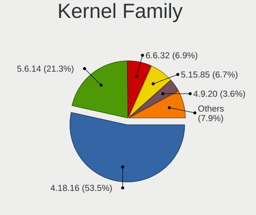

| Version | Desktops | Percent |
|---------|----------|---------|
| 4.18.16 | 1057     | 53.46%  |
| 5.6.14  | 422      | 21.35%  |
| 6.6.32  | 136      | 6.88%   |
| 5.15.85 | 133      | 6.73%   |
| 4.9.20  | 72       | 3.64%   |
| 5.1.15  | 41       | 2.07%   |
| 6.3.8   | 32       | 1.62%   |
| 6.3.3   | 17       | 0.86%   |
| 6.6.34  | 11       | 0.56%   |
| 6.4.3   | 11       | 0.56%   |
| 4.7.0   | 6        | 0.3%    |
| 6.7.0   | 5        | 0.25%   |
| 6.2.9   | 5        | 0.25%   |
| 6.9.3   | 3        | 0.15%   |
| 6.11.4  | 3        | 0.15%   |
| 6.10.3  | 3        | 0.15%   |
| 6.8.9   | 2        | 0.1%    |
| 6.7.2   | 2        | 0.1%    |
| 6.5.7   | 2        | 0.1%    |
| 6.16.0  | 2        | 0.1%    |
| 6.9.5   | 1        | 0.05%   |
| 6.7.3   | 1        | 0.05%   |
| 6.14.2  | 1        | 0.05%   |
| 6.13.7  | 1        | 0.05%   |
| 6.13.4  | 1        | 0.05%   |
| 6.12.12 | 1        | 0.05%   |
| 6.1.0   | 1        | 0.05%   |
| 5.15.83 | 1        | 0.05%   |
| 5.10.1  | 1        | 0.05%   |
| 4.19.0  | 1        | 0.05%   |
| 4.14.14 | 1        | 0.05%   |
| 3.13.0  | 1        | 0.05%   |

Kernel Major Ver.
-----------------

Linux kernel major version

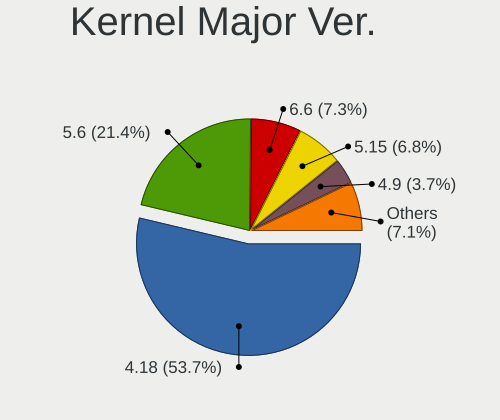

| Version | Desktops | Percent |
|---------|----------|---------|
| 4.18    | 1057     | 53.71%  |
| 5.6     | 422      | 21.44%  |
| 6.6     | 143      | 7.27%   |
| 5.15    | 134      | 6.81%   |
| 4.9     | 72       | 3.66%   |
| 6.3     | 45       | 2.29%   |
| 5.1     | 41       | 2.08%   |
| 6.4     | 11       | 0.56%   |
| 6.7     | 7        | 0.36%   |
| 4.7     | 6        | 0.3%    |
| 6.2     | 5        | 0.25%   |
| 6.9     | 4        | 0.2%    |
| 6.11    | 3        | 0.15%   |
| 6.10    | 3        | 0.15%   |
| 6.8     | 2        | 0.1%    |
| 6.5     | 2        | 0.1%    |
| 6.16    | 2        | 0.1%    |
| 6.13    | 2        | 0.1%    |
| 6.14    | 1        | 0.05%   |
| 6.12    | 1        | 0.05%   |
| 6.1     | 1        | 0.05%   |
| 5.10    | 1        | 0.05%   |
| 4.19    | 1        | 0.05%   |
| 4.14    | 1        | 0.05%   |
| 3.13    | 1        | 0.05%   |

Arch
----

OS architecture (x86_64, i586, etc.)

| Name   | Desktops | Percent |
|--------|----------|---------|
| x86_64 | 1649     | 95.43%  |
| i686   | 78       | 4.51%   |
| unknow | 1        | 0.06%   |

DE
--

Desktop Environment

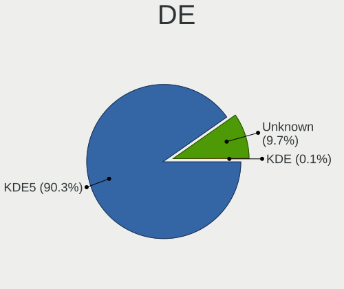

| Name    | Desktops | Percent |
|---------|----------|---------|
| KDE5    | 1543     | 90.29%  |
| Unknown | 165      | 9.65%   |
| KDE     | 1        | 0.06%   |

Display Server
--------------

X11 or Wayland

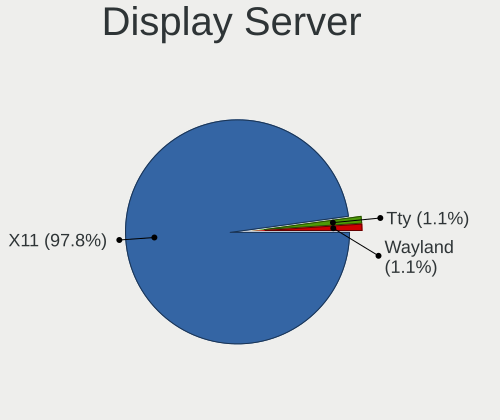

| Name    | Desktops | Percent |
|---------|----------|---------|
| X11     | 1677     | 97.84%  |
| Tty     | 19       | 1.11%   |
| Wayland | 18       | 1.05%   |

Display Manager
---------------

SDDM, LightDM, etc.

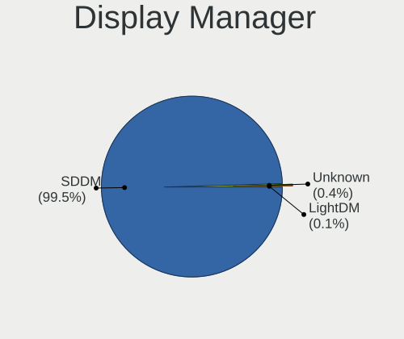

| Name    | Desktops | Percent |
|---------|----------|---------|
| SDDM    | 1701     | 99.53%  |
| Unknown | 7        | 0.41%   |
| LightDM | 1        | 0.06%   |

OS Lang
-------

Language

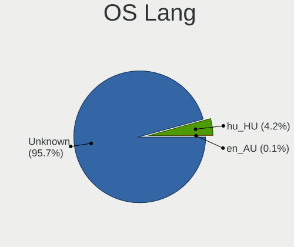

| Lang    | Desktops | Percent |
|---------|----------|---------|
| Unknown | 1635     | 95.73%  |
| hu_HU   | 72       | 4.22%   |
| en_AU   | 1        | 0.06%   |

Boot Mode
---------

EFI or BIOS

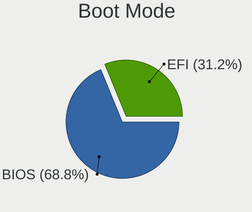

| Mode | Desktops | Percent |
|------|----------|---------|
| BIOS | 1235     | 68.8%   |
| EFI  | 560      | 31.2%   |

Filesystem
----------

Type of filesystem

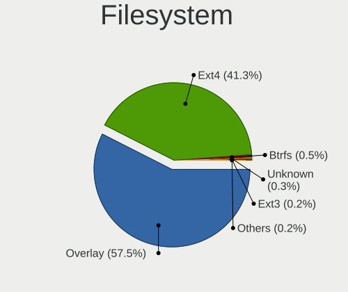

| Type    | Desktops | Percent |
|---------|----------|---------|
| Overlay | 1122     | 57.48%  |
| Ext4    | 807      | 41.34%  |
| Btrfs   | 10       | 0.51%   |
| Unknown | 6        | 0.31%   |
| Ext3    | 4        | 0.2%    |
| Ext2    | 2        | 0.1%    |
| Ntfs    | 1        | 0.05%   |

Part. scheme
------------

Scheme of partitioning

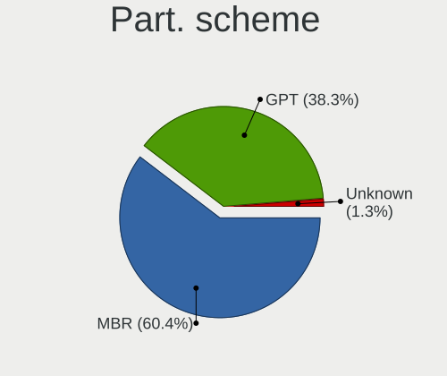

| Type    | Desktops | Percent |
|---------|----------|---------|
| MBR     | 1103     | 60.37%  |
| GPT     | 700      | 38.31%  |
| Unknown | 24       | 1.31%   |

Dual Boot with Linux/BSD
------------------------

Hosting more than one Linux/BSD

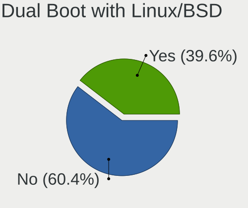

| Dual boot | Desktops | Percent |
|-----------|----------|---------|
| No        | 1158     | 60.44%  |
| Yes       | 758      | 39.56%  |

Dual Boot (Win)
---------------

Hosting Linux and Windows

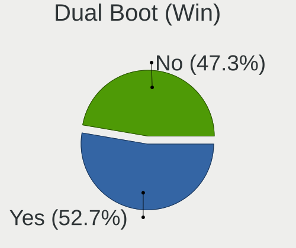

| Dual boot | Desktops | Percent |
|-----------|----------|---------|
| Yes       | 986      | 52.7%   |
| No        | 885      | 47.3%   |

Board
-----

Vendor
------

Motherboard manufacturer

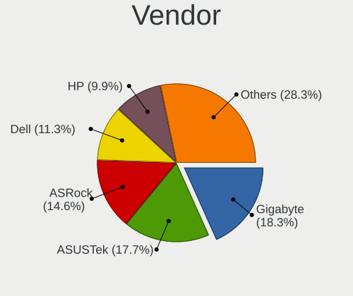

| Name                           | Desktops | Percent |
|--------------------------------|----------|---------|
| Gigabyte Technology            | 312      | 18.3%   |
| ASUSTek Computer               | 301      | 17.65%  |
| ASRock                         | 249      | 14.6%   |
| Dell                           | 193      | 11.32%  |
| Hewlett-Packard                | 168      | 9.85%   |
| MSI                            | 119      | 6.98%   |
| Lenovo                         | 102      | 5.98%   |
| Fujitsu                        | 56       | 3.28%   |
| Acer                           | 28       | 1.64%   |
| Fujitsu Siemens                | 26       | 1.52%   |
| Intel                          | 22       | 1.29%   |
| Foxconn                        | 20       | 1.17%   |
| Medion                         | 16       | 0.94%   |
| Unknown                        | 13       | 0.76%   |
| Pegatron                       | 11       | 0.65%   |
| Shuttle                        | 8        | 0.47%   |
| Biostar                        | 7        | 0.41%   |
| Huanan                         | 6        | 0.35%   |
| Gateway                        | 5        | 0.29%   |
| ECS                            | 5        | 0.29%   |
| Sapphire                       | 3        | 0.18%   |
| Packard Bell                   | 3        | 0.18%   |
| ABIT                           | 3        | 0.18%   |
| Supermicro                     | 2        | 0.12%   |
| Nvidia                         | 2        | 0.12%   |
| Apple                          | 2        | 0.12%   |
| AMD                            | 2        | 0.12%   |
| ZOTAC                          | 1        | 0.06%   |
| Wincor Nixdorf                 | 1        | 0.06%   |
| ViewSonic                      | 1        | 0.06%   |
| TYAN Computer                  | 1        | 0.06%   |
| Shanghai Zhaoxin Semiconductor | 1        | 0.06%   |
| Qbex                           | 1        | 0.06%   |
| PCWare                         | 1        | 0.06%   |
| PCSMART                        | 1        | 0.06%   |
| NEC Computers                  | 1        | 0.06%   |
| MouseComputer                  | 1        | 0.06%   |
| Login Informatica              | 1        | 0.06%   |
| Lex                            | 1        | 0.06%   |
| Itautec                        | 1        | 0.06%   |

Model
-----

Motherboard model

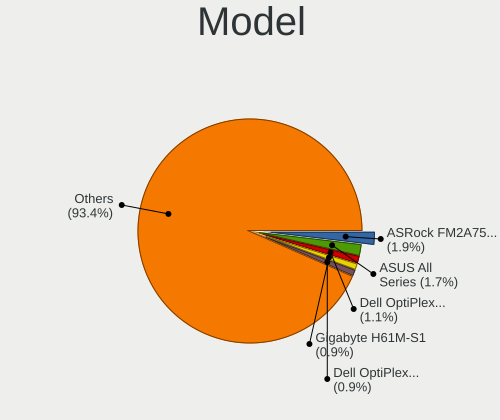

| Name                                | Desktops | Percent |
|-------------------------------------|----------|---------|
| ASRock FM2A75M Pro4+                | 32       | 1.88%   |
| ASUS All Series                     | 29       | 1.7%    |
| Dell OptiPlex 3020                  | 19       | 1.11%   |
| Gigabyte H61M-S1                    | 16       | 0.94%   |
| Dell OptiPlex 780                   | 16       | 0.94%   |
| Unknown                             | 16       | 0.94%   |
| Dell OptiPlex 760                   | 14       | 0.82%   |
| Dell OptiPlex 755                   | 14       | 0.82%   |
| MSI MS-7680                         | 12       | 0.7%    |
| Gigabyte G31M-ES2L                  | 12       | 0.7%    |
| Lenovo ThinkStation D20 4158AF8     | 10       | 0.59%   |
| HP ProDesk 600 G2 SFF               | 10       | 0.59%   |
| Dell OptiPlex 745                   | 10       | 0.59%   |
| Dell OptiPlex 7010                  | 10       | 0.59%   |
| ASUS P5KPL-AM EPU                   | 10       | 0.59%   |
| MSI MS-7721                         | 9        | 0.53%   |
| HP Compaq 8000 Elite SFF PC         | 9        | 0.53%   |
| ASUS PRIME A320M-R                  | 9        | 0.53%   |
| ASUS H110M-A                        | 9        | 0.53%   |
| ASRock G41M-VS3                     | 9        | 0.53%   |
| MSI MS-7C91                         | 8        | 0.47%   |
| HP Compaq 8200 Elite MT PC          | 8        | 0.47%   |
| Fujitsu ESPRIMO E520                | 8        | 0.47%   |
| MSI MS-7817                         | 7        | 0.41%   |
| Lenovo ThinkStation P520 30BFS44D04 | 7        | 0.41%   |
| HP EliteDesk 705 G3 SFF             | 7        | 0.41%   |
| HP Compaq dc5800 Small Form Factor  | 7        | 0.41%   |
| Gigabyte Z390 UD                    | 7        | 0.41%   |
| Gigabyte F2A88XM-HD3                | 7        | 0.41%   |
| Gigabyte 970A-DS3P                  | 7        | 0.41%   |
| Dell PowerEdge T20                  | 7        | 0.41%   |
| ASRock N68C-S UCC                   | 7        | 0.41%   |
| ASRock 4X4-V1000                    | 7        | 0.41%   |
| MSI MS-7592                         | 6        | 0.35%   |
| Medion MS-7748                      | 6        | 0.35%   |
| HP Compaq Pro 6300 SFF              | 6        | 0.35%   |
| Gigabyte H61M-S2PV                  | 6        | 0.35%   |
| Fujitsu ESPRIMO Q556/2              | 6        | 0.35%   |
| Dell OptiPlex 390                   | 6        | 0.35%   |
| Dell OptiPlex 3050                  | 6        | 0.35%   |

Model Family
------------

Motherboard model prefix

| Name                    | Desktops | Percent |
|-------------------------|----------|---------|
| Dell OptiPlex           | 156      | 9.15%   |
| HP Compaq               | 112      | 6.57%   |
| Lenovo ThinkCentre      | 66       | 3.87%   |
| ASUS PRIME              | 53       | 3.11%   |
| Fujitsu ESPRIMO         | 44       | 2.58%   |
| ASRock FM2A75M          | 32       | 1.88%   |
| ASUS All                | 29       | 1.7%    |
| Lenovo ThinkStation     | 20       | 1.17%   |
| Fujitsu Siemens ESPRIMO | 18       | 1.06%   |
| HP ProDesk              | 17       | 1%      |
| HP EliteDesk            | 16       | 0.94%   |
| Gigabyte H61M-S1        | 16       | 0.94%   |
| ASUS P5KPL-AM           | 16       | 0.94%   |
| Unknown                 | 16       | 0.94%   |
| Dell Precision          | 13       | 0.76%   |
| ASUS ROG                | 13       | 0.76%   |
| MSI MS-7680             | 12       | 0.7%    |
| Gigabyte G31M-ES2L      | 12       | 0.7%    |
| Acer Veriton            | 12       | 0.7%    |
| ASUS H110M-A            | 11       | 0.65%   |
| Acer Aspire             | 11       | 0.65%   |
| ASUS M5A97              | 10       | 0.59%   |
| MSI MS-7721             | 9        | 0.53%   |
| ASUS M5A78L-M           | 9        | 0.53%   |
| ASRock G41M-VS3         | 9        | 0.53%   |
| MSI MS-7C91             | 8        | 0.47%   |
| Gigabyte Z390           | 8        | 0.47%   |
| Gigabyte H310M          | 8        | 0.47%   |
| Gigabyte B450           | 8        | 0.47%   |
| Fujitsu CELSIUS         | 8        | 0.47%   |
| ASRock N68C-S           | 8        | 0.47%   |
| ASRock 970              | 8        | 0.47%   |
| MSI MS-7817             | 7        | 0.41%   |
| Gigabyte F2A88XM-HD3    | 7        | 0.41%   |
| Gigabyte 970A-DS3P      | 7        | 0.41%   |
| Dell PowerEdge          | 7        | 0.41%   |
| ASRock 4X4-V1000        | 7        | 0.41%   |
| MSI MS-7592             | 6        | 0.35%   |
| Medion MS-7748          | 6        | 0.35%   |
| Huanan X99-QD4          | 6        | 0.35%   |

MFG Year
--------

Motherboard manufacture year

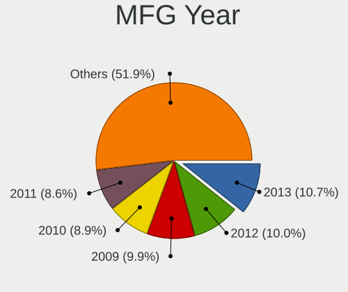

| Year | Desktops | Percent |
|------|----------|---------|
| 2013 | 183      | 10.73%  |
| 2012 | 170      | 9.97%   |
| 2009 | 169      | 9.91%   |
| 2010 | 151      | 8.86%   |
| 2011 | 147      | 8.62%   |
| 2014 | 137      | 8.04%   |
| 2008 | 137      | 8.04%   |
| 2007 | 117      | 6.86%   |
| 2018 | 98       | 5.75%   |
| 2015 | 81       | 4.75%   |
| 2017 | 62       | 3.64%   |
| 2016 | 57       | 3.34%   |
| 2019 | 48       | 2.82%   |
| 2006 | 44       | 2.58%   |
| 2020 | 38       | 2.23%   |
| 2021 | 22       | 1.29%   |
| 2005 | 15       | 0.88%   |
| 2023 | 9        | 0.53%   |
| 2022 | 9        | 0.53%   |
| 2024 | 5        | 0.29%   |
| 2004 | 5        | 0.29%   |
| 2003 | 1        | 0.06%   |

Form Factor
-----------

Physical design of the computer

| Name    | Desktops | Percent |
|---------|----------|---------|
| Desktop | 1705     | 100%    |

Secure Boot
-----------

Enabled or disabled

| State    | Desktops | Percent |
|----------|----------|---------|
| Disabled | 1705     | 100%    |

Coreboot
--------

Have coreboot on board

| Used | Desktops | Percent |
|------|----------|---------|
| No   | 1705     | 100%    |

RAM Size
--------

Total RAM memory

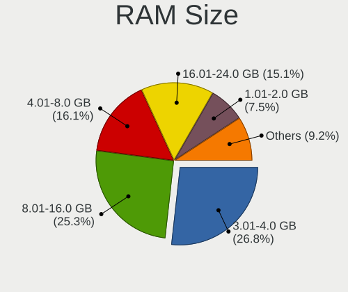

| Size in GB  | Desktops | Percent |
|-------------|----------|---------|
| 3.01-4.0    | 479      | 26.76%  |
| 8.01-16.0   | 453      | 25.31%  |
| 4.01-8.0    | 288      | 16.09%  |
| 16.01-24.0  | 271      | 15.14%  |
| 1.01-2.0    | 134      | 7.49%   |
| 32.01-64.0  | 83       | 4.64%   |
| 2.01-3.0    | 32       | 1.79%   |
| 24.01-32.0  | 29       | 1.62%   |
| 0.51-1.0    | 13       | 0.73%   |
| 64.01-256.0 | 7        | 0.39%   |
| Unknown     | 1        | 0.06%   |

RAM Used
--------

Used RAM memory

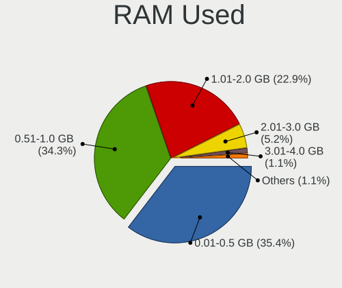

| Used GB   | Desktops | Percent |
|-----------|----------|---------|
| 0.01-0.5  | 743      | 35.43%  |
| 0.51-1.0  | 719      | 34.29%  |
| 1.01-2.0  | 480      | 22.89%  |
| 2.01-3.0  | 109      | 5.2%    |
| 3.01-4.0  | 23       | 1.1%    |
| 4.01-8.0  | 18       | 0.86%   |
| 8.01-16.0 | 3        | 0.14%   |
| Unknown   | 2        | 0.1%    |

Total Drives
------------

Number of drives on board

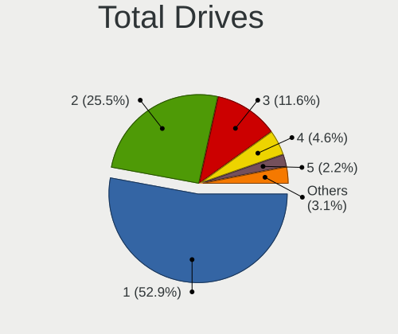

| Drives | Desktops | Percent |
|--------|----------|---------|
| 1      | 1013     | 52.9%   |
| 2      | 489      | 25.54%  |
| 3      | 223      | 11.64%  |
| 4      | 88       | 4.6%    |
| 5      | 43       | 2.25%   |
| 0      | 38       | 1.98%   |
| 6      | 11       | 0.57%   |
| 9      | 3        | 0.16%   |
| 8      | 3        | 0.16%   |
| 10     | 2        | 0.1%    |
| 7      | 2        | 0.1%    |

Has CD-ROM
----------

Has CD-ROM on board

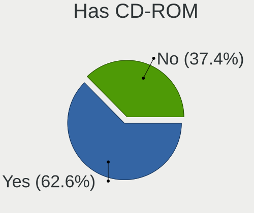

| Presented | Desktops | Percent |
|-----------|----------|---------|
| Yes       | 1114     | 62.62%  |
| No        | 665      | 37.38%  |

Has Ethernet
------------

Has Ethernet on board

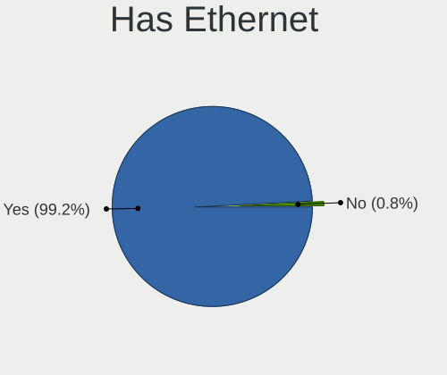

| Presented | Desktops | Percent |
|-----------|----------|---------|
| Yes       | 1691     | 99.18%  |
| No        | 14       | 0.82%   |

Has WiFi
--------

Has WiFi module

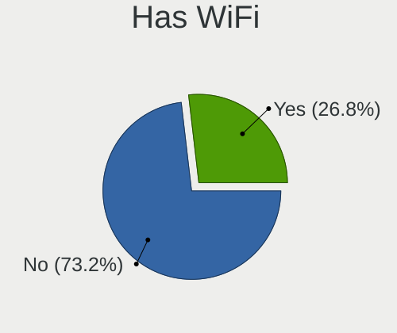

| Presented | Desktops | Percent |
|-----------|----------|---------|
| No        | 1286     | 73.15%  |
| Yes       | 472      | 26.85%  |

Has Bluetooth
-------------

Has Bluetooth module

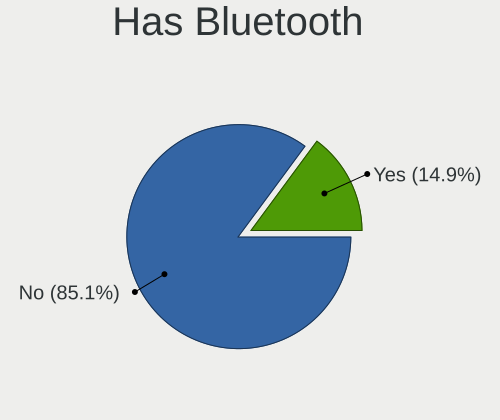

| Presented | Desktops | Percent |
|-----------|----------|---------|
| No        | 1493     | 85.12%  |
| Yes       | 261      | 14.88%  |

Location
--------

Country
-------

Geographic location (country)

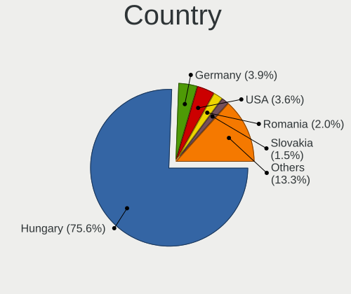

| Country      | Desktops | Percent |
|--------------|----------|---------|
| Hungary      | 1291     | 75.59%  |
| Germany      | 67       | 3.92%   |
| USA          | 62       | 3.63%   |
| Romania      | 34       | 1.99%   |
| Slovakia     | 26       | 1.52%   |
| UK           | 18       | 1.05%   |
| Brazil       | 18       | 1.05%   |
| Italy        | 16       | 0.94%   |
| France       | 16       | 0.94%   |
| Canada       | 13       | 0.76%   |
| Spain        | 12       | 0.7%    |
| Serbia       | 11       | 0.64%   |
| Poland       | 11       | 0.64%   |
| Australia    | 10       | 0.59%   |
| Philippines  | 8        | 0.47%   |
| Japan        | 7        | 0.41%   |
| South Africa | 6        | 0.35%   |
| Austria      | 6        | 0.35%   |
| Argentina    | 6        | 0.35%   |
| Ukraine      | 5        | 0.29%   |
| Netherlands  | 4        | 0.23%   |
| India        | 4        | 0.23%   |
| Greece       | 4        | 0.23%   |
| Ireland      | 3        | 0.18%   |
| Finland      | 3        | 0.18%   |
| Egypt        | 3        | 0.18%   |
| Belgium      | 3        | 0.18%   |
| Uruguay      | 2        | 0.12%   |
| Turkey       | 2        | 0.12%   |
| Switzerland  | 2        | 0.12%   |
| Russia       | 2        | 0.12%   |
| Morocco      | 2        | 0.12%   |
| Kuwait       | 2        | 0.12%   |
| Colombia     | 2        | 0.12%   |
| Belarus      | 2        | 0.12%   |
| Algeria      | 2        | 0.12%   |
| Thailand     | 1        | 0.06%   |
| Tanzania     | 1        | 0.06%   |
| Taiwan       | 1        | 0.06%   |
| South Korea  | 1        | 0.06%   |

City
----

Geographic location (city)

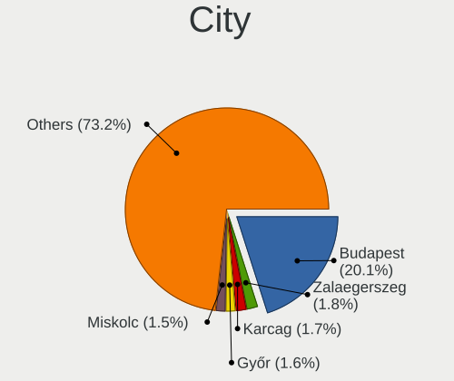

| City                    | Desktops | Percent |
|-------------------------|----------|---------|
| Budapest                | 417      | 20.08%  |
| Zalaegerszeg            | 38       | 1.83%   |
| Karcag                  | 36       | 1.73%   |
| Győr                   | 33       | 1.59%   |
| Miskolc                 | 32       | 1.54%   |
| Szeged                  | 27       | 1.3%    |
| Pécs                   | 26       | 1.25%   |
| Debrecen                | 23       | 1.11%   |
| Kecskemét              | 21       | 1.01%   |
| Berettyóújfalu        | 19       | 0.91%   |
| Szigetszentmiklos       | 18       | 0.87%   |
| Eger                    | 18       | 0.87%   |
| Tatabánya              | 17       | 0.82%   |
| Szentendre              | 17       | 0.82%   |
| Oroshaza                | 17       | 0.82%   |
| Szombathely             | 16       | 0.77%   |
| Székesfehérvár       | 15       | 0.72%   |
| Szekszárd              | 14       | 0.67%   |
| Gödöllő              | 14       | 0.67%   |
| Szolnok                 | 13       | 0.63%   |
| Toeroekbalint           | 12       | 0.58%   |
| Sarbogard               | 12       | 0.58%   |
| Nyiregyhaza             | 12       | 0.58%   |
| Csongrad                | 12       | 0.58%   |
| Pfaffenhofen an der Ilm | 10       | 0.48%   |
| Papa                    | 10       | 0.48%   |
| Hajduboszormeny         | 10       | 0.48%   |
| Tiszafured              | 9        | 0.43%   |
| Nagykanizsa             | 9        | 0.43%   |
| Mosonmagyaróvár       | 9        | 0.43%   |
| Veresegyhaz             | 8        | 0.39%   |
| Szeghalom               | 8        | 0.39%   |
| Morahalom               | 8        | 0.39%   |
| Hatvan                  | 8        | 0.39%   |
| Esztergom               | 8        | 0.39%   |
| Dunaharaszti            | 8        | 0.39%   |
| Bucharest               | 8        | 0.39%   |
| Balatonfuered           | 8        | 0.39%   |
| Veszprém               | 7        | 0.34%   |
| Kiskunhalas             | 7        | 0.34%   |

Drives
------

Drive Vendor
------------

Hard drive vendors

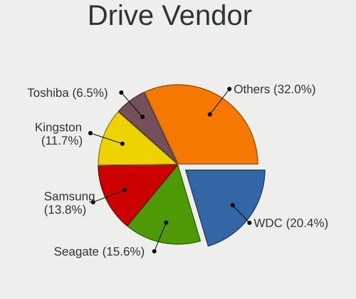

| Vendor                      | Desktops | Drives | Percent |
|-----------------------------|----------|--------|---------|
| WDC                         | 600      | 1280   | 20.4%   |
| Seagate                     | 459      | 759    | 15.61%  |
| Samsung Electronics         | 406      | 857    | 13.8%   |
| Kingston                    | 345      | 758    | 11.73%  |
| Toshiba                     | 191      | 424    | 6.49%   |
| Hitachi                     | 131      | 199    | 4.45%   |
| A-DATA Technology           | 95       | 198    | 3.23%   |
| SanDisk                     | 65       | 131    | 2.21%   |
| Maxtor                      | 61       | 78     | 2.07%   |
| Crucial                     | 48       | 91     | 1.63%   |
| SPCC                        | 43       | 59     | 1.46%   |
| Intenso                     | 39       | 77     | 1.33%   |
| HGST                        | 37       | 116    | 1.26%   |
| Intel                       | 34       | 56     | 1.16%   |
| Patriot                     | 25       | 69     | 0.85%   |
| JMicron Technology          | 22       | 27     | 0.75%   |
| Fujitsu                     | 19       | 20     | 0.65%   |
| Micron Technology           | 18       | 34     | 0.61%   |
| Apacer                      | 18       | 29     | 0.61%   |
| SK hynix                    | 17       | 24     | 0.58%   |
| PNY                         | 16       | 28     | 0.54%   |
| Gigabyte Technology         | 16       | 55     | 0.54%   |
| OCZ                         | 15       | 20     | 0.51%   |
| Kingmax                     | 13       | 41     | 0.44%   |
| Hewlett-Packard             | 13       | 20     | 0.44%   |
| China                       | 13       | 21     | 0.44%   |
| XPG                         | 12       | 20     | 0.41%   |
| Netac                       | 10       | 21     | 0.34%   |
| GOODRAM                     | 9        | 14     | 0.31%   |
| Unknown                     | 8        | 23     | 0.27%   |
| Corsair                     | 7        | 9      | 0.24%   |
| Zheino                      | 6        | 27     | 0.2%    |
| Verbatim                    | 6        | 11     | 0.2%    |
| Team                        | 6        | 8      | 0.2%    |
| Kingston Technology Company | 6        | 10     | 0.2%    |
| KingSpec                    | 6        | 8      | 0.2%    |
| WD MediaMax                 | 5        | 6      | 0.17%   |
| LITEON                      | 5        | 5      | 0.17%   |
| ASMT                        | 5        | 7      | 0.17%   |
| Unknown                     | 5        | 7      | 0.17%   |

Drive Model
-----------

Hard drive models

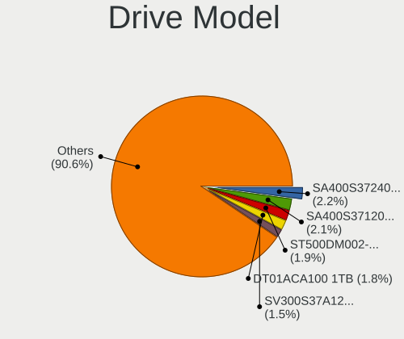

| Model                              | Desktops | Percent |
|------------------------------------|----------|---------|
| Kingston SA400S37240G 240GB SSD    | 72       | 2.15%   |
| Kingston SA400S37120G 120GB SSD    | 70       | 2.09%   |
| Seagate ST500DM002-1BD142 500GB    | 62       | 1.86%   |
| Toshiba DT01ACA100 1TB             | 61       | 1.83%   |
| Kingston SV300S37A120G 120GB SSD   | 50       | 1.5%    |
| Kingston SA400S37480G 480GB SSD    | 40       | 1.2%    |
| Toshiba DT01ACA050 500GB           | 32       | 0.96%   |
| A-DATA SU630 240GB SSD             | 30       | 0.9%    |
| Kingston SUV400S37120G 120GB SSD   | 25       | 0.75%   |
| Seagate ST380815AS 80GB            | 23       | 0.69%   |
| A-DATA SU700 120GB SSD             | 23       | 0.69%   |
| WDC WD10EZEX-08WN4A0 1TB           | 22       | 0.66%   |
| JMicron Generic 320GB              | 22       | 0.66%   |
| SPCC Solid State Disk 256GB        | 20       | 0.6%    |
| Samsung HD502HJ 500GB              | 20       | 0.6%    |
| Seagate ST3160815AS 160GB          | 19       | 0.57%   |
| Samsung SSD 860 EVO 500GB          | 19       | 0.57%   |
| Samsung SSD 850 EVO 250GB          | 17       | 0.51%   |
| WDC WD5000AAKX-22ERMA0 500GB       | 16       | 0.48%   |
| Samsung HD103UJ 1TB                | 16       | 0.48%   |
| Toshiba HDWD110 1TB                | 15       | 0.45%   |
| Seagate ST3250318AS 250GB          | 15       | 0.45%   |
| Seagate ST3160318AS 160GB          | 15       | 0.45%   |
| Seagate ST1000DM010-2EP102 1TB     | 15       | 0.45%   |
| WDC WD5000AAKX-001CA0 500GB        | 14       | 0.42%   |
| Seagate ST1000LM024 HN-M101MBB 1TB | 14       | 0.42%   |
| Samsung SSD 860 EVO 250GB          | 14       | 0.42%   |
| Samsung HD161HJ 160GB              | 14       | 0.42%   |
| WDC WD5000AAKS-007AA0 500GB        | 13       | 0.39%   |
| Toshiba DT01ACA200 2TB             | 13       | 0.39%   |
| Seagate ST3500418AS 500GB          | 13       | 0.39%   |
| Patriot Burst 120GB SSD            | 13       | 0.39%   |
| Kingston SV300S37A60G 64GB SSD     | 13       | 0.39%   |
| Kingston SV300S37A240G 240GB SSD   | 13       | 0.39%   |
| WDC WD5000AAKS-00UU3A0 500GB       | 12       | 0.36%   |
| Seagate ST1000DM003-1ER162 1TB     | 12       | 0.36%   |
| Samsung HD501LJ 500GB              | 12       | 0.36%   |
| Samsung HD322HJ 320GB              | 12       | 0.36%   |
| Kingston SA400S37960G 960GB SSD    | 12       | 0.36%   |
| WDC WDS240G2G0B-00EPW0 240GB SSD   | 11       | 0.33%   |

HDD Vendor
----------

Hard disk drive vendors

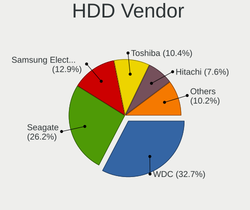

| Vendor              | Desktops | Drives | Percent |
|---------------------|----------|--------|---------|
| WDC                 | 564      | 1167   | 32.66%  |
| Seagate             | 453      | 739    | 26.23%  |
| Samsung Electronics | 223      | 378    | 12.91%  |
| Toshiba             | 179      | 407    | 10.36%  |
| Hitachi             | 131      | 199    | 7.59%   |
| Maxtor              | 60       | 77     | 3.47%   |
| HGST                | 37       | 116    | 2.14%   |
| JMicron Technology  | 22       | 27     | 1.27%   |
| Fujitsu             | 19       | 20     | 1.1%    |
| Hewlett-Packard     | 6        | 8      | 0.35%   |
| WD MediaMax         | 5        | 6      | 0.29%   |
| USB3.0              | 4        | 5      | 0.23%   |
| ASMT                | 4        | 6      | 0.23%   |
| Apple               | 4        | 6      | 0.23%   |
| Unknown             | 3        | 4      | 0.17%   |
| QUANTUM             | 2        | 2      | 0.12%   |
| ICY BOX             | 2        | 4      | 0.12%   |
| ExcelStor           | 2        | 2      | 0.12%   |
| Unknown             | 2        | 3      | 0.12%   |
| USB                 | 1        | 2      | 0.06%   |
| SATAFIRM            | 1        | 1      | 0.06%   |
| IBM/Hitachi         | 1        | 1      | 0.06%   |
| HGST HTS            | 1        | 1      | 0.06%   |
| Emphase             | 1        | 2      | 0.06%   |

SSD Vendor
----------

Solid state drive vendors

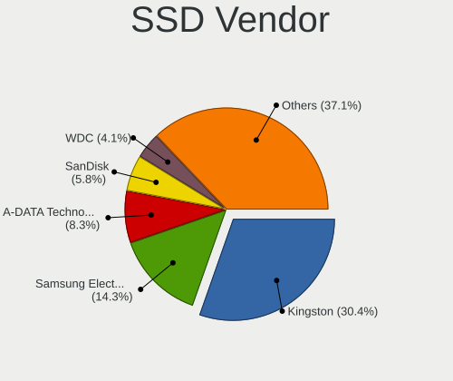

| Vendor              | Desktops | Drives | Percent |
|---------------------|----------|--------|---------|
| Kingston            | 316      | 655    | 30.38%  |
| Samsung Electronics | 149      | 321    | 14.33%  |
| A-DATA Technology   | 86       | 183    | 8.27%   |
| SanDisk             | 60       | 115    | 5.77%   |
| WDC                 | 43       | 98     | 4.13%   |
| Intenso             | 39       | 77     | 3.75%   |
| SPCC                | 38       | 53     | 3.65%   |
| Crucial             | 38       | 76     | 3.65%   |
| Intel               | 26       | 39     | 2.5%    |
| Patriot             | 24       | 68     | 2.31%   |
| Apacer              | 18       | 29     | 1.73%   |
| PNY                 | 16       | 28     | 1.54%   |
| OCZ                 | 15       | 20     | 1.44%   |
| Micron Technology   | 14       | 29     | 1.35%   |
| Gigabyte Technology | 13       | 46     | 1.25%   |
| China               | 13       | 21     | 1.25%   |
| Kingmax             | 12       | 39     | 1.15%   |
| Toshiba             | 11       | 16     | 1.06%   |
| Netac               | 10       | 21     | 0.96%   |
| SK hynix            | 8        | 13     | 0.77%   |
| GOODRAM             | 8        | 12     | 0.77%   |
| Corsair             | 7        | 9      | 0.67%   |
| Verbatim            | 6        | 11     | 0.58%   |
| KingSpec            | 6        | 8      | 0.58%   |
| Team                | 5        | 7      | 0.48%   |
| Hewlett-Packard     | 5        | 7      | 0.48%   |
| LITEON              | 4        | 4      | 0.38%   |
| Transcend           | 3        | 5      | 0.29%   |
| Lexar               | 3        | 6      | 0.29%   |
| Emtec               | 3        | 3      | 0.29%   |
| StoreJet            | 2        | 2      | 0.19%   |
| sobetter            | 2        | 2      | 0.19%   |
| LITEONIT            | 2        | 4      | 0.19%   |
| KODAK               | 2        | 4      | 0.19%   |
| KingFast            | 2        | 3      | 0.19%   |
| Integral            | 2        | 4      | 0.19%   |
| BIWIN               | 2        | 6      | 0.19%   |
| Unknown             | 2        | 3      | 0.19%   |
| YHJC                | 1        | 1      | 0.1%    |
| WDC WDS             | 1        | 1      | 0.1%    |

Drive Kind
----------

HDD or SSD

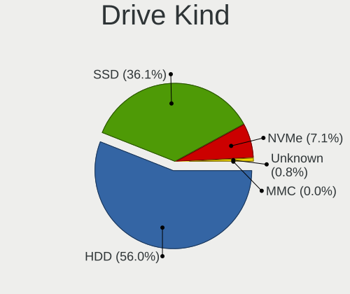

| Kind    | Desktops | Drives | Percent |
|---------|----------|--------|---------|
| HDD     | 1308     | 3183   | 55.99%  |
| SSD     | 843      | 2079   | 36.09%  |
| NVMe    | 166      | 499    | 7.11%   |
| Unknown | 18       | 42     | 0.77%   |
| MMC     | 1        | 1      | 0.04%   |

Drive Connector
---------------

SATA, SAS, NVMe, etc.

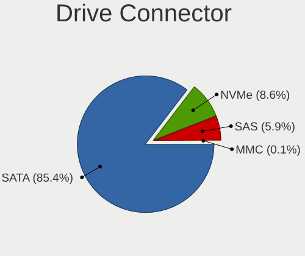

| Type | Desktops | Drives | Percent |
|------|----------|--------|---------|
| SATA | 1640     | 5092   | 85.42%  |
| NVMe | 166      | 499    | 8.65%   |
| SAS  | 113      | 212    | 5.89%   |
| MMC  | 1        | 1      | 0.05%   |

Drive Size
----------

Size of hard drive

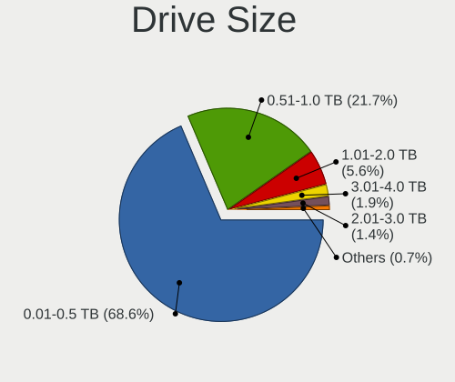

| Size in TB | Desktops | Drives | Percent |
|------------|----------|--------|---------|
| 0.01-0.5   | 1477     | 3642   | 68.6%   |
| 0.51-1.0   | 467      | 1075   | 21.69%  |
| 1.01-2.0   | 121      | 273    | 5.62%   |
| 3.01-4.0   | 41       | 117    | 1.9%    |
| 2.01-3.0   | 31       | 130    | 1.44%   |
| 4.01-10.0  | 14       | 22     | 0.65%   |
| 10.01-20.0 | 2        | 3      | 0.09%   |

Space Total
-----------

Amount of disk space available on the file system

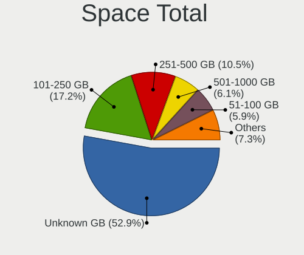

| Size in GB     | Desktops | Percent |
|----------------|----------|---------|
| Unknown        | 1109     | 52.86%  |
| 101-250        | 361      | 17.21%  |
| 251-500        | 221      | 10.53%  |
| 501-1000       | 129      | 6.15%   |
| 51-100         | 124      | 5.91%   |
| 21-50          | 64       | 3.05%   |
| 1001-2000      | 40       | 1.91%   |
| 1-20           | 21       | 1%      |
| 2001-3000      | 15       | 0.71%   |
| More than 3000 | 14       | 0.67%   |

Space Used
----------

Amount of used disk space

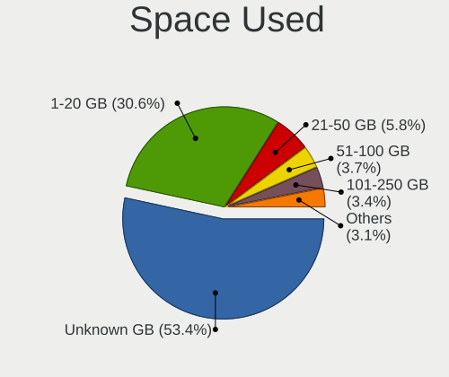

| Used GB        | Desktops | Percent |
|----------------|----------|---------|
| Unknown        | 1109     | 53.37%  |
| 1-20           | 636      | 30.61%  |
| 21-50          | 121      | 5.82%   |
| 51-100         | 76       | 3.66%   |
| 101-250        | 71       | 3.42%   |
| 251-500        | 23       | 1.11%   |
| 501-1000       | 23       | 1.11%   |
| 1001-2000      | 12       | 0.58%   |
| More than 3000 | 4        | 0.19%   |
| 2001-3000      | 3        | 0.14%   |

Malfunc. Drives
---------------

Drive models with a malfunction

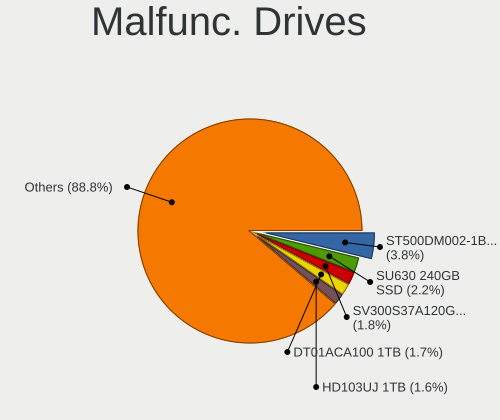

| Model                              | Desktops | Drives | Percent |
|------------------------------------|----------|--------|---------|
| Seagate ST500DM002-1BD142 500GB    | 33       | 52     | 3.82%   |
| A-DATA Technology SU630 240GB SSD  | 19       | 39     | 2.2%    |
| Kingston SV300S37A120G 120GB SSD   | 16       | 19     | 1.85%   |
| Toshiba DT01ACA100 1TB             | 15       | 31     | 1.73%   |
| Samsung Electronics HD103UJ 1TB    | 14       | 32     | 1.62%   |
| Toshiba DT01ACA050 500GB           | 12       | 17     | 1.39%   |
| WDC WD5000AAKX-001CA0 500GB        | 10       | 10     | 1.16%   |
| WDC WD5000AAKS-007AA0 500GB        | 10       | 34     | 1.16%   |
| Seagate ST500LT012-9WS142 500GB    | 10       | 13     | 1.16%   |
| Seagate ST1000LM024 HN-M101MBB 1TB | 9        | 12     | 1.04%   |
| Samsung Electronics HD161HJ 160GB  | 9        | 9      | 1.04%   |
| WDC WD5000AAKX-22ERMA0 500GB       | 8        | 9      | 0.92%   |
| Seagate ST3160815AS 160GB          | 8        | 12     | 0.92%   |
| WDC WD5000AAKS-00UU3A0 500GB       | 7        | 19     | 0.81%   |
| WDC WD10PURZ-85U8XY0 1TB           | 7        | 15     | 0.81%   |
| Seagate ST3500418AS 500GB          | 7        | 12     | 0.81%   |
| Samsung Electronics HD321KJ 320GB  | 7        | 7      | 0.81%   |
| Hitachi HDS721050CLA362 500GB      | 7        | 12     | 0.81%   |
| WDC WD5000AADS-00S9B0 500GB        | 6        | 8      | 0.69%   |
| WDC WD10EARS-00Y5B1 1TB            | 6        | 16     | 0.69%   |
| Seagate ST3250318AS 250GB          | 6        | 9      | 0.69%   |
| Samsung Electronics SP2504C 250GB  | 6        | 11     | 0.69%   |
| Samsung Electronics HD103SI 1TB    | 6        | 6      | 0.69%   |
| Samsung Electronics HD080HJ/ 80GB  | 6        | 6      | 0.69%   |
| WDC WD5000AAKX-08U6AA0 500GB       | 5        | 9      | 0.58%   |
| WDC WD3200AAKS-00L9A0 320GB        | 5        | 7      | 0.58%   |
| Seagate ST380815AS 80GB            | 5        | 8      | 0.58%   |
| Seagate ST3160812AS 160GB          | 5        | 5      | 0.58%   |
| Maxtor 6Y080L0 81GB                | 5        | 6      | 0.58%   |
| Hitachi HDP725050GLA360 500GB      | 5        | 5      | 0.58%   |
| WDC WD5000AAKX-60U6AA0 500GB       | 4        | 5      | 0.46%   |
| WDC WD5000AAKX-07U6AA0 500GB       | 4        | 6      | 0.46%   |
| WDC WD10EZEX-22MFCA0 1TB           | 4        | 4      | 0.46%   |
| Seagate ST3160318AS 160GB          | 4        | 4      | 0.46%   |
| Seagate ST1000DM003-1CH162 1TB     | 4        | 4      | 0.46%   |
| Samsung Electronics SP2004C 200GB  | 4        | 6      | 0.46%   |
| Samsung Electronics HD642JJ 640GB  | 4        | 7      | 0.46%   |
| Samsung Electronics HD502HJ 500GB  | 4        | 7      | 0.46%   |
| Samsung Electronics HD501LJ 500GB  | 4        | 5      | 0.46%   |
| Samsung Electronics HD200HJ 200GB  | 4        | 9      | 0.46%   |

Malfunc. Drive Vendor
---------------------

Vendors of faulty drives

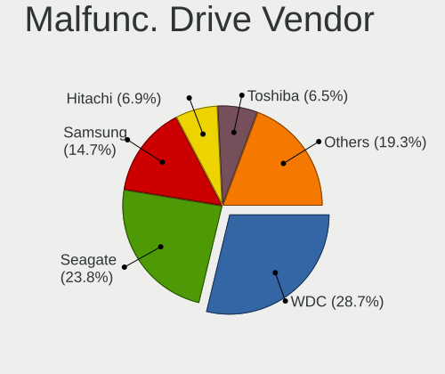

| Vendor              | Desktops | Drives | Percent |
|---------------------|----------|--------|---------|
| WDC                 | 234      | 414    | 28.75%  |
| Seagate             | 194      | 274    | 23.83%  |
| Samsung Electronics | 120      | 191    | 14.74%  |
| Hitachi             | 56       | 91     | 6.88%   |
| Toshiba             | 53       | 95     | 6.51%   |
| Maxtor              | 36       | 50     | 4.42%   |
| Kingston            | 36       | 57     | 4.42%   |
| A-DATA Technology   | 28       | 59     | 3.44%   |
| HGST                | 11       | 13     | 1.35%   |
| OCZ                 | 8        | 11     | 0.98%   |
| WD MediaMax         | 5        | 6      | 0.61%   |
| Intel               | 4        | 12     | 0.49%   |
| Fujitsu             | 4        | 4      | 0.49%   |
| Hewlett-Packard     | 3        | 3      | 0.37%   |
| SK hynix            | 2        | 5      | 0.25%   |
| SanDisk             | 2        | 2      | 0.25%   |
| KingSpec            | 2        | 2      | 0.25%   |
| Crucial             | 2        | 5      | 0.25%   |
| SATAFIRM            | 1        | 1      | 0.12%   |
| QUANTUM             | 1        | 1      | 0.12%   |
| Patriot             | 1        | 1      | 0.12%   |
| LITEON              | 1        | 1      | 0.12%   |
| Kingmax             | 1        | 1      | 0.12%   |
| Intenso             | 1        | 1      | 0.12%   |
| ICY BOX             | 1        | 1      | 0.12%   |
| IBM/Hitachi         | 1        | 1      | 0.12%   |
| ExcelStor           | 1        | 1      | 0.12%   |
| Corsair             | 1        | 1      | 0.12%   |
| China               | 1        | 1      | 0.12%   |
| BIWIN               | 1        | 1      | 0.12%   |
| ASMT                | 1        | 1      | 0.12%   |
| Unknown             | 1        | 2      | 0.12%   |

Malfunc. HDD Vendor
-------------------

Vendors of faulty HDD drives

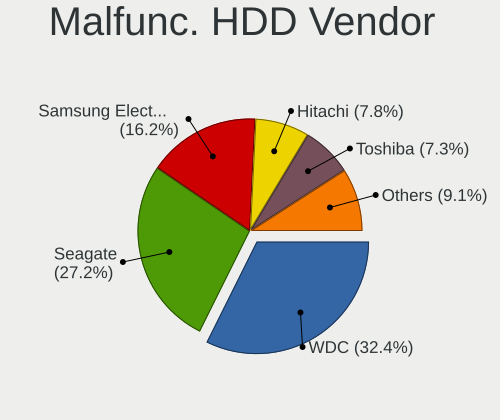

| Vendor              | Desktops | Drives | Percent |
|---------------------|----------|--------|---------|
| WDC                 | 231      | 411    | 32.35%  |
| Seagate             | 194      | 274    | 27.17%  |
| Samsung Electronics | 116      | 177    | 16.25%  |
| Hitachi             | 56       | 91     | 7.84%   |
| Toshiba             | 52       | 94     | 7.28%   |
| Maxtor              | 36       | 50     | 5.04%   |
| HGST                | 11       | 13     | 1.54%   |
| WD MediaMax         | 5        | 6      | 0.7%    |
| Fujitsu             | 4        | 4      | 0.56%   |
| Hewlett-Packard     | 2        | 2      | 0.28%   |
| SATAFIRM            | 1        | 1      | 0.14%   |
| QUANTUM             | 1        | 1      | 0.14%   |
| ICY BOX             | 1        | 1      | 0.14%   |
| IBM/Hitachi         | 1        | 1      | 0.14%   |
| ExcelStor           | 1        | 1      | 0.14%   |
| ASMT                | 1        | 1      | 0.14%   |
| Unknown             | 1        | 2      | 0.14%   |

Malfunc. Drive Kind
-------------------

Kinds of faulty drives

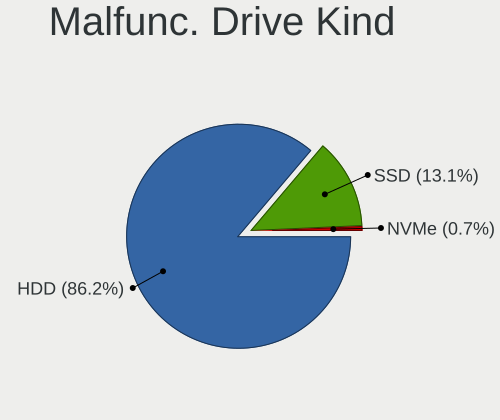

| Kind | Desktops | Drives | Percent |
|------|----------|--------|---------|
| HDD  | 612      | 1130   | 86.2%   |
| SSD  | 93       | 172    | 13.1%   |
| NVMe | 5        | 7      | 0.7%    |

Failed Drives
-------------

Failed drive models

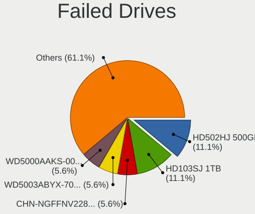

| Model                             | Desktops | Drives | Percent |
|-----------------------------------|----------|--------|---------|
| Samsung Electronics HD502HJ 500GB | 2        | 3      | 11.11%  |
| Samsung Electronics HD103SJ 1TB   | 2        | 2      | 11.11%  |
| Zheino CHN-NGFFNV2280-256 256GB   | 1        | 1      | 5.56%   |
| WDC WD5003ABYX-70WERA0 500GB      | 1        | 1      | 5.56%   |
| WDC WD5000AAKS-00UU3A0 500GB      | 1        | 1      | 5.56%   |
| WDC WD1600BEVT-80A23T0 160GB      | 1        | 1      | 5.56%   |
| Seagate ST9160412AS 160GB         | 1        | 1      | 5.56%   |
| Seagate ST380815AS 80GB           | 1        | 3      | 5.56%   |
| Seagate ST3160815AS 160GB         | 1        | 1      | 5.56%   |
| Samsung Electronics SP0802N 80GB  | 1        | 1      | 5.56%   |
| Samsung Electronics HD204UI 2TB   | 1        | 1      | 5.56%   |
| Samsung Electronics HD103UJ 1TB   | 1        | 1      | 5.56%   |
| OCZ-AGIL ITY3 64GB SSD            | 1        | 1      | 5.56%   |
| Hitachi HDS721010DLE630 1TB       | 1        | 1      | 5.56%   |
| Hewlett-Packard SSD EX900 250GB   | 1        | 1      | 5.56%   |
| ExcelStor Technology J8160S 160GB | 1        | 1      | 5.56%   |

Failed Drive Vendor
-------------------

Failed drive vendors

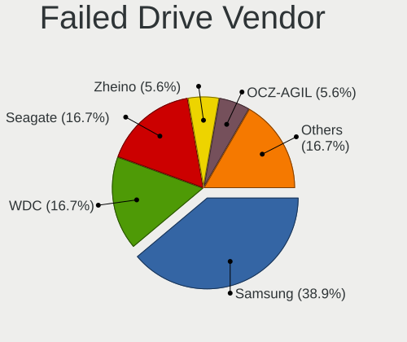

| Vendor              | Desktops | Drives | Percent |
|---------------------|----------|--------|---------|
| Samsung Electronics | 7        | 8      | 38.89%  |
| WDC                 | 3        | 3      | 16.67%  |
| Seagate             | 3        | 5      | 16.67%  |
| Zheino              | 1        | 1      | 5.56%   |
| OCZ-AGIL            | 1        | 1      | 5.56%   |
| Hitachi             | 1        | 1      | 5.56%   |
| Hewlett-Packard     | 1        | 1      | 5.56%   |
| ExcelStor           | 1        | 1      | 5.56%   |

Drive Status
------------

Number of failed and malfunc. drives

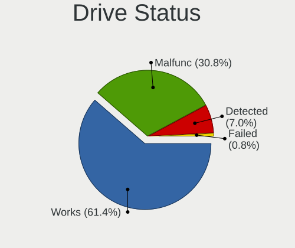

| Status   | Desktops | Drives | Percent |
|----------|----------|--------|---------|
| Works    | 1367     | 4185   | 61.38%  |
| Malfunc  | 686      | 1309   | 30.8%   |
| Detected | 156      | 289    | 7%      |
| Failed   | 18       | 21     | 0.81%   |

Storage controller
------------------

Storage Vendor
--------------

Storage controller vendors

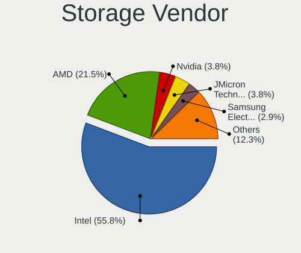

| Vendor                           | Desktops | Percent |
|----------------------------------|----------|---------|
| Intel                            | 1158     | 55.75%  |
| AMD                              | 446      | 21.47%  |
| Nvidia                           | 79       | 3.8%    |
| JMicron Technology               | 78       | 3.76%   |
| Samsung Electronics              | 61       | 2.94%   |
| ASMedia Technology               | 45       | 2.17%   |
| Kingston Technology Company      | 42       | 2.02%   |
| Marvell Technology Group         | 33       | 1.59%   |
| VIA Technologies                 | 21       | 1.01%   |
| Phison Electronics               | 15       | 0.72%   |
| Realtek Semiconductor            | 14       | 0.67%   |
| Silicon Motion                   | 13       | 0.63%   |
| Silicon Image                    | 13       | 0.63%   |
| SanDisk                          | 11       | 0.53%   |
| SK hynix                         | 9        | 0.43%   |
| Micron/Crucial Technology        | 8        | 0.39%   |
| ADATA Technology                 | 5        | 0.24%   |
| Micron Technology                | 4        | 0.19%   |
| Silicon Integrated Systems [SiS] | 2        | 0.1%    |
| MAXIO Technology (Hangzhou)      | 2        | 0.1%    |
| LSI Logic / Symbios Logic        | 2        | 0.1%    |
| Integrated Technology Express    | 2        | 0.1%    |
| Adaptec                          | 2        | 0.1%    |
| 3ware                            | 2        | 0.1%    |
| Zhaoxin                          | 1        | 0.05%   |
| ULi Electronics                  | 1        | 0.05%   |
| Toshiba America Info Systems     | 1        | 0.05%   |
| Shenzhen Longsys Electronics     | 1        | 0.05%   |
| Promise Technology               | 1        | 0.05%   |
| O2 Micro                         | 1        | 0.05%   |
| Lite-On Technology               | 1        | 0.05%   |
| INNOGRIT                         | 1        | 0.05%   |
| Hewlett-Packard                  | 1        | 0.05%   |
| Broadcom / LSI                   | 1        | 0.05%   |

Storage Model
-------------

Storage controller models

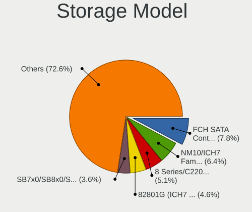

| Model                                                                                   | Desktops | Percent |
|-----------------------------------------------------------------------------------------|----------|---------|
| AMD FCH SATA Controller [AHCI mode]                                                     | 229      | 7.76%   |
| Intel NM10/ICH7 Family SATA Controller [IDE mode]                                       | 188      | 6.37%   |
| Intel 8 Series/C220 Series Chipset Family 6-port SATA Controller 1 [AHCI mode]          | 149      | 5.05%   |
| Intel 82801G (ICH7 Family) IDE Controller                                               | 137      | 4.64%   |
| AMD SB7x0/SB8x0/SB9x0 IDE Controller                                                    | 105      | 3.56%   |
| Intel 6 Series/C200 Series Chipset Family 6 port Desktop SATA AHCI Controller           | 95       | 3.22%   |
| Intel Q170/Q150/B150/H170/H110/Z170/CM236 Chipset SATA Controller [AHCI Mode]           | 85       | 2.88%   |
| AMD SB7x0/SB8x0/SB9x0 SATA Controller [AHCI mode]                                       | 78       | 2.64%   |
| AMD SB7x0/SB8x0/SB9x0 SATA Controller [IDE mode]                                        | 76       | 2.58%   |
| Intel 6 Series/C200 Series Chipset Family Desktop SATA Controller (IDE mode, ports 4-5) | 72       | 2.44%   |
| Intel 6 Series/C200 Series Chipset Family Desktop SATA Controller (IDE mode, ports 0-3) | 72       | 2.44%   |
| Intel 200 Series PCH SATA controller [AHCI mode]                                        | 70       | 2.37%   |
| Intel 7 Series/C210 Series Chipset Family 6-port SATA Controller [AHCI mode]            | 67       | 2.27%   |
| Intel SATA Controller [RAID mode]                                                       | 62       | 2.1%    |
| AMD FCH IDE Controller                                                                  | 61       | 2.07%   |
| Intel 4 Series Chipset PT IDER Controller                                               | 59       | 2%      |
| Intel 82801I (ICH9 Family) 2 port SATA Controller [IDE mode]                            | 51       | 1.73%   |
| AMD 400 Series Chipset SATA Controller                                                  | 51       | 1.73%   |
| Intel 82801JD/DO (ICH10 Family) SATA AHCI Controller                                    | 47       | 1.59%   |
| JMicron JMB363 SATA/IDE Controller                                                      | 46       | 1.56%   |
| ASMedia ASM1061/ASM1062 Serial ATA Controller                                           | 43       | 1.46%   |
| Nvidia MCP61 SATA Controller                                                            | 39       | 1.32%   |
| Samsung NVMe SSD Controller SM981/PM981/PM983                                           | 36       | 1.22%   |
| Nvidia MCP61 IDE                                                                        | 36       | 1.22%   |
| JMicron JMB368 IDE controller                                                           | 31       | 1.05%   |
| Intel 82801JI (ICH10 Family) SATA AHCI Controller                                       | 31       | 1.05%   |
| Intel Cannon Lake PCH SATA AHCI Controller                                              | 30       | 1.02%   |
| Intel 82801IR/IO/IH (ICH9R/DO/DH) 4 port SATA Controller [IDE mode]                     | 30       | 1.02%   |
| Intel 82801JD/DO (ICH10 Family) 4-port SATA IDE Controller                              | 27       | 0.92%   |
| Intel 82801JD/DO (ICH10 Family) 2-port SATA IDE Controller                              | 27       | 0.92%   |
| AMD 500 Series Chipset SATA Controller                                                  | 25       | 0.85%   |
| Intel 82801JI (ICH10 Family) 4 port SATA IDE Controller #1                              | 24       | 0.81%   |
| Intel 82Q35 Express PT IDER Controller                                                  | 23       | 0.78%   |
| Intel 82801JI (ICH10 Family) 2 port SATA IDE Controller #2                              | 23       | 0.78%   |
| Intel 82801IR/IO/IH (ICH9R/DO/DH) 6 port SATA Controller [AHCI mode]                    | 22       | 0.75%   |
| Intel 82801IB (ICH9) 2 port SATA Controller [IDE mode]                                  | 21       | 0.71%   |
| Intel 82801H (ICH8 Family) 4 port SATA Controller [IDE mode]                            | 21       | 0.71%   |
| AMD A320 Chipset SATA Controller [AHCI mode]                                            | 21       | 0.71%   |
| AMD 300 Series Chipset SATA Controller                                                  | 20       | 0.68%   |
| Intel 5 Series/3400 Series Chipset 4 port SATA IDE Controller                           | 19       | 0.64%   |

Storage Kind
------------

Kind of storage controller (IDE, SATA, NVMe, SAS, ...)

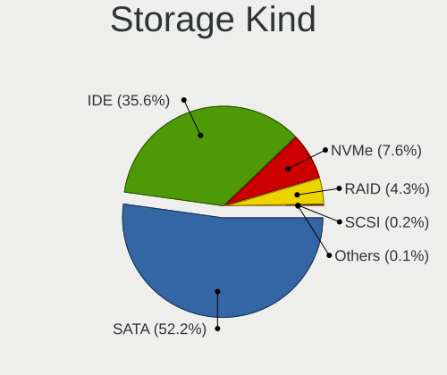

| Kind | Desktops | Percent |
|------|----------|---------|
| SATA | 1147     | 52.21%  |
| IDE  | 783      | 35.64%  |
| NVMe | 166      | 7.56%   |
| RAID | 94       | 4.28%   |
| SCSI | 5        | 0.23%   |
| SAS  | 2        | 0.09%   |

Processor
---------

CPU Vendor
----------

Processor vendors

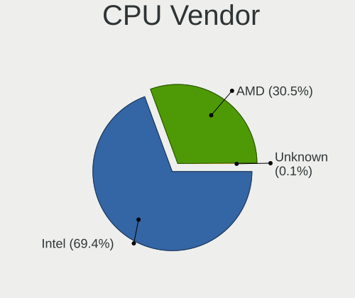

| Vendor       | Desktops | Percent |
|--------------|----------|---------|
| Intel        | 1184     | 69.4%   |
| AMD          | 520      | 30.48%  |
| CentaurHauls | 1        | 0.06%   |
| Unknown      | 1        | 0.06%   |

CPU Model
---------

Processor models

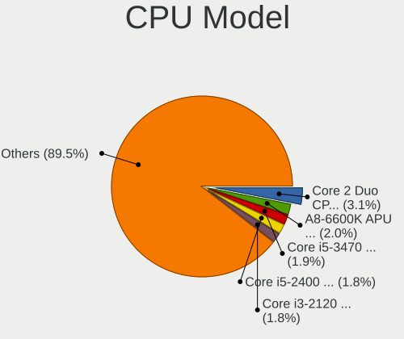

| Model                                         | Desktops | Percent |
|-----------------------------------------------|----------|---------|
| Intel Core 2 Duo CPU E8400 @ 3.00GHz          | 53       | 3.07%   |
| AMD A8-6600K APU with Radeon HD Graphics      | 34       | 1.97%   |
| Intel Core i5-3470 CPU @ 3.20GHz              | 32       | 1.86%   |
| Intel Core i5-2400 CPU @ 3.10GHz              | 31       | 1.8%    |
| Intel Core i3-2120 CPU @ 3.30GHz              | 31       | 1.8%    |
| Intel Core 2 Duo CPU E7500 @ 2.93GHz          | 30       | 1.74%   |
| Intel Core i5-6500 CPU @ 3.20GHz              | 26       | 1.51%   |
| Intel Core 2 Quad CPU Q6600 @ 2.40GHz         | 26       | 1.51%   |
| Intel Core i3-3220 CPU @ 3.30GHz              | 23       | 1.33%   |
| Intel Core i3-4160 CPU @ 3.60GHz              | 22       | 1.28%   |
| AMD FX-6300 Six-Core Processor                | 18       | 1.04%   |
| Intel Core 2 Duo CPU E7300 @ 2.66GHz          | 16       | 0.93%   |
| Intel Core i3-4130 CPU @ 3.40GHz              | 15       | 0.87%   |
| Intel Pentium Dual-Core CPU E5700 @ 3.00GHz   | 14       | 0.81%   |
| Intel Core i5-4460 CPU @ 3.20GHz              | 14       | 0.81%   |
| AMD Ryzen 3 2200G with Radeon Vega Graphics   | 14       | 0.81%   |
| Intel Pentium 4 CPU 3.00GHz                   | 13       | 0.75%   |
| Intel Pentium Dual-Core CPU E5300 @ 2.60GHz   | 12       | 0.7%    |
| Intel Pentium CPU G3220 @ 3.00GHz             | 12       | 0.7%    |
| Intel Core i7-4790 CPU @ 3.60GHz              | 12       | 0.7%    |
| Intel Core i5-7500 CPU @ 3.40GHz              | 12       | 0.7%    |
| Intel Core i5-4590 CPU @ 3.30GHz              | 12       | 0.7%    |
| Intel Core 2 Duo CPU E8500 @ 3.16GHz          | 12       | 0.7%    |
| AMD FX-8350 Eight-Core Processor              | 12       | 0.7%    |
| Intel Core i3-2100 CPU @ 3.10GHz              | 11       | 0.64%   |
| Intel Core 2 Quad CPU Q8200 @ 2.33GHz         | 11       | 0.64%   |
| AMD A8-7600 Radeon R7, 10 Compute Cores 4C+6G | 11       | 0.64%   |
| Intel Xeon CPU X5677 @ 3.47GHz                | 10       | 0.58%   |
| AMD Ryzen 7 5700G with Radeon Graphics        | 10       | 0.58%   |
| AMD A4-6300 APU with Radeon HD Graphics       | 10       | 0.58%   |
| Intel Pentium Dual-Core CPU E5400 @ 2.70GHz   | 9        | 0.52%   |
| Intel Pentium Dual CPU E2180 @ 2.00GHz        | 9        | 0.52%   |
| Intel Core i5-4570 CPU @ 3.20GHz              | 9        | 0.52%   |
| Intel Core i5-3330 CPU @ 3.00GHz              | 9        | 0.52%   |
| Intel Core i5 CPU 650 @ 3.20GHz               | 9        | 0.52%   |
| Intel Core i3-7100 CPU @ 3.90GHz              | 9        | 0.52%   |
| Intel Core 2 Duo CPU E6550 @ 2.33GHz          | 9        | 0.52%   |
| AMD Phenom II X4 965 Processor                | 9        | 0.52%   |
| AMD Athlon II X2 260 Processor                | 9        | 0.52%   |
| Intel Xeon CPU E5-2696 v3 @ 2.30GHz           | 8        | 0.46%   |

CPU Model Family
----------------

Processor model prefix

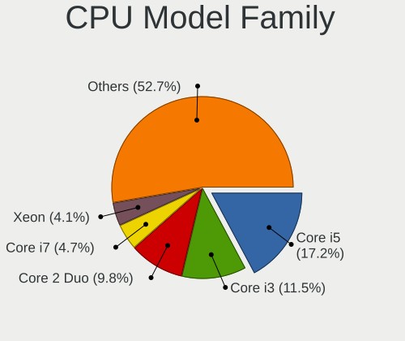

| Model                   | Desktops | Percent |
|-------------------------|----------|---------|
| Intel Core i5           | 295      | 17.17%  |
| Intel Core i3           | 198      | 11.53%  |
| Intel Core 2 Duo        | 169      | 9.84%   |
| Intel Core i7           | 80       | 4.66%   |
| Intel Xeon              | 71       | 4.13%   |
| Intel Core 2 Quad       | 69       | 4.02%   |
| Intel Pentium           | 67       | 3.9%    |
| Intel Pentium Dual-Core | 65       | 3.78%   |
| AMD A8                  | 64       | 3.73%   |
| AMD FX                  | 60       | 3.49%   |
| Intel Celeron           | 58       | 3.38%   |
| AMD Ryzen 5             | 51       | 2.97%   |
| AMD Athlon II X2        | 40       | 2.33%   |
| AMD Ryzen 7             | 36       | 2.1%    |
| AMD Athlon 64 X2        | 33       | 1.92%   |
| AMD Phenom II X4        | 30       | 1.75%   |
| Other                   | 27       | 1.57%   |
| AMD Ryzen 3             | 26       | 1.51%   |
| AMD A4                  | 26       | 1.51%   |
| Intel Pentium 4         | 24       | 1.4%    |
| Intel Pentium Dual      | 23       | 1.34%   |
| Intel Core 2            | 21       | 1.22%   |
| AMD A10                 | 18       | 1.05%   |
| Intel Atom              | 16       | 0.93%   |
| Intel Pentium D         | 14       | 0.81%   |
| AMD Athlon II X4        | 14       | 0.81%   |
| AMD Sempron             | 13       | 0.76%   |
| AMD A6                  | 11       | 0.64%   |
| AMD Athlon X4           | 10       | 0.58%   |
| AMD Athlon Dual Core    | 10       | 0.58%   |
| AMD Athlon              | 9        | 0.52%   |
| AMD Ryzen Embedded      | 7        | 0.41%   |
| AMD Athlon 64           | 7        | 0.41%   |
| AMD Phenom II X6        | 6        | 0.35%   |
| AMD Ryzen 9             | 4        | 0.23%   |
| AMD Phenom II X2        | 4        | 0.23%   |
| AMD Phenom              | 4        | 0.23%   |
| Intel Pentium Gold      | 3        | 0.17%   |
| Intel Celeron D         | 3        | 0.17%   |
| AMD Turion II Neo       | 3        | 0.17%   |

CPU Cores
---------

Number of processor cores

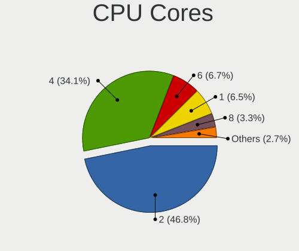

| Number  | Desktops | Percent |
|---------|----------|---------|
| 2       | 808      | 46.81%  |
| 4       | 588      | 34.07%  |
| 6       | 115      | 6.66%   |
| 1       | 112      | 6.49%   |
| 8       | 57       | 3.3%    |
| 3       | 27       | 1.56%   |
| 18      | 6        | 0.35%   |
| 10      | 5        | 0.29%   |
| 12      | 3        | 0.17%   |
| 16      | 2        | 0.12%   |
| Unknown | 2        | 0.12%   |
| 24      | 1        | 0.06%   |

CPU Sockets
-----------

Number of sockets

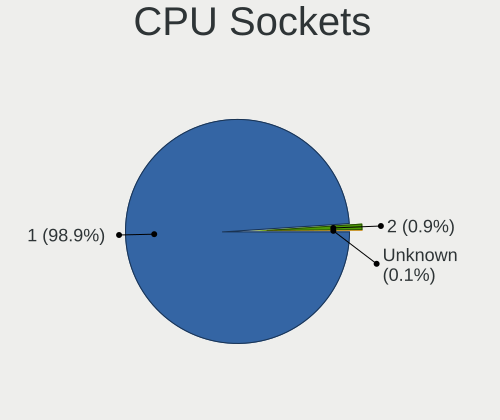

| Number  | Desktops | Percent |
|---------|----------|---------|
| 1       | 1690     | 98.95%  |
| 2       | 16       | 0.94%   |
| 4       | 1        | 0.06%   |
| Unknown | 1        | 0.06%   |

CPU Threads
-----------

Threads per core (Hyper-Threading)

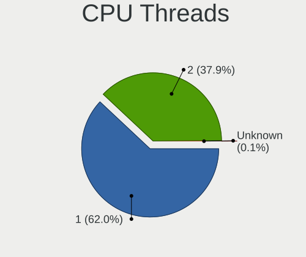

| Number  | Desktops | Percent |
|---------|----------|---------|
| 1       | 1068     | 61.98%  |
| 2       | 653      | 37.9%   |
| Unknown | 2        | 0.12%   |

CPU Op-Modes
------------

CPU Operation Modes (32-bit, 64-bit)

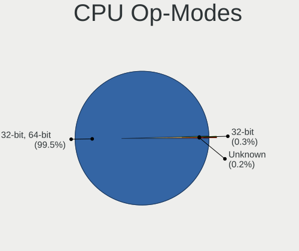

| Op mode        | Desktops | Percent |
|----------------|----------|---------|
| 32-bit, 64-bit | 1699     | 99.53%  |
| 32-bit         | 5        | 0.29%   |
| Unknown        | 3        | 0.18%   |

CPU Microcode
-------------

Microcode number

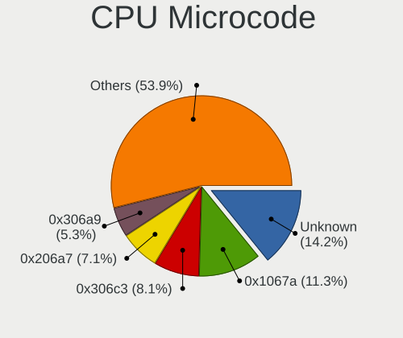

| Number     | Desktops | Percent |
|------------|----------|---------|
| Unknown    | 252      | 14.16%  |
| 0x1067a    | 201      | 11.29%  |
| 0x306c3    | 145      | 8.15%   |
| 0x206a7    | 127      | 7.13%   |
| 0x306a9    | 95       | 5.34%   |
| 0x06001119 | 76       | 4.27%   |
| 0x010000c8 | 65       | 3.65%   |
| 0x506e3    | 51       | 2.87%   |
| 0x10676    | 46       | 2.58%   |
| 0x906e9    | 44       | 2.47%   |
| 0x6fb      | 43       | 2.42%   |
| 0x6fd      | 37       | 2.08%   |
| 0x906ea    | 36       | 2.02%   |
| 0x06000852 | 27       | 1.52%   |
| 0x06003106 | 23       | 1.29%   |
| 0x08101016 | 21       | 1.18%   |
| 0x0600084f | 21       | 1.18%   |
| 0x0800820d | 19       | 1.07%   |
| 0x906eb    | 16       | 0.9%    |
| 0x6f2      | 14       | 0.79%   |
| 0x206c2    | 14       | 0.79%   |
| 0x106e5    | 14       | 0.79%   |
| 0x010000db | 14       | 0.79%   |
| 0x20655    | 13       | 0.73%   |
| 0x106a5    | 13       | 0.73%   |
| 0x10677    | 13       | 0.73%   |
| 0x03000027 | 13       | 0.73%   |
| 0x08108109 | 12       | 0.67%   |
| 0x08001138 | 12       | 0.67%   |
| 0xf43      | 11       | 0.62%   |
| 0x20652    | 11       | 0.62%   |
| 0x0810100b | 10       | 0.56%   |
| 0x0600611a | 10       | 0.56%   |
| 0x0600063e | 10       | 0.56%   |
| 0xf65      | 9        | 0.51%   |
| 0x0a20120a | 9        | 0.51%   |
| 0x0700010f | 9        | 0.51%   |
| 0xa0653    | 8        | 0.45%   |
| 0x6f6      | 8        | 0.45%   |
| 0x106ca    | 8        | 0.45%   |

CPU Microarch
-------------

Microarchitecture

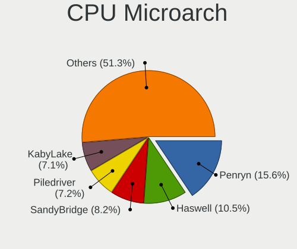

| Name             | Desktops | Percent |
|------------------|----------|---------|
| Penryn           | 267      | 15.62%  |
| Haswell          | 180      | 10.53%  |
| SandyBridge      | 140      | 8.19%   |
| Piledriver       | 123      | 7.2%    |
| KabyLake         | 122      | 7.14%   |
| IvyBridge        | 113      | 6.61%   |
| K10              | 112      | 6.55%   |
| Core             | 109      | 6.38%   |
| Skylake          | 76       | 4.45%   |
| K8 Hammer        | 62       | 3.63%   |
| Zen              | 48       | 2.81%   |
| Westmere         | 46       | 2.69%   |
| NetBurst         | 46       | 2.69%   |
| Zen+             | 33       | 1.93%   |
| Zen 3            | 32       | 1.87%   |
| Steamroller      | 29       | 1.7%    |
| Nehalem          | 27       | 1.58%   |
| K10 Llano        | 18       | 1.05%   |
| Excavator        | 17       | 0.99%   |
| Zen 2            | 16       | 0.94%   |
| Bonnell          | 16       | 0.94%   |
| Bulldozer        | 15       | 0.88%   |
| Silvermont       | 12       | 0.7%    |
| CometLake        | 12       | 0.7%    |
| Alderlake Hybrid | 10       | 0.59%   |
| Jaguar           | 9        | 0.53%   |
| Bobcat           | 6        | 0.35%   |
| Unknown          | 4        | 0.23%   |
| Puma             | 3        | 0.18%   |
| Goldmont plus    | 2        | 0.12%   |
| Goldmont         | 2        | 0.12%   |
| Gracemont        | 1        | 0.06%   |
| Broadwell        | 1        | 0.06%   |

Graphics
--------

GPU Vendor
----------

Vendors of graphics cards

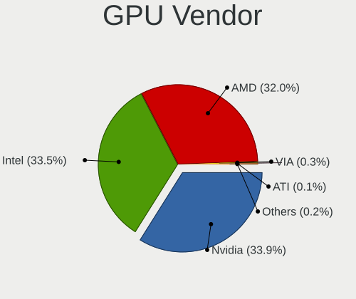

| Vendor                                       | Desktops | Percent |
|----------------------------------------------|----------|---------|
| Nvidia                                       | 621      | 33.93%  |
| Intel                                        | 613      | 33.5%   |
| AMD                                          | 585      | 31.97%  |
| VIA Technologies                             | 5        | 0.27%   |
| ATI Technologies                             | 2        | 0.11%   |
| Zhaoxin                                      | 1        | 0.05%   |
| XGI Technology (eXtreme Graphics Innovation) | 1        | 0.05%   |
| Silicon Integrated Systems [SiS]             | 1        | 0.05%   |
| Matrox Electronics Systems                   | 1        | 0.05%   |

GPU Model
---------

Graphics card models

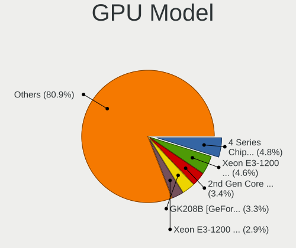

| Model                                                                       | Desktops | Percent |
|-----------------------------------------------------------------------------|----------|---------|
| Intel 4 Series Chipset Integrated Graphics Controller                       | 92       | 4.84%   |
| Intel Xeon E3-1200 v3/4th Gen Core Processor Integrated Graphics Controller | 88       | 4.63%   |
| Intel 2nd Generation Core Processor Family Integrated Graphics Controller   | 65       | 3.42%   |
| Nvidia GK208B [GeForce GT 710]                                              | 62       | 3.26%   |
| Intel Xeon E3-1200 v2/3rd Gen Core processor Graphics Controller            | 55       | 2.9%    |
| Intel 82G33/G31 Express Integrated Graphics Controller                      | 44       | 2.32%   |
| Nvidia GT218 [GeForce 210]                                                  | 42       | 2.21%   |
| Intel Skylake-S GT2 [HD Graphics 530]                                       | 42       | 2.21%   |
| AMD Caicos [Radeon HD 6450/7450/8450 / R5 230 OEM]                          | 40       | 2.11%   |
| AMD Cedar [Radeon HD 5000/6000/7350/8350 Series]                            | 38       | 2%      |
| Intel 4th Generation Core Processor Family Integrated Graphics Controller   | 36       | 1.9%    |
| AMD Ellesmere [Radeon RX 470/480/570/570X/580/580X/590]                     | 35       | 1.84%   |
| Nvidia GP107 [GeForce GTX 1050 Ti]                                          | 34       | 1.79%   |
| AMD Richland [Radeon HD 8570D]                                              | 34       | 1.79%   |
| Intel CoffeeLake-S GT2 [UHD Graphics 630]                                   | 32       | 1.69%   |
| Intel 82945G/GZ Integrated Graphics Controller                              | 27       | 1.42%   |
| AMD Oland PRO [Radeon R7 240/340 / Radeon 520]                              | 27       | 1.42%   |
| Nvidia GF108 [GeForce GT 630]                                               | 25       | 1.32%   |
| Intel Kaby Lake-S GT2 [HD Graphics 630]                                     | 22       | 1.16%   |
| AMD Raven Ridge [Radeon Vega Series / Radeon Vega Mobile Series]            | 21       | 1.11%   |
| AMD Kaveri [Radeon R7 Graphics]                                             | 18       | 0.95%   |
| Nvidia GP108 [GeForce GT 1030]                                              | 17       | 0.9%    |
| Nvidia GF119 [GeForce GT 610]                                               | 17       | 0.9%    |
| AMD Lexa PRO [Radeon 540/540X/550/550X / RX 540X/550/550X]                  | 16       | 0.84%   |
| Nvidia GP106 [GeForce GTX 1060 3GB]                                         | 15       | 0.79%   |
| AMD Redwood XT [Radeon HD 5670/5690/5730]                                   | 15       | 0.79%   |
| AMD Cape Verde XT [Radeon HD 7770/8760 / R7 250X]                           | 15       | 0.79%   |
| Nvidia GP106 [GeForce GTX 1060 6GB]                                         | 14       | 0.74%   |
| Nvidia GK208B [GeForce GT 730]                                              | 14       | 0.74%   |
| Nvidia G94 [GeForce 9600 GT]                                                | 14       | 0.74%   |
| Intel 82Q35 Express Integrated Graphics Controller                          | 14       | 0.74%   |
| AMD RS880 [Radeon HD 4200]                                                  | 13       | 0.68%   |
| AMD Cezanne [Radeon Vega Series / Radeon Vega Mobile Series]                | 13       | 0.68%   |
| Nvidia GM107 [GeForce GTX 750 Ti]                                           | 12       | 0.63%   |
| Intel Core Processor Integrated Graphics Controller                         | 12       | 0.63%   |
| AMD RS780L [Radeon 3000]                                                    | 12       | 0.63%   |
| Nvidia GK106GL [Quadro K4000]                                               | 11       | 0.58%   |
| Nvidia GF108 [GeForce GT 730]                                               | 11       | 0.58%   |
| Intel Atom Processor Z36xxx/Z37xxx Series Graphics & Display                | 11       | 0.58%   |
| AMD Juniper XT [Radeon HD 5770]                                             | 11       | 0.58%   |

GPU Combo
---------

Combinations of graphics cards

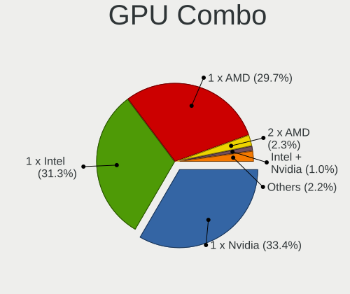

| Name           | Desktops | Percent |
|----------------|----------|---------|
| 1 x Nvidia     | 591      | 33.41%  |
| 1 x Intel      | 554      | 31.32%  |
| 1 x AMD        | 526      | 29.73%  |
| 2 x AMD        | 41       | 2.32%   |
| Intel + Nvidia | 18       | 1.02%   |
| Intel + AMD    | 13       | 0.73%   |
| AMD + Nvidia   | 11       | 0.62%   |
| 1 x VIA        | 5        | 0.28%   |
| 2 x Nvidia     | 3        | 0.17%   |
| 2 x Intel      | 3        | 0.17%   |
| 1 x Zhaoxin    | 1        | 0.06%   |
| 1 x XGI        | 1        | 0.06%   |
| 1 x SiS        | 1        | 0.06%   |
| 1 x Matrox     | 1        | 0.06%   |

GPU Driver
----------

Free vs proprietary

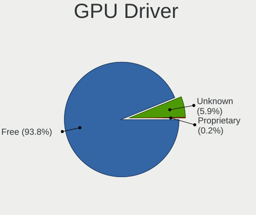

| Driver      | Desktops | Percent |
|-------------|----------|---------|
| Free        | 1625     | 93.82%  |
| Unknown     | 103      | 5.95%   |
| Proprietary | 4        | 0.23%   |

GPU Memory
----------

Total video memory

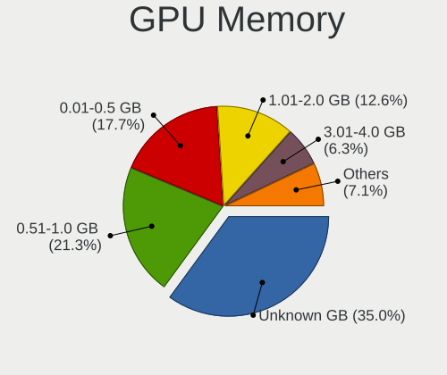

| Size in GB | Desktops | Percent |
|------------|----------|---------|
| Unknown    | 636      | 35.04%  |
| 0.51-1.0   | 386      | 21.27%  |
| 0.01-0.5   | 321      | 17.69%  |
| 1.01-2.0   | 229      | 12.62%  |
| 3.01-4.0   | 115      | 6.34%   |
| 7.01-8.0   | 50       | 2.75%   |
| 2.01-3.0   | 29       | 1.6%    |
| 5.01-6.0   | 27       | 1.49%   |
| 8.01-16.0  | 21       | 1.16%   |
| 4.01-5.0   | 1        | 0.06%   |

Monitor
-------

Monitor Vendor
--------------

Monitor vendors

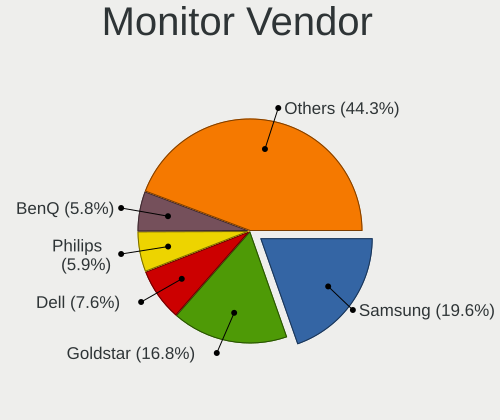

| Vendor                  | Desktops | Percent |
|-------------------------|----------|---------|
| Samsung Electronics     | 342      | 19.63%  |
| Goldstar                | 293      | 16.82%  |
| Dell                    | 133      | 7.63%   |
| Philips                 | 102      | 5.86%   |
| BenQ                    | 101      | 5.8%    |
| Hewlett-Packard         | 94       | 5.4%    |
| Ancor Communications    | 86       | 4.94%   |
| Acer                    | 86       | 4.94%   |
| AOC                     | 54       | 3.1%    |
| Fujitsu Siemens         | 52       | 2.99%   |
| Lenovo                  | 24       | 1.38%   |
| Iiyama                  | 23       | 1.32%   |
| Eizo                    | 23       | 1.32%   |
| NEC Computers           | 21       | 1.21%   |
| Vestel Elektronik       | 18       | 1.03%   |
| Medion                  | 18       | 1.03%   |
| HannStar                | 18       | 1.03%   |
| Sony                    | 16       | 0.92%   |
| HKC                     | 16       | 0.92%   |
| ViewSonic               | 14       | 0.8%    |
| ASUSTek Computer        | 14       | 0.8%    |
| Chi Mei Optoelectronics | 11       | 0.63%   |
| Panasonic               | 9        | 0.52%   |
| MStar                   | 9        | 0.52%   |
| LG Electronics          | 9        | 0.52%   |
| Belinea                 | 9        | 0.52%   |
| Plain Tree Systems      | 8        | 0.46%   |
| OEM                     | 8        | 0.46%   |
| Unknown                 | 7        | 0.4%    |
| IBM                     | 7        | 0.4%    |
| Toshiba                 | 6        | 0.34%   |
| CVT                     | 6        | 0.34%   |
| Videoseven              | 5        | 0.29%   |
| KTC                     | 5        | 0.29%   |
| Gericom                 | 5        | 0.29%   |
| Orion                   | 4        | 0.23%   |
| NCS                     | 4        | 0.23%   |
| Daewoo                  | 4        | 0.23%   |
| Unknown (XXX)           | 3        | 0.17%   |
| Sceptre Tech            | 3        | 0.17%   |

Monitor Model
-------------

Monitor models

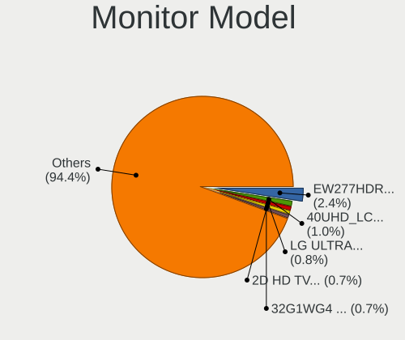

| Model                                                                  | Desktops | Percent |
|------------------------------------------------------------------------|----------|---------|
| BenQ EW277HDR BNQ7948 1920x1080 598x336mm 27.0-inch                    | 44       | 2.43%   |
| Vestel Elektronik 40UHD_LCD_TV VES3700 3840x2160 880x500mm 39.8-inch   | 18       | 1%      |
| Goldstar LG ULTRAWIDE GSM59F1 2560x1080 670x280mm 28.6-inch            | 14       | 0.77%   |
| Goldstar 2D HD TV GSM59CA 1366x768 509x286mm 23.0-inch                 | 13       | 0.72%   |
| AOC 32G1WG4 AOC3201 1920x1080 697x392mm 31.5-inch                      | 12       | 0.66%   |
| Samsung Electronics C24F390 SAM0D2C 1920x1080 521x293mm 23.5-inch      | 11       | 0.61%   |
| Iiyama PL2473HD IVM6107 1920x1080 521x293mm 23.5-inch                  | 11       | 0.61%   |
| HKC Monitor HKC1850 1360x768 409x230mm 18.5-inch                       | 11       | 0.61%   |
| Ancor Communications ASUS VW193D ACI19D5 1440x900 408x255mm 18.9-inch  | 11       | 0.61%   |
| Samsung Electronics S19B150 SAM08A2 1366x768 410x230mm 18.5-inch       | 10       | 0.55%   |
| Fujitsu Siemens L19W-9 FUS075C 1440x900 408x255mm 18.9-inch            | 10       | 0.55%   |
| MStar Demo MST0030 1920x1080 708x398mm 32.0-inch                       | 9        | 0.5%    |
| Goldstar W1934 GSM4B7A 1440x900 410x256mm 19.0-inch                    | 9        | 0.5%    |
| Goldstar MP59G GSM5B34 1920x1080 480x270mm 21.7-inch                   | 9        | 0.5%    |
| Ancor Communications VG248 ACI24A5 1920x1080 531x299mm 24.0-inch       | 9        | 0.5%    |
| Samsung Electronics SyncMaster SAM011E 1280x1024 338x270mm 17.0-inch   | 8        | 0.44%   |
| Samsung Electronics LS27AG30x SAM717A 1920x1080 597x336mm 27.0-inch    | 8        | 0.44%   |
| Philips PHL 244E5 PHLC0C0 1920x1080 527x296mm 23.8-inch                | 8        | 0.44%   |
| Philips PHL 223V5 PHLC0CF 1920x1080 477x268mm 21.5-inch                | 8        | 0.44%   |
| OEM 32W_LCD_TV OEM3700 1920x540                                        | 8        | 0.44%   |
| HannStar Hanns.G HX191 HSD0013 1280x1024 376x301mm 19.0-inch           | 8        | 0.44%   |
| Goldstar 2D FHD TV GSM59C6 1920x1080 509x286mm 23.0-inch               | 8        | 0.44%   |
| Samsung Electronics SyncMaster SAM036F 1440x900 428x255mm 19.6-inch    | 7        | 0.39%   |
| Samsung Electronics S24R35x SAM100E 1920x1080 527x296mm 23.8-inch      | 7        | 0.39%   |
| Samsung Electronics S24D330 SAM0D92 1920x1080 531x299mm 24.0-inch      | 7        | 0.39%   |
| Samsung Electronics S22F350 SAM0D1B 1920x1080 477x268mm 21.5-inch      | 7        | 0.39%   |
| Philips 191V PHL0887 1366x768 409x230mm 18.5-inch                      | 7        | 0.39%   |
| Lenovo LEN L171p LEN24C9 1280x1024 338x270mm 17.0-inch                 | 7        | 0.39%   |
| Goldstar ULTRAWIDE GSM76F9 2560x1080 531x298mm 24.0-inch               | 7        | 0.39%   |
| Goldstar HDR WFHD GSM7715 2560x1080 798x334mm 34.1-inch                | 7        | 0.39%   |
| Goldstar HD GSM5ACB 1366x768 410x230mm 18.5-inch                       | 7        | 0.39%   |
| Goldstar E2260 GSM57E0 1920x1080 477x268mm 21.5-inch                   | 7        | 0.39%   |
| Samsung Electronics LS49A950U SAM71CC 3840x1080 1192x336mm 48.8-inch   | 6        | 0.33%   |
| Samsung Electronics LCD Monitor SAM07DE 1920x1080 1120x630mm 50.6-inch | 6        | 0.33%   |
| Philips PHL 226E9Q PHLC17D 1920x1080 480x270mm 21.7-inch               | 6        | 0.33%   |
| Hewlett-Packard P222va HWP322B 1920x1080 477x268mm 21.5-inch           | 6        | 0.33%   |
| Goldstar IPS FULLHD GSM5AB6 1920x1080 480x270mm 21.7-inch              | 6        | 0.33%   |
| Goldstar FULL HD GSM5B54 1920x1080 480x270mm 21.7-inch                 | 6        | 0.33%   |
| Dell E198FP DELA028 1280x1024 380x305mm 19.2-inch                      | 6        | 0.33%   |
| Dell E170S DELA04A 1280x1024 340x270mm 17.1-inch                       | 6        | 0.33%   |

Monitor Resolution
------------------

Monitor screen resolution

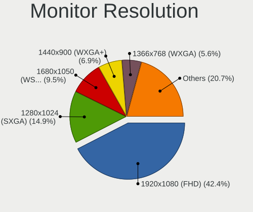

| Resolution         | Desktops | Percent |
|--------------------|----------|---------|
| 1920x1080 (FHD)    | 718      | 42.43%  |
| 1280x1024 (SXGA)   | 252      | 14.89%  |
| 1680x1050 (WSXGA+) | 161      | 9.52%   |
| 1440x900 (WXGA+)   | 116      | 6.86%   |
| 1366x768 (WXGA)    | 94       | 5.56%   |
| 3840x2160 (4K)     | 89       | 5.26%   |
| 1600x900 (HD+)     | 48       | 2.84%   |
| 2560x1080          | 38       | 2.25%   |
| 1360x768           | 33       | 1.95%   |
| 2560x1440 (QHD)    | 29       | 1.71%   |
| 1920x1200 (WUXGA)  | 28       | 1.65%   |
| 1024x768 (XGA)     | 21       | 1.24%   |
| 1920x540           | 16       | 0.95%   |
| 3840x1080          | 9        | 0.53%   |
| 1600x1200          | 9        | 0.53%   |
| 1280x720 (HD)      | 6        | 0.35%   |
| 2288x1287          | 5        | 0.3%    |
| 3440x1440          | 4        | 0.24%   |
| 1152x864           | 4        | 0.24%   |
| 2560x1600          | 2        | 0.12%   |
| 1280x960           | 2        | 0.12%   |
| 800x600            | 1        | 0.06%   |
| 4093x4093          | 1        | 0.06%   |
| 3840x1200          | 1        | 0.06%   |
| 2880x1200          | 1        | 0.06%   |
| 2048x1536          | 1        | 0.06%   |
| 1280x768           | 1        | 0.06%   |
| 1024x600           | 1        | 0.06%   |
| Unknown            | 1        | 0.06%   |

Monitor Diagonal
----------------

Diagonal size in inches

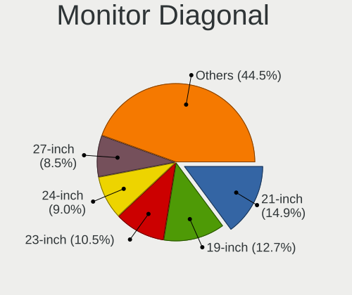

| Inches  | Desktops | Percent |
|---------|----------|---------|
| 21      | 260      | 14.88%  |
| 19      | 221      | 12.65%  |
| 23      | 183      | 10.48%  |
| 24      | 157      | 8.99%   |
| 27      | 149      | 8.53%   |
| 17      | 128      | 7.33%   |
| 18      | 122      | 6.98%   |
| 22      | 119      | 6.81%   |
| 20      | 70       | 4.01%   |
| Unknown | 45       | 2.58%   |
| 34      | 41       | 2.35%   |
| 31      | 41       | 2.35%   |
| 15      | 33       | 1.89%   |
| 84      | 30       | 1.72%   |
| 72      | 15       | 0.86%   |
| 40      | 15       | 0.86%   |
| 52      | 11       | 0.63%   |
| 32      | 11       | 0.63%   |
| 48      | 8        | 0.46%   |
| 54      | 7        | 0.4%    |
| 46      | 7        | 0.4%    |
| 42      | 7        | 0.4%    |
| 65      | 6        | 0.34%   |
| 50      | 6        | 0.34%   |
| 26      | 6        | 0.34%   |
| 12      | 6        | 0.34%   |
| 49      | 5        | 0.29%   |
| 25      | 5        | 0.29%   |
| 63      | 4        | 0.23%   |
| 14      | 4        | 0.23%   |
| 142     | 3        | 0.17%   |
| 60      | 3        | 0.17%   |
| 58      | 2        | 0.11%   |
| 41      | 2        | 0.11%   |
| 39      | 2        | 0.11%   |
| 85      | 1        | 0.06%   |
| 82      | 1        | 0.06%   |
| 75      | 1        | 0.06%   |
| 64      | 1        | 0.06%   |
| 59      | 1        | 0.06%   |

Monitor Width
-------------

Physical width

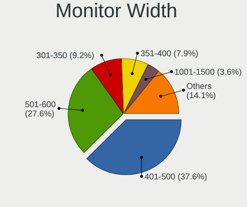

| Width in mm    | Desktops | Percent |
|----------------|----------|---------|
| 401-500        | 640      | 37.56%  |
| 501-600        | 471      | 27.64%  |
| 301-350        | 157      | 9.21%   |
| 351-400        | 135      | 7.92%   |
| 1001-1500      | 61       | 3.58%   |
| 701-800        | 54       | 3.17%   |
| 601-700        | 51       | 2.99%   |
| 1501-2000      | 48       | 2.82%   |
| Unknown        | 45       | 2.64%   |
| 801-900        | 18       | 1.06%   |
| 901-1000       | 11       | 0.65%   |
| 201-300        | 10       | 0.59%   |
| More than 2000 | 3        | 0.18%   |

Aspect Ratio
------------

Proportional relationship between the width and the height

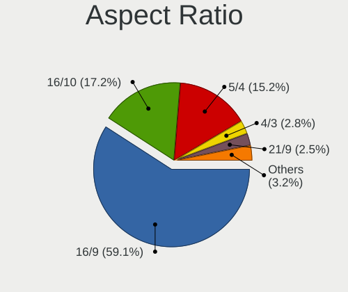

| Ratio   | Desktops | Percent |
|---------|----------|---------|
| 16/9    | 971      | 59.14%  |
| 16/10   | 282      | 17.17%  |
| 5/4     | 250      | 15.23%  |
| 4/3     | 46       | 2.8%    |
| 21/9    | 41       | 2.5%    |
| 3/2     | 15       | 0.91%   |
| Unknown | 15       | 0.91%   |
| 32/9    | 11       | 0.67%   |
| 6/5     | 7        | 0.43%   |
| 1.00    | 4        | 0.24%   |

Monitor Area
------------

Area in inch²

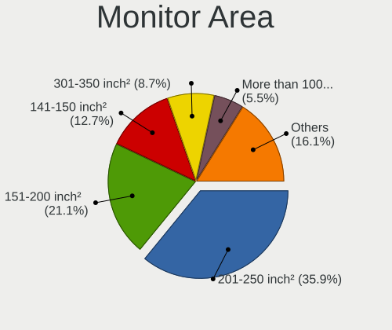

| Area in inch² | Desktops | Percent |
|----------------|----------|---------|
| 201-250        | 618      | 35.93%  |
| 151-200        | 363      | 21.1%   |
| 141-150        | 218      | 12.67%  |
| 301-350        | 149      | 8.66%   |
| More than 1000 | 95       | 5.52%   |
| 351-500        | 95       | 5.52%   |
| 251-300        | 47       | 2.73%   |
| 501-1000       | 47       | 2.73%   |
| Unknown        | 45       | 2.62%   |
| 101-110        | 20       | 1.16%   |
| 111-120        | 14       | 0.81%   |
| 71-80          | 6        | 0.35%   |
| 91-100         | 3        | 0.17%   |

Pixel Density
-------------

Pixels per inch

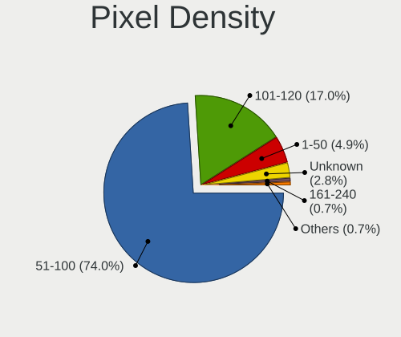

| Density       | Desktops | Percent |
|---------------|----------|---------|
| 51-100        | 1206     | 73.99%  |
| 101-120       | 277      | 16.99%  |
| 1-50          | 80       | 4.91%   |
| Unknown       | 45       | 2.76%   |
| 161-240       | 11       | 0.67%   |
| 121-160       | 10       | 0.61%   |
| More than 240 | 1        | 0.06%   |

Multiple Monitors
-----------------

Total monitors connected

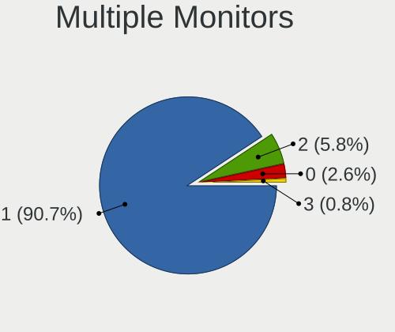

| Total | Desktops | Percent |
|-------|----------|---------|
| 1     | 1589     | 90.75%  |
| 2     | 102      | 5.83%   |
| 0     | 46       | 2.63%   |
| 3     | 14       | 0.8%    |

Network
-------

Net Controller Vendor
---------------------

Controller vendors

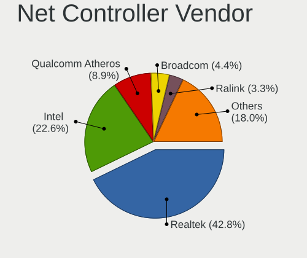

| Vendor                                 | Desktops | Percent |
|----------------------------------------|----------|---------|
| Realtek Semiconductor                  | 949      | 42.81%  |
| Intel                                  | 502      | 22.64%  |
| Qualcomm Atheros                       | 198      | 8.93%   |
| Broadcom                               | 97       | 4.38%   |
| Ralink Technology                      | 73       | 3.29%   |
| Nvidia                                 | 57       | 2.57%   |
| Qualcomm Atheros Communications        | 55       | 2.48%   |
| Broadcom Limited                       | 45       | 2.03%   |
| TP-Link                                | 43       | 1.94%   |
| Marvell Technology Group               | 35       | 1.58%   |
| Ralink                                 | 25       | 1.13%   |
| VIA Technologies                       | 16       | 0.72%   |
| Samsung Electronics                    | 13       | 0.59%   |
| IMC Networks                           | 12       | 0.54%   |
| D-Link                                 | 10       | 0.45%   |
| ASUSTek Computer                       | 10       | 0.45%   |
| Huawei Technologies                    | 9        | 0.41%   |
| D-Link System                          | 8        | 0.36%   |
| Microsoft                              | 7        | 0.32%   |
| NetGear                                | 5        | 0.23%   |
| Xiaomi                                 | 4        | 0.18%   |
| Edimax Technology                      | 4        | 0.18%   |
| Belkin Components                      | 4        | 0.18%   |
| ASIX Electronics                       | 4        | 0.18%   |
| Accton Technology                      | 4        | 0.18%   |
| MediaTek                               | 3        | 0.14%   |
| JMicron Technology                     | 3        | 0.14%   |
| ZyXEL Communications                   | 2        | 0.09%   |
| Aquantia                               | 2        | 0.09%   |
| ZyDAS                                  | 1        | 0.05%   |
| Westell                                | 1        | 0.05%   |
| Wacom                                  | 1        | 0.05%   |
| TRENDnet                               | 1        | 0.05%   |
| Texas Instruments                      | 1        | 0.05%   |
| Sony Ericsson Mobile Communications AB | 1        | 0.05%   |
| Silicon Integrated Systems [SiS]       | 1        | 0.05%   |
| Qualcomm                               | 1        | 0.05%   |
| QinHeng Electronics                    | 1        | 0.05%   |
| Mercucys                               | 1        | 0.05%   |
| Manta                                  | 1        | 0.05%   |

Net Controller Model
--------------------

Controller models

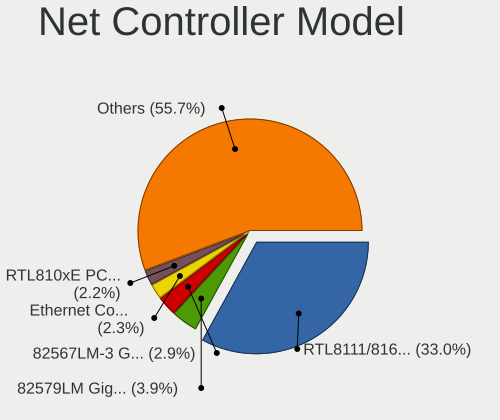

| Model                                                                  | Desktops | Percent |
|------------------------------------------------------------------------|----------|---------|
| Realtek RTL8111/8168/8211/8411 PCI Express Gigabit Ethernet Controller | 776      | 33.02%  |
| Intel 82579LM Gigabit Network Connection (Lewisville)                  | 91       | 3.87%   |
| Intel 82567LM-3 Gigabit Network Connection                             | 68       | 2.89%   |
| Intel Ethernet Connection I217-LM                                      | 53       | 2.26%   |
| Realtek RTL810xE PCI Express Fast Ethernet controller                  | 52       | 2.21%   |
| Qualcomm Atheros AR9271 802.11n                                        | 49       | 2.09%   |
| Intel Ethernet Connection (2) I219-V                                   | 48       | 2.04%   |
| Qualcomm Atheros QCA8171 Gigabit Ethernet                              | 42       | 1.79%   |
| Intel I211 Gigabit Network Connection                                  | 37       | 1.57%   |
| Nvidia MCP61 Ethernet                                                  | 35       | 1.49%   |
| Realtek RTL-8100/8101L/8139 PCI Fast Ethernet Adapter                  | 34       | 1.45%   |
| Intel 82566DM-2 Gigabit Network Connection                             | 34       | 1.45%   |
| Realtek RTL8188EUS 802.11n Wireless Network Adapter                    | 29       | 1.23%   |
| Ralink MT7601U Wireless Adapter                                        | 29       | 1.23%   |
| Intel Ethernet Connection (2) I219-LM                                  | 27       | 1.15%   |
| Broadcom NetXtreme BCM5754 Gigabit Ethernet PCI Express                | 27       | 1.15%   |
| Realtek RTL8169 PCI Gigabit Ethernet Controller                        | 24       | 1.02%   |
| Qualcomm Atheros AR8152 v2.0 Fast Ethernet                             | 21       | 0.89%   |
| Qualcomm Atheros AR8121/AR8113/AR8114 Gigabit or Fast Ethernet         | 21       | 0.89%   |
| Intel Ethernet Connection I217-V                                       | 21       | 0.89%   |
| Marvell Group 88E8056 PCI-E Gigabit Ethernet Controller                | 19       | 0.81%   |
| Realtek RTL8125 2.5GbE Controller                                      | 18       | 0.77%   |
| Intel Ethernet Connection (7) I219-V                                   | 18       | 0.77%   |
| Qualcomm Atheros AR8131 Gigabit Ethernet                               | 16       | 0.68%   |
| Intel 82579V Gigabit Network Connection                                | 15       | 0.64%   |
| Qualcomm Atheros AR9227 Wireless Network Adapter                       | 14       | 0.6%    |
| Broadcom NetXtreme BCM5761 Gigabit Ethernet PCIe                       | 14       | 0.6%    |
| VIA VT6102/VT6103 [Rhine-II]                                           | 13       | 0.55%   |
| Ralink RT5370 Wireless Adapter                                         | 13       | 0.55%   |
| Intel Dual Band Wireless-AC 3168NGW [Stone Peak]                       | 13       | 0.55%   |
| TP-Link TL-WN722N v2/v3 [Realtek RTL8188EUS]                           | 12       | 0.51%   |
| Broadcom Limited NetXtreme BCM5755 Gigabit Ethernet PCI Express        | 12       | 0.51%   |
| Realtek RTL8188CUS 802.11n WLAN Adapter                                | 11       | 0.47%   |
| Qualcomm Atheros AR9287 Wireless Network Adapter (PCI-Express)         | 11       | 0.47%   |
| Intel 82567LF-3 Gigabit Network Connection                             | 11       | 0.47%   |
| TP-Link TL-WN821N v5/v6 [RTL8192EU]                                    | 10       | 0.43%   |
| Samsung Galaxy series, misc. (tethering mode)                          | 10       | 0.43%   |
| Realtek RTL8188EE Wireless Network Adapter                             | 10       | 0.43%   |
| Ralink RT2561/RT61 802.11g PCI                                         | 10       | 0.43%   |
| Intel Wi-Fi 6 AX200                                                    | 10       | 0.43%   |

Wireless Vendor
---------------

Wireless vendors

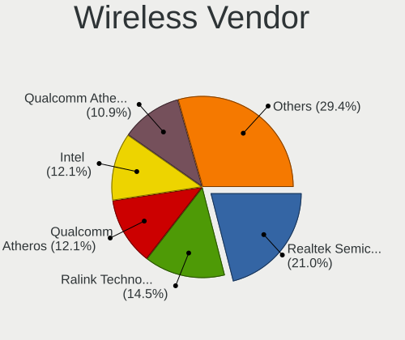

| Vendor                                | Desktops | Percent |
|---------------------------------------|----------|---------|
| Realtek Semiconductor                 | 106      | 21.03%  |
| Ralink Technology                     | 73       | 14.48%  |
| Qualcomm Atheros                      | 61       | 12.1%   |
| Intel                                 | 61       | 12.1%   |
| Qualcomm Atheros Communications       | 55       | 10.91%  |
| TP-Link                               | 43       | 8.53%   |
| Ralink                                | 25       | 4.96%   |
| IMC Networks                          | 12       | 2.38%   |
| Broadcom                              | 12       | 2.38%   |
| ASUSTek Computer                      | 10       | 1.98%   |
| D-Link                                | 9        | 1.79%   |
| Microsoft                             | 7        | 1.39%   |
| NetGear                               | 5        | 0.99%   |
| Edimax Technology                     | 4        | 0.79%   |
| D-Link System                         | 4        | 0.79%   |
| Belkin Components                     | 4        | 0.79%   |
| ZyXEL Communications                  | 2        | 0.4%    |
| MediaTek                              | 2        | 0.4%    |
| ZyDAS                                 | 1        | 0.2%    |
| Wacom                                 | 1        | 0.2%    |
| TRENDnet                              | 1        | 0.2%    |
| Texas Instruments                     | 1        | 0.2%    |
| Mercucys                              | 1        | 0.2%    |
| Gemtek                                | 1        | 0.2%    |
| Fujitsu Siemens Computers             | 1        | 0.2%    |
| AVM                                   | 1        | 0.2%    |
| 802.11g Adapter [Linksys WUSB54GC v3] | 1        | 0.2%    |

Wireless Model
--------------

Wireless models

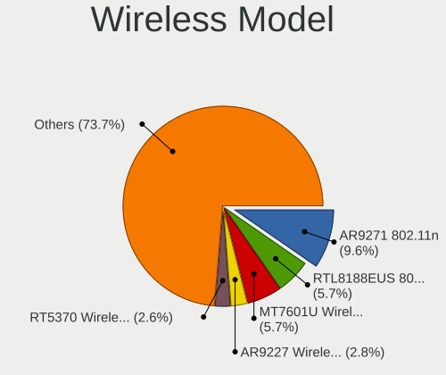

| Model                                                                         | Desktops | Percent |
|-------------------------------------------------------------------------------|----------|---------|
| Qualcomm Atheros AR9271 802.11n                                               | 49       | 9.63%   |
| Realtek RTL8188EUS 802.11n Wireless Network Adapter                           | 29       | 5.7%    |
| Ralink MT7601U Wireless Adapter                                               | 29       | 5.7%    |
| Qualcomm Atheros AR9227 Wireless Network Adapter                              | 14       | 2.75%   |
| Ralink RT5370 Wireless Adapter                                                | 13       | 2.55%   |
| Intel Dual Band Wireless-AC 3168NGW [Stone Peak]                              | 13       | 2.55%   |
| TP-Link TL-WN722N v2/v3 [Realtek RTL8188EUS]                                  | 12       | 2.36%   |
| Realtek RTL8188CUS 802.11n WLAN Adapter                                       | 11       | 2.16%   |
| Qualcomm Atheros AR9287 Wireless Network Adapter (PCI-Express)                | 11       | 2.16%   |
| TP-Link TL-WN821N v5/v6 [RTL8192EU]                                           | 10       | 1.96%   |
| Realtek RTL8188EE Wireless Network Adapter                                    | 10       | 1.96%   |
| Ralink RT2561/RT61 802.11g PCI                                                | 10       | 1.96%   |
| Intel Wi-Fi 6 AX200                                                           | 10       | 1.96%   |
| IMC Networks Mediao 802.11n WLAN [Realtek RTL8191SU]                          | 10       | 1.96%   |
| Ralink RT2870/RT3070 Wireless Adapter                                         | 8        | 1.57%   |
| Ralink RT3090 Wireless 802.11n 1T/1R PCIe                                     | 8        | 1.57%   |
| TP-Link TL-WN823N v2/v3 [Realtek RTL8192EU]                                   | 7        | 1.38%   |
| Ralink RT5372 Wireless Adapter                                                | 7        | 1.38%   |
| Qualcomm Atheros AR2413/AR2414 Wireless Network Adapter [AR5005G(S) 802.11bg] | 7        | 1.38%   |
| Realtek RTL8192CU 802.11n WLAN Adapter                                        | 6        | 1.18%   |
| Ralink MT7610U ("Archer T2U" 2.4G+5G WLAN Adapter                             | 6        | 1.18%   |
| Realtek RTL8821CE 802.11ac PCIe Wireless Network Adapter                      | 5        | 0.98%   |
| Realtek RTL8821AE 802.11ac PCIe Wireless Network Adapter                      | 5        | 0.98%   |
| Realtek RTL8192EU 802.11b/g/n WLAN Adapter                                    | 5        | 0.98%   |
| Realtek RTL8192EE PCIe Wireless Network Adapter                               | 5        | 0.98%   |
| Ralink RT2501/RT2573 Wireless Adapter                                         | 5        | 0.98%   |
| Qualcomm Atheros TP-Link TL-WN322G v3 / TL-WN422G v2 802.11g [Atheros AR9271] | 5        | 0.98%   |
| Qualcomm Atheros AR9462 Wireless Network Adapter                              | 5        | 0.98%   |
| Qualcomm Atheros AR5212/5213/2414 Wireless Network Adapter                    | 5        | 0.98%   |
| Intel Wireless 8265 / 8275                                                    | 5        | 0.98%   |
| Intel Wireless 7260                                                           | 5        | 0.98%   |
| Intel Wireless 3165                                                           | 5        | 0.98%   |
| TP-Link 802.11ac WLAN Adapter                                                 | 4        | 0.79%   |
| Realtek RTL8192CE PCIe Wireless Network Adapter                               | 4        | 0.79%   |
| Realtek RTL8191SU 802.11n WLAN Adapter                                        | 4        | 0.79%   |
| Ralink RT2070 Wireless Adapter                                                | 4        | 0.79%   |
| Microsoft Xbox 360 Wireless Adapter                                           | 4        | 0.79%   |
| Intel Cannon Lake PCH CNVi WiFi                                               | 4        | 0.79%   |
| D-Link DWA-131 Wireless N Nano Adapter (Rev. E1) [Realtek RTL8192EU]          | 4        | 0.79%   |
| ASUS N10 Nano 802.11n Network Adapter [Realtek RTL8192CU]                     | 4        | 0.79%   |

Ethernet Vendor
---------------

Ethernet vendors

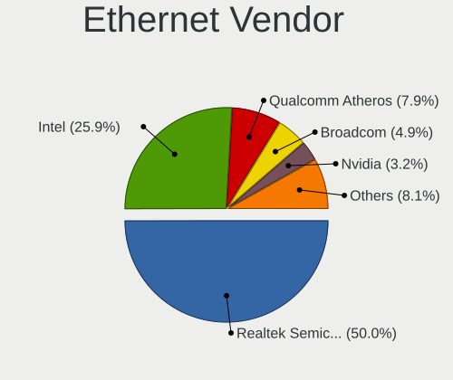

| Vendor                                 | Desktops | Percent |
|----------------------------------------|----------|---------|
| Realtek Semiconductor                  | 896      | 49.97%  |
| Intel                                  | 465      | 25.93%  |
| Qualcomm Atheros                       | 141      | 7.86%   |
| Broadcom                               | 88       | 4.91%   |
| Nvidia                                 | 57       | 3.18%   |
| Broadcom Limited                       | 45       | 2.51%   |
| Marvell Technology Group               | 35       | 1.95%   |
| VIA Technologies                       | 15       | 0.84%   |
| Samsung Electronics                    | 13       | 0.73%   |
| Huawei Technologies                    | 7        | 0.39%   |
| Xiaomi                                 | 4        | 0.22%   |
| D-Link System                          | 4        | 0.22%   |
| ASIX Electronics                       | 4        | 0.22%   |
| Accton Technology                      | 4        | 0.22%   |
| JMicron Technology                     | 3        | 0.17%   |
| Aquantia                               | 2        | 0.11%   |
| Westell                                | 1        | 0.06%   |
| Sony Ericsson Mobile Communications AB | 1        | 0.06%   |
| Silicon Integrated Systems [SiS]       | 1        | 0.06%   |
| Qualcomm                               | 1        | 0.06%   |
| QinHeng Electronics                    | 1        | 0.06%   |
| MediaTek                               | 1        | 0.06%   |
| HMD Global                             | 1        | 0.06%   |
| DisplayLink                            | 1        | 0.06%   |
| D-Link                                 | 1        | 0.06%   |
| 3Com                                   | 1        | 0.06%   |

Ethernet Model
--------------

Ethernet models

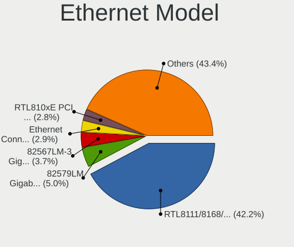

| Model                                                                  | Desktops | Percent |
|------------------------------------------------------------------------|----------|---------|
| Realtek RTL8111/8168/8211/8411 PCI Express Gigabit Ethernet Controller | 776      | 42.24%  |
| Intel 82579LM Gigabit Network Connection (Lewisville)                  | 91       | 4.95%   |
| Intel 82567LM-3 Gigabit Network Connection                             | 68       | 3.7%    |
| Intel Ethernet Connection I217-LM                                      | 53       | 2.89%   |
| Realtek RTL810xE PCI Express Fast Ethernet controller                  | 52       | 2.83%   |
| Intel Ethernet Connection (2) I219-V                                   | 48       | 2.61%   |
| Qualcomm Atheros QCA8171 Gigabit Ethernet                              | 42       | 2.29%   |
| Intel I211 Gigabit Network Connection                                  | 37       | 2.01%   |
| Nvidia MCP61 Ethernet                                                  | 35       | 1.91%   |
| Realtek RTL-8100/8101L/8139 PCI Fast Ethernet Adapter                  | 34       | 1.85%   |
| Intel 82566DM-2 Gigabit Network Connection                             | 34       | 1.85%   |
| Intel Ethernet Connection (2) I219-LM                                  | 27       | 1.47%   |
| Broadcom NetXtreme BCM5754 Gigabit Ethernet PCI Express                | 27       | 1.47%   |
| Realtek RTL8169 PCI Gigabit Ethernet Controller                        | 24       | 1.31%   |
| Qualcomm Atheros AR8152 v2.0 Fast Ethernet                             | 21       | 1.14%   |
| Qualcomm Atheros AR8121/AR8113/AR8114 Gigabit or Fast Ethernet         | 21       | 1.14%   |
| Intel Ethernet Connection I217-V                                       | 21       | 1.14%   |
| Marvell Group 88E8056 PCI-E Gigabit Ethernet Controller                | 19       | 1.03%   |
| Realtek RTL8125 2.5GbE Controller                                      | 18       | 0.98%   |
| Intel Ethernet Connection (7) I219-V                                   | 18       | 0.98%   |
| Qualcomm Atheros AR8131 Gigabit Ethernet                               | 16       | 0.87%   |
| Intel 82579V Gigabit Network Connection                                | 15       | 0.82%   |
| Broadcom NetXtreme BCM5761 Gigabit Ethernet PCIe                       | 14       | 0.76%   |
| VIA VT6102/VT6103 [Rhine-II]                                           | 13       | 0.71%   |
| Broadcom Limited NetXtreme BCM5755 Gigabit Ethernet PCI Express        | 12       | 0.65%   |
| Intel 82567LF-3 Gigabit Network Connection                             | 11       | 0.6%    |
| Samsung Galaxy series, misc. (tethering mode)                          | 10       | 0.54%   |
| Qualcomm Atheros AR8151 v2.0 Gigabit Ethernet                          | 9        | 0.49%   |
| Marvell Group 88E8057 PCI-E Gigabit Ethernet Controller                | 8        | 0.44%   |
| Intel 82574L Gigabit Network Connection                                | 8        | 0.44%   |
| Broadcom NetXtreme BCM5751 Gigabit Ethernet PCI Express                | 8        | 0.44%   |
| Broadcom Limited NetXtreme BCM5761 Gigabit Ethernet PCIe               | 8        | 0.44%   |
| Broadcom Limited NetXtreme BCM5754 Gigabit Ethernet PCI Express        | 8        | 0.44%   |
| Realtek RTL8152 Fast Ethernet Adapter                                  | 6        | 0.33%   |
| Qualcomm Atheros Killer E220x Gigabit Ethernet Controller              | 6        | 0.33%   |
| Huawei FOA-LX9                                                         | 6        | 0.33%   |
| Broadcom NetXtreme BCM5762 Gigabit Ethernet PCIe                       | 6        | 0.33%   |
| Qualcomm Atheros Killer E2400 Gigabit Ethernet Controller              | 5        | 0.27%   |
| Qualcomm Atheros AR8151 v1.0 Gigabit Ethernet                          | 5        | 0.27%   |
| Nvidia MCP73 Ethernet                                                  | 5        | 0.27%   |

Net Controller Kind
-------------------

Ethernet, WiFi or modem

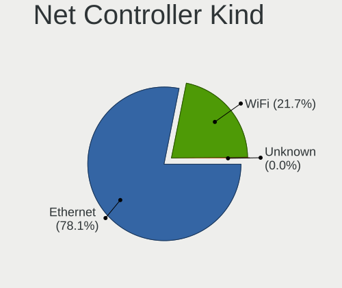

| Kind     | Desktops | Percent |
|----------|----------|---------|
| Ethernet | 1691     | 78.14%  |
| WiFi     | 469      | 21.67%  |
| Modem    | 3        | 0.14%   |
| Unknown  | 1        | 0.05%   |

Used Controller
---------------

Currently used network controller

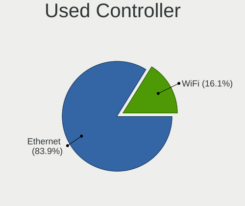

| Kind     | Desktops | Percent |
|----------|----------|---------|
| Ethernet | 1470     | 83.86%  |
| WiFi     | 283      | 16.14%  |

NICs
----

Total network controllers on board

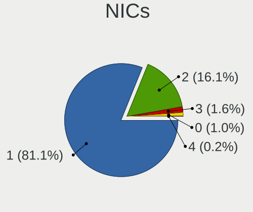

| Total | Desktops | Percent |
|-------|----------|---------|
| 1     | 1400     | 81.11%  |
| 2     | 278      | 16.11%  |
| 3     | 27       | 1.56%   |
| 0     | 18       | 1.04%   |
| 4     | 3        | 0.17%   |

IPv6
----

IPv6 vs IPv4

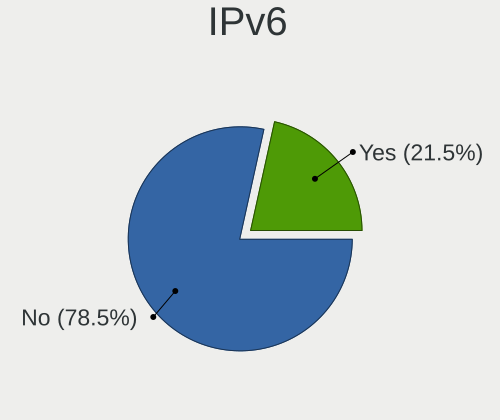

| Used | Desktops | Percent |
|------|----------|---------|
| No   | 1409     | 78.45%  |
| Yes  | 387      | 21.55%  |

Bluetooth
---------

Bluetooth Vendor
----------------

Controller vendors

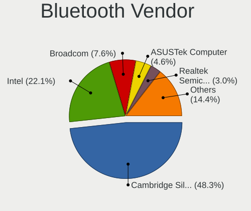

| Vendor                          | Desktops | Percent |
|---------------------------------|----------|---------|
| Cambridge Silicon Radio         | 127      | 48.29%  |
| Intel                           | 58       | 22.05%  |
| Broadcom                        | 20       | 7.6%    |
| ASUSTek Computer                | 12       | 4.56%   |
| Realtek Semiconductor           | 8        | 3.04%   |
| Logitech                        | 4        | 1.52%   |
| Lite-On Technology              | 4        | 1.52%   |
| Integrated System Solution      | 4        | 1.52%   |
| Conwise Technology              | 4        | 1.52%   |
| Belkin Components               | 4        | 1.52%   |
| Qualcomm Atheros Communications | 3        | 1.14%   |
| IMC Networks                    | 3        | 1.14%   |
| TP-Link                         | 2        | 0.76%   |
| Hewlett-Packard                 | 2        | 0.76%   |
| Edimax Technology               | 2        | 0.76%   |
| Apple                           | 2        | 0.76%   |
| Roper                           | 1        | 0.38%   |
| Realtek                         | 1        | 0.38%   |
| Dell                            | 1        | 0.38%   |
| Actions                         | 1        | 0.38%   |

Bluetooth Model
---------------

Controller models

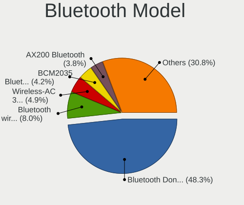

| Model                                                   | Desktops | Percent |
|---------------------------------------------------------|----------|---------|
| Cambridge Silicon Radio Bluetooth Dongle (HCI mode)     | 127      | 48.29%  |
| Intel Bluetooth wireless interface                      | 21       | 7.98%   |
| Intel Wireless-AC 3168 Bluetooth                        | 13       | 4.94%   |
| Broadcom BCM2035 Bluetooth dongle                       | 11       | 4.18%   |
| Intel AX200 Bluetooth                                   | 10       | 3.8%    |
| ASUS Bluetooth Radio                                    | 5        | 1.9%    |
| Realtek  Bluetooth 4.2 Adapter                          | 4        | 1.52%   |
| Logitech BT Mini-Receiver (HCI mode)                    | 4        | 1.52%   |
| Intel Bluetooth 9460/9560 Jefferson Peak (JfP)          | 4        | 1.52%   |
| Conwise CW6622                                          | 4        | 1.52%   |
| Intel Wireless-AC 9260 Bluetooth Adapter                | 3        | 1.14%   |
| Intel AX201 Bluetooth                                   | 3        | 1.14%   |
| Broadcom Bluetooth 3.0 Device                           | 3        | 1.14%   |
| Belkin Components Bluetooth Mini Dongle                 | 3        | 1.14%   |
| ASUS Broadcom BCM20702A0 Bluetooth                      | 3        | 1.14%   |
| TP-Link TP-T@- UB500 Adapter                            | 2        | 0.76%   |
| Realtek RTL8821A Bluetooth                              | 2        | 0.76%   |
| Qualcomm Atheros QCA61x4 Bluetooth 4.0                  | 2        | 0.76%   |
| Lite-On Bluetooth Device                                | 2        | 0.76%   |
| Intel AX210 Bluetooth                                   | 2        | 0.76%   |
| Integrated System Solution KY-BT100 Bluetooth Adapter   | 2        | 0.76%   |
| Integrated System Solution Bluetooth Device             | 2        | 0.76%   |
| IMC Networks Wireless_Device                            | 2        | 0.76%   |
| HP Bluetooth Adapter                                    | 2        | 0.76%   |
| Edimax EW-7611ULB 802.11b/g/n and Bluetooth 4.0 Adapter | 2        | 0.76%   |
| Broadcom Bluetooth dongle                               | 2        | 0.76%   |
| Roper Class 1 Bluetooth Dongle                          | 1        | 0.38%   |
| Realtek RTL8723B Bluetooth                              | 1        | 0.38%   |
| Realtek Bluetooth Radio                                 | 1        | 0.38%   |
| Realtek Bluetooth Radio                                 | 1        | 0.38%   |
| Qualcomm Atheros AR3011 Bluetooth                       | 1        | 0.38%   |
| Lite-On Qualcomm Atheros QCA9377 Bluetooth              | 1        | 0.38%   |
| Lite-On Atheros AR3012 Bluetooth                        | 1        | 0.38%   |
| Intel Centrino Advanced-N 6230 Bluetooth adapter        | 1        | 0.38%   |
| Intel Bluetooth Device                                  | 1        | 0.38%   |
| IMC Networks Bluetooth Radio                            | 1        | 0.38%   |
| Dell Wireless 365 Bluetooth                             | 1        | 0.38%   |
| Broadcom HP Portable Bumble Bee                         | 1        | 0.38%   |
| Broadcom HP Bluethunder                                 | 1        | 0.38%   |
| Broadcom BCM20702A0 Bluetooth 4.0                       | 1        | 0.38%   |

Sound
-----

Sound Vendor
------------

Sound card vendors

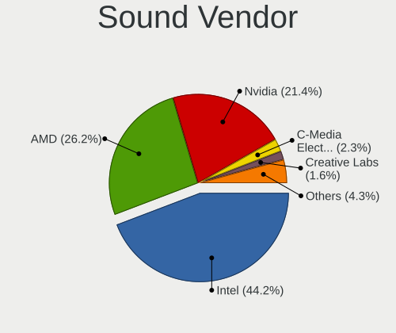

| Vendor                                       | Desktops | Percent |
|----------------------------------------------|----------|---------|
| Intel                                        | 1139     | 44.22%  |
| AMD                                          | 676      | 26.24%  |
| Nvidia                                       | 550      | 21.35%  |
| C-Media Electronics                          | 60       | 2.33%   |
| Creative Labs                                | 41       | 1.59%   |
| VIA Technologies                             | 13       | 0.5%    |
| Texas Instruments                            | 11       | 0.43%   |
| Logitech                                     | 6        | 0.23%   |
| JMTek                                        | 6        | 0.23%   |
| GN Netcom                                    | 6        | 0.23%   |
| Razer USA                                    | 4        | 0.16%   |
| Plantronics                                  | 4        | 0.16%   |
| Generalplus Technology                       | 4        | 0.16%   |
| ASUSTek Computer                             | 4        | 0.16%   |
| Tenx Technology                              | 3        | 0.12%   |
| Ensoniq                                      | 3        | 0.12%   |
| Creative Technology                          | 3        | 0.12%   |
| BEHRINGER International                      | 3        | 0.12%   |
| Walmart                                      | 2        | 0.08%   |
| Syntek                                       | 2        | 0.08%   |
| Silicon Integrated Systems [SiS]             | 2        | 0.08%   |
| Promethean Limited                           | 2        | 0.08%   |
| Kingston Technology                          | 2        | 0.08%   |
| Jieli Technology                             | 2        | 0.08%   |
| ATI Technologies                             | 2        | 0.08%   |
| Zoran Co. Personal Media Division (Nogatech) | 1        | 0.04%   |
| Zhaoxin                                      | 1        | 0.04%   |
| USB MICROPHONE                               | 1        | 0.04%   |
| ULi Electronics                              | 1        | 0.04%   |
| Trust                                        | 1        | 0.04%   |
| Thesycon Systemsoftware & Consulting         | 1        | 0.04%   |
| Superlux digit                               | 1        | 0.04%   |
| Sunplus Technology                           | 1        | 0.04%   |
| SteelSeries ApS                              | 1        | 0.04%   |
| Sony                                         | 1        | 0.04%   |
| SM950T Microphone                            | 1        | 0.04%   |
| Nektar                                       | 1        | 0.04%   |
| Native Instruments                           | 1        | 0.04%   |
| my power                                     | 1        | 0.04%   |
| MCS                                          | 1        | 0.04%   |

Sound Model
-----------

Sound card models

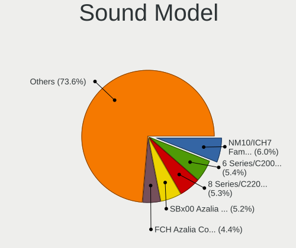

| Model                                                                             | Desktops | Percent |
|-----------------------------------------------------------------------------------|----------|---------|
| Intel NM10/ICH7 Family High Definition Audio Controller                           | 183      | 6.04%   |
| Intel 6 Series/C200 Series Chipset Family High Definition Audio Controller        | 164      | 5.42%   |
| Intel 8 Series/C220 Series Chipset High Definition Audio Controller               | 160      | 5.28%   |
| AMD SBx00 Azalia (Intel HDA)                                                      | 157      | 5.18%   |
| AMD FCH Azalia Controller                                                         | 134      | 4.43%   |
| Intel Xeon E3-1200 v3/4th Gen Core Processor HD Audio Controller                  | 111      | 3.67%   |
| Intel 100 Series/C230 Series Chipset Family HD Audio Controller                   | 84       | 2.77%   |
| Nvidia GK208 HDMI/DP Audio Controller                                             | 83       | 2.74%   |
| Intel 7 Series/C216 Chipset Family High Definition Audio Controller               | 82       | 2.71%   |
| Intel 82801JD/DO (ICH10 Family) HD Audio Controller                               | 78       | 2.58%   |
| Intel 200 Series PCH HD Audio                                                     | 77       | 2.54%   |
| Intel 82801I (ICH9 Family) HD Audio Controller                                    | 71       | 2.34%   |
| AMD Oland/Hainan/Cape Verde/Pitcairn HDMI Audio [Radeon HD 7000 Series]           | 69       | 2.28%   |
| Intel 82801JI (ICH10 Family) HD Audio Controller                                  | 60       | 1.98%   |
| AMD Trinity HDMI Audio Controller                                                 | 58       | 1.92%   |
| Nvidia High Definition Audio Controller                                           | 57       | 1.88%   |
| AMD Ryzen HD Audio Controller                                                     | 57       | 1.88%   |
| AMD Caicos HDMI Audio [Radeon HD 6450 / 7450/8450/8490 OEM / R5 230/235/235X OEM] | 54       | 1.78%   |
| Nvidia GF108 High Definition Audio Controller                                     | 52       | 1.72%   |
| AMD Cedar HDMI Audio [Radeon HD 5400/6300/7300 Series]                            | 44       | 1.45%   |
| Nvidia GP107GL High Definition Audio Controller                                   | 39       | 1.29%   |
| Nvidia MCP61 High Definition Audio                                                | 37       | 1.22%   |
| Intel 5 Series/3400 Series Chipset High Definition Audio                          | 37       | 1.22%   |
| AMD Family 17h (Models 00h-0fh) HD Audio Controller                               | 37       | 1.22%   |
| AMD Ellesmere HDMI Audio [Radeon RX 470/480 / 570/580/590]                        | 36       | 1.19%   |
| Intel Cannon Lake PCH cAVS                                                        | 32       | 1.06%   |
| AMD Starship/Matisse HD Audio Controller                                          | 31       | 1.02%   |
| Nvidia GP106 High Definition Audio Controller                                     | 30       | 0.99%   |
| Nvidia GF119 HDMI Audio Controller                                                | 29       | 0.96%   |
| AMD Baffin HDMI/DP Audio [Radeon RX 550 640SP / RX 560/560X]                      | 29       | 0.96%   |
| AMD Raven/Raven2/Fenghuang HDMI/DP Audio Controller                               | 27       | 0.89%   |
| Nvidia GK107 HDMI Audio Controller                                                | 26       | 0.86%   |
| Intel 82801H (ICH8 Family) HD Audio Controller                                    | 26       | 0.86%   |
| Nvidia GK106 HDMI Audio Controller                                                | 24       | 0.79%   |
| AMD RV710/730 HDMI Audio [Radeon HD 4000 series]                                  | 21       | 0.69%   |
| AMD Redwood HDMI Audio [Radeon HD 5000 Series]                                    | 21       | 0.69%   |
| AMD Kabini HDMI/DP Audio                                                          | 21       | 0.69%   |
| AMD Juniper HDMI Audio [Radeon HD 5700 Series]                                    | 20       | 0.66%   |
| Nvidia GM107 High Definition Audio Controller [GeForce 940MX]                     | 19       | 0.63%   |
| AMD Navi 21/23 HDMI/DP Audio Controller                                           | 19       | 0.63%   |

Memory
------

Memory Vendor
-------------

Memory module vendors

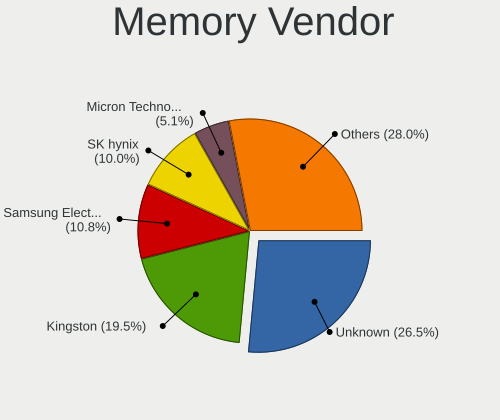

| Vendor                     | Desktops | Percent |
|----------------------------|----------|---------|
| Unknown                    | 542      | 26.48%  |
| Kingston                   | 400      | 19.54%  |
| Samsung Electronics        | 221      | 10.8%   |
| SK hynix                   | 205      | 10.01%  |
| Micron Technology          | 105      | 5.13%   |
| Crucial                    | 81       | 3.96%   |
| Kingmax                    | 79       | 3.86%   |
| Corsair                    | 73       | 3.57%   |
| G.Skill                    | 71       | 3.47%   |
| Nanya Technology           | 66       | 3.22%   |
| Elpida                     | 25       | 1.22%   |
| Team                       | 19       | 0.93%   |
| Patriot                    | 16       | 0.78%   |
| CSX                        | 16       | 0.78%   |
| Ramaxel Technology         | 15       | 0.73%   |
| Transcend                  | 13       | 0.64%   |
| A-DATA Technology          | 13       | 0.64%   |
| Qimonda                    | 9        | 0.44%   |
| Hikvision                  | 8        | 0.39%   |
| Melco                      | 5        | 0.24%   |
| GOODRAM                    | 5        | 0.24%   |
| OCZ                        | 4        | 0.2%    |
| H                          | 4        | 0.2%    |
| Apacer                     | 4        | 0.2%    |
| Smart                      | 3        | 0.15%   |
| Kingmax Semiconductor      | 3        | 0.15%   |
| GeIL                       | 3        | 0.15%   |
| 48spaces                   | 3        | 0.15%   |
| Unknown (0BF7)             | 2        | 0.1%    |
| TwinMOS                    | 2        | 0.1%    |
| Toshiba                    | 2        | 0.1%    |
| Silicon Power              | 2        | 0.1%    |
| Multilaser                 | 2        | 0.1%    |
| Unknown                    | 2        | 0.1%    |
| Uroad                      | 1        | 0.05%   |
| Unknown (AB)               | 1        | 0.05%   |
| Unknown (7F7F7F7F7F970000) | 1        | 0.05%   |
| Unknown (0x0E9D)           | 1        | 0.05%   |
| Unifosa                    | 1        | 0.05%   |
| TakeMS                     | 1        | 0.05%   |

Memory Model
------------

Memory module models

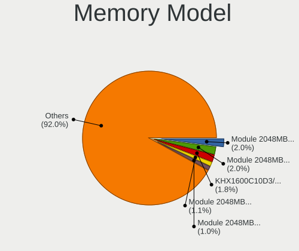

| Model                                                  | Desktops | Percent |
|--------------------------------------------------------|----------|---------|
| Unknown RAM Module 2048MB DIMM SDRAM                   | 49       | 2.04%   |
| Unknown RAM Module 2048MB DIMM 800MT/s                 | 47       | 1.95%   |
| Kingston RAM KHX1600C10D3/4G 4GB DIMM DDR3 1866MT/s    | 44       | 1.83%   |
| Unknown RAM Module 2048MB DIMM DDR2 800MT/s            | 27       | 1.12%   |
| Unknown RAM Module 2048MB DIMM 1333MT/s                | 25       | 1.04%   |
| Kingston RAM KHX1600C9D3/4GX 4GB DIMM DDR3 1867MT/s    | 24       | 1%      |
| Kingston RAM KHX1600C10D3/8G 8GB DIMM DDR3 2133MT/s    | 23       | 0.96%   |
| Unknown RAM Module 4096MB DIMM DDR3 1333MT/s           | 22       | 0.91%   |
| Unknown RAM Module 1024MB DIMM SDRAM                   | 22       | 0.91%   |
| Unknown RAM Module 1024MB DIMM 800MT/s                 | 20       | 0.83%   |
| Unknown RAM Module 4096MB DIMM 1333MT/s                | 18       | 0.75%   |
| Unknown RAM Module 1024MB DIMM DDR2 667MT/s            | 18       | 0.75%   |
| Unknown RAM Module 2048MB DIMM DDR2 667MT/s            | 17       | 0.71%   |
| Kingston RAM 99U5584-005.A00LF 4GB DIMM DDR3 1600MT/s  | 17       | 0.71%   |
| Samsung RAM M378B5273DH0-CH9 4GB DIMM DDR3 2133MT/s    | 16       | 0.66%   |
| Unknown RAM Module 4096MB DIMM 1600MT/s                | 14       | 0.58%   |
| Unknown RAM Module 1024MB DIMM 667MT/s                 | 14       | 0.58%   |
| Unknown RAM Module 1024MB DIMM DDR2 800MT/s            | 13       | 0.54%   |
| Samsung RAM M378B5773DH0-CH9 2GB DIMM DDR3 1333MT/s    | 13       | 0.54%   |
| Micron RAM 8KTF51264AZ-1G6E1 4GB DIMM DDR3 1600MT/s    | 13       | 0.54%   |
| G.Skill RAM F4-3000C16-8GISB 8GB DIMM DDR4 3200MT/s    | 13       | 0.54%   |
| Unknown RAM Module 2048MB DIMM 667MT/s                 | 12       | 0.5%    |
| Samsung RAM M378B5773CH0-CH9 2GB DIMM DDR3 1867MT/s    | 12       | 0.5%    |
| Samsung RAM M378B5173QH0-CK0 4GB DIMM DDR3             | 12       | 0.5%    |
| Kingston RAM KHX2666C16/8G 8GiB DIMM DDR4 3466MT/s     | 12       | 0.5%    |
| Unknown RAM Module 4096MB DIMM SDRAM                   | 11       | 0.46%   |
| Unknown RAM Module 4096MB DIMM 400MT/s                 | 11       | 0.46%   |
| Unknown RAM Module 2048MB DIMM DDR3 1333MT/s           | 11       | 0.46%   |
| SK hynix RAM HMT451U6AFR8C-PB 4GB DIMM DDR3 1600MT/s   | 11       | 0.46%   |
| SK hynix RAM HMT151R7BFR4C-H9 4GB DIMM DDR3 1333MT/s   | 11       | 0.46%   |
| Samsung RAM M378B5673FH0-CH9 2GB DIMM DDR3 1600MT/s    | 11       | 0.46%   |
| Samsung RAM M378B5173DB0-CK0 4096MB DIMM DDR3 1600MT/s | 11       | 0.46%   |
| Kingston RAM KHX3200C16D4/8GX 8GB DIMM DDR4 3733MT/s   | 11       | 0.46%   |
| Unknown RAM Module 2048MB DIMM SDRAM 800MT/s           | 10       | 0.42%   |
| Kingston RAM KF3200C16D4/16GX 16GB DIMM DDR4 3733MT/s  | 10       | 0.42%   |
| Kingmax RAM FLFF65F-C8KF9 4GB DIMM DDR3 1333MT/s       | 10       | 0.42%   |
| G.Skill RAM F4-3200C16-8GIS 8GB DIMM DDR4 3600MT/s     | 10       | 0.42%   |
| Unknown RAM Module 2048MB DIMM 400MT/s                 | 9        | 0.37%   |
| SK hynix RAM HYMP112U64CP8-S6 1GB DIMM DDR2 800MT/s    | 9        | 0.37%   |
| Samsung RAM M3 78T5663QZ3-CF7 2GB DIMM DDR2 800MT/s    | 9        | 0.37%   |

Memory Kind
-----------

Memory module kinds

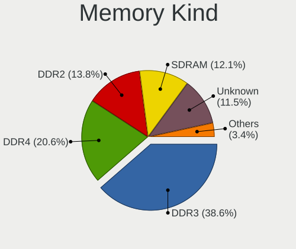

| Kind    | Desktops | Percent |
|---------|----------|---------|
| DDR3    | 678      | 38.61%  |
| DDR4    | 361      | 20.56%  |
| DDR2    | 242      | 13.78%  |
| SDRAM   | 213      | 12.13%  |
| Unknown | 202      | 11.5%   |
| DDR     | 54       | 3.08%   |
| DDR5    | 5        | 0.28%   |
| LPDDR4  | 1        | 0.06%   |

Memory Form Factor
------------------

Physical design of the memory module

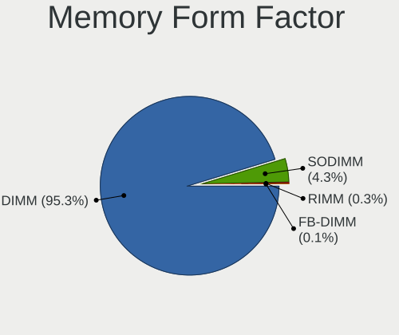

| Name    | Desktops | Percent |
|---------|----------|---------|
| DIMM    | 1579     | 95.29%  |
| SODIMM  | 72       | 4.35%   |
| RIMM    | 5        | 0.3%    |
| FB-DIMM | 1        | 0.06%   |

Memory Size
-----------

Memory module size

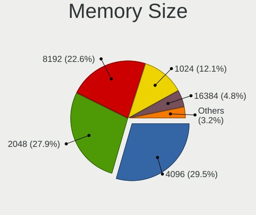

| Size  | Desktops | Percent |
|-------|----------|---------|
| 4096  | 584      | 29.47%  |
| 2048  | 552      | 27.85%  |
| 8192  | 448      | 22.6%   |
| 1024  | 239      | 12.06%  |
| 16384 | 95       | 4.79%   |
| 512   | 38       | 1.92%   |
| 32768 | 15       | 0.76%   |
| 256   | 7        | 0.35%   |
| 16    | 2        | 0.1%    |
| 128   | 1        | 0.05%   |
| 13    | 1        | 0.05%   |

Memory Speed
------------

Memory module speed

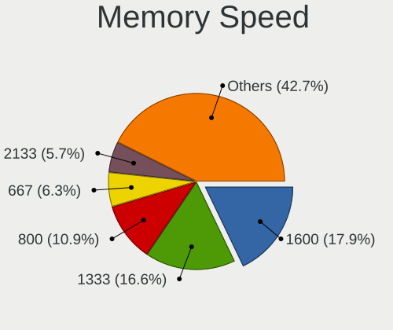

| Speed   | Desktops | Percent |
|---------|----------|---------|
| 1600    | 360      | 17.87%  |
| 1333    | 335      | 16.63%  |
| 800     | 219      | 10.87%  |
| 667     | 127      | 6.31%   |
| 2133    | 114      | 5.66%   |
| Unknown | 106      | 5.26%   |
| 2400    | 101      | 5.01%   |
| 1866    | 75       | 3.72%   |
| 3200    | 58       | 2.88%   |
| 3600    | 41       | 2.04%   |
| 2667    | 39       | 1.94%   |
| 1066    | 36       | 1.79%   |
| 400     | 33       | 1.64%   |
| 533     | 30       | 1.49%   |
| 3733    | 25       | 1.24%   |
| 2666    | 25       | 1.24%   |
| 1867    | 24       | 1.19%   |
| 1067    | 22       | 1.09%   |
| 3000    | 18       | 0.89%   |
| 2048    | 17       | 0.84%   |
| 1639    | 16       | 0.79%   |
| 1800    | 15       | 0.74%   |
| 3400    | 14       | 0.7%    |
| 2000    | 13       | 0.65%   |
| 3466    | 12       | 0.6%    |
| 2933    | 12       | 0.6%    |
| 333     | 10       | 0.5%    |
| 49926   | 9        | 0.45%   |
| 1334    | 8        | 0.4%    |
| 3333    | 7        | 0.35%   |
| 1648    | 7        | 0.35%   |
| 1331    | 6        | 0.3%    |
| 3334    | 5        | 0.25%   |
| 3266    | 5        | 0.25%   |
| 266     | 5        | 0.25%   |
| 3800    | 4        | 0.2%    |
| 3066    | 4        | 0.2%    |
| 2733    | 4        | 0.2%    |
| 2200    | 4        | 0.2%    |
| 1400    | 4        | 0.2%    |

Printers & scanners
-------------------

Printer Vendor
--------------

Printer device vendors

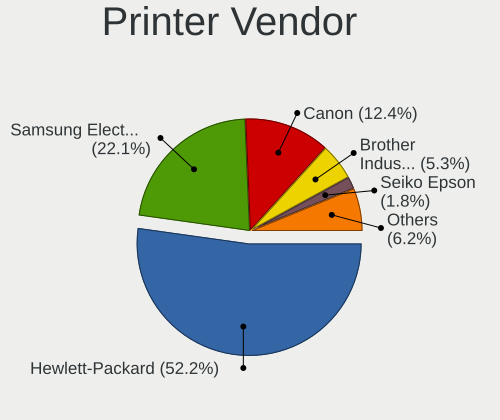

| Vendor                | Desktops | Percent |
|-----------------------|----------|---------|
| Hewlett-Packard       | 59       | 52.21%  |
| Samsung Electronics   | 25       | 22.12%  |
| Canon                 | 14       | 12.39%  |
| Brother Industries    | 6        | 5.31%   |
| Seiko Epson           | 2        | 1.77%   |
| QinHeng Electronics   | 2        | 1.77%   |
| Lexmark International | 2        | 1.77%   |
| Dymo-CoStar           | 2        | 1.77%   |
| STMicroelectronics    | 1        | 0.88%   |

Printer Model
-------------

Printer device models

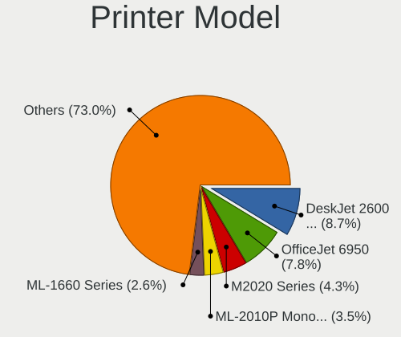

| Model                                                     | Desktops | Percent |
|-----------------------------------------------------------|----------|---------|
| HP DeskJet 2600 series                                    | 10       | 8.7%    |
| HP OfficeJet 6950                                         | 9        | 7.83%   |
| Samsung M2020 Series                                      | 5        | 4.35%   |
| Samsung ML-2010P Mono Laser Printer                       | 4        | 3.48%   |
| Samsung ML-1660 Series                                    | 3        | 2.61%   |
| Samsung ML-1640 Series Laser Printer                      | 3        | 2.61%   |
| Samsung C48x Series                                       | 3        | 2.61%   |
| HP LaserJet 1020                                          | 3        | 2.61%   |
| HP LaserJet 1010                                          | 3        | 2.61%   |
| HP Deskjet 1050 J410                                      | 3        | 2.61%   |
| Canon LiDE 300                                            | 3        | 2.61%   |
| Samsung SCX-3400 Series                                   | 2        | 1.74%   |
| QinHeng CH340S                                            | 2        | 1.74%   |
| HP LaserJet P1005                                         | 2        | 1.74%   |
| HP LaserJet 1018                                          | 2        | 1.74%   |
| HP DeskJet F4100 Printer series                           | 2        | 1.74%   |
| HP Deskjet F2280 series                                   | 2        | 1.74%   |
| HP Deskjet 3520 series                                    | 2        | 1.74%   |
| HP DeskJet 2700 series                                    | 2        | 1.74%   |
| HP DeskJet 2130 series                                    | 2        | 1.74%   |
| Dymo-CoStar LabelWriter 450                               | 2        | 1.74%   |
| Canon PIXMA MG3600 Series                                 | 2        | 1.74%   |
| Brother HL-L2300D series                                  | 2        | 1.74%   |
| Brother HL-1110 series                                    | 2        | 1.74%   |
| STMicroelectronics LED badge -- mini LED display -- 11x44 | 1        | 0.87%   |
| Seiko Epson WF-3010 Series                                | 1        | 0.87%   |
| Seiko Epson L3050 Series                                  | 1        | 0.87%   |
| Samsung SCX-4623 Series                                   | 1        | 0.87%   |
| Samsung SCX-3200 Series                                   | 1        | 0.87%   |
| Samsung ML-1630 Series                                    | 1        | 0.87%   |
| Samsung M2070 Series                                      | 1        | 0.87%   |
| Samsung CLP-310 Color Laser Printer                       | 1        | 0.87%   |
| Lexmark International Z35 Printer                         | 1        | 0.87%   |
| Lexmark International InkJet Color Printer                | 1        | 0.87%   |
| HP OfficeJet Pro 6970                                     | 1        | 0.87%   |
| HP LaserJet Professional P 1102w                          | 1        | 0.87%   |
| HP LaserJet M14-M17                                       | 1        | 0.87%   |
| HP LaserJet 2600n                                         | 1        | 0.87%   |
| HP LaserJet 1300                                          | 1        | 0.87%   |
| HP LaserJet 1000                                          | 1        | 0.87%   |

Scanner Vendor
--------------

Scanner device vendors

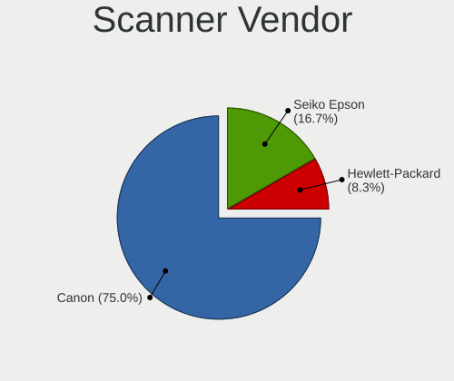

| Vendor          | Desktops | Percent |
|-----------------|----------|---------|
| Canon           | 9        | 69.23%  |
| Seiko Epson     | 2        | 15.38%  |
| Mustek Systems  | 1        | 7.69%   |
| Hewlett-Packard | 1        | 7.69%   |

Scanner Model
-------------

Scanner device models

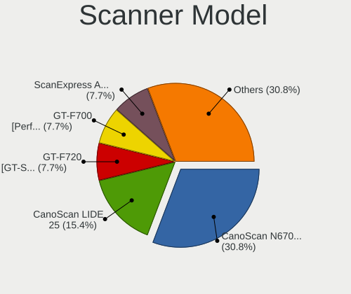

| Model                                                   | Desktops | Percent |
|---------------------------------------------------------|----------|---------|
| Canon CanoScan N670U/N676U/LiDE 20                      | 4        | 30.77%  |
| Canon CanoScan LIDE 25                                  | 2        | 15.38%  |
| Seiko Epson GT-F720 [GT-S620/Perfection V30/V300 Photo] | 1        | 7.69%   |
| Seiko Epson GT-F700 [Perfection V350]                   | 1        | 7.69%   |
| Mustek Systems ScanExpress A3 USB 1200 PRO              | 1        | 7.69%   |
| HP ScanJet 3670                                         | 1        | 7.69%   |
| Canon CanoScan LiDE 120                                 | 1        | 7.69%   |
| Canon CanoScan LiDE 110                                 | 1        | 7.69%   |
| Canon CanoScan LiDE 100                                 | 1        | 7.69%   |

Camera
------

Camera Vendor
-------------

Camera device vendors

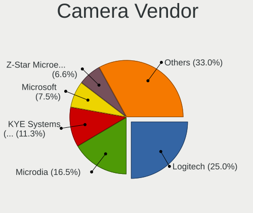

| Vendor                        | Desktops | Percent |
|-------------------------------|----------|---------|
| Logitech                      | 53       | 25%     |
| Microdia                      | 35       | 16.51%  |
| KYE Systems (Mouse Systems)   | 24       | 11.32%  |
| Microsoft                     | 16       | 7.55%   |
| Z-Star Microelectronics       | 14       | 6.6%    |
| GEMBIRD                       | 11       | 5.19%   |
| Pixart Imaging                | 7        | 3.3%    |
| Cubeternet                    | 6        | 2.83%   |
| Samsung Electronics           | 5        | 2.36%   |
| Trust                         | 4        | 1.89%   |
| Chicony Electronics           | 4        | 1.89%   |
| Apple                         | 4        | 1.89%   |
| Sunplus Innovation Technology | 3        | 1.42%   |
| Realtek Semiconductor         | 3        | 1.42%   |
| Generalplus Technology        | 3        | 1.42%   |
| Creative Technology           | 3        | 1.42%   |
| Aveo Technology               | 3        | 1.42%   |
| Arkmicro Technologies         | 3        | 1.42%   |
| MacroSilicon                  | 2        | 0.94%   |
| LG Electronics                | 2        | 0.94%   |
| webcam                        | 1        | 0.47%   |
| Unknown                       | 1        | 0.47%   |
| Quanta                        | 1        | 0.47%   |
| Novatek Microelectronics      | 1        | 0.47%   |
| Jieli Technology              | 1        | 0.47%   |
| IMC Networks                  | 1        | 0.47%   |
| Hewlett-Packard               | 1        | 0.47%   |

Camera Model
------------

Camera device models

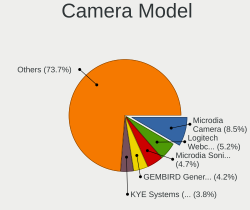

| Model                                                 | Desktops | Percent |
|-------------------------------------------------------|----------|---------|
| Microdia Camera                                       | 18       | 8.45%   |
| Logitech Webcam C270                                  | 11       | 5.16%   |
| Microdia Sonix USB 2.0 Camera                         | 10       | 4.69%   |
| GEMBIRD Generic UVC 1.00 camera [AppoTech AX2311]     | 9        | 4.23%   |
| KYE Systems (Mouse Systems) FaceCam 320X              | 8        | 3.76%   |
| Logitech Webcam C600                                  | 7        | 3.29%   |
| Z-Star A4 TECH USB2.0 PC Camera E                     | 6        | 2.82%   |
| KYE Systems (Mouse Systems) FaceCam 1000X             | 6        | 2.82%   |
| Z-Star Venus USB2.0 Camera                            | 5        | 2.35%   |
| Samsung Galaxy series, misc. (MTP mode)               | 5        | 2.35%   |
| Pixart Imaging GE 1.3 MP MiniCam Pro                  | 5        | 2.35%   |
| Logitech HD Webcam C525                               | 5        | 2.35%   |
| Logitech HD Pro Webcam C920                           | 5        | 2.35%   |
| Microsoft LifeCam HD-3000                             | 4        | 1.88%   |
| Logitech Webcam C170                                  | 4        | 1.88%   |
| KYE Systems (Mouse Systems) USB 2.0 HD1080P PC Camera | 4        | 1.88%   |
| KYE Systems (Mouse Systems) Genius FaceCam 320        | 4        | 1.88%   |
| Cubeternet USB2.0 Camera                              | 4        | 1.88%   |
| Sunplus FULL HD webcam                                | 3        | 1.41%   |
| Microsoft LifeCam VX-700                              | 3        | 1.41%   |
| Microsoft LifeCam VX-2000                             | 3        | 1.41%   |
| Logitech Webcam C310                                  | 3        | 1.41%   |
| Logitech Webcam C250                                  | 3        | 1.41%   |
| Logitech QuickCam Pro 9000                            | 3        | 1.41%   |
| Arkmicro USB2.0 PC CAMERA                             | 3        | 1.41%   |
| Apple iPhone 5/5C/5S/6/SE/7/8/X                       | 3        | 1.41%   |
| Z-Star Saturn USB 2.0 Camera                          | 2        | 0.94%   |
| Trust 17676 Webcam                                    | 2        | 0.94%   |
| Microsoft LifeCam VX-500 [1357]                       | 2        | 0.94%   |
| Microdia USB 2.0 Camera                               | 2        | 0.94%   |
| Microdia Integrated Camera                            | 2        | 0.94%   |
| Logitech Webcam C210                                  | 2        | 0.94%   |
| Logitech QuickCam Communicate Deluxe/S7500            | 2        | 0.94%   |
| Logitech C920 PRO HD Webcam                           | 2        | 0.94%   |
| LG LM-X420xxx/G2/G3 Android Phone (MTP/download mode) | 2        | 0.94%   |
| GEMBIRD USB2.0 PC CAMERA                              | 2        | 0.94%   |
| Cubeternet GL-UPC822 UVC WebCam                       | 2        | 0.94%   |
| Creative Live! Cam Chat HD [VF0700/VF0790]            | 2        | 0.94%   |
| Aveo USB2.0 Camera                                    | 2        | 0.94%   |
| Z-Star Vega USB 2.0 Camera                            | 1        | 0.47%   |

Security
--------

Fingerprint Vendor
------------------

Fingerprint sensor vendors

| Vendor                | Desktops | Percent |
|-----------------------|----------|---------|
| Elan Microelectronics | 1        | 100%    |

Fingerprint Model
-----------------

Fingerprint sensor models

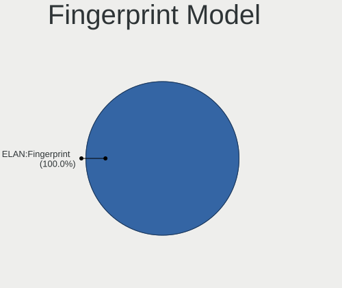

| Model                                       | Desktops | Percent |
|---------------------------------------------|----------|---------|
| Elan fingerprint sensor [FeinTech FPS00200] | 1        | 100%    |

Chipcard Vendor
---------------

Chipcard module vendors

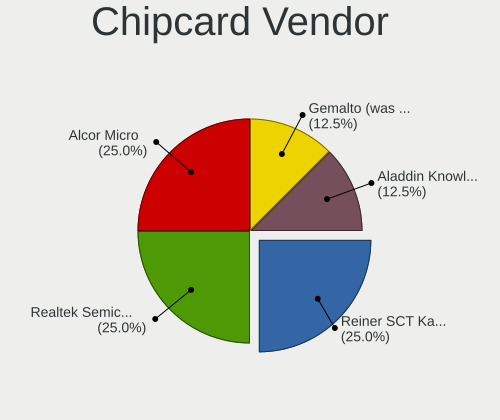

| Vendor                    | Desktops | Percent |
|---------------------------|----------|---------|
| Reiner SCT Kartensysteme  | 2        | 25%     |
| Realtek Semiconductor     | 2        | 25%     |
| Alcor Micro               | 2        | 25%     |
| Gemalto (was Gemplus)     | 1        | 12.5%   |
| Aladdin Knowledge Systems | 1        | 12.5%   |

Chipcard Model
--------------

Chipcard module models

| Model                                                                      | Desktops | Percent |
|----------------------------------------------------------------------------|----------|---------|
| Reiner SCT Kartensysteme cyberJack RFID basis contactless smartcard reader | 2        | 25%     |
| Realtek Semiconductor Smart Card Reader Interface                          | 2        | 25%     |
| Alcor Micro AU9540 Smartcard Reader                                        | 2        | 25%     |
| Gemalto (was Gemplus) GemPC Twin SmartCard Reader                          | 1        | 12.5%   |
| Aladdin Knowledge Systems Token JC                                         | 1        | 12.5%   |

Unsupported
-----------

Unsupported Devices
-------------------

Total unsupported devices on board

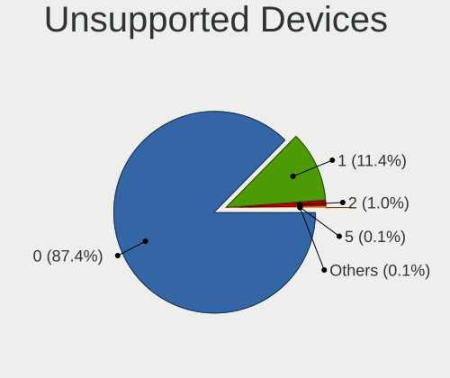

| Total | Desktops | Percent |
|-------|----------|---------|
| 0     | 1542     | 87.37%  |
| 1     | 202      | 11.44%  |
| 2     | 17       | 0.96%   |
| 10    | 1        | 0.06%   |
| 5     | 1        | 0.06%   |
| 4     | 1        | 0.06%   |
| 3     | 1        | 0.06%   |

Unsupported Device Types
------------------------

Types of unsupported devices

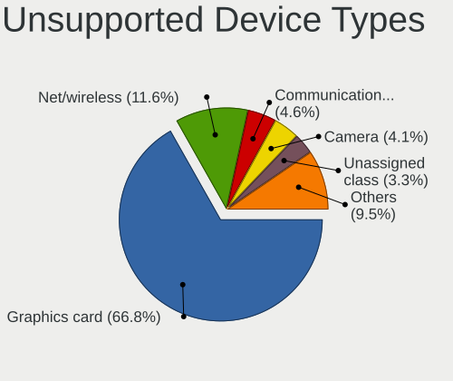

| Type                     | Desktops | Percent |
|--------------------------|----------|---------|
| Graphics card            | 161      | 66.8%   |
| Net/wireless             | 28       | 11.62%  |
| Communication controller | 11       | 4.56%   |
| Camera                   | 10       | 4.15%   |
| Unassigned class         | 8        | 3.32%   |
| Chipcard                 | 7        | 2.9%    |
| Sound                    | 4        | 1.66%   |
| Net/ethernet             | 4        | 1.66%   |
| Multimedia controller    | 2        | 0.83%   |
| Card reader              | 2        | 0.83%   |
| Storage/raid             | 1        | 0.41%   |
| Storage                  | 1        | 0.41%   |
| Fingerprint reader       | 1        | 0.41%   |
| Bluetooth                | 1        | 0.41%   |

