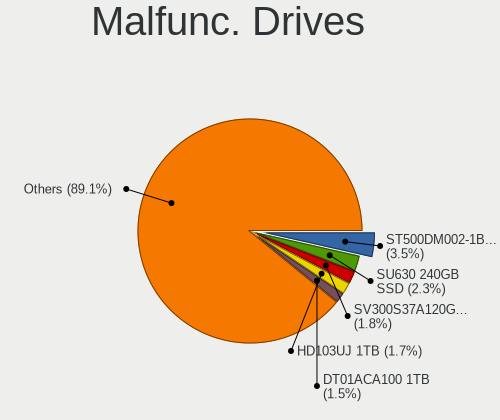
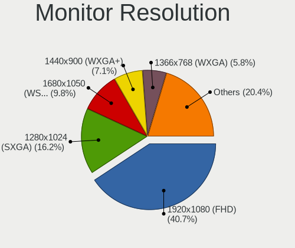
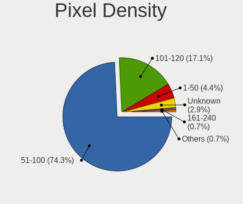
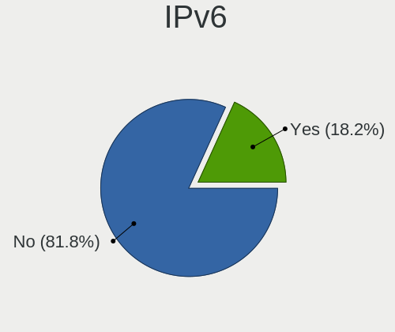

BlackPanther - Tested Hardware & Statistics (Desktops)
------------------------------------------------------

A project to collect tested hardware configurations for BlackPanther.

Anyone can contribute to this report by the [hw-probe](https://github.com/linuxhw/hw-probe) tool:

    sudo -E hw-probe -all -upload

Please contribute! Especially if your hardware is rare.

Contents
--------

* [ Test Cases ](#test-cases)

* [ System ](#system)
  - [ OS                       ](#os)
  - [ OS Family                ](#os-family)
  - [ Kernel                   ](#kernel)
  - [ Kernel Family            ](#kernel-family)
  - [ Kernel Major Ver.        ](#kernel-major-ver)
  - [ Arch                     ](#arch)
  - [ DE                       ](#de)
  - [ Display Server           ](#display-server)
  - [ Display Manager          ](#display-manager)
  - [ OS Lang                  ](#os-lang)
  - [ Boot Mode                ](#boot-mode)
  - [ Filesystem               ](#filesystem)
  - [ Part. scheme             ](#part-scheme)
  - [ Dual Boot with Linux/BSD ](#dual-boot-with-linuxbsd)
  - [ Dual Boot (Win)          ](#dual-boot-win)

* [ Board ](#board)
  - [ Vendor                   ](#vendor)
  - [ Model                    ](#model)
  - [ Model Family             ](#model-family)
  - [ MFG Year                 ](#mfg-year)
  - [ Form Factor              ](#form-factor)
  - [ Secure Boot              ](#secure-boot)
  - [ Coreboot                 ](#coreboot)
  - [ RAM Size                 ](#ram-size)
  - [ RAM Used                 ](#ram-used)
  - [ Total Drives             ](#total-drives)
  - [ Has CD-ROM               ](#has-cd-rom)
  - [ Has Ethernet             ](#has-ethernet)
  - [ Has WiFi                 ](#has-wifi)
  - [ Has Bluetooth            ](#has-bluetooth)

* [ Location ](#location)
  - [ Country                  ](#country)
  - [ City                     ](#city)

* [ Drives ](#drives)
  - [ Drive Vendor             ](#drive-vendor)
  - [ Drive Model              ](#drive-model)
  - [ HDD Vendor               ](#hdd-vendor)
  - [ SSD Vendor               ](#ssd-vendor)
  - [ Drive Kind               ](#drive-kind)
  - [ Drive Connector          ](#drive-connector)
  - [ Drive Size               ](#drive-size)
  - [ Space Total              ](#space-total)
  - [ Space Used               ](#space-used)
  - [ Malfunc. Drives          ](#malfunc-drives)
  - [ Malfunc. Drive Vendor    ](#malfunc-drive-vendor)
  - [ Malfunc. HDD Vendor      ](#malfunc-hdd-vendor)
  - [ Malfunc. Drive Kind      ](#malfunc-drive-kind)
  - [ Failed Drives            ](#failed-drives)
  - [ Failed Drive Vendor      ](#failed-drive-vendor)
  - [ Drive Status             ](#drive-status)

* [ Storage controller ](#storage-controller)
  - [ Storage Vendor           ](#storage-vendor)
  - [ Storage Model            ](#storage-model)
  - [ Storage Kind             ](#storage-kind)

* [ Processor ](#processor)
  - [ CPU Vendor               ](#cpu-vendor)
  - [ CPU Model                ](#cpu-model)
  - [ CPU Model Family         ](#cpu-model-family)
  - [ CPU Cores                ](#cpu-cores)
  - [ CPU Sockets              ](#cpu-sockets)
  - [ CPU Threads              ](#cpu-threads)
  - [ CPU Op-Modes             ](#cpu-op-modes)
  - [ CPU Microcode            ](#cpu-microcode)
  - [ CPU Microarch            ](#cpu-microarch)

* [ Graphics ](#graphics)
  - [ GPU Vendor               ](#gpu-vendor)
  - [ GPU Model                ](#gpu-model)
  - [ GPU Combo                ](#gpu-combo)
  - [ GPU Driver               ](#gpu-driver)
  - [ GPU Memory               ](#gpu-memory)

* [ Monitor ](#monitor)
  - [ Monitor Vendor           ](#monitor-vendor)
  - [ Monitor Model            ](#monitor-model)
  - [ Monitor Resolution       ](#monitor-resolution)
  - [ Monitor Diagonal         ](#monitor-diagonal)
  - [ Monitor Width            ](#monitor-width)
  - [ Aspect Ratio             ](#aspect-ratio)
  - [ Monitor Area             ](#monitor-area)
  - [ Pixel Density            ](#pixel-density)
  - [ Multiple Monitors        ](#multiple-monitors)

* [ Network ](#network)
  - [ Net Controller Vendor    ](#net-controller-vendor)
  - [ Net Controller Model     ](#net-controller-model)
  - [ Wireless Vendor          ](#wireless-vendor)
  - [ Wireless Model           ](#wireless-model)
  - [ Ethernet Vendor          ](#ethernet-vendor)
  - [ Ethernet Model           ](#ethernet-model)
  - [ Net Controller Kind      ](#net-controller-kind)
  - [ Used Controller          ](#used-controller)
  - [ NICs                     ](#nics)
  - [ IPv6                     ](#ipv6)

* [ Bluetooth ](#bluetooth)
  - [ Bluetooth Vendor         ](#bluetooth-vendor)
  - [ Bluetooth Model          ](#bluetooth-model)

* [ Sound ](#sound)
  - [ Sound Vendor             ](#sound-vendor)
  - [ Sound Model              ](#sound-model)

* [ Memory ](#memory)
  - [ Memory Vendor            ](#memory-vendor)
  - [ Memory Model             ](#memory-model)
  - [ Memory Kind              ](#memory-kind)
  - [ Memory Form Factor       ](#memory-form-factor)
  - [ Memory Size              ](#memory-size)
  - [ Memory Speed             ](#memory-speed)

* [ Printers & scanners ](#printers--scanners)
  - [ Printer Vendor           ](#printer-vendor)
  - [ Printer Model            ](#printer-model)
  - [ Scanner Vendor           ](#scanner-vendor)
  - [ Scanner Model            ](#scanner-model)

* [ Camera ](#camera)
  - [ Camera Vendor            ](#camera-vendor)
  - [ Camera Model             ](#camera-model)

* [ Security ](#security)
  - [ Fingerprint Vendor       ](#fingerprint-vendor)
  - [ Fingerprint Model        ](#fingerprint-model)
  - [ Chipcard Vendor          ](#chipcard-vendor)
  - [ Chipcard Model           ](#chipcard-model)

* [ Unsupported ](#unsupported)
  - [ Unsupported Devices      ](#unsupported-devices)
  - [ Unsupported Device Types ](#unsupported-device-types)

Test Cases
----------

Total: 2734

| Vendor        | Model                       | Probe                                                      | Date         |
|---------------|-----------------------------|------------------------------------------------------------|--------------|
| ASRock        | A780LM-S                    | [83b44b9bd6](https://linux-hardware.org/?probe=83b44b9bd6) | Jul 31, 2022 |
| ASRock        | A780LM-S                    | [2a1ce55c1b](https://linux-hardware.org/?probe=2a1ce55c1b) | Jul 31, 2022 |
| Lenovo        | Dory CRB                    | [1aa1f63a2d](https://linux-hardware.org/?probe=1aa1f63a2d) | Jul 25, 2022 |
| Lenovo        | Dory CRB                    | [81e755d9a1](https://linux-hardware.org/?probe=81e755d9a1) | Jul 25, 2022 |
| Dell          | 054KM3 A00                  | [f84c50a2ae](https://linux-hardware.org/?probe=f84c50a2ae) | Jul 25, 2022 |
| Dell          | 054KM3 A00                  | [37fc6a278e](https://linux-hardware.org/?probe=37fc6a278e) | Jul 25, 2022 |
| MSI           | X58 Pro-E                   | [a448d7e654](https://linux-hardware.org/?probe=a448d7e654) | Jul 21, 2022 |
| MSI           | X58 Pro-E                   | [af97aaa970](https://linux-hardware.org/?probe=af97aaa970) | Jul 21, 2022 |
| Dell          | 054KM3 A00                  | [228194fb04](https://linux-hardware.org/?probe=228194fb04) | Jul 21, 2022 |
| Dell          | 054KM3 A00                  | [406a93be76](https://linux-hardware.org/?probe=406a93be76) | Jul 21, 2022 |
| Dell          | 054KM3 A00                  | [9f4d40e584](https://linux-hardware.org/?probe=9f4d40e584) | Jul 20, 2022 |
| Dell          | 054KM3 A00                  | [aa049999f0](https://linux-hardware.org/?probe=aa049999f0) | Jul 20, 2022 |
| ASUSTek       | PRIME A320M-K               | [982c8b834d](https://linux-hardware.org/?probe=982c8b834d) | Jul 18, 2022 |
| ASUSTek       | PRIME A320M-K               | [09a3fc75e9](https://linux-hardware.org/?probe=09a3fc75e9) | Jul 18, 2022 |
| Gigabyte      | F2A88XM-DS2                 | [fcbd85f698](https://linux-hardware.org/?probe=fcbd85f698) | Jul 17, 2022 |
| Dell          | 054KM3 A00                  | [2c14be3e6c](https://linux-hardware.org/?probe=2c14be3e6c) | Jul 17, 2022 |
| Gigabyte      | F2A88XM-DS2                 | [391df88f80](https://linux-hardware.org/?probe=391df88f80) | Jul 17, 2022 |
| Dell          | 0UT806                      | [7d63f287bc](https://linux-hardware.org/?probe=7d63f287bc) | Jul 08, 2022 |
| Gigabyte      | B450M GAMING                | [b7cc7cee98](https://linux-hardware.org/?probe=b7cc7cee98) | Jul 05, 2022 |
| Fujitsu       | D3028-A1 S26361-D3028-A1    | [64cb4f60fb](https://linux-hardware.org/?probe=64cb4f60fb) | Jul 04, 2022 |
| Dell          | 0C27VV A01                  | [bc4f34c375](https://linux-hardware.org/?probe=bc4f34c375) | Jul 04, 2022 |
| Dell          | 0C27VV A01                  | [03cd99ca9f](https://linux-hardware.org/?probe=03cd99ca9f) | Jul 04, 2022 |
| Gigabyte      | H61M-S1                     | [a38b0e0209](https://linux-hardware.org/?probe=a38b0e0209) | Jul 02, 2022 |
| Fujitsu       | D2828-A2 S26361-D2828-A2    | [4889364145](https://linux-hardware.org/?probe=4889364145) | Jun 26, 2022 |
| Dell          | 0TY915                      | [d6faa2c9f1](https://linux-hardware.org/?probe=d6faa2c9f1) | Jun 25, 2022 |
| Gigabyte      | H410M S2 V2                 | [c37f67ba4b](https://linux-hardware.org/?probe=c37f67ba4b) | Jun 23, 2022 |
| HP            | 339A                        | [4f244ada14](https://linux-hardware.org/?probe=4f244ada14) | Jun 19, 2022 |
| Fujitsu       | D2828-A2 S26361-D2828-A2    | [3b5fb60639](https://linux-hardware.org/?probe=3b5fb60639) | Jun 19, 2022 |
| Dell          | 0VD5HY A07                  | [6a66d72bc1](https://linux-hardware.org/?probe=6a66d72bc1) | Jun 14, 2022 |
| Dell          | 0VD5HY A07                  | [5d7c3bee0c](https://linux-hardware.org/?probe=5d7c3bee0c) | Jun 14, 2022 |
| Gigabyte      | F2A88XM-HD3                 | [f57b643831](https://linux-hardware.org/?probe=f57b643831) | Jun 08, 2022 |
| Lenovo        | SDK0E50510 WIN              | [0c00fb9fe4](https://linux-hardware.org/?probe=0c00fb9fe4) | Jun 07, 2022 |
| Lenovo        | SDK0E50510 WIN              | [4b8eab59e2](https://linux-hardware.org/?probe=4b8eab59e2) | Jun 07, 2022 |
| ASRock        | G41MH/USB3                  | [8cb0243666](https://linux-hardware.org/?probe=8cb0243666) | Jun 02, 2022 |
| ASUSTek       | M5A78L-M PLUS/USB3          | [a02283c272](https://linux-hardware.org/?probe=a02283c272) | Jun 01, 2022 |
| ASUSTek       | M5A78L-M PLUS/USB3          | [2bb0b663d7](https://linux-hardware.org/?probe=2bb0b663d7) | Jun 01, 2022 |
| Lenovo        | ThinkCentre A57 98517HG     | [254fda14c1](https://linux-hardware.org/?probe=254fda14c1) | May 30, 2022 |
| Gigabyte      | B450M GAMING                | [2f4ff624ba](https://linux-hardware.org/?probe=2f4ff624ba) | May 29, 2022 |
| Gigabyte      | B450M GAMING                | [726cb8d22e](https://linux-hardware.org/?probe=726cb8d22e) | May 29, 2022 |
| Gigabyte      | H61M-S1                     | [444e61772c](https://linux-hardware.org/?probe=444e61772c) | May 29, 2022 |
| Gigabyte      | H61M-S1                     | [09b39cf91e](https://linux-hardware.org/?probe=09b39cf91e) | May 29, 2022 |
| Gigabyte      | G41MT-S2                    | [255d32d2b3](https://linux-hardware.org/?probe=255d32d2b3) | May 28, 2022 |
| Gigabyte      | H61M-S1                     | [3db842adc9](https://linux-hardware.org/?probe=3db842adc9) | May 27, 2022 |
| MSI           | X370 GAMING PLUS            | [2f96ea6c22](https://linux-hardware.org/?probe=2f96ea6c22) | May 26, 2022 |
| Lenovo        | SDK0E50510 WIN              | [1f8b067cca](https://linux-hardware.org/?probe=1f8b067cca) | May 23, 2022 |
| Fujitsu       | D2828-A2 S26361-D2828-A2    | [43d5dce3ee](https://linux-hardware.org/?probe=43d5dce3ee) | May 22, 2022 |
| Lenovo        | SDK0E50510 WIN              | [0044468fc2](https://linux-hardware.org/?probe=0044468fc2) | May 19, 2022 |
| Lenovo        | SDK0E50510 WIN              | [ae6f7ab64b](https://linux-hardware.org/?probe=ae6f7ab64b) | May 19, 2022 |
| ASUSTek       | P8B75-M LX PLUS             | [5995dc5192](https://linux-hardware.org/?probe=5995dc5192) | May 18, 2022 |
| Lenovo        | SDK0E50510 WIN              | [26837853fd](https://linux-hardware.org/?probe=26837853fd) | May 17, 2022 |
| Lenovo        | ThinkCentre M90p 5536WAZ    | [45d6eb4008](https://linux-hardware.org/?probe=45d6eb4008) | May 17, 2022 |
| Gigabyte      | H61M-S1                     | [153c3cb471](https://linux-hardware.org/?probe=153c3cb471) | May 16, 2022 |
| Dell          | 0W0CHX A00                  | [e545d0925d](https://linux-hardware.org/?probe=e545d0925d) | May 15, 2022 |
| Dell          | 0W0CHX A00                  | [4b8a2d1eec](https://linux-hardware.org/?probe=4b8a2d1eec) | May 15, 2022 |
| MSI           | B85M-P32                    | [9585181994](https://linux-hardware.org/?probe=9585181994) | May 14, 2022 |
| Gigabyte      | B450M GAMING                | [146d11b8f2](https://linux-hardware.org/?probe=146d11b8f2) | May 10, 2022 |
| Gigabyte      | B450M GAMING                | [6c4bf376bd](https://linux-hardware.org/?probe=6c4bf376bd) | May 10, 2022 |
| ASUSTek       | PRIME B365M-A               | [5a694d9de8](https://linux-hardware.org/?probe=5a694d9de8) | May 10, 2022 |
| ASUSTek       | PRIME B365M-A               | [af7f41e61f](https://linux-hardware.org/?probe=af7f41e61f) | May 10, 2022 |
| Fujitsu       | D2828-A2 S26361-D2828-A2    | [f1bdc60827](https://linux-hardware.org/?probe=f1bdc60827) | May 08, 2022 |
| Gigabyte      | H61M-S1                     | [e4030c65d7](https://linux-hardware.org/?probe=e4030c65d7) | May 07, 2022 |
| Dell          | 0TY915                      | [7de07e1186](https://linux-hardware.org/?probe=7de07e1186) | May 01, 2022 |
| Fujitsu Si... | D2660-A1 S26361-D2660-A1    | [bb192229b3](https://linux-hardware.org/?probe=bb192229b3) | Apr 30, 2022 |
| Fujitsu Si... | D2660-A1 S26361-D2660-A1    | [a5ce52429c](https://linux-hardware.org/?probe=a5ce52429c) | Apr 30, 2022 |
| ASUSTek       | B85M-E                      | [05896f4d55](https://linux-hardware.org/?probe=05896f4d55) | Apr 27, 2022 |
| ASUSTek       | B85M-E                      | [c4ccc166be](https://linux-hardware.org/?probe=c4ccc166be) | Apr 27, 2022 |
| ASRock        | FM2A75M Pro4+               | [0fc510a45a](https://linux-hardware.org/?probe=0fc510a45a) | Apr 26, 2022 |
| ASRock        | FM2A75M Pro4+               | [2ccbcae022](https://linux-hardware.org/?probe=2ccbcae022) | Apr 23, 2022 |
| ASRock        | FM2A75M Pro4+               | [ec77795911](https://linux-hardware.org/?probe=ec77795911) | Apr 23, 2022 |
| Dell          | 0T1D10 A01                  | [2cb73e0d8b](https://linux-hardware.org/?probe=2cb73e0d8b) | Apr 21, 2022 |
| HP            | 339A                        | [229032eb98](https://linux-hardware.org/?probe=229032eb98) | Apr 19, 2022 |
| MSI           | AMETHYST-M                  | [73864e97e4](https://linux-hardware.org/?probe=73864e97e4) | Apr 19, 2022 |
| Lenovo        | ThinkCentre A57 98517HG     | [d624a31b69](https://linux-hardware.org/?probe=d624a31b69) | Apr 18, 2022 |
| ASRock        | ConRoe1333-D667             | [d2bba273a0](https://linux-hardware.org/?probe=d2bba273a0) | Apr 15, 2022 |
| ASUSTek       | M4A78 PRO                   | [9ed3f59682](https://linux-hardware.org/?probe=9ed3f59682) | Apr 14, 2022 |
| Gigabyte      | GA-MA74GM-S2                | [5e30e0e56d](https://linux-hardware.org/?probe=5e30e0e56d) | Apr 12, 2022 |
| Gigabyte      | GA-MA74GM-S2                | [67175f0019](https://linux-hardware.org/?probe=67175f0019) | Apr 12, 2022 |
| Gigabyte      | GA-MA74GM-S2                | [c11ab04912](https://linux-hardware.org/?probe=c11ab04912) | Apr 12, 2022 |
| Apple         | Mac-F4208DC8 PVT            | [3d91f855bc](https://linux-hardware.org/?probe=3d91f855bc) | Apr 09, 2022 |
| Lenovo        | ThinkCentre M70e 0832A26    | [6130d7e1e6](https://linux-hardware.org/?probe=6130d7e1e6) | Apr 09, 2022 |
| Gigabyte      | G41MT-S2PT                  | [7dde5fefd1](https://linux-hardware.org/?probe=7dde5fefd1) | Apr 09, 2022 |
| HP            | 0AA8h                       | [0de7915496](https://linux-hardware.org/?probe=0de7915496) | Apr 06, 2022 |
| ASRock        | B85M                        | [5e03e9532d](https://linux-hardware.org/?probe=5e03e9532d) | Apr 04, 2022 |
| Gigabyte      | H61M-S1                     | [a10a00d2f1](https://linux-hardware.org/?probe=a10a00d2f1) | Apr 03, 2022 |
| ASRock        | B75 Pro3                    | [01c8b92976](https://linux-hardware.org/?probe=01c8b92976) | Mar 31, 2022 |
| HP            | 18E7                        | [4503b657fe](https://linux-hardware.org/?probe=4503b657fe) | Mar 30, 2022 |
| Gigabyte      | B450M GAMING                | [6cff18109b](https://linux-hardware.org/?probe=6cff18109b) | Mar 28, 2022 |
| Gigabyte      | B450M GAMING                | [b650c90413](https://linux-hardware.org/?probe=b650c90413) | Mar 28, 2022 |
| Fujitsu       | D3161-A1 S26361-D3161-A1    | [5d62943116](https://linux-hardware.org/?probe=5d62943116) | Mar 27, 2022 |
| Gigabyte      | H61M-D2-B3                  | [e807733708](https://linux-hardware.org/?probe=e807733708) | Mar 26, 2022 |
| Gigabyte      | H61M-D2-B3                  | [59df12dc12](https://linux-hardware.org/?probe=59df12dc12) | Mar 26, 2022 |
| Lenovo        | ThinkCentre M70e 0832A26    | [fd041828d0](https://linux-hardware.org/?probe=fd041828d0) | Mar 26, 2022 |
| ASUSTek       | M5A78L-M PLUS/USB3          | [d2e30b1d8b](https://linux-hardware.org/?probe=d2e30b1d8b) | Mar 22, 2022 |
| ASUSTek       | M5A78L-M PLUS/USB3          | [72e8662f26](https://linux-hardware.org/?probe=72e8662f26) | Mar 22, 2022 |
| Gigabyte      | GA-78LMT-USB3 R2            | [399ab158b9](https://linux-hardware.org/?probe=399ab158b9) | Mar 19, 2022 |
| Gigabyte      | GA-78LMT-USB3 R2            | [661d9fcffa](https://linux-hardware.org/?probe=661d9fcffa) | Mar 18, 2022 |
| MSI           | X470 GAMING PRO CARBON      | [46af9af40c](https://linux-hardware.org/?probe=46af9af40c) | Mar 17, 2022 |
| MSI           | X470 GAMING PRO CARBON      | [1b697ade27](https://linux-hardware.org/?probe=1b697ade27) | Mar 17, 2022 |
| ASUSTek       | Rampage III Extreme         | [6533ff3270](https://linux-hardware.org/?probe=6533ff3270) | Mar 16, 2022 |
| ASUSTek       | Rampage III Extreme         | [1e13431147](https://linux-hardware.org/?probe=1e13431147) | Mar 16, 2022 |
| Dell          | 0GM819                      | [e06d400f29](https://linux-hardware.org/?probe=e06d400f29) | Mar 13, 2022 |
| ASRock        | FM2A75M Pro4+               | [912b670e0f](https://linux-hardware.org/?probe=912b670e0f) | Mar 12, 2022 |
| ASRock        | FM2A75M Pro4+               | [64f83fa328](https://linux-hardware.org/?probe=64f83fa328) | Mar 12, 2022 |
| Acer          | Veriton M4610G              | [ec980460ed](https://linux-hardware.org/?probe=ec980460ed) | Mar 12, 2022 |
| Gigabyte      | H61M-S2PV                   | [71e8b113b4](https://linux-hardware.org/?probe=71e8b113b4) | Mar 09, 2022 |
| Gigabyte      | H61M-S2PV                   | [0148e15f51](https://linux-hardware.org/?probe=0148e15f51) | Mar 09, 2022 |
| Lenovo        | Dory CRB                    | [e8cfaeca24](https://linux-hardware.org/?probe=e8cfaeca24) | Mar 08, 2022 |
| Fujitsu Si... | MS-7504VP-PV                | [8dcdbb2b22](https://linux-hardware.org/?probe=8dcdbb2b22) | Mar 07, 2022 |
| ASUSTek       | M5A78L-M PLUS/USB3          | [378234e501](https://linux-hardware.org/?probe=378234e501) | Mar 07, 2022 |
| ASUSTek       | ROG STRIX X370-F GAMING     | [e45f91366e](https://linux-hardware.org/?probe=e45f91366e) | Mar 06, 2022 |
| ASUSTek       | ROG STRIX X370-F GAMING     | [a74b04333e](https://linux-hardware.org/?probe=a74b04333e) | Mar 05, 2022 |
| Gigabyte      | H61M-D2-B3                  | [ad003c1394](https://linux-hardware.org/?probe=ad003c1394) | Mar 02, 2022 |
| Gigabyte      | H61M-D2-B3                  | [8225572009](https://linux-hardware.org/?probe=8225572009) | Mar 02, 2022 |
| HP            | 339A                        | [59d197fac4](https://linux-hardware.org/?probe=59d197fac4) | Mar 01, 2022 |
| Gigabyte      | B85M-DS3H-A                 | [e1284695f2](https://linux-hardware.org/?probe=e1284695f2) | Feb 24, 2022 |
| Gigabyte      | B85M-DS3H-A                 | [c7c60ad7ac](https://linux-hardware.org/?probe=c7c60ad7ac) | Feb 24, 2022 |
| Gigabyte      | Z370 AORUS Gaming 7         | [f1f42dcf94](https://linux-hardware.org/?probe=f1f42dcf94) | Feb 22, 2022 |
| Gigabyte      | Z370 AORUS Gaming 7         | [0dbe303c5a](https://linux-hardware.org/?probe=0dbe303c5a) | Feb 22, 2022 |
| Gigabyte      | H61M-S1                     | [e667cfc4cf](https://linux-hardware.org/?probe=e667cfc4cf) | Feb 20, 2022 |
| Fujitsu       | D3162-A1 S26361-D3162-A1    | [ee84460851](https://linux-hardware.org/?probe=ee84460851) | Feb 20, 2022 |
| Fujitsu       | D3162-A1 S26361-D3162-A1    | [158e5bd3bb](https://linux-hardware.org/?probe=158e5bd3bb) | Feb 20, 2022 |
| Gigabyte      | B85M-D3H                    | [7b5e16621e](https://linux-hardware.org/?probe=7b5e16621e) | Feb 18, 2022 |
| Gigabyte      | B85M-D3H                    | [85a5aca2eb](https://linux-hardware.org/?probe=85a5aca2eb) | Feb 18, 2022 |
| Medion        | MS-7748                     | [0f9283e5e9](https://linux-hardware.org/?probe=0f9283e5e9) | Feb 17, 2022 |
| ASUSTek       | P5KPL-AM IN/ROEM/SI         | [8b373bbfec](https://linux-hardware.org/?probe=8b373bbfec) | Feb 17, 2022 |
| Medion        | MS-7748                     | [72e17bd510](https://linux-hardware.org/?probe=72e17bd510) | Feb 17, 2022 |
| HP            | 2820h                       | [ecf8b8bc60](https://linux-hardware.org/?probe=ecf8b8bc60) | Feb 17, 2022 |
| HP            | 2820h                       | [89f7abcbf4](https://linux-hardware.org/?probe=89f7abcbf4) | Feb 17, 2022 |
| HP            | 1850                        | [5a4288672d](https://linux-hardware.org/?probe=5a4288672d) | Feb 15, 2022 |
| MSI           | B85M-P32                    | [e0a962d224](https://linux-hardware.org/?probe=e0a962d224) | Feb 15, 2022 |
| ASRock        | B550M Pro4                  | [5897907111](https://linux-hardware.org/?probe=5897907111) | Feb 15, 2022 |
| ASUSTek       | Crosshair IV Formula        | [f33f7c184e](https://linux-hardware.org/?probe=f33f7c184e) | Feb 14, 2022 |
| MSI           | H61M-P20                    | [63dbb68d31](https://linux-hardware.org/?probe=63dbb68d31) | Feb 14, 2022 |
| Gigabyte      | Z370 AORUS Gaming 7         | [ead5c5ff20](https://linux-hardware.org/?probe=ead5c5ff20) | Feb 13, 2022 |
| Gigabyte      | Z370 AORUS Gaming 7         | [2e1614e8b3](https://linux-hardware.org/?probe=2e1614e8b3) | Feb 13, 2022 |
| MSI           | H61M-P20                    | [d0996e1c65](https://linux-hardware.org/?probe=d0996e1c65) | Feb 13, 2022 |
| ASUSTek       | P5KPL-AM IN/ROEM/SI         | [7968062d45](https://linux-hardware.org/?probe=7968062d45) | Feb 13, 2022 |
| ASRock        | B550M Pro4                  | [18b9c160a9](https://linux-hardware.org/?probe=18b9c160a9) | Feb 12, 2022 |
| Gigabyte      | AB350M-D3H-CF               | [406bd79f86](https://linux-hardware.org/?probe=406bd79f86) | Feb 11, 2022 |
| Gigabyte      | H61M-D2-B3                  | [4a05dcdd20](https://linux-hardware.org/?probe=4a05dcdd20) | Feb 11, 2022 |
| HP            | 0AA8h                       | [a78b5c3460](https://linux-hardware.org/?probe=a78b5c3460) | Feb 10, 2022 |
| MSI           | MS-7253                     | [c6d4e8933e](https://linux-hardware.org/?probe=c6d4e8933e) | Feb 10, 2022 |
| MSI           | MS-7253                     | [ee60e146a7](https://linux-hardware.org/?probe=ee60e146a7) | Feb 10, 2022 |
| Acer          | Aspire X1470                | [323c95ffdc](https://linux-hardware.org/?probe=323c95ffdc) | Feb 10, 2022 |
| Fujitsu Si... | D2811-A1 S26361-D2811-A1    | [b56694aaf5](https://linux-hardware.org/?probe=b56694aaf5) | Feb 09, 2022 |
| Gigabyte      | H310M H x.x                 | [1ca3e5ad44](https://linux-hardware.org/?probe=1ca3e5ad44) | Feb 08, 2022 |
| Gigabyte      | F2A88XM-HD3                 | [a76a47a11f](https://linux-hardware.org/?probe=a76a47a11f) | Feb 07, 2022 |
| Gigabyte      | F2A88XM-HD3                 | [071fcc6209](https://linux-hardware.org/?probe=071fcc6209) | Feb 07, 2022 |
| HP            | 805D                        | [c60a6bdbbe](https://linux-hardware.org/?probe=c60a6bdbbe) | Feb 07, 2022 |
| HP            | 805D                        | [c744f9c342](https://linux-hardware.org/?probe=c744f9c342) | Feb 07, 2022 |
| Fujitsu       | D2778-B1 S26361-D2778-B1    | [43f1fc6098](https://linux-hardware.org/?probe=43f1fc6098) | Feb 06, 2022 |
| Fujitsu       | D3161-A1 S26361-D3161-A1    | [f45c4ae60c](https://linux-hardware.org/?probe=f45c4ae60c) | Feb 05, 2022 |
| HP            | 805D                        | [a1c655471b](https://linux-hardware.org/?probe=a1c655471b) | Feb 04, 2022 |
| HP            | 805D                        | [1d5437358e](https://linux-hardware.org/?probe=1d5437358e) | Feb 04, 2022 |
| HP            | 2820h                       | [29ca2cd67e](https://linux-hardware.org/?probe=29ca2cd67e) | Feb 04, 2022 |
| HP            | 2820h                       | [81782756a3](https://linux-hardware.org/?probe=81782756a3) | Feb 04, 2022 |
| ASUSTek       | VM40B                       | [81ae77ad68](https://linux-hardware.org/?probe=81ae77ad68) | Feb 03, 2022 |
| ASUSTek       | VM40B                       | [3f29251c4f](https://linux-hardware.org/?probe=3f29251c4f) | Feb 03, 2022 |
| Gigabyte      | P67A-D3-B3                  | [e490dd8875](https://linux-hardware.org/?probe=e490dd8875) | Feb 02, 2022 |
| ASUSTek       | AM1M-A                      | [7967848128](https://linux-hardware.org/?probe=7967848128) | Feb 01, 2022 |
| HP            | 18E7                        | [fb9b13b49b](https://linux-hardware.org/?probe=fb9b13b49b) | Jan 30, 2022 |
| Gigabyte      | P35-S3G                     | [21f5490cc5](https://linux-hardware.org/?probe=21f5490cc5) | Jan 30, 2022 |
| Fujitsu       | D3012-A1 S26361-D3012-A1    | [88218319a7](https://linux-hardware.org/?probe=88218319a7) | Jan 30, 2022 |
| Fujitsu       | D3012-A1 S26361-D3012-A1    | [1ddd377c2c](https://linux-hardware.org/?probe=1ddd377c2c) | Jan 30, 2022 |
| Lenovo        | Dory CRB                    | [6c48175227](https://linux-hardware.org/?probe=6c48175227) | Jan 30, 2022 |
| Gigabyte      | H61M-D2-B3                  | [19f3d984b0](https://linux-hardware.org/?probe=19f3d984b0) | Jan 30, 2022 |
| ASUSTek       | PRIME H370-PLUS             | [c5e9f1b68c](https://linux-hardware.org/?probe=c5e9f1b68c) | Jan 29, 2022 |
| Unknown       | P4M800CE-8237               | [ff8ade4a5a](https://linux-hardware.org/?probe=ff8ade4a5a) | Jan 28, 2022 |
| Dell          | 02YYK5 A00                  | [af828f5f84](https://linux-hardware.org/?probe=af828f5f84) | Jan 26, 2022 |
| Dell          | 02YYK5 A00                  | [d357a59431](https://linux-hardware.org/?probe=d357a59431) | Jan 26, 2022 |
| Medion        | MS-7748                     | [859e4baa04](https://linux-hardware.org/?probe=859e4baa04) | Jan 24, 2022 |
| ASUSTek       | VM40B                       | [35ab4cf978](https://linux-hardware.org/?probe=35ab4cf978) | Jan 22, 2022 |
| HP            | 3647h                       | [8c83ed4e1a](https://linux-hardware.org/?probe=8c83ed4e1a) | Jan 21, 2022 |
| ASUSTek       | VM40B                       | [64aa40b399](https://linux-hardware.org/?probe=64aa40b399) | Jan 21, 2022 |
| Gigabyte      | P35-S3G                     | [64049e547a](https://linux-hardware.org/?probe=64049e547a) | Jan 21, 2022 |
| ASUSTek       | P6T7 WS SUPERCOMPUTER       | [918378014c](https://linux-hardware.org/?probe=918378014c) | Jan 21, 2022 |
| ASUSTek       | P6T7 WS SUPERCOMPUTER       | [d258269f4e](https://linux-hardware.org/?probe=d258269f4e) | Jan 20, 2022 |
| HP            | 3647h                       | [b393fe2f3a](https://linux-hardware.org/?probe=b393fe2f3a) | Jan 19, 2022 |
| Gigabyte      | H61M-S2PV                   | [330f414282](https://linux-hardware.org/?probe=330f414282) | Jan 18, 2022 |
| MSI           | 890GXM-G65                  | [62c8eab51c](https://linux-hardware.org/?probe=62c8eab51c) | Jan 16, 2022 |
| MSI           | 890GXM-G65                  | [e59fd1ba13](https://linux-hardware.org/?probe=e59fd1ba13) | Jan 16, 2022 |
| ASRock        | G31M-VS                     | [016c34dc7a](https://linux-hardware.org/?probe=016c34dc7a) | Jan 13, 2022 |
| ASRock        | G31M-VS                     | [c9d6ddaddc](https://linux-hardware.org/?probe=c9d6ddaddc) | Jan 13, 2022 |
| Medion        | MS-7748                     | [a5a11345ba](https://linux-hardware.org/?probe=a5a11345ba) | Jan 12, 2022 |
| ASRock        | G31M-VS                     | [cbf7421335](https://linux-hardware.org/?probe=cbf7421335) | Jan 11, 2022 |
| Medion        | MS-7646                     | [9bc224fcf4](https://linux-hardware.org/?probe=9bc224fcf4) | Jan 10, 2022 |
| Gigabyte      | F2A88XN-WIFI                | [d3117e8b94](https://linux-hardware.org/?probe=d3117e8b94) | Jan 10, 2022 |
| Gigabyte      | F2A88XN-WIFI                | [2a515d8620](https://linux-hardware.org/?probe=2a515d8620) | Jan 10, 2022 |
| HP            | 1496                        | [9b373bd8f1](https://linux-hardware.org/?probe=9b373bd8f1) | Jan 08, 2022 |
| ASUSTek       | PRIME H370-PLUS             | [4af527ae61](https://linux-hardware.org/?probe=4af527ae61) | Jan 05, 2022 |
| Gigabyte      | B450M GAMING                | [0c8a502a11](https://linux-hardware.org/?probe=0c8a502a11) | Jan 04, 2022 |
| Gigabyte      | H310M H x.x                 | [45f7689f8d](https://linux-hardware.org/?probe=45f7689f8d) | Jan 03, 2022 |
| Gigabyte      | H61M-S2PV                   | [f527f05637](https://linux-hardware.org/?probe=f527f05637) | Jan 02, 2022 |
| Dell          | 0M859N A00                  | [64c79ba7c1](https://linux-hardware.org/?probe=64c79ba7c1) | Jan 01, 2022 |
| HP            | 3029h                       | [94547ef9f8](https://linux-hardware.org/?probe=94547ef9f8) | Jan 01, 2022 |
| Dell          | 0DFRFW A00                  | [f27e8a7f9e](https://linux-hardware.org/?probe=f27e8a7f9e) | Dec 30, 2021 |
| ASUSTek       | H110M-A/M.2                 | [8d180dcd18](https://linux-hardware.org/?probe=8d180dcd18) | Dec 30, 2021 |
| ASUSTek       | H110M-A/M.2                 | [9c9af63993](https://linux-hardware.org/?probe=9c9af63993) | Dec 30, 2021 |
| ASUSTek       | M5A78L-M LE/USB3            | [649d41e3f8](https://linux-hardware.org/?probe=649d41e3f8) | Dec 29, 2021 |
| ASUSTek       | M5A78L-M LE/USB3            | [4d94e6a36c](https://linux-hardware.org/?probe=4d94e6a36c) | Dec 29, 2021 |
| ASUSTek       | PRIME H310M-E R2.0          | [3b7ee11eda](https://linux-hardware.org/?probe=3b7ee11eda) | Dec 29, 2021 |
| Lenovo        | Dory CRB                    | [b5d2b24d12](https://linux-hardware.org/?probe=b5d2b24d12) | Dec 29, 2021 |
| ASUSTek       | PRIME H310M-E R2.0          | [01bfccb835](https://linux-hardware.org/?probe=01bfccb835) | Dec 29, 2021 |
| Medion        | MS-7646                     | [ab5dc2c634](https://linux-hardware.org/?probe=ab5dc2c634) | Dec 27, 2021 |
| Lenovo        | No DPK                      | [373571fe93](https://linux-hardware.org/?probe=373571fe93) | Dec 27, 2021 |
| Lenovo        | No DPK                      | [393b6187f9](https://linux-hardware.org/?probe=393b6187f9) | Dec 27, 2021 |
| Gigabyte      | EG41MF-US2H                 | [82d9c23e0a](https://linux-hardware.org/?probe=82d9c23e0a) | Dec 25, 2021 |
| Dell          | 0M858N A01                  | [ecc633d588](https://linux-hardware.org/?probe=ecc633d588) | Dec 24, 2021 |
| Dell          | 0M858N A01                  | [3889da20c0](https://linux-hardware.org/?probe=3889da20c0) | Dec 23, 2021 |
| Dell          | 0M858N A01                  | [5f084eff7c](https://linux-hardware.org/?probe=5f084eff7c) | Dec 23, 2021 |
| Acer          | MCP73VE NVIDIA MCP73        | [db48e82f65](https://linux-hardware.org/?probe=db48e82f65) | Dec 23, 2021 |
| ASUSTek       | PRIME A320M-K               | [9820c373d7](https://linux-hardware.org/?probe=9820c373d7) | Dec 23, 2021 |
| Gigabyte      | P67A-D3-B3                  | [8d4aef89ae](https://linux-hardware.org/?probe=8d4aef89ae) | Dec 22, 2021 |
| ASUSTek       | PRIME A320M-K               | [c09ffa2786](https://linux-hardware.org/?probe=c09ffa2786) | Dec 22, 2021 |
| Dell          | 0XPDFK A00                  | [5c8f9aee8c](https://linux-hardware.org/?probe=5c8f9aee8c) | Dec 21, 2021 |
| Dell          | 0XPDFK A00                  | [1ed5e7631a](https://linux-hardware.org/?probe=1ed5e7631a) | Dec 21, 2021 |
| Gigabyte      | H61M-DS2 DVI                | [02ccd7fb7d](https://linux-hardware.org/?probe=02ccd7fb7d) | Dec 21, 2021 |
| Gigabyte      | B450 AORUS ELITE            | [75bff2c415](https://linux-hardware.org/?probe=75bff2c415) | Dec 20, 2021 |
| HP            | 1905                        | [e153d159bf](https://linux-hardware.org/?probe=e153d159bf) | Dec 20, 2021 |
| TYAN Compu... | S2925                       | [139d3a4d16](https://linux-hardware.org/?probe=139d3a4d16) | Dec 18, 2021 |
| ASRock        | AM1B-ITX                    | [e66952c0c4](https://linux-hardware.org/?probe=e66952c0c4) | Dec 18, 2021 |
| Lenovo        | Dory CRB                    | [a6f93a8b7f](https://linux-hardware.org/?probe=a6f93a8b7f) | Dec 17, 2021 |
| Gigabyte      | A520M S2H                   | [c266bd78d7](https://linux-hardware.org/?probe=c266bd78d7) | Dec 17, 2021 |
| Gigabyte      | A520M S2H                   | [b23ba421f5](https://linux-hardware.org/?probe=b23ba421f5) | Dec 17, 2021 |
| Foxconn       | 2ABF                        | [a27e441ee7](https://linux-hardware.org/?probe=a27e441ee7) | Dec 17, 2021 |
| Foxconn       | 2ABF                        | [eb78990a42](https://linux-hardware.org/?probe=eb78990a42) | Dec 17, 2021 |
| MSI           | B460M-A PRO                 | [5cd26fcd62](https://linux-hardware.org/?probe=5cd26fcd62) | Dec 15, 2021 |
| MSI           | B460M-A PRO                 | [eb08e1c888](https://linux-hardware.org/?probe=eb08e1c888) | Dec 15, 2021 |
| ASRock        | FM2A75M Pro4+               | [88d54712f5](https://linux-hardware.org/?probe=88d54712f5) | Dec 15, 2021 |
| ASRock        | AM1B-ITX                    | [7b567d7211](https://linux-hardware.org/?probe=7b567d7211) | Dec 14, 2021 |
| Gigabyte      | P67A-D3-B3                  | [481ac9664e](https://linux-hardware.org/?probe=481ac9664e) | Dec 14, 2021 |
| Dell          | 0KP561                      | [a39e88c6a1](https://linux-hardware.org/?probe=a39e88c6a1) | Dec 14, 2021 |
| ASUSTek       | PRIME H310M-E R2.0          | [79238447b1](https://linux-hardware.org/?probe=79238447b1) | Dec 14, 2021 |
| ASRock        | FM2A75M Pro4+               | [bb9e6067a6](https://linux-hardware.org/?probe=bb9e6067a6) | Dec 12, 2021 |
| ASRock        | FM2A75M Pro4+               | [06bcf3473b](https://linux-hardware.org/?probe=06bcf3473b) | Dec 12, 2021 |
| ASUSTek       | TUF X470-PLUS GAMING        | [de13fff449](https://linux-hardware.org/?probe=de13fff449) | Dec 08, 2021 |
| ASUSTek       | TUF X470-PLUS GAMING        | [782e5be1e8](https://linux-hardware.org/?probe=782e5be1e8) | Dec 08, 2021 |
| Gigabyte      | B450 AORUS ELITE            | [82e5fa3606](https://linux-hardware.org/?probe=82e5fa3606) | Dec 08, 2021 |
| Foxconn       | 2ABF                        | [6f668098a9](https://linux-hardware.org/?probe=6f668098a9) | Dec 05, 2021 |
| ASUSTek       | M4A88TD-V EVO/USB3          | [d9f0e2da32](https://linux-hardware.org/?probe=d9f0e2da32) | Dec 05, 2021 |
| Gigabyte      | G41MT-S2PT                  | [77e63c266d](https://linux-hardware.org/?probe=77e63c266d) | Dec 02, 2021 |
| Foxconn       | 2ABF                        | [f194eb6d68](https://linux-hardware.org/?probe=f194eb6d68) | Dec 01, 2021 |
| ASRock        | FM2A75M Pro4+               | [ca55fa2fac](https://linux-hardware.org/?probe=ca55fa2fac) | Nov 30, 2021 |
| ASUSTek       | P5B-PLUS Series             | [ab546ec9e3](https://linux-hardware.org/?probe=ab546ec9e3) | Nov 30, 2021 |
| Fujitsu       | D3162-A1 S26361-D3162-A1    | [e065a179a8](https://linux-hardware.org/?probe=e065a179a8) | Nov 30, 2021 |
| Fujitsu       | D3162-A1 S26361-D3162-A1    | [fd4ce799f3](https://linux-hardware.org/?probe=fd4ce799f3) | Nov 30, 2021 |
| ASUSTek       | P5B-PLUS Series             | [7ac4ce7fff](https://linux-hardware.org/?probe=7ac4ce7fff) | Nov 30, 2021 |
| Medion        | MS-7646                     | [44d5c45bcb](https://linux-hardware.org/?probe=44d5c45bcb) | Nov 29, 2021 |
| ASUSTek       | H81M-D                      | [b08d192653](https://linux-hardware.org/?probe=b08d192653) | Nov 28, 2021 |
| ASUSTek       | H81M-D                      | [822d1d4f8c](https://linux-hardware.org/?probe=822d1d4f8c) | Nov 28, 2021 |
| HP            | 339A                        | [e12ad89244](https://linux-hardware.org/?probe=e12ad89244) | Nov 27, 2021 |
| HP            | 339A                        | [94bb470b5e](https://linux-hardware.org/?probe=94bb470b5e) | Nov 27, 2021 |
| HP            | 805D                        | [38636001e3](https://linux-hardware.org/?probe=38636001e3) | Nov 22, 2021 |
| Gigabyte      | H510M H                     | [0c1d0d8398](https://linux-hardware.org/?probe=0c1d0d8398) | Nov 22, 2021 |
| Medion        | MS-7748                     | [76cc89176e](https://linux-hardware.org/?probe=76cc89176e) | Nov 22, 2021 |
| Medion        | MS-7748                     | [acf3d75c25](https://linux-hardware.org/?probe=acf3d75c25) | Nov 22, 2021 |
| ASRock        | ION3D-HT                    | [915f7c5918](https://linux-hardware.org/?probe=915f7c5918) | Nov 21, 2021 |
| ASRock        | ION3D-HT                    | [2ca36fa3fc](https://linux-hardware.org/?probe=2ca36fa3fc) | Nov 21, 2021 |
| Dell          | 0GY6Y8 A01                  | [341c878a77](https://linux-hardware.org/?probe=341c878a77) | Nov 21, 2021 |
| ASRock        | B85M Pro4                   | [b628dc0d86](https://linux-hardware.org/?probe=b628dc0d86) | Nov 21, 2021 |
| ASRock        | B85M Pro4                   | [0000384b9e](https://linux-hardware.org/?probe=0000384b9e) | Nov 20, 2021 |
| Gigabyte      | B450M S2H                   | [7781307d3c](https://linux-hardware.org/?probe=7781307d3c) | Nov 18, 2021 |
| ASUSTek       | PRIME H270-PLUS             | [050f65927b](https://linux-hardware.org/?probe=050f65927b) | Nov 17, 2021 |
| ASUSTek       | PRIME H270-PLUS             | [a809aa1e3c](https://linux-hardware.org/?probe=a809aa1e3c) | Nov 17, 2021 |
| HP            | 304Bh                       | [0983c3daf2](https://linux-hardware.org/?probe=0983c3daf2) | Nov 16, 2021 |
| ASUSTek       | PRIME A320M-R               | [2932e00969](https://linux-hardware.org/?probe=2932e00969) | Nov 15, 2021 |
| HP            | 3047h                       | [13eea6a00c](https://linux-hardware.org/?probe=13eea6a00c) | Nov 15, 2021 |
| Fujitsu       | D3221-A1 S26361-D3221-A1    | [57d648d573](https://linux-hardware.org/?probe=57d648d573) | Nov 11, 2021 |
| Fujitsu       | D3221-A1 S26361-D3221-A1    | [9234274a5e](https://linux-hardware.org/?probe=9234274a5e) | Nov 11, 2021 |
| ASUSTek       | PRIME B450-PLUS             | [51dd491e34](https://linux-hardware.org/?probe=51dd491e34) | Nov 11, 2021 |
| ASUSTek       | H110-PLUS                   | [a6bfcee068](https://linux-hardware.org/?probe=a6bfcee068) | Nov 11, 2021 |
| ASUSTek       | H110-PLUS                   | [e50d021703](https://linux-hardware.org/?probe=e50d021703) | Nov 11, 2021 |
| Shanghai Z... | EA170_ TBD                  | [edc1846e0f](https://linux-hardware.org/?probe=edc1846e0f) | Nov 10, 2021 |
| Shanghai Z... | EA170_ TBD                  | [9f839630ac](https://linux-hardware.org/?probe=9f839630ac) | Nov 10, 2021 |
| MSI           | IONA                        | [1b000ee1a0](https://linux-hardware.org/?probe=1b000ee1a0) | Nov 10, 2021 |
| MSI           | IONA                        | [060bfa8681](https://linux-hardware.org/?probe=060bfa8681) | Nov 10, 2021 |
| Gigabyte      | H110M-S2H-CF                | [a180319758](https://linux-hardware.org/?probe=a180319758) | Nov 08, 2021 |
| ASUSTek       | P6T7 WS SUPERCOMPUTER       | [fd49440f09](https://linux-hardware.org/?probe=fd49440f09) | Nov 06, 2021 |
| Dell          | 0HH807                      | [60b8032ffc](https://linux-hardware.org/?probe=60b8032ffc) | Nov 05, 2021 |
| Dell          | 0HH807                      | [4b5694433e](https://linux-hardware.org/?probe=4b5694433e) | Nov 05, 2021 |
| Gigabyte      | GA-E350N                    | [7a1569cd1b](https://linux-hardware.org/?probe=7a1569cd1b) | Nov 04, 2021 |
| Gigabyte      | GA-E350N                    | [636653cd60](https://linux-hardware.org/?probe=636653cd60) | Nov 04, 2021 |
| ASRock        | G31M-GS                     | [4c527af865](https://linux-hardware.org/?probe=4c527af865) | Nov 04, 2021 |
| Dell          | 0XCR8D A02                  | [cb9a694f6a](https://linux-hardware.org/?probe=cb9a694f6a) | Nov 02, 2021 |
| ASUSTek       | PRIME A320M-R               | [f47dd27f3d](https://linux-hardware.org/?probe=f47dd27f3d) | Nov 02, 2021 |
| Gigabyte      | J4005ND2P-CF                | [9f1fa5a3cf](https://linux-hardware.org/?probe=9f1fa5a3cf) | Nov 01, 2021 |
| Gigabyte      | J4005ND2P-CF                | [29a98234db](https://linux-hardware.org/?probe=29a98234db) | Nov 01, 2021 |
| Dell          | 051FJ8 A00                  | [304737ad06](https://linux-hardware.org/?probe=304737ad06) | Nov 01, 2021 |
| Dell          | 051FJ8 A00                  | [ee0915d7d7](https://linux-hardware.org/?probe=ee0915d7d7) | Nov 01, 2021 |
| ASUSTek       | P5KPL-AM IN/ROEM/SI         | [183f547eb4](https://linux-hardware.org/?probe=183f547eb4) | Nov 01, 2021 |
| ASUSTek       | P5KPL-AM IN/ROEM/SI         | [29f9ae21ee](https://linux-hardware.org/?probe=29f9ae21ee) | Nov 01, 2021 |
| Lenovo        | 7052-A9G                    | [40df1b0b1a](https://linux-hardware.org/?probe=40df1b0b1a) | Nov 01, 2021 |
| Lenovo        | 7052-A9G                    | [af48c29603](https://linux-hardware.org/?probe=af48c29603) | Nov 01, 2021 |
| Medion        | B75MA-P45                   | [c483a48272](https://linux-hardware.org/?probe=c483a48272) | Oct 30, 2021 |
| Gigabyte      | EX58-UD3R                   | [45661425ff](https://linux-hardware.org/?probe=45661425ff) | Oct 30, 2021 |
| Gigabyte      | H61M-S1                     | [17d03d73f7](https://linux-hardware.org/?probe=17d03d73f7) | Oct 30, 2021 |
| Fujitsu       | D3162-A1 S26361-D3162-A1    | [79a9123be0](https://linux-hardware.org/?probe=79a9123be0) | Oct 29, 2021 |
| Gigabyte      | B560M H                     | [be8b71d264](https://linux-hardware.org/?probe=be8b71d264) | Oct 29, 2021 |
| ASUSTek       | H81M-C                      | [67b9ea1699](https://linux-hardware.org/?probe=67b9ea1699) | Oct 28, 2021 |
| ASRock        | FM2A75M Pro4+               | [7b85c81082](https://linux-hardware.org/?probe=7b85c81082) | Oct 27, 2021 |
| ASRock        | FM2A75M Pro4+               | [5e6e002dd7](https://linux-hardware.org/?probe=5e6e002dd7) | Oct 27, 2021 |
| Packard Be... | IMEDIA S1350                | [9da4beff51](https://linux-hardware.org/?probe=9da4beff51) | Oct 27, 2021 |
| Packard Be... | IMEDIA S1350                | [7a6881c4be](https://linux-hardware.org/?probe=7a6881c4be) | Oct 27, 2021 |
| MSI           | 970 GAMING                  | [648fd9dac9](https://linux-hardware.org/?probe=648fd9dac9) | Oct 27, 2021 |
| ASRock        | FM2A68M-DG3+                | [0564545bcd](https://linux-hardware.org/?probe=0564545bcd) | Oct 27, 2021 |
| ASRock        | FM2A68M-DG3+                | [59e7bb5715](https://linux-hardware.org/?probe=59e7bb5715) | Oct 27, 2021 |
| Gigabyte      | EP41-UD3L                   | [77c4005bd9](https://linux-hardware.org/?probe=77c4005bd9) | Oct 26, 2021 |
| ASRock        | FM2A75M Pro4+               | [2575618c9d](https://linux-hardware.org/?probe=2575618c9d) | Oct 24, 2021 |
| ASRock        | FM2A75M Pro4+               | [219c9e69dd](https://linux-hardware.org/?probe=219c9e69dd) | Oct 24, 2021 |
| Acer          | Aspire X1935                | [b4ed3c0529](https://linux-hardware.org/?probe=b4ed3c0529) | Oct 24, 2021 |
| ASRock        | G31M-GS                     | [28e9f5e95f](https://linux-hardware.org/?probe=28e9f5e95f) | Oct 22, 2021 |
| ASRock        | G31M-GS                     | [94acb8fa87](https://linux-hardware.org/?probe=94acb8fa87) | Oct 21, 2021 |
| Dell          | 040DDP A01                  | [c401dcdeb5](https://linux-hardware.org/?probe=c401dcdeb5) | Oct 21, 2021 |
| Lenovo        | ThinkCentre M57 6066A11     | [f094a159cc](https://linux-hardware.org/?probe=f094a159cc) | Oct 21, 2021 |
| Medion        | MS-7646                     | [2656cf8992](https://linux-hardware.org/?probe=2656cf8992) | Oct 20, 2021 |
| Medion        | MS-7646                     | [107a002bf4](https://linux-hardware.org/?probe=107a002bf4) | Oct 20, 2021 |
| ASRock        | AB350M-HDV R3.0             | [ac305398b3](https://linux-hardware.org/?probe=ac305398b3) | Oct 20, 2021 |
| Dell          | 042P49 A00                  | [534a66a78e](https://linux-hardware.org/?probe=534a66a78e) | Oct 18, 2021 |
| ASRock        | M3A785GXH/128M              | [9268bda6a2](https://linux-hardware.org/?probe=9268bda6a2) | Oct 17, 2021 |
| Dell          | 0HH807                      | [79fdffe8ec](https://linux-hardware.org/?probe=79fdffe8ec) | Oct 17, 2021 |
| ASRock        | A320M-HDV R3.0              | [e5f58b5d76](https://linux-hardware.org/?probe=e5f58b5d76) | Oct 17, 2021 |
| ASRock        | A320M-HDV R3.0              | [4bf3c6eea6](https://linux-hardware.org/?probe=4bf3c6eea6) | Oct 17, 2021 |
| HP            | 3048h                       | [66aba742a1](https://linux-hardware.org/?probe=66aba742a1) | Oct 16, 2021 |
| HP            | 3048h                       | [e10815e28b](https://linux-hardware.org/?probe=e10815e28b) | Oct 16, 2021 |
| Gigabyte      | Z590 AORUS ELITE AX         | [2dc6a1d295](https://linux-hardware.org/?probe=2dc6a1d295) | Oct 16, 2021 |
| Gigabyte      | Z590 AORUS ELITE AX         | [1112150233](https://linux-hardware.org/?probe=1112150233) | Oct 16, 2021 |
| Gigabyte      | GA-78LMT-USB3 R2            | [4c78e0cb2b](https://linux-hardware.org/?probe=4c78e0cb2b) | Oct 15, 2021 |
| Fujitsu       | D2901-A1 S26361-D2901-A1    | [8fe0fccc66](https://linux-hardware.org/?probe=8fe0fccc66) | Oct 15, 2021 |
| Fujitsu       | D2901-A1 S26361-D2901-A1    | [42d90aa70b](https://linux-hardware.org/?probe=42d90aa70b) | Oct 15, 2021 |
| Gigabyte      | GA-MA790X-UD4P              | [5c680571ad](https://linux-hardware.org/?probe=5c680571ad) | Oct 15, 2021 |
| Fujitsu       | D2901-A1 S26361-D2901-A1    | [8cb5f6619c](https://linux-hardware.org/?probe=8cb5f6619c) | Oct 14, 2021 |
| Fujitsu       | D3162-A1 S26361-D3162-A1    | [297e015743](https://linux-hardware.org/?probe=297e015743) | Oct 13, 2021 |
| ASUSTek       | P5G41T-M LX                 | [da72dae510](https://linux-hardware.org/?probe=da72dae510) | Oct 12, 2021 |
| ASRock        | AB350M-HDV R3.0             | [a214b95fb1](https://linux-hardware.org/?probe=a214b95fb1) | Oct 11, 2021 |
| ASUSTek       | P5G41T-M LX                 | [3d26775340](https://linux-hardware.org/?probe=3d26775340) | Oct 11, 2021 |
| Dell          | 0HH807                      | [692c125ea1](https://linux-hardware.org/?probe=692c125ea1) | Oct 10, 2021 |
| Gigabyte      | H61M-S1                     | [d7a1eaa74f](https://linux-hardware.org/?probe=d7a1eaa74f) | Oct 10, 2021 |
| Gigabyte      | H61M-S1                     | [e7294698d5](https://linux-hardware.org/?probe=e7294698d5) | Oct 10, 2021 |
| ASRock        | QC5000-ITX/WiFi             | [74391da331](https://linux-hardware.org/?probe=74391da331) | Oct 09, 2021 |
| ASUSTek       | PRIME B450M-A               | [34bd8d1731](https://linux-hardware.org/?probe=34bd8d1731) | Oct 08, 2021 |
| HP            | 1850                        | [f015e1d723](https://linux-hardware.org/?probe=f015e1d723) | Oct 08, 2021 |
| ASUSTek       | PRIME B450M-A               | [cede000cfe](https://linux-hardware.org/?probe=cede000cfe) | Oct 08, 2021 |
| Gigabyte      | P67A-D3-B3                  | [679674342a](https://linux-hardware.org/?probe=679674342a) | Oct 08, 2021 |
| Gigabyte      | GA-78LMT-USB3 R2            | [b4f0a3ac81](https://linux-hardware.org/?probe=b4f0a3ac81) | Oct 07, 2021 |
| Dell          | 042P49 A00                  | [ae38db7950](https://linux-hardware.org/?probe=ae38db7950) | Oct 07, 2021 |
| ASUSTek       | PRIME B365M-A               | [c0bcda2558](https://linux-hardware.org/?probe=c0bcda2558) | Oct 05, 2021 |
| Dell          | 053CWD A00                  | [2c4113a15a](https://linux-hardware.org/?probe=2c4113a15a) | Oct 04, 2021 |
| Dell          | 053CWD A00                  | [0d70c08e7a](https://linux-hardware.org/?probe=0d70c08e7a) | Oct 04, 2021 |
| ASRock        | FM2A78M-ITX+                | [ac327f6ccd](https://linux-hardware.org/?probe=ac327f6ccd) | Oct 03, 2021 |
| ASUSTek       | P5K-E                       | [047ba385fb](https://linux-hardware.org/?probe=047ba385fb) | Oct 03, 2021 |
| ASUSTek       | Crosshair IV Formula        | [37ab8645f2](https://linux-hardware.org/?probe=37ab8645f2) | Oct 02, 2021 |
| ASUSTek       | P5KPL-AM IN/ROEM/SI         | [b3820e4c5b](https://linux-hardware.org/?probe=b3820e4c5b) | Oct 01, 2021 |
| HP            | 339A                        | [b5af0617de](https://linux-hardware.org/?probe=b5af0617de) | Sep 30, 2021 |
| HP            | 339A                        | [40f2319534](https://linux-hardware.org/?probe=40f2319534) | Sep 30, 2021 |
| MSI           | G31M3-L V2                  | [2c6743db1a](https://linux-hardware.org/?probe=2c6743db1a) | Sep 29, 2021 |
| ASRock        | FM2A75M Pro4+               | [ea770dbf08](https://linux-hardware.org/?probe=ea770dbf08) | Sep 28, 2021 |
| ASRock        | FM2A75M Pro4+               | [117bf7a43d](https://linux-hardware.org/?probe=117bf7a43d) | Sep 28, 2021 |
| ASRock        | FM2A68M-HD+                 | [a9ea3df1de](https://linux-hardware.org/?probe=a9ea3df1de) | Sep 28, 2021 |
| Lenovo        | SDK0E50510 WIN              | [f8502b5c83](https://linux-hardware.org/?probe=f8502b5c83) | Sep 25, 2021 |
| Fujitsu       | D3012-A1 S26361-D3012-A1    | [e051a4f0a5](https://linux-hardware.org/?probe=e051a4f0a5) | Sep 25, 2021 |
| ASUSTek       | P5KPL-AM IN/ROEM/SI         | [5c9a5f607c](https://linux-hardware.org/?probe=5c9a5f607c) | Sep 24, 2021 |
| Gigabyte      | P67A-D3-B3                  | [b0fc31da96](https://linux-hardware.org/?probe=b0fc31da96) | Sep 22, 2021 |
| ASUSTek       | Crosshair IV Formula        | [9476202052](https://linux-hardware.org/?probe=9476202052) | Sep 22, 2021 |
| Lenovo        | SDK0E50510 WIN              | [59da5f6189](https://linux-hardware.org/?probe=59da5f6189) | Sep 19, 2021 |
| Dell          | 042P49 A00                  | [aac5ee2d08](https://linux-hardware.org/?probe=aac5ee2d08) | Sep 18, 2021 |
| Unknown       | P4M800CE-8237               | [f7a252e496](https://linux-hardware.org/?probe=f7a252e496) | Sep 18, 2021 |
| Unknown       | P4M800CE-8237               | [13e024d15e](https://linux-hardware.org/?probe=13e024d15e) | Sep 18, 2021 |
| ASUSTek       | P7P55D                      | [9b2fccd56c](https://linux-hardware.org/?probe=9b2fccd56c) | Sep 17, 2021 |
| ASUSTek       | H81M-C                      | [535e1cd490](https://linux-hardware.org/?probe=535e1cd490) | Sep 14, 2021 |
| ASRock        | 945GCM-S                    | [03499bb636](https://linux-hardware.org/?probe=03499bb636) | Sep 13, 2021 |
| ASUSTek       | H110M-K                     | [3cf94cab9f](https://linux-hardware.org/?probe=3cf94cab9f) | Sep 11, 2021 |
| Dell          | 042P49 A00                  | [58329f197b](https://linux-hardware.org/?probe=58329f197b) | Sep 10, 2021 |
| Gigabyte      | H61M-S1                     | [6207dd28b2](https://linux-hardware.org/?probe=6207dd28b2) | Sep 09, 2021 |
| HP            | 1850                        | [411bf15eca](https://linux-hardware.org/?probe=411bf15eca) | Sep 08, 2021 |
| HP            | 1850                        | [c3028e21d9](https://linux-hardware.org/?probe=c3028e21d9) | Sep 07, 2021 |
| Fujitsu       | D2778-B1 S26361-D2778-B1    | [a3ecb14c0c](https://linux-hardware.org/?probe=a3ecb14c0c) | Sep 07, 2021 |
| Intel         | DG35EC AAE29266-206         | [ea929e2d7e](https://linux-hardware.org/?probe=ea929e2d7e) | Sep 06, 2021 |
| Intel         | DG43GT AAE62768-300         | [b28bb3b1fb](https://linux-hardware.org/?probe=b28bb3b1fb) | Sep 05, 2021 |
| Intel         | DG43GT AAE62768-300         | [ea3126da5b](https://linux-hardware.org/?probe=ea3126da5b) | Sep 05, 2021 |
| ASUSTek       | F1A75-M PRO                 | [a3e8627869](https://linux-hardware.org/?probe=a3e8627869) | Sep 04, 2021 |
| Apple         | Mac-F4208DC8 PVT            | [c0df973810](https://linux-hardware.org/?probe=c0df973810) | Sep 04, 2021 |
| ASRock        | 4CoreDual-SATA2             | [cad3b9b0f1](https://linux-hardware.org/?probe=cad3b9b0f1) | Sep 04, 2021 |
| Fujitsu       | D3221-A1 S26361-D3221-A1    | [c6d512b026](https://linux-hardware.org/?probe=c6d512b026) | Sep 03, 2021 |
| ASUSTek       | H110M-A                     | [ccec98ba3b](https://linux-hardware.org/?probe=ccec98ba3b) | Sep 03, 2021 |
| ASUSTek       | PRIME A320M-R               | [6c6942f44c](https://linux-hardware.org/?probe=6c6942f44c) | Sep 03, 2021 |
| ASUSTek       | F1A75-M PRO                 | [7462e7862f](https://linux-hardware.org/?probe=7462e7862f) | Sep 01, 2021 |
| ASRock        | FM2A75M Pro4+               | [fd885351b2](https://linux-hardware.org/?probe=fd885351b2) | Aug 31, 2021 |
| ASRock        | FM2A55M-DGS                 | [4e5483f8ac](https://linux-hardware.org/?probe=4e5483f8ac) | Aug 30, 2021 |
| Lenovo        | ThinkCentre A57 98517HG     | [01068c79df](https://linux-hardware.org/?probe=01068c79df) | Aug 29, 2021 |
| Gigabyte      | G41MT-S2PT                  | [d9b8d68a27](https://linux-hardware.org/?probe=d9b8d68a27) | Aug 27, 2021 |
| Dell          | 0HN7XN A01                  | [af8a3aac02](https://linux-hardware.org/?probe=af8a3aac02) | Aug 27, 2021 |
| ASUSTek       | A8N-SLI                     | [f43dbdd84f](https://linux-hardware.org/?probe=f43dbdd84f) | Aug 27, 2021 |
| Dell          | 0KP561                      | [945a17243f](https://linux-hardware.org/?probe=945a17243f) | Aug 27, 2021 |
| ASUSTek       | PRIME A320M-R               | [743bb647e8](https://linux-hardware.org/?probe=743bb647e8) | Aug 25, 2021 |
| MSI           | B450 TOMAHAWK MAX           | [4ca08670f9](https://linux-hardware.org/?probe=4ca08670f9) | Aug 24, 2021 |
| MSI           | B450 TOMAHAWK MAX           | [c2083e6b60](https://linux-hardware.org/?probe=c2083e6b60) | Aug 24, 2021 |
| Foxconn       | 2ABF                        | [0ea76af952](https://linux-hardware.org/?probe=0ea76af952) | Aug 24, 2021 |
| Foxconn       | 2ABF                        | [c276a9ab0a](https://linux-hardware.org/?probe=c276a9ab0a) | Aug 24, 2021 |
| ASUSTek       | PRIME A320M-R               | [aa83132d79](https://linux-hardware.org/?probe=aa83132d79) | Aug 23, 2021 |
| Gigabyte      | GA-MA790X-UD4P              | [4951e3a5e3](https://linux-hardware.org/?probe=4951e3a5e3) | Aug 22, 2021 |
| HP            | 339A                        | [f573e88cd9](https://linux-hardware.org/?probe=f573e88cd9) | Aug 22, 2021 |
| Dell          | 0KP561                      | [b136ea3e88](https://linux-hardware.org/?probe=b136ea3e88) | Aug 21, 2021 |
| ASUSTek       | ROG STRIX B450-F GAMING ... | [969bb451d5](https://linux-hardware.org/?probe=969bb451d5) | Aug 19, 2021 |
| ASUSTek       | ROG STRIX B450-F GAMING     | [46614b6e2e](https://linux-hardware.org/?probe=46614b6e2e) | Aug 18, 2021 |
| Gigabyte      | G41MT-S2PT                  | [0cebce03bb](https://linux-hardware.org/?probe=0cebce03bb) | Aug 17, 2021 |
| ASUSTek       | PRIME B365M-A               | [5a5a31dc0b](https://linux-hardware.org/?probe=5a5a31dc0b) | Aug 16, 2021 |
| ASUSTek       | PRIME B365M-A               | [0c67b898b6](https://linux-hardware.org/?probe=0c67b898b6) | Aug 16, 2021 |
| Dell          | 0C27VV A01                  | [c811f7984e](https://linux-hardware.org/?probe=c811f7984e) | Aug 15, 2021 |
| Dell          | 0C27VV A01                  | [6c7f7a7f72](https://linux-hardware.org/?probe=6c7f7a7f72) | Aug 15, 2021 |
| ASUSTek       | P6T7 WS SUPERCOMPUTER       | [337dd88949](https://linux-hardware.org/?probe=337dd88949) | Aug 14, 2021 |
| ASUSTek       | ROG STRIX B450-F GAMING ... | [816a9456a3](https://linux-hardware.org/?probe=816a9456a3) | Aug 14, 2021 |
| Dell          | 0D6H9T A01                  | [1f6e069ee8](https://linux-hardware.org/?probe=1f6e069ee8) | Aug 12, 2021 |
| Lenovo        | ThinkStation C30 1097A34    | [8841f4eb25](https://linux-hardware.org/?probe=8841f4eb25) | Aug 11, 2021 |
| Gigabyte      | GA-MA790X-UD4P              | [77f7e27f04](https://linux-hardware.org/?probe=77f7e27f04) | Aug 11, 2021 |
| ASUSTek       | H110M-K                     | [4746c16098](https://linux-hardware.org/?probe=4746c16098) | Aug 10, 2021 |
| Lenovo        | ThinkStation D20 4158AF8    | [f3a8efacf0](https://linux-hardware.org/?probe=f3a8efacf0) | Aug 07, 2021 |
| ASRock        | B85M                        | [a3363aaf61](https://linux-hardware.org/?probe=a3363aaf61) | Aug 06, 2021 |
| ASRock        | B85M                        | [d2667fd78f](https://linux-hardware.org/?probe=d2667fd78f) | Aug 06, 2021 |
| Gigabyte      | H310M S2H x.x               | [5324364e30](https://linux-hardware.org/?probe=5324364e30) | Aug 05, 2021 |
| Gigabyte      | H310M S2H x.x               | [3464207bf9](https://linux-hardware.org/?probe=3464207bf9) | Aug 05, 2021 |
| Dell          | 0GM819                      | [6dd45e20cc](https://linux-hardware.org/?probe=6dd45e20cc) | Aug 05, 2021 |
| Gigabyte      | G41MT-S2                    | [88dc4d9a30](https://linux-hardware.org/?probe=88dc4d9a30) | Aug 02, 2021 |
| Gigabyte      | G41MT-S2                    | [bebba22bf9](https://linux-hardware.org/?probe=bebba22bf9) | Aug 02, 2021 |
| Dell          | 0T10XW A02                  | [327446469c](https://linux-hardware.org/?probe=327446469c) | Aug 02, 2021 |
| Dell          | 0T10XW A02                  | [5839d9a2b9](https://linux-hardware.org/?probe=5839d9a2b9) | Aug 02, 2021 |
| ASUSTek       | B75M-A                      | [a5019e4b32](https://linux-hardware.org/?probe=a5019e4b32) | Aug 01, 2021 |
| Gigabyte      | EP45-UD3                    | [c2ed86e850](https://linux-hardware.org/?probe=c2ed86e850) | Aug 01, 2021 |
| ASRock        | 4CoreDual-SATA2             | [5b17caa94d](https://linux-hardware.org/?probe=5b17caa94d) | Aug 01, 2021 |
| Gigabyte      | EP45-UD3                    | [6775219be1](https://linux-hardware.org/?probe=6775219be1) | Aug 01, 2021 |
| ASUSTek       | B75M-A                      | [314c09e02e](https://linux-hardware.org/?probe=314c09e02e) | Aug 01, 2021 |
| Foxconn       | G41MXP/G41MXP-V             | [bbc2a8730c](https://linux-hardware.org/?probe=bbc2a8730c) | Jul 31, 2021 |
| Foxconn       | G41MXP/G41MXP-V             | [2fcda4fa72](https://linux-hardware.org/?probe=2fcda4fa72) | Jul 31, 2021 |
| MSI           | B450I GAMING PLUS AC        | [cacd4b91a5](https://linux-hardware.org/?probe=cacd4b91a5) | Jul 31, 2021 |
| MSI           | B450I GAMING PLUS AC        | [1caefe66d6](https://linux-hardware.org/?probe=1caefe66d6) | Jul 31, 2021 |
| Gigabyte      | P85-D3                      | [5ba8f24eda](https://linux-hardware.org/?probe=5ba8f24eda) | Jul 30, 2021 |
| Lenovo        | ThinkCentre M57p 9196AB5    | [171501e566](https://linux-hardware.org/?probe=171501e566) | Jul 30, 2021 |
| ASUSTek       | PRIME B365M-A               | [b72fa42ea7](https://linux-hardware.org/?probe=b72fa42ea7) | Jul 29, 2021 |
| Dell          | 0VD5HY A00                  | [f4115403fe](https://linux-hardware.org/?probe=f4115403fe) | Jul 28, 2021 |
| Gigabyte      | 970A-DS3P                   | [fde3c4fa9f](https://linux-hardware.org/?probe=fde3c4fa9f) | Jul 28, 2021 |
| Gigabyte      | 970A-DS3P                   | [f3daafb698](https://linux-hardware.org/?probe=f3daafb698) | Jul 27, 2021 |
| ASUSTek       | M5A97 EVO R2.0              | [da264c335c](https://linux-hardware.org/?probe=da264c335c) | Jul 27, 2021 |
| ASUSTek       | M5A97 EVO R2.0              | [4279830fce](https://linux-hardware.org/?probe=4279830fce) | Jul 27, 2021 |
| ASUSTek       | P7P55D                      | [1895c9117e](https://linux-hardware.org/?probe=1895c9117e) | Jul 26, 2021 |
| ASRock        | B250M Pro4                  | [5b604a949d](https://linux-hardware.org/?probe=5b604a949d) | Jul 26, 2021 |
| ASRock        | B250M Pro4                  | [d8f05d9acc](https://linux-hardware.org/?probe=d8f05d9acc) | Jul 26, 2021 |
| MSI           | 2A9Ch                       | [93ee78c8d1](https://linux-hardware.org/?probe=93ee78c8d1) | Jul 25, 2021 |
| ASUSTek       | P5QC                        | [1964e96f5b](https://linux-hardware.org/?probe=1964e96f5b) | Jul 25, 2021 |
| ASUSTek       | P5Q-E                       | [1dea1565fb](https://linux-hardware.org/?probe=1dea1565fb) | Jul 25, 2021 |
| ASRock        | B250M Pro4                  | [a85901b6d4](https://linux-hardware.org/?probe=a85901b6d4) | Jul 24, 2021 |
| ASRock        | B250M Pro4                  | [c2e8f0fec8](https://linux-hardware.org/?probe=c2e8f0fec8) | Jul 24, 2021 |
| ASUSTek       | P8H61-M LE/USB3             | [ba86e264fc](https://linux-hardware.org/?probe=ba86e264fc) | Jul 24, 2021 |
| Unknown       | 775i65G                     | [b92a942f9e](https://linux-hardware.org/?probe=b92a942f9e) | Jul 23, 2021 |
| HP            | 8055                        | [1b9ebeb8fa](https://linux-hardware.org/?probe=1b9ebeb8fa) | Jul 23, 2021 |
| HP            | 0AA8h                       | [a04f3a673d](https://linux-hardware.org/?probe=a04f3a673d) | Jul 23, 2021 |
| Lenovo        | ThinkCentre M57 6066A11     | [54a35ebdd2](https://linux-hardware.org/?probe=54a35ebdd2) | Jul 22, 2021 |
| Gigabyte      | H81M-HD3                    | [c3ddc34552](https://linux-hardware.org/?probe=c3ddc34552) | Jul 22, 2021 |
| ASUSTek       | H81M-E                      | [4c55d81b47](https://linux-hardware.org/?probe=4c55d81b47) | Jul 22, 2021 |
| ASRock        | B250M Pro4                  | [ca9889003b](https://linux-hardware.org/?probe=ca9889003b) | Jul 22, 2021 |
| ASUSTek       | H81M-E                      | [df85b3a98b](https://linux-hardware.org/?probe=df85b3a98b) | Jul 22, 2021 |
| ASUSTek       | P5Q-E                       | [94f2685de7](https://linux-hardware.org/?probe=94f2685de7) | Jul 22, 2021 |
| HP            | 0AA8h                       | [b3bbc0186c](https://linux-hardware.org/?probe=b3bbc0186c) | Jul 22, 2021 |
| Lenovo        | ThinkCentre M57 6066A11     | [33d0133c6f](https://linux-hardware.org/?probe=33d0133c6f) | Jul 22, 2021 |
| ASUSTek       | PRIME B365M-A               | [68b7c3ed61](https://linux-hardware.org/?probe=68b7c3ed61) | Jul 19, 2021 |
| HP            | 0A68h                       | [0d65da8218](https://linux-hardware.org/?probe=0d65da8218) | Jul 18, 2021 |
| HP            | 0A68h                       | [5abf71b3b5](https://linux-hardware.org/?probe=5abf71b3b5) | Jul 18, 2021 |
| ASUSTek       | H110M-A                     | [58d78b8e65](https://linux-hardware.org/?probe=58d78b8e65) | Jul 17, 2021 |
| HP            | 3047h                       | [ac149ca840](https://linux-hardware.org/?probe=ac149ca840) | Jul 17, 2021 |
| ASUSTek       | P5KPL-AM SE                 | [f03b137212](https://linux-hardware.org/?probe=f03b137212) | Jul 17, 2021 |
| HP            | 1850                        | [7a7e737a89](https://linux-hardware.org/?probe=7a7e737a89) | Jul 17, 2021 |
| ASUSTek       | M2N68-AM Plus               | [0a56fa942f](https://linux-hardware.org/?probe=0a56fa942f) | Jul 17, 2021 |
| ASUSTek       | M2N68-AM Plus               | [5291ceb2e8](https://linux-hardware.org/?probe=5291ceb2e8) | Jul 17, 2021 |
| HP            | 3029h                       | [cdd0072823](https://linux-hardware.org/?probe=cdd0072823) | Jul 17, 2021 |
| ASUSTek       | H110M-K                     | [ec7c6d946b](https://linux-hardware.org/?probe=ec7c6d946b) | Jul 17, 2021 |
| ASUSTek       | P7P55D                      | [1fdccf0b8c](https://linux-hardware.org/?probe=1fdccf0b8c) | Jul 16, 2021 |
| ASUSTek       | P7P55D                      | [732e6e2b14](https://linux-hardware.org/?probe=732e6e2b14) | Jul 16, 2021 |
| ASUSTek       | P7P55D                      | [764653dba1](https://linux-hardware.org/?probe=764653dba1) | Jul 16, 2021 |
| ASUSTek       | M2N68-AM Plus               | [0369488ec1](https://linux-hardware.org/?probe=0369488ec1) | Jul 15, 2021 |
| Dell          | 0V8WGR A00                  | [e8fe0e62a8](https://linux-hardware.org/?probe=e8fe0e62a8) | Jul 15, 2021 |
| Acer          | MCP73VE NVIDIA MCP73        | [fded86e377](https://linux-hardware.org/?probe=fded86e377) | Jul 14, 2021 |
| Acer          | Veriton X4630G              | [080363027e](https://linux-hardware.org/?probe=080363027e) | Jul 14, 2021 |
| Acer          | Veriton X4630G              | [5fa2645a1f](https://linux-hardware.org/?probe=5fa2645a1f) | Jul 14, 2021 |
| Pegatron      | 2A73                        | [2bff425af7](https://linux-hardware.org/?probe=2bff425af7) | Jul 14, 2021 |
| Pegatron      | 2A73                        | [44ea7169ef](https://linux-hardware.org/?probe=44ea7169ef) | Jul 14, 2021 |
| ASUSTek       | P7P55D                      | [384f2488c8](https://linux-hardware.org/?probe=384f2488c8) | Jul 13, 2021 |
| Dell          | 0D6H9T A01                  | [895f38efc3](https://linux-hardware.org/?probe=895f38efc3) | Jul 13, 2021 |
| Gigabyte      | H81M-HD3                    | [0d72e1d70d](https://linux-hardware.org/?probe=0d72e1d70d) | Jul 12, 2021 |
| Biostar       | N61PA-M2S                   | [346b5914bf](https://linux-hardware.org/?probe=346b5914bf) | Jul 11, 2021 |
| Dell          | 0XCR8D A02                  | [b918423898](https://linux-hardware.org/?probe=b918423898) | Jul 11, 2021 |
| Dell          | 0XCR8D A02                  | [01e642b870](https://linux-hardware.org/?probe=01e642b870) | Jul 11, 2021 |
| MSI           | MS-7369                     | [caf783ce91](https://linux-hardware.org/?probe=caf783ce91) | Jul 10, 2021 |
| ASUSTek       | VC65R                       | [790c5f73db](https://linux-hardware.org/?probe=790c5f73db) | Jul 09, 2021 |
| ASUSTek       | P6T SE                      | [1e0efd2fa6](https://linux-hardware.org/?probe=1e0efd2fa6) | Jul 07, 2021 |
| ASRock        | X370 Gaming X               | [df5a9e402e](https://linux-hardware.org/?probe=df5a9e402e) | Jul 07, 2021 |
| ASUSTek       | PRIME H370-PLUS             | [500b07927d](https://linux-hardware.org/?probe=500b07927d) | Jul 06, 2021 |
| ASUSTek       | P7P55-M                     | [3248d46b49](https://linux-hardware.org/?probe=3248d46b49) | Jul 06, 2021 |
| ASUSTek       | P7P55-M                     | [c4e2ad4152](https://linux-hardware.org/?probe=c4e2ad4152) | Jul 06, 2021 |
| ASRock        | 970M Pro3                   | [afcf713572](https://linux-hardware.org/?probe=afcf713572) | Jul 05, 2021 |
| Gigabyte      | EP45-UD3                    | [0bb7172bae](https://linux-hardware.org/?probe=0bb7172bae) | Jul 05, 2021 |
| ASRock        | 970M Pro3                   | [0601bffa1e](https://linux-hardware.org/?probe=0601bffa1e) | Jul 04, 2021 |
| ASUSTek       | P7P55D                      | [7a537952d2](https://linux-hardware.org/?probe=7a537952d2) | Jul 04, 2021 |
| ASRock        | B450 Pro4                   | [cddc04f9bf](https://linux-hardware.org/?probe=cddc04f9bf) | Jul 04, 2021 |
| HP            | 82FE 11                     | [6b7bf6d029](https://linux-hardware.org/?probe=6b7bf6d029) | Jul 04, 2021 |
| ASUSTek       | P6T SE                      | [e94c8d8817](https://linux-hardware.org/?probe=e94c8d8817) | Jul 02, 2021 |
| HP            | 82FE 11                     | [6d390e63e0](https://linux-hardware.org/?probe=6d390e63e0) | Jul 02, 2021 |
| HP            | 82FE 11                     | [962889fb52](https://linux-hardware.org/?probe=962889fb52) | Jul 02, 2021 |
| ASUSTek       | H110M-A                     | [7f5ac19a94](https://linux-hardware.org/?probe=7f5ac19a94) | Jul 01, 2021 |
| Dell          | 055H3G A01                  | [15d111f1ae](https://linux-hardware.org/?probe=15d111f1ae) | Jul 01, 2021 |
| ASRock        | B450 Pro4                   | [1164a5f913](https://linux-hardware.org/?probe=1164a5f913) | Jul 01, 2021 |
| ASRock        | AB350M-HDV R3.0             | [03fe042535](https://linux-hardware.org/?probe=03fe042535) | Jul 01, 2021 |
| HP            | 3048h                       | [55ef919e8e](https://linux-hardware.org/?probe=55ef919e8e) | Jun 30, 2021 |
| Gigabyte      | GA-78LMT-USB3 SEx           | [aa65df73e9](https://linux-hardware.org/?probe=aa65df73e9) | Jun 30, 2021 |
| HP            | 339A                        | [4ffe82aac9](https://linux-hardware.org/?probe=4ffe82aac9) | Jun 30, 2021 |
| Gigabyte      | GA-78LMT-USB3 SEx           | [6ade3f59ae](https://linux-hardware.org/?probe=6ade3f59ae) | Jun 30, 2021 |
| ASUSTek       | PRIME A320M-R               | [78c94a5398](https://linux-hardware.org/?probe=78c94a5398) | Jun 29, 2021 |
| Lenovo        | 7052-A9G                    | [596f502ebb](https://linux-hardware.org/?probe=596f502ebb) | Jun 27, 2021 |
| Lenovo        | 7052-A9G                    | [619feb575b](https://linux-hardware.org/?probe=619feb575b) | Jun 27, 2021 |
| Lenovo        | 3642 SDK0J40700 WIN 3258... | [4fb336b017](https://linux-hardware.org/?probe=4fb336b017) | Jun 27, 2021 |
| Gigabyte      | 945GCM-S2L                  | [602f35c3ff](https://linux-hardware.org/?probe=602f35c3ff) | Jun 27, 2021 |
| ASUSTek       | P7P55-M                     | [53556ddcf3](https://linux-hardware.org/?probe=53556ddcf3) | Jun 27, 2021 |
| Lenovo        | 3642 SDK0J40700 WIN 3258... | [9e8c1270f9](https://linux-hardware.org/?probe=9e8c1270f9) | Jun 26, 2021 |
| Pegatron      | Benicia                     | [2e2484cb24](https://linux-hardware.org/?probe=2e2484cb24) | Jun 26, 2021 |
| Gigabyte      | 945GCM-S2L                  | [770971c70a](https://linux-hardware.org/?probe=770971c70a) | Jun 26, 2021 |
| Gigabyte      | B450M GAMING                | [437db234e1](https://linux-hardware.org/?probe=437db234e1) | Jun 26, 2021 |
| Pegatron      | 2A73                        | [45e9b6e0ca](https://linux-hardware.org/?probe=45e9b6e0ca) | Jun 26, 2021 |
| Pegatron      | 2A73                        | [af6808a93c](https://linux-hardware.org/?probe=af6808a93c) | Jun 26, 2021 |
| ASUSTek       | PRIME A320M-R               | [9b6d40dbd1](https://linux-hardware.org/?probe=9b6d40dbd1) | Jun 25, 2021 |
| Lenovo        | ThinkCentre M81 5048BC8     | [1e44038d9f](https://linux-hardware.org/?probe=1e44038d9f) | Jun 25, 2021 |
| ASUSTek       | AM1M-A                      | [7926f5f9ec](https://linux-hardware.org/?probe=7926f5f9ec) | Jun 25, 2021 |
| Lenovo        | ThinkCentre M81 5048BC8     | [c7b597d184](https://linux-hardware.org/?probe=c7b597d184) | Jun 25, 2021 |
| HP            | 339A                        | [c892f37835](https://linux-hardware.org/?probe=c892f37835) | Jun 25, 2021 |
| ASUSTek       | PRIME H310M-CS R2.0         | [1bc2fafd63](https://linux-hardware.org/?probe=1bc2fafd63) | Jun 23, 2021 |
| ASUSTek       | PRIME Z370-A                | [208a9ee715](https://linux-hardware.org/?probe=208a9ee715) | Jun 23, 2021 |
| ASUSTek       | PRIME Z370-A                | [86fce52939](https://linux-hardware.org/?probe=86fce52939) | Jun 23, 2021 |
| ASRock        | FM2A68M-HD+                 | [1e37b435ea](https://linux-hardware.org/?probe=1e37b435ea) | Jun 23, 2021 |
| ASUSTek       | TUF X470-PLUS GAMING        | [f3de105f7c](https://linux-hardware.org/?probe=f3de105f7c) | Jun 23, 2021 |
| ASUSTek       | P7P55D-E                    | [e2e01634fe](https://linux-hardware.org/?probe=e2e01634fe) | Jun 21, 2021 |
| ASUSTek       | TUF X470-PLUS GAMING        | [29be4d18e9](https://linux-hardware.org/?probe=29be4d18e9) | Jun 20, 2021 |
| ASUSTek       | P7P55D-E                    | [c9bfcd2d0e](https://linux-hardware.org/?probe=c9bfcd2d0e) | Jun 20, 2021 |
| ASUSTek       | P7P55D-E                    | [69dba0a341](https://linux-hardware.org/?probe=69dba0a341) | Jun 19, 2021 |
| ASRock        | G41M-VS3                    | [761cc9a0fd](https://linux-hardware.org/?probe=761cc9a0fd) | Jun 18, 2021 |
| HP            | 339A                        | [af1b944cce](https://linux-hardware.org/?probe=af1b944cce) | Jun 18, 2021 |
| HP            | 339A                        | [3ff641be94](https://linux-hardware.org/?probe=3ff641be94) | Jun 18, 2021 |
| ASRock        | G41M-VS3                    | [a4cae20589](https://linux-hardware.org/?probe=a4cae20589) | Jun 17, 2021 |
| Lenovo        | NOK                         | [7cd1c48ff7](https://linux-hardware.org/?probe=7cd1c48ff7) | Jun 17, 2021 |
| Lenovo        | NOK                         | [4a5ca01289](https://linux-hardware.org/?probe=4a5ca01289) | Jun 17, 2021 |
| ASUSTek       | CM6330_CM6630_CM6730_CM6... | [07a7bd0dcf](https://linux-hardware.org/?probe=07a7bd0dcf) | Jun 17, 2021 |
| ASUSTek       | CM6330_CM6630_CM6730_CM6... | [430e051485](https://linux-hardware.org/?probe=430e051485) | Jun 17, 2021 |
| Lenovo        | SDK0E50510 WIN              | [ffa931b206](https://linux-hardware.org/?probe=ffa931b206) | Jun 17, 2021 |
| ASUSTek       | M2N68-AM Plus               | [4f3b7ea314](https://linux-hardware.org/?probe=4f3b7ea314) | Jun 17, 2021 |
| ASUSTek       | M2N68-AM Plus               | [3ffaaf7165](https://linux-hardware.org/?probe=3ffaaf7165) | Jun 17, 2021 |
| Gigabyte      | 945GCM-S2L                  | [342ae79c5a](https://linux-hardware.org/?probe=342ae79c5a) | Jun 16, 2021 |
| ASUSTek       | M5A97 PLUS                  | [987ef5946e](https://linux-hardware.org/?probe=987ef5946e) | Jun 16, 2021 |
| ASUSTek       | M5A97 PLUS                  | [d6831d4bd5](https://linux-hardware.org/?probe=d6831d4bd5) | Jun 16, 2021 |
| ASUSTek       | P7P55D-E                    | [fd58a1c56f](https://linux-hardware.org/?probe=fd58a1c56f) | Jun 15, 2021 |
| Gigabyte      | 945GCM-S2C                  | [c7e324e6c2](https://linux-hardware.org/?probe=c7e324e6c2) | Jun 14, 2021 |
| Gigabyte      | 945GCM-S2C                  | [be08e30ca5](https://linux-hardware.org/?probe=be08e30ca5) | Jun 14, 2021 |
| Biostar       | GF8100 M2+ TE               | [3e6c6ba221](https://linux-hardware.org/?probe=3e6c6ba221) | Jun 14, 2021 |
| Biostar       | GF8100 M2+ TE               | [9b8d3b7ead](https://linux-hardware.org/?probe=9b8d3b7ead) | Jun 14, 2021 |
| MSI           | MS-7369                     | [9852368309](https://linux-hardware.org/?probe=9852368309) | Jun 13, 2021 |
| ASRock        | B550M Pro4                  | [a18d8c2f61](https://linux-hardware.org/?probe=a18d8c2f61) | Jun 12, 2021 |
| Lenovo        | ThinkCentre M57e 9488Y25    | [41310d3373](https://linux-hardware.org/?probe=41310d3373) | Jun 12, 2021 |
| ASRock        | G41M-VS3                    | [1df7b23225](https://linux-hardware.org/?probe=1df7b23225) | Jun 11, 2021 |
| MSI           | 970A-G43                    | [009fc99fc0](https://linux-hardware.org/?probe=009fc99fc0) | Jun 11, 2021 |
| ASUSTek       | M5A78L-M LX                 | [fae540293a](https://linux-hardware.org/?probe=fae540293a) | Jun 10, 2021 |
| Pegatron      | Benicia                     | [63b3d6c67e](https://linux-hardware.org/?probe=63b3d6c67e) | Jun 10, 2021 |
| Pegatron      | Benicia                     | [5233f7f85c](https://linux-hardware.org/?probe=5233f7f85c) | Jun 10, 2021 |
| ASUSTek       | M5A78L-M LX                 | [87ba6489f8](https://linux-hardware.org/?probe=87ba6489f8) | Jun 09, 2021 |
| ASRock        | G41M-VS3                    | [6b978deb9d](https://linux-hardware.org/?probe=6b978deb9d) | Jun 09, 2021 |
| Fujitsu       | D2778-B1 S26361-D2778-B1    | [2e1cf6ba65](https://linux-hardware.org/?probe=2e1cf6ba65) | Jun 09, 2021 |
| HP            | 86E9 A                      | [b150b51c29](https://linux-hardware.org/?probe=b150b51c29) | Jun 09, 2021 |
| HP            | 86E9 A                      | [7e14e26f80](https://linux-hardware.org/?probe=7e14e26f80) | Jun 09, 2021 |
| Gigabyte      | EP45-UD3                    | [0e24e807e1](https://linux-hardware.org/?probe=0e24e807e1) | Jun 08, 2021 |
| MSI           | 970A-G43                    | [c0523d2ed9](https://linux-hardware.org/?probe=c0523d2ed9) | Jun 08, 2021 |
| HP            | 8054                        | [ec649716ce](https://linux-hardware.org/?probe=ec649716ce) | Jun 08, 2021 |
| Gigabyte      | P55-US3L                    | [46186d595e](https://linux-hardware.org/?probe=46186d595e) | Jun 08, 2021 |
| Gigabyte      | P55-US3L                    | [e04be7a5d4](https://linux-hardware.org/?probe=e04be7a5d4) | Jun 08, 2021 |
| HP            | 8054                        | [132b21848b](https://linux-hardware.org/?probe=132b21848b) | Jun 08, 2021 |
| ASRock        | B550M Pro4                  | [b69db7738f](https://linux-hardware.org/?probe=b69db7738f) | Jun 07, 2021 |
| Dell          | 0Y7WYT A00                  | [e7b9652dbd](https://linux-hardware.org/?probe=e7b9652dbd) | Jun 07, 2021 |
| HP            | 1998                        | [ced90ab9e8](https://linux-hardware.org/?probe=ced90ab9e8) | Jun 06, 2021 |
| Fujitsu       | D2778-B1 S26361-D2778-B1    | [f35d5a648d](https://linux-hardware.org/?probe=f35d5a648d) | Jun 06, 2021 |
| Dell          | 0M5DCD A00                  | [0fe7ee6fef](https://linux-hardware.org/?probe=0fe7ee6fef) | Jun 06, 2021 |
| Dell          | 0M5DCD A00                  | [9eb9a008db](https://linux-hardware.org/?probe=9eb9a008db) | Jun 06, 2021 |
| ASUSTek       | M4A87TD EVO                 | [08680fe9a9](https://linux-hardware.org/?probe=08680fe9a9) | Jun 06, 2021 |
| Medion        | MS-7646                     | [3bd37e342e](https://linux-hardware.org/?probe=3bd37e342e) | Jun 05, 2021 |
| Medion        | MS-7646                     | [28a12de5d3](https://linux-hardware.org/?probe=28a12de5d3) | Jun 05, 2021 |
| Lenovo        | 0B98401 WIN                 | [c432c046f1](https://linux-hardware.org/?probe=c432c046f1) | Jun 04, 2021 |
| HP            | 8054                        | [8ee390f293](https://linux-hardware.org/?probe=8ee390f293) | Jun 04, 2021 |
| HP            | 8054                        | [e11f83223c](https://linux-hardware.org/?probe=e11f83223c) | Jun 04, 2021 |
| ASRock        | G41M-GS                     | [32c5a6d38f](https://linux-hardware.org/?probe=32c5a6d38f) | Jun 03, 2021 |
| ASRock        | G41M-GS                     | [dde78b5387](https://linux-hardware.org/?probe=dde78b5387) | Jun 03, 2021 |
| Fujitsu       | D3120-A1 S26361-D3120-A1    | [5bae22ec0f](https://linux-hardware.org/?probe=5bae22ec0f) | Jun 03, 2021 |
| Dell          | 0F3KHR A00                  | [d47172f080](https://linux-hardware.org/?probe=d47172f080) | Jun 03, 2021 |
| Dell          | 0F3KHR A00                  | [5885a8491e](https://linux-hardware.org/?probe=5885a8491e) | Jun 03, 2021 |
| Itautec       | ST 4254 ST-4254 Padrao 0... | [cb9845776e](https://linux-hardware.org/?probe=cb9845776e) | Jun 03, 2021 |
| ASRock        | ConRoe1333-D667             | [6a899d4598](https://linux-hardware.org/?probe=6a899d4598) | Jun 02, 2021 |
| Fujitsu       | D3120-A1 S26361-D3120-A1    | [fab345e84e](https://linux-hardware.org/?probe=fab345e84e) | Jun 02, 2021 |
| HP            | 1850                        | [0664b7e2ac](https://linux-hardware.org/?probe=0664b7e2ac) | Jun 02, 2021 |
| ASRock        | FM2A75 Pro4-M               | [a42b9e9b4c](https://linux-hardware.org/?probe=a42b9e9b4c) | Jun 01, 2021 |
| Gateway       | SX2110GA                    | [5235448caf](https://linux-hardware.org/?probe=5235448caf) | Jun 01, 2021 |
| Dell          | 0D6H9T A01                  | [959e3dde54](https://linux-hardware.org/?probe=959e3dde54) | Jun 01, 2021 |
| Dell          | 0D6H9T A01                  | [46a6a9a2fa](https://linux-hardware.org/?probe=46a6a9a2fa) | Jun 01, 2021 |
| ASRock        | G41M-GS                     | [87c40fcd51](https://linux-hardware.org/?probe=87c40fcd51) | May 31, 2021 |
| ASUSTek       | H110M-D                     | [47aa9c9e14](https://linux-hardware.org/?probe=47aa9c9e14) | May 31, 2021 |
| ASRock        | FM2A75 Pro4-M               | [3d65247771](https://linux-hardware.org/?probe=3d65247771) | May 31, 2021 |
| ASUSTek       | P5KPL-AM EPU                | [441067c1c2](https://linux-hardware.org/?probe=441067c1c2) | May 31, 2021 |
| MSI           | B450M BAZOOKA V2            | [3056db282e](https://linux-hardware.org/?probe=3056db282e) | May 31, 2021 |
| HP            | 0A68h                       | [0959557733](https://linux-hardware.org/?probe=0959557733) | May 30, 2021 |
| ASUSTek       | P5KPL-AM EPU                | [e9fc8eb1f1](https://linux-hardware.org/?probe=e9fc8eb1f1) | May 30, 2021 |
| ASRock        | FM2A58M-DG3+                | [9d17b2ff73](https://linux-hardware.org/?probe=9d17b2ff73) | May 30, 2021 |
| MSI           | B150M MORTAR                | [20c36e7f2a](https://linux-hardware.org/?probe=20c36e7f2a) | May 29, 2021 |
| MSI           | B150M MORTAR                | [bcc715ad42](https://linux-hardware.org/?probe=bcc715ad42) | May 29, 2021 |
| Gigabyte      | EP31-DS3L                   | [f39bcb5de8](https://linux-hardware.org/?probe=f39bcb5de8) | May 28, 2021 |
| Sapphire      | PI-AM3RS785G                | [f977555a51](https://linux-hardware.org/?probe=f977555a51) | May 27, 2021 |
| Gigabyte      | P67A-D3-B3                  | [2ab2dabd84](https://linux-hardware.org/?probe=2ab2dabd84) | May 26, 2021 |
| MSI           | A320M PRO-E                 | [dfa36657a7](https://linux-hardware.org/?probe=dfa36657a7) | May 25, 2021 |
| MSI           | A320M PRO-E                 | [052e68d307](https://linux-hardware.org/?probe=052e68d307) | May 25, 2021 |
| Unknown       | Unknown                     | [f54143a81d](https://linux-hardware.org/?probe=f54143a81d) | May 24, 2021 |
| ASRock        | Z170M Extreme4              | [f850d90312](https://linux-hardware.org/?probe=f850d90312) | May 24, 2021 |
| ASRock        | Z170M Extreme4              | [6b18cfc1f9](https://linux-hardware.org/?probe=6b18cfc1f9) | May 24, 2021 |
| Gigabyte      | G31M-S2L                    | [17db6d39fe](https://linux-hardware.org/?probe=17db6d39fe) | May 24, 2021 |
| Gigabyte      | G31M-S2L                    | [69341df289](https://linux-hardware.org/?probe=69341df289) | May 24, 2021 |
| Gigabyte      | G31M-S2C                    | [1104900eb7](https://linux-hardware.org/?probe=1104900eb7) | May 23, 2021 |
| ASUSTek       | B85M-G                      | [d271efb0c6](https://linux-hardware.org/?probe=d271efb0c6) | May 22, 2021 |
| Fujitsu       | D3011-A1 S26361-D3011-A1    | [a9b9eb3480](https://linux-hardware.org/?probe=a9b9eb3480) | May 22, 2021 |
| Fujitsu       | D3011-A1 S26361-D3011-A1    | [79ca888dc3](https://linux-hardware.org/?probe=79ca888dc3) | May 22, 2021 |
| Gigabyte      | H61M-DS2                    | [e31519274b](https://linux-hardware.org/?probe=e31519274b) | May 22, 2021 |
| Gigabyte      | H61M-DS2                    | [523ced455c](https://linux-hardware.org/?probe=523ced455c) | May 22, 2021 |
| Datto         | SSD                         | [30ab1d4155](https://linux-hardware.org/?probe=30ab1d4155) | May 21, 2021 |
| HP            | 3029h                       | [1f0ebaa79c](https://linux-hardware.org/?probe=1f0ebaa79c) | May 20, 2021 |
| HP            | 3029h                       | [9eac66bf17](https://linux-hardware.org/?probe=9eac66bf17) | May 20, 2021 |
| Gigabyte      | H170-D3HP-CF                | [6ceb83052e](https://linux-hardware.org/?probe=6ceb83052e) | May 20, 2021 |
| ASUSTek       | M5A78L-M PLUS/USB3          | [0f9bda5ad3](https://linux-hardware.org/?probe=0f9bda5ad3) | May 20, 2021 |
| Dell          | 0GM819                      | [bb967fb5bb](https://linux-hardware.org/?probe=bb967fb5bb) | May 20, 2021 |
| ASUSTek       | M2N68-AM Plus               | [e77c8b3902](https://linux-hardware.org/?probe=e77c8b3902) | May 18, 2021 |
| ASUSTek       | M2N68-AM Plus               | [a74749d6f3](https://linux-hardware.org/?probe=a74749d6f3) | May 18, 2021 |
| Gigabyte      | M57SLI-S4                   | [deea9868fb](https://linux-hardware.org/?probe=deea9868fb) | May 17, 2021 |
| MSI           | MS-7312                     | [46a65e835d](https://linux-hardware.org/?probe=46a65e835d) | May 16, 2021 |
| ASUSTek       | M2N-E                       | [5eb35e54f9](https://linux-hardware.org/?probe=5eb35e54f9) | May 14, 2021 |
| ASUSTek       | M2N-E                       | [6d079f811a](https://linux-hardware.org/?probe=6d079f811a) | May 14, 2021 |
| ASUSTek       | P5W DH Deluxe               | [7b73e4a20f](https://linux-hardware.org/?probe=7b73e4a20f) | May 11, 2021 |
| ASUSTek       | P5W DH Deluxe               | [e840ee6854](https://linux-hardware.org/?probe=e840ee6854) | May 11, 2021 |
| Lenovo        | NOK                         | [749127a8a5](https://linux-hardware.org/?probe=749127a8a5) | May 11, 2021 |
| MSI           | H110M GAMING                | [7a9397a33b](https://linux-hardware.org/?probe=7a9397a33b) | May 11, 2021 |
| MSI           | H110M GAMING                | [906ee1d594](https://linux-hardware.org/?probe=906ee1d594) | May 11, 2021 |
| Fujitsu Si... | D2811-A1 S26361-D2811-A1    | [aed3f5dadf](https://linux-hardware.org/?probe=aed3f5dadf) | May 09, 2021 |
| MSI           | Z390-A PRO                  | [bcedc9faa3](https://linux-hardware.org/?probe=bcedc9faa3) | May 09, 2021 |
| ASUSTek       | Q87M-E                      | [c6f266f354](https://linux-hardware.org/?probe=c6f266f354) | May 08, 2021 |
| ASUSTek       | Q87M-E                      | [858cc5f0d4](https://linux-hardware.org/?probe=858cc5f0d4) | May 08, 2021 |
| MSI           | Z390-A PRO                  | [e4b16328df](https://linux-hardware.org/?probe=e4b16328df) | May 08, 2021 |
| Acer          | Predator G3610              | [a32f68c5fd](https://linux-hardware.org/?probe=a32f68c5fd) | May 08, 2021 |
| Acer          | Predator G3610              | [e824f3cdd4](https://linux-hardware.org/?probe=e824f3cdd4) | May 08, 2021 |
| Acer          | RS880M05                    | [fb8f612ec3](https://linux-hardware.org/?probe=fb8f612ec3) | May 08, 2021 |
| Acer          | RS880M05                    | [089679ad9f](https://linux-hardware.org/?probe=089679ad9f) | May 08, 2021 |
| Intel         | DH55TC AAE70932-302         | [15ff525efc](https://linux-hardware.org/?probe=15ff525efc) | May 07, 2021 |
| ASRock        | G31M-GS                     | [6e383b2696](https://linux-hardware.org/?probe=6e383b2696) | May 07, 2021 |
| Intel         | DH55TC AAE70932-302         | [5ad81d36fd](https://linux-hardware.org/?probe=5ad81d36fd) | May 07, 2021 |
| ASUSTek       | M5A97 R2.0                  | [143d4d07ab](https://linux-hardware.org/?probe=143d4d07ab) | May 07, 2021 |
| Gigabyte      | Z68X-UD3H-B3                | [4b74fbc44d](https://linux-hardware.org/?probe=4b74fbc44d) | May 06, 2021 |
| Gigabyte      | Z68X-UD3H-B3                | [63a05aa6f3](https://linux-hardware.org/?probe=63a05aa6f3) | May 06, 2021 |
| Lenovo        | MAHOBAY NO DPK              | [03938b1fb9](https://linux-hardware.org/?probe=03938b1fb9) | May 05, 2021 |
| Gigabyte      | GA-MA770-UD3                | [2f2e4e3ccc](https://linux-hardware.org/?probe=2f2e4e3ccc) | May 04, 2021 |
| Gigabyte      | GA-MA770-UD3                | [5d43e628f4](https://linux-hardware.org/?probe=5d43e628f4) | May 04, 2021 |
| Lenovo        | MAHOBAY NO DPK              | [e9a6af506f](https://linux-hardware.org/?probe=e9a6af506f) | May 04, 2021 |
| ASUSTek       | M5A97 R2.0                  | [18fedce180](https://linux-hardware.org/?probe=18fedce180) | May 04, 2021 |
| Intel         | DQ77MK AAG39642-500         | [b1a5da541f](https://linux-hardware.org/?probe=b1a5da541f) | May 04, 2021 |
| Lenovo        | 3714 SDK0R32862 WIN 3258... | [51be76bdc9](https://linux-hardware.org/?probe=51be76bdc9) | May 04, 2021 |
| Intel         | DQ77MK AAG39642-500         | [155da00fc0](https://linux-hardware.org/?probe=155da00fc0) | May 03, 2021 |
| Sapphire      | PI-AM3RS785G                | [5b7591d213](https://linux-hardware.org/?probe=5b7591d213) | May 02, 2021 |
| Sapphire      | PI-AM3RS785G                | [976ed1ca6e](https://linux-hardware.org/?probe=976ed1ca6e) | May 02, 2021 |
| ASRock        | FM2A68M-DG3+                | [56d18e1b25](https://linux-hardware.org/?probe=56d18e1b25) | May 02, 2021 |
| Pegatron      | 2AE4                        | [604b735ad8](https://linux-hardware.org/?probe=604b735ad8) | May 02, 2021 |
| ASRock        | D1800M                      | [ac1f5df594](https://linux-hardware.org/?probe=ac1f5df594) | Apr 30, 2021 |
| ASUSTek       | Maximus VII HERO            | [f91f457178](https://linux-hardware.org/?probe=f91f457178) | Apr 30, 2021 |
| ASUSTek       | Maximus VII HERO            | [9d47f4035f](https://linux-hardware.org/?probe=9d47f4035f) | Apr 30, 2021 |
| ASRock        | Z170 Extreme6+              | [74e3dec02b](https://linux-hardware.org/?probe=74e3dec02b) | Apr 29, 2021 |
| ASRock        | Z170 Extreme6+              | [7f2a8a7ab8](https://linux-hardware.org/?probe=7f2a8a7ab8) | Apr 29, 2021 |
| Gigabyte      | H310M S2H x.x               | [4260340e8d](https://linux-hardware.org/?probe=4260340e8d) | Apr 29, 2021 |
| Lenovo        | NO DPK                      | [d6273dfd6c](https://linux-hardware.org/?probe=d6273dfd6c) | Apr 28, 2021 |
| ASRock        | FM2A75M Pro4+               | [d3c1bab446](https://linux-hardware.org/?probe=d3c1bab446) | Apr 25, 2021 |
| Dell          | 0HY9JP A02                  | [15562c77d6](https://linux-hardware.org/?probe=15562c77d6) | Apr 25, 2021 |
| ASUSTek       | PRIME A320M-K               | [8a607b7d4e](https://linux-hardware.org/?probe=8a607b7d4e) | Apr 25, 2021 |
| ASUSTek       | PRIME A320M-K               | [5116c82924](https://linux-hardware.org/?probe=5116c82924) | Apr 25, 2021 |
| ASUSTek       | PRIME H410M-R               | [8bdbfb46b1](https://linux-hardware.org/?probe=8bdbfb46b1) | Apr 25, 2021 |
| ASUSTek       | H81M-D                      | [6eecc39763](https://linux-hardware.org/?probe=6eecc39763) | Apr 25, 2021 |
| ASUSTek       | H81M-D                      | [a4d0fd5ce8](https://linux-hardware.org/?probe=a4d0fd5ce8) | Apr 25, 2021 |
| ASUSTek       | ROG STRIX B450-F GAMING     | [8afd041673](https://linux-hardware.org/?probe=8afd041673) | Apr 25, 2021 |
| ASUSTek       | ROG STRIX B450-F GAMING     | [c3df47b276](https://linux-hardware.org/?probe=c3df47b276) | Apr 25, 2021 |
| HP            | 3048h                       | [8c80b61c74](https://linux-hardware.org/?probe=8c80b61c74) | Apr 24, 2021 |
| HP            | 3048h                       | [59bc0a6ecb](https://linux-hardware.org/?probe=59bc0a6ecb) | Apr 24, 2021 |
| Sapphire      | PI-AM3RS760G2               | [f54647d31e](https://linux-hardware.org/?probe=f54647d31e) | Apr 24, 2021 |
| HP            | 339A                        | [c0f1207de6](https://linux-hardware.org/?probe=c0f1207de6) | Apr 24, 2021 |
| Gigabyte      | G41M-ES2L                   | [d388bb85a4](https://linux-hardware.org/?probe=d388bb85a4) | Apr 23, 2021 |
| Gigabyte      | G41M-ES2L                   | [3cb9983956](https://linux-hardware.org/?probe=3cb9983956) | Apr 23, 2021 |
| ASUSTek       | M5A78L/USB3                 | [fe576d54b4](https://linux-hardware.org/?probe=fe576d54b4) | Apr 23, 2021 |
| ASUSTek       | M5A78L/USB3                 | [e651f5da2c](https://linux-hardware.org/?probe=e651f5da2c) | Apr 23, 2021 |
| ASRock        | FM2A75M Pro4+               | [07e689fbd8](https://linux-hardware.org/?probe=07e689fbd8) | Apr 22, 2021 |
| ASRock        | H87M                        | [1155908299](https://linux-hardware.org/?probe=1155908299) | Apr 20, 2021 |
| ASRock        | H87M                        | [fc2678ea38](https://linux-hardware.org/?probe=fc2678ea38) | Apr 20, 2021 |
| ASRock        | A320M-HDV R3.0              | [b4ca18e121](https://linux-hardware.org/?probe=b4ca18e121) | Apr 20, 2021 |
| ASUSTek       | M5A78L/USB3                 | [be651d63a0](https://linux-hardware.org/?probe=be651d63a0) | Apr 19, 2021 |
| Dell          | 0M5DCD A00                  | [bae4f6f9ad](https://linux-hardware.org/?probe=bae4f6f9ad) | Apr 19, 2021 |
| ASUSTek       | P8Z68-V LX                  | [060122f540](https://linux-hardware.org/?probe=060122f540) | Apr 19, 2021 |
| ASRock        | FM2A75M Pro4+               | [41234fe11d](https://linux-hardware.org/?probe=41234fe11d) | Apr 19, 2021 |
| MSI           | B75MA-P33                   | [5db26fac48](https://linux-hardware.org/?probe=5db26fac48) | Apr 18, 2021 |
| Gigabyte      | H61M-S1                     | [fbf399c3f2](https://linux-hardware.org/?probe=fbf399c3f2) | Apr 18, 2021 |
| Acer          | Aspire X1935                | [95f1a36a27](https://linux-hardware.org/?probe=95f1a36a27) | Apr 18, 2021 |
| Acer          | Aspire X1935                | [7b73b9a448](https://linux-hardware.org/?probe=7b73b9a448) | Apr 18, 2021 |
| MSI           | Z97 GAMING 5                | [254c55fa75](https://linux-hardware.org/?probe=254c55fa75) | Apr 18, 2021 |
| ASUSTek       | H110M-A                     | [974505179e](https://linux-hardware.org/?probe=974505179e) | Apr 17, 2021 |
| Gigabyte      | B450M S2H                   | [5777c5cd05](https://linux-hardware.org/?probe=5777c5cd05) | Apr 17, 2021 |
| ASUSTek       | P8Z68-V LX                  | [f67c224c2d](https://linux-hardware.org/?probe=f67c224c2d) | Apr 17, 2021 |
| Intel         | Unknown                     | [676933db5d](https://linux-hardware.org/?probe=676933db5d) | Apr 17, 2021 |
| Acer          | F690GVM                     | [0cc39aaf3a](https://linux-hardware.org/?probe=0cc39aaf3a) | Apr 17, 2021 |
| Acer          | F690GVM                     | [4929b0e708](https://linux-hardware.org/?probe=4929b0e708) | Apr 16, 2021 |
| Pegatron      | 2AB6                        | [24bc39e404](https://linux-hardware.org/?probe=24bc39e404) | Apr 15, 2021 |
| ASRock        | FM2A88M Extreme4+           | [4d012c7f4f](https://linux-hardware.org/?probe=4d012c7f4f) | Apr 15, 2021 |
| Dell          | 00V62H A01                  | [57eda985a5](https://linux-hardware.org/?probe=57eda985a5) | Apr 15, 2021 |
| Dell          | 00V62H A01                  | [421e94fefc](https://linux-hardware.org/?probe=421e94fefc) | Apr 15, 2021 |
| ASUSTek       | P7P55D-E                    | [de55e1fa15](https://linux-hardware.org/?probe=de55e1fa15) | Apr 15, 2021 |
| Gigabyte      | B360M D3H-CF                | [cb623f42c8](https://linux-hardware.org/?probe=cb623f42c8) | Apr 14, 2021 |
| Fujitsu Si... | D2679-A1 S26361-D2679-Ax... | [7b01144675](https://linux-hardware.org/?probe=7b01144675) | Apr 14, 2021 |
| Dell          | 0YXT71 A03                  | [a83dfd361b](https://linux-hardware.org/?probe=a83dfd361b) | Apr 14, 2021 |
| Dell          | 0YXT71 A03                  | [b8e3c87a38](https://linux-hardware.org/?probe=b8e3c87a38) | Apr 14, 2021 |
| ASRock        | FM2A88M Extreme4+           | [208222668f](https://linux-hardware.org/?probe=208222668f) | Apr 13, 2021 |
| Dell          | 0M863N A00                  | [886b00db8f](https://linux-hardware.org/?probe=886b00db8f) | Apr 13, 2021 |
| Dell          | 0M863N A00                  | [c6e44b31d8](https://linux-hardware.org/?probe=c6e44b31d8) | Apr 13, 2021 |
| ASRock        | FM2A58M-DG3+                | [5a0e980c67](https://linux-hardware.org/?probe=5a0e980c67) | Apr 12, 2021 |
| Medion        | B75MA-P45                   | [1def72a934](https://linux-hardware.org/?probe=1def72a934) | Apr 12, 2021 |
| Unknown       | Unknown                     | [b2600d2372](https://linux-hardware.org/?probe=b2600d2372) | Apr 11, 2021 |
| Gigabyte      | G41MT-S2PT                  | [234051e81a](https://linux-hardware.org/?probe=234051e81a) | Apr 11, 2021 |
| Gigabyte      | H61M-DS2                    | [f66e7cbdfd](https://linux-hardware.org/?probe=f66e7cbdfd) | Apr 11, 2021 |
| ASRock        | FM2A58M-VG3+ R2.0           | [42111c7f31](https://linux-hardware.org/?probe=42111c7f31) | Apr 11, 2021 |
| ASRock        | FM2A58M-VG3+ R2.0           | [8f18113228](https://linux-hardware.org/?probe=8f18113228) | Apr 11, 2021 |
| HP            | 3029h                       | [dc37ffe8c1](https://linux-hardware.org/?probe=dc37ffe8c1) | Apr 11, 2021 |
| HP            | 3029h                       | [d5ccc89bde](https://linux-hardware.org/?probe=d5ccc89bde) | Apr 11, 2021 |
| ASUSTek       | P7P55D                      | [6dcd3425df](https://linux-hardware.org/?probe=6dcd3425df) | Apr 10, 2021 |
| Gigabyte      | EG41MFT-US2H                | [d65c720c55](https://linux-hardware.org/?probe=d65c720c55) | Apr 10, 2021 |
| Gigabyte      | EG41MFT-US2H                | [a195ef1fc9](https://linux-hardware.org/?probe=a195ef1fc9) | Apr 10, 2021 |
| Gigabyte      | P35-S3G                     | [05eea3dc23](https://linux-hardware.org/?probe=05eea3dc23) | Apr 09, 2021 |
| Gigabyte      | GA-MA785GT-UD3H             | [17192d4f10](https://linux-hardware.org/?probe=17192d4f10) | Apr 09, 2021 |
| Gigabyte      | GA-MA785GT-UD3H             | [7b26933952](https://linux-hardware.org/?probe=7b26933952) | Apr 09, 2021 |
| Gigabyte      | H81M-S1                     | [2c5c543960](https://linux-hardware.org/?probe=2c5c543960) | Apr 08, 2021 |
| ASUSTek       | A8V-VM SE                   | [d58077c2d7](https://linux-hardware.org/?probe=d58077c2d7) | Apr 08, 2021 |
| ASUSTek       | A8V-VM SE                   | [02c4f1df7c](https://linux-hardware.org/?probe=02c4f1df7c) | Apr 08, 2021 |
| Gigabyte      | H81M-S1                     | [317db0318e](https://linux-hardware.org/?probe=317db0318e) | Apr 08, 2021 |
| Dell          | 0PU052                      | [a9116acf5f](https://linux-hardware.org/?probe=a9116acf5f) | Apr 07, 2021 |
| Dell          | 0PU052                      | [26560b13ed](https://linux-hardware.org/?probe=26560b13ed) | Apr 07, 2021 |
| Dell          | 0TY915                      | [e7c2c731b4](https://linux-hardware.org/?probe=e7c2c731b4) | Apr 06, 2021 |
| Lenovo        | ThinkCentre A58 751577G     | [d5c67d25f6](https://linux-hardware.org/?probe=d5c67d25f6) | Apr 06, 2021 |
| Dell          | 0782GW A00                  | [e06d5efa51](https://linux-hardware.org/?probe=e06d5efa51) | Apr 06, 2021 |
| Dell          | 0TY915                      | [0cf451f67e](https://linux-hardware.org/?probe=0cf451f67e) | Apr 06, 2021 |
| Gigabyte      | P35-S3G                     | [7b63b052fa](https://linux-hardware.org/?probe=7b63b052fa) | Apr 05, 2021 |
| MSI           | FM2-A55M-E33                | [ac0a48160a](https://linux-hardware.org/?probe=ac0a48160a) | Apr 05, 2021 |
| MSI           | FM2-A55M-E33                | [533ebeaa6e](https://linux-hardware.org/?probe=533ebeaa6e) | Apr 05, 2021 |
| ASRock        | H61M-VG4                    | [be17bb94cd](https://linux-hardware.org/?probe=be17bb94cd) | Apr 05, 2021 |
| ASUSTek       | M4A88TD-V EVO/USB3          | [cfaa22a0a1](https://linux-hardware.org/?probe=cfaa22a0a1) | Apr 05, 2021 |
| Fujitsu Si... | P5GD1-FM                    | [d82ece259f](https://linux-hardware.org/?probe=d82ece259f) | Apr 04, 2021 |
| ASUSTek       | M5A97 EVO R2.0              | [2bf102b13f](https://linux-hardware.org/?probe=2bf102b13f) | Apr 04, 2021 |
| ASUSTek       | M5A97 EVO R2.0              | [2d7543cf2f](https://linux-hardware.org/?probe=2d7543cf2f) | Apr 04, 2021 |
| Dell          | 0KRC95 A00                  | [fa32361dbb](https://linux-hardware.org/?probe=fa32361dbb) | Apr 04, 2021 |
| ASUSTek       | P7P55D-E                    | [e023fc9987](https://linux-hardware.org/?probe=e023fc9987) | Apr 04, 2021 |
| ASUSTek       | TUF B360-PRO GAMING         | [2eafc5985c](https://linux-hardware.org/?probe=2eafc5985c) | Apr 03, 2021 |
| ASUSTek       | TUF B360-PRO GAMING         | [342b55b172](https://linux-hardware.org/?probe=342b55b172) | Apr 03, 2021 |
| Dell          | 0MM599                      | [0a4400a847](https://linux-hardware.org/?probe=0a4400a847) | Apr 03, 2021 |
| Dell          | 0MM599                      | [2d00bb2736](https://linux-hardware.org/?probe=2d00bb2736) | Apr 03, 2021 |
| Lenovo        | Annapurna CRB 0B98401 PR... | [4360090c45](https://linux-hardware.org/?probe=4360090c45) | Apr 02, 2021 |
| Dell          | 0782GW A00                  | [de98ed0c81](https://linux-hardware.org/?probe=de98ed0c81) | Apr 02, 2021 |
| Fujitsu Si... | MS-7504VP-PV                | [56863bbca2](https://linux-hardware.org/?probe=56863bbca2) | Apr 02, 2021 |
| Fujitsu Si... | MS-7504VP-PV                | [3585968a8e](https://linux-hardware.org/?probe=3585968a8e) | Apr 02, 2021 |
| Dell          | 0782GW A00                  | [4095cea800](https://linux-hardware.org/?probe=4095cea800) | Apr 02, 2021 |
| HP            | 0A68h                       | [c0e4be6882](https://linux-hardware.org/?probe=c0e4be6882) | Apr 02, 2021 |
| ASRock        | FM2A68M-DG3+                | [65a6eb9037](https://linux-hardware.org/?probe=65a6eb9037) | Apr 02, 2021 |
| ASUSTek       | P7P55D-E                    | [b304fab7e4](https://linux-hardware.org/?probe=b304fab7e4) | Apr 02, 2021 |
| MSI           | B450M MORTAR MAX            | [463432c55f](https://linux-hardware.org/?probe=463432c55f) | Apr 01, 2021 |
| HP            | 3646h                       | [833b887480](https://linux-hardware.org/?probe=833b887480) | Mar 30, 2021 |
| HP            | 3646h                       | [e01de4d7fb](https://linux-hardware.org/?probe=e01de4d7fb) | Mar 30, 2021 |
| Lenovo        | ThinkStation D20 4158AF8    | [83ecde57ce](https://linux-hardware.org/?probe=83ecde57ce) | Mar 29, 2021 |
| HP            | 3048h                       | [f91b63e55e](https://linux-hardware.org/?probe=f91b63e55e) | Mar 29, 2021 |
| HP            | 3048h                       | [456b0a7653](https://linux-hardware.org/?probe=456b0a7653) | Mar 29, 2021 |
| ASUSTek       | M5A97 EVO R2.0              | [fa7f30a3be](https://linux-hardware.org/?probe=fa7f30a3be) | Mar 29, 2021 |
| MSI           | H61M-P22                    | [c37830a039](https://linux-hardware.org/?probe=c37830a039) | Mar 28, 2021 |
| MSI           | H61M-P22                    | [be1952aa88](https://linux-hardware.org/?probe=be1952aa88) | Mar 28, 2021 |
| ASRock        | FM2A68M-DG3+                | [aea274cf47](https://linux-hardware.org/?probe=aea274cf47) | Mar 28, 2021 |
| Acer          | Aspire GX-785               | [288664c64a](https://linux-hardware.org/?probe=288664c64a) | Mar 28, 2021 |
| MSI           | H61M-P22                    | [9b8a067f4c](https://linux-hardware.org/?probe=9b8a067f4c) | Mar 28, 2021 |
| Dell          | 0KRC95 A00                  | [9d042e8dab](https://linux-hardware.org/?probe=9d042e8dab) | Mar 28, 2021 |
| Dell          | 0KRC95 A00                  | [442fe70c67](https://linux-hardware.org/?probe=442fe70c67) | Mar 28, 2021 |
| ASUSTek       | ROG STRIX B450-F GAMING     | [0faec227c9](https://linux-hardware.org/?probe=0faec227c9) | Mar 27, 2021 |
| ASUSTek       | ROG STRIX B450-F GAMING     | [add6a586b3](https://linux-hardware.org/?probe=add6a586b3) | Mar 27, 2021 |
| ASUSTek       | H61M-K                      | [766fff8092](https://linux-hardware.org/?probe=766fff8092) | Mar 27, 2021 |
| ASUSTek       | H61M-K                      | [72e7d5ad88](https://linux-hardware.org/?probe=72e7d5ad88) | Mar 27, 2021 |
| ASUSTek       | P7P55D-E                    | [3128c1e8f5](https://linux-hardware.org/?probe=3128c1e8f5) | Mar 27, 2021 |
| ASUSTek       | P5Q SE2                     | [bcc4de28fb](https://linux-hardware.org/?probe=bcc4de28fb) | Mar 26, 2021 |
| ASRock        | G31M-S                      | [ee71002286](https://linux-hardware.org/?probe=ee71002286) | Mar 26, 2021 |
| HP            | 0A68h                       | [dcbdfe3c5a](https://linux-hardware.org/?probe=dcbdfe3c5a) | Mar 26, 2021 |
| ASUSTek       | M5A99FX PRO R2.0            | [f433b76235](https://linux-hardware.org/?probe=f433b76235) | Mar 24, 2021 |
| MSI           | A320M PRO-VD/S              | [ec282075ee](https://linux-hardware.org/?probe=ec282075ee) | Mar 23, 2021 |
| MSI           | B450M MORTAR MAX            | [4176765d52](https://linux-hardware.org/?probe=4176765d52) | Mar 23, 2021 |
| MSI           | B450M MORTAR MAX            | [5e1affa96d](https://linux-hardware.org/?probe=5e1affa96d) | Mar 23, 2021 |
| Dell          | 0F8101                      | [88e218425d](https://linux-hardware.org/?probe=88e218425d) | Mar 23, 2021 |
| MSI           | Z270 PC MATE                | [61e1b6af74](https://linux-hardware.org/?probe=61e1b6af74) | Mar 22, 2021 |
| Dell          | 0PU052                      | [ba513ddcba](https://linux-hardware.org/?probe=ba513ddcba) | Mar 22, 2021 |
| Dell          | 0PU052                      | [78fe8701c5](https://linux-hardware.org/?probe=78fe8701c5) | Mar 22, 2021 |
| ASUSTek       | Maximus VIII RANGER         | [fe7b25a75f](https://linux-hardware.org/?probe=fe7b25a75f) | Mar 21, 2021 |
| ASUSTek       | Maximus VIII RANGER         | [dd3488f2d2](https://linux-hardware.org/?probe=dd3488f2d2) | Mar 21, 2021 |
| Dell          | 0TY915                      | [d34cf6173e](https://linux-hardware.org/?probe=d34cf6173e) | Mar 20, 2021 |
| Fujitsu       | D3161-A1 S26361-D3161-A1    | [6ee42938bc](https://linux-hardware.org/?probe=6ee42938bc) | Mar 20, 2021 |
| Dell          | 07HXY6 A01                  | [6f116ecc61](https://linux-hardware.org/?probe=6f116ecc61) | Mar 20, 2021 |
| Dell          | 07HXY6 A01                  | [88dffe4156](https://linux-hardware.org/?probe=88dffe4156) | Mar 20, 2021 |
| MSI           | 09AC                        | [d104a69625](https://linux-hardware.org/?probe=d104a69625) | Mar 20, 2021 |
| ASUSTek       | P7P55D-E                    | [f55ed3635d](https://linux-hardware.org/?probe=f55ed3635d) | Mar 20, 2021 |
| ASRock        | FM2A55M-HD+                 | [6388310990](https://linux-hardware.org/?probe=6388310990) | Mar 20, 2021 |
| HP            | 339A                        | [12cb32a420](https://linux-hardware.org/?probe=12cb32a420) | Mar 19, 2021 |
| MSI           | B85M-P32                    | [f8c9f3c56e](https://linux-hardware.org/?probe=f8c9f3c56e) | Mar 19, 2021 |
| MSI           | 2A9Ch                       | [f1c12e8608](https://linux-hardware.org/?probe=f1c12e8608) | Mar 18, 2021 |
| Dell          | 0M5DCD A00                  | [3002b8f729](https://linux-hardware.org/?probe=3002b8f729) | Mar 18, 2021 |
| Dell          | 0M5DCD A00                  | [ade377ef77](https://linux-hardware.org/?probe=ade377ef77) | Mar 18, 2021 |
| MSI           | B85M-P32                    | [99bdc6f9ba](https://linux-hardware.org/?probe=99bdc6f9ba) | Mar 18, 2021 |
| ASUSTek       | M5A78L/USB3                 | [1b571fd1c4](https://linux-hardware.org/?probe=1b571fd1c4) | Mar 18, 2021 |
| ASRock        | H61M-VG3                    | [d64d38cec9](https://linux-hardware.org/?probe=d64d38cec9) | Mar 17, 2021 |
| ASRock        | H61M-VG3                    | [a38af98605](https://linux-hardware.org/?probe=a38af98605) | Mar 17, 2021 |
| ASUSTek       | ET1610PT                    | [9962e5d3c3](https://linux-hardware.org/?probe=9962e5d3c3) | Mar 17, 2021 |
| ASUSTek       | P7P55D-E                    | [8d0393f186](https://linux-hardware.org/?probe=8d0393f186) | Mar 17, 2021 |
| MSI           | MS-7267                     | [9ef4729cf8](https://linux-hardware.org/?probe=9ef4729cf8) | Mar 17, 2021 |
| Gigabyte      | X570 AORUS MASTER           | [7a6947637a](https://linux-hardware.org/?probe=7a6947637a) | Mar 16, 2021 |
| Gigabyte      | X570 AORUS MASTER           | [635fc4a0a2](https://linux-hardware.org/?probe=635fc4a0a2) | Mar 16, 2021 |
| MSI           | MS-7267                     | [f9ddf39632](https://linux-hardware.org/?probe=f9ddf39632) | Mar 16, 2021 |
| ASRock        | G31M-VS                     | [ccfde471fd](https://linux-hardware.org/?probe=ccfde471fd) | Mar 16, 2021 |
| Fujitsu       | D3221-A1 S26361-D3221-A1    | [23ff636844](https://linux-hardware.org/?probe=23ff636844) | Mar 16, 2021 |
| Dell          | 0R230R A00                  | [0d46e69761](https://linux-hardware.org/?probe=0d46e69761) | Mar 15, 2021 |
| Gigabyte      | X570 AORUS MASTER           | [6bccb5f740](https://linux-hardware.org/?probe=6bccb5f740) | Mar 15, 2021 |
| Gigabyte      | GA-890GPA-UD3H              | [9aea38338d](https://linux-hardware.org/?probe=9aea38338d) | Mar 15, 2021 |
| Dell          | 0R230R A00                  | [6c49839368](https://linux-hardware.org/?probe=6c49839368) | Mar 15, 2021 |
| HP            | 18E6                        | [ecc9012889](https://linux-hardware.org/?probe=ecc9012889) | Mar 14, 2021 |
| HP            | 18E6                        | [202385488b](https://linux-hardware.org/?probe=202385488b) | Mar 14, 2021 |
| Gigabyte      | G31M-ES2L                   | [486007a1f1](https://linux-hardware.org/?probe=486007a1f1) | Mar 14, 2021 |
| Gigabyte      | G31M-ES2L                   | [c2283c8b91](https://linux-hardware.org/?probe=c2283c8b91) | Mar 14, 2021 |
| ASUSTek       | P5KPL-AM EPU                | [53069dd8e1](https://linux-hardware.org/?probe=53069dd8e1) | Mar 14, 2021 |
| Dell          | 0HN7XN A00                  | [23ea37daa8](https://linux-hardware.org/?probe=23ea37daa8) | Mar 14, 2021 |
| Gigabyte      | H61M-S1                     | [099abf0789](https://linux-hardware.org/?probe=099abf0789) | Mar 13, 2021 |
| MSI           | B450I GAMING PLUS AC        | [118b74b50e](https://linux-hardware.org/?probe=118b74b50e) | Mar 13, 2021 |
| Dell          | 0XPDFK A00                  | [7f05c0b214](https://linux-hardware.org/?probe=7f05c0b214) | Mar 12, 2021 |
| ASUSTek       | P-P5G41                     | [ff6aa83006](https://linux-hardware.org/?probe=ff6aa83006) | Mar 12, 2021 |
| HP            | 8299                        | [9963fbf8ca](https://linux-hardware.org/?probe=9963fbf8ca) | Mar 12, 2021 |
| ASRock        | G31M-S                      | [2b7f8c8404](https://linux-hardware.org/?probe=2b7f8c8404) | Mar 12, 2021 |
| ASUSTek       | P-P5G41                     | [a5c166847a](https://linux-hardware.org/?probe=a5c166847a) | Mar 11, 2021 |
| Lenovo        | ThinkStation D20 4158AF8    | [b18ebb71d3](https://linux-hardware.org/?probe=b18ebb71d3) | Mar 11, 2021 |
| Intel         | 945                         | [87a90ecd5e](https://linux-hardware.org/?probe=87a90ecd5e) | Mar 11, 2021 |
| ASUSTek       | PRIME H310M-R R2.0          | [5d4a9de827](https://linux-hardware.org/?probe=5d4a9de827) | Mar 10, 2021 |
| ASUSTek       | PRIME H310M-R R2.0          | [b17e775d08](https://linux-hardware.org/?probe=b17e775d08) | Mar 10, 2021 |
| Intel         | 945                         | [4644c2d3dd](https://linux-hardware.org/?probe=4644c2d3dd) | Mar 10, 2021 |
| Dell          | 0XPDFK A00                  | [f3530946b9](https://linux-hardware.org/?probe=f3530946b9) | Mar 10, 2021 |
| ASRock        | FM2A88X Extreme4+           | [043ee03fa9](https://linux-hardware.org/?probe=043ee03fa9) | Mar 09, 2021 |
| Intel         | 945                         | [bdcdd4c2c9](https://linux-hardware.org/?probe=bdcdd4c2c9) | Mar 09, 2021 |
| HP            | 3047h                       | [970a03f12b](https://linux-hardware.org/?probe=970a03f12b) | Mar 09, 2021 |
| HP            | 3047h                       | [2277d0a259](https://linux-hardware.org/?probe=2277d0a259) | Mar 09, 2021 |
| HP            | 3029h                       | [163d32c75c](https://linux-hardware.org/?probe=163d32c75c) | Mar 09, 2021 |
| ASRock        | FM2A75M Pro4+               | [abdb93f81d](https://linux-hardware.org/?probe=abdb93f81d) | Mar 09, 2021 |
| ASRock        | FM2A75M Pro4+               | [3033b2cec8](https://linux-hardware.org/?probe=3033b2cec8) | Mar 08, 2021 |
| Gigabyte      | H61M-S1                     | [3a07fa5f91](https://linux-hardware.org/?probe=3a07fa5f91) | Mar 08, 2021 |
| ASUSTek       | P8H77-V LE                  | [6a540a3e0a](https://linux-hardware.org/?probe=6a540a3e0a) | Mar 08, 2021 |
| ASUSTek       | P8H77-V LE                  | [48b282d4c6](https://linux-hardware.org/?probe=48b282d4c6) | Mar 08, 2021 |
| Dell          | 0GY6Y8 A02                  | [6eac92f735](https://linux-hardware.org/?probe=6eac92f735) | Mar 08, 2021 |
| Dell          | 0R64DJ A00                  | [fd717d72f0](https://linux-hardware.org/?probe=fd717d72f0) | Mar 07, 2021 |
| Dell          | 0R64DJ A00                  | [d8fce99678](https://linux-hardware.org/?probe=d8fce99678) | Mar 07, 2021 |
| ASRock        | 960GM-VGS3 FX               | [a9e44e7341](https://linux-hardware.org/?probe=a9e44e7341) | Mar 07, 2021 |
| ASRock        | 960GM-VGS3 FX               | [60f46c5a79](https://linux-hardware.org/?probe=60f46c5a79) | Mar 07, 2021 |
| MSI           | A68HM-E33 V2                | [509aee7a35](https://linux-hardware.org/?probe=509aee7a35) | Mar 07, 2021 |
| MSI           | A68HM-E33 V2                | [56c8a3336b](https://linux-hardware.org/?probe=56c8a3336b) | Mar 07, 2021 |
| Gigabyte      | P61-USB3-B3                 | [ba1ff74c2f](https://linux-hardware.org/?probe=ba1ff74c2f) | Mar 07, 2021 |
| Gigabyte      | P61-USB3-B3                 | [6edd9b32e5](https://linux-hardware.org/?probe=6edd9b32e5) | Mar 07, 2021 |
| Acer          | Aspire GX-785               | [a74860d13f](https://linux-hardware.org/?probe=a74860d13f) | Mar 06, 2021 |
| Gigabyte      | H61M-S2V-B3                 | [bfed440ce0](https://linux-hardware.org/?probe=bfed440ce0) | Mar 06, 2021 |
| Lenovo        | ThinkCentre M81 0385BE3     | [96cb8ca55d](https://linux-hardware.org/?probe=96cb8ca55d) | Mar 06, 2021 |
| HP            | 3029h                       | [bb440e1164](https://linux-hardware.org/?probe=bb440e1164) | Mar 05, 2021 |
| Fujitsu       | D3041-A1 S26361-D3041-A1    | [e14e02e2c4](https://linux-hardware.org/?probe=e14e02e2c4) | Mar 05, 2021 |
| HP            | 1495                        | [224a2e7834](https://linux-hardware.org/?probe=224a2e7834) | Mar 05, 2021 |
| HP            | 1495                        | [e532c3854a](https://linux-hardware.org/?probe=e532c3854a) | Mar 05, 2021 |
| HP            | 3029h                       | [8ee3ab9d3e](https://linux-hardware.org/?probe=8ee3ab9d3e) | Mar 05, 2021 |
| ASRock        | AB350M-HDV R3.0             | [36d6c1f0ed](https://linux-hardware.org/?probe=36d6c1f0ed) | Mar 04, 2021 |
| Gigabyte      | B360N WIFI-CF               | [a85b058510](https://linux-hardware.org/?probe=a85b058510) | Mar 04, 2021 |
| ASUSTek       | P7P55D-E                    | [2865207935](https://linux-hardware.org/?probe=2865207935) | Mar 04, 2021 |
| Dell          | 0KP561                      | [dc46e34af6](https://linux-hardware.org/?probe=dc46e34af6) | Mar 04, 2021 |
| MSI           | FM2-A55M-E33                | [11cc209d6b](https://linux-hardware.org/?probe=11cc209d6b) | Mar 03, 2021 |
| Unknown       | Unknown                     | [745c41cc7d](https://linux-hardware.org/?probe=745c41cc7d) | Mar 03, 2021 |
| Gigabyte      | EG41MFT-US2H                | [1a3d1161ba](https://linux-hardware.org/?probe=1a3d1161ba) | Mar 03, 2021 |
| Gigabyte      | EG41MFT-US2H                | [10887ea451](https://linux-hardware.org/?probe=10887ea451) | Mar 03, 2021 |
| Lenovo        | 312A NOK                    | [10e16e0f14](https://linux-hardware.org/?probe=10e16e0f14) | Mar 02, 2021 |
| Dell          | 0XPDFK A00                  | [2c6ea47b06](https://linux-hardware.org/?probe=2c6ea47b06) | Mar 02, 2021 |
| ASRock        | H81M-VG4                    | [76c8a31a08](https://linux-hardware.org/?probe=76c8a31a08) | Mar 02, 2021 |
| Dell          | 0XPDFK A00                  | [7a9a146dc3](https://linux-hardware.org/?probe=7a9a146dc3) | Mar 02, 2021 |
| Gigabyte      | P61-USB3-B3                 | [282c9c1167](https://linux-hardware.org/?probe=282c9c1167) | Mar 02, 2021 |
| Gigabyte      | B450M S2H                   | [8a019a55e9](https://linux-hardware.org/?probe=8a019a55e9) | Mar 01, 2021 |
| Fujitsu       | D3041-A1 S26361-D3041-A1    | [c119c000a6](https://linux-hardware.org/?probe=c119c000a6) | Mar 01, 2021 |
| Intel         | DG33BU AAD79951-407         | [3ac1197782](https://linux-hardware.org/?probe=3ac1197782) | Feb 28, 2021 |
| HP            | ProLiant MicroServer        | [ef11b1d600](https://linux-hardware.org/?probe=ef11b1d600) | Feb 28, 2021 |
| HP            | 3029h                       | [ad816c7052](https://linux-hardware.org/?probe=ad816c7052) | Feb 28, 2021 |
| HP            | 3029h                       | [1a227f4b02](https://linux-hardware.org/?probe=1a227f4b02) | Feb 28, 2021 |
| Gigabyte      | Z390 M GAMING-CF            | [3c0c20b369](https://linux-hardware.org/?probe=3c0c20b369) | Feb 28, 2021 |
| Dell          | 0M5DCD A00                  | [71c6e1995d](https://linux-hardware.org/?probe=71c6e1995d) | Feb 28, 2021 |
| ASRock        | H370M-ITX/ac                | [abc233d3dd](https://linux-hardware.org/?probe=abc233d3dd) | Feb 28, 2021 |
| ASUSTek       | P5K SE                      | [31e7b7fb77](https://linux-hardware.org/?probe=31e7b7fb77) | Feb 28, 2021 |
| ASUSTek       | P5K SE                      | [586e5e8728](https://linux-hardware.org/?probe=586e5e8728) | Feb 28, 2021 |
| Gigabyte      | Z270-HD3P-CF                | [bbb98caaae](https://linux-hardware.org/?probe=bbb98caaae) | Feb 27, 2021 |
| Foxconn       | G41MXP/G41MXP-V             | [d83f5f230c](https://linux-hardware.org/?probe=d83f5f230c) | Feb 27, 2021 |
| Foxconn       | G41MXP/G41MXP-V             | [6006210374](https://linux-hardware.org/?probe=6006210374) | Feb 27, 2021 |
| Gigabyte      | Z270-HD3P-CF                | [5a4701e6ab](https://linux-hardware.org/?probe=5a4701e6ab) | Feb 27, 2021 |
| ASUSTek       | P8H61-M LX3 PLUS R2.0       | [465cf49a51](https://linux-hardware.org/?probe=465cf49a51) | Feb 27, 2021 |
| Gigabyte      | H55M-UD2H                   | [86dbe382d6](https://linux-hardware.org/?probe=86dbe382d6) | Feb 27, 2021 |
| ASRock        | H370M-ITX/ac                | [2079831e86](https://linux-hardware.org/?probe=2079831e86) | Feb 27, 2021 |
| ASUSTek       | P8H61-M LX3 PLUS R2.0       | [570849b72e](https://linux-hardware.org/?probe=570849b72e) | Feb 27, 2021 |
| MSI           | G41M-P26                    | [f663f69a03](https://linux-hardware.org/?probe=f663f69a03) | Feb 27, 2021 |
| MSI           | G41M-P26                    | [a23b0d2e71](https://linux-hardware.org/?probe=a23b0d2e71) | Feb 27, 2021 |
| Gigabyte      | EG41MFT-US2H                | [70ff19df1f](https://linux-hardware.org/?probe=70ff19df1f) | Feb 27, 2021 |
| Gigabyte      | M61PME-S2P                  | [576b644b34](https://linux-hardware.org/?probe=576b644b34) | Feb 27, 2021 |
| ASUSTek       | ROG STRIX Z370-G GAMING     | [388efb1f0e](https://linux-hardware.org/?probe=388efb1f0e) | Feb 27, 2021 |
| Lenovo        | ThinkCentre M81 0385BE3     | [08ec409a9e](https://linux-hardware.org/?probe=08ec409a9e) | Feb 26, 2021 |
| ASUSTek       | SABERTOOTH X79              | [21a3be2645](https://linux-hardware.org/?probe=21a3be2645) | Feb 26, 2021 |
| ASUSTek       | SABERTOOTH X79              | [7132f8a064](https://linux-hardware.org/?probe=7132f8a064) | Feb 26, 2021 |
| Lenovo        | ThinkCentre M81 0385BE3     | [01f7d196db](https://linux-hardware.org/?probe=01f7d196db) | Feb 26, 2021 |
| Acer          | RS880M05                    | [52bbc50495](https://linux-hardware.org/?probe=52bbc50495) | Feb 26, 2021 |
| Acer          | RS880M05                    | [eef2ec526a](https://linux-hardware.org/?probe=eef2ec526a) | Feb 26, 2021 |
| Gigabyte      | M61PME-S2P                  | [d65ef501a1](https://linux-hardware.org/?probe=d65ef501a1) | Feb 26, 2021 |
| HP            | 1495                        | [18cb54ab11](https://linux-hardware.org/?probe=18cb54ab11) | Feb 26, 2021 |
| ASUSTek       | M5A78L/USB3                 | [415bedf3b2](https://linux-hardware.org/?probe=415bedf3b2) | Feb 26, 2021 |
| ASRock        | 4Core1600-D800              | [f75f8a5709](https://linux-hardware.org/?probe=f75f8a5709) | Feb 26, 2021 |
| HP            | 1495                        | [c90fb7a486](https://linux-hardware.org/?probe=c90fb7a486) | Feb 26, 2021 |
| ASRock        | 4Core1600-D800              | [0bea1c97eb](https://linux-hardware.org/?probe=0bea1c97eb) | Feb 25, 2021 |
| Intel         | 945                         | [de9b7b0ef0](https://linux-hardware.org/?probe=de9b7b0ef0) | Feb 25, 2021 |
| Intel         | 945                         | [d0b22beef3](https://linux-hardware.org/?probe=d0b22beef3) | Feb 25, 2021 |
| Dell          | 0W0CHX A00                  | [efb8bb6ca2](https://linux-hardware.org/?probe=efb8bb6ca2) | Feb 25, 2021 |
| ASRock        | Z77 Extreme4-M              | [468703701c](https://linux-hardware.org/?probe=468703701c) | Feb 25, 2021 |
| ASUSTek       | B5LD2-TVM                   | [7312cef556](https://linux-hardware.org/?probe=7312cef556) | Feb 23, 2021 |
| ASUSTek       | B5LD2-TVM                   | [cc9bca4618](https://linux-hardware.org/?probe=cc9bca4618) | Feb 23, 2021 |
| ASRock        | Z77 Extreme4-M              | [d56bbf29fc](https://linux-hardware.org/?probe=d56bbf29fc) | Feb 23, 2021 |
| Acer          | Aspire GX-785               | [2ee1101b5b](https://linux-hardware.org/?probe=2ee1101b5b) | Feb 22, 2021 |
| Dell          | 0KP561                      | [27f2ecdcdc](https://linux-hardware.org/?probe=27f2ecdcdc) | Feb 22, 2021 |
| ASUSTek       | P8H61-M LE/USB3             | [6d545ead29](https://linux-hardware.org/?probe=6d545ead29) | Feb 22, 2021 |
| ECS           | Nettle2                     | [e04454fa96](https://linux-hardware.org/?probe=e04454fa96) | Feb 22, 2021 |
| ECS           | Nettle2                     | [8f09d0f9c8](https://linux-hardware.org/?probe=8f09d0f9c8) | Feb 22, 2021 |
| ASRock        | D1800M                      | [a638291757](https://linux-hardware.org/?probe=a638291757) | Feb 22, 2021 |
| ASUSTek       | P5K                         | [eabf755eaf](https://linux-hardware.org/?probe=eabf755eaf) | Feb 21, 2021 |
| Gigabyte      | GA-890GPA-UD3H              | [888ff52208](https://linux-hardware.org/?probe=888ff52208) | Feb 21, 2021 |
| ASUSTek       | M5A97 R2.0                  | [8afeeb9a4d](https://linux-hardware.org/?probe=8afeeb9a4d) | Feb 20, 2021 |
| MSI           | 2A9Ch                       | [f81b02b989](https://linux-hardware.org/?probe=f81b02b989) | Feb 20, 2021 |
| NEC Comput... | GA-8I945PM                  | [e462d670d4](https://linux-hardware.org/?probe=e462d670d4) | Feb 20, 2021 |
| Gigabyte      | Z390 UD                     | [990f9a4520](https://linux-hardware.org/?probe=990f9a4520) | Feb 20, 2021 |
| ASUSTek       | P5K                         | [74d025dcbd](https://linux-hardware.org/?probe=74d025dcbd) | Feb 19, 2021 |
| Lenovo        | 0385-BE3                    | [1261170f27](https://linux-hardware.org/?probe=1261170f27) | Feb 19, 2021 |
| Lenovo        | 0385-BE3                    | [cface29ae3](https://linux-hardware.org/?probe=cface29ae3) | Feb 19, 2021 |
| Gigabyte      | 945GCM-S2L                  | [ffd1c6e248](https://linux-hardware.org/?probe=ffd1c6e248) | Feb 19, 2021 |
| Qbex          | G41T-M7                     | [23294d490e](https://linux-hardware.org/?probe=23294d490e) | Feb 19, 2021 |
| Gigabyte      | Z170-HD3 DDR3-CF            | [6138f9b79a](https://linux-hardware.org/?probe=6138f9b79a) | Feb 18, 2021 |
| ASUSTek       | H97M-E                      | [a65846fe4c](https://linux-hardware.org/?probe=a65846fe4c) | Feb 18, 2021 |
| ASUSTek       | H97M-E                      | [c41fc6d1cc](https://linux-hardware.org/?probe=c41fc6d1cc) | Feb 18, 2021 |
| Gigabyte      | 945GCM-S2L                  | [d1fc0d621c](https://linux-hardware.org/?probe=d1fc0d621c) | Feb 17, 2021 |
| ASUSTek       | PRIME H310M-E R2.0          | [9da48b0891](https://linux-hardware.org/?probe=9da48b0891) | Feb 17, 2021 |
| Acer          | Aspire GX-785               | [1043247183](https://linux-hardware.org/?probe=1043247183) | Feb 15, 2021 |
| ASRock        | H81M-HDS                    | [6dfb511cfa](https://linux-hardware.org/?probe=6dfb511cfa) | Feb 15, 2021 |
| ASRock        | H81M-HDS                    | [f6eea0cc62](https://linux-hardware.org/?probe=f6eea0cc62) | Feb 15, 2021 |
| ASUSTek       | CROSSHAIR VI HERO           | [e922c9676c](https://linux-hardware.org/?probe=e922c9676c) | Feb 15, 2021 |
| ASUSTek       | CROSSHAIR VI HERO           | [5d8fef93d0](https://linux-hardware.org/?probe=5d8fef93d0) | Feb 15, 2021 |
| Gigabyte      | F2A88XM-HD3                 | [d23e0ad00f](https://linux-hardware.org/?probe=d23e0ad00f) | Feb 14, 2021 |
| Gigabyte      | F2A88XM-HD3                 | [47639fc60d](https://linux-hardware.org/?probe=47639fc60d) | Feb 14, 2021 |
| ASRock        | Z77 Extreme4                | [22fb4249a8](https://linux-hardware.org/?probe=22fb4249a8) | Feb 14, 2021 |
| Dell          | OptiPlex 745                | [1ffb2345d9](https://linux-hardware.org/?probe=1ffb2345d9) | Feb 14, 2021 |
| ASRock        | 970 Extreme3                | [3b74077a5b](https://linux-hardware.org/?probe=3b74077a5b) | Feb 14, 2021 |
| ASUSTek       | ET1610PT                    | [cfd29dadc2](https://linux-hardware.org/?probe=cfd29dadc2) | Feb 14, 2021 |
| HP            | 339A                        | [16640d2961](https://linux-hardware.org/?probe=16640d2961) | Feb 14, 2021 |
| ASRock        | FM2A88X+ Killer             | [62b5752dfe](https://linux-hardware.org/?probe=62b5752dfe) | Feb 13, 2021 |
| ASRock        | FM2A88X+ Killer             | [69c3534e51](https://linux-hardware.org/?probe=69c3534e51) | Feb 13, 2021 |
| ASRock        | B85 Pro4                    | [e5b190431d](https://linux-hardware.org/?probe=e5b190431d) | Feb 13, 2021 |
| ASUSTek       | P5KPL-CM                    | [902e9db778](https://linux-hardware.org/?probe=902e9db778) | Feb 13, 2021 |
| ASUSTek       | P5KPL-CM                    | [0c6358a507](https://linux-hardware.org/?probe=0c6358a507) | Feb 13, 2021 |
| ASRock        | 980DE3/U3S3 R2.0            | [6b7fa11ae0](https://linux-hardware.org/?probe=6b7fa11ae0) | Feb 13, 2021 |
| ASUSTek       | P7P55D-E                    | [c74c010c1b](https://linux-hardware.org/?probe=c74c010c1b) | Feb 13, 2021 |
| ASUSTek       | P7P55D-E                    | [366bf9e761](https://linux-hardware.org/?probe=366bf9e761) | Feb 13, 2021 |
| ASRock        | FM2A68M-HD+                 | [7f7899209a](https://linux-hardware.org/?probe=7f7899209a) | Feb 13, 2021 |
| ASUSTek       | M5A97 R2.0                  | [ff97cc5a5f](https://linux-hardware.org/?probe=ff97cc5a5f) | Feb 13, 2021 |
| ASRock        | B85 Pro4                    | [dfeef3ee66](https://linux-hardware.org/?probe=dfeef3ee66) | Feb 13, 2021 |
| ASUSTek       | ET1610PT                    | [46c0d18b91](https://linux-hardware.org/?probe=46c0d18b91) | Feb 13, 2021 |
| MSI           | B450M BAZOOKA V2            | [0d6e169e25](https://linux-hardware.org/?probe=0d6e169e25) | Feb 12, 2021 |
| Dell          | OptiPlex 745                | [900a495a17](https://linux-hardware.org/?probe=900a495a17) | Feb 12, 2021 |
| Gigabyte      | B85M-DS3H                   | [6024201ea8](https://linux-hardware.org/?probe=6024201ea8) | Feb 11, 2021 |
| Gigabyte      | G31M-S2L                    | [b664ab9762](https://linux-hardware.org/?probe=b664ab9762) | Feb 11, 2021 |
| Gigabyte      | G31M-S2L                    | [aa7f6024cf](https://linux-hardware.org/?probe=aa7f6024cf) | Feb 10, 2021 |
| Gigabyte      | B450M GAMING                | [82ccfec58a](https://linux-hardware.org/?probe=82ccfec58a) | Feb 10, 2021 |
| ASRock        | ConRoe1333-D667             | [cd69633569](https://linux-hardware.org/?probe=cd69633569) | Feb 10, 2021 |
| ASRock        | ConRoe1333-D667             | [2a0bd07cfa](https://linux-hardware.org/?probe=2a0bd07cfa) | Feb 10, 2021 |
| Medion        | B75MA-P45                   | [26e5bf9f08](https://linux-hardware.org/?probe=26e5bf9f08) | Feb 10, 2021 |
| ASUSTek       | PRIME B250M-A               | [f532d2f8ee](https://linux-hardware.org/?probe=f532d2f8ee) | Feb 09, 2021 |
| ASUSTek       | PRIME B250M-A               | [f31f4a1c74](https://linux-hardware.org/?probe=f31f4a1c74) | Feb 09, 2021 |
| Dell          | 0C27VV A01                  | [6b2fa68118](https://linux-hardware.org/?probe=6b2fa68118) | Feb 09, 2021 |
| HP            | 0B54h D                     | [9ae491194a](https://linux-hardware.org/?probe=9ae491194a) | Feb 09, 2021 |
| HP            | 0B54h D                     | [c2f2b2b71e](https://linux-hardware.org/?probe=c2f2b2b71e) | Feb 09, 2021 |
| ASUSTek       | P7P55D-E                    | [1980557f48](https://linux-hardware.org/?probe=1980557f48) | Feb 08, 2021 |
| Gigabyte      | P67A-D3-B3                  | [f0d87db846](https://linux-hardware.org/?probe=f0d87db846) | Feb 08, 2021 |
| ASUSTek       | P5K-VM                      | [7bdf714af6](https://linux-hardware.org/?probe=7bdf714af6) | Feb 08, 2021 |
| ASUSTek       | P5K-VM                      | [d05dc6ce57](https://linux-hardware.org/?probe=d05dc6ce57) | Feb 08, 2021 |
| ASRock        | G41M-VS3                    | [d672c0276f](https://linux-hardware.org/?probe=d672c0276f) | Feb 07, 2021 |
| ASRock        | G41M-VS3                    | [b543686e92](https://linux-hardware.org/?probe=b543686e92) | Feb 07, 2021 |
| Gigabyte      | B365M DS3H                  | [6b7db83192](https://linux-hardware.org/?probe=6b7db83192) | Feb 06, 2021 |
| Gigabyte      | B365M DS3H                  | [543b5a7398](https://linux-hardware.org/?probe=543b5a7398) | Feb 06, 2021 |
| ASUSTek       | H81-PLUS                    | [5e5a94b1a6](https://linux-hardware.org/?probe=5e5a94b1a6) | Feb 06, 2021 |
| Dell          | 0Y5DDC A00                  | [16a1be9e84](https://linux-hardware.org/?probe=16a1be9e84) | Feb 05, 2021 |
| Dell          | 0HN7XN A00                  | [f00b8013f0](https://linux-hardware.org/?probe=f00b8013f0) | Feb 05, 2021 |
| Gigabyte      | P35-DS3R                    | [330e6f5ed7](https://linux-hardware.org/?probe=330e6f5ed7) | Feb 05, 2021 |
| ASUSTek       | H81-PLUS                    | [614c109865](https://linux-hardware.org/?probe=614c109865) | Feb 05, 2021 |
| ASUSTek       | P5K-VM                      | [4c0ead3c69](https://linux-hardware.org/?probe=4c0ead3c69) | Feb 05, 2021 |
| Gigabyte      | B450M GAMING                | [30fbe6ac06](https://linux-hardware.org/?probe=30fbe6ac06) | Feb 05, 2021 |
| Dell          | 0Y5DDC A00                  | [47e9e7d806](https://linux-hardware.org/?probe=47e9e7d806) | Feb 04, 2021 |
| Gigabyte      | GA-MA770-UD3                | [df4338099c](https://linux-hardware.org/?probe=df4338099c) | Feb 04, 2021 |
| Gigabyte      | P35-DS3R                    | [8b1e721389](https://linux-hardware.org/?probe=8b1e721389) | Feb 04, 2021 |
| ASUSTek       | P5K-VM                      | [6eaabdeaab](https://linux-hardware.org/?probe=6eaabdeaab) | Feb 04, 2021 |
| ASUSTek       | PRIME A320M-R               | [2fa040a2a1](https://linux-hardware.org/?probe=2fa040a2a1) | Feb 04, 2021 |
| ASRock        | N68C-S UCC                  | [6bd3837896](https://linux-hardware.org/?probe=6bd3837896) | Feb 03, 2021 |
| Intel         | D510MO AAE76523-403         | [57a684a276](https://linux-hardware.org/?probe=57a684a276) | Feb 03, 2021 |
| ASUSTek       | H110M-A                     | [becf5103d5](https://linux-hardware.org/?probe=becf5103d5) | Feb 03, 2021 |
| Dell          | 0GY6Y8 A01                  | [fb2ea268a1](https://linux-hardware.org/?probe=fb2ea268a1) | Feb 03, 2021 |
| Dell          | 0GY6Y8 A01                  | [bc87273065](https://linux-hardware.org/?probe=bc87273065) | Feb 03, 2021 |
| Dell          | 0TY915                      | [40ba7ea7f9](https://linux-hardware.org/?probe=40ba7ea7f9) | Feb 02, 2021 |
| Fujitsu       | D3012-A1 S26361-D3012-A1    | [240526ca39](https://linux-hardware.org/?probe=240526ca39) | Feb 01, 2021 |
| Foxconn       | 2ABF                        | [06084ca03e](https://linux-hardware.org/?probe=06084ca03e) | Feb 01, 2021 |
| ASUSTek       | M5A97 LE R2.0               | [2546710274](https://linux-hardware.org/?probe=2546710274) | Feb 01, 2021 |
| ASUSTek       | M5A97 LE R2.0               | [e281909968](https://linux-hardware.org/?probe=e281909968) | Feb 01, 2021 |
| ASRock        | FM2A75M Pro4+               | [d828125a68](https://linux-hardware.org/?probe=d828125a68) | Feb 01, 2021 |
| HP            | 3032h                       | [0dea1c4a74](https://linux-hardware.org/?probe=0dea1c4a74) | Jan 31, 2021 |
| HP            | 3032h                       | [a720153d5b](https://linux-hardware.org/?probe=a720153d5b) | Jan 31, 2021 |
| ASUSTek       | ROG STRIX Z370-G GAMING     | [8d090bbca3](https://linux-hardware.org/?probe=8d090bbca3) | Jan 31, 2021 |
| ASUSTek       | H110M-A                     | [6810d211c0](https://linux-hardware.org/?probe=6810d211c0) | Jan 31, 2021 |
| ASUSTek       | H110M-A                     | [c4a25b7501](https://linux-hardware.org/?probe=c4a25b7501) | Jan 31, 2021 |
| ViewSonic     | VPC221 C                    | [a890f1fe70](https://linux-hardware.org/?probe=a890f1fe70) | Jan 30, 2021 |
| ViewSonic     | VPC221 C                    | [8b0fb63937](https://linux-hardware.org/?probe=8b0fb63937) | Jan 30, 2021 |
| Lenovo        | ThinkCentre M58 7373A25     | [80c84ece52](https://linux-hardware.org/?probe=80c84ece52) | Jan 30, 2021 |
| HP            | 0B54h D                     | [70821be3a2](https://linux-hardware.org/?probe=70821be3a2) | Jan 30, 2021 |
| ASUSTek       | F1A75-V PRO                 | [c317851bb7](https://linux-hardware.org/?probe=c317851bb7) | Jan 30, 2021 |
| ASUSTek       | PRIME A320M-R               | [df3848fb87](https://linux-hardware.org/?probe=df3848fb87) | Jan 30, 2021 |
| HP            | 1850                        | [19288ca451](https://linux-hardware.org/?probe=19288ca451) | Jan 29, 2021 |
| MSI           | FM2-A55M-E33                | [5bc93141c0](https://linux-hardware.org/?probe=5bc93141c0) | Jan 29, 2021 |
| Dell          | 0MH651                      | [92e88d1629](https://linux-hardware.org/?probe=92e88d1629) | Jan 29, 2021 |
| ASUSTek       | F1A75-V PRO                 | [a52ad0ac35](https://linux-hardware.org/?probe=a52ad0ac35) | Jan 29, 2021 |
| ASUSTek       | H97M-E                      | [27168f5828](https://linux-hardware.org/?probe=27168f5828) | Jan 29, 2021 |
| Lenovo        | ThinkCentre M58 7373A25     | [1610c2fab2](https://linux-hardware.org/?probe=1610c2fab2) | Jan 28, 2021 |
| Gigabyte      | B360M H 2019-01-02          | [6b2b3ee651](https://linux-hardware.org/?probe=6b2b3ee651) | Jan 28, 2021 |
| ASRock        | Z87 Extreme4                | [552f932229](https://linux-hardware.org/?probe=552f932229) | Jan 28, 2021 |
| Foxconn       | 2ABF                        | [bdd918fa48](https://linux-hardware.org/?probe=bdd918fa48) | Jan 28, 2021 |
| HP            | 1850                        | [5a7aa9c583](https://linux-hardware.org/?probe=5a7aa9c583) | Jan 28, 2021 |
| HP            | 1850                        | [786dfaf821](https://linux-hardware.org/?probe=786dfaf821) | Jan 28, 2021 |
| MSI           | X370 GAMING PRO CARBON      | [bb2f4d1288](https://linux-hardware.org/?probe=bb2f4d1288) | Jan 28, 2021 |
| ASRock        | Q1900-ITX                   | [4e81062adc](https://linux-hardware.org/?probe=4e81062adc) | Jan 28, 2021 |
| Foxconn       | G41MX/G41MX-K 2.0 1.0       | [edfc992892](https://linux-hardware.org/?probe=edfc992892) | Jan 28, 2021 |
| MSI           | H81M-P33                    | [f2892bac62](https://linux-hardware.org/?probe=f2892bac62) | Jan 27, 2021 |
| Foxconn       | G41MX/G41MX-K 2.0 1.0       | [596c0f4645](https://linux-hardware.org/?probe=596c0f4645) | Jan 27, 2021 |
| Lenovo        | ThinkStation S10 6483AS4    | [c84ecfd3b0](https://linux-hardware.org/?probe=c84ecfd3b0) | Jan 27, 2021 |
| Lenovo        | ThinkStation S10 6483AS4    | [8cd11b427e](https://linux-hardware.org/?probe=8cd11b427e) | Jan 27, 2021 |
| ASUSTek       | P8H61-M LE/USB3             | [9846c59e31](https://linux-hardware.org/?probe=9846c59e31) | Jan 27, 2021 |
| ASUSTek       | M2N                         | [ae1c6a9ac7](https://linux-hardware.org/?probe=ae1c6a9ac7) | Jan 27, 2021 |
| ASRock        | Q1900-ITX                   | [13b812eb69](https://linux-hardware.org/?probe=13b812eb69) | Jan 27, 2021 |
| ASUSTek       | M2N                         | [1af963ba22](https://linux-hardware.org/?probe=1af963ba22) | Jan 27, 2021 |
| Gigabyte      | B450M GAMING                | [fd487cdc73](https://linux-hardware.org/?probe=fd487cdc73) | Jan 27, 2021 |
| ASUSTek       | M2N                         | [219619a6e4](https://linux-hardware.org/?probe=219619a6e4) | Jan 26, 2021 |
| Dell          | 0C2KJT A00                  | [5a78f0898f](https://linux-hardware.org/?probe=5a78f0898f) | Jan 26, 2021 |
| HP            | 3031h                       | [efd65d2c43](https://linux-hardware.org/?probe=efd65d2c43) | Jan 26, 2021 |
| ASUSTek       | M2N                         | [00c312592e](https://linux-hardware.org/?probe=00c312592e) | Jan 26, 2021 |
| ASRock        | Q1900-ITX                   | [c3d236c0ba](https://linux-hardware.org/?probe=c3d236c0ba) | Jan 26, 2021 |
| HP            | 2AFA                        | [b134df65e0](https://linux-hardware.org/?probe=b134df65e0) | Jan 26, 2021 |
| HP            | 2AFA                        | [b45e107e10](https://linux-hardware.org/?probe=b45e107e10) | Jan 25, 2021 |
| ASUSTek       | PRIME B450M-A               | [50afaa10c6](https://linux-hardware.org/?probe=50afaa10c6) | Jan 25, 2021 |
| MSI           | X370 GAMING PRO CARBON      | [8ea407cac9](https://linux-hardware.org/?probe=8ea407cac9) | Jan 25, 2021 |
| ASUSTek       | P5QL PRO                    | [a056713353](https://linux-hardware.org/?probe=a056713353) | Jan 25, 2021 |
| Dell          | 0VD5HY A07                  | [be8d192dd2](https://linux-hardware.org/?probe=be8d192dd2) | Jan 25, 2021 |
| Gigabyte      | B450 AORUS M                | [71f658769f](https://linux-hardware.org/?probe=71f658769f) | Jan 24, 2021 |
| Dell          | 0R64DJ A00                  | [808d8559fa](https://linux-hardware.org/?probe=808d8559fa) | Jan 24, 2021 |
| Gigabyte      | 965P-DS3                    | [ac7fd78ab8](https://linux-hardware.org/?probe=ac7fd78ab8) | Jan 24, 2021 |
| Dell          | 0R64DJ A00                  | [53bf8f540e](https://linux-hardware.org/?probe=53bf8f540e) | Jan 24, 2021 |
| Gigabyte      | 965P-DS3                    | [1cc1a3144c](https://linux-hardware.org/?probe=1cc1a3144c) | Jan 24, 2021 |
| Fujitsu       | D3220-A1 S26361-D3220-A1    | [deef1cb537](https://linux-hardware.org/?probe=deef1cb537) | Jan 24, 2021 |
| ASUSTek       | P8H61-M LE/USB3             | [b77807d6c0](https://linux-hardware.org/?probe=b77807d6c0) | Jan 24, 2021 |
| Lenovo        | ThinkStation S10 6483AS4    | [c71d2ac4f2](https://linux-hardware.org/?probe=c71d2ac4f2) | Jan 23, 2021 |
| Lenovo        | ThinkStation S10 6483AS4    | [e46f368705](https://linux-hardware.org/?probe=e46f368705) | Jan 23, 2021 |
| Gigabyte      | 970A-DS3P                   | [1c542b4230](https://linux-hardware.org/?probe=1c542b4230) | Jan 23, 2021 |
| Gigabyte      | 970A-DS3P                   | [afc08fba5e](https://linux-hardware.org/?probe=afc08fba5e) | Jan 23, 2021 |
| HP            | 3646h                       | [06924779f4](https://linux-hardware.org/?probe=06924779f4) | Jan 23, 2021 |
| HP            | 3646h                       | [6acdcfbb99](https://linux-hardware.org/?probe=6acdcfbb99) | Jan 23, 2021 |
| ASUSTek       | H81M2                       | [4ebe4d7827](https://linux-hardware.org/?probe=4ebe4d7827) | Jan 23, 2021 |
| ASUSTek       | H81M2                       | [a5bda7d920](https://linux-hardware.org/?probe=a5bda7d920) | Jan 22, 2021 |
| Lenovo        | ThinkCentre M70e 00P5607    | [113f6c70f7](https://linux-hardware.org/?probe=113f6c70f7) | Jan 22, 2021 |
| Lenovo        | ThinkCentre M70e 00P5607    | [a19d7886a6](https://linux-hardware.org/?probe=a19d7886a6) | Jan 22, 2021 |
| Lenovo        | ThinkCentre M70e 00P5607    | [7adbe4d9d2](https://linux-hardware.org/?probe=7adbe4d9d2) | Jan 22, 2021 |
| Lenovo        | 0.1                         | [38203d0c6f](https://linux-hardware.org/?probe=38203d0c6f) | Jan 21, 2021 |
| Gigabyte      | B450 AORUS M                | [10786f1d06](https://linux-hardware.org/?probe=10786f1d06) | Jan 21, 2021 |
| ASRock        | B85 Pro4                    | [969ee304a4](https://linux-hardware.org/?probe=969ee304a4) | Jan 21, 2021 |
| HP            | 0A64h                       | [30e56a9643](https://linux-hardware.org/?probe=30e56a9643) | Jan 21, 2021 |
| HP            | 0A64h                       | [754b765201](https://linux-hardware.org/?probe=754b765201) | Jan 21, 2021 |
| Lenovo        | ThinkCentre M58p 6138DK1    | [0e521e1e62](https://linux-hardware.org/?probe=0e521e1e62) | Jan 21, 2021 |
| Shuttle       | FS35V4                      | [d8027f8f42](https://linux-hardware.org/?probe=d8027f8f42) | Jan 20, 2021 |
| Dell          | 0KP561                      | [c3a9c228e7](https://linux-hardware.org/?probe=c3a9c228e7) | Jan 20, 2021 |
| Fujitsu       | D3220-A1 S26361-D3220-A1    | [28c8065636](https://linux-hardware.org/?probe=28c8065636) | Jan 20, 2021 |
| Lenovo        | ThinkCentre M58p 6138DK1    | [a504a17cf7](https://linux-hardware.org/?probe=a504a17cf7) | Jan 20, 2021 |
| Lenovo        | ThinkCentre M58 7373A25     | [2f06637fa5](https://linux-hardware.org/?probe=2f06637fa5) | Jan 19, 2021 |
| Dell          | 0M5DCD A00                  | [e986b15bc6](https://linux-hardware.org/?probe=e986b15bc6) | Jan 19, 2021 |
| ASRock        | FM2A78 Pro4+                | [5537b1b40a](https://linux-hardware.org/?probe=5537b1b40a) | Jan 19, 2021 |
| ASRock        | Q1900-ITX                   | [f611f6333b](https://linux-hardware.org/?probe=f611f6333b) | Jan 19, 2021 |
| HP            | 3031h                       | [dd4dd72cd8](https://linux-hardware.org/?probe=dd4dd72cd8) | Jan 19, 2021 |
| HP            | 3048h                       | [743c9a2444](https://linux-hardware.org/?probe=743c9a2444) | Jan 19, 2021 |
| ASRock        | FM2A78 Pro4+                | [e56bf3dac2](https://linux-hardware.org/?probe=e56bf3dac2) | Jan 18, 2021 |
| MSI           | 970 GAMING                  | [454cdc1cd3](https://linux-hardware.org/?probe=454cdc1cd3) | Jan 18, 2021 |
| Gigabyte      | H81M-S1                     | [9665ed4b60](https://linux-hardware.org/?probe=9665ed4b60) | Jan 18, 2021 |
| Pegatron      | 2A73                        | [4c2042c088](https://linux-hardware.org/?probe=4c2042c088) | Jan 18, 2021 |
| Pegatron      | 2A73                        | [c6cf8a7efe](https://linux-hardware.org/?probe=c6cf8a7efe) | Jan 18, 2021 |
| Fujitsu Si... | D2824-A1 S26361-D2824-A1    | [a7e58a7caf](https://linux-hardware.org/?probe=a7e58a7caf) | Jan 17, 2021 |
| Fujitsu Si... | D2824-A1 S26361-D2824-A1    | [a19c18392e](https://linux-hardware.org/?probe=a19c18392e) | Jan 17, 2021 |
| ASUSTek       | P5QLD PRO                   | [08cb968ea2](https://linux-hardware.org/?probe=08cb968ea2) | Jan 17, 2021 |
| ASUSTek       | H110M-A/M.2                 | [7fa3d653a2](https://linux-hardware.org/?probe=7fa3d653a2) | Jan 17, 2021 |
| ASUSTek       | H110M-A/M.2                 | [2f37ed2d23](https://linux-hardware.org/?probe=2f37ed2d23) | Jan 17, 2021 |
| Lenovo        | SDK0E50510 WIN              | [32d47af9b0](https://linux-hardware.org/?probe=32d47af9b0) | Jan 17, 2021 |
| Fujitsu       | D3221-A1 S26361-D3221-A1    | [570b255237](https://linux-hardware.org/?probe=570b255237) | Jan 17, 2021 |
| Lenovo        | SHARKBAY 0B98401 PRO        | [536f80b3b5](https://linux-hardware.org/?probe=536f80b3b5) | Jan 17, 2021 |
| HP            | 339A                        | [6f7f5a9d31](https://linux-hardware.org/?probe=6f7f5a9d31) | Jan 17, 2021 |
| Lenovo        | SHARKBAY 0B98401 PRO        | [7d647c8ecb](https://linux-hardware.org/?probe=7d647c8ecb) | Jan 16, 2021 |
| ASRock        | B75 Pro3-M                  | [17cf91c718](https://linux-hardware.org/?probe=17cf91c718) | Jan 16, 2021 |
| ASRock        | B75 Pro3-M                  | [7f45e62dec](https://linux-hardware.org/?probe=7f45e62dec) | Jan 16, 2021 |
| ASUSTek       | H81M-E                      | [36dbdc1b25](https://linux-hardware.org/?probe=36dbdc1b25) | Jan 16, 2021 |
| ASUSTek       | H81M-E                      | [38f45f70f7](https://linux-hardware.org/?probe=38f45f70f7) | Jan 16, 2021 |
| Acer          | RS880M05                    | [b83d095629](https://linux-hardware.org/?probe=b83d095629) | Jan 16, 2021 |
| Acer          | RS880M05                    | [a7ed75d39d](https://linux-hardware.org/?probe=a7ed75d39d) | Jan 16, 2021 |
| Login Info... | LOG-H310C-M                 | [6098e05f0c](https://linux-hardware.org/?probe=6098e05f0c) | Jan 16, 2021 |
| Lenovo        | ThinkCentre M81 5049PF4     | [df512f3409](https://linux-hardware.org/?probe=df512f3409) | Jan 16, 2021 |
| Lenovo        | ThinkCentre M81 5049PF4     | [fa3ebeb5b4](https://linux-hardware.org/?probe=fa3ebeb5b4) | Jan 16, 2021 |
| ASUSTek       | PRIME X370-PRO              | [80843cdff7](https://linux-hardware.org/?probe=80843cdff7) | Jan 16, 2021 |
| HP            | 2820h                       | [8e0cabde28](https://linux-hardware.org/?probe=8e0cabde28) | Jan 15, 2021 |
| Acer          | EM61SM/EM61PM               | [1b1266e526](https://linux-hardware.org/?probe=1b1266e526) | Jan 15, 2021 |
| Acer          | EM61SM/EM61PM               | [e4e2093abb](https://linux-hardware.org/?probe=e4e2093abb) | Jan 15, 2021 |
| Packard Be... | VG300                       | [9a025e03bb](https://linux-hardware.org/?probe=9a025e03bb) | Jan 15, 2021 |
| Packard Be... | VG300                       | [7649b086c0](https://linux-hardware.org/?probe=7649b086c0) | Jan 15, 2021 |
| Dell          | OptiPlex 580                | [ee7a969dba](https://linux-hardware.org/?probe=ee7a969dba) | Jan 14, 2021 |
| Lenovo        | SDK0E50510 WIN              | [8d2816e9b4](https://linux-hardware.org/?probe=8d2816e9b4) | Jan 14, 2021 |
| ASRock        | AB350M Pro4                 | [953ed48735](https://linux-hardware.org/?probe=953ed48735) | Jan 14, 2021 |
| Intel         | DQ67SW AAG12527-310         | [bf6619209b](https://linux-hardware.org/?probe=bf6619209b) | Jan 14, 2021 |
| Intel         | DQ67SW AAG12527-310         | [708c294716](https://linux-hardware.org/?probe=708c294716) | Jan 14, 2021 |
| Intel         | DQ67SW AAG12527-310         | [c768ad1f5b](https://linux-hardware.org/?probe=c768ad1f5b) | Jan 14, 2021 |
| Lenovo        | ThinkCentre A57 98517HG     | [ca60008f75](https://linux-hardware.org/?probe=ca60008f75) | Jan 14, 2021 |
| Fujitsu       | D3164-A1 S26361-D3164-A1    | [40e5b67358](https://linux-hardware.org/?probe=40e5b67358) | Jan 14, 2021 |
| ASUSTek       | PRIME X370-PRO              | [39d22905d9](https://linux-hardware.org/?probe=39d22905d9) | Jan 13, 2021 |
| Gigabyte      | P35-S3G                     | [fed9162d5b](https://linux-hardware.org/?probe=fed9162d5b) | Jan 13, 2021 |
| ASUSTek       | P5KPL-AM EPU                | [3c2569f07f](https://linux-hardware.org/?probe=3c2569f07f) | Jan 13, 2021 |
| ASUSTek       | F1A75-M                     | [97ea2f8be4](https://linux-hardware.org/?probe=97ea2f8be4) | Jan 13, 2021 |
| ASUSTek       | P5KPL-AM EPU                | [23df31b0d6](https://linux-hardware.org/?probe=23df31b0d6) | Jan 13, 2021 |
| ASUSTek       | P5KPL-AM EPU                | [42e40779e2](https://linux-hardware.org/?probe=42e40779e2) | Jan 13, 2021 |
| ASUSTek       | P8B75-M LX PLUS             | [4b601239a6](https://linux-hardware.org/?probe=4b601239a6) | Jan 12, 2021 |
| Dell          | 0WMJ54 A01                  | [8860210ffa](https://linux-hardware.org/?probe=8860210ffa) | Jan 12, 2021 |
| Dell          | 0WMJ54 A01                  | [841d3a3805](https://linux-hardware.org/?probe=841d3a3805) | Jan 12, 2021 |
| Fujitsu       | D3164-A1 S26361-D3164-A1    | [4e128ed0ae](https://linux-hardware.org/?probe=4e128ed0ae) | Jan 11, 2021 |
| ASRock        | A320M-DVS R4.0              | [087c4ba756](https://linux-hardware.org/?probe=087c4ba756) | Jan 11, 2021 |
| Dell          | 0KP561                      | [ce575abe57](https://linux-hardware.org/?probe=ce575abe57) | Jan 11, 2021 |
| Gigabyte      | GA-MA78LMT-US2H             | [20416ee115](https://linux-hardware.org/?probe=20416ee115) | Jan 10, 2021 |
| IBM           | 8114WGW                     | [23e77f7d28](https://linux-hardware.org/?probe=23e77f7d28) | Jan 10, 2021 |
| IBM           | 8114WGW                     | [58741328a6](https://linux-hardware.org/?probe=58741328a6) | Jan 10, 2021 |
| Gigabyte      | M57SLI-S4                   | [9d8998369e](https://linux-hardware.org/?probe=9d8998369e) | Jan 10, 2021 |
| TYAN Compu... | S2925                       | [42678be77c](https://linux-hardware.org/?probe=42678be77c) | Jan 10, 2021 |
| Gigabyte      | M57SLI-S4                   | [08fbe2f45c](https://linux-hardware.org/?probe=08fbe2f45c) | Jan 10, 2021 |
| ASUSTek       | P5KPL-AM EPU                | [6babd7a19e](https://linux-hardware.org/?probe=6babd7a19e) | Jan 10, 2021 |
| TYAN Compu... | S2925                       | [6f5eae8476](https://linux-hardware.org/?probe=6f5eae8476) | Jan 10, 2021 |
| MSI           | X370 GAMING PRO CARBON      | [fbf0622d39](https://linux-hardware.org/?probe=fbf0622d39) | Jan 09, 2021 |
| Lenovo        | ThinkCentre A57 98517HG     | [911fcd5ab5](https://linux-hardware.org/?probe=911fcd5ab5) | Jan 09, 2021 |
| HP            | 0A58h                       | [a3d6c49a3c](https://linux-hardware.org/?probe=a3d6c49a3c) | Jan 09, 2021 |
| MSI           | MS-7418 100                 | [6f28d27a3d](https://linux-hardware.org/?probe=6f28d27a3d) | Jan 09, 2021 |
| MSI           | MS-7418 100                 | [c2e9c19171](https://linux-hardware.org/?probe=c2e9c19171) | Jan 09, 2021 |
| MSI           | X470 GAMING PLUS MAX        | [1fdb5910b0](https://linux-hardware.org/?probe=1fdb5910b0) | Jan 08, 2021 |
| HP            | 0A58h                       | [96ef1be072](https://linux-hardware.org/?probe=96ef1be072) | Jan 08, 2021 |
| ASUSTek       | P8Z77-V LX2                 | [b550457399](https://linux-hardware.org/?probe=b550457399) | Jan 08, 2021 |
| ASUSTek       | P8Z77-V LX2                 | [3a943656e5](https://linux-hardware.org/?probe=3a943656e5) | Jan 08, 2021 |
| Dell          | 0KP561                      | [11c64df4ed](https://linux-hardware.org/?probe=11c64df4ed) | Jan 08, 2021 |
| Gigabyte      | P35-S3G                     | [22fecd3fdb](https://linux-hardware.org/?probe=22fecd3fdb) | Jan 08, 2021 |
| Acer          | Veriton X2631G V:1.0        | [2d2bc2f5ef](https://linux-hardware.org/?probe=2d2bc2f5ef) | Jan 08, 2021 |
| Medion        | MS-7728                     | [9eccf5361a](https://linux-hardware.org/?probe=9eccf5361a) | Jan 08, 2021 |
| Medion        | MS-7728                     | [1a7fd62533](https://linux-hardware.org/?probe=1a7fd62533) | Jan 08, 2021 |
| IBM           | 8114WGW                     | [50d01bdac4](https://linux-hardware.org/?probe=50d01bdac4) | Jan 07, 2021 |
| HP            | 2820h                       | [a25f5f2706](https://linux-hardware.org/?probe=a25f5f2706) | Jan 06, 2021 |
| HP            | 3029h                       | [4b898f3196](https://linux-hardware.org/?probe=4b898f3196) | Jan 06, 2021 |
| HP            | 3029h                       | [3506371338](https://linux-hardware.org/?probe=3506371338) | Jan 06, 2021 |
| Shuttle       | FS35V4                      | [df13cdfbaa](https://linux-hardware.org/?probe=df13cdfbaa) | Jan 06, 2021 |
| ASRock        | FM2A68M-HD+                 | [526feae278](https://linux-hardware.org/?probe=526feae278) | Jan 06, 2021 |
| ASRock        | FM2A68M-HD+                 | [154717ed6b](https://linux-hardware.org/?probe=154717ed6b) | Jan 06, 2021 |
| ASUSTek       | M5A78L-M LE/USB3            | [97755e07c8](https://linux-hardware.org/?probe=97755e07c8) | Jan 06, 2021 |
| Gigabyte      | Z97X-SLI-CF                 | [412c32c92a](https://linux-hardware.org/?probe=412c32c92a) | Jan 05, 2021 |
| Gigabyte      | Z97X-SLI-CF                 | [2a3e6f5a0b](https://linux-hardware.org/?probe=2a3e6f5a0b) | Jan 05, 2021 |
| Gigabyte      | H81M-HD3                    | [9c0917a9e4](https://linux-hardware.org/?probe=9c0917a9e4) | Jan 05, 2021 |
| Lex           | CedarView                   | [0eeef2ac7e](https://linux-hardware.org/?probe=0eeef2ac7e) | Jan 04, 2021 |
| Lex           | CedarView                   | [f76577566d](https://linux-hardware.org/?probe=f76577566d) | Jan 04, 2021 |
| Gigabyte      | GA-MA78LMT-US2H             | [5232dd577c](https://linux-hardware.org/?probe=5232dd577c) | Jan 03, 2021 |
| ASRock        | FM2A58M-DG3+                | [1afae7873e](https://linux-hardware.org/?probe=1afae7873e) | Jan 03, 2021 |
| Lenovo        | ThinkCentre M70e 00P5607    | [608905b30a](https://linux-hardware.org/?probe=608905b30a) | Jan 03, 2021 |
| Gigabyte      | P35-DS3                     | [9606024510](https://linux-hardware.org/?probe=9606024510) | Jan 03, 2021 |
| Gigabyte      | P35-DS3                     | [eb5351b6ae](https://linux-hardware.org/?probe=eb5351b6ae) | Jan 03, 2021 |
| Gigabyte      | P67A-D3-B3                  | [5f0f9f8e65](https://linux-hardware.org/?probe=5f0f9f8e65) | Jan 03, 2021 |
| Dell          | 0TY915                      | [e852279ad8](https://linux-hardware.org/?probe=e852279ad8) | Jan 03, 2021 |
| Gigabyte      | H61MS                       | [709fe094a6](https://linux-hardware.org/?probe=709fe094a6) | Jan 02, 2021 |
| Gigabyte      | H61MS                       | [0e32fc1c20](https://linux-hardware.org/?probe=0e32fc1c20) | Jan 02, 2021 |
| HP            | 09CCh                       | [f7c09f2e29](https://linux-hardware.org/?probe=f7c09f2e29) | Jan 02, 2021 |
| HP            | 09CCh                       | [1a330114f0](https://linux-hardware.org/?probe=1a330114f0) | Jan 02, 2021 |
| HP            | 1850                        | [8fffd39166](https://linux-hardware.org/?probe=8fffd39166) | Jan 01, 2021 |
| ASRock        | H81M-VG4 R2.0               | [5f0927d93c](https://linux-hardware.org/?probe=5f0927d93c) | Jan 01, 2021 |
| ASRock        | H81M-VG4 R2.0               | [9cca0ad607](https://linux-hardware.org/?probe=9cca0ad607) | Jan 01, 2021 |
| Dell          | 0GM819                      | [5a8eb2cb67](https://linux-hardware.org/?probe=5a8eb2cb67) | Dec 31, 2020 |
| Dell          | 0GM819                      | [0026329cf2](https://linux-hardware.org/?probe=0026329cf2) | Dec 31, 2020 |
| ASRock        | 760GM-GS3                   | [f295d578c1](https://linux-hardware.org/?probe=f295d578c1) | Dec 31, 2020 |
| Gigabyte      | H61M-S2V-B3                 | [cbcfbb7998](https://linux-hardware.org/?probe=cbcfbb7998) | Dec 31, 2020 |
| Gigabyte      | H61M-S2V-B3                 | [7fea7d117e](https://linux-hardware.org/?probe=7fea7d117e) | Dec 31, 2020 |
| HP            | 2820h                       | [7f5e2fdcfb](https://linux-hardware.org/?probe=7f5e2fdcfb) | Dec 30, 2020 |
| Wincor Nix... | G1-CPU-IMP Motherboard_G... | [135e652baa](https://linux-hardware.org/?probe=135e652baa) | Dec 30, 2020 |
| ASUSTek       | AM1M-A                      | [95a55bc85e](https://linux-hardware.org/?probe=95a55bc85e) | Dec 30, 2020 |
| Dell          | 0HY9JP A02                  | [a562ab51c9](https://linux-hardware.org/?probe=a562ab51c9) | Dec 30, 2020 |
| HP            | 3029h                       | [edc69be8eb](https://linux-hardware.org/?probe=edc69be8eb) | Dec 29, 2020 |
| Gigabyte      | GA-MA790XT-UD4P             | [a18a514dfb](https://linux-hardware.org/?probe=a18a514dfb) | Dec 29, 2020 |
| Gigabyte      | GA-MA790XT-UD4P             | [5d201b140d](https://linux-hardware.org/?probe=5d201b140d) | Dec 29, 2020 |
| Fujitsu Si... | MS-7504VP-PV                | [fd352757f9](https://linux-hardware.org/?probe=fd352757f9) | Dec 29, 2020 |
| Gigabyte      | HA65M-UD3H-B3               | [07d2cddba0](https://linux-hardware.org/?probe=07d2cddba0) | Dec 29, 2020 |
| Gigabyte      | EP45-UD3LR                  | [60caf837f2](https://linux-hardware.org/?probe=60caf837f2) | Dec 28, 2020 |
| ASUSTek       | Z87-PRO                     | [38bf55661f](https://linux-hardware.org/?probe=38bf55661f) | Dec 28, 2020 |
| ASUSTek       | Z87-PRO                     | [9c1f8e8a57](https://linux-hardware.org/?probe=9c1f8e8a57) | Dec 28, 2020 |
| MSI           | Z170A GAMING M5             | [3bba863bdc](https://linux-hardware.org/?probe=3bba863bdc) | Dec 28, 2020 |
| ASUSTek       | V-P5G41E                    | [94141a3c2f](https://linux-hardware.org/?probe=94141a3c2f) | Dec 28, 2020 |
| Gigabyte      | GA-880GMA-UD2H              | [4967060223](https://linux-hardware.org/?probe=4967060223) | Dec 28, 2020 |
| Gigabyte      | GA-880GMA-UD2H              | [addfe94ec1](https://linux-hardware.org/?probe=addfe94ec1) | Dec 28, 2020 |
| PCSMART       | Unknown                     | [5c91c760a5](https://linux-hardware.org/?probe=5c91c760a5) | Dec 28, 2020 |
| Gigabyte      | H61MS                       | [7e17e98eed](https://linux-hardware.org/?probe=7e17e98eed) | Dec 27, 2020 |
| ASUSTek       | ROG STRIX B450-F GAMING     | [f18a7d122d](https://linux-hardware.org/?probe=f18a7d122d) | Dec 27, 2020 |
| Gigabyte      | P67A-D3-B3                  | [8a78cc974c](https://linux-hardware.org/?probe=8a78cc974c) | Dec 27, 2020 |
| Fujitsu       | D2828-A2 S26361-D2828-A2    | [55440b9bde](https://linux-hardware.org/?probe=55440b9bde) | Dec 27, 2020 |
| Biostar       | NF520D3                     | [12a6b07515](https://linux-hardware.org/?probe=12a6b07515) | Dec 27, 2020 |
| Gigabyte      | G41MT-S2PT                  | [91e7e7c14e](https://linux-hardware.org/?probe=91e7e7c14e) | Dec 27, 2020 |
| Biostar       | NF520D3                     | [c78780427f](https://linux-hardware.org/?probe=c78780427f) | Dec 27, 2020 |
| Biostar       | NF520D3                     | [60a378a184](https://linux-hardware.org/?probe=60a378a184) | Dec 27, 2020 |
| Gigabyte      | G41MT-S2PT                  | [3f73a22244](https://linux-hardware.org/?probe=3f73a22244) | Dec 27, 2020 |
| ASRock        | FM2A75M Pro4+               | [f243799579](https://linux-hardware.org/?probe=f243799579) | Dec 26, 2020 |
| ASRock        | FM2A75M Pro4+               | [8d58203bed](https://linux-hardware.org/?probe=8d58203bed) | Dec 26, 2020 |
| MSI           | K9N6PGM2-V2                 | [e62cf453c7](https://linux-hardware.org/?probe=e62cf453c7) | Dec 26, 2020 |
| Gigabyte      | H81M-S2H                    | [d20c51ce8a](https://linux-hardware.org/?probe=d20c51ce8a) | Dec 26, 2020 |
| Dell          | OptiPlex 745                | [5cc4b4c291](https://linux-hardware.org/?probe=5cc4b4c291) | Dec 26, 2020 |
| ASUSTek       | P5ND2 SE                    | [d8af790f9c](https://linux-hardware.org/?probe=d8af790f9c) | Dec 26, 2020 |
| ASUSTek       | P5ND2 SE                    | [55e2b6554b](https://linux-hardware.org/?probe=55e2b6554b) | Dec 26, 2020 |
| MSI           | G41M-P28                    | [3fa9d8ebcb](https://linux-hardware.org/?probe=3fa9d8ebcb) | Dec 26, 2020 |
| MSI           | G41M-P28                    | [8d6231fc5a](https://linux-hardware.org/?probe=8d6231fc5a) | Dec 26, 2020 |
| HP            | 2820h                       | [83e16dfb59](https://linux-hardware.org/?probe=83e16dfb59) | Dec 25, 2020 |
| Gigabyte      | H81M-S1                     | [86db0ee050](https://linux-hardware.org/?probe=86db0ee050) | Dec 25, 2020 |
| Dell          | 0MH651                      | [e4fbc4bf76](https://linux-hardware.org/?probe=e4fbc4bf76) | Dec 25, 2020 |
| Intel         | D510MO AAE76523-403         | [6186cd45a4](https://linux-hardware.org/?probe=6186cd45a4) | Dec 25, 2020 |
| Intel         | D510MO AAE76523-403         | [fe7f047ac2](https://linux-hardware.org/?probe=fe7f047ac2) | Dec 25, 2020 |
| ASRock        | A55M-HVS                    | [42f3b7e695](https://linux-hardware.org/?probe=42f3b7e695) | Dec 25, 2020 |
| Fujitsu       | D3162-A1 S26361-D3162-A1    | [ba2362a179](https://linux-hardware.org/?probe=ba2362a179) | Dec 24, 2020 |
| Fujitsu       | D3162-A1 S26361-D3162-A1    | [592b9305d3](https://linux-hardware.org/?probe=592b9305d3) | Dec 24, 2020 |
| ASUSTek       | P5KPL-AM SE                 | [d1697d43e3](https://linux-hardware.org/?probe=d1697d43e3) | Dec 24, 2020 |
| ASUSTek       | PRIME H310M-R R2.0          | [8d470b59c5](https://linux-hardware.org/?probe=8d470b59c5) | Dec 24, 2020 |
| Gigabyte      | GA-880GMA-UD2H              | [34d999ce70](https://linux-hardware.org/?probe=34d999ce70) | Dec 24, 2020 |
| Gigabyte      | H81M-S1                     | [b36252595f](https://linux-hardware.org/?probe=b36252595f) | Dec 23, 2020 |
| Dell          | 040DDP A01                  | [03f4bfc5af](https://linux-hardware.org/?probe=03f4bfc5af) | Dec 23, 2020 |
| Gigabyte      | P67A-D3-B3                  | [7a1485381d](https://linux-hardware.org/?probe=7a1485381d) | Dec 23, 2020 |
| ASUSTek       | Rampage Formula             | [582082294f](https://linux-hardware.org/?probe=582082294f) | Dec 23, 2020 |
| ASUSTek       | Rampage Formula             | [b7d28c4ce9](https://linux-hardware.org/?probe=b7d28c4ce9) | Dec 23, 2020 |
| Fujitsu       | D2618-C1 S26361-D2618-C1    | [ad12d1e2b9](https://linux-hardware.org/?probe=ad12d1e2b9) | Dec 23, 2020 |
| Fujitsu       | D2618-C1 S26361-D2618-C1    | [8685c5ed9a](https://linux-hardware.org/?probe=8685c5ed9a) | Dec 23, 2020 |
| ASRock        | 970M Pro3                   | [8902b96f21](https://linux-hardware.org/?probe=8902b96f21) | Dec 23, 2020 |
| ASRock        | A75 Extreme6                | [d47e328ee9](https://linux-hardware.org/?probe=d47e328ee9) | Dec 22, 2020 |
| Supermicro    | X7SPA-HF                    | [ef90389802](https://linux-hardware.org/?probe=ef90389802) | Dec 22, 2020 |
| Supermicro    | X7SPA-HF                    | [5ae94ea120](https://linux-hardware.org/?probe=5ae94ea120) | Dec 22, 2020 |
| ASUSTek       | PRIME H310M-K R2.0          | [6ad4a89b27](https://linux-hardware.org/?probe=6ad4a89b27) | Dec 22, 2020 |
| Gigabyte      | G31M-S2C                    | [f2fb2391a2](https://linux-hardware.org/?probe=f2fb2391a2) | Dec 22, 2020 |
| Gigabyte      | G31M-S2C                    | [67cdbb722b](https://linux-hardware.org/?probe=67cdbb722b) | Dec 22, 2020 |
| MSI           | H81M-P33                    | [2b59929656](https://linux-hardware.org/?probe=2b59929656) | Dec 22, 2020 |
| MSI           | H81M-P33                    | [abae1fac44](https://linux-hardware.org/?probe=abae1fac44) | Dec 22, 2020 |
| ASUSTek       | P8H61-MX USB3               | [4bd395ddd4](https://linux-hardware.org/?probe=4bd395ddd4) | Dec 22, 2020 |
| ASUSTek       | P8H61-MX USB3               | [b2af2dc8e1](https://linux-hardware.org/?probe=b2af2dc8e1) | Dec 22, 2020 |
| HP            | 1850                        | [b249bd74d9](https://linux-hardware.org/?probe=b249bd74d9) | Dec 21, 2020 |
| HP            | 1850                        | [b8f61f6551](https://linux-hardware.org/?probe=b8f61f6551) | Dec 21, 2020 |
| ASUSTek       | F1A75-M                     | [06d970e484](https://linux-hardware.org/?probe=06d970e484) | Dec 20, 2020 |
| ASUSTek       | F1A75-M                     | [cd5ea8ef5e](https://linux-hardware.org/?probe=cd5ea8ef5e) | Dec 20, 2020 |
| ASUSTek       | H81M-K                      | [b24c86c61a](https://linux-hardware.org/?probe=b24c86c61a) | Dec 19, 2020 |
| ASUSTek       | P5KPL-SE                    | [e57035bfc4](https://linux-hardware.org/?probe=e57035bfc4) | Dec 19, 2020 |
| ASUSTek       | P5KPL-SE                    | [953f707801](https://linux-hardware.org/?probe=953f707801) | Dec 19, 2020 |
| Gigabyte      | 8I945P-G                    | [a6cfd98040](https://linux-hardware.org/?probe=a6cfd98040) | Dec 19, 2020 |
| ASUSTek       | P5K PRO                     | [5445b6993c](https://linux-hardware.org/?probe=5445b6993c) | Dec 19, 2020 |
| Gigabyte      | 8I945P-G                    | [59903503d8](https://linux-hardware.org/?probe=59903503d8) | Dec 19, 2020 |
| ASUSTek       | P5K PRO                     | [293e72d003](https://linux-hardware.org/?probe=293e72d003) | Dec 19, 2020 |
| ASRock        | 970M Pro3                   | [b34c4eb0f0](https://linux-hardware.org/?probe=b34c4eb0f0) | Dec 19, 2020 |
| ASUSTek       | H110M-A/M.2                 | [c55caa2036](https://linux-hardware.org/?probe=c55caa2036) | Dec 19, 2020 |
| ASRock        | 970M Pro3                   | [ac7801360e](https://linux-hardware.org/?probe=ac7801360e) | Dec 18, 2020 |
| ASRock        | 970M Pro3                   | [806cc99d6a](https://linux-hardware.org/?probe=806cc99d6a) | Dec 18, 2020 |
| Gigabyte      | G31M-ES2L                   | [5ce8cc8f4e](https://linux-hardware.org/?probe=5ce8cc8f4e) | Dec 18, 2020 |
| Acer          | Veriton M430G               | [b125029d45](https://linux-hardware.org/?probe=b125029d45) | Dec 18, 2020 |
| MSI           | MAG Z390M MORTAR            | [7ae12c1a68](https://linux-hardware.org/?probe=7ae12c1a68) | Dec 16, 2020 |
| Gigabyte      | EP45-UD3LR                  | [4470cf02b9](https://linux-hardware.org/?probe=4470cf02b9) | Dec 16, 2020 |
| MSI           | A55M-P33                    | [43267cc6f4](https://linux-hardware.org/?probe=43267cc6f4) | Dec 16, 2020 |
| ASUSTek       | PRIME H310M-E R2.0          | [25b160a081](https://linux-hardware.org/?probe=25b160a081) | Dec 16, 2020 |
| Gigabyte      | H61MS                       | [c207702232](https://linux-hardware.org/?probe=c207702232) | Dec 16, 2020 |
| Lenovo        | ThinkCentre M70e 00P5607    | [b0592cba0d](https://linux-hardware.org/?probe=b0592cba0d) | Dec 15, 2020 |
| ASRock        | ConRoe1333-D667             | [875b32c93a](https://linux-hardware.org/?probe=875b32c93a) | Dec 15, 2020 |
| ASRock        | B450 Gaming K4              | [260c01ec7c](https://linux-hardware.org/?probe=260c01ec7c) | Dec 15, 2020 |
| ASUSTek       | M4A87TD EVO                 | [13ae0f7da1](https://linux-hardware.org/?probe=13ae0f7da1) | Dec 15, 2020 |
| Gigabyte      | G31M-ES2L                   | [69171f27d3](https://linux-hardware.org/?probe=69171f27d3) | Dec 13, 2020 |
| Gigabyte      | G31M-ES2L                   | [dd397330cd](https://linux-hardware.org/?probe=dd397330cd) | Dec 13, 2020 |
| ASRock        | N68C-S UCC                  | [4f394cdaa8](https://linux-hardware.org/?probe=4f394cdaa8) | Dec 13, 2020 |
| ASRock        | N68C-S UCC                  | [ed2c6b06d4](https://linux-hardware.org/?probe=ed2c6b06d4) | Dec 13, 2020 |
| ASRock        | FM2A75M Pro4+               | [89044de0b9](https://linux-hardware.org/?probe=89044de0b9) | Dec 13, 2020 |
| MSI           | H110M GAMING                | [7ceee152fd](https://linux-hardware.org/?probe=7ceee152fd) | Dec 12, 2020 |
| ASRock        | G31M-GS                     | [f51f75944e](https://linux-hardware.org/?probe=f51f75944e) | Dec 12, 2020 |
| MSI           | H110M GAMING                | [6f568d6cec](https://linux-hardware.org/?probe=6f568d6cec) | Dec 12, 2020 |
| Gigabyte      | B450M GAMING                | [b418913a85](https://linux-hardware.org/?probe=b418913a85) | Dec 11, 2020 |
| ASUSTek       | P5L13L-X                    | [408a0a1460](https://linux-hardware.org/?probe=408a0a1460) | Dec 11, 2020 |
| HP            | 3047h                       | [b7967b4e02](https://linux-hardware.org/?probe=b7967b4e02) | Dec 10, 2020 |
| Gigabyte      | Z390 UD                     | [214f8366a4](https://linux-hardware.org/?probe=214f8366a4) | Dec 09, 2020 |
| Gigabyte      | H61M-S2PV                   | [8a2b334be0](https://linux-hardware.org/?probe=8a2b334be0) | Dec 09, 2020 |
| Gigabyte      | B75M-D3H                    | [cde083db0c](https://linux-hardware.org/?probe=cde083db0c) | Dec 08, 2020 |
| Lenovo        | ThinkStation D20 4158AF8    | [b275827ec8](https://linux-hardware.org/?probe=b275827ec8) | Dec 08, 2020 |
| HP            | 2820h                       | [c318a3bef2](https://linux-hardware.org/?probe=c318a3bef2) | Dec 08, 2020 |
| HP            | 2820h                       | [a37424c811](https://linux-hardware.org/?probe=a37424c811) | Dec 08, 2020 |
| ASRock        | 970 Pro3 R2.0               | [dd07e49e09](https://linux-hardware.org/?probe=dd07e49e09) | Dec 08, 2020 |
| ASRock        | 970 Pro3 R2.0               | [8ade4bcf0b](https://linux-hardware.org/?probe=8ade4bcf0b) | Dec 08, 2020 |
| ASRock        | J4105M                      | [a11d8e59e0](https://linux-hardware.org/?probe=a11d8e59e0) | Dec 08, 2020 |
| ASRock        | J4105M                      | [ebd8ad3f41](https://linux-hardware.org/?probe=ebd8ad3f41) | Dec 08, 2020 |
| ASUSTek       | P6TD DELUXE                 | [2091251763](https://linux-hardware.org/?probe=2091251763) | Dec 08, 2020 |
| ASUSTek       | M4A785TD-V EVO              | [997274b093](https://linux-hardware.org/?probe=997274b093) | Dec 07, 2020 |
| ASUSTek       | M4A785TD-V EVO              | [d3349741ea](https://linux-hardware.org/?probe=d3349741ea) | Dec 07, 2020 |
| MSI           | 2A9C                        | [b486a6b9d7](https://linux-hardware.org/?probe=b486a6b9d7) | Dec 07, 2020 |
| ASRock        | N68C-S UCC                  | [e95ac52242](https://linux-hardware.org/?probe=e95ac52242) | Dec 07, 2020 |
| ASUSTek       | P6TD DELUXE                 | [406e708f87](https://linux-hardware.org/?probe=406e708f87) | Dec 07, 2020 |
| MSI           | K9A2 Platinum               | [45cb99f887](https://linux-hardware.org/?probe=45cb99f887) | Dec 06, 2020 |
| HP            | 3048h                       | [828def5c74](https://linux-hardware.org/?probe=828def5c74) | Dec 06, 2020 |
| HP            | 2820h                       | [52d0a3c8f2](https://linux-hardware.org/?probe=52d0a3c8f2) | Dec 06, 2020 |
| MSI           | K9A2 Platinum               | [6cbb89a067](https://linux-hardware.org/?probe=6cbb89a067) | Dec 06, 2020 |
| Lenovo        | ThinkCentre M81 5048W6L     | [53d51fe945](https://linux-hardware.org/?probe=53d51fe945) | Dec 06, 2020 |
| Gigabyte      | P35-S3G                     | [692adc3a2f](https://linux-hardware.org/?probe=692adc3a2f) | Dec 06, 2020 |
| Gigabyte      | P35-S3G                     | [70a929f8db](https://linux-hardware.org/?probe=70a929f8db) | Dec 05, 2020 |
| HP            | 2820h                       | [eb04cf12aa](https://linux-hardware.org/?probe=eb04cf12aa) | Dec 05, 2020 |
| ASUSTek       | M5A97 EVO R2.0              | [d593f66ed0](https://linux-hardware.org/?probe=d593f66ed0) | Dec 04, 2020 |
| HP            | 8061                        | [0f0bc8b49a](https://linux-hardware.org/?probe=0f0bc8b49a) | Dec 04, 2020 |
| ASUSTek       | P7P55D-E                    | [e80bdbc2e1](https://linux-hardware.org/?probe=e80bdbc2e1) | Dec 04, 2020 |
| HP            | 8061                        | [a63c8237f1](https://linux-hardware.org/?probe=a63c8237f1) | Dec 04, 2020 |
| Dell          | 0G2DM9 A02                  | [73ff89fa99](https://linux-hardware.org/?probe=73ff89fa99) | Dec 04, 2020 |
| Fujitsu       | D3041-A1 S26361-D3041-A1    | [601a149d94](https://linux-hardware.org/?probe=601a149d94) | Dec 03, 2020 |
| ASUSTek       | M2N68-AM SE2                | [5d85b9810b](https://linux-hardware.org/?probe=5d85b9810b) | Dec 03, 2020 |
| ASUSTek       | P5QL-E                      | [b74c06cc19](https://linux-hardware.org/?probe=b74c06cc19) | Dec 03, 2020 |
| ASUSTek       | P5QL-E                      | [c3770ada06](https://linux-hardware.org/?probe=c3770ada06) | Dec 03, 2020 |
| HP            | 3048h                       | [4ac8c18e85](https://linux-hardware.org/?probe=4ac8c18e85) | Dec 03, 2020 |
| ASUSTek       | M2N68-AM SE2                | [4ff7dc1309](https://linux-hardware.org/?probe=4ff7dc1309) | Dec 02, 2020 |
| Dell          | 0G2DM9 A02                  | [a596fa1f03](https://linux-hardware.org/?probe=a596fa1f03) | Dec 02, 2020 |
| ASUSTek       | PRIME B460M-A               | [6303ca2690](https://linux-hardware.org/?probe=6303ca2690) | Dec 02, 2020 |
| Dell          | 0YP693 A02                  | [01238c1850](https://linux-hardware.org/?probe=01238c1850) | Dec 02, 2020 |
| Dell          | 0YP693 A02                  | [5314a8b4a8](https://linux-hardware.org/?probe=5314a8b4a8) | Dec 02, 2020 |
| HP            | 2820h                       | [2b81fdbd35](https://linux-hardware.org/?probe=2b81fdbd35) | Dec 02, 2020 |
| MSI           | X370 GAMING PLUS            | [51b746b135](https://linux-hardware.org/?probe=51b746b135) | Dec 01, 2020 |
| ASRock        | 970 Pro3 R2.0               | [0b92fa9e96](https://linux-hardware.org/?probe=0b92fa9e96) | Dec 01, 2020 |
| MSI           | X370 GAMING PLUS            | [6895936b8a](https://linux-hardware.org/?probe=6895936b8a) | Dec 01, 2020 |
| Gigabyte      | B85M-D2V                    | [3c79523685](https://linux-hardware.org/?probe=3c79523685) | Nov 30, 2020 |
| ASRock        | 970 Pro3 R2.0               | [1526683bfc](https://linux-hardware.org/?probe=1526683bfc) | Nov 30, 2020 |
| ASRock        | FM2A75M-DGS                 | [186d46eaef](https://linux-hardware.org/?probe=186d46eaef) | Nov 29, 2020 |
| ASRock        | FM2A75M-DGS                 | [6f5ffb97dd](https://linux-hardware.org/?probe=6f5ffb97dd) | Nov 29, 2020 |
| ASRock        | A55M-HVS                    | [7f4b731977](https://linux-hardware.org/?probe=7f4b731977) | Nov 29, 2020 |
| ASRock        | A55M-HVS                    | [5eb57e13e0](https://linux-hardware.org/?probe=5eb57e13e0) | Nov 29, 2020 |
| Gigabyte      | B450 I AORUS PRO WIFI-CF    | [fb7b61efeb](https://linux-hardware.org/?probe=fb7b61efeb) | Nov 29, 2020 |
| Gigabyte      | B450 I AORUS PRO WIFI-CF    | [83385d4cb2](https://linux-hardware.org/?probe=83385d4cb2) | Nov 29, 2020 |
| Lenovo        | ThinkStation D20 4158AF8    | [faaa54a9f3](https://linux-hardware.org/?probe=faaa54a9f3) | Nov 29, 2020 |
| Dell          | 040DDP A01                  | [0f1fa15267](https://linux-hardware.org/?probe=0f1fa15267) | Nov 29, 2020 |
| ASUSTek       | H81M-C                      | [7cd37a74d2](https://linux-hardware.org/?probe=7cd37a74d2) | Nov 29, 2020 |
| ASUSTek       | H81M-C                      | [70c9816d91](https://linux-hardware.org/?probe=70c9816d91) | Nov 29, 2020 |
| Fujitsu       | D3041-A1 S26361-D3041-A1    | [7ce1e4cda5](https://linux-hardware.org/?probe=7ce1e4cda5) | Nov 29, 2020 |
| ZOTAC         | Unknown                     | [d11529a817](https://linux-hardware.org/?probe=d11529a817) | Nov 29, 2020 |
| ASRock        | 4CoreDual-SATA2             | [97ff570a12](https://linux-hardware.org/?probe=97ff570a12) | Nov 28, 2020 |
| Lenovo        | ThinkCentre A57 98517HG     | [ea82055cdf](https://linux-hardware.org/?probe=ea82055cdf) | Nov 28, 2020 |
| Lenovo        | ThinkCentre A57 98517HG     | [202a9c807d](https://linux-hardware.org/?probe=202a9c807d) | Nov 27, 2020 |
| Gigabyte      | B450M GAMING                | [375183f973](https://linux-hardware.org/?probe=375183f973) | Nov 27, 2020 |
| Gigabyte      | B250M-DS3H-CF               | [7dc891b5da](https://linux-hardware.org/?probe=7dc891b5da) | Nov 27, 2020 |
| ASUSTek       | P8Z68-V                     | [fe834e29f3](https://linux-hardware.org/?probe=fe834e29f3) | Nov 26, 2020 |
| HP            | 2820h                       | [7437a44e85](https://linux-hardware.org/?probe=7437a44e85) | Nov 26, 2020 |
| HP            | 2820h                       | [2afd23d45d](https://linux-hardware.org/?probe=2afd23d45d) | Nov 26, 2020 |
| HP            | 3647h                       | [b9665168e4](https://linux-hardware.org/?probe=b9665168e4) | Nov 25, 2020 |
| HP            | 3647h                       | [de930bc482](https://linux-hardware.org/?probe=de930bc482) | Nov 25, 2020 |
| Gigabyte      | H81M-S2PV                   | [55be09d6d7](https://linux-hardware.org/?probe=55be09d6d7) | Nov 25, 2020 |
| Acer          | EQ45M                       | [57e49b49b9](https://linux-hardware.org/?probe=57e49b49b9) | Nov 25, 2020 |
| ASRock        | 970 Pro3 R2.0               | [4e0a5a0779](https://linux-hardware.org/?probe=4e0a5a0779) | Nov 25, 2020 |
| ASRock        | FM2A88M Extreme4+           | [ae3944c6d4](https://linux-hardware.org/?probe=ae3944c6d4) | Nov 24, 2020 |
| ASRock        | FM2A88M Extreme4+           | [66c233e21b](https://linux-hardware.org/?probe=66c233e21b) | Nov 24, 2020 |
| Lenovo        | MAHOBAY NOK                 | [206565ab57](https://linux-hardware.org/?probe=206565ab57) | Nov 22, 2020 |
| ASRock        | FM2A88X+ Killer             | [ab37ba4830](https://linux-hardware.org/?probe=ab37ba4830) | Nov 22, 2020 |
| ASUSTek       | 970 PRO GAMING/AURA         | [bca1274284](https://linux-hardware.org/?probe=bca1274284) | Nov 21, 2020 |
| ASUSTek       | 970 PRO GAMING/AURA         | [2a7ac19cc2](https://linux-hardware.org/?probe=2a7ac19cc2) | Nov 21, 2020 |
| Lenovo        | ThinkCentre M81 5048W6L     | [82dc8dedbc](https://linux-hardware.org/?probe=82dc8dedbc) | Nov 21, 2020 |
| ASRock        | FM2A75M Pro4+               | [31bfb892a1](https://linux-hardware.org/?probe=31bfb892a1) | Nov 21, 2020 |
| ASRock        | FM2A75M Pro4+               | [0f143d2ec2](https://linux-hardware.org/?probe=0f143d2ec2) | Nov 21, 2020 |
| MSI           | X370 GAMING PRO CARBON      | [e50c222c6c](https://linux-hardware.org/?probe=e50c222c6c) | Nov 21, 2020 |
| Fujitsu       | D3041-A1 S26361-D3041-A1    | [9974ee36d8](https://linux-hardware.org/?probe=9974ee36d8) | Nov 21, 2020 |
| Gigabyte      | H61M-D2-B3                  | [686b5cf363](https://linux-hardware.org/?probe=686b5cf363) | Nov 21, 2020 |
| MSI           | X370 GAMING PRO CARBON      | [dec490b148](https://linux-hardware.org/?probe=dec490b148) | Nov 20, 2020 |
| Lenovo        | NOK                         | [d8fba0824b](https://linux-hardware.org/?probe=d8fba0824b) | Nov 20, 2020 |
| Foxconn       | VL280U Proto1               | [9713f73f82](https://linux-hardware.org/?probe=9713f73f82) | Nov 20, 2020 |
| ASUSTek       | P5KPL-AM EPU                | [3636b69934](https://linux-hardware.org/?probe=3636b69934) | Nov 20, 2020 |
| Foxconn       | VL280U Proto1               | [7e7bfd0b6b](https://linux-hardware.org/?probe=7e7bfd0b6b) | Nov 20, 2020 |
| ASUSTek       | P5KPL-AM EPU                | [ad913e1253](https://linux-hardware.org/?probe=ad913e1253) | Nov 20, 2020 |
| Acer          | Aspire TC-105               | [44258f5fa9](https://linux-hardware.org/?probe=44258f5fa9) | Nov 20, 2020 |
| Lenovo        | NOK                         | [426eb39a37](https://linux-hardware.org/?probe=426eb39a37) | Nov 19, 2020 |
| Acer          | Aspire TC-105               | [69d60d167a](https://linux-hardware.org/?probe=69d60d167a) | Nov 19, 2020 |
| Gigabyte      | H81M-DS2V                   | [32e27e5b75](https://linux-hardware.org/?probe=32e27e5b75) | Nov 19, 2020 |
| Dell          | 0WMJ54 A01                  | [efab8f12f3](https://linux-hardware.org/?probe=efab8f12f3) | Nov 19, 2020 |
| Gigabyte      | H81M-DS2V                   | [dc3e802782](https://linux-hardware.org/?probe=dc3e802782) | Nov 19, 2020 |
| EMAXX TECH... | EMX-A70FM2+iCafe            | [354202e98e](https://linux-hardware.org/?probe=354202e98e) | Nov 19, 2020 |
| ASUSTek       | VM40B                       | [ba4edb0b7e](https://linux-hardware.org/?probe=ba4edb0b7e) | Nov 19, 2020 |
| ASUSTek       | M2V-TVM                     | [de37d829be](https://linux-hardware.org/?probe=de37d829be) | Nov 19, 2020 |
| ASUSTek       | M2V-TVM                     | [b1d691d00b](https://linux-hardware.org/?probe=b1d691d00b) | Nov 19, 2020 |
| Gigabyte      | Z390 UD                     | [18b33127d3](https://linux-hardware.org/?probe=18b33127d3) | Nov 18, 2020 |
| Pegatron      | 2A84h                       | [dcb3db3dc7](https://linux-hardware.org/?probe=dcb3db3dc7) | Nov 17, 2020 |
| Pegatron      | 2A84h                       | [ad6ad53e39](https://linux-hardware.org/?probe=ad6ad53e39) | Nov 17, 2020 |
| ASRock        | FM2A75M Pro4+               | [e88edcd3e7](https://linux-hardware.org/?probe=e88edcd3e7) | Nov 16, 2020 |
| Dell          | OptiPlex 745                | [5b3eb2a1f2](https://linux-hardware.org/?probe=5b3eb2a1f2) | Nov 15, 2020 |
| ASUSTek       | AM1M-A                      | [cd094b38e6](https://linux-hardware.org/?probe=cd094b38e6) | Nov 15, 2020 |
| ASUSTek       | VM62                        | [d597cf70fc](https://linux-hardware.org/?probe=d597cf70fc) | Nov 14, 2020 |
| ASUSTek       | VM62                        | [68bd9a369f](https://linux-hardware.org/?probe=68bd9a369f) | Nov 14, 2020 |
| MSI           | Z170A-G43 PLUS              | [3700ff2dd4](https://linux-hardware.org/?probe=3700ff2dd4) | Nov 14, 2020 |
| Gigabyte      | GA-78LMT-USB3 SEx           | [2dfb60451f](https://linux-hardware.org/?probe=2dfb60451f) | Nov 13, 2020 |
| Fujitsu       | D3028-A1 S26361-D3028-A1    | [89cc43bdfa](https://linux-hardware.org/?probe=89cc43bdfa) | Nov 12, 2020 |
| Fujitsu       | D3028-A1 S26361-D3028-A1    | [a0b8d783c9](https://linux-hardware.org/?probe=a0b8d783c9) | Nov 12, 2020 |
| ASUSTek       | H81M-C                      | [565b80c506](https://linux-hardware.org/?probe=565b80c506) | Nov 12, 2020 |
| ASUSTek       | Crosshair IV Formula        | [c0190c4a27](https://linux-hardware.org/?probe=c0190c4a27) | Nov 12, 2020 |
| ASUSTek       | H81M-C                      | [2c7441d190](https://linux-hardware.org/?probe=2c7441d190) | Nov 12, 2020 |
| Gigabyte      | 990XA-UD3                   | [aa34b4f36b](https://linux-hardware.org/?probe=aa34b4f36b) | Nov 12, 2020 |
| Lenovo        | SHARKBAY 0B98401 PRO        | [0e723d5875](https://linux-hardware.org/?probe=0e723d5875) | Nov 11, 2020 |
| ASUSTek       | P8H61-M LX3 PLUS R2.0       | [f86e0d2af5](https://linux-hardware.org/?probe=f86e0d2af5) | Nov 11, 2020 |
| ASUSTek       | VC65R                       | [c65085ae62](https://linux-hardware.org/?probe=c65085ae62) | Nov 10, 2020 |
| HP            | 0A58h                       | [c295262448](https://linux-hardware.org/?probe=c295262448) | Nov 10, 2020 |
| ASRock        | B250M Pro4                  | [325bd2152e](https://linux-hardware.org/?probe=325bd2152e) | Nov 10, 2020 |
| ASUSTek       | AM1M-A                      | [69d69060fd](https://linux-hardware.org/?probe=69d69060fd) | Nov 10, 2020 |
| ASUSTek       | P8H67                       | [58e6f9543d](https://linux-hardware.org/?probe=58e6f9543d) | Nov 10, 2020 |
| ASUSTek       | P8H67                       | [4ac5a781a1](https://linux-hardware.org/?probe=4ac5a781a1) | Nov 10, 2020 |
| Lenovo        | 0B98401 PRO                 | [dc1d672e21](https://linux-hardware.org/?probe=dc1d672e21) | Nov 10, 2020 |
| HP            | 8061                        | [7936b223e9](https://linux-hardware.org/?probe=7936b223e9) | Nov 10, 2020 |
| Pegatron      | 2A94                        | [0f06bace88](https://linux-hardware.org/?probe=0f06bace88) | Nov 09, 2020 |
| Gigabyte      | GA-78LMT-USB3 SEx           | [ca8dd27b9c](https://linux-hardware.org/?probe=ca8dd27b9c) | Nov 09, 2020 |
| Gigabyte      | 965P-DQ6                    | [9506dfa1db](https://linux-hardware.org/?probe=9506dfa1db) | Nov 09, 2020 |
| Pegatron      | 2A94                        | [9579588813](https://linux-hardware.org/?probe=9579588813) | Nov 08, 2020 |
| Gigabyte      | B450M GAMING                | [b74f006f02](https://linux-hardware.org/?probe=b74f006f02) | Nov 08, 2020 |
| Foxconn       | 45CMX/45GMX/45CMX-K         | [05b7d97ed0](https://linux-hardware.org/?probe=05b7d97ed0) | Nov 08, 2020 |
| ASUSTek       | PRIME H310M-K R2.0          | [c3c9e9f176](https://linux-hardware.org/?probe=c3c9e9f176) | Nov 08, 2020 |
| Lenovo        | ThinkCentre M91p 4524BL8    | [1f42ec099a](https://linux-hardware.org/?probe=1f42ec099a) | Nov 08, 2020 |
| Fujitsu       | D2828-A2 S26361-D2828-A2    | [0792d87f2a](https://linux-hardware.org/?probe=0792d87f2a) | Nov 08, 2020 |
| Lenovo        | ThinkCentre M91p 4524BL8    | [932fca82c4](https://linux-hardware.org/?probe=932fca82c4) | Nov 08, 2020 |
| Fujitsu       | D2828-A2 S26361-D2828-A2    | [1142236102](https://linux-hardware.org/?probe=1142236102) | Nov 08, 2020 |
| Foxconn       | 45CMX/45GMX/45CMX-K         | [6b84bce70f](https://linux-hardware.org/?probe=6b84bce70f) | Nov 08, 2020 |
| ASUSTek       | A8R32-MVP Deluxe            | [648ea0ecfc](https://linux-hardware.org/?probe=648ea0ecfc) | Nov 07, 2020 |
| MSI           | Z170A-G43 PLUS              | [53e9351edb](https://linux-hardware.org/?probe=53e9351edb) | Nov 07, 2020 |
| HP            | 0A58h                       | [d6c33285c6](https://linux-hardware.org/?probe=d6c33285c6) | Nov 07, 2020 |
| ASUSTek       | PRIME H310M-K R2.0          | [0b2427d3d0](https://linux-hardware.org/?probe=0b2427d3d0) | Nov 07, 2020 |
| ASRock        | FM2A88M Extreme4+           | [10435e9fb1](https://linux-hardware.org/?probe=10435e9fb1) | Nov 07, 2020 |
| ASRock        | H61M-DGS                    | [2e846e0119](https://linux-hardware.org/?probe=2e846e0119) | Nov 07, 2020 |
| MSI           | Z170A-G43 PLUS              | [0a68be2f37](https://linux-hardware.org/?probe=0a68be2f37) | Nov 07, 2020 |
| ASRock        | 4Core1600Twins-P35          | [e9a72adf4e](https://linux-hardware.org/?probe=e9a72adf4e) | Nov 07, 2020 |
| Lenovo        | ThinkCentre M70e 0832W2F    | [fd1a79cc6c](https://linux-hardware.org/?probe=fd1a79cc6c) | Nov 06, 2020 |
| ASUSTek       | VM40B                       | [2c71096a81](https://linux-hardware.org/?probe=2c71096a81) | Nov 06, 2020 |
| ASRock        | B450M-HDV R4.0              | [014846f9a3](https://linux-hardware.org/?probe=014846f9a3) | Nov 06, 2020 |
| ASUSTek       | H97M-PLUS                   | [8c3349a881](https://linux-hardware.org/?probe=8c3349a881) | Nov 06, 2020 |
| ASUSTek       | H97M-PLUS                   | [6e89444357](https://linux-hardware.org/?probe=6e89444357) | Nov 06, 2020 |
| ASUSTek       | AM1M-A                      | [5569efe134](https://linux-hardware.org/?probe=5569efe134) | Nov 06, 2020 |
| Lenovo        | ThinkCentre M58p 6138DK1    | [a38194a004](https://linux-hardware.org/?probe=a38194a004) | Nov 06, 2020 |
| ASRock        | 4Core1600Twins-P35          | [77158b3210](https://linux-hardware.org/?probe=77158b3210) | Nov 05, 2020 |
| HP            | 822A                        | [2c8579ed6e](https://linux-hardware.org/?probe=2c8579ed6e) | Nov 05, 2020 |
| Gigabyte      | H61M-S2V-B3                 | [6793a49002](https://linux-hardware.org/?probe=6793a49002) | Nov 04, 2020 |
| HP            | 822A                        | [fab9b8ad61](https://linux-hardware.org/?probe=fab9b8ad61) | Nov 04, 2020 |
| Gigabyte      | EP43-S3L                    | [741039b069](https://linux-hardware.org/?probe=741039b069) | Nov 04, 2020 |
| Gigabyte      | EP43-S3L                    | [a28d76592e](https://linux-hardware.org/?probe=a28d76592e) | Nov 04, 2020 |
| Gigabyte      | H61M-S2V-B3                 | [76e0a7fa89](https://linux-hardware.org/?probe=76e0a7fa89) | Nov 03, 2020 |
| ASRock        | 4Core1600Twins-P35          | [2f1791e919](https://linux-hardware.org/?probe=2f1791e919) | Nov 03, 2020 |
| ASRock        | FM2A88M Extreme4+           | [ebe686719c](https://linux-hardware.org/?probe=ebe686719c) | Nov 03, 2020 |
| ASUSTek       | PRIME B550M-K               | [1347703b51](https://linux-hardware.org/?probe=1347703b51) | Nov 02, 2020 |
| MSI           | MS-7358 Fab D               | [2d8f396a9b](https://linux-hardware.org/?probe=2d8f396a9b) | Nov 02, 2020 |
| MSI           | MS-7358 Fab D               | [0cb5a24b6f](https://linux-hardware.org/?probe=0cb5a24b6f) | Nov 02, 2020 |
| ASRock        | A320M-HDV                   | [c4f1aaa3bb](https://linux-hardware.org/?probe=c4f1aaa3bb) | Nov 02, 2020 |
| ASUSTek       | VM40B                       | [2b3cd0c708](https://linux-hardware.org/?probe=2b3cd0c708) | Nov 01, 2020 |
| Gigabyte      | B450M GAMING                | [1f965a2cf7](https://linux-hardware.org/?probe=1f965a2cf7) | Nov 01, 2020 |
| ASRock        | A320M-HDV                   | [a283f0ab00](https://linux-hardware.org/?probe=a283f0ab00) | Nov 01, 2020 |
| HP            | 8061                        | [d11b92ef18](https://linux-hardware.org/?probe=d11b92ef18) | Nov 01, 2020 |
| Gigabyte      | 965P-DQ6                    | [8ee411ea72](https://linux-hardware.org/?probe=8ee411ea72) | Nov 01, 2020 |
| ASUSTek       | P5LD2-X/1333                | [fec864df41](https://linux-hardware.org/?probe=fec864df41) | Nov 01, 2020 |
| HP            | 1850                        | [a733ac9274](https://linux-hardware.org/?probe=a733ac9274) | Nov 01, 2020 |
| Shuttle       | B10IE01                     | [1e85c73205](https://linux-hardware.org/?probe=1e85c73205) | Oct 31, 2020 |
| Shuttle       | B10IE01                     | [c8acb7b0a4](https://linux-hardware.org/?probe=c8acb7b0a4) | Oct 31, 2020 |
| Dell          | 0KP561                      | [da357993dd](https://linux-hardware.org/?probe=da357993dd) | Oct 31, 2020 |
| ASUSTek       | PRIME A320M-K               | [4c29ca1b5a](https://linux-hardware.org/?probe=4c29ca1b5a) | Oct 31, 2020 |
| Dell          | 0KP561                      | [b14be76868](https://linux-hardware.org/?probe=b14be76868) | Oct 31, 2020 |
| HP            | 3396                        | [12e6dc258e](https://linux-hardware.org/?probe=12e6dc258e) | Oct 31, 2020 |
| Shuttle       | B10IE01                     | [3c16a5f9c5](https://linux-hardware.org/?probe=3c16a5f9c5) | Oct 31, 2020 |
| HP            | 3396                        | [876ee024dc](https://linux-hardware.org/?probe=876ee024dc) | Oct 31, 2020 |
| ASUSTek       | VC65R                       | [978bd5311c](https://linux-hardware.org/?probe=978bd5311c) | Oct 31, 2020 |
| Gigabyte      | H81M-DS2                    | [a3cdedf351](https://linux-hardware.org/?probe=a3cdedf351) | Oct 30, 2020 |
| ASUSTek       | VM40B                       | [e9a355f409](https://linux-hardware.org/?probe=e9a355f409) | Oct 30, 2020 |
| ASRock        | Z270 Professional Gaming... | [fb6756a6e4](https://linux-hardware.org/?probe=fb6756a6e4) | Oct 30, 2020 |
| ASRock        | Z270 Professional Gaming... | [2d03558d03](https://linux-hardware.org/?probe=2d03558d03) | Oct 30, 2020 |
| Gigabyte      | M68M-S2P                    | [1c0157261d](https://linux-hardware.org/?probe=1c0157261d) | Oct 29, 2020 |
| Acer          | Aspire TC-105               | [ae8e31fd04](https://linux-hardware.org/?probe=ae8e31fd04) | Oct 29, 2020 |
| Dell          | 0Y958C A00                  | [33f19ef583](https://linux-hardware.org/?probe=33f19ef583) | Oct 29, 2020 |
| ASUSTek       | A55BM-K                     | [463cb738d8](https://linux-hardware.org/?probe=463cb738d8) | Oct 29, 2020 |
| ASUSTek       | A55BM-K                     | [30bcca165f](https://linux-hardware.org/?probe=30bcca165f) | Oct 29, 2020 |
| ASUSTek       | P5QPL-AM                    | [1338af8cf4](https://linux-hardware.org/?probe=1338af8cf4) | Oct 29, 2020 |
| ASUSTek       | P5QPL-AM                    | [0bb9ff50db](https://linux-hardware.org/?probe=0bb9ff50db) | Oct 29, 2020 |
| Medion        | BTDD-LT                     | [52d91fe71c](https://linux-hardware.org/?probe=52d91fe71c) | Oct 28, 2020 |
| ASRock        | FM2A88X+ Killer             | [866e3e7530](https://linux-hardware.org/?probe=866e3e7530) | Oct 28, 2020 |
| HP            | 1850                        | [2f3a6428a6](https://linux-hardware.org/?probe=2f3a6428a6) | Oct 27, 2020 |
| ASRock        | 4CoreDual-SATA2             | [aae93f28df](https://linux-hardware.org/?probe=aae93f28df) | Oct 27, 2020 |
| ASUSTek       | PRIME H310M-E R2.0          | [d33892be33](https://linux-hardware.org/?probe=d33892be33) | Oct 27, 2020 |
| Gigabyte      | B450M GAMING                | [12ae1addf9](https://linux-hardware.org/?probe=12ae1addf9) | Oct 27, 2020 |
| ASUSTek       | VM40B                       | [6a7f838a83](https://linux-hardware.org/?probe=6a7f838a83) | Oct 26, 2020 |
| Dell          | 042P49 A01                  | [6c22e31a94](https://linux-hardware.org/?probe=6c22e31a94) | Oct 26, 2020 |
| HP            | 1850                        | [53cce296df](https://linux-hardware.org/?probe=53cce296df) | Oct 26, 2020 |
| ASRock        | 4CoreDual-SATA2             | [271db90fcb](https://linux-hardware.org/?probe=271db90fcb) | Oct 25, 2020 |
| ASUSTek       | P5L8L-SE                    | [3b4678fabb](https://linux-hardware.org/?probe=3b4678fabb) | Oct 25, 2020 |
| ASUSTek       | P5KPL-AM EPU                | [097f3426dc](https://linux-hardware.org/?probe=097f3426dc) | Oct 25, 2020 |
| ASRock        | FM2A75M Pro4+               | [9cd65590fd](https://linux-hardware.org/?probe=9cd65590fd) | Oct 25, 2020 |
| ASRock        | FM2A75M Pro4+               | [98860e5701](https://linux-hardware.org/?probe=98860e5701) | Oct 25, 2020 |
| Pegatron      | 2AB6                        | [76215ab0f8](https://linux-hardware.org/?probe=76215ab0f8) | Oct 25, 2020 |
| ASUSTek       | PRIME H310M-R R2.0          | [5713d10c6d](https://linux-hardware.org/?probe=5713d10c6d) | Oct 24, 2020 |
| ASUSTek       | PRIME H310M-R R2.0          | [a451765aaf](https://linux-hardware.org/?probe=a451765aaf) | Oct 24, 2020 |
| MSI           | MS-7253                     | [5a04962352](https://linux-hardware.org/?probe=5a04962352) | Oct 24, 2020 |
| ASUSTek       | PRIME H310M-R R2.0          | [db20da9b6a](https://linux-hardware.org/?probe=db20da9b6a) | Oct 23, 2020 |
| MSI           | MS-7253                     | [b8ace166e0](https://linux-hardware.org/?probe=b8ace166e0) | Oct 23, 2020 |
| ASUSTek       | PRIME B450M-K               | [695daa9c8f](https://linux-hardware.org/?probe=695daa9c8f) | Oct 22, 2020 |
| ASUSTek       | PRIME B450M-K               | [ab1f8208ae](https://linux-hardware.org/?probe=ab1f8208ae) | Oct 22, 2020 |
| ASUSTek       | P5K-VM                      | [af305d00a3](https://linux-hardware.org/?probe=af305d00a3) | Oct 22, 2020 |
| ASUSTek       | P5K-VM                      | [5f9c7c3490](https://linux-hardware.org/?probe=5f9c7c3490) | Oct 22, 2020 |
| Lenovo        | ThinkCentre M91p 7034BN4    | [da9e80b6db](https://linux-hardware.org/?probe=da9e80b6db) | Oct 21, 2020 |
| Lenovo        | SHARKBAY 0B98401 PRO        | [97f024a85d](https://linux-hardware.org/?probe=97f024a85d) | Oct 21, 2020 |
| ASRock        | FM2A75M Pro4+               | [5bdec309ad](https://linux-hardware.org/?probe=5bdec309ad) | Oct 20, 2020 |
| ASRock        | Z77 Pro4-M                  | [d883f12b7e](https://linux-hardware.org/?probe=d883f12b7e) | Oct 20, 2020 |
| ASRock        | Z77 Pro4-M                  | [0fbe8cd0b8](https://linux-hardware.org/?probe=0fbe8cd0b8) | Oct 20, 2020 |
| ASRock        | FM2A75M Pro4+               | [98e1d9c192](https://linux-hardware.org/?probe=98e1d9c192) | Oct 20, 2020 |
| ASUSTek       | EX-B250-V7                  | [302be75641](https://linux-hardware.org/?probe=302be75641) | Oct 20, 2020 |
| ASRock        | N68-GS3 UCC                 | [a44f119468](https://linux-hardware.org/?probe=a44f119468) | Oct 19, 2020 |
| ASUSTek       | EX-B250-V7                  | [cbea1841d3](https://linux-hardware.org/?probe=cbea1841d3) | Oct 19, 2020 |
| Dell          | 02YYK5 A01                  | [9d97541a4b](https://linux-hardware.org/?probe=9d97541a4b) | Oct 19, 2020 |
| HP            | 3033h                       | [efeb6a6d6e](https://linux-hardware.org/?probe=efeb6a6d6e) | Oct 19, 2020 |
| HP            | 3033h                       | [0755c4ed5e](https://linux-hardware.org/?probe=0755c4ed5e) | Oct 19, 2020 |
| ASUSTek       | M5A97 EVO R2.0              | [8dacc3f9c1](https://linux-hardware.org/?probe=8dacc3f9c1) | Oct 19, 2020 |
| AMD           | 970A-DS3                    | [7315358808](https://linux-hardware.org/?probe=7315358808) | Oct 19, 2020 |
| Biostar       | TA785GE 128M                | [5471b6a0d8](https://linux-hardware.org/?probe=5471b6a0d8) | Oct 19, 2020 |
| AMD           | 970A-DS3                    | [96a5977301](https://linux-hardware.org/?probe=96a5977301) | Oct 19, 2020 |
| AMD           | 970A-DS3                    | [4dedfea6de](https://linux-hardware.org/?probe=4dedfea6de) | Oct 19, 2020 |
| Dell          | 0T656F A02                  | [81efabe78a](https://linux-hardware.org/?probe=81efabe78a) | Oct 18, 2020 |
| Fujitsu       | D2828-A2 S26361-D2828-A2    | [e06544fb7b](https://linux-hardware.org/?probe=e06544fb7b) | Oct 18, 2020 |
| Fujitsu       | D3221-A1 S26361-D3221-A1    | [24639202a2](https://linux-hardware.org/?probe=24639202a2) | Oct 18, 2020 |
| ASUSTek       | H110M-A/M.2                 | [37204f15e5](https://linux-hardware.org/?probe=37204f15e5) | Oct 18, 2020 |
| Fujitsu       | D3162-C1 S26361-D3162-C1    | [56c8beb1d7](https://linux-hardware.org/?probe=56c8beb1d7) | Oct 18, 2020 |
| Fujitsu       | D3162-C1 S26361-D3162-C1    | [efd0679aac](https://linux-hardware.org/?probe=efd0679aac) | Oct 18, 2020 |
| Lenovo        | SHARKBAY 0B98401 PRO        | [3aff1bcf8d](https://linux-hardware.org/?probe=3aff1bcf8d) | Oct 18, 2020 |
| Pegatron      | 2AB6                        | [714b2c1bdb](https://linux-hardware.org/?probe=714b2c1bdb) | Oct 18, 2020 |
| ASUSTek       | H110M-A                     | [627d514d22](https://linux-hardware.org/?probe=627d514d22) | Oct 18, 2020 |
| Dell          | 0T656F A02                  | [62d710469f](https://linux-hardware.org/?probe=62d710469f) | Oct 17, 2020 |
| Acer          | Aspire XC-710 V:1.1         | [fad8bef790](https://linux-hardware.org/?probe=fad8bef790) | Oct 17, 2020 |
| Acer          | Aspire XC-710 V:1.1         | [790e0e02e6](https://linux-hardware.org/?probe=790e0e02e6) | Oct 17, 2020 |
| Dell          | 0RN474                      | [766ce09345](https://linux-hardware.org/?probe=766ce09345) | Oct 17, 2020 |
| ASUSTek       | P5KPL-AM EPU                | [e5b14268e0](https://linux-hardware.org/?probe=e5b14268e0) | Oct 17, 2020 |
| Gigabyte      | F2A68HM-HD2                 | [6fb235c5bd](https://linux-hardware.org/?probe=6fb235c5bd) | Oct 17, 2020 |
| Gigabyte      | F2A68HM-HD2                 | [167bad53d3](https://linux-hardware.org/?probe=167bad53d3) | Oct 17, 2020 |
| ASRock        | N68-GS3 UCC                 | [fc6b8552e4](https://linux-hardware.org/?probe=fc6b8552e4) | Oct 17, 2020 |
| ASUSTek       | H110M-A/M.2                 | [d7a8f2a1d0](https://linux-hardware.org/?probe=d7a8f2a1d0) | Oct 17, 2020 |
| Gigabyte      | B85M-DS3H                   | [7e46e0df2f](https://linux-hardware.org/?probe=7e46e0df2f) | Oct 17, 2020 |
| ASRock        | FM2A88X+ Killer             | [eaf5a80619](https://linux-hardware.org/?probe=eaf5a80619) | Oct 17, 2020 |
| ASRock        | FM2A75M Pro4+               | [90bb3b1ca5](https://linux-hardware.org/?probe=90bb3b1ca5) | Oct 16, 2020 |
| ASRock        | FM2A75M Pro4+               | [e79c942be9](https://linux-hardware.org/?probe=e79c942be9) | Oct 16, 2020 |
| Fujitsu Si... | D2584-A1 S26361-D2584-A1    | [6a4fc6c458](https://linux-hardware.org/?probe=6a4fc6c458) | Oct 16, 2020 |
| Fujitsu Si... | D2584-A1 S26361-D2584-A1    | [c642cb82a1](https://linux-hardware.org/?probe=c642cb82a1) | Oct 16, 2020 |
| Foxconn       | 45CMX/45GMX/45CMX-K         | [dff0f9c7be](https://linux-hardware.org/?probe=dff0f9c7be) | Oct 16, 2020 |
| ASRock        | 960GM-GS3 FX                | [bd68438511](https://linux-hardware.org/?probe=bd68438511) | Oct 15, 2020 |
| Fujitsu       | D3221-A1 S26361-D3221-A1    | [f0a945a01d](https://linux-hardware.org/?probe=f0a945a01d) | Oct 15, 2020 |
| ASRock        | 960GM-GS3 FX                | [e76b366e33](https://linux-hardware.org/?probe=e76b366e33) | Oct 15, 2020 |
| Biostar       | TA785GE 128M                | [56154281fa](https://linux-hardware.org/?probe=56154281fa) | Oct 15, 2020 |
| Foxconn       | 45CMX/45GMX/45CMX-K         | [98b9a321a8](https://linux-hardware.org/?probe=98b9a321a8) | Oct 15, 2020 |
| ASRock        | FM2A75M Pro4+               | [89b27d00da](https://linux-hardware.org/?probe=89b27d00da) | Oct 13, 2020 |
| ASRock        | X370 Gaming X               | [1d2919768b](https://linux-hardware.org/?probe=1d2919768b) | Oct 13, 2020 |
| HP            | 8061                        | [b2cf684801](https://linux-hardware.org/?probe=b2cf684801) | Oct 13, 2020 |
| Dell          | 0DR845                      | [b2c55a7204](https://linux-hardware.org/?probe=b2c55a7204) | Oct 13, 2020 |
| Dell          | 0DR845                      | [b7b41da521](https://linux-hardware.org/?probe=b7b41da521) | Oct 13, 2020 |
| ASRock        | FM2A88M Extreme4+           | [748c9f73cb](https://linux-hardware.org/?probe=748c9f73cb) | Oct 12, 2020 |
| ASRock        | FM2A88M Extreme4+           | [d8c9b9ba28](https://linux-hardware.org/?probe=d8c9b9ba28) | Oct 12, 2020 |
| Unknown       | Unknown                     | [da81950abc](https://linux-hardware.org/?probe=da81950abc) | Oct 11, 2020 |
| ASRock        | FM2A88M Extreme4+           | [cee27ab5a4](https://linux-hardware.org/?probe=cee27ab5a4) | Oct 11, 2020 |
| Fujitsu       | D3011-A1 S26361-D3011-A1    | [4e795089dc](https://linux-hardware.org/?probe=4e795089dc) | Oct 11, 2020 |
| ASRock        | FM2A75M Pro4+               | [4277540b39](https://linux-hardware.org/?probe=4277540b39) | Oct 10, 2020 |
| ASRock        | B450M-HDV R4.0              | [f6fcbdf241](https://linux-hardware.org/?probe=f6fcbdf241) | Oct 10, 2020 |
| ASRock        | FM2A75M Pro4+               | [90ca07ab0e](https://linux-hardware.org/?probe=90ca07ab0e) | Oct 10, 2020 |
| ASRock        | FM2A75M Pro4+               | [cadc2ee814](https://linux-hardware.org/?probe=cadc2ee814) | Oct 10, 2020 |
| ASUSTek       | ROG STRIX Z370-G GAMING     | [efaf5fc4f3](https://linux-hardware.org/?probe=efaf5fc4f3) | Oct 09, 2020 |
| ASRock        | FM2A75M Pro4+               | [68700c4bad](https://linux-hardware.org/?probe=68700c4bad) | Oct 09, 2020 |
| ASRock        | FM2A75M Pro4+               | [f3bff6b04c](https://linux-hardware.org/?probe=f3bff6b04c) | Oct 09, 2020 |
| Gateway       | DT55                        | [e6fabe6d7f](https://linux-hardware.org/?probe=e6fabe6d7f) | Oct 09, 2020 |
| Supermicro    | H8QM8                       | [78c1d1e1ed](https://linux-hardware.org/?probe=78c1d1e1ed) | Oct 09, 2020 |
| Supermicro    | H8QM8                       | [0de38e5e4f](https://linux-hardware.org/?probe=0de38e5e4f) | Oct 09, 2020 |
| Biostar       | TA785GE 128M                | [f3c031c57f](https://linux-hardware.org/?probe=f3c031c57f) | Oct 08, 2020 |
| HP            | 3646h                       | [241750bbc1](https://linux-hardware.org/?probe=241750bbc1) | Oct 08, 2020 |
| ECS           | G43T-3L                     | [7cf090fb8f](https://linux-hardware.org/?probe=7cf090fb8f) | Oct 08, 2020 |
| ECS           | G43T-3L                     | [3533b87774](https://linux-hardware.org/?probe=3533b87774) | Oct 08, 2020 |
| MSI           | MS-7309                     | [7082e7cd50](https://linux-hardware.org/?probe=7082e7cd50) | Oct 08, 2020 |
| MSI           | MS-7309                     | [7a145a6308](https://linux-hardware.org/?probe=7a145a6308) | Oct 08, 2020 |
| MouseCompu... | Z370-S01                    | [26497a27c8](https://linux-hardware.org/?probe=26497a27c8) | Oct 08, 2020 |
| MouseCompu... | Z370-S01                    | [969cdedc18](https://linux-hardware.org/?probe=969cdedc18) | Oct 08, 2020 |
| Lenovo        | Bantry CRB SDK0J40709 WI... | [c7f1300238](https://linux-hardware.org/?probe=c7f1300238) | Oct 08, 2020 |
| Lenovo        | Bantry CRB SDK0J40709 WI... | [f93738e752](https://linux-hardware.org/?probe=f93738e752) | Oct 08, 2020 |
| ASUSTek       | PRIME B450M-K               | [56a7b50799](https://linux-hardware.org/?probe=56a7b50799) | Oct 07, 2020 |
| Biostar       | TA785GE 128M                | [646309cb22](https://linux-hardware.org/?probe=646309cb22) | Oct 07, 2020 |
| MSI           | 2A9C                        | [f052f2dd77](https://linux-hardware.org/?probe=f052f2dd77) | Oct 07, 2020 |
| Dell          | 0DR845                      | [21cea91d8f](https://linux-hardware.org/?probe=21cea91d8f) | Oct 07, 2020 |
| Lenovo        | ThinkCentre M57 6087AG9     | [03389daf9a](https://linux-hardware.org/?probe=03389daf9a) | Oct 07, 2020 |
| Dell          | 0GM819                      | [141783f41a](https://linux-hardware.org/?probe=141783f41a) | Oct 06, 2020 |
| Alienware     | 04VWF2 A02                  | [7d95c70e42](https://linux-hardware.org/?probe=7d95c70e42) | Oct 06, 2020 |
| ASRock        | FM2A88M Extreme4+           | [21bfc55bfc](https://linux-hardware.org/?probe=21bfc55bfc) | Oct 05, 2020 |
| ASRock        | H170 Pro4                   | [177ec64179](https://linux-hardware.org/?probe=177ec64179) | Oct 05, 2020 |
| ASUSTek       | AM1M-A                      | [b2afcb034c](https://linux-hardware.org/?probe=b2afcb034c) | Oct 05, 2020 |
| Dell          | 0G2DM9 A02                  | [cea2e6d9d0](https://linux-hardware.org/?probe=cea2e6d9d0) | Oct 05, 2020 |
| ASUSTek       | PRIME B450M-K               | [6dcaddbbd7](https://linux-hardware.org/?probe=6dcaddbbd7) | Oct 05, 2020 |
| ASRock        | M3N78D                      | [0842908af8](https://linux-hardware.org/?probe=0842908af8) | Oct 04, 2020 |
| ASRock        | X470 Taichi                 | [14200e4491](https://linux-hardware.org/?probe=14200e4491) | Oct 04, 2020 |
| ASRock        | X470 Taichi                 | [75092e75e0](https://linux-hardware.org/?probe=75092e75e0) | Oct 04, 2020 |
| ASUSTek       | PRIME B450M-K               | [b0ba40bed7](https://linux-hardware.org/?probe=b0ba40bed7) | Oct 04, 2020 |
| Fujitsu       | D2828-A2 S26361-D2828-A2    | [7a30a89148](https://linux-hardware.org/?probe=7a30a89148) | Oct 04, 2020 |
| Gigabyte      | H81M-S2H                    | [6838480a4d](https://linux-hardware.org/?probe=6838480a4d) | Oct 04, 2020 |
| Fujitsu       | D2828-A2 S26361-D2828-A2    | [447ee5f200](https://linux-hardware.org/?probe=447ee5f200) | Oct 04, 2020 |
| Gigabyte      | H55M-S2H                    | [768bfb2451](https://linux-hardware.org/?probe=768bfb2451) | Oct 04, 2020 |
| Dell          | 0G214D A00                  | [5411acf86a](https://linux-hardware.org/?probe=5411acf86a) | Oct 03, 2020 |
| ASRock        | M3N78D                      | [870d5f8ace](https://linux-hardware.org/?probe=870d5f8ace) | Oct 03, 2020 |
| Gigabyte      | B250M-D2V-CF                | [2599615935](https://linux-hardware.org/?probe=2599615935) | Oct 03, 2020 |
| Gigabyte      | B250M-D2V-CF                | [270f4b417a](https://linux-hardware.org/?probe=270f4b417a) | Oct 03, 2020 |
| Dell          | 0W0CHX A00                  | [af12ab3362](https://linux-hardware.org/?probe=af12ab3362) | Oct 02, 2020 |
| Dell          | 0W0CHX A00                  | [5c665144db](https://linux-hardware.org/?probe=5c665144db) | Oct 02, 2020 |
| ECS           | G43T-3L                     | [b97fcd2011](https://linux-hardware.org/?probe=b97fcd2011) | Oct 02, 2020 |
| ASRock        | 970 Extreme4                | [e4bb5bfc52](https://linux-hardware.org/?probe=e4bb5bfc52) | Oct 02, 2020 |
| HP            | 3646h                       | [9cc081cfa5](https://linux-hardware.org/?probe=9cc081cfa5) | Oct 02, 2020 |
| Dell          | 0JP3NX A01                  | [7393134ea6](https://linux-hardware.org/?probe=7393134ea6) | Oct 01, 2020 |
| ASRock        | A770CrossFire               | [1f0b3f065a](https://linux-hardware.org/?probe=1f0b3f065a) | Oct 01, 2020 |
| Gigabyte      | H61MA-D3V                   | [42e242b122](https://linux-hardware.org/?probe=42e242b122) | Oct 01, 2020 |
| Gigabyte      | H55M-S2H                    | [3df13a6547](https://linux-hardware.org/?probe=3df13a6547) | Oct 01, 2020 |
| Gigabyte      | H55M-S2H                    | [f3d91b4dec](https://linux-hardware.org/?probe=f3d91b4dec) | Oct 01, 2020 |
| MSI           | H67MA-E35                   | [92f2cb0a50](https://linux-hardware.org/?probe=92f2cb0a50) | Sep 30, 2020 |
| MSI           | H67MA-E35                   | [4ef940269c](https://linux-hardware.org/?probe=4ef940269c) | Sep 30, 2020 |
| Lenovo        | ThinkCentre M91p 7034BN4    | [ad25d6db51](https://linux-hardware.org/?probe=ad25d6db51) | Sep 30, 2020 |
| ASUSTek       | P8B75-M LX PLUS             | [9f128c321d](https://linux-hardware.org/?probe=9f128c321d) | Sep 30, 2020 |
| Lenovo        | ThinkCentre A55 96417RG     | [e66b41beda](https://linux-hardware.org/?probe=e66b41beda) | Sep 30, 2020 |
| Lenovo        | ThinkCentre A55 96417RG     | [40217b727c](https://linux-hardware.org/?probe=40217b727c) | Sep 30, 2020 |
| ECS           | P43T-A2                     | [02ecfdd61d](https://linux-hardware.org/?probe=02ecfdd61d) | Sep 30, 2020 |
| Dell          | 0G214D A00                  | [f695ac7a2a](https://linux-hardware.org/?probe=f695ac7a2a) | Sep 29, 2020 |
| ASUSTek       | P5G-MX                      | [e2d8583e4f](https://linux-hardware.org/?probe=e2d8583e4f) | Sep 29, 2020 |
| Dell          | 0GM819                      | [f6078f8321](https://linux-hardware.org/?probe=f6078f8321) | Sep 29, 2020 |
| Gigabyte      | H61MA-D3V                   | [d81b396a54](https://linux-hardware.org/?probe=d81b396a54) | Sep 29, 2020 |
| Dell          | 0GM819                      | [2905f47997](https://linux-hardware.org/?probe=2905f47997) | Sep 28, 2020 |
| ASRock        | AM2NF3-VSTA                 | [c71633fd43](https://linux-hardware.org/?probe=c71633fd43) | Sep 28, 2020 |
| ASRock        | FM2A75M Pro4+               | [1d3a043f51](https://linux-hardware.org/?probe=1d3a043f51) | Sep 28, 2020 |
| ABIT          | IL8                         | [008e2c39d0](https://linux-hardware.org/?probe=008e2c39d0) | Sep 28, 2020 |
| ABIT          | IL8                         | [aa685c4b87](https://linux-hardware.org/?probe=aa685c4b87) | Sep 28, 2020 |
| Gigabyte      | H61M-S2V-B3                 | [09acee1d64](https://linux-hardware.org/?probe=09acee1d64) | Sep 28, 2020 |
| Dell          | 0GM819                      | [e8fc7174ff](https://linux-hardware.org/?probe=e8fc7174ff) | Sep 27, 2020 |
| ABIT          | IL8                         | [c6da31310e](https://linux-hardware.org/?probe=c6da31310e) | Sep 27, 2020 |
| ASUSTek       | Z170-E                      | [c5e88dea7d](https://linux-hardware.org/?probe=c5e88dea7d) | Sep 27, 2020 |
| ASUSTek       | Z170-E                      | [9c106c44cf](https://linux-hardware.org/?probe=9c106c44cf) | Sep 27, 2020 |
| ASRock        | FM2A88X Extreme4+           | [9ac9532cb3](https://linux-hardware.org/?probe=9ac9532cb3) | Sep 27, 2020 |
| MSI           | X370 GAMING PRO CARBON      | [f74f116b3d](https://linux-hardware.org/?probe=f74f116b3d) | Sep 26, 2020 |
| Dell          | 048DY8 A00                  | [e3347c4b5a](https://linux-hardware.org/?probe=e3347c4b5a) | Sep 26, 2020 |
| HP            | 8061                        | [1d3e0a6b3d](https://linux-hardware.org/?probe=1d3e0a6b3d) | Sep 25, 2020 |
| Dell          | 0G2DM9 A02                  | [f6e2f009f0](https://linux-hardware.org/?probe=f6e2f009f0) | Sep 25, 2020 |
| ASUSTek       | P8H61/USB3 R2.0             | [e1aa8fe3c8](https://linux-hardware.org/?probe=e1aa8fe3c8) | Sep 25, 2020 |
| ASUSTek       | P8H61/USB3 R2.0             | [f8b4ec1ace](https://linux-hardware.org/?probe=f8b4ec1ace) | Sep 25, 2020 |
| Dell          | 0C27VV A01                  | [20d3000fc4](https://linux-hardware.org/?probe=20d3000fc4) | Sep 25, 2020 |
| Dell          | 0R230R A00                  | [6a40372c8f](https://linux-hardware.org/?probe=6a40372c8f) | Sep 25, 2020 |
| Dell          | 0C27VV A01                  | [3c608a12c0](https://linux-hardware.org/?probe=3c608a12c0) | Sep 25, 2020 |
| Dell          | 0G2DM9 A02                  | [64a1ece900](https://linux-hardware.org/?probe=64a1ece900) | Sep 24, 2020 |
| HP            | 3646h                       | [3adc6344b9](https://linux-hardware.org/?probe=3adc6344b9) | Sep 24, 2020 |
| ASUSTek       | P8H61/USB3 R2.0             | [d31790202e](https://linux-hardware.org/?probe=d31790202e) | Sep 24, 2020 |
| ASRock        | FM2A88M Extreme4+           | [bd0c22ad1a](https://linux-hardware.org/?probe=bd0c22ad1a) | Sep 23, 2020 |
| Foxconn       | H55M-S                      | [debe3aa457](https://linux-hardware.org/?probe=debe3aa457) | Sep 23, 2020 |
| Foxconn       | H55M-S                      | [4d3a138b55](https://linux-hardware.org/?probe=4d3a138b55) | Sep 23, 2020 |
| Lenovo        | ThinkServer TS140           | [bb4d8abbcb](https://linux-hardware.org/?probe=bb4d8abbcb) | Sep 23, 2020 |
| ASUSTek       | PRIME A320M-R               | [9f1815040c](https://linux-hardware.org/?probe=9f1815040c) | Sep 22, 2020 |
| Gigabyte      | GA-MA78GM-S2H               | [f7dcf9f65c](https://linux-hardware.org/?probe=f7dcf9f65c) | Sep 20, 2020 |
| Gigabyte      | GA-MA78GM-S2H               | [cdc2868bf5](https://linux-hardware.org/?probe=cdc2868bf5) | Sep 20, 2020 |
| Dell          | 0TY915                      | [a0af838736](https://linux-hardware.org/?probe=a0af838736) | Sep 20, 2020 |
| Dell          | 0TY915                      | [7bcbdfafb1](https://linux-hardware.org/?probe=7bcbdfafb1) | Sep 20, 2020 |
| Acer          | Aspire XC-703               | [b663a7f1a2](https://linux-hardware.org/?probe=b663a7f1a2) | Sep 20, 2020 |
| ASUSTek       | P5QL PRO                    | [f720340d6c](https://linux-hardware.org/?probe=f720340d6c) | Sep 20, 2020 |
| HP            | 2ADE                        | [5540608873](https://linux-hardware.org/?probe=5540608873) | Sep 20, 2020 |
| HP            | 2ADE                        | [716f0b0ff8](https://linux-hardware.org/?probe=716f0b0ff8) | Sep 20, 2020 |
| HP            | 0A54h                       | [0ee20adf26](https://linux-hardware.org/?probe=0ee20adf26) | Sep 20, 2020 |
| Gigabyte      | nForce                      | [8aede202bc](https://linux-hardware.org/?probe=8aede202bc) | Sep 20, 2020 |
| HP            | 0A54h                       | [0095e33a1e](https://linux-hardware.org/?probe=0095e33a1e) | Sep 20, 2020 |
| ASRock        | A55M-HVS                    | [7eb86b51bb](https://linux-hardware.org/?probe=7eb86b51bb) | Sep 20, 2020 |
| Acer          | Aspire XC-703               | [d4fc1727b0](https://linux-hardware.org/?probe=d4fc1727b0) | Sep 20, 2020 |
| HP            | ProLiant MicroServer        | [7a1be51daf](https://linux-hardware.org/?probe=7a1be51daf) | Sep 18, 2020 |
| ASRock        | H81M-VG4                    | [6088fc2394](https://linux-hardware.org/?probe=6088fc2394) | Sep 18, 2020 |
| ASRock        | Z270 Professional Gaming... | [6f7ec72603](https://linux-hardware.org/?probe=6f7ec72603) | Sep 18, 2020 |
| ASUSTek       | P5PL2-E                     | [034f119364](https://linux-hardware.org/?probe=034f119364) | Sep 17, 2020 |
| ASRock        | AM2NF3-VSTA                 | [7de59c54e2](https://linux-hardware.org/?probe=7de59c54e2) | Sep 17, 2020 |
| Gigabyte      | nForce                      | [12a7f1e0b5](https://linux-hardware.org/?probe=12a7f1e0b5) | Sep 17, 2020 |
| Lenovo        | ThinkCentre M91p 7034BN4    | [19fbf440bd](https://linux-hardware.org/?probe=19fbf440bd) | Sep 16, 2020 |
| ASUSTek       | P5K                         | [05cf351cab](https://linux-hardware.org/?probe=05cf351cab) | Sep 16, 2020 |
| Gateway       | IPISB-VR                    | [1822d051bc](https://linux-hardware.org/?probe=1822d051bc) | Sep 16, 2020 |
| ASRock        | FM2A88X+ Killer             | [0f2ec56e66](https://linux-hardware.org/?probe=0f2ec56e66) | Sep 16, 2020 |
| Gateway       | IPISB-VR                    | [b3a62f89a8](https://linux-hardware.org/?probe=b3a62f89a8) | Sep 16, 2020 |
| ABIT          | F-I90HD                     | [3b4fba4f76](https://linux-hardware.org/?probe=3b4fba4f76) | Sep 15, 2020 |
| ABIT          | F-I90HD                     | [fa3222f6f2](https://linux-hardware.org/?probe=fa3222f6f2) | Sep 15, 2020 |
| Lenovo        | MAHOBAY NO DPK              | [305be28893](https://linux-hardware.org/?probe=305be28893) | Sep 15, 2020 |
| Biostar       | H61MLV3                     | [706ef154e2](https://linux-hardware.org/?probe=706ef154e2) | Sep 14, 2020 |
| Biostar       | H61MLV3                     | [837ad7626c](https://linux-hardware.org/?probe=837ad7626c) | Sep 14, 2020 |
| ASUSTek       | ROG STRIX Z370-G GAMING     | [cf4ae4089d](https://linux-hardware.org/?probe=cf4ae4089d) | Sep 14, 2020 |
| ASUSTek       | H97-PLUS                    | [2728213546](https://linux-hardware.org/?probe=2728213546) | Sep 14, 2020 |
| ASUSTek       | H97-PLUS                    | [c84c3d3653](https://linux-hardware.org/?probe=c84c3d3653) | Sep 14, 2020 |
| Dell          | 0T656F A02                  | [e571934792](https://linux-hardware.org/?probe=e571934792) | Sep 14, 2020 |
| ASRock        | N68-VS3 UCC                 | [3db1c50f81](https://linux-hardware.org/?probe=3db1c50f81) | Sep 13, 2020 |
| HP            | 2820h                       | [e846a8fdc1](https://linux-hardware.org/?probe=e846a8fdc1) | Sep 13, 2020 |
| HP            | 1850                        | [f603528470](https://linux-hardware.org/?probe=f603528470) | Sep 13, 2020 |
| HP            | 1850                        | [ddc29895e3](https://linux-hardware.org/?probe=ddc29895e3) | Sep 13, 2020 |
| Dell          | 0KP561                      | [02690907c0](https://linux-hardware.org/?probe=02690907c0) | Sep 12, 2020 |
| ASUSTek       | Benicia                     | [f4ae9b990f](https://linux-hardware.org/?probe=f4ae9b990f) | Sep 12, 2020 |
| ASUSTek       | Benicia                     | [eba84afc5e](https://linux-hardware.org/?probe=eba84afc5e) | Sep 12, 2020 |
| ASUSTek       | Benicia                     | [5ccde81bc0](https://linux-hardware.org/?probe=5ccde81bc0) | Sep 12, 2020 |
| Gigabyte      | Z390 UD                     | [90b569c9c0](https://linux-hardware.org/?probe=90b569c9c0) | Sep 12, 2020 |
| Dell          | 0TK7TF A00                  | [8bb2b39b80](https://linux-hardware.org/?probe=8bb2b39b80) | Sep 12, 2020 |
| ASRock        | Z170 Gaming K4              | [94a57a1912](https://linux-hardware.org/?probe=94a57a1912) | Sep 12, 2020 |
| ASRock        | Z170 Gaming K4              | [22f947ba7f](https://linux-hardware.org/?probe=22f947ba7f) | Sep 12, 2020 |
| Gigabyte      | X570 GAMING X               | [3fa9b2d5a3](https://linux-hardware.org/?probe=3fa9b2d5a3) | Sep 11, 2020 |
| Gigabyte      | X570 GAMING X               | [a6aa94288b](https://linux-hardware.org/?probe=a6aa94288b) | Sep 11, 2020 |
| Dell          | 0NWWY0 A00                  | [61cb66151c](https://linux-hardware.org/?probe=61cb66151c) | Sep 10, 2020 |
| ASRock        | 945GCM-S                    | [ea20683c56](https://linux-hardware.org/?probe=ea20683c56) | Sep 10, 2020 |
| Lenovo        | ThinkServer TS140           | [00e9c00fc4](https://linux-hardware.org/?probe=00e9c00fc4) | Sep 10, 2020 |
| Lenovo        | ThinkServer TS140           | [aa9d119ef8](https://linux-hardware.org/?probe=aa9d119ef8) | Sep 10, 2020 |
| ASUSTek       | P5Q                         | [f67a33edb0](https://linux-hardware.org/?probe=f67a33edb0) | Sep 09, 2020 |
| ASRock        | N68-S3 UCC                  | [93c7826f5a](https://linux-hardware.org/?probe=93c7826f5a) | Sep 08, 2020 |
| ASRock        | N68-S3 UCC                  | [d2b4e2eee2](https://linux-hardware.org/?probe=d2b4e2eee2) | Sep 08, 2020 |
| ASRock        | 945GCM-S                    | [ea976442ff](https://linux-hardware.org/?probe=ea976442ff) | Sep 08, 2020 |
| ASRock        | 945GCM-S                    | [45fa5763dc](https://linux-hardware.org/?probe=45fa5763dc) | Sep 08, 2020 |
| ASUSTek       | P5Q                         | [68a53d1511](https://linux-hardware.org/?probe=68a53d1511) | Sep 08, 2020 |
| ASUSTek       | PRIME B250M-A               | [8f3aa932d3](https://linux-hardware.org/?probe=8f3aa932d3) | Sep 07, 2020 |
| Gigabyte      | B360N WIFI-CF               | [35cfdd6e2f](https://linux-hardware.org/?probe=35cfdd6e2f) | Sep 07, 2020 |
| Fujitsu Si... | D2804-A1 S26361-D2804-A1    | [71689e8e33](https://linux-hardware.org/?probe=71689e8e33) | Sep 07, 2020 |
| Gigabyte      | H61M-S2V-B3                 | [a37c1863f7](https://linux-hardware.org/?probe=a37c1863f7) | Sep 07, 2020 |
| ASRock        | 970 Extreme3 R2.0           | [93307c26cd](https://linux-hardware.org/?probe=93307c26cd) | Sep 07, 2020 |
| Gigabyte      | F2A88XM-DS2                 | [a72ed6239a](https://linux-hardware.org/?probe=a72ed6239a) | Sep 06, 2020 |
| HP            | 2820h                       | [94ee523a7f](https://linux-hardware.org/?probe=94ee523a7f) | Sep 06, 2020 |
| Gigabyte      | F2A88XM-DS2                 | [9893916a95](https://linux-hardware.org/?probe=9893916a95) | Sep 06, 2020 |
| ASUSTek       | M5A97 LE R2.0               | [3d2f901492](https://linux-hardware.org/?probe=3d2f901492) | Sep 06, 2020 |
| Lenovo        | ThinkCentre M58p 6138DK1    | [1dcccf1ed3](https://linux-hardware.org/?probe=1dcccf1ed3) | Sep 06, 2020 |
| HP            | 0A54h                       | [a519d456a2](https://linux-hardware.org/?probe=a519d456a2) | Sep 05, 2020 |
| ASUSTek       | AM1M-A                      | [8861d72b80](https://linux-hardware.org/?probe=8861d72b80) | Sep 04, 2020 |
| MSI           | G31M3-F V2                  | [f7201af112](https://linux-hardware.org/?probe=f7201af112) | Sep 04, 2020 |
| ASUSTek       | M5A97 LE R2.0               | [c278fa5bfe](https://linux-hardware.org/?probe=c278fa5bfe) | Sep 04, 2020 |
| ASUSTek       | AM1M-A                      | [110f93b52c](https://linux-hardware.org/?probe=110f93b52c) | Sep 04, 2020 |
| Acer          | MCP7A                       | [2feb2b6dc6](https://linux-hardware.org/?probe=2feb2b6dc6) | Sep 04, 2020 |
| Gigabyte      | AX370-Gaming 5              | [57179b7450](https://linux-hardware.org/?probe=57179b7450) | Sep 03, 2020 |
| Gigabyte      | AX370-Gaming 5              | [d7ffc1ce21](https://linux-hardware.org/?probe=d7ffc1ce21) | Sep 03, 2020 |
| ASRock        | Z270 Professional Gaming... | [05aff16c45](https://linux-hardware.org/?probe=05aff16c45) | Sep 03, 2020 |
| MSI           | G31M3-F V2                  | [e29a7853b6](https://linux-hardware.org/?probe=e29a7853b6) | Sep 02, 2020 |
| Dell          | 0YP696 A02                  | [77d0cc1ee4](https://linux-hardware.org/?probe=77d0cc1ee4) | Sep 02, 2020 |
| Dell          | 0YP696 A02                  | [e578dd14a0](https://linux-hardware.org/?probe=e578dd14a0) | Sep 02, 2020 |
| Gigabyte      | H61M-S1                     | [bace7e0044](https://linux-hardware.org/?probe=bace7e0044) | Sep 02, 2020 |
| Gigabyte      | H61M-S1                     | [5fecaf10f7](https://linux-hardware.org/?probe=5fecaf10f7) | Sep 02, 2020 |
| Gigabyte      | H61M-S1                     | [afc3f83ad0](https://linux-hardware.org/?probe=afc3f83ad0) | Sep 02, 2020 |
| Fujitsu       | D3162-A1 S26361-D3162-A1    | [d62134bc38](https://linux-hardware.org/?probe=d62134bc38) | Sep 01, 2020 |
| Fujitsu       | D3162-A1 S26361-D3162-A1    | [d7efcacb33](https://linux-hardware.org/?probe=d7efcacb33) | Sep 01, 2020 |
| ASUSTek       | P5K PRO                     | [0c2a333044](https://linux-hardware.org/?probe=0c2a333044) | Sep 01, 2020 |
| HP            | 3031h                       | [c2edafaa68](https://linux-hardware.org/?probe=c2edafaa68) | Sep 01, 2020 |
| ZOTAC         | Unknown                     | [f2bb80d8f3](https://linux-hardware.org/?probe=f2bb80d8f3) | Sep 01, 2020 |
| ASUSTek       | Maximus VIII RANGER         | [693ca5075d](https://linux-hardware.org/?probe=693ca5075d) | Aug 30, 2020 |
| Pegatron      | IPM31G                      | [ff50f3b52d](https://linux-hardware.org/?probe=ff50f3b52d) | Aug 30, 2020 |
| Gigabyte      | G31M-S2L                    | [b2fd45876a](https://linux-hardware.org/?probe=b2fd45876a) | Aug 30, 2020 |
| Pegatron      | IPM31G                      | [41418c1d45](https://linux-hardware.org/?probe=41418c1d45) | Aug 30, 2020 |
| HP            | 09F0h                       | [3b29ee3fd4](https://linux-hardware.org/?probe=3b29ee3fd4) | Aug 30, 2020 |
| HP            | 09F0h                       | [09d010b9ae](https://linux-hardware.org/?probe=09d010b9ae) | Aug 30, 2020 |
| Dell          | 0C27VV A01                  | [91433a9c70](https://linux-hardware.org/?probe=91433a9c70) | Aug 30, 2020 |
| Gigabyte      | 970A-DS3P                   | [557964d138](https://linux-hardware.org/?probe=557964d138) | Aug 29, 2020 |
| Gigabyte      | 970A-DS3P                   | [37dc85cc8b](https://linux-hardware.org/?probe=37dc85cc8b) | Aug 29, 2020 |
| ASRock        | Z370 Killer SLI             | [1244135ba6](https://linux-hardware.org/?probe=1244135ba6) | Aug 29, 2020 |
| ASRock        | H81M-VG4                    | [87458c1f63](https://linux-hardware.org/?probe=87458c1f63) | Aug 29, 2020 |
| ASRock        | H81M-VG4                    | [585584fb38](https://linux-hardware.org/?probe=585584fb38) | Aug 29, 2020 |
| Gigabyte      | B85M-D3H                    | [434541db06](https://linux-hardware.org/?probe=434541db06) | Aug 29, 2020 |
| Dell          | 0782GW A00                  | [03bfdc1a33](https://linux-hardware.org/?probe=03bfdc1a33) | Aug 28, 2020 |
| ASRock        | FM2A75M Pro4+               | [ff6551cb4e](https://linux-hardware.org/?probe=ff6551cb4e) | Aug 28, 2020 |
| ASRock        | FM2A75M Pro4+               | [a36530f996](https://linux-hardware.org/?probe=a36530f996) | Aug 28, 2020 |
| Lenovo        | SHARKBAY 0B98401 PRO        | [0fe5bfbee7](https://linux-hardware.org/?probe=0fe5bfbee7) | Aug 28, 2020 |
| ASRock        | FM2A75M Pro4+               | [86560d42d8](https://linux-hardware.org/?probe=86560d42d8) | Aug 28, 2020 |
| ASRock        | FM2A75M Pro4+               | [39d36638c9](https://linux-hardware.org/?probe=39d36638c9) | Aug 28, 2020 |
| Lenovo        | SHARKBAY 0B98401 PRO        | [f06fab9291](https://linux-hardware.org/?probe=f06fab9291) | Aug 28, 2020 |
| ASRock        | 970 Pro3 R2.0               | [232460fae7](https://linux-hardware.org/?probe=232460fae7) | Aug 27, 2020 |
| ASRock        | 970 Pro3 R2.0               | [d55dbedba0](https://linux-hardware.org/?probe=d55dbedba0) | Aug 27, 2020 |
| Lenovo        | ThinkCentre M55e 9637V3E    | [7927886a68](https://linux-hardware.org/?probe=7927886a68) | Aug 26, 2020 |
| ASUSTek       | P5KPL-AM SE                 | [92580a13f5](https://linux-hardware.org/?probe=92580a13f5) | Aug 26, 2020 |
| ASRock        | A320M-DVS R4.0              | [22467d7e8b](https://linux-hardware.org/?probe=22467d7e8b) | Aug 26, 2020 |
| Dell          | 0Y2MRG A00                  | [1f6f6bb3aa](https://linux-hardware.org/?probe=1f6f6bb3aa) | Aug 26, 2020 |
| ASUSTek       | P5KPL-AM SE                 | [78592df384](https://linux-hardware.org/?probe=78592df384) | Aug 26, 2020 |
| ASUSTek       | Maximus VIII RANGER         | [31ff878740](https://linux-hardware.org/?probe=31ff878740) | Aug 25, 2020 |
| Pegatron      | 2A73                        | [a4607af679](https://linux-hardware.org/?probe=a4607af679) | Aug 25, 2020 |
| Gigabyte      | X570 AORUS PRO              | [0faed02af4](https://linux-hardware.org/?probe=0faed02af4) | Aug 25, 2020 |
| ASRock        | H110M-DGS R3.0              | [daab7de51d](https://linux-hardware.org/?probe=daab7de51d) | Aug 25, 2020 |
| ASRock        | H110M-DGS R3.0              | [7afc23ec6c](https://linux-hardware.org/?probe=7afc23ec6c) | Aug 25, 2020 |
| Pegatron      | 2A73                        | [f2c225880d](https://linux-hardware.org/?probe=f2c225880d) | Aug 25, 2020 |
| Dell          | 0TK7TF A00                  | [c060970104](https://linux-hardware.org/?probe=c060970104) | Aug 25, 2020 |
| Dell          | 0TK7TF A00                  | [f69549f3ce](https://linux-hardware.org/?probe=f69549f3ce) | Aug 25, 2020 |
| HP            | 3031h                       | [8d684e591f](https://linux-hardware.org/?probe=8d684e591f) | Aug 25, 2020 |
| Lenovo        | SHARKBAY NOK                | [877f4bd195](https://linux-hardware.org/?probe=877f4bd195) | Aug 25, 2020 |
| Lenovo        | SHARKBAY NOK                | [acae2f1c50](https://linux-hardware.org/?probe=acae2f1c50) | Aug 25, 2020 |
| Gigabyte      | B450 AORUS M                | [662336896f](https://linux-hardware.org/?probe=662336896f) | Aug 23, 2020 |
| Gigabyte      | B85M-DS3H                   | [4d190a0b79](https://linux-hardware.org/?probe=4d190a0b79) | Aug 22, 2020 |
| Gigabyte      | Z270X-Ultra Gaming-CF       | [85d25f738e](https://linux-hardware.org/?probe=85d25f738e) | Aug 22, 2020 |
| ASUSTek       | P5KPL-AM SE                 | [2f2cd90fee](https://linux-hardware.org/?probe=2f2cd90fee) | Aug 22, 2020 |
| Gigabyte      | GA-890GPA-UD3H              | [6bb8820098](https://linux-hardware.org/?probe=6bb8820098) | Aug 22, 2020 |
| HP            | 339A                        | [f892fa143d](https://linux-hardware.org/?probe=f892fa143d) | Aug 22, 2020 |
| ASUSTek       | PRIME X470-PRO              | [64db002bd8](https://linux-hardware.org/?probe=64db002bd8) | Aug 21, 2020 |
| MSI           | G41M4                       | [9989eac857](https://linux-hardware.org/?probe=9989eac857) | Aug 21, 2020 |
| Gigabyte      | B450 AORUS M                | [87be7d55ee](https://linux-hardware.org/?probe=87be7d55ee) | Aug 20, 2020 |
| Gigabyte      | B85M-DS3H                   | [9b84f5c56d](https://linux-hardware.org/?probe=9b84f5c56d) | Aug 20, 2020 |
| ASUSTek       | Q87M-E                      | [eb27f0f50c](https://linux-hardware.org/?probe=eb27f0f50c) | Aug 19, 2020 |
| HP            | 21EF                        | [bc9d42df4a](https://linux-hardware.org/?probe=bc9d42df4a) | Aug 19, 2020 |
| HP            | 21EF                        | [64e7df4bb9](https://linux-hardware.org/?probe=64e7df4bb9) | Aug 19, 2020 |
| MSI           | H67MA-E35                   | [4b8b630472](https://linux-hardware.org/?probe=4b8b630472) | Aug 19, 2020 |
| ASRock        | H110M-HDV R3.0              | [b3d54f6eae](https://linux-hardware.org/?probe=b3d54f6eae) | Aug 18, 2020 |
| Dell          | 0M5DCD A00                  | [0f39a82fcf](https://linux-hardware.org/?probe=0f39a82fcf) | Aug 18, 2020 |
| Dell          | 0TY565                      | [3c1f0efe58](https://linux-hardware.org/?probe=3c1f0efe58) | Aug 18, 2020 |
| Dell          | 0TY565                      | [24460fa374](https://linux-hardware.org/?probe=24460fa374) | Aug 18, 2020 |
| Gigabyte      | B450 GAMING X               | [cc5c0b0ef3](https://linux-hardware.org/?probe=cc5c0b0ef3) | Aug 18, 2020 |
| Gigabyte      | B450 GAMING X               | [7a88c254fb](https://linux-hardware.org/?probe=7a88c254fb) | Aug 18, 2020 |
| Gigabyte      | M68M-S2P                    | [d81b12825f](https://linux-hardware.org/?probe=d81b12825f) | Aug 18, 2020 |
| Gigabyte      | M68M-S2P                    | [e5e453d4ee](https://linux-hardware.org/?probe=e5e453d4ee) | Aug 18, 2020 |
| MSI           | 870A-G54                    | [fe52fdc14e](https://linux-hardware.org/?probe=fe52fdc14e) | Aug 18, 2020 |
| Lenovo        | ThinkCentre M91p 7005A97    | [e331ccf06e](https://linux-hardware.org/?probe=e331ccf06e) | Aug 18, 2020 |
| Lenovo        | ThinkCentre M91p 7005A97    | [7976b1e1a5](https://linux-hardware.org/?probe=7976b1e1a5) | Aug 18, 2020 |
| HP            | 1494                        | [2a4871f0b1](https://linux-hardware.org/?probe=2a4871f0b1) | Aug 18, 2020 |
| Gigabyte      | EP31-DS3L                   | [fa34875d1f](https://linux-hardware.org/?probe=fa34875d1f) | Aug 18, 2020 |
| Gigabyte      | H81M-S2H                    | [ebcb51fd6a](https://linux-hardware.org/?probe=ebcb51fd6a) | Aug 18, 2020 |
| MSI           | 870A-G54                    | [db045621cd](https://linux-hardware.org/?probe=db045621cd) | Aug 18, 2020 |
| ASRock        | FM2A75M Pro4+               | [a689aaa0b0](https://linux-hardware.org/?probe=a689aaa0b0) | Aug 17, 2020 |
| ASRock        | FM2A75M Pro4+               | [9f99a6d0a2](https://linux-hardware.org/?probe=9f99a6d0a2) | Aug 17, 2020 |
| Gigabyte      | EP31-DS3L                   | [1b99508676](https://linux-hardware.org/?probe=1b99508676) | Aug 17, 2020 |
| Gigabyte      | H81M-HD2                    | [47e37d0b16](https://linux-hardware.org/?probe=47e37d0b16) | Aug 17, 2020 |
| Gigabyte      | H81M-HD2                    | [c798d0342a](https://linux-hardware.org/?probe=c798d0342a) | Aug 17, 2020 |
| MSI           | 760GM -E51                  | [3f37580f3f](https://linux-hardware.org/?probe=3f37580f3f) | Aug 17, 2020 |
| MSI           | 760GM -E51                  | [5f9062b119](https://linux-hardware.org/?probe=5f9062b119) | Aug 17, 2020 |
| HP            | 3032h                       | [a51111cef5](https://linux-hardware.org/?probe=a51111cef5) | Aug 17, 2020 |
| ASUSTek       | M5A78L-M LX                 | [2fbe460b8a](https://linux-hardware.org/?probe=2fbe460b8a) | Aug 16, 2020 |
| Gigabyte      | Z270X-Ultra Gaming-CF       | [514e1de37d](https://linux-hardware.org/?probe=514e1de37d) | Aug 16, 2020 |
| ASRock        | FM2A75M Pro4+               | [1dc2ae1f3d](https://linux-hardware.org/?probe=1dc2ae1f3d) | Aug 15, 2020 |
| ABIT          | IL8                         | [4f59d75b3e](https://linux-hardware.org/?probe=4f59d75b3e) | Aug 15, 2020 |
| ASUSTek       | P5K                         | [f5f7c64a4b](https://linux-hardware.org/?probe=f5f7c64a4b) | Aug 15, 2020 |
| ASUSTek       | P5K                         | [e75a7ecc71](https://linux-hardware.org/?probe=e75a7ecc71) | Aug 15, 2020 |
| ASRock        | FM2A85X Extreme4            | [01908c3d01](https://linux-hardware.org/?probe=01908c3d01) | Aug 15, 2020 |
| ASRock        | FM2A85X Extreme4            | [0643f403ff](https://linux-hardware.org/?probe=0643f403ff) | Aug 15, 2020 |
| ASRock        | 945GCM-S                    | [70fdd7aaa7](https://linux-hardware.org/?probe=70fdd7aaa7) | Aug 15, 2020 |
| ASRock        | Z77 Extreme4-M              | [e8127d929e](https://linux-hardware.org/?probe=e8127d929e) | Aug 15, 2020 |
| Gigabyte      | Z370P D3-CF                 | [b41e45bccc](https://linux-hardware.org/?probe=b41e45bccc) | Aug 15, 2020 |
| Gigabyte      | Z370P D3-CF                 | [c308cb197c](https://linux-hardware.org/?probe=c308cb197c) | Aug 15, 2020 |
| ASRock        | Z77 Extreme4-M              | [d50ee79f61](https://linux-hardware.org/?probe=d50ee79f61) | Aug 15, 2020 |
| MSI           | 870A-G54                    | [3e2cbc53f7](https://linux-hardware.org/?probe=3e2cbc53f7) | Aug 15, 2020 |
| HP            | 0A54h                       | [2267cb3001](https://linux-hardware.org/?probe=2267cb3001) | Aug 14, 2020 |
| ASRock        | 945GCM-S                    | [c4119749d3](https://linux-hardware.org/?probe=c4119749d3) | Aug 14, 2020 |
| HP            | 3397                        | [3d555b1587](https://linux-hardware.org/?probe=3d555b1587) | Aug 13, 2020 |
| HP            | 3397                        | [1804656d76](https://linux-hardware.org/?probe=1804656d76) | Aug 13, 2020 |
| ASUSTek       | M2N-MX SE                   | [718c95f99d](https://linux-hardware.org/?probe=718c95f99d) | Aug 13, 2020 |
| Dell          | 0MN1TX A03                  | [b86f5e25b6](https://linux-hardware.org/?probe=b86f5e25b6) | Aug 12, 2020 |
| ASUSTek       | P5LD2-VM                    | [b7a6e48dfd](https://linux-hardware.org/?probe=b7a6e48dfd) | Aug 12, 2020 |
| ASRock        | 945GCM-S                    | [1b4999d718](https://linux-hardware.org/?probe=1b4999d718) | Aug 12, 2020 |
| ASRock        | 945GCM-S                    | [d26fb201c6](https://linux-hardware.org/?probe=d26fb201c6) | Aug 12, 2020 |
| Gigabyte      | G41M-ES2L                   | [fdb3226f5a](https://linux-hardware.org/?probe=fdb3226f5a) | Aug 12, 2020 |
| ASRock        | N68-VS3 FX                  | [9ef9d3c2b8](https://linux-hardware.org/?probe=9ef9d3c2b8) | Aug 12, 2020 |
| ASRock        | N68-VS3 FX                  | [98ad628435](https://linux-hardware.org/?probe=98ad628435) | Aug 12, 2020 |
| Dell          | 0DR845                      | [a4ddbdc998](https://linux-hardware.org/?probe=a4ddbdc998) | Aug 11, 2020 |
| Gigabyte      | G41M-ES2L                   | [391c86924b](https://linux-hardware.org/?probe=391c86924b) | Aug 11, 2020 |
| Foxconn       | 2A8C                        | [f0593b10e6](https://linux-hardware.org/?probe=f0593b10e6) | Aug 11, 2020 |
| Foxconn       | 2A8C                        | [174e5da334](https://linux-hardware.org/?probe=174e5da334) | Aug 11, 2020 |
| Gigabyte      | B360N WIFI-CF               | [d71b2e9af6](https://linux-hardware.org/?probe=d71b2e9af6) | Aug 10, 2020 |
| Gigabyte      | P55-USB3                    | [c9a09717f5](https://linux-hardware.org/?probe=c9a09717f5) | Aug 09, 2020 |
| ASUSTek       | GRYPHON Z87                 | [c3fbdc22c8](https://linux-hardware.org/?probe=c3fbdc22c8) | Aug 09, 2020 |
| ASUSTek       | GRYPHON Z87                 | [4a551e8c6b](https://linux-hardware.org/?probe=4a551e8c6b) | Aug 09, 2020 |
| Unknown       | Unknown                     | [cac38ad57b](https://linux-hardware.org/?probe=cac38ad57b) | Aug 08, 2020 |
| Gigabyte      | P55-USB3                    | [7b2575cd8b](https://linux-hardware.org/?probe=7b2575cd8b) | Aug 08, 2020 |
| Gigabyte      | PH67-DS3-B3                 | [d3f8ea2959](https://linux-hardware.org/?probe=d3f8ea2959) | Aug 08, 2020 |
| Gigabyte      | PH67-DS3-B3                 | [37cde24e51](https://linux-hardware.org/?probe=37cde24e51) | Aug 08, 2020 |
| Gigabyte      | GA-78LMT-USB3 SEx           | [f72b099883](https://linux-hardware.org/?probe=f72b099883) | Aug 07, 2020 |
| Gigabyte      | GA-78LMT-USB3 SEx           | [2cd5ca5dc8](https://linux-hardware.org/?probe=2cd5ca5dc8) | Aug 07, 2020 |
| Dell          | 0C27VV A01                  | [c5d97db12a](https://linux-hardware.org/?probe=c5d97db12a) | Aug 06, 2020 |
| ASUSTek       | ROG CROSSHAIR VIII HERO     | [aff4c0e8fe](https://linux-hardware.org/?probe=aff4c0e8fe) | Aug 06, 2020 |
| Unknown       | 4Core1333-eSATA2            | [6c98b08f20](https://linux-hardware.org/?probe=6c98b08f20) | Aug 06, 2020 |
| HP            | ProLiant MicroServer        | [ff52284235](https://linux-hardware.org/?probe=ff52284235) | Aug 05, 2020 |
| HP            | ProLiant MicroServer        | [e4d516d280](https://linux-hardware.org/?probe=e4d516d280) | Aug 05, 2020 |
| ASUSTek       | P5K-VM                      | [5b74b14630](https://linux-hardware.org/?probe=5b74b14630) | Aug 05, 2020 |
| ASUSTek       | P5K-VM                      | [021daa3bec](https://linux-hardware.org/?probe=021daa3bec) | Aug 05, 2020 |
| Gigabyte      | Z370 AORUS Gaming 5-CF      | [393f2687a1](https://linux-hardware.org/?probe=393f2687a1) | Aug 05, 2020 |
| Gigabyte      | Z370 AORUS Gaming 5-CF      | [0582a3bfb5](https://linux-hardware.org/?probe=0582a3bfb5) | Aug 05, 2020 |
| Dell          | 0C27VV A01                  | [1dcafe483a](https://linux-hardware.org/?probe=1dcafe483a) | Aug 04, 2020 |
| MSI           | 2A9C                        | [4c1f2ac9e7](https://linux-hardware.org/?probe=4c1f2ac9e7) | Aug 04, 2020 |
| Gigabyte      | H55M-S2V                    | [07f217e703](https://linux-hardware.org/?probe=07f217e703) | Aug 03, 2020 |
| Gigabyte      | H55M-S2V                    | [ed1664a437](https://linux-hardware.org/?probe=ed1664a437) | Aug 03, 2020 |
| MSI           | A320M PRO-E                 | [2f6073428b](https://linux-hardware.org/?probe=2f6073428b) | Aug 03, 2020 |
| MSI           | A320M PRO-E                 | [b417f503ca](https://linux-hardware.org/?probe=b417f503ca) | Aug 03, 2020 |
| HP            | 3032h                       | [ae7a96563e](https://linux-hardware.org/?probe=ae7a96563e) | Aug 03, 2020 |
| ASRock        | 970M Pro3                   | [852e2a5211](https://linux-hardware.org/?probe=852e2a5211) | Aug 02, 2020 |
| Gigabyte      | B360N WIFI-CF               | [199424d4a0](https://linux-hardware.org/?probe=199424d4a0) | Aug 02, 2020 |
| ASRock        | Z270M Extreme4              | [0b92faa33e](https://linux-hardware.org/?probe=0b92faa33e) | Aug 02, 2020 |
| ASRock        | 970M Pro3                   | [b1224f87ef](https://linux-hardware.org/?probe=b1224f87ef) | Aug 01, 2020 |
| Dell          | 0YP693 A02                  | [87c804f90a](https://linux-hardware.org/?probe=87c804f90a) | Aug 01, 2020 |
| Dell          | 0YP693 A02                  | [1b9e67c6ac](https://linux-hardware.org/?probe=1b9e67c6ac) | Aug 01, 2020 |
| Gigabyte      | H170-D3HP-CF                | [25353149f4](https://linux-hardware.org/?probe=25353149f4) | Aug 01, 2020 |
| Gigabyte      | H170-D3HP-CF                | [4f3a95ebc2](https://linux-hardware.org/?probe=4f3a95ebc2) | Aug 01, 2020 |
| MSI           | 2A9C                        | [dc0f85769a](https://linux-hardware.org/?probe=dc0f85769a) | Aug 01, 2020 |
| ASUSTek       | J1800I-C/BR                 | [4cd152d27b](https://linux-hardware.org/?probe=4cd152d27b) | Aug 01, 2020 |
| ASRock        | H110M-HDV R3.0              | [1bfb1a21e2](https://linux-hardware.org/?probe=1bfb1a21e2) | Jul 31, 2020 |
| HP            | 0A64h                       | [4840f60304](https://linux-hardware.org/?probe=4840f60304) | Jul 31, 2020 |
| HP            | 3397                        | [d0075e1c66](https://linux-hardware.org/?probe=d0075e1c66) | Jul 29, 2020 |
| HP            | 805D                        | [b0f200fe77](https://linux-hardware.org/?probe=b0f200fe77) | Jul 29, 2020 |
| HP            | 3397                        | [b1758cd724](https://linux-hardware.org/?probe=b1758cd724) | Jul 29, 2020 |
| ASUSTek       | P8Z77-V LX2                 | [9fcf6bec59](https://linux-hardware.org/?probe=9fcf6bec59) | Jul 29, 2020 |
| MSI           | 2A9C                        | [011795706b](https://linux-hardware.org/?probe=011795706b) | Jul 28, 2020 |
| HP            | 3397                        | [ff77bd35fc](https://linux-hardware.org/?probe=ff77bd35fc) | Jul 27, 2020 |
| Dell          | 0C2KJT A00                  | [e17335eb6a](https://linux-hardware.org/?probe=e17335eb6a) | Jul 27, 2020 |
| Medion        | B75MA-P45                   | [76ebe37688](https://linux-hardware.org/?probe=76ebe37688) | Jul 26, 2020 |
| Gigabyte      | GA-78LMT-S2P                | [18aad26af0](https://linux-hardware.org/?probe=18aad26af0) | Jul 26, 2020 |
| Intel         | D945GCCR AAD78647-300       | [c0beab131f](https://linux-hardware.org/?probe=c0beab131f) | Jul 25, 2020 |
| Intel         | D945GCCR AAD78647-300       | [153c0aab66](https://linux-hardware.org/?probe=153c0aab66) | Jul 25, 2020 |
| Dell          | 0C2KJT A00                  | [d60d75c1de](https://linux-hardware.org/?probe=d60d75c1de) | Jul 25, 2020 |
| Gigabyte      | GC330UD                     | [bdfbe25730](https://linux-hardware.org/?probe=bdfbe25730) | Jul 25, 2020 |
| ASUSTek       | PRIME B550M-K               | [af74715e7f](https://linux-hardware.org/?probe=af74715e7f) | Jul 25, 2020 |
| ASUSTek       | PRIME B550M-K               | [38d7ad1ec6](https://linux-hardware.org/?probe=38d7ad1ec6) | Jul 24, 2020 |
| Gigabyte      | P55-USB3                    | [d82eabf22d](https://linux-hardware.org/?probe=d82eabf22d) | Jul 24, 2020 |
| Acer          | Revo 70                     | [2165f3ed5a](https://linux-hardware.org/?probe=2165f3ed5a) | Jul 24, 2020 |
| Acer          | Revo 70                     | [7f227506b2](https://linux-hardware.org/?probe=7f227506b2) | Jul 24, 2020 |
| Gigabyte      | H61M-D2-B3                  | [251b1af376](https://linux-hardware.org/?probe=251b1af376) | Jul 23, 2020 |
| Dell          | 08WKV3 A00                  | [05a9a07ee6](https://linux-hardware.org/?probe=05a9a07ee6) | Jul 23, 2020 |
| ASUSTek       | PRIME A320M-R               | [e5e81d86f8](https://linux-hardware.org/?probe=e5e81d86f8) | Jul 22, 2020 |
| ASUSTek       | PRIME A320M-R               | [ef328ad6f5](https://linux-hardware.org/?probe=ef328ad6f5) | Jul 22, 2020 |
| ASRock        | 970 Extreme3 R2.0           | [58fd584cac](https://linux-hardware.org/?probe=58fd584cac) | Jul 22, 2020 |
| Gigabyte      | Z170X-Gaming 7              | [b93adeffe2](https://linux-hardware.org/?probe=b93adeffe2) | Jul 21, 2020 |
| ASUSTek       | M5A97 R2.0                  | [57076d5dea](https://linux-hardware.org/?probe=57076d5dea) | Jul 21, 2020 |
| MSI           | H81M-P33                    | [b3d4f0e7de](https://linux-hardware.org/?probe=b3d4f0e7de) | Jul 21, 2020 |
| MSI           | H81M-P33                    | [921cf0840a](https://linux-hardware.org/?probe=921cf0840a) | Jul 21, 2020 |
| Gigabyte      | B85M-DS3H                   | [be165d3b32](https://linux-hardware.org/?probe=be165d3b32) | Jul 21, 2020 |
| ASRock        | H61M-VG4                    | [8f3bdd22c9](https://linux-hardware.org/?probe=8f3bdd22c9) | Jul 19, 2020 |
| Acer          | RS880M05                    | [558840528d](https://linux-hardware.org/?probe=558840528d) | Jul 19, 2020 |
| Dell          | 0WG864                      | [57017d9751](https://linux-hardware.org/?probe=57017d9751) | Jul 19, 2020 |
| ASUSTek       | M5A97 R2.0                  | [9d69493a63](https://linux-hardware.org/?probe=9d69493a63) | Jul 18, 2020 |
| ASUSTek       | VM40B                       | [8a1e26281e](https://linux-hardware.org/?probe=8a1e26281e) | Jul 18, 2020 |
| ASUSTek       | VM40B                       | [b4e37ad8d4](https://linux-hardware.org/?probe=b4e37ad8d4) | Jul 18, 2020 |
| ASRock        | H61M-VG4                    | [326fe38162](https://linux-hardware.org/?probe=326fe38162) | Jul 17, 2020 |
| ASUSTek       | PRIME B550M-K               | [c5e6addebb](https://linux-hardware.org/?probe=c5e6addebb) | Jul 17, 2020 |
| ASUSTek       | M5A78L-M LX                 | [332ddc42d4](https://linux-hardware.org/?probe=332ddc42d4) | Jul 16, 2020 |
| ASUSTek       | M4A77TD PRO                 | [ad36100ce4](https://linux-hardware.org/?probe=ad36100ce4) | Jul 16, 2020 |
| ASUSTek       | ROG STRIX Z370-G GAMING     | [c4662d87ed](https://linux-hardware.org/?probe=c4662d87ed) | Jul 16, 2020 |
| Gigabyte      | Z270-HD3P-CF                | [14b35fa973](https://linux-hardware.org/?probe=14b35fa973) | Jul 15, 2020 |
| Gigabyte      | Z270-HD3P-CF                | [e73d6b9695](https://linux-hardware.org/?probe=e73d6b9695) | Jul 15, 2020 |
| Lenovo        | SHARKBAY NOK                | [faca3dbfa3](https://linux-hardware.org/?probe=faca3dbfa3) | Jul 15, 2020 |
| Lenovo        | SHARKBAY NOK                | [4f60404fb3](https://linux-hardware.org/?probe=4f60404fb3) | Jul 15, 2020 |
| Dell          | 0Y2MRG A00                  | [247d79d45b](https://linux-hardware.org/?probe=247d79d45b) | Jul 14, 2020 |
| Dell          | 0Y2MRG A00                  | [5fcce3837e](https://linux-hardware.org/?probe=5fcce3837e) | Jul 14, 2020 |
| Pegatron      | 2AC2A                       | [1b3b80931e](https://linux-hardware.org/?probe=1b3b80931e) | Jul 14, 2020 |
| Dell          | 0P096C A00                  | [81d13e66f9](https://linux-hardware.org/?probe=81d13e66f9) | Jul 13, 2020 |
| Dell          | 0P096C A00                  | [b80c49d1c1](https://linux-hardware.org/?probe=b80c49d1c1) | Jul 13, 2020 |
| Dell          | 0WMJ54 A01                  | [d1739b30ff](https://linux-hardware.org/?probe=d1739b30ff) | Jul 13, 2020 |
| Dell          | 0WMJ54 A01                  | [e194a84474](https://linux-hardware.org/?probe=e194a84474) | Jul 13, 2020 |
| Lenovo        | SHARKBAY 0B98401 PRO        | [7e7d0c86cd](https://linux-hardware.org/?probe=7e7d0c86cd) | Jul 12, 2020 |
| Dell          | 0PU052                      | [0fcc515b20](https://linux-hardware.org/?probe=0fcc515b20) | Jul 12, 2020 |
| Dell          | 0PU052                      | [e457783b05](https://linux-hardware.org/?probe=e457783b05) | Jul 12, 2020 |
| Medion        | B75MA-P45                   | [653bfde125](https://linux-hardware.org/?probe=653bfde125) | Jul 12, 2020 |
| HP            | 339A                        | [0f20e771d7](https://linux-hardware.org/?probe=0f20e771d7) | Jul 12, 2020 |
| HP            | 339A                        | [1c989fdd21](https://linux-hardware.org/?probe=1c989fdd21) | Jul 12, 2020 |
| Gigabyte      | H61M-S2V-B3                 | [f8cdfb01d3](https://linux-hardware.org/?probe=f8cdfb01d3) | Jul 11, 2020 |
| Biostar       | N61PA-M2S                   | [42e0cd75c1](https://linux-hardware.org/?probe=42e0cd75c1) | Jul 10, 2020 |
| Biostar       | N61PA-M2S                   | [d8c6dd9ca2](https://linux-hardware.org/?probe=d8c6dd9ca2) | Jul 10, 2020 |
| Lenovo        | SHARKBAY 0B98401 PRO        | [ced3df80bd](https://linux-hardware.org/?probe=ced3df80bd) | Jul 10, 2020 |
| ASUSTek       | P5G41T-M LX3                | [9eb845703c](https://linux-hardware.org/?probe=9eb845703c) | Jul 09, 2020 |
| Intel         | DB65AL AAG12530-306         | [03daa1b244](https://linux-hardware.org/?probe=03daa1b244) | Jul 09, 2020 |
| Lenovo        | SHARKBAY NOK                | [31285675c8](https://linux-hardware.org/?probe=31285675c8) | Jul 09, 2020 |
| Intel         | DH61BE AAG14062-212         | [304bf0f19e](https://linux-hardware.org/?probe=304bf0f19e) | Jul 08, 2020 |
| ASRock        | K8Upgrade-NF3               | [c083fb4bfe](https://linux-hardware.org/?probe=c083fb4bfe) | Jul 08, 2020 |
| Intel         | DB65AL AAG12530-306         | [c64ad86725](https://linux-hardware.org/?probe=c64ad86725) | Jul 07, 2020 |
| Intel         | DB65AL AAG12530-306         | [c2c3f83b11](https://linux-hardware.org/?probe=c2c3f83b11) | Jul 07, 2020 |
| Gigabyte      | B450 AORUS ELITE            | [3b83d81575](https://linux-hardware.org/?probe=3b83d81575) | Jul 06, 2020 |
| Lenovo        | Annapurna CRB 0B98405 ST... | [1f90a5a2c6](https://linux-hardware.org/?probe=1f90a5a2c6) | Jul 06, 2020 |
| Lenovo        | Annapurna CRB 0B98405 ST... | [b11a5615d7](https://linux-hardware.org/?probe=b11a5615d7) | Jul 06, 2020 |
| ASRock        | K8Upgrade-NF3               | [8ee0cf7d01](https://linux-hardware.org/?probe=8ee0cf7d01) | Jul 06, 2020 |
| Foxconn       | H61M/H61M-S                 | [433fa2d995](https://linux-hardware.org/?probe=433fa2d995) | Jul 06, 2020 |
| Foxconn       | H61M/H61M-S                 | [6463942cf1](https://linux-hardware.org/?probe=6463942cf1) | Jul 06, 2020 |
| Lenovo        | MAHOBAY NO DPK              | [096ded673b](https://linux-hardware.org/?probe=096ded673b) | Jul 06, 2020 |
| Lenovo        | MAHOBAY NO DPK              | [5e05e7ff38](https://linux-hardware.org/?probe=5e05e7ff38) | Jul 06, 2020 |
| HP            | 3646h                       | [8a64d62abf](https://linux-hardware.org/?probe=8a64d62abf) | Jul 05, 2020 |
| Gigabyte      | GA-78LMT-S2P                | [f09dae18ba](https://linux-hardware.org/?probe=f09dae18ba) | Jul 05, 2020 |
| Dell          | 0NKW6Y A00                  | [27bcd816e1](https://linux-hardware.org/?probe=27bcd816e1) | Jul 05, 2020 |
| Dell          | 0NKW6Y A00                  | [cb71bd7b57](https://linux-hardware.org/?probe=cb71bd7b57) | Jul 05, 2020 |
| Biostar       | X470NH                      | [00f710fa13](https://linux-hardware.org/?probe=00f710fa13) | Jul 05, 2020 |
| Lenovo        | ThinkCentre M91p 7034BN4    | [52ee6c252f](https://linux-hardware.org/?probe=52ee6c252f) | Jul 03, 2020 |
| Gigabyte      | X570 GAMING X               | [d9da78a524](https://linux-hardware.org/?probe=d9da78a524) | Jul 03, 2020 |
| Lenovo        | ThinkCentre M70e 0832W2F    | [4965543d87](https://linux-hardware.org/?probe=4965543d87) | Jul 02, 2020 |
| Foxconn       | CALI                        | [88399e8ee7](https://linux-hardware.org/?probe=88399e8ee7) | Jul 01, 2020 |
| ASRock        | A320M-DVS R4.0              | [003dafed13](https://linux-hardware.org/?probe=003dafed13) | Jun 30, 2020 |
| HP            | 0A54h                       | [2613499d80](https://linux-hardware.org/?probe=2613499d80) | Jun 30, 2020 |
| ASRock        | Z68 Pro3 Gen3               | [ad6bb0997e](https://linux-hardware.org/?probe=ad6bb0997e) | Jun 29, 2020 |
| Fujitsu Si... | D2811-A1 S26361-D2811-A1    | [a40e30b62b](https://linux-hardware.org/?probe=a40e30b62b) | Jun 29, 2020 |
| Fujitsu Si... | D2811-A1 S26361-D2811-A1    | [cb20f6e877](https://linux-hardware.org/?probe=cb20f6e877) | Jun 29, 2020 |
| Gigabyte      | EP41T-UD3L                  | [703487796e](https://linux-hardware.org/?probe=703487796e) | Jun 28, 2020 |
| Gigabyte      | EP41T-UD3L                  | [baf075d199](https://linux-hardware.org/?probe=baf075d199) | Jun 28, 2020 |
| ASRock        | Z68 Pro3 Gen3               | [45ef0e585d](https://linux-hardware.org/?probe=45ef0e585d) | Jun 27, 2020 |
| MSI           | AMETHYST-M                  | [97a014d939](https://linux-hardware.org/?probe=97a014d939) | Jun 27, 2020 |
| MSI           | AMETHYST-M                  | [3955c6abfd](https://linux-hardware.org/?probe=3955c6abfd) | Jun 27, 2020 |
| Nvidia        | NF-MCP68                    | [91542aad5f](https://linux-hardware.org/?probe=91542aad5f) | Jun 27, 2020 |
| HP            | 0A54h                       | [89d11a0415](https://linux-hardware.org/?probe=89d11a0415) | Jun 27, 2020 |
| ASUSTek       | Rampage Formula             | [d6042911d7](https://linux-hardware.org/?probe=d6042911d7) | Jun 26, 2020 |
| ASUSTek       | Rampage Formula             | [0cef269aa8](https://linux-hardware.org/?probe=0cef269aa8) | Jun 26, 2020 |
| ASRock        | FM2A75M-DGS R2.0            | [80a8998cb8](https://linux-hardware.org/?probe=80a8998cb8) | Jun 26, 2020 |
| ASRock        | FM2A75M-DGS R2.0            | [84df17703a](https://linux-hardware.org/?probe=84df17703a) | Jun 26, 2020 |
| MSI           | H61M-P21                    | [1753985522](https://linux-hardware.org/?probe=1753985522) | Jun 26, 2020 |
| Gigabyte      | X570 AORUS PRO              | [be903f651a](https://linux-hardware.org/?probe=be903f651a) | Jun 26, 2020 |
| Gigabyte      | H61M-D2-B3                  | [62b0e47d2a](https://linux-hardware.org/?probe=62b0e47d2a) | Jun 25, 2020 |
| Lenovo        | ThinkCentre M91p 7034BN4    | [4cfa441478](https://linux-hardware.org/?probe=4cfa441478) | Jun 25, 2020 |
| Gigabyte      | GA-MA78G-DS3H               | [bda2dd72e6](https://linux-hardware.org/?probe=bda2dd72e6) | Jun 25, 2020 |
| Gigabyte      | GA-MA78G-DS3H               | [4eb0e60de1](https://linux-hardware.org/?probe=4eb0e60de1) | Jun 25, 2020 |
| ASRock        | 4Core1600Twins-P35          | [3a320b2593](https://linux-hardware.org/?probe=3a320b2593) | Jun 25, 2020 |
| HP            | 1850                        | [351b79f932](https://linux-hardware.org/?probe=351b79f932) | Jun 24, 2020 |
| Gigabyte      | B450 AORUS M                | [a75952edd6](https://linux-hardware.org/?probe=a75952edd6) | Jun 23, 2020 |
| Dell          | 0M863N A01                  | [6fb10808ff](https://linux-hardware.org/?probe=6fb10808ff) | Jun 23, 2020 |
| Fujitsu       | D3162-A1 S26361-D3162-A1    | [05203fd4b0](https://linux-hardware.org/?probe=05203fd4b0) | Jun 23, 2020 |
| Fujitsu       | D3162-A1 S26361-D3162-A1    | [17ee730f3d](https://linux-hardware.org/?probe=17ee730f3d) | Jun 23, 2020 |
| Gigabyte      | X570 AORUS PRO              | [1bc1f63a04](https://linux-hardware.org/?probe=1bc1f63a04) | Jun 23, 2020 |
| Lenovo        | ThinkCentre M91p 7033A2U    | [e12470dcc6](https://linux-hardware.org/?probe=e12470dcc6) | Jun 23, 2020 |
| HP            | 3032h                       | [5976308dd2](https://linux-hardware.org/?probe=5976308dd2) | Jun 23, 2020 |
| ASRock        | FM2A88M Extreme4+           | [220f1e42b1](https://linux-hardware.org/?probe=220f1e42b1) | Jun 23, 2020 |
| ASRock        | FM2A88M Extreme4+           | [8fd6e1e576](https://linux-hardware.org/?probe=8fd6e1e576) | Jun 23, 2020 |
| Gigabyte      | X570 AORUS PRO              | [81290d1d4d](https://linux-hardware.org/?probe=81290d1d4d) | Jun 22, 2020 |
| HP            | 3032h                       | [e8f5c5f1dd](https://linux-hardware.org/?probe=e8f5c5f1dd) | Jun 22, 2020 |
| Gigabyte      | GA-MA785GT-UD3H             | [35447ed97f](https://linux-hardware.org/?probe=35447ed97f) | Jun 22, 2020 |
| ASUSTek       | P5B-E Plus                  | [03c7fbadbe](https://linux-hardware.org/?probe=03c7fbadbe) | Jun 22, 2020 |
| Gigabyte      | GA-MA785GT-UD3H             | [ca88228ba9](https://linux-hardware.org/?probe=ca88228ba9) | Jun 21, 2020 |
| Gigabyte      | PH67A-D3-B3                 | [3e05bb7530](https://linux-hardware.org/?probe=3e05bb7530) | Jun 21, 2020 |
| Dell          | 0GM819                      | [eb0fd36373](https://linux-hardware.org/?probe=eb0fd36373) | Jun 21, 2020 |
| Lenovo        | ThinkCentre Edge71 1607P... | [8eb537a6d3](https://linux-hardware.org/?probe=8eb537a6d3) | Jun 21, 2020 |
| Lenovo        | ThinkCentre Edge71 1607P... | [47c887c7d4](https://linux-hardware.org/?probe=47c887c7d4) | Jun 21, 2020 |
| ASUSTek       | P5QL PRO                    | [70e1f107f8](https://linux-hardware.org/?probe=70e1f107f8) | Jun 21, 2020 |
| ASUSTek       | P5QL PRO                    | [ee611d5af9](https://linux-hardware.org/?probe=ee611d5af9) | Jun 21, 2020 |
| Gigabyte      | H55M-UD2H                   | [e750ad6b0b](https://linux-hardware.org/?probe=e750ad6b0b) | Jun 21, 2020 |
| Gigabyte      | PH67A-D3-B3                 | [be889b4fdc](https://linux-hardware.org/?probe=be889b4fdc) | Jun 20, 2020 |
| HP            | 0A58h                       | [1b66a4905e](https://linux-hardware.org/?probe=1b66a4905e) | Jun 20, 2020 |
| Gigabyte      | H61M-D2-B3                  | [b4b5575636](https://linux-hardware.org/?probe=b4b5575636) | Jun 20, 2020 |
| ASUSTek       | P5QL PRO                    | [378dfa8b03](https://linux-hardware.org/?probe=378dfa8b03) | Jun 19, 2020 |
| ASUSTek       | P5QL PRO                    | [614ed86693](https://linux-hardware.org/?probe=614ed86693) | Jun 19, 2020 |
| ASUSTek       | P7H55                       | [edf862d7bb](https://linux-hardware.org/?probe=edf862d7bb) | Jun 19, 2020 |
| ASUSTek       | M4A77TD PRO                 | [32406d5db9](https://linux-hardware.org/?probe=32406d5db9) | Jun 18, 2020 |
| ASRock        | FM2A58M-DG3+                | [6ebaa1d0f5](https://linux-hardware.org/?probe=6ebaa1d0f5) | Jun 18, 2020 |
| ASRock        | FM2A58M-DG3+                | [11f017d1e1](https://linux-hardware.org/?probe=11f017d1e1) | Jun 18, 2020 |
| ASUSTek       | P7H55                       | [fa29e65a3c](https://linux-hardware.org/?probe=fa29e65a3c) | Jun 18, 2020 |
| Dell          | 0TY565                      | [988acd56a8](https://linux-hardware.org/?probe=988acd56a8) | Jun 18, 2020 |
| HP            | 0A58h                       | [97c6bb1757](https://linux-hardware.org/?probe=97c6bb1757) | Jun 18, 2020 |
| HP            | 0A58h                       | [068b85afb8](https://linux-hardware.org/?probe=068b85afb8) | Jun 18, 2020 |
| Gigabyte      | H61M-D2-B3                  | [0ecde27264](https://linux-hardware.org/?probe=0ecde27264) | Jun 17, 2020 |
| Gigabyte      | X570 GAMING X               | [2ea2fd9fb1](https://linux-hardware.org/?probe=2ea2fd9fb1) | Jun 17, 2020 |
| Gigabyte      | X570 GAMING X               | [d4ac7faeda](https://linux-hardware.org/?probe=d4ac7faeda) | Jun 17, 2020 |
| MSI           | H67MA-E45                   | [e54c477ff4](https://linux-hardware.org/?probe=e54c477ff4) | Jun 17, 2020 |
| MSI           | H67MA-E45                   | [7ec2ad02d1](https://linux-hardware.org/?probe=7ec2ad02d1) | Jun 17, 2020 |
| HP            | 822A                        | [99991672d2](https://linux-hardware.org/?probe=99991672d2) | Jun 16, 2020 |
| MSI           | MS-7181                     | [d25a89846d](https://linux-hardware.org/?probe=d25a89846d) | Jun 16, 2020 |
| MSI           | MS-7181                     | [97cdb0c04e](https://linux-hardware.org/?probe=97cdb0c04e) | Jun 16, 2020 |
| ASUSTek       | P5VD2-MX                    | [365dba79bc](https://linux-hardware.org/?probe=365dba79bc) | Jun 16, 2020 |
| Fujitsu Si... | P35T-FB                     | [0220656f77](https://linux-hardware.org/?probe=0220656f77) | Jun 16, 2020 |
| Dell          | 0XCR8D A03                  | [54d7cda54f](https://linux-hardware.org/?probe=54d7cda54f) | Jun 16, 2020 |
| ASRock        | ConRoe1333-D667             | [48a1f71def](https://linux-hardware.org/?probe=48a1f71def) | Jun 16, 2020 |
| Dell          | 0T10XW A01                  | [c713e8fe0a](https://linux-hardware.org/?probe=c713e8fe0a) | Jun 16, 2020 |
| Dell          | 0T10XW A01                  | [24ba426f14](https://linux-hardware.org/?probe=24ba426f14) | Jun 16, 2020 |
| ASUSTek       | M5A78L-M PLUS/USB3          | [dceb2fe431](https://linux-hardware.org/?probe=dceb2fe431) | Jun 15, 2020 |
| Gigabyte      | X48-DS5                     | [30e353d201](https://linux-hardware.org/?probe=30e353d201) | Jun 15, 2020 |
| Dell          | 0M5DCD A00                  | [0f8b820257](https://linux-hardware.org/?probe=0f8b820257) | Jun 15, 2020 |
| HP            | 1495                        | [b5eb32227c](https://linux-hardware.org/?probe=b5eb32227c) | Jun 14, 2020 |
| Dell          | 0TY915                      | [8640fb5dc7](https://linux-hardware.org/?probe=8640fb5dc7) | Jun 14, 2020 |
| Fujitsu       | D3162-C1 S26361-D3162-C1    | [02a1b5e0f6](https://linux-hardware.org/?probe=02a1b5e0f6) | Jun 14, 2020 |
| Fujitsu       | D3162-C1 S26361-D3162-C1    | [ac49772b1d](https://linux-hardware.org/?probe=ac49772b1d) | Jun 14, 2020 |
| Gigabyte      | H61M-D2-B3                  | [96b7fa4452](https://linux-hardware.org/?probe=96b7fa4452) | Jun 14, 2020 |
| Supermicro    | H8QM8                       | [8ee0e2fd9b](https://linux-hardware.org/?probe=8ee0e2fd9b) | Jun 14, 2020 |
| Supermicro    | H8QM8                       | [d353cf016e](https://linux-hardware.org/?probe=d353cf016e) | Jun 13, 2020 |
| ASUSTek       | M5A78L-M PLUS/USB3          | [04fe89bbbe](https://linux-hardware.org/?probe=04fe89bbbe) | Jun 12, 2020 |
| Intel         | D410PT AAE76528-400         | [a064945524](https://linux-hardware.org/?probe=a064945524) | Jun 12, 2020 |
| ASUSTek       | M2N-TE                      | [5e170d89ae](https://linux-hardware.org/?probe=5e170d89ae) | Jun 12, 2020 |
| ASUSTek       | M2N-TE                      | [1f4d01534d](https://linux-hardware.org/?probe=1f4d01534d) | Jun 12, 2020 |
| Gigabyte      | B85M-HD3                    | [6f4faa0e9e](https://linux-hardware.org/?probe=6f4faa0e9e) | Jun 12, 2020 |
| Gigabyte      | B85M-HD3                    | [8004b67232](https://linux-hardware.org/?probe=8004b67232) | Jun 12, 2020 |
| Gigabyte      | GA-MA785G-UD3H              | [d2f25e942a](https://linux-hardware.org/?probe=d2f25e942a) | Jun 11, 2020 |
| HP            | 2820h                       | [9d0345b894](https://linux-hardware.org/?probe=9d0345b894) | Jun 11, 2020 |
| Gigabyte      | H310M S2V x.x               | [304460088b](https://linux-hardware.org/?probe=304460088b) | Jun 11, 2020 |
| Gigabyte      | H310M S2V x.x               | [8cc6b80fc1](https://linux-hardware.org/?probe=8cc6b80fc1) | Jun 11, 2020 |
| Supermicro    | H8QM8                       | [e5c1001a64](https://linux-hardware.org/?probe=e5c1001a64) | Jun 11, 2020 |
| MSI           | B85-G43                     | [20ac0217ed](https://linux-hardware.org/?probe=20ac0217ed) | Jun 09, 2020 |
| Gigabyte      | P35-DQ6                     | [54fb93fb5d](https://linux-hardware.org/?probe=54fb93fb5d) | Jun 09, 2020 |
| Dell          | 0WG233                      | [089bb652ab](https://linux-hardware.org/?probe=089bb652ab) | Jun 08, 2020 |
| ASUSTek       | P7P55 LX                    | [e45f158bd0](https://linux-hardware.org/?probe=e45f158bd0) | Jun 07, 2020 |
| ASUSTek       | P7P55 LX                    | [0717dbbb74](https://linux-hardware.org/?probe=0717dbbb74) | Jun 07, 2020 |
| Intel         | D410PT AAE76528-400         | [f55796e03b](https://linux-hardware.org/?probe=f55796e03b) | Jun 07, 2020 |
| Gigabyte      | B85M-DS3H                   | [f341c781e8](https://linux-hardware.org/?probe=f341c781e8) | Jun 07, 2020 |
| Lenovo        | SHARKBAY SDK0E50510 WIN     | [9e2ad1669c](https://linux-hardware.org/?probe=9e2ad1669c) | Jun 07, 2020 |
| Lenovo        | SHARKBAY SDK0E50510 WIN     | [a3fbb6d89b](https://linux-hardware.org/?probe=a3fbb6d89b) | Jun 07, 2020 |
| Dell          | 048DY8 A00                  | [e52110bdf4](https://linux-hardware.org/?probe=e52110bdf4) | Jun 06, 2020 |
| Dell          | 0M5DCD A00                  | [e15a2d0ac4](https://linux-hardware.org/?probe=e15a2d0ac4) | Jun 06, 2020 |
| Dell          | 0M5DCD A00                  | [2a8ab8703b](https://linux-hardware.org/?probe=2a8ab8703b) | Jun 06, 2020 |
| Dell          | OptiPlex 745                | [d2804b8ec2](https://linux-hardware.org/?probe=d2804b8ec2) | Jun 06, 2020 |
| ASRock        | H81M-HDS R2.0               | [b39e737c91](https://linux-hardware.org/?probe=b39e737c91) | Jun 06, 2020 |
| ASRock        | H81M-HDS R2.0               | [8fcff0197b](https://linux-hardware.org/?probe=8fcff0197b) | Jun 06, 2020 |
| Dell          | OptiPlex 745                | [2bd9e6fda9](https://linux-hardware.org/?probe=2bd9e6fda9) | Jun 06, 2020 |
| Gigabyte      | EP35-DS3                    | [3196193d8b](https://linux-hardware.org/?probe=3196193d8b) | Jun 06, 2020 |
| ASUSTek       | ROG STRIX Z370-G GAMING     | [6c98d313e5](https://linux-hardware.org/?probe=6c98d313e5) | Jun 06, 2020 |
| ASUSTek       | P5P43TD PRO                 | [bdafad0c82](https://linux-hardware.org/?probe=bdafad0c82) | Jun 06, 2020 |
| Gigabyte      | GA-990X-Gaming SLI-CF       | [09af92c9ea](https://linux-hardware.org/?probe=09af92c9ea) | Jun 05, 2020 |
| HP            | 0A68h                       | [bea8f18224](https://linux-hardware.org/?probe=bea8f18224) | Jun 05, 2020 |
| MSI           | B85-G43                     | [c65bb45e33](https://linux-hardware.org/?probe=c65bb45e33) | Jun 04, 2020 |
| MSI           | H61M-P21                    | [aa87e3626b](https://linux-hardware.org/?probe=aa87e3626b) | Jun 04, 2020 |
| MSI           | H61M-P21                    | [a9652634ec](https://linux-hardware.org/?probe=a9652634ec) | Jun 04, 2020 |
| Gigabyte      | GA-990X-Gaming SLI-CF       | [10a7069b4e](https://linux-hardware.org/?probe=10a7069b4e) | Jun 04, 2020 |
| HP            | 0A68h                       | [9e276af568](https://linux-hardware.org/?probe=9e276af568) | Jun 04, 2020 |
| Unknown       | 4Core1333-eSATA2            | [62bc4d7f7d](https://linux-hardware.org/?probe=62bc4d7f7d) | Jun 03, 2020 |
| ASRock        | FM2A85X Extreme4            | [b48d2a4cd9](https://linux-hardware.org/?probe=b48d2a4cd9) | Jun 03, 2020 |
| Unknown       | 4Core1333-eSATA2            | [0d2380ada7](https://linux-hardware.org/?probe=0d2380ada7) | Jun 02, 2020 |
| HP            | 097Ch                       | [f665df7ad5](https://linux-hardware.org/?probe=f665df7ad5) | Jun 02, 2020 |
| Lenovo        | SHARKBAY SDK0E50510 WIN     | [689eaa5c1b](https://linux-hardware.org/?probe=689eaa5c1b) | Jun 01, 2020 |
| MSI           | H61M-P20                    | [ec9052e283](https://linux-hardware.org/?probe=ec9052e283) | Jun 01, 2020 |
| Dell          | 09KPNV A00                  | [b282563e32](https://linux-hardware.org/?probe=b282563e32) | May 31, 2020 |
| Gigabyte      | B450M GAMING                | [6a8f24bad0](https://linux-hardware.org/?probe=6a8f24bad0) | May 31, 2020 |
| Gigabyte      | B450M GAMING                | [23fd764706](https://linux-hardware.org/?probe=23fd764706) | May 31, 2020 |
| Dell          | 09KPNV A00                  | [2752d3dcff](https://linux-hardware.org/?probe=2752d3dcff) | May 31, 2020 |
| Dell          | 09KPNV A00                  | [5bda3f3a4f](https://linux-hardware.org/?probe=5bda3f3a4f) | May 31, 2020 |
| MSI           | H61M-P20                    | [98f90876db](https://linux-hardware.org/?probe=98f90876db) | May 31, 2020 |
| Dell          | 09KPNV A00                  | [499d8fa679](https://linux-hardware.org/?probe=499d8fa679) | May 31, 2020 |
| Intel         | DH55TC AAE70932-302         | [a8f06d0420](https://linux-hardware.org/?probe=a8f06d0420) | May 30, 2020 |
| Intel         | DH55TC AAE70932-302         | [81568885c3](https://linux-hardware.org/?probe=81568885c3) | May 30, 2020 |
| Dell          | 0R230R A00                  | [0584719f13](https://linux-hardware.org/?probe=0584719f13) | May 29, 2020 |
| Gigabyte      | B450M GAMING                | [d4357635ce](https://linux-hardware.org/?probe=d4357635ce) | May 28, 2020 |
| ASRock        | 945GCM-S                    | [244f0e6d6a](https://linux-hardware.org/?probe=244f0e6d6a) | May 28, 2020 |
| Intel         | D2700MUD AAG32419-602       | [4ae3dd9399](https://linux-hardware.org/?probe=4ae3dd9399) | May 28, 2020 |
| Intel         | D2700MUD AAG32419-602       | [78dcc87dfe](https://linux-hardware.org/?probe=78dcc87dfe) | May 27, 2020 |
| Gigabyte      | GA-990FXA-UD3               | [2afab59422](https://linux-hardware.org/?probe=2afab59422) | May 27, 2020 |
| Gigabyte      | GA-990FXA-UD3               | [374deb158c](https://linux-hardware.org/?probe=374deb158c) | May 27, 2020 |
| Gigabyte      | GA-990FXA-UD3               | [9505b023cc](https://linux-hardware.org/?probe=9505b023cc) | May 27, 2020 |
| ASUSTek       | M4A88T-V EVO/USB3           | [d0fedaae46](https://linux-hardware.org/?probe=d0fedaae46) | May 27, 2020 |
| ASUSTek       | M4A88T-V EVO/USB3           | [51b969527f](https://linux-hardware.org/?probe=51b969527f) | May 26, 2020 |
| HP            | 0AA8h                       | [70a7e4b65a](https://linux-hardware.org/?probe=70a7e4b65a) | May 26, 2020 |
| Gigabyte      | B450M GAMING                | [d3a1d57b15](https://linux-hardware.org/?probe=d3a1d57b15) | May 26, 2020 |
| ASUSTek       | P8H61/USB3 R2.0             | [c82a52b1cd](https://linux-hardware.org/?probe=c82a52b1cd) | May 26, 2020 |
| ASUSTek       | P8H61/USB3 R2.0             | [0d806b4124](https://linux-hardware.org/?probe=0d806b4124) | May 26, 2020 |
| ASRock        | Z77 Extreme4                | [8edc6594e0](https://linux-hardware.org/?probe=8edc6594e0) | May 26, 2020 |
| ASRock        | Z77 Extreme4                | [9f7df7a8fc](https://linux-hardware.org/?probe=9f7df7a8fc) | May 26, 2020 |
| Nvidia        | MCP68                       | [a63a6a75c5](https://linux-hardware.org/?probe=a63a6a75c5) | May 25, 2020 |
| Nvidia        | MCP68                       | [78afe79d52](https://linux-hardware.org/?probe=78afe79d52) | May 25, 2020 |
| Lenovo        | MAHOBAY NO DPK              | [e5d70d8f6a](https://linux-hardware.org/?probe=e5d70d8f6a) | May 25, 2020 |
| ASUSTek       | P5P43TD PRO                 | [38acad164f](https://linux-hardware.org/?probe=38acad164f) | May 25, 2020 |
| Nvidia        | MCP68                       | [268ad9be05](https://linux-hardware.org/?probe=268ad9be05) | May 24, 2020 |
| Gigabyte      | B85M-DS3H                   | [6c7cf70a64](https://linux-hardware.org/?probe=6c7cf70a64) | May 24, 2020 |
| ASRock        | FM2A75M Pro4+               | [e7104e00c1](https://linux-hardware.org/?probe=e7104e00c1) | May 23, 2020 |
| ASRock        | ConRoe1333-D667             | [6aa7bb073f](https://linux-hardware.org/?probe=6aa7bb073f) | May 23, 2020 |
| Gigabyte      | B450M GAMING                | [4f88e968d1](https://linux-hardware.org/?probe=4f88e968d1) | May 23, 2020 |
| ASUSTek       | M5A78L-M/USB3               | [3ae68ae8b3](https://linux-hardware.org/?probe=3ae68ae8b3) | May 23, 2020 |
| ASRock        | ConRoe1333-D667             | [b09224d20b](https://linux-hardware.org/?probe=b09224d20b) | May 23, 2020 |
| Dell          | 0X231R A01                  | [cb7598899f](https://linux-hardware.org/?probe=cb7598899f) | May 23, 2020 |
| Dell          | 0X231R A01                  | [64a3bff575](https://linux-hardware.org/?probe=64a3bff575) | May 23, 2020 |
| ASUSTek       | M5A99FX PRO R2.0            | [afc4805596](https://linux-hardware.org/?probe=afc4805596) | May 23, 2020 |
| HP            | 805D                        | [8e091a16b4](https://linux-hardware.org/?probe=8e091a16b4) | May 23, 2020 |
| HP            | 805D                        | [571a03e352](https://linux-hardware.org/?probe=571a03e352) | May 23, 2020 |
| ASUSTek       | M5A99FX PRO R2.0            | [43c01712d0](https://linux-hardware.org/?probe=43c01712d0) | May 23, 2020 |
| ASUSTek       | M5A78L-M/USB3               | [87119c172f](https://linux-hardware.org/?probe=87119c172f) | May 23, 2020 |
| HP            | 3397                        | [0de6fcebad](https://linux-hardware.org/?probe=0de6fcebad) | May 22, 2020 |
| ASRock        | FM2A75M Pro4+               | [91b5090414](https://linux-hardware.org/?probe=91b5090414) | May 22, 2020 |
| ASRock        | FM2A75M Pro4+               | [51be377917](https://linux-hardware.org/?probe=51be377917) | May 22, 2020 |
| Acer          | Aspire XC-710 V:1.1         | [a5be7a291c](https://linux-hardware.org/?probe=a5be7a291c) | May 22, 2020 |
| Gigabyte      | B450 AORUS ELITE            | [15cdcb0e85](https://linux-hardware.org/?probe=15cdcb0e85) | May 22, 2020 |
| Gigabyte      | B450 AORUS ELITE            | [730c7a37b9](https://linux-hardware.org/?probe=730c7a37b9) | May 22, 2020 |
| Gigabyte      | B450 AORUS ELITE            | [b5f12fb2ab](https://linux-hardware.org/?probe=b5f12fb2ab) | May 22, 2020 |
| HP            | 2820h                       | [ccc5401d6a](https://linux-hardware.org/?probe=ccc5401d6a) | May 20, 2020 |
| Gigabyte      | B450M GAMING                | [fc2b12a66e](https://linux-hardware.org/?probe=fc2b12a66e) | May 20, 2020 |
| ASRock        | 970 Pro3 R2.0               | [194b0f5144](https://linux-hardware.org/?probe=194b0f5144) | May 19, 2020 |
| ASRock        | AM2NF3-VSTA                 | [eedcb504a5](https://linux-hardware.org/?probe=eedcb504a5) | May 16, 2020 |
| ASRock        | G31M-GS                     | [e5d8e75ade](https://linux-hardware.org/?probe=e5d8e75ade) | May 12, 2020 |
| Dell          | 0D28YY A03                  | [7ae56aa829](https://linux-hardware.org/?probe=7ae56aa829) | May 11, 2020 |
| Medion        | BTDD-LT                     | [609d3add72](https://linux-hardware.org/?probe=609d3add72) | May 10, 2020 |
| Dell          | 0G919G A00                  | [2c2977305c](https://linux-hardware.org/?probe=2c2977305c) | May 10, 2020 |
| Gigabyte      | Z270-HD3P-CF                | [be7fbc1d42](https://linux-hardware.org/?probe=be7fbc1d42) | May 09, 2020 |
| Dell          | 0200DY A02                  | [dbac228d18](https://linux-hardware.org/?probe=dbac228d18) | May 09, 2020 |
| ASRock        | A75M                        | [2e85af4e5b](https://linux-hardware.org/?probe=2e85af4e5b) | May 09, 2020 |
| ASUSTek       | M5A97 EVO R2.0              | [2b1ccb0b4a](https://linux-hardware.org/?probe=2b1ccb0b4a) | May 09, 2020 |
| Fujitsu       | D2990-A1 S26361-D2990-A1    | [b8cbdaf355](https://linux-hardware.org/?probe=b8cbdaf355) | May 08, 2020 |
| Gigabyte      | B85M-DS3H-A                 | [aa3395ca1a](https://linux-hardware.org/?probe=aa3395ca1a) | May 08, 2020 |
| Gigabyte      | B85M-DS3H-A                 | [0cc551aaad](https://linux-hardware.org/?probe=0cc551aaad) | May 08, 2020 |
| Gigabyte      | B85M-DS3H-A                 | [f53d4b63eb](https://linux-hardware.org/?probe=f53d4b63eb) | May 08, 2020 |
| ASUSTek       | P7P55D-E                    | [6dabe7aafb](https://linux-hardware.org/?probe=6dabe7aafb) | May 08, 2020 |
| ASUSTek       | P7P55D-E                    | [6e27d6b28b](https://linux-hardware.org/?probe=6e27d6b28b) | May 08, 2020 |
| MSI           | B250M PRO-VD                | [73ef693c29](https://linux-hardware.org/?probe=73ef693c29) | May 07, 2020 |
| Gigabyte      | B85M-DS3H-A                 | [26910b671f](https://linux-hardware.org/?probe=26910b671f) | May 07, 2020 |
| Lenovo        | ThinkCentre M91p 7005A97    | [223e49e28f](https://linux-hardware.org/?probe=223e49e28f) | May 07, 2020 |
| ASUSTek       | PRIME Z270-A                | [2824491421](https://linux-hardware.org/?probe=2824491421) | May 07, 2020 |
| Gigabyte      | H61M-S1                     | [b14767e270](https://linux-hardware.org/?probe=b14767e270) | May 07, 2020 |
| Lenovo        | MAHOBAY NO DPK              | [74777586df](https://linux-hardware.org/?probe=74777586df) | May 06, 2020 |
| Dell          | OptiPlex 745                | [bdb82fd659](https://linux-hardware.org/?probe=bdb82fd659) | May 06, 2020 |
| Gigabyte      | F2A88XM-DS2                 | [22157da54c](https://linux-hardware.org/?probe=22157da54c) | May 06, 2020 |
| Gigabyte      | GA-MA770-UD3                | [47f0c7d1ec](https://linux-hardware.org/?probe=47f0c7d1ec) | May 06, 2020 |
| ASUSTek       | P8H61-M LX3 PLUS R2.0       | [785ceec8ff](https://linux-hardware.org/?probe=785ceec8ff) | May 06, 2020 |
| Gigabyte      | F2A88XM-D3HP                | [d56b178862](https://linux-hardware.org/?probe=d56b178862) | May 05, 2020 |
| ASRock        | N68C-S                      | [cabcd6f399](https://linux-hardware.org/?probe=cabcd6f399) | May 05, 2020 |
| AOpen         | MX46-533V II 9189U10061     | [b3aa6162d7](https://linux-hardware.org/?probe=b3aa6162d7) | May 05, 2020 |
| Dell          | 0KP561                      | [3385afbcbd](https://linux-hardware.org/?probe=3385afbcbd) | May 05, 2020 |
| HP            | 8437                        | [9f17960810](https://linux-hardware.org/?probe=9f17960810) | May 05, 2020 |
| ASUSTek       | P5QL-E                      | [d1b8d74839](https://linux-hardware.org/?probe=d1b8d74839) | May 05, 2020 |
| ASRock        | X370 Gaming X               | [061da7844f](https://linux-hardware.org/?probe=061da7844f) | May 05, 2020 |
| ASRock        | N68-S                       | [6fe5619a96](https://linux-hardware.org/?probe=6fe5619a96) | May 04, 2020 |
| Gigabyte      | EP45-UD3LR                  | [b0bcf3c3b6](https://linux-hardware.org/?probe=b0bcf3c3b6) | May 04, 2020 |
| ASRock        | A75M                        | [8bf21836ee](https://linux-hardware.org/?probe=8bf21836ee) | May 04, 2020 |
| HP            | 8459                        | [59232aa676](https://linux-hardware.org/?probe=59232aa676) | May 04, 2020 |
| ASUSTek       | PRIME H310M-K               | [8d9043d913](https://linux-hardware.org/?probe=8d9043d913) | May 04, 2020 |
| MSI           | MS-7309                     | [7cfdb8bd23](https://linux-hardware.org/?probe=7cfdb8bd23) | May 04, 2020 |
| Gigabyte      | EP43-UD3L                   | [cac663abe7](https://linux-hardware.org/?probe=cac663abe7) | May 04, 2020 |
| Fujitsu       | D2778-B1 S26361-D2778-B1    | [1830daefb4](https://linux-hardware.org/?probe=1830daefb4) | May 04, 2020 |
| ASRock        | G41MH/USB3                  | [410c8e3e77](https://linux-hardware.org/?probe=410c8e3e77) | May 04, 2020 |
| ASRock        | B360M Pro4                  | [3033dbc553](https://linux-hardware.org/?probe=3033dbc553) | May 04, 2020 |
| Gigabyte      | F2A68HM-S1                  | [9b8aac27c8](https://linux-hardware.org/?probe=9b8aac27c8) | May 04, 2020 |
| Gigabyte      | B250M-D2V-CF                | [fe8ae782e5](https://linux-hardware.org/?probe=fe8ae782e5) | May 04, 2020 |
| Dell          | 0HR330                      | [cbb0589006](https://linux-hardware.org/?probe=cbb0589006) | May 04, 2020 |
| Gigabyte      | H61M-S1                     | [08fbb5b309](https://linux-hardware.org/?probe=08fbb5b309) | May 03, 2020 |
| Gigabyte      | H61M-S1                     | [e28310ff61](https://linux-hardware.org/?probe=e28310ff61) | May 03, 2020 |
| Lenovo        | ThinkStation C30 1097A34    | [4ffff27d89](https://linux-hardware.org/?probe=4ffff27d89) | May 03, 2020 |
| Gigabyte      | GA-78LMT-S2 sex             | [5691b1de29](https://linux-hardware.org/?probe=5691b1de29) | May 03, 2020 |
| Gigabyte      | EP31-DS3L                   | [83e7207b24](https://linux-hardware.org/?probe=83e7207b24) | May 03, 2020 |
| Acer          | Veriton X4630G              | [581706208c](https://linux-hardware.org/?probe=581706208c) | May 03, 2020 |
| Gigabyte      | H61M-S1                     | [0f981f1eea](https://linux-hardware.org/?probe=0f981f1eea) | May 03, 2020 |
| Gigabyte      | F2A88XM-HD3                 | [c490360e64](https://linux-hardware.org/?probe=c490360e64) | May 02, 2020 |
| Dell          | 0G919G A00                  | [760413b86b](https://linux-hardware.org/?probe=760413b86b) | May 02, 2020 |
| ASRock        | 990FX Extreme3              | [e79492e240](https://linux-hardware.org/?probe=e79492e240) | May 02, 2020 |
| Fujitsu       | D2950-A1 S26361-D2950-A1    | [71f161cea0](https://linux-hardware.org/?probe=71f161cea0) | May 02, 2020 |
| Gigabyte      | H81M-S2PV                   | [8d5d4111dc](https://linux-hardware.org/?probe=8d5d4111dc) | May 02, 2020 |
| ASUSTek       | P5KPL-AM EPU                | [d4cbef0ab2](https://linux-hardware.org/?probe=d4cbef0ab2) | May 02, 2020 |
| ASUSTek       | P5KPL-AM EPU                | [ba26f93db6](https://linux-hardware.org/?probe=ba26f93db6) | Apr 29, 2020 |
| ASUSTek       | P5KPL-AM EPU                | [86dad4f916](https://linux-hardware.org/?probe=86dad4f916) | Apr 29, 2020 |
| Dell          | 0D28YY A03                  | [285c59f702](https://linux-hardware.org/?probe=285c59f702) | Apr 29, 2020 |
| EMAXX TECH... | EMX-A70FM2+iCafe            | [36bb48017f](https://linux-hardware.org/?probe=36bb48017f) | Apr 29, 2020 |
| Dell          | 0GM819                      | [0356cdcb28](https://linux-hardware.org/?probe=0356cdcb28) | Apr 29, 2020 |
| Lenovo        | SHARKBAY NOK                | [72beed60ff](https://linux-hardware.org/?probe=72beed60ff) | Apr 28, 2020 |
| EMAXX TECH... | EMX-A70FM2+iCafe            | [1f91672dce](https://linux-hardware.org/?probe=1f91672dce) | Apr 28, 2020 |
| ASRock        | G31M-S                      | [6a55997759](https://linux-hardware.org/?probe=6a55997759) | Apr 28, 2020 |
| ASRock        | B360M Pro4                  | [e98ab9b6fc](https://linux-hardware.org/?probe=e98ab9b6fc) | Apr 27, 2020 |
| Sapphire      | PI-AM3RS760G2               | [d5a11756e4](https://linux-hardware.org/?probe=d5a11756e4) | Apr 27, 2020 |
| ASRock        | FM2A75M Pro4+               | [4a8d807616](https://linux-hardware.org/?probe=4a8d807616) | Apr 26, 2020 |
| Gigabyte      | G41MT-S2                    | [5a19783b49](https://linux-hardware.org/?probe=5a19783b49) | Apr 26, 2020 |
| Lenovo        | MAHOBAY NO DPK              | [a1a241bc05](https://linux-hardware.org/?probe=a1a241bc05) | Apr 26, 2020 |
| Dell          | 0200DY A00                  | [df67d1b28d](https://linux-hardware.org/?probe=df67d1b28d) | Apr 25, 2020 |
| Gigabyte      | GA-MA770T-UD3P              | [7533fc1b29](https://linux-hardware.org/?probe=7533fc1b29) | Apr 25, 2020 |
| Gigabyte      | H77-DS3H                    | [db379070b8](https://linux-hardware.org/?probe=db379070b8) | Apr 24, 2020 |
| EMAXX TECH... | EMX-A70FM2+iCafe            | [eec2e1e90f](https://linux-hardware.org/?probe=eec2e1e90f) | Apr 24, 2020 |
| Gigabyte      | B85M-D3H                    | [994fed61af](https://linux-hardware.org/?probe=994fed61af) | Apr 23, 2020 |
| Acer          | Veriton X4630G              | [ac357b93bf](https://linux-hardware.org/?probe=ac357b93bf) | Apr 22, 2020 |
| Dell          | 0D28YY A03                  | [cb0a381ca1](https://linux-hardware.org/?probe=cb0a381ca1) | Apr 22, 2020 |
| Gigabyte      | 970A-DS3P                   | [c1a8c29477](https://linux-hardware.org/?probe=c1a8c29477) | Apr 21, 2020 |
| Gigabyte      | H87-HD3                     | [c742624426](https://linux-hardware.org/?probe=c742624426) | Apr 21, 2020 |
| Acer          | Veriton M430G               | [03bbff6929](https://linux-hardware.org/?probe=03bbff6929) | Apr 21, 2020 |
| ASRock        | 970M Pro3                   | [50df03c6ff](https://linux-hardware.org/?probe=50df03c6ff) | Apr 21, 2020 |
| EMAXX TECH... | EMX-A70FM2+iCafe            | [dbe36dfd4f](https://linux-hardware.org/?probe=dbe36dfd4f) | Apr 21, 2020 |
| ASUSTek       | PRIME Z270-A                | [ffb84cb6b0](https://linux-hardware.org/?probe=ffb84cb6b0) | Apr 20, 2020 |
| Gigabyte      | G31M-ES2L                   | [3985bbbb7a](https://linux-hardware.org/?probe=3985bbbb7a) | Apr 20, 2020 |
| Lenovo        | MAHOBAY NO DPK              | [0c8e163b40](https://linux-hardware.org/?probe=0c8e163b40) | Apr 19, 2020 |
| Lenovo        | MAHOBAY NO DPK              | [02a84d0f1d](https://linux-hardware.org/?probe=02a84d0f1d) | Apr 19, 2020 |
| Lenovo        | GA-6UASV2 E1_2              | [c5eda2e389](https://linux-hardware.org/?probe=c5eda2e389) | Apr 19, 2020 |
| Fujitsu       | D3161-A1 S26361-D3161-A1    | [aacf5affa5](https://linux-hardware.org/?probe=aacf5affa5) | Apr 19, 2020 |
| ECS           | H310H5-M2                   | [b1aaebf57b](https://linux-hardware.org/?probe=b1aaebf57b) | Apr 19, 2020 |
| Foxconn       | 2ABF                        | [1f7090ac01](https://linux-hardware.org/?probe=1f7090ac01) | Apr 18, 2020 |
| MSI           | B250M PRO-VD                | [103a5133a6](https://linux-hardware.org/?probe=103a5133a6) | Apr 18, 2020 |
| Lenovo        | ThinkCentre A55 963672G     | [f33142fc46](https://linux-hardware.org/?probe=f33142fc46) | Apr 17, 2020 |
| Dell          | 0KP561                      | [ed90a749dc](https://linux-hardware.org/?probe=ed90a749dc) | Apr 16, 2020 |
| ASRock        | AM1B-ITX                    | [950cf08b8d](https://linux-hardware.org/?probe=950cf08b8d) | Apr 16, 2020 |
| MSI           | 2A9C                        | [9d0a4cf244](https://linux-hardware.org/?probe=9d0a4cf244) | Apr 16, 2020 |
| ASRock        | G31M-GS                     | [bcb96ad603](https://linux-hardware.org/?probe=bcb96ad603) | Apr 16, 2020 |
| EMAXX TECH... | EMX-A70FM2+iCafe            | [d092c3db85](https://linux-hardware.org/?probe=d092c3db85) | Apr 16, 2020 |
| MSI           | H110M PRO-VH                | [3cc5681d93](https://linux-hardware.org/?probe=3cc5681d93) | Apr 16, 2020 |
| Intel         | D945GCLF AAE27042-400       | [61c5f944be](https://linux-hardware.org/?probe=61c5f944be) | Apr 16, 2020 |
| ASRock        | Z170 Pro4S                  | [6250030934](https://linux-hardware.org/?probe=6250030934) | Apr 15, 2020 |
| Dell          | 0HY9JP A00                  | [df446f0bc1](https://linux-hardware.org/?probe=df446f0bc1) | Apr 15, 2020 |
| Gigabyte      | F2A88XM-DS2                 | [f0d7bfc065](https://linux-hardware.org/?probe=f0d7bfc065) | Apr 15, 2020 |
| ASRock        | AM1B-ITX                    | [c893c486cd](https://linux-hardware.org/?probe=c893c486cd) | Apr 15, 2020 |
| ASRock        | G31M-GS                     | [3881c5ce5a](https://linux-hardware.org/?probe=3881c5ce5a) | Apr 15, 2020 |
| ASRock        | H61M-VG4                    | [40dd006884](https://linux-hardware.org/?probe=40dd006884) | Apr 15, 2020 |
| ASRock        | FM2A75M Pro4+               | [d4f6406407](https://linux-hardware.org/?probe=d4f6406407) | Apr 13, 2020 |
| Acer          | Veriton M430G               | [5d8156e960](https://linux-hardware.org/?probe=5d8156e960) | Apr 13, 2020 |
| ASUSTek       | TUF B450-PRO GAMING         | [38d9d8a2ff](https://linux-hardware.org/?probe=38d9d8a2ff) | Apr 12, 2020 |
| Gigabyte      | H370 HD3-CF                 | [9634efa8fc](https://linux-hardware.org/?probe=9634efa8fc) | Apr 11, 2020 |
| ASUSTek       | P5KPL-AM SE                 | [e61531c165](https://linux-hardware.org/?probe=e61531c165) | Apr 11, 2020 |
| Gigabyte      | GA-MA770T-UD3P              | [b14249f625](https://linux-hardware.org/?probe=b14249f625) | Apr 11, 2020 |
| Dell          | 0G919G A00                  | [d3a750acf4](https://linux-hardware.org/?probe=d3a750acf4) | Apr 10, 2020 |
| ASRock        | 775i65G                     | [fbfc4fe893](https://linux-hardware.org/?probe=fbfc4fe893) | Apr 10, 2020 |
| Unknown       | Grantsdale                  | [dfa4e88318](https://linux-hardware.org/?probe=dfa4e88318) | Apr 10, 2020 |
| ASRock        | AM1H-ITX                    | [9500032555](https://linux-hardware.org/?probe=9500032555) | Apr 10, 2020 |
| Medion        | BTDD-LT                     | [3b4b1a5f7d](https://linux-hardware.org/?probe=3b4b1a5f7d) | Apr 09, 2020 |
| MSI           | G41M-P33 Combo              | [eb76cf6e0c](https://linux-hardware.org/?probe=eb76cf6e0c) | Apr 09, 2020 |
| ASRock        | 775i65G                     | [e975466092](https://linux-hardware.org/?probe=e975466092) | Apr 09, 2020 |
| MSI           | B75MA-E31                   | [55b55a423e](https://linux-hardware.org/?probe=55b55a423e) | Apr 09, 2020 |
| HP            | 18E7                        | [4d9f332c70](https://linux-hardware.org/?probe=4d9f332c70) | Apr 08, 2020 |
| HP            | 18E7                        | [6f953f68bd](https://linux-hardware.org/?probe=6f953f68bd) | Apr 08, 2020 |
| MSI           | 2A9C                        | [7b6f0ccd95](https://linux-hardware.org/?probe=7b6f0ccd95) | Apr 07, 2020 |
| Gigabyte      | H81M-S1                     | [1456dadf51](https://linux-hardware.org/?probe=1456dadf51) | Apr 07, 2020 |
| Dell          | 0G919G A00                  | [3fa66ff631](https://linux-hardware.org/?probe=3fa66ff631) | Apr 07, 2020 |
| Gigabyte      | H61M-DS2                    | [c00e4e1a0e](https://linux-hardware.org/?probe=c00e4e1a0e) | Apr 07, 2020 |
| Biostar       | A68N-5600                   | [e79dc47c20](https://linux-hardware.org/?probe=e79dc47c20) | Apr 06, 2020 |
| ASRock        | G31M-VS2                    | [4b7ea48222](https://linux-hardware.org/?probe=4b7ea48222) | Apr 06, 2020 |
| Fujitsu Si... | D2811-A1 S26361-D2811-A1    | [da5999e663](https://linux-hardware.org/?probe=da5999e663) | Apr 06, 2020 |
| ASRock        | G31M-VS2                    | [81f31049d1](https://linux-hardware.org/?probe=81f31049d1) | Apr 06, 2020 |
| HP            | 3029h                       | [1304bf1b14](https://linux-hardware.org/?probe=1304bf1b14) | Apr 06, 2020 |
| Gigabyte      | H81M-S1                     | [77c92d2c10](https://linux-hardware.org/?probe=77c92d2c10) | Apr 05, 2020 |
| Gigabyte      | H61M-DS2                    | [087a36a4bd](https://linux-hardware.org/?probe=087a36a4bd) | Apr 04, 2020 |
| ASUSTek       | P7H55D-M PRO                | [3f3a1965f7](https://linux-hardware.org/?probe=3f3a1965f7) | Apr 04, 2020 |
| Gigabyte      | GA-K8N-SLi / GA-K8N-SLi-... | [0dd8a8ecde](https://linux-hardware.org/?probe=0dd8a8ecde) | Apr 04, 2020 |
| ASRock        | AM1H-ITX                    | [c402f22ce4](https://linux-hardware.org/?probe=c402f22ce4) | Apr 03, 2020 |
| Gigabyte      | P55A-UD3                    | [2944f8975c](https://linux-hardware.org/?probe=2944f8975c) | Apr 02, 2020 |
| Acer          | Revo RL80                   | [8c43ce295e](https://linux-hardware.org/?probe=8c43ce295e) | Apr 02, 2020 |
| Lenovo        | ThinkStation C30 1097A34    | [0f20cfc65b](https://linux-hardware.org/?probe=0f20cfc65b) | Apr 01, 2020 |
| Lenovo        | ThinkCentre M91p 7034BN4    | [09dff69b00](https://linux-hardware.org/?probe=09dff69b00) | Apr 01, 2020 |
| Gigabyte      | G33-DS3R                    | [8d8dbbb606](https://linux-hardware.org/?probe=8d8dbbb606) | Apr 01, 2020 |
| ASUSTek       | TUF B450-PRO GAMING         | [1ed0be4f9c](https://linux-hardware.org/?probe=1ed0be4f9c) | Apr 01, 2020 |
| Lenovo        | ThinkCentre M58e 7408BA5    | [7ae7ddc0ad](https://linux-hardware.org/?probe=7ae7ddc0ad) | Apr 01, 2020 |
| Gigabyte      | G33-DS3R                    | [475a3308c4](https://linux-hardware.org/?probe=475a3308c4) | Apr 01, 2020 |
| Foxconn       | 2A8C                        | [59327a6f4d](https://linux-hardware.org/?probe=59327a6f4d) | Apr 01, 2020 |
| Gigabyte      | H61M-DS2                    | [9355c0ff9e](https://linux-hardware.org/?probe=9355c0ff9e) | Apr 01, 2020 |
| Foxconn       | 2A8C                        | [95aa83cac6](https://linux-hardware.org/?probe=95aa83cac6) | Mar 31, 2020 |
| Gigabyte      | F2A68HM-S1                  | [8515ea2455](https://linux-hardware.org/?probe=8515ea2455) | Mar 31, 2020 |
| ASRock        | G41M-VS3                    | [a0709e5483](https://linux-hardware.org/?probe=a0709e5483) | Mar 30, 2020 |
| Lenovo        | ThinkCentre M58e 7408BA5    | [77e8903bdd](https://linux-hardware.org/?probe=77e8903bdd) | Mar 30, 2020 |
| Dell          | 0WG864                      | [b7c74749f8](https://linux-hardware.org/?probe=b7c74749f8) | Mar 30, 2020 |
| Gigabyte      | MFHM17P-00                  | [456a21854c](https://linux-hardware.org/?probe=456a21854c) | Mar 29, 2020 |
| MSI           | 760GM-E51                   | [0e239d409c](https://linux-hardware.org/?probe=0e239d409c) | Mar 28, 2020 |
| MSI           | 2AE0                        | [0705d58342](https://linux-hardware.org/?probe=0705d58342) | Mar 28, 2020 |
| MSI           | 2AE0                        | [75b8000f1c](https://linux-hardware.org/?probe=75b8000f1c) | Mar 28, 2020 |
| ASRock        | N68C-S                      | [8a270eef2d](https://linux-hardware.org/?probe=8a270eef2d) | Mar 28, 2020 |
| ASUSTek       | P8B75-M                     | [5c0b2ff219](https://linux-hardware.org/?probe=5c0b2ff219) | Mar 28, 2020 |
| ASRock        | G41MH/USB3                  | [d37ba048d3](https://linux-hardware.org/?probe=d37ba048d3) | Mar 27, 2020 |
| Gigabyte      | F2A88XM-DS2                 | [e130228725](https://linux-hardware.org/?probe=e130228725) | Mar 27, 2020 |
| Dell          | 0HR330                      | [45d93c28db](https://linux-hardware.org/?probe=45d93c28db) | Mar 27, 2020 |
| Gigabyte      | H61M-S2PV                   | [f14d34978e](https://linux-hardware.org/?probe=f14d34978e) | Mar 26, 2020 |
| HP            | 1497                        | [d869d0be03](https://linux-hardware.org/?probe=d869d0be03) | Mar 26, 2020 |
| ASUSTek       | Maximus IV Extreme          | [0f6b13c96c](https://linux-hardware.org/?probe=0f6b13c96c) | Mar 26, 2020 |
| Gigabyte      | H61M-S2PV                   | [5abfb915a2](https://linux-hardware.org/?probe=5abfb915a2) | Mar 25, 2020 |
| ASUSTek       | P5VD2-MX                    | [a31126ee51](https://linux-hardware.org/?probe=a31126ee51) | Mar 25, 2020 |
| ASUSTek       | P5Q3 DELUXE                 | [08312011fd](https://linux-hardware.org/?probe=08312011fd) | Mar 25, 2020 |
| Gigabyte      | EP43-UD3L                   | [470edbd94b](https://linux-hardware.org/?probe=470edbd94b) | Mar 25, 2020 |
| Gigabyte      | H61M-DS2                    | [8c6dbdb971](https://linux-hardware.org/?probe=8c6dbdb971) | Mar 25, 2020 |
| Gigabyte      | H61M-DS2                    | [70b408e2f0](https://linux-hardware.org/?probe=70b408e2f0) | Mar 25, 2020 |
| Gigabyte      | EP43-UD3L                   | [47511c9915](https://linux-hardware.org/?probe=47511c9915) | Mar 25, 2020 |
| Gigabyte      | EP43-UD3L                   | [cf3ad18bca](https://linux-hardware.org/?probe=cf3ad18bca) | Mar 25, 2020 |
| ASUSTek       | P5Q3 DELUXE                 | [512b5601e0](https://linux-hardware.org/?probe=512b5601e0) | Mar 24, 2020 |
| ASRock        | G31M-VS2                    | [b5acc75bfb](https://linux-hardware.org/?probe=b5acc75bfb) | Mar 24, 2020 |
| ASUSTek       | F1A75-M                     | [b46119f6fb](https://linux-hardware.org/?probe=b46119f6fb) | Mar 24, 2020 |
| ASRock        | A320M-HDV R3.0              | [51766bf144](https://linux-hardware.org/?probe=51766bf144) | Mar 24, 2020 |
| Gigabyte      | H61M-DS2                    | [be10de1b16](https://linux-hardware.org/?probe=be10de1b16) | Mar 24, 2020 |
| HP            | 0B54h D                     | [bf11433e47](https://linux-hardware.org/?probe=bf11433e47) | Mar 23, 2020 |
| Gigabyte      | H87-HD3                     | [f59f23bdd3](https://linux-hardware.org/?probe=f59f23bdd3) | Mar 23, 2020 |
| Lenovo        | ThinkCentre M91p 7034BN4    | [6ee3f6bbfb](https://linux-hardware.org/?probe=6ee3f6bbfb) | Mar 20, 2020 |
| Gigabyte      | EG41MF-US2H                 | [58be925c9d](https://linux-hardware.org/?probe=58be925c9d) | Mar 20, 2020 |
| Gigabyte      | H370 HD3-CF                 | [22d0af9e39](https://linux-hardware.org/?probe=22d0af9e39) | Mar 19, 2020 |
| Gateway       | DT71                        | [e14a8952e5](https://linux-hardware.org/?probe=e14a8952e5) | Mar 19, 2020 |
| ASUSTek       | P5LD2-X/1333                | [d278f46944](https://linux-hardware.org/?probe=d278f46944) | Mar 19, 2020 |
| ASRock        | AB350M Pro4                 | [5e9cdbe0be](https://linux-hardware.org/?probe=5e9cdbe0be) | Mar 18, 2020 |
| Gigabyte      | 970A-DS3P                   | [aba849fca4](https://linux-hardware.org/?probe=aba849fca4) | Mar 18, 2020 |
| Gigabyte      | B250M-D2V-CF                | [0a4936eac1](https://linux-hardware.org/?probe=0a4936eac1) | Mar 18, 2020 |
| ASRock        | B450M-HDV R4.0              | [8974122020](https://linux-hardware.org/?probe=8974122020) | Mar 18, 2020 |
| MSI           | G41M-P28                    | [e0e5303d64](https://linux-hardware.org/?probe=e0e5303d64) | Mar 18, 2020 |
| HP            | 2AA7 H                      | [824a6aba9a](https://linux-hardware.org/?probe=824a6aba9a) | Mar 17, 2020 |
| Gigabyte      | G31M-ES2L                   | [8ba82e2e8d](https://linux-hardware.org/?probe=8ba82e2e8d) | Mar 16, 2020 |
| Gigabyte      | 970A-DS3P                   | [bbc61676ac](https://linux-hardware.org/?probe=bbc61676ac) | Mar 16, 2020 |
| Acer          | RS780DV                     | [e8a070d344](https://linux-hardware.org/?probe=e8a070d344) | Mar 15, 2020 |
| Lenovo        | MAHOBAY NO DPK              | [7c4fe57683](https://linux-hardware.org/?probe=7c4fe57683) | Mar 15, 2020 |
| ABIT          | IS7/IS7-G/IS7-E             | [b118ea1ce4](https://linux-hardware.org/?probe=b118ea1ce4) | Mar 15, 2020 |
| Gigabyte      | H61M-DS2                    | [f7cbec79e8](https://linux-hardware.org/?probe=f7cbec79e8) | Mar 15, 2020 |
| ASUSTek       | P5Q-PRO                     | [0fb21440b5](https://linux-hardware.org/?probe=0fb21440b5) | Mar 15, 2020 |
| ASUSTek       | M5A97 LE R2.0               | [c4d60ec0fa](https://linux-hardware.org/?probe=c4d60ec0fa) | Mar 15, 2020 |
| Dell          | 0XPDFK A01                  | [5c4431524f](https://linux-hardware.org/?probe=5c4431524f) | Mar 14, 2020 |
| Fujitsu       | D2904-A1 S26361-D2904-A1    | [f80d654625](https://linux-hardware.org/?probe=f80d654625) | Mar 14, 2020 |
| Gigabyte      | 970A-DS3P                   | [33ec5f4005](https://linux-hardware.org/?probe=33ec5f4005) | Mar 14, 2020 |
| ASRock        | G31M-VS2                    | [0a3179c53c](https://linux-hardware.org/?probe=0a3179c53c) | Mar 13, 2020 |
| ASUSTek       | H81M-K                      | [d71b0c1077](https://linux-hardware.org/?probe=d71b0c1077) | Mar 13, 2020 |
| ASUSTek       | H81M-K                      | [ff5493d27a](https://linux-hardware.org/?probe=ff5493d27a) | Mar 13, 2020 |
| ASRock        | G31M-GS                     | [189e4067a4](https://linux-hardware.org/?probe=189e4067a4) | Mar 13, 2020 |
| ASUSTek       | P5QL PRO                    | [f92287e136](https://linux-hardware.org/?probe=f92287e136) | Mar 13, 2020 |
| Dell          | 0C5706                      | [b19e0d975b](https://linux-hardware.org/?probe=b19e0d975b) | Mar 12, 2020 |
| Lenovo        | ThinkCentre M58p 6138DK1    | [c3e15f66f3](https://linux-hardware.org/?probe=c3e15f66f3) | Mar 11, 2020 |
| ASRock        | AB350M Pro4                 | [b8cc654e29](https://linux-hardware.org/?probe=b8cc654e29) | Mar 11, 2020 |
| ASUSTek       | P5QC                        | [3715398619](https://linux-hardware.org/?probe=3715398619) | Mar 11, 2020 |
| Gigabyte      | F2A88XM-D3H                 | [8b3423f348](https://linux-hardware.org/?probe=8b3423f348) | Mar 11, 2020 |
| Gigabyte      | B85M-DS3H-A                 | [854f0c2de3](https://linux-hardware.org/?probe=854f0c2de3) | Mar 10, 2020 |
| MSI           | B250M PRO-VD                | [b49f8ab6d0](https://linux-hardware.org/?probe=b49f8ab6d0) | Mar 09, 2020 |
| Gigabyte      | P35-DS3L                    | [5478da9fd6](https://linux-hardware.org/?probe=5478da9fd6) | Mar 08, 2020 |
| Gigabyte      | H61M-DS2                    | [861919e59d](https://linux-hardware.org/?probe=861919e59d) | Mar 08, 2020 |
| Gigabyte      | H61M-DS2                    | [2b1b62332c](https://linux-hardware.org/?probe=2b1b62332c) | Mar 08, 2020 |
| Gigabyte      | GA-970A-DS3                 | [a451b0d94d](https://linux-hardware.org/?probe=a451b0d94d) | Mar 07, 2020 |
| Gigabyte      | GA-890GPA-UD3H              | [d51cbbf880](https://linux-hardware.org/?probe=d51cbbf880) | Mar 07, 2020 |
| Fujitsu       | D3041-A1 S26361-D3041-A1    | [5878b67a81](https://linux-hardware.org/?probe=5878b67a81) | Mar 07, 2020 |
| Fujitsu       | D3041-A1 S26361-D3041-A1    | [04dfb5e5a2](https://linux-hardware.org/?probe=04dfb5e5a2) | Mar 07, 2020 |
| Dell          | 0C27VV A01                  | [43aac1d7c4](https://linux-hardware.org/?probe=43aac1d7c4) | Mar 07, 2020 |
| Dell          | 0C27VV A01                  | [a5884a1930](https://linux-hardware.org/?probe=a5884a1930) | Mar 06, 2020 |
| Gigabyte      | G31M-ES2L                   | [666a66e485](https://linux-hardware.org/?probe=666a66e485) | Mar 06, 2020 |
| Gigabyte      | GA-78LMT-S2 sex             | [d0d7bd62e2](https://linux-hardware.org/?probe=d0d7bd62e2) | Mar 06, 2020 |
| ASRock        | G31M-S                      | [a2582aaec1](https://linux-hardware.org/?probe=a2582aaec1) | Mar 06, 2020 |
| ASRock        | G31M-S                      | [a63cd159a1](https://linux-hardware.org/?probe=a63cd159a1) | Mar 06, 2020 |
| Gigabyte      | H61M-S1                     | [18a544138b](https://linux-hardware.org/?probe=18a544138b) | Mar 06, 2020 |
| Gigabyte      | GA-78LMT-S2 sex             | [2e653902e5](https://linux-hardware.org/?probe=2e653902e5) | Mar 06, 2020 |
| Gigabyte      | B250M-D2V-CF                | [f625e9f2ae](https://linux-hardware.org/?probe=f625e9f2ae) | Mar 06, 2020 |
| ECS           | Nettle3                     | [281631e2f1](https://linux-hardware.org/?probe=281631e2f1) | Mar 05, 2020 |
| Gigabyte      | F2A78M-DS2                  | [9bf5218aca](https://linux-hardware.org/?probe=9bf5218aca) | Mar 05, 2020 |
| Fujitsu Si... | D2348-A3 S26361-D2348-A3    | [84ec3f020a](https://linux-hardware.org/?probe=84ec3f020a) | Mar 05, 2020 |
| Dell          | 0TT708 A00                  | [7743d04676](https://linux-hardware.org/?probe=7743d04676) | Mar 05, 2020 |
| HP            | 21EF                        | [dd87b1615d](https://linux-hardware.org/?probe=dd87b1615d) | Mar 04, 2020 |
| Gigabyte      | F2A68HM-DS2                 | [9016da2644](https://linux-hardware.org/?probe=9016da2644) | Mar 04, 2020 |
| Gigabyte      | F2A55M-DS2                  | [a82780cd8c](https://linux-hardware.org/?probe=a82780cd8c) | Mar 04, 2020 |
| ASUSTek       | H81M-K                      | [a59429d76e](https://linux-hardware.org/?probe=a59429d76e) | Mar 04, 2020 |
| HP            | 18E7                        | [a19070310d](https://linux-hardware.org/?probe=a19070310d) | Mar 04, 2020 |
| ECS           | Nettle3                     | [4dcbee771f](https://linux-hardware.org/?probe=4dcbee771f) | Mar 04, 2020 |
| ASUSTek       | P5QL PRO                    | [e36a40e75a](https://linux-hardware.org/?probe=e36a40e75a) | Mar 04, 2020 |
| ASRock        | N68-S                       | [dfa1f67ae9](https://linux-hardware.org/?probe=dfa1f67ae9) | Mar 03, 2020 |
| Dell          | 0KP561                      | [7bdf2b45c1](https://linux-hardware.org/?probe=7bdf2b45c1) | Mar 03, 2020 |
| Gigabyte      | F2A88XN-WIFI                | [10dd68d71b](https://linux-hardware.org/?probe=10dd68d71b) | Mar 03, 2020 |
| ASUSTek       | P5E3                        | [c8d33c0886](https://linux-hardware.org/?probe=c8d33c0886) | Mar 03, 2020 |
| ASUSTek       | Z97-A-USB31                 | [c71510149a](https://linux-hardware.org/?probe=c71510149a) | Mar 03, 2020 |
| ASUSTek       | P7P55D-E                    | [abcbeb58ff](https://linux-hardware.org/?probe=abcbeb58ff) | Mar 02, 2020 |
| Fujitsu       | D2779 S26361-D2779-A1       | [fbf2f78670](https://linux-hardware.org/?probe=fbf2f78670) | Mar 02, 2020 |
| ASRock        | N68C-S                      | [5e8b83aa68](https://linux-hardware.org/?probe=5e8b83aa68) | Mar 02, 2020 |
| MSI           | B250M PRO-VD                | [e18d1ca354](https://linux-hardware.org/?probe=e18d1ca354) | Mar 02, 2020 |
| Dell          | 09KPNV A01                  | [54cf729cb9](https://linux-hardware.org/?probe=54cf729cb9) | Mar 02, 2020 |
| Gigabyte      | GA-MA770-UD3                | [3390d676c6](https://linux-hardware.org/?probe=3390d676c6) | Mar 02, 2020 |
| HP            | 805D                        | [05954ea77f](https://linux-hardware.org/?probe=05954ea77f) | Mar 02, 2020 |
| ASRock        | AM2NF3-VSTA                 | [5b0b87d0a9](https://linux-hardware.org/?probe=5b0b87d0a9) | Mar 02, 2020 |
| HP            | 805D                        | [14c309a72f](https://linux-hardware.org/?probe=14c309a72f) | Mar 02, 2020 |
| Foxconn       | 2ABF                        | [fe38e4b908](https://linux-hardware.org/?probe=fe38e4b908) | Mar 02, 2020 |
| Dell          | 0WMJ54 A01                  | [bd3ec3eee5](https://linux-hardware.org/?probe=bd3ec3eee5) | Mar 02, 2020 |
| Acer          | RS780DV                     | [ef0a6517b6](https://linux-hardware.org/?probe=ef0a6517b6) | Mar 02, 2020 |
| ASUSTek       | M2A-VM                      | [b4e3abcfcb](https://linux-hardware.org/?probe=b4e3abcfcb) | Mar 01, 2020 |
| ASRock        | Q1900M                      | [5eab76fb78](https://linux-hardware.org/?probe=5eab76fb78) | Mar 01, 2020 |
| HP            | 3646h                       | [ae60fd4959](https://linux-hardware.org/?probe=ae60fd4959) | Mar 01, 2020 |
| HP            | 3646h                       | [7806415a28](https://linux-hardware.org/?probe=7806415a28) | Mar 01, 2020 |
| HP            | 3646h                       | [7b8530d745](https://linux-hardware.org/?probe=7b8530d745) | Mar 01, 2020 |
| ASRock        | G31M-S                      | [e9ba013583](https://linux-hardware.org/?probe=e9ba013583) | Mar 01, 2020 |
| ASUSTek       | ROG STRIX B360-I GAMING     | [add0daa22e](https://linux-hardware.org/?probe=add0daa22e) | Feb 29, 2020 |
| ASRock        | N68C-S UCC                  | [f7906630cb](https://linux-hardware.org/?probe=f7906630cb) | Feb 29, 2020 |
| HP            | 3646h                       | [63b42d49b8](https://linux-hardware.org/?probe=63b42d49b8) | Feb 29, 2020 |
| ASRock        | B250M Pro4                  | [340249df16](https://linux-hardware.org/?probe=340249df16) | Feb 29, 2020 |
| ASRock        | N68C-S UCC                  | [6613f0148f](https://linux-hardware.org/?probe=6613f0148f) | Feb 28, 2020 |
| Unknown       | Grantsdale                  | [b0be9e4d97](https://linux-hardware.org/?probe=b0be9e4d97) | Feb 28, 2020 |
| Dell          | 0HY9JP A02                  | [2f3f425adc](https://linux-hardware.org/?probe=2f3f425adc) | Feb 28, 2020 |
| Fujitsu       | D2990-A1 S26361-D2990-A1    | [0bf3d3d865](https://linux-hardware.org/?probe=0bf3d3d865) | Feb 28, 2020 |
| Lenovo        | MAHOBAY NO DPK              | [6ed5b8004d](https://linux-hardware.org/?probe=6ed5b8004d) | Feb 28, 2020 |
| Gigabyte      | H61M-S1                     | [b5ef9a6442](https://linux-hardware.org/?probe=b5ef9a6442) | Feb 28, 2020 |
| ASUSTek       | P5E3                        | [206afbebae](https://linux-hardware.org/?probe=206afbebae) | Feb 28, 2020 |
| Gigabyte      | Z270X-Ultra Gaming-CF       | [c6cd5afc05](https://linux-hardware.org/?probe=c6cd5afc05) | Feb 28, 2020 |
| ASUSTek       | P5KPL-AM EPU                | [e9ae9df4c4](https://linux-hardware.org/?probe=e9ae9df4c4) | Feb 27, 2020 |
| HP            | 2AA7 H                      | [605523cd9c](https://linux-hardware.org/?probe=605523cd9c) | Feb 27, 2020 |
| ASUSTek       | PRIME B250M-PLUS            | [2d632ac0f4](https://linux-hardware.org/?probe=2d632ac0f4) | Feb 26, 2020 |
| Gigabyte      | P35C-DS3R                   | [db933c65f5](https://linux-hardware.org/?probe=db933c65f5) | Feb 26, 2020 |
| Medion        | BTDD-LT                     | [638c6f038f](https://linux-hardware.org/?probe=638c6f038f) | Feb 26, 2020 |
| Medion        | BTDD-LT                     | [92cc746b77](https://linux-hardware.org/?probe=92cc746b77) | Feb 25, 2020 |
| Gigabyte      | F2A55M-DS2                  | [d79a2cce0d](https://linux-hardware.org/?probe=d79a2cce0d) | Feb 25, 2020 |
| Gigabyte      | H81M-S1                     | [f55ea621f1](https://linux-hardware.org/?probe=f55ea621f1) | Feb 25, 2020 |
| Gigabyte      | B250M-D2V-CF                | [6549fb9401](https://linux-hardware.org/?probe=6549fb9401) | Feb 25, 2020 |
| HP            | 8459                        | [a1a1f1221c](https://linux-hardware.org/?probe=a1a1f1221c) | Feb 25, 2020 |
| ASUSTek       | P5QC                        | [15bea0f7ef](https://linux-hardware.org/?probe=15bea0f7ef) | Feb 25, 2020 |
| Dell          | 09KPNV A01                  | [3dd1aacc86](https://linux-hardware.org/?probe=3dd1aacc86) | Feb 25, 2020 |
| ASRock        | G31M-GS                     | [68d836854f](https://linux-hardware.org/?probe=68d836854f) | Feb 24, 2020 |
| Dell          | 09KPNV A01                  | [5aa3680a9b](https://linux-hardware.org/?probe=5aa3680a9b) | Feb 24, 2020 |
| ASUSTek       | M4N82 DELUXE                | [da34048e76](https://linux-hardware.org/?probe=da34048e76) | Feb 23, 2020 |
| ASUSTek       | B85M-G                      | [06bd8d6bd6](https://linux-hardware.org/?probe=06bd8d6bd6) | Feb 23, 2020 |
| ASUSTek       | B85M-G                      | [781d1254e7](https://linux-hardware.org/?probe=781d1254e7) | Feb 23, 2020 |
| Gigabyte      | GA-MA790GP-DS4H             | [9176ca7ade](https://linux-hardware.org/?probe=9176ca7ade) | Feb 22, 2020 |
| Gigabyte      | EP45C-DS3                   | [106fbaef5d](https://linux-hardware.org/?probe=106fbaef5d) | Feb 22, 2020 |
| Gigabyte      | GA-MA790GP-DS4H             | [9492639998](https://linux-hardware.org/?probe=9492639998) | Feb 22, 2020 |
| Gigabyte      | GA-MA790GP-DS4H             | [0c047a8819](https://linux-hardware.org/?probe=0c047a8819) | Feb 21, 2020 |
| Dell          | 0KP561                      | [81560a6e0d](https://linux-hardware.org/?probe=81560a6e0d) | Feb 21, 2020 |
| Lenovo        | MAHOBAY NO DPK              | [57e58cf9d5](https://linux-hardware.org/?probe=57e58cf9d5) | Feb 20, 2020 |
| Lenovo        | MAHOBAY NO DPK              | [76e0f4a5cd](https://linux-hardware.org/?probe=76e0f4a5cd) | Feb 20, 2020 |
| ASRock        | AB350M Pro4                 | [8774b96cbf](https://linux-hardware.org/?probe=8774b96cbf) | Feb 20, 2020 |
| EMAXX TECH... | EMX-A70FM2+iCafe            | [75b9cc12a9](https://linux-hardware.org/?probe=75b9cc12a9) | Feb 20, 2020 |
| ASUSTek       | Maximus IV Extreme          | [daf1f1f048](https://linux-hardware.org/?probe=daf1f1f048) | Feb 18, 2020 |
| ASUSTek       | Maximus IV Extreme          | [48767aacae](https://linux-hardware.org/?probe=48767aacae) | Feb 18, 2020 |
| Gigabyte      | G31M-ES2L                   | [104c7c39a7](https://linux-hardware.org/?probe=104c7c39a7) | Feb 16, 2020 |
| Dell          | 0TT708 A00                  | [bfcf19a99e](https://linux-hardware.org/?probe=bfcf19a99e) | Feb 16, 2020 |
| Foxconn       | H55M-S                      | [aa2d1d7406](https://linux-hardware.org/?probe=aa2d1d7406) | Feb 14, 2020 |
| Foxconn       | H55M-S                      | [05640a2af3](https://linux-hardware.org/?probe=05640a2af3) | Feb 14, 2020 |
| Intel         | DG41TX AAE78178-303         | [66cbed1830](https://linux-hardware.org/?probe=66cbed1830) | Feb 13, 2020 |
| MSI           | X99A GODLIKE GAMING         | [97691ef76e](https://linux-hardware.org/?probe=97691ef76e) | Feb 12, 2020 |
| Foxconn       | 2ABF                        | [85ed3b84ca](https://linux-hardware.org/?probe=85ed3b84ca) | Feb 12, 2020 |
| ASUSTek       | P5G41T-M LX                 | [94519564c0](https://linux-hardware.org/?probe=94519564c0) | Feb 12, 2020 |
| Lenovo        | ThinkCentre A58 75227MG     | [f2062159e6](https://linux-hardware.org/?probe=f2062159e6) | Feb 12, 2020 |
| Intel         | DH61CR AAG14064-208         | [0b71696308](https://linux-hardware.org/?probe=0b71696308) | Feb 11, 2020 |
| ASRock        | FM2A75M Pro4+               | [a528b632ca](https://linux-hardware.org/?probe=a528b632ca) | Feb 11, 2020 |
| Gigabyte      | G31M-S2C                    | [bb84033a66](https://linux-hardware.org/?probe=bb84033a66) | Feb 10, 2020 |
| Gigabyte      | G31M-S2C                    | [2df893fb18](https://linux-hardware.org/?probe=2df893fb18) | Feb 10, 2020 |
| Gigabyte      | P35-DQ6                     | [8c269a548f](https://linux-hardware.org/?probe=8c269a548f) | Feb 10, 2020 |
| ASRock        | X370 Gaming X               | [05ae411d1f](https://linux-hardware.org/?probe=05ae411d1f) | Feb 10, 2020 |
| Fujitsu Si... | D2824-A1 S26361-D2824-A1    | [e9f4778226](https://linux-hardware.org/?probe=e9f4778226) | Feb 08, 2020 |
| Gigabyte      | F2A88XM-D3HP                | [9ce0dbc930](https://linux-hardware.org/?probe=9ce0dbc930) | Feb 08, 2020 |
| Gigabyte      | H310M H x.x                 | [a9c97b1540](https://linux-hardware.org/?probe=a9c97b1540) | Feb 08, 2020 |
| MSI           | B250M PRO-VD                | [9eb3e576fb](https://linux-hardware.org/?probe=9eb3e576fb) | Feb 07, 2020 |
| Dell          | 0G919G A00                  | [137b6b0d2a](https://linux-hardware.org/?probe=137b6b0d2a) | Feb 07, 2020 |
| ASRock        | AM2NF3-VSTA                 | [96fe96017e](https://linux-hardware.org/?probe=96fe96017e) | Feb 07, 2020 |
| EMAXX TECH... | EMX-A70FM2+iCafe            | [4f64209449](https://linux-hardware.org/?probe=4f64209449) | Feb 07, 2020 |
| Biostar       | A68N-5600                   | [d92974a53c](https://linux-hardware.org/?probe=d92974a53c) | Feb 07, 2020 |
| Gigabyte      | F2A88XM-D3HP                | [3801f1520f](https://linux-hardware.org/?probe=3801f1520f) | Feb 06, 2020 |
| Fujitsu       | D2990-A1 S26361-D2990-A1    | [3959459616](https://linux-hardware.org/?probe=3959459616) | Feb 06, 2020 |
| Dell          | 0WMJ54 A01                  | [02c42952b3](https://linux-hardware.org/?probe=02c42952b3) | Feb 06, 2020 |
| ASRock        | G41M-VS3                    | [4587adc4c5](https://linux-hardware.org/?probe=4587adc4c5) | Feb 06, 2020 |
| Gigabyte      | B85M-D3H                    | [b434a0b708](https://linux-hardware.org/?probe=b434a0b708) | Feb 06, 2020 |
| ASRock        | FM2A88X Extreme4+           | [7d26f4def6](https://linux-hardware.org/?probe=7d26f4def6) | Feb 05, 2020 |
| Gigabyte      | F2A88XM-D3H                 | [edb3f68be5](https://linux-hardware.org/?probe=edb3f68be5) | Feb 05, 2020 |
| Fujitsu       | D2778-B1 S26361-D2778-B1    | [30f5ca101c](https://linux-hardware.org/?probe=30f5ca101c) | Feb 04, 2020 |
| ASUSTek       | P5KPL-AM SE                 | [61e291bf0c](https://linux-hardware.org/?probe=61e291bf0c) | Feb 04, 2020 |
| Dell          | 0782GW A00                  | [478bfba497](https://linux-hardware.org/?probe=478bfba497) | Feb 04, 2020 |
| Gigabyte      | GA-MA770-UD3                | [04b0db4b58](https://linux-hardware.org/?probe=04b0db4b58) | Feb 04, 2020 |
| Fujitsu Si... | D2164-A1 S26361-D2164-A1    | [e6f8a90050](https://linux-hardware.org/?probe=e6f8a90050) | Feb 03, 2020 |
| ASUSTek       | P5PL2-E                     | [bd55accb4c](https://linux-hardware.org/?probe=bd55accb4c) | Feb 03, 2020 |
| Dell          | 0WMJ54 A01                  | [7f7efd49fc](https://linux-hardware.org/?probe=7f7efd49fc) | Feb 03, 2020 |
| Dell          | 0HD5W2 A01                  | [5b57faacb3](https://linux-hardware.org/?probe=5b57faacb3) | Feb 02, 2020 |
| Dell          | 0200DY A02                  | [a0e7134f27](https://linux-hardware.org/?probe=a0e7134f27) | Feb 02, 2020 |
| ASRock        | FM2A75M Pro4+               | [639d05e8ca](https://linux-hardware.org/?probe=639d05e8ca) | Feb 02, 2020 |
| MSI           | MS-7235                     | [4996362c08](https://linux-hardware.org/?probe=4996362c08) | Feb 02, 2020 |
| Unknown       | Grantsdale                  | [96839adf3b](https://linux-hardware.org/?probe=96839adf3b) | Feb 02, 2020 |
| Gigabyte      | 8I945P-G                    | [f7aa76550f](https://linux-hardware.org/?probe=f7aa76550f) | Feb 02, 2020 |
| Gigabyte      | M61SME-S2L                  | [faa2bc00af](https://linux-hardware.org/?probe=faa2bc00af) | Feb 02, 2020 |
| ASUSTek       | Z97-A-USB31                 | [2b7613901a](https://linux-hardware.org/?probe=2b7613901a) | Feb 01, 2020 |
| ASRock        | Z370 Killer SLI             | [185355318b](https://linux-hardware.org/?probe=185355318b) | Feb 01, 2020 |
| ASUSTek       | Z97-A-USB31                 | [f6fded1e83](https://linux-hardware.org/?probe=f6fded1e83) | Feb 01, 2020 |
| ASUSTek       | Rampage Formula             | [64a38474bb](https://linux-hardware.org/?probe=64a38474bb) | Feb 01, 2020 |
| Lenovo        | ThinkStation D20 4158AF8    | [e8594271ec](https://linux-hardware.org/?probe=e8594271ec) | Feb 01, 2020 |
| MSI           | MS-7235                     | [35905c368f](https://linux-hardware.org/?probe=35905c368f) | Jan 31, 2020 |
| Dell          | 0KRC95 A02                  | [e077e6e6f3](https://linux-hardware.org/?probe=e077e6e6f3) | Jan 31, 2020 |
| ASUSTek       | P5QL PRO                    | [70173edba6](https://linux-hardware.org/?probe=70173edba6) | Jan 30, 2020 |
| HP            | 3646h                       | [88714f1a1c](https://linux-hardware.org/?probe=88714f1a1c) | Jan 30, 2020 |
| Gigabyte      | F2A78M-DS2                  | [e6290bd6cd](https://linux-hardware.org/?probe=e6290bd6cd) | Jan 30, 2020 |
| ASUSTek       | P8H61-M LX2/CSM             | [68ecdc80d6](https://linux-hardware.org/?probe=68ecdc80d6) | Jan 30, 2020 |
| ASUSTek       | Maximus IV Extreme          | [c693069d4a](https://linux-hardware.org/?probe=c693069d4a) | Jan 30, 2020 |
| ASRock        | AB350M Pro4                 | [682337fa07](https://linux-hardware.org/?probe=682337fa07) | Jan 30, 2020 |
| ASRock        | AM2NF3-VSTA                 | [9409628f68](https://linux-hardware.org/?probe=9409628f68) | Jan 29, 2020 |
| HP            | 805D                        | [a4c82f982b](https://linux-hardware.org/?probe=a4c82f982b) | Jan 29, 2020 |
| ASRock        | G31M-VS2                    | [2d1a5855a9](https://linux-hardware.org/?probe=2d1a5855a9) | Jan 28, 2020 |
| MSI           | B250M PRO-VD                | [d420f4bed6](https://linux-hardware.org/?probe=d420f4bed6) | Jan 28, 2020 |
| HP            | 1497                        | [fe24ec7591](https://linux-hardware.org/?probe=fe24ec7591) | Jan 28, 2020 |
| ASUSTek       | Rampage Formula             | [24ffb75a0c](https://linux-hardware.org/?probe=24ffb75a0c) | Jan 27, 2020 |
| Dell          | 0GM819                      | [4cc6cd3ff2](https://linux-hardware.org/?probe=4cc6cd3ff2) | Jan 27, 2020 |
| HP            | 3032h                       | [a801cc0937](https://linux-hardware.org/?probe=a801cc0937) | Jan 27, 2020 |
| Dell          | 0GM819                      | [f2a87fde9d](https://linux-hardware.org/?probe=f2a87fde9d) | Jan 26, 2020 |
| MSI           | H81M-P33                    | [85bd53f948](https://linux-hardware.org/?probe=85bd53f948) | Jan 26, 2020 |
| ASUSTek       | M5A97 EVO R2.0              | [f8d0e807a6](https://linux-hardware.org/?probe=f8d0e807a6) | Jan 26, 2020 |
| Gigabyte      | 970A-DS3P                   | [31ab244a21](https://linux-hardware.org/?probe=31ab244a21) | Jan 26, 2020 |
| ASUSTek       | P7P55D-E                    | [711e4aa65e](https://linux-hardware.org/?probe=711e4aa65e) | Jan 25, 2020 |
| HP            | 3396                        | [66ba1b5063](https://linux-hardware.org/?probe=66ba1b5063) | Jan 24, 2020 |
| HP            | 3032h                       | [4a8ccf93b2](https://linux-hardware.org/?probe=4a8ccf93b2) | Jan 24, 2020 |
| HP            | 3396                        | [1b3d970c9e](https://linux-hardware.org/?probe=1b3d970c9e) | Jan 24, 2020 |
| ASRock        | G41C-VS                     | [dda22dfc2e](https://linux-hardware.org/?probe=dda22dfc2e) | Jan 24, 2020 |
| ASUSTek       | P5KPL-AM SE                 | [4a7b5d27b5](https://linux-hardware.org/?probe=4a7b5d27b5) | Jan 23, 2020 |
| Biostar       | A68N-5600                   | [db3f99c921](https://linux-hardware.org/?probe=db3f99c921) | Jan 23, 2020 |
| Medion        | MS-7748                     | [77a08384de](https://linux-hardware.org/?probe=77a08384de) | Jan 22, 2020 |
| ASRock        | H370M Pro4                  | [89c886d682](https://linux-hardware.org/?probe=89c886d682) | Jan 22, 2020 |
| Gigabyte      | C847N-S2                    | [d88b5ad82d](https://linux-hardware.org/?probe=d88b5ad82d) | Jan 22, 2020 |
| Intel         | D865PERL AAC27648-208       | [8dde2e3a60](https://linux-hardware.org/?probe=8dde2e3a60) | Jan 21, 2020 |
| Gigabyte      | GA-78LMT-USB3 SEx           | [a3053891a1](https://linux-hardware.org/?probe=a3053891a1) | Jan 21, 2020 |
| MSI           | X99A GODLIKE GAMING         | [3679af57a2](https://linux-hardware.org/?probe=3679af57a2) | Jan 21, 2020 |
| MSI           | MS-7512                     | [b7d7f20c0e](https://linux-hardware.org/?probe=b7d7f20c0e) | Jan 21, 2020 |
| Lenovo        | ThinkCentre M58 7637A2G     | [e999ca863f](https://linux-hardware.org/?probe=e999ca863f) | Jan 21, 2020 |
| Fujitsu       | D3162-A1 S26361-D3162-A1    | [62b9063656](https://linux-hardware.org/?probe=62b9063656) | Jan 20, 2020 |
| ASRock        | N68-S                       | [ce51ddbd14](https://linux-hardware.org/?probe=ce51ddbd14) | Jan 20, 2020 |
| ASRock        | G31M-GS                     | [170174b905](https://linux-hardware.org/?probe=170174b905) | Jan 20, 2020 |
| ASRock        | AM2NF3-VSTA                 | [9cd2ada4ce](https://linux-hardware.org/?probe=9cd2ada4ce) | Jan 20, 2020 |
| ASUSTek       | M2N68-VM                    | [eb650535b3](https://linux-hardware.org/?probe=eb650535b3) | Jan 19, 2020 |
| ASUSTek       | P7P55D                      | [a8bfe861d7](https://linux-hardware.org/?probe=a8bfe861d7) | Jan 19, 2020 |
| Dell          | 0200DY A02                  | [d0d3fe4adb](https://linux-hardware.org/?probe=d0d3fe4adb) | Jan 18, 2020 |
| Dell          | 0200DY A02                  | [f382376dfa](https://linux-hardware.org/?probe=f382376dfa) | Jan 18, 2020 |
| ASRock        | B250M Pro4                  | [21ec202d81](https://linux-hardware.org/?probe=21ec202d81) | Jan 18, 2020 |
| HP            | 339B                        | [2660198e55](https://linux-hardware.org/?probe=2660198e55) | Jan 18, 2020 |
| ASRock        | G31M-GS                     | [7c9dc9760b](https://linux-hardware.org/?probe=7c9dc9760b) | Jan 18, 2020 |
| ASRock        | G31M-GS                     | [3b097fbc34](https://linux-hardware.org/?probe=3b097fbc34) | Jan 18, 2020 |
| Gigabyte      | 970A-DS3P                   | [e8ad1ff293](https://linux-hardware.org/?probe=e8ad1ff293) | Jan 17, 2020 |
| Dell          | 0YP806 A01                  | [c1d9e414ad](https://linux-hardware.org/?probe=c1d9e414ad) | Jan 17, 2020 |
| HP            | 339A                        | [db979dd171](https://linux-hardware.org/?probe=db979dd171) | Jan 17, 2020 |
| Dell          | 0YP806 A01                  | [97691c0107](https://linux-hardware.org/?probe=97691c0107) | Jan 17, 2020 |
| HP            | 339A                        | [6475339ad2](https://linux-hardware.org/?probe=6475339ad2) | Jan 16, 2020 |
| Fujitsu Si... | D2584-A1 S26361-D2584-A1    | [fb3615fcdf](https://linux-hardware.org/?probe=fb3615fcdf) | Jan 16, 2020 |
| Dell          | 0WMJ54 A01                  | [947d46dc7c](https://linux-hardware.org/?probe=947d46dc7c) | Jan 16, 2020 |
| Gigabyte      | G31M-ES2L                   | [6302a14b81](https://linux-hardware.org/?probe=6302a14b81) | Jan 15, 2020 |
| Fujitsu Si... | D2348-A3 S26361-D2348-A3    | [55b0050b9b](https://linux-hardware.org/?probe=55b0050b9b) | Jan 15, 2020 |
| ASUSTek       | P5KPL-AM EPU                | [374a067bf0](https://linux-hardware.org/?probe=374a067bf0) | Jan 14, 2020 |
| MSI           | H67MA-E35                   | [870e0018ef](https://linux-hardware.org/?probe=870e0018ef) | Jan 14, 2020 |
| Gigabyte      | F2A88XM-D3H                 | [afec6f0b5b](https://linux-hardware.org/?probe=afec6f0b5b) | Jan 13, 2020 |
| Fujitsu       | D3061-A1 S26361-D3061-A1    | [e520af4c44](https://linux-hardware.org/?probe=e520af4c44) | Jan 13, 2020 |
| ASUSTek       | Maximus IV Extreme          | [317c6352fb](https://linux-hardware.org/?probe=317c6352fb) | Jan 13, 2020 |
| Dell          | 0K83V0 A00                  | [023b686b06](https://linux-hardware.org/?probe=023b686b06) | Jan 13, 2020 |
| ASUSTek       | P5K-VM                      | [dba7460d61](https://linux-hardware.org/?probe=dba7460d61) | Jan 13, 2020 |
| HP            | 1850                        | [2b217c7053](https://linux-hardware.org/?probe=2b217c7053) | Jan 12, 2020 |
| Lenovo        | ThinkCentre M91 2491A1G     | [5d2e6a8cf0](https://linux-hardware.org/?probe=5d2e6a8cf0) | Jan 12, 2020 |
| Lenovo        | ThinkCentre M91 2491A1G     | [ad680f26bf](https://linux-hardware.org/?probe=ad680f26bf) | Jan 12, 2020 |
| Dell          | 0PU052                      | [f068dba431](https://linux-hardware.org/?probe=f068dba431) | Jan 11, 2020 |
| ASUSTek       | Rampage IV BLACK EDITION    | [b1df3c0a62](https://linux-hardware.org/?probe=b1df3c0a62) | Jan 11, 2020 |
| Fujitsu Si... | D2584-A1 S26361-D2584-A1    | [9a4547e2a1](https://linux-hardware.org/?probe=9a4547e2a1) | Jan 11, 2020 |
| ASUSTek       | ROG STRIX B360-I GAMING     | [09c9561014](https://linux-hardware.org/?probe=09c9561014) | Jan 10, 2020 |
| ASUSTek       | M2A-VM                      | [48a088c74c](https://linux-hardware.org/?probe=48a088c74c) | Jan 10, 2020 |
| ASUSTek       | M2N68-AM Plus               | [745c1b5361](https://linux-hardware.org/?probe=745c1b5361) | Jan 10, 2020 |
| Gigabyte      | F2A68HM-DS2                 | [2e13303b9f](https://linux-hardware.org/?probe=2e13303b9f) | Jan 09, 2020 |
| MSI           | H110M PRO-VH                | [df0060a0a7](https://linux-hardware.org/?probe=df0060a0a7) | Jan 09, 2020 |
| HP            | 8437                        | [b035e8fd82](https://linux-hardware.org/?probe=b035e8fd82) | Jan 09, 2020 |
| Fujitsu Si... | D2724-A1 S26361-D2724-A1    | [59ccb56b50](https://linux-hardware.org/?probe=59ccb56b50) | Jan 09, 2020 |
| Acer          | RS780DV                     | [ce332a3ede](https://linux-hardware.org/?probe=ce332a3ede) | Jan 08, 2020 |
| ASRock        | Z170 Pro4S                  | [de1c4852de](https://linux-hardware.org/?probe=de1c4852de) | Jan 08, 2020 |
| ASRock        | G41M-VS3                    | [746152d015](https://linux-hardware.org/?probe=746152d015) | Jan 08, 2020 |
| Dell          | 0200DY A00                  | [a70f5b226f](https://linux-hardware.org/?probe=a70f5b226f) | Jan 08, 2020 |
| ASUSTek       | P5QD TURBO                  | [d57f520ad2](https://linux-hardware.org/?probe=d57f520ad2) | Jan 07, 2020 |
| Gigabyte      | H310M H x.x                 | [65293ab1dc](https://linux-hardware.org/?probe=65293ab1dc) | Jan 07, 2020 |
| Dell          | 0GXM1W A01                  | [5b2f8d7043](https://linux-hardware.org/?probe=5b2f8d7043) | Jan 07, 2020 |
| HP            | 3396                        | [00c311fbf5](https://linux-hardware.org/?probe=00c311fbf5) | Jan 07, 2020 |
| Dell          | 0M863N A01                  | [4d1f355687](https://linux-hardware.org/?probe=4d1f355687) | Jan 07, 2020 |
| Dell          | 0M863N A01                  | [8f69a8ddec](https://linux-hardware.org/?probe=8f69a8ddec) | Jan 07, 2020 |
| Gigabyte      | B85M-DS3H-A                 | [1258abbf80](https://linux-hardware.org/?probe=1258abbf80) | Jan 07, 2020 |
| Lenovo        | ThinkStation D20 4158AF8    | [e0a989f366](https://linux-hardware.org/?probe=e0a989f366) | Jan 07, 2020 |
| Gigabyte      | H61MA-D3V                   | [f9e3b4e261](https://linux-hardware.org/?probe=f9e3b4e261) | Jan 07, 2020 |
| Gigabyte      | H61MA-D3V                   | [cba1c193e9](https://linux-hardware.org/?probe=cba1c193e9) | Jan 07, 2020 |
| Gigabyte      | F2A68HM-DS2                 | [f1428f587a](https://linux-hardware.org/?probe=f1428f587a) | Jan 07, 2020 |
| ASUSTek       | PRIME H310M-K               | [2cf358dc55](https://linux-hardware.org/?probe=2cf358dc55) | Jan 06, 2020 |
| ASUSTek       | ROG STRIX B360-I GAMING     | [a1c8351a77](https://linux-hardware.org/?probe=a1c8351a77) | Jan 06, 2020 |
| Foxconn       | 2ABF                        | [2b19147c53](https://linux-hardware.org/?probe=2b19147c53) | Jan 06, 2020 |
| Dell          | 0WMJ54 A01                  | [5ef31c6516](https://linux-hardware.org/?probe=5ef31c6516) | Jan 06, 2020 |
| Gigabyte      | H61M-S1                     | [1b5b547c6b](https://linux-hardware.org/?probe=1b5b547c6b) | Jan 06, 2020 |
| Fujitsu       | D3162-A1 S26361-D3162-A1    | [08234de33e](https://linux-hardware.org/?probe=08234de33e) | Jan 06, 2020 |
| Dell          | 0WMJ54 A01                  | [925871b7de](https://linux-hardware.org/?probe=925871b7de) | Jan 06, 2020 |
| Dell          | 0WMJ54 A01                  | [8ac556b9bd](https://linux-hardware.org/?probe=8ac556b9bd) | Jan 06, 2020 |
| ASRock        | G41M-VS3                    | [36a34aa61a](https://linux-hardware.org/?probe=36a34aa61a) | Jan 06, 2020 |
| Gigabyte      | H61M-S1                     | [f9398ae13a](https://linux-hardware.org/?probe=f9398ae13a) | Jan 06, 2020 |
| Dell          | 0WMJ54 A01                  | [05c10fb9fe](https://linux-hardware.org/?probe=05c10fb9fe) | Jan 06, 2020 |
| Dell          | 0WMJ54 A01                  | [11845033c0](https://linux-hardware.org/?probe=11845033c0) | Jan 06, 2020 |
| Dell          | 0WMJ54 A01                  | [155b634cc7](https://linux-hardware.org/?probe=155b634cc7) | Jan 06, 2020 |
| Dell          | 0WMJ54 A01                  | [cff4ef69b4](https://linux-hardware.org/?probe=cff4ef69b4) | Jan 06, 2020 |
| Gigabyte      | H61M-S1                     | [a10dcec574](https://linux-hardware.org/?probe=a10dcec574) | Jan 06, 2020 |
| Gigabyte      | H61M-S1                     | [e4ab3ad52c](https://linux-hardware.org/?probe=e4ab3ad52c) | Jan 06, 2020 |
| ASRock        | G41M-VS3                    | [28bf87a956](https://linux-hardware.org/?probe=28bf87a956) | Jan 06, 2020 |
| Dell          | 0WMJ54 A01                  | [85401aa502](https://linux-hardware.org/?probe=85401aa502) | Jan 06, 2020 |
| Gateway       | DT55                        | [cfb139bb81](https://linux-hardware.org/?probe=cfb139bb81) | Jan 06, 2020 |
| Lenovo        | ThinkCentre M58p 6138DK1    | [bfb2506e7c](https://linux-hardware.org/?probe=bfb2506e7c) | Jan 06, 2020 |
| ASUSTek       | P7P55D-E                    | [795480f461](https://linux-hardware.org/?probe=795480f461) | Jan 06, 2020 |
| Dell          | 0G919G A00                  | [f087630fde](https://linux-hardware.org/?probe=f087630fde) | Jan 05, 2020 |
| Dell          | 0G919G A00                  | [bc96feabf9](https://linux-hardware.org/?probe=bc96feabf9) | Jan 05, 2020 |
| ASRock        | Z170 Pro4S                  | [fa51428cba](https://linux-hardware.org/?probe=fa51428cba) | Jan 05, 2020 |
| ASRock        | 970 Pro3 R2.0               | [2b401bf064](https://linux-hardware.org/?probe=2b401bf064) | Jan 05, 2020 |
| Lenovo        | ThinkStation C30 1097A34    | [bf6c4cdce8](https://linux-hardware.org/?probe=bf6c4cdce8) | Jan 05, 2020 |
| ASRock        | 970 Pro3 R2.0               | [ddf506d3db](https://linux-hardware.org/?probe=ddf506d3db) | Jan 05, 2020 |
| Fujitsu Si... | D2584-A1 S26361-D2584-A1    | [48434cd51d](https://linux-hardware.org/?probe=48434cd51d) | Jan 05, 2020 |
| Gigabyte      | 8I945GZME-RH                | [ac3d92a245](https://linux-hardware.org/?probe=ac3d92a245) | Jan 05, 2020 |
| ASRock        | G41M-VS3                    | [5020c48b61](https://linux-hardware.org/?probe=5020c48b61) | Jan 05, 2020 |
| ASRock        | A320M-HDV R3.0              | [c6666c31b6](https://linux-hardware.org/?probe=c6666c31b6) | Jan 05, 2020 |
| Gigabyte      | GA-78LMT-S2 sex             | [198b6b3425](https://linux-hardware.org/?probe=198b6b3425) | Jan 05, 2020 |
| ASRock        | 985GM-GS3 FX                | [2d2b3a2e74](https://linux-hardware.org/?probe=2d2b3a2e74) | Jan 05, 2020 |
| ASUSTek       | H81M-E                      | [1a08198334](https://linux-hardware.org/?probe=1a08198334) | Jan 05, 2020 |
| Dell          | 0XG309                      | [2494996ddb](https://linux-hardware.org/?probe=2494996ddb) | Jan 05, 2020 |
| ASRock        | 960GM-VGS3 FX               | [4f0c86d8d3](https://linux-hardware.org/?probe=4f0c86d8d3) | Jan 05, 2020 |
| Dell          | 0GM819                      | [e58a01697c](https://linux-hardware.org/?probe=e58a01697c) | Jan 05, 2020 |
| Fujitsu Si... | D2804-A1 S26361-D2804-A1    | [09a6dcdab2](https://linux-hardware.org/?probe=09a6dcdab2) | Jan 05, 2020 |
| Gigabyte      | F2A68HM-DS2                 | [68e1c7fd57](https://linux-hardware.org/?probe=68e1c7fd57) | Jan 05, 2020 |
| Fujitsu Si... | D2348-A3 S26361-D2348-A3    | [1f939d858c](https://linux-hardware.org/?probe=1f939d858c) | Jan 04, 2020 |
| HP            | 1495                        | [82d882e382](https://linux-hardware.org/?probe=82d882e382) | Jan 04, 2020 |
| Gigabyte      | G31M-ES2L                   | [8a4be7c1f6](https://linux-hardware.org/?probe=8a4be7c1f6) | Jan 04, 2020 |
| MSI           | MS-7512                     | [065787419a](https://linux-hardware.org/?probe=065787419a) | Jan 03, 2020 |
| MSI           | MS-7512                     | [d42b0d54d2](https://linux-hardware.org/?probe=d42b0d54d2) | Jan 03, 2020 |
| ASRock        | Q1900M                      | [4a3a7291a1](https://linux-hardware.org/?probe=4a3a7291a1) | Jan 03, 2020 |
| Gigabyte      | H61M-S1                     | [243108bc97](https://linux-hardware.org/?probe=243108bc97) | Jan 03, 2020 |
| Gigabyte      | Z270X-Ultra Gaming-CF       | [e2e1460561](https://linux-hardware.org/?probe=e2e1460561) | Jan 03, 2020 |
| ASUSTek       | P5Q-PRO                     | [9cd8c465bf](https://linux-hardware.org/?probe=9cd8c465bf) | Jan 03, 2020 |
| Gigabyte      | B85M-DS3H-A                 | [004c1a0baf](https://linux-hardware.org/?probe=004c1a0baf) | Jan 03, 2020 |
| Gigabyte      | G41M-ES2L                   | [f8d3a4bf80](https://linux-hardware.org/?probe=f8d3a4bf80) | Jan 03, 2020 |
| ASRock        | G31M-S                      | [a8ccfc2e80](https://linux-hardware.org/?probe=a8ccfc2e80) | Jan 02, 2020 |
| ASRock        | Z390 Pro4                   | [0e862fd2d6](https://linux-hardware.org/?probe=0e862fd2d6) | Jan 02, 2020 |
| ASUSTek       | P5KPL-AM SE                 | [e30d543139](https://linux-hardware.org/?probe=e30d543139) | Jan 01, 2020 |
| MSI           | MS-7309                     | [190ae47aa5](https://linux-hardware.org/?probe=190ae47aa5) | Jan 01, 2020 |
| HP            | 2B47                        | [7798801ecb](https://linux-hardware.org/?probe=7798801ecb) | Jan 01, 2020 |
| Dell          | 0KRC95 A00                  | [6249b02b05](https://linux-hardware.org/?probe=6249b02b05) | Jan 01, 2020 |
| ASRock        | FM2A75M Pro4+               | [a34130d175](https://linux-hardware.org/?probe=a34130d175) | Jan 01, 2020 |
| ASRock        | Z77 Extreme6                | [79777938cc](https://linux-hardware.org/?probe=79777938cc) | Jan 01, 2020 |
| ASRock        | Z77 Extreme6                | [e740684fae](https://linux-hardware.org/?probe=e740684fae) | Jan 01, 2020 |
| HP            | 0968h                       | [66884f83c7](https://linux-hardware.org/?probe=66884f83c7) | Dec 31, 2019 |
| Dell          | 0200DY A00                  | [e0dcfcb943](https://linux-hardware.org/?probe=e0dcfcb943) | Dec 31, 2019 |
| Gigabyte      | B85M-DS3H-A                 | [6f1d3d24fe](https://linux-hardware.org/?probe=6f1d3d24fe) | Dec 31, 2019 |
| Fujitsu Si... | D2824-A1 S26361-D2824-A1    | [2f54d7da7c](https://linux-hardware.org/?probe=2f54d7da7c) | Dec 30, 2019 |
| Dell          | 0D881F A05                  | [55a7a64cea](https://linux-hardware.org/?probe=55a7a64cea) | Dec 30, 2019 |
| Dell          | 0D517D A00                  | [06871b93f3](https://linux-hardware.org/?probe=06871b93f3) | Dec 30, 2019 |
| ASRock        | FM2A75M Pro4+               | [d98cea0645](https://linux-hardware.org/?probe=d98cea0645) | Dec 30, 2019 |
| Gigabyte      | H110M-H-CF                  | [7eb8735a7a](https://linux-hardware.org/?probe=7eb8735a7a) | Dec 30, 2019 |
| Acer          | RS780DV                     | [74e84415d0](https://linux-hardware.org/?probe=74e84415d0) | Dec 30, 2019 |
| Fujitsu       | D2779 S26361-D2779-A1       | [cbfb00c84c](https://linux-hardware.org/?probe=cbfb00c84c) | Dec 29, 2019 |
| HP            | 2820h                       | [f4e25b42a6](https://linux-hardware.org/?probe=f4e25b42a6) | Dec 29, 2019 |
| Gigabyte      | F2A88XM-HD3                 | [893e8b188e](https://linux-hardware.org/?probe=893e8b188e) | Dec 29, 2019 |
| Gigabyte      | B85M-DS3H-A                 | [faa0b910ce](https://linux-hardware.org/?probe=faa0b910ce) | Dec 29, 2019 |
| Dell          | 0WF810                      | [40ab07572f](https://linux-hardware.org/?probe=40ab07572f) | Dec 29, 2019 |
| ASUSTek       | P8H61-M LX3 PLUS R2.0       | [d5df64e644](https://linux-hardware.org/?probe=d5df64e644) | Dec 29, 2019 |
| ASRock        | FM2A75M Pro4+               | [3d3abd7ea4](https://linux-hardware.org/?probe=3d3abd7ea4) | Dec 29, 2019 |
| Gigabyte      | 970A-DS3P                   | [9bb278a92b](https://linux-hardware.org/?probe=9bb278a92b) | Dec 29, 2019 |
| Dell          | 0C27VV A01                  | [ca0d101745](https://linux-hardware.org/?probe=ca0d101745) | Dec 29, 2019 |
| ASRock        | X370 Gaming X               | [035469bb6f](https://linux-hardware.org/?probe=035469bb6f) | Dec 29, 2019 |
| Dell          | 0C27VV A01                  | [c1554851d9](https://linux-hardware.org/?probe=c1554851d9) | Dec 29, 2019 |
| Lenovo        | ThinkCentre M91p 7005A97    | [57c70b578d](https://linux-hardware.org/?probe=57c70b578d) | Dec 28, 2019 |
| Dell          | 0TT708 A00                  | [715bc6715c](https://linux-hardware.org/?probe=715bc6715c) | Dec 28, 2019 |
| Gigabyte      | EP45-UD3LR                  | [d3789c0929](https://linux-hardware.org/?probe=d3789c0929) | Dec 28, 2019 |
| Gigabyte      | 970A-DS3P                   | [e07ad8bdac](https://linux-hardware.org/?probe=e07ad8bdac) | Dec 28, 2019 |
| Lenovo        | ThinkStation C30 1097A34    | [4f9734f3e1](https://linux-hardware.org/?probe=4f9734f3e1) | Dec 28, 2019 |
| ASRock        | AB350M Pro4                 | [047939ed07](https://linux-hardware.org/?probe=047939ed07) | Dec 28, 2019 |
| Lenovo        | ThinkCentre M57 6087AG9     | [eb64fb1359](https://linux-hardware.org/?probe=eb64fb1359) | Dec 28, 2019 |
| ASRock        | FM2A68M-HD+                 | [9ce4cda52f](https://linux-hardware.org/?probe=9ce4cda52f) | Dec 28, 2019 |
| ASUSTek       | H81M-K                      | [280ee82001](https://linux-hardware.org/?probe=280ee82001) | Dec 28, 2019 |
| Foxconn       | G31MX Series                | [d49c2c8a27](https://linux-hardware.org/?probe=d49c2c8a27) | Dec 28, 2019 |
| Dell          | 0HR330                      | [9968f4aa8d](https://linux-hardware.org/?probe=9968f4aa8d) | Dec 28, 2019 |
| Gigabyte      | H81M-S2PV                   | [5f661395d7](https://linux-hardware.org/?probe=5f661395d7) | Dec 27, 2019 |
| Lenovo        | ThinkStation C30 1097A34    | [3da5dfaee7](https://linux-hardware.org/?probe=3da5dfaee7) | Dec 27, 2019 |
| HP            | 21EF                        | [9244a8b3f2](https://linux-hardware.org/?probe=9244a8b3f2) | Dec 27, 2019 |
| ASUSTek       | ROG STRIX Z370-G GAMING     | [c5832fbabd](https://linux-hardware.org/?probe=c5832fbabd) | Dec 27, 2019 |
| ASRock        | A320M-HDV R3.0              | [e66a801f9a](https://linux-hardware.org/?probe=e66a801f9a) | Dec 27, 2019 |
| ASUSTek       | ROG STRIX Z370-G GAMING     | [93336ae34f](https://linux-hardware.org/?probe=93336ae34f) | Dec 27, 2019 |
| ASUSTek       | P5QL PRO                    | [0108a3d40a](https://linux-hardware.org/?probe=0108a3d40a) | Dec 27, 2019 |
| Gigabyte      | G31M-ES2L                   | [8ea96be24d](https://linux-hardware.org/?probe=8ea96be24d) | Dec 26, 2019 |
| ASUSTek       | P5Q3 DELUXE                 | [17ee95a77a](https://linux-hardware.org/?probe=17ee95a77a) | Dec 26, 2019 |
| ASUSTek       | P7P55D-E                    | [e40b76e473](https://linux-hardware.org/?probe=e40b76e473) | Dec 26, 2019 |
| Gigabyte      | F2A68HM-DS2                 | [0cabeb6c95](https://linux-hardware.org/?probe=0cabeb6c95) | Dec 26, 2019 |
| Gigabyte      | EP31-DS3L                   | [aba2a5e5e6](https://linux-hardware.org/?probe=aba2a5e5e6) | Dec 26, 2019 |
| Gigabyte      | P35-S3                      | [d87e2ed1bc](https://linux-hardware.org/?probe=d87e2ed1bc) | Dec 26, 2019 |
| ASRock        | G41M-VS3                    | [6fdb8dfe61](https://linux-hardware.org/?probe=6fdb8dfe61) | Dec 26, 2019 |
| Gigabyte      | F2A88XM-D3HP                | [646d568712](https://linux-hardware.org/?probe=646d568712) | Dec 26, 2019 |
| Fujitsu       | D2950-A1 S26361-D2950-A1    | [249dba1826](https://linux-hardware.org/?probe=249dba1826) | Dec 26, 2019 |
| Gigabyte      | GA-890GPA-UD3H              | [e722d70419](https://linux-hardware.org/?probe=e722d70419) | Dec 26, 2019 |
| ASUSTek       | P5PL2-E                     | [53d2ef8d02](https://linux-hardware.org/?probe=53d2ef8d02) | Dec 26, 2019 |
| ASRock        | X370 Gaming X               | [5e8a739106](https://linux-hardware.org/?probe=5e8a739106) | Dec 26, 2019 |
| Lenovo        | ThinkStation C30 1097A34    | [7e1e79d0b1](https://linux-hardware.org/?probe=7e1e79d0b1) | Dec 26, 2019 |
| ASUSTek       | ROG STRIX Z370-G GAMING     | [345bba3c1f](https://linux-hardware.org/?probe=345bba3c1f) | Dec 26, 2019 |
| Gigabyte      | P35-DS3L                    | [e818a123c5](https://linux-hardware.org/?probe=e818a123c5) | Dec 25, 2019 |
| Gigabyte      | GA-MA78LMT-US2H             | [ee209bfcd3](https://linux-hardware.org/?probe=ee209bfcd3) | Dec 25, 2019 |
| ASRock        | G41MH/USB3                  | [c0d7396586](https://linux-hardware.org/?probe=c0d7396586) | Dec 25, 2019 |
| MSI           | Z370 GAMING M5              | [55d80c1ed6](https://linux-hardware.org/?probe=55d80c1ed6) | Dec 25, 2019 |
| ASUSTek       | P5QL-E                      | [6949452f0e](https://linux-hardware.org/?probe=6949452f0e) | Dec 25, 2019 |
| ASRock        | N68C-S                      | [ec1f6c8a0b](https://linux-hardware.org/?probe=ec1f6c8a0b) | Dec 25, 2019 |
| Dell          | 0WK833                      | [b54a538301](https://linux-hardware.org/?probe=b54a538301) | Dec 25, 2019 |
| Dell          | 0782GW A00                  | [ebf0a97d73](https://linux-hardware.org/?probe=ebf0a97d73) | Dec 25, 2019 |
| Dell          | 0HY9JP A02                  | [2d378e81be](https://linux-hardware.org/?probe=2d378e81be) | Dec 25, 2019 |
| ASUSTek       | P5LD2-X/1333                | [e643b8ed58](https://linux-hardware.org/?probe=e643b8ed58) | Dec 25, 2019 |
| ASRock        | FM2A55M-DGS                 | [8230399cc0](https://linux-hardware.org/?probe=8230399cc0) | Dec 25, 2019 |
| Fujitsu       | D2778-B1 S26361-D2778-B1    | [71f9b6c386](https://linux-hardware.org/?probe=71f9b6c386) | Dec 25, 2019 |
| Fujitsu Si... | D2824-A1 S26361-D2824-A1    | [cdaec9b4a5](https://linux-hardware.org/?probe=cdaec9b4a5) | May 01, 2019 |

...

See full list of test cases in the file [Test_Cases.md](</Dist/BlackPanther/Desktop/Test_Cases.md>).

System
------

OS
--

Installed operating systems

| Name              | Desktops | Percent |
|-------------------|----------|---------|
| BlackPanther 18.1 | 1170     | 93.6%   |
| BlackPanther 16.2 | 78       | 6.24%   |
| BlackPanther 16.1 | 2        | 0.16%   |

OS Family
---------

OS without a version

| Name         | Desktops | Percent |
|--------------|----------|---------|
| BlackPanther | 1228     | 100%    |

Kernel
------

Version of the Linux kernel

| Version                 | Desktops | Percent |
|-------------------------|----------|---------|
| 4.18.16-desktop-1bP     | 920      | 68.1%   |
| 5.6.14-desktop-2bP      | 309      | 22.87%  |
| 4.9.20-desktop-pae-1bP  | 68       | 5.03%   |
| 5.1.15-desktop-1bP      | 40       | 2.96%   |
| 4.7.0-desktop-1bP       | 6        | 0.44%   |
| 4.9.20-desktop-1bP      | 3        | 0.22%   |
| 5.6.14-server-2bP       | 1        | 0.07%   |
| 5.1.15-server-1bP       | 1        | 0.07%   |
| 4.19.0-6-amd64          | 1        | 0.07%   |
| 4.14.14-desktop-pae-1bP | 1        | 0.07%   |
| 3.13.0-35-generic       | 1        | 0.07%   |

Kernel Family
-------------

Linux kernel without a distro release

| Version | Desktops | Percent |
|---------|----------|---------|
| 4.18.16 | 920      | 68.1%   |
| 5.6.14  | 310      | 22.95%  |
| 4.9.20  | 71       | 5.26%   |
| 5.1.15  | 41       | 3.03%   |
| 4.7.0   | 6        | 0.44%   |
| 4.19.0  | 1        | 0.07%   |
| 4.14.14 | 1        | 0.07%   |
| 3.13.0  | 1        | 0.07%   |

Kernel Major Ver.
-----------------

Linux kernel major version

| Version | Desktops | Percent |
|---------|----------|---------|
| 4.18    | 920      | 68.1%   |
| 5.6     | 310      | 22.95%  |
| 4.9     | 71       | 5.26%   |
| 5.1     | 41       | 3.03%   |
| 4.7     | 6        | 0.44%   |
| 4.19    | 1        | 0.07%   |
| 4.14    | 1        | 0.07%   |
| 3.13    | 1        | 0.07%   |

Arch
----

OS architecture (x86_64, i586, etc.)

| Name   | Desktops | Percent |
|--------|----------|---------|
| x86_64 | 1170     | 93.67%  |
| i686   | 78       | 6.24%   |
| unknow | 1        | 0.08%   |

DE
--

Desktop Environment

| Name    | Desktops | Percent |
|---------|----------|---------|
| KDE5    | 1226     | 99.51%  |
| Unknown | 5        | 0.41%   |
| KDE     | 1        | 0.08%   |

Display Server
--------------

X11 or Wayland

| Name    | Desktops | Percent |
|---------|----------|---------|
| X11     | 1220     | 98.95%  |
| Wayland | 13       | 1.05%   |

Display Manager
---------------

SDDM, LightDM, etc.

| Name    | Desktops | Percent |
|---------|----------|---------|
| SDDM    | 1226     | 99.67%  |
| Unknown | 4        | 0.33%   |

OS Lang
-------

Language

| Lang    | Desktops | Percent |
|---------|----------|---------|
| Unknown | 1227     | 99.84%  |
| hu_HU   | 1        | 0.08%   |
| en_AU   | 1        | 0.08%   |

Boot Mode
---------

EFI or BIOS

| Mode | Desktops | Percent |
|------|----------|---------|
| BIOS | 970      | 75.66%  |
| EFI  | 312      | 24.34%  |

Filesystem
----------

Type of filesystem

| Type    | Desktops | Percent |
|---------|----------|---------|
| Overlay | 906      | 65.99%  |
| Ext4    | 447      | 32.56%  |
| Btrfs   | 9        | 0.66%   |
| Unknown | 5        | 0.36%   |
| Ext3    | 4        | 0.29%   |
| Ext2    | 2        | 0.15%   |

Part. scheme
------------

Scheme of partitioning

| Type    | Desktops | Percent |
|---------|----------|---------|
| MBR     | 874      | 67.8%   |
| GPT     | 401      | 31.11%  |
| Unknown | 14       | 1.09%   |

Dual Boot with Linux/BSD
------------------------

Hosting more than one Linux/BSD

| Dual boot | Desktops | Percent |
|-----------|----------|---------|
| No        | 790      | 58%     |
| Yes       | 572      | 42%     |

Dual Boot (Win)
---------------

Hosting Linux and Windows

| Dual boot | Desktops | Percent |
|-----------|----------|---------|
| Yes       | 758      | 57.34%  |
| No        | 564      | 42.66%  |

Board
-----

Vendor
------

Motherboard manufacturer

| Name                           | Desktops | Percent |
|--------------------------------|----------|---------|
| ASUSTek Computer               | 228      | 18.57%  |
| Gigabyte Technology            | 219      | 17.83%  |
| ASRock                         | 198      | 16.12%  |
| Dell                           | 139      | 11.32%  |
| Hewlett-Packard                | 117      | 9.53%   |
| MSI                            | 76       | 6.19%   |
| Lenovo                         | 61       | 4.97%   |
| Fujitsu                        | 30       | 2.44%   |
| Acer                           | 24       | 1.95%   |
| Fujitsu Siemens                | 19       | 1.55%   |
| Intel                          | 18       | 1.47%   |
| Foxconn                        | 17       | 1.38%   |
| Medion                         | 11       | 0.9%    |
| Pegatron                       | 10       | 0.81%   |
| Unknown                        | 10       | 0.81%   |
| Biostar                        | 7        | 0.57%   |
| Gateway                        | 5        | 0.41%   |
| ECS                            | 5        | 0.41%   |
| Sapphire                       | 3        | 0.24%   |
| ABIT                           | 3        | 0.24%   |
| Supermicro                     | 2        | 0.16%   |
| Shuttle                        | 2        | 0.16%   |
| Packard Bell                   | 2        | 0.16%   |
| Nvidia                         | 2        | 0.16%   |
| AMD                            | 2        | 0.16%   |
| ZOTAC                          | 1        | 0.08%   |
| Wincor Nixdorf                 | 1        | 0.08%   |
| ViewSonic                      | 1        | 0.08%   |
| TYAN Computer                  | 1        | 0.08%   |
| Shanghai Zhaoxin Semiconductor | 1        | 0.08%   |
| Qbex                           | 1        | 0.08%   |
| PCSMART                        | 1        | 0.08%   |
| NEC Computers                  | 1        | 0.08%   |
| MouseComputer                  | 1        | 0.08%   |
| Login Informatica              | 1        | 0.08%   |
| Lex                            | 1        | 0.08%   |
| Itautec                        | 1        | 0.08%   |
| IBM                            | 1        | 0.08%   |
| EMAXX TECHNOLOGY               | 1        | 0.08%   |
| Datto                          | 1        | 0.08%   |
| Apple                          | 1        | 0.08%   |
| AOpen                          | 1        | 0.08%   |
| Alienware                      | 1        | 0.08%   |

Model
-----

Motherboard model

| Name                                   | Desktops | Percent |
|----------------------------------------|----------|---------|
| ASRock FM2A75M Pro4+                   | 31       | 2.52%   |
| ASUS All Series                        | 24       | 1.95%   |
| Dell OptiPlex 3020                     | 13       | 1.06%   |
| Unknown                                | 13       | 1.06%   |
| Dell OptiPlex 755                      | 12       | 0.98%   |
| Dell OptiPlex 760                      | 11       | 0.9%    |
| Dell OptiPlex 780                      | 10       | 0.81%   |
| ASUS P5KPL-AM EPU                      | 10       | 0.81%   |
| Gigabyte H61M-S1                       | 9        | 0.73%   |
| Gigabyte G31M-ES2L                     | 8        | 0.65%   |
| Dell OptiPlex 745                      | 8        | 0.65%   |
| Dell OptiPlex 7010                     | 8        | 0.65%   |
| ASRock G41M-VS3                        | 8        | 0.65%   |
| HP ProDesk 600 G2 SFF                  | 7        | 0.57%   |
| Gigabyte 970A-DS3P                     | 7        | 0.57%   |
| HP Compaq dc5800 Small Form Factor     | 6        | 0.49%   |
| HP Compaq 8000 Elite SFF PC            | 6        | 0.49%   |
| MSI MS-7592                            | 5        | 0.41%   |
| HP Compaq dc5850 Small Form Factor     | 5        | 0.41%   |
| Foxconn Pro 3500 Series                | 5        | 0.41%   |
| Dell Precision WorkStation T3500       | 5        | 0.41%   |
| Dell OptiPlex 330                      | 5        | 0.41%   |
| ASRock G31M-S                          | 5        | 0.41%   |
| ASRock 970 Pro3 R2.0                   | 5        | 0.41%   |
| Medion Pentino G-Series                | 4        | 0.33%   |
| HP Compaq Pro 6305 SFF                 | 4        | 0.33%   |
| HP Compaq Pro 6300 SFF                 | 4        | 0.33%   |
| HP Compaq Pro 6300 MT                  | 4        | 0.33%   |
| HP Compaq Elite 8300 SFF               | 4        | 0.33%   |
| HP Compaq dc7900 Convertible Minitower | 4        | 0.33%   |
| Gigabyte P67A-D3-B3                    | 4        | 0.33%   |
| Gigabyte H81M-S1                       | 4        | 0.33%   |
| Gigabyte GA-78LMT-USB3 6.0             | 4        | 0.33%   |
| Gigabyte B85M-DS3H-A                   | 4        | 0.33%   |
| Fujitsu Siemens ESPRIMO P5730          | 4        | 0.33%   |
| Fujitsu ESPRIMO P910                   | 4        | 0.33%   |
| Dell OptiPlex 9020                     | 4        | 0.33%   |
| Dell OptiPlex 790                      | 4        | 0.33%   |
| Dell OptiPlex 740 Enhanced             | 4        | 0.33%   |
| Dell OptiPlex 390                      | 4        | 0.33%   |
| Dell OptiPlex 3010                     | 4        | 0.33%   |
| ASUS PRIME B365M-A                     | 4        | 0.33%   |
| ASUS P5KPL-AM SE                       | 4        | 0.33%   |
| ASRock N68C-S UCC                      | 4        | 0.33%   |
| ASRock G31M-GS                         | 4        | 0.33%   |
| ASRock FM2A68M-HD+                     | 4        | 0.33%   |
| ASRock ConRoe1333-D667                 | 4        | 0.33%   |
| ASRock 970M Pro3                       | 4        | 0.33%   |
| ASRock 945GCM-S                        | 4        | 0.33%   |
| MSI MS-7817                            | 3        | 0.24%   |
| MSI MS-7721                            | 3        | 0.24%   |
| MSI MS-7680                            | 3        | 0.24%   |
| MSI MS-7309                            | 3        | 0.24%   |
| HP ProLiant MicroServer                | 3        | 0.24%   |
| HP Compaq Pro 6305 MT                  | 3        | 0.24%   |
| HP Compaq Elite 8300 CMT               | 3        | 0.24%   |
| HP Compaq dc7800p Small Form Factor    | 3        | 0.24%   |
| HP Compaq dc5850 Microtower            | 3        | 0.24%   |
| HP Compaq dc5800 Microtower            | 3        | 0.24%   |
| HP Compaq 6000 Pro SFF PC              | 3        | 0.24%   |

Model Family
------------

Motherboard model prefix

| Name                    | Desktops | Percent |
|-------------------------|----------|---------|
| Dell OptiPlex           | 118      | 9.61%   |
| HP Compaq               | 83       | 6.76%   |
| Lenovo ThinkCentre      | 44       | 3.58%   |
| ASRock FM2A75M          | 31       | 2.52%   |
| ASUS PRIME              | 30       | 2.44%   |
| Fujitsu ESPRIMO         | 24       | 1.95%   |
| ASUS All                | 24       | 1.95%   |
| ASUS P5KPL-AM           | 15       | 1.22%   |
| Fujitsu Siemens ESPRIMO | 13       | 1.06%   |
| Unknown                 | 13       | 1.06%   |
| HP ProDesk              | 12       | 0.98%   |
| Acer Veriton            | 11       | 0.9%    |
| Gigabyte H61M-S1        | 9        | 0.73%   |
| Gigabyte G31M-ES2L      | 8        | 0.65%   |
| ASUS ROG                | 8        | 0.65%   |
| ASUS M5A97              | 8        | 0.65%   |
| ASRock G41M-VS3         | 8        | 0.65%   |
| ASRock 970              | 8        | 0.65%   |
| Acer Aspire             | 8        | 0.65%   |
| Gigabyte B450           | 7        | 0.57%   |
| Gigabyte 970A-DS3P      | 7        | 0.57%   |
| Dell Precision          | 7        | 0.57%   |
| ASUS M5A78L-M           | 7        | 0.57%   |
| Foxconn Pro             | 6        | 0.49%   |
| MSI MS-7592             | 5        | 0.41%   |
| Lenovo ThinkStation     | 5        | 0.41%   |
| Gigabyte GA-78LMT-USB3  | 5        | 0.41%   |
| Fujitsu CELSIUS         | 5        | 0.41%   |
| ASUS P5K                | 5        | 0.41%   |
| ASUS H110M-A            | 5        | 0.41%   |
| ASRock Z77              | 5        | 0.41%   |
| ASRock N68C-S           | 5        | 0.41%   |
| ASRock G31M-S           | 5        | 0.41%   |
| Medion Pentino          | 4        | 0.33%   |
| HP EliteDesk            | 4        | 0.33%   |
| Gigabyte P67A-D3-B3     | 4        | 0.33%   |
| Gigabyte H81M-S1        | 4        | 0.33%   |
| Gigabyte H310M          | 4        | 0.33%   |
| Gigabyte B85M-DS3H-A    | 4        | 0.33%   |
| Gigabyte B450M          | 4        | 0.33%   |
| Dell Vostro             | 4        | 0.33%   |
| ASUS Rampage            | 4        | 0.33%   |
| ASUS P8H61-M            | 4        | 0.33%   |
| ASRock G31M-GS          | 4        | 0.33%   |
| ASRock FM2A68M-HD+      | 4        | 0.33%   |
| ASRock ConRoe1333-D667  | 4        | 0.33%   |
| ASRock A320M-HDV        | 4        | 0.33%   |
| ASRock 970M             | 4        | 0.33%   |
| ASRock 945GCM-S         | 4        | 0.33%   |
| MSI Pro                 | 3        | 0.24%   |
| MSI MS-7817             | 3        | 0.24%   |
| MSI MS-7721             | 3        | 0.24%   |
| MSI MS-7680             | 3        | 0.24%   |
| MSI MS-7309             | 3        | 0.24%   |
| Lenovo IdeaCentre       | 3        | 0.24%   |
| HP ProLiant             | 3        | 0.24%   |
| HP Pavilion             | 3        | 0.24%   |
| Gigabyte X570           | 3        | 0.24%   |
| Gigabyte H61M-S2V-B3    | 3        | 0.24%   |
| Gigabyte G41MT-S2       | 3        | 0.24%   |

MFG Year
--------

Motherboard manufacture year

| Year | Desktops | Percent |
|------|----------|---------|
| 2013 | 132      | 10.75%  |
| 2012 | 131      | 10.67%  |
| 2009 | 130      | 10.59%  |
| 2008 | 119      | 9.69%   |
| 2010 | 113      | 9.2%    |
| 2014 | 108      | 8.79%   |
| 2011 | 105      | 8.55%   |
| 2007 | 96       | 7.82%   |
| 2018 | 70       | 5.7%    |
| 2015 | 49       | 3.99%   |
| 2016 | 39       | 3.18%   |
| 2006 | 36       | 2.93%   |
| 2017 | 34       | 2.77%   |
| 2019 | 30       | 2.44%   |
| 2005 | 14       | 1.14%   |
| 2020 | 11       | 0.9%    |
| 2021 | 6        | 0.49%   |
| 2004 | 4        | 0.33%   |
| 2003 | 1        | 0.08%   |

Form Factor
-----------

Physical design of the computer

| Name    | Desktops | Percent |
|---------|----------|---------|
| Desktop | 1228     | 100%    |

Secure Boot
-----------

Enabled or disabled

| State    | Desktops | Percent |
|----------|----------|---------|
| Disabled | 1228     | 100%    |

Coreboot
--------

Have coreboot on board

| Used | Desktops | Percent |
|------|----------|---------|
| No   | 1228     | 100%    |

RAM Size
--------

Total RAM memory

| Size in GB  | Desktops | Percent |
|-------------|----------|---------|
| 3.01-4.0    | 389      | 30.49%  |
| 8.01-16.0   | 342      | 26.8%   |
| 4.01-8.0    | 199      | 15.6%   |
| 16.01-24.0  | 150      | 11.76%  |
| 1.01-2.0    | 117      | 9.17%   |
| 32.01-64.0  | 29       | 2.27%   |
| 2.01-3.0    | 28       | 2.19%   |
| 0.51-1.0    | 12       | 0.94%   |
| 24.01-32.0  | 8        | 0.63%   |
| 64.01-256.0 | 2        | 0.16%   |

RAM Used
--------

Used RAM memory

| Used GB  | Desktops | Percent |
|----------|----------|---------|
| 0.01-0.5 | 611      | 42.94%  |
| 0.51-1.0 | 534      | 37.53%  |
| 1.01-2.0 | 226      | 15.88%  |
| 2.01-3.0 | 41       | 2.88%   |
| 3.01-4.0 | 6        | 0.42%   |
| 4.01-8.0 | 4        | 0.28%   |
| Unknown  | 1        | 0.07%   |

Total Drives
------------

Number of drives on board

| Drives | Desktops | Percent |
|--------|----------|---------|
| 1      | 722      | 53.76%  |
| 2      | 345      | 25.69%  |
| 3      | 151      | 11.24%  |
| 4      | 53       | 3.95%   |
| 5      | 30       | 2.23%   |
| 0      | 26       | 1.94%   |
| 6      | 8        | 0.6%    |
| 9      | 3        | 0.22%   |
| 10     | 2        | 0.15%   |
| 7      | 2        | 0.15%   |
| 8      | 1        | 0.07%   |

Has CD-ROM
----------

Has CD-ROM on board

| Presented | Desktops | Percent |
|-----------|----------|---------|
| Yes       | 840      | 65.99%  |
| No        | 433      | 34.01%  |

Has Ethernet
------------

Has Ethernet on board

| Presented | Desktops | Percent |
|-----------|----------|---------|
| Yes       | 1220     | 99.35%  |
| No        | 8        | 0.65%   |

Has WiFi
--------

Has WiFi module

| Presented | Desktops | Percent |
|-----------|----------|---------|
| No        | 933      | 74.17%  |
| Yes       | 325      | 25.83%  |

Has Bluetooth
-------------

Has Bluetooth module

| Presented | Desktops | Percent |
|-----------|----------|---------|
| No        | 1099     | 87.85%  |
| Yes       | 152      | 12.15%  |

Location
--------

Country
-------

Geographic location (country)

| Country            | Desktops | Percent |
|--------------------|----------|---------|
| Hungary            | 873      | 71.03%  |
| Germany            | 55       | 4.48%   |
| USA                | 54       | 4.39%   |
| Romania            | 31       | 2.52%   |
| Brazil             | 16       | 1.3%    |
| UK                 | 14       | 1.14%   |
| Slovakia           | 13       | 1.06%   |
| Italy              | 13       | 1.06%   |
| France             | 13       | 1.06%   |
| Canada             | 12       | 0.98%   |
| Spain              | 11       | 0.9%    |
| Poland             | 11       | 0.9%    |
| Serbia             | 10       | 0.81%   |
| Australia          | 10       | 0.81%   |
| Philippines        | 8        | 0.65%   |
| Japan              | 7        | 0.57%   |
| Ukraine            | 5        | 0.41%   |
| Argentina          | 5        | 0.41%   |
| South Africa       | 4        | 0.33%   |
| India              | 4        | 0.33%   |
| Greece             | 4        | 0.33%   |
| Austria            | 4        | 0.33%   |
| Netherlands        | 3        | 0.24%   |
| Ireland            | 3        | 0.24%   |
| Finland            | 3        | 0.24%   |
| Egypt              | 3        | 0.24%   |
| Belgium            | 3        | 0.24%   |
| Uruguay            | 2        | 0.16%   |
| Turkey             | 2        | 0.16%   |
| Switzerland        | 2        | 0.16%   |
| Russia             | 2        | 0.16%   |
| Kuwait             | 2        | 0.16%   |
| Colombia           | 2        | 0.16%   |
| Belarus            | 2        | 0.16%   |
| Thailand           | 1        | 0.08%   |
| Tanzania           | 1        | 0.08%   |
| Taiwan             | 1        | 0.08%   |
| South Korea        | 1        | 0.08%   |
| Slovenia           | 1        | 0.08%   |
| San Marino         | 1        | 0.08%   |
| Puerto Rico        | 1        | 0.08%   |
| Pakistan           | 1        | 0.08%   |
| Morocco            | 1        | 0.08%   |
| Mexico             | 1        | 0.08%   |
| Liechtenstein      | 1        | 0.08%   |
| Kenya              | 1        | 0.08%   |
| Kazakhstan         | 1        | 0.08%   |
| Israel             | 1        | 0.08%   |
| Dominican Republic | 1        | 0.08%   |
| Denmark            | 1        | 0.08%   |
| Czechia            | 1        | 0.08%   |
| Cyprus             | 1        | 0.08%   |
| Costa Rica         | 1        | 0.08%   |
| China              | 1        | 0.08%   |
| Bulgaria           | 1        | 0.08%   |
| Bangladesh         | 1        | 0.08%   |
| Algeria            | 1        | 0.08%   |

City
----

Geographic location (city)

| City              | Desktops | Percent |
|-------------------|----------|---------|
| Budapest          | 287      | 20.04%  |
| Pcs             | 23       | 1.61%   |
| Gyr             | 22       | 1.54%   |
| Miskolc           | 21       | 1.47%   |
| Karcag            | 21       | 1.47%   |
| Debrecen          | 20       | 1.4%    |
| Oroshaza          | 16       | 1.12%   |
| Szeged            | 15       | 1.05%   |
| Szombathely       | 14       | 0.98%   |
| Eger              | 14       | 0.98%   |
| Kecskemt        | 12       | 0.84%   |
| Gdll        | 11       | 0.77%   |
| Szekszrd        | 9        | 0.63%   |
| Szkesfehrvr | 9        | 0.63%   |
| Papa              | 9        | 0.63%   |
| Nyiregyhaza       | 9        | 0.63%   |
| Zalaegerszeg      | 8        | 0.56%   |
| Toeroekbalint     | 8        | 0.56%   |
| Nagykanizsa       | 8        | 0.56%   |
| Mosonmagyarvr | 8        | 0.56%   |
| Bucharest         | 8        | 0.56%   |
| Tiszafured        | 7        | 0.49%   |
| Tatabnya        | 7        | 0.49%   |
| Ajka              | 7        | 0.49%   |
| Nagyatad          | 6        | 0.42%   |
| Frankfurt am Main | 6        | 0.42%   |
| Esztergom         | 6        | 0.42%   |
| rd              | 6        | 0.42%   |
| Berettyjfalu  | 6        | 0.42%   |
| Szolnok           | 5        | 0.35%   |
| Szigetszentmiklos | 5        | 0.35%   |
| Szentes           | 5        | 0.35%   |
| Stuttgart         | 5        | 0.35%   |
| North Hollywood   | 5        | 0.35%   |
| Mohcs           | 5        | 0.35%   |
| Melbourne         | 5        | 0.35%   |
| Hodmezovasarhely  | 5        | 0.35%   |
| Hajduszoboszlo    | 5        | 0.35%   |
| Dunaharaszti      | 5        | 0.35%   |
| Berlin            | 5        | 0.35%   |
| Baja              | 5        | 0.35%   |
| Zalu            | 4        | 0.28%   |
| Veresegyhaz       | 4        | 0.28%   |
| Uzhhorod          | 4        | 0.28%   |
| Tolna             | 4        | 0.28%   |
| Trgu Mure     | 4        | 0.28%   |
| Salgotarjan       | 4        | 0.28%   |
| Regensburg        | 4        | 0.28%   |
| Oradea            | 4        | 0.28%   |
| Mako              | 4        | 0.28%   |
| Leipzig           | 4        | 0.28%   |
| Kunszentmiklos    | 4        | 0.28%   |
| Kisvarda          | 4        | 0.28%   |
| Keszthely         | 4        | 0.28%   |
| Iligan City       | 4        | 0.28%   |
| Hatvan            | 4        | 0.28%   |
| Gyomro            | 4        | 0.28%   |
| Dunajvros     | 4        | 0.28%   |
| Dunakeszi         | 4        | 0.28%   |
| Davao City        | 4        | 0.28%   |

Drives
------

Drive Vendor
------------

Hard drive vendors

| Vendor              | Desktops | Drives | Percent |
|---------------------|----------|--------|---------|
| WDC                 | 454      | 837    | 22.38%  |
| Seagate             | 367      | 565    | 18.09%  |
| Samsung Electronics | 288      | 472    | 14.19%  |
| Kingston            | 219      | 374    | 10.79%  |
| Toshiba             | 136      | 233    | 6.7%    |
| Hitachi             | 110      | 162    | 5.42%   |
| A-DATA Technology   | 62       | 99     | 3.06%   |
| Maxtor              | 53       | 68     | 2.61%   |
| SanDisk             | 42       | 58     | 2.07%   |
| Crucial             | 35       | 53     | 1.72%   |
| HGST                | 18       | 33     | 0.89%   |
| SPCC                | 16       | 22     | 0.79%   |
| Patriot             | 15       | 23     | 0.74%   |
| Intel               | 15       | 27     | 0.74%   |
| Fujitsu             | 14       | 14     | 0.69%   |
| OCZ                 | 12       | 17     | 0.59%   |
| Intenso             | 12       | 14     | 0.59%   |
| PNY                 | 10       | 16     | 0.49%   |
| Apacer              | 10       | 17     | 0.49%   |
| Hewlett-Packard     | 9        | 12     | 0.44%   |
| China               | 9        | 14     | 0.44%   |
| SK hynix            | 8        | 11     | 0.39%   |
| Gigabyte Technology | 8        | 17     | 0.39%   |
| Zheino              | 6        | 9      | 0.3%    |
| Kingmax             | 6        | 12     | 0.3%    |
| Corsair             | 6        | 8      | 0.3%    |
| WD MediaMax         | 5        | 6      | 0.25%   |
| Team                | 5        | 7      | 0.25%   |
| KingSpec            | 5        | 5      | 0.25%   |
| ASMT                | 5        | 7      | 0.25%   |
| Verbatim            | 4        | 8      | 0.2%    |
| Unknown             | 4        | 6      | 0.2%    |
| JMicron Technology  | 4        | 5      | 0.2%    |
| GOODRAM             | 4        | 4      | 0.2%    |
| USB3.0              | 3        | 4      | 0.15%   |
| Transcend           | 3        | 5      | 0.15%   |
| LITEON              | 3        | 3      | 0.15%   |
| Emtec               | 3        | 3      | 0.15%   |
| Apple               | 3        | 3      | 0.15%   |
| XPG                 | 2        | 4      | 0.1%    |
| sobetter            | 2        | 2      | 0.1%    |
| Silicon Motion      | 2        | 3      | 0.1%    |
| Netac               | 2        | 6      | 0.1%    |
| Micron Technology   | 2        | 3      | 0.1%    |
| Vaseky              | 1        | 1      | 0.05%   |
| USB                 | 1        | 2      | 0.05%   |
| Teclast             | 1        | 1      | 0.05%   |
| StoreJet            | 1        | 1      | 0.05%   |
| SMI                 | 1        | 1      | 0.05%   |
| SATAFIRM            | 1        | 1      | 0.05%   |
| RECADATA            | 1        | 1      | 0.05%   |
| Quantum             | 1        | 1      | 0.05%   |
| Plextor             | 1        | 1      | 0.05%   |
| Phison              | 1        | 2      | 0.05%   |
| OCZ-AGIL            | 1        | 1      | 0.05%   |
| Mushkin             | 1        | 1      | 0.05%   |
| Leven               | 1        | 1      | 0.05%   |
| KingFast            | 1        | 1      | 0.05%   |
| Integral            | 1        | 1      | 0.05%   |
| ICY BOX             | 1        | 2      | 0.05%   |

Drive Model
-----------

Hard drive models

| Model                            | Desktops | Percent |
|----------------------------------|----------|---------|
| Kingston SA400S37120G 120GB SSD  | 57       | 2.47%   |
| Seagate ST500DM002-1BD142 500GB  | 45       | 1.95%   |
| Kingston SA400S37240G 240GB SSD  | 44       | 1.9%    |
| Kingston SV300S37A120G 120GB SSD | 41       | 1.77%   |
| Toshiba DT01ACA100 1TB           | 39       | 1.69%   |
| Toshiba DT01ACA050 500GB         | 27       | 1.17%   |
| A-DATA SU630 240GB SSD           | 27       | 1.17%   |
| Seagate ST380815AS 80GB          | 23       | 1%      |
| WDC WD10EZEX-08WN4A0 1TB         | 18       | 0.78%   |
| A-DATA SU700 120GB SSD           | 18       | 0.78%   |
| Seagate ST3160815AS 160GB        | 16       | 0.69%   |
| Samsung HD502HJ 500GB            | 16       | 0.69%   |
| Samsung HD103UJ 1TB              | 16       | 0.69%   |
| Kingston SUV400S37120G 120GB SSD | 16       | 0.69%   |
| Seagate ST1000DM010-2EP102 1TB   | 15       | 0.65%   |
| WDC WD5000AAKX-001CA0 500GB      | 13       | 0.56%   |
| Seagate ST3250318AS 250GB        | 13       | 0.56%   |
| Toshiba HDWD110 1TB              | 12       | 0.52%   |
| Seagate ST3160318AS 160GB        | 12       | 0.52%   |
| Samsung SSD 860 EVO 500GB        | 12       | 0.52%   |
| Kingston SA400S37480G 480GB SSD  | 12       | 0.52%   |
| Toshiba DT01ACA200 2TB           | 11       | 0.48%   |
| WDC WDS240G2G0B-00EPW0 240GB SSD | 10       | 0.43%   |
| WDC WD5000AAKX-22ERMA0 500GB     | 10       | 0.43%   |
| Seagate ST3500418AS 500GB        | 10       | 0.43%   |
| Samsung HD502IJ 500GB            | 10       | 0.43%   |
| Samsung HD161HJ 160GB            | 10       | 0.43%   |
| Kingston SV300S37A240G 240GB SSD | 10       | 0.43%   |
| Hitachi HDS721050CLA360 500GB    | 10       | 0.43%   |
| WDC WDS240G2G0A-00JH30 240GB SSD | 9        | 0.39%   |
| WDC WDS120G2G0A-00JH30 120GB SSD | 9        | 0.39%   |
| WDC WD10EZRZ-00HTKB0 1TB         | 9        | 0.39%   |
| Seagate ST250DM000-1BD141 250GB  | 9        | 0.39%   |
| Seagate ST1000DM003-1ER162 1TB   | 9        | 0.39%   |
| SanDisk SSD PLUS 240GB           | 9        | 0.39%   |
| Samsung SSD 860 EVO 250GB        | 9        | 0.39%   |
| Samsung HD322HJ 320GB            | 9        | 0.39%   |
| Samsung HD103SI 1TB              | 9        | 0.39%   |
| Hitachi HDS721050CLA362 500GB    | 9        | 0.39%   |
| Fujitsu MHZ2160BH G2 160GB       | 9        | 0.39%   |
| WDC WD5000AAKX-60U6AA0 500GB     | 8        | 0.35%   |
| WDC WD5000AADS-00S9B0 500GB      | 8        | 0.35%   |
| WDC WD10EZEX-00BN5A0 1TB         | 8        | 0.35%   |
| Seagate ST1000DM003-1CH162 1TB   | 8        | 0.35%   |
| Samsung SSD 860 EVO 1TB          | 8        | 0.35%   |
| Samsung SSD 850 EVO 250GB        | 8        | 0.35%   |
| Samsung HD501LJ 500GB            | 8        | 0.35%   |
| Samsung HD321KJ 320GB            | 8        | 0.35%   |
| Samsung HD160JJ/ 160GB           | 8        | 0.35%   |
| Samsung HD154UI 1TB              | 8        | 0.35%   |
| Samsung HD082GJ 80GB             | 8        | 0.35%   |
| Kingston SHFS37A120G 120GB SSD   | 8        | 0.35%   |
| Hitachi HDS721010CLA332 1TB      | 8        | 0.35%   |
| Crucial CT120BX500SSD1 120GB     | 8        | 0.35%   |
| WDC WD20EZRX-00D8PB0 2TB         | 7        | 0.3%    |
| WDC WD10EZEX-22MFCA0 1TB         | 7        | 0.3%    |
| Seagate ST31000524AS 1TB         | 7        | 0.3%    |
| Seagate ST2000DM008-2FR102 2TB   | 7        | 0.3%    |
| Samsung SP2504C 250GB            | 7        | 0.3%    |
| Samsung HD161GJ 160GB            | 7        | 0.3%    |

HDD Vendor
----------

Hard disk drive vendors

| Vendor              | Desktops | Drives | Percent |
|---------------------|----------|--------|---------|
| WDC                 | 425      | 768    | 31.98%  |
| Seagate             | 365      | 561    | 27.46%  |
| Samsung Electronics | 187      | 274    | 14.07%  |
| Toshiba             | 130      | 227    | 9.78%   |
| Hitachi             | 110      | 162    | 8.28%   |
| Maxtor              | 52       | 67     | 3.91%   |
| HGST                | 18       | 33     | 1.35%   |
| Fujitsu             | 14       | 14     | 1.05%   |
| WD MediaMax         | 5        | 6      | 0.38%   |
| Hewlett-Packard     | 5        | 5      | 0.38%   |
| USB3.0              | 3        | 4      | 0.23%   |
| Unknown             | 3        | 4      | 0.23%   |
| Apple               | 3        | 3      | 0.23%   |
| USB                 | 1        | 2      | 0.08%   |
| SATAFIRM            | 1        | 1      | 0.08%   |
| Quantum             | 1        | 1      | 0.08%   |
| ICY BOX             | 1        | 2      | 0.08%   |
| IBM/Hitachi         | 1        | 1      | 0.08%   |
| ExcelStor           | 1        | 1      | 0.08%   |
| Emphase             | 1        | 2      | 0.08%   |
| ASMT                | 1        | 1      | 0.08%   |
| ASMedia             | 1        | 1      | 0.08%   |

SSD Vendor
----------

Solid state drive vendors

| Vendor              | Desktops | Drives | Percent |
|---------------------|----------|--------|---------|
| Kingston            | 208      | 344    | 32.5%   |
| Samsung Electronics | 95       | 158    | 14.84%  |
| A-DATA Technology   | 59       | 92     | 9.22%   |
| SanDisk             | 40       | 56     | 6.25%   |
| WDC                 | 36       | 59     | 5.63%   |
| Crucial             | 30       | 46     | 4.69%   |
| Patriot             | 14       | 22     | 2.19%   |
| SPCC                | 13       | 19     | 2.03%   |
| OCZ                 | 12       | 17     | 1.88%   |
| Intenso             | 12       | 14     | 1.88%   |
| PNY                 | 10       | 16     | 1.56%   |
| Apacer              | 10       | 17     | 1.56%   |
| Intel               | 9        | 13     | 1.41%   |
| China               | 9        | 14     | 1.41%   |
| Toshiba             | 6        | 6      | 0.94%   |
| SK hynix            | 6        | 9      | 0.94%   |
| Kingmax             | 6        | 12     | 0.94%   |
| Gigabyte Technology | 6        | 14     | 0.94%   |
| Corsair             | 6        | 8      | 0.94%   |
| Team                | 5        | 7      | 0.78%   |
| KingSpec            | 5        | 5      | 0.78%   |
| Verbatim            | 4        | 8      | 0.63%   |
| GOODRAM             | 4        | 4      | 0.63%   |
| LITEON              | 3        | 3      | 0.47%   |
| EMTEC               | 3        | 3      | 0.47%   |
| ASMT                | 3        | 5      | 0.47%   |
| Transcend           | 2        | 4      | 0.31%   |
| Netac               | 2        | 6      | 0.31%   |
| Hewlett-Packard     | 2        | 2      | 0.31%   |
| Vaseky              | 1        | 1      | 0.16%   |
| Unknown             | 1        | 2      | 0.16%   |
| Teclast             | 1        | 1      | 0.16%   |
| StoreJet            | 1        | 1      | 0.16%   |
| SMI                 | 1        | 1      | 0.16%   |
| Seagate             | 1        | 1      | 0.16%   |
| RECADATA            | 1        | 1      | 0.16%   |
| OCZ-AGIL            | 1        | 1      | 0.16%   |
| Mushkin             | 1        | 1      | 0.16%   |
| Micron Technology   | 1        | 2      | 0.16%   |
| Maxtor              | 1        | 1      | 0.16%   |
| Leven               | 1        | 1      | 0.16%   |
| KingFast            | 1        | 1      | 0.16%   |
| Integral            | 1        | 1      | 0.16%   |
| HS-SSD-C100         | 1        | 1      | 0.16%   |
| GALAX               | 1        | 2      | 0.16%   |
| FORESEE             | 1        | 2      | 0.16%   |
| BIWIN               | 1        | 5      | 0.16%   |
| AMD                 | 1        | 1      | 0.16%   |
| AEGO                | 1        | 1      | 0.16%   |

Drive Kind
----------

HDD or SSD

| Kind    | Desktops | Drives | Percent |
|---------|----------|--------|---------|
| HDD     | 1009     | 2140   | 61.41%  |
| SSD     | 549      | 1011   | 33.41%  |
| NVMe    | 76       | 149    | 4.63%   |
| Unknown | 8        | 8      | 0.49%   |
| MMC     | 1        | 1      | 0.06%   |

Drive Connector
---------------

SATA, SAS, NVMe, etc.

| Type | Desktops | Drives | Percent |
|------|----------|--------|---------|
| SATA | 1200     | 3094   | 90.91%  |
| NVMe | 73       | 144    | 5.53%   |
| SAS  | 46       | 70     | 3.48%   |
| MMC  | 1        | 1      | 0.08%   |

Drive Size
----------

Size of hard drive

| Size in TB | Desktops | Drives | Percent |
|------------|----------|--------|---------|
| 0.01-0.5   | 1090     | 2256   | 70.14%  |
| 0.51-1.0   | 326      | 620    | 20.98%  |
| 1.01-2.0   | 81       | 165    | 5.21%   |
| 3.01-4.0   | 23       | 38     | 1.48%   |
| 2.01-3.0   | 23       | 55     | 1.48%   |
| 4.01-10.0  | 9        | 14     | 0.58%   |
| 10.01-20.0 | 2        | 3      | 0.13%   |

Space Total
-----------

Amount of disk space available on the file system

| Size in GB     | Desktops | Percent |
|----------------|----------|---------|
| Unknown        | 892      | 61.82%  |
| 101-250        | 200      | 13.86%  |
| 251-500        | 114      | 7.9%    |
| 51-100         | 90       | 6.24%   |
| 21-50          | 50       | 3.47%   |
| 501-1000       | 50       | 3.47%   |
| 1001-2000      | 23       | 1.59%   |
| 1-20           | 19       | 1.32%   |
| More than 3000 | 5        | 0.35%   |

Space Used
----------

Amount of used disk space

| Used GB        | Desktops | Percent |
|----------------|----------|---------|
| Unknown        | 892      | 62.99%  |
| 1-20           | 398      | 28.11%  |
| 21-50          | 55       | 3.88%   |
| 51-100         | 24       | 1.69%   |
| 101-250        | 22       | 1.55%   |
| 501-1000       | 13       | 0.92%   |
| 251-500        | 8        | 0.56%   |
| More than 3000 | 2        | 0.14%   |
| 2001-3000      | 1        | 0.07%   |
| 1001-2000      | 1        | 0.07%   |

Malfunc. Drives
---------------

Drive models with a malfunction

| Model                              | Desktops | Drives | Percent |
|------------------------------------|----------|--------|---------|
| Seagate ST500DM002-1BD142 500GB    | 24       | 37     | 3.63%   |
| A-DATA Technology SU630 240GB SSD  | 17       | 19     | 2.57%   |
| Samsung Electronics HD103UJ 1TB    | 14       | 20     | 2.12%   |
| Kingston SV300S37A120G 120GB SSD   | 13       | 14     | 1.97%   |
| WDC WD5000AAKX-001CA0 500GB        | 10       | 10     | 1.51%   |
| Toshiba DT01ACA050 500GB           | 9        | 10     | 1.36%   |
| Toshiba DT01ACA100 1TB             | 7        | 13     | 1.06%   |
| WDC WD5000AADS-00S9B0 500GB        | 6        | 8      | 0.91%   |
| Seagate ST500LT012-9WS142 500GB    | 6        | 6      | 0.91%   |
| Seagate ST3160815AS 160GB          | 6        | 7      | 0.91%   |
| Samsung Electronics HD321KJ 320GB  | 6        | 6      | 0.91%   |
| Samsung Electronics HD103SI 1TB    | 6        | 6      | 0.91%   |
| Hitachi HDS721050CLA362 500GB      | 6        | 11     | 0.91%   |
| WDC WD5000AAKS-00UU3A0 500GB       | 5        | 7      | 0.76%   |
| WDC WD10EARS-00Y5B1 1TB            | 5        | 8      | 0.76%   |
| Seagate ST380815AS 80GB            | 5        | 8      | 0.76%   |
| Seagate ST3500418AS 500GB          | 5        | 9      | 0.76%   |
| Seagate ST3250318AS 250GB          | 5        | 8      | 0.76%   |
| Samsung Electronics HD161HJ 160GB  | 5        | 5      | 0.76%   |
| Hitachi HDP725050GLA360 500GB      | 5        | 5      | 0.76%   |
| Seagate ST3160812AS 160GB          | 4        | 4      | 0.61%   |
| Samsung Electronics SP2504C 250GB  | 4        | 5      | 0.61%   |
| Samsung Electronics SP2004C 200GB  | 4        | 6      | 0.61%   |
| Samsung Electronics HD642JJ 640GB  | 4        | 7      | 0.61%   |
| Samsung Electronics HD502HJ 500GB  | 4        | 7      | 0.61%   |
| Samsung Electronics HD501LJ 500GB  | 4        | 5      | 0.61%   |
| Samsung Electronics HD161GJ 160GB  | 4        | 5      | 0.61%   |
| Samsung Electronics HD082GJ 80GB   | 4        | 4      | 0.61%   |
| Samsung Electronics HD080HJ/ 80GB  | 4        | 4      | 0.61%   |
| Maxtor 6Y080M0 81GB                | 4        | 5      | 0.61%   |
| Maxtor 6Y080L0 82GB                | 4        | 5      | 0.61%   |
| Maxtor 2B020H1 20GB                | 4        | 8      | 0.61%   |
| Hitachi HDS721010CLA332 1TB        | 4        | 8      | 0.61%   |
| WDC WD5000AAKX-08U6AA0 500GB       | 3        | 5      | 0.45%   |
| WDC WD5000AAKX-07U6AA0 500GB       | 3        | 5      | 0.45%   |
| WDC WD3200AAKS-00L9A0 320GB        | 3        | 4      | 0.45%   |
| WDC WD10EZEX-60WN4A0 1TB           | 3        | 3      | 0.45%   |
| WDC WD10EZEX-22MFCA0 1TB           | 3        | 3      | 0.45%   |
| WDC WD10EZEX-08WN4A0 1TB           | 3        | 9      | 0.45%   |
| Seagate STM3250318AS 250GB         | 3        | 4      | 0.45%   |
| Seagate ST980811AS 80GB            | 3        | 3      | 0.45%   |
| Seagate ST4000DM000-1F2168 4TB     | 3        | 8      | 0.45%   |
| Seagate ST3500312CS 500GB          | 3        | 3      | 0.45%   |
| Seagate ST3320820AS 320GB          | 3        | 3      | 0.45%   |
| Seagate ST3160318AS 160GB          | 3        | 3      | 0.45%   |
| Seagate ST3120026AS 120GB          | 3        | 3      | 0.45%   |
| Seagate ST31000528AS 1TB           | 3        | 3      | 0.45%   |
| Seagate ST1000DM003-1CH162 1TB     | 3        | 3      | 0.45%   |
| Samsung Electronics SP1203N 120GB  | 3        | 3      | 0.45%   |
| Samsung Electronics HD502IJ 500GB  | 3        | 4      | 0.45%   |
| Samsung Electronics HD160JJ/ 160GB | 3        | 3      | 0.45%   |
| Samsung Electronics HD160HJ 160GB  | 3        | 4      | 0.45%   |
| Maxtor STM380215A 80GB             | 3        | 3      | 0.45%   |
| Maxtor STM3250310AS 250GB          | 3        | 4      | 0.45%   |
| Kingston SUV400S37120G 120GB SSD   | 3        | 3      | 0.45%   |
| Hitachi HTS545050B9A300 500GB      | 3        | 3      | 0.45%   |
| Hitachi HTS543232A7A384 320GB      | 3        | 5      | 0.45%   |
| Hitachi HDT721010SLA360 1TB        | 3        | 4      | 0.45%   |
| WDC WD800AAJS-75M0A0 80GB          | 2        | 3      | 0.3%    |
| WDC WD6400AAVS-00G9B1 640GB        | 2        | 2      | 0.3%    |

Malfunc. Drive Vendor
---------------------

Vendors of faulty drives

| Vendor              | Desktops | Drives | Percent |
|---------------------|----------|--------|---------|
| WDC                 | 170      | 275    | 27.33%  |
| Seagate             | 153      | 208    | 24.6%   |
| Samsung Electronics | 101      | 140    | 16.24%  |
| Hitachi             | 46       | 74     | 7.4%    |
| Toshiba             | 34       | 45     | 5.47%   |
| Maxtor              | 32       | 45     | 5.14%   |
| Kingston            | 26       | 30     | 4.18%   |
| A-DATA Technology   | 20       | 27     | 3.22%   |
| HGST                | 8        | 9      | 1.29%   |
| OCZ                 | 7        | 10     | 1.13%   |
| WD MediaMax         | 5        | 6      | 0.8%    |
| Hewlett-Packard     | 3        | 3      | 0.48%   |
| SK hynix            | 2        | 5      | 0.32%   |
| SanDisk             | 2        | 2      | 0.32%   |
| KingSpec            | 2        | 2      | 0.32%   |
| SATAFIRM            | 1        | 1      | 0.16%   |
| Patriot             | 1        | 1      | 0.16%   |
| LITEON              | 1        | 1      | 0.16%   |
| Kingmax             | 1        | 1      | 0.16%   |
| Intenso             | 1        | 1      | 0.16%   |
| IBM/Hitachi         | 1        | 1      | 0.16%   |
| Fujitsu             | 1        | 1      | 0.16%   |
| ExcelStor           | 1        | 1      | 0.16%   |
| Crucial             | 1        | 1      | 0.16%   |
| Corsair             | 1        | 1      | 0.16%   |
| ASMT                | 1        | 1      | 0.16%   |

Malfunc. HDD Vendor
-------------------

Vendors of faulty HDD drives

| Vendor              | Desktops | Drives | Percent |
|---------------------|----------|--------|---------|
| WDC                 | 169      | 274    | 30.62%  |
| Seagate             | 153      | 208    | 27.72%  |
| Samsung Electronics | 100      | 138    | 18.12%  |
| Hitachi             | 46       | 74     | 8.33%   |
| Toshiba             | 33       | 44     | 5.98%   |
| Maxtor              | 32       | 45     | 5.8%    |
| HGST                | 8        | 9      | 1.45%   |
| WD MediaMax         | 5        | 6      | 0.91%   |
| Hewlett-Packard     | 2        | 2      | 0.36%   |
| SATAFIRM            | 1        | 1      | 0.18%   |
| IBM/Hitachi         | 1        | 1      | 0.18%   |
| Fujitsu             | 1        | 1      | 0.18%   |
| ExcelStor           | 1        | 1      | 0.18%   |

Malfunc. Drive Kind
-------------------

Kinds of faulty drives

| Kind | Desktops | Drives | Percent |
|------|----------|--------|---------|
| HDD  | 477      | 804    | 87.36%  |
| SSD  | 67       | 86     | 12.27%  |
| NVMe | 2        | 2      | 0.37%   |

Failed Drives
-------------

Failed drive models

| Model                             | Desktops | Drives | Percent |
|-----------------------------------|----------|--------|---------|
| Samsung Electronics HD502HJ 500GB | 2        | 2      | 15.38%  |
| Zheino CHN-NGFFNV2280-256 256GB   | 1        | 1      | 7.69%   |
| WDC WD1600BEVT-80A23T0 160GB      | 1        | 1      | 7.69%   |
| Seagate ST380815AS 80GB           | 1        | 3      | 7.69%   |
| Seagate ST3160815AS 160GB         | 1        | 1      | 7.69%   |
| Samsung Electronics SP0802N 80GB  | 1        | 1      | 7.69%   |
| Samsung Electronics HD204UI 2TB   | 1        | 1      | 7.69%   |
| Samsung Electronics HD103UJ 1TB   | 1        | 1      | 7.69%   |
| Samsung Electronics HD103SJ 1TB   | 1        | 1      | 7.69%   |
| OCZ-AGIL ITY3 120GB SSD           | 1        | 1      | 7.69%   |
| Hitachi HDS721010DLE630 1TB       | 1        | 1      | 7.69%   |
| Hewlett-Packard SSD EX900 250GB   | 1        | 1      | 7.69%   |

Failed Drive Vendor
-------------------

Failed drive vendors

| Vendor              | Desktops | Drives | Percent |
|---------------------|----------|--------|---------|
| Samsung Electronics | 6        | 6      | 46.15%  |
| Seagate             | 2        | 4      | 15.38%  |
| Zheino              | 1        | 1      | 7.69%   |
| WDC                 | 1        | 1      | 7.69%   |
| OCZ-AGIL            | 1        | 1      | 7.69%   |
| Hitachi             | 1        | 1      | 7.69%   |
| Hewlett-Packard     | 1        | 1      | 7.69%   |

Drive Status
------------

Number of failed and malfunc. drives

| Status   | Desktops | Drives | Percent |
|----------|----------|--------|---------|
| Works    | 957      | 2250   | 60.26%  |
| Malfunc  | 529      | 892    | 33.31%  |
| Detected | 89       | 152    | 5.6%    |
| Failed   | 13       | 15     | 0.82%   |

Storage controller
------------------

Storage Vendor
--------------

Storage controller vendors

| Vendor                           | Desktops | Percent |
|----------------------------------|----------|---------|
| Intel                            | 832      | 56.83%  |
| AMD                              | 320      | 21.86%  |
| JMicron Technology               | 70       | 4.78%   |
| Nvidia                           | 59       | 4.03%   |
| ASMedia Technology               | 34       | 2.32%   |
| Marvell Technology Group         | 32       | 2.19%   |
| Samsung Electronics              | 25       | 1.71%   |
| VIA Technologies                 | 16       | 1.09%   |
| Kingston Technology Company      | 14       | 0.96%   |
| Silicon Motion                   | 11       | 0.75%   |
| Silicon Image                    | 11       | 0.75%   |
| Phison Electronics               | 8        | 0.55%   |
| SanDisk                          | 5        | 0.34%   |
| Micron/Crucial Technology        | 5        | 0.34%   |
| ADATA Technology                 | 4        | 0.27%   |
| SK hynix                         | 2        | 0.14%   |
| Silicon Integrated Systems [SiS] | 2        | 0.14%   |
| LSI Logic / Symbios Logic        | 2        | 0.14%   |
| Integrated Technology Express    | 2        | 0.14%   |
| Zhaoxin                          | 1        | 0.07%   |
| ULi Electronics                  | 1        | 0.07%   |
| Realtek Semiconductor            | 1        | 0.07%   |
| Promise Technology               | 1        | 0.07%   |
| Micron Technology                | 1        | 0.07%   |
| Lite-On Technology               | 1        | 0.07%   |
| Hewlett-Packard                  | 1        | 0.07%   |
| Broadcom / LSI                   | 1        | 0.07%   |
| Adaptec                          | 1        | 0.07%   |
| 3ware                            | 1        | 0.07%   |

Storage Model
-------------

Storage controller models

| Model                                                                                   | Desktops | Percent |
|-----------------------------------------------------------------------------------------|----------|---------|
| AMD FCH SATA Controller [AHCI mode]                                                     | 161      | 7.47%   |
| Intel NM10/ICH7 Family SATA Controller [IDE mode]                                       | 158      | 7.33%   |
| Intel 82801G (ICH7 Family) IDE Controller                                               | 123      | 5.71%   |
| Intel 8 Series/C220 Series Chipset Family 6-port SATA Controller 1 [AHCI mode]          | 91       | 4.22%   |
| AMD SB7x0/SB8x0/SB9x0 IDE Controller                                                    | 89       | 4.13%   |
| Intel 6 Series/C200 Series Chipset Family 6 port Desktop SATA AHCI Controller           | 73       | 3.39%   |
| AMD SB7x0/SB8x0/SB9x0 SATA Controller [IDE mode]                                        | 66       | 3.06%   |
| AMD SB7x0/SB8x0/SB9x0 SATA Controller [AHCI mode]                                       | 62       | 2.88%   |
| AMD FCH IDE Controller                                                                  | 58       | 2.69%   |
| Intel 7 Series/C210 Series Chipset Family 6-port SATA Controller [AHCI mode]            | 55       | 2.55%   |
| Intel 4 Series Chipset PT IDER Controller                                               | 46       | 2.13%   |
| Intel 6 Series/C200 Series Chipset Family Desktop SATA Controller (IDE mode, ports 4-5) | 45       | 2.09%   |
| Intel 6 Series/C200 Series Chipset Family Desktop SATA Controller (IDE mode, ports 0-3) | 45       | 2.09%   |
| Intel SATA Controller [RAID mode]                                                       | 44       | 2.04%   |
| Intel 82801I (ICH9 Family) 2 port SATA Controller [IDE mode]                            | 44       | 2.04%   |
| Intel 200 Series PCH SATA controller [AHCI mode]                                        | 44       | 2.04%   |
| Intel Q170/Q150/B150/H170/H110/Z170/CM236 Chipset SATA Controller [AHCI Mode]           | 43       | 1.99%   |
| JMicron JMB363 SATA/IDE Controller                                                      | 40       | 1.86%   |
| AMD 400 Series Chipset SATA Controller                                                  | 35       | 1.62%   |
| ASMedia ASM1062 Serial ATA Controller                                                   | 32       | 1.48%   |
| Intel 82801JD/DO (ICH10 Family) SATA AHCI Controller                                    | 31       | 1.44%   |
| JMicron JMB368 IDE controller                                                           | 29       | 1.35%   |
| Nvidia MCP61 SATA Controller                                                            | 28       | 1.3%    |
| Nvidia MCP61 IDE                                                                        | 26       | 1.21%   |
| Intel 82801JI (ICH10 Family) 4 port SATA IDE Controller #1                              | 24       | 1.11%   |
| Intel 82801JD/DO (ICH10 Family) 4-port SATA IDE Controller                              | 24       | 1.11%   |
| Intel 82801JD/DO (ICH10 Family) 2-port SATA IDE Controller                              | 24       | 1.11%   |
| Intel 82801IR/IO/IH (ICH9R/DO/DH) 4 port SATA Controller [IDE mode]                     | 24       | 1.11%   |
| Intel 82801JI (ICH10 Family) 2 port SATA IDE Controller #2                              | 23       | 1.07%   |
| Samsung NVMe SSD Controller SM981/PM981/PM983                                           | 20       | 0.93%   |
| Intel 82801IR/IO/IH (ICH9R/DO/DH) 6 port SATA Controller [AHCI mode]                    | 20       | 0.93%   |
| Intel 82801IB (ICH9) 2 port SATA Controller [IDE mode]                                  | 20       | 0.93%   |
| Intel 82Q35 Express PT IDER Controller                                                  | 19       | 0.88%   |
| Intel Cannon Lake PCH SATA AHCI Controller                                              | 17       | 0.79%   |
| Intel 82801JI (ICH10 Family) SATA AHCI Controller                                       | 17       | 0.79%   |
| Intel 82801H (ICH8 Family) 4 port SATA Controller [IDE mode]                            | 17       | 0.79%   |
| Intel 5 Series/3400 Series Chipset 4 port SATA IDE Controller                           | 16       | 0.74%   |
| Intel 5 Series/3400 Series Chipset 2 port SATA IDE Controller                           | 15       | 0.7%    |
| Intel 82801HR/HO/HH (ICH8R/DO/DH) 2 port SATA Controller [IDE mode]                     | 14       | 0.65%   |
| Intel 5 Series/3400 Series Chipset 6 port SATA AHCI Controller                          | 14       | 0.65%   |
| AMD FCH SATA Controller [IDE mode]                                                      | 13       | 0.6%    |
| VIA VT82C586A/B/VT82C686/A/B/VT823x/A/C PIPC Bus Master IDE                             | 11       | 0.51%   |
| Silicon Motion SM2263EN/SM2263XT SSD Controller                                         | 11       | 0.51%   |
| AMD FCH SATA Controller D                                                               | 11       | 0.51%   |
| Marvell Group 88SE6111/6121 SATA II / PATA Controller                                   | 10       | 0.46%   |
| Kingston Company A2000 NVMe SSD                                                         | 8        | 0.37%   |
| Intel Atom Processor E3800 Series SATA AHCI Controller                                  | 8        | 0.37%   |
| Intel 7 Series/C210 Series Chipset Family 4-port SATA Controller [IDE mode]             | 8        | 0.37%   |
| Intel 7 Series/C210 Series Chipset Family 2-port SATA Controller [IDE mode]             | 8        | 0.37%   |
| AMD X370 Series Chipset SATA Controller                                                 | 8        | 0.37%   |
| AMD SB600 Non-Raid-5 SATA                                                               | 8        | 0.37%   |
| AMD SB600 IDE                                                                           | 8        | 0.37%   |
| AMD 300 Series Chipset SATA Controller                                                  | 8        | 0.37%   |
| Nvidia MCP51 Serial ATA Controller                                                      | 7        | 0.32%   |
| Intel NM10/ICH7 Family SATA Controller [AHCI mode]                                      | 7        | 0.32%   |
| Intel 9 Series Chipset Family SATA Controller [AHCI Mode]                               | 7        | 0.32%   |
| Intel 82801FB/FW (ICH6/ICH6W) SATA Controller                                           | 7        | 0.32%   |
| Intel 82801FB/FBM/FR/FW/FRW (ICH6 Family) IDE Controller                                | 7        | 0.32%   |
| VIA VT8237A SATA 2-Port Controller                                                      | 5        | 0.23%   |
| VIA VIA VT6420 SATA RAID Controller                                                     | 5        | 0.23%   |

Storage Kind
------------

Kind of storage controller (IDE, SATA, NVMe, SAS, ...)

| Kind | Desktops | Percent |
|------|----------|---------|
| SATA | 780      | 49.81%  |
| IDE  | 646      | 41.25%  |
| NVMe | 73       | 4.66%   |
| RAID | 61       | 3.9%    |
| SCSI | 4        | 0.26%   |
| SAS  | 2        | 0.13%   |

Processor
---------

CPU Vendor
----------

Processor vendors

| Vendor       | Desktops | Percent |
|--------------|----------|---------|
| Intel        | 850      | 69.22%  |
| AMD          | 377      | 30.7%   |
| CentaurHauls | 1        | 0.08%   |

CPU Model
---------

Processor models

| Model                                         | Desktops | Percent |
|-----------------------------------------------|----------|---------|
| Intel Core 2 Duo CPU E8400 @ 3.00GHz          | 44       | 3.57%   |
| AMD A8-6600K APU with Radeon HD Graphics      | 33       | 2.67%   |
| Intel Core i5-3470 CPU @ 3.20GHz              | 23       | 1.86%   |
| Intel Core 2 Duo CPU E7500 @ 2.93GHz          | 22       | 1.78%   |
| Intel Core 2 Quad CPU Q6600 @ 2.40GHz         | 21       | 1.7%    |
| Intel Core i3-3220 CPU @ 3.30GHz              | 19       | 1.54%   |
| Intel Core i3-2120 CPU @ 3.30GHz              | 19       | 1.54%   |
| Intel Core i5-2400 CPU @ 3.10GHz              | 18       | 1.46%   |
| Intel Core i5-6500 CPU @ 3.20GHz              | 17       | 1.38%   |
| Intel Core i3-4160 CPU @ 3.60GHz              | 15       | 1.22%   |
| Intel Core 2 Duo CPU E7300 @ 2.66GHz          | 15       | 1.22%   |
| AMD FX-6300 Six-Core Processor                | 15       | 1.22%   |
| Intel Pentium Dual-Core CPU E5700 @ 3.00GHz   | 12       | 0.97%   |
| Intel Pentium 4 CPU 3.00GHz                   | 12       | 0.97%   |
| Intel Core i5-4590 CPU @ 3.30GHz              | 11       | 0.89%   |
| Intel Pentium CPU G3220 @ 3.00GHz             | 10       | 0.81%   |
| AMD FX-8350 Eight-Core Processor              | 10       | 0.81%   |
| Intel Pentium Dual-Core CPU E5300 @ 2.60GHz   | 9        | 0.73%   |
| Intel Core i3-2100 CPU @ 3.10GHz              | 9        | 0.73%   |
| Intel Pentium Dual-Core CPU E5400 @ 2.70GHz   | 8        | 0.65%   |
| Intel Pentium Dual CPU E2180 @ 2.00GHz        | 8        | 0.65%   |
| Intel Pentium CPU G840 @ 2.80GHz              | 8        | 0.65%   |
| Intel Core i5-4570 CPU @ 3.20GHz              | 8        | 0.65%   |
| Intel Core i5 CPU 650 @ 3.20GHz               | 8        | 0.65%   |
| Intel Core i3-8100 CPU @ 3.60GHz              | 8        | 0.65%   |
| Intel Core i3-7100 CPU @ 3.90GHz              | 8        | 0.65%   |
| Intel Core 2 Quad CPU Q9400 @ 2.66GHz         | 8        | 0.65%   |
| Intel Core 2 Duo CPU E8500 @ 3.16GHz          | 8        | 0.65%   |
| Intel Celeron CPU E3400 @ 2.60GHz             | 8        | 0.65%   |
| Intel Core i7-3770 CPU @ 3.40GHz              | 7        | 0.57%   |
| Intel Core i7-2600 CPU @ 3.40GHz              | 7        | 0.57%   |
| Intel Core i5-4460 CPU @ 3.20GHz              | 7        | 0.57%   |
| Intel Core i3-3240 CPU @ 3.40GHz              | 7        | 0.57%   |
| Intel Core 2 Quad CPU Q8200 @ 2.33GHz         | 7        | 0.57%   |
| Intel Core 2 Duo CPU E8200 @ 2.66GHz          | 7        | 0.57%   |
| Intel Core 2 Duo CPU E6550 @ 2.33GHz          | 7        | 0.57%   |
| AMD Athlon II X2 260 Processor                | 7        | 0.57%   |
| AMD A8-7600 Radeon R7, 10 Compute Cores 4C+6G | 7        | 0.57%   |
| AMD A4-5300 APU with Radeon HD Graphics       | 7        | 0.57%   |
| Intel Pentium Dual-Core CPU E5500 @ 2.80GHz   | 6        | 0.49%   |
| Intel Core i5-7400 CPU @ 3.00GHz              | 6        | 0.49%   |
| Intel Core i5-2500K CPU @ 3.30GHz             | 6        | 0.49%   |
| Intel Core i5-2300 CPU @ 2.80GHz              | 6        | 0.49%   |
| Intel Core 2 Duo CPU E7200 @ 2.53GHz          | 6        | 0.49%   |
| Intel Core 2 CPU 6400 @ 2.13GHz               | 6        | 0.49%   |
| AMD Ryzen 5 2600 Six-Core Processor           | 6        | 0.49%   |
| AMD Ryzen 5 2400G with Radeon Vega Graphics   | 6        | 0.49%   |
| AMD Ryzen 3 2200G with Radeon Vega Graphics   | 6        | 0.49%   |
| AMD Phenom II X4 955 Processor                | 6        | 0.49%   |
| AMD Athlon II X2 250 Processor                | 6        | 0.49%   |
| Intel Pentium Dual-Core CPU E6500 @ 2.93GHz   | 5        | 0.41%   |
| Intel Pentium Dual-Core CPU E5800 @ 3.20GHz   | 5        | 0.41%   |
| Intel Pentium Dual-Core CPU E5200 @ 2.50GHz   | 5        | 0.41%   |
| Intel Pentium D CPU 3.00GHz                   | 5        | 0.41%   |
| Intel Pentium CPU G630 @ 2.70GHz              | 5        | 0.41%   |
| Intel Core i7-8700 CPU @ 3.20GHz              | 5        | 0.41%   |
| Intel Core i5-8400 CPU @ 2.80GHz              | 5        | 0.41%   |
| Intel Core i3-4130 CPU @ 3.40GHz              | 5        | 0.41%   |
| Intel Core i3 CPU 550 @ 3.20GHz               | 5        | 0.41%   |
| Intel Core 2 Quad CPU Q9550 @ 2.83GHz         | 5        | 0.41%   |

CPU Model Family
----------------

Processor model prefix

| Model                   | Desktops | Percent |
|-------------------------|----------|---------|
| Intel Core i5           | 190      | 15.43%  |
| Intel Core 2 Duo        | 136      | 11.05%  |
| Intel Core i3           | 131      | 10.64%  |
| Intel Core 2 Quad       | 57       | 4.63%   |
| Intel Pentium           | 56       | 4.55%   |
| Intel Core i7           | 56       | 4.55%   |
| AMD A8                  | 55       | 4.47%   |
| Intel Pentium Dual-Core | 54       | 4.39%   |
| Intel Celeron           | 48       | 3.9%    |
| AMD FX                  | 48       | 3.9%    |
| AMD Ryzen 5             | 34       | 2.76%   |
| AMD Athlon II X2        | 33       | 2.68%   |
| Intel Xeon              | 30       | 2.44%   |
| AMD Athlon 64 X2        | 28       | 2.27%   |
| Intel Pentium 4         | 21       | 1.71%   |
| AMD A4                  | 20       | 1.62%   |
| Intel Pentium Dual      | 19       | 1.54%   |
| Intel Core 2            | 19       | 1.54%   |
| AMD Phenom II X4        | 18       | 1.46%   |
| AMD Ryzen 3             | 15       | 1.22%   |
| Intel Atom              | 14       | 1.14%   |
| Intel Pentium D         | 13       | 1.06%   |
| AMD Sempron             | 13       | 1.06%   |
| AMD Ryzen 7             | 13       | 1.06%   |
| AMD A10                 | 12       | 0.97%   |
| AMD Athlon II X4        | 11       | 0.89%   |
| AMD A6                  | 11       | 0.89%   |
| AMD Athlon Dual Core    | 8        | 0.65%   |
| AMD Athlon              | 8        | 0.65%   |
| AMD Athlon X4           | 7        | 0.57%   |
| AMD Athlon 64           | 7        | 0.57%   |
| Other                   | 6        | 0.49%   |
| AMD Phenom II X6        | 6        | 0.49%   |
| AMD Phenom II X2        | 4        | 0.32%   |
| AMD Phenom              | 4        | 0.32%   |
| Intel Pentium Gold      | 3        | 0.24%   |
| AMD Turion II Neo       | 3        | 0.24%   |
| AMD Athlon II X3        | 3        | 0.24%   |
| Intel Genuine           | 2        | 0.16%   |
| Intel Celeron D         | 2        | 0.16%   |
| AMD Phenom II X3        | 2        | 0.16%   |
| AMD E                   | 2        | 0.16%   |
| AMD A12                 | 2        | 0.16%   |
| Intel Core 2 Extreme    | 1        | 0.08%   |
| AMD Ryzen 9             | 1        | 0.08%   |
| AMD Ryzen 5 PRO         | 1        | 0.08%   |
| AMD GX                  | 1        | 0.08%   |
| AMD E2                  | 1        | 0.08%   |
| AMD E1                  | 1        | 0.08%   |
| AMD Athlon X2           | 1        | 0.08%   |

CPU Cores
---------

Number of processor cores

| Number  | Desktops | Percent |
|---------|----------|---------|
| 2       | 640      | 51.7%   |
| 4       | 396      | 31.99%  |
| 1       | 89       | 7.19%   |
| 6       | 63       | 5.09%   |
| 3       | 24       | 1.94%   |
| 8       | 23       | 1.86%   |
| 12      | 2        | 0.16%   |
| Unknown | 1        | 0.08%   |

CPU Sockets
-----------

Number of sockets

| Number | Desktops | Percent |
|--------|----------|---------|
| 1      | 1221     | 99.35%  |
| 2      | 7        | 0.57%   |
| 4      | 1        | 0.08%   |

CPU Threads
-----------

Threads per core (Hyper-Threading)

| Number  | Desktops | Percent |
|---------|----------|---------|
| 1       | 810      | 65.64%  |
| 2       | 423      | 34.28%  |
| Unknown | 1        | 0.08%   |

CPU Op-Modes
------------

CPU Operation Modes (32-bit, 64-bit)

| Op mode        | Desktops | Percent |
|----------------|----------|---------|
| 32-bit, 64-bit | 1222     | 99.43%  |
| 32-bit         | 5        | 0.41%   |
| Unknown        | 2        | 0.16%   |

CPU Microcode
-------------

Microcode number

| Number     | Desktops | Percent |
|------------|----------|---------|
| 0x1067a    | 170      | 13.54%  |
| 0x306c3    | 106      | 8.44%   |
| 0x206a7    | 103      | 8.2%    |
| Unknown    | 87       | 6.93%   |
| 0x306a9    | 83       | 6.61%   |
| 0x06001119 | 69       | 5.49%   |
| 0x010000c8 | 48       | 3.82%   |
| 0x10676    | 42       | 3.34%   |
| 0x506e3    | 37       | 2.95%   |
| 0x6fd      | 32       | 2.55%   |
| 0x6fb      | 32       | 2.55%   |
| 0x906e9    | 30       | 2.39%   |
| 0x906ea    | 27       | 2.15%   |
| 0x06000852 | 24       | 1.91%   |
| 0x0600084f | 17       | 1.35%   |
| 0x6f2      | 13       | 1.04%   |
| 0x0800820d | 13       | 1.04%   |
| 0x06003106 | 13       | 1.04%   |
| 0x010000db | 13       | 1.04%   |
| 0x906eb    | 12       | 0.96%   |
| 0x106e5    | 12       | 0.96%   |
| 0x03000027 | 12       | 0.96%   |
| 0x20655    | 11       | 0.88%   |
| 0x106a5    | 11       | 0.88%   |
| 0x08001138 | 11       | 0.88%   |
| 0xf43      | 10       | 0.8%    |
| 0x0810100b | 10       | 0.8%    |
| 0x206c2    | 9        | 0.72%   |
| 0x20652    | 9        | 0.72%   |
| 0x10677    | 9        | 0.72%   |
| 0x6f6      | 8        | 0.64%   |
| 0x08108109 | 8        | 0.64%   |
| 0x0700010f | 8        | 0.64%   |
| 0xf65      | 7        | 0.56%   |
| 0xa0653    | 7        | 0.56%   |
| 0x0600063e | 7        | 0.56%   |
| 0x106ca    | 6        | 0.48%   |
| 0x106c2    | 6        | 0.48%   |
| 0x08701021 | 6        | 0.48%   |
| 0x010000dc | 6        | 0.48%   |
| 0x10661    | 5        | 0.4%    |
| 0x08701013 | 5        | 0.4%    |
| 0x08001137 | 5        | 0.4%    |
| 0x06003104 | 5        | 0.4%    |
| 0x0600063d | 5        | 0.4%    |
| 0xf49      | 4        | 0.32%   |
| 0xf47      | 4        | 0.32%   |
| 0xf41      | 4        | 0.32%   |
| 0x906ed    | 4        | 0.32%   |
| 0x30678    | 4        | 0.32%   |
| 0x05000119 | 4        | 0.32%   |
| 0xf64      | 3        | 0.24%   |
| 0x30673    | 3        | 0.24%   |
| 0x206d7    | 3        | 0.24%   |
| 0x08101016 | 3        | 0.24%   |
| 0x0600611a | 3        | 0.24%   |
| 0x010000c7 | 3        | 0.24%   |
| 0x01000095 | 3        | 0.24%   |
| 0x01000083 | 3        | 0.24%   |
| 0xf29      | 2        | 0.16%   |

CPU Microarch
-------------

Microarchitecture

| Name          | Desktops | Percent |
|---------------|----------|---------|
| Penryn        | 222      | 18.08%  |
| Piledriver    | 108      | 8.79%   |
| Haswell       | 108      | 8.79%   |
| SandyBridge   | 106      | 8.63%   |
| K10           | 91       | 7.41%   |
| Core          | 91       | 7.41%   |
| IvyBridge     | 84       | 6.84%   |
| KabyLake      | 75       | 6.11%   |
| K8 Hammer     | 53       | 4.32%   |
| NetBurst      | 40       | 3.26%   |
| Skylake       | 38       | 3.09%   |
| Zen           | 29       | 2.36%   |
| Westmere      | 29       | 2.36%   |
| Zen+          | 23       | 1.87%   |
| Nehalem       | 23       | 1.87%   |
| Steamroller   | 18       | 1.47%   |
| Bonnell       | 14       | 1.14%   |
| K10 Llano     | 12       | 0.98%   |
| Zen 2         | 11       | 0.9%    |
| Bulldozer     | 11       | 0.9%    |
| Silvermont    | 9        | 0.73%   |
| Jaguar        | 8        | 0.65%   |
| CometLake     | 8        | 0.65%   |
| Excavator     | 6        | 0.49%   |
| Bobcat        | 4        | 0.33%   |
| Puma          | 2        | 0.16%   |
| Goldmont plus | 2        | 0.16%   |
| Zen 3         | 1        | 0.08%   |
| Broadwell     | 1        | 0.08%   |
| Unknown       | 1        | 0.08%   |

Graphics
--------

GPU Vendor
----------

Vendors of graphics cards

| Vendor                                       | Desktops | Percent |
|----------------------------------------------|----------|---------|
| Nvidia                                       | 440      | 33.98%  |
| Intel                                        | 430      | 33.2%   |
| AMD                                          | 415      | 32.05%  |
| VIA Technologies                             | 5        | 0.39%   |
| Zhaoxin                                      | 1        | 0.08%   |
| XGI Technology (eXtreme Graphics Innovation) | 1        | 0.08%   |
| Silicon Integrated Systems [SiS]             | 1        | 0.08%   |
| Matrox Electronics Systems                   | 1        | 0.08%   |
| ATI Technologies                             | 1        | 0.08%   |

GPU Model
---------

Graphics card models

| Model                                                                       | Desktops | Percent |
|-----------------------------------------------------------------------------|----------|---------|
| Intel 4 Series Chipset Integrated Graphics Controller                       | 72       | 5.33%   |
| Intel Xeon E3-1200 v3/4th Gen Core Processor Integrated Graphics Controller | 55       | 4.07%   |
| Intel 2nd Generation Core Processor Family Integrated Graphics Controller   | 52       | 3.85%   |
| Nvidia GK208B [GeForce GT 710]                                              | 43       | 3.19%   |
| Nvidia GT218 [GeForce 210]                                                  | 38       | 2.81%   |
| Intel Xeon E3-1200 v2/3rd Gen Core processor Graphics Controller            | 37       | 2.74%   |
| Intel 82G33/G31 Express Integrated Graphics Controller                      | 36       | 2.67%   |
| AMD Caicos [Radeon HD 6450/7450/8450 / R5 230 OEM]                          | 34       | 2.52%   |
| AMD Richland [Radeon HD 8570D]                                              | 33       | 2.44%   |
| AMD Ellesmere [Radeon RX 470/480/570/570X/580/580X/590]                     | 29       | 2.15%   |
| AMD Cedar [Radeon HD 5000/6000/7350/8350 Series]                            | 24       | 1.78%   |
| Intel 4th Generation Core Processor Family Integrated Graphics Controller   | 23       | 1.7%    |
| Intel HD Graphics 530                                                       | 22       | 1.63%   |
| Intel 82945G/GZ Integrated Graphics Controller                              | 22       | 1.63%   |
| Intel CoffeeLake-S GT2 [UHD Graphics 630]                                   | 19       | 1.41%   |
| AMD Oland PRO [Radeon R7 240/340 / Radeon 520]                              | 19       | 1.41%   |
| Nvidia GP107 [GeForce GTX 1050 Ti]                                          | 18       | 1.33%   |
| Nvidia GF119 [GeForce GT 610]                                               | 15       | 1.11%   |
| Nvidia GF108 [GeForce GT 630]                                               | 14       | 1.04%   |
| AMD Redwood XT [Radeon HD 5670/5690/5730]                                   | 14       | 1.04%   |
| Nvidia GP108 [GeForce GT 1030]                                              | 13       | 0.96%   |
| Nvidia GP106 [GeForce GTX 1060 3GB]                                         | 12       | 0.89%   |
| Nvidia GK208B [GeForce GT 730]                                              | 12       | 0.89%   |
| Nvidia GP106 [GeForce GTX 1060 6GB]                                         | 11       | 0.81%   |
| Nvidia GF108 [GeForce GT 730]                                               | 11       | 0.81%   |
| Nvidia G94 [GeForce 9600 GT]                                                | 11       | 0.81%   |
| Intel 82Q35 Express Integrated Graphics Controller                          | 11       | 0.81%   |
| AMD Raven Ridge [Radeon Vega Series / Radeon Vega Mobile Series]            | 11       | 0.81%   |
| AMD RS880 [Radeon HD 4200]                                                  | 10       | 0.74%   |
| AMD Kaveri [Radeon R7 Graphics]                                             | 10       | 0.74%   |
| Intel HD Graphics 630                                                       | 9        | 0.67%   |
| Intel 82Q963/Q965 Integrated Graphics Controller                            | 9        | 0.67%   |
| AMD RS780L [Radeon 3000]                                                    | 9        | 0.67%   |
| AMD Lexa PRO [Radeon 540/540X/550/550X / RX 540X/550/550X]                  | 9        | 0.67%   |
| AMD Cape Verde XT [Radeon HD 7770/8760 / R7 250X]                           | 9        | 0.67%   |
| Nvidia G96C [GeForce 9500 GT]                                               | 8        | 0.59%   |
| Nvidia C61 [GeForce 7025 / nForce 630a]                                     | 8        | 0.59%   |
| Intel IvyBridge GT2 [HD Graphics 4000]                                      | 8        | 0.59%   |
| Intel Core Processor Integrated Graphics Controller                         | 8        | 0.59%   |
| Intel Atom Processor Z36xxx/Z37xxx Series Graphics & Display                | 8        | 0.59%   |
| AMD RV710 [Radeon HD 4350/4550]                                             | 8        | 0.59%   |
| AMD RS880 [Radeon HD 4250]                                                  | 8        | 0.59%   |
| AMD RS780C [Radeon 3100]                                                    | 8        | 0.59%   |
| Nvidia GM107 [GeForce GTX 750 Ti]                                           | 7        | 0.52%   |
| AMD Trinity 2 [Radeon HD 7480D]                                             | 7        | 0.52%   |
| Nvidia GK107 [GeForce GTX 650]                                              | 6        | 0.44%   |
| Nvidia G84 [GeForce 8600 GT]                                                | 6        | 0.44%   |
| Nvidia G73 [GeForce 7300 GT]                                                | 6        | 0.44%   |
| AMD Picasso/Raven 2 [Radeon Vega Series / Radeon Vega Mobile Series]        | 6        | 0.44%   |
| AMD Juniper XT [Radeon HD 5770]                                             | 6        | 0.44%   |
| AMD Caicos PRO [Radeon HD 7450]                                             | 6        | 0.44%   |
| Nvidia TU117 [GeForce GTX 1650]                                             | 5        | 0.37%   |
| Nvidia GT216 [GeForce GT 220]                                               | 5        | 0.37%   |
| Nvidia GP102 [GeForce GTX 1080 Ti]                                          | 5        | 0.37%   |
| Nvidia GK104 [GeForce GTX 760]                                              | 5        | 0.37%   |
| Nvidia GF116 [GeForce GTX 550 Ti]                                           | 5        | 0.37%   |
| Nvidia GF108 [GeForce GT 430]                                               | 5        | 0.37%   |
| Nvidia G86 [GeForce 8500 GT]                                                | 5        | 0.37%   |
| Intel 82Q33 Express Integrated Graphics Controller                          | 5        | 0.37%   |
| Intel 82915G/GV/910GL Integrated Graphics Controller                        | 5        | 0.37%   |

GPU Combo
---------

Combinations of graphics cards

| Name           | Desktops | Percent |
|----------------|----------|---------|
| 1 x Nvidia     | 423      | 33.57%  |
| 1 x Intel      | 397      | 31.51%  |
| 1 x AMD        | 374      | 29.68%  |
| 2 x AMD        | 38       | 3.02%   |
| Intel + Nvidia | 12       | 0.95%   |
| 1 x VIA        | 5        | 0.4%    |
| Intel + AMD    | 3        | 0.24%   |
| AMD + Nvidia   | 3        | 0.24%   |
| 2 x Nvidia     | 1        | 0.08%   |
| 1 x Zhaoxin    | 1        | 0.08%   |
| 1 x XGI        | 1        | 0.08%   |
| 1 x SiS        | 1        | 0.08%   |
| 1 x Matrox     | 1        | 0.08%   |

GPU Driver
----------

Free vs proprietary

| Driver      | Desktops | Percent |
|-------------|----------|---------|
| Free        | 1183     | 95.48%  |
| Unknown     | 52       | 4.2%    |
| Proprietary | 4        | 0.32%   |

GPU Memory
----------

Total video memory

| Size in GB | Desktops | Percent |
|------------|----------|---------|
| Unknown    | 441      | 34.21%  |
| 0.51-1.0   | 305      | 23.66%  |
| 0.01-0.5   | 240      | 18.62%  |
| 1.01-2.0   | 170      | 13.19%  |
| 3.01-4.0   | 66       | 5.12%   |
| 7.01-8.0   | 25       | 1.94%   |
| 5.01-6.0   | 18       | 1.4%    |
| 2.01-3.0   | 18       | 1.4%    |
| 8.01-16.0  | 5        | 0.39%   |
| 4.01-5.0   | 1        | 0.08%   |

Monitor
-------

Monitor Vendor
--------------

Monitor vendors

| Vendor                  | Desktops | Percent |
|-------------------------|----------|---------|
| Samsung Electronics     | 235      | 19.52%  |
| Goldstar                | 195      | 16.2%   |
| Dell                    | 103      | 8.55%   |
| Hewlett-Packard         | 77       | 6.4%    |
| Acer                    | 68       | 5.65%   |
| BenQ                    | 66       | 5.48%   |
| Philips                 | 60       | 4.98%   |
| Ancor Communications    | 56       | 4.65%   |
| Fujitsu Siemens         | 37       | 3.07%   |
| AOC                     | 35       | 2.91%   |
| Eizo                    | 21       | 1.74%   |
| Lenovo                  | 19       | 1.58%   |
| HKC                     | 15       | 1.25%   |
| HannStar                | 15       | 1.25%   |
| Vestel Elektronik       | 13       | 1.08%   |
| NEC Computers           | 12       | 1%      |
| Iiyama                  | 11       | 0.91%   |
| ViewSonic               | 10       | 0.83%   |
| Sony                    | 10       | 0.83%   |
| Medion                  | 10       | 0.83%   |
| Belinea                 | 9        | 0.75%   |
| Plain Tree Systems      | 8        | 0.66%   |
| ASUSTek Computer        | 8        | 0.66%   |
| IBM                     | 7        | 0.58%   |
| Toshiba                 | 6        | 0.5%    |
| Videoseven              | 5        | 0.42%   |
| Panasonic               | 5        | 0.42%   |
| OEM                     | 5        | 0.42%   |
| KTC                     | 5        | 0.42%   |
| Gericom                 | 5        | 0.42%   |
| Unknown                 | 4        | 0.33%   |
| Chi Mei Optoelectronics | 4        | 0.33%   |
| Sceptre Tech            | 3        | 0.25%   |
| Orion                   | 3        | 0.25%   |
| MStar                   | 3        | 0.25%   |
| InnoLux Display         | 3        | 0.25%   |
| Impression              | 3        | 0.25%   |
| CVT                     | 3        | 0.25%   |
| Arnos Instruments       | 3        | 0.25%   |
| ZLS                     | 2        | 0.17%   |
| Unknown (XXX)           | 2        | 0.17%   |
| S2-Tek                  | 2        | 0.17%   |
| LLL                     | 2        | 0.17%   |
| Daewoo                  | 2        | 0.17%   |
| ___                     | 1        | 0.08%   |
| Yakumo                  | 1        | 0.08%   |
| Xerox                   | 1        | 0.08%   |
| WYT                     | 1        | 0.08%   |
| Vizio                   | 1        | 0.08%   |
| UMC                     | 1        | 0.08%   |
| RTD                     | 1        | 0.08%   |
| PTF                     | 1        | 0.08%   |
| PRI                     | 1        | 0.08%   |
| Packard Bell            | 1        | 0.08%   |
| ONN                     | 1        | 0.08%   |
| Onkyo                   | 1        | 0.08%   |
| NXG                     | 1        | 0.08%   |
| NUL                     | 1        | 0.08%   |
| NEX                     | 1        | 0.08%   |
| Mitsubishi              | 1        | 0.08%   |

Monitor Model
-------------

Monitor models

| Model                                                                 | Desktops | Percent |
|-----------------------------------------------------------------------|----------|---------|
| BenQ EW277HDR BNQ7948 1920x1080 598x336mm 27.0-inch                   | 28       | 2.28%   |
| Vestel Elektronik 39FHD_LCD_TV VES3700 1920x1080 1280x720mm 57.8-inch | 13       | 1.06%   |
| HKC Checksum: 0x8a (valid) HKC1850 1360x768 304x228mm 15.0-inch       | 11       | 0.89%   |
| Samsung Electronics S19B150 SAM08A2 1366x768 410x230mm 18.5-inch      | 10       | 0.81%   |
| HannStar Hanns.G HQ191 HSD0013 1280x1024 376x301mm 19.0-inch          | 8        | 0.65%   |
| Goldstar W1934 GSM4B7A 1440x900 410x256mm 19.0-inch                   | 8        | 0.65%   |
| Ancor Communications ASUS VW193D ACI19D5 1440x900 408x255mm 18.9-inch | 8        | 0.65%   |
| Samsung Electronics SyncMaster SAM036F 1440x900 428x255mm 19.6-inch   | 7        | 0.57%   |
| Samsung Electronics SyncMaster SAM011E 1280x1024 338x270mm 17.0-inch  | 7        | 0.57%   |
| Samsung Electronics C24F390 SAM0D2C 1920x1080 521x293mm 23.5-inch     | 7        | 0.57%   |
| Philips PHL 223V5 PHLC0CF 1920x1080 477x268mm 21.5-inch               | 6        | 0.49%   |
| Lenovo LEN L171 LEN24C9 1280x1024 337x270mm 17.0-inch                 | 6        | 0.49%   |
| Goldstar ULTRAWIDE GSM59F1 2560x1080 673x284mm 28.8-inch              | 6        | 0.49%   |
| Goldstar HD GSM5ACB 1366x768 410x230mm 18.5-inch                      | 6        | 0.49%   |
| Samsung Electronics S20B300 SAM08A8 1600x900 443x249mm 20.0-inch      | 5        | 0.41%   |
| Philips PHL 243V7 PHLC155 1920x1080 527x296mm 23.8-inch               | 5        | 0.41%   |
| OEM 32W_LCD_TV OEM3700 1920x540                                       | 5        | 0.41%   |
| Lenovo LT1952p Wide LEN0990 1440x900 408x255mm 18.9-inch              | 5        | 0.41%   |
| Hewlett-Packard P222va HWP322B 1920x1080 477x268mm 21.5-inch          | 5        | 0.41%   |
| Goldstar IPS FULLHD GSM5AB6 1920x1080 480x270mm 21.7-inch             | 5        | 0.41%   |
| Goldstar FULL HD GSM5B54 1920x1080 480x270mm 21.7-inch                | 5        | 0.41%   |
| Goldstar 2D HD TV GSM59CA 1366x768 509x286mm 23.0-inch                | 5        | 0.41%   |
| Eizo S2202W ENC1976 1680x1050 474x297mm 22.0-inch                     | 5        | 0.41%   |
| Dell E170S DELA04A 1280x1024 338x270mm 17.0-inch                      | 5        | 0.41%   |
| Dell 1908FP DEL4025 1280x1024 376x301mm 19.0-inch                     | 5        | 0.41%   |
| Acer AL1716 ACRAD46 1280x1024 338x270mm 17.0-inch                     | 5        | 0.41%   |
| Toshiba TV TSB0108 1920x1080 1594x900mm 72.1-inch                     | 4        | 0.33%   |
| Samsung Electronics SyncMaster SAM01E1 1280x1024 376x301mm 19.0-inch  | 4        | 0.33%   |
| Samsung Electronics SMB1920NW SAM06A5 1440x900 408x255mm 18.9-inch    | 4        | 0.33%   |
| Samsung Electronics C24F390 SAM0D2D 1920x1080 521x293mm 23.5-inch     | 4        | 0.33%   |
| Philips PHL 273V7 PHLC156 1920x1080 598x336mm 27.0-inch               | 4        | 0.33%   |
| Hewlett-Packard L1950 HWP26E7 1280x1024 380x300mm 19.1-inch           | 4        | 0.33%   |
| Hewlett-Packard L1740 HWP2648 1280x1024 337x270mm 17.0-inch           | 4        | 0.33%   |
| Goldstar W2234 GSM56B8 1680x1050 474x296mm 22.0-inch                  | 4        | 0.33%   |
| Goldstar ULTRAWIDE GSM76F9 2560x1080 531x298mm 24.0-inch              | 4        | 0.33%   |
| Goldstar LG FULL HD GSM5ABA 1920x1080 480x270mm 21.7-inch             | 4        | 0.33%   |
| Goldstar L1918S GSM4B31 1280x1024 376x301mm 19.0-inch                 | 4        | 0.33%   |
| Goldstar IPS FULLHD GSM5AB8 1920x1080 480x270mm 21.7-inch             | 4        | 0.33%   |
| Goldstar E2350 GSM5790 1920x1080 510x290mm 23.1-inch                  | 4        | 0.33%   |
| Dell E198FP DELA028 1280x1024 376x301mm 19.0-inch                     | 4        | 0.33%   |
| Dell 2208WFP DEL403B 1680x1050 473x296mm 22.0-inch                    | 4        | 0.33%   |
| AOC 2041 AOC2041 1600x900 443x249mm 20.0-inch                         | 4        | 0.33%   |
| Ancor Communications VC279 ACI27C4 1920x1080 598x336mm 27.0-inch      | 4        | 0.33%   |
| Ancor Communications ASUS VW228 ACI22E2 1920x1080 521x293mm 23.5-inch | 4        | 0.33%   |
| Ancor Communications ASUS VS228 ACI22FD 1920x1080 476x268mm 21.5-inch | 4        | 0.33%   |
| Samsung Electronics SyncMaster SAM021D 1680x1050 433x271mm 20.1-inch  | 3        | 0.24%   |
| Samsung Electronics S24D330 SAM0D93 1920x1080 531x299mm 24.0-inch     | 3        | 0.24%   |
| Samsung Electronics S24D330 SAM0D92 1920x1080 531x299mm 24.0-inch     | 3        | 0.24%   |
| Samsung Electronics S22F350 SAM0D1B 1920x1080 477x268mm 21.5-inch     | 3        | 0.24%   |
| Samsung Electronics S/M 755DF SAM1156 1600x1200 320x240mm 15.7-inch   | 3        | 0.24%   |
| Samsung Electronics LCD Monitor SAM0D49 1920x1080 885x498mm 40.0-inch | 3        | 0.24%   |
| Philips FTV PHL01EA 1920x1080 1440x810mm 65.0-inch                    | 3        | 0.24%   |
| Philips 197EL PHLC08B 1366x768 410x230mm 18.5-inch                    | 3        | 0.24%   |
| NEC Computers LCD195VXM+ NEC66C1 1280x1024 376x301mm 19.0-inch        | 3        | 0.24%   |
| MStar TV MST0030 1920x1080 708x398mm 32.0-inch                        | 3        | 0.24%   |
| Lenovo LT2252p Wide LEN0A0C 1680x1050 474x296mm 22.0-inch             | 3        | 0.24%   |
| Impression R19W11 IMP1911 1440x900 410x257mm 19.1-inch                | 3        | 0.24%   |
| Hewlett-Packard LA1905 HWP2844 1440x900 408x255mm 18.9-inch           | 3        | 0.24%   |
| Goldstar W2242 GSM5677 1680x1050 474x296mm 22.0-inch                  | 3        | 0.24%   |
| Goldstar W1942 GSM4B6F 1440x900 408x255mm 18.9-inch                   | 3        | 0.24%   |

Monitor Resolution
------------------

Monitor screen resolution

| Resolution         | Desktops | Percent |
|--------------------|----------|---------|
| 1920x1080 (FHD)    | 459      | 39.16%  |
| 1280x1024 (SXGA)   | 208      | 17.75%  |
| 1680x1050 (WSXGA+) | 123      | 10.49%  |
| 1440x900 (WXGA+)   | 91       | 7.76%   |
| 1366x768 (WXGA)    | 61       | 5.2%    |
| 3840x2160 (4K)     | 48       | 4.1%    |
| 1360x768           | 34       | 2.9%    |
| 1600x900 (HD+)     | 33       | 2.82%   |
| 1024x768 (XGA)     | 20       | 1.71%   |
| 2560x1440 (QHD)    | 18       | 1.54%   |
| 2560x1080          | 17       | 1.45%   |
| 1920x1200 (WUXGA)  | 17       | 1.45%   |
| 1920x540           | 13       | 1.11%   |
| 1600x1200          | 10       | 0.85%   |
| 1280x720 (HD)      | 6        | 0.51%   |
| 2288x1287          | 3        | 0.26%   |
| 1152x864           | 3        | 0.26%   |
| 3440x1440          | 2        | 0.17%   |
| 1280x960           | 2        | 0.17%   |
| 800x600            | 1        | 0.09%   |
| 3840x1200          | 1        | 0.09%   |
| 2560x1600          | 1        | 0.09%   |
| 2048x1536          | 1        | 0.09%   |

Monitor Diagonal
----------------

Diagonal size in inches

| Inches  | Desktops | Percent |
|---------|----------|---------|
| 19      | 189      | 15.72%  |
| 21      | 164      | 13.64%  |
| 23      | 127      | 10.57%  |
| 17      | 104      | 8.65%   |
| 27      | 100      | 8.32%   |
| 22      | 92       | 7.65%   |
| 24      | 87       | 7.24%   |
| 18      | 86       | 7.15%   |
| 20      | 57       | 4.74%   |
| 15      | 32       | 2.66%   |
| Unknown | 24       | 2%      |
| 84      | 20       | 1.66%   |
| 34      | 18       | 1.5%    |
| 31      | 17       | 1.41%   |
| 40      | 14       | 1.16%   |
| 72      | 13       | 1.08%   |
| 32      | 11       | 0.92%   |
| 42      | 6        | 0.5%    |
| 65      | 5        | 0.42%   |
| 54      | 4        | 0.33%   |
| 14      | 4        | 0.33%   |
| 55      | 3        | 0.25%   |
| 52      | 3        | 0.25%   |
| 46      | 3        | 0.25%   |
| 49      | 2        | 0.17%   |
| 47      | 2        | 0.17%   |
| 39      | 2        | 0.17%   |
| 26      | 2        | 0.17%   |
| 142     | 1        | 0.08%   |
| 64      | 1        | 0.08%   |
| 60      | 1        | 0.08%   |
| 59      | 1        | 0.08%   |
| 48      | 1        | 0.08%   |
| 41      | 1        | 0.08%   |
| 35      | 1        | 0.08%   |
| 33      | 1        | 0.08%   |
| 29      | 1        | 0.08%   |
| 25      | 1        | 0.08%   |
| 12      | 1        | 0.08%   |

Monitor Width
-------------

Physical width

| Width in mm    | Desktops | Percent |
|----------------|----------|---------|
| 401-500        | 465      | 39.44%  |
| 501-600        | 300      | 25.45%  |
| 301-350        | 130      | 11.03%  |
| 351-400        | 118      | 10.01%  |
| 1501-2000      | 33       | 2.8%    |
| 701-800        | 30       | 2.54%   |
| 1001-1500      | 26       | 2.21%   |
| Unknown        | 24       | 2.04%   |
| 601-700        | 23       | 1.95%   |
| 801-900        | 17       | 1.44%   |
| 901-1000       | 7        | 0.59%   |
| 201-300        | 5        | 0.42%   |
| More than 2000 | 1        | 0.08%   |

Aspect Ratio
------------

Proportional relationship between the width and the height

| Ratio   | Desktops | Percent |
|---------|----------|---------|
| 16/9    | 653      | 56.78%  |
| 16/10   | 211      | 18.35%  |
| 5/4     | 205      | 17.83%  |
| 4/3     | 43       | 3.74%   |
| 21/9    | 19       | 1.65%   |
| 3/2     | 9        | 0.78%   |
| 6/5     | 6        | 0.52%   |
| 1.00    | 2        | 0.17%   |
| 32/9    | 1        | 0.09%   |
| Unknown | 1        | 0.09%   |

Monitor Area
------------

Area in inch

| Area in inch | Desktops | Percent |
|----------------|----------|---------|
| 201-250        | 400      | 33.76%  |
| 151-200        | 297      | 25.06%  |
| 141-150        | 172      | 14.51%  |
| 301-350        | 100      | 8.44%   |
| More than 1000 | 55       | 4.64%   |
| 351-500        | 49       | 4.14%   |
| 501-1000       | 28       | 2.36%   |
| Unknown        | 24       | 2.03%   |
| 251-300        | 23       | 1.94%   |
| 101-110        | 22       | 1.86%   |
| 111-120        | 11       | 0.93%   |
| 91-100         | 3        | 0.25%   |
| 71-80          | 1        | 0.08%   |

Pixel Density
-------------

Pixels per inch

| Density       | Desktops | Percent |
|---------------|----------|---------|
| 51-100        | 859      | 75.88%  |
| 101-120       | 184      | 16.25%  |
| 1-50          | 50       | 4.42%   |
| Unknown       | 24       | 2.12%   |
| 121-160       | 9        | 0.8%    |
| 161-240       | 5        | 0.44%   |
| More than 240 | 1        | 0.09%   |

Multiple Monitors
-----------------

Total monitors connected

| Total | Desktops | Percent |
|-------|----------|---------|
| 1     | 1154     | 92.39%  |
| 2     | 66       | 5.28%   |
| 0     | 23       | 1.84%   |
| 3     | 6        | 0.48%   |

Network
-------

Net Controller Vendor
---------------------

Controller vendors

| Vendor                                | Desktops | Percent |
|---------------------------------------|----------|---------|
| Realtek Semiconductor                 | 678      | 43.41%  |
| Intel                                 | 324      | 20.74%  |
| Qualcomm Atheros                      | 148      | 9.48%   |
| Broadcom                              | 68       | 4.35%   |
| Ralink Technology                     | 46       | 2.94%   |
| Qualcomm Atheros Communications       | 46       | 2.94%   |
| Nvidia                                | 43       | 2.75%   |
| Broadcom Limited                      | 36       | 2.3%    |
| Marvell Technology Group              | 33       | 2.11%   |
| TP-Link                               | 20       | 1.28%   |
| Ralink                                | 20       | 1.28%   |
| VIA Technologies                      | 14       | 0.9%    |
| ASUSTek Computer                      | 10       | 0.64%   |
| Samsung Electronics                   | 8        | 0.51%   |
| IMC Networks                          | 7        | 0.45%   |
| D-Link System                         | 7        | 0.45%   |
| D-Link                                | 7        | 0.45%   |
| Huawei Technologies                   | 5        | 0.32%   |
| NetGear                               | 4        | 0.26%   |
| Belkin Components                     | 4        | 0.26%   |
| Accton Technology                     | 4        | 0.26%   |
| Xiaomi                                | 3        | 0.19%   |
| Microsoft                             | 3        | 0.19%   |
| Edimax Technology                     | 3        | 0.19%   |
| ASIX Electronics                      | 3        | 0.19%   |
| JMicron Technology                    | 2        | 0.13%   |
| ZyDAS                                 | 1        | 0.06%   |
| Westell                               | 1        | 0.06%   |
| Wacom                                 | 1        | 0.06%   |
| TRENDnet                              | 1        | 0.06%   |
| Texas Instruments                     | 1        | 0.06%   |
| Silicon Integrated Systems [SiS]      | 1        | 0.06%   |
| Qualcomm                              | 1        | 0.06%   |
| Mercucys                              | 1        | 0.06%   |
| MediaTek                              | 1        | 0.06%   |
| HMD Global                            | 1        | 0.06%   |
| Gemtek                                | 1        | 0.06%   |
| Fujitsu Siemens Computers             | 1        | 0.06%   |
| AVM                                   | 1        | 0.06%   |
| Aquantia                              | 1        | 0.06%   |
| 802.11g Adapter [Linksys WUSB54GC v3] | 1        | 0.06%   |
| 3Com                                  | 1        | 0.06%   |

Net Controller Model
--------------------

Controller models

| Model                                                             | Desktops | Percent |
|-------------------------------------------------------------------|----------|---------|
| Realtek RTL8111/8168/8411 PCI Express Gigabit Ethernet Controller | 543      | 32.83%  |
| Intel 82579LM Gigabit Network Connection (Lewisville)             | 66       | 3.99%   |
| Intel 82567LM-3 Gigabit Network Connection                        | 48       | 2.9%    |
| Realtek RTL810xE PCI Express Fast Ethernet controller             | 46       | 2.78%   |
| Qualcomm Atheros AR9271 802.11n                                   | 41       | 2.48%   |
| Qualcomm Atheros QCA8171 Gigabit Ethernet                         | 40       | 2.42%   |
| Realtek RTL-8100/8101L/8139 PCI Fast Ethernet Adapter             | 29       | 1.75%   |
| Intel 82566DM-2 Gigabit Network Connection                        | 29       | 1.75%   |
| Intel Ethernet Connection I217-LM                                 | 27       | 1.63%   |
| Intel Ethernet Connection (2) I219-V                              | 27       | 1.63%   |
| Nvidia MCP61 Ethernet                                             | 25       | 1.51%   |
| Realtek RTL8169 PCI Gigabit Ethernet Controller                   | 23       | 1.39%   |
| Intel I211 Gigabit Network Connection                             | 23       | 1.39%   |
| Realtek RTL8188EUS 802.11n Wireless Network Adapter               | 21       | 1.27%   |
| Qualcomm Atheros AR8121/AR8113/AR8114 Gigabit or Fast Ethernet    | 21       | 1.27%   |
| Marvell Group 88E8056 PCI-E Gigabit Ethernet Controller           | 19       | 1.15%   |
| Broadcom NetXtreme BCM5754 Gigabit Ethernet PCI Express           | 16       | 0.97%   |
| Ralink MT7601U Wireless Adapter                                   | 13       | 0.79%   |
| Intel Ethernet Connection (2) I219-LM                             | 13       | 0.79%   |
| Intel 82579V Gigabit Network Connection                           | 13       | 0.79%   |
| Intel Ethernet Connection (7) I219-V                              | 12       | 0.73%   |
| VIA VT6102/VT6103 [Rhine-II]                                      | 11       | 0.67%   |
| Qualcomm Atheros AR8152 v2.0 Fast Ethernet                        | 11       | 0.67%   |
| Qualcomm Atheros AR8131 Gigabit Ethernet                          | 11       | 0.67%   |
| Ralink RT5370 Wireless Adapter                                    | 10       | 0.6%    |
| Intel 82567LF-3 Gigabit Network Connection                        | 10       | 0.6%    |
| Broadcom NetXtreme BCM5761 Gigabit Ethernet PCIe                  | 10       | 0.6%    |
| TP-Link TL-WN821N v5/v6 [RTL8192EU]                               | 9        | 0.54%   |
| TP-Link TL-WN722N v2/v3 [Realtek RTL8188EUS]                      | 8        | 0.48%   |
| Ralink RT2561/RT61 802.11g PCI                                    | 8        | 0.48%   |
| Qualcomm Atheros AR8151 v2.0 Gigabit Ethernet                     | 8        | 0.48%   |
| Intel Ethernet Connection I217-V                                  | 8        | 0.48%   |
| Broadcom Limited NetXtreme BCM5761 Gigabit Ethernet PCIe          | 8        | 0.48%   |
| Broadcom Limited NetXtreme BCM5754 Gigabit Ethernet PCI Express   | 8        | 0.48%   |
| Ralink RT2870/RT3070 Wireless Adapter                             | 7        | 0.42%   |
| Qualcomm Atheros AR9227 Wireless Network Adapter                  | 7        | 0.42%   |
| Intel 82574L Gigabit Network Connection                           | 7        | 0.42%   |
| Samsung Galaxy series, misc. (tethering mode)                     | 6        | 0.36%   |
| Realtek RTL8188CUS 802.11n WLAN Adapter                           | 6        | 0.36%   |
| Realtek RTL8152 Fast Ethernet Adapter                             | 6        | 0.36%   |
| Ralink RT3090 Wireless 802.11n 1T/1R PCIe                         | 6        | 0.36%   |
| Marvell Group 88E8057 PCI-E Gigabit Ethernet Controller           | 6        | 0.36%   |
| IMC Networks Mediao 802.11n WLAN [Realtek RTL8191SU]              | 6        | 0.36%   |
| Broadcom NetXtreme BCM5751 Gigabit Ethernet PCI Express           | 6        | 0.36%   |
| Realtek RTL8192EU 802.11b/g/n WLAN Adapter                        | 5        | 0.3%    |
| Realtek RTL8188EE Wireless Network Adapter                        | 5        | 0.3%    |
| Ralink MT7610U ("Archer T2U" 2.4G+5G WLAN Adapter                 | 5        | 0.3%    |
| Qualcomm Atheros Killer E220x Gigabit Ethernet Controller         | 5        | 0.3%    |
| Marvell Group 88E8001 Gigabit Ethernet Controller                 | 5        | 0.3%    |
| Broadcom NetLink BCM57780 Gigabit Ethernet PCIe                   | 5        | 0.3%    |
| Broadcom Limited NetXtreme BCM5751 Gigabit Ethernet PCI Express   | 5        | 0.3%    |
| Broadcom Limited NetLink BCM5787 Gigabit Ethernet PCI Express     | 5        | 0.3%    |
| Realtek RTL8821CE 802.11ac PCIe Wireless Network Adapter          | 4        | 0.24%   |
| Realtek RTL8821AE 802.11ac PCIe Wireless Network Adapter          | 4        | 0.24%   |
| Realtek RTL8192EE PCIe Wireless Network Adapter                   | 4        | 0.24%   |
| Realtek RTL8192CU 802.11n WLAN Adapter                            | 4        | 0.24%   |
| Realtek RTL8192CE PCIe Wireless Network Adapter                   | 4        | 0.24%   |
| Realtek RTL8191SU 802.11n WLAN Adapter                            | 4        | 0.24%   |
| Ralink RT2070 Wireless Adapter                                    | 4        | 0.24%   |
| Qualcomm Atheros Killer E2400 Gigabit Ethernet Controller         | 4        | 0.24%   |

Wireless Vendor
---------------

Wireless vendors

| Vendor                                | Desktops | Percent |
|---------------------------------------|----------|---------|
| Realtek Semiconductor                 | 77       | 22.85%  |
| Ralink Technology                     | 46       | 13.65%  |
| Qualcomm Atheros Communications       | 46       | 13.65%  |
| Qualcomm Atheros                      | 36       | 10.68%  |
| Intel                                 | 34       | 10.09%  |
| TP-Link                               | 20       | 5.93%   |
| Ralink                                | 20       | 5.93%   |
| ASUSTek Computer                      | 10       | 2.97%   |
| Broadcom                              | 9        | 2.67%   |
| IMC Networks                          | 7        | 2.08%   |
| D-Link                                | 6        | 1.78%   |
| NetGear                               | 4        | 1.19%   |
| Belkin Components                     | 4        | 1.19%   |
| Microsoft                             | 3        | 0.89%   |
| Edimax Technology                     | 3        | 0.89%   |
| D-Link System                         | 3        | 0.89%   |
| ZyDAS                                 | 1        | 0.3%    |
| Wacom                                 | 1        | 0.3%    |
| TRENDnet                              | 1        | 0.3%    |
| Texas Instruments                     | 1        | 0.3%    |
| Mercucys                              | 1        | 0.3%    |
| Gemtek                                | 1        | 0.3%    |
| Fujitsu Siemens Computers             | 1        | 0.3%    |
| AVM                                   | 1        | 0.3%    |
| 802.11g Adapter [Linksys WUSB54GC v3] | 1        | 0.3%    |

Wireless Model
--------------

Wireless models

| Model                                                                             | Desktops | Percent |
|-----------------------------------------------------------------------------------|----------|---------|
| Qualcomm Atheros AR9271 802.11n                                                   | 41       | 12.09%  |
| Realtek RTL8188EUS 802.11n Wireless Network Adapter                               | 21       | 6.19%   |
| Ralink MT7601U Wireless Adapter                                                   | 13       | 3.83%   |
| Ralink RT5370 Wireless Adapter                                                    | 10       | 2.95%   |
| TP-Link TL-WN821N v5/v6 [RTL8192EU]                                               | 9        | 2.65%   |
| TP-Link TL-WN722N v2/v3 [Realtek RTL8188EUS]                                      | 8        | 2.36%   |
| Ralink RT2561/RT61 802.11g PCI                                                    | 8        | 2.36%   |
| Ralink RT2870/RT3070 Wireless Adapter                                             | 7        | 2.06%   |
| Qualcomm Atheros AR9227 Wireless Network Adapter                                  | 7        | 2.06%   |
| Realtek RTL8188CUS 802.11n WLAN Adapter                                           | 6        | 1.77%   |
| Ralink RT3090 Wireless 802.11n 1T/1R PCIe                                         | 6        | 1.77%   |
| IMC Networks Mediao 802.11n WLAN [Realtek RTL8191SU]                              | 6        | 1.77%   |
| Realtek RTL8192EU 802.11b/g/n WLAN Adapter                                        | 5        | 1.47%   |
| Realtek RTL8188EE Wireless Network Adapter                                        | 5        | 1.47%   |
| Ralink MT7610U ("Archer T2U" 2.4G+5G WLAN Adapter                                 | 5        | 1.47%   |
| Realtek RTL8821CE 802.11ac PCIe Wireless Network Adapter                          | 4        | 1.18%   |
| Realtek RTL8821AE 802.11ac PCIe Wireless Network Adapter                          | 4        | 1.18%   |
| Realtek RTL8192EE PCIe Wireless Network Adapter                                   | 4        | 1.18%   |
| Realtek RTL8192CU 802.11n WLAN Adapter                                            | 4        | 1.18%   |
| Realtek RTL8192CE PCIe Wireless Network Adapter                                   | 4        | 1.18%   |
| Realtek RTL8191SU 802.11n WLAN Adapter                                            | 4        | 1.18%   |
| Ralink RT2070 Wireless Adapter                                                    | 4        | 1.18%   |
| Qualcomm Atheros TP-Link TL-WN322G v3 / TL-WN422G v2 802.11g [Atheros AR9271]     | 4        | 1.18%   |
| Qualcomm Atheros AR5212/5213/2414 Wireless Network Adapter                        | 4        | 1.18%   |
| Qualcomm Atheros AR2413/AR2414 Wireless Network Adapter [AR5005G(S) 802.11bg]     | 4        | 1.18%   |
| Intel Wireless 8265 / 8275                                                        | 4        | 1.18%   |
| Intel Wi-Fi 6 AX200                                                               | 4        | 1.18%   |
| Intel Dual Band Wireless-AC 3168NGW [Stone Peak]                                  | 4        | 1.18%   |
| ASUS N10 Nano 802.11n Network Adapter [Realtek RTL8192CU]                         | 4        | 1.18%   |
| Ralink RT5372 Wireless Adapter                                                    | 3        | 0.88%   |
| Qualcomm Atheros AR9462 Wireless Network Adapter                                  | 3        | 0.88%   |
| Qualcomm Atheros AR2417 Wireless Network Adapter [AR5007G 802.11bg]               | 3        | 0.88%   |
| Intel Wireless-AC 9260                                                            | 3        | 0.88%   |
| Intel Wireless 7265                                                               | 3        | 0.88%   |
| Intel Wireless 7260                                                               | 3        | 0.88%   |
| Intel Wireless 3165                                                               | 3        | 0.88%   |
| Intel Cannon Lake PCH CNVi WiFi                                                   | 3        | 0.88%   |
| ASUS USB-N13 802.11n Network Adapter (rev. B1) [Realtek RTL8192CU]                | 3        | 0.88%   |
| TP-Link TL-WN823N v2/v3 [Realtek RTL8192EU]                                       | 2        | 0.59%   |
| Realtek RTL8812AE 802.11ac PCIe Wireless Network Adapter                          | 2        | 0.59%   |
| Realtek 802.11ac NIC                                                              | 2        | 0.59%   |
| Ralink RT2501/RT2573 Wireless Adapter                                             | 2        | 0.59%   |
| Ralink RT3062 Wireless 802.11n 2T/2R                                              | 2        | 0.59%   |
| Qualcomm Atheros QCA6174 802.11ac Wireless Network Adapter                        | 2        | 0.59%   |
| Qualcomm Atheros AR9485 Wireless Network Adapter                                  | 2        | 0.59%   |
| Qualcomm Atheros AR9285 Wireless Network Adapter (PCI-Express)                    | 2        | 0.59%   |
| Qualcomm Atheros AR922X Wireless Network Adapter                                  | 2        | 0.59%   |
| Qualcomm Atheros AR242x / AR542x Wireless Network Adapter (PCI-Express)           | 2        | 0.59%   |
| NetGear WNA1100 Wireless-N 150 [Atheros AR9271]                                   | 2        | 0.59%   |
| Microsoft Xbox 360 Wireless Adapter                                               | 2        | 0.59%   |
| Intel Wireless 3160                                                               | 2        | 0.59%   |
| Broadcom BCM4360 802.11ac Wireless Network Adapter                                | 2        | 0.59%   |
| Broadcom BCM4312 802.11b/g LP-PHY                                                 | 2        | 0.59%   |
| Belkin Components F5D8053 N Wireless USB Adapter v3000 [Ralink RT2870]            | 2        | 0.59%   |
| ZyDAS ZD1211B 802.11g                                                             | 1        | 0.29%   |
| Wacom ACK-40401 [Wireless Accessory Kit]                                          | 1        | 0.29%   |
| TRENDnet TEW-648UBM 802.11n 150Mbps Micro Wireless N Adapter [Realtek RTL8188CUS] | 1        | 0.29%   |
| TP-Link Archer T2U PLUS [RTL8821AU]                                               | 1        | 0.29%   |
| Texas Instruments ACX 111 54Mbps Wireless Interface                               | 1        | 0.29%   |
| Realtek RTL88x2bu [AC1200 Techkey]                                                | 1        | 0.29%   |

Ethernet Vendor
---------------

Ethernet vendors

| Vendor                           | Desktops | Percent |
|----------------------------------|----------|---------|
| Realtek Semiconductor            | 641      | 49.81%  |
| Intel                            | 309      | 24.01%  |
| Qualcomm Atheros                 | 116      | 9.01%   |
| Broadcom                         | 61       | 4.74%   |
| Nvidia                           | 43       | 3.34%   |
| Broadcom Limited                 | 36       | 2.8%    |
| Marvell Technology Group         | 33       | 2.56%   |
| VIA Technologies                 | 13       | 1.01%   |
| Samsung Electronics              | 8        | 0.62%   |
| D-Link System                    | 4        | 0.31%   |
| Accton Technology                | 4        | 0.31%   |
| Xiaomi                           | 3        | 0.23%   |
| Huawei Technologies              | 3        | 0.23%   |
| ASIX Electronics                 | 3        | 0.23%   |
| JMicron Technology               | 2        | 0.16%   |
| Westell                          | 1        | 0.08%   |
| Silicon Integrated Systems [SiS] | 1        | 0.08%   |
| Qualcomm                         | 1        | 0.08%   |
| MediaTek                         | 1        | 0.08%   |
| HMD Global                       | 1        | 0.08%   |
| D-Link                           | 1        | 0.08%   |
| Aquantia                         | 1        | 0.08%   |
| 3Com                             | 1        | 0.08%   |

Ethernet Model
--------------

Ethernet models

| Model                                                             | Desktops | Percent |
|-------------------------------------------------------------------|----------|---------|
| Realtek RTL8111/8168/8411 PCI Express Gigabit Ethernet Controller | 543      | 41.39%  |
| Intel 82579LM Gigabit Network Connection (Lewisville)             | 66       | 5.03%   |
| Intel 82567LM-3 Gigabit Network Connection                        | 48       | 3.66%   |
| Realtek RTL810xE PCI Express Fast Ethernet controller             | 46       | 3.51%   |
| Qualcomm Atheros QCA8171 Gigabit Ethernet                         | 40       | 3.05%   |
| Realtek RTL-8100/8101L/8139 PCI Fast Ethernet Adapter             | 29       | 2.21%   |
| Intel 82566DM-2 Gigabit Network Connection                        | 29       | 2.21%   |
| Intel Ethernet Connection I217-LM                                 | 27       | 2.06%   |
| Intel Ethernet Connection (2) I219-V                              | 27       | 2.06%   |
| Nvidia MCP61 Ethernet                                             | 25       | 1.91%   |
| Realtek RTL8169 PCI Gigabit Ethernet Controller                   | 23       | 1.75%   |
| Intel I211 Gigabit Network Connection                             | 23       | 1.75%   |
| Qualcomm Atheros AR8121/AR8113/AR8114 Gigabit or Fast Ethernet    | 21       | 1.6%    |
| Marvell Group 88E8056 PCI-E Gigabit Ethernet Controller           | 19       | 1.45%   |
| Broadcom NetXtreme BCM5754 Gigabit Ethernet PCI Express           | 16       | 1.22%   |
| Intel Ethernet Connection (2) I219-LM                             | 13       | 0.99%   |
| Intel 82579V Gigabit Network Connection                           | 13       | 0.99%   |
| Intel Ethernet Connection (7) I219-V                              | 12       | 0.91%   |
| VIA VT6102/VT6103 [Rhine-II]                                      | 11       | 0.84%   |
| Qualcomm Atheros AR8152 v2.0 Fast Ethernet                        | 11       | 0.84%   |
| Qualcomm Atheros AR8131 Gigabit Ethernet                          | 11       | 0.84%   |
| Intel 82567LF-3 Gigabit Network Connection                        | 10       | 0.76%   |
| Broadcom NetXtreme BCM5761 Gigabit Ethernet PCIe                  | 10       | 0.76%   |
| Qualcomm Atheros AR8151 v2.0 Gigabit Ethernet                     | 8        | 0.61%   |
| Intel Ethernet Connection I217-V                                  | 8        | 0.61%   |
| Broadcom Limited NetXtreme BCM5761 Gigabit Ethernet PCIe          | 8        | 0.61%   |
| Broadcom Limited NetXtreme BCM5754 Gigabit Ethernet PCI Express   | 8        | 0.61%   |
| Intel 82574L Gigabit Network Connection                           | 7        | 0.53%   |
| Samsung Galaxy series, misc. (tethering mode)                     | 6        | 0.46%   |
| Realtek RTL8152 Fast Ethernet Adapter                             | 6        | 0.46%   |
| Marvell Group 88E8057 PCI-E Gigabit Ethernet Controller           | 6        | 0.46%   |
| Broadcom NetXtreme BCM5751 Gigabit Ethernet PCI Express           | 6        | 0.46%   |
| Qualcomm Atheros Killer E220x Gigabit Ethernet Controller         | 5        | 0.38%   |
| Marvell Group 88E8001 Gigabit Ethernet Controller                 | 5        | 0.38%   |
| Broadcom NetLink BCM57780 Gigabit Ethernet PCIe                   | 5        | 0.38%   |
| Broadcom Limited NetXtreme BCM5751 Gigabit Ethernet PCI Express   | 5        | 0.38%   |
| Broadcom Limited NetLink BCM5787 Gigabit Ethernet PCI Express     | 5        | 0.38%   |
| Qualcomm Atheros Killer E2400 Gigabit Ethernet Controller         | 4        | 0.3%    |
| Qualcomm Atheros Attansic L1 Gigabit Ethernet                     | 4        | 0.3%    |
| Nvidia MCP55 Ethernet                                             | 4        | 0.3%    |
| Intel 82567V-2 Gigabit Network Connection                         | 4        | 0.3%    |
| Intel 82566DM Gigabit Network Connection                          | 4        | 0.3%    |
| Broadcom NetLink BCM57788 Gigabit Ethernet PCIe                   | 4        | 0.3%    |
| Broadcom NetLink BCM57781 Gigabit Ethernet PCIe                   | 4        | 0.3%    |
| Broadcom Limited NetXtreme BCM5755 Gigabit Ethernet PCI Express   | 4        | 0.3%    |
| Xiaomi Mi/Redmi series (RNDIS)                                    | 3        | 0.23%   |
| Samsung GT-I9070 (network tethering, USB debugging enabled)       | 3        | 0.23%   |
| Realtek RTL8125 2.5GbE Controller                                 | 3        | 0.23%   |
| Qualcomm Atheros Killer E2500 Gigabit Ethernet Controller         | 3        | 0.23%   |
| Qualcomm Atheros AR8151 v1.0 Gigabit Ethernet                     | 3        | 0.23%   |
| Nvidia MCP77 Ethernet                                             | 3        | 0.23%   |
| Nvidia MCP73 Ethernet                                             | 3        | 0.23%   |
| Nvidia CK8S Ethernet Controller                                   | 3        | 0.23%   |
| Marvell Group 88E8053 PCI-E Gigabit Ethernet Controller           | 3        | 0.23%   |
| Intel Ethernet Connection (2) I218-V                              | 3        | 0.23%   |
| Intel 82578DM Gigabit Network Connection                          | 3        | 0.23%   |
| Intel 82566DC-2 Gigabit Network Connection                        | 3        | 0.23%   |
| Huawei LYA-L09                                                    | 3        | 0.23%   |
| Broadcom NetXtreme BCM5764M Gigabit Ethernet PCIe                 | 3        | 0.23%   |
| Broadcom NetXtreme BCM5723 Gigabit Ethernet PCIe                  | 3        | 0.23%   |

Net Controller Kind
-------------------

Ethernet, WiFi or modem

| Kind     | Desktops | Percent |
|----------|----------|---------|
| Ethernet | 1220     | 78.91%  |
| WiFi     | 323      | 20.89%  |
| Modem    | 3        | 0.19%   |

Used Controller
---------------

Currently used network controller

| Kind     | Desktops | Percent |
|----------|----------|---------|
| Ethernet | 1053     | 83.7%   |
| WiFi     | 205      | 16.3%   |

NICs
----

Total network controllers on board

| Total | Desktops | Percent |
|-------|----------|---------|
| 1     | 1030     | 83.06%  |
| 2     | 184      | 14.84%  |
| 3     | 13       | 1.05%   |
| 0     | 12       | 0.97%   |
| 4     | 1        | 0.08%   |

IPv6
----

IPv6 vs IPv4

| Used | Desktops | Percent |
|------|----------|---------|
| No   | 1139     | 90.11%  |
| Yes  | 125      | 9.89%   |

Bluetooth
---------

Bluetooth Vendor
----------------

Controller vendors

| Vendor                          | Desktops | Percent |
|---------------------------------|----------|---------|
| Cambridge Silicon Radio         | 74       | 48.68%  |
| Intel                           | 31       | 20.39%  |
| Broadcom                        | 9        | 5.92%   |
| ASUSTek Computer                | 9        | 5.92%   |
| Realtek Semiconductor           | 6        | 3.95%   |
| Integrated System Solution      | 4        | 2.63%   |
| Qualcomm Atheros Communications | 3        | 1.97%   |
| Lite-On Technology              | 3        | 1.97%   |
| Conwise Technology              | 3        | 1.97%   |
| Logitech                        | 2        | 1.32%   |
| Hewlett-Packard                 | 2        | 1.32%   |
| Edimax Technology               | 2        | 1.32%   |
| TP-Link                         | 1        | 0.66%   |
| Dell                            | 1        | 0.66%   |
| Belkin Components               | 1        | 0.66%   |
| Apple                           | 1        | 0.66%   |

Bluetooth Model
---------------

Controller models

| Model                                                 | Desktops | Percent |
|-------------------------------------------------------|----------|---------|
| Cambridge Silicon Radio Bluetooth Dongle (HCI mode)   | 74       | 48.68%  |
| Intel Bluetooth wireless interface                    | 15       | 9.87%   |
| Realtek  Bluetooth 4.2 Adapter                        | 4        | 2.63%   |
| Intel Wireless-AC 3168 Bluetooth                      | 4        | 2.63%   |
| Intel Bluetooth Device                                | 4        | 2.63%   |
| Intel AX200 Bluetooth                                 | 4        | 2.63%   |
| ASUS Bluetooth Radio                                  | 4        | 2.63%   |
| Intel Bluetooth 9460/9560 Jefferson Peak (JfP)        | 3        | 1.97%   |
| Conwise CW6622                                        | 3        | 1.97%   |
| Qualcomm Atheros  Bluetooth Device                    | 2        | 1.32%   |
| Logitech BT Mini-Receiver (HCI mode)                  | 2        | 1.32%   |
| Integrated System Solution KY-BT100 Bluetooth Adapter | 2        | 1.32%   |
| Integrated System Solution Bluetooth Device           | 2        | 1.32%   |
| HP Bluetooth Adapter                                  | 2        | 1.32%   |
| Edimax Wi-Fi N150 Bluetooth4.0 USB Adapter            | 2        | 1.32%   |
| Broadcom Bluetooth dongle                             | 2        | 1.32%   |
| Broadcom BCM2035 Bluetooth dongle                     | 2        | 1.32%   |
| ASUS Broadcom BCM20702A0 Bluetooth                    | 2        | 1.32%   |
| TP-Link TP-hink UB500 Adapter                         | 1        | 0.66%   |
| Realtek RTL8821A Bluetooth                            | 1        | 0.66%   |
| Realtek RTL8723B Bluetooth                            | 1        | 0.66%   |
| Qualcomm Atheros AR3011 Bluetooth                     | 1        | 0.66%   |
| Lite-On Qualcomm Atheros QCA9377 Bluetooth            | 1        | 0.66%   |
| Lite-On Bluetooth Device                              | 1        | 0.66%   |
| Lite-On Atheros AR3012 Bluetooth                      | 1        | 0.66%   |
| Intel AX201 Bluetooth                                 | 1        | 0.66%   |
| Dell Wireless 365 Bluetooth                           | 1        | 0.66%   |
| Broadcom HP Portable Bumble Bee                       | 1        | 0.66%   |
| Broadcom HP Bluethunder                               | 1        | 0.66%   |
| Broadcom Bluetooth 3.0 Device                         | 1        | 0.66%   |
| Broadcom BCM20702A0 Bluetooth 4.0                     | 1        | 0.66%   |
| Broadcom BCM2045 Bluetooth                            | 1        | 0.66%   |
| Belkin Components Bluetooth Mini Dongle               | 1        | 0.66%   |
| ASUS Bluetooth Device                                 | 1        | 0.66%   |
| ASUS Bluetooth Adapter                                | 1        | 0.66%   |
| ASUS BCM20702A0                                       | 1        | 0.66%   |
| Apple Bluetooth USB Host Controller                   | 1        | 0.66%   |

Sound
-----

Sound Vendor
------------

Sound card vendors

| Vendor                           | Desktops | Percent |
|----------------------------------|----------|---------|
| Intel                            | 811      | 44.54%  |
| AMD                              | 473      | 25.97%  |
| Nvidia                           | 383      | 21.03%  |
| C-Media Electronics              | 44       | 2.42%   |
| Creative Labs                    | 30       | 1.65%   |
| VIA Technologies                 | 11       | 0.6%    |
| Texas Instruments                | 6        | 0.33%   |
| Logitech                         | 6        | 0.33%   |
| JMTek                            | 5        | 0.27%   |
| Tenx Technology                  | 3        | 0.16%   |
| Generalplus Technology           | 3        | 0.16%   |
| Ensoniq                          | 3        | 0.16%   |
| Creative Technology              | 3        | 0.16%   |
| BEHRINGER International          | 3        | 0.16%   |
| ASUSTek Computer                 | 3        | 0.16%   |
| Syntek                           | 2        | 0.11%   |
| Silicon Integrated Systems [SiS] | 2        | 0.11%   |
| Razer USA                        | 2        | 0.11%   |
| Plantronics                      | 2        | 0.11%   |
| Kingston Technology              | 2        | 0.11%   |
| GN Netcom                        | 2        | 0.11%   |
| Zhaoxin                          | 1        | 0.05%   |
| ULi Electronics                  | 1        | 0.05%   |
| Trust                            | 1        | 0.05%   |
| Superlux digit                   | 1        | 0.05%   |
| Sunplus Technology               | 1        | 0.05%   |
| SteelSeries ApS                  | 1        | 0.05%   |
| Sony                             | 1        | 0.05%   |
| SM950T Microphone                | 1        | 0.05%   |
| Promethean Limited               | 1        | 0.05%   |
| Nektar                           | 1        | 0.05%   |
| Native Instruments               | 1        | 0.05%   |
| MCS                              | 1        | 0.05%   |
| KORG                             | 1        | 0.05%   |
| Hewlett-Packard                  | 1        | 0.05%   |
| Elite Silicon                    | 1        | 0.05%   |
| DigiTech                         | 1        | 0.05%   |
| Blue Microphones                 | 1        | 0.05%   |
| Barco Display Systems            | 1        | 0.05%   |
| Avance Logic                     | 1        | 0.05%   |
| AudioQuest                       | 1        | 0.05%   |
| Audio-Technica                   | 1        | 0.05%   |
| ATI Technologies                 | 1        | 0.05%   |

Sound Model
-----------

Sound card models

| Model                                                                             | Desktops | Percent |
|-----------------------------------------------------------------------------------|----------|---------|
| Intel NM10/ICH7 Family High Definition Audio Controller                           | 154      | 7.24%   |
| AMD SBx00 Azalia (Intel HDA)                                                      | 132      | 6.2%    |
| Intel 6 Series/C200 Series Chipset Family High Definition Audio Controller        | 117      | 5.5%    |
| AMD FCH Azalia Controller                                                         | 107      | 5.03%   |
| Intel 8 Series/C220 Series Chipset High Definition Audio Controller               | 97       | 4.56%   |
| Intel Xeon E3-1200 v3/4th Gen Core Processor HD Audio Controller                  | 67       | 3.15%   |
| Intel 7 Series/C216 Chipset Family High Definition Audio Controller               | 66       | 3.1%    |
| Intel 82801I (ICH9 Family) HD Audio Controller                                    | 62       | 2.91%   |
| Nvidia GK208 HDMI/DP Audio Controller                                             | 59       | 2.77%   |
| Intel 82801JD/DO (ICH10 Family) HD Audio Controller                               | 57       | 2.68%   |
| AMD Trinity HDMI Audio Controller                                                 | 57       | 2.68%   |
| Nvidia High Definition Audio Controller                                           | 49       | 2.3%    |
| Intel 200 Series PCH HD Audio                                                     | 48       | 2.26%   |
| AMD Caicos HDMI Audio [Radeon HD 6450 / 7450/8450/8490 OEM / R5 230/235/235X OEM] | 46       | 2.16%   |
| Intel 82801JI (ICH10 Family) HD Audio Controller                                  | 44       | 2.07%   |
| AMD Oland/Hainan/Cape Verde/Pitcairn HDMI Audio [Radeon HD 7000 Series]           | 44       | 2.07%   |
| Intel 100 Series/C230 Series Chipset Family HD Audio Controller                   | 42       | 1.97%   |
| Nvidia GF108 High Definition Audio Controller                                     | 41       | 1.93%   |
| Intel 5 Series/3400 Series Chipset High Definition Audio                          | 31       | 1.46%   |
| AMD Family 17h (Models 00h-0fh) HD Audio Controller                               | 30       | 1.41%   |
| AMD Ellesmere HDMI Audio [Radeon RX 470/480 / 570/580/590]                        | 30       | 1.41%   |
| AMD Cedar HDMI Audio [Radeon HD 5400/6300/7300 Series]                            | 30       | 1.41%   |
| Nvidia MCP61 High Definition Audio                                                | 27       | 1.27%   |
| Nvidia GP106 High Definition Audio Controller                                     | 24       | 1.13%   |
| Nvidia GP107GL High Definition Audio Controller                                   | 23       | 1.08%   |
| Nvidia GF119 HDMI Audio Controller                                                | 23       | 1.08%   |
| Intel 82801H (ICH8 Family) HD Audio Controller                                    | 22       | 1.03%   |
| AMD Family 17h/19h HD Audio Controller                                            | 22       | 1.03%   |
| Nvidia GK107 HDMI Audio Controller                                                | 19       | 0.89%   |
| Intel Cannon Lake PCH cAVS                                                        | 19       | 0.89%   |
| AMD Redwood HDMI Audio [Radeon HD 5000 Series]                                    | 18       | 0.85%   |
| C-Media Electronics CMI8738/CMI8768 PCI Audio                                     | 16       | 0.75%   |
| AMD RV710/730 HDMI Audio [Radeon HD 4000 series]                                  | 16       | 0.75%   |
| AMD Raven/Raven2/Fenghuang HDMI/DP Audio Controller                               | 16       | 0.75%   |
| AMD Baffin HDMI/DP Audio [Radeon RX 550 640SP / RX 560/560X]                      | 15       | 0.7%    |
| Nvidia GP108 High Definition Audio Controller                                     | 13       | 0.61%   |
| AMD Juniper HDMI Audio [Radeon HD 5700 Series]                                    | 13       | 0.61%   |
| Nvidia GM107 High Definition Audio Controller [GeForce 940MX]                     | 11       | 0.52%   |
| AMD Turks HDMI Audio [Radeon HD 6500/6600 / 6700M Series]                         | 11       | 0.52%   |
| AMD Starship/Matisse HD Audio Controller                                          | 11       | 0.52%   |
| Nvidia GF116 High Definition Audio Controller                                     | 10       | 0.47%   |
| AMD Kabini HDMI/DP Audio                                                          | 10       | 0.47%   |
| Nvidia GP104 High Definition Audio Controller                                     | 8        | 0.38%   |
| Intel Atom Processor Z36xxx/Z37xxx Series High Definition Audio Controller        | 8        | 0.38%   |
| C-Media Electronics CM108 Audio Controller                                        | 8        | 0.38%   |
| AMD Kaveri HDMI/DP Audio Controller                                               | 8        | 0.38%   |
| Nvidia MCP51 High Definition Audio                                                | 7        | 0.33%   |
| Nvidia GT216 HDMI Audio Controller                                                | 7        | 0.33%   |
| Nvidia GK106 HDMI Audio Controller                                                | 7        | 0.33%   |
| C-Media Electronics CMI8788 [Oxygen HD Audio]                                     | 7        | 0.33%   |
| AMD BeaverCreek HDMI Audio [Radeon HD 6500D and 6400G-6600G series]               | 7        | 0.33%   |
| VIA Technologies VX900/VT8xxx High Definition Audio Controller                    | 6        | 0.28%   |
| Nvidia TU116 High Definition Audio Controller                                     | 6        | 0.28%   |
| Nvidia MCP72XE/MCP72P/MCP78U/MCP78S High Definition Audio                         | 6        | 0.28%   |
| Nvidia GK104 HDMI Audio Controller                                                | 6        | 0.28%   |
| Intel 9 Series Chipset Family HD Audio Controller                                 | 6        | 0.28%   |
| Intel 82801G (ICH7 Family) AC'97 Audio Controller                                 | 6        | 0.28%   |
| Intel 82801FB/FBM/FR/FW/FRW (ICH6 Family) AC'97 Audio Controller                  | 6        | 0.28%   |
| Creative Labs EMU20k1 [Sound Blaster X-Fi Series]                                 | 6        | 0.28%   |
| Creative Labs CA0106/CA0111 [SB Live!/Audigy/X-Fi Series]                         | 6        | 0.28%   |

Memory
------

Memory Vendor
-------------

Memory module vendors

| Vendor                     | Desktops | Percent |
|----------------------------|----------|---------|
| Unknown                    | 440      | 30.14%  |
| Kingston                   | 267      | 18.29%  |
| Samsung Electronics        | 155      | 10.62%  |
| SK hynix                   | 139      | 9.52%   |
| Micron Technology          | 74       | 5.07%   |
| Nanya Technology           | 52       | 3.56%   |
| Corsair                    | 52       | 3.56%   |
| Kingmax                    | 45       | 3.08%   |
| Crucial                    | 43       | 2.95%   |
| G.Skill                    | 38       | 2.6%    |
| Elpida                     | 22       | 1.51%   |
| CSX                        | 15       | 1.03%   |
| Transcend                  | 12       | 0.82%   |
| Ramaxel Technology         | 12       | 0.82%   |
| Team                       | 11       | 0.75%   |
| A-DATA Technology          | 11       | 0.75%   |
| Patriot                    | 8        | 0.55%   |
| Qimonda                    | 7        | 0.48%   |
| Melco                      | 5        | 0.34%   |
| Goodram                    | 5        | 0.34%   |
| OCZ                        | 4        | 0.27%   |
| H                          | 4        | 0.27%   |
| Kingmax Semiconductor      | 3        | 0.21%   |
| GeIL                       | 3        | 0.21%   |
| Apacer                     | 3        | 0.21%   |
| 48spaces                   | 3        | 0.21%   |
| TwinMOS                    | 2        | 0.14%   |
| Smart                      | 2        | 0.14%   |
| Silicon Power              | 2        | 0.14%   |
| Multilaser                 | 2        | 0.14%   |
| Uroad                      | 1        | 0.07%   |
| Unknown (7F7F7F7F7F970000) | 1        | 0.07%   |
| Unifosa                    | 1        | 0.07%   |
| Toshiba                    | 1        | 0.07%   |
| TakeMS                     | 1        | 0.07%   |
| Ramos Technology           | 1        | 0.07%   |
| Princeton                  | 1        | 0.07%   |
| Mushkin                    | 1        | 0.07%   |
| Level One Communication    | 1        | 0.07%   |
| Kreton                     | 1        | 0.07%   |
| J&A Information            | 1        | 0.07%   |
| Intersil                   | 1        | 0.07%   |
| Infineon                   | 1        | 0.07%   |
| Hyundai lnc                | 1        | 0.07%   |
| Golden Empire              | 1        | 0.07%   |
| Carry                      | 1        | 0.07%   |
| Avant                      | 1        | 0.07%   |
| ASint Technology           | 1        | 0.07%   |
| AMI                        | 1        | 0.07%   |

Memory Model
------------

Memory module models

| Model                                                   | Desktops | Percent |
|---------------------------------------------------------|----------|---------|
| Unknown RAM Module 2048MB DIMM SDRAM                    | 45       | 2.64%   |
| Kingston RAM KHX1600C10D3/4G 4GB DIMM DDR3 1866MT/s     | 41       | 2.41%   |
| Unknown RAM Module 2048MB DIMM 800MT/s                  | 33       | 1.94%   |
| Unknown RAM Module 2048MB DIMM DDR2 800MT/s             | 27       | 1.59%   |
| Unknown RAM Module 2048MB DIMM 1333MT/s                 | 22       | 1.29%   |
| Kingston RAM KHX1600C9D3/4GX 4GB DIMM DDR3 2400MT/s     | 20       | 1.18%   |
| Unknown RAM Module 4096MB DIMM DDR3 1333MT/s            | 19       | 1.12%   |
| Unknown RAM Module 1024MB DIMM SDRAM                    | 19       | 1.12%   |
| Kingston RAM KHX1600C10D3/8G 4096MB DIMM DDR3 1600MT/s  | 19       | 1.12%   |
| Unknown RAM Module 4096MB DIMM 1333MT/s                 | 18       | 1.06%   |
| Unknown RAM Module 1024MB DIMM 800MT/s                  | 18       | 1.06%   |
| Kingston RAM 99U5584-005.A00LF 4GB DIMM DDR3 1600MT/s   | 15       | 0.88%   |
| Unknown RAM Module 2048MB DIMM DDR2 667MT/s             | 14       | 0.82%   |
| Unknown RAM Module 1024MB DIMM DDR2 800MT/s             | 13       | 0.76%   |
| Unknown RAM Module 1024MB DIMM DDR2 667MT/s             | 13       | 0.76%   |
| Samsung RAM M378B5773DH0-CH9 2GB DIMM DDR3 1333MT/s     | 12       | 0.71%   |
| Unknown RAM Module 4096MB DIMM 1600MT/s                 | 11       | 0.65%   |
| Unknown RAM Module 2048MB DIMM DDR3 1333MT/s            | 11       | 0.65%   |
| Kingston RAM KHX2666C16/8G 8GB DIMM DDR4 3466MT/s       | 11       | 0.65%   |
| Unknown RAM Module 1024MB DIMM 667MT/s                  | 10       | 0.59%   |
| Samsung RAM M378B5673FH0-CH9 2GB DIMM DDR3 1600MT/s     | 10       | 0.59%   |
| Samsung RAM M378B5273DH0-CH9 4096MB DIMM DDR3 2133MT/s  | 10       | 0.59%   |
| Micron RAM 8KTF51264AZ-1G6E1 4096MB DIMM DDR3 1600MT/s  | 10       | 0.59%   |
| Unknown RAM Module 4096MB DIMM 400MT/s                  | 9        | 0.53%   |
| Unknown RAM Module 2048MB DIMM 667MT/s                  | 9        | 0.53%   |
| Samsung RAM M378B5773CH0-CH9 2GB DIMM DDR3 1867MT/s     | 9        | 0.53%   |
| Unknown RAM Module 4096MB DIMM SDRAM                    | 8        | 0.47%   |
| Unknown RAM Module 2048MB DIMM SDRAM 800MT/s            | 8        | 0.47%   |
| Unknown RAM Module 1024MB DIMM                          | 8        | 0.47%   |
| SK hynix RAM HYMP112U64CP8-S6 1024MB DIMM DDR 800MT/s   | 8        | 0.47%   |
| Samsung RAM M3 78T5663QZ3-CF7 2GB DIMM DDR2 1639MT/s    | 8        | 0.47%   |
| Unknown RAM Module 512MB DIMM SDRAM                     | 7        | 0.41%   |
| Unknown RAM Module 2048MB DIMM 1066MT/s                 | 7        | 0.41%   |
| SK hynix RAM HYMP125U64CP8-S6 2GB DIMM DDR2 49926MT/s   | 7        | 0.41%   |
| Samsung RAM M378B5673EH1-CH9 2GB DIMM 1333MT/s          | 7        | 0.41%   |
| Samsung RAM M378B5173QH0-CK0 4GB DIMM DDR3 1866MT/s     | 7        | 0.41%   |
| Samsung RAM M3 78T5663EH3-CF7 2GB DIMM DDR2 800MT/s     | 7        | 0.41%   |
| Micron RAM 8JTF51264AZ-1G6E1 4096MB DIMM DDR3 1600MT/s  | 7        | 0.41%   |
| Kingston RAM KHX3200C16D4/8GX 8GB DIMM DDR4 3600MT/s    | 7        | 0.41%   |
| Kingston RAM KHX1866C10D3/8G 8GB DIMM DDR3 1867MT/s     | 7        | 0.41%   |
| Unknown RAM Module 8192MB DIMM 1333MT/s                 | 6        | 0.35%   |
| Unknown RAM Module 4096MB DIMM DDR 1333MT/s             | 6        | 0.35%   |
| Unknown RAM Module 2048MB DIMM 400MT/s                  | 6        | 0.35%   |
| SK hynix RAM HYMP564U64CP8-Y5 512MB DIMM DDR2 667MT/s   | 6        | 0.35%   |
| SK hynix RAM HMT351U6CFR8C-PB 4096MB DIMM DDR3 1800MT/s | 6        | 0.35%   |
| SK hynix RAM HMT125U6TFR8C-H9 2GB DIMM DDR3 1333MT/s    | 6        | 0.35%   |
| Samsung RAM M378B5273CH0-CH9 4GB DIMM DDR3 1867MT/s     | 6        | 0.35%   |
| Nanya RAM M2Y2G64TU8HD5B-AC 2048MB DIMM DDR2 800MT/s    | 6        | 0.35%   |
| Kingston RAM KHX2133C14/8G 8GB DIMM DDR4 2400MT/s       | 6        | 0.35%   |
| G.Skill RAM F4-3000C16-8GISB 8GB DIMM DDR4 3200MT/s     | 6        | 0.35%   |
| Elpida RAM EBJ21UE8BDF0-DJ-F 2GB DIMM 1333MT/s          | 6        | 0.35%   |
| Unknown RAM Module 2048MB DIMM DDR2 533MT/s             | 5        | 0.29%   |
| Unknown RAM Module 2048MB DIMM DDR2                     | 5        | 0.29%   |
| Unknown RAM Module 2048MB DIMM DDR 1333MT/s             | 5        | 0.29%   |
| Unknown RAM Module 2048MB DIMM                          | 5        | 0.29%   |
| SK hynix RAM Module 4096MB DIMM DDR3 1333MT/s           | 5        | 0.29%   |
| SK hynix RAM HMT451U6AFR8C-PB 4GB DIMM DDR3 1600MT/s    | 5        | 0.29%   |
| SK hynix RAM HMT325U6BFR8C-H9 2GB DIMM DDR3 1333MT/s    | 5        | 0.29%   |
| Samsung RAM M378B5173DB0-CK0 4GB DIMM DDR3 1600MT/s     | 5        | 0.29%   |
| Samsung RAM M3 78T2863EHS-CF7 1024MB DIMM DDR2 800MT/s  | 5        | 0.29%   |

Memory Kind
-----------

Memory module kinds

| Kind    | Desktops | Percent |
|---------|----------|---------|
| DDR3    | 497      | 39.23%  |
| DDR2    | 204      | 16.1%   |
| DDR4    | 185      | 14.6%   |
| SDRAM   | 165      | 13.02%  |
| Unknown | 165      | 13.02%  |
| DDR     | 51       | 4.03%   |

Memory Form Factor
------------------

Physical design of the memory module

| Name    | Desktops | Percent |
|---------|----------|---------|
| DIMM    | 1158     | 97.23%  |
| SODIMM  | 32       | 2.69%   |
| FB-DIMM | 1        | 0.08%   |

Memory Size
-----------

Memory module size

| Size  | Desktops | Percent |
|-------|----------|---------|
| 2048  | 461      | 32.35%  |
| 4096  | 438      | 30.74%  |
| 8192  | 243      | 17.05%  |
| 1024  | 198      | 13.89%  |
| 512   | 36       | 2.53%   |
| 16384 | 32       | 2.25%   |
| 256   | 7        | 0.49%   |
| 32768 | 6        | 0.42%   |
| 16    | 2        | 0.14%   |
| 128   | 1        | 0.07%   |
| 13    | 1        | 0.07%   |

Memory Speed
------------

Memory module speed

| Speed   | Desktops | Percent |
|---------|----------|---------|
| 1600    | 253      | 17.79%  |
| 1333    | 243      | 17.09%  |
| 800     | 186      | 13.08%  |
| 667     | 106      | 7.45%   |
| Unknown | 94       | 6.61%   |
| 2400    | 68       | 4.78%   |
| 1866    | 58       | 4.08%   |
| 2133    | 52       | 3.66%   |
| 1867    | 36       | 2.53%   |
| 533     | 28       | 1.97%   |
| 1066    | 27       | 1.9%    |
| 400     | 27       | 1.9%    |
| 3200    | 25       | 1.76%   |
| 3600    | 20       | 1.41%   |
| 2667    | 18       | 1.27%   |
| 1067    | 16       | 1.13%   |
| 2048    | 15       | 1.05%   |
| 3466    | 13       | 0.91%   |
| 1639    | 13       | 0.91%   |
| 3000    | 12       | 0.84%   |
| 1800    | 11       | 0.77%   |
| 2933    | 10       | 0.7%    |
| 2666    | 10       | 0.7%    |
| 49926   | 8        | 0.56%   |
| 2000    | 8        | 0.56%   |
| 333     | 7        | 0.49%   |
| 1334    | 5        | 0.35%   |
| 266     | 5        | 0.35%   |
| 3400    | 4        | 0.28%   |
| 3334    | 3        | 0.21%   |
| 3333    | 3        | 0.21%   |
| 2733    | 3        | 0.21%   |
| 1400    | 3        | 0.21%   |
| 133     | 3        | 0.21%   |
| 4333    | 2        | 0.14%   |
| 3733    | 2        | 0.14%   |
| 3500    | 2        | 0.14%   |
| 3151    | 2        | 0.14%   |
| 3007    | 2        | 0.14%   |
| 2800    | 2        | 0.14%   |
| 2134    | 2        | 0.14%   |
| 200     | 2        | 0.14%   |
| 66      | 2        | 0.14%   |
| 50410   | 1        | 0.07%   |
| 3266    | 1        | 0.07%   |
| 3100    | 1        | 0.07%   |
| 3066    | 1        | 0.07%   |
| 2465    | 1        | 0.07%   |
| 2448    | 1        | 0.07%   |
| 1904    | 1        | 0.07%   |
| 1872    | 1        | 0.07%   |
| 1648    | 1        | 0.07%   |
| 880     | 1        | 0.07%   |
| 166     | 1        | 0.07%   |

Printers & scanners
-------------------

Printer Vendor
--------------

Printer device vendors

| Vendor                | Desktops | Percent |
|-----------------------|----------|---------|
| Hewlett-Packard       | 41       | 53.25%  |
| Samsung Electronics   | 15       | 19.48%  |
| Canon                 | 9        | 11.69%  |
| Brother Industries    | 5        | 6.49%   |
| Seiko Epson           | 2        | 2.6%    |
| QinHeng Electronics   | 2        | 2.6%    |
| STMicroelectronics    | 1        | 1.3%    |
| Lexmark International | 1        | 1.3%    |
| Dymo-CoStar           | 1        | 1.3%    |

Printer Model
-------------

Printer device models

| Model                                                     | Desktops | Percent |
|-----------------------------------------------------------|----------|---------|
| HP DeskJet 2620 All-in-One Printer                        | 9        | 11.54%  |
| Samsung M2020 Series                                      | 4        | 5.13%   |
| HP LaserJet 1020                                          | 3        | 3.85%   |
| Samsung SCX-3400 Series                                   | 2        | 2.56%   |
| Samsung ML-1640 Series Laser Printer                      | 2        | 2.56%   |
| QinHeng CH340S                                            | 2        | 2.56%   |
| HP LaserJet P1005                                         | 2        | 2.56%   |
| HP LaserJet 1018                                          | 2        | 2.56%   |
| HP LaserJet 1010                                          | 2        | 2.56%   |
| HP DeskJet F4100 Printer series                           | 2        | 2.56%   |
| HP Deskjet F2280 series                                   | 2        | 2.56%   |
| HP Deskjet 3520 series                                    | 2        | 2.56%   |
| HP DeskJet 2130 series                                    | 2        | 2.56%   |
| HP Deskjet 1050 J410                                      | 2        | 2.56%   |
| Brother HL-1110 series                                    | 2        | 2.56%   |
| STMicroelectronics LED badge -- mini LED display -- 11x44 | 1        | 1.28%   |
| Seiko Epson WF-3010 Series                                | 1        | 1.28%   |
| Seiko Epson L395 Series                                   | 1        | 1.28%   |
| Samsung SCX-4623 Series                                   | 1        | 1.28%   |
| Samsung SCX-3200 Series                                   | 1        | 1.28%   |
| Samsung ML-2010P Mono Laser Printer                       | 1        | 1.28%   |
| Samsung ML-1660 Series                                    | 1        | 1.28%   |
| Samsung ML-1630 Series                                    | 1        | 1.28%   |
| Samsung CLP-310 Color Laser Printer                       | 1        | 1.28%   |
| Samsung C48x Series Color Laser Multifunction Printer     | 1        | 1.28%   |
| Lexmark International InkJet Color Printer                | 1        | 1.28%   |
| HP OfficeJet Pro 69                                       | 1        | 1.28%   |
| HP LaserJet 1300                                          | 1        | 1.28%   |
| HP LaserJet 1000                                          | 1        | 1.28%   |
| HP Ink Tank Wireless 410 series                           | 1        | 1.28%   |
| HP DeskJet F2100 Printer series                           | 1        | 1.28%   |
| HP Deskjet D1500 series                                   | 1        | 1.28%   |
| HP DeskJet 959c                                           | 1        | 1.28%   |
| HP DeskJet 845c                                           | 1        | 1.28%   |
| HP DeskJet 840c                                           | 1        | 1.28%   |
| HP DeskJet 5650c                                          | 1        | 1.28%   |
| HP DeskJet 5000 series                                    | 1        | 1.28%   |
| HP Deskjet 3050A                                          | 1        | 1.28%   |
| HP Deskjet 2050 J510                                      | 1        | 1.28%   |
| HP Deskjet 1510                                           | 1        | 1.28%   |
| Dymo-CoStar LabelWriter 450                               | 1        | 1.28%   |
| Canon TS5100 series                                       | 1        | 1.28%   |
| Canon TS3100 series                                       | 1        | 1.28%   |
| Canon PIXMA MX360                                         | 1        | 1.28%   |
| Canon PIXMA MP280                                         | 1        | 1.28%   |
| Canon PIXMA MG3500 Series                                 | 1        | 1.28%   |
| Canon PIXMA MG2500 Series                                 | 1        | 1.28%   |
| Canon MG5700 series                                       | 1        | 1.28%   |
| Canon iP7200 series                                       | 1        | 1.28%   |
| Canon BJC-2110 Color Printer                              | 1        | 1.28%   |
| Brother HL-L2300D series                                  | 1        | 1.28%   |
| Brother HL-5380DN series                                  | 1        | 1.28%   |
| Brother HL-5250DN Printer                                 | 1        | 1.28%   |

Scanner Vendor
--------------

Scanner device vendors

| Vendor          | Desktops | Percent |
|-----------------|----------|---------|
| Canon           | 8        | 72.73%  |
| Seiko Epson     | 2        | 18.18%  |
| Hewlett-Packard | 1        | 9.09%   |

Scanner Model
-------------

Scanner device models

| Model                                                   | Desktops | Percent |
|---------------------------------------------------------|----------|---------|
| Canon CanoScan N670U/N676U/LiDE 20                      | 3        | 27.27%  |
| Canon CanoScan LIDE 25                                  | 2        | 18.18%  |
| Seiko Epson GT-F720 [GT-S620/Perfection V30/V300 Photo] | 1        | 9.09%   |
| Seiko Epson GT-F700 [Perfection V350]                   | 1        | 9.09%   |
| HP ScanJet 3670                                         | 1        | 9.09%   |
| Canon CanoScan LiDE 120                                 | 1        | 9.09%   |
| Canon CanoScan LiDE 110                                 | 1        | 9.09%   |
| Canon CanoScan LiDE 100                                 | 1        | 9.09%   |

Camera
------

Camera Vendor
-------------

Camera device vendors

| Vendor                      | Desktops | Percent |
|-----------------------------|----------|---------|
| Logitech                    | 40       | 28.37%  |
| Microdia                    | 19       | 13.48%  |
| Microsoft                   | 12       | 8.51%   |
| Z-Star Microelectronics     | 10       | 7.09%   |
| KYE Systems (Mouse Systems) | 10       | 7.09%   |
| Pixart Imaging              | 7        | 4.96%   |
| Trust                       | 4        | 2.84%   |
| Samsung Electronics         | 4        | 2.84%   |
| GEMBIRD                     | 4        | 2.84%   |
| Cubeternet                  | 4        | 2.84%   |
| Chicony Electronics         | 4        | 2.84%   |
| Realtek Semiconductor       | 3        | 2.13%   |
| Aveo Technology             | 3        | 2.13%   |
| Arkmicro Technologies       | 3        | 2.13%   |
| Apple                       | 3        | 2.13%   |
| LG Electronics              | 2        | 1.42%   |
| Creative Technology         | 2        | 1.42%   |
| Unknown                     | 1        | 0.71%   |
| Novatek Microelectronics    | 1        | 0.71%   |
| MacroSilicon                | 1        | 0.71%   |
| Jieli Technology            | 1        | 0.71%   |
| IMC Networks                | 1        | 0.71%   |
| Hewlett-Packard             | 1        | 0.71%   |
| 2M UVC CAMERA               | 1        | 0.71%   |

Camera Model
------------

Camera device models

| Model                                                             | Desktops | Percent |
|-------------------------------------------------------------------|----------|---------|
| Microdia Camera                                                   | 11       | 7.75%   |
| Logitech Webcam C270                                              | 8        | 5.63%   |
| Logitech Webcam C600                                              | 7        | 4.93%   |
| Microdia Sonix USB 2.0 Camera                                     | 6        | 4.23%   |
| Z-Star Vimicro USB Camera (Altair)                                | 5        | 3.52%   |
| Pixart Imaging GE 1.3 MP MiniCam Pro                              | 5        | 3.52%   |
| Samsung Galaxy A5 (MTP)                                           | 4        | 2.82%   |
| Microsoft LifeCam HD-3000                                         | 4        | 2.82%   |
| Logitech HD Pro Webcam C920                                       | 4        | 2.82%   |
| KYE Systems (Mouse Systems) Genius FaceCam 320                    | 4        | 2.82%   |
| Z-Star Venus USB2.0 Camera                                        | 3        | 2.11%   |
| Microsoft LifeCam VX-2000                                         | 3        | 2.11%   |
| Logitech Webcam C170                                              | 3        | 2.11%   |
| Logitech QuickCam Pro 9000                                        | 3        | 2.11%   |
| Arkmicro USB2.0 PC CAMERA                                         | 3        | 2.11%   |
| Trust 17676 Webcam                                                | 2        | 1.41%   |
| Logitech Webcam C310                                              | 2        | 1.41%   |
| Logitech Webcam C250                                              | 2        | 1.41%   |
| Logitech Webcam C210                                              | 2        | 1.41%   |
| Logitech QuickCam Communicate Deluxe/S7500                        | 2        | 1.41%   |
| Logitech HD Webcam C525                                           | 2        | 1.41%   |
| LG LM-X420xxx/G2/G3 Android Phone (MTP/download mode)             | 2        | 1.41%   |
| KYE Systems (Mouse Systems) AUKEY PC-LM1E Camera                  | 2        | 1.41%   |
| GEMBIRD USB2.0 PC CAMERA                                          | 2        | 1.41%   |
| GEMBIRD Generic UVC 1.00 camera [AppoTech AX2311]                 | 2        | 1.41%   |
| Cubeternet USB2.0 Camera                                          | 2        | 1.41%   |
| Cubeternet GL-UPC822 UVC WebCam                                   | 2        | 1.41%   |
| Aveo USB2.0 Camera                                                | 2        | 1.41%   |
| Apple iPhone 5/5C/5S/6/SE                                         | 2        | 1.41%   |
| Z-Star Vega USB 2.0 Camera                                        | 1        | 0.7%    |
| Z-Star Saturn USB 2.0 Camera                                      | 1        | 0.7%    |
| Unknown HD camera                                                 | 1        | 0.7%    |
| Trust Webcam                                                      | 1        | 0.7%    |
| Trust Full HD Webcam                                              | 1        | 0.7%    |
| Realtek USB Camera                                                | 1        | 0.7%    |
| Realtek HP 2.0MP High Definition Webcam                           | 1        | 0.7%    |
| Realtek FULL HD 1080P Webcam                                      | 1        | 0.7%    |
| Pixart Imaging Webcam Genius iLook 300                            | 1        | 0.7%    |
| Pixart Imaging Digital camera, CD302N/Elta Medi@ digi-cam/HE-501A | 1        | 0.7%    |
| Novatek HP High Definition 2MP Webcam                             | 1        | 0.7%    |
| Microsoft Microsoft LifeCam HD-6000 for Notebooks               | 1        | 0.7%    |
| Microsoft LifeCam VX-800                                          | 1        | 0.7%    |
| Microsoft LifeCam VX-500 [1357]                                   | 1        | 0.7%    |
| Microsoft LifeCam Studio                                          | 1        | 0.7%    |
| Microsoft LifeCam HD-5000                                         | 1        | 0.7%    |
| Microdia USB 2.0 Camera                                           | 1        | 0.7%    |
| Microdia Amcrest AWC2198 USB Webcam                               | 1        | 0.7%    |
| MacroSilicon MS210x Video Grabber [EasierCAP]                     | 1        | 0.7%    |
| Logitech Webcam C200                                              | 1        | 0.7%    |
| Logitech QuickCam Communicate Deluxe                              | 1        | 0.7%    |
| Logitech Portable Webcam C905                                     | 1        | 0.7%    |
| Logitech Logitech Webcam C100                                     | 1        | 0.7%    |
| Logitech HD Webcam C510                                           | 1        | 0.7%    |
| Logitech HD Webcam B990                                           | 1        | 0.7%    |
| KYE Systems (Mouse Systems) Slim 1322AF                           | 1        | 0.7%    |
| KYE Systems (Mouse Systems) iSlim 321R                            | 1        | 0.7%    |
| KYE Systems (Mouse Systems) FaceCam 320X                          | 1        | 0.7%    |
| KYE Systems (Mouse Systems) FaceCam 1000X                         | 1        | 0.7%    |
| Jieli USB PHY 2.0                                                 | 1        | 0.7%    |
| IMC Networks USB2.0 UVC VGA WebCam                                | 1        | 0.7%    |

Security
--------

Fingerprint Vendor
------------------

Fingerprint sensor vendors

| Vendor                | Desktops | Percent |
|-----------------------|----------|---------|
| Elan Microelectronics | 1        | 100%    |

Fingerprint Model
-----------------

Fingerprint sensor models

| Model                 | Desktops | Percent |
|-----------------------|----------|---------|
| Elan ELAN:Fingerprint | 1        | 100%    |

Chipcard Vendor
---------------

Chipcard module vendors

| Vendor                    | Desktops | Percent |
|---------------------------|----------|---------|
| Alcor Micro               | 2        | 50%     |
| Gemalto (was Gemplus)     | 1        | 25%     |
| Aladdin Knowledge Systems | 1        | 25%     |

Chipcard Model
--------------

Chipcard module models

| Model                                             | Desktops | Percent |
|---------------------------------------------------|----------|---------|
| Alcor Micro AU9540 Smartcard Reader               | 2        | 50%     |
| Gemalto (was Gemplus) GemPC Twin SmartCard Reader | 1        | 25%     |
| Aladdin Knowledge Systems Token JC                | 1        | 25%     |

Unsupported
-----------

Unsupported Devices
-------------------

Total unsupported devices on board

| Total | Desktops | Percent |
|-------|----------|---------|
| 0     | 1114     | 88.48%  |
| 1     | 137      | 10.88%  |
| 2     | 7        | 0.56%   |
| 4     | 1        | 0.08%   |

Unsupported Device Types
------------------------

Types of unsupported devices

| Type                     | Desktops | Percent |
|--------------------------|----------|---------|
| Graphics card            | 105      | 69.54%  |
| Net/wireless             | 17       | 11.26%  |
| Camera                   | 9        | 5.96%   |
| Communication controller | 6        | 3.97%   |
| Chipcard                 | 4        | 2.65%   |
| Unassigned class         | 2        | 1.32%   |
| Sound                    | 2        | 1.32%   |
| Net/ethernet             | 2        | 1.32%   |
| Card reader              | 2        | 1.32%   |
| Storage                  | 1        | 0.66%   |
| Fingerprint reader       | 1        | 0.66%   |

