BlackPanther - Tested Hardware & Statistics (Desktops)
------------------------------------------------------

A project to collect tested hardware configurations for BlackPanther.

Anyone can contribute to this report by the [hw-probe](https://github.com/linuxhw/hw-probe) tool:

    sudo -E hw-probe -all -upload

Please contribute! Especially if your hardware is rare.

Contents
--------

* [ Test Cases ](#test-cases)

* [ System ](#system)
  - [ OS                       ](#os)
  - [ OS Family                ](#os-family)
  - [ Kernel                   ](#kernel)
  - [ Kernel Family            ](#kernel-family)
  - [ Kernel Major Ver.        ](#kernel-major-ver)
  - [ Arch                     ](#arch)
  - [ DE                       ](#de)
  - [ Display Server           ](#display-server)
  - [ Display Manager          ](#display-manager)
  - [ OS Lang                  ](#os-lang)
  - [ Boot Mode                ](#boot-mode)
  - [ Filesystem               ](#filesystem)
  - [ Part. scheme             ](#part-scheme)
  - [ Dual Boot with Linux/BSD ](#dual-boot-with-linuxbsd)
  - [ Dual Boot (Win)          ](#dual-boot-win)

* [ Board ](#board)
  - [ Vendor                   ](#vendor)
  - [ Model                    ](#model)
  - [ Model Family             ](#model-family)
  - [ MFG Year                 ](#mfg-year)
  - [ Form Factor              ](#form-factor)
  - [ Secure Boot              ](#secure-boot)
  - [ Coreboot                 ](#coreboot)
  - [ RAM Size                 ](#ram-size)
  - [ RAM Used                 ](#ram-used)
  - [ Total Drives             ](#total-drives)
  - [ Has CD-ROM               ](#has-cd-rom)
  - [ Has Ethernet             ](#has-ethernet)
  - [ Has WiFi                 ](#has-wifi)
  - [ Has Bluetooth            ](#has-bluetooth)

* [ Location ](#location)
  - [ Country                  ](#country)
  - [ City                     ](#city)

* [ Drives ](#drives)
  - [ Drive Vendor             ](#drive-vendor)
  - [ Drive Model              ](#drive-model)
  - [ HDD Vendor               ](#hdd-vendor)
  - [ SSD Vendor               ](#ssd-vendor)
  - [ Drive Kind               ](#drive-kind)
  - [ Drive Connector          ](#drive-connector)
  - [ Drive Size               ](#drive-size)
  - [ Space Total              ](#space-total)
  - [ Space Used               ](#space-used)
  - [ Malfunc. Drives          ](#malfunc-drives)
  - [ Malfunc. Drive Vendor    ](#malfunc-drive-vendor)
  - [ Malfunc. HDD Vendor      ](#malfunc-hdd-vendor)
  - [ Malfunc. Drive Kind      ](#malfunc-drive-kind)
  - [ Failed Drives            ](#failed-drives)
  - [ Failed Drive Vendor      ](#failed-drive-vendor)
  - [ Drive Status             ](#drive-status)

* [ Storage controller ](#storage-controller)
  - [ Storage Vendor           ](#storage-vendor)
  - [ Storage Model            ](#storage-model)
  - [ Storage Kind             ](#storage-kind)

* [ Processor ](#processor)
  - [ CPU Vendor               ](#cpu-vendor)
  - [ CPU Model                ](#cpu-model)
  - [ CPU Model Family         ](#cpu-model-family)
  - [ CPU Cores                ](#cpu-cores)
  - [ CPU Sockets              ](#cpu-sockets)
  - [ CPU Threads              ](#cpu-threads)
  - [ CPU Op-Modes             ](#cpu-op-modes)
  - [ CPU Microcode            ](#cpu-microcode)
  - [ CPU Microarch            ](#cpu-microarch)

* [ Graphics ](#graphics)
  - [ GPU Vendor               ](#gpu-vendor)
  - [ GPU Model                ](#gpu-model)
  - [ GPU Combo                ](#gpu-combo)
  - [ GPU Driver               ](#gpu-driver)
  - [ GPU Memory               ](#gpu-memory)

* [ Monitor ](#monitor)
  - [ Monitor Vendor           ](#monitor-vendor)
  - [ Monitor Model            ](#monitor-model)
  - [ Monitor Resolution       ](#monitor-resolution)
  - [ Monitor Diagonal         ](#monitor-diagonal)
  - [ Monitor Width            ](#monitor-width)
  - [ Aspect Ratio             ](#aspect-ratio)
  - [ Monitor Area             ](#monitor-area)
  - [ Pixel Density            ](#pixel-density)
  - [ Multiple Monitors        ](#multiple-monitors)

* [ Network ](#network)
  - [ Net Controller Vendor    ](#net-controller-vendor)
  - [ Net Controller Model     ](#net-controller-model)
  - [ Wireless Vendor          ](#wireless-vendor)
  - [ Wireless Model           ](#wireless-model)
  - [ Ethernet Vendor          ](#ethernet-vendor)
  - [ Ethernet Model           ](#ethernet-model)
  - [ Net Controller Kind      ](#net-controller-kind)
  - [ Used Controller          ](#used-controller)
  - [ NICs                     ](#nics)
  - [ IPv6                     ](#ipv6)

* [ Bluetooth ](#bluetooth)
  - [ Bluetooth Vendor         ](#bluetooth-vendor)
  - [ Bluetooth Model          ](#bluetooth-model)

* [ Sound ](#sound)
  - [ Sound Vendor             ](#sound-vendor)
  - [ Sound Model              ](#sound-model)

* [ Memory ](#memory)
  - [ Memory Vendor            ](#memory-vendor)
  - [ Memory Model             ](#memory-model)
  - [ Memory Kind              ](#memory-kind)
  - [ Memory Form Factor       ](#memory-form-factor)
  - [ Memory Size              ](#memory-size)
  - [ Memory Speed             ](#memory-speed)

* [ Printers & scanners ](#printers--scanners)
  - [ Printer Vendor           ](#printer-vendor)
  - [ Printer Model            ](#printer-model)
  - [ Scanner Vendor           ](#scanner-vendor)
  - [ Scanner Model            ](#scanner-model)

* [ Camera ](#camera)
  - [ Camera Vendor            ](#camera-vendor)
  - [ Camera Model             ](#camera-model)

* [ Security ](#security)
  - [ Fingerprint Vendor       ](#fingerprint-vendor)
  - [ Fingerprint Model        ](#fingerprint-model)
  - [ Chipcard Vendor          ](#chipcard-vendor)
  - [ Chipcard Model           ](#chipcard-model)

* [ Unsupported ](#unsupported)
  - [ Unsupported Devices      ](#unsupported-devices)
  - [ Unsupported Device Types ](#unsupported-device-types)

Test Cases
----------

Total: 2984

| Vendor        | Model                       | Probe                                                      | Date         |
|---------------|-----------------------------|------------------------------------------------------------|--------------|
| Fujitsu       | D2828-A2 S26361-D2828-A2    | [8bf9a1841e](https://linux-hardware.org/?probe=8bf9a1841e) | Apr 30, 2023 |
| Fujitsu       | D2828-A2 S26361-D2828-A2    | [7afb6268da](https://linux-hardware.org/?probe=7afb6268da) | Apr 30, 2023 |
| Gigabyte      | AB350M-DS3H V2-CF           | [292f489feb](https://linux-hardware.org/?probe=292f489feb) | Apr 29, 2023 |
| HP            | 8265                        | [5cdb9f6a93](https://linux-hardware.org/?probe=5cdb9f6a93) | Apr 28, 2023 |
| HP            | 8265                        | [71a48b0229](https://linux-hardware.org/?probe=71a48b0229) | Apr 27, 2023 |
| Gigabyte      | Z390 UD                     | [418754830b](https://linux-hardware.org/?probe=418754830b) | Apr 23, 2023 |
| ASUSTek       | M5A78L-M PLUS/USB3          | [481c5a9169](https://linux-hardware.org/?probe=481c5a9169) | Apr 23, 2023 |
| Gigabyte      | G41MT-S2                    | [89464ddc07](https://linux-hardware.org/?probe=89464ddc07) | Apr 22, 2023 |
| Gigabyte      | F2A88XM-HD3                 | [bf4fe08c1f](https://linux-hardware.org/?probe=bf4fe08c1f) | Apr 21, 2023 |
| ASUSTek       | M5A78L-M PLUS/USB3          | [1127dfa79c](https://linux-hardware.org/?probe=1127dfa79c) | Apr 21, 2023 |
| MSI           | MS-7817                     | [337a6f2676](https://linux-hardware.org/?probe=337a6f2676) | Apr 20, 2023 |
| Gigabyte      | B450M GAMING                | [201add17b6](https://linux-hardware.org/?probe=201add17b6) | Apr 20, 2023 |
| Gigabyte      | B450M GAMING                | [12fa5cb019](https://linux-hardware.org/?probe=12fa5cb019) | Apr 20, 2023 |
| HP            | 8265                        | [edff983879](https://linux-hardware.org/?probe=edff983879) | Apr 20, 2023 |
| Gigabyte      | P67A-D3-B3                  | [b44e010551](https://linux-hardware.org/?probe=b44e010551) | Apr 20, 2023 |
| Fujitsu       | D2618-C1 S26361-D2618-C1    | [211aa29e44](https://linux-hardware.org/?probe=211aa29e44) | Apr 18, 2023 |
| Lenovo        | ThinkStation D20 4158AF8    | [f0a442ee36](https://linux-hardware.org/?probe=f0a442ee36) | Apr 17, 2023 |
| Fujitsu       | D2618-C1 S26361-D2618-C1    | [6d8f13d1df](https://linux-hardware.org/?probe=6d8f13d1df) | Apr 16, 2023 |
| Fujitsu Si... | D2660-A1 S26361-D2660-A1    | [a8d5f3a546](https://linux-hardware.org/?probe=a8d5f3a546) | Apr 15, 2023 |
| MSI           | FM2-A55M-E33                | [17beff29fa](https://linux-hardware.org/?probe=17beff29fa) | Apr 15, 2023 |
| MSI           | FM2-A55M-E33                | [53070e97ae](https://linux-hardware.org/?probe=53070e97ae) | Apr 15, 2023 |
| ASUSTek       | M5A78L-M LX3                | [1a2b2a323f](https://linux-hardware.org/?probe=1a2b2a323f) | Apr 14, 2023 |
| ASUSTek       | M5A78L-M LX3                | [c54473354b](https://linux-hardware.org/?probe=c54473354b) | Apr 14, 2023 |
| HP            | 8265                        | [d50c7e97cb](https://linux-hardware.org/?probe=d50c7e97cb) | Apr 13, 2023 |
| Fujitsu Si... | D2660-A1 S26361-D2660-A1    | [ef975644ad](https://linux-hardware.org/?probe=ef975644ad) | Apr 12, 2023 |
| Gigabyte      | Z390 UD                     | [9a5ae96f52](https://linux-hardware.org/?probe=9a5ae96f52) | Apr 11, 2023 |
| Gigabyte      | H61M-S2PV                   | [28e5e7ba81](https://linux-hardware.org/?probe=28e5e7ba81) | Apr 09, 2023 |
| Gigabyte      | H61M-S2PV                   | [4688a4353a](https://linux-hardware.org/?probe=4688a4353a) | Apr 09, 2023 |
| Lenovo        | SDK0E50510 WIN              | [776313bab4](https://linux-hardware.org/?probe=776313bab4) | Apr 09, 2023 |
| ASUSTek       | M5A97 EVO R2.0              | [1ae6e29131](https://linux-hardware.org/?probe=1ae6e29131) | Apr 09, 2023 |
| ASUSTek       | M5A97 EVO R2.0              | [1fd391d90b](https://linux-hardware.org/?probe=1fd391d90b) | Apr 09, 2023 |
| Shuttle       | B10IE01                     | [9888356d3d](https://linux-hardware.org/?probe=9888356d3d) | Apr 08, 2023 |
| Lenovo        | SHARKBAY SDK0E50510 WIN     | [d01569c067](https://linux-hardware.org/?probe=d01569c067) | Apr 08, 2023 |
| HP            | 8055                        | [6eebbfc5bd](https://linux-hardware.org/?probe=6eebbfc5bd) | Apr 08, 2023 |
| Dell          | 0D883F A06                  | [7ebca35151](https://linux-hardware.org/?probe=7ebca35151) | Apr 08, 2023 |
| HP            | 8055                        | [f937179590](https://linux-hardware.org/?probe=f937179590) | Apr 08, 2023 |
| Gigabyte      | Z270N-WIFI-CF               | [0db60d0843](https://linux-hardware.org/?probe=0db60d0843) | Apr 06, 2023 |
| Dell          | 0D883F A06                  | [9a6876e458](https://linux-hardware.org/?probe=9a6876e458) | Apr 06, 2023 |
| Gigabyte      | Z270N-WIFI-CF               | [37e8de5b1b](https://linux-hardware.org/?probe=37e8de5b1b) | Apr 06, 2023 |
| Dell          | 0HY9JP A00                  | [c8dd0aae14](https://linux-hardware.org/?probe=c8dd0aae14) | Apr 06, 2023 |
| HP            | 8265                        | [487cae97c1](https://linux-hardware.org/?probe=487cae97c1) | Apr 05, 2023 |
| Gigabyte      | P67A-D3-B3                  | [024b88194a](https://linux-hardware.org/?probe=024b88194a) | Apr 03, 2023 |
| Fujitsu       | D3061-B1 S26361-D3061-B1    | [851f006807](https://linux-hardware.org/?probe=851f006807) | Apr 03, 2023 |
| Gigabyte      | H61M-S2PV                   | [1994529ccc](https://linux-hardware.org/?probe=1994529ccc) | Apr 02, 2023 |
| HP            | 2820h                       | [8303a62d9a](https://linux-hardware.org/?probe=8303a62d9a) | Apr 02, 2023 |
| HP            | 2820h                       | [142a0ab5b0](https://linux-hardware.org/?probe=142a0ab5b0) | Apr 02, 2023 |
| HP            | 8265                        | [b1e10a48ef](https://linux-hardware.org/?probe=b1e10a48ef) | Apr 01, 2023 |
| Lenovo        | SHARKBAY SDK0E50510 WIN     | [79ef948789](https://linux-hardware.org/?probe=79ef948789) | Apr 01, 2023 |
| Lenovo        | SHARKBAY SDK0E50510 WIN     | [76e09994d0](https://linux-hardware.org/?probe=76e09994d0) | Mar 30, 2023 |
| Dell          | 0K240Y A01                  | [ca97d61896](https://linux-hardware.org/?probe=ca97d61896) | Mar 29, 2023 |
| Dell          | 0K240Y A01                  | [4071aa0407](https://linux-hardware.org/?probe=4071aa0407) | Mar 29, 2023 |
| Intel         | DN2820FYK H24582-203        | [11c83c2356](https://linux-hardware.org/?probe=11c83c2356) | Mar 27, 2023 |
| Intel         | DN2820FYK H24582-203        | [ee7de6c56e](https://linux-hardware.org/?probe=ee7de6c56e) | Mar 27, 2023 |
| Gigabyte      | H310M A-CF x.x              | [42f3323eed](https://linux-hardware.org/?probe=42f3323eed) | Mar 27, 2023 |
| Gigabyte      | H310M A-CF x.x              | [f24b69538d](https://linux-hardware.org/?probe=f24b69538d) | Mar 27, 2023 |
| Dell          | 0RN474                      | [1fb7cf06d1](https://linux-hardware.org/?probe=1fb7cf06d1) | Mar 25, 2023 |
| Dell          | 0RN474                      | [88b56f0530](https://linux-hardware.org/?probe=88b56f0530) | Mar 24, 2023 |
| MSI           | G41M-P26                    | [b51977b3e0](https://linux-hardware.org/?probe=b51977b3e0) | Mar 24, 2023 |
| MSI           | G41M-P26                    | [a3f7279278](https://linux-hardware.org/?probe=a3f7279278) | Mar 24, 2023 |
| MSI           | MAG B550 TOMAHAWK           | [5d056a33d2](https://linux-hardware.org/?probe=5d056a33d2) | Mar 24, 2023 |
| MSI           | MAG B550 TOMAHAWK           | [7000eb0f54](https://linux-hardware.org/?probe=7000eb0f54) | Mar 22, 2023 |
| ASUSTek       | PRIME B365M-A               | [a5b4163b7b](https://linux-hardware.org/?probe=a5b4163b7b) | Mar 20, 2023 |
| HP            | 339A                        | [44b186c1a1](https://linux-hardware.org/?probe=44b186c1a1) | Mar 19, 2023 |
| Gigabyte      | H310M A-CF x.x              | [41d461b7c7](https://linux-hardware.org/?probe=41d461b7c7) | Mar 19, 2023 |
| ASUSTek       | PRIME B365M-A               | [0b8157ef19](https://linux-hardware.org/?probe=0b8157ef19) | Mar 19, 2023 |
| Gigabyte      | B450M GAMING                | [f955acfdcd](https://linux-hardware.org/?probe=f955acfdcd) | Mar 18, 2023 |
| MSI           | A55M-E33                    | [88511d02b5](https://linux-hardware.org/?probe=88511d02b5) | Mar 17, 2023 |
| MSI           | A55M-E33                    | [17422a4444](https://linux-hardware.org/?probe=17422a4444) | Mar 17, 2023 |
| Gigabyte      | H310M A-CF x.x              | [a2fe86f9f4](https://linux-hardware.org/?probe=a2fe86f9f4) | Mar 17, 2023 |
| ASUSTek       | PRIME B365M-A               | [afb256fb37](https://linux-hardware.org/?probe=afb256fb37) | Mar 16, 2023 |
| ASUSTek       | PRIME B365M-A               | [63015b2f93](https://linux-hardware.org/?probe=63015b2f93) | Mar 16, 2023 |
| Dell          | 0D883F A06                  | [c5b3c4f484](https://linux-hardware.org/?probe=c5b3c4f484) | Mar 15, 2023 |
| Dell          | 0D883F A06                  | [809ad5e6ec](https://linux-hardware.org/?probe=809ad5e6ec) | Mar 15, 2023 |
| Gigabyte      | B450M GAMING                | [0f5be9d999](https://linux-hardware.org/?probe=0f5be9d999) | Mar 15, 2023 |
| Gigabyte      | AB350M-DS3H V2-CF           | [cbb7c488cc](https://linux-hardware.org/?probe=cbb7c488cc) | Mar 15, 2023 |
| Gigabyte      | EG41MFT-US2H                | [992f5c7e77](https://linux-hardware.org/?probe=992f5c7e77) | Mar 15, 2023 |
| Gigabyte      | EG41MFT-US2H                | [fd4d8fac5f](https://linux-hardware.org/?probe=fd4d8fac5f) | Mar 15, 2023 |
| Dell          | 0W0CHX A00                  | [8086e2dcee](https://linux-hardware.org/?probe=8086e2dcee) | Mar 14, 2023 |
| Gigabyte      | Z390 UD                     | [5f205e8b6f](https://linux-hardware.org/?probe=5f205e8b6f) | Mar 14, 2023 |
| Gigabyte      | Z390 UD                     | [916ea037f9](https://linux-hardware.org/?probe=916ea037f9) | Mar 14, 2023 |
| Gigabyte      | H310M A-CF x.x              | [fbd3d08c57](https://linux-hardware.org/?probe=fbd3d08c57) | Mar 14, 2023 |
| ASUSTek       | P7H55D-M EVO                | [c628d02374](https://linux-hardware.org/?probe=c628d02374) | Mar 13, 2023 |
| ASUSTek       | P7H55D-M EVO                | [93effe5e22](https://linux-hardware.org/?probe=93effe5e22) | Mar 13, 2023 |
| ASRock        | H81M-VG4                    | [f3354208de](https://linux-hardware.org/?probe=f3354208de) | Mar 11, 2023 |
| ASRock        | H81M-VG4                    | [dfe2fe939b](https://linux-hardware.org/?probe=dfe2fe939b) | Mar 11, 2023 |
| ASUSTek       | P7H55D-M EVO                | [5bd46158a2](https://linux-hardware.org/?probe=5bd46158a2) | Mar 09, 2023 |
| ASUSTek       | V-P7H55E                    | [58123ca697](https://linux-hardware.org/?probe=58123ca697) | Mar 09, 2023 |
| ASUSTek       | P7H55D-M EVO                | [119aa3cec3](https://linux-hardware.org/?probe=119aa3cec3) | Mar 09, 2023 |
| ASUSTek       | V-P7H55E                    | [9d2a7db234](https://linux-hardware.org/?probe=9d2a7db234) | Mar 09, 2023 |
| ASUSTek       | AM1M-A                      | [f3cffe6df3](https://linux-hardware.org/?probe=f3cffe6df3) | Mar 06, 2023 |
| Dell          | 0D883F A06                  | [da9dedfafa](https://linux-hardware.org/?probe=da9dedfafa) | Mar 05, 2023 |
| Dell          | 0D883F A06                  | [31d91c2f18](https://linux-hardware.org/?probe=31d91c2f18) | Mar 05, 2023 |
| Gigabyte      | Z390 UD                     | [98447e1aa7](https://linux-hardware.org/?probe=98447e1aa7) | Mar 02, 2023 |
| Lenovo        | 7052-A9G                    | [677c1ecc11](https://linux-hardware.org/?probe=677c1ecc11) | Feb 28, 2023 |
| Lenovo        | 7052-A9G                    | [4f30a3b58d](https://linux-hardware.org/?probe=4f30a3b58d) | Feb 28, 2023 |
| Gigabyte      | Z390 UD                     | [f3dfd93cc9](https://linux-hardware.org/?probe=f3dfd93cc9) | Feb 28, 2023 |
| ASUSTek       | P8H61-M LX2                 | [b4efb334ea](https://linux-hardware.org/?probe=b4efb334ea) | Feb 28, 2023 |
| Intel         | DN2820FYK H24582-203        | [28e2b31136](https://linux-hardware.org/?probe=28e2b31136) | Feb 27, 2023 |
| Intel         | DN2820FYK H24582-203        | [ad2f612788](https://linux-hardware.org/?probe=ad2f612788) | Feb 27, 2023 |
| Dell          | 0K240Y A01                  | [9548586341](https://linux-hardware.org/?probe=9548586341) | Feb 27, 2023 |
| Dell          | 0K240Y A01                  | [9cdb0f865a](https://linux-hardware.org/?probe=9cdb0f865a) | Feb 27, 2023 |
| Gigabyte      | Z390 UD                     | [be3ac3e778](https://linux-hardware.org/?probe=be3ac3e778) | Feb 27, 2023 |
| ASUSTek       | AM1M-A                      | [5f15361f57](https://linux-hardware.org/?probe=5f15361f57) | Feb 25, 2023 |
| Dell          | 0M5DCD A00                  | [3259617752](https://linux-hardware.org/?probe=3259617752) | Feb 23, 2023 |
| Lenovo        | 7052-A9G                    | [f2c76dc169](https://linux-hardware.org/?probe=f2c76dc169) | Feb 22, 2023 |
| Lenovo        | 7052-A9G                    | [fab92ac66f](https://linux-hardware.org/?probe=fab92ac66f) | Feb 22, 2023 |
| Dell          | 0K240Y A01                  | [5fc896968e](https://linux-hardware.org/?probe=5fc896968e) | Feb 19, 2023 |
| ASUSTek       | PRIME B365M-A               | [c96027c178](https://linux-hardware.org/?probe=c96027c178) | Feb 19, 2023 |
| ASUSTek       | PRIME B365M-A               | [54d3430de9](https://linux-hardware.org/?probe=54d3430de9) | Feb 19, 2023 |
| Dell          | 0UT806                      | [0d1cdcdbe9](https://linux-hardware.org/?probe=0d1cdcdbe9) | Feb 16, 2023 |
| Gigabyte      | B450M GAMING                | [9538925092](https://linux-hardware.org/?probe=9538925092) | Feb 13, 2023 |
| Gigabyte      | H61M-S1                     | [aef266643c](https://linux-hardware.org/?probe=aef266643c) | Feb 11, 2023 |
| Gigabyte      | H61M-S1                     | [a4791d2bc4](https://linux-hardware.org/?probe=a4791d2bc4) | Feb 11, 2023 |
| Gigabyte      | H61M-S1                     | [e6c7ea049a](https://linux-hardware.org/?probe=e6c7ea049a) | Feb 10, 2023 |
| Gigabyte      | H61M-S1                     | [9cbe5cf2b6](https://linux-hardware.org/?probe=9cbe5cf2b6) | Feb 10, 2023 |
| GIADA         | SHARKBAY JHS60C             | [71ce3b4e41](https://linux-hardware.org/?probe=71ce3b4e41) | Feb 09, 2023 |
| Gigabyte      | B450M GAMING                | [05a6c712af](https://linux-hardware.org/?probe=05a6c712af) | Feb 09, 2023 |
| Gigabyte      | B450M GAMING                | [4c34dd05d8](https://linux-hardware.org/?probe=4c34dd05d8) | Feb 09, 2023 |
| GIADA         | SHARKBAY JHS60C             | [91ca210b25](https://linux-hardware.org/?probe=91ca210b25) | Feb 09, 2023 |
| ASUSTek       | AM1M-A                      | [560142c79d](https://linux-hardware.org/?probe=560142c79d) | Feb 07, 2023 |
| ASUSTek       | AM1M-A                      | [a1aa0cc1e1](https://linux-hardware.org/?probe=a1aa0cc1e1) | Feb 06, 2023 |
| Gigabyte      | AB350M-DS3H V2-CF           | [349dc10d17](https://linux-hardware.org/?probe=349dc10d17) | Feb 05, 2023 |
| Dell          | 0D883F A06                  | [4fd635a0c1](https://linux-hardware.org/?probe=4fd635a0c1) | Feb 04, 2023 |
| Gigabyte      | H61M-S2PV                   | [62e5203c26](https://linux-hardware.org/?probe=62e5203c26) | Feb 04, 2023 |
| MSI           | MS-7817                     | [8ce9e243df](https://linux-hardware.org/?probe=8ce9e243df) | Feb 04, 2023 |
| MSI           | MS-7817                     | [bc7ccb9f9c](https://linux-hardware.org/?probe=bc7ccb9f9c) | Feb 04, 2023 |
| Gigabyte      | AB350M-DS3H V2-CF           | [b77d4e1211](https://linux-hardware.org/?probe=b77d4e1211) | Feb 02, 2023 |
| Gigabyte      | AB350M-DS3H V2-CF           | [0e7aba127e](https://linux-hardware.org/?probe=0e7aba127e) | Feb 02, 2023 |
| Gigabyte      | H61M-S2PV                   | [4aa843346a](https://linux-hardware.org/?probe=4aa843346a) | Jan 31, 2023 |
| Lenovo        | NO DPK                      | [35edbda29f](https://linux-hardware.org/?probe=35edbda29f) | Jan 30, 2023 |
| Lenovo        | NO DPK                      | [e21e3e152b](https://linux-hardware.org/?probe=e21e3e152b) | Jan 30, 2023 |
| Gigabyte      | H61M-S2PV                   | [a3e79a2330](https://linux-hardware.org/?probe=a3e79a2330) | Jan 30, 2023 |
| Gigabyte      | H61M-S2PV                   | [5181ba0a3d](https://linux-hardware.org/?probe=5181ba0a3d) | Jan 30, 2023 |
| Dell          | 0D883F A06                  | [5fe35cda58](https://linux-hardware.org/?probe=5fe35cda58) | Jan 29, 2023 |
| Dell          | 0D883F A06                  | [ec1220585a](https://linux-hardware.org/?probe=ec1220585a) | Jan 29, 2023 |
| Gigabyte      | AB350M-DS3H V2-CF           | [f3530a6a1f](https://linux-hardware.org/?probe=f3530a6a1f) | Jan 28, 2023 |
| MSI           | 880G-E45                    | [ef6e95cf66](https://linux-hardware.org/?probe=ef6e95cf66) | Jan 28, 2023 |
| ASUSTek       | PRIME B365M-A               | [60fffa5422](https://linux-hardware.org/?probe=60fffa5422) | Jan 25, 2023 |
| MSI           | MS-7817                     | [93d29f37d8](https://linux-hardware.org/?probe=93d29f37d8) | Jan 24, 2023 |
| MSI           | MS-7817                     | [db9c2416af](https://linux-hardware.org/?probe=db9c2416af) | Jan 24, 2023 |
| Gigabyte      | H61M-S1                     | [7a3b58d6a7](https://linux-hardware.org/?probe=7a3b58d6a7) | Jan 24, 2023 |
| ASUSTek       | PRIME B365M-A               | [6727a94c5e](https://linux-hardware.org/?probe=6727a94c5e) | Jan 23, 2023 |
| ASUSTek       | PRIME B365M-A               | [b3e3fd8775](https://linux-hardware.org/?probe=b3e3fd8775) | Jan 23, 2023 |
| ASUSTek       | PRIME B365M-A               | [561b2897e2](https://linux-hardware.org/?probe=561b2897e2) | Jan 23, 2023 |
| Fujitsu       | D2828-A2 S26361-D2828-A2    | [00f2a52261](https://linux-hardware.org/?probe=00f2a52261) | Jan 22, 2023 |
| Gigabyte      | M52LT-D3                    | [b53ddd69a6](https://linux-hardware.org/?probe=b53ddd69a6) | Jan 22, 2023 |
| MSI           | MS-7817                     | [8eac0961cc](https://linux-hardware.org/?probe=8eac0961cc) | Jan 17, 2023 |
| MSI           | MS-7817                     | [14ae598595](https://linux-hardware.org/?probe=14ae598595) | Jan 17, 2023 |
| Gigabyte      | P67A-D3-B3                  | [3117124412](https://linux-hardware.org/?probe=3117124412) | Jan 16, 2023 |
| Gigabyte      | H61M-S2PV                   | [61f16ccc60](https://linux-hardware.org/?probe=61f16ccc60) | Jan 15, 2023 |
| ASUSTek       | H81M-C                      | [25f5800974](https://linux-hardware.org/?probe=25f5800974) | Jan 15, 2023 |
| ASUSTek       | H81M-C                      | [f1516ea54d](https://linux-hardware.org/?probe=f1516ea54d) | Jan 15, 2023 |
| Fujitsu       | D2828-A2 S26361-D2828-A2    | [1eb9f8fa55](https://linux-hardware.org/?probe=1eb9f8fa55) | Jan 14, 2023 |
| HP            | 8265                        | [ff276ee116](https://linux-hardware.org/?probe=ff276ee116) | Jan 11, 2023 |
| Dell          | 0K240Y A01                  | [2baa58c11e](https://linux-hardware.org/?probe=2baa58c11e) | Jan 10, 2023 |
| HP            | 3032h                       | [1e729e9b75](https://linux-hardware.org/?probe=1e729e9b75) | Jan 09, 2023 |
| ASUSTek       | H81M-C                      | [ca27e27e15](https://linux-hardware.org/?probe=ca27e27e15) | Jan 06, 2023 |
| ASUSTek       | H81M-C                      | [7535d6b22b](https://linux-hardware.org/?probe=7535d6b22b) | Jan 05, 2023 |
| Fujitsu       | D2828-A2 S26361-D2828-A2    | [8268625d25](https://linux-hardware.org/?probe=8268625d25) | Jan 02, 2023 |
| MSI           | MS-7817                     | [658352807e](https://linux-hardware.org/?probe=658352807e) | Jan 01, 2023 |
| MSI           | MS-7817                     | [135f56eb99](https://linux-hardware.org/?probe=135f56eb99) | Jan 01, 2023 |
| Gigabyte      | B450M GAMING                | [199a8927b8](https://linux-hardware.org/?probe=199a8927b8) | Dec 29, 2022 |
| Gigabyte      | B450M GAMING                | [012f398d07](https://linux-hardware.org/?probe=012f398d07) | Dec 29, 2022 |
| ASUSTek       | ROG STRIX B550-A GAMING     | [447852c33b](https://linux-hardware.org/?probe=447852c33b) | Dec 28, 2022 |
| ASUSTek       | B85M-E/DASH                 | [b2acfa6e70](https://linux-hardware.org/?probe=b2acfa6e70) | Dec 26, 2022 |
| ASUSTek       | B85M-E/DASH                 | [59e6ec4132](https://linux-hardware.org/?probe=59e6ec4132) | Dec 26, 2022 |
| ASRock        | Z370 Extreme4               | [8b02482c16](https://linux-hardware.org/?probe=8b02482c16) | Dec 26, 2022 |
| ASUSTek       | M5A97 EVO R2.0              | [3f022cb1a7](https://linux-hardware.org/?probe=3f022cb1a7) | Dec 24, 2022 |
| ASUSTek       | M5A97 EVO R2.0              | [7c5a7b9036](https://linux-hardware.org/?probe=7c5a7b9036) | Dec 24, 2022 |
| Gigabyte      | Z690 UD AX                  | [95a82c6f4d](https://linux-hardware.org/?probe=95a82c6f4d) | Dec 19, 2022 |
| Gigabyte      | B450M GAMING                | [3b2deb36cb](https://linux-hardware.org/?probe=3b2deb36cb) | Dec 19, 2022 |
| Gigabyte      | B450M GAMING                | [477947ea20](https://linux-hardware.org/?probe=477947ea20) | Dec 17, 2022 |
| Gigabyte      | F2A88XM-HD3                 | [96929b34ef](https://linux-hardware.org/?probe=96929b34ef) | Dec 15, 2022 |
| ASUSTek       | M5A97 R2.0                  | [bc8782be9a](https://linux-hardware.org/?probe=bc8782be9a) | Dec 15, 2022 |
| ASUSTek       | M5A97 R2.0                  | [d320b71c77](https://linux-hardware.org/?probe=d320b71c77) | Dec 15, 2022 |
| ASUSTek       | M5A97 EVO R2.0              | [a7c03c5bfd](https://linux-hardware.org/?probe=a7c03c5bfd) | Dec 14, 2022 |
| ASUSTek       | M5A97 EVO R2.0              | [42eef61903](https://linux-hardware.org/?probe=42eef61903) | Dec 14, 2022 |
| ASUSTek       | GL10DH                      | [ca2fb9f1a2](https://linux-hardware.org/?probe=ca2fb9f1a2) | Dec 13, 2022 |
| ASUSTek       | GL10DH                      | [5c148c3a41](https://linux-hardware.org/?probe=5c148c3a41) | Dec 13, 2022 |
| Dell          | 0GY6Y8 A01                  | [afda77c820](https://linux-hardware.org/?probe=afda77c820) | Dec 10, 2022 |
| ASUSTek       | M5A97 EVO R2.0              | [639497d7e0](https://linux-hardware.org/?probe=639497d7e0) | Dec 05, 2022 |
| ASUSTek       | M5A97 EVO R2.0              | [6a477d4759](https://linux-hardware.org/?probe=6a477d4759) | Dec 05, 2022 |
| ASRock        | N68C-S UCC                  | [cdd460e503](https://linux-hardware.org/?probe=cdd460e503) | Dec 04, 2022 |
| ASUSTek       | H110M-A                     | [6136553624](https://linux-hardware.org/?probe=6136553624) | Dec 03, 2022 |
| ASUSTek       | H110M-A                     | [9ac464aa29](https://linux-hardware.org/?probe=9ac464aa29) | Dec 03, 2022 |
| Lenovo        | SDK0E50510 WIN              | [76b79932d5](https://linux-hardware.org/?probe=76b79932d5) | Nov 29, 2022 |
| MSI           | MS-7817                     | [3a740dd46a](https://linux-hardware.org/?probe=3a740dd46a) | Nov 28, 2022 |
| MSI           | MS-7817                     | [48ae0e1997](https://linux-hardware.org/?probe=48ae0e1997) | Nov 28, 2022 |
| ASUSTek       | PRIME A320M-K               | [c56c5e5a10](https://linux-hardware.org/?probe=c56c5e5a10) | Nov 28, 2022 |
| ASUSTek       | PRIME A320M-K               | [e853b09dfa](https://linux-hardware.org/?probe=e853b09dfa) | Nov 28, 2022 |
| Fujitsu       | D2828-A2 S26361-D2828-A2    | [550b448753](https://linux-hardware.org/?probe=550b448753) | Nov 27, 2022 |
| Gigabyte      | Z390 UD                     | [06e25ffa57](https://linux-hardware.org/?probe=06e25ffa57) | Nov 25, 2022 |
| Gigabyte      | Z390 UD                     | [447045be5d](https://linux-hardware.org/?probe=447045be5d) | Nov 24, 2022 |
| ASUSTek       | H110M-A                     | [03d5c6e735](https://linux-hardware.org/?probe=03d5c6e735) | Nov 23, 2022 |
| Gigabyte      | B450M GAMING                | [ac5deb8230](https://linux-hardware.org/?probe=ac5deb8230) | Nov 22, 2022 |
| Gigabyte      | B450M GAMING                | [ffc3ff8f31](https://linux-hardware.org/?probe=ffc3ff8f31) | Nov 22, 2022 |
| ASUSTek       | M5A97 EVO R2.0              | [855f11c57b](https://linux-hardware.org/?probe=855f11c57b) | Nov 21, 2022 |
| MSI           | MS-7817                     | [b2c48fde2c](https://linux-hardware.org/?probe=b2c48fde2c) | Nov 20, 2022 |
| MSI           | MS-7817                     | [ffc17a7303](https://linux-hardware.org/?probe=ffc17a7303) | Nov 20, 2022 |
| ASUSTek       | P8H61-M LX2                 | [4db9e36520](https://linux-hardware.org/?probe=4db9e36520) | Nov 20, 2022 |
| ASUSTek       | P8H61-M LX2                 | [716649aa59](https://linux-hardware.org/?probe=716649aa59) | Nov 20, 2022 |
| ASUSTek       | H110M-A                     | [fd460bcba6](https://linux-hardware.org/?probe=fd460bcba6) | Nov 18, 2022 |
| Dell          | 0D6H9T A01                  | [a50bca5670](https://linux-hardware.org/?probe=a50bca5670) | Nov 17, 2022 |
| Dell          | 0T1D10 A01                  | [8129799662](https://linux-hardware.org/?probe=8129799662) | Nov 17, 2022 |
| Dell          | 0T1D10 A01                  | [661bd1c501](https://linux-hardware.org/?probe=661bd1c501) | Nov 17, 2022 |
| ASUSTek       | AM1M-A                      | [11bffbe5e4](https://linux-hardware.org/?probe=11bffbe5e4) | Nov 12, 2022 |
| Acer          | Veriton M2631 V:1.0         | [9ed32f5227](https://linux-hardware.org/?probe=9ed32f5227) | Nov 12, 2022 |
| Acer          | Veriton M2631 V:1.0         | [99a2e00654](https://linux-hardware.org/?probe=99a2e00654) | Nov 11, 2022 |
| Gigabyte      | H61M-S1                     | [718971a0f8](https://linux-hardware.org/?probe=718971a0f8) | Nov 11, 2022 |
| Gigabyte      | H61M-S1                     | [b0f1fc9e0f](https://linux-hardware.org/?probe=b0f1fc9e0f) | Nov 11, 2022 |
| ASUSTek       | AM1M-A                      | [1af38f67c6](https://linux-hardware.org/?probe=1af38f67c6) | Nov 10, 2022 |
| Gigabyte      | P67A-D3-B3                  | [a5492a9260](https://linux-hardware.org/?probe=a5492a9260) | Nov 07, 2022 |
| Fujitsu       | D2828-A2 S26361-D2828-A2    | [a9bb64111f](https://linux-hardware.org/?probe=a9bb64111f) | Nov 05, 2022 |
| Gigabyte      | H61M-S1                     | [d5125861d0](https://linux-hardware.org/?probe=d5125861d0) | Nov 03, 2022 |
| ASRock        | 4CoreDual-SATA2             | [0a598dc332](https://linux-hardware.org/?probe=0a598dc332) | Nov 02, 2022 |
| Dell          | 0K240Y A01                  | [41707b16d1](https://linux-hardware.org/?probe=41707b16d1) | Nov 02, 2022 |
| Fujitsu       | D2828-A2 S26361-D2828-A2    | [cf394ed108](https://linux-hardware.org/?probe=cf394ed108) | Nov 01, 2022 |
| ASRock        | 4CoreDual-SATA2             | [446799aa8e](https://linux-hardware.org/?probe=446799aa8e) | Nov 01, 2022 |
| Dell          | 0K240Y A01                  | [4be40e9739](https://linux-hardware.org/?probe=4be40e9739) | Oct 27, 2022 |
| Dell          | 0K240Y A01                  | [fc26c82789](https://linux-hardware.org/?probe=fc26c82789) | Oct 27, 2022 |
| Dell          | 0W0CHX A00                  | [f305948282](https://linux-hardware.org/?probe=f305948282) | Oct 16, 2022 |
| ASRock        | 4CoreDual-SATA2             | [a0c85cb9ab](https://linux-hardware.org/?probe=a0c85cb9ab) | Oct 15, 2022 |
| Fujitsu       | D3313-S4 S26361-D3313-S4    | [e92144b22a](https://linux-hardware.org/?probe=e92144b22a) | Oct 15, 2022 |
| ASRock        | 4CoreDual-SATA2             | [9743b0896c](https://linux-hardware.org/?probe=9743b0896c) | Oct 13, 2022 |
| Gigabyte      | P67A-D3-B3                  | [000e5389a8](https://linux-hardware.org/?probe=000e5389a8) | Oct 10, 2022 |
| HP            | 3047h                       | [b29b0b1ef4](https://linux-hardware.org/?probe=b29b0b1ef4) | Oct 07, 2022 |
| HP            | 339A                        | [62912b232a](https://linux-hardware.org/?probe=62912b232a) | Oct 06, 2022 |
| HP            | 339A                        | [b73b4a02bd](https://linux-hardware.org/?probe=b73b4a02bd) | Oct 06, 2022 |
| Gigabyte      | P67A-D3-B3                  | [73c9f25932](https://linux-hardware.org/?probe=73c9f25932) | Oct 04, 2022 |
| HP            | 3047h                       | [9426ee3f59](https://linux-hardware.org/?probe=9426ee3f59) | Sep 28, 2022 |
| Fujitsu Si... | MS-7504VP-PV                | [fa75c2dfde](https://linux-hardware.org/?probe=fa75c2dfde) | Sep 24, 2022 |
| Gigabyte      | H61M-S1                     | [b28077e806](https://linux-hardware.org/?probe=b28077e806) | Sep 23, 2022 |
| Fujitsu Si... | MS-7504VP-PV                | [f0916efbf9](https://linux-hardware.org/?probe=f0916efbf9) | Sep 23, 2022 |
| ASUSTek       | PRIME A320M-K               | [d62d1ed9fd](https://linux-hardware.org/?probe=d62d1ed9fd) | Sep 21, 2022 |
| MSI           | Z77A-G45                    | [b5a8d40602](https://linux-hardware.org/?probe=b5a8d40602) | Sep 18, 2022 |
| ASUSTek       | P7P55D                      | [10c83deaa9](https://linux-hardware.org/?probe=10c83deaa9) | Sep 15, 2022 |
| ASUSTek       | P7P55D                      | [4b6fca3ab4](https://linux-hardware.org/?probe=4b6fca3ab4) | Sep 15, 2022 |
| Lenovo        | SHARKBAY NOK                | [f10e559655](https://linux-hardware.org/?probe=f10e559655) | Sep 11, 2022 |
| Gigabyte      | P67A-D3-B3                  | [eba0d1ad0c](https://linux-hardware.org/?probe=eba0d1ad0c) | Sep 09, 2022 |
| Gigabyte      | P67A-D3-B3                  | [8c34a6ec8c](https://linux-hardware.org/?probe=8c34a6ec8c) | Sep 05, 2022 |
| ASUSTek       | PRIME A320M-K               | [7cfd7da775](https://linux-hardware.org/?probe=7cfd7da775) | Sep 03, 2022 |
| ASUSTek       | PRIME A320M-K               | [6552f796e2](https://linux-hardware.org/?probe=6552f796e2) | Sep 01, 2022 |
| ASUSTek       | V-M3N8200                   | [f593540c1c](https://linux-hardware.org/?probe=f593540c1c) | Sep 01, 2022 |
| ASUSTek       | V-M3N8200                   | [f3cc0c0bd5](https://linux-hardware.org/?probe=f3cc0c0bd5) | Sep 01, 2022 |
| Lenovo        | Dory CRB                    | [aa633e1f74](https://linux-hardware.org/?probe=aa633e1f74) | Aug 26, 2022 |
| Lenovo        | Dory CRB                    | [34492f12b7](https://linux-hardware.org/?probe=34492f12b7) | Aug 26, 2022 |
| Gigabyte      | G31M-ES2L                   | [c51689de69](https://linux-hardware.org/?probe=c51689de69) | Aug 16, 2022 |
| Packard Be... | P5N-E SLI                   | [6f2bf70c0b](https://linux-hardware.org/?probe=6f2bf70c0b) | Aug 09, 2022 |
| ASUSTek       | AM1M-A                      | [e778ebd72b](https://linux-hardware.org/?probe=e778ebd72b) | Aug 08, 2022 |
| Packard Be... | P5N-E SLI                   | [cdc88569bc](https://linux-hardware.org/?probe=cdc88569bc) | Aug 07, 2022 |
| ASUSTek       | AM1M-A                      | [687f213628](https://linux-hardware.org/?probe=687f213628) | Aug 05, 2022 |
| Lenovo        | SDK0E50510 WIN              | [566648ca6d](https://linux-hardware.org/?probe=566648ca6d) | Aug 02, 2022 |
| ASRock        | FM2A75M Pro4+               | [a446c446ae](https://linux-hardware.org/?probe=a446c446ae) | Aug 02, 2022 |
| ASRock        | A780LM-S                    | [83b44b9bd6](https://linux-hardware.org/?probe=83b44b9bd6) | Jul 31, 2022 |
| ASRock        | A780LM-S                    | [2a1ce55c1b](https://linux-hardware.org/?probe=2a1ce55c1b) | Jul 31, 2022 |
| Lenovo        | Dory CRB                    | [1aa1f63a2d](https://linux-hardware.org/?probe=1aa1f63a2d) | Jul 25, 2022 |
| Lenovo        | Dory CRB                    | [81e755d9a1](https://linux-hardware.org/?probe=81e755d9a1) | Jul 25, 2022 |
| Dell          | 054KM3 A00                  | [f84c50a2ae](https://linux-hardware.org/?probe=f84c50a2ae) | Jul 25, 2022 |
| Dell          | 054KM3 A00                  | [37fc6a278e](https://linux-hardware.org/?probe=37fc6a278e) | Jul 25, 2022 |
| MSI           | X58 Pro-E                   | [a448d7e654](https://linux-hardware.org/?probe=a448d7e654) | Jul 21, 2022 |
| MSI           | X58 Pro-E                   | [af97aaa970](https://linux-hardware.org/?probe=af97aaa970) | Jul 21, 2022 |
| Dell          | 054KM3 A00                  | [228194fb04](https://linux-hardware.org/?probe=228194fb04) | Jul 21, 2022 |
| Dell          | 054KM3 A00                  | [406a93be76](https://linux-hardware.org/?probe=406a93be76) | Jul 21, 2022 |
| ASUSTek       | PRIME A320M-K               | [09a3fc75e9](https://linux-hardware.org/?probe=09a3fc75e9) | Jul 18, 2022 |
| Gigabyte      | F2A88XM-DS2                 | [fcbd85f698](https://linux-hardware.org/?probe=fcbd85f698) | Jul 17, 2022 |
| Dell          | 054KM3 A00                  | [2c14be3e6c](https://linux-hardware.org/?probe=2c14be3e6c) | Jul 17, 2022 |
| Gigabyte      | F2A88XM-DS2                 | [391df88f80](https://linux-hardware.org/?probe=391df88f80) | Jul 17, 2022 |
| Dell          | 0UT806                      | [7d63f287bc](https://linux-hardware.org/?probe=7d63f287bc) | Jul 08, 2022 |
| Gigabyte      | B450M GAMING                | [b7cc7cee98](https://linux-hardware.org/?probe=b7cc7cee98) | Jul 05, 2022 |
| Fujitsu       | D3028-A1 S26361-D3028-A1    | [64cb4f60fb](https://linux-hardware.org/?probe=64cb4f60fb) | Jul 04, 2022 |
| Dell          | 0C27VV A01                  | [bc4f34c375](https://linux-hardware.org/?probe=bc4f34c375) | Jul 04, 2022 |
| Dell          | 0C27VV A01                  | [03cd99ca9f](https://linux-hardware.org/?probe=03cd99ca9f) | Jul 04, 2022 |
| Gigabyte      | H61M-S1                     | [a38b0e0209](https://linux-hardware.org/?probe=a38b0e0209) | Jul 02, 2022 |
| Fujitsu       | D2828-A2 S26361-D2828-A2    | [4889364145](https://linux-hardware.org/?probe=4889364145) | Jun 26, 2022 |
| Dell          | 0TY915                      | [d6faa2c9f1](https://linux-hardware.org/?probe=d6faa2c9f1) | Jun 25, 2022 |
| Gigabyte      | H410M S2 V2                 | [c37f67ba4b](https://linux-hardware.org/?probe=c37f67ba4b) | Jun 23, 2022 |
| HP            | 339A                        | [4f244ada14](https://linux-hardware.org/?probe=4f244ada14) | Jun 19, 2022 |
| Fujitsu       | D2828-A2 S26361-D2828-A2    | [3b5fb60639](https://linux-hardware.org/?probe=3b5fb60639) | Jun 19, 2022 |
| Dell          | 0VD5HY A07                  | [6a66d72bc1](https://linux-hardware.org/?probe=6a66d72bc1) | Jun 14, 2022 |
| Dell          | 0VD5HY A07                  | [5d7c3bee0c](https://linux-hardware.org/?probe=5d7c3bee0c) | Jun 14, 2022 |
| Gigabyte      | F2A88XM-HD3                 | [f57b643831](https://linux-hardware.org/?probe=f57b643831) | Jun 08, 2022 |
| Lenovo        | SDK0E50510 WIN              | [0c00fb9fe4](https://linux-hardware.org/?probe=0c00fb9fe4) | Jun 07, 2022 |
| Lenovo        | SDK0E50510 WIN              | [4b8eab59e2](https://linux-hardware.org/?probe=4b8eab59e2) | Jun 07, 2022 |
| ASRock        | G41MH/USB3                  | [8cb0243666](https://linux-hardware.org/?probe=8cb0243666) | Jun 02, 2022 |
| ASUSTek       | M5A78L-M PLUS/USB3          | [a02283c272](https://linux-hardware.org/?probe=a02283c272) | Jun 01, 2022 |
| ASUSTek       | M5A78L-M PLUS/USB3          | [2bb0b663d7](https://linux-hardware.org/?probe=2bb0b663d7) | Jun 01, 2022 |
| Lenovo        | ThinkCentre A57 98517HG     | [254fda14c1](https://linux-hardware.org/?probe=254fda14c1) | May 30, 2022 |
| Gigabyte      | B450M GAMING                | [2f4ff624ba](https://linux-hardware.org/?probe=2f4ff624ba) | May 29, 2022 |
| Gigabyte      | B450M GAMING                | [726cb8d22e](https://linux-hardware.org/?probe=726cb8d22e) | May 29, 2022 |
| Gigabyte      | H61M-S1                     | [444e61772c](https://linux-hardware.org/?probe=444e61772c) | May 29, 2022 |
| Gigabyte      | H61M-S1                     | [09b39cf91e](https://linux-hardware.org/?probe=09b39cf91e) | May 29, 2022 |
| Gigabyte      | G41MT-S2                    | [255d32d2b3](https://linux-hardware.org/?probe=255d32d2b3) | May 28, 2022 |
| Gigabyte      | H61M-S1                     | [3db842adc9](https://linux-hardware.org/?probe=3db842adc9) | May 27, 2022 |
| MSI           | X370 GAMING PLUS            | [2f96ea6c22](https://linux-hardware.org/?probe=2f96ea6c22) | May 26, 2022 |
| Lenovo        | SDK0E50510 WIN              | [1f8b067cca](https://linux-hardware.org/?probe=1f8b067cca) | May 23, 2022 |
| Fujitsu       | D2828-A2 S26361-D2828-A2    | [43d5dce3ee](https://linux-hardware.org/?probe=43d5dce3ee) | May 22, 2022 |
| Lenovo        | SDK0E50510 WIN              | [0044468fc2](https://linux-hardware.org/?probe=0044468fc2) | May 19, 2022 |
| Lenovo        | SDK0E50510 WIN              | [ae6f7ab64b](https://linux-hardware.org/?probe=ae6f7ab64b) | May 19, 2022 |
| ASUSTek       | P8B75-M LX PLUS             | [5995dc5192](https://linux-hardware.org/?probe=5995dc5192) | May 18, 2022 |
| Lenovo        | SDK0E50510 WIN              | [26837853fd](https://linux-hardware.org/?probe=26837853fd) | May 17, 2022 |
| Lenovo        | ThinkCentre M90p 5536WAZ    | [45d6eb4008](https://linux-hardware.org/?probe=45d6eb4008) | May 17, 2022 |
| Gigabyte      | H61M-S1                     | [153c3cb471](https://linux-hardware.org/?probe=153c3cb471) | May 16, 2022 |
| Dell          | 0W0CHX A00                  | [e545d0925d](https://linux-hardware.org/?probe=e545d0925d) | May 15, 2022 |
| Dell          | 0W0CHX A00                  | [4b8a2d1eec](https://linux-hardware.org/?probe=4b8a2d1eec) | May 15, 2022 |
| MSI           | B85M-P32                    | [9585181994](https://linux-hardware.org/?probe=9585181994) | May 14, 2022 |
| Gigabyte      | B450M GAMING                | [146d11b8f2](https://linux-hardware.org/?probe=146d11b8f2) | May 10, 2022 |
| Gigabyte      | B450M GAMING                | [6c4bf376bd](https://linux-hardware.org/?probe=6c4bf376bd) | May 10, 2022 |
| ASUSTek       | PRIME B365M-A               | [5a694d9de8](https://linux-hardware.org/?probe=5a694d9de8) | May 10, 2022 |
| ASUSTek       | PRIME B365M-A               | [af7f41e61f](https://linux-hardware.org/?probe=af7f41e61f) | May 10, 2022 |
| Fujitsu       | D2828-A2 S26361-D2828-A2    | [f1bdc60827](https://linux-hardware.org/?probe=f1bdc60827) | May 08, 2022 |
| Gigabyte      | H61M-S1                     | [e4030c65d7](https://linux-hardware.org/?probe=e4030c65d7) | May 07, 2022 |
| Dell          | 0TY915                      | [7de07e1186](https://linux-hardware.org/?probe=7de07e1186) | May 01, 2022 |
| Fujitsu Si... | D2660-A1 S26361-D2660-A1    | [bb192229b3](https://linux-hardware.org/?probe=bb192229b3) | Apr 30, 2022 |
| Fujitsu Si... | D2660-A1 S26361-D2660-A1    | [a5ce52429c](https://linux-hardware.org/?probe=a5ce52429c) | Apr 30, 2022 |
| ASUSTek       | B85M-E                      | [05896f4d55](https://linux-hardware.org/?probe=05896f4d55) | Apr 27, 2022 |
| ASUSTek       | B85M-E                      | [c4ccc166be](https://linux-hardware.org/?probe=c4ccc166be) | Apr 27, 2022 |
| ASRock        | FM2A75M Pro4+               | [0fc510a45a](https://linux-hardware.org/?probe=0fc510a45a) | Apr 26, 2022 |
| ASRock        | FM2A75M Pro4+               | [2ccbcae022](https://linux-hardware.org/?probe=2ccbcae022) | Apr 23, 2022 |
| ASRock        | FM2A75M Pro4+               | [ec77795911](https://linux-hardware.org/?probe=ec77795911) | Apr 23, 2022 |
| Dell          | 0T1D10 A01                  | [2cb73e0d8b](https://linux-hardware.org/?probe=2cb73e0d8b) | Apr 21, 2022 |
| HP            | 339A                        | [229032eb98](https://linux-hardware.org/?probe=229032eb98) | Apr 19, 2022 |
| MSI           | AMETHYST-M                  | [73864e97e4](https://linux-hardware.org/?probe=73864e97e4) | Apr 19, 2022 |
| Lenovo        | ThinkCentre A57 98517HG     | [d624a31b69](https://linux-hardware.org/?probe=d624a31b69) | Apr 18, 2022 |
| ASRock        | ConRoe1333-D667             | [d2bba273a0](https://linux-hardware.org/?probe=d2bba273a0) | Apr 15, 2022 |
| ASUSTek       | M4A78 PRO                   | [9ed3f59682](https://linux-hardware.org/?probe=9ed3f59682) | Apr 14, 2022 |
| Gigabyte      | GA-MA74GM-S2                | [5e30e0e56d](https://linux-hardware.org/?probe=5e30e0e56d) | Apr 12, 2022 |
| Gigabyte      | GA-MA74GM-S2                | [67175f0019](https://linux-hardware.org/?probe=67175f0019) | Apr 12, 2022 |
| Gigabyte      | GA-MA74GM-S2                | [c11ab04912](https://linux-hardware.org/?probe=c11ab04912) | Apr 12, 2022 |
| Apple         | Mac-F4208DC8 PVT            | [3d91f855bc](https://linux-hardware.org/?probe=3d91f855bc) | Apr 09, 2022 |
| Lenovo        | ThinkCentre M70e 0832A26    | [6130d7e1e6](https://linux-hardware.org/?probe=6130d7e1e6) | Apr 09, 2022 |
| Gigabyte      | G41MT-S2PT                  | [7dde5fefd1](https://linux-hardware.org/?probe=7dde5fefd1) | Apr 09, 2022 |
| HP            | 0AA8h                       | [0de7915496](https://linux-hardware.org/?probe=0de7915496) | Apr 06, 2022 |
| ASRock        | B85M                        | [5e03e9532d](https://linux-hardware.org/?probe=5e03e9532d) | Apr 04, 2022 |
| Gigabyte      | H61M-S1                     | [a10a00d2f1](https://linux-hardware.org/?probe=a10a00d2f1) | Apr 03, 2022 |
| ASRock        | B75 Pro3                    | [01c8b92976](https://linux-hardware.org/?probe=01c8b92976) | Mar 31, 2022 |
| HP            | 18E7                        | [4503b657fe](https://linux-hardware.org/?probe=4503b657fe) | Mar 30, 2022 |
| Gigabyte      | B450M GAMING                | [6cff18109b](https://linux-hardware.org/?probe=6cff18109b) | Mar 28, 2022 |
| Gigabyte      | B450M GAMING                | [b650c90413](https://linux-hardware.org/?probe=b650c90413) | Mar 28, 2022 |
| Fujitsu       | D3161-A1 S26361-D3161-A1    | [5d62943116](https://linux-hardware.org/?probe=5d62943116) | Mar 27, 2022 |
| Gigabyte      | H61M-D2-B3                  | [e807733708](https://linux-hardware.org/?probe=e807733708) | Mar 26, 2022 |
| Gigabyte      | H61M-D2-B3                  | [59df12dc12](https://linux-hardware.org/?probe=59df12dc12) | Mar 26, 2022 |
| Lenovo        | ThinkCentre M70e 0832A26    | [fd041828d0](https://linux-hardware.org/?probe=fd041828d0) | Mar 26, 2022 |
| ASUSTek       | M5A78L-M PLUS/USB3          | [d2e30b1d8b](https://linux-hardware.org/?probe=d2e30b1d8b) | Mar 22, 2022 |
| ASUSTek       | M5A78L-M PLUS/USB3          | [72e8662f26](https://linux-hardware.org/?probe=72e8662f26) | Mar 22, 2022 |
| Gigabyte      | GA-78LMT-USB3 R2            | [399ab158b9](https://linux-hardware.org/?probe=399ab158b9) | Mar 19, 2022 |
| Gigabyte      | GA-78LMT-USB3 R2            | [661d9fcffa](https://linux-hardware.org/?probe=661d9fcffa) | Mar 18, 2022 |
| MSI           | X470 GAMING PRO CARBON      | [46af9af40c](https://linux-hardware.org/?probe=46af9af40c) | Mar 17, 2022 |
| MSI           | X470 GAMING PRO CARBON      | [1b697ade27](https://linux-hardware.org/?probe=1b697ade27) | Mar 17, 2022 |
| ASUSTek       | Rampage III Extreme         | [6533ff3270](https://linux-hardware.org/?probe=6533ff3270) | Mar 16, 2022 |
| ASUSTek       | Rampage III Extreme         | [1e13431147](https://linux-hardware.org/?probe=1e13431147) | Mar 16, 2022 |
| Dell          | 0GM819                      | [e06d400f29](https://linux-hardware.org/?probe=e06d400f29) | Mar 13, 2022 |
| ASRock        | FM2A75M Pro4+               | [912b670e0f](https://linux-hardware.org/?probe=912b670e0f) | Mar 12, 2022 |
| ASRock        | FM2A75M Pro4+               | [64f83fa328](https://linux-hardware.org/?probe=64f83fa328) | Mar 12, 2022 |
| Acer          | Veriton M4610G              | [ec980460ed](https://linux-hardware.org/?probe=ec980460ed) | Mar 12, 2022 |
| Gigabyte      | H61M-S2PV                   | [71e8b113b4](https://linux-hardware.org/?probe=71e8b113b4) | Mar 09, 2022 |
| Gigabyte      | H61M-S2PV                   | [0148e15f51](https://linux-hardware.org/?probe=0148e15f51) | Mar 09, 2022 |
| Lenovo        | Dory CRB                    | [e8cfaeca24](https://linux-hardware.org/?probe=e8cfaeca24) | Mar 08, 2022 |
| Fujitsu Si... | MS-7504VP-PV                | [8dcdbb2b22](https://linux-hardware.org/?probe=8dcdbb2b22) | Mar 07, 2022 |
| ASUSTek       | M5A78L-M PLUS/USB3          | [378234e501](https://linux-hardware.org/?probe=378234e501) | Mar 07, 2022 |
| ASUSTek       | ROG STRIX X370-F GAMING     | [e45f91366e](https://linux-hardware.org/?probe=e45f91366e) | Mar 06, 2022 |
| ASUSTek       | ROG STRIX X370-F GAMING     | [a74b04333e](https://linux-hardware.org/?probe=a74b04333e) | Mar 05, 2022 |
| Gigabyte      | H61M-D2-B3                  | [ad003c1394](https://linux-hardware.org/?probe=ad003c1394) | Mar 02, 2022 |
| Gigabyte      | H61M-D2-B3                  | [8225572009](https://linux-hardware.org/?probe=8225572009) | Mar 02, 2022 |
| HP            | 339A                        | [59d197fac4](https://linux-hardware.org/?probe=59d197fac4) | Mar 01, 2022 |
| Gigabyte      | B85M-DS3H-A                 | [e1284695f2](https://linux-hardware.org/?probe=e1284695f2) | Feb 24, 2022 |
| Gigabyte      | B85M-DS3H-A                 | [c7c60ad7ac](https://linux-hardware.org/?probe=c7c60ad7ac) | Feb 24, 2022 |
| Gigabyte      | Z370 AORUS Gaming 7         | [f1f42dcf94](https://linux-hardware.org/?probe=f1f42dcf94) | Feb 22, 2022 |
| Gigabyte      | Z370 AORUS Gaming 7         | [0dbe303c5a](https://linux-hardware.org/?probe=0dbe303c5a) | Feb 22, 2022 |
| Gigabyte      | H61M-S1                     | [e667cfc4cf](https://linux-hardware.org/?probe=e667cfc4cf) | Feb 20, 2022 |
| Fujitsu       | D3162-A1 S26361-D3162-A1    | [ee84460851](https://linux-hardware.org/?probe=ee84460851) | Feb 20, 2022 |
| Fujitsu       | D3162-A1 S26361-D3162-A1    | [158e5bd3bb](https://linux-hardware.org/?probe=158e5bd3bb) | Feb 20, 2022 |
| Gigabyte      | B85M-D3H                    | [7b5e16621e](https://linux-hardware.org/?probe=7b5e16621e) | Feb 18, 2022 |
| Gigabyte      | B85M-D3H                    | [85a5aca2eb](https://linux-hardware.org/?probe=85a5aca2eb) | Feb 18, 2022 |
| Medion        | MS-7748                     | [0f9283e5e9](https://linux-hardware.org/?probe=0f9283e5e9) | Feb 17, 2022 |
| ASUSTek       | P5KPL-AM IN/ROEM/SI         | [8b373bbfec](https://linux-hardware.org/?probe=8b373bbfec) | Feb 17, 2022 |
| Medion        | MS-7748                     | [72e17bd510](https://linux-hardware.org/?probe=72e17bd510) | Feb 17, 2022 |
| HP            | 2820h                       | [ecf8b8bc60](https://linux-hardware.org/?probe=ecf8b8bc60) | Feb 17, 2022 |
| HP            | 2820h                       | [89f7abcbf4](https://linux-hardware.org/?probe=89f7abcbf4) | Feb 17, 2022 |
| HP            | 1850                        | [5a4288672d](https://linux-hardware.org/?probe=5a4288672d) | Feb 15, 2022 |
| MSI           | B85M-P32                    | [e0a962d224](https://linux-hardware.org/?probe=e0a962d224) | Feb 15, 2022 |
| ASRock        | B550M Pro4                  | [5897907111](https://linux-hardware.org/?probe=5897907111) | Feb 15, 2022 |
| ASUSTek       | Crosshair IV Formula        | [f33f7c184e](https://linux-hardware.org/?probe=f33f7c184e) | Feb 14, 2022 |
| MSI           | H61M-P20                    | [63dbb68d31](https://linux-hardware.org/?probe=63dbb68d31) | Feb 14, 2022 |
| Gigabyte      | Z370 AORUS Gaming 7         | [ead5c5ff20](https://linux-hardware.org/?probe=ead5c5ff20) | Feb 13, 2022 |
| Gigabyte      | Z370 AORUS Gaming 7         | [2e1614e8b3](https://linux-hardware.org/?probe=2e1614e8b3) | Feb 13, 2022 |
| MSI           | H61M-P20                    | [d0996e1c65](https://linux-hardware.org/?probe=d0996e1c65) | Feb 13, 2022 |
| ASUSTek       | P5KPL-AM IN/ROEM/SI         | [7968062d45](https://linux-hardware.org/?probe=7968062d45) | Feb 13, 2022 |
| ASRock        | B550M Pro4                  | [18b9c160a9](https://linux-hardware.org/?probe=18b9c160a9) | Feb 12, 2022 |
| Gigabyte      | AB350M-D3H-CF               | [406bd79f86](https://linux-hardware.org/?probe=406bd79f86) | Feb 11, 2022 |
| Gigabyte      | H61M-D2-B3                  | [4a05dcdd20](https://linux-hardware.org/?probe=4a05dcdd20) | Feb 11, 2022 |
| HP            | 0AA8h                       | [a78b5c3460](https://linux-hardware.org/?probe=a78b5c3460) | Feb 10, 2022 |
| MSI           | MS-7253                     | [c6d4e8933e](https://linux-hardware.org/?probe=c6d4e8933e) | Feb 10, 2022 |
| MSI           | MS-7253                     | [ee60e146a7](https://linux-hardware.org/?probe=ee60e146a7) | Feb 10, 2022 |
| Acer          | Aspire X1470                | [323c95ffdc](https://linux-hardware.org/?probe=323c95ffdc) | Feb 10, 2022 |
| Fujitsu Si... | D2811-A1 S26361-D2811-A1    | [b56694aaf5](https://linux-hardware.org/?probe=b56694aaf5) | Feb 09, 2022 |
| Gigabyte      | H310M H x.x                 | [1ca3e5ad44](https://linux-hardware.org/?probe=1ca3e5ad44) | Feb 08, 2022 |
| Gigabyte      | F2A88XM-HD3                 | [a76a47a11f](https://linux-hardware.org/?probe=a76a47a11f) | Feb 07, 2022 |
| Gigabyte      | F2A88XM-HD3                 | [071fcc6209](https://linux-hardware.org/?probe=071fcc6209) | Feb 07, 2022 |
| HP            | 805D                        | [c60a6bdbbe](https://linux-hardware.org/?probe=c60a6bdbbe) | Feb 07, 2022 |
| HP            | 805D                        | [c744f9c342](https://linux-hardware.org/?probe=c744f9c342) | Feb 07, 2022 |
| Fujitsu       | D2778-B1 S26361-D2778-B1    | [43f1fc6098](https://linux-hardware.org/?probe=43f1fc6098) | Feb 06, 2022 |
| Fujitsu       | D3161-A1 S26361-D3161-A1    | [f45c4ae60c](https://linux-hardware.org/?probe=f45c4ae60c) | Feb 05, 2022 |
| HP            | 805D                        | [a1c655471b](https://linux-hardware.org/?probe=a1c655471b) | Feb 04, 2022 |
| HP            | 805D                        | [1d5437358e](https://linux-hardware.org/?probe=1d5437358e) | Feb 04, 2022 |
| HP            | 2820h                       | [29ca2cd67e](https://linux-hardware.org/?probe=29ca2cd67e) | Feb 04, 2022 |
| HP            | 2820h                       | [81782756a3](https://linux-hardware.org/?probe=81782756a3) | Feb 04, 2022 |
| ASUSTek       | VM40B                       | [81ae77ad68](https://linux-hardware.org/?probe=81ae77ad68) | Feb 03, 2022 |
| ASUSTek       | VM40B                       | [3f29251c4f](https://linux-hardware.org/?probe=3f29251c4f) | Feb 03, 2022 |
| Gigabyte      | P67A-D3-B3                  | [e490dd8875](https://linux-hardware.org/?probe=e490dd8875) | Feb 02, 2022 |
| ASUSTek       | AM1M-A                      | [7967848128](https://linux-hardware.org/?probe=7967848128) | Feb 01, 2022 |
| HP            | 18E7                        | [fb9b13b49b](https://linux-hardware.org/?probe=fb9b13b49b) | Jan 30, 2022 |
| Gigabyte      | P35-S3G                     | [21f5490cc5](https://linux-hardware.org/?probe=21f5490cc5) | Jan 30, 2022 |
| Fujitsu       | D3012-A1 S26361-D3012-A1    | [88218319a7](https://linux-hardware.org/?probe=88218319a7) | Jan 30, 2022 |
| Fujitsu       | D3012-A1 S26361-D3012-A1    | [1ddd377c2c](https://linux-hardware.org/?probe=1ddd377c2c) | Jan 30, 2022 |
| Lenovo        | Dory CRB                    | [6c48175227](https://linux-hardware.org/?probe=6c48175227) | Jan 30, 2022 |
| Gigabyte      | H61M-D2-B3                  | [19f3d984b0](https://linux-hardware.org/?probe=19f3d984b0) | Jan 30, 2022 |
| ASUSTek       | PRIME H370-PLUS             | [c5e9f1b68c](https://linux-hardware.org/?probe=c5e9f1b68c) | Jan 29, 2022 |
| Unknown       | P4M800CE-8237               | [ff8ade4a5a](https://linux-hardware.org/?probe=ff8ade4a5a) | Jan 28, 2022 |
| Dell          | 02YYK5 A00                  | [af828f5f84](https://linux-hardware.org/?probe=af828f5f84) | Jan 26, 2022 |
| Dell          | 02YYK5 A00                  | [d357a59431](https://linux-hardware.org/?probe=d357a59431) | Jan 26, 2022 |
| Medion        | MS-7748                     | [859e4baa04](https://linux-hardware.org/?probe=859e4baa04) | Jan 24, 2022 |
| ASUSTek       | VM40B                       | [35ab4cf978](https://linux-hardware.org/?probe=35ab4cf978) | Jan 22, 2022 |
| HP            | 3647h                       | [8c83ed4e1a](https://linux-hardware.org/?probe=8c83ed4e1a) | Jan 21, 2022 |
| ASUSTek       | VM40B                       | [64aa40b399](https://linux-hardware.org/?probe=64aa40b399) | Jan 21, 2022 |
| Gigabyte      | P35-S3G                     | [64049e547a](https://linux-hardware.org/?probe=64049e547a) | Jan 21, 2022 |
| ASUSTek       | P6T7 WS SUPERCOMPUTER       | [918378014c](https://linux-hardware.org/?probe=918378014c) | Jan 21, 2022 |
| ASUSTek       | P6T7 WS SUPERCOMPUTER       | [d258269f4e](https://linux-hardware.org/?probe=d258269f4e) | Jan 20, 2022 |
| HP            | 3647h                       | [b393fe2f3a](https://linux-hardware.org/?probe=b393fe2f3a) | Jan 19, 2022 |
| Gigabyte      | H61M-S2PV                   | [330f414282](https://linux-hardware.org/?probe=330f414282) | Jan 18, 2022 |
| MSI           | 890GXM-G65                  | [62c8eab51c](https://linux-hardware.org/?probe=62c8eab51c) | Jan 16, 2022 |
| MSI           | 890GXM-G65                  | [e59fd1ba13](https://linux-hardware.org/?probe=e59fd1ba13) | Jan 16, 2022 |
| ASRock        | G31M-VS                     | [016c34dc7a](https://linux-hardware.org/?probe=016c34dc7a) | Jan 13, 2022 |
| ASRock        | G31M-VS                     | [c9d6ddaddc](https://linux-hardware.org/?probe=c9d6ddaddc) | Jan 13, 2022 |
| Medion        | MS-7748                     | [a5a11345ba](https://linux-hardware.org/?probe=a5a11345ba) | Jan 12, 2022 |
| ASRock        | G31M-VS                     | [cbf7421335](https://linux-hardware.org/?probe=cbf7421335) | Jan 11, 2022 |
| Medion        | MS-7646                     | [9bc224fcf4](https://linux-hardware.org/?probe=9bc224fcf4) | Jan 10, 2022 |
| Gigabyte      | F2A88XN-WIFI                | [d3117e8b94](https://linux-hardware.org/?probe=d3117e8b94) | Jan 10, 2022 |
| Gigabyte      | F2A88XN-WIFI                | [2a515d8620](https://linux-hardware.org/?probe=2a515d8620) | Jan 10, 2022 |
| HP            | 1496                        | [9b373bd8f1](https://linux-hardware.org/?probe=9b373bd8f1) | Jan 08, 2022 |
| ASUSTek       | PRIME H370-PLUS             | [4af527ae61](https://linux-hardware.org/?probe=4af527ae61) | Jan 05, 2022 |
| Gigabyte      | B450M GAMING                | [0c8a502a11](https://linux-hardware.org/?probe=0c8a502a11) | Jan 04, 2022 |
| Gigabyte      | H310M H x.x                 | [45f7689f8d](https://linux-hardware.org/?probe=45f7689f8d) | Jan 03, 2022 |
| Gigabyte      | H61M-S2PV                   | [f527f05637](https://linux-hardware.org/?probe=f527f05637) | Jan 02, 2022 |
| Dell          | 0M859N A00                  | [64c79ba7c1](https://linux-hardware.org/?probe=64c79ba7c1) | Jan 01, 2022 |
| HP            | 3029h                       | [94547ef9f8](https://linux-hardware.org/?probe=94547ef9f8) | Jan 01, 2022 |
| Dell          | 0DFRFW A00                  | [f27e8a7f9e](https://linux-hardware.org/?probe=f27e8a7f9e) | Dec 30, 2021 |
| ASUSTek       | H110M-A/M.2                 | [8d180dcd18](https://linux-hardware.org/?probe=8d180dcd18) | Dec 30, 2021 |
| ASUSTek       | H110M-A/M.2                 | [9c9af63993](https://linux-hardware.org/?probe=9c9af63993) | Dec 30, 2021 |
| ASUSTek       | M5A78L-M LE/USB3            | [649d41e3f8](https://linux-hardware.org/?probe=649d41e3f8) | Dec 29, 2021 |
| ASUSTek       | M5A78L-M LE/USB3            | [4d94e6a36c](https://linux-hardware.org/?probe=4d94e6a36c) | Dec 29, 2021 |
| ASUSTek       | PRIME H310M-E R2.0          | [3b7ee11eda](https://linux-hardware.org/?probe=3b7ee11eda) | Dec 29, 2021 |
| Lenovo        | Dory CRB                    | [b5d2b24d12](https://linux-hardware.org/?probe=b5d2b24d12) | Dec 29, 2021 |
| ASUSTek       | PRIME H310M-E R2.0          | [01bfccb835](https://linux-hardware.org/?probe=01bfccb835) | Dec 29, 2021 |
| Medion        | MS-7646                     | [ab5dc2c634](https://linux-hardware.org/?probe=ab5dc2c634) | Dec 27, 2021 |
| Lenovo        | No DPK                      | [373571fe93](https://linux-hardware.org/?probe=373571fe93) | Dec 27, 2021 |
| Lenovo        | No DPK                      | [393b6187f9](https://linux-hardware.org/?probe=393b6187f9) | Dec 27, 2021 |
| Gigabyte      | EG41MF-US2H                 | [82d9c23e0a](https://linux-hardware.org/?probe=82d9c23e0a) | Dec 25, 2021 |
| Dell          | 0M858N A01                  | [ecc633d588](https://linux-hardware.org/?probe=ecc633d588) | Dec 24, 2021 |
| Dell          | 0M858N A01                  | [3889da20c0](https://linux-hardware.org/?probe=3889da20c0) | Dec 23, 2021 |
| Dell          | 0M858N A01                  | [5f084eff7c](https://linux-hardware.org/?probe=5f084eff7c) | Dec 23, 2021 |
| Acer          | MCP73VE NVIDIA MCP73        | [db48e82f65](https://linux-hardware.org/?probe=db48e82f65) | Dec 23, 2021 |
| ASUSTek       | PRIME A320M-K               | [9820c373d7](https://linux-hardware.org/?probe=9820c373d7) | Dec 23, 2021 |
| Gigabyte      | P67A-D3-B3                  | [8d4aef89ae](https://linux-hardware.org/?probe=8d4aef89ae) | Dec 22, 2021 |
| ASUSTek       | PRIME A320M-K               | [c09ffa2786](https://linux-hardware.org/?probe=c09ffa2786) | Dec 22, 2021 |
| Dell          | 0XPDFK A00                  | [5c8f9aee8c](https://linux-hardware.org/?probe=5c8f9aee8c) | Dec 21, 2021 |
| Dell          | 0XPDFK A00                  | [1ed5e7631a](https://linux-hardware.org/?probe=1ed5e7631a) | Dec 21, 2021 |
| Gigabyte      | H61M-DS2 DVI                | [02ccd7fb7d](https://linux-hardware.org/?probe=02ccd7fb7d) | Dec 21, 2021 |
| Gigabyte      | B450 AORUS ELITE            | [75bff2c415](https://linux-hardware.org/?probe=75bff2c415) | Dec 20, 2021 |
| HP            | 1905                        | [e153d159bf](https://linux-hardware.org/?probe=e153d159bf) | Dec 20, 2021 |
| TYAN Compu... | S2925                       | [139d3a4d16](https://linux-hardware.org/?probe=139d3a4d16) | Dec 18, 2021 |
| ASRock        | AM1B-ITX                    | [e66952c0c4](https://linux-hardware.org/?probe=e66952c0c4) | Dec 18, 2021 |
| Lenovo        | Dory CRB                    | [a6f93a8b7f](https://linux-hardware.org/?probe=a6f93a8b7f) | Dec 17, 2021 |
| Gigabyte      | A520M S2H                   | [c266bd78d7](https://linux-hardware.org/?probe=c266bd78d7) | Dec 17, 2021 |
| Gigabyte      | A520M S2H                   | [b23ba421f5](https://linux-hardware.org/?probe=b23ba421f5) | Dec 17, 2021 |
| Foxconn       | 2ABF                        | [a27e441ee7](https://linux-hardware.org/?probe=a27e441ee7) | Dec 17, 2021 |
| Foxconn       | 2ABF                        | [eb78990a42](https://linux-hardware.org/?probe=eb78990a42) | Dec 17, 2021 |
| MSI           | B460M-A PRO                 | [5cd26fcd62](https://linux-hardware.org/?probe=5cd26fcd62) | Dec 15, 2021 |
| MSI           | B460M-A PRO                 | [eb08e1c888](https://linux-hardware.org/?probe=eb08e1c888) | Dec 15, 2021 |
| ASRock        | FM2A75M Pro4+               | [88d54712f5](https://linux-hardware.org/?probe=88d54712f5) | Dec 15, 2021 |
| ASRock        | AM1B-ITX                    | [7b567d7211](https://linux-hardware.org/?probe=7b567d7211) | Dec 14, 2021 |
| Gigabyte      | P67A-D3-B3                  | [481ac9664e](https://linux-hardware.org/?probe=481ac9664e) | Dec 14, 2021 |
| Dell          | 0KP561                      | [a39e88c6a1](https://linux-hardware.org/?probe=a39e88c6a1) | Dec 14, 2021 |
| ASUSTek       | PRIME H310M-E R2.0          | [79238447b1](https://linux-hardware.org/?probe=79238447b1) | Dec 14, 2021 |
| ASRock        | FM2A75M Pro4+               | [bb9e6067a6](https://linux-hardware.org/?probe=bb9e6067a6) | Dec 12, 2021 |
| ASRock        | FM2A75M Pro4+               | [06bcf3473b](https://linux-hardware.org/?probe=06bcf3473b) | Dec 12, 2021 |
| ASUSTek       | TUF X470-PLUS GAMING        | [de13fff449](https://linux-hardware.org/?probe=de13fff449) | Dec 08, 2021 |
| ASUSTek       | TUF X470-PLUS GAMING        | [782e5be1e8](https://linux-hardware.org/?probe=782e5be1e8) | Dec 08, 2021 |
| Gigabyte      | B450 AORUS ELITE            | [82e5fa3606](https://linux-hardware.org/?probe=82e5fa3606) | Dec 08, 2021 |
| Foxconn       | 2ABF                        | [6f668098a9](https://linux-hardware.org/?probe=6f668098a9) | Dec 05, 2021 |
| ASUSTek       | M4A88TD-V EVO/USB3          | [d9f0e2da32](https://linux-hardware.org/?probe=d9f0e2da32) | Dec 05, 2021 |
| Gigabyte      | G41MT-S2PT                  | [77e63c266d](https://linux-hardware.org/?probe=77e63c266d) | Dec 02, 2021 |
| Foxconn       | 2ABF                        | [f194eb6d68](https://linux-hardware.org/?probe=f194eb6d68) | Dec 01, 2021 |
| ASRock        | FM2A75M Pro4+               | [ca55fa2fac](https://linux-hardware.org/?probe=ca55fa2fac) | Nov 30, 2021 |
| ASUSTek       | P5B-PLUS Series             | [ab546ec9e3](https://linux-hardware.org/?probe=ab546ec9e3) | Nov 30, 2021 |
| Fujitsu       | D3162-A1 S26361-D3162-A1    | [e065a179a8](https://linux-hardware.org/?probe=e065a179a8) | Nov 30, 2021 |
| Fujitsu       | D3162-A1 S26361-D3162-A1    | [fd4ce799f3](https://linux-hardware.org/?probe=fd4ce799f3) | Nov 30, 2021 |
| ASUSTek       | P5B-PLUS Series             | [7ac4ce7fff](https://linux-hardware.org/?probe=7ac4ce7fff) | Nov 30, 2021 |
| Medion        | MS-7646                     | [44d5c45bcb](https://linux-hardware.org/?probe=44d5c45bcb) | Nov 29, 2021 |
| ASUSTek       | H81M-D                      | [b08d192653](https://linux-hardware.org/?probe=b08d192653) | Nov 28, 2021 |
| ASUSTek       | H81M-D                      | [822d1d4f8c](https://linux-hardware.org/?probe=822d1d4f8c) | Nov 28, 2021 |
| HP            | 339A                        | [e12ad89244](https://linux-hardware.org/?probe=e12ad89244) | Nov 27, 2021 |
| HP            | 339A                        | [94bb470b5e](https://linux-hardware.org/?probe=94bb470b5e) | Nov 27, 2021 |
| HP            | 805D                        | [38636001e3](https://linux-hardware.org/?probe=38636001e3) | Nov 22, 2021 |
| Gigabyte      | H510M H                     | [0c1d0d8398](https://linux-hardware.org/?probe=0c1d0d8398) | Nov 22, 2021 |
| Medion        | MS-7748                     | [76cc89176e](https://linux-hardware.org/?probe=76cc89176e) | Nov 22, 2021 |
| Medion        | MS-7748                     | [acf3d75c25](https://linux-hardware.org/?probe=acf3d75c25) | Nov 22, 2021 |
| ASRock        | ION3D-HT                    | [915f7c5918](https://linux-hardware.org/?probe=915f7c5918) | Nov 21, 2021 |
| ASRock        | ION3D-HT                    | [2ca36fa3fc](https://linux-hardware.org/?probe=2ca36fa3fc) | Nov 21, 2021 |
| Dell          | 0GY6Y8 A01                  | [341c878a77](https://linux-hardware.org/?probe=341c878a77) | Nov 21, 2021 |
| ASRock        | B85M Pro4                   | [b628dc0d86](https://linux-hardware.org/?probe=b628dc0d86) | Nov 21, 2021 |
| ASRock        | B85M Pro4                   | [0000384b9e](https://linux-hardware.org/?probe=0000384b9e) | Nov 20, 2021 |
| Gigabyte      | B450M S2H                   | [7781307d3c](https://linux-hardware.org/?probe=7781307d3c) | Nov 18, 2021 |
| ASUSTek       | PRIME H270-PLUS             | [050f65927b](https://linux-hardware.org/?probe=050f65927b) | Nov 17, 2021 |
| ASUSTek       | PRIME H270-PLUS             | [a809aa1e3c](https://linux-hardware.org/?probe=a809aa1e3c) | Nov 17, 2021 |
| HP            | 304Bh                       | [0983c3daf2](https://linux-hardware.org/?probe=0983c3daf2) | Nov 16, 2021 |
| ASUSTek       | PRIME A320M-R               | [2932e00969](https://linux-hardware.org/?probe=2932e00969) | Nov 15, 2021 |
| HP            | 3047h                       | [13eea6a00c](https://linux-hardware.org/?probe=13eea6a00c) | Nov 15, 2021 |
| Fujitsu       | D3221-A1 S26361-D3221-A1    | [57d648d573](https://linux-hardware.org/?probe=57d648d573) | Nov 11, 2021 |
| Fujitsu       | D3221-A1 S26361-D3221-A1    | [9234274a5e](https://linux-hardware.org/?probe=9234274a5e) | Nov 11, 2021 |
| ASUSTek       | PRIME B450-PLUS             | [51dd491e34](https://linux-hardware.org/?probe=51dd491e34) | Nov 11, 2021 |
| ASUSTek       | H110-PLUS                   | [a6bfcee068](https://linux-hardware.org/?probe=a6bfcee068) | Nov 11, 2021 |
| ASUSTek       | H110-PLUS                   | [e50d021703](https://linux-hardware.org/?probe=e50d021703) | Nov 11, 2021 |
| Shanghai Z... | EA170_ TBD                  | [edc1846e0f](https://linux-hardware.org/?probe=edc1846e0f) | Nov 10, 2021 |
| Shanghai Z... | EA170_ TBD                  | [9f839630ac](https://linux-hardware.org/?probe=9f839630ac) | Nov 10, 2021 |
| MSI           | IONA                        | [1b000ee1a0](https://linux-hardware.org/?probe=1b000ee1a0) | Nov 10, 2021 |
| MSI           | IONA                        | [060bfa8681](https://linux-hardware.org/?probe=060bfa8681) | Nov 10, 2021 |
| Gigabyte      | H110M-S2H-CF                | [a180319758](https://linux-hardware.org/?probe=a180319758) | Nov 08, 2021 |
| ASUSTek       | P6T7 WS SUPERCOMPUTER       | [fd49440f09](https://linux-hardware.org/?probe=fd49440f09) | Nov 06, 2021 |
| Dell          | 0HH807                      | [60b8032ffc](https://linux-hardware.org/?probe=60b8032ffc) | Nov 05, 2021 |
| Dell          | 0HH807                      | [4b5694433e](https://linux-hardware.org/?probe=4b5694433e) | Nov 05, 2021 |
| Gigabyte      | GA-E350N                    | [7a1569cd1b](https://linux-hardware.org/?probe=7a1569cd1b) | Nov 04, 2021 |
| Gigabyte      | GA-E350N                    | [636653cd60](https://linux-hardware.org/?probe=636653cd60) | Nov 04, 2021 |
| ASRock        | G31M-GS                     | [4c527af865](https://linux-hardware.org/?probe=4c527af865) | Nov 04, 2021 |
| Dell          | 0XCR8D A02                  | [cb9a694f6a](https://linux-hardware.org/?probe=cb9a694f6a) | Nov 02, 2021 |
| ASUSTek       | PRIME A320M-R               | [f47dd27f3d](https://linux-hardware.org/?probe=f47dd27f3d) | Nov 02, 2021 |
| Gigabyte      | J4005ND2P-CF                | [9f1fa5a3cf](https://linux-hardware.org/?probe=9f1fa5a3cf) | Nov 01, 2021 |
| Gigabyte      | J4005ND2P-CF                | [29a98234db](https://linux-hardware.org/?probe=29a98234db) | Nov 01, 2021 |
| Dell          | 051FJ8 A00                  | [304737ad06](https://linux-hardware.org/?probe=304737ad06) | Nov 01, 2021 |
| Dell          | 051FJ8 A00                  | [ee0915d7d7](https://linux-hardware.org/?probe=ee0915d7d7) | Nov 01, 2021 |
| ASUSTek       | P5KPL-AM IN/ROEM/SI         | [183f547eb4](https://linux-hardware.org/?probe=183f547eb4) | Nov 01, 2021 |
| ASUSTek       | P5KPL-AM IN/ROEM/SI         | [29f9ae21ee](https://linux-hardware.org/?probe=29f9ae21ee) | Nov 01, 2021 |
| Lenovo        | 7052-A9G                    | [40df1b0b1a](https://linux-hardware.org/?probe=40df1b0b1a) | Nov 01, 2021 |
| Lenovo        | 7052-A9G                    | [af48c29603](https://linux-hardware.org/?probe=af48c29603) | Nov 01, 2021 |
| Medion        | B75MA-P45                   | [c483a48272](https://linux-hardware.org/?probe=c483a48272) | Oct 30, 2021 |
| Gigabyte      | EX58-UD3R                   | [45661425ff](https://linux-hardware.org/?probe=45661425ff) | Oct 30, 2021 |
| Gigabyte      | H61M-S1                     | [17d03d73f7](https://linux-hardware.org/?probe=17d03d73f7) | Oct 30, 2021 |
| Fujitsu       | D3162-A1 S26361-D3162-A1    | [79a9123be0](https://linux-hardware.org/?probe=79a9123be0) | Oct 29, 2021 |
| Gigabyte      | B560M H                     | [be8b71d264](https://linux-hardware.org/?probe=be8b71d264) | Oct 29, 2021 |
| ASUSTek       | H81M-C                      | [67b9ea1699](https://linux-hardware.org/?probe=67b9ea1699) | Oct 28, 2021 |
| ASRock        | FM2A75M Pro4+               | [7b85c81082](https://linux-hardware.org/?probe=7b85c81082) | Oct 27, 2021 |
| ASRock        | FM2A75M Pro4+               | [5e6e002dd7](https://linux-hardware.org/?probe=5e6e002dd7) | Oct 27, 2021 |
| Packard Be... | IMEDIA S1350                | [9da4beff51](https://linux-hardware.org/?probe=9da4beff51) | Oct 27, 2021 |
| Packard Be... | IMEDIA S1350                | [7a6881c4be](https://linux-hardware.org/?probe=7a6881c4be) | Oct 27, 2021 |
| MSI           | 970 GAMING                  | [648fd9dac9](https://linux-hardware.org/?probe=648fd9dac9) | Oct 27, 2021 |
| ASRock        | FM2A68M-DG3+                | [0564545bcd](https://linux-hardware.org/?probe=0564545bcd) | Oct 27, 2021 |
| ASRock        | FM2A68M-DG3+                | [59e7bb5715](https://linux-hardware.org/?probe=59e7bb5715) | Oct 27, 2021 |
| Gigabyte      | EP41-UD3L                   | [77c4005bd9](https://linux-hardware.org/?probe=77c4005bd9) | Oct 26, 2021 |
| ASRock        | FM2A75M Pro4+               | [2575618c9d](https://linux-hardware.org/?probe=2575618c9d) | Oct 24, 2021 |
| ASRock        | FM2A75M Pro4+               | [219c9e69dd](https://linux-hardware.org/?probe=219c9e69dd) | Oct 24, 2021 |
| Acer          | Aspire X1935                | [b4ed3c0529](https://linux-hardware.org/?probe=b4ed3c0529) | Oct 24, 2021 |
| ASRock        | G31M-GS                     | [28e9f5e95f](https://linux-hardware.org/?probe=28e9f5e95f) | Oct 22, 2021 |
| ASRock        | G31M-GS                     | [94acb8fa87](https://linux-hardware.org/?probe=94acb8fa87) | Oct 21, 2021 |
| Dell          | 040DDP A01                  | [c401dcdeb5](https://linux-hardware.org/?probe=c401dcdeb5) | Oct 21, 2021 |
| Lenovo        | ThinkCentre M57 6066A11     | [f094a159cc](https://linux-hardware.org/?probe=f094a159cc) | Oct 21, 2021 |
| Medion        | MS-7646                     | [2656cf8992](https://linux-hardware.org/?probe=2656cf8992) | Oct 20, 2021 |
| Medion        | MS-7646                     | [107a002bf4](https://linux-hardware.org/?probe=107a002bf4) | Oct 20, 2021 |
| ASRock        | AB350M-HDV R3.0             | [ac305398b3](https://linux-hardware.org/?probe=ac305398b3) | Oct 20, 2021 |
| Dell          | 042P49 A00                  | [534a66a78e](https://linux-hardware.org/?probe=534a66a78e) | Oct 18, 2021 |
| ASRock        | M3A785GXH/128M              | [9268bda6a2](https://linux-hardware.org/?probe=9268bda6a2) | Oct 17, 2021 |
| Dell          | 0HH807                      | [79fdffe8ec](https://linux-hardware.org/?probe=79fdffe8ec) | Oct 17, 2021 |
| ASRock        | A320M-HDV R3.0              | [e5f58b5d76](https://linux-hardware.org/?probe=e5f58b5d76) | Oct 17, 2021 |
| ASRock        | A320M-HDV R3.0              | [4bf3c6eea6](https://linux-hardware.org/?probe=4bf3c6eea6) | Oct 17, 2021 |
| HP            | 3048h                       | [66aba742a1](https://linux-hardware.org/?probe=66aba742a1) | Oct 16, 2021 |
| HP            | 3048h                       | [e10815e28b](https://linux-hardware.org/?probe=e10815e28b) | Oct 16, 2021 |
| Gigabyte      | Z590 AORUS ELITE AX         | [2dc6a1d295](https://linux-hardware.org/?probe=2dc6a1d295) | Oct 16, 2021 |
| Gigabyte      | Z590 AORUS ELITE AX         | [1112150233](https://linux-hardware.org/?probe=1112150233) | Oct 16, 2021 |
| Gigabyte      | GA-78LMT-USB3 R2            | [4c78e0cb2b](https://linux-hardware.org/?probe=4c78e0cb2b) | Oct 15, 2021 |
| Fujitsu       | D2901-A1 S26361-D2901-A1    | [8fe0fccc66](https://linux-hardware.org/?probe=8fe0fccc66) | Oct 15, 2021 |
| Fujitsu       | D2901-A1 S26361-D2901-A1    | [42d90aa70b](https://linux-hardware.org/?probe=42d90aa70b) | Oct 15, 2021 |
| Gigabyte      | GA-MA790X-UD4P              | [5c680571ad](https://linux-hardware.org/?probe=5c680571ad) | Oct 15, 2021 |
| Fujitsu       | D2901-A1 S26361-D2901-A1    | [8cb5f6619c](https://linux-hardware.org/?probe=8cb5f6619c) | Oct 14, 2021 |
| Fujitsu       | D3162-A1 S26361-D3162-A1    | [297e015743](https://linux-hardware.org/?probe=297e015743) | Oct 13, 2021 |
| ASUSTek       | P5G41T-M LX                 | [da72dae510](https://linux-hardware.org/?probe=da72dae510) | Oct 12, 2021 |
| ASRock        | AB350M-HDV R3.0             | [a214b95fb1](https://linux-hardware.org/?probe=a214b95fb1) | Oct 11, 2021 |
| ASUSTek       | P5G41T-M LX                 | [3d26775340](https://linux-hardware.org/?probe=3d26775340) | Oct 11, 2021 |
| Dell          | 0HH807                      | [692c125ea1](https://linux-hardware.org/?probe=692c125ea1) | Oct 10, 2021 |
| Gigabyte      | H61M-S1                     | [d7a1eaa74f](https://linux-hardware.org/?probe=d7a1eaa74f) | Oct 10, 2021 |
| Gigabyte      | H61M-S1                     | [e7294698d5](https://linux-hardware.org/?probe=e7294698d5) | Oct 10, 2021 |
| ASRock        | QC5000-ITX/WiFi             | [74391da331](https://linux-hardware.org/?probe=74391da331) | Oct 09, 2021 |
| ASUSTek       | PRIME B450M-A               | [34bd8d1731](https://linux-hardware.org/?probe=34bd8d1731) | Oct 08, 2021 |
| HP            | 1850                        | [f015e1d723](https://linux-hardware.org/?probe=f015e1d723) | Oct 08, 2021 |
| ASUSTek       | PRIME B450M-A               | [cede000cfe](https://linux-hardware.org/?probe=cede000cfe) | Oct 08, 2021 |
| Gigabyte      | P67A-D3-B3                  | [679674342a](https://linux-hardware.org/?probe=679674342a) | Oct 08, 2021 |
| Gigabyte      | GA-78LMT-USB3 R2            | [b4f0a3ac81](https://linux-hardware.org/?probe=b4f0a3ac81) | Oct 07, 2021 |
| Dell          | 042P49 A00                  | [ae38db7950](https://linux-hardware.org/?probe=ae38db7950) | Oct 07, 2021 |
| ASUSTek       | PRIME B365M-A               | [c0bcda2558](https://linux-hardware.org/?probe=c0bcda2558) | Oct 05, 2021 |
| Dell          | 053CWD A00                  | [2c4113a15a](https://linux-hardware.org/?probe=2c4113a15a) | Oct 04, 2021 |
| Dell          | 053CWD A00                  | [0d70c08e7a](https://linux-hardware.org/?probe=0d70c08e7a) | Oct 04, 2021 |
| ASRock        | FM2A78M-ITX+                | [ac327f6ccd](https://linux-hardware.org/?probe=ac327f6ccd) | Oct 03, 2021 |
| ASUSTek       | P5K-E                       | [047ba385fb](https://linux-hardware.org/?probe=047ba385fb) | Oct 03, 2021 |
| ASUSTek       | Crosshair IV Formula        | [37ab8645f2](https://linux-hardware.org/?probe=37ab8645f2) | Oct 02, 2021 |
| ASUSTek       | P5KPL-AM IN/ROEM/SI         | [b3820e4c5b](https://linux-hardware.org/?probe=b3820e4c5b) | Oct 01, 2021 |
| HP            | 339A                        | [b5af0617de](https://linux-hardware.org/?probe=b5af0617de) | Sep 30, 2021 |
| HP            | 339A                        | [40f2319534](https://linux-hardware.org/?probe=40f2319534) | Sep 30, 2021 |
| MSI           | G31M3-L V2                  | [2c6743db1a](https://linux-hardware.org/?probe=2c6743db1a) | Sep 29, 2021 |
| ASRock        | FM2A75M Pro4+               | [ea770dbf08](https://linux-hardware.org/?probe=ea770dbf08) | Sep 28, 2021 |
| ASRock        | FM2A75M Pro4+               | [117bf7a43d](https://linux-hardware.org/?probe=117bf7a43d) | Sep 28, 2021 |
| ASRock        | FM2A68M-HD+                 | [a9ea3df1de](https://linux-hardware.org/?probe=a9ea3df1de) | Sep 28, 2021 |
| Lenovo        | SDK0E50510 WIN              | [f8502b5c83](https://linux-hardware.org/?probe=f8502b5c83) | Sep 25, 2021 |
| Fujitsu       | D3012-A1 S26361-D3012-A1    | [e051a4f0a5](https://linux-hardware.org/?probe=e051a4f0a5) | Sep 25, 2021 |
| ASUSTek       | P5KPL-AM IN/ROEM/SI         | [5c9a5f607c](https://linux-hardware.org/?probe=5c9a5f607c) | Sep 24, 2021 |
| Gigabyte      | P67A-D3-B3                  | [b0fc31da96](https://linux-hardware.org/?probe=b0fc31da96) | Sep 22, 2021 |
| ASUSTek       | Crosshair IV Formula        | [9476202052](https://linux-hardware.org/?probe=9476202052) | Sep 22, 2021 |
| Lenovo        | SDK0E50510 WIN              | [59da5f6189](https://linux-hardware.org/?probe=59da5f6189) | Sep 19, 2021 |
| Dell          | 042P49 A00                  | [aac5ee2d08](https://linux-hardware.org/?probe=aac5ee2d08) | Sep 18, 2021 |
| Unknown       | P4M800CE-8237               | [f7a252e496](https://linux-hardware.org/?probe=f7a252e496) | Sep 18, 2021 |
| Unknown       | P4M800CE-8237               | [13e024d15e](https://linux-hardware.org/?probe=13e024d15e) | Sep 18, 2021 |
| ASUSTek       | P7P55D                      | [9b2fccd56c](https://linux-hardware.org/?probe=9b2fccd56c) | Sep 17, 2021 |
| ASUSTek       | H81M-C                      | [535e1cd490](https://linux-hardware.org/?probe=535e1cd490) | Sep 14, 2021 |
| ASRock        | 945GCM-S                    | [03499bb636](https://linux-hardware.org/?probe=03499bb636) | Sep 13, 2021 |
| ASUSTek       | H110M-K                     | [3cf94cab9f](https://linux-hardware.org/?probe=3cf94cab9f) | Sep 11, 2021 |
| Dell          | 042P49 A00                  | [58329f197b](https://linux-hardware.org/?probe=58329f197b) | Sep 10, 2021 |
| Gigabyte      | H61M-S1                     | [6207dd28b2](https://linux-hardware.org/?probe=6207dd28b2) | Sep 09, 2021 |
| HP            | 1850                        | [411bf15eca](https://linux-hardware.org/?probe=411bf15eca) | Sep 08, 2021 |
| HP            | 1850                        | [c3028e21d9](https://linux-hardware.org/?probe=c3028e21d9) | Sep 07, 2021 |
| Fujitsu       | D2778-B1 S26361-D2778-B1    | [a3ecb14c0c](https://linux-hardware.org/?probe=a3ecb14c0c) | Sep 07, 2021 |
| Intel         | DG35EC AAE29266-206         | [ea929e2d7e](https://linux-hardware.org/?probe=ea929e2d7e) | Sep 06, 2021 |
| Intel         | DG43GT AAE62768-300         | [b28bb3b1fb](https://linux-hardware.org/?probe=b28bb3b1fb) | Sep 05, 2021 |
| Intel         | DG43GT AAE62768-300         | [ea3126da5b](https://linux-hardware.org/?probe=ea3126da5b) | Sep 05, 2021 |
| ASUSTek       | F1A75-M PRO                 | [a3e8627869](https://linux-hardware.org/?probe=a3e8627869) | Sep 04, 2021 |
| Apple         | Mac-F4208DC8 PVT            | [c0df973810](https://linux-hardware.org/?probe=c0df973810) | Sep 04, 2021 |
| ASRock        | 4CoreDual-SATA2             | [cad3b9b0f1](https://linux-hardware.org/?probe=cad3b9b0f1) | Sep 04, 2021 |
| Fujitsu       | D3221-A1 S26361-D3221-A1    | [c6d512b026](https://linux-hardware.org/?probe=c6d512b026) | Sep 03, 2021 |
| ASUSTek       | H110M-A                     | [ccec98ba3b](https://linux-hardware.org/?probe=ccec98ba3b) | Sep 03, 2021 |
| ASUSTek       | PRIME A320M-R               | [6c6942f44c](https://linux-hardware.org/?probe=6c6942f44c) | Sep 03, 2021 |
| ASUSTek       | F1A75-M PRO                 | [7462e7862f](https://linux-hardware.org/?probe=7462e7862f) | Sep 01, 2021 |
| ASRock        | FM2A75M Pro4+               | [fd885351b2](https://linux-hardware.org/?probe=fd885351b2) | Aug 31, 2021 |
| ASRock        | FM2A55M-DGS                 | [4e5483f8ac](https://linux-hardware.org/?probe=4e5483f8ac) | Aug 30, 2021 |
| Lenovo        | ThinkCentre A57 98517HG     | [01068c79df](https://linux-hardware.org/?probe=01068c79df) | Aug 29, 2021 |
| Gigabyte      | G41MT-S2PT                  | [d9b8d68a27](https://linux-hardware.org/?probe=d9b8d68a27) | Aug 27, 2021 |
| Dell          | 0HN7XN A01                  | [af8a3aac02](https://linux-hardware.org/?probe=af8a3aac02) | Aug 27, 2021 |
| ASUSTek       | A8N-SLI                     | [f43dbdd84f](https://linux-hardware.org/?probe=f43dbdd84f) | Aug 27, 2021 |
| Dell          | 0KP561                      | [945a17243f](https://linux-hardware.org/?probe=945a17243f) | Aug 27, 2021 |
| ASUSTek       | PRIME A320M-R               | [743bb647e8](https://linux-hardware.org/?probe=743bb647e8) | Aug 25, 2021 |
| MSI           | B450 TOMAHAWK MAX           | [4ca08670f9](https://linux-hardware.org/?probe=4ca08670f9) | Aug 24, 2021 |
| MSI           | B450 TOMAHAWK MAX           | [c2083e6b60](https://linux-hardware.org/?probe=c2083e6b60) | Aug 24, 2021 |
| Foxconn       | 2ABF                        | [0ea76af952](https://linux-hardware.org/?probe=0ea76af952) | Aug 24, 2021 |
| Foxconn       | 2ABF                        | [c276a9ab0a](https://linux-hardware.org/?probe=c276a9ab0a) | Aug 24, 2021 |
| ASUSTek       | PRIME A320M-R               | [aa83132d79](https://linux-hardware.org/?probe=aa83132d79) | Aug 23, 2021 |
| Gigabyte      | GA-MA790X-UD4P              | [4951e3a5e3](https://linux-hardware.org/?probe=4951e3a5e3) | Aug 22, 2021 |
| HP            | 339A                        | [f573e88cd9](https://linux-hardware.org/?probe=f573e88cd9) | Aug 22, 2021 |
| Dell          | 0KP561                      | [b136ea3e88](https://linux-hardware.org/?probe=b136ea3e88) | Aug 21, 2021 |
| ASUSTek       | ROG STRIX B450-F GAMING ... | [969bb451d5](https://linux-hardware.org/?probe=969bb451d5) | Aug 19, 2021 |
| ASUSTek       | ROG STRIX B450-F GAMING     | [46614b6e2e](https://linux-hardware.org/?probe=46614b6e2e) | Aug 18, 2021 |
| Gigabyte      | G41MT-S2PT                  | [0cebce03bb](https://linux-hardware.org/?probe=0cebce03bb) | Aug 17, 2021 |
| ASUSTek       | PRIME B365M-A               | [5a5a31dc0b](https://linux-hardware.org/?probe=5a5a31dc0b) | Aug 16, 2021 |
| ASUSTek       | PRIME B365M-A               | [0c67b898b6](https://linux-hardware.org/?probe=0c67b898b6) | Aug 16, 2021 |
| Dell          | 0C27VV A01                  | [c811f7984e](https://linux-hardware.org/?probe=c811f7984e) | Aug 15, 2021 |
| Dell          | 0C27VV A01                  | [6c7f7a7f72](https://linux-hardware.org/?probe=6c7f7a7f72) | Aug 15, 2021 |
| ASUSTek       | P6T7 WS SUPERCOMPUTER       | [337dd88949](https://linux-hardware.org/?probe=337dd88949) | Aug 14, 2021 |
| ASUSTek       | ROG STRIX B450-F GAMING ... | [816a9456a3](https://linux-hardware.org/?probe=816a9456a3) | Aug 14, 2021 |
| Dell          | 0D6H9T A01                  | [1f6e069ee8](https://linux-hardware.org/?probe=1f6e069ee8) | Aug 12, 2021 |
| Lenovo        | ThinkStation C30 1097A34    | [8841f4eb25](https://linux-hardware.org/?probe=8841f4eb25) | Aug 11, 2021 |
| Gigabyte      | GA-MA790X-UD4P              | [77f7e27f04](https://linux-hardware.org/?probe=77f7e27f04) | Aug 11, 2021 |
| ASUSTek       | H110M-K                     | [4746c16098](https://linux-hardware.org/?probe=4746c16098) | Aug 10, 2021 |
| Lenovo        | ThinkStation D20 4158AF8    | [f3a8efacf0](https://linux-hardware.org/?probe=f3a8efacf0) | Aug 07, 2021 |
| ASRock        | B85M                        | [a3363aaf61](https://linux-hardware.org/?probe=a3363aaf61) | Aug 06, 2021 |
| ASRock        | B85M                        | [d2667fd78f](https://linux-hardware.org/?probe=d2667fd78f) | Aug 06, 2021 |
| Gigabyte      | H310M S2H x.x               | [5324364e30](https://linux-hardware.org/?probe=5324364e30) | Aug 05, 2021 |
| Gigabyte      | H310M S2H x.x               | [3464207bf9](https://linux-hardware.org/?probe=3464207bf9) | Aug 05, 2021 |
| Dell          | 0GM819                      | [6dd45e20cc](https://linux-hardware.org/?probe=6dd45e20cc) | Aug 05, 2021 |
| Gigabyte      | G41MT-S2                    | [88dc4d9a30](https://linux-hardware.org/?probe=88dc4d9a30) | Aug 02, 2021 |
| Gigabyte      | G41MT-S2                    | [bebba22bf9](https://linux-hardware.org/?probe=bebba22bf9) | Aug 02, 2021 |
| Dell          | 0T10XW A02                  | [327446469c](https://linux-hardware.org/?probe=327446469c) | Aug 02, 2021 |
| Dell          | 0T10XW A02                  | [5839d9a2b9](https://linux-hardware.org/?probe=5839d9a2b9) | Aug 02, 2021 |
| ASUSTek       | B75M-A                      | [a5019e4b32](https://linux-hardware.org/?probe=a5019e4b32) | Aug 01, 2021 |
| Gigabyte      | EP45-UD3                    | [c2ed86e850](https://linux-hardware.org/?probe=c2ed86e850) | Aug 01, 2021 |
| ASRock        | 4CoreDual-SATA2             | [5b17caa94d](https://linux-hardware.org/?probe=5b17caa94d) | Aug 01, 2021 |
| Gigabyte      | EP45-UD3                    | [6775219be1](https://linux-hardware.org/?probe=6775219be1) | Aug 01, 2021 |
| ASUSTek       | B75M-A                      | [314c09e02e](https://linux-hardware.org/?probe=314c09e02e) | Aug 01, 2021 |
| Foxconn       | G41MXP/G41MXP-V             | [bbc2a8730c](https://linux-hardware.org/?probe=bbc2a8730c) | Jul 31, 2021 |
| Foxconn       | G41MXP/G41MXP-V             | [2fcda4fa72](https://linux-hardware.org/?probe=2fcda4fa72) | Jul 31, 2021 |
| MSI           | B450I GAMING PLUS AC        | [cacd4b91a5](https://linux-hardware.org/?probe=cacd4b91a5) | Jul 31, 2021 |
| MSI           | B450I GAMING PLUS AC        | [1caefe66d6](https://linux-hardware.org/?probe=1caefe66d6) | Jul 31, 2021 |
| Gigabyte      | P85-D3                      | [5ba8f24eda](https://linux-hardware.org/?probe=5ba8f24eda) | Jul 30, 2021 |
| Lenovo        | ThinkCentre M57p 9196AB5    | [171501e566](https://linux-hardware.org/?probe=171501e566) | Jul 30, 2021 |
| ASUSTek       | PRIME B365M-A               | [b72fa42ea7](https://linux-hardware.org/?probe=b72fa42ea7) | Jul 29, 2021 |
| Dell          | 0VD5HY A00                  | [f4115403fe](https://linux-hardware.org/?probe=f4115403fe) | Jul 28, 2021 |
| Gigabyte      | 970A-DS3P                   | [fde3c4fa9f](https://linux-hardware.org/?probe=fde3c4fa9f) | Jul 28, 2021 |
| Gigabyte      | 970A-DS3P                   | [f3daafb698](https://linux-hardware.org/?probe=f3daafb698) | Jul 27, 2021 |
| ASUSTek       | M5A97 EVO R2.0              | [da264c335c](https://linux-hardware.org/?probe=da264c335c) | Jul 27, 2021 |
| ASUSTek       | M5A97 EVO R2.0              | [4279830fce](https://linux-hardware.org/?probe=4279830fce) | Jul 27, 2021 |
| ASUSTek       | P7P55D                      | [1895c9117e](https://linux-hardware.org/?probe=1895c9117e) | Jul 26, 2021 |
| ASRock        | B250M Pro4                  | [5b604a949d](https://linux-hardware.org/?probe=5b604a949d) | Jul 26, 2021 |
| ASRock        | B250M Pro4                  | [d8f05d9acc](https://linux-hardware.org/?probe=d8f05d9acc) | Jul 26, 2021 |
| MSI           | 2A9Ch                       | [93ee78c8d1](https://linux-hardware.org/?probe=93ee78c8d1) | Jul 25, 2021 |
| ASUSTek       | P5QC                        | [1964e96f5b](https://linux-hardware.org/?probe=1964e96f5b) | Jul 25, 2021 |
| ASUSTek       | P5Q-E                       | [1dea1565fb](https://linux-hardware.org/?probe=1dea1565fb) | Jul 25, 2021 |
| ASRock        | B250M Pro4                  | [a85901b6d4](https://linux-hardware.org/?probe=a85901b6d4) | Jul 24, 2021 |
| ASRock        | B250M Pro4                  | [c2e8f0fec8](https://linux-hardware.org/?probe=c2e8f0fec8) | Jul 24, 2021 |
| ASUSTek       | P8H61-M LE/USB3             | [ba86e264fc](https://linux-hardware.org/?probe=ba86e264fc) | Jul 24, 2021 |
| Unknown       | 775i65G                     | [b92a942f9e](https://linux-hardware.org/?probe=b92a942f9e) | Jul 23, 2021 |
| HP            | 8055                        | [1b9ebeb8fa](https://linux-hardware.org/?probe=1b9ebeb8fa) | Jul 23, 2021 |
| HP            | 0AA8h                       | [a04f3a673d](https://linux-hardware.org/?probe=a04f3a673d) | Jul 23, 2021 |
| Lenovo        | ThinkCentre M57 6066A11     | [54a35ebdd2](https://linux-hardware.org/?probe=54a35ebdd2) | Jul 22, 2021 |
| Gigabyte      | H81M-HD3                    | [c3ddc34552](https://linux-hardware.org/?probe=c3ddc34552) | Jul 22, 2021 |
| ASUSTek       | H81M-E                      | [4c55d81b47](https://linux-hardware.org/?probe=4c55d81b47) | Jul 22, 2021 |
| ASRock        | B250M Pro4                  | [ca9889003b](https://linux-hardware.org/?probe=ca9889003b) | Jul 22, 2021 |
| ASUSTek       | H81M-E                      | [df85b3a98b](https://linux-hardware.org/?probe=df85b3a98b) | Jul 22, 2021 |
| ASUSTek       | P5Q-E                       | [94f2685de7](https://linux-hardware.org/?probe=94f2685de7) | Jul 22, 2021 |
| HP            | 0AA8h                       | [b3bbc0186c](https://linux-hardware.org/?probe=b3bbc0186c) | Jul 22, 2021 |
| Lenovo        | ThinkCentre M57 6066A11     | [33d0133c6f](https://linux-hardware.org/?probe=33d0133c6f) | Jul 22, 2021 |
| ASUSTek       | PRIME B365M-A               | [68b7c3ed61](https://linux-hardware.org/?probe=68b7c3ed61) | Jul 19, 2021 |
| HP            | 0A68h                       | [0d65da8218](https://linux-hardware.org/?probe=0d65da8218) | Jul 18, 2021 |
| HP            | 0A68h                       | [5abf71b3b5](https://linux-hardware.org/?probe=5abf71b3b5) | Jul 18, 2021 |
| ASUSTek       | H110M-A                     | [58d78b8e65](https://linux-hardware.org/?probe=58d78b8e65) | Jul 17, 2021 |
| HP            | 3047h                       | [ac149ca840](https://linux-hardware.org/?probe=ac149ca840) | Jul 17, 2021 |
| ASUSTek       | P5KPL-AM SE                 | [f03b137212](https://linux-hardware.org/?probe=f03b137212) | Jul 17, 2021 |
| HP            | 1850                        | [7a7e737a89](https://linux-hardware.org/?probe=7a7e737a89) | Jul 17, 2021 |
| ASUSTek       | M2N68-AM Plus               | [0a56fa942f](https://linux-hardware.org/?probe=0a56fa942f) | Jul 17, 2021 |
| ASUSTek       | M2N68-AM Plus               | [5291ceb2e8](https://linux-hardware.org/?probe=5291ceb2e8) | Jul 17, 2021 |
| HP            | 3029h                       | [cdd0072823](https://linux-hardware.org/?probe=cdd0072823) | Jul 17, 2021 |
| ASUSTek       | H110M-K                     | [ec7c6d946b](https://linux-hardware.org/?probe=ec7c6d946b) | Jul 17, 2021 |
| ASUSTek       | P7P55D                      | [1fdccf0b8c](https://linux-hardware.org/?probe=1fdccf0b8c) | Jul 16, 2021 |
| ASUSTek       | P7P55D                      | [732e6e2b14](https://linux-hardware.org/?probe=732e6e2b14) | Jul 16, 2021 |
| ASUSTek       | P7P55D                      | [764653dba1](https://linux-hardware.org/?probe=764653dba1) | Jul 16, 2021 |
| ASUSTek       | M2N68-AM Plus               | [0369488ec1](https://linux-hardware.org/?probe=0369488ec1) | Jul 15, 2021 |
| Dell          | 0V8WGR A00                  | [e8fe0e62a8](https://linux-hardware.org/?probe=e8fe0e62a8) | Jul 15, 2021 |
| Acer          | MCP73VE NVIDIA MCP73        | [fded86e377](https://linux-hardware.org/?probe=fded86e377) | Jul 14, 2021 |
| Acer          | Veriton X4630G              | [080363027e](https://linux-hardware.org/?probe=080363027e) | Jul 14, 2021 |
| Acer          | Veriton X4630G              | [5fa2645a1f](https://linux-hardware.org/?probe=5fa2645a1f) | Jul 14, 2021 |
| Pegatron      | 2A73                        | [2bff425af7](https://linux-hardware.org/?probe=2bff425af7) | Jul 14, 2021 |
| Pegatron      | 2A73                        | [44ea7169ef](https://linux-hardware.org/?probe=44ea7169ef) | Jul 14, 2021 |
| ASUSTek       | P7P55D                      | [384f2488c8](https://linux-hardware.org/?probe=384f2488c8) | Jul 13, 2021 |
| Dell          | 0D6H9T A01                  | [895f38efc3](https://linux-hardware.org/?probe=895f38efc3) | Jul 13, 2021 |
| Gigabyte      | H81M-HD3                    | [0d72e1d70d](https://linux-hardware.org/?probe=0d72e1d70d) | Jul 12, 2021 |
| Biostar       | N61PA-M2S                   | [346b5914bf](https://linux-hardware.org/?probe=346b5914bf) | Jul 11, 2021 |
| Dell          | 0XCR8D A02                  | [b918423898](https://linux-hardware.org/?probe=b918423898) | Jul 11, 2021 |
| Dell          | 0XCR8D A02                  | [01e642b870](https://linux-hardware.org/?probe=01e642b870) | Jul 11, 2021 |
| MSI           | MS-7369                     | [caf783ce91](https://linux-hardware.org/?probe=caf783ce91) | Jul 10, 2021 |
| ASUSTek       | VC65R                       | [790c5f73db](https://linux-hardware.org/?probe=790c5f73db) | Jul 09, 2021 |
| ASUSTek       | P6T SE                      | [1e0efd2fa6](https://linux-hardware.org/?probe=1e0efd2fa6) | Jul 07, 2021 |
| ASRock        | X370 Gaming X               | [df5a9e402e](https://linux-hardware.org/?probe=df5a9e402e) | Jul 07, 2021 |
| ASUSTek       | PRIME H370-PLUS             | [500b07927d](https://linux-hardware.org/?probe=500b07927d) | Jul 06, 2021 |
| ASUSTek       | P7P55-M                     | [3248d46b49](https://linux-hardware.org/?probe=3248d46b49) | Jul 06, 2021 |
| ASUSTek       | P7P55-M                     | [c4e2ad4152](https://linux-hardware.org/?probe=c4e2ad4152) | Jul 06, 2021 |
| ASRock        | 970M Pro3                   | [afcf713572](https://linux-hardware.org/?probe=afcf713572) | Jul 05, 2021 |
| Gigabyte      | EP45-UD3                    | [0bb7172bae](https://linux-hardware.org/?probe=0bb7172bae) | Jul 05, 2021 |
| ASRock        | 970M Pro3                   | [0601bffa1e](https://linux-hardware.org/?probe=0601bffa1e) | Jul 04, 2021 |
| ASUSTek       | P7P55D                      | [7a537952d2](https://linux-hardware.org/?probe=7a537952d2) | Jul 04, 2021 |
| ASRock        | B450 Pro4                   | [cddc04f9bf](https://linux-hardware.org/?probe=cddc04f9bf) | Jul 04, 2021 |
| HP            | 82FE 11                     | [6b7bf6d029](https://linux-hardware.org/?probe=6b7bf6d029) | Jul 04, 2021 |
| ASUSTek       | P6T SE                      | [e94c8d8817](https://linux-hardware.org/?probe=e94c8d8817) | Jul 02, 2021 |
| HP            | 82FE 11                     | [6d390e63e0](https://linux-hardware.org/?probe=6d390e63e0) | Jul 02, 2021 |
| HP            | 82FE 11                     | [962889fb52](https://linux-hardware.org/?probe=962889fb52) | Jul 02, 2021 |
| ASUSTek       | H110M-A                     | [7f5ac19a94](https://linux-hardware.org/?probe=7f5ac19a94) | Jul 01, 2021 |
| Dell          | 055H3G A01                  | [15d111f1ae](https://linux-hardware.org/?probe=15d111f1ae) | Jul 01, 2021 |
| ASRock        | B450 Pro4                   | [1164a5f913](https://linux-hardware.org/?probe=1164a5f913) | Jul 01, 2021 |
| ASRock        | AB350M-HDV R3.0             | [03fe042535](https://linux-hardware.org/?probe=03fe042535) | Jul 01, 2021 |
| HP            | 3048h                       | [55ef919e8e](https://linux-hardware.org/?probe=55ef919e8e) | Jun 30, 2021 |
| Gigabyte      | GA-78LMT-USB3 SEx           | [aa65df73e9](https://linux-hardware.org/?probe=aa65df73e9) | Jun 30, 2021 |
| HP            | 339A                        | [4ffe82aac9](https://linux-hardware.org/?probe=4ffe82aac9) | Jun 30, 2021 |
| Gigabyte      | GA-78LMT-USB3 SEx           | [6ade3f59ae](https://linux-hardware.org/?probe=6ade3f59ae) | Jun 30, 2021 |
| ASUSTek       | PRIME A320M-R               | [78c94a5398](https://linux-hardware.org/?probe=78c94a5398) | Jun 29, 2021 |
| Lenovo        | 7052-A9G                    | [596f502ebb](https://linux-hardware.org/?probe=596f502ebb) | Jun 27, 2021 |
| Lenovo        | 7052-A9G                    | [619feb575b](https://linux-hardware.org/?probe=619feb575b) | Jun 27, 2021 |
| Lenovo        | 3642 SDK0J40700 WIN 3258... | [4fb336b017](https://linux-hardware.org/?probe=4fb336b017) | Jun 27, 2021 |
| Gigabyte      | 945GCM-S2L                  | [602f35c3ff](https://linux-hardware.org/?probe=602f35c3ff) | Jun 27, 2021 |
| ASUSTek       | P7P55-M                     | [53556ddcf3](https://linux-hardware.org/?probe=53556ddcf3) | Jun 27, 2021 |
| Lenovo        | 3642 SDK0J40700 WIN 3258... | [9e8c1270f9](https://linux-hardware.org/?probe=9e8c1270f9) | Jun 26, 2021 |
| Pegatron      | Benicia                     | [2e2484cb24](https://linux-hardware.org/?probe=2e2484cb24) | Jun 26, 2021 |
| Gigabyte      | 945GCM-S2L                  | [770971c70a](https://linux-hardware.org/?probe=770971c70a) | Jun 26, 2021 |
| Gigabyte      | B450M GAMING                | [437db234e1](https://linux-hardware.org/?probe=437db234e1) | Jun 26, 2021 |
| Pegatron      | 2A73                        | [45e9b6e0ca](https://linux-hardware.org/?probe=45e9b6e0ca) | Jun 26, 2021 |
| Pegatron      | 2A73                        | [af6808a93c](https://linux-hardware.org/?probe=af6808a93c) | Jun 26, 2021 |
| ASUSTek       | PRIME A320M-R               | [9b6d40dbd1](https://linux-hardware.org/?probe=9b6d40dbd1) | Jun 25, 2021 |
| Lenovo        | ThinkCentre M81 5048BC8     | [1e44038d9f](https://linux-hardware.org/?probe=1e44038d9f) | Jun 25, 2021 |
| ASUSTek       | AM1M-A                      | [7926f5f9ec](https://linux-hardware.org/?probe=7926f5f9ec) | Jun 25, 2021 |
| Lenovo        | ThinkCentre M81 5048BC8     | [c7b597d184](https://linux-hardware.org/?probe=c7b597d184) | Jun 25, 2021 |
| HP            | 339A                        | [c892f37835](https://linux-hardware.org/?probe=c892f37835) | Jun 25, 2021 |
| ASUSTek       | PRIME H310M-CS R2.0         | [1bc2fafd63](https://linux-hardware.org/?probe=1bc2fafd63) | Jun 23, 2021 |
| ASUSTek       | PRIME Z370-A                | [208a9ee715](https://linux-hardware.org/?probe=208a9ee715) | Jun 23, 2021 |
| ASUSTek       | PRIME Z370-A                | [86fce52939](https://linux-hardware.org/?probe=86fce52939) | Jun 23, 2021 |
| ASRock        | FM2A68M-HD+                 | [1e37b435ea](https://linux-hardware.org/?probe=1e37b435ea) | Jun 23, 2021 |
| ASUSTek       | TUF X470-PLUS GAMING        | [f3de105f7c](https://linux-hardware.org/?probe=f3de105f7c) | Jun 23, 2021 |
| ASUSTek       | P7P55D-E                    | [e2e01634fe](https://linux-hardware.org/?probe=e2e01634fe) | Jun 21, 2021 |
| ASUSTek       | TUF X470-PLUS GAMING        | [29be4d18e9](https://linux-hardware.org/?probe=29be4d18e9) | Jun 20, 2021 |
| ASUSTek       | P7P55D-E                    | [c9bfcd2d0e](https://linux-hardware.org/?probe=c9bfcd2d0e) | Jun 20, 2021 |
| ASUSTek       | P7P55D-E                    | [69dba0a341](https://linux-hardware.org/?probe=69dba0a341) | Jun 19, 2021 |
| ASRock        | G41M-VS3                    | [761cc9a0fd](https://linux-hardware.org/?probe=761cc9a0fd) | Jun 18, 2021 |
| HP            | 339A                        | [af1b944cce](https://linux-hardware.org/?probe=af1b944cce) | Jun 18, 2021 |
| HP            | 339A                        | [3ff641be94](https://linux-hardware.org/?probe=3ff641be94) | Jun 18, 2021 |
| ASRock        | G41M-VS3                    | [a4cae20589](https://linux-hardware.org/?probe=a4cae20589) | Jun 17, 2021 |
| Lenovo        | NOK                         | [7cd1c48ff7](https://linux-hardware.org/?probe=7cd1c48ff7) | Jun 17, 2021 |
| Lenovo        | NOK                         | [4a5ca01289](https://linux-hardware.org/?probe=4a5ca01289) | Jun 17, 2021 |
| ASUSTek       | CM6330_CM6630_CM6730_CM6... | [07a7bd0dcf](https://linux-hardware.org/?probe=07a7bd0dcf) | Jun 17, 2021 |
| ASUSTek       | CM6330_CM6630_CM6730_CM6... | [430e051485](https://linux-hardware.org/?probe=430e051485) | Jun 17, 2021 |
| Lenovo        | SDK0E50510 WIN              | [ffa931b206](https://linux-hardware.org/?probe=ffa931b206) | Jun 17, 2021 |
| ASUSTek       | M2N68-AM Plus               | [4f3b7ea314](https://linux-hardware.org/?probe=4f3b7ea314) | Jun 17, 2021 |
| ASUSTek       | M2N68-AM Plus               | [3ffaaf7165](https://linux-hardware.org/?probe=3ffaaf7165) | Jun 17, 2021 |
| Gigabyte      | 945GCM-S2L                  | [342ae79c5a](https://linux-hardware.org/?probe=342ae79c5a) | Jun 16, 2021 |
| ASUSTek       | M5A97 PLUS                  | [987ef5946e](https://linux-hardware.org/?probe=987ef5946e) | Jun 16, 2021 |
| ASUSTek       | M5A97 PLUS                  | [d6831d4bd5](https://linux-hardware.org/?probe=d6831d4bd5) | Jun 16, 2021 |
| ASUSTek       | P7P55D-E                    | [fd58a1c56f](https://linux-hardware.org/?probe=fd58a1c56f) | Jun 15, 2021 |
| Gigabyte      | 945GCM-S2C                  | [c7e324e6c2](https://linux-hardware.org/?probe=c7e324e6c2) | Jun 14, 2021 |
| Gigabyte      | 945GCM-S2C                  | [be08e30ca5](https://linux-hardware.org/?probe=be08e30ca5) | Jun 14, 2021 |
| Biostar       | GF8100 M2+ TE               | [3e6c6ba221](https://linux-hardware.org/?probe=3e6c6ba221) | Jun 14, 2021 |
| Biostar       | GF8100 M2+ TE               | [9b8d3b7ead](https://linux-hardware.org/?probe=9b8d3b7ead) | Jun 14, 2021 |
| MSI           | MS-7369                     | [9852368309](https://linux-hardware.org/?probe=9852368309) | Jun 13, 2021 |
| ASRock        | B550M Pro4                  | [a18d8c2f61](https://linux-hardware.org/?probe=a18d8c2f61) | Jun 12, 2021 |
| Lenovo        | ThinkCentre M57e 9488Y25    | [41310d3373](https://linux-hardware.org/?probe=41310d3373) | Jun 12, 2021 |
| ASRock        | G41M-VS3                    | [1df7b23225](https://linux-hardware.org/?probe=1df7b23225) | Jun 11, 2021 |
| MSI           | 970A-G43                    | [009fc99fc0](https://linux-hardware.org/?probe=009fc99fc0) | Jun 11, 2021 |
| ASUSTek       | M5A78L-M LX                 | [fae540293a](https://linux-hardware.org/?probe=fae540293a) | Jun 10, 2021 |
| Pegatron      | Benicia                     | [63b3d6c67e](https://linux-hardware.org/?probe=63b3d6c67e) | Jun 10, 2021 |
| Pegatron      | Benicia                     | [5233f7f85c](https://linux-hardware.org/?probe=5233f7f85c) | Jun 10, 2021 |
| ASUSTek       | M5A78L-M LX                 | [87ba6489f8](https://linux-hardware.org/?probe=87ba6489f8) | Jun 09, 2021 |
| ASRock        | G41M-VS3                    | [6b978deb9d](https://linux-hardware.org/?probe=6b978deb9d) | Jun 09, 2021 |
| Fujitsu       | D2778-B1 S26361-D2778-B1    | [2e1cf6ba65](https://linux-hardware.org/?probe=2e1cf6ba65) | Jun 09, 2021 |
| HP            | 86E9 A                      | [b150b51c29](https://linux-hardware.org/?probe=b150b51c29) | Jun 09, 2021 |
| HP            | 86E9 A                      | [7e14e26f80](https://linux-hardware.org/?probe=7e14e26f80) | Jun 09, 2021 |
| Gigabyte      | EP45-UD3                    | [0e24e807e1](https://linux-hardware.org/?probe=0e24e807e1) | Jun 08, 2021 |
| MSI           | 970A-G43                    | [c0523d2ed9](https://linux-hardware.org/?probe=c0523d2ed9) | Jun 08, 2021 |
| HP            | 8054                        | [ec649716ce](https://linux-hardware.org/?probe=ec649716ce) | Jun 08, 2021 |
| Gigabyte      | P55-US3L                    | [46186d595e](https://linux-hardware.org/?probe=46186d595e) | Jun 08, 2021 |
| Gigabyte      | P55-US3L                    | [e04be7a5d4](https://linux-hardware.org/?probe=e04be7a5d4) | Jun 08, 2021 |
| HP            | 8054                        | [132b21848b](https://linux-hardware.org/?probe=132b21848b) | Jun 08, 2021 |
| ASRock        | B550M Pro4                  | [b69db7738f](https://linux-hardware.org/?probe=b69db7738f) | Jun 07, 2021 |
| Dell          | 0Y7WYT A00                  | [e7b9652dbd](https://linux-hardware.org/?probe=e7b9652dbd) | Jun 07, 2021 |
| HP            | 1998                        | [ced90ab9e8](https://linux-hardware.org/?probe=ced90ab9e8) | Jun 06, 2021 |
| Fujitsu       | D2778-B1 S26361-D2778-B1    | [f35d5a648d](https://linux-hardware.org/?probe=f35d5a648d) | Jun 06, 2021 |
| Dell          | 0M5DCD A00                  | [0fe7ee6fef](https://linux-hardware.org/?probe=0fe7ee6fef) | Jun 06, 2021 |
| Dell          | 0M5DCD A00                  | [9eb9a008db](https://linux-hardware.org/?probe=9eb9a008db) | Jun 06, 2021 |
| ASUSTek       | M4A87TD EVO                 | [08680fe9a9](https://linux-hardware.org/?probe=08680fe9a9) | Jun 06, 2021 |
| Medion        | MS-7646                     | [3bd37e342e](https://linux-hardware.org/?probe=3bd37e342e) | Jun 05, 2021 |
| Medion        | MS-7646                     | [28a12de5d3](https://linux-hardware.org/?probe=28a12de5d3) | Jun 05, 2021 |
| Lenovo        | 0B98401 WIN                 | [c432c046f1](https://linux-hardware.org/?probe=c432c046f1) | Jun 04, 2021 |
| HP            | 8054                        | [8ee390f293](https://linux-hardware.org/?probe=8ee390f293) | Jun 04, 2021 |
| HP            | 8054                        | [e11f83223c](https://linux-hardware.org/?probe=e11f83223c) | Jun 04, 2021 |
| ASRock        | G41M-GS                     | [32c5a6d38f](https://linux-hardware.org/?probe=32c5a6d38f) | Jun 03, 2021 |
| ASRock        | G41M-GS                     | [dde78b5387](https://linux-hardware.org/?probe=dde78b5387) | Jun 03, 2021 |
| Fujitsu       | D3120-A1 S26361-D3120-A1    | [5bae22ec0f](https://linux-hardware.org/?probe=5bae22ec0f) | Jun 03, 2021 |
| Dell          | 0F3KHR A00                  | [d47172f080](https://linux-hardware.org/?probe=d47172f080) | Jun 03, 2021 |
| Dell          | 0F3KHR A00                  | [5885a8491e](https://linux-hardware.org/?probe=5885a8491e) | Jun 03, 2021 |
| Itautec       | ST 4254 ST-4254 Padrao 0... | [cb9845776e](https://linux-hardware.org/?probe=cb9845776e) | Jun 03, 2021 |
| ASRock        | ConRoe1333-D667             | [6a899d4598](https://linux-hardware.org/?probe=6a899d4598) | Jun 02, 2021 |
| Fujitsu       | D3120-A1 S26361-D3120-A1    | [fab345e84e](https://linux-hardware.org/?probe=fab345e84e) | Jun 02, 2021 |
| HP            | 1850                        | [0664b7e2ac](https://linux-hardware.org/?probe=0664b7e2ac) | Jun 02, 2021 |
| ASRock        | FM2A75 Pro4-M               | [a42b9e9b4c](https://linux-hardware.org/?probe=a42b9e9b4c) | Jun 01, 2021 |
| Gateway       | SX2110GA                    | [5235448caf](https://linux-hardware.org/?probe=5235448caf) | Jun 01, 2021 |
| Dell          | 0D6H9T A01                  | [959e3dde54](https://linux-hardware.org/?probe=959e3dde54) | Jun 01, 2021 |
| Dell          | 0D6H9T A01                  | [46a6a9a2fa](https://linux-hardware.org/?probe=46a6a9a2fa) | Jun 01, 2021 |
| ASRock        | G41M-GS                     | [87c40fcd51](https://linux-hardware.org/?probe=87c40fcd51) | May 31, 2021 |
| ASUSTek       | H110M-D                     | [47aa9c9e14](https://linux-hardware.org/?probe=47aa9c9e14) | May 31, 2021 |
| ASRock        | FM2A75 Pro4-M               | [3d65247771](https://linux-hardware.org/?probe=3d65247771) | May 31, 2021 |
| ASUSTek       | P5KPL-AM EPU                | [441067c1c2](https://linux-hardware.org/?probe=441067c1c2) | May 31, 2021 |
| MSI           | B450M BAZOOKA V2            | [3056db282e](https://linux-hardware.org/?probe=3056db282e) | May 31, 2021 |
| HP            | 0A68h                       | [0959557733](https://linux-hardware.org/?probe=0959557733) | May 30, 2021 |
| ASUSTek       | P5KPL-AM EPU                | [e9fc8eb1f1](https://linux-hardware.org/?probe=e9fc8eb1f1) | May 30, 2021 |
| ASRock        | FM2A58M-DG3+                | [9d17b2ff73](https://linux-hardware.org/?probe=9d17b2ff73) | May 30, 2021 |
| MSI           | B150M MORTAR                | [20c36e7f2a](https://linux-hardware.org/?probe=20c36e7f2a) | May 29, 2021 |
| MSI           | B150M MORTAR                | [bcc715ad42](https://linux-hardware.org/?probe=bcc715ad42) | May 29, 2021 |
| Gigabyte      | EP31-DS3L                   | [f39bcb5de8](https://linux-hardware.org/?probe=f39bcb5de8) | May 28, 2021 |
| Sapphire      | PI-AM3RS785G                | [f977555a51](https://linux-hardware.org/?probe=f977555a51) | May 27, 2021 |
| Gigabyte      | P67A-D3-B3                  | [2ab2dabd84](https://linux-hardware.org/?probe=2ab2dabd84) | May 26, 2021 |
| MSI           | A320M PRO-E                 | [dfa36657a7](https://linux-hardware.org/?probe=dfa36657a7) | May 25, 2021 |
| MSI           | A320M PRO-E                 | [052e68d307](https://linux-hardware.org/?probe=052e68d307) | May 25, 2021 |
| Unknown       | Unknown                     | [f54143a81d](https://linux-hardware.org/?probe=f54143a81d) | May 24, 2021 |
| ASRock        | Z170M Extreme4              | [f850d90312](https://linux-hardware.org/?probe=f850d90312) | May 24, 2021 |
| ASRock        | Z170M Extreme4              | [6b18cfc1f9](https://linux-hardware.org/?probe=6b18cfc1f9) | May 24, 2021 |
| Gigabyte      | G31M-S2L                    | [17db6d39fe](https://linux-hardware.org/?probe=17db6d39fe) | May 24, 2021 |
| Gigabyte      | G31M-S2L                    | [69341df289](https://linux-hardware.org/?probe=69341df289) | May 24, 2021 |
| Gigabyte      | G31M-S2C                    | [1104900eb7](https://linux-hardware.org/?probe=1104900eb7) | May 23, 2021 |
| ASUSTek       | B85M-G                      | [d271efb0c6](https://linux-hardware.org/?probe=d271efb0c6) | May 22, 2021 |
| Fujitsu       | D3011-A1 S26361-D3011-A1    | [a9b9eb3480](https://linux-hardware.org/?probe=a9b9eb3480) | May 22, 2021 |
| Fujitsu       | D3011-A1 S26361-D3011-A1    | [79ca888dc3](https://linux-hardware.org/?probe=79ca888dc3) | May 22, 2021 |
| Gigabyte      | H61M-DS2                    | [e31519274b](https://linux-hardware.org/?probe=e31519274b) | May 22, 2021 |
| Gigabyte      | H61M-DS2                    | [523ced455c](https://linux-hardware.org/?probe=523ced455c) | May 22, 2021 |
| Datto         | SSD                         | [30ab1d4155](https://linux-hardware.org/?probe=30ab1d4155) | May 21, 2021 |
| HP            | 3029h                       | [1f0ebaa79c](https://linux-hardware.org/?probe=1f0ebaa79c) | May 20, 2021 |
| HP            | 3029h                       | [9eac66bf17](https://linux-hardware.org/?probe=9eac66bf17) | May 20, 2021 |
| Gigabyte      | H170-D3HP-CF                | [6ceb83052e](https://linux-hardware.org/?probe=6ceb83052e) | May 20, 2021 |
| ASUSTek       | M5A78L-M PLUS/USB3          | [0f9bda5ad3](https://linux-hardware.org/?probe=0f9bda5ad3) | May 20, 2021 |
| Dell          | 0GM819                      | [bb967fb5bb](https://linux-hardware.org/?probe=bb967fb5bb) | May 20, 2021 |
| ASUSTek       | M2N68-AM Plus               | [e77c8b3902](https://linux-hardware.org/?probe=e77c8b3902) | May 18, 2021 |
| ASUSTek       | M2N68-AM Plus               | [a74749d6f3](https://linux-hardware.org/?probe=a74749d6f3) | May 18, 2021 |
| Gigabyte      | M57SLI-S4                   | [deea9868fb](https://linux-hardware.org/?probe=deea9868fb) | May 17, 2021 |
| MSI           | MS-7312                     | [46a65e835d](https://linux-hardware.org/?probe=46a65e835d) | May 16, 2021 |
| ASUSTek       | M2N-E                       | [5eb35e54f9](https://linux-hardware.org/?probe=5eb35e54f9) | May 14, 2021 |
| ASUSTek       | M2N-E                       | [6d079f811a](https://linux-hardware.org/?probe=6d079f811a) | May 14, 2021 |
| ASUSTek       | P5W DH Deluxe               | [7b73e4a20f](https://linux-hardware.org/?probe=7b73e4a20f) | May 11, 2021 |
| ASUSTek       | P5W DH Deluxe               | [e840ee6854](https://linux-hardware.org/?probe=e840ee6854) | May 11, 2021 |
| Lenovo        | NOK                         | [749127a8a5](https://linux-hardware.org/?probe=749127a8a5) | May 11, 2021 |
| MSI           | H110M GAMING                | [7a9397a33b](https://linux-hardware.org/?probe=7a9397a33b) | May 11, 2021 |
| MSI           | H110M GAMING                | [906ee1d594](https://linux-hardware.org/?probe=906ee1d594) | May 11, 2021 |
| Fujitsu Si... | D2811-A1 S26361-D2811-A1    | [aed3f5dadf](https://linux-hardware.org/?probe=aed3f5dadf) | May 09, 2021 |
| MSI           | Z390-A PRO                  | [bcedc9faa3](https://linux-hardware.org/?probe=bcedc9faa3) | May 09, 2021 |
| ASUSTek       | Q87M-E                      | [c6f266f354](https://linux-hardware.org/?probe=c6f266f354) | May 08, 2021 |
| ASUSTek       | Q87M-E                      | [858cc5f0d4](https://linux-hardware.org/?probe=858cc5f0d4) | May 08, 2021 |
| MSI           | Z390-A PRO                  | [e4b16328df](https://linux-hardware.org/?probe=e4b16328df) | May 08, 2021 |
| Acer          | Predator G3610              | [a32f68c5fd](https://linux-hardware.org/?probe=a32f68c5fd) | May 08, 2021 |
| Acer          | Predator G3610              | [e824f3cdd4](https://linux-hardware.org/?probe=e824f3cdd4) | May 08, 2021 |
| Acer          | RS880M05                    | [fb8f612ec3](https://linux-hardware.org/?probe=fb8f612ec3) | May 08, 2021 |
| Acer          | RS880M05                    | [089679ad9f](https://linux-hardware.org/?probe=089679ad9f) | May 08, 2021 |
| Intel         | DH55TC AAE70932-302         | [15ff525efc](https://linux-hardware.org/?probe=15ff525efc) | May 07, 2021 |
| ASRock        | G31M-GS                     | [6e383b2696](https://linux-hardware.org/?probe=6e383b2696) | May 07, 2021 |
| Intel         | DH55TC AAE70932-302         | [5ad81d36fd](https://linux-hardware.org/?probe=5ad81d36fd) | May 07, 2021 |
| ASUSTek       | M5A97 R2.0                  | [143d4d07ab](https://linux-hardware.org/?probe=143d4d07ab) | May 07, 2021 |
| Gigabyte      | Z68X-UD3H-B3                | [4b74fbc44d](https://linux-hardware.org/?probe=4b74fbc44d) | May 06, 2021 |
| Gigabyte      | Z68X-UD3H-B3                | [63a05aa6f3](https://linux-hardware.org/?probe=63a05aa6f3) | May 06, 2021 |
| Lenovo        | MAHOBAY NO DPK              | [03938b1fb9](https://linux-hardware.org/?probe=03938b1fb9) | May 05, 2021 |
| Gigabyte      | GA-MA770-UD3                | [2f2e4e3ccc](https://linux-hardware.org/?probe=2f2e4e3ccc) | May 04, 2021 |
| Gigabyte      | GA-MA770-UD3                | [5d43e628f4](https://linux-hardware.org/?probe=5d43e628f4) | May 04, 2021 |
| Lenovo        | MAHOBAY NO DPK              | [e9a6af506f](https://linux-hardware.org/?probe=e9a6af506f) | May 04, 2021 |
| ASUSTek       | M5A97 R2.0                  | [18fedce180](https://linux-hardware.org/?probe=18fedce180) | May 04, 2021 |
| Intel         | DQ77MK AAG39642-500         | [b1a5da541f](https://linux-hardware.org/?probe=b1a5da541f) | May 04, 2021 |
| Lenovo        | 3714 SDK0R32862 WIN 3258... | [51be76bdc9](https://linux-hardware.org/?probe=51be76bdc9) | May 04, 2021 |
| Intel         | DQ77MK AAG39642-500         | [155da00fc0](https://linux-hardware.org/?probe=155da00fc0) | May 03, 2021 |
| Sapphire      | PI-AM3RS785G                | [5b7591d213](https://linux-hardware.org/?probe=5b7591d213) | May 02, 2021 |
| Sapphire      | PI-AM3RS785G                | [976ed1ca6e](https://linux-hardware.org/?probe=976ed1ca6e) | May 02, 2021 |
| ASRock        | FM2A68M-DG3+                | [56d18e1b25](https://linux-hardware.org/?probe=56d18e1b25) | May 02, 2021 |
| Pegatron      | 2AE4                        | [604b735ad8](https://linux-hardware.org/?probe=604b735ad8) | May 02, 2021 |
| ASRock        | D1800M                      | [ac1f5df594](https://linux-hardware.org/?probe=ac1f5df594) | Apr 30, 2021 |
| ASUSTek       | Maximus VII HERO            | [f91f457178](https://linux-hardware.org/?probe=f91f457178) | Apr 30, 2021 |
| ASUSTek       | Maximus VII HERO            | [9d47f4035f](https://linux-hardware.org/?probe=9d47f4035f) | Apr 30, 2021 |
| ASRock        | Z170 Extreme6+              | [74e3dec02b](https://linux-hardware.org/?probe=74e3dec02b) | Apr 29, 2021 |
| ASRock        | Z170 Extreme6+              | [7f2a8a7ab8](https://linux-hardware.org/?probe=7f2a8a7ab8) | Apr 29, 2021 |
| Gigabyte      | H310M S2H x.x               | [4260340e8d](https://linux-hardware.org/?probe=4260340e8d) | Apr 29, 2021 |
| Lenovo        | NO DPK                      | [d6273dfd6c](https://linux-hardware.org/?probe=d6273dfd6c) | Apr 28, 2021 |
| ASRock        | FM2A75M Pro4+               | [d3c1bab446](https://linux-hardware.org/?probe=d3c1bab446) | Apr 25, 2021 |
| Dell          | 0HY9JP A02                  | [15562c77d6](https://linux-hardware.org/?probe=15562c77d6) | Apr 25, 2021 |
| ASUSTek       | PRIME A320M-K               | [8a607b7d4e](https://linux-hardware.org/?probe=8a607b7d4e) | Apr 25, 2021 |
| ASUSTek       | PRIME A320M-K               | [5116c82924](https://linux-hardware.org/?probe=5116c82924) | Apr 25, 2021 |
| ASUSTek       | PRIME H410M-R               | [8bdbfb46b1](https://linux-hardware.org/?probe=8bdbfb46b1) | Apr 25, 2021 |
| ASUSTek       | H81M-D                      | [6eecc39763](https://linux-hardware.org/?probe=6eecc39763) | Apr 25, 2021 |
| ASUSTek       | H81M-D                      | [a4d0fd5ce8](https://linux-hardware.org/?probe=a4d0fd5ce8) | Apr 25, 2021 |
| ASUSTek       | ROG STRIX B450-F GAMING     | [8afd041673](https://linux-hardware.org/?probe=8afd041673) | Apr 25, 2021 |
| ASUSTek       | ROG STRIX B450-F GAMING     | [c3df47b276](https://linux-hardware.org/?probe=c3df47b276) | Apr 25, 2021 |
| HP            | 3048h                       | [8c80b61c74](https://linux-hardware.org/?probe=8c80b61c74) | Apr 24, 2021 |
| HP            | 3048h                       | [59bc0a6ecb](https://linux-hardware.org/?probe=59bc0a6ecb) | Apr 24, 2021 |
| Sapphire      | PI-AM3RS760G2               | [f54647d31e](https://linux-hardware.org/?probe=f54647d31e) | Apr 24, 2021 |
| HP            | 339A                        | [c0f1207de6](https://linux-hardware.org/?probe=c0f1207de6) | Apr 24, 2021 |
| Gigabyte      | G41M-ES2L                   | [d388bb85a4](https://linux-hardware.org/?probe=d388bb85a4) | Apr 23, 2021 |
| Gigabyte      | G41M-ES2L                   | [3cb9983956](https://linux-hardware.org/?probe=3cb9983956) | Apr 23, 2021 |
| ASUSTek       | M5A78L/USB3                 | [fe576d54b4](https://linux-hardware.org/?probe=fe576d54b4) | Apr 23, 2021 |
| ASUSTek       | M5A78L/USB3                 | [e651f5da2c](https://linux-hardware.org/?probe=e651f5da2c) | Apr 23, 2021 |
| ASRock        | FM2A75M Pro4+               | [07e689fbd8](https://linux-hardware.org/?probe=07e689fbd8) | Apr 22, 2021 |
| ASRock        | H87M                        | [1155908299](https://linux-hardware.org/?probe=1155908299) | Apr 20, 2021 |
| ASRock        | H87M                        | [fc2678ea38](https://linux-hardware.org/?probe=fc2678ea38) | Apr 20, 2021 |
| ASRock        | A320M-HDV R3.0              | [b4ca18e121](https://linux-hardware.org/?probe=b4ca18e121) | Apr 20, 2021 |
| ASUSTek       | M5A78L/USB3                 | [be651d63a0](https://linux-hardware.org/?probe=be651d63a0) | Apr 19, 2021 |
| Dell          | 0M5DCD A00                  | [bae4f6f9ad](https://linux-hardware.org/?probe=bae4f6f9ad) | Apr 19, 2021 |
| ASUSTek       | P8Z68-V LX                  | [060122f540](https://linux-hardware.org/?probe=060122f540) | Apr 19, 2021 |
| ASRock        | FM2A75M Pro4+               | [41234fe11d](https://linux-hardware.org/?probe=41234fe11d) | Apr 19, 2021 |
| MSI           | B75MA-P33                   | [5db26fac48](https://linux-hardware.org/?probe=5db26fac48) | Apr 18, 2021 |
| Gigabyte      | H61M-S1                     | [fbf399c3f2](https://linux-hardware.org/?probe=fbf399c3f2) | Apr 18, 2021 |
| Acer          | Aspire X1935                | [95f1a36a27](https://linux-hardware.org/?probe=95f1a36a27) | Apr 18, 2021 |
| Acer          | Aspire X1935                | [7b73b9a448](https://linux-hardware.org/?probe=7b73b9a448) | Apr 18, 2021 |
| MSI           | Z97 GAMING 5                | [254c55fa75](https://linux-hardware.org/?probe=254c55fa75) | Apr 18, 2021 |
| ASUSTek       | H110M-A                     | [974505179e](https://linux-hardware.org/?probe=974505179e) | Apr 17, 2021 |
| Gigabyte      | B450M S2H                   | [5777c5cd05](https://linux-hardware.org/?probe=5777c5cd05) | Apr 17, 2021 |
| ASUSTek       | P8Z68-V LX                  | [f67c224c2d](https://linux-hardware.org/?probe=f67c224c2d) | Apr 17, 2021 |
| Intel         | Unknown                     | [676933db5d](https://linux-hardware.org/?probe=676933db5d) | Apr 17, 2021 |
| Acer          | F690GVM                     | [0cc39aaf3a](https://linux-hardware.org/?probe=0cc39aaf3a) | Apr 17, 2021 |
| Acer          | F690GVM                     | [4929b0e708](https://linux-hardware.org/?probe=4929b0e708) | Apr 16, 2021 |
| Pegatron      | 2AB6                        | [24bc39e404](https://linux-hardware.org/?probe=24bc39e404) | Apr 15, 2021 |
| ASRock        | FM2A88M Extreme4+           | [4d012c7f4f](https://linux-hardware.org/?probe=4d012c7f4f) | Apr 15, 2021 |
| Dell          | 00V62H A01                  | [57eda985a5](https://linux-hardware.org/?probe=57eda985a5) | Apr 15, 2021 |
| Dell          | 00V62H A01                  | [421e94fefc](https://linux-hardware.org/?probe=421e94fefc) | Apr 15, 2021 |
| ASUSTek       | P7P55D-E                    | [de55e1fa15](https://linux-hardware.org/?probe=de55e1fa15) | Apr 15, 2021 |
| Gigabyte      | B360M D3H-CF                | [cb623f42c8](https://linux-hardware.org/?probe=cb623f42c8) | Apr 14, 2021 |
| Fujitsu Si... | D2679-A1 S26361-D2679-Ax... | [7b01144675](https://linux-hardware.org/?probe=7b01144675) | Apr 14, 2021 |
| Dell          | 0YXT71 A03                  | [a83dfd361b](https://linux-hardware.org/?probe=a83dfd361b) | Apr 14, 2021 |
| Dell          | 0YXT71 A03                  | [b8e3c87a38](https://linux-hardware.org/?probe=b8e3c87a38) | Apr 14, 2021 |
| ASRock        | FM2A88M Extreme4+           | [208222668f](https://linux-hardware.org/?probe=208222668f) | Apr 13, 2021 |
| Dell          | 0M863N A00                  | [886b00db8f](https://linux-hardware.org/?probe=886b00db8f) | Apr 13, 2021 |
| Dell          | 0M863N A00                  | [c6e44b31d8](https://linux-hardware.org/?probe=c6e44b31d8) | Apr 13, 2021 |
| ASRock        | FM2A58M-DG3+                | [5a0e980c67](https://linux-hardware.org/?probe=5a0e980c67) | Apr 12, 2021 |
| Medion        | B75MA-P45                   | [1def72a934](https://linux-hardware.org/?probe=1def72a934) | Apr 12, 2021 |
| Unknown       | Unknown                     | [b2600d2372](https://linux-hardware.org/?probe=b2600d2372) | Apr 11, 2021 |
| Gigabyte      | G41MT-S2PT                  | [234051e81a](https://linux-hardware.org/?probe=234051e81a) | Apr 11, 2021 |
| Gigabyte      | H61M-DS2                    | [f66e7cbdfd](https://linux-hardware.org/?probe=f66e7cbdfd) | Apr 11, 2021 |
| ASRock        | FM2A58M-VG3+ R2.0           | [42111c7f31](https://linux-hardware.org/?probe=42111c7f31) | Apr 11, 2021 |
| ASRock        | FM2A58M-VG3+ R2.0           | [8f18113228](https://linux-hardware.org/?probe=8f18113228) | Apr 11, 2021 |
| HP            | 3029h                       | [dc37ffe8c1](https://linux-hardware.org/?probe=dc37ffe8c1) | Apr 11, 2021 |
| HP            | 3029h                       | [d5ccc89bde](https://linux-hardware.org/?probe=d5ccc89bde) | Apr 11, 2021 |
| ASUSTek       | P7P55D                      | [6dcd3425df](https://linux-hardware.org/?probe=6dcd3425df) | Apr 10, 2021 |
| Gigabyte      | EG41MFT-US2H                | [d65c720c55](https://linux-hardware.org/?probe=d65c720c55) | Apr 10, 2021 |
| Gigabyte      | EG41MFT-US2H                | [a195ef1fc9](https://linux-hardware.org/?probe=a195ef1fc9) | Apr 10, 2021 |
| Gigabyte      | P35-S3G                     | [05eea3dc23](https://linux-hardware.org/?probe=05eea3dc23) | Apr 09, 2021 |
| Gigabyte      | GA-MA785GT-UD3H             | [17192d4f10](https://linux-hardware.org/?probe=17192d4f10) | Apr 09, 2021 |
| Gigabyte      | GA-MA785GT-UD3H             | [7b26933952](https://linux-hardware.org/?probe=7b26933952) | Apr 09, 2021 |
| Gigabyte      | H81M-S1                     | [2c5c543960](https://linux-hardware.org/?probe=2c5c543960) | Apr 08, 2021 |
| ASUSTek       | A8V-VM SE                   | [d58077c2d7](https://linux-hardware.org/?probe=d58077c2d7) | Apr 08, 2021 |
| ASUSTek       | A8V-VM SE                   | [02c4f1df7c](https://linux-hardware.org/?probe=02c4f1df7c) | Apr 08, 2021 |
| Gigabyte      | H81M-S1                     | [317db0318e](https://linux-hardware.org/?probe=317db0318e) | Apr 08, 2021 |
| Dell          | 0PU052                      | [a9116acf5f](https://linux-hardware.org/?probe=a9116acf5f) | Apr 07, 2021 |
| Dell          | 0PU052                      | [26560b13ed](https://linux-hardware.org/?probe=26560b13ed) | Apr 07, 2021 |
| Dell          | 0TY915                      | [e7c2c731b4](https://linux-hardware.org/?probe=e7c2c731b4) | Apr 06, 2021 |
| Lenovo        | ThinkCentre A58 751577G     | [d5c67d25f6](https://linux-hardware.org/?probe=d5c67d25f6) | Apr 06, 2021 |
| Dell          | 0782GW A00                  | [e06d5efa51](https://linux-hardware.org/?probe=e06d5efa51) | Apr 06, 2021 |

...

See full list of test cases in the file [Test_Cases.md](</Dist/BlackPanther/Desktop/Test_Cases.md>).

System
------

OS
--

Installed operating systems

| Name              | Desktops | Percent |
|-------------------|----------|---------|
| BlackPanther 18.1 | 1225     | 93.8%   |
| BlackPanther 16.2 | 78       | 5.97%   |
| BlackPanther 16.1 | 2        | 0.15%   |
| BlackPanther 22.1 | 1        | 0.08%   |

OS Family
---------

OS without a version

| Name         | Desktops | Percent |
|--------------|----------|---------|
| BlackPanther | 1284     | 100%    |

Kernel
------

Version of the Linux kernel

| Version                 | Desktops | Percent |
|-------------------------|----------|---------|
| 4.18.16-desktop-1bP     | 953      | 67.4%   |
| 5.6.14-desktop-2bP      | 337      | 23.83%  |
| 4.9.20-desktop-pae-1bP  | 68       | 4.81%   |
| 5.1.15-desktop-1bP      | 40       | 2.83%   |
| 4.7.0-desktop-1bP       | 6        | 0.42%   |
| 4.9.20-desktop-1bP      | 3        | 0.21%   |
| 6.2.9-desktop-1bP       | 1        | 0.07%   |
| 5.6.14-server-2bP       | 1        | 0.07%   |
| 5.15.83-1-lts           | 1        | 0.07%   |
| 5.1.15-server-1bP       | 1        | 0.07%   |
| 4.19.0-6-amd64          | 1        | 0.07%   |
| 4.14.14-desktop-pae-1bP | 1        | 0.07%   |
| 3.13.0-35-generic       | 1        | 0.07%   |

Kernel Family
-------------

Linux kernel without a distro release

| Version | Desktops | Percent |
|---------|----------|---------|
| 4.18.16 | 953      | 67.4%   |
| 5.6.14  | 338      | 23.9%   |
| 4.9.20  | 71       | 5.02%   |
| 5.1.15  | 41       | 2.9%    |
| 4.7.0   | 6        | 0.42%   |
| 6.2.9   | 1        | 0.07%   |
| 5.15.83 | 1        | 0.07%   |
| 4.19.0  | 1        | 0.07%   |
| 4.14.14 | 1        | 0.07%   |
| 3.13.0  | 1        | 0.07%   |

Kernel Major Ver.
-----------------

Linux kernel major version

| Version | Desktops | Percent |
|---------|----------|---------|
| 4.18    | 953      | 67.4%   |
| 5.6     | 338      | 23.9%   |
| 4.9     | 71       | 5.02%   |
| 5.1     | 41       | 2.9%    |
| 4.7     | 6        | 0.42%   |
| 6.2     | 1        | 0.07%   |
| 5.15    | 1        | 0.07%   |
| 4.19    | 1        | 0.07%   |
| 4.14    | 1        | 0.07%   |
| 3.13    | 1        | 0.07%   |

Arch
----

OS architecture (x86_64, i586, etc.)

| Name   | Desktops | Percent |
|--------|----------|---------|
| x86_64 | 1226     | 93.95%  |
| i686   | 78       | 5.98%   |
| unknow | 1        | 0.08%   |

DE
--

Desktop Environment

| Name    | Desktops | Percent |
|---------|----------|---------|
| KDE5    | 1281     | 99.46%  |
| Unknown | 6        | 0.47%   |
| KDE     | 1        | 0.08%   |

Display Server
--------------

X11 or Wayland

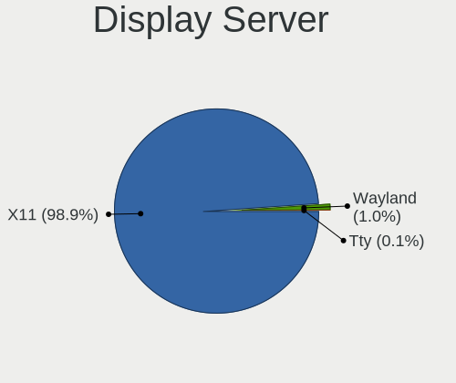

| Name    | Desktops | Percent |
|---------|----------|---------|
| X11     | 1276     | 98.99%  |
| Wayland | 13       | 1.01%   |

Display Manager
---------------

SDDM, LightDM, etc.

| Name    | Desktops | Percent |
|---------|----------|---------|
| SDDM    | 1282     | 99.69%  |
| Unknown | 4        | 0.31%   |

OS Lang
-------

Language

| Lang    | Desktops | Percent |
|---------|----------|---------|
| Unknown | 1283     | 99.84%  |
| hu_HU   | 1        | 0.08%   |
| en_AU   | 1        | 0.08%   |

Boot Mode
---------

EFI or BIOS

| Mode | Desktops | Percent |
|------|----------|---------|
| BIOS | 1010     | 75.26%  |
| EFI  | 332      | 24.74%  |

Filesystem
----------

Type of filesystem

| Type    | Desktops | Percent |
|---------|----------|---------|
| Overlay | 959      | 66.83%  |
| Ext4    | 456      | 31.78%  |
| Btrfs   | 9        | 0.63%   |
| Unknown | 5        | 0.35%   |
| Ext3    | 4        | 0.28%   |
| Ext2    | 2        | 0.14%   |

Part. scheme
------------

Scheme of partitioning

| Type    | Desktops | Percent |
|---------|----------|---------|
| MBR     | 906      | 67.26%  |
| GPT     | 426      | 31.63%  |
| Unknown | 15       | 1.11%   |

Dual Boot with Linux/BSD
------------------------

Hosting more than one Linux/BSD

| Dual boot | Desktops | Percent |
|-----------|----------|---------|
| No        | 823      | 57.71%  |
| Yes       | 603      | 42.29%  |

Dual Boot (Win)
---------------

Hosting Linux and Windows

| Dual boot | Desktops | Percent |
|-----------|----------|---------|
| Yes       | 794      | 57.33%  |
| No        | 591      | 42.67%  |

Board
-----

Vendor
------

Motherboard manufacturer

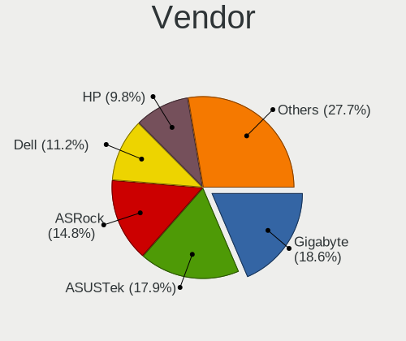

| Name                           | Desktops | Percent |
|--------------------------------|----------|---------|
| ASUSTek Computer               | 238      | 18.54%  |
| Gigabyte Technology            | 226      | 17.6%   |
| ASRock                         | 202      | 15.73%  |
| Dell                           | 145      | 11.29%  |
| Hewlett-Packard                | 125      | 9.74%   |
| MSI                            | 82       | 6.39%   |
| Lenovo                         | 64       | 4.98%   |
| Fujitsu                        | 33       | 2.57%   |
| Acer                           | 25       | 1.95%   |
| Fujitsu Siemens                | 22       | 1.71%   |
| Intel                          | 20       | 1.56%   |
| Foxconn                        | 17       | 1.32%   |
| Medion                         | 11       | 0.86%   |
| Pegatron                       | 10       | 0.78%   |
| Unknown                        | 10       | 0.78%   |
| Biostar                        | 7        | 0.55%   |
| Gateway                        | 5        | 0.39%   |
| ECS                            | 5        | 0.39%   |
| Shuttle                        | 3        | 0.23%   |
| Sapphire                       | 3        | 0.23%   |
| Packard Bell                   | 3        | 0.23%   |
| ABIT                           | 3        | 0.23%   |
| Supermicro                     | 2        | 0.16%   |
| Nvidia                         | 2        | 0.16%   |
| AMD                            | 2        | 0.16%   |
| ZOTAC                          | 1        | 0.08%   |
| Wincor Nixdorf                 | 1        | 0.08%   |
| ViewSonic                      | 1        | 0.08%   |
| TYAN Computer                  | 1        | 0.08%   |
| Shanghai Zhaoxin Semiconductor | 1        | 0.08%   |
| Qbex                           | 1        | 0.08%   |
| PCSMART                        | 1        | 0.08%   |
| NEC Computers                  | 1        | 0.08%   |
| MouseComputer                  | 1        | 0.08%   |
| Login Informatica              | 1        | 0.08%   |
| Lex                            | 1        | 0.08%   |
| Itautec                        | 1        | 0.08%   |
| IBM                            | 1        | 0.08%   |
| GIADA                          | 1        | 0.08%   |
| EMAXX TECHNOLOGY               | 1        | 0.08%   |

Model
-----

Motherboard model

| Name                                   | Desktops | Percent |
|----------------------------------------|----------|---------|
| ASRock FM2A75M Pro4+                   | 32       | 2.49%   |
| ASUS All Series                        | 25       | 1.95%   |
| Dell OptiPlex 3020                     | 13       | 1.01%   |
| Unknown                                | 13       | 1.01%   |
| Dell OptiPlex 755                      | 12       | 0.93%   |
| Dell OptiPlex 760                      | 11       | 0.86%   |
| Dell OptiPlex 780                      | 10       | 0.78%   |
| ASUS P5KPL-AM EPU                      | 10       | 0.78%   |
| Gigabyte H61M-S1                       | 9        | 0.7%    |
| Gigabyte G31M-ES2L                     | 9        | 0.7%    |
| Dell OptiPlex 745                      | 8        | 0.62%   |
| Dell OptiPlex 7010                     | 8        | 0.62%   |
| ASRock G41M-VS3                        | 8        | 0.62%   |
| HP ProDesk 600 G2 SFF                  | 7        | 0.55%   |
| HP Compaq dc5800 Small Form Factor     | 7        | 0.55%   |
| Gigabyte 970A-DS3P                     | 7        | 0.55%   |
| MSI MS-7592                            | 6        | 0.47%   |
| HP Compaq 8000 Elite SFF PC            | 6        | 0.47%   |
| HP Compaq Pro 6300 SFF                 | 5        | 0.39%   |
| HP Compaq dc5850 Small Form Factor     | 5        | 0.39%   |
| Foxconn Pro 3500 Series                | 5        | 0.39%   |
| Dell Precision WorkStation T3500       | 5        | 0.39%   |
| Dell OptiPlex 790                      | 5        | 0.39%   |
| Dell OptiPlex 390                      | 5        | 0.39%   |
| Dell OptiPlex 330                      | 5        | 0.39%   |
| ASRock N68C-S UCC                      | 5        | 0.39%   |
| ASRock G31M-S                          | 5        | 0.39%   |
| ASRock 970 Pro3 R2.0                   | 5        | 0.39%   |
| MSI MS-7817                            | 4        | 0.31%   |
| MSI MS-7721                            | 4        | 0.31%   |
| Medion Pentino G-Series                | 4        | 0.31%   |
| HP EliteDesk 705 G3 SFF                | 4        | 0.31%   |
| HP Compaq Pro 6305 SFF                 | 4        | 0.31%   |
| HP Compaq Pro 6300 MT                  | 4        | 0.31%   |
| HP Compaq Elite 8300 SFF               | 4        | 0.31%   |
| HP Compaq dc7900 Convertible Minitower | 4        | 0.31%   |
| Gigabyte P67A-D3-B3                    | 4        | 0.31%   |
| Gigabyte H81M-S1                       | 4        | 0.31%   |
| Gigabyte GA-78LMT-USB3 6.0             | 4        | 0.31%   |
| Gigabyte B85M-DS3H-A                   | 4        | 0.31%   |

Model Family
------------

Motherboard model prefix

| Name                    | Desktops | Percent |
|-------------------------|----------|---------|
| Dell OptiPlex           | 121      | 9.42%   |
| HP Compaq               | 86       | 6.7%    |
| Lenovo ThinkCentre      | 45       | 3.5%    |
| ASRock FM2A75M          | 32       | 2.49%   |
| ASUS PRIME              | 31       | 2.41%   |
| ASUS All                | 25       | 1.95%   |
| Fujitsu ESPRIMO         | 24       | 1.87%   |
| Fujitsu Siemens ESPRIMO | 15       | 1.17%   |
| ASUS P5KPL-AM           | 15       | 1.17%   |
| Unknown                 | 13       | 1.01%   |
| HP ProDesk              | 12       | 0.93%   |
| Acer Veriton            | 12       | 0.93%   |
| ASUS ROG                | 10       | 0.78%   |
| HP EliteDesk            | 9        | 0.7%    |
| Gigabyte H61M-S1        | 9        | 0.7%    |
| Gigabyte G31M-ES2L      | 9        | 0.7%    |
| Dell Precision          | 9        | 0.7%    |
| ASUS M5A97              | 8        | 0.62%   |
| ASUS M5A78L-M           | 8        | 0.62%   |
| ASRock G41M-VS3         | 8        | 0.62%   |
| ASRock 970              | 8        | 0.62%   |
| Acer Aspire             | 8        | 0.62%   |
| Gigabyte B450           | 7        | 0.55%   |
| Gigabyte 970A-DS3P      | 7        | 0.55%   |
| MSI MS-7592             | 6        | 0.47%   |
| Lenovo ThinkStation     | 6        | 0.47%   |
| Fujitsu CELSIUS         | 6        | 0.47%   |
| Foxconn Pro             | 6        | 0.47%   |
| ASRock N68C-S           | 6        | 0.47%   |
| Gigabyte H310M          | 5        | 0.39%   |
| Gigabyte GA-78LMT-USB3  | 5        | 0.39%   |
| Dell Vostro             | 5        | 0.39%   |
| ASUS P8H61-M            | 5        | 0.39%   |
| ASUS P5K                | 5        | 0.39%   |
| ASUS H110M-A            | 5        | 0.39%   |
| ASRock Z77              | 5        | 0.39%   |
| ASRock G31M-S           | 5        | 0.39%   |
| MSI MS-7817             | 4        | 0.31%   |
| MSI MS-7721             | 4        | 0.31%   |
| Medion Pentino          | 4        | 0.31%   |

MFG Year
--------

Motherboard manufacture year

| Year | Desktops | Percent |
|------|----------|---------|
| 2013 | 137      | 10.67%  |
| 2012 | 137      | 10.67%  |
| 2009 | 135      | 10.51%  |
| 2008 | 123      | 9.58%   |
| 2010 | 119      | 9.27%   |
| 2014 | 113      | 8.8%    |
| 2011 | 110      | 8.57%   |
| 2007 | 95       | 7.4%    |
| 2018 | 71       | 5.53%   |
| 2015 | 55       | 4.28%   |
| 2006 | 41       | 3.19%   |
| 2017 | 39       | 3.04%   |
| 2016 | 39       | 3.04%   |
| 2019 | 31       | 2.41%   |
| 2005 | 14       | 1.09%   |
| 2020 | 13       | 1.01%   |
| 2021 | 7        | 0.55%   |
| 2004 | 4        | 0.31%   |
| 2003 | 1        | 0.08%   |

Form Factor
-----------

Physical design of the computer

| Name    | Desktops | Percent |
|---------|----------|---------|
| Desktop | 1284     | 100%    |

Secure Boot
-----------

Enabled or disabled

| State    | Desktops | Percent |
|----------|----------|---------|
| Disabled | 1284     | 100%    |

Coreboot
--------

Have coreboot on board

| Used | Desktops | Percent |
|------|----------|---------|
| No   | 1284     | 100%    |

RAM Size
--------

Total RAM memory

| Size in GB  | Desktops | Percent |
|-------------|----------|---------|
| 3.01-4.0    | 403      | 30.21%  |
| 8.01-16.0   | 355      | 26.61%  |
| 4.01-8.0    | 209      | 15.67%  |
| 16.01-24.0  | 159      | 11.92%  |
| 1.01-2.0    | 122      | 9.15%   |
| 32.01-64.0  | 34       | 2.55%   |
| 2.01-3.0    | 28       | 2.1%    |
| 0.51-1.0    | 12       | 0.9%    |
| 24.01-32.0  | 10       | 0.75%   |
| 64.01-256.0 | 2        | 0.15%   |

RAM Used
--------

Used RAM memory

| Used GB  | Desktops | Percent |
|----------|----------|---------|
| 0.01-0.5 | 642      | 43.15%  |
| 0.51-1.0 | 560      | 37.63%  |
| 1.01-2.0 | 234      | 15.73%  |
| 2.01-3.0 | 41       | 2.76%   |
| 3.01-4.0 | 6        | 0.4%    |
| 4.01-8.0 | 4        | 0.27%   |
| Unknown  | 1        | 0.07%   |

Total Drives
------------

Number of drives on board

| Drives | Desktops | Percent |
|--------|----------|---------|
| 1      | 756      | 53.62%  |
| 2      | 365      | 25.89%  |
| 3      | 154      | 10.92%  |
| 4      | 59       | 4.18%   |
| 5      | 31       | 2.2%    |
| 0      | 27       | 1.91%   |
| 6      | 9        | 0.64%   |
| 9      | 3        | 0.21%   |
| 10     | 2        | 0.14%   |
| 8      | 2        | 0.14%   |
| 7      | 2        | 0.14%   |

Has CD-ROM
----------

Has CD-ROM on board

| Presented | Desktops | Percent |
|-----------|----------|---------|
| Yes       | 878      | 65.92%  |
| No        | 454      | 34.08%  |

Has Ethernet
------------

Has Ethernet on board

| Presented | Desktops | Percent |
|-----------|----------|---------|
| Yes       | 1274     | 99.22%  |
| No        | 10       | 0.78%   |

Has WiFi
--------

Has WiFi module

| Presented | Desktops | Percent |
|-----------|----------|---------|
| No        | 969      | 73.58%  |
| Yes       | 348      | 26.42%  |

Has Bluetooth
-------------

Has Bluetooth module

| Presented | Desktops | Percent |
|-----------|----------|---------|
| No        | 1144     | 87.33%  |
| Yes       | 166      | 12.67%  |

Location
--------

Country
-------

Geographic location (country)

| Country      | Desktops | Percent |
|--------------|----------|---------|
| Hungary      | 921      | 71.62%  |
| USA          | 56       | 4.35%   |
| Germany      | 56       | 4.35%   |
| Romania      | 32       | 2.49%   |
| Brazil       | 16       | 1.24%   |
| UK           | 14       | 1.09%   |
| Slovakia     | 14       | 1.09%   |
| Italy        | 14       | 1.09%   |
| France       | 14       | 1.09%   |
| Canada       | 12       | 0.93%   |
| Spain        | 11       | 0.86%   |
| Poland       | 11       | 0.86%   |
| Serbia       | 10       | 0.78%   |
| Australia    | 10       | 0.78%   |
| Philippines  | 8        | 0.62%   |
| Japan        | 7        | 0.54%   |
| Ukraine      | 5        | 0.39%   |
| Argentina    | 5        | 0.39%   |
| South Africa | 4        | 0.31%   |
| India        | 4        | 0.31%   |
| Greece       | 4        | 0.31%   |
| Austria      | 4        | 0.31%   |
| Netherlands  | 3        | 0.23%   |
| Ireland      | 3        | 0.23%   |
| Finland      | 3        | 0.23%   |
| Egypt        | 3        | 0.23%   |
| Belgium      | 3        | 0.23%   |
| Uruguay      | 2        | 0.16%   |
| Turkey       | 2        | 0.16%   |
| Switzerland  | 2        | 0.16%   |
| Russia       | 2        | 0.16%   |
| Kuwait       | 2        | 0.16%   |
| Colombia     | 2        | 0.16%   |
| Belarus      | 2        | 0.16%   |
| Thailand     | 1        | 0.08%   |
| Tanzania     | 1        | 0.08%   |
| Taiwan       | 1        | 0.08%   |
| South Korea  | 1        | 0.08%   |
| Slovenia     | 1        | 0.08%   |
| San Marino   | 1        | 0.08%   |

City
----

Geographic location (city)

| City              | Desktops | Percent |
|-------------------|----------|---------|
| Budapest          | 301      | 19.96%  |
| Pcs             | 24       | 1.59%   |
| Gyr             | 24       | 1.59%   |
| Miskolc           | 21       | 1.39%   |
| Karcag            | 21       | 1.39%   |
| Debrecen          | 20       | 1.33%   |
| Oroshaza          | 16       | 1.06%   |
| Szeged            | 15       | 0.99%   |
| Szombathely       | 14       | 0.93%   |
| Eger              | 14       | 0.93%   |
| Kecskemt        | 12       | 0.8%    |
| Gdll        | 11       | 0.73%   |
| Berettyjfalu  | 11       | 0.73%   |
| Zalaegerszeg      | 10       | 0.66%   |
| Tatabnya        | 10       | 0.66%   |
| Szekszrd        | 10       | 0.66%   |
| Tiszafured        | 9        | 0.6%    |
| Szkesfehrvr | 9        | 0.6%    |
| Papa              | 9        | 0.6%    |
| Nyiregyhaza       | 9        | 0.6%    |
| Toeroekbalint     | 8        | 0.53%   |
| Nagykanizsa       | 8        | 0.53%   |
| Mosonmagyarvr | 8        | 0.53%   |
| Bucharest         | 8        | 0.53%   |
| Esztergom         | 7        | 0.46%   |
| Ajka              | 7        | 0.46%   |
| Nagyatad          | 6        | 0.4%    |
| Hajduboszormeny   | 6        | 0.4%    |
| Frankfurt am Main | 6        | 0.4%    |
| rd              | 6        | 0.4%    |
| Zalu            | 5        | 0.33%   |
| Szolnok           | 5        | 0.33%   |
| Szigetszentmiklos | 5        | 0.33%   |
| Szentes           | 5        | 0.33%   |
| Stuttgart         | 5        | 0.33%   |
| North Hollywood   | 5        | 0.33%   |
| Mohcs           | 5        | 0.33%   |
| Melbourne         | 5        | 0.33%   |
| Hodmezovasarhely  | 5        | 0.33%   |
| Hatvan            | 5        | 0.33%   |

Drives
------

Drive Vendor
------------

Hard drive vendors

| Vendor              | Desktops | Drives | Percent |
|---------------------|----------|--------|---------|
| WDC                 | 478      | 895    | 22.43%  |
| Seagate             | 376      | 580    | 17.64%  |
| Samsung Electronics | 303      | 517    | 14.22%  |
| Kingston            | 233      | 414    | 10.93%  |
| Toshiba             | 141      | 252    | 6.62%   |
| Hitachi             | 115      | 170    | 5.4%    |
| A-DATA Technology   | 65       | 104    | 3.05%   |
| Maxtor              | 54       | 69     | 2.53%   |
| SanDisk             | 43       | 63     | 2.02%   |
| Crucial             | 38       | 61     | 1.78%   |
| HGST                | 19       | 44     | 0.89%   |
| SPCC                | 17       | 23     | 0.8%    |
| Intel               | 16       | 28     | 0.75%   |
| Patriot             | 15       | 30     | 0.7%    |
| Fujitsu             | 15       | 15     | 0.7%    |
| OCZ                 | 14       | 19     | 0.66%   |
| Intenso             | 14       | 19     | 0.66%   |
| PNY                 | 11       | 17     | 0.52%   |
| Gigabyte Technology | 10       | 27     | 0.47%   |
| China               | 10       | 15     | 0.47%   |
| Apacer              | 10       | 17     | 0.47%   |
| SK hynix            | 9        | 12     | 0.42%   |
| Hewlett-Packard     | 9        | 13     | 0.42%   |
| Kingmax             | 7        | 16     | 0.33%   |
| Zheino              | 6        | 12     | 0.28%   |
| KingSpec            | 6        | 7      | 0.28%   |
| Corsair             | 6        | 8      | 0.28%   |
| WD MediaMax         | 5        | 6      | 0.23%   |
| Unknown             | 5        | 8      | 0.23%   |
| Team                | 5        | 7      | 0.23%   |
| ASMT                | 5        | 7      | 0.23%   |
| Verbatim            | 4        | 8      | 0.19%   |
| Transcend           | 4        | 6      | 0.19%   |
| LITEON              | 4        | 4      | 0.19%   |
| JMicron Technology  | 4        | 5      | 0.19%   |
| Goodram             | 4        | 4      | 0.19%   |
| USB3.0              | 3        | 4      | 0.14%   |
| Emtec               | 3        | 3      | 0.14%   |
| Apple               | 3        | 3      | 0.14%   |
| XPG                 | 2        | 4      | 0.09%   |

Drive Model
-----------

Hard drive models

| Model                            | Desktops | Percent |
|----------------------------------|----------|---------|
| Kingston SA400S37120G 120GB SSD  | 58       | 2.39%   |
| Seagate ST500DM002-1BD142 500GB  | 48       | 1.98%   |
| Kingston SA400S37240G 240GB SSD  | 48       | 1.98%   |
| Kingston SV300S37A120G 120GB SSD | 43       | 1.77%   |
| Toshiba DT01ACA100 1TB           | 40       | 1.65%   |
| Toshiba DT01ACA050 500GB         | 28       | 1.15%   |
| A-DATA SU630 240GB SSD           | 28       | 1.15%   |
| Seagate ST380815AS 80GB          | 23       | 0.95%   |
| WDC WD10EZEX-08WN4A0 1TB         | 18       | 0.74%   |
| A-DATA SU700 120GB SSD           | 18       | 0.74%   |
| Samsung HD502HJ 500GB            | 17       | 0.7%    |
| Kingston SUV400S37120G 120GB SSD | 17       | 0.7%    |
| Seagate ST3160815AS 160GB        | 16       | 0.66%   |
| Samsung HD103UJ 1TB              | 16       | 0.66%   |
| Seagate ST1000DM010-2EP102 1TB   | 15       | 0.62%   |
| Samsung SSD 860 EVO 500GB        | 15       | 0.62%   |
| WDC WD5000AAKX-001CA0 500GB      | 13       | 0.54%   |
| Seagate ST3250318AS 250GB        | 13       | 0.54%   |
| Kingston SA400S37480G 480GB SSD  | 13       | 0.54%   |
| Toshiba HDWD110 1TB              | 12       | 0.49%   |
| Toshiba DT01ACA200 2TB           | 12       | 0.49%   |
| Seagate ST3160318AS 160GB        | 12       | 0.49%   |
| WDC WDS240G2G0B-00EPW0 240GB SSD | 11       | 0.45%   |
| WDC WD5000AAKX-22ERMA0 500GB     | 10       | 0.41%   |
| Seagate ST3500418AS 500GB        | 10       | 0.41%   |
| Samsung HD502IJ 500GB            | 10       | 0.41%   |
| Samsung HD322HJ 320GB            | 10       | 0.41%   |
| Samsung HD161HJ 160GB            | 10       | 0.41%   |
| Kingston SV300S37A240G 240GB SSD | 10       | 0.41%   |
| Hitachi HDS721050CLA360 500GB    | 10       | 0.41%   |
| Fujitsu MHZ2160BH G2 160GB       | 10       | 0.41%   |
| WDC WDS240G2G0A-00JH30 240GB SSD | 9        | 0.37%   |
| WDC WDS120G2G0A-00JH30 120GB SSD | 9        | 0.37%   |
| WDC WD5000AADS-00S9B0 500GB      | 9        | 0.37%   |
| WDC WD10EZRZ-00HTKB0 1TB         | 9        | 0.37%   |
| Seagate ST250DM000-1BD141 250GB  | 9        | 0.37%   |
| Seagate ST1000DM003-1ER162 1TB   | 9        | 0.37%   |
| SanDisk SSD PLUS 240GB           | 9        | 0.37%   |
| Samsung SSD 860 EVO 250GB        | 9        | 0.37%   |
| Samsung SSD 850 EVO 250GB        | 9        | 0.37%   |

HDD Vendor
----------

Hard disk drive vendors

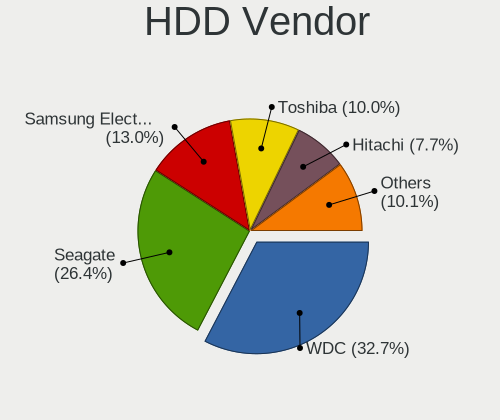

| Vendor              | Desktops | Drives | Percent |
|---------------------|----------|--------|---------|
| WDC                 | 449      | 819    | 32.35%  |
| Seagate             | 374      | 576    | 26.95%  |
| Samsung Electronics | 192      | 291    | 13.83%  |
| Toshiba             | 135      | 246    | 9.73%   |
| Hitachi             | 115      | 170    | 8.29%   |
| Maxtor              | 53       | 68     | 3.82%   |
| HGST                | 19       | 44     | 1.37%   |
| Fujitsu             | 15       | 15     | 1.08%   |
| WD MediaMax         | 5        | 6      | 0.36%   |
| Hewlett-Packard     | 5        | 5      | 0.36%   |
| JMicron Technology  | 4        | 5      | 0.29%   |
| ASMT                | 4        | 6      | 0.29%   |
| USB3.0              | 3        | 4      | 0.22%   |
| Unknown             | 3        | 4      | 0.22%   |
| Apple               | 3        | 3      | 0.22%   |
| QUANTUM             | 2        | 2      | 0.14%   |
| USB                 | 1        | 2      | 0.07%   |
| ICY BOX             | 1        | 2      | 0.07%   |
| IBM/Hitachi         | 1        | 1      | 0.07%   |
| HGST HTS            | 1        | 1      | 0.07%   |
| ExcelStor           | 1        | 1      | 0.07%   |
| Emphase             | 1        | 2      | 0.07%   |
| ASMedia             | 1        | 1      | 0.07%   |

SSD Vendor
----------

Solid state drive vendors

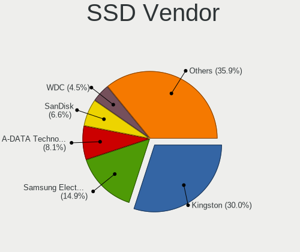

| Vendor              | Desktops | Drives | Percent |
|---------------------|----------|--------|---------|
| Kingston            | 221      | 378    | 32.5%   |
| Samsung Electronics | 103      | 178    | 15.15%  |
| A-DATA Technology   | 60       | 95     | 8.82%   |
| SanDisk             | 41       | 61     | 6.03%   |
| WDC                 | 37       | 66     | 5.44%   |
| Crucial             | 33       | 54     | 4.85%   |
| SPCC                | 14       | 20     | 2.06%   |
| Patriot             | 14       | 29     | 2.06%   |
| OCZ                 | 14       | 19     | 2.06%   |
| Intenso             | 14       | 19     | 2.06%   |
| PNY                 | 11       | 17     | 1.62%   |
| China               | 10       | 15     | 1.47%   |
| Apacer              | 10       | 17     | 1.47%   |
| Intel               | 9        | 13     | 1.32%   |
| Gigabyte Technology | 8        | 24     | 1.18%   |
| SK hynix            | 7        | 10     | 1.03%   |
| Kingmax             | 7        | 16     | 1.03%   |
| Toshiba             | 6        | 6      | 0.88%   |
| KingSpec            | 6        | 7      | 0.88%   |
| Corsair             | 6        | 8      | 0.88%   |
| Team                | 5        | 7      | 0.74%   |
| Verbatim            | 4        | 8      | 0.59%   |
| LITEON              | 4        | 4      | 0.59%   |
| GOODRAM             | 4        | 4      | 0.59%   |
| Transcend           | 3        | 5      | 0.44%   |
| Emtec               | 3        | 3      | 0.44%   |
| Netac               | 2        | 6      | 0.29%   |
| KingFast            | 2        | 2      | 0.29%   |
| Hewlett-Packard     | 2        | 3      | 0.29%   |
| Vaseky              | 1        | 1      | 0.15%   |
| Unknown             | 1        | 2      | 0.15%   |
| Teclast             | 1        | 1      | 0.15%   |
| StoreJet            | 1        | 1      | 0.15%   |
| SMI                 | 1        | 1      | 0.15%   |
| Seagate             | 1        | 1      | 0.15%   |
| SATAFIRM            | 1        | 1      | 0.15%   |
| RECADATA            | 1        | 1      | 0.15%   |
| OCZ-AGIL            | 1        | 1      | 0.15%   |
| Mushkin             | 1        | 1      | 0.15%   |
| Micron Technology   | 1        | 2      | 0.15%   |

Drive Kind
----------

HDD or SSD

| Kind    | Desktops | Drives | Percent |
|---------|----------|--------|---------|
| HDD     | 1048     | 2274   | 60.97%  |
| SSD     | 580      | 1122   | 33.74%  |
| NVMe    | 80       | 164    | 4.65%   |
| Unknown | 10       | 10     | 0.58%   |
| MMC     | 1        | 1      | 0.06%   |

Drive Connector
---------------

SATA, SAS, NVMe, etc.

| Type | Desktops | Drives | Percent |
|------|----------|--------|---------|
| SATA | 1253     | 3329   | 90.53%  |
| NVMe | 80       | 164    | 5.78%   |
| SAS  | 50       | 77     | 3.61%   |
| MMC  | 1        | 1      | 0.07%   |

Drive Size
----------

Size of hard drive

| Size in TB | Desktops | Drives | Percent |
|------------|----------|--------|---------|
| 0.01-0.5   | 1139     | 2419   | 70.14%  |
| 0.51-1.0   | 336      | 668    | 20.69%  |
| 1.01-2.0   | 86       | 170    | 5.3%    |
| 2.01-3.0   | 26       | 73     | 1.6%    |
| 3.01-4.0   | 24       | 47     | 1.48%   |
| 4.01-10.0  | 11       | 16     | 0.68%   |
| 10.01-20.0 | 2        | 3      | 0.12%   |

Space Total
-----------

Amount of disk space available on the file system

| Size in GB     | Desktops | Percent |
|----------------|----------|---------|
| Unknown        | 945      | 62.67%  |
| 101-250        | 205      | 13.59%  |
| 251-500        | 116      | 7.69%   |
| 51-100         | 90       | 5.97%   |
| 21-50          | 54       | 3.58%   |
| 501-1000       | 51       | 3.38%   |
| 1001-2000      | 23       | 1.53%   |
| 1-20           | 19       | 1.26%   |
| More than 3000 | 5        | 0.33%   |

Space Used
----------

Amount of used disk space

| Used GB        | Desktops | Percent |
|----------------|----------|---------|
| Unknown        | 945      | 63.94%  |
| 1-20           | 407      | 27.54%  |
| 21-50          | 55       | 3.72%   |
| 51-100         | 24       | 1.62%   |
| 101-250        | 22       | 1.49%   |
| 501-1000       | 13       | 0.88%   |
| 251-500        | 8        | 0.54%   |
| More than 3000 | 2        | 0.14%   |
| 2001-3000      | 1        | 0.07%   |
| 1001-2000      | 1        | 0.07%   |

Malfunc. Drives
---------------

Drive models with a malfunction

| Model                             | Desktops | Drives | Percent |
|-----------------------------------|----------|--------|---------|
| Seagate ST500DM002-1BD142 500GB   | 25       | 40     | 3.65%   |
| A-DATA Technology SU630 240GB SSD | 18       | 21     | 2.63%   |
| Kingston SV300S37A120G 120GB SSD  | 15       | 16     | 2.19%   |
| Samsung Electronics HD103UJ 1TB   | 14       | 21     | 2.04%   |
| WDC WD5000AAKX-001CA0 500GB       | 10       | 10     | 1.46%   |
| Toshiba DT01ACA050 500GB          | 9        | 10     | 1.31%   |
| Toshiba DT01ACA100 1TB            | 7        | 13     | 1.02%   |
| Seagate ST500LT012-9WS142 500GB   | 7        | 8      | 1.02%   |
| WDC WD5000AADS-00S9B0 500GB       | 6        | 8      | 0.88%   |
| Seagate ST3160815AS 160GB         | 6        | 7      | 0.88%   |
| Samsung Electronics HD321KJ 320GB | 6        | 6      | 0.88%   |
| Samsung Electronics HD103SI 1TB   | 6        | 6      | 0.88%   |
| Hitachi HDS721050CLA362 500GB     | 6        | 11     | 0.88%   |
| WDC WD5000AAKS-00UU3A0 500GB      | 5        | 8      | 0.73%   |
| WDC WD10EARS-00Y5B1 1TB           | 5        | 8      | 0.73%   |
| Seagate ST380815AS 80GB           | 5        | 8      | 0.73%   |
| Seagate ST3500418AS 500GB         | 5        | 9      | 0.73%   |
| Seagate ST3250318AS 250GB         | 5        | 8      | 0.73%   |
| Samsung Electronics SP2504C 250GB | 5        | 8      | 0.73%   |
| Samsung Electronics HD161HJ 160GB | 5        | 5      | 0.73%   |
| Hitachi HDP725050GLA360 500GB     | 5        | 5      | 0.73%   |
| Seagate ST3160812AS 160GB         | 4        | 4      | 0.58%   |
| Samsung Electronics SP2004C 200GB | 4        | 6      | 0.58%   |
| Samsung Electronics HD642JJ 640GB | 4        | 7      | 0.58%   |
| Samsung Electronics HD502HJ 500GB | 4        | 7      | 0.58%   |
| Samsung Electronics HD501LJ 500GB | 4        | 5      | 0.58%   |
| Samsung Electronics HD161GJ 160GB | 4        | 5      | 0.58%   |
| Samsung Electronics HD082GJ 80GB  | 4        | 4      | 0.58%   |
| Samsung Electronics HD080HJ 80GB  | 4        | 4      | 0.58%   |
| Maxtor 6Y080M0 82GB               | 4        | 5      | 0.58%   |
| Maxtor 6Y080L0 82GB               | 4        | 5      | 0.58%   |
| Maxtor 2B020H1 20GB               | 4        | 8      | 0.58%   |
| Hitachi HDS721010CLA332 1TB       | 4        | 8      | 0.58%   |
| WDC WD5000AAKX-08U6AA0 500GB      | 3        | 5      | 0.44%   |
| WDC WD5000AAKX-07U6AA0 500GB      | 3        | 5      | 0.44%   |
| WDC WD3200AAKS-00L9A0 320GB       | 3        | 4      | 0.44%   |
| WDC WD15EARS-00MVWB0 1TB          | 3        | 7      | 0.44%   |
| WDC WD10PURZ-85U8XY0 1TB          | 3        | 3      | 0.44%   |
| WDC WD10EZEX-60WN4A0 1TB          | 3        | 3      | 0.44%   |
| WDC WD10EZEX-22MFCA0 1TB          | 3        | 3      | 0.44%   |

Malfunc. Drive Vendor
---------------------

Vendors of faulty drives

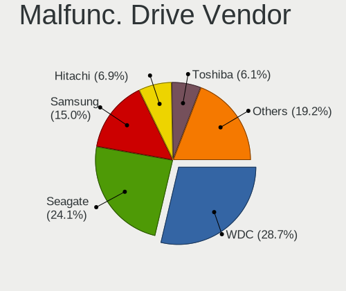

| Vendor              | Desktops | Drives | Percent |
|---------------------|----------|--------|---------|
| WDC                 | 177      | 289    | 27.48%  |
| Seagate             | 157      | 216    | 24.38%  |
| Samsung Electronics | 104      | 148    | 16.15%  |
| Hitachi             | 48       | 77     | 7.45%   |
| Toshiba             | 36       | 50     | 5.59%   |
| Maxtor              | 32       | 45     | 4.97%   |
| Kingston            | 28       | 32     | 4.35%   |
| A-DATA Technology   | 21       | 29     | 3.26%   |
| HGST                | 8        | 9      | 1.24%   |
| OCZ                 | 7        | 10     | 1.09%   |
| WD MediaMax         | 5        | 6      | 0.78%   |
| Hewlett-Packard     | 3        | 3      | 0.47%   |
| SK hynix            | 2        | 5      | 0.31%   |
| SanDisk             | 2        | 2      | 0.31%   |
| KingSpec            | 2        | 2      | 0.31%   |
| SATAFIRM            | 1        | 1      | 0.16%   |
| QUANTUM             | 1        | 1      | 0.16%   |
| Patriot             | 1        | 1      | 0.16%   |
| LITEON              | 1        | 1      | 0.16%   |
| Kingmax             | 1        | 1      | 0.16%   |
| Intenso             | 1        | 1      | 0.16%   |
| IBM/Hitachi         | 1        | 1      | 0.16%   |
| Fujitsu             | 1        | 1      | 0.16%   |
| ExcelStor           | 1        | 1      | 0.16%   |
| Crucial             | 1        | 1      | 0.16%   |
| Corsair             | 1        | 1      | 0.16%   |
| ASMT                | 1        | 1      | 0.16%   |

Malfunc. HDD Vendor
-------------------

Vendors of faulty HDD drives

| Vendor              | Desktops | Drives | Percent |
|---------------------|----------|--------|---------|
| WDC                 | 176      | 288    | 30.88%  |
| Seagate             | 157      | 216    | 27.54%  |
| Samsung Electronics | 102      | 144    | 17.89%  |
| Hitachi             | 48       | 77     | 8.42%   |
| Toshiba             | 35       | 49     | 6.14%   |
| Maxtor              | 32       | 45     | 5.61%   |
| HGST                | 8        | 9      | 1.4%    |
| WD MediaMax         | 5        | 6      | 0.88%   |
| Hewlett-Packard     | 2        | 2      | 0.35%   |
| QUANTUM             | 1        | 1      | 0.18%   |
| IBM/Hitachi         | 1        | 1      | 0.18%   |
| Fujitsu             | 1        | 1      | 0.18%   |
| ExcelStor           | 1        | 1      | 0.18%   |
| ASMT                | 1        | 1      | 0.18%   |

Malfunc. Drive Kind
-------------------

Kinds of faulty drives

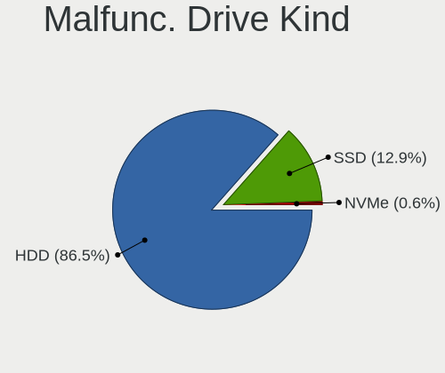

| Kind | Desktops | Drives | Percent |
|------|----------|--------|---------|
| HDD  | 491      | 841    | 87.06%  |
| SSD  | 71       | 92     | 12.59%  |
| NVMe | 2        | 2      | 0.35%   |

Failed Drives
-------------

Failed drive models

| Model                             | Desktops | Drives | Percent |
|-----------------------------------|----------|--------|---------|
| Samsung Electronics HD502HJ 500GB | 2        | 2      | 15.38%  |
| Zheino CHN-NGFFNV2280-256 256GB   | 1        | 1      | 7.69%   |
| WDC WD1600BEVT-80A23T0 160GB      | 1        | 1      | 7.69%   |
| Seagate ST380815AS 80GB           | 1        | 3      | 7.69%   |
| Seagate ST3160815AS 160GB         | 1        | 1      | 7.69%   |
| Samsung Electronics SP0802N 80GB  | 1        | 1      | 7.69%   |
| Samsung Electronics HD204UI 2TB   | 1        | 1      | 7.69%   |
| Samsung Electronics HD103UJ 1TB   | 1        | 1      | 7.69%   |
| Samsung Electronics HD103SJ 1TB   | 1        | 1      | 7.69%   |
| OCZ-AGIL ITY3 64GB SSD            | 1        | 1      | 7.69%   |
| Hitachi HDS721010DLE630 1TB       | 1        | 1      | 7.69%   |
| Hewlett-Packard SSD EX900 250GB   | 1        | 1      | 7.69%   |

Failed Drive Vendor
-------------------

Failed drive vendors

| Vendor              | Desktops | Drives | Percent |
|---------------------|----------|--------|---------|
| Samsung Electronics | 6        | 6      | 46.15%  |
| Seagate             | 2        | 4      | 15.38%  |
| Zheino              | 1        | 1      | 7.69%   |
| WDC                 | 1        | 1      | 7.69%   |
| OCZ-AGIL            | 1        | 1      | 7.69%   |
| Hitachi             | 1        | 1      | 7.69%   |
| Hewlett-Packard     | 1        | 1      | 7.69%   |

Drive Status
------------

Number of failed and malfunc. drives

| Status   | Desktops | Drives | Percent |
|----------|----------|--------|---------|
| Works    | 1008     | 2462   | 60.72%  |
| Malfunc  | 546      | 935    | 32.89%  |
| Detected | 93       | 159    | 5.6%    |
| Failed   | 13       | 15     | 0.78%   |

Storage controller
------------------

Storage Vendor
--------------

Storage controller vendors

| Vendor                           | Desktops | Percent |
|----------------------------------|----------|---------|
| Intel                            | 869      | 56.8%   |
| AMD                              | 335      | 21.9%   |
| JMicron Technology               | 70       | 4.58%   |
| Nvidia                           | 64       | 4.18%   |
| ASMedia Technology               | 36       | 2.35%   |
| Marvell Technology Group         | 33       | 2.16%   |
| Samsung Electronics              | 28       | 1.83%   |
| VIA Technologies                 | 16       | 1.05%   |
| Kingston Technology Company      | 15       | 0.98%   |
| Silicon Motion                   | 12       | 0.78%   |
| Silicon Image                    | 11       | 0.72%   |
| Phison Electronics               | 8        | 0.52%   |
| SanDisk                          | 5        | 0.33%   |
| Micron/Crucial Technology        | 5        | 0.33%   |
| ADATA Technology                 | 4        | 0.26%   |
| SK hynix                         | 2        | 0.13%   |
| Silicon Integrated Systems [SiS] | 2        | 0.13%   |
| LSI Logic / Symbios Logic        | 2        | 0.13%   |
| Integrated Technology Express    | 2        | 0.13%   |
| Zhaoxin                          | 1        | 0.07%   |
| ULi Electronics                  | 1        | 0.07%   |
| Realtek Semiconductor            | 1        | 0.07%   |
| Promise Technology               | 1        | 0.07%   |
| Micron Technology                | 1        | 0.07%   |
| MAXIO Technology (Hangzhou)      | 1        | 0.07%   |
| Lite-On Technology               | 1        | 0.07%   |
| Hewlett-Packard                  | 1        | 0.07%   |
| Broadcom / LSI                   | 1        | 0.07%   |
| Adaptec                          | 1        | 0.07%   |
| 3ware                            | 1        | 0.07%   |

Storage Model
-------------

Storage controller models

| Model                                                                                   | Desktops | Percent |
|-----------------------------------------------------------------------------------------|----------|---------|
| AMD FCH SATA Controller [AHCI mode]                                                     | 170      | 7.56%   |
| Intel NM10/ICH7 Family SATA Controller [IDE mode]                                       | 164      | 7.29%   |
| Intel 82801G (ICH7 Family) IDE Controller                                               | 125      | 5.56%   |
| Intel 8 Series/C220 Series Chipset Family 6-port SATA Controller 1 [AHCI mode]          | 99       | 4.4%    |
| AMD SB7x0/SB8x0/SB9x0 IDE Controller                                                    | 91       | 4.05%   |
| Intel 6 Series/C200 Series Chipset Family 6 port Desktop SATA AHCI Controller           | 75       | 3.33%   |
| AMD SB7x0/SB8x0/SB9x0 SATA Controller [IDE mode]                                        | 68       | 3.02%   |
| AMD SB7x0/SB8x0/SB9x0 SATA Controller [AHCI mode]                                       | 63       | 2.8%    |
| AMD FCH IDE Controller                                                                  | 59       | 2.62%   |
| Intel 7 Series/C210 Series Chipset Family 6-port SATA Controller [AHCI mode]            | 57       | 2.53%   |
| Intel 6 Series/C200 Series Chipset Family Desktop SATA Controller (IDE mode, ports 4-5) | 48       | 2.13%   |
| Intel 6 Series/C200 Series Chipset Family Desktop SATA Controller (IDE mode, ports 0-3) | 48       | 2.13%   |
| Intel SATA Controller [RAID mode]                                                       | 46       | 2.05%   |
| Intel 4 Series Chipset PT IDER Controller                                               | 46       | 2.05%   |
| Intel 200 Series PCH SATA controller [AHCI mode]                                        | 46       | 2.05%   |
| Intel 82801I (ICH9 Family) 2 port SATA Controller [IDE mode]                            | 45       | 2%      |
| Intel Q170/Q150/B150/H170/H110/Z170/CM236 Chipset SATA Controller [AHCI Mode]           | 44       | 1.96%   |
| JMicron JMB363 SATA/IDE Controller                                                      | 40       | 1.78%   |
| AMD 400 Series Chipset SATA Controller                                                  | 36       | 1.6%    |
| ASMedia ASM1062 Serial ATA Controller                                                   | 34       | 1.51%   |
| Intel 82801JD/DO (ICH10 Family) SATA AHCI Controller                                    | 31       | 1.38%   |
| Nvidia MCP61 SATA Controller                                                            | 30       | 1.33%   |
| JMicron JMB368 IDE controller                                                           | 29       | 1.29%   |
| Nvidia MCP61 IDE                                                                        | 28       | 1.24%   |
| Intel 82801JI (ICH10 Family) 4 port SATA IDE Controller #1                              | 24       | 1.07%   |
| Intel 82801JD/DO (ICH10 Family) 4-port SATA IDE Controller                              | 24       | 1.07%   |
| Intel 82801JD/DO (ICH10 Family) 2-port SATA IDE Controller                              | 24       | 1.07%   |
| Intel 82801IR/IO/IH (ICH9R/DO/DH) 4 port SATA Controller [IDE mode]                     | 24       | 1.07%   |
| Intel 82801JI (ICH10 Family) 2 port SATA IDE Controller #2                              | 23       | 1.02%   |
| Samsung NVMe SSD Controller SM981/PM981/PM983                                           | 22       | 0.98%   |
| Intel 82801IB (ICH9) 2 port SATA Controller [IDE mode]                                  | 21       | 0.93%   |
| Intel 82801IR/IO/IH (ICH9R/DO/DH) 6 port SATA Controller [AHCI mode]                    | 20       | 0.89%   |
| Intel 82Q35 Express PT IDER Controller                                                  | 19       | 0.84%   |
| Intel 82801JI (ICH10 Family) SATA AHCI Controller                                       | 19       | 0.84%   |
| Intel Cannon Lake PCH SATA AHCI Controller                                              | 17       | 0.76%   |
| Intel 82801H (ICH8 Family) 4 port SATA Controller [IDE mode]                            | 17       | 0.76%   |
| Intel 5 Series/3400 Series Chipset 4 port SATA IDE Controller                           | 17       | 0.76%   |
| Intel 5 Series/3400 Series Chipset 2 port SATA IDE Controller                           | 16       | 0.71%   |
| Intel 5 Series/3400 Series Chipset 6 port SATA AHCI Controller                          | 15       | 0.67%   |
| Intel 82801HR/HO/HH (ICH8R/DO/DH) 2 port SATA Controller [IDE mode]                     | 14       | 0.62%   |

Storage Kind
------------

Kind of storage controller (IDE, SATA, NVMe, SAS, ...)

| Kind | Desktops | Percent |
|------|----------|---------|
| SATA | 818      | 49.91%  |
| IDE  | 667      | 40.7%   |
| NVMe | 80       | 4.88%   |
| RAID | 68       | 4.15%   |
| SCSI | 4        | 0.24%   |
| SAS  | 2        | 0.12%   |

Processor
---------

CPU Vendor
----------

Processor vendors

| Vendor       | Desktops | Percent |
|--------------|----------|---------|
| Intel        | 888      | 69.16%  |
| AMD          | 395      | 30.76%  |
| CentaurHauls | 1        | 0.08%   |

CPU Model
---------

Processor models

| Model                                         | Desktops | Percent |
|-----------------------------------------------|----------|---------|
| Intel Core 2 Duo CPU E8400 @ 3.00GHz          | 44       | 3.41%   |
| AMD A8-6600K APU with Radeon HD Graphics      | 34       | 2.64%   |
| Intel Core i5-3470 CPU @ 3.20GHz              | 23       | 1.78%   |
| Intel Core 2 Quad CPU Q6600 @ 2.40GHz         | 22       | 1.71%   |
| Intel Core 2 Duo CPU E7500 @ 2.93GHz          | 22       | 1.71%   |
| Intel Core i3-3220 CPU @ 3.30GHz              | 21       | 1.63%   |
| Intel Core i3-2120 CPU @ 3.30GHz              | 21       | 1.63%   |
| Intel Core i5-2400 CPU @ 3.10GHz              | 19       | 1.47%   |
| Intel Core i5-6500 CPU @ 3.20GHz              | 17       | 1.32%   |
| Intel Core i3-4160 CPU @ 3.60GHz              | 16       | 1.24%   |
| Intel Core 2 Duo CPU E7300 @ 2.66GHz          | 16       | 1.24%   |
| AMD FX-6300 Six-Core Processor                | 15       | 1.16%   |
| Intel Pentium Dual-Core CPU E5700 @ 3.00GHz   | 13       | 1.01%   |
| Intel Pentium 4 CPU 3.00GHz                   | 12       | 0.93%   |
| Intel Pentium CPU G3220 @ 3.00GHz             | 11       | 0.85%   |
| Intel Core i5-4590 CPU @ 3.30GHz              | 11       | 0.85%   |
| AMD FX-8350 Eight-Core Processor              | 10       | 0.78%   |
| Intel Pentium Dual-Core CPU E5300 @ 2.60GHz   | 9        | 0.7%    |
| Intel Core i3-2100 CPU @ 3.10GHz              | 9        | 0.7%    |
| Intel Pentium Dual-Core CPU E5400 @ 2.70GHz   | 8        | 0.62%   |
| Intel Pentium Dual CPU E2180 @ 2.00GHz        | 8        | 0.62%   |
| Intel Pentium CPU G840 @ 2.80GHz              | 8        | 0.62%   |
| Intel Core i5-4570 CPU @ 3.20GHz              | 8        | 0.62%   |
| Intel Core i5-4460 CPU @ 3.20GHz              | 8        | 0.62%   |
| Intel Core i5 CPU 650 @ 3.20GHz               | 8        | 0.62%   |
| Intel Core i3-8100 CPU @ 3.60GHz              | 8        | 0.62%   |
| Intel Core i3-7100 CPU @ 3.90GHz              | 8        | 0.62%   |
| Intel Core 2 Quad CPU Q9400 @ 2.66GHz         | 8        | 0.62%   |
| Intel Core 2 Quad CPU Q8200 @ 2.33GHz         | 8        | 0.62%   |
| Intel Core 2 Duo CPU E8500 @ 3.16GHz          | 8        | 0.62%   |
| Intel Core 2 Duo CPU E6550 @ 2.33GHz          | 8        | 0.62%   |
| Intel Celeron CPU E3400 @ 2.60GHz             | 8        | 0.62%   |
| Intel Core i7-3770 CPU @ 3.40GHz              | 7        | 0.54%   |
| Intel Core i7-2600 CPU @ 3.40GHz              | 7        | 0.54%   |
| Intel Core i3-4130 CPU @ 3.40GHz              | 7        | 0.54%   |
| Intel Core i3-3240 CPU @ 3.40GHz              | 7        | 0.54%   |
| Intel Core 2 Duo CPU E8200 @ 2.66GHz          | 7        | 0.54%   |
| AMD Athlon II X2 260 Processor                | 7        | 0.54%   |
| AMD A8-7600 Radeon R7, 10 Compute Cores 4C+6G | 7        | 0.54%   |
| AMD A4-5300 APU with Radeon HD Graphics       | 7        | 0.54%   |

CPU Model Family
----------------

Processor model prefix

| Model                   | Desktops | Percent |
|-------------------------|----------|---------|
| Intel Core i5           | 195      | 15.15%  |
| Intel Core i3           | 143      | 11.11%  |
| Intel Core 2 Duo        | 138      | 10.72%  |
| Intel Core i7           | 59       | 4.58%   |
| Intel Core 2 Quad       | 59       | 4.58%   |
| Intel Pentium           | 58       | 4.51%   |
| AMD A8                  | 56       | 4.35%   |
| Intel Pentium Dual-Core | 55       | 4.27%   |
| Intel Celeron           | 50       | 3.89%   |
| AMD FX                  | 49       | 3.81%   |
| AMD Ryzen 5             | 36       | 2.8%    |
| AMD Athlon II X2        | 35       | 2.72%   |
| Intel Xeon              | 34       | 2.64%   |
| AMD Athlon 64 X2        | 29       | 2.25%   |
| Intel Pentium 4         | 22       | 1.71%   |
| Intel Pentium Dual      | 21       | 1.63%   |
| AMD A4                  | 21       | 1.63%   |
| Intel Core 2            | 19       | 1.48%   |
| AMD Phenom II X4        | 19       | 1.48%   |
| Intel Atom              | 15       | 1.17%   |
| AMD Ryzen 7             | 15       | 1.17%   |
| AMD Ryzen 3             | 15       | 1.17%   |
| Intel Pentium D         | 13       | 1.01%   |
| AMD Sempron             | 13       | 1.01%   |
| AMD A10                 | 13       | 1.01%   |
| AMD Athlon II X4        | 12       | 0.93%   |
| AMD A6                  | 11       | 0.85%   |
| Other                   | 10       | 0.78%   |
| AMD Athlon Dual Core    | 8        | 0.62%   |
| AMD Athlon              | 8        | 0.62%   |
| AMD Athlon X4           | 7        | 0.54%   |
| AMD Athlon 64           | 7        | 0.54%   |
| AMD Phenom II X6        | 6        | 0.47%   |
| AMD Phenom II X2        | 4        | 0.31%   |
| AMD Phenom              | 4        | 0.31%   |
| Intel Pentium Gold      | 3        | 0.23%   |
| AMD Turion II Neo       | 3        | 0.23%   |
| AMD Athlon II X3        | 3        | 0.23%   |
| Intel Genuine           | 2        | 0.16%   |
| Intel Celeron D         | 2        | 0.16%   |

CPU Cores
---------

Number of processor cores

| Number  | Desktops | Percent |
|---------|----------|---------|
| 2       | 669      | 51.7%   |
| 4       | 411      | 31.76%  |
| 1       | 95       | 7.34%   |
| 6       | 66       | 5.1%    |
| 8       | 25       | 1.93%   |
| 3       | 24       | 1.85%   |
| 12      | 2        | 0.15%   |
| 10      | 1        | 0.08%   |
| Unknown | 1        | 0.08%   |

CPU Sockets
-----------

Number of sockets

| Number | Desktops | Percent |
|--------|----------|---------|
| 1      | 1276     | 99.3%   |
| 2      | 8        | 0.62%   |
| 4      | 1        | 0.08%   |

CPU Threads
-----------

Threads per core (Hyper-Threading)

| Number  | Desktops | Percent |
|---------|----------|---------|
| 1       | 838      | 64.91%  |
| 2       | 452      | 35.01%  |
| Unknown | 1        | 0.08%   |

CPU Op-Modes
------------

CPU Operation Modes (32-bit, 64-bit)

| Op mode        | Desktops | Percent |
|----------------|----------|---------|
| 32-bit, 64-bit | 1278     | 99.46%  |
| 32-bit         | 5        | 0.39%   |
| Unknown        | 2        | 0.16%   |

CPU Microcode
-------------

Microcode number

| Number     | Desktops | Percent |
|------------|----------|---------|
| 0x1067a    | 171      | 13.03%  |
| 0x306c3    | 114      | 8.69%   |
| 0x206a7    | 108      | 8.23%   |
| Unknown    | 89       | 6.78%   |
| 0x306a9    | 85       | 6.48%   |
| 0x06001119 | 71       | 5.41%   |
| 0x010000c8 | 51       | 3.89%   |
| 0x10676    | 43       | 3.28%   |
| 0x506e3    | 38       | 2.9%    |
| 0x6fd      | 34       | 2.59%   |
| 0x6fb      | 34       | 2.59%   |
| 0x906e9    | 31       | 2.36%   |
| 0x906ea    | 28       | 2.13%   |
| 0x06000852 | 24       | 1.83%   |
| 0x0600084f | 18       | 1.37%   |
| 0x0800820d | 14       | 1.07%   |
| 0x906eb    | 13       | 0.99%   |
| 0x6f2      | 13       | 0.99%   |
| 0x06003106 | 13       | 0.99%   |
| 0x010000db | 13       | 0.99%   |
| 0x106e5    | 12       | 0.91%   |
| 0x106a5    | 12       | 0.91%   |
| 0x03000027 | 12       | 0.91%   |
| 0xf43      | 11       | 0.84%   |
| 0x20655    | 11       | 0.84%   |
| 0x20652    | 11       | 0.84%   |
| 0x08001138 | 11       | 0.84%   |
| 0x206c2    | 10       | 0.76%   |
| 0x10677    | 10       | 0.76%   |
| 0x0810100b | 10       | 0.76%   |
| 0x08108109 | 9        | 0.69%   |
| 0x6f6      | 8        | 0.61%   |
| 0x0700010f | 8        | 0.61%   |
| 0xf65      | 7        | 0.53%   |
| 0xa0653    | 7        | 0.53%   |
| 0x106ca    | 7        | 0.53%   |
| 0x0600611a | 7        | 0.53%   |
| 0x0600063e | 7        | 0.53%   |
| 0x30678    | 6        | 0.46%   |
| 0x106c2    | 6        | 0.46%   |

CPU Microarch
-------------

Microarchitecture

| Name             | Desktops | Percent |
|------------------|----------|---------|
| Penryn           | 225      | 17.52%  |
| Haswell          | 118      | 9.19%   |
| SandyBridge      | 111      | 8.64%   |
| Piledriver       | 111      | 8.64%   |
| K10              | 95       | 7.4%    |
| Core             | 95       | 7.4%    |
| IvyBridge        | 86       | 6.7%    |
| KabyLake         | 78       | 6.07%   |
| K8 Hammer        | 54       | 4.21%   |
| NetBurst         | 41       | 3.19%   |
| Skylake          | 39       | 3.04%   |
| Westmere         | 33       | 2.57%   |
| Zen              | 29       | 2.26%   |
| Zen+             | 25       | 1.95%   |
| Nehalem          | 24       | 1.87%   |
| Steamroller      | 18       | 1.4%    |
| Bonnell          | 15       | 1.17%   |
| K10 Llano        | 12       | 0.93%   |
| Zen 2            | 11       | 0.86%   |
| Silvermont       | 11       | 0.86%   |
| Excavator        | 11       | 0.86%   |
| Bulldozer        | 11       | 0.86%   |
| Jaguar           | 8        | 0.62%   |
| CometLake        | 8        | 0.62%   |
| Bobcat           | 4        | 0.31%   |
| Zen 3            | 3        | 0.23%   |
| Puma             | 3        | 0.23%   |
| Goldmont plus    | 2        | 0.16%   |
| Broadwell        | 1        | 0.08%   |
| Alderlake Hybrid | 1        | 0.08%   |
| Unknown          | 1        | 0.08%   |

Graphics
--------

GPU Vendor
----------

Vendors of graphics cards

| Vendor                                       | Desktops | Percent |
|----------------------------------------------|----------|---------|
| Nvidia                                       | 462      | 34.07%  |
| Intel                                        | 449      | 33.11%  |
| AMD                                          | 434      | 32.01%  |
| VIA Technologies                             | 5        | 0.37%   |
| ATI Technologies                             | 2        | 0.15%   |
| Zhaoxin                                      | 1        | 0.07%   |
| XGI Technology (eXtreme Graphics Innovation) | 1        | 0.07%   |
| Silicon Integrated Systems [SiS]             | 1        | 0.07%   |
| Matrox Electronics Systems                   | 1        | 0.07%   |

GPU Model
---------

Graphics card models

| Model                                                                       | Desktops | Percent |
|-----------------------------------------------------------------------------|----------|---------|
| Intel 4 Series Chipset Integrated Graphics Controller                       | 73       | 5.17%   |
| Intel Xeon E3-1200 v3/4th Gen Core Processor Integrated Graphics Controller | 58       | 4.1%    |
| Intel 2nd Generation Core Processor Family Integrated Graphics Controller   | 54       | 3.82%   |
| Nvidia GK208B [GeForce GT 710]                                              | 43       | 3.04%   |
| Nvidia GT218 [GeForce 210]                                                  | 39       | 2.76%   |
| Intel Xeon E3-1200 v2/3rd Gen Core processor Graphics Controller            | 38       | 2.69%   |
| Intel 82G33/G31 Express Integrated Graphics Controller                      | 37       | 2.62%   |
| AMD Richland [Radeon HD 8570D]                                              | 34       | 2.41%   |
| AMD Caicos [Radeon HD 6450/7450/8450 / R5 230 OEM]                          | 34       | 2.41%   |
| AMD Ellesmere [Radeon RX 470/480/570/570X/580/580X/590]                     | 30       | 2.12%   |
| AMD Cedar [Radeon HD 5000/6000/7350/8350 Series]                            | 27       | 1.91%   |
| Intel 4th Generation Core Processor Family Integrated Graphics Controller   | 25       | 1.77%   |
| Intel HD Graphics 530                                                       | 23       | 1.63%   |
| Intel 82945G/GZ Integrated Graphics Controller                              | 23       | 1.63%   |
| Nvidia GP107 [GeForce GTX 1050 Ti]                                          | 19       | 1.34%   |
| Intel CoffeeLake-S GT2 [UHD Graphics 630]                                   | 19       | 1.34%   |
| AMD Oland PRO [Radeon R7 240/340 / Radeon 520]                              | 19       | 1.34%   |
| Nvidia GF119 [GeForce GT 610]                                               | 15       | 1.06%   |
| AMD Redwood XT [Radeon HD 5670/5690/5730]                                   | 15       | 1.06%   |
| Nvidia GF108 [GeForce GT 630]                                               | 14       | 0.99%   |
| Nvidia GP108 [GeForce GT 1030]                                              | 13       | 0.92%   |
| Nvidia GK208B [GeForce GT 730]                                              | 13       | 0.92%   |
| Nvidia GP106 [GeForce GTX 1060 3GB]                                         | 12       | 0.85%   |
| Nvidia GP106 [GeForce GTX 1060 6GB]                                         | 11       | 0.78%   |
| Nvidia GF108 [GeForce GT 730]                                               | 11       | 0.78%   |
| Nvidia G94 [GeForce 9600 GT]                                                | 11       | 0.78%   |
| Intel 82Q35 Express Integrated Graphics Controller                          | 11       | 0.78%   |
| AMD RS880 [Radeon HD 4200]                                                  | 11       | 0.78%   |
| AMD Raven Ridge [Radeon Vega Series / Radeon Vega Mobile Series]            | 11       | 0.78%   |
| Intel Core Processor Integrated Graphics Controller                         | 10       | 0.71%   |
| Intel Atom Processor Z36xxx/Z37xxx Series Graphics & Display                | 10       | 0.71%   |
| AMD RS780L [Radeon 3000]                                                    | 10       | 0.71%   |
| AMD Lexa PRO [Radeon 540/540X/550/550X / RX 540X/550/550X]                  | 10       | 0.71%   |
| AMD Kaveri [Radeon R7 Graphics]                                             | 10       | 0.71%   |
| Nvidia C61 [GeForce 7025 / nForce 630a]                                     | 9        | 0.64%   |
| Intel HD Graphics 630                                                       | 9        | 0.64%   |
| Intel 82Q963/Q965 Integrated Graphics Controller                            | 9        | 0.64%   |
| AMD Cape Verde XT [Radeon HD 7770/8760 / R7 250X]                           | 9        | 0.64%   |
| Nvidia GM107 [GeForce GTX 750 Ti]                                           | 8        | 0.57%   |
| Nvidia GK107 [GeForce GTX 650]                                              | 8        | 0.57%   |

GPU Combo
---------

Combinations of graphics cards

| Name           | Desktops | Percent |
|----------------|----------|---------|
| 1 x Nvidia     | 443      | 33.59%  |
| 1 x Intel      | 414      | 31.39%  |
| 1 x AMD        | 393      | 29.8%   |
| 2 x AMD        | 39       | 2.96%   |
| Intel + Nvidia | 13       | 0.99%   |
| 1 x VIA        | 5        | 0.38%   |
| Intel + AMD    | 3        | 0.23%   |
| AMD + Nvidia   | 3        | 0.23%   |
| 2 x Nvidia     | 2        | 0.15%   |
| 1 x Zhaoxin    | 1        | 0.08%   |
| 1 x XGI        | 1        | 0.08%   |
| 1 x SiS        | 1        | 0.08%   |
| 1 x Matrox     | 1        | 0.08%   |

GPU Driver
----------

Free vs proprietary

| Driver      | Desktops | Percent |
|-------------|----------|---------|
| Free        | 1234     | 95.29%  |
| Unknown     | 57       | 4.4%    |
| Proprietary | 4        | 0.31%   |

GPU Memory
----------

Total video memory

| Size in GB | Desktops | Percent |
|------------|----------|---------|
| Unknown    | 461      | 34.2%   |
| 0.51-1.0   | 316      | 23.44%  |
| 0.01-0.5   | 259      | 19.21%  |
| 1.01-2.0   | 174      | 12.91%  |
| 3.01-4.0   | 71       | 5.27%   |
| 7.01-8.0   | 25       | 1.85%   |
| 5.01-6.0   | 18       | 1.34%   |
| 2.01-3.0   | 18       | 1.34%   |
| 8.01-16.0  | 5        | 0.37%   |
| 4.01-5.0   | 1        | 0.07%   |

Monitor
-------

Monitor Vendor
--------------

Monitor vendors

| Vendor                  | Desktops | Percent |
|-------------------------|----------|---------|
| Samsung Electronics     | 250      | 19.87%  |
| Goldstar                | 208      | 16.53%  |
| Dell                    | 106      | 8.43%   |
| Hewlett-Packard         | 78       | 6.2%    |
| Acer                    | 70       | 5.56%   |
| BenQ                    | 68       | 5.41%   |
| Philips                 | 61       | 4.85%   |
| Ancor Communications    | 59       | 4.69%   |
| Fujitsu Siemens         | 37       | 2.94%   |
| AOC                     | 36       | 2.86%   |
| Eizo                    | 21       | 1.67%   |
| Lenovo                  | 19       | 1.51%   |
| HKC                     | 15       | 1.19%   |
| HannStar                | 15       | 1.19%   |
| Vestel Elektronik       | 14       | 1.11%   |
| Medion                  | 13       | 1.03%   |
| NEC Computers           | 12       | 0.95%   |
| Iiyama                  | 11       | 0.87%   |
| ViewSonic               | 10       | 0.79%   |
| Sony                    | 10       | 0.79%   |
| Belinea                 | 9        | 0.72%   |
| ASUSTek Computer        | 9        | 0.72%   |
| Plain Tree Systems      | 8        | 0.64%   |
| Chi Mei Optoelectronics | 8        | 0.64%   |
| IBM                     | 7        | 0.56%   |
| Toshiba                 | 6        | 0.48%   |
| OEM                     | 6        | 0.48%   |
| Videoseven              | 5        | 0.4%    |
| Panasonic               | 5        | 0.4%    |
| KTC                     | 5        | 0.4%    |
| Gericom                 | 5        | 0.4%    |
| Unknown                 | 4        | 0.32%   |
| Sceptre Tech            | 3        | 0.24%   |
| Orion                   | 3        | 0.24%   |
| MStar                   | 3        | 0.24%   |
| InnoLux Display         | 3        | 0.24%   |
| Impression              | 3        | 0.24%   |
| CVT                     | 3        | 0.24%   |
| Arnos Instruments       | 3        | 0.24%   |
| ZLS                     | 2        | 0.16%   |

Monitor Model
-------------

Monitor models

| Model                                                                    | Desktops | Percent |
|--------------------------------------------------------------------------|----------|---------|
| BenQ EW277HDR BNQ7948 1920x1080 598x336mm 27.0-inch                      | 29       | 2.26%   |
| Vestel Elektronik 55UHD_LCD_TV VES3700 3840x2160 1872x1053mm 84.6-inch   | 14       | 1.09%   |
| HKC LCD Monitor HKC1850 1360x768 304x228mm 15.0-inch                     | 11       | 0.86%   |
| Samsung Electronics S19B150 SAM08A2 1366x768 410x230mm 18.5-inch         | 10       | 0.78%   |
| Ancor Communications ASUS VW193D ACI19D5 1440x900 408x255mm 18.9-inch    | 9        | 0.7%    |
| Samsung Electronics C24F390 SAM0D2C 1920x1080 521x293mm 23.5-inch        | 8        | 0.62%   |
| HannStar HannsG HS191D HSD0013 1280x1024 376x301mm 19.0-inch             | 8        | 0.62%   |
| Goldstar W1934 GSM4B7A 1440x900 410x256mm 19.0-inch                      | 8        | 0.62%   |
| Samsung Electronics SyncMaster SAM036F 1440x900 428x255mm 19.6-inch      | 7        | 0.54%   |
| Samsung Electronics SyncMaster SAM011E 1280x1024 338x270mm 17.0-inch     | 7        | 0.54%   |
| Philips PHL 223V5 PHLC0CF 1920x1080 477x268mm 21.5-inch                  | 6        | 0.47%   |
| OEM 32W_LCD_TV OEM3700 1920x540                                          | 6        | 0.47%   |
| Lenovo LEN L171 LEN24C9 1280x1024 337x270mm 17.0-inch                    | 6        | 0.47%   |
| Goldstar ULTRAWIDE GSM59F1 2560x1080 673x284mm 28.8-inch                 | 6        | 0.47%   |
| Goldstar HD GSM5ACB 1366x768 410x230mm 18.5-inch                         | 6        | 0.47%   |
| Goldstar FULL HD GSM5B54 1920x1080 480x270mm 21.7-inch                   | 6        | 0.47%   |
| Samsung Electronics S20B300 SAM08A8 1600x900 443x249mm 20.0-inch         | 5        | 0.39%   |
| Philips PHL 243V7 PHLC155 1920x1080 527x296mm 23.8-inch                  | 5        | 0.39%   |
| Lenovo LT1952p Wide LEN0990 1440x900 408x255mm 18.9-inch                 | 5        | 0.39%   |
| Hewlett-Packard P222va HWP322B 1920x1080 476x268mm 21.5-inch             | 5        | 0.39%   |
| Goldstar IPS FULLHD GSM5AB6 1920x1080 480x270mm 21.7-inch                | 5        | 0.39%   |
| Goldstar 2D HD TV GSM59CA 1366x768 509x286mm 23.0-inch                   | 5        | 0.39%   |
| Eizo S2202W ENC1976 1680x1050 474x297mm 22.0-inch                        | 5        | 0.39%   |
| Dell E170S DELA04A 1280x1024 338x270mm 17.0-inch                         | 5        | 0.39%   |
| Dell 1908FP DEL4025 1280x1024 376x301mm 19.0-inch                        | 5        | 0.39%   |
| Chi Mei Optoelectronics CMC 19" AD CMO0198 1280x1024 338x270mm 17.0-inch | 5        | 0.39%   |
| Acer AL1716A ACRAD46 1280x1024 338x270mm 17.0-inch                       | 5        | 0.39%   |
| Toshiba TV TSB0108 1360x768 576x324mm 26.0-inch                          | 4        | 0.31%   |
| Samsung Electronics SyncMaster SAM01E1 1280x1024 376x301mm 19.0-inch     | 4        | 0.31%   |
| Samsung Electronics SMB1920NW SAM06A5 1440x900 408x255mm 18.9-inch       | 4        | 0.31%   |
| Samsung Electronics S24D330 SAM0D92 1920x1080 531x299mm 24.0-inch        | 4        | 0.31%   |
| Samsung Electronics S22F350 SAM0D1B 1920x1080 477x268mm 21.5-inch        | 4        | 0.31%   |
| Samsung Electronics C24F390 SAM0D2D 1920x1080 521x293mm 23.5-inch        | 4        | 0.31%   |
| Philips PHL 273V7 PHLC156 1920x1080 598x336mm 27.0-inch                  | 4        | 0.31%   |
| Hewlett-Packard L1950 HWP26E7 1280x1024 380x300mm 19.1-inch              | 4        | 0.31%   |
| Hewlett-Packard L1740 HWP2648 1280x1024 337x270mm 17.0-inch              | 4        | 0.31%   |
| Goldstar W2234 GSM56B8 1680x1050 474x296mm 22.0-inch                     | 4        | 0.31%   |
| Goldstar W1942 GSM4B6F 1440x900 408x255mm 18.9-inch                      | 4        | 0.31%   |
| Goldstar ULTRAWIDE GSM76F9 2560x1080 798x334mm 34.1-inch                 | 4        | 0.31%   |
| Goldstar MP59G GSM5B34 1920x1080 480x270mm 21.7-inch                     | 4        | 0.31%   |

Monitor Resolution
------------------

Monitor screen resolution

| Resolution         | Desktops | Percent |
|--------------------|----------|---------|
| 1920x1080 (FHD)    | 483      | 39.49%  |
| 1280x1024 (SXGA)   | 215      | 17.58%  |
| 1680x1050 (WSXGA+) | 128      | 10.47%  |
| 1440x900 (WXGA+)   | 92       | 7.52%   |
| 1366x768 (WXGA)    | 65       | 5.31%   |
| 3840x2160 (4K)     | 53       | 4.33%   |
| 1600x900 (HD+)     | 35       | 2.86%   |
| 1360x768           | 34       | 2.78%   |
| 1024x768 (XGA)     | 20       | 1.64%   |
| 1920x1200 (WUXGA)  | 19       | 1.55%   |
| 2560x1440 (QHD)    | 18       | 1.47%   |
| 2560x1080          | 17       | 1.39%   |
| 1920x540           | 13       | 1.06%   |
| 1600x1200          | 9        | 0.74%   |
| 1280x720 (HD)      | 6        | 0.49%   |
| 2288x1287          | 3        | 0.25%   |
| 1152x864           | 3        | 0.25%   |
| 3440x1440          | 2        | 0.16%   |
| 1280x960           | 2        | 0.16%   |
| 800x600            | 1        | 0.08%   |
| 4093x4093          | 1        | 0.08%   |
| 3840x1200          | 1        | 0.08%   |
| 3840x1080          | 1        | 0.08%   |
| 2560x1600          | 1        | 0.08%   |
| 2048x1536          | 1        | 0.08%   |

Monitor Diagonal
----------------

Diagonal size in inches

| Inches  | Desktops | Percent |
|---------|----------|---------|
| 19      | 198      | 15.78%  |
| 21      | 171      | 13.63%  |
| 23      | 131      | 10.44%  |
| 17      | 106      | 8.45%   |
| 27      | 103      | 8.21%   |
| 24      | 99       | 7.89%   |
| 22      | 95       | 7.57%   |
| 18      | 88       | 7.01%   |
| 20      | 61       | 4.86%   |
| 15      | 31       | 2.47%   |
| Unknown | 25       | 1.99%   |
| 84      | 22       | 1.75%   |
| 34      | 18       | 1.43%   |
| 31      | 18       | 1.43%   |
| 72      | 13       | 1.04%   |
| 40      | 13       | 1.04%   |
| 32      | 10       | 0.8%    |
| 42      | 6        | 0.48%   |
| 65      | 5        | 0.4%    |
| 54      | 4        | 0.32%   |
| 46      | 4        | 0.32%   |
| 14      | 4        | 0.32%   |
| 60      | 3        | 0.24%   |
| 52      | 3        | 0.24%   |
| 49      | 3        | 0.24%   |
| 58      | 2        | 0.16%   |
| 39      | 2        | 0.16%   |
| 26      | 2        | 0.16%   |
| 12      | 2        | 0.16%   |
| 142     | 1        | 0.08%   |
| 64      | 1        | 0.08%   |
| 63      | 1        | 0.08%   |
| 59      | 1        | 0.08%   |
| 55      | 1        | 0.08%   |
| 48      | 1        | 0.08%   |
| 47      | 1        | 0.08%   |
| 41      | 1        | 0.08%   |
| 36      | 1        | 0.08%   |
| 35      | 1        | 0.08%   |
| 33      | 1        | 0.08%   |

Monitor Width
-------------

Physical width

| Width in mm    | Desktops | Percent |
|----------------|----------|---------|
| 401-500        | 482      | 39.25%  |
| 501-600        | 317      | 25.81%  |
| 301-350        | 131      | 10.67%  |
| 351-400        | 124      | 10.1%   |
| 1501-2000      | 35       | 2.85%   |
| 701-800        | 30       | 2.44%   |
| 1001-1500      | 30       | 2.44%   |
| Unknown        | 25       | 2.04%   |
| 601-700        | 24       | 1.95%   |
| 801-900        | 16       | 1.3%    |
| 901-1000       | 7        | 0.57%   |
| 201-300        | 6        | 0.49%   |
| More than 2000 | 1        | 0.08%   |

Aspect Ratio
------------

Proportional relationship between the width and the height

| Ratio   | Desktops | Percent |
|---------|----------|---------|
| 16/9    | 682      | 56.98%  |
| 16/10   | 219      | 18.3%   |
| 5/4     | 212      | 17.71%  |
| 4/3     | 43       | 3.59%   |
| 21/9    | 19       | 1.59%   |
| 3/2     | 10       | 0.84%   |
| 6/5     | 7        | 0.58%   |
| 32/9    | 2        | 0.17%   |
| 1.00    | 2        | 0.17%   |
| Unknown | 1        | 0.08%   |

Monitor Area
------------

Area in inch

| Area in inch | Desktops | Percent |
|----------------|----------|---------|
| 201-250        | 420      | 33.98%  |
| 151-200        | 307      | 24.84%  |
| 141-150        | 176      | 14.24%  |
| 301-350        | 103      | 8.33%   |
| More than 1000 | 60       | 4.85%   |
| 351-500        | 49       | 3.96%   |
| 251-300        | 30       | 2.43%   |
| 501-1000       | 29       | 2.35%   |
| Unknown        | 25       | 2.02%   |
| 101-110        | 19       | 1.54%   |
| 111-120        | 13       | 1.05%   |
| 91-100         | 3        | 0.24%   |
| 71-80          | 2        | 0.16%   |

Pixel Density
-------------

Pixels per inch

| Density       | Desktops | Percent |
|---------------|----------|---------|
| 51-100        | 896      | 75.93%  |
| 101-120       | 189      | 16.02%  |
| 1-50          | 53       | 4.49%   |
| Unknown       | 25       | 2.12%   |
| 121-160       | 10       | 0.85%   |
| 161-240       | 6        | 0.51%   |
| More than 240 | 1        | 0.08%   |

Multiple Monitors
-----------------

Total monitors connected

| Total | Desktops | Percent |
|-------|----------|---------|
| 1     | 1202     | 92.11%  |
| 2     | 71       | 5.44%   |
| 0     | 26       | 1.99%   |
| 3     | 6        | 0.46%   |

Network
-------

Net Controller Vendor
---------------------

Controller vendors

| Vendor                                 | Desktops | Percent |
|----------------------------------------|----------|---------|
| Realtek Semiconductor                  | 706      | 43.05%  |
| Intel                                  | 340      | 20.73%  |
| Qualcomm Atheros                       | 159      | 9.7%    |
| Broadcom                               | 75       | 4.57%   |
| Ralink Technology                      | 47       | 2.87%   |
| Qualcomm Atheros Communications        | 46       | 2.8%    |
| Nvidia                                 | 46       | 2.8%    |
| Broadcom Limited                       | 37       | 2.26%   |
| Marvell Technology Group               | 33       | 2.01%   |
| TP-Link                                | 23       | 1.4%    |
| Ralink                                 | 22       | 1.34%   |
| VIA Technologies                       | 14       | 0.85%   |
| Samsung Electronics                    | 10       | 0.61%   |
| ASUSTek Computer                       | 10       | 0.61%   |
| IMC Networks                           | 7        | 0.43%   |
| Huawei Technologies                    | 7        | 0.43%   |
| D-Link System                          | 7        | 0.43%   |
| D-Link                                 | 7        | 0.43%   |
| NetGear                                | 4        | 0.24%   |
| Belkin Components                      | 4        | 0.24%   |
| Accton Technology                      | 4        | 0.24%   |
| Xiaomi                                 | 3        | 0.18%   |
| Microsoft                              | 3        | 0.18%   |
| JMicron Technology                     | 3        | 0.18%   |
| Edimax Technology                      | 3        | 0.18%   |
| ASIX Electronics                       | 3        | 0.18%   |
| ZyDAS                                  | 1        | 0.06%   |
| Westell                                | 1        | 0.06%   |
| Wacom                                  | 1        | 0.06%   |
| TRENDnet                               | 1        | 0.06%   |
| Texas Instruments                      | 1        | 0.06%   |
| Sony Ericsson Mobile Communications AB | 1        | 0.06%   |
| Silicon Integrated Systems [SiS]       | 1        | 0.06%   |
| Qualcomm                               | 1        | 0.06%   |
| Mercucys                               | 1        | 0.06%   |
| MediaTek                               | 1        | 0.06%   |
| HMD Global                             | 1        | 0.06%   |
| Gemtek                                 | 1        | 0.06%   |
| Fujitsu Siemens Computers              | 1        | 0.06%   |
| AVM                                    | 1        | 0.06%   |

Net Controller Model
--------------------

Controller models

| Model                                                             | Desktops | Percent |
|-------------------------------------------------------------------|----------|---------|
| Realtek RTL8111/8168/8411 PCI Express Gigabit Ethernet Controller | 566      | 32.53%  |
| Intel 82579LM Gigabit Network Connection (Lewisville)             | 68       | 3.91%   |
| Intel 82567LM-3 Gigabit Network Connection                        | 48       | 2.76%   |
| Realtek RTL810xE PCI Express Fast Ethernet controller             | 46       | 2.64%   |
| Qualcomm Atheros QCA8171 Gigabit Ethernet                         | 42       | 2.41%   |
| Qualcomm Atheros AR9271 802.11n                                   | 41       | 2.36%   |
| Realtek RTL-8100/8101L/8139 PCI Fast Ethernet Adapter             | 31       | 1.78%   |
| Intel Ethernet Connection (2) I219-V                              | 30       | 1.72%   |
| Intel 82566DM-2 Gigabit Network Connection                        | 30       | 1.72%   |
| Intel Ethernet Connection I217-LM                                 | 29       | 1.67%   |
| Nvidia MCP61 Ethernet                                             | 26       | 1.49%   |
| Intel I211 Gigabit Network Connection                             | 24       | 1.38%   |
| Realtek RTL8169 PCI Gigabit Ethernet Controller                   | 23       | 1.32%   |
| Realtek RTL8188EUS 802.11n Wireless Network Adapter               | 22       | 1.26%   |
| Qualcomm Atheros AR8121/AR8113/AR8114 Gigabit or Fast Ethernet    | 21       | 1.21%   |
| Marvell Group 88E8056 PCI-E Gigabit Ethernet Controller           | 19       | 1.09%   |
| Broadcom NetXtreme BCM5754 Gigabit Ethernet PCI Express           | 17       | 0.98%   |
| Intel Ethernet Connection (2) I219-LM                             | 14       | 0.8%    |
| Intel 82579V Gigabit Network Connection                           | 14       | 0.8%    |
| Ralink MT7601U Wireless Adapter                                   | 13       | 0.75%   |
| Qualcomm Atheros AR8131 Gigabit Ethernet                          | 12       | 0.69%   |
| Intel Ethernet Connection (7) I219-V                              | 12       | 0.69%   |
| Broadcom NetXtreme BCM5761 Gigabit Ethernet PCIe                  | 12       | 0.69%   |
| VIA VT6102/VT6103 [Rhine-II]                                      | 11       | 0.63%   |
| Ralink RT5370 Wireless Adapter                                    | 11       | 0.63%   |
| Qualcomm Atheros AR9227 Wireless Network Adapter                  | 11       | 0.63%   |
| Qualcomm Atheros AR8152 v2.0 Fast Ethernet                        | 11       | 0.63%   |
| Ralink RT2561/RT61 802.11g PCI                                    | 10       | 0.57%   |
| Intel 82567LF-3 Gigabit Network Connection                        | 10       | 0.57%   |
| TP-Link TL-WN821N v5/v6 [RTL8192EU]                               | 9        | 0.52%   |
| TP-Link TL-WN722N v2/v3 [Realtek RTL8188EUS]                      | 9        | 0.52%   |
| Samsung Galaxy series, misc. (tethering mode)                     | 8        | 0.46%   |
| Qualcomm Atheros AR8151 v2.0 Gigabit Ethernet                     | 8        | 0.46%   |
| Intel Ethernet Connection I217-V                                  | 8        | 0.46%   |
| Broadcom Limited NetXtreme BCM5761 Gigabit Ethernet PCIe          | 8        | 0.46%   |
| Broadcom Limited NetXtreme BCM5754 Gigabit Ethernet PCI Express   | 8        | 0.46%   |
| Realtek RTL8188EE Wireless Network Adapter                        | 7        | 0.4%    |
| Realtek RTL8188CUS 802.11n WLAN Adapter                           | 7        | 0.4%    |
| Ralink RT2870/RT3070 Wireless Adapter                             | 7        | 0.4%    |
| Intel 82574L Gigabit Network Connection                           | 7        | 0.4%    |

Wireless Vendor
---------------

Wireless vendors

| Vendor                                | Desktops | Percent |
|---------------------------------------|----------|---------|
| Realtek Semiconductor                 | 84       | 23.27%  |
| Ralink Technology                     | 47       | 13.02%  |
| Qualcomm Atheros Communications       | 46       | 12.74%  |
| Qualcomm Atheros                      | 43       | 11.91%  |
| Intel                                 | 38       | 10.53%  |
| TP-Link                               | 23       | 6.37%   |
| Ralink                                | 22       | 6.09%   |
| ASUSTek Computer                      | 10       | 2.77%   |
| Broadcom                              | 9        | 2.49%   |
| IMC Networks                          | 7        | 1.94%   |
| D-Link                                | 6        | 1.66%   |
| NetGear                               | 4        | 1.11%   |
| Belkin Components                     | 4        | 1.11%   |
| Microsoft                             | 3        | 0.83%   |
| Edimax Technology                     | 3        | 0.83%   |
| D-Link System                         | 3        | 0.83%   |
| ZyDAS                                 | 1        | 0.28%   |
| Wacom                                 | 1        | 0.28%   |
| TRENDnet                              | 1        | 0.28%   |
| Texas Instruments                     | 1        | 0.28%   |
| Mercucys                              | 1        | 0.28%   |
| Gemtek                                | 1        | 0.28%   |
| Fujitsu Siemens Computers             | 1        | 0.28%   |
| AVM                                   | 1        | 0.28%   |
| 802.11g Adapter [Linksys WUSB54GC v3] | 1        | 0.28%   |

Wireless Model
--------------

Wireless models

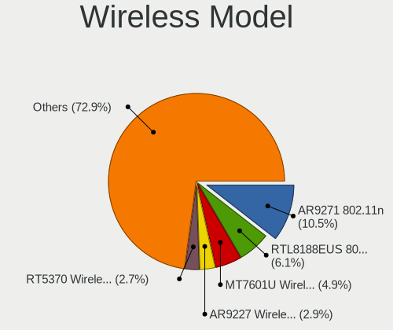

| Model                                                                         | Desktops | Percent |
|-------------------------------------------------------------------------------|----------|---------|
| Qualcomm Atheros AR9271 802.11n                                               | 41       | 11.29%  |
| Realtek RTL8188EUS 802.11n Wireless Network Adapter                           | 22       | 6.06%   |
| Ralink MT7601U Wireless Adapter                                               | 13       | 3.58%   |
| Ralink RT5370 Wireless Adapter                                                | 11       | 3.03%   |
| Qualcomm Atheros AR9227 Wireless Network Adapter                              | 11       | 3.03%   |
| Ralink RT2561/RT61 802.11g PCI                                                | 10       | 2.75%   |
| TP-Link TL-WN821N v5/v6 [RTL8192EU]                                           | 9        | 2.48%   |
| TP-Link TL-WN722N v2/v3 [Realtek RTL8188EUS]                                  | 9        | 2.48%   |
| Realtek RTL8188EE Wireless Network Adapter                                    | 7        | 1.93%   |
| Realtek RTL8188CUS 802.11n WLAN Adapter                                       | 7        | 1.93%   |
| Ralink RT2870/RT3070 Wireless Adapter                                         | 7        | 1.93%   |
| Ralink RT3090 Wireless 802.11n 1T/1R PCIe                                     | 6        | 1.65%   |
| IMC Networks Mediao 802.11n WLAN [Realtek RTL8191SU]                          | 6        | 1.65%   |
| Realtek RTL8821AE 802.11ac PCIe Wireless Network Adapter                      | 5        | 1.38%   |
| Realtek RTL8192EU 802.11b/g/n WLAN Adapter                                    | 5        | 1.38%   |
| Ralink MT7610U ("Archer T2U" 2.4G+5G WLAN Adapter                             | 5        | 1.38%   |
| Intel Wireless 8265 / 8275                                                    | 5        | 1.38%   |
| Intel Wireless 7260                                                           | 5        | 1.38%   |
| Realtek RTL8821CE 802.11ac PCIe Wireless Network Adapter                      | 4        | 1.1%    |
| Realtek RTL8192EE PCIe Wireless Network Adapter                               | 4        | 1.1%    |
| Realtek RTL8192CU 802.11n WLAN Adapter                                        | 4        | 1.1%    |
| Realtek RTL8192CE PCIe Wireless Network Adapter                               | 4        | 1.1%    |
| Realtek RTL8191SU 802.11n WLAN Adapter                                        | 4        | 1.1%    |
| Ralink RT2070 Wireless Adapter                                                | 4        | 1.1%    |
| Qualcomm Atheros TP-Link TL-WN322G v3 / TL-WN422G v2 802.11g [Atheros AR9271] | 4        | 1.1%    |
| Qualcomm Atheros AR9287 Wireless Network Adapter (PCI-Express)                | 4        | 1.1%    |
| Qualcomm Atheros AR5212/5213/2414 Wireless Network Adapter                    | 4        | 1.1%    |
| Qualcomm Atheros AR2413/AR2414 Wireless Network Adapter [AR5005G(S) 802.11bg] | 4        | 1.1%    |
| Intel Wi-Fi 6 AX200                                                           | 4        | 1.1%    |
| Intel Dual Band Wireless-AC 3168NGW [Stone Peak]                              | 4        | 1.1%    |
| ASUS N10 Nano 802.11n Network Adapter [Realtek RTL8192CU]                     | 4        | 1.1%    |
| Ralink RT5372 Wireless Adapter                                                | 3        | 0.83%   |
| Qualcomm Atheros AR9462 Wireless Network Adapter                              | 3        | 0.83%   |
| Qualcomm Atheros AR2417 Wireless Network Adapter [AR5007G 802.11bg]           | 3        | 0.83%   |
| Intel Wireless-AC 9260                                                        | 3        | 0.83%   |
| Intel Wireless 7265                                                           | 3        | 0.83%   |
| Intel Wireless 3165                                                           | 3        | 0.83%   |
| Intel Cannon Lake PCH CNVi WiFi                                               | 3        | 0.83%   |
| ASUS USB-N13 802.11n Network Adapter (rev. B1) [Realtek RTL8192CU]            | 3        | 0.83%   |
| TP-Link TL-WN823N v2/v3 [Realtek RTL8192EU]                                   | 2        | 0.55%   |

Ethernet Vendor
---------------

Ethernet vendors

| Vendor                                 | Desktops | Percent |
|----------------------------------------|----------|---------|
| Realtek Semiconductor                  | 667      | 49.59%  |
| Intel                                  | 322      | 23.94%  |
| Qualcomm Atheros                       | 120      | 8.92%   |
| Broadcom                               | 68       | 5.06%   |
| Nvidia                                 | 46       | 3.42%   |
| Broadcom Limited                       | 37       | 2.75%   |
| Marvell Technology Group               | 33       | 2.45%   |
| VIA Technologies                       | 13       | 0.97%   |
| Samsung Electronics                    | 8        | 0.59%   |
| Huawei Technologies                    | 5        | 0.37%   |
| D-Link System                          | 4        | 0.3%    |
| Accton Technology                      | 4        | 0.3%    |
| Xiaomi                                 | 3        | 0.22%   |
| JMicron Technology                     | 3        | 0.22%   |
| ASIX Electronics                       | 3        | 0.22%   |
| Westell                                | 1        | 0.07%   |
| Sony Ericsson Mobile Communications AB | 1        | 0.07%   |
| Silicon Integrated Systems [SiS]       | 1        | 0.07%   |
| Qualcomm                               | 1        | 0.07%   |
| MediaTek                               | 1        | 0.07%   |
| HMD Global                             | 1        | 0.07%   |
| D-Link                                 | 1        | 0.07%   |
| Aquantia                               | 1        | 0.07%   |
| 3Com                                   | 1        | 0.07%   |

Ethernet Model
--------------

Ethernet models

| Model                                                             | Desktops | Percent |
|-------------------------------------------------------------------|----------|---------|
| Realtek RTL8111/8168/8411 PCI Express Gigabit Ethernet Controller | 566      | 41.28%  |
| Intel 82579LM Gigabit Network Connection (Lewisville)             | 68       | 4.96%   |
| Intel 82567LM-3 Gigabit Network Connection                        | 48       | 3.5%    |
| Realtek RTL810xE PCI Express Fast Ethernet controller             | 46       | 3.36%   |
| Qualcomm Atheros QCA8171 Gigabit Ethernet                         | 42       | 3.06%   |
| Realtek RTL-8100/8101L/8139 PCI Fast Ethernet Adapter             | 31       | 2.26%   |
| Intel Ethernet Connection (2) I219-V                              | 30       | 2.19%   |
| Intel 82566DM-2 Gigabit Network Connection                        | 30       | 2.19%   |
| Intel Ethernet Connection I217-LM                                 | 29       | 2.12%   |
| Nvidia MCP61 Ethernet                                             | 26       | 1.9%    |
| Intel I211 Gigabit Network Connection                             | 24       | 1.75%   |
| Realtek RTL8169 PCI Gigabit Ethernet Controller                   | 23       | 1.68%   |
| Qualcomm Atheros AR8121/AR8113/AR8114 Gigabit or Fast Ethernet    | 21       | 1.53%   |
| Marvell Group 88E8056 PCI-E Gigabit Ethernet Controller           | 19       | 1.39%   |
| Broadcom NetXtreme BCM5754 Gigabit Ethernet PCI Express           | 17       | 1.24%   |
| Intel Ethernet Connection (2) I219-LM                             | 14       | 1.02%   |
| Intel 82579V Gigabit Network Connection                           | 14       | 1.02%   |
| Qualcomm Atheros AR8131 Gigabit Ethernet                          | 12       | 0.88%   |
| Intel Ethernet Connection (7) I219-V                              | 12       | 0.88%   |
| Broadcom NetXtreme BCM5761 Gigabit Ethernet PCIe                  | 12       | 0.88%   |
| VIA VT6102/VT6103 [Rhine-II]                                      | 11       | 0.8%    |
| Qualcomm Atheros AR8152 v2.0 Fast Ethernet                        | 11       | 0.8%    |
| Intel 82567LF-3 Gigabit Network Connection                        | 10       | 0.73%   |
| Samsung Galaxy series, misc. (tethering mode)                     | 8        | 0.58%   |
| Qualcomm Atheros AR8151 v2.0 Gigabit Ethernet                     | 8        | 0.58%   |
| Intel Ethernet Connection I217-V                                  | 8        | 0.58%   |
| Broadcom Limited NetXtreme BCM5761 Gigabit Ethernet PCIe          | 8        | 0.58%   |
| Broadcom Limited NetXtreme BCM5754 Gigabit Ethernet PCI Express   | 8        | 0.58%   |
| Intel 82574L Gigabit Network Connection                           | 7        | 0.51%   |
| Broadcom NetXtreme BCM5751 Gigabit Ethernet PCI Express           | 7        | 0.51%   |
| Realtek RTL8152 Fast Ethernet Adapter                             | 6        | 0.44%   |
| Marvell Group 88E8057 PCI-E Gigabit Ethernet Controller           | 6        | 0.44%   |
| Realtek RTL8125 2.5GbE Controller                                 | 5        | 0.36%   |
| Qualcomm Atheros Killer E220x Gigabit Ethernet Controller         | 5        | 0.36%   |
| Marvell Group 88E8001 Gigabit Ethernet Controller                 | 5        | 0.36%   |
| Broadcom NetLink BCM57780 Gigabit Ethernet PCIe                   | 5        | 0.36%   |
| Broadcom Limited NetXtreme BCM5755 Gigabit Ethernet PCI Express   | 5        | 0.36%   |
| Broadcom Limited NetXtreme BCM5751 Gigabit Ethernet PCI Express   | 5        | 0.36%   |
| Broadcom Limited NetLink BCM5787 Gigabit Ethernet PCI Express     | 5        | 0.36%   |
| Qualcomm Atheros Killer E2400 Gigabit Ethernet Controller         | 4        | 0.29%   |

Net Controller Kind
-------------------

Ethernet, WiFi or modem

| Kind     | Desktops | Percent |
|----------|----------|---------|
| Ethernet | 1274     | 78.4%   |
| WiFi     | 345      | 21.23%  |
| Modem    | 6        | 0.37%   |

Used Controller
---------------

Currently used network controller

| Kind     | Desktops | Percent |
|----------|----------|---------|
| Ethernet | 1096     | 83.47%  |
| WiFi     | 216      | 16.45%  |
| Modem    | 1        | 0.08%   |

NICs
----

Total network controllers on board

| Total | Desktops | Percent |
|-------|----------|---------|
| 1     | 1064     | 82.1%   |
| 2     | 202      | 15.59%  |
| 3     | 14       | 1.08%   |
| 0     | 14       | 1.08%   |
| 4     | 2        | 0.15%   |

IPv6
----

IPv6 vs IPv4

| Used | Desktops | Percent |
|------|----------|---------|
| No   | 1177     | 88.56%  |
| Yes  | 152      | 11.44%  |

Bluetooth
---------

Bluetooth Vendor
----------------

Controller vendors

| Vendor                          | Desktops | Percent |
|---------------------------------|----------|---------|
| Cambridge Silicon Radio         | 81       | 48.5%   |
| Intel                           | 35       | 20.96%  |
| Broadcom                        | 9        | 5.39%   |
| ASUSTek Computer                | 9        | 5.39%   |
| Realtek Semiconductor           | 7        | 4.19%   |
| Integrated System Solution      | 4        | 2.4%    |
| Qualcomm Atheros Communications | 3        | 1.8%    |
| Logitech                        | 3        | 1.8%    |
| Lite-On Technology              | 3        | 1.8%    |
| Conwise Technology              | 3        | 1.8%    |
| Hewlett-Packard                 | 2        | 1.2%    |
| Edimax Technology               | 2        | 1.2%    |
| Belkin Components               | 2        | 1.2%    |
| TP-Link                         | 1        | 0.6%    |
| IMC Networks                    | 1        | 0.6%    |
| Dell                            | 1        | 0.6%    |
| Apple                           | 1        | 0.6%    |

Bluetooth Model
---------------

Controller models

| Model                                                   | Desktops | Percent |
|---------------------------------------------------------|----------|---------|
| Cambridge Silicon Radio Bluetooth Dongle (HCI mode)     | 81       | 48.5%   |
| Intel Bluetooth wireless interface                      | 18       | 10.78%  |
| Realtek  Bluetooth 4.2 Adapter                          | 4        | 2.4%    |
| Intel Wireless-AC 3168 Bluetooth                        | 4        | 2.4%    |
| Intel AX200 Bluetooth                                   | 4        | 2.4%    |
| ASUS Bluetooth Radio                                    | 4        | 2.4%    |
| Logitech BT Mini-Receiver (HCI mode)                    | 3        | 1.8%    |
| Intel Wireless-AC 9260 Bluetooth Adapter                | 3        | 1.8%    |
| Intel Bluetooth 9460/9560 Jefferson Peak (JfP)          | 3        | 1.8%    |
| Conwise CW6622                                          | 3        | 1.8%    |
| Realtek RTL8821A Bluetooth                              | 2        | 1.2%    |
| Qualcomm Atheros  Bluetooth Device                      | 2        | 1.2%    |
| Intel AX201 Bluetooth                                   | 2        | 1.2%    |
| Integrated System Solution KY-BT100 Bluetooth Adapter   | 2        | 1.2%    |
| Integrated System Solution Bluetooth Device             | 2        | 1.2%    |
| HP Bluetooth Adapter                                    | 2        | 1.2%    |
| Edimax EW-7611ULB 802.11b/g/n and Bluetooth 4.0 Adapter | 2        | 1.2%    |
| Broadcom Bluetooth dongle                               | 2        | 1.2%    |
| Broadcom BCM2035 Bluetooth dongle                       | 2        | 1.2%    |
| ASUS Broadcom BCM20702A0 Bluetooth                      | 2        | 1.2%    |
| TP-Link UB500 Adapter                                   | 1        | 0.6%    |
| Realtek RTL8723B Bluetooth                              | 1        | 0.6%    |
| Qualcomm Atheros AR3011 Bluetooth                       | 1        | 0.6%    |
| Lite-On Qualcomm Atheros QCA9377 Bluetooth              | 1        | 0.6%    |
| Lite-On Bluetooth Device                                | 1        | 0.6%    |
| Lite-On Atheros AR3012 Bluetooth                        | 1        | 0.6%    |
| Intel Centrino Advanced-N 6230 Bluetooth adapter        | 1        | 0.6%    |
| IMC Networks Bluetooth Radio                            | 1        | 0.6%    |
| Dell Wireless 365 Bluetooth                             | 1        | 0.6%    |
| Broadcom HP Portable Bumble Bee                         | 1        | 0.6%    |
| Broadcom HP Bluethunder                                 | 1        | 0.6%    |
| Broadcom Bluetooth 3.0 Device                           | 1        | 0.6%    |
| Broadcom BCM20702A0 Bluetooth 4.0                       | 1        | 0.6%    |
| Broadcom BCM2045 Bluetooth                              | 1        | 0.6%    |
| Belkin Components F8T013 Bluetooth Adapter              | 1        | 0.6%    |
| Belkin Components Bluetooth Mini Dongle                 | 1        | 0.6%    |
| ASUS Bluetooth Device                                   | 1        | 0.6%    |
| ASUS Bluetooth Adapter                                  | 1        | 0.6%    |
| ASUS BCM20702A0                                         | 1        | 0.6%    |
| Apple Bluetooth Host Controller                         | 1        | 0.6%    |

Sound
-----

Sound Vendor
------------

Sound card vendors

| Vendor                           | Desktops | Percent |
|----------------------------------|----------|---------|
| Intel                            | 847      | 44.49%  |
| AMD                              | 495      | 26%     |
| Nvidia                           | 399      | 20.96%  |
| C-Media Electronics              | 46       | 2.42%   |
| Creative Labs                    | 32       | 1.68%   |
| VIA Technologies                 | 11       | 0.58%   |
| Texas Instruments                | 8        | 0.42%   |
| Logitech                         | 6        | 0.32%   |
| JMTek                            | 5        | 0.26%   |
| Tenx Technology                  | 3        | 0.16%   |
| Plantronics                      | 3        | 0.16%   |
| Generalplus Technology           | 3        | 0.16%   |
| Ensoniq                          | 3        | 0.16%   |
| Creative Technology              | 3        | 0.16%   |
| BEHRINGER International          | 3        | 0.16%   |
| ASUSTek Computer                 | 3        | 0.16%   |
| Syntek                           | 2        | 0.11%   |
| Silicon Integrated Systems [SiS] | 2        | 0.11%   |
| Razer USA                        | 2        | 0.11%   |
| Kingston Technology              | 2        | 0.11%   |
| GN Netcom                        | 2        | 0.11%   |
| ATI Technologies                 | 2        | 0.11%   |
| Zhaoxin                          | 1        | 0.05%   |
| ULi Electronics                  | 1        | 0.05%   |
| Trust                            | 1        | 0.05%   |
| Superlux digit                   | 1        | 0.05%   |
| Sunplus Technology               | 1        | 0.05%   |
| SteelSeries ApS                  | 1        | 0.05%   |
| Sony                             | 1        | 0.05%   |
| SM950T Microphone                | 1        | 0.05%   |
| Promethean Limited               | 1        | 0.05%   |
| Nektar                           | 1        | 0.05%   |
| Native Instruments               | 1        | 0.05%   |
| MCS                              | 1        | 0.05%   |
| KORG                             | 1        | 0.05%   |
| Hewlett-Packard                  | 1        | 0.05%   |
| Elite Silicon                    | 1        | 0.05%   |
| DigiTech                         | 1        | 0.05%   |
| BR25                             | 1        | 0.05%   |
| Blue Microphones                 | 1        | 0.05%   |

Sound Model
-----------

Sound card models

| Model                                                                             | Desktops | Percent |
|-----------------------------------------------------------------------------------|----------|---------|
| Intel NM10/ICH7 Family High Definition Audio Controller                           | 159      | 7.14%   |
| AMD SBx00 Azalia (Intel HDA)                                                      | 135      | 6.06%   |
| Intel 6 Series/C200 Series Chipset Family High Definition Audio Controller        | 122      | 5.48%   |
| AMD FCH Azalia Controller                                                         | 110      | 4.94%   |
| Intel 8 Series/C220 Series Chipset High Definition Audio Controller               | 105      | 4.71%   |
| Intel Xeon E3-1200 v3/4th Gen Core Processor HD Audio Controller                  | 71       | 3.19%   |
| Intel 7 Series/C216 Chipset Family High Definition Audio Controller               | 68       | 3.05%   |
| Intel 82801I (ICH9 Family) HD Audio Controller                                    | 63       | 2.83%   |
| Nvidia GK208 HDMI/DP Audio Controller                                             | 61       | 2.74%   |
| AMD Trinity HDMI Audio Controller                                                 | 58       | 2.6%    |
| Intel 82801JD/DO (ICH10 Family) HD Audio Controller                               | 57       | 2.56%   |
| Intel 200 Series PCH HD Audio                                                     | 51       | 2.29%   |
| Nvidia High Definition Audio Controller                                           | 50       | 2.24%   |
| Intel 82801JI (ICH10 Family) HD Audio Controller                                  | 47       | 2.11%   |
| AMD Caicos HDMI Audio [Radeon HD 6450 / 7450/8450/8490 OEM / R5 230/235/235X OEM] | 47       | 2.11%   |
| AMD Oland/Hainan/Cape Verde/Pitcairn HDMI Audio [Radeon HD 7000 Series]           | 44       | 1.97%   |
| Intel 100 Series/C230 Series Chipset Family HD Audio Controller                   | 43       | 1.93%   |
| Nvidia GF108 High Definition Audio Controller                                     | 41       | 1.84%   |
| Intel 5 Series/3400 Series Chipset High Definition Audio                          | 33       | 1.48%   |
| AMD Cedar HDMI Audio [Radeon HD 5400/6300/7300 Series]                            | 33       | 1.48%   |
| AMD Family 17h (Models 00h-0fh) HD Audio Controller                               | 31       | 1.39%   |
| AMD Ellesmere HDMI Audio [Radeon RX 470/480 / 570/580/590]                        | 31       | 1.39%   |
| Nvidia MCP61 High Definition Audio                                                | 29       | 1.3%    |
| Nvidia GP107GL High Definition Audio Controller                                   | 24       | 1.08%   |
| Nvidia GP106 High Definition Audio Controller                                     | 24       | 1.08%   |
| AMD Family 17h/19h HD Audio Controller                                            | 24       | 1.08%   |
| Nvidia GF119 HDMI Audio Controller                                                | 23       | 1.03%   |
| Intel 82801H (ICH8 Family) HD Audio Controller                                    | 22       | 0.99%   |
| Nvidia GK107 HDMI Audio Controller                                                | 21       | 0.94%   |
| Intel Cannon Lake PCH cAVS                                                        | 19       | 0.85%   |
| AMD Redwood HDMI Audio [Radeon HD 5000 Series]                                    | 19       | 0.85%   |
| AMD Baffin HDMI/DP Audio [Radeon RX 550 640SP / RX 560/560X]                      | 17       | 0.76%   |
| C-Media Electronics CMI8738/CMI8768 PCI Audio                                     | 16       | 0.72%   |
| AMD RV710/730 HDMI Audio [Radeon HD 4000 series]                                  | 16       | 0.72%   |
| AMD Raven/Raven2/Fenghuang HDMI/DP Audio Controller                               | 16       | 0.72%   |
| AMD Kabini HDMI/DP Audio                                                          | 15       | 0.67%   |
| Nvidia GP108 High Definition Audio Controller                                     | 13       | 0.58%   |
| Nvidia GM107 High Definition Audio Controller [GeForce 940MX]                     | 13       | 0.58%   |
| AMD Juniper HDMI Audio [Radeon HD 5700 Series]                                    | 13       | 0.58%   |
| AMD Starship/Matisse HD Audio Controller                                          | 12       | 0.54%   |

Memory
------

Memory Vendor
-------------

Memory module vendors

| Vendor                     | Desktops | Percent |
|----------------------------|----------|---------|
| Unknown                    | 455      | 29.84%  |
| Kingston                   | 283      | 18.56%  |
| Samsung Electronics        | 163      | 10.69%  |
| SK hynix                   | 146      | 9.57%   |
| Micron Technology          | 78       | 5.11%   |
| Nanya Technology           | 54       | 3.54%   |
| Corsair                    | 54       | 3.54%   |
| Kingmax                    | 48       | 3.15%   |
| Crucial                    | 45       | 2.95%   |
| G.Skill                    | 40       | 2.62%   |
| Elpida                     | 22       | 1.44%   |
| CSX                        | 15       | 0.98%   |
| Transcend                  | 12       | 0.79%   |
| Team                       | 12       | 0.79%   |
| Ramaxel Technology         | 12       | 0.79%   |
| A-DATA Technology          | 11       | 0.72%   |
| Patriot                    | 10       | 0.66%   |
| Qimonda                    | 7        | 0.46%   |
| Melco                      | 5        | 0.33%   |
| Goodram                    | 5        | 0.33%   |
| OCZ                        | 4        | 0.26%   |
| H                          | 4        | 0.26%   |
| Kingmax Semiconductor      | 3        | 0.2%    |
| GeIL                       | 3        | 0.2%    |
| Apacer                     | 3        | 0.2%    |
| 48spaces                   | 3        | 0.2%    |
| TwinMOS                    | 2        | 0.13%   |
| Smart                      | 2        | 0.13%   |
| Silicon Power              | 2        | 0.13%   |
| Multilaser                 | 2        | 0.13%   |
| Uroad                      | 1        | 0.07%   |
| Unknown (7F7F7F7F7F970000) | 1        | 0.07%   |
| Unifosa                    | 1        | 0.07%   |
| Toshiba                    | 1        | 0.07%   |
| TakeMS                     | 1        | 0.07%   |
| Ramos Technology           | 1        | 0.07%   |
| Princeton                  | 1        | 0.07%   |
| Mushkin                    | 1        | 0.07%   |
| Level One Communication    | 1        | 0.07%   |
| Kreton                     | 1        | 0.07%   |

Memory Model
------------

Memory module models

| Model                                                 | Desktops | Percent |
|-------------------------------------------------------|----------|---------|
| Unknown RAM Module 2048MB DIMM SDRAM                  | 45       | 2.53%   |
| Kingston RAM KHX1600C10D3/4G 4GB DIMM DDR3 1866MT/s   | 42       | 2.36%   |
| Unknown RAM Module 2048MB DIMM 800MT/s                | 35       | 1.97%   |
| Unknown RAM Module 2048MB DIMM DDR2 800MT/s           | 27       | 1.52%   |
| Unknown RAM Module 2048MB DIMM 1333MT/s               | 22       | 1.24%   |
| Kingston RAM KHX1600C9D3/4GX 4GB DIMM DDR3 1600MT/s   | 21       | 1.18%   |
| Unknown RAM Module 4096MB DIMM DDR3 1333MT/s          | 20       | 1.12%   |
| Kingston RAM KHX1600C10D3/8G 8GB DIMM DDR3 1600MT/s   | 20       | 1.12%   |
| Unknown RAM Module 1024MB DIMM SDRAM                  | 19       | 1.07%   |
| Unknown RAM Module 4096MB DIMM 1333MT/s               | 18       | 1.01%   |
| Unknown RAM Module 1024MB DIMM 800MT/s                | 18       | 1.01%   |
| Unknown RAM Module 2048MB DIMM DDR2 667MT/s           | 16       | 0.9%    |
| Unknown RAM Module 1024MB DIMM DDR2 667MT/s           | 16       | 0.9%    |
| Kingston RAM 99U5584-005.A00LF 4GB DIMM DDR3 1600MT/s | 16       | 0.9%    |
| Unknown RAM Module 1024MB DIMM DDR2 800MT/s           | 13       | 0.73%   |
| Samsung RAM M378B5773DH0-CH9 2GB DIMM DDR3 1333MT/s   | 12       | 0.67%   |
| Unknown RAM Module 4096MB DIMM 1600MT/s               | 11       | 0.62%   |
| Unknown RAM Module 2048MB DIMM DDR3 1333MT/s          | 11       | 0.62%   |
| Kingston RAM KHX2666C16/8G 8GB DIMM DDR4 3466MT/s     | 11       | 0.62%   |
| Unknown RAM Module 1024MB DIMM 667MT/s                | 10       | 0.56%   |
| Samsung RAM M378B5673FH0-CH9 2GB DIMM DDR3 1600MT/s   | 10       | 0.56%   |
| Samsung RAM M378B5273DH0-CH9 4GB DIMM DDR3 2133MT/s   | 10       | 0.56%   |
| Micron RAM 8KTF51264AZ-1G6E1 4GB DIMM DDR3 1600MT/s   | 10       | 0.56%   |
| Unknown RAM Module 4096MB DIMM 400MT/s                | 9        | 0.51%   |
| Unknown RAM Module 2048MB DIMM 667MT/s                | 9        | 0.51%   |
| Samsung RAM M378B5773CH0-CH9 2GB DIMM DDR3 1867MT/s   | 9        | 0.51%   |
| Samsung RAM M3 78T5663QZ3-CF7 2GB DIMM DDR2 800MT/s   | 9        | 0.51%   |
| Unknown RAM Module 4096MB DIMM SDRAM                  | 8        | 0.45%   |
| Unknown RAM Module 2048MB DIMM SDRAM 800MT/s          | 8        | 0.45%   |
| Unknown RAM Module 2048MB DIMM 1066MT/s               | 8        | 0.45%   |
| Unknown RAM Module 1024MB DIMM                        | 8        | 0.45%   |
| SK hynix RAM HYMP112U64CP8-S6 1GB DIMM DDR2 800MT/s   | 8        | 0.45%   |
| Samsung RAM M378B5173QH0-CK0 4GB DIMM DDR3 1600MT/s   | 8        | 0.45%   |
| Kingston RAM KHX3200C16D4/8GX 8GB DIMM DDR4 3600MT/s  | 8        | 0.45%   |
| Kingston RAM KHX1866C10D3/8G 8GB DIMM DDR3 2133MT/s   | 8        | 0.45%   |
| Unknown RAM Module 512MB DIMM SDRAM                   | 7        | 0.39%   |
| Unknown RAM Module 4096MB DIMM DDR 1333MT/s           | 7        | 0.39%   |
| Unknown RAM Module 2048MB DIMM 400MT/s                | 7        | 0.39%   |
| SK hynix RAM HYMP125U64CP8-S6 2GB DIMM DDR2 49926MT/s | 7        | 0.39%   |
| Samsung RAM M378B5673EH1-CH9 2GB DIMM DDR3 1333MT/s   | 7        | 0.39%   |

Memory Kind
-----------

Memory module kinds

| Kind    | Desktops | Percent |
|---------|----------|---------|
| DDR3    | 523      | 39.53%  |
| DDR2    | 207      | 15.65%  |
| DDR4    | 199      | 15.04%  |
| SDRAM   | 171      | 12.93%  |
| Unknown | 168      | 12.7%   |
| DDR     | 54       | 4.08%   |
| DDR5    | 1        | 0.08%   |

Memory Form Factor
------------------

Physical design of the memory module

| Name    | Desktops | Percent |
|---------|----------|---------|
| DIMM    | 1209     | 96.95%  |
| SODIMM  | 36       | 2.89%   |
| RIMM    | 1        | 0.08%   |
| FB-DIMM | 1        | 0.08%   |

Memory Size
-----------

Memory module size

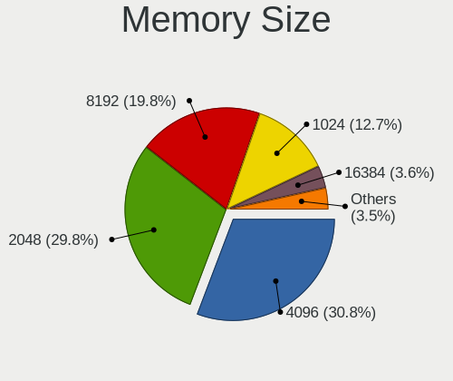

| Size  | Desktops | Percent |
|-------|----------|---------|
| 2048  | 478      | 31.97%  |
| 4096  | 464      | 31.04%  |
| 8192  | 257      | 17.19%  |
| 1024  | 206      | 13.78%  |
| 16384 | 37       | 2.47%   |
| 512   | 36       | 2.41%   |
| 256   | 7        | 0.47%   |
| 32768 | 6        | 0.4%    |
| 16    | 2        | 0.13%   |
| 128   | 1        | 0.07%   |
| 13    | 1        | 0.07%   |

Memory Speed
------------

Memory module speed

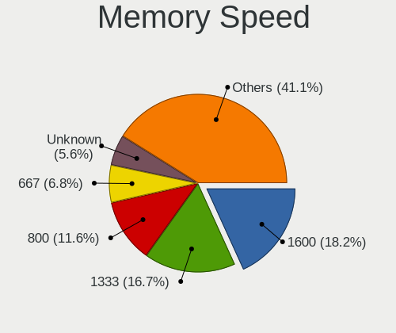

| Speed   | Desktops | Percent |
|---------|----------|---------|
| 1600    | 267      | 17.94%  |
| 1333    | 251      | 16.87%  |
| 800     | 187      | 12.57%  |
| 667     | 110      | 7.39%   |
| Unknown | 94       | 6.32%   |
| 2400    | 72       | 4.84%   |
| 1866    | 62       | 4.17%   |
| 2133    | 56       | 3.76%   |
| 1867    | 37       | 2.49%   |
| 1066    | 31       | 2.08%   |
| 533     | 29       | 1.95%   |
| 400     | 28       | 1.88%   |
| 3200    | 27       | 1.81%   |
| 3600    | 23       | 1.55%   |
| 2667    | 17       | 1.14%   |
| 1067    | 17       | 1.14%   |
| 2048    | 15       | 1.01%   |
| 1639    | 14       | 0.94%   |
| 3466    | 13       | 0.87%   |
| 1800    | 12       | 0.81%   |
| 3000    | 11       | 0.74%   |
| 2666    | 10       | 0.67%   |
| 49926   | 9        | 0.6%    |
| 3400    | 8        | 0.54%   |
| 2933    | 8        | 0.54%   |
| 2000    | 8        | 0.54%   |
| 333     | 7        | 0.47%   |
| 1334    | 6        | 0.4%    |
| 266     | 5        | 0.34%   |
| 2733    | 4        | 0.27%   |
| 1648    | 4        | 0.27%   |
| 1400    | 4        | 0.27%   |
| 3733    | 3        | 0.2%    |
| 3334    | 3        | 0.2%    |
| 3333    | 3        | 0.2%    |
| 2800    | 3        | 0.2%    |
| 133     | 3        | 0.2%    |
| 4333    | 2        | 0.13%   |
| 3500    | 2        | 0.13%   |
| 3151    | 2        | 0.13%   |

Printers & scanners
-------------------

Printer Vendor
--------------

Printer device vendors

| Vendor                | Desktops | Percent |
|-----------------------|----------|---------|
| Hewlett-Packard       | 41       | 51.9%   |
| Samsung Electronics   | 17       | 21.52%  |
| Canon                 | 9        | 11.39%  |
| Brother Industries    | 5        | 6.33%   |
| Seiko Epson           | 2        | 2.53%   |
| QinHeng Electronics   | 2        | 2.53%   |
| STMicroelectronics    | 1        | 1.27%   |
| Lexmark International | 1        | 1.27%   |
| Dymo-CoStar           | 1        | 1.27%   |

Printer Model
-------------

Printer device models

| Model                                                     | Desktops | Percent |
|-----------------------------------------------------------|----------|---------|
| HP DeskJet 2620 All-in-One Printer                        | 9        | 11.25%  |
| Samsung M2020 Series                                      | 4        | 5%      |
| Samsung ML-2010P Mono Laser Printer                       | 3        | 3.75%   |
| HP LaserJet 1020                                          | 3        | 3.75%   |
| Samsung SCX-3400 Series                                   | 2        | 2.5%    |
| Samsung ML-1640 Series Laser Printer                      | 2        | 2.5%    |
| QinHeng CH340S                                            | 2        | 2.5%    |
| HP LaserJet P1005                                         | 2        | 2.5%    |
| HP LaserJet 1018                                          | 2        | 2.5%    |
| HP LaserJet 1010                                          | 2        | 2.5%    |
| HP DeskJet F4100 Printer series                           | 2        | 2.5%    |
| HP Deskjet F2280 series                                   | 2        | 2.5%    |
| HP Deskjet 3520 series                                    | 2        | 2.5%    |
| HP DeskJet 2130 series                                    | 2        | 2.5%    |
| HP Deskjet 1050 J410                                      | 2        | 2.5%    |
| Brother HL-1110 series                                    | 2        | 2.5%    |
| STMicroelectronics LED badge -- mini LED display -- 11x44 | 1        | 1.25%   |
| Seiko Epson WF-3010 Series                                | 1        | 1.25%   |
| Seiko Epson L396 Series                                   | 1        | 1.25%   |
| Samsung SCX-4623 Series                                   | 1        | 1.25%   |
| Samsung SCX-3200 Series                                   | 1        | 1.25%   |
| Samsung ML-1660 Series                                    | 1        | 1.25%   |
| Samsung ML-1630 Series                                    | 1        | 1.25%   |
| Samsung CLP-310 Color Laser Printer                       | 1        | 1.25%   |
| Samsung C48x Series                                       | 1        | 1.25%   |
| Lexmark International InkJet Color Printer                | 1        | 1.25%   |
| HP OfficeJet Pro 69                                       | 1        | 1.25%   |
| HP LaserJet 1300                                          | 1        | 1.25%   |
| HP LaserJet 1000                                          | 1        | 1.25%   |
| HP Ink Tank Wireless 410 series                           | 1        | 1.25%   |
| HP DeskJet F2100 Printer series                           | 1        | 1.25%   |
| HP Deskjet D1500 series                                   | 1        | 1.25%   |
| HP DeskJet 959c                                           | 1        | 1.25%   |
| HP DeskJet 845c                                           | 1        | 1.25%   |
| HP DeskJet 840c                                           | 1        | 1.25%   |
| HP DeskJet 5650c                                          | 1        | 1.25%   |
| HP DeskJet 5000 series                                    | 1        | 1.25%   |
| HP Deskjet 3050A                                          | 1        | 1.25%   |
| HP Deskjet 2050 J510                                      | 1        | 1.25%   |
| HP Deskjet 1510                                           | 1        | 1.25%   |

Scanner Vendor
--------------

Scanner device vendors

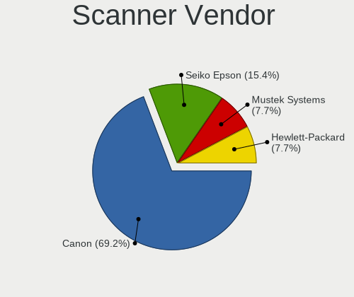

| Vendor          | Desktops | Percent |
|-----------------|----------|---------|
| Canon           | 8        | 72.73%  |
| Seiko Epson     | 2        | 18.18%  |
| Hewlett-Packard | 1        | 9.09%   |

Scanner Model
-------------

Scanner device models

| Model                                                   | Desktops | Percent |
|---------------------------------------------------------|----------|---------|
| Canon CanoScan N670U/N676U/LiDE 20                      | 3        | 27.27%  |
| Canon CanoScan LIDE 25                                  | 2        | 18.18%  |
| Seiko Epson GT-F720 [GT-S620/Perfection V30/V300 Photo] | 1        | 9.09%   |
| Seiko Epson GT-F700 [Perfection V350]                   | 1        | 9.09%   |
| HP ScanJet 3670                                         | 1        | 9.09%   |
| Canon CanoScan LiDE 120                                 | 1        | 9.09%   |
| Canon CanoScan LiDE 110                                 | 1        | 9.09%   |
| Canon CanoScan LiDE 100                                 | 1        | 9.09%   |

Camera
------

Camera Vendor
-------------

Camera device vendors

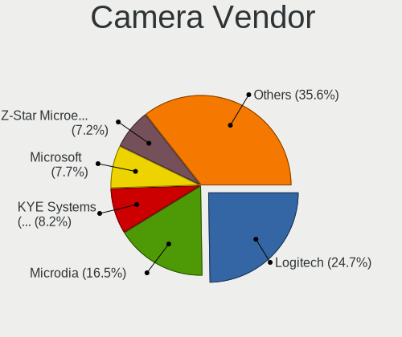

| Vendor                      | Desktops | Percent |
|-----------------------------|----------|---------|
| Logitech                    | 41       | 26.8%   |
| Microdia                    | 20       | 13.07%  |
| Microsoft                   | 14       | 9.15%   |
| Z-Star Microelectronics     | 11       | 7.19%   |
| KYE Systems (Mouse Systems) | 11       | 7.19%   |
| GEMBIRD                     | 9        | 5.88%   |
| Pixart Imaging              | 7        | 4.58%   |
| Samsung Electronics         | 5        | 3.27%   |
| Trust                       | 4        | 2.61%   |
| Cubeternet                  | 4        | 2.61%   |
| Chicony Electronics         | 4        | 2.61%   |
| Realtek Semiconductor       | 3        | 1.96%   |
| Aveo Technology             | 3        | 1.96%   |
| Arkmicro Technologies       | 3        | 1.96%   |
| Apple                       | 3        | 1.96%   |
| LG Electronics              | 2        | 1.31%   |
| Creative Technology         | 2        | 1.31%   |
| Unknown                     | 1        | 0.65%   |
| Novatek Microelectronics    | 1        | 0.65%   |
| MacroSilicon                | 1        | 0.65%   |
| Jieli Technology            | 1        | 0.65%   |
| IMC Networks                | 1        | 0.65%   |
| Hewlett-Packard             | 1        | 0.65%   |
| 2M UVC CAMERA               | 1        | 0.65%   |

Camera Model
------------

Camera device models

| Model                                                             | Desktops | Percent |
|-------------------------------------------------------------------|----------|---------|
| Microdia Camera                                                   | 11       | 7.14%   |
| GEMBIRD USB2.0 PC CAMERA                                          | 9        | 5.84%   |
| Logitech Webcam C270                                              | 8        | 5.19%   |
| Logitech Webcam C600                                              | 7        | 4.55%   |
| Z-Star Vimicro USB Camera (Altair)                                | 6        | 3.9%    |
| Microdia Sonix USB 2.0 Camera                                     | 6        | 3.9%    |
| Samsung Galaxy series, misc. (MTP mode)                           | 5        | 3.25%   |
| Pixart Imaging GE 1.3 MP MiniCam Pro                              | 5        | 3.25%   |
| Microsoft LifeCam HD-3000                                         | 4        | 2.6%    |
| Logitech HD Pro Webcam C920                                       | 4        | 2.6%    |
| KYE Systems (Mouse Systems) Genius FaceCam 320                    | 4        | 2.6%    |
| Z-Star Venus USB2.0 Camera                                        | 3        | 1.95%   |
| Microsoft LifeCam VX-2000                                         | 3        | 1.95%   |
| Logitech Webcam C250                                              | 3        | 1.95%   |
| Logitech Webcam C170                                              | 3        | 1.95%   |
| Logitech QuickCam Pro 9000                                        | 3        | 1.95%   |
| Arkmicro USB2.0 PC CAMERA                                         | 3        | 1.95%   |
| Trust 17676 Webcam                                                | 2        | 1.3%    |
| Microsoft LifeCam VX-500 [1357]                                   | 2        | 1.3%    |
| Logitech Webcam C310                                              | 2        | 1.3%    |
| Logitech Webcam C210                                              | 2        | 1.3%    |
| Logitech QuickCam Communicate Deluxe/S7500                        | 2        | 1.3%    |
| Logitech HD Webcam C525                                           | 2        | 1.3%    |
| LG LM-X420xxx/G2/G3 Android Phone (MTP/download mode)             | 2        | 1.3%    |
| KYE Systems (Mouse Systems) PC-LM1E Camera                        | 2        | 1.3%    |
| KYE Systems (Mouse Systems) FaceCam 1000X                         | 2        | 1.3%    |
| Cubeternet USB2.0 Camera                                          | 2        | 1.3%    |
| Cubeternet GL-UPC822 UVC WebCam                                   | 2        | 1.3%    |
| Aveo USB2.0 Camera                                                | 2        | 1.3%    |
| Apple iPhone 5/5C/5S/6/SE/7/8/X                                   | 2        | 1.3%    |
| Z-Star Vega USB 2.0 Camera                                        | 1        | 0.65%   |
| Z-Star Saturn USB 2.0 Camera                                      | 1        | 0.65%   |
| Unknown HD camera                                                 | 1        | 0.65%   |
| Trust Webcam                                                      | 1        | 0.65%   |
| Trust FHD Webcam                                                  | 1        | 0.65%   |
| Realtek USB Camera                                                | 1        | 0.65%   |
| Realtek HP 2.0MP High Definition Webcam                           | 1        | 0.65%   |
| Realtek Full HD webcam                                            | 1        | 0.65%   |
| Pixart Imaging Webcam Genius iLook 300                            | 1        | 0.65%   |
| Pixart Imaging Digital camera, CD302N/Elta Medi@ digi-cam/HE-501A | 1        | 0.65%   |

Security
--------

Fingerprint Vendor
------------------

Fingerprint sensor vendors

| Vendor                | Desktops | Percent |
|-----------------------|----------|---------|
| Elan Microelectronics | 1        | 100%    |

Fingerprint Model
-----------------

Fingerprint sensor models

| Model                                       | Desktops | Percent |
|---------------------------------------------|----------|---------|
| Elan fingerprint sensor [FeinTech FPS00200] | 1        | 100%    |

Chipcard Vendor
---------------

Chipcard module vendors

| Vendor                    | Desktops | Percent |
|---------------------------|----------|---------|
| Alcor Micro               | 2        | 50%     |
| Gemalto (was Gemplus)     | 1        | 25%     |
| Aladdin Knowledge Systems | 1        | 25%     |

Chipcard Model
--------------

Chipcard module models

| Model                                             | Desktops | Percent |
|---------------------------------------------------|----------|---------|
| Alcor Micro AU9540 Smartcard Reader               | 2        | 50%     |
| Gemalto (was Gemplus) GemPC Twin SmartCard Reader | 1        | 25%     |
| Aladdin Knowledge Systems Token JC                | 1        | 25%     |

Unsupported
-----------

Unsupported Devices
-------------------

Total unsupported devices on board

| Total | Desktops | Percent |
|-------|----------|---------|
| 0     | 1168     | 88.75%  |
| 1     | 137      | 10.41%  |
| 2     | 9        | 0.68%   |
| 5     | 1        | 0.08%   |
| 4     | 1        | 0.08%   |

Unsupported Device Types
------------------------

Types of unsupported devices

| Type                     | Desktops | Percent |
|--------------------------|----------|---------|
| Graphics card            | 105      | 66.88%  |
| Net/wireless             | 19       | 12.1%   |
| Camera                   | 9        | 5.73%   |
| Communication controller | 7        | 4.46%   |
| Chipcard                 | 4        | 2.55%   |
| Unassigned class         | 3        | 1.91%   |
| Sound                    | 3        | 1.91%   |
| Net/ethernet             | 2        | 1.27%   |
| Card reader              | 2        | 1.27%   |
| Storage                  | 1        | 0.64%   |
| Fingerprint reader       | 1        | 0.64%   |
| Bluetooth                | 1        | 0.64%   |

