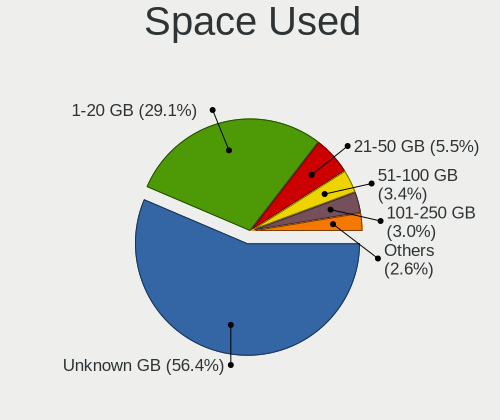
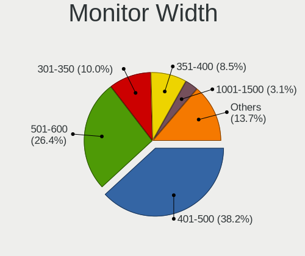
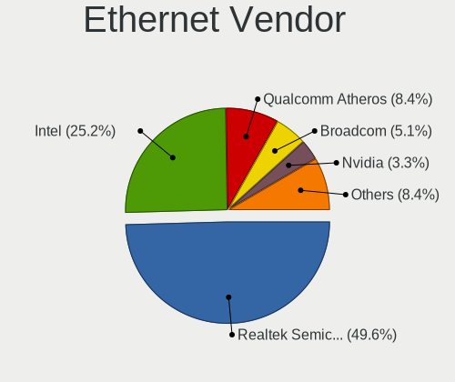

BlackPanther - Tested Hardware & Statistics (Desktops)
------------------------------------------------------

A project to collect tested hardware configurations for BlackPanther.

Anyone can contribute to this report by the [hw-probe](https://github.com/linuxhw/hw-probe) tool:

    sudo -E hw-probe -all -upload

Please contribute! Especially if your hardware is rare.

Contents
--------

* [ Test Cases ](#test-cases)

* [ System ](#system)
  - [ OS                       ](#os)
  - [ OS Family                ](#os-family)
  - [ Kernel                   ](#kernel)
  - [ Kernel Family            ](#kernel-family)
  - [ Kernel Major Ver.        ](#kernel-major-ver)
  - [ Arch                     ](#arch)
  - [ DE                       ](#de)
  - [ Display Server           ](#display-server)
  - [ Display Manager          ](#display-manager)
  - [ OS Lang                  ](#os-lang)
  - [ Boot Mode                ](#boot-mode)
  - [ Filesystem               ](#filesystem)
  - [ Part. scheme             ](#part-scheme)
  - [ Dual Boot with Linux/BSD ](#dual-boot-with-linuxbsd)
  - [ Dual Boot (Win)          ](#dual-boot-win)

* [ Board ](#board)
  - [ Vendor                   ](#vendor)
  - [ Model                    ](#model)
  - [ Model Family             ](#model-family)
  - [ MFG Year                 ](#mfg-year)
  - [ Form Factor              ](#form-factor)
  - [ Secure Boot              ](#secure-boot)
  - [ Coreboot                 ](#coreboot)
  - [ RAM Size                 ](#ram-size)
  - [ RAM Used                 ](#ram-used)
  - [ Total Drives             ](#total-drives)
  - [ Has CD-ROM               ](#has-cd-rom)
  - [ Has Ethernet             ](#has-ethernet)
  - [ Has WiFi                 ](#has-wifi)
  - [ Has Bluetooth            ](#has-bluetooth)

* [ Location ](#location)
  - [ Country                  ](#country)
  - [ City                     ](#city)

* [ Drives ](#drives)
  - [ Drive Vendor             ](#drive-vendor)
  - [ Drive Model              ](#drive-model)
  - [ HDD Vendor               ](#hdd-vendor)
  - [ SSD Vendor               ](#ssd-vendor)
  - [ Drive Kind               ](#drive-kind)
  - [ Drive Connector          ](#drive-connector)
  - [ Drive Size               ](#drive-size)
  - [ Space Total              ](#space-total)
  - [ Space Used               ](#space-used)
  - [ Malfunc. Drives          ](#malfunc-drives)
  - [ Malfunc. Drive Vendor    ](#malfunc-drive-vendor)
  - [ Malfunc. HDD Vendor      ](#malfunc-hdd-vendor)
  - [ Malfunc. Drive Kind      ](#malfunc-drive-kind)
  - [ Failed Drives            ](#failed-drives)
  - [ Failed Drive Vendor      ](#failed-drive-vendor)
  - [ Drive Status             ](#drive-status)

* [ Storage controller ](#storage-controller)
  - [ Storage Vendor           ](#storage-vendor)
  - [ Storage Model            ](#storage-model)
  - [ Storage Kind             ](#storage-kind)

* [ Processor ](#processor)
  - [ CPU Vendor               ](#cpu-vendor)
  - [ CPU Model                ](#cpu-model)
  - [ CPU Model Family         ](#cpu-model-family)
  - [ CPU Cores                ](#cpu-cores)
  - [ CPU Sockets              ](#cpu-sockets)
  - [ CPU Threads              ](#cpu-threads)
  - [ CPU Op-Modes             ](#cpu-op-modes)
  - [ CPU Microcode            ](#cpu-microcode)
  - [ CPU Microarch            ](#cpu-microarch)

* [ Graphics ](#graphics)
  - [ GPU Vendor               ](#gpu-vendor)
  - [ GPU Model                ](#gpu-model)
  - [ GPU Combo                ](#gpu-combo)
  - [ GPU Driver               ](#gpu-driver)
  - [ GPU Memory               ](#gpu-memory)

* [ Monitor ](#monitor)
  - [ Monitor Vendor           ](#monitor-vendor)
  - [ Monitor Model            ](#monitor-model)
  - [ Monitor Resolution       ](#monitor-resolution)
  - [ Monitor Diagonal         ](#monitor-diagonal)
  - [ Monitor Width            ](#monitor-width)
  - [ Aspect Ratio             ](#aspect-ratio)
  - [ Monitor Area             ](#monitor-area)
  - [ Pixel Density            ](#pixel-density)
  - [ Multiple Monitors        ](#multiple-monitors)

* [ Network ](#network)
  - [ Net Controller Vendor    ](#net-controller-vendor)
  - [ Net Controller Model     ](#net-controller-model)
  - [ Wireless Vendor          ](#wireless-vendor)
  - [ Wireless Model           ](#wireless-model)
  - [ Ethernet Vendor          ](#ethernet-vendor)
  - [ Ethernet Model           ](#ethernet-model)
  - [ Net Controller Kind      ](#net-controller-kind)
  - [ Used Controller          ](#used-controller)
  - [ NICs                     ](#nics)
  - [ IPv6                     ](#ipv6)

* [ Bluetooth ](#bluetooth)
  - [ Bluetooth Vendor         ](#bluetooth-vendor)
  - [ Bluetooth Model          ](#bluetooth-model)

* [ Sound ](#sound)
  - [ Sound Vendor             ](#sound-vendor)
  - [ Sound Model              ](#sound-model)

* [ Memory ](#memory)
  - [ Memory Vendor            ](#memory-vendor)
  - [ Memory Model             ](#memory-model)
  - [ Memory Kind              ](#memory-kind)
  - [ Memory Form Factor       ](#memory-form-factor)
  - [ Memory Size              ](#memory-size)
  - [ Memory Speed             ](#memory-speed)

* [ Printers & scanners ](#printers--scanners)
  - [ Printer Vendor           ](#printer-vendor)
  - [ Printer Model            ](#printer-model)
  - [ Scanner Vendor           ](#scanner-vendor)
  - [ Scanner Model            ](#scanner-model)

* [ Camera ](#camera)
  - [ Camera Vendor            ](#camera-vendor)
  - [ Camera Model             ](#camera-model)

* [ Security ](#security)
  - [ Fingerprint Vendor       ](#fingerprint-vendor)
  - [ Fingerprint Model        ](#fingerprint-model)
  - [ Chipcard Vendor          ](#chipcard-vendor)
  - [ Chipcard Model           ](#chipcard-model)

* [ Unsupported ](#unsupported)
  - [ Unsupported Devices      ](#unsupported-devices)
  - [ Unsupported Device Types ](#unsupported-device-types)

Test Cases
----------

Total: 3760

| Vendor        | Model                       | Probe                                                      | Date         |
|---------------|-----------------------------|------------------------------------------------------------|--------------|
| HP            | 1497                        | [ae90a32790](https://linux-hardware.org/?probe=ae90a32790) | Feb 02, 2024 |
| Gigabyte      | G31M-S2C                    | [b0e201e74a](https://linux-hardware.org/?probe=b0e201e74a) | Feb 02, 2024 |
| ASUSTek       | M5A97 EVO R2.0              | [4009a96bd4](https://linux-hardware.org/?probe=4009a96bd4) | Feb 02, 2024 |
| ASUSTek       | M5A97 EVO R2.0              | [ab60a0a3b4](https://linux-hardware.org/?probe=ab60a0a3b4) | Feb 02, 2024 |
| ASRock        | B550M Pro4                  | [ce95a21f31](https://linux-hardware.org/?probe=ce95a21f31) | Feb 01, 2024 |
| ASRock        | X370 Gaming X               | [54fa92de97](https://linux-hardware.org/?probe=54fa92de97) | Feb 01, 2024 |
| Lenovo        | Annapurna CRB 0B98401 PR... | [1cee0ab81d](https://linux-hardware.org/?probe=1cee0ab81d) | Feb 01, 2024 |
| ASUSTek       | H110M-A                     | [ef9ec58561](https://linux-hardware.org/?probe=ef9ec58561) | Jan 31, 2024 |
| ASUSTek       | PRIME A320M-R               | [c85924bf6f](https://linux-hardware.org/?probe=c85924bf6f) | Jan 31, 2024 |
| Gigabyte      | F2A88XN-WIFI                | [aad32e443a](https://linux-hardware.org/?probe=aad32e443a) | Jan 31, 2024 |
| ASUSTek       | PRIME A320M-R               | [4995dfcd57](https://linux-hardware.org/?probe=4995dfcd57) | Jan 31, 2024 |
| MSI           | MS-7817                     | [e67644d160](https://linux-hardware.org/?probe=e67644d160) | Jan 31, 2024 |
| ASRock        | B550M Pro4                  | [562a7e84b6](https://linux-hardware.org/?probe=562a7e84b6) | Jan 31, 2024 |
| Gigabyte      | B365M DS3H                  | [bb6bab84d0](https://linux-hardware.org/?probe=bb6bab84d0) | Jan 31, 2024 |
| Gigabyte      | B365M DS3H                  | [8a8a84c18b](https://linux-hardware.org/?probe=8a8a84c18b) | Jan 31, 2024 |
| Dell          | 0TY565                      | [7b0be6d329](https://linux-hardware.org/?probe=7b0be6d329) | Jan 31, 2024 |
| Dell          | 0TY565                      | [a1dd2e6d5d](https://linux-hardware.org/?probe=a1dd2e6d5d) | Jan 31, 2024 |
| Fujitsu       | D2778-B1 S26361-D2778-B1    | [2f08f48285](https://linux-hardware.org/?probe=2f08f48285) | Jan 31, 2024 |
| HP            | 8265                        | [77473b5bd8](https://linux-hardware.org/?probe=77473b5bd8) | Jan 30, 2024 |
| HP            | 1495                        | [1c71a50dfc](https://linux-hardware.org/?probe=1c71a50dfc) | Jan 30, 2024 |
| ASUSTek       | H110M-A                     | [e72fb50bf3](https://linux-hardware.org/?probe=e72fb50bf3) | Jan 29, 2024 |
| Dell          | 0M858N A01                  | [ea55d99987](https://linux-hardware.org/?probe=ea55d99987) | Jan 29, 2024 |
| MSI           | P43i                        | [ff8e7e4853](https://linux-hardware.org/?probe=ff8e7e4853) | Jan 29, 2024 |
| Gigabyte      | AB350M-DS3H V2-CF           | [bf9584029c](https://linux-hardware.org/?probe=bf9584029c) | Jan 29, 2024 |
| Gigabyte      | P67A-D3-B3                  | [5241c055ad](https://linux-hardware.org/?probe=5241c055ad) | Jan 29, 2024 |
| ASRock        | B85M                        | [2f1c8ac5f5](https://linux-hardware.org/?probe=2f1c8ac5f5) | Jan 29, 2024 |
| ASUSTek       | PRIME B365M-A               | [f046e20a98](https://linux-hardware.org/?probe=f046e20a98) | Jan 29, 2024 |
| Gigabyte      | H61M-S1                     | [9a7978bd86](https://linux-hardware.org/?probe=9a7978bd86) | Jan 29, 2024 |
| Dell          | 0200DY A03                  | [26d8100c96](https://linux-hardware.org/?probe=26d8100c96) | Jan 28, 2024 |
| Lenovo        | 1036 NO DPK                 | [aa54fcaee1](https://linux-hardware.org/?probe=aa54fcaee1) | Jan 28, 2024 |
| Gigabyte      | X570 AORUS XTREME           | [32a41e8aff](https://linux-hardware.org/?probe=32a41e8aff) | Jan 28, 2024 |
| Gigabyte      | H61M-S2PV                   | [b313d408fc](https://linux-hardware.org/?probe=b313d408fc) | Jan 27, 2024 |
| Gigabyte      | GA-890GPA-UD3H              | [f17f689f78](https://linux-hardware.org/?probe=f17f689f78) | Jan 27, 2024 |
| MSI           | MS-7817                     | [53d14e5734](https://linux-hardware.org/?probe=53d14e5734) | Jan 26, 2024 |
| ASUSTek       | P5LD2-X/1333                | [6175179da0](https://linux-hardware.org/?probe=6175179da0) | Jan 26, 2024 |
| ASUSTek       | P5KPL-AM SE                 | [c0926b6944](https://linux-hardware.org/?probe=c0926b6944) | Jan 26, 2024 |
| ASUSTek       | P5KPL-AM SE                 | [fd8742e98a](https://linux-hardware.org/?probe=fd8742e98a) | Jan 26, 2024 |
| Gigabyte      | H61M-S2PV                   | [ec7c2fd28c](https://linux-hardware.org/?probe=ec7c2fd28c) | Jan 26, 2024 |
| HP            | 1497                        | [70ed07412a](https://linux-hardware.org/?probe=70ed07412a) | Jan 26, 2024 |
| Fujitsu       | D2778-B1 S26361-D2778-B1    | [f1397d3500](https://linux-hardware.org/?probe=f1397d3500) | Jan 26, 2024 |
| Fujitsu Si... | D2660-A1 S26361-D2660-A1    | [919e1d0d1a](https://linux-hardware.org/?probe=919e1d0d1a) | Jan 25, 2024 |
| ASRock        | FM2A75M Pro4+               | [b13e328c84](https://linux-hardware.org/?probe=b13e328c84) | Jan 25, 2024 |
| Fujitsu       | D3222-A1 S26361-D3222-A1    | [ecec004de9](https://linux-hardware.org/?probe=ecec004de9) | Jan 25, 2024 |
| ASUSTek       | H110M-K                     | [e187cbf4f0](https://linux-hardware.org/?probe=e187cbf4f0) | Jan 24, 2024 |
| Fujitsu       | D3222-A1 S26361-D3222-A1    | [9aa36d0ef2](https://linux-hardware.org/?probe=9aa36d0ef2) | Jan 24, 2024 |
| Gigabyte      | A520M S2H                   | [3c14c44a2e](https://linux-hardware.org/?probe=3c14c44a2e) | Jan 24, 2024 |
| Fujitsu       | D2828-A2 S26361-D2828-A2    | [5cc29f2f4d](https://linux-hardware.org/?probe=5cc29f2f4d) | Jan 24, 2024 |
| Gigabyte      | H97-D3H-CF                  | [5b4d20246c](https://linux-hardware.org/?probe=5b4d20246c) | Jan 23, 2024 |
| Gigabyte      | B660M GAMING DDR4           | [4c6536c12f](https://linux-hardware.org/?probe=4c6536c12f) | Jan 23, 2024 |
| MSI           | P43i                        | [96ed9e6412](https://linux-hardware.org/?probe=96ed9e6412) | Jan 23, 2024 |
| Gigabyte      | AB350M-DS3H V2-CF           | [d3cf795f5d](https://linux-hardware.org/?probe=d3cf795f5d) | Jan 22, 2024 |
| Gigabyte      | X570 AORUS XTREME           | [b63d070fe7](https://linux-hardware.org/?probe=b63d070fe7) | Jan 22, 2024 |
| Gigabyte      | H61M-S1                     | [f0a97be10f](https://linux-hardware.org/?probe=f0a97be10f) | Jan 22, 2024 |
| Dell          | 0K240Y A01                  | [ea975a38d2](https://linux-hardware.org/?probe=ea975a38d2) | Jan 22, 2024 |
| Fujitsu       | D3403-U1 S26361-D3403-U1    | [448b20e8f3](https://linux-hardware.org/?probe=448b20e8f3) | Jan 22, 2024 |
| Gigabyte      | B85N PHOENIX-CF             | [f18016d0b6](https://linux-hardware.org/?probe=f18016d0b6) | Jan 22, 2024 |
| Gigabyte      | B85N PHOENIX-CF             | [f55473c84d](https://linux-hardware.org/?probe=f55473c84d) | Jan 22, 2024 |
| HP            | 0B4Ch D                     | [382a956d11](https://linux-hardware.org/?probe=382a956d11) | Jan 22, 2024 |
| Dell          | 0GY6Y8 A01                  | [70ed7265d7](https://linux-hardware.org/?probe=70ed7265d7) | Jan 22, 2024 |
| HP            | 0B4Ch D                     | [ac643dc1d4](https://linux-hardware.org/?probe=ac643dc1d4) | Jan 21, 2024 |
| ASRock        | N68C-S UCC                  | [dc2724d2ca](https://linux-hardware.org/?probe=dc2724d2ca) | Jan 20, 2024 |
| Medion        | MS-7748                     | [0da6204fe7](https://linux-hardware.org/?probe=0da6204fe7) | Jan 19, 2024 |
| ASUSTek       | PRIME A320M-R               | [314cb08407](https://linux-hardware.org/?probe=314cb08407) | Jan 18, 2024 |
| Lenovo        | 1036 NO DPK                 | [fe04dc8528](https://linux-hardware.org/?probe=fe04dc8528) | Jan 18, 2024 |
| ASRock        | B550M-HDV                   | [382d54efe4](https://linux-hardware.org/?probe=382d54efe4) | Jan 18, 2024 |
| ASRock        | B550M-HDV                   | [f2ae4fae96](https://linux-hardware.org/?probe=f2ae4fae96) | Jan 18, 2024 |
| ASUSTek       | P5LD2-X/1333                | [7670d862e1](https://linux-hardware.org/?probe=7670d862e1) | Jan 17, 2024 |
| ASRock        | FM2A75M Pro4+               | [8b6cc378c3](https://linux-hardware.org/?probe=8b6cc378c3) | Jan 16, 2024 |
| Gigabyte      | H61M-S2PV                   | [3e4a544656](https://linux-hardware.org/?probe=3e4a544656) | Jan 13, 2024 |
| Fujitsu Si... | D2660-A1 S26361-D2660-A1    | [ea74a34365](https://linux-hardware.org/?probe=ea74a34365) | Jan 13, 2024 |
| ASRock        | B550M Pro4                  | [f4660fbf02](https://linux-hardware.org/?probe=f4660fbf02) | Jan 12, 2024 |
| Gigabyte      | H310M A-CF x.x              | [4b838199f5](https://linux-hardware.org/?probe=4b838199f5) | Jan 11, 2024 |
| Gigabyte      | H310M A-CF x.x              | [cb71ddc06e](https://linux-hardware.org/?probe=cb71ddc06e) | Jan 11, 2024 |
| Medion        | MS-7748                     | [fd6786798c](https://linux-hardware.org/?probe=fd6786798c) | Jan 11, 2024 |
| ASRock        | N68C-S UCC                  | [fb39fef7a4](https://linux-hardware.org/?probe=fb39fef7a4) | Jan 09, 2024 |
| Fujitsu Si... | D2721-A1 S26361-D2721-A1    | [177fdc1d8d](https://linux-hardware.org/?probe=177fdc1d8d) | Jan 08, 2024 |
| Dell          | 0T0MHW A02                  | [a71fc6258c](https://linux-hardware.org/?probe=a71fc6258c) | Jan 08, 2024 |
| HP            | 339A                        | [7f31e925d5](https://linux-hardware.org/?probe=7f31e925d5) | Jan 07, 2024 |
| Dell          | 0200DY A03                  | [398cb20c88](https://linux-hardware.org/?probe=398cb20c88) | Jan 07, 2024 |
| ASUSTek       | H110M-A                     | [d24e2d377c](https://linux-hardware.org/?probe=d24e2d377c) | Jan 07, 2024 |
| Gigabyte      | GA-890GPA-UD3H              | [c5f32d31a4](https://linux-hardware.org/?probe=c5f32d31a4) | Jan 06, 2024 |
| Lenovo        | ThinkStation C30 1097A34    | [db15f78582](https://linux-hardware.org/?probe=db15f78582) | Jan 06, 2024 |
| Gigabyte      | GA-MA78GPM-DS2H             | [22e4df864b](https://linux-hardware.org/?probe=22e4df864b) | Jan 06, 2024 |
| HP            | 8265                        | [227d139424](https://linux-hardware.org/?probe=227d139424) | Jan 05, 2024 |
| ASUSTek       | A88XM-E                     | [671224ec71](https://linux-hardware.org/?probe=671224ec71) | Jan 05, 2024 |
| Lenovo        | 312A NOK                    | [0a4ab17035](https://linux-hardware.org/?probe=0a4ab17035) | Jan 05, 2024 |
| Lenovo        | 312A NOK                    | [a6bd11e06b](https://linux-hardware.org/?probe=a6bd11e06b) | Jan 05, 2024 |
| ASRock        | X370 Gaming X               | [b780de408a](https://linux-hardware.org/?probe=b780de408a) | Jan 05, 2024 |
| Dell          | 0M858N A01                  | [115fd937a1](https://linux-hardware.org/?probe=115fd937a1) | Jan 04, 2024 |
| ASRock        | B85M                        | [093643c0f0](https://linux-hardware.org/?probe=093643c0f0) | Jan 04, 2024 |
| ASRock        | G41M-VS3                    | [4a19917cf2](https://linux-hardware.org/?probe=4a19917cf2) | Jan 04, 2024 |
| Gigabyte      | GA-78LMT-USB3 R2            | [d99098989d](https://linux-hardware.org/?probe=d99098989d) | Jan 03, 2024 |
| Fujitsu       | D3220-A1 S26361-D3220-A1    | [76a2205872](https://linux-hardware.org/?probe=76a2205872) | Jan 03, 2024 |
| MSI           | MAG B550M MORTAR WIFI       | [74e244eb6c](https://linux-hardware.org/?probe=74e244eb6c) | Jan 02, 2024 |
| MSI           | MAG B550M MORTAR WIFI       | [7f438185af](https://linux-hardware.org/?probe=7f438185af) | Jan 02, 2024 |
| Gigabyte      | F2A88XM-HD3                 | [79b5e7c7b0](https://linux-hardware.org/?probe=79b5e7c7b0) | Jan 01, 2024 |
| Gigabyte      | H61M-S1                     | [1e34cd1559](https://linux-hardware.org/?probe=1e34cd1559) | Jan 01, 2024 |
| Gigabyte      | P67A-D3-B3                  | [28494e9d46](https://linux-hardware.org/?probe=28494e9d46) | Jan 01, 2024 |
| Gigabyte      | F2A88XM-HD3                 | [23eb635b4e](https://linux-hardware.org/?probe=23eb635b4e) | Jan 01, 2024 |
| ASUSTek       | PRIME A320M-R               | [da76fd5108](https://linux-hardware.org/?probe=da76fd5108) | Jan 01, 2024 |
| ASUSTek       | PRIME A320M-R               | [d646e8d5fb](https://linux-hardware.org/?probe=d646e8d5fb) | Jan 01, 2024 |
| MSI           | P43i                        | [a31ae3403f](https://linux-hardware.org/?probe=a31ae3403f) | Dec 31, 2023 |
| MSI           | A320M-A PRO MAX             | [e89341eb95](https://linux-hardware.org/?probe=e89341eb95) | Dec 31, 2023 |
| MSI           | A320M-A PRO MAX             | [b24918bdbc](https://linux-hardware.org/?probe=b24918bdbc) | Dec 31, 2023 |
| Gigabyte      | AB350M-DS3H V2-CF           | [f59bee0805](https://linux-hardware.org/?probe=f59bee0805) | Dec 31, 2023 |
| ASUSTek       | Pro WS X570-ACE             | [99950d43fc](https://linux-hardware.org/?probe=99950d43fc) | Dec 31, 2023 |
| ASUSTek       | H110M-A                     | [f2fd99d70d](https://linux-hardware.org/?probe=f2fd99d70d) | Dec 30, 2023 |
| Dell          | 0TY565                      | [97111d45ea](https://linux-hardware.org/?probe=97111d45ea) | Dec 30, 2023 |
| ASUSTek       | M5A78L-M PLUS/USB3          | [6cb0db7e23](https://linux-hardware.org/?probe=6cb0db7e23) | Dec 30, 2023 |
| Gigabyte      | EP31-DS3L                   | [428843cfe5](https://linux-hardware.org/?probe=428843cfe5) | Dec 30, 2023 |
| ASUSTek       | Pro WS X570-ACE             | [a2ba669444](https://linux-hardware.org/?probe=a2ba669444) | Dec 30, 2023 |
| Gigabyte      | H310M A-CF x.x              | [85efe53330](https://linux-hardware.org/?probe=85efe53330) | Dec 29, 2023 |
| ASUSTek       | PRIME B365M-A               | [d094c3b4e3](https://linux-hardware.org/?probe=d094c3b4e3) | Dec 29, 2023 |
| HP            | 3033h                       | [05bb2e9644](https://linux-hardware.org/?probe=05bb2e9644) | Dec 29, 2023 |
| Fujitsu       | D2828-A2 S26361-D2828-A2    | [780047716e](https://linux-hardware.org/?probe=780047716e) | Dec 29, 2023 |
| ASUSTek       | PRIME A320M-R               | [d5b19de2f0](https://linux-hardware.org/?probe=d5b19de2f0) | Dec 29, 2023 |
| Gigabyte      | H97-D3H-CF                  | [0d64ace463](https://linux-hardware.org/?probe=0d64ace463) | Dec 29, 2023 |
| Gigabyte      | A520M S2H                   | [8cc62b9497](https://linux-hardware.org/?probe=8cc62b9497) | Dec 28, 2023 |
| ASUSTek       | H81M-E                      | [9cd2a6ed45](https://linux-hardware.org/?probe=9cd2a6ed45) | Dec 28, 2023 |
| ASUSTek       | H110M-K                     | [b3a423171f](https://linux-hardware.org/?probe=b3a423171f) | Dec 28, 2023 |
| Fujitsu       | D2778-B1 S26361-D2778-B1    | [5b652d7eba](https://linux-hardware.org/?probe=5b652d7eba) | Dec 28, 2023 |
| HP            | 1495                        | [91f12e4a03](https://linux-hardware.org/?probe=91f12e4a03) | Dec 28, 2023 |
| ASUSTek       | PRIME A320M-R               | [b30cb3fc14](https://linux-hardware.org/?probe=b30cb3fc14) | Dec 28, 2023 |
| ASUSTek       | M5A97 EVO R2.0              | [6023618793](https://linux-hardware.org/?probe=6023618793) | Dec 27, 2023 |
| HP            | 1497                        | [9c80dd9de3](https://linux-hardware.org/?probe=9c80dd9de3) | Dec 27, 2023 |
| ASUSTek       | H110M-A                     | [6add1ba46c](https://linux-hardware.org/?probe=6add1ba46c) | Dec 27, 2023 |
| Medion        | MS-7748                     | [029849e475](https://linux-hardware.org/?probe=029849e475) | Dec 27, 2023 |
| Gigabyte      | H61M-S1                     | [e741a22dc6](https://linux-hardware.org/?probe=e741a22dc6) | Dec 27, 2023 |
| Gigabyte      | H61M-S1                     | [ab14001c30](https://linux-hardware.org/?probe=ab14001c30) | Dec 27, 2023 |
| ASUSTek       | H81M-E                      | [55173f5056](https://linux-hardware.org/?probe=55173f5056) | Dec 26, 2023 |
| Fujitsu       | D3220-A1 S26361-D3220-A1    | [8c5b941b48](https://linux-hardware.org/?probe=8c5b941b48) | Dec 26, 2023 |
| Gigabyte      | Z390 UD                     | [82333229d6](https://linux-hardware.org/?probe=82333229d6) | Dec 26, 2023 |
| Gigabyte      | Z390 UD                     | [a87c271e68](https://linux-hardware.org/?probe=a87c271e68) | Dec 26, 2023 |
| Gigabyte      | Z390 UD                     | [30780ea209](https://linux-hardware.org/?probe=30780ea209) | Dec 26, 2023 |
| Gigabyte      | H61M-S2PV                   | [a8007743a8](https://linux-hardware.org/?probe=a8007743a8) | Dec 25, 2023 |
| Gigabyte      | H61M-S2PV                   | [2825577fd0](https://linux-hardware.org/?probe=2825577fd0) | Dec 25, 2023 |
| MSI           | H110M PRO-VD                | [624b1cbd0b](https://linux-hardware.org/?probe=624b1cbd0b) | Dec 24, 2023 |
| Medion        | MS-7748                     | [4df862d09e](https://linux-hardware.org/?probe=4df862d09e) | Dec 24, 2023 |
| MSI           | H110M PRO-VD                | [121d2e0b06](https://linux-hardware.org/?probe=121d2e0b06) | Dec 24, 2023 |
| ASUSTek       | H110M-A                     | [63306d22b2](https://linux-hardware.org/?probe=63306d22b2) | Dec 23, 2023 |
| Gigabyte      | Z390 UD                     | [cd36fc0dc1](https://linux-hardware.org/?probe=cd36fc0dc1) | Dec 23, 2023 |
| Lenovo        | SHARKBAY SDK0E50510 WIN     | [0bc1c80333](https://linux-hardware.org/?probe=0bc1c80333) | Dec 21, 2023 |
| Gigabyte      | B660M GAMING DDR4           | [544fdd3054](https://linux-hardware.org/?probe=544fdd3054) | Dec 21, 2023 |
| ASUSTek       | H110M-A                     | [3b149d0e20](https://linux-hardware.org/?probe=3b149d0e20) | Dec 21, 2023 |
| ASRock        | B550M Pro4                  | [0f7957917e](https://linux-hardware.org/?probe=0f7957917e) | Dec 21, 2023 |
| Gigabyte      | F2A88XM-HD3                 | [d688c80ef7](https://linux-hardware.org/?probe=d688c80ef7) | Dec 18, 2023 |
| Gigabyte      | F2A88XM-HD3                 | [b4c4267477](https://linux-hardware.org/?probe=b4c4267477) | Dec 17, 2023 |
| Fujitsu       | D3220-A1 S26361-D3220-A1    | [4302968166](https://linux-hardware.org/?probe=4302968166) | Dec 17, 2023 |
| Fujitsu       | D3220-A1 S26361-D3220-A1    | [0eb62b79e1](https://linux-hardware.org/?probe=0eb62b79e1) | Dec 17, 2023 |
| HP            | 1497                        | [20ba1e3df2](https://linux-hardware.org/?probe=20ba1e3df2) | Dec 17, 2023 |
| Lenovo        | 1036 NO DPK                 | [2262526770](https://linux-hardware.org/?probe=2262526770) | Dec 17, 2023 |
| Lenovo        | 1036 NO DPK                 | [ed366a10ca](https://linux-hardware.org/?probe=ed366a10ca) | Dec 17, 2023 |
| Lenovo        | 1036 NO DPK                 | [9b32bafcb5](https://linux-hardware.org/?probe=9b32bafcb5) | Dec 17, 2023 |
| Gigabyte      | F2A88XM-HD3                 | [6d3774729f](https://linux-hardware.org/?probe=6d3774729f) | Dec 16, 2023 |
| Gigabyte      | H310M A-CF x.x              | [24522df925](https://linux-hardware.org/?probe=24522df925) | Dec 16, 2023 |
| Gigabyte      | H310M A-CF x.x              | [528bd3903d](https://linux-hardware.org/?probe=528bd3903d) | Dec 16, 2023 |
| Lenovo        | 1036 NO DPK                 | [08f10e4a70](https://linux-hardware.org/?probe=08f10e4a70) | Dec 15, 2023 |
| Fujitsu       | D3222-A1 S26361-D3222-A1    | [7701847681](https://linux-hardware.org/?probe=7701847681) | Dec 15, 2023 |
| Gigabyte      | F2A88XM-HD3                 | [470281aedd](https://linux-hardware.org/?probe=470281aedd) | Dec 15, 2023 |
| HP            | 0B4Ch D                     | [e40498b1d1](https://linux-hardware.org/?probe=e40498b1d1) | Dec 14, 2023 |
| HP            | 0B4Ch D                     | [bb8a731dab](https://linux-hardware.org/?probe=bb8a731dab) | Dec 14, 2023 |
| Gigabyte      | B450M GAMING                | [02b6b32440](https://linux-hardware.org/?probe=02b6b32440) | Dec 13, 2023 |
| Gigabyte      | B450M GAMING                | [016f269490](https://linux-hardware.org/?probe=016f269490) | Dec 13, 2023 |
| Gigabyte      | P35-DS3R                    | [d55fed29c1](https://linux-hardware.org/?probe=d55fed29c1) | Dec 13, 2023 |
| Gigabyte      | P35-DS3R                    | [fc0fe04fab](https://linux-hardware.org/?probe=fc0fe04fab) | Dec 13, 2023 |
| ASUSTek       | M5A97 EVO R2.0              | [2199e3dc0f](https://linux-hardware.org/?probe=2199e3dc0f) | Dec 12, 2023 |
| HP            | 3033h                       | [3dddd6881a](https://linux-hardware.org/?probe=3dddd6881a) | Dec 11, 2023 |
| ASRock        | X370 Gaming X               | [3cba3acfa9](https://linux-hardware.org/?probe=3cba3acfa9) | Dec 10, 2023 |
| Gigabyte      | X570 AORUS XTREME           | [840ffb67be](https://linux-hardware.org/?probe=840ffb67be) | Dec 10, 2023 |
| Gigabyte      | H61MA-D3V                   | [1b2d2135d4](https://linux-hardware.org/?probe=1b2d2135d4) | Dec 09, 2023 |
| Gigabyte      | X570 AORUS XTREME           | [8ec0cd2d39](https://linux-hardware.org/?probe=8ec0cd2d39) | Dec 09, 2023 |
| ASUSTek       | Pro WS X570-ACE             | [bdff414c43](https://linux-hardware.org/?probe=bdff414c43) | Dec 09, 2023 |
| MSI           | H110M PRO-VD                | [a691f52012](https://linux-hardware.org/?probe=a691f52012) | Dec 08, 2023 |
| MSI           | H110M PRO-VD                | [aa3ae99bf2](https://linux-hardware.org/?probe=aa3ae99bf2) | Dec 08, 2023 |
| Lenovo        | 1036 NO DPK                 | [6be53926db](https://linux-hardware.org/?probe=6be53926db) | Dec 08, 2023 |
| Fujitsu       | D3222-A1 S26361-D3222-A1    | [1c2750202f](https://linux-hardware.org/?probe=1c2750202f) | Dec 08, 2023 |
| Fujitsu       | D3222-A1 S26361-D3222-A1    | [ba4f3255bc](https://linux-hardware.org/?probe=ba4f3255bc) | Dec 08, 2023 |
| Gigabyte      | X570 AORUS ELITE            | [ae2fdd9470](https://linux-hardware.org/?probe=ae2fdd9470) | Dec 08, 2023 |
| Gigabyte      | G31M-S2C                    | [dc50493c88](https://linux-hardware.org/?probe=dc50493c88) | Dec 08, 2023 |
| Gigabyte      | G31M-S2C                    | [9f5a520013](https://linux-hardware.org/?probe=9f5a520013) | Dec 08, 2023 |
| Dell          | 0TY565                      | [f037c10bc9](https://linux-hardware.org/?probe=f037c10bc9) | Dec 07, 2023 |
| Medion        | MS-7748                     | [1f11eab8f8](https://linux-hardware.org/?probe=1f11eab8f8) | Dec 06, 2023 |
| Gigabyte      | X570 AORUS ELITE            | [e9436c2809](https://linux-hardware.org/?probe=e9436c2809) | Dec 06, 2023 |
| ASUSTek       | H110M-K                     | [2ebb7abc4c](https://linux-hardware.org/?probe=2ebb7abc4c) | Dec 06, 2023 |
| ASUSTek       | Pro WS X570-ACE             | [d658b900e7](https://linux-hardware.org/?probe=d658b900e7) | Dec 05, 2023 |
| HP            | 1495                        | [626fcfb788](https://linux-hardware.org/?probe=626fcfb788) | Dec 05, 2023 |
| Medion        | MS-7748                     | [8c5106d00b](https://linux-hardware.org/?probe=8c5106d00b) | Dec 05, 2023 |
| ASRock        | 960GC-GS FX                 | [524de55da0](https://linux-hardware.org/?probe=524de55da0) | Dec 04, 2023 |
| HP            | 339A                        | [b596b82bf1](https://linux-hardware.org/?probe=b596b82bf1) | Dec 04, 2023 |
| Dell          | 0PU052                      | [a436be0e88](https://linux-hardware.org/?probe=a436be0e88) | Dec 04, 2023 |
| ASRock        | H310CM-DVS                  | [1bf52989ef](https://linux-hardware.org/?probe=1bf52989ef) | Dec 03, 2023 |
| Gigabyte      | P67A-D3-B3                  | [77472c25c8](https://linux-hardware.org/?probe=77472c25c8) | Dec 03, 2023 |
| ASUSTek       | H110M-K                     | [e21f4b08b1](https://linux-hardware.org/?probe=e21f4b08b1) | Dec 03, 2023 |
| Gigabyte      | Z390 UD                     | [694abd409f](https://linux-hardware.org/?probe=694abd409f) | Dec 03, 2023 |
| Fujitsu       | D2828-A2 S26361-D2828-A2    | [b70c84adcf](https://linux-hardware.org/?probe=b70c84adcf) | Dec 01, 2023 |
| Gigabyte      | A520M S2H                   | [cdfe1883bc](https://linux-hardware.org/?probe=cdfe1883bc) | Nov 30, 2023 |
| Gigabyte      | AB350M-DS3H V2-CF           | [18ce09355c](https://linux-hardware.org/?probe=18ce09355c) | Nov 28, 2023 |
| Gigabyte      | H110M-S2V-CF                | [875f72f0f7](https://linux-hardware.org/?probe=875f72f0f7) | Nov 28, 2023 |
| Dell          | 0K240Y A01                  | [d5440204b6](https://linux-hardware.org/?probe=d5440204b6) | Nov 28, 2023 |
| Fujitsu       | D3403-U1 S26361-D3403-U1    | [05686c86bb](https://linux-hardware.org/?probe=05686c86bb) | Nov 28, 2023 |
| MSI           | P43i                        | [3291b84f5e](https://linux-hardware.org/?probe=3291b84f5e) | Nov 27, 2023 |
| Gigabyte      | H97-D3H-CF                  | [5e1e9b6a9e](https://linux-hardware.org/?probe=5e1e9b6a9e) | Nov 27, 2023 |
| Gigabyte      | 970A-UD3P                   | [206d92bed2](https://linux-hardware.org/?probe=206d92bed2) | Nov 27, 2023 |
| Gigabyte      | 970A-UD3P                   | [bd533274c5](https://linux-hardware.org/?probe=bd533274c5) | Nov 27, 2023 |
| ASUSTek       | M5A78L-M PLUS/USB3          | [159ce7eba2](https://linux-hardware.org/?probe=159ce7eba2) | Nov 27, 2023 |
| ASUSTek       | M5A78L-M PLUS/USB3          | [bfc194ba14](https://linux-hardware.org/?probe=bfc194ba14) | Nov 27, 2023 |
| ASRock        | B85M                        | [0d3f6ceeea](https://linux-hardware.org/?probe=0d3f6ceeea) | Nov 27, 2023 |
| MSI           | H61M-P21                    | [5c106c49f4](https://linux-hardware.org/?probe=5c106c49f4) | Nov 27, 2023 |
| ASUSTek       | M5A97 EVO R2.0              | [1e0fa8c965](https://linux-hardware.org/?probe=1e0fa8c965) | Nov 27, 2023 |
| Gigabyte      | F2A88XN-WIFI                | [c9dd5240c4](https://linux-hardware.org/?probe=c9dd5240c4) | Nov 26, 2023 |
| Gigabyte      | H61M-S1                     | [4618c61b6c](https://linux-hardware.org/?probe=4618c61b6c) | Nov 26, 2023 |
| Gigabyte      | H61M-S1                     | [bb4bd3eceb](https://linux-hardware.org/?probe=bb4bd3eceb) | Nov 26, 2023 |
| ASRock        | G41M-VS3                    | [c2e61e0cf9](https://linux-hardware.org/?probe=c2e61e0cf9) | Nov 26, 2023 |
| ASUSTek       | PRIME B365M-A               | [200ddef2b0](https://linux-hardware.org/?probe=200ddef2b0) | Nov 26, 2023 |
| Fujitsu       | D2778-B1 S26361-D2778-B1    | [250bd9f1df](https://linux-hardware.org/?probe=250bd9f1df) | Nov 26, 2023 |
| Lenovo        | ThinkCentre M58 9960ALU     | [61b5003420](https://linux-hardware.org/?probe=61b5003420) | Nov 25, 2023 |
| Lenovo        | ThinkCentre M58 9960ALU     | [c02d4a69b7](https://linux-hardware.org/?probe=c02d4a69b7) | Nov 25, 2023 |
| Gigabyte      | J4005ND2P-CF                | [04b5574c35](https://linux-hardware.org/?probe=04b5574c35) | Nov 24, 2023 |
| Lenovo        | SDK0E50510 WIN              | [86b63c1acf](https://linux-hardware.org/?probe=86b63c1acf) | Nov 24, 2023 |
| Lenovo        | SDK0E50510 WIN              | [8c071d6cda](https://linux-hardware.org/?probe=8c071d6cda) | Nov 24, 2023 |
| ASRock        | B550M Pro4                  | [4a05411844](https://linux-hardware.org/?probe=4a05411844) | Nov 24, 2023 |
| ASUSTek       | PRIME A320M-R               | [cbdb153211](https://linux-hardware.org/?probe=cbdb153211) | Nov 24, 2023 |
| Gigabyte      | GA-MA78GPM-DS2H             | [aed927ecb5](https://linux-hardware.org/?probe=aed927ecb5) | Nov 24, 2023 |
| Gigabyte      | H61M-S1                     | [38e1d661bf](https://linux-hardware.org/?probe=38e1d661bf) | Nov 23, 2023 |
| Fujitsu       | D3220-A1 S26361-D3220-A1    | [977d9e09f1](https://linux-hardware.org/?probe=977d9e09f1) | Nov 23, 2023 |
| Gigabyte      | F2A88XM-D3HP                | [b99f6e4f94](https://linux-hardware.org/?probe=b99f6e4f94) | Nov 23, 2023 |
| HP            | 1494                        | [3ff4bec1f2](https://linux-hardware.org/?probe=3ff4bec1f2) | Nov 23, 2023 |
| HP            | 1495                        | [630e59993e](https://linux-hardware.org/?probe=630e59993e) | Nov 23, 2023 |
| Dell          | 0TY565                      | [bf643a514f](https://linux-hardware.org/?probe=bf643a514f) | Nov 22, 2023 |
| Fujitsu       | D3220-A1 S26361-D3220-A1    | [d2a213e349](https://linux-hardware.org/?probe=d2a213e349) | Nov 21, 2023 |
| Lenovo        | ThinkStation D20 4158AF8    | [d5cdc3089f](https://linux-hardware.org/?probe=d5cdc3089f) | Nov 21, 2023 |
| Dell          | 0XPDFK A00                  | [280e97cc34](https://linux-hardware.org/?probe=280e97cc34) | Nov 20, 2023 |
| Gigabyte      | B450M GAMING                | [dbf835efbb](https://linux-hardware.org/?probe=dbf835efbb) | Nov 17, 2023 |
| Lenovo        | SDK0E50510 WIN              | [795b0f6741](https://linux-hardware.org/?probe=795b0f6741) | Nov 16, 2023 |
| Dell          | 0TY565                      | [bd5ec5457e](https://linux-hardware.org/?probe=bd5ec5457e) | Nov 16, 2023 |
| Fujitsu       | D3403-U1 S26361-D3403-U1    | [c79a431698](https://linux-hardware.org/?probe=c79a431698) | Nov 15, 2023 |
| ASUSTek       | M5A78L-M PLUS/USB3          | [d5cb68f63d](https://linux-hardware.org/?probe=d5cb68f63d) | Nov 12, 2023 |
| ASUSTek       | PRIME A320M-R               | [e02cd94d67](https://linux-hardware.org/?probe=e02cd94d67) | Nov 10, 2023 |
| ASUSTek       | PRIME A320M-R               | [ce2c43cb86](https://linux-hardware.org/?probe=ce2c43cb86) | Nov 10, 2023 |
| Fujitsu       | D2618-C1 S26361-D2618-C1    | [f45397a161](https://linux-hardware.org/?probe=f45397a161) | Nov 09, 2023 |
| Fujitsu       | D2618-C1 S26361-D2618-C1    | [5e0d19391e](https://linux-hardware.org/?probe=5e0d19391e) | Nov 09, 2023 |
| ASUSTek       | PRIME B365M-A               | [1399a1f267](https://linux-hardware.org/?probe=1399a1f267) | Nov 09, 2023 |
| Gigabyte      | Z97MX-Gaming 5              | [4c8dc5f59a](https://linux-hardware.org/?probe=4c8dc5f59a) | Nov 08, 2023 |
| Gigabyte      | Z97MX-Gaming 5              | [420d0d1ddc](https://linux-hardware.org/?probe=420d0d1ddc) | Nov 08, 2023 |
| Lenovo        | 1036 NO DPK                 | [ae88c578fa](https://linux-hardware.org/?probe=ae88c578fa) | Nov 08, 2023 |
| Fujitsu       | D3403-U1 S26361-D3403-U1    | [9c7020c9cc](https://linux-hardware.org/?probe=9c7020c9cc) | Nov 08, 2023 |
| Lenovo        | SDK0E50510 WIN              | [72a7ba6dde](https://linux-hardware.org/?probe=72a7ba6dde) | Nov 08, 2023 |
| Gigabyte      | H61M-S1                     | [ef707f88ea](https://linux-hardware.org/?probe=ef707f88ea) | Nov 08, 2023 |
| ASUSTek       | PRIME B365M-A               | [813b0c06e0](https://linux-hardware.org/?probe=813b0c06e0) | Nov 08, 2023 |
| Gigabyte      | H61M-S1                     | [68f36bd8cc](https://linux-hardware.org/?probe=68f36bd8cc) | Nov 08, 2023 |
| Gigabyte      | GA-78LMT-USB3 R2            | [0d04acd22d](https://linux-hardware.org/?probe=0d04acd22d) | Nov 07, 2023 |
| Gigabyte      | GA-78LMT-USB3 R2            | [982bf3ea4c](https://linux-hardware.org/?probe=982bf3ea4c) | Nov 07, 2023 |
| Dell          | 0TY565                      | [086bd4ec8f](https://linux-hardware.org/?probe=086bd4ec8f) | Nov 06, 2023 |
| Lenovo        | 1036 NO DPK                 | [6e0b8b9df9](https://linux-hardware.org/?probe=6e0b8b9df9) | Nov 06, 2023 |
| Lenovo        | SDK0E50510 WIN              | [038e8719ec](https://linux-hardware.org/?probe=038e8719ec) | Nov 05, 2023 |
| Lenovo        | SDK0E50510 WIN              | [1e59a67f24](https://linux-hardware.org/?probe=1e59a67f24) | Nov 05, 2023 |
| HP            | 8265                        | [f6b38e869b](https://linux-hardware.org/?probe=f6b38e869b) | Nov 04, 2023 |
| HP            | 8265                        | [49cb61db2e](https://linux-hardware.org/?probe=49cb61db2e) | Nov 04, 2023 |
| Dell          | 0VHWTR A02                  | [7663b608dd](https://linux-hardware.org/?probe=7663b608dd) | Nov 03, 2023 |
| Gigabyte      | H61M-S1                     | [3b14b40bc9](https://linux-hardware.org/?probe=3b14b40bc9) | Nov 02, 2023 |
| Gigabyte      | GA-78LMT-USB3 R2            | [0af35bd53b](https://linux-hardware.org/?probe=0af35bd53b) | Nov 02, 2023 |
| Gigabyte      | GA-78LMT-USB3 R2            | [32a001fb07](https://linux-hardware.org/?probe=32a001fb07) | Nov 02, 2023 |
| Lenovo        | Annapurna CRB 0B98401 PR... | [dacdb79776](https://linux-hardware.org/?probe=dacdb79776) | Nov 01, 2023 |
| Gigabyte      | EP31-DS3L                   | [0a33a8b925](https://linux-hardware.org/?probe=0a33a8b925) | Nov 01, 2023 |
| MSI           | P43i                        | [847f1890e2](https://linux-hardware.org/?probe=847f1890e2) | Nov 01, 2023 |
| Dell          | 0RN474                      | [0ae8ddb9b3](https://linux-hardware.org/?probe=0ae8ddb9b3) | Nov 01, 2023 |
| ASRock        | G41M-VS3                    | [1d5b98622d](https://linux-hardware.org/?probe=1d5b98622d) | Oct 31, 2023 |
| ASRock        | G41M-VS3                    | [1a0da2bf85](https://linux-hardware.org/?probe=1a0da2bf85) | Oct 31, 2023 |
| Gigabyte      | H81M-HD3                    | [5f6ce5dbfb](https://linux-hardware.org/?probe=5f6ce5dbfb) | Oct 31, 2023 |
| Gigabyte      | GA-MA78GPM-DS2H             | [4cf4e845eb](https://linux-hardware.org/?probe=4cf4e845eb) | Oct 30, 2023 |
| Dell          | 0D883F A06                  | [1813899897](https://linux-hardware.org/?probe=1813899897) | Oct 30, 2023 |
| Dell          | 0D883F A06                  | [6cf499a771](https://linux-hardware.org/?probe=6cf499a771) | Oct 30, 2023 |
| Lenovo        | 1730-A1G                    | [2a5fda7baf](https://linux-hardware.org/?probe=2a5fda7baf) | Oct 30, 2023 |
| Lenovo        | 1730-A1G                    | [7d99dba1af](https://linux-hardware.org/?probe=7d99dba1af) | Oct 30, 2023 |
| ASUSTek       | H81M-E                      | [b48b015b4c](https://linux-hardware.org/?probe=b48b015b4c) | Oct 29, 2023 |
| Fujitsu       | D3222-A1 S26361-D3222-A1    | [2c3cefb71a](https://linux-hardware.org/?probe=2c3cefb71a) | Oct 28, 2023 |
| MSI           | MS-7817                     | [06344ac320](https://linux-hardware.org/?probe=06344ac320) | Oct 27, 2023 |
| MSI           | MS-7817                     | [dc9cc99096](https://linux-hardware.org/?probe=dc9cc99096) | Oct 27, 2023 |
| ASUSTek       | PRIME A320M-R               | [0306fca319](https://linux-hardware.org/?probe=0306fca319) | Oct 27, 2023 |
| ASUSTek       | M5A97 LE R2.0               | [b58a3b7e3a](https://linux-hardware.org/?probe=b58a3b7e3a) | Oct 26, 2023 |
| ASUSTek       | M5A97 LE R2.0               | [220d49592e](https://linux-hardware.org/?probe=220d49592e) | Oct 26, 2023 |
| Gigabyte      | GA-A75M-D2H                 | [64693f6b03](https://linux-hardware.org/?probe=64693f6b03) | Oct 26, 2023 |
| Gigabyte      | GA-A75M-D2H                 | [7a96d2e495](https://linux-hardware.org/?probe=7a96d2e495) | Oct 26, 2023 |
| Fujitsu       | D3222-A1 S26361-D3222-A1    | [828dbad92c](https://linux-hardware.org/?probe=828dbad92c) | Oct 25, 2023 |
| Gigabyte      | GA-MA78GPM-DS2H             | [4f6c606196](https://linux-hardware.org/?probe=4f6c606196) | Oct 24, 2023 |
| MSI           | MAG B550 TOMAHAWK           | [7e2c80a1d7](https://linux-hardware.org/?probe=7e2c80a1d7) | Oct 24, 2023 |
| HP            | 339A                        | [119fec0a9d](https://linux-hardware.org/?probe=119fec0a9d) | Oct 24, 2023 |
| HP            | 339A                        | [b35bc69c82](https://linux-hardware.org/?probe=b35bc69c82) | Oct 24, 2023 |
| Gigabyte      | F2A88XN-WIFI                | [50bdbf100d](https://linux-hardware.org/?probe=50bdbf100d) | Oct 23, 2023 |
| MSI           | MAG B550 TOMAHAWK           | [3824135292](https://linux-hardware.org/?probe=3824135292) | Oct 23, 2023 |
| Gigabyte      | F2A88XN-WIFI                | [875d62cbac](https://linux-hardware.org/?probe=875d62cbac) | Oct 23, 2023 |
| ASUSTek       | M5A78L-M PLUS/USB3          | [a7a49e3d3f](https://linux-hardware.org/?probe=a7a49e3d3f) | Oct 23, 2023 |
| Gigabyte      | Z390 UD                     | [c926b51230](https://linux-hardware.org/?probe=c926b51230) | Oct 22, 2023 |
| Gigabyte      | Z390 UD                     | [ce8bac4075](https://linux-hardware.org/?probe=ce8bac4075) | Oct 22, 2023 |
| Dell          | 0D883F A06                  | [f687230e43](https://linux-hardware.org/?probe=f687230e43) | Oct 21, 2023 |
| ASUSTek       | H110M-A                     | [2cff132417](https://linux-hardware.org/?probe=2cff132417) | Oct 19, 2023 |
| Gigabyte      | B450M GAMING                | [dad965a109](https://linux-hardware.org/?probe=dad965a109) | Oct 19, 2023 |
| Lenovo        | 1036 NO DPK                 | [0733e9c4ae](https://linux-hardware.org/?probe=0733e9c4ae) | Oct 19, 2023 |
| Gigabyte      | B450M GAMING                | [8ca65eabee](https://linux-hardware.org/?probe=8ca65eabee) | Oct 19, 2023 |
| MSI           | H61M-P21                    | [ba5fb8f49c](https://linux-hardware.org/?probe=ba5fb8f49c) | Oct 19, 2023 |
| ASRock        | B550M Pro4                  | [330170d5d7](https://linux-hardware.org/?probe=330170d5d7) | Oct 19, 2023 |
| ASRock        | B550M Pro4                  | [e6840ccb2f](https://linux-hardware.org/?probe=e6840ccb2f) | Oct 19, 2023 |
| Dell          | 0K240Y A01                  | [e57b8986ab](https://linux-hardware.org/?probe=e57b8986ab) | Oct 18, 2023 |
| Gigabyte      | J4005ND2P-CF                | [23efcaf7a2](https://linux-hardware.org/?probe=23efcaf7a2) | Oct 18, 2023 |
| Lenovo        | ThinkStation D20 4158AF8    | [ce65c73e40](https://linux-hardware.org/?probe=ce65c73e40) | Oct 18, 2023 |
| Gigabyte      | F2A88XM-D3HP                | [64e28141f8](https://linux-hardware.org/?probe=64e28141f8) | Oct 17, 2023 |
| HP            | 8265                        | [4e8e0ea26a](https://linux-hardware.org/?probe=4e8e0ea26a) | Oct 17, 2023 |
| Fujitsu       | D3403-U1 S26361-D3403-U1    | [9e3034f710](https://linux-hardware.org/?probe=9e3034f710) | Oct 17, 2023 |
| Fujitsu       | D3403-U1 S26361-D3403-U1    | [ea34b890ed](https://linux-hardware.org/?probe=ea34b890ed) | Oct 17, 2023 |
| HP            | 8265                        | [8f4c84f4f4](https://linux-hardware.org/?probe=8f4c84f4f4) | Oct 16, 2023 |
| ASUSTek       | PRIME B365M-A               | [b7fb2c5300](https://linux-hardware.org/?probe=b7fb2c5300) | Oct 16, 2023 |
| MSI           | MAG B550 TOMAHAWK           | [707b8c0acd](https://linux-hardware.org/?probe=707b8c0acd) | Oct 15, 2023 |
| ASUSTek       | PRIME B365M-A               | [59a2975041](https://linux-hardware.org/?probe=59a2975041) | Oct 15, 2023 |
| Lenovo        | SHARKBAY SDK0E50510 WIN     | [2c2a10deb9](https://linux-hardware.org/?probe=2c2a10deb9) | Oct 12, 2023 |
| ASRock        | H310CM-DVS                  | [1ae8fcd28c](https://linux-hardware.org/?probe=1ae8fcd28c) | Oct 12, 2023 |
| Medion        | MS-7748                     | [8b625acaae](https://linux-hardware.org/?probe=8b625acaae) | Oct 12, 2023 |
| Pegatron      | 2AB6                        | [50fbeed34d](https://linux-hardware.org/?probe=50fbeed34d) | Oct 11, 2023 |
| Pegatron      | 2AB6                        | [e97e82006c](https://linux-hardware.org/?probe=e97e82006c) | Oct 11, 2023 |
| Dell          | 0D883F A06                  | [d1e2846467](https://linux-hardware.org/?probe=d1e2846467) | Oct 11, 2023 |
| HP            | 0AA8h                       | [5b821194a7](https://linux-hardware.org/?probe=5b821194a7) | Oct 11, 2023 |
| HP            | 0AA8h                       | [d88c5dced7](https://linux-hardware.org/?probe=d88c5dced7) | Oct 11, 2023 |
| MSI           | MS-7817                     | [ed5e21c562](https://linux-hardware.org/?probe=ed5e21c562) | Oct 10, 2023 |
| Gigabyte      | B660M GAMING DDR4           | [abca75fa11](https://linux-hardware.org/?probe=abca75fa11) | Oct 10, 2023 |
| eMachines     | EL1358G                     | [0548d7e6c7](https://linux-hardware.org/?probe=0548d7e6c7) | Oct 10, 2023 |
| Gigabyte      | GA-MA78GPM-DS2H             | [2cba957b98](https://linux-hardware.org/?probe=2cba957b98) | Oct 09, 2023 |
| Gigabyte      | H310M A-CF x.x              | [be9975c532](https://linux-hardware.org/?probe=be9975c532) | Oct 09, 2023 |
| Gigabyte      | H310M A-CF x.x              | [c3d3003248](https://linux-hardware.org/?probe=c3d3003248) | Oct 09, 2023 |
| Gigabyte      | P67A-D3-B3                  | [d935714c39](https://linux-hardware.org/?probe=d935714c39) | Oct 08, 2023 |
| MSI           | H97 GUARD-PRO               | [ffb2b71ce7](https://linux-hardware.org/?probe=ffb2b71ce7) | Oct 07, 2023 |
| ASUSTek       | H110M-K                     | [5fad8d4e39](https://linux-hardware.org/?probe=5fad8d4e39) | Oct 07, 2023 |
| MSI           | H97 GUARD-PRO               | [047ec55668](https://linux-hardware.org/?probe=047ec55668) | Oct 07, 2023 |
| Lenovo        | 36C7 SDK0J40697 WIN 3305... | [29adc32704](https://linux-hardware.org/?probe=29adc32704) | Oct 07, 2023 |
| ASRock        | 775i945GZ                   | [ef1dd349c2](https://linux-hardware.org/?probe=ef1dd349c2) | Oct 07, 2023 |
| ASRock        | 775i945GZ                   | [168713fd05](https://linux-hardware.org/?probe=168713fd05) | Oct 07, 2023 |
| ASUSTek       | PRIME A320M-R               | [2043b1ed85](https://linux-hardware.org/?probe=2043b1ed85) | Oct 07, 2023 |
| Gigabyte      | H61MA-D3V                   | [53f61c91bf](https://linux-hardware.org/?probe=53f61c91bf) | Oct 07, 2023 |
| Lenovo        | SDK0E50510 WIN              | [ceaac5726a](https://linux-hardware.org/?probe=ceaac5726a) | Oct 07, 2023 |
| ASUSTek       | H110M-A                     | [a2cc2d051e](https://linux-hardware.org/?probe=a2cc2d051e) | Oct 06, 2023 |
| Gigabyte      | B75M-D3H                    | [c585e7e5c4](https://linux-hardware.org/?probe=c585e7e5c4) | Oct 06, 2023 |
| Gigabyte      | B75M-D3H                    | [276b8cea5f](https://linux-hardware.org/?probe=276b8cea5f) | Oct 06, 2023 |
| Gigabyte      | Z390 UD                     | [539e4b56a6](https://linux-hardware.org/?probe=539e4b56a6) | Oct 06, 2023 |
| Medion        | MS-7748                     | [01b345394a](https://linux-hardware.org/?probe=01b345394a) | Oct 06, 2023 |
| Gigabyte      | B660M GAMING DDR4           | [9e00c6f4b0](https://linux-hardware.org/?probe=9e00c6f4b0) | Oct 06, 2023 |
| HP            | 8265                        | [6fffe02648](https://linux-hardware.org/?probe=6fffe02648) | Oct 05, 2023 |
| HP            | 8265                        | [fe09b6a8e0](https://linux-hardware.org/?probe=fe09b6a8e0) | Oct 04, 2023 |
| ASUSTek       | PRIME A320M-R               | [d247c129c4](https://linux-hardware.org/?probe=d247c129c4) | Oct 04, 2023 |
| Gigabyte      | GA-MA790X-UD3P              | [d6cc456788](https://linux-hardware.org/?probe=d6cc456788) | Oct 04, 2023 |
| Fujitsu Si... | D2721-A1 S26361-D2721-A1    | [78c456d55d](https://linux-hardware.org/?probe=78c456d55d) | Oct 04, 2023 |
| Lenovo        | 36C7 SDK0J40697 WIN 3305... | [2c0427d154](https://linux-hardware.org/?probe=2c0427d154) | Oct 03, 2023 |
| ASUSTek       | TUF B450M-PRO GAMING        | [0a765bb242](https://linux-hardware.org/?probe=0a765bb242) | Oct 03, 2023 |
| Gigabyte      | GA-MA790X-UD3P              | [ee08a8d73a](https://linux-hardware.org/?probe=ee08a8d73a) | Oct 02, 2023 |
| Gigabyte      | GA-MA78GPM-DS2H             | [913fafd8a7](https://linux-hardware.org/?probe=913fafd8a7) | Oct 02, 2023 |
| Lenovo        | SDK0E50510 WIN              | [c64f3bbdbd](https://linux-hardware.org/?probe=c64f3bbdbd) | Oct 02, 2023 |
| HP            | 1494                        | [1c5842d2b7](https://linux-hardware.org/?probe=1c5842d2b7) | Oct 01, 2023 |
| HP            | 1494                        | [4ffbf86079](https://linux-hardware.org/?probe=4ffbf86079) | Oct 01, 2023 |
| HP            | 339A                        | [cd104d3996](https://linux-hardware.org/?probe=cd104d3996) | Oct 01, 2023 |
| HP            | 1494                        | [5250e1dc1c](https://linux-hardware.org/?probe=5250e1dc1c) | Oct 01, 2023 |
| Gigabyte      | Z390 UD                     | [e470a4941a](https://linux-hardware.org/?probe=e470a4941a) | Oct 01, 2023 |
| Gigabyte      | Z390 UD                     | [864f9a143f](https://linux-hardware.org/?probe=864f9a143f) | Sep 30, 2023 |
| ASRock        | B550M Pro4                  | [a355202f8a](https://linux-hardware.org/?probe=a355202f8a) | Sep 28, 2023 |
| ASRock        | X370 Gaming X               | [ee8f74ab5e](https://linux-hardware.org/?probe=ee8f74ab5e) | Sep 27, 2023 |
| ASUSTek       | P5KPL-AM EPU                | [4cbe33187c](https://linux-hardware.org/?probe=4cbe33187c) | Sep 26, 2023 |
| ASUSTek       | PRIME B365M-A               | [a3fc0915cd](https://linux-hardware.org/?probe=a3fc0915cd) | Sep 26, 2023 |
| Dell          | 0GY6Y8 A01                  | [3ffed1f144](https://linux-hardware.org/?probe=3ffed1f144) | Sep 26, 2023 |
| Dell          | 0GY6Y8 A01                  | [e6eff7d60d](https://linux-hardware.org/?probe=e6eff7d60d) | Sep 25, 2023 |
| ASRock        | B550M Pro4                  | [263bf34c40](https://linux-hardware.org/?probe=263bf34c40) | Sep 25, 2023 |
| Dell          | 0200DY A02                  | [0ecd2d60b4](https://linux-hardware.org/?probe=0ecd2d60b4) | Sep 25, 2023 |
| MSI           | B85M-E33                    | [1e246dda8b](https://linux-hardware.org/?probe=1e246dda8b) | Sep 25, 2023 |
| HP            | 09F8h                       | [3d8c4a9ace](https://linux-hardware.org/?probe=3d8c4a9ace) | Sep 25, 2023 |
| HP            | 09F8h                       | [f844e52238](https://linux-hardware.org/?probe=f844e52238) | Sep 25, 2023 |
| HP            | 09F8h                       | [d2ade2ea70](https://linux-hardware.org/?probe=d2ade2ea70) | Sep 24, 2023 |
| Lenovo        | SDK0E50510 WIN              | [f94c540fde](https://linux-hardware.org/?probe=f94c540fde) | Sep 24, 2023 |
| ASRock        | G41M-VS3                    | [1dd60939d2](https://linux-hardware.org/?probe=1dd60939d2) | Sep 24, 2023 |
| ASUSTek       | PRIME B365M-A               | [ce1b08cdf9](https://linux-hardware.org/?probe=ce1b08cdf9) | Sep 23, 2023 |
| HP            | 1497                        | [cbbd6a0182](https://linux-hardware.org/?probe=cbbd6a0182) | Sep 23, 2023 |
| MSI           | MS-7309                     | [356be353d5](https://linux-hardware.org/?probe=356be353d5) | Sep 23, 2023 |
| ASUSTek       | PRIME B365M-A               | [b519a4adea](https://linux-hardware.org/?probe=b519a4adea) | Sep 23, 2023 |
| Fujitsu       | D2828-A2 S26361-D2828-A2    | [8d7c00fcd2](https://linux-hardware.org/?probe=8d7c00fcd2) | Sep 23, 2023 |
| Gigabyte      | GA-890GPA-UD3H              | [1752297c85](https://linux-hardware.org/?probe=1752297c85) | Sep 22, 2023 |
| Gigabyte      | A520M S2H                   | [134cfff173](https://linux-hardware.org/?probe=134cfff173) | Sep 22, 2023 |
| ASRock        | B550M Pro4                  | [daa9128e32](https://linux-hardware.org/?probe=daa9128e32) | Sep 22, 2023 |
| Gigabyte      | H97-D3H-CF                  | [61ce9ed478](https://linux-hardware.org/?probe=61ce9ed478) | Sep 22, 2023 |
| Gigabyte      | H110M-S2V-CF                | [96ba82f38e](https://linux-hardware.org/?probe=96ba82f38e) | Sep 22, 2023 |
| Gigabyte      | EP31-DS3L                   | [701abaeb8f](https://linux-hardware.org/?probe=701abaeb8f) | Sep 22, 2023 |
| ASUSTek       | M5A97 EVO R2.0              | [ff935c4dbe](https://linux-hardware.org/?probe=ff935c4dbe) | Sep 22, 2023 |
| Gigabyte      | H61M-S1                     | [caa45f79f6](https://linux-hardware.org/?probe=caa45f79f6) | Sep 22, 2023 |
| ASRock        | B85M                        | [5b78620442](https://linux-hardware.org/?probe=5b78620442) | Sep 22, 2023 |
| Fujitsu       | D2778-B1 S26361-D2778-B1    | [60976010ac](https://linux-hardware.org/?probe=60976010ac) | Sep 21, 2023 |
| ASUSTek       | H110M-A                     | [b21f53b9e1](https://linux-hardware.org/?probe=b21f53b9e1) | Sep 21, 2023 |
| Gigabyte      | AB350M-DS3H V2-CF           | [d1b966125a](https://linux-hardware.org/?probe=d1b966125a) | Sep 21, 2023 |
| Lenovo        | SDK0E50510 WIN              | [6b9f9348c0](https://linux-hardware.org/?probe=6b9f9348c0) | Sep 21, 2023 |
| HP            | 1495                        | [9c5926d73b](https://linux-hardware.org/?probe=9c5926d73b) | Sep 21, 2023 |
| Gigabyte      | J4005ND2P-CF                | [f3deee7792](https://linux-hardware.org/?probe=f3deee7792) | Sep 20, 2023 |
| Lenovo        | 1730-A1G                    | [9f9580c81f](https://linux-hardware.org/?probe=9f9580c81f) | Sep 19, 2023 |
| Lenovo        | 1730-A1G                    | [e58cd05ca6](https://linux-hardware.org/?probe=e58cd05ca6) | Sep 19, 2023 |
| Gigabyte      | H310M A-CF x.x              | [12a4225b04](https://linux-hardware.org/?probe=12a4225b04) | Sep 18, 2023 |
| Dell          | 0D883F A06                  | [851a7301bc](https://linux-hardware.org/?probe=851a7301bc) | Sep 18, 2023 |
| Dell          | 0D883F A06                  | [8ee590e888](https://linux-hardware.org/?probe=8ee590e888) | Sep 18, 2023 |
| Gigabyte      | H310M A-CF x.x              | [42ade99539](https://linux-hardware.org/?probe=42ade99539) | Sep 18, 2023 |
| HP            | 1494                        | [f7dcc5924c](https://linux-hardware.org/?probe=f7dcc5924c) | Sep 17, 2023 |
| HP            | 1494                        | [35c90d3fb2](https://linux-hardware.org/?probe=35c90d3fb2) | Sep 17, 2023 |
| Dell          | 0R230R A00                  | [92ff22e072](https://linux-hardware.org/?probe=92ff22e072) | Sep 17, 2023 |
| Dell          | 0R230R A00                  | [7d679bbf7f](https://linux-hardware.org/?probe=7d679bbf7f) | Sep 17, 2023 |
| Huanan        | X99-QD4 V1.0                | [ae9c2e3978](https://linux-hardware.org/?probe=ae9c2e3978) | Sep 16, 2023 |
| Huanan        | X99-QD4 V1.0                | [8076be0adb](https://linux-hardware.org/?probe=8076be0adb) | Sep 16, 2023 |
| Dell          | 0K240Y A01                  | [bd5fae0639](https://linux-hardware.org/?probe=bd5fae0639) | Sep 15, 2023 |
| HP            | 0B4Ch D                     | [781590255d](https://linux-hardware.org/?probe=781590255d) | Sep 15, 2023 |
| HP            | 0B4Ch D                     | [382acd4186](https://linux-hardware.org/?probe=382acd4186) | Sep 15, 2023 |
| Gigabyte      | P67A-D3-B3                  | [14a4828110](https://linux-hardware.org/?probe=14a4828110) | Sep 14, 2023 |
| HP            | 8265                        | [1e16a47683](https://linux-hardware.org/?probe=1e16a47683) | Sep 13, 2023 |
| ASRock        | G41M-VS3                    | [bc19e0cdbb](https://linux-hardware.org/?probe=bc19e0cdbb) | Sep 13, 2023 |
| Fujitsu Si... | D2721-A1 S26361-D2721-A1    | [60b271e896](https://linux-hardware.org/?probe=60b271e896) | Sep 11, 2023 |
| HP            | 8265                        | [f7e98e0f58](https://linux-hardware.org/?probe=f7e98e0f58) | Sep 10, 2023 |
| HP            | 3047h                       | [1070c2f57a](https://linux-hardware.org/?probe=1070c2f57a) | Sep 10, 2023 |
| HP            | 3047h                       | [746e154eaf](https://linux-hardware.org/?probe=746e154eaf) | Sep 10, 2023 |
| ASRock        | 775i945GZ                   | [31f5d64453](https://linux-hardware.org/?probe=31f5d64453) | Sep 10, 2023 |
| ASRock        | 775i945GZ                   | [625c711748](https://linux-hardware.org/?probe=625c711748) | Sep 10, 2023 |
| ASUSTek       | PRIME B450-PLUS             | [9c9441fa1c](https://linux-hardware.org/?probe=9c9441fa1c) | Sep 10, 2023 |
| ASUSTek       | PRIME B450-PLUS             | [2706096498](https://linux-hardware.org/?probe=2706096498) | Sep 10, 2023 |
| HP            | 339A                        | [f19d37b028](https://linux-hardware.org/?probe=f19d37b028) | Sep 10, 2023 |
| HP            | 339A                        | [794685ff75](https://linux-hardware.org/?probe=794685ff75) | Sep 10, 2023 |
| HP            | 1497                        | [e420bbd661](https://linux-hardware.org/?probe=e420bbd661) | Sep 09, 2023 |
| HP            | 1497                        | [6de463b204](https://linux-hardware.org/?probe=6de463b204) | Sep 09, 2023 |
| ASUSTek       | M5A97 EVO R2.0              | [8a383606e3](https://linux-hardware.org/?probe=8a383606e3) | Sep 08, 2023 |
| ASUSTek       | H110M-A/M.2                 | [7ccec4335d](https://linux-hardware.org/?probe=7ccec4335d) | Sep 08, 2023 |
| ASUSTek       | H110M-A/M.2                 | [566a29eb5e](https://linux-hardware.org/?probe=566a29eb5e) | Sep 08, 2023 |
| Gigabyte      | A520M S2H                   | [49adfda956](https://linux-hardware.org/?probe=49adfda956) | Sep 08, 2023 |
| ASUSTek       | PRIME B365M-A               | [898930f2b1](https://linux-hardware.org/?probe=898930f2b1) | Sep 07, 2023 |
| Gigabyte      | A520M S2H                   | [132fa17be7](https://linux-hardware.org/?probe=132fa17be7) | Sep 06, 2023 |
| Gigabyte      | A520M S2H                   | [36e10816ea](https://linux-hardware.org/?probe=36e10816ea) | Sep 06, 2023 |
| Fujitsu Si... | D2721-A1 S26361-D2721-A1    | [c19df6a939](https://linux-hardware.org/?probe=c19df6a939) | Sep 06, 2023 |
| Huanan        | X99-QD4 V1.0                | [86a4e0d5b8](https://linux-hardware.org/?probe=86a4e0d5b8) | Sep 06, 2023 |
| Gigabyte      | B450M GAMING                | [d729a17611](https://linux-hardware.org/?probe=d729a17611) | Sep 06, 2023 |
| Gigabyte      | B450M GAMING                | [857d41cc6a](https://linux-hardware.org/?probe=857d41cc6a) | Sep 06, 2023 |
| ASUSTek       | PRIME B365M-A               | [65bbed09ce](https://linux-hardware.org/?probe=65bbed09ce) | Sep 06, 2023 |
| Gigabyte      | H61M-S1                     | [8f2ba921b5](https://linux-hardware.org/?probe=8f2ba921b5) | Sep 05, 2023 |
| ASRock        | H310CM-DVS                  | [6d7631e83a](https://linux-hardware.org/?probe=6d7631e83a) | Sep 05, 2023 |
| ASRock        | H310CM-DVS                  | [304ccb5f7e](https://linux-hardware.org/?probe=304ccb5f7e) | Sep 05, 2023 |
| Gigabyte      | F2A88XM-D3HP                | [6d1d81c7b3](https://linux-hardware.org/?probe=6d1d81c7b3) | Sep 05, 2023 |
| Fujitsu Si... | D2721-A1 S26361-D2721-A1    | [4297e9f110](https://linux-hardware.org/?probe=4297e9f110) | Sep 05, 2023 |
| Gigabyte      | H61M-S1                     | [e6eb36b583](https://linux-hardware.org/?probe=e6eb36b583) | Sep 05, 2023 |
| Gigabyte      | H61M-S1                     | [7647c25446](https://linux-hardware.org/?probe=7647c25446) | Sep 05, 2023 |
| Gigabyte      | GA-890GPA-UD3H              | [d66af7c01e](https://linux-hardware.org/?probe=d66af7c01e) | Sep 05, 2023 |
| Huanan        | X99-QD4 V1.0                | [9051992ac5](https://linux-hardware.org/?probe=9051992ac5) | Sep 05, 2023 |
| HP            | 1495                        | [272f11edff](https://linux-hardware.org/?probe=272f11edff) | Sep 05, 2023 |
| Dell          | 0VHWTR A02                  | [8e4830d581](https://linux-hardware.org/?probe=8e4830d581) | Sep 04, 2023 |
| MSI           | H61M-P21                    | [9eddb8442b](https://linux-hardware.org/?probe=9eddb8442b) | Sep 04, 2023 |
| Dell          | 0TY565                      | [c1a456e342](https://linux-hardware.org/?probe=c1a456e342) | Sep 04, 2023 |
| MSI           | B85M-E33                    | [13b7edd351](https://linux-hardware.org/?probe=13b7edd351) | Sep 04, 2023 |
| Fujitsu       | D3403-U1 S26361-D3403-U1    | [6dd9f72144](https://linux-hardware.org/?probe=6dd9f72144) | Sep 04, 2023 |
| Gigabyte      | A520M S2H                   | [a6957d8672](https://linux-hardware.org/?probe=a6957d8672) | Sep 03, 2023 |
| Gigabyte      | A520M S2H                   | [8bbf469df8](https://linux-hardware.org/?probe=8bbf469df8) | Sep 03, 2023 |
| Fujitsu Si... | D2721-A1 S26361-D2721-A1    | [c450c306b1](https://linux-hardware.org/?probe=c450c306b1) | Sep 03, 2023 |
| Fujitsu Si... | D2721-A1 S26361-D2721-A1    | [f56611f610](https://linux-hardware.org/?probe=f56611f610) | Sep 03, 2023 |
| ASUSTek       | PRIME B365M-A               | [29553c1c51](https://linux-hardware.org/?probe=29553c1c51) | Sep 03, 2023 |
| Huanan        | X99-QD4 V1.0                | [adaa4a1718](https://linux-hardware.org/?probe=adaa4a1718) | Sep 02, 2023 |
| Gigabyte      | F2A88XM-D3HP                | [b6a5325068](https://linux-hardware.org/?probe=b6a5325068) | Sep 02, 2023 |
| ASUSTek       | PRIME B450-PLUS             | [f8bb43e243](https://linux-hardware.org/?probe=f8bb43e243) | Sep 01, 2023 |
| ASUSTek       | PRIME B450-PLUS             | [e705d0ef10](https://linux-hardware.org/?probe=e705d0ef10) | Sep 01, 2023 |
| ASRock        | H81M-HDS                    | [d5df2de977](https://linux-hardware.org/?probe=d5df2de977) | Sep 01, 2023 |
| Gigabyte      | H110M-S2H-CF                | [e3bd6a8273](https://linux-hardware.org/?probe=e3bd6a8273) | Aug 31, 2023 |
| Gigabyte      | H110M-S2H-CF                | [37523b5aa3](https://linux-hardware.org/?probe=37523b5aa3) | Aug 31, 2023 |
| MSI           | MS-7817                     | [badd4016f3](https://linux-hardware.org/?probe=badd4016f3) | Aug 31, 2023 |
| HP            | 339A                        | [4b43fa6951](https://linux-hardware.org/?probe=4b43fa6951) | Aug 31, 2023 |
| MSI           | P43i                        | [b7c88acd7e](https://linux-hardware.org/?probe=b7c88acd7e) | Aug 31, 2023 |
| HP            | 0B4Ch D                     | [47cb0a10f7](https://linux-hardware.org/?probe=47cb0a10f7) | Aug 31, 2023 |
| Dell          | 0TY915                      | [5ad1572cf2](https://linux-hardware.org/?probe=5ad1572cf2) | Aug 31, 2023 |
| Dell          | 0TY915                      | [e66372d79b](https://linux-hardware.org/?probe=e66372d79b) | Aug 31, 2023 |
| Dell          | 0XPDFK A00                  | [b7df67e39a](https://linux-hardware.org/?probe=b7df67e39a) | Aug 31, 2023 |
| HP            | 8265                        | [2c26b2823c](https://linux-hardware.org/?probe=2c26b2823c) | Aug 30, 2023 |
| Gigabyte      | H61M-S1                     | [f341ee514c](https://linux-hardware.org/?probe=f341ee514c) | Aug 30, 2023 |
| Gigabyte      | AB350M-DS3H V2-CF           | [ebfb32e1a8](https://linux-hardware.org/?probe=ebfb32e1a8) | Aug 29, 2023 |
| Fujitsu       | D2778-B1 S26361-D2778-B1    | [cc92a730bc](https://linux-hardware.org/?probe=cc92a730bc) | Aug 29, 2023 |
| Fujitsu       | D2828-A2 S26361-D2828-A2    | [33fbfa4413](https://linux-hardware.org/?probe=33fbfa4413) | Aug 29, 2023 |
| Dell          | 0M5DCD A00                  | [8a109f7691](https://linux-hardware.org/?probe=8a109f7691) | Aug 29, 2023 |
| Dell          | 0M5DCD A00                  | [c806d70c9d](https://linux-hardware.org/?probe=c806d70c9d) | Aug 29, 2023 |
| ASUSTek       | H110M-K                     | [3869234a03](https://linux-hardware.org/?probe=3869234a03) | Aug 28, 2023 |
| Gigabyte      | Z390 UD                     | [9cbff867a4](https://linux-hardware.org/?probe=9cbff867a4) | Aug 28, 2023 |
| Gigabyte      | Z390 UD                     | [8cc632de8d](https://linux-hardware.org/?probe=8cc632de8d) | Aug 28, 2023 |
| Lenovo        | SDK0E50510 WIN              | [ebf28922af](https://linux-hardware.org/?probe=ebf28922af) | Aug 28, 2023 |
| Gigabyte      | Z390 UD                     | [16c1728f79](https://linux-hardware.org/?probe=16c1728f79) | Aug 28, 2023 |
| Lenovo        | ThinkStation D20 4158AF8    | [39db55a5e2](https://linux-hardware.org/?probe=39db55a5e2) | Aug 28, 2023 |
| HP            | 339A                        | [56775507f8](https://linux-hardware.org/?probe=56775507f8) | Aug 28, 2023 |
| Gigabyte      | H110M-S2V-CF                | [21b85ec9f3](https://linux-hardware.org/?probe=21b85ec9f3) | Aug 28, 2023 |
| Gigabyte      | B450M GAMING                | [9b898e43e7](https://linux-hardware.org/?probe=9b898e43e7) | Aug 28, 2023 |
| Gigabyte      | B450M GAMING                | [43c8f5f7bd](https://linux-hardware.org/?probe=43c8f5f7bd) | Aug 28, 2023 |
| ASUSTek       | H110M-A/M.2                 | [d8c81e6e37](https://linux-hardware.org/?probe=d8c81e6e37) | Aug 28, 2023 |
| ASRock        | X370 Gaming X               | [d9efc054ab](https://linux-hardware.org/?probe=d9efc054ab) | Aug 28, 2023 |
| ASUSTek       | M5A78L-M PLUS/USB3          | [8169effdbe](https://linux-hardware.org/?probe=8169effdbe) | Aug 27, 2023 |
| ASUSTek       | H110M-A                     | [c7ee25be08](https://linux-hardware.org/?probe=c7ee25be08) | Aug 27, 2023 |
| Gigabyte      | H97-D3H-CF                  | [579e64039e](https://linux-hardware.org/?probe=579e64039e) | Aug 27, 2023 |
| ASRock        | B85M                        | [e1030ad449](https://linux-hardware.org/?probe=e1030ad449) | Aug 27, 2023 |
| ASUSTek       | H110M-K                     | [bfaf77795d](https://linux-hardware.org/?probe=bfaf77795d) | Aug 27, 2023 |
| Fujitsu       | D2828-A2 S26361-D2828-A2    | [7a3378b6eb](https://linux-hardware.org/?probe=7a3378b6eb) | Aug 27, 2023 |
| HP            | 8265                        | [39f6952188](https://linux-hardware.org/?probe=39f6952188) | Aug 26, 2023 |
| ASRock        | B85M                        | [70af81b1a1](https://linux-hardware.org/?probe=70af81b1a1) | Aug 26, 2023 |
| ASUSTek       | H110M-A                     | [56f9a82624](https://linux-hardware.org/?probe=56f9a82624) | Aug 26, 2023 |
| Gigabyte      | H110M-S2V-CF                | [855ad99ea5](https://linux-hardware.org/?probe=855ad99ea5) | Aug 26, 2023 |
| ASUSTek       | M5A78L-M PLUS/USB3          | [78a62eeefe](https://linux-hardware.org/?probe=78a62eeefe) | Aug 26, 2023 |
| MSI           | P43i                        | [3f3ea5ff94](https://linux-hardware.org/?probe=3f3ea5ff94) | Aug 26, 2023 |
| ASUSTek       | PRIME B365M-A               | [e226d45872](https://linux-hardware.org/?probe=e226d45872) | Aug 26, 2023 |
| ASRock        | G41M-VS3                    | [b1e5815ba9](https://linux-hardware.org/?probe=b1e5815ba9) | Aug 26, 2023 |
| ASUSTek       | H81M-E                      | [5e884e12a0](https://linux-hardware.org/?probe=5e884e12a0) | Aug 26, 2023 |
| MSI           | MS-7817                     | [9b7cfe20df](https://linux-hardware.org/?probe=9b7cfe20df) | Aug 25, 2023 |
| Gigabyte      | H97-D3H-CF                  | [675c426397](https://linux-hardware.org/?probe=675c426397) | Aug 25, 2023 |
| ASRock        | H81M-HDS                    | [9d18657882](https://linux-hardware.org/?probe=9d18657882) | Aug 22, 2023 |
| HP            | 0B4Ch D                     | [4cb50f9265](https://linux-hardware.org/?probe=4cb50f9265) | Aug 22, 2023 |
| Gigabyte      | H310M A-CF x.x              | [76d74daf52](https://linux-hardware.org/?probe=76d74daf52) | Aug 19, 2023 |
| Gigabyte      | H310M A-CF x.x              | [2f0cd6e6d3](https://linux-hardware.org/?probe=2f0cd6e6d3) | Aug 19, 2023 |
| Dell          | 0D883F A06                  | [25fbe59866](https://linux-hardware.org/?probe=25fbe59866) | Aug 19, 2023 |
| Dell          | 0D883F A06                  | [a6cf8bf5f2](https://linux-hardware.org/?probe=a6cf8bf5f2) | Aug 19, 2023 |
| Dell          | 03NVJ6 A00                  | [97a587e6ad](https://linux-hardware.org/?probe=97a587e6ad) | Aug 19, 2023 |
| Dell          | 03NVJ6 A00                  | [5ac356a22f](https://linux-hardware.org/?probe=5ac356a22f) | Aug 19, 2023 |
| Gigabyte      | B450M GAMING                | [68bfd376a0](https://linux-hardware.org/?probe=68bfd376a0) | Aug 18, 2023 |
| HP            | 3031h                       | [4ce70764b2](https://linux-hardware.org/?probe=4ce70764b2) | Aug 16, 2023 |
| HP            | 1495                        | [1d04585fac](https://linux-hardware.org/?probe=1d04585fac) | Aug 16, 2023 |
| Lenovo        | SDK0E50510 WIN              | [7b48c318ed](https://linux-hardware.org/?probe=7b48c318ed) | Aug 15, 2023 |
| Gigabyte      | H61M-S1                     | [e63deac9b1](https://linux-hardware.org/?probe=e63deac9b1) | Aug 13, 2023 |
| Huanan        | X99-QD4 V1.0                | [72977f6f8a](https://linux-hardware.org/?probe=72977f6f8a) | Aug 13, 2023 |
| Gigabyte      | H61M-S1                     | [b92a6f8a9e](https://linux-hardware.org/?probe=b92a6f8a9e) | Aug 12, 2023 |
| Gigabyte      | H61M-S1                     | [031ed1d4e7](https://linux-hardware.org/?probe=031ed1d4e7) | Aug 12, 2023 |
| HP            | 1495                        | [837afb7bfa](https://linux-hardware.org/?probe=837afb7bfa) | Aug 12, 2023 |
| HP            | 1495                        | [9e8b73f16e](https://linux-hardware.org/?probe=9e8b73f16e) | Aug 11, 2023 |
| Huanan        | X99-QD4 V1.0                | [17e503622d](https://linux-hardware.org/?probe=17e503622d) | Aug 11, 2023 |
| Lenovo        | SDK0E50510 WIN              | [485a8bf15d](https://linux-hardware.org/?probe=485a8bf15d) | Aug 10, 2023 |
| HP            | 1495                        | [6c458bf059](https://linux-hardware.org/?probe=6c458bf059) | Aug 10, 2023 |
| HP            | 0AA4h                       | [e4da6a6aaf](https://linux-hardware.org/?probe=e4da6a6aaf) | Aug 09, 2023 |
| HP            | 0AA4h                       | [4081f7bbda](https://linux-hardware.org/?probe=4081f7bbda) | Aug 09, 2023 |
| Dell          | 0RN474                      | [61153fe575](https://linux-hardware.org/?probe=61153fe575) | Aug 09, 2023 |
| Gigabyte      | H61M-S1                     | [c160e44518](https://linux-hardware.org/?probe=c160e44518) | Aug 08, 2023 |
| ASRock        | H81M-HDS                    | [64dc45c007](https://linux-hardware.org/?probe=64dc45c007) | Aug 07, 2023 |
| Huanan        | X99-QD4 V1.0                | [b62c8c40f5](https://linux-hardware.org/?probe=b62c8c40f5) | Aug 07, 2023 |
| Gigabyte      | J4005ND2P-CF                | [f3644b56ad](https://linux-hardware.org/?probe=f3644b56ad) | Aug 06, 2023 |
| Huanan        | X99-QD4 V1.0                | [9aaaaec131](https://linux-hardware.org/?probe=9aaaaec131) | Aug 05, 2023 |
| HP            | 1495                        | [17ae98cda8](https://linux-hardware.org/?probe=17ae98cda8) | Aug 05, 2023 |
| ASUSTek       | PRIME A320M-K               | [91b8e07f0d](https://linux-hardware.org/?probe=91b8e07f0d) | Aug 04, 2023 |
| Gigabyte      | H61M-S1                     | [64803a4cd7](https://linux-hardware.org/?probe=64803a4cd7) | Aug 04, 2023 |
| HP            | 1495                        | [75dae4c3a6](https://linux-hardware.org/?probe=75dae4c3a6) | Aug 04, 2023 |
| MSI           | P43i                        | [683b26e344](https://linux-hardware.org/?probe=683b26e344) | Aug 03, 2023 |
| Medion        | MS-7748                     | [413b9e74a6](https://linux-hardware.org/?probe=413b9e74a6) | Aug 03, 2023 |
| Huanan        | X99-QD4 V1.0                | [e47b01848a](https://linux-hardware.org/?probe=e47b01848a) | Aug 03, 2023 |
| Fujitsu       | D3403-U1 S26361-D3403-U1    | [99cae22846](https://linux-hardware.org/?probe=99cae22846) | Aug 02, 2023 |
| Huanan        | X99-QD4 V1.0                | [56573f8499](https://linux-hardware.org/?probe=56573f8499) | Aug 01, 2023 |
| Gigabyte      | F2A88XM-D3HP                | [6202f3b97e](https://linux-hardware.org/?probe=6202f3b97e) | Jul 31, 2023 |
| Dell          | 0WMJ54 A01                  | [908f49c376](https://linux-hardware.org/?probe=908f49c376) | Jul 31, 2023 |
| Lenovo        | SDK0E50510 WIN              | [385c97c1d3](https://linux-hardware.org/?probe=385c97c1d3) | Jul 28, 2023 |
| Gigabyte      | H61M-S1                     | [ec84069efb](https://linux-hardware.org/?probe=ec84069efb) | Jul 28, 2023 |
| Gigabyte      | H61M-S1                     | [89557d5880](https://linux-hardware.org/?probe=89557d5880) | Jul 28, 2023 |
| HP            | 1495                        | [b4e2031d1e](https://linux-hardware.org/?probe=b4e2031d1e) | Jul 27, 2023 |
| MSI           | MAG B550 TOMAHAWK           | [ea550fb04c](https://linux-hardware.org/?probe=ea550fb04c) | Jul 26, 2023 |
| MSI           | MAG B550 TOMAHAWK           | [5b17937c10](https://linux-hardware.org/?probe=5b17937c10) | Jul 26, 2023 |
| Dell          | 0D883F A06                  | [ebaacb8057](https://linux-hardware.org/?probe=ebaacb8057) | Jul 26, 2023 |
| Dell          | 0D883F A06                  | [3988b909c7](https://linux-hardware.org/?probe=3988b909c7) | Jul 26, 2023 |
| ASUSTek       | Z170 PRO GAMING             | [de48c51732](https://linux-hardware.org/?probe=de48c51732) | Jul 26, 2023 |
| ASUSTek       | Z170 PRO GAMING             | [f2bef973eb](https://linux-hardware.org/?probe=f2bef973eb) | Jul 26, 2023 |
| Lenovo        | SDK0E50510 WIN              | [04a75d9e0c](https://linux-hardware.org/?probe=04a75d9e0c) | Jul 26, 2023 |
| HP            | 8265                        | [96a99f0e8f](https://linux-hardware.org/?probe=96a99f0e8f) | Jul 25, 2023 |
| Acer          | Veriton M4610G              | [aef65d0501](https://linux-hardware.org/?probe=aef65d0501) | Jul 25, 2023 |
| Lenovo        | SDK0E50510 WIN              | [4c5c8def02](https://linux-hardware.org/?probe=4c5c8def02) | Jul 24, 2023 |
| Dell          | 0TY565                      | [828f20c8bb](https://linux-hardware.org/?probe=828f20c8bb) | Jul 24, 2023 |
| Acer          | Veriton M4610G              | [57cdc7820f](https://linux-hardware.org/?probe=57cdc7820f) | Jul 23, 2023 |
| Gigabyte      | G31M-ES2L                   | [91d19df4b4](https://linux-hardware.org/?probe=91d19df4b4) | Jul 23, 2023 |
| HP            | 8265                        | [0e5a193692](https://linux-hardware.org/?probe=0e5a193692) | Jul 23, 2023 |
| HP            | 1495                        | [a9bd3f59e8](https://linux-hardware.org/?probe=a9bd3f59e8) | Jul 23, 2023 |
| Dell          | 0PU052                      | [43454a5114](https://linux-hardware.org/?probe=43454a5114) | Jul 22, 2023 |
| Dell          | 0PU052                      | [b1ba2d4239](https://linux-hardware.org/?probe=b1ba2d4239) | Jul 22, 2023 |
| Huanan        | X99-QD4 V1.0                | [fc1e32f937](https://linux-hardware.org/?probe=fc1e32f937) | Jul 17, 2023 |
| MSI           | B85M-E33                    | [6d2ee4521b](https://linux-hardware.org/?probe=6d2ee4521b) | Jul 17, 2023 |
| MSI           | B85M-E33                    | [a8bbbd8c49](https://linux-hardware.org/?probe=a8bbbd8c49) | Jul 17, 2023 |
| Gigabyte      | Z97MX-Gaming 5              | [f04f199334](https://linux-hardware.org/?probe=f04f199334) | Jul 16, 2023 |
| Huanan        | X99-QD4 V1.0                | [b5588d7209](https://linux-hardware.org/?probe=b5588d7209) | Jul 15, 2023 |
| Dell          | 0GY6Y8 A01                  | [a562b6518f](https://linux-hardware.org/?probe=a562b6518f) | Jul 15, 2023 |
| Gigabyte      | H310M A-CF x.x              | [655cb31a8a](https://linux-hardware.org/?probe=655cb31a8a) | Jul 14, 2023 |
| Lenovo        | SDK0E50510 WIN              | [0d773629f2](https://linux-hardware.org/?probe=0d773629f2) | Jul 14, 2023 |
| Dell          | 0VHWTR A02                  | [e695d46a05](https://linux-hardware.org/?probe=e695d46a05) | Jul 14, 2023 |
| Dell          | 0VHWTR A02                  | [93a455ac9b](https://linux-hardware.org/?probe=93a455ac9b) | Jul 14, 2023 |
| Gigabyte      | G31M-ES2C                   | [202ada5369](https://linux-hardware.org/?probe=202ada5369) | Jul 13, 2023 |
| Gigabyte      | G31M-ES2C                   | [88982c878a](https://linux-hardware.org/?probe=88982c878a) | Jul 13, 2023 |
| Gigabyte      | B450M GAMING                | [2f3da717f3](https://linux-hardware.org/?probe=2f3da717f3) | Jul 12, 2023 |
| Gigabyte      | B450M GAMING                | [bfe4c07a40](https://linux-hardware.org/?probe=bfe4c07a40) | Jul 12, 2023 |
| ASUSTek       | PRIME B450-PLUS             | [657750190f](https://linux-hardware.org/?probe=657750190f) | Jul 08, 2023 |
| ASUSTek       | PRIME B450-PLUS             | [81dd9a0120](https://linux-hardware.org/?probe=81dd9a0120) | Jul 08, 2023 |
| Gigabyte      | H61M-S2PV                   | [5a62a75599](https://linux-hardware.org/?probe=5a62a75599) | Jul 05, 2023 |
| Lenovo        | SDK0E50510 WIN              | [bd3b079d0d](https://linux-hardware.org/?probe=bd3b079d0d) | Jul 04, 2023 |
| ASRock        | FM2A75M Pro4+               | [7390114024](https://linux-hardware.org/?probe=7390114024) | Jul 03, 2023 |
| Lenovo        | SDK0E50510 WIN              | [84a32e1b42](https://linux-hardware.org/?probe=84a32e1b42) | Jul 03, 2023 |
| Fujitsu Si... | D2721-A1 S26361-D2721-A1    | [9393d317b6](https://linux-hardware.org/?probe=9393d317b6) | Jul 03, 2023 |
| Fujitsu Si... | D2721-A1 S26361-D2721-A1    | [2a7725896c](https://linux-hardware.org/?probe=2a7725896c) | Jul 03, 2023 |
| Gigabyte      | Z390 UD                     | [12bdaa446f](https://linux-hardware.org/?probe=12bdaa446f) | Jul 03, 2023 |
| Lenovo        | SDK0E50510 WIN              | [eb7ec8410d](https://linux-hardware.org/?probe=eb7ec8410d) | Jul 02, 2023 |
| Dell          | 0D883F A06                  | [b27b2b3825](https://linux-hardware.org/?probe=b27b2b3825) | Jul 01, 2023 |
| Dell          | 0D883F A06                  | [e50079b95e](https://linux-hardware.org/?probe=e50079b95e) | Jul 01, 2023 |
| Lenovo        | SDK0E50510 WIN              | [ca1817783e](https://linux-hardware.org/?probe=ca1817783e) | Jul 01, 2023 |
| Fujitsu Si... | D2721-A1 S26361-D2721-A1    | [908af533fc](https://linux-hardware.org/?probe=908af533fc) | Jun 30, 2023 |
| Fujitsu Si... | D2721-A1 S26361-D2721-A1    | [298a4bf290](https://linux-hardware.org/?probe=298a4bf290) | Jun 30, 2023 |
| ASRock        | G41M-VS3                    | [344a5eda20](https://linux-hardware.org/?probe=344a5eda20) | Jun 28, 2023 |
| Lenovo        | SDK0E50510 WIN              | [565c1ea1c2](https://linux-hardware.org/?probe=565c1ea1c2) | Jun 28, 2023 |
| Lenovo        | SDK0E50510 WIN              | [545a2c4e26](https://linux-hardware.org/?probe=545a2c4e26) | Jun 28, 2023 |
| Dell          | 0D883F A06                  | [b26a7fb008](https://linux-hardware.org/?probe=b26a7fb008) | Jun 25, 2023 |
| Dell          | 0D883F A06                  | [04f61a169e](https://linux-hardware.org/?probe=04f61a169e) | Jun 25, 2023 |
| Lenovo        | SDK0E50510 WIN              | [839490cb5a](https://linux-hardware.org/?probe=839490cb5a) | Jun 25, 2023 |
| ASUSTek       | H110M-A/M.2                 | [6b36aca9e6](https://linux-hardware.org/?probe=6b36aca9e6) | Jun 25, 2023 |
| Lenovo        | SHARKBAY No DPK             | [75cab0a675](https://linux-hardware.org/?probe=75cab0a675) | Jun 24, 2023 |
| HP            | 8265                        | [863a585141](https://linux-hardware.org/?probe=863a585141) | Jun 23, 2023 |
| Lenovo        | SHARKBAY SDK0E50510 WIN     | [0a065bce17](https://linux-hardware.org/?probe=0a065bce17) | Jun 22, 2023 |
| ASRock        | FM2A75M Pro4+               | [a3f0d3cbc6](https://linux-hardware.org/?probe=a3f0d3cbc6) | Jun 21, 2023 |
| ASRock        | FM2A75M Pro4+               | [8cfeb06220](https://linux-hardware.org/?probe=8cfeb06220) | Jun 21, 2023 |
| Gigabyte      | B450M GAMING                | [a6f14223ae](https://linux-hardware.org/?probe=a6f14223ae) | Jun 20, 2023 |
| Gigabyte      | B450M GAMING                | [076a78c151](https://linux-hardware.org/?probe=076a78c151) | Jun 20, 2023 |
| Fujitsu       | D3403-U1 S26361-D3403-U1    | [d09be5d97c](https://linux-hardware.org/?probe=d09be5d97c) | Jun 20, 2023 |
| Dell          | 0WMJ54 A01                  | [0cbbe081c8](https://linux-hardware.org/?probe=0cbbe081c8) | Jun 19, 2023 |
| Dell          | 0WMJ54 A01                  | [41c5ad600b](https://linux-hardware.org/?probe=41c5ad600b) | Jun 19, 2023 |
| Gigabyte      | GA-890GPA-UD3H              | [eeb6dfe9be](https://linux-hardware.org/?probe=eeb6dfe9be) | Jun 18, 2023 |
| Gigabyte      | G31M-ES2L                   | [b90840dbba](https://linux-hardware.org/?probe=b90840dbba) | Jun 18, 2023 |
| ASRock        | G41M-VS3                    | [6bd02aa0f2](https://linux-hardware.org/?probe=6bd02aa0f2) | Jun 18, 2023 |
| ASRock        | A520M-HDV                   | [e0d2c8f040](https://linux-hardware.org/?probe=e0d2c8f040) | Jun 18, 2023 |
| Fujitsu       | D3162-A1 S26361-D3162-A1    | [24624ec732](https://linux-hardware.org/?probe=24624ec732) | Jun 17, 2023 |
| ASRock        | A520M-HDV                   | [4f97748920](https://linux-hardware.org/?probe=4f97748920) | Jun 16, 2023 |
| Dell          | 0WMJ54 A01                  | [11c34f6cde](https://linux-hardware.org/?probe=11c34f6cde) | Jun 16, 2023 |
| Lenovo        | SDK0E50510 WIN              | [6adbb0811a](https://linux-hardware.org/?probe=6adbb0811a) | Jun 15, 2023 |
| ASUSTek       | PRIME B365M-A               | [bab5e06a26](https://linux-hardware.org/?probe=bab5e06a26) | Jun 15, 2023 |
| MSI           | MAG B550 TOMAHAWK           | [b560ba8109](https://linux-hardware.org/?probe=b560ba8109) | Jun 14, 2023 |
| MSI           | MAG B550 TOMAHAWK           | [9111abbf0e](https://linux-hardware.org/?probe=9111abbf0e) | Jun 14, 2023 |
| Fujitsu Si... | MS-7504VP-PV                | [817c9acfa2](https://linux-hardware.org/?probe=817c9acfa2) | Jun 14, 2023 |
| MSI           | MS-7309                     | [fc85dd07ed](https://linux-hardware.org/?probe=fc85dd07ed) | Jun 14, 2023 |
| ASUSTek       | PRIME B365M-A               | [807fe357c7](https://linux-hardware.org/?probe=807fe357c7) | Jun 13, 2023 |
| Fujitsu       | D2778-B1 S26361-D2778-B1    | [6385fdf921](https://linux-hardware.org/?probe=6385fdf921) | Jun 13, 2023 |
| Dell          | 0WMJ54 A01                  | [9e5b8610e3](https://linux-hardware.org/?probe=9e5b8610e3) | Jun 13, 2023 |
| HP            | 339A                        | [a8e90edbdb](https://linux-hardware.org/?probe=a8e90edbdb) | Jun 13, 2023 |
| Gigabyte      | AB350M-DS3H V2-CF           | [0c2fae415b](https://linux-hardware.org/?probe=0c2fae415b) | Jun 12, 2023 |
| ASUSTek       | H110M-A                     | [a6333257c7](https://linux-hardware.org/?probe=a6333257c7) | Jun 12, 2023 |
| Fujitsu       | D2828-A2 S26361-D2828-A2    | [7d188dbdfa](https://linux-hardware.org/?probe=7d188dbdfa) | Jun 12, 2023 |
| Gigabyte      | H61M-S1                     | [edbcec7f32](https://linux-hardware.org/?probe=edbcec7f32) | Jun 12, 2023 |
| Fujitsu       | D2828-A2 S26361-D2828-A2    | [75b330369d](https://linux-hardware.org/?probe=75b330369d) | Jun 12, 2023 |
| Gigabyte      | Z390 UD                     | [62965b4b77](https://linux-hardware.org/?probe=62965b4b77) | Jun 12, 2023 |
| Gigabyte      | F2A88XM-D3HP                | [9e9746b2bc](https://linux-hardware.org/?probe=9e9746b2bc) | Jun 12, 2023 |
| ASUSTek       | M5A97 EVO R2.0              | [b2e6e1ed18](https://linux-hardware.org/?probe=b2e6e1ed18) | Jun 12, 2023 |
| Gigabyte      | H110M-S2V-CF                | [5e96ddeeac](https://linux-hardware.org/?probe=5e96ddeeac) | Jun 12, 2023 |
| HP            | 8265                        | [fb5cbd10fa](https://linux-hardware.org/?probe=fb5cbd10fa) | Jun 11, 2023 |
| Gigabyte      | Z390 UD                     | [d9ff4ccb1c](https://linux-hardware.org/?probe=d9ff4ccb1c) | Jun 11, 2023 |
| Gigabyte      | Z390 UD                     | [5adb23a979](https://linux-hardware.org/?probe=5adb23a979) | Jun 11, 2023 |
| ASUSTek       | H110M-A/M.2                 | [e98ac1bb4c](https://linux-hardware.org/?probe=e98ac1bb4c) | Jun 11, 2023 |
| Gigabyte      | P35-S3G                     | [71339b40ec](https://linux-hardware.org/?probe=71339b40ec) | Jun 10, 2023 |
| MSI           | MS-7309                     | [9c6db3b61d](https://linux-hardware.org/?probe=9c6db3b61d) | Jun 10, 2023 |
| Fujitsu       | D2828-A2 S26361-D2828-A2    | [dfac11ccad](https://linux-hardware.org/?probe=dfac11ccad) | Jun 10, 2023 |
| Gigabyte      | P67A-D3-B3                  | [142fc47b59](https://linux-hardware.org/?probe=142fc47b59) | Jun 09, 2023 |
| Gigabyte      | G41M-ES2L                   | [22e9021ae3](https://linux-hardware.org/?probe=22e9021ae3) | Jun 09, 2023 |
| HP            | 18E7                        | [d80810b7f8](https://linux-hardware.org/?probe=d80810b7f8) | Jun 08, 2023 |
| Gigabyte      | G41M-ES2L                   | [a707a562b8](https://linux-hardware.org/?probe=a707a562b8) | Jun 08, 2023 |
| Gigabyte      | H61M-S1                     | [3063c26aca](https://linux-hardware.org/?probe=3063c26aca) | Jun 08, 2023 |
| Fujitsu       | D3403-U1 S26361-D3403-U1    | [9de320e96f](https://linux-hardware.org/?probe=9de320e96f) | Jun 08, 2023 |
| ASUSTek       | H110M-A                     | [a9ca37ac88](https://linux-hardware.org/?probe=a9ca37ac88) | Jun 07, 2023 |
| Gigabyte      | GA-880GM-D2H                | [328aaf23c9](https://linux-hardware.org/?probe=328aaf23c9) | Jun 07, 2023 |
| ASUSTek       | NARRA2                      | [e33a2ba9dc](https://linux-hardware.org/?probe=e33a2ba9dc) | Jun 07, 2023 |
| Fujitsu Si... | MS-7504VP-PV                | [3c89a2a6a2](https://linux-hardware.org/?probe=3c89a2a6a2) | Jun 07, 2023 |
| ASUSTek       | NARRA2                      | [e05fc7beed](https://linux-hardware.org/?probe=e05fc7beed) | Jun 07, 2023 |
| Gigabyte      | Z270N-WIFI-CF               | [26be42ecb8](https://linux-hardware.org/?probe=26be42ecb8) | Jun 07, 2023 |
| Gigabyte      | Z270N-WIFI-CF               | [6ba5aae544](https://linux-hardware.org/?probe=6ba5aae544) | Jun 07, 2023 |
| Gigabyte      | Z390 UD                     | [1bf88bda62](https://linux-hardware.org/?probe=1bf88bda62) | Jun 06, 2023 |
| ASUSTek       | PRIME B365M-A               | [c33a9e5ccb](https://linux-hardware.org/?probe=c33a9e5ccb) | Jun 06, 2023 |
| ASRock        | X370 Gaming X               | [558e181232](https://linux-hardware.org/?probe=558e181232) | Jun 05, 2023 |
| Gigabyte      | AB350M-DS3H V2-CF           | [fa3bffbe76](https://linux-hardware.org/?probe=fa3bffbe76) | Jun 05, 2023 |
| MSI           | MAG B550 TOMAHAWK           | [0b48c563e5](https://linux-hardware.org/?probe=0b48c563e5) | Jun 05, 2023 |
| MSI           | MAG B550 TOMAHAWK           | [6f1c2a6a61](https://linux-hardware.org/?probe=6f1c2a6a61) | Jun 05, 2023 |
| Gigabyte      | G31M-ES2L                   | [6f15ff21e4](https://linux-hardware.org/?probe=6f15ff21e4) | Jun 05, 2023 |
| Dell          | 0VD5HY A07                  | [4e11e5ab66](https://linux-hardware.org/?probe=4e11e5ab66) | Jun 05, 2023 |
| Gigabyte      | Z390 UD                     | [b66cbe20f8](https://linux-hardware.org/?probe=b66cbe20f8) | Jun 01, 2023 |
| Gigabyte      | Z390 UD                     | [3cca879110](https://linux-hardware.org/?probe=3cca879110) | Jun 01, 2023 |
| ASUSTek       | PRIME B365M-A               | [0005e56720](https://linux-hardware.org/?probe=0005e56720) | May 31, 2023 |
| Gigabyte      | H61M-S1                     | [5d33af1d5a](https://linux-hardware.org/?probe=5d33af1d5a) | May 30, 2023 |
| Gigabyte      | H61M-S1                     | [6872b07bb6](https://linux-hardware.org/?probe=6872b07bb6) | May 30, 2023 |
| MSI           | MAG B550 TOMAHAWK           | [03d2cac76c](https://linux-hardware.org/?probe=03d2cac76c) | May 29, 2023 |
| MSI           | MAG B550 TOMAHAWK           | [54d3fad8f3](https://linux-hardware.org/?probe=54d3fad8f3) | May 29, 2023 |
| HP            | 8265                        | [a554e3bddf](https://linux-hardware.org/?probe=a554e3bddf) | May 29, 2023 |
| Gigabyte      | H81M-S2H                    | [e681025f33](https://linux-hardware.org/?probe=e681025f33) | May 29, 2023 |
| HP            | 8265                        | [66f0a2d631](https://linux-hardware.org/?probe=66f0a2d631) | May 29, 2023 |
| Gigabyte      | H81M-S2H                    | [68ec8b84a1](https://linux-hardware.org/?probe=68ec8b84a1) | May 29, 2023 |
| ASUSTek       | PRIME B365M-A               | [8c6f8829e2](https://linux-hardware.org/?probe=8c6f8829e2) | May 29, 2023 |
| MSI           | MAG B550 TOMAHAWK           | [035161324d](https://linux-hardware.org/?probe=035161324d) | May 28, 2023 |
| MSI           | MAG B550 TOMAHAWK           | [8656657a77](https://linux-hardware.org/?probe=8656657a77) | May 28, 2023 |
| Dell          | 0D883F A06                  | [82fa1dfa46](https://linux-hardware.org/?probe=82fa1dfa46) | May 28, 2023 |
| Dell          | 0D883F A06                  | [c301857917](https://linux-hardware.org/?probe=c301857917) | May 28, 2023 |
| Lenovo        | ThinkStation D20 4158AF8    | [1718d8d65e](https://linux-hardware.org/?probe=1718d8d65e) | May 28, 2023 |
| Gigabyte      | GA-MA785GMT-UD2H            | [7d4df58daf](https://linux-hardware.org/?probe=7d4df58daf) | May 27, 2023 |
| ASUSTek       | M5A97 EVO R2.0              | [0aac24410d](https://linux-hardware.org/?probe=0aac24410d) | May 27, 2023 |
| HP            | 8265                        | [33488b045e](https://linux-hardware.org/?probe=33488b045e) | May 26, 2023 |
| Dell          | 0WMJ54 A01                  | [d26d09ef64](https://linux-hardware.org/?probe=d26d09ef64) | May 26, 2023 |
| ASUSTek       | PRIME B450-PLUS             | [512abef14b](https://linux-hardware.org/?probe=512abef14b) | May 25, 2023 |
| ASUSTek       | PRIME B450-PLUS             | [d93a5e7c70](https://linux-hardware.org/?probe=d93a5e7c70) | May 25, 2023 |
| ASRock        | G41M-VS3                    | [575d3814e9](https://linux-hardware.org/?probe=575d3814e9) | May 25, 2023 |
| ASRock        | G41M-VS3                    | [d7d112d2f0](https://linux-hardware.org/?probe=d7d112d2f0) | May 25, 2023 |
| Gigabyte      | GA-MA785GMT-UD2H            | [8fd8cdb823](https://linux-hardware.org/?probe=8fd8cdb823) | May 24, 2023 |
| ASRock        | E350M1                      | [d366f5f318](https://linux-hardware.org/?probe=d366f5f318) | May 24, 2023 |
| Lenovo        | SHARKBAY SDK0E50510 WIN     | [5837575ac6](https://linux-hardware.org/?probe=5837575ac6) | May 23, 2023 |
| Lenovo        | SHARKBAY SDK0E50510 WIN     | [dc47e13a60](https://linux-hardware.org/?probe=dc47e13a60) | May 23, 2023 |
| ASRock        | E350M1                      | [1debe3dcdf](https://linux-hardware.org/?probe=1debe3dcdf) | May 23, 2023 |
| Gigabyte      | G31M-ES2L                   | [5798ed934b](https://linux-hardware.org/?probe=5798ed934b) | May 22, 2023 |
| Gigabyte      | B450M GAMING                | [9320baf9c8](https://linux-hardware.org/?probe=9320baf9c8) | May 22, 2023 |
| Medion        | MS-7748                     | [84765690f5](https://linux-hardware.org/?probe=84765690f5) | May 22, 2023 |
| Gigabyte      | B450M GAMING                | [88ffb8b020](https://linux-hardware.org/?probe=88ffb8b020) | May 22, 2023 |
| Gigabyte      | G31M-ES2L                   | [5f83edfb1e](https://linux-hardware.org/?probe=5f83edfb1e) | May 22, 2023 |
| HP            | 8265                        | [5ce02f4648](https://linux-hardware.org/?probe=5ce02f4648) | May 22, 2023 |
| Gigabyte      | G31M-ES2L                   | [c0330d366f](https://linux-hardware.org/?probe=c0330d366f) | May 21, 2023 |
| Gigabyte      | F2A88XM-D3HP                | [2ab72e28d7](https://linux-hardware.org/?probe=2ab72e28d7) | May 21, 2023 |
| Medion        | MS-7748                     | [dc5431a93b](https://linux-hardware.org/?probe=dc5431a93b) | May 21, 2023 |
| MSI           | MS-7309                     | [0b5d330939](https://linux-hardware.org/?probe=0b5d330939) | May 21, 2023 |
| Medion        | MS-7748                     | [d2fa9ef11a](https://linux-hardware.org/?probe=d2fa9ef11a) | May 21, 2023 |
| ASUSTek       | H110M-K                     | [74122892bc](https://linux-hardware.org/?probe=74122892bc) | May 21, 2023 |
| ASUSTek       | H110M-A/M.2                 | [3f97487981](https://linux-hardware.org/?probe=3f97487981) | May 21, 2023 |
| ASUSTek       | H110M-K                     | [4e4024bced](https://linux-hardware.org/?probe=4e4024bced) | May 21, 2023 |
| Gigabyte      | G31M-ES2L                   | [562bec5076](https://linux-hardware.org/?probe=562bec5076) | May 20, 2023 |
| Gigabyte      | M61SME-S2                   | [1d729ae4ea](https://linux-hardware.org/?probe=1d729ae4ea) | May 19, 2023 |
| Lenovo        | ThinkStation D20 4158AF8    | [c791e54f97](https://linux-hardware.org/?probe=c791e54f97) | May 19, 2023 |
| Lenovo        | SDK0E50510 WIN              | [edbc15eb75](https://linux-hardware.org/?probe=edbc15eb75) | May 18, 2023 |
| Lenovo        | SDK0E50510 WIN              | [4587e40310](https://linux-hardware.org/?probe=4587e40310) | May 18, 2023 |
| Gigabyte      | H110M-S2V-CF                | [75c2a22eb5](https://linux-hardware.org/?probe=75c2a22eb5) | May 18, 2023 |
| Gigabyte      | M61SME-S2                   | [b3b39b07a5](https://linux-hardware.org/?probe=b3b39b07a5) | May 18, 2023 |
| Gigabyte      | GA-990X-Gaming SLI-CF       | [a7f0d5509c](https://linux-hardware.org/?probe=a7f0d5509c) | May 17, 2023 |
| Gigabyte      | GA-990X-Gaming SLI-CF       | [30c42f6f19](https://linux-hardware.org/?probe=30c42f6f19) | May 17, 2023 |
| Dell          | 0GY6Y8 A01                  | [6b606c0c57](https://linux-hardware.org/?probe=6b606c0c57) | May 16, 2023 |
| Gigabyte      | F2A88XM-D3HP                | [f9672e78a2](https://linux-hardware.org/?probe=f9672e78a2) | May 16, 2023 |
| ASUSTek       | H110M-A/M.2                 | [e2878f2250](https://linux-hardware.org/?probe=e2878f2250) | May 16, 2023 |
| ASUSTek       | PRIME X370-PRO              | [f977ce9be3](https://linux-hardware.org/?probe=f977ce9be3) | May 15, 2023 |
| Lenovo        | ThinkStation D20 4158AF8    | [d3bc261952](https://linux-hardware.org/?probe=d3bc261952) | May 15, 2023 |
| ASUSTek       | M5A97 EVO R2.0              | [8661cb20d2](https://linux-hardware.org/?probe=8661cb20d2) | May 14, 2023 |
| ASUSTek       | PRIME X370-PRO              | [ba63571489](https://linux-hardware.org/?probe=ba63571489) | May 14, 2023 |
| ASUSTek       | PRIME B365M-A               | [d72abd1f09](https://linux-hardware.org/?probe=d72abd1f09) | May 14, 2023 |
| Gigabyte      | B450M GAMING                | [60ac4f3964](https://linux-hardware.org/?probe=60ac4f3964) | May 13, 2023 |
| Gigabyte      | B450M GAMING                | [1e8aca1c49](https://linux-hardware.org/?probe=1e8aca1c49) | May 13, 2023 |
| HP            | 8055                        | [7f692f60e6](https://linux-hardware.org/?probe=7f692f60e6) | May 12, 2023 |
| Gigabyte      | P67A-D3-B3                  | [024b4d4f97](https://linux-hardware.org/?probe=024b4d4f97) | May 12, 2023 |
| Acer          | Aspire TC-605               | [f9ccb88980](https://linux-hardware.org/?probe=f9ccb88980) | May 12, 2023 |
| Medion        | MS-7748                     | [c5b24a357f](https://linux-hardware.org/?probe=c5b24a357f) | May 12, 2023 |
| Dell          | 0D883F A06                  | [e69c9bb60f](https://linux-hardware.org/?probe=e69c9bb60f) | May 11, 2023 |
| Dell          | 0D883F A06                  | [17cf022069](https://linux-hardware.org/?probe=17cf022069) | May 11, 2023 |
| Lenovo        | ThinkStation D20 4158AF8    | [56d9faa756](https://linux-hardware.org/?probe=56d9faa756) | May 10, 2023 |
| Acer          | Aspire TC-605               | [d4846b3b14](https://linux-hardware.org/?probe=d4846b3b14) | May 10, 2023 |
| Fujitsu Si... | MS-7504VP-PV                | [78b60f4ad9](https://linux-hardware.org/?probe=78b60f4ad9) | May 09, 2023 |
| Gigabyte      | GA-A75M-D2H                 | [3d378ca82d](https://linux-hardware.org/?probe=3d378ca82d) | May 09, 2023 |
| Gigabyte      | GA-A75M-D2H                 | [4d3e8cb0e9](https://linux-hardware.org/?probe=4d3e8cb0e9) | May 09, 2023 |
| Gigabyte      | H110M-S2V-CF                | [fc9004551b](https://linux-hardware.org/?probe=fc9004551b) | May 09, 2023 |
| ASRock        | X370 Gaming X               | [229861cf59](https://linux-hardware.org/?probe=229861cf59) | May 09, 2023 |
| Gigabyte      | Z270N-WIFI-CF               | [65b039a3f5](https://linux-hardware.org/?probe=65b039a3f5) | May 08, 2023 |
| ASUSTek       | H110M-K                     | [e5c5cd0fcf](https://linux-hardware.org/?probe=e5c5cd0fcf) | May 08, 2023 |
| Fujitsu Si... | MS-7504VP-PV                | [1d06735e36](https://linux-hardware.org/?probe=1d06735e36) | May 08, 2023 |
| Dell          | 0VD5HY A07                  | [d17791f116](https://linux-hardware.org/?probe=d17791f116) | May 08, 2023 |
| Gigabyte      | Z390 UD                     | [19d78d1685](https://linux-hardware.org/?probe=19d78d1685) | May 08, 2023 |
| HP            | 339A                        | [3b40b9b869](https://linux-hardware.org/?probe=3b40b9b869) | May 07, 2023 |
| HP            | 339A                        | [b0200f5262](https://linux-hardware.org/?probe=b0200f5262) | May 07, 2023 |
| Lenovo        | ThinkStation D20 4158AF8    | [8c80fd3109](https://linux-hardware.org/?probe=8c80fd3109) | May 07, 2023 |
| Gigabyte      | Z390 UD                     | [b5a495cf0a](https://linux-hardware.org/?probe=b5a495cf0a) | May 07, 2023 |
| Gigabyte      | GA-890GPA-UD3H              | [b1fb1bdecf](https://linux-hardware.org/?probe=b1fb1bdecf) | May 06, 2023 |
| Fujitsu Si... | MS-7504VP-PV                | [58de65fdbd](https://linux-hardware.org/?probe=58de65fdbd) | May 06, 2023 |
| HP            | 3033h                       | [a322bec919](https://linux-hardware.org/?probe=a322bec919) | May 06, 2023 |
| ASRock        | G41M-VS3                    | [e9a4f752c5](https://linux-hardware.org/?probe=e9a4f752c5) | May 06, 2023 |
| ASRock        | G41M-VS3                    | [2bd846964e](https://linux-hardware.org/?probe=2bd846964e) | May 06, 2023 |
| Fujitsu       | D2778-B1 S26361-D2778-B1    | [1495984c3f](https://linux-hardware.org/?probe=1495984c3f) | May 06, 2023 |
| Fujitsu       | D3162-A1 S26361-D3162-A1    | [78bb45767d](https://linux-hardware.org/?probe=78bb45767d) | May 06, 2023 |
| Lenovo        | SDK0E50510 WIN              | [e409298467](https://linux-hardware.org/?probe=e409298467) | May 05, 2023 |
| ASUSTek       | M5A78L-M PLUS/USB3          | [862ef64565](https://linux-hardware.org/?probe=862ef64565) | May 05, 2023 |
| HP            | 339A                        | [920b722009](https://linux-hardware.org/?probe=920b722009) | May 05, 2023 |
| Fujitsu Si... | MS-7504VP-PV                | [3678c25be6](https://linux-hardware.org/?probe=3678c25be6) | May 04, 2023 |
| Gigabyte      | H110M-S2V-CF                | [61d04b0e4c](https://linux-hardware.org/?probe=61d04b0e4c) | May 04, 2023 |
| Lenovo        | SDK0E50510 WIN              | [6014477aa0](https://linux-hardware.org/?probe=6014477aa0) | May 04, 2023 |
| ASUSTek       | PRIME B365M-A               | [ba51ad63e8](https://linux-hardware.org/?probe=ba51ad63e8) | May 04, 2023 |
| Fujitsu       | D2828-A2 S26361-D2828-A2    | [b7b6981f65](https://linux-hardware.org/?probe=b7b6981f65) | May 04, 2023 |
| Lenovo        | ThinkStation C30 1097A34    | [0eb86a808a](https://linux-hardware.org/?probe=0eb86a808a) | May 03, 2023 |
| Gigabyte      | AB350M-DS3H V2-CF           | [117d914e84](https://linux-hardware.org/?probe=117d914e84) | May 03, 2023 |
| ASUSTek       | H110M-A                     | [3aed695405](https://linux-hardware.org/?probe=3aed695405) | May 03, 2023 |
| MSI           | MS-7817                     | [71aac2d171](https://linux-hardware.org/?probe=71aac2d171) | May 02, 2023 |
| MSI           | MS-7817                     | [b9689d9c27](https://linux-hardware.org/?probe=b9689d9c27) | May 02, 2023 |
| Fujitsu       | D2618-C1 S26361-D2618-C1    | [bdb1e8c4a7](https://linux-hardware.org/?probe=bdb1e8c4a7) | May 02, 2023 |
| Fujitsu       | D2618-C1 S26361-D2618-C1    | [735d6f53e9](https://linux-hardware.org/?probe=735d6f53e9) | May 02, 2023 |
| HP            | 8265                        | [b2c0b909f0](https://linux-hardware.org/?probe=b2c0b909f0) | May 02, 2023 |
| HP            | 8265                        | [05641bda97](https://linux-hardware.org/?probe=05641bda97) | May 02, 2023 |
| HP            | 8265                        | [5fca5b8edd](https://linux-hardware.org/?probe=5fca5b8edd) | May 01, 2023 |
| Fujitsu       | D2828-A2 S26361-D2828-A2    | [8bf9a1841e](https://linux-hardware.org/?probe=8bf9a1841e) | Apr 30, 2023 |
| Fujitsu       | D2828-A2 S26361-D2828-A2    | [7afb6268da](https://linux-hardware.org/?probe=7afb6268da) | Apr 30, 2023 |
| Gigabyte      | AB350M-DS3H V2-CF           | [292f489feb](https://linux-hardware.org/?probe=292f489feb) | Apr 29, 2023 |
| HP            | 8265                        | [5cdb9f6a93](https://linux-hardware.org/?probe=5cdb9f6a93) | Apr 28, 2023 |
| HP            | 8265                        | [71a48b0229](https://linux-hardware.org/?probe=71a48b0229) | Apr 27, 2023 |
| Gigabyte      | Z390 UD                     | [418754830b](https://linux-hardware.org/?probe=418754830b) | Apr 23, 2023 |
| ASUSTek       | M5A78L-M PLUS/USB3          | [481c5a9169](https://linux-hardware.org/?probe=481c5a9169) | Apr 23, 2023 |
| Gigabyte      | G41MT-S2                    | [89464ddc07](https://linux-hardware.org/?probe=89464ddc07) | Apr 22, 2023 |
| Gigabyte      | F2A88XM-HD3                 | [bf4fe08c1f](https://linux-hardware.org/?probe=bf4fe08c1f) | Apr 21, 2023 |
| ASUSTek       | M5A78L-M PLUS/USB3          | [1127dfa79c](https://linux-hardware.org/?probe=1127dfa79c) | Apr 21, 2023 |
| MSI           | MS-7817                     | [337a6f2676](https://linux-hardware.org/?probe=337a6f2676) | Apr 20, 2023 |
| Gigabyte      | B450M GAMING                | [201add17b6](https://linux-hardware.org/?probe=201add17b6) | Apr 20, 2023 |
| Gigabyte      | B450M GAMING                | [12fa5cb019](https://linux-hardware.org/?probe=12fa5cb019) | Apr 20, 2023 |
| HP            | 8265                        | [edff983879](https://linux-hardware.org/?probe=edff983879) | Apr 20, 2023 |
| Gigabyte      | P67A-D3-B3                  | [b44e010551](https://linux-hardware.org/?probe=b44e010551) | Apr 20, 2023 |
| Fujitsu       | D2618-C1 S26361-D2618-C1    | [211aa29e44](https://linux-hardware.org/?probe=211aa29e44) | Apr 18, 2023 |
| Lenovo        | ThinkStation D20 4158AF8    | [f0a442ee36](https://linux-hardware.org/?probe=f0a442ee36) | Apr 17, 2023 |
| Fujitsu       | D2618-C1 S26361-D2618-C1    | [6d8f13d1df](https://linux-hardware.org/?probe=6d8f13d1df) | Apr 16, 2023 |
| Fujitsu Si... | D2660-A1 S26361-D2660-A1    | [a8d5f3a546](https://linux-hardware.org/?probe=a8d5f3a546) | Apr 15, 2023 |
| MSI           | FM2-A55M-E33                | [17beff29fa](https://linux-hardware.org/?probe=17beff29fa) | Apr 15, 2023 |
| MSI           | FM2-A55M-E33                | [53070e97ae](https://linux-hardware.org/?probe=53070e97ae) | Apr 15, 2023 |
| ASUSTek       | M5A78L-M LX3                | [1a2b2a323f](https://linux-hardware.org/?probe=1a2b2a323f) | Apr 14, 2023 |
| ASUSTek       | M5A78L-M LX3                | [c54473354b](https://linux-hardware.org/?probe=c54473354b) | Apr 14, 2023 |
| HP            | 8265                        | [d50c7e97cb](https://linux-hardware.org/?probe=d50c7e97cb) | Apr 13, 2023 |
| Fujitsu Si... | D2660-A1 S26361-D2660-A1    | [ef975644ad](https://linux-hardware.org/?probe=ef975644ad) | Apr 12, 2023 |
| Gigabyte      | Z390 UD                     | [9a5ae96f52](https://linux-hardware.org/?probe=9a5ae96f52) | Apr 11, 2023 |
| Gigabyte      | H61M-S2PV                   | [28e5e7ba81](https://linux-hardware.org/?probe=28e5e7ba81) | Apr 09, 2023 |
| Gigabyte      | H61M-S2PV                   | [4688a4353a](https://linux-hardware.org/?probe=4688a4353a) | Apr 09, 2023 |
| Lenovo        | SDK0E50510 WIN              | [776313bab4](https://linux-hardware.org/?probe=776313bab4) | Apr 09, 2023 |
| ASUSTek       | M5A97 EVO R2.0              | [1ae6e29131](https://linux-hardware.org/?probe=1ae6e29131) | Apr 09, 2023 |
| ASUSTek       | M5A97 EVO R2.0              | [1fd391d90b](https://linux-hardware.org/?probe=1fd391d90b) | Apr 09, 2023 |
| Shuttle       | B10IE01                     | [9888356d3d](https://linux-hardware.org/?probe=9888356d3d) | Apr 08, 2023 |
| Lenovo        | SHARKBAY SDK0E50510 WIN     | [d01569c067](https://linux-hardware.org/?probe=d01569c067) | Apr 08, 2023 |
| HP            | 8055                        | [6eebbfc5bd](https://linux-hardware.org/?probe=6eebbfc5bd) | Apr 08, 2023 |
| Dell          | 0D883F A06                  | [7ebca35151](https://linux-hardware.org/?probe=7ebca35151) | Apr 08, 2023 |
| HP            | 8055                        | [f937179590](https://linux-hardware.org/?probe=f937179590) | Apr 08, 2023 |
| Gigabyte      | Z270N-WIFI-CF               | [0db60d0843](https://linux-hardware.org/?probe=0db60d0843) | Apr 06, 2023 |
| Dell          | 0D883F A06                  | [9a6876e458](https://linux-hardware.org/?probe=9a6876e458) | Apr 06, 2023 |
| Gigabyte      | Z270N-WIFI-CF               | [37e8de5b1b](https://linux-hardware.org/?probe=37e8de5b1b) | Apr 06, 2023 |
| Dell          | 0HY9JP A00                  | [c8dd0aae14](https://linux-hardware.org/?probe=c8dd0aae14) | Apr 06, 2023 |
| HP            | 8265                        | [487cae97c1](https://linux-hardware.org/?probe=487cae97c1) | Apr 05, 2023 |
| Gigabyte      | P67A-D3-B3                  | [024b88194a](https://linux-hardware.org/?probe=024b88194a) | Apr 03, 2023 |
| Fujitsu       | D3061-B1 S26361-D3061-B1    | [851f006807](https://linux-hardware.org/?probe=851f006807) | Apr 03, 2023 |
| Gigabyte      | H61M-S2PV                   | [1994529ccc](https://linux-hardware.org/?probe=1994529ccc) | Apr 02, 2023 |
| HP            | 2820h                       | [8303a62d9a](https://linux-hardware.org/?probe=8303a62d9a) | Apr 02, 2023 |
| HP            | 2820h                       | [142a0ab5b0](https://linux-hardware.org/?probe=142a0ab5b0) | Apr 02, 2023 |
| HP            | 8265                        | [b1e10a48ef](https://linux-hardware.org/?probe=b1e10a48ef) | Apr 01, 2023 |
| Lenovo        | SHARKBAY SDK0E50510 WIN     | [79ef948789](https://linux-hardware.org/?probe=79ef948789) | Apr 01, 2023 |
| Lenovo        | SHARKBAY SDK0E50510 WIN     | [76e09994d0](https://linux-hardware.org/?probe=76e09994d0) | Mar 30, 2023 |
| Dell          | 0K240Y A01                  | [ca97d61896](https://linux-hardware.org/?probe=ca97d61896) | Mar 29, 2023 |
| Dell          | 0K240Y A01                  | [4071aa0407](https://linux-hardware.org/?probe=4071aa0407) | Mar 29, 2023 |
| Intel         | DN2820FYK H24582-203        | [11c83c2356](https://linux-hardware.org/?probe=11c83c2356) | Mar 27, 2023 |
| Intel         | DN2820FYK H24582-203        | [ee7de6c56e](https://linux-hardware.org/?probe=ee7de6c56e) | Mar 27, 2023 |
| Gigabyte      | H310M A-CF x.x              | [42f3323eed](https://linux-hardware.org/?probe=42f3323eed) | Mar 27, 2023 |
| Gigabyte      | H310M A-CF x.x              | [f24b69538d](https://linux-hardware.org/?probe=f24b69538d) | Mar 27, 2023 |
| Dell          | 0RN474                      | [1fb7cf06d1](https://linux-hardware.org/?probe=1fb7cf06d1) | Mar 25, 2023 |
| Dell          | 0RN474                      | [88b56f0530](https://linux-hardware.org/?probe=88b56f0530) | Mar 24, 2023 |
| MSI           | G41M-P26                    | [b51977b3e0](https://linux-hardware.org/?probe=b51977b3e0) | Mar 24, 2023 |
| MSI           | G41M-P26                    | [a3f7279278](https://linux-hardware.org/?probe=a3f7279278) | Mar 24, 2023 |
| MSI           | MAG B550 TOMAHAWK           | [5d056a33d2](https://linux-hardware.org/?probe=5d056a33d2) | Mar 24, 2023 |
| MSI           | MAG B550 TOMAHAWK           | [7000eb0f54](https://linux-hardware.org/?probe=7000eb0f54) | Mar 22, 2023 |
| ASUSTek       | PRIME B365M-A               | [a5b4163b7b](https://linux-hardware.org/?probe=a5b4163b7b) | Mar 20, 2023 |
| HP            | 339A                        | [44b186c1a1](https://linux-hardware.org/?probe=44b186c1a1) | Mar 19, 2023 |
| Gigabyte      | H310M A-CF x.x              | [41d461b7c7](https://linux-hardware.org/?probe=41d461b7c7) | Mar 19, 2023 |
| ASUSTek       | PRIME B365M-A               | [0b8157ef19](https://linux-hardware.org/?probe=0b8157ef19) | Mar 19, 2023 |
| Gigabyte      | B450M GAMING                | [f955acfdcd](https://linux-hardware.org/?probe=f955acfdcd) | Mar 18, 2023 |
| MSI           | A55M-E33                    | [88511d02b5](https://linux-hardware.org/?probe=88511d02b5) | Mar 17, 2023 |
| MSI           | A55M-E33                    | [17422a4444](https://linux-hardware.org/?probe=17422a4444) | Mar 17, 2023 |
| Gigabyte      | H310M A-CF x.x              | [a2fe86f9f4](https://linux-hardware.org/?probe=a2fe86f9f4) | Mar 17, 2023 |
| ASUSTek       | PRIME B365M-A               | [afb256fb37](https://linux-hardware.org/?probe=afb256fb37) | Mar 16, 2023 |
| ASUSTek       | PRIME B365M-A               | [63015b2f93](https://linux-hardware.org/?probe=63015b2f93) | Mar 16, 2023 |
| Dell          | 0D883F A06                  | [c5b3c4f484](https://linux-hardware.org/?probe=c5b3c4f484) | Mar 15, 2023 |
| Dell          | 0D883F A06                  | [809ad5e6ec](https://linux-hardware.org/?probe=809ad5e6ec) | Mar 15, 2023 |
| Gigabyte      | B450M GAMING                | [0f5be9d999](https://linux-hardware.org/?probe=0f5be9d999) | Mar 15, 2023 |
| Gigabyte      | AB350M-DS3H V2-CF           | [cbb7c488cc](https://linux-hardware.org/?probe=cbb7c488cc) | Mar 15, 2023 |
| Gigabyte      | EG41MFT-US2H                | [992f5c7e77](https://linux-hardware.org/?probe=992f5c7e77) | Mar 15, 2023 |
| Gigabyte      | EG41MFT-US2H                | [fd4d8fac5f](https://linux-hardware.org/?probe=fd4d8fac5f) | Mar 15, 2023 |
| Dell          | 0W0CHX A00                  | [8086e2dcee](https://linux-hardware.org/?probe=8086e2dcee) | Mar 14, 2023 |
| Gigabyte      | Z390 UD                     | [5f205e8b6f](https://linux-hardware.org/?probe=5f205e8b6f) | Mar 14, 2023 |
| Gigabyte      | Z390 UD                     | [916ea037f9](https://linux-hardware.org/?probe=916ea037f9) | Mar 14, 2023 |
| Gigabyte      | H310M A-CF x.x              | [fbd3d08c57](https://linux-hardware.org/?probe=fbd3d08c57) | Mar 14, 2023 |
| ASUSTek       | P7H55D-M EVO                | [c628d02374](https://linux-hardware.org/?probe=c628d02374) | Mar 13, 2023 |
| ASUSTek       | P7H55D-M EVO                | [93effe5e22](https://linux-hardware.org/?probe=93effe5e22) | Mar 13, 2023 |
| ASRock        | H81M-VG4                    | [f3354208de](https://linux-hardware.org/?probe=f3354208de) | Mar 11, 2023 |
| ASRock        | H81M-VG4                    | [dfe2fe939b](https://linux-hardware.org/?probe=dfe2fe939b) | Mar 11, 2023 |
| ASUSTek       | P7H55D-M EVO                | [5bd46158a2](https://linux-hardware.org/?probe=5bd46158a2) | Mar 09, 2023 |
| ASUSTek       | V-P7H55E                    | [58123ca697](https://linux-hardware.org/?probe=58123ca697) | Mar 09, 2023 |
| ASUSTek       | P7H55D-M EVO                | [119aa3cec3](https://linux-hardware.org/?probe=119aa3cec3) | Mar 09, 2023 |
| ASUSTek       | V-P7H55E                    | [9d2a7db234](https://linux-hardware.org/?probe=9d2a7db234) | Mar 09, 2023 |
| ASUSTek       | AM1M-A                      | [f3cffe6df3](https://linux-hardware.org/?probe=f3cffe6df3) | Mar 06, 2023 |
| Dell          | 0D883F A06                  | [da9dedfafa](https://linux-hardware.org/?probe=da9dedfafa) | Mar 05, 2023 |
| Dell          | 0D883F A06                  | [31d91c2f18](https://linux-hardware.org/?probe=31d91c2f18) | Mar 05, 2023 |
| Gigabyte      | Z390 UD                     | [98447e1aa7](https://linux-hardware.org/?probe=98447e1aa7) | Mar 02, 2023 |
| Lenovo        | 7052-A9G                    | [677c1ecc11](https://linux-hardware.org/?probe=677c1ecc11) | Feb 28, 2023 |
| Lenovo        | 7052-A9G                    | [4f30a3b58d](https://linux-hardware.org/?probe=4f30a3b58d) | Feb 28, 2023 |
| Gigabyte      | Z390 UD                     | [f3dfd93cc9](https://linux-hardware.org/?probe=f3dfd93cc9) | Feb 28, 2023 |
| ASUSTek       | P8H61-M LX2                 | [b4efb334ea](https://linux-hardware.org/?probe=b4efb334ea) | Feb 28, 2023 |
| Intel         | DN2820FYK H24582-203        | [28e2b31136](https://linux-hardware.org/?probe=28e2b31136) | Feb 27, 2023 |
| Intel         | DN2820FYK H24582-203        | [ad2f612788](https://linux-hardware.org/?probe=ad2f612788) | Feb 27, 2023 |
| Dell          | 0K240Y A01                  | [9548586341](https://linux-hardware.org/?probe=9548586341) | Feb 27, 2023 |
| Dell          | 0K240Y A01                  | [9cdb0f865a](https://linux-hardware.org/?probe=9cdb0f865a) | Feb 27, 2023 |
| Gigabyte      | Z390 UD                     | [be3ac3e778](https://linux-hardware.org/?probe=be3ac3e778) | Feb 27, 2023 |
| ASUSTek       | AM1M-A                      | [5f15361f57](https://linux-hardware.org/?probe=5f15361f57) | Feb 25, 2023 |
| Dell          | 0M5DCD A00                  | [3259617752](https://linux-hardware.org/?probe=3259617752) | Feb 23, 2023 |
| Lenovo        | 7052-A9G                    | [f2c76dc169](https://linux-hardware.org/?probe=f2c76dc169) | Feb 22, 2023 |
| Lenovo        | 7052-A9G                    | [fab92ac66f](https://linux-hardware.org/?probe=fab92ac66f) | Feb 22, 2023 |
| Dell          | 0K240Y A01                  | [5fc896968e](https://linux-hardware.org/?probe=5fc896968e) | Feb 19, 2023 |
| ASUSTek       | PRIME B365M-A               | [c96027c178](https://linux-hardware.org/?probe=c96027c178) | Feb 19, 2023 |
| ASUSTek       | PRIME B365M-A               | [54d3430de9](https://linux-hardware.org/?probe=54d3430de9) | Feb 19, 2023 |
| Dell          | 0UT806                      | [0d1cdcdbe9](https://linux-hardware.org/?probe=0d1cdcdbe9) | Feb 16, 2023 |
| Gigabyte      | B450M GAMING                | [9538925092](https://linux-hardware.org/?probe=9538925092) | Feb 13, 2023 |
| Gigabyte      | H61M-S1                     | [aef266643c](https://linux-hardware.org/?probe=aef266643c) | Feb 11, 2023 |
| Gigabyte      | H61M-S1                     | [a4791d2bc4](https://linux-hardware.org/?probe=a4791d2bc4) | Feb 11, 2023 |
| Gigabyte      | H61M-S1                     | [e6c7ea049a](https://linux-hardware.org/?probe=e6c7ea049a) | Feb 10, 2023 |
| Gigabyte      | H61M-S1                     | [9cbe5cf2b6](https://linux-hardware.org/?probe=9cbe5cf2b6) | Feb 10, 2023 |
| GIADA         | SHARKBAY JHS60C             | [71ce3b4e41](https://linux-hardware.org/?probe=71ce3b4e41) | Feb 09, 2023 |
| Gigabyte      | B450M GAMING                | [05a6c712af](https://linux-hardware.org/?probe=05a6c712af) | Feb 09, 2023 |
| Gigabyte      | B450M GAMING                | [4c34dd05d8](https://linux-hardware.org/?probe=4c34dd05d8) | Feb 09, 2023 |
| GIADA         | SHARKBAY JHS60C             | [91ca210b25](https://linux-hardware.org/?probe=91ca210b25) | Feb 09, 2023 |
| ASUSTek       | AM1M-A                      | [560142c79d](https://linux-hardware.org/?probe=560142c79d) | Feb 07, 2023 |
| ASUSTek       | AM1M-A                      | [a1aa0cc1e1](https://linux-hardware.org/?probe=a1aa0cc1e1) | Feb 06, 2023 |
| Gigabyte      | AB350M-DS3H V2-CF           | [349dc10d17](https://linux-hardware.org/?probe=349dc10d17) | Feb 05, 2023 |
| Dell          | 0D883F A06                  | [4fd635a0c1](https://linux-hardware.org/?probe=4fd635a0c1) | Feb 04, 2023 |
| Gigabyte      | H61M-S2PV                   | [62e5203c26](https://linux-hardware.org/?probe=62e5203c26) | Feb 04, 2023 |
| MSI           | MS-7817                     | [8ce9e243df](https://linux-hardware.org/?probe=8ce9e243df) | Feb 04, 2023 |
| MSI           | MS-7817                     | [bc7ccb9f9c](https://linux-hardware.org/?probe=bc7ccb9f9c) | Feb 04, 2023 |
| Gigabyte      | AB350M-DS3H V2-CF           | [b77d4e1211](https://linux-hardware.org/?probe=b77d4e1211) | Feb 02, 2023 |
| Gigabyte      | AB350M-DS3H V2-CF           | [0e7aba127e](https://linux-hardware.org/?probe=0e7aba127e) | Feb 02, 2023 |
| Gigabyte      | H61M-S2PV                   | [4aa843346a](https://linux-hardware.org/?probe=4aa843346a) | Jan 31, 2023 |
| Lenovo        | NO DPK                      | [35edbda29f](https://linux-hardware.org/?probe=35edbda29f) | Jan 30, 2023 |
| Lenovo        | NO DPK                      | [e21e3e152b](https://linux-hardware.org/?probe=e21e3e152b) | Jan 30, 2023 |
| Gigabyte      | H61M-S2PV                   | [a3e79a2330](https://linux-hardware.org/?probe=a3e79a2330) | Jan 30, 2023 |
| Gigabyte      | H61M-S2PV                   | [5181ba0a3d](https://linux-hardware.org/?probe=5181ba0a3d) | Jan 30, 2023 |
| Dell          | 0D883F A06                  | [5fe35cda58](https://linux-hardware.org/?probe=5fe35cda58) | Jan 29, 2023 |
| Dell          | 0D883F A06                  | [ec1220585a](https://linux-hardware.org/?probe=ec1220585a) | Jan 29, 2023 |
| Gigabyte      | AB350M-DS3H V2-CF           | [f3530a6a1f](https://linux-hardware.org/?probe=f3530a6a1f) | Jan 28, 2023 |
| MSI           | 880G-E45                    | [ef6e95cf66](https://linux-hardware.org/?probe=ef6e95cf66) | Jan 28, 2023 |
| ASUSTek       | PRIME B365M-A               | [60fffa5422](https://linux-hardware.org/?probe=60fffa5422) | Jan 25, 2023 |
| MSI           | MS-7817                     | [93d29f37d8](https://linux-hardware.org/?probe=93d29f37d8) | Jan 24, 2023 |
| MSI           | MS-7817                     | [db9c2416af](https://linux-hardware.org/?probe=db9c2416af) | Jan 24, 2023 |
| Gigabyte      | H61M-S1                     | [7a3b58d6a7](https://linux-hardware.org/?probe=7a3b58d6a7) | Jan 24, 2023 |
| ASUSTek       | PRIME B365M-A               | [6727a94c5e](https://linux-hardware.org/?probe=6727a94c5e) | Jan 23, 2023 |
| ASUSTek       | PRIME B365M-A               | [b3e3fd8775](https://linux-hardware.org/?probe=b3e3fd8775) | Jan 23, 2023 |
| ASUSTek       | PRIME B365M-A               | [561b2897e2](https://linux-hardware.org/?probe=561b2897e2) | Jan 23, 2023 |
| Fujitsu       | D2828-A2 S26361-D2828-A2    | [00f2a52261](https://linux-hardware.org/?probe=00f2a52261) | Jan 22, 2023 |
| Gigabyte      | M52LT-D3                    | [b53ddd69a6](https://linux-hardware.org/?probe=b53ddd69a6) | Jan 22, 2023 |
| MSI           | MS-7817                     | [8eac0961cc](https://linux-hardware.org/?probe=8eac0961cc) | Jan 17, 2023 |
| MSI           | MS-7817                     | [14ae598595](https://linux-hardware.org/?probe=14ae598595) | Jan 17, 2023 |
| Gigabyte      | P67A-D3-B3                  | [3117124412](https://linux-hardware.org/?probe=3117124412) | Jan 16, 2023 |
| Gigabyte      | H61M-S2PV                   | [61f16ccc60](https://linux-hardware.org/?probe=61f16ccc60) | Jan 15, 2023 |
| ASUSTek       | H81M-C                      | [25f5800974](https://linux-hardware.org/?probe=25f5800974) | Jan 15, 2023 |
| ASUSTek       | H81M-C                      | [f1516ea54d](https://linux-hardware.org/?probe=f1516ea54d) | Jan 15, 2023 |
| Fujitsu       | D2828-A2 S26361-D2828-A2    | [1eb9f8fa55](https://linux-hardware.org/?probe=1eb9f8fa55) | Jan 14, 2023 |
| HP            | 8265                        | [ff276ee116](https://linux-hardware.org/?probe=ff276ee116) | Jan 11, 2023 |
| Dell          | 0K240Y A01                  | [2baa58c11e](https://linux-hardware.org/?probe=2baa58c11e) | Jan 10, 2023 |
| HP            | 3032h                       | [1e729e9b75](https://linux-hardware.org/?probe=1e729e9b75) | Jan 09, 2023 |
| ASUSTek       | H81M-C                      | [ca27e27e15](https://linux-hardware.org/?probe=ca27e27e15) | Jan 06, 2023 |
| ASUSTek       | H81M-C                      | [7535d6b22b](https://linux-hardware.org/?probe=7535d6b22b) | Jan 05, 2023 |
| Fujitsu       | D2828-A2 S26361-D2828-A2    | [8268625d25](https://linux-hardware.org/?probe=8268625d25) | Jan 02, 2023 |
| MSI           | MS-7817                     | [658352807e](https://linux-hardware.org/?probe=658352807e) | Jan 01, 2023 |
| MSI           | MS-7817                     | [135f56eb99](https://linux-hardware.org/?probe=135f56eb99) | Jan 01, 2023 |
| Gigabyte      | B450M GAMING                | [199a8927b8](https://linux-hardware.org/?probe=199a8927b8) | Dec 29, 2022 |
| Gigabyte      | B450M GAMING                | [012f398d07](https://linux-hardware.org/?probe=012f398d07) | Dec 29, 2022 |
| ASUSTek       | ROG STRIX B550-A GAMING     | [447852c33b](https://linux-hardware.org/?probe=447852c33b) | Dec 28, 2022 |
| ASUSTek       | B85M-E/DASH                 | [b2acfa6e70](https://linux-hardware.org/?probe=b2acfa6e70) | Dec 26, 2022 |
| ASUSTek       | B85M-E/DASH                 | [59e6ec4132](https://linux-hardware.org/?probe=59e6ec4132) | Dec 26, 2022 |
| ASRock        | Z370 Extreme4               | [8b02482c16](https://linux-hardware.org/?probe=8b02482c16) | Dec 26, 2022 |
| ASUSTek       | M5A97 EVO R2.0              | [3f022cb1a7](https://linux-hardware.org/?probe=3f022cb1a7) | Dec 24, 2022 |
| ASUSTek       | M5A97 EVO R2.0              | [7c5a7b9036](https://linux-hardware.org/?probe=7c5a7b9036) | Dec 24, 2022 |
| Gigabyte      | Z690 UD AX                  | [95a82c6f4d](https://linux-hardware.org/?probe=95a82c6f4d) | Dec 19, 2022 |
| Gigabyte      | B450M GAMING                | [3b2deb36cb](https://linux-hardware.org/?probe=3b2deb36cb) | Dec 19, 2022 |
| Gigabyte      | B450M GAMING                | [477947ea20](https://linux-hardware.org/?probe=477947ea20) | Dec 17, 2022 |
| Gigabyte      | F2A88XM-HD3                 | [96929b34ef](https://linux-hardware.org/?probe=96929b34ef) | Dec 15, 2022 |
| ASUSTek       | M5A97 R2.0                  | [bc8782be9a](https://linux-hardware.org/?probe=bc8782be9a) | Dec 15, 2022 |
| ASUSTek       | M5A97 R2.0                  | [d320b71c77](https://linux-hardware.org/?probe=d320b71c77) | Dec 15, 2022 |
| ASUSTek       | M5A97 EVO R2.0              | [a7c03c5bfd](https://linux-hardware.org/?probe=a7c03c5bfd) | Dec 14, 2022 |
| ASUSTek       | M5A97 EVO R2.0              | [42eef61903](https://linux-hardware.org/?probe=42eef61903) | Dec 14, 2022 |
| ASUSTek       | GL10DH                      | [ca2fb9f1a2](https://linux-hardware.org/?probe=ca2fb9f1a2) | Dec 13, 2022 |
| ASUSTek       | GL10DH                      | [5c148c3a41](https://linux-hardware.org/?probe=5c148c3a41) | Dec 13, 2022 |
| Dell          | 0GY6Y8 A01                  | [afda77c820](https://linux-hardware.org/?probe=afda77c820) | Dec 10, 2022 |
| ASUSTek       | M5A97 EVO R2.0              | [639497d7e0](https://linux-hardware.org/?probe=639497d7e0) | Dec 05, 2022 |
| ASUSTek       | M5A97 EVO R2.0              | [6a477d4759](https://linux-hardware.org/?probe=6a477d4759) | Dec 05, 2022 |
| ASRock        | N68C-S UCC                  | [cdd460e503](https://linux-hardware.org/?probe=cdd460e503) | Dec 04, 2022 |
| ASUSTek       | H110M-A                     | [6136553624](https://linux-hardware.org/?probe=6136553624) | Dec 03, 2022 |
| ASUSTek       | H110M-A                     | [9ac464aa29](https://linux-hardware.org/?probe=9ac464aa29) | Dec 03, 2022 |
| Lenovo        | SDK0E50510 WIN              | [76b79932d5](https://linux-hardware.org/?probe=76b79932d5) | Nov 29, 2022 |
| MSI           | MS-7817                     | [3a740dd46a](https://linux-hardware.org/?probe=3a740dd46a) | Nov 28, 2022 |
| MSI           | MS-7817                     | [48ae0e1997](https://linux-hardware.org/?probe=48ae0e1997) | Nov 28, 2022 |
| ASUSTek       | PRIME A320M-K               | [c56c5e5a10](https://linux-hardware.org/?probe=c56c5e5a10) | Nov 28, 2022 |
| ASUSTek       | PRIME A320M-K               | [e853b09dfa](https://linux-hardware.org/?probe=e853b09dfa) | Nov 28, 2022 |
| Fujitsu       | D2828-A2 S26361-D2828-A2    | [550b448753](https://linux-hardware.org/?probe=550b448753) | Nov 27, 2022 |
| Gigabyte      | Z390 UD                     | [06e25ffa57](https://linux-hardware.org/?probe=06e25ffa57) | Nov 25, 2022 |
| Gigabyte      | Z390 UD                     | [447045be5d](https://linux-hardware.org/?probe=447045be5d) | Nov 24, 2022 |
| ASUSTek       | H110M-A                     | [03d5c6e735](https://linux-hardware.org/?probe=03d5c6e735) | Nov 23, 2022 |
| Gigabyte      | B450M GAMING                | [ac5deb8230](https://linux-hardware.org/?probe=ac5deb8230) | Nov 22, 2022 |
| Gigabyte      | B450M GAMING                | [ffc3ff8f31](https://linux-hardware.org/?probe=ffc3ff8f31) | Nov 22, 2022 |
| ASUSTek       | M5A97 EVO R2.0              | [855f11c57b](https://linux-hardware.org/?probe=855f11c57b) | Nov 21, 2022 |
| MSI           | MS-7817                     | [b2c48fde2c](https://linux-hardware.org/?probe=b2c48fde2c) | Nov 20, 2022 |
| MSI           | MS-7817                     | [ffc17a7303](https://linux-hardware.org/?probe=ffc17a7303) | Nov 20, 2022 |
| ASUSTek       | P8H61-M LX2                 | [4db9e36520](https://linux-hardware.org/?probe=4db9e36520) | Nov 20, 2022 |
| ASUSTek       | P8H61-M LX2                 | [716649aa59](https://linux-hardware.org/?probe=716649aa59) | Nov 20, 2022 |
| ASUSTek       | H110M-A                     | [fd460bcba6](https://linux-hardware.org/?probe=fd460bcba6) | Nov 18, 2022 |
| Dell          | 0D6H9T A01                  | [a50bca5670](https://linux-hardware.org/?probe=a50bca5670) | Nov 17, 2022 |
| Dell          | 0T1D10 A01                  | [8129799662](https://linux-hardware.org/?probe=8129799662) | Nov 17, 2022 |
| Dell          | 0T1D10 A01                  | [661bd1c501](https://linux-hardware.org/?probe=661bd1c501) | Nov 17, 2022 |
| ASUSTek       | AM1M-A                      | [11bffbe5e4](https://linux-hardware.org/?probe=11bffbe5e4) | Nov 12, 2022 |
| Acer          | Veriton M2631 V:1.0         | [9ed32f5227](https://linux-hardware.org/?probe=9ed32f5227) | Nov 12, 2022 |
| Acer          | Veriton M2631 V:1.0         | [99a2e00654](https://linux-hardware.org/?probe=99a2e00654) | Nov 11, 2022 |
| Gigabyte      | H61M-S1                     | [718971a0f8](https://linux-hardware.org/?probe=718971a0f8) | Nov 11, 2022 |
| Gigabyte      | H61M-S1                     | [b0f1fc9e0f](https://linux-hardware.org/?probe=b0f1fc9e0f) | Nov 11, 2022 |
| ASUSTek       | AM1M-A                      | [1af38f67c6](https://linux-hardware.org/?probe=1af38f67c6) | Nov 10, 2022 |
| Gigabyte      | P67A-D3-B3                  | [a5492a9260](https://linux-hardware.org/?probe=a5492a9260) | Nov 07, 2022 |
| Fujitsu       | D2828-A2 S26361-D2828-A2    | [a9bb64111f](https://linux-hardware.org/?probe=a9bb64111f) | Nov 05, 2022 |
| Gigabyte      | H61M-S1                     | [d5125861d0](https://linux-hardware.org/?probe=d5125861d0) | Nov 03, 2022 |
| ASRock        | 4CoreDual-SATA2             | [0a598dc332](https://linux-hardware.org/?probe=0a598dc332) | Nov 02, 2022 |
| Dell          | 0K240Y A01                  | [41707b16d1](https://linux-hardware.org/?probe=41707b16d1) | Nov 02, 2022 |
| Fujitsu       | D2828-A2 S26361-D2828-A2    | [cf394ed108](https://linux-hardware.org/?probe=cf394ed108) | Nov 01, 2022 |
| ASRock        | 4CoreDual-SATA2             | [446799aa8e](https://linux-hardware.org/?probe=446799aa8e) | Nov 01, 2022 |
| Dell          | 0K240Y A01                  | [4be40e9739](https://linux-hardware.org/?probe=4be40e9739) | Oct 27, 2022 |
| Dell          | 0K240Y A01                  | [fc26c82789](https://linux-hardware.org/?probe=fc26c82789) | Oct 27, 2022 |
| Dell          | 0W0CHX A00                  | [f305948282](https://linux-hardware.org/?probe=f305948282) | Oct 16, 2022 |
| ASRock        | 4CoreDual-SATA2             | [a0c85cb9ab](https://linux-hardware.org/?probe=a0c85cb9ab) | Oct 15, 2022 |
| Fujitsu       | D3313-S4 S26361-D3313-S4    | [e92144b22a](https://linux-hardware.org/?probe=e92144b22a) | Oct 15, 2022 |
| ASRock        | 4CoreDual-SATA2             | [9743b0896c](https://linux-hardware.org/?probe=9743b0896c) | Oct 13, 2022 |
| Gigabyte      | P67A-D3-B3                  | [000e5389a8](https://linux-hardware.org/?probe=000e5389a8) | Oct 10, 2022 |

...

See full list of test cases in the file [Test_Cases.md](</Dist/BlackPanther/Desktop/Test_Cases.md>).

System
------

OS
--

Installed operating systems

| Name              | Desktops | Percent |
|-------------------|----------|---------|
| BlackPanther 18.1 | 1322     | 92.58%  |
| BlackPanther 16.2 | 79       | 5.53%   |
| BlackPanther 22.1 | 25       | 1.75%   |
| BlackPanther 16.1 | 2        | 0.14%   |

OS Family
---------

OS without a version

| Name         | Desktops | Percent |
|--------------|----------|---------|
| BlackPanther | 1398     | 100%    |

Kernel
------

Version of the Linux kernel

| Version                 | Desktops | Percent |
|-------------------------|----------|---------|
| 4.18.16-desktop-1bP     | 996      | 62.48%  |
| 5.6.14-desktop-2bP      | 393      | 24.65%  |
| 4.9.20-desktop-pae-1bP  | 69       | 4.33%   |
| 5.15.85-desktop-1bP     | 46       | 2.89%   |
| 5.1.15-desktop-1bP      | 40       | 2.51%   |
| 6.3.8-desktop-1bP       | 13       | 0.82%   |
| 6.3.3-desktop-1bP       | 9        | 0.56%   |
| 4.7.0-desktop-1bP       | 6        | 0.38%   |
| 6.4.3-desktop-1bP       | 4        | 0.25%   |
| 6.2.9-desktop-1bP       | 4        | 0.25%   |
| 4.9.20-desktop-1bP      | 3        | 0.19%   |
| 6.7.0-rc4-tkg-eevdf     | 2        | 0.13%   |
| 6.5.7-power-1bP         | 2        | 0.13%   |
| 6.1.0-1bP               | 1        | 0.06%   |
| 5.6.14-server-2bP       | 1        | 0.06%   |
| 5.15.83-1-lts           | 1        | 0.06%   |
| 5.1.15-server-1bP       | 1        | 0.06%   |
| 4.19.0-6-amd64          | 1        | 0.06%   |
| 4.14.14-desktop-pae-1bP | 1        | 0.06%   |
| 3.13.0-35-generic       | 1        | 0.06%   |

Kernel Family
-------------

Linux kernel without a distro release

| Version | Desktops | Percent |
|---------|----------|---------|
| 4.18.16 | 996      | 62.48%  |
| 5.6.14  | 394      | 24.72%  |
| 4.9.20  | 72       | 4.52%   |
| 5.15.85 | 46       | 2.89%   |
| 5.1.15  | 41       | 2.57%   |
| 6.3.8   | 13       | 0.82%   |
| 6.3.3   | 9        | 0.56%   |
| 4.7.0   | 6        | 0.38%   |
| 6.4.3   | 4        | 0.25%   |
| 6.2.9   | 4        | 0.25%   |
| 6.7.0   | 2        | 0.13%   |
| 6.5.7   | 2        | 0.13%   |
| 6.1.0   | 1        | 0.06%   |
| 5.15.83 | 1        | 0.06%   |
| 4.19.0  | 1        | 0.06%   |
| 4.14.14 | 1        | 0.06%   |
| 3.13.0  | 1        | 0.06%   |

Kernel Major Ver.
-----------------

Linux kernel major version

| Version | Desktops | Percent |
|---------|----------|---------|
| 4.18    | 996      | 62.6%   |
| 5.6     | 394      | 24.76%  |
| 4.9     | 72       | 4.53%   |
| 5.15    | 47       | 2.95%   |
| 5.1     | 41       | 2.58%   |
| 6.3     | 19       | 1.19%   |
| 4.7     | 6        | 0.38%   |
| 6.4     | 4        | 0.25%   |
| 6.2     | 4        | 0.25%   |
| 6.7     | 2        | 0.13%   |
| 6.5     | 2        | 0.13%   |
| 6.1     | 1        | 0.06%   |
| 4.19    | 1        | 0.06%   |
| 4.14    | 1        | 0.06%   |
| 3.13    | 1        | 0.06%   |

Arch
----

OS architecture (x86_64, i586, etc.)

| Name   | Desktops | Percent |
|--------|----------|---------|
| x86_64 | 1341     | 94.44%  |
| i686   | 78       | 5.49%   |
| unknow | 1        | 0.07%   |

DE
--

Desktop Environment

| Name    | Desktops | Percent |
|---------|----------|---------|
| KDE5    | 1377     | 98.22%  |
| Unknown | 24       | 1.71%   |
| KDE     | 1        | 0.07%   |

Display Server
--------------

X11 or Wayland

| Name    | Desktops | Percent |
|---------|----------|---------|
| X11     | 1389     | 98.93%  |
| Wayland | 15       | 1.07%   |

Display Manager
---------------

SDDM, LightDM, etc.

| Name    | Desktops | Percent |
|---------|----------|---------|
| SDDM    | 1396     | 99.71%  |
| Unknown | 4        | 0.29%   |

OS Lang
-------

Language

| Lang    | Desktops | Percent |
|---------|----------|---------|
| Unknown | 1397     | 99.86%  |
| hu_HU   | 1        | 0.07%   |
| en_AU   | 1        | 0.07%   |

Boot Mode
---------

EFI or BIOS

| Mode | Desktops | Percent |
|------|----------|---------|
| BIOS | 1078     | 73.38%  |
| EFI  | 391      | 26.62%  |

Filesystem
----------

Type of filesystem

| Type    | Desktops | Percent |
|---------|----------|---------|
| Overlay | 1042     | 65.74%  |
| Ext4    | 522      | 32.93%  |
| Btrfs   | 9        | 0.57%   |
| Unknown | 5        | 0.32%   |
| Ext3    | 4        | 0.25%   |
| Ext2    | 2        | 0.13%   |
| Ntfs    | 1        | 0.06%   |

Part. scheme
------------

Scheme of partitioning

| Type    | Desktops | Percent |
|---------|----------|---------|
| MBR     | 972      | 65.41%  |
| GPT     | 496      | 33.38%  |
| Unknown | 18       | 1.21%   |

Dual Boot with Linux/BSD
------------------------

Hosting more than one Linux/BSD

| Dual boot | Desktops | Percent |
|-----------|----------|---------|
| No        | 905      | 57.72%  |
| Yes       | 663      | 42.28%  |

Dual Boot (Win)
---------------

Hosting Linux and Windows

| Dual boot | Desktops | Percent |
|-----------|----------|---------|
| Yes       | 855      | 56.14%  |
| No        | 668      | 43.86%  |

Board
-----

Vendor
------

Motherboard manufacturer

| Name                           | Desktops | Percent |
|--------------------------------|----------|---------|
| Gigabyte Technology            | 259      | 18.53%  |
| ASUSTek Computer               | 250      | 17.88%  |
| ASRock                         | 209      | 14.95%  |
| Dell                           | 160      | 11.44%  |
| Hewlett-Packard                | 138      | 9.87%   |
| MSI                            | 94       | 6.72%   |
| Lenovo                         | 73       | 5.22%   |
| Fujitsu                        | 39       | 2.79%   |
| Acer                           | 26       | 1.86%   |
| Fujitsu Siemens                | 23       | 1.65%   |
| Intel                          | 20       | 1.43%   |
| Foxconn                        | 17       | 1.22%   |
| Pegatron                       | 11       | 0.79%   |
| Medion                         | 11       | 0.79%   |
| Unknown                        | 10       | 0.72%   |
| Biostar                        | 7        | 0.5%    |
| Gateway                        | 5        | 0.36%   |
| ECS                            | 5        | 0.36%   |
| Shuttle                        | 3        | 0.21%   |
| Sapphire                       | 3        | 0.21%   |
| Packard Bell                   | 3        | 0.21%   |
| Huanan                         | 3        | 0.21%   |
| ABIT                           | 3        | 0.21%   |
| Supermicro                     | 2        | 0.14%   |
| Nvidia                         | 2        | 0.14%   |
| AMD                            | 2        | 0.14%   |
| ZOTAC                          | 1        | 0.07%   |
| Wincor Nixdorf                 | 1        | 0.07%   |
| ViewSonic                      | 1        | 0.07%   |
| TYAN Computer                  | 1        | 0.07%   |
| Shanghai Zhaoxin Semiconductor | 1        | 0.07%   |
| Qbex                           | 1        | 0.07%   |
| PCSMART                        | 1        | 0.07%   |
| NEC Computers                  | 1        | 0.07%   |
| MouseComputer                  | 1        | 0.07%   |
| Login Informatica              | 1        | 0.07%   |
| Lex                            | 1        | 0.07%   |
| Itautec                        | 1        | 0.07%   |
| IBM                            | 1        | 0.07%   |
| GIADA                          | 1        | 0.07%   |

Model
-----

Motherboard model

| Name                               | Desktops | Percent |
|------------------------------------|----------|---------|
| ASRock FM2A75M Pro4+               | 32       | 2.29%   |
| ASUS All Series                    | 25       | 1.79%   |
| Dell OptiPlex 3020                 | 18       | 1.29%   |
| Dell OptiPlex 780                  | 13       | 0.93%   |
| Dell OptiPlex 755                  | 13       | 0.93%   |
| Unknown                            | 13       | 0.93%   |
| Dell OptiPlex 760                  | 12       | 0.86%   |
| Gigabyte G31M-ES2L                 | 11       | 0.79%   |
| Gigabyte H61M-S1                   | 10       | 0.72%   |
| ASUS P5KPL-AM EPU                  | 10       | 0.72%   |
| Dell OptiPlex 745                  | 9        | 0.64%   |
| Dell OptiPlex 7010                 | 8        | 0.57%   |
| ASRock G41M-VS3                    | 8        | 0.57%   |
| MSI MS-7817                        | 7        | 0.5%    |
| HP ProDesk 600 G2 SFF              | 7        | 0.5%    |
| HP Compaq dc5800 Small Form Factor | 7        | 0.5%    |
| Gigabyte 970A-DS3P                 | 7        | 0.5%    |
| MSI MS-7680                        | 6        | 0.43%   |
| MSI MS-7592                        | 6        | 0.43%   |
| HP Compaq 8000 Elite SFF PC        | 6        | 0.43%   |
| Lenovo ThinkStation D20 4158AF8    | 5        | 0.36%   |
| HP EliteDesk 705 G3 SFF            | 5        | 0.36%   |
| HP Compaq Pro 6300 SFF             | 5        | 0.36%   |
| HP Compaq Pro 6300 MT              | 5        | 0.36%   |
| HP Compaq dc5850 Small Form Factor | 5        | 0.36%   |
| Gigabyte Z390 UD                   | 5        | 0.36%   |
| Gigabyte G31M-ES2C                 | 5        | 0.36%   |
| Foxconn Pro 3500 Series            | 5        | 0.36%   |
| Dell Precision WorkStation T3500   | 5        | 0.36%   |
| Dell OptiPlex 790                  | 5        | 0.36%   |
| Dell OptiPlex 390                  | 5        | 0.36%   |
| Dell OptiPlex 330                  | 5        | 0.36%   |
| ASUS P5KPL-AM SE                   | 5        | 0.36%   |
| ASRock N68C-S UCC                  | 5        | 0.36%   |
| ASRock G31M-S                      | 5        | 0.36%   |
| ASRock 970 Pro3 R2.0               | 5        | 0.36%   |
| MSI MS-7721                        | 4        | 0.29%   |
| Medion Pentino G-Series            | 4        | 0.29%   |
| HP Compaq Pro 6305 SFF             | 4        | 0.29%   |
| HP Compaq Elite 8300 SFF           | 4        | 0.29%   |

Model Family
------------

Motherboard model prefix

| Name                    | Desktops | Percent |
|-------------------------|----------|---------|
| Dell OptiPlex           | 133      | 9.51%   |
| HP Compaq               | 96       | 6.87%   |
| Lenovo ThinkCentre      | 48       | 3.43%   |
| ASUS PRIME              | 33       | 2.36%   |
| ASRock FM2A75M          | 32       | 2.29%   |
| Fujitsu ESPRIMO         | 30       | 2.15%   |
| ASUS All                | 25       | 1.79%   |
| Fujitsu Siemens ESPRIMO | 16       | 1.14%   |
| ASUS P5KPL-AM           | 16       | 1.14%   |
| HP ProDesk              | 13       | 0.93%   |
| Unknown                 | 13       | 0.93%   |
| Acer Veriton            | 12       | 0.86%   |
| Gigabyte G31M-ES2L      | 11       | 0.79%   |
| Dell Precision          | 11       | 0.79%   |
| Lenovo ThinkStation     | 10       | 0.72%   |
| HP EliteDesk            | 10       | 0.72%   |
| Gigabyte H61M-S1        | 10       | 0.72%   |
| ASUS ROG                | 10       | 0.72%   |
| ASUS M5A97              | 9        | 0.64%   |
| Acer Aspire             | 9        | 0.64%   |
| ASUS M5A78L-M           | 8        | 0.57%   |
| ASRock G41M-VS3         | 8        | 0.57%   |
| ASRock 970              | 8        | 0.57%   |
| MSI MS-7817             | 7        | 0.5%    |
| Gigabyte B450           | 7        | 0.5%    |
| Gigabyte 970A-DS3P      | 7        | 0.5%    |
| MSI MS-7680             | 6        | 0.43%   |
| MSI MS-7592             | 6        | 0.43%   |
| Gigabyte Z390           | 6        | 0.43%   |
| Fujitsu CELSIUS         | 6        | 0.43%   |
| Foxconn Pro             | 6        | 0.43%   |
| Dell Vostro             | 6        | 0.43%   |
| ASRock N68C-S           | 6        | 0.43%   |
| Gigabyte X570           | 5        | 0.36%   |
| Gigabyte H310M          | 5        | 0.36%   |
| Gigabyte GA-78LMT-USB3  | 5        | 0.36%   |
| Gigabyte G31M-ES2C      | 5        | 0.36%   |
| Gigabyte B450M          | 5        | 0.36%   |
| ASUS P8H61-M            | 5        | 0.36%   |
| ASUS P5K                | 5        | 0.36%   |

MFG Year
--------

Motherboard manufacture year

| Year | Desktops | Percent |
|------|----------|---------|
| 2013 | 146      | 10.44%  |
| 2012 | 143      | 10.23%  |
| 2009 | 143      | 10.23%  |
| 2008 | 131      | 9.37%   |
| 2014 | 128      | 9.16%   |
| 2010 | 128      | 9.16%   |
| 2011 | 121      | 8.66%   |
| 2007 | 105      | 7.51%   |
| 2018 | 78       | 5.58%   |
| 2015 | 63       | 4.51%   |
| 2017 | 44       | 3.15%   |
| 2006 | 42       | 3%      |
| 2016 | 41       | 2.93%   |
| 2019 | 36       | 2.58%   |
| 2020 | 17       | 1.22%   |
| 2005 | 15       | 1.07%   |
| 2021 | 8        | 0.57%   |
| 2004 | 4        | 0.29%   |
| 2022 | 3        | 0.21%   |
| 2023 | 1        | 0.07%   |
| 2003 | 1        | 0.07%   |

Form Factor
-----------

Physical design of the computer

| Name    | Desktops | Percent |
|---------|----------|---------|
| Desktop | 1398     | 100%    |

Secure Boot
-----------

Enabled or disabled

| State    | Desktops | Percent |
|----------|----------|---------|
| Disabled | 1398     | 100%    |

Coreboot
--------

Have coreboot on board

| Used | Desktops | Percent |
|------|----------|---------|
| No   | 1398     | 100%    |

RAM Size
--------

Total RAM memory

| Size in GB  | Desktops | Percent |
|-------------|----------|---------|
| 3.01-4.0    | 435      | 29.75%  |
| 8.01-16.0   | 386      | 26.4%   |
| 4.01-8.0    | 229      | 15.66%  |
| 16.01-24.0  | 175      | 11.97%  |
| 1.01-2.0    | 129      | 8.82%   |
| 32.01-64.0  | 50       | 3.42%   |
| 2.01-3.0    | 30       | 2.05%   |
| 24.01-32.0  | 14       | 0.96%   |
| 0.51-1.0    | 12       | 0.82%   |
| 64.01-256.0 | 2        | 0.14%   |

RAM Used
--------

Used RAM memory

| Used GB   | Desktops | Percent |
|-----------|----------|---------|
| 0.01-0.5  | 693      | 41.01%  |
| 0.51-1.0  | 615      | 36.39%  |
| 1.01-2.0  | 298      | 17.63%  |
| 2.01-3.0  | 61       | 3.61%   |
| 3.01-4.0  | 14       | 0.83%   |
| 4.01-8.0  | 7        | 0.41%   |
| 8.01-16.0 | 1        | 0.06%   |
| Unknown   | 1        | 0.06%   |

Total Drives
------------

Number of drives on board

| Drives | Desktops | Percent |
|--------|----------|---------|
| 1      | 829      | 53.24%  |
| 2      | 397      | 25.5%   |
| 3      | 177      | 11.37%  |
| 4      | 69       | 4.43%   |
| 5      | 35       | 2.25%   |
| 0      | 31       | 1.99%   |
| 6      | 10       | 0.64%   |
| 9      | 3        | 0.19%   |
| 10     | 2        | 0.13%   |
| 8      | 2        | 0.13%   |
| 7      | 2        | 0.13%   |

Has CD-ROM
----------

Has CD-ROM on board

| Presented | Desktops | Percent |
|-----------|----------|---------|
| Yes       | 959      | 65.82%  |
| No        | 498      | 34.18%  |

Has Ethernet
------------

Has Ethernet on board

| Presented | Desktops | Percent |
|-----------|----------|---------|
| Yes       | 1387     | 99.21%  |
| No        | 11       | 0.79%   |

Has WiFi
--------

Has WiFi module

| Presented | Desktops | Percent |
|-----------|----------|---------|
| No        | 1056     | 73.38%  |
| Yes       | 383      | 26.62%  |

Has Bluetooth
-------------

Has Bluetooth module

| Presented | Desktops | Percent |
|-----------|----------|---------|
| No        | 1240     | 86.59%  |
| Yes       | 192      | 13.41%  |

Location
--------

Country
-------

Geographic location (country)

| Country      | Desktops | Percent |
|--------------|----------|---------|
| Hungary      | 1019     | 72.73%  |
| Germany      | 61       | 4.35%   |
| USA          | 57       | 4.07%   |
| Romania      | 33       | 2.36%   |
| Slovakia     | 16       | 1.14%   |
| France       | 16       | 1.14%   |
| Brazil       | 16       | 1.14%   |
| Italy        | 15       | 1.07%   |
| UK           | 14       | 1%      |
| Spain        | 12       | 0.86%   |
| Canada       | 12       | 0.86%   |
| Poland       | 11       | 0.79%   |
| Serbia       | 10       | 0.71%   |
| Australia    | 10       | 0.71%   |
| Philippines  | 8        | 0.57%   |
| Japan        | 7        | 0.5%    |
| South Africa | 6        | 0.43%   |
| Ukraine      | 5        | 0.36%   |
| Austria      | 5        | 0.36%   |
| Argentina    | 5        | 0.36%   |
| India        | 4        | 0.29%   |
| Greece       | 4        | 0.29%   |
| Netherlands  | 3        | 0.21%   |
| Ireland      | 3        | 0.21%   |
| Finland      | 3        | 0.21%   |
| Egypt        | 3        | 0.21%   |
| Belgium      | 3        | 0.21%   |
| Uruguay      | 2        | 0.14%   |
| Turkey       | 2        | 0.14%   |
| Switzerland  | 2        | 0.14%   |
| Russia       | 2        | 0.14%   |
| Morocco      | 2        | 0.14%   |
| Kuwait       | 2        | 0.14%   |
| Colombia     | 2        | 0.14%   |
| Belarus      | 2        | 0.14%   |
| Thailand     | 1        | 0.07%   |
| Tanzania     | 1        | 0.07%   |
| Taiwan       | 1        | 0.07%   |
| South Korea  | 1        | 0.07%   |
| Slovenia     | 1        | 0.07%   |

City
----

Geographic location (city)

| City                    | Desktops | Percent |
|-------------------------|----------|---------|
| Budapest                | 334      | 19.75%  |
| Gyr                   | 31       | 1.83%   |
| Pcs                   | 25       | 1.48%   |
| Miskolc                 | 22       | 1.3%    |
| Karcag                  | 22       | 1.3%    |
| Debrecen                | 21       | 1.24%   |
| Zalaegerszeg            | 20       | 1.18%   |
| Eger                    | 17       | 1.01%   |
| Szombathely             | 16       | 0.95%   |
| Szeged                  | 16       | 0.95%   |
| Oroshaza                | 16       | 0.95%   |
| Kecskemt              | 14       | 0.83%   |
| Tatabnya              | 13       | 0.77%   |
| Gdll              | 13       | 0.77%   |
| Berettyjfalu        | 13       | 0.77%   |
| Toeroekbalint           | 12       | 0.71%   |
| Szkesfehrvr       | 11       | 0.65%   |
| Szekszrd              | 10       | 0.59%   |
| Papa                    | 10       | 0.59%   |
| Tiszafured              | 9        | 0.53%   |
| Szolnok                 | 9        | 0.53%   |
| Szigetszentmiklos       | 9        | 0.53%   |
| Nyiregyhaza             | 9        | 0.53%   |
| Nagykanizsa             | 9        | 0.53%   |
| Mosonmagyarvr       | 8        | 0.47%   |
| Hajduboszormeny         | 8        | 0.47%   |
| Bucharest               | 8        | 0.47%   |
| Szentendre              | 7        | 0.41%   |
| Esztergom               | 7        | 0.41%   |
| rd                    | 7        | 0.41%   |
| Dunaharaszti            | 7        | 0.41%   |
| Ajka                    | 7        | 0.41%   |
| Zalu                  | 6        | 0.35%   |
| Sarbogard               | 6        | 0.35%   |
| Pfaffenhofen an der Ilm | 6        | 0.35%   |
| Nagyatad                | 6        | 0.35%   |
| Hodmezovasarhely        | 6        | 0.35%   |
| Frankfurt am Main       | 6        | 0.35%   |
| Celldomolk              | 6        | 0.35%   |
| Baja                    | 6        | 0.35%   |

Drives
------

Drive Vendor
------------

Hard drive vendors

| Vendor              | Desktops | Drives | Percent |
|---------------------|----------|--------|---------|
| WDC                 | 518      | 1079   | 21.88%  |
| Seagate             | 408      | 641    | 17.24%  |
| Samsung Electronics | 337      | 675    | 14.24%  |
| Kingston            | 254      | 532    | 10.73%  |
| Toshiba             | 154      | 318    | 6.51%   |
| Hitachi             | 119      | 186    | 5.03%   |
| A-DATA Technology   | 74       | 135    | 3.13%   |
| Maxtor              | 56       | 71     | 2.37%   |
| SanDisk             | 52       | 94     | 2.2%    |
| Crucial             | 41       | 71     | 1.73%   |
| SPCC                | 28       | 40     | 1.18%   |
| HGST                | 26       | 70     | 1.1%    |
| Intel               | 23       | 40     | 0.97%   |
| Intenso             | 22       | 38     | 0.93%   |
| Fujitsu             | 19       | 19     | 0.8%    |
| Patriot             | 15       | 50     | 0.63%   |
| OCZ                 | 14       | 19     | 0.59%   |
| Gigabyte Technology | 14       | 44     | 0.59%   |
| PNY                 | 13       | 21     | 0.55%   |
| Apacer              | 12       | 19     | 0.51%   |
| China               | 11       | 18     | 0.46%   |
| SK hynix            | 9        | 14     | 0.38%   |
| Hewlett-Packard     | 9        | 13     | 0.38%   |
| Kingmax             | 8        | 24     | 0.34%   |
| JMicron Technology  | 8        | 11     | 0.34%   |
| XPG                 | 7        | 13     | 0.3%    |
| Unknown             | 7        | 19     | 0.3%    |
| Corsair             | 7        | 9      | 0.3%    |
| Zheino              | 6        | 20     | 0.25%   |
| KingSpec            | 6        | 7      | 0.25%   |
| WD MediaMax         | 5        | 6      | 0.21%   |
| Team                | 5        | 7      | 0.21%   |
| Micron Technology   | 5        | 10     | 0.21%   |
| ASMT                | 5        | 7      | 0.21%   |
| Verbatim            | 4        | 8      | 0.17%   |
| Transcend           | 4        | 10     | 0.17%   |
| LITEON              | 4        | 4      | 0.17%   |
| GOODRAM             | 4        | 4      | 0.17%   |
| USB3.0              | 3        | 4      | 0.13%   |
| Netac               | 3        | 9      | 0.13%   |

Drive Model
-----------

Hard drive models

| Model                            | Desktops | Percent |
|----------------------------------|----------|---------|
| Kingston SA400S37120G 120GB SSD  | 60       | 2.22%   |
| Seagate ST500DM002-1BD142 500GB  | 56       | 2.07%   |
| Kingston SA400S37240G 240GB SSD  | 50       | 1.85%   |
| Kingston SV300S37A120G 120GB SSD | 45       | 1.66%   |
| Toshiba DT01ACA100 1TB           | 43       | 1.59%   |
| Toshiba DT01ACA050 500GB         | 31       | 1.15%   |
| A-DATA SU630 240GB SSD           | 30       | 1.11%   |
| Seagate ST380815AS 80GB          | 23       | 0.85%   |
| Kingston SUV400S37120G 120GB SSD | 20       | 0.74%   |
| Kingston SA400S37480G 480GB SSD  | 20       | 0.74%   |
| WDC WD10EZEX-08WN4A0 1TB         | 18       | 0.67%   |
| Samsung HD502HJ 500GB            | 18       | 0.67%   |
| A-DATA SU700 120GB SSD           | 18       | 0.67%   |
| Seagate ST3160815AS 160GB        | 17       | 0.63%   |
| Samsung SSD 860 EVO 500GB        | 16       | 0.59%   |
| Samsung HD103UJ 1TB              | 16       | 0.59%   |
| Seagate ST1000DM010-2EP102 1TB   | 15       | 0.55%   |
| Seagate ST3250318AS 250GB        | 14       | 0.52%   |
| Samsung SSD 850 EVO 250GB        | 14       | 0.52%   |
| WDC WD5000AAKX-001CA0 500GB      | 13       | 0.48%   |
| Toshiba DT01ACA200 2TB           | 13       | 0.48%   |
| Seagate ST3160318AS 160GB        | 13       | 0.48%   |
| Toshiba HDWD110 1TB              | 12       | 0.44%   |
| Seagate ST3500418AS 500GB        | 12       | 0.44%   |
| Samsung SSD 860 EVO 250GB        | 12       | 0.44%   |
| WDC WDS240G2G0B-00EPW0 240GB SSD | 11       | 0.41%   |
| SPCC Solid State Disk 256GB      | 11       | 0.41%   |
| Samsung HD322HJ 320GB            | 11       | 0.41%   |
| Samsung HD161HJ 160GB            | 11       | 0.41%   |
| WDC WD5000AAKX-22ERMA0 500GB     | 10       | 0.37%   |
| Seagate ST250DM000-1BD141 250GB  | 10       | 0.37%   |
| Samsung HD502IJ 500GB            | 10       | 0.37%   |
| Samsung HD082GJ 80GB             | 10       | 0.37%   |
| Kingston SV300S37A60G 64GB SSD   | 10       | 0.37%   |
| Kingston SV300S37A240G 240GB SSD | 10       | 0.37%   |
| Hitachi HDS721050CLA662 500GB    | 10       | 0.37%   |
| Hitachi HDS721050CLA360 500GB    | 10       | 0.37%   |
| Fujitsu MHZ2160BH G2 160GB       | 10       | 0.37%   |
| WDC WDS240G2G0A-00JH30 240GB SSD | 9        | 0.33%   |
| WDC WDS120G2G0A-00JH30 120GB SSD | 9        | 0.33%   |

HDD Vendor
----------

Hard disk drive vendors

| Vendor              | Desktops | Drives | Percent |
|---------------------|----------|--------|---------|
| WDC                 | 486      | 986    | 32.31%  |
| Seagate             | 406      | 637    | 26.99%  |
| Samsung Electronics | 204      | 336    | 13.56%  |
| Toshiba             | 148      | 312    | 9.84%   |
| Hitachi             | 119      | 186    | 7.91%   |
| Maxtor              | 55       | 70     | 3.66%   |
| HGST                | 26       | 70     | 1.73%   |
| Fujitsu             | 19       | 19     | 1.26%   |
| JMicron Technology  | 8        | 11     | 0.53%   |
| WD MediaMax         | 5        | 6      | 0.33%   |
| Hewlett-Packard     | 5        | 5      | 0.33%   |
| ASMT                | 4        | 6      | 0.27%   |
| USB3.0              | 3        | 4      | 0.2%    |
| Unknown             | 3        | 4      | 0.2%    |
| Apple               | 3        | 3      | 0.2%    |
| QUANTUM             | 2        | 2      | 0.13%   |
| USB                 | 1        | 2      | 0.07%   |
| StoreJet            | 1        | 1      | 0.07%   |
| ICY BOX             | 1        | 2      | 0.07%   |
| IBM/Hitachi         | 1        | 1      | 0.07%   |
| HGST HTS            | 1        | 1      | 0.07%   |
| ExcelStor           | 1        | 1      | 0.07%   |
| Emphase             | 1        | 2      | 0.07%   |
| Unknown             | 1        | 1      | 0.07%   |

SSD Vendor
----------

Solid state drive vendors

| Vendor              | Desktops | Drives | Percent |
|---------------------|----------|--------|---------|
| Kingston            | 240      | 482    | 30.89%  |
| Samsung Electronics | 120      | 252    | 15.44%  |
| A-DATA Technology   | 68       | 123    | 8.75%   |
| SanDisk             | 48       | 85     | 6.18%   |
| WDC                 | 39       | 80     | 5.02%   |
| Crucial             | 36       | 62     | 4.63%   |
| SPCC                | 23       | 35     | 2.96%   |
| Intenso             | 22       | 38     | 2.83%   |
| Intel               | 16       | 25     | 2.06%   |
| Patriot             | 14       | 49     | 1.8%    |
| OCZ                 | 14       | 19     | 1.8%    |
| PNY                 | 13       | 21     | 1.67%   |
| Apacer              | 12       | 19     | 1.54%   |
| Gigabyte Technology | 11       | 38     | 1.42%   |
| China               | 11       | 18     | 1.42%   |
| Kingmax             | 8        | 24     | 1.03%   |
| SK hynix            | 7        | 12     | 0.9%    |
| Corsair             | 7        | 9      | 0.9%    |
| Toshiba             | 6        | 6      | 0.77%   |
| KingSpec            | 6        | 7      | 0.77%   |
| Team                | 5        | 7      | 0.64%   |
| Verbatim            | 4        | 8      | 0.51%   |
| Micron Technology   | 4        | 9      | 0.51%   |
| LITEON              | 4        | 4      | 0.51%   |
| GOODRAM             | 4        | 4      | 0.51%   |
| Transcend           | 3        | 5      | 0.39%   |
| Netac               | 3        | 9      | 0.39%   |
| Emtec               | 3        | 3      | 0.39%   |
| sobetter            | 2        | 2      | 0.26%   |
| KingFast            | 2        | 3      | 0.26%   |
| Hewlett-Packard     | 2        | 3      | 0.26%   |
| Vaseky              | 1        | 1      | 0.13%   |
| Unknown             | 1        | 2      | 0.13%   |
| Teclast             | 1        | 1      | 0.13%   |
| SMI                 | 1        | 1      | 0.13%   |
| Seagate             | 1        | 1      | 0.13%   |
| SATAFIRM            | 1        | 1      | 0.13%   |
| RECADATA            | 1        | 1      | 0.13%   |
| OCZ-AGIL            | 1        | 1      | 0.13%   |
| Mushkin             | 1        | 1      | 0.13%   |

Drive Kind
----------

HDD or SSD

| Kind    | Desktops | Drives | Percent |
|---------|----------|--------|---------|
| HDD     | 1136     | 2668   | 59.95%  |
| SSD     | 649      | 1490   | 34.25%  |
| NVMe    | 99       | 267    | 5.22%   |
| Unknown | 10       | 20     | 0.53%   |
| MMC     | 1        | 1      | 0.05%   |

Drive Connector
---------------

SATA, SAS, NVMe, etc.

| Type | Desktops | Drives | Percent |
|------|----------|--------|---------|
| SATA | 1363     | 4053   | 89.03%  |
| NVMe | 99       | 267    | 6.47%   |
| SAS  | 68       | 125    | 4.44%   |
| MMC  | 1        | 1      | 0.07%   |

Drive Size
----------

Size of hard drive

| Size in TB      | Desktops | Drives | Percent |
|-----------------|----------|--------|---------|
| 0.01-0.5        | 1229     | 2908   | 69.01%  |
| 0.51-1.0        | 377      | 829    | 21.17%  |
| 1.01-2.0        | 96       | 208    | 5.39%   |
| 3.01-4.0        | 30       | 73     | 1.68%   |
| 2.01-3.0        | 30       | 114    | 1.68%   |
| 4.01-10.0       | 12       | 17     | 0.67%   |
| More than 100.0 | 4        | 4      | 0.22%   |
| 10.01-20.0      | 3        | 5      | 0.17%   |

Space Total
-----------

Amount of disk space available on the file system

| Size in GB     | Desktops | Percent |
|----------------|----------|---------|
| Unknown        | 1027     | 61.09%  |
| 101-250        | 228      | 13.56%  |
| 251-500        | 136      | 8.09%   |
| 51-100         | 98       | 5.83%   |
| 501-1000       | 72       | 4.28%   |
| 21-50          | 58       | 3.45%   |
| 1001-2000      | 30       | 1.78%   |
| 1-20           | 19       | 1.13%   |
| More than 3000 | 13       | 0.77%   |

Space Used
----------

Amount of used disk space

| Used GB        | Desktops | Percent |
|----------------|----------|---------|
| Unknown        | 1027     | 61.53%  |
| 1-20           | 440      | 26.36%  |
| 21-50          | 80       | 4.79%   |
| 51-100         | 44       | 2.64%   |
| 101-250        | 38       | 2.28%   |
| 501-1000       | 15       | 0.9%    |
| 251-500        | 13       | 0.78%   |
| 1001-2000      | 6        | 0.36%   |
| More than 3000 | 5        | 0.3%    |
| 2001-3000      | 1        | 0.06%   |

Malfunc. Drives
---------------

Drive models with a malfunction

| Model                              | Desktops | Drives | Percent |
|------------------------------------|----------|--------|---------|
| Seagate ST500DM002-1BD142 500GB    | 28       | 44     | 3.71%   |
| A-DATA Technology SU630 240GB SSD  | 19       | 30     | 2.52%   |
| Kingston SV300S37A120G 120GB SSD   | 15       | 16     | 1.99%   |
| Samsung Electronics HD103UJ 1TB    | 14       | 29     | 1.85%   |
| Toshiba DT01ACA050 500GB           | 11       | 14     | 1.46%   |
| WDC WD5000AAKX-001CA0 500GB        | 10       | 10     | 1.32%   |
| Toshiba DT01ACA100 1TB             | 8        | 17     | 1.06%   |
| Seagate ST500LT012-9WS142 500GB    | 8        | 9      | 1.06%   |
| Seagate ST3500418AS 500GB          | 7        | 11     | 0.93%   |
| Seagate ST3160815AS 160GB          | 7        | 9      | 0.93%   |
| WDC WD5000AAKS-00UU3A0 500GB       | 6        | 13     | 0.79%   |
| WDC WD5000AAKS-007AA0 500GB        | 6        | 22     | 0.79%   |
| WDC WD5000AADS-00S9B0 500GB        | 6        | 8      | 0.79%   |
| WDC WD10EARS-00Y5B1 1TB            | 6        | 13     | 0.79%   |
| Samsung Electronics SP2504C 250GB  | 6        | 9      | 0.79%   |
| Samsung Electronics HD321KJ 320GB  | 6        | 6      | 0.79%   |
| Samsung Electronics HD161HJ 160GB  | 6        | 6      | 0.79%   |
| Samsung Electronics HD103SI 1TB    | 6        | 6      | 0.79%   |
| Hitachi HDS721050CLA362 500GB      | 6        | 11     | 0.79%   |
| WDC WD5000AAKX-08U6AA0 500GB       | 5        | 9      | 0.66%   |
| Seagate ST380815AS 80GB            | 5        | 8      | 0.66%   |
| Seagate ST3250318AS 250GB          | 5        | 8      | 0.66%   |
| Seagate ST3160812AS 160GB          | 5        | 5      | 0.66%   |
| Samsung Electronics HD080HJ 80GB   | 5        | 5      | 0.66%   |
| Hitachi HDP725050GLA360 500GB      | 5        | 5      | 0.66%   |
| WDC WD3200AAKS-00L9A0 320GB        | 4        | 6      | 0.53%   |
| WDC WD10PURZ-85U8XY0 1TB           | 4        | 12     | 0.53%   |
| Seagate ST3160318AS 160GB          | 4        | 4      | 0.53%   |
| Seagate ST1000LM024 HN-M101MBB 1TB | 4        | 5      | 0.53%   |
| Samsung Electronics SP2004C 200GB  | 4        | 6      | 0.53%   |
| Samsung Electronics HD642JJ 640GB  | 4        | 7      | 0.53%   |
| Samsung Electronics HD502HJ 500GB  | 4        | 7      | 0.53%   |
| Samsung Electronics HD501LJ 500GB  | 4        | 5      | 0.53%   |
| Samsung Electronics HD161GJ 160GB  | 4        | 5      | 0.53%   |
| Samsung Electronics HD082GJ 80GB   | 4        | 4      | 0.53%   |
| Maxtor 6Y080M0 82GB                | 4        | 5      | 0.53%   |
| Maxtor 6Y080L0 82GB                | 4        | 5      | 0.53%   |
| Maxtor 2B020H1 20GB                | 4        | 8      | 0.53%   |
| Kingston SUV400S37120G 120GB SSD   | 4        | 7      | 0.53%   |
| Hitachi HTS545050B9A300 500GB      | 4        | 6      | 0.53%   |

Malfunc. Drive Vendor
---------------------

Vendors of faulty drives

| Vendor              | Desktops | Drives | Percent |
|---------------------|----------|--------|---------|
| WDC                 | 192      | 341    | 27.12%  |
| Seagate             | 176      | 240    | 24.86%  |
| Samsung Electronics | 110      | 169    | 15.54%  |
| Hitachi             | 51       | 85     | 7.2%    |
| Toshiba             | 41       | 68     | 5.79%   |
| Maxtor              | 33       | 46     | 4.66%   |
| Kingston            | 31       | 42     | 4.38%   |
| A-DATA Technology   | 25       | 43     | 3.53%   |
| HGST                | 9        | 10     | 1.27%   |
| OCZ                 | 7        | 10     | 0.99%   |
| WD MediaMax         | 5        | 6      | 0.71%   |
| Intel               | 4        | 9      | 0.56%   |
| Fujitsu             | 4        | 4      | 0.56%   |
| Hewlett-Packard     | 3        | 3      | 0.42%   |
| SK hynix            | 2        | 5      | 0.28%   |
| SanDisk             | 2        | 2      | 0.28%   |
| KingSpec            | 2        | 2      | 0.28%   |
| SATAFIRM            | 1        | 1      | 0.14%   |
| QUANTUM             | 1        | 1      | 0.14%   |
| Patriot             | 1        | 1      | 0.14%   |
| LITEON              | 1        | 1      | 0.14%   |
| Kingmax             | 1        | 1      | 0.14%   |
| Intenso             | 1        | 1      | 0.14%   |
| IBM/Hitachi         | 1        | 1      | 0.14%   |
| ExcelStor           | 1        | 1      | 0.14%   |
| Crucial             | 1        | 1      | 0.14%   |
| Corsair             | 1        | 1      | 0.14%   |
| ASMT                | 1        | 1      | 0.14%   |

Malfunc. HDD Vendor
-------------------

Vendors of faulty HDD drives

| Vendor              | Desktops | Drives | Percent |
|---------------------|----------|--------|---------|
| WDC                 | 190      | 339    | 30.6%   |
| Seagate             | 176      | 240    | 28.34%  |
| Samsung Electronics | 107      | 160    | 17.23%  |
| Hitachi             | 51       | 85     | 8.21%   |
| Toshiba             | 40       | 67     | 6.44%   |
| Maxtor              | 33       | 46     | 5.31%   |
| HGST                | 9        | 10     | 1.45%   |
| WD MediaMax         | 5        | 6      | 0.81%   |
| Fujitsu             | 4        | 4      | 0.64%   |
| Hewlett-Packard     | 2        | 2      | 0.32%   |
| QUANTUM             | 1        | 1      | 0.16%   |
| IBM/Hitachi         | 1        | 1      | 0.16%   |
| ExcelStor           | 1        | 1      | 0.16%   |
| ASMT                | 1        | 1      | 0.16%   |

Malfunc. Drive Kind
-------------------

Kinds of faulty drives

| Kind | Desktops | Drives | Percent |
|------|----------|--------|---------|
| HDD  | 532      | 963    | 86.22%  |
| SSD  | 82       | 130    | 13.29%  |
| NVMe | 3        | 3      | 0.49%   |

Failed Drives
-------------

Failed drive models

| Model                             | Desktops | Drives | Percent |
|-----------------------------------|----------|--------|---------|
| Samsung Electronics HD502HJ 500GB | 2        | 3      | 13.33%  |
| Samsung Electronics HD103SJ 1TB   | 2        | 2      | 13.33%  |
| Zheino CHN-NGFFNV2280-256 256GB   | 1        | 1      | 6.67%   |
| WDC WD1600BEVT-80A23T0 160GB      | 1        | 1      | 6.67%   |
| Seagate ST9160412AS 160GB         | 1        | 1      | 6.67%   |
| Seagate ST380815AS 80GB           | 1        | 3      | 6.67%   |
| Seagate ST3160815AS 160GB         | 1        | 1      | 6.67%   |
| Samsung Electronics SP0802N 80GB  | 1        | 1      | 6.67%   |
| Samsung Electronics HD204UI 2TB   | 1        | 1      | 6.67%   |
| Samsung Electronics HD103UJ 1TB   | 1        | 1      | 6.67%   |
| OCZ-AGIL ITY3 64GB SSD            | 1        | 1      | 6.67%   |
| Hitachi HDS721010DLE630 1TB       | 1        | 1      | 6.67%   |
| Hewlett-Packard SSD EX900 250GB   | 1        | 1      | 6.67%   |

Failed Drive Vendor
-------------------

Failed drive vendors

| Vendor              | Desktops | Drives | Percent |
|---------------------|----------|--------|---------|
| Samsung Electronics | 7        | 8      | 46.67%  |
| Seagate             | 3        | 5      | 20%     |
| Zheino              | 1        | 1      | 6.67%   |
| WDC                 | 1        | 1      | 6.67%   |
| OCZ-AGIL            | 1        | 1      | 6.67%   |
| Hitachi             | 1        | 1      | 6.67%   |
| Hewlett-Packard     | 1        | 1      | 6.67%   |

Drive Status
------------

Number of failed and malfunc. drives

| Status   | Desktops | Drives | Percent |
|----------|----------|--------|---------|
| Works    | 1105     | 3128   | 60.48%  |
| Malfunc  | 595      | 1096   | 32.57%  |
| Detected | 112      | 204    | 6.13%   |
| Failed   | 15       | 18     | 0.82%   |

Storage controller
------------------

Storage Vendor
--------------

Storage controller vendors

| Vendor                           | Desktops | Percent |
|----------------------------------|----------|---------|
| Intel                            | 950      | 56.85%  |
| AMD                              | 364      | 21.78%  |
| JMicron Technology               | 73       | 4.37%   |
| Nvidia                           | 68       | 4.07%   |
| Samsung Electronics              | 37       | 2.21%   |
| ASMedia Technology               | 37       | 2.21%   |
| Marvell Technology Group         | 33       | 1.97%   |
| Kingston Technology Company      | 17       | 1.02%   |
| VIA Technologies                 | 16       | 0.96%   |
| Silicon Motion                   | 12       | 0.72%   |
| Silicon Image                    | 11       | 0.66%   |
| Phison Electronics               | 10       | 0.6%    |
| SanDisk                          | 9        | 0.54%   |
| Realtek Semiconductor            | 6        | 0.36%   |
| Micron/Crucial Technology        | 5        | 0.3%    |
| ADATA Technology                 | 5        | 0.3%    |
| SK hynix                         | 2        | 0.12%   |
| Silicon Integrated Systems [SiS] | 2        | 0.12%   |
| LSI Logic / Symbios Logic        | 2        | 0.12%   |
| Integrated Technology Express    | 2        | 0.12%   |
| Zhaoxin                          | 1        | 0.06%   |
| ULi Electronics                  | 1        | 0.06%   |
| Promise Technology               | 1        | 0.06%   |
| Micron Technology                | 1        | 0.06%   |
| MAXIO Technology (Hangzhou)      | 1        | 0.06%   |
| Lite-On Technology               | 1        | 0.06%   |
| Hewlett-Packard                  | 1        | 0.06%   |
| Broadcom / LSI                   | 1        | 0.06%   |
| Adaptec                          | 1        | 0.06%   |
| 3ware                            | 1        | 0.06%   |

Storage Model
-------------

Storage controller models

| Model                                                                                   | Desktops | Percent |
|-----------------------------------------------------------------------------------------|----------|---------|
| AMD FCH SATA Controller [AHCI mode]                                                     | 182      | 7.47%   |
| Intel NM10/ICH7 Family SATA Controller [IDE mode]                                       | 175      | 7.19%   |
| Intel 82801G (ICH7 Family) IDE Controller                                               | 130      | 5.34%   |
| Intel 8 Series/C220 Series Chipset Family 6-port SATA Controller 1 [AHCI mode]          | 117      | 4.8%    |
| AMD SB7x0/SB8x0/SB9x0 IDE Controller                                                    | 98       | 4.02%   |
| Intel 6 Series/C200 Series Chipset Family 6 port Desktop SATA AHCI Controller           | 82       | 3.37%   |
| AMD SB7x0/SB8x0/SB9x0 SATA Controller [IDE mode]                                        | 71       | 2.92%   |
| AMD SB7x0/SB8x0/SB9x0 SATA Controller [AHCI mode]                                       | 70       | 2.87%   |
| AMD FCH IDE Controller                                                                  | 60       | 2.46%   |
| Intel 7 Series/C210 Series Chipset Family 6-port SATA Controller [AHCI mode]            | 58       | 2.38%   |
| Intel Q170/Q150/B150/H170/H110/Z170/CM236 Chipset SATA Controller [AHCI Mode]           | 53       | 2.18%   |
| Intel 6 Series/C200 Series Chipset Family Desktop SATA Controller (IDE mode, ports 4-5) | 53       | 2.18%   |
| Intel 6 Series/C200 Series Chipset Family Desktop SATA Controller (IDE mode, ports 0-3) | 53       | 2.18%   |
| Intel SATA Controller [RAID mode]                                                       | 50       | 2.05%   |
| Intel 4 Series Chipset PT IDER Controller                                               | 50       | 2.05%   |
| Intel 82801I (ICH9 Family) 2 port SATA Controller [IDE mode]                            | 49       | 2.01%   |
| Intel 200 Series PCH SATA controller [AHCI mode]                                        | 49       | 2.01%   |
| JMicron JMB363 SATA/IDE Controller                                                      | 42       | 1.72%   |
| AMD 400 Series Chipset SATA Controller                                                  | 39       | 1.6%    |
| ASMedia ASM1061/ASM1062 Serial ATA Controller                                           | 35       | 1.44%   |
| Intel 82801JD/DO (ICH10 Family) SATA AHCI Controller                                    | 34       | 1.4%    |
| Nvidia MCP61 SATA Controller                                                            | 33       | 1.36%   |
| Nvidia MCP61 IDE                                                                        | 30       | 1.23%   |
| JMicron JMB368 IDE controller                                                           | 30       | 1.23%   |
| Intel 82801IR/IO/IH (ICH9R/DO/DH) 4 port SATA Controller [IDE mode]                     | 28       | 1.15%   |
| Samsung NVMe SSD Controller SM981/PM981/PM983                                           | 27       | 1.11%   |
| Intel 82801JD/DO (ICH10 Family) 4-port SATA IDE Controller                              | 25       | 1.03%   |
| Intel 82801JD/DO (ICH10 Family) 2-port SATA IDE Controller                              | 25       | 1.03%   |
| Intel 82801JI (ICH10 Family) 4 port SATA IDE Controller #1                              | 24       | 0.99%   |
| Intel Cannon Lake PCH SATA AHCI Controller                                              | 23       | 0.94%   |
| Intel 82801JI (ICH10 Family) 2 port SATA IDE Controller #2                              | 23       | 0.94%   |
| Intel 82Q35 Express PT IDER Controller                                                  | 22       | 0.9%    |
| Intel 82801JI (ICH10 Family) SATA AHCI Controller                                       | 22       | 0.9%    |
| Intel 82801IR/IO/IH (ICH9R/DO/DH) 6 port SATA Controller [AHCI mode]                    | 21       | 0.86%   |
| Intel 82801IB (ICH9) 2 port SATA Controller [IDE mode]                                  | 21       | 0.86%   |
| Intel 82801H (ICH8 Family) 4 port SATA Controller [IDE mode]                            | 18       | 0.74%   |
| Intel 5 Series/3400 Series Chipset 4 port SATA IDE Controller                           | 17       | 0.7%    |
| Intel 5 Series/3400 Series Chipset 2 port SATA IDE Controller                           | 16       | 0.66%   |
| Intel 82801HR/HO/HH (ICH8R/DO/DH) 2 port SATA Controller [IDE mode]                     | 15       | 0.62%   |
| Intel 5 Series/3400 Series Chipset 6 port SATA AHCI Controller                          | 15       | 0.62%   |

Storage Kind
------------

Kind of storage controller (IDE, SATA, NVMe, SAS, ...)

| Kind | Desktops | Percent |
|------|----------|---------|
| SATA | 906      | 50.7%   |
| IDE  | 707      | 39.56%  |
| NVMe | 99       | 5.54%   |
| RAID | 69       | 3.86%   |
| SCSI | 4        | 0.22%   |
| SAS  | 2        | 0.11%   |

Processor
---------

CPU Vendor
----------

Processor vendors

| Vendor       | Desktops | Percent |
|--------------|----------|---------|
| Intel        | 969      | 69.31%  |
| AMD          | 428      | 30.62%  |
| CentaurHauls | 1        | 0.07%   |

CPU Model
---------

Processor models

| Model                                       | Desktops | Percent |
|---------------------------------------------|----------|---------|
| Intel Core 2 Duo CPU E8400 @ 3.00GHz        | 47       | 3.33%   |
| AMD A8-6600K APU with Radeon HD Graphics    | 34       | 2.41%   |
| Intel Core 2 Quad CPU Q6600 @ 2.40GHz       | 25       | 1.77%   |
| Intel Core 2 Duo CPU E7500 @ 2.93GHz        | 24       | 1.7%    |
| Intel Core i5-3470 CPU @ 3.20GHz            | 23       | 1.63%   |
| Intel Core i5-2400 CPU @ 3.10GHz            | 23       | 1.63%   |
| Intel Core i3-2120 CPU @ 3.30GHz            | 23       | 1.63%   |
| Intel Core i3-4160 CPU @ 3.60GHz            | 22       | 1.56%   |
| Intel Core i3-3220 CPU @ 3.30GHz            | 22       | 1.56%   |
| Intel Core i5-6500 CPU @ 3.20GHz            | 17       | 1.2%    |
| AMD FX-6300 Six-Core Processor              | 17       | 1.2%    |
| Intel Core 2 Duo CPU E7300 @ 2.66GHz        | 16       | 1.13%   |
| Intel Pentium Dual-Core CPU E5700 @ 3.00GHz | 13       | 0.92%   |
| Intel Pentium CPU G3220 @ 3.00GHz           | 12       | 0.85%   |
| Intel Pentium 4 CPU 3.00GHz                 | 12       | 0.85%   |
| Intel Core i3-4130 CPU @ 3.40GHz            | 12       | 0.85%   |
| Intel Core i5-4590 CPU @ 3.30GHz            | 11       | 0.78%   |
| AMD FX-8350 Eight-Core Processor            | 11       | 0.78%   |
| Intel Core i5-4460 CPU @ 3.20GHz            | 10       | 0.71%   |
| Intel Core i3-2100 CPU @ 3.10GHz            | 10       | 0.71%   |
| Intel Core 2 Duo CPU E8500 @ 3.16GHz        | 10       | 0.71%   |
| Intel Pentium Dual-Core CPU E5400 @ 2.70GHz | 9        | 0.64%   |
| Intel Pentium Dual-Core CPU E5300 @ 2.60GHz | 9        | 0.64%   |
| Intel Pentium Dual CPU E2180 @ 2.00GHz      | 9        | 0.64%   |
| Intel Core 2 Quad CPU Q8200 @ 2.33GHz       | 9        | 0.64%   |
| AMD Athlon II X2 260 Processor              | 9        | 0.64%   |
| Intel Pentium CPU G840 @ 2.80GHz            | 8        | 0.57%   |
| Intel Core i5-4570 CPU @ 3.20GHz            | 8        | 0.57%   |
| Intel Core i5 CPU 650 @ 3.20GHz             | 8        | 0.57%   |
| Intel Core i3-8100 CPU @ 3.60GHz            | 8        | 0.57%   |
| Intel Core i3-7100 CPU @ 3.90GHz            | 8        | 0.57%   |
| Intel Core 2 Quad CPU Q9400 @ 2.66GHz       | 8        | 0.57%   |
| Intel Core 2 Duo CPU E6550 @ 2.33GHz        | 8        | 0.57%   |
| Intel Celeron CPU E3400 @ 2.60GHz           | 8        | 0.57%   |
| Intel Core i7-3770 CPU @ 3.40GHz            | 7        | 0.5%    |
| Intel Core i7-2600 CPU @ 3.40GHz            | 7        | 0.5%    |
| Intel Core i5-8400 CPU @ 2.80GHz            | 7        | 0.5%    |
| Intel Core i5-7400 CPU @ 3.00GHz            | 7        | 0.5%    |
| Intel Core i3-3240 CPU @ 3.40GHz            | 7        | 0.5%    |
| Intel Core 2 Duo CPU E8200 @ 2.66GHz        | 7        | 0.5%    |

CPU Model Family
----------------

Processor model prefix

| Model                   | Desktops | Percent |
|-------------------------|----------|---------|
| Intel Core i5           | 217      | 15.44%  |
| Intel Core i3           | 164      | 11.67%  |
| Intel Core 2 Duo        | 150      | 10.68%  |
| Intel Core 2 Quad       | 64       | 4.56%   |
| Intel Core i7           | 62       | 4.41%   |
| Intel Pentium           | 60       | 4.27%   |
| Intel Pentium Dual-Core | 56       | 3.99%   |
| AMD A8                  | 56       | 3.99%   |
| Intel Celeron           | 52       | 3.7%    |
| AMD FX                  | 52       | 3.7%    |
| Intel Xeon              | 46       | 3.27%   |
| AMD Ryzen 5             | 40       | 2.85%   |
| AMD Athlon II X2        | 40       | 2.85%   |
| AMD Athlon 64 X2        | 30       | 2.14%   |
| Intel Pentium 4         | 23       | 1.64%   |
| Intel Pentium Dual      | 22       | 1.57%   |
| AMD Phenom II X4        | 22       | 1.57%   |
| AMD A4                  | 21       | 1.49%   |
| Intel Core 2            | 19       | 1.35%   |
| AMD Ryzen 7             | 19       | 1.35%   |
| AMD Ryzen 3             | 17       | 1.21%   |
| AMD A10                 | 16       | 1.14%   |
| Intel Atom              | 15       | 1.07%   |
| Other                   | 13       | 0.93%   |
| Intel Pentium D         | 13       | 0.93%   |
| AMD Sempron             | 13       | 0.93%   |
| AMD Athlon II X4        | 13       | 0.93%   |
| AMD A6                  | 11       | 0.78%   |
| AMD Athlon Dual Core    | 9        | 0.64%   |
| AMD Athlon X4           | 8        | 0.57%   |
| AMD Athlon              | 8        | 0.57%   |
| AMD Athlon 64           | 7        | 0.5%    |
| AMD Phenom II X6        | 6        | 0.43%   |
| AMD Phenom II X2        | 4        | 0.28%   |
| AMD Phenom              | 4        | 0.28%   |
| Intel Pentium Gold      | 3        | 0.21%   |
| Intel Celeron D         | 3        | 0.21%   |
| AMD Turion II Neo       | 3        | 0.21%   |
| AMD Ryzen 9             | 3        | 0.21%   |
| AMD E                   | 3        | 0.21%   |

CPU Cores
---------

Number of processor cores

| Number  | Desktops | Percent |
|---------|----------|---------|
| 2       | 719      | 50.88%  |
| 4       | 443      | 31.35%  |
| 1       | 100      | 7.08%   |
| 6       | 80       | 5.66%   |
| 8       | 34       | 2.41%   |
| 3       | 26       | 1.84%   |
| 18      | 3        | 0.21%   |
| 10      | 3        | 0.21%   |
| 16      | 2        | 0.14%   |
| 12      | 2        | 0.14%   |
| Unknown | 1        | 0.07%   |

CPU Sockets
-----------

Number of sockets

| Number | Desktops | Percent |
|--------|----------|---------|
| 1      | 1388     | 99.14%  |
| 2      | 11       | 0.79%   |
| 4      | 1        | 0.07%   |

CPU Threads
-----------

Threads per core (Hyper-Threading)

| Number  | Desktops | Percent |
|---------|----------|---------|
| 1       | 898      | 63.78%  |
| 2       | 509      | 36.15%  |
| Unknown | 1        | 0.07%   |

CPU Op-Modes
------------

CPU Operation Modes (32-bit, 64-bit)

| Op mode        | Desktops | Percent |
|----------------|----------|---------|
| 32-bit, 64-bit | 1392     | 99.5%   |
| 32-bit         | 5        | 0.36%   |
| Unknown        | 2        | 0.14%   |

CPU Microcode
-------------

Microcode number

| Number     | Desktops | Percent |
|------------|----------|---------|
| 0x1067a    | 181      | 12.54%  |
| 0x306c3    | 133      | 9.22%   |
| Unknown    | 122      | 8.45%   |
| 0x206a7    | 116      | 8.04%   |
| 0x306a9    | 86       | 5.96%   |
| 0x06001119 | 71       | 4.92%   |
| 0x010000c8 | 56       | 3.88%   |
| 0x10676    | 43       | 2.98%   |
| 0x506e3    | 41       | 2.84%   |
| 0x6fb      | 40       | 2.77%   |
| 0x6fd      | 36       | 2.49%   |
| 0x906ea    | 34       | 2.36%   |
| 0x906e9    | 34       | 2.36%   |
| 0x06000852 | 26       | 1.8%    |
| 0x0600084f | 19       | 1.32%   |
| 0x06003106 | 17       | 1.18%   |
| 0x0800820d | 16       | 1.11%   |
| 0x010000db | 14       | 0.97%   |
| 0x906eb    | 13       | 0.9%    |
| 0x6f2      | 13       | 0.9%    |
| 0x03000027 | 13       | 0.9%    |
| 0x106e5    | 12       | 0.83%   |
| 0x106a5    | 12       | 0.83%   |
| 0x08001138 | 12       | 0.83%   |
| 0xf43      | 11       | 0.76%   |
| 0x206c2    | 11       | 0.76%   |
| 0x20655    | 11       | 0.76%   |
| 0x20652    | 11       | 0.76%   |
| 0x10677    | 11       | 0.76%   |
| 0x08108109 | 10       | 0.69%   |
| 0x0810100b | 10       | 0.69%   |
| 0xf65      | 8        | 0.55%   |
| 0x6f6      | 8        | 0.55%   |
| 0x0700010f | 8        | 0.55%   |
| 0x0600611a | 8        | 0.55%   |
| 0xa0653    | 7        | 0.49%   |
| 0x106ca    | 7        | 0.49%   |
| 0x08701021 | 7        | 0.49%   |
| 0x0600063e | 7        | 0.49%   |
| 0x30678    | 6        | 0.42%   |

CPU Microarch
-------------

Microarchitecture

| Name             | Desktops | Percent |
|------------------|----------|---------|
| Penryn           | 236      | 16.86%  |
| Haswell          | 142      | 10.14%  |
| SandyBridge      | 119      | 8.5%    |
| Piledriver       | 114      | 8.14%   |
| K10              | 104      | 7.43%   |
| Core             | 104      | 7.43%   |
| IvyBridge        | 90       | 6.43%   |
| KabyLake         | 88       | 6.29%   |
| K8 Hammer        | 56       | 4%      |
| Skylake          | 47       | 3.36%   |
| NetBurst         | 44       | 3.14%   |
| Westmere         | 36       | 2.57%   |
| Zen              | 30       | 2.14%   |
| Zen+             | 28       | 2%      |
| Nehalem          | 24       | 1.71%   |
| Steamroller      | 22       | 1.57%   |
| Bonnell          | 15       | 1.07%   |
| Zen 2            | 14       | 1%      |
| K10 Llano        | 13       | 0.93%   |
| Excavator        | 13       | 0.93%   |
| Silvermont       | 11       | 0.79%   |
| Bulldozer        | 11       | 0.79%   |
| Zen 3            | 9        | 0.64%   |
| Jaguar           | 8        | 0.57%   |
| CometLake        | 8        | 0.57%   |
| Bobcat           | 5        | 0.36%   |
| Puma             | 3        | 0.21%   |
| Goldmont plus    | 2        | 0.14%   |
| Alderlake Hybrid | 2        | 0.14%   |
| Broadwell        | 1        | 0.07%   |
| Unknown          | 1        | 0.07%   |

Graphics
--------

GPU Vendor
----------

Vendors of graphics cards

| Vendor                                       | Desktops | Percent |
|----------------------------------------------|----------|---------|
| Nvidia                                       | 509      | 34.18%  |
| Intel                                        | 497      | 33.38%  |
| AMD                                          | 472      | 31.7%   |
| VIA Technologies                             | 5        | 0.34%   |
| ATI Technologies                             | 2        | 0.13%   |
| Zhaoxin                                      | 1        | 0.07%   |
| XGI Technology (eXtreme Graphics Innovation) | 1        | 0.07%   |
| Silicon Integrated Systems [SiS]             | 1        | 0.07%   |
| Matrox Electronics Systems                   | 1        | 0.07%   |

GPU Model
---------

Graphics card models

| Model                                                                       | Desktops | Percent |
|-----------------------------------------------------------------------------|----------|---------|
| Intel 4 Series Chipset Integrated Graphics Controller                       | 76       | 4.89%   |
| Intel Xeon E3-1200 v3/4th Gen Core Processor Integrated Graphics Controller | 64       | 4.12%   |
| Intel 2nd Generation Core Processor Family Integrated Graphics Controller   | 59       | 3.8%    |
| Nvidia GK208B [GeForce GT 710]                                              | 49       | 3.16%   |
| Intel 82G33/G31 Express Integrated Graphics Controller                      | 42       | 2.7%    |
| Intel Xeon E3-1200 v2/3rd Gen Core processor Graphics Controller            | 41       | 2.64%   |
| Nvidia GT218 [GeForce 210]                                                  | 39       | 2.51%   |
| Intel 4th Generation Core Processor Family Integrated Graphics Controller   | 35       | 2.25%   |
| AMD Richland [Radeon HD 8570D]                                              | 34       | 2.19%   |
| AMD Caicos [Radeon HD 6450/7450/8450 / R5 230 OEM]                          | 34       | 2.19%   |
| AMD Ellesmere [Radeon RX 470/480/570/570X/580/580X/590]                     | 31       | 2%      |
| AMD Cedar [Radeon HD 5000/6000/7350/8350 Series]                            | 29       | 1.87%   |
| Intel HD Graphics 530                                                       | 28       | 1.8%    |
| Intel CoffeeLake-S GT2 [UHD Graphics 630]                                   | 25       | 1.61%   |
| Intel 82945G/GZ Integrated Graphics Controller                              | 25       | 1.61%   |
| AMD Oland PRO [Radeon R7 240/340 / Radeon 520]                              | 23       | 1.48%   |
| Nvidia GP107 [GeForce GTX 1050 Ti]                                          | 19       | 1.22%   |
| Nvidia GF108 [GeForce GT 630]                                               | 17       | 1.09%   |
| Nvidia GF119 [GeForce GT 610]                                               | 16       | 1.03%   |
| AMD Redwood XT [Radeon HD 5670/5690/5730]                                   | 15       | 0.97%   |
| Intel 82Q35 Express Integrated Graphics Controller                          | 14       | 0.9%    |
| Nvidia GP108 [GeForce GT 1030]                                              | 13       | 0.84%   |
| Nvidia GP106 [GeForce GTX 1060 3GB]                                         | 13       | 0.84%   |
| Nvidia GK208B [GeForce GT 730]                                              | 13       | 0.84%   |
| Nvidia G94 [GeForce 9600 GT]                                                | 13       | 0.84%   |
| AMD Kaveri [Radeon R7 Graphics]                                             | 13       | 0.84%   |
| Nvidia GP106 [GeForce GTX 1060 6GB]                                         | 12       | 0.77%   |
| AMD RS880 [Radeon HD 4200]                                                  | 12       | 0.77%   |
| AMD RS780L [Radeon 3000]                                                    | 12       | 0.77%   |
| Nvidia GF108 [GeForce GT 730]                                               | 11       | 0.71%   |
| AMD Raven Ridge [Radeon Vega Series / Radeon Vega Mobile Series]            | 11       | 0.71%   |
| Nvidia GM107 [GeForce GTX 750 Ti]                                           | 10       | 0.64%   |
| Nvidia GK107 [GeForce GTX 650]                                              | 10       | 0.64%   |
| Intel Core Processor Integrated Graphics Controller                         | 10       | 0.64%   |
| Intel Atom Processor Z36xxx/Z37xxx Series Graphics & Display                | 10       | 0.64%   |
| AMD Lexa PRO [Radeon 540/540X/550/550X / RX 540X/550/550X]                  | 10       | 0.64%   |
| Nvidia G96C [GeForce 9500 GT]                                               | 9        | 0.58%   |
| Nvidia C61 [GeForce 7025 / nForce 630a]                                     | 9        | 0.58%   |
| Intel HD Graphics 630                                                       | 9        | 0.58%   |
| Intel 82Q963/Q965 Integrated Graphics Controller                            | 9        | 0.58%   |

GPU Combo
---------

Combinations of graphics cards

| Name           | Desktops | Percent |
|----------------|----------|---------|
| 1 x Nvidia     | 485      | 33.61%  |
| 1 x Intel      | 453      | 31.39%  |
| 1 x AMD        | 426      | 29.52%  |
| 2 x AMD        | 39       | 2.7%    |
| Intel + Nvidia | 16       | 1.11%   |
| Intel + AMD    | 7        | 0.49%   |
| 1 x VIA        | 5        | 0.35%   |
| AMD + Nvidia   | 5        | 0.35%   |
| 2 x Nvidia     | 3        | 0.21%   |
| 1 x Zhaoxin    | 1        | 0.07%   |
| 1 x XGI        | 1        | 0.07%   |
| 1 x SiS        | 1        | 0.07%   |
| 1 x Matrox     | 1        | 0.07%   |

GPU Driver
----------

Free vs proprietary

| Driver      | Desktops | Percent |
|-------------|----------|---------|
| Free        | 1343     | 94.78%  |
| Unknown     | 70       | 4.94%   |
| Proprietary | 4        | 0.28%   |

GPU Memory
----------

Total video memory

| Size in GB | Desktops | Percent |
|------------|----------|---------|
| Unknown    | 512      | 34.55%  |
| 0.51-1.0   | 343      | 23.14%  |
| 0.01-0.5   | 278      | 18.76%  |
| 1.01-2.0   | 189      | 12.75%  |
| 3.01-4.0   | 76       | 5.13%   |
| 7.01-8.0   | 34       | 2.29%   |
| 5.01-6.0   | 21       | 1.42%   |
| 2.01-3.0   | 19       | 1.28%   |
| 8.01-16.0  | 9        | 0.61%   |
| 4.01-5.0   | 1        | 0.07%   |

Monitor
-------

Monitor Vendor
--------------

Monitor vendors

| Vendor                  | Desktops | Percent |
|-------------------------|----------|---------|
| Samsung Electronics     | 272      | 19.36%  |
| Goldstar                | 232      | 16.51%  |
| Dell                    | 113      | 8.04%   |
| Hewlett-Packard         | 84       | 5.98%   |
| Acer                    | 76       | 5.41%   |
| BenQ                    | 73       | 5.2%    |
| Ancor Communications    | 69       | 4.91%   |
| Philips                 | 68       | 4.84%   |
| AOC                     | 45       | 3.2%    |
| Fujitsu Siemens         | 42       | 2.99%   |
| Lenovo                  | 21       | 1.49%   |
| Eizo                    | 21       | 1.49%   |
| Vestel Elektronik       | 17       | 1.21%   |
| Iiyama                  | 17       | 1.21%   |
| HKC                     | 16       | 1.14%   |
| HannStar                | 15       | 1.07%   |
| NEC Computers           | 14       | 1%      |
| Medion                  | 14       | 1%      |
| ViewSonic               | 13       | 0.93%   |
| Sony                    | 12       | 0.85%   |
| Chi Mei Optoelectronics | 10       | 0.71%   |
| Belinea                 | 9        | 0.64%   |
| ASUSTek Computer        | 9        | 0.64%   |
| Plain Tree Systems      | 8        | 0.57%   |
| Panasonic               | 7        | 0.5%    |
| OEM                     | 7        | 0.5%    |
| IBM                     | 7        | 0.5%    |
| Toshiba                 | 6        | 0.43%   |
| LG Electronics          | 6        | 0.43%   |
| Videoseven              | 5        | 0.36%   |
| Unknown                 | 5        | 0.36%   |
| KTC                     | 5        | 0.36%   |
| Gericom                 | 5        | 0.36%   |
| NCS                     | 4        | 0.28%   |
| Sceptre Tech            | 3        | 0.21%   |
| S2-Tek                  | 3        | 0.21%   |
| Orion                   | 3        | 0.21%   |
| MStar                   | 3        | 0.21%   |
| InnoLux Display         | 3        | 0.21%   |
| Impression              | 3        | 0.21%   |

Monitor Model
-------------

Monitor models

| Model                                                                    | Desktops | Percent |
|--------------------------------------------------------------------------|----------|---------|
| BenQ EW277HDR BNQ7948 1920x1080 598x336mm 27.0-inch                      | 30       | 2.06%   |
| Vestel Elektronik 32FHD_LCD_TV VES3700 1920x1080 700x400mm 31.7-inch     | 17       | 1.17%   |
| HKC '' HKC1850 1360x768 304x228mm 15.0-inch                              | 11       | 0.76%   |
| Samsung Electronics S19B150 SAM08A2 1366x768 410x230mm 18.5-inch         | 10       | 0.69%   |
| Ancor Communications ASUS VW193D ACI19D5 1440x900 408x255mm 18.9-inch    | 10       | 0.69%   |
| Samsung Electronics SyncMaster SAM011E 1280x1024 338x270mm 17.0-inch     | 8        | 0.55%   |
| Samsung Electronics C24F390 SAM0D2C 1920x1080 521x293mm 23.5-inch        | 8        | 0.55%   |
| HannStar Hanns.G HQ191 HSD0013 1280x1024 376x301mm 19.0-inch             | 8        | 0.55%   |
| Goldstar W1934 GSM4B7A 1440x900 410x256mm 19.0-inch                      | 8        | 0.55%   |
| Samsung Electronics SyncMaster SAM036F 1440x900 428x255mm 19.6-inch      | 7        | 0.48%   |
| Philips PHL 223V5 PHLC0CF 1920x1080 477x268mm 21.5-inch                  | 7        | 0.48%   |
| OEM 19W_LCD_TV OEM3700 1920x540                                          | 7        | 0.48%   |
| Goldstar 2D HD TV GSM59CA 1366x768 509x286mm 23.0-inch                   | 7        | 0.48%   |
| Lenovo LEN L171 LEN24C9 1280x1024 337x270mm 17.0-inch                    | 6        | 0.41%   |
| Goldstar ULTRAWIDE GSM59F1 2560x1080 673x284mm 28.8-inch                 | 6        | 0.41%   |
| Goldstar IPS FULLHD GSM5AB6 1920x1080 480x270mm 21.7-inch                | 6        | 0.41%   |
| Goldstar HD GSM5ACB 1366x768 410x230mm 18.5-inch                         | 6        | 0.41%   |
| Goldstar FULL HD GSM5B54 1920x1080 480x270mm 21.7-inch                   | 6        | 0.41%   |
| Chi Mei Optoelectronics CMC 19" AD CMO0198 1280x1024 338x270mm 17.0-inch | 6        | 0.41%   |
| AOC Q32G1WG4 AOC3201 2560x1440 697x393mm 31.5-inch                       | 6        | 0.41%   |
| Ancor Communications ASUS VS228 ACI22FD 1920x1080 476x268mm 21.5-inch    | 6        | 0.41%   |
| Samsung Electronics S24D330 SAM0D92 1920x1080 531x299mm 24.0-inch        | 5        | 0.34%   |
| Samsung Electronics S20B300 SAM08A8 1600x900 443x249mm 20.0-inch         | 5        | 0.34%   |
| Philips PHL 243V7 PHLC155 1920x1080 527x296mm 23.8-inch                  | 5        | 0.34%   |
| Lenovo LT1952p Wide LEN0990 1440x900 408x255mm 18.9-inch                 | 5        | 0.34%   |
| Iiyama PL2473HD IVM6107 1920x1080 521x293mm 23.5-inch                    | 5        | 0.34%   |
| Hewlett-Packard P222va HWP322B 1920x1080 476x268mm 21.5-inch             | 5        | 0.34%   |
| Goldstar W2234 GSM56B8 1680x1050 474x296mm 22.0-inch                     | 5        | 0.34%   |
| Goldstar ULTRAWIDE GSM76F9 2560x1080 531x298mm 24.0-inch                 | 5        | 0.34%   |
| Goldstar MP59G GSM5B34 1920x1080 480x270mm 21.7-inch                     | 5        | 0.34%   |
| Eizo S2202W ENC1976 1680x1050 474x297mm 22.0-inch                        | 5        | 0.34%   |
| Dell E198FP DELA028 1280x1024 380x305mm 19.2-inch                        | 5        | 0.34%   |
| Dell E170S DELA04A 1280x1024 338x270mm 17.0-inch                         | 5        | 0.34%   |
| Dell 1908FP DEL4025 1280x1024 376x301mm 19.0-inch                        | 5        | 0.34%   |
| Ancor Communications ASUS VH192 ACI19E4 1366x768 410x230mm 18.5-inch     | 5        | 0.34%   |
| Acer V226HQL ACR032D 1920x1080 477x268mm 21.5-inch                       | 5        | 0.34%   |
| Acer AL1716A ACRAD46 1280x1024 338x270mm 17.0-inch                       | 5        | 0.34%   |
| ViewSonic VG2236 SERIES VSCE726 1920x1080 477x268mm 21.5-inch            | 4        | 0.28%   |
| Toshiba TV TSB0108 1920x540                                              | 4        | 0.28%   |
| Samsung Electronics SyncMaster SAM01E1 1280x1024 380x300mm 19.1-inch     | 4        | 0.28%   |

Monitor Resolution
------------------

Monitor screen resolution

| Resolution         | Desktops | Percent |
|--------------------|----------|---------|
| 1920x1080 (FHD)    | 545      | 39.99%  |
| 1280x1024 (SXGA)   | 232      | 17.02%  |
| 1680x1050 (WSXGA+) | 140      | 10.27%  |
| 1440x900 (WXGA+)   | 99       | 7.26%   |
| 1366x768 (WXGA)    | 70       | 5.14%   |
| 3840x2160 (4K)     | 67       | 4.92%   |
| 1360x768           | 38       | 2.79%   |
| 1600x900 (HD+)     | 36       | 2.64%   |
| 2560x1440 (QHD)    | 22       | 1.61%   |
| 1920x1200 (WUXGA)  | 21       | 1.54%   |
| 2560x1080          | 20       | 1.47%   |
| 1024x768 (XGA)     | 20       | 1.47%   |
| 1920x540           | 14       | 1.03%   |
| 1600x1200          | 9        | 0.66%   |
| 1280x720 (HD)      | 6        | 0.44%   |
| 2288x1287          | 4        | 0.29%   |
| 1152x864           | 4        | 0.29%   |
| 3840x1080          | 3        | 0.22%   |
| 3440x1440          | 2        | 0.15%   |
| 1280x960           | 2        | 0.15%   |
| 800x600            | 1        | 0.07%   |
| 4093x4093          | 1        | 0.07%   |
| 3840x1200          | 1        | 0.07%   |
| 2880x1200          | 1        | 0.07%   |
| 2560x1600          | 1        | 0.07%   |
| 2048x1536          | 1        | 0.07%   |
| 1280x768           | 1        | 0.07%   |
| 1024x600           | 1        | 0.07%   |
| Unknown            | 1        | 0.07%   |

Monitor Diagonal
----------------

Diagonal size in inches

| Inches  | Desktops | Percent |
|---------|----------|---------|
| 19      | 209      | 14.84%  |
| 21      | 206      | 14.63%  |
| 23      | 146      | 10.37%  |
| 17      | 116      | 8.24%   |
| 27      | 112      | 7.95%   |
| 24      | 107      | 7.6%    |
| 22      | 102      | 7.24%   |
| 18      | 98       | 6.96%   |
| 20      | 63       | 4.47%   |
| Unknown | 38       | 2.7%    |
| 15      | 32       | 2.27%   |
| 84      | 26       | 1.85%   |
| 31      | 26       | 1.85%   |
| 34      | 21       | 1.49%   |
| 40      | 14       | 0.99%   |
| 72      | 13       | 0.92%   |
| 32      | 10       | 0.71%   |
| 54      | 7        | 0.5%    |
| 42      | 7        | 0.5%    |
| 12      | 6        | 0.43%   |
| 65      | 5        | 0.36%   |
| 49      | 5        | 0.36%   |
| 46      | 4        | 0.28%   |
| 14      | 4        | 0.28%   |
| 60      | 3        | 0.21%   |
| 52      | 3        | 0.21%   |
| 26      | 3        | 0.21%   |
| 25      | 3        | 0.21%   |
| 142     | 2        | 0.14%   |
| 58      | 2        | 0.14%   |
| 39      | 2        | 0.14%   |
| 85      | 1        | 0.07%   |
| 64      | 1        | 0.07%   |
| 63      | 1        | 0.07%   |
| 59      | 1        | 0.07%   |
| 55      | 1        | 0.07%   |
| 48      | 1        | 0.07%   |
| 47      | 1        | 0.07%   |
| 44      | 1        | 0.07%   |
| 41      | 1        | 0.07%   |

Monitor Width
-------------

Physical width

| Width in mm    | Desktops | Percent |
|----------------|----------|---------|
| 401-500        | 538      | 39.1%   |
| 501-600        | 349      | 25.36%  |
| 301-350        | 142      | 10.32%  |
| 351-400        | 131      | 9.52%   |
| 1501-2000      | 40       | 2.91%   |
| Unknown        | 38       | 2.76%   |
| 1001-1500      | 35       | 2.54%   |
| 701-800        | 33       | 2.4%    |
| 601-700        | 32       | 2.33%   |
| 801-900        | 17       | 1.24%   |
| 201-300        | 10       | 0.73%   |
| 901-1000       | 9        | 0.65%   |
| More than 2000 | 2        | 0.15%   |

Aspect Ratio
------------

Proportional relationship between the width and the height

| Ratio   | Desktops | Percent |
|---------|----------|---------|
| 16/9    | 751      | 56.59%  |
| 16/10   | 238      | 17.94%  |
| 5/4     | 230      | 17.33%  |
| 4/3     | 47       | 3.54%   |
| 21/9    | 22       | 1.66%   |
| 3/2     | 14       | 1.06%   |
| Unknown | 11       | 0.83%   |
| 6/5     | 7        | 0.53%   |
| 32/9    | 4        | 0.3%    |
| 1.00    | 3        | 0.23%   |

Monitor Area
------------

Area in inch

| Area in inch | Desktops | Percent |
|----------------|----------|---------|
| 201-250        | 474      | 34.13%  |
| 151-200        | 332      | 23.9%   |
| 141-150        | 192      | 13.82%  |
| 301-350        | 113      | 8.14%   |
| More than 1000 | 69       | 4.97%   |
| 351-500        | 60       | 4.32%   |
| Unknown        | 38       | 2.74%   |
| 251-300        | 35       | 2.52%   |
| 501-1000       | 34       | 2.45%   |
| 101-110        | 19       | 1.37%   |
| 111-120        | 14       | 1.01%   |
| 71-80          | 6        | 0.43%   |
| 91-100         | 3        | 0.22%   |

Pixel Density
-------------

Pixels per inch

| Density       | Desktops | Percent |
|---------------|----------|---------|
| 51-100        | 975      | 74.31%  |
| 101-120       | 224      | 17.07%  |
| 1-50          | 54       | 4.12%   |
| Unknown       | 38       | 2.9%    |
| 161-240       | 10       | 0.76%   |
| 121-160       | 10       | 0.76%   |
| More than 240 | 1        | 0.08%   |

Multiple Monitors
-----------------

Total monitors connected

| Total | Desktops | Percent |
|-------|----------|---------|
| 1     | 1301     | 90.92%  |
| 2     | 89       | 6.22%   |
| 0     | 33       | 2.31%   |
| 3     | 8        | 0.56%   |

Network
-------

Net Controller Vendor
---------------------

Controller vendors

| Vendor                                 | Desktops | Percent |
|----------------------------------------|----------|---------|
| Realtek Semiconductor                  | 773      | 42.9%   |
| Intel                                  | 377      | 20.92%  |
| Qualcomm Atheros                       | 172      | 9.54%   |
| Broadcom                               | 82       | 4.55%   |
| Ralink Technology                      | 58       | 3.22%   |
| Qualcomm Atheros Communications        | 50       | 2.77%   |
| Nvidia                                 | 49       | 2.72%   |
| Broadcom Limited                       | 40       | 2.22%   |
| Marvell Technology Group               | 33       | 1.83%   |
| TP-Link                                | 28       | 1.55%   |
| Ralink                                 | 22       | 1.22%   |
| VIA Technologies                       | 14       | 0.78%   |
| Samsung Electronics                    | 12       | 0.67%   |
| ASUSTek Computer                       | 10       | 0.55%   |
| Huawei Technologies                    | 9        | 0.5%    |
| D-Link System                          | 8        | 0.44%   |
| D-Link                                 | 8        | 0.44%   |
| IMC Networks                           | 7        | 0.39%   |
| Microsoft                              | 5        | 0.28%   |
| NetGear                                | 4        | 0.22%   |
| Edimax Technology                      | 4        | 0.22%   |
| Belkin Components                      | 4        | 0.22%   |
| ASIX Electronics                       | 4        | 0.22%   |
| Accton Technology                      | 4        | 0.22%   |
| Xiaomi                                 | 3        | 0.17%   |
| JMicron Technology                     | 3        | 0.17%   |
| Aquantia                               | 2        | 0.11%   |
| ZyXEL Communications                   | 1        | 0.06%   |
| ZyDAS                                  | 1        | 0.06%   |
| Westell                                | 1        | 0.06%   |
| Wacom                                  | 1        | 0.06%   |
| TRENDnet                               | 1        | 0.06%   |
| Texas Instruments                      | 1        | 0.06%   |
| Sony Ericsson Mobile Communications AB | 1        | 0.06%   |
| Silicon Integrated Systems [SiS]       | 1        | 0.06%   |
| Qualcomm                               | 1        | 0.06%   |
| Mercucys                               | 1        | 0.06%   |
| MediaTek                               | 1        | 0.06%   |
| HMD Global                             | 1        | 0.06%   |
| Gemtek                                 | 1        | 0.06%   |

Net Controller Model
--------------------

Controller models

| Model                                                                  | Desktops | Percent |
|------------------------------------------------------------------------|----------|---------|
| Realtek RTL8111/8168/8211/8411 PCI Express Gigabit Ethernet Controller | 621      | 32.46%  |
| Intel 82579LM Gigabit Network Connection (Lewisville)                  | 74       | 3.87%   |
| Intel 82567LM-3 Gigabit Network Connection                             | 54       | 2.82%   |
| Realtek RTL810xE PCI Express Fast Ethernet controller                  | 50       | 2.61%   |
| Qualcomm Atheros AR9271 802.11n                                        | 44       | 2.3%    |
| Qualcomm Atheros QCA8171 Gigabit Ethernet                              | 42       | 2.2%    |
| Intel Ethernet Connection I217-LM                                      | 35       | 1.83%   |
| Intel 82566DM-2 Gigabit Network Connection                             | 33       | 1.73%   |
| Realtek RTL-8100/8101L/8139 PCI Fast Ethernet Adapter                  | 32       | 1.67%   |
| Intel Ethernet Connection (2) I219-V                                   | 32       | 1.67%   |
| Nvidia MCP61 Ethernet                                                  | 29       | 1.52%   |
| Intel I211 Gigabit Network Connection                                  | 29       | 1.52%   |
| Realtek RTL8188EUS 802.11n Wireless Network Adapter                    | 24       | 1.25%   |
| Realtek RTL8169 PCI Gigabit Ethernet Controller                        | 24       | 1.25%   |
| Qualcomm Atheros AR8121/AR8113/AR8114 Gigabit or Fast Ethernet         | 21       | 1.1%    |
| Ralink MT7601U Wireless Adapter                                        | 20       | 1.05%   |
| Broadcom NetXtreme BCM5754 Gigabit Ethernet PCI Express                | 20       | 1.05%   |
| Marvell Group 88E8056 PCI-E Gigabit Ethernet Controller                | 19       | 0.99%   |
| Intel Ethernet Connection (2) I219-LM                                  | 16       | 0.84%   |
| Qualcomm Atheros AR8152 v2.0 Fast Ethernet                             | 14       | 0.73%   |
| Qualcomm Atheros AR8131 Gigabit Ethernet                               | 14       | 0.73%   |
| Intel 82579V Gigabit Network Connection                                | 14       | 0.73%   |
| Intel Ethernet Connection (7) I219-V                                   | 13       | 0.68%   |
| Broadcom NetXtreme BCM5761 Gigabit Ethernet PCIe                       | 13       | 0.68%   |
| Qualcomm Atheros AR9227 Wireless Network Adapter                       | 12       | 0.63%   |
| VIA VT6102/VT6103 [Rhine-II]                                           | 11       | 0.58%   |
| TP-Link TL-WN722N v2/v3 [Realtek RTL8188EUS]                           | 11       | 0.58%   |
| Ralink RT5370 Wireless Adapter                                         | 11       | 0.58%   |
| Intel Ethernet Connection I217-V                                       | 11       | 0.58%   |
| TP-Link TL-WN821N v5/v6 [RTL8192EU]                                    | 10       | 0.52%   |
| Ralink RT2561/RT61 802.11g PCI                                         | 10       | 0.52%   |
| Intel 82567LF-3 Gigabit Network Connection                             | 10       | 0.52%   |
| Samsung Galaxy series, misc. (tethering mode)                          | 9        | 0.47%   |
| Realtek RTL8188EE Wireless Network Adapter                             | 8        | 0.42%   |
| Realtek RTL8125 2.5GbE Controller                                      | 8        | 0.42%   |
| Ralink RT2870/RT3070 Wireless Adapter                                  | 8        | 0.42%   |
| Qualcomm Atheros AR8151 v2.0 Gigabit Ethernet                          | 8        | 0.42%   |
| Broadcom Limited NetXtreme BCM5761 Gigabit Ethernet PCIe               | 8        | 0.42%   |
| Broadcom Limited NetXtreme BCM5754 Gigabit Ethernet PCI Express        | 8        | 0.42%   |
| Realtek RTL8188CUS 802.11n WLAN Adapter                                | 7        | 0.37%   |

Wireless Vendor
---------------

Wireless vendors

| Vendor                                | Desktops | Percent |
|---------------------------------------|----------|---------|
| Realtek Semiconductor                 | 90       | 22.33%  |
| Ralink Technology                     | 58       | 14.39%  |
| Qualcomm Atheros Communications       | 50       | 12.41%  |
| Qualcomm Atheros                      | 48       | 11.91%  |
| Intel                                 | 42       | 10.42%  |
| TP-Link                               | 28       | 6.95%   |
| Ralink                                | 22       | 5.46%   |
| Broadcom                              | 10       | 2.48%   |
| ASUSTek Computer                      | 10       | 2.48%   |
| IMC Networks                          | 7        | 1.74%   |
| D-Link                                | 7        | 1.74%   |
| Microsoft                             | 5        | 1.24%   |
| NetGear                               | 4        | 0.99%   |
| Edimax Technology                     | 4        | 0.99%   |
| D-Link System                         | 4        | 0.99%   |
| Belkin Components                     | 4        | 0.99%   |
| ZyXEL Communications                  | 1        | 0.25%   |
| ZyDAS                                 | 1        | 0.25%   |
| Wacom                                 | 1        | 0.25%   |
| TRENDnet                              | 1        | 0.25%   |
| Texas Instruments                     | 1        | 0.25%   |
| Mercucys                              | 1        | 0.25%   |
| Gemtek                                | 1        | 0.25%   |
| Fujitsu Siemens Computers             | 1        | 0.25%   |
| AVM                                   | 1        | 0.25%   |
| 802.11g Adapter [Linksys WUSB54GC v3] | 1        | 0.25%   |

Wireless Model
--------------

Wireless models

| Model                                                                         | Desktops | Percent |
|-------------------------------------------------------------------------------|----------|---------|
| Qualcomm Atheros AR9271 802.11n                                               | 44       | 10.78%  |
| Realtek RTL8188EUS 802.11n Wireless Network Adapter                           | 24       | 5.88%   |
| Ralink MT7601U Wireless Adapter                                               | 20       | 4.9%    |
| Qualcomm Atheros AR9227 Wireless Network Adapter                              | 12       | 2.94%   |
| TP-Link TL-WN722N v2/v3 [Realtek RTL8188EUS]                                  | 11       | 2.7%    |
| Ralink RT5370 Wireless Adapter                                                | 11       | 2.7%    |
| TP-Link TL-WN821N v5/v6 [RTL8192EU]                                           | 10       | 2.45%   |
| Ralink RT2561/RT61 802.11g PCI                                                | 10       | 2.45%   |
| Realtek RTL8188EE Wireless Network Adapter                                    | 8        | 1.96%   |
| Ralink RT2870/RT3070 Wireless Adapter                                         | 8        | 1.96%   |
| Realtek RTL8188CUS 802.11n WLAN Adapter                                       | 7        | 1.72%   |
| Ralink MT7610U ("Archer T2U" 2.4G+5G WLAN Adapter                             | 6        | 1.47%   |
| Ralink RT3090 Wireless 802.11n 1T/1R PCIe                                     | 6        | 1.47%   |
| Qualcomm Atheros AR9287 Wireless Network Adapter (PCI-Express)                | 6        | 1.47%   |
| IMC Networks Mediao 802.11n WLAN [Realtek RTL8191SU]                          | 6        | 1.47%   |
| Realtek RTL8821AE 802.11ac PCIe Wireless Network Adapter                      | 5        | 1.23%   |
| Realtek RTL8192EU 802.11b/g/n WLAN Adapter                                    | 5        | 1.23%   |
| Realtek RTL8192EE PCIe Wireless Network Adapter                               | 5        | 1.23%   |
| Realtek RTL8192CU 802.11n WLAN Adapter                                        | 5        | 1.23%   |
| Ralink RT5372 Wireless Adapter                                                | 5        | 1.23%   |
| Qualcomm Atheros TP-Link TL-WN322G v3 / TL-WN422G v2 802.11g [Atheros AR9271] | 5        | 1.23%   |
| Intel Wireless 8265 / 8275                                                    | 5        | 1.23%   |
| Intel Wireless 7260                                                           | 5        | 1.23%   |
| Intel Wi-Fi 6 AX200                                                           | 5        | 1.23%   |
| Intel Dual Band Wireless-AC 3168NGW [Stone Peak]                              | 5        | 1.23%   |
| Realtek RTL8821CE 802.11ac PCIe Wireless Network Adapter                      | 4        | 0.98%   |
| Realtek RTL8192CE PCIe Wireless Network Adapter                               | 4        | 0.98%   |
| Realtek RTL8191SU 802.11n WLAN Adapter                                        | 4        | 0.98%   |
| Ralink RT2070 Wireless Adapter                                                | 4        | 0.98%   |
| Qualcomm Atheros AR9462 Wireless Network Adapter                              | 4        | 0.98%   |
| Qualcomm Atheros AR5212/5213/2414 Wireless Network Adapter                    | 4        | 0.98%   |
| Qualcomm Atheros AR2413/AR2414 Wireless Network Adapter [AR5005G(S) 802.11bg] | 4        | 0.98%   |
| ASUS N10 Nano 802.11n Network Adapter [Realtek RTL8192CU]                     | 4        | 0.98%   |
| Ralink RT2501/RT2573 Wireless Adapter                                         | 3        | 0.74%   |
| Qualcomm Atheros AR2417 Wireless Network Adapter [AR5007G 802.11bg]           | 3        | 0.74%   |
| Microsoft Xbox 360 Wireless Adapter                                           | 3        | 0.74%   |
| Intel Wireless 7265                                                           | 3        | 0.74%   |
| Intel Wireless 3165                                                           | 3        | 0.74%   |
| Intel Wi-Fi 5(802.11ac) Wireless-AC 9x6x [Thunder Peak]                       | 3        | 0.74%   |
| Intel Cannon Lake PCH CNVi WiFi                                               | 3        | 0.74%   |

Ethernet Vendor
---------------

Ethernet vendors

| Vendor                                 | Desktops | Percent |
|----------------------------------------|----------|---------|
| Realtek Semiconductor                  | 731      | 49.66%  |
| Intel                                  | 357      | 24.25%  |
| Qualcomm Atheros                       | 128      | 8.7%    |
| Broadcom                               | 74       | 5.03%   |
| Nvidia                                 | 49       | 3.33%   |
| Broadcom Limited                       | 40       | 2.72%   |
| Marvell Technology Group               | 33       | 2.24%   |
| VIA Technologies                       | 13       | 0.88%   |
| Samsung Electronics                    | 12       | 0.82%   |
| Huawei Technologies                    | 7        | 0.48%   |
| D-Link System                          | 4        | 0.27%   |
| ASIX Electronics                       | 4        | 0.27%   |
| Accton Technology                      | 4        | 0.27%   |
| Xiaomi                                 | 3        | 0.2%    |
| JMicron Technology                     | 3        | 0.2%    |
| Aquantia                               | 2        | 0.14%   |
| Westell                                | 1        | 0.07%   |
| Sony Ericsson Mobile Communications AB | 1        | 0.07%   |
| Silicon Integrated Systems [SiS]       | 1        | 0.07%   |
| Qualcomm                               | 1        | 0.07%   |
| MediaTek                               | 1        | 0.07%   |
| HMD Global                             | 1        | 0.07%   |
| D-Link                                 | 1        | 0.07%   |
| 3Com                                   | 1        | 0.07%   |

Ethernet Model
--------------

Ethernet models

| Model                                                                  | Desktops | Percent |
|------------------------------------------------------------------------|----------|---------|
| Realtek RTL8111/8168/8211/8411 PCI Express Gigabit Ethernet Controller | 621      | 41.34%  |
| Intel 82579LM Gigabit Network Connection (Lewisville)                  | 74       | 4.93%   |
| Intel 82567LM-3 Gigabit Network Connection                             | 54       | 3.6%    |
| Realtek RTL810xE PCI Express Fast Ethernet controller                  | 50       | 3.33%   |
| Qualcomm Atheros QCA8171 Gigabit Ethernet                              | 42       | 2.8%    |
| Intel Ethernet Connection I217-LM                                      | 35       | 2.33%   |
| Intel 82566DM-2 Gigabit Network Connection                             | 33       | 2.2%    |
| Realtek RTL-8100/8101L/8139 PCI Fast Ethernet Adapter                  | 32       | 2.13%   |
| Intel Ethernet Connection (2) I219-V                                   | 32       | 2.13%   |
| Nvidia MCP61 Ethernet                                                  | 29       | 1.93%   |
| Intel I211 Gigabit Network Connection                                  | 29       | 1.93%   |
| Realtek RTL8169 PCI Gigabit Ethernet Controller                        | 24       | 1.6%    |
| Qualcomm Atheros AR8121/AR8113/AR8114 Gigabit or Fast Ethernet         | 21       | 1.4%    |
| Broadcom NetXtreme BCM5754 Gigabit Ethernet PCI Express                | 20       | 1.33%   |
| Marvell Group 88E8056 PCI-E Gigabit Ethernet Controller                | 19       | 1.26%   |
| Intel Ethernet Connection (2) I219-LM                                  | 16       | 1.07%   |
| Qualcomm Atheros AR8152 v2.0 Fast Ethernet                             | 14       | 0.93%   |
| Qualcomm Atheros AR8131 Gigabit Ethernet                               | 14       | 0.93%   |
| Intel 82579V Gigabit Network Connection                                | 14       | 0.93%   |
| Intel Ethernet Connection (7) I219-V                                   | 13       | 0.87%   |
| Broadcom NetXtreme BCM5761 Gigabit Ethernet PCIe                       | 13       | 0.87%   |
| VIA VT6102/VT6103 [Rhine-II]                                           | 11       | 0.73%   |
| Intel Ethernet Connection I217-V                                       | 11       | 0.73%   |
| Intel 82567LF-3 Gigabit Network Connection                             | 10       | 0.67%   |
| Samsung Galaxy series, misc. (tethering mode)                          | 9        | 0.6%    |
| Realtek RTL8125 2.5GbE Controller                                      | 8        | 0.53%   |
| Qualcomm Atheros AR8151 v2.0 Gigabit Ethernet                          | 8        | 0.53%   |
| Broadcom Limited NetXtreme BCM5761 Gigabit Ethernet PCIe               | 8        | 0.53%   |
| Broadcom Limited NetXtreme BCM5754 Gigabit Ethernet PCI Express        | 8        | 0.53%   |
| Intel 82574L Gigabit Network Connection                                | 7        | 0.47%   |
| Broadcom NetXtreme BCM5751 Gigabit Ethernet PCI Express                | 7        | 0.47%   |
| Broadcom Limited NetXtreme BCM5755 Gigabit Ethernet PCI Express        | 7        | 0.47%   |
| Realtek RTL8152 Fast Ethernet Adapter                                  | 6        | 0.4%    |
| Qualcomm Atheros Killer E220x Gigabit Ethernet Controller              | 6        | 0.4%    |
| Marvell Group 88E8057 PCI-E Gigabit Ethernet Controller                | 6        | 0.4%    |
| Huawei STG-LX1                                                         | 6        | 0.4%    |
| Marvell Group 88E8001 Gigabit Ethernet Controller                      | 5        | 0.33%   |
| Broadcom NetLink BCM57780 Gigabit Ethernet PCIe                        | 5        | 0.33%   |
| Broadcom Limited NetXtreme BCM5751 Gigabit Ethernet PCI Express        | 5        | 0.33%   |
| Broadcom Limited NetLink BCM5787 Gigabit Ethernet PCI Express          | 5        | 0.33%   |

Net Controller Kind
-------------------

Ethernet, WiFi or modem

| Kind     | Desktops | Percent |
|----------|----------|---------|
| Ethernet | 1387     | 78.36%  |
| WiFi     | 380      | 21.47%  |
| Modem    | 3        | 0.17%   |

Used Controller
---------------

Currently used network controller

| Kind     | Desktops | Percent |
|----------|----------|---------|
| Ethernet | 1194     | 83.26%  |
| WiFi     | 240      | 16.74%  |

NICs
----

Total network controllers on board

| Total | Desktops | Percent |
|-------|----------|---------|
| 1     | 1163     | 82.19%  |
| 2     | 219      | 15.48%  |
| 3     | 17       | 1.2%    |
| 0     | 14       | 0.99%   |
| 4     | 2        | 0.14%   |

IPv6
----

IPv6 vs IPv4

| Used | Desktops | Percent |
|------|----------|---------|
| No   | 1249     | 85.31%  |
| Yes  | 215      | 14.69%  |

Bluetooth
---------

Bluetooth Vendor
----------------

Controller vendors

| Vendor                          | Desktops | Percent |
|---------------------------------|----------|---------|
| Cambridge Silicon Radio         | 96       | 49.74%  |
| Intel                           | 39       | 20.21%  |
| Broadcom                        | 11       | 5.7%    |
| ASUSTek Computer                | 9        | 4.66%   |
| Realtek Semiconductor           | 7        | 3.63%   |
| Logitech                        | 4        | 2.07%   |
| Lite-On Technology              | 4        | 2.07%   |
| Integrated System Solution      | 4        | 2.07%   |
| Conwise Technology              | 4        | 2.07%   |
| Qualcomm Atheros Communications | 3        | 1.55%   |
| Belkin Components               | 3        | 1.55%   |
| TP-Link                         | 2        | 1.04%   |
| Hewlett-Packard                 | 2        | 1.04%   |
| Edimax Technology               | 2        | 1.04%   |
| IMC Networks                    | 1        | 0.52%   |
| Dell                            | 1        | 0.52%   |
| Apple                           | 1        | 0.52%   |

Bluetooth Model
---------------

Controller models

| Model                                                   | Desktops | Percent |
|---------------------------------------------------------|----------|---------|
| Cambridge Silicon Radio Bluetooth Dongle (HCI mode)     | 96       | 49.74%  |
| Intel Bluetooth wireless interface                      | 18       | 9.33%   |
| Intel Wireless-AC 3168 Bluetooth                        | 5        | 2.59%   |
| Intel AX200 Bluetooth                                   | 5        | 2.59%   |
| Realtek  Bluetooth 4.2 Adapter                          | 4        | 2.07%   |
| Logitech BT Mini-Receiver (HCI mode)                    | 4        | 2.07%   |
| Conwise CW6622                                          | 4        | 2.07%   |
| ASUS Bluetooth Radio                                    | 4        | 2.07%   |
| Intel Wireless-AC 9260 Bluetooth Adapter                | 3        | 1.55%   |
| Intel Bluetooth 9460/9560 Jefferson Peak (JfP)          | 3        | 1.55%   |
| Broadcom Bluetooth 3.0 Device                           | 3        | 1.55%   |
| TP-Link UB500 Adapter                                   | 2        | 1.04%   |
| Realtek Bluetooth Radio                                 | 2        | 1.04%   |
| Qualcomm Atheros QCA61x4 Bluetooth 4.0                  | 2        | 1.04%   |
| Lite-On Bluetooth Device                                | 2        | 1.04%   |
| Intel AX210 Bluetooth                                   | 2        | 1.04%   |
| Intel AX201 Bluetooth                                   | 2        | 1.04%   |
| Integrated System Solution KY-BT100 Bluetooth Adapter   | 2        | 1.04%   |
| Integrated System Solution Bluetooth Device             | 2        | 1.04%   |
| HP Bluetooth Adapter                                    | 2        | 1.04%   |
| Edimax EW-7611ULB 802.11b/g/n and Bluetooth 4.0 Adapter | 2        | 1.04%   |
| Broadcom Bluetooth dongle                               | 2        | 1.04%   |
| Broadcom BCM2035 Bluetooth dongle                       | 2        | 1.04%   |
| Belkin Components Bluetooth Mini Dongle                 | 2        | 1.04%   |
| ASUS Broadcom BCM20702A0 Bluetooth                      | 2        | 1.04%   |
| Realtek RTL8723B Bluetooth                              | 1        | 0.52%   |
| Qualcomm Atheros AR3011 Bluetooth                       | 1        | 0.52%   |
| Lite-On Qualcomm Atheros QCA9377 Bluetooth              | 1        | 0.52%   |
| Lite-On Atheros AR3012 Bluetooth                        | 1        | 0.52%   |
| Intel Bluetooth Device                                  | 1        | 0.52%   |
| IMC Networks Bluetooth Radio                            | 1        | 0.52%   |
| Dell Wireless 365 Bluetooth                             | 1        | 0.52%   |
| Broadcom HP Portable Bumble Bee                         | 1        | 0.52%   |
| Broadcom HP Bluethunder                                 | 1        | 0.52%   |
| Broadcom BCM20702A0 Bluetooth 4.0                       | 1        | 0.52%   |
| Broadcom BCM2045 Bluetooth                              | 1        | 0.52%   |
| Belkin Components F8T013 Bluetooth Adapter              | 1        | 0.52%   |
| ASUS Bluetooth Device                                   | 1        | 0.52%   |
| ASUS Bluetooth Adapter                                  | 1        | 0.52%   |
| ASUS BCM20702A0                                         | 1        | 0.52%   |

Sound
-----

Sound Vendor
------------

Sound card vendors

| Vendor                           | Desktops | Percent |
|----------------------------------|----------|---------|
| Intel                            | 928      | 44.49%  |
| AMD                              | 541      | 25.93%  |
| Nvidia                           | 440      | 21.09%  |
| C-Media Electronics              | 49       | 2.35%   |
| Creative Labs                    | 36       | 1.73%   |
| VIA Technologies                 | 11       | 0.53%   |
| Texas Instruments                | 10       | 0.48%   |
| Logitech                         | 6        | 0.29%   |
| JMTek                            | 6        | 0.29%   |
| Plantronics                      | 4        | 0.19%   |
| Tenx Technology                  | 3        | 0.14%   |
| GN Netcom                        | 3        | 0.14%   |
| Generalplus Technology           | 3        | 0.14%   |
| Ensoniq                          | 3        | 0.14%   |
| Creative Technology              | 3        | 0.14%   |
| BEHRINGER International          | 3        | 0.14%   |
| ASUSTek Computer                 | 3        | 0.14%   |
| Syntek                           | 2        | 0.1%    |
| Silicon Integrated Systems [SiS] | 2        | 0.1%    |
| Razer USA                        | 2        | 0.1%    |
| Promethean Limited               | 2        | 0.1%    |
| Kingston Technology              | 2        | 0.1%    |
| ATI Technologies                 | 2        | 0.1%    |
| Zhaoxin                          | 1        | 0.05%   |
| ULi Electronics                  | 1        | 0.05%   |
| Trust                            | 1        | 0.05%   |
| Superlux digit                   | 1        | 0.05%   |
| Sunplus Technology               | 1        | 0.05%   |
| SteelSeries ApS                  | 1        | 0.05%   |
| Sony                             | 1        | 0.05%   |
| SM950T Microphone                | 1        | 0.05%   |
| Nektar                           | 1        | 0.05%   |
| Native Instruments               | 1        | 0.05%   |
| MCS                              | 1        | 0.05%   |
| KORG                             | 1        | 0.05%   |
| Hewlett-Packard                  | 1        | 0.05%   |
| Elite Silicon                    | 1        | 0.05%   |
| DigiTech                         | 1        | 0.05%   |
| DEXP U700 microphone             | 1        | 0.05%   |
| BR23                             | 1        | 0.05%   |

Sound Model
-----------

Sound card models

| Model                                                                             | Desktops | Percent |
|-----------------------------------------------------------------------------------|----------|---------|
| Intel NM10/ICH7 Family High Definition Audio Controller                           | 170      | 6.94%   |
| AMD SBx00 Azalia (Intel HDA)                                                      | 145      | 5.92%   |
| Intel 6 Series/C200 Series Chipset Family High Definition Audio Controller        | 132      | 5.39%   |
| Intel 8 Series/C220 Series Chipset High Definition Audio Controller               | 124      | 5.06%   |
| AMD FCH Azalia Controller                                                         | 115      | 4.69%   |
| Intel Xeon E3-1200 v3/4th Gen Core Processor HD Audio Controller                  | 86       | 3.51%   |
| Intel 7 Series/C216 Chipset Family High Definition Audio Controller               | 70       | 2.86%   |
| Nvidia GK208 HDMI/DP Audio Controller                                             | 69       | 2.82%   |
| Intel 82801I (ICH9 Family) HD Audio Controller                                    | 68       | 2.77%   |
| Intel 82801JD/DO (ICH10 Family) HD Audio Controller                               | 63       | 2.57%   |
| AMD Trinity HDMI Audio Controller                                                 | 58       | 2.37%   |
| Intel 200 Series PCH HD Audio                                                     | 54       | 2.2%    |
| AMD Oland/Hainan/Cape Verde/Pitcairn HDMI Audio [Radeon HD 7000 Series]           | 53       | 2.16%   |
| Intel 100 Series/C230 Series Chipset Family HD Audio Controller                   | 52       | 2.12%   |
| Nvidia High Definition Audio Controller                                           | 51       | 2.08%   |
| Intel 82801JI (ICH10 Family) HD Audio Controller                                  | 51       | 2.08%   |
| AMD Caicos HDMI Audio [Radeon HD 6450 / 7450/8450/8490 OEM / R5 230/235/235X OEM] | 48       | 1.96%   |
| Nvidia GF108 High Definition Audio Controller                                     | 44       | 1.8%    |
| AMD Cedar HDMI Audio [Radeon HD 5400/6300/7300 Series]                            | 35       | 1.43%   |
| AMD Family 17h (Models 00h-0fh) HD Audio Controller                               | 34       | 1.39%   |
| Intel 5 Series/3400 Series Chipset High Definition Audio                          | 33       | 1.35%   |
| Nvidia MCP61 High Definition Audio                                                | 32       | 1.31%   |
| AMD Ellesmere HDMI Audio [Radeon RX 470/480 / 570/580/590]                        | 32       | 1.31%   |
| AMD Family 17h/19h HD Audio Controller                                            | 27       | 1.1%    |
| Nvidia GP106 High Definition Audio Controller                                     | 26       | 1.06%   |
| Nvidia GF119 HDMI Audio Controller                                                | 25       | 1.02%   |
| Intel Cannon Lake PCH cAVS                                                        | 25       | 1.02%   |
| Nvidia GP107GL High Definition Audio Controller                                   | 24       | 0.98%   |
| Nvidia GK107 HDMI Audio Controller                                                | 24       | 0.98%   |
| Intel 82801H (ICH8 Family) HD Audio Controller                                    | 23       | 0.94%   |
| AMD Redwood HDMI Audio [Radeon HD 5000 Series]                                    | 21       | 0.86%   |
| AMD Starship/Matisse HD Audio Controller                                          | 18       | 0.73%   |
| AMD RV710/730 HDMI Audio [Radeon HD 4000 series]                                  | 18       | 0.73%   |
| AMD Baffin HDMI/DP Audio [Radeon RX 550 640SP / RX 560/560X]                      | 18       | 0.73%   |
| AMD Raven/Raven2/Fenghuang HDMI/DP Audio Controller                               | 17       | 0.69%   |
| AMD Kabini HDMI/DP Audio                                                          | 17       | 0.69%   |
| Nvidia GM107 High Definition Audio Controller [GeForce 940MX]                     | 16       | 0.65%   |
| C-Media Electronics CMI8738/CMI8768 PCI Audio                                     | 16       | 0.65%   |
| AMD Juniper HDMI Audio [Radeon HD 5700 Series]                                    | 16       | 0.65%   |
| Nvidia GP108 High Definition Audio Controller                                     | 13       | 0.53%   |

Memory
------

Memory Vendor
-------------

Memory module vendors

| Vendor                     | Desktops | Percent |
|----------------------------|----------|---------|
| Unknown                    | 481      | 28.79%  |
| Kingston                   | 318      | 19.03%  |
| Samsung Electronics        | 182      | 10.89%  |
| SK hynix                   | 163      | 9.75%   |
| Micron Technology          | 85       | 5.09%   |
| Nanya Technology           | 58       | 3.47%   |
| Kingmax                    | 57       | 3.41%   |
| Crucial                    | 57       | 3.41%   |
| Corsair                    | 55       | 3.29%   |
| G.Skill                    | 46       | 2.75%   |
| Elpida                     | 25       | 1.5%    |
| CSX                        | 15       | 0.9%    |
| Transcend                  | 13       | 0.78%   |
| Team                       | 13       | 0.78%   |
| Ramaxel Technology         | 13       | 0.78%   |
| Patriot                    | 12       | 0.72%   |
| A-DATA Technology          | 11       | 0.66%   |
| Qimonda                    | 7        | 0.42%   |
| Melco                      | 5        | 0.3%    |
| GOODRAM                    | 5        | 0.3%    |
| OCZ                        | 4        | 0.24%   |
| H                          | 4        | 0.24%   |
| Kingmax Semiconductor      | 3        | 0.18%   |
| GeIL                       | 3        | 0.18%   |
| Apacer                     | 3        | 0.18%   |
| 48spaces                   | 3        | 0.18%   |
| TwinMOS                    | 2        | 0.12%   |
| Smart                      | 2        | 0.12%   |
| Silicon Power              | 2        | 0.12%   |
| Multilaser                 | 2        | 0.12%   |
| Uroad                      | 1        | 0.06%   |
| Unknown (7F7F7F7F7F970000) | 1        | 0.06%   |
| Unifosa                    | 1        | 0.06%   |
| Toshiba                    | 1        | 0.06%   |
| TakeMS                     | 1        | 0.06%   |
| Ramos Technology           | 1        | 0.06%   |
| Princeton                  | 1        | 0.06%   |
| Mushkin                    | 1        | 0.06%   |
| Level One Communication    | 1        | 0.06%   |
| Kreton                     | 1        | 0.06%   |

Memory Model
------------

Memory module models

| Model                                                  | Desktops | Percent |
|--------------------------------------------------------|----------|---------|
| Unknown RAM Module 2048MB DIMM SDRAM                   | 46       | 2.36%   |
| Unknown RAM Module 2048MB DIMM 800MT/s                 | 44       | 2.25%   |
| Kingston RAM KHX1600C10D3/4G 4096MB DIMM DDR3 1600MT/s | 43       | 2.2%    |
| Unknown RAM Module 2048MB DIMM DDR2 800MT/s            | 27       | 1.38%   |
| Unknown RAM Module 2048MB DIMM 1333MT/s                | 23       | 1.18%   |
| Kingston RAM KHX1600C9D3/4GX 4GB DIMM DDR3 1600MT/s    | 23       | 1.18%   |
| Unknown RAM Module 4096MB DIMM DDR3 1333MT/s           | 21       | 1.08%   |
| Kingston RAM KHX1600C10D3/8G 8GB DIMM DDR3 1648MT/s    | 21       | 1.08%   |
| Unknown RAM Module 1024MB DIMM SDRAM                   | 20       | 1.02%   |
| Unknown RAM Module 1024MB DIMM 800MT/s                 | 19       | 0.97%   |
| Unknown RAM Module 4096MB DIMM 1333MT/s                | 18       | 0.92%   |
| Unknown RAM Module 1024MB DIMM DDR2 667MT/s            | 17       | 0.87%   |
| Unknown RAM Module 2048MB DIMM DDR2 667MT/s            | 16       | 0.82%   |
| Kingston RAM 99U5584-005.A00LF 4GB DIMM DDR3 1600MT/s  | 16       | 0.82%   |
| Unknown RAM Module 4096MB DIMM 1600MT/s                | 13       | 0.67%   |
| Unknown RAM Module 1024MB DIMM DDR2 800MT/s            | 13       | 0.67%   |
| Unknown RAM Module 1024MB DIMM 667MT/s                 | 13       | 0.67%   |
| Samsung RAM M378B5273DH0-CH9 4096MB DIMM DDR2 2133MT/s | 13       | 0.67%   |
| Micron RAM 8KTF51264AZ-1G6E1 4GB DIMM DDR3 1600MT/s    | 13       | 0.67%   |
| Samsung RAM M378B5773DH0-CH9 2GB DIMM DDR3 1333MT/s    | 12       | 0.61%   |
| Unknown RAM Module 2048MB DIMM DDR3 1333MT/s           | 11       | 0.56%   |
| Samsung RAM M378B5673FH0-CH9 2GB DIMM DDR3 1600MT/s    | 11       | 0.56%   |
| Kingston RAM KHX2666C16/8G 8GB DIMM DDR4 3466MT/s      | 11       | 0.56%   |
| Unknown RAM Module 2048MB DIMM 667MT/s                 | 10       | 0.51%   |
| Samsung RAM M378B5773CH0-CH9 2GB DIMM DDR3 1867MT/s    | 10       | 0.51%   |
| Samsung RAM M378B5173QH0-CK0 4GB DIMM DDR3 1600MT/s    | 10       | 0.51%   |
| Unknown RAM Module 4096MB DIMM 400MT/s                 | 9        | 0.46%   |
| Samsung RAM M378B5173DB0-CK0 4GB DIMM DDR3 1600MT/s    | 9        | 0.46%   |
| Samsung RAM M3 78T5663QZ3-CF7 2GB DIMM DDR2 800MT/s    | 9        | 0.46%   |
| Kingston RAM KHX3200C16D4/8GX 8GB DIMM DDR4 3733MT/s   | 9        | 0.46%   |
| Unknown RAM Module 4096MB DIMM SDRAM                   | 8        | 0.41%   |
| Unknown RAM Module 2048MB DIMM SDRAM 800MT/s           | 8        | 0.41%   |
| Unknown RAM Module 2048MB DIMM 1066MT/s                | 8        | 0.41%   |
| Unknown RAM Module 1024MB DIMM                         | 8        | 0.41%   |
| SK hynix RAM HYMP112U64CP8-S6 1GB DIMM DDR2 800MT/s    | 8        | 0.41%   |
| Samsung RAM M378B5673EH1-CH9 2GB DIMM DDR3 1333MT/s    | 8        | 0.41%   |
| Kingston RAM KHX1866C10D3/8G 8GB DIMM DDR3 2133MT/s    | 8        | 0.41%   |
| G.Skill RAM F4-3000C16-8GISB 8192MB DIMM DDR4 3200MT/s | 8        | 0.41%   |
| Unknown RAM Module 512MB DIMM SDRAM                    | 7        | 0.36%   |
| Unknown RAM Module 4096MB DIMM DDR 1333MT/s            | 7        | 0.36%   |

Memory Kind
-----------

Memory module kinds

| Kind    | Desktops | Percent |
|---------|----------|---------|
| DDR3    | 566      | 39.25%  |
| DDR4    | 237      | 16.44%  |
| DDR2    | 221      | 15.33%  |
| Unknown | 183      | 12.69%  |
| SDRAM   | 179      | 12.41%  |
| DDR     | 55       | 3.81%   |
| DDR5    | 1        | 0.07%   |

Memory Form Factor
------------------

Physical design of the memory module

| Name    | Desktops | Percent |
|---------|----------|---------|
| DIMM    | 1317     | 96.84%  |
| SODIMM  | 39       | 2.87%   |
| RIMM    | 3        | 0.22%   |
| FB-DIMM | 1        | 0.07%   |

Memory Size
-----------

Memory module size

| Size  | Desktops | Percent |
|-------|----------|---------|
| 2048  | 507      | 31.14%  |
| 4096  | 505      | 31.02%  |
| 8192  | 293      | 18%     |
| 1024  | 220      | 13.51%  |
| 16384 | 45       | 2.76%   |
| 512   | 38       | 2.33%   |
| 32768 | 9        | 0.55%   |
| 256   | 7        | 0.43%   |
| 16    | 2        | 0.12%   |
| 128   | 1        | 0.06%   |
| 13    | 1        | 0.06%   |

Memory Speed
------------

Memory module speed

| Speed   | Desktops | Percent |
|---------|----------|---------|
| 1600    | 287      | 17.59%  |
| 1333    | 270      | 16.54%  |
| 800     | 204      | 12.5%   |
| 667     | 119      | 7.29%   |
| Unknown | 96       | 5.88%   |
| 2400    | 78       | 4.78%   |
| 2133    | 66       | 4.04%   |
| 1866    | 66       | 4.04%   |
| 1867    | 39       | 2.39%   |
| 3200    | 33       | 2.02%   |
| 1066    | 33       | 2.02%   |
| 533     | 29       | 1.78%   |
| 400     | 28       | 1.72%   |
| 2667    | 24       | 1.47%   |
| 3600    | 21       | 1.29%   |
| 2666    | 18       | 1.1%    |
| 1067    | 18       | 1.1%    |
| 2048    | 16       | 0.98%   |
| 1800    | 16       | 0.98%   |
| 1639    | 14       | 0.86%   |
| 3733    | 12       | 0.74%   |
| 3000    | 12       | 0.74%   |
| 3466    | 11       | 0.67%   |
| 2933    | 11       | 0.67%   |
| 49926   | 9        | 0.55%   |
| 3400    | 9        | 0.55%   |
| 2000    | 8        | 0.49%   |
| 333     | 8        | 0.49%   |
| 1648    | 7        | 0.43%   |
| 1334    | 6        | 0.37%   |
| 3334    | 5        | 0.31%   |
| 1331    | 5        | 0.31%   |
| 266     | 5        | 0.31%   |
| 2733    | 4        | 0.25%   |
| 1400    | 4        | 0.25%   |
| 3333    | 3        | 0.18%   |
| 3066    | 3        | 0.18%   |
| 133     | 3        | 0.18%   |
| 4333    | 2        | 0.12%   |
| 3666    | 2        | 0.12%   |

Printers & scanners
-------------------

Printer Vendor
--------------

Printer device vendors

| Vendor                | Desktops | Percent |
|-----------------------|----------|---------|
| Hewlett-Packard       | 48       | 53.33%  |
| Samsung Electronics   | 21       | 23.33%  |
| Canon                 | 9        | 10%     |
| Brother Industries    | 5        | 5.56%   |
| Seiko Epson           | 2        | 2.22%   |
| QinHeng Electronics   | 2        | 2.22%   |
| STMicroelectronics    | 1        | 1.11%   |
| Lexmark International | 1        | 1.11%   |
| Dymo-CoStar           | 1        | 1.11%   |

Printer Model
-------------

Printer device models

| Model                                                     | Desktops | Percent |
|-----------------------------------------------------------|----------|---------|
| HP DeskJet 2600 series                                    | 10       | 10.99%  |
| Samsung M2020 Series                                      | 4        | 4.4%    |
| Samsung ML-2010P Mono Laser Printer                       | 3        | 3.3%    |
| Samsung ML-1640 Series Laser Printer                      | 3        | 3.3%    |
| HP LaserJet 1020                                          | 3        | 3.3%    |
| Samsung SCX-3400 Series                                   | 2        | 2.2%    |
| Samsung ML-1660 Series                                    | 2        | 2.2%    |
| Samsung C48x Series                                       | 2        | 2.2%    |
| QinHeng CH340S                                            | 2        | 2.2%    |
| HP OfficeJet 6950                                         | 2        | 2.2%    |
| HP LaserJet P1005                                         | 2        | 2.2%    |
| HP LaserJet 1018                                          | 2        | 2.2%    |
| HP LaserJet 1010                                          | 2        | 2.2%    |
| HP DeskJet F4100 Printer series                           | 2        | 2.2%    |
| HP Deskjet F2280 series                                   | 2        | 2.2%    |
| HP Deskjet 3520 series                                    | 2        | 2.2%    |
| HP DeskJet 2130 series                                    | 2        | 2.2%    |
| HP Deskjet 1050 J410                                      | 2        | 2.2%    |
| Brother HL-1110 series                                    | 2        | 2.2%    |
| STMicroelectronics LED badge -- mini LED display -- 11x44 | 1        | 1.1%    |
| Seiko Epson WF-3010 Series                                | 1        | 1.1%    |
| Seiko Epson ET-2600 Series                                | 1        | 1.1%    |
| Samsung SCX-4623 Series                                   | 1        | 1.1%    |
| Samsung SCX-3200 Series                                   | 1        | 1.1%    |
| Samsung ML-1630 Series                                    | 1        | 1.1%    |
| Samsung M2070 Series                                      | 1        | 1.1%    |
| Samsung CLP-310 Color Laser Printer                       | 1        | 1.1%    |
| Lexmark International InkJet Color Printer                | 1        | 1.1%    |
| HP OfficeJet Pro 69                                       | 1        | 1.1%    |
| HP LaserJet 2600n                                         | 1        | 1.1%    |
| HP LaserJet 1300                                          | 1        | 1.1%    |
| HP LaserJet 1000                                          | 1        | 1.1%    |
| HP Ink Tank Wireless 410 series                           | 1        | 1.1%    |
| HP HP LaserJet M14-M17                                    | 1        | 1.1%    |
| HP DeskJet F2100 Printer series                           | 1        | 1.1%    |
| HP Deskjet D1500 series                                   | 1        | 1.1%    |
| HP DeskJet D1360                                          | 1        | 1.1%    |
| HP DeskJet 959c                                           | 1        | 1.1%    |
| HP DeskJet 845c                                           | 1        | 1.1%    |
| HP DeskJet 840c                                           | 1        | 1.1%    |

Scanner Vendor
--------------

Scanner device vendors

| Vendor          | Desktops | Percent |
|-----------------|----------|---------|
| Canon           | 9        | 75%     |
| Seiko Epson     | 2        | 16.67%  |
| Hewlett-Packard | 1        | 8.33%   |

Scanner Model
-------------

Scanner device models

| Model                                                   | Desktops | Percent |
|---------------------------------------------------------|----------|---------|
| Canon CanoScan N670U/N676U/LiDE 20                      | 4        | 33.33%  |
| Canon CanoScan LIDE 25                                  | 2        | 16.67%  |
| Seiko Epson GT-F720 [GT-S620/Perfection V30/V300 Photo] | 1        | 8.33%   |
| Seiko Epson GT-F700 [Perfection V350]                   | 1        | 8.33%   |
| HP ScanJet 3670                                         | 1        | 8.33%   |
| Canon CanoScan LiDE 120                                 | 1        | 8.33%   |
| Canon CanoScan LiDE 110                                 | 1        | 8.33%   |
| Canon CanoScan LiDE 100                                 | 1        | 8.33%   |

Camera
------

Camera Vendor
-------------

Camera device vendors

| Vendor                        | Desktops | Percent |
|-------------------------------|----------|---------|
| Logitech                      | 44       | 25.29%  |
| Microdia                      | 26       | 14.94%  |
| Microsoft                     | 15       | 8.62%   |
| Z-Star Microelectronics       | 14       | 8.05%   |
| KYE Systems (Mouse Systems)   | 11       | 6.32%   |
| GEMBIRD                       | 10       | 5.75%   |
| Pixart Imaging                | 7        | 4.02%   |
| Samsung Electronics           | 5        | 2.87%   |
| Cubeternet                    | 5        | 2.87%   |
| Trust                         | 4        | 2.3%    |
| Chicony Electronics           | 4        | 2.3%    |
| Apple                         | 4        | 2.3%    |
| Realtek Semiconductor         | 3        | 1.72%   |
| Aveo Technology               | 3        | 1.72%   |
| Arkmicro Technologies         | 3        | 1.72%   |
| Sunplus Innovation Technology | 2        | 1.15%   |
| MacroSilicon                  | 2        | 1.15%   |
| LG Electronics                | 2        | 1.15%   |
| Generalplus Technology        | 2        | 1.15%   |
| Creative Technology           | 2        | 1.15%   |
| webcamvendor                  | 1        | 0.57%   |
| Unknown                       | 1        | 0.57%   |
| Novatek Microelectronics      | 1        | 0.57%   |
| Jieli Technology              | 1        | 0.57%   |
| IMC Networks                  | 1        | 0.57%   |
| Hewlett-Packard               | 1        | 0.57%   |

Camera Model
------------

Camera device models

| Model                                                 | Desktops | Percent |
|-------------------------------------------------------|----------|---------|
| Microdia Camera                                       | 12       | 6.86%   |
| Logitech Webcam C270                                  | 9        | 5.14%   |
| Microdia Sonix USB 2.0 Camera                         | 8        | 4.57%   |
| GEMBIRD Generic UVC 1.00 camera [AppoTech AX2311]     | 8        | 4.57%   |
| Logitech Webcam C600                                  | 7        | 4%      |
| Z-Star A4 TECH USB2.0 PC Camera E                     | 6        | 3.43%   |
| Z-Star Venus USB2.0 Camera                            | 5        | 2.86%   |
| Samsung Galaxy series, misc. (MTP mode)               | 5        | 2.86%   |
| Pixart Imaging GE 1.3 MP MiniCam Pro                  | 5        | 2.86%   |
| Microsoft LifeCam HD-3000                             | 4        | 2.29%   |
| Logitech HD Pro Webcam C920                           | 4        | 2.29%   |
| KYE Systems (Mouse Systems) Genius FaceCam 320        | 4        | 2.29%   |
| Microsoft LifeCam VX-2000                             | 3        | 1.71%   |
| Logitech Webcam C250                                  | 3        | 1.71%   |
| Logitech Webcam C170                                  | 3        | 1.71%   |
| Logitech QuickCam Pro 9000                            | 3        | 1.71%   |
| Cubeternet USB2.0 Camera                              | 3        | 1.71%   |
| Arkmicro USB2.0 PC CAMERA                             | 3        | 1.71%   |
| Apple iPhone 5/5C/5S/6/SE/7/8/X/XR                    | 3        | 1.71%   |
| Z-Star Saturn USB 2.0 Camera                          | 2        | 1.14%   |
| Trust 17676 Webcam                                    | 2        | 1.14%   |
| Sunplus Full HD webcam                                | 2        | 1.14%   |
| Microsoft LifeCam VX-700                              | 2        | 1.14%   |
| Microsoft LifeCam VX-500 [1357]                       | 2        | 1.14%   |
| Microdia USB 2.0 Camera                               | 2        | 1.14%   |
| Microdia Integrated Camera                            | 2        | 1.14%   |
| Logitech Webcam C310                                  | 2        | 1.14%   |
| Logitech Webcam C210                                  | 2        | 1.14%   |
| Logitech QuickCam Communicate Deluxe/S7500            | 2        | 1.14%   |
| Logitech HD Webcam C525                               | 2        | 1.14%   |
| Logitech C920 PRO HD Webcam                           | 2        | 1.14%   |
| LG LM-X420xxx/G2/G3 Android Phone (MTP/download mode) | 2        | 1.14%   |
| KYE Systems (Mouse Systems) Genius Webcam             | 2        | 1.14%   |
| KYE Systems (Mouse Systems) FaceCam 1000X             | 2        | 1.14%   |
| Generalplus GENERAL WEBCAM                            | 2        | 1.14%   |
| GEMBIRD USB2.0 PC CAMERA                              | 2        | 1.14%   |
| Cubeternet GL-UPC822 UVC WebCam                       | 2        | 1.14%   |
| Aveo USB2.0 Camera                                    | 2        | 1.14%   |
| Z-Star Vega USB 2.0 Camera                            | 1        | 0.57%   |
| webcamvendor webcamproduct                            | 1        | 0.57%   |

Security
--------

Fingerprint Vendor
------------------

Fingerprint sensor vendors

| Vendor                | Desktops | Percent |
|-----------------------|----------|---------|
| Elan Microelectronics | 1        | 100%    |

Fingerprint Model
-----------------

Fingerprint sensor models

| Model                                       | Desktops | Percent |
|---------------------------------------------|----------|---------|
| Elan fingerprint sensor [FeinTech FPS00200] | 1        | 100%    |

Chipcard Vendor
---------------

Chipcard module vendors

| Vendor                    | Desktops | Percent |
|---------------------------|----------|---------|
| Alcor Micro               | 2        | 40%     |
| Reiner SCT Kartensysteme  | 1        | 20%     |
| Gemalto (was Gemplus)     | 1        | 20%     |
| Aladdin Knowledge Systems | 1        | 20%     |

Chipcard Model
--------------

Chipcard module models

| Model                                                                      | Desktops | Percent |
|----------------------------------------------------------------------------|----------|---------|
| Alcor Micro AU9540 Smartcard Reader                                        | 2        | 40%     |
| Reiner SCT Kartensysteme cyberJack RFID basis contactless smartcard reader | 1        | 20%     |
| Gemalto (was Gemplus) GemPC Twin SmartCard Reader                          | 1        | 20%     |
| Aladdin Knowledge Systems Token JC                                         | 1        | 20%     |

Unsupported
-----------

Unsupported Devices
-------------------

Total unsupported devices on board

| Total | Desktops | Percent |
|-------|----------|---------|
| 0     | 1256     | 87.16%  |
| 1     | 172      | 11.94%  |
| 2     | 11       | 0.76%   |
| 5     | 1        | 0.07%   |
| 4     | 1        | 0.07%   |

Unsupported Device Types
------------------------

Types of unsupported devices

| Type                     | Desktops | Percent |
|--------------------------|----------|---------|
| Graphics card            | 135      | 69.59%  |
| Net/wireless             | 22       | 11.34%  |
| Camera                   | 10       | 5.15%   |
| Communication controller | 7        | 3.61%   |
| Unassigned class         | 6        | 3.09%   |
| Chipcard                 | 4        | 2.06%   |
| Sound                    | 3        | 1.55%   |
| Net/ethernet             | 2        | 1.03%   |
| Card reader              | 2        | 1.03%   |
| Storage                  | 1        | 0.52%   |
| Fingerprint reader       | 1        | 0.52%   |
| Bluetooth                | 1        | 0.52%   |

