BlackPanther - Tested Hardware & Statistics (Notebooks)
-------------------------------------------------------

A project to collect tested hardware configurations for BlackPanther.

Anyone can contribute to this report by the [hw-probe](https://github.com/linuxhw/hw-probe) tool:

    sudo -E hw-probe -all -upload

Please contribute! Especially if your hardware is rare.

Contents
--------

* [ Test Cases ](#test-cases)

* [ System ](#system)
  - [ OS                       ](#os)
  - [ OS Family                ](#os-family)
  - [ Kernel                   ](#kernel)
  - [ Kernel Family            ](#kernel-family)
  - [ Kernel Major Ver.        ](#kernel-major-ver)
  - [ Arch                     ](#arch)
  - [ DE                       ](#de)
  - [ Display Server           ](#display-server)
  - [ Display Manager          ](#display-manager)
  - [ OS Lang                  ](#os-lang)
  - [ Boot Mode                ](#boot-mode)
  - [ Filesystem               ](#filesystem)
  - [ Part. scheme             ](#part-scheme)
  - [ Dual Boot with Linux/BSD ](#dual-boot-with-linuxbsd)
  - [ Dual Boot (Win)          ](#dual-boot-win)

* [ Board ](#board)
  - [ Vendor                   ](#vendor)
  - [ Model                    ](#model)
  - [ Model Family             ](#model-family)
  - [ MFG Year                 ](#mfg-year)
  - [ Form Factor              ](#form-factor)
  - [ Secure Boot              ](#secure-boot)
  - [ Coreboot                 ](#coreboot)
  - [ RAM Size                 ](#ram-size)
  - [ RAM Used                 ](#ram-used)
  - [ Total Drives             ](#total-drives)
  - [ Has CD-ROM               ](#has-cd-rom)
  - [ Has Ethernet             ](#has-ethernet)
  - [ Has WiFi                 ](#has-wifi)
  - [ Has Bluetooth            ](#has-bluetooth)

* [ Location ](#location)
  - [ Country                  ](#country)
  - [ City                     ](#city)

* [ Drives ](#drives)
  - [ Drive Vendor             ](#drive-vendor)
  - [ Drive Model              ](#drive-model)
  - [ HDD Vendor               ](#hdd-vendor)
  - [ SSD Vendor               ](#ssd-vendor)
  - [ Drive Kind               ](#drive-kind)
  - [ Drive Connector          ](#drive-connector)
  - [ Drive Size               ](#drive-size)
  - [ Space Total              ](#space-total)
  - [ Space Used               ](#space-used)
  - [ Malfunc. Drives          ](#malfunc-drives)
  - [ Malfunc. Drive Vendor    ](#malfunc-drive-vendor)
  - [ Malfunc. HDD Vendor      ](#malfunc-hdd-vendor)
  - [ Malfunc. Drive Kind      ](#malfunc-drive-kind)
  - [ Failed Drives            ](#failed-drives)
  - [ Failed Drive Vendor      ](#failed-drive-vendor)
  - [ Drive Status             ](#drive-status)

* [ Storage controller ](#storage-controller)
  - [ Storage Vendor           ](#storage-vendor)
  - [ Storage Model            ](#storage-model)
  - [ Storage Kind             ](#storage-kind)

* [ Processor ](#processor)
  - [ CPU Vendor               ](#cpu-vendor)
  - [ CPU Model                ](#cpu-model)
  - [ CPU Model Family         ](#cpu-model-family)
  - [ CPU Cores                ](#cpu-cores)
  - [ CPU Sockets              ](#cpu-sockets)
  - [ CPU Threads              ](#cpu-threads)
  - [ CPU Op-Modes             ](#cpu-op-modes)
  - [ CPU Microcode            ](#cpu-microcode)
  - [ CPU Microarch            ](#cpu-microarch)

* [ Graphics ](#graphics)
  - [ GPU Vendor               ](#gpu-vendor)
  - [ GPU Model                ](#gpu-model)
  - [ GPU Combo                ](#gpu-combo)
  - [ GPU Driver               ](#gpu-driver)
  - [ GPU Memory               ](#gpu-memory)

* [ Monitor ](#monitor)
  - [ Monitor Vendor           ](#monitor-vendor)
  - [ Monitor Model            ](#monitor-model)
  - [ Monitor Resolution       ](#monitor-resolution)
  - [ Monitor Diagonal         ](#monitor-diagonal)
  - [ Monitor Width            ](#monitor-width)
  - [ Aspect Ratio             ](#aspect-ratio)
  - [ Monitor Area             ](#monitor-area)
  - [ Pixel Density            ](#pixel-density)
  - [ Multiple Monitors        ](#multiple-monitors)

* [ Network ](#network)
  - [ Net Controller Vendor    ](#net-controller-vendor)
  - [ Net Controller Model     ](#net-controller-model)
  - [ Wireless Vendor          ](#wireless-vendor)
  - [ Wireless Model           ](#wireless-model)
  - [ Ethernet Vendor          ](#ethernet-vendor)
  - [ Ethernet Model           ](#ethernet-model)
  - [ Net Controller Kind      ](#net-controller-kind)
  - [ Used Controller          ](#used-controller)
  - [ NICs                     ](#nics)
  - [ IPv6                     ](#ipv6)

* [ Bluetooth ](#bluetooth)
  - [ Bluetooth Vendor         ](#bluetooth-vendor)
  - [ Bluetooth Model          ](#bluetooth-model)

* [ Sound ](#sound)
  - [ Sound Vendor             ](#sound-vendor)
  - [ Sound Model              ](#sound-model)

* [ Memory ](#memory)
  - [ Memory Vendor            ](#memory-vendor)
  - [ Memory Model             ](#memory-model)
  - [ Memory Kind              ](#memory-kind)
  - [ Memory Form Factor       ](#memory-form-factor)
  - [ Memory Size              ](#memory-size)
  - [ Memory Speed             ](#memory-speed)

* [ Printers & scanners ](#printers--scanners)
  - [ Printer Vendor           ](#printer-vendor)
  - [ Printer Model            ](#printer-model)
  - [ Scanner Vendor           ](#scanner-vendor)
  - [ Scanner Model            ](#scanner-model)

* [ Camera ](#camera)
  - [ Camera Vendor            ](#camera-vendor)
  - [ Camera Model             ](#camera-model)

* [ Security ](#security)
  - [ Fingerprint Vendor       ](#fingerprint-vendor)
  - [ Fingerprint Model        ](#fingerprint-model)
  - [ Chipcard Vendor          ](#chipcard-vendor)
  - [ Chipcard Model           ](#chipcard-model)

* [ Unsupported ](#unsupported)
  - [ Unsupported Devices      ](#unsupported-devices)
  - [ Unsupported Device Types ](#unsupported-device-types)

Test Cases
----------

Total: 5769

| Vendor        | Model                       | Probe                                                      | Date         |
|---------------|-----------------------------|------------------------------------------------------------|--------------|
| Lenovo        | IdeaPad 330-15IKB 81DE      | [c6451c69d3](https://linux-hardware.org/?probe=c6451c69d3) | Jan 03, 2026 |
| Lenovo        | ThinkPad T430 2349KB4       | [8e572aee26](https://linux-hardware.org/?probe=8e572aee26) | Jan 03, 2026 |
| Dell          | Latitude E6410              | [242be79a5b](https://linux-hardware.org/?probe=242be79a5b) | Jan 02, 2026 |
| Dell          | Latitude E6520              | [68c8a0914f](https://linux-hardware.org/?probe=68c8a0914f) | Jan 01, 2026 |
| Lenovo        | ThinkPad T450 20BUA0AEHV    | [824c8bdc38](https://linux-hardware.org/?probe=824c8bdc38) | Dec 31, 2025 |
| HP            | Pavilion dv6                | [3d1becb26c](https://linux-hardware.org/?probe=3d1becb26c) | Dec 31, 2025 |
| HP            | Pavilion dv6                | [28336e5980](https://linux-hardware.org/?probe=28336e5980) | Dec 31, 2025 |
| HP            | Pavilion Gaming Laptop 1... | [a6a0b5b1bf](https://linux-hardware.org/?probe=a6a0b5b1bf) | Dec 27, 2025 |
| Lenovo        | ThinkPad P1 Gen 2 20QUS0... | [a23c411797](https://linux-hardware.org/?probe=a23c411797) | Dec 26, 2025 |
| HP            | Laptop 15-bs1xx             | [14fc3f560e](https://linux-hardware.org/?probe=14fc3f560e) | Dec 26, 2025 |
| Fujitsu       | LIFEBOOK S710               | [28695d4961](https://linux-hardware.org/?probe=28695d4961) | Dec 26, 2025 |
| Samsung       | RV409/RV509/RV709           | [b7b1a6b4d3](https://linux-hardware.org/?probe=b7b1a6b4d3) | Dec 26, 2025 |
| ASUSTek       | X555LJ                      | [aaf3fdfc13](https://linux-hardware.org/?probe=aaf3fdfc13) | Dec 26, 2025 |
| Lenovo        | ThinkPad T450 20BUS06E00    | [7ff61d7afe](https://linux-hardware.org/?probe=7ff61d7afe) | Dec 25, 2025 |
| Acer          | Aspire E1-532               | [dd001f8488](https://linux-hardware.org/?probe=dd001f8488) | Dec 24, 2025 |
| Acer          | Aspire E1-532               | [7e9927a22e](https://linux-hardware.org/?probe=7e9927a22e) | Dec 24, 2025 |
| Dell          | Inspiron 1090               | [f2d741e6fb](https://linux-hardware.org/?probe=f2d741e6fb) | Dec 24, 2025 |
| Dell          | Inspiron 1090               | [d23876fe70](https://linux-hardware.org/?probe=d23876fe70) | Dec 23, 2025 |
| Lenovo        | ThinkPad X390 20Q1S17N0A    | [272a478de9](https://linux-hardware.org/?probe=272a478de9) | Dec 17, 2025 |
| Lenovo        | ThinkPad T460 20FMS0HG0G    | [f21ef35e60](https://linux-hardware.org/?probe=f21ef35e60) | Dec 17, 2025 |
| Lenovo        | ThinkPad T590 20N5S8LT00    | [2b3e384034](https://linux-hardware.org/?probe=2b3e384034) | Dec 14, 2025 |
| Medion        | E7218                       | [563f9c6a39](https://linux-hardware.org/?probe=563f9c6a39) | Dec 10, 2025 |
| ASUSTek       | GL552JX                     | [c8dd297254](https://linux-hardware.org/?probe=c8dd297254) | Dec 07, 2025 |
| ASUSTek       | GL552JX                     | [75b70e396b](https://linux-hardware.org/?probe=75b70e396b) | Dec 06, 2025 |
| HP            | 250 G5 Notebook PC          | [4d2c756ea1](https://linux-hardware.org/?probe=4d2c756ea1) | Dec 04, 2025 |
| Dell          | Latitude E6410              | [38f6da9c45](https://linux-hardware.org/?probe=38f6da9c45) | Dec 02, 2025 |
| Dell          | Latitude E6410              | [1997c92ee2](https://linux-hardware.org/?probe=1997c92ee2) | Dec 02, 2025 |
| ASUSTek       | X550CA                      | [47c7b887e8](https://linux-hardware.org/?probe=47c7b887e8) | Dec 01, 2025 |
| ASUSTek       | X55U                        | [a448a593cb](https://linux-hardware.org/?probe=a448a593cb) | Nov 30, 2025 |
| Dell          | Inspiron N5110              | [138ab0b50b](https://linux-hardware.org/?probe=138ab0b50b) | Nov 30, 2025 |
| Acer          | TravelMate 5710             | [700a96dc3c](https://linux-hardware.org/?probe=700a96dc3c) | Nov 30, 2025 |
| eMachines     | E725                        | [2c1fb3a233](https://linux-hardware.org/?probe=2c1fb3a233) | Nov 28, 2025 |
| Lenovo        | ThinkPad X395 20NMS0YG00    | [71167bb09b](https://linux-hardware.org/?probe=71167bb09b) | Nov 26, 2025 |
| Lenovo        | ThinkPad X395 20NMS0YG00    | [7042d35808](https://linux-hardware.org/?probe=7042d35808) | Nov 26, 2025 |
| Dell          | Latitude E7440              | [782436a032](https://linux-hardware.org/?probe=782436a032) | Nov 21, 2025 |
| HP            | 250 G4 Notebook PC          | [9e02eab8d1](https://linux-hardware.org/?probe=9e02eab8d1) | Nov 19, 2025 |
| HP            | 250 G4 Notebook PC          | [7f2c55ddfb](https://linux-hardware.org/?probe=7f2c55ddfb) | Nov 19, 2025 |
| Lenovo        | ThinkPad T500 2241AK5       | [66f3264266](https://linux-hardware.org/?probe=66f3264266) | Nov 15, 2025 |
| HP            | Pavilion dv6                | [733a0d47da](https://linux-hardware.org/?probe=733a0d47da) | Nov 14, 2025 |
| Lenovo        | B50-30 20382                | [ea71357d4d](https://linux-hardware.org/?probe=ea71357d4d) | Nov 11, 2025 |
| Acer          | Aspire A515-57              | [fb7910ba9f](https://linux-hardware.org/?probe=fb7910ba9f) | Nov 09, 2025 |
| ASUSTek       | X551CA                      | [2254db125b](https://linux-hardware.org/?probe=2254db125b) | Nov 09, 2025 |
| Dell          | Latitude D520               | [8620e93725](https://linux-hardware.org/?probe=8620e93725) | Nov 09, 2025 |
| Dell          | Latitude D520               | [cedde6aede](https://linux-hardware.org/?probe=cedde6aede) | Nov 09, 2025 |
| Acer          | Nitro AN515-55              | [6658339fc8](https://linux-hardware.org/?probe=6658339fc8) | Nov 08, 2025 |
| Lenovo        | ThinkPad T430 2349KB4       | [d51ae95fb1](https://linux-hardware.org/?probe=d51ae95fb1) | Nov 07, 2025 |
| Acer          | Nitro AN515-55              | [9cffe189f8](https://linux-hardware.org/?probe=9cffe189f8) | Nov 07, 2025 |
| eMachines     | E725                        | [18c27b1c01](https://linux-hardware.org/?probe=18c27b1c01) | Nov 04, 2025 |
| ASUSTek       | X540LA                      | [0a24b142d1](https://linux-hardware.org/?probe=0a24b142d1) | Nov 02, 2025 |
| Lenovo        | ThinkPad E550 20DF007YRI    | [16b04f86c8](https://linux-hardware.org/?probe=16b04f86c8) | Nov 01, 2025 |
| HP            | Unknown                     | [d221a53a75](https://linux-hardware.org/?probe=d221a53a75) | Nov 01, 2025 |
| Lenovo        | ThinkPad T480s 20L8S2FV0... | [ae34af1544](https://linux-hardware.org/?probe=ae34af1544) | Oct 31, 2025 |
| HP            | Unknown                     | [7eb8cca147](https://linux-hardware.org/?probe=7eb8cca147) | Oct 31, 2025 |
| eMachines     | E725                        | [71b0bdfb9f](https://linux-hardware.org/?probe=71b0bdfb9f) | Oct 30, 2025 |
| ASUSTek       | TUF Gaming FX505DU          | [766d856abd](https://linux-hardware.org/?probe=766d856abd) | Oct 30, 2025 |
| Acer          | Aspire E1-532               | [34e22bee15](https://linux-hardware.org/?probe=34e22bee15) | Oct 28, 2025 |
| Acer          | Aspire E1-532               | [d170b4d470](https://linux-hardware.org/?probe=d170b4d470) | Oct 28, 2025 |
| Dell          | Latitude 7480               | [4e8a4e4cad](https://linux-hardware.org/?probe=4e8a4e4cad) | Oct 24, 2025 |
| Lenovo        | ThinkPad T450 20BUS06E00    | [e341736187](https://linux-hardware.org/?probe=e341736187) | Oct 23, 2025 |
| Lenovo        | ThinkPad T450 20BUS06E00    | [d62888629a](https://linux-hardware.org/?probe=d62888629a) | Oct 23, 2025 |
| HP            | Compaq 6730s                | [276bfb5c96](https://linux-hardware.org/?probe=276bfb5c96) | Oct 22, 2025 |
| HP            | EliteBook 2540p             | [c8ce631a86](https://linux-hardware.org/?probe=c8ce631a86) | Oct 21, 2025 |
| HP            | EliteBook 2540p             | [a03750e25c](https://linux-hardware.org/?probe=a03750e25c) | Oct 21, 2025 |
| Dell          | Inspiron 1501               | [4a315d201d](https://linux-hardware.org/?probe=4a315d201d) | Oct 20, 2025 |
| Dell          | Inspiron 1501               | [d76b2ee333](https://linux-hardware.org/?probe=d76b2ee333) | Oct 20, 2025 |
| Sony          | SVS1311K9EB                 | [875176e301](https://linux-hardware.org/?probe=875176e301) | Oct 17, 2025 |
| Lenovo        | IdeaPad Z510 20287          | [c6d4858445](https://linux-hardware.org/?probe=c6d4858445) | Oct 17, 2025 |
| eMachines     | E725                        | [4945fc576e](https://linux-hardware.org/?probe=4945fc576e) | Oct 17, 2025 |
| Lenovo        | IdeaPad Z510 20287          | [ee4c6863cc](https://linux-hardware.org/?probe=ee4c6863cc) | Oct 17, 2025 |
| NVISEN        | MU01                        | [7874871299](https://linux-hardware.org/?probe=7874871299) | Oct 15, 2025 |
| ASUSTek       | G551JW                      | [62fb8a443a](https://linux-hardware.org/?probe=62fb8a443a) | Oct 13, 2025 |
| ASUSTek       | G551JW                      | [5ed4de863f](https://linux-hardware.org/?probe=5ed4de863f) | Oct 13, 2025 |
| Acer          | Aspire V3-771               | [5cad34f243](https://linux-hardware.org/?probe=5cad34f243) | Oct 13, 2025 |
| Acer          | Aspire V3-771               | [8233fc3cbb](https://linux-hardware.org/?probe=8233fc3cbb) | Oct 13, 2025 |
| Dell          | Latitude 7480               | [2eac75e1d6](https://linux-hardware.org/?probe=2eac75e1d6) | Oct 12, 2025 |
| Lenovo        | ThinkPad T450 20BUS06E00    | [32a5d8e1f8](https://linux-hardware.org/?probe=32a5d8e1f8) | Oct 09, 2025 |
| Dell          | Latitude D520               | [f1076b578a](https://linux-hardware.org/?probe=f1076b578a) | Oct 09, 2025 |
| Dell          | Latitude D520               | [810ebf8897](https://linux-hardware.org/?probe=810ebf8897) | Oct 09, 2025 |
| HP            | Pavilion dv6                | [b7d1434bb9](https://linux-hardware.org/?probe=b7d1434bb9) | Oct 08, 2025 |
| HP            | Pavilion dv6                | [aec082d61a](https://linux-hardware.org/?probe=aec082d61a) | Oct 08, 2025 |
| Toshiba       | Satellite Pro A120          | [00ecba7fd4](https://linux-hardware.org/?probe=00ecba7fd4) | Oct 05, 2025 |
| HP            | 250 G1                      | [a6b9a4116e](https://linux-hardware.org/?probe=a6b9a4116e) | Oct 05, 2025 |
| Lenovo        | ThinkPad S1 Yoga 12 20DK... | [a32c7802d8](https://linux-hardware.org/?probe=a32c7802d8) | Oct 04, 2025 |
| Sony          | SVS1311K9EB                 | [e48ce95d78](https://linux-hardware.org/?probe=e48ce95d78) | Oct 04, 2025 |
| HP            | Pavilion Gaming Laptop 1... | [009d5ff191](https://linux-hardware.org/?probe=009d5ff191) | Oct 03, 2025 |
| Dell          | Inspiron 3737               | [8d03cf76d5](https://linux-hardware.org/?probe=8d03cf76d5) | Oct 03, 2025 |
| Dell          | Latitude 5290 2-in-1        | [43f2089e18](https://linux-hardware.org/?probe=43f2089e18) | Oct 02, 2025 |
| ASUSTek       | N501JW                      | [a6fc9dc112](https://linux-hardware.org/?probe=a6fc9dc112) | Sep 30, 2025 |
| ASUSTek       | N501JW                      | [c57314f48c](https://linux-hardware.org/?probe=c57314f48c) | Sep 30, 2025 |
| Dell          | Latitude 5480               | [78c7fa2d94](https://linux-hardware.org/?probe=78c7fa2d94) | Sep 25, 2025 |
| Dell          | Latitude 5480               | [5146cce2eb](https://linux-hardware.org/?probe=5146cce2eb) | Sep 25, 2025 |
| AWOW          | AK41                        | [a784a03ad8](https://linux-hardware.org/?probe=a784a03ad8) | Sep 23, 2025 |
| Acer          | Aspire ES1-523              | [de2cc8bc95](https://linux-hardware.org/?probe=de2cc8bc95) | Sep 21, 2025 |
| Acer          | Aspire ES1-523              | [74dbf65e76](https://linux-hardware.org/?probe=74dbf65e76) | Sep 21, 2025 |
| ASUSTek       | X550LN                      | [84db8b188e](https://linux-hardware.org/?probe=84db8b188e) | Sep 21, 2025 |
| Dell          | Latitude 5501               | [393ae130c5](https://linux-hardware.org/?probe=393ae130c5) | Sep 21, 2025 |
| Dell          | Latitude 5590               | [6fbaadc760](https://linux-hardware.org/?probe=6fbaadc760) | Sep 20, 2025 |
| Acer          | Aspire E1-570G              | [738fee85c1](https://linux-hardware.org/?probe=738fee85c1) | Sep 20, 2025 |
| Lenovo        | IdeaPad 330-15IKB 81DE      | [133d9ca143](https://linux-hardware.org/?probe=133d9ca143) | Sep 19, 2025 |
| Dell          | Latitude E5250              | [4f2be0aabd](https://linux-hardware.org/?probe=4f2be0aabd) | Sep 18, 2025 |
| Lenovo        | IdeaPad 700-15ISK 80RU      | [a9e8ecc3e8](https://linux-hardware.org/?probe=a9e8ecc3e8) | Sep 17, 2025 |
| ASUSTek       | ASUS EXPERTBOOK B1500CEA... | [67cae4df38](https://linux-hardware.org/?probe=67cae4df38) | Sep 16, 2025 |
| Lenovo        | B50-30 20382                | [b36e75577d](https://linux-hardware.org/?probe=b36e75577d) | Sep 16, 2025 |
| HP            | ProBook 6560b               | [fa091976fb](https://linux-hardware.org/?probe=fa091976fb) | Sep 16, 2025 |
| Dell          | Inspiron 17 7000 Series ... | [3fa0c5261d](https://linux-hardware.org/?probe=3fa0c5261d) | Sep 16, 2025 |
| Dell          | Latitude E7270              | [792299a461](https://linux-hardware.org/?probe=792299a461) | Sep 15, 2025 |
| Lenovo        | ThinkPad T430 2349KB4       | [af83210032](https://linux-hardware.org/?probe=af83210032) | Sep 15, 2025 |
| Lenovo        | ThinkPad L430 246834G       | [9c4562f911](https://linux-hardware.org/?probe=9c4562f911) | Sep 15, 2025 |
| Lenovo        | V15-ADA 82C7                | [7e97bf610f](https://linux-hardware.org/?probe=7e97bf610f) | Sep 15, 2025 |
| HP            | EliteBook 8470p             | [f9c6456eff](https://linux-hardware.org/?probe=f9c6456eff) | Sep 15, 2025 |
| Dell          | Inspiron 3593               | [ad04400422](https://linux-hardware.org/?probe=ad04400422) | Sep 15, 2025 |
| ASUSTek       | X55U                        | [fac8eca0e4](https://linux-hardware.org/?probe=fac8eca0e4) | Sep 15, 2025 |
| Acer          | Predator PHN18-71           | [7430791ffa](https://linux-hardware.org/?probe=7430791ffa) | Sep 15, 2025 |
| Medion        | E7218                       | [078a536d80](https://linux-hardware.org/?probe=078a536d80) | Sep 15, 2025 |
| Google        | Candy                       | [195710d37f](https://linux-hardware.org/?probe=195710d37f) | Sep 15, 2025 |
| Dell          | Vostro 3500                 | [f971e347b9](https://linux-hardware.org/?probe=f971e347b9) | Sep 15, 2025 |
| Google        | Candy                       | [57e9c6d33f](https://linux-hardware.org/?probe=57e9c6d33f) | Sep 15, 2025 |
| Lenovo        | ThinkPad T410 2537VFQ       | [5a20a62327](https://linux-hardware.org/?probe=5a20a62327) | Sep 15, 2025 |
| Fujitsu       | LIFEBOOK A555               | [683d61e84a](https://linux-hardware.org/?probe=683d61e84a) | Sep 15, 2025 |
| Acer          | Aspire E1-771               | [a34097be51](https://linux-hardware.org/?probe=a34097be51) | Sep 15, 2025 |
| HP            | 650                         | [1c337e4911](https://linux-hardware.org/?probe=1c337e4911) | Sep 15, 2025 |
| Lenovo        | ThinkPad X230 2333A91       | [a5037524fb](https://linux-hardware.org/?probe=a5037524fb) | Sep 15, 2025 |
| HP            | Laptop 15-dw1xxx            | [6077336cd3](https://linux-hardware.org/?probe=6077336cd3) | Sep 14, 2025 |
| eMachines     | E725                        | [edc2efe34c](https://linux-hardware.org/?probe=edc2efe34c) | Sep 14, 2025 |
| Acer          | Aspire A515-57              | [3ea4c6abc2](https://linux-hardware.org/?probe=3ea4c6abc2) | Sep 14, 2025 |
| eMachines     | E725                        | [d6204fdc16](https://linux-hardware.org/?probe=d6204fdc16) | Sep 14, 2025 |
| Dell          | Latitude E6410              | [6ae8363268](https://linux-hardware.org/?probe=6ae8363268) | Sep 14, 2025 |
| Dell          | Latitude 5480               | [0723bc9a92](https://linux-hardware.org/?probe=0723bc9a92) | Sep 11, 2025 |
| HP            | EliteBook Folio 9480m       | [cfe9c5a713](https://linux-hardware.org/?probe=cfe9c5a713) | Sep 06, 2025 |
| Gericom       | Unknown                     | [68eb062a12](https://linux-hardware.org/?probe=68eb062a12) | Sep 06, 2025 |
| ASUSTek       | X555LJ                      | [f15565c2ff](https://linux-hardware.org/?probe=f15565c2ff) | Aug 24, 2025 |
| Lenovo        | B50-30 20382                | [48e73132cb](https://linux-hardware.org/?probe=48e73132cb) | Aug 23, 2025 |
| Lenovo        | ThinkPad T470 W10DG 20JN... | [f6c9d8f5a0](https://linux-hardware.org/?probe=f6c9d8f5a0) | Aug 20, 2025 |
| HP            | Compaq CQ58                 | [9e2ca3f824](https://linux-hardware.org/?probe=9e2ca3f824) | Aug 16, 2025 |
| HP            | Compaq CQ58                 | [7d228b5565](https://linux-hardware.org/?probe=7d228b5565) | Aug 16, 2025 |
| Dell          | Inspiron 3542               | [0cb7989616](https://linux-hardware.org/?probe=0cb7989616) | Aug 16, 2025 |
| Dell          | Inspiron 3542               | [608731d671](https://linux-hardware.org/?probe=608731d671) | Aug 16, 2025 |
| ASUSTek       | ZenBook UX425UA_UM425UA     | [a258e30109](https://linux-hardware.org/?probe=a258e30109) | Aug 15, 2025 |
| ASUSTek       | ZenBook UX425UA_UM425UA     | [79b81f3a64](https://linux-hardware.org/?probe=79b81f3a64) | Aug 15, 2025 |
| Acer          | Aspire A515-57              | [6290d08bff](https://linux-hardware.org/?probe=6290d08bff) | Aug 11, 2025 |
| Lenovo        | ThinkPad T470 W10DG 20JN... | [f047d69500](https://linux-hardware.org/?probe=f047d69500) | Aug 09, 2025 |
| Dell          | Inspiron 1545               | [215c742858](https://linux-hardware.org/?probe=215c742858) | Aug 08, 2025 |
| HP            | Pavilion dv6                | [6e0d4c6a16](https://linux-hardware.org/?probe=6e0d4c6a16) | Aug 07, 2025 |
| HP            | Pavilion dv6                | [d01e450a30](https://linux-hardware.org/?probe=d01e450a30) | Aug 06, 2025 |
| ASUSTek       | N501JW                      | [31cfd96f50](https://linux-hardware.org/?probe=31cfd96f50) | Aug 06, 2025 |
| ASUSTek       | N501JW                      | [5a230265a2](https://linux-hardware.org/?probe=5a230265a2) | Aug 06, 2025 |
| Dell          | Inspiron 7537               | [605c4fe80e](https://linux-hardware.org/?probe=605c4fe80e) | Aug 05, 2025 |
| HP            | Laptop 15-bs1xx             | [a4e29ffcad](https://linux-hardware.org/?probe=a4e29ffcad) | Aug 03, 2025 |
| Lenovo        | ThinkPad X220 42912WG       | [06c2f3bb92](https://linux-hardware.org/?probe=06c2f3bb92) | Jul 31, 2025 |
| Acer          | Aspire A315-59              | [c8ee725d68](https://linux-hardware.org/?probe=c8ee725d68) | Jul 31, 2025 |
| Lenovo        | ThinkPad X220 42912WG       | [835376df90](https://linux-hardware.org/?probe=835376df90) | Jul 30, 2025 |
| Lenovo        | IdeaPad 3 15IAU7 82RK       | [6d7d1f6240](https://linux-hardware.org/?probe=6d7d1f6240) | Jul 29, 2025 |
| Samsung       | RF510/RF410/RF710           | [03d63c61ea](https://linux-hardware.org/?probe=03d63c61ea) | Jul 28, 2025 |
| Samsung       | RF510/RF410/RF710           | [ac2beb3613](https://linux-hardware.org/?probe=ac2beb3613) | Jul 28, 2025 |
| Lenovo        | ThinkPad T430 23444TG       | [9c28c015ad](https://linux-hardware.org/?probe=9c28c015ad) | Jul 19, 2025 |
| Lenovo        | ThinkPad T430 2349KB4       | [67e311a9f6](https://linux-hardware.org/?probe=67e311a9f6) | Jul 17, 2025 |
| Dell          | Latitude E7270              | [e4314d040d](https://linux-hardware.org/?probe=e4314d040d) | Jul 16, 2025 |
| Lenovo        | IdeaPad 1 15IGL7 82V7       | [1af47143bb](https://linux-hardware.org/?probe=1af47143bb) | Jul 12, 2025 |
| Lenovo        | IdeaPad 1 15IGL7 82V7       | [c2df7e3fa3](https://linux-hardware.org/?probe=c2df7e3fa3) | Jul 12, 2025 |
| AWOW          | AK41                        | [ab0e51b880](https://linux-hardware.org/?probe=ab0e51b880) | Jul 09, 2025 |
| Lenovo        | IdeaPad 510-15IKB 80SV      | [911d88a076](https://linux-hardware.org/?probe=911d88a076) | Jul 03, 2025 |
| Dell          | Inspiron 5535               | [3bcc547aea](https://linux-hardware.org/?probe=3bcc547aea) | Jul 01, 2025 |
| Dell          | Inspiron 1545               | [4926a6faa2](https://linux-hardware.org/?probe=4926a6faa2) | Jul 01, 2025 |
| Lenovo        | G710 20252                  | [49fac4c627](https://linux-hardware.org/?probe=49fac4c627) | Jun 30, 2025 |
| Lenovo        | G710 20252                  | [82acb1f8fe](https://linux-hardware.org/?probe=82acb1f8fe) | Jun 30, 2025 |
| HP            | Pavilion Gaming Laptop 1... | [2dc21923c1](https://linux-hardware.org/?probe=2dc21923c1) | Jun 27, 2025 |
| Dell          | Latitude E6410              | [9d385d5632](https://linux-hardware.org/?probe=9d385d5632) | Jun 23, 2025 |
| Lenovo        | B50-30 20382                | [668d64232a](https://linux-hardware.org/?probe=668d64232a) | Jun 21, 2025 |
| Dell          | Vostro 1015                 | [b02811122e](https://linux-hardware.org/?probe=b02811122e) | Jun 21, 2025 |
| Dell          | Vostro 1015                 | [d9ac7aac16](https://linux-hardware.org/?probe=d9ac7aac16) | Jun 21, 2025 |
| Dell          | Inspiron 3737               | [72c7b46de3](https://linux-hardware.org/?probe=72c7b46de3) | Jun 19, 2025 |
| Dell          | Inspiron 3737               | [d5832b1bbf](https://linux-hardware.org/?probe=d5832b1bbf) | Jun 19, 2025 |
| Dell          | Latitude E6410              | [4d3cb385e0](https://linux-hardware.org/?probe=4d3cb385e0) | Jun 19, 2025 |
| Dell          | Latitude E6400              | [8a093f4a39](https://linux-hardware.org/?probe=8a093f4a39) | Jun 18, 2025 |
| Dell          | Latitude E6400              | [32a0caf253](https://linux-hardware.org/?probe=32a0caf253) | Jun 18, 2025 |
| HP            | ProBook 640 G8 Notebook ... | [18cf122e76](https://linux-hardware.org/?probe=18cf122e76) | Jun 18, 2025 |
| AWOW          | AK41                        | [9e3a8c97f2](https://linux-hardware.org/?probe=9e3a8c97f2) | Jun 18, 2025 |
| Toshiba       | Satellite C660D             | [71ea73548e](https://linux-hardware.org/?probe=71ea73548e) | Jun 15, 2025 |
| HP            | 255 G4 Notebook PC          | [4c0326bf1a](https://linux-hardware.org/?probe=4c0326bf1a) | Jun 12, 2025 |
| Alcor         | Intel Education Tablet      | [72f8d189c6](https://linux-hardware.org/?probe=72f8d189c6) | Jun 12, 2025 |
| Alcor         | Intel Education Tablet      | [edda2e60bf](https://linux-hardware.org/?probe=edda2e60bf) | Jun 12, 2025 |
| ASUSTek       | K52Jr                       | [12d4d4dd66](https://linux-hardware.org/?probe=12d4d4dd66) | Jun 12, 2025 |
| ASUSTek       | K52Jr                       | [cd02a20aac](https://linux-hardware.org/?probe=cd02a20aac) | Jun 12, 2025 |
| Lenovo        | B50-30 20382                | [e5d53352da](https://linux-hardware.org/?probe=e5d53352da) | Jun 10, 2025 |
| ASUSTek       | X551MA                      | [f5afeb1823](https://linux-hardware.org/?probe=f5afeb1823) | Jun 10, 2025 |
| Lenovo        | ThinkPad T430 2349KB4       | [df2e59d5da](https://linux-hardware.org/?probe=df2e59d5da) | Jun 07, 2025 |
| Dell          | Latitude 5501               | [e97cbfc463](https://linux-hardware.org/?probe=e97cbfc463) | Jun 07, 2025 |
| HP            | 255 G5 Notebook PC          | [29adc5eea2](https://linux-hardware.org/?probe=29adc5eea2) | Jun 07, 2025 |
| Dell          | Inspiron N5040              | [f6dc483c14](https://linux-hardware.org/?probe=f6dc483c14) | Jun 06, 2025 |
| Lenovo        | ThinkPad T530 2429NL6       | [1f8ec53fb4](https://linux-hardware.org/?probe=1f8ec53fb4) | Jun 05, 2025 |
| HP            | EliteBook 840 G3            | [2d0ab5ec11](https://linux-hardware.org/?probe=2d0ab5ec11) | Jun 04, 2025 |
| Lenovo        | ThinkPad W530 2463A58       | [69df5346e5](https://linux-hardware.org/?probe=69df5346e5) | Jun 03, 2025 |
| HP            | ProBook 6560b               | [157d6dcfb4](https://linux-hardware.org/?probe=157d6dcfb4) | Jun 02, 2025 |
| Acer          | Aspire E1-570G              | [1dc9e6fc47](https://linux-hardware.org/?probe=1dc9e6fc47) | Jun 02, 2025 |
| Samsung       | RV411/RV511/E3511/S3511/... | [437267ee5d](https://linux-hardware.org/?probe=437267ee5d) | Jun 02, 2025 |
| Dell          | Inspiron 5570               | [30ea684389](https://linux-hardware.org/?probe=30ea684389) | Jun 02, 2025 |
| Lenovo        | ThinkPad T420 4236WRF       | [ebb46c2e30](https://linux-hardware.org/?probe=ebb46c2e30) | Jun 01, 2025 |
| Acer          | Aspire E1-570G              | [61762dfc7f](https://linux-hardware.org/?probe=61762dfc7f) | Jun 01, 2025 |
| Acer          | Aspire A315-24P             | [bd182bcfc5](https://linux-hardware.org/?probe=bd182bcfc5) | May 31, 2025 |
| Lenovo        | ThinkPad T500 2241AK5       | [e8717948d2](https://linux-hardware.org/?probe=e8717948d2) | May 31, 2025 |
| Dell          | Inspiron 5570               | [9880dd7721](https://linux-hardware.org/?probe=9880dd7721) | May 29, 2025 |
| Lenovo        | ThinkPad E550 20DF007YRI    | [86f73f24bc](https://linux-hardware.org/?probe=86f73f24bc) | May 28, 2025 |
| Dell          | Latitude E7440              | [cc7c6aad15](https://linux-hardware.org/?probe=cc7c6aad15) | May 27, 2025 |
| Dell          | Precision M4500             | [6d9cdfe8d3](https://linux-hardware.org/?probe=6d9cdfe8d3) | May 25, 2025 |
| Dell          | Inspiron 3521               | [a0a47ad90c](https://linux-hardware.org/?probe=a0a47ad90c) | May 24, 2025 |
| Dell          | Inspiron 3521               | [4931b62ecc](https://linux-hardware.org/?probe=4931b62ecc) | May 24, 2025 |
| HP            | Presario CQ56               | [d1451ee8fa](https://linux-hardware.org/?probe=d1451ee8fa) | May 24, 2025 |
| Dell          | Precision M4500             | [f20320678b](https://linux-hardware.org/?probe=f20320678b) | May 24, 2025 |
| Dell          | Latitude 5495               | [8cf3a2059e](https://linux-hardware.org/?probe=8cf3a2059e) | May 21, 2025 |
| Dell          | Latitude 5495               | [c0bfda6e67](https://linux-hardware.org/?probe=c0bfda6e67) | May 21, 2025 |
| Lenovo        | Legion 5 16IRX9 83DG        | [9ae367f6a3](https://linux-hardware.org/?probe=9ae367f6a3) | May 19, 2025 |
| Acer          | Aspire A315-24P             | [57235e1770](https://linux-hardware.org/?probe=57235e1770) | May 18, 2025 |
| ASUSTek       | X550LN                      | [b1ca9b5b66](https://linux-hardware.org/?probe=b1ca9b5b66) | May 17, 2025 |
| Toshiba       | Satellite C660D             | [6865a50ecf](https://linux-hardware.org/?probe=6865a50ecf) | May 15, 2025 |
| Dell          | Latitude E6410              | [743ceeffeb](https://linux-hardware.org/?probe=743ceeffeb) | May 14, 2025 |
| Gigabyte      | GB-BSCE-3955                | [1e671a5253](https://linux-hardware.org/?probe=1e671a5253) | May 13, 2025 |
| Gigabyte      | GB-BSCE-3955                | [7012d17d5a](https://linux-hardware.org/?probe=7012d17d5a) | May 13, 2025 |
| Hungaro Fl... | Navon Stark NX14 PRO 201... | [53dd7cb707](https://linux-hardware.org/?probe=53dd7cb707) | May 13, 2025 |
| Dell          | Latitude 5480               | [00f6d9b934](https://linux-hardware.org/?probe=00f6d9b934) | May 12, 2025 |
| MSI           | GT60 2OC/2OD                | [0a9d7a2b34](https://linux-hardware.org/?probe=0a9d7a2b34) | May 12, 2025 |
| Lenovo        | G710 20252                  | [ec790e2699](https://linux-hardware.org/?probe=ec790e2699) | May 09, 2025 |
| Lenovo        | G710 20252                  | [139bd25196](https://linux-hardware.org/?probe=139bd25196) | May 09, 2025 |
| Lenovo        | ThinkPad L430 246834G       | [73576db868](https://linux-hardware.org/?probe=73576db868) | May 07, 2025 |
| Dell          | Latitude 7480               | [aa0dcbe31a](https://linux-hardware.org/?probe=aa0dcbe31a) | May 07, 2025 |
| Dell          | Latitude E5250              | [8a9fd6443b](https://linux-hardware.org/?probe=8a9fd6443b) | May 04, 2025 |
| HP            | 250 G1                      | [ddb43a810d](https://linux-hardware.org/?probe=ddb43a810d) | May 04, 2025 |
| ASUSTek       | X200MA                      | [9348ff924b](https://linux-hardware.org/?probe=9348ff924b) | May 03, 2025 |
| Dell          | Vostro 3500                 | [64680c4a59](https://linux-hardware.org/?probe=64680c4a59) | May 03, 2025 |
| Lenovo        | ThinkPad P1 Gen 2 20QUS0... | [9bd1c2e2bf](https://linux-hardware.org/?probe=9bd1c2e2bf) | May 02, 2025 |
| ASUSTek       | X55U                        | [c21f6cdf28](https://linux-hardware.org/?probe=c21f6cdf28) | May 02, 2025 |
| Lenovo        | ThinkPad T450 20BUS06E00    | [b93bf5bca6](https://linux-hardware.org/?probe=b93bf5bca6) | May 01, 2025 |
| HP            | Laptop 15-dw1xxx            | [41caad61bc](https://linux-hardware.org/?probe=41caad61bc) | Apr 30, 2025 |
| Lenovo        | ThinkPad T430 2349KB4       | [1e8f7e6f57](https://linux-hardware.org/?probe=1e8f7e6f57) | Apr 28, 2025 |
| ASUSTek       | X540NA                      | [4cf6f592a3](https://linux-hardware.org/?probe=4cf6f592a3) | Apr 28, 2025 |
| ASUSTek       | VivoBook_ASUSLaptop X515... | [20cdbc6de0](https://linux-hardware.org/?probe=20cdbc6de0) | Apr 28, 2025 |
| Fujitsu       | LIFEBOOK A555               | [b534ad5b35](https://linux-hardware.org/?probe=b534ad5b35) | Apr 28, 2025 |
| Acer          | Aspire E5-575G              | [f5302240fa](https://linux-hardware.org/?probe=f5302240fa) | Apr 27, 2025 |
| Lenovo        | IdeaPad 700-15ISK 80RU      | [96c9e79f53](https://linux-hardware.org/?probe=96c9e79f53) | Apr 27, 2025 |
| ASUSTek       | ASUS EXPERTBOOK B1500CEA... | [76b479941a](https://linux-hardware.org/?probe=76b479941a) | Apr 27, 2025 |
| Acer          | Aspire E5-575G              | [be4d2af6b1](https://linux-hardware.org/?probe=be4d2af6b1) | Apr 27, 2025 |
| ASUSTek       | TUF Gaming FX505DU          | [4b4cda959e](https://linux-hardware.org/?probe=4b4cda959e) | Apr 26, 2025 |
| Lenovo        | V15-ADA 82C7                | [2b6d2a9703](https://linux-hardware.org/?probe=2b6d2a9703) | Apr 26, 2025 |
| Dell          | Latitude 5590               | [5b66ca4d06](https://linux-hardware.org/?probe=5b66ca4d06) | Apr 26, 2025 |
| HP            | EliteBook 8470p             | [c9ed835948](https://linux-hardware.org/?probe=c9ed835948) | Apr 26, 2025 |
| Lenovo        | ThinkPad T410 2537VFQ       | [efb9d02227](https://linux-hardware.org/?probe=efb9d02227) | Apr 26, 2025 |
| Dell          | Inspiron 17 7000 Series ... | [a4951c3466](https://linux-hardware.org/?probe=a4951c3466) | Apr 25, 2025 |
| Fujitsu       | LIFEBOOK S782               | [228df98641](https://linux-hardware.org/?probe=228df98641) | Apr 25, 2025 |
| Lenovo        | ThinkPad X230 2333A91       | [295b5cc4f9](https://linux-hardware.org/?probe=295b5cc4f9) | Apr 24, 2025 |
| NVISEN        | MU01                        | [2441c3712a](https://linux-hardware.org/?probe=2441c3712a) | Apr 24, 2025 |
| Acer          | Aspire E1-771               | [6070eb9b91](https://linux-hardware.org/?probe=6070eb9b91) | Apr 24, 2025 |
| Lenovo        | IdeaPad 330-15IKB 81DE      | [dead9d6449](https://linux-hardware.org/?probe=dead9d6449) | Apr 23, 2025 |
| Acer          | Predator PHN18-71           | [a558f4690f](https://linux-hardware.org/?probe=a558f4690f) | Apr 23, 2025 |
| Dell          | Latitude E6410              | [66d61bc747](https://linux-hardware.org/?probe=66d61bc747) | Apr 22, 2025 |
| Acer          | Aspire E1-571               | [ed684d9a6b](https://linux-hardware.org/?probe=ed684d9a6b) | Apr 21, 2025 |
| HP            | Laptop 15-bs0xx             | [bf0f9b6778](https://linux-hardware.org/?probe=bf0f9b6778) | Apr 20, 2025 |
| Lenovo        | ThinkPad L470 W10DG 20JV... | [88f7d3a167](https://linux-hardware.org/?probe=88f7d3a167) | Apr 20, 2025 |
| HP            | ProBook 650 G2              | [1bcacf3e28](https://linux-hardware.org/?probe=1bcacf3e28) | Apr 18, 2025 |
| ASUSTek       | X200MA                      | [76e006bd27](https://linux-hardware.org/?probe=76e006bd27) | Apr 17, 2025 |
| Lenovo        | G710 20252                  | [5ec83a9676](https://linux-hardware.org/?probe=5ec83a9676) | Apr 17, 2025 |
| Lenovo        | G710 20252                  | [b2aeea4e69](https://linux-hardware.org/?probe=b2aeea4e69) | Apr 17, 2025 |
| HP            | 250 G5 Notebook PC          | [e01c65cb9f](https://linux-hardware.org/?probe=e01c65cb9f) | Apr 15, 2025 |
| HP            | Laptop 15-bs0xx             | [892ab91628](https://linux-hardware.org/?probe=892ab91628) | Apr 15, 2025 |
| ASUSTek       | K52Jr                       | [3b34d92848](https://linux-hardware.org/?probe=3b34d92848) | Apr 14, 2025 |
| ASUSTek       | K52Jr                       | [ad2c732111](https://linux-hardware.org/?probe=ad2c732111) | Apr 14, 2025 |
| Lenovo        | ThinkPad T430 2349KB4       | [2d904dc6d0](https://linux-hardware.org/?probe=2d904dc6d0) | Apr 13, 2025 |
| Dell          | Latitude 5495               | [4e28736db5](https://linux-hardware.org/?probe=4e28736db5) | Apr 13, 2025 |
| Acer          | Aspire 5732Z                | [67424aa74a](https://linux-hardware.org/?probe=67424aa74a) | Apr 11, 2025 |
| HP            | ProBook 4530s               | [c5a459946a](https://linux-hardware.org/?probe=c5a459946a) | Apr 09, 2025 |
| Lenovo        | Legion 5 16IRX9 83DG        | [ce85fd13bf](https://linux-hardware.org/?probe=ce85fd13bf) | Apr 09, 2025 |
| Lenovo        | ThinkPad T430 2349KB4       | [951159657e](https://linux-hardware.org/?probe=951159657e) | Apr 06, 2025 |
| Acer          | Aspire 5732Z                | [b83e416163](https://linux-hardware.org/?probe=b83e416163) | Apr 06, 2025 |
| Lenovo        | Legion 5 16IRX9 83DG        | [3490bbe765](https://linux-hardware.org/?probe=3490bbe765) | Apr 05, 2025 |
| Lenovo        | ThinkPad S1 Yoga 12 20DK... | [800201059a](https://linux-hardware.org/?probe=800201059a) | Apr 03, 2025 |
| Lenovo        | ThinkPad W530 2463A58       | [e85e051446](https://linux-hardware.org/?probe=e85e051446) | Apr 03, 2025 |
| Dell          | Inspiron 3593               | [80dd5263f9](https://linux-hardware.org/?probe=80dd5263f9) | Apr 02, 2025 |
| Lenovo        | ThinkPad P1 Gen 2 20QUS0... | [b7e083552d](https://linux-hardware.org/?probe=b7e083552d) | Mar 31, 2025 |
| Dell          | Latitude 5501               | [d1e6de93ba](https://linux-hardware.org/?probe=d1e6de93ba) | Mar 31, 2025 |
| MSI           | GT60 2OC/2OD                | [f9d02b9f80](https://linux-hardware.org/?probe=f9d02b9f80) | Mar 31, 2025 |
| Lenovo        | ThinkPad T530 2429NL6       | [f25de18b16](https://linux-hardware.org/?probe=f25de18b16) | Mar 30, 2025 |
| Lenovo        | G50-30 80G0                 | [2dc7248470](https://linux-hardware.org/?probe=2dc7248470) | Mar 30, 2025 |
| Lenovo        | G50-30 80G0                 | [62ca8d6998](https://linux-hardware.org/?probe=62ca8d6998) | Mar 30, 2025 |
| HP            | EliteBook 8440p             | [6a6ffd12b0](https://linux-hardware.org/?probe=6a6ffd12b0) | Mar 30, 2025 |
| HP            | 250 G1                      | [2487a5472f](https://linux-hardware.org/?probe=2487a5472f) | Mar 30, 2025 |
| HP            | 650                         | [eb0859d52b](https://linux-hardware.org/?probe=eb0859d52b) | Mar 30, 2025 |
| Google        | Peppy                       | [12668d9feb](https://linux-hardware.org/?probe=12668d9feb) | Mar 30, 2025 |
| Lenovo        | ThinkPad T530 2429NL6       | [68958e00d0](https://linux-hardware.org/?probe=68958e00d0) | Mar 29, 2025 |
| HP            | ProBook 4730s               | [30744b7b16](https://linux-hardware.org/?probe=30744b7b16) | Mar 29, 2025 |
| HP            | Presario CQ56               | [859a5a3eeb](https://linux-hardware.org/?probe=859a5a3eeb) | Mar 29, 2025 |
| ASUSTek       | X55U                        | [61f75a3d62](https://linux-hardware.org/?probe=61f75a3d62) | Mar 29, 2025 |
| HP            | EliteBook 8440p             | [3da2635e2f](https://linux-hardware.org/?probe=3da2635e2f) | Mar 28, 2025 |
| MSI           | CR610                       | [482c6e7610](https://linux-hardware.org/?probe=482c6e7610) | Mar 27, 2025 |
| MSI           | CR610                       | [2e07626988](https://linux-hardware.org/?probe=2e07626988) | Mar 27, 2025 |
| Lenovo        | Legion 5 16IRX9 83DG        | [07a52043ce](https://linux-hardware.org/?probe=07a52043ce) | Mar 27, 2025 |
| Dell          | Latitude E6410              | [24f98e62bb](https://linux-hardware.org/?probe=24f98e62bb) | Mar 27, 2025 |
| Lenovo        | B50-30 20382                | [8783b47570](https://linux-hardware.org/?probe=8783b47570) | Mar 26, 2025 |
| Acer          | Aspire A515-57              | [98b15c293d](https://linux-hardware.org/?probe=98b15c293d) | Mar 26, 2025 |
| Dell          | Latitude E6410              | [8247721163](https://linux-hardware.org/?probe=8247721163) | Mar 26, 2025 |
| ASUSTek       | X551CA                      | [3f3a8eb992](https://linux-hardware.org/?probe=3f3a8eb992) | Mar 25, 2025 |
| Dell          | Inspiron 17 7000 Series ... | [1525a28b12](https://linux-hardware.org/?probe=1525a28b12) | Mar 25, 2025 |
| NVISEN        | MU01                        | [aae4bb413b](https://linux-hardware.org/?probe=aae4bb413b) | Mar 25, 2025 |
| Dell          | Latitude 5480               | [7d6e1b9567](https://linux-hardware.org/?probe=7d6e1b9567) | Mar 25, 2025 |
| Dell          | Latitude 5590               | [17bba5c408](https://linux-hardware.org/?probe=17bba5c408) | Mar 24, 2025 |
| HP            | EliteBook 8470p             | [4118f5fbb8](https://linux-hardware.org/?probe=4118f5fbb8) | Mar 24, 2025 |
| ASUSTek       | ASUS EXPERTBOOK B1500CEA... | [bafbb1c186](https://linux-hardware.org/?probe=bafbb1c186) | Mar 24, 2025 |
| Lenovo        | ThinkPad T410 2537VFQ       | [9b918bc637](https://linux-hardware.org/?probe=9b918bc637) | Mar 24, 2025 |
| ASUSTek       | VivoBook_ASUSLaptop X515... | [bcb18e73ca](https://linux-hardware.org/?probe=bcb18e73ca) | Mar 24, 2025 |
| Lenovo        | IdeaPad 700-15ISK 80RU      | [18213a727a](https://linux-hardware.org/?probe=18213a727a) | Mar 24, 2025 |
| Lenovo        | ThinkPad X230 2333A91       | [fec90acf54](https://linux-hardware.org/?probe=fec90acf54) | Mar 23, 2025 |
| Insyde        | Braswell                    | [b6e3de943f](https://linux-hardware.org/?probe=b6e3de943f) | Mar 23, 2025 |
| HP            | 250 G1                      | [1c1794d0f5](https://linux-hardware.org/?probe=1c1794d0f5) | Mar 23, 2025 |
| ASUSTek       | ASUS EXPERTBOOK B1500CEA... | [3533dd9053](https://linux-hardware.org/?probe=3533dd9053) | Mar 23, 2025 |
| HP            | 650                         | [9dcd5a5a9a](https://linux-hardware.org/?probe=9dcd5a5a9a) | Mar 23, 2025 |
| Dell          | Inspiron 5566               | [826249b271](https://linux-hardware.org/?probe=826249b271) | Mar 23, 2025 |
| Lenovo        | Legion 5 16IRX9 83DG        | [015964ad1a](https://linux-hardware.org/?probe=015964ad1a) | Mar 23, 2025 |
| Lenovo        | ThinkPad T450 20BUS06E00    | [42b1a73a7c](https://linux-hardware.org/?probe=42b1a73a7c) | Mar 22, 2025 |
| HP            | 650                         | [24aec22e59](https://linux-hardware.org/?probe=24aec22e59) | Mar 22, 2025 |
| ASUSTek       | X555LJ                      | [0827c90f30](https://linux-hardware.org/?probe=0827c90f30) | Mar 21, 2025 |
| Dell          | Inspiron 1545               | [dbcd403cb9](https://linux-hardware.org/?probe=dbcd403cb9) | Mar 21, 2025 |
| Acer          | Aspire A315-24P             | [285b87d0de](https://linux-hardware.org/?probe=285b87d0de) | Mar 21, 2025 |
| Lenovo        | G710 20252                  | [dbb66ba292](https://linux-hardware.org/?probe=dbb66ba292) | Mar 20, 2025 |
| Google        | Peppy                       | [177fe1b0cc](https://linux-hardware.org/?probe=177fe1b0cc) | Mar 20, 2025 |
| Fujitsu       | LIFEBOOK A555               | [c7eb370b4f](https://linux-hardware.org/?probe=c7eb370b4f) | Mar 20, 2025 |
| Lenovo        | Legion 5 16IRX9 83DG        | [7c4dd70fd5](https://linux-hardware.org/?probe=7c4dd70fd5) | Mar 20, 2025 |
| Dell          | Inspiron 17 7000 Series ... | [9c3cd8e7c7](https://linux-hardware.org/?probe=9c3cd8e7c7) | Mar 19, 2025 |
| Lenovo        | G710 20252                  | [485f62fcd3](https://linux-hardware.org/?probe=485f62fcd3) | Mar 19, 2025 |
| ASUSTek       | X55U                        | [a20529ef84](https://linux-hardware.org/?probe=a20529ef84) | Mar 19, 2025 |
| Lenovo        | ThinkPad L430 246834G       | [b3dfbe7d9a](https://linux-hardware.org/?probe=b3dfbe7d9a) | Mar 18, 2025 |
| Lenovo        | ThinkPad X230 2333A91       | [e6d157ba7c](https://linux-hardware.org/?probe=e6d157ba7c) | Mar 18, 2025 |
| Lenovo        | B50-30 20382                | [bec7f687e3](https://linux-hardware.org/?probe=bec7f687e3) | Mar 18, 2025 |
| Acer          | Aspire E1-771               | [2aa6abe25d](https://linux-hardware.org/?probe=2aa6abe25d) | Mar 18, 2025 |
| Toshiba       | Satellite C660D             | [efdad55a83](https://linux-hardware.org/?probe=efdad55a83) | Mar 17, 2025 |
| Dell          | Latitude E6410              | [772a783a43](https://linux-hardware.org/?probe=772a783a43) | Mar 17, 2025 |
| Lenovo        | IdeaPad Slim 3 15IRU8 82... | [28a5cde47d](https://linux-hardware.org/?probe=28a5cde47d) | Mar 17, 2025 |
| Lenovo        | ThinkPad X280 20KES35J00    | [385d4fec85](https://linux-hardware.org/?probe=385d4fec85) | Mar 17, 2025 |
| Lenovo        | IdeaPad 700-15ISK 80RU      | [f0ad2588c3](https://linux-hardware.org/?probe=f0ad2588c3) | Mar 17, 2025 |
| NVISEN        | MU01                        | [3de549bce6](https://linux-hardware.org/?probe=3de549bce6) | Mar 17, 2025 |
| Acer          | Predator PHN18-71           | [577bde2b53](https://linux-hardware.org/?probe=577bde2b53) | Mar 17, 2025 |
| Lenovo        | ThinkPad T450 20BUS06E00    | [21c024d9be](https://linux-hardware.org/?probe=21c024d9be) | Mar 16, 2025 |
| Dell          | Latitude E7440              | [4841d53197](https://linux-hardware.org/?probe=4841d53197) | Mar 16, 2025 |
| Lenovo        | ThinkPad P1 Gen 2 20QUS0... | [a65238e28a](https://linux-hardware.org/?probe=a65238e28a) | Mar 16, 2025 |
| HP            | 250 G5 Notebook PC          | [a5c2967a77](https://linux-hardware.org/?probe=a5c2967a77) | Mar 15, 2025 |
| HP            | 250 G1                      | [04a14026e8](https://linux-hardware.org/?probe=04a14026e8) | Mar 15, 2025 |
| Dell          | Latitude 5590               | [1552f77812](https://linux-hardware.org/?probe=1552f77812) | Mar 14, 2025 |
| Google        | Peppy                       | [86ce5a11b2](https://linux-hardware.org/?probe=86ce5a11b2) | Mar 14, 2025 |
| Google        | Peppy                       | [b6bdbc0c55](https://linux-hardware.org/?probe=b6bdbc0c55) | Mar 14, 2025 |
| MSI           | Thin 15 B12VE               | [34783acbf0](https://linux-hardware.org/?probe=34783acbf0) | Mar 13, 2025 |
| Acer          | Aspire A315-24P             | [088af71c23](https://linux-hardware.org/?probe=088af71c23) | Mar 13, 2025 |
| HP            | 650                         | [02662dd9d9](https://linux-hardware.org/?probe=02662dd9d9) | Mar 13, 2025 |
| Dell          | Latitude 5501               | [df8d8db639](https://linux-hardware.org/?probe=df8d8db639) | Mar 12, 2025 |
| HP            | Laptop 15-bs0xx             | [118a83c5c5](https://linux-hardware.org/?probe=118a83c5c5) | Mar 12, 2025 |
| ASUSTek       | T100TA                      | [709f4d8bf5](https://linux-hardware.org/?probe=709f4d8bf5) | Mar 12, 2025 |
| Lenovo        | B50-30 20382                | [9b33b91135](https://linux-hardware.org/?probe=9b33b91135) | Mar 12, 2025 |
| Toshiba       | Satellite C660D             | [ca78a9ca38](https://linux-hardware.org/?probe=ca78a9ca38) | Mar 11, 2025 |
| Fujitsu       | LIFEBOOK S782               | [55bd313c50](https://linux-hardware.org/?probe=55bd313c50) | Mar 11, 2025 |
| ASUSTek       | X550LN                      | [7910a791dc](https://linux-hardware.org/?probe=7910a791dc) | Mar 11, 2025 |
| ASUSTek       | T100TA                      | [b4611efe7c](https://linux-hardware.org/?probe=b4611efe7c) | Mar 10, 2025 |
| Fujitsu       | LIFEBOOK A555               | [e38396f21b](https://linux-hardware.org/?probe=e38396f21b) | Mar 10, 2025 |
| Dell          | Vostro 3500                 | [02a1923c41](https://linux-hardware.org/?probe=02a1923c41) | Mar 10, 2025 |
| ASUSTek       | ASUS EXPERTBOOK B1500CEA... | [3c93217621](https://linux-hardware.org/?probe=3c93217621) | Mar 10, 2025 |
| Lenovo        | IdeaPad 3 15IAU7 82RK       | [047ac47e5e](https://linux-hardware.org/?probe=047ac47e5e) | Mar 10, 2025 |
| Lenovo        | IdeaPad 700-15ISK 80RU      | [f393a8a788](https://linux-hardware.org/?probe=f393a8a788) | Mar 10, 2025 |
| Lenovo        | IdeaPad 330-15IKB 81DE      | [6b87535141](https://linux-hardware.org/?probe=6b87535141) | Mar 10, 2025 |
| Dell          | XPS 12-9Q33                 | [483f527b03](https://linux-hardware.org/?probe=483f527b03) | Mar 10, 2025 |
| Lenovo        | ThinkPad X230 2333A91       | [8654989ca6](https://linux-hardware.org/?probe=8654989ca6) | Mar 10, 2025 |
| ASUSTek       | Vivobook Go E1504GA_E150... | [a554a02fe0](https://linux-hardware.org/?probe=a554a02fe0) | Mar 09, 2025 |
| Lenovo        | V15-ADA 82C7                | [cd2455be6e](https://linux-hardware.org/?probe=cd2455be6e) | Mar 09, 2025 |
| Lenovo        | IdeaPad Slim 3 15IRU8 82... | [97f5ecb3f9](https://linux-hardware.org/?probe=97f5ecb3f9) | Mar 09, 2025 |
| Acer          | Aspire A515-57              | [882003ca3e](https://linux-hardware.org/?probe=882003ca3e) | Mar 09, 2025 |
| HP            | Laptop 15-dw1xxx            | [c9f02df683](https://linux-hardware.org/?probe=c9f02df683) | Mar 09, 2025 |
| HP            | ProBook 650 G2              | [0386806b83](https://linux-hardware.org/?probe=0386806b83) | Mar 09, 2025 |
| Dell          | Inspiron 3593               | [68cab72efb](https://linux-hardware.org/?probe=68cab72efb) | Mar 09, 2025 |
| Toshiba       | Satellite C660D             | [befb44ccce](https://linux-hardware.org/?probe=befb44ccce) | Mar 09, 2025 |
| HP            | EliteBook 8470p             | [a0f75de40d](https://linux-hardware.org/?probe=a0f75de40d) | Mar 09, 2025 |
| ASUSTek       | TUF Gaming FX505DU          | [185f330d66](https://linux-hardware.org/?probe=185f330d66) | Mar 09, 2025 |
| Dell          | Latitude E6230              | [f804eab0f3](https://linux-hardware.org/?probe=f804eab0f3) | Mar 09, 2025 |
| ASUSTek       | X55U                        | [b0ce945dc4](https://linux-hardware.org/?probe=b0ce945dc4) | Mar 09, 2025 |
| ASUSTek       | VivoBook_ASUSLaptop X515... | [00ba0aa52d](https://linux-hardware.org/?probe=00ba0aa52d) | Mar 09, 2025 |
| Lenovo        | ThinkPad T410 2537VFQ       | [5602ea0517](https://linux-hardware.org/?probe=5602ea0517) | Mar 09, 2025 |
| Insyde        | Braswell                    | [b5ec72fe20](https://linux-hardware.org/?probe=b5ec72fe20) | Mar 08, 2025 |
| Acer          | Aspire E1-571               | [f4b449618c](https://linux-hardware.org/?probe=f4b449618c) | Mar 08, 2025 |
| HP            | Laptop 15-db0xxx            | [0c2783e4ef](https://linux-hardware.org/?probe=0c2783e4ef) | Mar 08, 2025 |
| Dell          | Latitude 5495               | [61536a6dce](https://linux-hardware.org/?probe=61536a6dce) | Mar 04, 2025 |
| HP            | ProBook 650 G2              | [4f9860e2f2](https://linux-hardware.org/?probe=4f9860e2f2) | Mar 02, 2025 |
| Lenovo        | ThinkPad T400 6474W66       | [02d1f01d4f](https://linux-hardware.org/?probe=02d1f01d4f) | Mar 02, 2025 |
| Lenovo        | ThinkPad L470 W10DG 20JV... | [05289ae412](https://linux-hardware.org/?probe=05289ae412) | Mar 02, 2025 |
| Lenovo        | Z710 20250                  | [debb80ef70](https://linux-hardware.org/?probe=debb80ef70) | Mar 02, 2025 |
| Dell          | Latitude E5250              | [6de46ef8ad](https://linux-hardware.org/?probe=6de46ef8ad) | Mar 01, 2025 |
| HP            | Laptop 14-bs0xx             | [6c16b3e986](https://linux-hardware.org/?probe=6c16b3e986) | Feb 27, 2025 |
| Toshiba       | Satellite Pro C850-1D5      | [dbdf6cbe43](https://linux-hardware.org/?probe=dbdf6cbe43) | Feb 27, 2025 |
| Lenovo        | B50-30 20382                | [c013aa387a](https://linux-hardware.org/?probe=c013aa387a) | Feb 26, 2025 |
| Lenovo        | ThinkPad T500 2241AK5       | [4544e4630f](https://linux-hardware.org/?probe=4544e4630f) | Feb 25, 2025 |
| Lenovo        | ThinkPad W530 2463A58       | [d4dee9c9b1](https://linux-hardware.org/?probe=d4dee9c9b1) | Feb 25, 2025 |
| Toshiba       | Satellite Pro C850-1D5      | [0915e28586](https://linux-hardware.org/?probe=0915e28586) | Feb 23, 2025 |
| Dell          | Latitude E5530 non-vPro     | [a7b5ef8795](https://linux-hardware.org/?probe=a7b5ef8795) | Feb 23, 2025 |
| ASUSTek       | ASUS TUF Gaming F15 FX50... | [199e2a59ca](https://linux-hardware.org/?probe=199e2a59ca) | Feb 23, 2025 |
| Lenovo        | ThinkPad W530 2463A58       | [3c207d503d](https://linux-hardware.org/?probe=3c207d503d) | Feb 19, 2025 |
| Dell          | Latitude E6230              | [66b35fdafd](https://linux-hardware.org/?probe=66b35fdafd) | Feb 19, 2025 |
| ASUSTek       | X55U                        | [1c1498bd6e](https://linux-hardware.org/?probe=1c1498bd6e) | Feb 16, 2025 |
| HP            | EliteBook 820 G1            | [b2115934fe](https://linux-hardware.org/?probe=b2115934fe) | Feb 10, 2025 |
| HP            | EliteBook 820 G1            | [e8d2a31194](https://linux-hardware.org/?probe=e8d2a31194) | Feb 10, 2025 |
| Medion        | E7218                       | [e8b3c20b72](https://linux-hardware.org/?probe=e8b3c20b72) | Feb 10, 2025 |
| ASUSTek       | X551CA                      | [2562a94c2c](https://linux-hardware.org/?probe=2562a94c2c) | Feb 09, 2025 |
| Lenovo        | ThinkPad T400 6474W66       | [413198a9cb](https://linux-hardware.org/?probe=413198a9cb) | Feb 09, 2025 |
| Lenovo        | IdeaPad 510-15IKB 80SV      | [677faf9bbb](https://linux-hardware.org/?probe=677faf9bbb) | Feb 09, 2025 |
| Lenovo        | ThinkPad T500 2241AK5       | [f06f78bda8](https://linux-hardware.org/?probe=f06f78bda8) | Feb 08, 2025 |
| Dell          | Studio 1747                 | [02aadd2d57](https://linux-hardware.org/?probe=02aadd2d57) | Feb 07, 2025 |
| Packard Be... | EasyNote TK36               | [d6c759c81a](https://linux-hardware.org/?probe=d6c759c81a) | Feb 07, 2025 |
| Dell          | Studio 1747                 | [f37f8caf63](https://linux-hardware.org/?probe=f37f8caf63) | Feb 07, 2025 |
| Acer          | Aspire ES1-571              | [aa2c7b9a3a](https://linux-hardware.org/?probe=aa2c7b9a3a) | Feb 07, 2025 |
| Acer          | Aspire ES1-571              | [054537a352](https://linux-hardware.org/?probe=054537a352) | Feb 06, 2025 |
| ASUSTek       | K50IE                       | [96bf168f71](https://linux-hardware.org/?probe=96bf168f71) | Feb 06, 2025 |
| Dell          | Latitude E5530 non-vPro     | [1d57c82f81](https://linux-hardware.org/?probe=1d57c82f81) | Feb 06, 2025 |
| Packard Be... | EasyNote TK36               | [c97227fce0](https://linux-hardware.org/?probe=c97227fce0) | Feb 04, 2025 |
| Acer          | Aspire E1-771               | [4cb1a9fa26](https://linux-hardware.org/?probe=4cb1a9fa26) | Feb 04, 2025 |
| Acer          | Aspire E1-771               | [337d6ec94c](https://linux-hardware.org/?probe=337d6ec94c) | Feb 04, 2025 |
| eMachines     | E725                        | [71e7b77ce5](https://linux-hardware.org/?probe=71e7b77ce5) | Feb 03, 2025 |
| Dell          | Latitude E5250              | [34e972df7d](https://linux-hardware.org/?probe=34e972df7d) | Feb 02, 2025 |
| Dell          | Latitude E5540              | [449696d249](https://linux-hardware.org/?probe=449696d249) | Feb 02, 2025 |
| ASUSTek       | K50IE                       | [8c8b79a1bd](https://linux-hardware.org/?probe=8c8b79a1bd) | Feb 02, 2025 |
| HP            | Pavilion dv6                | [fe23780b39](https://linux-hardware.org/?probe=fe23780b39) | Feb 01, 2025 |
| HP            | Pavilion dv6                | [3a7c3b9648](https://linux-hardware.org/?probe=3a7c3b9648) | Feb 01, 2025 |
| Toshiba       | Satellite C50-B             | [1cfedc145b](https://linux-hardware.org/?probe=1cfedc145b) | Feb 01, 2025 |
| ASUSTek       | K54C                        | [a6c16b9147](https://linux-hardware.org/?probe=a6c16b9147) | Feb 01, 2025 |
| Lenovo        | G50-80 80E5                 | [abeccf15aa](https://linux-hardware.org/?probe=abeccf15aa) | Feb 01, 2025 |
| Toshiba       | Satellite C50-B             | [dccb2efb48](https://linux-hardware.org/?probe=dccb2efb48) | Jan 31, 2025 |
| Acer          | Aspire A315-24P             | [82447664e1](https://linux-hardware.org/?probe=82447664e1) | Jan 31, 2025 |
| ASUSTek       | K54C                        | [2ea23fac6f](https://linux-hardware.org/?probe=2ea23fac6f) | Jan 31, 2025 |
| Acer          | Aspire A315-24P             | [d0c76b1097](https://linux-hardware.org/?probe=d0c76b1097) | Jan 30, 2025 |
| Acer          | Predator PH517-51           | [389ee8dc79](https://linux-hardware.org/?probe=389ee8dc79) | Jan 30, 2025 |
| ASUSTek       | X55U                        | [9f5987dd85](https://linux-hardware.org/?probe=9f5987dd85) | Jan 29, 2025 |
| Lenovo        | ThinkPad T530 2429NL6       | [0f3f6b96cf](https://linux-hardware.org/?probe=0f3f6b96cf) | Jan 29, 2025 |
| HUAWEI        | HVY-WXX9                    | [4ddd57ba1e](https://linux-hardware.org/?probe=4ddd57ba1e) | Jan 29, 2025 |
| Dell          | Latitude E7270              | [9099d9c960](https://linux-hardware.org/?probe=9099d9c960) | Jan 27, 2025 |
| Lenovo        | ThinkPad E550 20DF007YRI    | [6cb33923cd](https://linux-hardware.org/?probe=6cb33923cd) | Jan 26, 2025 |
| Acer          | Extensa 5230                | [c3e098af96](https://linux-hardware.org/?probe=c3e098af96) | Jan 26, 2025 |
| Acer          | Aspire A515-51G             | [aee477d844](https://linux-hardware.org/?probe=aee477d844) | Jan 26, 2025 |
| Acer          | Aspire A515-51G             | [9e2e6059b1](https://linux-hardware.org/?probe=9e2e6059b1) | Jan 26, 2025 |
| ASUSTek       | ZenBook UX425UA_UM425UA     | [085df313c5](https://linux-hardware.org/?probe=085df313c5) | Jan 26, 2025 |
| ASUSTek       | ZenBook UX425UA_UM425UA     | [e280d84de6](https://linux-hardware.org/?probe=e280d84de6) | Jan 26, 2025 |
| ASUSTek       | ZenBook UX425UA_UM425UA     | [25851ae8f5](https://linux-hardware.org/?probe=25851ae8f5) | Jan 25, 2025 |
| Lenovo        | ThinkPad T420 4236S3T       | [e408257990](https://linux-hardware.org/?probe=e408257990) | Jan 25, 2025 |
| ASUSTek       | X550LN                      | [c0c9acb4e7](https://linux-hardware.org/?probe=c0c9acb4e7) | Jan 25, 2025 |
| ASUSTek       | X550LN                      | [4ade7e81c6](https://linux-hardware.org/?probe=4ade7e81c6) | Jan 25, 2025 |
| ASUSTek       | VivoBook_ASUSLaptop X512... | [28d3d34bdd](https://linux-hardware.org/?probe=28d3d34bdd) | Jan 23, 2025 |
| ASUSTek       | VivoBook_ASUSLaptop X512... | [1b94b57439](https://linux-hardware.org/?probe=1b94b57439) | Jan 23, 2025 |
| Acer          | Predator PH517-51           | [e8262c6a0a](https://linux-hardware.org/?probe=e8262c6a0a) | Jan 22, 2025 |
| AWOW          | AK41                        | [637ccd6933](https://linux-hardware.org/?probe=637ccd6933) | Jan 21, 2025 |
| Packard Be... | EasyNote TE11HC             | [5f247b7cbe](https://linux-hardware.org/?probe=5f247b7cbe) | Jan 20, 2025 |
| ASUSTek       | ASUS TUF Gaming F15 FX50... | [fe43bf9a80](https://linux-hardware.org/?probe=fe43bf9a80) | Jan 20, 2025 |
| ASUSTek       | ASUS TUF Gaming F15 FX50... | [2fe60d0626](https://linux-hardware.org/?probe=2fe60d0626) | Jan 20, 2025 |
| Fujitsu       | LIFEBOOK S782               | [4cdad005c5](https://linux-hardware.org/?probe=4cdad005c5) | Jan 20, 2025 |
| HP            | ProBook 650 G2              | [0c438e9eae](https://linux-hardware.org/?probe=0c438e9eae) | Jan 19, 2025 |
| Fujitsu       | LIFEBOOK S782               | [e80160ff38](https://linux-hardware.org/?probe=e80160ff38) | Jan 19, 2025 |
| Acer          | Aspire A315-24P             | [50ab22e796](https://linux-hardware.org/?probe=50ab22e796) | Jan 19, 2025 |
| Acer          | Aspire A315-24P             | [01f69f9217](https://linux-hardware.org/?probe=01f69f9217) | Jan 19, 2025 |
| Packard Be... | EasyNote TE11HC             | [4676e0f2c7](https://linux-hardware.org/?probe=4676e0f2c7) | Jan 17, 2025 |
| ASUSTek       | VivoBook_ASUSLaptop X515... | [802256495c](https://linux-hardware.org/?probe=802256495c) | Jan 17, 2025 |
| HP            | Laptop 15-bs0xx             | [597d686bb1](https://linux-hardware.org/?probe=597d686bb1) | Jan 17, 2025 |
| eMachines     | E725                        | [e4512466f4](https://linux-hardware.org/?probe=e4512466f4) | Jan 17, 2025 |
| eMachines     | E725                        | [4590f23677](https://linux-hardware.org/?probe=4590f23677) | Jan 17, 2025 |
| ASUSTek       | K54C                        | [178044cd2d](https://linux-hardware.org/?probe=178044cd2d) | Jan 16, 2025 |
| ASUSTek       | K54C                        | [99eae3dfb0](https://linux-hardware.org/?probe=99eae3dfb0) | Jan 16, 2025 |
| Toshiba       | Satellite C660D             | [71395e22db](https://linux-hardware.org/?probe=71395e22db) | Jan 15, 2025 |
| Toshiba       | Satellite C660D             | [48c490476b](https://linux-hardware.org/?probe=48c490476b) | Jan 15, 2025 |
| Acer          | Aspire A315-24P             | [cf3cb3c40b](https://linux-hardware.org/?probe=cf3cb3c40b) | Jan 15, 2025 |
| Dell          | Precision M4600             | [307eacfd84](https://linux-hardware.org/?probe=307eacfd84) | Jan 13, 2025 |
| Dell          | Precision M4600             | [ba8d6f15bb](https://linux-hardware.org/?probe=ba8d6f15bb) | Jan 12, 2025 |
| Lenovo        | ThinkPad P50 20EQS2CC00     | [a1a3370551](https://linux-hardware.org/?probe=a1a3370551) | Jan 12, 2025 |
| HP            | Pavilion Gaming Laptop 1... | [6140892a2d](https://linux-hardware.org/?probe=6140892a2d) | Jan 12, 2025 |
| HP            | 250 G1                      | [b04f39d821](https://linux-hardware.org/?probe=b04f39d821) | Jan 11, 2025 |
| HP            | 250 G1                      | [2c73feefdd](https://linux-hardware.org/?probe=2c73feefdd) | Jan 11, 2025 |
| Lenovo        | ThinkPad X395 20NMS0YG00    | [8e4add28ef](https://linux-hardware.org/?probe=8e4add28ef) | Jan 11, 2025 |
| Lenovo        | ThinkPad X220 4291J60       | [bc1e888f05](https://linux-hardware.org/?probe=bc1e888f05) | Jan 11, 2025 |
| Lenovo        | ThinkPad X220 4291J60       | [71879afaf6](https://linux-hardware.org/?probe=71879afaf6) | Jan 11, 2025 |
| Lenovo        | ThinkPad X395 20NMS0YG00    | [ef99cee8b9](https://linux-hardware.org/?probe=ef99cee8b9) | Jan 10, 2025 |
| Acer          | Aspire A315-24P             | [ea9295963c](https://linux-hardware.org/?probe=ea9295963c) | Jan 08, 2025 |
| Lenovo        | IdeaPad 3-15ITL6 82H8       | [45ae2cf02b](https://linux-hardware.org/?probe=45ae2cf02b) | Jan 08, 2025 |
| Lenovo        | IdeaPad 3-15ITL6 82H8       | [99962133bb](https://linux-hardware.org/?probe=99962133bb) | Jan 08, 2025 |
| ASUSTek       | X402CA                      | [b461d07447](https://linux-hardware.org/?probe=b461d07447) | Jan 07, 2025 |
| Acer          | Aspire E5-571G              | [dca9f61420](https://linux-hardware.org/?probe=dca9f61420) | Jan 07, 2025 |
| Lenovo        | IdeaPad 3-15ITL6 82H8       | [58de0987c9](https://linux-hardware.org/?probe=58de0987c9) | Jan 05, 2025 |
| Lenovo        | IdeaPad 3-15ITL6 82H8       | [f033408474](https://linux-hardware.org/?probe=f033408474) | Jan 05, 2025 |
| Lenovo        | ThinkPad R400 7440EL1       | [dd61c503c2](https://linux-hardware.org/?probe=dd61c503c2) | Jan 04, 2025 |
| ASUSTek       | K50IE                       | [ff1622416c](https://linux-hardware.org/?probe=ff1622416c) | Jan 04, 2025 |
| ASUSTek       | K50IE                       | [42c7d66495](https://linux-hardware.org/?probe=42c7d66495) | Jan 04, 2025 |
| Fujitsu       | LIFEBOOK U745               | [518b2a257e](https://linux-hardware.org/?probe=518b2a257e) | Jan 03, 2025 |
| Fujitsu       | LIFEBOOK U745               | [28629fe967](https://linux-hardware.org/?probe=28629fe967) | Jan 03, 2025 |
| HP            | EliteBook 8470p             | [63e91f06ef](https://linux-hardware.org/?probe=63e91f06ef) | Jan 02, 2025 |
| Apple         | MacBook7,1                  | [cee1ead4a5](https://linux-hardware.org/?probe=cee1ead4a5) | Jan 01, 2025 |
| HP            | EliteBook 8470p             | [e489955373](https://linux-hardware.org/?probe=e489955373) | Jan 01, 2025 |
| MSI           | EX600                       | [7cf72a2ecd](https://linux-hardware.org/?probe=7cf72a2ecd) | Jan 01, 2025 |
| MSI           | EX600                       | [1e51dc5052](https://linux-hardware.org/?probe=1e51dc5052) | Jan 01, 2025 |
| Lenovo        | ThinkPad E550 20DF007YRI    | [8ad38acc8a](https://linux-hardware.org/?probe=8ad38acc8a) | Dec 31, 2024 |
| HP            | ProBook 4535s               | [e0f48651c0](https://linux-hardware.org/?probe=e0f48651c0) | Dec 30, 2024 |
| Dell          | Latitude E6410              | [a9b5de08b4](https://linux-hardware.org/?probe=a9b5de08b4) | Dec 30, 2024 |
| HP            | Pavilion Gaming Laptop 1... | [cd3975c657](https://linux-hardware.org/?probe=cd3975c657) | Dec 28, 2024 |
| HP            | Laptop 15-bs0xx             | [3734fe1027](https://linux-hardware.org/?probe=3734fe1027) | Dec 28, 2024 |
| HP            | Laptop 15-bs0xx             | [3078dcda8e](https://linux-hardware.org/?probe=3078dcda8e) | Dec 28, 2024 |
| MSI           | CR610                       | [cdac4d6ac5](https://linux-hardware.org/?probe=cdac4d6ac5) | Dec 27, 2024 |
| HP            | HDX 16                      | [17ec6d80db](https://linux-hardware.org/?probe=17ec6d80db) | Dec 25, 2024 |
| HP            | HDX 16                      | [cae2b345f8](https://linux-hardware.org/?probe=cae2b345f8) | Dec 25, 2024 |
| Fujitsu Si... | AMILO Li 2727               | [582307f2f4](https://linux-hardware.org/?probe=582307f2f4) | Dec 24, 2024 |
| Fujitsu Si... | AMILO Li 2727               | [9485bf3c97](https://linux-hardware.org/?probe=9485bf3c97) | Dec 24, 2024 |
| Dell          | Vostro 1015                 | [a9e17cca23](https://linux-hardware.org/?probe=a9e17cca23) | Dec 24, 2024 |
| Dell          | Vostro 1015                 | [13644c036c](https://linux-hardware.org/?probe=13644c036c) | Dec 24, 2024 |
| ASUSTek       | X200MA                      | [9ca1965839](https://linux-hardware.org/?probe=9ca1965839) | Dec 22, 2024 |
| Lenovo        | ThinkPad L430 246834G       | [cbc0d50579](https://linux-hardware.org/?probe=cbc0d50579) | Dec 20, 2024 |
| ASUSTek       | VivoBook_ASUSLaptop M350... | [9748115a00](https://linux-hardware.org/?probe=9748115a00) | Dec 20, 2024 |
| ASUSTek       | VivoBook_ASUSLaptop M350... | [09a86b3e16](https://linux-hardware.org/?probe=09a86b3e16) | Dec 20, 2024 |
| HP            | ProBook 440 G5              | [c5a9ba7441](https://linux-hardware.org/?probe=c5a9ba7441) | Dec 19, 2024 |
| HP            | ProBook 440 G5              | [da60bd4ae5](https://linux-hardware.org/?probe=da60bd4ae5) | Dec 19, 2024 |
| ASUSTek       | K50IE                       | [e19aa860da](https://linux-hardware.org/?probe=e19aa860da) | Dec 18, 2024 |
| ASUSTek       | ZenBook UX425UA_UM425UA     | [7e82e5049a](https://linux-hardware.org/?probe=7e82e5049a) | Dec 17, 2024 |
| HP            | EliteBook 850 G3            | [e01e3eeaf1](https://linux-hardware.org/?probe=e01e3eeaf1) | Dec 16, 2024 |
| Lenovo        | ThinkPad T520 4242A25       | [85c87ae6e1](https://linux-hardware.org/?probe=85c87ae6e1) | Dec 16, 2024 |
| Toshiba       | Satellite Pro A120          | [11c52f70d5](https://linux-hardware.org/?probe=11c52f70d5) | Dec 15, 2024 |
| HP            | 250 G1                      | [bdcc1c77b0](https://linux-hardware.org/?probe=bdcc1c77b0) | Dec 15, 2024 |
| Dell          | Latitude 5590               | [308f71f2dd](https://linux-hardware.org/?probe=308f71f2dd) | Dec 14, 2024 |
| Acer          | Aspire E5-571G              | [b81f4da779](https://linux-hardware.org/?probe=b81f4da779) | Dec 12, 2024 |
| Acer          | Aspire 5732Z                | [fd6a7390c7](https://linux-hardware.org/?probe=fd6a7390c7) | Dec 10, 2024 |
| Acer          | Aspire E5-571G              | [4e3d903b5d](https://linux-hardware.org/?probe=4e3d903b5d) | Dec 10, 2024 |
| ASUSTek       | ZenBook UX425UA_UM425UA     | [d48355806f](https://linux-hardware.org/?probe=d48355806f) | Dec 10, 2024 |
| Lenovo        | ThinkPad T410 2537KR6       | [9fde9fe106](https://linux-hardware.org/?probe=9fde9fe106) | Dec 09, 2024 |
| Lenovo        | Z710 20250                  | [9ec30a66d1](https://linux-hardware.org/?probe=9ec30a66d1) | Dec 08, 2024 |
| Lenovo        | G550 20023                  | [f8b607f0af](https://linux-hardware.org/?probe=f8b607f0af) | Dec 08, 2024 |
| HP            | Pavilion Gaming Laptop 1... | [769c4b5be5](https://linux-hardware.org/?probe=769c4b5be5) | Dec 07, 2024 |
| Lenovo        | G550 20023                  | [efcb2e6de7](https://linux-hardware.org/?probe=efcb2e6de7) | Dec 07, 2024 |
| HP            | 620                         | [debb6026ee](https://linux-hardware.org/?probe=debb6026ee) | Dec 07, 2024 |
| Dell          | Latitude E6230              | [0d86402acb](https://linux-hardware.org/?probe=0d86402acb) | Dec 01, 2024 |
| Dell          | Inspiron 17 7000 Series ... | [d588437f56](https://linux-hardware.org/?probe=d588437f56) | Dec 01, 2024 |
| eMachines     | E725                        | [c90258d992](https://linux-hardware.org/?probe=c90258d992) | Dec 01, 2024 |
| eMachines     | E725                        | [e6b68a13a8](https://linux-hardware.org/?probe=e6b68a13a8) | Dec 01, 2024 |
| Samsung       | 300E4A/300E5A/300E7A/343... | [c400fc86cb](https://linux-hardware.org/?probe=c400fc86cb) | Nov 30, 2024 |
| ASUSTek       | X55U                        | [b227d1be26](https://linux-hardware.org/?probe=b227d1be26) | Nov 30, 2024 |
| Dell          | Inspiron 15-3573            | [9f15756447](https://linux-hardware.org/?probe=9f15756447) | Nov 30, 2024 |
| Dell          | Inspiron 15-3573            | [ffd2440975](https://linux-hardware.org/?probe=ffd2440975) | Nov 30, 2024 |
| Samsung       | 300E4A/300E5A/300E7A/343... | [cdeefac044](https://linux-hardware.org/?probe=cdeefac044) | Nov 30, 2024 |
| ASUSTek       | X401U                       | [a311a92d34](https://linux-hardware.org/?probe=a311a92d34) | Nov 30, 2024 |
| ASUSTek       | X401U                       | [b43b40d15d](https://linux-hardware.org/?probe=b43b40d15d) | Nov 30, 2024 |
| Lenovo        | ThinkPad E550 20DF007YRI    | [8be5fd8c72](https://linux-hardware.org/?probe=8be5fd8c72) | Nov 25, 2024 |
| ASUSTek       | K50IE                       | [554cc7d2da](https://linux-hardware.org/?probe=554cc7d2da) | Nov 24, 2024 |
| Dell          | Vostro 3500                 | [97daaed0c7](https://linux-hardware.org/?probe=97daaed0c7) | Nov 24, 2024 |
| Lenovo        | ThinkPad E550 20DF007YRI    | [f652a62a8c](https://linux-hardware.org/?probe=f652a62a8c) | Nov 23, 2024 |
| ASUSTek       | K50IE                       | [9de648a95f](https://linux-hardware.org/?probe=9de648a95f) | Nov 23, 2024 |
| Lenovo        | ThinkPad X280 20KES35J00    | [72a362e0ce](https://linux-hardware.org/?probe=72a362e0ce) | Nov 23, 2024 |
| Toshiba       | PORTEGE Z930                | [a6549dee5e](https://linux-hardware.org/?probe=a6549dee5e) | Nov 22, 2024 |
| Toshiba       | PORTEGE Z930                | [b1a189cb58](https://linux-hardware.org/?probe=b1a189cb58) | Nov 22, 2024 |
| Apple         | MacBookPro11,1              | [a315c80c2c](https://linux-hardware.org/?probe=a315c80c2c) | Nov 22, 2024 |
| ASUSTek       | K50IE                       | [88afa62033](https://linux-hardware.org/?probe=88afa62033) | Nov 21, 2024 |
| Dell          | Latitude 5501               | [d5ff7909f7](https://linux-hardware.org/?probe=d5ff7909f7) | Nov 21, 2024 |
| Acer          | Aspire 5742G                | [c117d227dd](https://linux-hardware.org/?probe=c117d227dd) | Nov 21, 2024 |
| Acer          | Aspire 5742G                | [87ecfdfb41](https://linux-hardware.org/?probe=87ecfdfb41) | Nov 20, 2024 |
| Dell          | Latitude E7270              | [3aa67229b8](https://linux-hardware.org/?probe=3aa67229b8) | Nov 20, 2024 |
| Insyde        | Braswell                    | [317bc41ff8](https://linux-hardware.org/?probe=317bc41ff8) | Nov 20, 2024 |
| Fujitsu       | LIFEBOOK E782               | [cfb43c6627](https://linux-hardware.org/?probe=cfb43c6627) | Nov 20, 2024 |
| Fujitsu       | LIFEBOOK E782               | [4ebc12b553](https://linux-hardware.org/?probe=4ebc12b553) | Nov 20, 2024 |
| Packard Be... | EasyNote TS44HR             | [43524f1599](https://linux-hardware.org/?probe=43524f1599) | Nov 19, 2024 |
| Valve         | Jupiter                     | [0d1a908294](https://linux-hardware.org/?probe=0d1a908294) | Nov 19, 2024 |
| Valve         | Jupiter                     | [2262bd5974](https://linux-hardware.org/?probe=2262bd5974) | Nov 19, 2024 |
| HP            | Compaq 6710b (KE121EA#AK... | [e02fd427cb](https://linux-hardware.org/?probe=e02fd427cb) | Nov 19, 2024 |
| ASUSTek       | VivoBook_ASUSLaptop M350... | [ad9200ca27](https://linux-hardware.org/?probe=ad9200ca27) | Nov 19, 2024 |
| Samsung       | RV415/RV515/E3415           | [03e8547704](https://linux-hardware.org/?probe=03e8547704) | Nov 18, 2024 |
| Lenovo        | ThinkPad P50 20EQS2CC00     | [ee47266bd4](https://linux-hardware.org/?probe=ee47266bd4) | Nov 17, 2024 |
| HP            | Pavilion Gaming Laptop 1... | [4bcb60287c](https://linux-hardware.org/?probe=4bcb60287c) | Nov 17, 2024 |
| Apple         | MacBookAir7,2               | [b899e73287](https://linux-hardware.org/?probe=b899e73287) | Nov 16, 2024 |
| Toshiba       | Satellite Pro L550          | [f41b33701f](https://linux-hardware.org/?probe=f41b33701f) | Nov 16, 2024 |
| ASUSTek       | X550LN                      | [f0d77d344b](https://linux-hardware.org/?probe=f0d77d344b) | Nov 15, 2024 |
| Lenovo        | ThinkPad P50 20EQS2CC00     | [8815cf243a](https://linux-hardware.org/?probe=8815cf243a) | Nov 14, 2024 |
| Toshiba       | Satellite Pro L550          | [d39da20aec](https://linux-hardware.org/?probe=d39da20aec) | Nov 14, 2024 |
| Lenovo        | IdeaPad Slim 3 15IRU8 82... | [a32fbc9189](https://linux-hardware.org/?probe=a32fbc9189) | Nov 14, 2024 |
| Dell          | Latitude E7270              | [dba418a89f](https://linux-hardware.org/?probe=dba418a89f) | Nov 12, 2024 |
| Apple         | MacBookAir7,2               | [9f8aadd091](https://linux-hardware.org/?probe=9f8aadd091) | Nov 11, 2024 |
| MSI           | GT60 2OC/2OD                | [d4624f582f](https://linux-hardware.org/?probe=d4624f582f) | Nov 11, 2024 |
| Dell          | Latitude E6230              | [73b9f97d94](https://linux-hardware.org/?probe=73b9f97d94) | Nov 10, 2024 |
| ASUSTek       | ZenBook UX425UA_UM425UA     | [455db089b7](https://linux-hardware.org/?probe=455db089b7) | Nov 08, 2024 |
| HP            | EliteBook Folio 9480m       | [2f9be02490](https://linux-hardware.org/?probe=2f9be02490) | Nov 08, 2024 |
| Packard Be... | EasyNote TK11BZ             | [610e6cd0aa](https://linux-hardware.org/?probe=610e6cd0aa) | Nov 07, 2024 |
| Packard Be... | EasyNote TK11BZ             | [1a19aa0d42](https://linux-hardware.org/?probe=1a19aa0d42) | Nov 07, 2024 |
| HP            | Laptop 15-db0xxx            | [47b6df1477](https://linux-hardware.org/?probe=47b6df1477) | Nov 07, 2024 |
| Toshiba       | Satellite L650              | [49f804a9fc](https://linux-hardware.org/?probe=49f804a9fc) | Nov 07, 2024 |
| Toshiba       | Satellite L650              | [5d1d0b74f1](https://linux-hardware.org/?probe=5d1d0b74f1) | Nov 06, 2024 |
| HP            | Laptop 15-db0xxx            | [9d2ab8f727](https://linux-hardware.org/?probe=9d2ab8f727) | Nov 06, 2024 |
| ASUSTek       | TUF Gaming FX505DU          | [81def84e4a](https://linux-hardware.org/?probe=81def84e4a) | Nov 06, 2024 |
| ASUSTek       | ZenBook UX425UA_UM425UA     | [c7e836cc68](https://linux-hardware.org/?probe=c7e836cc68) | Nov 05, 2024 |
| Acer          | Aspire ES1-571              | [f307a1d91c](https://linux-hardware.org/?probe=f307a1d91c) | Nov 02, 2024 |
| Lenovo        | ThinkPad T420 4236B87       | [168db3bc7f](https://linux-hardware.org/?probe=168db3bc7f) | Nov 01, 2024 |
| HP            | 250 G1                      | [ea7fd9f0ad](https://linux-hardware.org/?probe=ea7fd9f0ad) | Nov 01, 2024 |
| Lenovo        | ThinkPad T420 4236B87       | [0726eeb9fe](https://linux-hardware.org/?probe=0726eeb9fe) | Oct 31, 2024 |
| Lenovo        | G40-30 80FY                 | [2af3b2835a](https://linux-hardware.org/?probe=2af3b2835a) | Oct 30, 2024 |
| ASUSTek       | X555LJ                      | [9e5c496f61](https://linux-hardware.org/?probe=9e5c496f61) | Oct 28, 2024 |
| Dell          | Inspiron 17 7000 Series ... | [3c9f89ea2c](https://linux-hardware.org/?probe=3c9f89ea2c) | Oct 27, 2024 |
| HP            | Pavilion Gaming Laptop 1... | [523b7a9651](https://linux-hardware.org/?probe=523b7a9651) | Oct 27, 2024 |
| Lenovo        | IdeaPad 330-15IKB 81DE      | [71dd2a69e3](https://linux-hardware.org/?probe=71dd2a69e3) | Oct 25, 2024 |
| HP            | 250 G5 Notebook PC          | [3d903fc0d5](https://linux-hardware.org/?probe=3d903fc0d5) | Oct 25, 2024 |
| Lenovo        | IdeaPad 3 15IAU7 82RK       | [29ef72f5d5](https://linux-hardware.org/?probe=29ef72f5d5) | Oct 24, 2024 |
| HP            | 650                         | [f849b8c96e](https://linux-hardware.org/?probe=f849b8c96e) | Oct 23, 2024 |
| ASUSTek       | K54HR                       | [794912c4c5](https://linux-hardware.org/?probe=794912c4c5) | Oct 22, 2024 |
| NVISEN        | MU01                        | [d383333ed3](https://linux-hardware.org/?probe=d383333ed3) | Oct 22, 2024 |
| Dell          | Latitude 5480               | [35580984a7](https://linux-hardware.org/?probe=35580984a7) | Oct 22, 2024 |
| HP            | Presario CQ57               | [c061615cbe](https://linux-hardware.org/?probe=c061615cbe) | Oct 22, 2024 |
| Dell          | Latitude 5501               | [017aaa4343](https://linux-hardware.org/?probe=017aaa4343) | Oct 21, 2024 |
| Acer          | Predator PHN18-71           | [96aa39db09](https://linux-hardware.org/?probe=96aa39db09) | Oct 20, 2024 |
| Toshiba       | PORTEGE Z20t-C              | [b07a566014](https://linux-hardware.org/?probe=b07a566014) | Oct 20, 2024 |
| Toshiba       | PORTEGE Z20t-C              | [2c1d79c7b6](https://linux-hardware.org/?probe=2c1d79c7b6) | Oct 20, 2024 |
| Fujitsu Si... | AMILO Li 2727               | [ffe04d97c2](https://linux-hardware.org/?probe=ffe04d97c2) | Oct 17, 2024 |
| Fujitsu Si... | AMILO Li 2727               | [83cf97184f](https://linux-hardware.org/?probe=83cf97184f) | Oct 17, 2024 |
| ASUSTek       | X556UQK                     | [5352e1a931](https://linux-hardware.org/?probe=5352e1a931) | Oct 16, 2024 |
| ASUSTek       | VivoBook_ASUSLaptop M350... | [d6137f1d53](https://linux-hardware.org/?probe=d6137f1d53) | Oct 13, 2024 |
| Acer          | Aspire ES1-571              | [2421f59e29](https://linux-hardware.org/?probe=2421f59e29) | Oct 12, 2024 |
| Samsung       | RF510/RF410/RF710           | [e905d56a2d](https://linux-hardware.org/?probe=e905d56a2d) | Oct 12, 2024 |
| Samsung       | RF510/RF410/RF710           | [7b87f88a5a](https://linux-hardware.org/?probe=7b87f88a5a) | Oct 12, 2024 |
| Fujitsu Si... | AMILO Pro V3205             | [b42a8282e2](https://linux-hardware.org/?probe=b42a8282e2) | Oct 05, 2024 |
| Dell          | Inspiron 1545               | [7e10bcffe5](https://linux-hardware.org/?probe=7e10bcffe5) | Oct 05, 2024 |
| Fujitsu       | LIFEBOOK U745               | [c152afbda7](https://linux-hardware.org/?probe=c152afbda7) | Oct 05, 2024 |
| Fujitsu       | LIFEBOOK U745               | [fb6df6137e](https://linux-hardware.org/?probe=fb6df6137e) | Oct 05, 2024 |
| Lenovo        | ThinkPad L470 W10DG 20JV... | [5122894a2f](https://linux-hardware.org/?probe=5122894a2f) | Oct 02, 2024 |
| Lenovo        | ThinkPad X280 20KES35J00    | [92e6899ce0](https://linux-hardware.org/?probe=92e6899ce0) | Sep 28, 2024 |
| HP            | ProBook 650 G2              | [6d71a656f2](https://linux-hardware.org/?probe=6d71a656f2) | Sep 28, 2024 |
| Lenovo        | IdeaPad 3 15IAU7 82RK       | [cdca4fcda4](https://linux-hardware.org/?probe=cdca4fcda4) | Sep 27, 2024 |
| HP            | EliteBook 8440p             | [28d6c731df](https://linux-hardware.org/?probe=28d6c731df) | Sep 23, 2024 |
| HP            | EliteBook 8440p             | [b738b40ff9](https://linux-hardware.org/?probe=b738b40ff9) | Sep 23, 2024 |
| HP            | ProBook 640 G8 Notebook ... | [c045aea9f8](https://linux-hardware.org/?probe=c045aea9f8) | Sep 15, 2024 |
| HP            | Pavilion dv6                | [f4e2729ed2](https://linux-hardware.org/?probe=f4e2729ed2) | Sep 14, 2024 |
| HP            | Pavilion dv6                | [0ffe1545df](https://linux-hardware.org/?probe=0ffe1545df) | Sep 14, 2024 |
| Acer          | TravelMate 8571             | [f4d875d702](https://linux-hardware.org/?probe=f4d875d702) | Sep 13, 2024 |
| Acer          | TravelMate 8571             | [8d636145a9](https://linux-hardware.org/?probe=8d636145a9) | Sep 13, 2024 |
| Acer          | Aspire 5750                 | [e4744fdd71](https://linux-hardware.org/?probe=e4744fdd71) | Sep 13, 2024 |
| Toshiba       | Satellite C660D             | [a42039bbd8](https://linux-hardware.org/?probe=a42039bbd8) | Sep 12, 2024 |
| Toshiba       | Satellite C660D             | [c07c39b882](https://linux-hardware.org/?probe=c07c39b882) | Sep 12, 2024 |
| Dell          | Latitude E6410              | [f4784ee22f](https://linux-hardware.org/?probe=f4784ee22f) | Sep 11, 2024 |
| eMachines     | E725                        | [8f337cd36a](https://linux-hardware.org/?probe=8f337cd36a) | Sep 10, 2024 |
| Lenovo        | IdeaPad 3-15ITL6 82H8       | [d5537d0a74](https://linux-hardware.org/?probe=d5537d0a74) | Sep 06, 2024 |
| Toshiba       | Satellite C660D             | [8fb0696edc](https://linux-hardware.org/?probe=8fb0696edc) | Sep 06, 2024 |
| ASUSTek       | X200MA                      | [e683cda350](https://linux-hardware.org/?probe=e683cda350) | Sep 06, 2024 |
| Lenovo        | ThinkPad R400 7440EL1       | [7ae1076887](https://linux-hardware.org/?probe=7ae1076887) | Sep 06, 2024 |
| Lenovo        | ThinkPad R400 7440EL1       | [48ea54144b](https://linux-hardware.org/?probe=48ea54144b) | Sep 06, 2024 |
| Toshiba       | Satellite C660D             | [601966494b](https://linux-hardware.org/?probe=601966494b) | Sep 06, 2024 |
| Lenovo        | ThinkPad T500 2241AK5       | [a55ee00215](https://linux-hardware.org/?probe=a55ee00215) | Sep 05, 2024 |
| eMachines     | E725                        | [5dcbbe3e40](https://linux-hardware.org/?probe=5dcbbe3e40) | Sep 04, 2024 |
| Lenovo        | ThinkPad T500 2241AK5       | [4b4b6c1e84](https://linux-hardware.org/?probe=4b4b6c1e84) | Sep 04, 2024 |
| eMachines     | E725                        | [9e6ac6f05a](https://linux-hardware.org/?probe=9e6ac6f05a) | Sep 02, 2024 |
| ASUSTek       | ZenBook UX425UA_UM425UA     | [3c5e306348](https://linux-hardware.org/?probe=3c5e306348) | Sep 02, 2024 |
| Lenovo        | Flex 2-15D 20377            | [cb1b7cf825](https://linux-hardware.org/?probe=cb1b7cf825) | Sep 02, 2024 |
| Samsung       | RV409/RV509/RV709           | [60cd573aa7](https://linux-hardware.org/?probe=60cd573aa7) | Sep 01, 2024 |
| Valve         | Jupiter                     | [f91d938389](https://linux-hardware.org/?probe=f91d938389) | Sep 01, 2024 |
| Valve         | Jupiter                     | [8de5f2b188](https://linux-hardware.org/?probe=8de5f2b188) | Sep 01, 2024 |
| Samsung       | RV409/RV509/RV709           | [d04dd86976](https://linux-hardware.org/?probe=d04dd86976) | Aug 31, 2024 |
| MSI           | GT60 2OC/2OD                | [4266a67086](https://linux-hardware.org/?probe=4266a67086) | Aug 30, 2024 |
| Lenovo        | IdeaPad Slim 3 15IRU8 82... | [e81c51a77c](https://linux-hardware.org/?probe=e81c51a77c) | Aug 29, 2024 |
| Dell          | Inspiron 5558               | [cf488da03c](https://linux-hardware.org/?probe=cf488da03c) | Aug 26, 2024 |
| ASUSTek       | ZenBook UX425UA_UM425UA     | [4adf7833f2](https://linux-hardware.org/?probe=4adf7833f2) | Aug 25, 2024 |
| Dell          | Latitude E6540              | [2b2c3eaaf2](https://linux-hardware.org/?probe=2b2c3eaaf2) | Aug 22, 2024 |
| ASUSTek       | VivoBook_ASUSLaptop E410... | [323797ef6d](https://linux-hardware.org/?probe=323797ef6d) | Aug 22, 2024 |
| Lenovo        | IdeaPad Slim 3 15IRU8 82... | [e371b64a4f](https://linux-hardware.org/?probe=e371b64a4f) | Aug 21, 2024 |
| Fujitsu       | LIFEBOOK A512               | [e689cb79d7](https://linux-hardware.org/?probe=e689cb79d7) | Aug 20, 2024 |
| HP            | EliteBook 840 G1            | [2968ed0be9](https://linux-hardware.org/?probe=2968ed0be9) | Aug 19, 2024 |
| HP            | EliteBook 840 G1            | [33ec2cb9ef](https://linux-hardware.org/?probe=33ec2cb9ef) | Aug 19, 2024 |
| ASUSTek       | X551MA                      | [73073769aa](https://linux-hardware.org/?probe=73073769aa) | Aug 17, 2024 |
| HP            | EliteBook 8570w             | [cf4f55c38d](https://linux-hardware.org/?probe=cf4f55c38d) | Aug 16, 2024 |
| Gericom       | Unknown                     | [153bbb049b](https://linux-hardware.org/?probe=153bbb049b) | Aug 11, 2024 |
| Packard Be... | EasyNote TV43HC             | [edbae7eead](https://linux-hardware.org/?probe=edbae7eead) | Aug 09, 2024 |
| Packard Be... | EasyNote TV43HC             | [a5375f025b](https://linux-hardware.org/?probe=a5375f025b) | Aug 09, 2024 |
| Lenovo        | G505 20240                  | [a5bd4d3150](https://linux-hardware.org/?probe=a5bd4d3150) | Aug 07, 2024 |
| Dell          | Latitude 5480               | [919786dc13](https://linux-hardware.org/?probe=919786dc13) | Aug 07, 2024 |
| Dell          | Inspiron 5558               | [252d2eeb0e](https://linux-hardware.org/?probe=252d2eeb0e) | Aug 07, 2024 |
| MSI           | GT60 2OC/2OD                | [a7e9801aa5](https://linux-hardware.org/?probe=a7e9801aa5) | Aug 05, 2024 |
| Dell          | Latitude E6520              | [ff98fc991b](https://linux-hardware.org/?probe=ff98fc991b) | Aug 05, 2024 |
| Lenovo        | ThinkPad X240 20AMA0YDHV    | [dda75993d2](https://linux-hardware.org/?probe=dda75993d2) | Aug 04, 2024 |
| Lenovo        | ThinkPad X240 20AMA0YDHV    | [0b6472b7d4](https://linux-hardware.org/?probe=0b6472b7d4) | Aug 04, 2024 |
| ASUSTek       | X555LJ                      | [740054e26e](https://linux-hardware.org/?probe=740054e26e) | Aug 03, 2024 |
| HP            | Pavilion Gaming Laptop 1... | [febff2f437](https://linux-hardware.org/?probe=febff2f437) | Aug 03, 2024 |
| ASUSTek       | X555LJ                      | [af9ad3b380](https://linux-hardware.org/?probe=af9ad3b380) | Aug 03, 2024 |
| Packard Be... | EasyNote TS44HR             | [81463008aa](https://linux-hardware.org/?probe=81463008aa) | Aug 02, 2024 |
| ASUSTek       | TUF Gaming FX505DU          | [2acfea96de](https://linux-hardware.org/?probe=2acfea96de) | Jul 31, 2024 |
| ASUSTek       | TUF Gaming FX505DU          | [9383e42283](https://linux-hardware.org/?probe=9383e42283) | Jul 31, 2024 |
| Packard Be... | EasyNote TS44HR             | [5441df8d03](https://linux-hardware.org/?probe=5441df8d03) | Jul 31, 2024 |
| Samsung       | RV409/RV509/RV709           | [76845a949d](https://linux-hardware.org/?probe=76845a949d) | Jul 28, 2024 |
| Samsung       | RV409/RV509/RV709           | [3ee1da45f4](https://linux-hardware.org/?probe=3ee1da45f4) | Jul 28, 2024 |
| Acer          | Aspire ES1-531              | [4f2fc221ca](https://linux-hardware.org/?probe=4f2fc221ca) | Jul 27, 2024 |
| Acer          | Aspire ES1-531              | [f0b8b05eb6](https://linux-hardware.org/?probe=f0b8b05eb6) | Jul 27, 2024 |
| ASUSTek       | ZenBook UX425UA_UM425UA     | [1409e51ce8](https://linux-hardware.org/?probe=1409e51ce8) | Jul 25, 2024 |
| ASUSTek       | ZenBook UX425UA_UM425UA     | [ebec078714](https://linux-hardware.org/?probe=ebec078714) | Jul 25, 2024 |
| ASUSTek       | TUF Gaming FX505DU          | [2f3174294e](https://linux-hardware.org/?probe=2f3174294e) | Jul 25, 2024 |
| Dell          | Inspiron 1545               | [ea8cee568c](https://linux-hardware.org/?probe=ea8cee568c) | Jul 24, 2024 |
| HP            | ProBook 650 G2              | [275e64bf16](https://linux-hardware.org/?probe=275e64bf16) | Jul 24, 2024 |
| Lenovo        | B50-30 20382                | [944499ba13](https://linux-hardware.org/?probe=944499ba13) | Jul 22, 2024 |
| AWOW          | AK41                        | [f74132aa25](https://linux-hardware.org/?probe=f74132aa25) | Jul 22, 2024 |
| AWOW          | AK41                        | [4de34b7a2d](https://linux-hardware.org/?probe=4de34b7a2d) | Jul 22, 2024 |
| Lenovo        | B50-30 20382                | [1e1ad98eab](https://linux-hardware.org/?probe=1e1ad98eab) | Jul 21, 2024 |
| Dell          | Latitude E6230              | [7a1fb6fdd4](https://linux-hardware.org/?probe=7a1fb6fdd4) | Jul 20, 2024 |
| HP            | 650                         | [1fcbfe0601](https://linux-hardware.org/?probe=1fcbfe0601) | Jul 20, 2024 |
| ASUSTek       | K54C                        | [9c5567184d](https://linux-hardware.org/?probe=9c5567184d) | Jul 19, 2024 |
| ASUSTek       | K54C                        | [9b6917ee3a](https://linux-hardware.org/?probe=9b6917ee3a) | Jul 19, 2024 |
| Samsung       | RV410/RV510/S3510/E3510     | [c7935356db](https://linux-hardware.org/?probe=c7935356db) | Jul 19, 2024 |
| Samsung       | RV410/RV510/S3510/E3510     | [c972da89d0](https://linux-hardware.org/?probe=c972da89d0) | Jul 19, 2024 |
| HP            | 250 G5 Notebook PC          | [c3bf5f71da](https://linux-hardware.org/?probe=c3bf5f71da) | Jul 19, 2024 |
| ASUSTek       | K54HR                       | [97282062cf](https://linux-hardware.org/?probe=97282062cf) | Jul 18, 2024 |
| Fujitsu       | LIFEBOOK A555               | [70542d3e5f](https://linux-hardware.org/?probe=70542d3e5f) | Jul 18, 2024 |
| HP            | Laptop 15-dw1xxx            | [3894a31e21](https://linux-hardware.org/?probe=3894a31e21) | Jul 17, 2024 |
| Lenovo        | V15-ADA 82C7                | [e4754b62e9](https://linux-hardware.org/?probe=e4754b62e9) | Jul 17, 2024 |
| Acer          | Aspire E1-532               | [90ce36b10f](https://linux-hardware.org/?probe=90ce36b10f) | Jul 17, 2024 |
| Acer          | Aspire E1-532               | [a62e6a1eb9](https://linux-hardware.org/?probe=a62e6a1eb9) | Jul 17, 2024 |
| ASUSTek       | ASUS EXPERTBOOK B1500CEA... | [d1f69d6fa7](https://linux-hardware.org/?probe=d1f69d6fa7) | Jul 17, 2024 |
| HP            | Laptop 15-dw1xxx            | [a2a511102e](https://linux-hardware.org/?probe=a2a511102e) | Jul 17, 2024 |
| Lenovo        | ThinkPad T500 2241AK5       | [2597e98159](https://linux-hardware.org/?probe=2597e98159) | Jul 16, 2024 |
| Dell          | Inspiron 17 7000 Series ... | [94e11f4f64](https://linux-hardware.org/?probe=94e11f4f64) | Jul 14, 2024 |
| HP            | Laptop 15-dw1xxx            | [87afecec6b](https://linux-hardware.org/?probe=87afecec6b) | Jul 14, 2024 |
| Lenovo        | V15-ADA 82C7                | [1d04b111a5](https://linux-hardware.org/?probe=1d04b111a5) | Jul 13, 2024 |
| ASUSTek       | X55U                        | [0250c5901e](https://linux-hardware.org/?probe=0250c5901e) | Jul 13, 2024 |
| Lenovo        | ThinkPad T500 2241AK5       | [bc14cc0c9b](https://linux-hardware.org/?probe=bc14cc0c9b) | Jul 13, 2024 |
| Lenovo        | ThinkPad T530 2429NL6       | [21a6af16a8](https://linux-hardware.org/?probe=21a6af16a8) | Jul 13, 2024 |
| Acer          | Predator PHN18-71           | [38cbe6953e](https://linux-hardware.org/?probe=38cbe6953e) | Jul 12, 2024 |
| Dell          | Inspiron 5558               | [8365e4fb51](https://linux-hardware.org/?probe=8365e4fb51) | Jul 12, 2024 |
| HP            | 650                         | [8b9b76f1b6](https://linux-hardware.org/?probe=8b9b76f1b6) | Jul 10, 2024 |
| HP            | Pavilion Gaming Laptop 1... | [42a3c0928f](https://linux-hardware.org/?probe=42a3c0928f) | Jul 10, 2024 |
| HP            | 250 G5 Notebook PC          | [2ba3e3018d](https://linux-hardware.org/?probe=2ba3e3018d) | Jul 10, 2024 |
| Lenovo        | ThinkPad X230 2333A91       | [ae52b86cf3](https://linux-hardware.org/?probe=ae52b86cf3) | Jul 09, 2024 |
| ASUSTek       | K54HR                       | [a4a8b55064](https://linux-hardware.org/?probe=a4a8b55064) | Jul 09, 2024 |
| Lenovo        | IdeaPad 700-15ISK 80RU      | [7f6a57a5ac](https://linux-hardware.org/?probe=7f6a57a5ac) | Jul 09, 2024 |
| Fujitsu       | LIFEBOOK A555               | [619774655b](https://linux-hardware.org/?probe=619774655b) | Jul 09, 2024 |
| Dell          | Inspiron 1545               | [85747e200c](https://linux-hardware.org/?probe=85747e200c) | Jul 08, 2024 |
| HP            | 250 G1                      | [d5da3e9f11](https://linux-hardware.org/?probe=d5da3e9f11) | Jul 07, 2024 |
| ASUSTek       | X541NA                      | [4978b7c152](https://linux-hardware.org/?probe=4978b7c152) | Jul 07, 2024 |
| MSI           | GT60 2OC/2OD                | [a05ce4ae88](https://linux-hardware.org/?probe=a05ce4ae88) | Jul 07, 2024 |
| Lenovo        | B50-30 20382                | [3563e89348](https://linux-hardware.org/?probe=3563e89348) | Jul 06, 2024 |
| ASUSTek       | X55U                        | [b1184e8c81](https://linux-hardware.org/?probe=b1184e8c81) | Jul 06, 2024 |
| ASUSTek       | K54HR                       | [47b4ec1529](https://linux-hardware.org/?probe=47b4ec1529) | Jul 06, 2024 |
| HP            | 650                         | [86465473fa](https://linux-hardware.org/?probe=86465473fa) | Jul 06, 2024 |
| Dell          | Inspiron 5558               | [742273c039](https://linux-hardware.org/?probe=742273c039) | Jul 05, 2024 |
| Lenovo        | ThinkPad T530 2429NL6       | [dffeea22e4](https://linux-hardware.org/?probe=dffeea22e4) | Jul 05, 2024 |
| HP            | Pavilion Gaming Laptop 1... | [1be6e9cd49](https://linux-hardware.org/?probe=1be6e9cd49) | Jul 04, 2024 |
| Lenovo        | IdeaPad 700-15ISK 80RU      | [99ceb1f6ba](https://linux-hardware.org/?probe=99ceb1f6ba) | Jul 04, 2024 |
| ASUSTek       | ASUS EXPERTBOOK B1500CEA... | [dd7c5a0658](https://linux-hardware.org/?probe=dd7c5a0658) | Jul 04, 2024 |
| Dell          | Latitude 5480               | [1d703076b9](https://linux-hardware.org/?probe=1d703076b9) | Jul 04, 2024 |
| AWOW          | AK41                        | [fae9aeeb30](https://linux-hardware.org/?probe=fae9aeeb30) | Jul 04, 2024 |
| ASUSTek       | K54HR                       | [df54dfec9b](https://linux-hardware.org/?probe=df54dfec9b) | Jul 03, 2024 |
| Lenovo        | V15-ADA 82C7                | [207b3e1b5f](https://linux-hardware.org/?probe=207b3e1b5f) | Jul 02, 2024 |
| ASUSTek       | ASUS EXPERTBOOK B1500CEA... | [9cae1483de](https://linux-hardware.org/?probe=9cae1483de) | Jul 02, 2024 |
| Dell          | Inspiron 1545               | [982360e1d0](https://linux-hardware.org/?probe=982360e1d0) | Jun 30, 2024 |
| Dell          | Inspiron 1545               | [4086d535a5](https://linux-hardware.org/?probe=4086d535a5) | Jun 30, 2024 |
| Acer          | Aspire 5750ZG               | [c1138e3566](https://linux-hardware.org/?probe=c1138e3566) | Jun 30, 2024 |
| HP            | 530                         | [83a0e6b7d6](https://linux-hardware.org/?probe=83a0e6b7d6) | Jun 30, 2024 |
| HP            | Pavilion dv6                | [9223a7cb0e](https://linux-hardware.org/?probe=9223a7cb0e) | Jun 28, 2024 |
| Dell          | Inspiron 17 7000 Series ... | [99644748f5](https://linux-hardware.org/?probe=99644748f5) | Jun 28, 2024 |
| Lenovo        | IdeaPad 700-15ISK 80RU      | [689543a8b3](https://linux-hardware.org/?probe=689543a8b3) | Jun 26, 2024 |
| HP            | EliteBook Folio 9480m       | [1506a344e9](https://linux-hardware.org/?probe=1506a344e9) | Jun 24, 2024 |
| Lenovo        | V15-ADA 82C7                | [3eba6dc5d3](https://linux-hardware.org/?probe=3eba6dc5d3) | Jun 24, 2024 |
| Dell          | Inspiron 3542               | [ae70c14ece](https://linux-hardware.org/?probe=ae70c14ece) | Jun 24, 2024 |
| MSI           | GT60 2OC/2OD                | [60f48f36ca](https://linux-hardware.org/?probe=60f48f36ca) | Jun 23, 2024 |
| Dell          | Latitude 5501               | [d5c5b53590](https://linux-hardware.org/?probe=d5c5b53590) | Jun 23, 2024 |
| Acer          | Aspire E5-571G              | [82c55dfff1](https://linux-hardware.org/?probe=82c55dfff1) | Jun 22, 2024 |
| Dell          | Latitude 5480               | [2734079498](https://linux-hardware.org/?probe=2734079498) | Jun 22, 2024 |
| HP            | ProBook 650 G2              | [5b51e02595](https://linux-hardware.org/?probe=5b51e02595) | Jun 22, 2024 |
| Lenovo        | B50-30 20382                | [d5b7ee8cb0](https://linux-hardware.org/?probe=d5b7ee8cb0) | Jun 22, 2024 |
| HP            | ProBook 6560b               | [ae0a25d0f0](https://linux-hardware.org/?probe=ae0a25d0f0) | Jun 21, 2024 |
| Dell          | Latitude E6230              | [bdfda0d359](https://linux-hardware.org/?probe=bdfda0d359) | Jun 21, 2024 |
| ASUSTek       | X55U                        | [e4002664c8](https://linux-hardware.org/?probe=e4002664c8) | Jun 20, 2024 |
| PC Special... | P65_67RSRP                  | [7ac90d298c](https://linux-hardware.org/?probe=7ac90d298c) | Jun 20, 2024 |
| Fujitsu       | LIFEBOOK A555               | [0bde7623e7](https://linux-hardware.org/?probe=0bde7623e7) | Jun 20, 2024 |
| Dell          | Latitude 5501               | [bfdb7a13ee](https://linux-hardware.org/?probe=bfdb7a13ee) | Jun 18, 2024 |
| ASUSTek       | ASUS TUF Gaming F15 FX50... | [4679a6da39](https://linux-hardware.org/?probe=4679a6da39) | Jun 15, 2024 |
| ASUSTek       | ASUS TUF Gaming A15 FA50... | [78b16b8b40](https://linux-hardware.org/?probe=78b16b8b40) | Jun 15, 2024 |
| HP            | EliteBook 820 G3            | [ebdc8ae5c0](https://linux-hardware.org/?probe=ebdc8ae5c0) | Jun 15, 2024 |
| HP            | EliteBook 820 G3            | [14c8f290a6](https://linux-hardware.org/?probe=14c8f290a6) | Jun 15, 2024 |
| Samsung       | N150/N210/N220              | [fa863c2663](https://linux-hardware.org/?probe=fa863c2663) | Jun 14, 2024 |
| Dell          | Inspiron 17 7000 Series ... | [20d6d11248](https://linux-hardware.org/?probe=20d6d11248) | Jun 13, 2024 |
| Acer          | TravelMate B117-M           | [0072129fca](https://linux-hardware.org/?probe=0072129fca) | Jun 12, 2024 |
| Acer          | TravelMate B117-M           | [bebe4f0911](https://linux-hardware.org/?probe=bebe4f0911) | Jun 12, 2024 |
| Lenovo        | IdeaPad 330-15IKB 81DE      | [6afaa51855](https://linux-hardware.org/?probe=6afaa51855) | Jun 11, 2024 |
| ASUSTek       | ASUS EXPERTBOOK B1500CEA... | [e711ead01f](https://linux-hardware.org/?probe=e711ead01f) | Jun 11, 2024 |
| Lenovo        | G550 20023                  | [f00e748380](https://linux-hardware.org/?probe=f00e748380) | Jun 11, 2024 |
| ASUSTek       | K54HR                       | [bada9b31bc](https://linux-hardware.org/?probe=bada9b31bc) | Jun 10, 2024 |
| Acer          | Predator PHN18-71           | [d46a0dc35e](https://linux-hardware.org/?probe=d46a0dc35e) | Jun 10, 2024 |
| Dell          | Inspiron 7737               | [6df32534aa](https://linux-hardware.org/?probe=6df32534aa) | Jun 08, 2024 |
| Dell          | Vostro 1015                 | [e48492dbd6](https://linux-hardware.org/?probe=e48492dbd6) | Jun 08, 2024 |
| Dell          | Latitude 7390               | [66814a0f0d](https://linux-hardware.org/?probe=66814a0f0d) | Jun 04, 2024 |
| Lenovo        | ThinkPad T420 4236B87       | [085cf1747a](https://linux-hardware.org/?probe=085cf1747a) | Jun 04, 2024 |
| Lenovo        | ThinkPad T500 2056CL8       | [56de2a45c3](https://linux-hardware.org/?probe=56de2a45c3) | Jun 04, 2024 |
| Fujitsu Si... | ESPRIMO Mobile V6505        | [c95dfdb10d](https://linux-hardware.org/?probe=c95dfdb10d) | Jun 03, 2024 |
| HP            | ProBook 6560b               | [d459b37896](https://linux-hardware.org/?probe=d459b37896) | Jun 02, 2024 |
| Acer          | TravelMate 8571             | [dad5e5839b](https://linux-hardware.org/?probe=dad5e5839b) | Jun 01, 2024 |
| Lenovo        | Flex 2-15D 20377            | [d34245a835](https://linux-hardware.org/?probe=d34245a835) | May 31, 2024 |
| Samsung       | R530/R730/R540              | [0223b457d4](https://linux-hardware.org/?probe=0223b457d4) | May 30, 2024 |
| Samsung       | R530/R730/R540              | [87d0731ced](https://linux-hardware.org/?probe=87d0731ced) | May 30, 2024 |
| HP            | Compaq 6910p                | [c16cb9bd5a](https://linux-hardware.org/?probe=c16cb9bd5a) | May 28, 2024 |
| Acer          | Aspire A114-31              | [c374bb1a0f](https://linux-hardware.org/?probe=c374bb1a0f) | May 23, 2024 |
| HP            | 250 G5 Notebook PC          | [ffce0e75ec](https://linux-hardware.org/?probe=ffce0e75ec) | May 22, 2024 |
| Toshiba       | Satellite L750              | [d33147236e](https://linux-hardware.org/?probe=d33147236e) | May 22, 2024 |
| ASUSTek       | ZenBook UX425UA_UM425UA     | [c113ecf132](https://linux-hardware.org/?probe=c113ecf132) | May 22, 2024 |
| ASUSTek       | S451LN                      | [931eab97f8](https://linux-hardware.org/?probe=931eab97f8) | May 22, 2024 |
| HP            | 250 G5 Notebook PC          | [4928a31c8e](https://linux-hardware.org/?probe=4928a31c8e) | May 22, 2024 |
| HP            | ProBook 455 G1              | [c07d680d8d](https://linux-hardware.org/?probe=c07d680d8d) | May 22, 2024 |
| HP            | EliteBook 840 G8 Noteboo... | [924b987f12](https://linux-hardware.org/?probe=924b987f12) | May 21, 2024 |
| HP            | Pavilion Gaming Laptop 1... | [b5b1f1efbd](https://linux-hardware.org/?probe=b5b1f1efbd) | May 21, 2024 |
| HP            | ProBook 450 G1              | [38973e9fe2](https://linux-hardware.org/?probe=38973e9fe2) | May 20, 2024 |
| ASUSTek       | X541SA                      | [5c49cf42c1](https://linux-hardware.org/?probe=5c49cf42c1) | May 20, 2024 |
| Lenovo        | ThinkPad T400 2768WGB       | [66e5502a86](https://linux-hardware.org/?probe=66e5502a86) | May 19, 2024 |
| HP            | ProBook 640 G8 Notebook ... | [642792f7e6](https://linux-hardware.org/?probe=642792f7e6) | May 19, 2024 |
| HP            | ProBook 640 G8 Notebook ... | [e65060a787](https://linux-hardware.org/?probe=e65060a787) | May 19, 2024 |
| HP            | ProBook 640 G8 Notebook ... | [ae9dfd3201](https://linux-hardware.org/?probe=ae9dfd3201) | May 19, 2024 |
| HP            | ProBook 640 G8 Notebook ... | [4151c6d3bc](https://linux-hardware.org/?probe=4151c6d3bc) | May 19, 2024 |
| Dell          | Latitude E4300              | [21b77cff4e](https://linux-hardware.org/?probe=21b77cff4e) | May 19, 2024 |
| ASUSTek       | X551CA                      | [c93aa8e9a7](https://linux-hardware.org/?probe=c93aa8e9a7) | May 19, 2024 |
| Packard Be... | EasyNote TE11BZ             | [22f47c5591](https://linux-hardware.org/?probe=22f47c5591) | May 19, 2024 |
| Dell          | Latitude 5480               | [6c8a85ad01](https://linux-hardware.org/?probe=6c8a85ad01) | May 19, 2024 |
| Google        | Cyan                        | [fc8ad8fa30](https://linux-hardware.org/?probe=fc8ad8fa30) | May 19, 2024 |
| Google        | Cyan                        | [d2752f0518](https://linux-hardware.org/?probe=d2752f0518) | May 19, 2024 |
| Dell          | Latitude E6220              | [9a6ada02ca](https://linux-hardware.org/?probe=9a6ada02ca) | May 18, 2024 |
| HP            | ProBook 650 G2              | [48674210ca](https://linux-hardware.org/?probe=48674210ca) | May 18, 2024 |
| ASUSTek       | K54HR                       | [2b01c432ef](https://linux-hardware.org/?probe=2b01c432ef) | May 18, 2024 |
| Acer          | Aspire V5-121               | [eafe1478f2](https://linux-hardware.org/?probe=eafe1478f2) | May 17, 2024 |
| Fujitsu Si... | ESPRIMO Mobile U9200        | [a3af70482b](https://linux-hardware.org/?probe=a3af70482b) | May 17, 2024 |
| ASUSTek       | ASUS TUF Gaming F15 FX50... | [9f3b4b3929](https://linux-hardware.org/?probe=9f3b4b3929) | May 17, 2024 |
| HP            | 250 G1                      | [5bf0db04e2](https://linux-hardware.org/?probe=5bf0db04e2) | May 17, 2024 |
| HP            | 250 G1                      | [7f743550c9](https://linux-hardware.org/?probe=7f743550c9) | May 17, 2024 |
| HP            | ProBook 640 G8 Notebook ... | [2d0b76f767](https://linux-hardware.org/?probe=2d0b76f767) | May 17, 2024 |
| Lenovo        | ThinkPad X200 74595FG       | [19fd63383c](https://linux-hardware.org/?probe=19fd63383c) | May 16, 2024 |
| Acer          | Aspire E5-575G              | [4399be7a39](https://linux-hardware.org/?probe=4399be7a39) | May 16, 2024 |
| Dell          | Inspiron 17 7000 Series ... | [dc144668fc](https://linux-hardware.org/?probe=dc144668fc) | May 16, 2024 |
| Dell          | Inspiron 5558               | [44736fae17](https://linux-hardware.org/?probe=44736fae17) | May 16, 2024 |
| Lenovo        | IdeaPad 700-15ISK 80RU      | [1394803f10](https://linux-hardware.org/?probe=1394803f10) | May 15, 2024 |
| HP            | ProBook 455 G1              | [59337b1bc0](https://linux-hardware.org/?probe=59337b1bc0) | May 15, 2024 |
| Fujitsu       | LIFEBOOK A555               | [a11be2fab6](https://linux-hardware.org/?probe=a11be2fab6) | May 15, 2024 |
| HP            | 250 G3                      | [f71884e89d](https://linux-hardware.org/?probe=f71884e89d) | May 14, 2024 |
| HP            | 250 G3                      | [87f2bfdf19](https://linux-hardware.org/?probe=87f2bfdf19) | May 14, 2024 |
| Samsung       | RV410/RV510/S3510/E3510     | [5d00aa63da](https://linux-hardware.org/?probe=5d00aa63da) | May 14, 2024 |
| Samsung       | RV410/RV510/S3510/E3510     | [f3f96332ec](https://linux-hardware.org/?probe=f3f96332ec) | May 14, 2024 |
| ASUSTek       | S451LN                      | [82b29aa333](https://linux-hardware.org/?probe=82b29aa333) | May 14, 2024 |
| Lenovo        | IdeaPad 330-15IKB 81DE      | [d05298bbb0](https://linux-hardware.org/?probe=d05298bbb0) | May 14, 2024 |
| HP            | ProBook 455 G1              | [9f414c8bce](https://linux-hardware.org/?probe=9f414c8bce) | May 14, 2024 |
| HP            | ProBook 455 G1              | [fed6cb4f5b](https://linux-hardware.org/?probe=fed6cb4f5b) | May 14, 2024 |
| HP            | ProBook 455 G1              | [8af3a5ddc9](https://linux-hardware.org/?probe=8af3a5ddc9) | May 14, 2024 |
| HP            | ProBook 455 G1              | [133cd95b5e](https://linux-hardware.org/?probe=133cd95b5e) | May 14, 2024 |
| HP            | ProBook 455 G1              | [beb28c3a23](https://linux-hardware.org/?probe=beb28c3a23) | May 14, 2024 |
| HP            | EliteBook 2540p             | [b0eb4a80cc](https://linux-hardware.org/?probe=b0eb4a80cc) | May 14, 2024 |
| Insyde        | Braswell                    | [6f164df894](https://linux-hardware.org/?probe=6f164df894) | May 14, 2024 |
| Lenovo        | ThinkPad X250 20CLS1JN00    | [0090956ce9](https://linux-hardware.org/?probe=0090956ce9) | May 14, 2024 |
| Lenovo        | ThinkPad T540p 20BE003YU... | [63cdd989ae](https://linux-hardware.org/?probe=63cdd989ae) | May 13, 2024 |
| HP            | Laptop 15-dw1xxx            | [019867d274](https://linux-hardware.org/?probe=019867d274) | May 13, 2024 |
| Dell          | Latitude E7240              | [df5ebf9574](https://linux-hardware.org/?probe=df5ebf9574) | May 13, 2024 |
| Fujitsu       | LIFEBOOK AH530              | [73acc31380](https://linux-hardware.org/?probe=73acc31380) | May 13, 2024 |
| Dell          | Inspiron 5567               | [86cb8ecc04](https://linux-hardware.org/?probe=86cb8ecc04) | May 13, 2024 |
| Fujitsu       | LIFEBOOK AH530              | [b7113b7875](https://linux-hardware.org/?probe=b7113b7875) | May 13, 2024 |
| Lenovo        | ThinkPad T530 2429NL6       | [a6178c67e6](https://linux-hardware.org/?probe=a6178c67e6) | May 13, 2024 |
| Apple         | MacBookAir5,2               | [3fdb7bdd77](https://linux-hardware.org/?probe=3fdb7bdd77) | May 13, 2024 |
| HP            | ProBook 455 G1              | [d7ab415bd5](https://linux-hardware.org/?probe=d7ab415bd5) | May 13, 2024 |
| HP            | ProBook 455 G1              | [e03cdaf4b0](https://linux-hardware.org/?probe=e03cdaf4b0) | May 13, 2024 |
| HP            | ProBook 455 G1              | [2a15e43462](https://linux-hardware.org/?probe=2a15e43462) | May 13, 2024 |
| HP            | ProBook 455 G1              | [dd137249bc](https://linux-hardware.org/?probe=dd137249bc) | May 13, 2024 |
| Lenovo        | ThinkPad L470 20J5S2RA00    | [6151d8f73e](https://linux-hardware.org/?probe=6151d8f73e) | May 13, 2024 |
| HP            | ProBook 455 G1              | [f7590ccc6a](https://linux-hardware.org/?probe=f7590ccc6a) | May 13, 2024 |
| HP            | ProBook 455 G1              | [cf1874cc22](https://linux-hardware.org/?probe=cf1874cc22) | May 13, 2024 |
| Lenovo        | IdeaPad 110-15ACL 80TJ      | [ec78abd233](https://linux-hardware.org/?probe=ec78abd233) | May 13, 2024 |
| ASUSTek       | K53BY                       | [c5e44d7870](https://linux-hardware.org/?probe=c5e44d7870) | May 12, 2024 |
| Sony          | SVS13118GBB                 | [dab837b7df](https://linux-hardware.org/?probe=dab837b7df) | May 12, 2024 |
| Acer          | TravelMate P215-52          | [ff4a17bc17](https://linux-hardware.org/?probe=ff4a17bc17) | May 12, 2024 |
| Lenovo        | ThinkPad T410 2537VFQ       | [1884d3b36b](https://linux-hardware.org/?probe=1884d3b36b) | May 12, 2024 |
| Acer          | Aspire E1-571               | [cc373fe540](https://linux-hardware.org/?probe=cc373fe540) | May 12, 2024 |
| HP            | Presario CQ57               | [b3f66446d1](https://linux-hardware.org/?probe=b3f66446d1) | May 12, 2024 |
| Lenovo        | IdeaPad Y700-15ISK 80NV     | [d5e8d7f1ef](https://linux-hardware.org/?probe=d5e8d7f1ef) | May 11, 2024 |
| ASUSTek       | K50IJ                       | [4a578f13b0](https://linux-hardware.org/?probe=4a578f13b0) | May 11, 2024 |
| ASUSTek       | K50IJ                       | [64f0dd7f2c](https://linux-hardware.org/?probe=64f0dd7f2c) | May 11, 2024 |
| Toshiba       | Satellite Pro U200          | [1f1490f08a](https://linux-hardware.org/?probe=1f1490f08a) | May 11, 2024 |
| HP            | ProBook 6560b               | [f653119178](https://linux-hardware.org/?probe=f653119178) | May 11, 2024 |
| eMachines     | E725                        | [f5c5030551](https://linux-hardware.org/?probe=f5c5030551) | May 11, 2024 |
| Packard Be... | EasyNote TV43HC             | [f38a75c703](https://linux-hardware.org/?probe=f38a75c703) | May 11, 2024 |
| ASUSTek       | K54HR                       | [115cd40622](https://linux-hardware.org/?probe=115cd40622) | May 11, 2024 |
| Lenovo        | ThinkPad T420 4236B87       | [17cc739380](https://linux-hardware.org/?probe=17cc739380) | May 11, 2024 |
| Dell          | Latitude E4300              | [f395e4e486](https://linux-hardware.org/?probe=f395e4e486) | May 11, 2024 |
| Dell          | Latitude E5250              | [054a837b99](https://linux-hardware.org/?probe=054a837b99) | May 11, 2024 |
| HP            | 650                         | [1f5d510c0e](https://linux-hardware.org/?probe=1f5d510c0e) | May 11, 2024 |
| Lenovo        | ThinkPad T420 4236B87       | [8d20c2d866](https://linux-hardware.org/?probe=8d20c2d866) | May 11, 2024 |
| Dell          | Inspiron 7737               | [2c1682294d](https://linux-hardware.org/?probe=2c1682294d) | May 10, 2024 |
| Samsung       | 300E4C/300E5C/300E7C        | [97411fc9fc](https://linux-hardware.org/?probe=97411fc9fc) | May 10, 2024 |
| Dell          | Latitude 5480               | [cf0bdc109e](https://linux-hardware.org/?probe=cf0bdc109e) | May 10, 2024 |
| HP            | Pavilion dv6                | [1abf1a3f44](https://linux-hardware.org/?probe=1abf1a3f44) | May 10, 2024 |
| HP            | 250 G1                      | [3469b0f316](https://linux-hardware.org/?probe=3469b0f316) | May 10, 2024 |
| Lenovo        | ThinkPad T500 2056CL8       | [3f74cf450e](https://linux-hardware.org/?probe=3f74cf450e) | May 10, 2024 |
| HP            | 250 G1                      | [4ce3297fe2](https://linux-hardware.org/?probe=4ce3297fe2) | May 10, 2024 |
| AWOW          | AK41                        | [3b50d599c3](https://linux-hardware.org/?probe=3b50d599c3) | May 09, 2024 |
| Dell          | Latitude E5520              | [b8cb5edd95](https://linux-hardware.org/?probe=b8cb5edd95) | May 09, 2024 |
| Lenovo        | ThinkPad L470 20J5S2RA00    | [9ce0d2cad0](https://linux-hardware.org/?probe=9ce0d2cad0) | May 09, 2024 |
| Lenovo        | ThinkPad X230 2333A91       | [3ad48e3ebe](https://linux-hardware.org/?probe=3ad48e3ebe) | May 08, 2024 |
| ASUSTek       | K54HR                       | [67ddde3a75](https://linux-hardware.org/?probe=67ddde3a75) | May 08, 2024 |
| Dell          | Latitude E5520              | [1dc92b60a8](https://linux-hardware.org/?probe=1dc92b60a8) | May 08, 2024 |
| ASUSTek       | ASUS TUF Gaming F15 FX50... | [20ab787216](https://linux-hardware.org/?probe=20ab787216) | May 08, 2024 |
| MSI           | GT60 2OC/2OD                | [aa9d5951b9](https://linux-hardware.org/?probe=aa9d5951b9) | May 08, 2024 |
| Lenovo        | ThinkPad X250 20CLS1JN00    | [b1a0c45242](https://linux-hardware.org/?probe=b1a0c45242) | May 07, 2024 |
| Dell          | Latitude 5501               | [35d264df4c](https://linux-hardware.org/?probe=35d264df4c) | May 07, 2024 |
| HP            | Laptop 15-dw1xxx            | [7d4c93ea72](https://linux-hardware.org/?probe=7d4c93ea72) | May 07, 2024 |
| AWOW          | AK41                        | [21d739c59c](https://linux-hardware.org/?probe=21d739c59c) | May 07, 2024 |
| HP            | Pavilion Gaming Laptop 1... | [e27e19897e](https://linux-hardware.org/?probe=e27e19897e) | May 07, 2024 |
| Lenovo        | V15-ADA 82C7                | [db9ea4ffaf](https://linux-hardware.org/?probe=db9ea4ffaf) | May 07, 2024 |
| Fujitsu       | LIFEBOOK AH530              | [b8e70b0693](https://linux-hardware.org/?probe=b8e70b0693) | May 07, 2024 |
| Fujitsu       | LIFEBOOK AH530              | [55fdc987e5](https://linux-hardware.org/?probe=55fdc987e5) | May 07, 2024 |
| ASUSTek       | ASUS EXPERTBOOK B1500CEA... | [3236268f3d](https://linux-hardware.org/?probe=3236268f3d) | May 06, 2024 |
| Dell          | Inspiron 7737               | [73f61be8b5](https://linux-hardware.org/?probe=73f61be8b5) | May 06, 2024 |
| MSI           | GT60 2OC/2OD                | [d71303b21c](https://linux-hardware.org/?probe=d71303b21c) | May 06, 2024 |
| MSI           | GT60 2OC/2OD                | [3330ada128](https://linux-hardware.org/?probe=3330ada128) | May 06, 2024 |
| Acer          | Aspire 5750                 | [c414f0202a](https://linux-hardware.org/?probe=c414f0202a) | May 06, 2024 |
| HP            | 650                         | [6e66ce7389](https://linux-hardware.org/?probe=6e66ce7389) | May 05, 2024 |
| HP            | 650                         | [aa4f605e5e](https://linux-hardware.org/?probe=aa4f605e5e) | May 05, 2024 |
| HP            | EliteBook 8570w             | [d18669833b](https://linux-hardware.org/?probe=d18669833b) | May 04, 2024 |
| Lenovo        | ThinkPad X1 Carbon 2nd 2... | [1342233681](https://linux-hardware.org/?probe=1342233681) | May 03, 2024 |
| Dell          | Inspiron 5558               | [f3e4760d0f](https://linux-hardware.org/?probe=f3e4760d0f) | May 03, 2024 |
| Dell          | Inspiron 5558               | [ded6bb6fdc](https://linux-hardware.org/?probe=ded6bb6fdc) | May 02, 2024 |
| Dell          | Inspiron 5558               | [6f084542fa](https://linux-hardware.org/?probe=6f084542fa) | May 02, 2024 |
| eMachines     | E725                        | [f8c6e397e1](https://linux-hardware.org/?probe=f8c6e397e1) | May 01, 2024 |
| HP            | 255 G5 Notebook PC          | [945efc5a98](https://linux-hardware.org/?probe=945efc5a98) | May 01, 2024 |
| Packard Be... | EasyNote TE11BZ             | [fe163fcb48](https://linux-hardware.org/?probe=fe163fcb48) | May 01, 2024 |
| Packard Be... | EasyNote TE11BZ             | [db92c4f28a](https://linux-hardware.org/?probe=db92c4f28a) | May 01, 2024 |
| eMachines     | E725                        | [f48c8f52da](https://linux-hardware.org/?probe=f48c8f52da) | Apr 30, 2024 |
| Lenovo        | ThinkPad T420 423662G       | [e67bde685e](https://linux-hardware.org/?probe=e67bde685e) | Apr 29, 2024 |
| Lenovo        | ThinkPad T420 423662G       | [c21e1e6ad3](https://linux-hardware.org/?probe=c21e1e6ad3) | Apr 29, 2024 |
| HP            | Laptop 15-dw1xxx            | [7332d6602f](https://linux-hardware.org/?probe=7332d6602f) | Apr 28, 2024 |
| HP            | Notebook                    | [43a6b1537a](https://linux-hardware.org/?probe=43a6b1537a) | Apr 28, 2024 |
| HP            | Pavilion Gaming Laptop 1... | [3f7c1cff47](https://linux-hardware.org/?probe=3f7c1cff47) | Apr 28, 2024 |
| HP            | Pavilion Gaming Laptop 1... | [4ea4b9b731](https://linux-hardware.org/?probe=4ea4b9b731) | Apr 28, 2024 |
| Dell          | Inspiron 3542               | [947b81aba4](https://linux-hardware.org/?probe=947b81aba4) | Apr 27, 2024 |
| HP            | ProBook 455 G1              | [b67b7fc16d](https://linux-hardware.org/?probe=b67b7fc16d) | Apr 26, 2024 |
| HP            | ProBook 455 G1              | [59808a41b2](https://linux-hardware.org/?probe=59808a41b2) | Apr 26, 2024 |
| HP            | 255 G5 Notebook PC          | [b3b73c7c85](https://linux-hardware.org/?probe=b3b73c7c85) | Apr 24, 2024 |
| ASUSTek       | K53BY                       | [b00f35b89c](https://linux-hardware.org/?probe=b00f35b89c) | Apr 23, 2024 |
| ASUSTek       | K54C                        | [9204edfa98](https://linux-hardware.org/?probe=9204edfa98) | Apr 21, 2024 |
| ASUSTek       | K54C                        | [0853f021e9](https://linux-hardware.org/?probe=0853f021e9) | Apr 21, 2024 |
| Packard Be... | EasyNote TK36               | [f44f785257](https://linux-hardware.org/?probe=f44f785257) | Apr 21, 2024 |
| ASUSTek       | K53TA                       | [128c0946a5](https://linux-hardware.org/?probe=128c0946a5) | Apr 21, 2024 |
| ASUSTek       | K53TA                       | [411dc2f51d](https://linux-hardware.org/?probe=411dc2f51d) | Apr 21, 2024 |
| HP            | Presario CQ57               | [366b704066](https://linux-hardware.org/?probe=366b704066) | Apr 21, 2024 |
| HP            | Laptop 15-dw1xxx            | [4a2376cdfa](https://linux-hardware.org/?probe=4a2376cdfa) | Apr 21, 2024 |
| HP            | Presario CQ57               | [956b5fe458](https://linux-hardware.org/?probe=956b5fe458) | Apr 20, 2024 |
| HP            | ProBook 640 G8 Notebook ... | [473affb537](https://linux-hardware.org/?probe=473affb537) | Apr 19, 2024 |
| ASUSTek       | ASUS TUF Gaming F15 FX50... | [6f826f9c64](https://linux-hardware.org/?probe=6f826f9c64) | Apr 18, 2024 |
| Dell          | Latitude D520               | [d0f7ecac0a](https://linux-hardware.org/?probe=d0f7ecac0a) | Apr 17, 2024 |
| Dell          | Latitude D520               | [faf18ae19f](https://linux-hardware.org/?probe=faf18ae19f) | Apr 17, 2024 |
| Lenovo        | IdeaPad 120S-14IAP 81A5     | [59cf1e0ea1](https://linux-hardware.org/?probe=59cf1e0ea1) | Apr 17, 2024 |
| Acer          | Aspire E1-571               | [3a38e7fc4f](https://linux-hardware.org/?probe=3a38e7fc4f) | Apr 16, 2024 |
| Toshiba       | Satellite L650              | [b05f51b2c8](https://linux-hardware.org/?probe=b05f51b2c8) | Apr 15, 2024 |
| Toshiba       | Satellite L650              | [0a98edcca4](https://linux-hardware.org/?probe=0a98edcca4) | Apr 15, 2024 |
| Toshiba       | Satellite L650              | [e706aef914](https://linux-hardware.org/?probe=e706aef914) | Apr 15, 2024 |
| Toshiba       | Satellite L650              | [1ffbc9aa24](https://linux-hardware.org/?probe=1ffbc9aa24) | Apr 15, 2024 |
| ASUSTek       | X551CA                      | [5bf06a6ae1](https://linux-hardware.org/?probe=5bf06a6ae1) | Apr 14, 2024 |
| Lenovo        | ThinkPad T470 20HES58A1L    | [fd97b7444d](https://linux-hardware.org/?probe=fd97b7444d) | Apr 14, 2024 |
| Lenovo        | ThinkPad X200 74595FG       | [708440ed39](https://linux-hardware.org/?probe=708440ed39) | Apr 14, 2024 |
| Lenovo        | IdeaPad 120S-14IAP 81A5     | [8dd990563f](https://linux-hardware.org/?probe=8dd990563f) | Apr 11, 2024 |
| ASUSTek       | ZenBook UX425UA_UM425UA     | [a4cda4b4f0](https://linux-hardware.org/?probe=a4cda4b4f0) | Apr 10, 2024 |
| ASUSTek       | ZenBook UX425UA_UM425UA     | [2359c23a41](https://linux-hardware.org/?probe=2359c23a41) | Apr 10, 2024 |
| Packard Be... | EasyNote TV43HC             | [07aac9c6e6](https://linux-hardware.org/?probe=07aac9c6e6) | Apr 10, 2024 |
| Packard Be... | EasyNote TV43HC             | [036bbb75eb](https://linux-hardware.org/?probe=036bbb75eb) | Apr 10, 2024 |
| HP            | ProBook 455 G1              | [d332e44b92](https://linux-hardware.org/?probe=d332e44b92) | Apr 10, 2024 |
| Lenovo        | ThinkPad T530 2429NL6       | [d16f3981f4](https://linux-hardware.org/?probe=d16f3981f4) | Apr 10, 2024 |
| Dell          | Inspiron 5558               | [a583587fa0](https://linux-hardware.org/?probe=a583587fa0) | Apr 09, 2024 |
| ASUSTek       | X541NA                      | [4118d01689](https://linux-hardware.org/?probe=4118d01689) | Apr 09, 2024 |
| HP            | ProBook 455 G1              | [9a0d60a4e6](https://linux-hardware.org/?probe=9a0d60a4e6) | Apr 09, 2024 |
| HP            | Notebook                    | [1ef4d18969](https://linux-hardware.org/?probe=1ef4d18969) | Apr 09, 2024 |
| Lenovo        | ThinkPad T530 2429NL6       | [ee82d8efd8](https://linux-hardware.org/?probe=ee82d8efd8) | Apr 08, 2024 |
| Packard Be... | EasyNote TK36               | [7b4011aa67](https://linux-hardware.org/?probe=7b4011aa67) | Apr 08, 2024 |
| HP            | ProBook 455 G1              | [cf0a1167a4](https://linux-hardware.org/?probe=cf0a1167a4) | Apr 08, 2024 |
| HP            | ProBook 455 G1              | [aca7655496](https://linux-hardware.org/?probe=aca7655496) | Apr 08, 2024 |
| ASUSTek       | K53BY                       | [fe40c5b1ae](https://linux-hardware.org/?probe=fe40c5b1ae) | Apr 07, 2024 |
| Dell          | Latitude E6330              | [c32426747e](https://linux-hardware.org/?probe=c32426747e) | Apr 07, 2024 |
| HP            | ProBook 650 G2              | [005b1cfa0d](https://linux-hardware.org/?probe=005b1cfa0d) | Apr 07, 2024 |
| HP            | ProBook 650 G2              | [fa83ab6042](https://linux-hardware.org/?probe=fa83ab6042) | Apr 07, 2024 |
| HP            | Presario CQ57               | [2506e7958a](https://linux-hardware.org/?probe=2506e7958a) | Apr 06, 2024 |
| Packard Be... | EasyNote TK36               | [a0d6051c56](https://linux-hardware.org/?probe=a0d6051c56) | Apr 06, 2024 |
| HP            | Presario CQ57               | [781ff00313](https://linux-hardware.org/?probe=781ff00313) | Apr 06, 2024 |
| ASUSTek       | K53BY                       | [c202d85a6a](https://linux-hardware.org/?probe=c202d85a6a) | Apr 06, 2024 |
| HP            | Pavilion dv7                | [a84ff5282d](https://linux-hardware.org/?probe=a84ff5282d) | Apr 05, 2024 |
| HP            | 250 G3                      | [94b04f5a94](https://linux-hardware.org/?probe=94b04f5a94) | Apr 04, 2024 |
| HP            | 630                         | [35dd7e2dc4](https://linux-hardware.org/?probe=35dd7e2dc4) | Apr 04, 2024 |
| Acer          | TravelMate 8571             | [057645b066](https://linux-hardware.org/?probe=057645b066) | Apr 04, 2024 |
| Dell          | Inspiron 3521               | [ee70d25db0](https://linux-hardware.org/?probe=ee70d25db0) | Apr 04, 2024 |
| Lenovo        | IdeaPad 330-15IKB 81DE      | [b165b6fe04](https://linux-hardware.org/?probe=b165b6fe04) | Apr 03, 2024 |
| Dell          | Latitude E6520              | [f27403f5b8](https://linux-hardware.org/?probe=f27403f5b8) | Apr 02, 2024 |
| Dell          | Vostro 1015                 | [807e851743](https://linux-hardware.org/?probe=807e851743) | Apr 02, 2024 |
| Dell          | Latitude 5480               | [3cfb6f8944](https://linux-hardware.org/?probe=3cfb6f8944) | Apr 01, 2024 |
| Dell          | Latitude E6220              | [56d82e4651](https://linux-hardware.org/?probe=56d82e4651) | Mar 30, 2024 |
| HP            | Presario CQ57               | [f731d051bc](https://linux-hardware.org/?probe=f731d051bc) | Mar 28, 2024 |
| ASUSTek       | ASUS TUF Gaming F15 FX50... | [3c061242d5](https://linux-hardware.org/?probe=3c061242d5) | Mar 27, 2024 |
| Insyde        | Braswell                    | [36cefae839](https://linux-hardware.org/?probe=36cefae839) | Mar 26, 2024 |
| ASUSTek       | X55U                        | [39ac7513a1](https://linux-hardware.org/?probe=39ac7513a1) | Mar 25, 2024 |
| Lenovo        | IdeaPad 100-15IBY 80MJ      | [4f6aeb519e](https://linux-hardware.org/?probe=4f6aeb519e) | Mar 25, 2024 |
| Apple         | MacBookAir5,2               | [26a63eb1aa](https://linux-hardware.org/?probe=26a63eb1aa) | Mar 25, 2024 |
| Medion        | E7218                       | [276473d8eb](https://linux-hardware.org/?probe=276473d8eb) | Mar 25, 2024 |
| Lenovo        | ThinkPad L470 20J5S2RA00    | [1f780ec544](https://linux-hardware.org/?probe=1f780ec544) | Mar 25, 2024 |
| Lenovo        | ThinkPad T430 234452G       | [fe81289ee2](https://linux-hardware.org/?probe=fe81289ee2) | Mar 24, 2024 |
| Lenovo        | ThinkPad T430 234452G       | [cc4e22e5bb](https://linux-hardware.org/?probe=cc4e22e5bb) | Mar 24, 2024 |
| Samsung       | 300E4C/300E5C/300E7C        | [152813c2d7](https://linux-hardware.org/?probe=152813c2d7) | Mar 24, 2024 |
| Sony          | VPCEB4M1E                   | [770546fc7a](https://linux-hardware.org/?probe=770546fc7a) | Mar 24, 2024 |
| HP            | Pavilion dv6                | [9070fdfab3](https://linux-hardware.org/?probe=9070fdfab3) | Mar 23, 2024 |
| Fujitsu       | LIFEBOOK A555               | [5238348a6f](https://linux-hardware.org/?probe=5238348a6f) | Mar 23, 2024 |
| HP            | 250 G1                      | [55e152c109](https://linux-hardware.org/?probe=55e152c109) | Mar 23, 2024 |
| Dell          | Latitude 5480               | [11476d6105](https://linux-hardware.org/?probe=11476d6105) | Mar 23, 2024 |
| Sony          | SVS13118GBB                 | [b21f07100b](https://linux-hardware.org/?probe=b21f07100b) | Mar 23, 2024 |
| Acer          | Aspire E1-571               | [fa4ac16f77](https://linux-hardware.org/?probe=fa4ac16f77) | Mar 23, 2024 |
| HP            | 650                         | [fcdc2e81ff](https://linux-hardware.org/?probe=fcdc2e81ff) | Mar 23, 2024 |
| Lenovo        | ThinkPad T400 2768WGB       | [903d677c51](https://linux-hardware.org/?probe=903d677c51) | Mar 23, 2024 |
| HP            | 250 G1                      | [37f1c0eef8](https://linux-hardware.org/?probe=37f1c0eef8) | Mar 23, 2024 |
| Lenovo        | Flex 2-15D 20377            | [e285a594eb](https://linux-hardware.org/?probe=e285a594eb) | Mar 23, 2024 |
| Toshiba       | Satellite M50D-A            | [1551082716](https://linux-hardware.org/?probe=1551082716) | Mar 23, 2024 |
| Acer          | Aspire V5-121               | [3b266ed105](https://linux-hardware.org/?probe=3b266ed105) | Mar 22, 2024 |

...

See full list of test cases in the file [Test_Cases.md](</Dist/BlackPanther/Notebook/Test_Cases.md>).

System
------

OS
--

Installed operating systems

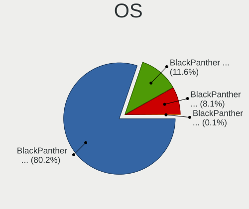

| Name              | Notebooks | Percent |
|-------------------|-----------|---------|
| BlackPanther 18.1 | 1837      | 80.22%  |
| BlackPanther 22.1 | 266       | 11.62%  |
| BlackPanther 16.2 | 185       | 8.08%   |
| BlackPanther 16.1 | 2         | 0.09%   |

OS Family
---------

OS without a version

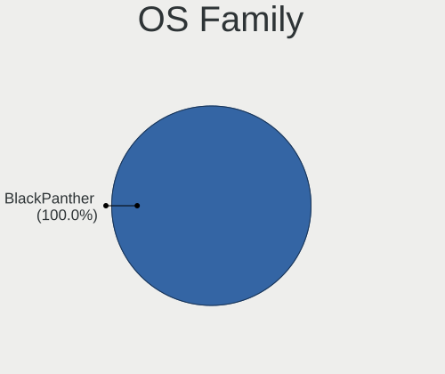

| Name         | Notebooks | Percent |
|--------------|-----------|---------|
| BlackPanther | 2211      | 100%    |

Kernel
------

Version of the Linux kernel

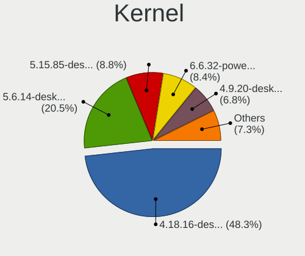

| Version                 | Notebooks | Percent |
|-------------------------|-----------|---------|
| 4.18.16-desktop-1bP     | 1242      | 48.25%  |
| 5.6.14-desktop-2bP      | 527       | 20.47%  |
| 5.15.85-desktop-1bP     | 226       | 8.78%   |
| 6.6.32-power-1bP        | 215       | 8.35%   |
| 4.9.20-desktop-pae-1bP  | 175       | 6.8%    |
| 5.1.15-desktop-1bP      | 79        | 3.07%   |
| 6.3.8-desktop-1bP       | 29        | 1.13%   |
| 6.6.34-power-1bP        | 21        | 0.82%   |
| 6.3.3-desktop-1bP       | 8         | 0.31%   |
| 6.6.11-power-1bP        | 6         | 0.23%   |
| 6.5.3-power-1bP         | 6         | 0.23%   |
| 4.9.20-desktop-1bP      | 5         | 0.19%   |
| 6.2.9-desktop-1bP       | 4         | 0.16%   |
| 4.7.0-desktop-1bP       | 4         | 0.16%   |
| 6.4.3-desktop-1bP       | 3         | 0.12%   |
| 6.5.7-power-1bP         | 2         | 0.08%   |
| 5.6.14-server-2bP       | 2         | 0.08%   |
| 5.10.1-desktop-1bP      | 2         | 0.08%   |
| 4.14.14-desktop-pae-1bP | 2         | 0.08%   |
| 6.9.7-power-1bP         | 1         | 0.04%   |
| 6.6.4-200.fc39.x86_64   | 1         | 0.04%   |
| 6.6.33-power-2bP        | 1         | 0.04%   |
| 6.6.30-power-1bP        | 1         | 0.04%   |
| 6.16.4-power-1bP        | 1         | 0.04%   |
| 6.14.2-power-1bP        | 1         | 0.04%   |
| 6.13.7-power-1bP        | 1         | 0.04%   |
| 6.11.4-power-1bP        | 1         | 0.04%   |
| 6.10.11-power-1bP       | 1         | 0.04%   |
| 6.1.0-1bP               | 1         | 0.04%   |
| 5.8.11-desktop-2bP      | 1         | 0.04%   |
| 5.15.6-desktop-1bP      | 1         | 0.04%   |
| 5.15.160-desktop-1bP    | 1         | 0.04%   |
| 5.10.1-desktop-2bP      | 1         | 0.04%   |
| 5.1.15-server-1bP       | 1         | 0.04%   |
| 4.15.0-desktop-pae-1bP  | 1         | 0.04%   |

Kernel Family
-------------

Linux kernel without a distro release

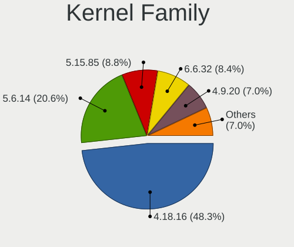

| Version  | Notebooks | Percent |
|----------|-----------|---------|
| 4.18.16  | 1242      | 48.27%  |
| 5.6.14   | 529       | 20.56%  |
| 5.15.85  | 226       | 8.78%   |
| 6.6.32   | 215       | 8.36%   |
| 4.9.20   | 180       | 7%      |
| 5.1.15   | 79        | 3.07%   |
| 6.3.8    | 29        | 1.13%   |
| 6.6.34   | 21        | 0.82%   |
| 6.3.3    | 8         | 0.31%   |
| 6.6.11   | 6         | 0.23%   |
| 6.5.3    | 6         | 0.23%   |
| 6.2.9    | 4         | 0.16%   |
| 4.7.0    | 4         | 0.16%   |
| 6.4.3    | 3         | 0.12%   |
| 5.10.1   | 3         | 0.12%   |
| 6.5.7    | 2         | 0.08%   |
| 4.14.14  | 2         | 0.08%   |
| 6.9.7    | 1         | 0.04%   |
| 6.6.4    | 1         | 0.04%   |
| 6.6.33   | 1         | 0.04%   |
| 6.6.30   | 1         | 0.04%   |
| 6.16.4   | 1         | 0.04%   |
| 6.14.2   | 1         | 0.04%   |
| 6.13.7   | 1         | 0.04%   |
| 6.11.4   | 1         | 0.04%   |
| 6.10.11  | 1         | 0.04%   |
| 6.1.0    | 1         | 0.04%   |
| 5.8.11   | 1         | 0.04%   |
| 5.15.6   | 1         | 0.04%   |
| 5.15.160 | 1         | 0.04%   |
| 4.15.0   | 1         | 0.04%   |

Kernel Major Ver.
-----------------

Linux kernel major version

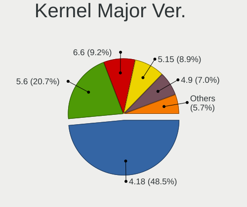

| Version | Notebooks | Percent |
|---------|-----------|---------|
| 4.18    | 1242      | 48.52%  |
| 5.6     | 529       | 20.66%  |
| 6.6     | 236       | 9.22%   |
| 5.15    | 227       | 8.87%   |
| 4.9     | 180       | 7.03%   |
| 5.1     | 79        | 3.09%   |
| 6.3     | 34        | 1.33%   |
| 6.5     | 8         | 0.31%   |
| 6.2     | 4         | 0.16%   |
| 4.7     | 4         | 0.16%   |
| 6.4     | 3         | 0.12%   |
| 5.10    | 3         | 0.12%   |
| 4.14    | 2         | 0.08%   |
| 6.9     | 1         | 0.04%   |
| 6.16    | 1         | 0.04%   |
| 6.14    | 1         | 0.04%   |
| 6.13    | 1         | 0.04%   |
| 6.11    | 1         | 0.04%   |
| 6.10    | 1         | 0.04%   |
| 6.1     | 1         | 0.04%   |
| 5.8     | 1         | 0.04%   |
| 4.15    | 1         | 0.04%   |

Arch
----

OS architecture (x86_64, i586, etc.)

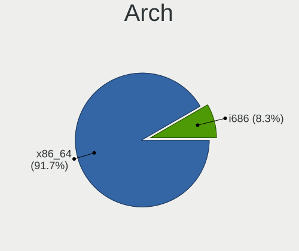

| Name   | Notebooks | Percent |
|--------|-----------|---------|
| x86_64 | 2053      | 91.65%  |
| i686   | 187       | 8.35%   |

DE
--

Desktop Environment

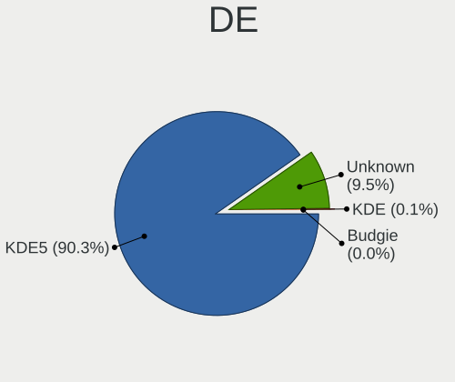

| Name     | Notebooks | Percent |
|----------|-----------|---------|
| KDE5     | 2002      | 90.3%   |
| Unknown  | 210       | 9.47%   |
| KDE      | 3         | 0.14%   |
| Cinnamon | 1         | 0.05%   |
| Budgie   | 1         | 0.05%   |

Display Server
--------------

X11 or Wayland

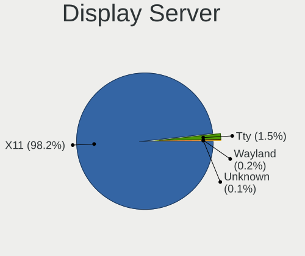

| Name    | Notebooks | Percent |
|---------|-----------|---------|
| X11     | 2174      | 98.24%  |
| Tty     | 33        | 1.49%   |
| Wayland | 4         | 0.18%   |
| Unknown | 2         | 0.09%   |

Display Manager
---------------

SDDM, LightDM, etc.

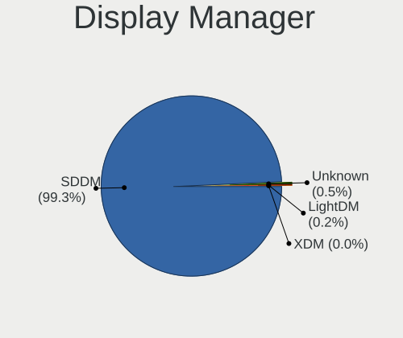

| Name    | Notebooks | Percent |
|---------|-----------|---------|
| SDDM    | 2200      | 99.28%  |
| Unknown | 10        | 0.45%   |
| LightDM | 5         | 0.23%   |
| XDM     | 1         | 0.05%   |

OS Lang
-------

Language

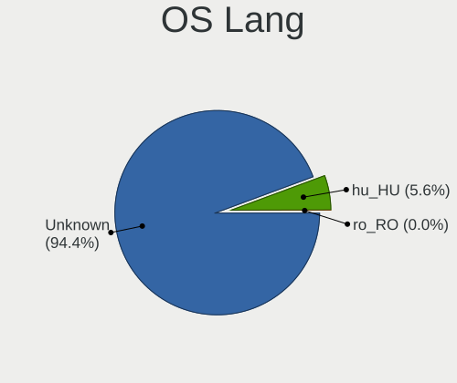

| Lang    | Notebooks | Percent |
|---------|-----------|---------|
| Unknown | 2089      | 94.35%  |
| hu_HU   | 124       | 5.6%    |
| ro_RO   | 1         | 0.05%   |

Boot Mode
---------

EFI or BIOS

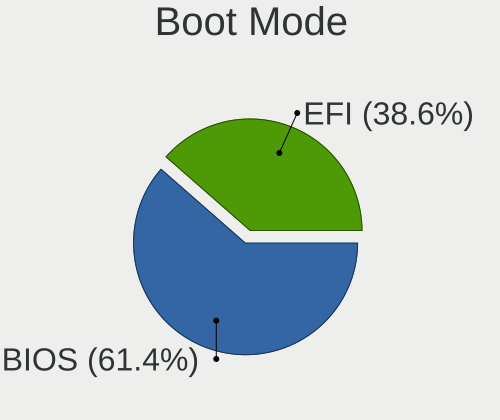

| Mode | Notebooks | Percent |
|------|-----------|---------|
| BIOS | 1425      | 61.45%  |
| EFI  | 894       | 38.55%  |

Filesystem
----------

Type of filesystem

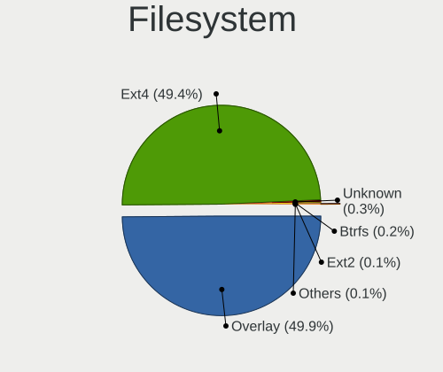

| Type    | Notebooks | Percent |
|---------|-----------|---------|
| Overlay | 1259      | 49.88%  |
| Ext4    | 1247      | 49.41%  |
| Unknown | 7         | 0.28%   |
| Btrfs   | 5         | 0.2%    |
| Ext2    | 3         | 0.12%   |
| Xfs     | 1         | 0.04%   |
| Ntfs    | 1         | 0.04%   |
| Ext3    | 1         | 0.04%   |

Part. scheme
------------

Scheme of partitioning

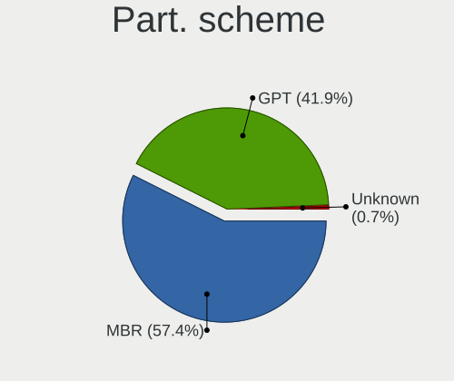

| Type    | Notebooks | Percent |
|---------|-----------|---------|
| MBR     | 1337      | 57.41%  |
| GPT     | 976       | 41.91%  |
| Unknown | 16        | 0.69%   |

Dual Boot with Linux/BSD
------------------------

Hosting more than one Linux/BSD

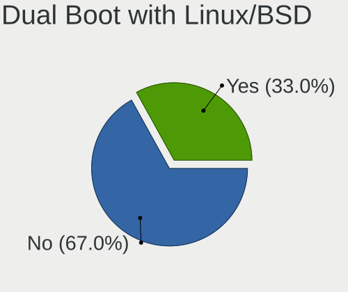

| Dual boot | Notebooks | Percent |
|-----------|-----------|---------|
| No        | 1651      | 66.95%  |
| Yes       | 815       | 33.05%  |

Dual Boot (Win)
---------------

Hosting Linux and Windows

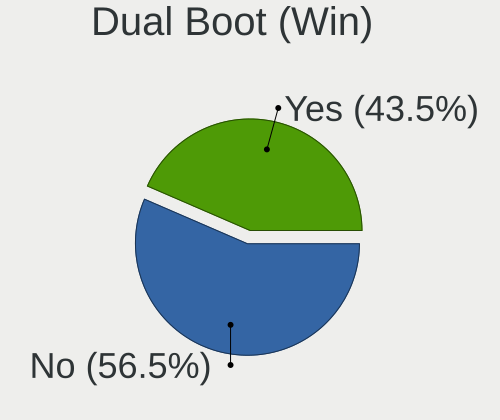

| Dual boot | Notebooks | Percent |
|-----------|-----------|---------|
| No        | 1360      | 56.5%   |
| Yes       | 1047      | 43.5%   |

Board
-----

Vendor
------

Motherboard manufacturer

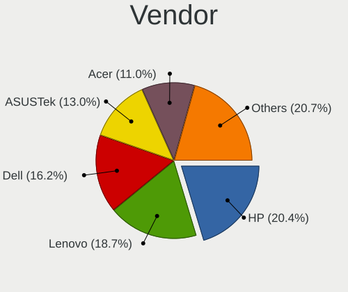

| Name                | Notebooks | Percent |
|---------------------|-----------|---------|
| Hewlett-Packard     | 450       | 20.35%  |
| Lenovo              | 414       | 18.72%  |
| Dell                | 359       | 16.24%  |
| ASUSTek Computer    | 287       | 12.98%  |
| Acer                | 243       | 10.99%  |
| Toshiba             | 95        | 4.3%    |
| Samsung Electronics | 53        | 2.4%    |
| Fujitsu             | 44        | 1.99%   |
| Packard Bell        | 34        | 1.54%   |
| Fujitsu Siemens     | 32        | 1.45%   |
| MSI                 | 30        | 1.36%   |
| Sony                | 26        | 1.18%   |
| Apple               | 22        | 1%      |
| eMachines           | 20        | 0.9%    |
| Medion              | 18        | 0.81%   |
| Alcor               | 7         | 0.32%   |
| Hungaro Flotta Kft  | 6         | 0.27%   |
| Google              | 5         | 0.23%   |
| Gateway             | 5         | 0.23%   |
| BANGHO              | 4         | 0.18%   |
| AWOW                | 4         | 0.18%   |
| Unknown             | 4         | 0.18%   |
| NVISEN              | 3         | 0.14%   |
| Insyde              | 3         | 0.14%   |
| Gigabyte Technology | 3         | 0.14%   |
| speedmaster         | 2         | 0.09%   |
| Positivo            | 2         | 0.09%   |
| Panasonic           | 2         | 0.09%   |
| Notebook            | 2         | 0.09%   |
| Jumper              | 2         | 0.09%   |
| Intel               | 2         | 0.09%   |
| Alienware           | 2         | 0.09%   |
| Valve               | 1         | 0.05%   |
| TUXEDO              | 1         | 0.05%   |
| Timi                | 1         | 0.05%   |
| THD                 | 1         | 0.05%   |
| RM                  | 1         | 0.05%   |
| Philco              | 1         | 0.05%   |
| Pegatron            | 1         | 0.05%   |
| PC Specialist       | 1         | 0.05%   |

Model
-----

Motherboard model

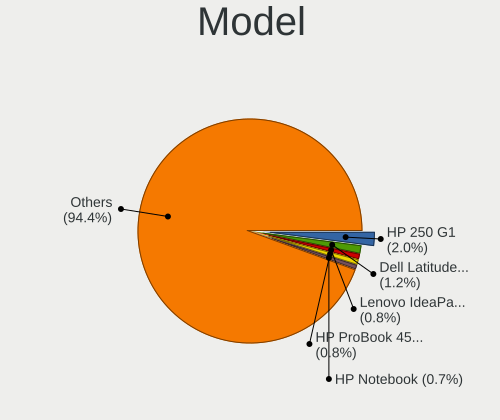

| Name                                 | Notebooks | Percent |
|--------------------------------------|-----------|---------|
| HP 250 G1                            | 45        | 2.04%   |
| Dell Latitude E6410                  | 27        | 1.22%   |
| Lenovo IdeaPad 330-15IKB 81DE        | 18        | 0.81%   |
| HP ProBook 455 G1                    | 18        | 0.81%   |
| HP Notebook                          | 15        | 0.68%   |
| Unknown                              | 15        | 0.68%   |
| Lenovo G50-45 80E3                   | 11        | 0.5%    |
| Dell Latitude 5480                   | 11        | 0.5%    |
| Dell Inspiron 7737                   | 11        | 0.5%    |
| HP EliteBook 8470p                   | 10        | 0.45%   |
| Toshiba Satellite C660               | 9         | 0.41%   |
| Lenovo IdeaPad 100-15IBD 80QQ        | 9         | 0.41%   |
| HP Pavilion Gaming Laptop 15-ec1xxx  | 9         | 0.41%   |
| HP Pavilion g6                       | 9         | 0.41%   |
| HP 650                               | 9         | 0.41%   |
| HP 620                               | 9         | 0.41%   |
| HP 250 G5 Notebook PC                | 9         | 0.41%   |
| Dell Inspiron 3521                   | 9         | 0.41%   |
| ASUS K50IJ                           | 9         | 0.41%   |
| Dell Latitude E6400                  | 8         | 0.36%   |
| Dell Inspiron 1545                   | 8         | 0.36%   |
| ASUS X550CC                          | 8         | 0.36%   |
| ASUS X200MA                          | 8         | 0.36%   |
| Lenovo G50-30 80G0                   | 7         | 0.32%   |
| HP ProBook 6560b                     | 7         | 0.32%   |
| HP ProBook 640 G8 Notebook PC        | 7         | 0.32%   |
| HP Pavilion Notebook                 | 7         | 0.32%   |
| Dell Latitude E6430                  | 7         | 0.32%   |
| ASUS VivoBook 15_ASUS Laptop X540UBR | 7         | 0.32%   |
| Acer Aspire 5732Z                    | 7         | 0.32%   |
| Lenovo IdeaPad 700-15ISK 80RU        | 6         | 0.27%   |
| Lenovo G550 20023                    | 6         | 0.27%   |
| HP Pavilion dv6                      | 6         | 0.27%   |
| HP Laptop 15-dw1xxx                  | 6         | 0.27%   |
| HP EliteBook 8460p                   | 6         | 0.27%   |
| HP EliteBook 8440p                   | 6         | 0.27%   |
| HP EliteBook 2540p                   | 6         | 0.27%   |
| Fujitsu LIFEBOOK A555                | 6         | 0.27%   |
| eMachines E525                       | 6         | 0.27%   |
| Dell Vostro 1015                     | 6         | 0.27%   |

Model Family
------------

Motherboard model prefix

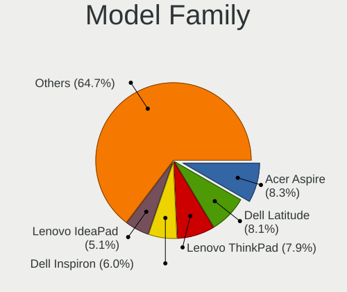

| Name                     | Notebooks | Percent |
|--------------------------|-----------|---------|
| Acer Aspire              | 184       | 8.32%   |
| Dell Latitude            | 178       | 8.05%   |
| Lenovo ThinkPad          | 174       | 7.87%   |
| Dell Inspiron            | 133       | 6.02%   |
| Lenovo IdeaPad           | 112       | 5.07%   |
| Toshiba Satellite        | 85        | 3.84%   |
| HP ProBook               | 84        | 3.8%    |
| HP EliteBook             | 73        | 3.3%    |
| HP 250                   | 64        | 2.89%   |
| HP Pavilion              | 56        | 2.53%   |
| HP Compaq                | 43        | 1.94%   |
| Fujitsu LIFEBOOK         | 37        | 1.67%   |
| ASUS VivoBook            | 35        | 1.58%   |
| Packard Bell EasyNote    | 33        | 1.49%   |
| HP Laptop                | 25        | 1.13%   |
| Fujitsu Siemens AMILO    | 21        | 0.95%   |
| Acer TravelMate          | 21        | 0.95%   |
| Dell Vostro              | 18        | 0.81%   |
| HP Notebook              | 15        | 0.68%   |
| Unknown                  | 15        | 0.68%   |
| HP Presario              | 12        | 0.54%   |
| Dell Precision           | 12        | 0.54%   |
| Lenovo G50-45            | 11        | 0.5%    |
| Lenovo 3000              | 9         | 0.41%   |
| HP 650                   | 9         | 0.41%   |
| HP 620                   | 9         | 0.41%   |
| ASUS K50IJ               | 9         | 0.41%   |
| ASUS ASUS                | 9         | 0.41%   |
| HP 255                   | 8         | 0.36%   |
| ASUS X550CC              | 8         | 0.36%   |
| ASUS X200MA              | 8         | 0.36%   |
| Acer Predator            | 8         | 0.36%   |
| Lenovo G50-30            | 7         | 0.32%   |
| Acer Extensa             | 7         | 0.32%   |
| Lenovo Legion            | 6         | 0.27%   |
| Lenovo G550              | 6         | 0.27%   |
| Hungaro Flotta Kft Navon | 6         | 0.27%   |
| HP 15                    | 6         | 0.27%   |
| Fujitsu Siemens ESPRIMO  | 6         | 0.27%   |
| eMachines E525           | 6         | 0.27%   |

MFG Year
--------

Motherboard manufacture year

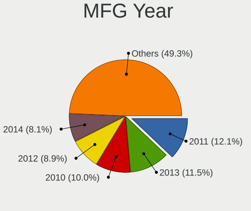

| Year    | Notebooks | Percent |
|---------|-----------|---------|
| 2011    | 267       | 12.08%  |
| 2013    | 255       | 11.53%  |
| 2010    | 222       | 10.04%  |
| 2012    | 197       | 8.91%   |
| 2014    | 180       | 8.14%   |
| 2008    | 166       | 7.51%   |
| 2009    | 150       | 6.78%   |
| 2015    | 130       | 5.88%   |
| 2016    | 120       | 5.43%   |
| 2017    | 105       | 4.75%   |
| 2018    | 102       | 4.61%   |
| 2007    | 96        | 4.34%   |
| 2019    | 63        | 2.85%   |
| 2006    | 50        | 2.26%   |
| 2020    | 36        | 1.63%   |
| 2021    | 25        | 1.13%   |
| 2024    | 16        | 0.72%   |
| 2022    | 16        | 0.72%   |
| 2005    | 9         | 0.41%   |
| 2023    | 5         | 0.23%   |
| Unknown | 1         | 0.05%   |

Form Factor
-----------

Physical design of the computer

| Name     | Notebooks | Percent |
|----------|-----------|---------|
| Notebook | 2211      | 100%    |

Secure Boot
-----------

Enabled or disabled

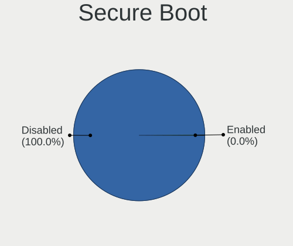

| State    | Notebooks | Percent |
|----------|-----------|---------|
| Disabled | 2211      | 99.95%  |
| Enabled  | 1         | 0.05%   |

Coreboot
--------

Have coreboot on board

| Used | Notebooks | Percent |
|------|-----------|---------|
| No   | 2206      | 99.77%  |
| Yes  | 5         | 0.23%   |

RAM Size
--------

Total RAM memory

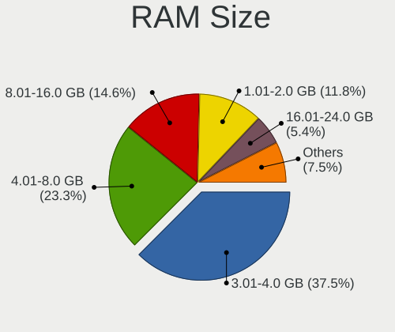

| Size in GB | Notebooks | Percent |
|------------|-----------|---------|
| 3.01-4.0   | 858       | 37.5%   |
| 4.01-8.0   | 533       | 23.3%   |
| 8.01-16.0  | 333       | 14.55%  |
| 1.01-2.0   | 269       | 11.76%  |
| 16.01-24.0 | 124       | 5.42%   |
| 2.01-3.0   | 96        | 4.2%    |
| 0.51-1.0   | 35        | 1.53%   |
| 32.01-64.0 | 26        | 1.14%   |
| 24.01-32.0 | 12        | 0.52%   |
| Unknown    | 2         | 0.09%   |

RAM Used
--------

Used RAM memory

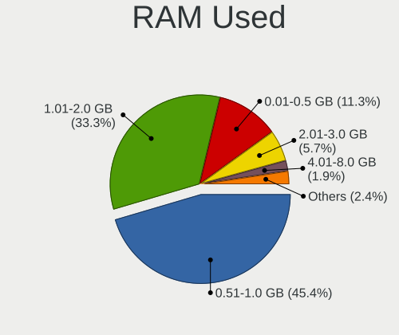

| Used GB    | Notebooks | Percent |
|------------|-----------|---------|
| 0.51-1.0   | 1219      | 45.43%  |
| 1.01-2.0   | 893       | 33.28%  |
| 0.01-0.5   | 304       | 11.33%  |
| 2.01-3.0   | 152       | 5.67%   |
| 4.01-8.0   | 51        | 1.9%    |
| 3.01-4.0   | 50        | 1.86%   |
| 8.01-16.0  | 8         | 0.3%    |
| 16.01-24.0 | 4         | 0.15%   |
| Unknown    | 2         | 0.07%   |

Total Drives
------------

Number of drives on board

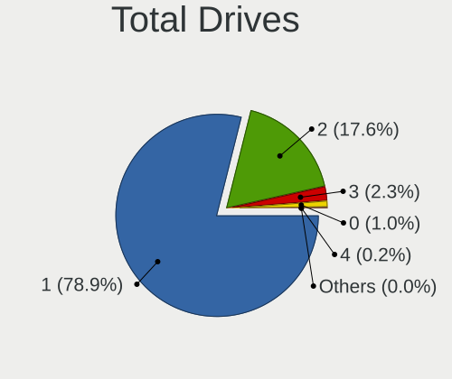

| Drives | Notebooks | Percent |
|--------|-----------|---------|
| 1      | 1840      | 78.9%   |
| 2      | 410       | 17.58%  |
| 3      | 53        | 2.27%   |
| 0      | 24        | 1.03%   |
| 4      | 4         | 0.17%   |
| 5      | 1         | 0.04%   |

Has CD-ROM
----------

Has CD-ROM on board

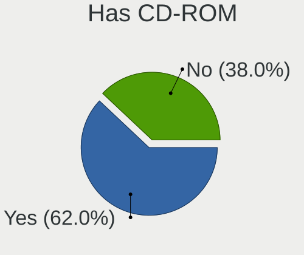

| Presented | Notebooks | Percent |
|-----------|-----------|---------|
| Yes       | 1390      | 62.03%  |
| No        | 851       | 37.97%  |

Has Ethernet
------------

Has Ethernet on board

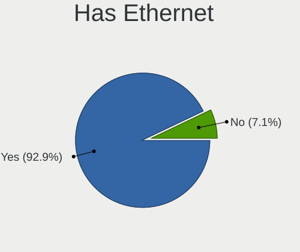

| Presented | Notebooks | Percent |
|-----------|-----------|---------|
| Yes       | 2058      | 92.91%  |
| No        | 157       | 7.09%   |

Has WiFi
--------

Has WiFi module

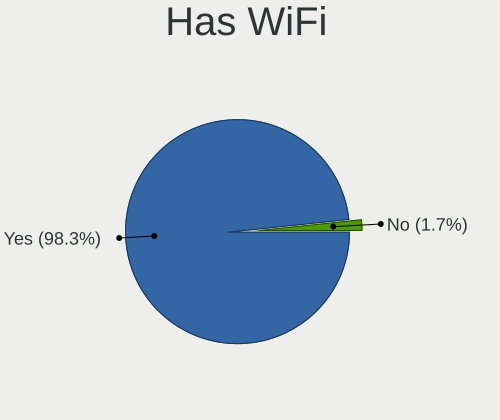

| Presented | Notebooks | Percent |
|-----------|-----------|---------|
| Yes       | 2176      | 98.33%  |
| No        | 37        | 1.67%   |

Has Bluetooth
-------------

Has Bluetooth module

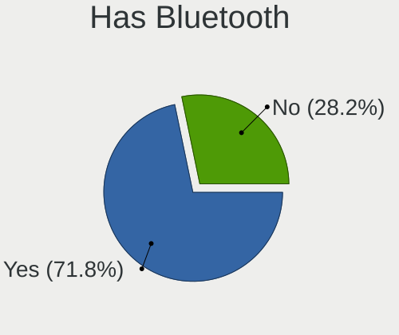

| Presented | Notebooks | Percent |
|-----------|-----------|---------|
| Yes       | 1618      | 71.75%  |
| No        | 637       | 28.25%  |

Location
--------

Country
-------

Geographic location (country)

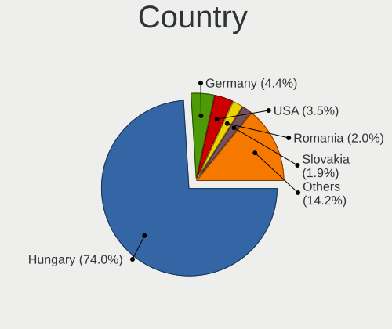

| Country      | Notebooks | Percent |
|--------------|-----------|---------|
| Hungary      | 1647      | 74.02%  |
| Germany      | 98        | 4.4%    |
| USA          | 78        | 3.51%   |
| Romania      | 44        | 1.98%   |
| Slovakia     | 43        | 1.93%   |
| UK           | 40        | 1.8%    |
| Austria      | 29        | 1.3%    |
| Italy        | 22        | 0.99%   |
| Canada       | 22        | 0.99%   |
| France       | 20        | 0.9%    |
| Argentina    | 18        | 0.81%   |
| Spain        | 17        | 0.76%   |
| Japan        | 11        | 0.49%   |
| Brazil       | 11        | 0.49%   |
| Serbia       | 10        | 0.45%   |
| Ireland      | 10        | 0.45%   |
| Poland       | 7         | 0.31%   |
| Russia       | 6         | 0.27%   |
| Australia    | 6         | 0.27%   |
| Switzerland  | 5         | 0.22%   |
| Belgium      | 5         | 0.22%   |
| Sweden       | 4         | 0.18%   |
| Netherlands  | 4         | 0.18%   |
| Greece       | 4         | 0.18%   |
| Czechia      | 4         | 0.18%   |
| India        | 3         | 0.13%   |
| Finland      | 3         | 0.13%   |
| China        | 3         | 0.13%   |
| UAE          | 2         | 0.09%   |
| Turkey       | 2         | 0.09%   |
| South Africa | 2         | 0.09%   |
| Puerto Rico  | 2         | 0.09%   |
| Philippines  | 2         | 0.09%   |
| Moldova      | 2         | 0.09%   |
| Mexico       | 2         | 0.09%   |
| Madagascar   | 2         | 0.09%   |
| Israel       | 2         | 0.09%   |
| Indonesia    | 2         | 0.09%   |
| Ghana        | 2         | 0.09%   |
| Ecuador      | 2         | 0.09%   |

City
----

Geographic location (city)

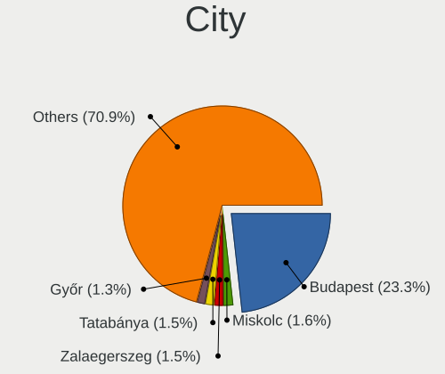

| City              | Notebooks | Percent |
|-------------------|-----------|---------|
| Budapest          | 639       | 23.25%  |
| Miskolc           | 45        | 1.64%   |
| Zalaegerszeg      | 40        | 1.46%   |
| Tatabánya        | 40        | 1.46%   |
| Győr             | 37        | 1.35%   |
| Debrecen          | 34        | 1.24%   |
| Pécs             | 32        | 1.16%   |
| Kecskemét        | 32        | 1.16%   |
| Nyiregyhaza       | 29        | 1.06%   |
| Veszprém         | 26        | 0.95%   |
| Szombathely       | 25        | 0.91%   |
| Szigetszentmiklos | 25        | 0.91%   |
| Székesfehérvár | 25        | 0.91%   |
| Szeged            | 24        | 0.87%   |
| Cegled            | 24        | 0.87%   |
| Szolnok           | 19        | 0.69%   |
| Pomaz             | 19        | 0.69%   |
| Vienna            | 18        | 0.66%   |
| Berettyóújfalu  | 18        | 0.66%   |
| Salgotarjan       | 17        | 0.62%   |
| Érd              | 16        | 0.58%   |
| Tamasi            | 15        | 0.55%   |
| Szekszárd        | 15        | 0.55%   |
| Oroshaza          | 13        | 0.47%   |
| Kaposvár         | 13        | 0.47%   |
| Dunaújváros     | 13        | 0.47%   |
| Bratislava        | 13        | 0.47%   |
| Toekoel           | 12        | 0.44%   |
| Szorgalmatos      | 12        | 0.44%   |
| Kazincbarcika     | 12        | 0.44%   |
| Gyomro            | 12        | 0.44%   |
| Sopron            | 11        | 0.4%    |
| Regensburg        | 11        | 0.4%    |
| Karcag            | 11        | 0.4%    |
| Banská Bystrica  | 11        | 0.4%    |
| Tiszaujvaros      | 10        | 0.36%   |
| Târgu Mureş     | 10        | 0.36%   |
| Miercurea-Ciuc    | 10        | 0.36%   |
| Kiskunfelegyhaza  | 10        | 0.36%   |
| Hatvan            | 10        | 0.36%   |

Drives
------

Drive Vendor
------------

Hard drive vendors

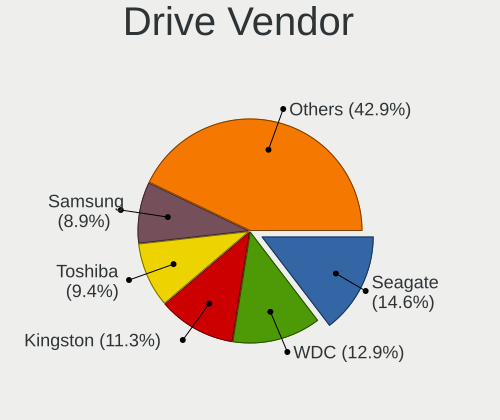

| Vendor                      | Notebooks | Drives | Percent |
|-----------------------------|-----------|--------|---------|
| Seagate                     | 409       | 690    | 14.63%  |
| WDC                         | 360       | 600    | 12.88%  |
| Kingston                    | 315       | 562    | 11.27%  |
| Toshiba                     | 264       | 416    | 9.44%   |
| Samsung Electronics         | 249       | 525    | 8.91%   |
| HGST                        | 174       | 291    | 6.22%   |
| Hitachi                     | 164       | 245    | 5.87%   |
| SanDisk                     | 111       | 199    | 3.97%   |
| Unknown                     | 89        | 161    | 3.18%   |
| A-DATA Technology           | 53        | 82     | 1.9%    |
| Fujitsu                     | 52        | 67     | 1.86%   |
| SK hynix                    | 50        | 89     | 1.79%   |
| Intel                       | 50        | 89     | 1.79%   |
| Crucial                     | 38        | 51     | 1.36%   |
| Micron Technology           | 37        | 64     | 1.32%   |
| SPCC                        | 31        | 55     | 1.11%   |
| Intenso                     | 27        | 66     | 0.97%   |
| Apacer                      | 23        | 40     | 0.82%   |
| JMicron Technology          | 21        | 22     | 0.75%   |
| China                       | 21        | 34     | 0.75%   |
| PNY                         | 17        | 30     | 0.61%   |
| Patriot                     | 14        | 20     | 0.5%    |
| LITEON                      | 14        | 28     | 0.5%    |
| Team                        | 13        | 21     | 0.46%   |
| Unknown                     | 11        | 21     | 0.39%   |
| Kingmax                     | 10        | 14     | 0.36%   |
| Verbatim                    | 9         | 21     | 0.32%   |
| SSSTC                       | 9         | 23     | 0.32%   |
| KIOXIA                      | 9         | 17     | 0.32%   |
| Transcend                   | 8         | 9      | 0.29%   |
| LITEONIT                    | 8         | 20     | 0.29%   |
| Gigabyte Technology         | 8         | 12     | 0.29%   |
| Netac                       | 7         | 8      | 0.25%   |
| OCZ                         | 6         | 7      | 0.21%   |
| Apple                       | 6         | 16     | 0.21%   |
| GOODRAM                     | 5         | 5      | 0.18%   |
| Kingston Technology Company | 4         | 14     | 0.14%   |
| KingSpec                    | 4         | 5      | 0.14%   |
| BHT                         | 4         | 4      | 0.14%   |
| SPCC Sol                    | 3         | 3      | 0.11%   |

Drive Model
-----------

Hard drive models

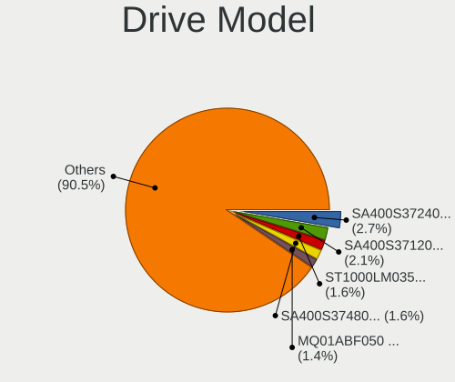

| Model                              | Notebooks | Percent |
|------------------------------------|-----------|---------|
| Kingston SA400S37240G 240GB SSD    | 79        | 2.71%   |
| Kingston SA400S37120G 120GB SSD    | 60        | 2.06%   |
| Seagate ST1000LM035-1RK172 1TB     | 48        | 1.65%   |
| Kingston SA400S37480G 480GB SSD    | 47        | 1.61%   |
| Toshiba MQ01ABF050 500GB           | 42        | 1.44%   |
| Toshiba MQ01ABD100 1TB             | 42        | 1.44%   |
| Seagate ST500LT012-1DG142 500GB    | 39        | 1.34%   |
| Seagate ST1000LM024 HN-M101MBB 1TB | 38        | 1.3%    |
| HGST HTS545032A7E380 320GB         | 36        | 1.23%   |
| HGST HTS545050A7E680 500GB         | 35        | 1.2%    |
| Kingston SV300S37A120G 120GB SSD   | 30        | 1.03%   |
| HGST HTS725050A7E630 500GB         | 28        | 0.96%   |
| Seagate ST9500325AS 500GB          | 25        | 0.86%   |
| Seagate ST9320325AS 320GB          | 23        | 0.79%   |
| Seagate ST500LT012-9WS142 500GB    | 19        | 0.65%   |
| WDC WD10JPVX-22JC3T0 1TB           | 18        | 0.62%   |
| Toshiba MQ04ABF100 1TB             | 18        | 0.62%   |
| Kingston SA400S37960G 960GB SSD    | 18        | 0.62%   |
| HGST HTS721010A9E630 1TB           | 17        | 0.58%   |
| HGST HTS541010A9E680 1TB           | 17        | 0.58%   |
| Kingston SUV400S37120G 120GB SSD   | 16        | 0.55%   |
| Seagate ST500LM000-1EJ162 500GB    | 15        | 0.51%   |
| Toshiba MQ01ABD050 500GB           | 14        | 0.48%   |
| Seagate ST9250315AS 250GB          | 14        | 0.48%   |
| Samsung SSD 860 EVO 500GB          | 14        | 0.48%   |
| Samsung SSD 850 EVO 250GB          | 14        | 0.48%   |
| HGST HTS545050A7E380 500GB         | 14        | 0.48%   |
| WDC WD3200BPVT-22JJ5T0 320GB       | 13        | 0.45%   |
| WDC WD1600BEVT-22ZCT0 160GB        | 12        | 0.41%   |
| SPCC Solid State Disk 256GB        | 11        | 0.38%   |
| Seagate M3 Portable 500GB          | 11        | 0.38%   |
| Samsung SSD 860 EVO 250GB          | 11        | 0.38%   |
| JMicron Generic 320GB              | 11        | 0.38%   |
| Unknown                            | 11        | 0.38%   |
| WDC WDS240G2G0A-00JH30 240GB SSD   | 10        | 0.34%   |
| WDC WD5000LPVX-22V0TT0 500GB       | 10        | 0.34%   |
| WDC WD5000LPCX-24VHAT0 500GB       | 10        | 0.34%   |
| WDC WD10JPVX-60JC3T0 1TB           | 10        | 0.34%   |
| Samsung HM160HI 160GB              | 10        | 0.34%   |
| Hitachi HTS723232A7A364 320GB      | 10        | 0.34%   |

HDD Vendor
----------

Hard disk drive vendors

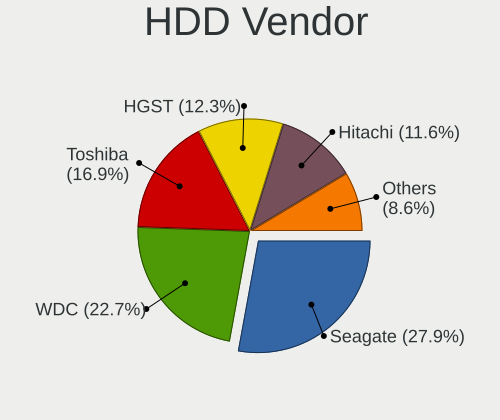

| Vendor              | Notebooks | Drives | Percent |
|---------------------|-----------|--------|---------|
| Seagate             | 393       | 669    | 27.87%  |
| WDC                 | 320       | 537    | 22.7%   |
| Toshiba             | 238       | 356    | 16.88%  |
| HGST                | 174       | 291    | 12.34%  |
| Hitachi             | 164       | 245    | 11.63%  |
| Fujitsu             | 52        | 67     | 3.69%   |
| Samsung Electronics | 37        | 53     | 2.62%   |
| JMicron Technology  | 11        | 11     | 0.78%   |
| Unknown             | 5         | 13     | 0.35%   |
| TO Exter            | 2         | 3      | 0.14%   |
| IBM/Hitachi         | 2         | 3      | 0.14%   |
| IB-1122             | 2         | 2      | 0.14%   |
| HGST HTS            | 2         | 7      | 0.14%   |
| USB3.0              | 1         | 1      | 0.07%   |
| SATAFIRM            | 1         | 1      | 0.07%   |
| QC-FT-D             | 1         | 1      | 0.07%   |
| MARSHAL             | 1         | 2      | 0.07%   |
| Initio              | 1         | 2      | 0.07%   |
| ICY BOX             | 1         | 1      | 0.07%   |
| CSD                 | 1         | 2      | 0.07%   |
| ASMT                | 1         | 2      | 0.07%   |

SSD Vendor
----------

Solid state drive vendors

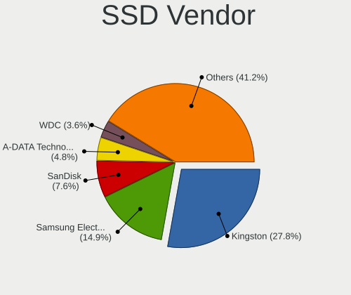

| Vendor              | Notebooks | Drives | Percent |
|---------------------|-----------|--------|---------|
| Kingston            | 294       | 515    | 27.81%  |
| Samsung Electronics | 158       | 322    | 14.95%  |
| SanDisk             | 80        | 149    | 7.57%   |
| A-DATA Technology   | 51        | 80     | 4.82%   |
| WDC                 | 38        | 53     | 3.6%    |
| Crucial             | 38        | 51     | 3.6%    |
| Intel               | 37        | 63     | 3.5%    |
| SPCC                | 29        | 52     | 2.74%   |
| SK hynix            | 27        | 43     | 2.55%   |
| Micron Technology   | 27        | 45     | 2.55%   |
| Intenso             | 27        | 66     | 2.55%   |
| China               | 21        | 34     | 1.99%   |
| Apacer              | 20        | 35     | 1.89%   |
| PNY                 | 17        | 30     | 1.61%   |
| Patriot             | 14        | 20     | 1.32%   |
| Toshiba             | 13        | 36     | 1.23%   |
| Team                | 13        | 21     | 1.23%   |
| LITEON              | 12        | 20     | 1.14%   |
| Kingmax             | 10        | 14     | 0.95%   |
| Verbatim            | 9         | 21     | 0.85%   |
| Transcend           | 8         | 9      | 0.76%   |
| LITEONIT            | 8         | 20     | 0.76%   |
| Gigabyte Technology | 8         | 12     | 0.76%   |
| Netac               | 7         | 8      | 0.66%   |
| OCZ                 | 6         | 7      | 0.57%   |
| Apple               | 6         | 16     | 0.57%   |
| Seagate             | 5         | 5      | 0.47%   |
| GOODRAM             | 5         | 5      | 0.47%   |
| KingSpec            | 4         | 5      | 0.38%   |
| BHT                 | 4         | 4      | 0.38%   |
| SPCC Sol            | 3         | 3      | 0.28%   |
| SATA SSD            | 3         | 3      | 0.28%   |
| LVCARDS             | 3         | 5      | 0.28%   |
| Go-Infinity         | 3         | 3      | 0.28%   |
| EAGET               | 3         | 3      | 0.28%   |
| Corsair             | 3         | 4      | 0.28%   |
| Timetec             | 2         | 18     | 0.19%   |
| Solid               | 2         | 9      | 0.19%   |
| ShanDianZhe         | 2         | 2      | 0.19%   |
| OV                  | 2         | 2      | 0.19%   |

Drive Kind
----------

HDD or SSD

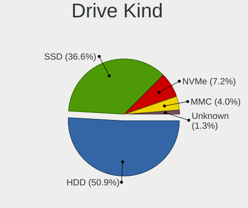

| Kind    | Notebooks | Drives | Percent |
|---------|-----------|--------|---------|
| HDD     | 1325      | 2269   | 50.9%   |
| SSD     | 952       | 1870   | 36.57%  |
| NVMe    | 188       | 431    | 7.22%   |
| MMC     | 105       | 187    | 4.03%   |
| Unknown | 33        | 38     | 1.27%   |

Drive Connector
---------------

SATA, SAS, NVMe, etc.

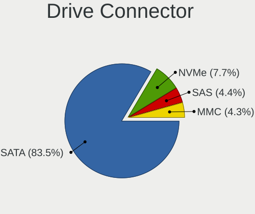

| Type | Notebooks | Drives | Percent |
|------|-----------|--------|---------|
| SATA | 2019      | 4028   | 83.53%  |
| NVMe | 187       | 427    | 7.74%   |
| SAS  | 106       | 153    | 4.39%   |
| MMC  | 105       | 187    | 4.34%   |

Drive Size
----------

Size of hard drive

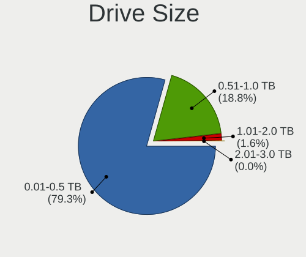

| Size in TB | Notebooks | Drives | Percent |
|------------|-----------|--------|---------|
| 0.01-0.5   | 1747      | 3269   | 79.34%  |
| 0.51-1.0   | 415       | 790    | 18.85%  |
| 1.01-2.0   | 36        | 75     | 1.63%   |
| 4.01-10.0  | 3         | 3      | 0.14%   |
| 2.01-3.0   | 1         | 2      | 0.05%   |

Space Total
-----------

Amount of disk space available on the file system

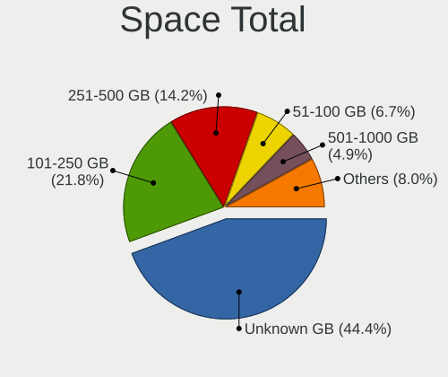

| Size in GB     | Notebooks | Percent |
|----------------|-----------|---------|
| Unknown        | 1197      | 44.4%   |
| 101-250        | 587       | 21.77%  |
| 251-500        | 384       | 14.24%  |
| 51-100         | 181       | 6.71%   |
| 501-1000       | 131       | 4.86%   |
| 21-50          | 101       | 3.75%   |
| 1001-2000      | 53        | 1.97%   |
| 1-20           | 35        | 1.3%    |
| 2001-3000      | 23        | 0.85%   |
| More than 3000 | 3         | 0.11%   |
| 0              | 1         | 0.04%   |

Space Used
----------

Amount of used disk space

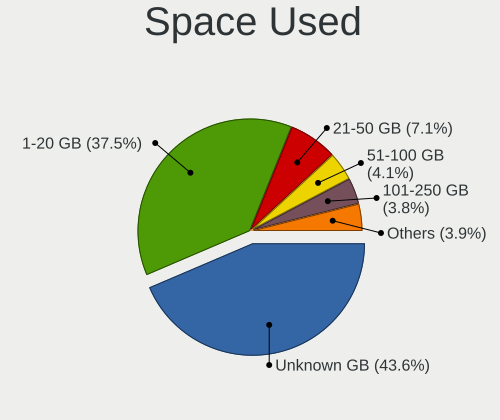

| Used GB   | Notebooks | Percent |
|-----------|-----------|---------|
| Unknown   | 1197      | 43.57%  |
| 1-20      | 1030      | 37.5%   |
| 21-50     | 194       | 7.06%   |
| 51-100    | 114       | 4.15%   |
| 101-250   | 104       | 3.79%   |
| 251-500   | 49        | 1.78%   |
| 1001-2000 | 29        | 1.06%   |
| 501-1000  | 21        | 0.76%   |
| 2001-3000 | 7         | 0.25%   |
| 0         | 2         | 0.07%   |

Malfunc. Drives
---------------

Drive models with a malfunction

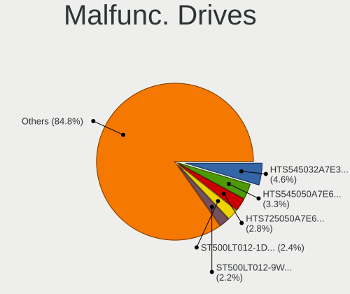

| Model                               | Notebooks | Drives | Percent |
|-------------------------------------|-----------|--------|---------|
| HGST HTS545032A7E380 320GB          | 35        | 65     | 4.59%   |
| HGST HTS545050A7E680 500GB          | 25        | 34     | 3.28%   |
| HGST HTS725050A7E630 500GB          | 21        | 30     | 2.76%   |
| Seagate ST500LT012-1DG142 500GB     | 18        | 35     | 2.36%   |
| Seagate ST500LT012-9WS142 500GB     | 17        | 26     | 2.23%   |
| Seagate ST9500325AS 500GB           | 14        | 24     | 1.84%   |
| Seagate ST9320325AS 320GB           | 13        | 29     | 1.71%   |
| Seagate ST1000LM024 HN-M101MBB 1TB  | 13        | 17     | 1.71%   |
| HGST HTS541010A9E680 1TB            | 13        | 31     | 1.71%   |
| Toshiba MQ01ABF050 500GB            | 12        | 36     | 1.57%   |
| Toshiba MQ01ABD100 1TB              | 11        | 12     | 1.44%   |
| HGST HTS545050A7E380 500GB          | 10        | 17     | 1.31%   |
| Seagate ST9250315AS 250GB           | 9         | 11     | 1.18%   |
| Samsung Electronics HM160HI 160GB   | 9         | 14     | 1.18%   |
| Hitachi HTS723232A7A364 320GB       | 9         | 9      | 1.18%   |
| Seagate ST9500420AS 500GB           | 8         | 19     | 1.05%   |
| Seagate ST1000LM035-1RK172 1TB      | 8         | 10     | 1.05%   |
| WDC WD10JPVX-22JC3T0 1TB            | 7         | 14     | 0.92%   |
| Samsung Electronics HM321HI 320GB   | 7         | 13     | 0.92%   |
| Kingston SV300S37A120G 120GB SSD    | 7         | 12     | 0.92%   |
| Hitachi HTS545050A7E380 500GB       | 7         | 11     | 0.92%   |
| Hitachi HTS543232A7A384 320GB       | 7         | 9      | 0.92%   |
| Toshiba MQ01ABD050 500GB            | 6         | 8      | 0.79%   |
| Seagate ST9320423AS 320GB           | 6         | 6      | 0.79%   |
| Hitachi HTS547550A9E384 500GB       | 6         | 24     | 0.79%   |
| Hitachi HTS545050B9A300 500GB       | 6         | 10     | 0.79%   |
| Seagate ST980811AS 80GB             | 5         | 6      | 0.66%   |
| Seagate ST500LM000-SSHD-8GB         | 5         | 13     | 0.66%   |
| Seagate ST320LT007-9ZV142 320GB     | 5         | 5      | 0.66%   |
| Intel SSDSC2BF180A4L 180GB          | 5         | 10     | 0.66%   |
| Hitachi HTS725025A9A364 250GB       | 5         | 6      | 0.66%   |
| Hitachi HTS545016B9A300 160GB       | 5         | 5      | 0.66%   |
| Hitachi HTS542516K9SA00 160GB       | 5         | 5      | 0.66%   |
| Hitachi HTS541680J9SA00 80GB        | 5         | 5      | 0.66%   |
| WDC WD5000BEKT-22KA9T0 500GB        | 4         | 14     | 0.52%   |
| WDC WD3200BPVT-22JJ5T0 320GB        | 4         | 4      | 0.52%   |
| WDC WD2500BEKT-75PVMT0 250GB        | 4         | 6      | 0.52%   |
| WDC WD10JPLX-00MBPT0 1TB            | 4         | 20     | 0.52%   |
| Seagate ST9160310AS 160GB           | 4         | 7      | 0.52%   |
| Seagate ST500LM012 HN-M500MBB 500GB | 4         | 5      | 0.52%   |

Malfunc. Drive Vendor
---------------------

Vendors of faulty drives

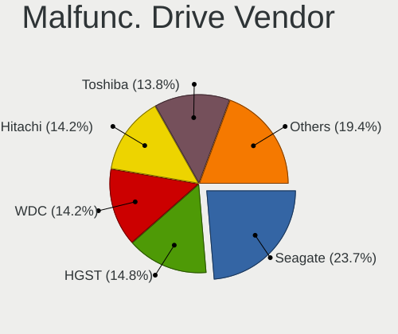

| Vendor              | Notebooks | Drives | Percent |
|---------------------|-----------|--------|---------|
| Seagate             | 177       | 300    | 23.66%  |
| HGST                | 111       | 189    | 14.84%  |
| WDC                 | 106       | 180    | 14.17%  |
| Hitachi             | 106       | 163    | 14.17%  |
| Toshiba             | 103       | 157    | 13.77%  |
| Samsung Electronics | 29        | 65     | 3.88%   |
| Kingston            | 24        | 40     | 3.21%   |
| Fujitsu             | 24        | 36     | 3.21%   |
| Intel               | 18        | 35     | 2.41%   |
| SK hynix            | 9         | 11     | 1.2%    |
| A-DATA Technology   | 6         | 6      | 0.8%    |
| SPCC                | 4         | 5      | 0.53%   |
| SanDisk             | 4         | 5      | 0.53%   |
| China               | 4         | 4      | 0.53%   |
| Micron Technology   | 3         | 3      | 0.4%    |
| Timetec             | 2         | 16     | 0.27%   |
| Intenso             | 2         | 2      | 0.27%   |
| Crucial             | 2         | 2      | 0.27%   |
| Apple               | 2         | 12     | 0.27%   |
| Team                | 1         | 1      | 0.13%   |
| Netac               | 1         | 1      | 0.13%   |
| MARSHAL             | 1         | 1      | 0.13%   |
| LITEONIT            | 1         | 2      | 0.13%   |
| Kingmax             | 1         | 1      | 0.13%   |
| KING                | 1         | 1      | 0.13%   |
| JMicron Technology  | 1         | 1      | 0.13%   |
| Initio              | 1         | 2      | 0.13%   |
| ICY BOX             | 1         | 1      | 0.13%   |
| IBM/Hitachi         | 1         | 1      | 0.13%   |
| CSD                 | 1         | 2      | 0.13%   |
| Apacer              | 1         | 2      | 0.13%   |

Malfunc. HDD Vendor
-------------------

Vendors of faulty HDD drives

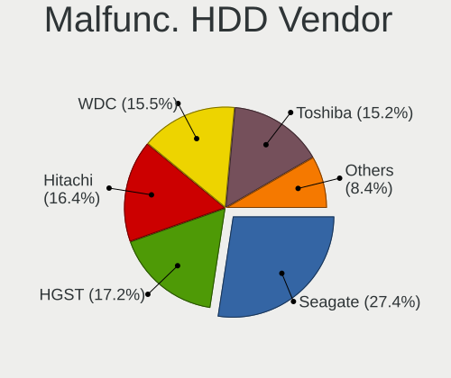

| Vendor              | Notebooks | Drives | Percent |
|---------------------|-----------|--------|---------|
| Seagate             | 177       | 300    | 27.4%   |
| HGST                | 111       | 189    | 17.18%  |
| Hitachi             | 106       | 163    | 16.41%  |
| WDC                 | 100       | 174    | 15.48%  |
| Toshiba             | 98        | 144    | 15.17%  |
| Samsung Electronics | 25        | 38     | 3.87%   |
| Fujitsu             | 24        | 36     | 3.72%   |
| MARSHAL             | 1         | 1      | 0.15%   |
| Initio              | 1         | 2      | 0.15%   |
| ICY BOX             | 1         | 1      | 0.15%   |
| IBM/Hitachi         | 1         | 1      | 0.15%   |
| CSD                 | 1         | 2      | 0.15%   |

Malfunc. Drive Kind
-------------------

Kinds of faulty drives

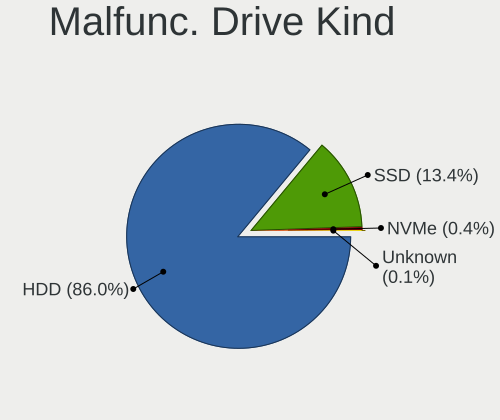

| Kind    | Notebooks | Drives | Percent |
|---------|-----------|--------|---------|
| HDD     | 622       | 1051   | 86.03%  |
| SSD     | 97        | 191    | 13.42%  |
| NVMe    | 3         | 4      | 0.41%   |
| Unknown | 1         | 1      | 0.14%   |

Failed Drives
-------------

Failed drive models

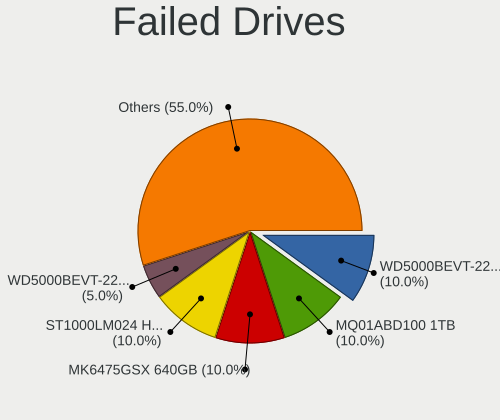

| Model                              | Notebooks | Drives | Percent |
|------------------------------------|-----------|--------|---------|
| WDC WD5000BEVT-22ZAT0 500GB        | 2         | 2      | 8.7%    |
| Toshiba MQ01ABD100 1TB             | 2         | 2      | 8.7%    |
| Toshiba MK6475GSX 640GB            | 2         | 2      | 8.7%    |
| Seagate ST1000LM024 HN-M101MBB 1TB | 2         | 2      | 8.7%    |
| WDC WD5000BEVT-22A0RT0 500GB       | 1         | 7      | 4.35%   |
| WDC WD3200BVVT-63A26Y0 320GB       | 1         | 1      | 4.35%   |
| WDC WD3200BPVT-24JJ5T0 320GB       | 1         | 1      | 4.35%   |
| WDC WD3200BEVT-08A23T1 320GB       | 1         | 1      | 4.35%   |
| WDC WD2500LPCX-24C6HT0 250GB       | 1         | 1      | 4.35%   |
| WDC WD1600BEVT-22ZCT0 160GB        | 1         | 1      | 4.35%   |
| Toshiba MQ01ABD050V 500GB          | 1         | 1      | 4.35%   |
| Toshiba MK5055GSX 500GB            | 1         | 1      | 4.35%   |
| Toshiba MK3275GSX 320GB            | 1         | 1      | 4.35%   |
| Toshiba MK1665GSX 160GB            | 1         | 1      | 4.35%   |
| Toshiba MK1646GSX 160GB            | 1         | 1      | 4.35%   |
| Seagate ST9320325AS 320GB          | 1         | 1      | 4.35%   |
| Samsung Electronics SSD 980 500GB  | 1         | 1      | 4.35%   |
| Samsung Electronics HM060HI 64GB   | 1         | 1      | 4.35%   |
| Intel SSDPEKKW256G7 256GB          | 1         | 1      | 4.35%   |

Failed Drive Vendor
-------------------

Failed drive vendors

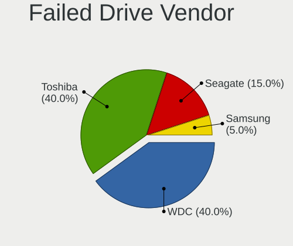

| Vendor              | Notebooks | Drives | Percent |
|---------------------|-----------|--------|---------|
| Toshiba             | 9         | 9      | 39.13%  |
| WDC                 | 8         | 14     | 34.78%  |
| Seagate             | 3         | 3      | 13.04%  |
| Samsung Electronics | 2         | 2      | 8.7%    |
| Intel               | 1         | 1      | 4.35%   |

Drive Status
------------

Number of failed and malfunc. drives

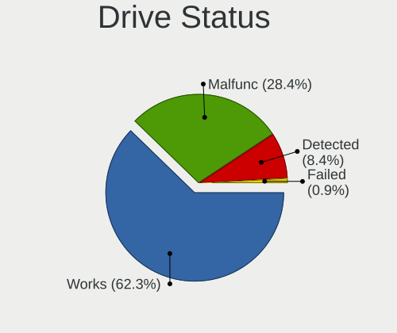

| Status   | Notebooks | Drives | Percent |
|----------|-----------|--------|---------|
| Works    | 1561      | 3161   | 62.27%  |
| Malfunc  | 713       | 1247   | 28.44%  |
| Detected | 210       | 358    | 8.38%   |
| Failed   | 23        | 29     | 0.92%   |

Storage controller
------------------

Storage Vendor
--------------

Storage controller vendors

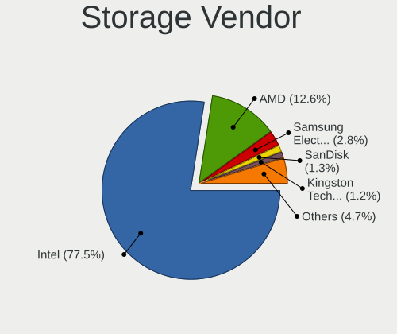

| Vendor                           | Notebooks | Percent |
|----------------------------------|-----------|---------|
| Intel                            | 1814      | 77.46%  |
| AMD                              | 296       | 12.64%  |
| Samsung Electronics              | 65        | 2.78%   |
| SanDisk                          | 30        | 1.28%   |
| Kingston Technology Company      | 27        | 1.15%   |
| Nvidia                           | 21        | 0.9%    |
| SK hynix                         | 18        | 0.77%   |
| Toshiba America Info Systems     | 15        | 0.64%   |
| Micron Technology                | 10        | 0.43%   |
| Solid State Storage Technology   | 9         | 0.38%   |
| VIA Technologies                 | 6         | 0.26%   |
| KIOXIA                           | 6         | 0.26%   |
| JMicron Technology               | 4         | 0.17%   |
| Silicon Integrated Systems [SiS] | 3         | 0.13%   |
| Realtek Semiconductor            | 3         | 0.13%   |
| Phison Electronics               | 3         | 0.13%   |
| MAXIO Technology (Hangzhou)      | 3         | 0.13%   |
| Lite-On Technology               | 3         | 0.13%   |
| Silicon Image                    | 2         | 0.09%   |
| ADATA Technology                 | 2         | 0.09%   |
| Silicon Motion                   | 1         | 0.04%   |
| O2 Micro                         | 1         | 0.04%   |

Storage Model
-------------

Storage controller models

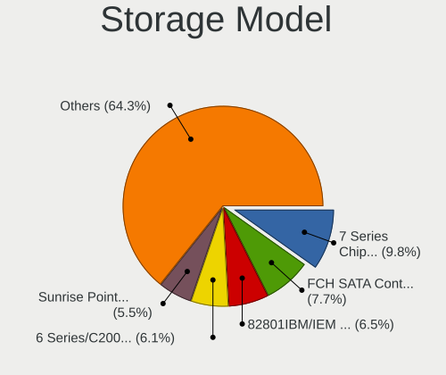

| Model                                                                                  | Notebooks | Percent |
|----------------------------------------------------------------------------------------|-----------|---------|
| Intel 7 Series Chipset Family 6-port SATA Controller [AHCI mode]                       | 260       | 9.82%   |
| AMD FCH SATA Controller [AHCI mode]                                                    | 205       | 7.74%   |
| Intel 82801IBM/IEM (ICH9M/ICH9M-E) 4 port SATA Controller [AHCI mode]                  | 173       | 6.54%   |
| Intel 6 Series/C200 Series Chipset Family 6 port Mobile SATA AHCI Controller           | 162       | 6.12%   |
| Intel Sunrise Point-LP SATA Controller [AHCI mode]                                     | 146       | 5.52%   |
| Intel 82801 Mobile SATA Controller [RAID mode]                                         | 124       | 4.68%   |
| Intel 8 Series SATA Controller 1 [AHCI mode]                                           | 108       | 4.08%   |
| Intel 82801HM/HEM (ICH8M/ICH8M-E) IDE Controller                                       | 95        | 3.59%   |
| Intel 5 Series/3400 Series Chipset 4 port SATA AHCI Controller                         | 92        | 3.48%   |
| Intel Wildcat Point-LP SATA Controller [AHCI Mode]                                     | 83        | 3.14%   |
| Intel 82801HM/HEM (ICH8M/ICH8M-E) SATA Controller [AHCI mode]                          | 80        | 3.02%   |
| Intel 5 Series/3400 Series Chipset 6 port SATA AHCI Controller                         | 65        | 2.46%   |
| AMD SB7x0/SB8x0/SB9x0 SATA Controller [AHCI mode]                                      | 60        | 2.27%   |
| Intel Atom Processor E3800 Series SATA AHCI Controller                                 | 54        | 2.04%   |
| Intel Atom/Celeron/Pentium Processor x5-E8000/J3xxx/N3xxx Series SATA Controller       | 53        | 2%      |
| Intel 8 Series/C220 Series Chipset Family 6-port SATA Controller 1 [AHCI mode]         | 53        | 2%      |
| Intel 82801G (ICH7 Family) IDE Controller                                              | 36        | 1.36%   |
| Intel NM10/ICH7 Family SATA Controller [AHCI mode]                                     | 35        | 1.32%   |
| Intel 82801GBM/GHM (ICH7-M Family) SATA Controller [IDE mode]                          | 35        | 1.32%   |
| Intel 82801IBM/IEM (ICH9M/ICH9M-E) 2 port SATA Controller [IDE mode]                   | 34        | 1.28%   |
| Intel 82801GBM/GHM (ICH7-M Family) SATA Controller [AHCI mode]                         | 33        | 1.25%   |
| Samsung NVMe SSD Controller SM981/PM981/PM983                                          | 26        | 0.98%   |
| Intel HM170/QM170 Chipset SATA Controller [AHCI Mode]                                  | 26        | 0.98%   |
| Intel Celeron N3350/Pentium N4200/Atom E3900 Series SATA AHCI Controller               | 23        | 0.87%   |
| Intel 82801HM/HEM (ICH8M/ICH8M-E) SATA Controller [IDE mode]                           | 23        | 0.87%   |
| Intel Volume Management Device NVMe RAID Controller                                    | 22        | 0.83%   |
| Intel Celeron/Pentium Silver Processor SATA Controller                                 | 21        | 0.79%   |
| Intel Cannon Lake Mobile PCH SATA AHCI Controller                                      | 21        | 0.79%   |
| Samsung NVMe SSD Controller 980 (DRAM-less)                                            | 19        | 0.72%   |
| Intel 5 Series/3400 Series Chipset 4 port SATA IDE Controller                          | 19        | 0.72%   |
| Intel 5 Series/3400 Series Chipset 2 port SATA IDE Controller                          | 19        | 0.72%   |
| AMD SB7x0/SB8x0/SB9x0 IDE Controller                                                   | 15        | 0.57%   |
| AMD FCH SATA Controller [IDE mode]                                                     | 15        | 0.57%   |
| Nvidia MCP79 AHCI Controller                                                           | 14        | 0.53%   |
| Intel Mobile 4 Series Chipset PT IDER Controller                                       | 14        | 0.53%   |
| Intel NM10/ICH7 Family SATA Controller [IDE mode]                                      | 13        | 0.49%   |
| Intel 7 Series Chipset Family 4-port SATA Controller [IDE mode]                        | 13        | 0.49%   |
| Intel 7 Series Chipset Family 2-port SATA Controller [IDE mode]                        | 13        | 0.49%   |
| SK hynix Platinum P41/PC801 NVMe Solid State Drive                                     | 11        | 0.42%   |
| Intel 6 Series/C200 Series Chipset Family Mobile SATA Controller (IDE mode, ports 0-3) | 11        | 0.42%   |

Storage Kind
------------

Kind of storage controller (IDE, SATA, NVMe, SAS, ...)

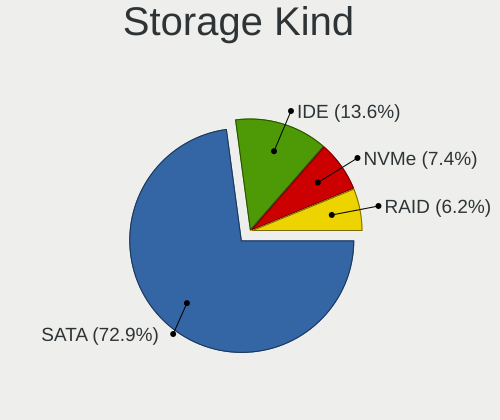

| Kind | Notebooks | Percent |
|------|-----------|---------|
| SATA | 1843      | 72.87%  |
| IDE  | 343       | 13.56%  |
| NVMe | 187       | 7.39%   |
| RAID | 156       | 6.17%   |

Processor
---------

CPU Vendor
----------

Processor vendors

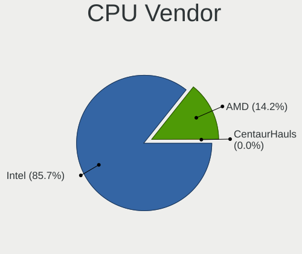

| Vendor       | Notebooks | Percent |
|--------------|-----------|---------|
| Intel        | 1895      | 85.71%  |
| AMD          | 315       | 14.25%  |
| CentaurHauls | 1         | 0.05%   |

CPU Model
---------

Processor models

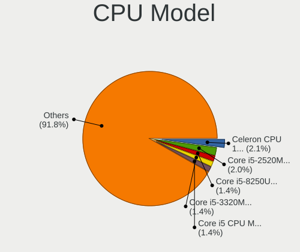

| Model                                       | Notebooks | Percent |
|---------------------------------------------|-----------|---------|
| Intel Celeron CPU 1000M @ 1.80GHz           | 46        | 2.07%   |
| Intel Core i5-2520M CPU @ 2.50GHz           | 45        | 2.03%   |
| Intel Core i5-8250U CPU @ 1.60GHz           | 31        | 1.4%    |
| Intel Core i5-3320M CPU @ 2.60GHz           | 30        | 1.35%   |
| Intel Core i5 CPU M 520 @ 2.40GHz           | 30        | 1.35%   |
| Intel Core i5-7200U CPU @ 2.50GHz           | 29        | 1.31%   |
| Intel Core i3-5005U CPU @ 2.00GHz           | 29        | 1.31%   |
| Intel Core i5-3210M CPU @ 2.50GHz           | 25        | 1.13%   |
| Intel Core 2 Duo CPU P8600 @ 2.40GHz        | 23        | 1.04%   |
| Intel Celeron CPU N3060 @ 1.60GHz           | 23        | 1.04%   |
| Intel Pentium Dual-Core CPU T4400 @ 2.20GHz | 22        | 0.99%   |
| Intel Core i3-6006U CPU @ 2.00GHz           | 22        | 0.99%   |
| Intel Celeron CPU N2840 @ 2.16GHz           | 21        | 0.95%   |
| Intel Core 2 Duo CPU P8400 @ 2.26GHz        | 20        | 0.9%    |
| Intel Pentium Dual-Core CPU T4500 @ 2.30GHz | 19        | 0.86%   |
| Intel Core i3-3217U CPU @ 1.80GHz           | 19        | 0.86%   |
| Intel Core i3-2310M CPU @ 2.10GHz           | 19        | 0.86%   |
| Intel Core i7-4510U CPU @ 2.00GHz           | 18        | 0.81%   |
| Intel Core i5-5200U CPU @ 2.20GHz           | 18        | 0.81%   |
| AMD A10-5750M APU with Radeon HD Graphics   | 18        | 0.81%   |
| Intel Core i5-6200U CPU @ 2.30GHz           | 17        | 0.77%   |
| Intel Core i5-2540M CPU @ 2.60GHz           | 17        | 0.77%   |
| Intel Core i3-7020U CPU @ 2.30GHz           | 17        | 0.77%   |
| Intel Core 2 CPU T5500 @ 1.66GHz            | 17        | 0.77%   |
| Intel Atom CPU N455 @ 1.66GHz               | 17        | 0.77%   |
| Intel Atom CPU N450 @ 1.66GHz               | 17        | 0.77%   |
| Intel Core i5-4210U CPU @ 1.70GHz           | 16        | 0.72%   |
| Intel Core i5-3230M CPU @ 2.60GHz           | 16        | 0.72%   |
| Intel Core i3 CPU M 350 @ 2.27GHz           | 16        | 0.72%   |
| Intel Core 2 Duo CPU T7500 @ 2.20GHz        | 16        | 0.72%   |
| Intel Core i5-5300U CPU @ 2.30GHz           | 15        | 0.68%   |
| Intel Core i5 CPU M 560 @ 2.67GHz           | 15        | 0.68%   |
| Intel Core i5 CPU M 540 @ 2.53GHz           | 15        | 0.68%   |
| Intel Core i3-2350M CPU @ 2.30GHz           | 15        | 0.68%   |
| Intel Core i3 CPU M 370 @ 2.40GHz           | 15        | 0.68%   |
| Intel Celeron CPU N3350 @ 1.10GHz           | 15        | 0.68%   |
| Intel Core i3 CPU M 380 @ 2.53GHz           | 14        | 0.63%   |
| Intel Core 2 Duo CPU P8700 @ 2.53GHz        | 14        | 0.63%   |
| Intel Core i5-4200U CPU @ 1.60GHz           | 13        | 0.59%   |
| Intel Core i5-3340M CPU @ 2.70GHz           | 13        | 0.59%   |

CPU Model Family
----------------

Processor model prefix

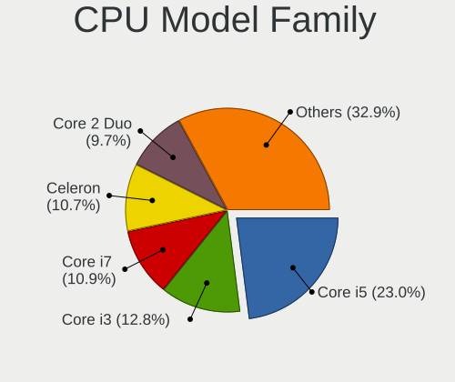

| Model                   | Notebooks | Percent |
|-------------------------|-----------|---------|
| Intel Core i5           | 510       | 22.99%  |
| Intel Core i3           | 284       | 12.8%   |
| Intel Core i7           | 241       | 10.87%  |
| Intel Celeron           | 238       | 10.73%  |
| Intel Core 2 Duo        | 215       | 9.69%   |
| Intel Pentium           | 107       | 4.82%   |
| Intel Atom              | 81        | 3.65%   |
| Intel Pentium Dual-Core | 60        | 2.71%   |
| Other                   | 42        | 1.89%   |
| Intel Core 2            | 37        | 1.67%   |
| AMD A4                  | 35        | 1.58%   |
| AMD A8                  | 33        | 1.49%   |
| AMD A10                 | 29        | 1.31%   |
| AMD E                   | 28        | 1.26%   |
| AMD A6                  | 28        | 1.26%   |
| AMD Ryzen 5             | 24        | 1.08%   |
| Intel Pentium Dual      | 23        | 1.04%   |
| AMD E1                  | 22        | 0.99%   |
| AMD E2                  | 20        | 0.9%    |
| Intel Genuine           | 15        | 0.68%   |
| Intel Celeron Dual-Core | 13        | 0.59%   |
| Intel Celeron M         | 10        | 0.45%   |
| AMD Ryzen 3             | 9         | 0.41%   |
| Intel Pentium Silver    | 8         | 0.36%   |
| Intel Pentium M         | 7         | 0.32%   |
| Intel Core Duo          | 7         | 0.32%   |
| AMD Turion 64 X2 Mobile | 7         | 0.32%   |
| AMD C-60                | 7         | 0.32%   |
| AMD Athlon II           | 7         | 0.32%   |
| Intel Core i9           | 6         | 0.27%   |
| AMD C-50                | 6         | 0.27%   |
| AMD Athlon II Dual-Core | 6         | 0.27%   |
| AMD Ryzen 7             | 5         | 0.23%   |
| AMD Ryzen 5 PRO         | 5         | 0.23%   |
| AMD FX                  | 5         | 0.23%   |
| AMD V140                | 4         | 0.18%   |
| AMD Mobile Sempron      | 4         | 0.18%   |
| AMD Athlon X2           | 4         | 0.18%   |
| AMD C-70                | 3         | 0.14%   |
| AMD A12                 | 3         | 0.14%   |

CPU Cores
---------

Number of processor cores

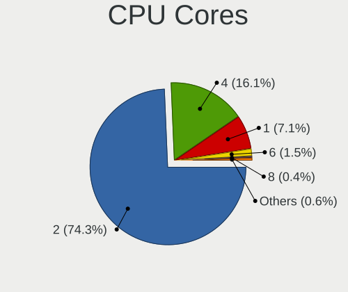

| Number | Notebooks | Percent |
|--------|-----------|---------|
| 2      | 1651      | 74.34%  |
| 4      | 358       | 16.12%  |
| 1      | 157       | 7.07%   |
| 6      | 34        | 1.53%   |
| 8      | 8         | 0.36%   |
| 24     | 6         | 0.27%   |
| 16     | 4         | 0.18%   |
| 10     | 3         | 0.14%   |

CPU Sockets
-----------

Number of sockets

| Number | Notebooks | Percent |
|--------|-----------|---------|
| 1      | 2211      | 100%    |

CPU Threads
-----------

Threads per core (Hyper-Threading)

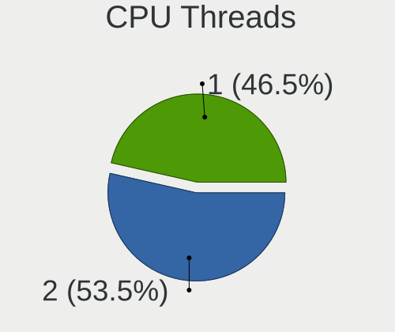

| Number | Notebooks | Percent |
|--------|-----------|---------|
| 2      | 1192      | 53.52%  |
| 1      | 1035      | 46.48%  |

CPU Op-Modes
------------

CPU Operation Modes (32-bit, 64-bit)

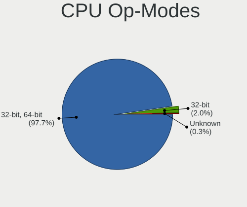

| Op mode        | Notebooks | Percent |
|----------------|-----------|---------|
| 32-bit, 64-bit | 2162      | 97.7%   |
| 32-bit         | 45        | 2.03%   |
| Unknown        | 6         | 0.27%   |

CPU Microcode
-------------

Microcode number

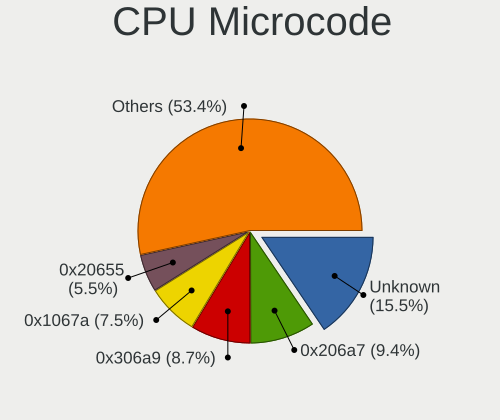

| Number     | Notebooks | Percent |
|------------|-----------|---------|
| Unknown    | 360       | 15.54%  |
| 0x206a7    | 218       | 9.41%   |
| 0x306a9    | 201       | 8.68%   |
| 0x1067a    | 173       | 7.47%   |
| 0x20655    | 127       | 5.48%   |
| 0x40651    | 93        | 4.01%   |
| 0x6fd      | 72        | 3.11%   |
| 0x306d4    | 67        | 2.89%   |
| 0x406e3    | 59        | 2.55%   |
| 0x306c3    | 55        | 2.37%   |
| 0x406c4    | 51        | 2.2%    |
| 0x10676    | 51        | 2.2%    |
| 0x806e9    | 47        | 2.03%   |
| 0x30678    | 45        | 1.94%   |
| 0x20652    | 45        | 1.94%   |
| 0x106ca    | 44        | 1.9%    |
| 0x05000119 | 38        | 1.64%   |
| 0x806ea    | 34        | 1.47%   |
| 0x07030105 | 33        | 1.42%   |
| 0x06001119 | 32        | 1.38%   |
| 0x6f6      | 23        | 0.99%   |
| 0x406c3    | 22        | 0.95%   |
| 0x0700010f | 21        | 0.91%   |
| 0x6fb      | 19        | 0.82%   |
| 0x506c9    | 18        | 0.78%   |
| 0x106c2    | 17        | 0.73%   |
| 0x906ea    | 16        | 0.69%   |
| 0x6f2      | 16        | 0.69%   |
| 0x06006705 | 16        | 0.69%   |
| 0x706a1    | 15        | 0.65%   |
| 0x506e3    | 15        | 0.65%   |
| 0x05000029 | 15        | 0.65%   |
| 0x806ec    | 14        | 0.6%    |
| 0x10661    | 13        | 0.56%   |
| 0x906e9    | 11        | 0.47%   |
| 0x010000c8 | 11        | 0.47%   |
| 0x806c1    | 10        | 0.43%   |
| 0x6ec      | 10        | 0.43%   |
| 0x30673    | 9         | 0.39%   |
| 0x06003106 | 9         | 0.39%   |

CPU Microarch
-------------

Microarchitecture

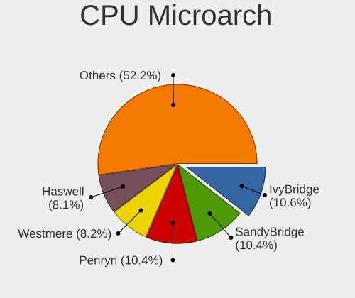

| Name             | Notebooks | Percent |
|------------------|-----------|---------|
| IvyBridge        | 234       | 10.58%  |
| SandyBridge      | 231       | 10.45%  |
| Penryn           | 231       | 10.45%  |
| Westmere         | 182       | 8.23%   |
| Haswell          | 178       | 8.05%   |
| KabyLake         | 167       | 7.55%   |
| Core             | 151       | 6.83%   |
| Silvermont       | 136       | 6.15%   |
| Skylake          | 95        | 4.3%    |
| Broadwell        | 93        | 4.21%   |
| Bonnell          | 64        | 2.89%   |
| Bobcat           | 64        | 2.89%   |
| Puma             | 47        | 2.13%   |
| Piledriver       | 36        | 1.63%   |
| Excavator        | 32        | 1.45%   |
| P6               | 27        | 1.22%   |
| Jaguar           | 25        | 1.13%   |
| Goldmont         | 23        | 1.04%   |
| Goldmont plus    | 22        | 1%      |
| K10              | 21        | 0.95%   |
| TigerLake        | 20        | 0.9%    |
| K8 Hammer        | 17        | 0.77%   |
| Unknown          | 17        | 0.77%   |
| Alderlake Hybrid | 15        | 0.68%   |
| Zen              | 12        | 0.54%   |
| Zen 2            | 11        | 0.5%    |
| Steamroller      | 11        | 0.5%    |
| Zen+             | 10        | 0.45%   |
| K10 Llano        | 10        | 0.45%   |
| Nehalem          | 7         | 0.32%   |
| K8 & K10 hybrid  | 7         | 0.32%   |
| IceLake          | 5         | 0.23%   |
| CometLake        | 5         | 0.23%   |
| Gracemont        | 3         | 0.14%   |
| Zen 3            | 2         | 0.09%   |

Graphics
--------

GPU Vendor
----------

Vendors of graphics cards

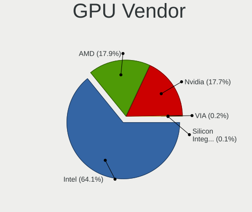

| Vendor                           | Notebooks | Percent |
|----------------------------------|-----------|---------|
| Intel                            | 1688      | 64.13%  |
| AMD                              | 470       | 17.86%  |
| Nvidia                           | 466       | 17.71%  |
| VIA Technologies                 | 6         | 0.23%   |
| Silicon Integrated Systems [SiS] | 2         | 0.08%   |

GPU Model
---------

Graphics card models

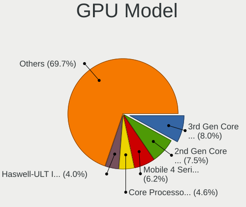

| Model                                                                                    | Notebooks | Percent |
|------------------------------------------------------------------------------------------|-----------|---------|
| Intel 3rd Gen Core processor Graphics Controller                                         | 226       | 8.01%   |
| Intel 2nd Generation Core Processor Family Integrated Graphics Controller                | 211       | 7.48%   |
| Intel Mobile 4 Series Chipset Integrated Graphics Controller                             | 174       | 6.17%   |
| Intel Core Processor Integrated Graphics Controller                                      | 129       | 4.57%   |
| Intel Haswell-ULT Integrated Graphics Controller                                         | 114       | 4.04%   |
| Intel Broadwell-U GT2 [HD Graphics 5500]                                                 | 84        | 2.98%   |
| Intel Atom/Celeron/Pentium Processor x5-E8000/J3xxx/N3xxx Integrated Graphics Controller | 76        | 2.69%   |
| Intel Mobile GM965/GL960 Integrated Graphics Controller (secondary)                      | 68        | 2.41%   |
| Intel Mobile GM965/GL960 Integrated Graphics Controller (primary)                        | 68        | 2.41%   |
| Intel Skylake-U GT2 [HD Graphics 520]                                                    | 66        | 2.34%   |
| Intel Mobile 945GM/GMS/GME, 943/940GML Express Integrated Graphics Controller            | 66        | 2.34%   |
| Intel Atom Processor Z36xxx/Z37xxx Series Graphics & Display                             | 60        | 2.13%   |
| Intel 4th Gen Core Processor Integrated Graphics Controller                              | 56        | 1.98%   |
| Intel Mobile 945GM/GMS, 943/940GML Express Integrated Graphics Controller                | 48        | 1.7%    |
| Intel Kaby Lake-U GT2 [HD Graphics 620]                                                  | 47        | 1.67%   |
| Intel Atom Processor D4xx/D5xx/N4xx/N5xx Integrated Graphics Controller                  | 45        | 1.59%   |
| Intel Kaby Lake-R GT2 [UHD Graphics 620]                                                 | 43        | 1.52%   |
| Nvidia GF117M [GeForce 610M/710M/810M/820M / GT 620M/625M/630M/720M]                     | 38        | 1.35%   |
| AMD Mullins [Radeon R4/R5 Graphics]                                                      | 34        | 1.2%    |
| AMD Seymour [Radeon HD 6400M/7400M Series]                                               | 27        | 0.96%   |
| AMD Topaz XT [Radeon R7 M260/M265 / M340/M360 / M440/M445 / 530/535 / 620/625 Mobile]    | 26        | 0.92%   |
| AMD Sun XT [Radeon HD 8670A/8670M/8690M / R5 M330 / M430 / Radeon 520 Mobile]            | 26        | 0.92%   |
| Nvidia GK208BM [GeForce 920M]                                                            | 25        | 0.89%   |
| AMD Stoney [Radeon R2/R3/R4/R5 Graphics]                                                 | 22        | 0.78%   |
| Intel Apollo Lake GT1 [HD Graphics 500]                                                  | 19        | 0.67%   |
| AMD Park [Mobility Radeon HD 5430/5450/5470]                                             | 19        | 0.67%   |
| Intel Mobile 945GSE Express Integrated Graphics Controller                               | 18        | 0.64%   |
| Intel CoffeeLake-H GT2 [UHD Graphics 630]                                                | 18        | 0.64%   |
| AMD Richland [Radeon HD 8650G]                                                           | 18        | 0.64%   |
| Intel Skylake-H GT2 [HD Graphics 530]                                                    | 17        | 0.6%    |
| AMD RS880M [Mobility Radeon HD 4225/4250]                                                | 17        | 0.6%    |
| Nvidia GM107M [GeForce GTX 950M]                                                         | 16        | 0.57%   |
| AMD Wrestler [Radeon HD 6310]                                                            | 16        | 0.57%   |
| AMD RV710/M92 [Mobility Radeon HD 4530/4570/5145/530v/540v/545v]                         | 16        | 0.57%   |
| Nvidia GM108M [GeForce 840M]                                                             | 14        | 0.5%    |
| Nvidia GK107M [GeForce GT 750M]                                                          | 14        | 0.5%    |
| Intel GeminiLake [UHD Graphics 600]                                                      | 14        | 0.5%    |
| Nvidia GP108M [GeForce MX150]                                                            | 13        | 0.46%   |
| Intel WhiskeyLake-U GT2 [UHD Graphics 620]                                               | 12        | 0.43%   |
| Intel TigerLake-LP GT2 [Iris Xe Graphics]                                                | 12        | 0.43%   |

GPU Combo
---------

Combinations of graphics cards

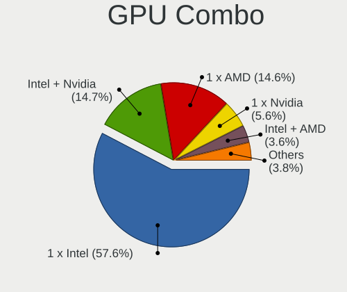

| Name           | Notebooks | Percent |
|----------------|-----------|---------|
| 1 x Intel      | 1278      | 57.65%  |
| Intel + Nvidia | 327       | 14.75%  |
| 1 x AMD        | 323       | 14.57%  |
| 1 x Nvidia     | 125       | 5.64%   |
| Intel + AMD    | 80        | 3.61%   |
| 2 x AMD        | 54        | 2.44%   |
| AMD + Nvidia   | 13        | 0.59%   |
| 2 x Intel      | 8         | 0.36%   |
| 1 x VIA        | 6         | 0.27%   |
| 1 x SiS        | 2         | 0.09%   |
| 2 x Nvidia     | 1         | 0.05%   |

GPU Driver
----------

Free vs proprietary

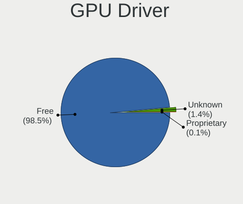

| Driver      | Notebooks | Percent |
|-------------|-----------|---------|
| Free        | 2183      | 98.51%  |
| Unknown     | 31        | 1.4%    |
| Proprietary | 2         | 0.09%   |

GPU Memory
----------

Total video memory

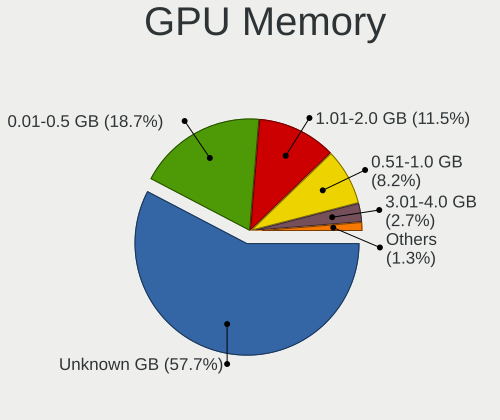

| Size in GB | Notebooks | Percent |
|------------|-----------|---------|
| Unknown    | 1308      | 57.67%  |
| 0.01-0.5   | 423       | 18.65%  |
| 1.01-2.0   | 260       | 11.46%  |
| 0.51-1.0   | 186       | 8.2%    |
| 3.01-4.0   | 62        | 2.73%   |
| 5.01-6.0   | 13        | 0.57%   |
| 7.01-8.0   | 10        | 0.44%   |
| 2.01-3.0   | 6         | 0.26%   |

Monitor
-------

Monitor Vendor
--------------

Monitor vendors

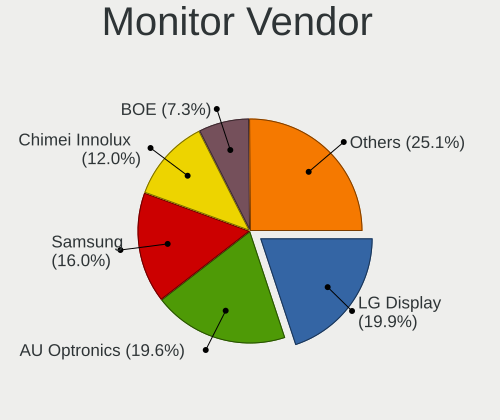

| Vendor                  | Notebooks | Percent |
|-------------------------|-----------|---------|
| LG Display              | 467       | 19.92%  |
| AU Optronics            | 459       | 19.58%  |
| Samsung Electronics     | 376       | 16.04%  |
| Chimei Innolux          | 281       | 11.99%  |
| BOE                     | 172       | 7.34%   |
| Chi Mei Optoelectronics | 131       | 5.59%   |
| Lenovo                  | 76        | 3.24%   |
| LG Philips              | 37        | 1.58%   |
| Goldstar                | 31        | 1.32%   |
| InfoVision              | 27        | 1.15%   |
| Apple                   | 24        | 1.02%   |
| PANDA                   | 21        | 0.9%    |
| Hewlett-Packard         | 18        | 0.77%   |
| Dell                    | 18        | 0.77%   |
| CPT                     | 18        | 0.77%   |
| Philips                 | 15        | 0.64%   |
| HannStar                | 15        | 0.64%   |
| Sony                    | 13        | 0.55%   |
| Toshiba                 | 11        | 0.47%   |
| Ancor Communications    | 11        | 0.47%   |
| Acer                    | 11        | 0.47%   |
| Quanta Display          | 10        | 0.43%   |
| InnoLux Display         | 10        | 0.43%   |
| Vestel Elektronik       | 9         | 0.38%   |
| Sharp                   | 8         | 0.34%   |
| BenQ                    | 8         | 0.34%   |
| AOC                     | 8         | 0.34%   |
| Fujitsu Siemens         | 7         | 0.3%    |
| ASUSTek Computer        | 5         | 0.21%   |
| Xerox                   | 3         | 0.13%   |
| Panasonic               | 3         | 0.13%   |
| IBM                     | 3         | 0.13%   |
| Hitachi                 | 3         | 0.13%   |
| Unknown (XXX)           | 2         | 0.09%   |
| Unknown                 | 2         | 0.09%   |
| SKY                     | 2         | 0.09%   |
| Plain Tree Systems      | 2         | 0.09%   |
| OEM                     | 2         | 0.09%   |
| NEC Computers           | 2         | 0.09%   |
| MiTAC                   | 2         | 0.09%   |

Monitor Model
-------------

Monitor models

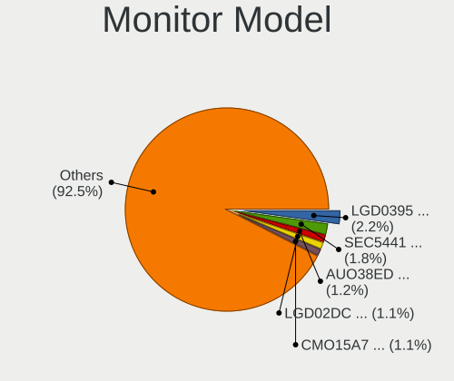

| Model                                                                    | Notebooks | Percent |
|--------------------------------------------------------------------------|-----------|---------|
| LG Display LCD Monitor LGD0395 1366x768 344x194mm 15.5-inch              | 52        | 2.19%   |
| Samsung Electronics LCD Monitor SEC5441 1280x800 331x207mm 15.4-inch     | 43        | 1.81%   |
| AU Optronics LCD Monitor AUO38ED 1920x1080 344x193mm 15.5-inch           | 29        | 1.22%   |
| LG Display LCD Monitor LGD02DC 1366x768 344x194mm 15.5-inch              | 27        | 1.14%   |
| Chi Mei Optoelectronics LCD Monitor CMO15A7 1366x768 344x193mm 15.5-inch | 27        | 1.14%   |
| AU Optronics LCD Monitor AUO22EC 1366x768 344x193mm 15.5-inch            | 27        | 1.14%   |
| BOE LCD Monitor BOE06A5 1366x768 344x194mm 15.5-inch                     | 24        | 1.01%   |
| Chimei Innolux LCD Monitor CMN15DB 1366x768 344x193mm 15.5-inch          | 19        | 0.8%    |
| AU Optronics LCD Monitor AUO26EC 1366x768 344x193mm 15.5-inch            | 19        | 0.8%    |
| Chimei Innolux LCD Monitor CMN15D5 1920x1080 344x193mm 15.5-inch         | 18        | 0.76%   |
| LG Display LCD Monitor LGD033A 1366x768 344x194mm 15.5-inch              | 17        | 0.72%   |
| Chi Mei Optoelectronics LCD Monitor CMO1592 1366x768 344x193mm 15.5-inch | 17        | 0.72%   |
| AU Optronics LCD Monitor AUO10EC 1366x768 344x193mm 15.5-inch            | 16        | 0.67%   |
| LG Display LP156WH2-TLAA LGD0230 1366x768 344x194mm 15.5-inch            | 15        | 0.63%   |
| Chimei Innolux LCD Monitor CMN15CA 1366x768 344x193mm 15.5-inch          | 14        | 0.59%   |
| BOE LCD Monitor BOE0675 1366x768 344x194mm 15.5-inch                     | 13        | 0.55%   |
| AU Optronics LCD Monitor AUO23EC 1366x768 344x193mm 15.5-inch            | 13        | 0.55%   |
| Chimei Innolux LCD Monitor CMN15BC 1366x768 344x193mm 15.5-inch          | 12        | 0.51%   |
| BOE LCD Monitor BOE0672 1366x768 344x194mm 15.5-inch                     | 12        | 0.51%   |
| AU Optronics LCD Monitor AUO106C 1366x768 276x155mm 12.5-inch            | 12        | 0.51%   |
| LG Display LCD Monitor LGD0365 1600x900 382x215mm 17.3-inch              | 11        | 0.46%   |
| Lenovo LCD Monitor LEN4036 1440x900 303x190mm 14.1-inch                  | 11        | 0.46%   |
| Chimei Innolux LCD Monitor CMN15BF 1366x768 344x194mm 15.5-inch          | 11        | 0.46%   |
| Chimei Innolux LCD Monitor CMN15AB 1366x768 344x193mm 15.5-inch          | 11        | 0.46%   |
| Chimei Innolux LCD Monitor CMN1119 1366x768 256x144mm 11.6-inch          | 11        | 0.46%   |
| Chi Mei Optoelectronics LCD Monitor CMO15A1 1366x768 344x193mm 15.5-inch | 11        | 0.46%   |
| AU Optronics LCD Monitor AUO46EC 1366x768 344x193mm 15.5-inch            | 11        | 0.46%   |
| AU Optronics LCD Monitor AUO313C 1366x768 309x173mm 13.9-inch            | 11        | 0.46%   |
| AU Optronics LCD Monitor AUO21ED 1920x1080 344x193mm 15.5-inch           | 11        | 0.46%   |
| AU Optronics LCD Monitor AUO20EC 1366x768 344x193mm 15.5-inch            | 11        | 0.46%   |
| Samsung Electronics LCD Monitor SEC325A 1366x768 344x194mm 15.5-inch     | 10        | 0.42%   |
| Samsung Electronics LCD Monitor SEC3245 1366x768 340x190mm 15.3-inch     | 10        | 0.42%   |
| LG Display LCD Monitor LGD03AB 1366x768 344x194mm 15.5-inch              | 10        | 0.42%   |
| Chimei Innolux LCD Monitor CMN1734 1600x900 382x214mm 17.2-inch          | 10        | 0.42%   |
| BOE LCD Monitor BOE0687 1920x1080 344x193mm 15.5-inch                    | 10        | 0.42%   |
| AU Optronics LCD Monitor AUO159E 1600x900 382x214mm 17.2-inch            | 10        | 0.42%   |
| Vestel Elektronik 40UHD_LCD_TV VES3700 3840x2160 880x500mm 39.8-inch     | 9         | 0.38%   |
| Samsung Electronics LCD Monitor SEC324A 1366x768 344x194mm 15.5-inch     | 9         | 0.38%   |
| Samsung Electronics LCD Monitor SEC3046 1366x768 344x193mm 15.5-inch     | 9         | 0.38%   |
| LG Display LCD Monitor LGD0335 1366x768 310x174mm 14.0-inch              | 9         | 0.38%   |

Monitor Resolution
------------------

Monitor screen resolution

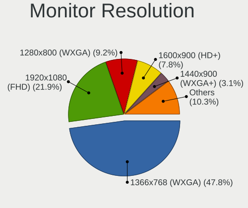

| Resolution         | Notebooks | Percent |
|--------------------|-----------|---------|
| 1366x768 (WXGA)    | 1097      | 47.8%   |
| 1920x1080 (FHD)    | 502       | 21.87%  |
| 1280x800 (WXGA)    | 212       | 9.24%   |
| 1600x900 (HD+)     | 178       | 7.76%   |
| 1440x900 (WXGA+)   | 70        | 3.05%   |
| 1024x600           | 47        | 2.05%   |
| 3840x2160 (4K)     | 43        | 1.87%   |
| 1680x1050 (WSXGA+) | 32        | 1.39%   |
| 1920x1200 (WUXGA)  | 27        | 1.18%   |
| 1280x1024 (SXGA)   | 14        | 0.61%   |
| 1024x768 (XGA)     | 13        | 0.57%   |
| 2560x1600          | 12        | 0.52%   |
| 1360x768           | 10        | 0.44%   |
| 2560x1440 (QHD)    | 7         | 0.31%   |
| 3840x1080          | 6         | 0.26%   |
| 1920x540           | 5         | 0.22%   |
| 2560x1080          | 3         | 0.13%   |
| 2288x1287          | 3         | 0.13%   |
| 1280x720 (HD)      | 3         | 0.13%   |
| 1680x945           | 2         | 0.09%   |
| 1280x768           | 2         | 0.09%   |
| 800x1280           | 1         | 0.04%   |
| 3840x2400          | 1         | 0.04%   |
| 3440x1440          | 1         | 0.04%   |
| 2160x1440          | 1         | 0.04%   |
| 1920x1280          | 1         | 0.04%   |
| 1400x1050          | 1         | 0.04%   |
| 1024x576           | 1         | 0.04%   |

Monitor Diagonal
----------------

Diagonal size in inches

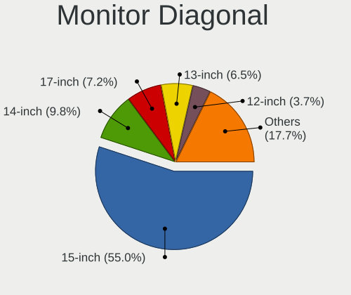

| Inches  | Notebooks | Percent |
|---------|-----------|---------|
| 15      | 1301      | 55.03%  |
| 14      | 231       | 9.77%   |
| 17      | 171       | 7.23%   |
| 13      | 154       | 6.51%   |
| 12      | 88        | 3.72%   |
| 11      | 56        | 2.37%   |
| 10      | 53        | 2.24%   |
| 21      | 44        | 1.86%   |
| 23      | 43        | 1.82%   |
| 27      | 34        | 1.44%   |
| 18      | 31        | 1.31%   |
| 24      | 20        | 0.85%   |
| 22      | 16        | 0.68%   |
| 20      | 13        | 0.55%   |
| 19      | 12        | 0.51%   |
| 84      | 11        | 0.47%   |
| 31      | 9         | 0.38%   |
| 54      | 8         | 0.34%   |
| 16      | 8         | 0.34%   |
| 32      | 6         | 0.25%   |
| 55      | 5         | 0.21%   |
| 48      | 5         | 0.21%   |
| 8       | 5         | 0.21%   |
| Unknown | 5         | 0.21%   |
| 72      | 3         | 0.13%   |
| 63      | 3         | 0.13%   |
| 52      | 3         | 0.13%   |
| 49      | 3         | 0.13%   |
| 40      | 3         | 0.13%   |
| 142     | 2         | 0.08%   |
| 75      | 2         | 0.08%   |
| 65      | 2         | 0.08%   |
| 42      | 2         | 0.08%   |
| 34      | 2         | 0.08%   |
| 29      | 2         | 0.08%   |
| 25      | 2         | 0.08%   |
| 50      | 1         | 0.04%   |
| 39      | 1         | 0.04%   |
| 37      | 1         | 0.04%   |
| 26      | 1         | 0.04%   |

Monitor Width
-------------

Physical width

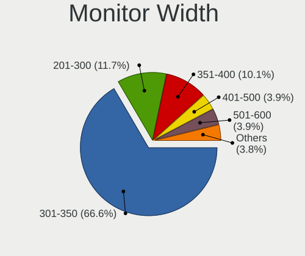

| Width in mm    | Notebooks | Percent |
|----------------|-----------|---------|
| 301-350        | 1562      | 66.58%  |
| 201-300        | 275       | 11.72%  |
| 351-400        | 236       | 10.06%  |
| 401-500        | 92        | 3.92%   |
| 501-600        | 91        | 3.88%   |
| 1001-1500      | 30        | 1.28%   |
| 601-700        | 16        | 0.68%   |
| 1501-2000      | 15        | 0.64%   |
| 701-800        | 8         | 0.34%   |
| 101-200        | 6         | 0.26%   |
| 801-900        | 5         | 0.21%   |
| Unknown        | 5         | 0.21%   |
| More than 2000 | 2         | 0.09%   |
| 901-1000       | 2         | 0.09%   |
| 1-100          | 1         | 0.04%   |

Aspect Ratio
------------

Proportional relationship between the width and the height

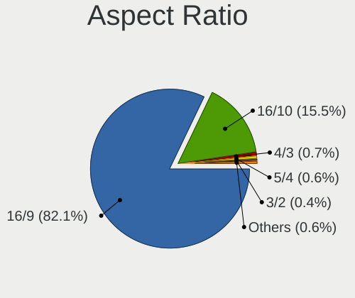

| Ratio   | Notebooks | Percent |
|---------|-----------|---------|
| 16/9    | 1796      | 82.12%  |
| 16/10   | 339       | 15.5%   |
| 4/3     | 15        | 0.69%   |
| 5/4     | 14        | 0.64%   |
| 3/2     | 9         | 0.41%   |
| 32/9    | 6         | 0.27%   |
| 21/9    | 3         | 0.14%   |
| 1.00    | 2         | 0.09%   |
| 0.67    | 1         | 0.05%   |
| 0.62    | 1         | 0.05%   |
| Unknown | 1         | 0.05%   |

Monitor Area
------------

Area in inch²

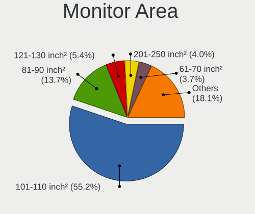

| Area in inch² | Notebooks | Percent |
|----------------|-----------|---------|
| 101-110        | 1299      | 55.18%  |
| 81-90          | 322       | 13.68%  |
| 121-130        | 126       | 5.35%   |
| 201-250        | 95        | 4.04%   |
| 61-70          | 86        | 3.65%   |
| 71-80          | 60        | 2.55%   |
| 51-60          | 56        | 2.38%   |
| 41-50          | 53        | 2.25%   |
| More than 1000 | 40        | 1.7%    |
| 131-140        | 40        | 1.7%    |
| 151-200        | 38        | 1.61%   |
| 141-150        | 38        | 1.61%   |
| 301-350        | 35        | 1.49%   |
| 351-500        | 17        | 0.72%   |
| 501-1000       | 13        | 0.55%   |
| 251-300        | 12        | 0.51%   |
| 91-100         | 8         | 0.34%   |
| 1-40           | 7         | 0.3%    |
| Unknown        | 5         | 0.21%   |
| 111-120        | 4         | 0.17%   |

Pixel Density
-------------

Pixels per inch

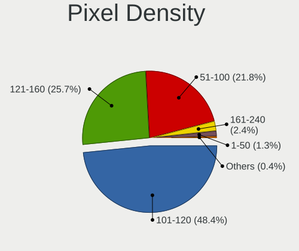

| Density       | Notebooks | Percent |
|---------------|-----------|---------|
| 101-120       | 1121      | 48.38%  |
| 121-160       | 596       | 25.72%  |
| 51-100        | 505       | 21.8%   |
| 161-240       | 55        | 2.37%   |
| 1-50          | 30        | 1.29%   |
| More than 240 | 5         | 0.22%   |
| Unknown       | 5         | 0.22%   |

Multiple Monitors
-----------------

Total monitors connected

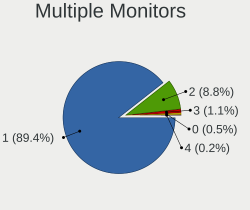

| Total | Notebooks | Percent |
|-------|-----------|---------|
| 1     | 2032      | 89.4%   |
| 2     | 200       | 8.8%    |
| 3     | 24        | 1.06%   |
| 0     | 12        | 0.53%   |
| 4     | 5         | 0.22%   |

Network
-------

Net Controller Vendor
---------------------

Controller vendors

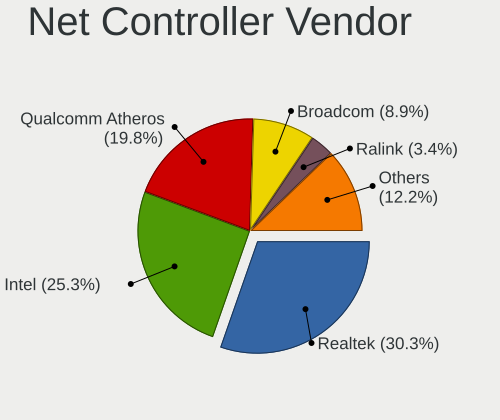

| Vendor                            | Notebooks | Percent |
|-----------------------------------|-----------|---------|
| Realtek Semiconductor             | 1121      | 30.35%  |
| Intel                             | 936       | 25.34%  |
| Qualcomm Atheros                  | 731       | 19.79%  |
| Broadcom                          | 330       | 8.93%   |
| Ralink                            | 126       | 3.41%   |
| Broadcom Limited                  | 99        | 2.68%   |
| Marvell Technology Group          | 73        | 1.98%   |
| Dell                              | 24        | 0.65%   |
| DisplayLink                       | 19        | 0.51%   |
| Ralink Technology                 | 18        | 0.49%   |
| JMicron Technology                | 17        | 0.46%   |
| Ericsson Business Mobile Networks | 17        | 0.46%   |
| Huawei Technologies               | 16        | 0.43%   |
| MediaTek                          | 15        | 0.41%   |
| Hewlett-Packard                   | 15        | 0.41%   |
| Nvidia                            | 14        | 0.38%   |
| Sierra Wireless                   | 13        | 0.35%   |
| Samsung Electronics               | 13        | 0.35%   |
| TP-Link                           | 11        | 0.3%    |
| Xiaomi                            | 9         | 0.24%   |
| Attansic Technology               | 9         | 0.24%   |
| Qualcomm Atheros Communications   | 8         | 0.22%   |
| Shenzhen Goodix Technology        | 6         | 0.16%   |
| VIA Technologies                  | 5         | 0.14%   |
| T & A Mobile Phones               | 5         | 0.14%   |
| QinHeng Electronics               | 5         | 0.14%   |
| ASUSTek Computer                  | 4         | 0.11%   |
| ASIX Electronics                  | 4         | 0.11%   |
| Silicon Integrated Systems [SiS]  | 3         | 0.08%   |
| D-Link                            | 3         | 0.08%   |
| Novatel Wireless                  | 2         | 0.05%   |
| NetGear                           | 2         | 0.05%   |
| LG Electronics                    | 2         | 0.05%   |
| Compal Electronics                | 2         | 0.05%   |
| Belkin Components                 | 2         | 0.05%   |
| AMD                               | 2         | 0.05%   |
| ZTE WCDMA Technologies MSM        | 1         | 0.03%   |
| Toshiba                           | 1         | 0.03%   |
| STMicroelectronics                | 1         | 0.03%   |
| Spreadtrum Communications         | 1         | 0.03%   |

Net Controller Model
--------------------

Controller models

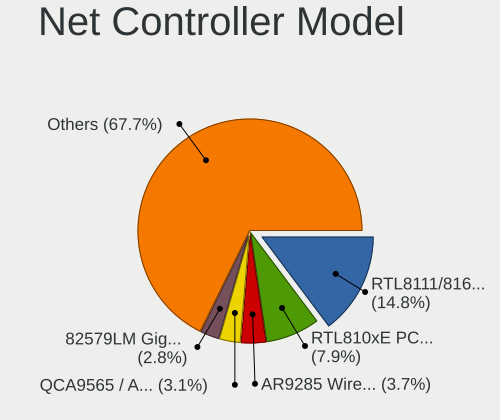

| Model                                                                   | Notebooks | Percent |
|-------------------------------------------------------------------------|-----------|---------|
| Realtek RTL8111/8168/8211/8411 PCI Express Gigabit Ethernet Controller  | 662       | 14.77%  |
| Realtek RTL810xE PCI Express Fast Ethernet controller                   | 354       | 7.9%    |
| Qualcomm Atheros AR9285 Wireless Network Adapter (PCI-Express)          | 165       | 3.68%   |
| Qualcomm Atheros QCA9565 / AR9565 Wireless Network Adapter              | 140       | 3.12%   |
| Intel 82579LM Gigabit Network Connection (Lewisville)                   | 126       | 2.81%   |
| Qualcomm Atheros QCA9377 802.11ac Wireless Network Adapter              | 97        | 2.16%   |
| Qualcomm Atheros AR9485 Wireless Network Adapter                        | 92        | 2.05%   |
| Intel Centrino Advanced-N 6205 [Taylor Peak]                            | 90        | 2.01%   |
| Ralink RT3290 Wireless 802.11n 1T/1R PCIe                               | 85        | 1.9%    |
| Intel Wireless 7260                                                     | 85        | 1.9%    |
| Realtek RTL8723BE PCIe Wireless Network Adapter                         | 75        | 1.67%   |
| Intel PRO/Wireless 3945ABG [Golan] Network Connection                   | 75        | 1.67%   |
| Intel 82577LM Gigabit Network Connection                                | 74        | 1.65%   |
| Broadcom BCM4313 802.11bgn Wireless Network Adapter                     | 64        | 1.43%   |
| Intel Wireless 7265                                                     | 58        | 1.29%   |
| Intel Centrino Advanced-N 6200                                          | 57        | 1.27%   |
| Intel Centrino Ultimate-N 6300                                          | 55        | 1.23%   |
| Qualcomm Atheros AR242x / AR542x Wireless Network Adapter (PCI-Express) | 52        | 1.16%   |
| Intel Wireless 8265 / 8275                                              | 51        | 1.14%   |
| Intel 82567LM Gigabit Network Connection                                | 51        | 1.14%   |
| Intel Wireless 3165                                                     | 43        | 0.96%   |
| Qualcomm Atheros AR8151 v2.0 Gigabit Ethernet                           | 38        | 0.85%   |
| Intel Wireless 3160                                                     | 37        | 0.83%   |
| Intel PRO/Wireless 5100 AGN [Shiloh] Network Connection                 | 37        | 0.83%   |
| Intel PRO/Wireless 4965 AG or AGN [Kedron] Network Connection           | 37        | 0.83%   |
| Intel WiFi Link 5100                                                    | 36        | 0.8%    |
| Broadcom BCM43142 802.11b/g/n                                           | 36        | 0.8%    |
| Qualcomm Atheros AR8132 Fast Ethernet                                   | 35        | 0.78%   |
| Intel Ethernet Connection I218-LM                                       | 31        | 0.69%   |
| Broadcom NetLink BCM57785 Gigabit Ethernet PCIe                         | 31        | 0.69%   |
| Marvell Group 88E8040 PCI-E Fast Ethernet Controller                    | 30        | 0.67%   |
| Realtek RTL8188CE 802.11b/g/n WiFi Adapter                              | 29        | 0.65%   |
| Realtek RTL8821AE 802.11ac PCIe Wireless Network Adapter                | 28        | 0.62%   |
| Qualcomm Atheros AR9462 Wireless Network Adapter                        | 28        | 0.62%   |
| Qualcomm Atheros AR928X Wireless Network Adapter (PCI-Express)          | 27        | 0.6%    |
| Broadcom Limited BCM4312 802.11b/g LP-PHY                               | 26        | 0.58%   |
| Intel Wireless 8260                                                     | 25        | 0.56%   |
| Broadcom BCM4312 802.11b/g LP-PHY                                       | 25        | 0.56%   |
| Realtek RTL8822CE 802.11ac PCIe Wireless Network Adapter                | 24        | 0.54%   |
| Realtek RTL8821CE 802.11ac PCIe Wireless Network Adapter                | 23        | 0.51%   |

Wireless Vendor
---------------

Wireless vendors

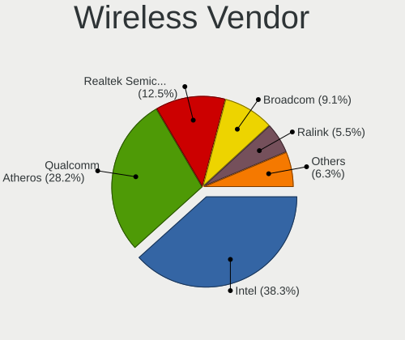

| Vendor                          | Notebooks | Percent |
|---------------------------------|-----------|---------|
| Intel                           | 875       | 38.31%  |
| Qualcomm Atheros                | 645       | 28.24%  |
| Realtek Semiconductor           | 286       | 12.52%  |
| Broadcom                        | 208       | 9.11%   |
| Ralink                          | 126       | 5.52%   |
| Broadcom Limited                | 50        | 2.19%   |
| Ralink Technology               | 18        | 0.79%   |
| Dell                            | 15        | 0.66%   |
| Sierra Wireless                 | 13        | 0.57%   |
| MediaTek                        | 13        | 0.57%   |
| TP-Link                         | 10        | 0.44%   |
| Qualcomm Atheros Communications | 8         | 0.35%   |
| ASUSTek Computer                | 4         | 0.18%   |
| Hewlett-Packard                 | 3         | 0.13%   |
| D-Link                          | 3         | 0.13%   |
| NetGear                         | 2         | 0.09%   |
| Belkin Components               | 2         | 0.09%   |
| Micro Star International        | 1         | 0.04%   |
| Fujitsu Siemens Computers       | 1         | 0.04%   |
| Fibocom                         | 1         | 0.04%   |

Wireless Model
--------------

Wireless models

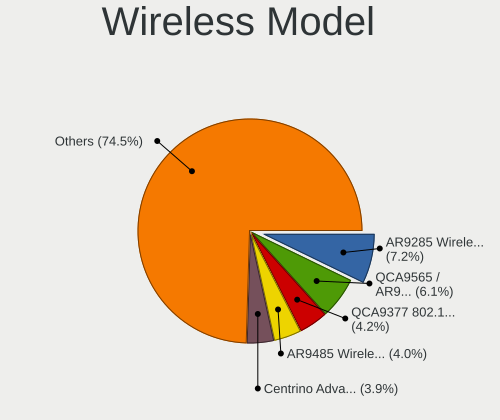

| Model                                                                   | Notebooks | Percent |
|-------------------------------------------------------------------------|-----------|---------|
| Qualcomm Atheros AR9285 Wireless Network Adapter (PCI-Express)          | 165       | 7.2%    |
| Qualcomm Atheros QCA9565 / AR9565 Wireless Network Adapter              | 140       | 6.11%   |
| Qualcomm Atheros QCA9377 802.11ac Wireless Network Adapter              | 97        | 4.23%   |
| Qualcomm Atheros AR9485 Wireless Network Adapter                        | 92        | 4.01%   |
| Intel Centrino Advanced-N 6205 [Taylor Peak]                            | 90        | 3.92%   |
| Ralink RT3290 Wireless 802.11n 1T/1R PCIe                               | 85        | 3.71%   |
| Intel Wireless 7260                                                     | 85        | 3.71%   |
| Realtek RTL8723BE PCIe Wireless Network Adapter                         | 75        | 3.27%   |
| Intel PRO/Wireless 3945ABG [Golan] Network Connection                   | 75        | 3.27%   |
| Broadcom BCM4313 802.11bgn Wireless Network Adapter                     | 64        | 2.79%   |
| Intel Wireless 7265                                                     | 58        | 2.53%   |
| Intel Centrino Advanced-N 6200                                          | 57        | 2.49%   |
| Intel Centrino Ultimate-N 6300                                          | 55        | 2.4%    |
| Qualcomm Atheros AR242x / AR542x Wireless Network Adapter (PCI-Express) | 52        | 2.27%   |
| Intel Wireless 8265 / 8275                                              | 51        | 2.22%   |
| Intel Wireless 3165                                                     | 43        | 1.88%   |
| Intel Wireless 3160                                                     | 37        | 1.61%   |
| Intel PRO/Wireless 5100 AGN [Shiloh] Network Connection                 | 37        | 1.61%   |
| Intel PRO/Wireless 4965 AG or AGN [Kedron] Network Connection           | 37        | 1.61%   |
| Intel WiFi Link 5100                                                    | 36        | 1.57%   |
| Broadcom BCM43142 802.11b/g/n                                           | 36        | 1.57%   |
| Realtek RTL8188CE 802.11b/g/n WiFi Adapter                              | 29        | 1.26%   |
| Realtek RTL8821AE 802.11ac PCIe Wireless Network Adapter                | 28        | 1.22%   |
| Qualcomm Atheros AR9462 Wireless Network Adapter                        | 28        | 1.22%   |
| Qualcomm Atheros AR928X Wireless Network Adapter (PCI-Express)          | 27        | 1.18%   |
| Broadcom Limited BCM4312 802.11b/g LP-PHY                               | 26        | 1.13%   |
| Intel Wireless 8260                                                     | 25        | 1.09%   |
| Broadcom BCM4312 802.11b/g LP-PHY                                       | 25        | 1.09%   |
| Realtek RTL8822CE 802.11ac PCIe Wireless Network Adapter                | 24        | 1.05%   |
| Realtek RTL8821CE 802.11ac PCIe Wireless Network Adapter                | 23        | 1%      |
| Broadcom BCM43228 802.11a/b/g/n                                         | 21        | 0.92%   |
| Ralink RT5390 Wireless 802.11n 1T/1R PCIe                               | 19        | 0.83%   |
| Qualcomm Atheros AR9287 Wireless Network Adapter (PCI-Express)          | 19        | 0.83%   |
| Intel Ultimate N WiFi Link 5300                                         | 18        | 0.78%   |
| Realtek RTL8191SEvB Wireless LAN Controller                             | 16        | 0.7%    |
| Intel Wi-Fi 6 AX201                                                     | 16        | 0.7%    |
| Intel Cannon Lake PCH CNVi WiFi                                         | 16        | 0.7%    |
| Ralink RT3090 Wireless 802.11n 1T/1R PCIe                               | 15        | 0.65%   |
| Qualcomm Atheros QCA6174 802.11ac Wireless Network Adapter              | 14        | 0.61%   |
| Intel Centrino Advanced-N 6235                                          | 14        | 0.61%   |

Ethernet Vendor
---------------

Ethernet vendors

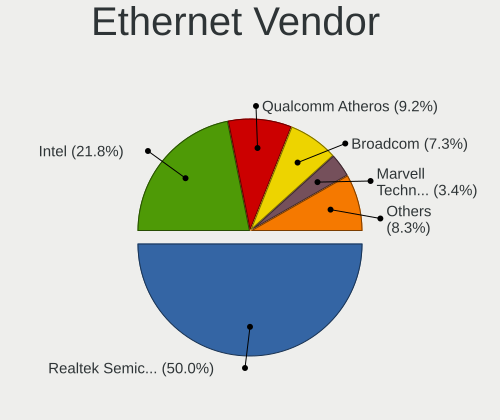

| Vendor                           | Notebooks | Percent |
|----------------------------------|-----------|---------|
| Realtek Semiconductor            | 1060      | 50%     |
| Intel                            | 463       | 21.84%  |
| Qualcomm Atheros                 | 195       | 9.2%    |
| Broadcom                         | 154       | 7.26%   |
| Marvell Technology Group         | 73        | 3.44%   |
| Broadcom Limited                 | 50        | 2.36%   |
| DisplayLink                      | 19        | 0.9%    |
| JMicron Technology               | 17        | 0.8%    |
| Nvidia                           | 14        | 0.66%   |
| Huawei Technologies              | 12        | 0.57%   |
| Xiaomi                           | 9         | 0.42%   |
| Samsung Electronics              | 9         | 0.42%   |
| Attansic Technology              | 9         | 0.42%   |
| VIA Technologies                 | 5         | 0.24%   |
| T & A Mobile Phones              | 5         | 0.24%   |
| QinHeng Electronics              | 5         | 0.24%   |
| ASIX Electronics                 | 4         | 0.19%   |
| Silicon Integrated Systems [SiS] | 3         | 0.14%   |
| Novatel Wireless                 | 2         | 0.09%   |
| LG Electronics                   | 2         | 0.09%   |
| TP-Link                          | 1         | 0.05%   |
| Spreadtrum Communications        | 1         | 0.05%   |
| OPPO Electronics                 | 1         | 0.05%   |
| Naxiang                          | 1         | 0.05%   |
| Motorola PCS                     | 1         | 0.05%   |
| MediaTek                         | 1         | 0.05%   |
| ICS Advent                       | 1         | 0.05%   |
| HMD Global                       | 1         | 0.05%   |
| Davicom Semiconductor            | 1         | 0.05%   |
| Compal Electronics               | 1         | 0.05%   |

Ethernet Model
--------------

Ethernet models

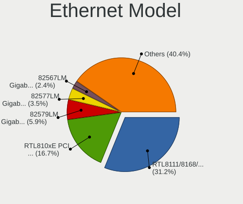

| Model                                                                          | Notebooks | Percent |
|--------------------------------------------------------------------------------|-----------|---------|
| Realtek RTL8111/8168/8211/8411 PCI Express Gigabit Ethernet Controller         | 662       | 31.15%  |
| Realtek RTL810xE PCI Express Fast Ethernet controller                          | 354       | 16.66%  |
| Intel 82579LM Gigabit Network Connection (Lewisville)                          | 126       | 5.93%   |
| Intel 82577LM Gigabit Network Connection                                       | 74        | 3.48%   |
| Intel 82567LM Gigabit Network Connection                                       | 51        | 2.4%    |
| Qualcomm Atheros AR8151 v2.0 Gigabit Ethernet                                  | 38        | 1.79%   |
| Qualcomm Atheros AR8132 Fast Ethernet                                          | 35        | 1.65%   |
| Intel Ethernet Connection I218-LM                                              | 31        | 1.46%   |
| Broadcom NetLink BCM57785 Gigabit Ethernet PCIe                                | 31        | 1.46%   |
| Marvell Group 88E8040 PCI-E Fast Ethernet Controller                           | 30        | 1.41%   |
| Intel 82566MM Gigabit Network Connection                                       | 21        | 0.99%   |
| DisplayLink USB3 to HDMI                                                       | 19        | 0.89%   |
| Qualcomm Atheros QCA8172 Fast Ethernet                                         | 18        | 0.85%   |
| Intel Ethernet Connection I217-LM                                              | 18        | 0.85%   |
| Intel Ethernet Connection (4) I219-LM                                          | 18        | 0.85%   |
| Qualcomm Atheros AR8131 Gigabit Ethernet                                       | 17        | 0.8%    |
| JMicron JMC250 PCI Express Gigabit Ethernet Controller                         | 17        | 0.8%    |
| Intel Ethernet Connection (3) I218-LM                                          | 17        | 0.8%    |
| Marvell Group 88E8055 PCI-E Gigabit Ethernet Controller                        | 16        | 0.75%   |
| Broadcom Limited NetLink BCM5787M Gigabit Ethernet PCI Express                 | 16        | 0.75%   |
| Realtek RTL8153 Gigabit Ethernet Adapter                                       | 15        | 0.71%   |
| Qualcomm Atheros AR8161 Gigabit Ethernet                                       | 15        | 0.71%   |
| Qualcomm Atheros AR8121/AR8113/AR8114 Gigabit or Fast Ethernet                 | 15        | 0.71%   |
| Intel 82579V Gigabit Network Connection                                        | 15        | 0.71%   |
| Broadcom NetLink BCM5787M Gigabit Ethernet PCI Express                         | 15        | 0.71%   |
| Broadcom BCM4401-B0 100Base-TX                                                 | 15        | 0.71%   |
| Realtek RTL-8100/8101L/8139 PCI Fast Ethernet Adapter                          | 14        | 0.66%   |
| Broadcom NetXtreme BCM57786 Gigabit Ethernet PCIe                              | 14        | 0.66%   |
| Broadcom NetLink BCM57780 Gigabit Ethernet PCIe                                | 13        | 0.61%   |
| Intel Ethernet Connection I219-LM                                              | 12        | 0.56%   |
| Intel Ethernet Connection (13) I219-V                                          | 12        | 0.56%   |
| Broadcom NetLink BCM5906M Fast Ethernet PCI Express                            | 12        | 0.56%   |
| Broadcom NetLink BCM5784M Gigabit Ethernet PCIe                                | 12        | 0.56%   |
| Broadcom Limited NetLink BCM57780 Gigabit Ethernet PCIe                        | 12        | 0.56%   |
| Qualcomm Atheros AR8162 Fast Ethernet                                          | 10        | 0.47%   |
| Qualcomm Atheros AR8152 v2.0 Fast Ethernet                                     | 10        | 0.47%   |
| Qualcomm Atheros AR8152 v1.1 Fast Ethernet                                     | 10        | 0.47%   |
| Nvidia MCP79 Ethernet                                                          | 10        | 0.47%   |
| Huawei FOA-LX9                                                                 | 10        | 0.47%   |
| Marvell Group Yukon Optima 88E8059 [PCIe Gigabit Ethernet Controller with AVB] | 9         | 0.42%   |

Net Controller Kind
-------------------

Ethernet, WiFi or modem

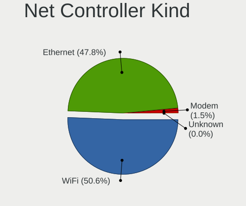

| Kind     | Notebooks | Percent |
|----------|-----------|---------|
| WiFi     | 2176      | 50.64%  |
| Ethernet | 2056      | 47.85%  |
| Modem    | 63        | 1.47%   |
| Unknown  | 2         | 0.05%   |

Used Controller
---------------

Currently used network controller

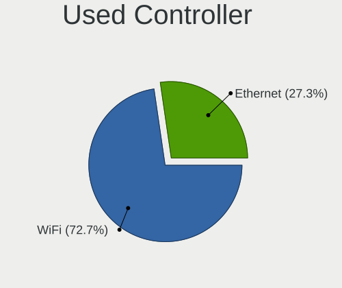

| Kind     | Notebooks | Percent |
|----------|-----------|---------|
| WiFi     | 1762      | 72.69%  |
| Ethernet | 662       | 27.31%  |

NICs
----

Total network controllers on board

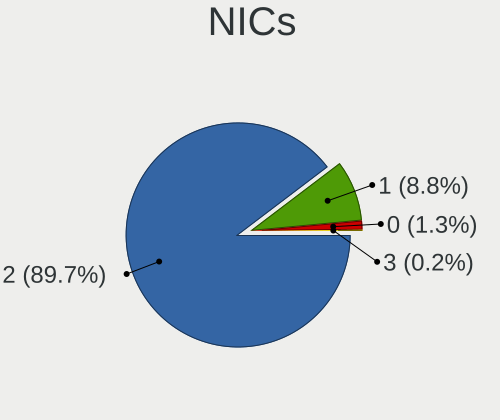

| Total | Notebooks | Percent |
|-------|-----------|---------|
| 2     | 1988      | 89.67%  |
| 1     | 196       | 8.84%   |
| 0     | 29        | 1.31%   |
| 3     | 4         | 0.18%   |

IPv6
----

IPv6 vs IPv4

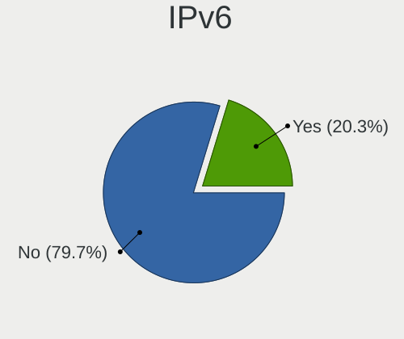

| Used | Notebooks | Percent |
|------|-----------|---------|
| No   | 1865      | 79.7%   |
| Yes  | 475       | 20.3%   |

Bluetooth
---------

Bluetooth Vendor
----------------

Controller vendors

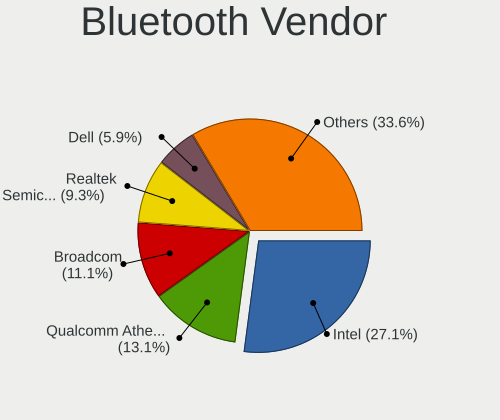

| Vendor                          | Notebooks | Percent |
|---------------------------------|-----------|---------|
| Intel                           | 442       | 27.08%  |
| Qualcomm Atheros Communications | 213       | 13.05%  |
| Broadcom                        | 181       | 11.09%  |
| Realtek Semiconductor           | 151       | 9.25%   |
| Dell                            | 97        | 5.94%   |
| Ralink                          | 85        | 5.21%   |
| Lite-On Technology              | 81        | 4.96%   |
| Foxconn / Hon Hai               | 80        | 4.9%    |
| Hewlett-Packard                 | 76        | 4.66%   |
| IMC Networks                    | 67        | 4.11%   |
| Toshiba                         | 40        | 2.45%   |
| Cambridge Silicon Radio         | 37        | 2.27%   |
| Apple                           | 22        | 1.35%   |
| ASUSTek Computer                | 11        | 0.67%   |
| Askey Computer                  | 10        | 0.61%   |
| Ralink Technology               | 9         | 0.55%   |
| Foxconn International           | 9         | 0.55%   |
| Alps Electric                   | 5         | 0.31%   |
| Chicony Electronics             | 4         | 0.25%   |
| Realtek                         | 3         | 0.18%   |
| Micro Star International        | 3         | 0.18%   |
| Taiyo Yuden                     | 2         | 0.12%   |
| MediaTek                        | 2         | 0.12%   |
| Fujitsu Siemens Computers       | 1         | 0.06%   |
| Fujitsu                         | 1         | 0.06%   |

Bluetooth Model
---------------

Controller models

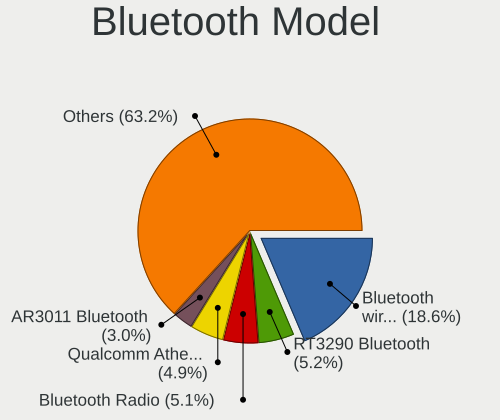

| Model                                               | Notebooks | Percent |
|-----------------------------------------------------|-----------|---------|
| Intel Bluetooth wireless interface                  | 304       | 18.59%  |
| Ralink RT3290 Bluetooth                             | 85        | 5.2%    |
| Realtek Bluetooth Radio                             | 83        | 5.08%   |
| Qualcomm Atheros  Bluetooth Device                  | 80        | 4.89%   |
| Qualcomm Atheros AR3011 Bluetooth                   | 49        | 3%      |
| Dell DW375 Bluetooth Module                         | 48        | 2.94%   |
| Qualcomm Atheros AR3012 Bluetooth 4.0               | 43        | 2.63%   |
| HP Broadcom 2070 Bluetooth Combo                    | 42        | 2.57%   |
| Cambridge Silicon Radio Bluetooth Dongle (HCI mode) | 37        | 2.26%   |
| Intel Bluetooth 9460/9560 Jefferson Peak (JfP)      | 36        | 2.2%    |
| Broadcom BCM2045B (BDC-2.1)                         | 36        | 2.2%    |
| HP Bluetooth 2.0 Interface [Broadcom BCM2045]       | 33        | 2.02%   |
| Lite-On Atheros AR3012 Bluetooth                    | 29        | 1.77%   |
| Lite-On Qualcomm Atheros QCA9377 Bluetooth          | 27        | 1.65%   |
| Intel AX201 Bluetooth                               | 27        | 1.65%   |
| Foxconn / Hon Hai Bluetooth Device                  | 27        | 1.65%   |
| Broadcom HP Portable SoftSailing                    | 27        | 1.65%   |
| Broadcom BCM20702 Bluetooth 4.0 [ThinkPad]          | 26        | 1.59%   |
| Intel Centrino Bluetooth Wireless Transceiver       | 25        | 1.53%   |
| Realtek RTL8821A Bluetooth                          | 23        | 1.41%   |
| Realtek RTL8723B Bluetooth                          | 22        | 1.35%   |
| IMC Networks Bluetooth Device                       | 22        | 1.35%   |
| Realtek  Bluetooth 4.2 Adapter                      | 21        | 1.28%   |
| Intel Centrino Advanced-N 6230 Bluetooth adapter    | 21        | 1.28%   |
| Qualcomm Atheros AR9462 Bluetooth                   | 18        | 1.1%    |
| IMC Networks Bluetooth Radio                        | 17        | 1.04%   |
| Broadcom BCM2045B (BDC-2.1) [Bluetooth Controller]  | 17        | 1.04%   |
| Toshiba Bluetooth Device                            | 16        | 0.98%   |
| Dell BCM20702A0 Bluetooth Module                    | 15        | 0.92%   |
| Foxconn / Hon Hai BCM20702A0                        | 14        | 0.86%   |
| Broadcom BCM2070 Bluetooth Device                   | 14        | 0.86%   |
| Apple Bluetooth Host Controller                     | 14        | 0.86%   |
| Lite-On Bluetooth Device                            | 13        | 0.8%    |
| Intel Wireless-AC 3168 Bluetooth                    | 12        | 0.73%   |
| Intel Bluetooth Device                              | 11        | 0.67%   |
| Dell Wireless 365 Bluetooth                         | 11        | 0.67%   |
| Askey Bluetooth Device                              | 10        | 0.61%   |
| Ralink Motorola BC4 Bluetooth 3.0+HS Adapter        | 9         | 0.55%   |
| IMC Networks Atheros AR3012 Bluetooth 4.0 Adapter   | 9         | 0.55%   |
| Foxconn International BCM43142A0 Bluetooth module   | 9         | 0.55%   |

Sound
-----

Sound Vendor
------------

Sound card vendors

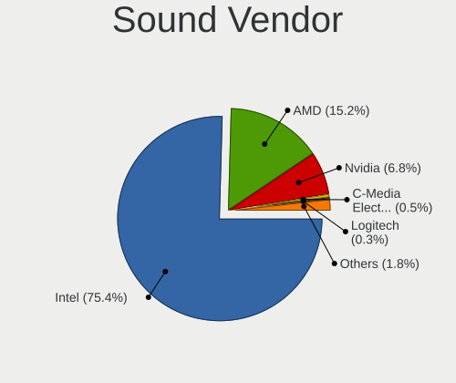

| Vendor                                       | Notebooks | Percent |
|----------------------------------------------|-----------|---------|
| Intel                                        | 1852      | 75.44%  |
| AMD                                          | 372       | 15.15%  |
| Nvidia                                       | 167       | 6.8%    |
| C-Media Electronics                          | 12        | 0.49%   |
| Logitech                                     | 8         | 0.33%   |
| Creative Technology                          | 7         | 0.29%   |
| VIA Technologies                             | 6         | 0.24%   |
| Zoran Co. Personal Media Division (Nogatech) | 3         | 0.12%   |
| Texas Instruments                            | 3         | 0.12%   |
| Silicon Integrated Systems [SiS]             | 3         | 0.12%   |
| ASUSTek Computer                             | 3         | 0.12%   |
| Realtek Semiconductor                        | 2         | 0.08%   |
| Nordic Semiconductor ASA                     | 2         | 0.08%   |
| M-Audio                                      | 2         | 0.08%   |
| Kingston Technology                          | 2         | 0.08%   |
| Hewlett-Packard                              | 2         | 0.08%   |
| ESS Technology                               | 2         | 0.08%   |
| Dell                                         | 2         | 0.08%   |
| Tenx Technology                              | 1         | 0.04%   |
| PreSonus Audio Electronics                   | 1         | 0.04%   |
| Numark                                       | 1         | 0.04%   |
| KTMicro                                      | 1         | 0.04%   |
| Focusrite-Novation                           | 1         | 0.04%   |

Sound Model
-----------

Sound card models

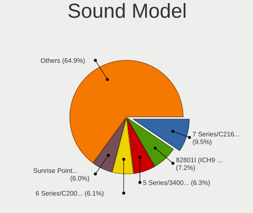

| Model                                                                                             | Notebooks | Percent |
|---------------------------------------------------------------------------------------------------|-----------|---------|
| Intel 7 Series/C216 Chipset Family High Definition Audio Controller                               | 283       | 9.46%   |
| Intel 82801I (ICH9 Family) HD Audio Controller                                                    | 216       | 7.22%   |
| Intel 5 Series/3400 Series Chipset High Definition Audio                                          | 189       | 6.32%   |
| Intel 6 Series/C200 Series Chipset Family High Definition Audio Controller                        | 182       | 6.09%   |
| Intel Sunrise Point-LP HD Audio                                                                   | 178       | 5.95%   |
| AMD FCH Azalia Controller                                                                         | 155       | 5.18%   |
| Intel NM10/ICH7 Family High Definition Audio Controller                                           | 119       | 3.98%   |
| Intel 8 Series HD Audio Controller                                                                | 117       | 3.91%   |
| Intel Haswell-ULT HD Audio Controller                                                             | 116       | 3.88%   |
| Intel 82801H (ICH8 Family) HD Audio Controller                                                    | 104       | 3.48%   |
| Intel Broadwell-U Audio Controller                                                                | 93        | 3.11%   |
| Intel Wildcat Point-LP High Definition Audio Controller                                           | 92        | 3.08%   |
| AMD Kabini HDMI/DP Audio                                                                          | 82        | 2.74%   |
| AMD SBx00 Azalia (Intel HDA)                                                                      | 73        | 2.44%   |
| Intel Atom/Celeron/Pentium Processor x5-E8000/J3xxx/N3xxx Series High Definition Audio Controller | 61        | 2.04%   |
| Intel 8 Series/C220 Series Chipset High Definition Audio Controller                               | 61        | 2.04%   |
| Intel Atom Processor Z36xxx/Z37xxx Series High Definition Audio Controller                        | 58        | 1.94%   |
| Intel Xeon E3-1200 v3/4th Gen Core Processor HD Audio Controller                                  | 52        | 1.74%   |
| AMD Wrestler HDMI Audio                                                                           | 51        | 1.71%   |
| AMD Ryzen HD Audio Controller                                                                     | 44        | 1.47%   |
| AMD Trinity HDMI Audio Controller                                                                 | 36        | 1.2%    |
| AMD Family 15h (Models 60h-6fh) Audio Controller                                                  | 32        | 1.07%   |
| Intel Cannon Lake PCH cAVS                                                                        | 25        | 0.84%   |
| Intel Celeron N3350/Pentium N4200/Atom E3900 Series Audio Cluster                                 | 23        | 0.77%   |
| Nvidia High Definition Audio Controller                                                           | 22        | 0.74%   |
| Intel Celeron/Pentium Silver Processor High Definition Audio                                      | 22        | 0.74%   |
| AMD High Definition Audio Controller                                                              | 22        | 0.74%   |
| Intel 100 Series/C230 Series Chipset Family HD Audio Controller                                   | 21        | 0.7%    |
| Intel Tiger Lake-LP Smart Sound Technology Audio Controller                                       | 20        | 0.67%   |
| AMD Raven/Raven2/Fenghuang HDMI/DP Audio Controller                                               | 20        | 0.67%   |
| AMD RV710/730 HDMI Audio [Radeon HD 4000 series]                                                  | 19        | 0.64%   |
| Nvidia MCP79 High Definition Audio                                                                | 16        | 0.54%   |
| Nvidia GT216 HDMI Audio Controller                                                                | 16        | 0.54%   |
| Nvidia GF108 High Definition Audio Controller                                                     | 16        | 0.54%   |
| AMD Cedar HDMI Audio [Radeon HD 5400/6300/7300 Series]                                            | 16        | 0.54%   |
| Nvidia TU107 GeForce GTX 1650 High Definition Audio Controller                                    | 14        | 0.47%   |
| Intel Cannon Point-LP High Definition Audio Controller                                            | 14        | 0.47%   |
| Nvidia GK208 HDMI/DP Audio Controller                                                             | 13        | 0.43%   |
| Intel Comet Lake PCH-LP cAVS                                                                      | 12        | 0.4%    |
| AMD RS880 HDMI Audio [Radeon HD 4200 Series]                                                      | 12        | 0.4%    |

Memory
------

Memory Vendor
-------------

Memory module vendors

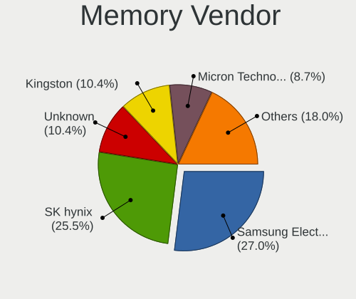

| Vendor                       | Notebooks | Percent |
|------------------------------|-----------|---------|
| Samsung Electronics          | 720       | 26.97%  |
| SK hynix                     | 682       | 25.54%  |
| Unknown                      | 278       | 10.41%  |
| Kingston                     | 277       | 10.37%  |
| Micron Technology            | 232       | 8.69%   |
| Elpida                       | 88        | 3.3%    |
| Nanya Technology             | 81        | 3.03%   |
| Ramaxel Technology           | 73        | 2.73%   |
| A-DATA Technology            | 49        | 1.84%   |
| Crucial                      | 34        | 1.27%   |
| Corsair                      | 19        | 0.71%   |
| Kingmax                      | 16        | 0.6%    |
| ASint Technology             | 14        | 0.52%   |
| 48spaces                     | 12        | 0.45%   |
| Transcend                    | 10        | 0.37%   |
| Unknown (ABCD)               | 9         | 0.34%   |
| Qimonda                      | 8         | 0.3%    |
| Hikvision                    | 8         | 0.3%    |
| Toshiba                      | 6         | 0.22%   |
| Kingmax Semiconductor        | 6         | 0.22%   |
| Apacer                       | 6         | 0.22%   |
| SHARETRONIC                  | 5         | 0.19%   |
| Patriot                      | 4         | 0.15%   |
| Unknown                      | 4         | 0.15%   |
| Unknown (0x0080)             | 3         | 0.11%   |
| Unifosa                      | 2         | 0.07%   |
| PUSKILL                      | 2         | 0.07%   |
| Melco                        | 2         | 0.07%   |
| Infineon                     | 2         | 0.07%   |
| CSX                          | 2         | 0.07%   |
| Axiom                        | 2         | 0.07%   |
| Unknown (0x8325)             | 1         | 0.04%   |
| Teikon                       | 1         | 0.04%   |
| Team                         | 1         | 0.04%   |
| Smart Brazil                 | 1         | 0.04%   |
| PNY                          | 1         | 0.04%   |
| Patriot Memory (PDP Systems) | 1         | 0.04%   |
| Memory Solution              | 1         | 0.04%   |
| Magnum Tech                  | 1         | 0.04%   |
| KingSpec                     | 1         | 0.04%   |

Memory Model
------------

Memory module models

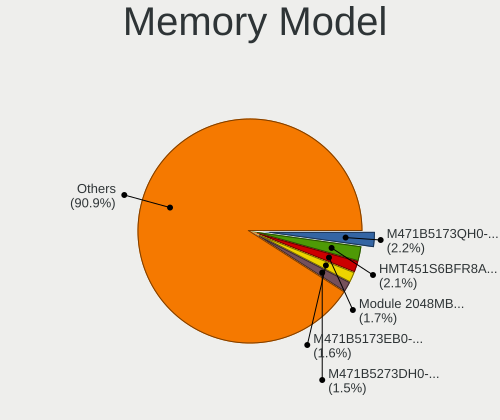

| Model                                                     | Notebooks | Percent |
|-----------------------------------------------------------|-----------|---------|
| Samsung RAM M471B5173QH0-YK0 4GB SODIMM DDR3 1600MT/s     | 63        | 2.18%   |
| SK hynix RAM HMT451S6BFR8A-PB 4GB SODIMM DDR3 1600MT/s    | 62        | 2.15%   |
| Unknown RAM Module 2048MB SODIMM DDR2 667MT/s             | 48        | 1.66%   |
| Samsung RAM M471B5173EB0-YK0 4GB SODIMM DDR3 1600MT/s     | 45        | 1.56%   |
| Samsung RAM M471B5273DH0-CH9 4GB SODIMM DDR3 1600MT/s     | 44        | 1.52%   |
| Samsung RAM M471B5173DB0-YK0 4GB SODIMM DDR3 1600MT/s     | 44        | 1.52%   |
| Samsung RAM M471A5244CB0-CRC 4GB SODIMM DDR4 2667MT/s     | 37        | 1.28%   |
| SK hynix RAM HMT351S6EFR8A-PB 4GB SODIMM DDR3 1600MT/s    | 36        | 1.25%   |
| Samsung RAM M471B5273CH0-CH9 4GB SODIMM DDR3 1334MT/s     | 34        | 1.18%   |
| Samsung RAM M471B5773DH0-CH9 2GB SODIMM DDR3 1600MT/s     | 33        | 1.14%   |
| Samsung RAM M471B5773CHS-CH9 2GB SODIMM DDR3 4199MT/s     | 32        | 1.11%   |
| SK hynix RAM HMT325S6CFR8A-PB 2GB SODIMM DDR3 1600MT/s    | 27        | 0.94%   |
| Samsung RAM M471B5273DH0-CK0 4GB SODIMM DDR3 2400MT/s     | 27        | 0.94%   |
| SK hynix RAM HMT41GS6BFR8A-PB 8GB SODIMM DDR3 2667MT/s    | 26        | 0.9%    |
| Unknown RAM Module 2048MB SODIMM DDR2                     | 25        | 0.87%   |
| SK hynix RAM HMT451S6AFR8A-PB 4GB SODIMM DDR3 1600MT/s    | 25        | 0.87%   |
| SK hynix RAM HMA851S6AFR6N-UH 4GB SODIMM DDR4 2667MT/s    | 25        | 0.87%   |
| Samsung RAM M471B5673FH0-CF8 2048MB SODIMM DDR3 1067MT/s  | 25        | 0.87%   |
| Samsung RAM M471A5244CB0-CTD 4GB SODIMM DDR4 3266MT/s     | 24        | 0.83%   |
| Unknown RAM Module 1024MB SODIMM DDR2 667MT/s             | 23        | 0.8%    |
| SK hynix RAM HMT351S6CFR8C-PB 4GB SODIMM DDR3 1600MT/s    | 23        | 0.8%    |
| Micron RAM 8KTF51264HZ-1G6E1 4GB SODIMM DDR3 1600MT/s     | 23        | 0.8%    |
| Samsung RAM M471B5673FH0-CH9 2048MB SODIMM DDR3 1600MT/s  | 20        | 0.69%   |
| Unknown RAM Module 1024MB SODIMM DDR2                     | 19        | 0.66%   |
| SK hynix RAM HMT351S6EFR8C-PB 4GB SODIMM DDR3 1600MT/s    | 17        | 0.59%   |
| SK hynix RAM HMT325S6EFR8A-PB 2GB SODIMM DDR3 1600MT/s    | 17        | 0.59%   |
| Samsung RAM M471B5273CH0-CK0 4GB SODIMM DDR3 1600MT/s     | 17        | 0.59%   |
| Unknown RAM Module 2048MB SODIMM 800MT/s                  | 16        | 0.55%   |
| A-DATA RAM AM1U16BC4P2-B19H 4GB SODIMM DDR3 1600MT/s      | 16        | 0.55%   |
| SK hynix RAM HMT351S6CFR8C-PB 4096MB SODIMM DDR3 1600MT/s | 15        | 0.52%   |
| Samsung RAM M471B1G73DB0-YK0 8GB SODIMM DDR3 1600MT/s     | 15        | 0.52%   |
| Nanya RAM NT2GC64B88B0NS-CG 2048MB SODIMM DDR3 1334MT/s   | 15        | 0.52%   |
| SK hynix RAM HMT351S6CFR8C-H9 4GB SODIMM DDR3 1333MT/s    | 14        | 0.48%   |
| SK hynix RAM HMT325S6BFR8C-H9 2GB SODIMM DDR3 1600MT/s    | 14        | 0.48%   |
| Samsung RAM M471B5673EH1-CF8 2GB SODIMM 4199MT/s          | 14        | 0.48%   |
| Samsung RAM M471B1G73EB0-YK0 8192MB SODIMM DDR3 1600MT/s  | 14        | 0.48%   |
| Elpida RAM EBJ41UF8BCS0-DJ-F 4GB SODIMM DDR3 1334MT/s     | 14        | 0.48%   |
| SK hynix RAM HMT351S6BFR8C-H9 4GB SODIMM DDR3 1333MT/s    | 13        | 0.45%   |
| SK hynix RAM HMT351S6BFR8C-H9 4GB SODIMM 1334MT/s         | 13        | 0.45%   |
| SK hynix RAM HMA81GS6AFR8N-UH 8GB SODIMM DDR4 2667MT/s    | 13        | 0.45%   |

Memory Kind
-----------

Memory module kinds

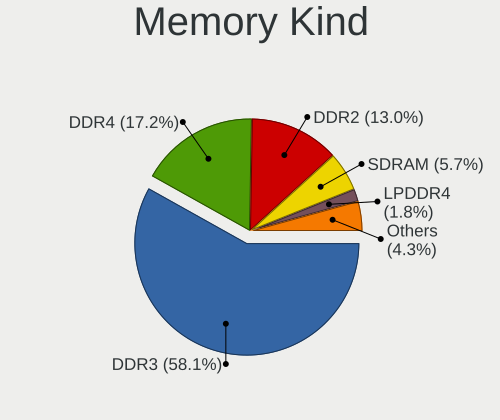

| Kind    | Notebooks | Percent |
|---------|-----------|---------|
| DDR3    | 1311      | 58.11%  |
| DDR4    | 387       | 17.15%  |
| DDR2    | 293       | 12.99%  |
| SDRAM   | 128       | 5.67%   |
| LPDDR4  | 40        | 1.77%   |
| Unknown | 35        | 1.55%   |
| DDR     | 25        | 1.11%   |
| DDR5    | 11        | 0.49%   |
| DRAM    | 10        | 0.44%   |
| LPDDR5  | 8         | 0.35%   |
| LPDDR3  | 8         | 0.35%   |

Memory Form Factor
------------------

Physical design of the memory module

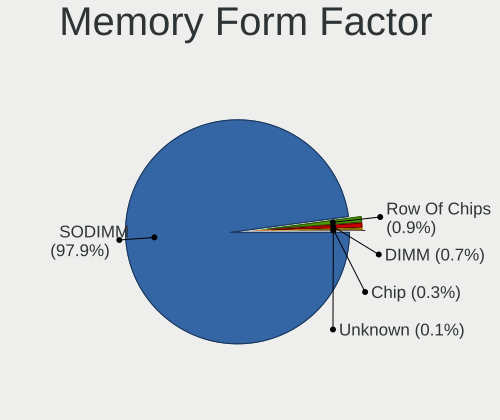

| Name         | Notebooks | Percent |
|--------------|-----------|---------|
| SODIMM       | 2121      | 97.88%  |
| Row Of Chips | 20        | 0.92%   |
| DIMM         | 16        | 0.74%   |
| Chip         | 7         | 0.32%   |
| Unknown      | 3         | 0.14%   |

Memory Size
-----------

Memory module size

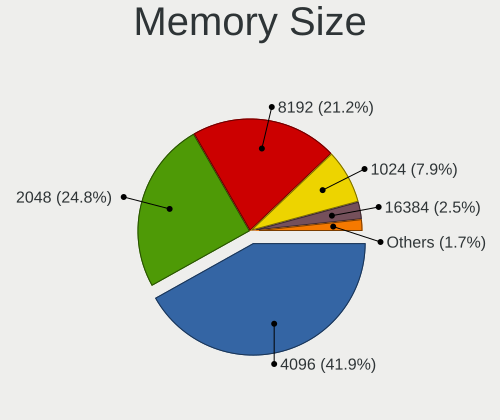

| Size    | Notebooks | Percent |
|---------|-----------|---------|
| 4096    | 1045      | 41.88%  |
| 2048    | 618       | 24.77%  |
| 8192    | 530       | 21.24%  |
| 1024    | 197       | 7.9%    |
| 16384   | 63        | 2.53%   |
| 512     | 29        | 1.16%   |
| 32768   | 11        | 0.44%   |
| Unknown | 2         | 0.08%   |

Memory Speed
------------

Memory module speed

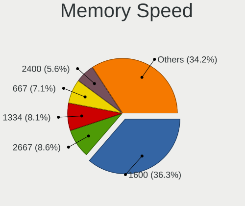

| Speed   | Notebooks | Percent |
|---------|-----------|---------|
| 1600    | 908       | 36.35%  |
| 2667    | 214       | 8.57%   |
| 1334    | 202       | 8.09%   |
| 667     | 178       | 7.13%   |
| 2400    | 141       | 5.64%   |
| 1333    | 141       | 5.64%   |
| 1067    | 102       | 4.08%   |
| 3200    | 91        | 3.64%   |
| Unknown | 81        | 3.24%   |
| 4199    | 76        | 3.04%   |
| 800     | 76        | 3.04%   |
| 2133    | 44        | 1.76%   |
| 2048    | 41        | 1.64%   |
| 975     | 34        | 1.36%   |
| 533     | 34        | 1.36%   |
| 3266    | 24        | 0.96%   |
| 1066    | 24        | 0.96%   |
| 333     | 14        | 0.56%   |
| 8400    | 12        | 0.48%   |
| 1867    | 12        | 0.48%   |
| 1639    | 11        | 0.44%   |
| 5600    | 10        | 0.4%    |
| 6400    | 7         | 0.28%   |
| 4266    | 3         | 0.12%   |
| 2267    | 3         | 0.12%   |
| 1776    | 3         | 0.12%   |
| 400     | 3         | 0.12%   |
| 1866    | 2         | 0.08%   |
| 4800    | 1         | 0.04%   |
| 3733    | 1         | 0.04%   |
| 2134    | 1         | 0.04%   |
| 1400    | 1         | 0.04%   |
| 1200    | 1         | 0.04%   |
| 266     | 1         | 0.04%   |
| 200     | 1         | 0.04%   |

Printers & scanners
-------------------

Printer Vendor
--------------

Printer device vendors

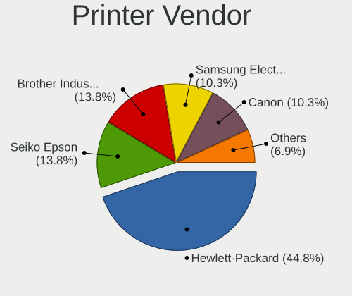

| Vendor                | Notebooks | Percent |
|-----------------------|-----------|---------|
| Hewlett-Packard       | 13        | 44.83%  |
| Seiko Epson           | 4         | 13.79%  |
| Brother Industries    | 4         | 13.79%  |
| Samsung Electronics   | 3         | 10.34%  |
| Canon                 | 3         | 10.34%  |
| Oki Data              | 1         | 3.45%   |
| Lexmark International | 1         | 3.45%   |

Printer Model
-------------

Printer device models

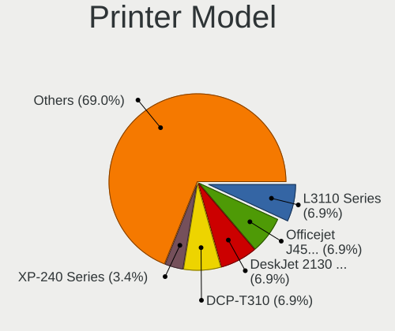

| Model                                   | Notebooks | Percent |
|-----------------------------------------|-----------|---------|
| Seiko Epson L3110 Series                | 2         | 6.9%    |
| HP Officejet J4500 series               | 2         | 6.9%    |
| HP DeskJet 2130 series                  | 2         | 6.9%    |
| Brother DCP-T310                        | 2         | 6.9%    |
| Seiko Epson XP-240 Series               | 1         | 3.45%   |
| Seiko Epson L405 Series                 | 1         | 3.45%   |
| Samsung Xerox Phaser 3117 Laser Printer | 1         | 3.45%   |
| Samsung SCX-4623 Series                 | 1         | 3.45%   |
| Samsung Composite Device                | 1         | 3.45%   |
| Oki Data USB Device                     | 1         | 3.45%   |
| Lexmark International Lexmark X203n     | 1         | 3.45%   |
| HP LaserJet P1102                       | 1         | 3.45%   |
| HP LaserJet 1022                        | 1         | 3.45%   |
| HP LaserJet 1020                        | 1         | 3.45%   |
| HP ENVY 4520 series                     | 1         | 3.45%   |
| HP DeskJet 5550                         | 1         | 3.45%   |
| HP DeskJet 4100 series                  | 1         | 3.45%   |
| HP DeskJet 3630 series                  | 1         | 3.45%   |
| HP DeskJet 2300 series                  | 1         | 3.45%   |
| HP Deskjet 1510                         | 1         | 3.45%   |
| Canon TS5100 series                     | 1         | 3.45%   |
| Canon PIXMA MG2500 Series               | 1         | 3.45%   |
| Canon CAPT USB Device                   | 1         | 3.45%   |
| Brother HL-1110 series                  | 1         | 3.45%   |
| Brother DCP-1610W                       | 1         | 3.45%   |

Scanner Vendor
--------------

Scanner device vendors

| Vendor | Notebooks | Percent |
|--------|-----------|---------|
| Canon  | 2         | 100%    |

Scanner Model
-------------

Scanner device models

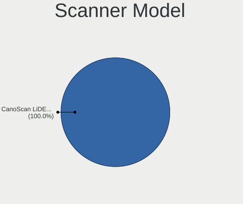

| Model                   | Notebooks | Percent |
|-------------------------|-----------|---------|
| Canon CanoScan LiDE 120 | 2         | 100%    |

Camera
------

Camera Vendor
-------------

Camera device vendors

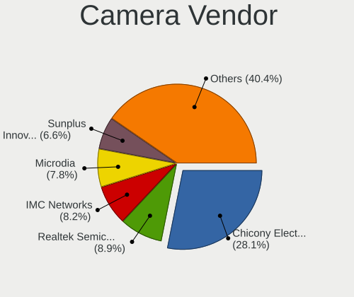

| Vendor                                 | Notebooks | Percent |
|----------------------------------------|-----------|---------|
| Chicony Electronics                    | 527       | 28.14%  |
| Realtek Semiconductor                  | 166       | 8.86%   |
| IMC Networks                           | 153       | 8.17%   |
| Microdia                               | 146       | 7.79%   |
| Sunplus Innovation Technology          | 124       | 6.62%   |
| Suyin                                  | 121       | 6.46%   |
| Bison Electronics                      | 104       | 5.55%   |
| Cheng Uei Precision Industry (Foxlink) | 70        | 3.74%   |
| Syntek                                 | 61        | 3.26%   |
| Quanta                                 | 51        | 2.72%   |
| Silicon Motion                         | 41        | 2.19%   |
| Lite-On Technology                     | 40        | 2.14%   |
| Lenovo                                 | 31        | 1.66%   |
| Ricoh                                  | 29        | 1.55%   |
| Alcor Micro                            | 29        | 1.55%   |
| Primax Electronics                     | 24        | 1.28%   |
| Apple                                  | 20        | 1.07%   |
| ALi                                    | 17        | 0.91%   |
| Z-Star Microelectronics                | 13        | 0.69%   |
| OmniVision Technologies                | 11        | 0.59%   |
| KYE Systems (Mouse Systems)            | 11        | 0.59%   |
| Importek                               | 11        | 0.59%   |
| Luxvisions Innotech Limited            | 10        | 0.53%   |
| Logitech                               | 10        | 0.53%   |
| DigiTech                               | 7         | 0.37%   |
| Acer                                   | 7         | 0.37%   |
| Samsung Electronics                    | 6         | 0.32%   |
| Trust                                  | 5         | 0.27%   |
| Genesys Logic                          | 4         | 0.21%   |
| Intel                                  | 3         | 0.16%   |
| GEMBIRD                                | 3         | 0.16%   |
| Sunplus Technology                     | 2         | 0.11%   |
| SHENZHEN EMEET TECHNOLOGY              | 2         | 0.11%   |
| Nebraska Furniture Mart                | 2         | 0.11%   |
| MacroSilicon                           | 2         | 0.11%   |
| Xiaomi                                 | 1         | 0.05%   |
| webcam                                 | 1         | 0.05%   |
| Spreadtrum Communications              | 1         | 0.05%   |
| Sonix Technology                       | 1         | 0.05%   |
| ShineTech                              | 1         | 0.05%   |

Camera Model
------------

Camera device models

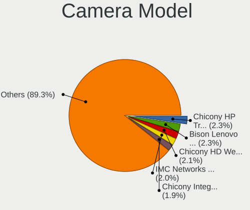

| Model                                                   | Notebooks | Percent |
|---------------------------------------------------------|-----------|---------|
| Chicony HP Truevision HD                                | 44        | 2.35%   |
| Bison Lenovo EasyCamera                                 | 43        | 2.29%   |
| Chicony HD WebCam                                       | 40        | 2.13%   |
| IMC Networks USB2.0 VGA UVC WebCam                      | 38        | 2.03%   |
| Chicony Integrated Camera                               | 35        | 1.87%   |
| Realtek USB Camera                                      | 28        | 1.49%   |
| Suyin Acer/HP Integrated Webcam [CN0314]                | 26        | 1.39%   |
| Chicony USB2.0 VGA UVC WebCam                           | 26        | 1.39%   |
| Sunplus HD WebCam                                       | 25        | 1.33%   |
| IMC Networks USB2.0 HD UVC WebCam                       | 25        | 1.33%   |
| Chicony USB2.0 HD UVC WebCam                            | 25        | 1.33%   |
| Sunplus Integrated_Webcam_HD                            | 24        | 1.28%   |
| Sunplus HP Truevision HD                                | 24        | 1.28%   |
| IMC Networks EasyCamera                                 | 24        | 1.28%   |
| Microdia Integrated Webcam                              | 23        | 1.23%   |
| Chicony FJ Camera                                       | 23        | 1.23%   |
| Microdia Integrated_Webcam_HD                           | 20        | 1.07%   |
| Chicony Integrated HP HD Webcam                         | 19        | 1.01%   |
| Realtek Lenovo EasyCamera                               | 18        | 0.96%   |
| Realtek Integrated Webcam HD                            | 18        | 0.96%   |
| Chicony Lenovo EasyCamera                               | 18        | 0.96%   |
| Syntek Integrated Camera                                | 17        | 0.91%   |
| Syntek EasyCamera                                       | 17        | 0.91%   |
| Realtek Integrated_Webcam_HD                            | 17        | 0.91%   |
| Primax HP HD Webcam [Fixed]                             | 17        | 0.91%   |
| Microdia Integrated HD Webcam                           | 17        | 0.91%   |
| Lite-On HP HD Webcam                                    | 17        | 0.91%   |
| Realtek Integrated Webcam                               | 16        | 0.85%   |
| Chicony TOSHIBA Web Camera - HD                         | 16        | 0.85%   |
| Chicony 2.0M UVC Webcam / CNF7129                       | 16        | 0.85%   |
| Lenovo Integrated Webcam [R5U877]                       | 15        | 0.8%    |
| Chicony EasyCamera                                      | 15        | 0.8%    |
| Cheng Uei Precision Industry (Foxlink) HP Truevision HD | 15        | 0.8%    |
| Chicony HP TrueVision HD Camera                         | 14        | 0.75%   |
| Bison Lenovo Integrated Webcam                          | 14        | 0.75%   |
| ALi Gateway Webcam                                      | 14        | 0.75%   |
| Silicon Motion WebCam SC-0311139N                       | 13        | 0.69%   |
| Chicony VGA Webcam                                      | 13        | 0.69%   |
| Chicony HP Webcam                                       | 13        | 0.69%   |
| Chicony HD WebCam (Acer)                                | 13        | 0.69%   |

Security
--------

Fingerprint Vendor
------------------

Fingerprint sensor vendors

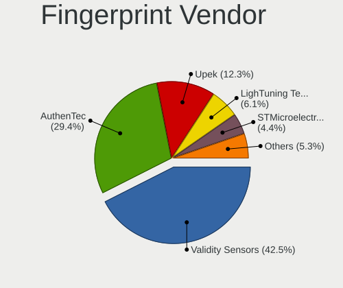

| Vendor                     | Notebooks | Percent |
|----------------------------|-----------|---------|
| Validity Sensors           | 97        | 42.54%  |
| AuthenTec                  | 67        | 29.39%  |
| Upek                       | 28        | 12.28%  |
| LighTuning Technology      | 14        | 6.14%   |
| STMicroelectronics         | 10        | 4.39%   |
| Synaptics                  | 9         | 3.95%   |
| Elan Microelectronics      | 2         | 0.88%   |
| Shenzhen Goodix Technology | 1         | 0.44%   |

Fingerprint Model
-----------------

Fingerprint sensor models

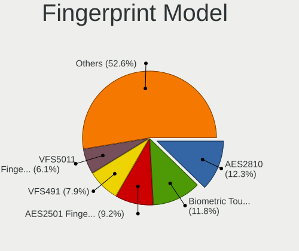

| Model                                                                      | Notebooks | Percent |
|----------------------------------------------------------------------------|-----------|---------|
| AuthenTec AES2810                                                          | 28        | 12.28%  |
| Upek Biometric Touchchip/Touchstrip Fingerprint Sensor                     | 27        | 11.84%  |
| AuthenTec AES2501 Fingerprint Sensor                                       | 21        | 9.21%   |
| Validity Sensors VFS491                                                    | 18        | 7.89%   |
| Validity Sensors VFS5011 Fingerprint Reader                                | 14        | 6.14%   |
| Validity Sensors VFS495 Fingerprint Reader                                 | 14        | 6.14%   |
| Validity Sensors VFS471 Fingerprint Reader                                 | 14        | 6.14%   |
| Validity Sensors VFS451 Fingerprint Reader                                 | 11        | 4.82%   |
| STMicroelectronics Fingerprint Reader                                      | 10        | 4.39%   |
| LighTuning Fingerprint Reader                                              | 9         | 3.95%   |
| AuthenTec Fingerprint Sensor                                               | 9         | 3.95%   |
| Validity Sensors VFS101 Fingerprint Reader                                 | 6         | 2.63%   |
| Validity Sensors VFS 5011 fingerprint sensor                               | 5         | 2.19%   |
| Validity Sensors Fingerprint scanner                                       | 4         | 1.75%   |
| AuthenTec AES1660 Fingerprint Sensor                                       | 4         | 1.75%   |
| AuthenTec AES1600                                                          | 4         | 1.75%   |
| Validity Sensors Swipe Fingerprint Sensor                                  | 3         | 1.32%   |
| Synaptics Prometheus MIS Touch Fingerprint Reader                          | 3         | 1.32%   |
| LighTuning ES603 Swipe Fingerprint Sensor                                  | 3         | 1.32%   |
| Validity Sensors VFS7500 Touch Fingerprint Sensor                          | 2         | 0.88%   |
| Validity Sensors VFS301 Fingerprint Reader                                 | 2         | 0.88%   |
| Validity Sensors Synaptics WBDI                                            | 2         | 0.88%   |
| Synaptics  WBDI                                                            | 2         | 0.88%   |
| Synaptics Metallica MIS Touch Fingerprint Reader                           | 2         | 0.88%   |
| Synaptics FS7604 Touch Fingerprint Sensor with PurePrint                   | 2         | 0.88%   |
| LighTuning EgisTec Touch Fingerprint Sensor                                | 2         | 0.88%   |
| Elan ELAN:Fingerprint                                                      | 2         | 0.88%   |
| Validity Sensors VFS300 Fingerprint Reader                                 | 1         | 0.44%   |
| Validity Sensors Synaptics VFS7552 Touch Fingerprint Sensor with PurePrint | 1         | 0.44%   |
| Upek TCS5B Fingerprint sensor                                              | 1         | 0.44%   |
| Shenzhen Goodix  FingerPrint Device                                        | 1         | 0.44%   |
| AuthenTec AES2550 Fingerprint Sensor                                       | 1         | 0.44%   |

Chipcard Vendor
---------------

Chipcard module vendors

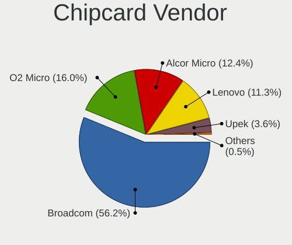

| Vendor                | Notebooks | Percent |
|-----------------------|-----------|---------|
| Broadcom              | 109       | 56.19%  |
| O2 Micro              | 31        | 15.98%  |
| Alcor Micro           | 24        | 12.37%  |
| Lenovo                | 22        | 11.34%  |
| Upek                  | 7         | 3.61%   |
| Gemalto (was Gemplus) | 1         | 0.52%   |

Chipcard Model
--------------

Chipcard module models

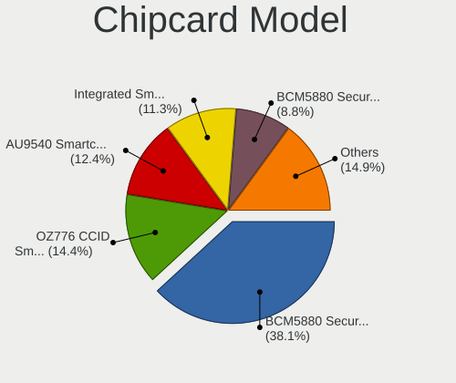

| Model                                                                        | Notebooks | Percent |
|------------------------------------------------------------------------------|-----------|---------|
| Broadcom BCM5880 Secure Applications Processor                               | 74        | 38.14%  |
| O2 Micro OZ776 CCID Smartcard Reader                                         | 28        | 14.43%  |
| Alcor Micro AU9540 Smartcard Reader                                          | 24        | 12.37%  |
| Lenovo Integrated Smart Card Reader                                          | 22        | 11.34%  |
| Broadcom BCM5880 Secure Applications Processor with fingerprint swipe sensor | 17        | 8.76%   |
| Broadcom 5880                                                                | 14        | 7.22%   |
| Upek TouchChip Fingerprint Coprocessor (WBF advanced mode)                   | 7         | 3.61%   |
| Broadcom 58200                                                               | 4         | 2.06%   |
| O2 Micro Oz776 SmartCard Reader                                              | 3         | 1.55%   |
| Gemalto (was Gemplus) Compact Smart Card Reader Writer                       | 1         | 0.52%   |

Unsupported
-----------

Unsupported Devices
-------------------

Total unsupported devices on board

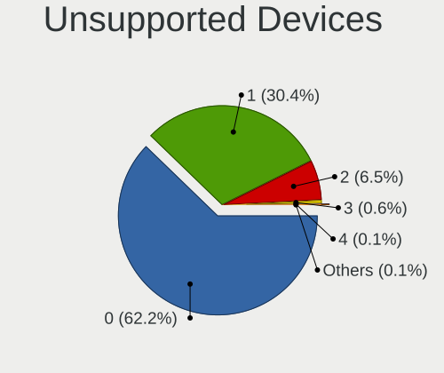

| Total | Notebooks | Percent |
|-------|-----------|---------|
| 0     | 1417      | 62.23%  |
| 1     | 693       | 30.43%  |
| 2     | 148       | 6.5%    |
| 3     | 13        | 0.57%   |
| 4     | 3         | 0.13%   |
| 10    | 1         | 0.04%   |
| 9     | 1         | 0.04%   |
| 5     | 1         | 0.04%   |

Unsupported Device Types
------------------------

Types of unsupported devices

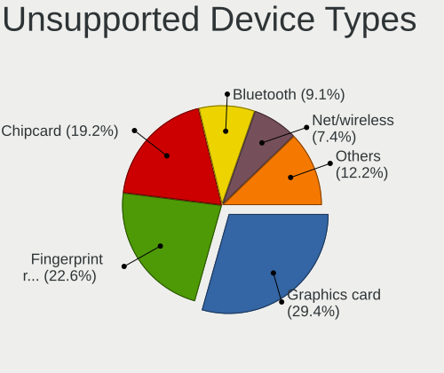

| Type                     | Notebooks | Percent |
|--------------------------|-----------|---------|
| Graphics card            | 296       | 29.37%  |
| Fingerprint reader       | 228       | 22.62%  |
| Chipcard                 | 194       | 19.25%  |
| Bluetooth                | 92        | 9.13%   |
| Net/wireless             | 75        | 7.44%   |
| Storage                  | 47        | 4.66%   |
| Multimedia controller    | 23        | 2.28%   |
| Flash memory             | 17        | 1.69%   |
| Communication controller | 15        | 1.49%   |
| Camera                   | 9         | 0.89%   |
| Sound                    | 4         | 0.4%    |
| Storage/ata              | 2         | 0.2%    |
| Net/ethernet             | 2         | 0.2%    |
| Card reader              | 2         | 0.2%    |
| Storage/raid             | 1         | 0.1%    |
| Network                  | 1         | 0.1%    |

